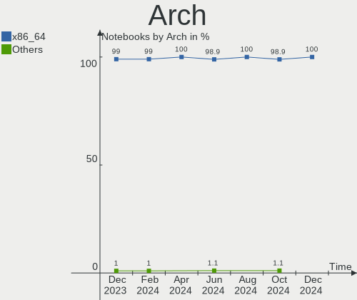
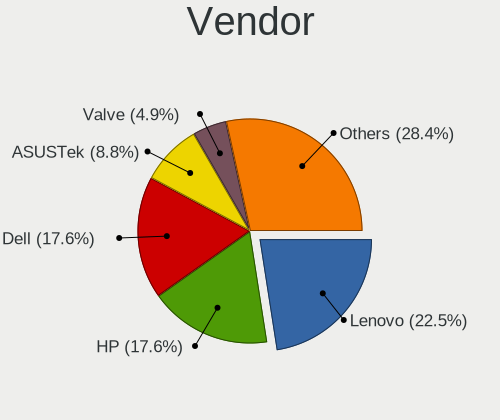
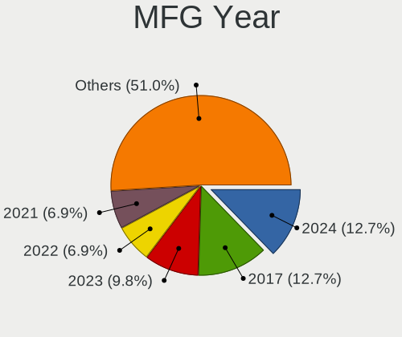
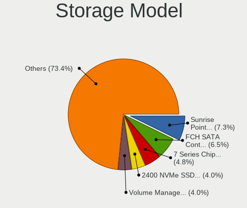
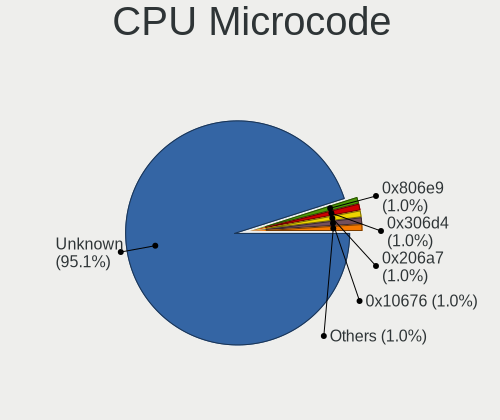
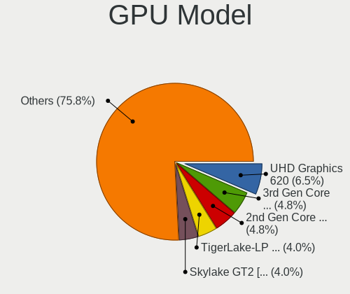
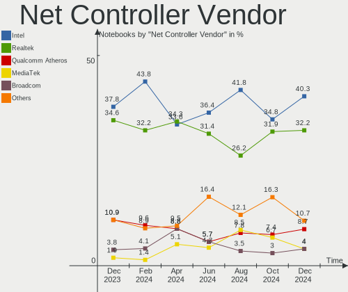
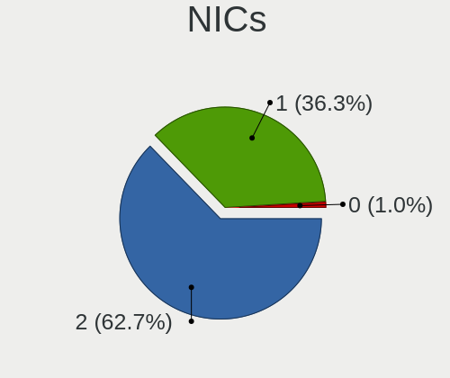
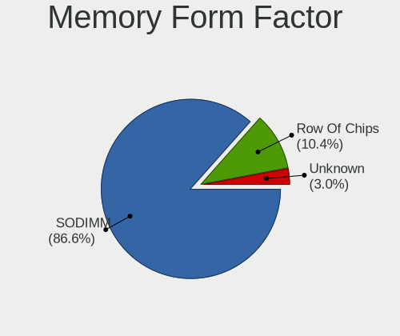

Linux in UK - Hardware Trends (Notebooks)
-----------------------------------------

A project to identify most popular hardware characteristics and track their change
over time based on data collected by Linux users at https://Linux-Hardware.org.

Anyone can contribute to this report by the [hw-probe](https://github.com/linuxhw/hw-probe) tool:

    sudo -E hw-probe -all -upload

Period: Sep, 2022.

Contents
--------

* [ System ](#system)
  - [ OS                       ](#os)
  - [ OS Family                ](#os-family)
  - [ Kernel                   ](#kernel)
  - [ Kernel Family            ](#kernel-family)
  - [ Kernel Major Ver.        ](#kernel-major-ver)
  - [ Arch                     ](#arch)
  - [ DE                       ](#de)
  - [ Display Server           ](#display-server)
  - [ Display Manager          ](#display-manager)
  - [ OS Lang                  ](#os-lang)
  - [ Boot Mode                ](#boot-mode)
  - [ Filesystem               ](#filesystem)
  - [ Part. scheme             ](#part-scheme)
  - [ Dual Boot with Linux/BSD ](#dual-boot-with-linuxbsd)
  - [ Dual Boot (Win)          ](#dual-boot-win)

* [ Board ](#board)
  - [ Vendor                   ](#vendor)
  - [ Model                    ](#model)
  - [ Model Family             ](#model-family)
  - [ MFG Year                 ](#mfg-year)
  - [ Form Factor              ](#form-factor)
  - [ Secure Boot              ](#secure-boot)
  - [ Coreboot                 ](#coreboot)
  - [ RAM Size                 ](#ram-size)
  - [ RAM Used                 ](#ram-used)
  - [ Total Drives             ](#total-drives)
  - [ Has CD-ROM               ](#has-cd-rom)
  - [ Has Ethernet             ](#has-ethernet)
  - [ Has WiFi                 ](#has-wifi)
  - [ Has Bluetooth            ](#has-bluetooth)

* [ Location ](#location)
  - [ Country                  ](#country)
  - [ City                     ](#city)

* [ Drives ](#drives)
  - [ Drive Vendor             ](#drive-vendor)
  - [ Drive Model              ](#drive-model)
  - [ HDD Vendor               ](#hdd-vendor)
  - [ SSD Vendor               ](#ssd-vendor)
  - [ Drive Kind               ](#drive-kind)
  - [ Drive Connector          ](#drive-connector)
  - [ Drive Size               ](#drive-size)
  - [ Space Total              ](#space-total)
  - [ Space Used               ](#space-used)
  - [ Malfunc. Drives          ](#malfunc-drives)
  - [ Malfunc. Drive Vendor    ](#malfunc-drive-vendor)
  - [ Malfunc. HDD Vendor      ](#malfunc-hdd-vendor)
  - [ Malfunc. Drive Kind      ](#malfunc-drive-kind)
  - [ Failed Drives            ](#failed-drives)
  - [ Failed Drive Vendor      ](#failed-drive-vendor)
  - [ Drive Status             ](#drive-status)

* [ Storage controller ](#storage-controller)
  - [ Storage Vendor           ](#storage-vendor)
  - [ Storage Model            ](#storage-model)
  - [ Storage Kind             ](#storage-kind)

* [ Processor ](#processor)
  - [ CPU Vendor               ](#cpu-vendor)
  - [ CPU Model                ](#cpu-model)
  - [ CPU Model Family         ](#cpu-model-family)
  - [ CPU Cores                ](#cpu-cores)
  - [ CPU Sockets              ](#cpu-sockets)
  - [ CPU Threads              ](#cpu-threads)
  - [ CPU Op-Modes             ](#cpu-op-modes)
  - [ CPU Microcode            ](#cpu-microcode)
  - [ CPU Microarch            ](#cpu-microarch)

* [ Graphics ](#graphics)
  - [ GPU Vendor               ](#gpu-vendor)
  - [ GPU Model                ](#gpu-model)
  - [ GPU Combo                ](#gpu-combo)
  - [ GPU Driver               ](#gpu-driver)
  - [ GPU Memory               ](#gpu-memory)

* [ Monitor ](#monitor)
  - [ Monitor Vendor           ](#monitor-vendor)
  - [ Monitor Model            ](#monitor-model)
  - [ Monitor Resolution       ](#monitor-resolution)
  - [ Monitor Diagonal         ](#monitor-diagonal)
  - [ Monitor Width            ](#monitor-width)
  - [ Aspect Ratio             ](#aspect-ratio)
  - [ Monitor Area             ](#monitor-area)
  - [ Pixel Density            ](#pixel-density)
  - [ Multiple Monitors        ](#multiple-monitors)

* [ Network ](#network)
  - [ Net Controller Vendor    ](#net-controller-vendor)
  - [ Net Controller Model     ](#net-controller-model)
  - [ Wireless Vendor          ](#wireless-vendor)
  - [ Wireless Model           ](#wireless-model)
  - [ Ethernet Vendor          ](#ethernet-vendor)
  - [ Ethernet Model           ](#ethernet-model)
  - [ Net Controller Kind      ](#net-controller-kind)
  - [ Used Controller          ](#used-controller)
  - [ NICs                     ](#nics)
  - [ IPv6                     ](#ipv6)

* [ Bluetooth ](#bluetooth)
  - [ Bluetooth Vendor         ](#bluetooth-vendor)
  - [ Bluetooth Model          ](#bluetooth-model)

* [ Sound ](#sound)
  - [ Sound Vendor             ](#sound-vendor)
  - [ Sound Model              ](#sound-model)

* [ Memory ](#memory)
  - [ Memory Vendor            ](#memory-vendor)
  - [ Memory Model             ](#memory-model)
  - [ Memory Kind              ](#memory-kind)
  - [ Memory Form Factor       ](#memory-form-factor)
  - [ Memory Size              ](#memory-size)
  - [ Memory Speed             ](#memory-speed)

* [ Printers & scanners ](#printers--scanners)
  - [ Printer Vendor           ](#printer-vendor)
  - [ Printer Model            ](#printer-model)
  - [ Scanner Vendor           ](#scanner-vendor)
  - [ Scanner Model            ](#scanner-model)

* [ Camera ](#camera)
  - [ Camera Vendor            ](#camera-vendor)
  - [ Camera Model             ](#camera-model)

* [ Security ](#security)
  - [ Fingerprint Vendor       ](#fingerprint-vendor)
  - [ Fingerprint Model        ](#fingerprint-model)
  - [ Chipcard Vendor          ](#chipcard-vendor)
  - [ Chipcard Model           ](#chipcard-model)

* [ Unsupported ](#unsupported)
  - [ Unsupported Devices      ](#unsupported-devices)
  - [ Unsupported Device Types ](#unsupported-device-types)

System
------

OS
--

Installed operating systems

| Name                    | Notebooks | Percent |
|-------------------------|-----------|---------|
| Ubuntu 22.04            | 18        | 17.82%  |
| Pop!_OS 22.04           | 9         | 8.91%   |
| SteamOS 3.3.1           | 7         | 6.93%   |
| OpenMandriva 4.3        | 7         | 6.93%   |
| Fedora 36               | 7         | 6.93%   |
| Arch                    | 6         | 5.94%   |
| KDE neon 20.04          | 4         | 3.96%   |
| Zorin 16                | 3         | 2.97%   |
| OpenMandriva 4.50       | 3         | 2.97%   |
| Debian 11               | 3         | 2.97%   |
| Xubuntu 22.04           | 2         | 1.98%   |
| Ubuntu 20.04            | 2         | 1.98%   |
| Ubuntu 18.04            | 2         | 1.98%   |
| Lubuntu 22.04           | 2         | 1.98%   |
| Linux Mint 21           | 2         | 1.98%   |
| Fedora 37               | 2         | 1.98%   |
| Arch Rolling            | 2         | 1.98%   |
| Zorin 15                | 1         | 0.99%   |
| Xubuntu 20.04           | 1         | 0.99%   |
| Xubuntu 18.04           | 1         | 0.99%   |
| Ubuntu 21.10            | 1         | 0.99%   |
| Puppy 8                 | 1         | 0.99%   |
| OpenMandriva 4.90       | 1         | 0.99%   |
| Nobara 36               | 1         | 0.99%   |
| Manjaro 22.0.0          | 1         | 0.99%   |
| Manjaro 21.3.7          | 1         | 0.99%   |
| Lubuntu 20.04           | 1         | 0.99%   |
| Linux Mint 20.3         | 1         | 0.99%   |
| Linux Mint 20.2         | 1         | 0.99%   |
| Kubuntu 22.04           | 1         | 0.99%   |
| Kali 2022.3             | 1         | 0.99%   |
| Fedora 38               | 1         | 0.99%   |
| EndeavourOS Rolling     | 1         | 0.99%   |
| Elementary 6.1          | 1         | 0.99%   |
| Debian Testing/unstable | 1         | 0.99%   |
| CachyOS Rolling         | 1         | 0.99%   |
| ArcoLinux Rolling       | 1         | 0.99%   |

OS Family
---------

OS without a version

| Name         | Notebooks | Percent |
|--------------|-----------|---------|
| Ubuntu       | 23        | 22.77%  |
| OpenMandriva | 11        | 10.89%  |
| Fedora       | 10        | 9.9%    |
| Pop!_OS      | 9         | 8.91%   |
| Arch         | 8         | 7.92%   |
| SteamOS      | 7         | 6.93%   |
| Zorin        | 4         | 3.96%   |
| Xubuntu      | 4         | 3.96%   |
| Linux Mint   | 4         | 3.96%   |
| KDE neon     | 4         | 3.96%   |
| Debian       | 4         | 3.96%   |
| Lubuntu      | 3         | 2.97%   |
| Manjaro      | 2         | 1.98%   |
| Puppy        | 1         | 0.99%   |
| Nobara       | 1         | 0.99%   |
| Kubuntu      | 1         | 0.99%   |
| Kali         | 1         | 0.99%   |
| EndeavourOS  | 1         | 0.99%   |
| Elementary   | 1         | 0.99%   |
| CachyOS      | 1         | 0.99%   |
| ArcoLinux    | 1         | 0.99%   |

Kernel
------

Version of the Linux kernel

| Version                                            | Notebooks | Percent |
|----------------------------------------------------|-----------|---------|
| 5.15.0-47-generic                                  | 12        | 11.88%  |
| 5.15.0-46-generic                                  | 10        | 9.9%    |
| 5.15.0-48-generic                                  | 9         | 8.91%   |
| 5.19.0-76051900-generic                            | 8         | 7.92%   |
| 5.16.7-desktop-1omv4003                            | 7         | 6.93%   |
| 5.13.0-valve21.1-1-neptune-02211-gc54cda5a36f3     | 7         | 6.93%   |
| 5.19.6-200.fc36.x86_64                             | 3         | 2.97%   |
| 5.19.5-desktop-1omv4090                            | 3         | 2.97%   |
| 5.19.9-arch1-1                                     | 2         | 1.98%   |
| 5.19.9-200.fc36.x86_64                             | 2         | 1.98%   |
| 5.19.6-arch1-1                                     | 2         | 1.98%   |
| 5.10.0-18-amd64                                    | 2         | 1.98%   |
| 6.0.0-0.rc5.20220914git3245cb65fd91.39.fc38.x86_64 | 1         | 0.99%   |
| 5.4.0-125-generic                                  | 1         | 0.99%   |
| 5.4.0-124-generic                                  | 1         | 0.99%   |
| 5.4.0-122-generic                                  | 1         | 0.99%   |
| 5.4.0-110-generic                                  | 1         | 0.99%   |
| 5.4.0-105-generic                                  | 1         | 0.99%   |
| 5.19.9-201.fsync.fc36.x86_64                       | 1         | 0.99%   |
| 5.19.9-051909-generic                              | 1         | 0.99%   |
| 5.19.5-051905-generic                              | 1         | 0.99%   |
| 5.19.4-arch1-g14-1                                 | 1         | 0.99%   |
| 5.19.11-hardened1-1-hardened                       | 1         | 0.99%   |
| 5.19.11-300.fc37.x86_64                            | 1         | 0.99%   |
| 5.19.11-200.fc36.x86_64                            | 1         | 0.99%   |
| 5.19.10-zen1-1-zen                                 | 1         | 0.99%   |
| 5.19.10-arch1-1                                    | 1         | 0.99%   |
| 5.19.10-300.fc37.x86_64                            | 1         | 0.99%   |
| 5.19.10-1-MANJARO                                  | 1         | 0.99%   |
| 5.19.10-1-cachyos-lto                              | 1         | 0.99%   |
| 5.18.12-desktop-3omv4090                           | 1         | 0.99%   |
| 5.18.10-76051810-generic                           | 1         | 0.99%   |
| 5.18.0-kali7-amd64                                 | 1         | 0.99%   |
| 5.18.0-4-amd64                                     | 1         | 0.99%   |
| 5.17.5-300.fc36.x86_64                             | 1         | 0.99%   |
| 5.15.71-1-lts                                      | 1         | 0.99%   |
| 5.15.63-1-lts                                      | 1         | 0.99%   |
| 5.15.60-1-MANJARO                                  | 1         | 0.99%   |
| 5.15.0-50-generic                                  | 1         | 0.99%   |
| 5.15.0-43-generic                                  | 1         | 0.99%   |

Kernel Family
-------------

Linux kernel without a distro release

| Version | Notebooks | Percent |
|---------|-----------|---------|
| 5.15.0  | 33        | 32.67%  |
| 5.13.0  | 9         | 8.91%   |
| 5.19.0  | 8         | 7.92%   |
| 5.16.7  | 7         | 6.93%   |
| 5.19.9  | 6         | 5.94%   |
| 5.4.0   | 5         | 4.95%   |
| 5.19.6  | 5         | 4.95%   |
| 5.19.10 | 5         | 4.95%   |
| 5.19.5  | 4         | 3.96%   |
| 5.19.11 | 3         | 2.97%   |
| 5.10.0  | 3         | 2.97%   |
| 5.18.0  | 2         | 1.98%   |
| 6.0.0   | 1         | 0.99%   |
| 5.19.4  | 1         | 0.99%   |
| 5.18.12 | 1         | 0.99%   |
| 5.18.10 | 1         | 0.99%   |
| 5.17.5  | 1         | 0.99%   |
| 5.15.71 | 1         | 0.99%   |
| 5.15.63 | 1         | 0.99%   |
| 5.15.60 | 1         | 0.99%   |
| 5.11.0  | 1         | 0.99%   |
| 4.19.23 | 1         | 0.99%   |
| 4.15.0  | 1         | 0.99%   |

Kernel Major Ver.
-----------------

Linux kernel major version

| Version | Notebooks | Percent |
|---------|-----------|---------|
| 5.15    | 36        | 35.64%  |
| 5.19    | 32        | 31.68%  |
| 5.13    | 9         | 8.91%   |
| 5.16    | 7         | 6.93%   |
| 5.4     | 5         | 4.95%   |
| 5.18    | 4         | 3.96%   |
| 5.10    | 3         | 2.97%   |
| 6.0     | 1         | 0.99%   |
| 5.17    | 1         | 0.99%   |
| 5.11    | 1         | 0.99%   |
| 4.19    | 1         | 0.99%   |
| 4.15    | 1         | 0.99%   |

Arch
----

OS architecture (x86_64, i586, etc.)

| Name   | Notebooks | Percent |
|--------|-----------|---------|
| x86_64 | 101       | 100%    |

DE
--

Desktop Environment

| Name       | Notebooks | Percent |
|------------|-----------|---------|
| GNOME      | 53        | 52.48%  |
| KDE5       | 28        | 27.72%  |
| XFCE       | 6         | 5.94%   |
| X-Cinnamon | 4         | 3.96%   |
| LXQt       | 3         | 2.97%   |
| Cinnamon   | 2         | 1.98%   |
| Unknown    | 2         | 1.98%   |
| sway       | 1         | 0.99%   |
| Pantheon   | 1         | 0.99%   |
| MATE       | 1         | 0.99%   |

Display Server
--------------

X11 or Wayland

| Name    | Notebooks | Percent |
|---------|-----------|---------|
| X11     | 68        | 67.33%  |
| Wayland | 32        | 31.68%  |
| Unknown | 1         | 0.99%   |

Display Manager
---------------

SDDM, LightDM, etc.

| Name    | Notebooks | Percent |
|---------|-----------|---------|
| Unknown | 32        | 31.68%  |
| GDM3    | 26        | 25.74%  |
| SDDM    | 23        | 22.77%  |
| LightDM | 10        | 9.9%    |
| GDM     | 8         | 7.92%   |
| KDM     | 1         | 0.99%   |
| CDM     | 1         | 0.99%   |

OS Lang
-------

Language

| Lang    | Notebooks | Percent |
|---------|-----------|---------|
| en_GB   | 76        | 75.25%  |
| en_US   | 21        | 20.79%  |
| en_IE   | 1         | 0.99%   |
| en_AU   | 1         | 0.99%   |
| en_AG   | 1         | 0.99%   |
| Unknown | 1         | 0.99%   |

Boot Mode
---------

EFI or BIOS

| Mode | Notebooks | Percent |
|------|-----------|---------|
| EFI  | 55        | 54.46%  |
| BIOS | 46        | 45.54%  |

Filesystem
----------

Type of filesystem

| Type    | Notebooks | Percent |
|---------|-----------|---------|
| Ext4    | 68        | 67.33%  |
| Btrfs   | 21        | 20.79%  |
| Overlay | 9         | 8.91%   |
| Zfs     | 1         | 0.99%   |
| Xfs     | 1         | 0.99%   |
| F2fs    | 1         | 0.99%   |

Part. scheme
------------

Scheme of partitioning

| Type    | Notebooks | Percent |
|---------|-----------|---------|
| Unknown | 51        | 50.5%   |
| GPT     | 44        | 43.56%  |
| MBR     | 6         | 5.94%   |

Dual Boot with Linux/BSD
------------------------

Hosting more than one Linux/BSD

| Dual boot | Notebooks | Percent |
|-----------|-----------|---------|
| No        | 87        | 86.14%  |
| Yes       | 14        | 13.86%  |

Dual Boot (Win)
---------------

Hosting Linux and Windows

| Dual boot | Notebooks | Percent |
|-----------|-----------|---------|
| No        | 69        | 68.32%  |
| Yes       | 32        | 31.68%  |

Board
-----

Vendor
------

Motherboard manufacturer

| Name                | Notebooks | Percent |
|---------------------|-----------|---------|
| Lenovo              | 26        | 25.74%  |
| Dell                | 22        | 21.78%  |
| Hewlett-Packard     | 11        | 10.89%  |
| Valve               | 7         | 6.93%   |
| Acer                | 7         | 6.93%   |
| ASUSTek Computer    | 6         | 5.94%   |
| Toshiba             | 2         | 1.98%   |
| MSI                 | 2         | 1.98%   |
| HUAWEI              | 2         | 1.98%   |
| TUXEDO              | 1         | 0.99%   |
| Timi                | 1         | 0.99%   |
| Tactus              | 1         | 0.99%   |
| Star Labs           | 1         | 0.99%   |
| Samsung Electronics | 1         | 0.99%   |
| Razer               | 1         | 0.99%   |
| Panasonic           | 1         | 0.99%   |
| Packard Bell        | 1         | 0.99%   |
| Jumper              | 1         | 0.99%   |
| HONOR               | 1         | 0.99%   |
| Framework           | 1         | 0.99%   |
| Entroware           | 1         | 0.99%   |
| Clevo               | 1         | 0.99%   |
| Apple               | 1         | 0.99%   |
| Acidanthera         | 1         | 0.99%   |
| Unknown             | 1         | 0.99%   |

Model
-----

Motherboard model

| Name                                               | Notebooks | Percent |
|----------------------------------------------------|-----------|---------|
| Valve Jupiter                                      | 7         | 6.93%   |
| Lenovo E50-80 80J2                                 | 2         | 1.98%   |
| Dell XPS 15 9510                                   | 2         | 1.98%   |
| TUXEDO InfinityBook Pro 14 v4                      | 1         | 0.99%   |
| Toshiba Satellite NB10t-A-101                      | 1         | 0.99%   |
| Toshiba Satellite A660                             | 1         | 0.99%   |
| Timi RedmiBook Pro 15S                             | 1         | 0.99%   |
| Tactus GeoBook 110                                 | 1         | 0.99%   |
| Star Labs Lite                                     | 1         | 0.99%   |
| Samsung 950XCJ/951XCJ/950XCR                       | 1         | 0.99%   |
| Razer Blade 15 Base Model (Early 2021) - RZ09-0369 | 1         | 0.99%   |
| Panasonic CF-53JAWZYDE                             | 1         | 0.99%   |
| Packard Bell EasyNote TS44HR                       | 1         | 0.99%   |
| MSI GT72S 6QE                                      | 1         | 0.99%   |
| MSI GL73 8RD                                       | 1         | 0.99%   |
| Lenovo Z70-80 80FG                                 | 1         | 0.99%   |
| Lenovo Yoga 3 14 80JH                              | 1         | 0.99%   |
| Lenovo ThinkPad T530 2429F33                       | 1         | 0.99%   |
| Lenovo ThinkPad T470s 20HGA039UK                   | 1         | 0.99%   |
| Lenovo ThinkPad T440s 20ARA0YL00                   | 1         | 0.99%   |
| Lenovo ThinkPad T440p 20AWS12002                   | 1         | 0.99%   |
| Lenovo ThinkPad T430 23476Y7                       | 1         | 0.99%   |
| Lenovo ThinkPad T400 6474W7T                       | 1         | 0.99%   |
| Lenovo ThinkPad SL500 27464DG                      | 1         | 0.99%   |
| Lenovo ThinkPad S1 Yoga 12 20DKA00B00              | 1         | 0.99%   |
| Lenovo ThinkPad P14s Gen 2a 21A0CTO1WW             | 1         | 0.99%   |
| Lenovo ThinkBook 15-IIL 20SM                       | 1         | 0.99%   |
| Lenovo ThinkBook 15 G2 ITL 20VE                    | 1         | 0.99%   |
| Lenovo ThinkBook 14 G2 ITL 20VD                    | 1         | 0.99%   |
| Lenovo ThinkBook 13s-IML 20RR                      | 1         | 0.99%   |
| Lenovo Legion 5-15ACH6H 82JU                       | 1         | 0.99%   |
| Lenovo Legion 5 15IAH7H 82RB                       | 1         | 0.99%   |
| Lenovo IdeaPad S130-11IGM 81J1                     | 1         | 0.99%   |
| Lenovo IdeaPad L340-15IRH Gaming 81LK              | 1         | 0.99%   |
| Lenovo IdeaPad 5 15ARE05 81YQ                      | 1         | 0.99%   |
| Lenovo IdeaPad 300-15ISK 80Q7                      | 1         | 0.99%   |
| Lenovo IdeaPad 110-15ACL 80TJ                      | 1         | 0.99%   |
| Lenovo G570 4334                                   | 1         | 0.99%   |
| Lenovo Flex 2-14 20404                             | 1         | 0.99%   |
| Jumper EZbook                                      | 1         | 0.99%   |

Model Family
------------

Motherboard model prefix

| Name                   | Notebooks | Percent |
|------------------------|-----------|---------|
| Lenovo ThinkPad        | 9         | 8.91%   |
| Valve Jupiter          | 7         | 6.93%   |
| Dell Inspiron          | 7         | 6.93%   |
| Dell Latitude          | 6         | 5.94%   |
| Lenovo IdeaPad         | 5         | 4.95%   |
| Dell XPS               | 5         | 4.95%   |
| Acer Aspire            | 5         | 4.95%   |
| Lenovo ThinkBook       | 4         | 3.96%   |
| Toshiba Satellite      | 2         | 1.98%   |
| Lenovo Legion          | 2         | 1.98%   |
| Lenovo E50-80          | 2         | 1.98%   |
| HP ProBook             | 2         | 1.98%   |
| HP Laptop              | 2         | 1.98%   |
| HP EliteBook           | 2         | 1.98%   |
| Dell Precision         | 2         | 1.98%   |
| Acer Swift             | 2         | 1.98%   |
| TUXEDO InfinityBook    | 1         | 0.99%   |
| Timi RedmiBook         | 1         | 0.99%   |
| Tactus GeoBook         | 1         | 0.99%   |
| Star Labs Lite         | 1         | 0.99%   |
| Samsung 950XCJ         | 1         | 0.99%   |
| Razer Blade            | 1         | 0.99%   |
| Panasonic CF-53JAWZYDE | 1         | 0.99%   |
| Packard Bell EasyNote  | 1         | 0.99%   |
| MSI GT72S              | 1         | 0.99%   |
| MSI GL73               | 1         | 0.99%   |
| Lenovo Z70-80          | 1         | 0.99%   |
| Lenovo Yoga            | 1         | 0.99%   |
| Lenovo G570            | 1         | 0.99%   |
| Lenovo Flex            | 1         | 0.99%   |
| Jumper EZbook          | 1         | 0.99%   |
| HUAWEI HKD-WXX         | 1         | 0.99%   |
| HUAWEI BOM-WXX9        | 1         | 0.99%   |
| HONOR NMH-WCX9         | 1         | 0.99%   |
| HP ZBook               | 1         | 0.99%   |
| HP Pavilion            | 1         | 0.99%   |
| HP OMEN                | 1         | 0.99%   |
| HP Compaq              | 1         | 0.99%   |
| HP 255                 | 1         | 0.99%   |
| Framework Laptop       | 1         | 0.99%   |

MFG Year
--------

Motherboard manufacture year

| Year | Notebooks | Percent |
|------|-----------|---------|
| 2022 | 17        | 16.83%  |
| 2021 | 13        | 12.87%  |
| 2018 | 10        | 9.9%    |
| 2020 | 7         | 6.93%   |
| 2017 | 7         | 6.93%   |
| 2015 | 7         | 6.93%   |
| 2014 | 7         | 6.93%   |
| 2012 | 7         | 6.93%   |
| 2019 | 6         | 5.94%   |
| 2013 | 6         | 5.94%   |
| 2016 | 4         | 3.96%   |
| 2008 | 3         | 2.97%   |
| 2011 | 2         | 1.98%   |
| 2009 | 2         | 1.98%   |
| 2007 | 2         | 1.98%   |
| 2010 | 1         | 0.99%   |

Form Factor
-----------

Physical design of the computer

| Name     | Notebooks | Percent |
|----------|-----------|---------|
| Notebook | 101       | 100%    |

Secure Boot
-----------

Enabled or disabled

| State    | Notebooks | Percent |
|----------|-----------|---------|
| Disabled | 91        | 90.1%   |
| Enabled  | 10        | 9.9%    |

Coreboot
--------

Have coreboot on board

| Used | Notebooks | Percent |
|------|-----------|---------|
| No   | 101       | 100%    |

RAM Size
--------

Total RAM memory

| Size in GB  | Notebooks | Percent |
|-------------|-----------|---------|
| 4.01-8.0    | 33        | 32.67%  |
| 16.01-24.0  | 23        | 22.77%  |
| 8.01-16.0   | 21        | 20.79%  |
| 3.01-4.0    | 10        | 9.9%    |
| 32.01-64.0  | 7         | 6.93%   |
| 1.01-2.0    | 3         | 2.97%   |
| 64.01-256.0 | 2         | 1.98%   |
| 24.01-32.0  | 1         | 0.99%   |
| 2.01-3.0    | 1         | 0.99%   |

RAM Used
--------

Used RAM memory

| Used GB    | Notebooks | Percent |
|------------|-----------|---------|
| 2.01-3.0   | 31        | 30.69%  |
| 1.01-2.0   | 31        | 30.69%  |
| 3.01-4.0   | 16        | 15.84%  |
| 4.01-8.0   | 15        | 14.85%  |
| 8.01-16.0  | 4         | 3.96%   |
| 0.51-1.0   | 2         | 1.98%   |
| 16.01-24.0 | 1         | 0.99%   |
| 0.01-0.5   | 1         | 0.99%   |

Total Drives
------------

Number of drives on board

| Drives | Notebooks | Percent |
|--------|-----------|---------|
| 1      | 70        | 69.31%  |
| 2      | 27        | 26.73%  |
| 3      | 4         | 3.96%   |

Has CD-ROM
----------

Has CD-ROM on board

| Presented | Notebooks | Percent |
|-----------|-----------|---------|
| No        | 70        | 69.31%  |
| Yes       | 31        | 30.69%  |

Has Ethernet
------------

Has Ethernet on board

| Presented | Notebooks | Percent |
|-----------|-----------|---------|
| Yes       | 70        | 69.31%  |
| No        | 31        | 30.69%  |

Has WiFi
--------

Has WiFi module

| Presented | Notebooks | Percent |
|-----------|-----------|---------|
| Yes       | 100       | 99.01%  |
| No        | 1         | 0.99%   |

Has Bluetooth
-------------

Has Bluetooth module

| Presented | Notebooks | Percent |
|-----------|-----------|---------|
| Yes       | 87        | 86.14%  |
| No        | 14        | 13.86%  |

Location
--------

Country
-------

Geographic location (country)

| Country | Notebooks | Percent |
|---------|-----------|---------|
| UK      | 101       | 100%    |

City
----

Geographic location (city)

| City                | Notebooks | Percent |
|---------------------|-----------|---------|
| London              | 8         | 7.92%   |
| York                | 3         | 2.97%   |
| Islington           | 3         | 2.97%   |
| Flint               | 3         | 2.97%   |
| Falkirk             | 3         | 2.97%   |
| Bristol             | 3         | 2.97%   |
| Tamworth            | 2         | 1.98%   |
| Rotherham           | 2         | 1.98%   |
| Leeds               | 2         | 1.98%   |
| Glasgow             | 2         | 1.98%   |
| Croydon             | 2         | 1.98%   |
| Camden              | 2         | 1.98%   |
| Birkenhead          | 2         | 1.98%   |
| Ashford             | 2         | 1.98%   |
| Yeovil              | 1         | 0.99%   |
| Wimbledon           | 1         | 0.99%   |
| West Cowes          | 1         | 0.99%   |
| Wembley             | 1         | 0.99%   |
| Weaverham           | 1         | 0.99%   |
| Warwick             | 1         | 0.99%   |
| Walthamstow         | 1         | 0.99%   |
| Tring               | 1         | 0.99%   |
| Slough              | 1         | 0.99%   |
| Runcorn             | 1         | 0.99%   |
| Ruislip             | 1         | 0.99%   |
| Rugby               | 1         | 0.99%   |
| Paisley             | 1         | 0.99%   |
| Ottery St Mary      | 1         | 0.99%   |
| Oldham              | 1         | 0.99%   |
| Nottingham          | 1         | 0.99%   |
| Newtownabbey        | 1         | 0.99%   |
| Newtown             | 1         | 0.99%   |
| Newport             | 1         | 0.99%   |
| Newcastle upon Tyne | 1         | 0.99%   |
| Merthyr Tydfil      | 1         | 0.99%   |
| Mansfield           | 1         | 0.99%   |
| Manchester          | 1         | 0.99%   |
| Maidenhead          | 1         | 0.99%   |
| Lytham St Annes     | 1         | 0.99%   |
| Luton               | 1         | 0.99%   |

Drives
------

Drive Vendor
------------

Hard drive vendors

| Vendor                      | Notebooks | Drives | Percent |
|-----------------------------|-----------|--------|---------|
| Samsung Electronics         | 19        | 21     | 14.73%  |
| WDC                         | 12        | 12     | 9.3%    |
| Seagate                     | 11        | 11     | 8.53%   |
| SanDisk                     | 10        | 11     | 7.75%   |
| Unknown                     | 7         | 7      | 5.43%   |
| Crucial                     | 7         | 9      | 5.43%   |
| Toshiba                     | 6         | 6      | 4.65%   |
| Micron Technology           | 6         | 6      | 4.65%   |
| Intel                       | 5         | 5      | 3.88%   |
| SK hynix                    | 4         | 4      | 3.1%    |
| PNY                         | 4         | 4      | 3.1%    |
| HGST                        | 4         | 5      | 3.1%    |
| Phison                      | 3         | 3      | 2.33%   |
| KIOXIA                      | 3         | 3      | 2.33%   |
| Kingston                    | 3         | 3      | 2.33%   |
| Silicon Motion              | 2         | 2      | 1.55%   |
| O2 Micro                    | 2         | 2      | 1.55%   |
| Kingston Technology Company | 2         | 2      | 1.55%   |
| A-DATA Technology           | 2         | 3      | 1.55%   |
| Transcend                   | 1         | 1      | 0.78%   |
| Team                        | 1         | 1      | 0.78%   |
| Star                        | 1         | 1      | 0.78%   |
| SSSTC                       | 1         | 1      | 0.78%   |
| SPCC                        | 1         | 1      | 0.78%   |
| Realtek                     | 1         | 1      | 0.78%   |
| Phison Electronics          | 1         | 1      | 0.78%   |
| NGFF                        | 1         | 1      | 0.78%   |
| Micron/Crucial Technology   | 1         | 1      | 0.78%   |
| Lite-On                     | 1         | 1      | 0.78%   |
| Hitachi                     | 1         | 1      | 0.78%   |
| GOODRAM                     | 1         | 1      | 0.78%   |
| Corsair                     | 1         | 1      | 0.78%   |
| China                       | 1         | 1      | 0.78%   |
| ASMT                        | 1         | 1      | 0.78%   |
| ASENNO                      | 1         | 1      | 0.78%   |
| Unknown                     | 1         | 1      | 0.78%   |

Drive Model
-----------

Hard drive models

| Model                                   | Notebooks | Percent |
|-----------------------------------------|-----------|---------|
| Unknown MMC Card  512GB                 | 3         | 2.24%   |
| Phison NVMe SSD Drive 512GB             | 3         | 2.24%   |
| WDC WDS500G2B0A-00SM50 500GB SSD        | 2         | 1.49%   |
| WDC WD10JPCX-24UE4T0 1TB                | 2         | 1.49%   |
| Toshiba MK3263GSX 320GB                 | 2         | 1.49%   |
| Seagate ST2000LM003 HN-M201RAD 2TB      | 2         | 1.49%   |
| Samsung SSD 980 PRO 1TB                 | 2         | 1.49%   |
| Samsung NVMe SSD Drive 256GB            | 2         | 1.49%   |
| Samsung MZALQ256HAJD-000L2 256GB        | 2         | 1.49%   |
| PNY CS900 240GB SSD                     | 2         | 1.49%   |
| O2 Micro E2M2 64GB                      | 2         | 1.49%   |
| Kingston Company OM3PDP3 NVMe SSD 512GB | 2         | 1.49%   |
| Crucial CT512MX100SSD1 512GB            | 2         | 1.49%   |
| Crucial CT1000MX500SSD1 1TB             | 2         | 1.49%   |
| WDC WDS500G2B0B-00YS70 500GB SSD        | 1         | 0.75%   |
| WDC WDS500G2B0A 500GB SSD               | 1         | 0.75%   |
| WDC WD5000BPVT-24HXZT3 500GB            | 1         | 0.75%   |
| WDC WD3200BEVT-22A23T0 320GB            | 1         | 0.75%   |
| WDC WD2500BEKT-75A25T0 250GB            | 1         | 0.75%   |
| WDC WD10SPSX-60A6WT0 1TB                | 1         | 0.75%   |
| WDC WD10JPVX-22JC3T0 1TB                | 1         | 0.75%   |
| WDC PC SN530 SDBPNPZ-256G-1027 256GB    | 1         | 0.75%   |
| Unknown MMC Card  64GB                  | 1         | 0.75%   |
| Unknown MMC Card  16GB                  | 1         | 0.75%   |
| Unknown ED2S5  128GB                    | 1         | 0.75%   |
| Unknown C500 256GB SSD                  | 1         | 0.75%   |
| Transcend TS240GMTS420S 240GB SSD       | 1         | 0.75%   |
| Toshiba THNSFJ256GCSU 256GB SSD         | 1         | 0.75%   |
| Toshiba NVMe SSD Drive 512GB            | 1         | 0.75%   |
| Toshiba MQ04ABF100 1TB                  | 1         | 0.75%   |
| Toshiba MQ01ABD100 1TB                  | 1         | 0.75%   |
| Team TM8FP6512G 512GB                   | 1         | 0.75%   |
| Star Drive SATA SSD 240GB               | 1         | 0.75%   |
| SSSTC CL4-3D256-Q11 NVMe 256GB          | 1         | 0.75%   |
| SPCC Solid State Disk 1024GB            | 1         | 0.75%   |
| SK hynix PC711 NVMe 1TB                 | 1         | 0.75%   |
| SK hynix PC611 NVMe 256GB               | 1         | 0.75%   |
| SK hynix HFS256G39TND-N210A 256GB SSD   | 1         | 0.75%   |
| SK hynix BC711 NVMe 512GB               | 1         | 0.75%   |
| Silicon Motion NVMe SSD Drive 256GB     | 1         | 0.75%   |

HDD Vendor
----------

Hard disk drive vendors

| Vendor              | Notebooks | Drives | Percent |
|---------------------|-----------|--------|---------|
| Seagate             | 11        | 11     | 37.93%  |
| WDC                 | 7         | 7      | 24.14%  |
| Toshiba             | 4         | 4      | 13.79%  |
| HGST                | 4         | 5      | 13.79%  |
| Samsung Electronics | 1         | 1      | 3.45%   |
| Hitachi             | 1         | 1      | 3.45%   |
| ASMT                | 1         | 1      | 3.45%   |

SSD Vendor
----------

Solid state drive vendors

| Vendor              | Notebooks | Drives | Percent |
|---------------------|-----------|--------|---------|
| Crucial             | 6         | 8      | 16.22%  |
| WDC                 | 4         | 4      | 10.81%  |
| PNY                 | 4         | 4      | 10.81%  |
| SanDisk             | 3         | 3      | 8.11%   |
| Samsung Electronics | 3         | 4      | 8.11%   |
| Kingston            | 3         | 3      | 8.11%   |
| Unknown             | 1         | 1      | 2.7%    |
| Transcend           | 1         | 1      | 2.7%    |
| Toshiba             | 1         | 1      | 2.7%    |
| Star                | 1         | 1      | 2.7%    |
| SPCC                | 1         | 1      | 2.7%    |
| SK hynix            | 1         | 1      | 2.7%    |
| NGFF                | 1         | 1      | 2.7%    |
| Micron Technology   | 1         | 1      | 2.7%    |
| Intel               | 1         | 1      | 2.7%    |
| GOODRAM             | 1         | 1      | 2.7%    |
| Corsair             | 1         | 1      | 2.7%    |
| China               | 1         | 1      | 2.7%    |
| ASENNO              | 1         | 1      | 2.7%    |
| A-DATA Technology   | 1         | 1      | 2.7%    |

Drive Kind
----------

HDD or SSD

| Kind | Notebooks | Drives | Percent |
|------|-----------|--------|---------|
| NVMe | 49        | 57     | 39.84%  |
| SSD  | 36        | 40     | 29.27%  |
| HDD  | 29        | 30     | 23.58%  |
| MMC  | 9         | 9      | 7.32%   |

Drive Connector
---------------

SATA, SAS, NVMe, etc.

| Type | Notebooks | Drives | Percent |
|------|-----------|--------|---------|
| SATA | 58        | 69     | 49.15%  |
| NVMe | 49        | 56     | 41.53%  |
| MMC  | 9         | 9      | 7.63%   |
| SAS  | 2         | 2      | 1.69%   |

Drive Size
----------

Size of hard drive

| Size in TB | Notebooks | Drives | Percent |
|------------|-----------|--------|---------|
| 0.01-0.5   | 41        | 44     | 63.08%  |
| 0.51-1.0   | 18        | 20     | 27.69%  |
| 1.01-2.0   | 6         | 6      | 9.23%   |

Space Total
-----------

Amount of disk space available on the file system

| Size in GB     | Notebooks | Percent |
|----------------|-----------|---------|
| 101-250        | 26        | 25.74%  |
| 251-500        | 25        | 24.75%  |
| 501-1000       | 14        | 13.86%  |
| 1001-2000      | 8         | 7.92%   |
| 1-20           | 7         | 6.93%   |
| 21-50          | 6         | 5.94%   |
| 51-100         | 6         | 5.94%   |
| Unknown        | 5         | 4.95%   |
| More than 3000 | 3         | 2.97%   |
| 2001-3000      | 1         | 0.99%   |

Space Used
----------

Amount of used disk space

| Used GB   | Notebooks | Percent |
|-----------|-----------|---------|
| 1-20      | 38        | 37.62%  |
| 21-50     | 21        | 20.79%  |
| 101-250   | 17        | 16.83%  |
| 51-100    | 8         | 7.92%   |
| 251-500   | 6         | 5.94%   |
| Unknown   | 5         | 4.95%   |
| 501-1000  | 3         | 2.97%   |
| 1001-2000 | 2         | 1.98%   |
| 2001-3000 | 1         | 0.99%   |

Malfunc. Drives
---------------

Drive models with a malfunction

| Model                                          | Notebooks | Drives | Percent |
|------------------------------------------------|-----------|--------|---------|
| SK hynix HFS256G39TND-N210A 256GB SSD          | 1         | 1      | 14.29%  |
| Seagate ST9500325AS 500GB                      | 1         | 1      | 14.29%  |
| Seagate ST2000LM003 HN-M201RAD 2TB             | 1         | 1      | 14.29%  |
| Seagate ST1000LM035-1RK172 1TB                 | 1         | 1      | 14.29%  |
| Micron Technology 1100_MTFDDAV256TBN 256GB SSD | 1         | 1      | 14.29%  |
| Hitachi HTS54505 500GB                         | 1         | 1      | 14.29%  |
| HGST HTS725050A7E630 500GB                     | 1         | 2      | 14.29%  |

Malfunc. Drive Vendor
---------------------

Vendors of faulty drives

| Vendor            | Notebooks | Drives | Percent |
|-------------------|-----------|--------|---------|
| Seagate           | 3         | 3      | 42.86%  |
| SK hynix          | 1         | 1      | 14.29%  |
| Micron Technology | 1         | 1      | 14.29%  |
| Hitachi           | 1         | 1      | 14.29%  |
| HGST              | 1         | 2      | 14.29%  |

Malfunc. HDD Vendor
-------------------

Vendors of faulty HDD drives

| Vendor  | Notebooks | Drives | Percent |
|---------|-----------|--------|---------|
| Seagate | 3         | 3      | 60%     |
| Hitachi | 1         | 1      | 20%     |
| HGST    | 1         | 2      | 20%     |

Malfunc. Drive Kind
-------------------

Kinds of faulty drives

| Kind | Notebooks | Drives | Percent |
|------|-----------|--------|---------|
| HDD  | 5         | 6      | 71.43%  |
| SSD  | 2         | 2      | 28.57%  |

Failed Drives
-------------

Failed drive models

Zero info for selected period =(

Failed Drive Vendor
-------------------

Failed drive vendors

Zero info for selected period =(

Drive Status
------------

Number of failed and malfunc. drives

| Status   | Notebooks | Drives | Percent |
|----------|-----------|--------|---------|
| Detected | 56        | 72     | 52.83%  |
| Works    | 43        | 56     | 40.57%  |
| Malfunc  | 7         | 8      | 6.6%    |

Storage controller
------------------

Storage Vendor
--------------

Storage controller vendors

| Vendor                         | Notebooks | Percent |
|--------------------------------|-----------|---------|
| Intel                          | 69        | 53.08%  |
| Samsung Electronics            | 15        | 11.54%  |
| AMD                            | 10        | 7.69%   |
| SanDisk                        | 7         | 5.38%   |
| Micron Technology              | 5         | 3.85%   |
| Phison Electronics             | 4         | 3.08%   |
| SK hynix                       | 3         | 2.31%   |
| Silicon Motion                 | 3         | 2.31%   |
| Toshiba America Info Systems   | 2         | 1.54%   |
| Solid State Storage Technology | 2         | 1.54%   |
| O2 Micro                       | 2         | 1.54%   |
| Micron/Crucial Technology      | 2         | 1.54%   |
| KIOXIA                         | 2         | 1.54%   |
| Kingston Technology Company    | 2         | 1.54%   |
| Nvidia                         | 1         | 0.77%   |
| ADATA Technology               | 1         | 0.77%   |

Storage Model
-------------

Storage controller models

| Model                                                                          | Notebooks | Percent |
|--------------------------------------------------------------------------------|-----------|---------|
| AMD FCH SATA Controller [AHCI mode]                                            | 10        | 7.3%    |
| Intel Volume Management Device NVMe RAID Controller                            | 8         | 5.84%   |
| Intel Sunrise Point-LP SATA Controller [AHCI mode]                             | 8         | 5.84%   |
| Intel Wildcat Point-LP SATA Controller [AHCI Mode]                             | 6         | 4.38%   |
| Intel 7 Series Chipset Family 6-port SATA Controller [AHCI mode]               | 6         | 4.38%   |
| Micron Non-Volatile memory controller                                          | 5         | 3.65%   |
| Intel 8 Series SATA Controller 1 [AHCI mode]                                   | 5         | 3.65%   |
| Samsung NVMe SSD Controller SM981/PM981/PM983                                  | 4         | 2.92%   |
| Samsung NVMe SSD Controller 980                                                | 4         | 2.92%   |
| Phison PS5013 E13 NVMe Controller                                              | 4         | 2.92%   |
| Intel 82801 Mobile SATA Controller [RAID mode]                                 | 4         | 2.92%   |
| Intel 8 Series/C220 Series Chipset Family 6-port SATA Controller 1 [AHCI mode] | 4         | 2.92%   |
| Samsung NVMe SSD Controller SM961/PM961/SM963                                  | 3         | 2.19%   |
| Intel Tiger Lake-LP SATA Controller                                            | 3         | 2.19%   |
| Intel Celeron/Pentium Silver Processor SATA Controller                         | 3         | 2.19%   |
| Intel Cannon Lake Mobile PCH SATA AHCI Controller                              | 3         | 2.19%   |
| Intel 82801IBM/IEM (ICH9M/ICH9M-E) 4 port SATA Controller [AHCI mode]          | 3         | 2.19%   |
| Toshiba America Info Systems XG6 NVMe SSD Controller                           | 2         | 1.46%   |
| Solid State Storage Non-Volatile memory controller                             | 2         | 1.46%   |
| SK hynix Gold P31 SSD                                                          | 2         | 1.46%   |
| Silicon Motion SM2263EN/SM2263XT SSD Controller                                | 2         | 1.46%   |
| SanDisk Non-Volatile memory controller                                         | 2         | 1.46%   |
| Samsung NVMe SSD Controller PM9A1/PM9A3/980PRO                                 | 2         | 1.46%   |
| O2 Micro Non-Volatile memory controller                                        | 2         | 1.46%   |
| Kingston Company OM3PDP3 NVMe SSD                                              | 2         | 1.46%   |
| Intel Celeron N3350/Pentium N4200/Atom E3900 Series SATA AHCI Controller       | 2         | 1.46%   |
| Intel 82801HM/HEM (ICH8M/ICH8M-E) SATA Controller [AHCI mode]                  | 2         | 1.46%   |
| Intel 82801HM/HEM (ICH8M/ICH8M-E) IDE Controller                               | 2         | 1.46%   |
| Intel 6 Series/C200 Series Chipset Family 6 port Mobile SATA AHCI Controller   | 2         | 1.46%   |
| Intel 5 Series/3400 Series Chipset 4 port SATA AHCI Controller                 | 2         | 1.46%   |
| SK hynix Non-Volatile memory controller                                        | 1         | 0.73%   |
| Silicon Motion Non-Volatile memory controller                                  | 1         | 0.73%   |
| SanDisk WD PC SN810 / Black SN850 NVMe SSD                                     | 1         | 0.73%   |
| SanDisk WD Blue SN570 NVMe SSD                                                 | 1         | 0.73%   |
| SanDisk WD Blue SN550 NVMe SSD                                                 | 1         | 0.73%   |
| SanDisk WD Blue SN500 / PC SN520 NVMe SSD                                      | 1         | 0.73%   |
| SanDisk WD Black SN750 / PC SN730 NVMe SSD                                     | 1         | 0.73%   |
| Samsung NVMe SSD Controller SM951/PM951                                        | 1         | 0.73%   |
| Samsung Electronics SATA controller                                            | 1         | 0.73%   |
| Nvidia MCP79 AHCI Controller                                                   | 1         | 0.73%   |

Storage Kind
------------

Kind of storage controller (IDE, SATA, NVMe, SAS, ...)

| Kind | Notebooks | Percent |
|------|-----------|---------|
| SATA | 66        | 50.38%  |
| NVMe | 49        | 37.4%   |
| RAID | 12        | 9.16%   |
| IDE  | 4         | 3.05%   |

Processor
---------

CPU Vendor
----------

Processor vendors

| Vendor | Notebooks | Percent |
|--------|-----------|---------|
| Intel  | 81        | 80.2%   |
| AMD    | 20        | 19.8%   |

CPU Model
---------

Processor models

| Model                                    | Notebooks | Percent |
|------------------------------------------|-----------|---------|
| AMD Custom APU 0405                      | 7         | 6.93%   |
| Intel Core i5-8250U CPU @ 1.60GHz        | 5         | 4.95%   |
| Intel Core i3-5005U CPU @ 2.00GHz        | 3         | 2.97%   |
| Intel 11th Gen Core i7-1165G7 @ 2.80GHz  | 3         | 2.97%   |
| AMD Ryzen 5 5500U with Radeon Graphics   | 3         | 2.97%   |
| Intel Core i7-10750H CPU @ 2.60GHz       | 2         | 1.98%   |
| Intel Core i5-8265U CPU @ 1.60GHz        | 2         | 1.98%   |
| Intel Core i5-7200U CPU @ 2.50GHz        | 2         | 1.98%   |
| Intel Core i5-6200U CPU @ 2.30GHz        | 2         | 1.98%   |
| Intel Core i5-5200U CPU @ 2.20GHz        | 2         | 1.98%   |
| Intel Core i5-4210U CPU @ 1.70GHz        | 2         | 1.98%   |
| Intel Core i5-10210U CPU @ 1.60GHz       | 2         | 1.98%   |
| Intel 12th Gen Core i7-12700H            | 2         | 1.98%   |
| AMD Ryzen 7 5800H with Radeon Graphics   | 2         | 1.98%   |
| Intel Pentium Silver N5000 CPU @ 1.10GHz | 1         | 0.99%   |
| Intel Pentium Dual CPU T3200 @ 2.00GHz   | 1         | 0.99%   |
| Intel Pentium Dual CPU T2390 @ 1.86GHz   | 1         | 0.99%   |
| Intel Pentium 3558U @ 1.70GHz            | 1         | 0.99%   |
| Intel Core i7-8850H CPU @ 2.60GHz        | 1         | 0.99%   |
| Intel Core i7-8750H CPU @ 2.20GHz        | 1         | 0.99%   |
| Intel Core i7-8550U CPU @ 1.80GHz        | 1         | 0.99%   |
| Intel Core i7-6820HK CPU @ 2.70GHz       | 1         | 0.99%   |
| Intel Core i7-6700HQ CPU @ 2.60GHz       | 1         | 0.99%   |
| Intel Core i7-5500U CPU @ 2.40GHz        | 1         | 0.99%   |
| Intel Core i7-4800MQ CPU @ 2.70GHz       | 1         | 0.99%   |
| Intel Core i7-4720HQ CPU @ 2.60GHz       | 1         | 0.99%   |
| Intel Core i7-4710MQ CPU @ 2.50GHz       | 1         | 0.99%   |
| Intel Core i7-4700HQ CPU @ 2.40GHz       | 1         | 0.99%   |
| Intel Core i7-3610QM CPU @ 2.30GHz       | 1         | 0.99%   |
| Intel Core i7-3540M CPU @ 3.00GHz        | 1         | 0.99%   |
| Intel Core i7-3520M CPU @ 2.90GHz        | 1         | 0.99%   |
| Intel Core i7-10850H CPU @ 2.70GHz       | 1         | 0.99%   |
| Intel Core i7-1065G7 CPU @ 1.30GHz       | 1         | 0.99%   |
| Intel Core i7-10510U CPU @ 1.80GHz       | 1         | 0.99%   |
| Intel Core i7 CPU Q 740 @ 1.73GHz        | 1         | 0.99%   |
| Intel Core i5-9300HF CPU @ 2.40GHz       | 1         | 0.99%   |
| Intel Core i5-8350U CPU @ 1.70GHz        | 1         | 0.99%   |
| Intel Core i5-7300U CPU @ 2.60GHz        | 1         | 0.99%   |
| Intel Core i5-4300U CPU @ 1.90GHz        | 1         | 0.99%   |
| Intel Core i5-4200U CPU @ 1.60GHz        | 1         | 0.99%   |

CPU Model Family
----------------

Processor model prefix

| Model                | Notebooks | Percent |
|----------------------|-----------|---------|
| Intel Core i5        | 25        | 24.75%  |
| Other                | 22        | 21.78%  |
| Intel Core i7        | 19        | 18.81%  |
| Intel Core i3        | 9         | 8.91%   |
| Intel Celeron        | 6         | 5.94%   |
| AMD Ryzen 7          | 4         | 3.96%   |
| AMD Ryzen 5          | 4         | 3.96%   |
| Intel Core 2 Duo     | 3         | 2.97%   |
| Intel Pentium Dual   | 2         | 1.98%   |
| AMD A8               | 2         | 1.98%   |
| Intel Pentium Silver | 1         | 0.99%   |
| Intel Pentium        | 1         | 0.99%   |
| Intel Celeron M      | 1         | 0.99%   |
| AMD Ryzen 7 PRO      | 1         | 0.99%   |
| AMD A6               | 1         | 0.99%   |

CPU Cores
---------

Number of processor cores

| Number | Notebooks | Percent |
|--------|-----------|---------|
| 4      | 40        | 39.6%   |
| 2      | 39        | 38.61%  |
| 8      | 8         | 7.92%   |
| 6      | 8         | 7.92%   |
| 14     | 3         | 2.97%   |
| 12     | 1         | 0.99%   |
| 10     | 1         | 0.99%   |
| 1      | 1         | 0.99%   |

CPU Sockets
-----------

Number of sockets

| Number | Notebooks | Percent |
|--------|-----------|---------|
| 1      | 101       | 100%    |

CPU Threads
-----------

Threads per core (Hyper-Threading)

| Number | Notebooks | Percent |
|--------|-----------|---------|
| 2      | 83        | 82.18%  |
| 1      | 18        | 17.82%  |

CPU Op-Modes
------------

CPU Operation Modes (32-bit, 64-bit)

| Op mode        | Notebooks | Percent |
|----------------|-----------|---------|
| 32-bit, 64-bit | 101       | 100%    |

CPU Microcode
-------------

Microcode number

| Number     | Notebooks | Percent |
|------------|-----------|---------|
| Unknown    | 32        | 31.68%  |
| 0x806ea    | 7         | 6.93%   |
| 0x906a3    | 5         | 4.95%   |
| 0x306a9    | 5         | 4.95%   |
| 0x806c1    | 4         | 3.96%   |
| 0x40651    | 4         | 3.96%   |
| 0xa0652    | 3         | 2.97%   |
| 0x806ec    | 3         | 2.97%   |
| 0x206a7    | 3         | 2.97%   |
| 0x806d1    | 2         | 1.98%   |
| 0x706a1    | 2         | 1.98%   |
| 0x506e3    | 2         | 1.98%   |
| 0x506c9    | 2         | 1.98%   |
| 0x306d4    | 2         | 1.98%   |
| 0x1067a    | 2         | 1.98%   |
| 0x0a50000c | 2         | 1.98%   |
| 0x07030105 | 2         | 1.98%   |
| 0x906ed    | 1         | 0.99%   |
| 0x906ea    | 1         | 0.99%   |
| 0x906a4    | 1         | 0.99%   |
| 0x806eb    | 1         | 0.99%   |
| 0x806e9    | 1         | 0.99%   |
| 0x806c2    | 1         | 0.99%   |
| 0x706e5    | 1         | 0.99%   |
| 0x706a8    | 1         | 0.99%   |
| 0x6fa      | 1         | 0.99%   |
| 0x406e3    | 1         | 0.99%   |
| 0x306c3    | 1         | 0.99%   |
| 0x20652    | 1         | 0.99%   |
| 0x08608103 | 1         | 0.99%   |
| 0x08608102 | 1         | 0.99%   |
| 0x08600106 | 1         | 0.99%   |
| 0x08600103 | 1         | 0.99%   |
| 0x08108102 | 1         | 0.99%   |
| 0x06006704 | 1         | 0.99%   |
| 0x06001119 | 1         | 0.99%   |

CPU Microarch
-------------

Microarchitecture

| Name             | Notebooks | Percent |
|------------------|-----------|---------|
| KabyLake         | 19        | 18.81%  |
| Unknown          | 10        | 9.9%    |
| Haswell          | 9         | 8.91%   |
| Broadwell        | 7         | 6.93%   |
| TigerLake        | 6         | 5.94%   |
| IvyBridge        | 6         | 5.94%   |
| Alderlake Hybrid | 6         | 5.94%   |
| Skylake          | 4         | 3.96%   |
| SandyBridge      | 4         | 3.96%   |
| Zen 3            | 3         | 2.97%   |
| Penryn           | 3         | 2.97%   |
| Icelake          | 3         | 2.97%   |
| Goldmont plus    | 3         | 2.97%   |
| Core             | 3         | 2.97%   |
| CometLake        | 3         | 2.97%   |
| Zen 2            | 2         | 1.98%   |
| Puma             | 2         | 1.98%   |
| Goldmont         | 2         | 1.98%   |
| Zen+             | 1         | 0.99%   |
| Westmere         | 1         | 0.99%   |
| Silvermont       | 1         | 0.99%   |
| Piledriver       | 1         | 0.99%   |
| Nehalem          | 1         | 0.99%   |
| Excavator        | 1         | 0.99%   |

Graphics
--------

GPU Vendor
----------

Vendors of graphics cards

| Vendor | Notebooks | Percent |
|--------|-----------|---------|
| Intel  | 73        | 62.93%  |
| Nvidia | 23        | 19.83%  |
| AMD    | 20        | 17.24%  |

GPU Model
---------

Graphics card models

| Model                                                                     | Notebooks | Percent |
|---------------------------------------------------------------------------|-----------|---------|
| Intel UHD Graphics 620                                                    | 8         | 6.72%   |
| Intel HD Graphics 5500                                                    | 7         | 5.88%   |
| AMD VanGogh [AMD Custom GPU 0405]                                         | 7         | 5.88%   |
| Intel TigerLake-LP GT2 [Iris Xe Graphics]                                 | 6         | 5.04%   |
| Intel 3rd Gen Core processor Graphics Controller                          | 6         | 5.04%   |
| Intel Haswell-ULT Integrated Graphics Controller                          | 5         | 4.2%    |
| Nvidia GA107M [GeForce RTX 3050 Ti Mobile]                                | 4         | 3.36%   |
| Intel 4th Gen Core Processor Integrated Graphics Controller               | 4         | 3.36%   |
| Intel 2nd Generation Core Processor Family Integrated Graphics Controller | 4         | 3.36%   |
| Intel Mobile 4 Series Chipset Integrated Graphics Controller              | 3         | 2.52%   |
| Intel HD Graphics 620                                                     | 3         | 2.52%   |
| Intel CometLake-U GT2 [UHD Graphics]                                      | 3         | 2.52%   |
| Intel Alder Lake-P Integrated Graphics Controller                         | 3         | 2.52%   |
| AMD Lucienne                                                              | 3         | 2.52%   |
| Nvidia GA106M [GeForce RTX 3060 Mobile / Max-Q]                           | 2         | 1.68%   |
| Intel WhiskeyLake-U GT2 [UHD Graphics 620]                                | 2         | 1.68%   |
| Intel TigerLake-H GT1 [UHD Graphics]                                      | 2         | 1.68%   |
| Intel Skylake GT2 [HD Graphics 520]                                       | 2         | 1.68%   |
| Intel HD Graphics 500                                                     | 2         | 1.68%   |
| Intel GeminiLake [UHD Graphics 600]                                       | 2         | 1.68%   |
| Intel CoffeeLake-H GT2 [UHD Graphics 630]                                 | 2         | 1.68%   |
| AMD Renoir                                                                | 2         | 1.68%   |
| AMD Mullins [Radeon R4/R5 Graphics]                                       | 2         | 1.68%   |
| AMD Cezanne                                                               | 2         | 1.68%   |
| Nvidia TU117M [GeForce GTX 1650 Mobile / Max-Q]                           | 1         | 0.84%   |
| Nvidia TU117GLM [Quadro T500 Mobile]                                      | 1         | 0.84%   |
| Nvidia TU104BM [GeForce RTX 2070 SUPER Mobile / Max-Q]                    | 1         | 0.84%   |
| Nvidia GT216M [GeForce GT 330M]                                           | 1         | 0.84%   |
| Nvidia GP108M [GeForce MX250]                                             | 1         | 0.84%   |
| Nvidia GP108M [GeForce MX150]                                             | 1         | 0.84%   |
| Nvidia GP107M [GeForce GTX 1050 Ti Mobile]                                | 1         | 0.84%   |
| Nvidia GP107GLM [Quadro P2000 Mobile]                                     | 1         | 0.84%   |
| Nvidia GM204M [GeForce GTX 980M]                                          | 1         | 0.84%   |
| Nvidia GM204M [GeForce GTX 970M]                                          | 1         | 0.84%   |
| Nvidia GM108M [GeForce 940MX]                                             | 1         | 0.84%   |
| Nvidia GM107M [GeForce GTX 960M]                                          | 1         | 0.84%   |
| Nvidia GK107M [GeForce GT 750M]                                           | 1         | 0.84%   |
| Nvidia GA104M [Geforce RTX 3070 Ti Laptop GPU]                            | 1         | 0.84%   |
| Nvidia GA104GLM [RTX A3000 Laptop GPU]                                    | 1         | 0.84%   |
| Nvidia G84M [GeForce 8600M GT]                                            | 1         | 0.84%   |

GPU Combo
---------

Combinations of graphics cards

| Name           | Notebooks | Percent |
|----------------|-----------|---------|
| 1 x Intel      | 58        | 57.43%  |
| 1 x AMD        | 16        | 15.84%  |
| Intel + Nvidia | 14        | 13.86%  |
| 1 x Nvidia     | 9         | 8.91%   |
| 2 x AMD        | 3         | 2.97%   |
| Intel + AMD    | 1         | 0.99%   |

GPU Driver
----------

Free vs proprietary

| Driver      | Notebooks | Percent |
|-------------|-----------|---------|
| Free        | 87        | 86.14%  |
| Proprietary | 13        | 12.87%  |
| Unknown     | 1         | 0.99%   |

GPU Memory
----------

Total video memory

| Size in GB | Notebooks | Percent |
|------------|-----------|---------|
| Unknown    | 77        | 76.24%  |
| 1.01-2.0   | 6         | 5.94%   |
| 0.01-0.5   | 6         | 5.94%   |
| 3.01-4.0   | 5         | 4.95%   |
| 7.01-8.0   | 3         | 2.97%   |
| 0.51-1.0   | 2         | 1.98%   |
| 5.01-6.0   | 1         | 0.99%   |
| 8.01-16.0  | 1         | 0.99%   |

Monitor
-------

Monitor Vendor
--------------

Monitor vendors

| Vendor                  | Notebooks | Percent |
|-------------------------|-----------|---------|
| LG Display              | 19        | 16.24%  |
| BOE                     | 19        | 16.24%  |
| AU Optronics            | 15        | 12.82%  |
| Chimei Innolux          | 10        | 8.55%   |
| Sharp                   | 6         | 5.13%   |
| Samsung Electronics     | 5         | 4.27%   |
| Goldstar                | 5         | 4.27%   |
| ANX                     | 5         | 4.27%   |
| Vestel Elektronik       | 3         | 2.56%   |
| PANDA                   | 3         | 2.56%   |
| Lenovo                  | 3         | 2.56%   |
| TMX                     | 2         | 1.71%   |
| Hewlett-Packard         | 2         | 1.71%   |
| Gigabyte Technology     | 2         | 1.71%   |
| CSO                     | 2         | 1.71%   |
| BenQ                    | 2         | 1.71%   |
| Analogix                | 2         | 1.71%   |
| ZTR                     | 1         | 0.85%   |
| Sony                    | 1         | 0.85%   |
| Philips                 | 1         | 0.85%   |
| Panasonic               | 1         | 0.85%   |
| InnoLux Display         | 1         | 0.85%   |
| InfoVision              | 1         | 0.85%   |
| Iiyama                  | 1         | 0.85%   |
| DENON                   | 1         | 0.85%   |
| Dell                    | 1         | 0.85%   |
| CVT                     | 1         | 0.85%   |
| Chi Mei Optoelectronics | 1         | 0.85%   |
| Apple                   | 1         | 0.85%   |

Monitor Model
-------------

Monitor models

| Model                                                                | Notebooks | Percent |
|----------------------------------------------------------------------|-----------|---------|
| ANX ANX7530 U ANX7539 800x1280                                       | 5         | 4.27%   |
| Vestel Elektronik 24W_LCD_TV VES3700 1920x1080 706x398mm 31.9-inch   | 3         | 2.56%   |
| Sharp LCD Monitor SHP1449 1920x1080 294x165mm 13.3-inch              | 2         | 1.71%   |
| LG Display LCD Monitor LGD0465 1366x768 344x194mm 15.5-inch          | 2         | 1.71%   |
| Chimei Innolux LCD Monitor CMN14D4 1920x1080 309x173mm 13.9-inch     | 2         | 1.71%   |
| BOE LCD Monitor BOE06A5 1366x768 344x194mm 15.5-inch                 | 2         | 1.71%   |
| AU Optronics LCD Monitor AUO38ED 1920x1080 344x193mm 15.5-inch       | 2         | 1.71%   |
| AU Optronics LCD Monitor AUO312C 1366x768 293x164mm 13.2-inch        | 2         | 1.71%   |
| AU Optronics LCD Monitor AUO21ED 1920x1080 344x193mm 15.5-inch       | 2         | 1.71%   |
| Analogix ANX7530 U ANX7539 800x1280                                  | 2         | 1.71%   |
| ZTR LCD Monitor ZTR0001 1366x768 256x144mm 11.6-inch                 | 1         | 0.85%   |
| TMX TL156MDMP01-0 TMX1560 3200x2000 336x210mm 15.6-inch              | 1         | 0.85%   |
| TMX TL142GDXP10-0 TMX1420 2520x1680 300x200mm 14.2-inch              | 1         | 0.85%   |
| Sony AVAMP SNYFA01 1280x720 708x398mm 32.0-inch                      | 1         | 0.85%   |
| Sharp LCD Monitor SHP1517 3840x2400 366x229mm 17.0-inch              | 1         | 0.85%   |
| Sharp LCD Monitor SHP1516 3840x2400 336x210mm 15.6-inch              | 1         | 0.85%   |
| Sharp LCD Monitor SHP14D0 3840x2400 336x210mm 15.6-inch              | 1         | 0.85%   |
| Sharp LCD Monitor SHP149A 1920x1080 344x194mm 15.5-inch              | 1         | 0.85%   |
| Samsung Electronics S34J55x SAM0F71 3440x1440 797x333mm 34.0-inch    | 1         | 0.85%   |
| Samsung Electronics LCD Monitor SEC4545 1280x800 331x207mm 15.4-inch | 1         | 0.85%   |
| Samsung Electronics LCD Monitor SEC3641 1366x768 353x198mm 15.9-inch | 1         | 0.85%   |
| Samsung Electronics LCD Monitor SEC3258 1440x900 367x230mm 17.1-inch | 1         | 0.85%   |
| Samsung Electronics LCD Monitor SEC3157 1280x800 303x190mm 14.1-inch | 1         | 0.85%   |
| Philips PHL 273V7 PHLC156 1920x1080 598x336mm 27.0-inch              | 1         | 0.85%   |
| PANDA LM156LF1L03 NCP001C 1920x1080 344x194mm 15.5-inch              | 1         | 0.85%   |
| PANDA LCD Monitor NCP0036 1920x1080 344x194mm 15.5-inch              | 1         | 0.85%   |
| PANDA LC116LF3L03 NCP000A 1920x1080 256x144mm 11.6-inch              | 1         | 0.85%   |
| Panasonic TDM13O56 MEI96A2 3000x2000 285x190mm 13.5-inch             | 1         | 0.85%   |
| LG Display LCD Monitor LGD40BA 1920x1080 344x194mm 15.5-inch         | 1         | 0.85%   |
| LG Display LCD Monitor LGD0701 1920x1200 345x215mm 16.0-inch         | 1         | 0.85%   |
| LG Display LCD Monitor LGD069C 1920x1080 309x174mm 14.0-inch         | 1         | 0.85%   |
| LG Display LCD Monitor LGD068D 1920x1080 309x174mm 14.0-inch         | 1         | 0.85%   |
| LG Display LCD Monitor LGD05E5 1920x1080 344x194mm 15.5-inch         | 1         | 0.85%   |
| LG Display LCD Monitor LGD0589 1920x1080 294x165mm 13.3-inch         | 1         | 0.85%   |
| LG Display LCD Monitor LGD04FC 1366x768 344x194mm 15.5-inch          | 1         | 0.85%   |
| LG Display LCD Monitor LGD04D4 3840x2160 344x194mm 15.5-inch         | 1         | 0.85%   |
| LG Display LCD Monitor LGD04BD 1366x768 344x194mm 15.5-inch          | 1         | 0.85%   |
| LG Display LCD Monitor LGD0484 1366x768 344x194mm 15.5-inch          | 1         | 0.85%   |
| LG Display LCD Monitor LGD0469 1920x1080 382x215mm 17.3-inch         | 1         | 0.85%   |
| LG Display LCD Monitor LGD045E 1366x768 309x174mm 14.0-inch          | 1         | 0.85%   |

Monitor Resolution
------------------

Monitor screen resolution

| Resolution        | Notebooks | Percent |
|-------------------|-----------|---------|
| 1920x1080 (FHD)   | 50        | 46.3%   |
| 1366x768 (WXGA)   | 26        | 24.07%  |
| 800x1280          | 7         | 6.48%   |
| 3840x2160 (4K)    | 6         | 5.56%   |
| 2560x1440 (QHD)   | 4         | 3.7%    |
| 3840x2400         | 3         | 2.78%   |
| 1280x800 (WXGA)   | 3         | 2.78%   |
| 3440x1440         | 2         | 1.85%   |
| 1440x900 (WXGA+)  | 2         | 1.85%   |
| 3200x2000         | 1         | 0.93%   |
| 2520x1680         | 1         | 0.93%   |
| 2256x1504         | 1         | 0.93%   |
| 1920x1200 (WUXGA) | 1         | 0.93%   |
| 1600x900 (HD+)    | 1         | 0.93%   |

Monitor Diagonal
----------------

Diagonal size in inches

| Inches  | Notebooks | Percent |
|---------|-----------|---------|
| 15      | 45        | 38.46%  |
| 13      | 15        | 12.82%  |
| 14      | 11        | 9.4%    |
| 17      | 8         | 6.84%   |
| Unknown | 7         | 5.98%   |
| 27      | 5         | 4.27%   |
| 12      | 4         | 3.42%   |
| 11      | 4         | 3.42%   |
| 84      | 3         | 2.56%   |
| 23      | 3         | 2.56%   |
| 21      | 3         | 2.56%   |
| 34      | 2         | 1.71%   |
| 31      | 2         | 1.71%   |
| 50      | 1         | 0.85%   |
| 49      | 1         | 0.85%   |
| 26      | 1         | 0.85%   |
| 24      | 1         | 0.85%   |
| 16      | 1         | 0.85%   |

Monitor Width
-------------

Physical width

| Width in mm | Notebooks | Percent |
|-------------|-----------|---------|
| 301-350     | 62        | 52.99%  |
| 201-300     | 17        | 14.53%  |
| 501-600     | 10        | 8.55%   |
| 351-400     | 9         | 7.69%   |
| Unknown     | 7         | 5.98%   |
| 401-500     | 3         | 2.56%   |
| 1501-2000   | 3         | 2.56%   |
| 701-800     | 2         | 1.71%   |
| 601-700     | 2         | 1.71%   |
| 1001-1500   | 2         | 1.71%   |

Aspect Ratio
------------

Proportional relationship between the width and the height

| Ratio | Notebooks | Percent |
|-------|-----------|---------|
| 16/9  | 80        | 79.21%  |
| 16/10 | 10        | 9.9%    |
| 0.62  | 7         | 6.93%   |
| 3/2   | 2         | 1.98%   |
| 21/9  | 2         | 1.98%   |

Monitor Area
------------

Area in inch

| Area in inch | Notebooks | Percent |
|----------------|-----------|---------|
| 101-110        | 43        | 36.75%  |
| 81-90          | 18        | 15.38%  |
| 71-80          | 7         | 5.98%   |
| 121-130        | 7         | 5.98%   |
| Unknown        | 7         | 5.98%   |
| 201-250        | 6         | 5.13%   |
| More than 1000 | 5         | 4.27%   |
| 301-350        | 5         | 4.27%   |
| 61-70          | 4         | 3.42%   |
| 51-60          | 4         | 3.42%   |
| 351-500        | 4         | 3.42%   |
| 111-120        | 2         | 1.71%   |
| 91-100         | 2         | 1.71%   |
| 251-300        | 1         | 0.85%   |
| 151-200        | 1         | 0.85%   |
| 131-140        | 1         | 0.85%   |

Pixel Density
-------------

Pixels per inch

| Density       | Notebooks | Percent |
|---------------|-----------|---------|
| 121-160       | 47        | 40.52%  |
| 101-120       | 25        | 21.55%  |
| 51-100        | 18        | 15.52%  |
| 161-240       | 11        | 9.48%   |
| Unknown       | 7         | 6.03%   |
| More than 240 | 6         | 5.17%   |
| 1-50          | 2         | 1.72%   |

Multiple Monitors
-----------------

Total monitors connected

| Total | Notebooks | Percent |
|-------|-----------|---------|
| 1     | 81        | 80.2%   |
| 2     | 17        | 16.83%  |
| 3     | 2         | 1.98%   |
| 0     | 1         | 0.99%   |

Network
-------

Net Controller Vendor
---------------------

Controller vendors

| Vendor                            | Notebooks | Percent |
|-----------------------------------|-----------|---------|
| Intel                             | 61        | 39.61%  |
| Realtek Semiconductor             | 54        | 35.06%  |
| Qualcomm Atheros                  | 16        | 10.39%  |
| Broadcom                          | 9         | 5.84%   |
| Broadcom Limited                  | 4         | 2.6%    |
| MediaTek                          | 2         | 1.3%    |
| ASIX Electronics                  | 2         | 1.3%    |
| Sierra Wireless                   | 1         | 0.65%   |
| Samsung Electronics               | 1         | 0.65%   |
| Ralink                            | 1         | 0.65%   |
| Qualcomm                          | 1         | 0.65%   |
| Nvidia                            | 1         | 0.65%   |
| Ericsson Business Mobile Networks | 1         | 0.65%   |

Net Controller Model
--------------------

Controller models

| Model                                                             | Notebooks | Percent |
|-------------------------------------------------------------------|-----------|---------|
| Realtek RTL8111/8168/8411 PCI Express Gigabit Ethernet Controller | 31        | 17.61%  |
| Realtek RTL8822CE 802.11ac PCIe Wireless Network Adapter          | 8         | 4.55%   |
| Realtek RTL810xE PCI Express Fast Ethernet controller             | 8         | 4.55%   |
| Intel Wi-Fi 6 AX200                                               | 6         | 3.41%   |
| Intel Wireless 8265 / 8275                                        | 5         | 2.84%   |
| Intel Wireless 7265                                               | 5         | 2.84%   |
| Intel Wireless 3160                                               | 5         | 2.84%   |
| Intel Wi-Fi 6 AX201                                               | 5         | 2.84%   |
| Intel Alder Lake-P PCH CNVi WiFi                                  | 5         | 2.84%   |
| Intel 82579LM Gigabit Network Connection (Lewisville)             | 5         | 2.84%   |
| Realtek RTL8821CE 802.11ac PCIe Wireless Network Adapter          | 3         | 1.7%    |
| Qualcomm Atheros QCA9565 / AR9565 Wireless Network Adapter        | 3         | 1.7%    |
| Qualcomm Atheros QCA9377 802.11ac Wireless Network Adapter        | 3         | 1.7%    |
| Qualcomm Atheros QCA6174 802.11ac Wireless Network Adapter        | 3         | 1.7%    |
| Qualcomm Atheros AR9462 Wireless Network Adapter                  | 3         | 1.7%    |
| Intel Comet Lake PCH CNVi WiFi                                    | 3         | 1.7%    |
| Intel Centrino Advanced-N 6205 [Taylor Peak]                      | 3         | 1.7%    |
| Realtek RTL8153 Gigabit Ethernet Adapter                          | 2         | 1.14%   |
| Realtek 802.11ac NIC                                              | 2         | 1.14%   |
| Qualcomm Atheros QCA8171 Gigabit Ethernet                         | 2         | 1.14%   |
| Intel Wireless-AC 9260                                            | 2         | 1.14%   |
| Intel Wireless 3165                                               | 2         | 1.14%   |
| Intel Tiger Lake PCH CNVi WiFi                                    | 2         | 1.14%   |
| Intel PRO/Wireless 5100 AGN [Shiloh] Network Connection           | 2         | 1.14%   |
| Intel Gemini Lake PCH CNVi WiFi                                   | 2         | 1.14%   |
| Intel Ethernet Connection (4) I219-LM                             | 2         | 1.14%   |
| Intel Comet Lake PCH-LP CNVi WiFi                                 | 2         | 1.14%   |
| Broadcom NetLink BCM57785 Gigabit Ethernet PCIe                   | 2         | 1.14%   |
| Broadcom Limited BCM4312 802.11b/g LP-PHY                         | 2         | 1.14%   |
| Broadcom BCM4313 802.11bgn Wireless Network Adapter               | 2         | 1.14%   |
| ASIX AX88179 Gigabit Ethernet                                     | 2         | 1.14%   |
| Sierra Wireless EM7345 4G LTE                                     | 1         | 0.57%   |
| Samsung Galaxy series, misc. (tethering mode)                     | 1         | 0.57%   |
| Realtek RTL8852AE 802.11ax PCIe Wireless Network Adapter          | 1         | 0.57%   |
| Realtek RTL8821AE 802.11ac PCIe Wireless Network Adapter          | 1         | 0.57%   |
| Realtek RTL8723DE Wireless Network Adapter                        | 1         | 0.57%   |
| Realtek RTL8723BE PCIe Wireless Network Adapter                   | 1         | 0.57%   |
| Realtek RTL8188EUS 802.11n Wireless Network Adapter               | 1         | 0.57%   |
| Realtek RTL8188EE Wireless Network Adapter                        | 1         | 0.57%   |
| Realtek RTL8152 Fast Ethernet Adapter                             | 1         | 0.57%   |

Wireless Vendor
---------------

Wireless vendors

| Vendor                | Notebooks | Percent |
|-----------------------|-----------|---------|
| Intel                 | 57        | 55.88%  |
| Realtek Semiconductor | 18        | 17.65%  |
| Qualcomm Atheros      | 14        | 13.73%  |
| Broadcom              | 6         | 5.88%   |
| Broadcom Limited      | 3         | 2.94%   |
| Sierra Wireless       | 1         | 0.98%   |
| Ralink                | 1         | 0.98%   |
| Qualcomm              | 1         | 0.98%   |
| MediaTek              | 1         | 0.98%   |

Wireless Model
--------------

Wireless models

| Model                                                          | Notebooks | Percent |
|----------------------------------------------------------------|-----------|---------|
| Realtek RTL8822CE 802.11ac PCIe Wireless Network Adapter       | 8         | 7.77%   |
| Intel Wi-Fi 6 AX200                                            | 6         | 5.83%   |
| Intel Wireless 8265 / 8275                                     | 5         | 4.85%   |
| Intel Wireless 7265                                            | 5         | 4.85%   |
| Intel Wireless 3160                                            | 5         | 4.85%   |
| Intel Wi-Fi 6 AX201                                            | 5         | 4.85%   |
| Intel Alder Lake-P PCH CNVi WiFi                               | 5         | 4.85%   |
| Realtek RTL8821CE 802.11ac PCIe Wireless Network Adapter       | 3         | 2.91%   |
| Qualcomm Atheros QCA9565 / AR9565 Wireless Network Adapter     | 3         | 2.91%   |
| Qualcomm Atheros QCA9377 802.11ac Wireless Network Adapter     | 3         | 2.91%   |
| Qualcomm Atheros QCA6174 802.11ac Wireless Network Adapter     | 3         | 2.91%   |
| Qualcomm Atheros AR9462 Wireless Network Adapter               | 3         | 2.91%   |
| Intel Comet Lake PCH CNVi WiFi                                 | 3         | 2.91%   |
| Intel Centrino Advanced-N 6205 [Taylor Peak]                   | 3         | 2.91%   |
| Realtek 802.11ac NIC                                           | 2         | 1.94%   |
| Intel Wireless-AC 9260                                         | 2         | 1.94%   |
| Intel Wireless 3165                                            | 2         | 1.94%   |
| Intel Tiger Lake PCH CNVi WiFi                                 | 2         | 1.94%   |
| Intel PRO/Wireless 5100 AGN [Shiloh] Network Connection        | 2         | 1.94%   |
| Intel Gemini Lake PCH CNVi WiFi                                | 2         | 1.94%   |
| Intel Comet Lake PCH-LP CNVi WiFi                              | 2         | 1.94%   |
| Broadcom Limited BCM4312 802.11b/g LP-PHY                      | 2         | 1.94%   |
| Broadcom BCM4313 802.11bgn Wireless Network Adapter            | 2         | 1.94%   |
| Sierra Wireless EM7345 4G LTE                                  | 1         | 0.97%   |
| Realtek RTL8852AE 802.11ax PCIe Wireless Network Adapter       | 1         | 0.97%   |
| Realtek RTL8821AE 802.11ac PCIe Wireless Network Adapter       | 1         | 0.97%   |
| Realtek RTL8723DE Wireless Network Adapter                     | 1         | 0.97%   |
| Realtek RTL8723BE PCIe Wireless Network Adapter                | 1         | 0.97%   |
| Realtek RTL8188EUS 802.11n Wireless Network Adapter            | 1         | 0.97%   |
| Realtek RTL8188EE Wireless Network Adapter                     | 1         | 0.97%   |
| Ralink RT3090 Wireless 802.11n 1T/1R PCIe                      | 1         | 0.97%   |
| Qualcomm QCNFA765 Wireless Network Adapter                     | 1         | 0.97%   |
| Qualcomm Atheros AR9485 Wireless Network Adapter               | 1         | 0.97%   |
| Qualcomm Atheros AR9287 Wireless Network Adapter (PCI-Express) | 1         | 0.97%   |
| MediaTek MT7921 802.11ax PCI Express Wireless Network Adapter  | 1         | 0.97%   |
| Intel Wireless 7260                                            | 1         | 0.97%   |
| Intel Wi-Fi 6 AX210/AX211/AX411 160MHz                         | 1         | 0.97%   |
| Intel Ice Lake-LP PCH CNVi WiFi                                | 1         | 0.97%   |
| Intel Dual Band Wireless-AC 3168NGW [Stone Peak]               | 1         | 0.97%   |
| Intel Dual Band Wireless-AC 3165 Plus Bluetooth                | 1         | 0.97%   |

Ethernet Vendor
---------------

Ethernet vendors

| Vendor                | Notebooks | Percent |
|-----------------------|-----------|---------|
| Realtek Semiconductor | 42        | 59.15%  |
| Intel                 | 17        | 23.94%  |
| Qualcomm Atheros      | 4         | 5.63%   |
| Broadcom              | 3         | 4.23%   |
| ASIX Electronics      | 2         | 2.82%   |
| Samsung Electronics   | 1         | 1.41%   |
| Nvidia                | 1         | 1.41%   |
| Broadcom Limited      | 1         | 1.41%   |

Ethernet Model
--------------

Ethernet models

| Model                                                             | Notebooks | Percent |
|-------------------------------------------------------------------|-----------|---------|
| Realtek RTL8111/8168/8411 PCI Express Gigabit Ethernet Controller | 31        | 43.66%  |
| Realtek RTL810xE PCI Express Fast Ethernet controller             | 8         | 11.27%  |
| Intel 82579LM Gigabit Network Connection (Lewisville)             | 5         | 7.04%   |
| Realtek RTL8153 Gigabit Ethernet Adapter                          | 2         | 2.82%   |
| Qualcomm Atheros QCA8171 Gigabit Ethernet                         | 2         | 2.82%   |
| Intel Ethernet Connection (4) I219-LM                             | 2         | 2.82%   |
| Broadcom NetLink BCM57785 Gigabit Ethernet PCIe                   | 2         | 2.82%   |
| ASIX AX88179 Gigabit Ethernet                                     | 2         | 2.82%   |
| Samsung Galaxy series, misc. (tethering mode)                     | 1         | 1.41%   |
| Realtek RTL8152 Fast Ethernet Adapter                             | 1         | 1.41%   |
| Qualcomm Atheros Killer E2400 Gigabit Ethernet Controller         | 1         | 1.41%   |
| Qualcomm Atheros AR8152 v2.0 Fast Ethernet                        | 1         | 1.41%   |
| Nvidia MCP79 Ethernet                                             | 1         | 1.41%   |
| Intel Ethernet Connection I218-LM                                 | 1         | 1.41%   |
| Intel Ethernet Connection I217-V                                  | 1         | 1.41%   |
| Intel Ethernet Connection I217-LM                                 | 1         | 1.41%   |
| Intel Ethernet Connection (6) I219-V                              | 1         | 1.41%   |
| Intel Ethernet Connection (4) I219-V                              | 1         | 1.41%   |
| Intel Ethernet Connection (3) I218-LM                             | 1         | 1.41%   |
| Intel Ethernet Connection (13) I219-V                             | 1         | 1.41%   |
| Intel Ethernet Connection (11) I219-LM                            | 1         | 1.41%   |
| Intel 82567LM Gigabit Network Connection                          | 1         | 1.41%   |
| Intel 82562GT 10/100 Network Connection                           | 1         | 1.41%   |
| Broadcom NetLink BCM5784M Gigabit Ethernet PCIe                   | 1         | 1.41%   |
| Broadcom Limited BCM4401-B0 100Base-TX                            | 1         | 1.41%   |

Net Controller Kind
-------------------

Ethernet, WiFi or modem

| Kind     | Notebooks | Percent |
|----------|-----------|---------|
| WiFi     | 100       | 58.14%  |
| Ethernet | 70        | 40.7%   |
| Modem    | 2         | 1.16%   |

Used Controller
---------------

Currently used network controller

| Kind     | Notebooks | Percent |
|----------|-----------|---------|
| WiFi     | 83        | 79.05%  |
| Ethernet | 22        | 20.95%  |

NICs
----

Total network controllers on board

| Total | Notebooks | Percent |
|-------|-----------|---------|
| 2     | 62        | 61.39%  |
| 1     | 38        | 37.62%  |
| 3     | 1         | 0.99%   |

IPv6
----

IPv6 vs IPv4

| Used | Notebooks | Percent |
|------|-----------|---------|
| No   | 86        | 85.15%  |
| Yes  | 15        | 14.85%  |

Bluetooth
---------

Bluetooth Vendor
----------------

Controller vendors

| Vendor                          | Notebooks | Percent |
|---------------------------------|-----------|---------|
| Intel                           | 50        | 57.47%  |
| IMC Networks                    | 9         | 10.34%  |
| Realtek Semiconductor           | 5         | 5.75%   |
| Qualcomm Atheros Communications | 5         | 5.75%   |
| Lite-On Technology              | 5         | 5.75%   |
| Broadcom                        | 4         | 4.6%    |
| Toshiba                         | 2         | 2.3%    |
| Foxconn / Hon Hai               | 2         | 2.3%    |
| Apple                           | 2         | 2.3%    |
| Realtek                         | 1         | 1.15%   |
| Dell                            | 1         | 1.15%   |
| Alps Electric                   | 1         | 1.15%   |

Bluetooth Model
---------------

Controller models

| Model                                              | Notebooks | Percent |
|----------------------------------------------------|-----------|---------|
| Intel Bluetooth wireless interface                 | 19        | 21.84%  |
| Intel AX201 Bluetooth                              | 14        | 16.09%  |
| IMC Networks 802.11ac WLAN Adapter                 | 7         | 8.05%   |
| Intel AX200 Bluetooth                              | 6         | 6.9%    |
| Intel Bluetooth 9460/9560 Jefferson Peak (JfP)     | 4         | 4.6%    |
| Realtek Bluetooth Radio                            | 3         | 3.45%   |
| Lite-On Bluetooth Device                           | 3         | 3.45%   |
| Intel Bluetooth Device                             | 3         | 3.45%   |
| Qualcomm Atheros  Bluetooth Device                 | 2         | 2.3%    |
| Qualcomm Atheros QCA61x4 Bluetooth 4.0             | 2         | 2.3%    |
| Foxconn / Hon Hai Bluetooth Device                 | 2         | 2.3%    |
| Toshiba Bluetooth Device                           | 1         | 1.15%   |
| Toshiba Askey Bluetooth Module                     | 1         | 1.15%   |
| Realtek  Bluetooth 4.2 Adapter                     | 1         | 1.15%   |
| Realtek 802.11n WLAN Adapter                       | 1         | 1.15%   |
| Realtek Bluetooth Radio                            | 1         | 1.15%   |
| Qualcomm Atheros AR9462 Bluetooth                  | 1         | 1.15%   |
| Lite-On Wireless_Device                            | 1         | 1.15%   |
| Lite-On Qualcomm Atheros QCA9377 Bluetooth         | 1         | 1.15%   |
| Intel Wireless-AC 9260 Bluetooth Adapter           | 1         | 1.15%   |
| Intel Wireless-AC 3168 Bluetooth                   | 1         | 1.15%   |
| Intel Centrino Bluetooth Wireless Transceiver      | 1         | 1.15%   |
| Intel AX210 Bluetooth                              | 1         | 1.15%   |
| IMC Networks Bluetooth USB Host Controller         | 1         | 1.15%   |
| IMC Networks Bluetooth Radio                       | 1         | 1.15%   |
| Dell BCM20702A0 Bluetooth Module                   | 1         | 1.15%   |
| Broadcom HP Portable Valentine                     | 1         | 1.15%   |
| Broadcom BCM20702 Bluetooth 4.0 [ThinkPad]         | 1         | 1.15%   |
| Broadcom BCM2045B (BDC-2.1) [Bluetooth Controller] | 1         | 1.15%   |
| Broadcom BCM2045A0                                 | 1         | 1.15%   |
| Apple Bluetooth USB Host Controller                | 1         | 1.15%   |
| Apple Bluetooth Host Controller                    | 1         | 1.15%   |
| Alps Electric UGNZG                                | 1         | 1.15%   |

Sound
-----

Sound Vendor
------------

Sound card vendors

| Vendor              | Notebooks | Percent |
|---------------------|-----------|---------|
| Intel               | 80        | 66.67%  |
| AMD                 | 21        | 17.5%   |
| Nvidia              | 10        | 8.33%   |
| C-Media Electronics | 3         | 2.5%    |
| Yamaha              | 1         | 0.83%   |
| Texas Instruments   | 1         | 0.83%   |
| JMTek               | 1         | 0.83%   |
| Focusrite-Novation  | 1         | 0.83%   |
| Creative Technology | 1         | 0.83%   |
| ASUSTek Computer    | 1         | 0.83%   |

Sound Model
-----------

Sound card models

| Model                                                                      | Notebooks | Percent |
|----------------------------------------------------------------------------|-----------|---------|
| Intel Sunrise Point-LP HD Audio                                            | 13        | 8.9%    |
| Intel 7 Series/C216 Chipset Family High Definition Audio Controller        | 8         | 5.48%   |
| AMD Family 17h/19h HD Audio Controller                                     | 8         | 5.48%   |
| Intel Broadwell-U Audio Controller                                         | 7         | 4.79%   |
| AMD Renoir Radeon High Definition Audio Controller                         | 7         | 4.79%   |
| AMD Rembrandt Radeon High Definition Audio Controller                      | 7         | 4.79%   |
| Intel Wildcat Point-LP High Definition Audio Controller                    | 6         | 4.11%   |
| Intel Tiger Lake-LP Smart Sound Technology Audio Controller                | 6         | 4.11%   |
| Intel Alder Lake PCH-P High Definition Audio Controller                    | 6         | 4.11%   |
| Intel Haswell-ULT HD Audio Controller                                      | 5         | 3.42%   |
| Intel 8 Series HD Audio Controller                                         | 5         | 3.42%   |
| Intel Xeon E3-1200 v3/4th Gen Core Processor HD Audio Controller           | 4         | 2.74%   |
| Intel 8 Series/C220 Series Chipset High Definition Audio Controller        | 4         | 2.74%   |
| Intel Comet Lake PCH-LP cAVS                                               | 3         | 2.05%   |
| Intel Comet Lake PCH cAVS                                                  | 3         | 2.05%   |
| Intel Celeron/Pentium Silver Processor High Definition Audio               | 3         | 2.05%   |
| Intel Cannon Lake PCH cAVS                                                 | 3         | 2.05%   |
| Intel 82801I (ICH9 Family) HD Audio Controller                             | 3         | 2.05%   |
| AMD FCH Azalia Controller                                                  | 3         | 2.05%   |
| Nvidia GA106 High Definition Audio Controller                              | 2         | 1.37%   |
| Nvidia GA104 High Definition Audio Controller                              | 2         | 1.37%   |
| Intel Tiger Lake-H HD Audio Controller                                     | 2         | 1.37%   |
| Intel Celeron N3350/Pentium N4200/Atom E3900 Series Audio Cluster          | 2         | 1.37%   |
| Intel Cannon Point-LP High Definition Audio Controller                     | 2         | 1.37%   |
| Intel 82801H (ICH8 Family) HD Audio Controller                             | 2         | 1.37%   |
| Intel 6 Series/C200 Series Chipset Family High Definition Audio Controller | 2         | 1.37%   |
| Intel 5 Series/3400 Series Chipset High Definition Audio                   | 2         | 1.37%   |
| Intel 100 Series/C230 Series Chipset Family HD Audio Controller            | 2         | 1.37%   |
| AMD Kabini HDMI/DP Audio                                                   | 2         | 1.37%   |
| Yamaha Steinberg UR24C                                                     | 1         | 0.68%   |
| Texas Instruments PCM2902 Audio Codec                                      | 1         | 0.68%   |
| Nvidia TU107 GeForce GTX 1650 High Definition Audio Controller             | 1         | 0.68%   |
| Nvidia TU104 HD Audio Controller                                           | 1         | 0.68%   |
| Nvidia MCP79 High Definition Audio                                         | 1         | 0.68%   |
| Nvidia GT216 HDMI Audio Controller                                         | 1         | 0.68%   |
| Nvidia GM204 High Definition Audio Controller                              | 1         | 0.68%   |
| Nvidia Audio device                                                        | 1         | 0.68%   |
| JMTek USB PnP Audio Device(EEPROM)                                         | 1         | 0.68%   |
| Intel Ice Lake-LP Smart Sound Technology Audio Controller                  | 1         | 0.68%   |
| Intel Atom Processor Z36xxx/Z37xxx Series High Definition Audio Controller | 1         | 0.68%   |

Memory
------

Memory Vendor
-------------

Memory module vendors

| Vendor              | Notebooks | Percent |
|---------------------|-----------|---------|
| Samsung Electronics | 19        | 27.54%  |
| SK hynix            | 16        | 23.19%  |
| Micron Technology   | 7         | 10.14%  |
| Crucial             | 7         | 10.14%  |
| Kingston            | 6         | 8.7%    |
| Unknown (ABCD)      | 3         | 4.35%   |
| Unknown             | 2         | 2.9%    |
| Ramaxel Technology  | 2         | 2.9%    |
| V-Color             | 1         | 1.45%   |
| Transcend           | 1         | 1.45%   |
| Timetec             | 1         | 1.45%   |
| Essencore           | 1         | 1.45%   |
| Elpida              | 1         | 1.45%   |
| A-DATA Technology   | 1         | 1.45%   |
| Unknown             | 1         | 1.45%   |

Memory Model
------------

Memory module models

| Model                                                            | Notebooks | Percent |
|------------------------------------------------------------------|-----------|---------|
| Unknown (ABCD) RAM 123456789012345678 1GB SODIMM LPDDR4 2400MT/s | 3         | 4.17%   |
| Samsung RAM M471A1G44AB0-CWE 8GB Row Of Chips DDR4 3200MT/s      | 3         | 4.17%   |
| SK hynix RAM HMA81GS6DJR8N-XN 8GB SODIMM DDR4 3200MT/s           | 2         | 2.78%   |
| Samsung RAM M471A1K43CB1-CRC 8GB SODIMM DDR4 2667MT/s            | 2         | 2.78%   |
| V-Color RAM TN4G8C11-H11 4GB SODIMM DDR3 1600MT/s                | 1         | 1.39%   |
| Unknown RAM Module 4GB SODIMM DDR4 2400MT/s                      | 1         | 1.39%   |
| Unknown RAM Module 2GB SODIMM DDR2 667MT/s                       | 1         | 1.39%   |
| Unknown RAM Module 1GB SODIMM DDR2 667MT/s                       | 1         | 1.39%   |
| Transcend RAM JM3200HSE-16G 16384MB SODIMM DDR4 3200MT/s         | 1         | 1.39%   |
| Timetec RAM SD3-1600 8GB SODIMM DDR3 1600MT/s                    | 1         | 1.39%   |
| SK hynix RAM HYMP512S64CP8-Y5 1GB SODIMM DDR2 1639MT/s           | 1         | 1.39%   |
| SK hynix RAM HMT41GS6BFR8A-PB 8GB SODIMM DDR3 1600MT/s           | 1         | 1.39%   |
| SK hynix RAM HMT41GS6AFR8A-PB 8GB SODIMM DDR3 1600MT/s           | 1         | 1.39%   |
| SK hynix RAM HMT351S6CFR8A-PB 4GB SODIMM DDR3 1600MT/s           | 1         | 1.39%   |
| SK hynix RAM HMT351S6CFR8A-H9 4GB SODIMM DDR3 1333MT/s           | 1         | 1.39%   |
| SK hynix RAM HMCG78MEBSA092N 16GB SODIMM DDR5 4800MT/s           | 1         | 1.39%   |
| SK hynix RAM HMCG66MEBSA092N 8GB SODIMM DDR5 4800MT/s            | 1         | 1.39%   |
| SK hynix RAM HMAA2GS6CJR8N-XN 16GB SODIMM DDR4 3200MT/s          | 1         | 1.39%   |
| SK hynix RAM HMAA2GS6AJR8N-XN 16GB SODIMM DDR4 3200MT/s          | 1         | 1.39%   |
| SK hynix RAM HMAA1GS6CMR6N-VK 8192MB SODIMM DDR4 2667MT/s        | 1         | 1.39%   |
| SK hynix RAM HMAA1GS6CJR6N-XN 8GB Row Of Chips DDR4 3200MT/s     | 1         | 1.39%   |
| SK hynix RAM HMA851S6DJR6N-XN 4GB SODIMM DDR4 3200MT/s           | 1         | 1.39%   |
| SK hynix RAM HMA82GS6CJR8N-VK 16GB SODIMM DDR4 2667MT/s          | 1         | 1.39%   |
| SK hynix RAM HMA81GS6AFR8N-UH 8192MB SODIMM DDR4 2667MT/s        | 1         | 1.39%   |
| SK hynix RAM H9CCNNNCLGALAR-NVD 8GB Row Of Chips LPDDR3 2133MT/s | 1         | 1.39%   |
| Samsung RAM Module 8192MB SODIMM DDR4 2667MT/s                   | 1         | 1.39%   |
| Samsung RAM Module 2GB SODIMM DDR3 1067MT/s                      | 1         | 1.39%   |
| Samsung RAM M471B5273DH0-CH9 4GB SODIMM DDR3 1334MT/s            | 1         | 1.39%   |
| Samsung RAM M471B5173QH0-YK0 4GB SODIMM DDR3 1600MT/s            | 1         | 1.39%   |
| Samsung RAM M471B5173DB0-YK0 4GB SODIMM DDR3 1600MT/s            | 1         | 1.39%   |
| Samsung RAM M471B1G73QH0-YK0 8192MB SODIMM DDR3 1600MT/s         | 1         | 1.39%   |
| Samsung RAM M471A5244CB0-CWE 4GB Row Of Chips DDR4 3200MT/s      | 1         | 1.39%   |
| Samsung RAM M471A2K43BB1-CPB 16GB SODIMM DDR4 2133MT/s           | 1         | 1.39%   |
| Samsung RAM M471A1K43DB1-CWE 8192MB SODIMM DDR4 3200MT/s         | 1         | 1.39%   |
| Samsung RAM M471A1K43DB1-CTD 8GB SODIMM DDR4 2667MT/s            | 1         | 1.39%   |
| Samsung RAM M471A1G44AB0-CTD 8192MB DDR4 2667MT/s                | 1         | 1.39%   |
| Samsung RAM M471A1G43DB0-CPB 8GB SODIMM DDR4 2400MT/s            | 1         | 1.39%   |
| Samsung RAM K4U6E3S4AA-MGCR 4GB SODIMM LPDDR4 4266MT/s           | 1         | 1.39%   |
| Samsung RAM K4E6E304EB-EGCG 4GB Row Of Chips LPDDR3 2133MT/s     | 1         | 1.39%   |
| Ramaxel RAM RMT3160ED58E9W1600 4GB SODIMM DDR3 1600MT/s          | 1         | 1.39%   |

Memory Kind
-----------

Memory module kinds

| Kind    | Notebooks | Percent |
|---------|-----------|---------|
| DDR4    | 29        | 52.73%  |
| DDR3    | 12        | 21.82%  |
| LPDDR4  | 4         | 7.27%   |
| LPDDR3  | 4         | 7.27%   |
| DDR5    | 3         | 5.45%   |
| SDRAM   | 1         | 1.82%   |
| DDR2    | 1         | 1.82%   |
| Unknown | 1         | 1.82%   |

Memory Form Factor
------------------

Physical design of the memory module

| Name         | Notebooks | Percent |
|--------------|-----------|---------|
| SODIMM       | 47        | 82.46%  |
| Row Of Chips | 8         | 14.04%  |
| Chip         | 1         | 1.75%   |
| Unknown      | 1         | 1.75%   |

Memory Size
-----------

Memory module size

| Size  | Notebooks | Percent |
|-------|-----------|---------|
| 8192  | 22        | 37.29%  |
| 4096  | 18        | 30.51%  |
| 16384 | 13        | 22.03%  |
| 1024  | 3         | 5.08%   |
| 2048  | 2         | 3.39%   |
| 32768 | 1         | 1.69%   |

Memory Speed
------------

Memory module speed

| Speed | Notebooks | Percent |
|-------|-----------|---------|
| 2667  | 14        | 23.73%  |
| 3200  | 13        | 22.03%  |
| 1600  | 10        | 16.95%  |
| 2400  | 6         | 10.17%  |
| 4800  | 4         | 6.78%   |
| 2133  | 3         | 5.08%   |
| 1867  | 2         | 3.39%   |
| 1333  | 2         | 3.39%   |
| 4266  | 1         | 1.69%   |
| 1639  | 1         | 1.69%   |
| 1334  | 1         | 1.69%   |
| 1067  | 1         | 1.69%   |
| 667   | 1         | 1.69%   |

Printers & scanners
-------------------

Printer Vendor
--------------

Printer device vendors

Zero info for selected period =(

Printer Model
-------------

Printer device models

Zero info for selected period =(

Scanner Vendor
--------------

Scanner device vendors

Zero info for selected period =(

Scanner Model
-------------

Scanner device models

Zero info for selected period =(

Camera
------

Camera Vendor
-------------

Camera device vendors

| Vendor                                 | Notebooks | Percent |
|----------------------------------------|-----------|---------|
| Chicony Electronics                    | 18        | 21.43%  |
| Microdia                               | 16        | 19.05%  |
| Acer                                   | 9         | 10.71%  |
| IMC Networks                           | 8         | 9.52%   |
| Sunplus Innovation Technology          | 6         | 7.14%   |
| Quanta                                 | 6         | 7.14%   |
| Syntek                                 | 3         | 3.57%   |
| Realtek Semiconductor                  | 2         | 2.38%   |
| Luxvisions Innotech Limited            | 2         | 2.38%   |
| Logitech                               | 2         | 2.38%   |
| Y Media                                | 1         | 1.19%   |
| Unknown                                | 1         | 1.19%   |
| Suyin                                  | 1         | 1.19%   |
| SunplusIT                              | 1         | 1.19%   |
| Sonix Technology                       | 1         | 1.19%   |
| OmniVision Technologies                | 1         | 1.19%   |
| Lite-On Technology                     | 1         | 1.19%   |
| Lenovo                                 | 1         | 1.19%   |
| Google                                 | 1         | 1.19%   |
| Cheng Uei Precision Industry (Foxlink) | 1         | 1.19%   |
| Apple                                  | 1         | 1.19%   |
| Alcor Micro                            | 1         | 1.19%   |

Camera Model
------------

Camera device models

| Model                                          | Notebooks | Percent |
|------------------------------------------------|-----------|---------|
| Microdia Integrated_Webcam_HD                  | 7         | 8.33%   |
| Chicony Integrated Camera                      | 4         | 4.76%   |
| Syntek Lenovo EasyCamera                       | 2         | 2.38%   |
| Sunplus Integrated_Webcam_HD                   | 2         | 2.38%   |
| Realtek Integrated_Webcam_HD                   | 2         | 2.38%   |
| Quanta HD User Facing                          | 2         | 2.38%   |
| Microdia Lenovo EasyCamera                     | 2         | 2.38%   |
| Microdia Integrated_Webcam_FHD                 | 2         | 2.38%   |
| IMC Networks USB2.0 HD UVC WebCam              | 2         | 2.38%   |
| IMC Networks Integrated Camera                 | 2         | 2.38%   |
| Chicony HP HD Webcam [Fixed]                   | 2         | 2.38%   |
| Chicony HD WebCam                              | 2         | 2.38%   |
| Acer Integrated Camera                         | 2         | 2.38%   |
| Y Media USB Camera                             | 1         | 1.19%   |
| Unknown 720p HD Camera                         | 1         | 1.19%   |
| Syntek Integrated Camera                       | 1         | 1.19%   |
| Suyin 1.3M HD WebCam                           | 1         | 1.19%   |
| SunplusIT USB camera                           | 1         | 1.19%   |
| Sunplus XiaoMi USB 2.0 Webcam                  | 1         | 1.19%   |
| Sunplus Lenovo EasyCamera                      | 1         | 1.19%   |
| Sunplus HP TrueVision HD Camera                | 1         | 1.19%   |
| Sunplus HD WebCam                              | 1         | 1.19%   |
| Sonix USB2.0 HD UVC WebCam                     | 1         | 1.19%   |
| Quanta VGA WebCam                              | 1         | 1.19%   |
| Quanta ov9734_techfront_camera                 | 1         | 1.19%   |
| Quanta HP Wide Vision HD Camera                | 1         | 1.19%   |
| Quanta HD Camera                               | 1         | 1.19%   |
| OmniVision OV2640 Webcam                       | 1         | 1.19%   |
| Microdia Sonix 1.3 MP Laptop Integrated Webcam | 1         | 1.19%   |
| Microdia Laptop_Integrated_Webcam_2M           | 1         | 1.19%   |
| Microdia Integrated Webcam HD                  | 1         | 1.19%   |
| Microdia Integrated Webcam                     | 1         | 1.19%   |
| Microdia Dell Laptop Integrated Webcam HD      | 1         | 1.19%   |
| Luxvisions Innotech Limited USB Camera         | 1         | 1.19%   |
| Luxvisions Innotech Limited HP HD Camera       | 1         | 1.19%   |
| Logitech HD Pro Webcam C920                    | 1         | 1.19%   |
| Logitech B525 HD Webcam                        | 1         | 1.19%   |
| Lite-On Integrated Camera                      | 1         | 1.19%   |
| Lenovo CNF7237&CNF7238                         | 1         | 1.19%   |
| IMC Networks VGA UVC WebCam                    | 1         | 1.19%   |

Security
--------

Fingerprint Vendor
------------------

Fingerprint sensor vendors

| Vendor                     | Notebooks | Percent |
|----------------------------|-----------|---------|
| Shenzhen Goodix Technology | 6         | 33.33%  |
| Validity Sensors           | 5         | 27.78%  |
| Synaptics                  | 2         | 11.11%  |
| LighTuning Technology      | 2         | 11.11%  |
| STMicroelectronics         | 1         | 5.56%   |
| Samsung Electronics        | 1         | 5.56%   |
| Elan Microelectronics      | 1         | 5.56%   |

Fingerprint Model
-----------------

Fingerprint sensor models

| Model                                                      | Notebooks | Percent |
|------------------------------------------------------------|-----------|---------|
| Shenzhen Goodix  FingerPrint Device                        | 6         | 33.33%  |
| Validity Sensors VFS5011 Fingerprint Reader                | 2         | 11.11%  |
| Validity Sensors VFS491                                    | 1         | 5.56%   |
| Validity Sensors VFS 5011 fingerprint sensor               | 1         | 5.56%   |
| Validity Sensors Synaptics WBDI                            | 1         | 5.56%   |
| Synaptics  VFS7552 Touch Fingerprint Sensor with PurePrint | 1         | 5.56%   |
| STMicroelectronics Fingerprint Reader                      | 1         | 5.56%   |
| Samsung Fingerprint Sensor Device - 730B                   | 1         | 5.56%   |
| LighTuning ES603 Swipe Fingerprint Sensor                  | 1         | 5.56%   |
| LighTuning EgisTec Touch Fingerprint Sensor                | 1         | 5.56%   |
| Elan ELAN:Fingerprint                                      | 1         | 5.56%   |
| Unknown                                                    | 1         | 5.56%   |

Chipcard Vendor
---------------

Chipcard module vendors

| Vendor      | Notebooks | Percent |
|-------------|-----------|---------|
| Broadcom    | 4         | 50%     |
| Lenovo      | 2         | 25%     |
| Upek        | 1         | 12.5%   |
| Alcor Micro | 1         | 12.5%   |

Chipcard Model
--------------

Chipcard module models

| Model                                                                        | Notebooks | Percent |
|------------------------------------------------------------------------------|-----------|---------|
| Lenovo Integrated Smart Card Reader                                          | 2         | 25%     |
| Broadcom 58200                                                               | 2         | 25%     |
| Upek TouchChip Fingerprint Coprocessor (WBF advanced mode)                   | 1         | 12.5%   |
| Broadcom BCM5880 Secure Applications Processor with fingerprint swipe sensor | 1         | 12.5%   |
| Broadcom 5880                                                                | 1         | 12.5%   |
| Alcor Micro AU9540 Smartcard Reader                                          | 1         | 12.5%   |

Unsupported
-----------

Unsupported Devices
-------------------

Total unsupported devices on board

| Total | Notebooks | Percent |
|-------|-----------|---------|
| 0     | 69        | 68.32%  |
| 1     | 25        | 24.75%  |
| 2     | 7         | 6.93%   |

Unsupported Device Types
------------------------

Types of unsupported devices

| Type                  | Notebooks | Percent |
|-----------------------|-----------|---------|
| Fingerprint reader    | 18        | 48.65%  |
| Chipcard              | 7         | 18.92%  |
| Multimedia controller | 4         | 10.81%  |
| Graphics card         | 4         | 10.81%  |
| Net/wireless          | 1         | 2.7%    |
| Net/ethernet          | 1         | 2.7%    |
| Camera                | 1         | 2.7%    |
| Bluetooth             | 1         | 2.7%    |

