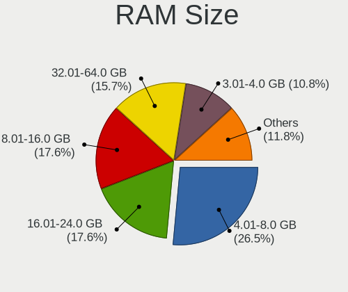
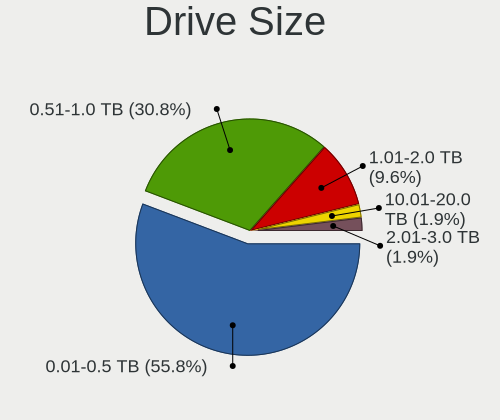
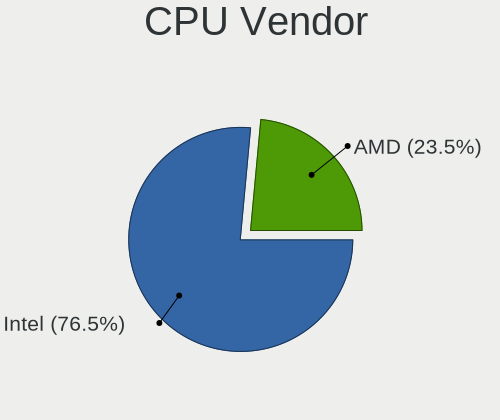
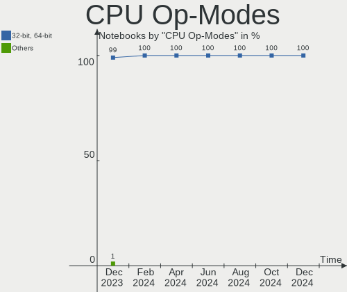
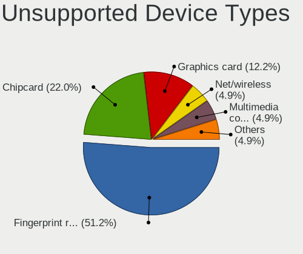

Linux in UK - Hardware Trends (Notebooks)
-----------------------------------------

A project to identify most popular hardware characteristics and track their change
over time based on data collected by Linux users at https://Linux-Hardware.org.

Anyone can contribute to this report by the [hw-probe](https://github.com/linuxhw/hw-probe) tool:

    sudo -E hw-probe -all -upload

Period: Mar, 2023.

Contents
--------

* [ System ](#system)
  - [ OS                       ](#os)
  - [ OS Family                ](#os-family)
  - [ Kernel                   ](#kernel)
  - [ Kernel Family            ](#kernel-family)
  - [ Kernel Major Ver.        ](#kernel-major-ver)
  - [ Arch                     ](#arch)
  - [ DE                       ](#de)
  - [ Display Server           ](#display-server)
  - [ Display Manager          ](#display-manager)
  - [ OS Lang                  ](#os-lang)
  - [ Boot Mode                ](#boot-mode)
  - [ Filesystem               ](#filesystem)
  - [ Part. scheme             ](#part-scheme)
  - [ Dual Boot with Linux/BSD ](#dual-boot-with-linuxbsd)
  - [ Dual Boot (Win)          ](#dual-boot-win)

* [ Board ](#board)
  - [ Vendor                   ](#vendor)
  - [ Model                    ](#model)
  - [ Model Family             ](#model-family)
  - [ MFG Year                 ](#mfg-year)
  - [ Form Factor              ](#form-factor)
  - [ Secure Boot              ](#secure-boot)
  - [ Coreboot                 ](#coreboot)
  - [ RAM Size                 ](#ram-size)
  - [ RAM Used                 ](#ram-used)
  - [ Total Drives             ](#total-drives)
  - [ Has CD-ROM               ](#has-cd-rom)
  - [ Has Ethernet             ](#has-ethernet)
  - [ Has WiFi                 ](#has-wifi)
  - [ Has Bluetooth            ](#has-bluetooth)

* [ Location ](#location)
  - [ Country                  ](#country)
  - [ City                     ](#city)

* [ Drives ](#drives)
  - [ Drive Vendor             ](#drive-vendor)
  - [ Drive Model              ](#drive-model)
  - [ HDD Vendor               ](#hdd-vendor)
  - [ SSD Vendor               ](#ssd-vendor)
  - [ Drive Kind               ](#drive-kind)
  - [ Drive Connector          ](#drive-connector)
  - [ Drive Size               ](#drive-size)
  - [ Space Total              ](#space-total)
  - [ Space Used               ](#space-used)
  - [ Malfunc. Drives          ](#malfunc-drives)
  - [ Malfunc. Drive Vendor    ](#malfunc-drive-vendor)
  - [ Malfunc. HDD Vendor      ](#malfunc-hdd-vendor)
  - [ Malfunc. Drive Kind      ](#malfunc-drive-kind)
  - [ Failed Drives            ](#failed-drives)
  - [ Failed Drive Vendor      ](#failed-drive-vendor)
  - [ Drive Status             ](#drive-status)

* [ Storage controller ](#storage-controller)
  - [ Storage Vendor           ](#storage-vendor)
  - [ Storage Model            ](#storage-model)
  - [ Storage Kind             ](#storage-kind)

* [ Processor ](#processor)
  - [ CPU Vendor               ](#cpu-vendor)
  - [ CPU Model                ](#cpu-model)
  - [ CPU Model Family         ](#cpu-model-family)
  - [ CPU Cores                ](#cpu-cores)
  - [ CPU Sockets              ](#cpu-sockets)
  - [ CPU Threads              ](#cpu-threads)
  - [ CPU Op-Modes             ](#cpu-op-modes)
  - [ CPU Microcode            ](#cpu-microcode)
  - [ CPU Microarch            ](#cpu-microarch)

* [ Graphics ](#graphics)
  - [ GPU Vendor               ](#gpu-vendor)
  - [ GPU Model                ](#gpu-model)
  - [ GPU Combo                ](#gpu-combo)
  - [ GPU Driver               ](#gpu-driver)
  - [ GPU Memory               ](#gpu-memory)

* [ Monitor ](#monitor)
  - [ Monitor Vendor           ](#monitor-vendor)
  - [ Monitor Model            ](#monitor-model)
  - [ Monitor Resolution       ](#monitor-resolution)
  - [ Monitor Diagonal         ](#monitor-diagonal)
  - [ Monitor Width            ](#monitor-width)
  - [ Aspect Ratio             ](#aspect-ratio)
  - [ Monitor Area             ](#monitor-area)
  - [ Pixel Density            ](#pixel-density)
  - [ Multiple Monitors        ](#multiple-monitors)

* [ Network ](#network)
  - [ Net Controller Vendor    ](#net-controller-vendor)
  - [ Net Controller Model     ](#net-controller-model)
  - [ Wireless Vendor          ](#wireless-vendor)
  - [ Wireless Model           ](#wireless-model)
  - [ Ethernet Vendor          ](#ethernet-vendor)
  - [ Ethernet Model           ](#ethernet-model)
  - [ Net Controller Kind      ](#net-controller-kind)
  - [ Used Controller          ](#used-controller)
  - [ NICs                     ](#nics)
  - [ IPv6                     ](#ipv6)

* [ Bluetooth ](#bluetooth)
  - [ Bluetooth Vendor         ](#bluetooth-vendor)
  - [ Bluetooth Model          ](#bluetooth-model)

* [ Sound ](#sound)
  - [ Sound Vendor             ](#sound-vendor)
  - [ Sound Model              ](#sound-model)

* [ Memory ](#memory)
  - [ Memory Vendor            ](#memory-vendor)
  - [ Memory Model             ](#memory-model)
  - [ Memory Kind              ](#memory-kind)
  - [ Memory Form Factor       ](#memory-form-factor)
  - [ Memory Size              ](#memory-size)
  - [ Memory Speed             ](#memory-speed)

* [ Printers & scanners ](#printers--scanners)
  - [ Printer Vendor           ](#printer-vendor)
  - [ Printer Model            ](#printer-model)
  - [ Scanner Vendor           ](#scanner-vendor)
  - [ Scanner Model            ](#scanner-model)

* [ Camera ](#camera)
  - [ Camera Vendor            ](#camera-vendor)
  - [ Camera Model             ](#camera-model)

* [ Security ](#security)
  - [ Fingerprint Vendor       ](#fingerprint-vendor)
  - [ Fingerprint Model        ](#fingerprint-model)
  - [ Chipcard Vendor          ](#chipcard-vendor)
  - [ Chipcard Model           ](#chipcard-model)

* [ Unsupported ](#unsupported)
  - [ Unsupported Devices      ](#unsupported-devices)
  - [ Unsupported Device Types ](#unsupported-device-types)

System
------

OS
--

Installed operating systems

| Name                         | Notebooks | Percent |
|------------------------------|-----------|---------|
| Ubuntu 22.04                 | 23        | 18.4%   |
| Fedora 37                    | 11        | 8.8%    |
| Zorin 16                     | 8         | 6.4%    |
| Linux Mint 21.1              | 7         | 5.6%    |
| Pop!_OS 22.04                | 6         | 4.8%    |
| OpenMandriva 23.01           | 6         | 4.8%    |
| Ubuntu 20.04                 | 5         | 4%      |
| SteamOS 3.4.6                | 5         | 4%      |
| OpenMandriva 23.03           | 5         | 4%      |
| ArcoLinux Rolling            | 5         | 4%      |
| Ubuntu 22.10                 | 4         | 3.2%    |
| SteamOS 3.4.4                | 4         | 3.2%    |
| Arch Rolling                 | 4         | 3.2%    |
| KDE neon 22.04               | 3         | 2.4%    |
| Debian 11                    | 3         | 2.4%    |
| Manjaro 22.0.4               | 2         | 1.6%    |
| Linux Mint 21                | 2         | 1.6%    |
| Kubuntu 22.10                | 2         | 1.6%    |
| Debian                       | 2         | 1.6%    |
| Ubuntu Core 18               | 1         | 0.8%    |
| Ubuntu Budgie 22.04          | 1         | 0.8%    |
| Reborn OS Rolling            | 1         | 0.8%    |
| openSUSE Tumbleweed-XXXXXXXX | 1         | 0.8%    |
| OpenMandriva 4.2             | 1         | 0.8%    |
| Nobara 37                    | 1         | 0.8%    |
| Manjaro 22.0.5               | 1         | 0.8%    |
| Manjaro                      | 1         | 0.8%    |
| Linux Mint 20.3              | 1         | 0.8%    |
| Linux Mint 19.1              | 1         | 0.8%    |
| Kubuntu 23.04                | 1         | 0.8%    |
| Kubuntu 20.04                | 1         | 0.8%    |
| Kubuntu 11                   | 1         | 0.8%    |
| Gentoo 2.9                   | 1         | 0.8%    |
| EndeavourOS Rolling          | 1         | 0.8%    |
| Elementary 7                 | 1         | 0.8%    |
| Elementary 6.1               | 1         | 0.8%    |
| BlackPanther 18.1            | 1         | 0.8%    |

OS Family
---------

OS without a version

| Name          | Notebooks | Percent |
|---------------|-----------|---------|
| Ubuntu        | 33        | 26.4%   |
| OpenMandriva  | 12        | 9.6%    |
| Linux Mint    | 11        | 8.8%    |
| Fedora        | 11        | 8.8%    |
| SteamOS       | 9         | 7.2%    |
| Zorin         | 8         | 6.4%    |
| Pop!_OS       | 6         | 4.8%    |
| Kubuntu       | 5         | 4%      |
| Debian        | 5         | 4%      |
| ArcoLinux     | 5         | 4%      |
| Manjaro       | 4         | 3.2%    |
| Arch          | 4         | 3.2%    |
| KDE neon      | 3         | 2.4%    |
| Elementary    | 2         | 1.6%    |
| Ubuntu Budgie | 1         | 0.8%    |
| Reborn OS     | 1         | 0.8%    |
| openSUSE      | 1         | 0.8%    |
| Nobara        | 1         | 0.8%    |
| Gentoo        | 1         | 0.8%    |
| EndeavourOS   | 1         | 0.8%    |
| BlackPanther  | 1         | 0.8%    |

Kernel
------

Version of the Linux kernel

| Version                      | Notebooks | Percent |
|------------------------------|-----------|---------|
| 5.19.0-35-generic            | 25        | 20%     |
| 5.15.0-67-generic            | 15        | 12%     |
| 5.13.0-valve36-1-neptune     | 9         | 7.2%    |
| 6.2.6-desktop-1omv2390       | 5         | 4%      |
| 6.2.0-76060200-generic       | 5         | 4%      |
| 6.1.1-desktop-1omv2290       | 5         | 4%      |
| 6.1.14-200.fc37.x86_64       | 4         | 3.2%    |
| 5.19.0-32-generic            | 4         | 3.2%    |
| 5.19.0-38-generic            | 3         | 2.4%    |
| 5.10.0-21-amd64              | 3         | 2.4%    |
| 6.2.7-200.fc37.x86_64        | 2         | 1.6%    |
| 6.2.6-arch1-1                | 2         | 1.6%    |
| 6.2.1-arch1-1                | 2         | 1.6%    |
| 6.1.15-200.fc37.x86_64       | 2         | 1.6%    |
| 6.1.12-1-MANJARO             | 2         | 1.6%    |
| 5.15.0-56-generic            | 2         | 1.6%    |
| 6.2.8-arch1-1                | 1         | 0.8%    |
| 6.2.8-200.fc37.x86_64        | 1         | 0.8%    |
| 6.2.7-arch1-1                | 1         | 0.8%    |
| 6.2.6-zen1-1-zen             | 1         | 0.8%    |
| 6.2.6-76060206-generic       | 1         | 0.8%    |
| 6.2.5-arch1-1                | 1         | 0.8%    |
| 6.2.5-060205-generic         | 1         | 0.8%    |
| 6.2.2-arch2-1                | 1         | 0.8%    |
| 6.2.2-arch1-1                | 1         | 0.8%    |
| 6.2.1-1-default              | 1         | 0.8%    |
| 6.2.0-1-MANJARO              | 1         | 0.8%    |
| 6.2.0-060200-generic         | 1         | 0.8%    |
| 6.1.8-200.fc37.x86_64        | 1         | 0.8%    |
| 6.1.4-desktop-1omv2301       | 1         | 0.8%    |
| 6.1.14-1-lts                 | 1         | 0.8%    |
| 6.1.12-gentoo-x86_64         | 1         | 0.8%    |
| 6.1.12-060112-generic        | 1         | 0.8%    |
| 6.1.11-201.fsync.fc37.x86_64 | 1         | 0.8%    |
| 6.1.0-6-amd64                | 1         | 0.8%    |
| 6.1.0-3-amd64                | 1         | 0.8%    |
| 6.0.7-301.fc37.x86_64        | 1         | 0.8%    |
| 5.8.0-50-generic             | 1         | 0.8%    |
| 5.6.14-desktop-2bP           | 1         | 0.8%    |
| 5.4.0-144-generic            | 1         | 0.8%    |

Kernel Family
-------------

Linux kernel without a distro release

| Version  | Notebooks | Percent |
|----------|-----------|---------|
| 5.19.0   | 33        | 26.4%   |
| 5.15.0   | 22        | 17.6%   |
| 6.2.6    | 9         | 7.2%    |
| 5.13.0   | 9         | 7.2%    |
| 6.2.0    | 7         | 5.6%    |
| 6.1.14   | 5         | 4%      |
| 6.1.1    | 5         | 4%      |
| 6.1.12   | 4         | 3.2%    |
| 6.2.7    | 3         | 2.4%    |
| 6.2.1    | 3         | 2.4%    |
| 5.10.0   | 3         | 2.4%    |
| 6.2.8    | 2         | 1.6%    |
| 6.2.5    | 2         | 1.6%    |
| 6.2.2    | 2         | 1.6%    |
| 6.1.15   | 2         | 1.6%    |
| 6.1.0    | 2         | 1.6%    |
| 6.1.8    | 1         | 0.8%    |
| 6.1.4    | 1         | 0.8%    |
| 6.1.11   | 1         | 0.8%    |
| 6.0.7    | 1         | 0.8%    |
| 5.8.0    | 1         | 0.8%    |
| 5.6.14   | 1         | 0.8%    |
| 5.4.0    | 1         | 0.8%    |
| 5.17.5   | 1         | 0.8%    |
| 5.15.102 | 1         | 0.8%    |
| 5.11.0   | 1         | 0.8%    |
| 5.10.14  | 1         | 0.8%    |
| 4.15.0   | 1         | 0.8%    |

Kernel Major Ver.
-----------------

Linux kernel major version

| Version | Notebooks | Percent |
|---------|-----------|---------|
| 5.19    | 33        | 26.4%   |
| 6.2     | 28        | 22.4%   |
| 5.15    | 23        | 18.4%   |
| 6.1     | 21        | 16.8%   |
| 5.13    | 9         | 7.2%    |
| 5.10    | 4         | 3.2%    |
| 6.0     | 1         | 0.8%    |
| 5.8     | 1         | 0.8%    |
| 5.6     | 1         | 0.8%    |
| 5.4     | 1         | 0.8%    |
| 5.17    | 1         | 0.8%    |
| 5.11    | 1         | 0.8%    |
| 4.15    | 1         | 0.8%    |

Arch
----

OS architecture (x86_64, i586, etc.)

| Name   | Notebooks | Percent |
|--------|-----------|---------|
| x86_64 | 125       | 100%    |

DE
--

Desktop Environment

| Name       | Notebooks | Percent |
|------------|-----------|---------|
| GNOME      | 54        | 43.2%   |
| KDE5       | 40        | 32%     |
| X-Cinnamon | 10        | 8%      |
| XFCE       | 7         | 5.6%    |
| MATE       | 3         | 2.4%    |
| sway       | 2         | 1.6%    |
| Pantheon   | 2         | 1.6%    |
| Budgie     | 2         | 1.6%    |
| Unknown    | 2         | 1.6%    |
| qtile      | 1         | 0.8%    |
| i3         | 1         | 0.8%    |
| bspwm      | 1         | 0.8%    |

Display Server
--------------

X11 or Wayland

| Name    | Notebooks | Percent |
|---------|-----------|---------|
| X11     | 91        | 72.8%   |
| Wayland | 32        | 25.6%   |
| Tty     | 1         | 0.8%    |
| Unknown | 1         | 0.8%    |

Display Manager
---------------

SDDM, LightDM, etc.

| Name    | Notebooks | Percent |
|---------|-----------|---------|
| Unknown | 52        | 41.6%   |
| GDM3    | 31        | 24.8%   |
| SDDM    | 24        | 19.2%   |
| LightDM | 14        | 11.2%   |
| GDM     | 4         | 3.2%    |

OS Lang
-------

Language

| Lang    | Notebooks | Percent |
|---------|-----------|---------|
| en_GB   | 95        | 76%     |
| en_US   | 23        | 18.4%   |
| de_DE   | 2         | 1.6%    |
| C       | 2         | 1.6%    |
| Unknown | 2         | 1.6%    |
| it_IT   | 1         | 0.8%    |

Boot Mode
---------

EFI or BIOS

| Mode | Notebooks | Percent |
|------|-----------|---------|
| BIOS | 63        | 50.4%   |
| EFI  | 62        | 49.6%   |

Filesystem
----------

Type of filesystem

| Type    | Notebooks | Percent |
|---------|-----------|---------|
| Ext4    | 89        | 71.2%   |
| Btrfs   | 27        | 21.6%   |
| Overlay | 7         | 5.6%    |
| Zfs     | 1         | 0.8%    |
| Xfs     | 1         | 0.8%    |

Part. scheme
------------

Scheme of partitioning

| Type    | Notebooks | Percent |
|---------|-----------|---------|
| GPT     | 67        | 53.6%   |
| Unknown | 49        | 39.2%   |
| MBR     | 9         | 7.2%    |

Dual Boot with Linux/BSD
------------------------

Hosting more than one Linux/BSD

| Dual boot | Notebooks | Percent |
|-----------|-----------|---------|
| No        | 116       | 92.8%   |
| Yes       | 9         | 7.2%    |

Dual Boot (Win)
---------------

Hosting Linux and Windows

| Dual boot | Notebooks | Percent |
|-----------|-----------|---------|
| No        | 96        | 76.8%   |
| Yes       | 29        | 23.2%   |

Board
-----

Vendor
------

Motherboard manufacturer

| Name                | Notebooks | Percent |
|---------------------|-----------|---------|
| Lenovo              | 22        | 17.6%   |
| Dell                | 22        | 17.6%   |
| Hewlett-Packard     | 17        | 13.6%   |
| Valve               | 9         | 7.2%    |
| Acer                | 9         | 7.2%    |
| ASUSTek Computer    | 7         | 5.6%    |
| Toshiba             | 4         | 3.2%    |
| TUXEDO              | 3         | 2.4%    |
| Samsung Electronics | 3         | 2.4%    |
| Notebook            | 3         | 2.4%    |
| Google              | 3         | 2.4%    |
| Sony                | 2         | 1.6%    |
| OEGStone            | 2         | 1.6%    |
| MSI                 | 2         | 1.6%    |
| LG Electronics      | 2         | 1.6%    |
| HUAWEI              | 2         | 1.6%    |
| Apple               | 2         | 1.6%    |
| Unknown             | 2         | 1.6%    |
| Timi                | 1         | 0.8%    |
| Razer               | 1         | 0.8%    |
| PC Specialist       | 1         | 0.8%    |
| Packard Bell        | 1         | 0.8%    |
| Novatech            | 1         | 0.8%    |
| HONOR               | 1         | 0.8%    |
| Fujitsu Siemens     | 1         | 0.8%    |
| Entroware           | 1         | 0.8%    |
| Alienware           | 1         | 0.8%    |

Model
-----

Motherboard model

| Name                                                  | Notebooks | Percent |
|-------------------------------------------------------|-----------|---------|
| Valve Jupiter                                         | 9         | 7.2%    |
| HP Pavilion 15                                        | 2         | 1.6%    |
| Dell Inspiron N5110                                   | 2         | 1.6%    |
| Unknown                                               | 2         | 1.6%    |
| TUXEDO InfinityBook S 15 Gen6                         | 1         | 0.8%    |
| TUXEDO InfinityBook Pro 14 Gen6                       | 1         | 0.8%    |
| TUXEDO Aura 15 Gen1                                   | 1         | 0.8%    |
| Toshiba Satellite Pro C50-A-1E2                       | 1         | 0.8%    |
| Toshiba Satellite L50-C                               | 1         | 0.8%    |
| Toshiba Satellite C660                                | 1         | 0.8%    |
| Toshiba QOSMIO X70-A                                  | 1         | 0.8%    |
| Timi RedmiBook 14                                     | 1         | 0.8%    |
| Sony VPCEH3N6E                                        | 1         | 0.8%    |
| Sony SVF1521Q1EW                                      | 1         | 0.8%    |
| Samsung R530/R730/R540                                | 1         | 0.8%    |
| Samsung 530U3BI/530U4BI/530U4BH                       | 1         | 0.8%    |
| Samsung 3570R/370R/470R/450R/510R/4450RV              | 1         | 0.8%    |
| Razer Blade 15 Advanced Model (Early 2021) - RZ09-036 | 1         | 0.8%    |
| PC Specialist P65_67RSRP                              | 1         | 0.8%    |
| Packard Bell EasyNote TM82                            | 1         | 0.8%    |
| OEGStone W54_55SU1,SUW                                | 1         | 0.8%    |
| OEGStone W240EU/W250EUQ/W270EUQ                       | 1         | 0.8%    |
| Novatech 15.6 nSpire Laptop                           | 1         | 0.8%    |
| Notebook W510LU                                       | 1         | 0.8%    |
| Notebook PCx0Dx                                       | 1         | 0.8%    |
| Notebook N150ZU                                       | 1         | 0.8%    |
| MSI Summit E14Evo A12M                                | 1         | 0.8%    |
| MSI GS70 2QE                                          | 1         | 0.8%    |
| LG 17Z90P-K.AA78A1                                    | 1         | 0.8%    |
| LG 16Z90Q-K.AA78A1                                    | 1         | 0.8%    |
| Lenovo Yoga S740-14IIL 81RS                           | 1         | 0.8%    |
| Lenovo V580c 20160                                    | 1         | 0.8%    |
| Lenovo ThinkPad X240 20AMS1FW00                       | 1         | 0.8%    |
| Lenovo ThinkPad T470s 20HF0000UK                      | 1         | 0.8%    |
| Lenovo ThinkPad T460p 20HYSJKDOW                      | 1         | 0.8%    |
| Lenovo ThinkPad T420 4236Q23                          | 1         | 0.8%    |
| Lenovo ThinkPad T410 2522AC1                          | 1         | 0.8%    |
| Lenovo ThinkPad T400 6475J92                          | 1         | 0.8%    |
| Lenovo ThinkPad T15 Gen 2i 20W4003FUK                 | 1         | 0.8%    |
| Lenovo ThinkPad SL 2746N8G                            | 1         | 0.8%    |

Model Family
------------

Motherboard model prefix

| Name                  | Notebooks | Percent |
|-----------------------|-----------|---------|
| Lenovo ThinkPad       | 12        | 9.6%    |
| Valve Jupiter         | 9         | 7.2%    |
| Dell Latitude         | 8         | 6.4%    |
| Dell Inspiron         | 8         | 6.4%    |
| HP Pavilion           | 6         | 4.8%    |
| HP Laptop             | 5         | 4%      |
| Dell XPS              | 5         | 4%      |
| Acer Aspire           | 5         | 4%      |
| Lenovo IdeaPad        | 4         | 3.2%    |
| Toshiba Satellite     | 3         | 2.4%    |
| TUXEDO InfinityBook   | 2         | 1.6%    |
| Lenovo ThinkBook      | 2         | 1.6%    |
| Lenovo Legion         | 2         | 1.6%    |
| HP ProBook            | 2         | 1.6%    |
| ASUS ROG              | 2         | 1.6%    |
| ASUS ASUS             | 2         | 1.6%    |
| Acer Predator         | 2         | 1.6%    |
| Unknown               | 2         | 1.6%    |
| TUXEDO Aura           | 1         | 0.8%    |
| Toshiba QOSMIO        | 1         | 0.8%    |
| Timi RedmiBook        | 1         | 0.8%    |
| Sony VPCEH3N6E        | 1         | 0.8%    |
| Sony SVF1521Q1EW      | 1         | 0.8%    |
| Samsung R530          | 1         | 0.8%    |
| Samsung 530U3BI       | 1         | 0.8%    |
| Samsung 3570R         | 1         | 0.8%    |
| Razer Blade           | 1         | 0.8%    |
| PC Specialist P65     | 1         | 0.8%    |
| Packard Bell EasyNote | 1         | 0.8%    |
| OEGStone W54          | 1         | 0.8%    |
| OEGStone W240EU       | 1         | 0.8%    |
| Novatech 15.6         | 1         | 0.8%    |
| Notebook W510LU       | 1         | 0.8%    |
| Notebook PCx0Dx       | 1         | 0.8%    |
| Notebook N150ZU       | 1         | 0.8%    |
| MSI Summit            | 1         | 0.8%    |
| MSI GS70              | 1         | 0.8%    |
| LG 17Z90P-K.AA78A1    | 1         | 0.8%    |
| LG 16Z90Q-K.AA78A1    | 1         | 0.8%    |
| Lenovo Yoga           | 1         | 0.8%    |

MFG Year
--------

Motherboard manufacture year

| Year | Notebooks | Percent |
|------|-----------|---------|
| 2022 | 28        | 22.4%   |
| 2021 | 16        | 12.8%   |
| 2020 | 9         | 7.2%    |
| 2018 | 9         | 7.2%    |
| 2013 | 9         | 7.2%    |
| 2019 | 8         | 6.4%    |
| 2016 | 8         | 6.4%    |
| 2011 | 7         | 5.6%    |
| 2012 | 6         | 4.8%    |
| 2015 | 5         | 4%      |
| 2014 | 5         | 4%      |
| 2017 | 4         | 3.2%    |
| 2010 | 3         | 2.4%    |
| 2009 | 3         | 2.4%    |
| 2008 | 3         | 2.4%    |
| 2023 | 1         | 0.8%    |
| 2007 | 1         | 0.8%    |

Form Factor
-----------

Physical design of the computer

| Name     | Notebooks | Percent |
|----------|-----------|---------|
| Notebook | 125       | 100%    |

Secure Boot
-----------

Enabled or disabled

| State    | Notebooks | Percent |
|----------|-----------|---------|
| Disabled | 114       | 91.2%   |
| Enabled  | 11        | 8.8%    |

Coreboot
--------

Have coreboot on board

| Used | Notebooks | Percent |
|------|-----------|---------|
| No   | 122       | 97.6%   |
| Yes  | 3         | 2.4%    |

RAM Size
--------

Total RAM memory

| Size in GB  | Notebooks | Percent |
|-------------|-----------|---------|
| 4.01-8.0    | 40        | 32%     |
| 16.01-24.0  | 25        | 20%     |
| 8.01-16.0   | 23        | 18.4%   |
| 3.01-4.0    | 20        | 16%     |
| 32.01-64.0  | 11        | 8.8%    |
| 24.01-32.0  | 3         | 2.4%    |
| 1.01-2.0    | 2         | 1.6%    |
| 64.01-256.0 | 1         | 0.8%    |

RAM Used
--------

Used RAM memory

| Used GB    | Notebooks | Percent |
|------------|-----------|---------|
| 1.01-2.0   | 37        | 29.6%   |
| 2.01-3.0   | 31        | 24.8%   |
| 4.01-8.0   | 26        | 20.8%   |
| 3.01-4.0   | 18        | 14.4%   |
| 8.01-16.0  | 9         | 7.2%    |
| 0.51-1.0   | 2         | 1.6%    |
| 24.01-32.0 | 1         | 0.8%    |
| 16.01-24.0 | 1         | 0.8%    |

Total Drives
------------

Number of drives on board

| Drives | Notebooks | Percent |
|--------|-----------|---------|
| 1      | 80        | 64%     |
| 2      | 39        | 31.2%   |
| 3      | 4         | 3.2%    |
| 4      | 2         | 1.6%    |

Has CD-ROM
----------

Has CD-ROM on board

| Presented | Notebooks | Percent |
|-----------|-----------|---------|
| No        | 93        | 74.4%   |
| Yes       | 32        | 25.6%   |

Has Ethernet
------------

Has Ethernet on board

| Presented | Notebooks | Percent |
|-----------|-----------|---------|
| Yes       | 91        | 72.8%   |
| No        | 34        | 27.2%   |

Has WiFi
--------

Has WiFi module

| Presented | Notebooks | Percent |
|-----------|-----------|---------|
| Yes       | 123       | 98.4%   |
| No        | 2         | 1.6%    |

Has Bluetooth
-------------

Has Bluetooth module

| Presented | Notebooks | Percent |
|-----------|-----------|---------|
| Yes       | 109       | 87.2%   |
| No        | 16        | 12.8%   |

Location
--------

Country
-------

Geographic location (country)

| Country | Notebooks | Percent |
|---------|-----------|---------|
| UK      | 125       | 100%    |

City
----

Geographic location (city)

| City                  | Notebooks | Percent |
|-----------------------|-----------|---------|
| London                | 16        | 12.8%   |
| Newcastle upon Tyne   | 4         | 3.2%    |
| Manchester            | 4         | 3.2%    |
| Glasgow               | 4         | 3.2%    |
| Nottingham            | 3         | 2.4%    |
| Kettering             | 3         | 2.4%    |
| Edinburgh             | 3         | 2.4%    |
| Sheffield             | 2         | 1.6%    |
| Sandy                 | 2         | 1.6%    |
| Lancaster             | 2         | 1.6%    |
| Harrow                | 2         | 1.6%    |
| Elderslie             | 2         | 1.6%    |
| City of London        | 2         | 1.6%    |
| Bristol               | 2         | 1.6%    |
| Brighton              | 2         | 1.6%    |
| Birmingham            | 2         | 1.6%    |
| Bedford               | 2         | 1.6%    |
| Barnsley              | 2         | 1.6%    |
| Wolverhampton         | 1         | 0.8%    |
| Whiteley              | 1         | 0.8%    |
| Weston-super-Mare     | 1         | 0.8%    |
| Wells                 | 1         | 0.8%    |
| Wellingborough        | 1         | 0.8%    |
| Watford               | 1         | 0.8%    |
| Telford               | 1         | 0.8%    |
| Swansea               | 1         | 0.8%    |
| Sutton                | 1         | 0.8%    |
| Stratford-upon-Avon   | 1         | 0.8%    |
| Stoke-on-Trent        | 1         | 0.8%    |
| Stockton-on-Tees      | 1         | 0.8%    |
| St Helens             | 1         | 0.8%    |
| South Shields         | 1         | 0.8%    |
| Slough                | 1         | 0.8%    |
| Salford               | 1         | 0.8%    |
| Saint Ives            | 1         | 0.8%    |
| Royal Tunbridge Wells | 1         | 0.8%    |
| Rotherham             | 1         | 0.8%    |
| Romford               | 1         | 0.8%    |
| Rochdale              | 1         | 0.8%    |
| Ripon                 | 1         | 0.8%    |

Drives
------

Drive Vendor
------------

Hard drive vendors

| Vendor                         | Notebooks | Drives | Percent |
|--------------------------------|-----------|--------|---------|
| Samsung Electronics            | 40        | 45     | 24.39%  |
| WDC                            | 17        | 18     | 10.37%  |
| Unknown                        | 17        | 18     | 10.37%  |
| Toshiba                        | 11        | 12     | 6.71%   |
| Seagate                        | 11        | 13     | 6.71%   |
| SK hynix                       | 9         | 9      | 5.49%   |
| Phison Electronics             | 7         | 7      | 4.27%   |
| Micron/Crucial Technology      | 5         | 5      | 3.05%   |
| Crucial                        | 5         | 5      | 3.05%   |
| SanDisk                        | 4         | 4      | 2.44%   |
| Micron Technology              | 4         | 4      | 2.44%   |
| Kingston                       | 4         | 4      | 2.44%   |
| Intel                          | 4         | 4      | 2.44%   |
| KIOXIA                         | 3         | 3      | 1.83%   |
| HGST                           | 3         | 3      | 1.83%   |
| Unknown                        | 3         | 3      | 1.83%   |
| Hitachi                        | 2         | 2      | 1.22%   |
| China                          | 2         | 2      | 1.22%   |
| SPCC                           | 1         | 1      | 0.61%   |
| Solid State Storage Technology | 1         | 1      | 0.61%   |
| Silicon Motion                 | 1         | 1      | 0.61%   |
| Realtek Semiconductor          | 1         | 1      | 0.61%   |
| Realtek                        | 1         | 1      | 0.61%   |
| PNY                            | 1         | 1      | 0.61%   |
| Phison                         | 1         | 1      | 0.61%   |
| ORTIAL                         | 1         | 1      | 0.61%   |
| OCZ                            | 1         | 1      | 0.61%   |
| O2 Micro                       | 1         | 1      | 0.61%   |
| LITEON                         | 1         | 1      | 0.61%   |
| Gigabyte Technology            | 1         | 1      | 0.61%   |
| Apple                          | 1         | 1      | 0.61%   |

Drive Model
-----------

Hard drive models

| Model                                               | Notebooks | Percent |
|-----------------------------------------------------|-----------|---------|
| Samsung NVMe SSD Controller PM9A1/PM9A3/980PRO 1TB  | 6         | 3.51%   |
| Phison PS5013 E13 NVMe Controller 256GB             | 5         | 2.92%   |
| Micron/Crucial P2 NVMe PCIe SSD 1TB                 | 5         | 2.92%   |
| Seagate ST9500325AS 500GB                           | 4         | 2.34%   |
| Samsung SSD 850 EVO 250GB                           | 4         | 2.34%   |
| Unknown SD/MMC/MS PRO 64GB                          | 3         | 1.75%   |
| Unknown MMC Card  64GB                              | 3         | 1.75%   |
| Samsung MZ9LQ512HBLU-00BVL 512GB                    | 3         | 1.75%   |
| Unknown                                             | 3         | 1.75%   |
| Unknown MMC Card  512GB                             | 2         | 1.17%   |
| Unknown MMC Card  256GB                             | 2         | 1.17%   |
| Unknown MMC Card  16GB                              | 2         | 1.17%   |
| Unknown DA4064  64GB                                | 2         | 1.17%   |
| Toshiba XG6 NVMe SSD Controller 512GB               | 2         | 1.17%   |
| Toshiba MQ01ABD100 1TB                              | 2         | 1.17%   |
| SK hynix SKHynix_HFS512GDE9X081N 512GB              | 2         | 1.17%   |
| Seagate ST1000LM024 HN-M101MBB 1TB                  | 2         | 1.17%   |
| Samsung SSD 980 1TB                                 | 2         | 1.17%   |
| Samsung NVMe SSD Controller SM981/PM981/PM983 250GB | 2         | 1.17%   |
| Samsung MZVLQ256HBJD-00BH1 256GB                    | 2         | 1.17%   |
| Samsung MZALQ512HALU-000L2 512GB                    | 2         | 1.17%   |
| Phison E12 NVMe Controller 256GB                    | 2         | 1.17%   |
| Kingston SA400S37240G 240GB SSD                     | 2         | 1.17%   |
| Crucial CT480BX500SSD1 480GB                        | 2         | 1.17%   |
| WDC WDS240G2G0A-00JH30 240GB SSD                    | 1         | 0.58%   |
| WDC WDS100T2B0C-00PXH0 1TB                          | 1         | 0.58%   |
| WDC WDS100T2B0B-00YS70 1TB SSD                      | 1         | 0.58%   |
| WDC WD800BEVS-07RST0 80GB                           | 1         | 0.58%   |
| WDC WD5000BEVT-00ZAT0 500GB                         | 1         | 0.58%   |
| WDC WD3200BEVT-22ZCT0 320GB                         | 1         | 0.58%   |
| WDC WD2500BEVT-80A23T0 250GB                        | 1         | 0.58%   |
| WDC WD2500BEKT-60PVMT0 250GB                        | 1         | 0.58%   |
| WDC WD20SPZX-22UA7T0 2TB                            | 1         | 0.58%   |
| WDC WD10SPZX-75Z10T0 1TB                            | 1         | 0.58%   |
| WDC WD10SPZX-21Z10T0 1TB                            | 1         | 0.58%   |
| WDC WD10SPCX-60KHST0 1TB                            | 1         | 0.58%   |
| WDC WD10JPVX-75JC3T0 1TB                            | 1         | 0.58%   |
| WDC WD10JPVX-00JC3T0 1TB                            | 1         | 0.58%   |
| WDC PC SN530 SDBPNPZ-512G-1114 512GB                | 1         | 0.58%   |
| WDC PC SN530 SDBPNPZ-1T00-1114 1TB                  | 1         | 0.58%   |

HDD Vendor
----------

Hard disk drive vendors

| Vendor  | Notebooks | Drives | Percent |
|---------|-----------|--------|---------|
| WDC     | 11        | 11     | 29.73%  |
| Seagate | 11        | 13     | 29.73%  |
| Toshiba | 6         | 6      | 16.22%  |
| Unknown | 3         | 3      | 8.11%   |
| HGST    | 3         | 3      | 8.11%   |
| Hitachi | 2         | 2      | 5.41%   |
| Apple   | 1         | 1      | 2.7%    |

SSD Vendor
----------

Solid state drive vendors

| Vendor              | Notebooks | Drives | Percent |
|---------------------|-----------|--------|---------|
| Samsung Electronics | 13        | 15     | 33.33%  |
| Crucial             | 5         | 5      | 12.82%  |
| Kingston            | 3         | 3      | 7.69%   |
| WDC                 | 2         | 2      | 5.13%   |
| Toshiba             | 2         | 3      | 5.13%   |
| SK hynix            | 2         | 2      | 5.13%   |
| SanDisk             | 2         | 2      | 5.13%   |
| Intel               | 2         | 2      | 5.13%   |
| SPCC                | 1         | 1      | 2.56%   |
| PNY                 | 1         | 1      | 2.56%   |
| ORTIAL              | 1         | 1      | 2.56%   |
| OCZ                 | 1         | 1      | 2.56%   |
| Micron Technology   | 1         | 1      | 2.56%   |
| LITEON              | 1         | 1      | 2.56%   |
| Gigabyte Technology | 1         | 1      | 2.56%   |
| China               | 1         | 1      | 2.56%   |

Drive Kind
----------

HDD or SSD

| Kind    | Notebooks | Drives | Percent |
|---------|-----------|--------|---------|
| NVMe    | 65        | 73     | 41.94%  |
| HDD     | 36        | 39     | 23.23%  |
| SSD     | 35        | 42     | 22.58%  |
| MMC     | 17        | 18     | 10.97%  |
| Unknown | 2         | 2      | 1.29%   |

Drive Connector
---------------

SATA, SAS, NVMe, etc.

| Type | Notebooks | Drives | Percent |
|------|-----------|--------|---------|
| NVMe | 64        | 72     | 42.95%  |
| SATA | 62        | 78     | 41.61%  |
| MMC  | 17        | 18     | 11.41%  |
| SAS  | 6         | 6      | 4.03%   |

Drive Size
----------

Size of hard drive

| Size in TB | Notebooks | Drives | Percent |
|------------|-----------|--------|---------|
| 0.01-0.5   | 45        | 55     | 65.22%  |
| 0.51-1.0   | 19        | 21     | 27.54%  |
| 1.01-2.0   | 4         | 4      | 5.8%    |
| 4.01-10.0  | 1         | 1      | 1.45%   |

Space Total
-----------

Amount of disk space available on the file system

| Size in GB     | Notebooks | Percent |
|----------------|-----------|---------|
| 101-250        | 37        | 29.6%   |
| 251-500        | 27        | 21.6%   |
| 501-1000       | 25        | 20%     |
| 51-100         | 8         | 6.4%    |
| Unknown        | 8         | 6.4%    |
| 1001-2000      | 7         | 5.6%    |
| 1-20           | 6         | 4.8%    |
| More than 3000 | 5         | 4%      |
| 21-50          | 2         | 1.6%    |

Space Used
----------

Amount of used disk space

| Used GB        | Notebooks | Percent |
|----------------|-----------|---------|
| 1-20           | 33        | 26.4%   |
| 21-50          | 29        | 23.2%   |
| 101-250        | 21        | 16.8%   |
| 51-100         | 17        | 13.6%   |
| 251-500        | 9         | 7.2%    |
| Unknown        | 8         | 6.4%    |
| 501-1000       | 6         | 4.8%    |
| More than 3000 | 2         | 1.6%    |

Malfunc. Drives
---------------

Drive models with a malfunction

| Model                              | Notebooks | Drives | Percent |
|------------------------------------|-----------|--------|---------|
| Seagate ST9500325AS 500GB          | 3         | 4      | 42.86%  |
| WDC WD2500BEKT-60PVMT0 250GB       | 1         | 1      | 14.29%  |
| Seagate ST250LT003-9YG14C 250GB    | 1         | 1      | 14.29%  |
| Seagate ST1000LM024 HN-M101MBB 1TB | 1         | 1      | 14.29%  |
| OCZ VERTEX4 256GB SSD              | 1         | 1      | 14.29%  |

Malfunc. Drive Vendor
---------------------

Vendors of faulty drives

| Vendor  | Notebooks | Drives | Percent |
|---------|-----------|--------|---------|
| Seagate | 5         | 6      | 71.43%  |
| WDC     | 1         | 1      | 14.29%  |
| OCZ     | 1         | 1      | 14.29%  |

Malfunc. HDD Vendor
-------------------

Vendors of faulty HDD drives

| Vendor  | Notebooks | Drives | Percent |
|---------|-----------|--------|---------|
| Seagate | 5         | 6      | 83.33%  |
| WDC     | 1         | 1      | 16.67%  |

Malfunc. Drive Kind
-------------------

Kinds of faulty drives

| Kind | Notebooks | Drives | Percent |
|------|-----------|--------|---------|
| HDD  | 6         | 7      | 85.71%  |
| SSD  | 1         | 1      | 14.29%  |

Failed Drives
-------------

Failed drive models

Zero info for selected period =(

Failed Drive Vendor
-------------------

Failed drive vendors

Zero info for selected period =(

Drive Status
------------

Number of failed and malfunc. drives

| Status   | Notebooks | Drives | Percent |
|----------|-----------|--------|---------|
| Detected | 83        | 112    | 62.88%  |
| Works    | 42        | 54     | 31.82%  |
| Malfunc  | 7         | 8      | 5.3%    |

Storage controller
------------------

Storage Vendor
--------------

Storage controller vendors

| Vendor                         | Notebooks | Percent |
|--------------------------------|-----------|---------|
| Intel                          | 74        | 49.01%  |
| Samsung Electronics            | 28        | 18.54%  |
| AMD                            | 10        | 6.62%   |
| SK hynix                       | 7         | 4.64%   |
| Phison Electronics             | 7         | 4.64%   |
| Sandisk                        | 6         | 3.97%   |
| Micron/Crucial Technology      | 5         | 3.31%   |
| Toshiba America Info Systems   | 3         | 1.99%   |
| Micron Technology              | 3         | 1.99%   |
| KIOXIA                         | 3         | 1.99%   |
| Solid State Storage Technology | 1         | 0.66%   |
| Silicon Motion                 | 1         | 0.66%   |
| Realtek Semiconductor          | 1         | 0.66%   |
| O2 Micro                       | 1         | 0.66%   |
| Kingston Technology Company    | 1         | 0.66%   |

Storage Model
-------------

Storage controller models

| Model                                                                                  | Notebooks | Percent |
|----------------------------------------------------------------------------------------|-----------|---------|
| Samsung NVMe SSD Controller 980                                                        | 13        | 8.02%   |
| Intel 82801 Mobile SATA Controller [RAID mode]                                         | 12        | 7.41%   |
| Intel Volume Management Device NVMe RAID Controller                                    | 9         | 5.56%   |
| Intel 7 Series Chipset Family 6-port SATA Controller [AHCI mode]                       | 9         | 5.56%   |
| AMD FCH SATA Controller [AHCI mode]                                                    | 9         | 5.56%   |
| Samsung NVMe SSD Controller PM9A1/PM9A3/980PRO                                         | 7         | 4.32%   |
| SK hynix Gold P31/PC711 NVMe Solid State Drive                                         | 5         | 3.09%   |
| Samsung NVMe SSD Controller SM981/PM981/PM983                                          | 5         | 3.09%   |
| Phison PS5013 E13 NVMe Controller                                                      | 5         | 3.09%   |
| Micron/Crucial P2 NVMe PCIe SSD                                                        | 5         | 3.09%   |
| Intel Sunrise Point-LP SATA Controller [AHCI mode]                                     | 4         | 2.47%   |
| Intel Comet Lake SATA AHCI Controller                                                  | 4         | 2.47%   |
| SanDisk WD Blue SN550 NVMe SSD                                                         | 3         | 1.85%   |
| Micron NVMe Storage Controller                                                         | 3         | 1.85%   |
| Intel HM170/QM170 Chipset SATA Controller [AHCI Mode]                                  | 3         | 1.85%   |
| Intel Cannon Lake Mobile PCH SATA AHCI Controller                                      | 3         | 1.85%   |
| Intel 82801IBM/IEM (ICH9M/ICH9M-E) 4 port SATA Controller [AHCI mode]                  | 3         | 1.85%   |
| Intel 8 Series/C220 Series Chipset Family 6-port SATA Controller 1 [AHCI mode]         | 3         | 1.85%   |
| Intel 8 Series SATA Controller 1 [AHCI mode]                                           | 3         | 1.85%   |
| Intel 6 Series/C200 Series Chipset Family Mobile SATA Controller (IDE mode, ports 4-5) | 3         | 1.85%   |
| Intel 6 Series/C200 Series Chipset Family Mobile SATA Controller (IDE mode, ports 0-3) | 3         | 1.85%   |
| Intel 6 Series/C200 Series Chipset Family 6 port Mobile SATA AHCI Controller           | 3         | 1.85%   |
| Toshiba America Info Systems XG6 NVMe SSD Controller                                   | 2         | 1.23%   |
| Sandisk Non-Volatile memory controller                                                 | 2         | 1.23%   |
| Phison E12 NVMe Controller                                                             | 2         | 1.23%   |
| KIOXIA Non-Volatile memory controller                                                  | 2         | 1.23%   |
| Intel Atom/Celeron/Pentium Processor x5-E8000/J3xxx/N3xxx Series SATA Controller       | 2         | 1.23%   |
| Intel Alder Lake-P SATA AHCI Controller                                                | 2         | 1.23%   |
| Intel 82801HM/HEM (ICH8M/ICH8M-E) SATA Controller [AHCI mode]                          | 2         | 1.23%   |
| Intel 82801HM/HEM (ICH8M/ICH8M-E) IDE Controller                                       | 2         | 1.23%   |
| Toshiba America Info Systems XG4 NVMe SSD Controller                                   | 1         | 0.62%   |
| Solid State Storage Non-Volatile memory controller                                     | 1         | 0.62%   |
| SK hynix PC401 NVMe Solid State Drive 256GB                                            | 1         | 0.62%   |
| SK hynix Non-Volatile memory controller                                                | 1         | 0.62%   |
| Silicon Motion SM2263EN/SM2263XT SSD Controller                                        | 1         | 0.62%   |
| SanDisk NVMe Controller                                                                | 1         | 0.62%   |
| Samsung Surface NVMe Controller                                                        | 1         | 0.62%   |
| Samsung NVMe SSD Controller SM961/PM961/SM963                                          | 1         | 0.62%   |
| Samsung NVMe SSD Controller SM951/PM951                                                | 1         | 0.62%   |
| Samsung NVMe SSD Controller PM9B1                                                      | 1         | 0.62%   |

Storage Kind
------------

Kind of storage controller (IDE, SATA, NVMe, SAS, ...)

| Kind | Notebooks | Percent |
|------|-----------|---------|
| NVMe | 64        | 42.38%  |
| SATA | 58        | 38.41%  |
| RAID | 22        | 14.57%  |
| IDE  | 7         | 4.64%   |

Processor
---------

CPU Vendor
----------

Processor vendors

| Vendor | Notebooks | Percent |
|--------|-----------|---------|
| Intel  | 100       | 80%     |
| AMD    | 25        | 20%     |

CPU Model
---------

Processor models

| Model                                       | Notebooks | Percent |
|---------------------------------------------|-----------|---------|
| AMD Custom APU 0405                         | 9         | 7.2%    |
| Intel Core i5-7200U CPU @ 2.50GHz           | 4         | 3.2%    |
| Intel 11th Gen Core i7-1165G7 @ 2.80GHz     | 3         | 2.4%    |
| Intel 11th Gen Core i5-1135G7 @ 2.40GHz     | 3         | 2.4%    |
| Intel Core i7-9750H CPU @ 2.60GHz           | 2         | 1.6%    |
| Intel Core i7-8550U CPU @ 1.80GHz           | 2         | 1.6%    |
| Intel Core i7-10875H CPU @ 2.30GHz          | 2         | 1.6%    |
| Intel Core i7-1065G7 CPU @ 1.30GHz          | 2         | 1.6%    |
| Intel Core i7-10510U CPU @ 1.80GHz          | 2         | 1.6%    |
| Intel Core i5-3210M CPU @ 2.50GHz           | 2         | 1.6%    |
| Intel Core i5-2450M CPU @ 2.50GHz           | 2         | 1.6%    |
| Intel Core i5 CPU M 520 @ 2.40GHz           | 2         | 1.6%    |
| Intel Core i3-3110M CPU @ 2.40GHz           | 2         | 1.6%    |
| Intel Core i3-2330M CPU @ 2.20GHz           | 2         | 1.6%    |
| Intel Core 2 Duo CPU T9400 @ 2.53GHz        | 2         | 1.6%    |
| Intel Celeron N4020 CPU @ 1.10GHz           | 2         | 1.6%    |
| Intel 12th Gen Core i7-12700H               | 2         | 1.6%    |
| Intel 12th Gen Core i7-1260P                | 2         | 1.6%    |
| Intel 11th Gen Core i7-11370H @ 3.30GHz     | 2         | 1.6%    |
| AMD Ryzen 9 6900HX with Radeon Graphics     | 2         | 1.6%    |
| Intel Pentium Gold 7505 @ 2.00GHz           | 1         | 0.8%    |
| Intel Pentium Dual-Core CPU T4400 @ 2.20GHz | 1         | 0.8%    |
| Intel Core m7-6Y75 CPU @ 1.20GHz            | 1         | 0.8%    |
| Intel Core i9-10900K CPU @ 3.70GHz          | 1         | 0.8%    |
| Intel Core i7-8565U CPU @ 1.80GHz           | 1         | 0.8%    |
| Intel Core i7-7Y75 CPU @ 1.30GHz            | 1         | 0.8%    |
| Intel Core i7-7700HQ CPU @ 2.80GHz          | 1         | 0.8%    |
| Intel Core i7-6820HQ CPU @ 2.70GHz          | 1         | 0.8%    |
| Intel Core i7-6700HQ CPU @ 2.60GHz          | 1         | 0.8%    |
| Intel Core i7-5600U CPU @ 2.60GHz           | 1         | 0.8%    |
| Intel Core i7-4720HQ CPU @ 2.60GHz          | 1         | 0.8%    |
| Intel Core i7-4702MQ CPU @ 2.20GHz          | 1         | 0.8%    |
| Intel Core i7-4702HQ CPU @ 2.20GHz          | 1         | 0.8%    |
| Intel Core i7-4700MQ CPU @ 2.40GHz          | 1         | 0.8%    |
| Intel Core i7-3820QM CPU @ 2.70GHz          | 1         | 0.8%    |
| Intel Core i7-2640M CPU @ 2.80GHz           | 1         | 0.8%    |
| Intel Core i7-10870H CPU @ 2.20GHz          | 1         | 0.8%    |
| Intel Core i5-9300H CPU @ 2.40GHz           | 1         | 0.8%    |
| Intel Core i5-8265U CPU @ 1.60GHz           | 1         | 0.8%    |
| Intel Core i5-8250U CPU @ 1.60GHz           | 1         | 0.8%    |

CPU Model Family
----------------

Processor model prefix

| Model                   | Notebooks | Percent |
|-------------------------|-----------|---------|
| Other                   | 32        | 25.6%   |
| Intel Core i5           | 26        | 20.8%   |
| Intel Core i7           | 23        | 18.4%   |
| Intel Core i3           | 12        | 9.6%    |
| Intel Celeron           | 7         | 5.6%    |
| Intel Core 2 Duo        | 4         | 3.2%    |
| AMD Ryzen 5             | 4         | 3.2%    |
| AMD Ryzen 9             | 3         | 2.4%    |
| AMD Ryzen 7             | 3         | 2.4%    |
| AMD Ryzen 3             | 3         | 2.4%    |
| Intel Pentium Gold      | 1         | 0.8%    |
| Intel Pentium Dual-Core | 1         | 0.8%    |
| Intel Core m7           | 1         | 0.8%    |
| Intel Core i9           | 1         | 0.8%    |
| Intel Core 2 Quad       | 1         | 0.8%    |
| AMD V120                | 1         | 0.8%    |
| AMD A8                  | 1         | 0.8%    |
| AMD A4                  | 1         | 0.8%    |

CPU Cores
---------

Number of processor cores

| Number | Notebooks | Percent |
|--------|-----------|---------|
| 4      | 49        | 39.2%   |
| 2      | 49        | 39.2%   |
| 8      | 9         | 7.2%    |
| 6      | 6         | 4.8%    |
| 12     | 5         | 4%      |
| 14     | 3         | 2.4%    |
| 10     | 3         | 2.4%    |
| 1      | 1         | 0.8%    |

CPU Sockets
-----------

Number of sockets

| Number | Notebooks | Percent |
|--------|-----------|---------|
| 1      | 125       | 100%    |

CPU Threads
-----------

Threads per core (Hyper-Threading)

| Number | Notebooks | Percent |
|--------|-----------|---------|
| 2      | 103       | 82.4%   |
| 1      | 22        | 17.6%   |

CPU Op-Modes
------------

CPU Operation Modes (32-bit, 64-bit)

| Op mode        | Notebooks | Percent |
|----------------|-----------|---------|
| 32-bit, 64-bit | 125       | 100%    |

CPU Microcode
-------------

Microcode number

| Number     | Notebooks | Percent |
|------------|-----------|---------|
| Unknown    | 66        | 52.8%   |
| 0x806c1    | 5         | 4%      |
| 0x306a9    | 5         | 4%      |
| 0x906a4    | 3         | 2.4%    |
| 0x706e5    | 3         | 2.4%    |
| 0x206a7    | 3         | 2.4%    |
| 0x1067a    | 3         | 2.4%    |
| 0x0a50000c | 3         | 2.4%    |
| 0x906a3    | 2         | 1.6%    |
| 0x806ea    | 2         | 1.6%    |
| 0x806e9    | 2         | 1.6%    |
| 0x706a8    | 2         | 1.6%    |
| 0x306c3    | 2         | 1.6%    |
| 0x20655    | 2         | 1.6%    |
| 0x0a404102 | 2         | 1.6%    |
| 0x08600106 | 2         | 1.6%    |
| 0xa0652    | 1         | 0.8%    |
| 0x806ec    | 1         | 0.8%    |
| 0x706a1    | 1         | 0.8%    |
| 0x6fd      | 1         | 0.8%    |
| 0x506e3    | 1         | 0.8%    |
| 0x506c9    | 1         | 0.8%    |
| 0x406e3    | 1         | 0.8%    |
| 0x406c3    | 1         | 0.8%    |
| 0x40651    | 1         | 0.8%    |
| 0x306d4    | 1         | 0.8%    |
| 0x20652    | 1         | 0.8%    |
| 0x08701021 | 1         | 0.8%    |
| 0x08608103 | 1         | 0.8%    |
| 0x08108109 | 1         | 0.8%    |
| 0x08008206 | 1         | 0.8%    |
| 0x07030104 | 1         | 0.8%    |
| 0x0700010f | 1         | 0.8%    |
| 0x010000c8 | 1         | 0.8%    |

CPU Microarch
-------------

Microarchitecture

| Name             | Notebooks | Percent |
|------------------|-----------|---------|
| KabyLake         | 18        | 14.4%   |
| Unknown          | 17        | 13.6%   |
| TigerLake        | 12        | 9.6%    |
| SandyBridge      | 9         | 7.2%    |
| IvyBridge        | 8         | 6.4%    |
| Haswell          | 8         | 6.4%    |
| Alderlake Hybrid | 7         | 5.6%    |
| Skylake          | 6         | 4.8%    |
| Penryn           | 5         | 4%      |
| CometLake        | 5         | 4%      |
| Zen 2            | 4         | 3.2%    |
| Westmere         | 4         | 3.2%    |
| Zen 3            | 3         | 2.4%    |
| Silvermont       | 3         | 2.4%    |
| IceLake          | 3         | 2.4%    |
| Goldmont plus    | 3         | 2.4%    |
| Zen+             | 2         | 1.6%    |
| Broadwell        | 2         | 1.6%    |
| Zen              | 1         | 0.8%    |
| Puma             | 1         | 0.8%    |
| K10              | 1         | 0.8%    |
| Jaguar           | 1         | 0.8%    |
| Goldmont         | 1         | 0.8%    |
| Core             | 1         | 0.8%    |

Graphics
--------

GPU Vendor
----------

Vendors of graphics cards

| Vendor | Notebooks | Percent |
|--------|-----------|---------|
| Intel  | 97        | 63.82%  |
| Nvidia | 28        | 18.42%  |
| AMD    | 27        | 17.76%  |

GPU Model
---------

Graphics card models

| Model                                                                                    | Notebooks | Percent |
|------------------------------------------------------------------------------------------|-----------|---------|
| Intel TigerLake-LP GT2 [Iris Xe Graphics]                                                | 11        | 7.1%    |
| Intel 2nd Generation Core Processor Family Integrated Graphics Controller                | 9         | 5.81%   |
| AMD VanGogh [AMD Custom GPU 0405]                                                        | 9         | 5.81%   |
| Intel 3rd Gen Core processor Graphics Controller                                         | 8         | 5.16%   |
| Intel Alder Lake-P Integrated Graphics Controller                                        | 6         | 3.87%   |
| Intel HD Graphics 620                                                                    | 5         | 3.23%   |
| Intel 4th Gen Core Processor Integrated Graphics Controller                              | 5         | 3.23%   |
| Nvidia GA106M [GeForce RTX 3060 Mobile / Max-Q]                                          | 4         | 2.58%   |
| Intel Mobile 4 Series Chipset Integrated Graphics Controller                             | 4         | 2.58%   |
| Intel CometLake-H GT2 [UHD Graphics]                                                     | 4         | 2.58%   |
| Intel UHD Graphics 620                                                                   | 3         | 1.94%   |
| Intel Haswell-ULT Integrated Graphics Controller                                         | 3         | 1.94%   |
| Intel GeminiLake [UHD Graphics 600]                                                      | 3         | 1.94%   |
| Intel Core Processor Integrated Graphics Controller                                      | 3         | 1.94%   |
| Intel CometLake-U GT2 [UHD Graphics]                                                     | 3         | 1.94%   |
| Intel CoffeeLake-H GT2 [UHD Graphics 630]                                                | 3         | 1.94%   |
| Intel Atom/Celeron/Pentium Processor x5-E8000/J3xxx/N3xxx Integrated Graphics Controller | 3         | 1.94%   |
| AMD Renoir                                                                               | 3         | 1.94%   |
| Nvidia TU117M [GeForce GTX 1650 Mobile / Max-Q]                                          | 2         | 1.29%   |
| Nvidia GK107M [GeForce GT 750M]                                                          | 2         | 1.29%   |
| Nvidia GA107M [GeForce RTX 3050 Mobile]                                                  | 2         | 1.29%   |
| Intel WhiskeyLake-U GT2 [UHD Graphics 620]                                               | 2         | 1.29%   |
| Intel TigerLake-H GT1 [UHD Graphics]                                                     | 2         | 1.29%   |
| Intel Skylake GT2 [HD Graphics 520]                                                      | 2         | 1.29%   |
| Intel Mobile GM965/GL960 Integrated Graphics Controller (secondary)                      | 2         | 1.29%   |
| Intel Mobile GM965/GL960 Integrated Graphics Controller (primary)                        | 2         | 1.29%   |
| Intel Iris Plus Graphics G7                                                              | 2         | 1.29%   |
| Intel HD Graphics 5500                                                                   | 2         | 1.29%   |
| Intel HD Graphics 530                                                                    | 2         | 1.29%   |
| AMD Rembrandt [Radeon 680M]                                                              | 2         | 1.29%   |
| AMD Barcelo                                                                              | 2         | 1.29%   |
| Nvidia TU117GLM [Quadro T500 Mobile]                                                     | 1         | 0.65%   |
| Nvidia TU116M [GeForce GTX 1660 Ti Mobile]                                               | 1         | 0.65%   |
| Nvidia TU106M [GeForce RTX 2060 Max-Q]                                                   | 1         | 0.65%   |
| Nvidia TU104M [GeForce RTX 2080 SUPER Mobile / Max-Q]                                    | 1         | 0.65%   |
| Nvidia GT218M [NVS 3100M]                                                                | 1         | 0.65%   |
| Nvidia GP108M [GeForce MX250]                                                            | 1         | 0.65%   |
| Nvidia GP107M [GeForce GTX 1050 Mobile]                                                  | 1         | 0.65%   |
| Nvidia GP104BM [GeForce GTX 1070 Mobile]                                                 | 1         | 0.65%   |
| Nvidia GM204M [GeForce GTX 960 OEM / 970M]                                               | 1         | 0.65%   |

GPU Combo
---------

Combinations of graphics cards

| Name           | Notebooks | Percent |
|----------------|-----------|---------|
| 1 x Intel      | 67        | 53.6%   |
| Intel + Nvidia | 23        | 18.4%   |
| 1 x AMD        | 23        | 18.4%   |
| 1 x Nvidia     | 4         | 3.2%    |
| 2 x Intel      | 3         | 2.4%    |
| Intel + AMD    | 2         | 1.6%    |
| Other          | 1         | 0.8%    |
| 2 x AMD        | 1         | 0.8%    |
| AMD + Nvidia   | 1         | 0.8%    |

GPU Driver
----------

Free vs proprietary

| Driver      | Notebooks | Percent |
|-------------|-----------|---------|
| Free        | 110       | 88%     |
| Proprietary | 14        | 11.2%   |
| Unknown     | 1         | 0.8%    |

GPU Memory
----------

Total video memory

| Size in GB | Notebooks | Percent |
|------------|-----------|---------|
| Unknown    | 100       | 80%     |
| 0.01-0.5   | 9         | 7.2%    |
| 1.01-2.0   | 7         | 5.6%    |
| 7.01-8.0   | 4         | 3.2%    |
| 3.01-4.0   | 2         | 1.6%    |
| 5.01-6.0   | 1         | 0.8%    |
| 8.01-16.0  | 1         | 0.8%    |
| 0.51-1.0   | 1         | 0.8%    |

Monitor
-------

Monitor Vendor
--------------

Monitor vendors

| Vendor                  | Notebooks | Percent |
|-------------------------|-----------|---------|
| AU Optronics            | 23        | 16.43%  |
| LG Display              | 22        | 15.71%  |
| BOE                     | 19        | 13.57%  |
| Chimei Innolux          | 18        | 12.86%  |
| Samsung Electronics     | 11        | 7.86%   |
| Valve                   | 9         | 6.43%   |
| Sharp                   | 7         | 5%      |
| Lenovo                  | 4         | 2.86%   |
| Chi Mei Optoelectronics | 4         | 2.86%   |
| Philips                 | 3         | 2.14%   |
| Dell                    | 3         | 2.14%   |
| BenQ                    | 3         | 2.14%   |
| Apple                   | 3         | 2.14%   |
| PANDA                   | 2         | 1.43%   |
| Panasonic               | 1         | 0.71%   |
| MiTAC                   | 1         | 0.71%   |
| LGD                     | 1         | 0.71%   |
| Iiyama                  | 1         | 0.71%   |
| HKC                     | 1         | 0.71%   |
| CSO                     | 1         | 0.71%   |
| Ancor Communications    | 1         | 0.71%   |
| Acer                    | 1         | 0.71%   |
| Unknown                 | 1         | 0.71%   |

Monitor Model
-------------

Monitor models

| Model                                                                 | Notebooks | Percent |
|-----------------------------------------------------------------------|-----------|---------|
| Valve ANX7530 U VLV3001 800x1280 100x150mm 7.1-inch                   | 9         | 6.38%   |
| LG Display LCD Monitor LGD02DC 1366x768 344x194mm 15.5-inch           | 3         | 2.13%   |
| Samsung Electronics LCD Monitor SEC5441 1366x768 344x194mm 15.5-inch  | 2         | 1.42%   |
| Chimei Innolux LCD Monitor CMN1735 1920x1080 382x215mm 17.3-inch      | 2         | 1.42%   |
| AU Optronics LCD Monitor AUO499F 1920x1080 344x194mm 15.5-inch        | 2         | 1.42%   |
| Sharp LQ156T1JW03 SHP1529 2560x1440 344x194mm 15.5-inch               | 1         | 0.71%   |
| Sharp LCD Monitor SHP14D6 3840x2400 366x229mm 17.0-inch               | 1         | 0.71%   |
| Sharp LCD Monitor SHP14BA 1920x1080 344x194mm 15.5-inch               | 1         | 0.71%   |
| Sharp LCD Monitor SHP14AD 3840x2160 294x165mm 13.3-inch               | 1         | 0.71%   |
| Sharp LCD Monitor SHP1482 2880x1920 259x173mm 12.3-inch               | 1         | 0.71%   |
| Sharp LCD Monitor SHP1476 3840x2160 346x194mm 15.6-inch               | 1         | 0.71%   |
| Sharp LCD Monitor SHP13F8 3200x1800 346x194mm 15.6-inch               | 1         | 0.71%   |
| Samsung Electronics S27D390 SAM0B67 1920x1080 598x336mm 27.0-inch     | 1         | 0.71%   |
| Samsung Electronics LCD Monitor SEC544B 1600x900 310x174mm 14.0-inch  | 1         | 0.71%   |
| Samsung Electronics LCD Monitor SEC3945 1280x800 331x207mm 15.4-inch  | 1         | 0.71%   |
| Samsung Electronics LCD Monitor SEC304A 1920x1080 367x230mm 17.1-inch | 1         | 0.71%   |
| Samsung Electronics LCD Monitor SDC4551 1366x768 344x194mm 15.5-inch  | 1         | 0.71%   |
| Samsung Electronics LCD Monitor SDC4447 1366x768 344x193mm 15.5-inch  | 1         | 0.71%   |
| Samsung Electronics LCD Monitor SDC415D 3840x2400 344x215mm 16.0-inch | 1         | 0.71%   |
| Samsung Electronics LCD Monitor SAM0B32 1366x768 607x345mm 27.5-inch  | 1         | 0.71%   |
| Samsung Electronics LCD Monitor SAM0A7C 1366x768 698x393mm 31.5-inch  | 1         | 0.71%   |
| Philips PHL 499P9 PHL092A 3840x1080 1193x336mm 48.8-inch              | 1         | 0.71%   |
| Philips PHL 245E1 PHLC20B 2560x1440 527x296mm 23.8-inch               | 1         | 0.71%   |
| Philips 272P4 PHL08C5 2560x1440 597x336mm 27.0-inch                   | 1         | 0.71%   |
| PANDA LCD Monitor NCP004D 1920x1080 344x194mm 15.5-inch               | 1         | 0.71%   |
| PANDA LCD Monitor NCP002B 1920x1080 309x174mm 14.0-inch               | 1         | 0.71%   |
| Panasonic TV MEIC311 1920x1080 698x392mm 31.5-inch                    | 1         | 0.71%   |
| MiTAC CHHWJT SZM0308 1920x540 708x398mm 32.0-inch                     | 1         | 0.71%   |
| LGD LCD Monitor 1920x1080                                             | 1         | 0.71%   |
| LG Display LCD Monitor LGD06EB 2560x1600 344x215mm 16.0-inch          | 1         | 0.71%   |
| LG Display LCD Monitor LGD06D1 1920x1080 344x194mm 15.5-inch          | 1         | 0.71%   |
| LG Display LCD Monitor LGD06A6 1920x1080 344x194mm 15.5-inch          | 1         | 0.71%   |
| LG Display LCD Monitor LGD0695 2560x1600 366x229mm 17.0-inch          | 1         | 0.71%   |
| LG Display LCD Monitor LGD068D 1920x1080 309x174mm 14.0-inch          | 1         | 0.71%   |
| LG Display LCD Monitor LGD0676 1920x1080 309x174mm 14.0-inch          | 1         | 0.71%   |
| LG Display LCD Monitor LGD05E5 1920x1080 344x194mm 15.5-inch          | 1         | 0.71%   |
| LG Display LCD Monitor LGD0599 1920x1080 309x174mm 14.0-inch          | 1         | 0.71%   |
| LG Display LCD Monitor LGD0544 1920x1080 276x156mm 12.5-inch          | 1         | 0.71%   |
| LG Display LCD Monitor LGD0501 2560x1440 310x174mm 14.0-inch          | 1         | 0.71%   |
| LG Display LCD Monitor LGD04B7 1366x768 344x194mm 15.5-inch           | 1         | 0.71%   |

Monitor Resolution
------------------

Monitor screen resolution

| Resolution         | Notebooks | Percent |
|--------------------|-----------|---------|
| 1920x1080 (FHD)    | 50        | 36.76%  |
| 1366x768 (WXGA)    | 40        | 29.41%  |
| 800x1280           | 9         | 6.62%   |
| 2560x1440 (QHD)    | 8         | 5.88%   |
| 3840x2160 (4K)     | 5         | 3.68%   |
| 1280x800 (WXGA)    | 5         | 3.68%   |
| 2560x1600          | 3         | 2.21%   |
| 3840x2400          | 2         | 1.47%   |
| 1600x900 (HD+)     | 2         | 1.47%   |
| 3840x1080          | 1         | 0.74%   |
| 3440x1440          | 1         | 0.74%   |
| 3200x1800 (QHD+)   | 1         | 0.74%   |
| 2880x1920          | 1         | 0.74%   |
| 2880x1800          | 1         | 0.74%   |
| 2240x1400          | 1         | 0.74%   |
| 2160x1440          | 1         | 0.74%   |
| 1920x540           | 1         | 0.74%   |
| 1920x1200 (WUXGA)  | 1         | 0.74%   |
| 1680x1050 (WSXGA+) | 1         | 0.74%   |
| 1440x900 (WXGA+)   | 1         | 0.74%   |
| 1280x1024 (SXGA)   | 1         | 0.74%   |

Monitor Diagonal
----------------

Diagonal size in inches

| Inches  | Notebooks | Percent |
|---------|-----------|---------|
| 15      | 54        | 38.57%  |
| 14      | 15        | 10.71%  |
| 17      | 14        | 10%     |
| 13      | 14        | 10%     |
| 7       | 9         | 6.43%   |
| 12      | 5         | 3.57%   |
| 16      | 4         | 2.86%   |
| 11      | 4         | 2.86%   |
| 31      | 3         | 2.14%   |
| 27      | 3         | 2.14%   |
| 23      | 3         | 2.14%   |
| 24      | 2         | 1.43%   |
| 21      | 2         | 1.43%   |
| Unknown | 2         | 1.43%   |
| 48      | 1         | 0.71%   |
| 40      | 1         | 0.71%   |
| 39      | 1         | 0.71%   |
| 34      | 1         | 0.71%   |
| 25      | 1         | 0.71%   |
| 19      | 1         | 0.71%   |

Monitor Width
-------------

Physical width

| Width in mm | Notebooks | Percent |
|-------------|-----------|---------|
| 301-350     | 78        | 55.71%  |
| 351-400     | 18        | 12.86%  |
| 201-300     | 15        | 10.71%  |
| 501-600     | 9         | 6.43%   |
| 1-100       | 9         | 6.43%   |
| 601-700     | 3         | 2.14%   |
| 801-900     | 2         | 1.43%   |
| 401-500     | 2         | 1.43%   |
| Unknown     | 2         | 1.43%   |
| 701-800     | 1         | 0.71%   |
| 1001-1500   | 1         | 0.71%   |

Aspect Ratio
------------

Proportional relationship between the width and the height

| Ratio   | Notebooks | Percent |
|---------|-----------|---------|
| 16/9    | 97        | 75.19%  |
| 16/10   | 16        | 12.4%   |
| 0.67    | 9         | 6.98%   |
| 3/2     | 2         | 1.55%   |
| Unknown | 2         | 1.55%   |
| 5/4     | 1         | 0.78%   |
| 32/9    | 1         | 0.78%   |
| 21/9    | 1         | 0.78%   |

Monitor Area
------------

Area in inch

| Area in inch | Notebooks | Percent |
|----------------|-----------|---------|
| 101-110        | 55        | 39.29%  |
| 81-90          | 26        | 18.57%  |
| 121-130        | 13        | 9.29%   |
| 1-40           | 9         | 6.43%   |
| 201-250        | 7         | 5%      |
| 61-70          | 5         | 3.57%   |
| 51-60          | 4         | 2.86%   |
| 351-500        | 4         | 2.86%   |
| 71-80          | 3         | 2.14%   |
| 301-350        | 3         | 2.14%   |
| 111-120        | 3         | 2.14%   |
| 501-1000       | 3         | 2.14%   |
| Unknown        | 2         | 1.43%   |
| 251-300        | 1         | 0.71%   |
| 151-200        | 1         | 0.71%   |
| 131-140        | 1         | 0.71%   |

Pixel Density
-------------

Pixels per inch

| Density       | Notebooks | Percent |
|---------------|-----------|---------|
| 121-160       | 52        | 38.24%  |
| 101-120       | 34        | 25%     |
| 161-240       | 21        | 15.44%  |
| 51-100        | 17        | 12.5%   |
| More than 240 | 8         | 5.88%   |
| 1-50          | 2         | 1.47%   |
| Unknown       | 2         | 1.47%   |

Multiple Monitors
-----------------

Total monitors connected

| Total | Notebooks | Percent |
|-------|-----------|---------|
| 1     | 107       | 85.6%   |
| 2     | 15        | 12%     |
| 3     | 2         | 1.6%    |
| 0     | 1         | 0.8%    |

Network
-------

Net Controller Vendor
---------------------

Controller vendors

| Vendor                            | Notebooks | Percent |
|-----------------------------------|-----------|---------|
| Realtek Semiconductor             | 73        | 38.02%  |
| Intel                             | 70        | 36.46%  |
| Qualcomm Atheros                  | 19        | 9.9%    |
| Broadcom                          | 9         | 4.69%   |
| MediaTek                          | 4         | 2.08%   |
| Marvell Technology Group          | 3         | 1.56%   |
| Lenovo                            | 3         | 1.56%   |
| Broadcom Limited                  | 3         | 1.56%   |
| ASIX Electronics                  | 2         | 1.04%   |
| Wacom                             | 1         | 0.52%   |
| Sierra Wireless                   | 1         | 0.52%   |
| Qualcomm                          | 1         | 0.52%   |
| Ericsson Business Mobile Networks | 1         | 0.52%   |
| Dell                              | 1         | 0.52%   |
| Bose                              | 1         | 0.52%   |

Net Controller Model
--------------------

Controller models

| Model                                                             | Notebooks | Percent |
|-------------------------------------------------------------------|-----------|---------|
| Realtek RTL8111/8168/8411 PCI Express Gigabit Ethernet Controller | 35        | 15.42%  |
| Realtek RTL810xE PCI Express Fast Ethernet controller             | 12        | 5.29%   |
| Realtek RTL8822CE 802.11ac PCIe Wireless Network Adapter          | 11        | 4.85%   |
| Realtek RTL8153 Gigabit Ethernet Adapter                          | 10        | 4.41%   |
| Intel Wi-Fi 6 AX201                                               | 8         | 3.52%   |
| Intel Alder Lake-P PCH CNVi WiFi                                  | 7         | 3.08%   |
| Realtek RTL8821CE 802.11ac PCIe Wireless Network Adapter          | 6         | 2.64%   |
| Qualcomm Atheros AR9485 Wireless Network Adapter                  | 6         | 2.64%   |
| Intel Wireless 7265                                               | 5         | 2.2%    |
| Intel Wireless 8265 / 8275                                        | 4         | 1.76%   |
| Intel Wi-Fi 6 AX200                                               | 4         | 1.76%   |
| Qualcomm Atheros QCA6174 802.11ac Wireless Network Adapter        | 3         | 1.32%   |
| Qualcomm Atheros AR9462 Wireless Network Adapter                  | 3         | 1.32%   |
| MediaTek MT7922 802.11ax PCI Express Wireless Network Adapter     | 3         | 1.32%   |
| Intel Wireless 8260                                               | 3         | 1.32%   |
| Intel Wireless 7260                                               | 3         | 1.32%   |
| Intel Ice Lake-LP PCH CNVi WiFi                                   | 3         | 1.32%   |
| Intel Comet Lake PCH-LP CNVi WiFi                                 | 3         | 1.32%   |
| Intel Comet Lake PCH CNVi WiFi                                    | 3         | 1.32%   |
| Intel Centrino Wireless-N 1030 [Rainbow Peak]                     | 3         | 1.32%   |
| Intel 82579LM Gigabit Network Connection (Lewisville)             | 3         | 1.32%   |
| Broadcom BCM4313 802.11bgn Wireless Network Adapter               | 3         | 1.32%   |
| Realtek RTL8852BE PCIe 802.11ax Wireless Network Controller       | 2         | 0.88%   |
| Realtek RTL8723DE Wireless Network Adapter                        | 2         | 0.88%   |
| Realtek Killer E2600 Gigabit Ethernet Controller                  | 2         | 0.88%   |
| Qualcomm Atheros AR9285 Wireless Network Adapter (PCI-Express)    | 2         | 0.88%   |
| Marvell Group 88E8040 PCI-E Fast Ethernet Controller              | 2         | 0.88%   |
| Intel Wireless-AC 9260                                            | 2         | 0.88%   |
| Intel Wi-Fi 6 AX210/AX211/AX411 160MHz                            | 2         | 0.88%   |
| Intel PRO/Wireless 5100 AGN [Shiloh] Network Connection           | 2         | 0.88%   |
| Intel Gemini Lake PCH CNVi WiFi                                   | 2         | 0.88%   |
| Intel Ethernet Connection (2) I219-LM                             | 2         | 0.88%   |
| Intel Dual Band Wireless-AC 3165 Plus Bluetooth                   | 2         | 0.88%   |
| Intel Centrino Ultimate-N 6300                                    | 2         | 0.88%   |
| Intel 82577LM Gigabit Network Connection                          | 2         | 0.88%   |
| Broadcom Limited NetLink BCM57780 Gigabit Ethernet PCIe           | 2         | 0.88%   |
| Broadcom BCM43142 802.11b/g/n                                     | 2         | 0.88%   |
| ASIX AX88179 Gigabit Ethernet                                     | 2         | 0.88%   |
| Wacom ACK-40401 [Wireless Accessory Kit]                          | 1         | 0.44%   |
| Sierra Wireless EM7455                                            | 1         | 0.44%   |

Wireless Vendor
---------------

Wireless vendors

| Vendor                | Notebooks | Percent |
|-----------------------|-----------|---------|
| Intel                 | 66        | 52.38%  |
| Realtek Semiconductor | 27        | 21.43%  |
| Qualcomm Atheros      | 17        | 13.49%  |
| Broadcom              | 7         | 5.56%   |
| MediaTek              | 4         | 3.17%   |
| Wacom                 | 1         | 0.79%   |
| Sierra Wireless       | 1         | 0.79%   |
| Qualcomm              | 1         | 0.79%   |
| Dell                  | 1         | 0.79%   |
| Broadcom Limited      | 1         | 0.79%   |

Wireless Model
--------------

Wireless models

| Model                                                          | Notebooks | Percent |
|----------------------------------------------------------------|-----------|---------|
| Realtek RTL8822CE 802.11ac PCIe Wireless Network Adapter       | 11        | 8.66%   |
| Intel Wi-Fi 6 AX201                                            | 8         | 6.3%    |
| Intel Alder Lake-P PCH CNVi WiFi                               | 7         | 5.51%   |
| Realtek RTL8821CE 802.11ac PCIe Wireless Network Adapter       | 6         | 4.72%   |
| Qualcomm Atheros AR9485 Wireless Network Adapter               | 6         | 4.72%   |
| Intel Wireless 7265                                            | 5         | 3.94%   |
| Intel Wireless 8265 / 8275                                     | 4         | 3.15%   |
| Intel Wi-Fi 6 AX200                                            | 4         | 3.15%   |
| Qualcomm Atheros QCA6174 802.11ac Wireless Network Adapter     | 3         | 2.36%   |
| Qualcomm Atheros AR9462 Wireless Network Adapter               | 3         | 2.36%   |
| MediaTek MT7922 802.11ax PCI Express Wireless Network Adapter  | 3         | 2.36%   |
| Intel Wireless 8260                                            | 3         | 2.36%   |
| Intel Wireless 7260                                            | 3         | 2.36%   |
| Intel Ice Lake-LP PCH CNVi WiFi                                | 3         | 2.36%   |
| Intel Comet Lake PCH-LP CNVi WiFi                              | 3         | 2.36%   |
| Intel Comet Lake PCH CNVi WiFi                                 | 3         | 2.36%   |
| Intel Centrino Wireless-N 1030 [Rainbow Peak]                  | 3         | 2.36%   |
| Broadcom BCM4313 802.11bgn Wireless Network Adapter            | 3         | 2.36%   |
| Realtek RTL8852BE PCIe 802.11ax Wireless Network Controller    | 2         | 1.57%   |
| Realtek RTL8723DE Wireless Network Adapter                     | 2         | 1.57%   |
| Qualcomm Atheros AR9285 Wireless Network Adapter (PCI-Express) | 2         | 1.57%   |
| Intel Wireless-AC 9260                                         | 2         | 1.57%   |
| Intel Wi-Fi 6 AX210/AX211/AX411 160MHz                         | 2         | 1.57%   |
| Intel PRO/Wireless 5100 AGN [Shiloh] Network Connection        | 2         | 1.57%   |
| Intel Gemini Lake PCH CNVi WiFi                                | 2         | 1.57%   |
| Intel Dual Band Wireless-AC 3165 Plus Bluetooth                | 2         | 1.57%   |
| Intel Centrino Ultimate-N 6300                                 | 2         | 1.57%   |
| Broadcom BCM43142 802.11b/g/n                                  | 2         | 1.57%   |
| Wacom ACK-40401 [Wireless Accessory Kit]                       | 1         | 0.79%   |
| Sierra Wireless EM7455                                         | 1         | 0.79%   |
| Realtek RTL8852AE 802.11ax PCIe Wireless Network Adapter       | 1         | 0.79%   |
| Realtek RTL8822BE 802.11a/b/g/n/ac WiFi adapter                | 1         | 0.79%   |
| Realtek RTL8821AE 802.11ac PCIe Wireless Network Adapter       | 1         | 0.79%   |
| Realtek RTL8723BE PCIe Wireless Network Adapter                | 1         | 0.79%   |
| Realtek RTL8188EUS 802.11n Wireless Network Adapter            | 1         | 0.79%   |
| Realtek RTL8188EE Wireless Network Adapter                     | 1         | 0.79%   |
| Realtek RTL8188CE 802.11b/g/n WiFi Adapter                     | 1         | 0.79%   |
| Qualcomm QCNFA765 Wireless Network Adapter                     | 1         | 0.79%   |
| Qualcomm Atheros QCA9565 / AR9565 Wireless Network Adapter     | 1         | 0.79%   |
| Qualcomm Atheros QCA9377 802.11ac Wireless Network Adapter     | 1         | 0.79%   |

Ethernet Vendor
---------------

Ethernet vendors

| Vendor                   | Notebooks | Percent |
|--------------------------|-----------|---------|
| Realtek Semiconductor    | 59        | 62.77%  |
| Intel                    | 19        | 20.21%  |
| Qualcomm Atheros         | 4         | 4.26%   |
| Marvell Technology Group | 3         | 3.19%   |
| Broadcom                 | 3         | 3.19%   |
| Lenovo                   | 2         | 2.13%   |
| Broadcom Limited         | 2         | 2.13%   |
| ASIX Electronics         | 2         | 2.13%   |

Ethernet Model
--------------

Ethernet models

| Model                                                             | Notebooks | Percent |
|-------------------------------------------------------------------|-----------|---------|
| Realtek RTL8111/8168/8411 PCI Express Gigabit Ethernet Controller | 35        | 36.08%  |
| Realtek RTL810xE PCI Express Fast Ethernet controller             | 12        | 12.37%  |
| Realtek RTL8153 Gigabit Ethernet Adapter                          | 10        | 10.31%  |
| Intel 82579LM Gigabit Network Connection (Lewisville)             | 3         | 3.09%   |
| Realtek Killer E2600 Gigabit Ethernet Controller                  | 2         | 2.06%   |
| Marvell Group 88E8040 PCI-E Fast Ethernet Controller              | 2         | 2.06%   |
| Intel Ethernet Connection (2) I219-LM                             | 2         | 2.06%   |
| Intel 82577LM Gigabit Network Connection                          | 2         | 2.06%   |
| Broadcom Limited NetLink BCM57780 Gigabit Ethernet PCIe           | 2         | 2.06%   |
| ASIX AX88179 Gigabit Ethernet                                     | 2         | 2.06%   |
| Realtek RTL8125 2.5GbE Controller                                 | 1         | 1.03%   |
| Realtek PCIe GbE Family Controller                                | 1         | 1.03%   |
| Realtek Killer E3000 2.5GbE Controller                            | 1         | 1.03%   |
| Qualcomm Atheros QCA8171 Gigabit Ethernet                         | 1         | 1.03%   |
| Qualcomm Atheros Killer E2500 Gigabit Ethernet Controller         | 1         | 1.03%   |
| Qualcomm Atheros Killer E220x Gigabit Ethernet Controller         | 1         | 1.03%   |
| Qualcomm Atheros AR8161 Gigabit Ethernet                          | 1         | 1.03%   |
| Marvell Group 88E8058 PCI-E Gigabit Ethernet Controller           | 1         | 1.03%   |
| Lenovo USB-C Dock Ethernet                                        | 1         | 1.03%   |
| Lenovo ThinkPad Dock Ethernet [Realtek RTL8153B]                  | 1         | 1.03%   |
| Intel I211 Gigabit Network Connection                             | 1         | 1.03%   |
| Intel Ethernet Connection I219-V                                  | 1         | 1.03%   |
| Intel Ethernet Connection I218-LM                                 | 1         | 1.03%   |
| Intel Ethernet Connection (4) I219-V                              | 1         | 1.03%   |
| Intel Ethernet Connection (4) I219-LM                             | 1         | 1.03%   |
| Intel Ethernet Connection (3) I218-LM                             | 1         | 1.03%   |
| Intel Ethernet Connection (16) I219-V                             | 1         | 1.03%   |
| Intel Ethernet Connection (16) I219-LM                            | 1         | 1.03%   |
| Intel Ethernet Connection (13) I219-V                             | 1         | 1.03%   |
| Intel Ethernet Connection (13) I219-LM                            | 1         | 1.03%   |
| Intel 82567LM Gigabit Network Connection                          | 1         | 1.03%   |
| Intel 82567LF Gigabit Network Connection                          | 1         | 1.03%   |
| Broadcom NetXtreme BCM57765 Gigabit Ethernet PCIe                 | 1         | 1.03%   |
| Broadcom NetLink BCM5787M Gigabit Ethernet PCI Express            | 1         | 1.03%   |
| Broadcom NetLink BCM57780 Gigabit Ethernet PCIe                   | 1         | 1.03%   |

Net Controller Kind
-------------------

Ethernet, WiFi or modem

| Kind     | Notebooks | Percent |
|----------|-----------|---------|
| WiFi     | 123       | 56.68%  |
| Ethernet | 91        | 41.94%  |
| Modem    | 3         | 1.38%   |

Used Controller
---------------

Currently used network controller

| Kind     | Notebooks | Percent |
|----------|-----------|---------|
| WiFi     | 105       | 80.15%  |
| Ethernet | 26        | 19.85%  |

NICs
----

Total network controllers on board

| Total | Notebooks | Percent |
|-------|-----------|---------|
| 2     | 81        | 64.8%   |
| 1     | 44        | 35.2%   |

IPv6
----

IPv6 vs IPv4

| Used | Notebooks | Percent |
|------|-----------|---------|
| No   | 100       | 80%     |
| Yes  | 25        | 20%     |

Bluetooth
---------

Bluetooth Vendor
----------------

Controller vendors

| Vendor                          | Notebooks | Percent |
|---------------------------------|-----------|---------|
| Intel                           | 56        | 50.91%  |
| Realtek Semiconductor           | 14        | 12.73%  |
| IMC Networks                    | 10        | 9.09%   |
| Qualcomm Atheros Communications | 7         | 6.36%   |
| Foxconn / Hon Hai               | 5         | 4.55%   |
| Broadcom                        | 5         | 4.55%   |
| Cambridge Silicon Radio         | 4         | 3.64%   |
| Toshiba                         | 2         | 1.82%   |
| Lite-On Technology              | 2         | 1.82%   |
| Apple                           | 2         | 1.82%   |
| Realtek                         | 1         | 0.91%   |
| Integrated System Solution      | 1         | 0.91%   |
| ASUSTek Computer                | 1         | 0.91%   |

Bluetooth Model
---------------

Controller models

| Model                                                 | Notebooks | Percent |
|-------------------------------------------------------|-----------|---------|
| Intel Bluetooth wireless interface                    | 17        | 15.45%  |
| Intel AX201 Bluetooth                                 | 17        | 15.45%  |
| Realtek Bluetooth Radio                               | 9         | 8.18%   |
| IMC Networks Bluetooth Radio                          | 9         | 8.18%   |
| Intel Bluetooth Device                                | 6         | 5.45%   |
| Realtek  Bluetooth 4.2 Adapter                        | 5         | 4.55%   |
| Intel Bluetooth 9460/9560 Jefferson Peak (JfP)        | 5         | 4.55%   |
| Intel AX200 Bluetooth                                 | 4         | 3.64%   |
| Cambridge Silicon Radio Bluetooth Dongle (HCI mode)   | 4         | 3.64%   |
| Intel Centrino Advanced-N 6230 Bluetooth adapter      | 3         | 2.73%   |
| Foxconn / Hon Hai Wireless_Device                     | 3         | 2.73%   |
| Qualcomm Atheros AR3012 Bluetooth 4.0                 | 2         | 1.82%   |
| Intel Wireless-AC 9260 Bluetooth Adapter              | 2         | 1.82%   |
| Intel AX210 Bluetooth                                 | 2         | 1.82%   |
| Broadcom BCM2045B (BDC-2.1) [Bluetooth Controller]    | 2         | 1.82%   |
| Toshiba Atheros AR3012 Bluetooth                      | 1         | 0.91%   |
| Toshiba Askey Bluetooth Module                        | 1         | 0.91%   |
| Realtek Bluetooth Radio                               | 1         | 0.91%   |
| Qualcomm Atheros  Bluetooth Device                    | 1         | 0.91%   |
| Qualcomm Atheros QCA61x4 Bluetooth 4.0                | 1         | 0.91%   |
| Qualcomm Atheros Bluetooth (AR3011)                   | 1         | 0.91%   |
| Qualcomm Atheros Bluetooth                            | 1         | 0.91%   |
| Qualcomm Atheros AR3011 Bluetooth                     | 1         | 0.91%   |
| Lite-On Qualcomm Atheros QCA9377 Bluetooth            | 1         | 0.91%   |
| Lite-On Bluetooth Device                              | 1         | 0.91%   |
| Integrated System Solution KY-BT100 Bluetooth Adapter | 1         | 0.91%   |
| IMC Networks Wireless_Device                          | 1         | 0.91%   |
| Foxconn / Hon Hai Bluetooth Device                    | 1         | 0.91%   |
| Foxconn / Hon Hai BCM43142A0                          | 1         | 0.91%   |
| Broadcom BCM43142A0 Bluetooth 4.0                     | 1         | 0.91%   |
| Broadcom BCM20702A0 Bluetooth 4.0                     | 1         | 0.91%   |
| Broadcom BCM2045B (BDC-2.1)                           | 1         | 0.91%   |
| ASUS ASUS USB-BT500                                   | 1         | 0.91%   |
| Apple Bluetooth USB Host Controller                   | 1         | 0.91%   |
| Apple Bluetooth HCI                                   | 1         | 0.91%   |

Sound
-----

Sound Vendor
------------

Sound card vendors

| Vendor                | Notebooks | Percent |
|-----------------------|-----------|---------|
| Intel                 | 100       | 67.11%  |
| AMD                   | 25        | 16.78%  |
| Nvidia                | 15        | 10.07%  |
| Lenovo                | 2         | 1.34%   |
| C-Media Electronics   | 2         | 1.34%   |
| Trust                 | 1         | 0.67%   |
| Realtek Semiconductor | 1         | 0.67%   |
| GN Netcom             | 1         | 0.67%   |
| Bose                  | 1         | 0.67%   |
| Apple                 | 1         | 0.67%   |

Sound Model
-----------

Sound card models

| Model                                                                                             | Notebooks | Percent |
|---------------------------------------------------------------------------------------------------|-----------|---------|
| Intel Tiger Lake-LP Smart Sound Technology Audio Controller                                       | 12        | 6.82%   |
| Intel Sunrise Point-LP HD Audio                                                                   | 12        | 6.82%   |
| AMD Rembrandt Radeon High Definition Audio Controller                                             | 11        | 6.25%   |
| AMD Family 17h/19h HD Audio Controller                                                            | 11        | 6.25%   |
| Intel Alder Lake PCH-P High Definition Audio Controller                                           | 10        | 5.68%   |
| Intel 7 Series/C216 Chipset Family High Definition Audio Controller                               | 10        | 5.68%   |
| Intel 6 Series/C200 Series Chipset Family High Definition Audio Controller                        | 7         | 3.98%   |
| AMD Renoir Radeon High Definition Audio Controller                                                | 7         | 3.98%   |
| Intel Xeon E3-1200 v3/4th Gen Core Processor HD Audio Controller                                  | 5         | 2.84%   |
| Intel Comet Lake PCH cAVS                                                                         | 5         | 2.84%   |
| Intel 8 Series/C220 Series Chipset High Definition Audio Controller                               | 5         | 2.84%   |
| Nvidia GA106 High Definition Audio Controller                                                     | 4         | 2.27%   |
| Intel 82801I (ICH9 Family) HD Audio Controller                                                    | 4         | 2.27%   |
| Intel 5 Series/3400 Series Chipset High Definition Audio                                          | 4         | 2.27%   |
| Nvidia GA104 High Definition Audio Controller                                                     | 3         | 1.7%    |
| Intel Ice Lake-LP Smart Sound Technology Audio Controller                                         | 3         | 1.7%    |
| Intel Haswell-ULT HD Audio Controller                                                             | 3         | 1.7%    |
| Intel Comet Lake PCH-LP cAVS                                                                      | 3         | 1.7%    |
| Intel Celeron/Pentium Silver Processor High Definition Audio                                      | 3         | 1.7%    |
| Intel Cannon Lake PCH cAVS                                                                        | 3         | 1.7%    |
| Intel Atom/Celeron/Pentium Processor x5-E8000/J3xxx/N3xxx Series High Definition Audio Controller | 3         | 1.7%    |
| Intel 8 Series HD Audio Controller                                                                | 3         | 1.7%    |
| Intel 100 Series/C230 Series Chipset Family HD Audio Controller                                   | 3         | 1.7%    |
| Intel Wildcat Point-LP High Definition Audio Controller                                           | 2         | 1.14%   |
| Intel Tiger Lake-H HD Audio Controller                                                            | 2         | 1.14%   |
| Intel Cannon Point-LP High Definition Audio Controller                                            | 2         | 1.14%   |
| Intel Broadwell-U Audio Controller                                                                | 2         | 1.14%   |
| Intel 82801H (ICH8 Family) HD Audio Controller                                                    | 2         | 1.14%   |
| AMD Raven/Raven2/Fenghuang HDMI/DP Audio Controller                                               | 2         | 1.14%   |
| AMD Kabini HDMI/DP Audio                                                                          | 2         | 1.14%   |
| AMD FCH Azalia Controller                                                                         | 2         | 1.14%   |
| Trust On-ear USB PC Headset                                                                       | 1         | 0.57%   |
| Realtek Semiconductor USB Audio                                                                   | 1         | 0.57%   |
| Nvidia TU116 High Definition Audio Controller                                                     | 1         | 0.57%   |
| Nvidia TU107 GeForce GTX 1650 High Definition Audio Controller                                    | 1         | 0.57%   |
| Nvidia TU106 High Definition Audio Controller                                                     | 1         | 0.57%   |
| Nvidia TU104 HD Audio Controller                                                                  | 1         | 0.57%   |
| Nvidia High Definition Audio Controller                                                           | 1         | 0.57%   |
| Nvidia GP104 High Definition Audio Controller                                                     | 1         | 0.57%   |
| Nvidia GK106 HDMI Audio Controller                                                                | 1         | 0.57%   |

Memory
------

Memory Vendor
-------------

Memory module vendors

| Vendor              | Notebooks | Percent |
|---------------------|-----------|---------|
| SK hynix            | 19        | 29.23%  |
| Samsung Electronics | 18        | 27.69%  |
| Micron Technology   | 9         | 13.85%  |
| Kingston            | 6         | 9.23%   |
| Crucial             | 6         | 9.23%   |
| Nanya Technology    | 2         | 3.08%   |
| Unknown             | 1         | 1.54%   |
| Ramaxel Technology  | 1         | 1.54%   |
| fef5                | 1         | 1.54%   |
| Corsair             | 1         | 1.54%   |
| A-DATA Technology   | 1         | 1.54%   |

Memory Model
------------

Memory module models

| Model                                                            | Notebooks | Percent |
|------------------------------------------------------------------|-----------|---------|
| SK hynix RAM HMT351S6BFR8C-H9 4GB SODIMM DDR3 1334MT/s           | 2         | 2.9%    |
| SK hynix RAM HMCG66MEBSA092N 8GB SODIMM DDR5 4800MT/s            | 2         | 2.9%    |
| SK hynix RAM HMAA1GS6CJR6N-XN 8GB Row Of Chips DDR4 3200MT/s     | 2         | 2.9%    |
| Samsung RAM M471B5673FH0-CH9 2GB SODIMM DDR3 1334MT/s            | 2         | 2.9%    |
| Samsung RAM M471A1K43DB1-CWE 8GB SODIMM DDR4 3200MT/s            | 2         | 2.9%    |
| Samsung RAM M471A1G44BB0-CWE 8GB SODIMM DDR4 3200MT/s            | 2         | 2.9%    |
| Unknown RAM Module 2GB SODIMM DDR2 667MT/s                       | 1         | 1.45%   |
| SK hynix RAM HYMP125S64CP8-S6 2GB SODIMM DDR 800MT/s             | 1         | 1.45%   |
| SK hynix RAM HMT451S6BFR8A-RD 4GB SODIMM DDR3 1777MT/s           | 1         | 1.45%   |
| SK hynix RAM HMT451S6AFR8C-PB 4GB SODIMM DDR3 1600MT/s           | 1         | 1.45%   |
| SK hynix RAM HMT325S6BFR8C-G7 2GB SODIMM DDR3 1067MT/s           | 1         | 1.45%   |
| SK hynix RAM HMAA4GS6AJR8N-VK 32GB SODIMM DDR4 2667MT/s          | 1         | 1.45%   |
| SK hynix RAM HMAA1GS6CJR6N-XN 8GB SODIMM DDR4 3200MT/s           | 1         | 1.45%   |
| SK hynix RAM HMA851S6DJR6N-XN 4GB SODIMM DDR4 3200MT/s           | 1         | 1.45%   |
| SK hynix RAM HMA82GS6JJR8N-VK 16GB SODIMM DDR4 2667MT/s          | 1         | 1.45%   |
| SK hynix RAM HMA81GS6DJR8N-XN 8GB SODIMM DDR4 3200MT/s           | 1         | 1.45%   |
| SK hynix RAM HMA81GS6CJR8N-XN 8GB SODIMM DDR4 3200MT/s           | 1         | 1.45%   |
| SK hynix RAM HMA81GS6CJR8N-VK 8GB SODIMM DDR4 2667MT/s           | 1         | 1.45%   |
| SK hynix RAM HMA81GS6AFR8N-UH 8GB SODIMM DDR4 2400MT/s           | 1         | 1.45%   |
| SK hynix RAM H9JCNNNFA5MLYR-N6E 8GB SODIMM LPDDR5 6400MT/s       | 1         | 1.45%   |
| SK hynix RAM H9JCNNNCP3MLYR-N6E 2GB Row Of Chips LPDDR5 6400MT/s | 1         | 1.45%   |
| Samsung RAM UBE3D4AA-MGCR 2GB Row Of Chips LPDDR4 4267MT/s       | 1         | 1.45%   |
| Samsung RAM M471B5673EH1-CF8 2GB SODIMM DDR3 4199MT/s            | 1         | 1.45%   |
| Samsung RAM M471B5273CH0-CH9 4GB SODIMM DDR3 1334MT/s            | 1         | 1.45%   |
| Samsung RAM M471B5273BH1-CH9 4GB SODIMM DDR3 1333MT/s            | 1         | 1.45%   |
| Samsung RAM M471B5173BH0-CH9 4GB SODIMM DDR3 1334MT/s            | 1         | 1.45%   |
| Samsung RAM M471B1G73QH0-YK0 8GB SODIMM DDR3 1867MT/s            | 1         | 1.45%   |
| Samsung RAM M471A5244CB0-CWE 4GB SODIMM DDR4 3200MT/s            | 1         | 1.45%   |
| Samsung RAM M471A4G43AB1-CWE 32GB SODIMM DDR4 3200MT/s           | 1         | 1.45%   |
| Samsung RAM M471A2K43DB1-CWE 16GB SODIMM DDR4 3200MT/s           | 1         | 1.45%   |
| Samsung RAM M471A1G44AB0-CTD 8GB SODIMM DDR4 2667MT/s            | 1         | 1.45%   |
| Samsung RAM K4U6E3S4AA-M 4GB Row Of Chips LPDDR4 3733MT/s        | 1         | 1.45%   |
| Samsung RAM K4F8E304HB-MGCJ 1GB 2400MT/s                         | 1         | 1.45%   |
| Samsung RAM K4EBE304EC-EGCG 8GB Row Of Chips LPDDR3 2133MT/s     | 1         | 1.45%   |
| Ramaxel RAM Module 16GB SODIMM DDR4 3200MT/s                     | 1         | 1.45%   |
| Nanya RAM NT2GT64U8HD0BN-AD 2GB SODIMM DDR 800MT/s               | 1         | 1.45%   |
| Nanya RAM NT2GC64B8HA1NS-BE 2GB SODIMM DDR3 1067MT/s             | 1         | 1.45%   |
| Micron RAM MT53B256M32D1NP 1024MB 2400MT/s                       | 1         | 1.45%   |
| Micron RAM MT52L1G32D4PG-107 8GB Row Of Chips LPDDR3 1867MT/s    | 1         | 1.45%   |
| Micron RAM 8ATF1G64HZ-3G2R1 8GB SODIMM DDR4 3200MT/s             | 1         | 1.45%   |

Memory Kind
-----------

Memory module kinds

| Kind    | Notebooks | Percent |
|---------|-----------|---------|
| DDR4    | 28        | 48.28%  |
| DDR3    | 15        | 25.86%  |
| LPDDR4  | 4         | 6.9%    |
| SDRAM   | 2         | 3.45%   |
| LPDDR5  | 2         | 3.45%   |
| LPDDR3  | 2         | 3.45%   |
| DDR5    | 2         | 3.45%   |
| DDR2    | 2         | 3.45%   |
| Unknown | 1         | 1.72%   |

Memory Form Factor
------------------

Physical design of the memory module

| Name         | Notebooks | Percent |
|--------------|-----------|---------|
| SODIMM       | 46        | 79.31%  |
| Row Of Chips | 8         | 13.79%  |
| Unknown      | 3         | 5.17%   |
| Chip         | 1         | 1.72%   |

Memory Size
-----------

Memory module size

| Size  | Notebooks | Percent |
|-------|-----------|---------|
| 8192  | 27        | 42.86%  |
| 4096  | 14        | 22.22%  |
| 16384 | 9         | 14.29%  |
| 2048  | 8         | 12.7%   |
| 32768 | 3         | 4.76%   |
| 1024  | 2         | 3.17%   |

Memory Speed
------------

Memory module speed

| Speed | Notebooks | Percent |
|-------|-----------|---------|
| 3200  | 19        | 31.67%  |
| 1600  | 8         | 13.33%  |
| 2667  | 7         | 11.67%  |
| 2400  | 4         | 6.67%   |
| 1334  | 4         | 6.67%   |
| 2133  | 3         | 5%      |
| 6400  | 2         | 3.33%   |
| 4800  | 2         | 3.33%   |
| 1067  | 2         | 3.33%   |
| 4267  | 1         | 1.67%   |
| 4199  | 1         | 1.67%   |
| 3733  | 1         | 1.67%   |
| 2048  | 1         | 1.67%   |
| 1867  | 1         | 1.67%   |
| 1777  | 1         | 1.67%   |
| 1333  | 1         | 1.67%   |
| 975   | 1         | 1.67%   |
| 667   | 1         | 1.67%   |

Printers & scanners
-------------------

Printer Vendor
--------------

Printer device vendors

Zero info for selected period =(

Printer Model
-------------

Printer device models

Zero info for selected period =(

Scanner Vendor
--------------

Scanner device vendors

Zero info for selected period =(

Scanner Model
-------------

Scanner device models

Zero info for selected period =(

Camera
------

Camera Vendor
-------------

Camera device vendors

| Vendor                                 | Notebooks | Percent |
|----------------------------------------|-----------|---------|
| Chicony Electronics                    | 36        | 32.73%  |
| Realtek Semiconductor                  | 11        | 10%     |
| Microdia                               | 10        | 9.09%   |
| IMC Networks                           | 9         | 8.18%   |
| Sunplus Innovation Technology          | 6         | 5.45%   |
| Quanta                                 | 5         | 4.55%   |
| Luxvisions Innotech Limited            | 4         | 3.64%   |
| Syntek                                 | 3         | 2.73%   |
| Lenovo                                 | 3         | 2.73%   |
| Cheng Uei Precision Industry (Foxlink) | 3         | 2.73%   |
| Apple                                  | 3         | 2.73%   |
| Acer                                   | 3         | 2.73%   |
| Suyin                                  | 2         | 1.82%   |
| Lite-On Technology                     | 2         | 1.82%   |
| Tobii Technology AB                    | 1         | 0.91%   |
| SunplusIT                              | 1         | 0.91%   |
| Sonix Technology                       | 1         | 0.91%   |
| Silicon Motion                         | 1         | 0.91%   |
| Samsung Electronics                    | 1         | 0.91%   |
| Logitech                               | 1         | 0.91%   |
| kingcome                               | 1         | 0.91%   |
| DigiTech                               | 1         | 0.91%   |
| Anker                                  | 1         | 0.91%   |
| ALi                                    | 1         | 0.91%   |

Camera Model
------------

Camera device models

| Model                                                       | Notebooks | Percent |
|-------------------------------------------------------------|-----------|---------|
| Chicony Integrated Camera                                   | 7         | 6.31%   |
| IMC Networks Integrated Camera                              | 5         | 4.5%    |
| Microdia Integrated_Webcam_HD                               | 4         | 3.6%    |
| Syntek Integrated Camera                                    | 3         | 2.7%    |
| Sunplus Integrated_Webcam_HD                                | 3         | 2.7%    |
| Realtek Integrated_Webcam_HD                                | 3         | 2.7%    |
| IMC Networks USB2.0 HD UVC WebCam                           | 3         | 2.7%    |
| Chicony USB2.0 Camera                                       | 3         | 2.7%    |
| Chicony USB 2.0 Camera                                      | 3         | 2.7%    |
| Chicony HP TrueVision HD Camera                             | 3         | 2.7%    |
| Chicony HP HD Camera                                        | 3         | 2.7%    |
| Sunplus Dell HD Webcam                                      | 2         | 1.8%    |
| Microdia Integrated_Webcam_FHD                              | 2         | 1.8%    |
| Chicony HP Wide Vision HD Camera                            | 2         | 1.8%    |
| Chicony HP Truevision HD                                    | 2         | 1.8%    |
| Acer BisonCam,NB Pro                                        | 2         | 1.8%    |
| Tobii AB EyeChip                                            | 1         | 0.9%    |
| Suyin Acer CrystalEye Webcam                                | 1         | 0.9%    |
| Suyin 1.3M WebCam (notebook emachines E730, Acer sub-brand) | 1         | 0.9%    |
| SunplusIT HD Camera                                         | 1         | 0.9%    |
| Sunplus Laptop Integrated Webcam HD                         | 1         | 0.9%    |
| Sonix USB2.0 HD UVC WebCam                                  | 1         | 0.9%    |
| Silicon Motion WebCam SC-13HDL11431N                        | 1         | 0.9%    |
| Samsung Galaxy A5 (MTP)                                     | 1         | 0.9%    |
| Realtek USB Video device                                    | 1         | 0.9%    |
| Realtek LG Camera                                           | 1         | 0.9%    |
| Realtek Integrated Webcam_HD                                | 1         | 0.9%    |
| Realtek Integrated Webcam                                   | 1         | 0.9%    |
| Realtek HP Webcam                                           | 1         | 0.9%    |
| Realtek HP Truevision HD                                    | 1         | 0.9%    |
| Realtek HD WebCam                                           | 1         | 0.9%    |
| Realtek EasyCamera                                          | 1         | 0.9%    |
| Quanta VGA WebCam                                           | 1         | 0.9%    |
| Quanta USB2.0 HD UVC WebCam                                 | 1         | 0.9%    |
| Quanta ov9734_techfront_camera                              | 1         | 0.9%    |
| Quanta HD User Facing                                       | 1         | 0.9%    |
| Quanta Acer FHD User Facing                                 | 1         | 0.9%    |
| Microdia Webcam SC-10HDD12636P                              | 1         | 0.9%    |
| Microdia USB 2.0 Camera                                     | 1         | 0.9%    |
| Microdia Integrated_Webcam_1.3M                             | 1         | 0.9%    |

Security
--------

Fingerprint Vendor
------------------

Fingerprint sensor vendors

| Vendor                             | Notebooks | Percent |
|------------------------------------|-----------|---------|
| Synaptics                          | 5         | 23.81%  |
| Shenzhen Goodix Technology         | 5         | 23.81%  |
| Validity Sensors                   | 4         | 19.05%  |
| Upek                               | 3         | 14.29%  |
| Elan Microelectronics              | 2         | 9.52%   |
| Realtek USB2.0 Finger Print Bridge | 1         | 4.76%   |
| LighTuning Technology              | 1         | 4.76%   |

Fingerprint Model
-----------------

Fingerprint sensor models

| Model                                                           | Notebooks | Percent |
|-----------------------------------------------------------------|-----------|---------|
| Shenzhen Goodix  FingerPrint Device                             | 4         | 19.05%  |
| Upek Biometric Touchchip/Touchstrip Fingerprint Sensor          | 3         | 14.29%  |
| Synaptics Prometheus MIS Touch Fingerprint Reader               | 2         | 9.52%   |
| Elan ELAN:ARM-M4                                                | 2         | 9.52%   |
| Unknown                                                         | 2         | 9.52%   |
| Validity Sensors VFS7500 Touch Fingerprint Sensor               | 1         | 4.76%   |
| Validity Sensors VFS5011 Fingerprint Reader                     | 1         | 4.76%   |
| Validity Sensors VFS495 Fingerprint Reader                      | 1         | 4.76%   |
| Validity Sensors Synaptics WBDI                                 | 1         | 4.76%   |
| Synaptics  WBDI                                                 | 1         | 4.76%   |
| Shenzhen Goodix FingerPrint                                     | 1         | 4.76%   |
| Realtek USB2.0 Finger Print Bridge FocalTech Fingerprint Device | 1         | 4.76%   |
| LighTuning ES603 Swipe Fingerprint Sensor                       | 1         | 4.76%   |

Chipcard Vendor
---------------

Chipcard module vendors

| Vendor      | Notebooks | Percent |
|-------------|-----------|---------|
| Broadcom    | 5         | 62.5%   |
| Alcor Micro | 2         | 25%     |
| Lenovo      | 1         | 12.5%   |

Chipcard Model
--------------

Chipcard module models

| Model                                          | Notebooks | Percent |
|------------------------------------------------|-----------|---------|
| Broadcom BCM5880 Secure Applications Processor | 2         | 25%     |
| Broadcom 5880                                  | 2         | 25%     |
| Alcor Micro AU9540 Smartcard Reader            | 2         | 25%     |
| Lenovo Integrated Smart Card Reader            | 1         | 12.5%   |
| Broadcom 58200                                 | 1         | 12.5%   |

Unsupported
-----------

Unsupported Devices
-------------------

Total unsupported devices on board

| Total | Notebooks | Percent |
|-------|-----------|---------|
| 0     | 88        | 70.4%   |
| 1     | 30        | 24%     |
| 2     | 6         | 4.8%    |
| 3     | 1         | 0.8%    |

Unsupported Device Types
------------------------

Types of unsupported devices

| Type                  | Notebooks | Percent |
|-----------------------|-----------|---------|
| Fingerprint reader    | 21        | 47.73%  |
| Graphics card         | 10        | 22.73%  |
| Chipcard              | 7         | 15.91%  |
| Net/wireless          | 3         | 6.82%   |
| Storage               | 1         | 2.27%   |
| Net/ethernet          | 1         | 2.27%   |
| Multimedia controller | 1         | 2.27%   |

