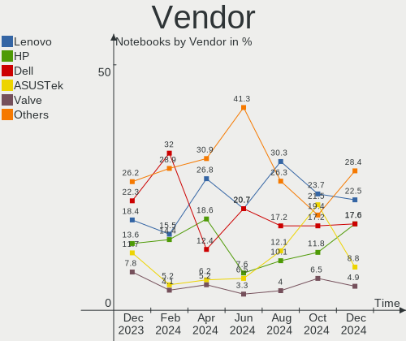
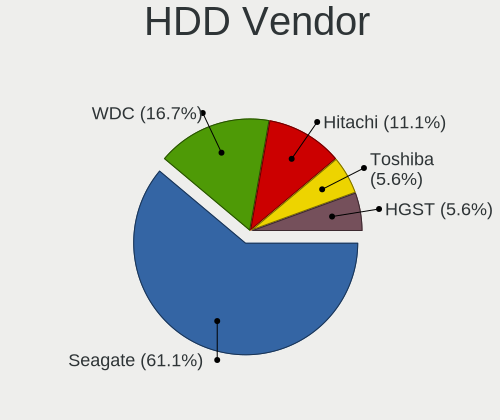
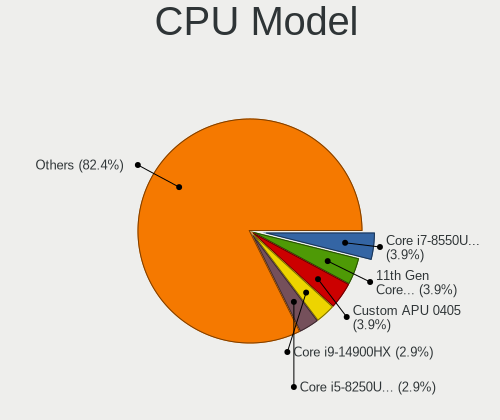
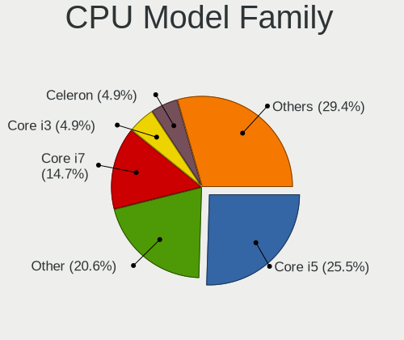
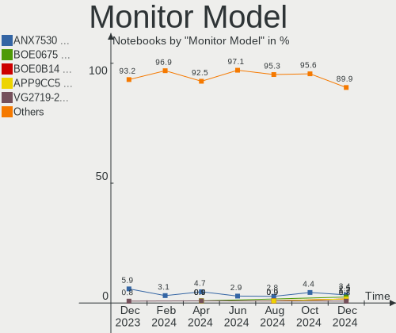
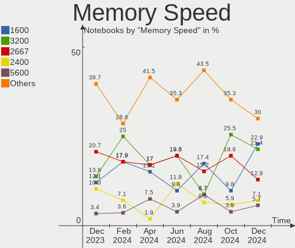
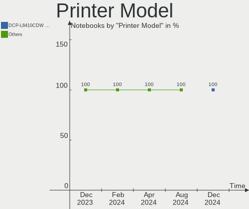
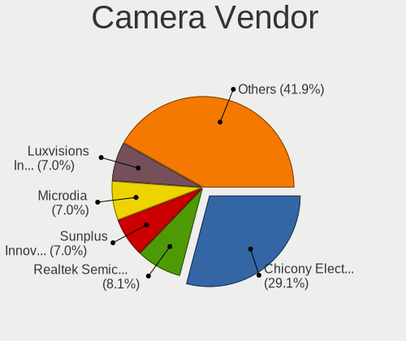
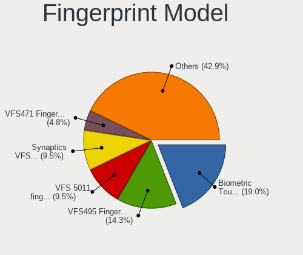

Linux in UK - Hardware Trends (Notebooks)
-----------------------------------------

A project to identify most popular hardware characteristics and track their change
over time based on data collected by Linux users at https://Linux-Hardware.org.

Anyone can contribute to this report by the [hw-probe](https://github.com/linuxhw/hw-probe) tool:

    sudo -E hw-probe -all -upload

Period: Nov, 2023.

Contents
--------

* [ System ](#system)
  - [ OS                       ](#os)
  - [ OS Family                ](#os-family)
  - [ Kernel                   ](#kernel)
  - [ Kernel Family            ](#kernel-family)
  - [ Kernel Major Ver.        ](#kernel-major-ver)
  - [ Arch                     ](#arch)
  - [ DE                       ](#de)
  - [ Display Server           ](#display-server)
  - [ Display Manager          ](#display-manager)
  - [ OS Lang                  ](#os-lang)
  - [ Boot Mode                ](#boot-mode)
  - [ Filesystem               ](#filesystem)
  - [ Part. scheme             ](#part-scheme)
  - [ Dual Boot with Linux/BSD ](#dual-boot-with-linuxbsd)
  - [ Dual Boot (Win)          ](#dual-boot-win)

* [ Board ](#board)
  - [ Vendor                   ](#vendor)
  - [ Model                    ](#model)
  - [ Model Family             ](#model-family)
  - [ MFG Year                 ](#mfg-year)
  - [ Form Factor              ](#form-factor)
  - [ Secure Boot              ](#secure-boot)
  - [ Coreboot                 ](#coreboot)
  - [ RAM Size                 ](#ram-size)
  - [ RAM Used                 ](#ram-used)
  - [ Total Drives             ](#total-drives)
  - [ Has CD-ROM               ](#has-cd-rom)
  - [ Has Ethernet             ](#has-ethernet)
  - [ Has WiFi                 ](#has-wifi)
  - [ Has Bluetooth            ](#has-bluetooth)

* [ Location ](#location)
  - [ Country                  ](#country)
  - [ City                     ](#city)

* [ Drives ](#drives)
  - [ Drive Vendor             ](#drive-vendor)
  - [ Drive Model              ](#drive-model)
  - [ HDD Vendor               ](#hdd-vendor)
  - [ SSD Vendor               ](#ssd-vendor)
  - [ Drive Kind               ](#drive-kind)
  - [ Drive Connector          ](#drive-connector)
  - [ Drive Size               ](#drive-size)
  - [ Space Total              ](#space-total)
  - [ Space Used               ](#space-used)
  - [ Malfunc. Drives          ](#malfunc-drives)
  - [ Malfunc. Drive Vendor    ](#malfunc-drive-vendor)
  - [ Malfunc. HDD Vendor      ](#malfunc-hdd-vendor)
  - [ Malfunc. Drive Kind      ](#malfunc-drive-kind)
  - [ Failed Drives            ](#failed-drives)
  - [ Failed Drive Vendor      ](#failed-drive-vendor)
  - [ Drive Status             ](#drive-status)

* [ Storage controller ](#storage-controller)
  - [ Storage Vendor           ](#storage-vendor)
  - [ Storage Model            ](#storage-model)
  - [ Storage Kind             ](#storage-kind)

* [ Processor ](#processor)
  - [ CPU Vendor               ](#cpu-vendor)
  - [ CPU Model                ](#cpu-model)
  - [ CPU Model Family         ](#cpu-model-family)
  - [ CPU Cores                ](#cpu-cores)
  - [ CPU Sockets              ](#cpu-sockets)
  - [ CPU Threads              ](#cpu-threads)
  - [ CPU Op-Modes             ](#cpu-op-modes)
  - [ CPU Microcode            ](#cpu-microcode)
  - [ CPU Microarch            ](#cpu-microarch)

* [ Graphics ](#graphics)
  - [ GPU Vendor               ](#gpu-vendor)
  - [ GPU Model                ](#gpu-model)
  - [ GPU Combo                ](#gpu-combo)
  - [ GPU Driver               ](#gpu-driver)
  - [ GPU Memory               ](#gpu-memory)

* [ Monitor ](#monitor)
  - [ Monitor Vendor           ](#monitor-vendor)
  - [ Monitor Model            ](#monitor-model)
  - [ Monitor Resolution       ](#monitor-resolution)
  - [ Monitor Diagonal         ](#monitor-diagonal)
  - [ Monitor Width            ](#monitor-width)
  - [ Aspect Ratio             ](#aspect-ratio)
  - [ Monitor Area             ](#monitor-area)
  - [ Pixel Density            ](#pixel-density)
  - [ Multiple Monitors        ](#multiple-monitors)

* [ Network ](#network)
  - [ Net Controller Vendor    ](#net-controller-vendor)
  - [ Net Controller Model     ](#net-controller-model)
  - [ Wireless Vendor          ](#wireless-vendor)
  - [ Wireless Model           ](#wireless-model)
  - [ Ethernet Vendor          ](#ethernet-vendor)
  - [ Ethernet Model           ](#ethernet-model)
  - [ Net Controller Kind      ](#net-controller-kind)
  - [ Used Controller          ](#used-controller)
  - [ NICs                     ](#nics)
  - [ IPv6                     ](#ipv6)

* [ Bluetooth ](#bluetooth)
  - [ Bluetooth Vendor         ](#bluetooth-vendor)
  - [ Bluetooth Model          ](#bluetooth-model)

* [ Sound ](#sound)
  - [ Sound Vendor             ](#sound-vendor)
  - [ Sound Model              ](#sound-model)

* [ Memory ](#memory)
  - [ Memory Vendor            ](#memory-vendor)
  - [ Memory Model             ](#memory-model)
  - [ Memory Kind              ](#memory-kind)
  - [ Memory Form Factor       ](#memory-form-factor)
  - [ Memory Size              ](#memory-size)
  - [ Memory Speed             ](#memory-speed)

* [ Printers & scanners ](#printers--scanners)
  - [ Printer Vendor           ](#printer-vendor)
  - [ Printer Model            ](#printer-model)
  - [ Scanner Vendor           ](#scanner-vendor)
  - [ Scanner Model            ](#scanner-model)

* [ Camera ](#camera)
  - [ Camera Vendor            ](#camera-vendor)
  - [ Camera Model             ](#camera-model)

* [ Security ](#security)
  - [ Fingerprint Vendor       ](#fingerprint-vendor)
  - [ Fingerprint Model        ](#fingerprint-model)
  - [ Chipcard Vendor          ](#chipcard-vendor)
  - [ Chipcard Model           ](#chipcard-model)

* [ Unsupported ](#unsupported)
  - [ Unsupported Devices      ](#unsupported-devices)
  - [ Unsupported Device Types ](#unsupported-device-types)

System
------

OS
--

Installed operating systems

| Name                         | Notebooks | Percent |
|------------------------------|-----------|---------|
| Ubuntu 22.04                 | 20        | 16.13%  |
| Fedora 39                    | 12        | 9.68%   |
| Zorin 16                     | 7         | 5.65%   |
| Ubuntu 23.10                 | 7         | 5.65%   |
| Linux Mint 21.2              | 5         | 4.03%   |
| Debian 12                    | 5         | 4.03%   |
| SteamOS 3.4.11               | 4         | 3.23%   |
| OpenMandriva 23.08           | 4         | 3.23%   |
| Fedora 38                    | 4         | 3.23%   |
| ArcoLinux Rolling            | 4         | 3.23%   |
| Arch Rolling                 | 4         | 3.23%   |
| Pop!_OS 22.04                | 3         | 2.42%   |
| OpenMandriva 5.0             | 3         | 2.42%   |
| Nobara 38                    | 3         | 2.42%   |
| BlackPanther 18.1            | 3         | 2.42%   |
| Xubuntu 23.10                | 2         | 1.61%   |
| Ubuntu 23.04                 | 2         | 1.61%   |
| Ubuntu 20.04                 | 2         | 1.61%   |
| Linux Mint 21.1              | 2         | 1.61%   |
| Linux Mint 21                | 2         | 1.61%   |
| Kubuntu 23.10                | 2         | 1.61%   |
| Kali 2023.3                  | 2         | 1.61%   |
| Xubuntu 18.04                | 1         | 0.81%   |
| Ubuntu Studio 23.10          | 1         | 0.81%   |
| Ubuntu MATE 22.04            | 1         | 0.81%   |
| Ubuntu 18.04                 | 1         | 0.81%   |
| SteamOS 3.5.7                | 1         | 0.81%   |
| SteamOS 3.5.5                | 1         | 0.81%   |
| SteamOS 3.4.8                | 1         | 0.81%   |
| SteamOS 3.1                  | 1         | 0.81%   |
| Parrot 5.3                   | 1         | 0.81%   |
| org.kde.Platform 5.15-21.08  | 1         | 0.81%   |
| Oracle Linux 8.9             | 1         | 0.81%   |
| Oracle Linux 8.8             | 1         | 0.81%   |
| openSUSE Tumbleweed-XXXXXXXX | 1         | 0.81%   |
| MX 23                        | 1         | 0.81%   |
| Manjaro                      | 1         | 0.81%   |
| Lubuntu 23.10                | 1         | 0.81%   |
| LMDE 6                       | 1         | 0.81%   |
| Kubuntu 23.04                | 1         | 0.81%   |

OS Family
---------

OS without a version

| Name             | Notebooks | Percent |
|------------------|-----------|---------|
| Ubuntu           | 32        | 25.81%  |
| Fedora           | 16        | 12.9%   |
| Linux Mint       | 9         | 7.26%   |
| SteamOS          | 8         | 6.45%   |
| Zorin            | 7         | 5.65%   |
| OpenMandriva     | 7         | 5.65%   |
| Debian           | 6         | 4.84%   |
| ArcoLinux        | 4         | 3.23%   |
| Arch             | 4         | 3.23%   |
| Xubuntu          | 3         | 2.42%   |
| Pop!_OS          | 3         | 2.42%   |
| Nobara           | 3         | 2.42%   |
| Kubuntu          | 3         | 2.42%   |
| BlackPanther     | 3         | 2.42%   |
| Oracle Linux     | 2         | 1.61%   |
| Kali             | 2         | 1.61%   |
| Ubuntu Studio    | 1         | 0.81%   |
| Ubuntu MATE      | 1         | 0.81%   |
| Parrot           | 1         | 0.81%   |
| org.kde.Platform | 1         | 0.81%   |
| openSUSE         | 1         | 0.81%   |
| MX               | 1         | 0.81%   |
| Manjaro          | 1         | 0.81%   |
| Lubuntu          | 1         | 0.81%   |
| LMDE             | 1         | 0.81%   |
| EndeavourOS      | 1         | 0.81%   |
| Elementary       | 1         | 0.81%   |
| ChimeraOS        | 1         | 0.81%   |

Kernel
------

Version of the Linux kernel

| Version                         | Notebooks | Percent |
|---------------------------------|-----------|---------|
| 6.2.0-36-generic                | 11        | 8.87%   |
| 5.15.0-88-generic               | 9         | 7.26%   |
| 6.5.0-10-generic                | 6         | 4.84%   |
| 6.1.0-13-amd64                  | 6         | 4.84%   |
| 5.15.0-89-generic               | 6         | 4.84%   |
| 6.6.1-arch1-1                   | 5         | 4.03%   |
| 6.5.11-300.fc39.x86_64          | 5         | 4.03%   |
| 6.2.0-37-generic                | 4         | 3.23%   |
| 5.13.0-valve37-1-neptune        | 4         | 3.23%   |
| 6.6.2-desktop-1omv2390          | 3         | 2.42%   |
| 6.5.6-76060506-generic          | 3         | 2.42%   |
| 6.5.6-300.fc39.x86_64           | 3         | 2.42%   |
| 6.5.0-9-generic                 | 3         | 2.42%   |
| 6.4.11-desktop-1omv2390         | 3         | 2.42%   |
| 6.4.10-202.fsync.fc38.x86_64    | 3         | 2.42%   |
| 6.2.0-26-generic                | 3         | 2.42%   |
| 5.15.85-desktop-1bP             | 3         | 2.42%   |
| 6.5.8-200.fc38.x86_64           | 2         | 1.61%   |
| 6.5.12-300.fc39.x86_64          | 2         | 1.61%   |
| 6.5.10-200.fc38.x86_64          | 2         | 1.61%   |
| 6.5.0-kali3-amd64               | 2         | 1.61%   |
| 5.4.0-150-generic               | 2         | 1.61%   |
| 5.15.0-200.131.27.el8uek.x86_64 | 2         | 1.61%   |
| 6.6.2-arch1-1                   | 1         | 0.81%   |
| 6.6.1-chos3-chimeraos-1         | 1         | 0.81%   |
| 6.6.0.15.realtime1-1-rt         | 1         | 0.81%   |
| 6.6.0-1-MANJARO                 | 1         | 0.81%   |
| 6.5.9-arch2-1                   | 1         | 0.81%   |
| 6.5.9-1-default                 | 1         | 0.81%   |
| 6.5.9                           | 1         | 0.81%   |
| 6.5.10-hardened1-1-hardened     | 1         | 0.81%   |
| 6.5.10-300.fc39.x86_64          | 1         | 0.81%   |
| 6.5.0-13-lowlatency             | 1         | 0.81%   |
| 6.5.0-13-generic                | 1         | 0.81%   |
| 6.5.0-10-lowlatency             | 1         | 0.81%   |
| 6.4.8-desktop-2omv2390          | 1         | 0.81%   |
| 6.4.3-060403-generic            | 1         | 0.81%   |
| 6.3.8-x64v3-xanmod1             | 1         | 0.81%   |
| 6.2.9-300.fc38.x86_64           | 1         | 0.81%   |
| 6.2.0-1016-oracle               | 1         | 0.81%   |

Kernel Family
-------------

Linux kernel without a distro release

| Version  | Notebooks | Percent |
|----------|-----------|---------|
| 5.15.0   | 22        | 17.74%  |
| 6.2.0    | 19        | 15.32%  |
| 6.5.0    | 14        | 11.29%  |
| 6.1.0    | 8         | 6.45%   |
| 5.13.0   | 7         | 5.65%   |
| 6.6.1    | 6         | 4.84%   |
| 6.5.6    | 6         | 4.84%   |
| 6.5.11   | 5         | 4.03%   |
| 6.6.2    | 4         | 3.23%   |
| 6.5.10   | 4         | 3.23%   |
| 6.5.9    | 3         | 2.42%   |
| 6.4.11   | 3         | 2.42%   |
| 6.4.10   | 3         | 2.42%   |
| 5.4.0    | 3         | 2.42%   |
| 5.15.85  | 3         | 2.42%   |
| 6.5.8    | 2         | 1.61%   |
| 6.5.12   | 2         | 1.61%   |
| 6.1.52   | 2         | 1.61%   |
| 6.6.0.15 | 1         | 0.81%   |
| 6.6.0    | 1         | 0.81%   |
| 6.4.8    | 1         | 0.81%   |
| 6.4.3    | 1         | 0.81%   |
| 6.3.8    | 1         | 0.81%   |
| 6.2.9    | 1         | 0.81%   |
| 5.8.0    | 1         | 0.81%   |
| 5.10.0   | 1         | 0.81%   |

Kernel Major Ver.
-----------------

Linux kernel major version

| Version | Notebooks | Percent |
|---------|-----------|---------|
| 6.5     | 36        | 29.03%  |
| 5.15    | 25        | 20.16%  |
| 6.2     | 20        | 16.13%  |
| 6.6     | 11        | 8.87%   |
| 6.1     | 10        | 8.06%   |
| 6.4     | 8         | 6.45%   |
| 5.13    | 7         | 5.65%   |
| 5.4     | 3         | 2.42%   |
| 6.6.0   | 1         | 0.81%   |
| 6.3     | 1         | 0.81%   |
| 5.8     | 1         | 0.81%   |
| 5.10    | 1         | 0.81%   |

Arch
----

OS architecture (x86_64, i586, etc.)

| Name   | Notebooks | Percent |
|--------|-----------|---------|
| x86_64 | 123       | 99.19%  |
| i686   | 1         | 0.81%   |

DE
--

Desktop Environment

| Name       | Notebooks | Percent |
|------------|-----------|---------|
| GNOME      | 69        | 55.65%  |
| KDE5       | 26        | 20.97%  |
| XFCE       | 8         | 6.45%   |
| MATE       | 8         | 6.45%   |
| X-Cinnamon | 4         | 3.23%   |
| LXQt       | 3         | 2.42%   |
| Unknown    | 2         | 1.61%   |
| Pantheon   | 1         | 0.81%   |
| Cinnamon   | 1         | 0.81%   |
| chadwm     | 1         | 0.81%   |
| Budgie     | 1         | 0.81%   |

Display Server
--------------

X11 or Wayland

| Name    | Notebooks | Percent |
|---------|-----------|---------|
| X11     | 70        | 56.45%  |
| Wayland | 52        | 41.94%  |
| Tty     | 2         | 1.61%   |

Display Manager
---------------

SDDM, LightDM, etc.

| Name    | Notebooks | Percent |
|---------|-----------|---------|
| Unknown | 41        | 33.06%  |
| GDM3    | 37        | 29.84%  |
| SDDM    | 20        | 16.13%  |
| LightDM | 15        | 12.1%   |
| GDM     | 10        | 8.06%   |
| XDM     | 1         | 0.81%   |

OS Lang
-------

Language

| Lang    | Notebooks | Percent |
|---------|-----------|---------|
| en_GB   | 93        | 75%     |
| en_US   | 20        | 16.13%  |
| Unknown | 5         | 4.03%   |
| C       | 4         | 3.23%   |
| pl_PL   | 1         | 0.81%   |
| en_NZ   | 1         | 0.81%   |

Boot Mode
---------

EFI or BIOS

| Mode | Notebooks | Percent |
|------|-----------|---------|
| EFI  | 77        | 62.1%   |
| BIOS | 47        | 37.9%   |

Filesystem
----------

Type of filesystem

| Type    | Notebooks | Percent |
|---------|-----------|---------|
| Ext4    | 57        | 45.97%  |
| Btrfs   | 30        | 24.19%  |
| Tmpfs   | 23        | 18.55%  |
| Overlay | 11        | 8.87%   |
| Xfs     | 2         | 1.61%   |
| Zfs     | 1         | 0.81%   |

Part. scheme
------------

Scheme of partitioning

| Type    | Notebooks | Percent |
|---------|-----------|---------|
| GPT     | 76        | 61.29%  |
| Unknown | 40        | 32.26%  |
| MBR     | 8         | 6.45%   |

Dual Boot with Linux/BSD
------------------------

Hosting more than one Linux/BSD

| Dual boot | Notebooks | Percent |
|-----------|-----------|---------|
| No        | 110       | 88.71%  |
| Yes       | 14        | 11.29%  |

Dual Boot (Win)
---------------

Hosting Linux and Windows

| Dual boot | Notebooks | Percent |
|-----------|-----------|---------|
| No        | 90        | 72.58%  |
| Yes       | 34        | 27.42%  |

Board
-----

Vendor
------

Motherboard manufacturer

| Name                | Notebooks | Percent |
|---------------------|-----------|---------|
| Lenovo              | 27        | 21.77%  |
| Dell                | 20        | 16.13%  |
| Hewlett-Packard     | 19        | 15.32%  |
| Acer                | 12        | 9.68%   |
| Valve               | 9         | 7.26%   |
| Apple               | 8         | 6.45%   |
| ASUSTek Computer    | 7         | 5.65%   |
| Toshiba             | 5         | 4.03%   |
| HUAWEI              | 3         | 2.42%   |
| Linx                | 2         | 1.61%   |
| Tactus              | 1         | 0.81%   |
| Samsung Electronics | 1         | 0.81%   |
| Razer               | 1         | 0.81%   |
| ONE-NETBOOK         | 1         | 0.81%   |
| Notebook            | 1         | 0.81%   |
| MSI                 | 1         | 0.81%   |
| Jumper              | 1         | 0.81%   |
| iOTA                | 1         | 0.81%   |
| Google              | 1         | 0.81%   |
| Clevo               | 1         | 0.81%   |
| AWOW                | 1         | 0.81%   |
| Alienware           | 1         | 0.81%   |

Model
-----

Motherboard model

| Name                                               | Notebooks | Percent |
|----------------------------------------------------|-----------|---------|
| Valve Jupiter                                      | 9         | 7.26%   |
| Dell XPS 15 9570                                   | 3         | 2.42%   |
| Toshiba Satellite C660D                            | 2         | 1.61%   |
| Lenovo V15 G2 ALC 82KD                             | 2         | 1.61%   |
| HP Pavilion Notebook                               | 2         | 1.61%   |
| HP Laptop 15-bw0xx                                 | 2         | 1.61%   |
| Apple MacBookPro11,4                               | 2         | 1.61%   |
| Toshiba TECRA R940                                 | 1         | 0.81%   |
| Toshiba Satellite L300                             | 1         | 0.81%   |
| Toshiba Satellite C50-A-1CK                        | 1         | 0.81%   |
| Tactus GeoBook 110                                 | 1         | 0.81%   |
| Samsung 550P5C/550P7C                              | 1         | 0.81%   |
| Razer Blade 15 Base Model (Early 2020) - RZ09-0328 | 1         | 0.81%   |
| ONE-NETBOOK ONEXPLAYER 2 PRO ARP23P                | 1         | 0.81%   |
| Notebook NS5x_NS7xPU                               | 1         | 0.81%   |
| MSI Katana GF66 11UE                               | 1         | 0.81%   |
| Linx LINX1010L                                     | 1         | 0.81%   |
| Linx LINX1010B                                     | 1         | 0.81%   |
| Lenovo Z50-75 80EC                                 | 1         | 0.81%   |
| Lenovo V130-15IKB 81HN                             | 1         | 0.81%   |
| Lenovo ThinkPad X250 20CLS0RK00                    | 1         | 0.81%   |
| Lenovo ThinkPad X1 Carbon 6th 20KGS0MM02           | 1         | 0.81%   |
| Lenovo ThinkPad X1 Carbon 3rd 20BTS18E00           | 1         | 0.81%   |
| Lenovo ThinkPad T450 20BUS00700                    | 1         | 0.81%   |
| Lenovo ThinkPad T420 4180AZ8                       | 1         | 0.81%   |
| Lenovo ThinkPad T14s Gen 3 21CQCTO1WW              | 1         | 0.81%   |
| Lenovo ThinkPad T14 Gen 2i 20W000BAUK              | 1         | 0.81%   |
| Lenovo ThinkPad P52s 20LCA0ANUK                    | 1         | 0.81%   |
| Lenovo ThinkPad P43s 20RHCTO1WW                    | 1         | 0.81%   |
| Lenovo ThinkPad P16s Gen 1 21BT000MUK              | 1         | 0.81%   |
| Lenovo ThinkPad P16 Gen 1 21D6003PMX               | 1         | 0.81%   |
| Lenovo ThinkPad Edge E325 12973LG                  | 1         | 0.81%   |
| Lenovo ThinkPad E15 20RD0011UK                     | 1         | 0.81%   |
| Lenovo ThinkBook 13s-IML 20RR                      | 1         | 0.81%   |
| Lenovo LOQ 15IRH8 82XV                             | 1         | 0.81%   |
| Lenovo Legion Pro 5 16IRX8 82WK                    | 1         | 0.81%   |
| Lenovo Legion 5 15ARH05 82B5                       | 1         | 0.81%   |
| Lenovo IdeaPad Y700-15ISK 80NV                     | 1         | 0.81%   |
| Lenovo IdeaPad 330S-15IKB 81F5                     | 1         | 0.81%   |
| Lenovo IdeaPad 330-14IGM 81D0                      | 1         | 0.81%   |

Model Family
------------

Motherboard model prefix

| Name                   | Notebooks | Percent |
|------------------------|-----------|---------|
| Lenovo ThinkPad        | 13        | 10.48%  |
| Acer Aspire            | 11        | 8.87%   |
| Valve Jupiter          | 9         | 7.26%   |
| Dell Latitude          | 7         | 5.65%   |
| Lenovo IdeaPad         | 6         | 4.84%   |
| Dell XPS               | 5         | 4.03%   |
| Dell Inspiron          | 5         | 4.03%   |
| Toshiba Satellite      | 4         | 3.23%   |
| HP Pavilion            | 4         | 3.23%   |
| HP Laptop              | 4         | 3.23%   |
| HP EliteBook           | 3         | 2.42%   |
| ASUS VivoBook          | 3         | 2.42%   |
| Apple MacBookPro11     | 3         | 2.42%   |
| Lenovo V15             | 2         | 1.61%   |
| Lenovo Legion          | 2         | 1.61%   |
| HP ZBook               | 2         | 1.61%   |
| HP ProBook             | 2         | 1.61%   |
| Dell Precision         | 2         | 1.61%   |
| ASUS ROG               | 2         | 1.61%   |
| Toshiba TECRA          | 1         | 0.81%   |
| Tactus GeoBook         | 1         | 0.81%   |
| Samsung 550P5C         | 1         | 0.81%   |
| Razer Blade            | 1         | 0.81%   |
| ONE-NETBOOK ONEXPLAYER | 1         | 0.81%   |
| Notebook NS5x          | 1         | 0.81%   |
| MSI Katana             | 1         | 0.81%   |
| Linx LINX1010L         | 1         | 0.81%   |
| Linx LINX1010B         | 1         | 0.81%   |
| Lenovo Z50-75          | 1         | 0.81%   |
| Lenovo V130-15IKB      | 1         | 0.81%   |
| Lenovo ThinkBook       | 1         | 0.81%   |
| Lenovo LOQ             | 1         | 0.81%   |
| Jumper EZbook          | 1         | 0.81%   |
| iOTA IOTA2320          | 1         | 0.81%   |
| HUAWEI NBD-WXX9        | 1         | 0.81%   |
| HUAWEI MRGFG-XX        | 1         | 0.81%   |
| HUAWEI BoDE-WXX9       | 1         | 0.81%   |
| HP Presario            | 1         | 0.81%   |
| HP OMEN                | 1         | 0.81%   |
| HP Dragonfly           | 1         | 0.81%   |

MFG Year
--------

Motherboard manufacture year

| Year | Notebooks | Percent |
|------|-----------|---------|
| 2020 | 16        | 12.9%   |
| 2023 | 15        | 12.1%   |
| 2017 | 14        | 11.29%  |
| 2021 | 13        | 10.48%  |
| 2022 | 10        | 8.06%   |
| 2018 | 10        | 8.06%   |
| 2012 | 8         | 6.45%   |
| 2019 | 7         | 5.65%   |
| 2013 | 6         | 4.84%   |
| 2015 | 5         | 4.03%   |
| 2014 | 4         | 3.23%   |
| 2011 | 4         | 3.23%   |
| 2010 | 4         | 3.23%   |
| 2016 | 3         | 2.42%   |
| 2009 | 2         | 1.61%   |
| 2007 | 2         | 1.61%   |
| 2008 | 1         | 0.81%   |

Form Factor
-----------

Physical design of the computer

| Name     | Notebooks | Percent |
|----------|-----------|---------|
| Notebook | 124       | 100%    |

Secure Boot
-----------

Enabled or disabled

| State    | Notebooks | Percent |
|----------|-----------|---------|
| Disabled | 108       | 87.1%   |
| Enabled  | 16        | 12.9%   |

Coreboot
--------

Have coreboot on board

| Used | Notebooks | Percent |
|------|-----------|---------|
| No   | 123       | 99.19%  |
| Yes  | 1         | 0.81%   |

RAM Size
--------

Total RAM memory

| Size in GB  | Notebooks | Percent |
|-------------|-----------|---------|
| 4.01-8.0    | 31        | 25%     |
| 8.01-16.0   | 27        | 21.77%  |
| 16.01-24.0  | 23        | 18.55%  |
| 3.01-4.0    | 21        | 16.94%  |
| 32.01-64.0  | 14        | 11.29%  |
| 1.01-2.0    | 5         | 4.03%   |
| 24.01-32.0  | 1         | 0.81%   |
| 64.01-256.0 | 1         | 0.81%   |
| 0.51-1.0    | 1         | 0.81%   |

RAM Used
--------

Used RAM memory

| Used GB    | Notebooks | Percent |
|------------|-----------|---------|
| 1.01-2.0   | 38        | 30.65%  |
| 3.01-4.0   | 27        | 21.77%  |
| 4.01-8.0   | 24        | 19.35%  |
| 2.01-3.0   | 23        | 18.55%  |
| 8.01-16.0  | 6         | 4.84%   |
| 0.51-1.0   | 4         | 3.23%   |
| 16.01-24.0 | 1         | 0.81%   |
| 0.01-0.5   | 1         | 0.81%   |

Total Drives
------------

Number of drives on board

| Drives | Notebooks | Percent |
|--------|-----------|---------|
| 1      | 83        | 66.94%  |
| 2      | 36        | 29.03%  |
| 3      | 4         | 3.23%   |
| 5      | 1         | 0.81%   |

Has CD-ROM
----------

Has CD-ROM on board

| Presented | Notebooks | Percent |
|-----------|-----------|---------|
| No        | 97        | 78.23%  |
| Yes       | 27        | 21.77%  |

Has Ethernet
------------

Has Ethernet on board

| Presented | Notebooks | Percent |
|-----------|-----------|---------|
| Yes       | 85        | 68.55%  |
| No        | 39        | 31.45%  |

Has WiFi
--------

Has WiFi module

| Presented | Notebooks | Percent |
|-----------|-----------|---------|
| Yes       | 122       | 98.39%  |
| No        | 2         | 1.61%   |

Has Bluetooth
-------------

Has Bluetooth module

| Presented | Notebooks | Percent |
|-----------|-----------|---------|
| Yes       | 105       | 84.68%  |
| No        | 19        | 15.32%  |

Location
--------

Country
-------

Geographic location (country)

| Country | Notebooks | Percent |
|---------|-----------|---------|
| UK      | 124       | 100%    |

City
----

Geographic location (city)

| City             | Notebooks | Percent |
|------------------|-----------|---------|
| Manchester       | 6         | 4.84%   |
| London           | 4         | 3.23%   |
| Southampton      | 3         | 2.42%   |
| Lewisham         | 3         | 2.42%   |
| Edgware          | 3         | 2.42%   |
| Birmingham       | 3         | 2.42%   |
| Stockport        | 2         | 1.61%   |
| Southwark        | 2         | 1.61%   |
| Slough           | 2         | 1.61%   |
| Sheffield        | 2         | 1.61%   |
| Rochdale         | 2         | 1.61%   |
| Nottingham       | 2         | 1.61%   |
| Islington        | 2         | 1.61%   |
| Harringay        | 2         | 1.61%   |
| Harlow           | 2         | 1.61%   |
| Hackney          | 2         | 1.61%   |
| Glasgow          | 2         | 1.61%   |
| Cheltenham       | 2         | 1.61%   |
| Cardiff          | 2         | 1.61%   |
| Bristol          | 2         | 1.61%   |
| Basingstoke      | 2         | 1.61%   |
| Wrexham          | 1         | 0.81%   |
| Woking           | 1         | 0.81%   |
| Wembley          | 1         | 0.81%   |
| Watford          | 1         | 0.81%   |
| Waterlooville    | 1         | 0.81%   |
| Walton on Thames | 1         | 0.81%   |
| Wakefield        | 1         | 0.81%   |
| Turriff          | 1         | 0.81%   |
| Thatcham         | 1         | 0.81%   |
| Surbiton         | 1         | 0.81%   |
| Stoke-on-Trent   | 1         | 0.81%   |
| Stockton-on-Tees | 1         | 0.81%   |
| Sleaford         | 1         | 0.81%   |
| Skelmersdale     | 1         | 0.81%   |
| Shotts           | 1         | 0.81%   |
| Salisbury        | 1         | 0.81%   |
| Reading          | 1         | 0.81%   |
| Preston          | 1         | 0.81%   |
| Plymouth         | 1         | 0.81%   |

Drives
------

Drive Vendor
------------

Hard drive vendors

| Vendor                      | Notebooks | Drives | Percent |
|-----------------------------|-----------|--------|---------|
| Samsung Electronics         | 22        | 24     | 13.66%  |
| Unknown                     | 20        | 24     | 12.42%  |
| WDC                         | 12        | 12     | 7.45%   |
| Toshiba                     | 11        | 11     | 6.83%   |
| Sandisk                     | 9         | 9      | 5.59%   |
| SK hynix                    | 8         | 8      | 4.97%   |
| Seagate                     | 8         | 8      | 4.97%   |
| Kingston                    | 7         | 7      | 4.35%   |
| Apple                       | 7         | 9      | 4.35%   |
| Intel                       | 6         | 7      | 3.73%   |
| Phison Electronics          | 4         | 4      | 2.48%   |
| Kingston Technology Company | 4         | 4      | 2.48%   |
| O2 Micro                    | 3         | 3      | 1.86%   |
| Micron/Crucial Technology   | 3         | 3      | 1.86%   |
| LITEON                      | 3         | 3      | 1.86%   |
| KIOXIA                      | 3         | 3      | 1.86%   |
| Crucial                     | 3         | 3      | 1.86%   |
| China                       | 3         | 3      | 1.86%   |
| Unknown                     | 3         | 3      | 1.86%   |
| Micron Technology           | 2         | 2      | 1.24%   |
| HGST                        | 2         | 2      | 1.24%   |
| Team                        | 1         | 1      | 0.62%   |
| TCSUNBOW                    | 1         | 1      | 0.62%   |
| SSK SD30                    | 1         | 1      | 0.62%   |
| SPCC                        | 1         | 1      | 0.62%   |
| Silicon Motion              | 1         | 2      | 0.62%   |
| SABRENT                     | 1         | 1      | 0.62%   |
| Realtek                     | 1         | 1      | 0.62%   |
| PNY                         | 1         | 1      | 0.62%   |
| Phison                      | 1         | 1      | 0.62%   |
| Patriot                     | 1         | 1      | 0.62%   |
| NGFF                        | 1         | 1      | 0.62%   |
| Netac                       | 1         | 1      | 0.62%   |
| Lexar                       | 1         | 1      | 0.62%   |
| JMicron Technology          | 1         | 1      | 0.62%   |
| Integral                    | 1         | 1      | 0.62%   |
| Fujitsu                     | 1         | 1      | 0.62%   |
| Drevo                       | 1         | 1      | 0.62%   |
| Corsair                     | 1         | 1      | 0.62%   |

Drive Model
-----------

Hard drive models

| Model                                               | Notebooks | Percent |
|-----------------------------------------------------|-----------|---------|
| Unknown MMC Card  64GB                              | 7         | 4.14%   |
| Samsung NVMe SSD Controller SM981/PM981/PM983 250GB | 7         | 4.14%   |
| Unknown MMC Card  512GB                             | 4         | 2.37%   |
| Unknown MMC Card  128GB                             | 4         | 2.37%   |
| Toshiba MQ01ABD100 1TB                              | 3         | 1.78%   |
| Seagate ST1000LM035-1RK172 1TB                      | 3         | 1.78%   |
| Phison PS5013 E13 NVMe Controller 512GB             | 3         | 1.78%   |
| O2 Micro E2M2 64GB                                  | 3         | 1.78%   |
| Kingston SA400S37240G 240GB SSD                     | 3         | 1.78%   |
| Unknown                                             | 3         | 1.78%   |
| WDC WD10JPVX-60JC3T1 1TB                            | 2         | 1.18%   |
| Unknown MMC Card  32GB                              | 2         | 1.18%   |
| Samsung Portable SSD T5 2TB                         | 2         | 1.18%   |
| Samsung NVMe SSD Controller PM9A1/PM9A3/980PRO 2TB  | 2         | 1.18%   |
| Samsung MZALQ512HBLU-00BL2 512GB                    | 2         | 1.18%   |
| Micron/Crucial P2 NVMe PCIe SSD 1TB                 | 2         | 1.18%   |
| Kingston Company OM3PDP3 NVMe SSD 256GB             | 2         | 1.18%   |
| WDC WDS500G2B0C 500GB                               | 1         | 0.59%   |
| WDC WD7500BPVX-22JC3T0 752GB                        | 1         | 0.59%   |
| WDC WD5000LPLX-75ZNTT0 500GB                        | 1         | 0.59%   |
| WDC WD3200BEKT-00PVMT0 320GB                        | 1         | 0.59%   |
| WDC WD32 00BPVT-22ZEST0 320GB                       | 1         | 0.59%   |
| WDC WD10SPCX-24HWST1 1TB                            | 1         | 0.59%   |
| WDC WD10JPVX-75JC3T0 1TB                            | 1         | 0.59%   |
| WDC WD10JPVX-60JC3T0 1TB                            | 1         | 0.59%   |
| WDC WD10JPVX-22JC3T0 1TB                            | 1         | 0.59%   |
| WDC PC SN530 NVMe 256GB                             | 1         | 0.59%   |
| Unknown SD256  256GB                                | 1         | 0.59%   |
| Unknown NVMe SSD Drive 2TB                          | 1         | 0.59%   |
| Unknown NVMe SSD Drive 1024GB                       | 1         | 0.59%   |
| Unknown MMC Card  256GB                             | 1         | 0.59%   |
| Unknown MMC Card  197GB                             | 1         | 0.59%   |
| Unknown MMC Card  16GB                              | 1         | 0.59%   |
| Unknown DA4128  128GB                               | 1         | 0.59%   |
| Toshiba XG4 NVMe SSD Controller 512GB               | 1         | 0.59%   |
| Toshiba THNSNK256GVN8 M.2 2280 256GB SSD            | 1         | 0.59%   |
| Toshiba THNSFJ256GDNU 256GB SSD                     | 1         | 0.59%   |
| Toshiba MQ04ABF100 1TB                              | 1         | 0.59%   |
| Toshiba MQ01ABD100V 1TB                             | 1         | 0.59%   |
| Toshiba MQ01ABD075 752GB                            | 1         | 0.59%   |

HDD Vendor
----------

Hard disk drive vendors

| Vendor  | Notebooks | Drives | Percent |
|---------|-----------|--------|---------|
| WDC     | 10        | 10     | 37.04%  |
| Toshiba | 7         | 7      | 25.93%  |
| Seagate | 7         | 7      | 25.93%  |
| HGST    | 2         | 2      | 7.41%   |
| Fujitsu | 1         | 1      | 3.7%    |

SSD Vendor
----------

Solid state drive vendors

| Vendor              | Notebooks | Drives | Percent |
|---------------------|-----------|--------|---------|
| Samsung Electronics | 6         | 6      | 13.95%  |
| Kingston            | 6         | 6      | 13.95%  |
| Apple               | 5         | 5      | 11.63%  |
| Toshiba             | 3         | 3      | 6.98%   |
| LITEON              | 3         | 3      | 6.98%   |
| China               | 3         | 3      | 6.98%   |
| SanDisk             | 2         | 2      | 4.65%   |
| Crucial             | 2         | 2      | 4.65%   |
| Team                | 1         | 1      | 2.33%   |
| TCSUNBOW            | 1         | 1      | 2.33%   |
| SPCC                | 1         | 1      | 2.33%   |
| SK hynix            | 1         | 1      | 2.33%   |
| SABRENT             | 1         | 1      | 2.33%   |
| PNY                 | 1         | 1      | 2.33%   |
| Patriot             | 1         | 1      | 2.33%   |
| NGFF                | 1         | 1      | 2.33%   |
| Netac               | 1         | 1      | 2.33%   |
| Lexar               | 1         | 1      | 2.33%   |
| Integral            | 1         | 1      | 2.33%   |
| Drevo               | 1         | 1      | 2.33%   |
| Unknown             | 1         | 1      | 2.33%   |

Drive Kind
----------

HDD or SSD

| Kind    | Notebooks | Drives | Percent |
|---------|-----------|--------|---------|
| NVMe    | 64        | 74     | 42.38%  |
| SSD     | 38        | 43     | 25.17%  |
| HDD     | 26        | 27     | 17.22%  |
| MMC     | 20        | 24     | 13.25%  |
| Unknown | 3         | 3      | 1.99%   |

Drive Connector
---------------

SATA, SAS, NVMe, etc.

| Type | Notebooks | Drives | Percent |
|------|-----------|--------|---------|
| NVMe | 64        | 73     | 42.67%  |
| SATA | 57        | 63     | 38%     |
| MMC  | 20        | 24     | 13.33%  |
| SAS  | 9         | 11     | 6%      |

Drive Size
----------

Size of hard drive

| Size in TB | Notebooks | Drives | Percent |
|------------|-----------|--------|---------|
| 0.01-0.5   | 40        | 42     | 58.82%  |
| 0.51-1.0   | 22        | 22     | 32.35%  |
| 1.01-2.0   | 5         | 5      | 7.35%   |
| 4.01-10.0  | 1         | 1      | 1.47%   |

Space Total
-----------

Amount of disk space available on the file system

| Size in GB     | Notebooks | Percent |
|----------------|-----------|---------|
| 101-250        | 32        | 25.81%  |
| 251-500        | 31        | 25%     |
| 501-1000       | 16        | 12.9%   |
| 1001-2000      | 12        | 9.68%   |
| 1-20           | 12        | 9.68%   |
| Unknown        | 9         | 7.26%   |
| 51-100         | 8         | 6.45%   |
| More than 3000 | 2         | 1.61%   |
| 21-50          | 1         | 0.81%   |
| 2001-3000      | 1         | 0.81%   |

Space Used
----------

Amount of used disk space

| Used GB        | Notebooks | Percent |
|----------------|-----------|---------|
| 1-20           | 40        | 32.26%  |
| 21-50          | 29        | 23.39%  |
| 101-250        | 21        | 16.94%  |
| 51-100         | 11        | 8.87%   |
| Unknown        | 9         | 7.26%   |
| 251-500        | 6         | 4.84%   |
| 501-1000       | 4         | 3.23%   |
| 1001-2000      | 3         | 2.42%   |
| More than 3000 | 1         | 0.81%   |

Malfunc. Drives
---------------

Drive models with a malfunction

| Model                                 | Notebooks | Drives | Percent |
|---------------------------------------|-----------|--------|---------|
| WDC WD32 00BPVT-22ZEST0 320GB         | 1         | 1      | 14.29%  |
| Toshiba MQ01ABD100 1TB                | 1         | 1      | 14.29%  |
| SK hynix HFS256G39TND-N210A 256GB SSD | 1         | 1      | 14.29%  |
| Seagate ST9500325AS 500GB             | 1         | 1      | 14.29%  |
| Intel SSDPEKKF512G8L 512GB            | 1         | 1      | 14.29%  |
| Intel MEMPEK1J016GAL 16GB             | 1         | 1      | 14.29%  |
| HGST HTS721010A9E630 1TB              | 1         | 1      | 14.29%  |

Malfunc. Drive Vendor
---------------------

Vendors of faulty drives

| Vendor   | Notebooks | Drives | Percent |
|----------|-----------|--------|---------|
| Intel    | 2         | 2      | 28.57%  |
| WDC      | 1         | 1      | 14.29%  |
| Toshiba  | 1         | 1      | 14.29%  |
| SK hynix | 1         | 1      | 14.29%  |
| Seagate  | 1         | 1      | 14.29%  |
| HGST     | 1         | 1      | 14.29%  |

Malfunc. HDD Vendor
-------------------

Vendors of faulty HDD drives

| Vendor  | Notebooks | Drives | Percent |
|---------|-----------|--------|---------|
| WDC     | 1         | 1      | 25%     |
| Toshiba | 1         | 1      | 25%     |
| Seagate | 1         | 1      | 25%     |
| HGST    | 1         | 1      | 25%     |

Malfunc. Drive Kind
-------------------

Kinds of faulty drives

| Kind | Notebooks | Drives | Percent |
|------|-----------|--------|---------|
| HDD  | 4         | 4      | 57.14%  |
| NVMe | 2         | 2      | 28.57%  |
| SSD  | 1         | 1      | 14.29%  |

Failed Drives
-------------

Failed drive models

Zero info for selected period =(

Failed Drive Vendor
-------------------

Failed drive vendors

Zero info for selected period =(

Drive Status
------------

Number of failed and malfunc. drives

| Status   | Notebooks | Drives | Percent |
|----------|-----------|--------|---------|
| Detected | 70        | 101    | 53.03%  |
| Works    | 55        | 63     | 41.67%  |
| Malfunc  | 7         | 7      | 5.3%    |

Storage controller
------------------

Storage Vendor
--------------

Storage controller vendors

| Vendor                       | Notebooks | Percent |
|------------------------------|-----------|---------|
| Intel                        | 68        | 45.33%  |
| Samsung Electronics          | 20        | 13.33%  |
| AMD                          | 14        | 9.33%   |
| SanDisk                      | 9         | 6%      |
| SK hynix                     | 7         | 4.67%   |
| Phison Electronics           | 6         | 4%      |
| Kingston Technology Company  | 5         | 3.33%   |
| Micron/Crucial Technology    | 4         | 2.67%   |
| O2 Micro                     | 3         | 2%      |
| KIOXIA                       | 3         | 2%      |
| Nvidia                       | 2         | 1.33%   |
| Micron Technology            | 2         | 1.33%   |
| Apple                        | 2         | 1.33%   |
| Toshiba America Info Systems | 1         | 0.67%   |
| Solidigm                     | 1         | 0.67%   |
| Silicon Motion               | 1         | 0.67%   |
| Marvell Technology Group     | 1         | 0.67%   |
| INNOGRIT                     | 1         | 0.67%   |

Storage Model
-------------

Storage controller models

| Model                                                                          | Notebooks | Percent |
|--------------------------------------------------------------------------------|-----------|---------|
| AMD FCH SATA Controller [AHCI mode]                                            | 11        | 7.01%   |
| Intel Sunrise Point-LP SATA Controller [AHCI mode]                             | 9         | 5.73%   |
| Samsung NVMe SSD Controller SM981/PM981/PM983                                  | 7         | 4.46%   |
| Intel Volume Management Device NVMe RAID Controller                            | 7         | 4.46%   |
| Intel 7 Series Chipset Family 6-port SATA Controller [AHCI mode]               | 7         | 4.46%   |
| Samsung NVMe SSD Controller 980 (DRAM-less)                                    | 6         | 3.82%   |
| Intel Celeron/Pentium Silver Processor SATA Controller                         | 5         | 3.18%   |
| Samsung NVMe SSD Controller PM9A1/PM9A3/980PRO                                 | 4         | 2.55%   |
| Phison PS5013-E13 PCIe3 NVMe Controller (DRAM-less)                            | 4         | 2.55%   |
| Intel Wildcat Point-LP SATA Controller [AHCI Mode]                             | 4         | 2.55%   |
| Intel HM170/QM170 Chipset SATA Controller [AHCI Mode]                          | 4         | 2.55%   |
| Intel Cannon Lake Mobile PCH SATA AHCI Controller                              | 4         | 2.55%   |
| Intel 82801 Mobile SATA Controller [RAID mode]                                 | 4         | 2.55%   |
| SanDisk WD Black SN770 / PC SN740 256GB / PC SN560 (DRAM-less) NVMe SSD        | 3         | 1.91%   |
| SanDisk IX SN530 NVMe SSD (DRAM-less)                                          | 3         | 1.91%   |
| O2 Micro FORESEE E2M2 NVMe SSD                                                 | 3         | 1.91%   |
| Micron/Crucial P2 [Nick P2] / P3 / P3 Plus NVMe PCIe SSD (DRAM-less)           | 3         | 1.91%   |
| Intel Celeron N3350/Pentium N4200/Atom E3900 Series SATA AHCI Controller       | 3         | 1.91%   |
| AMD SB7x0/SB8x0/SB9x0 SATA Controller [AHCI mode]                              | 3         | 1.91%   |
| SK hynix PC401 NVMe Solid State Drive 256GB                                    | 2         | 1.27%   |
| SK hynix BC511 NVMe SSD                                                        | 2         | 1.27%   |
| Samsung S4LN058A01[SSUBX] AHCI SSD Controller (Apple slot)                     | 2         | 1.27%   |
| Nvidia MCP89 SATA Controller (AHCI mode)                                       | 2         | 1.27%   |
| KIOXIA NVMe SSD Controller BG4 (DRAM-less)                                     | 2         | 1.27%   |
| Kingston Company OM3PDP3 NVMe SSD                                              | 2         | 1.27%   |
| Intel Comet Lake SATA AHCI Controller                                          | 2         | 1.27%   |
| Intel 8 Series/C220 Series Chipset Family 6-port SATA Controller 1 [AHCI mode] | 2         | 1.27%   |
| Intel 6 Series/C200 Series Chipset Family 6 port Mobile SATA AHCI Controller   | 2         | 1.27%   |
| Apple S3X NVMe Controller                                                      | 2         | 1.27%   |
| Toshiba America Info Systems XG4 NVMe SSD Controller                           | 1         | 0.64%   |
| Solidigm P41 Plus NVMe SSD (DRAM-less) [Echo Harbor]                           | 1         | 0.64%   |
| SK hynix Platinum P41/PC801 NVMe Solid State Drive                             | 1         | 0.64%   |
| SK hynix Gold P31/BC711/PC711 NVMe Solid State Drive                           | 1         | 0.64%   |
| SK hynix BC901 NVMe Solid State Drive (DRAM-less)                              | 1         | 0.64%   |
| Silicon Motion SM2263EN/SM2263XT (DRAM-less) NVMe SSD Controllers              | 1         | 0.64%   |
| SanDisk WD Blue SN500 / PC SN520 x2 M.2 2280 NVMe SSD                          | 1         | 0.64%   |
| Sandisk WD Black SN850X NVMe SSD                                               | 1         | 0.64%   |
| SanDisk Ultra 3D / WD Blue SN550 NVMe SSD                                      | 1         | 0.64%   |
| Samsung S4LN053X01 AHCI SSD Controller(Apple slot)                             | 1         | 0.64%   |
| Samsung NVMe SSD Controller SM961/PM961/SM963                                  | 1         | 0.64%   |

Storage Kind
------------

Kind of storage controller (IDE, SATA, NVMe, SAS, ...)

| Kind | Notebooks | Percent |
|------|-----------|---------|
| SATA | 74        | 49.01%  |
| NVMe | 64        | 42.38%  |
| RAID | 11        | 7.28%   |
| IDE  | 2         | 1.32%   |

Processor
---------

CPU Vendor
----------

Processor vendors

| Vendor | Notebooks | Percent |
|--------|-----------|---------|
| Intel  | 95        | 76.61%  |
| AMD    | 29        | 23.39%  |

CPU Model
---------

Processor models

| Model                                        | Notebooks | Percent |
|----------------------------------------------|-----------|---------|
| AMD Custom APU 0405                          | 9         | 7.26%   |
| Intel Core i7-8750H CPU @ 2.20GHz            | 3         | 2.42%   |
| Intel Celeron N4020 CPU @ 1.10GHz            | 3         | 2.42%   |
| Intel Core i7-8650U CPU @ 1.90GHz            | 2         | 1.61%   |
| Intel Core i7-4770HQ CPU @ 2.20GHz           | 2         | 1.61%   |
| Intel Core i5-7300HQ CPU @ 2.50GHz           | 2         | 1.61%   |
| Intel Core i5-7200U CPU @ 2.50GHz            | 2         | 1.61%   |
| Intel Core i5-3340M CPU @ 2.70GHz            | 2         | 1.61%   |
| Intel Core i5-10210U CPU @ 1.60GHz           | 2         | 1.61%   |
| Intel Celeron CPU N3350 @ 1.10GHz            | 2         | 1.61%   |
| Intel Atom CPU Z3735F @ 1.33GHz              | 2         | 1.61%   |
| Intel 13th Gen Core i7-1355U                 | 2         | 1.61%   |
| Intel 12th Gen Core i7-1260P                 | 2         | 1.61%   |
| Intel 11th Gen Core i7-1165G7 @ 2.80GHz      | 2         | 1.61%   |
| Intel 11th Gen Core i5-1135G7 @ 2.40GHz      | 2         | 1.61%   |
| AMD Ryzen 7 5700U with Radeon Graphics       | 2         | 1.61%   |
| AMD A9-9420 RADEON R5, 5 COMPUTE CORES 2C+3G | 2         | 1.61%   |
| AMD A6-9220 RADEON R4, 5 COMPUTE CORES 2C+3G | 2         | 1.61%   |
| Intel Pentium CPU N4200 @ 1.10GHz            | 1         | 0.81%   |
| Intel Pentium CPU N3530 @ 2.16GHz            | 1         | 0.81%   |
| Intel Core m7-6Y75 CPU @ 1.20GHz             | 1         | 0.81%   |
| Intel Core m5-6Y57 CPU @ 1.10GHz             | 1         | 0.81%   |
| Intel Core i7-9750H CPU @ 2.60GHz            | 1         | 0.81%   |
| Intel Core i7-8665U CPU @ 1.90GHz            | 1         | 0.81%   |
| Intel Core i7-8565U CPU @ 1.80GHz            | 1         | 0.81%   |
| Intel Core i7-7700HQ CPU @ 2.80GHz           | 1         | 0.81%   |
| Intel Core i7-7567U CPU @ 3.50GHz            | 1         | 0.81%   |
| Intel Core i7-7500U CPU @ 2.70GHz            | 1         | 0.81%   |
| Intel Core i7-6700HQ CPU @ 2.60GHz           | 1         | 0.81%   |
| Intel Core i7-5600U CPU @ 2.60GHz            | 1         | 0.81%   |
| Intel Core i7-4710MQ CPU @ 2.50GHz           | 1         | 0.81%   |
| Intel Core i7-4700MQ CPU @ 2.40GHz           | 1         | 0.81%   |
| Intel Core i7-4650U CPU @ 1.70GHz            | 1         | 0.81%   |
| Intel Core i7-3630QM CPU @ 2.40GHz           | 1         | 0.81%   |
| Intel Core i7-10870H CPU @ 2.20GHz           | 1         | 0.81%   |
| Intel Core i7-10850H CPU @ 2.70GHz           | 1         | 0.81%   |
| Intel Core i7-10750H CPU @ 2.60GHz           | 1         | 0.81%   |
| Intel Core i7-1065G7 CPU @ 1.30GHz           | 1         | 0.81%   |
| Intel Core i7-10510U CPU @ 1.80GHz           | 1         | 0.81%   |
| Intel Core i5-8250U CPU @ 1.60GHz            | 1         | 0.81%   |

CPU Model Family
----------------

Processor model prefix

| Model            | Notebooks | Percent |
|------------------|-----------|---------|
| Other            | 32        | 25.81%  |
| Intel Core i7    | 24        | 19.35%  |
| Intel Core i5    | 21        | 16.94%  |
| Intel Celeron    | 10        | 8.06%   |
| Intel Core i3    | 8         | 6.45%   |
| AMD Ryzen 7      | 5         | 4.03%   |
| Intel Core 2 Duo | 3         | 2.42%   |
| Intel Atom       | 3         | 2.42%   |
| AMD A6           | 3         | 2.42%   |
| Intel Pentium    | 2         | 1.61%   |
| AMD Ryzen 3      | 2         | 1.61%   |
| AMD E            | 2         | 1.61%   |
| Intel Core m7    | 1         | 0.81%   |
| Intel Core m5    | 1         | 0.81%   |
| Intel Celeron M  | 1         | 0.81%   |
| AMD Ryzen 9      | 1         | 0.81%   |
| AMD Ryzen 7 PRO  | 1         | 0.81%   |
| AMD Ryzen 5      | 1         | 0.81%   |
| AMD E2           | 1         | 0.81%   |
| AMD Athlon II    | 1         | 0.81%   |
| AMD A10          | 1         | 0.81%   |

CPU Cores
---------

Number of processor cores

| Number | Notebooks | Percent |
|--------|-----------|---------|
| 2      | 52        | 41.94%  |
| 4      | 42        | 33.87%  |
| 8      | 9         | 7.26%   |
| 6      | 6         | 4.84%   |
| 12     | 4         | 3.23%   |
| 10     | 4         | 3.23%   |
| 1      | 3         | 2.42%   |
| 16     | 2         | 1.61%   |
| 14     | 2         | 1.61%   |

CPU Sockets
-----------

Number of sockets

| Number | Notebooks | Percent |
|--------|-----------|---------|
| 1      | 124       | 100%    |

CPU Threads
-----------

Threads per core (Hyper-Threading)

| Number | Notebooks | Percent |
|--------|-----------|---------|
| 2      | 90        | 72.58%  |
| 1      | 34        | 27.42%  |

CPU Op-Modes
------------

CPU Operation Modes (32-bit, 64-bit)

| Op mode        | Notebooks | Percent |
|----------------|-----------|---------|
| 32-bit, 64-bit | 123       | 99.19%  |
| 32-bit         | 1         | 0.81%   |

CPU Microcode
-------------

Microcode number

| Number     | Notebooks | Percent |
|------------|-----------|---------|
| Unknown    | 85        | 68.55%  |
| 0x306a9    | 3         | 2.42%   |
| 0x06006705 | 3         | 2.42%   |
| 0xa0652    | 2         | 1.61%   |
| 0x906ea    | 2         | 1.61%   |
| 0x506c9    | 2         | 1.61%   |
| 0x08600106 | 2         | 1.61%   |
| 0xb06f2    | 1         | 0.81%   |
| 0x906e9    | 1         | 0.81%   |
| 0x806ec    | 1         | 0.81%   |
| 0x806ea    | 1         | 0.81%   |
| 0x806e9    | 1         | 0.81%   |
| 0x806c2    | 1         | 0.81%   |
| 0x706a8    | 1         | 0.81%   |
| 0x706a1    | 1         | 0.81%   |
| 0x6fa      | 1         | 0.81%   |
| 0x6ec      | 1         | 0.81%   |
| 0x506e3    | 1         | 0.81%   |
| 0x406e3    | 1         | 0.81%   |
| 0x40651    | 1         | 0.81%   |
| 0x30678    | 1         | 0.81%   |
| 0x1067a    | 1         | 0.81%   |
| 0x0a50000c | 1         | 0.81%   |
| 0x08900201 | 1         | 0.81%   |
| 0x08608103 | 1         | 0.81%   |
| 0x08600103 | 1         | 0.81%   |
| 0x08108109 | 1         | 0.81%   |
| 0x08108102 | 1         | 0.81%   |
| 0x06006704 | 1         | 0.81%   |
| 0x05000101 | 1         | 0.81%   |
| 0x03000027 | 1         | 0.81%   |
| 0x010000c8 | 1         | 0.81%   |

CPU Microarch
-------------

Microarchitecture

| Name             | Notebooks | Percent |
|------------------|-----------|---------|
| KabyLake         | 22        | 17.74%  |
| Unknown          | 17        | 13.71%  |
| Alderlake Hybrid | 9         | 7.26%   |
| TigerLake        | 8         | 6.45%   |
| Haswell          | 8         | 6.45%   |
| IvyBridge        | 7         | 5.65%   |
| Skylake          | 6         | 4.84%   |
| Goldmont plus    | 5         | 4.03%   |
| Excavator        | 5         | 4.03%   |
| CometLake        | 4         | 3.23%   |
| Broadwell        | 4         | 3.23%   |
| Zen 2            | 3         | 2.42%   |
| Silvermont       | 3         | 2.42%   |
| SandyBridge      | 3         | 2.42%   |
| Penryn           | 3         | 2.42%   |
| Goldmont         | 3         | 2.42%   |
| Zen+             | 2         | 1.61%   |
| Bobcat           | 2         | 1.61%   |
| Zen 3            | 1         | 0.81%   |
| Westmere         | 1         | 0.81%   |
| Tremont          | 1         | 0.81%   |
| Steamroller      | 1         | 0.81%   |
| P6               | 1         | 0.81%   |
| K10 Llano        | 1         | 0.81%   |
| K10              | 1         | 0.81%   |
| IceLake          | 1         | 0.81%   |
| Core             | 1         | 0.81%   |
| Bonnell          | 1         | 0.81%   |

Graphics
--------

GPU Vendor
----------

Vendors of graphics cards

| Vendor | Notebooks | Percent |
|--------|-----------|---------|
| Intel  | 92        | 59.74%  |
| AMD    | 35        | 22.73%  |
| Nvidia | 27        | 17.53%  |

GPU Model
---------

Graphics card models

| Model                                                                     | Notebooks | Percent |
|---------------------------------------------------------------------------|-----------|---------|
| AMD VanGogh [AMD Custom GPU 0405]                                         | 9         | 5.77%   |
| Intel TigerLake-LP GT2 [Iris Xe Graphics]                                 | 7         | 4.49%   |
| Intel 3rd Gen Core processor Graphics Controller                          | 7         | 4.49%   |
| Intel Raptor Lake-P [Iris Xe Graphics]                                    | 5         | 3.21%   |
| Intel HD Graphics 620                                                     | 5         | 3.21%   |
| Intel GeminiLake [UHD Graphics 600]                                       | 5         | 3.21%   |
| AMD Stoney [Radeon R2/R3/R4/R5 Graphics]                                  | 5         | 3.21%   |
| Intel UHD Graphics 620                                                    | 4         | 2.56%   |
| Intel CometLake-H GT2 [UHD Graphics]                                      | 4         | 2.56%   |
| Intel CoffeeLake-H GT2 [UHD Graphics 630]                                 | 4         | 2.56%   |
| Nvidia GP107M [GeForce GTX 1050 Ti Mobile]                                | 3         | 1.92%   |
| Nvidia GP107M [GeForce GTX 1050 Mobile]                                   | 3         | 1.92%   |
| Intel Skylake GT2 [HD Graphics 520]                                       | 3         | 1.92%   |
| Intel HD Graphics 630                                                     | 3         | 1.92%   |
| Intel HD Graphics 5500                                                    | 3         | 1.92%   |
| Intel Haswell-ULT Integrated Graphics Controller                          | 3         | 1.92%   |
| Intel CometLake-U GT2 [UHD Graphics]                                      | 3         | 1.92%   |
| Intel Atom Processor Z36xxx/Z37xxx Series Graphics & Display              | 3         | 1.92%   |
| Intel Alder Lake-P GT2 [Iris Xe Graphics]                                 | 3         | 1.92%   |
| Intel 4th Gen Core Processor Integrated Graphics Controller               | 3         | 1.92%   |
| Intel 2nd Generation Core Processor Family Integrated Graphics Controller | 3         | 1.92%   |
| AMD Renoir [Radeon RX Vega 6 (Ryzen 4000/5000 Mobile Series)]             | 3         | 1.92%   |
| Nvidia TU106M [GeForce RTX 2060 Mobile]                                   | 2         | 1.28%   |
| Nvidia MCP89 [GeForce 320M]                                               | 2         | 1.28%   |
| Nvidia AD107M [GeForce RTX 4060 Max-Q / Mobile]                           | 2         | 1.28%   |
| Intel WhiskeyLake-U GT2 [UHD Graphics 620]                                | 2         | 1.28%   |
| Intel HD Graphics 515                                                     | 2         | 1.28%   |
| Intel HD Graphics 500                                                     | 2         | 1.28%   |
| Intel Crystal Well Integrated Graphics Controller                         | 2         | 1.28%   |
| Intel Alder Lake-HX GT1 [UHD Graphics 770]                                | 2         | 1.28%   |
| AMD Picasso/Raven 2 [Radeon Vega Series / Radeon Vega Mobile Series]      | 2         | 1.28%   |
| AMD Lucienne                                                              | 2         | 1.28%   |
| Nvidia TU117M [GeForce GTX 1650 Ti Mobile]                                | 1         | 0.64%   |
| Nvidia TU117M [GeForce GTX 1650 Mobile / Max-Q]                           | 1         | 0.64%   |
| Nvidia TU117GLM [T550 Laptop GPU]                                         | 1         | 0.64%   |
| Nvidia TU117GLM [Quadro T2000 Mobile / Max-Q]                             | 1         | 0.64%   |
| Nvidia GP108M [GeForce MX150]                                             | 1         | 0.64%   |
| Nvidia GP108GLM [Quadro P520]                                             | 1         | 0.64%   |
| Nvidia GP108GLM [Quadro P500 Mobile]                                      | 1         | 0.64%   |
| Nvidia GM107M [GeForce GTX 960M]                                          | 1         | 0.64%   |

GPU Combo
---------

Combinations of graphics cards

| Name           | Notebooks | Percent |
|----------------|-----------|---------|
| 1 x Intel      | 62        | 50%     |
| 1 x AMD        | 28        | 22.58%  |
| Intel + Nvidia | 23        | 18.55%  |
| Intel + AMD    | 5         | 4.03%   |
| 2 x Intel      | 2         | 1.61%   |
| 1 x Nvidia     | 2         | 1.61%   |
| AMD + Nvidia   | 2         | 1.61%   |

GPU Driver
----------

Free vs proprietary

| Driver      | Notebooks | Percent |
|-------------|-----------|---------|
| Free        | 108       | 87.1%   |
| Proprietary | 11        | 8.87%   |
| Unknown     | 5         | 4.03%   |

GPU Memory
----------

Total video memory

| Size in GB | Notebooks | Percent |
|------------|-----------|---------|
| Unknown    | 98        | 79.03%  |
| 0.01-0.5   | 12        | 9.68%   |
| 1.01-2.0   | 7         | 5.65%   |
| 3.01-4.0   | 4         | 3.23%   |
| 7.01-8.0   | 1         | 0.81%   |
| 5.01-6.0   | 1         | 0.81%   |
| 0.51-1.0   | 1         | 0.81%   |

Monitor
-------

Monitor Vendor
--------------

Monitor vendors

| Vendor                  | Notebooks | Percent |
|-------------------------|-----------|---------|
| AU Optronics            | 22        | 16.3%   |
| BOE                     | 21        | 15.56%  |
| LG Display              | 18        | 13.33%  |
| Chimei Innolux          | 15        | 11.11%  |
| Valve                   | 9         | 6.67%   |
| Apple                   | 8         | 5.93%   |
| Sharp                   | 7         | 5.19%   |
| Samsung Electronics     | 7         | 5.19%   |
| Dell                    | 6         | 4.44%   |
| LG Philips              | 3         | 2.22%   |
| InfoVision              | 3         | 2.22%   |
| PANDA                   | 2         | 1.48%   |
| Iiyama                  | 2         | 1.48%   |
| CSO                     | 2         | 1.48%   |
| AOC                     | 2         | 1.48%   |
| Philips                 | 1         | 0.74%   |
| MStar                   | 1         | 0.74%   |
| Hitachi                 | 1         | 0.74%   |
| GreenWood               | 1         | 0.74%   |
| Goldstar                | 1         | 0.74%   |
| Chi Mei Optoelectronics | 1         | 0.74%   |
| ASUSTek Computer        | 1         | 0.74%   |
| Acer                    | 1         | 0.74%   |

Monitor Model
-------------

Monitor models

| Model                                                                 | Notebooks | Percent |
|-----------------------------------------------------------------------|-----------|---------|
| Valve ANX7530 U VLV3001 800x1280 100x150mm 7.1-inch                   | 9         | 6.43%   |
| AU Optronics LCD Monitor AUO38ED 1920x1080 344x193mm 15.5-inch        | 5         | 3.57%   |
| Chimei Innolux LCD Monitor CMN15E7 1920x1080 344x193mm 15.5-inch      | 4         | 2.86%   |
| Sharp LCD Monitor SHP148D 3840x2160 344x194mm 15.5-inch               | 3         | 2.14%   |
| Chimei Innolux LCD Monitor CMN15F5 1920x1080 344x193mm 15.5-inch      | 2         | 1.43%   |
| Apple Color LCD APPA02E 2880x1800 331x207mm 15.4-inch                 | 2         | 1.43%   |
| Sharp LQ134N1JW52 SHP151E 1920x1200 288x180mm 13.4-inch               | 1         | 0.71%   |
| Sharp LCD Monitor SHP1517 3840x2400 366x229mm 17.0-inch               | 1         | 0.71%   |
| Sharp LCD Monitor SHP14D0 3840x2400 336x210mm 15.6-inch               | 1         | 0.71%   |
| Sharp LCD Monitor SHP1476 3840x2160 346x194mm 15.6-inch               | 1         | 0.71%   |
| Samsung Electronics U32J59x SAM0F52 3840x2160 697x392mm 31.5-inch     | 1         | 0.71%   |
| Samsung Electronics U32J59x SAM0F35 3840x2160 697x392mm 31.5-inch     | 1         | 0.71%   |
| Samsung Electronics S24D332 SAM0F5E 1920x1080 531x299mm 24.0-inch     | 1         | 0.71%   |
| Samsung Electronics LCD Monitor SEC5441 1366x768 309x174mm 14.0-inch  | 1         | 0.71%   |
| Samsung Electronics LCD Monitor SDC4347 1366x768 344x193mm 15.5-inch  | 1         | 0.71%   |
| Samsung Electronics LCD Monitor SDC4160 3000x2000 285x190mm 13.5-inch | 1         | 0.71%   |
| Samsung Electronics LCD Monitor SDC415F 3840x2160 344x194mm 15.5-inch | 1         | 0.71%   |
| Samsung Electronics LCD Monitor SDC3752 1920x1080 344x194mm 15.5-inch | 1         | 0.71%   |
| Philips FTV PHL04C3 1920x1080 1440x810mm 65.0-inch                    | 1         | 0.71%   |
| PANDA LM156LF1L03 NCP001C 1920x1080 344x194mm 15.5-inch               | 1         | 0.71%   |
| PANDA LCD Monitor NCP005F 1920x1080 344x194mm 15.5-inch               | 1         | 0.71%   |
| MStar Demo MST0030 1920x1080 708x398mm 32.0-inch                      | 1         | 0.71%   |
| LG Philips LP154WX4-TLC8 LPL0120 1280x800 331x207mm 15.4-inch         | 1         | 0.71%   |
| LG Philips LCD Monitor LPLBC00 1280x800 331x207mm 15.4-inch           | 1         | 0.71%   |
| LG Philips LCD Monitor LPLAB00 1920x1200 331x207mm 15.4-inch          | 1         | 0.71%   |
| LG Display LCD Monitor LGD065A 1920x1080 344x194mm 15.5-inch          | 1         | 0.71%   |
| LG Display LCD Monitor LGD0625 1920x1080 344x194mm 15.5-inch          | 1         | 0.71%   |
| LG Display LCD Monitor LGD061A 1920x1080 344x194mm 15.5-inch          | 1         | 0.71%   |
| LG Display LCD Monitor LGD0589 1920x1080 294x165mm 13.3-inch          | 1         | 0.71%   |
| LG Display LCD Monitor LGD0563 1920x1080 344x194mm 15.5-inch          | 1         | 0.71%   |
| LG Display LCD Monitor LGD0532 1920x1080 344x194mm 15.5-inch          | 1         | 0.71%   |
| LG Display LCD Monitor LGD0493 1366x768 344x194mm 15.5-inch           | 1         | 0.71%   |
| LG Display LCD Monitor LGD046D 1920x1080 309x174mm 14.0-inch          | 1         | 0.71%   |
| LG Display LCD Monitor LGD0419 2560x1440 310x174mm 14.0-inch          | 1         | 0.71%   |
| LG Display LCD Monitor LGD03EA 1920x1080 309x174mm 14.0-inch          | 1         | 0.71%   |
| LG Display LCD Monitor LGD0386 1366x768 309x174mm 14.0-inch           | 1         | 0.71%   |
| LG Display LCD Monitor LGD0353 1366x768 345x194mm 15.6-inch           | 1         | 0.71%   |
| LG Display LCD Monitor LGD034C 1366x768 293x165mm 13.2-inch           | 1         | 0.71%   |
| LG Display LCD Monitor LGD0335 1366x768 310x174mm 14.0-inch           | 1         | 0.71%   |
| LG Display LCD Monitor LGD0314 1366x768 293x165mm 13.2-inch           | 1         | 0.71%   |

Monitor Resolution
------------------

Monitor screen resolution

| Resolution        | Notebooks | Percent |
|-------------------|-----------|---------|
| 1920x1080 (FHD)   | 55        | 42.64%  |
| 1366x768 (WXGA)   | 23        | 17.83%  |
| 3840x2160 (4K)    | 13        | 10.08%  |
| 800x1280          | 9         | 6.98%   |
| 2560x1440 (QHD)   | 4         | 3.1%    |
| 1920x1200 (WUXGA) | 4         | 3.1%    |
| 2880x1800         | 3         | 2.33%   |
| 2560x1600         | 3         | 2.33%   |
| 1280x800 (WXGA)   | 3         | 2.33%   |
| 3840x2400         | 2         | 1.55%   |
| 1600x900 (HD+)    | 2         | 1.55%   |
| 1440x900 (WXGA+)  | 2         | 1.55%   |
| 3840x1100         | 1         | 0.78%   |
| 3120x2080         | 1         | 0.78%   |
| 3000x2000         | 1         | 0.78%   |
| 2304x1440         | 1         | 0.78%   |
| 1600x2560         | 1         | 0.78%   |
| 1024x600          | 1         | 0.78%   |

Monitor Diagonal
----------------

Diagonal size in inches

| Inches | Notebooks | Percent |
|--------|-----------|---------|
| 15     | 59        | 43.7%   |
| 13     | 19        | 14.07%  |
| 14     | 17        | 12.59%  |
| 7      | 9         | 6.67%   |
| 27     | 5         | 3.7%    |
| 24     | 5         | 3.7%    |
| 17     | 5         | 3.7%    |
| 31     | 2         | 1.48%   |
| 21     | 2         | 1.48%   |
| 16     | 2         | 1.48%   |
| 12     | 2         | 1.48%   |
| 11     | 2         | 1.48%   |
| 84     | 1         | 0.74%   |
| 65     | 1         | 0.74%   |
| 52     | 1         | 0.74%   |
| 42     | 1         | 0.74%   |
| 10     | 1         | 0.74%   |
| 8      | 1         | 0.74%   |

Monitor Width
-------------

Physical width

| Width in mm | Notebooks | Percent |
|-------------|-----------|---------|
| 301-350     | 82        | 61.19%  |
| 201-300     | 18        | 13.43%  |
| 501-600     | 9         | 6.72%   |
| 1-100       | 9         | 6.72%   |
| 351-400     | 6         | 4.48%   |
| 601-700     | 3         | 2.24%   |
| 401-500     | 2         | 1.49%   |
| 1001-1500   | 2         | 1.49%   |
| 1501-2000   | 1         | 0.75%   |
| 101-200     | 1         | 0.75%   |
| 901-1000    | 1         | 0.75%   |

Aspect Ratio
------------

Proportional relationship between the width and the height

| Ratio | Notebooks | Percent |
|-------|-----------|---------|
| 16/9  | 89        | 74.17%  |
| 16/10 | 18        | 15%     |
| 0.67  | 9         | 7.5%    |
| 3/2   | 2         | 1.67%   |
| 3.40  | 1         | 0.83%   |
| 0.62  | 1         | 0.83%   |

Monitor Area
------------

Area in inch

| Area in inch | Notebooks | Percent |
|----------------|-----------|---------|
| 101-110        | 58        | 42.65%  |
| 81-90          | 25        | 18.38%  |
| 71-80          | 10        | 7.35%   |
| 1-40           | 10        | 7.35%   |
| 201-250        | 6         | 4.41%   |
| 301-350        | 5         | 3.68%   |
| 121-130        | 5         | 3.68%   |
| More than 1000 | 3         | 2.21%   |
| 51-60          | 3         | 2.21%   |
| 61-70          | 2         | 1.47%   |
| 351-500        | 2         | 1.47%   |
| 111-120        | 2         | 1.47%   |
| 91-100         | 2         | 1.47%   |
| 41-50          | 1         | 0.74%   |
| 151-200        | 1         | 0.74%   |
| 501-1000       | 1         | 0.74%   |

Pixel Density
-------------

Pixels per inch

| Density       | Notebooks | Percent |
|---------------|-----------|---------|
| 121-160       | 59        | 44.03%  |
| 101-120       | 27        | 20.15%  |
| 161-240       | 22        | 16.42%  |
| 51-100        | 13        | 9.7%    |
| More than 240 | 11        | 8.21%   |
| 1-50          | 2         | 1.49%   |

Multiple Monitors
-----------------

Total monitors connected

| Total | Notebooks | Percent |
|-------|-----------|---------|
| 1     | 99        | 79.84%  |
| 2     | 17        | 13.71%  |
| 0     | 5         | 4.03%   |
| 3     | 3         | 2.42%   |

Network
-------

Net Controller Vendor
---------------------

Controller vendors

| Vendor                | Notebooks | Percent |
|-----------------------|-----------|---------|
| Intel                 | 68        | 36.56%  |
| Realtek Semiconductor | 65        | 34.95%  |
| Qualcomm Atheros      | 19        | 10.22%  |
| Broadcom              | 11        | 5.91%   |
| Broadcom Limited      | 5         | 2.69%   |
| ASIX Electronics      | 5         | 2.69%   |
| DisplayLink           | 3         | 1.61%   |
| Xiaomi                | 2         | 1.08%   |
| Sierra Wireless       | 2         | 1.08%   |
| Ralink Technology     | 2         | 1.08%   |
| TP-Link               | 1         | 0.54%   |
| Qualcomm              | 1         | 0.54%   |
| OPPO Electronics      | 1         | 0.54%   |
| MediaTek              | 1         | 0.54%   |

Net Controller Model
--------------------

Controller models

| Model                                                                | Notebooks | Percent |
|----------------------------------------------------------------------|-----------|---------|
| Realtek RTL8111/8168/8411 PCI Express Gigabit Ethernet Controller    | 33        | 15.14%  |
| Realtek RTL8822CE 802.11ac PCIe Wireless Network Adapter             | 12        | 5.5%    |
| Realtek RTL810xE PCI Express Fast Ethernet controller                | 9         | 4.13%   |
| Realtek RTL8153 Gigabit Ethernet Adapter                             | 7         | 3.21%   |
| Intel Wireless 3165                                                  | 7         | 3.21%   |
| Qualcomm Atheros QCA6174 802.11ac Wireless Network Adapter           | 6         | 2.75%   |
| Intel Wi-Fi 6 AX201                                                  | 6         | 2.75%   |
| Intel Wireless 8265 / 8275                                           | 5         | 2.29%   |
| Realtek RTL8188CE 802.11b/g/n WiFi Adapter                           | 4         | 1.83%   |
| Intel Wireless 7265                                                  | 4         | 1.83%   |
| Intel Wi-Fi 6 AX200                                                  | 4         | 1.83%   |
| Intel Gemini Lake PCH CNVi WiFi                                      | 4         | 1.83%   |
| Intel Comet Lake PCH CNVi WiFi                                       | 4         | 1.83%   |
| Intel Alder Lake-P PCH CNVi WiFi                                     | 4         | 1.83%   |
| ASIX AX88179 Gigabit Ethernet                                        | 4         | 1.83%   |
| Realtek RTL8723DE Wireless Network Adapter                           | 3         | 1.38%   |
| Qualcomm Atheros QCA9565 / AR9565 Wireless Network Adapter           | 3         | 1.38%   |
| Qualcomm Atheros QCA9377 802.11ac Wireless Network Adapter           | 3         | 1.38%   |
| Intel Raptor Lake PCH CNVi WiFi                                      | 3         | 1.38%   |
| Intel Ethernet Connection (4) I219-LM                                | 3         | 1.38%   |
| Intel Ethernet Connection (3) I218-LM                                | 3         | 1.38%   |
| Intel Dual Band Wireless-AC 3165 Plus Bluetooth                      | 3         | 1.38%   |
| Intel Comet Lake PCH-LP CNVi WiFi                                    | 3         | 1.38%   |
| Intel Centrino Advanced-N 6235                                       | 3         | 1.38%   |
| Intel 82579LM Gigabit Network Connection (Lewisville)                | 3         | 1.38%   |
| Broadcom BCM43602 802.11ac Wireless LAN SoC                          | 3         | 1.38%   |
| Xiaomi Mi/Redmi series (RNDIS)                                       | 2         | 0.92%   |
| Sierra Wireless EM7345 4G LTE                                        | 2         | 0.92%   |
| Realtek RTL8852BE PCIe 802.11ax Wireless Network Controller          | 2         | 0.92%   |
| Realtek RTL8821CE 802.11ac PCIe Wireless Network Adapter             | 2         | 0.92%   |
| Qualcomm Atheros AR9462 Wireless Network Adapter                     | 2         | 0.92%   |
| Qualcomm Atheros AR8151 v2.0 Gigabit Ethernet                        | 2         | 0.92%   |
| Intel Wireless 8260                                                  | 2         | 0.92%   |
| Intel Ethernet Connection I217-LM                                    | 2         | 0.92%   |
| Intel Ethernet Connection (16) I219-V                                | 2         | 0.92%   |
| Intel Centrino Advanced-N 6205 [Taylor Peak]                         | 2         | 0.92%   |
| Intel Cannon Point-LP CNVi [Wireless-AC]                             | 2         | 0.92%   |
| DisplayLink Dell Universal Dock D6000                                | 2         | 0.92%   |
| Broadcom Limited BCM4360 802.11ac Dual Band Wireless Network Adapter | 2         | 0.92%   |
| TP-Link Archer T2U PLUS [RTL8821AU]                                  | 1         | 0.46%   |

Wireless Vendor
---------------

Wireless vendors

| Vendor                | Notebooks | Percent |
|-----------------------|-----------|---------|
| Intel                 | 66        | 51.56%  |
| Realtek Semiconductor | 25        | 19.53%  |
| Qualcomm Atheros      | 17        | 13.28%  |
| Broadcom              | 9         | 7.03%   |
| Broadcom Limited      | 4         | 3.13%   |
| Sierra Wireless       | 2         | 1.56%   |
| Ralink Technology     | 2         | 1.56%   |
| TP-Link               | 1         | 0.78%   |
| Qualcomm              | 1         | 0.78%   |
| MediaTek              | 1         | 0.78%   |

Wireless Model
--------------

Wireless models

| Model                                                                   | Notebooks | Percent |
|-------------------------------------------------------------------------|-----------|---------|
| Realtek RTL8822CE 802.11ac PCIe Wireless Network Adapter                | 12        | 9.38%   |
| Intel Wireless 3165                                                     | 7         | 5.47%   |
| Qualcomm Atheros QCA6174 802.11ac Wireless Network Adapter              | 6         | 4.69%   |
| Intel Wi-Fi 6 AX201                                                     | 6         | 4.69%   |
| Intel Wireless 8265 / 8275                                              | 5         | 3.91%   |
| Realtek RTL8188CE 802.11b/g/n WiFi Adapter                              | 4         | 3.13%   |
| Intel Wireless 7265                                                     | 4         | 3.13%   |
| Intel Wi-Fi 6 AX200                                                     | 4         | 3.13%   |
| Intel Gemini Lake PCH CNVi WiFi                                         | 4         | 3.13%   |
| Intel Comet Lake PCH CNVi WiFi                                          | 4         | 3.13%   |
| Intel Alder Lake-P PCH CNVi WiFi                                        | 4         | 3.13%   |
| Realtek RTL8723DE Wireless Network Adapter                              | 3         | 2.34%   |
| Qualcomm Atheros QCA9565 / AR9565 Wireless Network Adapter              | 3         | 2.34%   |
| Qualcomm Atheros QCA9377 802.11ac Wireless Network Adapter              | 3         | 2.34%   |
| Intel Raptor Lake PCH CNVi WiFi                                         | 3         | 2.34%   |
| Intel Dual Band Wireless-AC 3165 Plus Bluetooth                         | 3         | 2.34%   |
| Intel Comet Lake PCH-LP CNVi WiFi                                       | 3         | 2.34%   |
| Intel Centrino Advanced-N 6235                                          | 3         | 2.34%   |
| Broadcom BCM43602 802.11ac Wireless LAN SoC                             | 3         | 2.34%   |
| Sierra Wireless EM7345 4G LTE                                           | 2         | 1.56%   |
| Realtek RTL8852BE PCIe 802.11ax Wireless Network Controller             | 2         | 1.56%   |
| Realtek RTL8821CE 802.11ac PCIe Wireless Network Adapter                | 2         | 1.56%   |
| Qualcomm Atheros AR9462 Wireless Network Adapter                        | 2         | 1.56%   |
| Intel Wireless 8260                                                     | 2         | 1.56%   |
| Intel Centrino Advanced-N 6205 [Taylor Peak]                            | 2         | 1.56%   |
| Intel Cannon Point-LP CNVi [Wireless-AC]                                | 2         | 1.56%   |
| Broadcom Limited BCM4360 802.11ac Dual Band Wireless Network Adapter    | 2         | 1.56%   |
| TP-Link Archer T2U PLUS [RTL8821AU]                                     | 1         | 0.78%   |
| Realtek RTL8852AE 802.11ax PCIe Wireless Network Adapter                | 1         | 0.78%   |
| Realtek RTL8192CU 802.11n WLAN Adapter                                  | 1         | 0.78%   |
| Ralink RT5370 Wireless Adapter                                          | 1         | 0.78%   |
| Ralink RT2501/RT2573 Wireless Adapter                                   | 1         | 0.78%   |
| Qualcomm QCNFA765 Wireless Network Adapter                              | 1         | 0.78%   |
| Qualcomm Atheros QCA6164 802.11ac Wireless Network Adapter              | 1         | 0.78%   |
| Qualcomm Atheros AR928X Wireless Network Adapter (PCI-Express)          | 1         | 0.78%   |
| Qualcomm Atheros AR242x / AR542x Wireless Network Adapter (PCI-Express) | 1         | 0.78%   |
| MediaTek Wi-Fi 6E MT7902 Wireless Network Adapter                       | 1         | 0.78%   |
| Intel Wireless-AC 9260                                                  | 1         | 0.78%   |
| Intel Wi-Fi 6 AX210/AX211/AX411 160MHz                                  | 1         | 0.78%   |
| Intel Tiger Lake PCH CNVi WiFi                                          | 1         | 0.78%   |

Ethernet Vendor
---------------

Ethernet vendors

| Vendor                | Notebooks | Percent |
|-----------------------|-----------|---------|
| Realtek Semiconductor | 50        | 56.18%  |
| Intel                 | 19        | 21.35%  |
| ASIX Electronics      | 5         | 5.62%   |
| Qualcomm Atheros      | 4         | 4.49%   |
| Broadcom              | 4         | 4.49%   |
| DisplayLink           | 3         | 3.37%   |
| Xiaomi                | 2         | 2.25%   |
| OPPO Electronics      | 1         | 1.12%   |
| Broadcom Limited      | 1         | 1.12%   |

Ethernet Model
--------------

Ethernet models

| Model                                                             | Notebooks | Percent |
|-------------------------------------------------------------------|-----------|---------|
| Realtek RTL8111/8168/8411 PCI Express Gigabit Ethernet Controller | 33        | 36.67%  |
| Realtek RTL810xE PCI Express Fast Ethernet controller             | 9         | 10%     |
| Realtek RTL8153 Gigabit Ethernet Adapter                          | 7         | 7.78%   |
| ASIX AX88179 Gigabit Ethernet                                     | 4         | 4.44%   |
| Intel Ethernet Connection (4) I219-LM                             | 3         | 3.33%   |
| Intel Ethernet Connection (3) I218-LM                             | 3         | 3.33%   |
| Intel 82579LM Gigabit Network Connection (Lewisville)             | 3         | 3.33%   |
| Xiaomi Mi/Redmi series (RNDIS)                                    | 2         | 2.22%   |
| Qualcomm Atheros AR8151 v2.0 Gigabit Ethernet                     | 2         | 2.22%   |
| Intel Ethernet Connection I217-LM                                 | 2         | 2.22%   |
| Intel Ethernet Connection (16) I219-V                             | 2         | 2.22%   |
| DisplayLink Dell Universal Dock D6000                             | 2         | 2.22%   |
| Realtek RTL8152 Fast Ethernet Adapter                             | 1         | 1.11%   |
| Realtek RTL-8100/8101L/8139 PCI Fast Ethernet Adapter             | 1         | 1.11%   |
| Qualcomm Atheros QCA8172 Fast Ethernet                            | 1         | 1.11%   |
| Qualcomm Atheros Killer E220x Gigabit Ethernet Controller         | 1         | 1.11%   |
| OPPO RMX3623                                                      | 1         | 1.11%   |
| Intel Ethernet Connection (6) I219-V                              | 1         | 1.11%   |
| Intel Ethernet Connection (6) I219-LM                             | 1         | 1.11%   |
| Intel Ethernet Connection (4) I219-V                              | 1         | 1.11%   |
| Intel Ethernet Connection (13) I219-V                             | 1         | 1.11%   |
| Intel Ethernet Connection (13) I219-LM                            | 1         | 1.11%   |
| Intel 82579V Gigabit Network Connection                           | 1         | 1.11%   |
| DisplayLink Targus USB3 DV4K DOCK w PD60W                         | 1         | 1.11%   |
| Broadcom NetXtreme BCM57786 Gigabit Ethernet PCIe                 | 1         | 1.11%   |
| Broadcom NetXtreme BCM5764M Gigabit Ethernet PCIe                 | 1         | 1.11%   |
| Broadcom NetXtreme BCM5761 Gigabit Ethernet PCIe                  | 1         | 1.11%   |
| Broadcom NetLink BCM57780 Gigabit Ethernet PCIe                   | 1         | 1.11%   |
| Broadcom Limited NetXtreme BCM5755M Gigabit Ethernet PCI Express  | 1         | 1.11%   |
| ASIX AX88772                                                      | 1         | 1.11%   |

Net Controller Kind
-------------------

Ethernet, WiFi or modem

| Kind     | Notebooks | Percent |
|----------|-----------|---------|
| WiFi     | 122       | 58.94%  |
| Ethernet | 85        | 41.06%  |

Used Controller
---------------

Currently used network controller

| Kind     | Notebooks | Percent |
|----------|-----------|---------|
| WiFi     | 99        | 80.49%  |
| Ethernet | 24        | 19.51%  |

NICs
----

Total network controllers on board

| Total | Notebooks | Percent |
|-------|-----------|---------|
| 2     | 71        | 57.26%  |
| 1     | 51        | 41.13%  |
| 0     | 2         | 1.61%   |

IPv6
----

IPv6 vs IPv4

| Used | Notebooks | Percent |
|------|-----------|---------|
| No   | 91        | 73.39%  |
| Yes  | 33        | 26.61%  |

Bluetooth
---------

Bluetooth Vendor
----------------

Controller vendors

| Vendor                          | Notebooks | Percent |
|---------------------------------|-----------|---------|
| Intel                           | 60        | 56.6%   |
| IMC Networks                    | 10        | 9.43%   |
| Realtek Semiconductor           | 9         | 8.49%   |
| Qualcomm Atheros Communications | 8         | 7.55%   |
| Apple                           | 6         | 5.66%   |
| Lite-On Technology              | 5         | 4.72%   |
| Dell                            | 3         | 2.83%   |
| Broadcom                        | 2         | 1.89%   |
| USI                             | 1         | 0.94%   |
| Toshiba                         | 1         | 0.94%   |
| Cambridge Silicon Radio         | 1         | 0.94%   |

Bluetooth Model
---------------

Controller models

| Model                                               | Notebooks | Percent |
|-----------------------------------------------------|-----------|---------|
| Intel Bluetooth wireless interface                  | 21        | 19.81%  |
| Intel Bluetooth 9460/9560 Jefferson Peak (JfP)      | 10        | 9.43%   |
| Intel AX201 Bluetooth                               | 10        | 9.43%   |
| Intel Bluetooth Device                              | 9         | 8.49%   |
| IMC Networks Bluetooth Radio                        | 9         | 8.49%   |
| Qualcomm Atheros QCA61x4 Bluetooth 4.0              | 5         | 4.72%   |
| Realtek  Bluetooth 4.2 Adapter                      | 4         | 3.77%   |
| Realtek Bluetooth Radio                             | 4         | 3.77%   |
| Intel AX200 Bluetooth                               | 4         | 3.77%   |
| Apple Bluetooth Host Controller                     | 4         | 3.77%   |
| Intel Centrino Bluetooth Wireless Transceiver       | 3         | 2.83%   |
| Qualcomm Atheros  Bluetooth Device                  | 2         | 1.89%   |
| Lite-On Bluetooth Device                            | 2         | 1.89%   |
| Lite-On Atheros AR3012 Bluetooth                    | 2         | 1.89%   |
| Broadcom BCM2045B (BDC-2.1)                         | 2         | 1.89%   |
| Apple Bluetooth USB Host Controller                 | 2         | 1.89%   |
| USI Bluetooth Device                                | 1         | 0.94%   |
| Toshiba Bluetooth Device                            | 1         | 0.94%   |
| Realtek 802.11ac WLAN Adapter                       | 1         | 0.94%   |
| Qualcomm Atheros AR3012 Bluetooth 4.0               | 1         | 0.94%   |
| Lite-On Qualcomm Atheros QCA9377 Bluetooth          | 1         | 0.94%   |
| Intel Wireless-AC 9260 Bluetooth Adapter            | 1         | 0.94%   |
| Intel Wireless-AC 3168 Bluetooth                    | 1         | 0.94%   |
| Intel AX210 Bluetooth                               | 1         | 0.94%   |
| IMC Networks Wireless_Device                        | 1         | 0.94%   |
| Dell Wireless 350 Bluetooth                         | 1         | 0.94%   |
| Dell Broadcom BCM20702A0 Bluetooth                  | 1         | 0.94%   |
| Dell BCM20702A0 Bluetooth Module                    | 1         | 0.94%   |
| Cambridge Silicon Radio Bluetooth Dongle (HCI mode) | 1         | 0.94%   |

Sound
-----

Sound Vendor
------------

Sound card vendors

| Vendor                 | Notebooks | Percent |
|------------------------|-----------|---------|
| Intel                  | 91        | 63.19%  |
| AMD                    | 32        | 22.22%  |
| Nvidia                 | 12        | 8.33%   |
| Plantronics            | 2         | 1.39%   |
| RME                    | 1         | 0.69%   |
| Realtek Semiconductor  | 1         | 0.69%   |
| GN Netcom              | 1         | 0.69%   |
| Focusrite-Novation     | 1         | 0.69%   |
| C-Media Electronics    | 1         | 0.69%   |
| ASUSTek Computer       | 1         | 0.69%   |
| AKAI Professional M.I. | 1         | 0.69%   |

Sound Model
-----------

Sound card models

| Model                                                                      | Notebooks | Percent |
|----------------------------------------------------------------------------|-----------|---------|
| Intel Sunrise Point-LP HD Audio                                            | 15        | 8.72%   |
| AMD Rembrandt Radeon High Definition Audio Controller                      | 11        | 6.4%    |
| AMD Family 17h/19h HD Audio Controller                                     | 10        | 5.81%   |
| Intel Tiger Lake-LP Smart Sound Technology Audio Controller                | 8         | 4.65%   |
| Intel 7 Series/C216 Chipset Family High Definition Audio Controller        | 8         | 4.65%   |
| Intel Raptor Lake-P/U/H cAVS                                               | 5         | 2.91%   |
| Intel Celeron/Pentium Silver Processor High Definition Audio               | 5         | 2.91%   |
| Intel Alder Lake PCH-P High Definition Audio Controller                    | 5         | 2.91%   |
| Intel 8 Series/C220 Series Chipset High Definition Audio Controller        | 5         | 2.91%   |
| AMD Renoir Radeon High Definition Audio Controller                         | 5         | 2.91%   |
| AMD High Definition Audio Controller                                       | 5         | 2.91%   |
| Intel Wildcat Point-LP High Definition Audio Controller                    | 4         | 2.33%   |
| Intel Comet Lake PCH cAVS                                                  | 4         | 2.33%   |
| Intel Cannon Lake PCH cAVS                                                 | 4         | 2.33%   |
| Intel Broadwell-U Audio Controller                                         | 4         | 2.33%   |
| AMD Family 15h (Models 60h-6fh) Audio Controller                           | 4         | 2.33%   |
| Nvidia Audio device                                                        | 3         | 1.74%   |
| Intel Xeon E3-1200 v3/4th Gen Core Processor HD Audio Controller           | 3         | 1.74%   |
| Intel Haswell-ULT HD Audio Controller                                      | 3         | 1.74%   |
| Intel Comet Lake PCH-LP cAVS                                               | 3         | 1.74%   |
| Intel CM238 HD Audio Controller                                            | 3         | 1.74%   |
| Intel Celeron N3350/Pentium N4200/Atom E3900 Series Audio Cluster          | 3         | 1.74%   |
| Intel 8 Series HD Audio Controller                                         | 3         | 1.74%   |
| AMD SBx00 Azalia (Intel HDA)                                               | 3         | 1.74%   |
| Nvidia TU106 High Definition Audio Controller                              | 2         | 1.16%   |
| Nvidia MCP89 High Definition Audio                                         | 2         | 1.16%   |
| Intel NM10/ICH7 Family High Definition Audio Controller                    | 2         | 1.16%   |
| Intel Crystal Well HD Audio Controller                                     | 2         | 1.16%   |
| Intel Cannon Point-LP High Definition Audio Controller                     | 2         | 1.16%   |
| Intel 6 Series/C200 Series Chipset Family High Definition Audio Controller | 2         | 1.16%   |
| AMD Raven/Raven2/Fenghuang HDMI/DP Audio Controller                        | 2         | 1.16%   |
| AMD FCH Azalia Controller                                                  | 2         | 1.16%   |
| RME ADI-2 DAC (58830529)                                                   | 1         | 0.58%   |
| Realtek Semiconductor USB Audio                                            | 1         | 0.58%   |
| Plantronics DA80                                                           | 1         | 0.58%   |
| Plantronics BT600                                                          | 1         | 0.58%   |
| Nvidia TU107 GeForce GTX 1650 High Definition Audio Controller             | 1         | 0.58%   |
| Nvidia GP107GL High Definition Audio Controller                            | 1         | 0.58%   |
| Nvidia GK106 HDMI Audio Controller                                         | 1         | 0.58%   |
| Nvidia GA106 High Definition Audio Controller                              | 1         | 0.58%   |

Memory
------

Memory Vendor
-------------

Memory module vendors

| Vendor              | Notebooks | Percent |
|---------------------|-----------|---------|
| Samsung Electronics | 24        | 29.63%  |
| SK hynix            | 18        | 22.22%  |
| Micron Technology   | 11        | 13.58%  |
| Kingston            | 8         | 9.88%   |
| Crucial             | 7         | 8.64%   |
| Unknown (ABCD)      | 3         | 3.7%    |
| Unknown             | 2         | 2.47%   |
| Corsair             | 2         | 2.47%   |
| Timetec             | 1         | 1.23%   |
| Ramaxel Technology  | 1         | 1.23%   |
| Nanya Technology    | 1         | 1.23%   |
| KLEVV               | 1         | 1.23%   |
| Elpida              | 1         | 1.23%   |
| Unknown             | 1         | 1.23%   |

Memory Model
------------

Memory module models

| Model                                                                     | Notebooks | Percent |
|---------------------------------------------------------------------------|-----------|---------|
| Unknown (ABCD) RAM 123456789012345678 2GB SODIMM LPDDR4 2400MT/s          | 3         | 3.66%   |
| Samsung RAM M471A5244CB0-CRC 4096MB SODIMM DDR4 2667MT/s                  | 3         | 3.66%   |
| SK hynix RAM HMA851S6CJR6N-VK 4GB SODIMM DDR4 2667MT/s                    | 2         | 2.44%   |
| SK hynix RAM HMA851S6AFR6N-UH 4GB SODIMM DDR4 2667MT/s                    | 2         | 2.44%   |
| Samsung RAM M471A5244CB0-CWE 4GB SODIMM DDR4 3200MT/s                     | 2         | 2.44%   |
| Micron RAM Module 8GB SODIMM DDR3 1600MT/s                                | 2         | 2.44%   |
| Unknown RAM Module 8GB SODIMM DDR3 1600MT/s                               | 1         | 1.22%   |
| Unknown RAM Module 4GB SODIMM DDR4 2133MT/s                               | 1         | 1.22%   |
| Timetec RAM SD3-1600 8GB SODIMM DDR3 1600MT/s                             | 1         | 1.22%   |
| SK hynix RAM Module 4GB SODIMM DDR3 1600MT/s                              | 1         | 1.22%   |
| SK hynix RAM HMT451S6AFR8A-PB 4GB SODIMM DDR3 1600MT/s                    | 1         | 1.22%   |
| SK hynix RAM HMT41GS6BFR8A-PB 8GB SODIMM DDR3 1600MT/s                    | 1         | 1.22%   |
| SK hynix RAM HMT351S6CFR8C-PB 4GB SODIMM DDR3 1600MT/s                    | 1         | 1.22%   |
| SK hynix RAM HMCG78MEBSA095N 16GB SODIMM DDR5 4800MT/s                    | 1         | 1.22%   |
| SK hynix RAM HMAA2GS6CJR8N-XN 16GB SODIMM DDR4 3200MT/s                   | 1         | 1.22%   |
| SK hynix RAM HMA851S6DJR6N-XN 4GB SODIMM DDR4 3200MT/s                    | 1         | 1.22%   |
| SK hynix RAM HMA82GS6DJR8N-XN 16GB SODIMM DDR4 3200MT/s                   | 1         | 1.22%   |
| SK hynix RAM HMA81GS6MFR8N-UH 8GB SODIMM DDR4 2400MT/s                    | 1         | 1.22%   |
| SK hynix RAM HMA81GS6AFR8N-UH 8GB SODIMM DDR4 2667MT/s                    | 1         | 1.22%   |
| SK hynix RAM H9JCNNNFA5MLYR-N6E 4GB Row Of Chips LPDDR5 6400MT/s          | 1         | 1.22%   |
| SK hynix RAM H9CCNNNCPTMLBR-NTE 4GB SODIMM LPDDR3 1600MT/s                | 1         | 1.22%   |
| SK hynix RAM 484D543435315336 4GB SODIMM DDR3 1600MT/s                    | 1         | 1.22%   |
| SK hynix RAM 414141414141414141414141414141414141 2GB SODIMM DDR2 800MT/s | 1         | 1.22%   |
| Samsung RAM Module 8GB SODIMM DDR4 3200MT/s                               | 1         | 1.22%   |
| Samsung RAM Module 4GB SODIMM LPDDR3 1867MT/s                             | 1         | 1.22%   |
| Samsung RAM Module 2GB Row Of Chips LPDDR5 6400MT/s                       | 1         | 1.22%   |
| Samsung RAM Module 16GB SODIMM DDR4 3200MT/s                              | 1         | 1.22%   |
| Samsung RAM M471B5773CHS-CH9 2GB SODIMM DDR3 4199MT/s                     | 1         | 1.22%   |
| Samsung RAM M471B5674-M0-YK0 4GB Chip DDR3 1600MT/s                       | 1         | 1.22%   |
| Samsung RAM M471B5273DH0-CH9 4GB SODIMM DDR3 1334MT/s                     | 1         | 1.22%   |
| Samsung RAM M471B1G73DB0-YK0 8GB SODIMM DDR3 1600MT/s                     | 1         | 1.22%   |
| Samsung RAM M471A5244CB0-CTD 4GB SODIMM DDR4 3266MT/s                     | 1         | 1.22%   |
| Samsung RAM M471A5244BB0-CRC 4GB SODIMM DDR4 2667MT/s                     | 1         | 1.22%   |
| Samsung RAM M471A5143DB0-CPB 4GB SODIMM DDR4 2133MT/s                     | 1         | 1.22%   |
| Samsung RAM M471A2G44AM0-CTD 16GB SODIMM DDR4 2667MT/s                    | 1         | 1.22%   |
| Samsung RAM M471A2G43BB2-CWE 16GB SODIMM DDR4 3200MT/s                    | 1         | 1.22%   |
| Samsung RAM M471A1K43EB1-CWE 8GB SODIMM DDR4 3200MT/s                     | 1         | 1.22%   |
| Samsung RAM M471A1K43DB1-CWE 8GB SODIMM DDR4 3200MT/s                     | 1         | 1.22%   |
| Samsung RAM M471A1K43BB1-CTD 8GB SODIMM DDR4 2667MT/s                     | 1         | 1.22%   |
| Samsung RAM M471A1K43BB0-CPB 8GB SODIMM DDR4 2133MT/s                     | 1         | 1.22%   |

Memory Kind
-----------

Memory module kinds

| Kind   | Notebooks | Percent |
|--------|-----------|---------|
| DDR4   | 35        | 50%     |
| DDR3   | 16        | 22.86%  |
| LPDDR4 | 5         | 7.14%   |
| LPDDR5 | 4         | 5.71%   |
| LPDDR3 | 4         | 5.71%   |
| DDR5   | 3         | 4.29%   |
| SDRAM  | 2         | 2.86%   |
| DDR2   | 1         | 1.43%   |

Memory Form Factor
------------------

Physical design of the memory module

| Name         | Notebooks | Percent |
|--------------|-----------|---------|
| SODIMM       | 63        | 92.65%  |
| Row Of Chips | 4         | 5.88%   |
| Chip         | 1         | 1.47%   |

Memory Size
-----------

Memory module size

| Size  | Notebooks | Percent |
|-------|-----------|---------|
| 8192  | 31        | 42.47%  |
| 16384 | 17        | 23.29%  |
| 4096  | 16        | 21.92%  |
| 2048  | 5         | 6.85%   |
| 32768 | 3         | 4.11%   |
| 1024  | 1         | 1.37%   |

Memory Speed
------------

Memory module speed

| Speed | Notebooks | Percent |
|-------|-----------|---------|
| 1600  | 16        | 21.92%  |
| 3200  | 14        | 19.18%  |
| 2667  | 14        | 19.18%  |
| 2400  | 8         | 10.96%  |
| 2133  | 6         | 8.22%   |
| 6400  | 4         | 5.48%   |
| 4800  | 2         | 2.74%   |
| 1334  | 2         | 2.74%   |
| 5600  | 1         | 1.37%   |
| 4199  | 1         | 1.37%   |
| 3266  | 1         | 1.37%   |
| 2048  | 1         | 1.37%   |
| 1867  | 1         | 1.37%   |
| 1067  | 1         | 1.37%   |
| 800   | 1         | 1.37%   |

Printers & scanners
-------------------

Printer Vendor
--------------

Printer device vendors

| Vendor          | Notebooks | Percent |
|-----------------|-----------|---------|
| KODAK           | 1         | 50%     |
| Hewlett-Packard | 1         | 50%     |

Printer Model
-------------

Printer device models

| Model           | Notebooks | Percent |
|-----------------|-----------|---------|
| KODAK ESP 5 AiO | 1         | 50%     |
| HP Deskjet 1510 | 1         | 50%     |

Scanner Vendor
--------------

Scanner device vendors

Zero info for selected period =(

Scanner Model
-------------

Scanner device models

Zero info for selected period =(

Camera
------

Camera Vendor
-------------

Camera device vendors

| Vendor                                 | Notebooks | Percent |
|----------------------------------------|-----------|---------|
| Chicony Electronics                    | 26        | 24.76%  |
| Microdia                               | 9         | 8.57%   |
| IMC Networks                           | 9         | 8.57%   |
| Sunplus Innovation Technology          | 8         | 7.62%   |
| Quanta                                 | 8         | 7.62%   |
| Apple                                  | 6         | 5.71%   |
| Syntek                                 | 5         | 4.76%   |
| Realtek Semiconductor                  | 5         | 4.76%   |
| Bison Electronics                      | 5         | 4.76%   |
| Lite-On Technology                     | 4         | 3.81%   |
| Suyin                                  | 3         | 2.86%   |
| Luxvisions Innotech Limited            | 3         | 2.86%   |
| Cheng Uei Precision Industry (Foxlink) | 3         | 2.86%   |
| Sonix Technology                       | 2         | 1.9%    |
| Alcor Micro                            | 2         | 1.9%    |
| Z-Star Microelectronics                | 1         | 0.95%   |
| Unknown (3730304233333731323245)       | 1         | 0.95%   |
| SunplusIT                              | 1         | 0.95%   |
| Silicon Motion                         | 1         | 0.95%   |
| Logitech                               | 1         | 0.95%   |
| Lenovo                                 | 1         | 0.95%   |
| Intel                                  | 1         | 0.95%   |

Camera Model
------------

Camera device models

| Model                                       | Notebooks | Percent |
|---------------------------------------------|-----------|---------|
| Chicony Integrated Camera                   | 7         | 6.67%   |
| Realtek Integrated_Webcam_HD                | 5         | 4.76%   |
| Syntek Integrated Camera                    | 4         | 3.81%   |
| Sunplus Integrated_Webcam_HD                | 4         | 3.81%   |
| IMC Networks Integrated Camera              | 4         | 3.81%   |
| Microdia Integrated_Webcam_HD               | 3         | 2.86%   |
| Chicony HD WebCam                           | 3         | 2.86%   |
| Apple iPhone 5/5C/5S/6/SE/7/8/X/XR          | 3         | 2.86%   |
| Sonix USB2.0 HD UVC WebCam                  | 2         | 1.9%    |
| Quanta ov9734_techfront_camera              | 2         | 1.9%    |
| Quanta HP TrueVision HD Camera              | 2         | 1.9%    |
| Quanta HD User Facing                       | 2         | 1.9%    |
| Microdia Integrated Webcam                  | 2         | 1.9%    |
| Microdia Dell Integrated HD Webcam          | 2         | 1.9%    |
| Lite-On Integrated Camera                   | 2         | 1.9%    |
| Lite-On HP HD Camera                        | 2         | 1.9%    |
| IMC Networks USB2.0 VGA UVC WebCam          | 2         | 1.9%    |
| IMC Networks USB2.0 HD UVC WebCam           | 2         | 1.9%    |
| Chicony TOSHIBA Web Camera - HD             | 2         | 1.9%    |
| Chicony HP TrueVision HD Camera             | 2         | 1.9%    |
| Chicony CNF9055 Toshiba Webcam              | 2         | 1.9%    |
| Bison Integrated Camera                     | 2         | 1.9%    |
| Bison EasyCamera                            | 2         | 1.9%    |
| Alcor Micro USB 2.0 Camera                  | 2         | 1.9%    |
| Z-Star Venus USB2.0 Camera                  | 1         | 0.95%   |
| Unknown (3730304233333731323245) USB Camera | 1         | 0.95%   |
| Syntek Lenovo EasyCamera                    | 1         | 0.95%   |
| Suyin Integrated Camera                     | 1         | 0.95%   |
| Suyin HD WebCam                             | 1         | 0.95%   |
| Suyin 1.3M HD WebCam                        | 1         | 0.95%   |
| SunplusIT MTD camera                        | 1         | 0.95%   |
| Sunplus SPCA2281 Web Camera                 | 1         | 0.95%   |
| Sunplus Laptop Integrated WebCam HD         | 1         | 0.95%   |
| Sunplus Laptop Integrated Webcam FHD        | 1         | 0.95%   |
| Sunplus HP HD Webcam [Fixed]                | 1         | 0.95%   |
| Silicon Motion WebCam SC-13HDL11939N        | 1         | 0.95%   |
| Quanta VGA WebCam                           | 1         | 0.95%   |
| Quanta HD Webcam                            | 1         | 0.95%   |
| Microdia USB Camera                         | 1         | 0.95%   |
| Microdia 1.3 MPixel Integrated Webcam       | 1         | 0.95%   |

Security
--------

Fingerprint Vendor
------------------

Fingerprint sensor vendors

| Vendor                     | Notebooks | Percent |
|----------------------------|-----------|---------|
| Validity Sensors           | 4         | 25%     |
| Synaptics                  | 4         | 25%     |
| Shenzhen Goodix Technology | 4         | 25%     |
| Elan Microelectronics      | 2         | 12.5%   |
| Upek                       | 1         | 6.25%   |
| AuthenTec                  | 1         | 6.25%   |

Fingerprint Model
-----------------

Fingerprint sensor models

| Model                                                    | Notebooks | Percent |
|----------------------------------------------------------|-----------|---------|
| Shenzhen Goodix  Fingerprint Device                      | 3         | 18.75%  |
| Validity Sensors VFS7552 Touch Fingerprint Sensor        | 1         | 6.25%   |
| Validity Sensors VFS495 Fingerprint Reader               | 1         | 6.25%   |
| Validity Sensors VFS491                                  | 1         | 6.25%   |
| Validity Sensors VFS 5011 fingerprint sensor             | 1         | 6.25%   |
| Upek Biometric Touchchip/Touchstrip Fingerprint Sensor   | 1         | 6.25%   |
| Synaptics Prometheus MIS Touch Fingerprint Reader        | 1         | 6.25%   |
| Synaptics Metallica MIS Touch Fingerprint Reader         | 1         | 6.25%   |
| Synaptics FS7604 Touch Fingerprint Sensor with PurePrint | 1         | 6.25%   |
| Synaptics Fingerprint reader [HP G6]                     | 1         | 6.25%   |
| Shenzhen Goodix FingerPrint                              | 1         | 6.25%   |
| Elan ELAN:Fingerprint                                    | 1         | 6.25%   |
| Elan ELAN:ARM-M4                                         | 1         | 6.25%   |
| AuthenTec Fingerprint Sensor                             | 1         | 6.25%   |

Chipcard Vendor
---------------

Chipcard module vendors

| Vendor      | Notebooks | Percent |
|-------------|-----------|---------|
| Alcor Micro | 4         | 44.44%  |
| Broadcom    | 3         | 33.33%  |
| O2 Micro    | 2         | 22.22%  |

Chipcard Model
--------------

Chipcard module models

| Model                                          | Notebooks | Percent |
|------------------------------------------------|-----------|---------|
| Alcor Micro AU9540 Smartcard Reader            | 4         | 44.44%  |
| O2 Micro OZ776 CCID Smartcard Reader           | 2         | 22.22%  |
| Broadcom BCM5880 Secure Applications Processor | 2         | 22.22%  |
| Broadcom 58200                                 | 1         | 11.11%  |

Unsupported
-----------

Unsupported Devices
-------------------

Total unsupported devices on board

| Total | Notebooks | Percent |
|-------|-----------|---------|
| 0     | 77        | 62.1%   |
| 1     | 37        | 29.84%  |
| 2     | 7         | 5.65%   |
| 3     | 2         | 1.61%   |
| 7     | 1         | 0.81%   |

Unsupported Device Types
------------------------

Types of unsupported devices

| Type                     | Notebooks | Percent |
|--------------------------|-----------|---------|
| Fingerprint reader       | 16        | 26.23%  |
| Graphics card            | 11        | 18.03%  |
| Multimedia controller    | 9         | 14.75%  |
| Chipcard                 | 9         | 14.75%  |
| Net/wireless             | 6         | 9.84%   |
| Camera                   | 4         | 6.56%   |
| Card reader              | 2         | 3.28%   |
| Sound                    | 1         | 1.64%   |
| Modem                    | 1         | 1.64%   |
| Communication controller | 1         | 1.64%   |
| Bluetooth                | 1         | 1.64%   |

