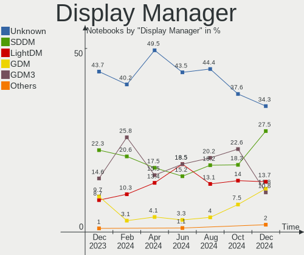
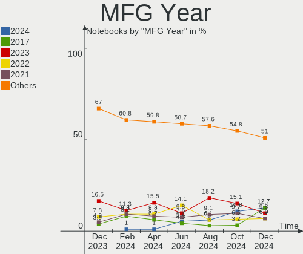
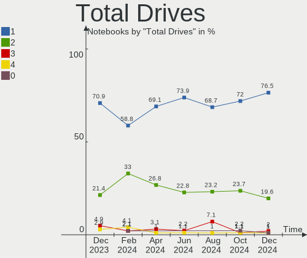
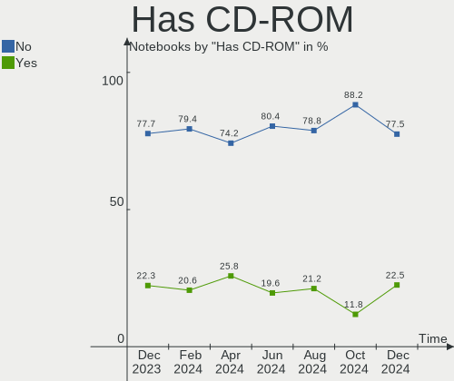
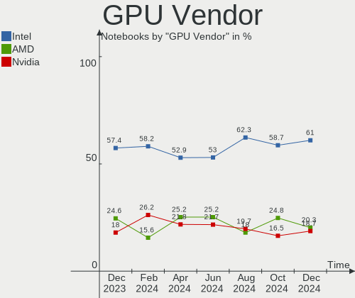
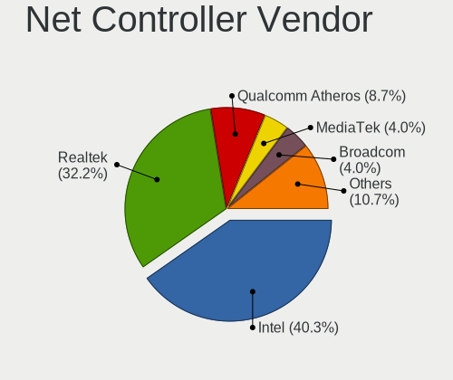
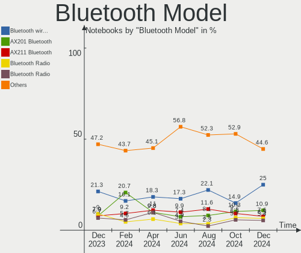

Linux in UK - Hardware Trends (Notebooks)
-----------------------------------------

A project to identify most popular hardware characteristics and track their change
over time based on data collected by Linux users at https://Linux-Hardware.org.

Anyone can contribute to this report by the [hw-probe](https://github.com/linuxhw/hw-probe) tool:

    sudo -E hw-probe -all -upload

Period: Apr, 2024.

Contents
--------

* [ System ](#system)
  - [ OS                       ](#os)
  - [ OS Family                ](#os-family)
  - [ Kernel                   ](#kernel)
  - [ Kernel Family            ](#kernel-family)
  - [ Kernel Major Ver.        ](#kernel-major-ver)
  - [ Arch                     ](#arch)
  - [ DE                       ](#de)
  - [ Display Server           ](#display-server)
  - [ Display Manager          ](#display-manager)
  - [ OS Lang                  ](#os-lang)
  - [ Boot Mode                ](#boot-mode)
  - [ Filesystem               ](#filesystem)
  - [ Part. scheme             ](#part-scheme)
  - [ Dual Boot with Linux/BSD ](#dual-boot-with-linuxbsd)
  - [ Dual Boot (Win)          ](#dual-boot-win)

* [ Board ](#board)
  - [ Vendor                   ](#vendor)
  - [ Model                    ](#model)
  - [ Model Family             ](#model-family)
  - [ MFG Year                 ](#mfg-year)
  - [ Form Factor              ](#form-factor)
  - [ Secure Boot              ](#secure-boot)
  - [ Coreboot                 ](#coreboot)
  - [ RAM Size                 ](#ram-size)
  - [ RAM Used                 ](#ram-used)
  - [ Total Drives             ](#total-drives)
  - [ Has CD-ROM               ](#has-cd-rom)
  - [ Has Ethernet             ](#has-ethernet)
  - [ Has WiFi                 ](#has-wifi)
  - [ Has Bluetooth            ](#has-bluetooth)

* [ Location ](#location)
  - [ Country                  ](#country)
  - [ City                     ](#city)

* [ Drives ](#drives)
  - [ Drive Vendor             ](#drive-vendor)
  - [ Drive Model              ](#drive-model)
  - [ HDD Vendor               ](#hdd-vendor)
  - [ SSD Vendor               ](#ssd-vendor)
  - [ Drive Kind               ](#drive-kind)
  - [ Drive Connector          ](#drive-connector)
  - [ Drive Size               ](#drive-size)
  - [ Space Total              ](#space-total)
  - [ Space Used               ](#space-used)
  - [ Malfunc. Drives          ](#malfunc-drives)
  - [ Malfunc. Drive Vendor    ](#malfunc-drive-vendor)
  - [ Malfunc. HDD Vendor      ](#malfunc-hdd-vendor)
  - [ Malfunc. Drive Kind      ](#malfunc-drive-kind)
  - [ Failed Drives            ](#failed-drives)
  - [ Failed Drive Vendor      ](#failed-drive-vendor)
  - [ Drive Status             ](#drive-status)

* [ Storage controller ](#storage-controller)
  - [ Storage Vendor           ](#storage-vendor)
  - [ Storage Model            ](#storage-model)
  - [ Storage Kind             ](#storage-kind)

* [ Processor ](#processor)
  - [ CPU Vendor               ](#cpu-vendor)
  - [ CPU Model                ](#cpu-model)
  - [ CPU Model Family         ](#cpu-model-family)
  - [ CPU Cores                ](#cpu-cores)
  - [ CPU Sockets              ](#cpu-sockets)
  - [ CPU Threads              ](#cpu-threads)
  - [ CPU Op-Modes             ](#cpu-op-modes)
  - [ CPU Microcode            ](#cpu-microcode)
  - [ CPU Microarch            ](#cpu-microarch)

* [ Graphics ](#graphics)
  - [ GPU Vendor               ](#gpu-vendor)
  - [ GPU Model                ](#gpu-model)
  - [ GPU Combo                ](#gpu-combo)
  - [ GPU Driver               ](#gpu-driver)
  - [ GPU Memory               ](#gpu-memory)

* [ Monitor ](#monitor)
  - [ Monitor Vendor           ](#monitor-vendor)
  - [ Monitor Model            ](#monitor-model)
  - [ Monitor Resolution       ](#monitor-resolution)
  - [ Monitor Diagonal         ](#monitor-diagonal)
  - [ Monitor Width            ](#monitor-width)
  - [ Aspect Ratio             ](#aspect-ratio)
  - [ Monitor Area             ](#monitor-area)
  - [ Pixel Density            ](#pixel-density)
  - [ Multiple Monitors        ](#multiple-monitors)

* [ Network ](#network)
  - [ Net Controller Vendor    ](#net-controller-vendor)
  - [ Net Controller Model     ](#net-controller-model)
  - [ Wireless Vendor          ](#wireless-vendor)
  - [ Wireless Model           ](#wireless-model)
  - [ Ethernet Vendor          ](#ethernet-vendor)
  - [ Ethernet Model           ](#ethernet-model)
  - [ Net Controller Kind      ](#net-controller-kind)
  - [ Used Controller          ](#used-controller)
  - [ NICs                     ](#nics)
  - [ IPv6                     ](#ipv6)

* [ Bluetooth ](#bluetooth)
  - [ Bluetooth Vendor         ](#bluetooth-vendor)
  - [ Bluetooth Model          ](#bluetooth-model)

* [ Sound ](#sound)
  - [ Sound Vendor             ](#sound-vendor)
  - [ Sound Model              ](#sound-model)

* [ Memory ](#memory)
  - [ Memory Vendor            ](#memory-vendor)
  - [ Memory Model             ](#memory-model)
  - [ Memory Kind              ](#memory-kind)
  - [ Memory Form Factor       ](#memory-form-factor)
  - [ Memory Size              ](#memory-size)
  - [ Memory Speed             ](#memory-speed)

* [ Printers & scanners ](#printers--scanners)
  - [ Printer Vendor           ](#printer-vendor)
  - [ Printer Model            ](#printer-model)
  - [ Scanner Vendor           ](#scanner-vendor)
  - [ Scanner Model            ](#scanner-model)

* [ Camera ](#camera)
  - [ Camera Vendor            ](#camera-vendor)
  - [ Camera Model             ](#camera-model)

* [ Security ](#security)
  - [ Fingerprint Vendor       ](#fingerprint-vendor)
  - [ Fingerprint Model        ](#fingerprint-model)
  - [ Chipcard Vendor          ](#chipcard-vendor)
  - [ Chipcard Model           ](#chipcard-model)

* [ Unsupported ](#unsupported)
  - [ Unsupported Devices      ](#unsupported-devices)
  - [ Unsupported Device Types ](#unsupported-device-types)

System
------

OS
--

Installed operating systems

| Name                         | Notebooks | Percent |
|------------------------------|-----------|---------|
| Fedora 39                    | 11        | 11.34%  |
| Ubuntu 22.04                 | 10        | 10.31%  |
| Arch Rolling                 | 7         | 7.22%   |
| Linux Mint 21.3              | 6         | 6.19%   |
| Ubuntu 23.10                 | 4         | 4.12%   |
| SteamOS 3.5.17               | 4         | 4.12%   |
| openSUSE Tumbleweed-XXXXXXXX | 4         | 4.12%   |
| Fedora 40                    | 4         | 4.12%   |
| Pop!_OS 22.04                | 3         | 3.09%   |
| KDE neon 22.04               | 3         | 3.09%   |
| ArcoLinux Rolling            | 3         | 3.09%   |
| Ubuntu 24.04                 | 2         | 2.06%   |
| OpenMandriva 23.08           | 2         | 2.06%   |
| Manjaro                      | 2         | 2.06%   |
| Linux Mint 21.2              | 2         | 2.06%   |
| Kubuntu 22.04                | 2         | 2.06%   |
| EndeavourOS Rolling          | 2         | 2.06%   |
| Debian 12                    | 2         | 2.06%   |
| Zorin 17                     | 1         | 1.03%   |
| Void Linux Rolling           | 1         | 1.03%   |
| TUXEDO OS 22.04              | 1         | 1.03%   |
| SteamOS 3.5.7                | 1         | 1.03%   |
| Reborn OS                    | 1         | 1.03%   |
| openSUSE Leap-15.5           | 1         | 1.03%   |
| OpenMandriva 5.0             | 1         | 1.03%   |
| OpenMandriva 24.03           | 1         | 1.03%   |
| OpenMandriva 23.01           | 1         | 1.03%   |
| Nobara 39                    | 1         | 1.03%   |
| MX 23                        | 1         | 1.03%   |
| Manjaro 23.1.4               | 1         | 1.03%   |
| Mageia 9                     | 1         | 1.03%   |
| Linux Mint 20.3              | 1         | 1.03%   |
| Linux Lite 6.6               | 1         | 1.03%   |
| Kali Rolling                 | 1         | 1.03%   |
| Kali 2024.1                  | 1         | 1.03%   |
| Gentoo 2.15                  | 1         | 1.03%   |
| Garuda Linux Rolling         | 1         | 1.03%   |
| Fedora 41                    | 1         | 1.03%   |
| Endless 3.9.7                | 1         | 1.03%   |
| Dts-distro 1.2.21            | 1         | 1.03%   |

OS Family
---------

OS without a version

| Name         | Notebooks | Percent |
|--------------|-----------|---------|
| Ubuntu       | 16        | 16.49%  |
| Fedora       | 16        | 16.49%  |
| Linux Mint   | 9         | 9.28%   |
| Arch         | 7         | 7.22%   |
| SteamOS      | 5         | 5.15%   |
| openSUSE     | 5         | 5.15%   |
| OpenMandriva | 5         | 5.15%   |
| Pop!_OS      | 3         | 3.09%   |
| Manjaro      | 3         | 3.09%   |
| KDE neon     | 3         | 3.09%   |
| Debian       | 3         | 3.09%   |
| ArcoLinux    | 3         | 3.09%   |
| Kubuntu      | 2         | 2.06%   |
| Kali         | 2         | 2.06%   |
| EndeavourOS  | 2         | 2.06%   |
| Zorin        | 1         | 1.03%   |
| Void Linux   | 1         | 1.03%   |
| TUXEDO OS    | 1         | 1.03%   |
| Reborn OS    | 1         | 1.03%   |
| Nobara       | 1         | 1.03%   |
| MX           | 1         | 1.03%   |
| Mageia       | 1         | 1.03%   |
| Linux Lite   | 1         | 1.03%   |
| Gentoo       | 1         | 1.03%   |
| Garuda Linux | 1         | 1.03%   |
| Endless      | 1         | 1.03%   |
| Dts-distro   | 1         | 1.03%   |
| BlackPanther | 1         | 1.03%   |

Kernel
------

Version of the Linux kernel

| Version                                            | Notebooks | Percent |
|----------------------------------------------------|-----------|---------|
| 6.5.0-26-generic                                   | 7         | 7.22%   |
| 6.5.0-27-generic                                   | 6         | 6.19%   |
| 6.8.7-arch1-1                                      | 5         | 5.15%   |
| 6.5.0-28-generic                                   | 5         | 5.15%   |
| 6.1.52-valve16-1-neptune-61                        | 4         | 4.12%   |
| 6.8.5-201.fc39.x86_64                              | 3         | 3.09%   |
| 5.15.0-105-generic                                 | 3         | 3.09%   |
| 6.8.7-300.fc40.x86_64                              | 2         | 2.06%   |
| 6.8.7-200.fc39.x86_64                              | 2         | 2.06%   |
| 6.8.6-arch1-1                                      | 2         | 2.06%   |
| 6.8.4-200.fc39.x86_64                              | 2         | 2.06%   |
| 6.8.0-76060800daily20240311-generic                | 2         | 2.06%   |
| 6.8.0-31-generic                                   | 2         | 2.06%   |
| 6.5.6-300.fc39.x86_64                              | 2         | 2.06%   |
| 6.4.11-desktop-1omv2390                            | 2         | 2.06%   |
| 6.1.0-18-amd64                                     | 2         | 2.06%   |
| 5.15.0-102-generic                                 | 2         | 2.06%   |
| 5.15.0-101-generic                                 | 2         | 2.06%   |
| 6.9.0-rc3-sof+                                     | 1         | 1.03%   |
| 6.9.0-0.rc5.20240426gitc942a0cd3603.48.fc41.x86_64 | 1         | 1.03%   |
| 6.8.8-arch1-1                                      | 1         | 1.03%   |
| 6.8.7-lqx2                                         | 1         | 1.03%   |
| 6.8.5-arch1-1                                      | 1         | 1.03%   |
| 6.8.5-1-MANJARO                                    | 1         | 1.03%   |
| 6.8.4-rc1-1-default                                | 1         | 1.03%   |
| 6.8.4-cachyos-x86_64                               | 1         | 1.03%   |
| 6.8.4-arch1-1                                      | 1         | 1.03%   |
| 6.8.4-350.vanilla.fc40.x86_64                      | 1         | 1.03%   |
| 6.8.2-x64v2-xanmod1-1-edge                         | 1         | 1.03%   |
| 6.8.2-300.fc40.x86_64                              | 1         | 1.03%   |
| 6.8.2-1-default                                    | 1         | 1.03%   |
| 6.8.1-desktop-3omv2490                             | 1         | 1.03%   |
| 6.8.1-1-default                                    | 1         | 1.03%   |
| 6.7.9-200.fc39.x86_64                              | 1         | 1.03%   |
| 6.7.7-1-default                                    | 1         | 1.03%   |
| 6.7.6-201.fsync.fc39.x86_64                        | 1         | 1.03%   |
| 6.7.6-200.fc39.x86_64                              | 1         | 1.03%   |
| 6.7.5-arch1-1                                      | 1         | 1.03%   |
| 6.6.29-1-lts                                       | 1         | 1.03%   |
| 6.6.27-1-lts                                       | 1         | 1.03%   |

Kernel Family
-------------

Linux kernel without a distro release

| Version | Notebooks | Percent |
|---------|-----------|---------|
| 6.5.0   | 22        | 22.68%  |
| 6.8.7   | 10        | 10.31%  |
| 5.15.0  | 8         | 8.25%   |
| 6.8.4   | 6         | 6.19%   |
| 6.8.5   | 5         | 5.15%   |
| 6.1.52  | 5         | 5.15%   |
| 6.8.0   | 4         | 4.12%   |
| 6.8.2   | 3         | 3.09%   |
| 6.5.6   | 3         | 3.09%   |
| 6.9.0   | 2         | 2.06%   |
| 6.8.6   | 2         | 2.06%   |
| 6.8.1   | 2         | 2.06%   |
| 6.7.6   | 2         | 2.06%   |
| 6.6.22  | 2         | 2.06%   |
| 6.4.11  | 2         | 2.06%   |
| 6.1.0   | 2         | 2.06%   |
| 6.8.8   | 1         | 1.03%   |
| 6.7.9   | 1         | 1.03%   |
| 6.7.7   | 1         | 1.03%   |
| 6.7.5   | 1         | 1.03%   |
| 6.6.29  | 1         | 1.03%   |
| 6.6.27  | 1         | 1.03%   |
| 6.6.26  | 1         | 1.03%   |
| 6.6.23  | 1         | 1.03%   |
| 6.6.2   | 1         | 1.03%   |
| 6.6.15  | 1         | 1.03%   |
| 6.1.1   | 1         | 1.03%   |
| 6.0.0   | 1         | 1.03%   |
| 5.8.0   | 1         | 1.03%   |
| 5.4.0   | 1         | 1.03%   |
| 5.15.85 | 1         | 1.03%   |
| 5.15.36 | 1         | 1.03%   |
| 5.14.21 | 1         | 1.03%   |

Kernel Major Ver.
-----------------

Linux kernel major version

| Version | Notebooks | Percent |
|---------|-----------|---------|
| 6.8     | 33        | 34.02%  |
| 6.5     | 25        | 25.77%  |
| 5.15    | 10        | 10.31%  |
| 6.6     | 8         | 8.25%   |
| 6.1     | 8         | 8.25%   |
| 6.7     | 5         | 5.15%   |
| 6.9     | 2         | 2.06%   |
| 6.4     | 2         | 2.06%   |
| 6.0     | 1         | 1.03%   |
| 5.8     | 1         | 1.03%   |
| 5.4     | 1         | 1.03%   |
| 5.14    | 1         | 1.03%   |

Arch
----

OS architecture (x86_64, i586, etc.)

| Name   | Notebooks | Percent |
|--------|-----------|---------|
| x86_64 | 97        | 100%    |

DE
--

Desktop Environment

| Name       | Notebooks | Percent |
|------------|-----------|---------|
| GNOME      | 38        | 39.18%  |
| KDE5       | 15        | 15.46%  |
| KDE6       | 13        | 13.4%   |
| XFCE       | 10        | 10.31%  |
| X-Cinnamon | 7         | 7.22%   |
| Unknown    | 4         | 4.12%   |
| MATE       | 3         | 3.09%   |
| Hyprland   | 2         | 2.06%   |
| sway       | 1         | 1.03%   |
| qtile      | 1         | 1.03%   |
| LXQt       | 1         | 1.03%   |
| chadwm     | 1         | 1.03%   |
| AsterDE    | 1         | 1.03%   |

Display Server
--------------

X11 or Wayland

| Name    | Notebooks | Percent |
|---------|-----------|---------|
| Wayland | 47        | 48.45%  |
| X11     | 45        | 46.39%  |
| Unknown | 4         | 4.12%   |
| Tty     | 1         | 1.03%   |

Display Manager
---------------

SDDM, LightDM, etc.

| Name    | Notebooks | Percent |
|---------|-----------|---------|
| Unknown | 48        | 49.48%  |
| SDDM    | 17        | 17.53%  |
| GDM3    | 15        | 15.46%  |
| LightDM | 13        | 13.4%   |
| GDM     | 4         | 4.12%   |

OS Lang
-------

Language

| Lang    | Notebooks | Percent |
|---------|-----------|---------|
| en_GB   | 67        | 69.07%  |
| en_US   | 16        | 16.49%  |
| C       | 5         | 5.15%   |
| pl_PL   | 4         | 4.12%   |
| Unknown | 4         | 4.12%   |
| fr_FR   | 1         | 1.03%   |

Boot Mode
---------

EFI or BIOS

| Mode | Notebooks | Percent |
|------|-----------|---------|
| BIOS | 52        | 53.61%  |
| EFI  | 45        | 46.39%  |

Filesystem
----------

Type of filesystem

| Type    | Notebooks | Percent |
|---------|-----------|---------|
| Ext4    | 50        | 51.55%  |
| Btrfs   | 36        | 37.11%  |
| Tmpfs   | 9         | 9.28%   |
| Overlay | 2         | 2.06%   |

Part. scheme
------------

Scheme of partitioning

| Type    | Notebooks | Percent |
|---------|-----------|---------|
| GPT     | 49        | 50.52%  |
| Unknown | 43        | 44.33%  |
| MBR     | 5         | 5.15%   |

Dual Boot with Linux/BSD
------------------------

Hosting more than one Linux/BSD

| Dual boot | Notebooks | Percent |
|-----------|-----------|---------|
| No        | 91        | 93.81%  |
| Yes       | 6         | 6.19%   |

Dual Boot (Win)
---------------

Hosting Linux and Windows

| Dual boot | Notebooks | Percent |
|-----------|-----------|---------|
| No        | 83        | 85.57%  |
| Yes       | 14        | 14.43%  |

Board
-----

Vendor
------

Motherboard manufacturer

| Name                | Notebooks | Percent |
|---------------------|-----------|---------|
| Lenovo              | 26        | 26.8%   |
| Hewlett-Packard     | 18        | 18.56%  |
| Dell                | 12        | 12.37%  |
| Acer                | 11        | 11.34%  |
| Apple               | 9         | 9.28%   |
| ASUSTek Computer    | 6         | 6.19%   |
| Valve               | 5         | 5.15%   |
| Notebook            | 2         | 2.06%   |
| XIAOMI              | 1         | 1.03%   |
| Toshiba             | 1         | 1.03%   |
| Star Labs           | 1         | 1.03%   |
| Samsung Electronics | 1         | 1.03%   |
| PC Specialist       | 1         | 1.03%   |
| Packard Bell        | 1         | 1.03%   |
| MSI                 | 1         | 1.03%   |
| Framework           | 1         | 1.03%   |

Model
-----

Motherboard model

| Name                                     | Notebooks | Percent |
|------------------------------------------|-----------|---------|
| Valve Jupiter                            | 5         | 5.15%   |
| HP Notebook                              | 2         | 2.06%   |
| Apple MacBookPro8,2                      | 2         | 2.06%   |
| Acer Swift SF314-43                      | 2         | 2.06%   |
| Acer Aspire A315-31                      | 2         | 2.06%   |
| XIAOMI Redmi Book Pro 14 2024            | 1         | 1.03%   |
| Toshiba Satellite C55-B                  | 1         | 1.03%   |
| Star Labs StarBook                       | 1         | 1.03%   |
| Samsung 750XED                           | 1         | 1.03%   |
| PC Specialist Standard                   | 1         | 1.03%   |
| Packard Bell EasyNote TJ66               | 1         | 1.03%   |
| Notebook NV4xPZ                          | 1         | 1.03%   |
| Notebook NS5x_NS7xAU                     | 1         | 1.03%   |
| MSI MS-7D46                              | 1         | 1.03%   |
| Lenovo Z70-80 80FG                       | 1         | 1.03%   |
| Lenovo Yoga 510-14AST 80S9               | 1         | 1.03%   |
| Lenovo V15 G3 ABA 82TV                   | 1         | 1.03%   |
| Lenovo V130-15IKB 81HN                   | 1         | 1.03%   |
| Lenovo ThinkPad X395 20NMS1KY02          | 1         | 1.03%   |
| Lenovo ThinkPad X260 20F5S4CC00          | 1         | 1.03%   |
| Lenovo ThinkPad X1 Carbon 6th 20KH002FUS | 1         | 1.03%   |
| Lenovo ThinkPad W540 20BG0044UK          | 1         | 1.03%   |
| Lenovo ThinkPad T480s 20L8S78900         | 1         | 1.03%   |
| Lenovo ThinkPad T480 20L6SA5Q1L          | 1         | 1.03%   |
| Lenovo ThinkPad T470 W10DG 20JNS5TE00    | 1         | 1.03%   |
| Lenovo ThinkPad T430 2349SA2             | 1         | 1.03%   |
| Lenovo ThinkPad T420 4180WA8             | 1         | 1.03%   |
| Lenovo ThinkPad T400 6474W7T             | 1         | 1.03%   |
| Lenovo ThinkPad P50 20EQS0VV2S           | 1         | 1.03%   |
| Lenovo ThinkPad L15 Gen 3 21C3CTO1WW     | 1         | 1.03%   |
| Lenovo ThinkPad L13 Gen 2 20VH004EUK     | 1         | 1.03%   |
| Lenovo ThinkBook 16p Gen 4 21J8          | 1         | 1.03%   |
| Lenovo Legion Y9000P IRX8 82WK           | 1         | 1.03%   |
| Lenovo Legion Slim 5 16APH8 82Y9         | 1         | 1.03%   |
| Lenovo Legion 5 15IAH7H 82RB             | 1         | 1.03%   |
| Lenovo IdeaPad S145-15IWL 81MV           | 1         | 1.03%   |
| Lenovo IdeaPad Gaming 3 15ARH7 82SB      | 1         | 1.03%   |
| Lenovo IdeaPad 5 Pro 16ARH7 82SN         | 1         | 1.03%   |
| Lenovo IdeaPad 3 15ITL6 82H8             | 1         | 1.03%   |
| Lenovo G50-80 80E5                       | 1         | 1.03%   |

Model Family
------------

Motherboard model prefix

| Name                   | Notebooks | Percent |
|------------------------|-----------|---------|
| Lenovo ThinkPad        | 13        | 13.4%   |
| Acer Aspire            | 9         | 9.28%   |
| Dell Latitude          | 6         | 6.19%   |
| Valve Jupiter          | 5         | 5.15%   |
| Lenovo IdeaPad         | 4         | 4.12%   |
| HP EliteBook           | 4         | 4.12%   |
| Lenovo Legion          | 3         | 3.09%   |
| HP Pavilion            | 3         | 3.09%   |
| HP Laptop              | 3         | 3.09%   |
| Dell Precision         | 3         | 3.09%   |
| HP Notebook            | 2         | 2.06%   |
| ASUS VivoBook          | 2         | 2.06%   |
| ASUS ROG               | 2         | 2.06%   |
| Apple MacBookPro8      | 2         | 2.06%   |
| Acer Swift             | 2         | 2.06%   |
| XIAOMI Redmi           | 1         | 1.03%   |
| Toshiba Satellite      | 1         | 1.03%   |
| Star Labs StarBook     | 1         | 1.03%   |
| Samsung 750XED         | 1         | 1.03%   |
| PC Specialist Standard | 1         | 1.03%   |
| Packard Bell EasyNote  | 1         | 1.03%   |
| Notebook NV4xPZ        | 1         | 1.03%   |
| Notebook NS5x          | 1         | 1.03%   |
| MSI MS-7D46            | 1         | 1.03%   |
| Lenovo Z70-80          | 1         | 1.03%   |
| Lenovo Yoga            | 1         | 1.03%   |
| Lenovo V15             | 1         | 1.03%   |
| Lenovo V130-15IKB      | 1         | 1.03%   |
| Lenovo ThinkBook       | 1         | 1.03%   |
| Lenovo G50-80          | 1         | 1.03%   |
| HP ProBook             | 1         | 1.03%   |
| HP OMEN                | 1         | 1.03%   |
| HP G56                 | 1         | 1.03%   |
| HP Dragonfly           | 1         | 1.03%   |
| HP 250                 | 1         | 1.03%   |
| HP 15                  | 1         | 1.03%   |
| Framework Laptop       | 1         | 1.03%   |
| Dell XPS               | 1         | 1.03%   |
| Dell Inspiron          | 1         | 1.03%   |
| Dell G3                | 1         | 1.03%   |

MFG Year
--------

Motherboard manufacture year

| Year    | Notebooks | Percent |
|---------|-----------|---------|
| 2023    | 15        | 15.46%  |
| 2018    | 9         | 9.28%   |
| 2022    | 8         | 8.25%   |
| 2021    | 8         | 8.25%   |
| 2020    | 8         | 8.25%   |
| 2014    | 7         | 7.22%   |
| 2017    | 6         | 6.19%   |
| 2019    | 5         | 5.15%   |
| 2013    | 5         | 5.15%   |
| 2012    | 5         | 5.15%   |
| 2016    | 3         | 3.09%   |
| 2015    | 3         | 3.09%   |
| 2011    | 3         | 3.09%   |
| 2010    | 3         | 3.09%   |
| 2007    | 3         | 3.09%   |
| 2009    | 2         | 2.06%   |
| 2008    | 2         | 2.06%   |
| 2024    | 1         | 1.03%   |
| Unknown | 1         | 1.03%   |

Form Factor
-----------

Physical design of the computer

| Name     | Notebooks | Percent |
|----------|-----------|---------|
| Notebook | 97        | 100%    |

Secure Boot
-----------

Enabled or disabled

| State    | Notebooks | Percent |
|----------|-----------|---------|
| Disabled | 88        | 90.72%  |
| Enabled  | 9         | 9.28%   |

Coreboot
--------

Have coreboot on board

| Used | Notebooks | Percent |
|------|-----------|---------|
| No   | 96        | 98.97%  |
| Yes  | 1         | 1.03%   |

RAM Size
--------

Total RAM memory

| Size in GB  | Notebooks | Percent |
|-------------|-----------|---------|
| 4.01-8.0    | 29        | 29.9%   |
| 8.01-16.0   | 23        | 23.71%  |
| 16.01-24.0  | 17        | 17.53%  |
| 3.01-4.0    | 11        | 11.34%  |
| 32.01-64.0  | 8         | 8.25%   |
| 64.01-256.0 | 5         | 5.15%   |
| 2.01-3.0    | 2         | 2.06%   |
| 24.01-32.0  | 1         | 1.03%   |
| 1.01-2.0    | 1         | 1.03%   |

RAM Used
--------

Used RAM memory

| Used GB   | Notebooks | Percent |
|-----------|-----------|---------|
| 4.01-8.0  | 23        | 23.71%  |
| 1.01-2.0  | 23        | 23.71%  |
| 2.01-3.0  | 20        | 20.62%  |
| 3.01-4.0  | 19        | 19.59%  |
| 8.01-16.0 | 8         | 8.25%   |
| 0.51-1.0  | 3         | 3.09%   |
| 0.01-0.5  | 1         | 1.03%   |

Total Drives
------------

Number of drives on board

| Drives | Notebooks | Percent |
|--------|-----------|---------|
| 1      | 67        | 69.07%  |
| 2      | 26        | 26.8%   |
| 3      | 3         | 3.09%   |
| 4      | 1         | 1.03%   |

Has CD-ROM
----------

Has CD-ROM on board

| Presented | Notebooks | Percent |
|-----------|-----------|---------|
| No        | 72        | 74.23%  |
| Yes       | 25        | 25.77%  |

Has Ethernet
------------

Has Ethernet on board

| Presented | Notebooks | Percent |
|-----------|-----------|---------|
| Yes       | 74        | 76.29%  |
| No        | 23        | 23.71%  |

Has WiFi
--------

Has WiFi module

| Presented | Notebooks | Percent |
|-----------|-----------|---------|
| Yes       | 96        | 98.97%  |
| No        | 1         | 1.03%   |

Has Bluetooth
-------------

Has Bluetooth module

| Presented | Notebooks | Percent |
|-----------|-----------|---------|
| Yes       | 82        | 84.54%  |
| No        | 15        | 15.46%  |

Location
--------

Country
-------

Geographic location (country)

| Country | Notebooks | Percent |
|---------|-----------|---------|
| UK      | 97        | 100%    |

City
----

Geographic location (city)

| City               | Notebooks | Percent |
|--------------------|-----------|---------|
| Manchester         | 4         | 4.12%   |
| Wandsworth         | 3         | 3.09%   |
| London             | 3         | 3.09%   |
| Hexham             | 3         | 3.09%   |
| Swindon            | 2         | 2.06%   |
| Southampton        | 2         | 2.06%   |
| Nottingham         | 2         | 2.06%   |
| Milton Keynes      | 2         | 2.06%   |
| Islington          | 2         | 2.06%   |
| Hackney            | 2         | 2.06%   |
| Glasgow            | 2         | 2.06%   |
| Folkestone         | 2         | 2.06%   |
| Edinburgh          | 2         | 2.06%   |
| Dudley             | 2         | 2.06%   |
| Coventry           | 2         | 2.06%   |
| Carmarthen         | 2         | 2.06%   |
| Bristol            | 2         | 2.06%   |
| Barnet             | 2         | 2.06%   |
| Wolverhampton      | 1         | 1.03%   |
| Wisbech            | 1         | 1.03%   |
| West Malling       | 1         | 1.03%   |
| Wembley            | 1         | 1.03%   |
| Welwyn Garden City | 1         | 1.03%   |
| Wakefield          | 1         | 1.03%   |
| Tower Hamlets      | 1         | 1.03%   |
| Tidworth           | 1         | 1.03%   |
| Stoke-on-Trent     | 1         | 1.03%   |
| Stevenage          | 1         | 1.03%   |
| Stafford           | 1         | 1.03%   |
| Rotherham          | 1         | 1.03%   |
| Redcar             | 1         | 1.03%   |
| Prestatyn          | 1         | 1.03%   |
| Prescot            | 1         | 1.03%   |
| Portsmouth         | 1         | 1.03%   |
| Oldham             | 1         | 1.03%   |
| Newham             | 1         | 1.03%   |
| Melton Mowbray     | 1         | 1.03%   |
| Lymington          | 1         | 1.03%   |
| Llanelli           | 1         | 1.03%   |
| Llandudno          | 1         | 1.03%   |

Drives
------

Drive Vendor
------------

Hard drive vendors

| Vendor                       | Notebooks | Drives | Percent |
|------------------------------|-----------|--------|---------|
| Samsung Electronics          | 19        | 21     | 14.96%  |
| Sandisk                      | 11        | 11     | 8.66%   |
| Unknown                      | 10        | 10     | 7.87%   |
| Toshiba                      | 6         | 6      | 4.72%   |
| SK hynix                     | 6         | 6      | 4.72%   |
| Seagate                      | 6         | 7      | 4.72%   |
| Crucial                      | 6         | 7      | 4.72%   |
| Kingston                     | 5         | 5      | 3.94%   |
| Apple                        | 5         | 5      | 3.94%   |
| Intel                        | 4         | 4      | 3.15%   |
| WDC                          | 3         | 3      | 2.36%   |
| Phison Electronics           | 3         | 3      | 2.36%   |
| Kingston Technology Company  | 3         | 3      | 2.36%   |
| HGST                         | 3         | 3      | 2.36%   |
| A-DATA Technology            | 3         | 3      | 2.36%   |
| O2 Micro                     | 2         | 2      | 1.57%   |
| Micron/Crucial Technology    | 2         | 2      | 1.57%   |
| Micron Technology            | 2         | 2      | 1.57%   |
| MAXIO Technology (Hangzhou)  | 2         | 2      | 1.57%   |
| KIOXIA                       | 2         | 2      | 1.57%   |
| Hitachi                      | 2         | 2      | 1.57%   |
| USB                          | 1         | 1      | 0.79%   |
| Transcend                    | 1         | 1      | 0.79%   |
| Team                         | 1         | 1      | 0.79%   |
| TCSUNBOW                     | 1         | 1      | 0.79%   |
| SSK                          | 1         | 1      | 0.79%   |
| SPCC                         | 1         | 1      | 0.79%   |
| Silicon Motion               | 1         | 1      | 0.79%   |
| Shenzhen Longsys Electronics | 1         | 1      | 0.79%   |
| SABRENT                      | 1         | 1      | 0.79%   |
| PNY                          | 1         | 1      | 0.79%   |
| Phison                       | 1         | 1      | 0.79%   |
| Patriot                      | 1         | 1      | 0.79%   |
| Netac                        | 1         | 1      | 0.79%   |
| LITEON                       | 1         | 1      | 0.79%   |
| JMicron Technology           | 1         | 1      | 0.79%   |
| Integral                     | 1         | 1      | 0.79%   |
| Hikvision                    | 1         | 1      | 0.79%   |
| GOODRAM                      | 1         | 1      | 0.79%   |
| Fanxiang                     | 1         | 1      | 0.79%   |

Drive Model
-----------

Hard drive models

| Model                                                 | Notebooks | Percent |
|-------------------------------------------------------|-----------|---------|
| Samsung NVMe SSD Controller SM981/PM981/PM983 1TB     | 5         | 3.82%   |
| Phison E12 NVMe Controller 2TB                        | 3         | 2.29%   |
| Unknown MMC Card  512GB                               | 2         | 1.53%   |
| Unknown MMC Card  16GB                                | 2         | 1.53%   |
| SK hynix BC511 256GB                                  | 2         | 1.53%   |
| Seagate ST1000LM024 HN-M101MBB 1TB                    | 2         | 1.53%   |
| Seagate Expansion 2TB                                 | 2         | 1.53%   |
| Samsung NVMe SSD Controller PM9A1/PM9A3/980PRO 1TB    | 2         | 1.53%   |
| Samsung MZVL4512HBLU-00BTW 512GB                      | 2         | 1.53%   |
| O2 Micro E2M2 64GB                                    | 2         | 1.53%   |
| Kingston SA400S37240G 240GB SSD                       | 2         | 1.53%   |
| Crucial CT480BX500SSD1 480GB                          | 2         | 1.53%   |
| Apple SSD SM0512G 500GB                               | 2         | 1.53%   |
| A-DATA SU630 240GB SSD                                | 2         | 1.53%   |
| WDC WDS250G2B0A 250GB SSD                             | 1         | 0.76%   |
| WDC WD42 EJRX-89BFNY0 4TB                             | 1         | 0.76%   |
| WDC PC SN730 SDBQNTY-256G-1001 256GB                  | 1         | 0.76%   |
| USB SanDisk 3.2Gen1 128GB                             | 1         | 0.76%   |
| Unknown USB DISK 3.2 1TB                              | 1         | 0.76%   |
| Unknown NVMe SSD Drive 512GB                          | 1         | 0.76%   |
| Unknown MMC Card  32GB                                | 1         | 0.76%   |
| Unknown MMC Card  2TB                                 | 1         | 0.76%   |
| Unknown MMC Card  197GB                               | 1         | 0.76%   |
| Unknown MMC Card  128GB                               | 1         | 0.76%   |
| Transcend TS512GMTS430S 512GB SSD                     | 1         | 0.76%   |
| Toshiba XG6 NVMe SSD Controller 1024GB                | 1         | 0.76%   |
| Toshiba XG4 NVMe SSD Controller 512GB                 | 1         | 0.76%   |
| Toshiba MQ04ABF100 1TB                                | 1         | 0.76%   |
| Toshiba MQ01ACF050 500GB                              | 1         | 0.76%   |
| Toshiba MQ01ABD075 752GB                              | 1         | 0.76%   |
| Toshiba MK5055GSX 500GB                               | 1         | 0.76%   |
| Team L5 LITE SSD 120GB                                | 1         | 0.76%   |
| TCSUNBOW X3 480GB                                     | 1         | 0.76%   |
| SSK Disk 256GB                                        | 1         | 0.76%   |
| SPCC Solid State Disk 512GB                           | 1         | 0.76%   |
| SK hynix SKHynix_HFS512GEJ9X115N 512GB                | 1         | 0.76%   |
| SK hynix SKHynix_HFS001TEJ9X115N 1024GB               | 1         | 0.76%   |
| SK hynix SC210 mSATA 256GB SSD                        | 1         | 0.76%   |
| SK hynix HFS256G39TNH-73A0A 256GB SSD                 | 1         | 0.76%   |
| Silicon Motion SM2263EN/SM2263XT SSD Controller 256GB | 1         | 0.76%   |

HDD Vendor
----------

Hard disk drive vendors

| Vendor             | Notebooks | Drives | Percent |
|--------------------|-----------|--------|---------|
| Seagate            | 6         | 7      | 35.29%  |
| Toshiba            | 4         | 4      | 23.53%  |
| HGST               | 3         | 3      | 17.65%  |
| Hitachi            | 2         | 2      | 11.76%  |
| WDC                | 1         | 1      | 5.88%   |
| JMicron Technology | 1         | 1      | 5.88%   |

SSD Vendor
----------

Solid state drive vendors

| Vendor              | Notebooks | Drives | Percent |
|---------------------|-----------|--------|---------|
| Samsung Electronics | 5         | 6      | 11.9%   |
| Crucial             | 5         | 6      | 11.9%   |
| Apple               | 5         | 5      | 11.9%   |
| Kingston            | 4         | 4      | 9.52%   |
| A-DATA Technology   | 3         | 3      | 7.14%   |
| SK hynix            | 2         | 2      | 4.76%   |
| SanDisk             | 2         | 2      | 4.76%   |
| WDC                 | 1         | 1      | 2.38%   |
| Transcend           | 1         | 1      | 2.38%   |
| Team                | 1         | 1      | 2.38%   |
| TCSUNBOW            | 1         | 1      | 2.38%   |
| SSK                 | 1         | 1      | 2.38%   |
| SPCC                | 1         | 1      | 2.38%   |
| SABRENT             | 1         | 1      | 2.38%   |
| PNY                 | 1         | 1      | 2.38%   |
| Patriot             | 1         | 1      | 2.38%   |
| Netac               | 1         | 1      | 2.38%   |
| LITEON              | 1         | 1      | 2.38%   |
| Intel               | 1         | 1      | 2.38%   |
| Integral            | 1         | 1      | 2.38%   |
| GOODRAM             | 1         | 1      | 2.38%   |
| China               | 1         | 1      | 2.38%   |
| ASMT                | 1         | 1      | 2.38%   |

Drive Kind
----------

HDD or SSD

| Kind    | Notebooks | Drives | Percent |
|---------|-----------|--------|---------|
| NVMe    | 50        | 57     | 43.86%  |
| SSD     | 37        | 44     | 32.46%  |
| HDD     | 15        | 18     | 13.16%  |
| MMC     | 9         | 9      | 7.89%   |
| Unknown | 3         | 3      | 2.63%   |

Drive Connector
---------------

SATA, SAS, NVMe, etc.

| Type | Notebooks | Drives | Percent |
|------|-----------|--------|---------|
| NVMe | 50        | 56     | 42.02%  |
| SATA | 50        | 54     | 42.02%  |
| SAS  | 10        | 12     | 8.4%    |
| MMC  | 9         | 9      | 7.56%   |

Drive Size
----------

Size of hard drive

| Size in TB | Notebooks | Drives | Percent |
|------------|-----------|--------|---------|
| 0.01-0.5   | 41        | 45     | 71.93%  |
| 0.51-1.0   | 12        | 13     | 21.05%  |
| 3.01-4.0   | 2         | 2      | 3.51%   |
| 1.01-2.0   | 2         | 2      | 3.51%   |

Space Total
-----------

Amount of disk space available on the file system

| Size in GB     | Notebooks | Percent |
|----------------|-----------|---------|
| 101-250        | 26        | 26.8%   |
| 501-1000       | 20        | 20.62%  |
| 251-500        | 18        | 18.56%  |
| More than 3000 | 8         | 8.25%   |
| Unknown        | 6         | 6.19%   |
| 1001-2000      | 5         | 5.15%   |
| 1-20           | 5         | 5.15%   |
| 51-100         | 5         | 5.15%   |
| 2001-3000      | 4         | 4.12%   |

Space Used
----------

Amount of used disk space

| Used GB        | Notebooks | Percent |
|----------------|-----------|---------|
| 1-20           | 26        | 26.8%   |
| 101-250        | 17        | 17.53%  |
| 21-50          | 16        | 16.49%  |
| 51-100         | 12        | 12.37%  |
| 251-500        | 6         | 6.19%   |
| 1001-2000      | 6         | 6.19%   |
| Unknown        | 6         | 6.19%   |
| 501-1000       | 4         | 4.12%   |
| More than 3000 | 3         | 3.09%   |
| 2001-3000      | 1         | 1.03%   |

Malfunc. Drives
---------------

Drive models with a malfunction

| Model                              | Notebooks | Drives | Percent |
|------------------------------------|-----------|--------|---------|
| Seagate ST9250315AS 250GB          | 1         | 1      | 25%     |
| Seagate ST160LT000-9VL14D 160GB    | 1         | 1      | 25%     |
| Seagate ST1000LM024 HN-M101MBB 1TB | 1         | 1      | 25%     |
| Hitachi HTS541680J9SA00 80GB       | 1         | 1      | 25%     |

Malfunc. Drive Vendor
---------------------

Vendors of faulty drives

| Vendor  | Notebooks | Drives | Percent |
|---------|-----------|--------|---------|
| Seagate | 3         | 3      | 75%     |
| Hitachi | 1         | 1      | 25%     |

Malfunc. HDD Vendor
-------------------

Vendors of faulty HDD drives

| Vendor  | Notebooks | Drives | Percent |
|---------|-----------|--------|---------|
| Seagate | 3         | 3      | 75%     |
| Hitachi | 1         | 1      | 25%     |

Malfunc. Drive Kind
-------------------

Kinds of faulty drives

| Kind | Notebooks | Drives | Percent |
|------|-----------|--------|---------|
| HDD  | 4         | 4      | 100%    |

Failed Drives
-------------

Failed drive models

Zero info for selected period =(

Failed Drive Vendor
-------------------

Failed drive vendors

Zero info for selected period =(

Drive Status
------------

Number of failed and malfunc. drives

| Status   | Notebooks | Drives | Percent |
|----------|-----------|--------|---------|
| Detected | 57        | 78     | 56.44%  |
| Works    | 40        | 49     | 39.6%   |
| Malfunc  | 4         | 4      | 3.96%   |

Storage controller
------------------

Storage Vendor
--------------

Storage controller vendors

| Vendor                       | Notebooks | Percent |
|------------------------------|-----------|---------|
| Intel                        | 48        | 41.38%  |
| Samsung Electronics          | 16        | 13.79%  |
| AMD                          | 12        | 10.34%  |
| Sandisk                      | 10        | 8.62%   |
| SK hynix                     | 4         | 3.45%   |
| Phison Electronics           | 4         | 3.45%   |
| Kingston Technology Company  | 4         | 3.45%   |
| Micron/Crucial Technology    | 3         | 2.59%   |
| Toshiba America Info Systems | 2         | 1.72%   |
| O2 Micro                     | 2         | 1.72%   |
| Micron Technology            | 2         | 1.72%   |
| MAXIO Technology (Hangzhou)  | 2         | 1.72%   |
| KIOXIA                       | 2         | 1.72%   |
| Solidigm                     | 1         | 0.86%   |
| Silicon Motion               | 1         | 0.86%   |
| Shenzhen Longsys Electronics | 1         | 0.86%   |
| Nvidia                       | 1         | 0.86%   |
| Marvell Technology Group     | 1         | 0.86%   |

Storage Model
-------------

Storage controller models

| Model                                                                        | Notebooks | Percent |
|------------------------------------------------------------------------------|-----------|---------|
| AMD FCH SATA Controller [AHCI mode]                                          | 12        | 9.84%   |
| Samsung NVMe SSD Controller SM981/PM981/PM983                                | 5         | 4.1%    |
| Samsung NVMe SSD Controller PM9A1/PM9A3/980PRO                               | 5         | 4.1%    |
| Intel Sunrise Point-LP SATA Controller [AHCI mode]                           | 5         | 4.1%    |
| Intel 82801IBM/IEM (ICH9M/ICH9M-E) 4 port SATA Controller [AHCI mode]        | 5         | 4.1%    |
| Intel 7 Series Chipset Family 6-port SATA Controller [AHCI mode]             | 5         | 4.1%    |
| Intel 6 Series/C200 Series Chipset Family 6 port Mobile SATA AHCI Controller | 4         | 3.28%   |
| Samsung NVMe SSD Controller 980 (DRAM-less)                                  | 3         | 2.46%   |
| Phison E12 NVMe Controller                                                   | 3         | 2.46%   |
| Intel Wildcat Point-LP SATA Controller [AHCI Mode]                           | 3         | 2.46%   |
| Intel 82801 Mobile SATA Controller [RAID mode]                               | 3         | 2.46%   |
| SK hynix Platinum P41/PC801 NVMe Solid State Drive                           | 2         | 1.64%   |
| SK hynix BC511 NVMe SSD                                                      | 2         | 1.64%   |
| Sandisk WD Black SN850X NVMe SSD                                             | 2         | 1.64%   |
| SanDisk WD Black SN770 / PC SN740 256GB / PC SN560 (DRAM-less) NVMe SSD      | 2         | 1.64%   |
| Samsung S4LN058A01[SSUBX] AHCI SSD Controller (Apple slot)                   | 2         | 1.64%   |
| Samsung NVMe SSD Controller PM9B1 (DRAM-less)                                | 2         | 1.64%   |
| O2 Micro FORESEE E2M2 NVMe SSD                                               | 2         | 1.64%   |
| Micron/Crucial P2 [Nick P2] / P3 / P3 Plus NVMe PCIe SSD (DRAM-less)         | 2         | 1.64%   |
| Intel Volume Management Device NVMe RAID Controller                          | 2         | 1.64%   |
| Intel SSD 670p Series [Keystone Harbor]                                      | 2         | 1.64%   |
| Intel HM170/QM170 Chipset SATA Controller [AHCI Mode]                        | 2         | 1.64%   |
| Intel Celeron N3350/Pentium N4200/Atom E3900 Series SATA AHCI Controller     | 2         | 1.64%   |
| Intel Cannon Lake Mobile PCH SATA AHCI Controller                            | 2         | 1.64%   |
| Intel 82801HM/HEM (ICH8M/ICH8M-E) IDE Controller                             | 2         | 1.64%   |
| Toshiba America Info Systems XG6 NVMe SSD Controller                         | 1         | 0.82%   |
| Toshiba America Info Systems XG4 NVMe SSD Controller                         | 1         | 0.82%   |
| Solidigm P41 Plus NVMe SSD (DRAM-less) [Echo Harbor]                         | 1         | 0.82%   |
| Silicon Motion SM2263EN/SM2263XT (DRAM-less) NVMe SSD Controllers            | 1         | 0.82%   |
| Shenzhen Longsys FORESEE XP2000, Lexar NM760 NVME SSD (DRAM-less)            | 1         | 0.82%   |
| SanDisk WD PC SN810 / Black SN850 NVMe SSD                                   | 1         | 0.82%   |
| Sandisk WD PC SN740 NVMe SSD 512GB (DRAM-less)                               | 1         | 0.82%   |
| SanDisk WD Blue SN570 NVMe SSD 2TB                                           | 1         | 0.82%   |
| SanDisk Ultra 3D / WD Blue SN550 NVMe SSD                                    | 1         | 0.82%   |
| Sandisk PC SN740 NVMe SSD (DRAM-less)                                        | 1         | 0.82%   |
| SanDisk Extreme Pro / WD Black SN750 / PC SN730 / Red SN700 NVMe SSD         | 1         | 0.82%   |
| Phison PS5015-E15 PCIe3 NVMe Controller (DRAM-less)                          | 1         | 0.82%   |
| Nvidia MCP89 SATA Controller (AHCI mode)                                     | 1         | 0.82%   |
| Micron/Crucial P5 Plus NVMe PCIe SSD                                         | 1         | 0.82%   |
| Micron 2400 NVMe SSD (DRAM-less)                                             | 1         | 0.82%   |

Storage Kind
------------

Kind of storage controller (IDE, SATA, NVMe, SAS, ...)

| Kind | Notebooks | Percent |
|------|-----------|---------|
| SATA | 53        | 46.49%  |
| NVMe | 50        | 43.86%  |
| RAID | 7         | 6.14%   |
| IDE  | 4         | 3.51%   |

Processor
---------

CPU Vendor
----------

Processor vendors

| Vendor | Notebooks | Percent |
|--------|-----------|---------|
| Intel  | 69        | 71.13%  |
| AMD    | 28        | 28.87%  |

CPU Model
---------

Processor models

| Model                                       | Notebooks | Percent |
|---------------------------------------------|-----------|---------|
| AMD Custom APU 0405                         | 5         | 5.15%   |
| Intel 11th Gen Core i5-1135G7 @ 2.40GHz     | 3         | 3.09%   |
| Intel Core i7-2635QM CPU @ 2.00GHz          | 2         | 2.06%   |
| Intel Core i5-8350U CPU @ 1.70GHz           | 2         | 2.06%   |
| Intel Core i5-2520M CPU @ 2.50GHz           | 2         | 2.06%   |
| Intel Core i3-3217U CPU @ 1.80GHz           | 2         | 2.06%   |
| Intel 13th Gen Core i5-1340P                | 2         | 2.06%   |
| AMD Ryzen 9 5900HX with Radeon Graphics     | 2         | 2.06%   |
| Intel Xeon W-10885M CPU @ 2.40GHz           | 1         | 1.03%   |
| Intel Pentium Dual-Core CPU T4400 @ 2.20GHz | 1         | 1.03%   |
| Intel Pentium CPU P6100 @ 2.00GHz           | 1         | 1.03%   |
| Intel Pentium CPU N4200 @ 1.10GHz           | 1         | 1.03%   |
| Intel Core Ultra 7 155H                     | 1         | 1.03%   |
| Intel Core i9-8950HK CPU @ 2.90GHz          | 1         | 1.03%   |
| Intel Core i7-8650U CPU @ 1.90GHz           | 1         | 1.03%   |
| Intel Core i7-7700HQ CPU @ 2.80GHz          | 1         | 1.03%   |
| Intel Core i7-6820HQ CPU @ 2.70GHz          | 1         | 1.03%   |
| Intel Core i7-5650U CPU @ 2.20GHz           | 1         | 1.03%   |
| Intel Core i7-5500U CPU @ 2.40GHz           | 1         | 1.03%   |
| Intel Core i7-4810MQ CPU @ 2.80GHz          | 1         | 1.03%   |
| Intel Core i7-4650U CPU @ 1.70GHz           | 1         | 1.03%   |
| Intel Core i7-3720QM CPU @ 2.60GHz          | 1         | 1.03%   |
| Intel Core i7-3667U CPU @ 2.00GHz           | 1         | 1.03%   |
| Intel Core i5-9300H CPU @ 2.40GHz           | 1         | 1.03%   |
| Intel Core i5-8265U CPU @ 1.60GHz           | 1         | 1.03%   |
| Intel Core i5-8250U CPU @ 1.60GHz           | 1         | 1.03%   |
| Intel Core i5-7300U CPU @ 2.60GHz           | 1         | 1.03%   |
| Intel Core i5-7300HQ CPU @ 2.50GHz          | 1         | 1.03%   |
| Intel Core i5-7200U CPU @ 2.50GHz           | 1         | 1.03%   |
| Intel Core i5-6300U CPU @ 2.40GHz           | 1         | 1.03%   |
| Intel Core i5-5300U CPU @ 2.30GHz           | 1         | 1.03%   |
| Intel Core i5-5287U CPU @ 2.90GHz           | 1         | 1.03%   |
| Intel Core i5-4300U CPU @ 1.90GHz           | 1         | 1.03%   |
| Intel Core i5-4278U CPU @ 2.60GHz           | 1         | 1.03%   |
| Intel Core i5-3320M CPU @ 2.60GHz           | 1         | 1.03%   |
| Intel Core i5-3230M CPU @ 2.60GHz           | 1         | 1.03%   |
| Intel Core i3-N305                          | 1         | 1.03%   |
| Intel Core i3-7100U CPU @ 2.40GHz           | 1         | 1.03%   |
| Intel Core i3-6100U CPU @ 2.30GHz           | 1         | 1.03%   |
| Intel Core i3-5157U CPU @ 2.50GHz           | 1         | 1.03%   |

CPU Model Family
----------------

Processor model prefix

| Model                   | Notebooks | Percent |
|-------------------------|-----------|---------|
| Other                   | 23        | 23.71%  |
| Intel Core i5           | 17        | 17.53%  |
| Intel Core i7           | 11        | 11.34%  |
| Intel Core i3           | 9         | 9.28%   |
| AMD Ryzen 7             | 7         | 7.22%   |
| Intel Core 2 Duo        | 6         | 6.19%   |
| AMD Ryzen 5             | 4         | 4.12%   |
| AMD A8                  | 3         | 3.09%   |
| Intel Pentium           | 2         | 2.06%   |
| Intel Celeron           | 2         | 2.06%   |
| AMD Ryzen 9             | 2         | 2.06%   |
| AMD A6                  | 2         | 2.06%   |
| Intel Xeon              | 1         | 1.03%   |
| Intel Pentium Dual-Core | 1         | 1.03%   |
| Intel Core i9           | 1         | 1.03%   |
| Intel Core              | 1         | 1.03%   |
| Intel Celeron Dual-Core | 1         | 1.03%   |
| AMD Ryzen 7 PRO         | 1         | 1.03%   |
| AMD Ryzen 3             | 1         | 1.03%   |
| AMD Athlon              | 1         | 1.03%   |
| AMD A10                 | 1         | 1.03%   |

CPU Cores
---------

Number of processor cores

| Number | Notebooks | Percent |
|--------|-----------|---------|
| 2      | 39        | 40.21%  |
| 4      | 28        | 28.87%  |
| 8      | 12        | 12.37%  |
| 6      | 6         | 6.19%   |
| 12     | 4         | 4.12%   |
| 10     | 3         | 3.09%   |
| 24     | 2         | 2.06%   |
| 14     | 2         | 2.06%   |
| 16     | 1         | 1.03%   |

CPU Sockets
-----------

Number of sockets

| Number | Notebooks | Percent |
|--------|-----------|---------|
| 1      | 97        | 100%    |

CPU Threads
-----------

Threads per core (Hyper-Threading)

| Number | Notebooks | Percent |
|--------|-----------|---------|
| 2      | 72        | 74.23%  |
| 1      | 25        | 25.77%  |

CPU Op-Modes
------------

CPU Operation Modes (32-bit, 64-bit)

| Op mode        | Notebooks | Percent |
|----------------|-----------|---------|
| 32-bit, 64-bit | 97        | 100%    |

CPU Microcode
-------------

Microcode number

| Number     | Notebooks | Percent |
|------------|-----------|---------|
| Unknown    | 79        | 81.44%  |
| 0x1067a    | 3         | 3.09%   |
| 0x906a3    | 2         | 2.06%   |
| 0x306a9    | 2         | 2.06%   |
| 0x806ea    | 1         | 1.03%   |
| 0x6fa      | 1         | 1.03%   |
| 0x506c9    | 1         | 1.03%   |
| 0x306d4    | 1         | 1.03%   |
| 0x206a7    | 1         | 1.03%   |
| 0x0a704103 | 1         | 1.03%   |
| 0x0a50000c | 1         | 1.03%   |
| 0x08108109 | 1         | 1.03%   |
| 0x07030106 | 1         | 1.03%   |
| 0x07030105 | 1         | 1.03%   |
| 0x06006704 | 1         | 1.03%   |

CPU Microarch
-------------

Microarchitecture

| Name              | Notebooks | Percent |
|-------------------|-----------|---------|
| Unknown           | 15        | 15.46%  |
| KabyLake          | 13        | 13.4%   |
| Alderlake Hybrid  | 11        | 11.34%  |
| Penryn            | 7         | 7.22%   |
| IvyBridge         | 6         | 6.19%   |
| Broadwell         | 6         | 6.19%   |
| SandyBridge       | 5         | 5.15%   |
| Zen 3             | 4         | 4.12%   |
| TigerLake         | 4         | 4.12%   |
| Haswell           | 4         | 4.12%   |
| Zen 2             | 3         | 3.09%   |
| Skylake           | 3         | 3.09%   |
| Puma              | 3         | 3.09%   |
| Zen+              | 2         | 2.06%   |
| Steamroller       | 2         | 2.06%   |
| Goldmont          | 2         | 2.06%   |
| Excavator         | 2         | 2.06%   |
| Westmere          | 1         | 1.03%   |
| Meteorlake Hybrid | 1         | 1.03%   |
| Goldmont plus     | 1         | 1.03%   |
| Core              | 1         | 1.03%   |
| CometLake         | 1         | 1.03%   |

Graphics
--------

GPU Vendor
----------

Vendors of graphics cards

| Vendor | Notebooks | Percent |
|--------|-----------|---------|
| Intel  | 63        | 52.94%  |
| AMD    | 30        | 25.21%  |
| Nvidia | 26        | 21.85%  |

GPU Model
---------

Graphics card models

| Model                                                                     | Notebooks | Percent |
|---------------------------------------------------------------------------|-----------|---------|
| Intel Raptor Lake-P [Iris Xe Graphics]                                    | 5         | 4.07%   |
| Intel 3rd Gen Core processor Graphics Controller                          | 5         | 4.07%   |
| Intel 2nd Generation Core Processor Family Integrated Graphics Controller | 5         | 4.07%   |
| AMD VanGogh [AMD Custom GPU 0405]                                         | 5         | 4.07%   |
| Intel UHD Graphics 620                                                    | 4         | 3.25%   |
| Intel TigerLake-LP GT2 [Iris Xe Graphics]                                 | 4         | 3.25%   |
| Intel Mobile 4 Series Chipset Integrated Graphics Controller              | 3         | 2.44%   |
| Intel HD Graphics 620                                                     | 3         | 2.44%   |
| Intel HD Graphics 5500                                                    | 3         | 2.44%   |
| Intel Haswell-ULT Integrated Graphics Controller                          | 3         | 2.44%   |
| AMD Renoir [Radeon RX Vega 6 (Ryzen 4000/5000 Mobile Series)]             | 3         | 2.44%   |
| AMD Mullins [Radeon R4/R5 Graphics]                                       | 3         | 2.44%   |
| Nvidia GP107M [GeForce GTX 1050 Mobile]                                   | 2         | 1.63%   |
| Nvidia AD107M [GeForce RTX 4060 Max-Q / Mobile]                           | 2         | 1.63%   |
| Intel Skylake GT2 [HD Graphics 520]                                       | 2         | 1.63%   |
| Intel Mobile GM965/GL960 Integrated Graphics Controller (secondary)       | 2         | 1.63%   |
| Intel Mobile GM965/GL960 Integrated Graphics Controller (primary)         | 2         | 1.63%   |
| Intel Iris Graphics 6100                                                  | 2         | 1.63%   |
| Intel HD Graphics 630                                                     | 2         | 1.63%   |
| Intel CoffeeLake-H GT2 [UHD Graphics 630]                                 | 2         | 1.63%   |
| Intel Alder Lake-UP3 GT2 [Iris Xe Graphics]                               | 2         | 1.63%   |
| Intel Alder Lake-P GT2 [Iris Xe Graphics]                                 | 2         | 1.63%   |
| AMD Stoney [Radeon R2/R3/R4/R5 Graphics]                                  | 2         | 1.63%   |
| AMD Seymour [Radeon HD 6400M/7400M Series]                                | 2         | 1.63%   |
| AMD Rembrandt [Radeon 680M]                                               | 2         | 1.63%   |
| AMD Picasso/Raven 2 [Radeon Vega Series / Radeon Vega Mobile Series]      | 2         | 1.63%   |
| AMD Phoenix1                                                              | 2         | 1.63%   |
| AMD Lucienne                                                              | 2         | 1.63%   |
| AMD Kaveri [Radeon R6 Graphics]                                           | 2         | 1.63%   |
| AMD Cezanne [Radeon Vega Series / Radeon Vega Mobile Series]              | 2         | 1.63%   |
| Nvidia TU117M [GeForce GTX 1650 Mobile / Max-Q]                           | 1         | 0.81%   |
| Nvidia TU116M [GeForce GTX 1660 Ti Mobile]                                | 1         | 0.81%   |
| Nvidia TU106GLM [Quadro RTX 3000 Mobile / Max-Q]                          | 1         | 0.81%   |
| Nvidia MCP89 [GeForce 320M]                                               | 1         | 0.81%   |
| Nvidia GT216M [GeForce GT 240M]                                           | 1         | 0.81%   |
| Nvidia GP107GLM [Quadro P2000 Mobile]                                     | 1         | 0.81%   |
| Nvidia GN21-X11 [GeForce RTX 4090 Laptop GPU]                             | 1         | 0.81%   |
| Nvidia GN21-X11                                                           | 1         | 0.81%   |
| Nvidia GM108M [GeForce 840M]                                              | 1         | 0.81%   |
| Nvidia GM107GLM [Quadro M1000M]                                           | 1         | 0.81%   |

GPU Combo
---------

Combinations of graphics cards

| Name           | Notebooks | Percent |
|----------------|-----------|---------|
| 1 x Intel      | 44        | 45.36%  |
| 1 x AMD        | 21        | 21.65%  |
| Intel + Nvidia | 15        | 15.46%  |
| 1 x Nvidia     | 7         | 7.22%   |
| AMD + Nvidia   | 4         | 4.12%   |
| Intel + AMD    | 3         | 3.09%   |
| 2 x AMD        | 2         | 2.06%   |
| 2 x Intel      | 1         | 1.03%   |

GPU Driver
----------

Free vs proprietary

| Driver      | Notebooks | Percent |
|-------------|-----------|---------|
| Free        | 81        | 83.51%  |
| Proprietary | 10        | 10.31%  |
| Unknown     | 6         | 6.19%   |

GPU Memory
----------

Total video memory

| Size in GB | Notebooks | Percent |
|------------|-----------|---------|
| Unknown    | 78        | 80.41%  |
| 1.01-2.0   | 5         | 5.15%   |
| 0.01-0.5   | 5         | 5.15%   |
| 0.51-1.0   | 3         | 3.09%   |
| 7.01-8.0   | 2         | 2.06%   |
| 5.01-6.0   | 2         | 2.06%   |
| 3.01-4.0   | 1         | 1.03%   |
| 8.01-16.0  | 1         | 1.03%   |

Monitor
-------

Monitor Vendor
--------------

Monitor vendors

| Vendor                  | Notebooks | Percent |
|-------------------------|-----------|---------|
| BOE                     | 21        | 19.63%  |
| Chimei Innolux          | 16        | 14.95%  |
| AU Optronics            | 16        | 14.95%  |
| LG Display              | 9         | 8.41%   |
| Apple                   | 9         | 8.41%   |
| Samsung Electronics     | 7         | 6.54%   |
| Valve                   | 5         | 4.67%   |
| Sharp                   | 3         | 2.8%    |
| PANDA                   | 2         | 1.87%   |
| CSO                     | 2         | 1.87%   |
| ViewSonic               | 1         | 0.93%   |
| S2-Tek                  | 1         | 0.93%   |
| RTK                     | 1         | 0.93%   |
| Panasonic               | 1         | 0.93%   |
| NEC Computers           | 1         | 0.93%   |
| LGD                     | 1         | 0.93%   |
| Lenovo                  | 1         | 0.93%   |
| InfoVision              | 1         | 0.93%   |
| Iiyama                  | 1         | 0.93%   |
| HKC                     | 1         | 0.93%   |
| Hewlett-Packard         | 1         | 0.93%   |
| Dell                    | 1         | 0.93%   |
| CSW                     | 1         | 0.93%   |
| CPT                     | 1         | 0.93%   |
| Chi Mei Optoelectronics | 1         | 0.93%   |
| ASUSTek Computer        | 1         | 0.93%   |
| Acer                    | 1         | 0.93%   |

Monitor Model
-------------

Monitor models

| Model                                                                   | Notebooks | Percent |
|-------------------------------------------------------------------------|-----------|---------|
| Valve ANX7530 U VLV3001 800x1280 100x150mm 7.1-inch                     | 5         | 4.67%   |
| AU Optronics LCD Monitor AUO403D 1920x1080 309x174mm 14.0-inch          | 2         | 1.87%   |
| AU Optronics LCD Monitor AUO38ED 1920x1080 344x193mm 15.5-inch          | 2         | 1.87%   |
| ViewSonic VG2719-2K VSC1935 2560x1440 597x336mm 27.0-inch               | 1         | 0.93%   |
| Sharp LCD Monitor SHP14D7 1920x1200 366x229mm 17.0-inch                 | 1         | 0.93%   |
| Sharp LCD Monitor SHP148D 3840x2160 344x194mm 15.5-inch                 | 1         | 0.93%   |
| Sharp LCD Monitor SHP1476 3840x2160 346x194mm 15.6-inch                 | 1         | 0.93%   |
| Samsung Electronics LCD Monitor SEC4151 1366x768 344x194mm 15.5-inch    | 1         | 0.93%   |
| Samsung Electronics LCD Monitor SEC4141 1366x768 344x193mm 15.5-inch    | 1         | 0.93%   |
| Samsung Electronics LCD Monitor SDC4C48 1920x1080 344x194mm 15.5-inch   | 1         | 0.93%   |
| Samsung Electronics LCD Monitor SDC4951 1366x768 344x194mm 15.5-inch    | 1         | 0.93%   |
| Samsung Electronics LCD Monitor SDC4141 1366x768 344x194mm 15.5-inch    | 1         | 0.93%   |
| Samsung Electronics LCD Monitor SAM734C 3840x2160 1872x1053mm 84.6-inch | 1         | 0.93%   |
| Samsung Electronics C27R50x SAM0F9D 1920x1080 598x336mm 27.0-inch       | 1         | 0.93%   |
| S2-Tek TV STK531A 1920x1080 930x530mm 42.1-inch                         | 1         | 0.93%   |
| RTK QHD HDR RTKBC32 2560x1440 597x336mm 27.0-inch                       | 1         | 0.93%   |
| PANDA LCD Monitor NCP0061 2560x1600 302x189mm 14.0-inch                 | 1         | 0.93%   |
| PANDA LCD Monitor NCP0035 1920x1080 309x174mm 14.0-inch                 | 1         | 0.93%   |
| Panasonic TV MEIA296 1920x1080 698x392mm 31.5-inch                      | 1         | 0.93%   |
| NEC Computers EX231Wp NEC684E 1920x1080 510x287mm 23.0-inch             | 1         | 0.93%   |
| LGD LCD Monitor 1920x1080                                               | 1         | 0.93%   |
| LG Display LP156WH1-TLA1 LGD6301 1366x768 344x194mm 15.5-inch           | 1         | 0.93%   |
| LG Display LCD Monitor LGD068D 1920x1080 309x174mm 14.0-inch            | 1         | 0.93%   |
| LG Display LCD Monitor LGD065A 1920x1080 344x194mm 15.5-inch            | 1         | 0.93%   |
| LG Display LCD Monitor LGD04A7 1920x1080 344x194mm 15.5-inch            | 1         | 0.93%   |
| LG Display LCD Monitor LGD0493 1366x768 344x194mm 15.5-inch             | 1         | 0.93%   |
| LG Display LCD Monitor LGD0469 1920x1080 382x215mm 17.3-inch            | 1         | 0.93%   |
| LG Display LCD Monitor LGD033A 1366x768 344x194mm 15.5-inch             | 1         | 0.93%   |
| LG Display LCD Monitor LGD02A6 1366x768 345x194mm 15.6-inch             | 1         | 0.93%   |
| LG Display LCD Monitor LGD0250 1366x768 345x194mm 15.6-inch             | 1         | 0.93%   |
| Lenovo LCD Monitor LEN4033 1440x900 303x190mm 14.1-inch                 | 1         | 0.93%   |
| InfoVision LCD Monitor IVO34D1 1920x1280 285x190mm 13.5-inch            | 1         | 0.93%   |
| Iiyama PL2493H IVM6148 1920x1080 527x296mm 23.8-inch                    | 1         | 0.93%   |
| HKC GF40 HKC2413 1920x1080 521x297mm 23.6-inch                          | 1         | 0.93%   |
| Hewlett-Packard w2007 HWP26A6 1680x1050 433x271mm 20.1-inch             | 1         | 0.93%   |
| Dell P2723QE DELF13C 3840x2160 597x336mm 27.0-inch                      | 1         | 0.93%   |
| CSW MNE007ZA3-2 CSW1431 2880x1800 301x188mm 14.0-inch                   | 1         | 0.93%   |
| CSO LCD Monitor CSO1619 2560x1600 344x215mm 16.0-inch                   | 1         | 0.93%   |
| CSO LCD Monitor CSO160C 2560x1600 344x215mm 16.0-inch                   | 1         | 0.93%   |
| CPT LCD Monitor CPT1775 1280x800 304x190mm 14.1-inch                    | 1         | 0.93%   |

Monitor Resolution
------------------

Monitor screen resolution

| Resolution         | Notebooks | Percent |
|--------------------|-----------|---------|
| 1920x1080 (FHD)    | 32        | 31.68%  |
| 1366x768 (WXGA)    | 24        | 23.76%  |
| 2560x1600          | 10        | 9.9%    |
| 2560x1440 (QHD)    | 7         | 6.93%   |
| 1440x900 (WXGA+)   | 6         | 5.94%   |
| 800x1280           | 5         | 4.95%   |
| 3840x2160 (4K)     | 5         | 4.95%   |
| 1600x900 (HD+)     | 3         | 2.97%   |
| 1280x800 (WXGA)    | 3         | 2.97%   |
| 1920x1200 (WUXGA)  | 2         | 1.98%   |
| 2880x1800          | 1         | 0.99%   |
| 2256x1504          | 1         | 0.99%   |
| 1920x1280          | 1         | 0.99%   |
| 1680x1050 (WSXGA+) | 1         | 0.99%   |

Monitor Diagonal
----------------

Diagonal size in inches

| Inches  | Notebooks | Percent |
|---------|-----------|---------|
| 15      | 44        | 41.51%  |
| 13      | 18        | 16.98%  |
| 14      | 14        | 13.21%  |
| 16      | 7         | 6.6%    |
| 27      | 5         | 4.72%   |
| 7       | 5         | 4.72%   |
| 17      | 3         | 2.83%   |
| 23      | 2         | 1.89%   |
| 12      | 2         | 1.89%   |
| 84      | 1         | 0.94%   |
| 42      | 1         | 0.94%   |
| 24      | 1         | 0.94%   |
| 20      | 1         | 0.94%   |
| 18      | 1         | 0.94%   |
| Unknown | 1         | 0.94%   |

Monitor Width
-------------

Physical width

| Width in mm | Notebooks | Percent |
|-------------|-----------|---------|
| 301-350     | 70        | 66.67%  |
| 201-300     | 13        | 12.38%  |
| 501-600     | 8         | 7.62%   |
| 1-100       | 5         | 4.76%   |
| 351-400     | 4         | 3.81%   |
| 401-500     | 2         | 1.9%    |
| 1501-2000   | 1         | 0.95%   |
| 901-1000    | 1         | 0.95%   |
| Unknown     | 1         | 0.95%   |

Aspect Ratio
------------

Proportional relationship between the width and the height

| Ratio   | Notebooks | Percent |
|---------|-----------|---------|
| 16/9    | 68        | 68.69%  |
| 16/10   | 23        | 23.23%  |
| 0.67    | 5         | 5.05%   |
| 3/2     | 2         | 2.02%   |
| Unknown | 1         | 1.01%   |

Monitor Area
------------

Area in inch

| Area in inch | Notebooks | Percent |
|----------------|-----------|---------|
| 101-110        | 44        | 41.51%  |
| 81-90          | 27        | 25.47%  |
| 111-120        | 6         | 5.66%   |
| 71-80          | 5         | 4.72%   |
| 1-40           | 5         | 4.72%   |
| 301-350        | 5         | 4.72%   |
| 201-250        | 3         | 2.83%   |
| 121-130        | 3         | 2.83%   |
| 61-70          | 2         | 1.89%   |
| More than 1000 | 1         | 0.94%   |
| 151-200        | 1         | 0.94%   |
| 141-150        | 1         | 0.94%   |
| 501-1000       | 1         | 0.94%   |
| 91-100         | 1         | 0.94%   |
| Unknown        | 1         | 0.94%   |

Pixel Density
-------------

Pixels per inch

| Density       | Notebooks | Percent |
|---------------|-----------|---------|
| 121-160       | 36        | 34.29%  |
| 101-120       | 29        | 27.62%  |
| 161-240       | 25        | 23.81%  |
| 51-100        | 10        | 9.52%   |
| More than 240 | 4         | 3.81%   |
| Unknown       | 1         | 0.95%   |

Multiple Monitors
-----------------

Total monitors connected

| Total | Notebooks | Percent |
|-------|-----------|---------|
| 1     | 85        | 87.63%  |
| 2     | 9         | 9.28%   |
| 0     | 2         | 2.06%   |
| 3     | 1         | 1.03%   |

Network
-------

Net Controller Vendor
---------------------

Controller vendors

| Vendor                    | Notebooks | Percent |
|---------------------------|-----------|---------|
| Realtek Semiconductor     | 47        | 34.31%  |
| Intel                     | 46        | 33.58%  |
| Qualcomm Atheros          | 12        | 8.76%   |
| Broadcom                  | 12        | 8.76%   |
| MediaTek                  | 7         | 5.11%   |
| Broadcom Limited          | 4         | 2.92%   |
| TP-Link                   | 1         | 0.73%   |
| Spreadtrum Communications | 1         | 0.73%   |
| Ralink Technology         | 1         | 0.73%   |
| NetGear                   | 1         | 0.73%   |
| Marvell Technology Group  | 1         | 0.73%   |
| Google                    | 1         | 0.73%   |
| FIBOCOM                   | 1         | 0.73%   |
| DisplayLink               | 1         | 0.73%   |
| ASIX Electronics          | 1         | 0.73%   |

Net Controller Model
--------------------

Controller models

| Model                                                                  | Notebooks | Percent |
|------------------------------------------------------------------------|-----------|---------|
| Realtek RTL8111/8168/8211/8411 PCI Express Gigabit Ethernet Controller | 26        | 15.03%  |
| Realtek RTL8822CE 802.11ac PCIe Wireless Network Adapter               | 8         | 4.62%   |
| Realtek RTL810xE PCI Express Fast Ethernet controller                  | 7         | 4.05%   |
| Intel Wireless 8265 / 8275                                             | 5         | 2.89%   |
| Intel Raptor Lake PCH CNVi WiFi                                        | 5         | 2.89%   |
| Realtek RTL8821CE 802.11ac PCIe Wireless Network Adapter               | 4         | 2.31%   |
| Realtek RTL8153 Gigabit Ethernet Adapter                               | 4         | 2.31%   |
| Qualcomm Atheros QCA9377 802.11ac Wireless Network Adapter             | 4         | 2.31%   |
| Intel Ethernet Connection (4) I219-LM                                  | 4         | 2.31%   |
| Intel Centrino Advanced-N 6205 [Taylor Peak]                           | 4         | 2.31%   |
| Intel Alder Lake-P PCH CNVi WiFi                                       | 4         | 2.31%   |
| Intel 82579LM Gigabit Network Connection (Lewisville)                  | 4         | 2.31%   |
| MediaTek MT7921 802.11ax PCI Express Wireless Network Adapter          | 3         | 1.73%   |
| Intel Wireless 8260                                                    | 3         | 1.73%   |
| Intel Wi-Fi 6 AX201                                                    | 3         | 1.73%   |
| Broadcom Limited BCM4360 802.11ac Dual Band Wireless Network Adapter   | 3         | 1.73%   |
| Broadcom BCM4331 802.11a/b/g/n                                         | 3         | 1.73%   |
| Realtek RTL8852BE PCIe 802.11ax Wireless Network Controller            | 2         | 1.16%   |
| Realtek RTL8723BE PCIe Wireless Network Adapter                        | 2         | 1.16%   |
| Realtek RTL8125 2.5GbE Controller                                      | 2         | 1.16%   |
| Qualcomm Atheros QCA9565 / AR9565 Wireless Network Adapter             | 2         | 1.16%   |
| Qualcomm Atheros AR9485 Wireless Network Adapter                       | 2         | 1.16%   |
| MediaTek Wi-Fi 6E MT7902 Wireless Network Adapter                      | 2         | 1.16%   |
| MediaTek MT7922 802.11ax PCI Express Wireless Network Adapter          | 2         | 1.16%   |
| Intel Wireless 7260                                                    | 2         | 1.16%   |
| Intel Wireless 3165                                                    | 2         | 1.16%   |
| Intel WiFi Link 5100                                                   | 2         | 1.16%   |
| Intel Wi-Fi 6E(802.11ax) AX210/AX1675* 2x2 [Typhoon Peak]              | 2         | 1.16%   |
| Intel Wi-Fi 5(802.11ac) Wireless-AC 9x6x [Thunder Peak]                | 2         | 1.16%   |
| Intel Raptor Lake-S PCH CNVi WiFi                                      | 2         | 1.16%   |
| Intel Ethernet Connection (13) I219-V                                  | 2         | 1.16%   |
| Broadcom NetXtreme BCM57765 Gigabit Ethernet PCIe                      | 2         | 1.16%   |
| TP-Link UE300 10/100/1000 LAN (ethernet mode) [Realtek RTL8153]        | 1         | 0.58%   |
| Spreadtrum Unisoc Phone                                                | 1         | 0.58%   |
| Realtek RTL8852AE 802.11ax PCIe Wireless Network Adapter               | 1         | 0.58%   |
| Realtek RTL8723DE Wireless Network Adapter                             | 1         | 0.58%   |
| Realtek RTL8191SEvA Wireless LAN Controller                            | 1         | 0.58%   |
| Realtek 802.11ac NIC                                                   | 1         | 0.58%   |
| Ralink MT7601U Wireless Adapter                                        | 1         | 0.58%   |
| Qualcomm Atheros QCA6174 802.11ac Wireless Network Adapter             | 1         | 0.58%   |

Wireless Vendor
---------------

Wireless vendors

| Vendor                | Notebooks | Percent |
|-----------------------|-----------|---------|
| Intel                 | 45        | 45.92%  |
| Realtek Semiconductor | 20        | 20.41%  |
| Qualcomm Atheros      | 11        | 11.22%  |
| Broadcom              | 8         | 8.16%   |
| MediaTek              | 7         | 7.14%   |
| Broadcom Limited      | 4         | 4.08%   |
| Ralink Technology     | 1         | 1.02%   |
| NetGear               | 1         | 1.02%   |
| FIBOCOM               | 1         | 1.02%   |

Wireless Model
--------------

Wireless models

| Model                                                                | Notebooks | Percent |
|----------------------------------------------------------------------|-----------|---------|
| Realtek RTL8822CE 802.11ac PCIe Wireless Network Adapter             | 8         | 8.16%   |
| Intel Wireless 8265 / 8275                                           | 5         | 5.1%    |
| Intel Raptor Lake PCH CNVi WiFi                                      | 5         | 5.1%    |
| Realtek RTL8821CE 802.11ac PCIe Wireless Network Adapter             | 4         | 4.08%   |
| Qualcomm Atheros QCA9377 802.11ac Wireless Network Adapter           | 4         | 4.08%   |
| Intel Centrino Advanced-N 6205 [Taylor Peak]                         | 4         | 4.08%   |
| Intel Alder Lake-P PCH CNVi WiFi                                     | 4         | 4.08%   |
| MediaTek MT7921 802.11ax PCI Express Wireless Network Adapter        | 3         | 3.06%   |
| Intel Wireless 8260                                                  | 3         | 3.06%   |
| Intel Wi-Fi 6 AX201                                                  | 3         | 3.06%   |
| Broadcom Limited BCM4360 802.11ac Dual Band Wireless Network Adapter | 3         | 3.06%   |
| Broadcom BCM4331 802.11a/b/g/n                                       | 3         | 3.06%   |
| Realtek RTL8852BE PCIe 802.11ax Wireless Network Controller          | 2         | 2.04%   |
| Realtek RTL8723BE PCIe Wireless Network Adapter                      | 2         | 2.04%   |
| Qualcomm Atheros QCA9565 / AR9565 Wireless Network Adapter           | 2         | 2.04%   |
| Qualcomm Atheros AR9485 Wireless Network Adapter                     | 2         | 2.04%   |
| MediaTek Wi-Fi 6E MT7902 Wireless Network Adapter                    | 2         | 2.04%   |
| MediaTek MT7922 802.11ax PCI Express Wireless Network Adapter        | 2         | 2.04%   |
| Intel Wireless 7260                                                  | 2         | 2.04%   |
| Intel Wireless 3165                                                  | 2         | 2.04%   |
| Intel WiFi Link 5100                                                 | 2         | 2.04%   |
| Intel Wi-Fi 6E(802.11ax) AX210/AX1675* 2x2 [Typhoon Peak]            | 2         | 2.04%   |
| Intel Wi-Fi 5(802.11ac) Wireless-AC 9x6x [Thunder Peak]              | 2         | 2.04%   |
| Intel Raptor Lake-S PCH CNVi WiFi                                    | 2         | 2.04%   |
| Realtek RTL8852AE 802.11ax PCIe Wireless Network Adapter             | 1         | 1.02%   |
| Realtek RTL8723DE Wireless Network Adapter                           | 1         | 1.02%   |
| Realtek RTL8191SEvA Wireless LAN Controller                          | 1         | 1.02%   |
| Realtek 802.11ac NIC                                                 | 1         | 1.02%   |
| Ralink MT7601U Wireless Adapter                                      | 1         | 1.02%   |
| Qualcomm Atheros QCA6174 802.11ac Wireless Network Adapter           | 1         | 1.02%   |
| Qualcomm Atheros AR928X Wireless Network Adapter (PCI-Express)       | 1         | 1.02%   |
| Qualcomm Atheros AR9287 Wireless Network Adapter (PCI-Express)       | 1         | 1.02%   |
| NetGear A6210                                                        | 1         | 1.02%   |
| Intel Wireless-AC                                                    | 1         | 1.02%   |
| Intel Wireless 7265                                                  | 1         | 1.02%   |
| Intel Wireless 3160                                                  | 1         | 1.02%   |
| Intel Wi-Fi 6 AX200                                                  | 1         | 1.02%   |
| Intel PRO/Wireless 5100 AGN [Shiloh] Network Connection              | 1         | 1.02%   |
| Intel PRO/Wireless 3945ABG [Golan] Network Connection                | 1         | 1.02%   |
| Intel Dual Band Wireless-AC 3165 Plus Bluetooth                      | 1         | 1.02%   |

Ethernet Vendor
---------------

Ethernet vendors

| Vendor                    | Notebooks | Percent |
|---------------------------|-----------|---------|
| Realtek Semiconductor     | 39        | 52%     |
| Intel                     | 20        | 26.67%  |
| Broadcom                  | 9         | 12%     |
| TP-Link                   | 1         | 1.33%   |
| Spreadtrum Communications | 1         | 1.33%   |
| Qualcomm Atheros          | 1         | 1.33%   |
| Marvell Technology Group  | 1         | 1.33%   |
| Google                    | 1         | 1.33%   |
| DisplayLink               | 1         | 1.33%   |
| ASIX Electronics          | 1         | 1.33%   |

Ethernet Model
--------------

Ethernet models

| Model                                                                  | Notebooks | Percent |
|------------------------------------------------------------------------|-----------|---------|
| Realtek RTL8111/8168/8211/8411 PCI Express Gigabit Ethernet Controller | 26        | 34.67%  |
| Realtek RTL810xE PCI Express Fast Ethernet controller                  | 7         | 9.33%   |
| Realtek RTL8153 Gigabit Ethernet Adapter                               | 4         | 5.33%   |
| Intel Ethernet Connection (4) I219-LM                                  | 4         | 5.33%   |
| Intel 82579LM Gigabit Network Connection (Lewisville)                  | 4         | 5.33%   |
| Realtek RTL8125 2.5GbE Controller                                      | 2         | 2.67%   |
| Intel Ethernet Connection (13) I219-V                                  | 2         | 2.67%   |
| Broadcom NetXtreme BCM57765 Gigabit Ethernet PCIe                      | 2         | 2.67%   |
| TP-Link UE300 10/100/1000 LAN (ethernet mode) [Realtek RTL8153]        | 1         | 1.33%   |
| Spreadtrum Unisoc Phone                                                | 1         | 1.33%   |
| Qualcomm Atheros AR8131 Gigabit Ethernet                               | 1         | 1.33%   |
| Marvell Group 88E8071 PCI-E Gigabit Ethernet Controller                | 1         | 1.33%   |
| Intel Ethernet Controller I219-LM                                      | 1         | 1.33%   |
| Intel Ethernet Connection I219-V                                       | 1         | 1.33%   |
| Intel Ethernet Connection I219-LM                                      | 1         | 1.33%   |
| Intel Ethernet Connection I218-LM                                      | 1         | 1.33%   |
| Intel Ethernet Connection I217-LM                                      | 1         | 1.33%   |
| Intel Ethernet Connection (4) I219-V                                   | 1         | 1.33%   |
| Intel Ethernet Connection (3) I218-LM                                  | 1         | 1.33%   |
| Intel Ethernet Connection (2) I219-LM                                  | 1         | 1.33%   |
| Intel Ethernet Connection (17) I219-V                                  | 1         | 1.33%   |
| Intel 82567LM Gigabit Network Connection                               | 1         | 1.33%   |
| Google Pixel 7 Pro                                                     | 1         | 1.33%   |
| DisplayLink Targus USB3.0 DV2K Dock w Power                            | 1         | 1.33%   |
| Broadcom NetXtreme BCM57786 Gigabit Ethernet PCIe                      | 1         | 1.33%   |
| Broadcom NetXtreme BCM5764M Gigabit Ethernet PCIe                      | 1         | 1.33%   |
| Broadcom NetXtreme BCM5755M Gigabit Ethernet PCI Express               | 1         | 1.33%   |
| Broadcom NetLink BCM5787M Gigabit Ethernet PCI Express                 | 1         | 1.33%   |
| Broadcom NetLink BCM5784M Gigabit Ethernet PCIe                        | 1         | 1.33%   |
| Broadcom NetLink BCM57785 Gigabit Ethernet PCIe                        | 1         | 1.33%   |
| Broadcom NetLink BCM57780 Gigabit Ethernet PCIe                        | 1         | 1.33%   |
| ASIX AX88179 Gigabit Ethernet                                          | 1         | 1.33%   |

Net Controller Kind
-------------------

Ethernet, WiFi or modem

| Kind     | Notebooks | Percent |
|----------|-----------|---------|
| WiFi     | 96        | 56.47%  |
| Ethernet | 74        | 43.53%  |

Used Controller
---------------

Currently used network controller

| Kind     | Notebooks | Percent |
|----------|-----------|---------|
| WiFi     | 83        | 84.69%  |
| Ethernet | 15        | 15.31%  |

NICs
----

Total network controllers on board

| Total | Notebooks | Percent |
|-------|-----------|---------|
| 2     | 64        | 65.98%  |
| 1     | 32        | 32.99%  |
| 0     | 1         | 1.03%   |

IPv6
----

IPv6 vs IPv4

| Used | Notebooks | Percent |
|------|-----------|---------|
| No   | 73        | 75.26%  |
| Yes  | 24        | 24.74%  |

Bluetooth
---------

Bluetooth Vendor
----------------

Controller vendors

| Vendor                          | Notebooks | Percent |
|---------------------------------|-----------|---------|
| Intel                           | 37        | 45.12%  |
| Realtek Semiconductor           | 14        | 17.07%  |
| Apple                           | 9         | 10.98%  |
| IMC Networks                    | 8         | 9.76%   |
| Lite-On Technology              | 4         | 4.88%   |
| Qualcomm Atheros Communications | 3         | 3.66%   |
| Broadcom                        | 2         | 2.44%   |
| TP-Link                         | 1         | 1.22%   |
| MediaTek                        | 1         | 1.22%   |
| Foxconn / Hon Hai               | 1         | 1.22%   |
| Dell                            | 1         | 1.22%   |
| Cambridge Silicon Radio         | 1         | 1.22%   |

Bluetooth Model
---------------

Controller models

| Model                                               | Notebooks | Percent |
|-----------------------------------------------------|-----------|---------|
| Realtek Bluetooth Radio                             | 9         | 10.98%  |
| Intel AX211 Bluetooth                               | 9         | 10.98%  |
| Intel Bluetooth Device                              | 8         | 9.76%   |
| Intel AX201 Bluetooth                               | 8         | 9.76%   |
| Intel Bluetooth wireless interface                  | 7         | 8.54%   |
| Apple Bluetooth Host Controller                     | 6         | 7.32%   |
| IMC Networks Bluetooth Radio                        | 5         | 6.1%    |
| Realtek  Bluetooth 4.2 Adapter                      | 4         | 4.88%   |
| IMC Networks Wireless_Device                        | 3         | 3.66%   |
| Qualcomm Atheros  Bluetooth Device                  | 2         | 2.44%   |
| Lite-On Wireless_Device                             | 2         | 2.44%   |
| Lite-On Qualcomm Atheros QCA9377 Bluetooth          | 2         | 2.44%   |
| Intel Wireless-AC 9260 Bluetooth Adapter            | 2         | 2.44%   |
| Intel AX210 Bluetooth                               | 2         | 2.44%   |
| Apple Bluetooth USB Host Controller                 | 2         | 2.44%   |
| TP-Link UB500 Adapter                               | 1         | 1.22%   |
| Realtek 802.11ac WLAN Adapter                       | 1         | 1.22%   |
| Qualcomm Atheros AR3012 Bluetooth 4.0               | 1         | 1.22%   |
| MediaTek Wireless_Device                            | 1         | 1.22%   |
| Intel AX200 Bluetooth                               | 1         | 1.22%   |
| Foxconn / Hon Hai Wireless_Device                   | 1         | 1.22%   |
| Dell Wireless 360 Bluetooth                         | 1         | 1.22%   |
| Cambridge Silicon Radio Bluetooth Dongle (HCI mode) | 1         | 1.22%   |
| Broadcom HP Portable SoftSailing                    | 1         | 1.22%   |
| Broadcom HP Portable Bumble Bee                     | 1         | 1.22%   |
| Apple Built-in Bluetooth 2.0+EDR HCI                | 1         | 1.22%   |

Sound
-----

Sound Vendor
------------

Sound card vendors

| Vendor                     | Notebooks | Percent |
|----------------------------|-----------|---------|
| Intel                      | 68        | 53.97%  |
| AMD                        | 31        | 24.6%   |
| Nvidia                     | 19        | 15.08%  |
| Sonix Technology           | 1         | 0.79%   |
| PreSonus Audio Electronics | 1         | 0.79%   |
| Generalplus Technology     | 1         | 0.79%   |
| Focusrite-Novation         | 1         | 0.79%   |
| BR25                       | 1         | 0.79%   |
| ATI Technologies           | 1         | 0.79%   |
| Arturia                    | 1         | 0.79%   |
| AKAI Professional M.I.     | 1         | 0.79%   |

Sound Model
-----------

Sound card models

| Model                                                                             | Notebooks | Percent |
|-----------------------------------------------------------------------------------|-----------|---------|
| AMD Family 17h/19h HD Audio Controller                                            | 16        | 10.13%  |
| AMD Rembrandt Radeon High Definition Audio Controller                             | 10        | 6.33%   |
| Intel Sunrise Point-LP HD Audio                                                   | 9         | 5.7%    |
| AMD Renoir Radeon High Definition Audio Controller                                | 7         | 4.43%   |
| Nvidia Audio device                                                               | 6         | 3.8%    |
| Intel Wildcat Point-LP High Definition Audio Controller                           | 6         | 3.8%    |
| Intel Broadwell-U Audio Controller                                                | 6         | 3.8%    |
| Intel 7 Series/C216 Chipset Family High Definition Audio Controller               | 6         | 3.8%    |
| Intel Raptor Lake-P/U/H cAVS                                                      | 5         | 3.16%   |
| Intel Alder Lake PCH-P High Definition Audio Controller                           | 5         | 3.16%   |
| Intel 82801I (ICH9 Family) HD Audio Controller                                    | 5         | 3.16%   |
| Intel 6 Series/C200 Series Chipset Family High Definition Audio Controller        | 5         | 3.16%   |
| AMD FCH Azalia Controller                                                         | 5         | 3.16%   |
| Intel Tiger Lake-LP Smart Sound Technology Audio Controller                       | 4         | 2.53%   |
| Intel Haswell-ULT HD Audio Controller                                             | 3         | 1.9%    |
| Intel 8 Series HD Audio Controller                                                | 3         | 1.9%    |
| AMD Kabini HDMI/DP Audio                                                          | 3         | 1.9%    |
| Nvidia GF108 High Definition Audio Controller                                     | 2         | 1.27%   |
| Nvidia GA104 High Definition Audio Controller                                     | 2         | 1.27%   |
| Intel Raptor Lake High Definition Audio Controller                                | 2         | 1.27%   |
| Intel CM238 HD Audio Controller                                                   | 2         | 1.27%   |
| Intel Celeron N3350/Pentium N4200/Atom E3900 Series Audio Cluster                 | 2         | 1.27%   |
| Intel Cannon Lake PCH cAVS                                                        | 2         | 1.27%   |
| Intel 82801H (ICH8 Family) HD Audio Controller                                    | 2         | 1.27%   |
| AMD Raven/Raven2/Fenghuang HDMI/DP Audio Controller                               | 2         | 1.27%   |
| AMD Navi 21/23 HDMI/DP Audio Controller                                           | 2         | 1.27%   |
| AMD Kaveri HDMI/DP Audio Controller                                               | 2         | 1.27%   |
| AMD Family 15h (Models 60h-6fh) Audio Controller                                  | 2         | 1.27%   |
| AMD Caicos HDMI Audio [Radeon HD 6450 / 7450/8450/8490 OEM / R5 230/235/235X OEM] | 2         | 1.27%   |
| Sonix Technology AIRHUG 04                                                        | 1         | 0.63%   |
| PreSonus Audio Electronics PreSonus AudioBox iTwo                                 | 1         | 0.63%   |
| Nvidia TU116 High Definition Audio Controller                                     | 1         | 0.63%   |
| Nvidia TU107 GeForce GTX 1650 High Definition Audio Controller                    | 1         | 0.63%   |
| Nvidia TU106 High Definition Audio Controller                                     | 1         | 0.63%   |
| Nvidia MCP89 High Definition Audio                                                | 1         | 0.63%   |
| Nvidia GT216 HDMI Audio Controller                                                | 1         | 0.63%   |
| Nvidia GM107 High Definition Audio Controller [GeForce 940MX]                     | 1         | 0.63%   |
| Nvidia GK107 HDMI Audio Controller                                                | 1         | 0.63%   |
| Nvidia GK106 HDMI Audio Controller                                                | 1         | 0.63%   |
| Nvidia GA106 High Definition Audio Controller                                     | 1         | 0.63%   |

Memory
------

Memory Vendor
-------------

Memory module vendors

| Vendor              | Notebooks | Percent |
|---------------------|-----------|---------|
| SK hynix            | 19        | 32.76%  |
| Samsung Electronics | 13        | 22.41%  |
| Kingston            | 7         | 12.07%  |
| Micron Technology   | 6         | 10.34%  |
| Crucial             | 3         | 5.17%   |
| Corsair             | 3         | 5.17%   |
| Transcend           | 1         | 1.72%   |
| Ramaxel Technology  | 1         | 1.72%   |
| Nanya Technology    | 1         | 1.72%   |
| Miron               | 1         | 1.72%   |
| Lenovo              | 1         | 1.72%   |
| Elpida              | 1         | 1.72%   |
| A-DATA Technology   | 1         | 1.72%   |

Memory Model
------------

Memory module models

| Model                                                            | Notebooks | Percent |
|------------------------------------------------------------------|-----------|---------|
| SK hynix RAM HMT41GS6BFR8A-PB 8GB SODIMM DDR3 1600MT/s           | 2         | 3.45%   |
| Samsung RAM M471B5273CH0-CH9 4GB SODIMM DDR3 1334MT/s            | 2         | 3.45%   |
| Transcend RAM JM3200HSE-16G 16GB SODIMM DDR4 3200MT/s            | 1         | 1.72%   |
| SK hynix RAM Module 8GB SODIMM DDR4 2133MT/s                     | 1         | 1.72%   |
| SK hynix RAM Module 4GB SODIMM DDR3 1600MT/s                     | 1         | 1.72%   |
| SK hynix RAM Module 4GB Row Of Chips LPDDR5 6400MT/s             | 1         | 1.72%   |
| SK hynix RAM HYMP125S64CP8-Y5 2GB SODIMM DDR2 667MT/s            | 1         | 1.72%   |
| SK hynix RAM HMT451S6AFR8C-PB 4GB SODIMM DDR3 1600MT/s           | 1         | 1.72%   |
| SK hynix RAM HMCG88AGBAA095N 32GB SODIMM DDR5 5600MT/s           | 1         | 1.72%   |
| SK hynix RAM HMCG78MEBSA095N 16GB SODIMM DDR5 4800MT/s           | 1         | 1.72%   |
| SK hynix RAM HMCG66AGBSA095N 8GB SODIMM DDR5 5600MT/s            | 1         | 1.72%   |
| SK hynix RAM HMCG66AGBSA092N 8GB SODIMM DDR5 5600MT/s            | 1         | 1.72%   |
| SK hynix RAM HMAG68EXNSA051N 8GB SODIMM DDR4 3200MT/s            | 1         | 1.72%   |
| SK hynix RAM HMAA1GS6CJR6N-XN 8GB Row Of Chips DDR4 3200MT/s     | 1         | 1.72%   |
| SK hynix RAM HMA82GS6CJR8N-VK 16GB SODIMM DDR4 2667MT/s          | 1         | 1.72%   |
| SK hynix RAM HMA81GS6AFR8N-UH 8GB SODIMM DDR4 2667MT/s           | 1         | 1.72%   |
| SK hynix RAM HMA41GS6AFR8N-TF 8GB SODIMM DDR4 2133MT/s           | 1         | 1.72%   |
| SK hynix RAM H9JCNNNCP3MLYR-N6E 2GB Row Of Chips LPDDR5 6400MT/s | 1         | 1.72%   |
| SK hynix RAM H9HCNNNCPMMLXR-NEE 8GB SODIMM LPDDR4 4266MT/s       | 1         | 1.72%   |
| SK hynix RAM H58G76BK7HX095 4GB Row Of Chips LPDDR5 8533MT/s     | 1         | 1.72%   |
| Samsung RAM Module 4GB SODIMM DDR3 1867MT/s                      | 1         | 1.72%   |
| Samsung RAM M471B5773CHS-CH9 2048MB SODIMM DDR3 4199MT/s         | 1         | 1.72%   |
| Samsung RAM M471B5673EH1-CF8 2048MB SODIMM DDR3 4199MT/s         | 1         | 1.72%   |
| Samsung RAM M471B1G73QH0-YK0 8GB SODIMM DDR3 1600MT/s            | 1         | 1.72%   |
| Samsung RAM M471A5244CB0-CTD 4GB SODIMM DDR4 3266MT/s            | 1         | 1.72%   |
| Samsung RAM M471A5244CB0-CRC 4GB SODIMM DDR4 2667MT/s            | 1         | 1.72%   |
| Samsung RAM M471A4G43MB1-CTD 32GB SODIMM DDR4 2667MT/s           | 1         | 1.72%   |
| Samsung RAM M471A2G43BB2-CWE 16GB SODIMM DDR4 3200MT/s           | 1         | 1.72%   |
| Samsung RAM M471A1K43EB1-CWE 8GB SODIMM DDR4 3200MT/s            | 1         | 1.72%   |
| Samsung RAM M471A1G44AB0-CWE 8192MB SODIMM DDR4 3200MT/s         | 1         | 1.72%   |
| Samsung RAM K4UBE3D4AB-MGCL 2GB Row Of Chips LPDDR4 4267MT/s     | 1         | 1.72%   |
| Ramaxel RAM RMSA3260ME78HAF-2666 8GB SODIMM DDR4 2667MT/s        | 1         | 1.72%   |
| Nanya RAM M2N2G64TU8HD5B-3C 2GB SODIMM DDR2 667MT/s              | 1         | 1.72%   |
| Miron RAM Module 2GB SODIMM DDR3 1333MT/s                        | 1         | 1.72%   |
| Micron RAM MT62F1G32D4DR-031 WT 4GB Row Of Chips LPDDR5 6400MT/s | 1         | 1.72%   |
| Micron RAM Module 4GB SODIMM DDR3 1600MT/s                       | 1         | 1.72%   |
| Micron RAM 8ATF2G64HZ-3G2F1 16GB SODIMM DDR4 3200MT/s            | 1         | 1.72%   |
| Micron RAM 8ATF1G64HZ-3G2R1 8GB SODIMM DDR4 3200MT/s             | 1         | 1.72%   |
| Micron RAM 4ATF1G64HZ-3G2F1 8GB SODIMM DDR4 3200MT/s             | 1         | 1.72%   |
| Micron RAM 16KTF1G64HZ-1G6E1 8GB SODIMM DDR3 1600MT/s            | 1         | 1.72%   |

Memory Kind
-----------

Memory module kinds

| Kind   | Notebooks | Percent |
|--------|-----------|---------|
| DDR4   | 20        | 40.82%  |
| DDR3   | 13        | 26.53%  |
| DDR5   | 6         | 12.24%  |
| LPDDR5 | 4         | 8.16%   |
| SDRAM  | 2         | 4.08%   |
| LPDDR4 | 2         | 4.08%   |
| DDR2   | 2         | 4.08%   |

Memory Form Factor
------------------

Physical design of the memory module

| Name         | Notebooks | Percent |
|--------------|-----------|---------|
| SODIMM       | 42        | 87.5%   |
| Row Of Chips | 6         | 12.5%   |

Memory Size
-----------

Memory module size

| Size  | Notebooks | Percent |
|-------|-----------|---------|
| 8192  | 19        | 35.85%  |
| 4096  | 13        | 24.53%  |
| 16384 | 8         | 15.09%  |
| 2048  | 6         | 11.32%  |
| 32768 | 5         | 9.43%   |
| 1024  | 2         | 3.77%   |

Memory Speed
------------

Memory module speed

| Speed | Notebooks | Percent |
|-------|-----------|---------|
| 3200  | 9         | 16.98%  |
| 2667  | 9         | 16.98%  |
| 1600  | 8         | 15.09%  |
| 5600  | 4         | 7.55%   |
| 6400  | 3         | 5.66%   |
| 4800  | 2         | 3.77%   |
| 4199  | 2         | 3.77%   |
| 2133  | 2         | 3.77%   |
| 1334  | 2         | 3.77%   |
| 1333  | 2         | 3.77%   |
| 667   | 2         | 3.77%   |
| 8533  | 1         | 1.89%   |
| 4267  | 1         | 1.89%   |
| 4266  | 1         | 1.89%   |
| 3266  | 1         | 1.89%   |
| 2400  | 1         | 1.89%   |
| 1867  | 1         | 1.89%   |
| 1066  | 1         | 1.89%   |
| 800   | 1         | 1.89%   |

Printers & scanners
-------------------

Printer Vendor
--------------

Printer device vendors

| Vendor             | Notebooks | Percent |
|--------------------|-----------|---------|
| Brother Industries | 1         | 100%    |

Printer Model
-------------

Printer device models

| Model              | Notebooks | Percent |
|--------------------|-----------|---------|
| Brother DCP-L2500D | 1         | 100%    |

Scanner Vendor
--------------

Scanner device vendors

Zero info for selected period =(

Scanner Model
-------------

Scanner device models

Zero info for selected period =(

Camera
------

Camera Vendor
-------------

Camera device vendors

| Vendor                                 | Notebooks | Percent |
|----------------------------------------|-----------|---------|
| Chicony Electronics                    | 16        | 21.05%  |
| Quanta                                 | 7         | 9.21%   |
| Bison Electronics                      | 7         | 9.21%   |
| Microdia                               | 6         | 7.89%   |
| Suyin                                  | 5         | 6.58%   |
| Lite-On Technology                     | 5         | 6.58%   |
| Apple                                  | 5         | 6.58%   |
| Sunplus Innovation Technology          | 4         | 5.26%   |
| Syntek                                 | 3         | 3.95%   |
| Cheng Uei Precision Industry (Foxlink) | 3         | 3.95%   |
| Acer                                   | 3         | 3.95%   |
| SunplusIT                              | 2         | 2.63%   |
| Sonix Technology                       | 2         | 2.63%   |
| Realtek Semiconductor                  | 2         | 2.63%   |
| IMC Networks                           | 2         | 2.63%   |
| Sunplus Technology                     | 1         | 1.32%   |
| Silicon Motion                         | 1         | 1.32%   |
| ShineTech                              | 1         | 1.32%   |
| Luxvisions Innotech Limited            | 1         | 1.32%   |

Camera Model
------------

Camera device models

| Model                                                       | Notebooks | Percent |
|-------------------------------------------------------------|-----------|---------|
| Chicony Integrated Camera                                   | 5         | 6.58%   |
| Sunplus Integrated_Webcam_HD                                | 3         | 3.95%   |
| Microdia Integrated_Webcam_HD                               | 3         | 3.95%   |
| Lite-On Integrated Camera                                   | 3         | 3.95%   |
| Bison Integrated Camera                                     | 3         | 3.95%   |
| Syntek Integrated Camera                                    | 2         | 2.63%   |
| Suyin HP Truevision HD                                      | 2         | 2.63%   |
| Sonix USB2.0 FHD UVC WebCam                                 | 2         | 2.63%   |
| Quanta HD User Facing                                       | 2         | 2.63%   |
| IMC Networks Integrated Camera                              | 2         | 2.63%   |
| Chicony HP Truevision HD                                    | 2         | 2.63%   |
| Apple FaceTime HD Camera (Built-in)                         | 2         | 2.63%   |
| Apple FaceTime HD Camera                                    | 2         | 2.63%   |
| Acer Integrated Camera                                      | 2         | 2.63%   |
| Syntek Lenovo EasyCamera                                    | 1         | 1.32%   |
| Suyin HD Video WebCam                                       | 1         | 1.32%   |
| Suyin Acer CrystalEye Webcam                                | 1         | 1.32%   |
| Suyin 1.3M WebCam (notebook emachines E730, Acer sub-brand) | 1         | 1.32%   |
| SunplusIT XiaoMi WebCam                                     | 1         | 1.32%   |
| SunplusIT 720p HD Camera                                    | 1         | 1.32%   |
| Sunplus 1.3M HD WebCam                                      | 1         | 1.32%   |
| Sunplus Laptop_Integrated_Webcam_FHD                        | 1         | 1.32%   |
| Silicon Motion HP Webcam-101 Integrated Camera              | 1         | 1.32%   |
| ShineTech USB2.0 HD UVC WebCam                              | 1         | 1.32%   |
| Realtek Integrated_Webcam_HD                                | 1         | 1.32%   |
| Realtek Integrated Webcam_HD                                | 1         | 1.32%   |
| Quanta VGA WebCam                                           | 1         | 1.32%   |
| Quanta HP Wide Vision HD Camera                             | 1         | 1.32%   |
| Quanta HP Webcam                                            | 1         | 1.32%   |
| Quanta HP TrueVision HD Camera                              | 1         | 1.32%   |
| Quanta ACER HD User Facing                                  | 1         | 1.32%   |
| Microdia Webcam Vitade AF                                   | 1         | 1.32%   |
| Microdia Lenovo EasyCamera                                  | 1         | 1.32%   |
| Microdia Integrated_Webcam_FHD                              | 1         | 1.32%   |
| Luxvisions Innotech Limited HP TrueVision HD Camera         | 1         | 1.32%   |
| Lite-On HP TrueVision HD Camera                             | 1         | 1.32%   |
| Lite-On HP HD Webcam                                        | 1         | 1.32%   |
| Chicony VGA WebCam                                          | 1         | 1.32%   |
| Chicony USB2.0 HD UVC WebCam                                | 1         | 1.32%   |
| Chicony USB2.0 Camera                                       | 1         | 1.32%   |

Security
--------

Fingerprint Vendor
------------------

Fingerprint sensor vendors

| Vendor                     | Notebooks | Percent |
|----------------------------|-----------|---------|
| Validity Sensors           | 4         | 36.36%  |
| Synaptics                  | 3         | 27.27%  |
| Upek                       | 1         | 9.09%   |
| Shenzhen Goodix Technology | 1         | 9.09%   |
| Elan Microelectronics      | 1         | 9.09%   |
| AuthenTec                  | 1         | 9.09%   |

Fingerprint Model
-----------------

Fingerprint sensor models

| Model                                                  | Notebooks | Percent |
|--------------------------------------------------------|-----------|---------|
| Validity Sensors VFS495 Fingerprint Reader             | 2         | 18.18%  |
| Synaptics Metallica MIS Touch Fingerprint Reader       | 2         | 18.18%  |
| Validity Sensors VFS7552 Touch Fingerprint Sensor      | 1         | 9.09%   |
| Validity Sensors VFS 5011 fingerprint sensor           | 1         | 9.09%   |
| Upek Biometric Touchchip/Touchstrip Fingerprint Sensor | 1         | 9.09%   |
| Synaptics Prometheus MIS Touch Fingerprint Reader      | 1         | 9.09%   |
| Shenzhen Goodix FingerPrint                            | 1         | 9.09%   |
| Elan ELAN:ARM-M4                                       | 1         | 9.09%   |
| AuthenTec AES2810                                      | 1         | 9.09%   |

Chipcard Vendor
---------------

Chipcard module vendors

| Vendor      | Notebooks | Percent |
|-------------|-----------|---------|
| Broadcom    | 3         | 27.27%  |
| Alcor Micro | 3         | 27.27%  |
| Lenovo      | 2         | 18.18%  |
| Yubico.com  | 1         | 9.09%   |
| Upek        | 1         | 9.09%   |
| O2 Micro    | 1         | 9.09%   |

Chipcard Model
--------------

Chipcard module models

| Model                                                                        | Notebooks | Percent |
|------------------------------------------------------------------------------|-----------|---------|
| Alcor Micro AU9540 Smartcard Reader                                          | 3         | 27.27%  |
| Yubico.com Yubikey 4/5 U2F+CCID                                              | 1         | 9.09%   |
| Upek TouchChip Fingerprint Coprocessor (WBF advanced mode)                   | 1         | 9.09%   |
| O2 Micro OZ776 CCID Smartcard Reader                                         | 1         | 9.09%   |
| Lenovo Smartcard Keyboard                                                    | 1         | 9.09%   |
| Lenovo Integrated Smart Card Reader                                          | 1         | 9.09%   |
| Broadcom BCM5880 Secure Applications Processor with fingerprint swipe sensor | 1         | 9.09%   |
| Broadcom 5880                                                                | 1         | 9.09%   |
| Broadcom 58200                                                               | 1         | 9.09%   |

Unsupported
-----------

Unsupported Devices
-------------------

Total unsupported devices on board

| Total | Notebooks | Percent |
|-------|-----------|---------|
| 0     | 65        | 67.01%  |
| 1     | 23        | 23.71%  |
| 2     | 7         | 7.22%   |
| 3     | 2         | 2.06%   |

Unsupported Device Types
------------------------

Types of unsupported devices

| Type                  | Notebooks | Percent |
|-----------------------|-----------|---------|
| Graphics card         | 11        | 25.58%  |
| Fingerprint reader    | 11        | 25.58%  |
| Chipcard              | 8         | 18.6%   |
| Multimedia controller | 4         | 9.3%    |
| Net/wireless          | 3         | 6.98%   |
| Camera                | 2         | 4.65%   |
| Storage               | 1         | 2.33%   |
| Sound                 | 1         | 2.33%   |
| Net/ethernet          | 1         | 2.33%   |
| Bluetooth             | 1         | 2.33%   |

