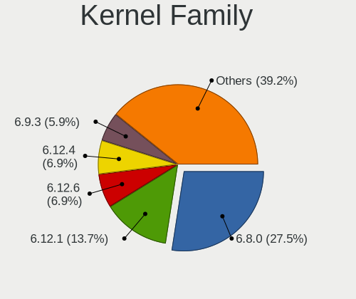
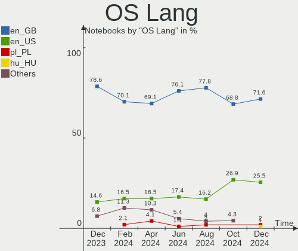
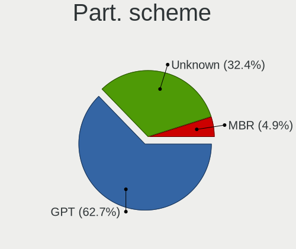
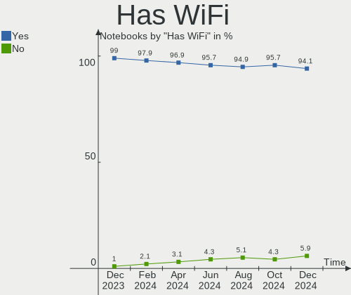
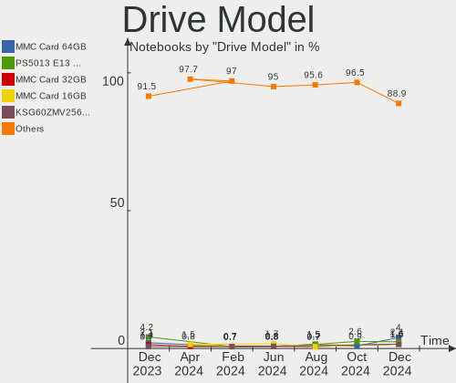
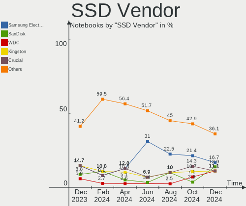
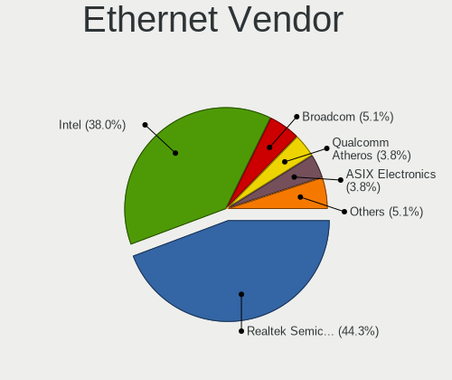

Linux in UK - Hardware Trends (Notebooks)
-----------------------------------------

A project to identify most popular hardware characteristics and track their change
over time based on data collected by Linux users at https://Linux-Hardware.org.

Anyone can contribute to this report by the [hw-probe](https://github.com/linuxhw/hw-probe) tool:

    sudo -E hw-probe -all -upload

Period: Jun, 2023.

Contents
--------

* [ System ](#system)
  - [ OS                       ](#os)
  - [ OS Family                ](#os-family)
  - [ Kernel                   ](#kernel)
  - [ Kernel Family            ](#kernel-family)
  - [ Kernel Major Ver.        ](#kernel-major-ver)
  - [ Arch                     ](#arch)
  - [ DE                       ](#de)
  - [ Display Server           ](#display-server)
  - [ Display Manager          ](#display-manager)
  - [ OS Lang                  ](#os-lang)
  - [ Boot Mode                ](#boot-mode)
  - [ Filesystem               ](#filesystem)
  - [ Part. scheme             ](#part-scheme)
  - [ Dual Boot with Linux/BSD ](#dual-boot-with-linuxbsd)
  - [ Dual Boot (Win)          ](#dual-boot-win)

* [ Board ](#board)
  - [ Vendor                   ](#vendor)
  - [ Model                    ](#model)
  - [ Model Family             ](#model-family)
  - [ MFG Year                 ](#mfg-year)
  - [ Form Factor              ](#form-factor)
  - [ Secure Boot              ](#secure-boot)
  - [ Coreboot                 ](#coreboot)
  - [ RAM Size                 ](#ram-size)
  - [ RAM Used                 ](#ram-used)
  - [ Total Drives             ](#total-drives)
  - [ Has CD-ROM               ](#has-cd-rom)
  - [ Has Ethernet             ](#has-ethernet)
  - [ Has WiFi                 ](#has-wifi)
  - [ Has Bluetooth            ](#has-bluetooth)

* [ Location ](#location)
  - [ Country                  ](#country)
  - [ City                     ](#city)

* [ Drives ](#drives)
  - [ Drive Vendor             ](#drive-vendor)
  - [ Drive Model              ](#drive-model)
  - [ HDD Vendor               ](#hdd-vendor)
  - [ SSD Vendor               ](#ssd-vendor)
  - [ Drive Kind               ](#drive-kind)
  - [ Drive Connector          ](#drive-connector)
  - [ Drive Size               ](#drive-size)
  - [ Space Total              ](#space-total)
  - [ Space Used               ](#space-used)
  - [ Malfunc. Drives          ](#malfunc-drives)
  - [ Malfunc. Drive Vendor    ](#malfunc-drive-vendor)
  - [ Malfunc. HDD Vendor      ](#malfunc-hdd-vendor)
  - [ Malfunc. Drive Kind      ](#malfunc-drive-kind)
  - [ Failed Drives            ](#failed-drives)
  - [ Failed Drive Vendor      ](#failed-drive-vendor)
  - [ Drive Status             ](#drive-status)

* [ Storage controller ](#storage-controller)
  - [ Storage Vendor           ](#storage-vendor)
  - [ Storage Model            ](#storage-model)
  - [ Storage Kind             ](#storage-kind)

* [ Processor ](#processor)
  - [ CPU Vendor               ](#cpu-vendor)
  - [ CPU Model                ](#cpu-model)
  - [ CPU Model Family         ](#cpu-model-family)
  - [ CPU Cores                ](#cpu-cores)
  - [ CPU Sockets              ](#cpu-sockets)
  - [ CPU Threads              ](#cpu-threads)
  - [ CPU Op-Modes             ](#cpu-op-modes)
  - [ CPU Microcode            ](#cpu-microcode)
  - [ CPU Microarch            ](#cpu-microarch)

* [ Graphics ](#graphics)
  - [ GPU Vendor               ](#gpu-vendor)
  - [ GPU Model                ](#gpu-model)
  - [ GPU Combo                ](#gpu-combo)
  - [ GPU Driver               ](#gpu-driver)
  - [ GPU Memory               ](#gpu-memory)

* [ Monitor ](#monitor)
  - [ Monitor Vendor           ](#monitor-vendor)
  - [ Monitor Model            ](#monitor-model)
  - [ Monitor Resolution       ](#monitor-resolution)
  - [ Monitor Diagonal         ](#monitor-diagonal)
  - [ Monitor Width            ](#monitor-width)
  - [ Aspect Ratio             ](#aspect-ratio)
  - [ Monitor Area             ](#monitor-area)
  - [ Pixel Density            ](#pixel-density)
  - [ Multiple Monitors        ](#multiple-monitors)

* [ Network ](#network)
  - [ Net Controller Vendor    ](#net-controller-vendor)
  - [ Net Controller Model     ](#net-controller-model)
  - [ Wireless Vendor          ](#wireless-vendor)
  - [ Wireless Model           ](#wireless-model)
  - [ Ethernet Vendor          ](#ethernet-vendor)
  - [ Ethernet Model           ](#ethernet-model)
  - [ Net Controller Kind      ](#net-controller-kind)
  - [ Used Controller          ](#used-controller)
  - [ NICs                     ](#nics)
  - [ IPv6                     ](#ipv6)

* [ Bluetooth ](#bluetooth)
  - [ Bluetooth Vendor         ](#bluetooth-vendor)
  - [ Bluetooth Model          ](#bluetooth-model)

* [ Sound ](#sound)
  - [ Sound Vendor             ](#sound-vendor)
  - [ Sound Model              ](#sound-model)

* [ Memory ](#memory)
  - [ Memory Vendor            ](#memory-vendor)
  - [ Memory Model             ](#memory-model)
  - [ Memory Kind              ](#memory-kind)
  - [ Memory Form Factor       ](#memory-form-factor)
  - [ Memory Size              ](#memory-size)
  - [ Memory Speed             ](#memory-speed)

* [ Printers & scanners ](#printers--scanners)
  - [ Printer Vendor           ](#printer-vendor)
  - [ Printer Model            ](#printer-model)
  - [ Scanner Vendor           ](#scanner-vendor)
  - [ Scanner Model            ](#scanner-model)

* [ Camera ](#camera)
  - [ Camera Vendor            ](#camera-vendor)
  - [ Camera Model             ](#camera-model)

* [ Security ](#security)
  - [ Fingerprint Vendor       ](#fingerprint-vendor)
  - [ Fingerprint Model        ](#fingerprint-model)
  - [ Chipcard Vendor          ](#chipcard-vendor)
  - [ Chipcard Model           ](#chipcard-model)

* [ Unsupported ](#unsupported)
  - [ Unsupported Devices      ](#unsupported-devices)
  - [ Unsupported Device Types ](#unsupported-device-types)

System
------

OS
--

Installed operating systems

| Name                         | Notebooks | Percent |
|------------------------------|-----------|---------|
| Ubuntu 22.04                 | 16        | 15.69%  |
| Linux Mint 21.1              | 9         | 8.82%   |
| Fedora 38                    | 7         | 6.86%   |
| Debian 12                    | 7         | 6.86%   |
| SteamOS 3.4.8                | 6         | 5.88%   |
| Ubuntu 23.04                 | 5         | 4.9%    |
| ArcoLinux Rolling            | 5         | 4.9%    |
| Pop!_OS 22.04                | 4         | 3.92%   |
| Manjaro 23.0.0               | 3         | 2.94%   |
| Manjaro                      | 3         | 2.94%   |
| BlackPanther 18.1            | 3         | 2.94%   |
| Zorin 16                     | 2         | 1.96%   |
| Xubuntu 22.04                | 2         | 1.96%   |
| Lubuntu 22.04                | 2         | 1.96%   |
| LMDE 5                       | 2         | 1.96%   |
| Kubuntu 23.04                | 2         | 1.96%   |
| Kubuntu 22.04                | 2         | 1.96%   |
| Kubuntu 20.04                | 2         | 1.96%   |
| KDE neon 22.04               | 2         | 1.96%   |
| Xubuntu 23.04                | 1         | 0.98%   |
| Ubuntu 20.04                 | 1         | 0.98%   |
| ROSA 12.4                    | 1         | 0.98%   |
| Parrot 5.3                   | 1         | 0.98%   |
| openSUSE Tumbleweed-XXXXXXXX | 1         | 0.98%   |
| OpenMandriva 4.50            | 1         | 0.98%   |
| OpenMandriva 4.3             | 1         | 0.98%   |
| OpenMandriva 23.06           | 1         | 0.98%   |
| OpenMandriva 23.03           | 1         | 0.98%   |
| NixOS 23.05                  | 1         | 0.98%   |
| Linux Mint 21                | 1         | 0.98%   |
| Gentoo 2.13                  | 1         | 0.98%   |
| Fedora 37                    | 1         | 0.98%   |
| Fedora 36                    | 1         | 0.98%   |
| Debian                       | 1         | 0.98%   |
| BunsenLabs 11                | 1         | 0.98%   |
| blendOS                      | 1         | 0.98%   |
| Arch Rolling                 | 1         | 0.98%   |

OS Family
---------

OS without a version

| Name         | Notebooks | Percent |
|--------------|-----------|---------|
| Ubuntu       | 22        | 21.57%  |
| Linux Mint   | 10        | 9.8%    |
| Fedora       | 9         | 8.82%   |
| Debian       | 8         | 7.84%   |
| SteamOS      | 6         | 5.88%   |
| Manjaro      | 6         | 5.88%   |
| Kubuntu      | 6         | 5.88%   |
| ArcoLinux    | 5         | 4.9%    |
| Pop!_OS      | 4         | 3.92%   |
| OpenMandriva | 4         | 3.92%   |
| Xubuntu      | 3         | 2.94%   |
| BlackPanther | 3         | 2.94%   |
| Zorin        | 2         | 1.96%   |
| Lubuntu      | 2         | 1.96%   |
| LMDE         | 2         | 1.96%   |
| KDE neon     | 2         | 1.96%   |
| ROSA         | 1         | 0.98%   |
| Parrot       | 1         | 0.98%   |
| openSUSE     | 1         | 0.98%   |
| NixOS        | 1         | 0.98%   |
| Gentoo       | 1         | 0.98%   |
| BunsenLabs   | 1         | 0.98%   |
| blendOS      | 1         | 0.98%   |
| Arch         | 1         | 0.98%   |

Kernel
------

Version of the Linux kernel

| Version                           | Notebooks | Percent |
|-----------------------------------|-----------|---------|
| 5.19.0-43-generic                 | 14        | 13.73%  |
| 5.15.0-73-generic                 | 9         | 8.82%   |
| 6.1.0-9-amd64                     | 7         | 6.86%   |
| 5.13.0-valve36-1-neptune          | 6         | 5.88%   |
| 6.2.0-20-generic                  | 5         | 4.9%    |
| 6.2.6-76060206-generic            | 4         | 3.92%   |
| 6.1.31-2-MANJARO                  | 4         | 3.92%   |
| 5.19.0-45-generic                 | 4         | 3.92%   |
| 5.15.0-75-generic                 | 4         | 3.92%   |
| 6.3.9-arch1-1                     | 2         | 1.96%   |
| 6.3.5-arch1-1                     | 2         | 1.96%   |
| 6.3.5-200.fc38.x86_64             | 2         | 1.96%   |
| 6.3.5-2-MANJARO                   | 2         | 1.96%   |
| 6.3.4-201.fc38.x86_64             | 2         | 1.96%   |
| 5.19.0-42-generic                 | 2         | 1.96%   |
| 5.15.85-desktop-1bP               | 2         | 1.96%   |
| 5.10.0-23-amd64                   | 2         | 1.96%   |
| 6.3.8-x64v3-xanmod1               | 1         | 0.98%   |
| 6.3.8-200.fc38.x86_64             | 1         | 0.98%   |
| 6.3.8                             | 1         | 0.98%   |
| 6.3.7-arch1-1                     | 1         | 0.98%   |
| 6.3.7-060307-generic              | 1         | 0.98%   |
| 6.3.6-arch1-1                     | 1         | 0.98%   |
| 6.3.6-200.fc38.x86_64             | 1         | 0.98%   |
| 6.3.6-1-default                   | 1         | 0.98%   |
| 6.3.5-ivybridge-xanmod1           | 1         | 0.98%   |
| 6.3.5-desktop-3omv2390            | 1         | 0.98%   |
| 6.3.0-1-amd64                     | 1         | 0.98%   |
| 6.2.9-300.fc38.x86_64             | 1         | 0.98%   |
| 6.2.6-desktop-1omv2390            | 1         | 0.98%   |
| 6.1.33-1-lts                      | 1         | 0.98%   |
| 6.1.20-generic-2rosa2021.1-x86_64 | 1         | 0.98%   |
| 6.1.12-060112-generic             | 1         | 0.98%   |
| 6.1.0-1parrot1-amd64              | 1         | 0.98%   |
| 6.0.18-200.fc36.x86_64            | 1         | 0.98%   |
| 6.0.11-300.fc37.x86_64            | 1         | 0.98%   |
| 5.6.14-desktop-2bP                | 1         | 0.98%   |
| 5.4.0-150-generic                 | 1         | 0.98%   |
| 5.19.0-46-generic                 | 1         | 0.98%   |
| 5.19.0-1017-lowlatency            | 1         | 0.98%   |

Kernel Family
-------------

Linux kernel without a distro release

| Version | Notebooks | Percent |
|---------|-----------|---------|
| 5.19.0  | 22        | 21.57%  |
| 5.15.0  | 16        | 15.69%  |
| 6.3.5   | 8         | 7.84%   |
| 6.1.0   | 8         | 7.84%   |
| 5.13.0  | 6         | 5.88%   |
| 6.2.6   | 5         | 4.9%    |
| 6.2.0   | 5         | 4.9%    |
| 6.1.31  | 4         | 3.92%   |
| 6.3.8   | 3         | 2.94%   |
| 6.3.6   | 3         | 2.94%   |
| 5.10.0  | 3         | 2.94%   |
| 6.3.9   | 2         | 1.96%   |
| 6.3.7   | 2         | 1.96%   |
| 6.3.4   | 2         | 1.96%   |
| 5.15.85 | 2         | 1.96%   |
| 6.3.0   | 1         | 0.98%   |
| 6.2.9   | 1         | 0.98%   |
| 6.1.33  | 1         | 0.98%   |
| 6.1.20  | 1         | 0.98%   |
| 6.1.12  | 1         | 0.98%   |
| 6.0.18  | 1         | 0.98%   |
| 6.0.11  | 1         | 0.98%   |
| 5.6.14  | 1         | 0.98%   |
| 5.4.0   | 1         | 0.98%   |
| 5.16.7  | 1         | 0.98%   |
| 5.16.0  | 1         | 0.98%   |

Kernel Major Ver.
-----------------

Linux kernel major version

| Version | Notebooks | Percent |
|---------|-----------|---------|
| 5.19    | 22        | 21.57%  |
| 6.3     | 21        | 20.59%  |
| 5.15    | 18        | 17.65%  |
| 6.1     | 15        | 14.71%  |
| 6.2     | 11        | 10.78%  |
| 5.13    | 6         | 5.88%   |
| 5.10    | 3         | 2.94%   |
| 6.0     | 2         | 1.96%   |
| 5.16    | 2         | 1.96%   |
| 5.6     | 1         | 0.98%   |
| 5.4     | 1         | 0.98%   |

Arch
----

OS architecture (x86_64, i586, etc.)

| Name   | Notebooks | Percent |
|--------|-----------|---------|
| x86_64 | 102       | 100%    |

DE
--

Desktop Environment

| Name       | Notebooks | Percent |
|------------|-----------|---------|
| GNOME      | 41        | 40.2%   |
| KDE5       | 32        | 31.37%  |
| XFCE       | 9         | 8.82%   |
| X-Cinnamon | 7         | 6.86%   |
| MATE       | 5         | 4.9%    |
| LXQt       | 2         | 1.96%   |
| Unknown    | 2         | 1.96%   |
| sway       | 1         | 0.98%   |
| Hyprland   | 1         | 0.98%   |
| Hypr       | 1         | 0.98%   |
| Cinnamon   | 1         | 0.98%   |

Display Server
--------------

X11 or Wayland

| Name    | Notebooks | Percent |
|---------|-----------|---------|
| X11     | 59        | 57.84%  |
| Wayland | 42        | 41.18%  |
| Unknown | 1         | 0.98%   |

Display Manager
---------------

SDDM, LightDM, etc.

| Name    | Notebooks | Percent |
|---------|-----------|---------|
| Unknown | 41        | 40.2%   |
| GDM3    | 20        | 19.61%  |
| SDDM    | 19        | 18.63%  |
| LightDM | 15        | 14.71%  |
| GDM     | 7         | 6.86%   |

OS Lang
-------

Language

| Lang    | Notebooks | Percent |
|---------|-----------|---------|
| en_GB   | 83        | 81.37%  |
| en_US   | 12        | 11.76%  |
| Unknown | 5         | 4.9%    |
| pl_PL   | 1         | 0.98%   |
| C       | 1         | 0.98%   |

Boot Mode
---------

EFI or BIOS

| Mode | Notebooks | Percent |
|------|-----------|---------|
| BIOS | 54        | 52.94%  |
| EFI  | 48        | 47.06%  |

Filesystem
----------

Type of filesystem

| Type    | Notebooks | Percent |
|---------|-----------|---------|
| Ext4    | 59        | 57.84%  |
| Tmpfs   | 20        | 19.61%  |
| Btrfs   | 20        | 19.61%  |
| Overlay | 3         | 2.94%   |

Part. scheme
------------

Scheme of partitioning

| Type    | Notebooks | Percent |
|---------|-----------|---------|
| GPT     | 54        | 52.94%  |
| Unknown | 38        | 37.25%  |
| MBR     | 10        | 9.8%    |

Dual Boot with Linux/BSD
------------------------

Hosting more than one Linux/BSD

| Dual boot | Notebooks | Percent |
|-----------|-----------|---------|
| No        | 91        | 89.22%  |
| Yes       | 11        | 10.78%  |

Dual Boot (Win)
---------------

Hosting Linux and Windows

| Dual boot | Notebooks | Percent |
|-----------|-----------|---------|
| No        | 82        | 80.39%  |
| Yes       | 20        | 19.61%  |

Board
-----

Vendor
------

Motherboard manufacturer

| Name             | Notebooks | Percent |
|------------------|-----------|---------|
| Hewlett-Packard  | 24        | 23.53%  |
| Lenovo           | 22        | 21.57%  |
| Dell             | 15        | 14.71%  |
| Valve            | 6         | 5.88%   |
| Acer             | 6         | 5.88%   |
| ASUSTek Computer | 5         | 4.9%    |
| Toshiba          | 4         | 3.92%   |
| Apple            | 3         | 2.94%   |
| Sony             | 2         | 1.96%   |
| PC Specialist    | 2         | 1.96%   |
| MSI              | 2         | 1.96%   |
| Google           | 2         | 1.96%   |
| Timi             | 1         | 0.98%   |
| Teclast          | 1         | 0.98%   |
| Medion           | 1         | 0.98%   |
| HUAWEI           | 1         | 0.98%   |
| HONOR            | 1         | 0.98%   |
| GEO              | 1         | 0.98%   |
| Fujitsu Siemens  | 1         | 0.98%   |
| Framework        | 1         | 0.98%   |
| Alienware        | 1         | 0.98%   |

Model
-----

Motherboard model

| Name                                             | Notebooks | Percent |
|--------------------------------------------------|-----------|---------|
| Valve Jupiter                                    | 6         | 5.88%   |
| HP Pavilion Laptop 15-eh0xxx                     | 2         | 1.96%   |
| Toshiba TECRA Z40t-C                             | 1         | 0.98%   |
| Toshiba Satellite Pro C50-A-1E6                  | 1         | 0.98%   |
| Toshiba Satellite C650                           | 1         | 0.98%   |
| Toshiba Satellite C50-B                          | 1         | 0.98%   |
| Timi RedmiBook Pro 14                            | 1         | 0.98%   |
| Teclast F15Plus 2                                | 1         | 0.98%   |
| Sony VPCEH3N6E                                   | 1         | 0.98%   |
| Sony SVF1521A1EW                                 | 1         | 0.98%   |
| PC Specialist P65_P67RGRERA                      | 1         | 0.98%   |
| PC Specialist Initia Ii 15                       | 1         | 0.98%   |
| MSI Katana GF66 11UG                             | 1         | 0.98%   |
| MSI GE70 2PL                                     | 1         | 0.98%   |
| Medion Erazer P6661 MD60303                      | 1         | 0.98%   |
| Lenovo Z70-80 80FG                               | 1         | 0.98%   |
| Lenovo Z50-70 20354                              | 1         | 0.98%   |
| Lenovo Yoga 300-11IBY 80M0                       | 1         | 0.98%   |
| Lenovo Y520-15IKBN 80WK                          | 1         | 0.98%   |
| Lenovo V15 G3 ABA 82TV                           | 1         | 0.98%   |
| Lenovo ThinkPad X61 7674GS3                      | 1         | 0.98%   |
| Lenovo ThinkPad X270 W10DG 20K5S5QD00            | 1         | 0.98%   |
| Lenovo ThinkPad X240 20AL007LUK                  | 1         | 0.98%   |
| Lenovo ThinkPad X1 Carbon Gen 10 21CB007AUK      | 1         | 0.98%   |
| Lenovo ThinkPad X1 Carbon 6th 20KH006KUK         | 1         | 0.98%   |
| Lenovo ThinkPad X1 Carbon 4th 20FCS1F800         | 1         | 0.98%   |
| Lenovo ThinkPad W500 4058CTO                     | 1         | 0.98%   |
| Lenovo ThinkPad T540p 20BE003YUK                 | 1         | 0.98%   |
| Lenovo ThinkPad T470s W10DG 20JTS3EL00           | 1         | 0.98%   |
| Lenovo ThinkPad T440p 20AWS38H0G                 | 1         | 0.98%   |
| Lenovo ThinkPad T14s Gen 3 21CQCTO1WW            | 1         | 0.98%   |
| Lenovo ThinkPad E560 20EVCTO1WW                  | 1         | 0.98%   |
| Lenovo Legion 5 15ITH6H 82JH                     | 1         | 0.98%   |
| Lenovo IdeaPad Y700-15ISK 80NV                   | 1         | 0.98%   |
| Lenovo IdeaPad Y580                              | 1         | 0.98%   |
| Lenovo IdeaPad 110S-11IBR 80WG                   | 1         | 0.98%   |
| Lenovo Flex 2-14 20404                           | 1         | 0.98%   |
| HUAWEI NBD-WXX9                                  | 1         | 0.98%   |
| HONOR NBR-WAX9                                   | 1         | 0.98%   |
| HP ZBook Fury 17.3 inch G8 Mobile Workstation PC | 1         | 0.98%   |

Model Family
------------

Motherboard model prefix

| Name                 | Notebooks | Percent |
|----------------------|-----------|---------|
| Lenovo ThinkPad      | 12        | 11.76%  |
| Valve Jupiter        | 6         | 5.88%   |
| HP Pavilion          | 6         | 5.88%   |
| Dell Latitude        | 6         | 5.88%   |
| HP EliteBook         | 4         | 3.92%   |
| Dell XPS             | 4         | 3.92%   |
| Acer Aspire          | 4         | 3.92%   |
| Toshiba Satellite    | 3         | 2.94%   |
| Lenovo IdeaPad       | 3         | 2.94%   |
| HP Laptop            | 3         | 2.94%   |
| Dell Inspiron        | 3         | 2.94%   |
| ASUS VivoBook        | 3         | 2.94%   |
| HP ProBook           | 2         | 1.96%   |
| Acer Swift           | 2         | 1.96%   |
| Toshiba TECRA        | 1         | 0.98%   |
| Timi RedmiBook       | 1         | 0.98%   |
| Teclast F15Plus      | 1         | 0.98%   |
| Sony VPCEH3N6E       | 1         | 0.98%   |
| Sony SVF1521A1EW     | 1         | 0.98%   |
| PC Specialist P65    | 1         | 0.98%   |
| PC Specialist Initia | 1         | 0.98%   |
| MSI Katana           | 1         | 0.98%   |
| MSI GE70             | 1         | 0.98%   |
| Medion Erazer        | 1         | 0.98%   |
| Lenovo Z70-80        | 1         | 0.98%   |
| Lenovo Z50-70        | 1         | 0.98%   |
| Lenovo Yoga          | 1         | 0.98%   |
| Lenovo Y520-15IKBN   | 1         | 0.98%   |
| Lenovo V15           | 1         | 0.98%   |
| Lenovo Legion        | 1         | 0.98%   |
| Lenovo Flex          | 1         | 0.98%   |
| HUAWEI NBD-WXX9      | 1         | 0.98%   |
| HONOR NBR-WAX9       | 1         | 0.98%   |
| HP ZBook             | 1         | 0.98%   |
| HP Stream            | 1         | 0.98%   |
| HP OMEN              | 1         | 0.98%   |
| HP Notebook          | 1         | 0.98%   |
| HP ENVY              | 1         | 0.98%   |
| HP Compaq            | 1         | 0.98%   |
| HP 8470p             | 1         | 0.98%   |

MFG Year
--------

Motherboard manufacture year

| Year | Notebooks | Percent |
|------|-----------|---------|
| 2022 | 17        | 16.67%  |
| 2021 | 10        | 9.8%    |
| 2014 | 10        | 9.8%    |
| 2016 | 8         | 7.84%   |
| 2013 | 8         | 7.84%   |
| 2018 | 7         | 6.86%   |
| 2020 | 6         | 5.88%   |
| 2015 | 6         | 5.88%   |
| 2011 | 6         | 5.88%   |
| 2017 | 5         | 4.9%    |
| 2023 | 4         | 3.92%   |
| 2019 | 4         | 3.92%   |
| 2010 | 3         | 2.94%   |
| 2012 | 2         | 1.96%   |
| 2009 | 2         | 1.96%   |
| 2008 | 2         | 1.96%   |
| 2007 | 1         | 0.98%   |
| 2006 | 1         | 0.98%   |

Form Factor
-----------

Physical design of the computer

| Name     | Notebooks | Percent |
|----------|-----------|---------|
| Notebook | 102       | 100%    |

Secure Boot
-----------

Enabled or disabled

| State    | Notebooks | Percent |
|----------|-----------|---------|
| Disabled | 92        | 90.2%   |
| Enabled  | 10        | 9.8%    |

Coreboot
--------

Have coreboot on board

| Used | Notebooks | Percent |
|------|-----------|---------|
| No   | 100       | 98.04%  |
| Yes  | 2         | 1.96%   |

RAM Size
--------

Total RAM memory

| Size in GB  | Notebooks | Percent |
|-------------|-----------|---------|
| 4.01-8.0    | 30        | 29.41%  |
| 16.01-24.0  | 20        | 19.61%  |
| 8.01-16.0   | 20        | 19.61%  |
| 3.01-4.0    | 15        | 14.71%  |
| 32.01-64.0  | 8         | 7.84%   |
| 2.01-3.0    | 4         | 3.92%   |
| 24.01-32.0  | 2         | 1.96%   |
| 64.01-256.0 | 2         | 1.96%   |
| 1.01-2.0    | 1         | 0.98%   |

RAM Used
--------

Used RAM memory

| Used GB    | Notebooks | Percent |
|------------|-----------|---------|
| 1.01-2.0   | 33        | 32.35%  |
| 2.01-3.0   | 26        | 25.49%  |
| 3.01-4.0   | 21        | 20.59%  |
| 4.01-8.0   | 16        | 15.69%  |
| 8.01-16.0  | 4         | 3.92%   |
| 16.01-24.0 | 1         | 0.98%   |
| 0.51-1.0   | 1         | 0.98%   |

Total Drives
------------

Number of drives on board

| Drives | Notebooks | Percent |
|--------|-----------|---------|
| 1      | 73        | 71.57%  |
| 2      | 24        | 23.53%  |
| 3      | 3         | 2.94%   |
| 4      | 2         | 1.96%   |

Has CD-ROM
----------

Has CD-ROM on board

| Presented | Notebooks | Percent |
|-----------|-----------|---------|
| No        | 68        | 66.67%  |
| Yes       | 34        | 33.33%  |

Has Ethernet
------------

Has Ethernet on board

| Presented | Notebooks | Percent |
|-----------|-----------|---------|
| Yes       | 70        | 68.63%  |
| No        | 32        | 31.37%  |

Has WiFi
--------

Has WiFi module

| Presented | Notebooks | Percent |
|-----------|-----------|---------|
| Yes       | 101       | 99.02%  |
| No        | 1         | 0.98%   |

Has Bluetooth
-------------

Has Bluetooth module

| Presented | Notebooks | Percent |
|-----------|-----------|---------|
| Yes       | 89        | 87.25%  |
| No        | 13        | 12.75%  |

Location
--------

Country
-------

Geographic location (country)

| Country | Notebooks | Percent |
|---------|-----------|---------|
| UK      | 102       | 100%    |

City
----

Geographic location (city)

| City                 | Notebooks | Percent |
|----------------------|-----------|---------|
| Birmingham           | 6         | 5.88%   |
| Plymouth             | 4         | 3.92%   |
| Manchester           | 4         | 3.92%   |
| London               | 3         | 2.94%   |
| Liverpool            | 3         | 2.94%   |
| Shipley              | 2         | 1.96%   |
| Rochdale             | 2         | 1.96%   |
| Preston              | 2         | 1.96%   |
| Leicester            | 2         | 1.96%   |
| Kingston upon Thames | 2         | 1.96%   |
| Harlow               | 2         | 1.96%   |
| Greenwich            | 2         | 1.96%   |
| Epsom                | 2         | 1.96%   |
| Croydon              | 2         | 1.96%   |
| Bristol              | 2         | 1.96%   |
| Brighton             | 2         | 1.96%   |
| York                 | 1         | 0.98%   |
| Worthing             | 1         | 0.98%   |
| West Bromwich        | 1         | 0.98%   |
| Warwick              | 1         | 0.98%   |
| Wandsworth           | 1         | 0.98%   |
| Twickenham           | 1         | 0.98%   |
| Towcester            | 1         | 0.98%   |
| Teddington           | 1         | 0.98%   |
| Talybont             | 1         | 0.98%   |
| Swadlincote          | 1         | 0.98%   |
| Stranraer            | 1         | 0.98%   |
| Stoke-on-Trent       | 1         | 0.98%   |
| Spalding             | 1         | 0.98%   |
| Slough               | 1         | 0.98%   |
| Sevenoaks            | 1         | 0.98%   |
| Seaford              | 1         | 0.98%   |
| Saint Neots          | 1         | 0.98%   |
| Rushden              | 1         | 0.98%   |
| Ruislip              | 1         | 0.98%   |
| Portsmouth           | 1         | 0.98%   |
| Oldbury              | 1         | 0.98%   |
| Newmarket            | 1         | 0.98%   |
| Milnthorpe           | 1         | 0.98%   |
| Leeds                | 1         | 0.98%   |

Drives
------

Drive Vendor
------------

Hard drive vendors

| Vendor                      | Notebooks | Drives | Percent |
|-----------------------------|-----------|--------|---------|
| Samsung Electronics         | 20        | 21     | 15.38%  |
| Unknown                     | 13        | 14     | 10%     |
| WDC                         | 12        | 12     | 9.23%   |
| Seagate                     | 10        | 10     | 7.69%   |
| Toshiba                     | 8         | 8      | 6.15%   |
| SanDisk                     | 8         | 9      | 6.15%   |
| Crucial                     | 8         | 9      | 6.15%   |
| Kingston Technology Company | 5         | 5      | 3.85%   |
| Phison Electronics          | 4         | 4      | 3.08%   |
| KIOXIA                      | 4         | 5      | 3.08%   |
| Micron Technology           | 3         | 3      | 2.31%   |
| Intel                       | 3         | 3      | 2.31%   |
| Unknown                     | 3         | 3      | 2.31%   |
| SK hynix                    | 2         | 2      | 1.54%   |
| SABRENT                     | 2         | 2      | 1.54%   |
| Kingston                    | 2         | 2      | 1.54%   |
| JMicron Technology          | 2         | 2      | 1.54%   |
| Hitachi                     | 2         | 2      | 1.54%   |
| HGST                        | 2         | 2      | 1.54%   |
| China                       | 2         | 2      | 1.54%   |
| Teclast                     | 1         | 1      | 0.77%   |
| SSSTC                       | 1         | 1      | 0.77%   |
| Solid State Storage         | 1         | 1      | 0.77%   |
| PNY                         | 1         | 1      | 0.77%   |
| Phison                      | 1         | 1      | 0.77%   |
| Origin                      | 1         | 1      | 0.77%   |
| Micron/Crucial Technology   | 1         | 1      | 0.77%   |
| LITEONIT                    | 1         | 1      | 0.77%   |
| LITEON                      | 1         | 1      | 0.77%   |
| Lenovo                      | 1         | 1      | 0.77%   |
| KIOXIA-EXCERIA              | 1         | 1      | 0.77%   |
| Hewlett-Packard             | 1         | 1      | 0.77%   |
| Gigabyte Technology         | 1         | 1      | 0.77%   |
| BAITITON                    | 1         | 1      | 0.77%   |
| ASENNO                      | 1         | 1      | 0.77%   |

Drive Model
-----------

Hard drive models

| Model                                               | Notebooks | Percent |
|-----------------------------------------------------|-----------|---------|
| Unknown MMC Card  32GB                              | 5         | 3.85%   |
| Kingston Company OM3PDP3 NVMe SSD 256GB             | 5         | 3.85%   |
| Unknown MMC Card  512GB                             | 3         | 2.31%   |
| Toshiba MQ01ABD100 1TB                              | 3         | 2.31%   |
| Samsung NVMe SSD Controller SM981/PM981/PM983 250GB | 3         | 2.31%   |
| Phison PS5013 E13 NVMe Controller 512GB             | 3         | 2.31%   |
| Unknown                                             | 3         | 2.31%   |
| Seagate ST500LT012-1DG142 500GB                     | 2         | 1.54%   |
| Seagate ST1000LM014-SSHD-8GB                        | 2         | 1.54%   |
| SanDisk NVMe SSD Drive 2TB                          | 2         | 1.54%   |
| Samsung SSD 850 EVO 250GB                           | 2         | 1.54%   |
| Samsung NVMe SSD Controller PM9A1/PM9A3/980PRO 2TB  | 2         | 1.54%   |
| Intel SSDPEKNU512GZ 512GB                           | 2         | 1.54%   |
| WDC WDS500G2B0A-00SM50 500GB SSD                    | 1         | 0.77%   |
| WDC WDS500G2B0A 500GB SSD                           | 1         | 0.77%   |
| WDC WDS500G1X0E-00AFY0 500GB                        | 1         | 0.77%   |
| WDC WDS250G2B0A 250GB SSD                           | 1         | 0.77%   |
| WDC WDS240G2G0B-00EPW0 240GB SSD                    | 1         | 0.77%   |
| WDC WDS100T2B0B 1TB SSD                             | 1         | 0.77%   |
| WDC WD7500BPVT-60HXZT3 752GB                        | 1         | 0.77%   |
| WDC WD5000LPCX-21VHAT0 500GB                        | 1         | 0.77%   |
| WDC WD3200BEKT-60PVMT0 320GB                        | 1         | 0.77%   |
| WDC WD10SPCX-24HWST1 1TB                            | 1         | 0.77%   |
| WDC WD10JPVX-80JC3T0 1TB                            | 1         | 0.77%   |
| WDC WD10JPVX-22JC3T0 1TB                            | 1         | 0.77%   |
| Unknown MMC Card  64GB                              | 1         | 0.77%   |
| Unknown MMC Card  196GB                             | 1         | 0.77%   |
| Unknown MMC Card  128GB                             | 1         | 0.77%   |
| Unknown EE4S5  256GB                                | 1         | 0.77%   |
| Unknown DA4032  32GB                                | 1         | 0.77%   |
| Toshiba THNSNF128GMCS 128GB SSD                     | 1         | 0.77%   |
| Toshiba MQ01ABD100M 1TB                             | 1         | 0.77%   |
| Toshiba MQ01ABD075 752GB                            | 1         | 0.77%   |
| Toshiba MK5065GSXF 500GB                            | 1         | 0.77%   |
| Toshiba KSG60ZMV256G M.2 2280 256GB SSD             | 1         | 0.77%   |
| Teclast BD256GB SHCB-2280 SSD                       | 1         | 0.77%   |
| SSSTC CL1-8D512 512GB                               | 1         | 0.77%   |
| Solid State Storage CL1-3D128-Q11 NVMe SSSTC 128GB  | 1         | 0.77%   |
| SK hynix SC311 SATA 128GB SSD                       | 1         | 0.77%   |
| SK hynix PC611 NVMe 256GB                           | 1         | 0.77%   |

HDD Vendor
----------

Hard disk drive vendors

| Vendor              | Notebooks | Drives | Percent |
|---------------------|-----------|--------|---------|
| Seagate             | 10        | 10     | 37.04%  |
| WDC                 | 6         | 6      | 22.22%  |
| Toshiba             | 6         | 6      | 22.22%  |
| Hitachi             | 2         | 2      | 7.41%   |
| HGST                | 2         | 2      | 7.41%   |
| Samsung Electronics | 1         | 1      | 3.7%    |

SSD Vendor
----------

Solid state drive vendors

| Vendor              | Notebooks | Drives | Percent |
|---------------------|-----------|--------|---------|
| Crucial             | 8         | 9      | 20.51%  |
| WDC                 | 5         | 5      | 12.82%  |
| Samsung Electronics | 5         | 6      | 12.82%  |
| SanDisk             | 3         | 3      | 7.69%   |
| Toshiba             | 2         | 2      | 5.13%   |
| Kingston            | 2         | 2      | 5.13%   |
| Teclast             | 1         | 1      | 2.56%   |
| SK hynix            | 1         | 1      | 2.56%   |
| PNY                 | 1         | 1      | 2.56%   |
| Phison              | 1         | 1      | 2.56%   |
| Origin              | 1         | 1      | 2.56%   |
| Micron Technology   | 1         | 1      | 2.56%   |
| LITEONIT            | 1         | 1      | 2.56%   |
| LITEON              | 1         | 1      | 2.56%   |
| KIOXIA-EXCERIA      | 1         | 1      | 2.56%   |
| Hewlett-Packard     | 1         | 1      | 2.56%   |
| Gigabyte Technology | 1         | 1      | 2.56%   |
| China               | 1         | 1      | 2.56%   |
| BAITITON            | 1         | 1      | 2.56%   |
| ASENNO              | 1         | 1      | 2.56%   |

Drive Kind
----------

HDD or SSD

| Kind    | Notebooks | Drives | Percent |
|---------|-----------|--------|---------|
| NVMe    | 44        | 47     | 35.48%  |
| SSD     | 34        | 41     | 27.42%  |
| HDD     | 27        | 27     | 21.77%  |
| MMC     | 15        | 16     | 12.1%   |
| Unknown | 4         | 4      | 3.23%   |

Drive Connector
---------------

SATA, SAS, NVMe, etc.

| Type | Notebooks | Drives | Percent |
|------|-----------|--------|---------|
| SATA | 56        | 68     | 47.06%  |
| NVMe | 42        | 45     | 35.29%  |
| MMC  | 15        | 16     | 12.61%  |
| SAS  | 6         | 6      | 5.04%   |

Drive Size
----------

Size of hard drive

| Size in TB | Notebooks | Drives | Percent |
|------------|-----------|--------|---------|
| 0.01-0.5   | 35        | 39     | 56.45%  |
| 0.51-1.0   | 24        | 25     | 38.71%  |
| 1.01-2.0   | 3         | 4      | 4.84%   |

Space Total
-----------

Amount of disk space available on the file system

| Size in GB     | Notebooks | Percent |
|----------------|-----------|---------|
| 251-500        | 30        | 29.41%  |
| 501-1000       | 25        | 24.51%  |
| 101-250        | 23        | 22.55%  |
| 1001-2000      | 7         | 6.86%   |
| 21-50          | 5         | 4.9%    |
| 1-20           | 4         | 3.92%   |
| 51-100         | 4         | 3.92%   |
| More than 3000 | 2         | 1.96%   |
| 2001-3000      | 1         | 0.98%   |
| Unknown        | 1         | 0.98%   |

Space Used
----------

Amount of used disk space

| Used GB   | Notebooks | Percent |
|-----------|-----------|---------|
| 1-20      | 33        | 32.35%  |
| 21-50     | 27        | 26.47%  |
| 101-250   | 14        | 13.73%  |
| 251-500   | 10        | 9.8%    |
| 51-100    | 9         | 8.82%   |
| 501-1000  | 5         | 4.9%    |
| 1001-2000 | 3         | 2.94%   |
| Unknown   | 1         | 0.98%   |

Malfunc. Drives
---------------

Drive models with a malfunction

| Model                         | Notebooks | Drives | Percent |
|-------------------------------|-----------|--------|---------|
| WDC WD7500BPVT-60HXZT3 752GB  | 1         | 1      | 25%     |
| WDC WD3200BEKT-60PVMT0 320GB  | 1         | 1      | 25%     |
| Hitachi HTS547575A9E384 752GB | 1         | 1      | 25%     |
| BAITITON BT58SSD10S 256GB     | 1         | 1      | 25%     |

Malfunc. Drive Vendor
---------------------

Vendors of faulty drives

| Vendor   | Notebooks | Drives | Percent |
|----------|-----------|--------|---------|
| WDC      | 2         | 2      | 50%     |
| Hitachi  | 1         | 1      | 25%     |
| BAITITON | 1         | 1      | 25%     |

Malfunc. HDD Vendor
-------------------

Vendors of faulty HDD drives

| Vendor  | Notebooks | Drives | Percent |
|---------|-----------|--------|---------|
| WDC     | 2         | 2      | 66.67%  |
| Hitachi | 1         | 1      | 33.33%  |

Malfunc. Drive Kind
-------------------

Kinds of faulty drives

| Kind | Notebooks | Drives | Percent |
|------|-----------|--------|---------|
| HDD  | 3         | 3      | 75%     |
| SSD  | 1         | 1      | 25%     |

Failed Drives
-------------

Failed drive models

Zero info for selected period =(

Failed Drive Vendor
-------------------

Failed drive vendors

Zero info for selected period =(

Drive Status
------------

Number of failed and malfunc. drives

| Status   | Notebooks | Drives | Percent |
|----------|-----------|--------|---------|
| Detected | 67        | 90     | 61.47%  |
| Works    | 38        | 41     | 34.86%  |
| Malfunc  | 4         | 4      | 3.67%   |

Storage controller
------------------

Storage Vendor
--------------

Storage controller vendors

| Vendor                         | Notebooks | Percent |
|--------------------------------|-----------|---------|
| Intel                          | 72        | 62.07%  |
| Samsung Electronics            | 14        | 12.07%  |
| SanDisk                        | 6         | 5.17%   |
| Kingston Technology Company    | 5         | 4.31%   |
| Phison Electronics             | 4         | 3.45%   |
| AMD                            | 4         | 3.45%   |
| KIOXIA                         | 3         | 2.59%   |
| Solid State Storage Technology | 2         | 1.72%   |
| Micron Technology              | 2         | 1.72%   |
| Toshiba America Info Systems   | 1         | 0.86%   |
| SK hynix                       | 1         | 0.86%   |
| Micron/Crucial Technology      | 1         | 0.86%   |
| Lenovo                         | 1         | 0.86%   |

Storage Model
-------------

Storage controller models

| Model                                                                          | Notebooks | Percent |
|--------------------------------------------------------------------------------|-----------|---------|
| Intel Volume Management Device NVMe RAID Controller                            | 8         | 6.61%   |
| Intel 82801 Mobile SATA Controller [RAID mode]                                 | 8         | 6.61%   |
| Intel 8 Series SATA Controller 1 [AHCI mode]                                   | 7         | 5.79%   |
| Intel Wildcat Point-LP SATA Controller [AHCI Mode]                             | 6         | 4.96%   |
| Intel 6 Series/C200 Series Chipset Family 6 port Mobile SATA AHCI Controller   | 6         | 4.96%   |
| Samsung NVMe SSD Controller SM981/PM981/PM983                                  | 5         | 4.13%   |
| Kingston Company OM3PDP3 NVMe SSD                                              | 5         | 4.13%   |
| Intel Sunrise Point-LP SATA Controller [AHCI mode]                             | 5         | 4.13%   |
| Samsung NVMe SSD Controller 980                                                | 4         | 3.31%   |
| Intel 7 Series Chipset Family 6-port SATA Controller [AHCI mode]               | 4         | 3.31%   |
| AMD FCH SATA Controller [AHCI mode]                                            | 4         | 3.31%   |
| Samsung NVMe SSD Controller PM9A1/PM9A3/980PRO                                 | 3         | 2.48%   |
| Phison PS5013 E13 NVMe Controller                                              | 3         | 2.48%   |
| Intel HM170/QM170 Chipset SATA Controller [AHCI Mode]                          | 3         | 2.48%   |
| Intel 8 Series/C220 Series Chipset Family 6-port SATA Controller 1 [AHCI mode] | 3         | 2.48%   |
| Solid State Storage CL1-3D256-Q11 NVMe SSD M.2                                 | 2         | 1.65%   |
| KIOXIA Non-Volatile memory controller                                          | 2         | 1.65%   |
| Intel Tiger Lake-LP SATA Controller                                            | 2         | 1.65%   |
| Intel Tiger Lake SATA AHCI Controller                                          | 2         | 1.65%   |
| Intel Non-Volatile memory controller                                           | 2         | 1.65%   |
| Intel Atom Processor E3800 Series SATA AHCI Controller                         | 2         | 1.65%   |
| Intel 82801IBM/IEM (ICH9M/ICH9M-E) 4 port SATA Controller [AHCI mode]          | 2         | 1.65%   |
| Intel 82801HM/HEM (ICH8M/ICH8M-E) SATA Controller [AHCI mode]                  | 2         | 1.65%   |
| Intel 82801HM/HEM (ICH8M/ICH8M-E) IDE Controller                               | 2         | 1.65%   |
| Intel 5 Series/3400 Series Chipset 4 port SATA AHCI Controller                 | 2         | 1.65%   |
| Toshiba America Info Systems XG6 NVMe SSD Controller                           | 1         | 0.83%   |
| SK hynix PC611 NVMe Solid State Drive                                          | 1         | 0.83%   |
| SanDisk WD PC SN810 / Black SN850 NVMe SSD                                     | 1         | 0.83%   |
| SanDisk WD Blue SN570 NVMe SSD 2TB                                             | 1         | 0.83%   |
| SanDisk WD Black SN770 NVMe SSD                                                | 1         | 0.83%   |
| SanDisk WD Black SN750 / PC SN730 NVMe SSD                                     | 1         | 0.83%   |
| SanDisk PC SN530 NVMe SSD (DRAM-less)                                          | 1         | 0.83%   |
| SanDisk Non-Volatile memory controller                                         | 1         | 0.83%   |
| Samsung NVMe SSD Controller SM961/PM961/SM963                                  | 1         | 0.83%   |
| Samsung NVMe SSD Controller PM9B1                                              | 1         | 0.83%   |
| Phison PS5021-E21 PCIe4 NVMe Controller (DRAM-less)                            | 1         | 0.83%   |
| Micron/Crucial P5 Plus NVMe PCIe SSD                                           | 1         | 0.83%   |
| Micron NVMe Storage Controller                                                 | 1         | 0.83%   |
| Micron 2450 NVMe SSD (DRAM-less)                                               | 1         | 0.83%   |
| Lenovo LENSE30256GMSP34MEAT3TA                                                 | 1         | 0.83%   |

Storage Kind
------------

Kind of storage controller (IDE, SATA, NVMe, SAS, ...)

| Kind | Notebooks | Percent |
|------|-----------|---------|
| SATA | 58        | 48.33%  |
| NVMe | 42        | 35%     |
| RAID | 16        | 13.33%  |
| IDE  | 4         | 3.33%   |

Processor
---------

CPU Vendor
----------

Processor vendors

| Vendor | Notebooks | Percent |
|--------|-----------|---------|
| Intel  | 85        | 83.33%  |
| AMD    | 17        | 16.67%  |

CPU Model
---------

Processor models

| Model                                   | Notebooks | Percent |
|-----------------------------------------|-----------|---------|
| AMD Custom APU 0405                     | 6         | 5.88%   |
| Intel 12th Gen Core i7-1260P            | 4         | 3.92%   |
| Intel 11th Gen Core i5-1135G7 @ 2.40GHz | 4         | 3.92%   |
| Intel Core i7-6700HQ CPU @ 2.60GHz      | 3         | 2.94%   |
| Intel Core i7-8565U CPU @ 1.80GHz       | 2         | 1.96%   |
| Intel Core i7-6600U CPU @ 2.60GHz       | 2         | 1.96%   |
| Intel Core i7-4510U CPU @ 2.00GHz       | 2         | 1.96%   |
| Intel Core i5-6200U CPU @ 2.30GHz       | 2         | 1.96%   |
| Intel Core i5-2540M CPU @ 2.60GHz       | 2         | 1.96%   |
| Intel Core i3-4030U CPU @ 1.90GHz       | 2         | 1.96%   |
| Intel Core i3 CPU M 330 @ 2.13GHz       | 2         | 1.96%   |
| Intel 12th Gen Core i7-1255U            | 2         | 1.96%   |
| Intel 11th Gen Core i7-11800H @ 2.30GHz | 2         | 1.96%   |
| AMD Ryzen 5 5625U with Radeon Graphics  | 2         | 1.96%   |
| Intel Pentium CPU N3540 @ 2.16GHz       | 1         | 0.98%   |
| Intel Pentium CPU 987 @ 1.50GHz         | 1         | 0.98%   |
| Intel Pentium CPU 5405U @ 2.30GHz       | 1         | 0.98%   |
| Intel Pentium 3558U @ 1.70GHz           | 1         | 0.98%   |
| Intel Genuine CPU T1600 @ 1.66GHz       | 1         | 0.98%   |
| Intel Core i7-8650U CPU @ 1.90GHz       | 1         | 0.98%   |
| Intel Core i7-8550U CPU @ 1.80GHz       | 1         | 0.98%   |
| Intel Core i7-7700HQ CPU @ 2.80GHz      | 1         | 0.98%   |
| Intel Core i7-6500U CPU @ 2.50GHz       | 1         | 0.98%   |
| Intel Core i7-5600U CPU @ 2.60GHz       | 1         | 0.98%   |
| Intel Core i7-5500U CPU @ 2.40GHz       | 1         | 0.98%   |
| Intel Core i7-4810MQ CPU @ 2.80GHz      | 1         | 0.98%   |
| Intel Core i7-4720HQ CPU @ 2.60GHz      | 1         | 0.98%   |
| Intel Core i7-4600U CPU @ 2.10GHz       | 1         | 0.98%   |
| Intel Core i7-3740QM CPU @ 2.70GHz      | 1         | 0.98%   |
| Intel Core i7-3610QM CPU @ 2.30GHz      | 1         | 0.98%   |
| Intel Core i7-10850H CPU @ 2.70GHz      | 1         | 0.98%   |
| Intel Core i5-7300U CPU @ 2.60GHz       | 1         | 0.98%   |
| Intel Core i5-7300HQ CPU @ 2.50GHz      | 1         | 0.98%   |
| Intel Core i5-7200U CPU @ 2.50GHz       | 1         | 0.98%   |
| Intel Core i5-6300U CPU @ 2.40GHz       | 1         | 0.98%   |
| Intel Core i5-5300U CPU @ 2.30GHz       | 1         | 0.98%   |
| Intel Core i5-5257U CPU @ 2.70GHz       | 1         | 0.98%   |
| Intel Core i5-5200U CPU @ 2.20GHz       | 1         | 0.98%   |
| Intel Core i5-4210U CPU @ 1.70GHz       | 1         | 0.98%   |
| Intel Core i5-4210M CPU @ 2.60GHz       | 1         | 0.98%   |

CPU Model Family
----------------

Processor model prefix

| Model            | Notebooks | Percent |
|------------------|-----------|---------|
| Other            | 24        | 23.53%  |
| Intel Core i7    | 21        | 20.59%  |
| Intel Core i5    | 21        | 20.59%  |
| Intel Core i3    | 8         | 7.84%   |
| Intel Celeron    | 7         | 6.86%   |
| Intel Pentium    | 4         | 3.92%   |
| Intel Core 2 Duo | 4         | 3.92%   |
| AMD Ryzen 5      | 4         | 3.92%   |
| Intel Genuine    | 1         | 0.98%   |
| Intel Core 2     | 1         | 0.98%   |
| AMD Ryzen 9      | 1         | 0.98%   |
| AMD Ryzen 7 PRO  | 1         | 0.98%   |
| AMD Ryzen 7      | 1         | 0.98%   |
| AMD Ryzen 3      | 1         | 0.98%   |
| AMD E2           | 1         | 0.98%   |
| AMD E1           | 1         | 0.98%   |
| AMD A6           | 1         | 0.98%   |

CPU Cores
---------

Number of processor cores

| Number | Notebooks | Percent |
|--------|-----------|---------|
| 2      | 51        | 50%     |
| 4      | 31        | 30.39%  |
| 8      | 6         | 5.88%   |
| 6      | 5         | 4.9%    |
| 12     | 4         | 3.92%   |
| 10     | 3         | 2.94%   |
| 14     | 2         | 1.96%   |

CPU Sockets
-----------

Number of sockets

| Number | Notebooks | Percent |
|--------|-----------|---------|
| 1      | 102       | 100%    |

CPU Threads
-----------

Threads per core (Hyper-Threading)

| Number | Notebooks | Percent |
|--------|-----------|---------|
| 2      | 79        | 77.45%  |
| 1      | 23        | 22.55%  |

CPU Op-Modes
------------

CPU Operation Modes (32-bit, 64-bit)

| Op mode        | Notebooks | Percent |
|----------------|-----------|---------|
| 32-bit, 64-bit | 102       | 100%    |

CPU Microcode
-------------

Microcode number

| Number     | Notebooks | Percent |
|------------|-----------|---------|
| Unknown    | 59        | 57.84%  |
| 0x40651    | 6         | 5.88%   |
| 0x406e3    | 4         | 3.92%   |
| 0x906a3    | 2         | 1.96%   |
| 0x806ec    | 2         | 1.96%   |
| 0x806e9    | 2         | 1.96%   |
| 0x806d1    | 2         | 1.96%   |
| 0x506e3    | 2         | 1.96%   |
| 0x306d4    | 2         | 1.96%   |
| 0x20652    | 2         | 1.96%   |
| 0x08600106 | 2         | 1.96%   |
| 0xa0652    | 1         | 0.98%   |
| 0x906a4    | 1         | 0.98%   |
| 0x806ea    | 1         | 0.98%   |
| 0x706a8    | 1         | 0.98%   |
| 0x6fd      | 1         | 0.98%   |
| 0x6fb      | 1         | 0.98%   |
| 0x6f6      | 1         | 0.98%   |
| 0x506c9    | 1         | 0.98%   |
| 0x406c4    | 1         | 0.98%   |
| 0x306c3    | 1         | 0.98%   |
| 0x306a9    | 1         | 0.98%   |
| 0x10676    | 1         | 0.98%   |
| 0x0a50000d | 1         | 0.98%   |
| 0x0a50000c | 1         | 0.98%   |
| 0x0a404102 | 1         | 0.98%   |
| 0x08608103 | 1         | 0.98%   |
| 0x0500010d | 1         | 0.98%   |

CPU Microarch
-------------

Microarchitecture

| Name             | Notebooks | Percent |
|------------------|-----------|---------|
| Unknown          | 12        | 11.76%  |
| Haswell          | 11        | 10.78%  |
| Skylake          | 10        | 9.8%    |
| KabyLake         | 10        | 9.8%    |
| SandyBridge      | 7         | 6.86%   |
| Broadwell        | 7         | 6.86%   |
| TigerLake        | 6         | 5.88%   |
| Alderlake Hybrid | 6         | 5.88%   |
| Silvermont       | 4         | 3.92%   |
| IvyBridge        | 4         | 3.92%   |
| Core             | 4         | 3.92%   |
| Zen 3            | 3         | 2.94%   |
| Westmere         | 3         | 2.94%   |
| Icelake          | 3         | 2.94%   |
| Zen 2            | 2         | 1.96%   |
| Puma             | 2         | 1.96%   |
| Penryn           | 2         | 1.96%   |
| Goldmont plus    | 2         | 1.96%   |
| Goldmont         | 2         | 1.96%   |
| CometLake        | 1         | 0.98%   |
| Bobcat           | 1         | 0.98%   |

Graphics
--------

GPU Vendor
----------

Vendors of graphics cards

| Vendor | Notebooks | Percent |
|--------|-----------|---------|
| Intel  | 82        | 67.21%  |
| AMD    | 22        | 18.03%  |
| Nvidia | 18        | 14.75%  |

GPU Model
---------

Graphics card models

| Model                                                                                    | Notebooks | Percent |
|------------------------------------------------------------------------------------------|-----------|---------|
| Intel Skylake GT2 [HD Graphics 520]                                                      | 7         | 5.6%    |
| Intel Haswell-ULT Integrated Graphics Controller                                         | 7         | 5.6%    |
| Intel 2nd Generation Core Processor Family Integrated Graphics Controller                | 7         | 5.6%    |
| Intel Alder Lake-P Integrated Graphics Controller                                        | 6         | 4.8%    |
| AMD VanGogh [AMD Custom GPU 0405]                                                        | 6         | 4.8%    |
| Intel TigerLake-LP GT2 [Iris Xe Graphics]                                                | 5         | 4%      |
| Intel HD Graphics 5500                                                                   | 5         | 4%      |
| Intel 3rd Gen Core processor Graphics Controller                                         | 4         | 3.2%    |
| Intel Mobile 4 Series Chipset Integrated Graphics Controller                             | 3         | 2.4%    |
| Intel HD Graphics 530                                                                    | 3         | 2.4%    |
| Intel Core Processor Integrated Graphics Controller                                      | 3         | 2.4%    |
| Intel Alder Lake-UP3 GT2 [Iris Xe Graphics]                                              | 3         | 2.4%    |
| Intel 4th Gen Core Processor Integrated Graphics Controller                              | 3         | 2.4%    |
| Nvidia GP107M [GeForce GTX 1050 Ti Mobile]                                               | 2         | 1.6%    |
| Nvidia GA104M [GeForce RTX 3070 Mobile / Max-Q]                                          | 2         | 1.6%    |
| Intel WhiskeyLake-U GT2 [UHD Graphics 620]                                               | 2         | 1.6%    |
| Intel UHD Graphics 620                                                                   | 2         | 1.6%    |
| Intel TigerLake-H GT1 [UHD Graphics]                                                     | 2         | 1.6%    |
| Intel Mobile GM965/GL960 Integrated Graphics Controller (secondary)                      | 2         | 1.6%    |
| Intel Mobile GM965/GL960 Integrated Graphics Controller (primary)                        | 2         | 1.6%    |
| Intel Iris Graphics 6100                                                                 | 2         | 1.6%    |
| Intel HD Graphics 620                                                                    | 2         | 1.6%    |
| Intel HD Graphics 500                                                                    | 2         | 1.6%    |
| Intel GeminiLake [UHD Graphics 600]                                                      | 2         | 1.6%    |
| Intel Atom/Celeron/Pentium Processor x5-E8000/J3xxx/N3xxx Integrated Graphics Controller | 2         | 1.6%    |
| Intel Atom Processor Z36xxx/Z37xxx Series Graphics & Display                             | 2         | 1.6%    |
| AMD Renoir                                                                               | 2         | 1.6%    |
| AMD Rembrandt [Radeon 680M]                                                              | 2         | 1.6%    |
| AMD Barcelo                                                                              | 2         | 1.6%    |
| Nvidia TU117M [GeForce MX450]                                                            | 1         | 0.8%    |
| Nvidia GP108M [GeForce MX250]                                                            | 1         | 0.8%    |
| Nvidia GP106BM [GeForce GTX 1060 Mobile 6GB]                                             | 1         | 0.8%    |
| Nvidia GM204M [GeForce GTX 965M]                                                         | 1         | 0.8%    |
| Nvidia GM204M [GeForce GTX 960 OEM / 970M]                                               | 1         | 0.8%    |
| Nvidia GM107M [GeForce GTX 960M]                                                         | 1         | 0.8%    |
| Nvidia GM107M [GeForce GTX 950M]                                                         | 1         | 0.8%    |
| Nvidia GK208M [GeForce GT 730M]                                                          | 1         | 0.8%    |
| Nvidia GK107M [GeForce GTX 660M]                                                         | 1         | 0.8%    |
| Nvidia GF117M [GeForce 610M/710M/810M/820M / GT 620M/625M/630M/720M]                     | 1         | 0.8%    |
| Nvidia GA107M [GeForce RTX 3050 Ti Mobile]                                               | 1         | 0.8%    |

GPU Combo
---------

Combinations of graphics cards

| Name           | Notebooks | Percent |
|----------------|-----------|---------|
| 1 x Intel      | 62        | 60.78%  |
| 1 x AMD        | 17        | 16.67%  |
| Intel + Nvidia | 15        | 14.71%  |
| Intel + AMD    | 4         | 3.92%   |
| 1 x Nvidia     | 2         | 1.96%   |
| Other          | 1         | 0.98%   |
| AMD + Nvidia   | 1         | 0.98%   |

GPU Driver
----------

Free vs proprietary

| Driver      | Notebooks | Percent |
|-------------|-----------|---------|
| Free        | 92        | 90.2%   |
| Proprietary | 8         | 7.84%   |
| Unknown     | 2         | 1.96%   |

GPU Memory
----------

Total video memory

| Size in GB | Notebooks | Percent |
|------------|-----------|---------|
| Unknown    | 84        | 82.35%  |
| 1.01-2.0   | 5         | 4.9%    |
| 0.01-0.5   | 5         | 4.9%    |
| 3.01-4.0   | 4         | 3.92%   |
| 0.51-1.0   | 2         | 1.96%   |
| 7.01-8.0   | 1         | 0.98%   |
| 5.01-6.0   | 1         | 0.98%   |

Monitor
-------

Monitor Vendor
--------------

Monitor vendors

| Vendor                  | Notebooks | Percent |
|-------------------------|-----------|---------|
| AU Optronics            | 24        | 20.17%  |
| LG Display              | 21        | 17.65%  |
| Samsung Electronics     | 14        | 11.76%  |
| Chimei Innolux          | 14        | 11.76%  |
| BOE                     | 14        | 11.76%  |
| Valve                   | 6         | 5.04%   |
| Lenovo                  | 3         | 2.52%   |
| Dell                    | 3         | 2.52%   |
| Chi Mei Optoelectronics | 3         | 2.52%   |
| Apple                   | 3         | 2.52%   |
| Sharp                   | 2         | 1.68%   |
| PANDA                   | 2         | 1.68%   |
| Iiyama                  | 2         | 1.68%   |
| BenQ                    | 2         | 1.68%   |
| JRY                     | 1         | 0.84%   |
| Hewlett-Packard         | 1         | 0.84%   |
| Gigabyte Technology     | 1         | 0.84%   |
| CSO                     | 1         | 0.84%   |
| ASUSTek Computer        | 1         | 0.84%   |
| AOC                     | 1         | 0.84%   |

Monitor Model
-------------

Monitor models

| Model                                                                 | Notebooks | Percent |
|-----------------------------------------------------------------------|-----------|---------|
| Valve ANX7530 U VLV3001 800x1280 100x150mm 7.1-inch                   | 6         | 5.04%   |
| LG Display LCD Monitor LGD046D 1920x1080 309x174mm 14.0-inch          | 2         | 1.68%   |
| LG Display LCD Monitor LGD0456 1366x768 344x194mm 15.5-inch           | 2         | 1.68%   |
| LG Display LCD Monitor LGD033A 1366x768 344x194mm 15.5-inch           | 2         | 1.68%   |
| Chimei Innolux LCD Monitor CMN15E7 1920x1080 344x193mm 15.5-inch      | 2         | 1.68%   |
| BOE LCD Monitor BOE0947 1920x1080 344x194mm 15.5-inch                 | 2         | 1.68%   |
| AU Optronics LCD Monitor AUO313C 1366x768 309x173mm 13.9-inch         | 2         | 1.68%   |
| AU Optronics LCD Monitor AUO106C 1366x768 277x156mm 12.5-inch         | 2         | 1.68%   |
| Sharp LCD Monitor SHP1548 1920x1200 288x180mm 13.4-inch               | 1         | 0.84%   |
| Sharp LCD Monitor SHP14AE 1920x1080 294x165mm 13.3-inch               | 1         | 0.84%   |
| Samsung Electronics QBQ90S SAM7202 3840x2160 1872x1053mm 84.6-inch    | 1         | 0.84%   |
| Samsung Electronics LCD Monitor SEC5541 1366x768 344x193mm 15.5-inch  | 1         | 0.84%   |
| Samsung Electronics LCD Monitor SEC5441 1366x768 293x165mm 13.2-inch  | 1         | 0.84%   |
| Samsung Electronics LCD Monitor SEC315A 1366x768 344x194mm 15.5-inch  | 1         | 0.84%   |
| Samsung Electronics LCD Monitor SDC4C48 1920x1080 409x230mm 18.5-inch | 1         | 0.84%   |
| Samsung Electronics LCD Monitor SDC4852 1920x1080 344x194mm 15.5-inch | 1         | 0.84%   |
| Samsung Electronics LCD Monitor SDC417A 2880x1800 302x189mm 14.0-inch | 1         | 0.84%   |
| Samsung Electronics LCD Monitor SDC415F 3840x2160 344x194mm 15.5-inch | 1         | 0.84%   |
| Samsung Electronics LCD Monitor SDC415D 3840x2400 344x215mm 16.0-inch | 1         | 0.84%   |
| Samsung Electronics LCD Monitor SDC4152 2880x1800 302x189mm 14.0-inch | 1         | 0.84%   |
| Samsung Electronics LCD Monitor SDC3752 1920x1080 344x194mm 15.5-inch | 1         | 0.84%   |
| Samsung Electronics LCD Monitor SAM0530 1360x768                      | 1         | 0.84%   |
| Samsung Electronics C34J79x SAM0F1C 3440x1440 800x330mm 34.1-inch     | 1         | 0.84%   |
| Samsung Electronics C24F390 SAM0D2C 1920x1080 521x293mm 23.5-inch     | 1         | 0.84%   |
| PANDA LCD Monitor NCP006E 1920x1080 344x194mm 15.5-inch               | 1         | 0.84%   |
| PANDA LCD Monitor NCP0046 1920x1080 344x194mm 15.5-inch               | 1         | 0.84%   |
| LG Display LP156WH2-TLR1 LGD0221 1366x768 340x190mm 15.3-inch         | 1         | 0.84%   |
| LG Display LP156WH1-TLA1 LGD6301 1366x768 344x194mm 15.5-inch         | 1         | 0.84%   |
| LG Display LCD Monitor LGD0590 1920x1080 344x194mm 15.5-inch          | 1         | 0.84%   |
| LG Display LCD Monitor LGD058B 2560x1440 309x174mm 14.0-inch          | 1         | 0.84%   |
| LG Display LCD Monitor LGD0589 1920x1080 294x165mm 13.3-inch          | 1         | 0.84%   |
| LG Display LCD Monitor LGD04B1 1366x768 310x174mm 14.0-inch           | 1         | 0.84%   |
| LG Display LCD Monitor LGD0493 1366x768 344x194mm 15.5-inch           | 1         | 0.84%   |
| LG Display LCD Monitor LGD046F 1920x1080 350x190mm 15.7-inch          | 1         | 0.84%   |
| LG Display LCD Monitor LGD0469 1920x1080 382x215mm 17.3-inch          | 1         | 0.84%   |
| LG Display LCD Monitor LGD0465 1366x768 344x194mm 15.5-inch           | 1         | 0.84%   |
| LG Display LCD Monitor LGD0446 1920x1080 309x174mm 14.0-inch          | 1         | 0.84%   |
| LG Display LCD Monitor LGD03ED 1366x768 277x156mm 12.5-inch           | 1         | 0.84%   |
| LG Display LCD Monitor LGD033B 1366x768 344x194mm 15.5-inch           | 1         | 0.84%   |
| LG Display LCD Monitor LGD02DC 1366x768 344x194mm 15.5-inch           | 1         | 0.84%   |

Monitor Resolution
------------------

Monitor screen resolution

| Resolution         | Notebooks | Percent |
|--------------------|-----------|---------|
| 1920x1080 (FHD)    | 42        | 38.18%  |
| 1366x768 (WXGA)    | 36        | 32.73%  |
| 800x1280           | 6         | 5.45%   |
| 3840x2160 (4K)     | 5         | 4.55%   |
| 2560x1440 (QHD)    | 4         | 3.64%   |
| 1920x1200 (WUXGA)  | 3         | 2.73%   |
| 2880x1800          | 2         | 1.82%   |
| 1280x800 (WXGA)    | 2         | 1.82%   |
| 3840x2400          | 1         | 0.91%   |
| 3840x1100          | 1         | 0.91%   |
| 3440x1440          | 1         | 0.91%   |
| 2560x1600          | 1         | 0.91%   |
| 2256x1504          | 1         | 0.91%   |
| 2240x1400          | 1         | 0.91%   |
| 1680x1050 (WSXGA+) | 1         | 0.91%   |
| 1600x900 (HD+)     | 1         | 0.91%   |
| 1360x768           | 1         | 0.91%   |
| 1280x1024 (SXGA)   | 1         | 0.91%   |

Monitor Diagonal
----------------

Diagonal size in inches

| Inches  | Notebooks | Percent |
|---------|-----------|---------|
| 15      | 43        | 36.13%  |
| 13      | 19        | 15.97%  |
| 14      | 15        | 12.61%  |
| 23      | 6         | 5.04%   |
| 7       | 6         | 5.04%   |
| 17      | 5         | 4.2%    |
| 12      | 5         | 4.2%    |
| 11      | 4         | 3.36%   |
| 27      | 3         | 2.52%   |
| 16      | 3         | 2.52%   |
| 21      | 2         | 1.68%   |
| Unknown | 2         | 1.68%   |
| 84      | 1         | 0.84%   |
| 34      | 1         | 0.84%   |
| 24      | 1         | 0.84%   |
| 20      | 1         | 0.84%   |
| 19      | 1         | 0.84%   |
| 18      | 1         | 0.84%   |

Monitor Width
-------------

Physical width

| Width in mm | Notebooks | Percent |
|-------------|-----------|---------|
| 301-350     | 67        | 56.78%  |
| 201-300     | 19        | 16.1%   |
| 501-600     | 8         | 6.78%   |
| 351-400     | 8         | 6.78%   |
| 1-100       | 6         | 5.08%   |
| 401-500     | 4         | 3.39%   |
| 601-700     | 2         | 1.69%   |
| Unknown     | 2         | 1.69%   |
| 701-800     | 1         | 0.85%   |
| 1501-2000   | 1         | 0.85%   |

Aspect Ratio
------------

Proportional relationship between the width and the height

| Ratio   | Notebooks | Percent |
|---------|-----------|---------|
| 16/9    | 84        | 79.25%  |
| 16/10   | 11        | 10.38%  |
| 0.67    | 6         | 5.66%   |
| 5/4     | 1         | 0.94%   |
| 3/2     | 1         | 0.94%   |
| 3.40    | 1         | 0.94%   |
| 21/9    | 1         | 0.94%   |
| Unknown | 1         | 0.94%   |

Monitor Area
------------

Area in inch

| Area in inch | Notebooks | Percent |
|----------------|-----------|---------|
| 101-110        | 43        | 36.44%  |
| 81-90          | 28        | 23.73%  |
| 201-250        | 8         | 6.78%   |
| 1-40           | 6         | 5.08%   |
| 71-80          | 5         | 4.24%   |
| 61-70          | 5         | 4.24%   |
| 51-60          | 5         | 4.24%   |
| 121-130        | 5         | 4.24%   |
| 301-350        | 3         | 2.54%   |
| 111-120        | 3         | 2.54%   |
| 151-200        | 2         | 1.69%   |
| Unknown        | 2         | 1.69%   |
| More than 1000 | 1         | 0.85%   |
| 351-500        | 1         | 0.85%   |
| 141-150        | 1         | 0.85%   |

Pixel Density
-------------

Pixels per inch

| Density       | Notebooks | Percent |
|---------------|-----------|---------|
| 121-160       | 46        | 38.98%  |
| 101-120       | 33        | 27.97%  |
| 161-240       | 18        | 15.25%  |
| 51-100        | 15        | 12.71%  |
| More than 240 | 4         | 3.39%   |
| Unknown       | 2         | 1.69%   |

Multiple Monitors
-----------------

Total monitors connected

| Total | Notebooks | Percent |
|-------|-----------|---------|
| 1     | 82        | 80.39%  |
| 2     | 18        | 17.65%  |
| 3     | 1         | 0.98%   |
| 0     | 1         | 0.98%   |

Network
-------

Net Controller Vendor
---------------------

Controller vendors

| Vendor                            | Notebooks | Percent |
|-----------------------------------|-----------|---------|
| Intel                             | 58        | 38.93%  |
| Realtek Semiconductor             | 46        | 30.87%  |
| Qualcomm Atheros                  | 17        | 11.41%  |
| Broadcom                          | 9         | 6.04%   |
| Ralink Technology                 | 3         | 2.01%   |
| MediaTek                          | 3         | 2.01%   |
| Marvell Technology Group          | 3         | 2.01%   |
| Samsung Electronics               | 2         | 1.34%   |
| Ericsson Business Mobile Networks | 2         | 1.34%   |
| U-Blox                            | 1         | 0.67%   |
| Qualcomm                          | 1         | 0.67%   |
| Hewlett-Packard                   | 1         | 0.67%   |
| Edimax Technology                 | 1         | 0.67%   |
| DisplayLink                       | 1         | 0.67%   |
| Broadcom Limited                  | 1         | 0.67%   |

Net Controller Model
--------------------

Controller models

| Model                                                             | Notebooks | Percent |
|-------------------------------------------------------------------|-----------|---------|
| Realtek RTL8111/8168/8411 PCI Express Gigabit Ethernet Controller | 27        | 14.67%  |
| Realtek RTL8822CE 802.11ac PCIe Wireless Network Adapter          | 8         | 4.35%   |
| Intel Alder Lake-P PCH CNVi WiFi                                  | 8         | 4.35%   |
| Realtek RTL810xE PCI Express Fast Ethernet controller             | 7         | 3.8%    |
| Intel Wireless 8260                                               | 6         | 3.26%   |
| Realtek RTL8821CE 802.11ac PCIe Wireless Network Adapter          | 5         | 2.72%   |
| Intel Wireless 7265                                               | 5         | 2.72%   |
| Intel Wireless 7260                                               | 4         | 2.17%   |
| Intel Wireless 3160                                               | 4         | 2.17%   |
| Intel Centrino Advanced-N 6205 [Taylor Peak]                      | 4         | 2.17%   |
| Qualcomm Atheros QCA9565 / AR9565 Wireless Network Adapter        | 3         | 1.63%   |
| Qualcomm Atheros AR9285 Wireless Network Adapter (PCI-Express)    | 3         | 1.63%   |
| Intel Wireless 8265 / 8275                                        | 3         | 1.63%   |
| Intel Wi-Fi 6 AX201                                               | 3         | 1.63%   |
| Intel Tiger Lake PCH CNVi WiFi                                    | 3         | 1.63%   |
| Intel Ethernet Connection I219-LM                                 | 3         | 1.63%   |
| Intel Ethernet Connection I217-LM                                 | 3         | 1.63%   |
| Intel 82579LM Gigabit Network Connection (Lewisville)             | 3         | 1.63%   |
| Broadcom BCM43142 802.11b/g/n                                     | 3         | 1.63%   |
| Samsung Galaxy series, misc. (tethering mode)                     | 2         | 1.09%   |
| Realtek RTL8723BE PCIe Wireless Network Adapter                   | 2         | 1.09%   |
| Realtek RTL8188ETV Wireless LAN 802.11n Network Adapter           | 2         | 1.09%   |
| Qualcomm Atheros QCA9377 802.11ac Wireless Network Adapter        | 2         | 1.09%   |
| Qualcomm Atheros QCA6174 802.11ac Wireless Network Adapter        | 2         | 1.09%   |
| Qualcomm Atheros AR9485 Wireless Network Adapter                  | 2         | 1.09%   |
| Intel Wireless 3165                                               | 2         | 1.09%   |
| Intel Wi-Fi 6 AX210/AX211/AX411 160MHz                            | 2         | 1.09%   |
| Intel Ethernet Connection I219-V                                  | 2         | 1.09%   |
| Intel Ethernet Connection (4) I219-LM                             | 2         | 1.09%   |
| Intel Ethernet Connection (3) I218-LM                             | 2         | 1.09%   |
| Intel Dual Band Wireless-AC 3165 Plus Bluetooth                   | 2         | 1.09%   |
| Ericsson Business Mobile Networks N5321 gw                        | 2         | 1.09%   |
| U-Blox [u-blox 7]                                                 | 1         | 0.54%   |
| Realtek RTL8852BE PCIe 802.11ax Wireless Network Controller       | 1         | 0.54%   |
| Realtek RTL8723DE Wireless Network Adapter                        | 1         | 0.54%   |
| Realtek RTL8153 Gigabit Ethernet Adapter                          | 1         | 0.54%   |
| Realtek RTL8152 Fast Ethernet Adapter                             | 1         | 0.54%   |
| Realtek 802.11n WLAN Adapter                                      | 1         | 0.54%   |
| Ralink RT5572 Wireless Adapter                                    | 1         | 0.54%   |
| Ralink RT3572 Wireless Adapter                                    | 1         | 0.54%   |

Wireless Vendor
---------------

Wireless vendors

| Vendor                | Notebooks | Percent |
|-----------------------|-----------|---------|
| Intel                 | 57        | 52.78%  |
| Realtek Semiconductor | 20        | 18.52%  |
| Qualcomm Atheros      | 15        | 13.89%  |
| Broadcom              | 7         | 6.48%   |
| Ralink Technology     | 3         | 2.78%   |
| MediaTek              | 3         | 2.78%   |
| Qualcomm              | 1         | 0.93%   |
| Edimax Technology     | 1         | 0.93%   |
| Broadcom Limited      | 1         | 0.93%   |

Wireless Model
--------------

Wireless models

| Model                                                                   | Notebooks | Percent |
|-------------------------------------------------------------------------|-----------|---------|
| Realtek RTL8822CE 802.11ac PCIe Wireless Network Adapter                | 8         | 7.41%   |
| Intel Alder Lake-P PCH CNVi WiFi                                        | 8         | 7.41%   |
| Intel Wireless 8260                                                     | 6         | 5.56%   |
| Realtek RTL8821CE 802.11ac PCIe Wireless Network Adapter                | 5         | 4.63%   |
| Intel Wireless 7265                                                     | 5         | 4.63%   |
| Intel Wireless 7260                                                     | 4         | 3.7%    |
| Intel Wireless 3160                                                     | 4         | 3.7%    |
| Intel Centrino Advanced-N 6205 [Taylor Peak]                            | 4         | 3.7%    |
| Qualcomm Atheros QCA9565 / AR9565 Wireless Network Adapter              | 3         | 2.78%   |
| Qualcomm Atheros AR9285 Wireless Network Adapter (PCI-Express)          | 3         | 2.78%   |
| Intel Wireless 8265 / 8275                                              | 3         | 2.78%   |
| Intel Wi-Fi 6 AX201                                                     | 3         | 2.78%   |
| Intel Tiger Lake PCH CNVi WiFi                                          | 3         | 2.78%   |
| Broadcom BCM43142 802.11b/g/n                                           | 3         | 2.78%   |
| Realtek RTL8723BE PCIe Wireless Network Adapter                         | 2         | 1.85%   |
| Realtek RTL8188ETV Wireless LAN 802.11n Network Adapter                 | 2         | 1.85%   |
| Qualcomm Atheros QCA9377 802.11ac Wireless Network Adapter              | 2         | 1.85%   |
| Qualcomm Atheros QCA6174 802.11ac Wireless Network Adapter              | 2         | 1.85%   |
| Qualcomm Atheros AR9485 Wireless Network Adapter                        | 2         | 1.85%   |
| Intel Wireless 3165                                                     | 2         | 1.85%   |
| Intel Wi-Fi 6 AX210/AX211/AX411 160MHz                                  | 2         | 1.85%   |
| Intel Dual Band Wireless-AC 3165 Plus Bluetooth                         | 2         | 1.85%   |
| Realtek RTL8852BE PCIe 802.11ax Wireless Network Controller             | 1         | 0.93%   |
| Realtek RTL8723DE Wireless Network Adapter                              | 1         | 0.93%   |
| Realtek 802.11n WLAN Adapter                                            | 1         | 0.93%   |
| Ralink RT5572 Wireless Adapter                                          | 1         | 0.93%   |
| Ralink RT3572 Wireless Adapter                                          | 1         | 0.93%   |
| Ralink MT7601U Wireless Adapter                                         | 1         | 0.93%   |
| Qualcomm QCNFA765 Wireless Network Adapter                              | 1         | 0.93%   |
| Qualcomm Atheros AR9462 Wireless Network Adapter                        | 1         | 0.93%   |
| Qualcomm Atheros AR9287 Wireless Network Adapter (PCI-Express)          | 1         | 0.93%   |
| Qualcomm Atheros AR242x / AR542x Wireless Network Adapter (PCI-Express) | 1         | 0.93%   |
| MediaTek MT7922 802.11ax PCI Express Wireless Network Adapter           | 1         | 0.93%   |
| MediaTek MT7921 802.11ax PCI Express Wireless Network Adapter           | 1         | 0.93%   |
| MediaTek 802.11AC MT7663 Wireless Network Adapter                       | 1         | 0.93%   |
| Intel Wi-Fi 6 AX200                                                     | 1         | 0.93%   |
| Intel PRO/Wireless 5100 AGN [Shiloh] Network Connection                 | 1         | 0.93%   |
| Intel PRO/Wireless 4965 AG or AGN [Kedron] Network Connection           | 1         | 0.93%   |
| Intel PRO/Wireless 3945ABG [Golan] Network Connection                   | 1         | 0.93%   |
| Intel Gemini Lake PCH CNVi WiFi                                         | 1         | 0.93%   |

Ethernet Vendor
---------------

Ethernet vendors

| Vendor                   | Notebooks | Percent |
|--------------------------|-----------|---------|
| Realtek Semiconductor    | 36        | 50%     |
| Intel                    | 22        | 30.56%  |
| Qualcomm Atheros         | 5         | 6.94%   |
| Marvell Technology Group | 3         | 4.17%   |
| Broadcom                 | 3         | 4.17%   |
| Samsung Electronics      | 2         | 2.78%   |
| DisplayLink              | 1         | 1.39%   |

Ethernet Model
--------------

Ethernet models

| Model                                                             | Notebooks | Percent |
|-------------------------------------------------------------------|-----------|---------|
| Realtek RTL8111/8168/8411 PCI Express Gigabit Ethernet Controller | 27        | 37.5%   |
| Realtek RTL810xE PCI Express Fast Ethernet controller             | 7         | 9.72%   |
| Intel Ethernet Connection I219-LM                                 | 3         | 4.17%   |
| Intel Ethernet Connection I217-LM                                 | 3         | 4.17%   |
| Intel 82579LM Gigabit Network Connection (Lewisville)             | 3         | 4.17%   |
| Samsung Galaxy series, misc. (tethering mode)                     | 2         | 2.78%   |
| Intel Ethernet Connection I219-V                                  | 2         | 2.78%   |
| Intel Ethernet Connection (4) I219-LM                             | 2         | 2.78%   |
| Intel Ethernet Connection (3) I218-LM                             | 2         | 2.78%   |
| Realtek RTL8153 Gigabit Ethernet Adapter                          | 1         | 1.39%   |
| Realtek RTL8152 Fast Ethernet Adapter                             | 1         | 1.39%   |
| Qualcomm Atheros QCA8171 Gigabit Ethernet                         | 1         | 1.39%   |
| Qualcomm Atheros Killer E2400 Gigabit Ethernet Controller         | 1         | 1.39%   |
| Qualcomm Atheros Killer E220x Gigabit Ethernet Controller         | 1         | 1.39%   |
| Qualcomm Atheros AR8161 Gigabit Ethernet                          | 1         | 1.39%   |
| Qualcomm Atheros AR8152 v1.1 Fast Ethernet                        | 1         | 1.39%   |
| Marvell Group 88E8072 PCI-E Gigabit Ethernet Controller           | 1         | 1.39%   |
| Marvell Group 88E8058 PCI-E Gigabit Ethernet Controller           | 1         | 1.39%   |
| Marvell Group 88E8055 PCI-E Gigabit Ethernet Controller           | 1         | 1.39%   |
| Intel Ethernet Connection I218-LM                                 | 1         | 1.39%   |
| Intel Ethernet Connection (4) I219-V                              | 1         | 1.39%   |
| Intel Ethernet Connection (14) I219-LM                            | 1         | 1.39%   |
| Intel Ethernet Connection (13) I219-LM                            | 1         | 1.39%   |
| Intel Ethernet Connection (11) I219-LM                            | 1         | 1.39%   |
| Intel 82577LM Gigabit Network Connection                          | 1         | 1.39%   |
| Intel 82566MM Gigabit Network Connection                          | 1         | 1.39%   |
| DisplayLink Dell Universal Dock D6000                             | 1         | 1.39%   |
| Broadcom NetXtreme BCM57765 Gigabit Ethernet PCIe                 | 1         | 1.39%   |
| Broadcom NetXtreme BCM5761 Gigabit Ethernet PCIe                  | 1         | 1.39%   |
| Broadcom NetLink BCM57780 Gigabit Ethernet PCIe                   | 1         | 1.39%   |

Net Controller Kind
-------------------

Ethernet, WiFi or modem

| Kind     | Notebooks | Percent |
|----------|-----------|---------|
| WiFi     | 101       | 57.71%  |
| Ethernet | 70        | 40%     |
| Modem    | 4         | 2.29%   |

Used Controller
---------------

Currently used network controller

| Kind     | Notebooks | Percent |
|----------|-----------|---------|
| WiFi     | 91        | 84.26%  |
| Ethernet | 17        | 15.74%  |

NICs
----

Total network controllers on board

| Total | Notebooks | Percent |
|-------|-----------|---------|
| 2     | 66        | 64.71%  |
| 1     | 36        | 35.29%  |

IPv6
----

IPv6 vs IPv4

| Used | Notebooks | Percent |
|------|-----------|---------|
| No   | 77        | 75.49%  |
| Yes  | 25        | 24.51%  |

Bluetooth
---------

Bluetooth Vendor
----------------

Controller vendors

| Vendor                          | Notebooks | Percent |
|---------------------------------|-----------|---------|
| Intel                           | 44        | 49.44%  |
| Realtek Semiconductor           | 11        | 12.36%  |
| IMC Networks                    | 8         | 8.99%   |
| Qualcomm Atheros Communications | 5         | 5.62%   |
| Lite-On Technology              | 4         | 4.49%   |
| Broadcom                        | 4         | 4.49%   |
| Foxconn / Hon Hai               | 3         | 3.37%   |
| Apple                           | 3         | 3.37%   |
| Toshiba                         | 2         | 2.25%   |
| Hewlett-Packard                 | 2         | 2.25%   |
| USI                             | 1         | 1.12%   |
| Taiyo Yuden                     | 1         | 1.12%   |
| Dell                            | 1         | 1.12%   |

Bluetooth Model
---------------

Controller models

| Model                                              | Notebooks | Percent |
|----------------------------------------------------|-----------|---------|
| Intel Bluetooth wireless interface                 | 22        | 24.44%  |
| Intel AX201 Bluetooth                              | 9         | 10%     |
| Realtek Bluetooth Radio                            | 7         | 7.78%   |
| Intel Bluetooth Device                             | 6         | 6.67%   |
| IMC Networks Bluetooth Radio                       | 6         | 6.67%   |
| Realtek  Bluetooth 4.2 Adapter                     | 3         | 3.33%   |
| Intel Bluetooth 9460/9560 Jefferson Peak (JfP)     | 3         | 3.33%   |
| Qualcomm Atheros QCA61x4 Bluetooth 4.0             | 2         | 2.22%   |
| Qualcomm Atheros AR3011 Bluetooth                  | 2         | 2.22%   |
| Intel AX210 Bluetooth                              | 2         | 2.22%   |
| Apple Bluetooth Host Controller                    | 2         | 2.22%   |
| USI Bluetooth Device                               | 1         | 1.11%   |
| Toshiba Bluetooth Device                           | 1         | 1.11%   |
| Toshiba Atheros AR3012 Bluetooth                   | 1         | 1.11%   |
| Taiyo Yuden Bluetooth Device (V2.0+EDR)            | 1         | 1.11%   |
| Realtek RTL8723B Bluetooth                         | 1         | 1.11%   |
| Qualcomm Atheros  Bluetooth Device                 | 1         | 1.11%   |
| Lite-On Wireless_Device                            | 1         | 1.11%   |
| Lite-On Qualcomm Atheros QCA9377 Bluetooth         | 1         | 1.11%   |
| Lite-On BCM20702A0                                 | 1         | 1.11%   |
| Lite-On Atheros AR3012 Bluetooth                   | 1         | 1.11%   |
| Intel Centrino Bluetooth Wireless Transceiver      | 1         | 1.11%   |
| Intel AX200 Bluetooth                              | 1         | 1.11%   |
| IMC Networks Wireless_Device                       | 1         | 1.11%   |
| IMC Networks Bluetooth USB Host Controller         | 1         | 1.11%   |
| HP Broadcom 2070 Bluetooth Combo                   | 1         | 1.11%   |
| HP Bluetooth 2.0 Interface [Broadcom BCM2045]      | 1         | 1.11%   |
| Foxconn / Hon Hai Wireless_Device                  | 1         | 1.11%   |
| Foxconn / Hon Hai Bluetooth Device                 | 1         | 1.11%   |
| Foxconn / Hon Hai BCM43142A0                       | 1         | 1.11%   |
| Dell Broadcom BCM20702A0 Bluetooth                 | 1         | 1.11%   |
| Broadcom HP Portable SoftSailing                   | 1         | 1.11%   |
| Broadcom BCM43142A0 Bluetooth Device               | 1         | 1.11%   |
| Broadcom BCM43142A0 Bluetooth 4.0                  | 1         | 1.11%   |
| Broadcom BCM20702A0 Bluetooth 4.0                  | 1         | 1.11%   |
| Broadcom BCM2045B (BDC-2.1) [Bluetooth Controller] | 1         | 1.11%   |
| Apple Bluetooth HCI                                | 1         | 1.11%   |

Sound
-----

Sound Vendor
------------

Sound card vendors

| Vendor                     | Notebooks | Percent |
|----------------------------|-----------|---------|
| Intel                      | 85        | 69.11%  |
| AMD                        | 18        | 14.63%  |
| Nvidia                     | 9         | 7.32%   |
| C-Media Electronics        | 5         | 4.07%   |
| GN Netcom                  | 2         | 1.63%   |
| SteelSeries ApS            | 1         | 0.81%   |
| PreSonus Audio Electronics | 1         | 0.81%   |
| Plantronics                | 1         | 0.81%   |
| Logitech                   | 1         | 0.81%   |

Sound Model
-----------

Sound card models

| Model                                                                                             | Notebooks | Percent |
|---------------------------------------------------------------------------------------------------|-----------|---------|
| Intel Sunrise Point-LP HD Audio                                                                   | 11        | 7.28%   |
| Intel Alder Lake PCH-P High Definition Audio Controller                                           | 9         | 5.96%   |
| AMD Rembrandt Radeon High Definition Audio Controller                                             | 8         | 5.3%    |
| AMD Family 17h/19h HD Audio Controller                                                            | 8         | 5.3%    |
| Intel Wildcat Point-LP High Definition Audio Controller                                           | 7         | 4.64%   |
| Intel Haswell-ULT HD Audio Controller                                                             | 7         | 4.64%   |
| Intel Broadwell-U Audio Controller                                                                | 7         | 4.64%   |
| Intel 8 Series HD Audio Controller                                                                | 7         | 4.64%   |
| Intel Tiger Lake-LP Smart Sound Technology Audio Controller                                       | 6         | 3.97%   |
| Intel 6 Series/C200 Series Chipset Family High Definition Audio Controller                        | 6         | 3.97%   |
| AMD Renoir Radeon High Definition Audio Controller                                                | 6         | 3.97%   |
| Intel 7 Series/C216 Chipset Family High Definition Audio Controller                               | 5         | 3.31%   |
| Intel 8 Series/C220 Series Chipset High Definition Audio Controller                               | 4         | 2.65%   |
| Nvidia GA104 High Definition Audio Controller                                                     | 3         | 1.99%   |
| Intel Xeon E3-1200 v3/4th Gen Core Processor HD Audio Controller                                  | 3         | 1.99%   |
| Intel Tiger Lake-H HD Audio Controller                                                            | 3         | 1.99%   |
| Intel Cannon Point-LP High Definition Audio Controller                                            | 3         | 1.99%   |
| Intel 82801I (ICH9 Family) HD Audio Controller                                                    | 3         | 1.99%   |
| Intel 5 Series/3400 Series Chipset High Definition Audio                                          | 3         | 1.99%   |
| Intel 100 Series/C230 Series Chipset Family HD Audio Controller                                   | 3         | 1.99%   |
| AMD FCH Azalia Controller                                                                         | 3         | 1.99%   |
| Nvidia GM204 High Definition Audio Controller                                                     | 2         | 1.32%   |
| Nvidia Audio device                                                                               | 2         | 1.32%   |
| Intel CM238 HD Audio Controller                                                                   | 2         | 1.32%   |
| Intel Celeron/Pentium Silver Processor High Definition Audio                                      | 2         | 1.32%   |
| Intel Celeron N3350/Pentium N4200/Atom E3900 Series Audio Cluster                                 | 2         | 1.32%   |
| Intel Atom/Celeron/Pentium Processor x5-E8000/J3xxx/N3xxx Series High Definition Audio Controller | 2         | 1.32%   |
| Intel Atom Processor Z36xxx/Z37xxx Series High Definition Audio Controller                        | 2         | 1.32%   |
| Intel 82801H (ICH8 Family) HD Audio Controller                                                    | 2         | 1.32%   |
| C-Media Electronics Audio Adapter (Unitek Y-247A)                                                 | 2         | 1.32%   |
| AMD Kabini HDMI/DP Audio                                                                          | 2         | 1.32%   |
| SteelSeries ApS SteelSeries Arctis 7                                                              | 1         | 0.66%   |
| PreSonus Audio Electronics AudioBox USB 96                                                        | 1         | 0.66%   |
| Plantronics Poly Blackwire 3310 Series                                                            | 1         | 0.66%   |
| Nvidia GP107GL High Definition Audio Controller                                                   | 1         | 0.66%   |
| Nvidia GP106 High Definition Audio Controller                                                     | 1         | 0.66%   |
| Logitech G733 Gaming Headset                                                                      | 1         | 0.66%   |
| Intel NM10/ICH7 Family High Definition Audio Controller                                           | 1         | 0.66%   |
| Intel Comet Lake PCH-LP cAVS                                                                      | 1         | 0.66%   |
| Intel Comet Lake PCH cAVS                                                                         | 1         | 0.66%   |

Memory
------

Memory Vendor
-------------

Memory module vendors

| Vendor              | Notebooks | Percent |
|---------------------|-----------|---------|
| SK hynix            | 21        | 33.87%  |
| Samsung Electronics | 14        | 22.58%  |
| Micron Technology   | 7         | 11.29%  |
| Unknown             | 3         | 4.84%   |
| Crucial             | 3         | 4.84%   |
| Kingston            | 2         | 3.23%   |
| A-DATA Technology   | 2         | 3.23%   |
| Unknown (ABCD)      | 1         | 1.61%   |
| Ramaxel Technology  | 1         | 1.61%   |
| Nanya Technology    | 1         | 1.61%   |
| ff                  | 1         | 1.61%   |
| fef5                | 1         | 1.61%   |
| Elpida              | 1         | 1.61%   |
| Corsair             | 1         | 1.61%   |
| ASint Technology    | 1         | 1.61%   |
| 4ea5                | 1         | 1.61%   |
| Unknown             | 1         | 1.61%   |

Memory Model
------------

Memory module models

| Model                                                            | Notebooks | Percent |
|------------------------------------------------------------------|-----------|---------|
| Unknown RAM Module 2GB SODIMM DDR2 667MT/s                       | 2         | 3.03%   |
| SK hynix RAM HMAA1GS6CJR6N-XN 8GB SODIMM DDR4 3200MT/s           | 2         | 3.03%   |
| SK hynix RAM HMA81GS6DJR8N-XN 8GB SODIMM DDR4 3200MT/s           | 2         | 3.03%   |
| Samsung RAM M471B5173QH0-YK0 4GB SODIMM DDR3 1600MT/s            | 2         | 3.03%   |
| Samsung RAM M471B5173DB0-YK0 4GB SODIMM DDR3 1600MT/s            | 2         | 3.03%   |
| Samsung RAM K4F8E304HB-MGCJ 1GB 2400MT/s                         | 2         | 3.03%   |
| Unknown RAM Module 2GB SODIMM DDR2 333MT/s                       | 1         | 1.52%   |
| Unknown RAM Module 1GB SODIMM DDR2 667MT/s                       | 1         | 1.52%   |
| Unknown RAM Module 1GB SODIMM DDR2 333MT/s                       | 1         | 1.52%   |
| Unknown (ABCD) RAM 123456789012345678 3GB SODIMM LPDDR4 2400MT/s | 1         | 1.52%   |
| SK hynix RAM Module 32GB SODIMM DDR4 3200MT/s                    | 1         | 1.52%   |
| SK hynix RAM Module 16GB SODIMM DDR4 2133MT/s                    | 1         | 1.52%   |
| SK hynix RAM HMT451S6BFR8A-PB 4GB SODIMM DDR3 1600MT/s           | 1         | 1.52%   |
| SK hynix RAM HMT451S6AFR8A-PB 4GB SODIMM DDR3 1600MT/s           | 1         | 1.52%   |
| SK hynix RAM HMT41GS6DFR8A-PB 8GB SODIMM DDR3 1600MT/s           | 1         | 1.52%   |
| SK hynix RAM HMT41GS6BFR8A-PB 8GB SODIMM DDR3 1600MT/s           | 1         | 1.52%   |
| SK hynix RAM HMT41GS6AFR8A-PB 8GB SODIMM DDR3 1600MT/s           | 1         | 1.52%   |
| SK hynix RAM HMT351S6CFR8C-PB 4GB SODIMM DDR3 1600MT/s           | 1         | 1.52%   |
| SK hynix RAM HMT351S6CFR8C-H9 4GB SODIMM DDR3 1333MT/s           | 1         | 1.52%   |
| SK hynix RAM HMT325S6EFR8A-PB 2GB SODIMM DDR3 1600MT/s           | 1         | 1.52%   |
| SK hynix RAM HMT125S6BFR8C-H9 2GB SODIMM DDR3 1333MT/s           | 1         | 1.52%   |
| SK hynix RAM HMAA2GS6CJR8N-XN 16GB SODIMM DDR4 3200MT/s          | 1         | 1.52%   |
| SK hynix RAM HMA81GS6CJR8N-XN 8GB SODIMM DDR4 3200MT/s           | 1         | 1.52%   |
| SK hynix RAM H9JCNNNFA5MLYR-N6E 8GB SODIMM LPDDR5 6400MT/s       | 1         | 1.52%   |
| SK hynix RAM H9JCNNNFA5MLYR-N6E 4GB Row Of Chips LPDDR5 6400MT/s | 1         | 1.52%   |
| SK hynix RAM H9CCNNNCLGALAR-NVD 8GB Row Of Chips LPDDR3 2133MT/s | 1         | 1.52%   |
| SK hynix RAM H5TC8G63AMR-PBR 4096MB SODIMM DDR3 1600MT/s         | 1         | 1.52%   |
| SK hynix RAM H5AN8G6NCJR-VKC 4GB SODIMM DDR4 2667MT/s            | 1         | 1.52%   |
| Samsung RAM M471B5674QH0-YK0 2GB SODIMM DDR3 1600MT/s            | 1         | 1.52%   |
| Samsung RAM M471B5673FH0-CF8 2GB SODIMM DDR3 1067MT/s            | 1         | 1.52%   |
| Samsung RAM M471B5273DH0-CK0 4GB SODIMM DDR3 1600MT/s            | 1         | 1.52%   |
| Samsung RAM M471B5273DH0-CH9 4GB SODIMM DDR3 1334MT/s            | 1         | 1.52%   |
| Samsung RAM M471B1G73EB0-YK0 8GB SODIMM DDR3 1600MT/s            | 1         | 1.52%   |
| Samsung RAM M471A5244CB0-CWE 4GB SODIMM DDR4 3200MT/s            | 1         | 1.52%   |
| Samsung RAM M471A5143DB0-CPB 4096MB SODIMM DDR4 2133MT/s         | 1         | 1.52%   |
| Samsung RAM M4 70T5663QZ3-CF7 2GB SODIMM DDR2 2048MT/s           | 1         | 1.52%   |
| Samsung RAM K4UBE3D4AA-MGCR 8GB Row Of Chips LPDDR4 4267MT/s     | 1         | 1.52%   |
| Ramaxel RAM RMN1150LA48D7F-800 1GB SODIMM DDR2 667MT/s           | 1         | 1.52%   |
| Nanya RAM NT4GC64B8HG0NS-DI 4GB SODIMM DDR3 1600MT/s             | 1         | 1.52%   |
| Micron RAM MT62F1G32D4DR-031 2GB Row Of Chips LPDDR5 6400MT/s    | 1         | 1.52%   |

Memory Kind
-----------

Memory module kinds

| Kind    | Notebooks | Percent |
|---------|-----------|---------|
| DDR4    | 19        | 35.85%  |
| DDR3    | 17        | 32.08%  |
| LPDDR4  | 4         | 7.55%   |
| DDR2    | 4         | 7.55%   |
| LPDDR5  | 3         | 5.66%   |
| SDRAM   | 2         | 3.77%   |
| LPDDR3  | 2         | 3.77%   |
| Unknown | 2         | 3.77%   |

Memory Form Factor
------------------

Physical design of the memory module

| Name         | Notebooks | Percent |
|--------------|-----------|---------|
| SODIMM       | 42        | 82.35%  |
| Row Of Chips | 6         | 11.76%  |
| Unknown      | 2         | 3.92%   |
| Chip         | 1         | 1.96%   |

Memory Size
-----------

Memory module size

| Size  | Notebooks | Percent |
|-------|-----------|---------|
| 8192  | 20        | 35.71%  |
| 4096  | 13        | 23.21%  |
| 2048  | 10        | 17.86%  |
| 16384 | 6         | 10.71%  |
| 1024  | 5         | 8.93%   |
| 32768 | 2         | 3.57%   |

Memory Speed
------------

Memory module speed

| Speed | Notebooks | Percent |
|-------|-----------|---------|
| 1600  | 14        | 25.93%  |
| 3200  | 13        | 24.07%  |
| 2400  | 5         | 9.26%   |
| 6400  | 4         | 7.41%   |
| 2133  | 3         | 5.56%   |
| 1333  | 3         | 5.56%   |
| 667   | 3         | 5.56%   |
| 2667  | 2         | 3.7%    |
| 4267  | 1         | 1.85%   |
| 4199  | 1         | 1.85%   |
| 2048  | 1         | 1.85%   |
| 1867  | 1         | 1.85%   |
| 1334  | 1         | 1.85%   |
| 1067  | 1         | 1.85%   |
| 333   | 1         | 1.85%   |

Printers & scanners
-------------------

Printer Vendor
--------------

Printer device vendors

| Vendor             | Notebooks | Percent |
|--------------------|-----------|---------|
| Brother Industries | 1         | 100%    |

Printer Model
-------------

Printer device models

| Model                    | Notebooks | Percent |
|--------------------------|-----------|---------|
| Brother DCP-7025 Printer | 1         | 100%    |

Scanner Vendor
--------------

Scanner device vendors

Zero info for selected period =(

Scanner Model
-------------

Scanner device models

Zero info for selected period =(

Camera
------

Camera Vendor
-------------

Camera device vendors

| Vendor                                 | Notebooks | Percent |
|----------------------------------------|-----------|---------|
| Chicony Electronics                    | 21        | 25.3%   |
| IMC Networks                           | 7         | 8.43%   |
| Realtek Semiconductor                  | 6         | 7.23%   |
| Microdia                               | 6         | 7.23%   |
| Sunplus Innovation Technology          | 5         | 6.02%   |
| Bison Electronics                      | 5         | 6.02%   |
| Quanta                                 | 4         | 4.82%   |
| Lite-On Technology                     | 4         | 4.82%   |
| Acer                                   | 4         | 4.82%   |
| Syntek                                 | 3         | 3.61%   |
| Luxvisions Innotech Limited            | 3         | 3.61%   |
| Cheng Uei Precision Industry (Foxlink) | 3         | 3.61%   |
| Suyin                                  | 2         | 2.41%   |
| ValueHD                                | 1         | 1.2%    |
| SunplusIT                              | 1         | 1.2%    |
| Sunplus Technology                     | 1         | 1.2%    |
| Shine-optics                           | 1         | 1.2%    |
| Ricoh                                  | 1         | 1.2%    |
| Lenovo                                 | 1         | 1.2%    |
| Intel                                  | 1         | 1.2%    |
| Importek                               | 1         | 1.2%    |
| GEMBIRD                                | 1         | 1.2%    |
| Apple                                  | 1         | 1.2%    |

Camera Model
------------

Camera device models

| Model                                                | Notebooks | Percent |
|------------------------------------------------------|-----------|---------|
| Chicony Integrated Camera                            | 5         | 5.88%   |
| Microdia Integrated_Webcam_HD                        | 4         | 4.71%   |
| IMC Networks USB2.0 HD UVC WebCam                    | 4         | 4.71%   |
| Sunplus Integrated_Webcam_HD                         | 3         | 3.53%   |
| Realtek Integrated_Webcam_HD                         | 3         | 3.53%   |
| Syntek Lenovo EasyCamera                             | 2         | 2.35%   |
| Suyin HP Truevision HD                               | 2         | 2.35%   |
| IMC Networks USB2.0 5M AF UVC WebCam                 | 2         | 2.35%   |
| Chicony Integrated HP HD Webcam                      | 2         | 2.35%   |
| Bison Integrated Camera                              | 2         | 2.35%   |
| Acer Lenovo EasyCamera                               | 2         | 2.35%   |
| ValueHD ViewSonic HD webcam                          | 1         | 1.18%   |
| Syntek Integrated Camera                             | 1         | 1.18%   |
| SunplusIT MTD camera                                 | 1         | 1.18%   |
| Sunplus 1.3M HD WebCam                               | 1         | 1.18%   |
| Sunplus XiaoMi USB 2.0 Webcam                        | 1         | 1.18%   |
| Sunplus HP Truevision HD                             | 1         | 1.18%   |
| Shine-optics USB2.0 HD UVC WebCam                    | 1         | 1.18%   |
| Ricoh Laptop_Integrated_Webcam_FHD                   | 1         | 1.18%   |
| Realtek Laptop Camera                                | 1         | 1.18%   |
| Realtek EasyCamera                                   | 1         | 1.18%   |
| Realtek Built-In Video Camera                        | 1         | 1.18%   |
| Quanta USB2.0 HD UVC WebCam                          | 1         | 1.18%   |
| Quanta ov9734_techfront_camera                       | 1         | 1.18%   |
| Quanta HP HD Camera                                  | 1         | 1.18%   |
| Quanta HD User Facing                                | 1         | 1.18%   |
| Microdia Webcam Vitade AF                            | 1         | 1.18%   |
| Microdia Laptop_Integrated_Webcam_HD                 | 1         | 1.18%   |
| Luxvisions Innotech Limited HP Wide Vision HD Camera | 1         | 1.18%   |
| Luxvisions Innotech Limited HP TrueVision HD Camera  | 1         | 1.18%   |
| Luxvisions Innotech Limited HP 5MP Camera            | 1         | 1.18%   |
| Lite-On TOSHIBA Web Camera - HD                      | 1         | 1.18%   |
| Lite-On HP Wide Vision FHD Camera                    | 1         | 1.18%   |
| Lite-On HP TrueVision HD Camera                      | 1         | 1.18%   |
| Lite-On HP HD Camera                                 | 1         | 1.18%   |
| Lenovo UVC Camera                                    | 1         | 1.18%   |
| Intel RealSense 3D Camera (Front F200)               | 1         | 1.18%   |
| Importek Laptop Integrated Webcam                    | 1         | 1.18%   |
| IMC Networks Lenovo EasyCamera                       | 1         | 1.18%   |
| IMC Networks Integrated Camera                       | 1         | 1.18%   |

Security
--------

Fingerprint Vendor
------------------

Fingerprint sensor vendors

| Vendor                             | Notebooks | Percent |
|------------------------------------|-----------|---------|
| Validity Sensors                   | 14        | 58.33%  |
| Synaptics                          | 3         | 12.5%   |
| Shenzhen Goodix Technology         | 2         | 8.33%   |
| Elan Microelectronics              | 2         | 8.33%   |
| STMicroelectronics                 | 1         | 4.17%   |
| Realtek USB2.0 Finger Print Bridge | 1         | 4.17%   |
| LighTuning Technology              | 1         | 4.17%   |

Fingerprint Model
-----------------

Fingerprint sensor models

| Model                                                                      | Notebooks | Percent |
|----------------------------------------------------------------------------|-----------|---------|
| Validity Sensors VFS 5011 fingerprint sensor                               | 3         | 12.5%   |
| Validity Sensors VFS5011 Fingerprint Reader                                | 2         | 8.33%   |
| Validity Sensors VFS471 Fingerprint Reader                                 | 2         | 8.33%   |
| Shenzhen Goodix  Fingerprint Device                                        | 2         | 8.33%   |
| Elan ELAN:ARM-M4                                                           | 2         | 8.33%   |
| Validity Sensors VFS7500 Touch Fingerprint Sensor                          | 1         | 4.17%   |
| Validity Sensors VFS495 Fingerprint Reader                                 | 1         | 4.17%   |
| Validity Sensors VFS451 Fingerprint Reader                                 | 1         | 4.17%   |
| Validity Sensors VFS Fingerprint sensor                                    | 1         | 4.17%   |
| Validity Sensors Synaptics WBDI                                            | 1         | 4.17%   |
| Validity Sensors Synaptics VFS7552 Touch Fingerprint Sensor with PurePrint | 1         | 4.17%   |
| Validity Sensors Fingerprint scanner                                       | 1         | 4.17%   |
| Synaptics UWP WBDI Device                                                  | 1         | 4.17%   |
| Synaptics Metallica MIS Touch Fingerprint Reader                           | 1         | 4.17%   |
| Synaptics FS7604 Touch Fingerprint Sensor with PurePrint                   | 1         | 4.17%   |
| STMicroelectronics Fingerprint Reader                                      | 1         | 4.17%   |
| Realtek USB2.0 Finger Print Bridge FocalTech Fingerprint Device            | 1         | 4.17%   |
| LighTuning ES603 Swipe Fingerprint Sensor                                  | 1         | 4.17%   |

Chipcard Vendor
---------------

Chipcard module vendors

| Vendor      | Notebooks | Percent |
|-------------|-----------|---------|
| Broadcom    | 5         | 71.43%  |
| Alcor Micro | 2         | 28.57%  |

Chipcard Model
--------------

Chipcard module models

| Model                                                                        | Notebooks | Percent |
|------------------------------------------------------------------------------|-----------|---------|
| Broadcom BCM5880 Secure Applications Processor                               | 2         | 28.57%  |
| Broadcom 58200                                                               | 2         | 28.57%  |
| Alcor Micro AU9540 Smartcard Reader                                          | 2         | 28.57%  |
| Broadcom BCM5880 Secure Applications Processor with fingerprint swipe sensor | 1         | 14.29%  |

Unsupported
-----------

Unsupported Devices
-------------------

Total unsupported devices on board

| Total | Notebooks | Percent |
|-------|-----------|---------|
| 0     | 60        | 58.82%  |
| 1     | 38        | 37.25%  |
| 2     | 4         | 3.92%   |

Unsupported Device Types
------------------------

Types of unsupported devices

| Type                  | Notebooks | Percent |
|-----------------------|-----------|---------|
| Fingerprint reader    | 23        | 51.11%  |
| Chipcard              | 6         | 13.33%  |
| Graphics card         | 5         | 11.11%  |
| Net/wireless          | 3         | 6.67%   |
| Multimedia controller | 3         | 6.67%   |
| Camera                | 2         | 4.44%   |
| Storage               | 1         | 2.22%   |
| Sound                 | 1         | 2.22%   |
| Bluetooth             | 1         | 2.22%   |

