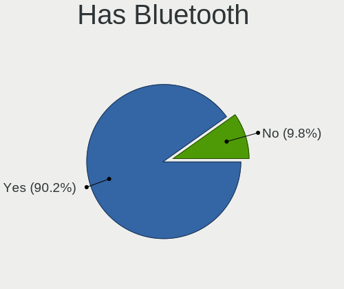
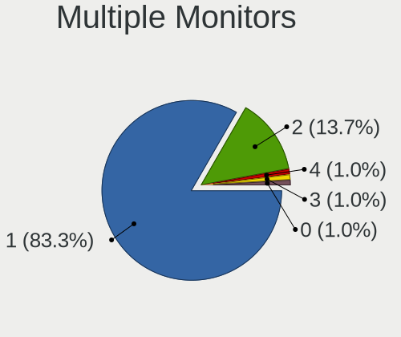
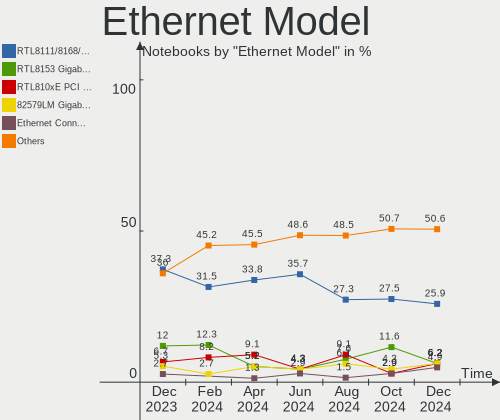
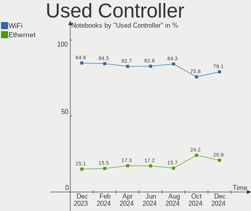
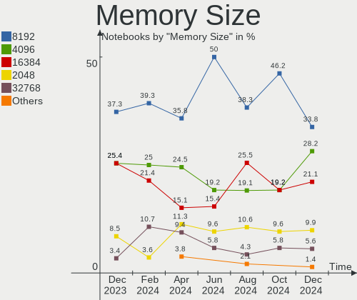
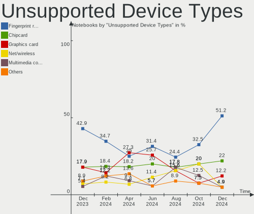

Linux in UK - Hardware Trends (Notebooks)
-----------------------------------------

A project to identify most popular hardware characteristics and track their change
over time based on data collected by Linux users at https://Linux-Hardware.org.

Anyone can contribute to this report by the [hw-probe](https://github.com/linuxhw/hw-probe) tool:

    sudo -E hw-probe -all -upload

Period: Dec, 2022.

Contents
--------

* [ System ](#system)
  - [ OS                       ](#os)
  - [ OS Family                ](#os-family)
  - [ Kernel                   ](#kernel)
  - [ Kernel Family            ](#kernel-family)
  - [ Kernel Major Ver.        ](#kernel-major-ver)
  - [ Arch                     ](#arch)
  - [ DE                       ](#de)
  - [ Display Server           ](#display-server)
  - [ Display Manager          ](#display-manager)
  - [ OS Lang                  ](#os-lang)
  - [ Boot Mode                ](#boot-mode)
  - [ Filesystem               ](#filesystem)
  - [ Part. scheme             ](#part-scheme)
  - [ Dual Boot with Linux/BSD ](#dual-boot-with-linuxbsd)
  - [ Dual Boot (Win)          ](#dual-boot-win)

* [ Board ](#board)
  - [ Vendor                   ](#vendor)
  - [ Model                    ](#model)
  - [ Model Family             ](#model-family)
  - [ MFG Year                 ](#mfg-year)
  - [ Form Factor              ](#form-factor)
  - [ Secure Boot              ](#secure-boot)
  - [ Coreboot                 ](#coreboot)
  - [ RAM Size                 ](#ram-size)
  - [ RAM Used                 ](#ram-used)
  - [ Total Drives             ](#total-drives)
  - [ Has CD-ROM               ](#has-cd-rom)
  - [ Has Ethernet             ](#has-ethernet)
  - [ Has WiFi                 ](#has-wifi)
  - [ Has Bluetooth            ](#has-bluetooth)

* [ Location ](#location)
  - [ Country                  ](#country)
  - [ City                     ](#city)

* [ Drives ](#drives)
  - [ Drive Vendor             ](#drive-vendor)
  - [ Drive Model              ](#drive-model)
  - [ HDD Vendor               ](#hdd-vendor)
  - [ SSD Vendor               ](#ssd-vendor)
  - [ Drive Kind               ](#drive-kind)
  - [ Drive Connector          ](#drive-connector)
  - [ Drive Size               ](#drive-size)
  - [ Space Total              ](#space-total)
  - [ Space Used               ](#space-used)
  - [ Malfunc. Drives          ](#malfunc-drives)
  - [ Malfunc. Drive Vendor    ](#malfunc-drive-vendor)
  - [ Malfunc. HDD Vendor      ](#malfunc-hdd-vendor)
  - [ Malfunc. Drive Kind      ](#malfunc-drive-kind)
  - [ Failed Drives            ](#failed-drives)
  - [ Failed Drive Vendor      ](#failed-drive-vendor)
  - [ Drive Status             ](#drive-status)

* [ Storage controller ](#storage-controller)
  - [ Storage Vendor           ](#storage-vendor)
  - [ Storage Model            ](#storage-model)
  - [ Storage Kind             ](#storage-kind)

* [ Processor ](#processor)
  - [ CPU Vendor               ](#cpu-vendor)
  - [ CPU Model                ](#cpu-model)
  - [ CPU Model Family         ](#cpu-model-family)
  - [ CPU Cores                ](#cpu-cores)
  - [ CPU Sockets              ](#cpu-sockets)
  - [ CPU Threads              ](#cpu-threads)
  - [ CPU Op-Modes             ](#cpu-op-modes)
  - [ CPU Microcode            ](#cpu-microcode)
  - [ CPU Microarch            ](#cpu-microarch)

* [ Graphics ](#graphics)
  - [ GPU Vendor               ](#gpu-vendor)
  - [ GPU Model                ](#gpu-model)
  - [ GPU Combo                ](#gpu-combo)
  - [ GPU Driver               ](#gpu-driver)
  - [ GPU Memory               ](#gpu-memory)

* [ Monitor ](#monitor)
  - [ Monitor Vendor           ](#monitor-vendor)
  - [ Monitor Model            ](#monitor-model)
  - [ Monitor Resolution       ](#monitor-resolution)
  - [ Monitor Diagonal         ](#monitor-diagonal)
  - [ Monitor Width            ](#monitor-width)
  - [ Aspect Ratio             ](#aspect-ratio)
  - [ Monitor Area             ](#monitor-area)
  - [ Pixel Density            ](#pixel-density)
  - [ Multiple Monitors        ](#multiple-monitors)

* [ Network ](#network)
  - [ Net Controller Vendor    ](#net-controller-vendor)
  - [ Net Controller Model     ](#net-controller-model)
  - [ Wireless Vendor          ](#wireless-vendor)
  - [ Wireless Model           ](#wireless-model)
  - [ Ethernet Vendor          ](#ethernet-vendor)
  - [ Ethernet Model           ](#ethernet-model)
  - [ Net Controller Kind      ](#net-controller-kind)
  - [ Used Controller          ](#used-controller)
  - [ NICs                     ](#nics)
  - [ IPv6                     ](#ipv6)

* [ Bluetooth ](#bluetooth)
  - [ Bluetooth Vendor         ](#bluetooth-vendor)
  - [ Bluetooth Model          ](#bluetooth-model)

* [ Sound ](#sound)
  - [ Sound Vendor             ](#sound-vendor)
  - [ Sound Model              ](#sound-model)

* [ Memory ](#memory)
  - [ Memory Vendor            ](#memory-vendor)
  - [ Memory Model             ](#memory-model)
  - [ Memory Kind              ](#memory-kind)
  - [ Memory Form Factor       ](#memory-form-factor)
  - [ Memory Size              ](#memory-size)
  - [ Memory Speed             ](#memory-speed)

* [ Printers & scanners ](#printers--scanners)
  - [ Printer Vendor           ](#printer-vendor)
  - [ Printer Model            ](#printer-model)
  - [ Scanner Vendor           ](#scanner-vendor)
  - [ Scanner Model            ](#scanner-model)

* [ Camera ](#camera)
  - [ Camera Vendor            ](#camera-vendor)
  - [ Camera Model             ](#camera-model)

* [ Security ](#security)
  - [ Fingerprint Vendor       ](#fingerprint-vendor)
  - [ Fingerprint Model        ](#fingerprint-model)
  - [ Chipcard Vendor          ](#chipcard-vendor)
  - [ Chipcard Model           ](#chipcard-model)

* [ Unsupported ](#unsupported)
  - [ Unsupported Devices      ](#unsupported-devices)
  - [ Unsupported Device Types ](#unsupported-device-types)

System
------

OS
--

Installed operating systems

| Name                         | Notebooks | Percent |
|------------------------------|-----------|---------|
| Ubuntu 22.04                 | 14        | 14%     |
| Pop!_OS 22.04                | 10        | 10%     |
| Linux Mint 21                | 7         | 7%      |
| Zorin 16                     | 6         | 6%      |
| OpenMandriva 4.3             | 6         | 6%      |
| Fedora 37                    | 6         | 6%      |
| Debian 11                    | 4         | 4%      |
| Ubuntu 22.10                 | 3         | 3%      |
| SteamOS 3.3.2                | 3         | 3%      |
| OpenMandriva 22.12           | 3         | 3%      |
| Linux Mint 20.3              | 3         | 3%      |
| Xubuntu 22.04                | 2         | 2%      |
| Ubuntu 20.04                 | 2         | 2%      |
| Ubuntu 18.04                 | 2         | 2%      |
| SteamOS 3.3.3                | 2         | 2%      |
| Manjaro                      | 2         | 2%      |
| Gentoo 2.9                   | 2         | 2%      |
| Arch Rolling                 | 2         | 2%      |
| Ubuntu Unity 20.04           | 1         | 1%      |
| Ubuntu MATE 22.10            | 1         | 1%      |
| Ubuntu MATE 20.04            | 1         | 1%      |
| SteamOS 3.5                  | 1         | 1%      |
| SteamOS 3.4.4                | 1         | 1%      |
| SteamOS 3.4.3                | 1         | 1%      |
| SteamOS 3.4.2                | 1         | 1%      |
| ROSA 12.3                    | 1         | 1%      |
| Parrot 5.1                   | 1         | 1%      |
| openSUSE Tumbleweed-XXXXXXXX | 1         | 1%      |
| openSUSE Leap-15.4           | 1         | 1%      |
| Nobara 36                    | 1         | 1%      |
| Lubuntu 22.04                | 1         | 1%      |
| Kubuntu 22.10                | 1         | 1%      |
| Kubuntu 22.04                | 1         | 1%      |
| KDE neon 22.04               | 1         | 1%      |
| Kali 2022.4                  | 1         | 1%      |
| Endless 4.0.13               | 1         | 1%      |
| Elementary 6.1               | 1         | 1%      |
| Debian                       | 1         | 1%      |
| CentOS 8                     | 1         | 1%      |

OS Family
---------

OS without a version

| Name         | Notebooks | Percent |
|--------------|-----------|---------|
| Ubuntu       | 21        | 21%     |
| Pop!_OS      | 10        | 10%     |
| Linux Mint   | 10        | 10%     |
| SteamOS      | 9         | 9%      |
| OpenMandriva | 9         | 9%      |
| Zorin        | 6         | 6%      |
| Fedora       | 6         | 6%      |
| Debian       | 5         | 5%      |
| Xubuntu      | 2         | 2%      |
| Ubuntu MATE  | 2         | 2%      |
| openSUSE     | 2         | 2%      |
| Manjaro      | 2         | 2%      |
| Kubuntu      | 2         | 2%      |
| Gentoo       | 2         | 2%      |
| Arch         | 2         | 2%      |
| Ubuntu Unity | 1         | 1%      |
| ROSA         | 1         | 1%      |
| Parrot       | 1         | 1%      |
| Nobara       | 1         | 1%      |
| Lubuntu      | 1         | 1%      |
| KDE neon     | 1         | 1%      |
| Kali         | 1         | 1%      |
| Endless      | 1         | 1%      |
| Elementary   | 1         | 1%      |
| CentOS       | 1         | 1%      |

Kernel
------

Version of the Linux kernel

| Version                            | Notebooks | Percent |
|------------------------------------|-----------|---------|
| 5.15.0-56-generic                  | 33        | 33%     |
| 6.0.6-76060006-generic             | 7         | 7%      |
| 5.16.7-desktop-1omv4003            | 6         | 6%      |
| 5.19.0-26-generic                  | 5         | 5%      |
| 5.13.0-valve21.3-1-neptune         | 5         | 5%      |
| 6.0.10-desktop-2omv22090           | 3         | 3%      |
| 5.4.0-135-generic                  | 3         | 3%      |
| 5.13.0-valve36-1-neptune           | 3         | 3%      |
| 6.0.15-300.fc37.x86_64             | 2         | 2%      |
| 6.0.12-76060006-generic            | 2         | 2%      |
| 5.15.0-43-generic                  | 2         | 2%      |
| 5.10.0-19-amd64                    | 2         | 2%      |
| 6.1.1-1-MANJARO                    | 1         | 1%      |
| 6.1.0-arch1-1                      | 1         | 1%      |
| 6.0.6-zen1-2-zen                   | 1         | 1%      |
| 6.0.2-76060002-generic             | 1         | 1%      |
| 6.0.14-201.fsync.fc36.x86_64       | 1         | 1%      |
| 6.0.13-300.fc37.x86_64             | 1         | 1%      |
| 6.0.12-300.fc37.x86_64             | 1         | 1%      |
| 6.0.11-300.fc37.x86_64             | 1         | 1%      |
| 6.0.10-300.fc37.x86_64             | 1         | 1%      |
| 6.0.10-1-default                   | 1         | 1%      |
| 6.0.0-pf5                          | 1         | 1%      |
| 6.0.0-kali6-amd64                  | 1         | 1%      |
| 6.0.0-5-amd64                      | 1         | 1%      |
| 6.0.0-2parrot1-amd64               | 1         | 1%      |
| 6.0.0-0.deb11.2-amd64              | 1         | 1%      |
| 5.4.0-91-generic                   | 1         | 1%      |
| 5.4.0-81-generic                   | 1         | 1%      |
| 5.4.0-107-generic                  | 1         | 1%      |
| 5.19.0-1-amd64                     | 1         | 1%      |
| 5.15.81-1-MANJARO                  | 1         | 1%      |
| 5.15.80-gentoo                     | 1         | 1%      |
| 5.15.75-generic-1rosa2021.1-x86_64 | 1         | 1%      |
| 5.15.0-57-generic                  | 1         | 1%      |
| 5.14.21-150400.24.38-default       | 1         | 1%      |
| 5.13.0-valve35-1-neptune           | 1         | 1%      |
| 5.11.0-35-generic                  | 1         | 1%      |
| 4.18.0-408.el8.x86_64              | 1         | 1%      |

Kernel Family
-------------

Linux kernel without a distro release

| Version | Notebooks | Percent |
|---------|-----------|---------|
| 5.15.0  | 36        | 36%     |
| 5.13.0  | 9         | 9%      |
| 6.0.6   | 8         | 8%      |
| 5.4.0   | 6         | 6%      |
| 5.19.0  | 6         | 6%      |
| 5.16.7  | 6         | 6%      |
| 6.0.10  | 5         | 5%      |
| 6.0.0   | 5         | 5%      |
| 6.0.12  | 3         | 3%      |
| 6.0.15  | 2         | 2%      |
| 5.10.0  | 2         | 2%      |
| 6.1.1   | 1         | 1%      |
| 6.1.0   | 1         | 1%      |
| 6.0.2   | 1         | 1%      |
| 6.0.14  | 1         | 1%      |
| 6.0.13  | 1         | 1%      |
| 6.0.11  | 1         | 1%      |
| 5.15.81 | 1         | 1%      |
| 5.15.80 | 1         | 1%      |
| 5.15.75 | 1         | 1%      |
| 5.14.21 | 1         | 1%      |
| 5.11.0  | 1         | 1%      |
| 4.18.0  | 1         | 1%      |

Kernel Major Ver.
-----------------

Linux kernel major version

| Version | Notebooks | Percent |
|---------|-----------|---------|
| 5.15    | 39        | 39%     |
| 6.0     | 27        | 27%     |
| 5.13    | 9         | 9%      |
| 5.4     | 6         | 6%      |
| 5.19    | 6         | 6%      |
| 5.16    | 6         | 6%      |
| 6.1     | 2         | 2%      |
| 5.10    | 2         | 2%      |
| 5.14    | 1         | 1%      |
| 5.11    | 1         | 1%      |
| 4.18    | 1         | 1%      |

Arch
----

OS architecture (x86_64, i586, etc.)

| Name   | Notebooks | Percent |
|--------|-----------|---------|
| x86_64 | 100       | 100%    |

DE
--

Desktop Environment

| Name          | Notebooks | Percent |
|---------------|-----------|---------|
| GNOME         | 46        | 46%     |
| KDE5          | 28        | 28%     |
| XFCE          | 10        | 10%     |
| X-Cinnamon    | 7         | 7%      |
| MATE          | 4         | 4%      |
| Unity         | 1         | 1%      |
| Pantheon      | 1         | 1%      |
| LXQt          | 1         | 1%      |
| LXDE          | 1         | 1%      |
| GNOME Classic | 1         | 1%      |

Display Server
--------------

X11 or Wayland

| Name    | Notebooks | Percent |
|---------|-----------|---------|
| X11     | 76        | 76%     |
| Wayland | 22        | 22%     |
| Tty     | 2         | 2%      |

Display Manager
---------------

SDDM, LightDM, etc.

| Name    | Notebooks | Percent |
|---------|-----------|---------|
| Unknown | 37        | 37%     |
| LightDM | 19        | 19%     |
| GDM3    | 19        | 19%     |
| SDDM    | 17        | 17%     |
| GDM     | 7         | 7%      |
| LXDM    | 1         | 1%      |

OS Lang
-------

Language

| Lang           | Notebooks | Percent |
|----------------|-----------|---------|
| en_GB          | 71        | 71%     |
| en_US          | 22        | 22%     |
| C              | 3         | 3%      |
| ru_RU          | 1         | 1%      |
| pl_PL          | 1         | 1%      |
| fr_FR          | 1         | 1%      |
| en_GB.iso88591 | 1         | 1%      |

Boot Mode
---------

EFI or BIOS

| Mode | Notebooks | Percent |
|------|-----------|---------|
| BIOS | 60        | 60%     |
| EFI  | 40        | 40%     |

Filesystem
----------

Type of filesystem

| Type    | Notebooks | Percent |
|---------|-----------|---------|
| Ext4    | 67        | 67%     |
| Btrfs   | 21        | 21%     |
| Overlay | 10        | 10%     |
| Zfs     | 1         | 1%      |
| Xfs     | 1         | 1%      |

Part. scheme
------------

Scheme of partitioning

| Type    | Notebooks | Percent |
|---------|-----------|---------|
| GPT     | 49        | 49%     |
| Unknown | 36        | 36%     |
| MBR     | 15        | 15%     |

Dual Boot with Linux/BSD
------------------------

Hosting more than one Linux/BSD

| Dual boot | Notebooks | Percent |
|-----------|-----------|---------|
| No        | 90        | 90%     |
| Yes       | 10        | 10%     |

Dual Boot (Win)
---------------

Hosting Linux and Windows

| Dual boot | Notebooks | Percent |
|-----------|-----------|---------|
| No        | 81        | 81%     |
| Yes       | 19        | 19%     |

Board
-----

Vendor
------

Motherboard manufacturer

| Name                | Notebooks | Percent |
|---------------------|-----------|---------|
| Lenovo              | 19        | 19%     |
| Hewlett-Packard     | 16        | 16%     |
| Dell                | 14        | 14%     |
| Valve               | 10        | 10%     |
| Acer                | 10        | 10%     |
| Toshiba             | 5         | 5%      |
| Samsung Electronics | 4         | 4%      |
| MSI                 | 4         | 4%      |
| ASUSTek Computer    | 4         | 4%      |
| Apple               | 3         | 3%      |
| Star Labs           | 2         | 2%      |
| Google              | 2         | 2%      |
| System76            | 1         | 1%      |
| RM Education        | 1         | 1%      |
| PC Specialist       | 1         | 1%      |
| LG Electronics      | 1         | 1%      |
| Fusion5             | 1         | 1%      |
| Alienware           | 1         | 1%      |
| Unknown             | 1         | 1%      |

Model
-----

Motherboard model

| Name                                     | Notebooks | Percent |
|------------------------------------------|-----------|---------|
| Valve Jupiter                            | 10        | 10%     |
| Toshiba Satellite Pro C50-A-1MX          | 1         | 1%      |
| Toshiba Satellite C855-1W4               | 1         | 1%      |
| Toshiba Satellite C850-1GL               | 1         | 1%      |
| Toshiba Satellite C50-B                  | 1         | 1%      |
| Toshiba EQUIUM A300D                     | 1         | 1%      |
| System76 Lemur Pro                       | 1         | 1%      |
| Star Labs StarLite                       | 1         | 1%      |
| Star Labs StarBook                       | 1         | 1%      |
| Samsung NB30/N146                        | 1         | 1%      |
| Samsung 3570R/370R/470R/450R/510R/4450RV | 1         | 1%      |
| Samsung 300E4C/300E5C/300E7C             | 1         | 1%      |
| Samsung 300E4A/300E5A/300E7A             | 1         | 1%      |
| RM Education RM                          | 1         | 1%      |
| PC Specialist PCX0DX                     | 1         | 1%      |
| MSI Stealth GS66 12UGS                   | 1         | 1%      |
| MSI Prestige 14 A11SC                    | 1         | 1%      |
| MSI Delta 15 A5EFK                       | 1         | 1%      |
| MSI Alpha 15 A4DEK                       | 1         | 1%      |
| LG 16Z90P-K.AA78A1                       | 1         | 1%      |
| Lenovo Z70-80 80FG                       | 1         | 1%      |
| Lenovo Z50-70 20354                      | 1         | 1%      |
| Lenovo Yoga 2 13 20344                   | 1         | 1%      |
| Lenovo ThinkPad X230 23255NG             | 1         | 1%      |
| Lenovo ThinkPad X230 23252S4             | 1         | 1%      |
| Lenovo ThinkPad T510 4313CTO             | 1         | 1%      |
| Lenovo ThinkPad T480 20L50000UK          | 1         | 1%      |
| Lenovo ThinkPad T470 W10DG 20JNS42314    | 1         | 1%      |
| Lenovo ThinkPad T450 20BUS3GN01          | 1         | 1%      |
| Lenovo ThinkPad T450 20BUS00700          | 1         | 1%      |
| Lenovo ThinkPad T440p 20AWS12002         | 1         | 1%      |
| Lenovo ThinkPad T430 2344BZU             | 1         | 1%      |
| Lenovo ThinkPad T400 647419G             | 1         | 1%      |
| Lenovo ThinkPad SL 2746N8G               | 1         | 1%      |
| Lenovo ThinkPad P52 20MAS25B1X           | 1         | 1%      |
| Lenovo ThinkPad P16s Gen 1 21BT000MUK    | 1         | 1%      |
| Lenovo ThinkPad L560 20F2S0DA00          | 1         | 1%      |
| Lenovo ThinkPad E14 Gen 4 21E3CTO1WW     | 1         | 1%      |
| Lenovo ThinkBook 15 G3 ACL 21A4          | 1         | 1%      |
| HP ZBook Studio G5                       | 1         | 1%      |

Model Family
------------

Motherboard model prefix

| Name                 | Notebooks | Percent |
|----------------------|-----------|---------|
| Lenovo ThinkPad      | 15        | 15%     |
| Valve Jupiter        | 10        | 10%     |
| Dell Latitude        | 7         | 7%      |
| Acer Aspire          | 7         | 7%      |
| HP Pavilion          | 5         | 5%      |
| Toshiba Satellite    | 4         | 4%      |
| Dell XPS             | 4         | 4%      |
| HP EliteBook         | 3         | 3%      |
| HP ProBook           | 2         | 2%      |
| HP ENVY              | 2         | 2%      |
| Dell Inspiron        | 2         | 2%      |
| ASUS VivoBook        | 2         | 2%      |
| Acer Swift           | 2         | 2%      |
| Toshiba EQUIUM       | 1         | 1%      |
| System76 Lemur       | 1         | 1%      |
| Star Labs StarLite   | 1         | 1%      |
| Star Labs StarBook   | 1         | 1%      |
| Samsung NB30         | 1         | 1%      |
| Samsung 3570R        | 1         | 1%      |
| Samsung 300E4C       | 1         | 1%      |
| Samsung 300E4A       | 1         | 1%      |
| RM Education RM      | 1         | 1%      |
| PC Specialist PCX0DX | 1         | 1%      |
| MSI Stealth          | 1         | 1%      |
| MSI Prestige         | 1         | 1%      |
| MSI Delta            | 1         | 1%      |
| MSI Alpha            | 1         | 1%      |
| LG 16Z90P-K.AA78A1   | 1         | 1%      |
| Lenovo Z70-80        | 1         | 1%      |
| Lenovo Z50-70        | 1         | 1%      |
| Lenovo Yoga          | 1         | 1%      |
| Lenovo ThinkBook     | 1         | 1%      |
| HP ZBook             | 1         | 1%      |
| HP Notebook          | 1         | 1%      |
| HP 620               | 1         | 1%      |
| HP 355               | 1         | 1%      |
| Google Nami          | 1         | 1%      |
| Google Chell         | 1         | 1%      |
| Fusion5 C60Bv2-128GB | 1         | 1%      |
| Dell Studio          | 1         | 1%      |

MFG Year
--------

Motherboard manufacture year

| Year | Notebooks | Percent |
|------|-----------|---------|
| 2022 | 17        | 17%     |
| 2021 | 13        | 13%     |
| 2012 | 8         | 8%      |
| 2014 | 7         | 7%      |
| 2011 | 7         | 7%      |
| 2020 | 6         | 6%      |
| 2019 | 6         | 6%      |
| 2018 | 6         | 6%      |
| 2013 | 6         | 6%      |
| 2008 | 6         | 6%      |
| 2010 | 5         | 5%      |
| 2017 | 4         | 4%      |
| 2015 | 4         | 4%      |
| 2016 | 3         | 3%      |
| 2009 | 2         | 2%      |

Form Factor
-----------

Physical design of the computer

| Name     | Notebooks | Percent |
|----------|-----------|---------|
| Notebook | 100       | 100%    |

Secure Boot
-----------

Enabled or disabled

| State    | Notebooks | Percent |
|----------|-----------|---------|
| Disabled | 94        | 94%     |
| Enabled  | 6         | 6%      |

Coreboot
--------

Have coreboot on board

| Used | Notebooks | Percent |
|------|-----------|---------|
| No   | 95        | 95%     |
| Yes  | 5         | 5%      |

RAM Size
--------

Total RAM memory

| Size in GB | Notebooks | Percent |
|------------|-----------|---------|
| 4.01-8.0   | 24        | 24%     |
| 16.01-24.0 | 21        | 21%     |
| 8.01-16.0  | 19        | 19%     |
| 3.01-4.0   | 17        | 17%     |
| 32.01-64.0 | 13        | 13%     |
| 24.01-32.0 | 3         | 3%      |
| 1.01-2.0   | 2         | 2%      |
| 2.01-3.0   | 1         | 1%      |

RAM Used
--------

Used RAM memory

| Used GB   | Notebooks | Percent |
|-----------|-----------|---------|
| 1.01-2.0  | 27        | 27%     |
| 2.01-3.0  | 22        | 22%     |
| 4.01-8.0  | 21        | 21%     |
| 3.01-4.0  | 18        | 18%     |
| 0.51-1.0  | 6         | 6%      |
| 8.01-16.0 | 5         | 5%      |
| 0.01-0.5  | 1         | 1%      |

Total Drives
------------

Number of drives on board

| Drives | Notebooks | Percent |
|--------|-----------|---------|
| 1      | 70        | 70%     |
| 2      | 25        | 25%     |
| 3      | 4         | 4%      |
| 0      | 1         | 1%      |

Has CD-ROM
----------

Has CD-ROM on board

| Presented | Notebooks | Percent |
|-----------|-----------|---------|
| No        | 68        | 68%     |
| Yes       | 32        | 32%     |

Has Ethernet
------------

Has Ethernet on board

| Presented | Notebooks | Percent |
|-----------|-----------|---------|
| Yes       | 75        | 75%     |
| No        | 25        | 25%     |

Has WiFi
--------

Has WiFi module

| Presented | Notebooks | Percent |
|-----------|-----------|---------|
| Yes       | 98        | 98%     |
| No        | 2         | 2%      |

Has Bluetooth
-------------

Has Bluetooth module

| Presented | Notebooks | Percent |
|-----------|-----------|---------|
| Yes       | 81        | 81%     |
| No        | 19        | 19%     |

Location
--------

Country
-------

Geographic location (country)

| Country | Notebooks | Percent |
|---------|-----------|---------|
| UK      | 100       | 100%    |

City
----

Geographic location (city)

| City                  | Notebooks | Percent |
|-----------------------|-----------|---------|
| London                | 19        | 19%     |
| York                  | 2         | 2%      |
| Wolverhampton         | 2         | 2%      |
| Watford               | 2         | 2%      |
| Reading               | 2         | 2%      |
| Perth                 | 2         | 2%      |
| Manchester            | 2         | 2%      |
| Gloucester            | 2         | 2%      |
| Edinburgh             | 2         | 2%      |
| Croydon               | 2         | 2%      |
| Cardiff               | 2         | 2%      |
| Bristol               | 2         | 2%      |
| Birmingham            | 2         | 2%      |
| Wrexham               | 1         | 1%      |
| Worcester             | 1         | 1%      |
| Welwyn Garden City    | 1         | 1%      |
| Warwick               | 1         | 1%      |
| Warrington            | 1         | 1%      |
| Walthamstow           | 1         | 1%      |
| Wallsend              | 1         | 1%      |
| Uxbridge              | 1         | 1%      |
| Thornton Heath        | 1         | 1%      |
| Thatcham              | 1         | 1%      |
| Tamworth              | 1         | 1%      |
| Stroud                | 1         | 1%      |
| Stoke-on-Trent        | 1         | 1%      |
| St Helens             | 1         | 1%      |
| Sheffield             | 1         | 1%      |
| Sevenoaks             | 1         | 1%      |
| Seaford               | 1         | 1%      |
| Saint Leonards-on-Sea | 1         | 1%      |
| Rotherham             | 1         | 1%      |
| Rochester             | 1         | 1%      |
| Redruth               | 1         | 1%      |
| Penarth               | 1         | 1%      |
| Northallerton         | 1         | 1%      |
| Newtownabbey          | 1         | 1%      |
| New Malden            | 1         | 1%      |
| Molesey               | 1         | 1%      |
| Llandudno             | 1         | 1%      |

Drives
------

Drive Vendor
------------

Hard drive vendors

| Vendor                      | Notebooks | Drives | Percent |
|-----------------------------|-----------|--------|---------|
| Samsung Electronics         | 24        | 29     | 19.67%  |
| Unknown                     | 13        | 13     | 10.66%  |
| WDC                         | 11        | 11     | 9.02%   |
| Toshiba                     | 9         | 9      | 7.38%   |
| SanDisk                     | 8         | 8      | 6.56%   |
| Seagate                     | 7         | 8      | 5.74%   |
| Phison Electronics          | 5         | 5      | 4.1%    |
| Crucial                     | 5         | 5      | 4.1%    |
| Kingston                    | 4         | 4      | 3.28%   |
| Intel                       | 4         | 4      | 3.28%   |
| Hitachi                     | 4         | 4      | 3.28%   |
| SK hynix                    | 3         | 3      | 2.46%   |
| Micron Technology           | 3         | 3      | 2.46%   |
| Unknown                     | 3         | 3      | 2.46%   |
| PNY                         | 2         | 2      | 1.64%   |
| O2 Micro                    | 2         | 2      | 1.64%   |
| HGST                        | 2         | 2      | 1.64%   |
| Union Memory (Shenzhen)     | 1         | 1      | 0.82%   |
| Transcend                   | 1         | 1      | 0.82%   |
| Star Drive                  | 1         | 1      | 0.82%   |
| Star                        | 1         | 1      | 0.82%   |
| Silicon Motion              | 1         | 1      | 0.82%   |
| Realtek                     | 1         | 1      | 0.82%   |
| MaxDigital                  | 1         | 1      | 0.82%   |
| KIOXIA-EXCERIA              | 1         | 1      | 0.82%   |
| KIOXIA                      | 1         | 1      | 0.82%   |
| Kingston Technology Company | 1         | 1      | 0.82%   |
| JMicron Technology          | 1         | 1      | 0.82%   |
| Apple                       | 1         | 1      | 0.82%   |
| ADATA Technology            | 1         | 1      | 0.82%   |

Drive Model
-----------

Hard drive models

| Model                                               | Notebooks | Percent |
|-----------------------------------------------------|-----------|---------|
| Samsung NVMe SSD Controller SM981/PM981/PM983 500GB | 4         | 3.15%   |
| Phison PS5013 E13 NVMe Controller 512GB             | 4         | 3.15%   |
| Unknown MMC Card  512GB                             | 3         | 2.36%   |
| SanDisk NVMe SSD Drive 500GB                        | 3         | 2.36%   |
| Unknown                                             | 3         | 2.36%   |
| Unknown MMC Card  128GB                             | 2         | 1.57%   |
| Toshiba MQ01ABF050 500GB                            | 2         | 1.57%   |
| Toshiba MK2555GSX 250GB                             | 2         | 1.57%   |
| Toshiba BG3 NVMe SSD Controller 256GB               | 2         | 1.57%   |
| Seagate ST9500325AS 500GB                           | 2         | 1.57%   |
| Seagate ST1000LM014-SSHD-8GB                        | 2         | 1.57%   |
| O2 Micro E2M2 64GB                                  | 2         | 1.57%   |
| Micron 2210_MTFDHBA1T0QFD 1024GB                    | 2         | 1.57%   |
| Crucial CT1000MX500SSD1 1TB                         | 2         | 1.57%   |
| WDC WDS500G2B0A-00SM50 500GB SSD                    | 1         | 0.79%   |
| WDC WDS500G2B0A 500GB SSD                           | 1         | 0.79%   |
| WDC WDS250G2B0A 250GB SSD                           | 1         | 0.79%   |
| WDC WDS100T2B0A-00SM50 1TB SSD                      | 1         | 0.79%   |
| WDC WD5000LPCX-24VHAT0 500GB                        | 1         | 0.79%   |
| WDC WD5000BEKT-75KA9T0 500GB                        | 1         | 0.79%   |
| WDC WD2500BEVS-26UST0 250GB                         | 1         | 0.79%   |
| WDC WD10JPVX-22JC3T0 1TB                            | 1         | 0.79%   |
| WDC PC SN810 SDCPNRY-1T00-1032 1TB                  | 1         | 0.79%   |
| WDC PC SN730 NVMe 512GB                             | 1         | 0.79%   |
| WDC PC SN720 SDAPNTW-1T00-1006 1TB                  | 1         | 0.79%   |
| Unknown SF256  256GB                                | 1         | 0.79%   |
| Unknown MMC Card  4GB                               | 1         | 0.79%   |
| Unknown MMC Card  2GB                               | 1         | 0.79%   |
| Unknown MMC Card  256GB                             | 1         | 0.79%   |
| Unknown MMC Card  249GB                             | 1         | 0.79%   |
| Unknown MBG4GC  32GB                                | 1         | 0.79%   |
| Unknown DA4128  128GB                               | 1         | 0.79%   |
| Unknown BGND3R  32GB                                | 1         | 0.79%   |
| Union Memory (Shenzhen) UMIS RPETJ1T24MGE2QDQ 1TB   | 1         | 0.79%   |
| Transcend TS240GMTS420S 240GB SSD                   | 1         | 0.79%   |
| Toshiba XG4 NVMe SSD Controller 512GB               | 1         | 0.79%   |
| Toshiba MQ01ACF050 500GB                            | 1         | 0.79%   |
| Toshiba KXG5AZNV512G NVMe SED 512GB                 | 1         | 0.79%   |
| Star Drive SATA SSD 480GB                           | 1         | 0.79%   |
| Star Drive PCIe SSD 960GB                           | 1         | 0.79%   |

HDD Vendor
----------

Hard disk drive vendors

| Vendor              | Notebooks | Drives | Percent |
|---------------------|-----------|--------|---------|
| Seagate             | 7         | 8      | 29.17%  |
| Toshiba             | 5         | 5      | 20.83%  |
| WDC                 | 4         | 4      | 16.67%  |
| Hitachi             | 4         | 4      | 16.67%  |
| Samsung Electronics | 2         | 2      | 8.33%   |
| HGST                | 2         | 2      | 8.33%   |

SSD Vendor
----------

Solid state drive vendors

| Vendor              | Notebooks | Drives | Percent |
|---------------------|-----------|--------|---------|
| Samsung Electronics | 11        | 12     | 34.38%  |
| Crucial             | 5         | 5      | 15.63%  |
| WDC                 | 4         | 4      | 12.5%   |
| SanDisk             | 2         | 2      | 6.25%   |
| PNY                 | 2         | 2      | 6.25%   |
| Kingston            | 2         | 2      | 6.25%   |
| Intel               | 2         | 2      | 6.25%   |
| Transcend           | 1         | 1      | 3.13%   |
| Star                | 1         | 1      | 3.13%   |
| MaxDigital          | 1         | 1      | 3.13%   |
| KIOXIA-EXCERIA      | 1         | 1      | 3.13%   |

Drive Kind
----------

HDD or SSD

| Kind    | Notebooks | Drives | Percent |
|---------|-----------|--------|---------|
| NVMe    | 47        | 53     | 39.83%  |
| SSD     | 32        | 33     | 27.12%  |
| HDD     | 22        | 25     | 18.64%  |
| MMC     | 16        | 16     | 13.56%  |
| Unknown | 1         | 1      | 0.85%   |

Drive Connector
---------------

SATA, SAS, NVMe, etc.

| Type | Notebooks | Drives | Percent |
|------|-----------|--------|---------|
| SATA | 50        | 54     | 42.74%  |
| NVMe | 46        | 52     | 39.32%  |
| MMC  | 16        | 16     | 13.68%  |
| SAS  | 5         | 6      | 4.27%   |

Drive Size
----------

Size of hard drive

| Size in TB | Notebooks | Drives | Percent |
|------------|-----------|--------|---------|
| 0.01-0.5   | 37        | 38     | 66.07%  |
| 0.51-1.0   | 13        | 13     | 23.21%  |
| 1.01-2.0   | 5         | 6      | 8.93%   |
| 3.01-4.0   | 1         | 1      | 1.79%   |

Space Total
-----------

Amount of disk space available on the file system

| Size in GB     | Notebooks | Percent |
|----------------|-----------|---------|
| 101-250        | 26        | 26%     |
| 251-500        | 24        | 24%     |
| 501-1000       | 22        | 22%     |
| 1-20           | 7         | 7%      |
| 1001-2000      | 6         | 6%      |
| 51-100         | 5         | 5%      |
| More than 3000 | 3         | 3%      |
| 21-50          | 3         | 3%      |
| 2001-3000      | 2         | 2%      |
| Unknown        | 2         | 2%      |

Space Used
----------

Amount of used disk space

| Used GB        | Notebooks | Percent |
|----------------|-----------|---------|
| 1-20           | 39        | 39%     |
| 251-500        | 14        | 14%     |
| 21-50          | 14        | 14%     |
| 51-100         | 13        | 13%     |
| 101-250        | 10        | 10%     |
| 501-1000       | 5         | 5%      |
| Unknown        | 2         | 2%      |
| More than 3000 | 1         | 1%      |
| 2001-3000      | 1         | 1%      |
| 1001-2000      | 1         | 1%      |

Malfunc. Drives
---------------

Drive models with a malfunction

| Model                             | Notebooks | Drives | Percent |
|-----------------------------------|-----------|--------|---------|
| Toshiba MK2555GSX 250GB           | 1         | 1      | 25%     |
| Seagate ST9500325AS 500GB         | 1         | 1      | 25%     |
| Samsung Electronics HM160HI 160GB | 1         | 1      | 25%     |
| Crucial CT128M550SSD1 128GB       | 1         | 1      | 25%     |

Malfunc. Drive Vendor
---------------------

Vendors of faulty drives

| Vendor              | Notebooks | Drives | Percent |
|---------------------|-----------|--------|---------|
| Toshiba             | 1         | 1      | 25%     |
| Seagate             | 1         | 1      | 25%     |
| Samsung Electronics | 1         | 1      | 25%     |
| Crucial             | 1         | 1      | 25%     |

Malfunc. HDD Vendor
-------------------

Vendors of faulty HDD drives

| Vendor              | Notebooks | Drives | Percent |
|---------------------|-----------|--------|---------|
| Toshiba             | 1         | 1      | 33.33%  |
| Seagate             | 1         | 1      | 33.33%  |
| Samsung Electronics | 1         | 1      | 33.33%  |

Malfunc. Drive Kind
-------------------

Kinds of faulty drives

| Kind | Notebooks | Drives | Percent |
|------|-----------|--------|---------|
| HDD  | 3         | 3      | 75%     |
| SSD  | 1         | 1      | 25%     |

Failed Drives
-------------

Failed drive models

Zero info for selected period =(

Failed Drive Vendor
-------------------

Failed drive vendors

Zero info for selected period =(

Drive Status
------------

Number of failed and malfunc. drives

| Status   | Notebooks | Drives | Percent |
|----------|-----------|--------|---------|
| Detected | 58        | 79     | 55.24%  |
| Works    | 43        | 45     | 40.95%  |
| Malfunc  | 4         | 4      | 3.81%   |

Storage controller
------------------

Storage Vendor
--------------

Storage controller vendors

| Vendor                       | Notebooks | Percent |
|------------------------------|-----------|---------|
| Intel                        | 60        | 50.42%  |
| Samsung Electronics          | 13        | 10.92%  |
| SanDisk                      | 9         | 7.56%   |
| AMD                          | 9         | 7.56%   |
| Phison Electronics           | 6         | 5.04%   |
| Toshiba America Info Systems | 5         | 4.2%    |
| SK hynix                     | 3         | 2.52%   |
| Micron Technology            | 3         | 2.52%   |
| Kingston Technology Company  | 3         | 2.52%   |
| O2 Micro                     | 2         | 1.68%   |
| Nvidia                       | 2         | 1.68%   |
| Union Memory (Shenzhen)      | 1         | 0.84%   |
| Silicon Motion               | 1         | 0.84%   |
| Apple                        | 1         | 0.84%   |
| ADATA Technology             | 1         | 0.84%   |

Storage Model
-------------

Storage controller models

| Model                                                                                  | Notebooks | Percent |
|----------------------------------------------------------------------------------------|-----------|---------|
| Intel 7 Series Chipset Family 6-port SATA Controller [AHCI mode]                       | 11        | 8.73%   |
| AMD FCH SATA Controller [AHCI mode]                                                    | 8         | 6.35%   |
| Samsung NVMe SSD Controller SM981/PM981/PM983                                          | 6         | 4.76%   |
| Samsung NVMe SSD Controller 980                                                        | 5         | 3.97%   |
| Phison PS5013 E13 NVMe Controller                                                      | 4         | 3.17%   |
| Intel Wildcat Point-LP SATA Controller [AHCI Mode]                                     | 4         | 3.17%   |
| Intel Volume Management Device NVMe RAID Controller                                    | 4         | 3.17%   |
| Intel 82801IBM/IEM (ICH9M/ICH9M-E) 4 port SATA Controller [AHCI mode]                  | 4         | 3.17%   |
| Intel 82801 Mobile SATA Controller [RAID mode]                                         | 4         | 3.17%   |
| Intel 8 Series SATA Controller 1 [AHCI mode]                                           | 4         | 3.17%   |
| SK hynix Gold P31/PC711 NVMe Solid State Drive                                         | 3         | 2.38%   |
| SanDisk WD PC SN810 / Black SN850 NVMe SSD                                             | 3         | 2.38%   |
| Samsung NVMe SSD Controller PM9A1/PM9A3/980PRO                                         | 3         | 2.38%   |
| Micron Non-Volatile memory controller                                                  | 3         | 2.38%   |
| Intel 5 Series/3400 Series Chipset 6 port SATA AHCI Controller                         | 3         | 2.38%   |
| Toshiba America Info Systems BG3 NVMe SSD Controller                                   | 2         | 1.59%   |
| Sandisk Non-Volatile memory controller                                                 | 2         | 1.59%   |
| O2 Micro Non-Volatile memory controller                                                | 2         | 1.59%   |
| Intel Sunrise Point-LP SATA Controller [AHCI mode]                                     | 2         | 1.59%   |
| Intel Celeron N3350/Pentium N4200/Atom E3900 Series SATA AHCI Controller               | 2         | 1.59%   |
| Intel Cannon Lake Mobile PCH SATA AHCI Controller                                      | 2         | 1.59%   |
| Intel Atom Processor E3800 Series SATA AHCI Controller                                 | 2         | 1.59%   |
| Intel 6 Series/C200 Series Chipset Family Mobile SATA Controller (IDE mode, ports 4-5) | 2         | 1.59%   |
| Intel 6 Series/C200 Series Chipset Family Mobile SATA Controller (IDE mode, ports 0-3) | 2         | 1.59%   |
| Intel 6 Series/C200 Series Chipset Family 6 port Mobile SATA AHCI Controller           | 2         | 1.59%   |
| Union Memory (Shenzhen) Non-Volatile memory controller                                 | 1         | 0.79%   |
| Toshiba America Info Systems XG6 NVMe SSD Controller                                   | 1         | 0.79%   |
| Toshiba America Info Systems XG5 NVMe SSD Controller                                   | 1         | 0.79%   |
| Toshiba America Info Systems XG4 NVMe SSD Controller                                   | 1         | 0.79%   |
| Silicon Motion SM2263EN/SM2263XT SSD Controller                                        | 1         | 0.79%   |
| SanDisk WD Blue SN570 NVMe SSD                                                         | 1         | 0.79%   |
| SanDisk WD Blue SN550 NVMe SSD                                                         | 1         | 0.79%   |
| SanDisk WD Black SN750 / PC SN730 NVMe SSD                                             | 1         | 0.79%   |
| SanDisk WD Black 2018/SN750 / PC SN720 NVMe SSD                                        | 1         | 0.79%   |
| Phison E16 PCIe4 NVMe Controller                                                       | 1         | 0.79%   |
| Phison E12 NVMe Controller                                                             | 1         | 0.79%   |
| Nvidia MCP89 SATA Controller (AHCI mode)                                               | 1         | 0.79%   |
| Nvidia MCP79 AHCI Controller                                                           | 1         | 0.79%   |
| Kingston Company U-SNS8154P3 NVMe SSD                                                  | 1         | 0.79%   |
| Kingston Company Company Non-Volatile memory controller                                | 1         | 0.79%   |

Storage Kind
------------

Kind of storage controller (IDE, SATA, NVMe, SAS, ...)

| Kind | Notebooks | Percent |
|------|-----------|---------|
| SATA | 57        | 48.72%  |
| NVMe | 46        | 39.32%  |
| RAID | 8         | 6.84%   |
| IDE  | 6         | 5.13%   |

Processor
---------

CPU Vendor
----------

Processor vendors

| Vendor | Notebooks | Percent |
|--------|-----------|---------|
| Intel  | 79        | 79%     |
| AMD    | 21        | 21%     |

CPU Model
---------

Processor models

| Model                                    | Notebooks | Percent |
|------------------------------------------|-----------|---------|
| AMD Custom APU 0405                      | 10        | 10%     |
| Intel Core i7-8850H CPU @ 2.60GHz        | 3         | 3%      |
| Intel Core i7-8550U CPU @ 1.80GHz        | 3         | 3%      |
| Intel Core i7-10510U CPU @ 1.80GHz       | 3         | 3%      |
| Intel Core i5-3320M CPU @ 2.60GHz        | 3         | 3%      |
| Intel 11th Gen Core i7-1165G7 @ 2.80GHz  | 3         | 3%      |
| AMD Ryzen 7 5700U with Radeon Graphics   | 3         | 3%      |
| Intel Core i7-8650U CPU @ 1.90GHz        | 2         | 2%      |
| Intel Core i7-4510U CPU @ 2.00GHz        | 2         | 2%      |
| Intel Core i5-5300U CPU @ 2.30GHz        | 2         | 2%      |
| Intel Core i5-5200U CPU @ 2.20GHz        | 2         | 2%      |
| Intel Core i5-3210M CPU @ 2.50GHz        | 2         | 2%      |
| Intel Core i3-2330M CPU @ 2.20GHz        | 2         | 2%      |
| Intel Core 2 Duo CPU P8600 @ 2.40GHz     | 2         | 2%      |
| Intel 12th Gen Core i7-12700H            | 2         | 2%      |
| Intel 12th Gen Core i7-1260P             | 2         | 2%      |
| AMD Ryzen 7 4800H with Radeon Graphics   | 2         | 2%      |
| Intel Pentium Silver N5030 CPU @ 1.10GHz | 1         | 1%      |
| Intel Pentium Dual CPU T3400 @ 2.16GHz   | 1         | 1%      |
| Intel Pentium CPU N4200 @ 1.10GHz        | 1         | 1%      |
| Intel Pentium CPU N3700 @ 1.60GHz        | 1         | 1%      |
| Intel Pentium CPU B960 @ 2.20GHz         | 1         | 1%      |
| Intel Core m7-6Y75 CPU @ 1.20GHz         | 1         | 1%      |
| Intel Core i7-7700HQ CPU @ 2.80GHz       | 1         | 1%      |
| Intel Core i7-4800MQ CPU @ 2.70GHz       | 1         | 1%      |
| Intel Core i7-4500U CPU @ 1.80GHz        | 1         | 1%      |
| Intel Core i7-2670QM CPU @ 2.20GHz       | 1         | 1%      |
| Intel Core i7-10875H CPU @ 2.30GHz       | 1         | 1%      |
| Intel Core i7-10750H CPU @ 2.60GHz       | 1         | 1%      |
| Intel Core i7-1065G7 CPU @ 1.30GHz       | 1         | 1%      |
| Intel Core i7 CPU Q 720 @ 1.60GHz        | 1         | 1%      |
| Intel Core i7 CPU M 620 @ 2.67GHz        | 1         | 1%      |
| Intel Core i5-9300H CPU @ 2.40GHz        | 1         | 1%      |
| Intel Core i5-8250U CPU @ 1.60GHz        | 1         | 1%      |
| Intel Core i5-6440HQ CPU @ 2.60GHz       | 1         | 1%      |
| Intel Core i5-6300U CPU @ 2.40GHz        | 1         | 1%      |
| Intel Core i5-6200U CPU @ 2.30GHz        | 1         | 1%      |
| Intel Core i5-4310U CPU @ 2.00GHz        | 1         | 1%      |
| Intel Core i5-3340M CPU @ 2.70GHz        | 1         | 1%      |
| Intel Core i5-2540M CPU @ 2.60GHz        | 1         | 1%      |

CPU Model Family
----------------

Processor model prefix

| Model                          | Notebooks | Percent |
|--------------------------------|-----------|---------|
| Intel Core i7                  | 22        | 22%     |
| Other                          | 21        | 21%     |
| Intel Core i5                  | 20        | 20%     |
| Intel Core i3                  | 8         | 8%      |
| Intel Core 2 Duo               | 6         | 6%      |
| AMD Ryzen 7                    | 6         | 6%      |
| Intel Celeron                  | 4         | 4%      |
| Intel Pentium                  | 3         | 3%      |
| Intel Atom                     | 2         | 2%      |
| Intel Pentium Silver           | 1         | 1%      |
| Intel Pentium Dual             | 1         | 1%      |
| Intel Core m7                  | 1         | 1%      |
| AMD Turion X2 Dual-Core Mobile | 1         | 1%      |
| AMD Ryzen 9                    | 1         | 1%      |
| AMD A8                         | 1         | 1%      |
| AMD A6                         | 1         | 1%      |
| AMD A10                        | 1         | 1%      |

CPU Cores
---------

Number of processor cores

| Number | Notebooks | Percent |
|--------|-----------|---------|
| 2      | 42        | 42%     |
| 4      | 40        | 40%     |
| 8      | 8         | 8%      |
| 6      | 4         | 4%      |
| 14     | 2         | 2%      |
| 12     | 2         | 2%      |
| 10     | 1         | 1%      |
| 1      | 1         | 1%      |

CPU Sockets
-----------

Number of sockets

| Number | Notebooks | Percent |
|--------|-----------|---------|
| 1      | 100       | 100%    |

CPU Threads
-----------

Threads per core (Hyper-Threading)

| Number | Notebooks | Percent |
|--------|-----------|---------|
| 2      | 78        | 78%     |
| 1      | 22        | 22%     |

CPU Op-Modes
------------

CPU Operation Modes (32-bit, 64-bit)

| Op mode        | Notebooks | Percent |
|----------------|-----------|---------|
| 32-bit, 64-bit | 100       | 100%    |

CPU Microcode
-------------

Microcode number

| Number     | Notebooks | Percent |
|------------|-----------|---------|
| Unknown    | 35        | 35%     |
| 0x306a9    | 6         | 6%      |
| 0x206a7    | 6         | 6%      |
| 0x806ea    | 4         | 4%      |
| 0x906a3    | 3         | 3%      |
| 0x40651    | 3         | 3%      |
| 0x306d4    | 3         | 3%      |
| 0x30678    | 3         | 3%      |
| 0x1067a    | 3         | 3%      |
| 0xa0652    | 2         | 2%      |
| 0x906ea    | 2         | 2%      |
| 0x806ec    | 2         | 2%      |
| 0x806c1    | 2         | 2%      |
| 0x706e5    | 2         | 2%      |
| 0x406e3    | 2         | 2%      |
| 0x08608103 | 2         | 2%      |
| 0x906e9    | 1         | 1%      |
| 0x906a4    | 1         | 1%      |
| 0x806c2    | 1         | 1%      |
| 0x706a8    | 1         | 1%      |
| 0x6fd      | 1         | 1%      |
| 0x6fb      | 1         | 1%      |
| 0x506e3    | 1         | 1%      |
| 0x506ca    | 1         | 1%      |
| 0x506c9    | 1         | 1%      |
| 0x406c3    | 1         | 1%      |
| 0x20655    | 1         | 1%      |
| 0x20652    | 1         | 1%      |
| 0x106e5    | 1         | 1%      |
| 0x106ca    | 1         | 1%      |
| 0x0a50000c | 1         | 1%      |
| 0x08900201 | 1         | 1%      |
| 0x08108102 | 1         | 1%      |
| 0x07030104 | 1         | 1%      |
| 0x06006110 | 1         | 1%      |
| 0x02000032 | 1         | 1%      |

CPU Microarch
-------------

Microarchitecture

| Name             | Notebooks | Percent |
|------------------|-----------|---------|
| Unknown          | 15        | 15%     |
| KabyLake         | 14        | 14%     |
| SandyBridge      | 8         | 8%      |
| IvyBridge        | 8         | 8%      |
| TigerLake        | 5         | 5%      |
| Penryn           | 5         | 5%      |
| Haswell          | 5         | 5%      |
| Westmere         | 4         | 4%      |
| Skylake          | 4         | 4%      |
| Silvermont       | 4         | 4%      |
| Broadwell        | 4         | 4%      |
| Alderlake Hybrid | 4         | 4%      |
| IceLake          | 3         | 3%      |
| Zen 2            | 2         | 2%      |
| Puma             | 2         | 2%      |
| Goldmont         | 2         | 2%      |
| Core             | 2         | 2%      |
| CometLake        | 2         | 2%      |
| Zen+             | 1         | 1%      |
| Zen 3            | 1         | 1%      |
| Nehalem          | 1         | 1%      |
| K8 & K10 hybrid  | 1         | 1%      |
| Goldmont plus    | 1         | 1%      |
| Excavator        | 1         | 1%      |
| Bonnell          | 1         | 1%      |

Graphics
--------

GPU Vendor
----------

Vendors of graphics cards

| Vendor | Notebooks | Percent |
|--------|-----------|---------|
| Intel  | 74        | 61.67%  |
| AMD    | 26        | 21.67%  |
| Nvidia | 20        | 16.67%  |

GPU Model
---------

Graphics card models

| Model                                                                     | Notebooks | Percent |
|---------------------------------------------------------------------------|-----------|---------|
| AMD VanGogh [AMD Custom GPU 0405]                                         | 10        | 8.2%    |
| Intel 2nd Generation Core Processor Family Integrated Graphics Controller | 8         | 6.56%   |
| Intel 3rd Gen Core processor Graphics Controller                          | 7         | 5.74%   |
| Intel UHD Graphics 620                                                    | 6         | 4.92%   |
| Intel TigerLake-LP GT2 [Iris Xe Graphics]                                 | 5         | 4.1%    |
| Intel Mobile 4 Series Chipset Integrated Graphics Controller              | 5         | 4.1%    |
| Intel HD Graphics 5500                                                    | 4         | 3.28%   |
| Intel Haswell-ULT Integrated Graphics Controller                          | 4         | 3.28%   |
| Intel CoffeeLake-H GT2 [UHD Graphics 630]                                 | 4         | 3.28%   |
| Intel Alder Lake-P Integrated Graphics Controller                         | 4         | 3.28%   |
| Intel Core Processor Integrated Graphics Controller                       | 3         | 2.46%   |
| Intel CometLake-U GT2 [UHD Graphics]                                      | 3         | 2.46%   |
| Intel Atom Processor Z36xxx/Z37xxx Series Graphics & Display              | 3         | 2.46%   |
| AMD Lucienne                                                              | 3         | 2.46%   |
| Nvidia TU116M [GeForce GTX 1660 Ti Mobile]                                | 2         | 1.64%   |
| Nvidia GM108M [GeForce MX130]                                             | 2         | 1.64%   |
| Intel Skylake GT2 [HD Graphics 520]                                       | 2         | 1.64%   |
| Intel CometLake-H GT2 [UHD Graphics]                                      | 2         | 1.64%   |
| AMD Renoir                                                                | 2         | 1.64%   |
| AMD Mullins [Radeon R4/R5 Graphics]                                       | 2         | 1.64%   |
| Nvidia TU117M [GeForce GTX 1650 Mobile / Max-Q]                           | 1         | 0.82%   |
| Nvidia TU117GLM [T550 Laptop GPU]                                         | 1         | 0.82%   |
| Nvidia TU106M [GeForce RTX 2060 Mobile]                                   | 1         | 0.82%   |
| Nvidia MCP89 [GeForce 320M]                                               | 1         | 0.82%   |
| Nvidia GT218M [NVS 3100M]                                                 | 1         | 0.82%   |
| Nvidia GP108BM [GeForce MX250]                                            | 1         | 0.82%   |
| Nvidia GP107M [GeForce GTX 1050 Mobile]                                   | 1         | 0.82%   |
| Nvidia GP107M [GeForce GTX 1050 3 GB Max-Q]                               | 1         | 0.82%   |
| Nvidia GP107GLM [Quadro P1000 Mobile]                                     | 1         | 0.82%   |
| Nvidia GF117M [GeForce 610M/710M/810M/820M / GT 620M/625M/630M/720M]      | 1         | 0.82%   |
| Nvidia GF116M [GeForce GT 555M/635M]                                      | 1         | 0.82%   |
| Nvidia GA107M [GeForce RTX 3050 Ti Mobile]                                | 1         | 0.82%   |
| Nvidia GA107M [GeForce RTX 3050 Mobile]                                   | 1         | 0.82%   |
| Nvidia GA106M [GeForce RTX 3060 Mobile / Max-Q]                           | 1         | 0.82%   |
| Nvidia GA104 [Geforce RTX 3070 Ti Laptop GPU]                             | 1         | 0.82%   |
| Nvidia C79 [GeForce 9400M]                                                | 1         | 0.82%   |
| Intel TigerLake-H GT1 [UHD Graphics]                                      | 1         | 0.82%   |
| Intel Iris Plus Graphics G7 (Ice Lake)                                    | 1         | 0.82%   |
| Intel Iris Plus Graphics G7                                               | 1         | 0.82%   |
| Intel Iris Plus Graphics G1 (Ice Lake)                                    | 1         | 0.82%   |

GPU Combo
---------

Combinations of graphics cards

| Name           | Notebooks | Percent |
|----------------|-----------|---------|
| 1 x Intel      | 56        | 56%     |
| 1 x AMD        | 20        | 20%     |
| Intel + Nvidia | 16        | 16%     |
| 1 x Nvidia     | 3         | 3%      |
| 2 x AMD        | 2         | 2%      |
| Intel + AMD    | 2         | 2%      |
| AMD + Nvidia   | 1         | 1%      |

GPU Driver
----------

Free vs proprietary

| Driver      | Notebooks | Percent |
|-------------|-----------|---------|
| Free        | 88        | 88%     |
| Proprietary | 10        | 10%     |
| Unknown     | 2         | 2%      |

GPU Memory
----------

Total video memory

| Size in GB | Notebooks | Percent |
|------------|-----------|---------|
| Unknown    | 84        | 84%     |
| 0.01-0.5   | 5         | 5%      |
| 1.01-2.0   | 4         | 4%      |
| 0.51-1.0   | 3         | 3%      |
| 3.01-4.0   | 2         | 2%      |
| 5.01-6.0   | 1         | 1%      |
| 8.01-16.0  | 1         | 1%      |

Monitor
-------

Monitor Vendor
--------------

Monitor vendors

| Vendor              | Notebooks | Percent |
|---------------------|-----------|---------|
| LG Display          | 20        | 17.09%  |
| AU Optronics        | 19        | 16.24%  |
| Samsung Electronics | 14        | 11.97%  |
| BOE                 | 13        | 11.11%  |
| Chimei Innolux      | 10        | 8.55%   |
| Valve               | 7         | 5.98%   |
| Sharp               | 6         | 5.13%   |
| Dell                | 4         | 3.42%   |
| Analogix            | 4         | 3.42%   |
| Lenovo              | 3         | 2.56%   |
| Apple               | 3         | 2.56%   |
| Acer                | 3         | 2.56%   |
| LG Philips          | 2         | 1.71%   |
| BenQ                | 2         | 1.71%   |
| ViewSonic           | 1         | 0.85%   |
| Panasonic           | 1         | 0.85%   |
| Iiyama              | 1         | 0.85%   |
| Hewlett-Packard     | 1         | 0.85%   |
| Goldstar            | 1         | 0.85%   |
| Gigabyte Technology | 1         | 0.85%   |
| CSO                 | 1         | 0.85%   |

Monitor Model
-------------

Monitor models

| Model                                                                   | Notebooks | Percent |
|-------------------------------------------------------------------------|-----------|---------|
| Valve ANX7530 U VLV3001 800x1280 100x150mm 7.1-inch                     | 7         | 5.83%   |
| Analogix ANX7530 U ANX7539 800x1280                                     | 4         | 3.33%   |
| Samsung Electronics LCD Monitor SEC5441 1366x768 344x194mm 15.5-inch    | 2         | 1.67%   |
| Chimei Innolux LCD Monitor CMN15E8 1920x1080 344x193mm 15.5-inch        | 2         | 1.67%   |
| Chimei Innolux LCD Monitor CMN14D5 1920x1080 309x173mm 13.9-inch        | 2         | 1.67%   |
| AU Optronics LCD Monitor AUO40EC 1366x768 344x193mm 15.5-inch           | 2         | 1.67%   |
| ViewSonic VA2718-FHD VSCD839 1920x1080 598x336mm 27.0-inch              | 1         | 0.83%   |
| Sharp LQ156T1JW04 SHP153C 2560x1440 344x194mm 15.5-inch                 | 1         | 0.83%   |
| Sharp LQ156M1JW03 SHP155D 1920x1080 344x194mm 15.5-inch                 | 1         | 0.83%   |
| Sharp LCD Monitor SHP1516 3840x2400 336x210mm 15.6-inch                 | 1         | 0.83%   |
| Sharp LCD Monitor SHP14F9 1920x1200 288x180mm 13.4-inch                 | 1         | 0.83%   |
| Sharp LCD Monitor SHP143E 3840x2160 346x194mm 15.6-inch                 | 1         | 0.83%   |
| Sharp LCD Monitor SHP1420 1920x1080 294x165mm 13.3-inch                 | 1         | 0.83%   |
| Samsung Electronics S34J55x SAM0F70 3440x1440 797x333mm 34.0-inch       | 1         | 0.83%   |
| Samsung Electronics LS27AG55x SAM71E0 2560x1440 597x336mm 27.0-inch     | 1         | 0.83%   |
| Samsung Electronics LCD Monitor SEC5448 1920x1080 353x198mm 15.9-inch   | 1         | 0.83%   |
| Samsung Electronics LCD Monitor SEC384A 1366x768 344x194mm 15.5-inch    | 1         | 0.83%   |
| Samsung Electronics LCD Monitor SEC344C 1366x768 353x198mm 15.9-inch    | 1         | 0.83%   |
| Samsung Electronics LCD Monitor SEC3245 1366x768 344x194mm 15.5-inch    | 1         | 0.83%   |
| Samsung Electronics LCD Monitor SEC314B 1600x900 344x194mm 15.5-inch    | 1         | 0.83%   |
| Samsung Electronics LCD Monitor SEC3052 1024x600 223x125mm 10.1-inch    | 1         | 0.83%   |
| Samsung Electronics LCD Monitor SDC4A51 1366x768 344x194mm 15.5-inch    | 1         | 0.83%   |
| Samsung Electronics LCD Monitor SDC4347 1366x768 344x193mm 15.5-inch    | 1         | 0.83%   |
| Samsung Electronics LCD Monitor SDC4161 1920x1080 344x194mm 15.5-inch   | 1         | 0.83%   |
| Samsung Electronics LCD Monitor SAM7017 3840x2160 1872x1053mm 84.6-inch | 1         | 0.83%   |
| Panasonic TV MEIC122 1280x720 697x392mm 31.5-inch                       | 1         | 0.83%   |
| LG Philips LCD Monitor LPLBC00 1280x800 331x207mm 15.4-inch             | 1         | 0.83%   |
| LG Philips LCD Monitor LPL012A 1280x800 304x190mm 14.1-inch             | 1         | 0.83%   |
| LG Display LCD Monitor LGD06CA 1920x1080 309x174mm 14.0-inch            | 1         | 0.83%   |
| LG Display LCD Monitor LGD0694 2560x1600 344x215mm 16.0-inch            | 1         | 0.83%   |
| LG Display LCD Monitor LGD066D 1920x1080 344x194mm 15.5-inch            | 1         | 0.83%   |
| LG Display LCD Monitor LGD065B 1920x1080 382x215mm 17.3-inch            | 1         | 0.83%   |
| LG Display LCD Monitor LGD060F 1920x1080 309x174mm 14.0-inch            | 1         | 0.83%   |
| LG Display LCD Monitor LGD05D0 1920x1080 344x194mm 15.5-inch            | 1         | 0.83%   |
| LG Display LCD Monitor LGD0589 1920x1080 294x165mm 13.3-inch            | 1         | 0.83%   |
| LG Display LCD Monitor LGD0521 1920x1080 309x174mm 14.0-inch            | 1         | 0.83%   |
| LG Display LCD Monitor LGD0469 1920x1080 382x215mm 17.3-inch            | 1         | 0.83%   |
| LG Display LCD Monitor LGD045E 1366x768 310x174mm 14.0-inch             | 1         | 0.83%   |
| LG Display LCD Monitor LGD042D 1920x1080 294x165mm 13.3-inch            | 1         | 0.83%   |
| LG Display LCD Monitor LGD03A3 1366x768 277x156mm 12.5-inch             | 1         | 0.83%   |

Monitor Resolution
------------------

Monitor screen resolution

| Resolution        | Notebooks | Percent |
|-------------------|-----------|---------|
| 1920x1080 (FHD)   | 38        | 34.86%  |
| 1366x768 (WXGA)   | 31        | 28.44%  |
| 800x1280          | 10        | 9.17%   |
| 2560x1440 (QHD)   | 7         | 6.42%   |
| 3840x2160 (4K)    | 5         | 4.59%   |
| 1280x800 (WXGA)   | 5         | 4.59%   |
| 1600x900 (HD+)    | 4         | 3.67%   |
| 3440x1440         | 2         | 1.83%   |
| 2560x1600         | 2         | 1.83%   |
| 3840x2400         | 1         | 0.92%   |
| 2240x1400         | 1         | 0.92%   |
| 1920x1200 (WUXGA) | 1         | 0.92%   |
| 1680x945          | 1         | 0.92%   |
| 1280x720 (HD)     | 1         | 0.92%   |

Monitor Diagonal
----------------

Diagonal size in inches

| Inches  | Notebooks | Percent |
|---------|-----------|---------|
| 15      | 47        | 39.5%   |
| 13      | 16        | 13.45%  |
| 14      | 12        | 10.08%  |
| 7       | 7         | 5.88%   |
| 27      | 6         | 5.04%   |
| 24      | 4         | 3.36%   |
| 17      | 4         | 3.36%   |
| Unknown | 4         | 3.36%   |
| 31      | 3         | 2.52%   |
| 12      | 3         | 2.52%   |
| 34      | 2         | 1.68%   |
| 25      | 2         | 1.68%   |
| 21      | 2         | 1.68%   |
| 18      | 2         | 1.68%   |
| 11      | 2         | 1.68%   |
| 84      | 1         | 0.84%   |
| 23      | 1         | 0.84%   |
| 16      | 1         | 0.84%   |

Monitor Width
-------------

Physical width

| Width in mm | Notebooks | Percent |
|-------------|-----------|---------|
| 301-350     | 65        | 55.08%  |
| 201-300     | 13        | 11.02%  |
| 501-600     | 11        | 9.32%   |
| 351-400     | 7         | 5.93%   |
| 1-100       | 7         | 5.93%   |
| 601-700     | 4         | 3.39%   |
| 401-500     | 4         | 3.39%   |
| Unknown     | 4         | 3.39%   |
| 701-800     | 2         | 1.69%   |
| 1501-2000   | 1         | 0.85%   |

Aspect Ratio
------------

Proportional relationship between the width and the height

| Ratio | Notebooks | Percent |
|-------|-----------|---------|
| 16/9  | 82        | 78.1%   |
| 16/10 | 10        | 9.52%   |
| 0.67  | 7         | 6.67%   |
| 0.62  | 4         | 3.81%   |
| 21/9  | 2         | 1.9%    |

Monitor Area
------------

Area in inch

| Area in inch | Notebooks | Percent |
|----------------|-----------|---------|
| 101-110        | 46        | 38.66%  |
| 81-90          | 22        | 18.49%  |
| 1-40           | 7         | 5.88%   |
| 201-250        | 7         | 5.88%   |
| 71-80          | 6         | 5.04%   |
| 301-350        | 6         | 5.04%   |
| 351-500        | 5         | 4.2%    |
| 121-130        | 4         | 3.36%   |
| Unknown        | 4         | 3.36%   |
| 61-70          | 3         | 2.52%   |
| 51-60          | 2         | 1.68%   |
| 251-300        | 2         | 1.68%   |
| 141-150        | 2         | 1.68%   |
| 111-120        | 2         | 1.68%   |
| More than 1000 | 1         | 0.84%   |

Pixel Density
-------------

Pixels per inch

| Density       | Notebooks | Percent |
|---------------|-----------|---------|
| 121-160       | 38        | 33.04%  |
| 101-120       | 35        | 30.43%  |
| 51-100        | 17        | 14.78%  |
| 161-240       | 16        | 13.91%  |
| More than 240 | 4         | 3.48%   |
| Unknown       | 4         | 3.48%   |
| 1-50          | 1         | 0.87%   |

Multiple Monitors
-----------------

Total monitors connected

| Total | Notebooks | Percent |
|-------|-----------|---------|
| 1     | 81        | 81%     |
| 2     | 13        | 13%     |
| 3     | 4         | 4%      |
| 0     | 2         | 2%      |

Network
-------

Net Controller Vendor
---------------------

Controller vendors

| Vendor                            | Notebooks | Percent |
|-----------------------------------|-----------|---------|
| Intel                             | 55        | 36.91%  |
| Realtek Semiconductor             | 52        | 34.9%   |
| Qualcomm Atheros                  | 15        | 10.07%  |
| Broadcom                          | 8         | 5.37%   |
| Marvell Technology Group          | 3         | 2.01%   |
| ASIX Electronics                  | 3         | 2.01%   |
| Ralink Technology                 | 2         | 1.34%   |
| Lenovo                            | 2         | 1.34%   |
| Broadcom Limited                  | 2         | 1.34%   |
| TP-Link                           | 1         | 0.67%   |
| Samsung Electronics               | 1         | 0.67%   |
| Nvidia                            | 1         | 0.67%   |
| MediaTek                          | 1         | 0.67%   |
| HTC (High Tech Computer)          | 1         | 0.67%   |
| Ericsson Business Mobile Networks | 1         | 0.67%   |
| Dell                              | 1         | 0.67%   |

Net Controller Model
--------------------

Controller models

| Model                                                             | Notebooks | Percent |
|-------------------------------------------------------------------|-----------|---------|
| Realtek RTL8111/8168/8411 PCI Express Gigabit Ethernet Controller | 22        | 11.76%  |
| Realtek RTL8822CE 802.11ac PCIe Wireless Network Adapter          | 11        | 5.88%   |
| Realtek RTL810xE PCI Express Fast Ethernet controller             | 9         | 4.81%   |
| Realtek RTL8153 Gigabit Ethernet Adapter                          | 6         | 3.21%   |
| Intel Alder Lake-P PCH CNVi WiFi                                  | 5         | 2.67%   |
| Intel Wi-Fi 6 AX201                                               | 4         | 2.14%   |
| Intel Centrino Advanced-N 6205 [Taylor Peak]                      | 4         | 2.14%   |
| Intel 82579LM Gigabit Network Connection (Lewisville)             | 4         | 2.14%   |
| Realtek RTL8723BE PCIe Wireless Network Adapter                   | 3         | 1.6%    |
| Qualcomm Atheros QCA9565 / AR9565 Wireless Network Adapter        | 3         | 1.6%    |
| Qualcomm Atheros AR9462 Wireless Network Adapter                  | 3         | 1.6%    |
| Intel Wireless 8265 / 8275                                        | 3         | 1.6%    |
| Intel Wireless 8260                                               | 3         | 1.6%    |
| Intel Wireless 7265                                               | 3         | 1.6%    |
| Intel Wi-Fi 6 AX200                                               | 3         | 1.6%    |
| Intel Comet Lake PCH-LP CNVi WiFi                                 | 3         | 1.6%    |
| Intel Cannon Lake PCH CNVi WiFi                                   | 3         | 1.6%    |
| Broadcom BCM4322 802.11a/b/g/n Wireless LAN Controller            | 3         | 1.6%    |
| ASIX AX88179 Gigabit Ethernet                                     | 3         | 1.6%    |
| Realtek RTL8822BE 802.11a/b/g/n/ac WiFi adapter                   | 2         | 1.07%   |
| Realtek RTL8821CE 802.11ac PCIe Wireless Network Adapter          | 2         | 1.07%   |
| Qualcomm Atheros AR9485 Wireless Network Adapter                  | 2         | 1.07%   |
| Intel Wireless 7260                                               | 2         | 1.07%   |
| Intel Wi-Fi 6 AX210/AX211/AX411 160MHz                            | 2         | 1.07%   |
| Intel Ultimate N WiFi Link 5300                                   | 2         | 1.07%   |
| Intel Ethernet Connection (7) I219-LM                             | 2         | 1.07%   |
| Intel Ethernet Connection (4) I219-LM                             | 2         | 1.07%   |
| Intel Ethernet Connection (3) I218-LM                             | 2         | 1.07%   |
| Intel Ethernet Connection (16) I219-V                             | 2         | 1.07%   |
| Intel Centrino Wireless-N 1030 [Rainbow Peak]                     | 2         | 1.07%   |
| Intel Centrino Ultimate-N 6300                                    | 2         | 1.07%   |
| TP-Link TL-WN823N v2/v3 [Realtek RTL8192EU]                       | 1         | 0.53%   |
| Samsung Galaxy series, misc. (tethering mode)                     | 1         | 0.53%   |
| Realtek RTL88x2bu [AC1200 Techkey]                                | 1         | 0.53%   |
| Realtek RTL8812AU 802.11a/b/g/n/ac 2T2R DB WLAN Adapter           | 1         | 0.53%   |
| Realtek RTL8723AE PCIe Wireless Network Adapter                   | 1         | 0.53%   |
| Realtek RTL8192E/RTL8192SE Wireless LAN Controller                | 1         | 0.53%   |
| Realtek RTL8191SEvA Wireless LAN Controller                       | 1         | 0.53%   |
| Realtek RTL8188CE 802.11b/g/n WiFi Adapter                        | 1         | 0.53%   |
| Realtek RTL8152 Fast Ethernet Adapter                             | 1         | 0.53%   |

Wireless Vendor
---------------

Wireless vendors

| Vendor                | Notebooks | Percent |
|-----------------------|-----------|---------|
| Intel                 | 53        | 50.48%  |
| Realtek Semiconductor | 27        | 25.71%  |
| Qualcomm Atheros      | 12        | 11.43%  |
| Broadcom              | 7         | 6.67%   |
| Ralink Technology     | 2         | 1.9%    |
| TP-Link               | 1         | 0.95%   |
| MediaTek              | 1         | 0.95%   |
| Dell                  | 1         | 0.95%   |
| Broadcom Limited      | 1         | 0.95%   |

Wireless Model
--------------

Wireless models

| Model                                                                                         | Notebooks | Percent |
|-----------------------------------------------------------------------------------------------|-----------|---------|
| Realtek RTL8822CE 802.11ac PCIe Wireless Network Adapter                                      | 11        | 10.48%  |
| Intel Alder Lake-P PCH CNVi WiFi                                                              | 5         | 4.76%   |
| Intel Wi-Fi 6 AX201                                                                           | 4         | 3.81%   |
| Intel Centrino Advanced-N 6205 [Taylor Peak]                                                  | 4         | 3.81%   |
| Realtek RTL8723BE PCIe Wireless Network Adapter                                               | 3         | 2.86%   |
| Qualcomm Atheros QCA9565 / AR9565 Wireless Network Adapter                                    | 3         | 2.86%   |
| Qualcomm Atheros AR9462 Wireless Network Adapter                                              | 3         | 2.86%   |
| Intel Wireless 8265 / 8275                                                                    | 3         | 2.86%   |
| Intel Wireless 8260                                                                           | 3         | 2.86%   |
| Intel Wireless 7265                                                                           | 3         | 2.86%   |
| Intel Wi-Fi 6 AX200                                                                           | 3         | 2.86%   |
| Intel Comet Lake PCH-LP CNVi WiFi                                                             | 3         | 2.86%   |
| Intel Cannon Lake PCH CNVi WiFi                                                               | 3         | 2.86%   |
| Broadcom BCM4322 802.11a/b/g/n Wireless LAN Controller                                        | 3         | 2.86%   |
| Realtek RTL8822BE 802.11a/b/g/n/ac WiFi adapter                                               | 2         | 1.9%    |
| Realtek RTL8821CE 802.11ac PCIe Wireless Network Adapter                                      | 2         | 1.9%    |
| Qualcomm Atheros AR9485 Wireless Network Adapter                                              | 2         | 1.9%    |
| Intel Wireless 7260                                                                           | 2         | 1.9%    |
| Intel Wi-Fi 6 AX210/AX211/AX411 160MHz                                                        | 2         | 1.9%    |
| Intel Ultimate N WiFi Link 5300                                                               | 2         | 1.9%    |
| Intel Centrino Wireless-N 1030 [Rainbow Peak]                                                 | 2         | 1.9%    |
| Intel Centrino Ultimate-N 6300                                                                | 2         | 1.9%    |
| TP-Link TL-WN823N v2/v3 [Realtek RTL8192EU]                                                   | 1         | 0.95%   |
| Realtek RTL88x2bu [AC1200 Techkey]                                                            | 1         | 0.95%   |
| Realtek RTL8812AU 802.11a/b/g/n/ac 2T2R DB WLAN Adapter                                       | 1         | 0.95%   |
| Realtek RTL8723AE PCIe Wireless Network Adapter                                               | 1         | 0.95%   |
| Realtek RTL8192E/RTL8192SE Wireless LAN Controller                                            | 1         | 0.95%   |
| Realtek RTL8191SEvA Wireless LAN Controller                                                   | 1         | 0.95%   |
| Realtek RTL8188CE 802.11b/g/n WiFi Adapter                                                    | 1         | 0.95%   |
| Realtek Realtek Network controller                                                            | 1         | 0.95%   |
| Realtek Realtek 8812AU/8821AU 802.11ac WLAN Adapter [USB Wireless Dual-Band Adapter 2.4/5Ghz] | 1         | 0.95%   |
| Realtek 802.11ac NIC                                                                          | 1         | 0.95%   |
| Ralink RT5370 Wireless Adapter                                                                | 1         | 0.95%   |
| Ralink MT7601U Wireless Adapter                                                               | 1         | 0.95%   |
| Qualcomm Atheros QCA9377 802.11ac Wireless Network Adapter                                    | 1         | 0.95%   |
| Qualcomm Atheros QCA6174 802.11ac Wireless Network Adapter                                    | 1         | 0.95%   |
| Qualcomm Atheros AR93xx Wireless Network Adapter                                              | 1         | 0.95%   |
| Qualcomm Atheros AR928X Wireless Network Adapter (PCI-Express)                                | 1         | 0.95%   |
| MediaTek MT7921 802.11ax PCI Express Wireless Network Adapter                                 | 1         | 0.95%   |
| Intel Wireless 3165                                                                           | 1         | 0.95%   |

Ethernet Vendor
---------------

Ethernet vendors

| Vendor                   | Notebooks | Percent |
|--------------------------|-----------|---------|
| Realtek Semiconductor    | 38        | 48.72%  |
| Intel                    | 21        | 26.92%  |
| Qualcomm Atheros         | 4         | 5.13%   |
| Marvell Technology Group | 3         | 3.85%   |
| Broadcom                 | 3         | 3.85%   |
| ASIX Electronics         | 3         | 3.85%   |
| Lenovo                   | 2         | 2.56%   |
| Samsung Electronics      | 1         | 1.28%   |
| Nvidia                   | 1         | 1.28%   |
| HTC (High Tech Computer) | 1         | 1.28%   |
| Broadcom Limited         | 1         | 1.28%   |

Ethernet Model
--------------

Ethernet models

| Model                                                             | Notebooks | Percent |
|-------------------------------------------------------------------|-----------|---------|
| Realtek RTL8111/8168/8411 PCI Express Gigabit Ethernet Controller | 22        | 27.5%   |
| Realtek RTL810xE PCI Express Fast Ethernet controller             | 9         | 11.25%  |
| Realtek RTL8153 Gigabit Ethernet Adapter                          | 6         | 7.5%    |
| Intel 82579LM Gigabit Network Connection (Lewisville)             | 4         | 5%      |
| ASIX AX88179 Gigabit Ethernet                                     | 3         | 3.75%   |
| Intel Ethernet Connection (7) I219-LM                             | 2         | 2.5%    |
| Intel Ethernet Connection (4) I219-LM                             | 2         | 2.5%    |
| Intel Ethernet Connection (3) I218-LM                             | 2         | 2.5%    |
| Intel Ethernet Connection (16) I219-V                             | 2         | 2.5%    |
| Samsung Galaxy series, misc. (tethering mode)                     | 1         | 1.25%   |
| Realtek RTL8152 Fast Ethernet Adapter                             | 1         | 1.25%   |
| Realtek Killer E3000 2.5GbE Controller                            | 1         | 1.25%   |
| Realtek Killer E2600 Gigabit Ethernet Controller                  | 1         | 1.25%   |
| Qualcomm Atheros QCA8171 Gigabit Ethernet                         | 1         | 1.25%   |
| Qualcomm Atheros AR8151 v2.0 Gigabit Ethernet                     | 1         | 1.25%   |
| Qualcomm Atheros AR8132 Fast Ethernet                             | 1         | 1.25%   |
| Qualcomm Atheros AR8131 Gigabit Ethernet                          | 1         | 1.25%   |
| Nvidia MCP79 Ethernet                                             | 1         | 1.25%   |
| Marvell Group 88E8071 PCI-E Gigabit Ethernet Controller           | 1         | 1.25%   |
| Marvell Group 88E8040T PCI-E Fast Ethernet Controller             | 1         | 1.25%   |
| Marvell Group 88E8040 PCI-E Fast Ethernet Controller              | 1         | 1.25%   |
| Lenovo USB-C Dock Ethernet                                        | 1         | 1.25%   |
| Lenovo ThinkPad TBT3 LAN                                          | 1         | 1.25%   |
| Intel Ethernet Connection I219-V                                  | 1         | 1.25%   |
| Intel Ethernet Connection I219-LM                                 | 1         | 1.25%   |
| Intel Ethernet Connection I218-LM                                 | 1         | 1.25%   |
| Intel Ethernet Connection I217-LM                                 | 1         | 1.25%   |
| Intel Ethernet Connection (4) I219-V                              | 1         | 1.25%   |
| Intel Ethernet Connection (2) I219-LM                             | 1         | 1.25%   |
| Intel 82579V Gigabit Network Connection                           | 1         | 1.25%   |
| Intel 82577LM Gigabit Network Connection                          | 1         | 1.25%   |
| Intel 82567LM Gigabit Network Connection                          | 1         | 1.25%   |
| HTC (High Tech Computer) Desire HD (modem mode)                   | 1         | 1.25%   |
| Broadcom NetXtreme BCM5764M Gigabit Ethernet PCIe                 | 1         | 1.25%   |
| Broadcom NetXtreme BCM5761 Gigabit Ethernet PCIe                  | 1         | 1.25%   |
| Broadcom NetLink BCM5784M Gigabit Ethernet PCIe                   | 1         | 1.25%   |
| Broadcom Limited NetXtreme BCM5761e Gigabit Ethernet PCIe         | 1         | 1.25%   |

Net Controller Kind
-------------------

Ethernet, WiFi or modem

| Kind     | Notebooks | Percent |
|----------|-----------|---------|
| WiFi     | 98        | 56%     |
| Ethernet | 75        | 42.86%  |
| Modem    | 1         | 0.57%   |
| Unknown  | 1         | 0.57%   |

Used Controller
---------------

Currently used network controller

| Kind     | Notebooks | Percent |
|----------|-----------|---------|
| WiFi     | 82        | 79.61%  |
| Ethernet | 21        | 20.39%  |

NICs
----

Total network controllers on board

| Total | Notebooks | Percent |
|-------|-----------|---------|
| 2     | 66        | 66%     |
| 1     | 32        | 32%     |
| 0     | 2         | 2%      |

IPv6
----

IPv6 vs IPv4

| Used | Notebooks | Percent |
|------|-----------|---------|
| No   | 80        | 80%     |
| Yes  | 20        | 20%     |

Bluetooth
---------

Bluetooth Vendor
----------------

Controller vendors

| Vendor                          | Notebooks | Percent |
|---------------------------------|-----------|---------|
| Intel                           | 39        | 47.56%  |
| IMC Networks                    | 13        | 15.85%  |
| Realtek Semiconductor           | 7         | 8.54%   |
| Broadcom                        | 6         | 7.32%   |
| Qualcomm Atheros Communications | 4         | 4.88%   |
| Foxconn / Hon Hai               | 3         | 3.66%   |
| Toshiba                         | 2         | 2.44%   |
| Hewlett-Packard                 | 2         | 2.44%   |
| Cambridge Silicon Radio         | 2         | 2.44%   |
| Apple                           | 2         | 2.44%   |
| Lite-On Technology              | 1         | 1.22%   |
| Dell                            | 1         | 1.22%   |

Bluetooth Model
---------------

Controller models

| Model                                               | Notebooks | Percent |
|-----------------------------------------------------|-----------|---------|
| IMC Networks Bluetooth Radio                        | 12        | 14.63%  |
| Intel AX201 Bluetooth                               | 11        | 13.41%  |
| Intel Bluetooth wireless interface                  | 10        | 12.2%   |
| Intel Bluetooth Device                              | 4         | 4.88%   |
| Intel Bluetooth 9460/9560 Jefferson Peak (JfP)      | 4         | 4.88%   |
| Realtek  Bluetooth 4.2 Adapter                      | 3         | 3.66%   |
| Realtek Bluetooth Radio                             | 3         | 3.66%   |
| Intel Centrino Advanced-N 6230 Bluetooth adapter    | 3         | 3.66%   |
| Intel AX200 Bluetooth                               | 3         | 3.66%   |
| Qualcomm Atheros AR3012 Bluetooth 4.0               | 2         | 2.44%   |
| Intel AX210 Bluetooth                               | 2         | 2.44%   |
| HP Broadcom 2070 Bluetooth Combo                    | 2         | 2.44%   |
| Foxconn / Hon Hai Bluetooth Device                  | 2         | 2.44%   |
| Cambridge Silicon Radio Bluetooth Dongle (HCI mode) | 2         | 2.44%   |
| Apple Bluetooth Host Controller                     | 2         | 2.44%   |
| Toshiba Bluetooth Device                            | 1         | 1.22%   |
| Toshiba Atheros AR3012 Bluetooth                    | 1         | 1.22%   |
| Realtek RTL8723B Bluetooth                          | 1         | 1.22%   |
| Qualcomm Atheros  Bluetooth Device                  | 1         | 1.22%   |
| Qualcomm Atheros QCA61x4 Bluetooth 4.0              | 1         | 1.22%   |
| Lite-On Atheros AR3012 Bluetooth                    | 1         | 1.22%   |
| Intel Wireless-AC 3168 Bluetooth                    | 1         | 1.22%   |
| Intel Centrino Bluetooth Wireless Transceiver       | 1         | 1.22%   |
| IMC Networks Wireless_Device                        | 1         | 1.22%   |
| Foxconn / Hon Hai BCM2045A0                         | 1         | 1.22%   |
| Dell Wireless 370 Bluetooth Mini-card               | 1         | 1.22%   |
| Broadcom HP Portable SoftSailing                    | 1         | 1.22%   |
| Broadcom Bluetooth 2.1 Device                       | 1         | 1.22%   |
| Broadcom BCM20702A0 Bluetooth                       | 1         | 1.22%   |
| Broadcom BCM20702 Bluetooth 4.0 [ThinkPad]          | 1         | 1.22%   |
| Broadcom BCM2045B (BDC-2.1) [Bluetooth Controller]  | 1         | 1.22%   |
| Broadcom BCM2045B (BDC-2.1)                         | 1         | 1.22%   |

Sound
-----

Sound Vendor
------------

Sound card vendors

| Vendor                 | Notebooks | Percent |
|------------------------|-----------|---------|
| Intel                  | 76        | 62.3%   |
| AMD                    | 22        | 18.03%  |
| Nvidia                 | 11        | 9.02%   |
| Lenovo                 | 2         | 1.64%   |
| Creative Technology    | 2         | 1.64%   |
| Texas Instruments      | 1         | 0.82%   |
| SteelSeries ApS        | 1         | 0.82%   |
| Realtek Semiconductor  | 1         | 0.82%   |
| Kingston Technology    | 1         | 0.82%   |
| Generalplus Technology | 1         | 0.82%   |
| DSEA A/S               | 1         | 0.82%   |
| C-Media Electronics    | 1         | 0.82%   |
| ASUSTek Computer       | 1         | 0.82%   |
| Apple                  | 1         | 0.82%   |

Sound Model
-----------

Sound card models

| Model                                                                      | Notebooks | Percent |
|----------------------------------------------------------------------------|-----------|---------|
| Intel 7 Series/C216 Chipset Family High Definition Audio Controller        | 12        | 8.45%   |
| AMD Rembrandt Radeon High Definition Audio Controller                      | 10        | 7.04%   |
| Intel Sunrise Point-LP HD Audio                                            | 9         | 6.34%   |
| AMD Family 17h/19h HD Audio Controller                                     | 6         | 4.23%   |
| Intel Tiger Lake-LP Smart Sound Technology Audio Controller                | 5         | 3.52%   |
| Intel Alder Lake PCH-P High Definition Audio Controller                    | 5         | 3.52%   |
| Intel 82801I (ICH9 Family) HD Audio Controller                             | 5         | 3.52%   |
| Intel 5 Series/3400 Series Chipset High Definition Audio                   | 5         | 3.52%   |
| Intel Wildcat Point-LP High Definition Audio Controller                    | 4         | 2.82%   |
| Intel Haswell-ULT HD Audio Controller                                      | 4         | 2.82%   |
| Intel Cannon Lake PCH cAVS                                                 | 4         | 2.82%   |
| Intel Broadwell-U Audio Controller                                         | 4         | 2.82%   |
| Intel 8 Series HD Audio Controller                                         | 4         | 2.82%   |
| Intel 6 Series/C200 Series Chipset Family High Definition Audio Controller | 4         | 2.82%   |
| AMD Renoir Radeon High Definition Audio Controller                         | 4         | 2.82%   |
| Intel Comet Lake PCH-LP cAVS                                               | 3         | 2.11%   |
| AMD Kabini HDMI/DP Audio                                                   | 3         | 2.11%   |
| Nvidia TU116 High Definition Audio Controller                              | 2         | 1.41%   |
| Nvidia GP107GL High Definition Audio Controller                            | 2         | 1.41%   |
| Intel Ice Lake-LP Smart Sound Technology Audio Controller                  | 2         | 1.41%   |
| Intel Comet Lake PCH cAVS                                                  | 2         | 1.41%   |
| Intel Celeron N3350/Pentium N4200/Atom E3900 Series Audio Cluster          | 2         | 1.41%   |
| Intel Atom Processor Z36xxx/Z37xxx Series High Definition Audio Controller | 2         | 1.41%   |
| Creative Technology Sound Blaster Play! 3                                  | 2         | 1.41%   |
| AMD FCH Azalia Controller                                                  | 2         | 1.41%   |
| Texas Instruments PCM2900B Audio CODEC                                     | 1         | 0.7%    |
| SteelSeries ApS SteelSeries Arctis 7                                       | 1         | 0.7%    |
| Realtek Semiconductor USB Audio                                            | 1         | 0.7%    |
| Nvidia TU106 High Definition Audio Controller                              | 1         | 0.7%    |
| Nvidia MCP89 High Definition Audio                                         | 1         | 0.7%    |
| Nvidia MCP79 High Definition Audio                                         | 1         | 0.7%    |
| Nvidia High Definition Audio Controller                                    | 1         | 0.7%    |
| Nvidia GF116 High Definition Audio Controller                              | 1         | 0.7%    |
| Nvidia GA106 High Definition Audio Controller                              | 1         | 0.7%    |
| Nvidia GA104 High Definition Audio Controller                              | 1         | 0.7%    |
| Lenovo ThinkPad USB-C Dock Gen2 USB Audio                                  | 1         | 0.7%    |
| Lenovo ThinkPad Thunderbolt 3 Dock Audio                                   | 1         | 0.7%    |
| Kingston Technology HyperX Cloud Stinger S                                 | 1         | 0.7%    |
| Intel Xeon E3-1200 v3/4th Gen Core Processor HD Audio Controller           | 1         | 0.7%    |
| Intel Tiger Lake-H HD Audio Controller                                     | 1         | 0.7%    |

Memory
------

Memory Vendor
-------------

Memory module vendors

| Vendor              | Notebooks | Percent |
|---------------------|-----------|---------|
| Samsung Electronics | 17        | 26.15%  |
| SK hynix            | 14        | 21.54%  |
| Micron Technology   | 7         | 10.77%  |
| Kingston            | 6         | 9.23%   |
| Crucial             | 5         | 7.69%   |
| Unknown             | 4         | 6.15%   |
| Elpida              | 3         | 4.62%   |
| Corsair             | 2         | 3.08%   |
| Unknown (ABCD)      | 1         | 1.54%   |
| Ramaxel Technology  | 1         | 1.54%   |
| KingFast            | 1         | 1.54%   |
| GSkill              | 1         | 1.54%   |
| Apacer              | 1         | 1.54%   |
| 48spaces            | 1         | 1.54%   |
| Unknown             | 1         | 1.54%   |

Memory Model
------------

Memory module models

| Model                                                            | Notebooks | Percent |
|------------------------------------------------------------------|-----------|---------|
| SK hynix RAM HMA82GS6AFR8N-UH 16GB SODIMM DDR4 2667MT/s          | 2         | 2.9%    |
| Samsung RAM M471B5673FH0-CH9 2GB SODIMM DDR3 1334MT/s            | 2         | 2.9%    |
| Samsung RAM M471B5273CH0-CH9 4GB SODIMM DDR3 1334MT/s            | 2         | 2.9%    |
| Samsung RAM M471A2G43BB2-CWE 16GB SODIMM DDR4 3200MT/s           | 2         | 2.9%    |
| Samsung RAM M471A1K43EB1-CWE 8GB SODIMM DDR4 3200MT/s            | 2         | 2.9%    |
| Unknown RAM Module 2GB SODIMM DDR2 667MT/s                       | 1         | 1.45%   |
| Unknown RAM Module 2GB Row Of Chips LPDDR4 4267MT/s              | 1         | 1.45%   |
| Unknown RAM Module 2GB DIMM DDR3 1333MT/s                        | 1         | 1.45%   |
| Unknown RAM Module 2GB DIMM DDR2                                 | 1         | 1.45%   |
| Unknown (ABCD) RAM 123456789012345678 2GB SODIMM LPDDR4 2400MT/s | 1         | 1.45%   |
| SK hynix RAM Module 32GB SODIMM DDR4 2667MT/s                    | 1         | 1.45%   |
| SK hynix RAM HMT851S6AMR6R-PB 4GB Chip DDR3 1600MT/s             | 1         | 1.45%   |
| SK hynix RAM HMT451S6AFR8C-PB 4GB SODIMM DDR3 1600MT/s           | 1         | 1.45%   |
| SK hynix RAM HMT41GS6BFR8A-PB 8GB SODIMM DDR3 1600MT/s           | 1         | 1.45%   |
| SK hynix RAM HMT351S6EFR8C-PB 4GB SODIMM DDR3 1600MT/s           | 1         | 1.45%   |
| SK hynix RAM HMT351S6CFR8C-PB 4GB SODIMM DDR3 1600MT/s           | 1         | 1.45%   |
| SK hynix RAM HMT351S6CFR8A-PB 4096MB SODIMM DDR3 1600MT/s        | 1         | 1.45%   |
| SK hynix RAM HMT351S6BFR8C-H9 4GB SODIMM DDR3 1334MT/s           | 1         | 1.45%   |
| SK hynix RAM HMT125S6BFR8C-G7 2GB SODIMM DDR3 1067MT/s           | 1         | 1.45%   |
| SK hynix RAM HMCG66MEBSA092N 8GB SODIMM DDR5 4800MT/s            | 1         | 1.45%   |
| SK hynix RAM HMA82GS6MFR8N-TF 16GB SODIMM DDR4 2133MT/s          | 1         | 1.45%   |
| SK hynix RAM HMA82GS6JJR8N-VK 16GB SODIMM DDR4 2667MT/s          | 1         | 1.45%   |
| SK hynix RAM HMA41GS6AFR8N-TF 8GB SODIMM DDR4 2667MT/s           | 1         | 1.45%   |
| SK hynix RAM H5ANAG6NCMR-VKC 8GB DDR4 2400MT/s                   | 1         | 1.45%   |
| Samsung RAM M471B5673EH1-CF8 2GB SODIMM DDR3 4199MT/s            | 1         | 1.45%   |
| Samsung RAM M471B5273CM0-CH9 4096MB SODIMM DDR3 1334MT/s         | 1         | 1.45%   |
| Samsung RAM M471B2873FHS-CH9 1GB SODIMM DDR3 1334MT/s            | 1         | 1.45%   |
| Samsung RAM M471B1G73EB0-YK0 8GB SODIMM DDR3 1600MT/s            | 1         | 1.45%   |
| Samsung RAM M471B1G73DB0-YK0 8GB SODIMM DDR3 1600MT/s            | 1         | 1.45%   |
| Samsung RAM M471A5244CB0-CWE 4GB SODIMM DDR4 3200MT/s            | 1         | 1.45%   |
| Samsung RAM M471A1K43CB1-CTD 8GB SODIMM DDR4 2667MT/s            | 1         | 1.45%   |
| Samsung RAM M471A1K43BB1-CRC 8192MB SODIMM DDR4 2667MT/s         | 1         | 1.45%   |
| Samsung RAM M471A1G44BB0-CWE 8GB SODIMM DDR4 3200MT/s            | 1         | 1.45%   |
| Samsung RAM M425R1GB4BB0-CQKOL 8GB SODIMM DDR5 4800MT/s          | 1         | 1.45%   |
| Samsung RAM K4EBE304EB-EGCF 8GB LPDDR3 1867MT/s                  | 1         | 1.45%   |
| Ramaxel RAM RMT3170MN68F9F1600 4096MB SODIMM DDR3 1600MT/s       | 1         | 1.45%   |
| Micron RAM MT53E1G64D8NW-053 8GB Row Of Chips LPDDR4 3733MT/s    | 1         | 1.45%   |
| Micron RAM Module 8GB SODIMM DDR4 3200MT/s                       | 1         | 1.45%   |
| Micron RAM 4ATS2G64HZ-3G2B1 16GB SODIMM DDR4 3200MT/s            | 1         | 1.45%   |
| Micron RAM 4ATF51264HZ-3G2J1 4GB SODIMM DDR4 3200MT/s            | 1         | 1.45%   |

Memory Kind
-----------

Memory module kinds

| Kind   | Notebooks | Percent |
|--------|-----------|---------|
| DDR3   | 23        | 43.4%   |
| DDR4   | 20        | 37.74%  |
| LPDDR4 | 3         | 5.66%   |
| DDR5   | 2         | 3.77%   |
| DDR2   | 2         | 3.77%   |
| SDRAM  | 1         | 1.89%   |
| LPDDR5 | 1         | 1.89%   |
| LPDDR3 | 1         | 1.89%   |

Memory Form Factor
------------------

Physical design of the memory module

| Name         | Notebooks | Percent |
|--------------|-----------|---------|
| SODIMM       | 45        | 84.91%  |
| Row Of Chips | 3         | 5.66%   |
| DIMM         | 2         | 3.77%   |
| Unknown      | 2         | 3.77%   |
| Chip         | 1         | 1.89%   |

Memory Size
-----------

Memory module size

| Size  | Notebooks | Percent |
|-------|-----------|---------|
| 8192  | 21        | 35.59%  |
| 4096  | 15        | 25.42%  |
| 16384 | 11        | 18.64%  |
| 2048  | 10        | 16.95%  |
| 32768 | 2         | 3.39%   |

Memory Speed
------------

Memory module speed

| Speed   | Notebooks | Percent |
|---------|-----------|---------|
| 1600    | 15        | 25%     |
| 2667    | 10        | 16.67%  |
| 3200    | 9         | 15%     |
| 1334    | 7         | 11.67%  |
| 2400    | 4         | 6.67%   |
| 1333    | 3         | 5%      |
| 4800    | 2         | 3.33%   |
| 667     | 2         | 3.33%   |
| 4267    | 1         | 1.67%   |
| 4266    | 1         | 1.67%   |
| 4199    | 1         | 1.67%   |
| 3733    | 1         | 1.67%   |
| 2133    | 1         | 1.67%   |
| 1867    | 1         | 1.67%   |
| 1067    | 1         | 1.67%   |
| Unknown | 1         | 1.67%   |

Printers & scanners
-------------------

Printer Vendor
--------------

Printer device vendors

Zero info for selected period =(

Printer Model
-------------

Printer device models

Zero info for selected period =(

Scanner Vendor
--------------

Scanner device vendors

Zero info for selected period =(

Scanner Model
-------------

Scanner device models

Zero info for selected period =(

Camera
------

Camera Vendor
-------------

Camera device vendors

| Vendor                                 | Notebooks | Percent |
|----------------------------------------|-----------|---------|
| Chicony Electronics                    | 18        | 20%     |
| Realtek Semiconductor                  | 9         | 10%     |
| Sunplus Innovation Technology          | 8         | 8.89%   |
| Microdia                               | 8         | 8.89%   |
| Acer                                   | 6         | 6.67%   |
| Lite-On Technology                     | 5         | 5.56%   |
| Quanta                                 | 4         | 4.44%   |
| Syntek                                 | 3         | 3.33%   |
| Suyin                                  | 3         | 3.33%   |
| Lenovo                                 | 3         | 3.33%   |
| IMC Networks                           | 3         | 3.33%   |
| Cheng Uei Precision Industry (Foxlink) | 3         | 3.33%   |
| Apple                                  | 3         | 3.33%   |
| Samsung Electronics                    | 2         | 2.22%   |
| Logitech                               | 2         | 2.22%   |
| DJJHFA1BIF5595                         | 2         | 2.22%   |
| Z-Star Microelectronics                | 1         | 1.11%   |
| Sonix Technology                       | 1         | 1.11%   |
| Silicon Motion                         | 1         | 1.11%   |
| Primax Electronics                     | 1         | 1.11%   |
| Novatek Microelectronics               | 1         | 1.11%   |
| Microsoft                              | 1         | 1.11%   |
| MacroSilicon                           | 1         | 1.11%   |
| Creative Technology                    | 1         | 1.11%   |

Camera Model
------------

Camera device models

| Model                                    | Notebooks | Percent |
|------------------------------------------|-----------|---------|
| Chicony Integrated Camera                | 5         | 5.56%   |
| Realtek Integrated_Webcam_HD             | 4         | 4.44%   |
| Syntek Lenovo EasyCamera                 | 2         | 2.22%   |
| Sunplus Integrated_Webcam_HD             | 2         | 2.22%   |
| Samsung Galaxy A5 (MTP)                  | 2         | 2.22%   |
| Realtek Acer 640 x 480 laptop camera     | 2         | 2.22%   |
| Microdia USB 2.0 Camera                  | 2         | 2.22%   |
| Microdia Integrated_Webcam_HD            | 2         | 2.22%   |
| Lite-On TOSHIBA Web Camera - HD          | 2         | 2.22%   |
| DJJHFA1BIF5595 HP HD Camera              | 2         | 2.22%   |
| Chicony USB2.0 Camera                    | 2         | 2.22%   |
| Chicony HP Wide Vision HD Camera         | 2         | 2.22%   |
| Apple Built-in iSight                    | 2         | 2.22%   |
| Acer HD Camera                           | 2         | 2.22%   |
| Z-Star Webcam                            | 1         | 1.11%   |
| Syntek Integrated Camera                 | 1         | 1.11%   |
| Suyin Laptop_Integrated_Webcam_1.3M      | 1         | 1.11%   |
| Suyin HP webcam [dv6-1190en]             | 1         | 1.11%   |
| Suyin HD WebCam                          | 1         | 1.11%   |
| Sunplus Laptop_Integrated_Webcam_HD      | 1         | 1.11%   |
| Sunplus Integrated Webcam                | 1         | 1.11%   |
| Sunplus HP Universal Camera              | 1         | 1.11%   |
| Sunplus HD WebCam                        | 1         | 1.11%   |
| Sunplus Dell HD Webcam                   | 1         | 1.11%   |
| Sunplus Asus Webcam                      | 1         | 1.11%   |
| Sonix USB2.0 HD UVC WebCam               | 1         | 1.11%   |
| Silicon Motion WebCam SC-13HDL11939N     | 1         | 1.11%   |
| Realtek LG Camera                        | 1         | 1.11%   |
| Realtek HP Truevision HD                 | 1         | 1.11%   |
| Realtek HP "Truevision HD" laptop camera | 1         | 1.11%   |
| Quanta USB2.0 HD UVC WebCam              | 1         | 1.11%   |
| Quanta HP Truevision HD                  | 1         | 1.11%   |
| Quanta HD User Facing                    | 1         | 1.11%   |
| Quanta Acer FHD User Facing              | 1         | 1.11%   |
| Primax HP HD Webcam [Fixed]              | 1         | 1.11%   |
| Novatek J1455                            | 1         | 1.11%   |
| Microsoft Microsoft LifeCam Cinema     | 1         | 1.11%   |
| Microdia Webcam Vitade AF                | 1         | 1.11%   |
| Microdia Webcam SC-10HDD12636P           | 1         | 1.11%   |
| Microdia Sonix USB 2.0 Camera            | 1         | 1.11%   |

Security
--------

Fingerprint Vendor
------------------

Fingerprint sensor vendors

| Vendor                     | Notebooks | Percent |
|----------------------------|-----------|---------|
| Synaptics                  | 5         | 35.71%  |
| Validity Sensors           | 4         | 28.57%  |
| Upek                       | 2         | 14.29%  |
| Shenzhen Goodix Technology | 1         | 7.14%   |
| LighTuning Technology      | 1         | 7.14%   |
| AuthenTec                  | 1         | 7.14%   |

Fingerprint Model
-----------------

Fingerprint sensor models

| Model                                                                      | Notebooks | Percent |
|----------------------------------------------------------------------------|-----------|---------|
| Upek Biometric Touchchip/Touchstrip Fingerprint Sensor                     | 2         | 14.29%  |
| Synaptics Metallica MIS Touch Fingerprint Reader                           | 2         | 14.29%  |
| Unknown                                                                    | 2         | 14.29%  |
| Validity Sensors VFS495 Fingerprint Reader                                 | 1         | 7.14%   |
| Validity Sensors VFS471 Fingerprint Reader                                 | 1         | 7.14%   |
| Validity Sensors VFS 5011 fingerprint sensor                               | 1         | 7.14%   |
| Validity Sensors Synaptics VFS7552 Touch Fingerprint Sensor with PurePrint | 1         | 7.14%   |
| Synaptics  FS7604 Touch Fingerprint Sensor with PurePrint                  | 1         | 7.14%   |
| Shenzhen Goodix FingerPrint                                                | 1         | 7.14%   |
| LighTuning EgisTec Touch Fingerprint Sensor                                | 1         | 7.14%   |
| AuthenTec AES2810                                                          | 1         | 7.14%   |

Chipcard Vendor
---------------

Chipcard module vendors

| Vendor      | Notebooks | Percent |
|-------------|-----------|---------|
| Alcor Micro | 4         | 50%     |
| Broadcom    | 3         | 37.5%   |
| Lenovo      | 1         | 12.5%   |

Chipcard Model
--------------

Chipcard module models

| Model                               | Notebooks | Percent |
|-------------------------------------|-----------|---------|
| Alcor Micro AU9540 Smartcard Reader | 4         | 50%     |
| Broadcom 5880                       | 3         | 37.5%   |
| Lenovo Integrated Smart Card Reader | 1         | 12.5%   |

Unsupported
-----------

Unsupported Devices
-------------------

Total unsupported devices on board

| Total | Notebooks | Percent |
|-------|-----------|---------|
| 0     | 68        | 68%     |
| 1     | 21        | 21%     |
| 2     | 8         | 8%      |
| 3     | 2         | 2%      |
| 4     | 1         | 1%      |

Unsupported Device Types
------------------------

Types of unsupported devices

| Type                  | Notebooks | Percent |
|-----------------------|-----------|---------|
| Fingerprint reader    | 14        | 30.43%  |
| Graphics card         | 8         | 17.39%  |
| Chipcard              | 7         | 15.22%  |
| Net/wireless          | 3         | 6.52%   |
| Multimedia controller | 3         | 6.52%   |
| Bluetooth             | 3         | 6.52%   |
| Card reader           | 2         | 4.35%   |
| Camera                | 2         | 4.35%   |
| Storage               | 1         | 2.17%   |
| Sound                 | 1         | 2.17%   |
| Network               | 1         | 2.17%   |
| Net/ethernet          | 1         | 2.17%   |

