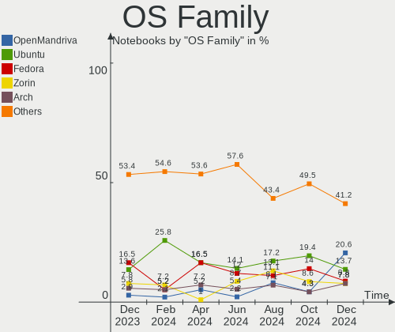
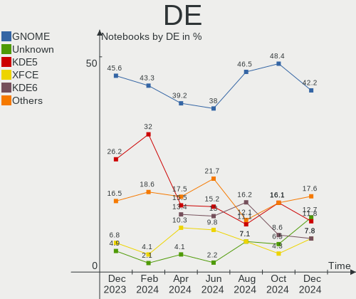
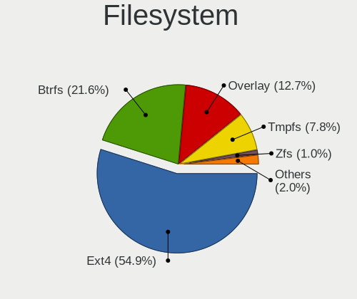
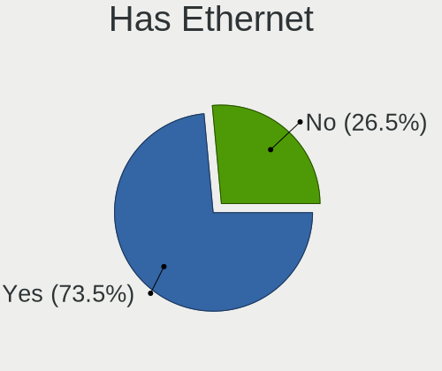
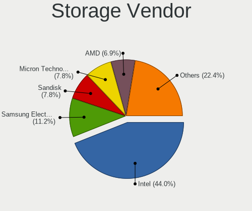
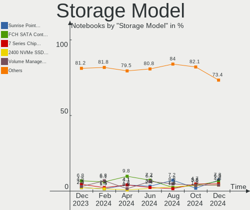
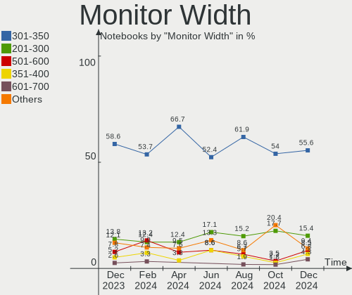
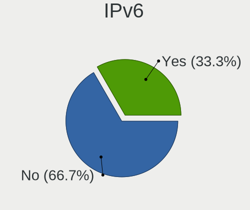
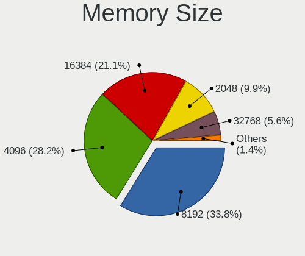

Linux in UK - Hardware Trends (Notebooks)
-----------------------------------------

A project to identify most popular hardware characteristics and track their change
over time based on data collected by Linux users at https://Linux-Hardware.org.

Anyone can contribute to this report by the [hw-probe](https://github.com/linuxhw/hw-probe) tool:

    sudo -E hw-probe -all -upload

Period: Jan, 2024.

Contents
--------

* [ System ](#system)
  - [ OS                       ](#os)
  - [ OS Family                ](#os-family)
  - [ Kernel                   ](#kernel)
  - [ Kernel Family            ](#kernel-family)
  - [ Kernel Major Ver.        ](#kernel-major-ver)
  - [ Arch                     ](#arch)
  - [ DE                       ](#de)
  - [ Display Server           ](#display-server)
  - [ Display Manager          ](#display-manager)
  - [ OS Lang                  ](#os-lang)
  - [ Boot Mode                ](#boot-mode)
  - [ Filesystem               ](#filesystem)
  - [ Part. scheme             ](#part-scheme)
  - [ Dual Boot with Linux/BSD ](#dual-boot-with-linuxbsd)
  - [ Dual Boot (Win)          ](#dual-boot-win)

* [ Board ](#board)
  - [ Vendor                   ](#vendor)
  - [ Model                    ](#model)
  - [ Model Family             ](#model-family)
  - [ MFG Year                 ](#mfg-year)
  - [ Form Factor              ](#form-factor)
  - [ Secure Boot              ](#secure-boot)
  - [ Coreboot                 ](#coreboot)
  - [ RAM Size                 ](#ram-size)
  - [ RAM Used                 ](#ram-used)
  - [ Total Drives             ](#total-drives)
  - [ Has CD-ROM               ](#has-cd-rom)
  - [ Has Ethernet             ](#has-ethernet)
  - [ Has WiFi                 ](#has-wifi)
  - [ Has Bluetooth            ](#has-bluetooth)

* [ Location ](#location)
  - [ Country                  ](#country)
  - [ City                     ](#city)

* [ Drives ](#drives)
  - [ Drive Vendor             ](#drive-vendor)
  - [ Drive Model              ](#drive-model)
  - [ HDD Vendor               ](#hdd-vendor)
  - [ SSD Vendor               ](#ssd-vendor)
  - [ Drive Kind               ](#drive-kind)
  - [ Drive Connector          ](#drive-connector)
  - [ Drive Size               ](#drive-size)
  - [ Space Total              ](#space-total)
  - [ Space Used               ](#space-used)
  - [ Malfunc. Drives          ](#malfunc-drives)
  - [ Malfunc. Drive Vendor    ](#malfunc-drive-vendor)
  - [ Malfunc. HDD Vendor      ](#malfunc-hdd-vendor)
  - [ Malfunc. Drive Kind      ](#malfunc-drive-kind)
  - [ Failed Drives            ](#failed-drives)
  - [ Failed Drive Vendor      ](#failed-drive-vendor)
  - [ Drive Status             ](#drive-status)

* [ Storage controller ](#storage-controller)
  - [ Storage Vendor           ](#storage-vendor)
  - [ Storage Model            ](#storage-model)
  - [ Storage Kind             ](#storage-kind)

* [ Processor ](#processor)
  - [ CPU Vendor               ](#cpu-vendor)
  - [ CPU Model                ](#cpu-model)
  - [ CPU Model Family         ](#cpu-model-family)
  - [ CPU Cores                ](#cpu-cores)
  - [ CPU Sockets              ](#cpu-sockets)
  - [ CPU Threads              ](#cpu-threads)
  - [ CPU Op-Modes             ](#cpu-op-modes)
  - [ CPU Microcode            ](#cpu-microcode)
  - [ CPU Microarch            ](#cpu-microarch)

* [ Graphics ](#graphics)
  - [ GPU Vendor               ](#gpu-vendor)
  - [ GPU Model                ](#gpu-model)
  - [ GPU Combo                ](#gpu-combo)
  - [ GPU Driver               ](#gpu-driver)
  - [ GPU Memory               ](#gpu-memory)

* [ Monitor ](#monitor)
  - [ Monitor Vendor           ](#monitor-vendor)
  - [ Monitor Model            ](#monitor-model)
  - [ Monitor Resolution       ](#monitor-resolution)
  - [ Monitor Diagonal         ](#monitor-diagonal)
  - [ Monitor Width            ](#monitor-width)
  - [ Aspect Ratio             ](#aspect-ratio)
  - [ Monitor Area             ](#monitor-area)
  - [ Pixel Density            ](#pixel-density)
  - [ Multiple Monitors        ](#multiple-monitors)

* [ Network ](#network)
  - [ Net Controller Vendor    ](#net-controller-vendor)
  - [ Net Controller Model     ](#net-controller-model)
  - [ Wireless Vendor          ](#wireless-vendor)
  - [ Wireless Model           ](#wireless-model)
  - [ Ethernet Vendor          ](#ethernet-vendor)
  - [ Ethernet Model           ](#ethernet-model)
  - [ Net Controller Kind      ](#net-controller-kind)
  - [ Used Controller          ](#used-controller)
  - [ NICs                     ](#nics)
  - [ IPv6                     ](#ipv6)

* [ Bluetooth ](#bluetooth)
  - [ Bluetooth Vendor         ](#bluetooth-vendor)
  - [ Bluetooth Model          ](#bluetooth-model)

* [ Sound ](#sound)
  - [ Sound Vendor             ](#sound-vendor)
  - [ Sound Model              ](#sound-model)

* [ Memory ](#memory)
  - [ Memory Vendor            ](#memory-vendor)
  - [ Memory Model             ](#memory-model)
  - [ Memory Kind              ](#memory-kind)
  - [ Memory Form Factor       ](#memory-form-factor)
  - [ Memory Size              ](#memory-size)
  - [ Memory Speed             ](#memory-speed)

* [ Printers & scanners ](#printers--scanners)
  - [ Printer Vendor           ](#printer-vendor)
  - [ Printer Model            ](#printer-model)
  - [ Scanner Vendor           ](#scanner-vendor)
  - [ Scanner Model            ](#scanner-model)

* [ Camera ](#camera)
  - [ Camera Vendor            ](#camera-vendor)
  - [ Camera Model             ](#camera-model)

* [ Security ](#security)
  - [ Fingerprint Vendor       ](#fingerprint-vendor)
  - [ Fingerprint Model        ](#fingerprint-model)
  - [ Chipcard Vendor          ](#chipcard-vendor)
  - [ Chipcard Model           ](#chipcard-model)

* [ Unsupported ](#unsupported)
  - [ Unsupported Devices      ](#unsupported-devices)
  - [ Unsupported Device Types ](#unsupported-device-types)

System
------

OS
--

Installed operating systems

| Name                         | Notebooks | Percent |
|------------------------------|-----------|---------|
| Linux Mint 21.3              | 11        | 8.53%   |
| Ubuntu 22.04                 | 10        | 7.75%   |
| Fedora 39                    | 10        | 7.75%   |
| Pop!_OS 22.04                | 9         | 6.98%   |
| Zorin 16                     | 8         | 6.2%    |
| Linux Mint 21.2              | 7         | 5.43%   |
| SteamOS 3.5.7                | 6         | 4.65%   |
| BlackPanther 18.1            | 6         | 4.65%   |
| Arch Rolling                 | 6         | 4.65%   |
| Ubuntu 23.10                 | 5         | 3.88%   |
| Debian 12                    | 4         | 3.1%    |
| ArcoLinux Rolling            | 4         | 3.1%    |
| Ubuntu 20.04                 | 3         | 2.33%   |
| openSUSE Tumbleweed-XXXXXXXX | 3         | 2.33%   |
| OpenMandriva 24.01           | 3         | 2.33%   |
| OpenMandriva 23.08           | 3         | 2.33%   |
| Zorin 17                     | 2         | 1.55%   |
| Kubuntu 23.10                | 2         | 1.55%   |
| Kali 2023.4                  | 2         | 1.55%   |
| Gentoo 2.14                  | 2         | 1.55%   |
| EndeavourOS Rolling          | 2         | 1.55%   |
| Xubuntu 22.04                | 1         | 0.78%   |
| Ubuntu Budgie 22.04          | 1         | 0.78%   |
| Ubuntu 23.04                 | 1         | 0.78%   |
| SteamOS 3.6                  | 1         | 0.78%   |
| SteamOS 3.5.13               | 1         | 0.78%   |
| Peppermint                   | 1         | 0.78%   |
| Parrot 6.0                   | 1         | 0.78%   |
| OpenMandriva 5.0             | 1         | 0.78%   |
| OpenMandriva 4.2             | 1         | 0.78%   |
| OpenMandriva 23.11           | 1         | 0.78%   |
| NixOS 24.05                  | 1         | 0.78%   |
| MX 23                        | 1         | 0.78%   |
| Manjaro 23.1.2               | 1         | 0.78%   |
| Manjaro                      | 1         | 0.78%   |
| Lubuntu 22.04                | 1         | 0.78%   |
| Lilidog 23                   | 1         | 0.78%   |
| Kubuntu 22.04                | 1         | 0.78%   |
| Fedora 38                    | 1         | 0.78%   |
| Fedora 35                    | 1         | 0.78%   |

OS Family
---------

OS without a version

| Name          | Notebooks | Percent |
|---------------|-----------|---------|
| Ubuntu        | 19        | 14.73%  |
| Linux Mint    | 18        | 13.95%  |
| Fedora        | 12        | 9.3%    |
| Zorin         | 10        | 7.75%   |
| Pop!_OS       | 9         | 6.98%   |
| OpenMandriva  | 9         | 6.98%   |
| SteamOS       | 8         | 6.2%    |
| BlackPanther  | 6         | 4.65%   |
| Arch          | 6         | 4.65%   |
| Debian        | 5         | 3.88%   |
| ArcoLinux     | 4         | 3.1%    |
| openSUSE      | 3         | 2.33%   |
| Kubuntu       | 3         | 2.33%   |
| Manjaro       | 2         | 1.55%   |
| Kali          | 2         | 1.55%   |
| Gentoo        | 2         | 1.55%   |
| EndeavourOS   | 2         | 1.55%   |
| Xubuntu       | 1         | 0.78%   |
| Ubuntu Budgie | 1         | 0.78%   |
| Peppermint    | 1         | 0.78%   |
| Parrot        | 1         | 0.78%   |
| NixOS         | 1         | 0.78%   |
| MX            | 1         | 0.78%   |
| Lubuntu       | 1         | 0.78%   |
| Lilidog       | 1         | 0.78%   |
| CachyOS       | 1         | 0.78%   |

Kernel
------

Version of the Linux kernel

| Version                      | Notebooks | Percent |
|------------------------------|-----------|---------|
| 5.15.0-91-generic            | 14        | 10.85%  |
| 6.5.0-14-generic             | 13        | 10.08%  |
| 6.5.0-15-generic             | 9         | 6.98%   |
| 6.6.6-76060606-generic       | 8         | 6.2%    |
| 6.1.52-valve9-1-neptune-61   | 6         | 4.65%   |
| 6.2.0-39-generic             | 5         | 3.88%   |
| 6.6.9-200.fc39.x86_64        | 4         | 3.1%    |
| 6.6.8-200.fc39.x86_64        | 4         | 3.1%    |
| 6.6.2-desktop-1omv2390       | 4         | 3.1%    |
| 6.1.0-17-amd64               | 4         | 3.1%    |
| 5.15.85-desktop-1bP          | 4         | 3.1%    |
| 6.7.1-arch1-1                | 3         | 2.33%   |
| 6.7.0-arch3-1                | 3         | 2.33%   |
| 6.4.11-desktop-1omv2390      | 3         | 2.33%   |
| 5.15.0-92-generic            | 3         | 2.33%   |
| 6.6.11-1-default             | 2         | 1.55%   |
| 6.2.0-26-generic             | 2         | 1.55%   |
| 5.6.14-desktop-2bP           | 2         | 1.55%   |
| 5.15.0-84-generic            | 2         | 1.55%   |
| 6.6.9-arch1-YuruYuri-T2-1-t2 | 1         | 0.78%   |
| 6.6.9-arch1-1                | 1         | 0.78%   |
| 6.6.8-lqx2-1-liquorix        | 1         | 0.78%   |
| 6.6.8-arch1-1                | 1         | 0.78%   |
| 6.6.8-2-MANJARO              | 1         | 0.78%   |
| 6.6.14-1.1-lts               | 1         | 0.78%   |
| 6.6.11-200.fc39.x86_64       | 1         | 0.78%   |
| 6.6.11-100.fc38.x86_64       | 1         | 0.78%   |
| 6.6.10-arch1-1               | 1         | 0.78%   |
| 6.6.10-76060610-generic      | 1         | 0.78%   |
| 6.6.10-1-MANJARO             | 1         | 0.78%   |
| 6.6.1-arch1-1                | 1         | 0.78%   |
| 6.5.0-kali3-amd64            | 1         | 0.78%   |
| 6.5.0-13parrot1-amd64        | 1         | 0.78%   |
| 6.5.0-0.deb12.4-amd64        | 1         | 0.78%   |
| 6.4.8-desktop-2omv2390       | 1         | 0.78%   |
| 6.2.9-300.fc38.x86_64        | 1         | 0.78%   |
| 6.1.71                       | 1         | 0.78%   |
| 6.1.67-gentoo-dist           | 1         | 0.78%   |
| 6.1.67-gentoo                | 1         | 0.78%   |
| 6.1.66.19.realtime2-1-rt-lts | 1         | 0.78%   |

Kernel Family
-------------

Linux kernel without a distro release

| Version   | Notebooks | Percent |
|-----------|-----------|---------|
| 6.5.0     | 25        | 19.38%  |
| 5.15.0    | 23        | 17.83%  |
| 6.6.6     | 8         | 6.2%    |
| 6.1.52    | 8         | 6.2%    |
| 6.6.8     | 7         | 5.43%   |
| 6.2.0     | 7         | 5.43%   |
| 6.6.9     | 6         | 4.65%   |
| 6.1.0     | 6         | 4.65%   |
| 6.6.2     | 4         | 3.1%    |
| 6.6.11    | 4         | 3.1%    |
| 5.15.85   | 4         | 3.1%    |
| 6.7.1     | 3         | 2.33%   |
| 6.7.0     | 3         | 2.33%   |
| 6.6.10    | 3         | 2.33%   |
| 6.4.11    | 3         | 2.33%   |
| 6.1.67    | 2         | 1.55%   |
| 5.6.14    | 2         | 1.55%   |
| 6.6.14    | 1         | 0.78%   |
| 6.6.1     | 1         | 0.78%   |
| 6.4.8     | 1         | 0.78%   |
| 6.2.9     | 1         | 0.78%   |
| 6.1.71    | 1         | 0.78%   |
| 6.1.66.19 | 1         | 0.78%   |
| 6.0.12    | 1         | 0.78%   |
| 5.4.0     | 1         | 0.78%   |
| 5.10.197  | 1         | 0.78%   |
| 5.10.14   | 1         | 0.78%   |
| 5.10.0    | 1         | 0.78%   |

Kernel Major Ver.
-----------------

Linux kernel major version

| Version | Notebooks | Percent |
|---------|-----------|---------|
| 6.6     | 34        | 26.36%  |
| 5.15    | 27        | 20.93%  |
| 6.5     | 25        | 19.38%  |
| 6.1     | 17        | 13.18%  |
| 6.2     | 8         | 6.2%    |
| 6.7     | 6         | 4.65%   |
| 6.4     | 4         | 3.1%    |
| 5.10    | 3         | 2.33%   |
| 5.6     | 2         | 1.55%   |
| 6.1.66  | 1         | 0.78%   |
| 6.0     | 1         | 0.78%   |
| 5.4     | 1         | 0.78%   |

Arch
----

OS architecture (x86_64, i586, etc.)

| Name   | Notebooks | Percent |
|--------|-----------|---------|
| x86_64 | 129       | 100%    |

DE
--

Desktop Environment

| Name            | Notebooks | Percent |
|-----------------|-----------|---------|
| GNOME           | 49        | 37.98%  |
| KDE5            | 41        | 31.78%  |
| X-Cinnamon      | 16        | 12.4%   |
| XFCE            | 8         | 6.2%    |
| Hyprland        | 4         | 3.1%    |
| MATE            | 2         | 1.55%   |
| LXQt            | 2         | 1.55%   |
| Unknown         | 2         | 1.55%   |
| sway            | 1         | 0.78%   |
| openbox         | 1         | 0.78%   |
| LXDE            | 1         | 0.78%   |
| GNOME Flashback | 1         | 0.78%   |
| Budgie          | 1         | 0.78%   |

Display Server
--------------

X11 or Wayland

| Name    | Notebooks | Percent |
|---------|-----------|---------|
| X11     | 81        | 62.79%  |
| Wayland | 43        | 33.33%  |
| Tty     | 3         | 2.33%   |
| Unknown | 2         | 1.55%   |

Display Manager
---------------

SDDM, LightDM, etc.

| Name    | Notebooks | Percent |
|---------|-----------|---------|
| Unknown | 47        | 36.43%  |
| SDDM    | 30        | 23.26%  |
| LightDM | 22        | 17.05%  |
| GDM3    | 21        | 16.28%  |
| GDM     | 8         | 6.2%    |
| LXDM    | 1         | 0.78%   |

OS Lang
-------

Language

| Lang    | Notebooks | Percent |
|---------|-----------|---------|
| en_GB   | 96        | 74.42%  |
| en_US   | 22        | 17.05%  |
| Unknown | 7         | 5.43%   |
| C       | 2         | 1.55%   |
| ru_RU   | 1         | 0.78%   |
| pl_PL   | 1         | 0.78%   |

Boot Mode
---------

EFI or BIOS

| Mode | Notebooks | Percent |
|------|-----------|---------|
| EFI  | 79        | 61.24%  |
| BIOS | 50        | 38.76%  |

Filesystem
----------

Type of filesystem

| Type    | Notebooks | Percent |
|---------|-----------|---------|
| Ext4    | 78        | 60.47%  |
| Btrfs   | 29        | 22.48%  |
| Tmpfs   | 13        | 10.08%  |
| Overlay | 9         | 6.98%   |

Part. scheme
------------

Scheme of partitioning

| Type    | Notebooks | Percent |
|---------|-----------|---------|
| GPT     | 75        | 58.14%  |
| Unknown | 42        | 32.56%  |
| MBR     | 12        | 9.3%    |

Dual Boot with Linux/BSD
------------------------

Hosting more than one Linux/BSD

| Dual boot | Notebooks | Percent |
|-----------|-----------|---------|
| No        | 115       | 89.15%  |
| Yes       | 14        | 10.85%  |

Dual Boot (Win)
---------------

Hosting Linux and Windows

| Dual boot | Notebooks | Percent |
|-----------|-----------|---------|
| No        | 96        | 74.42%  |
| Yes       | 33        | 25.58%  |

Board
-----

Vendor
------

Motherboard manufacturer

| Name             | Notebooks | Percent |
|------------------|-----------|---------|
| Lenovo           | 34        | 26.36%  |
| Hewlett-Packard  | 20        | 15.5%   |
| Dell             | 16        | 12.4%   |
| ASUSTek Computer | 14        | 10.85%  |
| Acer             | 9         | 6.98%   |
| Valve            | 7         | 5.43%   |
| Apple            | 7         | 5.43%   |
| Toshiba          | 2         | 1.55%   |
| Razer            | 2         | 1.55%   |
| MSI              | 2         | 1.55%   |
| LG Electronics   | 2         | 1.55%   |
| AZW              | 2         | 1.55%   |
| Star Labs        | 1         | 0.78%   |
| Sony             | 1         | 0.78%   |
| PC Specialist    | 1         | 0.78%   |
| Panasonic        | 1         | 0.78%   |
| HUAWEI           | 1         | 0.78%   |
| HONOR            | 1         | 0.78%   |
| GPD              | 1         | 0.78%   |
| Framework        | 1         | 0.78%   |
| ENTITY           | 1         | 0.78%   |
| Dynabook         | 1         | 0.78%   |
| CyberPowerPC     | 1         | 0.78%   |
| AWOW             | 1         | 0.78%   |

Model
-----

Motherboard model

| Name                                               | Notebooks | Percent |
|----------------------------------------------------|-----------|---------|
| Valve Jupiter                                      | 5         | 3.88%   |
| Valve Galileo                                      | 2         | 1.55%   |
| HP Pavilion dv6                                    | 2         | 1.55%   |
| Dell XPS 9320                                      | 2         | 1.55%   |
| Dell Latitude E5470                                | 2         | 1.55%   |
| Toshiba Satellite Pro R50-B                        | 1         | 0.78%   |
| Toshiba Satellite L50D-B                           | 1         | 0.78%   |
| Star Labs StarLite                                 | 1         | 0.78%   |
| Sony SVF1521Q1EW                                   | 1         | 0.78%   |
| Razer Blade Stealth                                | 1         | 0.78%   |
| Razer Blade 15 Base Model (Early 2021) - RZ09-0369 | 1         | 0.78%   |
| PC Specialist P65_67RSRP                           | 1         | 0.78%   |
| Panasonic CF-52PFN32PE                             | 1         | 0.78%   |
| MSI MS-7C37                                        | 1         | 0.78%   |
| MSI GS66 Stealth 10SE                              | 1         | 0.78%   |
| LG 17Z90P-K.AA78A1                                 | 1         | 0.78%   |
| LG 15Z90RT-K.AD7AA1                                | 1         | 0.78%   |
| Lenovo Z50-75 80EC                                 | 1         | 0.78%   |
| Lenovo Yoga S740-14IIL 81RS                        | 1         | 0.78%   |
| Lenovo Yoga S730-13IWL 81J0                        | 1         | 0.78%   |
| Lenovo Yoga Pro 9 14IRP8 83BU                      | 1         | 0.78%   |
| Lenovo Yoga 3 14 80JH                              | 1         | 0.78%   |
| Lenovo V330-14ARR 81B1                             | 1         | 0.78%   |
| Lenovo V15-ADA 82C7                                | 1         | 0.78%   |
| Lenovo V15 G2 ALC 82KD                             | 1         | 0.78%   |
| Lenovo ThinkPad X260 20F5S4A901                    | 1         | 0.78%   |
| Lenovo ThinkPad X250 20CM004XUK                    | 1         | 0.78%   |
| Lenovo ThinkPad X250 20CLS3320C                    | 1         | 0.78%   |
| Lenovo ThinkPad X220 Tablet 42992PG                | 1         | 0.78%   |
| Lenovo ThinkPad X220 4291RD2                       | 1         | 0.78%   |
| Lenovo ThinkPad X201 3323DAG                       | 1         | 0.78%   |
| Lenovo ThinkPad T60p 20078JU                       | 1         | 0.78%   |
| Lenovo ThinkPad T540p 20BE003YUK                   | 1         | 0.78%   |
| Lenovo ThinkPad T510 43149TG                       | 1         | 0.78%   |
| Lenovo ThinkPad T480 20L50011US                    | 1         | 0.78%   |
| Lenovo ThinkPad T480 20L50000UK                    | 1         | 0.78%   |
| Lenovo ThinkPad T460s 20FAS1V600                   | 1         | 0.78%   |
| Lenovo ThinkPad T430 2349SA2                       | 1         | 0.78%   |
| Lenovo ThinkPad T420 4236Y54                       | 1         | 0.78%   |
| Lenovo ThinkPad T400 6474W7T                       | 1         | 0.78%   |

Model Family
------------

Motherboard model prefix

| Name                   | Notebooks | Percent |
|------------------------|-----------|---------|
| Lenovo ThinkPad        | 19        | 14.73%  |
| Dell Latitude          | 7         | 5.43%   |
| Lenovo IdeaPad         | 6         | 4.65%   |
| Valve Jupiter          | 5         | 3.88%   |
| Dell XPS               | 5         | 3.88%   |
| Lenovo Yoga            | 4         | 3.1%    |
| HP Pavilion            | 4         | 3.1%    |
| ASUS VivoBook          | 4         | 3.1%    |
| Acer Swift             | 4         | 3.1%    |
| Acer Aspire            | 4         | 3.1%    |
| HP ProBook             | 3         | 2.33%   |
| HP Laptop              | 3         | 2.33%   |
| HP EliteBook           | 3         | 2.33%   |
| Valve Galileo          | 2         | 1.55%   |
| Toshiba Satellite      | 2         | 1.55%   |
| Razer Blade            | 2         | 1.55%   |
| Dell Precision         | 2         | 1.55%   |
| Dell Inspiron          | 2         | 1.55%   |
| ASUS ZenBook           | 2         | 1.55%   |
| Star Labs StarLite     | 1         | 0.78%   |
| Sony SVF1521Q1EW       | 1         | 0.78%   |
| PC Specialist P65      | 1         | 0.78%   |
| Panasonic CF-52PFN32PE | 1         | 0.78%   |
| MSI MS-7C37            | 1         | 0.78%   |
| MSI GS66               | 1         | 0.78%   |
| LG 17Z90P-K.AA78A1     | 1         | 0.78%   |
| LG 15Z90RT-K.AD7AA1    | 1         | 0.78%   |
| Lenovo Z50-75          | 1         | 0.78%   |
| Lenovo V330-14ARR      | 1         | 0.78%   |
| Lenovo V15-ADA         | 1         | 0.78%   |
| Lenovo V15             | 1         | 0.78%   |
| Lenovo Legion          | 1         | 0.78%   |
| HUAWEI WRT-WX9         | 1         | 0.78%   |
| HONOR BBR-WAX9         | 1         | 0.78%   |
| HP ZBook               | 1         | 0.78%   |
| HP OMEN                | 1         | 0.78%   |
| HP Notebook            | 1         | 0.78%   |
| HP Mini                | 1         | 0.78%   |
| HP ENVY                | 1         | 0.78%   |
| HP 255                 | 1         | 0.78%   |

MFG Year
--------

Motherboard manufacture year

| Year | Notebooks | Percent |
|------|-----------|---------|
| 2020 | 16        | 12.4%   |
| 2023 | 14        | 10.85%  |
| 2019 | 12        | 9.3%    |
| 2021 | 11        | 8.53%   |
| 2013 | 11        | 8.53%   |
| 2016 | 9         | 6.98%   |
| 2022 | 8         | 6.2%    |
| 2017 | 8         | 6.2%    |
| 2018 | 7         | 5.43%   |
| 2012 | 7         | 5.43%   |
| 2015 | 5         | 3.88%   |
| 2014 | 5         | 3.88%   |
| 2011 | 5         | 3.88%   |
| 2008 | 5         | 3.88%   |
| 2009 | 3         | 2.33%   |
| 2010 | 2         | 1.55%   |
| 2006 | 1         | 0.78%   |

Form Factor
-----------

Physical design of the computer

| Name     | Notebooks | Percent |
|----------|-----------|---------|
| Notebook | 129       | 100%    |

Secure Boot
-----------

Enabled or disabled

| State    | Notebooks | Percent |
|----------|-----------|---------|
| Disabled | 115       | 89.15%  |
| Enabled  | 14        | 10.85%  |

Coreboot
--------

Have coreboot on board

| Used | Notebooks | Percent |
|------|-----------|---------|
| No   | 129       | 100%    |

RAM Size
--------

Total RAM memory

| Size in GB  | Notebooks | Percent |
|-------------|-----------|---------|
| 4.01-8.0    | 49        | 37.98%  |
| 16.01-24.0  | 27        | 20.93%  |
| 8.01-16.0   | 24        | 18.6%   |
| 3.01-4.0    | 14        | 10.85%  |
| 32.01-64.0  | 6         | 4.65%   |
| 64.01-256.0 | 3         | 2.33%   |
| 1.01-2.0    | 3         | 2.33%   |
| 2.01-3.0    | 2         | 1.55%   |
| 24.01-32.0  | 1         | 0.78%   |

RAM Used
--------

Used RAM memory

| Used GB   | Notebooks | Percent |
|-----------|-----------|---------|
| 3.01-4.0  | 38        | 29.46%  |
| 1.01-2.0  | 30        | 23.26%  |
| 2.01-3.0  | 27        | 20.93%  |
| 4.01-8.0  | 23        | 17.83%  |
| 0.51-1.0  | 7         | 5.43%   |
| 8.01-16.0 | 4         | 3.1%    |

Total Drives
------------

Number of drives on board

| Drives | Notebooks | Percent |
|--------|-----------|---------|
| 1      | 102       | 79.07%  |
| 2      | 23        | 17.83%  |
| 4      | 3         | 2.33%   |
| 3      | 1         | 0.78%   |

Has CD-ROM
----------

Has CD-ROM on board

| Presented | Notebooks | Percent |
|-----------|-----------|---------|
| No        | 93        | 72.09%  |
| Yes       | 36        | 27.91%  |

Has Ethernet
------------

Has Ethernet on board

| Presented | Notebooks | Percent |
|-----------|-----------|---------|
| Yes       | 89        | 68.99%  |
| No        | 40        | 31.01%  |

Has WiFi
--------

Has WiFi module

| Presented | Notebooks | Percent |
|-----------|-----------|---------|
| Yes       | 128       | 99.22%  |
| No        | 1         | 0.78%   |

Has Bluetooth
-------------

Has Bluetooth module

| Presented | Notebooks | Percent |
|-----------|-----------|---------|
| Yes       | 107       | 82.95%  |
| No        | 22        | 17.05%  |

Location
--------

Country
-------

Geographic location (country)

| Country | Notebooks | Percent |
|---------|-----------|---------|
| UK      | 129       | 100%    |

City
----

Geographic location (city)

| City             | Notebooks | Percent |
|------------------|-----------|---------|
| Glasgow          | 5         | 3.88%   |
| Lambeth          | 4         | 3.1%    |
| Nottingham       | 3         | 2.33%   |
| Manchester       | 3         | 2.33%   |
| London           | 3         | 2.33%   |
| Worthing         | 2         | 1.55%   |
| Worcester Park   | 2         | 1.55%   |
| Southwark        | 2         | 1.55%   |
| Southampton      | 2         | 1.55%   |
| South Shields    | 2         | 1.55%   |
| Sleaford         | 2         | 1.55%   |
| Newham           | 2         | 1.55%   |
| Liverpool        | 2         | 1.55%   |
| Hemel Hempstead  | 2         | 1.55%   |
| Hackney          | 2         | 1.55%   |
| Ealing           | 2         | 1.55%   |
| Derby            | 2         | 1.55%   |
| Crewe            | 2         | 1.55%   |
| Bristol          | 2         | 1.55%   |
| Birmingham       | 2         | 1.55%   |
| Barnet           | 2         | 1.55%   |
| Worksop          | 1         | 0.78%   |
| Wolverhampton    | 1         | 0.78%   |
| Wembley          | 1         | 0.78%   |
| Wellingborough   | 1         | 0.78%   |
| Wandsworth       | 1         | 0.78%   |
| Walsall          | 1         | 0.78%   |
| Tonypandy        | 1         | 0.78%   |
| Tiverton         | 1         | 0.78%   |
| Swansea          | 1         | 0.78%   |
| Stockton-on-Tees | 1         | 0.78%   |
| Stockport        | 1         | 0.78%   |
| Starcross        | 1         | 0.78%   |
| St Helens        | 1         | 0.78%   |
| Southport        | 1         | 0.78%   |
| Solihull         | 1         | 0.78%   |
| Slough           | 1         | 0.78%   |
| Sandhurst        | 1         | 0.78%   |
| Saffron Walden   | 1         | 0.78%   |
| Rushden          | 1         | 0.78%   |

Drives
------

Drive Vendor
------------

Hard drive vendors

| Vendor                      | Notebooks | Drives | Percent |
|-----------------------------|-----------|--------|---------|
| Samsung Electronics         | 23        | 24     | 14.84%  |
| WDC                         | 12        | 13     | 7.74%   |
| Seagate                     | 12        | 12     | 7.74%   |
| Sandisk                     | 12        | 13     | 7.74%   |
| Unknown                     | 9         | 9      | 5.81%   |
| SK hynix                    | 9         | 10     | 5.81%   |
| Crucial                     | 8         | 8      | 5.16%   |
| Toshiba                     | 7         | 7      | 4.52%   |
| Micron Technology           | 6         | 6      | 3.87%   |
| Kingston                    | 5         | 5      | 3.23%   |
| Intel                       | 5         | 6      | 3.23%   |
| Micron/Crucial Technology   | 4         | 4      | 2.58%   |
| Apple                       | 4         | 6      | 2.58%   |
| Phison Electronics          | 3         | 3      | 1.94%   |
| KIOXIA                      | 3         | 3      | 1.94%   |
| Kingston Technology Company | 3         | 3      | 1.94%   |
| HGST                        | 3         | 3      | 1.94%   |
| Integral                    | 2         | 2      | 1.29%   |
| Hitachi                     | 2         | 2      | 1.29%   |
| China                       | 2         | 2      | 1.29%   |
| Unknown                     | 2         | 2      | 1.29%   |
| XUM                         | 1         | 1      | 0.65%   |
| Transcend                   | 1         | 1      | 0.65%   |
| TO Exter                    | 1         | 1      | 0.65%   |
| Team                        | 1         | 1      | 0.65%   |
| Star                        | 1         | 1      | 0.65%   |
| SSK                         | 1         | 2      | 0.65%   |
| SABRENT                     | 1         | 1      | 0.65%   |
| Phison                      | 1         | 1      | 0.65%   |
| Patriot                     | 1         | 1      | 0.65%   |
| O2 Micro                    | 1         | 1      | 0.65%   |
| MAXIO Technology (Hangzhou) | 1         | 1      | 0.65%   |
| LITEONIT                    | 1         | 1      | 0.65%   |
| LITEON                      | 1         | 1      | 0.65%   |
| Lite-On Technology          | 1         | 1      | 0.65%   |
| KIOXIA-EXCERIA              | 1         | 1      | 0.65%   |
| Fanxiang                    | 1         | 1      | 0.65%   |
| BAITITON                    | 1         | 1      | 0.65%   |
| ASENNO                      | 1         | 1      | 0.65%   |
| 2-Power                     | 1         | 1      | 0.65%   |

Drive Model
-----------

Hard drive models

| Model                                             | Notebooks | Percent |
|---------------------------------------------------|-----------|---------|
| Samsung NVMe SSD Controller SM981/PM981/PM983 1TB | 4         | 2.52%   |
| Micron/Crucial P2 NVMe PCIe SSD 1TB               | 4         | 2.52%   |
| Sandisk WD Black SN750 / PC SN730 NVMe SSD 512GB  | 3         | 1.89%   |
| Unknown MMC Card  64GB                            | 2         | 1.26%   |
| Unknown MMC Card  512GB                           | 2         | 1.26%   |
| Toshiba MQ01ABD100 1TB                            | 2         | 1.26%   |
| Seagate ST9320325AS 320GB                         | 2         | 1.26%   |
| Seagate ST2000LM003 HN-M201RAD 2TB                | 2         | 1.26%   |
| Seagate ST1000LM024 HN-M101MBB 1TB                | 2         | 1.26%   |
| Seagate Expansion 1TB                             | 2         | 1.26%   |
| Phison PS5013 E13 NVMe Controller 256GB           | 2         | 1.26%   |
| Kingston Company OM3PDP3 NVMe SSD 256GB           | 2         | 1.26%   |
| Intel SSDPEKNU512GZ 512GB                         | 2         | 1.26%   |
| Integral V Series SATA SSD 1TB-1000GB             | 2         | 1.26%   |
| HGST HTS541010A9E680 1TB                          | 2         | 1.26%   |
| Crucial CT1000BX500SSD1 1TB                       | 2         | 1.26%   |
| Unknown                                           | 2         | 1.26%   |
| XUM HX512GSSDSATA3 512GB                          | 1         | 0.63%   |
| WDC WDS240G2G0A-00JH30 240GB SSD                  | 1         | 0.63%   |
| WDC WDS100T2B0C-00PXH0 1TB                        | 1         | 0.63%   |
| WDC WD5000LPVT-22G33T0 500GB                      | 1         | 0.63%   |
| WDC WD1600BEVT-60A23T0 160GB                      | 1         | 0.63%   |
| WDC WD10SPCX-60KHST0 1TB                          | 1         | 0.63%   |
| WDC WD Green M.2 2280 480GB                       | 1         | 0.63%   |
| WDC WD Blue SA510 2.5 1000GB SSD                  | 1         | 0.63%   |
| WDC PC SN810 NVMe 512GB                           | 1         | 0.63%   |
| WDC PC SN730 SDBPNTY-256G-1036 256GB              | 1         | 0.63%   |
| WDC PC SN530 SDBPTPZ-512G-1002 512GB              | 1         | 0.63%   |
| WDC PC SN530 SDBPNPZ-1T00-1014 1TB                | 1         | 0.63%   |
| WDC PC SN520 SDAPNUW-512G-1014 512GB              | 1         | 0.63%   |
| WDC PC SA530 SDASN8Y256G 256GB SSD                | 1         | 0.63%   |
| Unknown SD512  507MB                              | 1         | 0.63%   |
| Unknown NVMe SSD Drive 2TB                        | 1         | 0.63%   |
| Unknown NVMe SSD Drive 1024GB                     | 1         | 0.63%   |
| Unknown MMC Card  2TB                             | 1         | 0.63%   |
| Unknown MMC Card  128GB                           | 1         | 0.63%   |
| Transcend TS256GMSA230S 256GB SSD                 | 1         | 0.63%   |
| Toshiba XG6 NVMe SSD Controller 256GB             | 1         | 0.63%   |
| Toshiba MQ04ABF100 1TB                            | 1         | 0.63%   |
| Toshiba MQ01ABF050 500GB                          | 1         | 0.63%   |

HDD Vendor
----------

Hard disk drive vendors

| Vendor              | Notebooks | Drives | Percent |
|---------------------|-----------|--------|---------|
| Seagate             | 12        | 12     | 41.38%  |
| Toshiba             | 5         | 5      | 17.24%  |
| WDC                 | 3         | 3      | 10.34%  |
| HGST                | 3         | 3      | 10.34%  |
| Samsung Electronics | 2         | 2      | 6.9%    |
| Hitachi             | 2         | 2      | 6.9%    |
| TO Exter            | 1         | 1      | 3.45%   |
| SSK                 | 1         | 2      | 3.45%   |

SSD Vendor
----------

Solid state drive vendors

| Vendor              | Notebooks | Drives | Percent |
|---------------------|-----------|--------|---------|
| Samsung Electronics | 7         | 8      | 14%     |
| Crucial             | 7         | 7      | 14%     |
| SanDisk             | 6         | 6      | 12%     |
| WDC                 | 4         | 4      | 8%      |
| Kingston            | 4         | 4      | 8%      |
| Micron Technology   | 2         | 2      | 4%      |
| Integral            | 2         | 2      | 4%      |
| China               | 2         | 2      | 4%      |
| XUM                 | 1         | 1      | 2%      |
| Transcend           | 1         | 1      | 2%      |
| Toshiba             | 1         | 1      | 2%      |
| Team                | 1         | 1      | 2%      |
| Star                | 1         | 1      | 2%      |
| SK hynix            | 1         | 1      | 2%      |
| SABRENT             | 1         | 1      | 2%      |
| Patriot             | 1         | 1      | 2%      |
| LITEONIT            | 1         | 1      | 2%      |
| LITEON              | 1         | 1      | 2%      |
| KIOXIA-EXCERIA      | 1         | 1      | 2%      |
| Intel               | 1         | 1      | 2%      |
| BAITITON            | 1         | 1      | 2%      |
| ASENNO              | 1         | 1      | 2%      |
| Apple               | 1         | 1      | 2%      |
| 2-Power             | 1         | 1      | 2%      |

Drive Kind
----------

HDD or SSD

| Kind    | Notebooks | Drives | Percent |
|---------|-----------|--------|---------|
| NVMe    | 65        | 72     | 44.22%  |
| SSD     | 45        | 51     | 30.61%  |
| HDD     | 27        | 30     | 18.37%  |
| MMC     | 8         | 8      | 5.44%   |
| Unknown | 2         | 2      | 1.36%   |

Drive Connector
---------------

SATA, SAS, NVMe, etc.

| Type | Notebooks | Drives | Percent |
|------|-----------|--------|---------|
| SATA | 66        | 75     | 45.52%  |
| NVMe | 65        | 72     | 44.83%  |
| MMC  | 8         | 8      | 5.52%   |
| SAS  | 6         | 8      | 4.14%   |

Drive Size
----------

Size of hard drive

| Size in TB | Notebooks | Drives | Percent |
|------------|-----------|--------|---------|
| 0.01-0.5   | 47        | 51     | 62.67%  |
| 0.51-1.0   | 24        | 26     | 32%     |
| 1.01-2.0   | 3         | 3      | 4%      |
| 3.01-4.0   | 1         | 1      | 1.33%   |

Space Total
-----------

Amount of disk space available on the file system

| Size in GB     | Notebooks | Percent |
|----------------|-----------|---------|
| 101-250        | 40        | 31.01%  |
| 251-500        | 34        | 26.36%  |
| 501-1000       | 16        | 12.4%   |
| 1001-2000      | 11        | 8.53%   |
| 51-100         | 10        | 7.75%   |
| 1-20           | 6         | 4.65%   |
| More than 3000 | 5         | 3.88%   |
| 21-50          | 3         | 2.33%   |
| Unknown        | 3         | 2.33%   |
| 2001-3000      | 1         | 0.78%   |

Space Used
----------

Amount of used disk space

| Used GB   | Notebooks | Percent |
|-----------|-----------|---------|
| 1-20      | 39        | 30.23%  |
| 21-50     | 25        | 19.38%  |
| 101-250   | 22        | 17.05%  |
| 51-100    | 19        | 14.73%  |
| 251-500   | 10        | 7.75%   |
| 501-1000  | 8         | 6.2%    |
| Unknown   | 3         | 2.33%   |
| 1001-2000 | 2         | 1.55%   |
| 2001-3000 | 1         | 0.78%   |

Malfunc. Drives
---------------

Drive models with a malfunction

| Model                                  | Notebooks | Drives | Percent |
|----------------------------------------|-----------|--------|---------|
| Seagate ST9320325AS 320GB              | 2         | 2      | 16.67%  |
| HGST HTS541010A9E680 1TB               | 2         | 2      | 16.67%  |
| WDC WDS240G2G0A-00JH30 240GB SSD       | 1         | 1      | 8.33%   |
| WDC WD1600BEVT-60A23T0 160GB           | 1         | 1      | 8.33%   |
| Toshiba MQ01ABF050 500GB               | 1         | 1      | 8.33%   |
| Seagate ST2000LM003 HN-M201RAD 2TB     | 1         | 1      | 8.33%   |
| Seagate ST1000LM024 HN-M101MBB 1TB     | 1         | 1      | 8.33%   |
| Micron Technology M550_mSATA 512GB SSD | 1         | 1      | 8.33%   |
| Hitachi HTS541680J9SA00 80GB           | 1         | 1      | 8.33%   |
| China SATA3 512GB SSD                  | 1         | 1      | 8.33%   |

Malfunc. Drive Vendor
---------------------

Vendors of faulty drives

| Vendor            | Notebooks | Drives | Percent |
|-------------------|-----------|--------|---------|
| Seagate           | 4         | 4      | 33.33%  |
| WDC               | 2         | 2      | 16.67%  |
| HGST              | 2         | 2      | 16.67%  |
| Toshiba           | 1         | 1      | 8.33%   |
| Micron Technology | 1         | 1      | 8.33%   |
| Hitachi           | 1         | 1      | 8.33%   |
| China             | 1         | 1      | 8.33%   |

Malfunc. HDD Vendor
-------------------

Vendors of faulty HDD drives

| Vendor  | Notebooks | Drives | Percent |
|---------|-----------|--------|---------|
| Seagate | 4         | 4      | 44.44%  |
| HGST    | 2         | 2      | 22.22%  |
| WDC     | 1         | 1      | 11.11%  |
| Toshiba | 1         | 1      | 11.11%  |
| Hitachi | 1         | 1      | 11.11%  |

Malfunc. Drive Kind
-------------------

Kinds of faulty drives

| Kind | Notebooks | Drives | Percent |
|------|-----------|--------|---------|
| HDD  | 9         | 9      | 75%     |
| SSD  | 3         | 3      | 25%     |

Failed Drives
-------------

Failed drive models

Zero info for selected period =(

Failed Drive Vendor
-------------------

Failed drive vendors

Zero info for selected period =(

Drive Status
------------

Number of failed and malfunc. drives

| Status   | Notebooks | Drives | Percent |
|----------|-----------|--------|---------|
| Detected | 64        | 78     | 47.06%  |
| Works    | 60        | 73     | 44.12%  |
| Malfunc  | 12        | 12     | 8.82%   |

Storage controller
------------------

Storage Vendor
--------------

Storage controller vendors

| Vendor                       | Notebooks | Percent |
|------------------------------|-----------|---------|
| Intel                        | 70        | 44.87%  |
| AMD                          | 17        | 10.9%   |
| Samsung Electronics          | 15        | 9.62%   |
| SanDisk                      | 13        | 8.33%   |
| SK hynix                     | 8         | 5.13%   |
| Micron/Crucial Technology    | 5         | 3.21%   |
| Phison Electronics           | 4         | 2.56%   |
| Micron Technology            | 4         | 2.56%   |
| Kingston Technology Company  | 4         | 2.56%   |
| KIOXIA                       | 3         | 1.92%   |
| Apple                        | 3         | 1.92%   |
| Solidigm                     | 2         | 1.28%   |
| Nvidia                       | 2         | 1.28%   |
| ASMedia Technology           | 2         | 1.28%   |
| Toshiba America Info Systems | 1         | 0.64%   |
| O2 Micro                     | 1         | 0.64%   |
| MAXIO Technology (Hangzhou)  | 1         | 0.64%   |
| Lite-On Technology           | 1         | 0.64%   |

Storage Model
-------------

Storage controller models

| Model                                                                          | Notebooks | Percent |
|--------------------------------------------------------------------------------|-----------|---------|
| AMD FCH SATA Controller [AHCI mode]                                            | 17        | 10.37%  |
| Intel 82801 Mobile SATA Controller [RAID mode]                                 | 9         | 5.49%   |
| Intel Sunrise Point-LP SATA Controller [AHCI mode]                             | 8         | 4.88%   |
| Intel 7 Series Chipset Family 6-port SATA Controller [AHCI mode]               | 8         | 4.88%   |
| Samsung NVMe SSD Controller SM981/PM981/PM983                                  | 6         | 3.66%   |
| Micron/Crucial P2 [Nick P2] / P3 / P3 Plus NVMe PCIe SSD (DRAM-less)           | 5         | 3.05%   |
| Intel Volume Management Device NVMe RAID Controller                            | 5         | 3.05%   |
| SanDisk Extreme Pro / WD Black SN750 / PC SN730 / Red SN700 NVMe SSD           | 4         | 2.44%   |
| Samsung NVMe SSD Controller 980 (DRAM-less)                                    | 4         | 2.44%   |
| Intel Wildcat Point-LP SATA Controller [AHCI Mode]                             | 4         | 2.44%   |
| Intel Celeron/Pentium Silver Processor SATA Controller                         | 4         | 2.44%   |
| Intel 6 Series/C200 Series Chipset Family 6 port Mobile SATA AHCI Controller   | 4         | 2.44%   |
| SanDisk Ultra 3D / WD Blue SN550 NVMe SSD                                      | 3         | 1.83%   |
| Intel HM170/QM170 Chipset SATA Controller [AHCI Mode]                          | 3         | 1.83%   |
| Intel 8 Series/C220 Series Chipset Family 6-port SATA Controller 1 [AHCI mode] | 3         | 1.83%   |
| Solidigm P41 Plus NVMe SSD (DRAM-less) [Echo Harbor]                           | 2         | 1.22%   |
| SK hynix Platinum P41/PC801 NVMe Solid State Drive                             | 2         | 1.22%   |
| SK hynix BC901 NVMe Solid State Drive (DRAM-less)                              | 2         | 1.22%   |
| SanDisk IX SN530 NVMe SSD (DRAM-less)                                          | 2         | 1.22%   |
| Phison PS5013-E13 PCIe3 NVMe Controller (DRAM-less)                            | 2         | 1.22%   |
| Phison E12 NVMe Controller                                                     | 2         | 1.22%   |
| Nvidia MCP79 AHCI Controller                                                   | 2         | 1.22%   |
| Micron 2210 NVMe SSD [Cobain]                                                  | 2         | 1.22%   |
| KIOXIA NVMe SSD Controller BG4 (DRAM-less)                                     | 2         | 1.22%   |
| Kingston Company OM3PDP3 NVMe SSD                                              | 2         | 1.22%   |
| Intel Volume Management Device NVMe RAID Controller Intel Corporation          | 2         | 1.22%   |
| Intel SSD 670p Series [Keystone Harbor]                                        | 2         | 1.22%   |
| Intel Celeron N3350/Pentium N4200/Atom E3900 Series SATA AHCI Controller       | 2         | 1.22%   |
| Intel 8 Series SATA Controller 1 [AHCI mode]                                   | 2         | 1.22%   |
| Intel 5 Series/3400 Series Chipset 6 port SATA AHCI Controller                 | 2         | 1.22%   |
| ASMedia ASM1061/ASM1062 Serial ATA Controller                                  | 2         | 1.22%   |
| Apple S3X NVMe Controller                                                      | 2         | 1.22%   |
| Toshiba America Info Systems XG6 NVMe SSD Controller                           | 1         | 0.61%   |
| SK hynix PC601 NVMe Solid State Drive                                          | 1         | 0.61%   |
| SK hynix PC401 NVMe Solid State Drive 256GB                                    | 1         | 0.61%   |
| SK hynix Gold P31/BC711/PC711 NVMe Solid State Drive                           | 1         | 0.61%   |
| SK hynix BC511 NVMe SSD                                                        | 1         | 0.61%   |
| SanDisk WD PC SN810 / Black SN850 NVMe SSD                                     | 1         | 0.61%   |
| SanDisk WD Blue SN500 / PC SN520 x2 M.2 2280 NVMe SSD                          | 1         | 0.61%   |
| Sandisk WD Black SN850X NVMe SSD                                               | 1         | 0.61%   |

Storage Kind
------------

Kind of storage controller (IDE, SATA, NVMe, SAS, ...)

| Kind | Notebooks | Percent |
|------|-----------|---------|
| SATA | 71        | 45.22%  |
| NVMe | 65        | 41.4%   |
| RAID | 16        | 10.19%  |
| IDE  | 5         | 3.18%   |

Processor
---------

CPU Vendor
----------

Processor vendors

| Vendor | Notebooks | Percent |
|--------|-----------|---------|
| Intel  | 94        | 72.87%  |
| AMD    | 35        | 27.13%  |

CPU Model
---------

Processor models

| Model                                          | Notebooks | Percent |
|------------------------------------------------|-----------|---------|
| AMD Custom APU 0405                            | 7         | 5.43%   |
| Intel 11th Gen Core i5-1135G7 @ 2.40GHz        | 4         | 3.1%    |
| Intel Core i5-8265U CPU @ 1.60GHz              | 3         | 2.33%   |
| AMD Ryzen 5 3550H with Radeon Vega Mobile Gfx  | 3         | 2.33%   |
| Intel Core i7-7700HQ CPU @ 2.80GHz             | 2         | 1.55%   |
| Intel Core i7-6500U CPU @ 2.50GHz              | 2         | 1.55%   |
| Intel Core i7-10750H CPU @ 2.60GHz             | 2         | 1.55%   |
| Intel Core i7-1065G7 CPU @ 1.30GHz             | 2         | 1.55%   |
| Intel Core i5-7300U CPU @ 2.60GHz              | 2         | 1.55%   |
| Intel Core i5-6300U CPU @ 2.40GHz              | 2         | 1.55%   |
| Intel Core i5-5300U CPU @ 2.30GHz              | 2         | 1.55%   |
| Intel Core i5-3320M CPU @ 2.60GHz              | 2         | 1.55%   |
| Intel Core i5-3210M CPU @ 2.50GHz              | 2         | 1.55%   |
| Intel Core i5-2520M CPU @ 2.50GHz              | 2         | 1.55%   |
| Intel Core 2 Duo CPU P8600 @ 2.40GHz           | 2         | 1.55%   |
| Intel Celeron N4020 CPU @ 1.10GHz              | 2         | 1.55%   |
| Intel 13th Gen Core i7-1360P                   | 2         | 1.55%   |
| AMD Ryzen 5 4500U with Radeon Graphics         | 2         | 1.55%   |
| AMD Ryzen 5 3500U with Radeon Vega Mobile Gfx  | 2         | 1.55%   |
| AMD Ryzen 3 5300U with Radeon Graphics         | 2         | 1.55%   |
| AMD A8-6410 APU with AMD Radeon R5 Graphics    | 2         | 1.55%   |
| AMD A10-7300 Radeon R6, 10 Compute Cores 4C+6G | 2         | 1.55%   |
| Intel Xeon CPU E3-1505M v5 @ 2.80GHz           | 1         | 0.78%   |
| Intel Pentium Silver N5030 CPU @ 1.10GHz       | 1         | 0.78%   |
| Intel Pentium CPU N4200 @ 1.10GHz              | 1         | 0.78%   |
| Intel Core Ultra 7 155H                        | 1         | 0.78%   |
| Intel Core m3-8100Y CPU @ 1.10GHz              | 1         | 0.78%   |
| Intel Core m3-7Y32 CPU @ 1.10GHz               | 1         | 0.78%   |
| Intel Core i7-8565U CPU @ 1.80GHz              | 1         | 0.78%   |
| Intel Core i7-8550U CPU @ 1.80GHz              | 1         | 0.78%   |
| Intel Core i7-7500U CPU @ 2.70GHz              | 1         | 0.78%   |
| Intel Core i7-6700HQ CPU @ 2.60GHz             | 1         | 0.78%   |
| Intel Core i7-6600U CPU @ 2.60GHz              | 1         | 0.78%   |
| Intel Core i7-5500U CPU @ 2.40GHz              | 1         | 0.78%   |
| Intel Core i7-4712HQ CPU @ 2.30GHz             | 1         | 0.78%   |
| Intel Core i7-4700MQ CPU @ 2.40GHz             | 1         | 0.78%   |
| Intel Core i7-4500U CPU @ 1.80GHz              | 1         | 0.78%   |
| Intel Core i7-3667U CPU @ 2.00GHz              | 1         | 0.78%   |
| Intel Core i7-3632QM CPU @ 2.20GHz             | 1         | 0.78%   |
| Intel Core i7-3610QM CPU @ 2.30GHz             | 1         | 0.78%   |

CPU Model Family
----------------

Processor model prefix

| Model                | Notebooks | Percent |
|----------------------|-----------|---------|
| Intel Core i5        | 28        | 21.71%  |
| Intel Core i7        | 24        | 18.6%   |
| Other                | 22        | 17.05%  |
| Intel Core i3        | 9         | 6.98%   |
| AMD Ryzen 5          | 9         | 6.98%   |
| Intel Core 2 Duo     | 5         | 3.88%   |
| Intel Celeron        | 5         | 3.88%   |
| AMD Ryzen 7          | 4         | 3.1%    |
| AMD A8               | 3         | 2.33%   |
| AMD A10              | 3         | 2.33%   |
| Intel Core m3        | 2         | 1.55%   |
| AMD Ryzen 5 PRO      | 2         | 1.55%   |
| AMD Ryzen 3          | 2         | 1.55%   |
| Intel Xeon           | 1         | 0.78%   |
| Intel Pentium Silver | 1         | 0.78%   |
| Intel Pentium        | 1         | 0.78%   |
| Intel Core 2         | 1         | 0.78%   |
| Intel Core           | 1         | 0.78%   |
| Intel Atom           | 1         | 0.78%   |
| AMD Ryzen 7 PRO      | 1         | 0.78%   |
| AMD E1               | 1         | 0.78%   |
| AMD Athlon           | 1         | 0.78%   |
| AMD A6               | 1         | 0.78%   |
| AMD A12              | 1         | 0.78%   |

CPU Cores
---------

Number of processor cores

| Number | Notebooks | Percent |
|--------|-----------|---------|
| 2      | 56        | 43.41%  |
| 4      | 49        | 37.98%  |
| 6      | 7         | 5.43%   |
| 8      | 5         | 3.88%   |
| 12     | 3         | 2.33%   |
| 10     | 3         | 2.33%   |
| 14     | 2         | 1.55%   |
| 1      | 2         | 1.55%   |
| 24     | 1         | 0.78%   |
| 16     | 1         | 0.78%   |

CPU Sockets
-----------

Number of sockets

| Number | Notebooks | Percent |
|--------|-----------|---------|
| 1      | 129       | 100%    |

CPU Threads
-----------

Threads per core (Hyper-Threading)

| Number | Notebooks | Percent |
|--------|-----------|---------|
| 2      | 109       | 84.5%   |
| 1      | 20        | 15.5%   |

CPU Op-Modes
------------

CPU Operation Modes (32-bit, 64-bit)

| Op mode        | Notebooks | Percent |
|----------------|-----------|---------|
| 32-bit, 64-bit | 129       | 100%    |

CPU Microcode
-------------

Microcode number

| Number     | Notebooks | Percent |
|------------|-----------|---------|
| Unknown    | 78        | 60.47%  |
| 0x306a9    | 6         | 4.65%   |
| 0x806ec    | 3         | 2.33%   |
| 0x806ea    | 2         | 1.55%   |
| 0x806e9    | 2         | 1.55%   |
| 0x806c1    | 2         | 1.55%   |
| 0x406e3    | 2         | 1.55%   |
| 0x40651    | 2         | 1.55%   |
| 0x306c3    | 2         | 1.55%   |
| 0x10676    | 2         | 1.55%   |
| 0x08108109 | 2         | 1.55%   |
| 0x07030104 | 2         | 1.55%   |
| 0x0600611a | 2         | 1.55%   |
| 0xb06a2    | 1         | 0.78%   |
| 0x906e9    | 1         | 0.78%   |
| 0x706e5    | 1         | 0.78%   |
| 0x706a8    | 1         | 0.78%   |
| 0x706a1    | 1         | 0.78%   |
| 0x506c9    | 1         | 0.78%   |
| 0x306d4    | 1         | 0.78%   |
| 0x20655    | 1         | 0.78%   |
| 0x106ca    | 1         | 0.78%   |
| 0x1067a    | 1         | 0.78%   |
| 0x0a704103 | 1         | 0.78%   |
| 0x0a50000f | 1         | 0.78%   |
| 0x0a201025 | 1         | 0.78%   |
| 0x08a00008 | 1         | 0.78%   |
| 0x08608104 | 1         | 0.78%   |
| 0x08608103 | 1         | 0.78%   |
| 0x08600109 | 1         | 0.78%   |
| 0x08600104 | 1         | 0.78%   |
| 0x08600103 | 1         | 0.78%   |
| 0x0810100b | 1         | 0.78%   |
| 0x06006705 | 1         | 0.78%   |
| 0x06003106 | 1         | 0.78%   |

CPU Microarch
-------------

Microarchitecture

| Name              | Notebooks | Percent |
|-------------------|-----------|---------|
| KabyLake          | 20        | 15.5%   |
| Unknown           | 13        | 10.08%  |
| IvyBridge         | 12        | 9.3%    |
| Skylake           | 9         | 6.98%   |
| Alderlake Hybrid  | 9         | 6.98%   |
| TigerLake         | 6         | 4.65%   |
| Haswell           | 6         | 4.65%   |
| Zen+              | 5         | 3.88%   |
| Zen 2             | 4         | 3.1%    |
| SandyBridge       | 4         | 3.1%    |
| Penryn            | 4         | 3.1%    |
| Goldmont plus     | 4         | 3.1%    |
| Broadwell         | 4         | 3.1%    |
| Zen 3             | 3         | 2.33%   |
| Westmere          | 3         | 2.33%   |
| IceLake           | 3         | 2.33%   |
| Excavator         | 3         | 2.33%   |
| CometLake         | 3         | 2.33%   |
| Steamroller       | 2         | 1.55%   |
| Puma              | 2         | 1.55%   |
| Goldmont          | 2         | 1.55%   |
| Core              | 2         | 1.55%   |
| Zen               | 1         | 0.78%   |
| Piledriver        | 1         | 0.78%   |
| Nehalem           | 1         | 0.78%   |
| Meteorlake Hybrid | 1         | 0.78%   |
| Bonnell           | 1         | 0.78%   |
| Bobcat            | 1         | 0.78%   |

Graphics
--------

GPU Vendor
----------

Vendors of graphics cards

| Vendor | Notebooks | Percent |
|--------|-----------|---------|
| Intel  | 88        | 57.89%  |
| AMD    | 38        | 25%     |
| Nvidia | 26        | 17.11%  |

GPU Model
---------

Graphics card models

| Model                                                                                 | Notebooks | Percent |
|---------------------------------------------------------------------------------------|-----------|---------|
| Intel 3rd Gen Core processor Graphics Controller                                      | 12        | 7.69%   |
| Intel Skylake GT2 [HD Graphics 520]                                                   | 7         | 4.49%   |
| Intel TigerLake-LP GT2 [Iris Xe Graphics]                                             | 6         | 3.85%   |
| Intel Raptor Lake-P [Iris Xe Graphics]                                                | 5         | 3.21%   |
| AMD VanGogh [AMD Custom GPU 0405]                                                     | 5         | 3.21%   |
| AMD Picasso/Raven 2 [Radeon Vega Series / Radeon Vega Mobile Series]                  | 5         | 3.21%   |
| Intel WhiskeyLake-U GT2 [UHD Graphics 620]                                            | 4         | 2.56%   |
| Intel HD Graphics 620                                                                 | 4         | 2.56%   |
| Intel 2nd Generation Core Processor Family Integrated Graphics Controller             | 4         | 2.56%   |
| AMD Renoir [Radeon RX Vega 6 (Ryzen 4000/5000 Mobile Series)]                         | 4         | 2.56%   |
| AMD Lucienne                                                                          | 4         | 2.56%   |
| Intel UHD Graphics 620                                                                | 3         | 1.92%   |
| Intel HD Graphics 5500                                                                | 3         | 1.92%   |
| Intel Haswell-ULT Integrated Graphics Controller                                      | 3         | 1.92%   |
| Intel GeminiLake [UHD Graphics 600]                                                   | 3         | 1.92%   |
| Intel Core Processor Integrated Graphics Controller                                   | 3         | 1.92%   |
| Intel CometLake-H GT2 [UHD Graphics]                                                  | 3         | 1.92%   |
| Intel 4th Gen Core Processor Integrated Graphics Controller                           | 3         | 1.92%   |
| AMD Topaz XT [Radeon R7 M260/M265 / M340/M360 / M440/M445 / 530/535 / 620/625 Mobile] | 3         | 1.92%   |
| Nvidia TU117M [GeForce GTX 1650 Mobile / Max-Q]                                       | 2         | 1.28%   |
| Nvidia GP104BM [GeForce GTX 1070 Mobile]                                              | 2         | 1.28%   |
| Nvidia GF117M [GeForce 610M/710M/810M/820M / GT 620M/625M/630M/720M]                  | 2         | 1.28%   |
| Nvidia GA104M [GeForce RTX 3070 Mobile / Max-Q]                                       | 2         | 1.28%   |
| Nvidia C79 [GeForce 9400M]                                                            | 2         | 1.28%   |
| Intel Mobile 4 Series Chipset Integrated Graphics Controller                          | 2         | 1.28%   |
| Intel Iris Plus Graphics G7                                                           | 2         | 1.28%   |
| Intel CometLake-U GT2 [UHD Graphics]                                                  | 2         | 1.28%   |
| Intel CoffeeLake-U GT3e [Iris Plus Graphics 655]                                      | 2         | 1.28%   |
| AMD Wani [Radeon R5/R6/R7 Graphics]                                                   | 2         | 1.28%   |
| AMD Sephiroth [AMD Custom GPU 0405]                                                   | 2         | 1.28%   |
| AMD Mullins [Radeon R4/R5 Graphics]                                                   | 2         | 1.28%   |
| AMD Kaveri [Radeon R6 Graphics]                                                       | 2         | 1.28%   |
| Nvidia TU117M [GeForce MX450]                                                         | 1         | 0.64%   |
| Nvidia TU106M [GeForce RTX 2060 Mobile]                                               | 1         | 0.64%   |
| Nvidia GP108M [GeForce MX250]                                                         | 1         | 0.64%   |
| Nvidia GP107M [GeForce GTX 1050 3 GB Max-Q]                                           | 1         | 0.64%   |
| Nvidia GP106M [GeForce GTX 1060 Mobile]                                               | 1         | 0.64%   |
| Nvidia GM108M [GeForce 940M]                                                          | 1         | 0.64%   |
| Nvidia GM107GLM [Quadro M1000M]                                                       | 1         | 0.64%   |
| Nvidia GK208M [GeForce GT 730M]                                                       | 1         | 0.64%   |

GPU Combo
---------

Combinations of graphics cards

| Name           | Notebooks | Percent |
|----------------|-----------|---------|
| 1 x Intel      | 66        | 51.16%  |
| 1 x AMD        | 31        | 24.03%  |
| Intel + Nvidia | 16        | 12.4%   |
| 1 x Nvidia     | 6         | 4.65%   |
| Intel + AMD    | 3         | 2.33%   |
| 2 x Intel      | 2         | 1.55%   |
| 2 x AMD        | 2         | 1.55%   |
| AMD + Nvidia   | 2         | 1.55%   |
| 2 x Nvidia     | 1         | 0.78%   |

GPU Driver
----------

Free vs proprietary

| Driver      | Notebooks | Percent |
|-------------|-----------|---------|
| Free        | 121       | 93.8%   |
| Proprietary | 8         | 6.2%    |

GPU Memory
----------

Total video memory

| Size in GB | Notebooks | Percent |
|------------|-----------|---------|
| Unknown    | 94        | 72.87%  |
| 0.01-0.5   | 11        | 8.53%   |
| 1.01-2.0   | 8         | 6.2%    |
| 0.51-1.0   | 8         | 6.2%    |
| 7.01-8.0   | 2         | 1.55%   |
| 5.01-6.0   | 2         | 1.55%   |
| 3.01-4.0   | 2         | 1.55%   |
| 2.01-3.0   | 1         | 0.78%   |
| 8.01-16.0  | 1         | 0.78%   |

Monitor
-------

Monitor Vendor
--------------

Monitor vendors

| Vendor                  | Notebooks | Percent |
|-------------------------|-----------|---------|
| LG Display              | 24        | 17.52%  |
| AU Optronics            | 20        | 14.6%   |
| Chimei Innolux          | 19        | 13.87%  |
| BOE                     | 16        | 11.68%  |
| Samsung Electronics     | 11        | 8.03%   |
| Sharp                   | 7         | 5.11%   |
| Apple                   | 7         | 5.11%   |
| Valve                   | 6         | 4.38%   |
| Lenovo                  | 5         | 3.65%   |
| PANDA                   | 3         | 2.19%   |
| Chi Mei Optoelectronics | 3         | 2.19%   |
| Philips                 | 2         | 1.46%   |
| InfoVision              | 2         | 1.46%   |
| Hewlett-Packard         | 2         | 1.46%   |
| Dell                    | 2         | 1.46%   |
| AOC                     | 2         | 1.46%   |
| Sony                    | 1         | 0.73%   |
| NEC Computers           | 1         | 0.73%   |
| KDB                     | 1         | 0.73%   |
| CPT                     | 1         | 0.73%   |
| BenQ                    | 1         | 0.73%   |
| Acer                    | 1         | 0.73%   |

Monitor Model
-------------

Monitor models

| Model                                                                   | Notebooks | Percent |
|-------------------------------------------------------------------------|-----------|---------|
| Valve ANX7530 U VLV3001 800x1280 100x150mm 7.1-inch                     | 4         | 2.92%   |
| Chimei Innolux LCD Monitor CMN14D5 1920x1080 309x173mm 13.9-inch        | 3         | 2.19%   |
| Valve ANX7530 U VLV3003 800x1280 100x160mm 7.4-inch                     | 2         | 1.46%   |
| LG Display LCD Monitor LGD0563 1920x1080 344x194mm 15.5-inch            | 2         | 1.46%   |
| LG Display LCD Monitor LGD03D9 1366x768 345x194mm 15.6-inch             | 2         | 1.46%   |
| InfoVision LCD Monitor IVO04E3 1366x768 277x156mm 12.5-inch             | 2         | 1.46%   |
| Chimei Innolux LCD Monitor CMN15F5 1920x1080 344x193mm 15.5-inch        | 2         | 1.46%   |
| Sony TV SNYAB03 1920x1080                                               | 1         | 0.73%   |
| Sharp LQ156M1JW03 SHP14C5 1920x1080 344x194mm 15.5-inch                 | 1         | 0.73%   |
| Sharp LQ133Z1JW26 SHP1493 3200x1800 294x165mm 13.3-inch                 | 1         | 0.73%   |
| Sharp LCD Monitor SHP1551 3840x2400 288x180mm 13.4-inch                 | 1         | 0.73%   |
| Sharp LCD Monitor SHP1548 1920x1200 288x180mm 13.4-inch                 | 1         | 0.73%   |
| Sharp LCD Monitor SHP1449 1920x1080 294x165mm 13.3-inch                 | 1         | 0.73%   |
| Sharp LCD Monitor SHP143E 3840x2160 346x194mm 15.6-inch                 | 1         | 0.73%   |
| Sharp LCD Monitor SHP1431 3840x2160 350x190mm 15.7-inch                 | 1         | 0.73%   |
| Samsung Electronics LCD Monitor SEC5441 1366x768 344x194mm 15.5-inch    | 1         | 0.73%   |
| Samsung Electronics LCD Monitor SEC314C 1920x1080 344x194mm 15.5-inch   | 1         | 0.73%   |
| Samsung Electronics LCD Monitor SEC314B 1600x900 344x194mm 15.5-inch    | 1         | 0.73%   |
| Samsung Electronics LCD Monitor SDC4547 1366x768 344x194mm 15.5-inch    | 1         | 0.73%   |
| Samsung Electronics LCD Monitor SDC418E 1920x1080 344x194mm 15.5-inch   | 1         | 0.73%   |
| Samsung Electronics LCD Monitor SDC4181 2880x1800 302x189mm 14.0-inch   | 1         | 0.73%   |
| Samsung Electronics LCD Monitor SDC3854 1920x1080 382x215mm 17.3-inch   | 1         | 0.73%   |
| Samsung Electronics LCD Monitor SAM71FF 3840x2160 1872x1053mm 84.6-inch | 1         | 0.73%   |
| Samsung Electronics LC27G5xT SAM7079 2560x1440 597x336mm 27.0-inch      | 1         | 0.73%   |
| Samsung Electronics C27F390 SAM0D32 1920x1080 598x336mm 27.0-inch       | 1         | 0.73%   |
| Samsung Electronics C24F390 SAM0D2C 1920x1080 521x293mm 23.5-inch       | 1         | 0.73%   |
| Philips PHL 345E2 PHLC237 3440x1440 800x335mm 34.1-inch                 | 1         | 0.73%   |
| Philips PHL 272V8 PHLC21A 1920x1080 600x340mm 27.2-inch                 | 1         | 0.73%   |
| PANDA LM156LF1L02 NCP000B 1920x1080 344x194mm 15.5-inch                 | 1         | 0.73%   |
| PANDA LCD Monitor NCP005F 1920x1080 344x194mm 15.5-inch                 | 1         | 0.73%   |
| PANDA LCD Monitor NCP0035 1920x1080 309x174mm 14.0-inch                 | 1         | 0.73%   |
| NEC Computers EX231Wp NEC684E 1920x1080 510x287mm 23.0-inch             | 1         | 0.73%   |
| LG Display LCD Monitor LGD06CA 1920x1080 309x174mm 14.0-inch            | 1         | 0.73%   |
| LG Display LCD Monitor LGD06B3 1920x1200 336x210mm 15.6-inch            | 1         | 0.73%   |
| LG Display LCD Monitor LGD0695 2560x1600 366x229mm 17.0-inch            | 1         | 0.73%   |
| LG Display LCD Monitor LGD065A 1920x1080 344x194mm 15.5-inch            | 1         | 0.73%   |
| LG Display LCD Monitor LGD05F6 1920x1080 309x174mm 14.0-inch            | 1         | 0.73%   |
| LG Display LCD Monitor LGD0589 1920x1080 294x165mm 13.3-inch            | 1         | 0.73%   |
| LG Display LCD Monitor LGD0544 1920x1080 276x156mm 12.5-inch            | 1         | 0.73%   |
| LG Display LCD Monitor LGD0521 1920x1080 309x174mm 14.0-inch            | 1         | 0.73%   |

Monitor Resolution
------------------

Monitor screen resolution

| Resolution         | Notebooks | Percent |
|--------------------|-----------|---------|
| 1920x1080 (FHD)    | 60        | 45.8%   |
| 1366x768 (WXGA)    | 29        | 22.14%  |
| 800x1280           | 6         | 4.58%   |
| 1280x800 (WXGA)    | 5         | 3.82%   |
| 2560x1600          | 4         | 3.05%   |
| 3840x2160 (4K)     | 3         | 2.29%   |
| 2560x1440 (QHD)    | 3         | 2.29%   |
| 1600x900 (HD+)     | 3         | 2.29%   |
| 1440x900 (WXGA+)   | 3         | 2.29%   |
| 2880x1800          | 2         | 1.53%   |
| 1920x1200 (WUXGA)  | 2         | 1.53%   |
| 3840x2400          | 1         | 0.76%   |
| 3440x1440          | 1         | 0.76%   |
| 3200x1800 (QHD+)   | 1         | 0.76%   |
| 3072x1920          | 1         | 0.76%   |
| 2304x1440          | 1         | 0.76%   |
| 2256x1504          | 1         | 0.76%   |
| 2160x1440          | 1         | 0.76%   |
| 1680x945           | 1         | 0.76%   |
| 1680x1050 (WSXGA+) | 1         | 0.76%   |
| 1400x1050          | 1         | 0.76%   |
| 1024x600           | 1         | 0.76%   |

Monitor Diagonal
----------------

Diagonal size in inches

| Inches  | Notebooks | Percent |
|---------|-----------|---------|
| 15      | 49        | 35.77%  |
| 13      | 27        | 19.71%  |
| 14      | 16        | 11.68%  |
| 12      | 8         | 5.84%   |
| 17      | 7         | 5.11%   |
| 7       | 6         | 4.38%   |
| 23      | 5         | 3.65%   |
| 11      | 3         | 2.19%   |
| 24      | 2         | 1.46%   |
| 18      | 2         | 1.46%   |
| 16      | 2         | 1.46%   |
| 84      | 1         | 0.73%   |
| 72      | 1         | 0.73%   |
| 40      | 1         | 0.73%   |
| 34      | 1         | 0.73%   |
| 33      | 1         | 0.73%   |
| 31      | 1         | 0.73%   |
| 27      | 1         | 0.73%   |
| 20      | 1         | 0.73%   |
| 10      | 1         | 0.73%   |
| Unknown | 1         | 0.73%   |

Monitor Width
-------------

Physical width

| Width in mm | Notebooks | Percent |
|-------------|-----------|---------|
| 301-350     | 78        | 56.93%  |
| 201-300     | 26        | 18.98%  |
| 351-400     | 10        | 7.3%    |
| 501-600     | 8         | 5.84%   |
| 1-100       | 6         | 4.38%   |
| 701-800     | 2         | 1.46%   |
| 401-500     | 2         | 1.46%   |
| 1501-2000   | 2         | 1.46%   |
| 801-900     | 1         | 0.73%   |
| 601-700     | 1         | 0.73%   |
| Unknown     | 1         | 0.73%   |

Aspect Ratio
------------

Proportional relationship between the width and the height

| Ratio   | Notebooks | Percent |
|---------|-----------|---------|
| 16/9    | 97        | 75.78%  |
| 16/10   | 19        | 14.84%  |
| 0.67    | 4         | 3.13%   |
| 3/2     | 3         | 2.34%   |
| 0.62    | 2         | 1.56%   |
| 4/3     | 1         | 0.78%   |
| 21/9    | 1         | 0.78%   |
| Unknown | 1         | 0.78%   |

Monitor Area
------------

Area in inch

| Area in inch | Notebooks | Percent |
|----------------|-----------|---------|
| 101-110        | 49        | 35.77%  |
| 81-90          | 30        | 21.9%   |
| 71-80          | 11        | 8.03%   |
| 61-70          | 8         | 5.84%   |
| 121-130        | 8         | 5.84%   |
| 201-250        | 7         | 5.11%   |
| 1-40           | 6         | 4.38%   |
| 51-60          | 3         | 2.19%   |
| 351-500        | 3         | 2.19%   |
| More than 1000 | 2         | 1.46%   |
| 141-150        | 2         | 1.46%   |
| 91-100         | 2         | 1.46%   |
| 41-50          | 1         | 0.73%   |
| 301-350        | 1         | 0.73%   |
| 151-200        | 1         | 0.73%   |
| 111-120        | 1         | 0.73%   |
| 501-1000       | 1         | 0.73%   |
| Unknown        | 1         | 0.73%   |

Pixel Density
-------------

Pixels per inch

| Density       | Notebooks | Percent |
|---------------|-----------|---------|
| 121-160       | 66        | 48.89%  |
| 101-120       | 23        | 17.04%  |
| 51-100        | 19        | 14.07%  |
| 161-240       | 18        | 13.33%  |
| More than 240 | 7         | 5.19%   |
| 1-50          | 1         | 0.74%   |
| Unknown       | 1         | 0.74%   |

Multiple Monitors
-----------------

Total monitors connected

| Total | Notebooks | Percent |
|-------|-----------|---------|
| 1     | 114       | 88.37%  |
| 2     | 12        | 9.3%    |
| 0     | 3         | 2.33%   |

Network
-------

Net Controller Vendor
---------------------

Controller vendors

| Vendor                            | Notebooks | Percent |
|-----------------------------------|-----------|---------|
| Intel                             | 74        | 38.95%  |
| Realtek Semiconductor             | 59        | 31.05%  |
| Qualcomm Atheros                  | 12        | 6.32%   |
| Broadcom                          | 12        | 6.32%   |
| MediaTek                          | 6         | 3.16%   |
| Ralink                            | 3         | 1.58%   |
| TP-Link                           | 2         | 1.05%   |
| Sierra Wireless                   | 2         | 1.05%   |
| Samsung Electronics               | 2         | 1.05%   |
| Ralink Technology                 | 2         | 1.05%   |
| Qualcomm                          | 2         | 1.05%   |
| Nvidia                            | 2         | 1.05%   |
| Broadcom Limited                  | 2         | 1.05%   |
| Qualcomm Atheros Communications   | 1         | 0.53%   |
| OPPO Electronics                  | 1         | 0.53%   |
| Marvell Technology Group          | 1         | 0.53%   |
| ICS Advent                        | 1         | 0.53%   |
| Hewlett-Packard                   | 1         | 0.53%   |
| Espressif                         | 1         | 0.53%   |
| Ericsson Business Mobile Networks | 1         | 0.53%   |
| Dell                              | 1         | 0.53%   |
| ASIX Electronics                  | 1         | 0.53%   |
| Apple                             | 1         | 0.53%   |

Net Controller Model
--------------------

Controller models

| Model                                                                  | Notebooks | Percent |
|------------------------------------------------------------------------|-----------|---------|
| Realtek RTL8111/8168/8211/8411 PCI Express Gigabit Ethernet Controller | 32        | 13.97%  |
| Realtek RTL8822CE 802.11ac PCIe Wireless Network Adapter               | 9         | 3.93%   |
| Realtek RTL810xE PCI Express Fast Ethernet controller                  | 8         | 3.49%   |
| Intel Wi-Fi 6 AX200                                                    | 8         | 3.49%   |
| Intel Wireless 7265                                                    | 7         | 3.06%   |
| Intel 82579LM Gigabit Network Connection (Lewisville)                  | 7         | 3.06%   |
| Intel Centrino Advanced-N 6205 [Taylor Peak]                           | 6         | 2.62%   |
| Intel Wireless 8265 / 8275                                             | 5         | 2.18%   |
| Intel Wireless 8260                                                    | 5         | 2.18%   |
| Intel Wi-Fi 6 AX201                                                    | 5         | 2.18%   |
| Realtek RTL8821CE 802.11ac PCIe Wireless Network Adapter               | 4         | 1.75%   |
| Realtek RTL8153 Gigabit Ethernet Adapter                               | 4         | 1.75%   |
| Qualcomm Atheros AR9485 Wireless Network Adapter                       | 4         | 1.75%   |
| Intel Wireless 7260                                                    | 4         | 1.75%   |
| Intel Raptor Lake PCH CNVi WiFi                                        | 4         | 1.75%   |
| Intel Ethernet Connection I219-LM                                      | 4         | 1.75%   |
| Realtek RTL8723BE PCIe Wireless Network Adapter                        | 3         | 1.31%   |
| Intel Ice Lake-LP PCH CNVi WiFi                                        | 3         | 1.31%   |
| Intel Gemini Lake PCH CNVi WiFi                                        | 3         | 1.31%   |
| Intel Ethernet Connection (4) I219-LM                                  | 3         | 1.31%   |
| Intel Comet Lake PCH CNVi WiFi                                         | 3         | 1.31%   |
| Intel Cannon Point-LP CNVi [Wireless-AC]                               | 3         | 1.31%   |
| Intel 82577LM Gigabit Network Connection                               | 3         | 1.31%   |
| Broadcom BCM4350 802.11ac Wireless Network Adapter                     | 3         | 1.31%   |
| Samsung Galaxy series, misc. (tethering mode)                          | 2         | 0.87%   |
| Realtek RTL8821AE 802.11ac PCIe Wireless Network Adapter               | 2         | 0.87%   |
| Ralink RT3290 Wireless 802.11n 1T/1R PCIe                              | 2         | 0.87%   |
| Qualcomm QCNFA765 Wireless Network Adapter                             | 2         | 0.87%   |
| Qualcomm Atheros QCA9565 / AR9565 Wireless Network Adapter             | 2         | 0.87%   |
| Qualcomm Atheros QCA9377 802.11ac Wireless Network Adapter             | 2         | 0.87%   |
| Qualcomm Atheros QCA6174 802.11ac Wireless Network Adapter             | 2         | 0.87%   |
| Nvidia MCP79 Ethernet                                                  | 2         | 0.87%   |
| MediaTek Wi-Fi 6E MT7902 Wireless Network Adapter                      | 2         | 0.87%   |
| MediaTek MT7922 802.11ax PCI Express Wireless Network Adapter          | 2         | 0.87%   |
| MediaTek MT7921 802.11ax PCI Express Wireless Network Adapter          | 2         | 0.87%   |
| Intel Ethernet Connection (4) I219-V                                   | 2         | 0.87%   |
| Intel Ethernet Connection (3) I218-LM                                  | 2         | 0.87%   |
| Intel 82567LM Gigabit Network Connection                               | 2         | 0.87%   |
| Broadcom BCM4322 802.11a/b/g/n Wireless LAN Controller                 | 2         | 0.87%   |
| Broadcom BCM43142 802.11b/g/n                                          | 2         | 0.87%   |

Wireless Vendor
---------------

Wireless vendors

| Vendor                          | Notebooks | Percent |
|---------------------------------|-----------|---------|
| Intel                           | 73        | 53.68%  |
| Realtek Semiconductor           | 22        | 16.18%  |
| Broadcom                        | 11        | 8.09%   |
| Qualcomm Atheros                | 10        | 7.35%   |
| MediaTek                        | 6         | 4.41%   |
| Ralink                          | 3         | 2.21%   |
| TP-Link                         | 2         | 1.47%   |
| Sierra Wireless                 | 2         | 1.47%   |
| Ralink Technology               | 2         | 1.47%   |
| Qualcomm                        | 2         | 1.47%   |
| Broadcom Limited                | 2         | 1.47%   |
| Qualcomm Atheros Communications | 1         | 0.74%   |

Wireless Model
--------------

Wireless models

| Model                                                         | Notebooks | Percent |
|---------------------------------------------------------------|-----------|---------|
| Realtek RTL8822CE 802.11ac PCIe Wireless Network Adapter      | 9         | 6.62%   |
| Intel Wi-Fi 6 AX200                                           | 8         | 5.88%   |
| Intel Wireless 7265                                           | 7         | 5.15%   |
| Intel Centrino Advanced-N 6205 [Taylor Peak]                  | 6         | 4.41%   |
| Intel Wireless 8265 / 8275                                    | 5         | 3.68%   |
| Intel Wireless 8260                                           | 5         | 3.68%   |
| Intel Wi-Fi 6 AX201                                           | 5         | 3.68%   |
| Realtek RTL8821CE 802.11ac PCIe Wireless Network Adapter      | 4         | 2.94%   |
| Qualcomm Atheros AR9485 Wireless Network Adapter              | 4         | 2.94%   |
| Intel Wireless 7260                                           | 4         | 2.94%   |
| Intel Raptor Lake PCH CNVi WiFi                               | 4         | 2.94%   |
| Realtek RTL8723BE PCIe Wireless Network Adapter               | 3         | 2.21%   |
| Intel Ice Lake-LP PCH CNVi WiFi                               | 3         | 2.21%   |
| Intel Gemini Lake PCH CNVi WiFi                               | 3         | 2.21%   |
| Intel Comet Lake PCH CNVi WiFi                                | 3         | 2.21%   |
| Intel Cannon Point-LP CNVi [Wireless-AC]                      | 3         | 2.21%   |
| Broadcom BCM4350 802.11ac Wireless Network Adapter            | 3         | 2.21%   |
| Realtek RTL8821AE 802.11ac PCIe Wireless Network Adapter      | 2         | 1.47%   |
| Ralink RT3290 Wireless 802.11n 1T/1R PCIe                     | 2         | 1.47%   |
| Qualcomm QCNFA765 Wireless Network Adapter                    | 2         | 1.47%   |
| Qualcomm Atheros QCA9565 / AR9565 Wireless Network Adapter    | 2         | 1.47%   |
| Qualcomm Atheros QCA9377 802.11ac Wireless Network Adapter    | 2         | 1.47%   |
| Qualcomm Atheros QCA6174 802.11ac Wireless Network Adapter    | 2         | 1.47%   |
| MediaTek Wi-Fi 6E MT7902 Wireless Network Adapter             | 2         | 1.47%   |
| MediaTek MT7922 802.11ax PCI Express Wireless Network Adapter | 2         | 1.47%   |
| MediaTek MT7921 802.11ax PCI Express Wireless Network Adapter | 2         | 1.47%   |
| Broadcom BCM4322 802.11a/b/g/n Wireless LAN Controller        | 2         | 1.47%   |
| Broadcom BCM43142 802.11b/g/n                                 | 2         | 1.47%   |
| TP-Link Archer T3U [Realtek RTL8812BU]                        | 1         | 0.74%   |
| TP-Link AC600 wireless Realtek RTL8811AU [Archer T2U Nano]    | 1         | 0.74%   |
| Sierra Wireless EM7455                                        | 1         | 0.74%   |
| Sierra Wireless EM7345 4G LTE                                 | 1         | 0.74%   |
| Realtek RTL8852BE PCIe 802.11ax Wireless Network Controller   | 1         | 0.74%   |
| Realtek RTL8188EUS 802.11n Wireless Network Adapter           | 1         | 0.74%   |
| Realtek 802.11n WLAN Adapter                                  | 1         | 0.74%   |
| Realtek 802.11ac NIC                                          | 1         | 0.74%   |
| Ralink RT5370 Wireless Adapter                                | 1         | 0.74%   |
| Ralink MT7610U ("Archer T2U" 2.4G+5G WLAN Adapter             | 1         | 0.74%   |
| Ralink RT3090 Wireless 802.11n 1T/1R PCIe                     | 1         | 0.74%   |
| Qualcomm Atheros AR9271 802.11n                               | 1         | 0.74%   |

Ethernet Vendor
---------------

Ethernet vendors

| Vendor                   | Notebooks | Percent |
|--------------------------|-----------|---------|
| Realtek Semiconductor    | 47        | 52.81%  |
| Intel                    | 27        | 30.34%  |
| Qualcomm Atheros         | 4         | 4.49%   |
| Samsung Electronics      | 2         | 2.25%   |
| Nvidia                   | 2         | 2.25%   |
| Broadcom                 | 2         | 2.25%   |
| OPPO Electronics         | 1         | 1.12%   |
| Marvell Technology Group | 1         | 1.12%   |
| ICS Advent               | 1         | 1.12%   |
| ASIX Electronics         | 1         | 1.12%   |
| Apple                    | 1         | 1.12%   |

Ethernet Model
--------------

Ethernet models

| Model                                                                  | Notebooks | Percent |
|------------------------------------------------------------------------|-----------|---------|
| Realtek RTL8111/8168/8211/8411 PCI Express Gigabit Ethernet Controller | 32        | 35.96%  |
| Realtek RTL810xE PCI Express Fast Ethernet controller                  | 8         | 8.99%   |
| Intel 82579LM Gigabit Network Connection (Lewisville)                  | 7         | 7.87%   |
| Realtek RTL8153 Gigabit Ethernet Adapter                               | 4         | 4.49%   |
| Intel Ethernet Connection I219-LM                                      | 4         | 4.49%   |
| Intel Ethernet Connection (4) I219-LM                                  | 3         | 3.37%   |
| Intel 82577LM Gigabit Network Connection                               | 3         | 3.37%   |
| Samsung Galaxy series, misc. (tethering mode)                          | 2         | 2.25%   |
| Nvidia MCP79 Ethernet                                                  | 2         | 2.25%   |
| Intel Ethernet Connection (4) I219-V                                   | 2         | 2.25%   |
| Intel Ethernet Connection (3) I218-LM                                  | 2         | 2.25%   |
| Intel 82567LM Gigabit Network Connection                               | 2         | 2.25%   |
| Realtek USB 10/100/1G/2.5G LAN                                         | 1         | 1.12%   |
| Realtek RTL8152 Fast Ethernet Adapter                                  | 1         | 1.12%   |
| Realtek Killer E2600 GbE Controller                                    | 1         | 1.12%   |
| Qualcomm Atheros QCA8172 Fast Ethernet                                 | 1         | 1.12%   |
| Qualcomm Atheros AR8162 Fast Ethernet                                  | 1         | 1.12%   |
| Qualcomm Atheros AR8161 Gigabit Ethernet                               | 1         | 1.12%   |
| Qualcomm Atheros AR8151 v2.0 Gigabit Ethernet                          | 1         | 1.12%   |
| OPPO SM8350-IDP _SN:361A1B3C                                           | 1         | 1.12%   |
| Marvell Group 88E8040 PCI-E Fast Ethernet Controller                   | 1         | 1.12%   |
| Intel Killer E3100X 2.5 Gigabit Ethernet Controller                    | 1         | 1.12%   |
| Intel Ethernet Connection I217-LM                                      | 1         | 1.12%   |
| Intel Ethernet Connection (6) I219-V                                   | 1         | 1.12%   |
| Intel 82573L Gigabit Ethernet Controller                               | 1         | 1.12%   |
| ICS Advent USB 10/100 LAN                                              | 1         | 1.12%   |
| Broadcom NetXtreme BCM57765 Gigabit Ethernet PCIe                      | 1         | 1.12%   |
| Broadcom NetLink BCM57785 Gigabit Ethernet PCIe                        | 1         | 1.12%   |
| ASIX AX88179 Gigabit Ethernet                                          | 1         | 1.12%   |
| Apple iBridge                                                          | 1         | 1.12%   |

Net Controller Kind
-------------------

Ethernet, WiFi or modem

| Kind     | Notebooks | Percent |
|----------|-----------|---------|
| WiFi     | 128       | 57.92%  |
| Ethernet | 89        | 40.27%  |
| Modem    | 4         | 1.81%   |

Used Controller
---------------

Currently used network controller

| Kind     | Notebooks | Percent |
|----------|-----------|---------|
| WiFi     | 116       | 87.22%  |
| Ethernet | 17        | 12.78%  |

NICs
----

Total network controllers on board

| Total | Notebooks | Percent |
|-------|-----------|---------|
| 2     | 74        | 57.36%  |
| 1     | 53        | 41.09%  |
| 3     | 1         | 0.78%   |
| 0     | 1         | 0.78%   |

IPv6
----

IPv6 vs IPv4

| Used | Notebooks | Percent |
|------|-----------|---------|
| No   | 95        | 73.64%  |
| Yes  | 34        | 26.36%  |

Bluetooth
---------

Bluetooth Vendor
----------------

Controller vendors

| Vendor                          | Notebooks | Percent |
|---------------------------------|-----------|---------|
| Intel                           | 60        | 55.05%  |
| Realtek Semiconductor           | 12        | 11.01%  |
| IMC Networks                    | 10        | 9.17%   |
| Broadcom                        | 7         | 6.42%   |
| Qualcomm Atheros Communications | 4         | 3.67%   |
| Apple                           | 4         | 3.67%   |
| Foxconn / Hon Hai               | 3         | 2.75%   |
| Ralink                          | 2         | 1.83%   |
| Lite-On Technology              | 2         | 1.83%   |
| Toshiba                         | 1         | 0.92%   |
| Ralink Technology               | 1         | 0.92%   |
| MediaTek                        | 1         | 0.92%   |
| Hewlett-Packard                 | 1         | 0.92%   |
| Belkin Components               | 1         | 0.92%   |

Bluetooth Model
---------------

Controller models

| Model                                                       | Notebooks | Percent |
|-------------------------------------------------------------|-----------|---------|
| Intel Bluetooth wireless interface                          | 23        | 21.1%   |
| Realtek Bluetooth Radio                                     | 12        | 11.01%  |
| Intel AX201 Bluetooth                                       | 11        | 10.09%  |
| Intel Bluetooth Device                                      | 8         | 7.34%   |
| Intel Bluetooth 9460/9560 Jefferson Peak (JfP)              | 7         | 6.42%   |
| Intel AX200 Bluetooth                                       | 7         | 6.42%   |
| IMC Networks Bluetooth Radio                                | 7         | 6.42%   |
| Broadcom BCM2045B (BDC-2.1)                                 | 4         | 3.67%   |
| IMC Networks Wireless_Device                                | 3         | 2.75%   |
| Ralink RT3290 Bluetooth                                     | 2         | 1.83%   |
| Intel Centrino Bluetooth Wireless Transceiver               | 2         | 1.83%   |
| Apple Bluetooth USB Host Controller                         | 2         | 1.83%   |
| Apple Bluetooth Host Controller                             | 2         | 1.83%   |
| Toshiba BCM43142A0                                          | 1         | 0.92%   |
| Ralink Motorola BC4 Bluetooth 3.0+HS Adapter                | 1         | 0.92%   |
| Qualcomm Atheros  Bluetooth Device                          | 1         | 0.92%   |
| Qualcomm Atheros QCA61x4 Bluetooth 4.0                      | 1         | 0.92%   |
| Qualcomm Atheros AR3012 Bluetooth 4.0                       | 1         | 0.92%   |
| Qualcomm Atheros AR3012 Bluetooth                           | 1         | 0.92%   |
| MediaTek Wireless_Device                                    | 1         | 0.92%   |
| Lite-On Qualcomm Atheros QCA9377 Bluetooth                  | 1         | 0.92%   |
| Lite-On Bluetooth Device                                    | 1         | 0.92%   |
| Intel Wireless-AC 9260 Bluetooth Adapter                    | 1         | 0.92%   |
| Intel Wireless-AC 3168 Bluetooth                            | 1         | 0.92%   |
| HP Integrated Module with Bluetooth 2.1 Wireless technology | 1         | 0.92%   |
| Foxconn / Hon Hai Wireless_Device                           | 1         | 0.92%   |
| Foxconn / Hon Hai BCM43142A0                                | 1         | 0.92%   |
| Foxconn / Hon Hai BCM2045A0                                 | 1         | 0.92%   |
| Broadcom HP Portable SoftSailing                            | 1         | 0.92%   |
| Broadcom BCM2045B (BDC-2) [Bluetooth Controller]            | 1         | 0.92%   |
| Broadcom BCM2045A0                                          | 1         | 0.92%   |
| Belkin Components F8T065BF Mini Bluetooth 4.0 Adapter       | 1         | 0.92%   |

Sound
-----

Sound Vendor
------------

Sound card vendors

| Vendor                 | Notebooks | Percent |
|------------------------|-----------|---------|
| Intel                  | 92        | 61.33%  |
| AMD                    | 36        | 24%     |
| Nvidia                 | 17        | 11.33%  |
| Realtek Semiconductor  | 2         | 1.33%   |
| Generalplus Technology | 1         | 0.67%   |
| Dell                   | 1         | 0.67%   |
| Apple                  | 1         | 0.67%   |

Sound Model
-----------

Sound card models

| Model                                                                      | Notebooks | Percent |
|----------------------------------------------------------------------------|-----------|---------|
| AMD Family 17h/19h HD Audio Controller                                     | 18        | 9.78%   |
| Intel Sunrise Point-LP HD Audio                                            | 17        | 9.24%   |
| Intel 7 Series/C216 Chipset Family High Definition Audio Controller        | 12        | 6.52%   |
| AMD Renoir Radeon High Definition Audio Controller                         | 9         | 4.89%   |
| AMD Rembrandt Radeon High Definition Audio Controller                      | 9         | 4.89%   |
| Intel Tiger Lake-LP Smart Sound Technology Audio Controller                | 6         | 3.26%   |
| Intel Cannon Point-LP High Definition Audio Controller                     | 6         | 3.26%   |
| AMD FCH Azalia Controller                                                  | 6         | 3.26%   |
| Intel Wildcat Point-LP High Definition Audio Controller                    | 4         | 2.17%   |
| Intel Raptor Lake-P/U/H cAVS                                               | 4         | 2.17%   |
| Intel Celeron/Pentium Silver Processor High Definition Audio               | 4         | 2.17%   |
| Intel Broadwell-U Audio Controller                                         | 4         | 2.17%   |
| Intel 6 Series/C200 Series Chipset Family High Definition Audio Controller | 4         | 2.17%   |
| Intel 5 Series/3400 Series Chipset High Definition Audio                   | 4         | 2.17%   |
| AMD Raven/Raven2/Fenghuang HDMI/DP Audio Controller                        | 4         | 2.17%   |
| AMD Kabini HDMI/DP Audio                                                   | 4         | 2.17%   |
| Nvidia GA104 High Definition Audio Controller                              | 3         | 1.63%   |
| Intel Xeon E3-1200 v3/4th Gen Core Processor HD Audio Controller           | 3         | 1.63%   |
| Intel Ice Lake-LP Smart Sound Technology Audio Controller                  | 3         | 1.63%   |
| Intel Haswell-ULT HD Audio Controller                                      | 3         | 1.63%   |
| Intel Comet Lake PCH cAVS                                                  | 3         | 1.63%   |
| Intel Alder Lake PCH-P High Definition Audio Controller                    | 3         | 1.63%   |
| Intel 8 Series/C220 Series Chipset High Definition Audio Controller        | 3         | 1.63%   |
| Intel 8 Series HD Audio Controller                                         | 3         | 1.63%   |
| AMD Family 15h (Models 60h-6fh) Audio Controller                           | 3         | 1.63%   |
| Nvidia TU107 GeForce GTX 1650 High Definition Audio Controller             | 2         | 1.09%   |
| Nvidia MCP79 High Definition Audio                                         | 2         | 1.09%   |
| Nvidia GP104 High Definition Audio Controller                              | 2         | 1.09%   |
| Nvidia Audio device                                                        | 2         | 1.09%   |
| Intel NM10/ICH7 Family High Definition Audio Controller                    | 2         | 1.09%   |
| Intel Comet Lake PCH-LP cAVS                                               | 2         | 1.09%   |
| Intel CM238 HD Audio Controller                                            | 2         | 1.09%   |
| Intel Celeron N3350/Pentium N4200/Atom E3900 Series Audio Cluster          | 2         | 1.09%   |
| Intel 82801I (ICH9 Family) HD Audio Controller                             | 2         | 1.09%   |
| Intel 100 Series/C230 Series Chipset Family HD Audio Controller            | 2         | 1.09%   |
| AMD Kaveri HDMI/DP Audio Controller                                        | 2         | 1.09%   |
| Realtek Semiconductor USB-C Audio Adapter                                  | 1         | 0.54%   |
| Realtek Semiconductor USB Audio                                            | 1         | 0.54%   |
| Nvidia TU106 High Definition Audio Controller                              | 1         | 0.54%   |
| Nvidia GP107GL High Definition Audio Controller                            | 1         | 0.54%   |

Memory
------

Memory Vendor
-------------

Memory module vendors

| Vendor              | Notebooks | Percent |
|---------------------|-----------|---------|
| Samsung Electronics | 27        | 32.14%  |
| SK hynix            | 22        | 26.19%  |
| Micron Technology   | 8         | 9.52%   |
| Kingston            | 7         | 8.33%   |
| Crucial             | 7         | 8.33%   |
| Unknown             | 3         | 3.57%   |
| Ramaxel Technology  | 3         | 3.57%   |
| Unknown             | 3         | 3.57%   |
| Unknown (ABCD)      | 2         | 2.38%   |
| Neo Forza           | 1         | 1.19%   |
| Elpida              | 1         | 1.19%   |

Memory Model
------------

Memory module models

| Model                                                               | Notebooks | Percent |
|---------------------------------------------------------------------|-----------|---------|
| Unknown                                                             | 3         | 3.45%   |
| Unknown (ABCD) RAM 123456789012345678 2048MB SODIMM LPDDR4 2400MT/s | 2         | 2.3%    |
| SK hynix RAM HMT41GS6BFR8A-PB 8GB SODIMM DDR3 1600MT/s              | 2         | 2.3%    |
| Samsung RAM M471B5173EB0-YK0 4GB SODIMM DDR3 1600MT/s               | 2         | 2.3%    |
| Samsung RAM M471B1G73QH0-YK0 8GB SODIMM DDR3 1600MT/s               | 2         | 2.3%    |
| Samsung RAM M471B1G73EB0-YK0 8GB SODIMM DDR3 1600MT/s               | 2         | 2.3%    |
| Samsung RAM M471A1K43CB1-CRC 8GB SODIMM DDR4 2667MT/s               | 2         | 2.3%    |
| Unknown RAM Module 4096MB SODIMM DDR3 1067MT/s                      | 1         | 1.15%   |
| Unknown RAM Module 4096MB Chip DDR4 2133MT/s                        | 1         | 1.15%   |
| Unknown RAM Module 2GB SODIMM DDR2 667MT/s                          | 1         | 1.15%   |
| SK hynix RAM HMT451S6AFR8C-PB 4GB SODIMM DDR3 1600MT/s              | 1         | 1.15%   |
| SK hynix RAM HMT41GS6MFR8C-H9 8GB SODIMM DDR3 1333MT/s              | 1         | 1.15%   |
| SK hynix RAM HMT351S6CFR8C-H9 4GB SODIMM DDR3 1334MT/s              | 1         | 1.15%   |
| SK hynix RAM HMT351S6BFR8C-H9 4GB SODIMM DDR3 1333MT/s              | 1         | 1.15%   |
| SK hynix RAM HMAG56EXNSA051N 4GB SODIMM DDR4 3200MT/s               | 1         | 1.15%   |
| SK hynix RAM HMAA1GS6CMR6N-XN 8GB Row Of Chips DDR4 3200MT/s        | 1         | 1.15%   |
| SK hynix RAM HMA851S6JJR6N-VK 4GB SODIMM DDR4 2667MT/s              | 1         | 1.15%   |
| SK hynix RAM HMA851S6CJR6N-VK 4GB SODIMM DDR4 2667MT/s              | 1         | 1.15%   |
| SK hynix RAM HMA851S6AFR6N-UH 4GB SODIMM DDR4 2667MT/s              | 1         | 1.15%   |
| SK hynix RAM HMA851S6AFR6N-UH 4GB SODIMM DDR4 2400MT/s              | 1         | 1.15%   |
| SK hynix RAM HMA82GS6MFR8N-TF 16GB SODIMM DDR4 2133MT/s             | 1         | 1.15%   |
| SK hynix RAM HMA82GS6AFR8N-UH 16GB SODIMM DDR4 2667MT/s             | 1         | 1.15%   |
| SK hynix RAM HMA81GS6MFR8N-TF 8GB SODIMM DDR4 2133MT/s              | 1         | 1.15%   |
| SK hynix RAM HMA81GS6CJR8N-VK 8GB SODIMM DDR4 2667MT/s              | 1         | 1.15%   |
| SK hynix RAM HCNNNBKMBLHR-NEE 1GB Row Of Chips LPDDR4 4267MT/s      | 1         | 1.15%   |
| SK hynix RAM H9JCNNNCP3MLYR-N6E 2GB Row Of Chips LPDDR5 6400MT/s    | 1         | 1.15%   |
| SK hynix RAM H9HCNNNCPMMLXR-NEE 8192MB SODIMM LPDDR4 4266MT/s       | 1         | 1.15%   |
| SK hynix RAM H9HCNNNCPMALHR-NEE 8GB Row Of Chips LPDDR4 4800MT/s    | 1         | 1.15%   |
| SK hynix RAM H5AN8G6NCJR-VKC 4096MB SODIMM DDR4 2667MT/s            | 1         | 1.15%   |
| SK hynix RAM H58G56BK7BX068 2GB Row Of Chips LPDDR5 6400MT/s        | 1         | 1.15%   |
| Samsung RAM UBE3D4AA-MGCR 2GB Row Of Chips LPDDR4 4267MT/s          | 1         | 1.15%   |
| Samsung RAM Module 8GB Row Of Chips LPDDR3 1600MT/s                 | 1         | 1.15%   |
| Samsung RAM Module 1024MB SODIMM DDR3 1067MT/s                      | 1         | 1.15%   |
| Samsung RAM M471B5673EH1-CF8 2048MB SODIMM 4199MT/s                 | 1         | 1.15%   |
| Samsung RAM M471B5273DH0-CH9 4GB SODIMM DDR3 1334MT/s               | 1         | 1.15%   |
| Samsung RAM M471B5173QH0-YK0 4096MB SODIMM DDR3 1600MT/s            | 1         | 1.15%   |
| Samsung RAM M471B5173DB0-YK0 4GB SODIMM DDR3 1600MT/s               | 1         | 1.15%   |
| Samsung RAM M471B1G73BH0-YK0 8GB SODIMM DDR3 1600MT/s               | 1         | 1.15%   |
| Samsung RAM M471A5244CB0-CRC 4GB SODIMM DDR4 2667MT/s               | 1         | 1.15%   |
| Samsung RAM M471A2K43DB1-CWE 16GB SODIMM DDR4 3200MT/s              | 1         | 1.15%   |

Memory Kind
-----------

Memory module kinds

| Kind   | Notebooks | Percent |
|--------|-----------|---------|
| DDR4   | 28        | 36.36%  |
| DDR3   | 24        | 31.17%  |
| LPDDR4 | 10        | 12.99%  |
| LPDDR5 | 5         | 6.49%   |
| LPDDR3 | 5         | 6.49%   |
| SDRAM  | 2         | 2.6%    |
| DDR5   | 2         | 2.6%    |
| DDR2   | 1         | 1.3%    |

Memory Form Factor
------------------

Physical design of the memory module

| Name         | Notebooks | Percent |
|--------------|-----------|---------|
| SODIMM       | 61        | 79.22%  |
| Row Of Chips | 14        | 18.18%  |
| DIMM         | 1         | 1.3%    |
| Chip         | 1         | 1.3%    |

Memory Size
-----------

Memory module size

| Size  | Notebooks | Percent |
|-------|-----------|---------|
| 8192  | 35        | 42.68%  |
| 4096  | 27        | 32.93%  |
| 16384 | 9         | 10.98%  |
| 2048  | 7         | 8.54%   |
| 1024  | 3         | 3.66%   |
| 32768 | 1         | 1.22%   |

Memory Speed
------------

Memory module speed

| Speed | Notebooks | Percent |
|-------|-----------|---------|
| 1600  | 14        | 17.72%  |
| 2667  | 13        | 16.46%  |
| 3200  | 10        | 12.66%  |
| 2400  | 7         | 8.86%   |
| 2133  | 7         | 8.86%   |
| 6400  | 5         | 6.33%   |
| 4800  | 3         | 3.8%    |
| 4267  | 3         | 3.8%    |
| 1067  | 3         | 3.8%    |
| 4266  | 2         | 2.53%   |
| 1867  | 2         | 2.53%   |
| 1334  | 2         | 2.53%   |
| 1333  | 2         | 2.53%   |
| 4199  | 1         | 1.27%   |
| 3800  | 1         | 1.27%   |
| 3733  | 1         | 1.27%   |
| 2048  | 1         | 1.27%   |
| 1066  | 1         | 1.27%   |
| 667   | 1         | 1.27%   |

Printers & scanners
-------------------

Printer Vendor
--------------

Printer device vendors

Zero info for selected period =(

Printer Model
-------------

Printer device models

Zero info for selected period =(

Scanner Vendor
--------------

Scanner device vendors

Zero info for selected period =(

Scanner Model
-------------

Scanner device models

Zero info for selected period =(

Camera
------

Camera Vendor
-------------

Camera device vendors

| Vendor                                 | Notebooks | Percent |
|----------------------------------------|-----------|---------|
| Chicony Electronics                    | 24        | 23.76%  |
| IMC Networks                           | 12        | 11.88%  |
| Quanta                                 | 10        | 9.9%    |
| Sunplus Innovation Technology          | 8         | 7.92%   |
| Realtek Semiconductor                  | 7         | 6.93%   |
| Cheng Uei Precision Industry (Foxlink) | 6         | 5.94%   |
| Microdia                               | 5         | 4.95%   |
| Apple                                  | 5         | 4.95%   |
| Syntek                                 | 4         | 3.96%   |
| Bison Electronics                      | 4         | 3.96%   |
| Luxvisions Innotech Limited            | 3         | 2.97%   |
| Acer                                   | 3         | 2.97%   |
| Sonix Technology                       | 2         | 1.98%   |
| Lenovo                                 | 2         | 1.98%   |
| USB Camera                             | 1         | 0.99%   |
| Suyin                                  | 1         | 0.99%   |
| Silicon Motion                         | 1         | 0.99%   |
| Primax Electronics                     | 1         | 0.99%   |
| Lite-On Technology                     | 1         | 0.99%   |
| Intel                                  | 1         | 0.99%   |

Camera Model
------------

Camera device models

| Model                                                   | Notebooks | Percent |
|---------------------------------------------------------|-----------|---------|
| IMC Networks USB2.0 VGA UVC WebCam                      | 4         | 3.96%   |
| Chicony Integrated Camera                               | 4         | 3.96%   |
| Cheng Uei Precision Industry (Foxlink) HP Truevision HD | 4         | 3.96%   |
| Sunplus Integrated_Webcam_HD                            | 3         | 2.97%   |
| IMC Networks Integrated Camera                          | 3         | 2.97%   |
| Chicony HD WebCam                                       | 3         | 2.97%   |
| Bison Integrated Camera                                 | 3         | 2.97%   |
| Syntek Lenovo EasyCamera                                | 2         | 1.98%   |
| Sunplus Asus Webcam                                     | 2         | 1.98%   |
| Sonix USB2.0 HD UVC WebCam                              | 2         | 1.98%   |
| Realtek Integrated_Webcam_HD                            | 2         | 1.98%   |
| Quanta HP TrueVision HD Camera                          | 2         | 1.98%   |
| Quanta HP HD Camera                                     | 2         | 1.98%   |
| Quanta HD User Facing                                   | 2         | 1.98%   |
| IMC Networks USB2.0 HD UVC WebCam                       | 2         | 1.98%   |
| IMC Networks HD Camera                                  | 2         | 1.98%   |
| Chicony TOSHIBA Web Camera - HD                         | 2         | 1.98%   |
| Chicony Lenovo Integrated Camera (0.3MP)                | 2         | 1.98%   |
| Chicony Integrated Camera (1280x720@30)                 | 2         | 1.98%   |
| Chicony HD User Facing                                  | 2         | 1.98%   |
| Apple Built-in iSight                                   | 2         | 1.98%   |
| Acer Integrated Camera                                  | 2         | 1.98%   |
| USB Camera USB Camera                                   | 1         | 0.99%   |
| Syntek Integrated Camera                                | 1         | 0.99%   |
| Syntek EasyCamera                                       | 1         | 0.99%   |
| Suyin HP Webcam-50                                      | 1         | 0.99%   |
| Sunplus USB Camera                                      | 1         | 0.99%   |
| Sunplus Lenovo EasyCamera                               | 1         | 0.99%   |
| Sunplus Laptop_Integrated_Webcam_1.3M                   | 1         | 0.99%   |
| Silicon Motion 300k Pixel Camera                        | 1         | 0.99%   |
| Realtek USB2.0 HD UVC WebCam                            | 1         | 0.99%   |
| Realtek LG Camera                                       | 1         | 0.99%   |
| Realtek Integrated Webcam_HD                            | 1         | 0.99%   |
| Realtek HP Wide Vision FHD Camera                       | 1         | 0.99%   |
| Realtek HP Truevision HD integrated webcam              | 1         | 0.99%   |
| Quanta VGA WebCam                                       | 1         | 0.99%   |
| Quanta USB2.0 HD UVC WebCam                             | 1         | 0.99%   |
| Quanta HP Webcam                                        | 1         | 0.99%   |
| Quanta ACER QHD User Facing                             | 1         | 0.99%   |
| Primax HP HD Webcam [Fixed]                             | 1         | 0.99%   |

Security
--------

Fingerprint Vendor
------------------

Fingerprint sensor vendors

| Vendor                     | Notebooks | Percent |
|----------------------------|-----------|---------|
| Validity Sensors           | 7         | 31.82%  |
| Synaptics                  | 5         | 22.73%  |
| Upek                       | 4         | 18.18%  |
| Shenzhen Goodix Technology | 2         | 9.09%   |
| LighTuning Technology      | 2         | 9.09%   |
| STMicroelectronics         | 1         | 4.55%   |
| AuthenTec                  | 1         | 4.55%   |

Fingerprint Model
-----------------

Fingerprint sensor models

| Model                                                     | Notebooks | Percent |
|-----------------------------------------------------------|-----------|---------|
| Upek Biometric Touchchip/Touchstrip Fingerprint Sensor    | 4         | 18.18%  |
| Validity Sensors VFS495 Fingerprint Reader                | 2         | 9.09%   |
| Validity Sensors VFS 5011 fingerprint sensor              | 2         | 9.09%   |
| Synaptics Metallica MIS Touch Fingerprint Reader          | 2         | 9.09%   |
| Shenzhen Goodix Fingerprint Reader                        | 2         | 9.09%   |
| Validity Sensors VFS301 Fingerprint Reader                | 1         | 4.55%   |
| Validity Sensors Swipe Fingerprint Sensor                 | 1         | 4.55%   |
| Validity Sensors Fingerprint scanner                      | 1         | 4.55%   |
| Synaptics  FS7604 Touch Fingerprint Sensor with PurePrint | 1         | 4.55%   |
| Synaptics Prometheus MIS Touch Fingerprint Reader         | 1         | 4.55%   |
| Synaptics Fingerprint reader [HP G6]                      | 1         | 4.55%   |
| STMicroelectronics Fingerprint Reader                     | 1         | 4.55%   |
| LighTuning ES603 Swipe Fingerprint Sensor                 | 1         | 4.55%   |
| LighTuning EgisTec Touch Fingerprint Sensor               | 1         | 4.55%   |
| AuthenTec AES2810                                         | 1         | 4.55%   |

Chipcard Vendor
---------------

Chipcard module vendors

| Vendor                | Notebooks | Percent |
|-----------------------|-----------|---------|
| Broadcom              | 4         | 36.36%  |
| Alcor Micro           | 4         | 36.36%  |
| Upek                  | 1         | 9.09%   |
| Lenovo                | 1         | 9.09%   |
| Gemalto (was Gemplus) | 1         | 9.09%   |

Chipcard Model
--------------

Chipcard module models

| Model                                                      | Notebooks | Percent |
|------------------------------------------------------------|-----------|---------|
| Alcor Micro AU9540 Smartcard Reader                        | 4         | 36.36%  |
| Broadcom 5880                                              | 3         | 27.27%  |
| Upek TouchChip Fingerprint Coprocessor (WBF advanced mode) | 1         | 9.09%   |
| Lenovo Integrated Smart Card Reader                        | 1         | 9.09%   |
| Gemalto (was Gemplus) GemPC Twin SmartCard Reader          | 1         | 9.09%   |
| Broadcom BCM5880 Secure Applications Processor             | 1         | 9.09%   |

Unsupported
-----------

Unsupported Devices
-------------------

Total unsupported devices on board

| Total | Notebooks | Percent |
|-------|-----------|---------|
| 0     | 78        | 60.47%  |
| 1     | 44        | 34.11%  |
| 2     | 7         | 5.43%   |

Unsupported Device Types
------------------------

Types of unsupported devices

| Type                  | Notebooks | Percent |
|-----------------------|-----------|---------|
| Fingerprint reader    | 22        | 37.93%  |
| Chipcard              | 11        | 18.97%  |
| Graphics card         | 9         | 15.52%  |
| Net/wireless          | 5         | 8.62%   |
| Multimedia controller | 4         | 6.9%    |
| Camera                | 4         | 6.9%    |
| Bluetooth             | 3         | 5.17%   |

