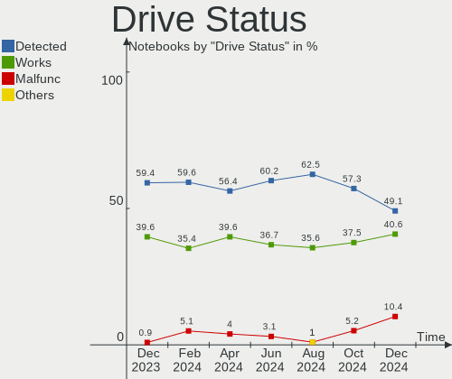
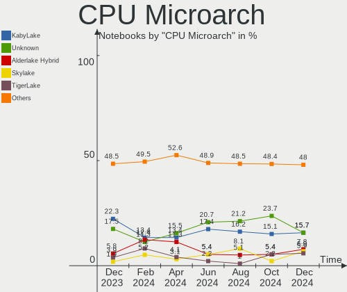
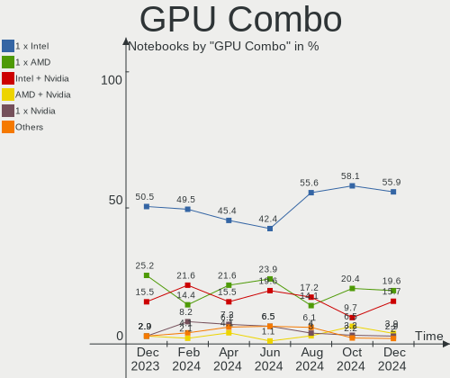
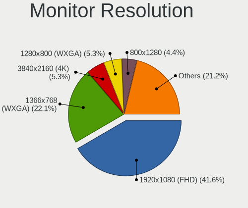
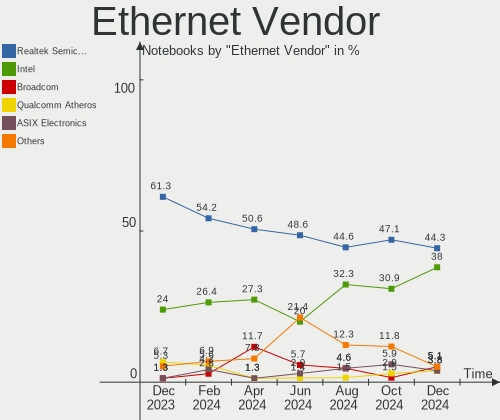
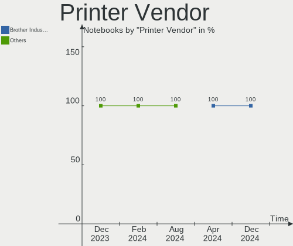
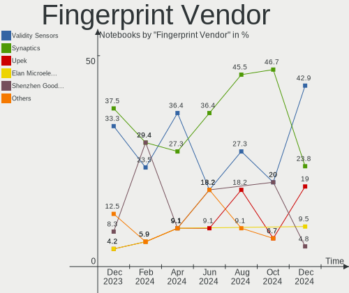

Linux in UK - Hardware Trends (Notebooks)
-----------------------------------------

A project to identify most popular hardware characteristics and track their change
over time based on data collected by Linux users at https://Linux-Hardware.org.

Anyone can contribute to this report by the [hw-probe](https://github.com/linuxhw/hw-probe) tool:

    sudo -E hw-probe -all -upload

Period: Nov, 2022.

Contents
--------

* [ System ](#system)
  - [ OS                       ](#os)
  - [ OS Family                ](#os-family)
  - [ Kernel                   ](#kernel)
  - [ Kernel Family            ](#kernel-family)
  - [ Kernel Major Ver.        ](#kernel-major-ver)
  - [ Arch                     ](#arch)
  - [ DE                       ](#de)
  - [ Display Server           ](#display-server)
  - [ Display Manager          ](#display-manager)
  - [ OS Lang                  ](#os-lang)
  - [ Boot Mode                ](#boot-mode)
  - [ Filesystem               ](#filesystem)
  - [ Part. scheme             ](#part-scheme)
  - [ Dual Boot with Linux/BSD ](#dual-boot-with-linuxbsd)
  - [ Dual Boot (Win)          ](#dual-boot-win)

* [ Board ](#board)
  - [ Vendor                   ](#vendor)
  - [ Model                    ](#model)
  - [ Model Family             ](#model-family)
  - [ MFG Year                 ](#mfg-year)
  - [ Form Factor              ](#form-factor)
  - [ Secure Boot              ](#secure-boot)
  - [ Coreboot                 ](#coreboot)
  - [ RAM Size                 ](#ram-size)
  - [ RAM Used                 ](#ram-used)
  - [ Total Drives             ](#total-drives)
  - [ Has CD-ROM               ](#has-cd-rom)
  - [ Has Ethernet             ](#has-ethernet)
  - [ Has WiFi                 ](#has-wifi)
  - [ Has Bluetooth            ](#has-bluetooth)

* [ Location ](#location)
  - [ Country                  ](#country)
  - [ City                     ](#city)

* [ Drives ](#drives)
  - [ Drive Vendor             ](#drive-vendor)
  - [ Drive Model              ](#drive-model)
  - [ HDD Vendor               ](#hdd-vendor)
  - [ SSD Vendor               ](#ssd-vendor)
  - [ Drive Kind               ](#drive-kind)
  - [ Drive Connector          ](#drive-connector)
  - [ Drive Size               ](#drive-size)
  - [ Space Total              ](#space-total)
  - [ Space Used               ](#space-used)
  - [ Malfunc. Drives          ](#malfunc-drives)
  - [ Malfunc. Drive Vendor    ](#malfunc-drive-vendor)
  - [ Malfunc. HDD Vendor      ](#malfunc-hdd-vendor)
  - [ Malfunc. Drive Kind      ](#malfunc-drive-kind)
  - [ Failed Drives            ](#failed-drives)
  - [ Failed Drive Vendor      ](#failed-drive-vendor)
  - [ Drive Status             ](#drive-status)

* [ Storage controller ](#storage-controller)
  - [ Storage Vendor           ](#storage-vendor)
  - [ Storage Model            ](#storage-model)
  - [ Storage Kind             ](#storage-kind)

* [ Processor ](#processor)
  - [ CPU Vendor               ](#cpu-vendor)
  - [ CPU Model                ](#cpu-model)
  - [ CPU Model Family         ](#cpu-model-family)
  - [ CPU Cores                ](#cpu-cores)
  - [ CPU Sockets              ](#cpu-sockets)
  - [ CPU Threads              ](#cpu-threads)
  - [ CPU Op-Modes             ](#cpu-op-modes)
  - [ CPU Microcode            ](#cpu-microcode)
  - [ CPU Microarch            ](#cpu-microarch)

* [ Graphics ](#graphics)
  - [ GPU Vendor               ](#gpu-vendor)
  - [ GPU Model                ](#gpu-model)
  - [ GPU Combo                ](#gpu-combo)
  - [ GPU Driver               ](#gpu-driver)
  - [ GPU Memory               ](#gpu-memory)

* [ Monitor ](#monitor)
  - [ Monitor Vendor           ](#monitor-vendor)
  - [ Monitor Model            ](#monitor-model)
  - [ Monitor Resolution       ](#monitor-resolution)
  - [ Monitor Diagonal         ](#monitor-diagonal)
  - [ Monitor Width            ](#monitor-width)
  - [ Aspect Ratio             ](#aspect-ratio)
  - [ Monitor Area             ](#monitor-area)
  - [ Pixel Density            ](#pixel-density)
  - [ Multiple Monitors        ](#multiple-monitors)

* [ Network ](#network)
  - [ Net Controller Vendor    ](#net-controller-vendor)
  - [ Net Controller Model     ](#net-controller-model)
  - [ Wireless Vendor          ](#wireless-vendor)
  - [ Wireless Model           ](#wireless-model)
  - [ Ethernet Vendor          ](#ethernet-vendor)
  - [ Ethernet Model           ](#ethernet-model)
  - [ Net Controller Kind      ](#net-controller-kind)
  - [ Used Controller          ](#used-controller)
  - [ NICs                     ](#nics)
  - [ IPv6                     ](#ipv6)

* [ Bluetooth ](#bluetooth)
  - [ Bluetooth Vendor         ](#bluetooth-vendor)
  - [ Bluetooth Model          ](#bluetooth-model)

* [ Sound ](#sound)
  - [ Sound Vendor             ](#sound-vendor)
  - [ Sound Model              ](#sound-model)

* [ Memory ](#memory)
  - [ Memory Vendor            ](#memory-vendor)
  - [ Memory Model             ](#memory-model)
  - [ Memory Kind              ](#memory-kind)
  - [ Memory Form Factor       ](#memory-form-factor)
  - [ Memory Size              ](#memory-size)
  - [ Memory Speed             ](#memory-speed)

* [ Printers & scanners ](#printers--scanners)
  - [ Printer Vendor           ](#printer-vendor)
  - [ Printer Model            ](#printer-model)
  - [ Scanner Vendor           ](#scanner-vendor)
  - [ Scanner Model            ](#scanner-model)

* [ Camera ](#camera)
  - [ Camera Vendor            ](#camera-vendor)
  - [ Camera Model             ](#camera-model)

* [ Security ](#security)
  - [ Fingerprint Vendor       ](#fingerprint-vendor)
  - [ Fingerprint Model        ](#fingerprint-model)
  - [ Chipcard Vendor          ](#chipcard-vendor)
  - [ Chipcard Model           ](#chipcard-model)

* [ Unsupported ](#unsupported)
  - [ Unsupported Devices      ](#unsupported-devices)
  - [ Unsupported Device Types ](#unsupported-device-types)

System
------

OS
--

Installed operating systems

| Name              | Notebooks | Percent |
|-------------------|-----------|---------|
| Ubuntu 22.04      | 20        | 19.8%   |
| Pop!_OS 22.04     | 12        | 11.88%  |
| Zorin 16          | 9         | 8.91%   |
| OpenMandriva 4.3  | 7         | 6.93%   |
| Linux Mint 21     | 7         | 6.93%   |
| SteamOS 3.3.2     | 4         | 3.96%   |
| Fedora 36         | 4         | 3.96%   |
| Ubuntu 22.10      | 3         | 2.97%   |
| Ubuntu 20.04      | 3         | 2.97%   |
| Ubuntu 18.04      | 3         | 2.97%   |
| SteamOS 3.4       | 3         | 2.97%   |
| Linux Mint 20.3   | 3         | 2.97%   |
| OpenMandriva 4.50 | 2         | 1.98%   |
| Manjaro           | 2         | 1.98%   |
| Kubuntu 22.10     | 2         | 1.98%   |
| KDE neon 22.04    | 2         | 1.98%   |
| Arch Rolling      | 2         | 1.98%   |
| Zorin 15          | 1         | 0.99%   |
| Xubuntu 22.10     | 1         | 0.99%   |
| Xubuntu 22.04     | 1         | 0.99%   |
| Ubuntu MATE 22.04 | 1         | 0.99%   |
| Ubuntu 21.04      | 1         | 0.99%   |
| Lubuntu 22.10     | 1         | 0.99%   |
| Linux Mint 20     | 1         | 0.99%   |
| Linux Mint 19.3   | 1         | 0.99%   |
| Kubuntu 22.04     | 1         | 0.99%   |
| KDE neon 20.04    | 1         | 0.99%   |
| Guix              | 1         | 0.99%   |
| Debian            | 1         | 0.99%   |
| CachyOS Rolling   | 1         | 0.99%   |

OS Family
---------

OS without a version

| Name         | Notebooks | Percent |
|--------------|-----------|---------|
| Ubuntu       | 30        | 29.7%   |
| Pop!_OS      | 12        | 11.88%  |
| Linux Mint   | 12        | 11.88%  |
| Zorin        | 10        | 9.9%    |
| OpenMandriva | 9         | 8.91%   |
| SteamOS      | 7         | 6.93%   |
| Fedora       | 4         | 3.96%   |
| Kubuntu      | 3         | 2.97%   |
| KDE neon     | 3         | 2.97%   |
| Xubuntu      | 2         | 1.98%   |
| Manjaro      | 2         | 1.98%   |
| Arch         | 2         | 1.98%   |
| Ubuntu MATE  | 1         | 0.99%   |
| Lubuntu      | 1         | 0.99%   |
| Guix         | 1         | 0.99%   |
| Debian       | 1         | 0.99%   |
| CachyOS      | 1         | 0.99%   |

Kernel
------

Version of the Linux kernel

| Version                    | Notebooks | Percent |
|----------------------------|-----------|---------|
| 5.15.0-52-generic          | 22        | 21.78%  |
| 5.15.0-53-generic          | 16        | 15.84%  |
| 6.0.6-76060006-generic     | 6         | 5.94%   |
| 5.16.7-desktop-1omv4003    | 6         | 5.94%   |
| 5.19.0-23-generic          | 5         | 4.95%   |
| 5.13.0-valve21.3-1-neptune | 4         | 3.96%   |
| 6.0.3-76060003-generic     | 3         | 2.97%   |
| 5.4.0-132-generic          | 3         | 2.97%   |
| 5.13.0-valve31-1-neptune   | 3         | 2.97%   |
| 6.0.5-200.fc36.x86_64      | 2         | 1.98%   |
| 5.4.0-131-generic          | 2         | 1.98%   |
| 5.19.12-desktop-2omv4090   | 2         | 1.98%   |
| 5.18.10-76051810-generic   | 2         | 1.98%   |
| 5.15.0-50-generic          | 2         | 1.98%   |
| 6.0.9-1-cachyos-bore-lto   | 1         | 0.99%   |
| 6.0.8-060008-generic       | 1         | 0.99%   |
| 6.0.7-200.fc36.x86_64      | 1         | 0.99%   |
| 6.0.7                      | 1         | 0.99%   |
| 6.0.2-76060002-generic     | 1         | 0.99%   |
| 6.0.10-arch2-1             | 1         | 0.99%   |
| 6.0.0-2-amd64              | 1         | 0.99%   |
| 5.4.0-128-generic          | 1         | 0.99%   |
| 5.4.0-126-generic          | 1         | 0.99%   |
| 5.4.0-100-generic          | 1         | 0.99%   |
| 5.19.9-200.fc36.x86_64     | 1         | 0.99%   |
| 5.19.5-arch1-1             | 1         | 0.99%   |
| 5.19.17-2-MANJARO          | 1         | 0.99%   |
| 5.19.0-21-generic          | 1         | 0.99%   |
| 5.19.0-1009-lowlatency     | 1         | 0.99%   |
| 5.16.13-desktop-1omv4003   | 1         | 0.99%   |
| 5.15.78-1-MANJARO          | 1         | 0.99%   |
| 5.15.0-25-generic          | 1         | 0.99%   |
| 5.14.0-1054-oem            | 1         | 0.99%   |
| 5.13.0-30-generic          | 1         | 0.99%   |
| 5.13.0-25-generic          | 1         | 0.99%   |
| 5.11.0-49-generic          | 1         | 0.99%   |
| 4.15.0-197-generic         | 1         | 0.99%   |

Kernel Family
-------------

Linux kernel without a distro release

| Version | Notebooks | Percent |
|---------|-----------|---------|
| 5.15.0  | 41        | 40.59%  |
| 5.13.0  | 9         | 8.91%   |
| 5.4.0   | 8         | 7.92%   |
| 5.19.0  | 7         | 6.93%   |
| 6.0.6   | 6         | 5.94%   |
| 5.16.7  | 6         | 5.94%   |
| 6.0.3   | 3         | 2.97%   |
| 6.0.7   | 2         | 1.98%   |
| 6.0.5   | 2         | 1.98%   |
| 5.19.12 | 2         | 1.98%   |
| 5.18.10 | 2         | 1.98%   |
| 6.0.9   | 1         | 0.99%   |
| 6.0.8   | 1         | 0.99%   |
| 6.0.2   | 1         | 0.99%   |
| 6.0.10  | 1         | 0.99%   |
| 6.0.0   | 1         | 0.99%   |
| 5.19.9  | 1         | 0.99%   |
| 5.19.5  | 1         | 0.99%   |
| 5.19.17 | 1         | 0.99%   |
| 5.16.13 | 1         | 0.99%   |
| 5.15.78 | 1         | 0.99%   |
| 5.14.0  | 1         | 0.99%   |
| 5.11.0  | 1         | 0.99%   |
| 4.15.0  | 1         | 0.99%   |

Kernel Major Ver.
-----------------

Linux kernel major version

| Version | Notebooks | Percent |
|---------|-----------|---------|
| 5.15    | 42        | 41.58%  |
| 6.0     | 18        | 17.82%  |
| 5.19    | 12        | 11.88%  |
| 5.13    | 9         | 8.91%   |
| 5.4     | 8         | 7.92%   |
| 5.16    | 7         | 6.93%   |
| 5.18    | 2         | 1.98%   |
| 5.14    | 1         | 0.99%   |
| 5.11    | 1         | 0.99%   |
| 4.15    | 1         | 0.99%   |

Arch
----

OS architecture (x86_64, i586, etc.)

| Name   | Notebooks | Percent |
|--------|-----------|---------|
| x86_64 | 99        | 98.02%  |
| i686   | 2         | 1.98%   |

DE
--

Desktop Environment

| Name             | Notebooks | Percent |
|------------------|-----------|---------|
| GNOME            | 53        | 52.48%  |
| KDE5             | 24        | 23.76%  |
| X-Cinnamon       | 11        | 10.89%  |
| XFCE             | 8         | 7.92%   |
| openbox          | 1         | 0.99%   |
| MATE             | 1         | 0.99%   |
| LXQt             | 1         | 0.99%   |
| lightdm-xsession | 1         | 0.99%   |
| KDE              | 1         | 0.99%   |

Display Server
--------------

X11 or Wayland

| Name    | Notebooks | Percent |
|---------|-----------|---------|
| X11     | 77        | 76.24%  |
| Wayland | 24        | 23.76%  |

Display Manager
---------------

SDDM, LightDM, etc.

| Name    | Notebooks | Percent |
|---------|-----------|---------|
| Unknown | 39        | 38.61%  |
| GDM3    | 32        | 31.68%  |
| SDDM    | 14        | 13.86%  |
| LightDM | 11        | 10.89%  |
| GDM     | 5         | 4.95%   |

OS Lang
-------

Language

| Lang  | Notebooks | Percent |
|-------|-----------|---------|
| en_GB | 83        | 82.18%  |
| en_US | 16        | 15.84%  |
| de_DE | 1         | 0.99%   |
| C     | 1         | 0.99%   |

Boot Mode
---------

EFI or BIOS

| Mode | Notebooks | Percent |
|------|-----------|---------|
| BIOS | 56        | 55.45%  |
| EFI  | 45        | 44.55%  |

Filesystem
----------

Type of filesystem

| Type    | Notebooks | Percent |
|---------|-----------|---------|
| Ext4    | 77        | 76.24%  |
| Btrfs   | 15        | 14.85%  |
| Overlay | 9         | 8.91%   |

Part. scheme
------------

Scheme of partitioning

| Type    | Notebooks | Percent |
|---------|-----------|---------|
| GPT     | 55        | 54.46%  |
| Unknown | 39        | 38.61%  |
| MBR     | 7         | 6.93%   |

Dual Boot with Linux/BSD
------------------------

Hosting more than one Linux/BSD

| Dual boot | Notebooks | Percent |
|-----------|-----------|---------|
| No        | 91        | 90.1%   |
| Yes       | 10        | 9.9%    |

Dual Boot (Win)
---------------

Hosting Linux and Windows

| Dual boot | Notebooks | Percent |
|-----------|-----------|---------|
| No        | 77        | 76.24%  |
| Yes       | 24        | 23.76%  |

Board
-----

Vendor
------

Motherboard manufacturer

| Name                | Notebooks | Percent |
|---------------------|-----------|---------|
| Hewlett-Packard     | 19        | 18.81%  |
| Dell                | 18        | 17.82%  |
| Lenovo              | 13        | 12.87%  |
| Valve               | 8         | 7.92%   |
| ASUSTek Computer    | 8         | 7.92%   |
| Acer                | 7         | 6.93%   |
| Samsung Electronics | 6         | 5.94%   |
| Toshiba             | 5         | 4.95%   |
| Apple               | 2         | 1.98%   |
| Timi                | 1         | 0.99%   |
| System76            | 1         | 0.99%   |
| Star Labs           | 1         | 0.99%   |
| Razer x Lambda      | 1         | 0.99%   |
| PC Specialist       | 1         | 0.99%   |
| OEGStone            | 1         | 0.99%   |
| Notebook            | 1         | 0.99%   |
| MSI                 | 1         | 0.99%   |
| Medion              | 1         | 0.99%   |
| Linx                | 1         | 0.99%   |
| GEO                 | 1         | 0.99%   |
| Fujitsu             | 1         | 0.99%   |
| Entroware           | 1         | 0.99%   |
| Dixonsxp            | 1         | 0.99%   |
| Alienware           | 1         | 0.99%   |

Model
-----

Motherboard model

| Name                                                                                     | Notebooks | Percent |
|------------------------------------------------------------------------------------------|-----------|---------|
| Valve Jupiter                                                                            | 8         | 7.92%   |
| Dell XPS 15 7590                                                                         | 3         | 2.97%   |
| Toshiba Satellite C50D-B                                                                 | 2         | 1.98%   |
| Samsung 350V5C/351V5C/3540VC/3440VC                                                      | 2         | 1.98%   |
| Dell Inspiron 7501                                                                       | 2         | 1.98%   |
| Toshiba Satellite Pro U500                                                               | 1         | 0.99%   |
| Toshiba Satellite L750                                                                   | 1         | 0.99%   |
| Toshiba Satellite L50D-B                                                                 | 1         | 0.99%   |
| Timi TM1613                                                                              | 1         | 0.99%   |
| System76 Oryx Pro                                                                        | 1         | 0.99%   |
| Star Labs StarBook                                                                       | 1         | 0.99%   |
| Samsung RV411/RV511/E3511/S3511/RV711/E3411                                              | 1         | 0.99%   |
| Samsung 700T1C                                                                           | 1         | 0.99%   |
| Samsung 400B2B/400B2B                                                                    | 1         | 0.99%   |
| Samsung 355V4C/355V4X/355V5C/355V5X/356V4C/356V4X/356V5C/356V5X/3445VC/3445VX/3545VC/354 | 1         | 0.99%   |
| Razer x Lambda TensorBook (late 2021)                                                    | 1         | 0.99%   |
| PC Specialist Elimina Iv 15                                                              | 1         | 0.99%   |
| OEGStone NOTCHA-322                                                                      | 1         | 0.99%   |
| Notebook PA70ES                                                                          | 1         | 0.99%   |
| MSI GL62 7QF                                                                             | 1         | 0.99%   |
| Medion BEAST X25                                                                         | 1         | 0.99%   |
| Linx LINX1010B                                                                           | 1         | 0.99%   |
| Lenovo V145-15AST 81MT                                                                   | 1         | 0.99%   |
| Lenovo ThinkPad X260 20F5S28R00                                                          | 1         | 0.99%   |
| Lenovo ThinkPad X1 Carbon Gen 8 20UAS1QG0C                                               | 1         | 0.99%   |
| Lenovo ThinkPad X1 Carbon 6th 20KH007BUK                                                 | 1         | 0.99%   |
| Lenovo ThinkPad T480 20L50004UK                                                          | 1         | 0.99%   |
| Lenovo ThinkPad P1 Gen 4i 20Y3001EUK                                                     | 1         | 0.99%   |
| Lenovo ThinkPad L520 78596CG                                                             | 1         | 0.99%   |
| Lenovo ThinkPad L13 20R3000FUK                                                           | 1         | 0.99%   |
| Lenovo ThinkPad E490 20N8000RUK                                                          | 1         | 0.99%   |
| Lenovo IdeaPadFlex 14 20308                                                              | 1         | 0.99%   |
| Lenovo IdeaPad S130-14IGM 81J2                                                           | 1         | 0.99%   |
| Lenovo IdeaPad 5 Pro 14ACN6 82L7                                                         | 1         | 0.99%   |
| Lenovo IdeaPad 320-15AST 80XV                                                            | 1         | 0.99%   |
| HP ProBook 455 G2                                                                        | 1         | 0.99%   |
| HP ProBook 450 G6                                                                        | 1         | 0.99%   |
| HP Presario CQ58                                                                         | 1         | 0.99%   |
| HP Pavilion g7                                                                           | 1         | 0.99%   |
| HP Pavilion dv6                                                                          | 1         | 0.99%   |

Model Family
------------

Motherboard model prefix

| Name                      | Notebooks | Percent |
|---------------------------|-----------|---------|
| Valve Jupiter             | 8         | 7.92%   |
| Lenovo ThinkPad           | 8         | 7.92%   |
| Dell Inspiron             | 8         | 7.92%   |
| HP EliteBook              | 7         | 6.93%   |
| Toshiba Satellite         | 5         | 4.95%   |
| Acer Aspire               | 5         | 4.95%   |
| Dell XPS                  | 4         | 3.96%   |
| Dell Latitude             | 4         | 3.96%   |
| Lenovo IdeaPad            | 3         | 2.97%   |
| HP Pavilion               | 3         | 2.97%   |
| Samsung 350V5C            | 2         | 1.98%   |
| HP ProBook                | 2         | 1.98%   |
| HP Laptop                 | 2         | 1.98%   |
| HP ENVY                   | 2         | 1.98%   |
| ASUS ZenBook              | 2         | 1.98%   |
| Timi TM1613               | 1         | 0.99%   |
| System76 Oryx             | 1         | 0.99%   |
| Star Labs StarBook        | 1         | 0.99%   |
| Samsung RV411             | 1         | 0.99%   |
| Samsung 700T1C            | 1         | 0.99%   |
| Samsung 400B2B            | 1         | 0.99%   |
| Samsung 355V4C            | 1         | 0.99%   |
| Razer x Lambda TensorBook | 1         | 0.99%   |
| PC Specialist Elimina     | 1         | 0.99%   |
| OEGStone NOTCHA-322       | 1         | 0.99%   |
| Notebook PA70ES           | 1         | 0.99%   |
| MSI GL62                  | 1         | 0.99%   |
| Medion BEAST              | 1         | 0.99%   |
| Linx LINX1010B            | 1         | 0.99%   |
| Lenovo V145-15AST         | 1         | 0.99%   |
| Lenovo IdeaPadFlex        | 1         | 0.99%   |
| HP Presario               | 1         | 0.99%   |
| HP ElitePad               | 1         | 0.99%   |
| HP 250                    | 1         | 0.99%   |
| GEO GEOBOOK               | 1         | 0.99%   |
| Fujitsu STYLISTIC         | 1         | 0.99%   |
| Entroware Hybris          | 1         | 0.99%   |
| Dixonsxp F71IX1           | 1         | 0.99%   |
| Dell Vostro               | 1         | 0.99%   |
| Dell G7                   | 1         | 0.99%   |

MFG Year
--------

Motherboard manufacture year

| Year | Notebooks | Percent |
|------|-----------|---------|
| 2020 | 13        | 12.87%  |
| 2022 | 12        | 11.88%  |
| 2019 | 11        | 10.89%  |
| 2011 | 10        | 9.9%    |
| 2018 | 9         | 8.91%   |
| 2021 | 8         | 7.92%   |
| 2008 | 7         | 6.93%   |
| 2016 | 6         | 5.94%   |
| 2014 | 6         | 5.94%   |
| 2013 | 5         | 4.95%   |
| 2010 | 4         | 3.96%   |
| 2012 | 3         | 2.97%   |
| 2017 | 2         | 1.98%   |
| 2015 | 2         | 1.98%   |
| 2007 | 2         | 1.98%   |
| 2006 | 1         | 0.99%   |

Form Factor
-----------

Physical design of the computer

| Name     | Notebooks | Percent |
|----------|-----------|---------|
| Notebook | 101       | 100%    |

Secure Boot
-----------

Enabled or disabled

| State    | Notebooks | Percent |
|----------|-----------|---------|
| Disabled | 92        | 91.09%  |
| Enabled  | 9         | 8.91%   |

Coreboot
--------

Have coreboot on board

| Used | Notebooks | Percent |
|------|-----------|---------|
| No   | 100       | 99.01%  |
| Yes  | 1         | 0.99%   |

RAM Size
--------

Total RAM memory

| Size in GB  | Notebooks | Percent |
|-------------|-----------|---------|
| 4.01-8.0    | 32        | 31.68%  |
| 8.01-16.0   | 28        | 27.72%  |
| 3.01-4.0    | 18        | 17.82%  |
| 16.01-24.0  | 8         | 7.92%   |
| 32.01-64.0  | 6         | 5.94%   |
| 64.01-256.0 | 5         | 4.95%   |
| 2.01-3.0    | 2         | 1.98%   |
| 24.01-32.0  | 1         | 0.99%   |
| 1.01-2.0    | 1         | 0.99%   |

RAM Used
--------

Used RAM memory

| Used GB   | Notebooks | Percent |
|-----------|-----------|---------|
| 1.01-2.0  | 36        | 35.64%  |
| 2.01-3.0  | 30        | 29.7%   |
| 3.01-4.0  | 15        | 14.85%  |
| 4.01-8.0  | 14        | 13.86%  |
| 8.01-16.0 | 4         | 3.96%   |
| 0.51-1.0  | 2         | 1.98%   |

Total Drives
------------

Number of drives on board

| Drives | Notebooks | Percent |
|--------|-----------|---------|
| 1      | 81        | 80.2%   |
| 2      | 19        | 18.81%  |
| 3      | 1         | 0.99%   |

Has CD-ROM
----------

Has CD-ROM on board

| Presented | Notebooks | Percent |
|-----------|-----------|---------|
| No        | 65        | 64.36%  |
| Yes       | 36        | 35.64%  |

Has Ethernet
------------

Has Ethernet on board

| Presented | Notebooks | Percent |
|-----------|-----------|---------|
| Yes       | 72        | 71.29%  |
| No        | 29        | 28.71%  |

Has WiFi
--------

Has WiFi module

| Presented | Notebooks | Percent |
|-----------|-----------|---------|
| Yes       | 99        | 98.02%  |
| No        | 2         | 1.98%   |

Has Bluetooth
-------------

Has Bluetooth module

| Presented | Notebooks | Percent |
|-----------|-----------|---------|
| Yes       | 85        | 84.16%  |
| No        | 16        | 15.84%  |

Location
--------

Country
-------

Geographic location (country)

| Country | Notebooks | Percent |
|---------|-----------|---------|
| UK      | 101       | 100%    |

City
----

Geographic location (city)

| City                 | Notebooks | Percent |
|----------------------|-----------|---------|
| London               | 9         | 8.91%   |
| Liverpool            | 4         | 3.96%   |
| Nottingham           | 3         | 2.97%   |
| Somerset             | 2         | 1.98%   |
| Richmond             | 2         | 1.98%   |
| Peterborough         | 2         | 1.98%   |
| Leeds                | 2         | 1.98%   |
| Colchester           | 2         | 1.98%   |
| City of London       | 2         | 1.98%   |
| Canterbury           | 2         | 1.98%   |
| Bristol              | 2         | 1.98%   |
| Birmingham           | 2         | 1.98%   |
| Ashford              | 2         | 1.98%   |
| York                 | 1         | 0.99%   |
| Witham               | 1         | 0.99%   |
| Windsor              | 1         | 0.99%   |
| Wigton               | 1         | 0.99%   |
| Whitby               | 1         | 0.99%   |
| West Malling         | 1         | 0.99%   |
| Totnes               | 1         | 0.99%   |
| Telford              | 1         | 0.99%   |
| Streatham            | 1         | 0.99%   |
| Stockport            | 1         | 0.99%   |
| Southwark            | 1         | 0.99%   |
| Shrewsbury           | 1         | 0.99%   |
| Sherburn in Elmet    | 1         | 0.99%   |
| Sevenoaks            | 1         | 0.99%   |
| Selby                | 1         | 0.99%   |
| Saint Neots          | 1         | 0.99%   |
| Royal Leamington Spa | 1         | 0.99%   |
| Ramsey               | 1         | 0.99%   |
| Radcliffe            | 1         | 0.99%   |
| Plymouth             | 1         | 0.99%   |
| Olney                | 1         | 0.99%   |
| Norwood              | 1         | 0.99%   |
| Norwich              | 1         | 0.99%   |
| Newcastle upon Tyne  | 1         | 0.99%   |
| Monifieth            | 1         | 0.99%   |
| Mitcham              | 1         | 0.99%   |
| Melrose              | 1         | 0.99%   |

Drives
------

Drive Vendor
------------

Hard drive vendors

| Vendor                      | Notebooks | Drives | Percent |
|-----------------------------|-----------|--------|---------|
| Samsung Electronics         | 15        | 17     | 13.16%  |
| Sandisk                     | 14        | 14     | 12.28%  |
| WDC                         | 13        | 13     | 11.4%   |
| Unknown                     | 12        | 13     | 10.53%  |
| Crucial                     | 8         | 9      | 7.02%   |
| Seagate                     | 7         | 7      | 6.14%   |
| Intel                       | 6         | 6      | 5.26%   |
| Toshiba                     | 5         | 5      | 4.39%   |
| Phison Electronics          | 5         | 5      | 4.39%   |
| SK hynix                    | 4         | 4      | 3.51%   |
| Hitachi                     | 4         | 4      | 3.51%   |
| KIOXIA                      | 3         | 3      | 2.63%   |
| Micron/Crucial Technology   | 2         | 3      | 1.75%   |
| Micron Technology           | 2         | 2      | 1.75%   |
| Apple                       | 2         | 2      | 1.75%   |
| PNY                         | 1         | 1      | 0.88%   |
| Phison                      | 1         | 1      | 0.88%   |
| Netac                       | 1         | 1      | 0.88%   |
| MAXIO Technology (Hangzhou) | 1         | 1      | 0.88%   |
| Kingston Technology Company | 1         | 1      | 0.88%   |
| Kingston                    | 1         | 1      | 0.88%   |
| Integral                    | 1         | 1      | 0.88%   |
| HGST                        | 1         | 1      | 0.88%   |
| China                       | 1         | 1      | 0.88%   |
| ACASIS                      | 1         | 1      | 0.88%   |
| A-DATA Technology           | 1         | 1      | 0.88%   |
| Unknown                     | 1         | 1      | 0.88%   |

Drive Model
-----------

Hard drive models

| Model                                             | Notebooks | Percent |
|---------------------------------------------------|-----------|---------|
| Phison PS5013 E13 NVMe Controller 256GB           | 4         | 3.45%   |
| Unknown MMC Card  64GB                            | 3         | 2.59%   |
| Unknown MMC Card  512GB                           | 3         | 2.59%   |
| Unknown NVMe SSD Drive 1TB                        | 2         | 1.72%   |
| Seagate ST1000LM035-1RK172 1TB                    | 2         | 1.72%   |
| Sandisk WD Blue SN550 NVMe SSD 1TB                | 2         | 1.72%   |
| SanDisk SD8SN8U-256G-1006 256GB SSD               | 2         | 1.72%   |
| Sandisk PC SN520 NVMe SSD 256GB                   | 2         | 1.72%   |
| Samsung SSD 970 EVO Plus 2TB                      | 2         | 1.72%   |
| Samsung SSD 840 EVO 250GB                         | 2         | 1.72%   |
| Samsung NVMe SSD Controller SM981/PM981/PM983 1TB | 2         | 1.72%   |
| Micron/Crucial P2 NVMe PCIe SSD 250GB             | 2         | 1.72%   |
| Intel SSDPEKNU010TZ 1TB                           | 2         | 1.72%   |
| Crucial CT500MX500SSD1 500GB                      | 2         | 1.72%   |
| Crucial CT240BX500SSD1 240GB                      | 2         | 1.72%   |
| Crucial CT1000BX500SSD1 1TB                       | 2         | 1.72%   |
| WDC WDS500G2B0C 500GB                             | 1         | 0.86%   |
| WDC WDS240G2G0A-00JH30 240GB SSD                  | 1         | 0.86%   |
| WDC WDS200T2B0B 2TB SSD                           | 1         | 0.86%   |
| WDC WD5000LPVX-00V0TT0 500GB                      | 1         | 0.86%   |
| WDC WD5000LPCX-21VHAT0 500GB                      | 1         | 0.86%   |
| WDC WD5000BPVT-00HXZT3 500GB                      | 1         | 0.86%   |
| WDC WD2500BEVS-75UST0 250GB                       | 1         | 0.86%   |
| WDC WD2500BEVS-22UST0 250GB                       | 1         | 0.86%   |
| WDC WD20SPZX-21UA7T0 2TB                          | 1         | 0.86%   |
| WDC WD10JPVX-60JC3T0 1TB                          | 1         | 0.86%   |
| WDC WD10JPVX-22JC3T0 1TB                          | 1         | 0.86%   |
| WDC PC SN730 SDBQNTY-256G-1001 256GB              | 1         | 0.86%   |
| WDC PC SN730 SDBPNTY-512G-1101 512GB              | 1         | 0.86%   |
| Unknown MMC Card  32GB                            | 1         | 0.86%   |
| Unknown MMC Card  256GB                           | 1         | 0.86%   |
| Unknown MMC Card  128GB                           | 1         | 0.86%   |
| Unknown DA4064  64GB                              | 1         | 0.86%   |
| Toshiba XG6 NVMe SSD Controller 256GB             | 1         | 0.86%   |
| Toshiba MQ01ACF050 500GB                          | 1         | 0.86%   |
| Toshiba MK5055GSX 500GB                           | 1         | 0.86%   |
| Toshiba MK3256GSY 320GB                           | 1         | 0.86%   |
| Toshiba MK1031GAS 100GB                           | 1         | 0.86%   |
| SK hynix PC611 NVMe 512GB                         | 1         | 0.86%   |
| SK hynix PC611 NVMe 1TB                           | 1         | 0.86%   |

HDD Vendor
----------

Hard disk drive vendors

| Vendor              | Notebooks | Drives | Percent |
|---------------------|-----------|--------|---------|
| WDC                 | 8         | 8      | 30.77%  |
| Seagate             | 7         | 7      | 26.92%  |
| Toshiba             | 4         | 4      | 15.38%  |
| Hitachi             | 4         | 4      | 15.38%  |
| Samsung Electronics | 1         | 1      | 3.85%   |
| HGST                | 1         | 1      | 3.85%   |
| Apple               | 1         | 1      | 3.85%   |

SSD Vendor
----------

Solid state drive vendors

| Vendor              | Notebooks | Drives | Percent |
|---------------------|-----------|--------|---------|
| Crucial             | 8         | 9      | 26.67%  |
| SanDisk             | 6         | 6      | 20%     |
| Samsung Electronics | 6         | 6      | 20%     |
| WDC                 | 2         | 2      | 6.67%   |
| SK hynix            | 1         | 1      | 3.33%   |
| PNY                 | 1         | 1      | 3.33%   |
| Netac               | 1         | 1      | 3.33%   |
| Kingston            | 1         | 1      | 3.33%   |
| Intel               | 1         | 1      | 3.33%   |
| Integral            | 1         | 1      | 3.33%   |
| China               | 1         | 1      | 3.33%   |
| Apple               | 1         | 1      | 3.33%   |

Drive Kind
----------

HDD or SSD

| Kind | Notebooks | Drives | Percent |
|------|-----------|--------|---------|
| NVMe | 45        | 51     | 40.91%  |
| SSD  | 28        | 31     | 25.45%  |
| HDD  | 26        | 26     | 23.64%  |
| MMC  | 11        | 11     | 10%     |

Drive Connector
---------------

SATA, SAS, NVMe, etc.

| Type | Notebooks | Drives | Percent |
|------|-----------|--------|---------|
| SATA | 52        | 57     | 47.71%  |
| NVMe | 45        | 50     | 41.28%  |
| MMC  | 11        | 11     | 10.09%  |
| SAS  | 1         | 1      | 0.92%   |

Drive Size
----------

Size of hard drive

| Size in TB | Notebooks | Drives | Percent |
|------------|-----------|--------|---------|
| 0.01-0.5   | 40        | 41     | 71.43%  |
| 0.51-1.0   | 13        | 13     | 23.21%  |
| 1.01-2.0   | 3         | 3      | 5.36%   |

Space Total
-----------

Amount of disk space available on the file system

| Size in GB     | Notebooks | Percent |
|----------------|-----------|---------|
| 251-500        | 29        | 28.71%  |
| 101-250        | 27        | 26.73%  |
| 501-1000       | 21        | 20.79%  |
| 1001-2000      | 8         | 7.92%   |
| 1-20           | 5         | 4.95%   |
| 51-100         | 5         | 4.95%   |
| 21-50          | 3         | 2.97%   |
| 2001-3000      | 2         | 1.98%   |
| More than 3000 | 1         | 0.99%   |

Space Used
----------

Amount of used disk space

| Used GB   | Notebooks | Percent |
|-----------|-----------|---------|
| 1-20      | 31        | 30.69%  |
| 21-50     | 21        | 20.79%  |
| 101-250   | 20        | 19.8%   |
| 251-500   | 11        | 10.89%  |
| 51-100    | 9         | 8.91%   |
| 501-1000  | 8         | 7.92%   |
| 1001-2000 | 1         | 0.99%   |

Malfunc. Drives
---------------

Drive models with a malfunction

| Model                                    | Notebooks | Drives | Percent |
|------------------------------------------|-----------|--------|---------|
| Toshiba MK3256GSY 320GB                  | 1         | 1      | 25%     |
| Seagate ST9750420AS 752GB                | 1         | 1      | 25%     |
| Samsung Electronics SSD 970 EVO Plus 2TB | 1         | 1      | 25%     |
| Hitachi HTS547575A9E384 752GB            | 1         | 1      | 25%     |

Malfunc. Drive Vendor
---------------------

Vendors of faulty drives

| Vendor              | Notebooks | Drives | Percent |
|---------------------|-----------|--------|---------|
| Toshiba             | 1         | 1      | 25%     |
| Seagate             | 1         | 1      | 25%     |
| Samsung Electronics | 1         | 1      | 25%     |
| Hitachi             | 1         | 1      | 25%     |

Malfunc. HDD Vendor
-------------------

Vendors of faulty HDD drives

| Vendor  | Notebooks | Drives | Percent |
|---------|-----------|--------|---------|
| Toshiba | 1         | 1      | 33.33%  |
| Seagate | 1         | 1      | 33.33%  |
| Hitachi | 1         | 1      | 33.33%  |

Malfunc. Drive Kind
-------------------

Kinds of faulty drives

| Kind | Notebooks | Drives | Percent |
|------|-----------|--------|---------|
| HDD  | 3         | 3      | 75%     |
| NVMe | 1         | 1      | 25%     |

Failed Drives
-------------

Failed drive models

Zero info for selected period =(

Failed Drive Vendor
-------------------

Failed drive vendors

Zero info for selected period =(

Drive Status
------------

Number of failed and malfunc. drives

| Status   | Notebooks | Drives | Percent |
|----------|-----------|--------|---------|
| Detected | 64        | 74     | 62.75%  |
| Works    | 34        | 41     | 33.33%  |
| Malfunc  | 4         | 4      | 3.92%   |

Storage controller
------------------

Storage Vendor
--------------

Storage controller vendors

| Vendor                         | Notebooks | Percent |
|--------------------------------|-----------|---------|
| Intel                          | 62        | 51.67%  |
| AMD                            | 15        | 12.5%   |
| SanDisk                        | 11        | 9.17%   |
| Samsung Electronics            | 10        | 8.33%   |
| Phison Electronics             | 6         | 5%      |
| SK hynix                       | 3         | 2.5%    |
| Toshiba America Info Systems   | 2         | 1.67%   |
| Micron/Crucial Technology      | 2         | 1.67%   |
| Micron Technology              | 2         | 1.67%   |
| KIOXIA                         | 2         | 1.67%   |
| Solid State Storage Technology | 1         | 0.83%   |
| MAXIO Technology (Hangzhou)    | 1         | 0.83%   |
| Kingston Technology Company    | 1         | 0.83%   |
| INNOGRIT                       | 1         | 0.83%   |
| ADATA Technology               | 1         | 0.83%   |

Storage Model
-------------

Storage controller models

| Model                                                                        | Notebooks | Percent |
|------------------------------------------------------------------------------|-----------|---------|
| AMD FCH SATA Controller [AHCI mode]                                          | 14        | 10.69%  |
| Intel 82801 Mobile SATA Controller [RAID mode]                               | 6         | 4.58%   |
| Intel 6 Series/C200 Series Chipset Family 6 port Mobile SATA AHCI Controller | 6         | 4.58%   |
| Samsung NVMe SSD Controller SM981/PM981/PM983                                | 5         | 3.82%   |
| Intel 7 Series Chipset Family 6-port SATA Controller [AHCI mode]             | 5         | 3.82%   |
| Phison PS5013 E13 NVMe Controller                                            | 4         | 3.05%   |
| Intel Sunrise Point-LP SATA Controller [AHCI mode]                           | 4         | 3.05%   |
| Intel Cannon Lake Mobile PCH SATA AHCI Controller                            | 4         | 3.05%   |
| Intel 82801IBM/IEM (ICH9M/ICH9M-E) 4 port SATA Controller [AHCI mode]        | 4         | 3.05%   |
| Intel 400 Series Chipset Family SATA AHCI Controller                         | 4         | 3.05%   |
| SanDisk WD Blue SN550 NVMe SSD                                               | 3         | 2.29%   |
| SanDisk Non-Volatile memory controller                                       | 3         | 2.29%   |
| Intel Volume Management Device NVMe RAID Controller                          | 3         | 2.29%   |
| Intel Comet Lake SATA AHCI Controller                                        | 3         | 2.29%   |
| Intel 82801HM/HEM (ICH8M/ICH8M-E) IDE Controller                             | 3         | 2.29%   |
| Intel 5 Series/3400 Series Chipset 4 port SATA AHCI Controller               | 3         | 2.29%   |
| Toshiba America Info Systems XG6 NVMe SSD Controller                         | 2         | 1.53%   |
| SK hynix Non-Volatile memory controller                                      | 2         | 1.53%   |
| SanDisk WD Black SN750 / PC SN730 NVMe SSD                                   | 2         | 1.53%   |
| SanDisk PC SN520 NVMe SSD                                                    | 2         | 1.53%   |
| Samsung NVMe SSD Controller 980                                              | 2         | 1.53%   |
| Micron/Crucial P2 NVMe PCIe SSD                                              | 2         | 1.53%   |
| Micron Non-Volatile memory controller                                        | 2         | 1.53%   |
| KIOXIA NVMe SSD Controller BG4                                               | 2         | 1.53%   |
| Intel SSD 660P Series                                                        | 2         | 1.53%   |
| Intel Non-Volatile memory controller                                         | 2         | 1.53%   |
| Intel Mobile 4 Series Chipset PT IDER Controller                             | 2         | 1.53%   |
| Intel Celeron/Pentium Silver Processor SATA Controller                       | 2         | 1.53%   |
| Intel 82801HM/HEM (ICH8M/ICH8M-E) SATA Controller [AHCI mode]                | 2         | 1.53%   |
| Intel 8 Series SATA Controller 1 [AHCI mode]                                 | 2         | 1.53%   |
| Solid State Storage Non-Volatile memory controller                           | 1         | 0.76%   |
| SK hynix BC511                                                               | 1         | 0.76%   |
| SanDisk WD Black 2018/SN750 / PC SN720 NVMe SSD                              | 1         | 0.76%   |
| Samsung NVMe SSD Controller SM951/PM951                                      | 1         | 0.76%   |
| Samsung NVMe SSD Controller PM9A1/PM9A3/980PRO                               | 1         | 0.76%   |
| Samsung Electronics SATA controller                                          | 1         | 0.76%   |
| Phison E16 PCIe4 NVMe Controller                                             | 1         | 0.76%   |
| Phison E12 NVMe Controller                                                   | 1         | 0.76%   |
| MAXIO (Hangzhou) NVMe SSD Controller MAP1202                                 | 1         | 0.76%   |
| Kingston Company OM3PDP3 NVMe SSD                                            | 1         | 0.76%   |

Storage Kind
------------

Kind of storage controller (IDE, SATA, NVMe, SAS, ...)

| Kind | Notebooks | Percent |
|------|-----------|---------|
| SATA | 62        | 49.6%   |
| NVMe | 45        | 36%     |
| RAID | 9         | 7.2%    |
| IDE  | 9         | 7.2%    |

Processor
---------

CPU Vendor
----------

Processor vendors

| Vendor | Notebooks | Percent |
|--------|-----------|---------|
| Intel  | 73        | 72.28%  |
| AMD    | 28        | 27.72%  |

CPU Model
---------

Processor models

| Model                                       | Notebooks | Percent |
|---------------------------------------------|-----------|---------|
| AMD Custom APU 0405                         | 8         | 7.92%   |
| Intel Core i7-8550U CPU @ 1.80GHz           | 3         | 2.97%   |
| Intel Core i5-8265U CPU @ 1.60GHz           | 3         | 2.97%   |
| AMD E1-6010 APU with AMD Radeon R2 Graphics | 3         | 2.97%   |
| Intel Core i7-8565U CPU @ 1.80GHz           | 2         | 1.98%   |
| Intel Core i7-10750H CPU @ 2.60GHz          | 2         | 1.98%   |
| Intel Core i7-10510U CPU @ 1.80GHz          | 2         | 1.98%   |
| Intel Core i5-6200U CPU @ 2.30GHz           | 2         | 1.98%   |
| Intel Core i5-1035G1 CPU @ 1.00GHz          | 2         | 1.98%   |
| Intel Core i5-10310U CPU @ 1.70GHz          | 2         | 1.98%   |
| Intel Core i3-2310M CPU @ 2.10GHz           | 2         | 1.98%   |
| Intel 11th Gen Core i7-11800H @ 2.30GHz     | 2         | 1.98%   |
| Intel 11th Gen Core i7-1165G7 @ 2.80GHz     | 2         | 1.98%   |
| Intel Pentium Dual-Core CPU T4200 @ 2.00GHz | 1         | 0.99%   |
| Intel Pentium Dual CPU T3200 @ 2.00GHz      | 1         | 0.99%   |
| Intel Pentium CPU 2020M @ 2.40GHz           | 1         | 0.99%   |
| Intel Core i9-9980HK CPU @ 2.40GHz          | 1         | 0.99%   |
| Intel Core i9-10885H CPU @ 2.40GHz          | 1         | 0.99%   |
| Intel Core i7-9750H CPU @ 2.60GHz           | 1         | 0.99%   |
| Intel Core i7-8750H CPU @ 2.20GHz           | 1         | 0.99%   |
| Intel Core i7-3630QM CPU @ 2.40GHz          | 1         | 0.99%   |
| Intel Core i7-2670QM CPU @ 2.20GHz          | 1         | 0.99%   |
| Intel Core i7-2640M CPU @ 2.80GHz           | 1         | 0.99%   |
| Intel Core i7-10875H CPU @ 2.30GHz          | 1         | 0.99%   |
| Intel Core i7 CPU M 620 @ 2.67GHz           | 1         | 0.99%   |
| Intel Core i5-9300H CPU @ 2.40GHz           | 1         | 0.99%   |
| Intel Core i5-8365U CPU @ 1.60GHz           | 1         | 0.99%   |
| Intel Core i5-7300HQ CPU @ 2.50GHz          | 1         | 0.99%   |
| Intel Core i5-7200U CPU @ 2.50GHz           | 1         | 0.99%   |
| Intel Core i5-6300U CPU @ 2.40GHz           | 1         | 0.99%   |
| Intel Core i5-5287U CPU @ 2.90GHz           | 1         | 0.99%   |
| Intel Core i5-4200U CPU @ 1.60GHz           | 1         | 0.99%   |
| Intel Core i5-3320M CPU @ 2.60GHz           | 1         | 0.99%   |
| Intel Core i5-3317U CPU @ 1.70GHz           | 1         | 0.99%   |
| Intel Core i5-3210M CPU @ 2.50GHz           | 1         | 0.99%   |
| Intel Core i5-2540M CPU @ 2.60GHz           | 1         | 0.99%   |
| Intel Core i5-2520M CPU @ 2.50GHz           | 1         | 0.99%   |
| Intel Core i5-2450M CPU @ 2.50GHz           | 1         | 0.99%   |
| Intel Core i5-2430M CPU @ 2.40GHz           | 1         | 0.99%   |
| Intel Core i5-10300H CPU @ 2.50GHz          | 1         | 0.99%   |

CPU Model Family
----------------

Processor model prefix

| Model                   | Notebooks | Percent |
|-------------------------|-----------|---------|
| Intel Core i5           | 27        | 26.73%  |
| Other                   | 17        | 16.83%  |
| Intel Core i7           | 16        | 15.84%  |
| Intel Core i3           | 5         | 4.95%   |
| Intel Core 2 Duo        | 5         | 4.95%   |
| Intel Celeron           | 4         | 3.96%   |
| AMD Ryzen 7             | 4         | 3.96%   |
| AMD E1                  | 3         | 2.97%   |
| Intel Core i9           | 2         | 1.98%   |
| Intel Atom              | 2         | 1.98%   |
| AMD Ryzen 5             | 2         | 1.98%   |
| Intel Pentium Dual-Core | 1         | 0.99%   |
| Intel Pentium Dual      | 1         | 0.99%   |
| Intel Pentium           | 1         | 0.99%   |
| Intel Core 2 Extreme    | 1         | 0.99%   |
| AMD Z                   | 1         | 0.99%   |
| AMD Turion 64 Mobile    | 1         | 0.99%   |
| AMD Ryzen 9             | 1         | 0.99%   |
| AMD Ryzen 5 PRO         | 1         | 0.99%   |
| AMD E2                  | 1         | 0.99%   |
| AMD E                   | 1         | 0.99%   |
| AMD A8                  | 1         | 0.99%   |
| AMD A6                  | 1         | 0.99%   |
| AMD A4                  | 1         | 0.99%   |
| AMD A10                 | 1         | 0.99%   |

CPU Cores
---------

Number of processor cores

| Number | Notebooks | Percent |
|--------|-----------|---------|
| 2      | 46        | 45.54%  |
| 4      | 37        | 36.63%  |
| 8      | 9         | 8.91%   |
| 6      | 6         | 5.94%   |
| 14     | 2         | 1.98%   |
| 1      | 1         | 0.99%   |

CPU Sockets
-----------

Number of sockets

| Number | Notebooks | Percent |
|--------|-----------|---------|
| 1      | 101       | 100%    |

CPU Threads
-----------

Threads per core (Hyper-Threading)

| Number | Notebooks | Percent |
|--------|-----------|---------|
| 2      | 73        | 72.28%  |
| 1      | 28        | 27.72%  |

CPU Op-Modes
------------

CPU Operation Modes (32-bit, 64-bit)

| Op mode        | Notebooks | Percent |
|----------------|-----------|---------|
| 32-bit, 64-bit | 101       | 100%    |

CPU Microcode
-------------

Microcode number

| Number     | Notebooks | Percent |
|------------|-----------|---------|
| Unknown    | 36        | 35.64%  |
| 0x206a7    | 8         | 7.92%   |
| 0x806ec    | 7         | 6.93%   |
| 0xa0652    | 4         | 3.96%   |
| 0x806c1    | 3         | 2.97%   |
| 0x30678    | 3         | 2.97%   |
| 0x906a3    | 2         | 1.98%   |
| 0x806ea    | 2         | 1.98%   |
| 0x806d1    | 2         | 1.98%   |
| 0x306a9    | 2         | 1.98%   |
| 0x20655    | 2         | 1.98%   |
| 0x1067a    | 2         | 1.98%   |
| 0x10676    | 2         | 1.98%   |
| 0x0a50000c | 2         | 1.98%   |
| 0x07030105 | 2         | 1.98%   |
| 0x906ed    | 1         | 0.99%   |
| 0x906ea    | 1         | 0.99%   |
| 0x906e9    | 1         | 0.99%   |
| 0x806e9    | 1         | 0.99%   |
| 0x706e5    | 1         | 0.99%   |
| 0x706a8    | 1         | 0.99%   |
| 0x706a1    | 1         | 0.99%   |
| 0x6fd      | 1         | 0.99%   |
| 0x6fb      | 1         | 0.99%   |
| 0x506c9    | 1         | 0.99%   |
| 0x406e3    | 1         | 0.99%   |
| 0x306d4    | 1         | 0.99%   |
| 0x20652    | 1         | 0.99%   |
| 0x0a404101 | 1         | 0.99%   |
| 0x08600104 | 1         | 0.99%   |
| 0x08200103 | 1         | 0.99%   |
| 0x08108102 | 1         | 0.99%   |
| 0x0810100b | 1         | 0.99%   |
| 0x07030104 | 1         | 0.99%   |
| 0x06006705 | 1         | 0.99%   |
| 0x06003106 | 1         | 0.99%   |
| 0x05000119 | 1         | 0.99%   |

CPU Microarch
-------------

Microarchitecture

| Name             | Notebooks | Percent |
|------------------|-----------|---------|
| KabyLake         | 20        | 19.8%   |
| Unknown          | 9         | 8.91%   |
| SandyBridge      | 8         | 7.92%   |
| Westmere         | 5         | 4.95%   |
| IvyBridge        | 5         | 4.95%   |
| CometLake        | 5         | 4.95%   |
| TigerLake        | 4         | 3.96%   |
| Penryn           | 4         | 3.96%   |
| Icelake          | 4         | 3.96%   |
| Core             | 4         | 3.96%   |
| Zen 2            | 3         | 2.97%   |
| Skylake          | 3         | 2.97%   |
| Silvermont       | 3         | 2.97%   |
| Puma             | 3         | 2.97%   |
| Zen 3            | 2         | 1.98%   |
| Zen              | 2         | 1.98%   |
| Haswell          | 2         | 1.98%   |
| Goldmont plus    | 2         | 1.98%   |
| Excavator        | 2         | 1.98%   |
| Bobcat           | 2         | 1.98%   |
| Alderlake Hybrid | 2         | 1.98%   |
| Zen+             | 1         | 0.99%   |
| Steamroller      | 1         | 0.99%   |
| Piledriver       | 1         | 0.99%   |
| K8 Hammer        | 1         | 0.99%   |
| K10 Llano        | 1         | 0.99%   |
| Goldmont         | 1         | 0.99%   |
| Broadwell        | 1         | 0.99%   |

Graphics
--------

GPU Vendor
----------

Vendors of graphics cards

| Vendor | Notebooks | Percent |
|--------|-----------|---------|
| Intel  | 67        | 54.47%  |
| AMD    | 33        | 26.83%  |
| Nvidia | 23        | 18.7%   |

GPU Model
---------

Graphics card models

| Model                                                                     | Notebooks | Percent |
|---------------------------------------------------------------------------|-----------|---------|
| Intel 2nd Generation Core Processor Family Integrated Graphics Controller | 8         | 6.25%   |
| AMD VanGogh [AMD Custom GPU 0405]                                         | 8         | 6.25%   |
| Intel WhiskeyLake-U GT2 [UHD Graphics 620]                                | 6         | 4.69%   |
| Intel Core Processor Integrated Graphics Controller                       | 5         | 3.91%   |
| Intel CometLake-U GT2 [UHD Graphics]                                      | 5         | 3.91%   |
| Intel CometLake-H GT2 [UHD Graphics]                                      | 5         | 3.91%   |
| Intel 3rd Gen Core processor Graphics Controller                          | 4         | 3.13%   |
| Nvidia TU117M [GeForce GTX 1650 Mobile / Max-Q]                           | 3         | 2.34%   |
| Intel UHD Graphics 620                                                    | 3         | 2.34%   |
| Intel TigerLake-LP GT2 [Iris Xe Graphics]                                 | 3         | 2.34%   |
| Intel Skylake GT2 [HD Graphics 520]                                       | 3         | 2.34%   |
| Intel Mobile GM965/GL960 Integrated Graphics Controller (secondary)       | 3         | 2.34%   |
| Intel Mobile GM965/GL960 Integrated Graphics Controller (primary)         | 3         | 2.34%   |
| Intel CoffeeLake-H GT2 [UHD Graphics 630]                                 | 3         | 2.34%   |
| Intel Atom Processor Z36xxx/Z37xxx Series Graphics & Display              | 3         | 2.34%   |
| AMD Renoir                                                                | 3         | 2.34%   |
| AMD Mullins [Radeon R2 Graphics]                                          | 3         | 2.34%   |
| Nvidia TU117M [GeForce GTX 1650 Ti Mobile]                                | 2         | 1.56%   |
| Nvidia TU106M [GeForce RTX 2060 Mobile]                                   | 2         | 1.56%   |
| Nvidia GA104M [GeForce RTX 3080 Mobile / Max-Q 8GB/16GB]                  | 2         | 1.56%   |
| Intel TigerLake-H GT1 [UHD Graphics]                                      | 2         | 1.56%   |
| Intel Iris Plus Graphics G1 (Ice Lake)                                    | 2         | 1.56%   |
| Intel Haswell-ULT Integrated Graphics Controller                          | 2         | 1.56%   |
| Intel GeminiLake [UHD Graphics 600]                                       | 2         | 1.56%   |
| Intel Alder Lake-P Integrated Graphics Controller                         | 2         | 1.56%   |
| AMD Stoney [Radeon R2/R3/R4/R5 Graphics]                                  | 2         | 1.56%   |
| AMD Picasso/Raven 2 [Radeon Vega Series / Radeon Vega Mobile Series]      | 2         | 1.56%   |
| AMD Cezanne [Radeon Vega Series / Radeon Vega Mobile Series]              | 2         | 1.56%   |
| Nvidia TU117M [GeForce MX450]                                             | 1         | 0.78%   |
| Nvidia TU117GLM [T1200 Laptop GPU]                                        | 1         | 0.78%   |
| Nvidia TU116M [GeForce GTX 1660 Ti Mobile]                                | 1         | 0.78%   |
| Nvidia TU106M [GeForce RTX 2060 Max-Q]                                    | 1         | 0.78%   |
| Nvidia GT216M [GeForce GT 330M]                                           | 1         | 0.78%   |
| Nvidia GP108BM [GeForce MX250]                                            | 1         | 0.78%   |
| Nvidia GP106BM [GeForce GTX 1060 Mobile 6GB]                              | 1         | 0.78%   |
| Nvidia GM108M [GeForce 940MX]                                             | 1         | 0.78%   |
| Nvidia GM107M [GeForce GTX 960M]                                          | 1         | 0.78%   |
| Nvidia GA107M [GeForce RTX 3050 Mobile]                                   | 1         | 0.78%   |
| Nvidia GA106M [GeForce RTX 3060 Mobile / Max-Q]                           | 1         | 0.78%   |
| Nvidia GA104 [Geforce RTX 3070 Ti Laptop GPU]                             | 1         | 0.78%   |

GPU Combo
---------

Combinations of graphics cards

| Name           | Notebooks | Percent |
|----------------|-----------|---------|
| 1 x Intel      | 49        | 48.51%  |
| 1 x AMD        | 25        | 24.75%  |
| Intel + Nvidia | 16        | 15.84%  |
| AMD + Nvidia   | 4         | 3.96%   |
| 1 x Nvidia     | 3         | 2.97%   |
| 2 x AMD        | 2         | 1.98%   |
| Intel + AMD    | 2         | 1.98%   |

GPU Driver
----------

Free vs proprietary

| Driver      | Notebooks | Percent |
|-------------|-----------|---------|
| Free        | 88        | 87.13%  |
| Proprietary | 13        | 12.87%  |

GPU Memory
----------

Total video memory

| Size in GB | Notebooks | Percent |
|------------|-----------|---------|
| Unknown    | 76        | 75.25%  |
| 0.01-0.5   | 14        | 13.86%  |
| 0.51-1.0   | 5         | 4.95%   |
| 3.01-4.0   | 3         | 2.97%   |
| 1.01-2.0   | 2         | 1.98%   |
| 5.01-6.0   | 1         | 0.99%   |

Monitor
-------

Monitor Vendor
--------------

Monitor vendors

| Vendor                  | Notebooks | Percent |
|-------------------------|-----------|---------|
| AU Optronics            | 22        | 19.47%  |
| Samsung Electronics     | 16        | 14.16%  |
| Chimei Innolux          | 16        | 14.16%  |
| LG Display              | 14        | 12.39%  |
| BOE                     | 12        | 10.62%  |
| Valve                   | 4         | 3.54%   |
| Chi Mei Optoelectronics | 4         | 3.54%   |
| Analogix                | 4         | 3.54%   |
| Sharp                   | 3         | 2.65%   |
| Iiyama                  | 3         | 2.65%   |
| InfoVision              | 2         | 1.77%   |
| Apple                   | 2         | 1.77%   |
| PANDA                   | 1         | 0.88%   |
| Lenovo                  | 1         | 0.88%   |
| InnoLux Display         | 1         | 0.88%   |
| Hewlett-Packard         | 1         | 0.88%   |
| Goldstar                | 1         | 0.88%   |
| Denver                  | 1         | 0.88%   |
| Dell                    | 1         | 0.88%   |
| CSO                     | 1         | 0.88%   |
| BenQ                    | 1         | 0.88%   |
| AOC                     | 1         | 0.88%   |
| Acer                    | 1         | 0.88%   |

Monitor Model
-------------

Monitor models

| Model                                                                 | Notebooks | Percent |
|-----------------------------------------------------------------------|-----------|---------|
| Valve ANX7530 U VLV3001 800x1280 100x150mm 7.1-inch                   | 4         | 3.45%   |
| Analogix ANX7530 U ANX7539 800x1280                                   | 4         | 3.45%   |
| AU Optronics LCD Monitor AUO21EC 1366x768 344x193mm 15.5-inch         | 3         | 2.59%   |
| Samsung Electronics LCD Monitor SEC5441 1366x768 344x194mm 15.5-inch  | 2         | 1.72%   |
| Samsung Electronics LCD Monitor SDCA029 3840x2160 344x194mm 15.5-inch | 2         | 1.72%   |
| Chimei Innolux LCD Monitor CMN15DB 1366x768 344x193mm 15.5-inch       | 2         | 1.72%   |
| AU Optronics LCD Monitor AUO38ED 1920x1080 344x193mm 15.5-inch        | 2         | 1.72%   |
| Sharp LCD Monitor SHP14D0 3840x2400 336x210mm 15.6-inch               | 1         | 0.86%   |
| Sharp LCD Monitor SHP14BA 1920x1080 344x194mm 15.5-inch               | 1         | 0.86%   |
| Sharp LCD Monitor SHP1447 1920x1080 294x165mm 13.3-inch               | 1         | 0.86%   |
| Samsung Electronics U32J59x SAM0F52 3840x2160 697x392mm 31.5-inch     | 1         | 0.86%   |
| Samsung Electronics SyncMaster SAM021E 1680x1050 433x271mm 20.1-inch  | 1         | 0.86%   |
| Samsung Electronics S34J55x SAM0F72 3440x1440 797x333mm 34.0-inch     | 1         | 0.86%   |
| Samsung Electronics LU28R55 SAM1017 3840x2160 632x360mm 28.6-inch     | 1         | 0.86%   |
| Samsung Electronics LU28R55 SAM1015 3840x2160 632x360mm 28.6-inch     | 1         | 0.86%   |
| Samsung Electronics LCD Monitor SEC5541 1366x768 344x193mm 15.5-inch  | 1         | 0.86%   |
| Samsung Electronics LCD Monitor SEC3157 1280x800 303x190mm 14.1-inch  | 1         | 0.86%   |
| Samsung Electronics LCD Monitor SEC3152 1366x768 344x194mm 15.5-inch  | 1         | 0.86%   |
| Samsung Electronics LCD Monitor SEC3145 1366x768 268x151mm 12.1-inch  | 1         | 0.86%   |
| Samsung Electronics LCD Monitor SEC304C 1366x768 309x174mm 14.0-inch  | 1         | 0.86%   |
| Samsung Electronics LCD Monitor SDC4347 1366x768 344x193mm 15.5-inch  | 1         | 0.86%   |
| Samsung Electronics LCD Monitor SDC4161 1920x1080 344x194mm 15.5-inch | 1         | 0.86%   |
| Samsung Electronics LCD Monitor SDC415F 3840x2160 344x194mm 15.5-inch | 1         | 0.86%   |
| Samsung Electronics LCD Monitor SDC4146 1366x768 344x194mm 15.5-inch  | 1         | 0.86%   |
| PANDA LCD Monitor NCP0035 1920x1080 344x194mm 15.5-inch               | 1         | 0.86%   |
| LG Display LCD Monitor LGD0637 1920x1080 344x194mm 15.5-inch          | 1         | 0.86%   |
| LG Display LCD Monitor LGD0621 1920x1080 382x215mm 17.3-inch          | 1         | 0.86%   |
| LG Display LCD Monitor LGD0615 1920x1080 382x215mm 17.3-inch          | 1         | 0.86%   |
| LG Display LCD Monitor LGD056D 1920x1080 382x215mm 17.3-inch          | 1         | 0.86%   |
| LG Display LCD Monitor LGD0521 1920x1080 309x174mm 14.0-inch          | 1         | 0.86%   |
| LG Display LCD Monitor LGD0460 1366x768 344x194mm 15.5-inch           | 1         | 0.86%   |
| LG Display LCD Monitor LGD0456 1366x768 344x194mm 15.5-inch           | 1         | 0.86%   |
| LG Display LCD Monitor LGD0398 1366x768 223x125mm 10.1-inch           | 1         | 0.86%   |
| LG Display LCD Monitor LGD033A 1366x768 344x194mm 15.5-inch           | 1         | 0.86%   |
| LG Display LCD Monitor LGD02F2 1366x768 344x194mm 15.5-inch           | 1         | 0.86%   |
| LG Display LCD Monitor LGD02DA 1920x1080 382x215mm 17.3-inch          | 1         | 0.86%   |
| LG Display LCD Monitor LGD027A 1600x900 382x215mm 17.3-inch           | 1         | 0.86%   |
| LG Display LCD Monitor LGD0266 1366x768 344x194mm 15.5-inch           | 1         | 0.86%   |
| LG Display LCD Monitor LGD01AF 1680x1050 331x207mm 15.4-inch          | 1         | 0.86%   |
| Lenovo LEN T34w-20 LEN61F3 3440x1440 797x334mm 34.0-inch              | 1         | 0.86%   |

Monitor Resolution
------------------

Monitor screen resolution

| Resolution         | Notebooks | Percent |
|--------------------|-----------|---------|
| 1920x1080 (FHD)    | 36        | 32.73%  |
| 1366x768 (WXGA)    | 35        | 31.82%  |
| 800x1280           | 8         | 7.27%   |
| 3840x2160 (4K)     | 5         | 4.55%   |
| 2560x1440 (QHD)    | 5         | 4.55%   |
| 1440x900 (WXGA+)   | 4         | 3.64%   |
| 3440x1440          | 3         | 2.73%   |
| 1280x800 (WXGA)    | 3         | 2.73%   |
| 2560x1600          | 2         | 1.82%   |
| 1680x1050 (WSXGA+) | 2         | 1.82%   |
| 1280x1024 (SXGA)   | 2         | 1.82%   |
| 3840x2400          | 1         | 0.91%   |
| 3840x1100          | 1         | 0.91%   |
| 2880x1800          | 1         | 0.91%   |
| 1920x1200 (WUXGA)  | 1         | 0.91%   |
| 1600x900 (HD+)     | 1         | 0.91%   |

Monitor Diagonal
----------------

Diagonal size in inches

| Inches  | Notebooks | Percent |
|---------|-----------|---------|
| 15      | 51        | 44.35%  |
| 13      | 15        | 13.04%  |
| 17      | 9         | 7.83%   |
| 14      | 8         | 6.96%   |
| 12      | 4         | 3.48%   |
| 7       | 4         | 3.48%   |
| Unknown | 4         | 3.48%   |
| 34      | 3         | 2.61%   |
| 31      | 2         | 1.74%   |
| 27      | 2         | 1.74%   |
| 23      | 2         | 1.74%   |
| 11      | 2         | 1.74%   |
| 10      | 2         | 1.74%   |
| 28      | 1         | 0.87%   |
| 24      | 1         | 0.87%   |
| 21      | 1         | 0.87%   |
| 20      | 1         | 0.87%   |
| 19      | 1         | 0.87%   |
| 18      | 1         | 0.87%   |
| 16      | 1         | 0.87%   |

Monitor Width
-------------

Physical width

| Width in mm | Notebooks | Percent |
|-------------|-----------|---------|
| 301-350     | 65        | 57.52%  |
| 201-300     | 14        | 12.39%  |
| 351-400     | 12        | 10.62%  |
| 501-600     | 5         | 4.42%   |
| 1-100       | 4         | 3.54%   |
| Unknown     | 4         | 3.54%   |
| 701-800     | 3         | 2.65%   |
| 601-700     | 3         | 2.65%   |
| 401-500     | 3         | 2.65%   |

Aspect Ratio
------------

Proportional relationship between the width and the height

| Ratio | Notebooks | Percent |
|-------|-----------|---------|
| 16/9  | 79        | 73.83%  |
| 16/10 | 14        | 13.08%  |
| 0.67  | 4         | 3.74%   |
| 0.62  | 4         | 3.74%   |
| 21/9  | 3         | 2.8%    |
| 5/4   | 2         | 1.87%   |
| 3.40  | 1         | 0.93%   |

Monitor Area
------------

Area in inch

| Area in inch | Notebooks | Percent |
|----------------|-----------|---------|
| 101-110        | 51        | 44.35%  |
| 81-90          | 17        | 14.78%  |
| 121-130        | 7         | 6.09%   |
| 351-500        | 6         | 5.22%   |
| 71-80          | 5         | 4.35%   |
| 61-70          | 4         | 3.48%   |
| 1-40           | 4         | 3.48%   |
| 201-250        | 4         | 3.48%   |
| Unknown        | 4         | 3.48%   |
| 51-60          | 3         | 2.61%   |
| 151-200        | 3         | 2.61%   |
| 41-50          | 2         | 1.74%   |
| 301-350        | 2         | 1.74%   |
| 141-150        | 1         | 0.87%   |
| 131-140        | 1         | 0.87%   |
| 111-120        | 1         | 0.87%   |

Pixel Density
-------------

Pixels per inch

| Density       | Notebooks | Percent |
|---------------|-----------|---------|
| 121-160       | 37        | 32.46%  |
| 101-120       | 33        | 28.95%  |
| 51-100        | 18        | 15.79%  |
| 161-240       | 17        | 14.91%  |
| More than 240 | 5         | 4.39%   |
| Unknown       | 4         | 3.51%   |

Multiple Monitors
-----------------

Total monitors connected

| Total | Notebooks | Percent |
|-------|-----------|---------|
| 1     | 84        | 83.17%  |
| 2     | 15        | 14.85%  |
| 3     | 2         | 1.98%   |

Network
-------

Net Controller Vendor
---------------------

Controller vendors

| Vendor                   | Notebooks | Percent |
|--------------------------|-----------|---------|
| Realtek Semiconductor    | 59        | 38.06%  |
| Intel                    | 49        | 31.61%  |
| Qualcomm Atheros         | 19        | 12.26%  |
| Broadcom                 | 11        | 7.1%    |
| MediaTek                 | 2         | 1.29%   |
| Marvell Technology Group | 2         | 1.29%   |
| DisplayLink              | 2         | 1.29%   |
| TP-Link                  | 1         | 0.65%   |
| Ralink                   | 1         | 0.65%   |
| Qualcomm                 | 1         | 0.65%   |
| Micro Star International | 1         | 0.65%   |
| JMicron Technology       | 1         | 0.65%   |
| Huawei Technologies      | 1         | 0.65%   |
| Hewlett-Packard          | 1         | 0.65%   |
| Broadcom Limited         | 1         | 0.65%   |
| Askey Computer           | 1         | 0.65%   |
| ASIX Electronics         | 1         | 0.65%   |
| AMD                      | 1         | 0.65%   |

Net Controller Model
--------------------

Controller models

| Model                                                             | Notebooks | Percent |
|-------------------------------------------------------------------|-----------|---------|
| Realtek RTL8111/8168/8411 PCI Express Gigabit Ethernet Controller | 26        | 14.61%  |
| Realtek RTL810xE PCI Express Fast Ethernet controller             | 11        | 6.18%   |
| Intel Wi-Fi 6 AX200                                               | 11        | 6.18%   |
| Realtek RTL8822CE 802.11ac PCIe Wireless Network Adapter          | 9         | 5.06%   |
| Realtek RTL8821CE 802.11ac PCIe Wireless Network Adapter          | 6         | 3.37%   |
| Realtek RTL8153 Gigabit Ethernet Adapter                          | 6         | 3.37%   |
| Qualcomm Atheros AR9485 Wireless Network Adapter                  | 5         | 2.81%   |
| Qualcomm Atheros QCA9565 / AR9565 Wireless Network Adapter        | 4         | 2.25%   |
| Qualcomm Atheros QCA9377 802.11ac Wireless Network Adapter        | 4         | 2.25%   |
| Intel Wireless-AC 9260                                            | 4         | 2.25%   |
| Intel Comet Lake PCH CNVi WiFi                                    | 4         | 2.25%   |
| Broadcom BCM4313 802.11bgn Wireless Network Adapter               | 4         | 2.25%   |
| Intel Wireless 8260                                               | 3         | 1.69%   |
| Intel Comet Lake PCH-LP CNVi WiFi                                 | 3         | 1.69%   |
| Intel 82579LM Gigabit Network Connection (Lewisville)             | 3         | 1.69%   |
| Realtek 802.11ac NIC                                              | 2         | 1.12%   |
| Qualcomm Atheros AR9285 Wireless Network Adapter (PCI-Express)    | 2         | 1.12%   |
| MediaTek MT7921 802.11ax PCI Express Wireless Network Adapter     | 2         | 1.12%   |
| Marvell Group 88E8040 PCI-E Fast Ethernet Controller              | 2         | 1.12%   |
| Intel Wireless 8265 / 8275                                        | 2         | 1.12%   |
| Intel Wireless 7260                                               | 2         | 1.12%   |
| Intel Wi-Fi 6 AX210/AX211/AX411 160MHz                            | 2         | 1.12%   |
| Intel Wi-Fi 6 AX201                                               | 2         | 1.12%   |
| Intel Ultimate N WiFi Link 5300                                   | 2         | 1.12%   |
| Intel Ethernet Connection (4) I219-V                              | 2         | 1.12%   |
| Intel Ethernet Connection (10) I219-V                             | 2         | 1.12%   |
| Intel Ethernet Connection (10) I219-LM                            | 2         | 1.12%   |
| Intel Centrino Ultimate-N 6300                                    | 2         | 1.12%   |
| Intel Cannon Point-LP CNVi [Wireless-AC]                          | 2         | 1.12%   |
| Intel Alder Lake-P PCH CNVi WiFi                                  | 2         | 1.12%   |
| Intel 82567LM Gigabit Network Connection                          | 2         | 1.12%   |
| TP-Link 802.11ac NIC                                              | 1         | 0.56%   |
| Realtek RTL8723BE PCIe Wireless Network Adapter                   | 1         | 0.56%   |
| Realtek RTL8191SEvB Wireless LAN Controller                       | 1         | 0.56%   |
| Realtek RTL8188CUS 802.11n WLAN Adapter                           | 1         | 0.56%   |
| Realtek RTL8125 2.5GbE Controller                                 | 1         | 0.56%   |
| Realtek RTL-8100/8101L/8139 PCI Fast Ethernet Adapter             | 1         | 0.56%   |
| Realtek Killer E2500 Gigabit Ethernet Controller                  | 1         | 0.56%   |
| Ralink RT3090 Wireless 802.11n 1T/1R PCIe                         | 1         | 0.56%   |
| Qualcomm QCA6390 Wireless Network Adapter                         | 1         | 0.56%   |

Wireless Vendor
---------------

Wireless vendors

| Vendor                   | Notebooks | Percent |
|--------------------------|-----------|---------|
| Intel                    | 48        | 46.6%   |
| Realtek Semiconductor    | 20        | 19.42%  |
| Qualcomm Atheros         | 16        | 15.53%  |
| Broadcom                 | 10        | 9.71%   |
| MediaTek                 | 2         | 1.94%   |
| TP-Link                  | 1         | 0.97%   |
| Ralink                   | 1         | 0.97%   |
| Qualcomm                 | 1         | 0.97%   |
| Micro Star International | 1         | 0.97%   |
| Hewlett-Packard          | 1         | 0.97%   |
| Broadcom Limited         | 1         | 0.97%   |
| Askey Computer           | 1         | 0.97%   |

Wireless Model
--------------

Wireless models

| Model                                                                   | Notebooks | Percent |
|-------------------------------------------------------------------------|-----------|---------|
| Intel Wi-Fi 6 AX200                                                     | 11        | 10.68%  |
| Realtek RTL8822CE 802.11ac PCIe Wireless Network Adapter                | 9         | 8.74%   |
| Realtek RTL8821CE 802.11ac PCIe Wireless Network Adapter                | 6         | 5.83%   |
| Qualcomm Atheros AR9485 Wireless Network Adapter                        | 5         | 4.85%   |
| Qualcomm Atheros QCA9565 / AR9565 Wireless Network Adapter              | 4         | 3.88%   |
| Qualcomm Atheros QCA9377 802.11ac Wireless Network Adapter              | 4         | 3.88%   |
| Intel Wireless-AC 9260                                                  | 4         | 3.88%   |
| Intel Comet Lake PCH CNVi WiFi                                          | 4         | 3.88%   |
| Broadcom BCM4313 802.11bgn Wireless Network Adapter                     | 4         | 3.88%   |
| Intel Wireless 8260                                                     | 3         | 2.91%   |
| Intel Comet Lake PCH-LP CNVi WiFi                                       | 3         | 2.91%   |
| Realtek 802.11ac NIC                                                    | 2         | 1.94%   |
| Qualcomm Atheros AR9285 Wireless Network Adapter (PCI-Express)          | 2         | 1.94%   |
| MediaTek MT7921 802.11ax PCI Express Wireless Network Adapter           | 2         | 1.94%   |
| Intel Wireless 8265 / 8275                                              | 2         | 1.94%   |
| Intel Wireless 7260                                                     | 2         | 1.94%   |
| Intel Wi-Fi 6 AX210/AX211/AX411 160MHz                                  | 2         | 1.94%   |
| Intel Wi-Fi 6 AX201                                                     | 2         | 1.94%   |
| Intel Ultimate N WiFi Link 5300                                         | 2         | 1.94%   |
| Intel Centrino Ultimate-N 6300                                          | 2         | 1.94%   |
| Intel Cannon Point-LP CNVi [Wireless-AC]                                | 2         | 1.94%   |
| Intel Alder Lake-P PCH CNVi WiFi                                        | 2         | 1.94%   |
| TP-Link 802.11ac NIC                                                    | 1         | 0.97%   |
| Realtek RTL8723BE PCIe Wireless Network Adapter                         | 1         | 0.97%   |
| Realtek RTL8191SEvB Wireless LAN Controller                             | 1         | 0.97%   |
| Realtek RTL8188CUS 802.11n WLAN Adapter                                 | 1         | 0.97%   |
| Ralink RT3090 Wireless 802.11n 1T/1R PCIe                               | 1         | 0.97%   |
| Qualcomm QCA6390 Wireless Network Adapter                               | 1         | 0.97%   |
| Qualcomm Atheros AR242x / AR542x Wireless Network Adapter (PCI-Express) | 1         | 0.97%   |
| Micro Star International RT2573                                         | 1         | 0.97%   |
| Intel Wireless 3165                                                     | 1         | 0.97%   |
| Intel WiFi Link 5100                                                    | 1         | 0.97%   |
| Intel Dual Band Wireless-AC 3168NGW [Stone Peak]                        | 1         | 0.97%   |
| Intel Dual Band Wireless-AC 3165 Plus Bluetooth                         | 1         | 0.97%   |
| Intel Centrino Wireless-N 1000 [Condor Peak]                            | 1         | 0.97%   |
| Intel Centrino Advanced-N 6235                                          | 1         | 0.97%   |
| Intel Centrino Advanced-N 6230 [Rainbow Peak]                           | 1         | 0.97%   |
| HP lt4120 Snapdragon X5 LTE                                             | 1         | 0.97%   |
| Broadcom Limited BCM4312 802.11b/g LP-PHY                               | 1         | 0.97%   |
| Broadcom BCM43602 802.11ac Wireless LAN SoC                             | 1         | 0.97%   |

Ethernet Vendor
---------------

Ethernet vendors

| Vendor                   | Notebooks | Percent |
|--------------------------|-----------|---------|
| Realtek Semiconductor    | 46        | 62.16%  |
| Intel                    | 14        | 18.92%  |
| Qualcomm Atheros         | 4         | 5.41%   |
| Broadcom                 | 3         | 4.05%   |
| Marvell Technology Group | 2         | 2.7%    |
| DisplayLink              | 2         | 2.7%    |
| JMicron Technology       | 1         | 1.35%   |
| Huawei Technologies      | 1         | 1.35%   |
| ASIX Electronics         | 1         | 1.35%   |

Ethernet Model
--------------

Ethernet models

| Model                                                             | Notebooks | Percent |
|-------------------------------------------------------------------|-----------|---------|
| Realtek RTL8111/8168/8411 PCI Express Gigabit Ethernet Controller | 26        | 35.14%  |
| Realtek RTL810xE PCI Express Fast Ethernet controller             | 11        | 14.86%  |
| Realtek RTL8153 Gigabit Ethernet Adapter                          | 6         | 8.11%   |
| Intel 82579LM Gigabit Network Connection (Lewisville)             | 3         | 4.05%   |
| Marvell Group 88E8040 PCI-E Fast Ethernet Controller              | 2         | 2.7%    |
| Intel Ethernet Connection (4) I219-V                              | 2         | 2.7%    |
| Intel Ethernet Connection (10) I219-V                             | 2         | 2.7%    |
| Intel Ethernet Connection (10) I219-LM                            | 2         | 2.7%    |
| Intel 82567LM Gigabit Network Connection                          | 2         | 2.7%    |
| Realtek RTL8125 2.5GbE Controller                                 | 1         | 1.35%   |
| Realtek RTL-8100/8101L/8139 PCI Fast Ethernet Adapter             | 1         | 1.35%   |
| Realtek Killer E2500 Gigabit Ethernet Controller                  | 1         | 1.35%   |
| Qualcomm Atheros QCA8171 Gigabit Ethernet                         | 1         | 1.35%   |
| Qualcomm Atheros AR8152 v2.0 Fast Ethernet                        | 1         | 1.35%   |
| Qualcomm Atheros AR8151 v2.0 Gigabit Ethernet                     | 1         | 1.35%   |
| Qualcomm Atheros AR8121/AR8113/AR8114 Gigabit or Fast Ethernet    | 1         | 1.35%   |
| JMicron JMC250 PCI Express Gigabit Ethernet Controller            | 1         | 1.35%   |
| Intel Ethernet Connection I219-V                                  | 1         | 1.35%   |
| Intel Ethernet Connection I219-LM                                 | 1         | 1.35%   |
| Intel Ethernet Connection (6) I219-LM                             | 1         | 1.35%   |
| Huawei SNE-LX1                                                    | 1         | 1.35%   |
| DisplayLink USB-C Dual-4K Dock                                    | 1         | 1.35%   |
| DisplayLink USB 3.0 DOCK                                          | 1         | 1.35%   |
| Broadcom NetXtreme BCM5764M Gigabit Ethernet PCIe                 | 1         | 1.35%   |
| Broadcom NetXtreme BCM5761 Gigabit Ethernet PCIe                  | 1         | 1.35%   |
| Broadcom NetLink BCM5906M Fast Ethernet PCI Express               | 1         | 1.35%   |
| ASIX AX88179 Gigabit Ethernet                                     | 1         | 1.35%   |

Net Controller Kind
-------------------

Ethernet, WiFi or modem

| Kind     | Notebooks | Percent |
|----------|-----------|---------|
| WiFi     | 99        | 57.89%  |
| Ethernet | 71        | 41.52%  |
| Modem    | 1         | 0.58%   |

Used Controller
---------------

Currently used network controller

| Kind     | Notebooks | Percent |
|----------|-----------|---------|
| WiFi     | 88        | 86.27%  |
| Ethernet | 14        | 13.73%  |

NICs
----

Total network controllers on board

| Total | Notebooks | Percent |
|-------|-----------|---------|
| 2     | 63        | 62.38%  |
| 1     | 34        | 33.66%  |
| 0     | 4         | 3.96%   |

IPv6
----

IPv6 vs IPv4

| Used | Notebooks | Percent |
|------|-----------|---------|
| No   | 77        | 76.24%  |
| Yes  | 24        | 23.76%  |

Bluetooth
---------

Bluetooth Vendor
----------------

Controller vendors

| Vendor                          | Notebooks | Percent |
|---------------------------------|-----------|---------|
| Intel                           | 39        | 45.35%  |
| IMC Networks                    | 11        | 12.79%  |
| Qualcomm Atheros Communications | 7         | 8.14%   |
| Realtek Semiconductor           | 6         | 6.98%   |
| Toshiba                         | 4         | 4.65%   |
| Lite-On Technology              | 3         | 3.49%   |
| Hewlett-Packard                 | 3         | 3.49%   |
| Broadcom                        | 3         | 3.49%   |
| Dell                            | 2         | 2.33%   |
| Cambridge Silicon Radio         | 2         | 2.33%   |
| Apple                           | 2         | 2.33%   |
| Ralink Technology               | 1         | 1.16%   |
| Foxconn / Hon Hai               | 1         | 1.16%   |
| Belkin Components               | 1         | 1.16%   |
| ASUSTek Computer                | 1         | 1.16%   |

Bluetooth Model
---------------

Controller models

| Model                                               | Notebooks | Percent |
|-----------------------------------------------------|-----------|---------|
| Intel AX200 Bluetooth                               | 11        | 12.79%  |
| IMC Networks Bluetooth Radio                        | 9         | 10.47%  |
| Intel AX201 Bluetooth                               | 8         | 9.3%    |
| Intel Bluetooth wireless interface                  | 7         | 8.14%   |
| Realtek Bluetooth Radio                             | 4         | 4.65%   |
| Intel Wireless-AC 9260 Bluetooth Adapter            | 4         | 4.65%   |
| Qualcomm Atheros  Bluetooth Device                  | 3         | 3.49%   |
| Qualcomm Atheros AR3012 Bluetooth 4.0               | 3         | 3.49%   |
| Intel Bluetooth 9460/9560 Jefferson Peak (JfP)      | 3         | 3.49%   |
| Toshiba Bluetooth Device                            | 2         | 2.33%   |
| Realtek  Bluetooth 4.2 Adapter                      | 2         | 2.33%   |
| Intel AX210 Bluetooth                               | 2         | 2.33%   |
| IMC Networks Wireless_Device                        | 2         | 2.33%   |
| HP Bluetooth 2.0 Interface [Broadcom BCM2045]       | 2         | 2.33%   |
| Dell DW375 Bluetooth Module                         | 2         | 2.33%   |
| Cambridge Silicon Radio Bluetooth Dongle (HCI mode) | 2         | 2.33%   |
| Apple Bluetooth Host Controller                     | 2         | 2.33%   |
| Toshiba Integrated Bluetooth HCI                    | 1         | 1.16%   |
| Toshiba BCM43142A0                                  | 1         | 1.16%   |
| Ralink Motorola BC4 Bluetooth 3.0+HS Adapter        | 1         | 1.16%   |
| Qualcomm Atheros AR3011 Bluetooth                   | 1         | 1.16%   |
| Lite-On Qualcomm Atheros QCA9377 Bluetooth          | 1         | 1.16%   |
| Lite-On Qualcomm Atheros Bluetooth                  | 1         | 1.16%   |
| Lite-On Atheros AR3012 Bluetooth                    | 1         | 1.16%   |
| Intel Wireless-AC 3168 Bluetooth                    | 1         | 1.16%   |
| Intel Centrino Bluetooth Wireless Transceiver       | 1         | 1.16%   |
| Intel Centrino Advanced-N 6230 Bluetooth adapter    | 1         | 1.16%   |
| Intel Bluetooth Device                              | 1         | 1.16%   |
| HP Broadcom 2070 Bluetooth Combo                    | 1         | 1.16%   |
| Foxconn / Hon Hai BCM20702A0                        | 1         | 1.16%   |
| Broadcom HP Portable Valentine                      | 1         | 1.16%   |
| Broadcom HP Portable SoftSailing                    | 1         | 1.16%   |
| Broadcom BCM2045B (BDC-2.1)                         | 1         | 1.16%   |
| Belkin Components Bluetooth Mini Dongle             | 1         | 1.16%   |
| ASUS BT-270 Bluetooth Adapter                       | 1         | 1.16%   |

Sound
-----

Sound Vendor
------------

Sound card vendors

| Vendor                 | Notebooks | Percent |
|------------------------|-----------|---------|
| Intel                  | 71        | 60.17%  |
| AMD                    | 28        | 23.73%  |
| Nvidia                 | 12        | 10.17%  |
| Realtek Semiconductor  | 2         | 1.69%   |
| Plantronics            | 1         | 0.85%   |
| Logitech               | 1         | 0.85%   |
| JMTek                  | 1         | 0.85%   |
| Generalplus Technology | 1         | 0.85%   |
| ASUSTek Computer       | 1         | 0.85%   |

Sound Model
-----------

Sound card models

| Model                                                                      | Notebooks | Percent |
|----------------------------------------------------------------------------|-----------|---------|
| Intel 6 Series/C200 Series Chipset Family High Definition Audio Controller | 8         | 5.84%   |
| AMD Rembrandt Radeon High Definition Audio Controller                      | 8         | 5.84%   |
| AMD FCH Azalia Controller                                                  | 8         | 5.84%   |
| AMD Family 17h/19h HD Audio Controller                                     | 8         | 5.84%   |
| Intel Sunrise Point-LP HD Audio                                            | 7         | 5.11%   |
| Intel Cannon Point-LP High Definition Audio Controller                     | 6         | 4.38%   |
| Intel Comet Lake PCH-LP cAVS                                               | 5         | 3.65%   |
| Intel Comet Lake PCH cAVS                                                  | 5         | 3.65%   |
| Intel 82801I (ICH9 Family) HD Audio Controller                             | 5         | 3.65%   |
| Intel 7 Series/C216 Chipset Family High Definition Audio Controller        | 5         | 3.65%   |
| Intel 5 Series/3400 Series Chipset High Definition Audio                   | 5         | 3.65%   |
| Intel Tiger Lake-LP Smart Sound Technology Audio Controller                | 4         | 2.92%   |
| Intel Cannon Lake PCH cAVS                                                 | 4         | 2.92%   |
| AMD Renoir Radeon High Definition Audio Controller                         | 4         | 2.92%   |
| Nvidia TU106 High Definition Audio Controller                              | 3         | 2.19%   |
| Nvidia GA104 High Definition Audio Controller                              | 3         | 2.19%   |
| Intel 82801H (ICH8 Family) HD Audio Controller                             | 3         | 2.19%   |
| AMD Kabini HDMI/DP Audio                                                   | 3         | 2.19%   |
| Realtek Semiconductor USB Audio                                            | 2         | 1.46%   |
| Nvidia TU107 GeForce GTX 1650 High Definition Audio Controller             | 2         | 1.46%   |
| Intel Tiger Lake-H HD Audio Controller                                     | 2         | 1.46%   |
| Intel Ice Lake-LP Smart Sound Technology Audio Controller                  | 2         | 1.46%   |
| Intel Haswell-ULT HD Audio Controller                                      | 2         | 1.46%   |
| Intel Celeron/Pentium Silver Processor High Definition Audio               | 2         | 1.46%   |
| Intel Alder Lake PCH-P High Definition Audio Controller                    | 2         | 1.46%   |
| Intel 8 Series HD Audio Controller                                         | 2         | 1.46%   |
| AMD Wrestler HDMI Audio                                                    | 2         | 1.46%   |
| AMD Raven/Raven2/Fenghuang HDMI/DP Audio Controller                        | 2         | 1.46%   |
| AMD High Definition Audio Controller                                       | 2         | 1.46%   |
| AMD Family 15h (Models 60h-6fh) Audio Controller                           | 2         | 1.46%   |
| Plantronics Poly BT700                                                     | 1         | 0.73%   |
| Nvidia TU116 High Definition Audio Controller                              | 1         | 0.73%   |
| Nvidia GT216 HDMI Audio Controller                                         | 1         | 0.73%   |
| Nvidia GP106 High Definition Audio Controller                              | 1         | 0.73%   |
| Nvidia GA106 High Definition Audio Controller                              | 1         | 0.73%   |
| Logitech Zone 900 Receiver                                                 | 1         | 0.73%   |
| JMTek USB PnP Audio Device                                                 | 1         | 0.73%   |
| Intel Wildcat Point-LP High Definition Audio Controller                    | 1         | 0.73%   |
| Intel CM238 HD Audio Controller                                            | 1         | 0.73%   |
| Intel Celeron N3350/Pentium N4200/Atom E3900 Series Audio Cluster          | 1         | 0.73%   |

Memory
------

Memory Vendor
-------------

Memory module vendors

| Vendor              | Notebooks | Percent |
|---------------------|-----------|---------|
| Samsung Electronics | 16        | 30.77%  |
| SK hynix            | 10        | 19.23%  |
| Micron Technology   | 6         | 11.54%  |
| Crucial             | 5         | 9.62%   |
| Kingston            | 4         | 7.69%   |
| Unknown             | 2         | 3.85%   |
| Nanya Technology    | 2         | 3.85%   |
| Elpida              | 2         | 3.85%   |
| Unknown (CB83)      | 1         | 1.92%   |
| Ramaxel Technology  | 1         | 1.92%   |
| Neo Forza           | 1         | 1.92%   |
| Gold Key            | 1         | 1.92%   |
| Corsair             | 1         | 1.92%   |

Memory Model
------------

Memory module models

| Model                                                            | Notebooks | Percent |
|------------------------------------------------------------------|-----------|---------|
| Samsung RAM M471A2G43AB2-CWE 16GB SODIMM DDR4 3200MT/s           | 2         | 3.7%    |
| Crucial RAM CT102464BF160B.C16 8GB SODIMM DDR3 1600MT/s          | 2         | 3.7%    |
| Unknown RAM Module 8192MB SODIMM DDR4 1866MT/s                   | 1         | 1.85%   |
| Unknown RAM Module 2GB SODIMM DDR2 667MT/s                       | 1         | 1.85%   |
| Unknown RAM Module 1GB SODIMM DDR2 667MT/s                       | 1         | 1.85%   |
| Unknown (CB83) RAM Module 8GB SODIMM DDR4 2667MT/s               | 1         | 1.85%   |
| SK hynix RAM Module 8GB SODIMM DDR4 2133MT/s                     | 1         | 1.85%   |
| SK hynix RAM HMT425S6AFR6A-PB 2GB SODIMM DDR3 1600MT/s           | 1         | 1.85%   |
| SK hynix RAM HMT41GS6BFR8A-PB 8GB SODIMM DDR3 1600MT/s           | 1         | 1.85%   |
| SK hynix RAM HMT351S6CFR8C-PB 4GB SODIMM DDR3 1600MT/s           | 1         | 1.85%   |
| SK hynix RAM HMT351S6CFR8C-H9 4GB SODIMM DDR3 1334MT/s           | 1         | 1.85%   |
| SK hynix RAM HMT351S6CFR8C-H9 4GB SODIMM DDR3 1333MT/s           | 1         | 1.85%   |
| SK hynix RAM HMT325S6CFR8C-PB 2GB SODIMM DDR3 1600MT/s           | 1         | 1.85%   |
| SK hynix RAM HMAA4GS6AJR8N-XN 32GB SODIMM DDR4 3200MT/s          | 1         | 1.85%   |
| SK hynix RAM HMA82GS6JJR8N-VK 16GB SODIMM DDR4 2667MT/s          | 1         | 1.85%   |
| SK hynix RAM HMA41GS6AFR8N-TF 8GB SODIMM DDR4 2667MT/s           | 1         | 1.85%   |
| SK hynix RAM H9JCNNNFA5MLYR-N6E 4GB Row Of Chips LPDDR5 6400MT/s | 1         | 1.85%   |
| Samsung RAM Module 8GB Row Of Chips LPDDR3 2133MT/s              | 1         | 1.85%   |
| Samsung RAM Module 4GB SODIMM DDR4 2400MT/s                      | 1         | 1.85%   |
| Samsung RAM Module 4GB SODIMM DDR3 1867MT/s                      | 1         | 1.85%   |
| Samsung RAM M471B5273DH0-CH9 4GB SODIMM DDR3 1334MT/s            | 1         | 1.85%   |
| Samsung RAM M471B5273CH0-CH9 4GB SODIMM DDR3 1334MT/s            | 1         | 1.85%   |
| Samsung RAM M471A4G43MB1-CTD 32GB SODIMM DDR4 2667MT/s           | 1         | 1.85%   |
| Samsung RAM M471A2K43CB1-CRC 16GB SODIMM DDR4 2667MT/s           | 1         | 1.85%   |
| Samsung RAM M471A1K43DB1-CTD 8GB SODIMM DDR4 2667MT/s            | 1         | 1.85%   |
| Samsung RAM M471A1K43BB0-CPB 8GB SODIMM DDR4 2133MT/s            | 1         | 1.85%   |
| Samsung RAM M471A1G44AB0-CWE 8GB SODIMM DDR4 3200MT/s            | 1         | 1.85%   |
| Samsung RAM M425R1GB4BB0-CQKOL 8GB SODIMM 4800MT/s               | 1         | 1.85%   |
| Samsung RAM K4UBE3D4AA-MGCL 8GB SODIMM LPDDR4 4266MT/s           | 1         | 1.85%   |
| Samsung RAM K4F8E304HB-MGCJ 1GB SODIMM LPDDR4 2400MT/s           | 1         | 1.85%   |
| Samsung RAM K4AAG165WA-BCWE 8GB SODIMM DDR4 3200MT/s             | 1         | 1.85%   |
| Ramaxel RAM RMSA3260NA78HAF-2666 8192MB SODIMM DDR4 2667MT/s     | 1         | 1.85%   |
| Neo Forza RAM NMSO432F82-3200E 32GB SODIMM DDR4 3200MT/s         | 1         | 1.85%   |
| Nanya RAM NT4GC64B8HG0NS-CG 4GB SODIMM DDR3 1334MT/s             | 1         | 1.85%   |
| Nanya RAM NT2GC64B88G0NS-DI 2GB SODIMM DDR3 1600MT/s             | 1         | 1.85%   |
| Micron RAM Module 8GB SODIMM DDR4 2667MT/s                       | 1         | 1.85%   |
| Micron RAM 9905599-020.A00G 16GB SODIMM DDR4 2400MT/s            | 1         | 1.85%   |
| Micron RAM 8ATF1G64HZ-2G3E1 8GB SODIMM DDR4 2400MT/s             | 1         | 1.85%   |
| Micron RAM 4ATS1G64HZ-2G6E1 8GB SODIMM DDR4 2667MT/s             | 1         | 1.85%   |
| Micron RAM 4ATF1G64HZ-3G2E1 8GB SODIMM DDR4 3200MT/s             | 1         | 1.85%   |

Memory Kind
-----------

Memory module kinds

| Kind   | Notebooks | Percent |
|--------|-----------|---------|
| DDR4   | 26        | 55.32%  |
| DDR3   | 14        | 29.79%  |
| LPDDR4 | 2         | 4.26%   |
| SDRAM  | 1         | 2.13%   |
| LPDDR5 | 1         | 2.13%   |
| LPDDR3 | 1         | 2.13%   |
| DDR5   | 1         | 2.13%   |
| DDR2   | 1         | 2.13%   |

Memory Form Factor
------------------

Physical design of the memory module

| Name         | Notebooks | Percent |
|--------------|-----------|---------|
| SODIMM       | 45        | 95.74%  |
| Row Of Chips | 2         | 4.26%   |

Memory Size
-----------

Memory module size

| Size  | Notebooks | Percent |
|-------|-----------|---------|
| 8192  | 22        | 44%     |
| 4096  | 11        | 22%     |
| 16384 | 7         | 14%     |
| 2048  | 5         | 10%     |
| 32768 | 4         | 8%      |
| 1024  | 1         | 2%      |

Memory Speed
------------

Memory module speed

| Speed | Notebooks | Percent |
|-------|-----------|---------|
| 3200  | 11        | 22.92%  |
| 2667  | 10        | 20.83%  |
| 1600  | 8         | 16.67%  |
| 2400  | 4         | 8.33%   |
| 1334  | 4         | 8.33%   |
| 2133  | 3         | 6.25%   |
| 6400  | 1         | 2.08%   |
| 4800  | 1         | 2.08%   |
| 4266  | 1         | 2.08%   |
| 2048  | 1         | 2.08%   |
| 1867  | 1         | 2.08%   |
| 1866  | 1         | 2.08%   |
| 1333  | 1         | 2.08%   |
| 667   | 1         | 2.08%   |

Printers & scanners
-------------------

Printer Vendor
--------------

Printer device vendors

| Vendor                | Notebooks | Percent |
|-----------------------|-----------|---------|
| Lexmark International | 1         | 100%    |

Printer Model
-------------

Printer device models

| Model                            | Notebooks | Percent |
|----------------------------------|-----------|---------|
| Lexmark International 640 Series | 1         | 100%    |

Scanner Vendor
--------------

Scanner device vendors

Zero info for selected period =(

Scanner Model
-------------

Scanner device models

Zero info for selected period =(

Camera
------

Camera Vendor
-------------

Camera device vendors

| Vendor                                 | Notebooks | Percent |
|----------------------------------------|-----------|---------|
| Chicony Electronics                    | 21        | 24.42%  |
| Microdia                               | 9         | 10.47%  |
| IMC Networks                           | 9         | 10.47%  |
| Acer                                   | 9         | 10.47%  |
| Silicon Motion                         | 5         | 5.81%   |
| Realtek Semiconductor                  | 5         | 5.81%   |
| Lite-On Technology                     | 5         | 5.81%   |
| Cheng Uei Precision Industry (Foxlink) | 5         | 5.81%   |
| Sunplus Innovation Technology          | 4         | 4.65%   |
| Quanta                                 | 4         | 4.65%   |
| Apple                                  | 2         | 2.33%   |
| Z-Star Microelectronics                | 1         | 1.16%   |
| Xiongmai                               | 1         | 1.16%   |
| Suyin                                  | 1         | 1.16%   |
| Sonix Technology                       | 1         | 1.16%   |
| Ricoh                                  | 1         | 1.16%   |
| Primax Electronics                     | 1         | 1.16%   |
| Luxvisions Innotech Limited            | 1         | 1.16%   |
| Logitech                               | 1         | 1.16%   |

Camera Model
------------

Camera device models

| Model                                               | Notebooks | Percent |
|-----------------------------------------------------|-----------|---------|
| Microdia Integrated_Webcam_HD                       | 6         | 6.9%    |
| IMC Networks USB2.0 HD UVC WebCam                   | 4         | 4.6%    |
| Sunplus Integrated_Webcam_HD                        | 3         | 3.45%   |
| Realtek Integrated_Webcam_HD                        | 3         | 3.45%   |
| Chicony Integrated Camera                           | 3         | 3.45%   |
| Acer BisonCam,NB Pro                                | 3         | 3.45%   |
| Silicon Motion WebCam SC-13HDL11939N                | 2         | 2.3%    |
| Quanta VGA WebCam                                   | 2         | 2.3%    |
| Lite-On HP HD Camera                                | 2         | 2.3%    |
| IMC Networks TOSHIBA Web Camera - HD                | 2         | 2.3%    |
| Chicony VGA Webcam                                  | 2         | 2.3%    |
| Chicony Integrated Camera (1280x720@30)             | 2         | 2.3%    |
| Chicony CKA7216                                     | 2         | 2.3%    |
| Acer BisonCam, NB Pro                               | 2         | 2.3%    |
| Z-Star WebCam SC-03FFL11739P                        | 1         | 1.15%   |
| Xiongmai web camera                                 | 1         | 1.15%   |
| Suyin Acer/HP Integrated Webcam [CN0314]            | 1         | 1.15%   |
| Sunplus Laptop_Integrated_Webcam_FHD                | 1         | 1.15%   |
| Sonix USB2.0 HD UVC WebCam                          | 1         | 1.15%   |
| Silicon Motion WebCam SCB-0385N                     | 1         | 1.15%   |
| Silicon Motion WebCam SC-50AFL11C54N                | 1         | 1.15%   |
| Silicon Motion WebCam SC-20HDM12347N                | 1         | 1.15%   |
| Silicon Motion WebCam SC-13HDN10939N                | 1         | 1.15%   |
| Ricoh Integrated Webcam                             | 1         | 1.15%   |
| Realtek USB Camera                                  | 1         | 1.15%   |
| Realtek EasyCamera                                  | 1         | 1.15%   |
| Quanta HP TrueVision HD Camera                      | 1         | 1.15%   |
| Quanta HP HD Camera                                 | 1         | 1.15%   |
| Primax HP HD Webcam [Fixed]                         | 1         | 1.15%   |
| Microdia Webcam Vitade AF                           | 1         | 1.15%   |
| Microdia Laptop_Integrated_Webcam_1.3M              | 1         | 1.15%   |
| Microdia Hy-HD-Camera                               | 1         | 1.15%   |
| Luxvisions Innotech Limited HP TrueVision HD Camera | 1         | 1.15%   |
| Logitech C920 PRO HD Webcam                         | 1         | 1.15%   |
| Lite-On TOSHIBA Web Camera - HD                     | 1         | 1.15%   |
| Lite-On HP Wide Vision HD Camera                    | 1         | 1.15%   |
| Lite-On HP Webcam                                   | 1         | 1.15%   |
| IMC Networks Integrated RGB Camera                  | 1         | 1.15%   |
| IMC Networks Integrated Camera                      | 1         | 1.15%   |
| IMC Networks EasyCamera                             | 1         | 1.15%   |

Security
--------

Fingerprint Vendor
------------------

Fingerprint sensor vendors

| Vendor                     | Notebooks | Percent |
|----------------------------|-----------|---------|
| Synaptics                  | 10        | 50%     |
| AuthenTec                  | 4         | 20%     |
| Validity Sensors           | 2         | 10%     |
| Upek                       | 2         | 10%     |
| Shenzhen Goodix Technology | 2         | 10%     |

Fingerprint Model
-----------------

Fingerprint sensor models

| Model                                                      | Notebooks | Percent |
|------------------------------------------------------------|-----------|---------|
| Upek Biometric Touchchip/Touchstrip Fingerprint Sensor     | 2         | 10%     |
| Synaptics  VFS7552 Touch Fingerprint Sensor with PurePrint | 2         | 10%     |
| Synaptics Metallica MIS Touch Fingerprint Reader           | 2         | 10%     |
| AuthenTec Fingerprint Sensor                               | 2         | 10%     |
| AuthenTec AES2810                                          | 2         | 10%     |
| Unknown                                                    | 2         | 10%     |
| Validity Sensors VFS491                                    | 1         | 5%      |
| Validity Sensors VFS471 Fingerprint Reader                 | 1         | 5%      |
| Synaptics WBDI Device                                      | 1         | 5%      |
| Synaptics  FS7604 Touch Fingerprint Sensor with PurePrint  | 1         | 5%      |
| Synaptics Prometheus MIS Touch Fingerprint Reader          | 1         | 5%      |
| Synaptics Metallica MOH Touch Fingerprint Reader           | 1         | 5%      |
| Shenzhen Goodix Fingerprint Reader                         | 1         | 5%      |
| Shenzhen Goodix FingerPrint                                | 1         | 5%      |

Chipcard Vendor
---------------

Chipcard module vendors

| Vendor      | Notebooks | Percent |
|-------------|-----------|---------|
| O2 Micro    | 2         | 33.33%  |
| Broadcom    | 2         | 33.33%  |
| Alcor Micro | 2         | 33.33%  |

Chipcard Model
--------------

Chipcard module models

| Model                                          | Notebooks | Percent |
|------------------------------------------------|-----------|---------|
| O2 Micro OZ776 CCID Smartcard Reader           | 2         | 33.33%  |
| Alcor Micro AU9540 Smartcard Reader            | 2         | 33.33%  |
| Broadcom BCM5880 Secure Applications Processor | 1         | 16.67%  |
| Broadcom 58200                                 | 1         | 16.67%  |

Unsupported
-----------

Unsupported Devices
-------------------

Total unsupported devices on board

| Total | Notebooks | Percent |
|-------|-----------|---------|
| 0     | 69        | 68.32%  |
| 1     | 25        | 24.75%  |
| 2     | 7         | 6.93%   |

Unsupported Device Types
------------------------

Types of unsupported devices

| Type                     | Notebooks | Percent |
|--------------------------|-----------|---------|
| Fingerprint reader       | 20        | 51.28%  |
| Chipcard                 | 6         | 15.38%  |
| Graphics card            | 5         | 12.82%  |
| Net/wireless             | 2         | 5.13%   |
| Multimedia controller    | 2         | 5.13%   |
| Storage/ide              | 1         | 2.56%   |
| Storage                  | 1         | 2.56%   |
| Communication controller | 1         | 2.56%   |
| Bluetooth                | 1         | 2.56%   |

