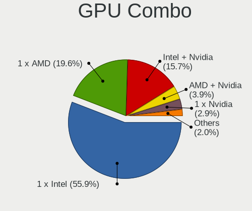
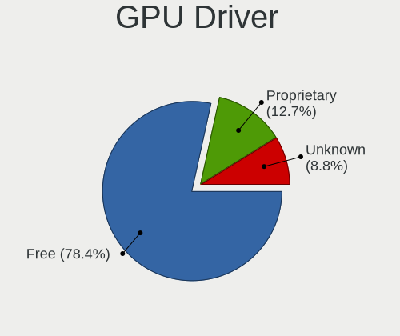
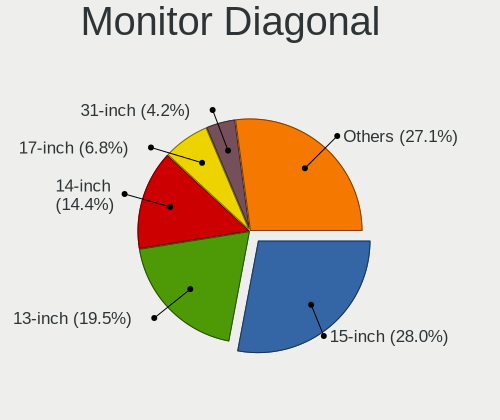
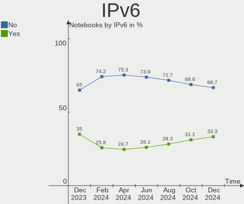
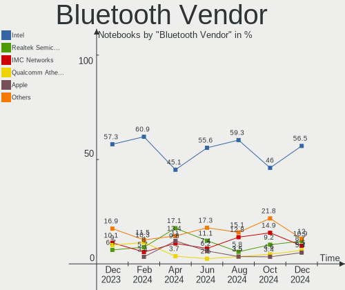
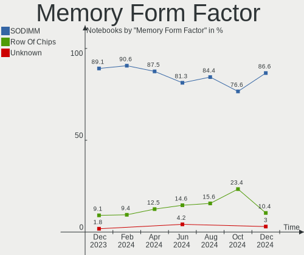
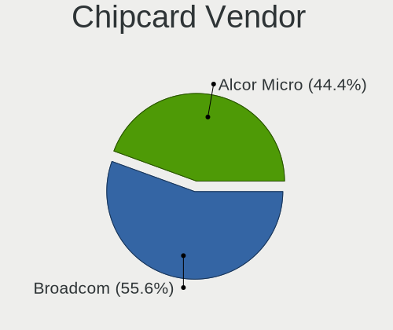

Linux in UK - Hardware Trends (Notebooks)
-----------------------------------------

A project to identify most popular hardware characteristics and track their change
over time based on data collected by Linux users at https://Linux-Hardware.org.

Anyone can contribute to this report by the [hw-probe](https://github.com/linuxhw/hw-probe) tool:

    sudo -E hw-probe -all -upload

Period: Apr, 2023.

Contents
--------

* [ System ](#system)
  - [ OS                       ](#os)
  - [ OS Family                ](#os-family)
  - [ Kernel                   ](#kernel)
  - [ Kernel Family            ](#kernel-family)
  - [ Kernel Major Ver.        ](#kernel-major-ver)
  - [ Arch                     ](#arch)
  - [ DE                       ](#de)
  - [ Display Server           ](#display-server)
  - [ Display Manager          ](#display-manager)
  - [ OS Lang                  ](#os-lang)
  - [ Boot Mode                ](#boot-mode)
  - [ Filesystem               ](#filesystem)
  - [ Part. scheme             ](#part-scheme)
  - [ Dual Boot with Linux/BSD ](#dual-boot-with-linuxbsd)
  - [ Dual Boot (Win)          ](#dual-boot-win)

* [ Board ](#board)
  - [ Vendor                   ](#vendor)
  - [ Model                    ](#model)
  - [ Model Family             ](#model-family)
  - [ MFG Year                 ](#mfg-year)
  - [ Form Factor              ](#form-factor)
  - [ Secure Boot              ](#secure-boot)
  - [ Coreboot                 ](#coreboot)
  - [ RAM Size                 ](#ram-size)
  - [ RAM Used                 ](#ram-used)
  - [ Total Drives             ](#total-drives)
  - [ Has CD-ROM               ](#has-cd-rom)
  - [ Has Ethernet             ](#has-ethernet)
  - [ Has WiFi                 ](#has-wifi)
  - [ Has Bluetooth            ](#has-bluetooth)

* [ Location ](#location)
  - [ Country                  ](#country)
  - [ City                     ](#city)

* [ Drives ](#drives)
  - [ Drive Vendor             ](#drive-vendor)
  - [ Drive Model              ](#drive-model)
  - [ HDD Vendor               ](#hdd-vendor)
  - [ SSD Vendor               ](#ssd-vendor)
  - [ Drive Kind               ](#drive-kind)
  - [ Drive Connector          ](#drive-connector)
  - [ Drive Size               ](#drive-size)
  - [ Space Total              ](#space-total)
  - [ Space Used               ](#space-used)
  - [ Malfunc. Drives          ](#malfunc-drives)
  - [ Malfunc. Drive Vendor    ](#malfunc-drive-vendor)
  - [ Malfunc. HDD Vendor      ](#malfunc-hdd-vendor)
  - [ Malfunc. Drive Kind      ](#malfunc-drive-kind)
  - [ Failed Drives            ](#failed-drives)
  - [ Failed Drive Vendor      ](#failed-drive-vendor)
  - [ Drive Status             ](#drive-status)

* [ Storage controller ](#storage-controller)
  - [ Storage Vendor           ](#storage-vendor)
  - [ Storage Model            ](#storage-model)
  - [ Storage Kind             ](#storage-kind)

* [ Processor ](#processor)
  - [ CPU Vendor               ](#cpu-vendor)
  - [ CPU Model                ](#cpu-model)
  - [ CPU Model Family         ](#cpu-model-family)
  - [ CPU Cores                ](#cpu-cores)
  - [ CPU Sockets              ](#cpu-sockets)
  - [ CPU Threads              ](#cpu-threads)
  - [ CPU Op-Modes             ](#cpu-op-modes)
  - [ CPU Microcode            ](#cpu-microcode)
  - [ CPU Microarch            ](#cpu-microarch)

* [ Graphics ](#graphics)
  - [ GPU Vendor               ](#gpu-vendor)
  - [ GPU Model                ](#gpu-model)
  - [ GPU Combo                ](#gpu-combo)
  - [ GPU Driver               ](#gpu-driver)
  - [ GPU Memory               ](#gpu-memory)

* [ Monitor ](#monitor)
  - [ Monitor Vendor           ](#monitor-vendor)
  - [ Monitor Model            ](#monitor-model)
  - [ Monitor Resolution       ](#monitor-resolution)
  - [ Monitor Diagonal         ](#monitor-diagonal)
  - [ Monitor Width            ](#monitor-width)
  - [ Aspect Ratio             ](#aspect-ratio)
  - [ Monitor Area             ](#monitor-area)
  - [ Pixel Density            ](#pixel-density)
  - [ Multiple Monitors        ](#multiple-monitors)

* [ Network ](#network)
  - [ Net Controller Vendor    ](#net-controller-vendor)
  - [ Net Controller Model     ](#net-controller-model)
  - [ Wireless Vendor          ](#wireless-vendor)
  - [ Wireless Model           ](#wireless-model)
  - [ Ethernet Vendor          ](#ethernet-vendor)
  - [ Ethernet Model           ](#ethernet-model)
  - [ Net Controller Kind      ](#net-controller-kind)
  - [ Used Controller          ](#used-controller)
  - [ NICs                     ](#nics)
  - [ IPv6                     ](#ipv6)

* [ Bluetooth ](#bluetooth)
  - [ Bluetooth Vendor         ](#bluetooth-vendor)
  - [ Bluetooth Model          ](#bluetooth-model)

* [ Sound ](#sound)
  - [ Sound Vendor             ](#sound-vendor)
  - [ Sound Model              ](#sound-model)

* [ Memory ](#memory)
  - [ Memory Vendor            ](#memory-vendor)
  - [ Memory Model             ](#memory-model)
  - [ Memory Kind              ](#memory-kind)
  - [ Memory Form Factor       ](#memory-form-factor)
  - [ Memory Size              ](#memory-size)
  - [ Memory Speed             ](#memory-speed)

* [ Printers & scanners ](#printers--scanners)
  - [ Printer Vendor           ](#printer-vendor)
  - [ Printer Model            ](#printer-model)
  - [ Scanner Vendor           ](#scanner-vendor)
  - [ Scanner Model            ](#scanner-model)

* [ Camera ](#camera)
  - [ Camera Vendor            ](#camera-vendor)
  - [ Camera Model             ](#camera-model)

* [ Security ](#security)
  - [ Fingerprint Vendor       ](#fingerprint-vendor)
  - [ Fingerprint Model        ](#fingerprint-model)
  - [ Chipcard Vendor          ](#chipcard-vendor)
  - [ Chipcard Model           ](#chipcard-model)

* [ Unsupported ](#unsupported)
  - [ Unsupported Devices      ](#unsupported-devices)
  - [ Unsupported Device Types ](#unsupported-device-types)

System
------

OS
--

Installed operating systems

| Name                         | Notebooks | Percent |
|------------------------------|-----------|---------|
| OpenMandriva 23.03           | 22        | 18.64%  |
| Linux Mint 21.1              | 12        | 10.17%  |
| Ubuntu 22.04                 | 10        | 8.47%   |
| Debian 11                    | 6         | 5.08%   |
| Pop!_OS 22.04                | 5         | 4.24%   |
| Fedora 38                    | 5         | 4.24%   |
| Ubuntu 22.10                 | 4         | 3.39%   |
| Zorin 16                     | 3         | 2.54%   |
| Manjaro                      | 3         | 2.54%   |
| Kali 2023.1                  | 3         | 2.54%   |
| Fedora 37                    | 3         | 2.54%   |
| Xubuntu 22.04                | 2         | 1.69%   |
| Ubuntu 23.04                 | 2         | 1.69%   |
| TUXEDO OS 22.04              | 2         | 1.69%   |
| SteamOS 3.4.6                | 2         | 1.69%   |
| Parrot 5.3                   | 2         | 1.69%   |
| Manjaro 22.1.0               | 2         | 1.69%   |
| Linux Mint 21                | 2         | 1.69%   |
| KDE neon 22.04               | 2         | 1.69%   |
| BunsenLabs 11                | 2         | 1.69%   |
| Arch Rolling                 | 2         | 1.69%   |
| Ubuntu Budgie 22.10          | 1         | 0.85%   |
| Ubuntu 20.04                 | 1         | 0.85%   |
| Parrot 5.2                   | 1         | 0.85%   |
| openSUSE Tumbleweed-XXXXXXXX | 1         | 0.85%   |
| OpenMandriva 4.3             | 1         | 0.85%   |
| OpenMandriva 23.01           | 1         | 0.85%   |
| Nobara 37                    | 1         | 0.85%   |
| MX 21                        | 1         | 0.85%   |
| LMDE 5                       | 1         | 0.85%   |
| Linux Lite 6.4               | 1         | 0.85%   |
| Kubuntu 23.04                | 1         | 0.85%   |
| Kubuntu 22.04                | 1         | 0.85%   |
| Garuda Linux Rolling         | 1         | 0.85%   |
| Feren OS 20.04               | 1         | 0.85%   |
| EndeavourOS Rolling          | 1         | 0.85%   |
| Elementary 7                 | 1         | 0.85%   |
| Debian 12                    | 1         | 0.85%   |
| ChimeraOS 41                 | 1         | 0.85%   |
| blendOS                      | 1         | 0.85%   |

OS Family
---------

OS without a version

| Name          | Notebooks | Percent |
|---------------|-----------|---------|
| OpenMandriva  | 24        | 20.34%  |
| Ubuntu        | 17        | 14.41%  |
| Linux Mint    | 14        | 11.86%  |
| Fedora        | 8         | 6.78%   |
| Debian        | 7         | 5.93%   |
| Pop!_OS       | 5         | 4.24%   |
| Manjaro       | 5         | 4.24%   |
| Zorin         | 3         | 2.54%   |
| Parrot        | 3         | 2.54%   |
| Kali          | 3         | 2.54%   |
| Xubuntu       | 2         | 1.69%   |
| TUXEDO OS     | 2         | 1.69%   |
| SteamOS       | 2         | 1.69%   |
| Kubuntu       | 2         | 1.69%   |
| KDE neon      | 2         | 1.69%   |
| BunsenLabs    | 2         | 1.69%   |
| Arch          | 2         | 1.69%   |
| Ubuntu Budgie | 1         | 0.85%   |
| openSUSE      | 1         | 0.85%   |
| Nobara        | 1         | 0.85%   |
| MX            | 1         | 0.85%   |
| LMDE          | 1         | 0.85%   |
| Linux Lite    | 1         | 0.85%   |
| Garuda Linux  | 1         | 0.85%   |
| Feren OS      | 1         | 0.85%   |
| EndeavourOS   | 1         | 0.85%   |
| Elementary    | 1         | 0.85%   |
| ChimeraOS     | 1         | 0.85%   |
| blendOS       | 1         | 0.85%   |
| BlackPanther  | 1         | 0.85%   |
| Artix         | 1         | 0.85%   |
| ArcoLinux     | 1         | 0.85%   |

Kernel
------

Version of the Linux kernel

| Version                      | Notebooks | Percent |
|------------------------------|-----------|---------|
| 6.2.6-desktop-1omv2390       | 22        | 18.64%  |
| 5.15.0-69-generic            | 14        | 11.86%  |
| 5.19.0-38-generic            | 12        | 10.17%  |
| 5.10.0-21-amd64              | 7         | 5.93%   |
| 6.2.6-76060206-generic       | 5         | 4.24%   |
| 6.1.0-kali7-amd64            | 3         | 2.54%   |
| 5.19.0-40-generic            | 3         | 2.54%   |
| 5.15.0-56-generic            | 3         | 2.54%   |
| 6.2.11-arch1-1               | 2         | 1.69%   |
| 6.2.11-300.fc38.x86_64       | 2         | 1.69%   |
| 6.2.0-20-generic             | 2         | 1.69%   |
| 6.2.0-10005-tuxedo           | 2         | 1.69%   |
| 6.1.0-1parrot1-amd64         | 2         | 1.69%   |
| 5.15.0-70-generic            | 2         | 1.69%   |
| 5.13.0-valve36-1-neptune     | 2         | 1.69%   |
| 6.2.9-zen1-1-zen             | 1         | 0.85%   |
| 6.2.9-arch1-1                | 1         | 0.85%   |
| 6.2.9-300.fc38.x86_64        | 1         | 0.85%   |
| 6.2.9-200.fc37.x86_64        | 1         | 0.85%   |
| 6.2.9-1-default              | 1         | 0.85%   |
| 6.2.8-200.fc37.x86_64        | 1         | 0.85%   |
| 6.2.7-x64v4-xanmod1          | 1         | 0.85%   |
| 6.2.13-artix1-1              | 1         | 0.85%   |
| 6.2.13-300.fc38.x86_64       | 1         | 0.85%   |
| 6.2.12-arch1-1               | 1         | 0.85%   |
| 6.2.12-300.fc38.x86_64       | 1         | 0.85%   |
| 6.2.11-201.fsync.fc37.x86_64 | 1         | 0.85%   |
| 6.2.11                       | 1         | 0.85%   |
| 6.2.10-arch1-1               | 1         | 0.85%   |
| 6.2.10-300.rog.fc37.x86_64   | 1         | 0.85%   |
| 6.2.10-1-MANJARO             | 1         | 0.85%   |
| 6.2.10-1-liquorix-amd64      | 1         | 0.85%   |
| 6.1.25-1-MANJARO             | 1         | 0.85%   |
| 6.1.23-1-MANJARO             | 1         | 0.85%   |
| 6.1.21-1-MANJARO             | 1         | 0.85%   |
| 6.1.21-1-lts                 | 1         | 0.85%   |
| 6.1.20-060120-generic        | 1         | 0.85%   |
| 6.1.19-1-MANJARO             | 1         | 0.85%   |
| 6.1.12-060112-generic        | 1         | 0.85%   |
| 6.1.1-desktop-1omv2290       | 1         | 0.85%   |

Kernel Family
-------------

Linux kernel without a distro release

| Version | Notebooks | Percent |
|---------|-----------|---------|
| 6.2.6   | 27        | 22.88%  |
| 5.15.0  | 20        | 16.95%  |
| 5.19.0  | 17        | 14.41%  |
| 5.10.0  | 8         | 6.78%   |
| 6.2.11  | 6         | 5.08%   |
| 6.1.0   | 6         | 5.08%   |
| 6.2.9   | 5         | 4.24%   |
| 6.2.10  | 4         | 3.39%   |
| 6.2.0   | 4         | 3.39%   |
| 6.2.13  | 2         | 1.69%   |
| 6.2.12  | 2         | 1.69%   |
| 6.1.21  | 2         | 1.69%   |
| 5.13.0  | 2         | 1.69%   |
| 6.2.8   | 1         | 0.85%   |
| 6.2.7   | 1         | 0.85%   |
| 6.1.25  | 1         | 0.85%   |
| 6.1.23  | 1         | 0.85%   |
| 6.1.20  | 1         | 0.85%   |
| 6.1.19  | 1         | 0.85%   |
| 6.1.12  | 1         | 0.85%   |
| 6.1.1   | 1         | 0.85%   |
| 6.0.2   | 1         | 0.85%   |
| 6.0.0   | 1         | 0.85%   |
| 5.6.14  | 1         | 0.85%   |
| 5.4.0   | 1         | 0.85%   |
| 5.16.13 | 1         | 0.85%   |

Kernel Major Ver.
-----------------

Linux kernel major version

| Version | Notebooks | Percent |
|---------|-----------|---------|
| 6.2     | 52        | 44.07%  |
| 5.15    | 20        | 16.95%  |
| 5.19    | 17        | 14.41%  |
| 6.1     | 14        | 11.86%  |
| 5.10    | 8         | 6.78%   |
| 6.0     | 2         | 1.69%   |
| 5.13    | 2         | 1.69%   |
| 5.6     | 1         | 0.85%   |
| 5.4     | 1         | 0.85%   |
| 5.16    | 1         | 0.85%   |

Arch
----

OS architecture (x86_64, i586, etc.)

| Name   | Notebooks | Percent |
|--------|-----------|---------|
| x86_64 | 118       | 100%    |

DE
--

Desktop Environment

| Name            | Notebooks | Percent |
|-----------------|-----------|---------|
| KDE5            | 47        | 39.83%  |
| GNOME           | 36        | 30.51%  |
| XFCE            | 10        | 8.47%   |
| X-Cinnamon      | 7         | 5.93%   |
| MATE            | 5         | 4.24%   |
| sway            | 1         | 0.85%   |
| Pantheon        | 1         | 0.85%   |
| mwm             | 1         | 0.85%   |
| LXDE            | 1         | 0.85%   |
| KDE             | 1         | 0.85%   |
| i3              | 1         | 0.85%   |
| GNOME Flashback | 1         | 0.85%   |
| GNOME Classic   | 1         | 0.85%   |
| Enlightenment   | 1         | 0.85%   |
| Cinnamon        | 1         | 0.85%   |
| BunsenLabs      | 1         | 0.85%   |
| Budgie          | 1         | 0.85%   |
| Unknown         | 1         | 0.85%   |

Display Server
--------------

X11 or Wayland

| Name    | Notebooks | Percent |
|---------|-----------|---------|
| X11     | 91        | 77.12%  |
| Wayland | 27        | 22.88%  |

Display Manager
---------------

SDDM, LightDM, etc.

| Name    | Notebooks | Percent |
|---------|-----------|---------|
| SDDM    | 37        | 31.36%  |
| Unknown | 32        | 27.12%  |
| LightDM | 24        | 20.34%  |
| GDM3    | 16        | 13.56%  |
| GDM     | 7         | 5.93%   |
| SLiM    | 1         | 0.85%   |
| LXDM    | 1         | 0.85%   |

OS Lang
-------

Language

| Lang    | Notebooks | Percent |
|---------|-----------|---------|
| en_GB   | 93        | 78.81%  |
| en_US   | 20        | 16.95%  |
| C       | 2         | 1.69%   |
| pl_PL   | 1         | 0.85%   |
| en_AU   | 1         | 0.85%   |
| Unknown | 1         | 0.85%   |

Boot Mode
---------

EFI or BIOS

| Mode | Notebooks | Percent |
|------|-----------|---------|
| EFI  | 70        | 59.32%  |
| BIOS | 48        | 40.68%  |

Filesystem
----------

Type of filesystem

| Type    | Notebooks | Percent |
|---------|-----------|---------|
| Ext4    | 85        | 72.03%  |
| Btrfs   | 19        | 16.1%   |
| Overlay | 10        | 8.47%   |
| Tmpfs   | 3         | 2.54%   |
| Zfs     | 1         | 0.85%   |

Part. scheme
------------

Scheme of partitioning

| Type    | Notebooks | Percent |
|---------|-----------|---------|
| GPT     | 71        | 60.17%  |
| Unknown | 31        | 26.27%  |
| MBR     | 16        | 13.56%  |

Dual Boot with Linux/BSD
------------------------

Hosting more than one Linux/BSD

| Dual boot | Notebooks | Percent |
|-----------|-----------|---------|
| No        | 98        | 83.05%  |
| Yes       | 20        | 16.95%  |

Dual Boot (Win)
---------------

Hosting Linux and Windows

| Dual boot | Notebooks | Percent |
|-----------|-----------|---------|
| No        | 90        | 76.27%  |
| Yes       | 28        | 23.73%  |

Board
-----

Vendor
------

Motherboard manufacturer

| Name                | Notebooks | Percent |
|---------------------|-----------|---------|
| Lenovo              | 31        | 26.27%  |
| Dell                | 18        | 15.25%  |
| Hewlett-Packard     | 16        | 13.56%  |
| ASUSTek Computer    | 11        | 9.32%   |
| Google              | 6         | 5.08%   |
| Acer                | 6         | 5.08%   |
| Toshiba             | 4         | 3.39%   |
| Apple               | 4         | 3.39%   |
| Valve               | 2         | 1.69%   |
| TUXEDO              | 2         | 1.69%   |
| Sony                | 2         | 1.69%   |
| Samsung Electronics | 2         | 1.69%   |
| LG Electronics      | 2         | 1.69%   |
| HUAWEI              | 2         | 1.69%   |
| Unknown             | 2         | 1.69%   |
| Novatech            | 1         | 0.85%   |
| MSI                 | 1         | 0.85%   |
| lapbook             | 1         | 0.85%   |
| HONOR               | 1         | 0.85%   |
| Gigabyte Technology | 1         | 0.85%   |
| Eii                 | 1         | 0.85%   |
| Clevo               | 1         | 0.85%   |
| Advent              | 1         | 0.85%   |

Model
-----

Motherboard model

| Name                                     | Notebooks | Percent |
|------------------------------------------|-----------|---------|
| Valve Jupiter                            | 2         | 1.69%   |
| HP Notebook                              | 2         | 1.69%   |
| Unknown                                  | 2         | 1.69%   |
| TUXEDO Pulse 15 Gen2                     | 1         | 0.85%   |
| TUXEDO InfinityBook Pro 14 Gen6          | 1         | 0.85%   |
| Toshiba Satellite Pro C850-1HE           | 1         | 0.85%   |
| Toshiba Satellite C660                   | 1         | 0.85%   |
| Toshiba Satellite C650                   | 1         | 0.85%   |
| Toshiba EQUIUM P200                      | 1         | 0.85%   |
| Sony SVF1521Q1EW                         | 1         | 0.85%   |
| Sony SVE1711C5E                          | 1         | 0.85%   |
| Samsung R530/R730/R540                   | 1         | 0.85%   |
| Samsung 950XCJ/951XCJ/950XCR             | 1         | 0.85%   |
| Novatech NL40_50CU                       | 1         | 0.85%   |
| MSI Stealth 14Studio A13VF               | 1         | 0.85%   |
| LG 17Z90Q-K.AA78A1                       | 1         | 0.85%   |
| LG 17Z90P-K.AA78A1                       | 1         | 0.85%   |
| Lenovo ThinkPad X270 W10DG 20K5S30300    | 1         | 0.85%   |
| Lenovo ThinkPad X270 W10DG 20K5S1R700    | 1         | 0.85%   |
| Lenovo ThinkPad X230 2325V1K             | 1         | 0.85%   |
| Lenovo ThinkPad X230 2325O32             | 1         | 0.85%   |
| Lenovo ThinkPad X1 Carbon 2nd 20A8S00C00 | 1         | 0.85%   |
| Lenovo ThinkPad T61 7661WQQ              | 1         | 0.85%   |
| Lenovo ThinkPad T530 24292DG             | 1         | 0.85%   |
| Lenovo ThinkPad T480 20L50000UK          | 1         | 0.85%   |
| Lenovo ThinkPad T460p 20FXS08N00         | 1         | 0.85%   |
| Lenovo ThinkPad P51 W10DG 20MNS08X00     | 1         | 0.85%   |
| Lenovo ThinkPad L480 20LTS1NK27          | 1         | 0.85%   |
| Lenovo ThinkPad L15 Gen 3 21C3CTO1WW     | 1         | 0.85%   |
| Lenovo ThinkPad E580 20KS001JUK          | 1         | 0.85%   |
| Lenovo ThinkPad 13 2nd Gen 20J1004DUK    | 1         | 0.85%   |
| Lenovo Legion Y530-15ICH-1060 81LB       | 1         | 0.85%   |
| Lenovo Legion 7-16-ITHg6 82K6            | 1         | 0.85%   |
| Lenovo Legion 7 16ACHg6 82N6             | 1         | 0.85%   |
| Lenovo Legion 7 15IMH05 81YT             | 1         | 0.85%   |
| Lenovo Legion 5P 15ARH05H 82GU           | 1         | 0.85%   |
| Lenovo IdeaPad Y700-15ISK 80NV           | 1         | 0.85%   |
| Lenovo IdeaPad Y510P 20217               | 1         | 0.85%   |
| Lenovo IdeaPad L340-15IRH Gaming 81LK    | 1         | 0.85%   |
| Lenovo IdeaPad 530S-14ARR 81H1           | 1         | 0.85%   |

Model Family
------------

Motherboard model prefix

| Name                | Notebooks | Percent |
|---------------------|-----------|---------|
| Lenovo ThinkPad     | 14        | 11.86%  |
| Lenovo IdeaPad      | 10        | 8.47%   |
| Dell Latitude       | 6         | 5.08%   |
| Lenovo Legion       | 5         | 4.24%   |
| Dell XPS            | 5         | 4.24%   |
| HP Pavilion         | 4         | 3.39%   |
| Dell Inspiron       | 4         | 3.39%   |
| Acer Aspire         | 4         | 3.39%   |
| Toshiba Satellite   | 3         | 2.54%   |
| HP ProBook          | 3         | 2.54%   |
| ASUS ASUS           | 3         | 2.54%   |
| Valve Jupiter       | 2         | 1.69%   |
| HP Notebook         | 2         | 1.69%   |
| HP Laptop           | 2         | 1.69%   |
| HP EliteBook        | 2         | 1.69%   |
| ASUS VivoBook       | 2         | 1.69%   |
| Acer Nitro          | 2         | 1.69%   |
| Unknown             | 2         | 1.69%   |
| TUXEDO Pulse        | 1         | 0.85%   |
| TUXEDO InfinityBook | 1         | 0.85%   |
| Toshiba EQUIUM      | 1         | 0.85%   |
| Sony SVF1521Q1EW    | 1         | 0.85%   |
| Sony SVE1711C5E     | 1         | 0.85%   |
| Samsung R530        | 1         | 0.85%   |
| Samsung 950XCJ      | 1         | 0.85%   |
| Novatech NL40       | 1         | 0.85%   |
| MSI Stealth         | 1         | 0.85%   |
| LG 17Z90Q-K.AA78A1  | 1         | 0.85%   |
| LG 17Z90P-K.AA78A1  | 1         | 0.85%   |
| Lenovo Flex         | 1         | 0.85%   |
| Lenovo Brazos       | 1         | 0.85%   |
| lapbook S15         | 1         | 0.85%   |
| HUAWEI NBLK-WAX9X   | 1         | 0.85%   |
| HUAWEI MRG-WXX      | 1         | 0.85%   |
| HONOR BBR-WAX9      | 1         | 0.85%   |
| HP Stream           | 1         | 0.85%   |
| HP ENVY             | 1         | 0.85%   |
| HP 250              | 1         | 0.85%   |
| Google Swanky       | 1         | 0.85%   |
| Google Sasuke       | 1         | 0.85%   |

MFG Year
--------

Motherboard manufacture year

| Year    | Notebooks | Percent |
|---------|-----------|---------|
| 2022    | 14        | 11.86%  |
| 2021    | 13        | 11.02%  |
| 2019    | 11        | 9.32%   |
| 2020    | 10        | 8.47%   |
| 2018    | 10        | 8.47%   |
| 2017    | 9         | 7.63%   |
| 2023    | 8         | 6.78%   |
| 2013    | 7         | 5.93%   |
| 2015    | 6         | 5.08%   |
| 2014    | 5         | 4.24%   |
| 2016    | 4         | 3.39%   |
| 2012    | 4         | 3.39%   |
| 2010    | 4         | 3.39%   |
| 2009    | 4         | 3.39%   |
| 2011    | 3         | 2.54%   |
| 2008    | 3         | 2.54%   |
| 2007    | 2         | 1.69%   |
| Unknown | 1         | 0.85%   |

Form Factor
-----------

Physical design of the computer

| Name     | Notebooks | Percent |
|----------|-----------|---------|
| Notebook | 118       | 100%    |

Secure Boot
-----------

Enabled or disabled

| State    | Notebooks | Percent |
|----------|-----------|---------|
| Disabled | 113       | 95.76%  |
| Enabled  | 5         | 4.24%   |

Coreboot
--------

Have coreboot on board

| Used | Notebooks | Percent |
|------|-----------|---------|
| No   | 111       | 94.07%  |
| Yes  | 7         | 5.93%   |

RAM Size
--------

Total RAM memory

| Size in GB  | Notebooks | Percent |
|-------------|-----------|---------|
| 4.01-8.0    | 39        | 33.05%  |
| 16.01-24.0  | 27        | 22.88%  |
| 3.01-4.0    | 20        | 16.95%  |
| 8.01-16.0   | 14        | 11.86%  |
| 32.01-64.0  | 9         | 7.63%   |
| 1.01-2.0    | 4         | 3.39%   |
| 64.01-256.0 | 3         | 2.54%   |
| 2.01-3.0    | 2         | 1.69%   |

RAM Used
--------

Used RAM memory

| Used GB   | Notebooks | Percent |
|-----------|-----------|---------|
| 1.01-2.0  | 38        | 32.2%   |
| 2.01-3.0  | 36        | 30.51%  |
| 3.01-4.0  | 22        | 18.64%  |
| 4.01-8.0  | 18        | 15.25%  |
| 8.01-16.0 | 2         | 1.69%   |
| 0.51-1.0  | 2         | 1.69%   |

Total Drives
------------

Number of drives on board

| Drives | Notebooks | Percent |
|--------|-----------|---------|
| 1      | 81        | 68.64%  |
| 2      | 31        | 26.27%  |
| 3      | 3         | 2.54%   |
| 0      | 2         | 1.69%   |
| 4      | 1         | 0.85%   |

Has CD-ROM
----------

Has CD-ROM on board

| Presented | Notebooks | Percent |
|-----------|-----------|---------|
| No        | 92        | 77.97%  |
| Yes       | 26        | 22.03%  |

Has Ethernet
------------

Has Ethernet on board

| Presented | Notebooks | Percent |
|-----------|-----------|---------|
| Yes       | 86        | 72.88%  |
| No        | 32        | 27.12%  |

Has WiFi
--------

Has WiFi module

| Presented | Notebooks | Percent |
|-----------|-----------|---------|
| Yes       | 115       | 97.46%  |
| No        | 3         | 2.54%   |

Has Bluetooth
-------------

Has Bluetooth module

| Presented | Notebooks | Percent |
|-----------|-----------|---------|
| Yes       | 94        | 79.66%  |
| No        | 24        | 20.34%  |

Location
--------

Country
-------

Geographic location (country)

| Country | Notebooks | Percent |
|---------|-----------|---------|
| UK      | 118       | 100%    |

City
----

Geographic location (city)

| City               | Notebooks | Percent |
|--------------------|-----------|---------|
| London             | 17        | 14.41%  |
| Manchester         | 4         | 3.39%   |
| Walsall            | 3         | 2.54%   |
| Reading            | 3         | 2.54%   |
| Liverpool          | 3         | 2.54%   |
| Exeter             | 3         | 2.54%   |
| Airdrie            | 3         | 2.54%   |
| Plymouth           | 2         | 1.69%   |
| Nottingham         | 2         | 1.69%   |
| Middlesbrough      | 2         | 1.69%   |
| Leigh-on-Sea       | 2         | 1.69%   |
| Hull               | 2         | 1.69%   |
| Hexham             | 2         | 1.69%   |
| City of London     | 2         | 1.69%   |
| Cardiff            | 2         | 1.69%   |
| Birmingham         | 2         | 1.69%   |
| York               | 1         | 0.85%   |
| Worcester          | 1         | 0.85%   |
| Wincanton          | 1         | 0.85%   |
| Wigan              | 1         | 0.85%   |
| Whitley Bay        | 1         | 0.85%   |
| West Drayton       | 1         | 0.85%   |
| Welwyn Garden City | 1         | 0.85%   |
| Watford            | 1         | 0.85%   |
| Wakefield          | 1         | 0.85%   |
| Thamesmead         | 1         | 0.85%   |
| Taunton            | 1         | 0.85%   |
| Tamworth           | 1         | 0.85%   |
| Swinton            | 1         | 0.85%   |
| Swindon            | 1         | 0.85%   |
| Surbiton           | 1         | 0.85%   |
| Stoke-on-Trent     | 1         | 0.85%   |
| Southsea           | 1         | 0.85%   |
| Southampton        | 1         | 0.85%   |
| Slough             | 1         | 0.85%   |
| Rochford           | 1         | 0.85%   |
| Radstock           | 1         | 0.85%   |
| Preston            | 1         | 0.85%   |
| Peterborough       | 1         | 0.85%   |
| Oldham             | 1         | 0.85%   |

Drives
------

Drive Vendor
------------

Hard drive vendors

| Vendor                      | Notebooks | Drives | Percent |
|-----------------------------|-----------|--------|---------|
| Samsung Electronics         | 25        | 28     | 17.48%  |
| WDC                         | 17        | 17     | 11.89%  |
| Unknown                     | 12        | 15     | 8.39%   |
| Toshiba                     | 12        | 12     | 8.39%   |
| SK hynix                    | 8         | 8      | 5.59%   |
| Seagate                     | 7         | 7      | 4.9%    |
| Kingston                    | 7         | 7      | 4.9%    |
| Crucial                     | 6         | 7      | 4.2%    |
| SanDisk                     | 5         | 5      | 3.5%    |
| China                       | 5         | 5      | 3.5%    |
| Intel                       | 3         | 3      | 2.1%    |
| Phison Electronics          | 2         | 2      | 1.4%    |
| Phison                      | 2         | 2      | 1.4%    |
| Netac                       | 2         | 2      | 1.4%    |
| Micron Technology           | 2         | 2      | 1.4%    |
| LITEON                      | 2         | 2      | 1.4%    |
| Lenovo                      | 2         | 2      | 1.4%    |
| KIOXIA                      | 2         | 2      | 1.4%    |
| HGST                        | 2         | 2      | 1.4%    |
| Drevo                       | 2         | 2      | 1.4%    |
| Apple                       | 2         | 5      | 1.4%    |
| Unknown                     | 2         | 2      | 1.4%    |
| Zheino                      | 1         | 1      | 0.7%    |
| Yangtze Memory Technologies | 1         | 1      | 0.7%    |
| Transcend                   | 1         | 1      | 0.7%    |
| ShiJi                       | 1         | 1      | 0.7%    |
| SCCTS-603-001T              | 1         | 1      | 0.7%    |
| SABRENT                     | 1         | 1      | 0.7%    |
| Micron/Crucial Technology   | 1         | 1      | 0.7%    |
| Kingston Technology Company | 1         | 1      | 0.7%    |
| JMicron Technology          | 1         | 1      | 0.7%    |
| Integral                    | 1         | 1      | 0.7%    |
| Hjwdz                       | 1         | 1      | 0.7%    |
| Hitachi                     | 1         | 1      | 0.7%    |
| Fujitsu                     | 1         | 1      | 0.7%    |
| Corsair                     | 1         | 1      | 0.7%    |

Drive Model
-----------

Hard drive models

| Model                                              | Notebooks | Percent |
|----------------------------------------------------|-----------|---------|
| WDC WD3200BEVT-22ZCT0 320GB                        | 2         | 1.33%   |
| Unknown MMC Card  16GB                             | 2         | 1.33%   |
| Unknown MMC Card  128GB                            | 2         | 1.33%   |
| Toshiba MQ01ABD100 1TB                             | 2         | 1.33%   |
| SK hynix HFM512GD3JX013N 512GB                     | 2         | 1.33%   |
| Seagate ST1000LM014-1EJ164 1TB                     | 2         | 1.33%   |
| Samsung SSD 970 EVO Plus 1TB                       | 2         | 1.33%   |
| Samsung NVMe SSD Controller PM9A1/PM9A3/980PRO 2TB | 2         | 1.33%   |
| Kingston SA400S37480G 480GB SSD                    | 2         | 1.33%   |
| Kingston SA2000M81000G 1TB                         | 2         | 1.33%   |
| Drevo X1 SSD 120GB                                 | 2         | 1.33%   |
| Crucial CT250MX500SSD1 250GB                       | 2         | 1.33%   |
| Unknown                                            | 2         | 1.33%   |
| Zheino CHN 25SATA01M 120 120GB                     | 1         | 0.67%   |
| Yangtze Memory YMTC PC005 512GB                    | 1         | 0.67%   |
| WDC WDS240G2G0B-00EPW0 240GB SSD                   | 1         | 0.67%   |
| WDC WDS240G2G0A-00JH30 240GB SSD                   | 1         | 0.67%   |
| WDC WDS100T2B0C 1TB                                | 1         | 0.67%   |
| WDC WDS100T2B0B-00YS70 1TB SSD                     | 1         | 0.67%   |
| WDC WD5000LPCX-24VHAT0 500GB                       | 1         | 0.67%   |
| WDC WD3200BEKT-60V5T1 320GB                        | 1         | 0.67%   |
| WDC WD1600BEVT-60ZCT1 160GB                        | 1         | 0.67%   |
| WDC WD10SPZX-60Z10T0 1TB                           | 1         | 0.67%   |
| WDC WD10SPCX-24HWST1 1TB                           | 1         | 0.67%   |
| WDC WD10JPVX-60JC3T1 1TB                           | 1         | 0.67%   |
| WDC PC SN730 SDBPNTY-256G-1036 256GB               | 1         | 0.67%   |
| WDC PC SN730 NVMe 512GB                            | 1         | 0.67%   |
| WDC PC SN530 SDBPTPZ-1T00-1002 1TB                 | 1         | 0.67%   |
| WDC PC SN530 SDBPNPZ-256G-1006 256GB               | 1         | 0.67%   |
| WDC PC SN520 SDAPMUW-256G-1101 256GB               | 1         | 0.67%   |
| Unknown SDW32G  32GB                               | 1         | 0.67%   |
| Unknown SD32G  32GB                                | 1         | 0.67%   |
| Unknown MMC64G  64GB                               | 1         | 0.67%   |
| Unknown ED2S5  128GB                               | 1         | 0.67%   |
| Unknown DA4128  128GB                              | 1         | 0.67%   |
| Unknown DA4064  64GB                               | 1         | 0.67%   |
| Unknown DA4032  32GB                               | 1         | 0.67%   |
| Unknown BJTD4R  32GB                               | 1         | 0.67%   |
| Unknown APPSD  134GB                               | 1         | 0.67%   |
| Unknown 016GE2  16GB                               | 1         | 0.67%   |

HDD Vendor
----------

Hard disk drive vendors

| Vendor  | Notebooks | Drives | Percent |
|---------|-----------|--------|---------|
| Toshiba | 9         | 9      | 32.14%  |
| WDC     | 8         | 8      | 28.57%  |
| Seagate | 7         | 7      | 25%     |
| HGST    | 2         | 2      | 7.14%   |
| Hitachi | 1         | 1      | 3.57%   |
| Fujitsu | 1         | 1      | 3.57%   |

SSD Vendor
----------

Solid state drive vendors

| Vendor              | Notebooks | Drives | Percent |
|---------------------|-----------|--------|---------|
| Samsung Electronics | 7         | 7      | 19.44%  |
| Crucial             | 4         | 5      | 11.11%  |
| China               | 4         | 4      | 11.11%  |
| WDC                 | 3         | 3      | 8.33%   |
| SanDisk             | 3         | 3      | 8.33%   |
| Kingston            | 3         | 3      | 8.33%   |
| Netac               | 2         | 2      | 5.56%   |
| Drevo               | 2         | 2      | 5.56%   |
| Zheino              | 1         | 1      | 2.78%   |
| Transcend           | 1         | 1      | 2.78%   |
| SK hynix            | 1         | 1      | 2.78%   |
| ShiJi               | 1         | 1      | 2.78%   |
| SCCTS-603-001T      | 1         | 1      | 2.78%   |
| LITEON              | 1         | 1      | 2.78%   |
| Lenovo              | 1         | 1      | 2.78%   |
| Integral            | 1         | 1      | 2.78%   |

Drive Kind
----------

HDD or SSD

| Kind    | Notebooks | Drives | Percent |
|---------|-----------|--------|---------|
| NVMe    | 57        | 68     | 42.86%  |
| SSD     | 31        | 37     | 23.31%  |
| HDD     | 28        | 28     | 21.05%  |
| MMC     | 13        | 16     | 9.77%   |
| Unknown | 4         | 4      | 3.01%   |

Drive Connector
---------------

SATA, SAS, NVMe, etc.

| Type | Notebooks | Drives | Percent |
|------|-----------|--------|---------|
| NVMe | 57        | 67     | 43.51%  |
| SATA | 57        | 66     | 43.51%  |
| MMC  | 13        | 16     | 9.92%   |
| SAS  | 4         | 4      | 3.05%   |

Drive Size
----------

Size of hard drive

| Size in TB | Notebooks | Drives | Percent |
|------------|-----------|--------|---------|
| 0.01-0.5   | 37        | 40     | 59.68%  |
| 0.51-1.0   | 22        | 22     | 35.48%  |
| 1.01-2.0   | 3         | 3      | 4.84%   |

Space Total
-----------

Amount of disk space available on the file system

| Size in GB | Notebooks | Percent |
|------------|-----------|---------|
| 101-250    | 29        | 24.58%  |
| 501-1000   | 25        | 21.19%  |
| 251-500    | 22        | 18.64%  |
| 1-20       | 11        | 9.32%   |
| 1001-2000  | 10        | 8.47%   |
| 51-100     | 10        | 8.47%   |
| 21-50      | 9         | 7.63%   |
| Unknown    | 2         | 1.69%   |

Space Used
----------

Amount of used disk space

| Used GB  | Notebooks | Percent |
|----------|-----------|---------|
| 1-20     | 51        | 43.22%  |
| 21-50    | 28        | 23.73%  |
| 51-100   | 14        | 11.86%  |
| 101-250  | 13        | 11.02%  |
| 501-1000 | 6         | 5.08%   |
| 251-500  | 3         | 2.54%   |
| Unknown  | 2         | 1.69%   |
| 0        | 1         | 0.85%   |

Malfunc. Drives
---------------

Drive models with a malfunction

| Model                    | Notebooks | Drives | Percent |
|--------------------------|-----------|--------|---------|
| Toshiba MK1633GSGF 160GB | 1         | 1      | 20%     |
| Toshiba MK1246GSX 120GB  | 1         | 1      | 20%     |
| Fujitsu MHY2120BH 120GB  | 1         | 1      | 20%     |
| Drevo X1 SSD 120GB       | 1         | 1      | 20%     |
| China SSD 512GB          | 1         | 1      | 20%     |

Malfunc. Drive Vendor
---------------------

Vendors of faulty drives

| Vendor  | Notebooks | Drives | Percent |
|---------|-----------|--------|---------|
| Toshiba | 2         | 2      | 40%     |
| Fujitsu | 1         | 1      | 20%     |
| Drevo   | 1         | 1      | 20%     |
| China   | 1         | 1      | 20%     |

Malfunc. HDD Vendor
-------------------

Vendors of faulty HDD drives

| Vendor  | Notebooks | Drives | Percent |
|---------|-----------|--------|---------|
| Toshiba | 2         | 2      | 66.67%  |
| Fujitsu | 1         | 1      | 33.33%  |

Malfunc. Drive Kind
-------------------

Kinds of faulty drives

| Kind | Notebooks | Drives | Percent |
|------|-----------|--------|---------|
| HDD  | 3         | 3      | 60%     |
| SSD  | 2         | 2      | 40%     |

Failed Drives
-------------

Failed drive models

Zero info for selected period =(

Failed Drive Vendor
-------------------

Failed drive vendors

Zero info for selected period =(

Drive Status
------------

Number of failed and malfunc. drives

| Status   | Notebooks | Drives | Percent |
|----------|-----------|--------|---------|
| Works    | 63        | 77     | 51.22%  |
| Detected | 55        | 71     | 44.72%  |
| Malfunc  | 5         | 5      | 4.07%   |

Storage controller
------------------

Storage Vendor
--------------

Storage controller vendors

| Vendor                       | Notebooks | Percent |
|------------------------------|-----------|---------|
| Intel                        | 72        | 51.06%  |
| Samsung Electronics          | 19        | 13.48%  |
| AMD                          | 10        | 7.09%   |
| SanDisk                      | 8         | 5.67%   |
| SK hynix                     | 7         | 4.96%   |
| Phison Electronics           | 5         | 3.55%   |
| Kingston Technology Company  | 5         | 3.55%   |
| Toshiba America Info Systems | 3         | 2.13%   |
| Micron/Crucial Technology    | 3         | 2.13%   |
| Micron Technology            | 2         | 1.42%   |
| KIOXIA                       | 2         | 1.42%   |
| Yangtze Memory Technologies  | 1         | 0.71%   |
| Nvidia                       | 1         | 0.71%   |
| Lite-On Technology           | 1         | 0.71%   |
| Lenovo                       | 1         | 0.71%   |
| Apple                        | 1         | 0.71%   |

Storage Model
-------------

Storage controller models

| Model                                                                          | Notebooks | Percent |
|--------------------------------------------------------------------------------|-----------|---------|
| Intel Sunrise Point-LP SATA Controller [AHCI mode]                             | 10        | 6.45%   |
| Intel Volume Management Device NVMe RAID Controller                            | 9         | 5.81%   |
| AMD FCH SATA Controller [AHCI mode]                                            | 9         | 5.81%   |
| Samsung NVMe SSD Controller 980                                                | 7         | 4.52%   |
| Intel 7 Series Chipset Family 6-port SATA Controller [AHCI mode]               | 7         | 4.52%   |
| Samsung NVMe SSD Controller SM981/PM981/PM983                                  | 5         | 3.23%   |
| Intel 8 Series SATA Controller 1 [AHCI mode]                                   | 5         | 3.23%   |
| Samsung NVMe SSD Controller PM9A1/PM9A3/980PRO                                 | 4         | 2.58%   |
| Intel Cannon Lake Mobile PCH SATA AHCI Controller                              | 4         | 2.58%   |
| Intel 82801IBM/IEM (ICH9M/ICH9M-E) 4 port SATA Controller [AHCI mode]          | 4         | 2.58%   |
| Intel 82801HM/HEM (ICH8M/ICH8M-E) SATA Controller [AHCI mode]                  | 4         | 2.58%   |
| Intel 82801HM/HEM (ICH8M/ICH8M-E) IDE Controller                               | 4         | 2.58%   |
| Intel 82801 Mobile SATA Controller [RAID mode]                                 | 4         | 2.58%   |
| SK hynix Gold P31/PC711 NVMe Solid State Drive                                 | 3         | 1.94%   |
| Intel Tiger Lake-LP SATA Controller                                            | 3         | 1.94%   |
| Intel HM170/QM170 Chipset SATA Controller [AHCI Mode]                          | 3         | 1.94%   |
| Intel Comet Lake SATA AHCI Controller                                          | 3         | 1.94%   |
| Intel 8 Series/C220 Series Chipset Family 6-port SATA Controller 1 [AHCI mode] | 3         | 1.94%   |
| Intel 500 Series Chipset Family SATA AHCI Controller                           | 3         | 1.94%   |
| Toshiba America Info Systems XG6 NVMe SSD Controller                           | 2         | 1.29%   |
| SK hynix Non-Volatile memory controller                                        | 2         | 1.29%   |
| SK hynix BC501 NVMe Solid State Drive                                          | 2         | 1.29%   |
| SanDisk WD PC SN810 / Black SN850 NVMe SSD                                     | 2         | 1.29%   |
| SanDisk WD Blue SN550 NVMe SSD                                                 | 2         | 1.29%   |
| SanDisk WD Black SN750 / PC SN730 NVMe SSD                                     | 2         | 1.29%   |
| Samsung NVMe SSD Controller SM961/PM961/SM963                                  | 2         | 1.29%   |
| Phison PS5013 E13 NVMe Controller                                              | 2         | 1.29%   |
| Phison E16 PCIe4 NVMe Controller                                               | 2         | 1.29%   |
| Micron/Crucial P2 NVMe PCIe SSD                                                | 2         | 1.29%   |
| Micron NVMe Storage Controller                                                 | 2         | 1.29%   |
| KIOXIA NVMe SSD Controller BG4                                                 | 2         | 1.29%   |
| Kingston Company OM3PDP3 NVMe SSD                                              | 2         | 1.29%   |
| Kingston Company A2000 NVMe SSD                                                | 2         | 1.29%   |
| Intel Celeron N3350/Pentium N4200/Atom E3900 Series SATA AHCI Controller       | 2         | 1.29%   |
| Intel 6 Series/C200 Series Chipset Family 6 port Mobile SATA AHCI Controller   | 2         | 1.29%   |
| Yangtze Memory Non-Volatile memory controller                                  | 1         | 0.65%   |
| Toshiba America Info Systems BG3 NVMe SSD Controller                           | 1         | 0.65%   |
| SanDisk PC SN520 NVMe SSD                                                      | 1         | 0.65%   |
| SanDisk Non-Volatile memory controller                                         | 1         | 0.65%   |
| Samsung NVMe SSD Controller SM951/PM951                                        | 1         | 0.65%   |

Storage Kind
------------

Kind of storage controller (IDE, SATA, NVMe, SAS, ...)

| Kind | Notebooks | Percent |
|------|-----------|---------|
| SATA | 69        | 46.94%  |
| NVMe | 57        | 38.78%  |
| RAID | 14        | 9.52%   |
| IDE  | 7         | 4.76%   |

Processor
---------

CPU Vendor
----------

Processor vendors

| Vendor | Notebooks | Percent |
|--------|-----------|---------|
| Intel  | 95        | 80.51%  |
| AMD    | 23        | 19.49%  |

CPU Model
---------

Processor models

| Model                                         | Notebooks | Percent |
|-----------------------------------------------|-----------|---------|
| Intel Core i7-6700HQ CPU @ 2.60GHz            | 3         | 2.54%   |
| Intel Core i5-8250U CPU @ 1.60GHz             | 3         | 2.54%   |
| Intel Core i5-6300U CPU @ 2.40GHz             | 3         | 2.54%   |
| Intel Core i5-2450M CPU @ 2.50GHz             | 3         | 2.54%   |
| AMD Ryzen 5 3550H with Radeon Vega Mobile Gfx | 3         | 2.54%   |
| Intel Core i7-8750H CPU @ 2.20GHz             | 2         | 1.69%   |
| Intel Core i7-6820HQ CPU @ 2.70GHz            | 2         | 1.69%   |
| Intel Core i7-10750H CPU @ 2.60GHz            | 2         | 1.69%   |
| Intel Core i5-6200U CPU @ 2.30GHz             | 2         | 1.69%   |
| Intel Core i5-5300U CPU @ 2.30GHz             | 2         | 1.69%   |
| Intel Core i5-3320M CPU @ 2.60GHz             | 2         | 1.69%   |
| Intel Core i3-4000M CPU @ 2.40GHz             | 2         | 1.69%   |
| Intel Core i3-10110U CPU @ 2.10GHz            | 2         | 1.69%   |
| Intel Core 2 Duo CPU T8100 @ 2.10GHz          | 2         | 1.69%   |
| Intel Celeron CPU N2840 @ 2.16GHz             | 2         | 1.69%   |
| Intel 11th Gen Core i7-1165G7 @ 2.80GHz       | 2         | 1.69%   |
| Intel 11th Gen Core i5-11400H @ 2.70GHz       | 2         | 1.69%   |
| Intel 11th Gen Core i5-1135G7 @ 2.40GHz       | 2         | 1.69%   |
| Intel 11th Gen Core i3-1115G4 @ 3.00GHz       | 2         | 1.69%   |
| AMD Ryzen 7 5800H with Radeon Graphics        | 2         | 1.69%   |
| AMD Custom APU 0405                           | 2         | 1.69%   |
| AMD A6-9225 RADEON R4, 5 COMPUTE CORES 2C+3G  | 2         | 1.69%   |
| Intel Pentium Gold 7505 @ 2.00GHz             | 1         | 0.85%   |
| Intel Pentium Dual-Core CPU T4500 @ 2.30GHz   | 1         | 0.85%   |
| Intel Pentium Dual CPU T3400 @ 2.16GHz        | 1         | 0.85%   |
| Intel Pentium Dual CPU T2330 @ 1.60GHz        | 1         | 0.85%   |
| Intel Pentium CPU N4200 @ 1.10GHz             | 1         | 0.85%   |
| Intel Pentium CPU N3710 @ 1.60GHz             | 1         | 0.85%   |
| Intel Pentium CPU 4417U @ 2.30GHz             | 1         | 0.85%   |
| Intel Pentium 3558U @ 1.70GHz                 | 1         | 0.85%   |
| Intel Core i7-9750H CPU @ 2.60GHz             | 1         | 0.85%   |
| Intel Core i7-8565U CPU @ 1.80GHz             | 1         | 0.85%   |
| Intel Core i7-8550U CPU @ 1.80GHz             | 1         | 0.85%   |
| Intel Core i7-5600U CPU @ 2.60GHz             | 1         | 0.85%   |
| Intel Core i7-4700MQ CPU @ 2.40GHz            | 1         | 0.85%   |
| Intel Core i7-4650U CPU @ 1.70GHz             | 1         | 0.85%   |
| Intel Core i7-4600U CPU @ 2.10GHz             | 1         | 0.85%   |
| Intel Core i7-3520M CPU @ 2.90GHz             | 1         | 0.85%   |
| Intel Core i7-10510U CPU @ 1.80GHz            | 1         | 0.85%   |
| Intel Core i5-9300HF CPU @ 2.40GHz            | 1         | 0.85%   |

CPU Model Family
----------------

Processor model prefix

| Model                   | Notebooks | Percent |
|-------------------------|-----------|---------|
| Intel Core i5           | 26        | 22.03%  |
| Other                   | 20        | 16.95%  |
| Intel Core i7           | 18        | 15.25%  |
| Intel Celeron           | 12        | 10.17%  |
| Intel Core i3           | 7         | 5.93%   |
| Intel Core 2 Duo        | 6         | 5.08%   |
| AMD Ryzen 7             | 6         | 5.08%   |
| AMD Ryzen 5             | 6         | 5.08%   |
| Intel Pentium           | 4         | 3.39%   |
| AMD A6                  | 3         | 2.54%   |
| Intel Pentium Dual      | 2         | 1.69%   |
| AMD Ryzen 9             | 2         | 1.69%   |
| AMD A10                 | 2         | 1.69%   |
| Intel Pentium Gold      | 1         | 0.85%   |
| Intel Pentium Dual-Core | 1         | 0.85%   |
| Intel Celeron Dual-Core | 1         | 0.85%   |
| AMD E                   | 1         | 0.85%   |

CPU Cores
---------

Number of processor cores

| Number | Notebooks | Percent |
|--------|-----------|---------|
| 2      | 59        | 50%     |
| 4      | 37        | 31.36%  |
| 8      | 9         | 7.63%   |
| 6      | 8         | 6.78%   |
| 10     | 3         | 2.54%   |
| 12     | 2         | 1.69%   |

CPU Sockets
-----------

Number of sockets

| Number | Notebooks | Percent |
|--------|-----------|---------|
| 1      | 118       | 100%    |

CPU Threads
-----------

Threads per core (Hyper-Threading)

| Number | Notebooks | Percent |
|--------|-----------|---------|
| 2      | 86        | 72.88%  |
| 1      | 32        | 27.12%  |

CPU Op-Modes
------------

CPU Operation Modes (32-bit, 64-bit)

| Op mode        | Notebooks | Percent |
|----------------|-----------|---------|
| 32-bit, 64-bit | 118       | 100%    |

CPU Microcode
-------------

Microcode number

| Number     | Notebooks | Percent |
|------------|-----------|---------|
| Unknown    | 65        | 55.08%  |
| 0x1067a    | 4         | 3.39%   |
| 0x806ec    | 3         | 2.54%   |
| 0x806ea    | 3         | 2.54%   |
| 0x0a50000c | 3         | 2.54%   |
| 0x906ea    | 2         | 1.69%   |
| 0x906c0    | 2         | 1.69%   |
| 0x806e9    | 2         | 1.69%   |
| 0x806c1    | 2         | 1.69%   |
| 0x6fd      | 2         | 1.69%   |
| 0x506e3    | 2         | 1.69%   |
| 0x506c9    | 2         | 1.69%   |
| 0x306d4    | 2         | 1.69%   |
| 0x206a7    | 2         | 1.69%   |
| 0x08108109 | 2         | 1.69%   |
| 0x06006705 | 2         | 1.69%   |
| 0x906a4    | 1         | 0.85%   |
| 0x906a3    | 1         | 0.85%   |
| 0x806d1    | 1         | 0.85%   |
| 0x706a8    | 1         | 0.85%   |
| 0x406e3    | 1         | 0.85%   |
| 0x406c4    | 1         | 0.85%   |
| 0x406c3    | 1         | 0.85%   |
| 0x306c3    | 1         | 0.85%   |
| 0x306a9    | 1         | 0.85%   |
| 0x30678    | 1         | 0.85%   |
| 0x10676    | 1         | 0.85%   |
| 0x0a404102 | 1         | 0.85%   |
| 0x08600106 | 1         | 0.85%   |
| 0x08600104 | 1         | 0.85%   |
| 0x08200103 | 1         | 0.85%   |
| 0x08108102 | 1         | 0.85%   |
| 0x0810100b | 1         | 0.85%   |
| 0x06006118 | 1         | 0.85%   |

CPU Microarch
-------------

Microarchitecture

| Name             | Notebooks | Percent |
|------------------|-----------|---------|
| KabyLake         | 20        | 16.95%  |
| Skylake          | 10        | 8.47%   |
| TigerLake        | 9         | 7.63%   |
| Haswell          | 8         | 6.78%   |
| Penryn           | 7         | 5.93%   |
| Unknown          | 7         | 5.93%   |
| IvyBridge        | 6         | 5.08%   |
| Zen+             | 5         | 4.24%   |
| SandyBridge      | 5         | 4.24%   |
| Silvermont       | 4         | 3.39%   |
| Excavator        | 4         | 3.39%   |
| Alderlake Hybrid | 4         | 3.39%   |
| Zen 3            | 3         | 2.54%   |
| Icelake          | 3         | 2.54%   |
| Goldmont plus    | 3         | 2.54%   |
| Core             | 3         | 2.54%   |
| Broadwell        | 3         | 2.54%   |
| Zen 2            | 2         | 1.69%   |
| Zen              | 2         | 1.69%   |
| Westmere         | 2         | 1.69%   |
| Tremont          | 2         | 1.69%   |
| Goldmont         | 2         | 1.69%   |
| CometLake        | 2         | 1.69%   |
| Puma             | 1         | 0.85%   |
| Bobcat           | 1         | 0.85%   |

Graphics
--------

GPU Vendor
----------

Vendors of graphics cards

| Vendor | Notebooks | Percent |
|--------|-----------|---------|
| Intel  | 87        | 61.27%  |
| Nvidia | 28        | 19.72%  |
| AMD    | 27        | 19.01%  |

GPU Model
---------

Graphics card models

| Model                                                                                    | Notebooks | Percent |
|------------------------------------------------------------------------------------------|-----------|---------|
| Intel TigerLake-LP GT2 [Iris Xe Graphics]                                                | 6         | 4.08%   |
| Intel 3rd Gen Core processor Graphics Controller                                         | 6         | 4.08%   |
| AMD Picasso/Raven 2 [Radeon Vega Series / Radeon Vega Mobile Series]                     | 6         | 4.08%   |
| Intel UHD Graphics 620                                                                   | 5         | 3.4%    |
| Intel Skylake GT2 [HD Graphics 520]                                                      | 5         | 3.4%    |
| Intel Mobile 4 Series Chipset Integrated Graphics Controller                             | 5         | 3.4%    |
| Intel Haswell-ULT Integrated Graphics Controller                                         | 5         | 3.4%    |
| Intel CometLake-U GT2 [UHD Graphics]                                                     | 5         | 3.4%    |
| Intel HD Graphics 530                                                                    | 4         | 2.72%   |
| Intel 2nd Generation Core Processor Family Integrated Graphics Controller                | 4         | 2.72%   |
| Nvidia GA104M [GeForce RTX 3080 Mobile / Max-Q 8GB/16GB]                                 | 3         | 2.04%   |
| Intel TigerLake-H GT1 [UHD Graphics]                                                     | 3         | 2.04%   |
| Intel Tiger Lake-LP GT2 [UHD Graphics G4]                                                | 3         | 2.04%   |
| Intel Mobile GM965/GL960 Integrated Graphics Controller (secondary)                      | 3         | 2.04%   |
| Intel Mobile GM965/GL960 Integrated Graphics Controller (primary)                        | 3         | 2.04%   |
| Intel HD Graphics 5500                                                                   | 3         | 2.04%   |
| Intel GeminiLake [UHD Graphics 600]                                                      | 3         | 2.04%   |
| Intel CoffeeLake-H GT2 [UHD Graphics 630]                                                | 3         | 2.04%   |
| Intel 4th Gen Core Processor Integrated Graphics Controller                              | 3         | 2.04%   |
| AMD Cezanne [Radeon Vega Series / Radeon Vega Mobile Series]                             | 3         | 2.04%   |
| Nvidia TU117M [GeForce GTX 1650 Mobile / Max-Q]                                          | 2         | 1.36%   |
| Nvidia GA107M [GeForce RTX 3050 Ti Mobile]                                               | 2         | 1.36%   |
| Nvidia GA104M [GeForce RTX 3070 Mobile / Max-Q]                                          | 2         | 1.36%   |
| Intel WhiskeyLake-U GT2 [UHD Graphics 620]                                               | 2         | 1.36%   |
| Intel JasperLake [UHD Graphics]                                                          | 2         | 1.36%   |
| Intel HD Graphics 620                                                                    | 2         | 1.36%   |
| Intel Atom/Celeron/Pentium Processor x5-E8000/J3xxx/N3xxx Integrated Graphics Controller | 2         | 1.36%   |
| Intel Atom Processor Z36xxx/Z37xxx Series Graphics & Display                             | 2         | 1.36%   |
| Intel Alder Lake-P Integrated Graphics Controller                                        | 2         | 1.36%   |
| AMD Wani [Radeon R5/R6/R7 Graphics]                                                      | 2         | 1.36%   |
| AMD VanGogh [AMD Custom GPU 0405]                                                        | 2         | 1.36%   |
| AMD Topaz XT [Radeon R7 M260/M265 / M340/M360 / M440/M445 / 530/535 / 620/625 Mobile]    | 2         | 1.36%   |
| AMD Stoney [Radeon R2/R3/R4/R5 Graphics]                                                 | 2         | 1.36%   |
| AMD Renoir                                                                               | 2         | 1.36%   |
| AMD Rembrandt [Radeon 680M]                                                              | 2         | 1.36%   |
| AMD Baffin [Radeon RX 460/560D / Pro 450/455/460/555/555X/560/560X]                      | 2         | 1.36%   |
| Nvidia TU117M [GeForce GTX 1650 Ti Mobile]                                               | 1         | 0.68%   |
| Nvidia TU117M                                                                            | 1         | 0.68%   |
| Nvidia TU106M [GeForce RTX 2060 Mobile]                                                  | 1         | 0.68%   |
| Nvidia TU106BM [GeForce RTX 2060 Mobile]                                                 | 1         | 0.68%   |

GPU Combo
---------

Combinations of graphics cards

| Name           | Notebooks | Percent |
|----------------|-----------|---------|
| 1 x Intel      | 68        | 57.63%  |
| 1 x AMD        | 16        | 13.56%  |
| Intel + Nvidia | 15        | 12.71%  |
| AMD + Nvidia   | 8         | 6.78%   |
| 1 x Nvidia     | 5         | 4.24%   |
| 2 x Intel      | 2         | 1.69%   |
| 2 x AMD        | 2         | 1.69%   |
| Other          | 1         | 0.85%   |
| Intel + AMD    | 1         | 0.85%   |

GPU Driver
----------

Free vs proprietary

| Driver      | Notebooks | Percent |
|-------------|-----------|---------|
| Free        | 103       | 87.29%  |
| Proprietary | 13        | 11.02%  |
| Unknown     | 2         | 1.69%   |

GPU Memory
----------

Total video memory

| Size in GB | Notebooks | Percent |
|------------|-----------|---------|
| Unknown    | 95        | 80.51%  |
| 0.01-0.5   | 9         | 7.63%   |
| 3.01-4.0   | 7         | 5.93%   |
| 1.01-2.0   | 2         | 1.69%   |
| 8.01-16.0  | 2         | 1.69%   |
| 0.51-1.0   | 2         | 1.69%   |
| 5.01-6.0   | 1         | 0.85%   |

Monitor
-------

Monitor Vendor
--------------

Monitor vendors

| Vendor                  | Notebooks | Percent |
|-------------------------|-----------|---------|
| BOE                     | 21        | 16.8%   |
| Chimei Innolux          | 19        | 15.2%   |
| LG Display              | 17        | 13.6%   |
| AU Optronics            | 15        | 12%     |
| Samsung Electronics     | 10        | 8%      |
| CSO                     | 5         | 4%      |
| Sharp                   | 4         | 3.2%    |
| PANDA                   | 4         | 3.2%    |
| Chi Mei Optoelectronics | 4         | 3.2%    |
| Apple                   | 4         | 3.2%    |
| Lenovo                  | 3         | 2.4%    |
| Dell                    | 3         | 2.4%    |
| Acer                    | 3         | 2.4%    |
| Valve                   | 2         | 1.6%    |
| Hewlett-Packard         | 2         | 1.6%    |
| Goldstar                | 2         | 1.6%    |
| ViewSonic               | 1         | 0.8%    |
| Vestel Elektronik       | 1         | 0.8%    |
| Nvidia                  | 1         | 0.8%    |
| LG Philips              | 1         | 0.8%    |
| KDB                     | 1         | 0.8%    |
| InnoLux Display         | 1         | 0.8%    |
| Hitachi                 | 1         | 0.8%    |

Monitor Model
-------------

Monitor models

| Model                                                                  | Notebooks | Percent |
|------------------------------------------------------------------------|-----------|---------|
| Valve ANX7530 U VLV3001 800x1280 100x150mm 7.1-inch                    | 2         | 1.6%    |
| Samsung Electronics LCD Monitor SEC5541 1366x768 344x193mm 15.5-inch   | 2         | 1.6%    |
| Chimei Innolux LCD Monitor CMN15DB 1366x768 344x193mm 15.5-inch        | 2         | 1.6%    |
| Chimei Innolux LCD Monitor CMN14D4 1920x1080 309x173mm 13.9-inch       | 2         | 1.6%    |
| Chimei Innolux LCD Monitor CMN14C9 1920x1080 309x173mm 13.9-inch       | 2         | 1.6%    |
| AU Optronics LCD Monitor AUO70EC 1366x768 344x193mm 15.5-inch          | 2         | 1.6%    |
| ViewSonic VX3276-QHD VSCE635 2560x1440 698x393mm 31.5-inch             | 1         | 0.8%    |
| Vestel Elektronik 55UHD_LCD_TV VES3700 3840x2160 1872x1053mm 84.6-inch | 1         | 0.8%    |
| Sharp LQ134N1JW52 SHP151E 1920x1200 288x180mm 13.4-inch                | 1         | 0.8%    |
| Sharp LCD Monitor SHP14D7 1920x1200 366x229mm 17.0-inch                | 1         | 0.8%    |
| Sharp LCD Monitor SHP14AE 1920x1080 294x165mm 13.3-inch                | 1         | 0.8%    |
| Sharp LCD Monitor SHP14AD 3840x2160 294x165mm 13.3-inch                | 1         | 0.8%    |
| Samsung Electronics LCD Monitor SEC5441 1366x768 344x194mm 15.5-inch   | 1         | 0.8%    |
| Samsung Electronics LCD Monitor SEC3252 1600x900 344x194mm 15.5-inch   | 1         | 0.8%    |
| Samsung Electronics LCD Monitor SEC315A 1366x768 344x194mm 15.5-inch   | 1         | 0.8%    |
| Samsung Electronics LCD Monitor SDCA029 2560x1440 294x165mm 13.3-inch  | 1         | 0.8%    |
| Samsung Electronics LCD Monitor SDC4C51 1366x768 344x194mm 15.5-inch   | 1         | 0.8%    |
| Samsung Electronics LCD Monitor SDC4171 2880x1800 302x189mm 14.0-inch  | 1         | 0.8%    |
| Samsung Electronics LCD Monitor SDC415D 3840x2400 344x215mm 16.0-inch  | 1         | 0.8%    |
| Samsung Electronics LCD Monitor SDC3752 1920x1080 344x194mm 15.5-inch  | 1         | 0.8%    |
| PANDA LCD Monitor NCP004D 1920x1080 344x194mm 15.5-inch                | 1         | 0.8%    |
| PANDA LCD Monitor NCP0046 1920x1080 344x194mm 15.5-inch                | 1         | 0.8%    |
| PANDA LCD Monitor NCP0040 1920x1080 344x194mm 15.5-inch                | 1         | 0.8%    |
| PANDA LCD Monitor NCP002D 1920x1080 344x194mm 15.5-inch                | 1         | 0.8%    |
| Nvidia LCD Monitor Default Flat Panel 1280x800                         | 1         | 0.8%    |
| LG Philips LCD Monitor LPLA002 1440x900 367x230mm 17.1-inch            | 1         | 0.8%    |
| LG Display LP156WH2-TLQ1 LGD021B 1366x768 344x194mm 15.5-inch          | 1         | 0.8%    |
| LG Display LCD Monitor LGD06EA 2560x1600 366x229mm 17.0-inch           | 1         | 0.8%    |
| LG Display LCD Monitor LGD0695 2560x1600 366x229mm 17.0-inch           | 1         | 0.8%    |
| LG Display LCD Monitor LGD065A 1920x1080 344x194mm 15.5-inch           | 1         | 0.8%    |
| LG Display LCD Monitor LGD05E5 1920x1080 344x194mm 15.5-inch           | 1         | 0.8%    |
| LG Display LCD Monitor LGD05DC 1920x1080 294x165mm 13.3-inch           | 1         | 0.8%    |
| LG Display LCD Monitor LGD05D1 1920x1080 344x194mm 15.5-inch           | 1         | 0.8%    |
| LG Display LCD Monitor LGD0521 1920x1080 309x174mm 14.0-inch           | 1         | 0.8%    |
| LG Display LCD Monitor LGD04B1 1366x768 310x174mm 14.0-inch            | 1         | 0.8%    |
| LG Display LCD Monitor LGD046F 1920x1080 345x194mm 15.6-inch           | 1         | 0.8%    |
| LG Display LCD Monitor LGD0446 1920x1080 309x174mm 14.0-inch           | 1         | 0.8%    |
| LG Display LCD Monitor LGD042D 1920x1080 294x165mm 13.3-inch           | 1         | 0.8%    |
| LG Display LCD Monitor LGD039F 1366x768 345x194mm 15.6-inch            | 1         | 0.8%    |
| LG Display LCD Monitor LGD033B 1366x768 344x194mm 15.5-inch            | 1         | 0.8%    |

Monitor Resolution
------------------

Monitor screen resolution

| Resolution        | Notebooks | Percent |
|-------------------|-----------|---------|
| 1920x1080 (FHD)   | 48        | 40%     |
| 1366x768 (WXGA)   | 36        | 30%     |
| 1280x800 (WXGA)   | 6         | 5%      |
| 2560x1600         | 5         | 4.17%   |
| 3840x2160 (4K)    | 4         | 3.33%   |
| 2880x1800         | 4         | 3.33%   |
| 2560x1440 (QHD)   | 4         | 3.33%   |
| 1920x1200 (WUXGA) | 4         | 3.33%   |
| 1600x900 (HD+)    | 3         | 2.5%    |
| 800x1280          | 2         | 1.67%   |
| 3840x2400         | 1         | 0.83%   |
| 3120x2080         | 1         | 0.83%   |
| 2560x1080         | 1         | 0.83%   |
| 1440x900 (WXGA+)  | 1         | 0.83%   |

Monitor Diagonal
----------------

Diagonal size in inches

| Inches  | Notebooks | Percent |
|---------|-----------|---------|
| 15      | 56        | 45.16%  |
| 13      | 18        | 14.52%  |
| 14      | 13        | 10.48%  |
| 17      | 7         | 5.65%   |
| 12      | 6         | 4.84%   |
| 16      | 4         | 3.23%   |
| 11      | 4         | 3.23%   |
| 27      | 3         | 2.42%   |
| 24      | 3         | 2.42%   |
| 84      | 2         | 1.61%   |
| 31      | 2         | 1.61%   |
| 7       | 2         | 1.61%   |
| 34      | 1         | 0.81%   |
| 22      | 1         | 0.81%   |
| 21      | 1         | 0.81%   |
| Unknown | 1         | 0.81%   |

Monitor Width
-------------

Physical width

| Width in mm | Notebooks | Percent |
|-------------|-----------|---------|
| 301-350     | 79        | 63.71%  |
| 201-300     | 21        | 16.94%  |
| 351-400     | 8         | 6.45%   |
| 501-600     | 6         | 4.84%   |
| 601-700     | 2         | 1.61%   |
| 401-500     | 2         | 1.61%   |
| 1501-2000   | 2         | 1.61%   |
| 1-100       | 2         | 1.61%   |
| 701-800     | 1         | 0.81%   |
| Unknown     | 1         | 0.81%   |

Aspect Ratio
------------

Proportional relationship between the width and the height

| Ratio   | Notebooks | Percent |
|---------|-----------|---------|
| 16/9    | 92        | 77.97%  |
| 16/10   | 21        | 17.8%   |
| 0.67    | 2         | 1.69%   |
| 3/2     | 1         | 0.85%   |
| 21/9    | 1         | 0.85%   |
| Unknown | 1         | 0.85%   |

Monitor Area
------------

Area in inch

| Area in inch | Notebooks | Percent |
|----------------|-----------|---------|
| 101-110        | 56        | 45.16%  |
| 81-90          | 22        | 17.74%  |
| 71-80          | 8         | 6.45%   |
| 61-70          | 6         | 4.84%   |
| 121-130        | 6         | 4.84%   |
| 51-60          | 4         | 3.23%   |
| 111-120        | 4         | 3.23%   |
| 351-500        | 3         | 2.42%   |
| 301-350        | 3         | 2.42%   |
| 201-250        | 3         | 2.42%   |
| More than 1000 | 2         | 1.61%   |
| 1-40           | 2         | 1.61%   |
| 251-300        | 2         | 1.61%   |
| 131-140        | 1         | 0.81%   |
| 91-100         | 1         | 0.81%   |
| Unknown        | 1         | 0.81%   |

Pixel Density
-------------

Pixels per inch

| Density       | Notebooks | Percent |
|---------------|-----------|---------|
| 121-160       | 52        | 41.6%   |
| 101-120       | 29        | 23.2%   |
| 51-100        | 19        | 15.2%   |
| 161-240       | 17        | 13.6%   |
| More than 240 | 7         | 5.6%    |
| Unknown       | 1         | 0.8%    |

Multiple Monitors
-----------------

Total monitors connected

| Total | Notebooks | Percent |
|-------|-----------|---------|
| 1     | 104       | 88.14%  |
| 2     | 11        | 9.32%   |
| 0     | 3         | 2.54%   |

Network
-------

Net Controller Vendor
---------------------

Controller vendors

| Vendor                        | Notebooks | Percent |
|-------------------------------|-----------|---------|
| Intel                         | 65        | 36.11%  |
| Realtek Semiconductor         | 64        | 35.56%  |
| Qualcomm Atheros              | 17        | 9.44%   |
| Broadcom                      | 11        | 6.11%   |
| MediaTek                      | 4         | 2.22%   |
| Marvell Technology Group      | 3         | 1.67%   |
| TP-Link                       | 2         | 1.11%   |
| Google                        | 2         | 1.11%   |
| Research In Motion            | 1         | 0.56%   |
| Ralink Technology             | 1         | 0.56%   |
| Ralink                        | 1         | 0.56%   |
| Qualcomm                      | 1         | 0.56%   |
| OnePlus Technology (Shenzhen) | 1         | 0.56%   |
| Nvidia                        | 1         | 0.56%   |
| Lenovo                        | 1         | 0.56%   |
| ICS Advent                    | 1         | 0.56%   |
| Fibocom                       | 1         | 0.56%   |
| Broadcom Limited              | 1         | 0.56%   |
| ASUSTek Computer              | 1         | 0.56%   |
| ASIX Electronics              | 1         | 0.56%   |

Net Controller Model
--------------------

Controller models

| Model                                                             | Notebooks | Percent |
|-------------------------------------------------------------------|-----------|---------|
| Realtek RTL8111/8168/8411 PCI Express Gigabit Ethernet Controller | 39        | 18.4%   |
| Realtek RTL810xE PCI Express Fast Ethernet controller             | 8         | 3.77%   |
| Intel Wi-Fi 6 AX200                                               | 8         | 3.77%   |
| Realtek RTL8822CE 802.11ac PCIe Wireless Network Adapter          | 6         | 2.83%   |
| Intel Wireless 7265                                               | 6         | 2.83%   |
| Intel Wireless 8260                                               | 5         | 2.36%   |
| Intel Wireless 3165                                               | 5         | 2.36%   |
| Intel Wi-Fi 6 AX201                                               | 5         | 2.36%   |
| Intel Comet Lake PCH-LP CNVi WiFi                                 | 5         | 2.36%   |
| Realtek RTL8153 Gigabit Ethernet Adapter                          | 4         | 1.89%   |
| Qualcomm Atheros QCA9377 802.11ac Wireless Network Adapter        | 4         | 1.89%   |
| Intel Wireless 8265 / 8275                                        | 4         | 1.89%   |
| Intel Alder Lake-P PCH CNVi WiFi                                  | 4         | 1.89%   |
| Intel 82579LM Gigabit Network Connection (Lewisville)             | 4         | 1.89%   |
| Realtek RTL8821CE 802.11ac PCIe Wireless Network Adapter          | 3         | 1.42%   |
| Qualcomm Atheros AR9285 Wireless Network Adapter (PCI-Express)    | 3         | 1.42%   |
| Intel Wireless 7260                                               | 3         | 1.42%   |
| Intel Tiger Lake PCH CNVi WiFi                                    | 3         | 1.42%   |
| Broadcom BCM43142 802.11b/g/n                                     | 3         | 1.42%   |
| Realtek RTL8723DE Wireless Network Adapter                        | 2         | 0.94%   |
| Realtek RTL8723BE PCIe Wireless Network Adapter                   | 2         | 0.94%   |
| Realtek RTL8723AE PCIe Wireless Network Adapter                   | 2         | 0.94%   |
| Realtek RTL8152 Fast Ethernet Adapter                             | 2         | 0.94%   |
| Realtek Killer E2600 Gigabit Ethernet Controller                  | 2         | 0.94%   |
| Qualcomm Atheros QCA9565 / AR9565 Wireless Network Adapter        | 2         | 0.94%   |
| Qualcomm Atheros QCA6174 802.11ac Wireless Network Adapter        | 2         | 0.94%   |
| Qualcomm Atheros AR9485 Wireless Network Adapter                  | 2         | 0.94%   |
| MediaTek MT7921 802.11ax PCI Express Wireless Network Adapter     | 2         | 0.94%   |
| Marvell Group 88E8040 PCI-E Fast Ethernet Controller              | 2         | 0.94%   |
| Intel Gemini Lake PCH CNVi WiFi                                   | 2         | 0.94%   |
| Intel Ethernet Connection I219-LM                                 | 2         | 0.94%   |
| Intel Ethernet Connection I218-LM                                 | 2         | 0.94%   |
| Intel Ethernet Connection (4) I219-V                              | 2         | 0.94%   |
| Intel Ethernet Connection (4) I219-LM                             | 2         | 0.94%   |
| Intel Ethernet Connection (3) I218-LM                             | 2         | 0.94%   |
| Intel Dual Band Wireless-AC 3165 Plus Bluetooth                   | 2         | 0.94%   |
| Intel Comet Lake PCH CNVi WiFi                                    | 2         | 0.94%   |
| Google Pixel 7                                                    | 2         | 0.94%   |
| Broadcom BCM4350 802.11ac Wireless Network Adapter                | 2         | 0.94%   |
| Broadcom BCM43228 802.11a/b/g/n                                   | 2         | 0.94%   |

Wireless Vendor
---------------

Wireless vendors

| Vendor                | Notebooks | Percent |
|-----------------------|-----------|---------|
| Intel                 | 60        | 49.59%  |
| Realtek Semiconductor | 23        | 19.01%  |
| Qualcomm Atheros      | 16        | 13.22%  |
| Broadcom              | 11        | 9.09%   |
| MediaTek              | 4         | 3.31%   |
| TP-Link               | 2         | 1.65%   |
| Ralink Technology     | 1         | 0.83%   |
| Ralink                | 1         | 0.83%   |
| Fibocom               | 1         | 0.83%   |
| Broadcom Limited      | 1         | 0.83%   |
| ASUSTek Computer      | 1         | 0.83%   |

Wireless Model
--------------

Wireless models

| Model                                                          | Notebooks | Percent |
|----------------------------------------------------------------|-----------|---------|
| Intel Wi-Fi 6 AX200                                            | 8         | 6.61%   |
| Realtek RTL8822CE 802.11ac PCIe Wireless Network Adapter       | 6         | 4.96%   |
| Intel Wireless 7265                                            | 6         | 4.96%   |
| Intel Wireless 8260                                            | 5         | 4.13%   |
| Intel Wireless 3165                                            | 5         | 4.13%   |
| Intel Wi-Fi 6 AX201                                            | 5         | 4.13%   |
| Intel Comet Lake PCH-LP CNVi WiFi                              | 5         | 4.13%   |
| Qualcomm Atheros QCA9377 802.11ac Wireless Network Adapter     | 4         | 3.31%   |
| Intel Wireless 8265 / 8275                                     | 4         | 3.31%   |
| Intel Alder Lake-P PCH CNVi WiFi                               | 4         | 3.31%   |
| Realtek RTL8821CE 802.11ac PCIe Wireless Network Adapter       | 3         | 2.48%   |
| Qualcomm Atheros AR9285 Wireless Network Adapter (PCI-Express) | 3         | 2.48%   |
| Intel Wireless 7260                                            | 3         | 2.48%   |
| Intel Tiger Lake PCH CNVi WiFi                                 | 3         | 2.48%   |
| Broadcom BCM43142 802.11b/g/n                                  | 3         | 2.48%   |
| Realtek RTL8723DE Wireless Network Adapter                     | 2         | 1.65%   |
| Realtek RTL8723BE PCIe Wireless Network Adapter                | 2         | 1.65%   |
| Realtek RTL8723AE PCIe Wireless Network Adapter                | 2         | 1.65%   |
| Qualcomm Atheros QCA9565 / AR9565 Wireless Network Adapter     | 2         | 1.65%   |
| Qualcomm Atheros QCA6174 802.11ac Wireless Network Adapter     | 2         | 1.65%   |
| Qualcomm Atheros AR9485 Wireless Network Adapter               | 2         | 1.65%   |
| MediaTek MT7921 802.11ax PCI Express Wireless Network Adapter  | 2         | 1.65%   |
| Intel Gemini Lake PCH CNVi WiFi                                | 2         | 1.65%   |
| Intel Dual Band Wireless-AC 3165 Plus Bluetooth                | 2         | 1.65%   |
| Intel Comet Lake PCH CNVi WiFi                                 | 2         | 1.65%   |
| Broadcom BCM4350 802.11ac Wireless Network Adapter             | 2         | 1.65%   |
| Broadcom BCM43228 802.11a/b/g/n                                | 2         | 1.65%   |
| TP-Link Archer T3U [Realtek RTL8812BU]                         | 1         | 0.83%   |
| TP-Link 802.11ac WLAN Adapter                                  | 1         | 0.83%   |
| Realtek RTL8852BE PCIe 802.11ax Wireless Network Controller    | 1         | 0.83%   |
| Realtek RTL8821AE 802.11ac PCIe Wireless Network Adapter       | 1         | 0.83%   |
| Realtek RTL8812AU 802.11a/b/g/n/ac 2T2R DB WLAN Adapter        | 1         | 0.83%   |
| Realtek RTL8723BU 802.11b/g/n WLAN Adapter                     | 1         | 0.83%   |
| Realtek RTL8188EUS 802.11n Wireless Network Adapter            | 1         | 0.83%   |
| Realtek RTL8188CE 802.11b/g/n WiFi Adapter                     | 1         | 0.83%   |
| Realtek RTL8187SE Wireless LAN Controller                      | 1         | 0.83%   |
| Realtek RTL8187B Wireless 802.11g 54Mbps Network Adapter       | 1         | 0.83%   |
| Ralink RT2870/RT3070 Wireless Adapter                          | 1         | 0.83%   |
| Ralink RT5390 Wireless 802.11n 1T/1R PCIe                      | 1         | 0.83%   |
| Qualcomm Atheros AR9287 Wireless Network Adapter (PCI-Express) | 1         | 0.83%   |

Ethernet Vendor
---------------

Ethernet vendors

| Vendor                        | Notebooks | Percent |
|-------------------------------|-----------|---------|
| Realtek Semiconductor         | 55        | 61.11%  |
| Intel                         | 21        | 23.33%  |
| Marvell Technology Group      | 3         | 3.33%   |
| Qualcomm Atheros              | 2         | 2.22%   |
| Google                        | 2         | 2.22%   |
| Research In Motion            | 1         | 1.11%   |
| Qualcomm                      | 1         | 1.11%   |
| OnePlus Technology (Shenzhen) | 1         | 1.11%   |
| Nvidia                        | 1         | 1.11%   |
| Lenovo                        | 1         | 1.11%   |
| ICS Advent                    | 1         | 1.11%   |
| ASIX Electronics              | 1         | 1.11%   |

Ethernet Model
--------------

Ethernet models

| Model                                                             | Notebooks | Percent |
|-------------------------------------------------------------------|-----------|---------|
| Realtek RTL8111/8168/8411 PCI Express Gigabit Ethernet Controller | 39        | 42.86%  |
| Realtek RTL810xE PCI Express Fast Ethernet controller             | 8         | 8.79%   |
| Realtek RTL8153 Gigabit Ethernet Adapter                          | 4         | 4.4%    |
| Intel 82579LM Gigabit Network Connection (Lewisville)             | 4         | 4.4%    |
| Realtek RTL8152 Fast Ethernet Adapter                             | 2         | 2.2%    |
| Realtek Killer E2600 Gigabit Ethernet Controller                  | 2         | 2.2%    |
| Marvell Group 88E8040 PCI-E Fast Ethernet Controller              | 2         | 2.2%    |
| Intel Ethernet Connection I219-LM                                 | 2         | 2.2%    |
| Intel Ethernet Connection I218-LM                                 | 2         | 2.2%    |
| Intel Ethernet Connection (4) I219-V                              | 2         | 2.2%    |
| Intel Ethernet Connection (4) I219-LM                             | 2         | 2.2%    |
| Intel Ethernet Connection (3) I218-LM                             | 2         | 2.2%    |
| Google Pixel 7                                                    | 2         | 2.2%    |
| Research In Motion BlackBerry                                     | 1         | 1.1%    |
| Realtek PCIe GbE Family Controller                                | 1         | 1.1%    |
| Qualcomm Nokia XR20                                               | 1         | 1.1%    |
| Qualcomm Atheros QCA8171 Gigabit Ethernet                         | 1         | 1.1%    |
| Qualcomm Atheros AR8152 v1.1 Fast Ethernet                        | 1         | 1.1%    |
| OnePlus (Shenzhen) OnePlus                                        | 1         | 1.1%    |
| Nvidia MCP79 Ethernet                                             | 1         | 1.1%    |
| Marvell Group 88E8058 PCI-E Gigabit Ethernet Controller           | 1         | 1.1%    |
| Lenovo RTL8153 Gigabit Ethernet [ThinkPad OneLink Pro Dock]       | 1         | 1.1%    |
| Intel Ethernet Connection I217-V                                  | 1         | 1.1%    |
| Intel Ethernet Connection (5) I219-LM                             | 1         | 1.1%    |
| Intel Ethernet Connection (2) I219-LM                             | 1         | 1.1%    |
| Intel Ethernet Connection (16) I219-V                             | 1         | 1.1%    |
| Intel Ethernet Connection (16) I219-LM                            | 1         | 1.1%    |
| Intel 82567LM Gigabit Network Connection                          | 1         | 1.1%    |
| Intel 82566MM Gigabit Network Connection                          | 1         | 1.1%    |
| ICS Advent 10/100M LAN                                            | 1         | 1.1%    |
| ASIX AX88179 Gigabit Ethernet                                     | 1         | 1.1%    |

Net Controller Kind
-------------------

Ethernet, WiFi or modem

| Kind     | Notebooks | Percent |
|----------|-----------|---------|
| WiFi     | 115       | 57.21%  |
| Ethernet | 86        | 42.79%  |

Used Controller
---------------

Currently used network controller

| Kind     | Notebooks | Percent |
|----------|-----------|---------|
| WiFi     | 93        | 79.49%  |
| Ethernet | 24        | 20.51%  |

NICs
----

Total network controllers on board

| Total | Notebooks | Percent |
|-------|-----------|---------|
| 2     | 72        | 61.02%  |
| 1     | 43        | 36.44%  |
| 0     | 2         | 1.69%   |
| 3     | 1         | 0.85%   |

IPv6
----

IPv6 vs IPv4

| Used | Notebooks | Percent |
|------|-----------|---------|
| No   | 94        | 79.66%  |
| Yes  | 24        | 20.34%  |

Bluetooth
---------

Bluetooth Vendor
----------------

Controller vendors

| Vendor                          | Notebooks | Percent |
|---------------------------------|-----------|---------|
| Intel                           | 52        | 55.32%  |
| Realtek Semiconductor           | 10        | 10.64%  |
| Qualcomm Atheros Communications | 6         | 6.38%   |
| Foxconn / Hon Hai               | 6         | 6.38%   |
| IMC Networks                    | 5         | 5.32%   |
| Broadcom                        | 4         | 4.26%   |
| Lite-On Technology              | 3         | 3.19%   |
| Apple                           | 2         | 2.13%   |
| Toshiba                         | 1         | 1.06%   |
| Realtek                         | 1         | 1.06%   |
| Hewlett-Packard                 | 1         | 1.06%   |
| Foxconn International           | 1         | 1.06%   |
| ASUSTek Computer                | 1         | 1.06%   |
| Unknown                         | 1         | 1.06%   |

Bluetooth Model
---------------

Controller models

| Model                                             | Notebooks | Percent |
|---------------------------------------------------|-----------|---------|
| Intel Bluetooth wireless interface                | 22        | 23.4%   |
| Intel AX201 Bluetooth                             | 14        | 14.89%  |
| Intel AX200 Bluetooth                             | 8         | 8.51%   |
| Realtek Bluetooth Radio                           | 7         | 7.45%   |
| Intel Bluetooth 9460/9560 Jefferson Peak (JfP)    | 5         | 5.32%   |
| Qualcomm Atheros  Bluetooth Device                | 4         | 4.26%   |
| Intel Bluetooth Device                            | 3         | 3.19%   |
| IMC Networks Bluetooth Radio                      | 3         | 3.19%   |
| Realtek  Bluetooth 4.2 Adapter                    | 2         | 2.13%   |
| Lite-On Wireless_Device                           | 2         | 2.13%   |
| Foxconn / Hon Hai BCM43142A0                      | 2         | 2.13%   |
| Broadcom HP Portable Bumble Bee                   | 2         | 2.13%   |
| Toshiba RT Bluetooth Radio                        | 1         | 1.06%   |
| Realtek RTL8821A Bluetooth                        | 1         | 1.06%   |
| Realtek 802.11ac WLAN Adapter                     | 1         | 1.06%   |
| Qualcomm Atheros AR3012 Bluetooth 4.0             | 1         | 1.06%   |
| Qualcomm Atheros AR3012 Bluetooth                 | 1         | 1.06%   |
| Lite-On Qualcomm Atheros QCA9377 Bluetooth        | 1         | 1.06%   |
| IMC Networks Wireless_Device                      | 1         | 1.06%   |
| IMC Networks Bluetooth                            | 1         | 1.06%   |
| HP Broadcom 2070 Bluetooth Combo                  | 1         | 1.06%   |
| Foxconn International BCM43142A0 Bluetooth module | 1         | 1.06%   |
| Foxconn / Hon Hai Wireless_Device                 | 1         | 1.06%   |
| Foxconn / Hon Hai Broadcom Bluetooth 2.1 Device   | 1         | 1.06%   |
| Foxconn / Hon Hai Bluetooth USB Host Controller   | 1         | 1.06%   |
| Foxconn / Hon Hai Bluetooth Device                | 1         | 1.06%   |
| Broadcom BCM20702 Bluetooth 4.0 [ThinkPad]        | 1         | 1.06%   |
| Broadcom BCM2045A0                                | 1         | 1.06%   |
| ASUS BT-183 Bluetooth 2.0+EDR adapter             | 1         | 1.06%   |
| Apple Bluetooth Host Controller                   | 1         | 1.06%   |
| Apple Bluetooth HCI                               | 1         | 1.06%   |
| Unknown                                           | 1         | 1.06%   |

Sound
-----

Sound Vendor
------------

Sound card vendors

| Vendor                | Notebooks | Percent |
|-----------------------|-----------|---------|
| Intel                 | 94        | 62.67%  |
| AMD                   | 26        | 17.33%  |
| Nvidia                | 19        | 12.67%  |
| Realtek Semiconductor | 2         | 1.33%   |
| Texas Instruments     | 1         | 0.67%   |
| M-Audio               | 1         | 0.67%   |
| Logitech              | 1         | 0.67%   |
| Lenovo                | 1         | 0.67%   |
| JMTek                 | 1         | 0.67%   |
| Hewlett-Packard       | 1         | 0.67%   |
| GN Netcom             | 1         | 0.67%   |
| CMTECK                | 1         | 0.67%   |
| ASUSTek Computer      | 1         | 0.67%   |

Sound Model
-----------

Sound card models

| Model                                                                                             | Notebooks | Percent |
|---------------------------------------------------------------------------------------------------|-----------|---------|
| AMD Family 17h/19h HD Audio Controller                                                            | 15        | 8.38%   |
| Intel Sunrise Point-LP HD Audio                                                                   | 14        | 7.82%   |
| Intel Tiger Lake-LP Smart Sound Technology Audio Controller                                       | 9         | 5.03%   |
| Intel 7 Series/C216 Chipset Family High Definition Audio Controller                               | 8         | 4.47%   |
| AMD Raven/Raven2/Fenghuang HDMI/DP Audio Controller                                               | 6         | 3.35%   |
| Nvidia GA104 High Definition Audio Controller                                                     | 5         | 2.79%   |
| Intel Haswell-ULT HD Audio Controller                                                             | 5         | 2.79%   |
| Intel Comet Lake PCH-LP cAVS                                                                      | 5         | 2.79%   |
| Intel 82801I (ICH9 Family) HD Audio Controller                                                    | 5         | 2.79%   |
| Intel 8 Series HD Audio Controller                                                                | 5         | 2.79%   |
| Nvidia Audio device                                                                               | 4         | 2.23%   |
| Intel Tiger Lake-H HD Audio Controller                                                            | 4         | 2.23%   |
| Intel Cannon Lake PCH cAVS                                                                        | 4         | 2.23%   |
| Intel Alder Lake PCH-P High Definition Audio Controller                                           | 4         | 2.23%   |
| Intel 82801H (ICH8 Family) HD Audio Controller                                                    | 4         | 2.23%   |
| Intel 100 Series/C230 Series Chipset Family HD Audio Controller                                   | 4         | 2.23%   |
| AMD Renoir Radeon High Definition Audio Controller                                                | 4         | 2.23%   |
| AMD Rembrandt Radeon High Definition Audio Controller                                             | 4         | 2.23%   |
| AMD Family 15h (Models 60h-6fh) Audio Controller                                                  | 4         | 2.23%   |
| Intel Xeon E3-1200 v3/4th Gen Core Processor HD Audio Controller                                  | 3         | 1.68%   |
| Intel Wildcat Point-LP High Definition Audio Controller                                           | 3         | 1.68%   |
| Intel Celeron/Pentium Silver Processor High Definition Audio                                      | 3         | 1.68%   |
| Intel Broadwell-U Audio Controller                                                                | 3         | 1.68%   |
| Intel 8 Series/C220 Series Chipset High Definition Audio Controller                               | 3         | 1.68%   |
| Intel 6 Series/C200 Series Chipset Family High Definition Audio Controller                        | 3         | 1.68%   |
| AMD Kabini HDMI/DP Audio                                                                          | 3         | 1.68%   |
| Realtek Semiconductor USB Audio                                                                   | 2         | 1.12%   |
| Nvidia TU106 High Definition Audio Controller                                                     | 2         | 1.12%   |
| Nvidia GP107GL High Definition Audio Controller                                                   | 2         | 1.12%   |
| Intel Jasper Lake HD Audio                                                                        | 2         | 1.12%   |
| Intel Comet Lake PCH cAVS                                                                         | 2         | 1.12%   |
| Intel Celeron N3350/Pentium N4200/Atom E3900 Series Audio Cluster                                 | 2         | 1.12%   |
| Intel Cannon Point-LP High Definition Audio Controller                                            | 2         | 1.12%   |
| Intel Atom/Celeron/Pentium Processor x5-E8000/J3xxx/N3xxx Series High Definition Audio Controller | 2         | 1.12%   |
| Intel Atom Processor Z36xxx/Z37xxx Series High Definition Audio Controller                        | 2         | 1.12%   |
| Intel 5 Series/3400 Series Chipset High Definition Audio                                          | 2         | 1.12%   |
| AMD High Definition Audio Controller                                                              | 2         | 1.12%   |
| Texas Instruments PCM2900B Audio CODEC                                                            | 1         | 0.56%   |
| Nvidia TU107 GeForce GTX 1650 High Definition Audio Controller                                    | 1         | 0.56%   |
| Nvidia MCP79 High Definition Audio                                                                | 1         | 0.56%   |

Memory
------

Memory Vendor
-------------

Memory module vendors

| Vendor              | Notebooks | Percent |
|---------------------|-----------|---------|
| Samsung Electronics | 23        | 25%     |
| SK hynix            | 20        | 21.74%  |
| Micron Technology   | 14        | 15.22%  |
| Crucial             | 8         | 8.7%    |
| Unknown             | 7         | 7.61%   |
| Kingston            | 3         | 3.26%   |
| Innodisk            | 2         | 2.17%   |
| Corsair             | 2         | 2.17%   |
| A-DATA Technology   | 2         | 2.17%   |
| 4ea5                | 2         | 2.17%   |
| Unknown             | 2         | 2.17%   |
| Unknown (ABCD)      | 1         | 1.09%   |
| Timetec             | 1         | 1.09%   |
| Ramaxel Technology  | 1         | 1.09%   |
| Nanya Technology    | 1         | 1.09%   |
| ff                  | 1         | 1.09%   |
| Essencore           | 1         | 1.09%   |
| Elpida              | 1         | 1.09%   |

Memory Model
------------

Memory module models

| Model                                                            | Notebooks | Percent |
|------------------------------------------------------------------|-----------|---------|
| SK hynix RAM HMA81GS6AFR8N-UH 8GB SODIMM DDR4 2667MT/s           | 4         | 4.12%   |
| Unknown RAM Module 2GB SODIMM DDR2 667MT/s                       | 3         | 3.09%   |
| SK hynix RAM HMT41GS6BFR8A-PB 8GB SODIMM DDR3 1600MT/s           | 3         | 3.09%   |
| Samsung RAM M471A5244CB0-CWE 4GB Row Of Chips DDR4 3200MT/s      | 2         | 2.06%   |
| Samsung RAM M471A5244CB0-CTD 4GB SODIMM DDR4 3266MT/s            | 2         | 2.06%   |
| Samsung RAM M471A1G44AB0-CWE 8GB SODIMM DDR4 3200MT/s            | 2         | 2.06%   |
| Micron RAM 4ATF51264HZ-3G2J1 4GB SODIMM DDR4 3200MT/s            | 2         | 2.06%   |
| Micron RAM 4ATF1G64HZ-3G2E2 8GB SODIMM DDR4 3200MT/s             | 2         | 2.06%   |
| Innodisk RAM M4S0-8GSSOCSJ 8GB SODIMM DDR4 2400MT/s              | 2         | 2.06%   |
| Unknown                                                          | 2         | 2.06%   |
| Unknown RAM Module 4GB SODIMM DDR4 2133MT/s                      | 1         | 1.03%   |
| Unknown RAM Module 2GB SODIMM DDR2 800MT/s                       | 1         | 1.03%   |
| Unknown RAM Module 2GB SODIMM DDR2 533MT/s                       | 1         | 1.03%   |
| Unknown RAM Module 2GB Row Of Chips LPDDR4 4267MT/s              | 1         | 1.03%   |
| Unknown RAM Module 1GB SODIMM DDR2 533MT/s                       | 1         | 1.03%   |
| Unknown (ABCD) RAM 123456789012345678 3GB SODIMM LPDDR4 2400MT/s | 1         | 1.03%   |
| Timetec RAM SD3-1600 8GB SODIMM DDR3 1600MT/s                    | 1         | 1.03%   |
| SK hynix RAM Module 4GB SODIMM DDR3 1067MT/s                     | 1         | 1.03%   |
| SK hynix RAM Module 16GB SODIMM DDR4 3200MT/s                    | 1         | 1.03%   |
| SK hynix RAM HMT451S6BFR8A-PB 4GB SODIMM DDR3 1600MT/s           | 1         | 1.03%   |
| SK hynix RAM HMT425S6AFR6A-PB 2GB SODIMM DDR3 3200MT/s           | 1         | 1.03%   |
| SK hynix RAM HMT351S6BFR8C-H9 4GB SODIMM DDR3 1333MT/s           | 1         | 1.03%   |
| SK hynix RAM HMCG66AGBSA092N 8GB SODIMM DDR5 5600MT/s            | 1         | 1.03%   |
| SK hynix RAM HMA851S6DJR6N-XN 4GB SODIMM DDR4 3200MT/s           | 1         | 1.03%   |
| SK hynix RAM HMA851S6CJR6N-VK 4GB Row Of Chips DDR4 2667MT/s     | 1         | 1.03%   |
| SK hynix RAM HMA82GS6DJR8N-VK 16GB SODIMM DDR4 2667MT/s          | 1         | 1.03%   |
| SK hynix RAM HMA81GS6DJR8N-XN 8GB SODIMM DDR4 3200MT/s           | 1         | 1.03%   |
| SK hynix RAM H9JCNNNCP3MLYR-N6E 4GB Row Of Chips LPDDR5 6400MT/s | 1         | 1.03%   |
| SK hynix RAM H9CCNNNCLGALAR-NVD 8GB Row Of Chips LPDDR3 2133MT/s | 1         | 1.03%   |
| SK hynix RAM H5AN8G6NCJR-VKC 4GB SODIMM DDR4 2667MT/s            | 1         | 1.03%   |
| Samsung RAM UBE3D4AA-MGCR 2GB Row Of Chips LPDDR4 4267MT/s       | 1         | 1.03%   |
| Samsung RAM Module 4GB SODIMM LPDDR3 2133MT/s                    | 1         | 1.03%   |
| Samsung RAM M471B5773DH0-CK0 2GB SODIMM DDR3 1600MT/s            | 1         | 1.03%   |
| Samsung RAM M471B5773CHS-CH9 2GB SODIMM DDR3 4199MT/s            | 1         | 1.03%   |
| Samsung RAM M471B5674-H0-YK0--- 4GB Chip DDR3 1600MT/s           | 1         | 1.03%   |
| Samsung RAM M471B5673FH0-CH9 2GB SODIMM DDR3 1334MT/s            | 1         | 1.03%   |
| Samsung RAM M471B5273EB0-CK0 4096MB SODIMM DDR3 4199MT/s         | 1         | 1.03%   |
| Samsung RAM M471B5173EB0-YK0 4GB SODIMM DDR3 1600MT/s            | 1         | 1.03%   |
| Samsung RAM M471A5244CB0-CWE 4GB SODIMM DDR4 3200MT/s            | 1         | 1.03%   |
| Samsung RAM M471A5244CB0-CTD 4GB Row Of Chips DDR4 2667MT/s      | 1         | 1.03%   |

Memory Kind
-----------

Memory module kinds

| Kind   | Notebooks | Percent |
|--------|-----------|---------|
| DDR4   | 41        | 49.4%   |
| DDR3   | 19        | 22.89%  |
| LPDDR4 | 8         | 9.64%   |
| DDR2   | 6         | 7.23%   |
| LPDDR5 | 3         | 3.61%   |
| LPDDR3 | 3         | 3.61%   |
| SDRAM  | 2         | 2.41%   |
| DDR5   | 1         | 1.2%    |

Memory Form Factor
------------------

Physical design of the memory module

| Name         | Notebooks | Percent |
|--------------|-----------|---------|
| SODIMM       | 64        | 78.05%  |
| Row Of Chips | 12        | 14.63%  |
| Unknown      | 5         | 6.1%    |
| Chip         | 1         | 1.22%   |

Memory Size
-----------

Memory module size

| Size  | Notebooks | Percent |
|-------|-----------|---------|
| 8192  | 34        | 38.64%  |
| 4096  | 23        | 26.14%  |
| 2048  | 15        | 17.05%  |
| 16384 | 8         | 9.09%   |
| 32768 | 5         | 5.68%   |
| 1024  | 3         | 3.41%   |

Memory Speed
------------

Memory module speed

| Speed | Notebooks | Percent |
|-------|-----------|---------|
| 3200  | 18        | 21.18%  |
| 2667  | 17        | 20%     |
| 1600  | 11        | 12.94%  |
| 2400  | 7         | 8.24%   |
| 2133  | 5         | 5.88%   |
| 800   | 4         | 4.71%   |
| 6400  | 3         | 3.53%   |
| 4267  | 3         | 3.53%   |
| 1334  | 3         | 3.53%   |
| 667   | 3         | 3.53%   |
| 4199  | 2         | 2.35%   |
| 3266  | 2         | 2.35%   |
| 1333  | 2         | 2.35%   |
| 5600  | 1         | 1.18%   |
| 4266  | 1         | 1.18%   |
| 2933  | 1         | 1.18%   |
| 1067  | 1         | 1.18%   |
| 533   | 1         | 1.18%   |

Printers & scanners
-------------------

Printer Vendor
--------------

Printer device vendors

| Vendor | Notebooks | Percent |
|--------|-----------|---------|
| Canon  | 1         | 100%    |

Printer Model
-------------

Printer device models

| Model                     | Notebooks | Percent |
|---------------------------|-----------|---------|
| Canon PIXMA MG3600 Series | 1         | 100%    |

Scanner Vendor
--------------

Scanner device vendors

Zero info for selected period =(

Scanner Model
-------------

Scanner device models

Zero info for selected period =(

Camera
------

Camera Vendor
-------------

Camera device vendors

| Vendor                                 | Notebooks | Percent |
|----------------------------------------|-----------|---------|
| Chicony Electronics                    | 27        | 26.21%  |
| IMC Networks                           | 12        | 11.65%  |
| Sunplus Innovation Technology          | 11        | 10.68%  |
| Microdia                               | 10        | 9.71%   |
| Quanta                                 | 7         | 6.8%    |
| Bison Electronics                      | 7         | 6.8%    |
| Syntek                                 | 4         | 3.88%   |
| Luxvisions Innotech Limited            | 4         | 3.88%   |
| Suyin                                  | 3         | 2.91%   |
| Acer                                   | 3         | 2.91%   |
| Realtek Semiconductor                  | 2         | 1.94%   |
| Z-Star Microelectronics                | 1         | 0.97%   |
| Sonix Technology                       | 1         | 0.97%   |
| Shenzhen Kingcome Optoelectronic       | 1         | 0.97%   |
| Primax Electronics                     | 1         | 0.97%   |
| Logitech                               | 1         | 0.97%   |
| Lite-On Technology                     | 1         | 0.97%   |
| Lenovo                                 | 1         | 0.97%   |
| Intel                                  | 1         | 0.97%   |
| Google                                 | 1         | 0.97%   |
| DigiTech                               | 1         | 0.97%   |
| Cheng Uei Precision Industry (Foxlink) | 1         | 0.97%   |
| Apple                                  | 1         | 0.97%   |
| Alcor Micro                            | 1         | 0.97%   |

Camera Model
------------

Camera device models

| Model                                               | Notebooks | Percent |
|-----------------------------------------------------|-----------|---------|
| Microdia Integrated_Webcam_HD                       | 7         | 6.67%   |
| IMC Networks USB2.0 HD UVC WebCam                   | 7         | 6.67%   |
| Chicony Integrated Camera                           | 7         | 6.67%   |
| Sunplus Integrated_Webcam_HD                        | 4         | 3.81%   |
| Syntek Integrated Camera                            | 3         | 2.86%   |
| Quanta HD User Facing                               | 3         | 2.86%   |
| IMC Networks Integrated Camera                      | 3         | 2.86%   |
| Chicony HD User Facing                              | 3         | 2.86%   |
| Bison SunplusIT Integrated Camera                   | 3         | 2.86%   |
| Suyin HP TrueVision HD                              | 2         | 1.9%    |
| Sunplus HD WebCam                                   | 2         | 1.9%    |
| Quanta HP TrueVision HD Camera                      | 2         | 1.9%    |
| Chicony HP Wide Vision HD Camera                    | 2         | 1.9%    |
| Chicony HP HD Webcam                                | 2         | 1.9%    |
| Chicony HD Webcam                                   | 2         | 1.9%    |
| Chicony EasyCamera                                  | 2         | 1.9%    |
| Z-Star Venus USB2.0 Camera                          | 1         | 0.95%   |
| Syntek Lenovo EasyCamera                            | 1         | 0.95%   |
| Suyin TOSHIBA Web Camera                            | 1         | 0.95%   |
| Sunplus Laptop Integrated Webcam HD                 | 1         | 0.95%   |
| Sunplus Integrated_Webcam_FHD                       | 1         | 0.95%   |
| Sunplus Integrated Camera                           | 1         | 0.95%   |
| Sunplus HP Universal Camera                         | 1         | 0.95%   |
| Sunplus FHD Camera Microphone                       | 1         | 0.95%   |
| Sunplus 720p HD Camera                              | 1         | 0.95%   |
| Sonix USB2.0 HD UVC WebCam                          | 1         | 0.95%   |
| Shenzhen Kingcome Optoelectronic 720p HD Camera     | 1         | 0.95%   |
| Realtek USB Camera                                  | 1         | 0.95%   |
| Realtek LG Camera                                   | 1         | 0.95%   |
| Quanta VGA WebCam                                   | 1         | 0.95%   |
| Quanta USB2.0 HD UVC WebCam                         | 1         | 0.95%   |
| Primax HP HD Webcam [Fixed]                         | 1         | 0.95%   |
| Microdia Integrated Webcam HD                       | 1         | 0.95%   |
| Microdia Integrated Webcam                          | 1         | 0.95%   |
| Microdia HP Webcam                                  | 1         | 0.95%   |
| Luxvisions Innotech Limited USB Camera              | 1         | 0.95%   |
| Luxvisions Innotech Limited LGE Camera              | 1         | 0.95%   |
| Luxvisions Innotech Limited Integrated RGB Camera   | 1         | 0.95%   |
| Luxvisions Innotech Limited HP TrueVision HD Camera | 1         | 0.95%   |
| Logitech Webcam C270                                | 1         | 0.95%   |

Security
--------

Fingerprint Vendor
------------------

Fingerprint sensor vendors

| Vendor                             | Notebooks | Percent |
|------------------------------------|-----------|---------|
| Validity Sensors                   | 6         | 30%     |
| Shenzhen Goodix Technology         | 5         | 25%     |
| Synaptics                          | 4         | 20%     |
| Elan Microelectronics              | 2         | 10%     |
| Samsung Electronics                | 1         | 5%      |
| Realtek USB2.0 Finger Print Bridge | 1         | 5%      |
| AuthenTec                          | 1         | 5%      |

Fingerprint Model
-----------------

Fingerprint sensor models

| Model                                                           | Notebooks | Percent |
|-----------------------------------------------------------------|-----------|---------|
| Shenzhen Goodix  Fingerprint Device                             | 3         | 15%     |
| Validity Sensors VFS495 Fingerprint Reader                      | 2         | 10%     |
| Synaptics Metallica MIS Touch Fingerprint Reader                | 2         | 10%     |
| Elan ELAN:ARM-M4                                                | 2         | 10%     |
| Validity Sensors VFS7500 Touch Fingerprint Sensor               | 1         | 5%      |
| Validity Sensors VFS491                                         | 1         | 5%      |
| Validity Sensors VFS471 Fingerprint Reader                      | 1         | 5%      |
| Validity Sensors Synaptics WBDI                                 | 1         | 5%      |
| Synaptics UWP WBDI Device                                       | 1         | 5%      |
| Synaptics Metallica MOH Touch Fingerprint Reader                | 1         | 5%      |
| Shenzhen Goodix Fingerprint Reader                              | 1         | 5%      |
| Shenzhen Goodix FingerPrint                                     | 1         | 5%      |
| Samsung Fingerprint Sensor Device - 730B                        | 1         | 5%      |
| Realtek USB2.0 Finger Print Bridge FocalTech Fingerprint Device | 1         | 5%      |
| AuthenTec AES1600                                               | 1         | 5%      |

Chipcard Vendor
---------------

Chipcard module vendors

| Vendor      | Notebooks | Percent |
|-------------|-----------|---------|
| Broadcom    | 4         | 50%     |
| Alcor Micro | 2         | 25%     |
| Upek        | 1         | 12.5%   |
| Lenovo      | 1         | 12.5%   |

Chipcard Model
--------------

Chipcard module models

| Model                                                                        | Notebooks | Percent |
|------------------------------------------------------------------------------|-----------|---------|
| Broadcom BCM5880 Secure Applications Processor with fingerprint swipe sensor | 3         | 37.5%   |
| Alcor Micro AU9540 Smartcard Reader                                          | 2         | 25%     |
| Upek TouchChip Fingerprint Coprocessor (WBF advanced mode)                   | 1         | 12.5%   |
| Lenovo Integrated Smart Card Reader                                          | 1         | 12.5%   |
| Broadcom 58200                                                               | 1         | 12.5%   |

Unsupported
-----------

Unsupported Devices
-------------------

Total unsupported devices on board

| Total | Notebooks | Percent |
|-------|-----------|---------|
| 0     | 76        | 64.41%  |
| 1     | 38        | 32.2%   |
| 2     | 4         | 3.39%   |

Unsupported Device Types
------------------------

Types of unsupported devices

| Type                     | Notebooks | Percent |
|--------------------------|-----------|---------|
| Fingerprint reader       | 19        | 42.22%  |
| Chipcard                 | 7         | 15.56%  |
| Graphics card            | 6         | 13.33%  |
| Net/wireless             | 5         | 11.11%  |
| Multimedia controller    | 4         | 8.89%   |
| Camera                   | 2         | 4.44%   |
| Communication controller | 1         | 2.22%   |
| Bluetooth                | 1         | 2.22%   |

