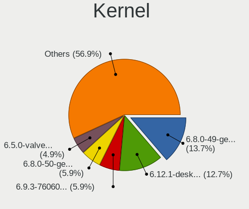
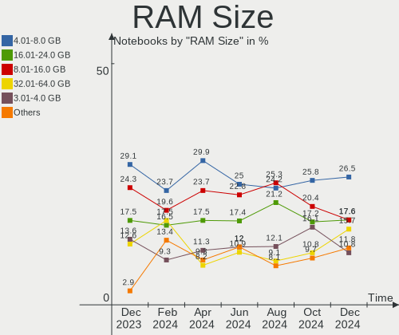
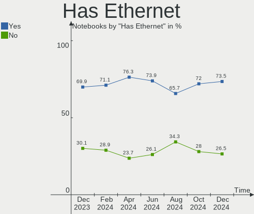
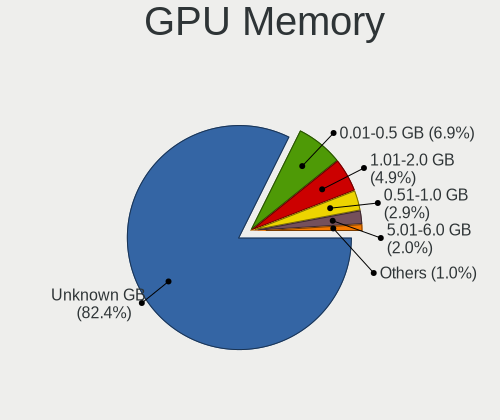
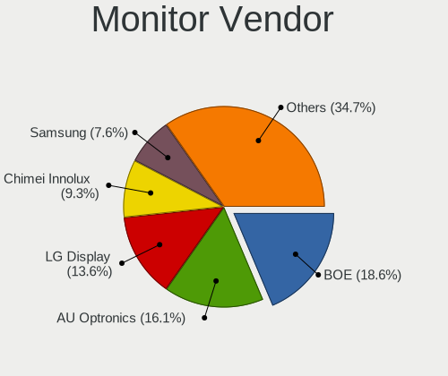
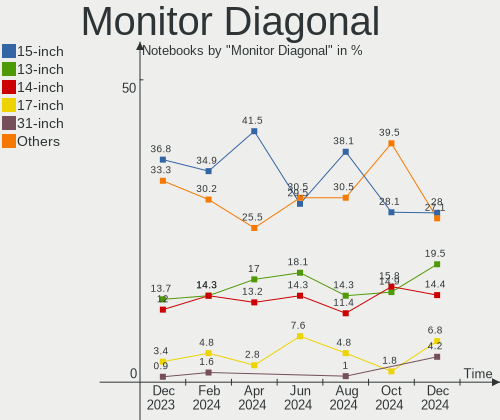
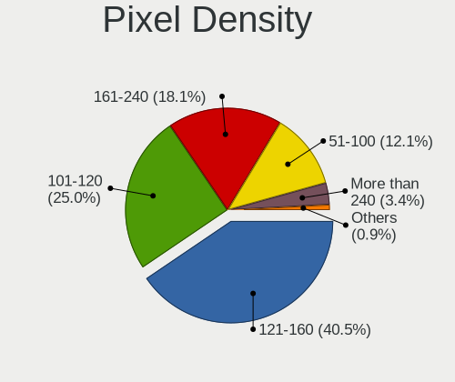
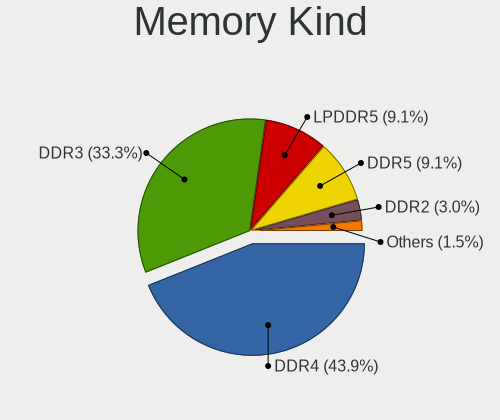
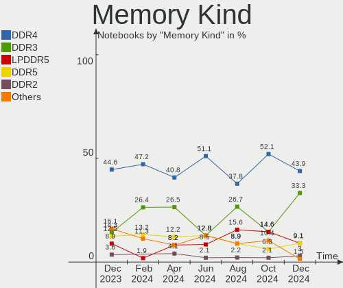
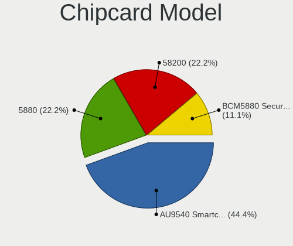

Linux in UK - Hardware Trends (Notebooks)
-----------------------------------------

A project to identify most popular hardware characteristics and track their change
over time based on data collected by Linux users at https://Linux-Hardware.org.

Anyone can contribute to this report by the [hw-probe](https://github.com/linuxhw/hw-probe) tool:

    sudo -E hw-probe -all -upload

Period: May, 2023.

Contents
--------

* [ System ](#system)
  - [ OS                       ](#os)
  - [ OS Family                ](#os-family)
  - [ Kernel                   ](#kernel)
  - [ Kernel Family            ](#kernel-family)
  - [ Kernel Major Ver.        ](#kernel-major-ver)
  - [ Arch                     ](#arch)
  - [ DE                       ](#de)
  - [ Display Server           ](#display-server)
  - [ Display Manager          ](#display-manager)
  - [ OS Lang                  ](#os-lang)
  - [ Boot Mode                ](#boot-mode)
  - [ Filesystem               ](#filesystem)
  - [ Part. scheme             ](#part-scheme)
  - [ Dual Boot with Linux/BSD ](#dual-boot-with-linuxbsd)
  - [ Dual Boot (Win)          ](#dual-boot-win)

* [ Board ](#board)
  - [ Vendor                   ](#vendor)
  - [ Model                    ](#model)
  - [ Model Family             ](#model-family)
  - [ MFG Year                 ](#mfg-year)
  - [ Form Factor              ](#form-factor)
  - [ Secure Boot              ](#secure-boot)
  - [ Coreboot                 ](#coreboot)
  - [ RAM Size                 ](#ram-size)
  - [ RAM Used                 ](#ram-used)
  - [ Total Drives             ](#total-drives)
  - [ Has CD-ROM               ](#has-cd-rom)
  - [ Has Ethernet             ](#has-ethernet)
  - [ Has WiFi                 ](#has-wifi)
  - [ Has Bluetooth            ](#has-bluetooth)

* [ Location ](#location)
  - [ Country                  ](#country)
  - [ City                     ](#city)

* [ Drives ](#drives)
  - [ Drive Vendor             ](#drive-vendor)
  - [ Drive Model              ](#drive-model)
  - [ HDD Vendor               ](#hdd-vendor)
  - [ SSD Vendor               ](#ssd-vendor)
  - [ Drive Kind               ](#drive-kind)
  - [ Drive Connector          ](#drive-connector)
  - [ Drive Size               ](#drive-size)
  - [ Space Total              ](#space-total)
  - [ Space Used               ](#space-used)
  - [ Malfunc. Drives          ](#malfunc-drives)
  - [ Malfunc. Drive Vendor    ](#malfunc-drive-vendor)
  - [ Malfunc. HDD Vendor      ](#malfunc-hdd-vendor)
  - [ Malfunc. Drive Kind      ](#malfunc-drive-kind)
  - [ Failed Drives            ](#failed-drives)
  - [ Failed Drive Vendor      ](#failed-drive-vendor)
  - [ Drive Status             ](#drive-status)

* [ Storage controller ](#storage-controller)
  - [ Storage Vendor           ](#storage-vendor)
  - [ Storage Model            ](#storage-model)
  - [ Storage Kind             ](#storage-kind)

* [ Processor ](#processor)
  - [ CPU Vendor               ](#cpu-vendor)
  - [ CPU Model                ](#cpu-model)
  - [ CPU Model Family         ](#cpu-model-family)
  - [ CPU Cores                ](#cpu-cores)
  - [ CPU Sockets              ](#cpu-sockets)
  - [ CPU Threads              ](#cpu-threads)
  - [ CPU Op-Modes             ](#cpu-op-modes)
  - [ CPU Microcode            ](#cpu-microcode)
  - [ CPU Microarch            ](#cpu-microarch)

* [ Graphics ](#graphics)
  - [ GPU Vendor               ](#gpu-vendor)
  - [ GPU Model                ](#gpu-model)
  - [ GPU Combo                ](#gpu-combo)
  - [ GPU Driver               ](#gpu-driver)
  - [ GPU Memory               ](#gpu-memory)

* [ Monitor ](#monitor)
  - [ Monitor Vendor           ](#monitor-vendor)
  - [ Monitor Model            ](#monitor-model)
  - [ Monitor Resolution       ](#monitor-resolution)
  - [ Monitor Diagonal         ](#monitor-diagonal)
  - [ Monitor Width            ](#monitor-width)
  - [ Aspect Ratio             ](#aspect-ratio)
  - [ Monitor Area             ](#monitor-area)
  - [ Pixel Density            ](#pixel-density)
  - [ Multiple Monitors        ](#multiple-monitors)

* [ Network ](#network)
  - [ Net Controller Vendor    ](#net-controller-vendor)
  - [ Net Controller Model     ](#net-controller-model)
  - [ Wireless Vendor          ](#wireless-vendor)
  - [ Wireless Model           ](#wireless-model)
  - [ Ethernet Vendor          ](#ethernet-vendor)
  - [ Ethernet Model           ](#ethernet-model)
  - [ Net Controller Kind      ](#net-controller-kind)
  - [ Used Controller          ](#used-controller)
  - [ NICs                     ](#nics)
  - [ IPv6                     ](#ipv6)

* [ Bluetooth ](#bluetooth)
  - [ Bluetooth Vendor         ](#bluetooth-vendor)
  - [ Bluetooth Model          ](#bluetooth-model)

* [ Sound ](#sound)
  - [ Sound Vendor             ](#sound-vendor)
  - [ Sound Model              ](#sound-model)

* [ Memory ](#memory)
  - [ Memory Vendor            ](#memory-vendor)
  - [ Memory Model             ](#memory-model)
  - [ Memory Kind              ](#memory-kind)
  - [ Memory Form Factor       ](#memory-form-factor)
  - [ Memory Size              ](#memory-size)
  - [ Memory Speed             ](#memory-speed)

* [ Printers & scanners ](#printers--scanners)
  - [ Printer Vendor           ](#printer-vendor)
  - [ Printer Model            ](#printer-model)
  - [ Scanner Vendor           ](#scanner-vendor)
  - [ Scanner Model            ](#scanner-model)

* [ Camera ](#camera)
  - [ Camera Vendor            ](#camera-vendor)
  - [ Camera Model             ](#camera-model)

* [ Security ](#security)
  - [ Fingerprint Vendor       ](#fingerprint-vendor)
  - [ Fingerprint Model        ](#fingerprint-model)
  - [ Chipcard Vendor          ](#chipcard-vendor)
  - [ Chipcard Model           ](#chipcard-model)

* [ Unsupported ](#unsupported)
  - [ Unsupported Devices      ](#unsupported-devices)
  - [ Unsupported Device Types ](#unsupported-device-types)

System
------

OS
--

Installed operating systems

| Name                         | Notebooks | Percent |
|------------------------------|-----------|---------|
| Ubuntu 22.04                 | 15        | 15%     |
| Linux Mint 21.1              | 7         | 7%      |
| Ubuntu 23.04                 | 6         | 6%      |
| Arch Rolling                 | 6         | 6%      |
| SteamOS 3.4.6                | 5         | 5%      |
| Pop!_OS 22.04                | 5         | 5%      |
| OpenMandriva 23.03           | 5         | 5%      |
| KDE neon 22.04               | 5         | 5%      |
| ArcoLinux Rolling            | 5         | 5%      |
| Fedora 38                    | 4         | 4%      |
| Debian 11                    | 4         | 4%      |
| BlackPanther 18.1            | 3         | 3%      |
| Zorin 16                     | 2         | 2%      |
| Ubuntu 22.10                 | 2         | 2%      |
| Ubuntu 20.04                 | 2         | 2%      |
| Linux Mint 20.3              | 2         | 2%      |
| Kubuntu 23.04                | 2         | 2%      |
| Xubuntu 22.04                | 1         | 1%      |
| Ubuntu Budgie 22.04          | 1         | 1%      |
| RHEL 9                       | 1         | 1%      |
| Q4OS 4                       | 1         | 1%      |
| openSUSE Tumbleweed-XXXXXXXX | 1         | 1%      |
| Nobara 37                    | 1         | 1%      |
| NixOS 23.05                  | 1         | 1%      |
| Manjaro 22.1.3               | 1         | 1%      |
| Lubuntu 22.10                | 1         | 1%      |
| Linux Mint 21                | 1         | 1%      |
| Kubuntu 22.04                | 1         | 1%      |
| Kubuntu 20.04                | 1         | 1%      |
| KDE neon 20.04               | 1         | 1%      |
| Gentoo 2.13                  | 1         | 1%      |
| Garuda Linux Rolling         | 1         | 1%      |
| Elementary 7                 | 1         | 1%      |
| Clear Linux 38610            | 1         | 1%      |
| ChimeraOS 41                 | 1         | 1%      |
| BunsenLabs 11                | 1         | 1%      |
| Athena OS Rolling            | 1         | 1%      |

OS Family
---------

OS without a version

| Name          | Notebooks | Percent |
|---------------|-----------|---------|
| Ubuntu        | 25        | 25%     |
| Linux Mint    | 10        | 10%     |
| KDE neon      | 6         | 6%      |
| Arch          | 6         | 6%      |
| SteamOS       | 5         | 5%      |
| Pop!_OS       | 5         | 5%      |
| OpenMandriva  | 5         | 5%      |
| ArcoLinux     | 5         | 5%      |
| Kubuntu       | 4         | 4%      |
| Fedora        | 4         | 4%      |
| Debian        | 4         | 4%      |
| BlackPanther  | 3         | 3%      |
| Zorin         | 2         | 2%      |
| Xubuntu       | 1         | 1%      |
| Ubuntu Budgie | 1         | 1%      |
| RHEL          | 1         | 1%      |
| Q4OS          | 1         | 1%      |
| openSUSE      | 1         | 1%      |
| Nobara        | 1         | 1%      |
| NixOS         | 1         | 1%      |
| Manjaro       | 1         | 1%      |
| Lubuntu       | 1         | 1%      |
| Gentoo        | 1         | 1%      |
| Garuda Linux  | 1         | 1%      |
| Elementary    | 1         | 1%      |
| Clear Linux   | 1         | 1%      |
| ChimeraOS     | 1         | 1%      |
| BunsenLabs    | 1         | 1%      |
| Athena OS     | 1         | 1%      |

Kernel
------

Version of the Linux kernel

| Version                       | Notebooks | Percent |
|-------------------------------|-----------|---------|
| 5.19.0-41-generic             | 16        | 16%     |
| 6.2.0-20-generic              | 8         | 8%      |
| 5.15.0-72-generic             | 7         | 7%      |
| 6.2.6-desktop-1omv2390        | 5         | 5%      |
| 6.2.6-76060206-generic        | 5         | 5%      |
| 5.19.0-42-generic             | 5         | 5%      |
| 5.13.0-valve36-1-neptune      | 5         | 5%      |
| 5.15.0-71-generic             | 4         | 4%      |
| 5.15.0-56-generic             | 3         | 3%      |
| 6.3.2-arch1-1                 | 2         | 2%      |
| 6.3.1-arch1-1                 | 2         | 2%      |
| 6.2.13-300.fc38.x86_64        | 2         | 2%      |
| 5.6.14-desktop-2bP            | 2         | 2%      |
| 5.10.0-23-amd64               | 2         | 2%      |
| 6.3.5-arch1-1                 | 1         | 1%      |
| 6.3.4-arch1-1                 | 1         | 1%      |
| 6.3.3-arch1-1                 | 1         | 1%      |
| 6.3.3                         | 1         | 1%      |
| 6.3.2-zen1-1-zen              | 1         | 1%      |
| 6.3.2-Painoko-T2-xanmod1-1-t2 | 1         | 1%      |
| 6.3.2-1-default               | 1         | 1%      |
| 6.3.1-zen2-1-zen              | 1         | 1%      |
| 6.3.1-zen1-1-zen              | 1         | 1%      |
| 6.2.6-1290.native             | 1         | 1%      |
| 6.2.15-300.fc38.x86_64        | 1         | 1%      |
| 6.2.14-300.fc38.x86_64        | 1         | 1%      |
| 6.2.13-arch1-1                | 1         | 1%      |
| 6.2.12-200.fsync.fc37.x86_64  | 1         | 1%      |
| 6.1.26-1-lts                  | 1         | 1%      |
| 6.1.21-1-lts                  | 1         | 1%      |
| 6.1.19-gentoo-x86_64          | 1         | 1%      |
| 6.1.0-0.deb11.7-amd64         | 1         | 1%      |
| 5.8.0-59-generic              | 1         | 1%      |
| 5.4.0-89-generic              | 1         | 1%      |
| 5.4.0-148-generic             | 1         | 1%      |
| 5.4.0-144-generic             | 1         | 1%      |
| 5.19.0-43-generic             | 1         | 1%      |
| 5.19.0-40-generic             | 1         | 1%      |
| 5.19.0-32-generic             | 1         | 1%      |
| 5.15.85-desktop-1bP           | 1         | 1%      |

Kernel Family
-------------

Linux kernel without a distro release

| Version  | Notebooks | Percent |
|----------|-----------|---------|
| 5.19.0   | 24        | 24%     |
| 5.15.0   | 15        | 15%     |
| 6.2.6    | 11        | 11%     |
| 6.2.0    | 8         | 8%      |
| 6.3.2    | 5         | 5%      |
| 5.13.0   | 5         | 5%      |
| 5.10.0   | 5         | 5%      |
| 6.3.1    | 4         | 4%      |
| 6.2.13   | 3         | 3%      |
| 5.4.0    | 3         | 3%      |
| 6.3.3    | 2         | 2%      |
| 5.6.14   | 2         | 2%      |
| 6.3.5    | 1         | 1%      |
| 6.3.4    | 1         | 1%      |
| 6.2.15   | 1         | 1%      |
| 6.2.14   | 1         | 1%      |
| 6.2.12   | 1         | 1%      |
| 6.1.26   | 1         | 1%      |
| 6.1.21   | 1         | 1%      |
| 6.1.19   | 1         | 1%      |
| 6.1.0    | 1         | 1%      |
| 5.8.0    | 1         | 1%      |
| 5.15.85  | 1         | 1%      |
| 5.14.0   | 1         | 1%      |
| 5.10.180 | 1         | 1%      |

Kernel Major Ver.
-----------------

Linux kernel major version

| Version | Notebooks | Percent |
|---------|-----------|---------|
| 6.2     | 25        | 25%     |
| 5.19    | 24        | 24%     |
| 5.15    | 16        | 16%     |
| 6.3     | 13        | 13%     |
| 5.10    | 6         | 6%      |
| 5.13    | 5         | 5%      |
| 6.1     | 4         | 4%      |
| 5.4     | 3         | 3%      |
| 5.6     | 2         | 2%      |
| 5.8     | 1         | 1%      |
| 5.14    | 1         | 1%      |

Arch
----

OS architecture (x86_64, i586, etc.)

| Name   | Notebooks | Percent |
|--------|-----------|---------|
| x86_64 | 99        | 99%     |
| i686   | 1         | 1%      |

DE
--

Desktop Environment

| Name          | Notebooks | Percent |
|---------------|-----------|---------|
| GNOME         | 43        | 43%     |
| KDE5          | 34        | 34%     |
| XFCE          | 8         | 8%      |
| X-Cinnamon    | 7         | 7%      |
| Unknown       | 2         | 2%      |
| Pantheon      | 1         | 1%      |
| MATE          | 1         | 1%      |
| LXQt          | 1         | 1%      |
| Hyprland      | 1         | 1%      |
| GNOME Classic | 1         | 1%      |
| BunsenLabs    | 1         | 1%      |

Display Server
--------------

X11 or Wayland

| Name    | Notebooks | Percent |
|---------|-----------|---------|
| X11     | 62        | 62%     |
| Wayland | 36        | 36%     |
| Tty     | 2         | 2%      |

Display Manager
---------------

SDDM, LightDM, etc.

| Name    | Notebooks | Percent |
|---------|-----------|---------|
| Unknown | 37        | 37%     |
| GDM3    | 26        | 26%     |
| SDDM    | 24        | 24%     |
| LightDM | 9         | 9%      |
| GDM     | 4         | 4%      |

OS Lang
-------

Language

| Lang    | Notebooks | Percent |
|---------|-----------|---------|
| en_GB   | 74        | 74%     |
| en_US   | 20        | 20%     |
| Unknown | 3         | 3%      |
| C       | 2         | 2%      |
| en_AU   | 1         | 1%      |

Boot Mode
---------

EFI or BIOS

| Mode | Notebooks | Percent |
|------|-----------|---------|
| BIOS | 53        | 53%     |
| EFI  | 47        | 47%     |

Filesystem
----------

Type of filesystem

| Type    | Notebooks | Percent |
|---------|-----------|---------|
| Ext4    | 58        | 58%     |
| Btrfs   | 20        | 20%     |
| Tmpfs   | 16        | 16%     |
| Overlay | 3         | 3%      |
| Xfs     | 2         | 2%      |
| Zfs     | 1         | 1%      |

Part. scheme
------------

Scheme of partitioning

| Type    | Notebooks | Percent |
|---------|-----------|---------|
| GPT     | 59        | 59%     |
| Unknown | 35        | 35%     |
| MBR     | 6         | 6%      |

Dual Boot with Linux/BSD
------------------------

Hosting more than one Linux/BSD

| Dual boot | Notebooks | Percent |
|-----------|-----------|---------|
| No        | 89        | 89%     |
| Yes       | 11        | 11%     |

Dual Boot (Win)
---------------

Hosting Linux and Windows

| Dual boot | Notebooks | Percent |
|-----------|-----------|---------|
| No        | 76        | 76%     |
| Yes       | 24        | 24%     |

Board
-----

Vendor
------

Motherboard manufacturer

| Name             | Notebooks | Percent |
|------------------|-----------|---------|
| Lenovo           | 22        | 22%     |
| Dell             | 20        | 20%     |
| Hewlett-Packard  | 17        | 17%     |
| ASUSTek Computer | 8         | 8%      |
| Acer             | 7         | 7%      |
| Valve            | 5         | 5%      |
| Apple            | 4         | 4%      |
| Toshiba          | 3         | 3%      |
| MSI              | 2         | 2%      |
| Google           | 2         | 2%      |
| Sony             | 1         | 1%      |
| PC Specialist    | 1         | 1%      |
| Medion           | 1         | 1%      |
| lapbook          | 1         | 1%      |
| HUAWEI           | 1         | 1%      |
| Entroware        | 1         | 1%      |
| eMachines        | 1         | 1%      |
| Eii              | 1         | 1%      |
| Advent           | 1         | 1%      |
| Unknown          | 1         | 1%      |

Model
-----

Motherboard model

| Name                                              | Notebooks | Percent |
|---------------------------------------------------|-----------|---------|
| Valve Jupiter                                     | 5         | 5%      |
| Lenovo IdeaPad L340-17IRH Gaming 81LL             | 2         | 2%      |
| HP x2 210                                         | 2         | 2%      |
| HP EliteBook 840 G8 Notebook PC                   | 2         | 2%      |
| Dell Latitude 7390                                | 2         | 2%      |
| Toshiba Satellite Pro C50-A-1E6                   | 1         | 1%      |
| Toshiba Satellite C75-A                           | 1         | 1%      |
| Toshiba PORTEGE Z30-A                             | 1         | 1%      |
| Sony SVT1312B4E                                   | 1         | 1%      |
| PC Specialist P65_67RSRP                          | 1         | 1%      |
| MSI GS43VR 7RE                                    | 1         | 1%      |
| MSI CX62 6QD                                      | 1         | 1%      |
| Medion Akoya E1317T                               | 1         | 1%      |
| Lenovo V110-15IKB 80TH                            | 1         | 1%      |
| Lenovo ThinkPad Z13 Gen 1 21D2CTO1WW              | 1         | 1%      |
| Lenovo ThinkPad X240 20AMA21D00                   | 1         | 1%      |
| Lenovo ThinkPad X1 Carbon Gen 10 21CB007AUK       | 1         | 1%      |
| Lenovo ThinkPad W530 24472BG                      | 1         | 1%      |
| Lenovo ThinkPad T540p 20BE003YUK                  | 1         | 1%      |
| Lenovo ThinkPad T480 20L6A0XKUK                   | 1         | 1%      |
| Lenovo ThinkPad T470s 20HGS4RU00                  | 1         | 1%      |
| Lenovo ThinkPad T450s 20BWS34A00                  | 1         | 1%      |
| Lenovo ThinkPad T431s 20ACA01V00                  | 1         | 1%      |
| Lenovo ThinkPad P16s Gen 1 21CKCTO1WW             | 1         | 1%      |
| Lenovo ThinkPad L512 44444WG                      | 1         | 1%      |
| Lenovo ThinkPad L470 W10DG 20JU000SUK             | 1         | 1%      |
| Lenovo ThinkPad L440 20AS001CUK                   | 1         | 1%      |
| Lenovo ThinkPad Edge E530 3259CTO                 | 1         | 1%      |
| Lenovo ThinkBook 14 G5+ ARP 21HY                  | 1         | 1%      |
| Lenovo ThinkBook 13s-IML 20RR                     | 1         | 1%      |
| Lenovo IdeaPad Y700-15ISK 80NV                    | 1         | 1%      |
| Lenovo IdeaPad 500-15ISK 80NT                     | 1         | 1%      |
| Lenovo G50-80 80L0                                | 1         | 1%      |
| lapbook S15 PRO                                   | 1         | 1%      |
| HUAWEI BOHB-WAX9                                  | 1         | 1%      |
| HP ZBook Firefly 16 inch G9 Mobile Workstation PC | 1         | 1%      |
| HP ProBook 430 G4                                 | 1         | 1%      |
| HP Pavilion dv7                                   | 1         | 1%      |
| HP Pavilion dv6                                   | 1         | 1%      |
| HP Pavilion 15                                    | 1         | 1%      |

Model Family
------------

Motherboard model prefix

| Name               | Notebooks | Percent |
|--------------------|-----------|---------|
| Lenovo ThinkPad    | 14        | 14%     |
| Dell Latitude      | 10        | 10%     |
| HP EliteBook       | 6         | 6%      |
| Valve Jupiter      | 5         | 5%      |
| Dell Inspiron      | 5         | 5%      |
| Acer Aspire        | 5         | 5%      |
| Lenovo IdeaPad     | 4         | 4%      |
| HP Pavilion        | 3         | 3%      |
| Toshiba Satellite  | 2         | 2%      |
| Lenovo ThinkBook   | 2         | 2%      |
| HP x2              | 2         | 2%      |
| HP Laptop          | 2         | 2%      |
| Dell XPS           | 2         | 2%      |
| Apple MacBookPro15 | 2         | 2%      |
| Toshiba PORTEGE    | 1         | 1%      |
| Sony SVT1312B4E    | 1         | 1%      |
| PC Specialist P65  | 1         | 1%      |
| MSI GS43VR         | 1         | 1%      |
| MSI CX62           | 1         | 1%      |
| Medion Akoya       | 1         | 1%      |
| Lenovo V110-15IKB  | 1         | 1%      |
| Lenovo G50-80      | 1         | 1%      |
| lapbook S15        | 1         | 1%      |
| HUAWEI BOHB-WAX9   | 1         | 1%      |
| HP ZBook           | 1         | 1%      |
| HP ProBook         | 1         | 1%      |
| HP Notebook        | 1         | 1%      |
| HP ENVY            | 1         | 1%      |
| Google Samus       | 1         | 1%      |
| Google Auron       | 1         | 1%      |
| Entroware Kratos   | 1         | 1%      |
| eMachines E625     | 1         | 1%      |
| Eii Ezpad          | 1         | 1%      |
| Dell Studio        | 1         | 1%      |
| Dell Precision     | 1         | 1%      |
| Dell G7            | 1         | 1%      |
| ASUS X705UDR       | 1         | 1%      |
| ASUS X580VD        | 1         | 1%      |
| ASUS X550CA        | 1         | 1%      |
| ASUS X510UQR       | 1         | 1%      |

MFG Year
--------

Motherboard manufacture year

| Year | Notebooks | Percent |
|------|-----------|---------|
| 2022 | 13        | 13%     |
| 2015 | 10        | 10%     |
| 2019 | 9         | 9%      |
| 2013 | 9         | 9%      |
| 2021 | 8         | 8%      |
| 2020 | 8         | 8%      |
| 2017 | 8         | 8%      |
| 2018 | 6         | 6%      |
| 2016 | 6         | 6%      |
| 2014 | 6         | 6%      |
| 2012 | 5         | 5%      |
| 2009 | 3         | 3%      |
| 2008 | 3         | 3%      |
| 2023 | 2         | 2%      |
| 2010 | 2         | 2%      |
| 2011 | 1         | 1%      |
| 2007 | 1         | 1%      |

Form Factor
-----------

Physical design of the computer

| Name     | Notebooks | Percent |
|----------|-----------|---------|
| Notebook | 100       | 100%    |

Secure Boot
-----------

Enabled or disabled

| State    | Notebooks | Percent |
|----------|-----------|---------|
| Disabled | 94        | 94%     |
| Enabled  | 6         | 6%      |

Coreboot
--------

Have coreboot on board

| Used | Notebooks | Percent |
|------|-----------|---------|
| No   | 98        | 98%     |
| Yes  | 2         | 2%      |

RAM Size
--------

Total RAM memory

| Size in GB  | Notebooks | Percent |
|-------------|-----------|---------|
| 4.01-8.0    | 31        | 31%     |
| 16.01-24.0  | 23        | 23%     |
| 8.01-16.0   | 18        | 18%     |
| 3.01-4.0    | 12        | 12%     |
| 32.01-64.0  | 7         | 7%      |
| 1.01-2.0    | 4         | 4%      |
| 24.01-32.0  | 3         | 3%      |
| 2.01-3.0    | 1         | 1%      |
| 64.01-256.0 | 1         | 1%      |

RAM Used
--------

Used RAM memory

| Used GB    | Notebooks | Percent |
|------------|-----------|---------|
| 2.01-3.0   | 31        | 31%     |
| 1.01-2.0   | 26        | 26%     |
| 4.01-8.0   | 22        | 22%     |
| 3.01-4.0   | 12        | 12%     |
| 0.51-1.0   | 4         | 4%      |
| 16.01-24.0 | 2         | 2%      |
| 32.01-64.0 | 1         | 1%      |
| 24.01-32.0 | 1         | 1%      |
| 0.01-0.5   | 1         | 1%      |

Total Drives
------------

Number of drives on board

| Drives | Notebooks | Percent |
|--------|-----------|---------|
| 1      | 64        | 64%     |
| 2      | 31        | 31%     |
| 3      | 5         | 5%      |

Has CD-ROM
----------

Has CD-ROM on board

| Presented | Notebooks | Percent |
|-----------|-----------|---------|
| No        | 80        | 80%     |
| Yes       | 20        | 20%     |

Has Ethernet
------------

Has Ethernet on board

| Presented | Notebooks | Percent |
|-----------|-----------|---------|
| Yes       | 74        | 74%     |
| No        | 26        | 26%     |

Has WiFi
--------

Has WiFi module

| Presented | Notebooks | Percent |
|-----------|-----------|---------|
| Yes       | 100       | 100%    |

Has Bluetooth
-------------

Has Bluetooth module

| Presented | Notebooks | Percent |
|-----------|-----------|---------|
| Yes       | 82        | 82%     |
| No        | 18        | 18%     |

Location
--------

Country
-------

Geographic location (country)

| Country | Notebooks | Percent |
|---------|-----------|---------|
| UK      | 100       | 100%    |

City
----

Geographic location (city)

| City                 | Notebooks | Percent |
|----------------------|-----------|---------|
| London               | 4         | 4%      |
| Wellingborough       | 2         | 2%      |
| Swansea              | 2         | 2%      |
| Newcastle upon Tyne  | 2         | 2%      |
| Manchester           | 2         | 2%      |
| Lewes                | 2         | 2%      |
| Kingston upon Thames | 2         | 2%      |
| Harlow               | 2         | 2%      |
| Hackney              | 2         | 2%      |
| Exeter               | 2         | 2%      |
| Edinburgh            | 2         | 2%      |
| Brighton             | 2         | 2%      |
| Birmingham           | 2         | 2%      |
| Bedford              | 2         | 2%      |
| Basingstoke          | 2         | 2%      |
| York                 | 1         | 1%      |
| Woking               | 1         | 1%      |
| Witney               | 1         | 1%      |
| Whiteley             | 1         | 1%      |
| Whitby               | 1         | 1%      |
| Wandsworth           | 1         | 1%      |
| Walsall              | 1         | 1%      |
| Tuxford              | 1         | 1%      |
| Theydon Bois         | 1         | 1%      |
| Tenbury Wells        | 1         | 1%      |
| Stockton-on-Tees     | 1         | 1%      |
| Stevenage            | 1         | 1%      |
| St Albans            | 1         | 1%      |
| Southwark            | 1         | 1%      |
| Southampton          | 1         | 1%      |
| Southall             | 1         | 1%      |
| Solihull             | 1         | 1%      |
| Smethwick            | 1         | 1%      |
| Slough               | 1         | 1%      |
| Salisbury            | 1         | 1%      |
| Poole                | 1         | 1%      |
| Penrith              | 1         | 1%      |
| Oxford               | 1         | 1%      |
| Nottingham           | 1         | 1%      |
| Newark on Trent      | 1         | 1%      |

Drives
------

Drive Vendor
------------

Hard drive vendors

| Vendor                      | Notebooks | Drives | Percent |
|-----------------------------|-----------|--------|---------|
| Samsung Electronics         | 20        | 21     | 14.71%  |
| Unknown                     | 14        | 16     | 10.29%  |
| Toshiba                     | 12        | 12     | 8.82%   |
| Kingston                    | 8         | 8      | 5.88%   |
| SK hynix                    | 7         | 7      | 5.15%   |
| Seagate                     | 7         | 7      | 5.15%   |
| Sandisk                     | 7         | 8      | 5.15%   |
| WDC                         | 5         | 5      | 3.68%   |
| Phison Electronics          | 5         | 5      | 3.68%   |
| Micron Technology           | 5         | 5      | 3.68%   |
| Intel                       | 5         | 5      | 3.68%   |
| Hitachi                     | 4         | 5      | 2.94%   |
| Kingston Technology Company | 3         | 3      | 2.21%   |
| Crucial                     | 3         | 3      | 2.21%   |
| Apple                       | 3         | 3      | 2.21%   |
| Realtek                     | 2         | 2      | 1.47%   |
| LITEONIT                    | 2         | 2      | 1.47%   |
| LITEON                      | 2         | 2      | 1.47%   |
| KIOXIA                      | 2         | 2      | 1.47%   |
| HGST                        | 2         | 2      | 1.47%   |
| Hewlett-Packard             | 2         | 2      | 1.47%   |
| A-DATA Technology           | 2         | 2      | 1.47%   |
| ShiJi                       | 1         | 1      | 0.74%   |
| Phison                      | 1         | 1      | 0.74%   |
| Patriot                     | 1         | 1      | 0.74%   |
| ORTIAL                      | 1         | 1      | 0.74%   |
| O2 Micro                    | 1         | 1      | 0.74%   |
| Netac                       | 1         | 1      | 0.74%   |
| JMicron Technology          | 1         | 1      | 0.74%   |
| INTEL SS                    | 1         | 2      | 0.74%   |
| Integral                    | 1         | 1      | 0.74%   |
| Gigabyte Technology         | 1         | 1      | 0.74%   |
| Fujitsu                     | 1         | 1      | 0.74%   |
| Fanxiang                    | 1         | 1      | 0.74%   |
| China                       | 1         | 1      | 0.74%   |
| ASENNO                      | 1         | 1      | 0.74%   |

Drive Model
-----------

Hard drive models

| Model                                               | Notebooks | Percent |
|-----------------------------------------------------|-----------|---------|
| Samsung NVMe SSD Controller SM981/PM981/PM983 256GB | 5         | 3.52%   |
| Unknown MMC Card  512GB                             | 4         | 2.82%   |
| Unknown MMC Card  32GB                              | 4         | 2.82%   |
| Phison PS5013 E13 NVMe Controller 512GB             | 4         | 2.82%   |
| Toshiba MQ01ABD100 1TB                              | 3         | 2.11%   |
| SK hynix BC511 256GB                                | 3         | 2.11%   |
| Samsung NVMe SSD Controller PM9A1/PM9A3/980PRO 1TB  | 3         | 2.11%   |
| Unknown MMC Card  134GB                             | 2         | 1.41%   |
| Toshiba XG6 NVMe SSD Controller 256GB               | 2         | 1.41%   |
| Samsung SSD 850 EVO 500GB                           | 2         | 1.41%   |
| Realtek RTL9210B-CG 1TB                             | 2         | 1.41%   |
| Micron 1100_MTFDDAV256TBN 256GB SSD                 | 2         | 1.41%   |
| Kingston SA400S37120G 120GB SSD                     | 2         | 1.41%   |
| WDC WDS500G1B0A-00H9H0 500GB SSD                    | 1         | 0.7%    |
| WDC WD5000LPCX-24VHAT0 500GB                        | 1         | 0.7%    |
| WDC WD5000BEKT-75KA9T0 500GB                        | 1         | 0.7%    |
| WDC WD3200BEVT-22ZCT0 320GB                         | 1         | 0.7%    |
| WDC WD10SPCX-24HWST1 1TB                            | 1         | 0.7%    |
| Unknown ZYmSATA120 120GB                            | 1         | 0.7%    |
| Unknown MMC Card  197GB                             | 1         | 0.7%    |
| Unknown MMC Card  196GB                             | 1         | 0.7%    |
| Unknown MMC Card  16GB                              | 1         | 0.7%    |
| Unknown MMC Card  128GB                             | 1         | 0.7%    |
| Unknown CKTM4R  64GB                                | 1         | 0.7%    |
| Toshiba XG4 NVMe SSD Controller 256GB               | 1         | 0.7%    |
| Toshiba NVMe Controller 256GB                       | 1         | 0.7%    |
| Toshiba MQ04ABF100 1TB                              | 1         | 0.7%    |
| Toshiba MK5056GSY 500GB                             | 1         | 0.7%    |
| Toshiba MK3276GSX 320GB                             | 1         | 0.7%    |
| Toshiba KSG60ZMV256G M.2 2280 256GB SSD             | 1         | 0.7%    |
| Toshiba BG3 NVMe SSD Controller 256GB               | 1         | 0.7%    |
| SK hynix SKHynix_HFS512GEJ9X115N 512GB              | 1         | 0.7%    |
| SK hynix SC401 SATA 256GB SSD                       | 1         | 0.7%    |
| SK hynix PC601 NVMe 512GB                           | 1         | 0.7%    |
| SK hynix HFM001TD3JX013N 1TB                        | 1         | 0.7%    |
| ShiJi SSD 512GB                                     | 1         | 0.7%    |
| Seagate ST9250315AS 250GB                           | 1         | 0.7%    |
| Seagate ST500LT012-1DG142 500GB                     | 1         | 0.7%    |
| Seagate ST500LM021-1KJ152 500GB                     | 1         | 0.7%    |
| Seagate ST2000LM007-1R8174 2TB                      | 1         | 0.7%    |

HDD Vendor
----------

Hard disk drive vendors

| Vendor  | Notebooks | Drives | Percent |
|---------|-----------|--------|---------|
| Toshiba | 6         | 6      | 26.09%  |
| Seagate | 6         | 6      | 26.09%  |
| WDC     | 4         | 4      | 17.39%  |
| Hitachi | 4         | 5      | 17.39%  |
| HGST    | 2         | 2      | 8.7%    |
| Fujitsu | 1         | 1      | 4.35%   |

SSD Vendor
----------

Solid state drive vendors

| Vendor              | Notebooks | Drives | Percent |
|---------------------|-----------|--------|---------|
| Samsung Electronics | 8         | 8      | 17.02%  |
| Kingston            | 6         | 6      | 12.77%  |
| SanDisk             | 3         | 4      | 6.38%   |
| Micron Technology   | 3         | 3      | 6.38%   |
| Intel               | 3         | 3      | 6.38%   |
| Crucial             | 3         | 3      | 6.38%   |
| LITEONIT            | 2         | 2      | 4.26%   |
| LITEON              | 2         | 2      | 4.26%   |
| Hewlett-Packard     | 2         | 2      | 4.26%   |
| WDC                 | 1         | 1      | 2.13%   |
| Toshiba             | 1         | 1      | 2.13%   |
| SK hynix            | 1         | 1      | 2.13%   |
| ShiJi               | 1         | 1      | 2.13%   |
| Seagate             | 1         | 1      | 2.13%   |
| Patriot             | 1         | 1      | 2.13%   |
| ORTIAL              | 1         | 1      | 2.13%   |
| Netac               | 1         | 1      | 2.13%   |
| INTEL SS            | 1         | 2      | 2.13%   |
| Integral            | 1         | 1      | 2.13%   |
| Gigabyte Technology | 1         | 1      | 2.13%   |
| Fanxiang            | 1         | 1      | 2.13%   |
| ASENNO              | 1         | 1      | 2.13%   |
| Apple               | 1         | 1      | 2.13%   |
| A-DATA Technology   | 1         | 1      | 2.13%   |

Drive Kind
----------

HDD or SSD

| Kind    | Notebooks | Drives | Percent |
|---------|-----------|--------|---------|
| NVMe    | 45        | 51     | 36%     |
| SSD     | 41        | 49     | 32.8%   |
| HDD     | 22        | 24     | 17.6%   |
| MMC     | 14        | 15     | 11.2%   |
| Unknown | 3         | 3      | 2.4%    |

Drive Connector
---------------

SATA, SAS, NVMe, etc.

| Type | Notebooks | Drives | Percent |
|------|-----------|--------|---------|
| SATA | 59        | 72     | 47.97%  |
| NVMe | 45        | 49     | 36.59%  |
| MMC  | 14        | 15     | 11.38%  |
| SAS  | 5         | 6      | 4.07%   |

Drive Size
----------

Size of hard drive

| Size in TB | Notebooks | Drives | Percent |
|------------|-----------|--------|---------|
| 0.01-0.5   | 46        | 56     | 73.02%  |
| 0.51-1.0   | 13        | 13     | 20.63%  |
| 1.01-2.0   | 3         | 3      | 4.76%   |
| 3.01-4.0   | 1         | 1      | 1.59%   |

Space Total
-----------

Amount of disk space available on the file system

| Size in GB     | Notebooks | Percent |
|----------------|-----------|---------|
| 251-500        | 29        | 29%     |
| 101-250        | 28        | 28%     |
| 501-1000       | 13        | 13%     |
| 1-20           | 8         | 8%      |
| 51-100         | 6         | 6%      |
| More than 3000 | 4         | 4%      |
| 21-50          | 4         | 4%      |
| 1001-2000      | 4         | 4%      |
| 2001-3000      | 3         | 3%      |
| Unknown        | 1         | 1%      |

Space Used
----------

Amount of used disk space

| Used GB        | Notebooks | Percent |
|----------------|-----------|---------|
| 1-20           | 32        | 32%     |
| 21-50          | 24        | 24%     |
| 251-500        | 15        | 15%     |
| 101-250        | 14        | 14%     |
| 51-100         | 9         | 9%      |
| 501-1000       | 3         | 3%      |
| More than 3000 | 1         | 1%      |
| 2001-3000      | 1         | 1%      |
| Unknown        | 1         | 1%      |

Malfunc. Drives
---------------

Drive models with a malfunction

| Model                           | Notebooks | Drives | Percent |
|---------------------------------|-----------|--------|---------|
| WDC WD5000BEKT-75KA9T0 500GB    | 1         | 1      | 33.33%  |
| Kingston SNS4151S316GD 16GB SSD | 1         | 1      | 33.33%  |
| Hitachi HTS545050A7E380 500GB   | 1         | 1      | 33.33%  |

Malfunc. Drive Vendor
---------------------

Vendors of faulty drives

| Vendor   | Notebooks | Drives | Percent |
|----------|-----------|--------|---------|
| WDC      | 1         | 1      | 33.33%  |
| Kingston | 1         | 1      | 33.33%  |
| Hitachi  | 1         | 1      | 33.33%  |

Malfunc. HDD Vendor
-------------------

Vendors of faulty HDD drives

| Vendor  | Notebooks | Drives | Percent |
|---------|-----------|--------|---------|
| WDC     | 1         | 1      | 50%     |
| Hitachi | 1         | 1      | 50%     |

Malfunc. Drive Kind
-------------------

Kinds of faulty drives

| Kind | Notebooks | Drives | Percent |
|------|-----------|--------|---------|
| HDD  | 2         | 2      | 66.67%  |
| SSD  | 1         | 1      | 33.33%  |

Failed Drives
-------------

Failed drive models

Zero info for selected period =(

Failed Drive Vendor
-------------------

Failed drive vendors

Zero info for selected period =(

Drive Status
------------

Number of failed and malfunc. drives

| Status   | Notebooks | Drives | Percent |
|----------|-----------|--------|---------|
| Detected | 62        | 91     | 60.19%  |
| Works    | 38        | 48     | 36.89%  |
| Malfunc  | 3         | 3      | 2.91%   |

Storage controller
------------------

Storage Vendor
--------------

Storage controller vendors

| Vendor                       | Notebooks | Percent |
|------------------------------|-----------|---------|
| Intel                        | 69        | 55.2%   |
| Samsung Electronics          | 14        | 11.2%   |
| AMD                          | 7         | 5.6%    |
| SK hynix                     | 6         | 4.8%    |
| Phison Electronics           | 6         | 4.8%    |
| Toshiba America Info Systems | 5         | 4%      |
| Kingston Technology Company  | 5         | 4%      |
| SanDisk                      | 4         | 3.2%    |
| Micron Technology            | 2         | 1.6%    |
| KIOXIA                       | 2         | 1.6%    |
| Apple                        | 2         | 1.6%    |
| O2 Micro                     | 1         | 0.8%    |
| JMicron Technology           | 1         | 0.8%    |
| ADATA Technology             | 1         | 0.8%    |

Storage Model
-------------

Storage controller models

| Model                                                                          | Notebooks | Percent |
|--------------------------------------------------------------------------------|-----------|---------|
| Intel Sunrise Point-LP SATA Controller [AHCI mode]                             | 11        | 8.27%   |
| Intel 7 Series Chipset Family 6-port SATA Controller [AHCI mode]               | 8         | 6.02%   |
| Intel Volume Management Device NVMe RAID Controller                            | 7         | 5.26%   |
| Intel HM170/QM170 Chipset SATA Controller [AHCI Mode]                          | 7         | 5.26%   |
| Samsung NVMe SSD Controller SM981/PM981/PM983                                  | 5         | 3.76%   |
| Phison PS5013 E13 NVMe Controller                                              | 5         | 3.76%   |
| Intel Wildcat Point-LP SATA Controller [AHCI Mode]                             | 5         | 3.76%   |
| Intel 82801 Mobile SATA Controller [RAID mode]                                 | 5         | 3.76%   |
| AMD FCH SATA Controller [AHCI mode]                                            | 5         | 3.76%   |
| Samsung NVMe SSD Controller PM9A1/PM9A3/980PRO                                 | 4         | 3.01%   |
| Intel 8 Series SATA Controller 1 [AHCI mode]                                   | 4         | 3.01%   |
| SK hynix BC511                                                                 | 3         | 2.26%   |
| Intel Cannon Lake Mobile PCH SATA AHCI Controller                              | 3         | 2.26%   |
| Intel 8 Series/C220 Series Chipset Family 6-port SATA Controller 1 [AHCI mode] | 3         | 2.26%   |
| Toshiba America Info Systems XG6 NVMe SSD Controller                           | 2         | 1.5%    |
| Sandisk Non-Volatile memory controller                                         | 2         | 1.5%    |
| Samsung NVMe SSD Controller SM961/PM961/SM963                                  | 2         | 1.5%    |
| Samsung NVMe SSD Controller 980                                                | 2         | 1.5%    |
| Micron NVMe Storage Controller                                                 | 2         | 1.5%    |
| Kingston Company Company Non-Volatile memory controller                        | 2         | 1.5%    |
| Intel Non-Volatile memory controller                                           | 2         | 1.5%    |
| Intel Ice Lake-LP SATA Controller [AHCI mode]                                  | 2         | 1.5%    |
| Intel Atom Processor E3800 Series SATA AHCI Controller                         | 2         | 1.5%    |
| Intel 82801HM/HEM (ICH8M/ICH8M-E) SATA Controller [AHCI mode]                  | 2         | 1.5%    |
| Intel 82801HM/HEM (ICH8M/ICH8M-E) IDE Controller                               | 2         | 1.5%    |
| Intel 5 Series/3400 Series Chipset 4 port SATA AHCI Controller                 | 2         | 1.5%    |
| Apple ANS2 NVMe Controller                                                     | 2         | 1.5%    |
| Toshiba America Info Systems XG4 NVMe SSD Controller                           | 1         | 0.75%   |
| Toshiba America Info Systems NVMe Controller                                   | 1         | 0.75%   |
| Toshiba America Info Systems BG3 NVMe SSD Controller                           | 1         | 0.75%   |
| SK hynix Platinum P41 NVMe Solid State Drive 2TB                               | 1         | 0.75%   |
| SK hynix Non-Volatile memory controller                                        | 1         | 0.75%   |
| SK hynix Gold P31/PC711 NVMe Solid State Drive                                 | 1         | 0.75%   |
| SanDisk WD Black SN750 / PC SN730 NVMe SSD                                     | 1         | 0.75%   |
| SanDisk WD Black 2018/SN750 / PC SN720 NVMe SSD                                | 1         | 0.75%   |
| Samsung Apple PCIe SSD                                                         | 1         | 0.75%   |
| Phison E12 NVMe Controller                                                     | 1         | 0.75%   |
| O2 Micro Non-Volatile memory controller                                        | 1         | 0.75%   |
| KIOXIA NVMe SSD Controller BG4                                                 | 1         | 0.75%   |
| KIOXIA NVMe SSD                                                                | 1         | 0.75%   |

Storage Kind
------------

Kind of storage controller (IDE, SATA, NVMe, SAS, ...)

| Kind | Notebooks | Percent |
|------|-----------|---------|
| SATA | 67        | 52.34%  |
| NVMe | 45        | 35.16%  |
| RAID | 12        | 9.38%   |
| IDE  | 4         | 3.13%   |

Processor
---------

CPU Vendor
----------

Processor vendors

| Vendor | Notebooks | Percent |
|--------|-----------|---------|
| Intel  | 83        | 83%     |
| AMD    | 17        | 17%     |

CPU Model
---------

Processor models

| Model                                      | Notebooks | Percent |
|--------------------------------------------|-----------|---------|
| AMD Custom APU 0405                        | 5         | 5%      |
| Intel Core i7-7700HQ CPU @ 2.80GHz         | 4         | 4%      |
| Intel Core i7-6700HQ CPU @ 2.60GHz         | 3         | 3%      |
| Intel Core i5-6200U CPU @ 2.30GHz          | 3         | 3%      |
| Intel Core i7-8550U CPU @ 1.80GHz          | 2         | 2%      |
| Intel Core i7-5500U CPU @ 2.40GHz          | 2         | 2%      |
| Intel Core i5-8350U CPU @ 1.70GHz          | 2         | 2%      |
| Intel Core i5-8250U CPU @ 1.60GHz          | 2         | 2%      |
| Intel Core i5-7300U CPU @ 2.60GHz          | 2         | 2%      |
| Intel Core i5-7200U CPU @ 2.50GHz          | 2         | 2%      |
| Intel Core i5-10210U CPU @ 1.60GHz         | 2         | 2%      |
| Intel Atom x5-Z8300 CPU @ 1.44GHz          | 2         | 2%      |
| Intel 12th Gen Core i7-1260P               | 2         | 2%      |
| Intel 11th Gen Core i5-1145G7 @ 2.60GHz    | 2         | 2%      |
| AMD Ryzen 7 PRO 6850U with Radeon Graphics | 2         | 2%      |
| Intel Pentium CPU 3825U @ 1.90GHz          | 1         | 1%      |
| Intel Core i7-9750H CPU @ 2.60GHz          | 1         | 1%      |
| Intel Core i7-8850H CPU @ 2.60GHz          | 1         | 1%      |
| Intel Core i7-4702MQ CPU @ 2.20GHz         | 1         | 1%      |
| Intel Core i7-4600U CPU @ 2.10GHz          | 1         | 1%      |
| Intel Core i7-3740QM CPU @ 2.70GHz         | 1         | 1%      |
| Intel Core i7-3720QM CPU @ 2.60GHz         | 1         | 1%      |
| Intel Core i7-3632QM CPU @ 2.20GHz         | 1         | 1%      |
| Intel Core i7-3610QM CPU @ 2.30GHz         | 1         | 1%      |
| Intel Core i7-2630QM CPU @ 2.00GHz         | 1         | 1%      |
| Intel Core i7-10750H CPU @ 2.60GHz         | 1         | 1%      |
| Intel Core i7-1065G7 CPU @ 1.30GHz         | 1         | 1%      |
| Intel Core i5-9300H CPU @ 2.40GHz          | 1         | 1%      |
| Intel Core i5-8365U CPU @ 1.60GHz          | 1         | 1%      |
| Intel Core i5-8279U CPU @ 2.40GHz          | 1         | 1%      |
| Intel Core i5-8257U CPU @ 1.40GHz          | 1         | 1%      |
| Intel Core i5-6300U CPU @ 2.40GHz          | 1         | 1%      |
| Intel Core i5-6300HQ CPU @ 2.30GHz         | 1         | 1%      |
| Intel Core i5-5300U CPU @ 2.30GHz          | 1         | 1%      |
| Intel Core i5-4308U CPU @ 2.80GHz          | 1         | 1%      |
| Intel Core i5-4300U CPU @ 1.90GHz          | 1         | 1%      |
| Intel Core i5-4200U CPU @ 1.60GHz          | 1         | 1%      |
| Intel Core i5-4200M CPU @ 2.50GHz          | 1         | 1%      |
| Intel Core i5-3437U CPU @ 1.90GHz          | 1         | 1%      |
| Intel Core i5-3320M CPU @ 2.60GHz          | 1         | 1%      |

CPU Model Family
----------------

Processor model prefix

| Model                          | Notebooks | Percent |
|--------------------------------|-----------|---------|
| Intel Core i5                  | 28        | 28%     |
| Intel Core i7                  | 22        | 22%     |
| Other                          | 16        | 16%     |
| Intel Core i3                  | 7         | 7%      |
| Intel Celeron                  | 7         | 7%      |
| Intel Core 2 Duo               | 4         | 4%      |
| Intel Atom                     | 3         | 3%      |
| AMD Ryzen 7 PRO                | 3         | 3%      |
| AMD Ryzen 5                    | 3         | 3%      |
| AMD Ryzen 7                    | 2         | 2%      |
| Intel Pentium                  | 1         | 1%      |
| AMD Turion X2 Dual-Core Mobile | 1         | 1%      |
| AMD Ryzen 9                    | 1         | 1%      |
| AMD Athlon                     | 1         | 1%      |
| AMD A4                         | 1         | 1%      |

CPU Cores
---------

Number of processor cores

| Number | Notebooks | Percent |
|--------|-----------|---------|
| 4      | 43        | 43%     |
| 2      | 40        | 40%     |
| 8      | 8         | 8%      |
| 6      | 5         | 5%      |
| 12     | 2         | 2%      |
| 10     | 1         | 1%      |
| 1      | 1         | 1%      |

CPU Sockets
-----------

Number of sockets

| Number | Notebooks | Percent |
|--------|-----------|---------|
| 1      | 100       | 100%    |

CPU Threads
-----------

Threads per core (Hyper-Threading)

| Number | Notebooks | Percent |
|--------|-----------|---------|
| 2      | 78        | 78%     |
| 1      | 22        | 22%     |

CPU Op-Modes
------------

CPU Operation Modes (32-bit, 64-bit)

| Op mode        | Notebooks | Percent |
|----------------|-----------|---------|
| 32-bit, 64-bit | 100       | 100%    |

CPU Microcode
-------------

Microcode number

| Number     | Notebooks | Percent |
|------------|-----------|---------|
| Unknown    | 65        | 65%     |
| 0x306a9    | 4         | 4%      |
| 0x906e9    | 2         | 2%      |
| 0x806e9    | 2         | 2%      |
| 0x806c1    | 2         | 2%      |
| 0x506e3    | 2         | 2%      |
| 0x406e3    | 2         | 2%      |
| 0x306d4    | 2         | 2%      |
| 0x0a404102 | 2         | 2%      |
| 0x906ea    | 1         | 1%      |
| 0x906a4    | 1         | 1%      |
| 0x806ea    | 1         | 1%      |
| 0x806d1    | 1         | 1%      |
| 0x6fb      | 1         | 1%      |
| 0x506c9    | 1         | 1%      |
| 0x406c4    | 1         | 1%      |
| 0x40651    | 1         | 1%      |
| 0x306c3    | 1         | 1%      |
| 0x20652    | 1         | 1%      |
| 0x1067a    | 1         | 1%      |
| 0x10676    | 1         | 1%      |
| 0x0a50000c | 1         | 1%      |
| 0x08600106 | 1         | 1%      |
| 0x08600104 | 1         | 1%      |
| 0x08108109 | 1         | 1%      |
| 0x02000032 | 1         | 1%      |

CPU Microarch
-------------

Microarchitecture

| Name             | Notebooks | Percent |
|------------------|-----------|---------|
| KabyLake         | 22        | 22%     |
| Skylake          | 10        | 10%     |
| Unknown          | 10        | 10%     |
| Haswell          | 9         | 9%      |
| IvyBridge        | 8         | 8%      |
| TigerLake        | 5         | 5%      |
| Silvermont       | 5         | 5%      |
| Broadwell        | 5         | 5%      |
| Zen 2            | 3         | 3%      |
| Penryn           | 3         | 3%      |
| IceLake          | 3         | 3%      |
| Alderlake Hybrid | 3         | 3%      |
| Zen+             | 2         | 2%      |
| Westmere         | 2         | 2%      |
| SandyBridge      | 2         | 2%      |
| Zen 3            | 1         | 1%      |
| K8 Hammer        | 1         | 1%      |
| K8 & K10 hybrid  | 1         | 1%      |
| Jaguar           | 1         | 1%      |
| Goldmont plus    | 1         | 1%      |
| Goldmont         | 1         | 1%      |
| Core             | 1         | 1%      |
| CometLake        | 1         | 1%      |

Graphics
--------

GPU Vendor
----------

Vendors of graphics cards

| Vendor | Notebooks | Percent |
|--------|-----------|---------|
| Intel  | 81        | 65.32%  |
| Nvidia | 23        | 18.55%  |
| AMD    | 20        | 16.13%  |

GPU Model
---------

Graphics card models

| Model                                                                                    | Notebooks | Percent |
|------------------------------------------------------------------------------------------|-----------|---------|
| Intel 3rd Gen Core processor Graphics Controller                                         | 7         | 5.51%   |
| Intel UHD Graphics 620                                                                   | 6         | 4.72%   |
| Intel Haswell-ULT Integrated Graphics Controller                                         | 6         | 4.72%   |
| Intel Skylake GT2 [HD Graphics 520]                                                      | 5         | 3.94%   |
| AMD VanGogh [AMD Custom GPU 0405]                                                        | 5         | 3.94%   |
| Nvidia GP107M [GeForce GTX 1050 Mobile]                                                  | 4         | 3.15%   |
| Intel TigerLake-LP GT2 [Iris Xe Graphics]                                                | 4         | 3.15%   |
| Intel HD Graphics 630                                                                    | 4         | 3.15%   |
| Intel HD Graphics 620                                                                    | 4         | 3.15%   |
| Intel HD Graphics 530                                                                    | 4         | 3.15%   |
| Intel HD Graphics 5500                                                                   | 3         | 2.36%   |
| Intel CoffeeLake-H GT2 [UHD Graphics 630]                                                | 3         | 2.36%   |
| Intel Atom/Celeron/Pentium Processor x5-E8000/J3xxx/N3xxx Integrated Graphics Controller | 3         | 2.36%   |
| Intel 4th Gen Core Processor Integrated Graphics Controller                              | 3         | 2.36%   |
| AMD Renoir                                                                               | 3         | 2.36%   |
| AMD Rembrandt [Radeon 680M]                                                              | 3         | 2.36%   |
| Nvidia TU117M [GeForce GTX 1650 Mobile / Max-Q]                                          | 2         | 1.57%   |
| Nvidia GM108M [GeForce 940MX]                                                            | 2         | 1.57%   |
| Nvidia GM107M [GeForce GTX 960M]                                                         | 2         | 1.57%   |
| Intel Mobile GM965/GL960 Integrated Graphics Controller (secondary)                      | 2         | 1.57%   |
| Intel Mobile GM965/GL960 Integrated Graphics Controller (primary)                        | 2         | 1.57%   |
| Intel Mobile 4 Series Chipset Integrated Graphics Controller                             | 2         | 1.57%   |
| Intel HD Graphics                                                                        | 2         | 1.57%   |
| Intel CometLake-U GT2 [UHD Graphics]                                                     | 2         | 1.57%   |
| Intel Atom Processor Z36xxx/Z37xxx Series Graphics & Display                             | 2         | 1.57%   |
| Intel Alder Lake-P Integrated Graphics Controller                                        | 2         | 1.57%   |
| Intel 2nd Generation Core Processor Family Integrated Graphics Controller                | 2         | 1.57%   |
| AMD Picasso/Raven 2 [Radeon Vega Series / Radeon Vega Mobile Series]                     | 2         | 1.57%   |
| Nvidia TU117M [GeForce MX450]                                                            | 1         | 0.79%   |
| Nvidia TU117GLM [T550 Laptop GPU]                                                        | 1         | 0.79%   |
| Nvidia TU116M [GeForce GTX 1660 Ti Mobile]                                               | 1         | 0.79%   |
| Nvidia GP108M [GeForce MX230]                                                            | 1         | 0.79%   |
| Nvidia GP108M [GeForce MX150]                                                            | 1         | 0.79%   |
| Nvidia GP106M [GeForce GTX 1060 Mobile]                                                  | 1         | 0.79%   |
| Nvidia GP106BM [GeForce GTX 1060 Mobile 6GB]                                             | 1         | 0.79%   |
| Nvidia GK208M [GeForce GT 730M]                                                          | 1         | 0.79%   |
| Nvidia GK208BM [GeForce 920M]                                                            | 1         | 0.79%   |
| Nvidia GK107GLM [Quadro K1000M]                                                          | 1         | 0.79%   |
| Nvidia GK104GLM [Quadro K3000M]                                                          | 1         | 0.79%   |
| Nvidia GA107M [GeForce RTX 3050 Ti Mobile]                                               | 1         | 0.79%   |

GPU Combo
---------

Combinations of graphics cards

| Name           | Notebooks | Percent |
|----------------|-----------|---------|
| 1 x Intel      | 57        | 57%     |
| Intel + Nvidia | 22        | 22%     |
| 1 x AMD        | 17        | 17%     |
| Intel + AMD    | 2         | 2%      |
| 2 x AMD        | 1         | 1%      |
| 1 x Nvidia     | 1         | 1%      |

GPU Driver
----------

Free vs proprietary

| Driver      | Notebooks | Percent |
|-------------|-----------|---------|
| Free        | 88        | 88%     |
| Proprietary | 12        | 12%     |

GPU Memory
----------

Total video memory

| Size in GB | Notebooks | Percent |
|------------|-----------|---------|
| Unknown    | 84        | 84%     |
| 0.01-0.5   | 5         | 5%      |
| 1.01-2.0   | 4         | 4%      |
| 3.01-4.0   | 3         | 3%      |
| 0.51-1.0   | 2         | 2%      |
| 5.01-6.0   | 1         | 1%      |
| 8.01-16.0  | 1         | 1%      |

Monitor
-------

Monitor Vendor
--------------

Monitor vendors

| Vendor              | Notebooks | Percent |
|---------------------|-----------|---------|
| Chimei Innolux      | 23        | 19.83%  |
| AU Optronics        | 19        | 16.38%  |
| LG Display          | 18        | 15.52%  |
| BOE                 | 10        | 8.62%   |
| Samsung Electronics | 7         | 6.03%   |
| Valve               | 5         | 4.31%   |
| Sharp               | 4         | 3.45%   |
| Lenovo              | 4         | 3.45%   |
| Apple               | 4         | 3.45%   |
| Dell                | 3         | 2.59%   |
| Acer                | 3         | 2.59%   |
| Iiyama              | 2         | 1.72%   |
| Goldstar            | 2         | 1.72%   |
| Wacom               | 1         | 0.86%   |
| OEM                 | 1         | 0.86%   |
| LOE                 | 1         | 0.86%   |
| LG Philips          | 1         | 0.86%   |
| JRY                 | 1         | 0.86%   |
| InfoVision          | 1         | 0.86%   |
| Hewlett-Packard     | 1         | 0.86%   |
| Fujitsu Siemens     | 1         | 0.86%   |
| CSO                 | 1         | 0.86%   |
| BenQ                | 1         | 0.86%   |
| Arnos Instruments   | 1         | 0.86%   |
| AOC                 | 1         | 0.86%   |

Monitor Model
-------------

Monitor models

| Model                                                                 | Notebooks | Percent |
|-----------------------------------------------------------------------|-----------|---------|
| Valve ANX7530 U VLV3001 800x1280 100x150mm 7.1-inch                   | 5         | 4.27%   |
| LG Display LCD Monitor LGD046D 1920x1080 309x174mm 14.0-inch          | 2         | 1.71%   |
| Chimei Innolux LCD Monitor CMN1738 1920x1080 381x214mm 17.2-inch      | 2         | 1.71%   |
| Chimei Innolux LCD Monitor CMN1512 1920x1080 344x193mm 15.5-inch      | 2         | 1.71%   |
| AU Optronics LCD Monitor AUO18D4 1280x800 216x135mm 10.0-inch         | 2         | 1.71%   |
| Apple Color LCD APPA03D 2560x1600 286x179mm 13.3-inch                 | 2         | 1.71%   |
| Wacom One 13 WAC1070 1920x1080 294x166mm 13.3-inch                    | 1         | 0.85%   |
| Sharp LCD Monitor SHP149A 1920x1080 344x194mm 15.5-inch               | 1         | 0.85%   |
| Sharp LCD Monitor SHP1479 1920x1280 259x173mm 12.3-inch               | 1         | 0.85%   |
| Sharp LCD Monitor SHP1476 3840x2160 346x194mm 15.6-inch               | 1         | 0.85%   |
| Sharp LCD Monitor SHP1453 1920x1080 346x194mm 15.6-inch               | 1         | 0.85%   |
| Samsung Electronics U32R59x SAM0F95 3840x2160 697x392mm 31.5-inch     | 1         | 0.85%   |
| Samsung Electronics LF22T35 SAM707B 1920x1080 477x268mm 21.5-inch     | 1         | 0.85%   |
| Samsung Electronics LCD Monitor SEC5441 1280x800 331x207mm 15.4-inch  | 1         | 0.85%   |
| Samsung Electronics LCD Monitor SEC504B 1600x900 382x215mm 17.3-inch  | 1         | 0.85%   |
| Samsung Electronics LCD Monitor SEC4251 1366x768 344x194mm 15.5-inch  | 1         | 0.85%   |
| Samsung Electronics LCD Monitor SEC3252 1600x900 344x194mm 15.5-inch  | 1         | 0.85%   |
| Samsung Electronics LCD Monitor SDC4152 2880x1800 302x189mm 14.0-inch | 1         | 0.85%   |
| Samsung Electronics LCD Monitor SDC3752 1920x1080 344x194mm 15.5-inch | 1         | 0.85%   |
| OEM 26_LCD_TV OEM3700 1920x1080                                       | 1         | 0.85%   |
| LOE LOEWE HDMI TV LOE0610 1280x720 700x394mm 31.6-inch                | 1         | 0.85%   |
| LG Philips LCD Monitor LPL0C01 1280x800 304x190mm 14.1-inch           | 1         | 0.85%   |
| LG Display LP156WH2-TLQ1 LGD021B 1366x768 344x194mm 15.5-inch         | 1         | 0.85%   |
| LG Display LCD Monitor LGD06CA 1920x1080 309x174mm 14.0-inch          | 1         | 0.85%   |
| LG Display LCD Monitor LGD0597 1920x1080 294x165mm 13.3-inch          | 1         | 0.85%   |
| LG Display LCD Monitor LGD0589 1920x1080 294x165mm 13.3-inch          | 1         | 0.85%   |
| LG Display LCD Monitor LGD0544 1920x1080 276x156mm 12.5-inch          | 1         | 0.85%   |
| LG Display LCD Monitor LGD0533 1920x1080 344x194mm 15.5-inch          | 1         | 0.85%   |
| LG Display LCD Monitor LGD0492 1920x1080 344x194mm 15.5-inch          | 1         | 0.85%   |
| LG Display LCD Monitor LGD046C 1920x1080 382x215mm 17.3-inch          | 1         | 0.85%   |
| LG Display LCD Monitor LGD0464 1366x768 293x165mm 13.2-inch           | 1         | 0.85%   |
| LG Display LCD Monitor LGD0456 1366x768 344x194mm 15.5-inch           | 1         | 0.85%   |
| LG Display LCD Monitor LGD0437 1920x1080 276x156mm 12.5-inch          | 1         | 0.85%   |
| LG Display LCD Monitor LGD042E 2560x1700 272x181mm 12.9-inch          | 1         | 0.85%   |
| LG Display LCD Monitor LGD03D7 1366x768 310x174mm 14.0-inch           | 1         | 0.85%   |
| LG Display LCD Monitor LGD039F 1366x768 345x194mm 15.6-inch           | 1         | 0.85%   |
| LG Display LCD Monitor LGD033B 1366x768 344x194mm 15.5-inch           | 1         | 0.85%   |
| LG Display LCD Monitor LGD0335 1366x768 310x174mm 14.0-inch           | 1         | 0.85%   |
| Lenovo T22v-20 LEN61FB 1920x1080 476x268mm 21.5-inch                  | 1         | 0.85%   |
| Lenovo LCD Monitor LEN9123 2880x1800 301x188mm 14.0-inch              | 1         | 0.85%   |

Monitor Resolution
------------------

Monitor screen resolution

| Resolution        | Notebooks | Percent |
|-------------------|-----------|---------|
| 1920x1080 (FHD)   | 49        | 45.79%  |
| 1366x768 (WXGA)   | 24        | 22.43%  |
| 800x1280          | 5         | 4.67%   |
| 1920x1200 (WUXGA) | 4         | 3.74%   |
| 1600x900 (HD+)    | 4         | 3.74%   |
| 1280x800 (WXGA)   | 4         | 3.74%   |
| 2560x1600         | 3         | 2.8%    |
| 3840x2160 (4K)    | 2         | 1.87%   |
| 3440x1440         | 2         | 1.87%   |
| 2880x1800         | 2         | 1.87%   |
| 1920x540          | 2         | 1.87%   |
| 1280x1024 (SXGA)  | 2         | 1.87%   |
| 2560x1700         | 1         | 0.93%   |
| 2560x1440 (QHD)   | 1         | 0.93%   |
| 2240x1400         | 1         | 0.93%   |
| 1920x1280         | 1         | 0.93%   |

Monitor Diagonal
----------------

Diagonal size in inches

| Inches | Notebooks | Percent |
|--------|-----------|---------|
| 15     | 36        | 31.03%  |
| 13     | 21        | 18.1%   |
| 14     | 14        | 12.07%  |
| 17     | 10        | 8.62%   |
| 7      | 5         | 4.31%   |
| 24     | 4         | 3.45%   |
| 12     | 4         | 3.45%   |
| 31     | 3         | 2.59%   |
| 27     | 3         | 2.59%   |
| 16     | 3         | 2.59%   |
| 10     | 3         | 2.59%   |
| 23     | 2         | 1.72%   |
| 21     | 2         | 1.72%   |
| 39     | 1         | 0.86%   |
| 34     | 1         | 0.86%   |
| 32     | 1         | 0.86%   |
| 22     | 1         | 0.86%   |
| 19     | 1         | 0.86%   |
| 11     | 1         | 0.86%   |

Monitor Width
-------------

Physical width

| Width in mm | Notebooks | Percent |
|-------------|-----------|---------|
| 301-350     | 58        | 50%     |
| 201-300     | 23        | 19.83%  |
| 351-400     | 12        | 10.34%  |
| 501-600     | 9         | 7.76%   |
| 1-100       | 5         | 4.31%   |
| 601-700     | 3         | 2.59%   |
| 401-500     | 3         | 2.59%   |
| 701-800     | 2         | 1.72%   |
| 901-1000    | 1         | 0.86%   |

Aspect Ratio
------------

Proportional relationship between the width and the height

| Ratio | Notebooks | Percent |
|-------|-----------|---------|
| 16/9  | 78        | 75%     |
| 16/10 | 15        | 14.42%  |
| 0.67  | 5         | 4.81%   |
| 5/4   | 2         | 1.92%   |
| 3/2   | 2         | 1.92%   |
| 21/9  | 2         | 1.92%   |

Monitor Area
------------

Area in inch

| Area in inch | Notebooks | Percent |
|----------------|-----------|---------|
| 101-110        | 36        | 31.03%  |
| 81-90          | 22        | 18.97%  |
| 71-80          | 14        | 12.07%  |
| 121-130        | 9         | 7.76%   |
| 201-250        | 7         | 6.03%   |
| 351-500        | 5         | 4.31%   |
| 1-40           | 5         | 4.31%   |
| 61-70          | 3         | 2.59%   |
| 41-50          | 3         | 2.59%   |
| 301-350        | 3         | 2.59%   |
| 111-120        | 3         | 2.59%   |
| 151-200        | 2         | 1.72%   |
| 51-60          | 1         | 0.86%   |
| 251-300        | 1         | 0.86%   |
| 141-150        | 1         | 0.86%   |
| 501-1000       | 1         | 0.86%   |

Pixel Density
-------------

Pixels per inch

| Density       | Notebooks | Percent |
|---------------|-----------|---------|
| 121-160       | 45        | 39.47%  |
| 101-120       | 27        | 23.68%  |
| 161-240       | 20        | 17.54%  |
| 51-100        | 19        | 16.67%  |
| More than 240 | 3         | 2.63%   |

Multiple Monitors
-----------------

Total monitors connected

| Total | Notebooks | Percent |
|-------|-----------|---------|
| 1     | 81        | 81%     |
| 2     | 17        | 17%     |
| 3     | 1         | 1%      |
| 0     | 1         | 1%      |

Network
-------

Net Controller Vendor
---------------------

Controller vendors

| Vendor                            | Notebooks | Percent |
|-----------------------------------|-----------|---------|
| Intel                             | 55        | 37.41%  |
| Realtek Semiconductor             | 47        | 31.97%  |
| Qualcomm Atheros                  | 15        | 10.2%   |
| Broadcom                          | 6         | 4.08%   |
| Sierra Wireless                   | 3         | 2.04%   |
| MediaTek                          | 3         | 2.04%   |
| Broadcom Limited                  | 3         | 2.04%   |
| ASIX Electronics                  | 3         | 2.04%   |
| Qualcomm                          | 2         | 1.36%   |
| Ericsson Business Mobile Networks | 2         | 1.36%   |
| TP-Link                           | 1         | 0.68%   |
| Samsung Electronics               | 1         | 0.68%   |
| Ralink                            | 1         | 0.68%   |
| NetGear                           | 1         | 0.68%   |
| Marvell Technology Group          | 1         | 0.68%   |
| Lenovo                            | 1         | 0.68%   |
| Google                            | 1         | 0.68%   |
| Apple                             | 1         | 0.68%   |

Net Controller Model
--------------------

Controller models

| Model                                                             | Notebooks | Percent |
|-------------------------------------------------------------------|-----------|---------|
| Realtek RTL8111/8168/8411 PCI Express Gigabit Ethernet Controller | 31        | 16.58%  |
| Intel Wireless 8265 / 8275                                        | 9         | 4.81%   |
| Realtek RTL810xE PCI Express Fast Ethernet controller             | 6         | 3.21%   |
| Intel Wireless 7260                                               | 6         | 3.21%   |
| Realtek RTL8822CE 802.11ac PCIe Wireless Network Adapter          | 5         | 2.67%   |
| Realtek RTL8821CE 802.11ac PCIe Wireless Network Adapter          | 5         | 2.67%   |
| Intel Wireless 3165                                               | 5         | 2.67%   |
| Intel Ethernet Connection (4) I219-LM                             | 5         | 2.67%   |
| Intel Wireless 8260                                               | 4         | 2.14%   |
| Intel Alder Lake-P PCH CNVi WiFi                                  | 4         | 2.14%   |
| Intel 82579LM Gigabit Network Connection (Lewisville)             | 4         | 2.14%   |
| Qualcomm Atheros QCA9565 / AR9565 Wireless Network Adapter        | 3         | 1.6%    |
| Qualcomm Atheros QCA6174 802.11ac Wireless Network Adapter        | 3         | 1.6%    |
| Intel Wireless 7265                                               | 3         | 1.6%    |
| Intel Wi-Fi 6 AX201                                               | 3         | 1.6%    |
| Intel Ethernet Connection I218-LM                                 | 3         | 1.6%    |
| ASIX AX88179 Gigabit Ethernet                                     | 3         | 1.6%    |
| Sierra Wireless EM7345 4G LTE                                     | 2         | 1.07%   |
| Realtek RTL8723BE PCIe Wireless Network Adapter                   | 2         | 1.07%   |
| Realtek 802.11ac NIC                                              | 2         | 1.07%   |
| Qualcomm QCNFA765 Wireless Network Adapter                        | 2         | 1.07%   |
| Qualcomm Atheros QCA9377 802.11ac Wireless Network Adapter        | 2         | 1.07%   |
| Qualcomm Atheros QCA8171 Gigabit Ethernet                         | 2         | 1.07%   |
| Qualcomm Atheros AR9485 Wireless Network Adapter                  | 2         | 1.07%   |
| Qualcomm Atheros AR9462 Wireless Network Adapter                  | 2         | 1.07%   |
| MediaTek MT7921 802.11ax PCI Express Wireless Network Adapter     | 2         | 1.07%   |
| Intel Wireless 3160                                               | 2         | 1.07%   |
| Intel Ethernet Connection I219-V                                  | 2         | 1.07%   |
| Intel Ethernet Connection I217-LM                                 | 2         | 1.07%   |
| Intel Comet Lake PCH-LP CNVi WiFi                                 | 2         | 1.07%   |
| Intel Centrino Advanced-N 6205 [Taylor Peak]                      | 2         | 1.07%   |
| Broadcom Limited BCM4312 802.11b/g LP-PHY                         | 2         | 1.07%   |
| TP-Link Archer T3U [Realtek RTL8812BU]                            | 1         | 0.53%   |
| Sierra Wireless EM7455                                            | 1         | 0.53%   |
| Samsung Galaxy series, misc. (tethering mode)                     | 1         | 0.53%   |
| Realtek RTL88x2bu [AC1200 Techkey]                                | 1         | 0.53%   |
| Realtek RTL8852BE PCIe 802.11ax Wireless Network Controller       | 1         | 0.53%   |
| Realtek RTL8822BE 802.11a/b/g/n/ac WiFi adapter                   | 1         | 0.53%   |
| Realtek RTL8821AE 802.11ac PCIe Wireless Network Adapter          | 1         | 0.53%   |
| Realtek RTL8723BU 802.11b/g/n WLAN Adapter                        | 1         | 0.53%   |

Wireless Vendor
---------------

Wireless vendors

| Vendor                | Notebooks | Percent |
|-----------------------|-----------|---------|
| Intel                 | 54        | 50.47%  |
| Realtek Semiconductor | 21        | 19.63%  |
| Qualcomm Atheros      | 13        | 12.15%  |
| Broadcom              | 5         | 4.67%   |
| Sierra Wireless       | 3         | 2.8%    |
| MediaTek              | 3         | 2.8%    |
| Broadcom Limited      | 3         | 2.8%    |
| Qualcomm              | 2         | 1.87%   |
| TP-Link               | 1         | 0.93%   |
| Ralink                | 1         | 0.93%   |
| NetGear               | 1         | 0.93%   |

Wireless Model
--------------

Wireless models

| Model                                                                   | Notebooks | Percent |
|-------------------------------------------------------------------------|-----------|---------|
| Intel Wireless 8265 / 8275                                              | 9         | 8.33%   |
| Intel Wireless 7260                                                     | 6         | 5.56%   |
| Realtek RTL8822CE 802.11ac PCIe Wireless Network Adapter                | 5         | 4.63%   |
| Realtek RTL8821CE 802.11ac PCIe Wireless Network Adapter                | 5         | 4.63%   |
| Intel Wireless 3165                                                     | 5         | 4.63%   |
| Intel Wireless 8260                                                     | 4         | 3.7%    |
| Intel Alder Lake-P PCH CNVi WiFi                                        | 4         | 3.7%    |
| Qualcomm Atheros QCA9565 / AR9565 Wireless Network Adapter              | 3         | 2.78%   |
| Qualcomm Atheros QCA6174 802.11ac Wireless Network Adapter              | 3         | 2.78%   |
| Intel Wireless 7265                                                     | 3         | 2.78%   |
| Intel Wi-Fi 6 AX201                                                     | 3         | 2.78%   |
| Sierra Wireless EM7345 4G LTE                                           | 2         | 1.85%   |
| Realtek RTL8723BE PCIe Wireless Network Adapter                         | 2         | 1.85%   |
| Realtek 802.11ac NIC                                                    | 2         | 1.85%   |
| Qualcomm QCNFA765 Wireless Network Adapter                              | 2         | 1.85%   |
| Qualcomm Atheros QCA9377 802.11ac Wireless Network Adapter              | 2         | 1.85%   |
| Qualcomm Atheros AR9485 Wireless Network Adapter                        | 2         | 1.85%   |
| Qualcomm Atheros AR9462 Wireless Network Adapter                        | 2         | 1.85%   |
| MediaTek MT7921 802.11ax PCI Express Wireless Network Adapter           | 2         | 1.85%   |
| Intel Wireless 3160                                                     | 2         | 1.85%   |
| Intel Comet Lake PCH-LP CNVi WiFi                                       | 2         | 1.85%   |
| Intel Centrino Advanced-N 6205 [Taylor Peak]                            | 2         | 1.85%   |
| Broadcom Limited BCM4312 802.11b/g LP-PHY                               | 2         | 1.85%   |
| TP-Link Archer T3U [Realtek RTL8812BU]                                  | 1         | 0.93%   |
| Sierra Wireless EM7455                                                  | 1         | 0.93%   |
| Realtek RTL88x2bu [AC1200 Techkey]                                      | 1         | 0.93%   |
| Realtek RTL8852BE PCIe 802.11ax Wireless Network Controller             | 1         | 0.93%   |
| Realtek RTL8822BE 802.11a/b/g/n/ac WiFi adapter                         | 1         | 0.93%   |
| Realtek RTL8821AE 802.11ac PCIe Wireless Network Adapter                | 1         | 0.93%   |
| Realtek RTL8723BU 802.11b/g/n WLAN Adapter                              | 1         | 0.93%   |
| Realtek RTL8191SEvB Wireless LAN Controller                             | 1         | 0.93%   |
| Realtek RTL8187SE Wireless LAN Controller                               | 1         | 0.93%   |
| Realtek 802.11n WLAN Adapter                                            | 1         | 0.93%   |
| Ralink RT5390 Wireless 802.11n 1T/1R PCIe                               | 1         | 0.93%   |
| Qualcomm Atheros AR242x / AR542x Wireless Network Adapter (PCI-Express) | 1         | 0.93%   |
| NetGear WNA1100 Wireless-N 150 [Atheros AR9271]                         | 1         | 0.93%   |
| MediaTek 802.11AC MT7663 Wireless Network Adapter                       | 1         | 0.93%   |
| Intel Wireless-AC 9260                                                  | 1         | 0.93%   |
| Intel WiFi Link 5100                                                    | 1         | 0.93%   |
| Intel Wi-Fi 6 AX210/AX211/AX411 160MHz                                  | 1         | 0.93%   |

Ethernet Vendor
---------------

Ethernet vendors

| Vendor                   | Notebooks | Percent |
|--------------------------|-----------|---------|
| Realtek Semiconductor    | 40        | 52.63%  |
| Intel                    | 22        | 28.95%  |
| Qualcomm Atheros         | 5         | 6.58%   |
| ASIX Electronics         | 3         | 3.95%   |
| Samsung Electronics      | 1         | 1.32%   |
| Marvell Technology Group | 1         | 1.32%   |
| Lenovo                   | 1         | 1.32%   |
| Google                   | 1         | 1.32%   |
| Broadcom                 | 1         | 1.32%   |
| Apple                    | 1         | 1.32%   |

Ethernet Model
--------------

Ethernet models

| Model                                                             | Notebooks | Percent |
|-------------------------------------------------------------------|-----------|---------|
| Realtek RTL8111/8168/8411 PCI Express Gigabit Ethernet Controller | 31        | 40.79%  |
| Realtek RTL810xE PCI Express Fast Ethernet controller             | 6         | 7.89%   |
| Intel Ethernet Connection (4) I219-LM                             | 5         | 6.58%   |
| Intel 82579LM Gigabit Network Connection (Lewisville)             | 4         | 5.26%   |
| Intel Ethernet Connection I218-LM                                 | 3         | 3.95%   |
| ASIX AX88179 Gigabit Ethernet                                     | 3         | 3.95%   |
| Qualcomm Atheros QCA8171 Gigabit Ethernet                         | 2         | 2.63%   |
| Intel Ethernet Connection I219-V                                  | 2         | 2.63%   |
| Intel Ethernet Connection I217-LM                                 | 2         | 2.63%   |
| Samsung Galaxy series, misc. (tethering mode)                     | 1         | 1.32%   |
| Realtek RTL8153 Gigabit Ethernet Adapter                          | 1         | 1.32%   |
| Realtek RTL8152 Fast Ethernet Adapter                             | 1         | 1.32%   |
| Realtek Killer E2500 Gigabit Ethernet Controller                  | 1         | 1.32%   |
| Qualcomm Atheros Killer E2500 Gigabit Ethernet Controller         | 1         | 1.32%   |
| Qualcomm Atheros AR8161 Gigabit Ethernet                          | 1         | 1.32%   |
| Qualcomm Atheros AR8132 Fast Ethernet                             | 1         | 1.32%   |
| Marvell Group 88E8058 PCI-E Gigabit Ethernet Controller           | 1         | 1.32%   |
| Lenovo ThinkPad TBT 3 Dock                                        | 1         | 1.32%   |
| Intel Ethernet Connection (6) I219-LM                             | 1         | 1.32%   |
| Intel Ethernet Connection (3) I218-LM                             | 1         | 1.32%   |
| Intel Ethernet Connection (16) I219-LM                            | 1         | 1.32%   |
| Intel Ethernet Connection (14) I219-LM                            | 1         | 1.32%   |
| Intel Ethernet Connection (13) I219-LM                            | 1         | 1.32%   |
| Intel 82567LM Gigabit Network Connection                          | 1         | 1.32%   |
| Google Pixel 6a                                                   | 1         | 1.32%   |
| Broadcom NetXtreme BCM5755M Gigabit Ethernet PCI Express          | 1         | 1.32%   |
| Apple iBridge                                                     | 1         | 1.32%   |

Net Controller Kind
-------------------

Ethernet, WiFi or modem

| Kind     | Notebooks | Percent |
|----------|-----------|---------|
| WiFi     | 100       | 56.5%   |
| Ethernet | 74        | 41.81%  |
| Modem    | 2         | 1.13%   |
| Unknown  | 1         | 0.56%   |

Used Controller
---------------

Currently used network controller

| Kind     | Notebooks | Percent |
|----------|-----------|---------|
| WiFi     | 90        | 83.33%  |
| Ethernet | 18        | 16.67%  |

NICs
----

Total network controllers on board

| Total | Notebooks | Percent |
|-------|-----------|---------|
| 2     | 67        | 67%     |
| 1     | 32        | 32%     |
| 0     | 1         | 1%      |

IPv6
----

IPv6 vs IPv4

| Used | Notebooks | Percent |
|------|-----------|---------|
| No   | 83        | 83%     |
| Yes  | 17        | 17%     |

Bluetooth
---------

Bluetooth Vendor
----------------

Controller vendors

| Vendor                          | Notebooks | Percent |
|---------------------------------|-----------|---------|
| Intel                           | 44        | 53.01%  |
| IMC Networks                    | 9         | 10.84%  |
| Realtek Semiconductor           | 8         | 9.64%   |
| Qualcomm Atheros Communications | 5         | 6.02%   |
| Broadcom                        | 4         | 4.82%   |
| Lite-On Technology              | 3         | 3.61%   |
| Foxconn / Hon Hai               | 3         | 3.61%   |
| USI                             | 2         | 2.41%   |
| Toshiba                         | 2         | 2.41%   |
| Apple                           | 2         | 2.41%   |
| Unknown                         | 1         | 1.2%    |

Bluetooth Model
---------------

Controller models

| Model                                           | Notebooks | Percent |
|-------------------------------------------------|-----------|---------|
| Intel Bluetooth wireless interface              | 29        | 34.94%  |
| IMC Networks Bluetooth Radio                    | 8         | 9.64%   |
| Realtek Bluetooth Radio                         | 6         | 7.23%   |
| Intel Bluetooth 9460/9560 Jefferson Peak (JfP)  | 5         | 6.02%   |
| Intel AX201 Bluetooth                           | 5         | 6.02%   |
| Qualcomm Atheros  Bluetooth Device              | 3         | 3.61%   |
| USI Bluetooth Device                            | 2         | 2.41%   |
| Qualcomm Atheros QCA61x4 Bluetooth 4.0          | 2         | 2.41%   |
| Intel Bluetooth Device                          | 2         | 2.41%   |
| Broadcom HP Portable SoftSailing                | 2         | 2.41%   |
| Toshiba Bluetooth Device                        | 1         | 1.2%    |
| Toshiba Atheros AR3012 Bluetooth                | 1         | 1.2%    |
| Realtek RTL8821A Bluetooth                      | 1         | 1.2%    |
| Realtek  Bluetooth 4.2 Adapter                  | 1         | 1.2%    |
| Lite-On Wireless_Device                         | 1         | 1.2%    |
| Lite-On Qualcomm Atheros QCA9377 Bluetooth      | 1         | 1.2%    |
| Lite-On Atheros AR3012 Bluetooth                | 1         | 1.2%    |
| Intel Centrino Bluetooth Wireless Transceiver   | 1         | 1.2%    |
| Intel AX210 Bluetooth                           | 1         | 1.2%    |
| Intel AX200 Bluetooth                           | 1         | 1.2%    |
| IMC Networks Wireless_Device                    | 1         | 1.2%    |
| Foxconn / Hon Hai MediaTek Bluetooth Adapter    | 1         | 1.2%    |
| Foxconn / Hon Hai Bluetooth USB Host Controller | 1         | 1.2%    |
| Foxconn / Hon Hai Bluetooth Device              | 1         | 1.2%    |
| Broadcom BCM43142A0 Bluetooth Device            | 1         | 1.2%    |
| Broadcom BCM20703A1 Bluetooth 4.1 + LE          | 1         | 1.2%    |
| Apple Bluetooth Host Controller                 | 1         | 1.2%    |
| Apple Bluetooth HCI                             | 1         | 1.2%    |
| Unknown                                         | 1         | 1.2%    |

Sound
-----

Sound Vendor
------------

Sound card vendors

| Vendor                     | Notebooks | Percent |
|----------------------------|-----------|---------|
| Intel                      | 80        | 68.97%  |
| AMD                        | 18        | 15.52%  |
| Nvidia                     | 10        | 8.62%   |
| C-Media Electronics        | 2         | 1.72%   |
| Apple                      | 2         | 1.72%   |
| PreSonus Audio Electronics | 1         | 0.86%   |
| Lenovo                     | 1         | 0.86%   |
| Hewlett-Packard            | 1         | 0.86%   |
| ASUSTek Computer           | 1         | 0.86%   |

Sound Model
-----------

Sound card models

| Model                                                                      | Notebooks | Percent |
|----------------------------------------------------------------------------|-----------|---------|
| Intel Sunrise Point-LP HD Audio                                            | 16        | 11.35%  |
| Intel 7 Series/C216 Chipset Family High Definition Audio Controller        | 9         | 6.38%   |
| AMD Family 17h/19h HD Audio Controller                                     | 9         | 6.38%   |
| AMD Rembrandt Radeon High Definition Audio Controller                      | 8         | 5.67%   |
| Intel Haswell-ULT HD Audio Controller                                      | 6         | 4.26%   |
| Intel 8 Series HD Audio Controller                                         | 6         | 4.26%   |
| Intel Tiger Lake-LP Smart Sound Technology Audio Controller                | 5         | 3.55%   |
| Intel Broadwell-U Audio Controller                                         | 5         | 3.55%   |
| Intel Alder Lake PCH-P High Definition Audio Controller                    | 5         | 3.55%   |
| Intel Wildcat Point-LP High Definition Audio Controller                    | 4         | 2.84%   |
| Intel CM238 HD Audio Controller                                            | 4         | 2.84%   |
| Intel 100 Series/C230 Series Chipset Family HD Audio Controller            | 4         | 2.84%   |
| AMD Renoir Radeon High Definition Audio Controller                         | 4         | 2.84%   |
| Intel Xeon E3-1200 v3/4th Gen Core Processor HD Audio Controller           | 3         | 2.13%   |
| Intel Cannon Point-LP High Definition Audio Controller                     | 3         | 2.13%   |
| Intel Cannon Lake PCH cAVS                                                 | 3         | 2.13%   |
| Intel 8 Series/C220 Series Chipset High Definition Audio Controller        | 3         | 2.13%   |
| Nvidia TU107 GeForce GTX 1650 High Definition Audio Controller             | 2         | 1.42%   |
| Nvidia GP106 High Definition Audio Controller                              | 2         | 1.42%   |
| Intel Ice Lake-LP Smart Sound Technology Audio Controller                  | 2         | 1.42%   |
| Intel Comet Lake PCH-LP cAVS                                               | 2         | 1.42%   |
| Intel Atom Processor Z36xxx/Z37xxx Series High Definition Audio Controller | 2         | 1.42%   |
| Intel 82801I (ICH9 Family) HD Audio Controller                             | 2         | 1.42%   |
| Intel 82801H (ICH8 Family) HD Audio Controller                             | 2         | 1.42%   |
| Intel 5 Series/3400 Series Chipset High Definition Audio                   | 2         | 1.42%   |
| Apple Audio Device                                                         | 2         | 1.42%   |
| AMD SBx00 Azalia (Intel HDA)                                               | 2         | 1.42%   |
| AMD Raven/Raven2/Fenghuang HDMI/DP Audio Controller                        | 2         | 1.42%   |
| PreSonus Audio Electronics AudioBox USB 96                                 | 1         | 0.71%   |
| Nvidia TU116 High Definition Audio Controller                              | 1         | 0.71%   |
| Nvidia GP107GL High Definition Audio Controller                            | 1         | 0.71%   |
| Nvidia GK208 HDMI/DP Audio Controller                                      | 1         | 0.71%   |
| Nvidia GK107 HDMI Audio Controller                                         | 1         | 0.71%   |
| Nvidia GK104 HDMI Audio Controller                                         | 1         | 0.71%   |
| Nvidia Audio device                                                        | 1         | 0.71%   |
| Lenovo ThinkPad Thunderbolt 3 Dock USB Audio                               | 1         | 0.71%   |
| Intel Tiger Lake-H HD Audio Controller                                     | 1         | 0.71%   |
| Intel Comet Lake PCH cAVS                                                  | 1         | 0.71%   |
| Intel Celeron/Pentium Silver Processor High Definition Audio               | 1         | 0.71%   |
| Intel Celeron N3350/Pentium N4200/Atom E3900 Series Audio Cluster          | 1         | 0.71%   |

Memory
------

Memory Vendor
-------------

Memory module vendors

| Vendor              | Notebooks | Percent |
|---------------------|-----------|---------|
| SK hynix            | 13        | 24.07%  |
| Samsung Electronics | 13        | 24.07%  |
| Kingston            | 8         | 14.81%  |
| Micron Technology   | 7         | 12.96%  |
| Unknown             | 4         | 7.41%   |
| Crucial             | 2         | 3.7%    |
| Corsair             | 2         | 3.7%    |
| Unknown (ABCD)      | 1         | 1.85%   |
| Team                | 1         | 1.85%   |
| Ramaxel Technology  | 1         | 1.85%   |
| Nanya Technology    | 1         | 1.85%   |
| A-DATA Technology   | 1         | 1.85%   |

Memory Model
------------

Memory module models

| Model                                                            | Notebooks | Percent |
|------------------------------------------------------------------|-----------|---------|
| Samsung RAM M471B5173EB0-YK0 4GB SODIMM DDR3 1600MT/s            | 3         | 5.36%   |
| Unknown RAM Module 8GB Row Of Chips LPDDR3 2133MT/s              | 1         | 1.79%   |
| Unknown RAM Module 4GB SODIMM DDR3 1600MT/s                      | 1         | 1.79%   |
| Unknown RAM Module 2GB SODIMM DDR2 800MT/s                       | 1         | 1.79%   |
| Unknown RAM Module 2GB SODIMM DDR2 667MT/s                       | 1         | 1.79%   |
| Unknown (ABCD) RAM 123456789012345678 2GB SODIMM LPDDR4 2400MT/s | 1         | 1.79%   |
| Team RAM Elite-800 2GB SODIMM DDR 667MT/s                        | 1         | 1.79%   |
| SK hynix RAM Module 4GB SODIMM DDR4 2133MT/s                     | 1         | 1.79%   |
| SK hynix RAM Module 4GB SODIMM DDR3 1600MT/s                     | 1         | 1.79%   |
| SK hynix RAM Module 4GB SODIMM DDR3 1066MT/s                     | 1         | 1.79%   |
| SK hynix RAM HMT451S6MFR8A-PB 4096MB SODIMM DDR3 1600MT/s        | 1         | 1.79%   |
| SK hynix RAM HMT451S6AFR8A-PB 4GB SODIMM DDR3 1600MT/s           | 1         | 1.79%   |
| SK hynix RAM HMT425S6CFR6A-PB 2GB SODIMM DDR3 1600MT/s           | 1         | 1.79%   |
| SK hynix RAM HMT351S6EFR8C-PB 4GB SODIMM DDR3 1600MT/s           | 1         | 1.79%   |
| SK hynix RAM HMT351S6CFR8C-PB 4GB SODIMM DDR3 1600MT/s           | 1         | 1.79%   |
| SK hynix RAM HMCG78MEBSA092N 16GB SODIMM DDR5 4800MT/s           | 1         | 1.79%   |
| SK hynix RAM HMAA1GS6CJR6N-XN 8192MB SODIMM DDR4 3200MT/s        | 1         | 1.79%   |
| SK hynix RAM HMA81GS6AFR8N-UH 8GB SODIMM DDR4 2667MT/s           | 1         | 1.79%   |
| SK hynix RAM H9JCNNNFA5MLYR-N6E 8GB SODIMM LPDDR5 6400MT/s       | 1         | 1.79%   |
| SK hynix RAM H9CCNNNBJTALAR-NVD 4GB Row Of Chips LPDDR3 2133MT/s | 1         | 1.79%   |
| Samsung RAM M471B5673FH0-CF8 2GB SODIMM DDR3 1067MT/s            | 1         | 1.79%   |
| Samsung RAM M471B5273DH0-CK0 4GB SODIMM DDR3 1600MT/s            | 1         | 1.79%   |
| Samsung RAM M471B5173QH0-YK0 4GB SODIMM DDR3 1600MT/s            | 1         | 1.79%   |
| Samsung RAM M471B5173DB0-YK0 4GB SODIMM DDR3 1600MT/s            | 1         | 1.79%   |
| Samsung RAM M471A5143DB0-CPB 4GB SODIMM DDR4 2133MT/s            | 1         | 1.79%   |
| Samsung RAM M471A1K43EB1-CWE 8GB SODIMM DDR4 3200MT/s            | 1         | 1.79%   |
| Samsung RAM M471A1K43CB1-CRC 8GB SODIMM DDR4 2667MT/s            | 1         | 1.79%   |
| Samsung RAM M471A1K43BB1-CRC 8GB SODIMM DDR4 2667MT/s            | 1         | 1.79%   |
| Samsung RAM K4E6E304EC-EGCG 4GB Row Of Chips LPDDR3 2133MT/s     | 1         | 1.79%   |
| Samsung RAM K4B8G1646B-MYK0 4GB SODIMM DDR3 1600MT/s             | 1         | 1.79%   |
| Samsung RAM K4A8G165WC-BCTD 4GB SODIMM DDR4 2667MT/s             | 1         | 1.79%   |
| Ramaxel RAM RMT3170MN68F9F1600 4GB SODIMM DDR3 1600MT/s          | 1         | 1.79%   |
| Ramaxel RAM RMT3160ME68FAF1600 8GB SODIMM DDR3 1600MT/s          | 1         | 1.79%   |
| Nanya RAM NT2GC64B8HC0NS-CG 2GB SODIMM DDR3 1334MT/s             | 1         | 1.79%   |
| Micron RAM MT62F2G32D8DR-031 WT 8GB Row Of Chips LPDDR5 6400MT/s | 1         | 1.79%   |
| Micron RAM Module 8GB SODIMM DDR4 3200MT/s                       | 1         | 1.79%   |
| Micron RAM LX8GDDR3LS1600 8GB SODIMM DDR3 1600MT/s               | 1         | 1.79%   |
| Micron RAM 8ATF2G64HZ-2G6E1 16GB SODIMM DDR4 2667MT/s            | 1         | 1.79%   |
| Micron RAM 4ATF1G64HZ-3G2F1 8GB SODIMM DDR4 3200MT/s             | 1         | 1.79%   |
| Micron RAM 16ATF4G64HZ-3G2B4 32GB SODIMM DDR4 3200MT/s           | 1         | 1.79%   |

Memory Kind
-----------

Memory module kinds

| Kind   | Notebooks | Percent |
|--------|-----------|---------|
| DDR4   | 19        | 39.58%  |
| DDR3   | 17        | 35.42%  |
| LPDDR3 | 3         | 6.25%   |
| DDR2   | 3         | 6.25%   |
| LPDDR5 | 2         | 4.17%   |
| DDR5   | 2         | 4.17%   |
| LPDDR4 | 1         | 2.08%   |
| DDR    | 1         | 2.08%   |

Memory Form Factor
------------------

Physical design of the memory module

| Name         | Notebooks | Percent |
|--------------|-----------|---------|
| SODIMM       | 43        | 91.49%  |
| Row Of Chips | 4         | 8.51%   |

Memory Size
-----------

Memory module size

| Size  | Notebooks | Percent |
|-------|-----------|---------|
| 4096  | 19        | 38.78%  |
| 8192  | 13        | 26.53%  |
| 16384 | 9         | 18.37%  |
| 2048  | 6         | 12.24%  |
| 32768 | 2         | 4.08%   |

Memory Speed
------------

Memory module speed

| Speed | Notebooks | Percent |
|-------|-----------|---------|
| 1600  | 15        | 28.85%  |
| 2667  | 7         | 13.46%  |
| 2400  | 7         | 13.46%  |
| 3200  | 6         | 11.54%  |
| 2133  | 6         | 11.54%  |
| 6400  | 2         | 3.85%   |
| 4800  | 2         | 3.85%   |
| 1334  | 2         | 3.85%   |
| 667   | 2         | 3.85%   |
| 1067  | 1         | 1.92%   |
| 1066  | 1         | 1.92%   |
| 800   | 1         | 1.92%   |

Printers & scanners
-------------------

Printer Vendor
--------------

Printer device vendors

Zero info for selected period =(

Printer Model
-------------

Printer device models

Zero info for selected period =(

Scanner Vendor
--------------

Scanner device vendors

Zero info for selected period =(

Scanner Model
-------------

Scanner device models

Zero info for selected period =(

Camera
------

Camera Vendor
-------------

Camera device vendors

| Vendor                                 | Notebooks | Percent |
|----------------------------------------|-----------|---------|
| Chicony Electronics                    | 25        | 31.65%  |
| Realtek Semiconductor                  | 8         | 10.13%  |
| Sunplus Innovation Technology          | 7         | 8.86%   |
| Bison Electronics                      | 7         | 8.86%   |
| Quanta                                 | 6         | 7.59%   |
| Microdia                               | 4         | 5.06%   |
| IMC Networks                           | 3         | 3.8%    |
| Syntek                                 | 2         | 2.53%   |
| Suyin                                  | 2         | 2.53%   |
| Silicon Motion                         | 2         | 2.53%   |
| Lite-On Technology                     | 2         | 2.53%   |
| Intel                                  | 2         | 2.53%   |
| Cheng Uei Precision Industry (Foxlink) | 2         | 2.53%   |
| Sonix Technology                       | 1         | 1.27%   |
| Primax Electronics                     | 1         | 1.27%   |
| Luxvisions Innotech Limited            | 1         | 1.27%   |
| Logitech                               | 1         | 1.27%   |
| Lenovo                                 | 1         | 1.27%   |
| Apple                                  | 1         | 1.27%   |
| Alcor Micro                            | 1         | 1.27%   |

Camera Model
------------

Camera device models

| Model                                    | Notebooks | Percent |
|------------------------------------------|-----------|---------|
| Sunplus Integrated_Webcam_HD             | 5         | 6.33%   |
| Realtek Integrated_Webcam_HD             | 5         | 6.33%   |
| Chicony Integrated Camera                | 3         | 3.8%    |
| Chicony HP HD Camera                     | 3         | 3.8%    |
| Bison Integrated Camera                  | 3         | 3.8%    |
| Microdia Integrated_Webcam_HD            | 2         | 2.53%   |
| Intel RealSense 3D Camera (Front F200)   | 2         | 2.53%   |
| Chicony USB 2.0 Camera                   | 2         | 2.53%   |
| Chicony Integrated Camera (1280x720@30)  | 2         | 2.53%   |
| Syntek Integrated Camera                 | 1         | 1.27%   |
| Syntek EasyCamera                        | 1         | 1.27%   |
| Suyin Integrated_Webcam_HD               | 1         | 1.27%   |
| Suyin HP Truevision HD                   | 1         | 1.27%   |
| Sunplus Laptop Integrated Webcam HD      | 1         | 1.27%   |
| Sunplus FHD Camera Microphone            | 1         | 1.27%   |
| Sonix USB2.0 HD UVC WebCam               | 1         | 1.27%   |
| Silicon Motion NCM-G102                  | 1         | 1.27%   |
| Silicon Motion HP Webcam                 | 1         | 1.27%   |
| Realtek USB Camera                       | 1         | 1.27%   |
| Realtek HD WebCam                        | 1         | 1.27%   |
| Realtek Acer 640 x 480 laptop camera     | 1         | 1.27%   |
| Quanta VGA WebCam                        | 1         | 1.27%   |
| Quanta USB2.0 HD UVC WebCam              | 1         | 1.27%   |
| Quanta HP TrueVision HD Camera           | 1         | 1.27%   |
| Quanta HP 5MP Camera                     | 1         | 1.27%   |
| Quanta HD User Facing                    | 1         | 1.27%   |
| Quanta HD Camera                         | 1         | 1.27%   |
| Primax HP HD Webcam [Fixed]              | 1         | 1.27%   |
| Microdia Lenovo EasyCamera               | 1         | 1.27%   |
| Microdia Laptop_Integrated_Webcam_2M     | 1         | 1.27%   |
| Luxvisions Innotech Limited HP HD Camera | 1         | 1.27%   |
| Logitech HD Pro Webcam C920              | 1         | 1.27%   |
| Lite-On TOSHIBA Web Camera - HD          | 1         | 1.27%   |
| Lite-On Integrated Camera                | 1         | 1.27%   |
| Lenovo Integrated Webcam [R5U877]        | 1         | 1.27%   |
| IMC Networks VGA UVC WebCam              | 1         | 1.27%   |
| IMC Networks USB2.0 HD UVC WebCam        | 1         | 1.27%   |
| IMC Networks Integrated Camera           | 1         | 1.27%   |
| Chicony VGA Webcam                       | 1         | 1.27%   |
| Chicony USB2.0 VGA UVC WebCam            | 1         | 1.27%   |

Security
--------

Fingerprint Vendor
------------------

Fingerprint sensor vendors

| Vendor                | Notebooks | Percent |
|-----------------------|-----------|---------|
| Validity Sensors      | 11        | 57.89%  |
| Synaptics             | 4         | 21.05%  |
| Upek                  | 2         | 10.53%  |
| LighTuning Technology | 2         | 10.53%  |

Fingerprint Model
-----------------

Fingerprint sensor models

| Model                                                     | Notebooks | Percent |
|-----------------------------------------------------------|-----------|---------|
| Validity Sensors VFS5011 Fingerprint Reader               | 2         | 10.53%  |
| Validity Sensors VFS495 Fingerprint Reader                | 2         | 10.53%  |
| Validity Sensors VFS491                                   | 2         | 10.53%  |
| Validity Sensors VFS 5011 fingerprint sensor              | 2         | 10.53%  |
| Synaptics  FS7604 Touch Fingerprint Sensor with PurePrint | 2         | 10.53%  |
| Synaptics FS7604 Touch Fingerprint Sensor with PurePrint  | 2         | 10.53%  |
| LighTuning ES603 Swipe Fingerprint Sensor                 | 2         | 10.53%  |
| Validity Sensors VFS7552 Touch Fingerprint Sensor         | 1         | 5.26%   |
| Validity Sensors VFS Fingerprint sensor                   | 1         | 5.26%   |
| Validity Sensors Fingerprint scanner                      | 1         | 5.26%   |
| Upek TCS5B Fingerprint sensor                             | 1         | 5.26%   |
| Upek Biometric Touchchip/Touchstrip Fingerprint Sensor    | 1         | 5.26%   |

Chipcard Vendor
---------------

Chipcard module vendors

| Vendor      | Notebooks | Percent |
|-------------|-----------|---------|
| Broadcom    | 4         | 36.36%  |
| Alcor Micro | 3         | 27.27%  |
| Upek        | 2         | 18.18%  |
| O2 Micro    | 1         | 9.09%   |
| Lenovo      | 1         | 9.09%   |

Chipcard Model
--------------

Chipcard module models

| Model                                                      | Notebooks | Percent |
|------------------------------------------------------------|-----------|---------|
| Alcor Micro AU9540 Smartcard Reader                        | 3         | 27.27%  |
| Upek TouchChip Fingerprint Coprocessor (WBF advanced mode) | 2         | 18.18%  |
| Broadcom 5880                                              | 2         | 18.18%  |
| O2 Micro OZ776 CCID Smartcard Reader                       | 1         | 9.09%   |
| Lenovo Integrated Smart Card Reader                        | 1         | 9.09%   |
| Broadcom BCM5880 Secure Applications Processor             | 1         | 9.09%   |
| Broadcom 58200                                             | 1         | 9.09%   |

Unsupported
-----------

Unsupported Devices
-------------------

Total unsupported devices on board

| Total | Notebooks | Percent |
|-------|-----------|---------|
| 0     | 58        | 58%     |
| 1     | 31        | 31%     |
| 2     | 10        | 10%     |
| 3     | 1         | 1%      |

Unsupported Device Types
------------------------

Types of unsupported devices

| Type                     | Notebooks | Percent |
|--------------------------|-----------|---------|
| Fingerprint reader       | 19        | 36.54%  |
| Chipcard                 | 10        | 19.23%  |
| Graphics card            | 6         | 11.54%  |
| Net/wireless             | 5         | 9.62%   |
| Multimedia controller    | 4         | 7.69%   |
| Camera                   | 3         | 5.77%   |
| Storage                  | 1         | 1.92%   |
| Sound                    | 1         | 1.92%   |
| Network                  | 1         | 1.92%   |
| Communication controller | 1         | 1.92%   |
| Bluetooth                | 1         | 1.92%   |

