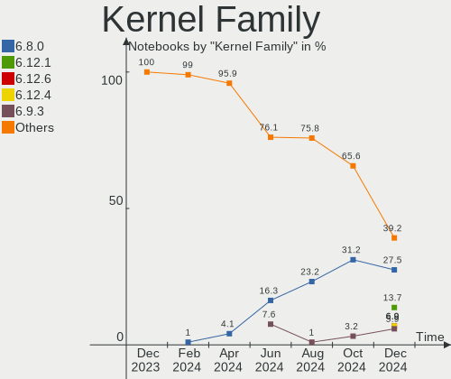
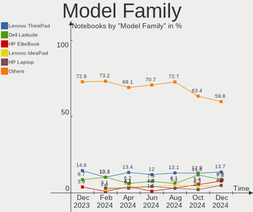
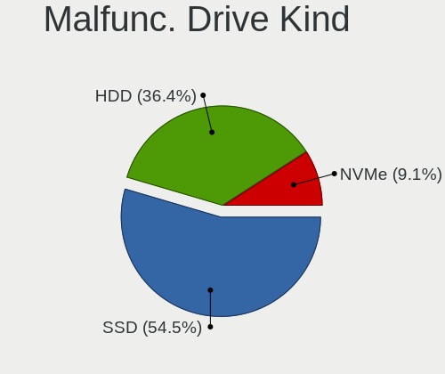
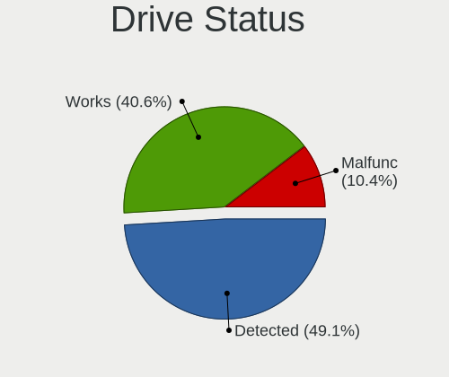
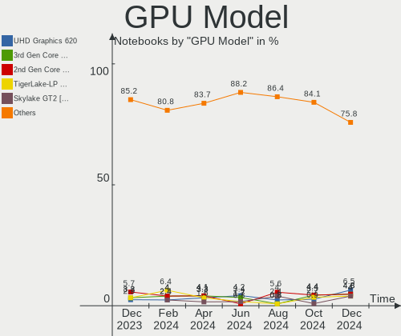
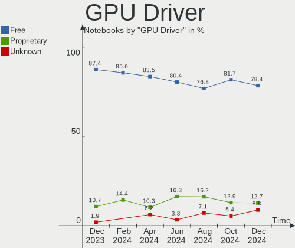
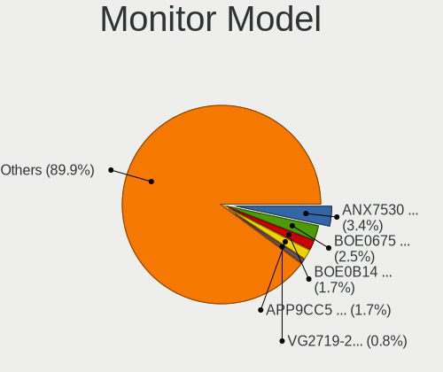
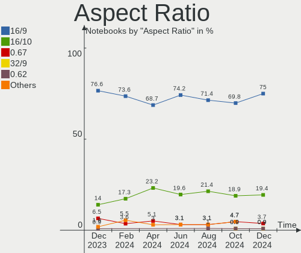

Linux in UK - Hardware Trends (Notebooks)
-----------------------------------------

A project to identify most popular hardware characteristics and track their change
over time based on data collected by Linux users at https://Linux-Hardware.org.

Anyone can contribute to this report by the [hw-probe](https://github.com/linuxhw/hw-probe) tool:

    sudo -E hw-probe -all -upload

Period: Dec, 2024.

Contents
--------

* [ System ](#system)
  - [ OS                       ](#os)
  - [ OS Family                ](#os-family)
  - [ Kernel                   ](#kernel)
  - [ Kernel Family            ](#kernel-family)
  - [ Kernel Major Ver.        ](#kernel-major-ver)
  - [ Arch                     ](#arch)
  - [ DE                       ](#de)
  - [ Display Server           ](#display-server)
  - [ Display Manager          ](#display-manager)
  - [ OS Lang                  ](#os-lang)
  - [ Boot Mode                ](#boot-mode)
  - [ Filesystem               ](#filesystem)
  - [ Part. scheme             ](#part-scheme)
  - [ Dual Boot with Linux/BSD ](#dual-boot-with-linuxbsd)
  - [ Dual Boot (Win)          ](#dual-boot-win)

* [ Board ](#board)
  - [ Vendor                   ](#vendor)
  - [ Model                    ](#model)
  - [ Model Family             ](#model-family)
  - [ MFG Year                 ](#mfg-year)
  - [ Form Factor              ](#form-factor)
  - [ Secure Boot              ](#secure-boot)
  - [ Coreboot                 ](#coreboot)
  - [ RAM Size                 ](#ram-size)
  - [ RAM Used                 ](#ram-used)
  - [ Total Drives             ](#total-drives)
  - [ Has CD-ROM               ](#has-cd-rom)
  - [ Has Ethernet             ](#has-ethernet)
  - [ Has WiFi                 ](#has-wifi)
  - [ Has Bluetooth            ](#has-bluetooth)

* [ Location ](#location)
  - [ Country                  ](#country)
  - [ City                     ](#city)

* [ Drives ](#drives)
  - [ Drive Vendor             ](#drive-vendor)
  - [ Drive Model              ](#drive-model)
  - [ HDD Vendor               ](#hdd-vendor)
  - [ SSD Vendor               ](#ssd-vendor)
  - [ Drive Kind               ](#drive-kind)
  - [ Drive Connector          ](#drive-connector)
  - [ Drive Size               ](#drive-size)
  - [ Space Total              ](#space-total)
  - [ Space Used               ](#space-used)
  - [ Malfunc. Drives          ](#malfunc-drives)
  - [ Malfunc. Drive Vendor    ](#malfunc-drive-vendor)
  - [ Malfunc. HDD Vendor      ](#malfunc-hdd-vendor)
  - [ Malfunc. Drive Kind      ](#malfunc-drive-kind)
  - [ Failed Drives            ](#failed-drives)
  - [ Failed Drive Vendor      ](#failed-drive-vendor)
  - [ Drive Status             ](#drive-status)

* [ Storage controller ](#storage-controller)
  - [ Storage Vendor           ](#storage-vendor)
  - [ Storage Model            ](#storage-model)
  - [ Storage Kind             ](#storage-kind)

* [ Processor ](#processor)
  - [ CPU Vendor               ](#cpu-vendor)
  - [ CPU Model                ](#cpu-model)
  - [ CPU Model Family         ](#cpu-model-family)
  - [ CPU Cores                ](#cpu-cores)
  - [ CPU Sockets              ](#cpu-sockets)
  - [ CPU Threads              ](#cpu-threads)
  - [ CPU Op-Modes             ](#cpu-op-modes)
  - [ CPU Microcode            ](#cpu-microcode)
  - [ CPU Microarch            ](#cpu-microarch)

* [ Graphics ](#graphics)
  - [ GPU Vendor               ](#gpu-vendor)
  - [ GPU Model                ](#gpu-model)
  - [ GPU Combo                ](#gpu-combo)
  - [ GPU Driver               ](#gpu-driver)
  - [ GPU Memory               ](#gpu-memory)

* [ Monitor ](#monitor)
  - [ Monitor Vendor           ](#monitor-vendor)
  - [ Monitor Model            ](#monitor-model)
  - [ Monitor Resolution       ](#monitor-resolution)
  - [ Monitor Diagonal         ](#monitor-diagonal)
  - [ Monitor Width            ](#monitor-width)
  - [ Aspect Ratio             ](#aspect-ratio)
  - [ Monitor Area             ](#monitor-area)
  - [ Pixel Density            ](#pixel-density)
  - [ Multiple Monitors        ](#multiple-monitors)

* [ Network ](#network)
  - [ Net Controller Vendor    ](#net-controller-vendor)
  - [ Net Controller Model     ](#net-controller-model)
  - [ Wireless Vendor          ](#wireless-vendor)
  - [ Wireless Model           ](#wireless-model)
  - [ Ethernet Vendor          ](#ethernet-vendor)
  - [ Ethernet Model           ](#ethernet-model)
  - [ Net Controller Kind      ](#net-controller-kind)
  - [ Used Controller          ](#used-controller)
  - [ NICs                     ](#nics)
  - [ IPv6                     ](#ipv6)

* [ Bluetooth ](#bluetooth)
  - [ Bluetooth Vendor         ](#bluetooth-vendor)
  - [ Bluetooth Model          ](#bluetooth-model)

* [ Sound ](#sound)
  - [ Sound Vendor             ](#sound-vendor)
  - [ Sound Model              ](#sound-model)

* [ Memory ](#memory)
  - [ Memory Vendor            ](#memory-vendor)
  - [ Memory Model             ](#memory-model)
  - [ Memory Kind              ](#memory-kind)
  - [ Memory Form Factor       ](#memory-form-factor)
  - [ Memory Size              ](#memory-size)
  - [ Memory Speed             ](#memory-speed)

* [ Printers & scanners ](#printers--scanners)
  - [ Printer Vendor           ](#printer-vendor)
  - [ Printer Model            ](#printer-model)
  - [ Scanner Vendor           ](#scanner-vendor)
  - [ Scanner Model            ](#scanner-model)

* [ Camera ](#camera)
  - [ Camera Vendor            ](#camera-vendor)
  - [ Camera Model             ](#camera-model)

* [ Security ](#security)
  - [ Fingerprint Vendor       ](#fingerprint-vendor)
  - [ Fingerprint Model        ](#fingerprint-model)
  - [ Chipcard Vendor          ](#chipcard-vendor)
  - [ Chipcard Model           ](#chipcard-model)

* [ Unsupported ](#unsupported)
  - [ Unsupported Devices      ](#unsupported-devices)
  - [ Unsupported Device Types ](#unsupported-device-types)

System
------

OS
--

Installed operating systems

| Name                         | Notebooks | Percent |
|------------------------------|-----------|---------|
| OpenMandriva 24.12           | 14        | 13.73%  |
| Ubuntu 24.04                 | 10        | 9.8%    |
| Fedora 41                    | 9         | 8.82%   |
| Arch Rolling                 | 8         | 7.84%   |
| Zorin 17                     | 7         | 6.86%   |
| SteamOS 3.6.20               | 5         | 4.9%    |
| Pop!_OS 22.04                | 4         | 3.92%   |
| openSUSE Tumbleweed-XXXXXXXX | 3         | 2.94%   |
| OpenMandriva 5.0             | 3         | 2.94%   |
| Linux Mint 22                | 3         | 2.94%   |
| EndeavourOS Rolling          | 3         | 2.94%   |
| Ubuntu 22.04                 | 2         | 1.96%   |
| Pop!_OS 24.04                | 2         | 1.96%   |
| OpenMandriva 23.08           | 2         | 1.96%   |
| Linux Mint 21.3              | 2         | 1.96%   |
| Debian 12                    | 2         | 1.96%   |
| ArcoLinux Rolling            | 2         | 1.96%   |
| Zorin 16                     | 1         | 0.98%   |
| Xubuntu 24.10                | 1         | 0.98%   |
| Xubuntu 24.04                | 1         | 0.98%   |
| Ubuntu Unity 24.04           | 1         | 0.98%   |
| Ubuntu MATE 24.04            | 1         | 0.98%   |
| Ubuntu 20.04                 | 1         | 0.98%   |
| Ubuntu 18.04                 | 1         | 0.98%   |
| Rocky Linux 9.5              | 1         | 0.98%   |
| OpenMandriva 24.08           | 1         | 0.98%   |
| OpenMandriva 23.11           | 1         | 0.98%   |
| Neptune OS 8.1               | 1         | 0.98%   |
| Manjaro Rolling              | 1         | 0.98%   |
| Manjaro 24.2.0               | 1         | 0.98%   |
| Lubuntu 24.04                | 1         | 0.98%   |
| Linux Mint 21.2              | 1         | 0.98%   |
| Kubuntu 24.10                | 1         | 0.98%   |
| Kubuntu 24.04                | 1         | 0.98%   |
| Kali 2024.4                  | 1         | 0.98%   |
| Elementary 8                 | 1         | 0.98%   |
| Debian                       | 1         | 0.98%   |
| CachyOS Rolling              | 1         | 0.98%   |

OS Family
---------

OS without a version

| Name         | Notebooks | Percent |
|--------------|-----------|---------|
| OpenMandriva | 21        | 20.59%  |
| Ubuntu       | 14        | 13.73%  |
| Fedora       | 9         | 8.82%   |
| Zorin        | 8         | 7.84%   |
| Arch         | 8         | 7.84%   |
| Pop!_OS      | 6         | 5.88%   |
| Linux Mint   | 6         | 5.88%   |
| SteamOS      | 5         | 4.9%    |
| openSUSE     | 3         | 2.94%   |
| EndeavourOS  | 3         | 2.94%   |
| Debian       | 3         | 2.94%   |
| Xubuntu      | 2         | 1.96%   |
| Manjaro      | 2         | 1.96%   |
| Kubuntu      | 2         | 1.96%   |
| ArcoLinux    | 2         | 1.96%   |
| Ubuntu Unity | 1         | 0.98%   |
| Ubuntu MATE  | 1         | 0.98%   |
| Rocky Linux  | 1         | 0.98%   |
| Neptune OS   | 1         | 0.98%   |
| Lubuntu      | 1         | 0.98%   |
| Kali         | 1         | 0.98%   |
| Elementary   | 1         | 0.98%   |
| CachyOS      | 1         | 0.98%   |

Kernel
------

Version of the Linux kernel

| Version                                  | Notebooks | Percent |
|------------------------------------------|-----------|---------|
| 6.8.0-49-generic                         | 14        | 13.73%  |
| 6.12.1-desktop-1omv2490                  | 13        | 12.75%  |
| 6.9.3-76060903-generic                   | 6         | 5.88%   |
| 6.8.0-50-generic                         | 6         | 5.88%   |
| 6.5.0-valve22-1-neptune-65-g9a338ed8a75e | 5         | 4.9%    |
| 6.8.0-51-generic                         | 4         | 3.92%   |
| 6.6.2-desktop-1omv2390                   | 4         | 3.92%   |
| 6.12.4-arch1-1                           | 4         | 3.92%   |
| 6.8.0-48-generic                         | 3         | 2.94%   |
| 6.11.10-300.fc41.x86_64                  | 3         | 2.94%   |
| 6.12.6-arch1-1                           | 2         | 1.96%   |
| 6.12.6-200.fc41.x86_64                   | 2         | 1.96%   |
| 6.12.4-200.fc41.x86_64                   | 2         | 1.96%   |
| 6.11.8-1-default                         | 2         | 1.96%   |
| 6.11.4-301.fc41.x86_64                   | 2         | 1.96%   |
| 6.1.0-27-amd64                           | 2         | 1.96%   |
| 6.8.0-38-generic                         | 1         | 0.98%   |
| 6.6.7-arch1-1                            | 1         | 0.98%   |
| 6.6.64-1-lts                             | 1         | 0.98%   |
| 6.5.0-21-generic                         | 1         | 0.98%   |
| 6.4.8-desktop-2omv2390                   | 1         | 0.98%   |
| 6.4.11-desktop-1omv2390                  | 1         | 0.98%   |
| 6.12.6-zen1-1-zen                        | 1         | 0.98%   |
| 6.12.6-desktop-1omv2490                  | 1         | 0.98%   |
| 6.12.6-1-liquorix-amd64                  | 1         | 0.98%   |
| 6.12.5-2-cachyos                         | 1         | 0.98%   |
| 6.12.4-zen1-1-zen                        | 1         | 0.98%   |
| 6.12.1-2-cachyos                         | 1         | 0.98%   |
| 6.11.7-zen1-1-zen                        | 1         | 0.98%   |
| 6.11.7-arch1-1                           | 1         | 0.98%   |
| 6.11.7-amd64                             | 1         | 0.98%   |
| 6.11.6-2-default                         | 1         | 0.98%   |
| 6.11.2-amd64                             | 1         | 0.98%   |
| 6.11.10-2-MANJARO                        | 1         | 0.98%   |
| 6.11.0-9-generic                         | 1         | 0.98%   |
| 6.11.0-8-generic                         | 1         | 0.98%   |
| 6.10.13-3-MANJARO                        | 1         | 0.98%   |
| 6.10.1-desktop-1omv2490                  | 1         | 0.98%   |
| 5.15.0-130-generic                       | 1         | 0.98%   |
| 5.15.0-127-generic                       | 1         | 0.98%   |

Kernel Family
-------------

Linux kernel without a distro release

| Version | Notebooks | Percent |
|---------|-----------|---------|
| 6.8.0   | 28        | 27.45%  |
| 6.12.1  | 14        | 13.73%  |
| 6.12.6  | 7         | 6.86%   |
| 6.12.4  | 7         | 6.86%   |
| 6.9.3   | 6         | 5.88%   |
| 6.5.0   | 6         | 5.88%   |
| 6.6.2   | 4         | 3.92%   |
| 6.11.10 | 4         | 3.92%   |
| 5.15.0  | 4         | 3.92%   |
| 6.11.7  | 3         | 2.94%   |
| 6.11.8  | 2         | 1.96%   |
| 6.11.4  | 2         | 1.96%   |
| 6.11.0  | 2         | 1.96%   |
| 6.1.0   | 2         | 1.96%   |
| 6.6.7   | 1         | 0.98%   |
| 6.6.64  | 1         | 0.98%   |
| 6.4.8   | 1         | 0.98%   |
| 6.4.11  | 1         | 0.98%   |
| 6.12.5  | 1         | 0.98%   |
| 6.11.6  | 1         | 0.98%   |
| 6.11.2  | 1         | 0.98%   |
| 6.10.13 | 1         | 0.98%   |
| 6.10.1  | 1         | 0.98%   |
| 5.14.0  | 1         | 0.98%   |
| 4.15.0  | 1         | 0.98%   |

Kernel Major Ver.
-----------------

Linux kernel major version

| Version | Notebooks | Percent |
|---------|-----------|---------|
| 6.12    | 29        | 28.43%  |
| 6.8     | 28        | 27.45%  |
| 6.11    | 15        | 14.71%  |
| 6.9     | 6         | 5.88%   |
| 6.6     | 6         | 5.88%   |
| 6.5     | 6         | 5.88%   |
| 5.15    | 4         | 3.92%   |
| 6.4     | 2         | 1.96%   |
| 6.10    | 2         | 1.96%   |
| 6.1     | 2         | 1.96%   |
| 5.14    | 1         | 0.98%   |
| 4.15    | 1         | 0.98%   |

Arch
----

OS architecture (x86_64, i586, etc.)

| Name   | Notebooks | Percent |
|--------|-----------|---------|
| x86_64 | 102       | 100%    |

DE
--

Desktop Environment

| Name       | Notebooks | Percent |
|------------|-----------|---------|
| GNOME      | 43        | 42.16%  |
| Unknown    | 13        | 12.75%  |
| KDE5       | 12        | 11.76%  |
| XFCE       | 8         | 7.84%   |
| KDE6       | 8         | 7.84%   |
| X-Cinnamon | 6         | 5.88%   |
| MATE       | 3         | 2.94%   |
| LXQt       | 3         | 2.94%   |
| Hyprland   | 2         | 1.96%   |
| COSMIC     | 2         | 1.96%   |
| Unity      | 1         | 0.98%   |
| Pantheon   | 1         | 0.98%   |

Display Server
--------------

X11 or Wayland

| Name    | Notebooks | Percent |
|---------|-----------|---------|
| Wayland | 53        | 51.96%  |
| X11     | 48        | 47.06%  |
| Unknown | 1         | 0.98%   |

Display Manager
---------------

SDDM, LightDM, etc.

| Name           | Notebooks | Percent |
|----------------|-----------|---------|
| Unknown        | 35        | 34.31%  |
| SDDM           | 28        | 27.45%  |
| LightDM        | 14        | 13.73%  |
| GDM            | 12        | 11.76%  |
| GDM3           | 11        | 10.78%  |
| GREETD         | 1         | 0.98%   |
| COSMIC-GREETER | 1         | 0.98%   |

OS Lang
-------

Language

| Lang  | Notebooks | Percent |
|-------|-----------|---------|
| en_GB | 73        | 71.57%  |
| en_US | 26        | 25.49%  |
| pl_PL | 2         | 1.96%   |
| hu_HU | 1         | 0.98%   |

Boot Mode
---------

EFI or BIOS

| Mode | Notebooks | Percent |
|------|-----------|---------|
| EFI  | 55        | 53.92%  |
| BIOS | 47        | 46.08%  |

Filesystem
----------

Type of filesystem

| Type    | Notebooks | Percent |
|---------|-----------|---------|
| Ext4    | 56        | 54.9%   |
| Btrfs   | 22        | 21.57%  |
| Overlay | 13        | 12.75%  |
| Tmpfs   | 8         | 7.84%   |
| Zfs     | 1         | 0.98%   |
| Xfs     | 1         | 0.98%   |
| F2fs    | 1         | 0.98%   |

Part. scheme
------------

Scheme of partitioning

| Type    | Notebooks | Percent |
|---------|-----------|---------|
| GPT     | 64        | 62.75%  |
| Unknown | 33        | 32.35%  |
| MBR     | 5         | 4.9%    |

Dual Boot with Linux/BSD
------------------------

Hosting more than one Linux/BSD

| Dual boot | Notebooks | Percent |
|-----------|-----------|---------|
| No        | 84        | 82.35%  |
| Yes       | 18        | 17.65%  |

Dual Boot (Win)
---------------

Hosting Linux and Windows

| Dual boot | Notebooks | Percent |
|-----------|-----------|---------|
| No        | 84        | 82.35%  |
| Yes       | 18        | 17.65%  |

Board
-----

Vendor
------

Motherboard manufacturer

| Name                | Notebooks | Percent |
|---------------------|-----------|---------|
| Lenovo              | 23        | 22.55%  |
| Hewlett-Packard     | 18        | 17.65%  |
| Dell                | 18        | 17.65%  |
| ASUSTek Computer    | 9         | 8.82%   |
| Valve               | 5         | 4.9%    |
| Apple               | 5         | 4.9%    |
| Acer                | 4         | 3.92%   |
| Toshiba             | 3         | 2.94%   |
| Google              | 3         | 2.94%   |
| Samsung Electronics | 2         | 1.96%   |
| PC Specialist       | 2         | 1.96%   |
| MSI                 | 2         | 1.96%   |
| Timi                | 1         | 0.98%   |
| OEGStone            | 1         | 0.98%   |
| LG Electronics      | 1         | 0.98%   |
| Fujitsu             | 1         | 0.98%   |
| eMachines           | 1         | 0.98%   |
| Dynabook            | 1         | 0.98%   |
| COMEXR              | 1         | 0.98%   |
| Unknown             | 1         | 0.98%   |

Model
-----

Motherboard model

| Name                                        | Notebooks | Percent |
|---------------------------------------------|-----------|---------|
| Valve Jupiter                               | 4         | 3.92%   |
| Lenovo IdeaPad Slim 1-14AST-05 81VS         | 2         | 1.96%   |
| Apple MacBookPro9,2                         | 2         | 1.96%   |
| Unknown                                     | 2         | 1.96%   |
| Valve Galileo                               | 1         | 0.98%   |
| Toshiba Satellite L855                      | 1         | 0.98%   |
| Toshiba Satellite L300                      | 1         | 0.98%   |
| Toshiba Satellite C50D-A-133                | 1         | 0.98%   |
| Timi TM1701                                 | 1         | 0.98%   |
| Samsung 700Z3C/700Z5C                       | 1         | 0.98%   |
| Samsung 700T1C                              | 1         | 0.98%   |
| PC Specialist Recoil VIII 17                | 1         | 0.98%   |
| PC Specialist PA70Hx                        | 1         | 0.98%   |
| OEGStone T5110                              | 1         | 0.98%   |
| MSI MS-7A34                                 | 1         | 0.98%   |
| MSI GE60 2PL                                | 1         | 0.98%   |
| LG 17Z90S-G.AD7BA1                          | 1         | 0.98%   |
| Lenovo ThinkPad X250 20CLS11W0W             | 1         | 0.98%   |
| Lenovo ThinkPad X220 4291QZ1                | 1         | 0.98%   |
| Lenovo ThinkPad X1 Carbon Gen 11 21HNS0CU04 | 1         | 0.98%   |
| Lenovo ThinkPad X1 Carbon 6th 20KH006KUK    | 1         | 0.98%   |
| Lenovo ThinkPad T520 42424UU                | 1         | 0.98%   |
| Lenovo ThinkPad T480s 20L8S78900            | 1         | 0.98%   |
| Lenovo ThinkPad T470 20HD000MUK             | 1         | 0.98%   |
| Lenovo ThinkPad T460 20FMS3320G             | 1         | 0.98%   |
| Lenovo ThinkPad T450 20BUS3GN02             | 1         | 0.98%   |
| Lenovo ThinkPad T410 25373J7                | 1         | 0.98%   |
| Lenovo ThinkPad T14 Gen 4 21K4S0GJ05        | 1         | 0.98%   |
| Lenovo ThinkPad T14 Gen 3 21AJS1AW01        | 1         | 0.98%   |
| Lenovo ThinkPad P70 20ESS03100              | 1         | 0.98%   |
| Lenovo ThinkPad L490 20Q6S23200             | 1         | 0.98%   |
| Lenovo ThinkBook 16 G6 ABP 21KK             | 1         | 0.98%   |
| Lenovo Legion-S7-16APH8 82Y4                | 1         | 0.98%   |
| Lenovo Legion 9 16IRX9 83G0                 | 1         | 0.98%   |
| Lenovo IdeaPad S340-15API 81NC              | 1         | 0.98%   |
| Lenovo IdeaPad 320-15AST 80XV               | 1         | 0.98%   |
| Lenovo IdeaPad 3 14ALC6 82KT                | 1         | 0.98%   |
| HP Victus by Gaming Laptop 15-fa1xxx        | 1         | 0.98%   |
| HP Syndra                                   | 1         | 0.98%   |
| HP ProBook 635 Aero G8 Notebook PC          | 1         | 0.98%   |

Model Family
------------

Motherboard model prefix

| Name                    | Notebooks | Percent |
|-------------------------|-----------|---------|
| Lenovo ThinkPad         | 14        | 13.73%  |
| Dell Latitude           | 9         | 8.82%   |
| HP EliteBook            | 8         | 7.84%   |
| Lenovo IdeaPad          | 5         | 4.9%    |
| HP Laptop               | 5         | 4.9%    |
| Valve Jupiter           | 4         | 3.92%   |
| Acer Aspire             | 4         | 3.92%   |
| Toshiba Satellite       | 3         | 2.94%   |
| Dell Inspiron           | 3         | 2.94%   |
| ASUS ZenBook            | 3         | 2.94%   |
| HP ProBook              | 2         | 1.96%   |
| Dell XPS                | 2         | 1.96%   |
| ASUS ROG                | 2         | 1.96%   |
| ASUS ASUS               | 2         | 1.96%   |
| Apple MacBookPro9       | 2         | 1.96%   |
| Unknown                 | 2         | 1.96%   |
| Valve Galileo           | 1         | 0.98%   |
| Timi TM1701             | 1         | 0.98%   |
| Samsung 700Z3C          | 1         | 0.98%   |
| Samsung 700T1C          | 1         | 0.98%   |
| PC Specialist Recoil    | 1         | 0.98%   |
| PC Specialist PA70Hx    | 1         | 0.98%   |
| OEGStone T5110          | 1         | 0.98%   |
| MSI MS-7A34             | 1         | 0.98%   |
| MSI GE60                | 1         | 0.98%   |
| LG 17Z90S-G.AD7BA1      | 1         | 0.98%   |
| Lenovo ThinkBook        | 1         | 0.98%   |
| Lenovo Legion-S7-16APH8 | 1         | 0.98%   |
| Lenovo Legion           | 1         | 0.98%   |
| HP Victus               | 1         | 0.98%   |
| HP Syndra               | 1         | 0.98%   |
| HP 470                  | 1         | 0.98%   |
| Google Swanky           | 1         | 0.98%   |
| Google Gnawty           | 1         | 0.98%   |
| Google Cyan             | 1         | 0.98%   |
| Fujitsu LIFEBOOK        | 1         | 0.98%   |
| eMachines E725          | 1         | 0.98%   |
| Dynabook PORTEGE        | 1         | 0.98%   |
| Dell Venue              | 1         | 0.98%   |
| Dell System             | 1         | 0.98%   |

MFG Year
--------

Motherboard manufacture year

| Year | Notebooks | Percent |
|------|-----------|---------|
| 2024 | 13        | 12.75%  |
| 2017 | 13        | 12.75%  |
| 2023 | 10        | 9.8%    |
| 2022 | 7         | 6.86%   |
| 2021 | 7         | 6.86%   |
| 2018 | 7         | 6.86%   |
| 2019 | 6         | 5.88%   |
| 2012 | 6         | 5.88%   |
| 2011 | 6         | 5.88%   |
| 2020 | 5         | 4.9%    |
| 2014 | 5         | 4.9%    |
| 2016 | 4         | 3.92%   |
| 2013 | 4         | 3.92%   |
| 2015 | 3         | 2.94%   |
| 2010 | 2         | 1.96%   |
| 2009 | 2         | 1.96%   |
| 2008 | 1         | 0.98%   |
| 2007 | 1         | 0.98%   |

Form Factor
-----------

Physical design of the computer

| Name     | Notebooks | Percent |
|----------|-----------|---------|
| Notebook | 102       | 100%    |

Secure Boot
-----------

Enabled or disabled

| State    | Notebooks | Percent |
|----------|-----------|---------|
| Disabled | 94        | 92.16%  |
| Enabled  | 8         | 7.84%   |

Coreboot
--------

Have coreboot on board

| Used | Notebooks | Percent |
|------|-----------|---------|
| No   | 98        | 96.08%  |
| Yes  | 4         | 3.92%   |

RAM Size
--------

Total RAM memory

| Size in GB  | Notebooks | Percent |
|-------------|-----------|---------|
| 4.01-8.0    | 27        | 26.47%  |
| 16.01-24.0  | 18        | 17.65%  |
| 8.01-16.0   | 18        | 17.65%  |
| 32.01-64.0  | 16        | 15.69%  |
| 3.01-4.0    | 11        | 10.78%  |
| 64.01-256.0 | 5         | 4.9%    |
| 1.01-2.0    | 5         | 4.9%    |
| 24.01-32.0  | 2         | 1.96%   |

RAM Used
--------

Used RAM memory

| Used GB   | Notebooks | Percent |
|-----------|-----------|---------|
| 1.01-2.0  | 25        | 24.51%  |
| 3.01-4.0  | 24        | 23.53%  |
| 2.01-3.0  | 24        | 23.53%  |
| 4.01-8.0  | 22        | 21.57%  |
| 8.01-16.0 | 6         | 5.88%   |
| 0.51-1.0  | 1         | 0.98%   |

Total Drives
------------

Number of drives on board

| Drives | Notebooks | Percent |
|--------|-----------|---------|
| 1      | 78        | 76.47%  |
| 2      | 20        | 19.61%  |
| 3      | 2         | 1.96%   |
| 4      | 1         | 0.98%   |
| 0      | 1         | 0.98%   |

Has CD-ROM
----------

Has CD-ROM on board

| Presented | Notebooks | Percent |
|-----------|-----------|---------|
| No        | 79        | 77.45%  |
| Yes       | 23        | 22.55%  |

Has Ethernet
------------

Has Ethernet on board

| Presented | Notebooks | Percent |
|-----------|-----------|---------|
| Yes       | 75        | 73.53%  |
| No        | 27        | 26.47%  |

Has WiFi
--------

Has WiFi module

| Presented | Notebooks | Percent |
|-----------|-----------|---------|
| Yes       | 96        | 94.12%  |
| No        | 6         | 5.88%   |

Has Bluetooth
-------------

Has Bluetooth module

| Presented | Notebooks | Percent |
|-----------|-----------|---------|
| Yes       | 92        | 90.2%   |
| No        | 10        | 9.8%    |

Location
--------

Country
-------

Geographic location (country)

| Country | Notebooks | Percent |
|---------|-----------|---------|
| UK      | 102       | 100%    |

City
----

Geographic location (city)

| City           | Notebooks | Percent |
|----------------|-----------|---------|
| London         | 5         | 4.9%    |
| Bristol        | 4         | 3.92%   |
| Southampton    | 3         | 2.94%   |
| Manchester     | 3         | 2.94%   |
| Glasgow        | 3         | 2.94%   |
| Croydon        | 3         | 2.94%   |
| Reading        | 2         | 1.96%   |
| Harringay      | 2         | 1.96%   |
| Hackney        | 2         | 1.96%   |
| Enfield        | 2         | 1.96%   |
| City of London | 2         | 1.96%   |
| Brent          | 2         | 1.96%   |
| Boston         | 2         | 1.96%   |
| Bangor         | 2         | 1.96%   |
| York           | 1         | 0.98%   |
| Yeovil         | 1         | 0.98%   |
| Wolverhampton  | 1         | 0.98%   |
| Woking         | 1         | 0.98%   |
| West Malling   | 1         | 0.98%   |
| Watford        | 1         | 0.98%   |
| Wantage        | 1         | 0.98%   |
| Wandsworth     | 1         | 0.98%   |
| Treharris      | 1         | 0.98%   |
| Tranent        | 1         | 0.98%   |
| Swindon        | 1         | 0.98%   |
| Swanley        | 1         | 0.98%   |
| Southwark      | 1         | 0.98%   |
| Smethwick      | 1         | 0.98%   |
| Sleaford       | 1         | 0.98%   |
| Sheffield      | 1         | 0.98%   |
| Rowledge       | 1         | 0.98%   |
| Rotherham      | 1         | 0.98%   |
| Rochdale       | 1         | 0.98%   |
| Purley         | 1         | 0.98%   |
| Prescot        | 1         | 0.98%   |
| Peterhead      | 1         | 0.98%   |
| Newton Abbot   | 1         | 0.98%   |
| Newry          | 1         | 0.98%   |
| Newham         | 1         | 0.98%   |
| Morecambe      | 1         | 0.98%   |

Drives
------

Drive Vendor
------------

Hard drive vendors

| Vendor                       | Notebooks | Drives | Percent |
|------------------------------|-----------|--------|---------|
| Samsung Electronics          | 18        | 19     | 14.4%   |
| Unknown                      | 13        | 13     | 10.4%   |
| Seagate                      | 11        | 11     | 8.8%    |
| SanDisk                      | 11        | 12     | 8.8%    |
| WDC                          | 10        | 10     | 8%      |
| Micron Technology            | 8         | 8      | 6.4%    |
| Crucial                      | 7         | 7      | 5.6%    |
| Toshiba                      | 5         | 5      | 4%      |
| Phison Electronics           | 5         | 6      | 4%      |
| SK hynix                     | 4         | 4      | 3.2%    |
| KIOXIA                       | 4         | 4      | 3.2%    |
| Kingston                     | 4         | 4      | 3.2%    |
| Micron/Crucial Technology    | 2         | 2      | 1.6%    |
| MAXIO Technology (Hangzhou)  | 2         | 2      | 1.6%    |
| Intel                        | 2         | 2      | 1.6%    |
| Hitachi                      | 2         | 2      | 1.6%    |
| Sonnics                      | 1         | 1      | 0.8%    |
| Silicon Motion               | 1         | 1      | 0.8%    |
| ShiJi                        | 1         | 1      | 0.8%    |
| Shenzhen Longsys Electronics | 1         | 1      | 0.8%    |
| Phison                       | 1         | 1      | 0.8%    |
| Origin                       | 1         | 1      | 0.8%    |
| LITEONIT                     | 1         | 1      | 0.8%    |
| Kingston Technology Company  | 1         | 1      | 0.8%    |
| HGST                         | 1         | 1      | 0.8%    |
| GOODRAM                      | 1         | 1      | 0.8%    |
| Fanxiang                     | 1         | 1      | 0.8%    |
| EDILOCA                      | 1         | 1      | 0.8%    |
| EAGET                        | 1         | 1      | 0.8%    |
| China                        | 1         | 1      | 0.8%    |
| Apple                        | 1         | 1      | 0.8%    |
| A-DATA Technology            | 1         | 1      | 0.8%    |
| Unknown                      | 1         | 1      | 0.8%    |

Drive Model
-----------

Hard drive models

| Model                                                 | Notebooks | Percent |
|-------------------------------------------------------|-----------|---------|
| Unknown MMC Card  64GB                                | 5         | 3.97%   |
| Phison PS5013 E13 NVMe Controller 512GB               | 3         | 2.38%   |
| Unknown MMC Card  32GB                                | 2         | 1.59%   |
| Unknown MMC Card  16GB                                | 2         | 1.59%   |
| Toshiba KSG60ZMV256G M.2 2280 256GB SSD               | 2         | 1.59%   |
| Seagate ST1000LM035-1RK172 1TB                        | 2         | 1.59%   |
| SanDisk NVMe SSD Drive 1TB                            | 2         | 1.59%   |
| Samsung NVMe SSD Controller SM961/PM961/SM963 256GB   | 2         | 1.59%   |
| Micron MTFDKBA1T0QFM-1BD1AABGB 1024GB                 | 2         | 1.59%   |
| Kingston SA400S37240G 240GB SSD                       | 2         | 1.59%   |
| Crucial CT2000MX500SSD1 2TB                           | 2         | 1.59%   |
| WDC WDS500G2B0A-00SM50 500GB SSD                      | 1         | 0.79%   |
| WDC WDS200T1R0B-68A4Z0 2TB SSD                        | 1         | 0.79%   |
| WDC WDS120G2G0A-00JH30 120GB SSD                      | 1         | 0.79%   |
| WDC WD5000BPKT-75PK4T0 500GB                          | 1         | 0.79%   |
| WDC WD10SPZX-75Z10T2 1TB                              | 1         | 0.79%   |
| WDC WD10SPZX-21Z10T0 1TB                              | 1         | 0.79%   |
| WDC WD Blue SA510 M.2 2280 1000GB SSD                 | 1         | 0.79%   |
| WDC PC SN810 NVMe 1024GB                              | 1         | 0.79%   |
| WDC PC SN530 NVMe 512GB                               | 1         | 0.79%   |
| WDC PC SN520 SDAPMUW-512G-1101 512GB                  | 1         | 0.79%   |
| Unknown SR128  128GB                                  | 1         | 0.79%   |
| Unknown NVMe SSD Drive 256GB                          | 1         | 0.79%   |
| Unknown NVMe SSD Drive 1TB                            | 1         | 0.79%   |
| Unknown MMC Card  128GB                               | 1         | 0.79%   |
| Toshiba MQ01ABD100 1TB                                | 1         | 0.79%   |
| Toshiba KXG6AZNV256G 256GB                            | 1         | 0.79%   |
| Toshiba KXG50ZNV512G NVMe 512GB                       | 1         | 0.79%   |
| Sonnics USB 3.0 8TB                                   | 1         | 0.79%   |
| SK hynix SKHynix_HFS002TEJ9X115N 2TB                  | 1         | 0.79%   |
| SK hynix SKHynix_HFM128GD3HX015N 128GB                | 1         | 0.79%   |
| SK hynix SC311 SATA 128GB SSD                         | 1         | 0.79%   |
| SK hynix HFS256G39TND-N210A 256GB SSD                 | 1         | 0.79%   |
| Silicon Motion SM2263EN/SM2263XT SSD Controller 256GB | 1         | 0.79%   |
| ShiJi 512GB                                           | 1         | 0.79%   |
| Shenzhen Longsys Lexar SSD NM620 512GB                | 1         | 0.79%   |
| Seagate ST9500420AS 500GB                             | 1         | 0.79%   |
| Seagate ST9320325AS 320GB                             | 1         | 0.79%   |
| Seagate ST500LX025-1U717D 500GB                       | 1         | 0.79%   |
| Seagate ST500LT012-1DG142 500GB                       | 1         | 0.79%   |

HDD Vendor
----------

Hard disk drive vendors

| Vendor  | Notebooks | Drives | Percent |
|---------|-----------|--------|---------|
| Seagate | 11        | 11     | 61.11%  |
| WDC     | 3         | 3      | 16.67%  |
| Hitachi | 2         | 2      | 11.11%  |
| Toshiba | 1         | 1      | 5.56%   |
| HGST    | 1         | 1      | 5.56%   |

SSD Vendor
----------

Solid state drive vendors

| Vendor              | Notebooks | Drives | Percent |
|---------------------|-----------|--------|---------|
| Samsung Electronics | 6         | 6      | 16.67%  |
| SanDisk             | 5         | 5      | 13.89%  |
| WDC                 | 4         | 4      | 11.11%  |
| Kingston            | 4         | 4      | 11.11%  |
| Crucial             | 4         | 4      | 11.11%  |
| Toshiba             | 2         | 2      | 5.56%   |
| SK hynix            | 2         | 2      | 5.56%   |
| Origin              | 1         | 1      | 2.78%   |
| LITEONIT            | 1         | 1      | 2.78%   |
| Intel               | 1         | 1      | 2.78%   |
| GOODRAM             | 1         | 1      | 2.78%   |
| EDILOCA             | 1         | 1      | 2.78%   |
| EAGET               | 1         | 1      | 2.78%   |
| China               | 1         | 1      | 2.78%   |
| Apple               | 1         | 1      | 2.78%   |
| A-DATA Technology   | 1         | 1      | 2.78%   |

Drive Kind
----------

HDD or SSD

| Kind    | Notebooks | Drives | Percent |
|---------|-----------|--------|---------|
| NVMe    | 52        | 59     | 45.61%  |
| SSD     | 32        | 36     | 28.07%  |
| HDD     | 16        | 18     | 14.04%  |
| MMC     | 11        | 12     | 9.65%   |
| Unknown | 3         | 3      | 2.63%   |

Drive Connector
---------------

SATA, SAS, NVMe, etc.

| Type | Notebooks | Drives | Percent |
|------|-----------|--------|---------|
| NVMe | 52        | 59     | 46.43%  |
| SATA | 46        | 53     | 41.07%  |
| MMC  | 11        | 12     | 9.82%   |
| SAS  | 3         | 4      | 2.68%   |

Drive Size
----------

Size of hard drive

| Size in TB | Notebooks | Drives | Percent |
|------------|-----------|--------|---------|
| 0.01-0.5   | 29        | 31     | 55.77%  |
| 0.51-1.0   | 16        | 16     | 30.77%  |
| 1.01-2.0   | 5         | 5      | 9.62%   |
| 2.01-3.0   | 1         | 1      | 1.92%   |
| 10.01-20.0 | 1         | 1      | 1.92%   |

Space Total
-----------

Amount of disk space available on the file system

| Size in GB     | Notebooks | Percent |
|----------------|-----------|---------|
| 501-1000       | 24        | 23.53%  |
| 251-500        | 20        | 19.61%  |
| 101-250        | 17        | 16.67%  |
| 1-20           | 13        | 12.75%  |
| More than 3000 | 8         | 7.84%   |
| 51-100         | 7         | 6.86%   |
| 1001-2000      | 6         | 5.88%   |
| 2001-3000      | 3         | 2.94%   |
| Unknown        | 3         | 2.94%   |
| 21-50          | 1         | 0.98%   |

Space Used
----------

Amount of used disk space

| Used GB        | Notebooks | Percent |
|----------------|-----------|---------|
| 1-20           | 36        | 35.29%  |
| 21-50          | 16        | 15.69%  |
| 101-250        | 13        | 12.75%  |
| 251-500        | 11        | 10.78%  |
| 51-100         | 11        | 10.78%  |
| 501-1000       | 7         | 6.86%   |
| 1001-2000      | 3         | 2.94%   |
| Unknown        | 3         | 2.94%   |
| More than 3000 | 2         | 1.96%   |

Malfunc. Drives
---------------

Drive models with a malfunction

| Model                                              | Notebooks | Drives | Percent |
|----------------------------------------------------|-----------|--------|---------|
| WDC WDS120G2G0A-00JH30 120GB SSD                   | 1         | 1      | 9.09%   |
| Toshiba KSG60ZMV256G M.2 2280 256GB SSD            | 1         | 1      | 9.09%   |
| SK hynix HFS256G39TND-N210A 256GB SSD              | 1         | 1      | 9.09%   |
| Shenzhen Longsys Electronics Lexar SSD NM620 512GB | 1         | 1      | 9.09%   |
| Seagate ST9320325AS 320GB                          | 1         | 1      | 9.09%   |
| Seagate ST500LT012-1DG142 500GB                    | 1         | 1      | 9.09%   |
| Seagate ST500LM000-1EJ162 500GB                    | 1         | 1      | 9.09%   |
| LITEONIT LMT-128M3M 128GB SSD                      | 1         | 1      | 9.09%   |
| Hitachi HTS545050B9A300 500GB                      | 1         | 1      | 9.09%   |
| Crucial CT525MX300SSD1 528GB                       | 1         | 1      | 9.09%   |
| Crucial CT2000MX500SSD1 2TB                        | 1         | 1      | 9.09%   |

Malfunc. Drive Vendor
---------------------

Vendors of faulty drives

| Vendor                       | Notebooks | Drives | Percent |
|------------------------------|-----------|--------|---------|
| Seagate                      | 3         | 3      | 27.27%  |
| Crucial                      | 2         | 2      | 18.18%  |
| WDC                          | 1         | 1      | 9.09%   |
| Toshiba                      | 1         | 1      | 9.09%   |
| SK hynix                     | 1         | 1      | 9.09%   |
| Shenzhen Longsys Electronics | 1         | 1      | 9.09%   |
| LITEONIT                     | 1         | 1      | 9.09%   |
| Hitachi                      | 1         | 1      | 9.09%   |

Malfunc. HDD Vendor
-------------------

Vendors of faulty HDD drives

| Vendor  | Notebooks | Drives | Percent |
|---------|-----------|--------|---------|
| Seagate | 3         | 3      | 75%     |
| Hitachi | 1         | 1      | 25%     |

Malfunc. Drive Kind
-------------------

Kinds of faulty drives

| Kind | Notebooks | Drives | Percent |
|------|-----------|--------|---------|
| SSD  | 6         | 6      | 54.55%  |
| HDD  | 4         | 4      | 36.36%  |
| NVMe | 1         | 1      | 9.09%   |

Failed Drives
-------------

Failed drive models

Zero info for selected period =(

Failed Drive Vendor
-------------------

Failed drive vendors

Zero info for selected period =(

Drive Status
------------

Number of failed and malfunc. drives

| Status   | Notebooks | Drives | Percent |
|----------|-----------|--------|---------|
| Detected | 52        | 64     | 49.06%  |
| Works    | 43        | 53     | 40.57%  |
| Malfunc  | 11        | 11     | 10.38%  |

Storage controller
------------------

Storage Vendor
--------------

Storage controller vendors

| Vendor                               | Notebooks | Percent |
|--------------------------------------|-----------|---------|
| Intel                                | 51        | 43.97%  |
| Samsung Electronics                  | 13        | 11.21%  |
| Sandisk                              | 9         | 7.76%   |
| Micron Technology                    | 9         | 7.76%   |
| AMD                                  | 8         | 6.9%    |
| Phison Electronics                   | 6         | 5.17%   |
| Micron/Crucial Technology            | 4         | 3.45%   |
| KIOXIA                               | 4         | 3.45%   |
| Toshiba America Info Systems         | 2         | 1.72%   |
| SK hynix                             | 2         | 1.72%   |
| MAXIO Technology (Hangzhou)          | 2         | 1.72%   |
| Solidigm                             | 1         | 0.86%   |
| Silicon Motion                       | 1         | 0.86%   |
| Shenzhen Longsys Electronics         | 1         | 0.86%   |
| Ramaxel Technology(Shenzhen) Limited | 1         | 0.86%   |
| Nvidia                               | 1         | 0.86%   |
| Kingston Technology Company          | 1         | 0.86%   |

Storage Model
-------------

Storage controller models

| Model                                                                                                              | Notebooks | Percent |
|--------------------------------------------------------------------------------------------------------------------|-----------|---------|
| Intel Sunrise Point-LP SATA Controller [AHCI mode]                                                                 | 9         | 7.26%   |
| AMD FCH SATA Controller [AHCI mode]                                                                                | 8         | 6.45%   |
| Intel 7 Series Chipset Family 6-port SATA Controller [AHCI mode]                                                   | 6         | 4.84%   |
| Micron 2400 NVMe SSD (DRAM-less)                                                                                   | 5         | 4.03%   |
| Intel Volume Management Device NVMe RAID Controller                                                                | 5         | 4.03%   |
| Intel 6 Series/C200 Series Chipset Family 6 port Mobile SATA AHCI Controller                                       | 5         | 4.03%   |
| Phison PS5013-E13 PCIe3 NVMe Controller (DRAM-less)                                                                | 4         | 3.23%   |
| Intel Wildcat Point-LP SATA Controller [AHCI Mode]                                                                 | 4         | 3.23%   |
| Intel Tiger Lake-LP SATA Controller                                                                                | 4         | 3.23%   |
| Samsung NVMe SSD Controller 980 (DRAM-less)                                                                        | 3         | 2.42%   |
| Intel 82801 Mobile SATA Controller [RAID mode]                                                                     | 3         | 2.42%   |
| Intel 8 Series SATA Controller 1 [AHCI mode]                                                                       | 3         | 2.42%   |
| SanDisk WD Black SN770 / PC SN740 256GB / PC SN560 (DRAM-less) NVMe SSD                                            | 2         | 1.61%   |
| SanDisk Ultra 3D / WD Blue SN570 NVMe SSD (DRAM-less)                                                              | 2         | 1.61%   |
| Samsung NVMe SSD Controller SM981/PM981/PM983                                                                      | 2         | 1.61%   |
| Samsung NVMe SSD Controller SM961/PM961/SM963                                                                      | 2         | 1.61%   |
| Samsung NVMe SSD Controller S4LV008[Pascal]                                                                        | 2         | 1.61%   |
| Samsung NVMe SSD Controller PM9B1 (DRAM-less)                                                                      | 2         | 1.61%   |
| Micron/Crucial P3 Plus NVMe PCIe SSD (DRAM-less)                                                                   | 2         | 1.61%   |
| Micron 2550 NVMe SSD (DRAM-less)                                                                                   | 2         | 1.61%   |
| KIOXIA NVMe SSD Controller XG8                                                                                     | 2         | 1.61%   |
| Intel Q170/Q150/B150/H170/H110/Z170/CM236 Chipset SATA Controller [AHCI Mode]                                      | 2         | 1.61%   |
| Toshiba America Info Systems XG6 NVMe SSD Controller                                                               | 1         | 0.81%   |
| Toshiba America Info Systems XG5 NVMe SSD Controller                                                               | 1         | 0.81%   |
| Solidigm P41 Plus NVMe SSD (DRAM-less) [Echo Harbor]                                                               | 1         | 0.81%   |
| SK hynix Platinum P41/PC801 NVMe Solid State Drive                                                                 | 1         | 0.81%   |
| SK hynix Gold P31/BC711/PC711 NVMe Solid State Drive                                                               | 1         | 0.81%   |
| Silicon Motion SM2263EN/SM2263XT (DRAM-less) NVMe SSD Controllers                                                  | 1         | 0.81%   |
| Shenzhen Longsys FORESEE XP1000 / Lexar Professional CFexpress Type B Gold series, NM620 PCIe NVME SSD (DRAM-less) | 1         | 0.81%   |
| SanDisk WD PC SN810 / Black SN850 NVMe SSD                                                                         | 1         | 0.81%   |
| Sandisk WD PC SN740 NVMe SSD 512GB (DRAM-less)                                                                     | 1         | 0.81%   |
| Sandisk WD Black SN850X NVMe SSD                                                                                   | 1         | 0.81%   |
| SanDisk Ultra 3D / WD PC SN530, IX SN530, Blue SN550 NVMe SSD (DRAM-less)                                          | 1         | 0.81%   |
| SanDisk PC SN520 x2 M.2 2242 NVMe SSD                                                                              | 1         | 0.81%   |
| SanDisk IX SN530 NVMe SSD (DRAM-less)                                                                              | 1         | 0.81%   |
| Samsung S4LN053X01 AHCI SSD Controller(Apple slot)                                                                 | 1         | 0.81%   |
| Samsung Electronics Non-Volatile memory controller                                                                 | 1         | 0.81%   |
| Ramaxel Technology(Shenzhen) Limited Non-Volatile memory controller                                                | 1         | 0.81%   |
| Phison E8 PCIe3 x2 NVMe Controller                                                                                 | 1         | 0.81%   |
| Phison E18 PCIe4 NVMe Controller                                                                                   | 1         | 0.81%   |

Storage Kind
------------

Kind of storage controller (IDE, SATA, NVMe, SAS, ...)

| Kind | Notebooks | Percent |
|------|-----------|---------|
| SATA | 53        | 45.3%   |
| NVMe | 52        | 44.44%  |
| RAID | 9         | 7.69%   |
| IDE  | 3         | 2.56%   |

Processor
---------

CPU Vendor
----------

Processor vendors

| Vendor | Notebooks | Percent |
|--------|-----------|---------|
| Intel  | 78        | 76.47%  |
| AMD    | 24        | 23.53%  |

CPU Model
---------

Processor models

| Model                                         | Notebooks | Percent |
|-----------------------------------------------|-----------|---------|
| Intel Core i7-8550U CPU @ 1.80GHz             | 4         | 3.92%   |
| Intel 11th Gen Core i5-1135G7 @ 2.40GHz       | 4         | 3.92%   |
| AMD Custom APU 0405                           | 4         | 3.92%   |
| Intel Core i9-14900HX                         | 3         | 2.94%   |
| Intel Core i5-8250U CPU @ 1.60GHz             | 3         | 2.94%   |
| Intel Core i7-3520M CPU @ 2.90GHz             | 2         | 1.96%   |
| Intel Core i5-6300U CPU @ 2.40GHz             | 2         | 1.96%   |
| Intel Core i5-5300U CPU @ 2.30GHz             | 2         | 1.96%   |
| Intel Core i5-5200U CPU @ 2.20GHz             | 2         | 1.96%   |
| Intel Core i5-4300U CPU @ 1.90GHz             | 2         | 1.96%   |
| Intel Core i3-6006U CPU @ 2.00GHz             | 2         | 1.96%   |
| Intel Celeron CPU N3060 @ 1.60GHz             | 2         | 1.96%   |
| Intel Celeron CPU N2840 @ 2.16GHz             | 2         | 1.96%   |
| Intel 13th Gen Core i9-13900H                 | 2         | 1.96%   |
| AMD A6-9220 RADEON R4, 5 COMPUTE CORES 2C+3G  | 2         | 1.96%   |
| AMD A4-9120e RADEON R3, 4 COMPUTE CORES 2C+2G | 2         | 1.96%   |
| Intel Xeon CPU E3-1505M v5 @ 2.80GHz          | 1         | 0.98%   |
| Intel Pentium Gold 7505 @ 2.00GHz             | 1         | 0.98%   |
| Intel Pentium CPU 4417U @ 2.30GHz             | 1         | 0.98%   |
| Intel Genuine CPU T1600 @ 1.66GHz             | 1         | 0.98%   |
| Intel Core Ultra 7 155H                       | 1         | 0.98%   |
| Intel Core i7-8750H CPU @ 2.20GHz             | 1         | 0.98%   |
| Intel Core i7-8565U CPU @ 1.80GHz             | 1         | 0.98%   |
| Intel Core i7-7700HQ CPU @ 2.80GHz            | 1         | 0.98%   |
| Intel Core i7-6820HQ CPU @ 2.70GHz            | 1         | 0.98%   |
| Intel Core i7-4770HQ CPU @ 2.20GHz            | 1         | 0.98%   |
| Intel Core i7-4650U CPU @ 1.70GHz             | 1         | 0.98%   |
| Intel Core i7-2860QM CPU @ 2.50GHz            | 1         | 0.98%   |
| Intel Core i7-2720QM CPU @ 2.20GHz            | 1         | 0.98%   |
| Intel Core i7-2620M CPU @ 2.70GHz             | 1         | 0.98%   |
| Intel Core i5-8365U CPU @ 1.60GHz             | 1         | 0.98%   |
| Intel Core i5-8350U CPU @ 1.70GHz             | 1         | 0.98%   |
| Intel Core i5-7300U CPU @ 2.60GHz             | 1         | 0.98%   |
| Intel Core i5-6200U CPU @ 2.30GHz             | 1         | 0.98%   |
| Intel Core i5-4210H CPU @ 2.90GHz             | 1         | 0.98%   |
| Intel Core i5-3320M CPU @ 2.60GHz             | 1         | 0.98%   |
| Intel Core i5-3317U CPU @ 1.70GHz             | 1         | 0.98%   |
| Intel Core i5-3230M CPU @ 2.60GHz             | 1         | 0.98%   |
| Intel Core i5-3210M CPU @ 2.50GHz             | 1         | 0.98%   |
| Intel Core i5-2540M CPU @ 2.60GHz             | 1         | 0.98%   |

CPU Model Family
----------------

Processor model prefix

| Model              | Notebooks | Percent |
|--------------------|-----------|---------|
| Intel Core i5      | 26        | 25.49%  |
| Other              | 21        | 20.59%  |
| Intel Core i7      | 15        | 14.71%  |
| Intel Core i3      | 5         | 4.9%    |
| Intel Celeron      | 5         | 4.9%    |
| AMD Ryzen 7        | 4         | 3.92%   |
| Intel Core i9      | 3         | 2.94%   |
| Intel Core 2 Duo   | 3         | 2.94%   |
| AMD Ryzen 9        | 3         | 2.94%   |
| AMD Ryzen 5        | 3         | 2.94%   |
| AMD A6             | 2         | 1.96%   |
| AMD A4             | 2         | 1.96%   |
| Intel Xeon         | 1         | 0.98%   |
| Intel Pentium Gold | 1         | 0.98%   |
| Intel Pentium      | 1         | 0.98%   |
| Intel Genuine      | 1         | 0.98%   |
| Intel Core         | 1         | 0.98%   |
| Intel Atom         | 1         | 0.98%   |
| AMD Ryzen 7 PRO    | 1         | 0.98%   |
| AMD Ryzen 5 PRO    | 1         | 0.98%   |
| AMD Ryzen 3        | 1         | 0.98%   |
| AMD E1             | 1         | 0.98%   |

CPU Cores
---------

Number of processor cores

| Number | Notebooks | Percent |
|--------|-----------|---------|
| 2      | 44        | 43.14%  |
| 4      | 35        | 34.31%  |
| 8      | 7         | 6.86%   |
| 10     | 5         | 4.9%    |
| 24     | 3         | 2.94%   |
| 6      | 3         | 2.94%   |
| 14     | 2         | 1.96%   |
| 12     | 2         | 1.96%   |
| 16     | 1         | 0.98%   |

CPU Sockets
-----------

Number of sockets

| Number | Notebooks | Percent |
|--------|-----------|---------|
| 1      | 102       | 100%    |

CPU Threads
-----------

Threads per core (Hyper-Threading)

| Number | Notebooks | Percent |
|--------|-----------|---------|
| 2      | 84        | 82.35%  |
| 1      | 18        | 17.65%  |

CPU Op-Modes
------------

CPU Operation Modes (32-bit, 64-bit)

| Op mode        | Notebooks | Percent |
|----------------|-----------|---------|
| 32-bit, 64-bit | 102       | 100%    |

CPU Microcode
-------------

Microcode number

| Number     | Notebooks | Percent |
|------------|-----------|---------|
| Unknown    | 97        | 95.1%   |
| 0x806e9    | 1         | 0.98%   |
| 0x306d4    | 1         | 0.98%   |
| 0x206a7    | 1         | 0.98%   |
| 0x10676    | 1         | 0.98%   |
| 0x06006705 | 1         | 0.98%   |

CPU Microarch
-------------

Microarchitecture

| Name              | Notebooks | Percent |
|-------------------|-----------|---------|
| KabyLake          | 16        | 15.69%  |
| Unknown           | 16        | 15.69%  |
| Alderlake Hybrid  | 8         | 7.84%   |
| Skylake           | 7         | 6.86%   |
| TigerLake         | 6         | 5.88%   |
| SandyBridge       | 6         | 5.88%   |
| IvyBridge         | 6         | 5.88%   |
| Haswell           | 6         | 5.88%   |
| Silvermont        | 5         | 4.9%    |
| Excavator         | 5         | 4.9%    |
| Broadwell         | 4         | 3.92%   |
| Zen+              | 2         | 1.96%   |
| Zen 3             | 2         | 1.96%   |
| Westmere          | 2         | 1.96%   |
| Penryn            | 2         | 1.96%   |
| Icelake           | 2         | 1.96%   |
| Core              | 2         | 1.96%   |
| Zen               | 1         | 0.98%   |
| Meteorlake Hybrid | 1         | 0.98%   |
| Jaguar            | 1         | 0.98%   |
| Goldmont plus     | 1         | 0.98%   |
| CometLake         | 1         | 0.98%   |

Graphics
--------

GPU Vendor
----------

Vendors of graphics cards

| Vendor | Notebooks | Percent |
|--------|-----------|---------|
| Intel  | 75        | 60.98%  |
| AMD    | 25        | 20.33%  |
| Nvidia | 23        | 18.7%   |

GPU Model
---------

Graphics card models

| Model                                                                                    | Notebooks | Percent |
|------------------------------------------------------------------------------------------|-----------|---------|
| Intel UHD Graphics 620                                                                   | 8         | 6.45%   |
| Intel 3rd Gen Core processor Graphics Controller                                         | 6         | 4.84%   |
| Intel 2nd Generation Core Processor Family Integrated Graphics Controller                | 6         | 4.84%   |
| Intel TigerLake-LP GT2 [Iris Xe Graphics]                                                | 5         | 4.03%   |
| Intel Skylake GT2 [HD Graphics 520]                                                      | 5         | 4.03%   |
| AMD Stoney [Radeon R2/R3/R4/R5 Graphics]                                                 | 5         | 4.03%   |
| Nvidia AD106M [GeForce RTX 4070 Max-Q / Mobile]                                          | 4         | 3.23%   |
| Intel HD Graphics 5500                                                                   | 4         | 3.23%   |
| Intel Haswell-ULT Integrated Graphics Controller                                         | 4         | 3.23%   |
| AMD VanGogh [AMD Custom GPU 0405]                                                        | 4         | 3.23%   |
| Intel Raptor Lake-P [Iris Xe Graphics]                                                   | 3         | 2.42%   |
| Intel Atom Processor Z36xxx/Z37xxx Series Graphics & Display                             | 3         | 2.42%   |
| Intel Alder Lake-UP3 GT2 [Iris Xe Graphics]                                              | 3         | 2.42%   |
| Nvidia GP108M [GeForce MX150]                                                            | 2         | 1.61%   |
| Nvidia AD107M [GeForce RTX 4060 Max-Q / Mobile]                                          | 2         | 1.61%   |
| Intel WhiskeyLake-U GT2 [UHD Graphics 620]                                               | 2         | 1.61%   |
| Intel Raptor Lake-S UHD Graphics                                                         | 2         | 1.61%   |
| Intel Mobile 4 Series Chipset Integrated Graphics Controller                             | 2         | 1.61%   |
| Intel HD Graphics 620                                                                    | 2         | 1.61%   |
| Intel Core Processor Integrated Graphics Controller                                      | 2         | 1.61%   |
| Intel Atom/Celeron/Pentium Processor x5-E8000/J3xxx/N3xxx Integrated Graphics Controller | 2         | 1.61%   |
| AMD Picasso/Raven 2 [Radeon Vega Series / Radeon Vega Mobile Series]                     | 2         | 1.61%   |
| AMD Phoenix3                                                                             | 2         | 1.61%   |
| AMD Phoenix1                                                                             | 2         | 1.61%   |
| Nvidia TU116 [GeForce GTX 1660 SUPER]                                                    | 1         | 0.81%   |
| Nvidia MCP89 [GeForce 320M]                                                              | 1         | 0.81%   |
| Nvidia GP107M [GeForce GTX 1050 Ti Mobile]                                               | 1         | 0.81%   |
| Nvidia GP104M [GeForce GTX 1070 Mobile]                                                  | 1         | 0.81%   |
| Nvidia GM206GLM [Quadro M2200 Mobile]                                                    | 1         | 0.81%   |
| Nvidia GM204GLM [Quadro M4000M]                                                          | 1         | 0.81%   |
| Nvidia GM107M [GeForce GTX 850M]                                                         | 1         | 0.81%   |
| Nvidia GK208BM [GeForce 920M]                                                            | 1         | 0.81%   |
| Nvidia GK107M [GeForce GT 640M]                                                          | 1         | 0.81%   |
| Nvidia GF119M [Quadro NVS 4200M]                                                         | 1         | 0.81%   |
| Nvidia GF108M [GeForce GT 540M]                                                          | 1         | 0.81%   |
| Nvidia GA107M [GeForce RTX 3050 Mobile]                                                  | 1         | 0.81%   |
| Nvidia GA107 [GeForce RTX 2050]                                                          | 1         | 0.81%   |
| Nvidia AD104M [GeForce RTX 4080 Max-Q / Mobile]                                          | 1         | 0.81%   |
| Nvidia AD103M / GN21-X11 [GeForce RTX 4090 Laptop GPU]                                   | 1         | 0.81%   |
| Intel TigerLake-H GT1 [UHD Graphics]                                                     | 1         | 0.81%   |

GPU Combo
---------

Combinations of graphics cards

| Name           | Notebooks | Percent |
|----------------|-----------|---------|
| 1 x Intel      | 57        | 55.88%  |
| 1 x AMD        | 20        | 19.61%  |
| Intel + Nvidia | 16        | 15.69%  |
| AMD + Nvidia   | 4         | 3.92%   |
| 1 x Nvidia     | 3         | 2.94%   |
| 2 x Intel      | 1         | 0.98%   |
| Intel + AMD    | 1         | 0.98%   |

GPU Driver
----------

Free vs proprietary

| Driver      | Notebooks | Percent |
|-------------|-----------|---------|
| Free        | 80        | 78.43%  |
| Proprietary | 13        | 12.75%  |
| Unknown     | 9         | 8.82%   |

GPU Memory
----------

Total video memory

| Size in GB | Notebooks | Percent |
|------------|-----------|---------|
| Unknown    | 84        | 82.35%  |
| 0.01-0.5   | 7         | 6.86%   |
| 1.01-2.0   | 5         | 4.9%    |
| 0.51-1.0   | 3         | 2.94%   |
| 5.01-6.0   | 2         | 1.96%   |
| 3.01-4.0   | 1         | 0.98%   |

Monitor
-------

Monitor Vendor
--------------

Monitor vendors

| Vendor                  | Notebooks | Percent |
|-------------------------|-----------|---------|
| BOE                     | 22        | 18.64%  |
| AU Optronics            | 19        | 16.1%   |
| LG Display              | 16        | 13.56%  |
| Chimei Innolux          | 11        | 9.32%   |
| Samsung Electronics     | 9         | 7.63%   |
| Valve                   | 5         | 4.24%   |
| Lenovo                  | 5         | 4.24%   |
| Apple                   | 5         | 4.24%   |
| Sharp                   | 3         | 2.54%   |
| PANDA                   | 3         | 2.54%   |
| Goldstar                | 3         | 2.54%   |
| Dell                    | 3         | 2.54%   |
| Hewlett-Packard         | 2         | 1.69%   |
| Acer                    | 2         | 1.69%   |
| ViewSonic               | 1         | 0.85%   |
| Philips                 | 1         | 0.85%   |
| Panasonic               | 1         | 0.85%   |
| LG Philips              | 1         | 0.85%   |
| HKC                     | 1         | 0.85%   |
| CSW                     | 1         | 0.85%   |
| CSO                     | 1         | 0.85%   |
| Chi Mei Optoelectronics | 1         | 0.85%   |
| BenQ                    | 1         | 0.85%   |
| AOC                     | 1         | 0.85%   |

Monitor Model
-------------

Monitor models

| Model                                                                  | Notebooks | Percent |
|------------------------------------------------------------------------|-----------|---------|
| Valve ANX7530 U VLV3001 800x1280 100x150mm 7.1-inch                    | 4         | 3.36%   |
| BOE LCD Monitor BOE0675 1366x768 344x194mm 15.5-inch                   | 3         | 2.52%   |
| BOE LCD Monitor BOE0B14 1920x1080 344x194mm 15.5-inch                  | 2         | 1.68%   |
| Apple LCD Monitor APP9CC5 1280x800 286x179mm 13.3-inch                 | 2         | 1.68%   |
| ViewSonic VG2719-2K VSC1935 2560x1440 597x336mm 27.0-inch              | 1         | 0.84%   |
| Valve ANX7530 U VLV3003 800x1280 100x160mm 7.4-inch                    | 1         | 0.84%   |
| Sharp LCD Monitor SHP1542 1920x1080 309x174mm 14.0-inch                | 1         | 0.84%   |
| Sharp LCD Monitor SHP1517 3840x2400 366x229mm 17.0-inch                | 1         | 0.84%   |
| Sharp LCD Monitor SHP14D1 1920x1200 336x210mm 15.6-inch                | 1         | 0.84%   |
| Samsung Electronics Q95A SAM7149 3840x2160 1872x1053mm 84.6-inch       | 1         | 0.84%   |
| Samsung Electronics LCD Monitor SEC3150 1366x768 344x193mm 15.5-inch   | 1         | 0.84%   |
| Samsung Electronics LCD Monitor SEC314B 1600x900 344x194mm 15.5-inch   | 1         | 0.84%   |
| Samsung Electronics LCD Monitor SDC4347 1366x768 344x193mm 15.5-inch   | 1         | 0.84%   |
| Samsung Electronics LCD Monitor SDC4193 2880x1800 302x189mm 14.0-inch  | 1         | 0.84%   |
| Samsung Electronics LCD Monitor SDC4180 2880x1620 344x194mm 15.5-inch  | 1         | 0.84%   |
| Samsung Electronics LCD Monitor SDC4171 2880x1800 302x189mm 14.0-inch  | 1         | 0.84%   |
| Samsung Electronics LCD Monitor SAM0A7D 1920x1080 1060x626mm 48.5-inch | 1         | 0.84%   |
| Samsung Electronics ATNA40CU05-0 SDC419C 2880x1800 302x189mm 14.0-inch | 1         | 0.84%   |
| Philips PHL 275E1 PHLC20C 2560x1440 597x336mm 27.0-inch                | 1         | 0.84%   |
| PANDA LM156LF1L03 NCP001C 1920x1080 344x194mm 15.5-inch                | 1         | 0.84%   |
| PANDA LCD Monitor NCP005F 1920x1080 344x194mm 15.5-inch                | 1         | 0.84%   |
| PANDA LCD Monitor NCP002E 1920x1080 344x194mm 15.5-inch                | 1         | 0.84%   |
| Panasonic LCD Monitor MEI96A2 2560x1440 309x173mm 13.9-inch            | 1         | 0.84%   |
| LG Philips LCD Monitor LPL3B01 1280x800 331x207mm 15.4-inch            | 1         | 0.84%   |
| LG Display LCD Monitor LGD06EA 2560x1600 366x229mm 17.0-inch           | 1         | 0.84%   |
| LG Display LCD Monitor LGD06CA 1920x1080 309x174mm 14.0-inch           | 1         | 0.84%   |
| LG Display LCD Monitor LGD0671 1920x1080 382x215mm 17.3-inch           | 1         | 0.84%   |
| LG Display LCD Monitor LGD063F 1920x1080 382x215mm 17.3-inch           | 1         | 0.84%   |
| LG Display LCD Monitor LGD05D2 1920x1080 344x194mm 15.5-inch           | 1         | 0.84%   |
| LG Display LCD Monitor LGD0521 1920x1080 309x174mm 14.0-inch           | 1         | 0.84%   |
| LG Display LCD Monitor LGD0465 1366x768 344x194mm 15.5-inch            | 1         | 0.84%   |
| LG Display LCD Monitor LGD0450 1366x768 277x156mm 12.5-inch            | 1         | 0.84%   |
| LG Display LCD Monitor LGD03EA 1920x1080 309x174mm 14.0-inch           | 1         | 0.84%   |
| LG Display LCD Monitor LGD03CD 1366x768 277x156mm 12.5-inch            | 1         | 0.84%   |
| LG Display LCD Monitor LGD034C 1366x768 293x165mm 13.2-inch            | 1         | 0.84%   |
| LG Display LCD Monitor LGD02EC 1366x768 293x165mm 13.2-inch            | 1         | 0.84%   |
| LG Display LCD Monitor LGD02DC 1366x768 344x194mm 15.5-inch            | 1         | 0.84%   |
| LG Display LCD Monitor LGD02D3 1366x768 277x156mm 12.5-inch            | 1         | 0.84%   |
| LG Display LCD Monitor LGD02AD 1366x768 344x194mm 15.5-inch            | 1         | 0.84%   |
| LG Display LCD Monitor LGD0259 1920x1080 345x194mm 15.6-inch           | 1         | 0.84%   |

Monitor Resolution
------------------

Monitor screen resolution

| Resolution        | Notebooks | Percent |
|-------------------|-----------|---------|
| 1920x1080 (FHD)   | 47        | 41.59%  |
| 1366x768 (WXGA)   | 25        | 22.12%  |
| 3840x2160 (4K)    | 6         | 5.31%   |
| 1280x800 (WXGA)   | 6         | 5.31%   |
| 800x1280          | 5         | 4.42%   |
| 2560x1440 (QHD)   | 5         | 4.42%   |
| 2880x1800         | 4         | 3.54%   |
| 2560x1600         | 4         | 3.54%   |
| 1920x1200 (WUXGA) | 4         | 3.54%   |
| 3840x2400         | 1         | 0.88%   |
| 3840x1080         | 1         | 0.88%   |
| 3200x2000         | 1         | 0.88%   |
| 2880x1620         | 1         | 0.88%   |
| 1680x945          | 1         | 0.88%   |
| 1600x900 (HD+)    | 1         | 0.88%   |
| 1440x900 (WXGA+)  | 1         | 0.88%   |

Monitor Diagonal
----------------

Diagonal size in inches

| Inches | Notebooks | Percent |
|--------|-----------|---------|
| 15     | 33        | 27.97%  |
| 13     | 23        | 19.49%  |
| 14     | 17        | 14.41%  |
| 17     | 8         | 6.78%   |
| 31     | 5         | 4.24%   |
| 7      | 5         | 4.24%   |
| 27     | 4         | 3.39%   |
| 23     | 4         | 3.39%   |
| 12     | 4         | 3.39%   |
| 24     | 3         | 2.54%   |
| 16     | 3         | 2.54%   |
| 11     | 3         | 2.54%   |
| 48     | 2         | 1.69%   |
| 84     | 1         | 0.85%   |
| 72     | 1         | 0.85%   |
| 21     | 1         | 0.85%   |
| 18     | 1         | 0.85%   |

Monitor Width
-------------

Physical width

| Width in mm | Notebooks | Percent |
|-------------|-----------|---------|
| 301-350     | 65        | 55.56%  |
| 201-300     | 18        | 15.38%  |
| 501-600     | 10        | 8.55%   |
| 351-400     | 8         | 6.84%   |
| 601-700     | 5         | 4.27%   |
| 1-100       | 5         | 4.27%   |
| 401-500     | 2         | 1.71%   |
| 1501-2000   | 2         | 1.71%   |
| 1001-1500   | 2         | 1.71%   |

Aspect Ratio
------------

Proportional relationship between the width and the height

| Ratio | Notebooks | Percent |
|-------|-----------|---------|
| 16/9  | 81        | 75%     |
| 16/10 | 21        | 19.44%  |
| 0.67  | 4         | 3.7%    |
| 32/9  | 1         | 0.93%   |
| 0.62  | 1         | 0.93%   |

Monitor Area
------------

Area in inch

| Area in inch | Notebooks | Percent |
|----------------|-----------|---------|
| 81-90          | 33        | 28.21%  |
| 101-110        | 32        | 27.35%  |
| 121-130        | 8         | 6.84%   |
| 71-80          | 7         | 5.98%   |
| 201-250        | 7         | 5.98%   |
| 351-500        | 5         | 4.27%   |
| 1-40           | 5         | 4.27%   |
| 61-70          | 4         | 3.42%   |
| 301-350        | 4         | 3.42%   |
| 111-120        | 4         | 3.42%   |
| More than 1000 | 3         | 2.56%   |
| 51-60          | 3         | 2.56%   |
| 141-150        | 1         | 0.85%   |
| 501-1000       | 1         | 0.85%   |

Pixel Density
-------------

Pixels per inch

| Density       | Notebooks | Percent |
|---------------|-----------|---------|
| 121-160       | 47        | 40.52%  |
| 101-120       | 29        | 25%     |
| 161-240       | 21        | 18.1%   |
| 51-100        | 14        | 12.07%  |
| More than 240 | 4         | 3.45%   |
| 1-50          | 1         | 0.86%   |

Multiple Monitors
-----------------

Total monitors connected

| Total | Notebooks | Percent |
|-------|-----------|---------|
| 1     | 85        | 83.33%  |
| 2     | 14        | 13.73%  |
| 4     | 1         | 0.98%   |
| 3     | 1         | 0.98%   |
| 0     | 1         | 0.98%   |

Network
-------

Net Controller Vendor
---------------------

Controller vendors

| Vendor                                 | Notebooks | Percent |
|----------------------------------------|-----------|---------|
| Intel                                  | 60        | 40.27%  |
| Realtek Semiconductor                  | 48        | 32.21%  |
| Qualcomm Atheros                       | 13        | 8.72%   |
| MediaTek                               | 6         | 4.03%   |
| Broadcom                               | 6         | 4.03%   |
| ASIX Electronics                       | 3         | 2.01%   |
| TP-Link                                | 2         | 1.34%   |
| Qualcomm                               | 2         | 1.34%   |
| Fibocom                                | 2         | 1.34%   |
| Suzhou Motorcomm Electronic Technology | 1         | 0.67%   |
| Ralink Technology                      | 1         | 0.67%   |
| Lenovo                                 | 1         | 0.67%   |
| Huawei Technologies                    | 1         | 0.67%   |
| Dell                                   | 1         | 0.67%   |
| Broadcom Limited                       | 1         | 0.67%   |
| Apple                                  | 1         | 0.67%   |

Net Controller Model
--------------------

Controller models

| Model                                                                   | Notebooks | Percent |
|-------------------------------------------------------------------------|-----------|---------|
| Realtek RTL8111/8168/8211/8411 PCI Express Gigabit Ethernet Controller  | 21        | 11.29%  |
| Intel Wireless 8265 / 8275                                              | 9         | 4.84%   |
| Realtek RTL8822CE 802.11ac PCIe Wireless Network Adapter                | 5         | 2.69%   |
| Realtek RTL8153 Gigabit Ethernet Adapter                                | 5         | 2.69%   |
| Realtek RTL810xE PCI Express Fast Ethernet controller                   | 5         | 2.69%   |
| Qualcomm Atheros QCA9377 802.11ac Wireless Network Adapter              | 5         | 2.69%   |
| Intel Wireless 7260                                                     | 5         | 2.69%   |
| Intel Wi-Fi 6 AX201                                                     | 5         | 2.69%   |
| Intel 82579LM Gigabit Network Connection (Lewisville)                   | 5         | 2.69%   |
| Intel Wireless 8260                                                     | 4         | 2.15%   |
| Intel Wireless 7265                                                     | 4         | 2.15%   |
| Intel Ethernet Connection (4) I219-V                                    | 4         | 2.15%   |
| Realtek RTL8821CE 802.11ac PCIe Wireless Network Adapter                | 3         | 1.61%   |
| Qualcomm Atheros AR242x / AR542x Wireless Network Adapter (PCI-Express) | 3         | 1.61%   |
| MediaTek MT7922 802.11ax PCI Express Wireless Network Adapter           | 3         | 1.61%   |
| Intel Raptor Lake PCH CNVi WiFi                                         | 3         | 1.61%   |
| Intel Ethernet Connection I219-LM                                       | 3         | 1.61%   |
| Intel Ethernet Connection (3) I218-LM                                   | 3         | 1.61%   |
| Intel Centrino Advanced-N 6205 [Taylor Peak]                            | 3         | 1.61%   |
| TP-Link TL-WN823N v2/v3 [Realtek RTL8192EU]                             | 2         | 1.08%   |
| Realtek RTL8821AE 802.11ac PCIe Wireless Network Adapter                | 2         | 1.08%   |
| Realtek RTL8723DE Wireless Network Adapter                              | 2         | 1.08%   |
| Realtek RTL8125 2.5GbE Controller                                       | 2         | 1.08%   |
| Realtek 802.11ac NIC                                                    | 2         | 1.08%   |
| Qualcomm QCNFA765 Wireless Network Adapter                              | 2         | 1.08%   |
| Qualcomm Atheros QCA9565 / AR9565 Wireless Network Adapter              | 2         | 1.08%   |
| MediaTek MT7921 802.11ax PCI Express Wireless Network Adapter           | 2         | 1.08%   |
| Intel Wi-Fi 6 AX200                                                     | 2         | 1.08%   |
| Intel Tiger Lake PCH CNVi WiFi                                          | 2         | 1.08%   |
| Intel Raptor Lake-S PCH CNVi WiFi                                       | 2         | 1.08%   |
| Intel Ethernet Connection I218-LM                                       | 2         | 1.08%   |
| Intel Ethernet Connection (4) I219-LM                                   | 2         | 1.08%   |
| Intel Dual Band Wireless-AC 3168NGW [Stone Peak]                        | 2         | 1.08%   |
| Intel Centrino Advanced-N 6235                                          | 2         | 1.08%   |
| Intel Alder Lake-P PCH CNVi WiFi                                        | 2         | 1.08%   |
| Fibocom L830-EB-00 LTE WWAN Modem                                       | 2         | 1.08%   |
| Broadcom NetXtreme BCM57765 Gigabit Ethernet PCIe                       | 2         | 1.08%   |
| Broadcom BCM4331 802.11a/b/g/n                                          | 2         | 1.08%   |
| ASIX AX88179 Gigabit Ethernet                                           | 2         | 1.08%   |
| Suzhou Motorcomm Electronic YT6801 Gigabit Ethernet Controller          | 1         | 0.54%   |

Wireless Vendor
---------------

Wireless vendors

| Vendor                | Notebooks | Percent |
|-----------------------|-----------|---------|
| Intel                 | 57        | 54.81%  |
| Realtek Semiconductor | 17        | 16.35%  |
| Qualcomm Atheros      | 11        | 10.58%  |
| MediaTek              | 5         | 4.81%   |
| Broadcom              | 5         | 4.81%   |
| TP-Link               | 2         | 1.92%   |
| Qualcomm              | 2         | 1.92%   |
| Fibocom               | 2         | 1.92%   |
| Ralink Technology     | 1         | 0.96%   |
| Dell                  | 1         | 0.96%   |
| Broadcom Limited      | 1         | 0.96%   |

Wireless Model
--------------

Wireless models

| Model                                                                                         | Notebooks | Percent |
|-----------------------------------------------------------------------------------------------|-----------|---------|
| Intel Wireless 8265 / 8275                                                                    | 9         | 8.65%   |
| Realtek RTL8822CE 802.11ac PCIe Wireless Network Adapter                                      | 5         | 4.81%   |
| Qualcomm Atheros QCA9377 802.11ac Wireless Network Adapter                                    | 5         | 4.81%   |
| Intel Wireless 7260                                                                           | 5         | 4.81%   |
| Intel Wi-Fi 6 AX201                                                                           | 5         | 4.81%   |
| Intel Wireless 8260                                                                           | 4         | 3.85%   |
| Intel Wireless 7265                                                                           | 4         | 3.85%   |
| Realtek RTL8821CE 802.11ac PCIe Wireless Network Adapter                                      | 3         | 2.88%   |
| Qualcomm Atheros AR242x / AR542x Wireless Network Adapter (PCI-Express)                       | 3         | 2.88%   |
| Intel Raptor Lake PCH CNVi WiFi                                                               | 3         | 2.88%   |
| Intel Centrino Advanced-N 6205 [Taylor Peak]                                                  | 3         | 2.88%   |
| TP-Link TL-WN823N v2/v3 [Realtek RTL8192EU]                                                   | 2         | 1.92%   |
| Realtek RTL8821AE 802.11ac PCIe Wireless Network Adapter                                      | 2         | 1.92%   |
| Realtek RTL8723DE Wireless Network Adapter                                                    | 2         | 1.92%   |
| Realtek 802.11ac NIC                                                                          | 2         | 1.92%   |
| Qualcomm QCNFA765 Wireless Network Adapter                                                    | 2         | 1.92%   |
| Qualcomm Atheros QCA9565 / AR9565 Wireless Network Adapter                                    | 2         | 1.92%   |
| MediaTek MT7922 802.11ax PCI Express Wireless Network Adapter                                 | 2         | 1.92%   |
| MediaTek MT7921 802.11ax PCI Express Wireless Network Adapter                                 | 2         | 1.92%   |
| Intel Wi-Fi 6 AX200                                                                           | 2         | 1.92%   |
| Intel Tiger Lake PCH CNVi WiFi                                                                | 2         | 1.92%   |
| Intel Raptor Lake-S PCH CNVi WiFi                                                             | 2         | 1.92%   |
| Intel Dual Band Wireless-AC 3168NGW [Stone Peak]                                              | 2         | 1.92%   |
| Intel Centrino Advanced-N 6235                                                                | 2         | 1.92%   |
| Intel Alder Lake-P PCH CNVi WiFi                                                              | 2         | 1.92%   |
| Fibocom L830-EB-00 LTE WWAN Modem                                                             | 2         | 1.92%   |
| Broadcom BCM4331 802.11a/b/g/n                                                                | 2         | 1.92%   |
| Realtek RTL8192EE PCIe Wireless Network Adapter                                               | 1         | 0.96%   |
| Realtek RTL8188CE 802.11b/g/n WiFi Adapter                                                    | 1         | 0.96%   |
| Realtek Realtek 8812AU/8821AU 802.11ac WLAN Adapter [USB Wireless Dual-Band Adapter 2.4/5Ghz] | 1         | 0.96%   |
| Ralink RT5370 Wireless Adapter                                                                | 1         | 0.96%   |
| Qualcomm Atheros QCA6174 802.11ac Wireless Network Adapter                                    | 1         | 0.96%   |
| MediaTek Wi-Fi 6E MT7902 Wireless Network Adapter                                             | 1         | 0.96%   |
| Intel Wireless 3160                                                                           | 1         | 0.96%   |
| Intel Wi-Fi 5(802.11ac) Wireless-AC 9x6x [Thunder Peak]                                       | 1         | 0.96%   |
| Intel Meteor Lake PCH CNVi WiFi                                                               | 1         | 0.96%   |
| Intel Gemini Lake PCH CNVi WiFi                                                               | 1         | 0.96%   |
| Intel Comet Lake PCH-LP CNVi WiFi                                                             | 1         | 0.96%   |
| Intel Comet Lake PCH CNVi WiFi                                                                | 1         | 0.96%   |
| Intel Centrino Wireless-N 1000 [Condor Peak]                                                  | 1         | 0.96%   |

Ethernet Vendor
---------------

Ethernet vendors

| Vendor                                 | Notebooks | Percent |
|----------------------------------------|-----------|---------|
| Realtek Semiconductor                  | 35        | 44.3%   |
| Intel                                  | 30        | 37.97%  |
| Broadcom                               | 4         | 5.06%   |
| Qualcomm Atheros                       | 3         | 3.8%    |
| ASIX Electronics                       | 3         | 3.8%    |
| Suzhou Motorcomm Electronic Technology | 1         | 1.27%   |
| MediaTek                               | 1         | 1.27%   |
| Lenovo                                 | 1         | 1.27%   |
| Apple                                  | 1         | 1.27%   |

Ethernet Model
--------------

Ethernet models

| Model                                                                  | Notebooks | Percent |
|------------------------------------------------------------------------|-----------|---------|
| Realtek RTL8111/8168/8211/8411 PCI Express Gigabit Ethernet Controller | 21        | 25.93%  |
| Realtek RTL8153 Gigabit Ethernet Adapter                               | 5         | 6.17%   |
| Realtek RTL810xE PCI Express Fast Ethernet controller                  | 5         | 6.17%   |
| Intel 82579LM Gigabit Network Connection (Lewisville)                  | 5         | 6.17%   |
| Intel Ethernet Connection (4) I219-V                                   | 4         | 4.94%   |
| Intel Ethernet Connection I219-LM                                      | 3         | 3.7%    |
| Intel Ethernet Connection (3) I218-LM                                  | 3         | 3.7%    |
| Realtek RTL8125 2.5GbE Controller                                      | 2         | 2.47%   |
| Intel Ethernet Connection I218-LM                                      | 2         | 2.47%   |
| Intel Ethernet Connection (4) I219-LM                                  | 2         | 2.47%   |
| Broadcom NetXtreme BCM57765 Gigabit Ethernet PCIe                      | 2         | 2.47%   |
| ASIX AX88179 Gigabit Ethernet                                          | 2         | 2.47%   |
| Suzhou Motorcomm Electronic YT6801 Gigabit Ethernet Controller         | 1         | 1.23%   |
| Realtek USB 10/100/1G/2.5G LAN                                         | 1         | 1.23%   |
| Realtek RTL8852BE PCIe 802.11ax Wireless Network Controller [1T1R]     | 1         | 1.23%   |
| Realtek RTL8852BE PCIe 802.11ax Wireless Network Controller            | 1         | 1.23%   |
| Realtek Killer E3000 2.5GbE Controller                                 | 1         | 1.23%   |
| Qualcomm Atheros Killer E220x Gigabit Ethernet Controller              | 1         | 1.23%   |
| Qualcomm Atheros AR8162 Fast Ethernet                                  | 1         | 1.23%   |
| Qualcomm Atheros AR8132 Fast Ethernet                                  | 1         | 1.23%   |
| MediaTek MT7922 802.11ax PCI Express Wireless Network Adapter          | 1         | 1.23%   |
| Lenovo USB-C Dock Ethernet                                             | 1         | 1.23%   |
| Intel Wi-Fi 7(802.11be) AX1775*/AX1790*/BE20*/BE401/BE1750* 2x2        | 1         | 1.23%   |
| Intel Ethernet Connection (6) I219-LM                                  | 1         | 1.23%   |
| Intel Ethernet Connection (5) I219-LM                                  | 1         | 1.23%   |
| Intel Ethernet Connection (2) I219-LM                                  | 1         | 1.23%   |
| Intel Ethernet Connection (16) I219-V                                  | 1         | 1.23%   |
| Intel Ethernet Connection (16) I219-LM                                 | 1         | 1.23%   |
| Intel Ethernet Connection (13) I219-V                                  | 1         | 1.23%   |
| Intel Ethernet Connection (13) I219-LM                                 | 1         | 1.23%   |
| Intel Ethernet Connection (10) I219-LM                                 | 1         | 1.23%   |
| Intel 82577LM Gigabit Network Connection                               | 1         | 1.23%   |
| Intel 82577LC Gigabit Network Connection                               | 1         | 1.23%   |
| Broadcom NetXtreme BCM5764M Gigabit Ethernet PCIe                      | 1         | 1.23%   |
| Broadcom NetLink BCM5787M Gigabit Ethernet PCI Express                 | 1         | 1.23%   |
| ASIX AX88772A Fast Ethernet                                            | 1         | 1.23%   |
| Apple Ethernet Adapter [A1277]                                         | 1         | 1.23%   |

Net Controller Kind
-------------------

Ethernet, WiFi or modem

| Kind     | Notebooks | Percent |
|----------|-----------|---------|
| WiFi     | 96        | 55.81%  |
| Ethernet | 75        | 43.6%   |
| Modem    | 1         | 0.58%   |

Used Controller
---------------

Currently used network controller

| Kind     | Notebooks | Percent |
|----------|-----------|---------|
| WiFi     | 87        | 79.09%  |
| Ethernet | 23        | 20.91%  |

NICs
----

Total network controllers on board

| Total | Notebooks | Percent |
|-------|-----------|---------|
| 2     | 64        | 62.75%  |
| 1     | 37        | 36.27%  |
| 0     | 1         | 0.98%   |

IPv6
----

IPv6 vs IPv4

| Used | Notebooks | Percent |
|------|-----------|---------|
| No   | 68        | 66.67%  |
| Yes  | 34        | 33.33%  |

Bluetooth
---------

Bluetooth Vendor
----------------

Controller vendors

| Vendor                          | Notebooks | Percent |
|---------------------------------|-----------|---------|
| Intel                           | 52        | 56.52%  |
| Realtek Semiconductor           | 10        | 10.87%  |
| IMC Networks                    | 8         | 8.7%    |
| Qualcomm Atheros Communications | 6         | 6.52%   |
| Apple                           | 5         | 5.43%   |
| Foxconn / Hon Hai               | 4         | 4.35%   |
| USI                             | 1         | 1.09%   |
| Toshiba                         | 1         | 1.09%   |
| Lite-On Technology              | 1         | 1.09%   |
| Hewlett-Packard                 | 1         | 1.09%   |
| Dell                            | 1         | 1.09%   |
| Broadcom                        | 1         | 1.09%   |
| Unknown                         | 1         | 1.09%   |

Bluetooth Model
---------------

Controller models

| Model                                            | Notebooks | Percent |
|--------------------------------------------------|-----------|---------|
| Intel Bluetooth wireless interface               | 23        | 25%     |
| Intel AX201 Bluetooth                            | 10        | 10.87%  |
| Intel AX211 Bluetooth                            | 7         | 7.61%   |
| IMC Networks Bluetooth Radio                     | 6         | 6.52%   |
| Realtek Bluetooth Radio                          | 5         | 5.43%   |
| Qualcomm Atheros  Bluetooth Device               | 5         | 5.43%   |
| Intel Bluetooth 9460/9560 Jefferson Peak (JfP)   | 3         | 3.26%   |
| Foxconn / Hon Hai Wireless_Device                | 3         | 3.26%   |
| Apple Bluetooth USB Host Controller              | 3         | 3.26%   |
| Realtek RTL8821A Bluetooth                       | 2         | 2.17%   |
| Realtek  Bluetooth 4.2 Adapter                   | 2         | 2.17%   |
| Intel Wireless-AC 3168 Bluetooth                 | 2         | 2.17%   |
| Intel Centrino Bluetooth Wireless Transceiver    | 2         | 2.17%   |
| Intel AX200 Bluetooth                            | 2         | 2.17%   |
| IMC Networks Wireless_Device                     | 2         | 2.17%   |
| Apple Bluetooth Host Controller                  | 2         | 2.17%   |
| USI Bluetooth Device                             | 1         | 1.09%   |
| Toshiba Bluetooth Device                         | 1         | 1.09%   |
| Realtek 802.11ac WLAN Adapter                    | 1         | 1.09%   |
| Qualcomm Atheros AR9462 Bluetooth                | 1         | 1.09%   |
| Lite-On Qualcomm Atheros QCA9377 Bluetooth       | 1         | 1.09%   |
| Intel Wireless-AC 9260 Bluetooth Adapter         | 1         | 1.09%   |
| Intel Centrino Advanced-N 6230 Bluetooth adapter | 1         | 1.09%   |
| Intel Bluetooth Device                           | 1         | 1.09%   |
| HP Broadcom 2070 Bluetooth Combo                 | 1         | 1.09%   |
| Foxconn / Hon Hai MediaTek Bluetooth Adapter     | 1         | 1.09%   |
| Dell BCM20702A0 Bluetooth Module                 | 1         | 1.09%   |
| Broadcom BCM2045B (BDC-2.1)                      | 1         | 1.09%   |
| Unknown                                          | 1         | 1.09%   |

Sound
-----

Sound Vendor
------------

Sound card vendors

| Vendor           | Notebooks | Percent |
|------------------|-----------|---------|
| Intel            | 75        | 60%     |
| AMD              | 24        | 19.2%   |
| Nvidia           | 18        | 14.4%   |
| Sony             | 2         | 1.6%    |
| Walmart          | 1         | 0.8%    |
| SteelSeries ApS  | 1         | 0.8%    |
| Lenovo           | 1         | 0.8%    |
| GN Netcom        | 1         | 0.8%    |
| Dell             | 1         | 0.8%    |
| ASUSTek Computer | 1         | 0.8%    |

Sound Model
-----------

Sound card models

| Model                                                                                             | Notebooks | Percent |
|---------------------------------------------------------------------------------------------------|-----------|---------|
| Intel Sunrise Point-LP HD Audio                                                                   | 16        | 10.46%  |
| AMD Family 17h/19h/1ah HD Audio Controller                                                        | 12        | 7.84%   |
| AMD Rembrandt Radeon High Definition Audio Controller                                             | 11        | 7.19%   |
| Intel Tiger Lake-LP Smart Sound Technology Audio Controller                                       | 6         | 3.92%   |
| Intel 7 Series/C216 Chipset Family High Definition Audio Controller                               | 6         | 3.92%   |
| Intel 6 Series/C200 Series Chipset Family High Definition Audio Controller                        | 6         | 3.92%   |
| Intel Alder Lake PCH-P High Definition Audio Controller                                           | 5         | 3.27%   |
| AMD High Definition Audio Controller                                                              | 5         | 3.27%   |
| AMD Family 15h (Models 60h-6fh) Audio Controller                                                  | 5         | 3.27%   |
| Intel Wildcat Point-LP High Definition Audio Controller                                           | 4         | 2.61%   |
| Intel Haswell-ULT HD Audio Controller                                                             | 4         | 2.61%   |
| Intel Broadwell-U Audio Controller                                                                | 4         | 2.61%   |
| Intel 8 Series HD Audio Controller                                                                | 4         | 2.61%   |
| Nvidia AD106M High Definition Audio Controller                                                    | 3         | 1.96%   |
| Intel Raptor Lake-P/U/H cAVS                                                                      | 3         | 1.96%   |
| Intel Raptor Lake High Definition Audio Controller                                                | 3         | 1.96%   |
| AMD Renoir Radeon High Definition Audio Controller                                                | 3         | 1.96%   |
| Sony DualSense wireless controller (PS5)                                                          | 2         | 1.31%   |
| Nvidia GA107 High Definition Audio Controller                                                     | 2         | 1.31%   |
| Nvidia AD107 High Definition Audio Controller                                                     | 2         | 1.31%   |
| Intel CM238 HD Audio Controller                                                                   | 2         | 1.31%   |
| Intel Cannon Point-LP High Definition Audio Controller                                            | 2         | 1.31%   |
| Intel Atom/Celeron/Pentium Processor x5-E8000/J3xxx/N3xxx Series High Definition Audio Controller | 2         | 1.31%   |
| Intel Atom Processor Z36xxx/Z37xxx Series High Definition Audio Controller                        | 2         | 1.31%   |
| Intel 82801I (ICH9 Family) HD Audio Controller                                                    | 2         | 1.31%   |
| Intel 8 Series/C220 Series Chipset High Definition Audio Controller                               | 2         | 1.31%   |
| Intel 5 Series/3400 Series Chipset High Definition Audio                                          | 2         | 1.31%   |
| AMD Raven/Raven2/Fenghuang HDMI/DP Audio Controller                                               | 2         | 1.31%   |
| Walmart AB13X Headset Adapter                                                                     | 1         | 0.65%   |
| SteelSeries ApS Arctis Nova 7P                                                                    | 1         | 0.65%   |
| Nvidia TU116 High Definition Audio Controller                                                     | 1         | 0.65%   |
| Nvidia MCP89 High Definition Audio                                                                | 1         | 0.65%   |
| Nvidia GP107GL High Definition Audio Controller                                                   | 1         | 0.65%   |
| Nvidia GP104 High Definition Audio Controller                                                     | 1         | 0.65%   |
| Nvidia GM206 High Definition Audio Controller                                                     | 1         | 0.65%   |
| Nvidia GM204 High Definition Audio Controller                                                     | 1         | 0.65%   |
| Nvidia GK208 HDMI/DP Audio Controller                                                             | 1         | 0.65%   |
| Nvidia GF119 HDMI Audio Controller                                                                | 1         | 0.65%   |
| Nvidia GF108 High Definition Audio Controller                                                     | 1         | 0.65%   |
| Nvidia Audio device                                                                               | 1         | 0.65%   |

Memory
------

Memory Vendor
-------------

Memory module vendors

| Vendor              | Notebooks | Percent |
|---------------------|-----------|---------|
| SK hynix            | 28        | 35.44%  |
| Samsung Electronics | 22        | 27.85%  |
| Micron Technology   | 9         | 11.39%  |
| Kingston            | 5         | 6.33%   |
| Crucial             | 5         | 6.33%   |
| Corsair             | 4         | 5.06%   |
| Unknown             | 2         | 2.53%   |
| Timetec             | 1         | 1.27%   |
| Ramaxel Technology  | 1         | 1.27%   |
| Elpida              | 1         | 1.27%   |
| Unknown             | 1         | 1.27%   |

Memory Model
------------

Memory module models

| Model                                                                     | Notebooks | Percent |
|---------------------------------------------------------------------------|-----------|---------|
| Unknown RAM Module 8GB SODIMM DDR3 1600MT/s                               | 1         | 1.22%   |
| Unknown RAM Module 2GB SODIMM DDR3 1333MT/s                               | 1         | 1.22%   |
| Timetec RAM S16G-2133 16GB SODIMM DDR4 2133MT/s                           | 1         | 1.22%   |
| SK hynix RAM Module 8GB SODIMM DDR4 2667MT/s                              | 1         | 1.22%   |
| SK hynix RAM Module 8GB SODIMM DDR3 1067MT/s                              | 1         | 1.22%   |
| SK hynix RAM Module 16GB SODIMM DDR4 3200MT/s                             | 1         | 1.22%   |
| SK hynix RAM Module 16GB SODIMM DDR4 2400MT/s                             | 1         | 1.22%   |
| SK hynix RAM Module 16GB SODIMM DDR4 2133MT/s                             | 1         | 1.22%   |
| SK hynix RAM HMT851S6AMR6R-PB 4GB SODIMM DDR3 1600MT/s                    | 1         | 1.22%   |
| SK hynix RAM HMT451S6BFR8A-PB 4GB SODIMM DDR3 1600MT/s                    | 1         | 1.22%   |
| SK hynix RAM HMT451B6AFR8A-PB 4GB SODIMM DDR3 1600MT/s                    | 1         | 1.22%   |
| SK hynix RAM HMT425S6CFR6A-PB 2GB SODIMM DDR3 1600MT/s                    | 1         | 1.22%   |
| SK hynix RAM HMT425S6AFR6A-PB 2GB SODIMM DDR3 3200MT/s                    | 1         | 1.22%   |
| SK hynix RAM HMT41GS6MFR8C-PB 8GB SODIMM DDR3 1600MT/s                    | 1         | 1.22%   |
| SK hynix RAM HMT41GS6BFR8A-PB 8GB SODIMM DDR3 1600MT/s                    | 1         | 1.22%   |
| SK hynix RAM HMT41GS6AFR8A-PB 8GB SODIMM DDR3 2667MT/s                    | 1         | 1.22%   |
| SK hynix RAM HMCG88AGBSA095N 32GB SODIMM DDR5 5600MT/s                    | 1         | 1.22%   |
| SK hynix RAM HMCG78AGBSA092N 16GB SODIMM DDR5 5600MT/s                    | 1         | 1.22%   |
| SK hynix RAM HMAG68EXNSA051N 8GB SODIMM DDR4 3200MT/s                     | 1         | 1.22%   |
| SK hynix RAM HMAB2GS6CMR6N-XN 16GB SODIMM DDR4 3200MT/s                   | 1         | 1.22%   |
| SK hynix RAM HMAA1GS6CJR6N-XN 8GB SODIMM DDR4 3200MT/s                    | 1         | 1.22%   |
| SK hynix RAM HMAA1GS6CJR6N-XN 8GB Row Of Chips DDR4 3200MT/s              | 1         | 1.22%   |
| SK hynix RAM HMA851S6JJR6N-VK 4GB SODIMM DDR4 2667MT/s                    | 1         | 1.22%   |
| SK hynix RAM HMA851S6DJR6N-XN 4GB SODIMM DDR4 3200MT/s                    | 1         | 1.22%   |
| SK hynix RAM HMA851S6CJR6N-VK 4GB SODIMM DDR4 2667MT/s                    | 1         | 1.22%   |
| SK hynix RAM HMA851S6CJR6N-UH 4GB SODIMM DDR4 2400MT/s                    | 1         | 1.22%   |
| SK hynix RAM HMA82GS6MFR8N-TF 16GB SODIMM DDR4 2133MT/s                   | 1         | 1.22%   |
| SK hynix RAM HMA81GS6AFR8N-UH 8GB SODIMM DDR4 2667MT/s                    | 1         | 1.22%   |
| SK hynix RAM H9JCNNNCP3MLYR-N6E 4GB SODIMM LPDDR5 6400MT/s                | 1         | 1.22%   |
| SK hynix RAM H9CCNNNCLGALAR-NVD 8192MB Row Of Chips LPDDR3 2133MT/s       | 1         | 1.22%   |
| SK hynix RAM H58G66BK7BX067 4GB Row Of Chips LPDDR5 8533MT/s              | 1         | 1.22%   |
| SK hynix RAM 515151515151515151515151515151515151 2GB SODIMM DDR2 800MT/s | 1         | 1.22%   |
| SK hynix RAM 272727272727272727272727272727272727 2GB SODIMM DDR2 800MT/s | 1         | 1.22%   |
| Samsung RAM Module 2GB SODIMM DDR3 1067MT/s                               | 1         | 1.22%   |
| Samsung RAM Module 16GB SODIMM DDR4 2400MT/s                              | 1         | 1.22%   |
| Samsung RAM M471B5674QH0-YK0 2GB SODIMM DDR3 3200MT/s                     | 1         | 1.22%   |
| Samsung RAM M471B5273CH0-YK0 4GB SODIMM DDR3 1600MT/s                     | 1         | 1.22%   |
| Samsung RAM M471B5173EB0-YK0 4GB SODIMM DDR3 1600MT/s                     | 1         | 1.22%   |
| Samsung RAM M471B5173DB0-YK0 4GB SODIMM DDR3 1600MT/s                     | 1         | 1.22%   |
| Samsung RAM M471B5173DB0-YK0 4GB DDR3 1600MT/s                            | 1         | 1.22%   |

Memory Kind
-----------

Memory module kinds

| Kind   | Notebooks | Percent |
|--------|-----------|---------|
| DDR4   | 29        | 43.94%  |
| DDR3   | 22        | 33.33%  |
| LPDDR5 | 6         | 9.09%   |
| DDR5   | 6         | 9.09%   |
| DDR2   | 2         | 3.03%   |
| LPDDR3 | 1         | 1.52%   |

Memory Form Factor
------------------

Physical design of the memory module

| Name         | Notebooks | Percent |
|--------------|-----------|---------|
| SODIMM       | 58        | 86.57%  |
| Row Of Chips | 7         | 10.45%  |
| Unknown      | 2         | 2.99%   |

Memory Size
-----------

Memory module size

| Size  | Notebooks | Percent |
|-------|-----------|---------|
| 8192  | 24        | 33.8%   |
| 4096  | 20        | 28.17%  |
| 16384 | 15        | 21.13%  |
| 2048  | 7         | 9.86%   |
| 32768 | 4         | 5.63%   |
| 1024  | 1         | 1.41%   |

Memory Speed
------------

Memory module speed

| Speed | Notebooks | Percent |
|-------|-----------|---------|
| 1600  | 16        | 22.86%  |
| 3200  | 15        | 21.43%  |
| 2667  | 9         | 12.86%  |
| 2400  | 5         | 7.14%   |
| 5600  | 4         | 5.71%   |
| 2133  | 4         | 5.71%   |
| 7500  | 2         | 2.86%   |
| 6400  | 2         | 2.86%   |
| 4800  | 2         | 2.86%   |
| 1866  | 2         | 2.86%   |
| 800   | 2         | 2.86%   |
| 8533  | 1         | 1.43%   |
| 5500  | 1         | 1.43%   |
| 3266  | 1         | 1.43%   |
| 1333  | 1         | 1.43%   |
| 1200  | 1         | 1.43%   |
| 1067  | 1         | 1.43%   |
| 667   | 1         | 1.43%   |

Printers & scanners
-------------------

Printer Vendor
--------------

Printer device vendors

| Vendor             | Notebooks | Percent |
|--------------------|-----------|---------|
| Brother Industries | 1         | 100%    |

Printer Model
-------------

Printer device models

| Model                       | Notebooks | Percent |
|-----------------------------|-----------|---------|
| Brother DCP-L8410CDW series | 1         | 100%    |

Scanner Vendor
--------------

Scanner device vendors

Zero info for selected period =(

Scanner Model
-------------

Scanner device models

Zero info for selected period =(

Camera
------

Camera Vendor
-------------

Camera device vendors

| Vendor                                 | Notebooks | Percent |
|----------------------------------------|-----------|---------|
| Chicony Electronics                    | 25        | 29.07%  |
| Realtek Semiconductor                  | 7         | 8.14%   |
| Sunplus Innovation Technology          | 6         | 6.98%   |
| Microdia                               | 6         | 6.98%   |
| Luxvisions Innotech Limited            | 6         | 6.98%   |
| IMC Networks                           | 5         | 5.81%   |
| Sonix Technology                       | 4         | 4.65%   |
| Quanta                                 | 4         | 4.65%   |
| Bison Electronics                      | 4         | 4.65%   |
| Cheng Uei Precision Industry (Foxlink) | 3         | 3.49%   |
| Apple                                  | 3         | 3.49%   |
| Silicon Motion                         | 2         | 2.33%   |
| Shinetech                              | 2         | 2.33%   |
| Lite-On Technology                     | 2         | 2.33%   |
| Suyin                                  | 1         | 1.16%   |
| Primax Electronics                     | 1         | 1.16%   |
| Logitech                               | 1         | 1.16%   |
| Lenovo                                 | 1         | 1.16%   |
| kingcome                               | 1         | 1.16%   |
| Importek                               | 1         | 1.16%   |
| BRS 2Mp Camera                         | 1         | 1.16%   |

Camera Model
------------

Camera device models

| Model                                               | Notebooks | Percent |
|-----------------------------------------------------|-----------|---------|
| Chicony Integrated Camera                           | 7         | 8.05%   |
| Sunplus Integrated_Webcam_HD                        | 3         | 3.45%   |
| Sonix USB2.0 HD UVC WebCam                          | 3         | 3.45%   |
| Microdia Integrated_Webcam_HD                       | 3         | 3.45%   |
| Sunplus DICOTA 4K                                   | 2         | 2.3%    |
| Shinetech USB2.0 FHD UVC WebCam                     | 2         | 2.3%    |
| Realtek Integrated_Webcam_HD                        | 2         | 2.3%    |
| Microdia Integrated Webcam                          | 2         | 2.3%    |
| Luxvisions Innotech Limited Integrated Camera       | 2         | 2.3%    |
| Luxvisions Innotech Limited HP HD Camera            | 2         | 2.3%    |
| IMC Networks EasyCamera                             | 2         | 2.3%    |
| Chicony TOSHIBA Web Camera - HD                     | 2         | 2.3%    |
| Chicony Lenovo Integrated Camera (0.3MP)            | 2         | 2.3%    |
| Chicony HP TrueVision HD Camera                     | 2         | 2.3%    |
| Chicony HD WebCam                                   | 2         | 2.3%    |
| Bison Integrated Camera                             | 2         | 2.3%    |
| Apple FaceTime HD Camera                            | 2         | 2.3%    |
| Suyin Acer/HP Integrated Webcam [CN0314]            | 1         | 1.15%   |
| Sunplus Dell E5570 integrated webcam                | 1         | 1.15%   |
| Sonix USB2.0 FHD UVC WebCam                         | 1         | 1.15%   |
| Silicon Motion WebCam SC-50AFL11C54N                | 1         | 1.15%   |
| Silicon Motion WebCam SC-20HDM12347N                | 1         | 1.15%   |
| Silicon Motion WebCam SC-13HDL12131N                | 1         | 1.15%   |
| Realtek VGA WebCam                                  | 1         | 1.15%   |
| Realtek Integrated Webcam HD                        | 1         | 1.15%   |
| Realtek Integrated Webcam                           | 1         | 1.15%   |
| Realtek HD WebCam                                   | 1         | 1.15%   |
| Realtek EasyCamera                                  | 1         | 1.15%   |
| Quanta Laptop_Integrated_Webcam_2HDM                | 1         | 1.15%   |
| Quanta HP Wide Vision HD Camera                     | 1         | 1.15%   |
| Quanta HP TrueVision HD Camera                      | 1         | 1.15%   |
| Quanta HD User Facing                               | 1         | 1.15%   |
| Primax HP HD Webcam [Fixed]                         | 1         | 1.15%   |
| Microdia Integrated Camera                          | 1         | 1.15%   |
| Luxvisions Innotech Limited Integrated RGB Camera   | 1         | 1.15%   |
| Luxvisions Innotech Limited HP TrueVision HD Camera | 1         | 1.15%   |
| Logitech Webcam C270                                | 1         | 1.15%   |
| Lite-On HP HD Webcam                                | 1         | 1.15%   |
| Lite-On HP HD Camera                                | 1         | 1.15%   |
| Lenovo Integrated Webcam [R5U877]                   | 1         | 1.15%   |

Security
--------

Fingerprint Vendor
------------------

Fingerprint sensor vendors

| Vendor                     | Notebooks | Percent |
|----------------------------|-----------|---------|
| Validity Sensors           | 9         | 42.86%  |
| Synaptics                  | 5         | 23.81%  |
| Upek                       | 4         | 19.05%  |
| Elan Microelectronics      | 2         | 9.52%   |
| Shenzhen Goodix Technology | 1         | 4.76%   |

Fingerprint Model
-----------------

Fingerprint sensor models

| Model                                                                      | Notebooks | Percent |
|----------------------------------------------------------------------------|-----------|---------|
| Upek Biometric Touchchip/Touchstrip Fingerprint Sensor                     | 4         | 19.05%  |
| Validity Sensors VFS495 Fingerprint Reader                                 | 3         | 14.29%  |
| Validity Sensors VFS 5011 fingerprint sensor                               | 2         | 9.52%   |
| Validity Sensors Synaptics VFS7552 Touch Fingerprint Sensor with PurePrint | 2         | 9.52%   |
| Validity Sensors VFS471 Fingerprint Reader                                 | 1         | 4.76%   |
| Validity Sensors Synaptics WBDI                                            | 1         | 4.76%   |
| Synaptics WBDI Device                                                      | 1         | 4.76%   |
| Synaptics Prometheus Fingerprint Reader                                    | 1         | 4.76%   |
| Synaptics Metallica MIS Touch Fingerprint Reader                           | 1         | 4.76%   |
| Synaptics FS7604 Touch Fingerprint Sensor with PurePrint                   | 1         | 4.76%   |
| Synaptics Fingerprint reader [HP G6]                                       | 1         | 4.76%   |
| Shenzhen Goodix FingerPrint                                                | 1         | 4.76%   |
| Elan ELAN:Fingerprint                                                      | 1         | 4.76%   |
| Elan ELAN:ARM-M4                                                           | 1         | 4.76%   |

Chipcard Vendor
---------------

Chipcard module vendors

| Vendor      | Notebooks | Percent |
|-------------|-----------|---------|
| Broadcom    | 5         | 55.56%  |
| Alcor Micro | 4         | 44.44%  |

Chipcard Model
--------------

Chipcard module models

| Model                                                                        | Notebooks | Percent |
|------------------------------------------------------------------------------|-----------|---------|
| Alcor Micro AU9540 Smartcard Reader                                          | 4         | 44.44%  |
| Broadcom 5880                                                                | 2         | 22.22%  |
| Broadcom 58200                                                               | 2         | 22.22%  |
| Broadcom BCM5880 Secure Applications Processor with fingerprint swipe sensor | 1         | 11.11%  |

Unsupported
-----------

Unsupported Devices
-------------------

Total unsupported devices on board

| Total | Notebooks | Percent |
|-------|-----------|---------|
| 0     | 65        | 63.73%  |
| 1     | 33        | 32.35%  |
| 2     | 4         | 3.92%   |

Unsupported Device Types
------------------------

Types of unsupported devices

| Type                     | Notebooks | Percent |
|--------------------------|-----------|---------|
| Fingerprint reader       | 21        | 51.22%  |
| Chipcard                 | 9         | 21.95%  |
| Graphics card            | 5         | 12.2%   |
| Net/wireless             | 2         | 4.88%   |
| Multimedia controller    | 2         | 4.88%   |
| Communication controller | 1         | 2.44%   |
| Card reader              | 1         | 2.44%   |

