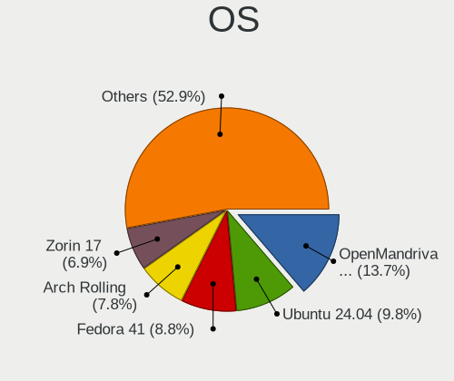
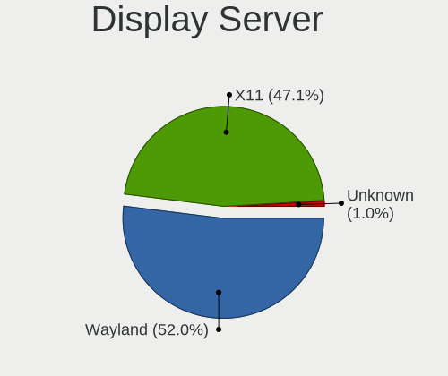
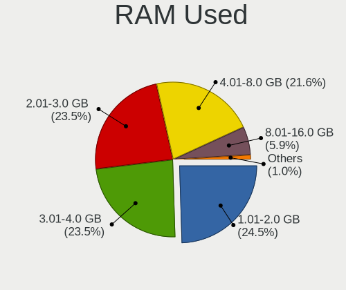
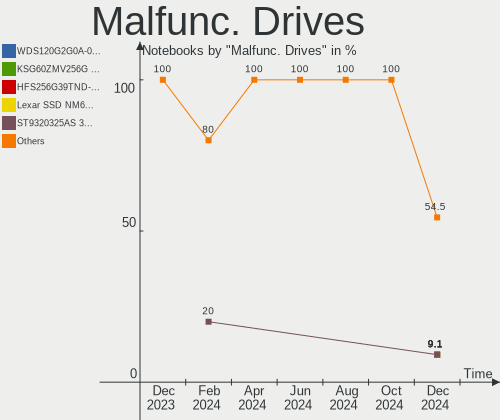
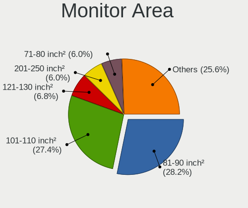
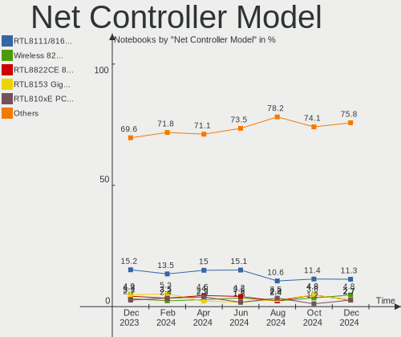
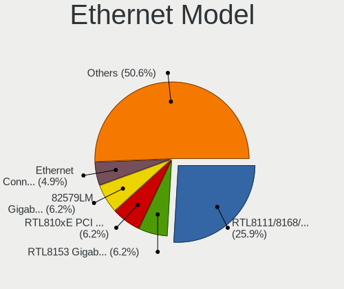
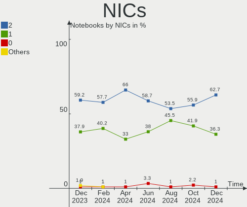
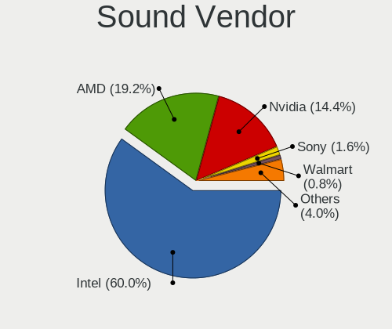

Linux in UK - Hardware Trends (Notebooks)
-----------------------------------------

A project to identify most popular hardware characteristics and track their change
over time based on data collected by Linux users at https://Linux-Hardware.org.

Anyone can contribute to this report by the [hw-probe](https://github.com/linuxhw/hw-probe) tool:

    sudo -E hw-probe -all -upload

Period: Oct, 2022.

Contents
--------

* [ System ](#system)
  - [ OS                       ](#os)
  - [ OS Family                ](#os-family)
  - [ Kernel                   ](#kernel)
  - [ Kernel Family            ](#kernel-family)
  - [ Kernel Major Ver.        ](#kernel-major-ver)
  - [ Arch                     ](#arch)
  - [ DE                       ](#de)
  - [ Display Server           ](#display-server)
  - [ Display Manager          ](#display-manager)
  - [ OS Lang                  ](#os-lang)
  - [ Boot Mode                ](#boot-mode)
  - [ Filesystem               ](#filesystem)
  - [ Part. scheme             ](#part-scheme)
  - [ Dual Boot with Linux/BSD ](#dual-boot-with-linuxbsd)
  - [ Dual Boot (Win)          ](#dual-boot-win)

* [ Board ](#board)
  - [ Vendor                   ](#vendor)
  - [ Model                    ](#model)
  - [ Model Family             ](#model-family)
  - [ MFG Year                 ](#mfg-year)
  - [ Form Factor              ](#form-factor)
  - [ Secure Boot              ](#secure-boot)
  - [ Coreboot                 ](#coreboot)
  - [ RAM Size                 ](#ram-size)
  - [ RAM Used                 ](#ram-used)
  - [ Total Drives             ](#total-drives)
  - [ Has CD-ROM               ](#has-cd-rom)
  - [ Has Ethernet             ](#has-ethernet)
  - [ Has WiFi                 ](#has-wifi)
  - [ Has Bluetooth            ](#has-bluetooth)

* [ Location ](#location)
  - [ Country                  ](#country)
  - [ City                     ](#city)

* [ Drives ](#drives)
  - [ Drive Vendor             ](#drive-vendor)
  - [ Drive Model              ](#drive-model)
  - [ HDD Vendor               ](#hdd-vendor)
  - [ SSD Vendor               ](#ssd-vendor)
  - [ Drive Kind               ](#drive-kind)
  - [ Drive Connector          ](#drive-connector)
  - [ Drive Size               ](#drive-size)
  - [ Space Total              ](#space-total)
  - [ Space Used               ](#space-used)
  - [ Malfunc. Drives          ](#malfunc-drives)
  - [ Malfunc. Drive Vendor    ](#malfunc-drive-vendor)
  - [ Malfunc. HDD Vendor      ](#malfunc-hdd-vendor)
  - [ Malfunc. Drive Kind      ](#malfunc-drive-kind)
  - [ Failed Drives            ](#failed-drives)
  - [ Failed Drive Vendor      ](#failed-drive-vendor)
  - [ Drive Status             ](#drive-status)

* [ Storage controller ](#storage-controller)
  - [ Storage Vendor           ](#storage-vendor)
  - [ Storage Model            ](#storage-model)
  - [ Storage Kind             ](#storage-kind)

* [ Processor ](#processor)
  - [ CPU Vendor               ](#cpu-vendor)
  - [ CPU Model                ](#cpu-model)
  - [ CPU Model Family         ](#cpu-model-family)
  - [ CPU Cores                ](#cpu-cores)
  - [ CPU Sockets              ](#cpu-sockets)
  - [ CPU Threads              ](#cpu-threads)
  - [ CPU Op-Modes             ](#cpu-op-modes)
  - [ CPU Microcode            ](#cpu-microcode)
  - [ CPU Microarch            ](#cpu-microarch)

* [ Graphics ](#graphics)
  - [ GPU Vendor               ](#gpu-vendor)
  - [ GPU Model                ](#gpu-model)
  - [ GPU Combo                ](#gpu-combo)
  - [ GPU Driver               ](#gpu-driver)
  - [ GPU Memory               ](#gpu-memory)

* [ Monitor ](#monitor)
  - [ Monitor Vendor           ](#monitor-vendor)
  - [ Monitor Model            ](#monitor-model)
  - [ Monitor Resolution       ](#monitor-resolution)
  - [ Monitor Diagonal         ](#monitor-diagonal)
  - [ Monitor Width            ](#monitor-width)
  - [ Aspect Ratio             ](#aspect-ratio)
  - [ Monitor Area             ](#monitor-area)
  - [ Pixel Density            ](#pixel-density)
  - [ Multiple Monitors        ](#multiple-monitors)

* [ Network ](#network)
  - [ Net Controller Vendor    ](#net-controller-vendor)
  - [ Net Controller Model     ](#net-controller-model)
  - [ Wireless Vendor          ](#wireless-vendor)
  - [ Wireless Model           ](#wireless-model)
  - [ Ethernet Vendor          ](#ethernet-vendor)
  - [ Ethernet Model           ](#ethernet-model)
  - [ Net Controller Kind      ](#net-controller-kind)
  - [ Used Controller          ](#used-controller)
  - [ NICs                     ](#nics)
  - [ IPv6                     ](#ipv6)

* [ Bluetooth ](#bluetooth)
  - [ Bluetooth Vendor         ](#bluetooth-vendor)
  - [ Bluetooth Model          ](#bluetooth-model)

* [ Sound ](#sound)
  - [ Sound Vendor             ](#sound-vendor)
  - [ Sound Model              ](#sound-model)

* [ Memory ](#memory)
  - [ Memory Vendor            ](#memory-vendor)
  - [ Memory Model             ](#memory-model)
  - [ Memory Kind              ](#memory-kind)
  - [ Memory Form Factor       ](#memory-form-factor)
  - [ Memory Size              ](#memory-size)
  - [ Memory Speed             ](#memory-speed)

* [ Printers & scanners ](#printers--scanners)
  - [ Printer Vendor           ](#printer-vendor)
  - [ Printer Model            ](#printer-model)
  - [ Scanner Vendor           ](#scanner-vendor)
  - [ Scanner Model            ](#scanner-model)

* [ Camera ](#camera)
  - [ Camera Vendor            ](#camera-vendor)
  - [ Camera Model             ](#camera-model)

* [ Security ](#security)
  - [ Fingerprint Vendor       ](#fingerprint-vendor)
  - [ Fingerprint Model        ](#fingerprint-model)
  - [ Chipcard Vendor          ](#chipcard-vendor)
  - [ Chipcard Model           ](#chipcard-model)

* [ Unsupported ](#unsupported)
  - [ Unsupported Devices      ](#unsupported-devices)
  - [ Unsupported Device Types ](#unsupported-device-types)

System
------

OS
--

Installed operating systems

| Name                | Notebooks | Percent |
|---------------------|-----------|---------|
| Ubuntu 22.04        | 18        | 20.93%  |
| SteamOS 3.3.2       | 10        | 11.63%  |
| Zorin 16            | 6         | 6.98%   |
| Pop!_OS 22.04       | 6         | 6.98%   |
| Ubuntu 20.04        | 4         | 4.65%   |
| Ubuntu 18.04        | 3         | 3.49%   |
| SteamOS 3.3.1       | 3         | 3.49%   |
| OpenMandriva 4.3    | 3         | 3.49%   |
| Linux Mint 20.3     | 3         | 3.49%   |
| Debian 11           | 3         | 3.49%   |
| Zorin 15            | 2         | 2.33%   |
| Xubuntu 22.04       | 2         | 2.33%   |
| Xubuntu 20.04       | 2         | 2.33%   |
| OpenMandriva 4.50   | 2         | 2.33%   |
| Manjaro 22.0.0      | 2         | 2.33%   |
| Arch Rolling        | 2         | 2.33%   |
| Ubuntu Unity 22.10  | 1         | 1.16%   |
| Ubuntu Unity 18.04  | 1         | 1.16%   |
| Ubuntu Unity 16.04  | 1         | 1.16%   |
| Ubuntu MATE 22.04   | 1         | 1.16%   |
| Ubuntu 22.10        | 1         | 1.16%   |
| SteamOS 3.2         | 1         | 1.16%   |
| MX 19               | 1         | 1.16%   |
| Lubuntu 22.04       | 1         | 1.16%   |
| Linux Mint 21       | 1         | 1.16%   |
| Linux Mint 19.1     | 1         | 1.16%   |
| Kubuntu 22.04       | 1         | 1.16%   |
| Kali 2022.3         | 1         | 1.16%   |
| Fedora 36           | 1         | 1.16%   |
| EndeavourOS Rolling | 1         | 1.16%   |
| Elementary 6.1      | 1         | 1.16%   |

OS Family
---------

OS without a version

| Name         | Notebooks | Percent |
|--------------|-----------|---------|
| Ubuntu       | 26        | 30.23%  |
| SteamOS      | 14        | 16.28%  |
| Zorin        | 8         | 9.3%    |
| Pop!_OS      | 6         | 6.98%   |
| OpenMandriva | 5         | 5.81%   |
| Linux Mint   | 5         | 5.81%   |
| Xubuntu      | 4         | 4.65%   |
| Ubuntu Unity | 3         | 3.49%   |
| Debian       | 3         | 3.49%   |
| Manjaro      | 2         | 2.33%   |
| Arch         | 2         | 2.33%   |
| Ubuntu MATE  | 1         | 1.16%   |
| MX           | 1         | 1.16%   |
| Lubuntu      | 1         | 1.16%   |
| Kubuntu      | 1         | 1.16%   |
| Kali         | 1         | 1.16%   |
| Fedora       | 1         | 1.16%   |
| EndeavourOS  | 1         | 1.16%   |
| Elementary   | 1         | 1.16%   |

Kernel
------

Version of the Linux kernel

| Version                                        | Notebooks | Percent |
|------------------------------------------------|-----------|---------|
| 5.15.0-52-generic                              | 16        | 18.6%   |
| 5.13.0-valve21.3-1-neptune                     | 10        | 11.63%  |
| 5.15.0-48-generic                              | 8         | 9.3%    |
| 5.15.0-50-generic                              | 5         | 5.81%   |
| 5.19.0-76051900-generic                        | 4         | 4.65%   |
| 5.4.0-131-generic                              | 3         | 3.49%   |
| 5.16.7-desktop-1omv4003                        | 3         | 3.49%   |
| 5.13.0-valve21.1-1-neptune-02211-gc54cda5a36f3 | 3         | 3.49%   |
| 5.19.12-desktop-2omv4090                       | 2         | 2.33%   |
| 5.15.0-46-generic                              | 2         | 2.33%   |
| 4.15.0-194-generic                             | 2         | 2.33%   |
| 4.15.0-193-generic                             | 2         | 2.33%   |
| 6.0.5-060005-generic                           | 1         | 1.16%   |
| 6.0.2                                          | 1         | 1.16%   |
| 6.0.1-arch1-1                                  | 1         | 1.16%   |
| 6.0.0-1-MANJARO                                | 1         | 1.16%   |
| 5.4.0-47-generic                               | 1         | 1.16%   |
| 5.4.0-128-generic                              | 1         | 1.16%   |
| 5.4.0-126-generic                              | 1         | 1.16%   |
| 5.4.0-125-generic                              | 1         | 1.16%   |
| 5.19.16-76051916-generic                       | 1         | 1.16%   |
| 5.19.13-arch1-1                                | 1         | 1.16%   |
| 5.19.13-200.fc36.x86_64                        | 1         | 1.16%   |
| 5.19.12-arch1-1                                | 1         | 1.16%   |
| 5.19.0-21-generic                              | 1         | 1.16%   |
| 5.18.0-kali7-amd64                             | 1         | 1.16%   |
| 5.17.15-76051715-generic                       | 1         | 1.16%   |
| 5.17.1-t2                                      | 1         | 1.16%   |
| 5.15.74-3-MANJARO                              | 1         | 1.16%   |
| 5.15.0-47-lowlatency                           | 1         | 1.16%   |
| 5.15.0-47-generic                              | 1         | 1.16%   |
| 5.15.0-43-generic                              | 1         | 1.16%   |
| 5.13.0-valve15-1-neptune-02197-gf6ec7ad3762a   | 1         | 1.16%   |
| 5.13.0-52-generic                              | 1         | 1.16%   |
| 5.10.0-19-amd64                                | 1         | 1.16%   |
| 5.10.0-18-amd64                                | 1         | 1.16%   |
| 4.19.0-13-amd64                                | 1         | 1.16%   |
| 4.15.0-142-generic                             | 1         | 1.16%   |

Kernel Family
-------------

Linux kernel without a distro release

| Version | Notebooks | Percent |
|---------|-----------|---------|
| 5.15.0  | 34        | 39.53%  |
| 5.13.0  | 15        | 17.44%  |
| 5.4.0   | 7         | 8.14%   |
| 5.19.0  | 5         | 5.81%   |
| 4.15.0  | 5         | 5.81%   |
| 5.19.12 | 3         | 3.49%   |
| 5.16.7  | 3         | 3.49%   |
| 5.19.13 | 2         | 2.33%   |
| 5.10.0  | 2         | 2.33%   |
| 6.0.5   | 1         | 1.16%   |
| 6.0.2   | 1         | 1.16%   |
| 6.0.1   | 1         | 1.16%   |
| 6.0.0   | 1         | 1.16%   |
| 5.19.16 | 1         | 1.16%   |
| 5.18.0  | 1         | 1.16%   |
| 5.17.15 | 1         | 1.16%   |
| 5.17.1  | 1         | 1.16%   |
| 5.15.74 | 1         | 1.16%   |
| 4.19.0  | 1         | 1.16%   |

Kernel Major Ver.
-----------------

Linux kernel major version

| Version | Notebooks | Percent |
|---------|-----------|---------|
| 5.15    | 35        | 40.7%   |
| 5.13    | 15        | 17.44%  |
| 5.19    | 11        | 12.79%  |
| 5.4     | 7         | 8.14%   |
| 4.15    | 5         | 5.81%   |
| 6.0     | 4         | 4.65%   |
| 5.16    | 3         | 3.49%   |
| 5.17    | 2         | 2.33%   |
| 5.10    | 2         | 2.33%   |
| 5.18    | 1         | 1.16%   |
| 4.19    | 1         | 1.16%   |

Arch
----

OS architecture (x86_64, i586, etc.)

| Name   | Notebooks | Percent |
|--------|-----------|---------|
| x86_64 | 83        | 96.51%  |
| i686   | 3         | 3.49%   |

DE
--

Desktop Environment

| Name       | Notebooks | Percent |
|------------|-----------|---------|
| GNOME      | 41        | 47.67%  |
| KDE5       | 22        | 25.58%  |
| XFCE       | 8         | 9.3%    |
| X-Cinnamon | 5         | 5.81%   |
| Unity      | 3         | 3.49%   |
| MATE       | 3         | 3.49%   |
| Pantheon   | 1         | 1.16%   |
| openbox    | 1         | 1.16%   |
| LXQt       | 1         | 1.16%   |
| awesome    | 1         | 1.16%   |

Display Server
--------------

X11 or Wayland

| Name    | Notebooks | Percent |
|---------|-----------|---------|
| X11     | 65        | 75.58%  |
| Wayland | 20        | 23.26%  |
| Unknown | 1         | 1.16%   |

Display Manager
---------------

SDDM, LightDM, etc.

| Name    | Notebooks | Percent |
|---------|-----------|---------|
| GDM3    | 29        | 33.72%  |
| Unknown | 29        | 33.72%  |
| LightDM | 14        | 16.28%  |
| SDDM    | 9         | 10.47%  |
| GDM     | 4         | 4.65%   |
| Ly      | 1         | 1.16%   |

OS Lang
-------

Language

| Lang  | Notebooks | Percent |
|-------|-----------|---------|
| en_GB | 66        | 76.74%  |
| en_US | 16        | 18.6%   |
| pl_PL | 2         | 2.33%   |
| it_IT | 1         | 1.16%   |
| en_IE | 1         | 1.16%   |

Boot Mode
---------

EFI or BIOS

| Mode | Notebooks | Percent |
|------|-----------|---------|
| BIOS | 59        | 68.6%   |
| EFI  | 27        | 31.4%   |

Filesystem
----------

Type of filesystem

| Type    | Notebooks | Percent |
|---------|-----------|---------|
| Ext4    | 63        | 73.26%  |
| Btrfs   | 17        | 19.77%  |
| Overlay | 5         | 5.81%   |
| Zfs     | 1         | 1.16%   |

Part. scheme
------------

Scheme of partitioning

| Type    | Notebooks | Percent |
|---------|-----------|---------|
| GPT     | 42        | 48.84%  |
| Unknown | 32        | 37.21%  |
| MBR     | 12        | 13.95%  |

Dual Boot with Linux/BSD
------------------------

Hosting more than one Linux/BSD

| Dual boot | Notebooks | Percent |
|-----------|-----------|---------|
| No        | 80        | 93.02%  |
| Yes       | 6         | 6.98%   |

Dual Boot (Win)
---------------

Hosting Linux and Windows

| Dual boot | Notebooks | Percent |
|-----------|-----------|---------|
| No        | 72        | 83.72%  |
| Yes       | 14        | 16.28%  |

Board
-----

Vendor
------

Motherboard manufacturer

| Name                | Notebooks | Percent |
|---------------------|-----------|---------|
| Lenovo              | 17        | 19.77%  |
| Valve               | 15        | 17.44%  |
| Dell                | 12        | 13.95%  |
| Hewlett-Packard     | 9         | 10.47%  |
| Acer                | 8         | 9.3%    |
| Toshiba             | 3         | 3.49%   |
| GEO                 | 3         | 3.49%   |
| ASUSTek Computer    | 3         | 3.49%   |
| Apple               | 3         | 3.49%   |
| Samsung Electronics | 2         | 2.33%   |
| Packard Bell        | 2         | 2.33%   |
| TUXEDO              | 1         | 1.16%   |
| Tactus              | 1         | 1.16%   |
| Sony                | 1         | 1.16%   |
| Razer x Lambda      | 1         | 1.16%   |
| Novatech            | 1         | 1.16%   |
| MSI                 | 1         | 1.16%   |
| Fujitsu             | 1         | 1.16%   |
| eMachines           | 1         | 1.16%   |
| AMI                 | 1         | 1.16%   |

Model
-----

Motherboard model

| Name                                  | Notebooks | Percent |
|---------------------------------------|-----------|---------|
| Valve Jupiter                         | 15        | 17.44%  |
| Toshiba Satellite C660                | 2         | 2.33%   |
| ASUS ZenBook UX325EA_UX325EA          | 2         | 2.33%   |
| TUXEDO InfinityBook S 15 Gen6         | 1         | 1.16%   |
| Toshiba Satellite C50D-A-133          | 1         | 1.16%   |
| Tactus GeoBook 110                    | 1         | 1.16%   |
| Sony VPCYB3V1E                        | 1         | 1.16%   |
| Samsung R519/R719                     | 1         | 1.16%   |
| Samsung 700T1C                        | 1         | 1.16%   |
| Razer x Lambda TensorBook (late 2021) | 1         | 1.16%   |
| Packard Bell EasyNote TM82            | 1         | 1.16%   |
| Packard Bell EasyNote TK85            | 1         | 1.16%   |
| Novatech NLx0MU                       | 1         | 1.16%   |
| MSI Modern 14 B10MW                   | 1         | 1.16%   |
| Lenovo Z50-75 80EC                    | 1         | 1.16%   |
| Lenovo Yoga Slim 7 ProX 14ARH7 82TL   | 1         | 1.16%   |
| Lenovo Yoga 3 14 80JH                 | 1         | 1.16%   |
| Lenovo V155-15API 81V5                | 1         | 1.16%   |
| Lenovo V15-IIL 82C5                   | 1         | 1.16%   |
| Lenovo V110-15AST 80TD                | 1         | 1.16%   |
| Lenovo ThinkPad Twist 20C41A3         | 1         | 1.16%   |
| Lenovo ThinkPad T520 4243PN7          | 1         | 1.16%   |
| Lenovo ThinkPad T480 20L6S82F0C       | 1         | 1.16%   |
| Lenovo ThinkPad T420 4236TL7          | 1         | 1.16%   |
| Lenovo ThinkPad L560 20F2S0DA00       | 1         | 1.16%   |
| Lenovo IdeaPad S510p 20298            | 1         | 1.16%   |
| Lenovo IdeaPad 110-15IBR 80T7         | 1         | 1.16%   |
| Lenovo G580 2689H2G                   | 1         | 1.16%   |
| Lenovo G510 20238                     | 1         | 1.16%   |
| Lenovo Flex 2-14 20404                | 1         | 1.16%   |
| Lenovo 3000 N200 0769B4G              | 1         | 1.16%   |
| HP ZBook 15                           | 1         | 1.16%   |
| HP Setzer                             | 1         | 1.16%   |
| HP ProBook 640 G3                     | 1         | 1.16%   |
| HP Presario C300 (RM500EA#ABU)        | 1         | 1.16%   |
| HP Pavilion 15                        | 1         | 1.16%   |
| HP OMEN by Laptop 17-ck0xxx           | 1         | 1.16%   |
| HP Notebook                           | 1         | 1.16%   |
| HP G62                                | 1         | 1.16%   |
| HP ENVY Laptop 13-ba0xxx              | 1         | 1.16%   |

Model Family
------------

Motherboard model prefix

| Name                      | Notebooks | Percent |
|---------------------------|-----------|---------|
| Valve Jupiter             | 15        | 17.44%  |
| Lenovo ThinkPad           | 5         | 5.81%   |
| Acer Aspire               | 5         | 5.81%   |
| Dell Latitude             | 4         | 4.65%   |
| Dell Inspiron             | 4         | 4.65%   |
| Toshiba Satellite         | 3         | 3.49%   |
| Dell XPS                  | 3         | 3.49%   |
| Packard Bell EasyNote     | 2         | 2.33%   |
| Lenovo Yoga               | 2         | 2.33%   |
| Lenovo IdeaPad            | 2         | 2.33%   |
| GEO GeoBook               | 2         | 2.33%   |
| ASUS ZenBook              | 2         | 2.33%   |
| Acer Swift                | 2         | 2.33%   |
| TUXEDO InfinityBook       | 1         | 1.16%   |
| Tactus GeoBook            | 1         | 1.16%   |
| Sony VPCYB3V1E            | 1         | 1.16%   |
| Samsung R519              | 1         | 1.16%   |
| Samsung 700T1C            | 1         | 1.16%   |
| Razer x Lambda TensorBook | 1         | 1.16%   |
| Novatech NLx0MU           | 1         | 1.16%   |
| MSI Modern                | 1         | 1.16%   |
| Lenovo Z50-75             | 1         | 1.16%   |
| Lenovo V155-15API         | 1         | 1.16%   |
| Lenovo V15-IIL            | 1         | 1.16%   |
| Lenovo V110-15AST         | 1         | 1.16%   |
| Lenovo G580               | 1         | 1.16%   |
| Lenovo G510               | 1         | 1.16%   |
| Lenovo Flex               | 1         | 1.16%   |
| Lenovo 3000               | 1         | 1.16%   |
| HP ZBook                  | 1         | 1.16%   |
| HP Setzer                 | 1         | 1.16%   |
| HP ProBook                | 1         | 1.16%   |
| HP Presario               | 1         | 1.16%   |
| HP Pavilion               | 1         | 1.16%   |
| HP OMEN                   | 1         | 1.16%   |
| HP Notebook               | 1         | 1.16%   |
| HP G62                    | 1         | 1.16%   |
| HP ENVY                   | 1         | 1.16%   |
| GEO GeoBook3              | 1         | 1.16%   |
| Fujitsu LIFEBOOK          | 1         | 1.16%   |

MFG Year
--------

Motherboard manufacture year

| Year | Notebooks | Percent |
|------|-----------|---------|
| 2022 | 20        | 23.26%  |
| 2020 | 9         | 10.47%  |
| 2013 | 9         | 10.47%  |
| 2021 | 6         | 6.98%   |
| 2011 | 6         | 6.98%   |
| 2017 | 5         | 5.81%   |
| 2016 | 5         | 5.81%   |
| 2018 | 4         | 4.65%   |
| 2012 | 4         | 4.65%   |
| 2010 | 4         | 4.65%   |
| 2008 | 4         | 4.65%   |
| 2014 | 3         | 3.49%   |
| 2009 | 3         | 3.49%   |
| 2019 | 1         | 1.16%   |
| 2015 | 1         | 1.16%   |
| 2007 | 1         | 1.16%   |
| 2006 | 1         | 1.16%   |

Form Factor
-----------

Physical design of the computer

| Name     | Notebooks | Percent |
|----------|-----------|---------|
| Notebook | 86        | 100%    |

Secure Boot
-----------

Enabled or disabled

| State    | Notebooks | Percent |
|----------|-----------|---------|
| Disabled | 82        | 95.35%  |
| Enabled  | 4         | 4.65%   |

Coreboot
--------

Have coreboot on board

| Used | Notebooks | Percent |
|------|-----------|---------|
| No   | 84        | 97.67%  |
| Yes  | 2         | 2.33%   |

RAM Size
--------

Total RAM memory

| Size in GB  | Notebooks | Percent |
|-------------|-----------|---------|
| 4.01-8.0    | 22        | 25.58%  |
| 3.01-4.0    | 21        | 24.42%  |
| 8.01-16.0   | 21        | 24.42%  |
| 16.01-24.0  | 13        | 15.12%  |
| 32.01-64.0  | 2         | 2.33%   |
| 24.01-32.0  | 2         | 2.33%   |
| 2.01-3.0    | 2         | 2.33%   |
| 1.01-2.0    | 2         | 2.33%   |
| 64.01-256.0 | 1         | 1.16%   |

RAM Used
--------

Used RAM memory

| Used GB   | Notebooks | Percent |
|-----------|-----------|---------|
| 1.01-2.0  | 32        | 37.21%  |
| 2.01-3.0  | 23        | 26.74%  |
| 4.01-8.0  | 14        | 16.28%  |
| 3.01-4.0  | 11        | 12.79%  |
| 0.51-1.0  | 4         | 4.65%   |
| 8.01-16.0 | 2         | 2.33%   |

Total Drives
------------

Number of drives on board

| Drives | Notebooks | Percent |
|--------|-----------|---------|
| 1      | 60        | 69.77%  |
| 2      | 26        | 30.23%  |

Has CD-ROM
----------

Has CD-ROM on board

| Presented | Notebooks | Percent |
|-----------|-----------|---------|
| No        | 54        | 62.79%  |
| Yes       | 32        | 37.21%  |

Has Ethernet
------------

Has Ethernet on board

| Presented | Notebooks | Percent |
|-----------|-----------|---------|
| Yes       | 55        | 63.95%  |
| No        | 31        | 36.05%  |

Has WiFi
--------

Has WiFi module

| Presented | Notebooks | Percent |
|-----------|-----------|---------|
| Yes       | 85        | 98.84%  |
| No        | 1         | 1.16%   |

Has Bluetooth
-------------

Has Bluetooth module

| Presented | Notebooks | Percent |
|-----------|-----------|---------|
| Yes       | 68        | 79.07%  |
| No        | 18        | 20.93%  |

Location
--------

Country
-------

Geographic location (country)

| Country | Notebooks | Percent |
|---------|-----------|---------|
| UK      | 86        | 100%    |

City
----

Geographic location (city)

| City                | Notebooks | Percent |
|---------------------|-----------|---------|
| London              | 5         | 5.81%   |
| Leeds               | 4         | 4.65%   |
| Glasgow             | 3         | 3.49%   |
| Birmingham          | 3         | 3.49%   |
| Barnsley            | 3         | 3.49%   |
| Somerset            | 2         | 2.33%   |
| Oxford              | 2         | 2.33%   |
| Norwich             | 2         | 2.33%   |
| Manchester          | 2         | 2.33%   |
| Grangemouth         | 2         | 2.33%   |
| Derby               | 2         | 2.33%   |
| York                | 1         | 1.16%   |
| Worksop             | 1         | 1.16%   |
| Wirral              | 1         | 1.16%   |
| Wigan               | 1         | 1.16%   |
| Weston-super-Mare   | 1         | 1.16%   |
| Watford             | 1         | 1.16%   |
| Totteridge          | 1         | 1.16%   |
| Tipton              | 1         | 1.16%   |
| Tharston            | 1         | 1.16%   |
| Stondon Massey      | 1         | 1.16%   |
| Silloth             | 1         | 1.16%   |
| Sheffield           | 1         | 1.16%   |
| Redruth             | 1         | 1.16%   |
| Reading             | 1         | 1.16%   |
| Ramsgate            | 1         | 1.16%   |
| Preston             | 1         | 1.16%   |
| Portsmouth          | 1         | 1.16%   |
| Poplar              | 1         | 1.16%   |
| Peterborough        | 1         | 1.16%   |
| Okehampton          | 1         | 1.16%   |
| Northampton         | 1         | 1.16%   |
| North Shields       | 1         | 1.16%   |
| Newcastle upon Tyne | 1         | 1.16%   |
| Milton Keynes       | 1         | 1.16%   |
| Maidstone           | 1         | 1.16%   |
| Maidenhead          | 1         | 1.16%   |
| Liverpool           | 1         | 1.16%   |
| Lincoln             | 1         | 1.16%   |
| Leatherhead         | 1         | 1.16%   |

Drives
------

Drive Vendor
------------

Hard drive vendors

| Vendor                      | Notebooks | Drives | Percent |
|-----------------------------|-----------|--------|---------|
| Unknown                     | 15        | 16     | 15%     |
| Samsung Electronics         | 15        | 15     | 15%     |
| Sandisk                     | 7         | 7      | 7%      |
| WDC                         | 6         | 6      | 6%      |
| Seagate                     | 6         | 7      | 6%      |
| Phison Electronics          | 6         | 6      | 6%      |
| Toshiba                     | 4         | 4      | 4%      |
| SK hynix                    | 4         | 4      | 4%      |
| Crucial                     | 4         | 4      | 4%      |
| Kingston Technology Company | 3         | 3      | 3%      |
| Intel                       | 3         | 6      | 3%      |
| Hitachi                     | 3         | 3      | 3%      |
| O2 Micro                    | 2         | 2      | 2%      |
| Micron/Crucial Technology   | 2         | 2      | 2%      |
| Micron Technology           | 2         | 2      | 2%      |
| Kingston                    | 2         | 2      | 2%      |
| China                       | 2         | 2      | 2%      |
| Apple                       | 2         | 2      | 2%      |
| Unknown                     | 2         | 2      | 2%      |
| Silicon Motion              | 1         | 1      | 1%      |
| PNY                         | 1         | 1      | 1%      |
| Netac                       | 1         | 1      | 1%      |
| LITEON                      | 1         | 1      | 1%      |
| Lenovo                      | 1         | 1      | 1%      |
| KIOXIA                      | 1         | 1      | 1%      |
| KINGSTONG                   | 1         | 1      | 1%      |
| Gigabyte Technology         | 1         | 1      | 1%      |
| Fujitsu                     | 1         | 1      | 1%      |
| A-DATA Technology           | 1         | 1      | 1%      |

Drive Model
-----------

Hard drive models

| Model                                                 | Notebooks | Percent |
|-------------------------------------------------------|-----------|---------|
| Phison PS5013 E13 NVMe Controller 256GB               | 6         | 5.83%   |
| Unknown MMC Card  512GB                               | 4         | 3.88%   |
| Samsung NVMe SSD Controller PM9A1/PM9A3/980PRO 250GB  | 3         | 2.91%   |
| Kingston Company OM3PDP3 NVMe SSD 512GB               | 3         | 2.91%   |
| Unknown MMC Card  256GB                               | 2         | 1.94%   |
| Unknown MMC Card  16GB                                | 2         | 1.94%   |
| Unknown MMC Card  128GB                               | 2         | 1.94%   |
| Toshiba MQ01ABF050 500GB                              | 2         | 1.94%   |
| O2 Micro E2M2 64GB                                    | 2         | 1.94%   |
| Intel HBRPEKNX0202AO 32GB                             | 2         | 1.94%   |
| Intel HBRPEKNX0202A 512GB                             | 2         | 1.94%   |
| Unknown                                               | 2         | 1.94%   |
| WDC WD7500BPVT-24HXZT3 752GB                          | 1         | 0.97%   |
| WDC WD5000LPCX-24VHAT0 500GB                          | 1         | 0.97%   |
| WDC WD5000LPCX-24C6HT0 500GB                          | 1         | 0.97%   |
| WDC WD5000LPCX-21VHAT0 500GB                          | 1         | 0.97%   |
| WDC WD5000BPKX-60HPJT0 500GB                          | 1         | 0.97%   |
| WDC WD2500BEVT-80A23T0 250GB                          | 1         | 0.97%   |
| Unknown SN128  128GB                                  | 1         | 0.97%   |
| Unknown NVMe SSD Drive 1TB                            | 1         | 0.97%   |
| Unknown MMC Card  64GB                                | 1         | 0.97%   |
| Unknown MMC Card  32GB                                | 1         | 0.97%   |
| Unknown Biwin  64GB                                   | 1         | 0.97%   |
| Toshiba MQ02ABF050H 500GB                             | 1         | 0.97%   |
| Toshiba KXG60ZNV512G NVMe 512GB                       | 1         | 0.97%   |
| SK hynix SC308 SATA 256GB SSD                         | 1         | 0.97%   |
| SK hynix PC611 NVMe 256GB                             | 1         | 0.97%   |
| SK hynix PC601 HFS256GD9TNG-L2A0A 256GB               | 1         | 0.97%   |
| SK hynix BC711 NVMe 256GB                             | 1         | 0.97%   |
| Silicon Motion SM2263EN/SM2263XT SSD Controller 256GB | 1         | 0.97%   |
| Seagate ST9750423AS 752GB                             | 1         | 0.97%   |
| Seagate ST500LM030-2E717D 500GB                       | 1         | 0.97%   |
| Seagate ST320LT020-9YG142 320GB                       | 1         | 0.97%   |
| Seagate ST1000LM035-1RK172 1TB                        | 1         | 0.97%   |
| Seagate ST1000LM024 HN-M101MBB 1TB                    | 1         | 0.97%   |
| Seagate ST1000LM014-1EJ164 1TB                        | 1         | 0.97%   |
| Sandisk WDC PC SN530 SDBPTPZ-1T00 1024GB              | 1         | 0.97%   |
| Sandisk WDC PC SN530 SDBPMPZ-256G-1101 256GB          | 1         | 0.97%   |
| Sandisk WD Green SN350 1TB                            | 1         | 0.97%   |
| Sandisk WD Black SN750 / PC SN730 NVMe SSD 1TB        | 1         | 0.97%   |

HDD Vendor
----------

Hard disk drive vendors

| Vendor              | Notebooks | Drives | Percent |
|---------------------|-----------|--------|---------|
| WDC                 | 6         | 6      | 26.09%  |
| Seagate             | 6         | 7      | 26.09%  |
| Samsung Electronics | 4         | 4      | 17.39%  |
| Toshiba             | 3         | 3      | 13.04%  |
| Hitachi             | 3         | 3      | 13.04%  |
| Fujitsu             | 1         | 1      | 4.35%   |

SSD Vendor
----------

Solid state drive vendors

| Vendor              | Notebooks | Drives | Percent |
|---------------------|-----------|--------|---------|
| Samsung Electronics | 5         | 5      | 20.83%  |
| Crucial             | 4         | 4      | 16.67%  |
| SanDisk             | 2         | 2      | 8.33%   |
| Kingston            | 2         | 2      | 8.33%   |
| China               | 2         | 2      | 8.33%   |
| SK hynix            | 1         | 1      | 4.17%   |
| PNY                 | 1         | 1      | 4.17%   |
| Netac               | 1         | 1      | 4.17%   |
| Micron Technology   | 1         | 1      | 4.17%   |
| LITEON              | 1         | 1      | 4.17%   |
| KINGSTONG           | 1         | 1      | 4.17%   |
| Gigabyte Technology | 1         | 1      | 4.17%   |
| Apple               | 1         | 1      | 4.17%   |
| A-DATA Technology   | 1         | 1      | 4.17%   |

Drive Kind
----------

HDD or SSD

| Kind | Notebooks | Drives | Percent |
|------|-----------|--------|---------|
| NVMe | 37        | 41     | 37.76%  |
| HDD  | 23        | 24     | 23.47%  |
| SSD  | 22        | 24     | 22.45%  |
| MMC  | 16        | 16     | 16.33%  |

Drive Connector
---------------

SATA, SAS, NVMe, etc.

| Type | Notebooks | Drives | Percent |
|------|-----------|--------|---------|
| SATA | 43        | 47     | 44.33%  |
| NVMe | 37        | 41     | 38.14%  |
| MMC  | 16        | 16     | 16.49%  |
| SAS  | 1         | 1      | 1.03%   |

Drive Size
----------

Size of hard drive

| Size in TB | Notebooks | Drives | Percent |
|------------|-----------|--------|---------|
| 0.01-0.5   | 38        | 40     | 84.44%  |
| 0.51-1.0   | 7         | 8      | 15.56%  |

Space Total
-----------

Amount of disk space available on the file system

| Size in GB | Notebooks | Percent |
|------------|-----------|---------|
| 101-250    | 25        | 29.07%  |
| 251-500    | 24        | 27.91%  |
| 501-1000   | 14        | 16.28%  |
| 51-100     | 9         | 10.47%  |
| 1001-2000  | 5         | 5.81%   |
| 1-20       | 5         | 5.81%   |
| 21-50      | 4         | 4.65%   |

Space Used
----------

Amount of used disk space

| Used GB  | Notebooks | Percent |
|----------|-----------|---------|
| 1-20     | 30        | 34.88%  |
| 101-250  | 25        | 29.07%  |
| 21-50    | 14        | 16.28%  |
| 51-100   | 9         | 10.47%  |
| 251-500  | 6         | 6.98%   |
| 501-1000 | 2         | 2.33%   |

Malfunc. Drives
---------------

Drive models with a malfunction

| Model                                  | Notebooks | Drives | Percent |
|----------------------------------------|-----------|--------|---------|
| Samsung Electronics SSD 840 EVO 500GB  | 1         | 1      | 50%     |
| LITEON LCH-256V2S-11 2.5 7mm 256GB SSD | 1         | 1      | 50%     |

Malfunc. Drive Vendor
---------------------

Vendors of faulty drives

| Vendor              | Notebooks | Drives | Percent |
|---------------------|-----------|--------|---------|
| Samsung Electronics | 1         | 1      | 50%     |
| LITEON              | 1         | 1      | 50%     |

Malfunc. HDD Vendor
-------------------

Vendors of faulty HDD drives

Zero info for selected period =(

Malfunc. Drive Kind
-------------------

Kinds of faulty drives

| Kind | Notebooks | Drives | Percent |
|------|-----------|--------|---------|
| SSD  | 2         | 2      | 100%    |

Failed Drives
-------------

Failed drive models

Zero info for selected period =(

Failed Drive Vendor
-------------------

Failed drive vendors

Zero info for selected period =(

Drive Status
------------

Number of failed and malfunc. drives

| Status   | Notebooks | Drives | Percent |
|----------|-----------|--------|---------|
| Detected | 59        | 72     | 67.05%  |
| Works    | 27        | 31     | 30.68%  |
| Malfunc  | 2         | 2      | 2.27%   |

Storage controller
------------------

Storage Vendor
--------------

Storage controller vendors

| Vendor                         | Notebooks | Percent |
|--------------------------------|-----------|---------|
| Intel                          | 48        | 51.61%  |
| AMD                            | 9         | 9.68%   |
| Samsung Electronics            | 7         | 7.53%   |
| Phison Electronics             | 6         | 6.45%   |
| SanDisk                        | 5         | 5.38%   |
| SK hynix                       | 3         | 3.23%   |
| Kingston Technology Company    | 3         | 3.23%   |
| O2 Micro                       | 2         | 2.15%   |
| Micron/Crucial Technology      | 2         | 2.15%   |
| Toshiba America Info Systems   | 1         | 1.08%   |
| Solid State Storage Technology | 1         | 1.08%   |
| Silicon Motion                 | 1         | 1.08%   |
| Nvidia                         | 1         | 1.08%   |
| Micron Technology              | 1         | 1.08%   |
| Lenovo                         | 1         | 1.08%   |
| KIOXIA                         | 1         | 1.08%   |
| Apple                          | 1         | 1.08%   |

Storage Model
-------------

Storage controller models

| Model                                                                            | Notebooks | Percent |
|----------------------------------------------------------------------------------|-----------|---------|
| AMD FCH SATA Controller [AHCI mode]                                              | 7         | 6.93%   |
| Phison PS5013 E13 NVMe Controller                                                | 6         | 5.94%   |
| Intel Volume Management Device NVMe RAID Controller                              | 6         | 5.94%   |
| Intel 7 Series Chipset Family 6-port SATA Controller [AHCI mode]                 | 5         | 4.95%   |
| Intel Celeron/Pentium Silver Processor SATA Controller                           | 4         | 3.96%   |
| Intel 82801IBM/IEM (ICH9M/ICH9M-E) 4 port SATA Controller [AHCI mode]            | 4         | 3.96%   |
| Intel 8 Series SATA Controller 1 [AHCI mode]                                     | 4         | 3.96%   |
| Intel 6 Series/C200 Series Chipset Family 6 port Mobile SATA AHCI Controller     | 4         | 3.96%   |
| SanDisk Non-Volatile memory controller                                           | 3         | 2.97%   |
| Samsung NVMe SSD Controller PM9A1/PM9A3/980PRO                                   | 3         | 2.97%   |
| Kingston Company OM3PDP3 NVMe SSD                                                | 3         | 2.97%   |
| Intel Non-Volatile memory controller                                             | 3         | 2.97%   |
| Intel 82801HM/HEM (ICH8M/ICH8M-E) IDE Controller                                 | 3         | 2.97%   |
| Intel 82801 Mobile SATA Controller [RAID mode]                                   | 3         | 2.97%   |
| Intel 5 Series/3400 Series Chipset 4 port SATA AHCI Controller                   | 3         | 2.97%   |
| SK hynix Non-Volatile memory controller                                          | 2         | 1.98%   |
| Samsung NVMe SSD Controller 980                                                  | 2         | 1.98%   |
| O2 Micro Non-Volatile memory controller                                          | 2         | 1.98%   |
| Intel Sunrise Point-LP SATA Controller [AHCI mode]                               | 2         | 1.98%   |
| Intel 82801HM/HEM (ICH8M/ICH8M-E) SATA Controller [AHCI mode]                    | 2         | 1.98%   |
| Intel 8 Series/C220 Series Chipset Family 6-port SATA Controller 1 [AHCI mode]   | 2         | 1.98%   |
| Toshiba America Info Systems XG6 NVMe SSD Controller                             | 1         | 0.99%   |
| Solid State Storage Non-Volatile memory controller                               | 1         | 0.99%   |
| SK hynix Gold P31 SSD                                                            | 1         | 0.99%   |
| Silicon Motion SM2263EN/SM2263XT SSD Controller                                  | 1         | 0.99%   |
| SanDisk WD Black SN750 / PC SN730 NVMe SSD                                       | 1         | 0.99%   |
| SanDisk PC SN520 NVMe SSD                                                        | 1         | 0.99%   |
| Samsung NVMe SSD Controller SM981/PM981/PM983                                    | 1         | 0.99%   |
| Samsung Apple PCIe SSD                                                           | 1         | 0.99%   |
| Nvidia MCP79 AHCI Controller                                                     | 1         | 0.99%   |
| Micron/Crucial P2 NVMe PCIe SSD                                                  | 1         | 0.99%   |
| Micron/Crucial Non-Volatile memory controller                                    | 1         | 0.99%   |
| Micron Non-Volatile memory controller                                            | 1         | 0.99%   |
| Lenovo Non-Volatile memory controller                                            | 1         | 0.99%   |
| KIOXIA NVMe SSD Controller BG4                                                   | 1         | 0.99%   |
| Intel Wildcat Point-LP SATA Controller [AHCI Mode]                               | 1         | 0.99%   |
| Intel Tiger Lake-LP SATA Controller                                              | 1         | 0.99%   |
| Intel Q170/Q150/B150/H170/H110/Z170/CM236 Chipset SATA Controller [AHCI Mode]    | 1         | 0.99%   |
| Intel Ice Lake-LP SATA Controller [AHCI mode]                                    | 1         | 0.99%   |
| Intel Atom/Celeron/Pentium Processor x5-E8000/J3xxx/N3xxx Series SATA Controller | 1         | 0.99%   |

Storage Kind
------------

Kind of storage controller (IDE, SATA, NVMe, SAS, ...)

| Kind | Notebooks | Percent |
|------|-----------|---------|
| SATA | 49        | 49%     |
| NVMe | 37        | 37%     |
| RAID | 9         | 9%      |
| IDE  | 5         | 5%      |

Processor
---------

CPU Vendor
----------

Processor vendors

| Vendor | Notebooks | Percent |
|--------|-----------|---------|
| Intel  | 61        | 70.93%  |
| AMD    | 25        | 29.07%  |

CPU Model
---------

Processor models

| Model                                       | Notebooks | Percent |
|---------------------------------------------|-----------|---------|
| AMD Custom APU 0405                         | 15        | 17.44%  |
| Intel Celeron N4020 CPU @ 1.10GHz           | 3         | 3.49%   |
| Intel 11th Gen Core i7-11800H @ 2.30GHz     | 3         | 3.49%   |
| Intel 11th Gen Core i7-1165G7 @ 2.80GHz     | 3         | 3.49%   |
| Intel Core i5-2520M CPU @ 2.50GHz           | 2         | 2.33%   |
| Intel Celeron CPU N3060 @ 1.60GHz           | 2         | 2.33%   |
| Intel 12th Gen Core i7-1260P                | 2         | 2.33%   |
| Intel 11th Gen Core i5-1135G7 @ 2.40GHz     | 2         | 2.33%   |
| Intel Pentium Dual-Core CPU T4300 @ 2.10GHz | 1         | 1.16%   |
| Intel Pentium Dual-Core CPU T4200 @ 2.00GHz | 1         | 1.16%   |
| Intel Pentium Dual CPU T3400 @ 2.16GHz      | 1         | 1.16%   |
| Intel Pentium CPU P6200 @ 2.13GHz           | 1         | 1.16%   |
| Intel Pentium 3558U @ 1.70GHz               | 1         | 1.16%   |
| Intel Core i7-8565U CPU @ 1.80GHz           | 1         | 1.16%   |
| Intel Core i7-7600U CPU @ 2.80GHz           | 1         | 1.16%   |
| Intel Core i7-6820HQ CPU @ 2.70GHz          | 1         | 1.16%   |
| Intel Core i7-5500U CPU @ 2.40GHz           | 1         | 1.16%   |
| Intel Core i7-4980HQ CPU @ 2.80GHz          | 1         | 1.16%   |
| Intel Core i7-4800MQ CPU @ 2.70GHz          | 1         | 1.16%   |
| Intel Core i7-4702MQ CPU @ 2.20GHz          | 1         | 1.16%   |
| Intel Core i7-4600U CPU @ 2.10GHz           | 1         | 1.16%   |
| Intel Core i7-4600M CPU @ 2.90GHz           | 1         | 1.16%   |
| Intel Core i7-4500U CPU @ 1.80GHz           | 1         | 1.16%   |
| Intel Core i7-3667U CPU @ 2.00GHz           | 1         | 1.16%   |
| Intel Core i7-3610QM CPU @ 2.30GHz          | 1         | 1.16%   |
| Intel Core i7-10850H CPU @ 2.70GHz          | 1         | 1.16%   |
| Intel Core i7-1065G7 CPU @ 1.30GHz          | 1         | 1.16%   |
| Intel Core i5-7300U CPU @ 2.60GHz           | 1         | 1.16%   |
| Intel Core i5-7200U CPU @ 2.50GHz           | 1         | 1.16%   |
| Intel Core i5-6200U CPU @ 2.30GHz           | 1         | 1.16%   |
| Intel Core i5-4200U CPU @ 1.60GHz           | 1         | 1.16%   |
| Intel Core i5-3340M CPU @ 2.70GHz           | 1         | 1.16%   |
| Intel Core i5-3317U CPU @ 1.70GHz           | 1         | 1.16%   |
| Intel Core i5-2467M CPU @ 1.60GHz           | 1         | 1.16%   |
| Intel Core i5-2430M CPU @ 2.40GHz           | 1         | 1.16%   |
| Intel Core i5-1038NG7 CPU @ 2.00GHz         | 1         | 1.16%   |
| Intel Core i5-1035G1 CPU @ 1.00GHz          | 1         | 1.16%   |
| Intel Core i5-10210U CPU @ 1.60GHz          | 1         | 1.16%   |
| Intel Core i3-10110U CPU @ 2.10GHz          | 1         | 1.16%   |
| Intel Core i3 CPU M 380 @ 2.53GHz           | 1         | 1.16%   |

CPU Model Family
----------------

Processor model prefix

| Model                   | Notebooks | Percent |
|-------------------------|-----------|---------|
| Other                   | 26        | 30.23%  |
| Intel Core i7           | 14        | 16.28%  |
| Intel Core i5           | 13        | 15.12%  |
| Intel Celeron           | 9         | 10.47%  |
| Intel Core i3           | 4         | 4.65%   |
| Intel Core 2 Duo        | 4         | 4.65%   |
| Intel Pentium Dual-Core | 2         | 2.33%   |
| Intel Pentium           | 2         | 2.33%   |
| AMD E1                  | 2         | 2.33%   |
| AMD A10                 | 2         | 2.33%   |
| Intel Pentium Dual      | 1         | 1.16%   |
| Intel Celeron M         | 1         | 1.16%   |
| Intel Atom              | 1         | 1.16%   |
| AMD V120                | 1         | 1.16%   |
| AMD Ryzen 7             | 1         | 1.16%   |
| AMD Ryzen 3             | 1         | 1.16%   |
| AMD E                   | 1         | 1.16%   |
| AMD A6                  | 1         | 1.16%   |

CPU Cores
---------

Number of processor cores

| Number | Notebooks | Percent |
|--------|-----------|---------|
| 2      | 44        | 51.16%  |
| 4      | 32        | 37.21%  |
| 8      | 4         | 4.65%   |
| 1      | 3         | 3.49%   |
| 12     | 2         | 2.33%   |
| 6      | 1         | 1.16%   |

CPU Sockets
-----------

Number of sockets

| Number | Notebooks | Percent |
|--------|-----------|---------|
| 1      | 86        | 100%    |

CPU Threads
-----------

Threads per core (Hyper-Threading)

| Number | Notebooks | Percent |
|--------|-----------|---------|
| 2      | 58        | 67.44%  |
| 1      | 28        | 32.56%  |

CPU Op-Modes
------------

CPU Operation Modes (32-bit, 64-bit)

| Op mode        | Notebooks | Percent |
|----------------|-----------|---------|
| 32-bit, 64-bit | 85        | 98.84%  |
| 32-bit         | 1         | 1.16%   |

CPU Microcode
-------------

Microcode number

| Number     | Notebooks | Percent |
|------------|-----------|---------|
| Unknown    | 40        | 46.51%  |
| 0x806c1    | 3         | 3.49%   |
| 0x706e5    | 3         | 3.49%   |
| 0x40651    | 3         | 3.49%   |
| 0x306c3    | 3         | 3.49%   |
| 0x306a9    | 3         | 3.49%   |
| 0x206a7    | 3         | 3.49%   |
| 0x20655    | 3         | 3.49%   |
| 0x806ec    | 2         | 2.33%   |
| 0x806d1    | 2         | 2.33%   |
| 0x6fd      | 2         | 2.33%   |
| 0x406c4    | 2         | 2.33%   |
| 0xa0652    | 1         | 1.16%   |
| 0x906a3    | 1         | 1.16%   |
| 0x806e9    | 1         | 1.16%   |
| 0x706a8    | 1         | 1.16%   |
| 0x6fa      | 1         | 1.16%   |
| 0x6e8      | 1         | 1.16%   |
| 0x406e3    | 1         | 1.16%   |
| 0x40661    | 1         | 1.16%   |
| 0x306d4    | 1         | 1.16%   |
| 0x1067a    | 1         | 1.16%   |
| 0x10676    | 1         | 1.16%   |
| 0x0a404101 | 1         | 1.16%   |
| 0x07030105 | 1         | 1.16%   |
| 0x0700010f | 1         | 1.16%   |
| 0x06006704 | 1         | 1.16%   |
| 0x06001119 | 1         | 1.16%   |
| 0x05000101 | 1         | 1.16%   |

CPU Microarch
-------------

Microarchitecture

| Name             | Notebooks | Percent |
|------------------|-----------|---------|
| Unknown          | 18        | 20.93%  |
| Haswell          | 8         | 9.3%    |
| KabyLake         | 6         | 6.98%   |
| TigerLake        | 5         | 5.81%   |
| SandyBridge      | 5         | 5.81%   |
| Penryn           | 5         | 5.81%   |
| IvyBridge        | 5         | 5.81%   |
| Icelake          | 5         | 5.81%   |
| Westmere         | 4         | 4.65%   |
| Goldmont plus    | 4         | 4.65%   |
| Silvermont       | 3         | 3.49%   |
| Core             | 3         | 3.49%   |
| Skylake          | 2         | 2.33%   |
| Puma             | 2         | 2.33%   |
| Zen+             | 1         | 1.16%   |
| Steamroller      | 1         | 1.16%   |
| Piledriver       | 1         | 1.16%   |
| P6               | 1         | 1.16%   |
| K10              | 1         | 1.16%   |
| Jaguar           | 1         | 1.16%   |
| Excavator        | 1         | 1.16%   |
| CometLake        | 1         | 1.16%   |
| Broadwell        | 1         | 1.16%   |
| Bobcat           | 1         | 1.16%   |
| Alderlake Hybrid | 1         | 1.16%   |

Graphics
--------

GPU Vendor
----------

Vendors of graphics cards

| Vendor | Notebooks | Percent |
|--------|-----------|---------|
| Intel  | 56        | 57.73%  |
| AMD    | 26        | 26.8%   |
| Nvidia | 15        | 15.46%  |

GPU Model
---------

Graphics card models

| Model                                                                                    | Notebooks | Percent |
|------------------------------------------------------------------------------------------|-----------|---------|
| AMD VanGogh [AMD Custom GPU 0405]                                                        | 15        | 15%     |
| Intel TigerLake-LP GT2 [Iris Xe Graphics]                                                | 5         | 5%      |
| Intel 2nd Generation Core Processor Family Integrated Graphics Controller                | 5         | 5%      |
| Intel Haswell-ULT Integrated Graphics Controller                                         | 4         | 4%      |
| Intel GeminiLake [UHD Graphics 600]                                                      | 4         | 4%      |
| Intel Core Processor Integrated Graphics Controller                                      | 4         | 4%      |
| Intel 3rd Gen Core processor Graphics Controller                                         | 4         | 4%      |
| Intel TigerLake-H GT1 [UHD Graphics]                                                     | 3         | 3%      |
| Intel Mobile 4 Series Chipset Integrated Graphics Controller                             | 3         | 3%      |
| Intel HD Graphics 620                                                                    | 3         | 3%      |
| Intel Atom/Celeron/Pentium Processor x5-E8000/J3xxx/N3xxx Integrated Graphics Controller | 3         | 3%      |
| Intel 4th Gen Core Processor Integrated Graphics Controller                              | 3         | 3%      |
| Nvidia GA106M [GeForce RTX 3060 Mobile / Max-Q]                                          | 2         | 2%      |
| Intel Mobile GM965/GL960 Integrated Graphics Controller (secondary)                      | 2         | 2%      |
| Intel Mobile GM965/GL960 Integrated Graphics Controller (primary)                        | 2         | 2%      |
| Intel Iris Plus Graphics G7                                                              | 2         | 2%      |
| Intel CometLake-U GT2 [UHD Graphics]                                                     | 2         | 2%      |
| Intel Alder Lake-P Integrated Graphics Controller                                        | 2         | 2%      |
| Nvidia GP108M [GeForce MX250]                                                            | 1         | 1%      |
| Nvidia GP107M [GeForce MX350]                                                            | 1         | 1%      |
| Nvidia GK208GLM [Quadro K610M]                                                           | 1         | 1%      |
| Nvidia GK107M [GeForce GT 750M Mac Edition]                                              | 1         | 1%      |
| Nvidia GK106GLM [Quadro K2100M]                                                          | 1         | 1%      |
| Nvidia GF117M [GeForce 610M/710M/810M/820M / GT 620M/625M/630M/720M]                     | 1         | 1%      |
| Nvidia GF114M [GeForce GTX 670M]                                                         | 1         | 1%      |
| Nvidia GA107M [GeForce RTX 3050 Mobile]                                                  | 1         | 1%      |
| Nvidia GA107BM [GeForce RTX 3050 Mobile]                                                 | 1         | 1%      |
| Nvidia GA104M [GeForce RTX 3080 Mobile / Max-Q 8GB/16GB]                                 | 1         | 1%      |
| Nvidia G98M [GeForce 9300M GS]                                                           | 1         | 1%      |
| Nvidia G72M [Quadro NVS 110M/GeForce Go 7300]                                            | 1         | 1%      |
| Nvidia C79 [GeForce 9400M]                                                               | 1         | 1%      |
| Intel WhiskeyLake-U GT2 [UHD Graphics 620]                                               | 1         | 1%      |
| Intel Skylake GT2 [HD Graphics 520]                                                      | 1         | 1%      |
| Intel Mobile 945GM/GMS/GME, 943/940GML Express Integrated Graphics Controller            | 1         | 1%      |
| Intel Mobile 945GM/GMS, 943/940GML Express Integrated Graphics Controller                | 1         | 1%      |
| Intel Iris Plus Graphics G1 (Ice Lake)                                                   | 1         | 1%      |
| Intel HD Graphics 5500                                                                   | 1         | 1%      |
| Intel HD Graphics 530                                                                    | 1         | 1%      |
| Intel CometLake-H GT2 [UHD Graphics]                                                     | 1         | 1%      |
| AMD Wrestler [Radeon HD 6320]                                                            | 1         | 1%      |

GPU Combo
---------

Combinations of graphics cards

| Name           | Notebooks | Percent |
|----------------|-----------|---------|
| 1 x Intel      | 46        | 53.49%  |
| 1 x AMD        | 24        | 27.91%  |
| Intel + Nvidia | 9         | 10.47%  |
| 1 x Nvidia     | 5         | 5.81%   |
| Intel + AMD    | 1         | 1.16%   |
| AMD + Nvidia   | 1         | 1.16%   |

GPU Driver
----------

Free vs proprietary

| Driver      | Notebooks | Percent |
|-------------|-----------|---------|
| Free        | 78        | 90.7%   |
| Proprietary | 7         | 8.14%   |
| Unknown     | 1         | 1.16%   |

GPU Memory
----------

Total video memory

| Size in GB | Notebooks | Percent |
|------------|-----------|---------|
| Unknown    | 69        | 80.23%  |
| 0.01-0.5   | 8         | 9.3%    |
| 1.01-2.0   | 5         | 5.81%   |
| 0.51-1.0   | 2         | 2.33%   |
| 3.01-4.0   | 1         | 1.16%   |
| 2.01-3.0   | 1         | 1.16%   |

Monitor
-------

Monitor Vendor
--------------

Monitor vendors

| Vendor                  | Notebooks | Percent |
|-------------------------|-----------|---------|
| AU Optronics            | 17        | 17.17%  |
| LG Display              | 16        | 16.16%  |
| Analogix                | 15        | 15.15%  |
| Samsung Electronics     | 12        | 12.12%  |
| BOE                     | 11        | 11.11%  |
| Chimei Innolux          | 7         | 7.07%   |
| Hewlett-Packard         | 4         | 4.04%   |
| Sharp                   | 3         | 3.03%   |
| Acer                    | 3         | 3.03%   |
| Goldstar                | 2         | 2.02%   |
| Apple                   | 2         | 2.02%   |
| ZTR                     | 1         | 1.01%   |
| Toshiba                 | 1         | 1.01%   |
| Philips                 | 1         | 1.01%   |
| NEC Computers           | 1         | 1.01%   |
| Iiyama                  | 1         | 1.01%   |
| Dell                    | 1         | 1.01%   |
| Chi Mei Optoelectronics | 1         | 1.01%   |

Monitor Model
-------------

Monitor models

| Model                                                                 | Notebooks | Percent |
|-----------------------------------------------------------------------|-----------|---------|
| Analogix ANX7530 U ANX7539 800x1280                                   | 15        | 15.15%  |
| Samsung Electronics LCD Monitor SDC4158 1920x1080 294x165mm 13.3-inch | 2         | 2.02%   |
| BOE LCD Monitor BOE0812 1920x1080 344x194mm 15.5-inch                 | 2         | 2.02%   |
| ZTR LCD Monitor ZTR0001 1366x768 256x144mm 11.6-inch                  | 1         | 1.01%   |
| Toshiba TV TSB0108 1920x540 698x393mm 31.5-inch                       | 1         | 1.01%   |
| Sharp LQ140Z1JW01 SHP1401 3200x1800 310x174mm 14.0-inch               | 1         | 1.01%   |
| Sharp LCD Monitor SHP14CC 3840x2400 288x180mm 13.4-inch               | 1         | 1.01%   |
| Sharp LCD Monitor SHP14AD 3840x2160 294x165mm 13.3-inch               | 1         | 1.01%   |
| Samsung Electronics SyncMaster SAM0587 1920x1200 518x324mm 24.1-inch  | 1         | 1.01%   |
| Samsung Electronics LCD Monitor SEC5441 1366x768 344x194mm 15.5-inch  | 1         | 1.01%   |
| Samsung Electronics LCD Monitor SEC4252 1366x768 344x194mm 15.5-inch  | 1         | 1.01%   |
| Samsung Electronics LCD Monitor SEC3358 1280x800 331x207mm 15.4-inch  | 1         | 1.01%   |
| Samsung Electronics LCD Monitor SEC3245 1366x768 344x194mm 15.5-inch  | 1         | 1.01%   |
| Samsung Electronics LCD Monitor SEC3142 1366x768 256x144mm 11.6-inch  | 1         | 1.01%   |
| Samsung Electronics LCD Monitor SEC304C 1366x768 353x198mm 15.9-inch  | 1         | 1.01%   |
| Samsung Electronics LCD Monitor SDC5344 1920x1080 344x194mm 15.5-inch | 1         | 1.01%   |
| Samsung Electronics LCD Monitor SDC4347 1366x768 344x193mm 15.5-inch  | 1         | 1.01%   |
| Samsung Electronics C24F390 SAM0D2C 1920x1080 520x290mm 23.4-inch     | 1         | 1.01%   |
| Philips PHL 279P1 PHL0948 3840x2160 597x336mm 27.0-inch               | 1         | 1.01%   |
| NEC Computers EA271Q NEC2DDC 2560x1440 596x335mm 26.9-inch            | 1         | 1.01%   |
| LG Display LCD Monitor LGD0612 1920x1080 344x194mm 15.5-inch          | 1         | 1.01%   |
| LG Display LCD Monitor LGD04FC 1366x768 344x194mm 15.5-inch           | 1         | 1.01%   |
| LG Display LCD Monitor LGD0490 1920x1080 309x174mm 14.0-inch          | 1         | 1.01%   |
| LG Display LCD Monitor LGD046B 1366x768 344x194mm 15.5-inch           | 1         | 1.01%   |
| LG Display LCD Monitor LGD0460 1366x768 344x194mm 15.5-inch           | 1         | 1.01%   |
| LG Display LCD Monitor LGD0446 1920x1080 309x174mm 14.0-inch          | 1         | 1.01%   |
| LG Display LCD Monitor LGD03AB 1366x768 344x194mm 15.5-inch           | 1         | 1.01%   |
| LG Display LCD Monitor LGD037A 1366x768 277x156mm 12.5-inch           | 1         | 1.01%   |
| LG Display LCD Monitor LGD033B 1366x768 344x194mm 15.5-inch           | 1         | 1.01%   |
| LG Display LCD Monitor LGD033A 1366x768 344x194mm 15.5-inch           | 1         | 1.01%   |
| LG Display LCD Monitor LGD02E3 1366x768 344x194mm 15.5-inch           | 1         | 1.01%   |
| LG Display LCD Monitor LGD02DC 1366x768 344x194mm 15.5-inch           | 1         | 1.01%   |
| LG Display LCD Monitor LGD02C5 1920x1080 382x215mm 17.3-inch          | 1         | 1.01%   |
| LG Display LCD Monitor LGD02AC 1366x768 344x194mm 15.5-inch           | 1         | 1.01%   |
| LG Display LCD Monitor LGD02A6 1366x768 345x194mm 15.6-inch           | 1         | 1.01%   |
| LG Display LCD Monitor LGD0250 1366x768 345x194mm 15.6-inch           | 1         | 1.01%   |
| Iiyama PL2730H IVM663A 1920x1080 598x336mm 27.0-inch                  | 1         | 1.01%   |
| Hewlett-Packard Z23i HWP3090 1920x1080 509x286mm 23.0-inch            | 1         | 1.01%   |
| Hewlett-Packard S270n HPN3532 3840x2160 597x336mm 27.0-inch           | 1         | 1.01%   |
| Hewlett-Packard E233 HPN3460 1920x1080 509x286mm 23.0-inch            | 1         | 1.01%   |

Monitor Resolution
------------------

Monitor screen resolution

| Resolution         | Notebooks | Percent |
|--------------------|-----------|---------|
| 1366x768 (WXGA)    | 30        | 31.91%  |
| 1920x1080 (FHD)    | 26        | 27.66%  |
| 800x1280           | 15        | 15.96%  |
| 2560x1440 (QHD)    | 4         | 4.26%   |
| 1280x800 (WXGA)    | 3         | 3.19%   |
| 3840x2160 (4K)     | 2         | 2.13%   |
| 3072x1920          | 2         | 2.13%   |
| 1680x1050 (WSXGA+) | 2         | 2.13%   |
| 1600x900 (HD+)     | 2         | 2.13%   |
| 3840x2400          | 1         | 1.06%   |
| 3200x1800 (QHD+)   | 1         | 1.06%   |
| 2880x1800          | 1         | 1.06%   |
| 2560x1600          | 1         | 1.06%   |
| 2240x1400          | 1         | 1.06%   |
| 1920x540           | 1         | 1.06%   |
| 1920x1200 (WUXGA)  | 1         | 1.06%   |
| 1280x1024 (SXGA)   | 1         | 1.06%   |

Monitor Diagonal
----------------

Diagonal size in inches

| Inches  | Notebooks | Percent |
|---------|-----------|---------|
| 15      | 35        | 35.35%  |
| Unknown | 16        | 16.16%  |
| 13      | 14        | 14.14%  |
| 14      | 9         | 9.09%   |
| 23      | 6         | 6.06%   |
| 27      | 4         | 4.04%   |
| 11      | 4         | 4.04%   |
| 17      | 3         | 3.03%   |
| 12      | 2         | 2.02%   |
| 72      | 1         | 1.01%   |
| 26      | 1         | 1.01%   |
| 24      | 1         | 1.01%   |
| 21      | 1         | 1.01%   |
| 20      | 1         | 1.01%   |
| 16      | 1         | 1.01%   |

Monitor Width
-------------

Physical width

| Width in mm | Notebooks | Percent |
|-------------|-----------|---------|
| 301-350     | 48        | 49.48%  |
| Unknown     | 16        | 16.49%  |
| 201-300     | 15        | 15.46%  |
| 501-600     | 11        | 11.34%  |
| 351-400     | 4         | 4.12%   |
| 401-500     | 2         | 2.06%   |
| 1501-2000   | 1         | 1.03%   |

Aspect Ratio
------------

Proportional relationship between the width and the height

| Ratio   | Notebooks | Percent |
|---------|-----------|---------|
| 16/9    | 62        | 68.89%  |
| 0.62    | 15        | 16.67%  |
| 16/10   | 11        | 12.22%  |
| 5/4     | 1         | 1.11%   |
| Unknown | 1         | 1.11%   |

Monitor Area
------------

Area in inch

| Area in inch | Notebooks | Percent |
|----------------|-----------|---------|
| 101-110        | 35        | 35.35%  |
| Unknown        | 16        | 16.16%  |
| 81-90          | 14        | 14.14%  |
| 71-80          | 8         | 8.08%   |
| 201-250        | 7         | 7.07%   |
| 301-350        | 5         | 5.05%   |
| 51-60          | 4         | 4.04%   |
| 61-70          | 2         | 2.02%   |
| 121-130        | 2         | 2.02%   |
| More than 1000 | 1         | 1.01%   |
| 251-300        | 1         | 1.01%   |
| 151-200        | 1         | 1.01%   |
| 141-150        | 1         | 1.01%   |
| 111-120        | 1         | 1.01%   |
| 91-100         | 1         | 1.01%   |

Pixel Density
-------------

Pixels per inch

| Density       | Notebooks | Percent |
|---------------|-----------|---------|
| 101-120       | 26        | 26.53%  |
| 121-160       | 22        | 22.45%  |
| 51-100        | 16        | 16.33%  |
| Unknown       | 16        | 16.33%  |
| 161-240       | 13        | 13.27%  |
| More than 240 | 4         | 4.08%   |
| 1-50          | 1         | 1.02%   |

Multiple Monitors
-----------------

Total monitors connected

| Total | Notebooks | Percent |
|-------|-----------|---------|
| 1     | 70        | 81.4%   |
| 2     | 14        | 16.28%  |
| 3     | 1         | 1.16%   |
| 0     | 1         | 1.16%   |

Network
-------

Net Controller Vendor
---------------------

Controller vendors

| Vendor                   | Notebooks | Percent |
|--------------------------|-----------|---------|
| Realtek Semiconductor    | 40        | 32.79%  |
| Intel                    | 31        | 25.41%  |
| Qualcomm Atheros         | 21        | 17.21%  |
| Broadcom                 | 10        | 8.2%    |
| Broadcom Limited         | 7         | 5.74%   |
| Marvell Technology Group | 2         | 1.64%   |
| DisplayLink              | 2         | 1.64%   |
| ASIX Electronics         | 2         | 1.64%   |
| Sierra Wireless          | 1         | 0.82%   |
| Nvidia                   | 1         | 0.82%   |
| NetGear                  | 1         | 0.82%   |
| MediaTek                 | 1         | 0.82%   |
| Hewlett-Packard          | 1         | 0.82%   |
| Google                   | 1         | 0.82%   |
| FIBOCOM                  | 1         | 0.82%   |

Net Controller Model
--------------------

Controller models

| Model                                                                   | Notebooks | Percent |
|-------------------------------------------------------------------------|-----------|---------|
| Realtek RTL8822CE 802.11ac PCIe Wireless Network Adapter                | 15        | 10.2%   |
| Realtek RTL8111/8168/8411 PCI Express Gigabit Ethernet Controller       | 9         | 6.12%   |
| Realtek RTL8153 Gigabit Ethernet Adapter                                | 7         | 4.76%   |
| Realtek RTL810xE PCI Express Fast Ethernet controller                   | 7         | 4.76%   |
| Qualcomm Atheros QCA9565 / AR9565 Wireless Network Adapter              | 5         | 3.4%    |
| Intel Wi-Fi 6 AX201                                                     | 4         | 2.72%   |
| Realtek RTL8821CE 802.11ac PCIe Wireless Network Adapter                | 3         | 2.04%   |
| Qualcomm Atheros QCA9377 802.11ac Wireless Network Adapter              | 3         | 2.04%   |
| Qualcomm Atheros AR9485 Wireless Network Adapter                        | 3         | 2.04%   |
| Qualcomm Atheros AR9285 Wireless Network Adapter (PCI-Express)          | 3         | 2.04%   |
| Intel 82579LM Gigabit Network Connection (Lewisville)                   | 3         | 2.04%   |
| Realtek RTL8723BE PCIe Wireless Network Adapter                         | 2         | 1.36%   |
| Realtek RTL8188CE 802.11b/g/n WiFi Adapter                              | 2         | 1.36%   |
| Realtek RTL8152 Fast Ethernet Adapter                                   | 2         | 1.36%   |
| Qualcomm Atheros QCA8172 Fast Ethernet                                  | 2         | 1.36%   |
| Qualcomm Atheros AR8162 Fast Ethernet                                   | 2         | 1.36%   |
| Qualcomm Atheros AR242x / AR542x Wireless Network Adapter (PCI-Express) | 2         | 1.36%   |
| Marvell Group 88E8040 PCI-E Fast Ethernet Controller                    | 2         | 1.36%   |
| Intel Wireless 8265 / 8275                                              | 2         | 1.36%   |
| Intel Wireless 8260                                                     | 2         | 1.36%   |
| Intel Wi-Fi 6 AX210/AX211/AX411 160MHz                                  | 2         | 1.36%   |
| Intel Ethernet Connection I217-LM                                       | 2         | 1.36%   |
| Intel Ethernet Connection (4) I219-LM                                   | 2         | 1.36%   |
| Intel Comet Lake PCH-LP CNVi WiFi                                       | 2         | 1.36%   |
| Intel Centrino Advanced-N 6235                                          | 2         | 1.36%   |
| Intel Centrino Advanced-N 6205 [Taylor Peak]                            | 2         | 1.36%   |
| Intel Alder Lake-P PCH CNVi WiFi                                        | 2         | 1.36%   |
| Broadcom Limited NetLink BCM57780 Gigabit Ethernet PCIe                 | 2         | 1.36%   |
| Broadcom Limited BCM4313 802.11bgn Wireless Network Adapter             | 2         | 1.36%   |
| Broadcom BCM4313 802.11bgn Wireless Network Adapter                     | 2         | 1.36%   |
| ASIX AX88179 Gigabit Ethernet                                           | 2         | 1.36%   |
| Sierra Wireless EM7305 Modem                                            | 1         | 0.68%   |
| Realtek RTL8821AE 802.11ac PCIe Wireless Network Adapter                | 1         | 0.68%   |
| Realtek RTL-8100/8101L/8139 PCI Fast Ethernet Adapter                   | 1         | 0.68%   |
| Qualcomm Atheros QCA6174 802.11ac Wireless Network Adapter              | 1         | 0.68%   |
| Qualcomm Atheros QCA6164 802.11ac Wireless Network Adapter              | 1         | 0.68%   |
| Qualcomm Atheros AR9287 Wireless Network Adapter (PCI-Express)          | 1         | 0.68%   |
| Qualcomm Atheros AR8151 v2.0 Gigabit Ethernet                           | 1         | 0.68%   |
| Qualcomm Atheros AR8132 Fast Ethernet                                   | 1         | 0.68%   |
| Qualcomm Atheros AR8131 Gigabit Ethernet                                | 1         | 0.68%   |

Wireless Vendor
---------------

Wireless vendors

| Vendor                | Notebooks | Percent |
|-----------------------|-----------|---------|
| Intel                 | 29        | 32.58%  |
| Realtek Semiconductor | 23        | 25.84%  |
| Qualcomm Atheros      | 19        | 21.35%  |
| Broadcom              | 9         | 10.11%  |
| Broadcom Limited      | 4         | 4.49%   |
| Sierra Wireless       | 1         | 1.12%   |
| NetGear               | 1         | 1.12%   |
| MediaTek              | 1         | 1.12%   |
| Hewlett-Packard       | 1         | 1.12%   |
| FIBOCOM               | 1         | 1.12%   |

Wireless Model
--------------

Wireless models

| Model                                                                   | Notebooks | Percent |
|-------------------------------------------------------------------------|-----------|---------|
| Realtek RTL8822CE 802.11ac PCIe Wireless Network Adapter                | 15        | 16.85%  |
| Qualcomm Atheros QCA9565 / AR9565 Wireless Network Adapter              | 5         | 5.62%   |
| Intel Wi-Fi 6 AX201                                                     | 4         | 4.49%   |
| Realtek RTL8821CE 802.11ac PCIe Wireless Network Adapter                | 3         | 3.37%   |
| Qualcomm Atheros QCA9377 802.11ac Wireless Network Adapter              | 3         | 3.37%   |
| Qualcomm Atheros AR9485 Wireless Network Adapter                        | 3         | 3.37%   |
| Qualcomm Atheros AR9285 Wireless Network Adapter (PCI-Express)          | 3         | 3.37%   |
| Realtek RTL8723BE PCIe Wireless Network Adapter                         | 2         | 2.25%   |
| Realtek RTL8188CE 802.11b/g/n WiFi Adapter                              | 2         | 2.25%   |
| Qualcomm Atheros AR242x / AR542x Wireless Network Adapter (PCI-Express) | 2         | 2.25%   |
| Intel Wireless 8265 / 8275                                              | 2         | 2.25%   |
| Intel Wireless 8260                                                     | 2         | 2.25%   |
| Intel Wi-Fi 6 AX210/AX211/AX411 160MHz                                  | 2         | 2.25%   |
| Intel Comet Lake PCH-LP CNVi WiFi                                       | 2         | 2.25%   |
| Intel Centrino Advanced-N 6235                                          | 2         | 2.25%   |
| Intel Centrino Advanced-N 6205 [Taylor Peak]                            | 2         | 2.25%   |
| Intel Alder Lake-P PCH CNVi WiFi                                        | 2         | 2.25%   |
| Broadcom Limited BCM4313 802.11bgn Wireless Network Adapter             | 2         | 2.25%   |
| Broadcom BCM4313 802.11bgn Wireless Network Adapter                     | 2         | 2.25%   |
| Sierra Wireless EM7305 Modem                                            | 1         | 1.12%   |
| Realtek RTL8821AE 802.11ac PCIe Wireless Network Adapter                | 1         | 1.12%   |
| Qualcomm Atheros QCA6174 802.11ac Wireless Network Adapter              | 1         | 1.12%   |
| Qualcomm Atheros QCA6164 802.11ac Wireless Network Adapter              | 1         | 1.12%   |
| Qualcomm Atheros AR9287 Wireless Network Adapter (PCI-Express)          | 1         | 1.12%   |
| NetGear WNA3100M(v1) Wireless-N 300 [Realtek RTL8192CU]                 | 1         | 1.12%   |
| MediaTek MT7922 802.11ax PCI Express Wireless Network Adapter           | 1         | 1.12%   |
| Intel Wireless 7265                                                     | 1         | 1.12%   |
| Intel Wireless 7260                                                     | 1         | 1.12%   |
| Intel Wireless 3165                                                     | 1         | 1.12%   |
| Intel Wireless 3160                                                     | 1         | 1.12%   |
| Intel WiFi Link 5100                                                    | 1         | 1.12%   |
| Intel Wi-Fi 6 AX200                                                     | 1         | 1.12%   |
| Intel Tiger Lake PCH CNVi WiFi                                          | 1         | 1.12%   |
| Intel PRO/Wireless 4965 AG or AGN [Kedron] Network Connection           | 1         | 1.12%   |
| Intel Ice Lake-LP PCH CNVi WiFi                                         | 1         | 1.12%   |
| Intel Gemini Lake PCH CNVi WiFi                                         | 1         | 1.12%   |
| Intel Comet Lake PCH CNVi WiFi                                          | 1         | 1.12%   |
| HP lt4112 Gobi 4G Module Network Device                                 | 1         | 1.12%   |
| FIBOCOM L830-EB                                                         | 1         | 1.12%   |
| Broadcom Limited BCM4352 802.11ac Wireless Network Adapter              | 1         | 1.12%   |

Ethernet Vendor
---------------

Ethernet vendors

| Vendor                   | Notebooks | Percent |
|--------------------------|-----------|---------|
| Realtek Semiconductor    | 26        | 44.83%  |
| Intel                    | 12        | 20.69%  |
| Qualcomm Atheros         | 8         | 13.79%  |
| Broadcom Limited         | 3         | 5.17%   |
| Marvell Technology Group | 2         | 3.45%   |
| DisplayLink              | 2         | 3.45%   |
| ASIX Electronics         | 2         | 3.45%   |
| Nvidia                   | 1         | 1.72%   |
| Google                   | 1         | 1.72%   |
| Broadcom                 | 1         | 1.72%   |

Ethernet Model
--------------

Ethernet models

| Model                                                             | Notebooks | Percent |
|-------------------------------------------------------------------|-----------|---------|
| Realtek RTL8111/8168/8411 PCI Express Gigabit Ethernet Controller | 9         | 15.52%  |
| Realtek RTL8153 Gigabit Ethernet Adapter                          | 7         | 12.07%  |
| Realtek RTL810xE PCI Express Fast Ethernet controller             | 7         | 12.07%  |
| Intel 82579LM Gigabit Network Connection (Lewisville)             | 3         | 5.17%   |
| Realtek RTL8152 Fast Ethernet Adapter                             | 2         | 3.45%   |
| Qualcomm Atheros QCA8172 Fast Ethernet                            | 2         | 3.45%   |
| Qualcomm Atheros AR8162 Fast Ethernet                             | 2         | 3.45%   |
| Marvell Group 88E8040 PCI-E Fast Ethernet Controller              | 2         | 3.45%   |
| Intel Ethernet Connection I217-LM                                 | 2         | 3.45%   |
| Intel Ethernet Connection (4) I219-LM                             | 2         | 3.45%   |
| Broadcom Limited NetLink BCM57780 Gigabit Ethernet PCIe           | 2         | 3.45%   |
| ASIX AX88179 Gigabit Ethernet                                     | 2         | 3.45%   |
| Realtek RTL-8100/8101L/8139 PCI Fast Ethernet Adapter             | 1         | 1.72%   |
| Qualcomm Atheros AR8151 v2.0 Gigabit Ethernet                     | 1         | 1.72%   |
| Qualcomm Atheros AR8132 Fast Ethernet                             | 1         | 1.72%   |
| Qualcomm Atheros AR8131 Gigabit Ethernet                          | 1         | 1.72%   |
| Qualcomm Atheros AR8121/AR8113/AR8114 Gigabit or Fast Ethernet    | 1         | 1.72%   |
| Nvidia MCP79 Ethernet                                             | 1         | 1.72%   |
| Intel Ethernet Connection I219-V                                  | 1         | 1.72%   |
| Intel Ethernet Connection I218-LM                                 | 1         | 1.72%   |
| Intel Ethernet Connection (2) I219-LM                             | 1         | 1.72%   |
| Intel Ethernet Connection (13) I219-V                             | 1         | 1.72%   |
| Intel Ethernet Connection (11) I219-LM                            | 1         | 1.72%   |
| Google Nexus/Pixel Device (tether+ debug)                         | 1         | 1.72%   |
| DisplayLink LAPDOCK                                               | 1         | 1.72%   |
| DisplayLink Dell Universal Dock D6000                             | 1         | 1.72%   |
| Broadcom NetLink BCM5906M Fast Ethernet PCI Express               | 1         | 1.72%   |
| Broadcom Limited NetLink BCM5906M Fast Ethernet PCI Express       | 1         | 1.72%   |

Net Controller Kind
-------------------

Ethernet, WiFi or modem

| Kind     | Notebooks | Percent |
|----------|-----------|---------|
| WiFi     | 85        | 60.71%  |
| Ethernet | 55        | 39.29%  |

Used Controller
---------------

Currently used network controller

| Kind     | Notebooks | Percent |
|----------|-----------|---------|
| WiFi     | 73        | 83.91%  |
| Ethernet | 14        | 16.09%  |

NICs
----

Total network controllers on board

| Total | Notebooks | Percent |
|-------|-----------|---------|
| 2     | 44        | 51.16%  |
| 1     | 41        | 47.67%  |
| 0     | 1         | 1.16%   |

IPv6
----

IPv6 vs IPv4

| Used | Notebooks | Percent |
|------|-----------|---------|
| No   | 60        | 69.77%  |
| Yes  | 26        | 30.23%  |

Bluetooth
---------

Bluetooth Vendor
----------------

Controller vendors

| Vendor                          | Notebooks | Percent |
|---------------------------------|-----------|---------|
| Intel                           | 25        | 36.76%  |
| IMC Networks                    | 15        | 22.06%  |
| Realtek Semiconductor           | 6         | 8.82%   |
| Qualcomm Atheros Communications | 5         | 7.35%   |
| Foxconn / Hon Hai               | 5         | 7.35%   |
| Broadcom                        | 4         | 5.88%   |
| Lite-On Technology              | 3         | 4.41%   |
| Apple                           | 2         | 2.94%   |
| Toshiba                         | 1         | 1.47%   |
| Dell                            | 1         | 1.47%   |
| Cambridge Silicon Radio         | 1         | 1.47%   |

Bluetooth Model
---------------

Controller models

| Model                                                                               | Notebooks | Percent |
|-------------------------------------------------------------------------------------|-----------|---------|
| IMC Networks Bluetooth Radio                                                        | 15        | 22.06%  |
| Intel Bluetooth wireless interface                                                  | 8         | 11.76%  |
| Intel AX201 Bluetooth                                                               | 7         | 10.29%  |
| Realtek Bluetooth Radio                                                             | 5         | 7.35%   |
| Intel Bluetooth 9460/9560 Jefferson Peak (JfP)                                      | 3         | 4.41%   |
| Qualcomm Atheros  Bluetooth Device                                                  | 2         | 2.94%   |
| Intel Centrino Bluetooth Wireless Transceiver                                       | 2         | 2.94%   |
| Intel Bluetooth Device                                                              | 2         | 2.94%   |
| Intel AX210 Bluetooth                                                               | 2         | 2.94%   |
| Apple Bluetooth Host Controller                                                     | 2         | 2.94%   |
| Toshiba Bluetooth Device                                                            | 1         | 1.47%   |
| Realtek RTL8821A Bluetooth                                                          | 1         | 1.47%   |
| Qualcomm Atheros QCA61x4 Bluetooth 4.0                                              | 1         | 1.47%   |
| Qualcomm Atheros Bluetooth                                                          | 1         | 1.47%   |
| Qualcomm Atheros AR3012 Bluetooth 4.0                                               | 1         | 1.47%   |
| Lite-On Qualcomm Atheros QCA9377 Bluetooth                                          | 1         | 1.47%   |
| Lite-On Qualcomm Atheros Bluetooth                                                  | 1         | 1.47%   |
| Lite-On Bluetooth USB Host Controller                                               | 1         | 1.47%   |
| Intel AX200 Bluetooth                                                               | 1         | 1.47%   |
| Foxconn / Hon Hai Wireless_Device                                                   | 1         | 1.47%   |
| Foxconn / Hon Hai Foxconn T77H114 BCM2070 [Single-Chip Bluetooth 2.1 + EDR Adapter] | 1         | 1.47%   |
| Foxconn / Hon Hai Broadcom BCM20702 Bluetooth                                       | 1         | 1.47%   |
| Foxconn / Hon Hai Bluetooth Device                                                  | 1         | 1.47%   |
| Foxconn / Hon Hai BCM43142A0 broadcom bluetooth                                     | 1         | 1.47%   |
| Dell Broadcom BCM20702A0 Bluetooth                                                  | 1         | 1.47%   |
| Cambridge Silicon Radio Bluetooth Dongle (HCI mode)                                 | 1         | 1.47%   |
| Broadcom BCM20702A0                                                                 | 1         | 1.47%   |
| Broadcom BCM2070 Bluetooth 2.1 + EDR                                                | 1         | 1.47%   |
| Broadcom BCM2045B (BDC-2.1)                                                         | 1         | 1.47%   |
| Broadcom BCM2045 Bluetooth                                                          | 1         | 1.47%   |

Sound
-----

Sound Vendor
------------

Sound card vendors

| Vendor              | Notebooks | Percent |
|---------------------|-----------|---------|
| Intel               | 59        | 61.46%  |
| AMD                 | 25        | 26.04%  |
| Nvidia              | 8         | 8.33%   |
| Plantronics         | 1         | 1.04%   |
| Lenovo              | 1         | 1.04%   |
| C-Media Electronics | 1         | 1.04%   |
| Apple               | 1         | 1.04%   |

Sound Model
-----------

Sound card models

| Model                                                                                             | Notebooks | Percent |
|---------------------------------------------------------------------------------------------------|-----------|---------|
| AMD Rembrandt Radeon High Definition Audio Controller                                             | 16        | 14.04%  |
| Intel 7 Series/C216 Chipset Family High Definition Audio Controller                               | 6         | 5.26%   |
| Intel Tiger Lake-LP Smart Sound Technology Audio Controller                                       | 5         | 4.39%   |
| AMD FCH Azalia Controller                                                                         | 5         | 4.39%   |
| Intel Sunrise Point-LP HD Audio                                                                   | 4         | 3.51%   |
| Intel Haswell-ULT HD Audio Controller                                                             | 4         | 3.51%   |
| Intel Celeron/Pentium Silver Processor High Definition Audio                                      | 4         | 3.51%   |
| Intel 82801I (ICH9 Family) HD Audio Controller                                                    | 4         | 3.51%   |
| Intel 8 Series/C220 Series Chipset High Definition Audio Controller                               | 4         | 3.51%   |
| Intel 8 Series HD Audio Controller                                                                | 4         | 3.51%   |
| Intel 6 Series/C200 Series Chipset Family High Definition Audio Controller                        | 4         | 3.51%   |
| Intel 5 Series/3400 Series Chipset High Definition Audio                                          | 4         | 3.51%   |
| Intel Tiger Lake-H HD Audio Controller                                                            | 3         | 2.63%   |
| Intel 82801H (ICH8 Family) HD Audio Controller                                                    | 3         | 2.63%   |
| AMD Kabini HDMI/DP Audio                                                                          | 3         | 2.63%   |
| Nvidia GA106 High Definition Audio Controller                                                     | 2         | 1.75%   |
| Intel Xeon E3-1200 v3/4th Gen Core Processor HD Audio Controller                                  | 2         | 1.75%   |
| Intel Ice Lake-LP Smart Sound Technology Audio Controller                                         | 2         | 1.75%   |
| Intel Comet Lake PCH-LP cAVS                                                                      | 2         | 1.75%   |
| Intel Atom/Celeron/Pentium Processor x5-E8000/J3xxx/N3xxx Series High Definition Audio Controller | 2         | 1.75%   |
| Intel Alder Lake PCH-P High Definition Audio Controller                                           | 2         | 1.75%   |
| AMD SBx00 Azalia (Intel HDA)                                                                      | 2         | 1.75%   |
| AMD Family 17h/19h HD Audio Controller                                                            | 2         | 1.75%   |
| Plantronics Blackwire 3220 Series                                                                 | 1         | 0.88%   |
| Nvidia stereo controller                                                                          | 1         | 0.88%   |
| Nvidia MCP79 High Definition Audio                                                                | 1         | 0.88%   |
| Nvidia GK208 HDMI/DP Audio Controller                                                             | 1         | 0.88%   |
| Nvidia GK107 HDMI Audio Controller                                                                | 1         | 0.88%   |
| Nvidia GK106 HDMI Audio Controller                                                                | 1         | 0.88%   |
| Nvidia GF114 HDMI Audio Controller                                                                | 1         | 0.88%   |
| Nvidia GA104 High Definition Audio Controller                                                     | 1         | 0.88%   |
| Lenovo ThinkPad Dock USB Audio                                                                    | 1         | 0.88%   |
| Intel Wildcat Point-LP High Definition Audio Controller                                           | 1         | 0.88%   |
| Intel NM10/ICH7 Family High Definition Audio Controller                                           | 1         | 0.88%   |
| Intel Comet Lake PCH cAVS                                                                         | 1         | 0.88%   |
| Intel Cannon Point-LP High Definition Audio Controller                                            | 1         | 0.88%   |
| Intel Broadwell-U Audio Controller                                                                | 1         | 0.88%   |
| Intel Audio device                                                                                | 1         | 0.88%   |
| Intel 100 Series/C230 Series Chipset Family HD Audio Controller                                   | 1         | 0.88%   |
| C-Media Electronics USB Advanced Audio Device                                                     | 1         | 0.88%   |

Memory
------

Memory Vendor
-------------

Memory module vendors

| Vendor              | Notebooks | Percent |
|---------------------|-----------|---------|
| SK hynix            | 12        | 31.58%  |
| Samsung Electronics | 12        | 31.58%  |
| Unknown             | 5         | 13.16%  |
| Unknown (ABCD)      | 2         | 5.26%   |
| Ramaxel Technology  | 2         | 5.26%   |
| Micron Technology   | 2         | 5.26%   |
| Gold Key            | 1         | 2.63%   |
| Crucial             | 1         | 2.63%   |
| Unknown             | 1         | 2.63%   |

Memory Model
------------

Memory module models

| Model                                                               | Notebooks | Percent |
|---------------------------------------------------------------------|-----------|---------|
| Unknown RAM Module 2GB SODIMM DDR2 667MT/s                          | 2         | 5%      |
| Unknown (ABCD) RAM 123456789012345678 2GB SODIMM LPDDR4 2400MT/s    | 2         | 5%      |
| SK hynix RAM HMT41GS6AFR8A-PB 8GB SODIMM DDR3 1600MT/s              | 2         | 5%      |
| Samsung RAM M471B5273DH0-CH9 4GB SODIMM DDR3 1334MT/s               | 2         | 5%      |
| Unknown RAM Module 8GB SODIMM DDR3 1333MT/s                         | 1         | 2.5%    |
| Unknown RAM Module 8GB Row Of Chips LPDDR4 4267MT/s                 | 1         | 2.5%    |
| Unknown RAM Module 1GB SODIMM DDR2 667MT/s                          | 1         | 2.5%    |
| Unknown RAM Module 1GB Row Of Chips LPDDR4 4267MT/s                 | 1         | 2.5%    |
| SK hynix RAM Module 4GB SODIMM DDR3 1067MT/s                        | 1         | 2.5%    |
| SK hynix RAM HMT451S6BFR8A-PB 4GB SODIMM DDR3 1600MT/s              | 1         | 2.5%    |
| SK hynix RAM HMT351S6EFR8A-PB 4GB SODIMM DDR3 1600MT/s              | 1         | 2.5%    |
| SK hynix RAM HMT351S6CFR8C-PB 4GB SODIMM DDR3 1600MT/s              | 1         | 2.5%    |
| SK hynix RAM HMT351S6CFR8C-H9 4GB DDR3 666MT/s                      | 1         | 2.5%    |
| SK hynix RAM HMAA1GS6CJR6N-XN 8GB SODIMM DDR4 3200MT/s              | 1         | 2.5%    |
| SK hynix RAM HMA82GS6MFR8N-TF 16GB SODIMM DDR4 2133MT/s             | 1         | 2.5%    |
| SK hynix RAM HMA81GS6DJR8N-XN 8GB SODIMM DDR4 3200MT/s              | 1         | 2.5%    |
| SK hynix RAM HMA81GS6CJR8N-VK 8GB SODIMM DDR4 2667MT/s              | 1         | 2.5%    |
| SK hynix RAM H9CCNNNCLGALAR-NVD 8192MB Row Of Chips LPDDR3 2133MT/s | 1         | 2.5%    |
| SK hynix RAM H9CCNNN8GTMLAR-NUD 2GB SODIMM LPDDR3 1776MT/s          | 1         | 2.5%    |
| Samsung RAM UBE3D4AA-MGCR 8GB Row Of Chips LPDDR4 4267MT/s          | 1         | 2.5%    |
| Samsung RAM U6E3S4AA-MGCR 4GB Row Of Chips LPDDR4 4267MT/s          | 1         | 2.5%    |
| Samsung RAM M471B5173EB0-YK0 4GB SODIMM DDR3 1600MT/s               | 1         | 2.5%    |
| Samsung RAM M471B5173BH0-YK0 4GB SODIMM DDR3 1600MT/s               | 1         | 2.5%    |
| Samsung RAM M471B1G73QH0-YK0 8GB SODIMM DDR3 1600MT/s               | 1         | 2.5%    |
| Samsung RAM M471B1G73BH0-YK0 8GB SODIMM DDR3 1600MT/s               | 1         | 2.5%    |
| Samsung RAM M471A2K43DB1-CWE 16GB SODIMM DDR4 3200MT/s              | 1         | 2.5%    |
| Samsung RAM M471A1K43DB1-CTD 8GB SODIMM DDR4 2667MT/s               | 1         | 2.5%    |
| Samsung RAM K4UBE3D4AA-MGCR 8GB Row Of Chips LPDDR4 4267MT/s        | 1         | 2.5%    |
| Samsung RAM K4UBE3D4AA-MGCL 8GB Row Of Chips LPDDR4 4267MT/s        | 1         | 2.5%    |
| Ramaxel RAM RMT3170EF68F9W1600 4GB SODIMM DDR3 1600MT/s             | 1         | 2.5%    |
| Ramaxel RAM RMSA3230KE68H9F2133 4GB SODIMM DDR4 2133MT/s            | 1         | 2.5%    |
| Micron RAM MT62F2G32D8DR-031 WT 8GB Row Of Chips LPDDR5 6400MT/s    | 1         | 2.5%    |
| Micron RAM Module 2GB SODIMM DDR3 1600MT/s                          | 1         | 2.5%    |
| Gold Key RAM NMSO432F82-3200E 32GB SODIMM DDR4 3200MT/s             | 1         | 2.5%    |
| Crucial RAM CT25664AC800.M16FH 2GB SODIMM DDR 800MT/s               | 1         | 2.5%    |
| Unknown                                                             | 1         | 2.5%    |

Memory Kind
-----------

Memory module kinds

| Kind   | Notebooks | Percent |
|--------|-----------|---------|
| DDR3   | 13        | 38.24%  |
| LPDDR4 | 8         | 23.53%  |
| DDR4   | 7         | 20.59%  |
| DDR2   | 3         | 8.82%   |
| LPDDR3 | 2         | 5.88%   |
| LPDDR5 | 1         | 2.94%   |

Memory Form Factor
------------------

Physical design of the memory module

| Name         | Notebooks | Percent |
|--------------|-----------|---------|
| SODIMM       | 25        | 73.53%  |
| Row Of Chips | 8         | 23.53%  |
| Unknown      | 1         | 2.94%   |

Memory Size
-----------

Memory module size

| Size  | Notebooks | Percent |
|-------|-----------|---------|
| 8192  | 14        | 37.84%  |
| 4096  | 13        | 35.14%  |
| 2048  | 5         | 13.51%  |
| 16384 | 2         | 5.41%   |
| 1024  | 2         | 5.41%   |
| 32768 | 1         | 2.7%    |

Memory Speed
------------

Memory module speed

| Speed | Notebooks | Percent |
|-------|-----------|---------|
| 1600  | 8         | 22.22%  |
| 4267  | 6         | 16.67%  |
| 3200  | 4         | 11.11%  |
| 2133  | 3         | 8.33%   |
| 2667  | 2         | 5.56%   |
| 2400  | 2         | 5.56%   |
| 1334  | 2         | 5.56%   |
| 667   | 2         | 5.56%   |
| 6400  | 1         | 2.78%   |
| 1776  | 1         | 2.78%   |
| 1333  | 1         | 2.78%   |
| 1200  | 1         | 2.78%   |
| 1067  | 1         | 2.78%   |
| 800   | 1         | 2.78%   |
| 666   | 1         | 2.78%   |

Printers & scanners
-------------------

Printer Vendor
--------------

Printer device vendors

Zero info for selected period =(

Printer Model
-------------

Printer device models

Zero info for selected period =(

Scanner Vendor
--------------

Scanner device vendors

| Vendor | Notebooks | Percent |
|--------|-----------|---------|
| Canon  | 1         | 100%    |

Scanner Model
-------------

Scanner device models

| Model                   | Notebooks | Percent |
|-------------------------|-----------|---------|
| Canon CanoScan LiDE 200 | 1         | 100%    |

Camera
------

Camera Vendor
-------------

Camera device vendors

| Vendor                        | Notebooks | Percent |
|-------------------------------|-----------|---------|
| Chicony Electronics           | 18        | 32.14%  |
| Microdia                      | 6         | 10.71%  |
| Acer                          | 5         | 8.93%   |
| Syntek                        | 3         | 5.36%   |
| SunplusIT                     | 3         | 5.36%   |
| Sunplus Innovation Technology | 3         | 5.36%   |
| Realtek Semiconductor         | 3         | 5.36%   |
| IMC Networks                  | 3         | 5.36%   |
| Suyin                         | 2         | 3.57%   |
| Lite-On Technology            | 2         | 3.57%   |
| Z-Star Microelectronics       | 1         | 1.79%   |
| Sunplus Technology            | 1         | 1.79%   |
| Silicon Motion                | 1         | 1.79%   |
| Quanta                        | 1         | 1.79%   |
| Luxvisions Innotech Limited   | 1         | 1.79%   |
| Huawei Technologies           | 1         | 1.79%   |
| Apple                         | 1         | 1.79%   |
| Alcor Micro                   | 1         | 1.79%   |

Camera Model
------------

Camera device models

| Model                                                       | Notebooks | Percent |
|-------------------------------------------------------------|-----------|---------|
| SunplusIT USB camera                                        | 3         | 5.26%   |
| Microdia Integrated_Webcam_HD                               | 3         | 5.26%   |
| Syntek Lenovo EasyCamera                                    | 2         | 3.51%   |
| IMC Networks USB2.0 HD UVC WebCam                           | 2         | 3.51%   |
| Chicony VGA Webcam                                          | 2         | 3.51%   |
| Chicony Integrated Camera (1280x720@30)                     | 2         | 3.51%   |
| Chicony integrated camera                                   | 2         | 3.51%   |
| Chicony HP Truevision HD                                    | 2         | 3.51%   |
| Chicony CNF9055 Toshiba Webcam                              | 2         | 3.51%   |
| Z-Star WebCam SCB-0320N                                     | 1         | 1.75%   |
| Syntek EasyCamera                                           | 1         | 1.75%   |
| Suyin Acer/HP Integrated Webcam [CN0314]                    | 1         | 1.75%   |
| Suyin 1.3M WebCam (notebook emachines E730, Acer sub-brand) | 1         | 1.75%   |
| Sunplus 1.3M HD WebCam                                      | 1         | 1.75%   |
| Sunplus Lenovo EasyCamera                                   | 1         | 1.75%   |
| Sunplus HD WebCam                                           | 1         | 1.75%   |
| Sunplus ASUS Webcam                                         | 1         | 1.75%   |
| Silicon Motion WebCam SC-50AFL11C54N                        | 1         | 1.75%   |
| Silicon Motion WebCam SC-20HDM12347N                        | 1         | 1.75%   |
| Realtek Integrated_Webcam_HD                                | 1         | 1.75%   |
| Realtek Integrated Webcam HD                                | 1         | 1.75%   |
| Realtek 2SF022                                              | 1         | 1.75%   |
| Quanta HP Wide Vision HD Camera                             | 1         | 1.75%   |
| Microdia Laptop_Integrated_Webcam_HD                        | 1         | 1.75%   |
| Microdia Laptop_Integrated_Webcam_E4HD                      | 1         | 1.75%   |
| Microdia Laptop_Integrated_Webcam_0.3M                      | 1         | 1.75%   |
| Luxvisions Innotech Limited Integrated RGB Camera           | 1         | 1.75%   |
| Lite-On Integrated Camera                                   | 1         | 1.75%   |
| Lite-On HP HD Webcam                                        | 1         | 1.75%   |
| IMC Networks Integrated RGB Camera                          | 1         | 1.75%   |
| Huawei HiCamera                                             | 1         | 1.75%   |
| Chicony USB2.0 Camera                                       | 1         | 1.75%   |
| Chicony USB 2.0 Camera                                      | 1         | 1.75%   |
| Chicony TOSHIBA Web Camera - HD                             | 1         | 1.75%   |
| Chicony Sony Visual Communication Camera                    | 1         | 1.75%   |
| Chicony HP Wide Vision HD Camera                            | 1         | 1.75%   |
| Chicony HP Truevision HD camera                             | 1         | 1.75%   |
| Chicony EasyCamera                                          | 1         | 1.75%   |
| Chicony ACER FHD User Facing                                | 1         | 1.75%   |
| Apple Built-in iSight                                       | 1         | 1.75%   |

Security
--------

Fingerprint Vendor
------------------

Fingerprint sensor vendors

| Vendor                     | Notebooks | Percent |
|----------------------------|-----------|---------|
| Validity Sensors           | 2         | 25%     |
| Upek                       | 2         | 25%     |
| Shenzhen Goodix Technology | 2         | 25%     |
| Synaptics                  | 1         | 12.5%   |
| AuthenTec                  | 1         | 12.5%   |

Fingerprint Model
-----------------

Fingerprint sensor models

| Model                                                  | Notebooks | Percent |
|--------------------------------------------------------|-----------|---------|
| Upek Biometric Touchchip/Touchstrip Fingerprint Sensor | 2         | 25%     |
| Validity Sensors VFS495 Fingerprint Reader             | 1         | 12.5%   |
| Validity Sensors Swipe Fingerprint Sensor              | 1         | 12.5%   |
| Shenzhen Goodix  Fingerprint Device                    | 1         | 12.5%   |
| Shenzhen Goodix FingerPrint                            | 1         | 12.5%   |
| AuthenTec AES2501 Fingerprint Sensor                   | 1         | 12.5%   |
| Unknown                                                | 1         | 12.5%   |

Chipcard Vendor
---------------

Chipcard module vendors

| Vendor   | Notebooks | Percent |
|----------|-----------|---------|
| Broadcom | 4         | 100%    |

Chipcard Model
--------------

Chipcard module models

| Model                                          | Notebooks | Percent |
|------------------------------------------------|-----------|---------|
| Broadcom 5880                                  | 2         | 50%     |
| Broadcom BCM5880 Secure Applications Processor | 1         | 25%     |
| Broadcom 58200                                 | 1         | 25%     |

Unsupported
-----------

Unsupported Devices
-------------------

Total unsupported devices on board

| Total | Notebooks | Percent |
|-------|-----------|---------|
| 0     | 70        | 81.4%   |
| 1     | 14        | 16.28%  |
| 3     | 1         | 1.16%   |
| 2     | 1         | 1.16%   |

Unsupported Device Types
------------------------

Types of unsupported devices

| Type               | Notebooks | Percent |
|--------------------|-----------|---------|
| Fingerprint reader | 7         | 36.84%  |
| Graphics card      | 5         | 26.32%  |
| Chipcard           | 4         | 21.05%  |
| Net/wireless       | 2         | 10.53%  |
| Card reader        | 1         | 5.26%   |

