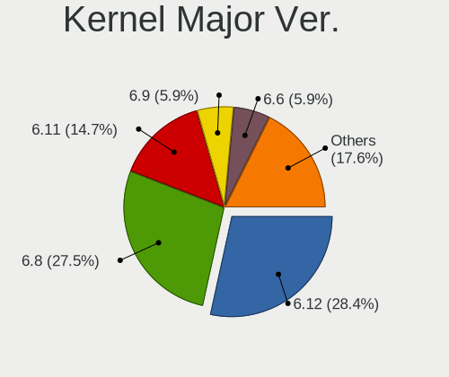
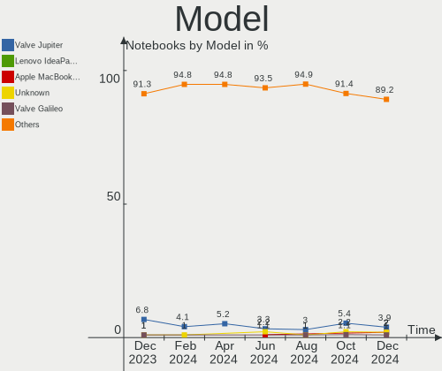
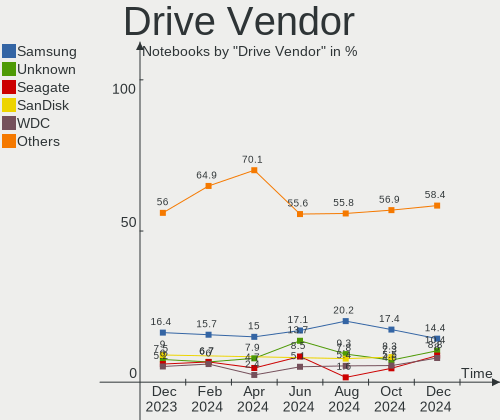

Linux in UK - Hardware Trends (Notebooks)
-----------------------------------------

A project to identify most popular hardware characteristics and track their change
over time based on data collected by Linux users at https://Linux-Hardware.org.

Anyone can contribute to this report by the [hw-probe](https://github.com/linuxhw/hw-probe) tool:

    sudo -E hw-probe -all -upload

Period: Oct, 2023.

Contents
--------

* [ System ](#system)
  - [ OS                       ](#os)
  - [ OS Family                ](#os-family)
  - [ Kernel                   ](#kernel)
  - [ Kernel Family            ](#kernel-family)
  - [ Kernel Major Ver.        ](#kernel-major-ver)
  - [ Arch                     ](#arch)
  - [ DE                       ](#de)
  - [ Display Server           ](#display-server)
  - [ Display Manager          ](#display-manager)
  - [ OS Lang                  ](#os-lang)
  - [ Boot Mode                ](#boot-mode)
  - [ Filesystem               ](#filesystem)
  - [ Part. scheme             ](#part-scheme)
  - [ Dual Boot with Linux/BSD ](#dual-boot-with-linuxbsd)
  - [ Dual Boot (Win)          ](#dual-boot-win)

* [ Board ](#board)
  - [ Vendor                   ](#vendor)
  - [ Model                    ](#model)
  - [ Model Family             ](#model-family)
  - [ MFG Year                 ](#mfg-year)
  - [ Form Factor              ](#form-factor)
  - [ Secure Boot              ](#secure-boot)
  - [ Coreboot                 ](#coreboot)
  - [ RAM Size                 ](#ram-size)
  - [ RAM Used                 ](#ram-used)
  - [ Total Drives             ](#total-drives)
  - [ Has CD-ROM               ](#has-cd-rom)
  - [ Has Ethernet             ](#has-ethernet)
  - [ Has WiFi                 ](#has-wifi)
  - [ Has Bluetooth            ](#has-bluetooth)

* [ Location ](#location)
  - [ Country                  ](#country)
  - [ City                     ](#city)

* [ Drives ](#drives)
  - [ Drive Vendor             ](#drive-vendor)
  - [ Drive Model              ](#drive-model)
  - [ HDD Vendor               ](#hdd-vendor)
  - [ SSD Vendor               ](#ssd-vendor)
  - [ Drive Kind               ](#drive-kind)
  - [ Drive Connector          ](#drive-connector)
  - [ Drive Size               ](#drive-size)
  - [ Space Total              ](#space-total)
  - [ Space Used               ](#space-used)
  - [ Malfunc. Drives          ](#malfunc-drives)
  - [ Malfunc. Drive Vendor    ](#malfunc-drive-vendor)
  - [ Malfunc. HDD Vendor      ](#malfunc-hdd-vendor)
  - [ Malfunc. Drive Kind      ](#malfunc-drive-kind)
  - [ Failed Drives            ](#failed-drives)
  - [ Failed Drive Vendor      ](#failed-drive-vendor)
  - [ Drive Status             ](#drive-status)

* [ Storage controller ](#storage-controller)
  - [ Storage Vendor           ](#storage-vendor)
  - [ Storage Model            ](#storage-model)
  - [ Storage Kind             ](#storage-kind)

* [ Processor ](#processor)
  - [ CPU Vendor               ](#cpu-vendor)
  - [ CPU Model                ](#cpu-model)
  - [ CPU Model Family         ](#cpu-model-family)
  - [ CPU Cores                ](#cpu-cores)
  - [ CPU Sockets              ](#cpu-sockets)
  - [ CPU Threads              ](#cpu-threads)
  - [ CPU Op-Modes             ](#cpu-op-modes)
  - [ CPU Microcode            ](#cpu-microcode)
  - [ CPU Microarch            ](#cpu-microarch)

* [ Graphics ](#graphics)
  - [ GPU Vendor               ](#gpu-vendor)
  - [ GPU Model                ](#gpu-model)
  - [ GPU Combo                ](#gpu-combo)
  - [ GPU Driver               ](#gpu-driver)
  - [ GPU Memory               ](#gpu-memory)

* [ Monitor ](#monitor)
  - [ Monitor Vendor           ](#monitor-vendor)
  - [ Monitor Model            ](#monitor-model)
  - [ Monitor Resolution       ](#monitor-resolution)
  - [ Monitor Diagonal         ](#monitor-diagonal)
  - [ Monitor Width            ](#monitor-width)
  - [ Aspect Ratio             ](#aspect-ratio)
  - [ Monitor Area             ](#monitor-area)
  - [ Pixel Density            ](#pixel-density)
  - [ Multiple Monitors        ](#multiple-monitors)

* [ Network ](#network)
  - [ Net Controller Vendor    ](#net-controller-vendor)
  - [ Net Controller Model     ](#net-controller-model)
  - [ Wireless Vendor          ](#wireless-vendor)
  - [ Wireless Model           ](#wireless-model)
  - [ Ethernet Vendor          ](#ethernet-vendor)
  - [ Ethernet Model           ](#ethernet-model)
  - [ Net Controller Kind      ](#net-controller-kind)
  - [ Used Controller          ](#used-controller)
  - [ NICs                     ](#nics)
  - [ IPv6                     ](#ipv6)

* [ Bluetooth ](#bluetooth)
  - [ Bluetooth Vendor         ](#bluetooth-vendor)
  - [ Bluetooth Model          ](#bluetooth-model)

* [ Sound ](#sound)
  - [ Sound Vendor             ](#sound-vendor)
  - [ Sound Model              ](#sound-model)

* [ Memory ](#memory)
  - [ Memory Vendor            ](#memory-vendor)
  - [ Memory Model             ](#memory-model)
  - [ Memory Kind              ](#memory-kind)
  - [ Memory Form Factor       ](#memory-form-factor)
  - [ Memory Size              ](#memory-size)
  - [ Memory Speed             ](#memory-speed)

* [ Printers & scanners ](#printers--scanners)
  - [ Printer Vendor           ](#printer-vendor)
  - [ Printer Model            ](#printer-model)
  - [ Scanner Vendor           ](#scanner-vendor)
  - [ Scanner Model            ](#scanner-model)

* [ Camera ](#camera)
  - [ Camera Vendor            ](#camera-vendor)
  - [ Camera Model             ](#camera-model)

* [ Security ](#security)
  - [ Fingerprint Vendor       ](#fingerprint-vendor)
  - [ Fingerprint Model        ](#fingerprint-model)
  - [ Chipcard Vendor          ](#chipcard-vendor)
  - [ Chipcard Model           ](#chipcard-model)

* [ Unsupported ](#unsupported)
  - [ Unsupported Devices      ](#unsupported-devices)
  - [ Unsupported Device Types ](#unsupported-device-types)

System
------

OS
--

Installed operating systems

| Name               | Notebooks | Percent |
|--------------------|-----------|---------|
| Ubuntu 22.04       | 20        | 16.81%  |
| Linux Mint 21.2    | 12        | 10.08%  |
| Fedora 38          | 12        | 10.08%  |
| Debian 12          | 6         | 5.04%   |
| Ubuntu 23.10       | 5         | 4.2%    |
| Pop!_OS 22.04      | 5         | 4.2%    |
| Zorin 16           | 4         | 3.36%   |
| Fedora 39          | 4         | 3.36%   |
| BlackPanther 18.1  | 4         | 3.36%   |
| ArcoLinux Rolling  | 4         | 3.36%   |
| Arch Rolling       | 4         | 3.36%   |
| SteamOS 3.4.11     | 3         | 2.52%   |
| KDE neon 22.04     | 3         | 2.52%   |
| Ubuntu 23.04       | 2         | 1.68%   |
| OpenMandriva 23.08 | 2         | 1.68%   |
| Kubuntu 22.04      | 2         | 1.68%   |
| Kali 2023.3        | 2         | 1.68%   |
| Debian 11          | 2         | 1.68%   |
| Xubuntu 23.10      | 1         | 0.84%   |
| Xubuntu 22.04      | 1         | 0.84%   |
| Xubuntu 21.04      | 1         | 0.84%   |
| Xubuntu 18.04      | 1         | 0.84%   |
| Ubuntu MATE 22.04  | 1         | 0.84%   |
| Ubuntu 22.10       | 1         | 0.84%   |
| SteamOS 3.5        | 1         | 0.84%   |
| SteamOS 3.4.10     | 1         | 0.84%   |
| Slackware 15.0     | 1         | 0.84%   |
| Peppermint 10      | 1         | 0.84%   |
| OpenMandriva 23.07 | 1         | 0.84%   |
| Nobara 38          | 1         | 0.84%   |
| MX 21              | 1         | 0.84%   |
| Manjaro            | 1         | 0.84%   |
| Mageia 9           | 1         | 0.84%   |
| Lubuntu 22.04      | 1         | 0.84%   |
| LMDE 6             | 1         | 0.84%   |
| Linux Mint 20.3    | 1         | 0.84%   |
| Linux Mint 20.2    | 1         | 0.84%   |
| Kubuntu 23.04      | 1         | 0.84%   |
| Gentoo 2.14        | 1         | 0.84%   |
| Fedora 36          | 1         | 0.84%   |

OS Family
---------

OS without a version

| Name         | Notebooks | Percent |
|--------------|-----------|---------|
| Ubuntu       | 28        | 23.53%  |
| Fedora       | 17        | 14.29%  |
| Linux Mint   | 14        | 11.76%  |
| Debian       | 8         | 6.72%   |
| SteamOS      | 5         | 4.2%    |
| Pop!_OS      | 5         | 4.2%    |
| Zorin        | 4         | 3.36%   |
| Xubuntu      | 4         | 3.36%   |
| BlackPanther | 4         | 3.36%   |
| ArcoLinux    | 4         | 3.36%   |
| Arch         | 4         | 3.36%   |
| OpenMandriva | 3         | 2.52%   |
| Kubuntu      | 3         | 2.52%   |
| KDE neon     | 3         | 2.52%   |
| Kali         | 2         | 1.68%   |
| Ubuntu MATE  | 1         | 0.84%   |
| Slackware    | 1         | 0.84%   |
| Peppermint   | 1         | 0.84%   |
| Nobara       | 1         | 0.84%   |
| MX           | 1         | 0.84%   |
| Manjaro      | 1         | 0.84%   |
| Mageia       | 1         | 0.84%   |
| Lubuntu      | 1         | 0.84%   |
| LMDE         | 1         | 0.84%   |
| Gentoo       | 1         | 0.84%   |
| Endless      | 1         | 0.84%   |

Kernel
------

Version of the Linux kernel

| Version                     | Notebooks | Percent |
|-----------------------------|-----------|---------|
| 6.2.0-34-generic            | 13        | 10.92%  |
| 6.2.0-35-generic            | 9         | 7.56%   |
| 5.15.0-86-generic           | 9         | 7.56%   |
| 6.5.6-200.fc38.x86_64       | 5         | 4.2%    |
| 6.2.0-33-generic            | 5         | 4.2%    |
| 6.5.6-300.fc39.x86_64       | 4         | 3.36%   |
| 6.5.0-9-generic             | 4         | 3.36%   |
| 6.1.0-13-amd64              | 4         | 3.36%   |
| 5.13.0-valve37-1-neptune    | 4         | 3.36%   |
| 6.5.5-arch1-1               | 3         | 2.52%   |
| 6.5.5-200.fc38.x86_64       | 3         | 2.52%   |
| 6.1.0-12-amd64              | 3         | 2.52%   |
| 5.15.85-desktop-1bP         | 3         | 2.52%   |
| 5.15.0-87-generic           | 3         | 2.52%   |
| 6.5.8-arch1-1               | 2         | 1.68%   |
| 6.5.8-200.fc38.x86_64       | 2         | 1.68%   |
| 6.5.4-76060504-generic      | 2         | 1.68%   |
| 6.5.0-kali2-amd64           | 2         | 1.68%   |
| 6.5.0-10-generic            | 2         | 1.68%   |
| 6.4.11-desktop-1omv2390     | 2         | 1.68%   |
| 6.2.9-300.fc38.x86_64       | 2         | 1.68%   |
| 6.2.0-36-generic            | 2         | 1.68%   |
| 6.2.0-32-generic            | 2         | 1.68%   |
| 5.4.0-150-generic           | 2         | 1.68%   |
| 5.10.0-26-amd64             | 2         | 1.68%   |
| 6.5.7-arch1-1               | 1         | 0.84%   |
| 6.5.6-76060506-generic      | 1         | 0.84%   |
| 6.5.5-200.fsync.fc38.x86_64 | 1         | 0.84%   |
| 6.5.5-1-MANJARO             | 1         | 0.84%   |
| 6.4.9-desktop-4.mga9        | 1         | 0.84%   |
| 6.4.6-76060406-generic      | 1         | 0.84%   |
| 6.4.12-arch1-1              | 1         | 0.84%   |
| 6.3.5-desktop-3omv2390      | 1         | 0.84%   |
| 6.2.15-100.fc36.x86_64      | 1         | 0.84%   |
| 6.2.0-1014-lowlatency       | 1         | 0.84%   |
| 6.1.57-gentoo-x86_64        | 1         | 0.84%   |
| 6.1.55-1-lts                | 1         | 0.84%   |
| 6.1.52-valve2-1-neptune-61  | 1         | 0.84%   |
| 6.1.0-0.deb11.11-amd64      | 1         | 0.84%   |
| 5.8.0-14-generic            | 1         | 0.84%   |

Kernel Family
-------------

Linux kernel without a distro release

| Version  | Notebooks | Percent |
|----------|-----------|---------|
| 6.2.0    | 32        | 26.89%  |
| 5.15.0   | 16        | 13.45%  |
| 6.5.6    | 10        | 8.4%    |
| 6.5.5    | 8         | 6.72%   |
| 6.5.0    | 8         | 6.72%   |
| 6.1.0    | 8         | 6.72%   |
| 6.5.8    | 4         | 3.36%   |
| 5.13.0   | 4         | 3.36%   |
| 5.4.0    | 3         | 2.52%   |
| 5.15.85  | 3         | 2.52%   |
| 6.5.4    | 2         | 1.68%   |
| 6.4.11   | 2         | 1.68%   |
| 6.2.9    | 2         | 1.68%   |
| 5.10.0   | 2         | 1.68%   |
| 6.5.7    | 1         | 0.84%   |
| 6.4.9    | 1         | 0.84%   |
| 6.4.6    | 1         | 0.84%   |
| 6.4.12   | 1         | 0.84%   |
| 6.3.5    | 1         | 0.84%   |
| 6.2.15   | 1         | 0.84%   |
| 6.1.57   | 1         | 0.84%   |
| 6.1.55   | 1         | 0.84%   |
| 6.1.52   | 1         | 0.84%   |
| 5.8.0    | 1         | 0.84%   |
| 5.6.14   | 1         | 0.84%   |
| 5.19.0   | 1         | 0.84%   |
| 5.17.15  | 1         | 0.84%   |
| 5.15.117 | 1         | 0.84%   |
| 5.11.0   | 1         | 0.84%   |

Kernel Major Ver.
-----------------

Linux kernel major version

| Version | Notebooks | Percent |
|---------|-----------|---------|
| 6.2     | 35        | 29.41%  |
| 6.5     | 33        | 27.73%  |
| 5.15    | 20        | 16.81%  |
| 6.1     | 11        | 9.24%   |
| 6.4     | 5         | 4.2%    |
| 5.13    | 4         | 3.36%   |
| 5.4     | 3         | 2.52%   |
| 5.10    | 2         | 1.68%   |
| 6.3     | 1         | 0.84%   |
| 5.8     | 1         | 0.84%   |
| 5.6     | 1         | 0.84%   |
| 5.19    | 1         | 0.84%   |
| 5.17    | 1         | 0.84%   |
| 5.11    | 1         | 0.84%   |

Arch
----

OS architecture (x86_64, i586, etc.)

| Name   | Notebooks | Percent |
|--------|-----------|---------|
| x86_64 | 118       | 99.16%  |
| i686   | 1         | 0.84%   |

DE
--

Desktop Environment

| Name            | Notebooks | Percent |
|-----------------|-----------|---------|
| GNOME           | 52        | 43.7%   |
| KDE5            | 26        | 21.85%  |
| XFCE            | 13        | 10.92%  |
| X-Cinnamon      | 10        | 8.4%    |
| Unknown         | 5         | 4.2%    |
| Cinnamon        | 4         | 3.36%   |
| MATE            | 3         | 2.52%   |
| LXDE            | 2         | 1.68%   |
| LXQt            | 1         | 0.84%   |
| Hyprland        | 1         | 0.84%   |
| GNOME Flashback | 1         | 0.84%   |
| chadwm          | 1         | 0.84%   |

Display Server
--------------

X11 or Wayland

| Name    | Notebooks | Percent |
|---------|-----------|---------|
| X11     | 68        | 57.14%  |
| Wayland | 44        | 36.97%  |
| Tty     | 4         | 3.36%   |
| Unknown | 3         | 2.52%   |

Display Manager
---------------

SDDM, LightDM, etc.

| Name    | Notebooks | Percent |
|---------|-----------|---------|
| Unknown | 41        | 34.45%  |
| GDM3    | 31        | 26.05%  |
| LightDM | 20        | 16.81%  |
| SDDM    | 18        | 15.13%  |
| GDM     | 9         | 7.56%   |

OS Lang
-------

Language

| Lang        | Notebooks | Percent |
|-------------|-----------|---------|
| en_GB       | 92        | 77.31%  |
| en_US       | 18        | 15.13%  |
| Unknown     | 6         | 5.04%   |
| C           | 2         | 1.68%   |
| en_US.utf-8 | 1         | 0.84%   |

Boot Mode
---------

EFI or BIOS

| Mode | Notebooks | Percent |
|------|-----------|---------|
| EFI  | 61        | 51.26%  |
| BIOS | 58        | 48.74%  |

Filesystem
----------

Type of filesystem

| Type    | Notebooks | Percent |
|---------|-----------|---------|
| Ext4    | 73        | 61.34%  |
| Btrfs   | 24        | 20.17%  |
| Tmpfs   | 17        | 14.29%  |
| Overlay | 4         | 3.36%   |
| Zfs     | 1         | 0.84%   |

Part. scheme
------------

Scheme of partitioning

| Type    | Notebooks | Percent |
|---------|-----------|---------|
| GPT     | 65        | 54.62%  |
| Unknown | 38        | 31.93%  |
| MBR     | 16        | 13.45%  |

Dual Boot with Linux/BSD
------------------------

Hosting more than one Linux/BSD

| Dual boot | Notebooks | Percent |
|-----------|-----------|---------|
| No        | 111       | 93.28%  |
| Yes       | 8         | 6.72%   |

Dual Boot (Win)
---------------

Hosting Linux and Windows

| Dual boot | Notebooks | Percent |
|-----------|-----------|---------|
| No        | 91        | 76.47%  |
| Yes       | 28        | 23.53%  |

Board
-----

Vendor
------

Motherboard manufacturer

| Name                | Notebooks | Percent |
|---------------------|-----------|---------|
| Lenovo              | 27        | 22.69%  |
| Dell                | 27        | 22.69%  |
| Hewlett-Packard     | 16        | 13.45%  |
| ASUSTek Computer    | 11        | 9.24%   |
| Valve               | 5         | 4.2%    |
| Apple               | 5         | 4.2%    |
| Acer                | 5         | 4.2%    |
| Toshiba             | 4         | 3.36%   |
| HUAWEI              | 3         | 2.52%   |
| Samsung Electronics | 2         | 1.68%   |
| Alienware           | 2         | 1.68%   |
| Star Labs           | 1         | 0.84%   |
| Sony                | 1         | 0.84%   |
| PC Specialist       | 1         | 0.84%   |
| Panasonic           | 1         | 0.84%   |
| Novatech            | 1         | 0.84%   |
| MSI                 | 1         | 0.84%   |
| Google              | 1         | 0.84%   |
| Fujitsu Siemens     | 1         | 0.84%   |
| Framework           | 1         | 0.84%   |
| Eii                 | 1         | 0.84%   |
| AZW                 | 1         | 0.84%   |
| AWOW                | 1         | 0.84%   |

Model
-----

Motherboard model

| Name                                     | Notebooks | Percent |
|------------------------------------------|-----------|---------|
| Valve Jupiter                            | 5         | 4.2%    |
| HP OMEN by Laptop 16-c0xxx               | 2         | 1.68%   |
| Dell XPS 15 9500                         | 2         | 1.68%   |
| Dell Inspiron 13-5378                    | 2         | 1.68%   |
| Toshiba Satellite Pro R50-B              | 1         | 0.84%   |
| Toshiba Satellite NB10t-A-102            | 1         | 0.84%   |
| Toshiba Satellite C660D                  | 1         | 0.84%   |
| Toshiba Satellite C50-A-1DV              | 1         | 0.84%   |
| Star Labs StarBook                       | 1         | 0.84%   |
| Sony SVE1511K1ESI                        | 1         | 0.84%   |
| Samsung 750XED                           | 1         | 0.84%   |
| Samsung 355V4C/356V4C/3445VC/3545VC      | 1         | 0.84%   |
| PC Specialist P65_P67RGRERA              | 1         | 0.84%   |
| Panasonic CF-191HA23DE                   | 1         | 0.84%   |
| Novatech W9x0LU                          | 1         | 0.84%   |
| MSI Katana GF66 11UG                     | 1         | 0.84%   |
| Lenovo Yoga Slim 7 ProX 14ARH7 82TL      | 1         | 0.84%   |
| Lenovo Yoga Slim 7 13ACN5 82CY           | 1         | 0.84%   |
| Lenovo V330-14ARR 81B1                   | 1         | 0.84%   |
| Lenovo V15 G2 ALC 82KD                   | 1         | 0.84%   |
| Lenovo ThinkPad X1 Carbon 6th 20KH006KUK | 1         | 0.84%   |
| Lenovo ThinkPad X1 Carbon 5th 20HQS01A0Y | 1         | 0.84%   |
| Lenovo ThinkPad T61 7661WQQ              | 1         | 0.84%   |
| Lenovo ThinkPad T530 24296JG             | 1         | 0.84%   |
| Lenovo ThinkPad T490 20N3SDGJ02          | 1         | 0.84%   |
| Lenovo ThinkPad T470s 20HGS29Y00         | 1         | 0.84%   |
| Lenovo ThinkPad T450 20BUS00700          | 1         | 0.84%   |
| Lenovo ThinkPad T430 2349STC             | 1         | 0.84%   |
| Lenovo ThinkPad T420 4236KU9             | 1         | 0.84%   |
| Lenovo ThinkPad T14s Gen 4 21F8CTO1WW    | 1         | 0.84%   |
| Lenovo ThinkPad T14 Gen 1 20UDS01C00     | 1         | 0.84%   |
| Lenovo ThinkPad P14s Gen 3 21J6S0K700    | 1         | 0.84%   |
| Lenovo ThinkPad P14s Gen 3 21J5CTO1WW    | 1         | 0.84%   |
| Lenovo ThinkPad L470 W10DG 20JVS0LQ00    | 1         | 0.84%   |
| Lenovo ThinkPad E565 20EY000XUK          | 1         | 0.84%   |
| Lenovo ThinkPad E16 Gen 1 21JNCTO1WW     | 1         | 0.84%   |
| Lenovo ThinkPad E14 Gen 5 21JKCTO1WW     | 1         | 0.84%   |
| Lenovo ThinkPad E14 20RA0020AU           | 1         | 0.84%   |
| Lenovo ThinkPad 13 2nd Gen 20J2S0AB00    | 1         | 0.84%   |
| Lenovo Legion 5 15ACH6H 82JU             | 1         | 0.84%   |

Model Family
------------

Motherboard model prefix

| Name                     | Notebooks | Percent |
|--------------------------|-----------|---------|
| Lenovo ThinkPad          | 19        | 15.97%  |
| Dell Inspiron            | 9         | 7.56%   |
| Dell Precision           | 6         | 5.04%   |
| Dell Latitude            | 6         | 5.04%   |
| Valve Jupiter            | 5         | 4.2%    |
| Dell XPS                 | 5         | 4.2%    |
| ASUS VivoBook            | 5         | 4.2%    |
| Toshiba Satellite        | 4         | 3.36%   |
| HP Pavilion              | 4         | 3.36%   |
| Lenovo IdeaPad           | 3         | 2.52%   |
| HP ProBook               | 3         | 2.52%   |
| HP OMEN                  | 3         | 2.52%   |
| Acer Aspire              | 3         | 2.52%   |
| Lenovo Yoga              | 2         | 1.68%   |
| HP EliteBook             | 2         | 1.68%   |
| ASUS ZenBook             | 2         | 1.68%   |
| Apple MacBookAir6        | 2         | 1.68%   |
| Star Labs StarBook       | 1         | 0.84%   |
| Sony SVE1511K1ESI        | 1         | 0.84%   |
| Samsung 750XED           | 1         | 0.84%   |
| Samsung 355V4C           | 1         | 0.84%   |
| PC Specialist P65        | 1         | 0.84%   |
| Panasonic CF-191HA23DE   | 1         | 0.84%   |
| Novatech W9x0LU          | 1         | 0.84%   |
| MSI Katana               | 1         | 0.84%   |
| Lenovo V330-14ARR        | 1         | 0.84%   |
| Lenovo V15               | 1         | 0.84%   |
| Lenovo Legion            | 1         | 0.84%   |
| HUAWEI HN-WX9X           | 1         | 0.84%   |
| HUAWEI CREF-XX           | 1         | 0.84%   |
| HUAWEI BOHL-WXX9         | 1         | 0.84%   |
| HP ZBook                 | 1         | 0.84%   |
| HP Presario              | 1         | 0.84%   |
| HP G56                   | 1         | 0.84%   |
| HP ENVY                  | 1         | 0.84%   |
| Google Careena           | 1         | 0.84%   |
| Fujitsu Siemens LIFEBOOK | 1         | 0.84%   |
| Framework Laptop         | 1         | 0.84%   |
| Eii Ezpad                | 1         | 0.84%   |
| Dell G15                 | 1         | 0.84%   |

MFG Year
--------

Motherboard manufacture year

| Year | Notebooks | Percent |
|------|-----------|---------|
| 2023 | 15        | 12.61%  |
| 2021 | 14        | 11.76%  |
| 2020 | 13        | 10.92%  |
| 2022 | 10        | 8.4%    |
| 2013 | 10        | 8.4%    |
| 2014 | 8         | 6.72%   |
| 2017 | 7         | 5.88%   |
| 2019 | 6         | 5.04%   |
| 2018 | 6         | 5.04%   |
| 2016 | 6         | 5.04%   |
| 2015 | 4         | 3.36%   |
| 2012 | 4         | 3.36%   |
| 2011 | 4         | 3.36%   |
| 2010 | 3         | 2.52%   |
| 2007 | 3         | 2.52%   |
| 2006 | 3         | 2.52%   |
| 2008 | 2         | 1.68%   |
| 2009 | 1         | 0.84%   |

Form Factor
-----------

Physical design of the computer

| Name     | Notebooks | Percent |
|----------|-----------|---------|
| Notebook | 119       | 100%    |

Secure Boot
-----------

Enabled or disabled

| State    | Notebooks | Percent |
|----------|-----------|---------|
| Disabled | 108       | 90.76%  |
| Enabled  | 11        | 9.24%   |

Coreboot
--------

Have coreboot on board

| Used | Notebooks | Percent |
|------|-----------|---------|
| No   | 117       | 98.32%  |
| Yes  | 2         | 1.68%   |

RAM Size
--------

Total RAM memory

| Size in GB  | Notebooks | Percent |
|-------------|-----------|---------|
| 4.01-8.0    | 36        | 30.25%  |
| 8.01-16.0   | 25        | 21.01%  |
| 3.01-4.0    | 20        | 16.81%  |
| 32.01-64.0  | 16        | 13.45%  |
| 16.01-24.0  | 14        | 11.76%  |
| 1.01-2.0    | 3         | 2.52%   |
| 64.01-256.0 | 2         | 1.68%   |
| 0.51-1.0    | 2         | 1.68%   |
| 24.01-32.0  | 1         | 0.84%   |

RAM Used
--------

Used RAM memory

| Used GB   | Notebooks | Percent |
|-----------|-----------|---------|
| 4.01-8.0  | 37        | 31.09%  |
| 1.01-2.0  | 34        | 28.57%  |
| 3.01-4.0  | 17        | 14.29%  |
| 2.01-3.0  | 17        | 14.29%  |
| 0.51-1.0  | 8         | 6.72%   |
| 8.01-16.0 | 6         | 5.04%   |

Total Drives
------------

Number of drives on board

| Drives | Notebooks | Percent |
|--------|-----------|---------|
| 1      | 83        | 69.75%  |
| 2      | 34        | 28.57%  |
| 4      | 1         | 0.84%   |
| 3      | 1         | 0.84%   |

Has CD-ROM
----------

Has CD-ROM on board

| Presented | Notebooks | Percent |
|-----------|-----------|---------|
| No        | 92        | 77.31%  |
| Yes       | 27        | 22.69%  |

Has Ethernet
------------

Has Ethernet on board

| Presented | Notebooks | Percent |
|-----------|-----------|---------|
| Yes       | 83        | 69.75%  |
| No        | 36        | 30.25%  |

Has WiFi
--------

Has WiFi module

| Presented | Notebooks | Percent |
|-----------|-----------|---------|
| Yes       | 119       | 100%    |

Has Bluetooth
-------------

Has Bluetooth module

| Presented | Notebooks | Percent |
|-----------|-----------|---------|
| Yes       | 96        | 80.67%  |
| No        | 23        | 19.33%  |

Location
--------

Country
-------

Geographic location (country)

| Country | Notebooks | Percent |
|---------|-----------|---------|
| UK      | 119       | 100%    |

City
----

Geographic location (city)

| City                 | Notebooks | Percent |
|----------------------|-----------|---------|
| London               | 8         | 6.72%   |
| York                 | 4         | 3.36%   |
| Glasgow              | 4         | 3.36%   |
| Croydon              | 4         | 3.36%   |
| Manchester           | 3         | 2.52%   |
| Leeds                | 3         | 2.52%   |
| Ilford               | 3         | 2.52%   |
| Birmingham           | 3         | 2.52%   |
| Sheffield            | 2         | 1.68%   |
| Newham               | 2         | 1.68%   |
| Liverpool            | 2         | 1.68%   |
| Kingston upon Thames | 2         | 1.68%   |
| Harlow               | 2         | 1.68%   |
| Feltham              | 2         | 1.68%   |
| Exeter               | 2         | 1.68%   |
| Edinburgh            | 2         | 1.68%   |
| Dundee               | 2         | 1.68%   |
| City of Westminster  | 2         | 1.68%   |
| Bristol              | 2         | 1.68%   |
| Wrexham              | 1         | 0.84%   |
| Wolverhampton        | 1         | 0.84%   |
| Wokingham            | 1         | 0.84%   |
| Whitley Bay          | 1         | 0.84%   |
| Whiteley             | 1         | 0.84%   |
| Whitechapel          | 1         | 0.84%   |
| Wembley              | 1         | 0.84%   |
| Watford              | 1         | 0.84%   |
| Swansea              | 1         | 0.84%   |
| Sunderland           | 1         | 0.84%   |
| Southwark            | 1         | 0.84%   |
| Southampton          | 1         | 0.84%   |
| Shoreham-by-Sea      | 1         | 0.84%   |
| Sandwich             | 1         | 0.84%   |
| Salisbury            | 1         | 0.84%   |
| Rugeley              | 1         | 0.84%   |
| Royal Leamington Spa | 1         | 0.84%   |
| Romford              | 1         | 0.84%   |
| Rochdale             | 1         | 0.84%   |
| Prenton              | 1         | 0.84%   |
| Poplar               | 1         | 0.84%   |

Drives
------

Drive Vendor
------------

Hard drive vendors

| Vendor                      | Notebooks | Drives | Percent |
|-----------------------------|-----------|--------|---------|
| Samsung Electronics         | 19        | 21     | 12.67%  |
| WDC                         | 13        | 13     | 8.67%   |
| Unknown                     | 13        | 14     | 8.67%   |
| SanDisk                     | 12        | 13     | 8%      |
| Toshiba                     | 11        | 11     | 7.33%   |
| Seagate                     | 8         | 8      | 5.33%   |
| Micron Technology           | 8         | 8      | 5.33%   |
| Kingston                    | 8         | 8      | 5.33%   |
| Crucial                     | 8         | 9      | 5.33%   |
| SK hynix                    | 7         | 7      | 4.67%   |
| Silicon Motion              | 4         | 4      | 2.67%   |
| LITEON                      | 4         | 4      | 2.67%   |
| Intel                       | 4         | 5      | 2.67%   |
| Phison Electronics          | 3         | 3      | 2%      |
| Hitachi                     | 3         | 3      | 2%      |
| Apple                       | 3         | 3      | 2%      |
| Phison                      | 2         | 2      | 1.33%   |
| LITEONIT                    | 2         | 2      | 1.33%   |
| Fujitsu                     | 2         | 2      | 1.33%   |
| China                       | 2         | 2      | 1.33%   |
| Unknown                     | 2         | 2      | 1.33%   |
| XUM                         | 1         | 1      | 0.67%   |
| Transcend                   | 1         | 1      | 0.67%   |
| SSSTC                       | 1         | 1      | 0.67%   |
| Realtek                     | 1         | 1      | 0.67%   |
| Origin                      | 1         | 1      | 0.67%   |
| Micron/Crucial Technology   | 1         | 1      | 0.67%   |
| MAXIO Technology (Hangzhou) | 1         | 1      | 0.67%   |
| KIOXIA                      | 1         | 1      | 0.67%   |
| HGST                        | 1         | 1      | 0.67%   |
| HECTRON                     | 1         | 1      | 0.67%   |
| Gigabyte Technology         | 1         | 1      | 0.67%   |
| A-DATA Technology           | 1         | 1      | 0.67%   |

Drive Model
-----------

Hard drive models

| Model                                              | Notebooks | Percent |
|----------------------------------------------------|-----------|---------|
| Samsung NVMe SSD Controller PM9A1/PM9A3/980PRO 1TB | 4         | 2.63%   |
| Unknown SD/MMC/MS PRO 16GB                         | 3         | 1.97%   |
| Toshiba MQ01ABD100 1TB                             | 3         | 1.97%   |
| Samsung NVMe SSD Controller SM981/PM981/PM983 1TB  | 3         | 1.97%   |
| Kingston SA400S37240G 240GB SSD                    | 3         | 1.97%   |
| WDC PC SN530 SDBPNPZ-512G-1027 512GB               | 2         | 1.32%   |
| Unknown MMC Card  512GB                            | 2         | 1.32%   |
| Unknown MMC Card  32GB                             | 2         | 1.32%   |
| Unknown MMC Card  256GB                            | 2         | 1.32%   |
| Toshiba MQ01ABF050 500GB                           | 2         | 1.32%   |
| Phison PS5013 E13 NVMe Controller 256GB            | 2         | 1.32%   |
| Micron MTFDHBA512TDV-1AZ1AABHA 512GB               | 2         | 1.32%   |
| LITEON CV1-8B128 128GB SSD                         | 2         | 1.32%   |
| Kingston SA400S37120G 120GB SSD                    | 2         | 1.32%   |
| Intel SSDPEKNU512GZ 512GB                          | 2         | 1.32%   |
| Hitachi HTS547550A9E384 500GB                      | 2         | 1.32%   |
| Crucial CT500MX500SSD1 500GB                       | 2         | 1.32%   |
| Unknown                                            | 2         | 1.32%   |
| XUM HX256GSSDM2 256GB                              | 1         | 0.66%   |
| WDC WDS250G2B0A 250GB SSD                          | 1         | 0.66%   |
| WDC WD5000LPLX-60ZNTT1 500GB                       | 1         | 0.66%   |
| WDC WD10SPZX-75Z10T3 1TB                           | 1         | 0.66%   |
| WDC WD10SPZX-60Z10T0 1TB                           | 1         | 0.66%   |
| WDC WD10SPZX-35Z10T0 1TB                           | 1         | 0.66%   |
| WDC WD10SPCX-24HWST1 1TB                           | 1         | 0.66%   |
| WDC WD10JPVX-75JC3T0 1TB                           | 1         | 0.66%   |
| WDC WD10JPVX-22JC3T0 1TB                           | 1         | 0.66%   |
| WDC PC SN730 SDBPNTY-512G-1006 512GB               | 1         | 0.66%   |
| WDC PC SN730 NVMe 1024GB                           | 1         | 0.66%   |
| WDC PC SN530 SDBPNPZ-256G-1002 256GB               | 1         | 0.66%   |
| Unknown USB DISK 3.2 1TB                           | 1         | 0.66%   |
| Unknown NVMe SSD Drive 1024GB                      | 1         | 0.66%   |
| Unknown MMC Card  64GB                             | 1         | 0.66%   |
| Unknown MMC Card  128GB                            | 1         | 0.66%   |
| Unknown DA4032  32GB                               | 1         | 0.66%   |
| Transcend TS512GMTE220S 512GB                      | 1         | 0.66%   |
| Toshiba XG4 NVMe SSD Controller 256GB              | 1         | 0.66%   |
| Toshiba MQ01ACF050 500GB                           | 1         | 0.66%   |
| Toshiba MK1661GSYFN 160GB                          | 1         | 0.66%   |
| Toshiba KXG60ZNV256G NVMe 256GB                    | 1         | 0.66%   |

HDD Vendor
----------

Hard disk drive vendors

| Vendor              | Notebooks | Drives | Percent |
|---------------------|-----------|--------|---------|
| WDC                 | 7         | 7      | 22.58%  |
| Toshiba             | 7         | 7      | 22.58%  |
| Seagate             | 7         | 7      | 22.58%  |
| Unknown             | 3         | 3      | 9.68%   |
| Hitachi             | 3         | 3      | 9.68%   |
| Fujitsu             | 2         | 2      | 6.45%   |
| Samsung Electronics | 1         | 1      | 3.23%   |
| HGST                | 1         | 1      | 3.23%   |

SSD Vendor
----------

Solid state drive vendors

| Vendor              | Notebooks | Drives | Percent |
|---------------------|-----------|--------|---------|
| Kingston            | 7         | 7      | 17.95%  |
| Crucial             | 6         | 7      | 15.38%  |
| Samsung Electronics | 4         | 5      | 10.26%  |
| LITEON              | 4         | 4      | 10.26%  |
| SanDisk             | 3         | 3      | 7.69%   |
| Apple               | 3         | 3      | 7.69%   |
| Toshiba             | 2         | 2      | 5.13%   |
| LITEONIT            | 2         | 2      | 5.13%   |
| XUM                 | 1         | 1      | 2.56%   |
| WDC                 | 1         | 1      | 2.56%   |
| SK hynix            | 1         | 1      | 2.56%   |
| Origin              | 1         | 1      | 2.56%   |
| HECTRON             | 1         | 1      | 2.56%   |
| Gigabyte Technology | 1         | 1      | 2.56%   |
| China               | 1         | 1      | 2.56%   |
| A-DATA Technology   | 1         | 1      | 2.56%   |

Drive Kind
----------

HDD or SSD

| Kind    | Notebooks | Drives | Percent |
|---------|-----------|--------|---------|
| NVMe    | 62        | 70     | 43.66%  |
| SSD     | 37        | 41     | 26.06%  |
| HDD     | 30        | 31     | 21.13%  |
| MMC     | 10        | 11     | 7.04%   |
| Unknown | 3         | 3      | 2.11%   |

Drive Connector
---------------

SATA, SAS, NVMe, etc.

| Type | Notebooks | Drives | Percent |
|------|-----------|--------|---------|
| NVMe | 62        | 69     | 44.93%  |
| SATA | 59        | 69     | 42.75%  |
| MMC  | 10        | 11     | 7.25%   |
| SAS  | 7         | 7      | 5.07%   |

Drive Size
----------

Size of hard drive

| Size in TB | Notebooks | Drives | Percent |
|------------|-----------|--------|---------|
| 0.01-0.5   | 50        | 56     | 76.92%  |
| 0.51-1.0   | 12        | 12     | 18.46%  |
| 1.01-2.0   | 3         | 4      | 4.62%   |

Space Total
-----------

Amount of disk space available on the file system

| Size in GB     | Notebooks | Percent |
|----------------|-----------|---------|
| 251-500        | 31        | 26.05%  |
| 101-250        | 30        | 25.21%  |
| 501-1000       | 20        | 16.81%  |
| 1-20           | 10        | 8.4%    |
| 1001-2000      | 6         | 5.04%   |
| 2001-3000      | 5         | 4.2%    |
| Unknown        | 5         | 4.2%    |
| More than 3000 | 4         | 3.36%   |
| 21-50          | 4         | 3.36%   |
| 51-100         | 4         | 3.36%   |

Space Used
----------

Amount of used disk space

| Used GB   | Notebooks | Percent |
|-----------|-----------|---------|
| 1-20      | 44        | 36.97%  |
| 101-250   | 21        | 17.65%  |
| 21-50     | 20        | 16.81%  |
| 51-100    | 9         | 7.56%   |
| 251-500   | 8         | 6.72%   |
| 501-1000  | 7         | 5.88%   |
| Unknown   | 5         | 4.2%    |
| 1001-2000 | 4         | 3.36%   |
| 2001-3000 | 1         | 0.84%   |

Malfunc. Drives
---------------

Drive models with a malfunction

| Model                                   | Notebooks | Drives | Percent |
|-----------------------------------------|-----------|--------|---------|
| WDC WD10SPZX-35Z10T0 1TB                | 1         | 1      | 12.5%   |
| Seagate ST2000LX001-1RG174 2TB          | 1         | 1      | 12.5%   |
| Samsung Electronics SSD PM810 2.5 128GB | 1         | 1      | 12.5%   |
| Samsung Electronics HM160JI 160GB       | 1         | 1      | 12.5%   |
| LITEON LCH-256V2S-11 2.5 7mm 256GB SSD  | 1         | 1      | 12.5%   |
| Intel HBRPEKNX0202AHO 32GB              | 1         | 1      | 12.5%   |
| HECTRON HECX1-60G SSD                   | 1         | 1      | 12.5%   |
| Fujitsu MHY2120BH 120GB                 | 1         | 1      | 12.5%   |

Malfunc. Drive Vendor
---------------------

Vendors of faulty drives

| Vendor              | Notebooks | Drives | Percent |
|---------------------|-----------|--------|---------|
| Samsung Electronics | 2         | 2      | 25%     |
| WDC                 | 1         | 1      | 12.5%   |
| Seagate             | 1         | 1      | 12.5%   |
| LITEON              | 1         | 1      | 12.5%   |
| Intel               | 1         | 1      | 12.5%   |
| HECTRON             | 1         | 1      | 12.5%   |
| Fujitsu             | 1         | 1      | 12.5%   |

Malfunc. HDD Vendor
-------------------

Vendors of faulty HDD drives

| Vendor              | Notebooks | Drives | Percent |
|---------------------|-----------|--------|---------|
| WDC                 | 1         | 1      | 25%     |
| Seagate             | 1         | 1      | 25%     |
| Samsung Electronics | 1         | 1      | 25%     |
| Fujitsu             | 1         | 1      | 25%     |

Malfunc. Drive Kind
-------------------

Kinds of faulty drives

| Kind | Notebooks | Drives | Percent |
|------|-----------|--------|---------|
| HDD  | 4         | 4      | 50%     |
| SSD  | 3         | 3      | 37.5%   |
| NVMe | 1         | 1      | 12.5%   |

Failed Drives
-------------

Failed drive models

Zero info for selected period =(

Failed Drive Vendor
-------------------

Failed drive vendors

Zero info for selected period =(

Drive Status
------------

Number of failed and malfunc. drives

| Status   | Notebooks | Drives | Percent |
|----------|-----------|--------|---------|
| Detected | 63        | 84     | 49.61%  |
| Works    | 56        | 64     | 44.09%  |
| Malfunc  | 8         | 8      | 6.3%    |

Storage controller
------------------

Storage Vendor
--------------

Storage controller vendors

| Vendor                         | Notebooks | Percent |
|--------------------------------|-----------|---------|
| Intel                          | 68        | 46.58%  |
| Samsung Electronics            | 15        | 10.27%  |
| SanDisk                        | 14        | 9.59%   |
| AMD                            | 12        | 8.22%   |
| Micron Technology              | 8         | 5.48%   |
| SK hynix                       | 6         | 4.11%   |
| Silicon Motion                 | 5         | 3.42%   |
| Phison Electronics             | 5         | 3.42%   |
| Micron/Crucial Technology      | 3         | 2.05%   |
| Toshiba America Info Systems   | 2         | 1.37%   |
| Nvidia                         | 2         | 1.37%   |
| Solidigm                       | 1         | 0.68%   |
| Solid State Storage Technology | 1         | 0.68%   |
| MAXIO Technology (Hangzhou)    | 1         | 0.68%   |
| Marvell Technology Group       | 1         | 0.68%   |
| KIOXIA                         | 1         | 0.68%   |
| Kingston Technology Company    | 1         | 0.68%   |

Storage Model
-------------

Storage controller models

| Model                                                                         | Notebooks | Percent |
|-------------------------------------------------------------------------------|-----------|---------|
| Intel 82801 Mobile SATA Controller [RAID mode]                                | 12        | 7.69%   |
| AMD FCH SATA Controller [AHCI mode]                                           | 10        | 6.41%   |
| Intel Sunrise Point-LP SATA Controller [AHCI mode]                            | 7         | 4.49%   |
| Intel 7 Series Chipset Family 6-port SATA Controller [AHCI mode]              | 7         | 4.49%   |
| Intel Volume Management Device NVMe RAID Controller                           | 6         | 3.85%   |
| Samsung NVMe SSD Controller PM9A1/PM9A3/980PRO                                | 4         | 2.56%   |
| Samsung NVMe SSD Controller 980 (DRAM-less)                                   | 4         | 2.56%   |
| Intel 6 Series/C200 Series Chipset Family 6 port Mobile SATA AHCI Controller  | 4         | 2.56%   |
| SanDisk Ultra 3D / WD Blue SN550 NVMe SSD                                     | 3         | 1.92%   |
| Samsung NVMe SSD Controller SM981/PM981/PM983                                 | 3         | 1.92%   |
| Micron/Crucial P2 [Nick P2] / P3 / P3 Plus NVMe PCIe SSD (DRAM-less)          | 3         | 1.92%   |
| Micron 2450 NVMe SSD [HendrixV] (DRAM-less)                                   | 3         | 1.92%   |
| SK hynix Gold P31/BC711/PC711 NVMe Solid State Drive                          | 2         | 1.28%   |
| SK hynix BC901 NVMe Solid State Drive (DRAM-less)                             | 2         | 1.28%   |
| Silicon Motion SM2263EN/SM2263XT (DRAM-less) NVMe SSD Controllers             | 2         | 1.28%   |
| Silicon Motion SM2262/SM2262EN SSD Controller                                 | 2         | 1.28%   |
| Sandisk WD PC SN740 NVMe SSD 512GB (DRAM-less)                                | 2         | 1.28%   |
| SanDisk IX SN530 NVMe SSD (DRAM-less)                                         | 2         | 1.28%   |
| SanDisk Extreme Pro / WD Black SN750 / PC SN730 / Red SN700 NVMe SSD          | 2         | 1.28%   |
| Samsung NVMe SSD Controller PM9B1 (DRAM-less)                                 | 2         | 1.28%   |
| Phison PS5013-E13 PCIe3 NVMe Controller (DRAM-less)                           | 2         | 1.28%   |
| Phison E18 PCIe4 NVMe Controller                                              | 2         | 1.28%   |
| Micron 2300 NVMe SSD [Santana]                                                | 2         | 1.28%   |
| Micron 2210 NVMe SSD [Cobain]                                                 | 2         | 1.28%   |
| Intel Wildcat Point-LP SATA Controller [AHCI Mode]                            | 2         | 1.28%   |
| Intel Tiger Lake-LP SATA Controller                                           | 2         | 1.28%   |
| Intel SSD 670p Series [Keystone Harbor]                                       | 2         | 1.28%   |
| Intel Q170/Q150/B150/H170/H110/Z170/CM236 Chipset SATA Controller [AHCI Mode] | 2         | 1.28%   |
| Intel HM170/QM170 Chipset SATA Controller [AHCI Mode]                         | 2         | 1.28%   |
| Intel Comet Lake SATA AHCI Controller                                         | 2         | 1.28%   |
| Intel Celeron/Pentium Silver Processor SATA Controller                        | 2         | 1.28%   |
| Intel Cannon Lake Mobile PCH SATA AHCI Controller                             | 2         | 1.28%   |
| Intel Atom Processor E3800 Series SATA AHCI Controller                        | 2         | 1.28%   |
| Intel Alder Lake-P SATA AHCI Controller                                       | 2         | 1.28%   |
| Intel 82801HM/HEM (ICH8M/ICH8M-E) SATA Controller [AHCI mode]                 | 2         | 1.28%   |
| Intel 82801HM/HEM (ICH8M/ICH8M-E) IDE Controller                              | 2         | 1.28%   |
| Intel 82801GBM/GHM (ICH7-M Family) SATA Controller [AHCI mode]                | 2         | 1.28%   |
| Intel 82801G (ICH7 Family) IDE Controller                                     | 2         | 1.28%   |
| Toshiba America Info Systems XG6 NVMe SSD Controller                          | 1         | 0.64%   |
| Toshiba America Info Systems XG4 NVMe SSD Controller                          | 1         | 0.64%   |

Storage Kind
------------

Kind of storage controller (IDE, SATA, NVMe, SAS, ...)

| Kind | Notebooks | Percent |
|------|-----------|---------|
| SATA | 63        | 41.72%  |
| NVMe | 62        | 41.06%  |
| RAID | 19        | 12.58%  |
| IDE  | 7         | 4.64%   |

Processor
---------

CPU Vendor
----------

Processor vendors

| Vendor | Notebooks | Percent |
|--------|-----------|---------|
| Intel  | 85        | 71.43%  |
| AMD    | 34        | 28.57%  |

CPU Model
---------

Processor models

| Model                                      | Notebooks | Percent |
|--------------------------------------------|-----------|---------|
| AMD Custom APU 0405                        | 5         | 4.2%    |
| Intel Core i5-7200U CPU @ 2.50GHz          | 4         | 3.36%   |
| Intel Core i7-6700HQ CPU @ 2.60GHz         | 3         | 2.52%   |
| AMD Ryzen 7 5800H with Radeon Graphics     | 3         | 2.52%   |
| Intel Core i9-10885H CPU @ 2.40GHz         | 2         | 1.68%   |
| Intel Core i7-8750H CPU @ 2.20GHz          | 2         | 1.68%   |
| Intel Core i7-6820HQ CPU @ 2.70GHz         | 2         | 1.68%   |
| Intel Core i7-10510U CPU @ 1.80GHz         | 2         | 1.68%   |
| Intel Core i5-7300U CPU @ 2.60GHz          | 2         | 1.68%   |
| Intel Core i5-3320M CPU @ 2.60GHz          | 2         | 1.68%   |
| Intel Core 2 Duo CPU T7300 @ 2.00GHz       | 2         | 1.68%   |
| Intel Core 2 Duo CPU P8700 @ 2.53GHz       | 2         | 1.68%   |
| Intel 13th Gen Core i5-1335U               | 2         | 1.68%   |
| Intel 11th Gen Core i7-11800H @ 2.30GHz    | 2         | 1.68%   |
| Intel 11th Gen Core i5-1135G7 @ 2.40GHz    | 2         | 1.68%   |
| AMD Ryzen 7 PRO 6850U with Radeon Graphics | 2         | 1.68%   |
| AMD Ryzen 7 5700U with Radeon Graphics     | 2         | 1.68%   |
| AMD Ryzen 5 5500U with Radeon Graphics     | 2         | 1.68%   |
| AMD Ryzen 3 7320U with Radeon Graphics     | 2         | 1.68%   |
| Intel Pentium CPU N3510 @ 1.99GHz          | 1         | 0.84%   |
| Intel Core i7-8665U CPU @ 1.90GHz          | 1         | 0.84%   |
| Intel Core i7-8550U CPU @ 1.80GHz          | 1         | 0.84%   |
| Intel Core i7-7700HQ CPU @ 2.80GHz         | 1         | 0.84%   |
| Intel Core i7-6500U CPU @ 2.50GHz          | 1         | 0.84%   |
| Intel Core i7-4712HQ CPU @ 2.30GHz         | 1         | 0.84%   |
| Intel Core i7-4700MQ CPU @ 2.40GHz         | 1         | 0.84%   |
| Intel Core i7-4650U CPU @ 1.70GHz          | 1         | 0.84%   |
| Intel Core i7-4610M CPU @ 3.00GHz          | 1         | 0.84%   |
| Intel Core i7-3720QM CPU @ 2.60GHz         | 1         | 0.84%   |
| Intel Core i7-3667U CPU @ 2.00GHz          | 1         | 0.84%   |
| Intel Core i7-3630QM CPU @ 2.40GHz         | 1         | 0.84%   |
| Intel Core i7-10750H CPU @ 2.60GHz         | 1         | 0.84%   |
| Intel Core i7-1065G7 CPU @ 1.30GHz         | 1         | 0.84%   |
| Intel Core i5-8279U CPU @ 2.40GHz          | 1         | 0.84%   |
| Intel Core i5-8250U CPU @ 1.60GHz          | 1         | 0.84%   |
| Intel Core i5-5300U CPU @ 2.30GHz          | 1         | 0.84%   |
| Intel Core i5-5200U CPU @ 2.20GHz          | 1         | 0.84%   |
| Intel Core i5-4310M CPU @ 2.70GHz          | 1         | 0.84%   |
| Intel Core i5-4278U CPU @ 2.60GHz          | 1         | 0.84%   |
| Intel Core i5-4260U CPU @ 1.40GHz          | 1         | 0.84%   |

CPU Model Family
----------------

Processor model prefix

| Model                   | Notebooks | Percent |
|-------------------------|-----------|---------|
| Other                   | 22        | 18.49%  |
| Intel Core i7           | 22        | 18.49%  |
| Intel Core i5           | 21        | 17.65%  |
| AMD Ryzen 7             | 9         | 7.56%   |
| AMD Ryzen 5             | 8         | 6.72%   |
| Intel Core i3           | 7         | 5.88%   |
| Intel Core 2 Duo        | 6         | 5.04%   |
| Intel Celeron           | 5         | 4.2%    |
| AMD Ryzen 7 PRO         | 4         | 3.36%   |
| Intel Core i9           | 2         | 1.68%   |
| Intel Core 2            | 2         | 1.68%   |
| AMD Ryzen 3             | 2         | 1.68%   |
| AMD A8                  | 2         | 1.68%   |
| Intel Pentium           | 1         | 0.84%   |
| Intel Celeron M         | 1         | 0.84%   |
| Intel Celeron Dual-Core | 1         | 0.84%   |
| AMD Turion 64 X2 Mobile | 1         | 0.84%   |
| AMD Athlon II           | 1         | 0.84%   |
| AMD A6                  | 1         | 0.84%   |
| AMD A4                  | 1         | 0.84%   |

CPU Cores
---------

Number of processor cores

| Number | Notebooks | Percent |
|--------|-----------|---------|
| 2      | 46        | 38.66%  |
| 4      | 36        | 30.25%  |
| 8      | 16        | 13.45%  |
| 6      | 10        | 8.4%    |
| 10     | 4         | 3.36%   |
| 14     | 3         | 2.52%   |
| 12     | 2         | 1.68%   |
| 1      | 2         | 1.68%   |

CPU Sockets
-----------

Number of sockets

| Number | Notebooks | Percent |
|--------|-----------|---------|
| 1      | 119       | 100%    |

CPU Threads
-----------

Threads per core (Hyper-Threading)

| Number | Notebooks | Percent |
|--------|-----------|---------|
| 2      | 98        | 82.35%  |
| 1      | 21        | 17.65%  |

CPU Op-Modes
------------

CPU Operation Modes (32-bit, 64-bit)

| Op mode        | Notebooks | Percent |
|----------------|-----------|---------|
| 32-bit, 64-bit | 118       | 99.16%  |
| 32-bit         | 1         | 0.84%   |

CPU Microcode
-------------

Microcode number

| Number     | Notebooks | Percent |
|------------|-----------|---------|
| Unknown    | 71        | 59.66%  |
| 0x0a50000c | 5         | 4.2%    |
| 0x1067a    | 4         | 3.36%   |
| 0x306a9    | 3         | 2.52%   |
| 0x206a7    | 3         | 2.52%   |
| 0x0a404102 | 3         | 2.52%   |
| 0x806e9    | 2         | 1.68%   |
| 0x40651    | 2         | 1.68%   |
| 0x08600106 | 2         | 1.68%   |
| 0xb06a3    | 1         | 0.84%   |
| 0xb06a2    | 1         | 0.84%   |
| 0x906ea    | 1         | 0.84%   |
| 0x906e9    | 1         | 0.84%   |
| 0x806ea    | 1         | 0.84%   |
| 0x706a1    | 1         | 0.84%   |
| 0x6fa      | 1         | 0.84%   |
| 0x6ec      | 1         | 0.84%   |
| 0x506e3    | 1         | 0.84%   |
| 0x406c3    | 1         | 0.84%   |
| 0x306d4    | 1         | 0.84%   |
| 0x30678    | 1         | 0.84%   |
| 0x0a704103 | 1         | 0.84%   |
| 0x0a50000d | 1         | 0.84%   |
| 0x08a00008 | 1         | 0.84%   |
| 0x08608104 | 1         | 0.84%   |
| 0x08608103 | 1         | 0.84%   |
| 0x08600109 | 1         | 0.84%   |
| 0x08108109 | 1         | 0.84%   |
| 0x06006704 | 1         | 0.84%   |
| 0x0600611a | 1         | 0.84%   |
| 0x0600111f | 1         | 0.84%   |
| 0x06001119 | 1         | 0.84%   |
| 0x010000c8 | 1         | 0.84%   |

CPU Microarch
-------------

Microarchitecture

| Name             | Notebooks | Percent |
|------------------|-----------|---------|
| Unknown          | 21        | 17.65%  |
| KabyLake         | 17        | 14.29%  |
| Haswell          | 9         | 7.56%   |
| Skylake          | 7         | 5.88%   |
| IvyBridge        | 7         | 5.88%   |
| Alderlake Hybrid | 7         | 5.88%   |
| Zen 3            | 6         | 5.04%   |
| TigerLake        | 5         | 4.2%    |
| SandyBridge      | 5         | 4.2%    |
| Penryn           | 5         | 4.2%    |
| Core             | 4         | 3.36%   |
| Zen 2            | 3         | 2.52%   |
| Silvermont       | 3         | 2.52%   |
| CometLake        | 3         | 2.52%   |
| Zen+             | 2         | 1.68%   |
| Piledriver       | 2         | 1.68%   |
| IceLake          | 2         | 1.68%   |
| Goldmont plus    | 2         | 1.68%   |
| Excavator        | 2         | 1.68%   |
| Broadwell        | 2         | 1.68%   |
| Zen              | 1         | 0.84%   |
| P6               | 1         | 0.84%   |
| K8 Hammer        | 1         | 0.84%   |
| K10              | 1         | 0.84%   |
| Goldmont         | 1         | 0.84%   |

Graphics
--------

GPU Vendor
----------

Vendors of graphics cards

| Vendor | Notebooks | Percent |
|--------|-----------|---------|
| Intel  | 79        | 54.86%  |
| AMD    | 35        | 24.31%  |
| Nvidia | 30        | 20.83%  |

GPU Model
---------

Graphics card models

| Model                                                                         | Notebooks | Percent |
|-------------------------------------------------------------------------------|-----------|---------|
| Intel HD Graphics 620                                                         | 7         | 4.67%   |
| Intel 3rd Gen Core processor Graphics Controller                              | 6         | 4%      |
| Intel 4th Gen Core Processor Integrated Graphics Controller                   | 5         | 3.33%   |
| Intel 2nd Generation Core Processor Family Integrated Graphics Controller     | 5         | 3.33%   |
| AMD VanGogh [AMD Custom GPU 0405]                                             | 5         | 3.33%   |
| Intel TigerLake-LP GT2 [Iris Xe Graphics]                                     | 4         | 2.67%   |
| Intel Raptor Lake-P [Iris Xe Graphics]                                        | 4         | 2.67%   |
| Intel Haswell-ULT Integrated Graphics Controller                              | 4         | 2.67%   |
| AMD Lucienne                                                                  | 4         | 2.67%   |
| AMD Cezanne [Radeon Vega Series / Radeon Vega Mobile Series]                  | 4         | 2.67%   |
| Nvidia GA106M [GeForce RTX 3060 Mobile / Max-Q]                               | 3         | 2%      |
| Intel Mobile 4 Series Chipset Integrated Graphics Controller                  | 3         | 2%      |
| Intel HD Graphics 530                                                         | 3         | 2%      |
| Intel CometLake-U GT2 [UHD Graphics]                                          | 3         | 2%      |
| Intel CometLake-H GT2 [UHD Graphics]                                          | 3         | 2%      |
| Intel Alder Lake-P GT2 [Iris Xe Graphics]                                     | 3         | 2%      |
| AMD Renoir [Radeon RX Vega 6 (Ryzen 4000/5000 Mobile Series)]                 | 3         | 2%      |
| AMD Rembrandt [Radeon 680M]                                                   | 3         | 2%      |
| Nvidia TU117M [GeForce GTX 1650 Ti Mobile]                                    | 2         | 1.33%   |
| Intel UHD Graphics 620                                                        | 2         | 1.33%   |
| Intel TigerLake-H GT1 [UHD Graphics]                                          | 2         | 1.33%   |
| Intel Skylake GT2 [HD Graphics 520]                                           | 2         | 1.33%   |
| Intel Mobile GM965/GL960 Integrated Graphics Controller (secondary)           | 2         | 1.33%   |
| Intel Mobile GM965/GL960 Integrated Graphics Controller (primary)             | 2         | 1.33%   |
| Intel Mobile 945GM/GMS/GME, 943/940GML Express Integrated Graphics Controller | 2         | 1.33%   |
| Intel Mobile 945GM/GMS, 943/940GML Express Integrated Graphics Controller     | 2         | 1.33%   |
| Intel HD Graphics 5500                                                        | 2         | 1.33%   |
| Intel GeminiLake [UHD Graphics 600]                                           | 2         | 1.33%   |
| Intel CoffeeLake-H GT2 [UHD Graphics 630]                                     | 2         | 1.33%   |
| Intel Atom Processor Z36xxx/Z37xxx Series Graphics & Display                  | 2         | 1.33%   |
| AMD Picasso/Raven 2 [Radeon Vega Series / Radeon Vega Mobile Series]          | 2         | 1.33%   |
| AMD Phoenix1                                                                  | 2         | 1.33%   |
| AMD Navi 23 [Radeon RX 6600/6600 XT/6600M]                                    | 2         | 1.33%   |
| AMD Mendocino                                                                 | 2         | 1.33%   |
| Nvidia TU106M [GeForce RTX 2070 Mobile]                                       | 1         | 0.67%   |
| Nvidia TU106GLM [Quadro RTX 3000 Mobile / Max-Q]                              | 1         | 0.67%   |
| Nvidia MCP89 [GeForce 320M]                                                   | 1         | 0.67%   |
| Nvidia GP108M [GeForce MX250]                                                 | 1         | 0.67%   |
| Nvidia GP107M [GeForce MX350]                                                 | 1         | 0.67%   |
| Nvidia GP107M [GeForce GTX 1050 Ti Mobile]                                    | 1         | 0.67%   |

GPU Combo
---------

Combinations of graphics cards

| Name           | Notebooks | Percent |
|----------------|-----------|---------|
| 1 x Intel      | 55        | 46.22%  |
| 1 x AMD        | 30        | 25.21%  |
| Intel + Nvidia | 22        | 18.49%  |
| 1 x Nvidia     | 6         | 5.04%   |
| 2 x AMD        | 2         | 1.68%   |
| AMD + Nvidia   | 2         | 1.68%   |
| 2 x Intel      | 1         | 0.84%   |
| Intel + AMD    | 1         | 0.84%   |

GPU Driver
----------

Free vs proprietary

| Driver      | Notebooks | Percent |
|-------------|-----------|---------|
| Free        | 102       | 85.71%  |
| Proprietary | 14        | 11.76%  |
| Unknown     | 3         | 2.52%   |

GPU Memory
----------

Total video memory

| Size in GB | Notebooks | Percent |
|------------|-----------|---------|
| Unknown    | 84        | 70.59%  |
| 0.01-0.5   | 14        | 11.76%  |
| 1.01-2.0   | 8         | 6.72%   |
| 3.01-4.0   | 6         | 5.04%   |
| 0.51-1.0   | 4         | 3.36%   |
| 7.01-8.0   | 3         | 2.52%   |

Monitor
-------

Monitor Vendor
--------------

Monitor vendors

| Vendor                  | Notebooks | Percent |
|-------------------------|-----------|---------|
| LG Display              | 24        | 17.39%  |
| AU Optronics            | 23        | 16.67%  |
| BOE                     | 19        | 13.77%  |
| Chimei Innolux          | 14        | 10.14%  |
| Samsung Electronics     | 10        | 7.25%   |
| Dell                    | 6         | 4.35%   |
| Valve                   | 5         | 3.62%   |
| Sharp                   | 5         | 3.62%   |
| Iiyama                  | 5         | 3.62%   |
| Apple                   | 5         | 3.62%   |
| BenQ                    | 3         | 2.17%   |
| PANDA                   | 2         | 1.45%   |
| Hewlett-Packard         | 2         | 1.45%   |
| Acer                    | 2         | 1.45%   |
| Quanta Display          | 1         | 0.72%   |
| MSI                     | 1         | 0.72%   |
| LTM                     | 1         | 0.72%   |
| LG Philips              | 1         | 0.72%   |
| Lenovo                  | 1         | 0.72%   |
| Hitachi                 | 1         | 0.72%   |
| Goldstar                | 1         | 0.72%   |
| CSO                     | 1         | 0.72%   |
| CPT                     | 1         | 0.72%   |
| Chi Mei Optoelectronics | 1         | 0.72%   |
| CDS                     | 1         | 0.72%   |
| ASUSTek Computer        | 1         | 0.72%   |
| AOC                     | 1         | 0.72%   |

Monitor Model
-------------

Monitor models

| Model                                                                 | Notebooks | Percent |
|-----------------------------------------------------------------------|-----------|---------|
| Valve ANX7530 U VLV3001 800x1280 100x150mm 7.1-inch                   | 5         | 3.6%    |
| BOE LCD Monitor BOE09E5 2560x1440 355x200mm 16.0-inch                 | 3         | 2.16%   |
| Sharp LCD Monitor SHP14D0 3840x2400 336x210mm 15.6-inch               | 2         | 1.44%   |
| Chimei Innolux LCD Monitor CMN15F5 1920x1080 344x193mm 15.5-inch      | 2         | 1.44%   |
| Chimei Innolux LCD Monitor CMN1529 1920x1080 344x193mm 15.5-inch      | 2         | 1.44%   |
| AU Optronics LCD Monitor AUO2E3C 1366x768 309x173mm 13.9-inch         | 2         | 1.44%   |
| Sharp LCD Monitor SHP14CC 3840x2400 288x180mm 13.4-inch               | 1         | 0.72%   |
| Sharp LCD Monitor SHP1476 3840x2160 346x194mm 15.6-inch               | 1         | 0.72%   |
| Sharp LCD Monitor SHP1431 3840x2160 350x190mm 15.7-inch               | 1         | 0.72%   |
| Samsung Electronics LS34A650U SAM7144 3440x1440 798x334mm 34.1-inch   | 1         | 0.72%   |
| Samsung Electronics LCD Monitor SEC5441 1366x768 309x174mm 14.0-inch  | 1         | 0.72%   |
| Samsung Electronics LCD Monitor SEC4151 1366x768 344x194mm 15.5-inch  | 1         | 0.72%   |
| Samsung Electronics LCD Monitor SEC304C 1366x768 309x174mm 14.0-inch  | 1         | 0.72%   |
| Samsung Electronics LCD Monitor SDC864D 1920x1080 293x165mm 13.2-inch | 1         | 0.72%   |
| Samsung Electronics LCD Monitor SDC4851 1366x768 344x194mm 15.5-inch  | 1         | 0.72%   |
| Samsung Electronics LCD Monitor SDC4193 2880x1800 302x189mm 14.0-inch | 1         | 0.72%   |
| Samsung Electronics LCD Monitor SDC4178 3200x2000 344x215mm 16.0-inch | 1         | 0.72%   |
| Samsung Electronics LCD Monitor SDC4161 1920x1080 344x194mm 15.5-inch | 1         | 0.72%   |
| Samsung Electronics LCD Monitor SDC3752 1920x1080 344x194mm 15.5-inch | 1         | 0.72%   |
| Quanta Display LCD Monitor QDS004C 1280x800 331x207mm 15.4-inch       | 1         | 0.72%   |
| PANDA LCD Monitor NCP005F 1920x1080 344x194mm 15.5-inch               | 1         | 0.72%   |
| PANDA LCD Monitor NCP0035 1920x1080 309x174mm 14.0-inch               | 1         | 0.72%   |
| MSI G241V E2 MSI3BA7 1920x1080 527x296mm 23.8-inch                    | 1         | 0.72%   |
| LTM LCD LTM2C02 1920x1080 886x498mm 40.0-inch                         | 1         | 0.72%   |
| LG Philips LCD Monitor LPLBC00 1280x800 331x207mm 15.4-inch           | 1         | 0.72%   |
| LG Display LCD Monitor LGD0738 1920x1080 344x194mm 15.5-inch          | 1         | 0.72%   |
| LG Display LCD Monitor LGD072C 1920x1080 309x174mm 14.0-inch          | 1         | 0.72%   |
| LG Display LCD Monitor LGD071B 1920x1080 344x194mm 15.5-inch          | 1         | 0.72%   |
| LG Display LCD Monitor LGD06F0 1920x1080 309x174mm 14.0-inch          | 1         | 0.72%   |
| LG Display LCD Monitor LGD0685 1920x1080 309x174mm 14.0-inch          | 1         | 0.72%   |
| LG Display LCD Monitor LGD0671 1920x1080 382x215mm 17.3-inch          | 1         | 0.72%   |
| LG Display LCD Monitor LGD05E4 1920x1080 344x194mm 15.5-inch          | 1         | 0.72%   |
| LG Display LCD Monitor LGD0589 1920x1080 294x165mm 13.3-inch          | 1         | 0.72%   |
| LG Display LCD Monitor LGD056D 1920x1080 382x215mm 17.3-inch          | 1         | 0.72%   |
| LG Display LCD Monitor LGD0521 1920x1080 309x174mm 14.0-inch          | 1         | 0.72%   |
| LG Display LCD Monitor LGD046F 1920x1080 345x194mm 15.6-inch          | 1         | 0.72%   |
| LG Display LCD Monitor LGD045E 1366x768 309x174mm 14.0-inch           | 1         | 0.72%   |
| LG Display LCD Monitor LGD045D 1366x768 345x194mm 15.6-inch           | 1         | 0.72%   |
| LG Display LCD Monitor LGD03EA 1920x1080 309x174mm 14.0-inch          | 1         | 0.72%   |
| LG Display LCD Monitor LGD03B8 1366x768 310x174mm 14.0-inch           | 1         | 0.72%   |

Monitor Resolution
------------------

Monitor screen resolution

| Resolution        | Notebooks | Percent |
|-------------------|-----------|---------|
| 1920x1080 (FHD)   | 55        | 42.31%  |
| 1366x768 (WXGA)   | 24        | 18.46%  |
| 2560x1440 (QHD)   | 10        | 7.69%   |
| 3840x2160 (4K)    | 7         | 5.38%   |
| 1280x800 (WXGA)   | 7         | 5.38%   |
| 800x1280          | 5         | 3.85%   |
| 1920x1200 (WUXGA) | 4         | 3.08%   |
| 3840x2400         | 3         | 2.31%   |
| 1600x900 (HD+)    | 3         | 2.31%   |
| 3440x1440         | 2         | 1.54%   |
| 2560x1600         | 2         | 1.54%   |
| 3200x2000         | 1         | 0.77%   |
| 3072x1920         | 1         | 0.77%   |
| 2880x1800         | 1         | 0.77%   |
| 2520x1680         | 1         | 0.77%   |
| 2256x1504         | 1         | 0.77%   |
| 2240x1400         | 1         | 0.77%   |
| 2160x1440         | 1         | 0.77%   |
| 1440x900 (WXGA+)  | 1         | 0.77%   |

Monitor Diagonal
----------------

Diagonal size in inches

| Inches | Notebooks | Percent |
|--------|-----------|---------|
| 15     | 49        | 35.51%  |
| 14     | 20        | 14.49%  |
| 13     | 20        | 14.49%  |
| 27     | 9         | 6.52%   |
| 17     | 7         | 5.07%   |
| 24     | 6         | 4.35%   |
| 16     | 6         | 4.35%   |
| 7      | 5         | 3.62%   |
| 11     | 4         | 2.9%    |
| 23     | 3         | 2.17%   |
| 26     | 2         | 1.45%   |
| 84     | 1         | 0.72%   |
| 64     | 1         | 0.72%   |
| 40     | 1         | 0.72%   |
| 39     | 1         | 0.72%   |
| 34     | 1         | 0.72%   |
| 25     | 1         | 0.72%   |
| 21     | 1         | 0.72%   |

Monitor Width
-------------

Physical width

| Width in mm | Notebooks | Percent |
|-------------|-----------|---------|
| 301-350     | 76        | 56.72%  |
| 201-300     | 18        | 13.43%  |
| 501-600     | 16        | 11.94%  |
| 351-400     | 12        | 8.96%   |
| 1-100       | 5         | 3.73%   |
| 801-900     | 1         | 0.75%   |
| 701-800     | 1         | 0.75%   |
| 601-700     | 1         | 0.75%   |
| 401-500     | 1         | 0.75%   |
| 1501-2000   | 1         | 0.75%   |
| 1001-1500   | 1         | 0.75%   |
| 901-1000    | 1         | 0.75%   |

Aspect Ratio
------------

Proportional relationship between the width and the height

| Ratio | Notebooks | Percent |
|-------|-----------|---------|
| 16/9  | 88        | 73.95%  |
| 16/10 | 21        | 17.65%  |
| 0.67  | 5         | 4.2%    |
| 3/2   | 3         | 2.52%   |
| 21/9  | 2         | 1.68%   |

Monitor Area
------------

Area in inch

| Area in inch | Notebooks | Percent |
|----------------|-----------|---------|
| 101-110        | 52        | 37.96%  |
| 81-90          | 27        | 19.71%  |
| 71-80          | 12        | 8.76%   |
| 301-350        | 11        | 8.03%   |
| 121-130        | 7         | 5.11%   |
| 201-250        | 6         | 4.38%   |
| 1-40           | 5         | 3.65%   |
| 51-60          | 4         | 2.92%   |
| 251-300        | 3         | 2.19%   |
| 111-120        | 3         | 2.19%   |
| More than 1000 | 2         | 1.46%   |
| 501-1000       | 2         | 1.46%   |
| 351-500        | 1         | 0.73%   |
| 151-200        | 1         | 0.73%   |
| 91-100         | 1         | 0.73%   |

Pixel Density
-------------

Pixels per inch

| Density       | Notebooks | Percent |
|---------------|-----------|---------|
| 121-160       | 50        | 37.04%  |
| 101-120       | 27        | 20%     |
| 161-240       | 26        | 19.26%  |
| 51-100        | 25        | 18.52%  |
| More than 240 | 7         | 5.19%   |

Multiple Monitors
-----------------

Total monitors connected

| Total | Notebooks | Percent |
|-------|-----------|---------|
| 1     | 96        | 80.67%  |
| 2     | 15        | 12.61%  |
| 3     | 5         | 4.2%    |
| 0     | 3         | 2.52%   |

Network
-------

Net Controller Vendor
---------------------

Controller vendors

| Vendor                            | Notebooks | Percent |
|-----------------------------------|-----------|---------|
| Intel                             | 65        | 37.79%  |
| Realtek Semiconductor             | 54        | 31.4%   |
| Qualcomm Atheros                  | 16        | 9.3%    |
| Broadcom                          | 12        | 6.98%   |
| MediaTek                          | 7         | 4.07%   |
| Qualcomm                          | 4         | 2.33%   |
| Broadcom Limited                  | 3         | 1.74%   |
| TP-Link                           | 2         | 1.16%   |
| DisplayLink                       | 2         | 1.16%   |
| Sierra Wireless                   | 1         | 0.58%   |
| Ralink Technology                 | 1         | 0.58%   |
| Marvell Technology Group          | 1         | 0.58%   |
| Hewlett-Packard                   | 1         | 0.58%   |
| Ericsson Business Mobile Networks | 1         | 0.58%   |
| Dell                              | 1         | 0.58%   |
| ASIX Electronics                  | 1         | 0.58%   |

Net Controller Model
--------------------

Controller models

| Model                                                                | Notebooks | Percent |
|----------------------------------------------------------------------|-----------|---------|
| Realtek RTL8111/8168/8411 PCI Express Gigabit Ethernet Controller    | 27        | 12.86%  |
| Realtek RTL8822CE 802.11ac PCIe Wireless Network Adapter             | 9         | 4.29%   |
| Realtek RTL810xE PCI Express Fast Ethernet controller                | 9         | 4.29%   |
| Intel Wireless 8265 / 8275                                           | 8         | 3.81%   |
| Intel Wi-Fi 6 AX201                                                  | 5         | 2.38%   |
| Intel Raptor Lake PCH CNVi WiFi                                      | 5         | 2.38%   |
| Intel 82579LM Gigabit Network Connection (Lewisville)                | 5         | 2.38%   |
| Realtek RTL8821CE 802.11ac PCIe Wireless Network Adapter             | 4         | 1.9%    |
| Realtek RTL8153 Gigabit Ethernet Adapter                             | 4         | 1.9%    |
| Qualcomm Atheros AR9485 Wireless Network Adapter                     | 4         | 1.9%    |
| Intel Wireless 8260                                                  | 4         | 1.9%    |
| Intel Wireless 3165                                                  | 4         | 1.9%    |
| Intel Wi-Fi 6 AX200                                                  | 4         | 1.9%    |
| Intel Centrino Advanced-N 6205 [Taylor Peak]                         | 4         | 1.9%    |
| Intel Alder Lake-P PCH CNVi WiFi                                     | 4         | 1.9%    |
| Qualcomm QCNFA765 Wireless Network Adapter                           | 3         | 1.43%   |
| MediaTek MT7922 802.11ax PCI Express Wireless Network Adapter        | 3         | 1.43%   |
| MediaTek MT7921 802.11ax PCI Express Wireless Network Adapter        | 3         | 1.43%   |
| Intel Wireless 7265                                                  | 3         | 1.43%   |
| Intel PRO/Wireless 3945ABG [Golan] Network Connection                | 3         | 1.43%   |
| Intel Ethernet Connection (4) I219-V                                 | 3         | 1.43%   |
| Intel Ethernet Connection (4) I219-LM                                | 3         | 1.43%   |
| Intel Comet Lake PCH-LP CNVi WiFi                                    | 3         | 1.43%   |
| Broadcom Limited BCM4360 802.11ac Dual Band Wireless Network Adapter | 3         | 1.43%   |
| Realtek RTL8852AE 802.11ax PCIe Wireless Network Adapter             | 2         | 0.95%   |
| Qualcomm Atheros QCA9565 / AR9565 Wireless Network Adapter           | 2         | 0.95%   |
| Qualcomm Atheros QCA9377 802.11ac Wireless Network Adapter           | 2         | 0.95%   |
| Qualcomm Atheros QCA6174 802.11ac Wireless Network Adapter           | 2         | 0.95%   |
| Qualcomm Atheros AR9462 Wireless Network Adapter                     | 2         | 0.95%   |
| Intel WiFi Link 5100                                                 | 2         | 0.95%   |
| Intel Tiger Lake PCH CNVi WiFi                                       | 2         | 0.95%   |
| Intel Gemini Lake PCH CNVi WiFi                                      | 2         | 0.95%   |
| Intel Ethernet Connection I217-LM                                    | 2         | 0.95%   |
| Intel Ethernet Connection (23) I219-V                                | 2         | 0.95%   |
| Intel Comet Lake PCH CNVi WiFi                                       | 2         | 0.95%   |
| Intel Centrino Advanced-N 6235                                       | 2         | 0.95%   |
| Intel 82567LM Gigabit Network Connection                             | 2         | 0.95%   |
| DisplayLink USB-C Dual-4K Dock                                       | 2         | 0.95%   |
| Broadcom BCM4401-B0 100Base-TX                                       | 2         | 0.95%   |
| Broadcom BCM43228 802.11a/b/g/n                                      | 2         | 0.95%   |

Wireless Vendor
---------------

Wireless vendors

| Vendor                | Notebooks | Percent |
|-----------------------|-----------|---------|
| Intel                 | 62        | 50.41%  |
| Realtek Semiconductor | 20        | 16.26%  |
| Qualcomm Atheros      | 14        | 11.38%  |
| Broadcom              | 9         | 7.32%   |
| MediaTek              | 7         | 5.69%   |
| Qualcomm              | 4         | 3.25%   |
| Broadcom Limited      | 3         | 2.44%   |
| TP-Link               | 2         | 1.63%   |
| Sierra Wireless       | 1         | 0.81%   |
| Ralink Technology     | 1         | 0.81%   |

Wireless Model
--------------

Wireless models

| Model                                                                | Notebooks | Percent |
|----------------------------------------------------------------------|-----------|---------|
| Realtek RTL8822CE 802.11ac PCIe Wireless Network Adapter             | 9         | 7.32%   |
| Intel Wireless 8265 / 8275                                           | 8         | 6.5%    |
| Intel Wi-Fi 6 AX201                                                  | 5         | 4.07%   |
| Intel Raptor Lake PCH CNVi WiFi                                      | 5         | 4.07%   |
| Realtek RTL8821CE 802.11ac PCIe Wireless Network Adapter             | 4         | 3.25%   |
| Qualcomm Atheros AR9485 Wireless Network Adapter                     | 4         | 3.25%   |
| Intel Wireless 8260                                                  | 4         | 3.25%   |
| Intel Wireless 3165                                                  | 4         | 3.25%   |
| Intel Wi-Fi 6 AX200                                                  | 4         | 3.25%   |
| Intel Centrino Advanced-N 6205 [Taylor Peak]                         | 4         | 3.25%   |
| Intel Alder Lake-P PCH CNVi WiFi                                     | 4         | 3.25%   |
| Qualcomm QCNFA765 Wireless Network Adapter                           | 3         | 2.44%   |
| MediaTek MT7922 802.11ax PCI Express Wireless Network Adapter        | 3         | 2.44%   |
| MediaTek MT7921 802.11ax PCI Express Wireless Network Adapter        | 3         | 2.44%   |
| Intel Wireless 7265                                                  | 3         | 2.44%   |
| Intel PRO/Wireless 3945ABG [Golan] Network Connection                | 3         | 2.44%   |
| Intel Comet Lake PCH-LP CNVi WiFi                                    | 3         | 2.44%   |
| Broadcom Limited BCM4360 802.11ac Dual Band Wireless Network Adapter | 3         | 2.44%   |
| Realtek RTL8852AE 802.11ax PCIe Wireless Network Adapter             | 2         | 1.63%   |
| Qualcomm Atheros QCA9565 / AR9565 Wireless Network Adapter           | 2         | 1.63%   |
| Qualcomm Atheros QCA9377 802.11ac Wireless Network Adapter           | 2         | 1.63%   |
| Qualcomm Atheros QCA6174 802.11ac Wireless Network Adapter           | 2         | 1.63%   |
| Qualcomm Atheros AR9462 Wireless Network Adapter                     | 2         | 1.63%   |
| Intel WiFi Link 5100                                                 | 2         | 1.63%   |
| Intel Tiger Lake PCH CNVi WiFi                                       | 2         | 1.63%   |
| Intel Gemini Lake PCH CNVi WiFi                                      | 2         | 1.63%   |
| Intel Comet Lake PCH CNVi WiFi                                       | 2         | 1.63%   |
| Intel Centrino Advanced-N 6235                                       | 2         | 1.63%   |
| Broadcom BCM43228 802.11a/b/g/n                                      | 2         | 1.63%   |
| Broadcom BCM4313 802.11bgn Wireless Network Adapter                  | 2         | 1.63%   |
| Broadcom BCM4311 802.11b/g WLAN                                      | 2         | 1.63%   |
| TP-Link TL-WN823N v2/v3 [Realtek RTL8192EU]                          | 1         | 0.81%   |
| TP-Link Archer T3U [Realtek RTL8812BU]                               | 1         | 0.81%   |
| Sierra Wireless MC8305 Modem                                         | 1         | 0.81%   |
| Realtek RTL8852BE PCIe 802.11ax Wireless Network Controller          | 1         | 0.81%   |
| Realtek RTL8822BE 802.11a/b/g/n/ac WiFi adapter                      | 1         | 0.81%   |
| Realtek RTL8723BU 802.11b/g/n WLAN Adapter                           | 1         | 0.81%   |
| Realtek RTL8191SEvA Wireless LAN Controller                          | 1         | 0.81%   |
| Realtek RTL8188CE 802.11b/g/n WiFi Adapter                           | 1         | 0.81%   |
| Ralink MT7601U Wireless Adapter                                      | 1         | 0.81%   |

Ethernet Vendor
---------------

Ethernet vendors

| Vendor                   | Notebooks | Percent |
|--------------------------|-----------|---------|
| Realtek Semiconductor    | 42        | 49.41%  |
| Intel                    | 28        | 32.94%  |
| Qualcomm Atheros         | 5         | 5.88%   |
| Broadcom                 | 5         | 5.88%   |
| DisplayLink              | 2         | 2.35%   |
| Marvell Technology Group | 1         | 1.18%   |
| Hewlett-Packard          | 1         | 1.18%   |
| ASIX Electronics         | 1         | 1.18%   |

Ethernet Model
--------------

Ethernet models

| Model                                                             | Notebooks | Percent |
|-------------------------------------------------------------------|-----------|---------|
| Realtek RTL8111/8168/8411 PCI Express Gigabit Ethernet Controller | 27        | 31.76%  |
| Realtek RTL810xE PCI Express Fast Ethernet controller             | 9         | 10.59%  |
| Intel 82579LM Gigabit Network Connection (Lewisville)             | 5         | 5.88%   |
| Realtek RTL8153 Gigabit Ethernet Adapter                          | 4         | 4.71%   |
| Intel Ethernet Connection (4) I219-V                              | 3         | 3.53%   |
| Intel Ethernet Connection (4) I219-LM                             | 3         | 3.53%   |
| Intel Ethernet Connection I217-LM                                 | 2         | 2.35%   |
| Intel Ethernet Connection (23) I219-V                             | 2         | 2.35%   |
| Intel 82567LM Gigabit Network Connection                          | 2         | 2.35%   |
| DisplayLink USB-C Dual-4K Dock                                    | 2         | 2.35%   |
| Broadcom BCM4401-B0 100Base-TX                                    | 2         | 2.35%   |
| Realtek RTL8125 2.5GbE Controller                                 | 1         | 1.18%   |
| Realtek RTL-8100/8101L/8139 PCI Fast Ethernet Adapter             | 1         | 1.18%   |
| Qualcomm Atheros QCA8172 Fast Ethernet                            | 1         | 1.18%   |
| Qualcomm Atheros Killer E2500 Gigabit Ethernet Controller         | 1         | 1.18%   |
| Qualcomm Atheros Killer E2400 Gigabit Ethernet Controller         | 1         | 1.18%   |
| Qualcomm Atheros Killer E220x Gigabit Ethernet Controller         | 1         | 1.18%   |
| Qualcomm Atheros AR8151 v2.0 Gigabit Ethernet                     | 1         | 1.18%   |
| Marvell Group 88E8055 PCI-E Gigabit Ethernet Controller           | 1         | 1.18%   |
| Intel Ethernet Connection I219-V                                  | 1         | 1.18%   |
| Intel Ethernet Connection I217-V                                  | 1         | 1.18%   |
| Intel Ethernet Connection (6) I219-LM                             | 1         | 1.18%   |
| Intel Ethernet Connection (5) I219-LM                             | 1         | 1.18%   |
| Intel Ethernet Connection (3) I218-LM                             | 1         | 1.18%   |
| Intel Ethernet Connection (23) I219-LM                            | 1         | 1.18%   |
| Intel Ethernet Connection (2) I219-LM                             | 1         | 1.18%   |
| Intel Ethernet Connection (16) I219-V                             | 1         | 1.18%   |
| Intel Ethernet Connection (16) I219-LM                            | 1         | 1.18%   |
| Intel Ethernet Connection (11) I219-LM                            | 1         | 1.18%   |
| Intel 82566MM Gigabit Network Connection                          | 1         | 1.18%   |
| HP lt4120 Snapdragon X5 LTE                                       | 1         | 1.18%   |
| Broadcom NetXtreme BCM5764M Gigabit Ethernet PCIe                 | 1         | 1.18%   |
| Broadcom NetXtreme BCM5761 Gigabit Ethernet PCIe                  | 1         | 1.18%   |
| Broadcom NetLink BCM5787M Gigabit Ethernet PCI Express            | 1         | 1.18%   |
| ASIX AX88179 Gigabit Ethernet                                     | 1         | 1.18%   |

Net Controller Kind
-------------------

Ethernet, WiFi or modem

| Kind     | Notebooks | Percent |
|----------|-----------|---------|
| WiFi     | 119       | 58.33%  |
| Ethernet | 83        | 40.69%  |
| Modem    | 2         | 0.98%   |

Used Controller
---------------

Currently used network controller

| Kind     | Notebooks | Percent |
|----------|-----------|---------|
| WiFi     | 106       | 86.89%  |
| Ethernet | 16        | 13.11%  |

NICs
----

Total network controllers on board

| Total | Notebooks | Percent |
|-------|-----------|---------|
| 2     | 76        | 63.87%  |
| 1     | 41        | 34.45%  |
| 3     | 1         | 0.84%   |
| 0     | 1         | 0.84%   |

IPv6
----

IPv6 vs IPv4

| Used | Notebooks | Percent |
|------|-----------|---------|
| No   | 100       | 84.03%  |
| Yes  | 19        | 15.97%  |

Bluetooth
---------

Bluetooth Vendor
----------------

Controller vendors

| Vendor                          | Notebooks | Percent |
|---------------------------------|-----------|---------|
| Intel                           | 50        | 52.08%  |
| Realtek Semiconductor           | 9         | 9.38%   |
| IMC Networks                    | 7         | 7.29%   |
| Qualcomm Atheros Communications | 6         | 6.25%   |
| Apple                           | 5         | 5.21%   |
| Foxconn / Hon Hai               | 4         | 4.17%   |
| USI                             | 3         | 3.13%   |
| Lite-On Technology              | 3         | 3.13%   |
| Broadcom                        | 3         | 3.13%   |
| Toshiba                         | 2         | 2.08%   |
| Realtek                         | 2         | 2.08%   |
| MediaTek                        | 1         | 1.04%   |
| Dell                            | 1         | 1.04%   |

Bluetooth Model
---------------

Controller models

| Model                                          | Notebooks | Percent |
|------------------------------------------------|-----------|---------|
| Intel Bluetooth wireless interface             | 19        | 19.79%  |
| Intel AX201 Bluetooth                          | 16        | 16.67%  |
| Realtek Bluetooth Radio                        | 8         | 8.33%   |
| Intel Bluetooth Device                         | 6         | 6.25%   |
| IMC Networks Bluetooth Radio                   | 5         | 5.21%   |
| Intel AX200 Bluetooth                          | 4         | 4.17%   |
| USI Bluetooth Device                           | 3         | 3.13%   |
| Intel Bluetooth 9460/9560 Jefferson Peak (JfP) | 3         | 3.13%   |
| Foxconn / Hon Hai Wireless_Device              | 3         | 3.13%   |
| Toshiba Bluetooth Device                       | 2         | 2.08%   |
| Realtek Bluetooth Radio                        | 2         | 2.08%   |
| Qualcomm Atheros  Bluetooth Device             | 2         | 2.08%   |
| Qualcomm Atheros QCA61x4 Bluetooth 4.0         | 2         | 2.08%   |
| Qualcomm Atheros AR3012 Bluetooth 4.0          | 2         | 2.08%   |
| Intel Centrino Bluetooth Wireless Transceiver  | 2         | 2.08%   |
| IMC Networks Wireless_Device                   | 2         | 2.08%   |
| Broadcom HP Portable Bumble Bee                | 2         | 2.08%   |
| Apple Bluetooth USB Host Controller            | 2         | 2.08%   |
| Apple Bluetooth Host Controller                | 2         | 2.08%   |
| Realtek  Bluetooth 4.2 Adapter                 | 1         | 1.04%   |
| MediaTek Wireless_Device                       | 1         | 1.04%   |
| Lite-On Wireless_Device                        | 1         | 1.04%   |
| Lite-On Bluetooth Radio                        | 1         | 1.04%   |
| Lite-On Bluetooth Device                       | 1         | 1.04%   |
| Foxconn / Hon Hai BCM2045A0                    | 1         | 1.04%   |
| Dell BCM20702A0 Bluetooth Module               | 1         | 1.04%   |
| Broadcom HP Portable Valentine                 | 1         | 1.04%   |
| Apple Built-in Bluetooth 2.0+EDR HCI           | 1         | 1.04%   |

Sound
-----

Sound Vendor
------------

Sound card vendors

| Vendor                | Notebooks | Percent |
|-----------------------|-----------|---------|
| Intel                 | 83        | 57.64%  |
| AMD                   | 34        | 23.61%  |
| Nvidia                | 19        | 13.19%  |
| Logitech              | 2         | 1.39%   |
| Realtek Semiconductor | 1         | 0.69%   |
| Plantronics           | 1         | 0.69%   |
| Native Instruments    | 1         | 0.69%   |
| JMTek                 | 1         | 0.69%   |
| GN Netcom             | 1         | 0.69%   |
| Astro Gaming          | 1         | 0.69%   |

Sound Model
-----------

Sound card models

| Model                                                                      | Notebooks | Percent |
|----------------------------------------------------------------------------|-----------|---------|
| AMD Family 17h/19h HD Audio Controller                                     | 23        | 12.71%  |
| AMD Rembrandt Radeon High Definition Audio Controller                      | 12        | 6.63%   |
| Intel Sunrise Point-LP HD Audio                                            | 11        | 6.08%   |
| AMD Renoir Radeon High Definition Audio Controller                         | 11        | 6.08%   |
| Intel 7 Series/C216 Chipset Family High Definition Audio Controller        | 8         | 4.42%   |
| Intel Xeon E3-1200 v3/4th Gen Core Processor HD Audio Controller           | 5         | 2.76%   |
| Intel Tiger Lake-LP Smart Sound Technology Audio Controller                | 5         | 2.76%   |
| Intel Raptor Lake-P/U/H cAVS                                               | 5         | 2.76%   |
| Intel Alder Lake PCH-P High Definition Audio Controller                    | 5         | 2.76%   |
| Intel 8 Series/C220 Series Chipset High Definition Audio Controller        | 5         | 2.76%   |
| Intel Haswell-ULT HD Audio Controller                                      | 4         | 2.21%   |
| Intel 8 Series HD Audio Controller                                         | 4         | 2.21%   |
| Intel 6 Series/C200 Series Chipset Family High Definition Audio Controller | 4         | 2.21%   |
| Intel 100 Series/C230 Series Chipset Family HD Audio Controller            | 4         | 2.21%   |
| Nvidia GA106 High Definition Audio Controller                              | 3         | 1.66%   |
| Intel NM10/ICH7 Family High Definition Audio Controller                    | 3         | 1.66%   |
| Intel Comet Lake PCH-LP cAVS                                               | 3         | 1.66%   |
| Intel Comet Lake PCH cAVS                                                  | 3         | 1.66%   |
| Intel 82801I (ICH9 Family) HD Audio Controller                             | 3         | 1.66%   |
| AMD Raven/Raven2/Fenghuang HDMI/DP Audio Controller                        | 3         | 1.66%   |
| Nvidia TU106 High Definition Audio Controller                              | 2         | 1.1%    |
| Nvidia GM107 High Definition Audio Controller [GeForce 940MX]              | 2         | 1.1%    |
| Nvidia GK104 HDMI Audio Controller                                         | 2         | 1.1%    |
| Intel Wildcat Point-LP High Definition Audio Controller                    | 2         | 1.1%    |
| Intel Tiger Lake-H HD Audio Controller                                     | 2         | 1.1%    |
| Intel Ice Lake-LP Smart Sound Technology Audio Controller                  | 2         | 1.1%    |
| Intel CM238 HD Audio Controller                                            | 2         | 1.1%    |
| Intel Celeron/Pentium Silver Processor High Definition Audio               | 2         | 1.1%    |
| Intel Cannon Point-LP High Definition Audio Controller                     | 2         | 1.1%    |
| Intel Cannon Lake PCH cAVS                                                 | 2         | 1.1%    |
| Intel Broadwell-U Audio Controller                                         | 2         | 1.1%    |
| Intel Atom Processor Z36xxx/Z37xxx Series High Definition Audio Controller | 2         | 1.1%    |
| Intel 82801H (ICH8 Family) HD Audio Controller                             | 2         | 1.1%    |
| AMD Trinity HDMI Audio Controller                                          | 2         | 1.1%    |
| AMD SBx00 Azalia (Intel HDA)                                               | 2         | 1.1%    |
| AMD Navi 21/23 HDMI/DP Audio Controller                                    | 2         | 1.1%    |
| AMD FCH Azalia Controller                                                  | 2         | 1.1%    |
| Realtek Semiconductor USB Audio                                            | 1         | 0.55%   |
| Plantronics Poly BT700                                                     | 1         | 0.55%   |
| Nvidia MCP89 High Definition Audio                                         | 1         | 0.55%   |

Memory
------

Memory Vendor
-------------

Memory module vendors

| Vendor              | Notebooks | Percent |
|---------------------|-----------|---------|
| Samsung Electronics | 24        | 32.43%  |
| SK hynix            | 23        | 31.08%  |
| Micron Technology   | 9         | 12.16%  |
| Unknown             | 5         | 6.76%   |
| Kingston            | 4         | 5.41%   |
| Crucial             | 3         | 4.05%   |
| Elpida              | 2         | 2.7%    |
| Corsair             | 2         | 2.7%    |
| Unknown (ABCD)      | 1         | 1.35%   |
| Essencore           | 1         | 1.35%   |

Memory Model
------------

Memory module models

| Model                                                            | Notebooks | Percent |
|------------------------------------------------------------------|-----------|---------|
| SK hynix RAM HMAA1GS6CJR6N-XN 8GB SODIMM DDR4 3200MT/s           | 4         | 5.13%   |
| SK hynix RAM HMA81GS6AFR8N-UH 8GB SODIMM DDR4 2667MT/s           | 2         | 2.56%   |
| Samsung RAM M471A2K43DB1-CTD 16GB SODIMM DDR4 2667MT/s           | 2         | 2.56%   |
| Samsung RAM M471A1K43EB1-CWE 8GB SODIMM DDR4 3200MT/s            | 2         | 2.56%   |
| Samsung RAM M471A1K43DB1-CTD 8GB SODIMM DDR4 2667MT/s            | 2         | 2.56%   |
| Samsung RAM M471A1G44BB0-CWE 8GB SODIMM DDR4 3200MT/s            | 2         | 2.56%   |
| Unknown RAM Module 8GB SODIMM DDR3 1600MT/s                      | 1         | 1.28%   |
| Unknown RAM Module 8GB SODIMM DDR3 1333MT/s                      | 1         | 1.28%   |
| Unknown RAM Module 4GB SODIMM DDR3 1333MT/s                      | 1         | 1.28%   |
| Unknown RAM Module 2GB SODIMM DDR2 667MT/s                       | 1         | 1.28%   |
| Unknown RAM Module 2GB SODIMM DDR2 333MT/s                       | 1         | 1.28%   |
| Unknown (ABCD) RAM 123456789012345678 2GB SODIMM LPDDR4 2400MT/s | 1         | 1.28%   |
| SK hynix RAM Module 4GB SODIMM DDR3 1600MT/s                     | 1         | 1.28%   |
| SK hynix RAM Module 2GB SODIMM DDR3 1600MT/s                     | 1         | 1.28%   |
| SK hynix RAM Module 16GB SODIMM DDR4 3200MT/s                    | 1         | 1.28%   |
| SK hynix RAM HYMP564S64CP6-Y5 512MB SODIMM DDR 667MT/s           | 1         | 1.28%   |
| SK hynix RAM HMT451S6AFR8C-PB 4096MB SODIMM DDR3 1600MT/s        | 1         | 1.28%   |
| SK hynix RAM HMT41GS6BFR8A-PB 8192MB SODIMM DDR3 1600MT/s        | 1         | 1.28%   |
| SK hynix RAM HMT351S6BFR8C-H9 4GB SODIMM DDR3 1333MT/s           | 1         | 1.28%   |
| SK hynix RAM HMCG78AEBSA095N 16GB SODIMM DDR5 4800MT/s           | 1         | 1.28%   |
| SK hynix RAM HMAA4GS6AJR8N-XN 32GB SODIMM DDR4 3200MT/s          | 1         | 1.28%   |
| SK hynix RAM HMA851S6CJR6N-VK 4GB SODIMM DDR4 2667MT/s           | 1         | 1.28%   |
| SK hynix RAM HMA851S6CJR6N-VK 4GB Row Of Chips DDR4 2667MT/s     | 1         | 1.28%   |
| SK hynix RAM HMA851S6AFR6N-UH 4GB SODIMM DDR4 2667MT/s           | 1         | 1.28%   |
| SK hynix RAM HMA82GS6DJR8N-XN 16GB SODIMM DDR4 3200MT/s          | 1         | 1.28%   |
| SK hynix RAM H9JCNNNFA5MLYR-N6E 8GB SODIMM LPDDR5 6400MT/s       | 1         | 1.28%   |
| SK hynix RAM H9JCNNNCP3MLYR-N6E 4GB Row Of Chips LPDDR5 6400MT/s | 1         | 1.28%   |
| SK hynix RAM H9CCNNNCLGALAR-NVD 8GB Row Of Chips LPDDR3 2133MT/s | 1         | 1.28%   |
| SK hynix RAM H9CCNNNBJTALAR-NUD 4GB Row Of Chips LPDDR3 1867MT/s | 1         | 1.28%   |
| Samsung RAM Module 8GB SODIMM DDR4 2133MT/s                      | 1         | 1.28%   |
| Samsung RAM M471B5773CHS-CH9 2GB SODIMM 4199MT/s                 | 1         | 1.28%   |
| Samsung RAM M471B5273EB0-CK0 4GB SODIMM DDR3 4199MT/s            | 1         | 1.28%   |
| Samsung RAM M471B5273DH0-CK0 4GB SODIMM DDR3 1600MT/s            | 1         | 1.28%   |
| Samsung RAM M471B5173QH0-YK0 4GB SODIMM DDR3 1600MT/s            | 1         | 1.28%   |
| Samsung RAM M471B1G73DB0-YK0 8GB SODIMM DDR3 1600MT/s            | 1         | 1.28%   |
| Samsung RAM M471B1G73BH0-YK0 8GB SODIMM DDR3 1600MT/s            | 1         | 1.28%   |
| Samsung RAM M471A5244CB0-CWE 4GB SODIMM DDR4 3200MT/s            | 1         | 1.28%   |
| Samsung RAM M471A5143DB0-CPB 4GB SODIMM DDR4 2133MT/s            | 1         | 1.28%   |
| Samsung RAM M471A2G44AM0-CWE 16384MB SODIMM DDR4 3200MT/s        | 1         | 1.28%   |
| Samsung RAM M471A2G44AM0-CTD 16GB SODIMM DDR4 2667MT/s           | 1         | 1.28%   |

Memory Kind
-----------

Memory module kinds

| Kind   | Notebooks | Percent |
|--------|-----------|---------|
| DDR4   | 34        | 50%     |
| DDR3   | 15        | 22.06%  |
| LPDDR5 | 6         | 8.82%   |
| DDR2   | 4         | 5.88%   |
| LPDDR4 | 3         | 4.41%   |
| SDRAM  | 2         | 2.94%   |
| LPDDR3 | 2         | 2.94%   |
| DDR5   | 2         | 2.94%   |

Memory Form Factor
------------------

Physical design of the memory module

| Name         | Notebooks | Percent |
|--------------|-----------|---------|
| SODIMM       | 60        | 89.55%  |
| Row Of Chips | 7         | 10.45%  |

Memory Size
-----------

Memory module size

| Size  | Notebooks | Percent |
|-------|-----------|---------|
| 8192  | 29        | 40.28%  |
| 4096  | 23        | 31.94%  |
| 16384 | 12        | 16.67%  |
| 2048  | 5         | 6.94%   |
| 32768 | 2         | 2.78%   |
| 512   | 1         | 1.39%   |

Memory Speed
------------

Memory module speed

| Speed | Notebooks | Percent |
|-------|-----------|---------|
| 3200  | 19        | 26.76%  |
| 2667  | 13        | 18.31%  |
| 1600  | 13        | 18.31%  |
| 6400  | 5         | 7.04%   |
| 2133  | 5         | 7.04%   |
| 2400  | 3         | 4.23%   |
| 4800  | 2         | 2.82%   |
| 4199  | 2         | 2.82%   |
| 1333  | 2         | 2.82%   |
| 667   | 2         | 2.82%   |
| 5500  | 1         | 1.41%   |
| 4267  | 1         | 1.41%   |
| 1867  | 1         | 1.41%   |
| 800   | 1         | 1.41%   |
| 333   | 1         | 1.41%   |

Printers & scanners
-------------------

Printer Vendor
--------------

Printer device vendors

Zero info for selected period =(

Printer Model
-------------

Printer device models

Zero info for selected period =(

Scanner Vendor
--------------

Scanner device vendors

Zero info for selected period =(

Scanner Model
-------------

Scanner device models

Zero info for selected period =(

Camera
------

Camera Vendor
-------------

Camera device vendors

| Vendor                                 | Notebooks | Percent |
|----------------------------------------|-----------|---------|
| Chicony Electronics                    | 18        | 18.37%  |
| Microdia                               | 10        | 10.2%   |
| Realtek Semiconductor                  | 9         | 9.18%   |
| Sunplus Innovation Technology          | 7         | 7.14%   |
| Quanta                                 | 7         | 7.14%   |
| Luxvisions Innotech Limited            | 6         | 6.12%   |
| IMC Networks                           | 6         | 6.12%   |
| Bison Electronics                      | 6         | 6.12%   |
| Cheng Uei Precision Industry (Foxlink) | 4         | 4.08%   |
| Syntek                                 | 3         | 3.06%   |
| Lite-On Technology                     | 3         | 3.06%   |
| Suyin                                  | 2         | 2.04%   |
| Silicon Motion                         | 2         | 2.04%   |
| Apple                                  | 2         | 2.04%   |
| Alcor Micro                            | 2         | 2.04%   |
| Acer                                   | 2         | 2.04%   |
| ValueHD                                | 1         | 1.02%   |
| SunplusIT                              | 1         | 1.02%   |
| Sonix Technology                       | 1         | 1.02%   |
| ShineTech                              | 1         | 1.02%   |
| Shine-optics                           | 1         | 1.02%   |
| Ricoh                                  | 1         | 1.02%   |
| Razer USA                              | 1         | 1.02%   |
| Lenovo                                 | 1         | 1.02%   |
| Intel                                  | 1         | 1.02%   |

Camera Model
------------

Camera device models

| Model                                                | Notebooks | Percent |
|------------------------------------------------------|-----------|---------|
| Chicony Integrated Camera                            | 6         | 6.12%   |
| Sunplus Integrated_Webcam_HD                         | 5         | 5.1%    |
| Realtek Integrated_Webcam_HD                         | 5         | 5.1%    |
| Syntek Integrated Camera                             | 3         | 3.06%   |
| Quanta HP Wide Vision HD Camera                      | 3         | 3.06%   |
| Microdia Integrated_Webcam_HD                        | 3         | 3.06%   |
| Microdia Integrated Webcam                           | 3         | 3.06%   |
| Bison Integrated Camera                              | 3         | 3.06%   |
| Realtek Integrated Webcam HD                         | 2         | 2.04%   |
| Microdia Integrated_Webcam_FHD                       | 2         | 2.04%   |
| Luxvisions Innotech Limited Integrated RGB Camera    | 2         | 2.04%   |
| Luxvisions Innotech Limited Integrated Camera        | 2         | 2.04%   |
| IMC Networks USB2.0 HD UVC WebCam                    | 2         | 2.04%   |
| IMC Networks Integrated Camera                       | 2         | 2.04%   |
| Chicony TOSHIBA Web Camera - HD                      | 2         | 2.04%   |
| Chicony HP Wide Vision HD Camera                     | 2         | 2.04%   |
| Cheng Uei Precision Industry (Foxlink) HP HD Webcam  | 2         | 2.04%   |
| Acer Integrated Camera                               | 2         | 2.04%   |
| ValueHD ViewSonic HD webcam                          | 1         | 1.02%   |
| Suyin UVC 1.3MPixel WebCam                           | 1         | 1.02%   |
| Suyin Acer CrystalEye Webcam                         | 1         | 1.02%   |
| SunplusIT 720p HD Camera                             | 1         | 1.02%   |
| Sunplus Laptop Integrated Webcam FHD                 | 1         | 1.02%   |
| Sunplus Asus Webcam                                  | 1         | 1.02%   |
| Sonix Integrated Webcam_FHD                          | 1         | 1.02%   |
| Silicon Motion WebCam SC-03FFL11939N                 | 1         | 1.02%   |
| Silicon Motion HP Webcam-101 Integrated Camera       | 1         | 1.02%   |
| ShineTech USB2.0 HD UVC WebCam                       | 1         | 1.02%   |
| Shine-optics USB2.0 HD UVC WebCam                    | 1         | 1.02%   |
| Ricoh USB2.0 Camera                                  | 1         | 1.02%   |
| Realtek Laptop Camera                                | 1         | 1.02%   |
| Realtek Integrated_Webcam_FHD                        | 1         | 1.02%   |
| Razer USA Razer Kiyo Pro                             | 1         | 1.02%   |
| Quanta USB2.0 HD UVC WebCam                          | 1         | 1.02%   |
| Quanta HP HD Camera                                  | 1         | 1.02%   |
| Quanta HD User Facing                                | 1         | 1.02%   |
| Quanta ACER HD User Facing                           | 1         | 1.02%   |
| Microdia Webcam Vitade AF                            | 1         | 1.02%   |
| Microdia Laptop_Integrated_Webcam_E4HD               | 1         | 1.02%   |
| Luxvisions Innotech Limited HP Wide Vision HD Camera | 1         | 1.02%   |

Security
--------

Fingerprint Vendor
------------------

Fingerprint sensor vendors

| Vendor                     | Notebooks | Percent |
|----------------------------|-----------|---------|
| Synaptics                  | 5         | 27.78%  |
| Shenzhen Goodix Technology | 5         | 27.78%  |
| Validity Sensors           | 4         | 22.22%  |
| Elan Microelectronics      | 2         | 11.11%  |
| LighTuning Technology      | 1         | 5.56%   |
| AuthenTec                  | 1         | 5.56%   |

Fingerprint Model
-----------------

Fingerprint sensor models

| Model                                                     | Notebooks | Percent |
|-----------------------------------------------------------|-----------|---------|
| Shenzhen Goodix FingerPrint                               | 3         | 16.67%  |
| Synaptics Prometheus MIS Touch Fingerprint Reader         | 2         | 11.11%  |
| Elan ELAN:ARM-M4                                          | 2         | 11.11%  |
| Validity Sensors VFS7552 Touch Fingerprint Sensor         | 1         | 5.56%   |
| Validity Sensors VFS5011 Fingerprint Reader               | 1         | 5.56%   |
| Validity Sensors VFS495 Fingerprint Reader                | 1         | 5.56%   |
| Validity Sensors Synaptics WBDI                           | 1         | 5.56%   |
| Synaptics UWP WBDI                                        | 1         | 5.56%   |
| Synaptics  FS7604 Touch Fingerprint Sensor with PurePrint | 1         | 5.56%   |
| Synaptics Metallica MIS Touch Fingerprint Reader          | 1         | 5.56%   |
| Shenzhen Goodix  Fingerprint Device                       | 1         | 5.56%   |
| Shenzhen Goodix Fingerprint Reader                        | 1         | 5.56%   |
| LighTuning ES603 Swipe Fingerprint Sensor                 | 1         | 5.56%   |
| AuthenTec AES2501 Fingerprint Sensor                      | 1         | 5.56%   |

Chipcard Vendor
---------------

Chipcard module vendors

| Vendor      | Notebooks | Percent |
|-------------|-----------|---------|
| Broadcom    | 7         | 63.64%  |
| Alcor Micro | 3         | 27.27%  |
| Upek        | 1         | 9.09%   |

Chipcard Model
--------------

Chipcard module models

| Model                                                                        | Notebooks | Percent |
|------------------------------------------------------------------------------|-----------|---------|
| Alcor Micro AU9540 Smartcard Reader                                          | 3         | 27.27%  |
| Broadcom BCM5880 Secure Applications Processor                               | 2         | 18.18%  |
| Broadcom 5880                                                                | 2         | 18.18%  |
| Broadcom 58200                                                               | 2         | 18.18%  |
| Upek TouchChip Fingerprint Coprocessor (WBF advanced mode)                   | 1         | 9.09%   |
| Broadcom BCM5880 Secure Applications Processor with fingerprint swipe sensor | 1         | 9.09%   |

Unsupported
-----------

Unsupported Devices
-------------------

Total unsupported devices on board

| Total | Notebooks | Percent |
|-------|-----------|---------|
| 0     | 76        | 63.87%  |
| 1     | 36        | 30.25%  |
| 2     | 6         | 5.04%   |
| 5     | 1         | 0.84%   |

Unsupported Device Types
------------------------

Types of unsupported devices

| Type                     | Notebooks | Percent |
|--------------------------|-----------|---------|
| Fingerprint reader       | 18        | 34.62%  |
| Chipcard                 | 10        | 19.23%  |
| Graphics card            | 8         | 15.38%  |
| Multimedia controller    | 5         | 9.62%   |
| Net/wireless             | 4         | 7.69%   |
| Card reader              | 2         | 3.85%   |
| Camera                   | 2         | 3.85%   |
| Storage                  | 1         | 1.92%   |
| Communication controller | 1         | 1.92%   |
| Bluetooth                | 1         | 1.92%   |

