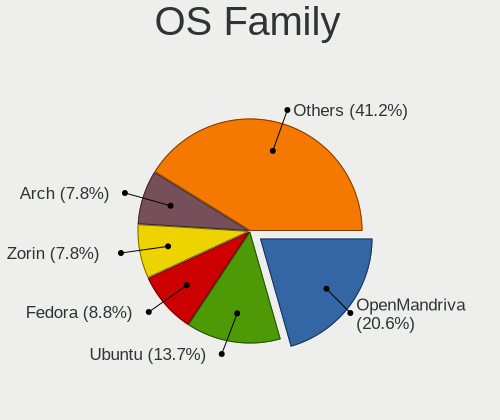
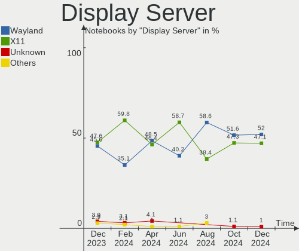
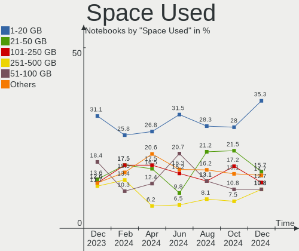
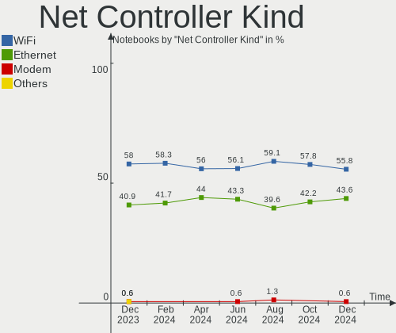
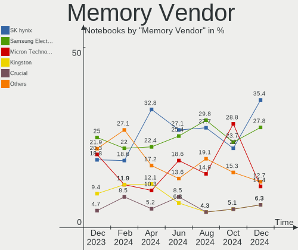

Linux in UK - Hardware Trends (Notebooks)
-----------------------------------------

A project to identify most popular hardware characteristics and track their change
over time based on data collected by Linux users at https://Linux-Hardware.org.

Anyone can contribute to this report by the [hw-probe](https://github.com/linuxhw/hw-probe) tool:

    sudo -E hw-probe -all -upload

Period: Jun, 2022.

Contents
--------

* [ System ](#system)
  - [ OS                       ](#os)
  - [ OS Family                ](#os-family)
  - [ Kernel                   ](#kernel)
  - [ Kernel Family            ](#kernel-family)
  - [ Kernel Major Ver.        ](#kernel-major-ver)
  - [ Arch                     ](#arch)
  - [ DE                       ](#de)
  - [ Display Server           ](#display-server)
  - [ Display Manager          ](#display-manager)
  - [ OS Lang                  ](#os-lang)
  - [ Boot Mode                ](#boot-mode)
  - [ Filesystem               ](#filesystem)
  - [ Part. scheme             ](#part-scheme)
  - [ Dual Boot with Linux/BSD ](#dual-boot-with-linuxbsd)
  - [ Dual Boot (Win)          ](#dual-boot-win)

* [ Board ](#board)
  - [ Vendor                   ](#vendor)
  - [ Model                    ](#model)
  - [ Model Family             ](#model-family)
  - [ MFG Year                 ](#mfg-year)
  - [ Form Factor              ](#form-factor)
  - [ Secure Boot              ](#secure-boot)
  - [ Coreboot                 ](#coreboot)
  - [ RAM Size                 ](#ram-size)
  - [ RAM Used                 ](#ram-used)
  - [ Total Drives             ](#total-drives)
  - [ Has CD-ROM               ](#has-cd-rom)
  - [ Has Ethernet             ](#has-ethernet)
  - [ Has WiFi                 ](#has-wifi)
  - [ Has Bluetooth            ](#has-bluetooth)

* [ Location ](#location)
  - [ Country                  ](#country)
  - [ City                     ](#city)

* [ Drives ](#drives)
  - [ Drive Vendor             ](#drive-vendor)
  - [ Drive Model              ](#drive-model)
  - [ HDD Vendor               ](#hdd-vendor)
  - [ SSD Vendor               ](#ssd-vendor)
  - [ Drive Kind               ](#drive-kind)
  - [ Drive Connector          ](#drive-connector)
  - [ Drive Size               ](#drive-size)
  - [ Space Total              ](#space-total)
  - [ Space Used               ](#space-used)
  - [ Malfunc. Drives          ](#malfunc-drives)
  - [ Malfunc. Drive Vendor    ](#malfunc-drive-vendor)
  - [ Malfunc. HDD Vendor      ](#malfunc-hdd-vendor)
  - [ Malfunc. Drive Kind      ](#malfunc-drive-kind)
  - [ Failed Drives            ](#failed-drives)
  - [ Failed Drive Vendor      ](#failed-drive-vendor)
  - [ Drive Status             ](#drive-status)

* [ Storage controller ](#storage-controller)
  - [ Storage Vendor           ](#storage-vendor)
  - [ Storage Model            ](#storage-model)
  - [ Storage Kind             ](#storage-kind)

* [ Processor ](#processor)
  - [ CPU Vendor               ](#cpu-vendor)
  - [ CPU Model                ](#cpu-model)
  - [ CPU Model Family         ](#cpu-model-family)
  - [ CPU Cores                ](#cpu-cores)
  - [ CPU Sockets              ](#cpu-sockets)
  - [ CPU Threads              ](#cpu-threads)
  - [ CPU Op-Modes             ](#cpu-op-modes)
  - [ CPU Microcode            ](#cpu-microcode)
  - [ CPU Microarch            ](#cpu-microarch)

* [ Graphics ](#graphics)
  - [ GPU Vendor               ](#gpu-vendor)
  - [ GPU Model                ](#gpu-model)
  - [ GPU Combo                ](#gpu-combo)
  - [ GPU Driver               ](#gpu-driver)
  - [ GPU Memory               ](#gpu-memory)

* [ Monitor ](#monitor)
  - [ Monitor Vendor           ](#monitor-vendor)
  - [ Monitor Model            ](#monitor-model)
  - [ Monitor Resolution       ](#monitor-resolution)
  - [ Monitor Diagonal         ](#monitor-diagonal)
  - [ Monitor Width            ](#monitor-width)
  - [ Aspect Ratio             ](#aspect-ratio)
  - [ Monitor Area             ](#monitor-area)
  - [ Pixel Density            ](#pixel-density)
  - [ Multiple Monitors        ](#multiple-monitors)

* [ Network ](#network)
  - [ Net Controller Vendor    ](#net-controller-vendor)
  - [ Net Controller Model     ](#net-controller-model)
  - [ Wireless Vendor          ](#wireless-vendor)
  - [ Wireless Model           ](#wireless-model)
  - [ Ethernet Vendor          ](#ethernet-vendor)
  - [ Ethernet Model           ](#ethernet-model)
  - [ Net Controller Kind      ](#net-controller-kind)
  - [ Used Controller          ](#used-controller)
  - [ NICs                     ](#nics)
  - [ IPv6                     ](#ipv6)

* [ Bluetooth ](#bluetooth)
  - [ Bluetooth Vendor         ](#bluetooth-vendor)
  - [ Bluetooth Model          ](#bluetooth-model)

* [ Sound ](#sound)
  - [ Sound Vendor             ](#sound-vendor)
  - [ Sound Model              ](#sound-model)

* [ Memory ](#memory)
  - [ Memory Vendor            ](#memory-vendor)
  - [ Memory Model             ](#memory-model)
  - [ Memory Kind              ](#memory-kind)
  - [ Memory Form Factor       ](#memory-form-factor)
  - [ Memory Size              ](#memory-size)
  - [ Memory Speed             ](#memory-speed)

* [ Printers & scanners ](#printers--scanners)
  - [ Printer Vendor           ](#printer-vendor)
  - [ Printer Model            ](#printer-model)
  - [ Scanner Vendor           ](#scanner-vendor)
  - [ Scanner Model            ](#scanner-model)

* [ Camera ](#camera)
  - [ Camera Vendor            ](#camera-vendor)
  - [ Camera Model             ](#camera-model)

* [ Security ](#security)
  - [ Fingerprint Vendor       ](#fingerprint-vendor)
  - [ Fingerprint Model        ](#fingerprint-model)
  - [ Chipcard Vendor          ](#chipcard-vendor)
  - [ Chipcard Model           ](#chipcard-model)

* [ Unsupported ](#unsupported)
  - [ Unsupported Devices      ](#unsupported-devices)
  - [ Unsupported Device Types ](#unsupported-device-types)

System
------

OS
--

Installed operating systems

| Name                 | Notebooks | Percent |
|----------------------|-----------|---------|
| Ubuntu 22.04         | 14        | 18.67%  |
| Linux Mint 20.3      | 9         | 12%     |
| Ubuntu 20.04         | 6         | 8%      |
| Debian 11            | 5         | 6.67%   |
| Zorin 16             | 4         | 5.33%   |
| OpenMandriva 4.3     | 3         | 4%      |
| Ubuntu 21.04         | 2         | 2.67%   |
| Pop!_OS 22.04        | 2         | 2.67%   |
| Kali 2022.2          | 2         | 2.67%   |
| Fedora 36            | 2         | 2.67%   |
| Arch                 | 2         | 2.67%   |
| Alpine 3.16.0        | 2         | 2.67%   |
| Xubuntu 22.10        | 1         | 1.33%   |
| Xubuntu 20.04        | 1         | 1.33%   |
| Ubuntu MATE 22.04    | 1         | 1.33%   |
| Ubuntu Budgie 21.10  | 1         | 1.33%   |
| Ubuntu 21.10         | 1         | 1.33%   |
| Ubuntu 18.04         | 1         | 1.33%   |
| SteamOS 3.2          | 1         | 1.33%   |
| Q4OS 4               | 1         | 1.33%   |
| NixOS 22.11          | 1         | 1.33%   |
| MX 21                | 1         | 1.33%   |
| Manjaro 21.2.6       | 1         | 1.33%   |
| Manjaro              | 1         | 1.33%   |
| Lubuntu 20.04        | 1         | 1.33%   |
| Linux Mint 20.2      | 1         | 1.33%   |
| Linux Mint 19.3      | 1         | 1.33%   |
| KDE neon 20.04       | 1         | 1.33%   |
| Gentoo 2.8           | 1         | 1.33%   |
| Garuda Linux Soaring | 1         | 1.33%   |
| Elementary 5.1.7     | 1         | 1.33%   |
| Devuan 4             | 1         | 1.33%   |
| Debian Testing       | 1         | 1.33%   |
| Arch Rolling         | 1         | 1.33%   |

OS Family
---------

OS without a version

| Name          | Notebooks | Percent |
|---------------|-----------|---------|
| Ubuntu        | 24        | 32%     |
| Linux Mint    | 11        | 14.67%  |
| Debian        | 6         | 8%      |
| Zorin         | 4         | 5.33%   |
| OpenMandriva  | 3         | 4%      |
| Arch          | 3         | 4%      |
| Xubuntu       | 2         | 2.67%   |
| Pop!_OS       | 2         | 2.67%   |
| Manjaro       | 2         | 2.67%   |
| Kali          | 2         | 2.67%   |
| Fedora        | 2         | 2.67%   |
| Alpine        | 2         | 2.67%   |
| Ubuntu MATE   | 1         | 1.33%   |
| Ubuntu Budgie | 1         | 1.33%   |
| SteamOS       | 1         | 1.33%   |
| Q4OS          | 1         | 1.33%   |
| NixOS         | 1         | 1.33%   |
| MX            | 1         | 1.33%   |
| Lubuntu       | 1         | 1.33%   |
| KDE neon      | 1         | 1.33%   |
| Gentoo        | 1         | 1.33%   |
| Garuda Linux  | 1         | 1.33%   |
| Elementary    | 1         | 1.33%   |
| Devuan        | 1         | 1.33%   |

Kernel
------

Version of the Linux kernel

| Version                                      | Notebooks | Percent |
|----------------------------------------------|-----------|---------|
| 5.4.0-120-generic                            | 4         | 5.33%   |
| 5.15.0-40-generic                            | 4         | 5.33%   |
| 5.13.0-51-generic                            | 4         | 5.33%   |
| 5.10.0-14-amd64                              | 4         | 5.33%   |
| 5.4.0-121-generic                            | 3         | 4%      |
| 5.15.0-39-generic                            | 3         | 4%      |
| 5.15.0-37-generic                            | 3         | 4%      |
| 5.13.0-48-generic                            | 3         | 4%      |
| 5.4.0-91-generic                             | 2         | 2.67%   |
| 5.4.0-113-generic                            | 2         | 2.67%   |
| 5.4.0-109-generic                            | 2         | 2.67%   |
| 5.17.5-76051705-generic                      | 2         | 2.67%   |
| 5.17.0-kali3-amd64                           | 2         | 2.67%   |
| 5.16.7-desktop-1omv4003                      | 2         | 2.67%   |
| 5.15.41-0-lts                                | 2         | 2.67%   |
| 5.15.0-33-generic                            | 2         | 2.67%   |
| 5.13.0-30-generic                            | 2         | 2.67%   |
| 5.10.0-13-amd64                              | 2         | 2.67%   |
| 5.4.0-89-generic                             | 1         | 1.33%   |
| 5.4.0-117-generic                            | 1         | 1.33%   |
| 5.19.0-1-MANJARO                             | 1         | 1.33%   |
| 5.18.7-zen1-1-zen                            | 1         | 1.33%   |
| 5.18.6-200.fc36.x86_64                       | 1         | 1.33%   |
| 5.18.5-zen1-1-zen                            | 1         | 1.33%   |
| 5.18.5-arch1-1                               | 1         | 1.33%   |
| 5.18.0-trunk-amd64                           | 1         | 1.33%   |
| 5.17.11-300.fc36.x86_64                      | 1         | 1.33%   |
| 5.17.11-051711-generic                       | 1         | 1.33%   |
| 5.17.0-14.1-liquorix-amd64                   | 1         | 1.33%   |
| 5.17.0-1011-oem                              | 1         | 1.33%   |
| 5.16.13-desktop-1omv4003                     | 1         | 1.33%   |
| 5.15.46-1-MANJARO                            | 1         | 1.33%   |
| 5.15.43                                      | 1         | 1.33%   |
| 5.15.41-gentoo-dist                          | 1         | 1.33%   |
| 5.15.41-1-lts                                | 1         | 1.33%   |
| 5.15.0-35-generic                            | 1         | 1.33%   |
| 5.15.0-27-generic                            | 1         | 1.33%   |
| 5.15.0-25-generic                            | 1         | 1.33%   |
| 5.13.0-valve15-1-neptune-02197-gf6ec7ad3762a | 1         | 1.33%   |
| 5.11.0-49-generic                            | 1         | 1.33%   |
| 5.11.0-41-generic                            | 1         | 1.33%   |
| 5.11.0-38-generic                            | 1         | 1.33%   |
| 5.11.0-16-generic                            | 1         | 1.33%   |
| 5.10.0-15-686-pae                            | 1         | 1.33%   |
| 4.15.0-184-generic                           | 1         | 1.33%   |

Kernel Family
-------------

Linux kernel without a distro release

| Version | Notebooks | Percent |
|---------|-----------|---------|
| 5.4.0   | 15        | 20%     |
| 5.15.0  | 15        | 20%     |
| 5.13.0  | 10        | 13.33%  |
| 5.10.0  | 7         | 9.33%   |
| 5.17.0  | 4         | 5.33%   |
| 5.15.41 | 4         | 5.33%   |
| 5.11.0  | 4         | 5.33%   |
| 5.18.5  | 2         | 2.67%   |
| 5.17.5  | 2         | 2.67%   |
| 5.17.11 | 2         | 2.67%   |
| 5.16.7  | 2         | 2.67%   |
| 5.19.0  | 1         | 1.33%   |
| 5.18.7  | 1         | 1.33%   |
| 5.18.6  | 1         | 1.33%   |
| 5.18.0  | 1         | 1.33%   |
| 5.16.13 | 1         | 1.33%   |
| 5.15.46 | 1         | 1.33%   |
| 5.15.43 | 1         | 1.33%   |
| 4.15.0  | 1         | 1.33%   |

Kernel Major Ver.
-----------------

Linux kernel major version

| Version | Notebooks | Percent |
|---------|-----------|---------|
| 5.15    | 21        | 28%     |
| 5.4     | 15        | 20%     |
| 5.13    | 10        | 13.33%  |
| 5.17    | 8         | 10.67%  |
| 5.10    | 7         | 9.33%   |
| 5.18    | 5         | 6.67%   |
| 5.11    | 4         | 5.33%   |
| 5.16    | 3         | 4%      |
| 5.19    | 1         | 1.33%   |
| 4.15    | 1         | 1.33%   |

Arch
----

OS architecture (x86_64, i586, etc.)

| Name   | Notebooks | Percent |
|--------|-----------|---------|
| x86_64 | 70        | 93.33%  |
| i686   | 5         | 6.67%   |

DE
--

Desktop Environment

| Name       | Notebooks | Percent |
|------------|-----------|---------|
| GNOME      | 31        | 41.33%  |
| KDE5       | 11        | 14.67%  |
| XFCE       | 8         | 10.67%  |
| Unknown    | 8         | 10.67%  |
| X-Cinnamon | 7         | 9.33%   |
| MATE       | 4         | 5.33%   |
| xmonad     | 1         | 1.33%   |
| trinity    | 1         | 1.33%   |
| Pantheon   | 1         | 1.33%   |
| LXQt       | 1         | 1.33%   |
| Cinnamon   | 1         | 1.33%   |
| Budgie     | 1         | 1.33%   |

Display Server
--------------

X11 or Wayland

| Name    | Notebooks | Percent |
|---------|-----------|---------|
| X11     | 59        | 78.67%  |
| Wayland | 15        | 20%     |
| Unknown | 1         | 1.33%   |

Display Manager
---------------

SDDM, LightDM, etc.

| Name    | Notebooks | Percent |
|---------|-----------|---------|
| Unknown | 23        | 30.67%  |
| LightDM | 19        | 25.33%  |
| GDM3    | 19        | 25.33%  |
| SDDM    | 7         | 9.33%   |
| GDM     | 6         | 8%      |
| TDM     | 1         | 1.33%   |

OS Lang
-------

Language

| Lang    | Notebooks | Percent |
|---------|-----------|---------|
| en_GB   | 56        | 74.67%  |
| en_US   | 7         | 9.33%   |
| Unknown | 4         | 5.33%   |
| en_AU   | 2         | 2.67%   |
| ro_RO   | 1         | 1.33%   |
| pl_PL   | 1         | 1.33%   |
| en_IN   | 1         | 1.33%   |
| en_CA   | 1         | 1.33%   |
| cs_CZ   | 1         | 1.33%   |
| C       | 1         | 1.33%   |

Boot Mode
---------

EFI or BIOS

| Mode | Notebooks | Percent |
|------|-----------|---------|
| EFI  | 41        | 54.67%  |
| BIOS | 34        | 45.33%  |

Filesystem
----------

Type of filesystem

| Type    | Notebooks | Percent |
|---------|-----------|---------|
| Ext4    | 64        | 85.33%  |
| Btrfs   | 5         | 6.67%   |
| Overlay | 3         | 4%      |
| Xfs     | 2         | 2.67%   |
| Zfs     | 1         | 1.33%   |

Part. scheme
------------

Scheme of partitioning

| Type    | Notebooks | Percent |
|---------|-----------|---------|
| Unknown | 36        | 48%     |
| GPT     | 34        | 45.33%  |
| MBR     | 5         | 6.67%   |

Dual Boot with Linux/BSD
------------------------

Hosting more than one Linux/BSD

| Dual boot | Notebooks | Percent |
|-----------|-----------|---------|
| No        | 70        | 93.33%  |
| Yes       | 5         | 6.67%   |

Dual Boot (Win)
---------------

Hosting Linux and Windows

| Dual boot | Notebooks | Percent |
|-----------|-----------|---------|
| No        | 50        | 66.67%  |
| Yes       | 25        | 33.33%  |

Board
-----

Vendor
------

Motherboard manufacturer

| Name             | Notebooks | Percent |
|------------------|-----------|---------|
| Lenovo           | 18        | 24%     |
| Hewlett-Packard  | 11        | 14.67%  |
| Dell             | 10        | 13.33%  |
| ASUSTek Computer | 7         | 9.33%   |
| Toshiba          | 5         | 6.67%   |
| Acer             | 5         | 6.67%   |
| Sony             | 3         | 4%      |
| Razer            | 2         | 2.67%   |
| MSI              | 2         | 2.67%   |
| HUAWEI           | 2         | 2.67%   |
| Apple            | 2         | 2.67%   |
| Valve            | 1         | 1.33%   |
| Notebook         | 1         | 1.33%   |
| Medion           | 1         | 1.33%   |
| IBM              | 1         | 1.33%   |
| HYPA             | 1         | 1.33%   |
| Chuwi            | 1         | 1.33%   |
| AVITA            | 1         | 1.33%   |
| Alienware        | 1         | 1.33%   |

Model
-----

Motherboard model

| Name                                  | Notebooks | Percent |
|---------------------------------------|-----------|---------|
| Valve Jupiter                         | 1         | 1.33%   |
| Toshiba Satellite L750                | 1         | 1.33%   |
| Toshiba Satellite L50-B               | 1         | 1.33%   |
| Toshiba Satellite C870-1H2            | 1         | 1.33%   |
| Toshiba Satellite C850-1NU            | 1         | 1.33%   |
| Toshiba Satellite C55-C               | 1         | 1.33%   |
| Sony VGN-UX27GN                       | 1         | 1.33%   |
| Sony VGN-P11Z_Q                       | 1         | 1.33%   |
| Sony VGN-FS415B                       | 1         | 1.33%   |
| Razer Blade 17 (2022) - RZ09-0423     | 1         | 1.33%   |
| Razer Blade                           | 1         | 1.33%   |
| Notebook NL40_50CU                    | 1         | 1.33%   |
| MSI P65 Creator 9SE                   | 1         | 1.33%   |
| MSI GP60 2OD                          | 1         | 1.33%   |
| Medion Erazer P6661 MD60303           | 1         | 1.33%   |
| Lenovo V15-ADA 82C7                   | 1         | 1.33%   |
| Lenovo ThinkPad X230 23252EG          | 1         | 1.33%   |
| Lenovo ThinkPad X230 23243E9          | 1         | 1.33%   |
| Lenovo ThinkPad T480 20L5000AUK       | 1         | 1.33%   |
| Lenovo ThinkPad T470 W10DG 20JNS00502 | 1         | 1.33%   |
| Lenovo ThinkPad T470 20HD000EUK       | 1         | 1.33%   |
| Lenovo ThinkPad T430 2349I46          | 1         | 1.33%   |
| Lenovo ThinkPad T430 2349AZ6          | 1         | 1.33%   |
| Lenovo ThinkPad T14 Gen 3 21AH0019US  | 1         | 1.33%   |
| Lenovo ThinkPad P17 Gen 1 20SQS0K700  | 1         | 1.33%   |
| Lenovo ThinkPad L480 20LTS1NK27       | 1         | 1.33%   |
| Lenovo ThinkPad E590 20NB001AUK       | 1         | 1.33%   |
| Lenovo S20-30 Touch 20434             | 1         | 1.33%   |
| Lenovo S130-11IGM 81J1                | 1         | 1.33%   |
| Lenovo IdeaPad Flex-14API 81SS        | 1         | 1.33%   |
| Lenovo IdeaPad 510-15ISK 80SR         | 1         | 1.33%   |
| Lenovo G780 2182                      | 1         | 1.33%   |
| Lenovo Flex 2-15 20405                | 1         | 1.33%   |
| IBM ThinkPad X40 2371LBG              | 1         | 1.33%   |
| HYPA FLUX                             | 1         | 1.33%   |
| HUAWEI NBD-WXX9                       | 1         | 1.33%   |
| HUAWEI BOD-WXX9                       | 1         | 1.33%   |
| HP ProBook 455 G3                     | 1         | 1.33%   |
| HP Presario CQ56                      | 1         | 1.33%   |
| HP Pavilion TS 14                     | 1         | 1.33%   |
| HP Pavilion Notebook                  | 1         | 1.33%   |
| HP Pavilion 15                        | 1         | 1.33%   |
| HP OMEN by Laptop 16-c0xxx            | 1         | 1.33%   |
| HP Laptop 15-bs1xx                    | 1         | 1.33%   |
| HP G62                                | 1         | 1.33%   |
| HP EliteBook 820 G2                   | 1         | 1.33%   |
| HP EliteBook 2560p                    | 1         | 1.33%   |
| HP 15                                 | 1         | 1.33%   |
| Dell XPS 17 9710                      | 1         | 1.33%   |
| Dell XPS 13 9310                      | 1         | 1.33%   |
| Dell Studio XPS 1640                  | 1         | 1.33%   |
| Dell Latitude E7270                   | 1         | 1.33%   |
| Dell Latitude E6510                   | 1         | 1.33%   |
| Dell Latitude E6400                   | 1         | 1.33%   |
| Dell Inspiron N5110                   | 1         | 1.33%   |
| Dell Inspiron 7370                    | 1         | 1.33%   |
| Dell Inspiron 1720                    | 1         | 1.33%   |
| Dell Inspiron 16 7610                 | 1         | 1.33%   |
| Chuwi GemiBook Pro                    | 1         | 1.33%   |
| AVITA NS14A6                          | 1         | 1.33%   |

Model Family
------------

Motherboard model prefix

| Name               | Notebooks | Percent |
|--------------------|-----------|---------|
| Lenovo ThinkPad    | 11        | 14.67%  |
| Toshiba Satellite  | 5         | 6.67%   |
| Dell Inspiron      | 4         | 5.33%   |
| Acer Aspire        | 4         | 5.33%   |
| HP Pavilion        | 3         | 4%      |
| Dell Latitude      | 3         | 4%      |
| Razer Blade        | 2         | 2.67%   |
| Lenovo IdeaPad     | 2         | 2.67%   |
| HP EliteBook       | 2         | 2.67%   |
| Dell XPS           | 2         | 2.67%   |
| ASUS ROG           | 2         | 2.67%   |
| Apple MacBookPro11 | 2         | 2.67%   |
| Valve Jupiter      | 1         | 1.33%   |
| Sony VGN-UX27GN    | 1         | 1.33%   |
| Sony VGN-P11Z      | 1         | 1.33%   |
| Sony VGN-FS415B    | 1         | 1.33%   |
| Notebook NL40      | 1         | 1.33%   |
| MSI P65            | 1         | 1.33%   |
| MSI GP60           | 1         | 1.33%   |
| Medion Erazer      | 1         | 1.33%   |
| Lenovo V15-ADA     | 1         | 1.33%   |
| Lenovo S20-30      | 1         | 1.33%   |
| Lenovo S130-11IGM  | 1         | 1.33%   |
| Lenovo G780        | 1         | 1.33%   |
| Lenovo Flex        | 1         | 1.33%   |
| IBM ThinkPad       | 1         | 1.33%   |
| HYPA FLUX          | 1         | 1.33%   |
| HUAWEI NBD-WXX9    | 1         | 1.33%   |
| HUAWEI BOD-WXX9    | 1         | 1.33%   |
| HP ProBook         | 1         | 1.33%   |
| HP Presario        | 1         | 1.33%   |
| HP OMEN            | 1         | 1.33%   |
| HP Laptop          | 1         | 1.33%   |
| HP G62             | 1         | 1.33%   |
| HP 15              | 1         | 1.33%   |
| Dell Studio        | 1         | 1.33%   |
| Chuwi GemiBook     | 1         | 1.33%   |
| AVITA NS14A6       | 1         | 1.33%   |
| ASUS X555LAB       | 1         | 1.33%   |
| ASUS VivoBook      | 1         | 1.33%   |
| ASUS S550CA        | 1         | 1.33%   |
| ASUS FX503VD       | 1         | 1.33%   |
| ASUS ASUS          | 1         | 1.33%   |
| Alienware M11x     | 1         | 1.33%   |
| Acer Nitro         | 1         | 1.33%   |

MFG Year
--------

Motherboard manufacture year

| Year | Notebooks | Percent |
|------|-----------|---------|
| 2021 | 11        | 14.67%  |
| 2013 | 6         | 8%      |
| 2012 | 6         | 8%      |
| 2019 | 5         | 6.67%   |
| 2018 | 5         | 6.67%   |
| 2017 | 5         | 6.67%   |
| 2016 | 5         | 6.67%   |
| 2014 | 5         | 6.67%   |
| 2011 | 5         | 6.67%   |
| 2020 | 4         | 5.33%   |
| 2010 | 4         | 5.33%   |
| 2008 | 4         | 5.33%   |
| 2022 | 3         | 4%      |
| 2006 | 3         | 4%      |
| 2015 | 2         | 2.67%   |
| 2007 | 2         | 2.67%   |

Form Factor
-----------

Physical design of the computer

| Name     | Notebooks | Percent |
|----------|-----------|---------|
| Notebook | 75        | 100%    |

Secure Boot
-----------

Enabled or disabled

| State    | Notebooks | Percent |
|----------|-----------|---------|
| Disabled | 63        | 84%     |
| Enabled  | 12        | 16%     |

Coreboot
--------

Have coreboot on board

| Used | Notebooks | Percent |
|------|-----------|---------|
| No   | 73        | 97.33%  |
| Yes  | 2         | 2.67%   |

RAM Size
--------

Total RAM memory

| Size in GB  | Notebooks | Percent |
|-------------|-----------|---------|
| 3.01-4.0    | 20        | 26.67%  |
| 4.01-8.0    | 18        | 24%     |
| 16.01-24.0  | 13        | 17.33%  |
| 8.01-16.0   | 12        | 16%     |
| 32.01-64.0  | 6         | 8%      |
| 1.01-2.0    | 3         | 4%      |
| 2.01-3.0    | 1         | 1.33%   |
| 64.01-256.0 | 1         | 1.33%   |
| 0.51-1.0    | 1         | 1.33%   |

RAM Used
--------

Used RAM memory

| Used GB   | Notebooks | Percent |
|-----------|-----------|---------|
| 1.01-2.0  | 27        | 36%     |
| 2.01-3.0  | 18        | 24%     |
| 4.01-8.0  | 12        | 16%     |
| 3.01-4.0  | 10        | 13.33%  |
| 0.51-1.0  | 4         | 5.33%   |
| 0.01-0.5  | 3         | 4%      |
| 8.01-16.0 | 1         | 1.33%   |

Total Drives
------------

Number of drives on board

| Drives | Notebooks | Percent |
|--------|-----------|---------|
| 1      | 55        | 73.33%  |
| 2      | 17        | 22.67%  |
| 3      | 2         | 2.67%   |
| 0      | 1         | 1.33%   |

Has CD-ROM
----------

Has CD-ROM on board

| Presented | Notebooks | Percent |
|-----------|-----------|---------|
| No        | 47        | 62.67%  |
| Yes       | 28        | 37.33%  |

Has Ethernet
------------

Has Ethernet on board

| Presented | Notebooks | Percent |
|-----------|-----------|---------|
| Yes       | 60        | 80%     |
| No        | 15        | 20%     |

Has WiFi
--------

Has WiFi module

| Presented | Notebooks | Percent |
|-----------|-----------|---------|
| Yes       | 74        | 98.67%  |
| No        | 1         | 1.33%   |

Has Bluetooth
-------------

Has Bluetooth module

| Presented | Notebooks | Percent |
|-----------|-----------|---------|
| Yes       | 58        | 77.33%  |
| No        | 17        | 22.67%  |

Location
--------

Country
-------

Geographic location (country)

| Country | Notebooks | Percent |
|---------|-----------|---------|
| UK      | 75        | 100%    |

City
----

Geographic location (city)

| City               | Notebooks | Percent |
|--------------------|-----------|---------|
| London             | 9         | 12%     |
| Fulham             | 4         | 5.33%   |
| Wakefield          | 2         | 2.67%   |
| Milton Keynes      | 2         | 2.67%   |
| Edinburgh          | 2         | 2.67%   |
| Dudley             | 2         | 2.67%   |
| Coventry           | 2         | 2.67%   |
| Brighton           | 2         | 2.67%   |
| Bermondsey         | 2         | 2.67%   |
| Aberdeen           | 2         | 2.67%   |
| Worthing           | 1         | 1.33%   |
| Wembley            | 1         | 1.33%   |
| Welwyn Garden City | 1         | 1.33%   |
| Washington         | 1         | 1.33%   |
| Uckfield           | 1         | 1.33%   |
| Treharris          | 1         | 1.33%   |
| Stevenage          | 1         | 1.33%   |
| St Helens          | 1         | 1.33%   |
| Slough             | 1         | 1.33%   |
| Shildon            | 1         | 1.33%   |
| Sheffield          | 1         | 1.33%   |
| Scunthorpe         | 1         | 1.33%   |
| Oakham             | 1         | 1.33%   |
| Norwich            | 1         | 1.33%   |
| North Shields      | 1         | 1.33%   |
| Newtown            | 1         | 1.33%   |
| Manchester         | 1         | 1.33%   |
| Maesteg            | 1         | 1.33%   |
| Liverpool          | 1         | 1.33%   |
| Lincoln            | 1         | 1.33%   |
| Lancaster          | 1         | 1.33%   |
| Islington          | 1         | 1.33%   |
| Harrow             | 1         | 1.33%   |
| Hampstead          | 1         | 1.33%   |
| Hammersmith        | 1         | 1.33%   |
| Hamilton           | 1         | 1.33%   |
| Great Yarmouth     | 1         | 1.33%   |
| Flitwick           | 1         | 1.33%   |
| Edmonton           | 1         | 1.33%   |
| East Kilbride      | 1         | 1.33%   |
| Dunstable          | 1         | 1.33%   |
| Diss               | 1         | 1.33%   |
| Devizes            | 1         | 1.33%   |
| Croydon            | 1         | 1.33%   |
| Clacton-on-Sea     | 1         | 1.33%   |
| Chesterfield       | 1         | 1.33%   |
| Cardiff            | 1         | 1.33%   |
| Cambridge          | 1         | 1.33%   |
| Broadstone         | 1         | 1.33%   |
| Blackpool          | 1         | 1.33%   |
| Birmingham         | 1         | 1.33%   |
| Bewbush            | 1         | 1.33%   |
| Bedford            | 1         | 1.33%   |
| Barrow in Furness  | 1         | 1.33%   |
| Andover            | 1         | 1.33%   |
| Acton              | 1         | 1.33%   |

Drives
------

Drive Vendor
------------

Hard drive vendors

| Vendor                         | Notebooks | Drives | Percent |
|--------------------------------|-----------|--------|---------|
| Samsung Electronics            | 13        | 15     | 14.94%  |
| Toshiba                        | 9         | 9      | 10.34%  |
| SanDisk                        | 7         | 7      | 8.05%   |
| SK hynix                       | 6         | 6      | 6.9%    |
| Seagate                        | 6         | 8      | 6.9%    |
| Hitachi                        | 5         | 5      | 5.75%   |
| HGST                           | 5         | 5      | 5.75%   |
| Crucial                        | 5         | 5      | 5.75%   |
| WDC                            | 4         | 4      | 4.6%    |
| Kingston                       | 4         | 4      | 4.6%    |
| Unknown                        | 3         | 3      | 3.45%   |
| Phison                         | 3         | 3      | 3.45%   |
| China                          | 3         | 3      | 3.45%   |
| KIOXIA                         | 2         | 2      | 2.3%    |
| Intel                          | 2         | 2      | 2.3%    |
| Solid State Storage Technology | 1         | 1      | 1.15%   |
| Silicon Motion                 | 1         | 1      | 1.15%   |
| PNY                            | 1         | 1      | 1.15%   |
| OWC                            | 1         | 1      | 1.15%   |
| LITEON                         | 1         | 1      | 1.15%   |
| Lexar                          | 1         | 1      | 1.15%   |
| KingDian                       | 1         | 1      | 1.15%   |
| Hoodisk                        | 1         | 1      | 1.15%   |
| Corsair                        | 1         | 1      | 1.15%   |
| A-DATA Technology              | 1         | 1      | 1.15%   |

Drive Model
-----------

Hard drive models

| Model                                     | Notebooks | Percent |
|-------------------------------------------|-----------|---------|
| HGST HTS541010A9E680 1TB                  | 5         | 5.49%   |
| Toshiba MQ01ABD100 1TB                    | 2         | 2.2%    |
| SK hynix HFM001TD3JX013N 1TB              | 2         | 2.2%    |
| Samsung SSD 840 EVO 250GB                 | 2         | 2.2%    |
| Hitachi HTS723232A7A364 320GB             | 2         | 2.2%    |
| WDC WDS100T2B0C-00PXH0 1TB                | 1         | 1.1%    |
| WDC WDS100T2B0C 1TB                       | 1         | 1.1%    |
| WDC WD7500BPVX-22JC3T0 752GB              | 1         | 1.1%    |
| WDC PC SN520 SDAPNUW-512G-1032 512GB      | 1         | 1.1%    |
| Unknown SD/MMC/MS PRO 128GB               | 1         | 1.1%    |
| Unknown ISOCOM  64GB                      | 1         | 1.1%    |
| Unknown DA4064  64GB                      | 1         | 1.1%    |
| Toshiba THNSF5256GPUK 256GB               | 1         | 1.1%    |
| Toshiba MQ04ABF100 1TB                    | 1         | 1.1%    |
| Toshiba MQ01ABD100V 1TB                   | 1         | 1.1%    |
| Toshiba MQ01ABD100M 1TB                   | 1         | 1.1%    |
| Toshiba MK6028GAL 64GB                    | 1         | 1.1%    |
| Toshiba MK5056GSYF 500GB                  | 1         | 1.1%    |
| Toshiba MK4009GAL 40GB                    | 1         | 1.1%    |
| Solid State Storage NVMe SSD Drive 1TB    | 1         | 1.1%    |
| SK hynix SKHynix_HFS256GD9TNG-L3A0B 256GB | 1         | 1.1%    |
| SK hynix SC311 SATA 256GB SSD             | 1         | 1.1%    |
| SK hynix NVMe SSD Drive 256GB             | 1         | 1.1%    |
| SK hynix HFM256GDHTNG-8510B 256GB         | 1         | 1.1%    |
| Silicon Motion NVMe SSD Drive 256GB       | 1         | 1.1%    |
| Seagate ST9500325AS 500GB                 | 1         | 1.1%    |
| Seagate ST9160412ASG 160GB                | 1         | 1.1%    |
| Seagate ST500LT012-9WS142 500GB           | 1         | 1.1%    |
| Seagate ST500LM000-SSHD-8GB               | 1         | 1.1%    |
| Seagate ST1000LM024 HN-M101MBB 1TB        | 1         | 1.1%    |
| Seagate Expansion HDD 8TB                 | 1         | 1.1%    |
| Seagate Expansion 1TB                     | 1         | 1.1%    |
| Seagate Backup+ Hub BK 8TB                | 1         | 1.1%    |
| SanDisk X300 M.2 2280 128GB SSD           | 1         | 1.1%    |
| SanDisk Ultra II 500GB SSD                | 1         | 1.1%    |
| SanDisk SSD PLUS 480GB                    | 1         | 1.1%    |
| SanDisk SDSSDHII480G 480GB                | 1         | 1.1%    |
| SanDisk SDSSDHII240G 240GB                | 1         | 1.1%    |
| SanDisk NVMe SSD Drive 256GB              | 1         | 1.1%    |
| SanDisk NVMe SSD Drive 1TB                | 1         | 1.1%    |
| Samsung SSD 980 1TB                       | 1         | 1.1%    |
| Samsung SSD 970 EVO 250GB                 | 1         | 1.1%    |
| Samsung SSD 860 EVO 250GB                 | 1         | 1.1%    |
| Samsung SSD 850 EVO mSATA 250GB           | 1         | 1.1%    |
| Samsung SSD 850 EVO 500GB                 | 1         | 1.1%    |
| Samsung SSD 850 EVO 250GB                 | 1         | 1.1%    |
| Samsung Portable SSD T5 1TB               | 1         | 1.1%    |
| Samsung NVMe SSD Drive 256GB              | 1         | 1.1%    |
| Samsung NVMe SSD Drive 1TB                | 1         | 1.1%    |
| Samsung MZVLW256HEHP-000L7 256GB          | 1         | 1.1%    |
| Samsung MZVLQ1T0HBLB-00B00 1TB            | 1         | 1.1%    |
| Samsung MZVLB512HAJQ-000L7 512GB          | 1         | 1.1%    |
| Samsung MZVL2512HCJQ-00BL7 512GB          | 1         | 1.1%    |
| PNY CS900 120GB SSD                       | 1         | 1.1%    |
| Phison S10C-128G-PHISON-SSD 128GB         | 1         | 1.1%    |
| Phison NVMe SSD Drive 512GB               | 1         | 1.1%    |
| Phison 311CD0512GB                        | 1         | 1.1%    |
| OWC Aura N 960GB                          | 1         | 1.1%    |
| LITEON IT LCS-128L9S-HP 128GB SSD         | 1         | 1.1%    |
| Lexar 256GB SSD                           | 1         | 1.1%    |

HDD Vendor
----------

Hard disk drive vendors

| Vendor  | Notebooks | Drives | Percent |
|---------|-----------|--------|---------|
| Toshiba | 8         | 8      | 30.77%  |
| Seagate | 6         | 8      | 23.08%  |
| Hitachi | 5         | 5      | 19.23%  |
| HGST    | 5         | 5      | 19.23%  |
| WDC     | 1         | 1      | 3.85%   |
| Unknown | 1         | 1      | 3.85%   |

SSD Vendor
----------

Solid state drive vendors

| Vendor              | Notebooks | Drives | Percent |
|---------------------|-----------|--------|---------|
| Samsung Electronics | 6         | 7      | 20.69%  |
| SanDisk             | 5         | 5      | 17.24%  |
| Crucial             | 4         | 4      | 13.79%  |
| China               | 3         | 3      | 10.34%  |
| SK hynix            | 1         | 1      | 3.45%   |
| PNY                 | 1         | 1      | 3.45%   |
| Phison              | 1         | 1      | 3.45%   |
| LITEON              | 1         | 1      | 3.45%   |
| Lexar               | 1         | 1      | 3.45%   |
| Kingston            | 1         | 1      | 3.45%   |
| KingDian            | 1         | 1      | 3.45%   |
| Intel               | 1         | 1      | 3.45%   |
| Hoodisk             | 1         | 1      | 3.45%   |
| Corsair             | 1         | 1      | 3.45%   |
| A-DATA Technology   | 1         | 1      | 3.45%   |

Drive Kind
----------

HDD or SSD

| Kind | Notebooks | Drives | Percent |
|------|-----------|--------|---------|
| NVMe | 27        | 31     | 32.93%  |
| SSD  | 27        | 30     | 32.93%  |
| HDD  | 26        | 28     | 31.71%  |
| MMC  | 2         | 2      | 2.44%   |

Drive Connector
---------------

SATA, SAS, NVMe, etc.

| Type | Notebooks | Drives | Percent |
|------|-----------|--------|---------|
| SATA | 48        | 53     | 59.26%  |
| NVMe | 27        | 31     | 33.33%  |
| SAS  | 4         | 5      | 4.94%   |
| MMC  | 2         | 2      | 2.47%   |

Drive Size
----------

Size of hard drive

| Size in TB | Notebooks | Drives | Percent |
|------------|-----------|--------|---------|
| 0.01-0.5   | 38        | 40     | 67.86%  |
| 0.51-1.0   | 16        | 16     | 28.57%  |
| 4.01-10.0  | 2         | 2      | 3.57%   |

Space Total
-----------

Amount of disk space available on the file system

| Size in GB     | Notebooks | Percent |
|----------------|-----------|---------|
| 101-250        | 22        | 29.33%  |
| 501-1000       | 15        | 20%     |
| 251-500        | 14        | 18.67%  |
| 51-100         | 7         | 9.33%   |
| 1-20           | 6         | 8%      |
| Unknown        | 4         | 5.33%   |
| 1001-2000      | 3         | 4%      |
| 21-50          | 2         | 2.67%   |
| More than 3000 | 1         | 1.33%   |
| 2001-3000      | 1         | 1.33%   |

Space Used
----------

Amount of used disk space

| Used GB   | Notebooks | Percent |
|-----------|-----------|---------|
| 1-20      | 30        | 40%     |
| 21-50     | 17        | 22.67%  |
| 101-250   | 8         | 10.67%  |
| 51-100    | 8         | 10.67%  |
| 251-500   | 4         | 5.33%   |
| Unknown   | 4         | 5.33%   |
| 1001-2000 | 2         | 2.67%   |
| 501-1000  | 2         | 2.67%   |

Malfunc. Drives
---------------

Drive models with a malfunction

| Model                         | Notebooks | Drives | Percent |
|-------------------------------|-----------|--------|---------|
| Toshiba MK4009GAL 40GB        | 1         | 1      | 16.67%  |
| SanDisk SSD PLUS 480GB        | 1         | 1      | 16.67%  |
| Hitachi HTS723232A7A364 320GB | 1         | 1      | 16.67%  |
| Hitachi HTS547575A9E384 752GB | 1         | 1      | 16.67%  |
| Hitachi HTC426040G9AT00 40GB  | 1         | 1      | 16.67%  |
| HGST HTS541010A9E680 1TB      | 1         | 1      | 16.67%  |

Malfunc. Drive Vendor
---------------------

Vendors of faulty drives

| Vendor  | Notebooks | Drives | Percent |
|---------|-----------|--------|---------|
| Hitachi | 3         | 3      | 50%     |
| Toshiba | 1         | 1      | 16.67%  |
| SanDisk | 1         | 1      | 16.67%  |
| HGST    | 1         | 1      | 16.67%  |

Malfunc. HDD Vendor
-------------------

Vendors of faulty HDD drives

| Vendor  | Notebooks | Drives | Percent |
|---------|-----------|--------|---------|
| Hitachi | 3         | 3      | 60%     |
| Toshiba | 1         | 1      | 20%     |
| HGST    | 1         | 1      | 20%     |

Malfunc. Drive Kind
-------------------

Kinds of faulty drives

| Kind | Notebooks | Drives | Percent |
|------|-----------|--------|---------|
| HDD  | 5         | 5      | 83.33%  |
| SSD  | 1         | 1      | 16.67%  |

Failed Drives
-------------

Failed drive models

Zero info for selected period =(

Failed Drive Vendor
-------------------

Failed drive vendors

Zero info for selected period =(

Drive Status
------------

Number of failed and malfunc. drives

| Status   | Notebooks | Drives | Percent |
|----------|-----------|--------|---------|
| Detected | 40        | 50     | 51.95%  |
| Works    | 31        | 35     | 40.26%  |
| Malfunc  | 6         | 6      | 7.79%   |

Storage controller
------------------

Storage Vendor
--------------

Storage controller vendors

| Vendor                         | Notebooks | Percent |
|--------------------------------|-----------|---------|
| Intel                          | 51        | 59.3%   |
| Samsung Electronics            | 7         | 8.14%   |
| AMD                            | 6         | 6.98%   |
| SK hynix                       | 5         | 5.81%   |
| SanDisk                        | 5         | 5.81%   |
| Phison Electronics             | 3         | 3.49%   |
| Kingston Technology Company    | 3         | 3.49%   |
| KIOXIA                         | 2         | 2.33%   |
| Toshiba America Info Systems   | 1         | 1.16%   |
| Solid State Storage Technology | 1         | 1.16%   |
| Silicon Motion                 | 1         | 1.16%   |
| Micron/Crucial Technology      | 1         | 1.16%   |

Storage Model
-------------

Storage controller models

| Model                                                                                  | Notebooks | Percent |
|----------------------------------------------------------------------------------------|-----------|---------|
| Intel 7 Series Chipset Family 6-port SATA Controller [AHCI mode]                       | 8         | 8.99%   |
| Intel Sunrise Point-LP SATA Controller [AHCI mode]                                     | 5         | 5.62%   |
| AMD FCH SATA Controller [AHCI mode]                                                    | 5         | 5.62%   |
| Intel 8 Series SATA Controller 1 [AHCI mode]                                           | 4         | 4.49%   |
| Intel Volume Management Device NVMe RAID Controller                                    | 3         | 3.37%   |
| Intel 82801IBM/IEM (ICH9M/ICH9M-E) 4 port SATA Controller [AHCI mode]                  | 3         | 3.37%   |
| Intel 82801 Mobile SATA Controller [RAID mode]                                         | 3         | 3.37%   |
| Intel 6 Series/C200 Series Chipset Family 6 port Mobile SATA AHCI Controller           | 3         | 3.37%   |
| SK hynix Non-Volatile memory controller                                                | 2         | 2.25%   |
| SK hynix Gold P31 SSD                                                                  | 2         | 2.25%   |
| SanDisk WD Blue SN550 NVMe SSD                                                         | 2         | 2.25%   |
| Samsung NVMe SSD Controller SM981/PM981/PM983                                          | 2         | 2.25%   |
| Samsung NVMe SSD Controller PM9A1/PM9A3/980PRO                                         | 2         | 2.25%   |
| Samsung NVMe SSD Controller 980                                                        | 2         | 2.25%   |
| Phison PS5013 E13 NVMe Controller                                                      | 2         | 2.25%   |
| KIOXIA Non-Volatile memory controller                                                  | 2         | 2.25%   |
| Intel Wildcat Point-LP SATA Controller [AHCI Mode]                                     | 2         | 2.25%   |
| Intel Atom Processor E3800 Series SATA AHCI Controller                                 | 2         | 2.25%   |
| Intel 82801HM/HEM (ICH8M/ICH8M-E) IDE Controller                                       | 2         | 2.25%   |
| Intel 5 Series/3400 Series Chipset 6 port SATA AHCI Controller                         | 2         | 2.25%   |
| Toshiba America Info Systems XG4 NVMe SSD Controller                                   | 1         | 1.12%   |
| Solid State Storage Non-Volatile memory controller                                     | 1         | 1.12%   |
| SK hynix BC501 NVMe Solid State Drive                                                  | 1         | 1.12%   |
| Silicon Motion SM2263EN/SM2263XT SSD Controller                                        | 1         | 1.12%   |
| SanDisk WD PC SN810 / Black SN850 NVMe SSD                                             | 1         | 1.12%   |
| SanDisk WD Blue SN500 / PC SN520 NVMe SSD                                              | 1         | 1.12%   |
| SanDisk Non-Volatile memory controller                                                 | 1         | 1.12%   |
| Samsung NVMe SSD Controller SM961/PM961/SM963                                          | 1         | 1.12%   |
| Phison NVMe Storage Controller                                                         | 1         | 1.12%   |
| Micron/Crucial P2 NVMe PCIe SSD                                                        | 1         | 1.12%   |
| Kingston Company U-SNS8154P3 NVMe SSD                                                  | 1         | 1.12%   |
| Kingston Company Company Non-Volatile memory controller                                | 1         | 1.12%   |
| Kingston Company OM3PDP3 NVMe SSD                                                      | 1         | 1.12%   |
| Intel US15W/US15X/US15L/UL11L SCH [Poulsbo] IDE Controller                             | 1         | 1.12%   |
| Intel Non-Volatile memory controller                                                   | 1         | 1.12%   |
| Intel Jasper Lake SATA AHCI Controller                                                 | 1         | 1.12%   |
| Intel Ice Lake-LP SATA Controller [AHCI mode]                                          | 1         | 1.12%   |
| Intel HM170/QM170 Chipset SATA Controller [AHCI Mode]                                  | 1         | 1.12%   |
| Intel Comet Lake SATA AHCI Controller                                                  | 1         | 1.12%   |
| Intel Celeron/Pentium Silver Processor SATA Controller                                 | 1         | 1.12%   |
| Intel Celeron N3350/Pentium N4200/Atom E3900 Series SATA AHCI Controller               | 1         | 1.12%   |
| Intel Cannon Point-LP SATA Controller [AHCI Mode]                                      | 1         | 1.12%   |
| Intel 82801HM/HEM (ICH8M/ICH8M-E) SATA Controller [IDE mode]                           | 1         | 1.12%   |
| Intel 82801HM/HEM (ICH8M/ICH8M-E) SATA Controller [AHCI mode]                          | 1         | 1.12%   |
| Intel 82801G (ICH7 Family) IDE Controller                                              | 1         | 1.12%   |
| Intel 82801FB/FBM/FR/FW/FRW (ICH6 Family) IDE Controller                               | 1         | 1.12%   |
| Intel 82801DBM (ICH4-M) IDE Controller                                                 | 1         | 1.12%   |
| Intel 8 Series/C220 Series Chipset Family 6-port SATA Controller 1 [AHCI mode]         | 1         | 1.12%   |
| Intel 6 Series/C200 Series Chipset Family Mobile SATA Controller (IDE mode, ports 4-5) | 1         | 1.12%   |
| Intel 6 Series/C200 Series Chipset Family Mobile SATA Controller (IDE mode, ports 0-3) | 1         | 1.12%   |
| AMD SB7x0/SB8x0/SB9x0 SATA Controller [AHCI mode]                                      | 1         | 1.12%   |

Storage Kind
------------

Kind of storage controller (IDE, SATA, NVMe, SAS, ...)

| Kind | Notebooks | Percent |
|------|-----------|---------|
| SATA | 44        | 52.38%  |
| NVMe | 27        | 32.14%  |
| IDE  | 7         | 8.33%   |
| RAID | 6         | 7.14%   |

Processor
---------

CPU Vendor
----------

Processor vendors

| Vendor | Notebooks | Percent |
|--------|-----------|---------|
| Intel  | 63        | 84%     |
| AMD    | 12        | 16%     |

CPU Model
---------

Processor models

| Model                                       | Notebooks | Percent |
|---------------------------------------------|-----------|---------|
| Intel Core i5-3320M CPU @ 2.60GHz           | 3         | 4%      |
| Intel Core i5-8250U CPU @ 1.60GHz           | 2         | 2.67%   |
| Intel Core i5-6300U CPU @ 2.40GHz           | 2         | 2.67%   |
| Intel Core i5-4210U CPU @ 1.70GHz           | 2         | 2.67%   |
| Intel 11th Gen Core i5-1135G7 @ 2.40GHz     | 2         | 2.67%   |
| AMD Ryzen 7 5800H with Radeon Graphics      | 2         | 2.67%   |
| Intel Pentium M processor 1.73GHz           | 1         | 1.33%   |
| Intel Pentium M processor 1.50GHz           | 1         | 1.33%   |
| Intel Pentium Dual-Core CPU T4500 @ 2.30GHz | 1         | 1.33%   |
| Intel Pentium Dual-Core CPU T4200 @ 2.00GHz | 1         | 1.33%   |
| Intel Pentium Dual CPU T2390 @ 1.86GHz      | 1         | 1.33%   |
| Intel Pentium CPU B960 @ 2.20GHz            | 1         | 1.33%   |
| Intel Core Solo CPU U1500 @ 1.33GHz         | 1         | 1.33%   |
| Intel Core i7-9750H CPU @ 2.60GHz           | 1         | 1.33%   |
| Intel Core i7-8550U CPU @ 1.80GHz           | 1         | 1.33%   |
| Intel Core i7-7700HQ CPU @ 2.80GHz          | 1         | 1.33%   |
| Intel Core i7-7500U CPU @ 2.70GHz           | 1         | 1.33%   |
| Intel Core i7-6500U CPU @ 2.50GHz           | 1         | 1.33%   |
| Intel Core i7-4770HQ CPU @ 2.20GHz          | 1         | 1.33%   |
| Intel Core i7-4700MQ CPU @ 2.40GHz          | 1         | 1.33%   |
| Intel Core i7-4558U CPU @ 2.80GHz           | 1         | 1.33%   |
| Intel Core i7-3520M CPU @ 2.90GHz           | 1         | 1.33%   |
| Intel Core i7-1065G7 CPU @ 1.30GHz          | 1         | 1.33%   |
| Intel Core i7-10510U CPU @ 1.80GHz          | 1         | 1.33%   |
| Intel Core i5-8350U CPU @ 1.70GHz           | 1         | 1.33%   |
| Intel Core i5-8300H CPU @ 2.30GHz           | 1         | 1.33%   |
| Intel Core i5-8265U CPU @ 1.60GHz           | 1         | 1.33%   |
| Intel Core i5-7300HQ CPU @ 2.50GHz          | 1         | 1.33%   |
| Intel Core i5-5200U CPU @ 2.20GHz           | 1         | 1.33%   |
| Intel Core i5-4200U CPU @ 1.60GHz           | 1         | 1.33%   |
| Intel Core i5-2540M CPU @ 2.60GHz           | 1         | 1.33%   |
| Intel Core i5-2467M CPU @ 1.60GHz           | 1         | 1.33%   |
| Intel Core i5-2410M CPU @ 2.30GHz           | 1         | 1.33%   |
| Intel Core i5-10400H CPU @ 2.60GHz          | 1         | 1.33%   |
| Intel Core i5 CPU U 520 @ 1.07GHz           | 1         | 1.33%   |
| Intel Core i5 CPU M 560 @ 2.67GHz           | 1         | 1.33%   |
| Intel Core i3-6100U CPU @ 2.30GHz           | 1         | 1.33%   |
| Intel Core i3-5005U CPU @ 2.00GHz           | 1         | 1.33%   |
| Intel Core i3-4030U CPU @ 1.90GHz           | 1         | 1.33%   |
| Intel Core i3-3120M CPU @ 2.50GHz           | 1         | 1.33%   |
| Intel Core i3-2365M CPU @ 1.40GHz           | 1         | 1.33%   |
| Intel Core i3-2328M CPU @ 2.20GHz           | 1         | 1.33%   |
| Intel Core 2 Duo CPU T9550 @ 2.66GHz        | 1         | 1.33%   |
| Intel Core 2 Duo CPU T8300 @ 2.40GHz        | 1         | 1.33%   |
| Intel Core 2 Duo CPU P8600 @ 2.40GHz        | 1         | 1.33%   |
| Intel Celeron N5100 @ 1.10GHz               | 1         | 1.33%   |
| Intel Celeron N4000 CPU @ 1.10GHz           | 1         | 1.33%   |
| Intel Celeron CPU N3350 @ 1.10GHz           | 1         | 1.33%   |
| Intel Celeron CPU N2930 @ 1.83GHz           | 1         | 1.33%   |
| Intel Celeron CPU N2830 @ 2.16GHz           | 1         | 1.33%   |
| Intel Celeron CPU 1000M @ 1.80GHz           | 1         | 1.33%   |
| Intel Atom CPU Z520 @ 1.33GHz               | 1         | 1.33%   |
| Intel 12th Gen Core i7-12800H               | 1         | 1.33%   |
| Intel 12th Gen Core i7-1260P                | 1         | 1.33%   |
| Intel 11th Gen Core i9-11980HK @ 2.60GHz    | 1         | 1.33%   |
| Intel 11th Gen Core i7-1185G7 @ 3.00GHz     | 1         | 1.33%   |
| Intel 11th Gen Core i7-11800H @ 2.30GHz     | 1         | 1.33%   |
| Intel 11th Gen Core i7-11370H @ 3.30GHz     | 1         | 1.33%   |
| AMD Ryzen 9 5900HS with Radeon Graphics     | 1         | 1.33%   |
| AMD Ryzen 7 4800H with Radeon Graphics      | 1         | 1.33%   |

CPU Model Family
----------------

Processor model prefix

| Model                   | Notebooks | Percent |
|-------------------------|-----------|---------|
| Intel Core i5           | 21        | 28%     |
| Intel Core i7           | 11        | 14.67%  |
| Other                   | 10        | 13.33%  |
| Intel Core i3           | 6         | 8%      |
| Intel Celeron           | 6         | 8%      |
| Intel Core 2 Duo        | 3         | 4%      |
| AMD Ryzen 7             | 3         | 4%      |
| Intel Pentium M         | 2         | 2.67%   |
| Intel Pentium Dual-Core | 2         | 2.67%   |
| Intel Pentium Dual      | 1         | 1.33%   |
| Intel Pentium           | 1         | 1.33%   |
| Intel Core Solo         | 1         | 1.33%   |
| Intel Atom              | 1         | 1.33%   |
| AMD Ryzen 9             | 1         | 1.33%   |
| AMD Ryzen 5             | 1         | 1.33%   |
| AMD Ryzen 3             | 1         | 1.33%   |
| AMD Phenom II           | 1         | 1.33%   |
| AMD Athlon              | 1         | 1.33%   |
| AMD A8                  | 1         | 1.33%   |
| AMD A10                 | 1         | 1.33%   |

CPU Cores
---------

Number of processor cores

| Number | Notebooks | Percent |
|--------|-----------|---------|
| 2      | 40        | 53.33%  |
| 4      | 21        | 28%     |
| 8      | 6         | 8%      |
| 1      | 4         | 5.33%   |
| 14     | 1         | 1.33%   |
| 12     | 1         | 1.33%   |
| 6      | 1         | 1.33%   |
| 3      | 1         | 1.33%   |

CPU Sockets
-----------

Number of sockets

| Number | Notebooks | Percent |
|--------|-----------|---------|
| 1      | 75        | 100%    |

CPU Threads
-----------

Threads per core (Hyper-Threading)

| Number | Notebooks | Percent |
|--------|-----------|---------|
| 2      | 55        | 73.33%  |
| 1      | 20        | 26.67%  |

CPU Op-Modes
------------

CPU Operation Modes (32-bit, 64-bit)

| Op mode        | Notebooks | Percent |
|----------------|-----------|---------|
| 32-bit, 64-bit | 71        | 94.67%  |
| 32-bit         | 2         | 2.67%   |
| Unknown        | 2         | 2.67%   |

CPU Microcode
-------------

Microcode number

| Number     | Notebooks | Percent |
|------------|-----------|---------|
| Unknown    | 19        | 25.33%  |
| 0x206a7    | 5         | 6.67%   |
| 0x40651    | 4         | 5.33%   |
| 0x306a9    | 4         | 5.33%   |
| 0x1067a    | 4         | 5.33%   |
| 0x806ea    | 3         | 4%      |
| 0x806c1    | 3         | 4%      |
| 0x406e3    | 3         | 4%      |
| 0x0a50000c | 3         | 4%      |
| 0x906ea    | 2         | 2.67%   |
| 0x906e9    | 2         | 2.67%   |
| 0x906a3    | 2         | 2.67%   |
| 0x30678    | 2         | 2.67%   |
| 0xa0652    | 1         | 1.33%   |
| 0x906c0    | 1         | 1.33%   |
| 0x806ec    | 1         | 1.33%   |
| 0x806eb    | 1         | 1.33%   |
| 0x806e9    | 1         | 1.33%   |
| 0x806d1    | 1         | 1.33%   |
| 0x706e5    | 1         | 1.33%   |
| 0x706a1    | 1         | 1.33%   |
| 0x6d8      | 1         | 1.33%   |
| 0x506c9    | 1         | 1.33%   |
| 0x20655    | 1         | 1.33%   |
| 0x106c2    | 1         | 1.33%   |
| 0x10676    | 1         | 1.33%   |
| 0x08600106 | 1         | 1.33%   |
| 0x08108109 | 1         | 1.33%   |
| 0x08108102 | 1         | 1.33%   |
| 0x06006704 | 1         | 1.33%   |
| 0x0600611a | 1         | 1.33%   |
| 0x010000c8 | 1         | 1.33%   |

CPU Microarch
-------------

Microarchitecture

| Name             | Notebooks | Percent |
|------------------|-----------|---------|
| KabyLake         | 11        | 14.67%  |
| Haswell          | 7         | 9.33%   |
| SandyBridge      | 6         | 8%      |
| IvyBridge        | 6         | 8%      |
| Penryn           | 5         | 6.67%   |
| TigerLake        | 4         | 5.33%   |
| Skylake          | 4         | 5.33%   |
| Zen+             | 3         | 4%      |
| Zen 3            | 3         | 4%      |
| P6               | 3         | 4%      |
| Westmere         | 2         | 2.67%   |
| Silvermont       | 2         | 2.67%   |
| IceLake          | 2         | 2.67%   |
| Excavator        | 2         | 2.67%   |
| Broadwell        | 2         | 2.67%   |
| Alderlake Hybrid | 2         | 2.67%   |
| Unknown          | 2         | 2.67%   |
| Zen 2            | 1         | 1.33%   |
| Tremont          | 1         | 1.33%   |
| Piledriver       | 1         | 1.33%   |
| K10              | 1         | 1.33%   |
| Goldmont plus    | 1         | 1.33%   |
| Goldmont         | 1         | 1.33%   |
| Core             | 1         | 1.33%   |
| CometLake        | 1         | 1.33%   |
| Bonnell          | 1         | 1.33%   |

Graphics
--------

GPU Vendor
----------

Vendors of graphics cards

| Vendor | Notebooks | Percent |
|--------|-----------|---------|
| Intel  | 60        | 65.22%  |
| Nvidia | 18        | 19.57%  |
| AMD    | 14        | 15.22%  |

GPU Model
---------

Graphics card models

| Model                                                                                 | Notebooks | Percent |
|---------------------------------------------------------------------------------------|-----------|---------|
| Intel 3rd Gen Core processor Graphics Controller                                      | 6         | 6.32%   |
| Intel 2nd Generation Core Processor Family Integrated Graphics Controller             | 6         | 6.32%   |
| Intel Haswell-ULT Integrated Graphics Controller                                      | 5         | 5.26%   |
| Intel UHD Graphics 620                                                                | 4         | 4.21%   |
| Intel TigerLake-LP GT2 [Iris Xe Graphics]                                             | 4         | 4.21%   |
| Intel Skylake GT2 [HD Graphics 520]                                                   | 4         | 4.21%   |
| Nvidia GA106M [GeForce RTX 3060 Mobile / Max-Q]                                       | 3         | 3.16%   |
| AMD Picasso/Raven 2 [Radeon Vega Series / Radeon Vega Mobile Series]                  | 3         | 3.16%   |
| AMD Cezanne                                                                           | 3         | 3.16%   |
| Nvidia GP107M [GeForce GTX 1050 Mobile]                                               | 2         | 2.11%   |
| Nvidia GA107M [GeForce RTX 3050 Mobile]                                               | 2         | 2.11%   |
| Intel TigerLake-H GT1 [UHD Graphics]                                                  | 2         | 2.11%   |
| Intel Mobile 4 Series Chipset Integrated Graphics Controller                          | 2         | 2.11%   |
| Intel HD Graphics 630                                                                 | 2         | 2.11%   |
| Intel HD Graphics 5500                                                                | 2         | 2.11%   |
| Intel Core Processor Integrated Graphics Controller                                   | 2         | 2.11%   |
| Intel CoffeeLake-H GT2 [UHD Graphics 630]                                             | 2         | 2.11%   |
| Intel Atom Processor Z36xxx/Z37xxx Series Graphics & Display                          | 2         | 2.11%   |
| Intel Alder Lake-P Integrated Graphics Controller                                     | 2         | 2.11%   |
| Nvidia TU117GLM [Quadro T1000 Mobile]                                                 | 1         | 1.05%   |
| Nvidia TU106M [GeForce RTX 2060 Mobile]                                               | 1         | 1.05%   |
| Nvidia GT215M [GeForce GT 335M]                                                       | 1         | 1.05%   |
| Nvidia GP107M [GeForce MX350]                                                         | 1         | 1.05%   |
| Nvidia GP106M [GeForce GTX 1060 Mobile]                                               | 1         | 1.05%   |
| Nvidia GM107M [GeForce GTX 950M]                                                      | 1         | 1.05%   |
| Nvidia GK208M [GeForce GT 740M]                                                       | 1         | 1.05%   |
| Nvidia GF108M [NVS 5400M]                                                             | 1         | 1.05%   |
| Nvidia GA103M [GeForce RTX 3080 Ti Laptop GPU]                                        | 1         | 1.05%   |
| Nvidia G98M [Quadro NVS 160M]                                                         | 1         | 1.05%   |
| Nvidia G84M [GeForce 8600M GT]                                                        | 1         | 1.05%   |
| Intel WhiskeyLake-U GT2 [UHD Graphics 620]                                            | 1         | 1.05%   |
| Intel US15W/US15X SCH [Poulsbo] Graphics Controller                                   | 1         | 1.05%   |
| Intel Mobile GM965/GL960 Integrated Graphics Controller (secondary)                   | 1         | 1.05%   |
| Intel Mobile GM965/GL960 Integrated Graphics Controller (primary)                     | 1         | 1.05%   |
| Intel Mobile 945GM/GMS/GME, 943/940GML Express Integrated Graphics Controller         | 1         | 1.05%   |
| Intel Mobile 945GM/GMS, 943/940GML Express Integrated Graphics Controller             | 1         | 1.05%   |
| Intel Mobile 915GM/GMS/910GML Express Graphics Controller                             | 1         | 1.05%   |
| Intel JasperLake [UHD Graphics]                                                       | 1         | 1.05%   |
| Intel Iris Plus Graphics G7                                                           | 1         | 1.05%   |
| Intel HD Graphics 620                                                                 | 1         | 1.05%   |
| Intel HD Graphics 500                                                                 | 1         | 1.05%   |
| Intel GeminiLake [UHD Graphics 600]                                                   | 1         | 1.05%   |
| Intel Crystal Well Integrated Graphics Controller                                     | 1         | 1.05%   |
| Intel CometLake-U GT2 [UHD Graphics]                                                  | 1         | 1.05%   |
| Intel CometLake-H GT2 [UHD Graphics]                                                  | 1         | 1.05%   |
| Intel 82852/855GM Integrated Graphics Device                                          | 1         | 1.05%   |
| Intel 4th Gen Core Processor Integrated Graphics Controller                           | 1         | 1.05%   |
| AMD Wani [Radeon R5/R6/R7 Graphics]                                                   | 1         | 1.05%   |
| AMD VanGogh [AMD Custom GPU 0405]                                                     | 1         | 1.05%   |
| AMD Trinity [Radeon HD 7600G]                                                         | 1         | 1.05%   |
| AMD Topaz XT [Radeon R7 M260/M265 / M340/M360 / M440/M445 / 530/535 / 620/625 Mobile] | 1         | 1.05%   |
| AMD Stoney [Radeon R2/R3/R4/R5 Graphics]                                              | 1         | 1.05%   |
| AMD RV730/M96-XT [Mobility Radeon HD 4670]                                            | 1         | 1.05%   |
| AMD RS880M [Mobility Radeon HD 4225/4250]                                             | 1         | 1.05%   |
| AMD Renoir                                                                            | 1         | 1.05%   |
| AMD Navi 23 [Radeon RX 6600/6600 XT/6600M]                                            | 1         | 1.05%   |

GPU Combo
---------

Combinations of graphics cards

| Name           | Notebooks | Percent |
|----------------|-----------|---------|
| 1 x Intel      | 44        | 58.67%  |
| Intel + Nvidia | 14        | 18.67%  |
| 1 x AMD        | 10        | 13.33%  |
| 1 x Nvidia     | 2         | 2.67%   |
| AMD + Nvidia   | 2         | 2.67%   |
| 2 x Intel      | 1         | 1.33%   |
| 2 x AMD        | 1         | 1.33%   |
| Intel + AMD    | 1         | 1.33%   |

GPU Driver
----------

Free vs proprietary

| Driver      | Notebooks | Percent |
|-------------|-----------|---------|
| Free        | 65        | 86.67%  |
| Proprietary | 8         | 10.67%  |
| Unknown     | 2         | 2.67%   |

GPU Memory
----------

Total video memory

| Size in GB | Notebooks | Percent |
|------------|-----------|---------|
| Unknown    | 57        | 76%     |
| 0.01-0.5   | 8         | 10.67%  |
| 1.01-2.0   | 3         | 4%      |
| 5.01-6.0   | 2         | 2.67%   |
| 3.01-4.0   | 2         | 2.67%   |
| 0.51-1.0   | 2         | 2.67%   |
| 7.01-8.0   | 1         | 1.33%   |

Monitor
-------

Monitor Vendor
--------------

Monitor vendors

| Vendor                  | Notebooks | Percent |
|-------------------------|-----------|---------|
| AU Optronics            | 18        | 23.68%  |
| Chimei Innolux          | 13        | 17.11%  |
| LG Display              | 11        | 14.47%  |
| Samsung Electronics     | 8         | 10.53%  |
| BOE                     | 8         | 10.53%  |
| Sharp                   | 3         | 3.95%   |
| InfoVision              | 2         | 2.63%   |
| Chi Mei Optoelectronics | 2         | 2.63%   |
| Apple                   | 2         | 2.63%   |
| ViewSonic               | 1         | 1.32%   |
| Philips                 | 1         | 1.32%   |
| LG Philips              | 1         | 1.32%   |
| HRG                     | 1         | 1.32%   |
| Hitachi                 | 1         | 1.32%   |
| Hewlett-Packard         | 1         | 1.32%   |
| Goldstar                | 1         | 1.32%   |
| AOC                     | 1         | 1.32%   |
| ANX                     | 1         | 1.32%   |

Monitor Model
-------------

Monitor models

| Model                                                                    | Notebooks | Percent |
|--------------------------------------------------------------------------|-----------|---------|
| AU Optronics LCD Monitor AUO45EC 1366x768 344x193mm 15.5-inch            | 2         | 2.6%    |
| ViewSonic VG2719-2K VSC1935 2560x1440 597x336mm 27.0-inch                | 1         | 1.3%    |
| Sharp LQ156M1JW26 SHP1532 1920x1080 344x194mm 15.5-inch                  | 1         | 1.3%    |
| Sharp LCD Monitor SHP1517 3840x2400 366x229mm 17.0-inch                  | 1         | 1.3%    |
| Sharp LCD Monitor SHP14F9 1920x1200 288x180mm 13.4-inch                  | 1         | 1.3%    |
| Samsung Electronics S24R35x SAM100E 1920x1080 527x296mm 23.8-inch        | 1         | 1.3%    |
| Samsung Electronics S24D300 SAM0B43 1920x1080 530x300mm 24.0-inch        | 1         | 1.3%    |
| Samsung Electronics LCD Monitor SEC4256 1600x900 382x215mm 17.3-inch     | 1         | 1.3%    |
| Samsung Electronics LCD Monitor SEC3258 1440x900 367x230mm 17.1-inch     | 1         | 1.3%    |
| Samsung Electronics LCD Monitor SDC8648 1920x1080 276x155mm 12.5-inch    | 1         | 1.3%    |
| Samsung Electronics LCD Monitor SDC4161 1920x1080 344x194mm 15.5-inch    | 1         | 1.3%    |
| Samsung Electronics LCD Monitor SDC4146 1366x768 344x194mm 15.5-inch     | 1         | 1.3%    |
| Samsung Electronics LCD Monitor SDC4141 1366x768 344x194mm 15.5-inch     | 1         | 1.3%    |
| Samsung Electronics LCD Monitor SAM0BB4 3840x2160 1872x1053mm 84.6-inch  | 1         | 1.3%    |
| Philips PHL 243S5L PHL091F 1920x1080 521x293mm 23.5-inch                 | 1         | 1.3%    |
| LG Philips LCD Monitor LPL0140 1440x900 304x190mm 14.1-inch              | 1         | 1.3%    |
| LG Display LCD Monitor LGD05BE 1920x1080 382x215mm 17.3-inch             | 1         | 1.3%    |
| LG Display LCD Monitor LGD0590 1920x1080 344x194mm 15.5-inch             | 1         | 1.3%    |
| LG Display LCD Monitor LGD0521 1920x1080 309x174mm 14.0-inch             | 1         | 1.3%    |
| LG Display LCD Monitor LGD046F 1920x1080 344x194mm 15.5-inch             | 1         | 1.3%    |
| LG Display LCD Monitor LGD0465 1366x768 344x194mm 15.5-inch              | 1         | 1.3%    |
| LG Display LCD Monitor LGD0438 1366x768 344x194mm 15.5-inch              | 1         | 1.3%    |
| LG Display LCD Monitor LGD039F 1366x768 345x194mm 15.6-inch              | 1         | 1.3%    |
| LG Display LCD Monitor LGD0384 1366x768 344x194mm 15.5-inch              | 1         | 1.3%    |
| LG Display LCD Monitor LGD02D3 1366x768 277x156mm 12.5-inch              | 1         | 1.3%    |
| LG Display LCD Monitor LGD02AC 1366x768 344x194mm 15.5-inch              | 1         | 1.3%    |
| LG Display LCD Monitor LGD0259 1920x1080 345x194mm 15.6-inch             | 1         | 1.3%    |
| InfoVision LCD Monitor IVO048E 1366x768 256x144mm 11.6-inch              | 1         | 1.3%    |
| InfoVision LCD Monitor IVO0489 1366x768 256x144mm 11.6-inch              | 1         | 1.3%    |
| HRG A632N HRG321C 1360x768 697x392mm 31.5-inch                           | 1         | 1.3%    |
| Hitachi N220W DVI HIT6DFF 1680x1050 474x296mm 22.0-inch                  | 1         | 1.3%    |
| Hewlett-Packard LE1901w HWP2842 1440x900 410x256mm 19.0-inch             | 1         | 1.3%    |
| Goldstar 2D HD TV GSM59CA 1366x768 509x286mm 23.0-inch                   | 1         | 1.3%    |
| Chimei Innolux P140ZKA-BZ1 CMN8C02 2160x1440 296x197mm 14.0-inch         | 1         | 1.3%    |
| Chimei Innolux LCD Monitor CMN1728 1600x900 382x215mm 17.3-inch          | 1         | 1.3%    |
| Chimei Innolux LCD Monitor CMN15F5 1920x1080 344x193mm 15.5-inch         | 1         | 1.3%    |
| Chimei Innolux LCD Monitor CMN15E8 1920x1080 340x190mm 15.3-inch         | 1         | 1.3%    |
| Chimei Innolux LCD Monitor CMN15E7 1920x1080 344x193mm 15.5-inch         | 1         | 1.3%    |
| Chimei Innolux LCD Monitor CMN15C6 1366x768 344x193mm 15.5-inch          | 1         | 1.3%    |
| Chimei Innolux LCD Monitor CMN15AB 1366x768 344x194mm 15.5-inch          | 1         | 1.3%    |
| Chimei Innolux LCD Monitor CMN14D4 1920x1080 309x173mm 13.9-inch         | 1         | 1.3%    |
| Chimei Innolux LCD Monitor CMN14C9 1920x1080 309x173mm 13.9-inch         | 1         | 1.3%    |
| Chimei Innolux LCD Monitor CMN1471 1366x768 309x174mm 14.0-inch          | 1         | 1.3%    |
| Chimei Innolux LCD Monitor CMN143F 1920x1200 301x188mm 14.0-inch         | 1         | 1.3%    |
| Chimei Innolux LCD Monitor CMN1404 1920x1080 309x173mm 13.9-inch         | 1         | 1.3%    |
| Chimei Innolux LCD Monitor CMN1367 1920x1080 293x165mm 13.2-inch         | 1         | 1.3%    |
| Chi Mei Optoelectronics LCD Monitor CMO15A4 1366x768 344x194mm 15.5-inch | 1         | 1.3%    |
| Chi Mei Optoelectronics LCD Monitor CMO1593 1366x768 344x193mm 15.5-inch | 1         | 1.3%    |
| BOE LCD Monitor BOE09F9 2560x1440 381x214mm 17.2-inch                    | 1         | 1.3%    |
| BOE LCD Monitor BOE09E5 2560x1440 355x200mm 16.0-inch                    | 1         | 1.3%    |
| BOE LCD Monitor BOE090F 1920x1080 344x194mm 15.5-inch                    | 1         | 1.3%    |
| BOE LCD Monitor BOE0743 3840x2160 309x174mm 14.0-inch                    | 1         | 1.3%    |
| BOE LCD Monitor BOE06F2 1920x1080 309x173mm 13.9-inch                    | 1         | 1.3%    |
| BOE LCD Monitor BOE0687 1920x1080 344x193mm 15.5-inch                    | 1         | 1.3%    |
| BOE LCD Monitor BOE065E 1920x1080 344x194mm 15.5-inch                    | 1         | 1.3%    |
| BOE LCD Monitor BOE05F5 1366x768 277x156mm 12.5-inch                     | 1         | 1.3%    |
| AU Optronics LCD Monitor AUOC99E 3072x1920 344x215mm 16.0-inch           | 1         | 1.3%    |
| AU Optronics LCD Monitor AUO46EC 1366x768 344x193mm 15.5-inch            | 1         | 1.3%    |
| AU Optronics LCD Monitor AUO38ED 1920x1080 344x193mm 15.5-inch           | 1         | 1.3%    |
| AU Optronics LCD Monitor AUO333C 1366x768 309x173mm 13.9-inch            | 1         | 1.3%    |

Monitor Resolution
------------------

Monitor screen resolution

| Resolution         | Notebooks | Percent |
|--------------------|-----------|---------|
| 1920x1080 (FHD)    | 26        | 34.67%  |
| 1366x768 (WXGA)    | 26        | 34.67%  |
| 3840x2160 (4K)     | 3         | 4%      |
| 2560x1440 (QHD)    | 3         | 4%      |
| 1440x900 (WXGA+)   | 3         | 4%      |
| 1920x1200 (WUXGA)  | 2         | 2.67%   |
| 1600x900 (HD+)     | 2         | 2.67%   |
| 800x1280           | 1         | 1.33%   |
| 3840x2400          | 1         | 1.33%   |
| 3440x1440          | 1         | 1.33%   |
| 3072x1920          | 1         | 1.33%   |
| 2880x1800          | 1         | 1.33%   |
| 2560x1600          | 1         | 1.33%   |
| 2160x1440          | 1         | 1.33%   |
| 1680x1050 (WSXGA+) | 1         | 1.33%   |
| 1360x768           | 1         | 1.33%   |
| 1280x800 (WXGA)    | 1         | 1.33%   |

Monitor Diagonal
----------------

Diagonal size in inches

| Inches  | Notebooks | Percent |
|---------|-----------|---------|
| 15      | 32        | 41.56%  |
| 13      | 11        | 14.29%  |
| 14      | 7         | 9.09%   |
| 17      | 6         | 7.79%   |
| 12      | 5         | 6.49%   |
| 11      | 3         | 3.9%    |
| 24      | 2         | 2.6%    |
| 23      | 2         | 2.6%    |
| 16      | 2         | 2.6%    |
| 84      | 1         | 1.3%    |
| 35      | 1         | 1.3%    |
| 31      | 1         | 1.3%    |
| 27      | 1         | 1.3%    |
| 22      | 1         | 1.3%    |
| 19      | 1         | 1.3%    |
| Unknown | 1         | 1.3%    |

Monitor Width
-------------

Physical width

| Width in mm | Notebooks | Percent |
|-------------|-----------|---------|
| 301-350     | 46        | 59.74%  |
| 201-300     | 13        | 16.88%  |
| 351-400     | 7         | 9.09%   |
| 501-600     | 5         | 6.49%   |
| 401-500     | 2         | 2.6%    |
| 801-900     | 1         | 1.3%    |
| 601-700     | 1         | 1.3%    |
| 1501-2000   | 1         | 1.3%    |
| Unknown     | 1         | 1.3%    |

Aspect Ratio
------------

Proportional relationship between the width and the height

| Ratio | Notebooks | Percent |
|-------|-----------|---------|
| 16/9  | 55        | 79.71%  |
| 16/10 | 11        | 15.94%  |
| 3/2   | 1         | 1.45%   |
| 21/9  | 1         | 1.45%   |
| 0.62  | 1         | 1.45%   |

Monitor Area
------------

Area in inch

| Area in inch | Notebooks | Percent |
|----------------|-----------|---------|
| 101-110        | 32        | 42.11%  |
| 81-90          | 14        | 18.42%  |
| 61-70          | 5         | 6.58%   |
| 201-250        | 5         | 6.58%   |
| 71-80          | 4         | 5.26%   |
| 121-130        | 4         | 5.26%   |
| 51-60          | 3         | 3.95%   |
| 351-500        | 2         | 2.63%   |
| 131-140        | 2         | 2.63%   |
| More than 1000 | 1         | 1.32%   |
| 301-350        | 1         | 1.32%   |
| 151-200        | 1         | 1.32%   |
| 111-120        | 1         | 1.32%   |
| Unknown        | 1         | 1.32%   |

Pixel Density
-------------

Pixels per inch

| Density       | Notebooks | Percent |
|---------------|-----------|---------|
| 121-160       | 30        | 38.96%  |
| 101-120       | 21        | 27.27%  |
| 51-100        | 11        | 14.29%  |
| 161-240       | 10        | 12.99%  |
| More than 240 | 3         | 3.9%    |
| 1-50          | 1         | 1.3%    |
| Unknown       | 1         | 1.3%    |

Multiple Monitors
-----------------

Total monitors connected

| Total | Notebooks | Percent |
|-------|-----------|---------|
| 1     | 63        | 84%     |
| 2     | 8         | 10.67%  |
| 0     | 3         | 4%      |
| 3     | 1         | 1.33%   |

Network
-------

Net Controller Vendor
---------------------

Controller vendors

| Vendor                   | Notebooks | Percent |
|--------------------------|-----------|---------|
| Intel                    | 41        | 35.96%  |
| Realtek Semiconductor    | 36        | 31.58%  |
| Qualcomm Atheros         | 14        | 12.28%  |
| Broadcom                 | 9         | 7.89%   |
| MediaTek                 | 3         | 2.63%   |
| Marvell Technology Group | 3         | 2.63%   |
| Broadcom Limited         | 2         | 1.75%   |
| TP-Link                  | 1         | 0.88%   |
| Ralink Technology        | 1         | 0.88%   |
| Qualcomm                 | 1         | 0.88%   |
| Lenovo                   | 1         | 0.88%   |
| Google                   | 1         | 0.88%   |
| Dell                     | 1         | 0.88%   |

Net Controller Model
--------------------

Controller models

| Model                                                                   | Notebooks | Percent |
|-------------------------------------------------------------------------|-----------|---------|
| Realtek RTL8111/8168/8411 PCI Express Gigabit Ethernet Controller       | 16        | 11.43%  |
| Realtek RTL810xE PCI Express Fast Ethernet controller                   | 11        | 7.86%   |
| Intel Centrino Advanced-N 6205 [Taylor Peak]                            | 5         | 3.57%   |
| Intel 82579LM Gigabit Network Connection (Lewisville)                   | 5         | 3.57%   |
| Intel Wireless 8265 / 8275                                              | 4         | 2.86%   |
| MediaTek MT7921 802.11ax PCI Express Wireless Network Adapter           | 3         | 2.14%   |
| Intel Wireless 7265                                                     | 3         | 2.14%   |
| Intel Wi-Fi 6 AX201                                                     | 3         | 2.14%   |
| Realtek RTL8822CE 802.11ac PCIe Wireless Network Adapter                | 2         | 1.43%   |
| Realtek RTL8723AE PCIe Wireless Network Adapter                         | 2         | 1.43%   |
| Realtek RTL8188EE Wireless Network Adapter                              | 2         | 1.43%   |
| Realtek RTL8153 Gigabit Ethernet Adapter                                | 2         | 1.43%   |
| Qualcomm Atheros QCA9565 / AR9565 Wireless Network Adapter              | 2         | 1.43%   |
| Qualcomm Atheros AR928X Wireless Network Adapter (PCI-Express)          | 2         | 1.43%   |
| Intel Wireless 8260                                                     | 2         | 1.43%   |
| Intel Wireless 3165                                                     | 2         | 1.43%   |
| Intel Tiger Lake PCH CNVi WiFi                                          | 2         | 1.43%   |
| Intel Ethernet Connection I219-LM                                       | 2         | 1.43%   |
| Intel Ethernet Connection (4) I219-V                                    | 2         | 1.43%   |
| Intel Centrino Ultimate-N 6300                                          | 2         | 1.43%   |
| Intel Cannon Lake PCH CNVi WiFi                                         | 2         | 1.43%   |
| Intel Alder Lake-P PCH CNVi WiFi                                        | 2         | 1.43%   |
| Broadcom BCM43142 802.11b/g/n                                           | 2         | 1.43%   |
| Broadcom BCM4313 802.11bgn Wireless Network Adapter                     | 2         | 1.43%   |
| TP-Link Archer T3U [Realtek RTL8812BU]                                  | 1         | 0.71%   |
| Realtek RTL88x2bu [AC1200 Techkey]                                      | 1         | 0.71%   |
| Realtek RTL8852AE 802.11ax PCIe Wireless Network Adapter                | 1         | 0.71%   |
| Realtek RTL8822BE 802.11a/b/g/n/ac WiFi adapter                         | 1         | 0.71%   |
| Realtek RTL8821CE 802.11ac PCIe Wireless Network Adapter                | 1         | 0.71%   |
| Realtek RTL8821AE 802.11ac PCIe Wireless Network Adapter                | 1         | 0.71%   |
| Realtek RTL8723BU 802.11b/g/n WLAN Adapter                              | 1         | 0.71%   |
| Realtek RTL8188EUS 802.11n Wireless Network Adapter                     | 1         | 0.71%   |
| Realtek RTL8125 2.5GbE Controller                                       | 1         | 0.71%   |
| Realtek 802.11ac NIC                                                    | 1         | 0.71%   |
| Ralink RT2870/RT3070 Wireless Adapter                                   | 1         | 0.71%   |
| Qualcomm QCA6390 Wireless Network Adapter                               | 1         | 0.71%   |
| Qualcomm Atheros QCA9377 802.11ac Wireless Network Adapter              | 1         | 0.71%   |
| Qualcomm Atheros QCA8171 Gigabit Ethernet                               | 1         | 0.71%   |
| Qualcomm Atheros QCA6174 802.11ac Wireless Network Adapter              | 1         | 0.71%   |
| Qualcomm Atheros AR9485 Wireless Network Adapter                        | 1         | 0.71%   |
| Qualcomm Atheros AR9285 Wireless Network Adapter (PCI-Express)          | 1         | 0.71%   |
| Qualcomm Atheros AR8162 Fast Ethernet                                   | 1         | 0.71%   |
| Qualcomm Atheros AR8161 Gigabit Ethernet                                | 1         | 0.71%   |
| Qualcomm Atheros AR8152 v2.0 Fast Ethernet                              | 1         | 0.71%   |
| Qualcomm Atheros AR8132 Fast Ethernet                                   | 1         | 0.71%   |
| Qualcomm Atheros AR5212 802.11abg NIC                                   | 1         | 0.71%   |
| Qualcomm Atheros AR242x / AR542x Wireless Network Adapter (PCI-Express) | 1         | 0.71%   |
| Marvell Group 88E8071 PCI-E Gigabit Ethernet Controller                 | 1         | 0.71%   |
| Marvell Group 88E8057 PCI-E Gigabit Ethernet Controller                 | 1         | 0.71%   |
| Marvell Group 88E8036 PCI-E Fast Ethernet Controller                    | 1         | 0.71%   |
| Lenovo Thinkpad LAN                                                     | 1         | 0.71%   |
| Intel Wireless-AC 9260                                                  | 1         | 0.71%   |
| Intel Wireless 3160                                                     | 1         | 0.71%   |
| Intel WiFi Link 5100                                                    | 1         | 0.71%   |
| Intel Wi-Fi 6 AX200                                                     | 1         | 0.71%   |
| Intel Ultimate N WiFi Link 5300                                         | 1         | 0.71%   |
| Intel PRO/Wireless 3945ABG [Golan] Network Connection                   | 1         | 0.71%   |
| Intel PRO/Wireless 2200BG [Calexico2] Network Connection                | 1         | 0.71%   |
| Intel Ice Lake-LP PCH CNVi WiFi                                         | 1         | 0.71%   |
| Intel Ethernet Connection (4) I219-LM                                   | 1         | 0.71%   |

Wireless Vendor
---------------

Wireless vendors

| Vendor                | Notebooks | Percent |
|-----------------------|-----------|---------|
| Intel                 | 40        | 51.28%  |
| Realtek Semiconductor | 14        | 17.95%  |
| Qualcomm Atheros      | 10        | 12.82%  |
| Broadcom              | 7         | 8.97%   |
| MediaTek              | 3         | 3.85%   |
| TP-Link               | 1         | 1.28%   |
| Ralink Technology     | 1         | 1.28%   |
| Qualcomm              | 1         | 1.28%   |
| Broadcom Limited      | 1         | 1.28%   |

Wireless Model
--------------

Wireless models

| Model                                                                   | Notebooks | Percent |
|-------------------------------------------------------------------------|-----------|---------|
| Intel Centrino Advanced-N 6205 [Taylor Peak]                            | 5         | 6.41%   |
| Intel Wireless 8265 / 8275                                              | 4         | 5.13%   |
| MediaTek MT7921 802.11ax PCI Express Wireless Network Adapter           | 3         | 3.85%   |
| Intel Wireless 7265                                                     | 3         | 3.85%   |
| Intel Wi-Fi 6 AX201                                                     | 3         | 3.85%   |
| Realtek RTL8822CE 802.11ac PCIe Wireless Network Adapter                | 2         | 2.56%   |
| Realtek RTL8723AE PCIe Wireless Network Adapter                         | 2         | 2.56%   |
| Realtek RTL8188EE Wireless Network Adapter                              | 2         | 2.56%   |
| Qualcomm Atheros QCA9565 / AR9565 Wireless Network Adapter              | 2         | 2.56%   |
| Qualcomm Atheros AR928X Wireless Network Adapter (PCI-Express)          | 2         | 2.56%   |
| Intel Wireless 8260                                                     | 2         | 2.56%   |
| Intel Wireless 3165                                                     | 2         | 2.56%   |
| Intel Tiger Lake PCH CNVi WiFi                                          | 2         | 2.56%   |
| Intel Centrino Ultimate-N 6300                                          | 2         | 2.56%   |
| Intel Cannon Lake PCH CNVi WiFi                                         | 2         | 2.56%   |
| Intel Alder Lake-P PCH CNVi WiFi                                        | 2         | 2.56%   |
| Broadcom BCM43142 802.11b/g/n                                           | 2         | 2.56%   |
| Broadcom BCM4313 802.11bgn Wireless Network Adapter                     | 2         | 2.56%   |
| TP-Link Archer T3U [Realtek RTL8812BU]                                  | 1         | 1.28%   |
| Realtek RTL88x2bu [AC1200 Techkey]                                      | 1         | 1.28%   |
| Realtek RTL8852AE 802.11ax PCIe Wireless Network Adapter                | 1         | 1.28%   |
| Realtek RTL8822BE 802.11a/b/g/n/ac WiFi adapter                         | 1         | 1.28%   |
| Realtek RTL8821CE 802.11ac PCIe Wireless Network Adapter                | 1         | 1.28%   |
| Realtek RTL8821AE 802.11ac PCIe Wireless Network Adapter                | 1         | 1.28%   |
| Realtek RTL8723BU 802.11b/g/n WLAN Adapter                              | 1         | 1.28%   |
| Realtek RTL8188EUS 802.11n Wireless Network Adapter                     | 1         | 1.28%   |
| Realtek 802.11ac NIC                                                    | 1         | 1.28%   |
| Ralink RT2870/RT3070 Wireless Adapter                                   | 1         | 1.28%   |
| Qualcomm QCA6390 Wireless Network Adapter                               | 1         | 1.28%   |
| Qualcomm Atheros QCA9377 802.11ac Wireless Network Adapter              | 1         | 1.28%   |
| Qualcomm Atheros QCA6174 802.11ac Wireless Network Adapter              | 1         | 1.28%   |
| Qualcomm Atheros AR9485 Wireless Network Adapter                        | 1         | 1.28%   |
| Qualcomm Atheros AR9285 Wireless Network Adapter (PCI-Express)          | 1         | 1.28%   |
| Qualcomm Atheros AR5212 802.11abg NIC                                   | 1         | 1.28%   |
| Qualcomm Atheros AR242x / AR542x Wireless Network Adapter (PCI-Express) | 1         | 1.28%   |
| Intel Wireless-AC 9260                                                  | 1         | 1.28%   |
| Intel Wireless 3160                                                     | 1         | 1.28%   |
| Intel WiFi Link 5100                                                    | 1         | 1.28%   |
| Intel Wi-Fi 6 AX200                                                     | 1         | 1.28%   |
| Intel Ultimate N WiFi Link 5300                                         | 1         | 1.28%   |
| Intel PRO/Wireless 3945ABG [Golan] Network Connection                   | 1         | 1.28%   |
| Intel PRO/Wireless 2200BG [Calexico2] Network Connection                | 1         | 1.28%   |
| Intel Ice Lake-LP PCH CNVi WiFi                                         | 1         | 1.28%   |
| Intel Dual Band Wireless-AC 3168NGW [Stone Peak]                        | 1         | 1.28%   |
| Intel Dual Band Wireless-AC 3165 Plus Bluetooth                         | 1         | 1.28%   |
| Intel Comet Lake PCH CNVi WiFi                                          | 1         | 1.28%   |
| Intel Centrino Wireless-N 2230                                          | 1         | 1.28%   |
| Intel Centrino Wireless-N 1030 [Rainbow Peak]                           | 1         | 1.28%   |
| Broadcom Limited BCM4360 802.11ac Wireless Network Adapter              | 1         | 1.28%   |
| Broadcom BCM43602 802.11ac Wireless LAN SoC                             | 1         | 1.28%   |
| Broadcom BCM43224 802.11a/b/g/n                                         | 1         | 1.28%   |
| Broadcom BCM4312 802.11b/g LP-PHY                                       | 1         | 1.28%   |

Ethernet Vendor
---------------

Ethernet vendors

| Vendor                   | Notebooks | Percent |
|--------------------------|-----------|---------|
| Realtek Semiconductor    | 30        | 50%     |
| Intel                    | 17        | 28.33%  |
| Qualcomm Atheros         | 5         | 8.33%   |
| Marvell Technology Group | 3         | 5%      |
| Broadcom                 | 2         | 3.33%   |
| Lenovo                   | 1         | 1.67%   |
| Google                   | 1         | 1.67%   |
| Broadcom Limited         | 1         | 1.67%   |

Ethernet Model
--------------

Ethernet models

| Model                                                                | Notebooks | Percent |
|----------------------------------------------------------------------|-----------|---------|
| Realtek RTL8111/8168/8411 PCI Express Gigabit Ethernet Controller    | 16        | 26.67%  |
| Realtek RTL810xE PCI Express Fast Ethernet controller                | 11        | 18.33%  |
| Intel 82579LM Gigabit Network Connection (Lewisville)                | 5         | 8.33%   |
| Realtek RTL8153 Gigabit Ethernet Adapter                             | 2         | 3.33%   |
| Intel Ethernet Connection I219-LM                                    | 2         | 3.33%   |
| Intel Ethernet Connection (4) I219-V                                 | 2         | 3.33%   |
| Realtek RTL8125 2.5GbE Controller                                    | 1         | 1.67%   |
| Qualcomm Atheros QCA8171 Gigabit Ethernet                            | 1         | 1.67%   |
| Qualcomm Atheros AR8162 Fast Ethernet                                | 1         | 1.67%   |
| Qualcomm Atheros AR8161 Gigabit Ethernet                             | 1         | 1.67%   |
| Qualcomm Atheros AR8152 v2.0 Fast Ethernet                           | 1         | 1.67%   |
| Qualcomm Atheros AR8132 Fast Ethernet                                | 1         | 1.67%   |
| Marvell Group 88E8071 PCI-E Gigabit Ethernet Controller              | 1         | 1.67%   |
| Marvell Group 88E8057 PCI-E Gigabit Ethernet Controller              | 1         | 1.67%   |
| Marvell Group 88E8036 PCI-E Fast Ethernet Controller                 | 1         | 1.67%   |
| Lenovo Thinkpad LAN                                                  | 1         | 1.67%   |
| Intel Ethernet Connection (4) I219-LM                                | 1         | 1.67%   |
| Intel Ethernet Connection (3) I218-LM                                | 1         | 1.67%   |
| Intel Ethernet Connection (16) I219-V                                | 1         | 1.67%   |
| Intel Ethernet Connection (11) I219-LM                               | 1         | 1.67%   |
| Intel 82577LM Gigabit Network Connection                             | 1         | 1.67%   |
| Intel 82567LM Gigabit Network Connection                             | 1         | 1.67%   |
| Intel 82562ET/EZ/GT/GZ - PRO/100 VE (LOM) Ethernet Controller Mobile | 1         | 1.67%   |
| Intel 82541GI Gigabit Ethernet Controller                            | 1         | 1.67%   |
| Google Nexus/Pixel Device (tether)                                   | 1         | 1.67%   |
| Broadcom NetLink BCM5906M Fast Ethernet PCI Express                  | 1         | 1.67%   |
| Broadcom NetLink BCM5784M Gigabit Ethernet PCIe                      | 1         | 1.67%   |
| Broadcom Limited BCM4401-B0 100Base-TX                               | 1         | 1.67%   |

Net Controller Kind
-------------------

Ethernet, WiFi or modem

| Kind     | Notebooks | Percent |
|----------|-----------|---------|
| WiFi     | 74        | 54.41%  |
| Ethernet | 60        | 44.12%  |
| Modem    | 2         | 1.47%   |

Used Controller
---------------

Currently used network controller

| Kind     | Notebooks | Percent |
|----------|-----------|---------|
| WiFi     | 63        | 82.89%  |
| Ethernet | 13        | 17.11%  |

NICs
----

Total network controllers on board

| Total | Notebooks | Percent |
|-------|-----------|---------|
| 2     | 54        | 72%     |
| 1     | 20        | 26.67%  |
| 0     | 1         | 1.33%   |

IPv6
----

IPv6 vs IPv4

| Used | Notebooks | Percent |
|------|-----------|---------|
| No   | 60        | 80%     |
| Yes  | 15        | 20%     |

Bluetooth
---------

Bluetooth Vendor
----------------

Controller vendors

| Vendor                          | Notebooks | Percent |
|---------------------------------|-----------|---------|
| Intel                           | 28        | 48.28%  |
| IMC Networks                    | 6         | 10.34%  |
| Realtek Semiconductor           | 4         | 6.9%    |
| Qualcomm Atheros Communications | 4         | 6.9%    |
| Broadcom                        | 4         | 6.9%    |
| Dell                            | 3         | 5.17%   |
| Toshiba                         | 2         | 3.45%   |
| Apple                           | 2         | 3.45%   |
| Alps Electric                   | 2         | 3.45%   |
| Realtek                         | 1         | 1.72%   |
| Lite-On Technology              | 1         | 1.72%   |
| Cambridge Silicon Radio         | 1         | 1.72%   |

Bluetooth Model
---------------

Controller models

| Model                                               | Notebooks | Percent |
|-----------------------------------------------------|-----------|---------|
| Intel Bluetooth wireless interface                  | 12        | 20.69%  |
| Intel Bluetooth Device                              | 9         | 15.52%  |
| Realtek Bluetooth Radio                             | 3         | 5.17%   |
| IMC Networks Wireless_Device                        | 3         | 5.17%   |
| Qualcomm Atheros AR3012 Bluetooth 4.0               | 2         | 3.45%   |
| Intel Bluetooth 9460/9560 Jefferson Peak (JfP)      | 2         | 3.45%   |
| Broadcom BCM20702 Bluetooth 4.0 [ThinkPad]          | 2         | 3.45%   |
| Apple Bluetooth Host Controller                     | 2         | 3.45%   |
| Toshiba RT Bluetooth Radio                          | 1         | 1.72%   |
| Toshiba BCM43142A0                                  | 1         | 1.72%   |
| Realtek RTL8822BE Bluetooth 4.2 Adapter             | 1         | 1.72%   |
| Realtek Bluetooth Radio                             | 1         | 1.72%   |
| Qualcomm Atheros QCA61x4 Bluetooth 4.0              | 1         | 1.72%   |
| Qualcomm Atheros AR3011 Bluetooth                   | 1         | 1.72%   |
| Lite-On Bluetooth USB Host Controller               | 1         | 1.72%   |
| Intel Wireless-AC 9260 Bluetooth Adapter            | 1         | 1.72%   |
| Intel Wireless-AC 3168 Bluetooth                    | 1         | 1.72%   |
| Intel Centrino Bluetooth Wireless Transceiver       | 1         | 1.72%   |
| Intel Centrino Advanced-N 6230 Bluetooth adapter    | 1         | 1.72%   |
| Intel AX200 Bluetooth                               | 1         | 1.72%   |
| IMC Networks Bluetooth Radio                        | 1         | 1.72%   |
| IMC Networks Bluetooth Device                       | 1         | 1.72%   |
| IMC Networks Bluetooth                              | 1         | 1.72%   |
| Dell Wireless 370 Bluetooth Mini-card               | 1         | 1.72%   |
| Dell Wireless 365 Bluetooth                         | 1         | 1.72%   |
| Dell DW375 Bluetooth Module                         | 1         | 1.72%   |
| Cambridge Silicon Radio Bluetooth Dongle (HCI mode) | 1         | 1.72%   |
| Broadcom BCM43142A0 Bluetooth 4.0                   | 1         | 1.72%   |
| Broadcom BCM2070 Bluetooth 2.1 + EDR                | 1         | 1.72%   |
| Alps Electric Bluetooth Controller (ALPS/UGPZ6)     | 1         | 1.72%   |
| Alps Electric BCM2046 Bluetooth Device              | 1         | 1.72%   |

Sound
-----

Sound Vendor
------------

Sound card vendors

| Vendor    | Notebooks | Percent |
|-----------|-----------|---------|
| Intel     | 63        | 71.59%  |
| AMD       | 13        | 14.77%  |
| Nvidia    | 11        | 12.5%   |
| GN Netcom | 1         | 1.14%   |

Sound Model
-----------

Sound card models

| Model                                                                      | Notebooks | Percent |
|----------------------------------------------------------------------------|-----------|---------|
| Intel Sunrise Point-LP HD Audio                                            | 9         | 8.18%   |
| Intel 7 Series/C216 Chipset Family High Definition Audio Controller        | 8         | 7.27%   |
| AMD Family 17h/19h HD Audio Controller                                     | 7         | 6.36%   |
| Nvidia Audio device                                                        | 5         | 4.55%   |
| Intel Haswell-ULT HD Audio Controller                                      | 5         | 4.55%   |
| Intel 8 Series HD Audio Controller                                         | 5         | 4.55%   |
| Intel Tiger Lake-LP Smart Sound Technology Audio Controller                | 4         | 3.64%   |
| Intel 82801I (ICH9 Family) HD Audio Controller                             | 4         | 3.64%   |
| Intel 6 Series/C200 Series Chipset Family High Definition Audio Controller | 4         | 3.64%   |
| AMD Renoir Radeon High Definition Audio Controller                         | 4         | 3.64%   |
| AMD Raven/Raven2/Fenghuang HDMI/DP Audio Controller                        | 3         | 2.73%   |
| Intel Wildcat Point-LP High Definition Audio Controller                    | 2         | 1.82%   |
| Intel Tiger Lake-H HD Audio Controller                                     | 2         | 1.82%   |
| Intel CM238 HD Audio Controller                                            | 2         | 1.82%   |
| Intel Cannon Lake PCH cAVS                                                 | 2         | 1.82%   |
| Intel Broadwell-U Audio Controller                                         | 2         | 1.82%   |
| Intel Atom Processor Z36xxx/Z37xxx Series High Definition Audio Controller | 2         | 1.82%   |
| Intel Alder Lake PCH-P High Definition Audio Controller                    | 2         | 1.82%   |
| Intel 82801H (ICH8 Family) HD Audio Controller                             | 2         | 1.82%   |
| Intel 8 Series/C220 Series Chipset High Definition Audio Controller        | 2         | 1.82%   |
| Intel 5 Series/3400 Series Chipset High Definition Audio                   | 2         | 1.82%   |
| AMD Family 15h (Models 60h-6fh) Audio Controller                           | 2         | 1.82%   |
| Nvidia TU107 GeForce GTX 1650 High Definition Audio Controller             | 1         | 0.91%   |
| Nvidia TU106 High Definition Audio Controller                              | 1         | 0.91%   |
| Nvidia High Definition Audio Controller                                    | 1         | 0.91%   |
| Nvidia GP107GL High Definition Audio Controller                            | 1         | 0.91%   |
| Nvidia GP106 High Definition Audio Controller                              | 1         | 0.91%   |
| Nvidia GF108 High Definition Audio Controller                              | 1         | 0.91%   |
| Intel Xeon E3-1200 v3/4th Gen Core Processor HD Audio Controller           | 1         | 0.91%   |
| Intel US15W/US15X/US15L/UL11L SCH [Poulsbo] HD Audio Controller            | 1         | 0.91%   |
| Intel NM10/ICH7 Family High Definition Audio Controller                    | 1         | 0.91%   |
| Intel Jasper Lake HD Audio                                                 | 1         | 0.91%   |
| Intel Ice Lake-LP Smart Sound Technology Audio Controller                  | 1         | 0.91%   |
| Intel Crystal Well HD Audio Controller                                     | 1         | 0.91%   |
| Intel Comet Lake PCH-LP cAVS                                               | 1         | 0.91%   |
| Intel Comet Lake PCH cAVS                                                  | 1         | 0.91%   |
| Intel Celeron/Pentium Silver Processor High Definition Audio               | 1         | 0.91%   |
| Intel Celeron N3350/Pentium N4200/Atom E3900 Series Audio Cluster          | 1         | 0.91%   |
| Intel Cannon Point-LP High Definition Audio Controller                     | 1         | 0.91%   |
| Intel 82801FB/FBM/FR/FW/FRW (ICH6 Family) High Definition Audio Controller | 1         | 0.91%   |
| Intel 82801DB/DBL/DBM (ICH4/ICH4-L/ICH4-M) AC'97 Audio Controller          | 1         | 0.91%   |
| GN Netcom Jabra Link 370                                                   | 1         | 0.91%   |
| GN Netcom Jabra EVOLVE 65                                                  | 1         | 0.91%   |
| AMD Trinity HDMI Audio Controller                                          | 1         | 0.91%   |
| AMD SBx00 Azalia (Intel HDA)                                               | 1         | 0.91%   |
| AMD RV710/730 HDMI Audio [Radeon HD 4000 series]                           | 1         | 0.91%   |
| AMD RS880 HDMI Audio [Radeon HD 4200 Series]                               | 1         | 0.91%   |
| AMD Rembrandt Radeon High Definition Audio Controller                      | 1         | 0.91%   |
| AMD Navi 21/23 HDMI/DP Audio Controller                                    | 1         | 0.91%   |
| AMD Kabini HDMI/DP Audio                                                   | 1         | 0.91%   |
| AMD High Definition Audio Controller                                       | 1         | 0.91%   |
| AMD FCH Azalia Controller                                                  | 1         | 0.91%   |

Memory
------

Memory Vendor
-------------

Memory module vendors

| Vendor              | Notebooks | Percent |
|---------------------|-----------|---------|
| Samsung Electronics | 14        | 28.57%  |
| SK hynix            | 9         | 18.37%  |
| Micron Technology   | 9         | 18.37%  |
| Kingston            | 5         | 10.2%   |
| Unknown             | 3         | 6.12%   |
| Elpida              | 2         | 4.08%   |
| Crucial             | 2         | 4.08%   |
| Unknown (ABCD)      | 1         | 2.04%   |
| Ramaxel Technology  | 1         | 2.04%   |
| Patriot             | 1         | 2.04%   |
| Nanya Technology    | 1         | 2.04%   |
| G.Skill             | 1         | 2.04%   |

Memory Model
------------

Memory module models

| Model                                                               | Notebooks | Percent |
|---------------------------------------------------------------------|-----------|---------|
| Unknown RAM Module 512MB SODIMM DDR                                 | 2         | 3.7%    |
| SK hynix RAM HMA41GS6AFR8N-TF 8GB SODIMM DDR4 2667MT/s              | 2         | 3.7%    |
| Samsung RAM M471A1G44AB0-CWE 8192MB SODIMM DDR4 3200MT/s            | 2         | 3.7%    |
| Micron RAM 4ATF51264HZ-2G6E1 4GB SODIMM DDR4 2667MT/s               | 2         | 3.7%    |
| Unknown RAM Module 2GB SODIMM DDR2                                  | 1         | 1.85%   |
| Unknown RAM Module 1GB SODIMM DDR                                   | 1         | 1.85%   |
| Unknown (ABCD) RAM 123456789012345678 2048MB SODIMM LPDDR4 2400MT/s | 1         | 1.85%   |
| SK hynix RAM HYMP125S64CR8-S6 2048MB SODIMM DDR2 800MT/s            | 1         | 1.85%   |
| SK hynix RAM HMT451S6BFR8A-PB 4GB SODIMM DDR3 1600MT/s              | 1         | 1.85%   |
| SK hynix RAM HMT351S6CFR8C-PB 4GB SODIMM DDR3 1600MT/s              | 1         | 1.85%   |
| SK hynix RAM HMT325S6BFR8C-H9 2GB SODIMM DDR3 1600MT/s              | 1         | 1.85%   |
| SK hynix RAM HMT125S6TFR8C-H9 2048MB SODIMM DDR3 1334MT/s           | 1         | 1.85%   |
| SK hynix RAM HMAA1GS6CJR6N-XN 8192MB SODIMM DDR4 3200MT/s           | 1         | 1.85%   |
| SK hynix RAM HMA851S6CJR6N-VK 4GB SODIMM DDR4 2667MT/s              | 1         | 1.85%   |
| SK hynix RAM HMA851S6AFR6N-UH 4GB Row Of Chips DDR4 2400MT/s        | 1         | 1.85%   |
| SK hynix RAM HMA81GS6AFR8N-UH 8GB SODIMM DDR4 2667MT/s              | 1         | 1.85%   |
| Samsung RAM M471B5273DH0-CK0 4GB SODIMM DDR3 1600MT/s               | 1         | 1.85%   |
| Samsung RAM M471B5173QH0-YK0 4GB SODIMM DDR3 1600MT/s               | 1         | 1.85%   |
| Samsung RAM M471B5173BH0-CK0 4GB DDR3 1600MT/s                      | 1         | 1.85%   |
| Samsung RAM M471A5244CB0-CTD 4GB Row Of Chips DDR4 2667MT/s         | 1         | 1.85%   |
| Samsung RAM M471A5244BB0-CRC 8GB SODIMM DDR4 2667MT/s               | 1         | 1.85%   |
| Samsung RAM M471A2K43CB1-CRC 16GB SODIMM DDR4 2667MT/s              | 1         | 1.85%   |
| Samsung RAM M471A1K43DB1-CTD 8GB SODIMM DDR4 2667MT/s               | 1         | 1.85%   |
| Samsung RAM M471A1K43CB1-CTD 8GB SODIMM DDR4 2667MT/s               | 1         | 1.85%   |
| Samsung RAM M471A1G44BB0-CWE 8GB SODIMM DDR4 3200MT/s               | 1         | 1.85%   |
| Samsung RAM M425R2GA3BB0-CQKOL 16384MB SODIMM 4800MT/s              | 1         | 1.85%   |
| Samsung RAM M4 70T5663QZ3-CE6 2GB SODIMM DDR2 667MT/s               | 1         | 1.85%   |
| Samsung RAM K4F8E304HB-MGCJ 1GB SODIMM LPDDR4 2400MT/s              | 1         | 1.85%   |
| Ramaxel RAM RMSA3260ME78HAF-2666 8GB SODIMM DDR4 2667MT/s           | 1         | 1.85%   |
| Patriot RAM PSD416G320081S 16GB SODIMM DDR4 3200MT/s                | 1         | 1.85%   |
| Nanya RAM NT2GT64U8HD0BN-AD 2048MB SODIMM DDR2 2048MT/s             | 1         | 1.85%   |
| Micron RAM Module 8GB SODIMM DDR3 1600MT/s                          | 1         | 1.85%   |
| Micron RAM Module 2GB SODIMM DDR3 1333MT/s                          | 1         | 1.85%   |
| Micron RAM 8ATF1G64HZ-3G2J1 8GB SODIMM DDR4 3200MT/s                | 1         | 1.85%   |
| Micron RAM 53E1G32D4NQ-046WTE 4GB Row Of Chips LPDDR4 3200MT/s      | 1         | 1.85%   |
| Micron RAM 4ATF51264HZ-2G3AZ 4GB SODIMM DDR4 2133MT/s               | 1         | 1.85%   |
| Micron RAM 4ATF1G64HZ-3G2E2 8GB SODIMM DDR4 3200MT/s                | 1         | 1.85%   |
| Micron RAM 4ATF1G64HZ-3G2E1 8GB SODIMM DDR4 3200MT/s                | 1         | 1.85%   |
| Micron RAM 4ATF1G64HZ-3G2B1 8192MB SODIMM DDR4 3200MT/s             | 1         | 1.85%   |
| Kingston RAM MSI16D3LS1KBG/4G 4GB SODIMM DDR3 1600MT/s              | 1         | 1.85%   |
| Kingston RAM KP6FH5-MIE 32GB SODIMM DDR4 3200MT/s                   | 1         | 1.85%   |
| Kingston RAM KHX2400C14S4/16G 16GB SODIMM DDR4 2667MT/s             | 1         | 1.85%   |
| Kingston RAM HP16D3LS1KFG/4G 4GB SODIMM DDR3 1600MT/s               | 1         | 1.85%   |
| Kingston RAM ACR26D4S9S1KA-4 4096MB SODIMM DDR4 2667MT/s            | 1         | 1.85%   |
| Kingston RAM 99U5469-045.A00LF 4GB SODIMM DDR3 1600MT/s             | 1         | 1.85%   |
| G.Skill RAM F3-10600CL9-4GBSQ 4GB SODIMM 1066MT/s                   | 1         | 1.85%   |
| Elpida RAM EBJ81UG8BBU0-GN-F 8GB SODIMM DDR3 1600MT/s               | 1         | 1.85%   |
| Elpida RAM EBJ41UF8BCS0-DJ-F 4096MB SODIMM DDR3 1334MT/s            | 1         | 1.85%   |
| Crucial RAM CT16G4SFD824A.C16FDD 16384MB SODIMM DDR4 2400MT/s       | 1         | 1.85%   |
| Crucial RAM CT102464BF160B.M16 8GB SODIMM DDR3 1600MT/s             | 1         | 1.85%   |

Memory Kind
-----------

Memory module kinds

| Kind    | Notebooks | Percent |
|---------|-----------|---------|
| DDR4    | 21        | 48.84%  |
| DDR3    | 11        | 25.58%  |
| LPDDR4  | 3         | 6.98%   |
| DDR2    | 3         | 6.98%   |
| DDR     | 2         | 4.65%   |
| Unknown | 2         | 4.65%   |
| SDRAM   | 1         | 2.33%   |

Memory Form Factor
------------------

Physical design of the memory module

| Name         | Notebooks | Percent |
|--------------|-----------|---------|
| SODIMM       | 39        | 90.7%   |
| Row Of Chips | 3         | 6.98%   |
| Unknown      | 1         | 2.33%   |

Memory Size
-----------

Memory module size

| Size  | Notebooks | Percent |
|-------|-----------|---------|
| 4096  | 16        | 34.04%  |
| 8192  | 15        | 31.91%  |
| 2048  | 7         | 14.89%  |
| 16384 | 5         | 10.64%  |
| 512   | 2         | 4.26%   |
| 32768 | 1         | 2.13%   |
| 1024  | 1         | 2.13%   |

Memory Speed
------------

Memory module speed

| Speed   | Notebooks | Percent |
|---------|-----------|---------|
| 2667    | 11        | 25%     |
| 1600    | 9         | 20.45%  |
| 3200    | 8         | 18.18%  |
| 2400    | 4         | 9.09%   |
| Unknown | 3         | 6.82%   |
| 1334    | 2         | 4.55%   |
| 4800    | 1         | 2.27%   |
| 2133    | 1         | 2.27%   |
| 2048    | 1         | 2.27%   |
| 1333    | 1         | 2.27%   |
| 1066    | 1         | 2.27%   |
| 800     | 1         | 2.27%   |
| 667     | 1         | 2.27%   |

Printers & scanners
-------------------

Printer Vendor
--------------

Printer device vendors

| Vendor          | Notebooks | Percent |
|-----------------|-----------|---------|
| Hewlett-Packard | 1         | 100%    |

Printer Model
-------------

Printer device models

| Model                     | Notebooks | Percent |
|---------------------------|-----------|---------|
| HP ENVY Photo 6200 series | 1         | 100%    |

Scanner Vendor
--------------

Scanner device vendors

Zero info for selected period =(

Scanner Model
-------------

Scanner device models

Zero info for selected period =(

Camera
------

Camera Vendor
-------------

Camera device vendors

| Vendor                                 | Notebooks | Percent |
|----------------------------------------|-----------|---------|
| Chicony Electronics                    | 14        | 22.95%  |
| Acer                                   | 9         | 14.75%  |
| Realtek Semiconductor                  | 6         | 9.84%   |
| Microdia                               | 6         | 9.84%   |
| IMC Networks                           | 6         | 9.84%   |
| Cheng Uei Precision Industry (Foxlink) | 5         | 8.2%    |
| Sunplus Innovation Technology          | 3         | 4.92%   |
| Quanta                                 | 3         | 4.92%   |
| Suyin                                  | 2         | 3.28%   |
| Ricoh                                  | 2         | 3.28%   |
| Silicon Motion                         | 1         | 1.64%   |
| Primax Electronics                     | 1         | 1.64%   |
| OmniVision Technologies                | 1         | 1.64%   |
| Logitech                               | 1         | 1.64%   |
| Alcor Micro                            | 1         | 1.64%   |

Camera Model
------------

Camera device models

| Model                                                                      | Notebooks | Percent |
|----------------------------------------------------------------------------|-----------|---------|
| Acer Integrated Camera                                                     | 5         | 8.2%    |
| Realtek USB Camera                                                         | 3         | 4.92%   |
| Microdia Integrated_Webcam_HD                                              | 3         | 4.92%   |
| Chicony TOSHIBA Web Camera - HD                                            | 3         | 4.92%   |
| Suyin HP Truevision HD                                                     | 2         | 3.28%   |
| IMC Networks USB2.0 HD UVC WebCam                                          | 2         | 3.28%   |
| IMC Networks Lenovo EasyCamera                                             | 2         | 3.28%   |
| Chicony Integrated Camera (1280x720@30)                                    | 2         | 3.28%   |
| Chicony Integrated Camera                                                  | 2         | 3.28%   |
| Sunplus USB Camera                                                         | 1         | 1.64%   |
| Sunplus Integrated_Webcam_FHD                                              | 1         | 1.64%   |
| Sunplus Dell HD Webcam                                                     | 1         | 1.64%   |
| Silicon Motion 300k Pixel Camera                                           | 1         | 1.64%   |
| Ricoh Visual Communication Camera VGP-VCC3 [R5U870]                        | 1         | 1.64%   |
| Ricoh Sony Visual Communication Camera                                     | 1         | 1.64%   |
| Realtek WEB CAMERA M9 Pro                                                  | 1         | 1.64%   |
| Realtek EasyCamera                                                         | 1         | 1.64%   |
| Realtek Built-In Video Camera                                              | 1         | 1.64%   |
| Quanta ov9734_techfront_camera                                             | 1         | 1.64%   |
| Quanta HD Webcam                                                           | 1         | 1.64%   |
| Quanta HD Camera                                                           | 1         | 1.64%   |
| Primax HP HD Webcam [Fixed]                                                | 1         | 1.64%   |
| OmniVision OV2640 Webcam                                                   | 1         | 1.64%   |
| Microdia Webcam Vitade AF                                                  | 1         | 1.64%   |
| Microdia Laptop_Integrated_Webcam_2M                                       | 1         | 1.64%   |
| Microdia Laptop_Integrated_Webcam_1.3M                                     | 1         | 1.64%   |
| Logitech Webcam C310                                                       | 1         | 1.64%   |
| IMC Networks Integrated RGB Camera                                         | 1         | 1.64%   |
| IMC Networks Integrated Camera                                             | 1         | 1.64%   |
| Chicony USB2.0 VGA UVC WebCam                                              | 1         | 1.64%   |
| Chicony Thinkpad T430 camera                                               | 1         | 1.64%   |
| Chicony Lenovo EasyCamera                                                  | 1         | 1.64%   |
| Chicony HP Truevision HD camera                                            | 1         | 1.64%   |
| Chicony HP HD Webcam                                                       | 1         | 1.64%   |
| Chicony HD User Facing                                                     | 1         | 1.64%   |
| Chicony EasyCamera                                                         | 1         | 1.64%   |
| Cheng Uei Precision Industry (Foxlink) HP Wide Vision HD integrated webcam | 1         | 1.64%   |
| Cheng Uei Precision Industry (Foxlink) HP Wide Vision HD Camera            | 1         | 1.64%   |
| Cheng Uei Precision Industry (Foxlink) HP Webcam-101                       | 1         | 1.64%   |
| Cheng Uei Precision Industry (Foxlink) HP TrueVision HD Camera             | 1         | 1.64%   |
| Cheng Uei Precision Industry (Foxlink) HP HD Camera                        | 1         | 1.64%   |
| Alcor Micro 720P USB Webcam                                                | 1         | 1.64%   |
| Acer ThinkPad Integrated Camera                                            | 1         | 1.64%   |
| Acer SunplusIT Integrated Camera                                           | 1         | 1.64%   |
| Acer MSI Integrated Webcam                                                 | 1         | 1.64%   |
| Acer BisonCam,NB Pro                                                       | 1         | 1.64%   |

Security
--------

Fingerprint Vendor
------------------

Fingerprint sensor vendors

| Vendor                     | Notebooks | Percent |
|----------------------------|-----------|---------|
| Synaptics                  | 5         | 31.25%  |
| Validity Sensors           | 4         | 25%     |
| Shenzhen Goodix Technology | 4         | 25%     |
| Elan Microelectronics      | 2         | 12.5%   |
| STMicroelectronics         | 1         | 6.25%   |

Fingerprint Model
-----------------

Fingerprint sensor models

| Model                                             | Notebooks | Percent |
|---------------------------------------------------|-----------|---------|
| Validity Sensors Synaptics WBDI                   | 2         | 12.5%   |
| Synaptics Metallica MIS Touch Fingerprint Reader  | 2         | 12.5%   |
| Shenzhen Goodix  Fingerprint Device               | 2         | 12.5%   |
| Elan ELAN:Fingerprint                             | 2         | 12.5%   |
| Validity Sensors VFS495 Fingerprint Reader        | 1         | 6.25%   |
| Validity Sensors VFS471 Fingerprint Reader        | 1         | 6.25%   |
| Synaptics Prometheus MIS Touch Fingerprint Reader | 1         | 6.25%   |
| Synaptics Metallica MOH Touch Fingerprint Reader  | 1         | 6.25%   |
| STMicroelectronics Fingerprint Reader             | 1         | 6.25%   |
| Shenzhen Goodix Fingerprint Reader                | 1         | 6.25%   |
| Shenzhen Goodix FingerPrint                       | 1         | 6.25%   |
| Unknown                                           | 1         | 6.25%   |

Chipcard Vendor
---------------

Chipcard module vendors

| Vendor      | Notebooks | Percent |
|-------------|-----------|---------|
| Broadcom    | 3         | 42.86%  |
| Alcor Micro | 2         | 28.57%  |
| Upek        | 1         | 14.29%  |
| Lenovo      | 1         | 14.29%  |

Chipcard Model
--------------

Chipcard module models

| Model                                                                        | Notebooks | Percent |
|------------------------------------------------------------------------------|-----------|---------|
| Alcor Micro AU9540 Smartcard Reader                                          | 2         | 28.57%  |
| Upek TouchChip Fingerprint Coprocessor (WBF advanced mode)                   | 1         | 14.29%  |
| Lenovo Integrated Smart Card Reader                                          | 1         | 14.29%  |
| Broadcom BCM5880 Secure Applications Processor with fingerprint swipe sensor | 1         | 14.29%  |
| Broadcom BCM5880 Secure Applications Processor                               | 1         | 14.29%  |
| Broadcom 5880                                                                | 1         | 14.29%  |

Unsupported
-----------

Unsupported Devices
-------------------

Total unsupported devices on board

| Total | Notebooks | Percent |
|-------|-----------|---------|
| 0     | 42        | 56%     |
| 1     | 24        | 32%     |
| 2     | 8         | 10.67%  |
| 4     | 1         | 1.33%   |

Unsupported Device Types
------------------------

Types of unsupported devices

| Type                     | Notebooks | Percent |
|--------------------------|-----------|---------|
| Fingerprint reader       | 15        | 34.09%  |
| Graphics card            | 9         | 20.45%  |
| Chipcard                 | 7         | 15.91%  |
| Net/wireless             | 5         | 11.36%  |
| Communication controller | 2         | 4.55%   |
| Sound                    | 1         | 2.27%   |
| Multimedia controller    | 1         | 2.27%   |
| Modem                    | 1         | 2.27%   |
| Card reader              | 1         | 2.27%   |
| Camera                   | 1         | 2.27%   |
| Bluetooth                | 1         | 2.27%   |

