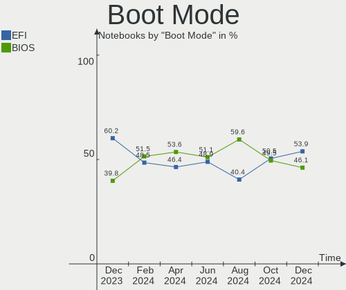
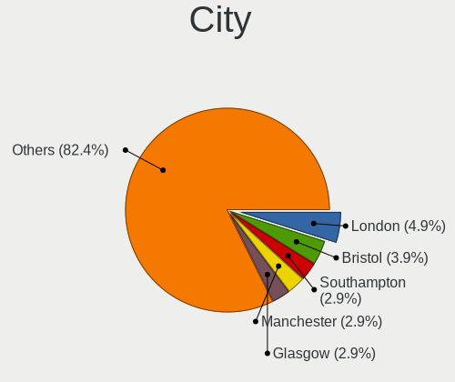
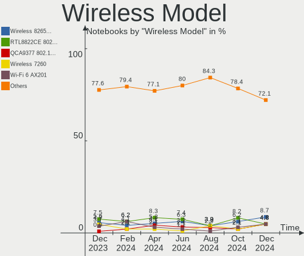
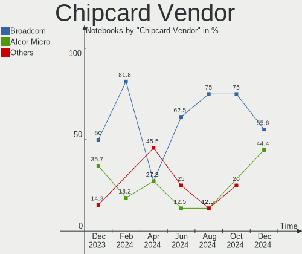

Linux in UK - Hardware Trends (Notebooks)
-----------------------------------------

A project to identify most popular hardware characteristics and track their change
over time based on data collected by Linux users at https://Linux-Hardware.org.

Anyone can contribute to this report by the [hw-probe](https://github.com/linuxhw/hw-probe) tool:

    sudo -E hw-probe -all -upload

Period: Sep, 2023.

Contents
--------

* [ System ](#system)
  - [ OS                       ](#os)
  - [ OS Family                ](#os-family)
  - [ Kernel                   ](#kernel)
  - [ Kernel Family            ](#kernel-family)
  - [ Kernel Major Ver.        ](#kernel-major-ver)
  - [ Arch                     ](#arch)
  - [ DE                       ](#de)
  - [ Display Server           ](#display-server)
  - [ Display Manager          ](#display-manager)
  - [ OS Lang                  ](#os-lang)
  - [ Boot Mode                ](#boot-mode)
  - [ Filesystem               ](#filesystem)
  - [ Part. scheme             ](#part-scheme)
  - [ Dual Boot with Linux/BSD ](#dual-boot-with-linuxbsd)
  - [ Dual Boot (Win)          ](#dual-boot-win)

* [ Board ](#board)
  - [ Vendor                   ](#vendor)
  - [ Model                    ](#model)
  - [ Model Family             ](#model-family)
  - [ MFG Year                 ](#mfg-year)
  - [ Form Factor              ](#form-factor)
  - [ Secure Boot              ](#secure-boot)
  - [ Coreboot                 ](#coreboot)
  - [ RAM Size                 ](#ram-size)
  - [ RAM Used                 ](#ram-used)
  - [ Total Drives             ](#total-drives)
  - [ Has CD-ROM               ](#has-cd-rom)
  - [ Has Ethernet             ](#has-ethernet)
  - [ Has WiFi                 ](#has-wifi)
  - [ Has Bluetooth            ](#has-bluetooth)

* [ Location ](#location)
  - [ Country                  ](#country)
  - [ City                     ](#city)

* [ Drives ](#drives)
  - [ Drive Vendor             ](#drive-vendor)
  - [ Drive Model              ](#drive-model)
  - [ HDD Vendor               ](#hdd-vendor)
  - [ SSD Vendor               ](#ssd-vendor)
  - [ Drive Kind               ](#drive-kind)
  - [ Drive Connector          ](#drive-connector)
  - [ Drive Size               ](#drive-size)
  - [ Space Total              ](#space-total)
  - [ Space Used               ](#space-used)
  - [ Malfunc. Drives          ](#malfunc-drives)
  - [ Malfunc. Drive Vendor    ](#malfunc-drive-vendor)
  - [ Malfunc. HDD Vendor      ](#malfunc-hdd-vendor)
  - [ Malfunc. Drive Kind      ](#malfunc-drive-kind)
  - [ Failed Drives            ](#failed-drives)
  - [ Failed Drive Vendor      ](#failed-drive-vendor)
  - [ Drive Status             ](#drive-status)

* [ Storage controller ](#storage-controller)
  - [ Storage Vendor           ](#storage-vendor)
  - [ Storage Model            ](#storage-model)
  - [ Storage Kind             ](#storage-kind)

* [ Processor ](#processor)
  - [ CPU Vendor               ](#cpu-vendor)
  - [ CPU Model                ](#cpu-model)
  - [ CPU Model Family         ](#cpu-model-family)
  - [ CPU Cores                ](#cpu-cores)
  - [ CPU Sockets              ](#cpu-sockets)
  - [ CPU Threads              ](#cpu-threads)
  - [ CPU Op-Modes             ](#cpu-op-modes)
  - [ CPU Microcode            ](#cpu-microcode)
  - [ CPU Microarch            ](#cpu-microarch)

* [ Graphics ](#graphics)
  - [ GPU Vendor               ](#gpu-vendor)
  - [ GPU Model                ](#gpu-model)
  - [ GPU Combo                ](#gpu-combo)
  - [ GPU Driver               ](#gpu-driver)
  - [ GPU Memory               ](#gpu-memory)

* [ Monitor ](#monitor)
  - [ Monitor Vendor           ](#monitor-vendor)
  - [ Monitor Model            ](#monitor-model)
  - [ Monitor Resolution       ](#monitor-resolution)
  - [ Monitor Diagonal         ](#monitor-diagonal)
  - [ Monitor Width            ](#monitor-width)
  - [ Aspect Ratio             ](#aspect-ratio)
  - [ Monitor Area             ](#monitor-area)
  - [ Pixel Density            ](#pixel-density)
  - [ Multiple Monitors        ](#multiple-monitors)

* [ Network ](#network)
  - [ Net Controller Vendor    ](#net-controller-vendor)
  - [ Net Controller Model     ](#net-controller-model)
  - [ Wireless Vendor          ](#wireless-vendor)
  - [ Wireless Model           ](#wireless-model)
  - [ Ethernet Vendor          ](#ethernet-vendor)
  - [ Ethernet Model           ](#ethernet-model)
  - [ Net Controller Kind      ](#net-controller-kind)
  - [ Used Controller          ](#used-controller)
  - [ NICs                     ](#nics)
  - [ IPv6                     ](#ipv6)

* [ Bluetooth ](#bluetooth)
  - [ Bluetooth Vendor         ](#bluetooth-vendor)
  - [ Bluetooth Model          ](#bluetooth-model)

* [ Sound ](#sound)
  - [ Sound Vendor             ](#sound-vendor)
  - [ Sound Model              ](#sound-model)

* [ Memory ](#memory)
  - [ Memory Vendor            ](#memory-vendor)
  - [ Memory Model             ](#memory-model)
  - [ Memory Kind              ](#memory-kind)
  - [ Memory Form Factor       ](#memory-form-factor)
  - [ Memory Size              ](#memory-size)
  - [ Memory Speed             ](#memory-speed)

* [ Printers & scanners ](#printers--scanners)
  - [ Printer Vendor           ](#printer-vendor)
  - [ Printer Model            ](#printer-model)
  - [ Scanner Vendor           ](#scanner-vendor)
  - [ Scanner Model            ](#scanner-model)

* [ Camera ](#camera)
  - [ Camera Vendor            ](#camera-vendor)
  - [ Camera Model             ](#camera-model)

* [ Security ](#security)
  - [ Fingerprint Vendor       ](#fingerprint-vendor)
  - [ Fingerprint Model        ](#fingerprint-model)
  - [ Chipcard Vendor          ](#chipcard-vendor)
  - [ Chipcard Model           ](#chipcard-model)

* [ Unsupported ](#unsupported)
  - [ Unsupported Devices      ](#unsupported-devices)
  - [ Unsupported Device Types ](#unsupported-device-types)

System
------

OS
--

Installed operating systems

| Name                         | Notebooks | Percent |
|------------------------------|-----------|---------|
| Ubuntu 22.04                 | 14        | 12.07%  |
| Fedora 38                    | 10        | 8.62%   |
| ArcoLinux Rolling            | 7         | 6.03%   |
| Arch Rolling                 | 6         | 5.17%   |
| SteamOS 3.4.10               | 5         | 4.31%   |
| OpenMandriva 23.08           | 5         | 4.31%   |
| Linux Mint 21.2              | 5         | 4.31%   |
| Debian 12                    | 5         | 4.31%   |
| Ubuntu 23.04                 | 4         | 3.45%   |
| Pop!_OS 22.04                | 4         | 3.45%   |
| Zorin 16                     | 3         | 2.59%   |
| Linux Mint 21.1              | 3         | 2.59%   |
| Linux Mint 20.3              | 3         | 2.59%   |
| Kubuntu 22.04                | 3         | 2.59%   |
| BlackPanther 18.1            | 3         | 2.59%   |
| Xubuntu 22.04                | 2         | 1.72%   |
| OpenMandriva 4.3             | 2         | 1.72%   |
| OpenMandriva 23.09           | 2         | 1.72%   |
| Lubuntu 22.04                | 2         | 1.72%   |
| Kubuntu 23.04                | 2         | 1.72%   |
| Kali 2023.3                  | 2         | 1.72%   |
| Fedora 39                    | 2         | 1.72%   |
| EndeavourOS Rolling          | 2         | 1.72%   |
| Xubuntu 2023.2               | 1         | 0.86%   |
| Ubuntu 18.04                 | 1         | 0.86%   |
| SteamOS 3.4.8                | 1         | 0.86%   |
| Rocky Linux 9.2              | 1         | 0.86%   |
| openSUSE Tumbleweed-XXXXXXXX | 1         | 0.86%   |
| openSUSE Leap-15.5           | 1         | 0.86%   |
| OpenMandriva 23.90           | 1         | 0.86%   |
| OpenMandriva 23.03           | 1         | 0.86%   |
| NixOS 23.11                  | 1         | 0.86%   |
| MX 23                        | 1         | 0.86%   |
| Manjaro 23.0.1               | 1         | 0.86%   |
| Manjaro                      | 1         | 0.86%   |
| Linux Mint 21                | 1         | 0.86%   |
| Linux Lite 6.6               | 1         | 0.86%   |
| KDE neon 22.04               | 1         | 0.86%   |
| Gentoo 2.14                  | 1         | 0.86%   |
| Endless 3.9.7                | 1         | 0.86%   |

OS Family
---------

OS without a version

| Name         | Notebooks | Percent |
|--------------|-----------|---------|
| Ubuntu       | 19        | 16.38%  |
| Linux Mint   | 12        | 10.34%  |
| Fedora       | 12        | 10.34%  |
| OpenMandriva | 11        | 9.48%   |
| ArcoLinux    | 7         | 6.03%   |
| SteamOS      | 6         | 5.17%   |
| Debian       | 6         | 5.17%   |
| Arch         | 6         | 5.17%   |
| Kubuntu      | 5         | 4.31%   |
| Pop!_OS      | 4         | 3.45%   |
| Zorin        | 3         | 2.59%   |
| Xubuntu      | 3         | 2.59%   |
| BlackPanther | 3         | 2.59%   |
| openSUSE     | 2         | 1.72%   |
| Manjaro      | 2         | 1.72%   |
| Lubuntu      | 2         | 1.72%   |
| Kali         | 2         | 1.72%   |
| EndeavourOS  | 2         | 1.72%   |
| Rocky Linux  | 1         | 0.86%   |
| NixOS        | 1         | 0.86%   |
| MX           | 1         | 0.86%   |
| Linux Lite   | 1         | 0.86%   |
| KDE neon     | 1         | 0.86%   |
| Gentoo       | 1         | 0.86%   |
| Endless      | 1         | 0.86%   |
| Elementary   | 1         | 0.86%   |
| blendOS      | 1         | 0.86%   |

Kernel
------

Version of the Linux kernel

| Version                  | Notebooks | Percent |
|--------------------------|-----------|---------|
| 6.2.0-33-generic         | 12        | 10.34%  |
| 6.2.0-32-generic         | 7         | 6.03%   |
| 6.4.15-200.fc38.x86_64   | 6         | 5.17%   |
| 6.4.11-desktop-1omv2390  | 6         | 5.17%   |
| 6.4.12-arch1-1           | 5         | 4.31%   |
| 5.13.0-valve37-1-neptune | 5         | 4.31%   |
| 6.4.6-76060406-generic   | 4         | 3.45%   |
| 6.4.12-zen1-1-zen        | 3         | 2.59%   |
| 6.2.0-31-generic         | 3         | 2.59%   |
| 6.1.0-11-amd64           | 3         | 2.59%   |
| 5.15.0-84-generic        | 3         | 2.59%   |
| 5.15.0-83-generic        | 3         | 2.59%   |
| 5.15.0-76-generic        | 3         | 2.59%   |
| 6.5.5-arch1-1            | 2         | 1.72%   |
| 6.5.2-arch1-1            | 2         | 1.72%   |
| 6.4.14-200.fc38.x86_64   | 2         | 1.72%   |
| 5.4.0-162-generic        | 2         | 1.72%   |
| 5.16.7-desktop-1omv4003  | 2         | 1.72%   |
| 5.15.85-desktop-1bP      | 2         | 1.72%   |
| 5.15.0-82-generic        | 2         | 1.72%   |
| 5.15.0-56-generic        | 2         | 1.72%   |
| 6.5.5-desktop-1omv2390   | 1         | 0.86%   |
| 6.5.5-300.fc39.x86_64    | 1         | 0.86%   |
| 6.5.4-arch2-1            | 1         | 0.86%   |
| 6.5.4-1-default          | 1         | 0.86%   |
| 6.5.3-zen1-1-zen         | 1         | 0.86%   |
| 6.5.3-arch1-1            | 1         | 0.86%   |
| 6.5.3-300.fc39.x86_64    | 1         | 0.86%   |
| 6.5.2-desktop-1omv2390   | 1         | 0.86%   |
| 6.5.0-kali1-amd64        | 1         | 0.86%   |
| 6.5.0-060500-generic     | 1         | 0.86%   |
| 6.4.14-x64v2-xanmod1-1   | 1         | 0.86%   |
| 6.4.13-200.fc38.x86_64   | 1         | 0.86%   |
| 6.4.0-kali3-amd64        | 1         | 0.86%   |
| 6.4.0-1mx-ahs-amd64      | 1         | 0.86%   |
| 6.3.9-zen1-1-zen         | 1         | 0.86%   |
| 6.2.9-300.fc38.x86_64    | 1         | 0.86%   |
| 6.2.6-desktop-1omv2390   | 1         | 0.86%   |
| 6.2.0-9032-generic       | 1         | 0.86%   |
| 6.2.0-26-generic         | 1         | 0.86%   |

Kernel Family
-------------

Linux kernel without a distro release

| Version | Notebooks | Percent |
|---------|-----------|---------|
| 6.2.0   | 25        | 21.55%  |
| 5.15.0  | 16        | 13.79%  |
| 6.4.12  | 8         | 6.9%    |
| 5.13.0  | 7         | 6.03%   |
| 6.4.15  | 6         | 5.17%   |
| 6.4.11  | 6         | 5.17%   |
| 6.1.0   | 5         | 4.31%   |
| 6.5.5   | 4         | 3.45%   |
| 6.4.6   | 4         | 3.45%   |
| 6.5.3   | 3         | 2.59%   |
| 6.5.2   | 3         | 2.59%   |
| 6.4.14  | 3         | 2.59%   |
| 5.4.0   | 3         | 2.59%   |
| 6.5.4   | 2         | 1.72%   |
| 6.5.0   | 2         | 1.72%   |
| 6.4.0   | 2         | 1.72%   |
| 5.16.7  | 2         | 1.72%   |
| 5.15.85 | 2         | 1.72%   |
| 6.4.13  | 1         | 0.86%   |
| 6.3.9   | 1         | 0.86%   |
| 6.2.9   | 1         | 0.86%   |
| 6.2.6   | 1         | 0.86%   |
| 6.1.49  | 1         | 0.86%   |
| 6.1.46  | 1         | 0.86%   |
| 6.1.42  | 1         | 0.86%   |
| 5.8.0   | 1         | 0.86%   |
| 5.6.14  | 1         | 0.86%   |
| 5.14.21 | 1         | 0.86%   |
| 5.14.0  | 1         | 0.86%   |
| 5.10.0  | 1         | 0.86%   |
| 4.15.0  | 1         | 0.86%   |

Kernel Major Ver.
-----------------

Linux kernel major version

| Version | Notebooks | Percent |
|---------|-----------|---------|
| 6.4     | 30        | 25.86%  |
| 6.2     | 27        | 23.28%  |
| 5.15    | 18        | 15.52%  |
| 6.5     | 14        | 12.07%  |
| 6.1     | 8         | 6.9%    |
| 5.13    | 7         | 6.03%   |
| 5.4     | 3         | 2.59%   |
| 5.16    | 2         | 1.72%   |
| 5.14    | 2         | 1.72%   |
| 6.3     | 1         | 0.86%   |
| 5.8     | 1         | 0.86%   |
| 5.6     | 1         | 0.86%   |
| 5.10    | 1         | 0.86%   |
| 4.15    | 1         | 0.86%   |

Arch
----

OS architecture (x86_64, i586, etc.)

| Name   | Notebooks | Percent |
|--------|-----------|---------|
| x86_64 | 115       | 99.14%  |
| i686   | 1         | 0.86%   |

DE
--

Desktop Environment

| Name            | Notebooks | Percent |
|-----------------|-----------|---------|
| GNOME           | 40        | 34.48%  |
| KDE5            | 36        | 31.03%  |
| X-Cinnamon      | 10        | 8.62%   |
| XFCE            | 9         | 7.76%   |
| Hyprland        | 4         | 3.45%   |
| LXQt            | 3         | 2.59%   |
| i3              | 2         | 1.72%   |
| GNOME Flashback | 2         | 1.72%   |
| Unknown         | 2         | 1.72%   |
| xmonad          | 1         | 0.86%   |
| Unity           | 1         | 0.86%   |
| Unicorn:XFCE    | 1         | 0.86%   |
| Pantheon        | 1         | 0.86%   |
| MATE            | 1         | 0.86%   |
| Cinnamon        | 1         | 0.86%   |
| chadwm          | 1         | 0.86%   |
| awesome         | 1         | 0.86%   |

Display Server
--------------

X11 or Wayland

| Name    | Notebooks | Percent |
|---------|-----------|---------|
| X11     | 66        | 56.9%   |
| Wayland | 46        | 39.66%  |
| Unknown | 3         | 2.59%   |
| Tty     | 1         | 0.86%   |

Display Manager
---------------

SDDM, LightDM, etc.

| Name    | Notebooks | Percent |
|---------|-----------|---------|
| Unknown | 44        | 37.93%  |
| SDDM    | 31        | 26.72%  |
| GDM3    | 21        | 18.1%   |
| LightDM | 14        | 12.07%  |
| GDM     | 5         | 4.31%   |
| LY-DM   | 1         | 0.86%   |

OS Lang
-------

Language

| Lang    | Notebooks | Percent |
|---------|-----------|---------|
| en_GB   | 83        | 71.55%  |
| en_US   | 19        | 16.38%  |
| Unknown | 5         | 4.31%   |
| C       | 4         | 3.45%   |
| uk_UA   | 1         | 0.86%   |
| pl_PL   | 1         | 0.86%   |
| es_ES   | 1         | 0.86%   |
| en_CA   | 1         | 0.86%   |
| de_DE   | 1         | 0.86%   |

Boot Mode
---------

EFI or BIOS

| Mode | Notebooks | Percent |
|------|-----------|---------|
| EFI  | 66        | 56.9%   |
| BIOS | 50        | 43.1%   |

Filesystem
----------

Type of filesystem

| Type    | Notebooks | Percent |
|---------|-----------|---------|
| Ext4    | 70        | 60.34%  |
| Btrfs   | 23        | 19.83%  |
| Tmpfs   | 12        | 10.34%  |
| Overlay | 8         | 6.9%    |
| Xfs     | 2         | 1.72%   |
| Ext3    | 1         | 0.86%   |

Part. scheme
------------

Scheme of partitioning

| Type    | Notebooks | Percent |
|---------|-----------|---------|
| GPT     | 64        | 55.17%  |
| Unknown | 42        | 36.21%  |
| MBR     | 10        | 8.62%   |

Dual Boot with Linux/BSD
------------------------

Hosting more than one Linux/BSD

| Dual boot | Notebooks | Percent |
|-----------|-----------|---------|
| No        | 105       | 90.52%  |
| Yes       | 11        | 9.48%   |

Dual Boot (Win)
---------------

Hosting Linux and Windows

| Dual boot | Notebooks | Percent |
|-----------|-----------|---------|
| No        | 97        | 83.62%  |
| Yes       | 19        | 16.38%  |

Board
-----

Vendor
------

Motherboard manufacturer

| Name             | Notebooks | Percent |
|------------------|-----------|---------|
| Lenovo           | 27        | 23.28%  |
| Dell             | 22        | 18.97%  |
| Hewlett-Packard  | 16        | 13.79%  |
| ASUSTek Computer | 12        | 10.34%  |
| Valve            | 6         | 5.17%   |
| Apple            | 5         | 4.31%   |
| Toshiba          | 4         | 3.45%   |
| Acer             | 4         | 3.45%   |
| Google           | 2         | 1.72%   |
| Alienware        | 2         | 1.72%   |
| Unknown          | 2         | 1.72%   |
| Timi             | 1         | 0.86%   |
| Sony             | 1         | 0.86%   |
| Schenker         | 1         | 0.86%   |
| PC Specialist    | 1         | 0.86%   |
| OEGStone         | 1         | 0.86%   |
| Notebook         | 1         | 0.86%   |
| MSI              | 1         | 0.86%   |
| Mini PC          | 1         | 0.86%   |
| HUAWEI           | 1         | 0.86%   |
| Framework        | 1         | 0.86%   |
| Entroware        | 1         | 0.86%   |
| eMachines        | 1         | 0.86%   |
| Dynabook         | 1         | 0.86%   |
| Clevo            | 1         | 0.86%   |

Model
-----

Motherboard model

| Name                                        | Notebooks | Percent |
|---------------------------------------------|-----------|---------|
| Valve Jupiter                               | 6         | 5.17%   |
| Dell XPS 9320                               | 2         | 1.72%   |
| Dell XPS 15 9560                            | 2         | 1.72%   |
| ASUS X550CL                                 | 2         | 1.72%   |
| Unknown                                     | 2         | 1.72%   |
| Toshiba TECRA X40-E                         | 1         | 0.86%   |
| Toshiba Satellite L855                      | 1         | 0.86%   |
| Toshiba Satellite L50D-B                    | 1         | 0.86%   |
| Toshiba Satellite A200                      | 1         | 0.86%   |
| Timi TM1613                                 | 1         | 0.86%   |
| Sony SVF1521A7EB                            | 1         | 0.86%   |
| Schenker XMG CORE (M19, GTX 1650)           | 1         | 0.86%   |
| PC Specialist Ionico 16                     | 1         | 0.86%   |
| OEGStone C4100/C5100                        | 1         | 0.86%   |
| Notebook NL5xNU                             | 1         | 0.86%   |
| MSI GS43VR 7RE                              | 1         | 0.86%   |
| Mini PC Cherry Trail CR                     | 1         | 0.86%   |
| Lenovo V15 G3 ABA 82TV                      | 1         | 0.86%   |
| Lenovo ThinkPad X270 20HMS0EXOO             | 1         | 0.86%   |
| Lenovo ThinkPad X260 20F5S2WY00             | 1         | 0.86%   |
| Lenovo ThinkPad X240 20AMS1JQ11             | 1         | 0.86%   |
| Lenovo ThinkPad X200 74591P0                | 1         | 0.86%   |
| Lenovo ThinkPad X1 Carbon Gen 11 21HMCTO1WW | 1         | 0.86%   |
| Lenovo ThinkPad X1 Carbon 7th 20QES5PY02    | 1         | 0.86%   |
| Lenovo ThinkPad X1 Carbon 6th 20KH006KUK    | 1         | 0.86%   |
| Lenovo ThinkPad X1 Carbon 6th 20KGS2AQ01    | 1         | 0.86%   |
| Lenovo ThinkPad W541 20EGS24300             | 1         | 0.86%   |
| Lenovo ThinkPad T540p 20BE003YUK            | 1         | 0.86%   |
| Lenovo ThinkPad T495s 20QKS0SD00            | 1         | 0.86%   |
| Lenovo ThinkPad T480 20L6S5M000             | 1         | 0.86%   |
| Lenovo ThinkPad T480 20L6S1FU00             | 1         | 0.86%   |
| Lenovo ThinkPad T430 2349BG6                | 1         | 0.86%   |
| Lenovo ThinkPad T14s Gen 4 21F8CTO1WW       | 1         | 0.86%   |
| Lenovo ThinkPad T14 Gen 2a 20XKCTO1WW       | 1         | 0.86%   |
| Lenovo ThinkPad P16s Gen 1 21BT000MUK       | 1         | 0.86%   |
| Lenovo ThinkPad P1 20MD0014UK               | 1         | 0.86%   |
| Lenovo ThinkPad L15 Gen 1 20U8S1CA01        | 1         | 0.86%   |
| Lenovo ThinkPad E580 20KS001JUK             | 1         | 0.86%   |
| Lenovo ThinkPad E15 20RD0011UK              | 1         | 0.86%   |
| Lenovo Legion 7 16ARHA7 82UH                | 1         | 0.86%   |

Model Family
------------

Motherboard model prefix

| Name                 | Notebooks | Percent |
|----------------------|-----------|---------|
| Lenovo ThinkPad      | 21        | 18.1%   |
| Dell XPS             | 8         | 6.9%    |
| Valve Jupiter        | 6         | 5.17%   |
| Dell Precision       | 5         | 4.31%   |
| ASUS VivoBook        | 5         | 4.31%   |
| HP Pavilion          | 4         | 3.45%   |
| Dell Latitude        | 4         | 3.45%   |
| Toshiba Satellite    | 3         | 2.59%   |
| Lenovo IdeaPad       | 3         | 2.59%   |
| HP Laptop            | 3         | 2.59%   |
| HP EliteBook         | 3         | 2.59%   |
| Lenovo Legion        | 2         | 1.72%   |
| HP Compaq            | 2         | 1.72%   |
| Dell Inspiron        | 2         | 1.72%   |
| ASUS X550CL          | 2         | 1.72%   |
| Acer Aspire          | 2         | 1.72%   |
| Unknown              | 2         | 1.72%   |
| Toshiba TECRA        | 1         | 0.86%   |
| Timi TM1613          | 1         | 0.86%   |
| Sony SVF1521A7EB     | 1         | 0.86%   |
| Schenker XMG         | 1         | 0.86%   |
| PC Specialist Ionico | 1         | 0.86%   |
| OEGStone C4100       | 1         | 0.86%   |
| Notebook NL5xNU      | 1         | 0.86%   |
| MSI GS43VR           | 1         | 0.86%   |
| Mini PC Cherry       | 1         | 0.86%   |
| Lenovo V15           | 1         | 0.86%   |
| HUAWEI NBD-WXX9      | 1         | 0.86%   |
| HP ProBook           | 1         | 0.86%   |
| HP Elite             | 1         | 0.86%   |
| HP Dragonfly         | 1         | 0.86%   |
| HP 255               | 1         | 0.86%   |
| Google Swanky        | 1         | 0.86%   |
| Google Lillipup      | 1         | 0.86%   |
| Framework Laptop     | 1         | 0.86%   |
| Entroware Hybris     | 1         | 0.86%   |
| eMachines eM350      | 1         | 0.86%   |
| Dynabook Satellite   | 1         | 0.86%   |
| Dell Vostro          | 1         | 0.86%   |
| Dell Studio          | 1         | 0.86%   |

MFG Year
--------

Motherboard manufacture year

| Year | Notebooks | Percent |
|------|-----------|---------|
| 2022 | 19        | 16.38%  |
| 2018 | 13        | 11.21%  |
| 2023 | 10        | 8.62%   |
| 2021 | 9         | 7.76%   |
| 2019 | 9         | 7.76%   |
| 2020 | 7         | 6.03%   |
| 2013 | 7         | 6.03%   |
| 2012 | 6         | 5.17%   |
| 2008 | 6         | 5.17%   |
| 2017 | 5         | 4.31%   |
| 2016 | 5         | 4.31%   |
| 2015 | 5         | 4.31%   |
| 2009 | 5         | 4.31%   |
| 2010 | 3         | 2.59%   |
| 2007 | 3         | 2.59%   |
| 2014 | 2         | 1.72%   |
| 2011 | 2         | 1.72%   |

Form Factor
-----------

Physical design of the computer

| Name     | Notebooks | Percent |
|----------|-----------|---------|
| Notebook | 116       | 100%    |

Secure Boot
-----------

Enabled or disabled

| State    | Notebooks | Percent |
|----------|-----------|---------|
| Disabled | 103       | 88.79%  |
| Enabled  | 13        | 11.21%  |

Coreboot
--------

Have coreboot on board

| Used | Notebooks | Percent |
|------|-----------|---------|
| No   | 113       | 97.41%  |
| Yes  | 3         | 2.59%   |

RAM Size
--------

Total RAM memory

| Size in GB  | Notebooks | Percent |
|-------------|-----------|---------|
| 4.01-8.0    | 34        | 29.31%  |
| 8.01-16.0   | 22        | 18.97%  |
| 32.01-64.0  | 18        | 15.52%  |
| 16.01-24.0  | 18        | 15.52%  |
| 3.01-4.0    | 8         | 6.9%    |
| 1.01-2.0    | 6         | 5.17%   |
| 64.01-256.0 | 4         | 3.45%   |
| 24.01-32.0  | 3         | 2.59%   |
| 2.01-3.0    | 3         | 2.59%   |

RAM Used
--------

Used RAM memory

| Used GB   | Notebooks | Percent |
|-----------|-----------|---------|
| 1.01-2.0  | 31        | 26.72%  |
| 2.01-3.0  | 26        | 22.41%  |
| 3.01-4.0  | 25        | 21.55%  |
| 4.01-8.0  | 23        | 19.83%  |
| 8.01-16.0 | 7         | 6.03%   |
| 0.51-1.0  | 4         | 3.45%   |

Total Drives
------------

Number of drives on board

| Drives | Notebooks | Percent |
|--------|-----------|---------|
| 1      | 88        | 75.86%  |
| 2      | 28        | 24.14%  |

Has CD-ROM
----------

Has CD-ROM on board

| Presented | Notebooks | Percent |
|-----------|-----------|---------|
| No        | 92        | 79.31%  |
| Yes       | 24        | 20.69%  |

Has Ethernet
------------

Has Ethernet on board

| Presented | Notebooks | Percent |
|-----------|-----------|---------|
| Yes       | 81        | 69.83%  |
| No        | 35        | 30.17%  |

Has WiFi
--------

Has WiFi module

| Presented | Notebooks | Percent |
|-----------|-----------|---------|
| Yes       | 114       | 98.28%  |
| No        | 2         | 1.72%   |

Has Bluetooth
-------------

Has Bluetooth module

| Presented | Notebooks | Percent |
|-----------|-----------|---------|
| Yes       | 93        | 80.17%  |
| No        | 23        | 19.83%  |

Location
--------

Country
-------

Geographic location (country)

| Country | Notebooks | Percent |
|---------|-----------|---------|
| UK      | 116       | 100%    |

City
----

Geographic location (city)

| City               | Notebooks | Percent |
|--------------------|-----------|---------|
| London             | 7         | 6.03%   |
| Manchester         | 5         | 4.31%   |
| Reading            | 4         | 3.45%   |
| Leeds              | 4         | 3.45%   |
| Glasgow            | 4         | 3.45%   |
| Leicester          | 3         | 2.59%   |
| Feltham            | 3         | 2.59%   |
| Oxford             | 2         | 1.72%   |
| Mansfield          | 2         | 1.72%   |
| Ipswich            | 2         | 1.72%   |
| Greenwich          | 2         | 1.72%   |
| Edinburgh          | 2         | 1.72%   |
| Edgware            | 2         | 1.72%   |
| Chippenham         | 2         | 1.72%   |
| Carnforth          | 2         | 1.72%   |
| Cambridge          | 2         | 1.72%   |
| Basingstoke        | 2         | 1.72%   |
| Worthing           | 1         | 0.86%   |
| Worcester          | 1         | 0.86%   |
| Wolverhampton      | 1         | 0.86%   |
| Woking             | 1         | 0.86%   |
| West Malling       | 1         | 0.86%   |
| Wells              | 1         | 0.86%   |
| Twickenham         | 1         | 0.86%   |
| Thetford           | 1         | 0.86%   |
| Swindon            | 1         | 0.86%   |
| Sutton in Ashfield | 1         | 0.86%   |
| Spennymoor         | 1         | 0.86%   |
| Southsea           | 1         | 0.86%   |
| Southampton        | 1         | 0.86%   |
| South Shields      | 1         | 0.86%   |
| Saint Neots        | 1         | 0.86%   |
| Ryde               | 1         | 0.86%   |
| Rickmansworth      | 1         | 0.86%   |
| Preston            | 1         | 0.86%   |
| Prestatyn          | 1         | 0.86%   |
| Poole              | 1         | 0.86%   |
| Peterborough       | 1         | 0.86%   |
| Otley              | 1         | 0.86%   |
| Nuneaton           | 1         | 0.86%   |

Drives
------

Drive Vendor
------------

Hard drive vendors

| Vendor                    | Notebooks | Drives | Percent |
|---------------------------|-----------|--------|---------|
| Samsung Electronics       | 27        | 29     | 19.57%  |
| Unknown                   | 12        | 13     | 8.7%    |
| Toshiba                   | 12        | 12     | 8.7%    |
| SanDisk                   | 11        | 11     | 7.97%   |
| Intel                     | 8         | 9      | 5.8%    |
| Crucial                   | 8         | 8      | 5.8%    |
| Micron Technology         | 7         | 8      | 5.07%   |
| Kingston                  | 5         | 5      | 3.62%   |
| SK hynix                  | 4         | 4      | 2.9%    |
| Seagate                   | 4         | 4      | 2.9%    |
| Hitachi                   | 4         | 4      | 2.9%    |
| WDC                       | 3         | 3      | 2.17%   |
| Phison Electronics        | 3         | 3      | 2.17%   |
| Micron/Crucial Technology | 3         | 3      | 2.17%   |
| KIOXIA                    | 3         | 3      | 2.17%   |
| Apple                     | 3         | 3      | 2.17%   |
| SPCC                      | 2         | 2      | 1.45%   |
| O2 Micro                  | 2         | 2      | 1.45%   |
| HGST                      | 2         | 2      | 1.45%   |
| Fujitsu                   | 2         | 2      | 1.45%   |
| XUM                       | 1         | 1      | 0.72%   |
| Silicon Motion            | 1         | 1      | 0.72%   |
| Plextor                   | 1         | 1      | 0.72%   |
| Patriot                   | 1         | 1      | 0.72%   |
| Netac                     | 1         | 1      | 0.72%   |
| LITEONIT                  | 1         | 1      | 0.72%   |
| LITEON                    | 1         | 1      | 0.72%   |
| KingDian                  | 1         | 1      | 0.72%   |
| Integral                  | 1         | 1      | 0.72%   |
| HJDK                      | 1         | 1      | 0.72%   |
| ASENNO                    | 1         | 1      | 0.72%   |
| ADATA Technology          | 1         | 1      | 0.72%   |
| A-DATA Technology         | 1         | 1      | 0.72%   |

Drive Model
-----------

Hard drive models

| Model                                               | Notebooks | Percent |
|-----------------------------------------------------|-----------|---------|
| Samsung NVMe SSD Controller SM981/PM981/PM983 256GB | 4         | 2.84%   |
| Unknown MMC Card  512GB                             | 3         | 2.13%   |
| Unknown MMC Card  256GB                             | 3         | 2.13%   |
| Toshiba XG4 NVMe SSD Controller 512GB               | 3         | 2.13%   |
| Samsung NVMe SSD Controller PM9A1/PM9A3/980PRO 1TB  | 3         | 2.13%   |
| Phison PS5013 E13 NVMe Controller 512GB             | 3         | 2.13%   |
| SK hynix PC801 NVMe 1TB                             | 2         | 1.42%   |
| Sandisk WD Blue SN550 NVMe SSD 512GB                | 2         | 1.42%   |
| Sandisk WD Black SN850 1TB                          | 2         | 1.42%   |
| Sandisk WD Black SN750 / PC SN730 NVMe SSD 512GB    | 2         | 1.42%   |
| Samsung PM9A1 NVMe 1024GB                           | 2         | 1.42%   |
| O2 Micro E2M2 64GB                                  | 2         | 1.42%   |
| Micron/Crucial P2 NVMe PCIe SSD 1TB                 | 2         | 1.42%   |
| Micron 2300 NVMe 1024GB                             | 2         | 1.42%   |
| Intel SSD Pro 7600p/760p/E 6100p Series 1TB         | 2         | 1.42%   |
| Crucial CT500MX500SSD1 500GB                        | 2         | 1.42%   |
| Crucial CT240BX500SSD1 240GB                        | 2         | 1.42%   |
| Crucial CT1000MX500SSD1 1TB                         | 2         | 1.42%   |
| XUM HX256GSSDM2 256GB                               | 1         | 0.71%   |
| WDC WD3200BPVT-80ZEST0 320GB                        | 1         | 0.71%   |
| WDC WD3200BEVT-60ZCT0 320GB                         | 1         | 0.71%   |
| WDC WD10SPCX-24HWST1 1TB                            | 1         | 0.71%   |
| Unknown SLD32G  32GB                                | 1         | 0.71%   |
| Unknown SD32G  32GB                                 | 1         | 0.71%   |
| Unknown SC128  128GB                                | 1         | 0.71%   |
| Unknown NVMe SSD Drive 1TB                          | 1         | 0.71%   |
| Unknown MMC Card  32GB                              | 1         | 0.71%   |
| Unknown MMC Card  16GB                              | 1         | 0.71%   |
| Unknown 032G72  32GB                                | 1         | 0.71%   |
| Toshiba THNSF5512GPUK 512GB                         | 1         | 0.71%   |
| Toshiba MQ04ABF100 1TB                              | 1         | 0.71%   |
| Toshiba MQ01ABD100 1TB                              | 1         | 0.71%   |
| Toshiba MQ01ABD075 752GB                            | 1         | 0.71%   |
| Toshiba MQ01ABD050 500GB                            | 1         | 0.71%   |
| Toshiba MK5065GSXN 500GB                            | 1         | 0.71%   |
| Toshiba KXG5AZNV256G 256GB                          | 1         | 0.71%   |
| Toshiba KXG50ZNV1T02 NVMe 1024GB                    | 1         | 0.71%   |
| Toshiba HDWK105 500GB                               | 1         | 0.71%   |
| SPCC Solid State Disk 512GB                         | 1         | 0.71%   |
| SPCC Solid State Disk 1024GB                        | 1         | 0.71%   |

HDD Vendor
----------

Hard disk drive vendors

| Vendor              | Notebooks | Drives | Percent |
|---------------------|-----------|--------|---------|
| Toshiba             | 6         | 6      | 27.27%  |
| Seagate             | 4         | 4      | 18.18%  |
| Hitachi             | 4         | 4      | 18.18%  |
| WDC                 | 3         | 3      | 13.64%  |
| HGST                | 2         | 2      | 9.09%   |
| Fujitsu             | 2         | 2      | 9.09%   |
| Samsung Electronics | 1         | 1      | 4.55%   |

SSD Vendor
----------

Solid state drive vendors

| Vendor              | Notebooks | Drives | Percent |
|---------------------|-----------|--------|---------|
| Crucial             | 8         | 8      | 21.05%  |
| Samsung Electronics | 5         | 5      | 13.16%  |
| Kingston            | 5         | 5      | 13.16%  |
| SanDisk             | 3         | 3      | 7.89%   |
| Apple               | 3         | 3      | 7.89%   |
| SPCC                | 2         | 2      | 5.26%   |
| XUM                 | 1         | 1      | 2.63%   |
| SK hynix            | 1         | 1      | 2.63%   |
| Plextor             | 1         | 1      | 2.63%   |
| Patriot             | 1         | 1      | 2.63%   |
| Netac               | 1         | 1      | 2.63%   |
| Micron Technology   | 1         | 1      | 2.63%   |
| LITEONIT            | 1         | 1      | 2.63%   |
| LITEON              | 1         | 1      | 2.63%   |
| Integral            | 1         | 1      | 2.63%   |
| HJDK                | 1         | 1      | 2.63%   |
| ASENNO              | 1         | 1      | 2.63%   |
| A-DATA Technology   | 1         | 1      | 2.63%   |

Drive Kind
----------

HDD or SSD

| Kind    | Notebooks | Drives | Percent |
|---------|-----------|--------|---------|
| NVMe    | 64        | 70     | 48.12%  |
| SSD     | 35        | 38     | 26.32%  |
| HDD     | 22        | 22     | 16.54%  |
| MMC     | 11        | 12     | 8.27%   |
| Unknown | 1         | 1      | 0.75%   |

Drive Connector
---------------

SATA, SAS, NVMe, etc.

| Type | Notebooks | Drives | Percent |
|------|-----------|--------|---------|
| NVMe | 64        | 70     | 49.23%  |
| SATA | 55        | 61     | 42.31%  |
| MMC  | 11        | 12     | 8.46%   |

Drive Size
----------

Size of hard drive

| Size in TB | Notebooks | Drives | Percent |
|------------|-----------|--------|---------|
| 0.01-0.5   | 42        | 45     | 73.68%  |
| 0.51-1.0   | 14        | 14     | 24.56%  |
| 1.01-2.0   | 1         | 1      | 1.75%   |

Space Total
-----------

Amount of disk space available on the file system

| Size in GB     | Notebooks | Percent |
|----------------|-----------|---------|
| 251-500        | 36        | 31.03%  |
| 101-250        | 23        | 19.83%  |
| 501-1000       | 21        | 18.1%   |
| 1-20           | 13        | 11.21%  |
| 1001-2000      | 7         | 6.03%   |
| 51-100         | 7         | 6.03%   |
| More than 3000 | 4         | 3.45%   |
| Unknown        | 3         | 2.59%   |
| 21-50          | 2         | 1.72%   |

Space Used
----------

Amount of used disk space

| Used GB        | Notebooks | Percent |
|----------------|-----------|---------|
| 1-20           | 42        | 36.21%  |
| 21-50          | 25        | 21.55%  |
| 101-250        | 20        | 17.24%  |
| 251-500        | 10        | 8.62%   |
| 51-100         | 10        | 8.62%   |
| 501-1000       | 4         | 3.45%   |
| Unknown        | 3         | 2.59%   |
| More than 3000 | 1         | 0.86%   |
| 1001-2000      | 1         | 0.86%   |

Malfunc. Drives
---------------

Drive models with a malfunction

| Model                                   | Notebooks | Drives | Percent |
|-----------------------------------------|-----------|--------|---------|
| Toshiba MK5065GSXN 500GB                | 1         | 1      | 16.67%  |
| SanDisk SSD PLUS 240GB                  | 1         | 1      | 16.67%  |
| LITEONIT LCT-128M3S 128GB SSD           | 1         | 1      | 16.67%  |
| Kingston RBU-SNS8350DES3128GP 128GB SSD | 1         | 1      | 16.67%  |
| Hitachi HTS543216L9A300 160GB           | 1         | 1      | 16.67%  |
| Hitachi HTS542512K9SA00 120GB           | 1         | 1      | 16.67%  |

Malfunc. Drive Vendor
---------------------

Vendors of faulty drives

| Vendor   | Notebooks | Drives | Percent |
|----------|-----------|--------|---------|
| Hitachi  | 2         | 2      | 33.33%  |
| Toshiba  | 1         | 1      | 16.67%  |
| SanDisk  | 1         | 1      | 16.67%  |
| LITEONIT | 1         | 1      | 16.67%  |
| Kingston | 1         | 1      | 16.67%  |

Malfunc. HDD Vendor
-------------------

Vendors of faulty HDD drives

| Vendor  | Notebooks | Drives | Percent |
|---------|-----------|--------|---------|
| Hitachi | 2         | 2      | 66.67%  |
| Toshiba | 1         | 1      | 33.33%  |

Malfunc. Drive Kind
-------------------

Kinds of faulty drives

| Kind | Notebooks | Drives | Percent |
|------|-----------|--------|---------|
| SSD  | 3         | 3      | 50%     |
| HDD  | 3         | 3      | 50%     |

Failed Drives
-------------

Failed drive models

Zero info for selected period =(

Failed Drive Vendor
-------------------

Failed drive vendors

Zero info for selected period =(

Drive Status
------------

Number of failed and malfunc. drives

| Status   | Notebooks | Drives | Percent |
|----------|-----------|--------|---------|
| Detected | 59        | 73     | 49.58%  |
| Works    | 54        | 64     | 45.38%  |
| Malfunc  | 6         | 6      | 5.04%   |

Storage controller
------------------

Storage Vendor
--------------

Storage controller vendors

| Vendor                       | Notebooks | Percent |
|------------------------------|-----------|---------|
| Intel                        | 65        | 48.15%  |
| Samsung Electronics          | 23        | 17.04%  |
| AMD                          | 9         | 6.67%   |
| SanDisk                      | 8         | 5.93%   |
| Toshiba America Info Systems | 6         | 4.44%   |
| Micron Technology            | 6         | 4.44%   |
| SK hynix                     | 3         | 2.22%   |
| Phison Electronics           | 3         | 2.22%   |
| Micron/Crucial Technology    | 3         | 2.22%   |
| KIOXIA                       | 3         | 2.22%   |
| O2 Micro                     | 2         | 1.48%   |
| Silicon Motion               | 1         | 0.74%   |
| Nvidia                       | 1         | 0.74%   |
| ADATA Technology             | 1         | 0.74%   |
| Unknown                      | 1         | 0.74%   |

Storage Model
-------------

Storage controller models

| Model                                                                          | Notebooks | Percent |
|--------------------------------------------------------------------------------|-----------|---------|
| Intel 7 Series Chipset Family 6-port SATA Controller [AHCI mode]               | 10        | 6.85%   |
| Samsung NVMe SSD Controller SM981/PM981/PM983                                  | 8         | 5.48%   |
| Intel Sunrise Point-LP SATA Controller [AHCI mode]                             | 7         | 4.79%   |
| AMD FCH SATA Controller [AHCI mode]                                            | 7         | 4.79%   |
| Samsung NVMe SSD Controller 980                                                | 6         | 4.11%   |
| Intel Volume Management Device NVMe RAID Controller                            | 6         | 4.11%   |
| Samsung NVMe SSD Controller PM9A1/PM9A3/980PRO                                 | 5         | 3.42%   |
| Intel 82801HM/HEM (ICH8M/ICH8M-E) SATA Controller [AHCI mode]                  | 5         | 3.42%   |
| Intel 82801 Mobile SATA Controller [RAID mode]                                 | 5         | 3.42%   |
| Toshiba America Info Systems XG4 NVMe SSD Controller                           | 4         | 2.74%   |
| Intel SSD DC P4101/Pro 7600p/760p/E 6100p Series                               | 4         | 2.74%   |
| Intel HM170/QM170 Chipset SATA Controller [AHCI Mode]                          | 4         | 2.74%   |
| Intel 82801HM/HEM (ICH8M/ICH8M-E) IDE Controller                               | 4         | 2.74%   |
| Phison PS5013 E13 NVMe Controller                                              | 3         | 2.05%   |
| Intel SSD 670p Series [Keystone Harbor]                                        | 3         | 2.05%   |
| Intel Cannon Lake Mobile PCH SATA AHCI Controller                              | 3         | 2.05%   |
| Intel 82801IBM/IEM (ICH9M/ICH9M-E) 4 port SATA Controller [AHCI mode]          | 3         | 2.05%   |
| Intel 8 Series/C220 Series Chipset Family 6-port SATA Controller 1 [AHCI mode] | 3         | 2.05%   |
| Intel 5 Series/3400 Series Chipset 4 port SATA AHCI Controller                 | 3         | 2.05%   |
| Toshiba America Info Systems XG5 NVMe SSD Controller                           | 2         | 1.37%   |
| SK hynix Platinum P41/PC801 NVMe Solid State Drive                             | 2         | 1.37%   |
| SanDisk WD PC SN810 / Black SN850 NVMe SSD                                     | 2         | 1.37%   |
| SanDisk WD Blue SN550 NVMe SSD                                                 | 2         | 1.37%   |
| SanDisk WD Black SN750 / PC SN730 NVMe SSD                                     | 2         | 1.37%   |
| O2 Micro FORESEE E2M2 NVMe SSD                                                 | 2         | 1.37%   |
| Micron/Crucial P2 [Nick P2] / P3 / P3 Plus NVMe PCIe SSD (DRAM-less)           | 2         | 1.37%   |
| Micron 3400 NVMe SSD [Hendrix]                                                 | 2         | 1.37%   |
| Micron 2450 NVMe SSD [HendrixV] (DRAM-less)                                    | 2         | 1.37%   |
| Micron 2300 NVMe SSD [Santana]                                                 | 2         | 1.37%   |
| KIOXIA NVMe SSD Controller XG8                                                 | 2         | 1.37%   |
| Intel Comet Lake SATA AHCI Controller                                          | 2         | 1.37%   |
| Intel Celeron/Pentium Silver Processor SATA Controller                         | 2         | 1.37%   |
| Intel 8 Series SATA Controller 1 [AHCI mode]                                   | 2         | 1.37%   |
| AMD SB7x0/SB8x0/SB9x0 SATA Controller [AHCI mode]                              | 2         | 1.37%   |
| SK hynix Gold P31/BC711/PC711 NVMe Solid State Drive                           | 1         | 0.68%   |
| Silicon Motion SM2263EN/SM2263XT (DRAM-less) NVMe SSD Controllers              | 1         | 0.68%   |
| SanDisk WD Black SN770 / PC SN740 256GB / PC SN560 (DRAM-less) NVMe SSD        | 1         | 0.68%   |
| SanDisk WD Black 2018/SN750 / PC SN720 NVMe SSD                                | 1         | 0.68%   |
| Samsung S4LN058A01[SSUBX] AHCI SSD Controller (Apple slot)                     | 1         | 0.68%   |
| Samsung S4LN053X01 AHCI SSD Controller(Apple slot)                             | 1         | 0.68%   |

Storage Kind
------------

Kind of storage controller (IDE, SATA, NVMe, SAS, ...)

| Kind | Notebooks | Percent |
|------|-----------|---------|
| NVMe | 64        | 44.76%  |
| SATA | 60        | 41.96%  |
| RAID | 12        | 8.39%   |
| IDE  | 7         | 4.9%    |

Processor
---------

CPU Vendor
----------

Processor vendors

| Vendor | Notebooks | Percent |
|--------|-----------|---------|
| Intel  | 94        | 81.03%  |
| AMD    | 22        | 18.97%  |

CPU Model
---------

Processor models

| Model                                       | Notebooks | Percent |
|---------------------------------------------|-----------|---------|
| AMD Custom APU 0405                         | 6         | 5.17%   |
| Intel Core i5-8250U CPU @ 1.60GHz           | 4         | 3.45%   |
| Intel 11th Gen Core i5-1135G7 @ 2.40GHz     | 4         | 3.45%   |
| Intel Core i7-7700HQ CPU @ 2.80GHz          | 3         | 2.59%   |
| Intel Core i7-10510U CPU @ 1.80GHz          | 3         | 2.59%   |
| Intel 12th Gen Core i7-1260P                | 3         | 2.59%   |
| Intel 11th Gen Core i7-1165G7 @ 2.80GHz     | 3         | 2.59%   |
| Intel Core i7-8650U CPU @ 1.90GHz           | 2         | 1.72%   |
| Intel Core i7-8550U CPU @ 1.80GHz           | 2         | 1.72%   |
| Intel Core i7-7500U CPU @ 2.70GHz           | 2         | 1.72%   |
| Intel Core i5-4300U CPU @ 1.90GHz           | 2         | 1.72%   |
| Intel Core i5-3337U CPU @ 1.80GHz           | 2         | 1.72%   |
| Intel Core i5-10210U CPU @ 1.60GHz          | 2         | 1.72%   |
| Intel Core i3 CPU M 380 @ 2.53GHz           | 2         | 1.72%   |
| Intel Core 2 Duo CPU P8700 @ 2.53GHz        | 2         | 1.72%   |
| Intel 11th Gen Core i9-11900H @ 2.50GHz     | 2         | 1.72%   |
| Intel Pentium Dual-Core CPU T4500 @ 2.30GHz | 1         | 0.86%   |
| Intel Pentium CPU 2117U @ 1.80GHz           | 1         | 0.86%   |
| Intel Core m3-6Y30 CPU @ 0.90GHz            | 1         | 0.86%   |
| Intel Core i9-10885H CPU @ 2.40GHz          | 1         | 0.86%   |
| Intel Core i7-9750H CPU @ 2.60GHz           | 1         | 0.86%   |
| Intel Core i7-8850H CPU @ 2.60GHz           | 1         | 0.86%   |
| Intel Core i7-8750H CPU @ 2.20GHz           | 1         | 0.86%   |
| Intel Core i7-8665U CPU @ 1.90GHz           | 1         | 0.86%   |
| Intel Core i7-6700HQ CPU @ 2.60GHz          | 1         | 0.86%   |
| Intel Core i7-6600U CPU @ 2.60GHz           | 1         | 0.86%   |
| Intel Core i7-4720HQ CPU @ 2.60GHz          | 1         | 0.86%   |
| Intel Core i7-4710MQ CPU @ 2.50GHz          | 1         | 0.86%   |
| Intel Core i7-4700MQ CPU @ 2.40GHz          | 1         | 0.86%   |
| Intel Core i7-4558U CPU @ 2.80GHz           | 1         | 0.86%   |
| Intel Core i7-3720QM CPU @ 2.60GHz          | 1         | 0.86%   |
| Intel Core i7-3630QM CPU @ 2.40GHz          | 1         | 0.86%   |
| Intel Core i7-10875H CPU @ 2.30GHz          | 1         | 0.86%   |
| Intel Core i5-8350U CPU @ 1.70GHz           | 1         | 0.86%   |
| Intel Core i5-8300H CPU @ 2.30GHz           | 1         | 0.86%   |
| Intel Core i5-8265U CPU @ 1.60GHz           | 1         | 0.86%   |
| Intel Core i5-7200U CPU @ 2.50GHz           | 1         | 0.86%   |
| Intel Core i5-6300U CPU @ 2.40GHz           | 1         | 0.86%   |
| Intel Core i5-6200U CPU @ 2.30GHz           | 1         | 0.86%   |
| Intel Core i5-5350U CPU @ 1.80GHz           | 1         | 0.86%   |

CPU Model Family
----------------

Processor model prefix

| Model                          | Notebooks | Percent |
|--------------------------------|-----------|---------|
| Other                          | 28        | 24.14%  |
| Intel Core i7                  | 25        | 21.55%  |
| Intel Core i5                  | 23        | 19.83%  |
| Intel Core 2 Duo               | 8         | 6.9%    |
| Intel Core i3                  | 4         | 3.45%   |
| Intel Celeron                  | 4         | 3.45%   |
| Intel Atom                     | 4         | 3.45%   |
| AMD Ryzen 7 PRO                | 4         | 3.45%   |
| AMD Ryzen 7                    | 2         | 1.72%   |
| AMD Ryzen 5                    | 2         | 1.72%   |
| AMD Ryzen 3                    | 2         | 1.72%   |
| Intel Pentium Dual-Core        | 1         | 0.86%   |
| Intel Pentium                  | 1         | 0.86%   |
| Intel Core m3                  | 1         | 0.86%   |
| Intel Core i9                  | 1         | 0.86%   |
| AMD Turion X2 Dual-Core Mobile | 1         | 0.86%   |
| AMD Turion II Dual-Core        | 1         | 0.86%   |
| AMD Ryzen 9                    | 1         | 0.86%   |
| AMD Ryzen 5 PRO                | 1         | 0.86%   |
| AMD E1                         | 1         | 0.86%   |
| AMD A8                         | 1         | 0.86%   |

CPU Cores
---------

Number of processor cores

| Number | Notebooks | Percent |
|--------|-----------|---------|
| 4      | 47        | 40.52%  |
| 2      | 38        | 32.76%  |
| 8      | 10        | 8.62%   |
| 6      | 6         | 5.17%   |
| 12     | 5         | 4.31%   |
| 14     | 4         | 3.45%   |
| 10     | 3         | 2.59%   |
| 1      | 3         | 2.59%   |

CPU Sockets
-----------

Number of sockets

| Number | Notebooks | Percent |
|--------|-----------|---------|
| 1      | 116       | 100%    |

CPU Threads
-----------

Threads per core (Hyper-Threading)

| Number | Notebooks | Percent |
|--------|-----------|---------|
| 2      | 93        | 80.17%  |
| 1      | 23        | 19.83%  |

CPU Op-Modes
------------

CPU Operation Modes (32-bit, 64-bit)

| Op mode        | Notebooks | Percent |
|----------------|-----------|---------|
| 32-bit, 64-bit | 115       | 99.14%  |
| 32-bit         | 1         | 0.86%   |

CPU Microcode
-------------

Microcode number

| Number     | Notebooks | Percent |
|------------|-----------|---------|
| Unknown    | 77        | 66.38%  |
| 0x306a9    | 3         | 2.59%   |
| 0x906e9    | 2         | 1.72%   |
| 0x806ea    | 2         | 1.72%   |
| 0x806c1    | 2         | 1.72%   |
| 0x406e3    | 2         | 1.72%   |
| 0x20655    | 2         | 1.72%   |
| 0x1067a    | 2         | 1.72%   |
| 0x0a50000c | 2         | 1.72%   |
| 0x806d1    | 1         | 0.86%   |
| 0x706a1    | 1         | 0.86%   |
| 0x6fd      | 1         | 0.86%   |
| 0x6fa      | 1         | 0.86%   |
| 0x506e3    | 1         | 0.86%   |
| 0x406c4    | 1         | 0.86%   |
| 0x406c3    | 1         | 0.86%   |
| 0x40651    | 1         | 0.86%   |
| 0x306c3    | 1         | 0.86%   |
| 0x20652    | 1         | 0.86%   |
| 0x106ca    | 1         | 0.86%   |
| 0x106c2    | 1         | 0.86%   |
| 0x10661    | 1         | 0.86%   |
| 0x0a704103 | 1         | 0.86%   |
| 0x0a601203 | 1         | 0.86%   |
| 0x0a404102 | 1         | 0.86%   |
| 0x08608103 | 1         | 0.86%   |
| 0x08600109 | 1         | 0.86%   |
| 0x08108109 | 1         | 0.86%   |
| 0x08101016 | 1         | 0.86%   |
| 0x07030104 | 1         | 0.86%   |
| 0x02000032 | 1         | 0.86%   |

CPU Microarch
-------------

Microarchitecture

| Name             | Notebooks | Percent |
|------------------|-----------|---------|
| KabyLake         | 26        | 22.41%  |
| Unknown          | 13        | 11.21%  |
| Alderlake Hybrid | 10        | 8.62%   |
| IvyBridge        | 9         | 7.76%   |
| TigerLake        | 7         | 6.03%   |
| Penryn           | 6         | 5.17%   |
| Haswell          | 6         | 5.17%   |
| Skylake          | 5         | 4.31%   |
| Westmere         | 4         | 3.45%   |
| Icelake          | 4         | 3.45%   |
| Core             | 4         | 3.45%   |
| Zen 3            | 3         | 2.59%   |
| Silvermont       | 3         | 2.59%   |
| Zen+             | 2         | 1.72%   |
| Puma             | 2         | 1.72%   |
| Goldmont plus    | 2         | 1.72%   |
| CometLake        | 2         | 1.72%   |
| Bonnell          | 2         | 1.72%   |
| Zen 2            | 1         | 0.86%   |
| Zen              | 1         | 0.86%   |
| SandyBridge      | 1         | 0.86%   |
| K8 & K10 hybrid  | 1         | 0.86%   |
| K10              | 1         | 0.86%   |
| Broadwell        | 1         | 0.86%   |

Graphics
--------

GPU Vendor
----------

Vendors of graphics cards

| Vendor | Notebooks | Percent |
|--------|-----------|---------|
| Intel  | 88        | 59.86%  |
| Nvidia | 30        | 20.41%  |
| AMD    | 29        | 19.73%  |

GPU Model
---------

Graphics card models

| Model                                                                                    | Notebooks | Percent |
|------------------------------------------------------------------------------------------|-----------|---------|
| Intel UHD Graphics 620                                                                   | 9         | 5.92%   |
| Intel 3rd Gen Core processor Graphics Controller                                         | 9         | 5.92%   |
| Intel TigerLake-LP GT2 [Iris Xe Graphics]                                                | 7         | 4.61%   |
| Intel Alder Lake-P Integrated Graphics Controller                                        | 6         | 3.95%   |
| AMD VanGogh [AMD Custom GPU 0405]                                                        | 6         | 3.95%   |
| Intel CometLake-U GT2 [UHD Graphics]                                                     | 5         | 3.29%   |
| Intel Raptor Lake-P [Iris Xe Graphics]                                                   | 4         | 2.63%   |
| Intel CoffeeLake-H GT2 [UHD Graphics 630]                                                | 4         | 2.63%   |
| Intel TigerLake-H GT1 [UHD Graphics]                                                     | 3         | 1.97%   |
| Intel Skylake GT2 [HD Graphics 520]                                                      | 3         | 1.97%   |
| Intel Mobile GM965/GL960 Integrated Graphics Controller (secondary)                      | 3         | 1.97%   |
| Intel Mobile GM965/GL960 Integrated Graphics Controller (primary)                        | 3         | 1.97%   |
| Intel Mobile 4 Series Chipset Integrated Graphics Controller                             | 3         | 1.97%   |
| Intel HD Graphics 630                                                                    | 3         | 1.97%   |
| Intel HD Graphics 620                                                                    | 3         | 1.97%   |
| Intel Haswell-ULT Integrated Graphics Controller                                         | 3         | 1.97%   |
| Intel Core Processor Integrated Graphics Controller                                      | 3         | 1.97%   |
| Intel 4th Gen Core Processor Integrated Graphics Controller                              | 3         | 1.97%   |
| Nvidia GP107M [GeForce GTX 1050 Mobile]                                                  | 2         | 1.32%   |
| Nvidia GF117M [GeForce 610M/710M/810M/820M / GT 620M/625M/630M/720M]                     | 2         | 1.32%   |
| Nvidia GA107M [GeForce RTX 3050 Ti Mobile]                                               | 2         | 1.32%   |
| Nvidia GA104M [GeForce RTX 3070 Mobile / Max-Q]                                          | 2         | 1.32%   |
| Nvidia AD107M [GeForce RTX 4060 Max-Q / Mobile]                                          | 2         | 1.32%   |
| Intel WhiskeyLake-U GT2 [UHD Graphics 620]                                               | 2         | 1.32%   |
| Intel GeminiLake [UHD Graphics 600]                                                      | 2         | 1.32%   |
| Intel CometLake-H GT2 [UHD Graphics]                                                     | 2         | 1.32%   |
| Intel Atom/Celeron/Pentium Processor x5-E8000/J3xxx/N3xxx Integrated Graphics Controller | 2         | 1.32%   |
| AMD Rembrandt [Radeon 680M]                                                              | 2         | 1.32%   |
| AMD Picasso/Raven 2 [Radeon Vega Series / Radeon Vega Mobile Series]                     | 2         | 1.32%   |
| AMD Barcelo                                                                              | 2         | 1.32%   |
| Nvidia TU117M [GeForce GTX 1650 Mobile / Max-Q]                                          | 1         | 0.66%   |
| Nvidia TU117GLM [T550 Laptop GPU]                                                        | 1         | 0.66%   |
| Nvidia TU117GLM [Quadro T500 Mobile]                                                     | 1         | 0.66%   |
| Nvidia TU117GLM [Quadro T2000 Mobile / Max-Q]                                            | 1         | 0.66%   |
| Nvidia TU106M [GeForce RTX 2060 Max-Q]                                                   | 1         | 0.66%   |
| Nvidia GP108M [GeForce MX330]                                                            | 1         | 0.66%   |
| Nvidia GP108M [GeForce MX230]                                                            | 1         | 0.66%   |
| Nvidia GP108M [GeForce MX150]                                                            | 1         | 0.66%   |
| Nvidia GP107GLM [Quadro P2000 Mobile]                                                    | 1         | 0.66%   |
| Nvidia GP107GLM [Quadro P1000 Mobile]                                                    | 1         | 0.66%   |

GPU Combo
---------

Combinations of graphics cards

| Name           | Notebooks | Percent |
|----------------|-----------|---------|
| 1 x Intel      | 55        | 47.41%  |
| Intel + Nvidia | 26        | 22.41%  |
| 1 x AMD        | 23        | 19.83%  |
| Intel + AMD    | 4         | 3.45%   |
| 2 x Intel      | 3         | 2.59%   |
| 1 x Nvidia     | 3         | 2.59%   |
| 2 x AMD        | 1         | 0.86%   |
| AMD + Nvidia   | 1         | 0.86%   |

GPU Driver
----------

Free vs proprietary

| Driver      | Notebooks | Percent |
|-------------|-----------|---------|
| Free        | 102       | 87.93%  |
| Proprietary | 13        | 11.21%  |
| Unknown     | 1         | 0.86%   |

GPU Memory
----------

Total video memory

| Size in GB | Notebooks | Percent |
|------------|-----------|---------|
| Unknown    | 82        | 70.69%  |
| 1.01-2.0   | 9         | 7.76%   |
| 0.51-1.0   | 8         | 6.9%    |
| 0.01-0.5   | 7         | 6.03%   |
| 3.01-4.0   | 6         | 5.17%   |
| 7.01-8.0   | 3         | 2.59%   |
| 5.01-6.0   | 1         | 0.86%   |

Monitor
-------

Monitor Vendor
--------------

Monitor vendors

| Vendor                  | Notebooks | Percent |
|-------------------------|-----------|---------|
| AU Optronics            | 30        | 22.06%  |
| BOE                     | 16        | 11.76%  |
| Samsung Electronics     | 13        | 9.56%   |
| LG Display              | 12        | 8.82%   |
| Chimei Innolux          | 10        | 7.35%   |
| Sharp                   | 9         | 6.62%   |
| Valve                   | 6         | 4.41%   |
| Goldstar                | 5         | 3.68%   |
| Dell                    | 5         | 3.68%   |
| Lenovo                  | 4         | 2.94%   |
| Apple                   | 4         | 2.94%   |
| Acer                    | 4         | 2.94%   |
| Hewlett-Packard         | 3         | 2.21%   |
| Chi Mei Optoelectronics | 3         | 2.21%   |
| Iiyama                  | 2         | 1.47%   |
| PANDA                   | 1         | 0.74%   |
| OEM                     | 1         | 0.74%   |
| LG Philips              | 1         | 0.74%   |
| InfoVision              | 1         | 0.74%   |
| HKC                     | 1         | 0.74%   |
| HannStar                | 1         | 0.74%   |
| CSO                     | 1         | 0.74%   |
| BenQ                    | 1         | 0.74%   |
| ASUSTek Computer        | 1         | 0.74%   |
| AOC                     | 1         | 0.74%   |

Monitor Model
-------------

Monitor models

| Model                                                                 | Notebooks | Percent |
|-----------------------------------------------------------------------|-----------|---------|
| Valve ANX7530 U VLV3001 800x1280 100x150mm 7.1-inch                   | 6         | 4.38%   |
| AU Optronics LCD Monitor AUO2336 2560x1440 309x174mm 14.0-inch        | 3         | 2.19%   |
| Samsung Electronics LCD Monitor SDC4193 2880x1800 302x189mm 14.0-inch | 2         | 1.46%   |
| Lenovo LCD Monitor LEN40BA 1920x1080 344x194mm 15.5-inch              | 2         | 1.46%   |
| Dell S2721DS DELA19E 2560x1440 590x330mm 26.6-inch                    | 2         | 1.46%   |
| Dell P2715Q DEL40BD 3840x2160 597x336mm 27.0-inch                     | 2         | 1.46%   |
| Chimei Innolux LCD Monitor CMN14E5 1920x1080 309x173mm 13.9-inch      | 2         | 1.46%   |
| AU Optronics LCD Monitor AUO106C 1366x768 277x156mm 12.5-inch         | 2         | 1.46%   |
| Sharp LCD Monitor SHP1548 1920x1200 288x180mm 13.4-inch               | 1         | 0.73%   |
| Sharp LCD Monitor SHP1547 1920x1200 288x180mm 13.4-inch               | 1         | 0.73%   |
| Sharp LCD Monitor SHP1516 3840x2400 336x210mm 15.6-inch               | 1         | 0.73%   |
| Sharp LCD Monitor SHP14D6 3840x2400 366x229mm 17.0-inch               | 1         | 0.73%   |
| Sharp LCD Monitor SHP14D1 1920x1200 336x210mm 15.6-inch               | 1         | 0.73%   |
| Sharp LCD Monitor SHP1476 3840x2160 346x194mm 15.6-inch               | 1         | 0.73%   |
| Sharp LCD Monitor SHP1453 1920x1080 346x194mm 15.6-inch               | 1         | 0.73%   |
| Sharp LCD Monitor SHP144A 3200x1800 294x165mm 13.3-inch               | 1         | 0.73%   |
| Sharp HDMI SHP1048 1920x1080 820x460mm 37.0-inch                      | 1         | 0.73%   |
| Samsung Electronics LCD Monitor SEC5441 1366x768 344x194mm 15.5-inch  | 1         | 0.73%   |
| Samsung Electronics LCD Monitor SEC4F45 1280x800 331x207mm 15.4-inch  | 1         | 0.73%   |
| Samsung Electronics LCD Monitor SEC3747 1440x900 367x230mm 17.1-inch  | 1         | 0.73%   |
| Samsung Electronics LCD Monitor SEC324A 1366x768 344x194mm 15.5-inch  | 1         | 0.73%   |
| Samsung Electronics LCD Monitor SEC3150 1366x768 344x193mm 15.5-inch  | 1         | 0.73%   |
| Samsung Electronics LCD Monitor SDC4259 1920x1080 293x165mm 13.2-inch | 1         | 0.73%   |
| Samsung Electronics LCD Monitor SDC4180 2880x1620 344x194mm 15.5-inch | 1         | 0.73%   |
| Samsung Electronics LCD Monitor SDC4146 1366x768 344x194mm 15.5-inch  | 1         | 0.73%   |
| Samsung Electronics LCD Monitor SDC3752 1920x1080 344x194mm 15.5-inch | 1         | 0.73%   |
| Samsung Electronics LCD Monitor SDC374A 3200x1800 293x165mm 13.2-inch | 1         | 0.73%   |
| Samsung Electronics LCD Monitor SDC3652 1366x768 344x194mm 15.5-inch  | 1         | 0.73%   |
| PANDA LCD Monitor NCP0057 1920x1080 344x194mm 15.5-inch               | 1         | 0.73%   |
| OEM 22_LCD_TV OEM3700 1920x540                                        | 1         | 0.73%   |
| LG Philips LP154WX4-TLC8 LPL0120 1280x800 331x207mm 15.4-inch         | 1         | 0.73%   |
| LG Display LP156WH2-TLR2 LGD027D 1366x768 344x194mm 15.5-inch         | 1         | 0.73%   |
| LG Display LP101WSA-TLA1 LGD01B9 1024x600 224x126mm 10.1-inch         | 1         | 0.73%   |
| LG Display LCD Monitor LGD06B3 1920x1200 336x210mm 15.6-inch          | 1         | 0.73%   |
| LG Display LCD Monitor LGD0690 2560x1440 344x194mm 15.5-inch          | 1         | 0.73%   |
| LG Display LCD Monitor LGD0615 1920x1080 382x215mm 17.3-inch          | 1         | 0.73%   |
| LG Display LCD Monitor LGD0575 1920x1080 309x174mm 14.0-inch          | 1         | 0.73%   |
| LG Display LCD Monitor LGD056D 1920x1080 382x215mm 17.3-inch          | 1         | 0.73%   |
| LG Display LCD Monitor LGD0563 1920x1080 344x194mm 15.5-inch          | 1         | 0.73%   |
| LG Display LCD Monitor LGD0540 1920x1080 344x194mm 15.5-inch          | 1         | 0.73%   |

Monitor Resolution
------------------

Monitor screen resolution

| Resolution         | Notebooks | Percent |
|--------------------|-----------|---------|
| 1920x1080 (FHD)    | 50        | 38.46%  |
| 1366x768 (WXGA)    | 20        | 15.38%  |
| 3840x2160 (4K)     | 8         | 6.15%   |
| 2560x1440 (QHD)    | 8         | 6.15%   |
| 1920x1200 (WUXGA)  | 7         | 5.38%   |
| 800x1280           | 6         | 4.62%   |
| 1280x800 (WXGA)    | 6         | 4.62%   |
| 2560x1600          | 5         | 3.85%   |
| 2880x1800          | 3         | 2.31%   |
| 3840x2400          | 2         | 1.54%   |
| 3200x1800 (QHD+)   | 2         | 1.54%   |
| 1920x1280          | 2         | 1.54%   |
| 1440x900 (WXGA+)   | 2         | 1.54%   |
| 1024x600           | 2         | 1.54%   |
| 2880x1620          | 1         | 0.77%   |
| 2560x1080          | 1         | 0.77%   |
| 2256x1504          | 1         | 0.77%   |
| 1920x540           | 1         | 0.77%   |
| 1680x1050 (WSXGA+) | 1         | 0.77%   |
| 1600x900 (HD+)     | 1         | 0.77%   |
| 1280x1024 (SXGA)   | 1         | 0.77%   |

Monitor Diagonal
----------------

Diagonal size in inches

| Inches | Notebooks | Percent |
|--------|-----------|---------|
| 15     | 50        | 37.04%  |
| 13     | 21        | 15.56%  |
| 14     | 14        | 10.37%  |
| 27     | 10        | 7.41%   |
| 17     | 8         | 5.93%   |
| 7      | 6         | 4.44%   |
| 16     | 5         | 3.7%    |
| 12     | 5         | 3.7%    |
| 24     | 4         | 2.96%   |
| 21     | 3         | 2.22%   |
| 34     | 2         | 1.48%   |
| 23     | 2         | 1.48%   |
| 60     | 1         | 0.74%   |
| 20     | 1         | 0.74%   |
| 19     | 1         | 0.74%   |
| 10     | 1         | 0.74%   |
| 8      | 1         | 0.74%   |

Monitor Width
-------------

Physical width

| Width in mm | Notebooks | Percent |
|-------------|-----------|---------|
| 301-350     | 75        | 55.56%  |
| 201-300     | 20        | 14.81%  |
| 501-600     | 15        | 11.11%  |
| 351-400     | 10        | 7.41%   |
| 1-100       | 6         | 4.44%   |
| 401-500     | 4         | 2.96%   |
| 701-800     | 2         | 1.48%   |
| 601-700     | 1         | 0.74%   |
| 101-200     | 1         | 0.74%   |
| 1001-1500   | 1         | 0.74%   |

Aspect Ratio
------------

Proportional relationship between the width and the height

| Ratio | Notebooks | Percent |
|-------|-----------|---------|
| 16/9  | 86        | 69.35%  |
| 16/10 | 26        | 20.97%  |
| 0.67  | 6         | 4.84%   |
| 3/2   | 3         | 2.42%   |
| 21/9  | 2         | 1.61%   |
| 5/4   | 1         | 0.81%   |

Monitor Area
------------

Area in inch

| Area in inch | Notebooks | Percent |
|----------------|-----------|---------|
| 101-110        | 48        | 35.56%  |
| 81-90          | 26        | 19.26%  |
| 301-350        | 10        | 7.41%   |
| 71-80          | 9         | 6.67%   |
| 1-40           | 7         | 5.19%   |
| 201-250        | 7         | 5.19%   |
| 111-120        | 7         | 5.19%   |
| 121-130        | 6         | 4.44%   |
| 61-70          | 5         | 3.7%    |
| 151-200        | 3         | 2.22%   |
| 351-500        | 2         | 1.48%   |
| 131-140        | 2         | 1.48%   |
| More than 1000 | 1         | 0.74%   |
| 41-50          | 1         | 0.74%   |
| 251-300        | 1         | 0.74%   |

Pixel Density
-------------

Pixels per inch

| Density       | Notebooks | Percent |
|---------------|-----------|---------|
| 121-160       | 51        | 38.35%  |
| 161-240       | 30        | 22.56%  |
| 101-120       | 24        | 18.05%  |
| 51-100        | 19        | 14.29%  |
| More than 240 | 8         | 6.02%   |
| 1-50          | 1         | 0.75%   |

Multiple Monitors
-----------------

Total monitors connected

| Total | Notebooks | Percent |
|-------|-----------|---------|
| 1     | 90        | 77.59%  |
| 2     | 23        | 19.83%  |
| 3     | 2         | 1.72%   |
| 0     | 1         | 0.86%   |

Network
-------

Net Controller Vendor
---------------------

Controller vendors

| Vendor                   | Notebooks | Percent |
|--------------------------|-----------|---------|
| Intel                    | 65        | 38.24%  |
| Realtek Semiconductor    | 49        | 28.82%  |
| Qualcomm Atheros         | 15        | 8.82%   |
| Broadcom                 | 11        | 6.47%   |
| Broadcom Limited         | 6         | 3.53%   |
| ASIX Electronics         | 4         | 2.35%   |
| Qualcomm                 | 3         | 1.76%   |
| Ralink                   | 2         | 1.18%   |
| MediaTek                 | 2         | 1.18%   |
| Marvell Technology Group | 2         | 1.18%   |
| JMicron Technology       | 2         | 1.18%   |
| DisplayLink              | 2         | 1.18%   |
| Samsung Electronics      | 1         | 0.59%   |
| Ralink Technology        | 1         | 0.59%   |
| Qualcomm Technologies    | 1         | 0.59%   |
| Prolific Technology      | 1         | 0.59%   |
| Nvidia                   | 1         | 0.59%   |
| Lenovo                   | 1         | 0.59%   |
| ICS Advent               | 1         | 0.59%   |

Net Controller Model
--------------------

Controller models

| Model                                                                   | Notebooks | Percent |
|-------------------------------------------------------------------------|-----------|---------|
| Realtek RTL8111/8168/8411 PCI Express Gigabit Ethernet Controller       | 25        | 12.38%  |
| Realtek RTL810xE PCI Express Fast Ethernet controller                   | 8         | 3.96%   |
| Realtek RTL8822CE 802.11ac PCIe Wireless Network Adapter                | 7         | 3.47%   |
| Realtek RTL8821CE 802.11ac PCIe Wireless Network Adapter                | 7         | 3.47%   |
| Intel Wireless 8265 / 8275                                              | 7         | 3.47%   |
| Intel Alder Lake-P PCH CNVi WiFi                                        | 7         | 3.47%   |
| Intel Wireless 7260                                                     | 6         | 2.97%   |
| Intel Raptor Lake PCH CNVi WiFi                                         | 5         | 2.48%   |
| Qualcomm Atheros QCA6174 802.11ac Wireless Network Adapter              | 4         | 1.98%   |
| Qualcomm Atheros AR9485 Wireless Network Adapter                        | 4         | 1.98%   |
| Intel Wireless-AC 9260                                                  | 4         | 1.98%   |
| Intel Wireless 8260                                                     | 4         | 1.98%   |
| Intel Ethernet Connection (4) I219-V                                    | 4         | 1.98%   |
| Realtek RTL8153 Gigabit Ethernet Adapter                                | 3         | 1.49%   |
| Realtek RTL8125 2.5GbE Controller                                       | 3         | 1.49%   |
| Qualcomm Atheros QCA9377 802.11ac Wireless Network Adapter              | 3         | 1.49%   |
| Intel Wi-Fi 6 AX201                                                     | 3         | 1.49%   |
| Intel Wi-Fi 6 AX200                                                     | 3         | 1.49%   |
| Intel PRO/Wireless 5100 AGN [Shiloh] Network Connection                 | 3         | 1.49%   |
| Intel Ethernet Connection (4) I219-LM                                   | 3         | 1.49%   |
| ASIX AX88179 Gigabit Ethernet                                           | 3         | 1.49%   |
| Realtek RTL8852AE 802.11ax PCIe Wireless Network Adapter                | 2         | 0.99%   |
| Qualcomm QCNFA765 Wireless Network Adapter                              | 2         | 0.99%   |
| Qualcomm Atheros AR242x / AR542x Wireless Network Adapter (PCI-Express) | 2         | 0.99%   |
| Intel Wi-Fi 6 AX210/AX211/AX411 160MHz                                  | 2         | 0.99%   |
| Intel Tiger Lake PCH CNVi WiFi                                          | 2         | 0.99%   |
| Intel PRO/Wireless 3945ABG [Golan] Network Connection                   | 2         | 0.99%   |
| Intel Ethernet Connection I219-LM                                       | 2         | 0.99%   |
| Intel Ethernet Connection I218-LM                                       | 2         | 0.99%   |
| Intel Ethernet Connection I217-LM                                       | 2         | 0.99%   |
| Intel Comet Lake PCH-LP CNVi WiFi                                       | 2         | 0.99%   |
| Intel Cannon Lake PCH CNVi WiFi                                         | 2         | 0.99%   |
| Broadcom Limited BCM4360 802.11ac Wireless Network Adapter              | 2         | 0.99%   |
| Broadcom Limited BCM4312 802.11b/g LP-PHY                               | 2         | 0.99%   |
| Broadcom BCM43142 802.11b/g/n                                           | 2         | 0.99%   |
| Samsung Galaxy series, misc. (tethering mode)                           | 1         | 0.5%    |
| Realtek RTL8152 Fast Ethernet Adapter                                   | 1         | 0.5%    |
| Ralink RT2870/RT3070 Wireless Adapter                                   | 1         | 0.5%    |
| Ralink RT5390R 802.11bgn PCIe Wireless Network Adapter                  | 1         | 0.5%    |
| Ralink RT5390 Wireless 802.11n 1T/1R PCIe                               | 1         | 0.5%    |

Wireless Vendor
---------------

Wireless vendors

| Vendor                | Notebooks | Percent |
|-----------------------|-----------|---------|
| Intel                 | 63        | 54.78%  |
| Realtek Semiconductor | 16        | 13.91%  |
| Qualcomm Atheros      | 14        | 12.17%  |
| Broadcom              | 8         | 6.96%   |
| Broadcom Limited      | 5         | 4.35%   |
| Qualcomm              | 3         | 2.61%   |
| Ralink                | 2         | 1.74%   |
| MediaTek              | 2         | 1.74%   |
| Ralink Technology     | 1         | 0.87%   |
| Qualcomm Technologies | 1         | 0.87%   |

Wireless Model
--------------

Wireless models

| Model                                                                   | Notebooks | Percent |
|-------------------------------------------------------------------------|-----------|---------|
| Realtek RTL8822CE 802.11ac PCIe Wireless Network Adapter                | 7         | 6.09%   |
| Realtek RTL8821CE 802.11ac PCIe Wireless Network Adapter                | 7         | 6.09%   |
| Intel Wireless 8265 / 8275                                              | 7         | 6.09%   |
| Intel Alder Lake-P PCH CNVi WiFi                                        | 7         | 6.09%   |
| Intel Wireless 7260                                                     | 6         | 5.22%   |
| Intel Raptor Lake PCH CNVi WiFi                                         | 5         | 4.35%   |
| Qualcomm Atheros QCA6174 802.11ac Wireless Network Adapter              | 4         | 3.48%   |
| Qualcomm Atheros AR9485 Wireless Network Adapter                        | 4         | 3.48%   |
| Intel Wireless-AC 9260                                                  | 4         | 3.48%   |
| Intel Wireless 8260                                                     | 4         | 3.48%   |
| Qualcomm Atheros QCA9377 802.11ac Wireless Network Adapter              | 3         | 2.61%   |
| Intel Wi-Fi 6 AX201                                                     | 3         | 2.61%   |
| Intel Wi-Fi 6 AX200                                                     | 3         | 2.61%   |
| Intel PRO/Wireless 5100 AGN [Shiloh] Network Connection                 | 3         | 2.61%   |
| Realtek RTL8852AE 802.11ax PCIe Wireless Network Adapter                | 2         | 1.74%   |
| Qualcomm QCNFA765 Wireless Network Adapter                              | 2         | 1.74%   |
| Qualcomm Atheros AR242x / AR542x Wireless Network Adapter (PCI-Express) | 2         | 1.74%   |
| Intel Wi-Fi 6 AX210/AX211/AX411 160MHz                                  | 2         | 1.74%   |
| Intel Tiger Lake PCH CNVi WiFi                                          | 2         | 1.74%   |
| Intel PRO/Wireless 3945ABG [Golan] Network Connection                   | 2         | 1.74%   |
| Intel Comet Lake PCH-LP CNVi WiFi                                       | 2         | 1.74%   |
| Intel Cannon Lake PCH CNVi WiFi                                         | 2         | 1.74%   |
| Broadcom Limited BCM4360 802.11ac Wireless Network Adapter              | 2         | 1.74%   |
| Broadcom Limited BCM4312 802.11b/g LP-PHY                               | 2         | 1.74%   |
| Broadcom BCM43142 802.11b/g/n                                           | 2         | 1.74%   |
| Ralink RT2870/RT3070 Wireless Adapter                                   | 1         | 0.87%   |
| Ralink RT5390R 802.11bgn PCIe Wireless Network Adapter                  | 1         | 0.87%   |
| Ralink RT5390 Wireless 802.11n 1T/1R PCIe                               | 1         | 0.87%   |
| Qualcomm QCNFA765 Wireless Network Adapter                              | 1         | 0.87%   |
| Qualcomm QCA6390 Wireless Network Adapter                               | 1         | 0.87%   |
| Qualcomm Atheros AR9285 Wireless Network Adapter (PCI-Express)          | 1         | 0.87%   |
| MediaTek MT7922 802.11ax PCI Express Wireless Network Adapter           | 1         | 0.87%   |
| MediaTek MT7612U 802.11a/b/g/n/ac Wireless Adapter                      | 1         | 0.87%   |
| Intel Wireless 7265                                                     | 1         | 0.87%   |
| Intel Wireless 3165                                                     | 1         | 0.87%   |
| Intel Wireless 3160                                                     | 1         | 0.87%   |
| Intel Ice Lake-LP PCH CNVi WiFi                                         | 1         | 0.87%   |
| Intel Gemini Lake PCH CNVi WiFi                                         | 1         | 0.87%   |
| Intel Dual Band Wireless-AC 3165 Plus Bluetooth                         | 1         | 0.87%   |
| Intel Comet Lake PCH CNVi WiFi                                          | 1         | 0.87%   |

Ethernet Vendor
---------------

Ethernet vendors

| Vendor                   | Notebooks | Percent |
|--------------------------|-----------|---------|
| Realtek Semiconductor    | 38        | 46.34%  |
| Intel                    | 23        | 28.05%  |
| Broadcom                 | 4         | 4.88%   |
| ASIX Electronics         | 4         | 4.88%   |
| Qualcomm Atheros         | 3         | 3.66%   |
| Marvell Technology Group | 2         | 2.44%   |
| JMicron Technology       | 2         | 2.44%   |
| DisplayLink              | 2         | 2.44%   |
| Samsung Electronics      | 1         | 1.22%   |
| Nvidia                   | 1         | 1.22%   |
| ICS Advent               | 1         | 1.22%   |
| Broadcom Limited         | 1         | 1.22%   |

Ethernet Model
--------------

Ethernet models

| Model                                                             | Notebooks | Percent |
|-------------------------------------------------------------------|-----------|---------|
| Realtek RTL8111/8168/8411 PCI Express Gigabit Ethernet Controller | 25        | 29.41%  |
| Realtek RTL810xE PCI Express Fast Ethernet controller             | 8         | 9.41%   |
| Intel Ethernet Connection (4) I219-V                              | 4         | 4.71%   |
| Realtek RTL8153 Gigabit Ethernet Adapter                          | 3         | 3.53%   |
| Realtek RTL8125 2.5GbE Controller                                 | 3         | 3.53%   |
| Intel Ethernet Connection (4) I219-LM                             | 3         | 3.53%   |
| ASIX AX88179 Gigabit Ethernet                                     | 3         | 3.53%   |
| Intel Ethernet Connection I219-LM                                 | 2         | 2.35%   |
| Intel Ethernet Connection I218-LM                                 | 2         | 2.35%   |
| Intel Ethernet Connection I217-LM                                 | 2         | 2.35%   |
| Samsung Galaxy series, misc. (tethering mode)                     | 1         | 1.18%   |
| Realtek RTL8152 Fast Ethernet Adapter                             | 1         | 1.18%   |
| Qualcomm Atheros Killer E2500 Gigabit Ethernet Controller         | 1         | 1.18%   |
| Qualcomm Atheros AR8161 Gigabit Ethernet                          | 1         | 1.18%   |
| Qualcomm Atheros AR8132 Fast Ethernet                             | 1         | 1.18%   |
| Nvidia MCP79 Ethernet                                             | 1         | 1.18%   |
| Marvell Group 88E8072 PCI-E Gigabit Ethernet Controller           | 1         | 1.18%   |
| Marvell Group 88E8058 PCI-E Gigabit Ethernet Controller           | 1         | 1.18%   |
| JMicron JMC260 PCI Express Fast Ethernet Controller               | 1         | 1.18%   |
| JMicron JMC250 PCI Express Gigabit Ethernet Controller            | 1         | 1.18%   |
| Intel Ethernet Controller I219-LM                                 | 1         | 1.18%   |
| Intel Ethernet Connection (7) I219-V                              | 1         | 1.18%   |
| Intel Ethernet Connection (7) I219-LM                             | 1         | 1.18%   |
| Intel Ethernet Connection (6) I219-LM                             | 1         | 1.18%   |
| Intel Ethernet Connection (16) I219-V                             | 1         | 1.18%   |
| Intel Ethernet Connection (13) I219-V                             | 1         | 1.18%   |
| Intel 82579LM Gigabit Network Connection (Lewisville)             | 1         | 1.18%   |
| Intel 82577LM Gigabit Network Connection                          | 1         | 1.18%   |
| Intel 82567LM Gigabit Network Connection                          | 1         | 1.18%   |
| Intel 82562GT 10/100 Network Connection                           | 1         | 1.18%   |
| ICS Advent DM9601 Fast Ethernet Adapter                           | 1         | 1.18%   |
| DisplayLink ThinkPad USB 3.0 Pro Dock                             | 1         | 1.18%   |
| DisplayLink Dell Universal Dock D6000                             | 1         | 1.18%   |
| Broadcom NetXtreme BCM57786 Gigabit Ethernet PCIe                 | 1         | 1.18%   |
| Broadcom NetXtreme BCM57762 Gigabit Ethernet PCIe                 | 1         | 1.18%   |
| Broadcom NetLink BCM5787M Gigabit Ethernet PCI Express            | 1         | 1.18%   |
| Broadcom NetLink BCM5784M Gigabit Ethernet PCIe                   | 1         | 1.18%   |
| Broadcom NetLink BCM57780 Gigabit Ethernet PCIe                   | 1         | 1.18%   |
| Broadcom Limited NetLink BCM5787M Gigabit Ethernet PCI Express    | 1         | 1.18%   |
| ASIX AX88772B                                                     | 1         | 1.18%   |

Net Controller Kind
-------------------

Ethernet, WiFi or modem

| Kind     | Notebooks | Percent |
|----------|-----------|---------|
| WiFi     | 114       | 57.87%  |
| Ethernet | 81        | 41.12%  |
| Modem    | 2         | 1.02%   |

Used Controller
---------------

Currently used network controller

| Kind     | Notebooks | Percent |
|----------|-----------|---------|
| WiFi     | 97        | 82.2%   |
| Ethernet | 21        | 17.8%   |

NICs
----

Total network controllers on board

| Total | Notebooks | Percent |
|-------|-----------|---------|
| 2     | 69        | 59.48%  |
| 1     | 43        | 37.07%  |
| 3     | 2         | 1.72%   |
| 0     | 2         | 1.72%   |

IPv6
----

IPv6 vs IPv4

| Used | Notebooks | Percent |
|------|-----------|---------|
| No   | 95        | 81.9%   |
| Yes  | 21        | 18.1%   |

Bluetooth
---------

Bluetooth Vendor
----------------

Controller vendors

| Vendor                          | Notebooks | Percent |
|---------------------------------|-----------|---------|
| Intel                           | 54        | 58.06%  |
| IMC Networks                    | 9         | 9.68%   |
| Realtek Semiconductor           | 7         | 7.53%   |
| Qualcomm Atheros Communications | 5         | 5.38%   |
| Foxconn / Hon Hai               | 5         | 5.38%   |
| Apple                           | 5         | 5.38%   |
| Toshiba                         | 2         | 2.15%   |
| Broadcom                        | 2         | 2.15%   |
| USI                             | 1         | 1.08%   |
| Hewlett-Packard                 | 1         | 1.08%   |
| Dell                            | 1         | 1.08%   |
| Cambridge Silicon Radio         | 1         | 1.08%   |

Bluetooth Model
---------------

Controller models

| Model                                               | Notebooks | Percent |
|-----------------------------------------------------|-----------|---------|
| Intel Bluetooth wireless interface                  | 20        | 21.51%  |
| Intel Bluetooth Device                              | 11        | 11.83%  |
| Intel AX201 Bluetooth                               | 8         | 8.6%    |
| IMC Networks Bluetooth Radio                        | 8         | 8.6%    |
| Realtek Bluetooth Radio                             | 5         | 5.38%   |
| Intel Bluetooth 9460/9560 Jefferson Peak (JfP)      | 5         | 5.38%   |
| Intel Wireless-AC 9260 Bluetooth Adapter            | 4         | 4.3%    |
| Qualcomm Atheros QCA61x4 Bluetooth 4.0              | 3         | 3.23%   |
| Intel AX200 Bluetooth                               | 3         | 3.23%   |
| Foxconn / Hon Hai Bluetooth Device                  | 3         | 3.23%   |
| Apple Bluetooth Host Controller                     | 3         | 3.23%   |
| Realtek  Bluetooth 4.2 Adapter                      | 2         | 2.15%   |
| Qualcomm Atheros  Bluetooth Device                  | 2         | 2.15%   |
| Intel AX210 Bluetooth                               | 2         | 2.15%   |
| USI Bluetooth Device                                | 1         | 1.08%   |
| Toshiba Bluetooth USB Host Controller               | 1         | 1.08%   |
| Toshiba BCM43142A0                                  | 1         | 1.08%   |
| Intel Centrino Bluetooth Wireless Transceiver       | 1         | 1.08%   |
| IMC Networks Bluetooth Device                       | 1         | 1.08%   |
| HP Broadcom 2070 Bluetooth Combo                    | 1         | 1.08%   |
| Foxconn / Hon Hai Wireless_Device                   | 1         | 1.08%   |
| Foxconn / Hon Hai BCM43142A0                        | 1         | 1.08%   |
| Dell Wireless 365 Bluetooth                         | 1         | 1.08%   |
| Cambridge Silicon Radio Bluetooth Dongle (HCI mode) | 1         | 1.08%   |
| Broadcom BCM20702 Bluetooth 4.0 [ThinkPad]          | 1         | 1.08%   |
| Broadcom BCM2045B (BDC-2.1) [Bluetooth Controller]  | 1         | 1.08%   |
| Apple Bluetooth USB Host Controller                 | 1         | 1.08%   |
| Apple Bluetooth HCI                                 | 1         | 1.08%   |

Sound
-----

Sound Vendor
------------

Sound card vendors

| Vendor                      | Notebooks | Percent |
|-----------------------------|-----------|---------|
| Intel                       | 91        | 65%     |
| AMD                         | 24        | 17.14%  |
| Nvidia                      | 14        | 10%     |
| C-Media Electronics         | 2         | 1.43%   |
| VIA Technologies            | 1         | 0.71%   |
| Texas Instruments           | 1         | 0.71%   |
| Sennheiser Communications   | 1         | 0.71%   |
| RODE Microphones            | 1         | 0.71%   |
| Realtek Semiconductor       | 1         | 0.71%   |
| Lenovo                      | 1         | 0.71%   |
| FiiO Electronics Technology | 1         | 0.71%   |
| Creative Technology         | 1         | 0.71%   |
| Cooler Master               | 1         | 0.71%   |

Sound Model
-----------

Sound card models

| Model                                                               | Notebooks | Percent |
|---------------------------------------------------------------------|-----------|---------|
| Intel Sunrise Point-LP HD Audio                                     | 16        | 9.82%   |
| AMD Family 17h/19h HD Audio Controller                              | 12        | 7.36%   |
| Intel 7 Series/C216 Chipset Family High Definition Audio Controller | 10        | 6.13%   |
| AMD Rembrandt Radeon High Definition Audio Controller               | 9         | 5.52%   |
| Intel Tiger Lake-LP Smart Sound Technology Audio Controller         | 7         | 4.29%   |
| Intel Alder Lake PCH-P High Definition Audio Controller             | 7         | 4.29%   |
| Intel Raptor Lake-P/U/H cAVS                                        | 5         | 3.07%   |
| Intel Comet Lake PCH-LP cAVS                                        | 5         | 3.07%   |
| Intel 82801H (ICH8 Family) HD Audio Controller                      | 5         | 3.07%   |
| AMD Renoir Radeon High Definition Audio Controller                  | 5         | 3.07%   |
| Nvidia Audio device                                                 | 4         | 2.45%   |
| Intel Cannon Lake PCH cAVS                                          | 4         | 2.45%   |
| Intel 82801I (ICH9 Family) HD Audio Controller                      | 4         | 2.45%   |
| Intel 5 Series/3400 Series Chipset High Definition Audio            | 4         | 2.45%   |
| Intel Xeon E3-1200 v3/4th Gen Core Processor HD Audio Controller    | 3         | 1.84%   |
| Intel Tiger Lake-H HD Audio Controller                              | 3         | 1.84%   |
| Intel Haswell-ULT HD Audio Controller                               | 3         | 1.84%   |
| Intel CM238 HD Audio Controller                                     | 3         | 1.84%   |
| Intel 8 Series/C220 Series Chipset High Definition Audio Controller | 3         | 1.84%   |
| Intel 8 Series HD Audio Controller                                  | 3         | 1.84%   |
| AMD Raven/Raven2/Fenghuang HDMI/DP Audio Controller                 | 3         | 1.84%   |
| Nvidia GP107GL High Definition Audio Controller                     | 2         | 1.23%   |
| Nvidia GK107 HDMI Audio Controller                                  | 2         | 1.23%   |
| Nvidia GA104 High Definition Audio Controller                       | 2         | 1.23%   |
| Intel NM10/ICH7 Family High Definition Audio Controller             | 2         | 1.23%   |
| Intel Comet Lake PCH cAVS                                           | 2         | 1.23%   |
| Intel Celeron/Pentium Silver Processor High Definition Audio        | 2         | 1.23%   |
| Intel Cannon Point-LP High Definition Audio Controller              | 2         | 1.23%   |
| AMD SBx00 Azalia (Intel HDA)                                        | 2         | 1.23%   |
| AMD Kabini HDMI/DP Audio                                            | 2         | 1.23%   |
| AMD FCH Azalia Controller                                           | 2         | 1.23%   |
| VIA Technologies VX1                                                | 1         | 0.61%   |
| Texas Instruments PCM2901 Audio Codec                               | 1         | 0.61%   |
| Sennheiser Communications Headset [PC 8]                            | 1         | 0.61%   |
| RODE Microphones RODE NT-USB Mini                                   | 1         | 0.61%   |
| Realtek Semiconductor USB Audio                                     | 1         | 0.61%   |
| Nvidia TU107 GeForce GTX 1650 High Definition Audio Controller      | 1         | 0.61%   |
| Nvidia TU106 High Definition Audio Controller                       | 1         | 0.61%   |
| Nvidia MCP79 High Definition Audio                                  | 1         | 0.61%   |
| Nvidia GP106 High Definition Audio Controller                       | 1         | 0.61%   |

Memory
------

Memory Vendor
-------------

Memory module vendors

| Vendor              | Notebooks | Percent |
|---------------------|-----------|---------|
| SK hynix            | 24        | 30%     |
| Samsung Electronics | 22        | 27.5%   |
| Crucial             | 9         | 11.25%  |
| Micron Technology   | 8         | 10%     |
| Elpida              | 4         | 5%      |
| Kingston            | 3         | 3.75%   |
| Corsair             | 3         | 3.75%   |
| Unknown             | 2         | 2.5%    |
| SHARETRONIC         | 1         | 1.25%   |
| Ramaxel Technology  | 1         | 1.25%   |
| Nanya Technology    | 1         | 1.25%   |
| A-DATA Technology   | 1         | 1.25%   |
| Unknown             | 1         | 1.25%   |

Memory Model
------------

Memory module models

| Model                                                            | Notebooks | Percent |
|------------------------------------------------------------------|-----------|---------|
| SK hynix RAM Module 4GB SODIMM DDR3 1600MT/s                     | 2         | 2.41%   |
| SK hynix RAM HMCG78MEBSA095N 16GB SODIMM DDR5 4800MT/s           | 2         | 2.41%   |
| SK hynix RAM HMAA1GS6CJR6N-XN 8GB SODIMM DDR4 3200MT/s           | 2         | 2.41%   |
| SK hynix RAM HMA81GS6AFR8N-UH 8GB SODIMM DDR4 2667MT/s           | 2         | 2.41%   |
| Samsung RAM M471A1G44BB0-CWE 8GB SODIMM DDR4 3200MT/s            | 2         | 2.41%   |
| Samsung RAM M471A1G43DB0-CPB 8GB SODIMM DDR4 2667MT/s            | 2         | 2.41%   |
| Crucial RAM CT32G4SFD832A.C16FF 32GB SODIMM DDR4 3200MT/s        | 2         | 2.41%   |
| Crucial RAM CT16G4SFRA32A.M16FR 16GB SODIMM DDR4 3200MT/s        | 2         | 2.41%   |
| Unknown RAM Module 2GB SODIMM DDR2 667MT/s                       | 1         | 1.2%    |
| Unknown RAM DDR3 1600 8G 8GB SODIMM DDR3 1333MT/s                | 1         | 1.2%    |
| SK hynix RAM Module 512MB SODIMM DDR2 533MT/s                    | 1         | 1.2%    |
| SK hynix RAM Module 4GB Row Of Chips LPDDR5 6400MT/s             | 1         | 1.2%    |
| SK hynix RAM Module 2GB SODIMM DDR3 1066MT/s                     | 1         | 1.2%    |
| SK hynix RAM Module 2GB DIMM DDR3 1600MT/s                       | 1         | 1.2%    |
| SK hynix RAM Module 1GB Row Of Chips LPDDR4 4267MT/s             | 1         | 1.2%    |
| SK hynix RAM HMT451S6AFR8C-PB 4096MB SODIMM DDR3 1600MT/s        | 1         | 1.2%    |
| SK hynix RAM HMT425S6AFR6A-PB 2GB SODIMM DDR3 3200MT/s           | 1         | 1.2%    |
| SK hynix RAM HMT425S6AFR6A-PB 2GB SODIMM DDR3 1600MT/s           | 1         | 1.2%    |
| SK hynix RAM HMT351S6CFR8C-PB 4GB SODIMM DDR3 1600MT/s           | 1         | 1.2%    |
| SK hynix RAM HMT351S6AFR8C-G7 4GB SODIMM DDR3 1067MT/s           | 1         | 1.2%    |
| SK hynix RAM HMP351S6AFR8C-S6 4GB SODIMM DDR2 800MT/s            | 1         | 1.2%    |
| SK hynix RAM HMAB2GS6CMR6N-XN 16GB SODIMM DDR4 3200MT/s          | 1         | 1.2%    |
| SK hynix RAM HMAB2GS6AMR6N-XN 16GB Row Of Chips DDR4 3200MT/s    | 1         | 1.2%    |
| SK hynix RAM HMA851S6DJR6N-XN 4GB Row Of Chips DDR4 3200MT/s     | 1         | 1.2%    |
| SK hynix RAM HMA81GS6CJR8N-VK 8GB SODIMM DDR4 2667MT/s           | 1         | 1.2%    |
| SK hynix RAM H9CCNNNCLGALAR-NVD 8GB Row Of Chips LPDDR3 2133MT/s | 1         | 1.2%    |
| SHARETRONIC RAM Module 8GB SODIMM DDR3 1600MT/s                  | 1         | 1.2%    |
| Samsung RAM Module 8GB Row Of Chips LPDDR3 2133MT/s              | 1         | 1.2%    |
| Samsung RAM Module 2GB Row Of Chips LPDDR5 6400MT/s              | 1         | 1.2%    |
| Samsung RAM M471B5173QH0-YK0 4GB SODIMM DDR3 1600MT/s            | 1         | 1.2%    |
| Samsung RAM M471B2873GB0-CH9 1GB SODIMM DDR3 1334MT/s            | 1         | 1.2%    |
| Samsung RAM M471B1G73EB0-YK0 8GB SODIMM DDR3 1600MT/s            | 1         | 1.2%    |
| Samsung RAM M471A5244CB0-CTD 4GB SODIMM DDR4 3266MT/s            | 1         | 1.2%    |
| Samsung RAM M471A5143DB0-CPB 4GB SODIMM DDR4 2133MT/s            | 1         | 1.2%    |
| Samsung RAM M471A4G43AB1-CWE 32GB SODIMM DDR4 3200MT/s           | 1         | 1.2%    |
| Samsung RAM M471A2K43CB1-CRC 16GB SODIMM DDR4 2667MT/s           | 1         | 1.2%    |
| Samsung RAM M471A2G43BB2-CWE 16GB SODIMM DDR4 3200MT/s           | 1         | 1.2%    |
| Samsung RAM M471A2G43AB2-CWE 16GB SODIMM DDR4 3200MT/s           | 1         | 1.2%    |
| Samsung RAM M471A1K43DB1-CTD 8GB SODIMM DDR4 2667MT/s            | 1         | 1.2%    |
| Samsung RAM M471A1G44BB0-CWE 8GB Row Of Chips DDR4 3200MT/s      | 1         | 1.2%    |

Memory Kind
-----------

Memory module kinds

| Kind   | Notebooks | Percent |
|--------|-----------|---------|
| DDR4   | 30        | 44.78%  |
| DDR3   | 15        | 22.39%  |
| DDR2   | 7         | 10.45%  |
| DDR5   | 5         | 7.46%   |
| LPDDR5 | 4         | 5.97%   |
| LPDDR3 | 4         | 5.97%   |
| SDRAM  | 1         | 1.49%   |
| LPDDR4 | 1         | 1.49%   |

Memory Form Factor
------------------

Physical design of the memory module

| Name         | Notebooks | Percent |
|--------------|-----------|---------|
| SODIMM       | 56        | 82.35%  |
| Row Of Chips | 11        | 16.18%  |
| DIMM         | 1         | 1.47%   |

Memory Size
-----------

Memory module size

| Size  | Notebooks | Percent |
|-------|-----------|---------|
| 8192  | 21        | 28.77%  |
| 4096  | 19        | 26.03%  |
| 2048  | 13        | 17.81%  |
| 16384 | 12        | 16.44%  |
| 1024  | 4         | 5.48%   |
| 32768 | 3         | 4.11%   |
| 512   | 1         | 1.37%   |

Memory Speed
------------

Memory module speed

| Speed | Notebooks | Percent |
|-------|-----------|---------|
| 3200  | 15        | 20.83%  |
| 2667  | 12        | 16.67%  |
| 1600  | 10        | 13.89%  |
| 4800  | 5         | 6.94%   |
| 2133  | 5         | 6.94%   |
| 6400  | 4         | 5.56%   |
| 2400  | 3         | 4.17%   |
| 1067  | 3         | 4.17%   |
| 667   | 3         | 4.17%   |
| 800   | 2         | 2.78%   |
| 4267  | 1         | 1.39%   |
| 3266  | 1         | 1.39%   |
| 3000  | 1         | 1.39%   |
| 2933  | 1         | 1.39%   |
| 2048  | 1         | 1.39%   |
| 1867  | 1         | 1.39%   |
| 1334  | 1         | 1.39%   |
| 1066  | 1         | 1.39%   |
| 975   | 1         | 1.39%   |
| 533   | 1         | 1.39%   |

Printers & scanners
-------------------

Printer Vendor
--------------

Printer device vendors

| Vendor             | Notebooks | Percent |
|--------------------|-----------|---------|
| Brother Industries | 1         | 100%    |

Printer Model
-------------

Printer device models

| Model               | Notebooks | Percent |
|---------------------|-----------|---------|
| Brother MFC-J4540DW | 1         | 100%    |

Scanner Vendor
--------------

Scanner device vendors

| Vendor | Notebooks | Percent |
|--------|-----------|---------|
| Canon  | 1         | 100%    |

Scanner Model
-------------

Scanner device models

| Model                    | Notebooks | Percent |
|--------------------------|-----------|---------|
| Canon CanoScan LiDE 600F | 1         | 100%    |

Camera
------

Camera Vendor
-------------

Camera device vendors

| Vendor                                 | Notebooks | Percent |
|----------------------------------------|-----------|---------|
| Chicony Electronics                    | 22        | 22.45%  |
| Microdia                               | 10        | 10.2%   |
| IMC Networks                           | 10        | 10.2%   |
| Bison Electronics                      | 10        | 10.2%   |
| Sunplus Innovation Technology          | 8         | 8.16%   |
| Syntek                                 | 3         | 3.06%   |
| Sonix Technology                       | 3         | 3.06%   |
| Realtek Semiconductor                  | 3         | 3.06%   |
| Quanta                                 | 3         | 3.06%   |
| Luxvisions Innotech Limited            | 3         | 3.06%   |
| Cheng Uei Precision Industry (Foxlink) | 3         | 3.06%   |
| Suyin                                  | 2         | 2.04%   |
| Logitech                               | 2         | 2.04%   |
| Lite-On Technology                     | 2         | 2.04%   |
| Apple                                  | 2         | 2.04%   |
| ALi                                    | 2         | 2.04%   |
| Acer                                   | 2         | 2.04%   |
| Silicon Motion                         | 1         | 1.02%   |
| Samsung Electronics                    | 1         | 1.02%   |
| Ricoh                                  | 1         | 1.02%   |
| Lenovo                                 | 1         | 1.02%   |
| KYE Systems (Mouse Systems)            | 1         | 1.02%   |
| Intel                                  | 1         | 1.02%   |
| Importek                               | 1         | 1.02%   |
| Anker                                  | 1         | 1.02%   |

Camera Model
------------

Camera device models

| Model                                               | Notebooks | Percent |
|-----------------------------------------------------|-----------|---------|
| Microdia Integrated_Webcam_HD                       | 7         | 7.07%   |
| Bison Integrated Camera                             | 6         | 6.06%   |
| Sunplus Integrated_Webcam_HD                        | 5         | 5.05%   |
| IMC Networks Integrated Camera                      | 5         | 5.05%   |
| Chicony Integrated Camera                           | 5         | 5.05%   |
| Chicony USB2.0 HD UVC WebCam                        | 3         | 3.03%   |
| Syntek Integrated Camera                            | 2         | 2.02%   |
| Suyin Acer CrystalEye Webcam                        | 2         | 2.02%   |
| Sonix USB2.0 HD UVC WebCam                          | 2         | 2.02%   |
| Realtek Integrated_Webcam_HD                        | 2         | 2.02%   |
| Lite-On Integrated Camera                           | 2         | 2.02%   |
| IMC Networks USB2.0 VGA UVC WebCam                  | 2         | 2.02%   |
| Chicony TOSHIBA Web Camera - HD                     | 2         | 2.02%   |
| Bison BisonCam, NB Pro                              | 2         | 2.02%   |
| Syntek HD WebCam                                    | 1         | 1.01%   |
| Sunplus Laptop Integrated Webcam HD                 | 1         | 1.01%   |
| Sunplus HD 720P webcam                              | 1         | 1.01%   |
| Sunplus Dell Integrated HD Webcam                   | 1         | 1.01%   |
| Sonix USB2.0 FHD UVC WebCam                         | 1         | 1.01%   |
| Silicon Motion HP Webcam                            | 1         | 1.01%   |
| Samsung Galaxy series, misc. (MTP mode)             | 1         | 1.01%   |
| Ricoh Integrated Webcam                             | 1         | 1.01%   |
| Realtek Integrated_Webcam_FHD                       | 1         | 1.01%   |
| Quanta ov9734_techfront_camera                      | 1         | 1.01%   |
| Quanta HP Webcam                                    | 1         | 1.01%   |
| Quanta HP TrueVision HD Camera                      | 1         | 1.01%   |
| Microdia Integrated_Webcam_FHD                      | 1         | 1.01%   |
| Microdia Integrated Webcam HD                       | 1         | 1.01%   |
| Microdia 1.3 MPixel Integrated Webcam               | 1         | 1.01%   |
| Luxvisions Innotech Limited Integrated RGB Camera   | 1         | 1.01%   |
| Luxvisions Innotech Limited HP TrueVision HD Camera | 1         | 1.01%   |
| Luxvisions Innotech Limited HP 5MP Camera           | 1         | 1.01%   |
| Logitech Webcam C930e                               | 1         | 1.01%   |
| Logitech HD Pro Webcam C920                         | 1         | 1.01%   |
| Lenovo Integrated Webcam                            | 1         | 1.01%   |
| KYE Systems (Mouse Systems) PC-LM1E Camera          | 1         | 1.01%   |
| Intel RealSense 3D Camera (Front F200)              | 1         | 1.01%   |
| Importek TOSHIBA Web Camera - HD                    | 1         | 1.01%   |
| IMC Networks UVC VGA Webcam                         | 1         | 1.01%   |
| IMC Networks USB2.0 UVC HD Webcam                   | 1         | 1.01%   |

Security
--------

Fingerprint Vendor
------------------

Fingerprint sensor vendors

| Vendor                             | Notebooks | Percent |
|------------------------------------|-----------|---------|
| Synaptics                          | 9         | 45%     |
| Shenzhen Goodix Technology         | 4         | 20%     |
| Validity Sensors                   | 3         | 15%     |
| AuthenTec                          | 2         | 10%     |
| Upek                               | 1         | 5%      |
| Realtek USB2.0 Finger Print Bridge | 1         | 5%      |

Fingerprint Model
-----------------

Fingerprint sensor models

| Model                                                           | Notebooks | Percent |
|-----------------------------------------------------------------|-----------|---------|
| Synaptics Prometheus MIS Touch Fingerprint Reader               | 3         | 15%     |
| Synaptics Metallica MIS Touch Fingerprint Reader                | 3         | 15%     |
| Validity Sensors VFS7552 Touch Fingerprint Sensor               | 2         | 10%     |
| Shenzhen Goodix FingerPrint                                     | 2         | 10%     |
| AuthenTec AES2810                                               | 2         | 10%     |
| Validity Sensors VFS 5011 fingerprint sensor                    | 1         | 5%      |
| Upek Biometric Touchchip/Touchstrip Fingerprint Sensor          | 1         | 5%      |
| Synaptics  FS7604 Touch Fingerprint Sensor with PurePrint       | 1         | 5%      |
| Synaptics Metallica MOH Touch Fingerprint Reader                | 1         | 5%      |
| Synaptics FS7604 Touch Fingerprint Sensor with PurePrint        | 1         | 5%      |
| Shenzhen Goodix  Fingerprint Device                             | 1         | 5%      |
| Shenzhen Goodix Fingerprint Reader                              | 1         | 5%      |
| Realtek USB2.0 Finger Print Bridge FocalTech Fingerprint Device | 1         | 5%      |

Chipcard Vendor
---------------

Chipcard module vendors

| Vendor      | Notebooks | Percent |
|-------------|-----------|---------|
| Broadcom    | 6         | 54.55%  |
| Alcor Micro | 4         | 36.36%  |
| O2 Micro    | 1         | 9.09%   |

Chipcard Model
--------------

Chipcard module models

| Model                                                                        | Notebooks | Percent |
|------------------------------------------------------------------------------|-----------|---------|
| Alcor Micro AU9540 Smartcard Reader                                          | 4         | 36.36%  |
| Broadcom 5880                                                                | 3         | 27.27%  |
| Broadcom 58200                                                               | 2         | 18.18%  |
| O2 Micro OZ776 CCID Smartcard Reader                                         | 1         | 9.09%   |
| Broadcom BCM5880 Secure Applications Processor with fingerprint swipe sensor | 1         | 9.09%   |

Unsupported
-----------

Unsupported Devices
-------------------

Total unsupported devices on board

| Total | Notebooks | Percent |
|-------|-----------|---------|
| 0     | 69        | 59.48%  |
| 1     | 39        | 33.62%  |
| 2     | 7         | 6.03%   |
| 3     | 1         | 0.86%   |

Unsupported Device Types
------------------------

Types of unsupported devices

| Type                  | Notebooks | Percent |
|-----------------------|-----------|---------|
| Fingerprint reader    | 20        | 35.71%  |
| Graphics card         | 12        | 21.43%  |
| Chipcard              | 9         | 16.07%  |
| Multimedia controller | 8         | 14.29%  |
| Net/wireless          | 2         | 3.57%   |
| Net/ethernet          | 2         | 3.57%   |
| Firewire controller   | 1         | 1.79%   |
| Card reader           | 1         | 1.79%   |
| Camera                | 1         | 1.79%   |

