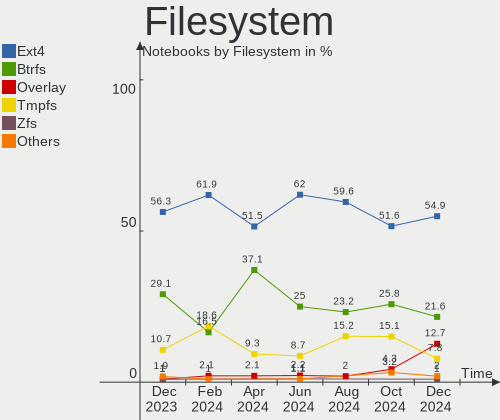
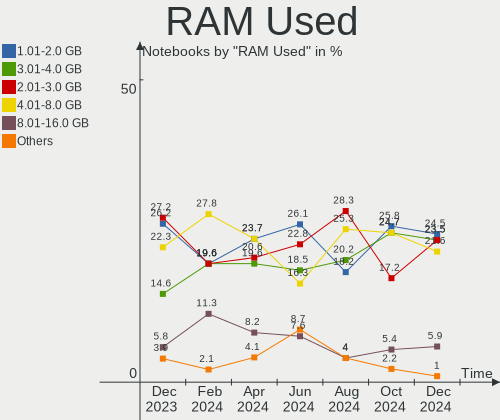
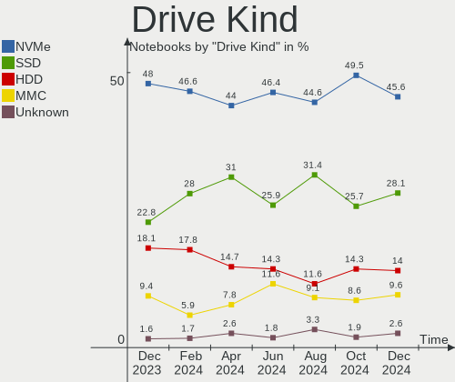
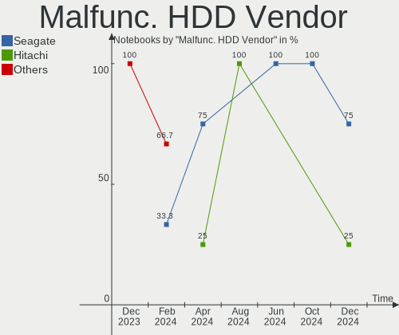
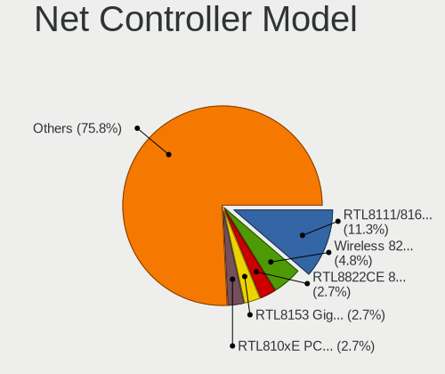

Linux in UK - Hardware Trends (Notebooks)
-----------------------------------------

A project to identify most popular hardware characteristics and track their change
over time based on data collected by Linux users at https://Linux-Hardware.org.

Anyone can contribute to this report by the [hw-probe](https://github.com/linuxhw/hw-probe) tool:

    sudo -E hw-probe -all -upload

Period: Feb, 2023.

Contents
--------

* [ System ](#system)
  - [ OS                       ](#os)
  - [ OS Family                ](#os-family)
  - [ Kernel                   ](#kernel)
  - [ Kernel Family            ](#kernel-family)
  - [ Kernel Major Ver.        ](#kernel-major-ver)
  - [ Arch                     ](#arch)
  - [ DE                       ](#de)
  - [ Display Server           ](#display-server)
  - [ Display Manager          ](#display-manager)
  - [ OS Lang                  ](#os-lang)
  - [ Boot Mode                ](#boot-mode)
  - [ Filesystem               ](#filesystem)
  - [ Part. scheme             ](#part-scheme)
  - [ Dual Boot with Linux/BSD ](#dual-boot-with-linuxbsd)
  - [ Dual Boot (Win)          ](#dual-boot-win)

* [ Board ](#board)
  - [ Vendor                   ](#vendor)
  - [ Model                    ](#model)
  - [ Model Family             ](#model-family)
  - [ MFG Year                 ](#mfg-year)
  - [ Form Factor              ](#form-factor)
  - [ Secure Boot              ](#secure-boot)
  - [ Coreboot                 ](#coreboot)
  - [ RAM Size                 ](#ram-size)
  - [ RAM Used                 ](#ram-used)
  - [ Total Drives             ](#total-drives)
  - [ Has CD-ROM               ](#has-cd-rom)
  - [ Has Ethernet             ](#has-ethernet)
  - [ Has WiFi                 ](#has-wifi)
  - [ Has Bluetooth            ](#has-bluetooth)

* [ Location ](#location)
  - [ Country                  ](#country)
  - [ City                     ](#city)

* [ Drives ](#drives)
  - [ Drive Vendor             ](#drive-vendor)
  - [ Drive Model              ](#drive-model)
  - [ HDD Vendor               ](#hdd-vendor)
  - [ SSD Vendor               ](#ssd-vendor)
  - [ Drive Kind               ](#drive-kind)
  - [ Drive Connector          ](#drive-connector)
  - [ Drive Size               ](#drive-size)
  - [ Space Total              ](#space-total)
  - [ Space Used               ](#space-used)
  - [ Malfunc. Drives          ](#malfunc-drives)
  - [ Malfunc. Drive Vendor    ](#malfunc-drive-vendor)
  - [ Malfunc. HDD Vendor      ](#malfunc-hdd-vendor)
  - [ Malfunc. Drive Kind      ](#malfunc-drive-kind)
  - [ Failed Drives            ](#failed-drives)
  - [ Failed Drive Vendor      ](#failed-drive-vendor)
  - [ Drive Status             ](#drive-status)

* [ Storage controller ](#storage-controller)
  - [ Storage Vendor           ](#storage-vendor)
  - [ Storage Model            ](#storage-model)
  - [ Storage Kind             ](#storage-kind)

* [ Processor ](#processor)
  - [ CPU Vendor               ](#cpu-vendor)
  - [ CPU Model                ](#cpu-model)
  - [ CPU Model Family         ](#cpu-model-family)
  - [ CPU Cores                ](#cpu-cores)
  - [ CPU Sockets              ](#cpu-sockets)
  - [ CPU Threads              ](#cpu-threads)
  - [ CPU Op-Modes             ](#cpu-op-modes)
  - [ CPU Microcode            ](#cpu-microcode)
  - [ CPU Microarch            ](#cpu-microarch)

* [ Graphics ](#graphics)
  - [ GPU Vendor               ](#gpu-vendor)
  - [ GPU Model                ](#gpu-model)
  - [ GPU Combo                ](#gpu-combo)
  - [ GPU Driver               ](#gpu-driver)
  - [ GPU Memory               ](#gpu-memory)

* [ Monitor ](#monitor)
  - [ Monitor Vendor           ](#monitor-vendor)
  - [ Monitor Model            ](#monitor-model)
  - [ Monitor Resolution       ](#monitor-resolution)
  - [ Monitor Diagonal         ](#monitor-diagonal)
  - [ Monitor Width            ](#monitor-width)
  - [ Aspect Ratio             ](#aspect-ratio)
  - [ Monitor Area             ](#monitor-area)
  - [ Pixel Density            ](#pixel-density)
  - [ Multiple Monitors        ](#multiple-monitors)

* [ Network ](#network)
  - [ Net Controller Vendor    ](#net-controller-vendor)
  - [ Net Controller Model     ](#net-controller-model)
  - [ Wireless Vendor          ](#wireless-vendor)
  - [ Wireless Model           ](#wireless-model)
  - [ Ethernet Vendor          ](#ethernet-vendor)
  - [ Ethernet Model           ](#ethernet-model)
  - [ Net Controller Kind      ](#net-controller-kind)
  - [ Used Controller          ](#used-controller)
  - [ NICs                     ](#nics)
  - [ IPv6                     ](#ipv6)

* [ Bluetooth ](#bluetooth)
  - [ Bluetooth Vendor         ](#bluetooth-vendor)
  - [ Bluetooth Model          ](#bluetooth-model)

* [ Sound ](#sound)
  - [ Sound Vendor             ](#sound-vendor)
  - [ Sound Model              ](#sound-model)

* [ Memory ](#memory)
  - [ Memory Vendor            ](#memory-vendor)
  - [ Memory Model             ](#memory-model)
  - [ Memory Kind              ](#memory-kind)
  - [ Memory Form Factor       ](#memory-form-factor)
  - [ Memory Size              ](#memory-size)
  - [ Memory Speed             ](#memory-speed)

* [ Printers & scanners ](#printers--scanners)
  - [ Printer Vendor           ](#printer-vendor)
  - [ Printer Model            ](#printer-model)
  - [ Scanner Vendor           ](#scanner-vendor)
  - [ Scanner Model            ](#scanner-model)

* [ Camera ](#camera)
  - [ Camera Vendor            ](#camera-vendor)
  - [ Camera Model             ](#camera-model)

* [ Security ](#security)
  - [ Fingerprint Vendor       ](#fingerprint-vendor)
  - [ Fingerprint Model        ](#fingerprint-model)
  - [ Chipcard Vendor          ](#chipcard-vendor)
  - [ Chipcard Model           ](#chipcard-model)

* [ Unsupported ](#unsupported)
  - [ Unsupported Devices      ](#unsupported-devices)
  - [ Unsupported Device Types ](#unsupported-device-types)

System
------

OS
--

Installed operating systems

| Name                  | Notebooks | Percent |
|-----------------------|-----------|---------|
| Ubuntu 22.04          | 22        | 22%     |
| Linux Mint 21.1       | 7         | 7%      |
| Debian 11             | 6         | 6%      |
| Zorin 16              | 5         | 5%      |
| Ubuntu 22.10          | 5         | 5%      |
| Pop!_OS 22.04         | 5         | 5%      |
| OpenMandriva 23.01    | 5         | 5%      |
| Fedora 37             | 5         | 5%      |
| Arch Rolling          | 5         | 5%      |
| KDE neon 22.04        | 4         | 4%      |
| Ubuntu 20.04          | 3         | 3%      |
| SteamOS 3.4.4         | 3         | 3%      |
| OpenMandriva 4.3      | 3         | 3%      |
| Kubuntu 22.04         | 2         | 2%      |
| Ubuntu Studio 22.10   | 1         | 1%      |
| Ubuntu Budgie 22.10   | 1         | 1%      |
| Ubuntu 18.04          | 1         | 1%      |
| Q4OS 4                | 1         | 1%      |
| PureOS 10.0           | 1         | 1%      |
| OpenMandriva 4.50     | 1         | 1%      |
| OpenMandriva 22.12    | 1         | 1%      |
| Nobara 37             | 1         | 1%      |
| MX 21                 | 1         | 1%      |
| Manjaro 22.0.4        | 1         | 1%      |
| Manjaro 22.0.3        | 1         | 1%      |
| Manjaro               | 1         | 1%      |
| Makulu Bld-2022.12.04 | 1         | 1%      |
| Linux Mint 20.3       | 1         | 1%      |
| Kubuntu 23.04         | 1         | 1%      |
| Kali 2022.4           | 1         | 1%      |
| Gentoo 2.13           | 1         | 1%      |
| EndeavourOS Rolling   | 1         | 1%      |
| Elementary 7          | 1         | 1%      |
| Elementary 6.1        | 1         | 1%      |

OS Family
---------

OS without a version

| Name          | Notebooks | Percent |
|---------------|-----------|---------|
| Ubuntu        | 31        | 31%     |
| OpenMandriva  | 10        | 10%     |
| Linux Mint    | 8         | 8%      |
| Debian        | 6         | 6%      |
| Zorin         | 5         | 5%      |
| Pop!_OS       | 5         | 5%      |
| Fedora        | 5         | 5%      |
| Arch          | 5         | 5%      |
| KDE neon      | 4         | 4%      |
| SteamOS       | 3         | 3%      |
| Manjaro       | 3         | 3%      |
| Kubuntu       | 3         | 3%      |
| Elementary    | 2         | 2%      |
| Ubuntu Studio | 1         | 1%      |
| Ubuntu Budgie | 1         | 1%      |
| Q4OS          | 1         | 1%      |
| PureOS        | 1         | 1%      |
| Nobara        | 1         | 1%      |
| MX            | 1         | 1%      |
| Makulu        | 1         | 1%      |
| Kali          | 1         | 1%      |
| Gentoo        | 1         | 1%      |
| EndeavourOS   | 1         | 1%      |

Kernel
------

Version of the Linux kernel

| Version                     | Notebooks | Percent |
|-----------------------------|-----------|---------|
| 5.15.0-58-generic           | 16        | 16%     |
| 5.15.0-60-generic           | 14        | 14%     |
| 5.19.0-32-generic           | 7         | 7%      |
| 5.10.0-21-amd64             | 7         | 7%      |
| 5.19.0-29-generic           | 5         | 5%      |
| 6.0.12-76060006-generic     | 4         | 4%      |
| 5.13.0-valve36-1-neptune    | 3         | 3%      |
| 6.1.9-arch1-1               | 2         | 2%      |
| 6.1.4-desktop-1omv2301      | 2         | 2%      |
| 6.1.1-desktop-1omv2290      | 2         | 2%      |
| 5.4.0-137-generic           | 2         | 2%      |
| 5.16.7-desktop-1omv4003     | 2         | 2%      |
| 5.15.0-43-generic           | 2         | 2%      |
| 6.1.9-zen1-1-zen            | 1         | 1%      |
| 6.1.9-arch1-2               | 1         | 1%      |
| 6.1.9-200.fsync.fc37.x86_64 | 1         | 1%      |
| 6.1.9-200.fc37.x86_64       | 1         | 1%      |
| 6.1.9-1-MANJARO             | 1         | 1%      |
| 6.1.4-desktop-gcc-1omv2301  | 1         | 1%      |
| 6.1.12-arch1-1              | 1         | 1%      |
| 6.1.12-200.fc37.x86_64      | 1         | 1%      |
| 6.1.12-1-MANJARO            | 1         | 1%      |
| 6.1.12-060112-generic       | 1         | 1%      |
| 6.1.11-gentoo-x86_64        | 1         | 1%      |
| 6.1.11-arch1-1              | 1         | 1%      |
| 6.1.11-76060111-generic     | 1         | 1%      |
| 6.1.11-200.fc37.x86_64      | 1         | 1%      |
| 6.1.10-200.fc37.x86_64      | 1         | 1%      |
| 6.1.0-kali5-amd64           | 1         | 1%      |
| 6.1.0-1006-oem              | 1         | 1%      |
| 6.0.7-301.fc37.x86_64       | 1         | 1%      |
| 6.0.10-desktop-2omv22090    | 1         | 1%      |
| 6.0.0-desktop-1omv4050      | 1         | 1%      |
| 6.0.0-6mx-amd64             | 1         | 1%      |
| 5.4.0-133-generic           | 1         | 1%      |
| 5.19.0-28-generic           | 1         | 1%      |
| 5.19.0-21-generic           | 1         | 1%      |
| 5.19.0-1007-lowlatency      | 1         | 1%      |
| 5.16.13-desktop-1omv4003    | 1         | 1%      |
| 5.15.94-1-MANJARO           | 1         | 1%      |

Kernel Family
-------------

Linux kernel without a distro release

| Version | Notebooks | Percent |
|---------|-----------|---------|
| 5.15.0  | 35        | 35%     |
| 5.19.0  | 15        | 15%     |
| 5.10.0  | 8         | 8%      |
| 6.1.9   | 7         | 7%      |
| 6.1.12  | 4         | 4%      |
| 6.1.11  | 4         | 4%      |
| 6.0.12  | 4         | 4%      |
| 5.13.0  | 4         | 4%      |
| 6.1.4   | 3         | 3%      |
| 5.4.0   | 3         | 3%      |
| 6.1.1   | 2         | 2%      |
| 6.1.0   | 2         | 2%      |
| 6.0.0   | 2         | 2%      |
| 5.16.7  | 2         | 2%      |
| 6.1.10  | 1         | 1%      |
| 6.0.7   | 1         | 1%      |
| 6.0.10  | 1         | 1%      |
| 5.16.13 | 1         | 1%      |
| 5.15.94 | 1         | 1%      |

Kernel Major Ver.
-----------------

Linux kernel major version

| Version | Notebooks | Percent |
|---------|-----------|---------|
| 5.15    | 36        | 36%     |
| 6.1     | 23        | 23%     |
| 5.19    | 15        | 15%     |
| 6.0     | 8         | 8%      |
| 5.10    | 8         | 8%      |
| 5.13    | 4         | 4%      |
| 5.4     | 3         | 3%      |
| 5.16    | 3         | 3%      |

Arch
----

OS architecture (x86_64, i586, etc.)

| Name   | Notebooks | Percent |
|--------|-----------|---------|
| x86_64 | 100       | 100%    |

DE
--

Desktop Environment

| Name       | Notebooks | Percent |
|------------|-----------|---------|
| GNOME      | 55        | 55%     |
| KDE5       | 28        | 28%     |
| X-Cinnamon | 7         | 7%      |
| XFCE       | 3         | 3%      |
| Pantheon   | 2         | 2%      |
| Trinity    | 1         | 1%      |
| LXDE       | 1         | 1%      |
| i3         | 1         | 1%      |
| Cinnamon   | 1         | 1%      |
| Budgie     | 1         | 1%      |

Display Server
--------------

X11 or Wayland

| Name    | Notebooks | Percent |
|---------|-----------|---------|
| X11     | 62        | 62%     |
| Wayland | 37        | 37%     |
| Unknown | 1         | 1%      |

Display Manager
---------------

SDDM, LightDM, etc.

| Name    | Notebooks | Percent |
|---------|-----------|---------|
| GDM3    | 31        | 31%     |
| Unknown | 30        | 30%     |
| SDDM    | 17        | 17%     |
| LightDM | 10        | 10%     |
| GDM     | 10        | 10%     |
| TDM     | 1         | 1%      |
| LXDM    | 1         | 1%      |

OS Lang
-------

Language

| Lang  | Notebooks | Percent |
|-------|-----------|---------|
| en_GB | 85        | 85%     |
| en_US | 13        | 13%     |
| fr_FR | 2         | 2%      |

Boot Mode
---------

EFI or BIOS

| Mode | Notebooks | Percent |
|------|-----------|---------|
| BIOS | 51        | 51%     |
| EFI  | 49        | 49%     |

Filesystem
----------

Type of filesystem

| Type    | Notebooks | Percent |
|---------|-----------|---------|
| Ext4    | 87        | 87%     |
| Btrfs   | 9         | 9%      |
| Zfs     | 1         | 1%      |
| Xfs     | 1         | 1%      |
| Overlay | 1         | 1%      |
| F2fs    | 1         | 1%      |

Part. scheme
------------

Scheme of partitioning

| Type    | Notebooks | Percent |
|---------|-----------|---------|
| GPT     | 59        | 59%     |
| Unknown | 28        | 28%     |
| MBR     | 13        | 13%     |

Dual Boot with Linux/BSD
------------------------

Hosting more than one Linux/BSD

| Dual boot | Notebooks | Percent |
|-----------|-----------|---------|
| No        | 91        | 91%     |
| Yes       | 9         | 9%      |

Dual Boot (Win)
---------------

Hosting Linux and Windows

| Dual boot | Notebooks | Percent |
|-----------|-----------|---------|
| No        | 70        | 70%     |
| Yes       | 30        | 30%     |

Board
-----

Vendor
------

Motherboard manufacturer

| Name                | Notebooks | Percent |
|---------------------|-----------|---------|
| Lenovo              | 21        | 21%     |
| Dell                | 16        | 16%     |
| Hewlett-Packard     | 13        | 13%     |
| Acer                | 9         | 9%      |
| ASUSTek Computer    | 7         | 7%      |
| Apple               | 5         | 5%      |
| HUAWEI              | 4         | 4%      |
| Valve               | 3         | 3%      |
| Toshiba             | 3         | 3%      |
| PC Specialist       | 2         | 2%      |
| MSI                 | 2         | 2%      |
| Google              | 2         | 2%      |
| GEO                 | 2         | 2%      |
| Star Labs           | 1         | 1%      |
| Sony                | 1         | 1%      |
| Samsung Electronics | 1         | 1%      |
| Panasonic           | 1         | 1%      |
| Novatech            | 1         | 1%      |
| Notebook            | 1         | 1%      |
| Linx                | 1         | 1%      |
| Framework           | 1         | 1%      |
| AZW                 | 1         | 1%      |
| Alienware           | 1         | 1%      |
| Unknown             | 1         | 1%      |

Model
-----

Motherboard model

| Name                                  | Notebooks | Percent |
|---------------------------------------|-----------|---------|
| Valve Jupiter                         | 3         | 3%      |
| HUAWEI NBD-WXX9                       | 2         | 2%      |
| HP Pavilion g6                        | 2         | 2%      |
| HP Notebook                           | 2         | 2%      |
| Toshiba Satellite Pro C850-10N        | 1         | 1%      |
| Toshiba Satellite L50D-B              | 1         | 1%      |
| Toshiba Satellite C850-1GF            | 1         | 1%      |
| Star Labs StarBook                    | 1         | 1%      |
| Sony SVF1521Q1EW                      | 1         | 1%      |
| Samsung 530U3BI/530U4BI/530U4BH       | 1         | 1%      |
| PC Specialist PD5x_7xPNP_PNN_PNT      | 1         | 1%      |
| PC Specialist NJ50_70CU               | 1         | 1%      |
| Panasonic CF-31WEUEEBE                | 1         | 1%      |
| Novatech NL40_50CU                    | 1         | 1%      |
| Notebook NL5xNU                       | 1         | 1%      |
| MSI Modern 14 B10MW                   | 1         | 1%      |
| MSI GS66 Stealth 10SF                 | 1         | 1%      |
| Linx LINX1010B                        | 1         | 1%      |
| Lenovo Yoga Slim 7 ProX 14ARH7 82TL   | 1         | 1%      |
| Lenovo V15-ADA 82C7                   | 1         | 1%      |
| Lenovo V14 G2 ALC 82KC                | 1         | 1%      |
| Lenovo ThinkPad X280 20KEA0VCUK       | 1         | 1%      |
| Lenovo ThinkPad X240 20AMS1FW00       | 1         | 1%      |
| Lenovo ThinkPad X230 2325EJ0          | 1         | 1%      |
| Lenovo ThinkPad T470s 20HF0000UK      | 1         | 1%      |
| Lenovo ThinkPad T450 20BUA0PNUK       | 1         | 1%      |
| Lenovo ThinkPad T440p 20AWS38H0G      | 1         | 1%      |
| Lenovo ThinkPad T430s 23551M9         | 1         | 1%      |
| Lenovo ThinkPad T430 2349UXH          | 1         | 1%      |
| Lenovo ThinkPad T420 4236KU9          | 1         | 1%      |
| Lenovo ThinkPad S1 Yoga 12 20DLS00J00 | 1         | 1%      |
| Lenovo ThinkPad L560 20F2S0DA00       | 1         | 1%      |
| Lenovo ThinkPad L15 Gen 3 21C7CTO1WW  | 1         | 1%      |
| Lenovo ThinkPad E555 20DH000TUK       | 1         | 1%      |
| Lenovo ThinkBook 14-IIL 20SL          | 1         | 1%      |
| Lenovo IdeaPad Z580                   | 1         | 1%      |
| Lenovo IdeaPad 5 14IAL7 82SD          | 1         | 1%      |
| Lenovo IdeaPad 305-15IBD 80NJ         | 1         | 1%      |
| Lenovo B50-30 80ES                    | 1         | 1%      |
| HUAWEI NBLK-WAX9X                     | 1         | 1%      |

Model Family
------------

Motherboard model prefix

| Name                   | Notebooks | Percent |
|------------------------|-----------|---------|
| Lenovo ThinkPad        | 13        | 13%     |
| Dell Latitude          | 9         | 9%      |
| Acer Aspire            | 6         | 6%      |
| ASUS ROG               | 4         | 4%      |
| Valve Jupiter          | 3         | 3%      |
| Toshiba Satellite      | 3         | 3%      |
| Lenovo IdeaPad         | 3         | 3%      |
| HP Pavilion            | 3         | 3%      |
| HP Laptop              | 3         | 3%      |
| Dell XPS               | 3         | 3%      |
| Dell Inspiron          | 3         | 3%      |
| HUAWEI NBD-WXX9        | 2         | 2%      |
| HP Notebook            | 2         | 2%      |
| HP EliteBook           | 2         | 2%      |
| GEO GeoBook            | 2         | 2%      |
| Acer TravelMate        | 2         | 2%      |
| Star Labs StarBook     | 1         | 1%      |
| Sony SVF1521Q1EW       | 1         | 1%      |
| Samsung 530U3BI        | 1         | 1%      |
| PC Specialist PD5x     | 1         | 1%      |
| PC Specialist NJ50     | 1         | 1%      |
| Panasonic CF-31WEUEEBE | 1         | 1%      |
| Novatech NL40          | 1         | 1%      |
| Notebook NL5xNU        | 1         | 1%      |
| MSI Modern             | 1         | 1%      |
| MSI GS66               | 1         | 1%      |
| Linx LINX1010B         | 1         | 1%      |
| Lenovo Yoga            | 1         | 1%      |
| Lenovo V15-ADA         | 1         | 1%      |
| Lenovo V14             | 1         | 1%      |
| Lenovo ThinkBook       | 1         | 1%      |
| Lenovo B50-30          | 1         | 1%      |
| HUAWEI NBLK-WAX9X      | 1         | 1%      |
| HUAWEI MateBook        | 1         | 1%      |
| HP Stream              | 1         | 1%      |
| HP G62                 | 1         | 1%      |
| HP 250                 | 1         | 1%      |
| Google Samus           | 1         | 1%      |
| Google Droid           | 1         | 1%      |
| Framework Laptop       | 1         | 1%      |

MFG Year
--------

Motherboard manufacture year

| Year | Notebooks | Percent |
|------|-----------|---------|
| 2022 | 12        | 12%     |
| 2020 | 12        | 12%     |
| 2014 | 11        | 11%     |
| 2012 | 11        | 11%     |
| 2019 | 10        | 10%     |
| 2021 | 8         | 8%      |
| 2015 | 8         | 8%      |
| 2018 | 5         | 5%      |
| 2016 | 4         | 4%      |
| 2013 | 4         | 4%      |
| 2011 | 4         | 4%      |
| 2017 | 3         | 3%      |
| 2010 | 3         | 3%      |
| 2023 | 2         | 2%      |
| 2009 | 1         | 1%      |
| 2008 | 1         | 1%      |
| 2007 | 1         | 1%      |

Form Factor
-----------

Physical design of the computer

| Name     | Notebooks | Percent |
|----------|-----------|---------|
| Notebook | 100       | 100%    |

Secure Boot
-----------

Enabled or disabled

| State    | Notebooks | Percent |
|----------|-----------|---------|
| Disabled | 96        | 96%     |
| Enabled  | 4         | 4%      |

Coreboot
--------

Have coreboot on board

| Used | Notebooks | Percent |
|------|-----------|---------|
| No   | 97        | 97%     |
| Yes  | 3         | 3%      |

RAM Size
--------

Total RAM memory

| Size in GB  | Notebooks | Percent |
|-------------|-----------|---------|
| 4.01-8.0    | 37        | 37%     |
| 16.01-24.0  | 17        | 17%     |
| 8.01-16.0   | 17        | 17%     |
| 3.01-4.0    | 13        | 13%     |
| 32.01-64.0  | 8         | 8%      |
| 64.01-256.0 | 4         | 4%      |
| 1.01-2.0    | 3         | 3%      |
| 2.01-3.0    | 1         | 1%      |

RAM Used
--------

Used RAM memory

| Used GB    | Notebooks | Percent |
|------------|-----------|---------|
| 1.01-2.0   | 34        | 34%     |
| 2.01-3.0   | 24        | 24%     |
| 4.01-8.0   | 17        | 17%     |
| 3.01-4.0   | 17        | 17%     |
| 8.01-16.0  | 6         | 6%      |
| 16.01-24.0 | 1         | 1%      |
| 0.51-1.0   | 1         | 1%      |

Total Drives
------------

Number of drives on board

| Drives | Notebooks | Percent |
|--------|-----------|---------|
| 1      | 71        | 71%     |
| 2      | 25        | 25%     |
| 0      | 2         | 2%      |
| 4      | 1         | 1%      |
| 3      | 1         | 1%      |

Has CD-ROM
----------

Has CD-ROM on board

| Presented | Notebooks | Percent |
|-----------|-----------|---------|
| No        | 68        | 68%     |
| Yes       | 32        | 32%     |

Has Ethernet
------------

Has Ethernet on board

| Presented | Notebooks | Percent |
|-----------|-----------|---------|
| Yes       | 73        | 73%     |
| No        | 27        | 27%     |

Has WiFi
--------

Has WiFi module

| Presented | Notebooks | Percent |
|-----------|-----------|---------|
| Yes       | 99        | 99%     |
| No        | 1         | 1%      |

Has Bluetooth
-------------

Has Bluetooth module

| Presented | Notebooks | Percent |
|-----------|-----------|---------|
| Yes       | 80        | 80%     |
| No        | 20        | 20%     |

Location
--------

Country
-------

Geographic location (country)

| Country | Notebooks | Percent |
|---------|-----------|---------|
| UK      | 100       | 100%    |

City
----

Geographic location (city)

| City               | Notebooks | Percent |
|--------------------|-----------|---------|
| London             | 11        | 11%     |
| Plymouth           | 3         | 3%      |
| Manchester         | 3         | 3%      |
| Uttoxeter          | 2         | 2%      |
| Sunderland         | 2         | 2%      |
| Portsmouth         | 2         | 2%      |
| Milton Keynes      | 2         | 2%      |
| Liverpool          | 2         | 2%      |
| Glasgow            | 2         | 2%      |
| Bradford           | 2         | 2%      |
| Wolverhampton      | 1         | 1%      |
| Welwyn Garden City | 1         | 1%      |
| Walthamstow        | 1         | 1%      |
| Walsall            | 1         | 1%      |
| Wallsend           | 1         | 1%      |
| Wallasey           | 1         | 1%      |
| Uxbridge           | 1         | 1%      |
| Twickenham         | 1         | 1%      |
| Trent              | 1         | 1%      |
| Torquay            | 1         | 1%      |
| Tonyrefail         | 1         | 1%      |
| Telford            | 1         | 1%      |
| Tamworth           | 1         | 1%      |
| Swindon            | 1         | 1%      |
| Swansea            | 1         | 1%      |
| Sutton in Ashfield | 1         | 1%      |
| St Helens          | 1         | 1%      |
| St Albans          | 1         | 1%      |
| Southampton        | 1         | 1%      |
| Shefford           | 1         | 1%      |
| Sheffield          | 1         | 1%      |
| Sandy              | 1         | 1%      |
| Ramsgate           | 1         | 1%      |
| Preston            | 1         | 1%      |
| Oxford             | 1         | 1%      |
| Orpington          | 1         | 1%      |
| Nuneaton           | 1         | 1%      |
| Nottingham         | 1         | 1%      |
| Northolt           | 1         | 1%      |
| Northborough       | 1         | 1%      |

Drives
------

Drive Vendor
------------

Hard drive vendors

| Vendor                      | Notebooks | Drives | Percent |
|-----------------------------|-----------|--------|---------|
| Samsung Electronics         | 18        | 18     | 15%     |
| Unknown                     | 11        | 13     | 9.17%   |
| WDC                         | 10        | 10     | 8.33%   |
| Toshiba                     | 9         | 9      | 7.5%    |
| Crucial                     | 9         | 9      | 7.5%    |
| Seagate                     | 7         | 7      | 5.83%   |
| SanDisk                     | 7         | 7      | 5.83%   |
| Micron Technology           | 5         | 5      | 4.17%   |
| Kingston                    | 4         | 4      | 3.33%   |
| SK hynix                    | 3         | 3      | 2.5%    |
| Silicon Motion              | 3         | 3      | 2.5%    |
| Intel                       | 3         | 4      | 2.5%    |
| Apple                       | 3         | 5      | 2.5%    |
| Unknown                     | 3         | 3      | 2.5%    |
| PNY                         | 2         | 2      | 1.67%   |
| Kingston Technology Company | 2         | 2      | 1.67%   |
| Hitachi                     | 2         | 2      | 1.67%   |
| HGST                        | 2         | 2      | 1.67%   |
| China                       | 2         | 2      | 1.67%   |
| A-DATA Technology           | 2         | 2      | 1.67%   |
| XUM                         | 1         | 1      | 0.83%   |
| UMIS                        | 1         | 1      | 0.83%   |
| Transcend                   | 1         | 1      | 0.83%   |
| TCSUNBOW                    | 1         | 1      | 0.83%   |
| Star Drive                  | 1         | 1      | 0.83%   |
| SPCC                        | 1         | 1      | 0.83%   |
| SABRENT                     | 1         | 1      | 0.83%   |
| Realtek                     | 1         | 1      | 0.83%   |
| Phison                      | 1         | 1      | 0.83%   |
| Lite-On Technology          | 1         | 1      | 0.83%   |
| KIOXIA-EXCERIA              | 1         | 1      | 0.83%   |
| GOODRAM                     | 1         | 1      | 0.83%   |
| BHT                         | 1         | 1      | 0.83%   |

Drive Model
-----------

Hard drive models

| Model                                                 | Notebooks | Percent |
|-------------------------------------------------------|-----------|---------|
| Unknown MMC Card  64GB                                | 4         | 3.25%   |
| Toshiba MQ01ABD100 1TB                                | 4         | 3.25%   |
| Unknown                                               | 3         | 2.44%   |
| Unknown MMC Card  16GB                                | 2         | 1.63%   |
| Kingston Company OM3PDP3 NVMe SSD 512GB               | 2         | 1.63%   |
| Crucial CT1000MX500SSD1 1TB                           | 2         | 1.63%   |
| Apple S3X NVMe Controller 1TB                         | 2         | 1.63%   |
| XUM HX256GSSDSATA3 256GB                              | 1         | 0.81%   |
| WDC WDS500G2B0A-00SM50 500GB SSD                      | 1         | 0.81%   |
| WDC WDS250G2B0A 250GB SSD                             | 1         | 0.81%   |
| WDC WDS200T2B0C-00PXH0 2TB                            | 1         | 0.81%   |
| WDC WDS100T2B0B-00YS70 1TB SSD                        | 1         | 0.81%   |
| WDC WDS100T1X0E-00AFY0 1TB                            | 1         | 0.81%   |
| WDC WD5000LPVX-28V0TT0 500GB                          | 1         | 0.81%   |
| WDC WD3200BEVT-22ZCT0 320GB                           | 1         | 0.81%   |
| WDC WD Green M.2 2280 480GB                           | 1         | 0.81%   |
| WDC PC SN530 NVMe 256GB                               | 1         | 0.81%   |
| WDC PC SN520 SDAPNUW-128G-1006 128GB                  | 1         | 0.81%   |
| Unknown SD/MMC/MS PRO 16GB                            | 1         | 0.81%   |
| Unknown NVMe SSD Drive 1TB                            | 1         | 0.81%   |
| Unknown N/A  32GB                                     | 1         | 0.81%   |
| Unknown MMC Card  32GB                                | 1         | 0.81%   |
| Unknown MMC Card  256GB                               | 1         | 0.81%   |
| Unknown MMC Card  128GB                               | 1         | 0.81%   |
| Unknown 032G72  32GB                                  | 1         | 0.81%   |
| UMIS RPJTJ256MEE1OWX 256GB                            | 1         | 0.81%   |
| Transcend TS128GMTS800 128GB SSD                      | 1         | 0.81%   |
| Toshiba XG4 NVMe SSD Controller 512GB                 | 1         | 0.81%   |
| Toshiba MQ02ABF050H 500GB                             | 1         | 0.81%   |
| Toshiba MQ01ABD032 320GB                              | 1         | 0.81%   |
| Toshiba MK1656GSY 160GB                               | 1         | 0.81%   |
| Toshiba KBG40ZNT256G MEMORY 256GB                     | 1         | 0.81%   |
| TCSUNBOW X3 480GB                                     | 1         | 0.81%   |
| Star Drive PCIe SSD 480GB                             | 1         | 0.81%   |
| SPCC Solid State Disk 256GB                           | 1         | 0.81%   |
| SK hynix PC801 NVMe 512GB                             | 1         | 0.81%   |
| SK hynix PC801 NVMe 1TB                               | 1         | 0.81%   |
| SK hynix BC501 NVMe 256GB                             | 1         | 0.81%   |
| Silicon Motion SM2263EN/SM2263XT SSD Controller 512GB | 1         | 0.81%   |
| Silicon Motion PCIe-8 SSD 256GB                       | 1         | 0.81%   |

HDD Vendor
----------

Hard disk drive vendors

| Vendor              | Notebooks | Drives | Percent |
|---------------------|-----------|--------|---------|
| Toshiba             | 7         | 7      | 30.43%  |
| Seagate             | 7         | 7      | 30.43%  |
| WDC                 | 2         | 2      | 8.7%    |
| Hitachi             | 2         | 2      | 8.7%    |
| HGST                | 2         | 2      | 8.7%    |
| Unknown             | 1         | 1      | 4.35%   |
| Samsung Electronics | 1         | 1      | 4.35%   |
| SABRENT             | 1         | 1      | 4.35%   |

SSD Vendor
----------

Solid state drive vendors

| Vendor              | Notebooks | Drives | Percent |
|---------------------|-----------|--------|---------|
| Crucial             | 7         | 7      | 17.5%   |
| Samsung Electronics | 6         | 6      | 15%     |
| SanDisk             | 4         | 4      | 10%     |
| WDC                 | 3         | 3      | 7.5%    |
| Kingston            | 3         | 3      | 7.5%    |
| PNY                 | 2         | 2      | 5%      |
| Micron Technology   | 2         | 2      | 5%      |
| China               | 2         | 2      | 5%      |
| A-DATA Technology   | 2         | 2      | 5%      |
| XUM                 | 1         | 1      | 2.5%    |
| Transcend           | 1         | 1      | 2.5%    |
| TCSUNBOW            | 1         | 1      | 2.5%    |
| SPCC                | 1         | 1      | 2.5%    |
| KIOXIA-EXCERIA      | 1         | 1      | 2.5%    |
| Intel               | 1         | 1      | 2.5%    |
| GOODRAM             | 1         | 1      | 2.5%    |
| BHT                 | 1         | 1      | 2.5%    |
| Apple               | 1         | 1      | 2.5%    |

Drive Kind
----------

HDD or SSD

| Kind    | Notebooks | Drives | Percent |
|---------|-----------|--------|---------|
| NVMe    | 40        | 46     | 34.48%  |
| SSD     | 38        | 40     | 32.76%  |
| HDD     | 23        | 23     | 19.83%  |
| MMC     | 14        | 15     | 12.07%  |
| Unknown | 1         | 1      | 0.86%   |

Drive Connector
---------------

SATA, SAS, NVMe, etc.

| Type | Notebooks | Drives | Percent |
|------|-----------|--------|---------|
| SATA | 58        | 62     | 50.43%  |
| NVMe | 40        | 45     | 34.78%  |
| MMC  | 14        | 15     | 12.17%  |
| SAS  | 3         | 3      | 2.61%   |

Drive Size
----------

Size of hard drive

| Size in TB | Notebooks | Drives | Percent |
|------------|-----------|--------|---------|
| 0.01-0.5   | 42        | 46     | 72.41%  |
| 0.51-1.0   | 13        | 14     | 22.41%  |
| 1.01-2.0   | 2         | 2      | 3.45%   |
| 3.01-4.0   | 1         | 1      | 1.72%   |

Space Total
-----------

Amount of disk space available on the file system

| Size in GB     | Notebooks | Percent |
|----------------|-----------|---------|
| 251-500        | 28        | 28%     |
| 101-250        | 26        | 26%     |
| 501-1000       | 21        | 21%     |
| 1001-2000      | 6         | 6%      |
| 21-50          | 5         | 5%      |
| 1-20           | 5         | 5%      |
| More than 3000 | 3         | 3%      |
| 51-100         | 3         | 3%      |
| Unknown        | 2         | 2%      |
| 2001-3000      | 1         | 1%      |

Space Used
----------

Amount of used disk space

| Used GB        | Notebooks | Percent |
|----------------|-----------|---------|
| 1-20           | 37        | 37%     |
| 21-50          | 23        | 23%     |
| 251-500        | 12        | 12%     |
| 101-250        | 11        | 11%     |
| 51-100         | 7         | 7%      |
| 501-1000       | 4         | 4%      |
| 1001-2000      | 2         | 2%      |
| Unknown        | 2         | 2%      |
| More than 3000 | 1         | 1%      |
| 2001-3000      | 1         | 1%      |

Malfunc. Drives
---------------

Drive models with a malfunction

| Model                             | Notebooks | Drives | Percent |
|-----------------------------------|-----------|--------|---------|
| Toshiba MK1656GSY 160GB           | 1         | 1      | 20%     |
| Seagate ST9320423AS 320GB         | 1         | 1      | 20%     |
| Seagate ST500LM021-1KJ152 500GB   | 1         | 1      | 20%     |
| Samsung Electronics HM501II 500GB | 1         | 1      | 20%     |
| Intel SSDSC2BF180A5L 180GB        | 1         | 1      | 20%     |

Malfunc. Drive Vendor
---------------------

Vendors of faulty drives

| Vendor              | Notebooks | Drives | Percent |
|---------------------|-----------|--------|---------|
| Seagate             | 2         | 2      | 40%     |
| Toshiba             | 1         | 1      | 20%     |
| Samsung Electronics | 1         | 1      | 20%     |
| Intel               | 1         | 1      | 20%     |

Malfunc. HDD Vendor
-------------------

Vendors of faulty HDD drives

| Vendor              | Notebooks | Drives | Percent |
|---------------------|-----------|--------|---------|
| Seagate             | 2         | 2      | 50%     |
| Toshiba             | 1         | 1      | 25%     |
| Samsung Electronics | 1         | 1      | 25%     |

Malfunc. Drive Kind
-------------------

Kinds of faulty drives

| Kind | Notebooks | Drives | Percent |
|------|-----------|--------|---------|
| HDD  | 4         | 4      | 80%     |
| SSD  | 1         | 1      | 20%     |

Failed Drives
-------------

Failed drive models

Zero info for selected period =(

Failed Drive Vendor
-------------------

Failed drive vendors

Zero info for selected period =(

Drive Status
------------

Number of failed and malfunc. drives

| Status   | Notebooks | Drives | Percent |
|----------|-----------|--------|---------|
| Detected | 61        | 76     | 59.22%  |
| Works    | 37        | 44     | 35.92%  |
| Malfunc  | 5         | 5      | 4.85%   |

Storage controller
------------------

Storage Vendor
--------------

Storage controller vendors

| Vendor                       | Notebooks | Percent |
|------------------------------|-----------|---------|
| Intel                        | 59        | 52.68%  |
| AMD                          | 12        | 10.71%  |
| Samsung Electronics          | 10        | 8.93%   |
| SanDisk                      | 7         | 6.25%   |
| SK hynix                     | 3         | 2.68%   |
| Silicon Motion               | 3         | 2.68%   |
| Micron Technology            | 3         | 2.68%   |
| Kingston Technology Company  | 3         | 2.68%   |
| Phison Electronics           | 2         | 1.79%   |
| Micron/Crucial Technology    | 2         | 1.79%   |
| Apple                        | 2         | 1.79%   |
| Union Memory (Shenzhen)      | 1         | 0.89%   |
| Toshiba America Info Systems | 1         | 0.89%   |
| Nvidia                       | 1         | 0.89%   |
| Lite-On Technology           | 1         | 0.89%   |
| KIOXIA                       | 1         | 0.89%   |
| Unknown                      | 1         | 0.89%   |

Storage Model
-------------

Storage controller models

| Model                                                                        | Notebooks | Percent |
|------------------------------------------------------------------------------|-----------|---------|
| AMD FCH SATA Controller [AHCI mode]                                          | 12        | 10.17%  |
| Intel 7 Series Chipset Family 6-port SATA Controller [AHCI mode]             | 11        | 9.32%   |
| Intel 82801 Mobile SATA Controller [RAID mode]                               | 8         | 6.78%   |
| Intel Volume Management Device NVMe RAID Controller                          | 5         | 4.24%   |
| Intel 8 Series SATA Controller 1 [AHCI mode]                                 | 5         | 4.24%   |
| Intel 6 Series/C200 Series Chipset Family 6 port Mobile SATA AHCI Controller | 5         | 4.24%   |
| Samsung NVMe SSD Controller SM981/PM981/PM983                                | 4         | 3.39%   |
| Intel Wildcat Point-LP SATA Controller [AHCI Mode]                           | 4         | 3.39%   |
| SanDisk Non-Volatile memory controller                                       | 3         | 2.54%   |
| Micron Non-Volatile memory controller                                        | 3         | 2.54%   |
| Kingston Company OM3PDP3 NVMe SSD                                            | 3         | 2.54%   |
| Intel Sunrise Point-LP SATA Controller [AHCI mode]                           | 3         | 2.54%   |
| Intel Comet Lake SATA AHCI Controller                                        | 3         | 2.54%   |
| SK hynix Platinum P41 NVMe Solid State Drive 2TB                             | 2         | 1.69%   |
| Silicon Motion SM2263EN/SM2263XT SSD Controller                              | 2         | 1.69%   |
| SanDisk WD Blue SN500 / PC SN520 NVMe SSD                                    | 2         | 1.69%   |
| Samsung NVMe SSD Controller PM9A1/PM9A3/980PRO                               | 2         | 1.69%   |
| Samsung NVMe SSD Controller 980                                              | 2         | 1.69%   |
| Intel Non-Volatile memory controller                                         | 2         | 1.69%   |
| Intel 82801HM/HEM (ICH8M/ICH8M-E) IDE Controller                             | 2         | 1.69%   |
| Intel 5 Series/3400 Series Chipset 4 port SATA AHCI Controller               | 2         | 1.69%   |
| Apple S3X NVMe Controller                                                    | 2         | 1.69%   |
| Union Memory (Shenzhen) Non-Volatile memory controller                       | 1         | 0.85%   |
| Toshiba America Info Systems XG4 NVMe SSD Controller                         | 1         | 0.85%   |
| SK hynix BC501 NVMe Solid State Drive                                        | 1         | 0.85%   |
| Silicon Motion Non-Volatile memory controller                                | 1         | 0.85%   |
| SanDisk WD PC SN810 / Black SN850 NVMe SSD                                   | 1         | 0.85%   |
| SanDisk WD Blue SN550 NVMe SSD                                               | 1         | 0.85%   |
| Samsung NVMe SSD Controller SM961/PM961/SM963                                | 1         | 0.85%   |
| Samsung NVMe SSD Controller PM9B1                                            | 1         | 0.85%   |
| Phison E18 PCIe4 NVMe Controller                                             | 1         | 0.85%   |
| Phison E12 NVMe Controller                                                   | 1         | 0.85%   |
| Nvidia MCP79 AHCI Controller                                                 | 1         | 0.85%   |
| Micron/Crucial P2 NVMe PCIe SSD                                              | 1         | 0.85%   |
| Micron/Crucial NVMe Controller                                               | 1         | 0.85%   |
| Lite-On Non-Volatile memory controller                                       | 1         | 0.85%   |
| KIOXIA NVMe SSD Controller BG4                                               | 1         | 0.85%   |
| Intel Tiger Lake-LP SATA Controller                                          | 1         | 0.85%   |
| Intel Ice Lake-LP SATA Controller [AHCI mode]                                | 1         | 0.85%   |
| Intel HM170/QM170 Chipset SATA Controller [AHCI Mode]                        | 1         | 0.85%   |

Storage Kind
------------

Kind of storage controller (IDE, SATA, NVMe, SAS, ...)

| Kind | Notebooks | Percent |
|------|-----------|---------|
| SATA | 58        | 50.88%  |
| NVMe | 40        | 35.09%  |
| RAID | 13        | 11.4%   |
| IDE  | 3         | 2.63%   |

Processor
---------

CPU Vendor
----------

Processor vendors

| Vendor | Notebooks | Percent |
|--------|-----------|---------|
| Intel  | 79        | 79%     |
| AMD    | 21        | 21%     |

CPU Model
---------

Processor models

| Model                                    | Notebooks | Percent |
|------------------------------------------|-----------|---------|
| Intel Core i5-3320M CPU @ 2.60GHz        | 3         | 3%      |
| Intel Core i5-10210U CPU @ 1.60GHz       | 3         | 3%      |
| AMD Custom APU 0405                      | 3         | 3%      |
| Intel Core i7-3540M CPU @ 3.00GHz        | 2         | 2%      |
| Intel Core i5-7200U CPU @ 2.50GHz        | 2         | 2%      |
| Intel Core i5-5300U CPU @ 2.30GHz        | 2         | 2%      |
| Intel Core i5-4210U CPU @ 1.70GHz        | 2         | 2%      |
| Intel Core i5-1035G1 CPU @ 1.00GHz       | 2         | 2%      |
| Intel 12th Gen Core i7-12700H            | 2         | 2%      |
| Intel 12th Gen Core i7-1260P             | 2         | 2%      |
| Intel 11th Gen Core i3-1115G4 @ 3.00GHz  | 2         | 2%      |
| Intel Pentium Silver N5030 CPU @ 1.10GHz | 1         | 1%      |
| Intel Pentium CPU N4200 @ 1.10GHz        | 1         | 1%      |
| Intel Pentium CPU N3700 @ 1.60GHz        | 1         | 1%      |
| Intel Pentium CPU 4417U @ 2.30GHz        | 1         | 1%      |
| Intel Core i7-9750H CPU @ 2.60GHz        | 1         | 1%      |
| Intel Core i7-8565U CPU @ 1.80GHz        | 1         | 1%      |
| Intel Core i7-7660U CPU @ 2.50GHz        | 1         | 1%      |
| Intel Core i7-7500U CPU @ 2.70GHz        | 1         | 1%      |
| Intel Core i7-6700HQ CPU @ 2.60GHz       | 1         | 1%      |
| Intel Core i7-6600U CPU @ 2.60GHz        | 1         | 1%      |
| Intel Core i7-5600U CPU @ 2.60GHz        | 1         | 1%      |
| Intel Core i7-5500U CPU @ 2.40GHz        | 1         | 1%      |
| Intel Core i7-4510U CPU @ 2.00GHz        | 1         | 1%      |
| Intel Core i7-3840QM CPU @ 2.80GHz       | 1         | 1%      |
| Intel Core i7-3612QM CPU @ 2.10GHz       | 1         | 1%      |
| Intel Core i7-3610QM CPU @ 2.30GHz       | 1         | 1%      |
| Intel Core i7-10850H CPU @ 2.70GHz       | 1         | 1%      |
| Intel Core i7-10750H CPU @ 2.60GHz       | 1         | 1%      |
| Intel Core i7-10510U CPU @ 1.80GHz       | 1         | 1%      |
| Intel Core i7 CPU M 640 @ 2.80GHz        | 1         | 1%      |
| Intel Core i5-8350U CPU @ 1.70GHz        | 1         | 1%      |
| Intel Core i5-8279U CPU @ 2.40GHz        | 1         | 1%      |
| Intel Core i5-6360U CPU @ 2.00GHz        | 1         | 1%      |
| Intel Core i5-6200U CPU @ 2.30GHz        | 1         | 1%      |
| Intel Core i5-4300U CPU @ 1.90GHz        | 1         | 1%      |
| Intel Core i5-4300M CPU @ 2.60GHz        | 1         | 1%      |
| Intel Core i5-4258U CPU @ 2.40GHz        | 1         | 1%      |
| Intel Core i5-4210M CPU @ 2.60GHz        | 1         | 1%      |
| Intel Core i5-3340M CPU @ 2.70GHz        | 1         | 1%      |

CPU Model Family
----------------

Processor model prefix

| Model                | Notebooks | Percent |
|----------------------|-----------|---------|
| Intel Core i5        | 28        | 28%     |
| Intel Core i7        | 18        | 18%     |
| Other                | 15        | 15%     |
| Intel Core i3        | 8         | 8%      |
| Intel Celeron        | 5         | 5%      |
| Intel Pentium        | 3         | 3%      |
| Intel Core 2 Duo     | 3         | 3%      |
| AMD Ryzen 7          | 3         | 3%      |
| AMD Ryzen 5          | 3         | 3%      |
| AMD Ryzen 3          | 3         | 3%      |
| Intel Atom           | 2         | 2%      |
| AMD A8               | 2         | 2%      |
| AMD A6               | 2         | 2%      |
| Intel Pentium Silver | 1         | 1%      |
| AMD Ryzen 9          | 1         | 1%      |
| AMD Ryzen 7 PRO      | 1         | 1%      |
| AMD E1               | 1         | 1%      |
| AMD A4               | 1         | 1%      |

CPU Cores
---------

Number of processor cores

| Number | Notebooks | Percent |
|--------|-----------|---------|
| 2      | 55        | 55%     |
| 4      | 29        | 29%     |
| 8      | 6         | 6%      |
| 6      | 4         | 4%      |
| 12     | 3         | 3%      |
| 14     | 2         | 2%      |
| 10     | 1         | 1%      |

CPU Sockets
-----------

Number of sockets

| Number | Notebooks | Percent |
|--------|-----------|---------|
| 1      | 100       | 100%    |

CPU Threads
-----------

Threads per core (Hyper-Threading)

| Number | Notebooks | Percent |
|--------|-----------|---------|
| 2      | 81        | 81%     |
| 1      | 19        | 19%     |

CPU Op-Modes
------------

CPU Operation Modes (32-bit, 64-bit)

| Op mode        | Notebooks | Percent |
|----------------|-----------|---------|
| 32-bit, 64-bit | 100       | 100%    |

CPU Microcode
-------------

Microcode number

| Number     | Notebooks | Percent |
|------------|-----------|---------|
| Unknown    | 36        | 36%     |
| 0x306a9    | 7         | 7%      |
| 0x806ec    | 6         | 6%      |
| 0x906a3    | 5         | 5%      |
| 0x806c1    | 4         | 4%      |
| 0x806e9    | 3         | 3%      |
| 0x306d4    | 3         | 3%      |
| 0x08108109 | 3         | 3%      |
| 0xa0652    | 2         | 2%      |
| 0x806ea    | 2         | 2%      |
| 0x406c4    | 2         | 2%      |
| 0x206a7    | 2         | 2%      |
| 0x20655    | 2         | 2%      |
| 0x0a404102 | 2         | 2%      |
| 0x906a4    | 1         | 1%      |
| 0x806d1    | 1         | 1%      |
| 0x706e5    | 1         | 1%      |
| 0x706a8    | 1         | 1%      |
| 0x6fa      | 1         | 1%      |
| 0x506e3    | 1         | 1%      |
| 0x506c9    | 1         | 1%      |
| 0x406e3    | 1         | 1%      |
| 0x406c3    | 1         | 1%      |
| 0x40651    | 1         | 1%      |
| 0x306c3    | 1         | 1%      |
| 0x30678    | 1         | 1%      |
| 0x1067a    | 1         | 1%      |
| 0x10676    | 1         | 1%      |
| 0x0a50000c | 1         | 1%      |
| 0x08608103 | 1         | 1%      |
| 0x08608102 | 1         | 1%      |
| 0x07030106 | 1         | 1%      |
| 0x06006705 | 1         | 1%      |
| 0x06003109 | 1         | 1%      |
| 0x06003106 | 1         | 1%      |

CPU Microarch
-------------

Microarchitecture

| Name             | Notebooks | Percent |
|------------------|-----------|---------|
| KabyLake         | 14        | 14%     |
| IvyBridge        | 12        | 12%     |
| Unknown          | 9         | 9%      |
| SandyBridge      | 7         | 7%      |
| Haswell          | 7         | 7%      |
| Silvermont       | 5         | 5%      |
| Broadwell        | 5         | 5%      |
| Alderlake Hybrid | 5         | 5%      |
| TigerLake        | 4         | 4%      |
| Skylake          | 4         | 4%      |
| Zen+             | 3         | 3%      |
| Westmere         | 3         | 3%      |
| Puma             | 3         | 3%      |
| IceLake          | 3         | 3%      |
| CometLake        | 3         | 3%      |
| Zen 3            | 2         | 2%      |
| Zen              | 2         | 2%      |
| Steamroller      | 2         | 2%      |
| Penryn           | 2         | 2%      |
| Goldmont plus    | 2         | 2%      |
| Goldmont         | 1         | 1%      |
| Excavator        | 1         | 1%      |
| Core             | 1         | 1%      |

Graphics
--------

GPU Vendor
----------

Vendors of graphics cards

| Vendor | Notebooks | Percent |
|--------|-----------|---------|
| Intel  | 76        | 67.26%  |
| AMD    | 23        | 20.35%  |
| Nvidia | 14        | 12.39%  |

GPU Model
---------

Graphics card models

| Model                                                                                    | Notebooks | Percent |
|------------------------------------------------------------------------------------------|-----------|---------|
| Intel 3rd Gen Core processor Graphics Controller                                         | 11        | 9.48%   |
| Intel 2nd Generation Core Processor Family Integrated Graphics Controller                | 7         | 6.03%   |
| Intel HD Graphics 5500                                                                   | 5         | 4.31%   |
| Intel Haswell-ULT Integrated Graphics Controller                                         | 5         | 4.31%   |
| Intel CometLake-U GT2 [UHD Graphics]                                                     | 5         | 4.31%   |
| Intel Alder Lake-P Integrated Graphics Controller                                        | 5         | 4.31%   |
| AMD Picasso/Raven 2 [Radeon Vega Series / Radeon Vega Mobile Series]                     | 4         | 3.45%   |
| Nvidia GA107M [GeForce RTX 3050 Ti Mobile]                                               | 3         | 2.59%   |
| Intel HD Graphics 620                                                                    | 3         | 2.59%   |
| Intel CometLake-H GT2 [UHD Graphics]                                                     | 3         | 2.59%   |
| Intel Atom/Celeron/Pentium Processor x5-E8000/J3xxx/N3xxx Integrated Graphics Controller | 3         | 2.59%   |
| AMD VanGogh [AMD Custom GPU 0405]                                                        | 3         | 2.59%   |
| AMD Rembrandt [Radeon 680M]                                                              | 3         | 2.59%   |
| Intel TigerLake-LP GT2 [Iris Xe Graphics]                                                | 2         | 1.72%   |
| Intel Tiger Lake-LP GT2 [UHD Graphics G4]                                                | 2         | 1.72%   |
| Intel Skylake GT2 [HD Graphics 520]                                                      | 2         | 1.72%   |
| Intel Mobile GM965/GL960 Integrated Graphics Controller (secondary)                      | 2         | 1.72%   |
| Intel Mobile GM965/GL960 Integrated Graphics Controller (primary)                        | 2         | 1.72%   |
| Intel Iris Plus Graphics G1 (Ice Lake)                                                   | 2         | 1.72%   |
| Intel Core Processor Integrated Graphics Controller                                      | 2         | 1.72%   |
| Intel Atom Processor Z36xxx/Z37xxx Series Graphics & Display                             | 2         | 1.72%   |
| Intel 4th Gen Core Processor Integrated Graphics Controller                              | 2         | 1.72%   |
| AMD Lucienne                                                                             | 2         | 1.72%   |
| AMD Barcelo                                                                              | 2         | 1.72%   |
| Nvidia TU117M [GeForce GTX 1650 Ti Mobile]                                               | 1         | 0.86%   |
| Nvidia TU117M [GeForce GTX 1650 Mobile / Max-Q]                                          | 1         | 0.86%   |
| Nvidia TU116M [GeForce GTX 1660 Ti Mobile]                                               | 1         | 0.86%   |
| Nvidia TU106M [GeForce RTX 2070 Mobile / Max-Q Refresh]                                  | 1         | 0.86%   |
| Nvidia GT218M [NVS 3100M]                                                                | 1         | 0.86%   |
| Nvidia GM107M [GeForce GTX 960M]                                                         | 1         | 0.86%   |
| Nvidia GK107M [GeForce GT 650M]                                                          | 1         | 0.86%   |
| Nvidia GF108M [GeForce GT 620M/630M/635M/640M LE]                                        | 1         | 0.86%   |
| Nvidia GF108M [GeForce GT 520M]                                                          | 1         | 0.86%   |
| Nvidia GA103M [GeForce RTX 3080 Ti Mobile]                                               | 1         | 0.86%   |
| Nvidia C79 [GeForce 9400M]                                                               | 1         | 0.86%   |
| Intel WhiskeyLake-U GT2 [UHD Graphics 620]                                               | 1         | 0.86%   |
| Intel UHD Graphics 620                                                                   | 1         | 0.86%   |
| Intel TigerLake-H GT1 [UHD Graphics]                                                     | 1         | 0.86%   |
| Intel Iris Plus Graphics 640                                                             | 1         | 0.86%   |
| Intel Iris Graphics 540                                                                  | 1         | 0.86%   |

GPU Combo
---------

Combinations of graphics cards

| Name           | Notebooks | Percent |
|----------------|-----------|---------|
| 1 x Intel      | 62        | 62%     |
| 1 x AMD        | 19        | 19%     |
| Intel + Nvidia | 10        | 10%     |
| 2 x Intel      | 2         | 2%      |
| 1 x Nvidia     | 2         | 2%      |
| AMD + Nvidia   | 2         | 2%      |
| Other          | 1         | 1%      |
| 2 x AMD        | 1         | 1%      |
| Intel + AMD    | 1         | 1%      |

GPU Driver
----------

Free vs proprietary

| Driver      | Notebooks | Percent |
|-------------|-----------|---------|
| Free        | 88        | 88%     |
| Proprietary | 10        | 10%     |
| Unknown     | 2         | 2%      |

GPU Memory
----------

Total video memory

| Size in GB | Notebooks | Percent |
|------------|-----------|---------|
| Unknown    | 87        | 87%     |
| 0.01-0.5   | 5         | 5%      |
| 0.51-1.0   | 4         | 4%      |
| 1.01-2.0   | 3         | 3%      |
| 7.01-8.0   | 1         | 1%      |

Monitor
-------

Monitor Vendor
--------------

Monitor vendors

| Vendor                  | Notebooks | Percent |
|-------------------------|-----------|---------|
| AU Optronics            | 27        | 25.23%  |
| LG Display              | 16        | 14.95%  |
| Chimei Innolux          | 14        | 13.08%  |
| BOE                     | 14        | 13.08%  |
| Samsung Electronics     | 12        | 11.21%  |
| Apple                   | 5         | 4.67%   |
| Valve                   | 3         | 2.8%    |
| Iiyama                  | 3         | 2.8%    |
| Sharp                   | 2         | 1.87%   |
| Goldstar                | 2         | 1.87%   |
| Dell                    | 2         | 1.87%   |
| TMX                     | 1         | 0.93%   |
| NEC Computers           | 1         | 0.93%   |
| Lenovo                  | 1         | 0.93%   |
| Hewlett-Packard         | 1         | 0.93%   |
| Chi Mei Optoelectronics | 1         | 0.93%   |
| AOC                     | 1         | 0.93%   |
| Ancor Communications    | 1         | 0.93%   |

Monitor Model
-------------

Monitor models

| Model                                                                 | Notebooks | Percent |
|-----------------------------------------------------------------------|-----------|---------|
| Valve ANX7530 U VLV3001 800x1280 100x150mm 7.1-inch                   | 3         | 2.8%    |
| AU Optronics LCD Monitor AUO40EC 1366x768 344x193mm 15.5-inch         | 3         | 2.8%    |
| Chimei Innolux LCD Monitor CMN15F5 1920x1080 344x193mm 15.5-inch      | 2         | 1.87%   |
| BOE LCD Monitor BOE0877 1920x1080 309x173mm 13.9-inch                 | 2         | 1.87%   |
| AU Optronics LCD Monitor AUO61ED 1920x1080 344x193mm 15.5-inch        | 2         | 1.87%   |
| AU Optronics LCD Monitor AUO403D 1920x1080 309x173mm 13.9-inch        | 2         | 1.87%   |
| AU Optronics LCD Monitor AUO2E3C 1366x768 309x173mm 13.9-inch         | 2         | 1.87%   |
| AU Optronics LCD Monitor AUO106C 1366x768 277x156mm 12.5-inch         | 2         | 1.87%   |
| Apple Color LCD APPA034 2880x1800 286x179mm 13.3-inch                 | 2         | 1.87%   |
| TMX TL140VDXP10 TMX1485 1920x1200 301x188mm 14.0-inch                 | 1         | 0.93%   |
| Sharp LQ156M1JW03 SHP155D 1920x1080 344x194mm 15.5-inch               | 1         | 0.93%   |
| Sharp LQ156M1JW03 SHP14C5 1920x1080 344x194mm 15.5-inch               | 1         | 0.93%   |
| Samsung Electronics U32H85x SAM0E3B 3840x2160 697x392mm 31.5-inch     | 1         | 0.93%   |
| Samsung Electronics LCD Monitor SEC4251 1366x768 344x194mm 15.5-inch  | 1         | 0.93%   |
| Samsung Electronics LCD Monitor SEC3150 1366x768 344x193mm 15.5-inch  | 1         | 0.93%   |
| Samsung Electronics LCD Monitor SEC304C 1366x768 353x198mm 15.9-inch  | 1         | 0.93%   |
| Samsung Electronics LCD Monitor SDC4E51 1366x768 344x194mm 15.5-inch  | 1         | 0.93%   |
| Samsung Electronics LCD Monitor SDC4C48 1920x1080 344x194mm 15.5-inch | 1         | 0.93%   |
| Samsung Electronics LCD Monitor SDC415D 3840x2400 344x215mm 16.0-inch | 1         | 0.93%   |
| Samsung Electronics LCD Monitor SDC4158 1920x1080 294x165mm 13.3-inch | 1         | 0.93%   |
| Samsung Electronics LCD Monitor SDC414D 3456x2160 336x210mm 15.6-inch | 1         | 0.93%   |
| Samsung Electronics LCD Monitor SDC3652 1366x768 344x194mm 15.5-inch  | 1         | 0.93%   |
| Samsung Electronics LCD Monitor SDC3147 1920x1080 276x155mm 12.5-inch | 1         | 0.93%   |
| Samsung Electronics LCD Monitor SAM0B60 1920x1080 887x500mm 40.1-inch | 1         | 0.93%   |
| NEC Computers EA243WM NEC6865 1920x1200 519x324mm 24.1-inch           | 1         | 0.93%   |
| LG Display LCD Monitor LGD06C4 1920x1080 294x165mm 13.3-inch          | 1         | 0.93%   |
| LG Display LCD Monitor LGD046D 1920x1080 309x174mm 14.0-inch          | 1         | 0.93%   |
| LG Display LCD Monitor LGD0466 1366x768 309x174mm 14.0-inch           | 1         | 0.93%   |
| LG Display LCD Monitor LGD0465 1366x768 344x194mm 15.5-inch           | 1         | 0.93%   |
| LG Display LCD Monitor LGD045C 1366x768 345x194mm 15.6-inch           | 1         | 0.93%   |
| LG Display LCD Monitor LGD042E 2560x1700 272x181mm 12.9-inch          | 1         | 0.93%   |
| LG Display LCD Monitor LGD03D3 1600x900 309x174mm 14.0-inch           | 1         | 0.93%   |
| LG Display LCD Monitor LGD03CD 1366x768 277x156mm 12.5-inch           | 1         | 0.93%   |
| LG Display LCD Monitor LGD03B8 1366x768 310x174mm 14.0-inch           | 1         | 0.93%   |
| LG Display LCD Monitor LGD0395 1366x768 344x194mm 15.5-inch           | 1         | 0.93%   |
| LG Display LCD Monitor LGD034C 1366x768 293x165mm 13.2-inch           | 1         | 0.93%   |
| LG Display LCD Monitor LGD033A 1366x768 344x194mm 15.5-inch           | 1         | 0.93%   |
| LG Display LCD Monitor LGD02F2 1366x768 344x194mm 15.5-inch           | 1         | 0.93%   |
| LG Display LCD Monitor LGD02E3 1366x768 344x194mm 15.5-inch           | 1         | 0.93%   |
| LG Display LCD Monitor LGD02DC 1366x768 344x194mm 15.5-inch           | 1         | 0.93%   |

Monitor Resolution
------------------

Monitor screen resolution

| Resolution        | Notebooks | Percent |
|-------------------|-----------|---------|
| 1920x1080 (FHD)   | 39        | 39%     |
| 1366x768 (WXGA)   | 35        | 35%     |
| 3840x2160 (4K)    | 4         | 4%      |
| 800x1280          | 3         | 3%      |
| 1920x1200 (WUXGA) | 3         | 3%      |
| 1280x800 (WXGA)   | 3         | 3%      |
| 2880x1800         | 2         | 2%      |
| 1600x900 (HD+)    | 2         | 2%      |
| 3840x2400         | 1         | 1%      |
| 3456x2160         | 1         | 1%      |
| 3072x1920         | 1         | 1%      |
| 2560x1700         | 1         | 1%      |
| 2560x1600         | 1         | 1%      |
| 2256x1504         | 1         | 1%      |
| 2160x1440         | 1         | 1%      |
| 1440x900 (WXGA+)  | 1         | 1%      |
| 1280x1024 (SXGA)  | 1         | 1%      |

Monitor Diagonal
----------------

Diagonal size in inches

| Inches | Notebooks | Percent |
|--------|-----------|---------|
| 15     | 38        | 36.19%  |
| 13     | 24        | 22.86%  |
| 14     | 16        | 15.24%  |
| 12     | 5         | 4.76%   |
| 31     | 3         | 2.86%   |
| 24     | 3         | 2.86%   |
| 7      | 3         | 2.86%   |
| 27     | 2         | 1.9%    |
| 23     | 2         | 1.9%    |
| 17     | 2         | 1.9%    |
| 16     | 2         | 1.9%    |
| 54     | 1         | 0.95%   |
| 21     | 1         | 0.95%   |
| 19     | 1         | 0.95%   |
| 18     | 1         | 0.95%   |
| 11     | 1         | 0.95%   |

Monitor Width
-------------

Physical width

| Width in mm | Notebooks | Percent |
|-------------|-----------|---------|
| 301-350     | 66        | 63.46%  |
| 201-300     | 19        | 18.27%  |
| 501-600     | 6         | 5.77%   |
| 351-400     | 4         | 3.85%   |
| 601-700     | 3         | 2.88%   |
| 1-100       | 3         | 2.88%   |
| 401-500     | 2         | 1.92%   |
| 1001-1500   | 1         | 0.96%   |

Aspect Ratio
------------

Proportional relationship between the width and the height

| Ratio | Notebooks | Percent |
|-------|-----------|---------|
| 16/9  | 78        | 79.59%  |
| 16/10 | 13        | 13.27%  |
| 3/2   | 3         | 3.06%   |
| 0.67  | 3         | 3.06%   |
| 5/4   | 1         | 1.02%   |

Monitor Area
------------

Area in inch

| Area in inch | Notebooks | Percent |
|----------------|-----------|---------|
| 101-110        | 38        | 36.19%  |
| 81-90          | 29        | 27.62%  |
| 71-80          | 12        | 11.43%  |
| 61-70          | 4         | 3.81%   |
| 201-250        | 4         | 3.81%   |
| 351-500        | 3         | 2.86%   |
| 1-40           | 3         | 2.86%   |
| 301-350        | 2         | 1.9%    |
| 121-130        | 2         | 1.9%    |
| 111-120        | 2         | 1.9%    |
| More than 1000 | 1         | 0.95%   |
| 51-60          | 1         | 0.95%   |
| 251-300        | 1         | 0.95%   |
| 151-200        | 1         | 0.95%   |
| 141-150        | 1         | 0.95%   |
| 91-100         | 1         | 0.95%   |

Pixel Density
-------------

Pixels per inch

| Density       | Notebooks | Percent |
|---------------|-----------|---------|
| 121-160       | 40        | 38.1%   |
| 101-120       | 35        | 33.33%  |
| 161-240       | 14        | 13.33%  |
| 51-100        | 9         | 8.57%   |
| More than 240 | 6         | 5.71%   |
| 1-50          | 1         | 0.95%   |

Multiple Monitors
-----------------

Total monitors connected

| Total | Notebooks | Percent |
|-------|-----------|---------|
| 1     | 90        | 90%     |
| 2     | 5         | 5%      |
| 3     | 2         | 2%      |
| 0     | 2         | 2%      |
| 4     | 1         | 1%      |

Network
-------

Net Controller Vendor
---------------------

Controller vendors

| Vendor                            | Notebooks | Percent |
|-----------------------------------|-----------|---------|
| Intel                             | 54        | 35.06%  |
| Realtek Semiconductor             | 50        | 32.47%  |
| Broadcom                          | 14        | 9.09%   |
| Qualcomm Atheros                  | 12        | 7.79%   |
| MediaTek                          | 5         | 3.25%   |
| TP-Link                           | 3         | 1.95%   |
| Ralink Technology                 | 3         | 1.95%   |
| Ericsson Business Mobile Networks | 2         | 1.3%    |
| Xiaomi                            | 1         | 0.65%   |
| Sierra Wireless                   | 1         | 0.65%   |
| Samsung Electronics               | 1         | 0.65%   |
| OPPO                              | 1         | 0.65%   |
| Nvidia                            | 1         | 0.65%   |
| Microchip Technology              | 1         | 0.65%   |
| Marvell Technology Group          | 1         | 0.65%   |
| Huawei Technologies               | 1         | 0.65%   |
| Dell                              | 1         | 0.65%   |
| Broadcom Limited                  | 1         | 0.65%   |
| ASUSTek Computer                  | 1         | 0.65%   |

Net Controller Model
--------------------

Controller models

| Model                                                             | Notebooks | Percent |
|-------------------------------------------------------------------|-----------|---------|
| Realtek RTL8111/8168/8411 PCI Express Gigabit Ethernet Controller | 25        | 13.3%   |
| Realtek RTL810xE PCI Express Fast Ethernet controller             | 11        | 5.85%   |
| Intel 82579LM Gigabit Network Connection (Lewisville)             | 8         | 4.26%   |
| Realtek RTL8822CE 802.11ac PCIe Wireless Network Adapter          | 7         | 3.72%   |
| Intel Wireless 7265                                               | 7         | 3.72%   |
| Realtek RTL8153 Gigabit Ethernet Adapter                          | 5         | 2.66%   |
| Intel Wireless 8265 / 8275                                        | 4         | 2.13%   |
| Intel Wi-Fi 6 AX201                                               | 4         | 2.13%   |
| Intel Centrino Advanced-N 6205 [Taylor Peak]                      | 4         | 2.13%   |
| Intel Alder Lake-P PCH CNVi WiFi                                  | 4         | 2.13%   |
| Broadcom BCM4313 802.11bgn Wireless Network Adapter               | 4         | 2.13%   |
| Qualcomm Atheros AR9485 Wireless Network Adapter                  | 3         | 1.6%    |
| MediaTek MT7922 802.11ax PCI Express Wireless Network Adapter     | 3         | 1.6%    |
| Intel Wireless 7260                                               | 3         | 1.6%    |
| Intel Wi-Fi 6 AX200                                               | 3         | 1.6%    |
| Intel Comet Lake PCH-LP CNVi WiFi                                 | 3         | 1.6%    |
| Broadcom BCM43142 802.11b/g/n                                     | 3         | 1.6%    |
| TP-Link 802.11ac WLAN Adapter                                     | 2         | 1.06%   |
| Realtek RTL8821CE 802.11ac PCIe Wireless Network Adapter          | 2         | 1.06%   |
| Realtek RTL8723BE PCIe Wireless Network Adapter                   | 2         | 1.06%   |
| Realtek RTL8723AE PCIe Wireless Network Adapter                   | 2         | 1.06%   |
| Qualcomm Atheros QCA9565 / AR9565 Wireless Network Adapter        | 2         | 1.06%   |
| Qualcomm Atheros QCA9377 802.11ac Wireless Network Adapter        | 2         | 1.06%   |
| Qualcomm Atheros AR9285 Wireless Network Adapter (PCI-Express)    | 2         | 1.06%   |
| MediaTek MT7921 802.11ax PCI Express Wireless Network Adapter     | 2         | 1.06%   |
| Intel Wireless 8260                                               | 2         | 1.06%   |
| Intel Wi-Fi 6 AX210/AX211/AX411 160MHz                            | 2         | 1.06%   |
| Intel PRO/Wireless 3945ABG [Golan] Network Connection             | 2         | 1.06%   |
| Intel Ethernet Connection I217-LM                                 | 2         | 1.06%   |
| Intel Ethernet Connection (3) I218-LM                             | 2         | 1.06%   |
| Intel Comet Lake PCH CNVi WiFi                                    | 2         | 1.06%   |
| Intel Centrino Ultimate-N 6300                                    | 2         | 1.06%   |
| Broadcom BCM4350 802.11ac Wireless Network Adapter                | 2         | 1.06%   |
| Xiaomi Mi/Redmi series (RNDIS)                                    | 1         | 0.53%   |
| TP-Link AC600 wireless Realtek RTL8811AU [Archer T2U Nano]        | 1         | 0.53%   |
| Sierra Wireless EM7455                                            | 1         | 0.53%   |
| Samsung Galaxy series, misc. (tethering mode)                     | 1         | 0.53%   |
| Realtek RTL88x2bu [AC1200 Techkey]                                | 1         | 0.53%   |
| Realtek RTL8723DE Wireless Network Adapter                        | 1         | 0.53%   |
| Realtek RTL8723BU 802.11b/g/n WLAN Adapter                        | 1         | 0.53%   |

Wireless Vendor
---------------

Wireless vendors

| Vendor                            | Notebooks | Percent |
|-----------------------------------|-----------|---------|
| Intel                             | 52        | 47.71%  |
| Realtek Semiconductor             | 20        | 18.35%  |
| Broadcom                          | 12        | 11.01%  |
| Qualcomm Atheros                  | 11        | 10.09%  |
| MediaTek                          | 5         | 4.59%   |
| TP-Link                           | 3         | 2.75%   |
| Ralink Technology                 | 3         | 2.75%   |
| Sierra Wireless                   | 1         | 0.92%   |
| Ericsson Business Mobile Networks | 1         | 0.92%   |
| ASUSTek Computer                  | 1         | 0.92%   |

Wireless Model
--------------

Wireless models

| Model                                                          | Notebooks | Percent |
|----------------------------------------------------------------|-----------|---------|
| Realtek RTL8822CE 802.11ac PCIe Wireless Network Adapter       | 7         | 6.42%   |
| Intel Wireless 7265                                            | 7         | 6.42%   |
| Intel Wireless 8265 / 8275                                     | 4         | 3.67%   |
| Intel Wi-Fi 6 AX201                                            | 4         | 3.67%   |
| Intel Centrino Advanced-N 6205 [Taylor Peak]                   | 4         | 3.67%   |
| Intel Alder Lake-P PCH CNVi WiFi                               | 4         | 3.67%   |
| Broadcom BCM4313 802.11bgn Wireless Network Adapter            | 4         | 3.67%   |
| Qualcomm Atheros AR9485 Wireless Network Adapter               | 3         | 2.75%   |
| MediaTek MT7922 802.11ax PCI Express Wireless Network Adapter  | 3         | 2.75%   |
| Intel Wireless 7260                                            | 3         | 2.75%   |
| Intel Wi-Fi 6 AX200                                            | 3         | 2.75%   |
| Intel Comet Lake PCH-LP CNVi WiFi                              | 3         | 2.75%   |
| Broadcom BCM43142 802.11b/g/n                                  | 3         | 2.75%   |
| TP-Link 802.11ac WLAN Adapter                                  | 2         | 1.83%   |
| Realtek RTL8821CE 802.11ac PCIe Wireless Network Adapter       | 2         | 1.83%   |
| Realtek RTL8723BE PCIe Wireless Network Adapter                | 2         | 1.83%   |
| Realtek RTL8723AE PCIe Wireless Network Adapter                | 2         | 1.83%   |
| Qualcomm Atheros QCA9565 / AR9565 Wireless Network Adapter     | 2         | 1.83%   |
| Qualcomm Atheros QCA9377 802.11ac Wireless Network Adapter     | 2         | 1.83%   |
| Qualcomm Atheros AR9285 Wireless Network Adapter (PCI-Express) | 2         | 1.83%   |
| MediaTek MT7921 802.11ax PCI Express Wireless Network Adapter  | 2         | 1.83%   |
| Intel Wireless 8260                                            | 2         | 1.83%   |
| Intel Wi-Fi 6 AX210/AX211/AX411 160MHz                         | 2         | 1.83%   |
| Intel PRO/Wireless 3945ABG [Golan] Network Connection          | 2         | 1.83%   |
| Intel Comet Lake PCH CNVi WiFi                                 | 2         | 1.83%   |
| Intel Centrino Ultimate-N 6300                                 | 2         | 1.83%   |
| Broadcom BCM4350 802.11ac Wireless Network Adapter             | 2         | 1.83%   |
| TP-Link AC600 wireless Realtek RTL8811AU [Archer T2U Nano]     | 1         | 0.92%   |
| Sierra Wireless EM7455                                         | 1         | 0.92%   |
| Realtek RTL88x2bu [AC1200 Techkey]                             | 1         | 0.92%   |
| Realtek RTL8723DE Wireless Network Adapter                     | 1         | 0.92%   |
| Realtek RTL8723BU 802.11b/g/n WLAN Adapter                     | 1         | 0.92%   |
| Realtek RTL8187 Wireless Adapter                               | 1         | 0.92%   |
| Realtek Realtek Network controller                             | 1         | 0.92%   |
| Realtek 802.11n WLAN Adapter                                   | 1         | 0.92%   |
| Realtek 802.11ac NIC                                           | 1         | 0.92%   |
| Ralink RT5370 Wireless Adapter                                 | 1         | 0.92%   |
| Ralink RT2870/RT3070 Wireless Adapter                          | 1         | 0.92%   |
| Ralink MT7601U Wireless Adapter                                | 1         | 0.92%   |
| Qualcomm Atheros QCA6174 802.11ac Wireless Network Adapter     | 1         | 0.92%   |

Ethernet Vendor
---------------

Ethernet vendors

| Vendor                   | Notebooks | Percent |
|--------------------------|-----------|---------|
| Realtek Semiconductor    | 41        | 53.95%  |
| Intel                    | 22        | 28.95%  |
| Broadcom                 | 3         | 3.95%   |
| Qualcomm Atheros         | 2         | 2.63%   |
| Xiaomi                   | 1         | 1.32%   |
| Samsung Electronics      | 1         | 1.32%   |
| OPPO                     | 1         | 1.32%   |
| Nvidia                   | 1         | 1.32%   |
| Microchip Technology     | 1         | 1.32%   |
| Marvell Technology Group | 1         | 1.32%   |
| Huawei Technologies      | 1         | 1.32%   |
| Broadcom Limited         | 1         | 1.32%   |

Ethernet Model
--------------

Ethernet models

| Model                                                             | Notebooks | Percent |
|-------------------------------------------------------------------|-----------|---------|
| Realtek RTL8111/8168/8411 PCI Express Gigabit Ethernet Controller | 25        | 32.47%  |
| Realtek RTL810xE PCI Express Fast Ethernet controller             | 11        | 14.29%  |
| Intel 82579LM Gigabit Network Connection (Lewisville)             | 8         | 10.39%  |
| Realtek RTL8153 Gigabit Ethernet Adapter                          | 5         | 6.49%   |
| Intel Ethernet Connection I217-LM                                 | 2         | 2.6%    |
| Intel Ethernet Connection (3) I218-LM                             | 2         | 2.6%    |
| Xiaomi Mi/Redmi series (RNDIS)                                    | 1         | 1.3%    |
| Samsung Galaxy series, misc. (tethering mode)                     | 1         | 1.3%    |
| Realtek Realtek Ethernet controller                               | 1         | 1.3%    |
| Qualcomm Atheros AR8152 v2.0 Fast Ethernet                        | 1         | 1.3%    |
| Qualcomm Atheros AR8151 v2.0 Gigabit Ethernet                     | 1         | 1.3%    |
| OPPO CPH1923                                                      | 1         | 1.3%    |
| Nvidia MCP79 Ethernet                                             | 1         | 1.3%    |
| Microchip LAN9500/LAN9500i                                        | 1         | 1.3%    |
| Marvell Group 88E8058 PCI-E Gigabit Ethernet Controller           | 1         | 1.3%    |
| Intel Ethernet controller                                         | 1         | 1.3%    |
| Intel Ethernet Connection I219-V                                  | 1         | 1.3%    |
| Intel Ethernet Connection I219-LM                                 | 1         | 1.3%    |
| Intel Ethernet Connection I218-LM                                 | 1         | 1.3%    |
| Intel Ethernet Connection (4) I219-V                              | 1         | 1.3%    |
| Intel Ethernet Connection (4) I219-LM                             | 1         | 1.3%    |
| Intel Ethernet Connection (13) I219-LM                            | 1         | 1.3%    |
| Intel Ethernet Connection (11) I219-LM                            | 1         | 1.3%    |
| Intel Ethernet Connection (10) I219-V                             | 1         | 1.3%    |
| Intel 82577LM Gigabit Network Connection                          | 1         | 1.3%    |
| Huawei MLA-L11                                                    | 1         | 1.3%    |
| Broadcom NetXtreme BCM57786 Gigabit Ethernet PCIe                 | 1         | 1.3%    |
| Broadcom NetXtreme BCM5755M Gigabit Ethernet PCI Express          | 1         | 1.3%    |
| Broadcom NetLink BCM57785 Gigabit Ethernet PCIe                   | 1         | 1.3%    |
| Broadcom Limited NetLink BCM57780 Gigabit Ethernet PCIe           | 1         | 1.3%    |

Net Controller Kind
-------------------

Ethernet, WiFi or modem

| Kind     | Notebooks | Percent |
|----------|-----------|---------|
| WiFi     | 99        | 56.9%   |
| Ethernet | 73        | 41.95%  |
| Modem    | 2         | 1.15%   |

Used Controller
---------------

Currently used network controller

| Kind     | Notebooks | Percent |
|----------|-----------|---------|
| WiFi     | 81        | 82.65%  |
| Ethernet | 17        | 17.35%  |

NICs
----

Total network controllers on board

| Total | Notebooks | Percent |
|-------|-----------|---------|
| 2     | 66        | 66%     |
| 1     | 30        | 30%     |
| 0     | 4         | 4%      |

IPv6
----

IPv6 vs IPv4

| Used | Notebooks | Percent |
|------|-----------|---------|
| No   | 76        | 76%     |
| Yes  | 24        | 24%     |

Bluetooth
---------

Bluetooth Vendor
----------------

Controller vendors

| Vendor                          | Notebooks | Percent |
|---------------------------------|-----------|---------|
| Intel                           | 41        | 51.25%  |
| Realtek Semiconductor           | 9         | 11.25%  |
| Foxconn / Hon Hai               | 6         | 7.5%    |
| Broadcom                        | 5         | 6.25%   |
| Qualcomm Atheros Communications | 4         | 5%      |
| IMC Networks                    | 4         | 5%      |
| Lite-On Technology              | 3         | 3.75%   |
| Dell                            | 3         | 3.75%   |
| Apple                           | 3         | 3.75%   |
| Toshiba                         | 1         | 1.25%   |
| Realtek                         | 1         | 1.25%   |

Bluetooth Model
---------------

Controller models

| Model                                            | Notebooks | Percent |
|--------------------------------------------------|-----------|---------|
| Intel Bluetooth wireless interface               | 18        | 22.5%   |
| Intel AX201 Bluetooth                            | 9         | 11.25%  |
| Realtek Bluetooth Radio                          | 5         | 6.25%   |
| Realtek  Bluetooth 4.2 Adapter                   | 3         | 3.75%   |
| Intel Bluetooth 9460/9560 Jefferson Peak (JfP)   | 3         | 3.75%   |
| Intel AX200 Bluetooth                            | 3         | 3.75%   |
| IMC Networks Bluetooth Radio                     | 3         | 3.75%   |
| Foxconn / Hon Hai Wireless_Device                | 3         | 3.75%   |
| Qualcomm Atheros  Bluetooth Device               | 2         | 2.5%    |
| Intel Centrino Bluetooth Wireless Transceiver    | 2         | 2.5%    |
| Intel Bluetooth Device                           | 2         | 2.5%    |
| Intel AX210 Bluetooth                            | 2         | 2.5%    |
| Foxconn / Hon Hai Bluetooth Device               | 2         | 2.5%    |
| Broadcom BCM20702 Bluetooth 4.0 [ThinkPad]       | 2         | 2.5%    |
| Apple Bluetooth Host Controller                  | 2         | 2.5%    |
| Toshiba RT Bluetooth Radio                       | 1         | 1.25%   |
| Realtek RTL8723B Bluetooth                       | 1         | 1.25%   |
| Realtek 802.11ac WLAN Adapter                    | 1         | 1.25%   |
| Qualcomm Atheros AR3012 Bluetooth 4.0            | 1         | 1.25%   |
| Qualcomm Atheros AR3011 Bluetooth                | 1         | 1.25%   |
| Lite-On Wireless_Device                          | 1         | 1.25%   |
| Lite-On Bluetooth Device                         | 1         | 1.25%   |
| Lite-On Atheros AR3012 Bluetooth                 | 1         | 1.25%   |
| Intel Wireless-AC 3168 Bluetooth                 | 1         | 1.25%   |
| Intel Centrino Advanced-N 6230 Bluetooth adapter | 1         | 1.25%   |
| IMC Networks Wireless_Device                     | 1         | 1.25%   |
| Foxconn / Hon Hai BCM43142A0                     | 1         | 1.25%   |
| Dell Wireless 360 Bluetooth                      | 1         | 1.25%   |
| Dell DW375 Bluetooth Module                      | 1         | 1.25%   |
| Dell BCM20702A0 Bluetooth Module                 | 1         | 1.25%   |
| Broadcom HP Portable Valentine                   | 1         | 1.25%   |
| Broadcom HP Portable Bumble Bee                  | 1         | 1.25%   |
| Broadcom BCM43142A0 Bluetooth 4.0                | 1         | 1.25%   |
| Apple Bluetooth HCI MacBookPro (HID mode)        | 1         | 1.25%   |

Sound
-----

Sound Vendor
------------

Sound card vendors

| Vendor                    | Notebooks | Percent |
|---------------------------|-----------|---------|
| Intel                     | 76        | 64.41%  |
| AMD                       | 22        | 18.64%  |
| Nvidia                    | 12        | 10.17%  |
| C-Media Electronics       | 2         | 1.69%   |
| Texas Instruments         | 1         | 0.85%   |
| Sennheiser Communications | 1         | 0.85%   |
| Realtek Semiconductor     | 1         | 0.85%   |
| Focusrite-Novation        | 1         | 0.85%   |
| Corsair                   | 1         | 0.85%   |
| ASUSTek Computer          | 1         | 0.85%   |

Sound Model
-----------

Sound card models

| Model                                                                                             | Notebooks | Percent |
|---------------------------------------------------------------------------------------------------|-----------|---------|
| Intel 7 Series/C216 Chipset Family High Definition Audio Controller                               | 14        | 9.52%   |
| AMD Family 17h/19h HD Audio Controller                                                            | 12        | 8.16%   |
| Intel Sunrise Point-LP HD Audio                                                                   | 9         | 6.12%   |
| Intel Alder Lake PCH-P High Definition Audio Controller                                           | 6         | 4.08%   |
| AMD Rembrandt Radeon High Definition Audio Controller                                             | 6         | 4.08%   |
| Intel Haswell-ULT HD Audio Controller                                                             | 5         | 3.4%    |
| Intel Comet Lake PCH-LP cAVS                                                                      | 5         | 3.4%    |
| Intel Broadwell-U Audio Controller                                                                | 5         | 3.4%    |
| Intel 8 Series HD Audio Controller                                                                | 5         | 3.4%    |
| Intel 6 Series/C200 Series Chipset Family High Definition Audio Controller                        | 5         | 3.4%    |
| AMD FCH Azalia Controller                                                                         | 5         | 3.4%    |
| Intel Wildcat Point-LP High Definition Audio Controller                                           | 4         | 2.72%   |
| Intel Tiger Lake-LP Smart Sound Technology Audio Controller                                       | 4         | 2.72%   |
| AMD Renoir Radeon High Definition Audio Controller                                                | 4         | 2.72%   |
| AMD Raven/Raven2/Fenghuang HDMI/DP Audio Controller                                               | 4         | 2.72%   |
| Nvidia Audio device                                                                               | 3         | 2.04%   |
| Intel Comet Lake PCH cAVS                                                                         | 3         | 2.04%   |
| Intel 5 Series/3400 Series Chipset High Definition Audio                                          | 3         | 2.04%   |
| AMD Kabini HDMI/DP Audio                                                                          | 3         | 2.04%   |
| Nvidia TU107 GeForce GTX 1650 High Definition Audio Controller                                    | 2         | 1.36%   |
| Nvidia GF108 High Definition Audio Controller                                                     | 2         | 1.36%   |
| Intel Xeon E3-1200 v3/4th Gen Core Processor HD Audio Controller                                  | 2         | 1.36%   |
| Intel Ice Lake-LP Smart Sound Technology Audio Controller                                         | 2         | 1.36%   |
| Intel Celeron/Pentium Silver Processor High Definition Audio                                      | 2         | 1.36%   |
| Intel Cannon Point-LP High Definition Audio Controller                                            | 2         | 1.36%   |
| Intel Atom/Celeron/Pentium Processor x5-E8000/J3xxx/N3xxx Series High Definition Audio Controller | 2         | 1.36%   |
| Intel 82801H (ICH8 Family) HD Audio Controller                                                    | 2         | 1.36%   |
| Intel 8 Series/C220 Series Chipset High Definition Audio Controller                               | 2         | 1.36%   |
| AMD Kaveri HDMI/DP Audio Controller                                                               | 2         | 1.36%   |
| Texas Instruments PCM2902 Audio Codec                                                             | 1         | 0.68%   |
| Sennheiser Communications Sennheiser PC 8.2 USB                                                   | 1         | 0.68%   |
| Realtek Semiconductor USB Audio                                                                   | 1         | 0.68%   |
| Nvidia TU116 High Definition Audio Controller                                                     | 1         | 0.68%   |
| Nvidia TU106 High Definition Audio Controller                                                     | 1         | 0.68%   |
| Nvidia MCP79 High Definition Audio                                                                | 1         | 0.68%   |
| Nvidia High Definition Audio Controller                                                           | 1         | 0.68%   |
| Nvidia GK107 HDMI Audio Controller                                                                | 1         | 0.68%   |
| Intel Tiger Lake-H HD Audio Controller                                                            | 1         | 0.68%   |
| Intel Celeron N3350/Pentium N4200/Atom E3900 Series Audio Cluster                                 | 1         | 0.68%   |
| Intel Cannon Lake PCH cAVS                                                                        | 1         | 0.68%   |

Memory
------

Memory Vendor
-------------

Memory module vendors

| Vendor              | Notebooks | Percent |
|---------------------|-----------|---------|
| SK hynix            | 15        | 24.19%  |
| Crucial             | 14        | 22.58%  |
| Samsung Electronics | 10        | 16.13%  |
| Micron Technology   | 6         | 9.68%   |
| Unknown             | 3         | 4.84%   |
| Kingston            | 3         | 4.84%   |
| Corsair             | 3         | 4.84%   |
| Ramaxel Technology  | 2         | 3.23%   |
| Unknown             | 2         | 3.23%   |
| Team                | 1         | 1.61%   |
| Nanya Technology    | 1         | 1.61%   |
| Lexar               | 1         | 1.61%   |
| GSkill              | 1         | 1.61%   |

Memory Model
------------

Memory module models

| Model                                                            | Notebooks | Percent |
|------------------------------------------------------------------|-----------|---------|
| Crucial RAM CT102464BF160B.C16 8192MB SODIMM DDR3 1600MT/s       | 4         | 6.45%   |
| SK hynix RAM HMT451S6BFR8A-PB 4GB SODIMM DDR3 1600MT/s           | 3         | 4.84%   |
| Unknown                                                          | 2         | 3.23%   |
| Unknown RAM Module 4GB SODIMM DDR4 2400MT/s                      | 1         | 1.61%   |
| Unknown RAM Module 2GB SODIMM DDR3 1333MT/s                      | 1         | 1.61%   |
| Unknown RAM Module 2GB SODIMM DDR2 667MT/s                       | 1         | 1.61%   |
| Team RAM Elite-1333 4GB SODIMM DDR3 1334MT/s                     | 1         | 1.61%   |
| SK hynix RAM Module 4GB DIMM DDR3 1066MT/s                       | 1         | 1.61%   |
| SK hynix RAM HYMP325S64AMP8-Y5 2GB SODIMM DDR 667MT/s            | 1         | 1.61%   |
| SK hynix RAM HMT851S6AMR6R-PB 4GB SODIMM DDR3 1600MT/s           | 1         | 1.61%   |
| SK hynix RAM HMT41GS6BFR8A-PB 8GB SODIMM DDR3 1600MT/s           | 1         | 1.61%   |
| SK hynix RAM HMT351S6EFR8C-PB 4GB SODIMM DDR3 1600MT/s           | 1         | 1.61%   |
| SK hynix RAM HMAB2GS6AMR6N-XN 16GB SODIMM DDR4 3200MT/s          | 1         | 1.61%   |
| SK hynix RAM HMAA4GS6CJR8N-XN 32GB SODIMM DDR4 3200MT/s          | 1         | 1.61%   |
| SK hynix RAM HMA851S6DJR6N-XN 4GB Row Of Chips DDR4 3200MT/s     | 1         | 1.61%   |
| SK hynix RAM HMA851S6CJR6N-VK 4GB Row Of Chips DDR4 2667MT/s     | 1         | 1.61%   |
| SK hynix RAM HMA81GS6JJR8N-VK 8GB SODIMM DDR4 2667MT/s           | 1         | 1.61%   |
| SK hynix RAM H9JCNNNCP3MLYR-N6E 4GB Row Of Chips LPDDR5 6400MT/s | 1         | 1.61%   |
| SK hynix RAM H9CCNNNCLGALAR-NVD 8GB Row Of Chips LPDDR3 2133MT/s | 1         | 1.61%   |
| Samsung RAM U6E3S4AA-MGCR 1GB Row Of Chips LPDDR4 4267MT/s       | 1         | 1.61%   |
| Samsung RAM Module 1GB SODIMM DDR2 667MT/s                       | 1         | 1.61%   |
| Samsung RAM M471B5173DB0-YK0 4GB SODIMM DDR3 1600MT/s            | 1         | 1.61%   |
| Samsung RAM M471A5244CB0-CTD 4GB SODIMM DDR4 3266MT/s            | 1         | 1.61%   |
| Samsung RAM M471A1G44AB0-CWE 8GB SODIMM DDR4 3200MT/s            | 1         | 1.61%   |
| Samsung RAM M471A1G44AB0-CWE 8GB Row Of Chips DDR4 3200MT/s      | 1         | 1.61%   |
| Samsung RAM M471A1G43DB0-CPB 8GB SODIMM DDR4 2400MT/s            | 1         | 1.61%   |
| Samsung RAM M425R2GA3BB0-CQKOL 16GB SODIMM DDR5 4800MT/s         | 1         | 1.61%   |
| Samsung RAM M425R2GA3BB0-CQKOD 16384MB SODIMM 4800MT/s           | 1         | 1.61%   |
| Samsung RAM K4EBE304EC-EGCG 8GB Row Of Chips LPDDR3 2133MT/s     | 1         | 1.61%   |
| Ramaxel RAM RMT3160ME68FAF1600 8GB SODIMM DDR3 1600MT/s          | 1         | 1.61%   |
| Ramaxel RAM RMSA3310MJ86H9F-3200 4GB Row Of Chips DDR4 3200MT/s  | 1         | 1.61%   |
| Nanya RAM NT8GC64C8HB0NS-DI 8GB SODIMM DDR3 1600MT/s             | 1         | 1.61%   |
| Micron RAM MT53E1G32D2NP-046 8GB SODIMM LPDDR4 4266MT/s          | 1         | 1.61%   |
| Micron RAM MT40A1G16WBU 08"E:B 8GB SODIMM DDR4 2133MT/s          | 1         | 1.61%   |
| Micron RAM Module 8GB SODIMM LPDDR3 2133MT/s                     | 1         | 1.61%   |
| Micron RAM 8ATF1G64HZ-2G6E1 8GB SODIMM DDR4 2667MT/s             | 1         | 1.61%   |
| Micron RAM 16KTF51264HZ-1G6M1 4GB SODIMM DDR3 1600MT/s           | 1         | 1.61%   |
| Micron RAM 16ATF4G64HZ-3G2E2 32GB SODIMM DDR4 3200MT/s           | 1         | 1.61%   |
| Lexar RAM LD4AS008G-3200ST 8192MB SODIMM DDR4 3200MT/s           | 1         | 1.61%   |
| Kingston RAM KFYHV1-HYC 4GB SODIMM DDR3 1067MT/s                 | 1         | 1.61%   |

Memory Kind
-----------

Memory module kinds

| Kind   | Notebooks | Percent |
|--------|-----------|---------|
| DDR4   | 23        | 45.1%   |
| DDR3   | 17        | 33.33%  |
| LPDDR3 | 3         | 5.88%   |
| LPDDR5 | 2         | 3.92%   |
| LPDDR4 | 2         | 3.92%   |
| DDR5   | 2         | 3.92%   |
| DDR2   | 2         | 3.92%   |

Memory Form Factor
------------------

Physical design of the memory module

| Name         | Notebooks | Percent |
|--------------|-----------|---------|
| SODIMM       | 43        | 81.13%  |
| Row Of Chips | 9         | 16.98%  |
| DIMM         | 1         | 1.89%   |

Memory Size
-----------

Memory module size

| Size  | Notebooks | Percent |
|-------|-----------|---------|
| 8192  | 21        | 38.18%  |
| 4096  | 15        | 27.27%  |
| 16384 | 9         | 16.36%  |
| 32768 | 6         | 10.91%  |
| 2048  | 3         | 5.45%   |
| 1024  | 1         | 1.82%   |

Memory Speed
------------

Memory module speed

| Speed | Notebooks | Percent |
|-------|-----------|---------|
| 1600  | 14        | 25%     |
| 3200  | 12        | 21.43%  |
| 2667  | 10        | 17.86%  |
| 2133  | 4         | 7.14%   |
| 6400  | 2         | 3.57%   |
| 4800  | 2         | 3.57%   |
| 2400  | 2         | 3.57%   |
| 667   | 2         | 3.57%   |
| 4267  | 1         | 1.79%   |
| 4266  | 1         | 1.79%   |
| 3266  | 1         | 1.79%   |
| 1867  | 1         | 1.79%   |
| 1334  | 1         | 1.79%   |
| 1333  | 1         | 1.79%   |
| 1067  | 1         | 1.79%   |
| 1066  | 1         | 1.79%   |

Printers & scanners
-------------------

Printer Vendor
--------------

Printer device vendors

Zero info for selected period =(

Printer Model
-------------

Printer device models

Zero info for selected period =(

Scanner Vendor
--------------

Scanner device vendors

Zero info for selected period =(

Scanner Model
-------------

Scanner device models

Zero info for selected period =(

Camera
------

Camera Vendor
-------------

Camera device vendors

| Vendor                                 | Notebooks | Percent |
|----------------------------------------|-----------|---------|
| Chicony Electronics                    | 20        | 23.53%  |
| Acer                                   | 11        | 12.94%  |
| Microdia                               | 10        | 11.76%  |
| Quanta                                 | 8         | 9.41%   |
| Realtek Semiconductor                  | 6         | 7.06%   |
| Sunplus Innovation Technology          | 5         | 5.88%   |
| IMC Networks                           | 4         | 4.71%   |
| Luxvisions Innotech Limited            | 3         | 3.53%   |
| Apple                                  | 3         | 3.53%   |
| Alcor Micro                            | 3         | 3.53%   |
| Silicon Motion                         | 2         | 2.35%   |
| Cheng Uei Precision Industry (Foxlink) | 2         | 2.35%   |
| Syntek                                 | 1         | 1.18%   |
| Suyin                                  | 1         | 1.18%   |
| Primax Electronics                     | 1         | 1.18%   |
| Microsoft                              | 1         | 1.18%   |
| Logitech                               | 1         | 1.18%   |
| Lite-On Technology                     | 1         | 1.18%   |
| HD WEBCAM                              | 1         | 1.18%   |
| ALi                                    | 1         | 1.18%   |

Camera Model
------------

Camera device models

| Model                                             | Notebooks | Percent |
|---------------------------------------------------|-----------|---------|
| Microdia Integrated_Webcam_HD                     | 3         | 3.53%   |
| Chicony TOSHIBA Web Camera - HD                   | 3         | 3.53%   |
| Chicony integrated camera                         | 3         | 3.53%   |
| Chicony HD WebCam                                 | 3         | 3.53%   |
| Acer BisonCam,NB Pro                              | 3         | 3.53%   |
| Sunplus Integrated_Webcam_HD                      | 2         | 2.35%   |
| Realtek Integrated_Webcam_HD                      | 2         | 2.35%   |
| Quanta ov9734_techfront_camera                    | 2         | 2.35%   |
| Quanta HP TrueVision HD Camera                    | 2         | 2.35%   |
| Luxvisions Innotech Limited Integrated RGB Camera | 2         | 2.35%   |
| IMC Networks USB2.0 HD UVC WebCam                 | 2         | 2.35%   |
| Chicony HD User Facing                            | 2         | 2.35%   |
| Alcor Micro USB Camera                            | 2         | 2.35%   |
| Acer SunplusIT INC. Integrated Camera             | 2         | 2.35%   |
| Acer Integrated Camera                            | 2         | 2.35%   |
| Syntek Integrated Camera                          | 1         | 1.18%   |
| Suyin HP Truevision HD                            | 1         | 1.18%   |
| Sunplus Integrated Camera                         | 1         | 1.18%   |
| Sunplus HD WebCam                                 | 1         | 1.18%   |
| Sunplus 1.3M HD WebCam                            | 1         | 1.18%   |
| Silicon Motion WebCam SC-13HDL11431N              | 1         | 1.18%   |
| Silicon Motion NCM-G102                           | 1         | 1.18%   |
| Realtek Integrated Webcam                         | 1         | 1.18%   |
| Realtek HP Truevision HD                          | 1         | 1.18%   |
| Realtek Acer 640 x 480 laptop camera              | 1         | 1.18%   |
| Realtek 2SF022                                    | 1         | 1.18%   |
| Quanta WEBCAM                                     | 1         | 1.18%   |
| Quanta USB2.0 HD UVC WebCam                       | 1         | 1.18%   |
| Quanta HP Webcam                                  | 1         | 1.18%   |
| Quanta HD User Facing                             | 1         | 1.18%   |
| Primax HP Webcam-101                              | 1         | 1.18%   |
| Microsoft Microsoft LifeCam Cinema              | 1         | 1.18%   |
| Microdia Webcam Vitade AF                         | 1         | 1.18%   |
| Microdia Lenovo EasyCamera                        | 1         | 1.18%   |
| Microdia Laptop_Integrated_Webcam_HD              | 1         | 1.18%   |
| Microdia Laptop_Integrated_Webcam_E4HD            | 1         | 1.18%   |
| Microdia Integrated_Webcam_FHD                    | 1         | 1.18%   |
| Microdia Integrated Webcam                        | 1         | 1.18%   |
| Microdia CameraA                                  | 1         | 1.18%   |
| Luxvisions Innotech Limited Integrated Camera     | 1         | 1.18%   |

Security
--------

Fingerprint Vendor
------------------

Fingerprint sensor vendors

| Vendor                             | Notebooks | Percent |
|------------------------------------|-----------|---------|
| Validity Sensors                   | 4         | 44.44%  |
| Shenzhen Goodix Technology         | 4         | 44.44%  |
| Realtek USB2.0 Finger Print Bridge | 1         | 11.11%  |

Fingerprint Model
-----------------

Fingerprint sensor models

| Model                                                           | Notebooks | Percent |
|-----------------------------------------------------------------|-----------|---------|
| Shenzhen Goodix  FingerPrint Device                             | 4         | 44.44%  |
| Validity Sensors VFS 5011 fingerprint sensor                    | 2         | 22.22%  |
| Validity Sensors VFS495 Fingerprint Reader                      | 1         | 11.11%  |
| Validity Sensors Synaptics WBDI                                 | 1         | 11.11%  |
| Realtek USB2.0 Finger Print Bridge FocalTech Fingerprint Device | 1         | 11.11%  |

Chipcard Vendor
---------------

Chipcard module vendors

| Vendor      | Notebooks | Percent |
|-------------|-----------|---------|
| Broadcom    | 4         | 50%     |
| Upek        | 1         | 12.5%   |
| O2 Micro    | 1         | 12.5%   |
| Lenovo      | 1         | 12.5%   |
| Alcor Micro | 1         | 12.5%   |

Chipcard Model
--------------

Chipcard module models

| Model                                                      | Notebooks | Percent |
|------------------------------------------------------------|-----------|---------|
| Broadcom BCM5880 Secure Applications Processor             | 2         | 25%     |
| Broadcom 58200                                             | 2         | 25%     |
| Upek TouchChip Fingerprint Coprocessor (WBF advanced mode) | 1         | 12.5%   |
| O2 Micro OZ776 CCID Smartcard Reader                       | 1         | 12.5%   |
| Lenovo Integrated Smart Card Reader                        | 1         | 12.5%   |
| Alcor Micro AU9540 Smartcard Reader                        | 1         | 12.5%   |

Unsupported
-----------

Unsupported Devices
-------------------

Total unsupported devices on board

| Total | Notebooks | Percent |
|-------|-----------|---------|
| 0     | 72        | 72%     |
| 1     | 24        | 24%     |
| 2     | 3         | 3%      |
| 4     | 1         | 1%      |

Unsupported Device Types
------------------------

Types of unsupported devices

| Type                     | Notebooks | Percent |
|--------------------------|-----------|---------|
| Net/wireless             | 10        | 30.3%   |
| Fingerprint reader       | 9         | 27.27%  |
| Chipcard                 | 6         | 18.18%  |
| Multimedia controller    | 3         | 9.09%   |
| Graphics card            | 3         | 9.09%   |
| Net/ethernet             | 1         | 3.03%   |
| Communication controller | 1         | 3.03%   |

