Linux in UK - Hardware Trends
-----------------------------

A project to identify most popular hardware characteristics and track their change
over time based on data collected by Linux users at https://Linux-Hardware.org.

Anyone can contribute to this report by the [hw-probe](https://github.com/linuxhw/hw-probe) tool:

    sudo -E hw-probe -all -upload

This is a report for all computer types. See also reports for [desktops](/Location/UK/Desktop/README.md) and [notebooks](/Location/UK/Notebook/README.md).

Period: Dec, 2025.

Contents
--------

* [ System ](#system)
  - [ OS                       ](#os)
  - [ OS Family                ](#os-family)
  - [ Kernel                   ](#kernel)
  - [ Kernel Family            ](#kernel-family)
  - [ Kernel Major Ver.        ](#kernel-major-ver)
  - [ Arch                     ](#arch)
  - [ DE                       ](#de)
  - [ Display Server           ](#display-server)
  - [ Display Manager          ](#display-manager)
  - [ OS Lang                  ](#os-lang)
  - [ Boot Mode                ](#boot-mode)
  - [ Filesystem               ](#filesystem)
  - [ Part. scheme             ](#part-scheme)
  - [ Dual Boot with Linux/BSD ](#dual-boot-with-linuxbsd)
  - [ Dual Boot (Win)          ](#dual-boot-win)

* [ Board ](#board)
  - [ Vendor                   ](#vendor)
  - [ Model                    ](#model)
  - [ Model Family             ](#model-family)
  - [ MFG Year                 ](#mfg-year)
  - [ Form Factor              ](#form-factor)
  - [ Secure Boot              ](#secure-boot)
  - [ Coreboot                 ](#coreboot)
  - [ RAM Size                 ](#ram-size)
  - [ RAM Used                 ](#ram-used)
  - [ Total Drives             ](#total-drives)
  - [ Has CD-ROM               ](#has-cd-rom)
  - [ Has Ethernet             ](#has-ethernet)
  - [ Has WiFi                 ](#has-wifi)
  - [ Has Bluetooth            ](#has-bluetooth)

* [ Location ](#location)
  - [ Country                  ](#country)
  - [ City                     ](#city)

* [ Drives ](#drives)
  - [ Drive Vendor             ](#drive-vendor)
  - [ Drive Model              ](#drive-model)
  - [ HDD Vendor               ](#hdd-vendor)
  - [ SSD Vendor               ](#ssd-vendor)
  - [ Drive Kind               ](#drive-kind)
  - [ Drive Connector          ](#drive-connector)
  - [ Drive Size               ](#drive-size)
  - [ Space Total              ](#space-total)
  - [ Space Used               ](#space-used)
  - [ Malfunc. Drives          ](#malfunc-drives)
  - [ Malfunc. Drive Vendor    ](#malfunc-drive-vendor)
  - [ Malfunc. HDD Vendor      ](#malfunc-hdd-vendor)
  - [ Malfunc. Drive Kind      ](#malfunc-drive-kind)
  - [ Failed Drives            ](#failed-drives)
  - [ Failed Drive Vendor      ](#failed-drive-vendor)
  - [ Drive Status             ](#drive-status)

* [ Storage controller ](#storage-controller)
  - [ Storage Vendor           ](#storage-vendor)
  - [ Storage Model            ](#storage-model)
  - [ Storage Kind             ](#storage-kind)

* [ Processor ](#processor)
  - [ CPU Vendor               ](#cpu-vendor)
  - [ CPU Model                ](#cpu-model)
  - [ CPU Model Family         ](#cpu-model-family)
  - [ CPU Cores                ](#cpu-cores)
  - [ CPU Sockets              ](#cpu-sockets)
  - [ CPU Threads              ](#cpu-threads)
  - [ CPU Op-Modes             ](#cpu-op-modes)
  - [ CPU Microcode            ](#cpu-microcode)
  - [ CPU Microarch            ](#cpu-microarch)

* [ Graphics ](#graphics)
  - [ GPU Vendor               ](#gpu-vendor)
  - [ GPU Model                ](#gpu-model)
  - [ GPU Combo                ](#gpu-combo)
  - [ GPU Driver               ](#gpu-driver)
  - [ GPU Memory               ](#gpu-memory)

* [ Monitor ](#monitor)
  - [ Monitor Vendor           ](#monitor-vendor)
  - [ Monitor Model            ](#monitor-model)
  - [ Monitor Resolution       ](#monitor-resolution)
  - [ Monitor Diagonal         ](#monitor-diagonal)
  - [ Monitor Width            ](#monitor-width)
  - [ Aspect Ratio             ](#aspect-ratio)
  - [ Monitor Area             ](#monitor-area)
  - [ Pixel Density            ](#pixel-density)
  - [ Multiple Monitors        ](#multiple-monitors)

* [ Network ](#network)
  - [ Net Controller Vendor    ](#net-controller-vendor)
  - [ Net Controller Model     ](#net-controller-model)
  - [ Wireless Vendor          ](#wireless-vendor)
  - [ Wireless Model           ](#wireless-model)
  - [ Ethernet Vendor          ](#ethernet-vendor)
  - [ Ethernet Model           ](#ethernet-model)
  - [ Net Controller Kind      ](#net-controller-kind)
  - [ Used Controller          ](#used-controller)
  - [ NICs                     ](#nics)
  - [ IPv6                     ](#ipv6)

* [ Bluetooth ](#bluetooth)
  - [ Bluetooth Vendor         ](#bluetooth-vendor)
  - [ Bluetooth Model          ](#bluetooth-model)

* [ Sound ](#sound)
  - [ Sound Vendor             ](#sound-vendor)
  - [ Sound Model              ](#sound-model)

* [ Memory ](#memory)
  - [ Memory Vendor            ](#memory-vendor)
  - [ Memory Model             ](#memory-model)
  - [ Memory Kind              ](#memory-kind)
  - [ Memory Form Factor       ](#memory-form-factor)
  - [ Memory Size              ](#memory-size)
  - [ Memory Speed             ](#memory-speed)

* [ Printers & scanners ](#printers--scanners)
  - [ Printer Vendor           ](#printer-vendor)
  - [ Printer Model            ](#printer-model)
  - [ Scanner Vendor           ](#scanner-vendor)
  - [ Scanner Model            ](#scanner-model)

* [ Camera ](#camera)
  - [ Camera Vendor            ](#camera-vendor)
  - [ Camera Model             ](#camera-model)

* [ Security ](#security)
  - [ Fingerprint Vendor       ](#fingerprint-vendor)
  - [ Fingerprint Model        ](#fingerprint-model)
  - [ Chipcard Vendor          ](#chipcard-vendor)
  - [ Chipcard Model           ](#chipcard-model)

* [ Unsupported ](#unsupported)
  - [ Unsupported Devices      ](#unsupported-devices)
  - [ Unsupported Device Types ](#unsupported-device-types)

System
------

OS
--

Installed operating systems

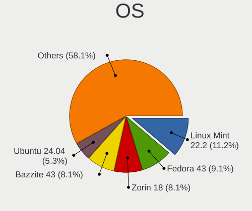

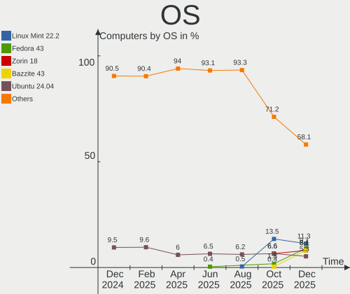

| Name                         | Computers | Percent |
|------------------------------|-----------|---------|
| Linux Mint 22.2              | 36        | 11.25%  |
| Fedora 43                    | 29        | 9.06%   |
| Zorin 18                     | 26        | 8.13%   |
| Bazzite 43                   | 26        | 8.13%   |
| Ubuntu 24.04                 | 17        | 5.31%   |
| Arch Rolling                 | 13        | 4.06%   |
| OpenMandriva 6.0             | 10        | 3.13%   |
| Ubuntu 25.10                 | 9         | 2.81%   |
| OpenMandriva 25.11           | 9         | 2.81%   |
| Pop!_OS 24.04                | 8         | 2.5%    |
| OpenMandriva 25.90           | 8         | 2.5%    |
| Debian 13                    | 8         | 2.5%    |
| CachyOS Rolling              | 7         | 2.19%   |
| Zorin 17                     | 6         | 1.88%   |
| SteamOS 3.7.17               | 6         | 1.88%   |
| KDE neon 24.04               | 6         | 1.88%   |
| OpenMandriva 25.06           | 5         | 1.56%   |
| Gentoo 2.18                  | 5         | 1.56%   |
| Bazzite 42                   | 5         | 1.56%   |
| Ubuntu 25.04                 | 4         | 1.25%   |
| Ubuntu 22.04                 | 4         | 1.25%   |
| Kubuntu 25.10                | 4         | 1.25%   |
| Void Linux Rolling           | 3         | 0.94%   |
| Pop!_OS 22.04                | 3         | 0.94%   |
| openSUSE Tumbleweed-XXXXXXXX | 3         | 0.94%   |
| Debian 12                    | 3         | 0.94%   |
| Debian                       | 3         | 0.94%   |
| Xubuntu 24.04                | 2         | 0.63%   |
| MX 25                        | 2         | 0.63%   |
| LMDE 7                       | 2         | 0.63%   |
| Fedora 42                    | 2         | 0.63%   |
| Elementary 8                 | 2         | 0.63%   |
| CachyOS                      | 2         | 0.63%   |
| BlackPanther 18.1            | 2         | 0.63%   |
| Ultramarine 43               | 1         | 0.31%   |
| Ubuntu Unity 24.04           | 1         | 0.31%   |
| Ubuntu 20.04                 | 1         | 0.31%   |
| TUXEDO OS 24.04              | 1         | 0.31%   |
| SteamOS 3.9                  | 1         | 0.31%   |
| Sparky 8.0                   | 1         | 0.31%   |

OS Family
---------

OS without a version

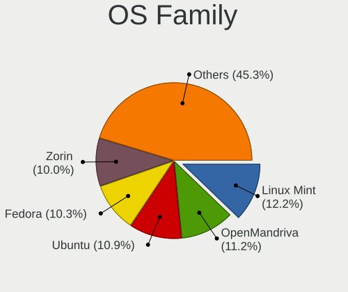

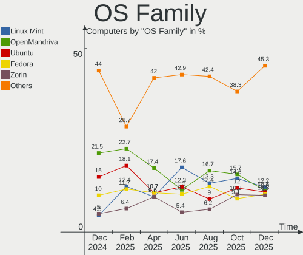

| Name         | Computers | Percent |
|--------------|-----------|---------|
| Linux Mint   | 39        | 12.19%  |
| OpenMandriva | 36        | 11.25%  |
| Ubuntu       | 35        | 10.94%  |
| Fedora       | 33        | 10.31%  |
| Zorin        | 32        | 10%     |
| Bazzite      | 31        | 9.69%   |
| Debian       | 15        | 4.69%   |
| Arch         | 14        | 4.38%   |
| Pop!_OS      | 11        | 3.44%   |
| CachyOS      | 9         | 2.81%   |
| SteamOS      | 7         | 2.19%   |
| Kubuntu      | 6         | 1.88%   |
| KDE neon     | 6         | 1.88%   |
| Gentoo       | 5         | 1.56%   |
| openSUSE     | 4         | 1.25%   |
| Void Linux   | 3         | 0.94%   |
| LMDE         | 3         | 0.94%   |
| Elementary   | 3         | 0.94%   |
| Xubuntu      | 2         | 0.63%   |
| Rocky Linux  | 2         | 0.63%   |
| NixOS        | 2         | 0.63%   |
| MX           | 2         | 0.63%   |
| BlackPanther | 2         | 0.63%   |
| Ultramarine  | 1         | 0.31%   |
| Ubuntu Unity | 1         | 0.31%   |
| TUXEDO OS    | 1         | 0.31%   |
| Sparky       | 1         | 0.31%   |
| Solus        | 1         | 0.31%   |
| RHEL         | 1         | 0.31%   |
| Reborn OS    | 1         | 0.31%   |
| Pikaos       | 1         | 0.31%   |
| Nobara       | 1         | 0.31%   |
| Manjaro      | 1         | 0.31%   |
| Lubuntu      | 1         | 0.31%   |
| Kali         | 1         | 0.31%   |
| Garuda Linux | 1         | 0.31%   |
| Endless      | 1         | 0.31%   |
| EndeavourOS  | 1         | 0.31%   |
| Dts-distro   | 1         | 0.31%   |
| Devuan       | 1         | 0.31%   |

Kernel
------

Version of the Linux kernel

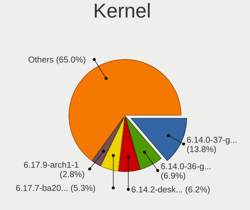

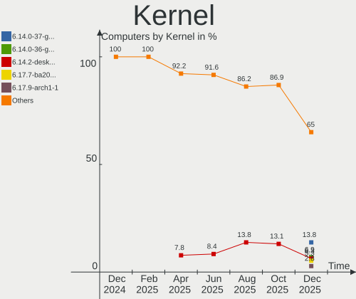

| Version                                     | Computers | Percent |
|---------------------------------------------|-----------|---------|
| 6.14.0-37-generic                           | 44        | 13.75%  |
| 6.14.0-36-generic                           | 22        | 6.88%   |
| 6.14.2-desktop-3omv2590                     | 20        | 6.25%   |
| 6.17.7-ba20.fc43.x86_64                     | 17        | 5.31%   |
| 6.17.9-arch1-1                              | 9         | 2.81%   |
| 6.17.7-ba19.fc43.x86_64                     | 9         | 2.81%   |
| 6.17.12-300.fc43.x86_64                     | 9         | 2.81%   |
| 6.8.0-87-generic                            | 8         | 2.5%    |
| 6.12.57+deb13-amd64                         | 8         | 2.5%    |
| 6.8.0-90-generic                            | 7         | 2.19%   |
| 6.18.0-desktop-1omv2590                     | 6         | 1.88%   |
| 6.17.9-76061709-generic                     | 6         | 1.88%   |
| 6.17.9-300.fc43.x86_64                      | 6         | 1.88%   |
| 6.14.0-29-generic                           | 6         | 1.88%   |
| 6.11.11-valve24-2-neptune-611-gfd0dd251480d | 6         | 1.88%   |
| 6.8.0-88-generic                            | 5         | 1.56%   |
| 6.17.8-300.fc43.x86_64                      | 5         | 1.56%   |
| 6.17.11-300.fc43.x86_64                     | 5         | 1.56%   |
| 6.17.0-8-generic                            | 5         | 1.56%   |
| 6.17.4-76061704-generic                     | 4         | 1.25%   |
| 6.17.0-7-generic                            | 4         | 1.25%   |
| 6.16.4-116.bazzite.fc42.x86_64              | 4         | 1.25%   |
| 6.18.2-2-cachyos                            | 3         | 0.94%   |
| 6.17.1-300.fc43.x86_64                      | 3         | 0.94%   |
| 6.17.0-5-generic                            | 3         | 0.94%   |
| 6.1.0-41-amd64                              | 3         | 0.94%   |
| 6.17.9-zen1-1-zen                           | 2         | 0.63%   |
| 6.17.9-2-cachyos                            | 2         | 0.63%   |
| 6.17.8-arch1-1                              | 2         | 0.63%   |
| 6.17.7-desktop-1omv2590                     | 2         | 0.63%   |
| 6.17.4-desktop-1omv2590                     | 2         | 0.63%   |
| 6.14.0-33-generic                           | 2         | 0.63%   |
| 6.14.0-1016-oem                             | 2         | 0.63%   |
| 6.12.48+deb13-amd64                         | 2         | 0.63%   |
| 6.12.1-desktop-1omv2490                     | 2         | 0.63%   |
| 5.14.0-611.13.1.el9_7.x86_64                | 2         | 0.63%   |
| 6.8.12-16-pve                               | 1         | 0.31%   |
| 6.8.0-85-generic                            | 1         | 0.31%   |
| 6.6.21-yocto-standard                       | 1         | 0.31%   |
| 6.5.0-45-generic                            | 1         | 0.31%   |

Kernel Family
-------------

Linux kernel without a distro release

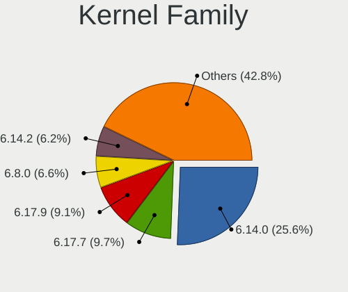

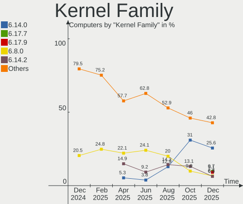

| Version | Computers | Percent |
|---------|-----------|---------|
| 6.14.0  | 82        | 25.63%  |
| 6.17.7  | 31        | 9.69%   |
| 6.17.9  | 29        | 9.06%   |
| 6.8.0   | 21        | 6.56%   |
| 6.14.2  | 20        | 6.25%   |
| 6.17.0  | 13        | 4.06%   |
| 6.18.0  | 12        | 3.75%   |
| 6.17.8  | 12        | 3.75%   |
| 6.18.2  | 9         | 2.81%   |
| 6.17.12 | 9         | 2.81%   |
| 6.12.57 | 9         | 2.81%   |
| 6.17.4  | 6         | 1.88%   |
| 6.11.11 | 6         | 1.88%   |
| 6.17.11 | 5         | 1.56%   |
| 6.16.4  | 5         | 1.56%   |
| 6.17.1  | 4         | 1.25%   |
| 6.18.1  | 3         | 0.94%   |
| 6.17.10 | 3         | 0.94%   |
| 6.12.48 | 3         | 0.94%   |
| 6.1.0   | 3         | 0.94%   |
| 6.2.15  | 2         | 0.63%   |
| 6.17.6  | 2         | 0.63%   |
| 6.16.12 | 2         | 0.63%   |
| 6.12.59 | 2         | 0.63%   |
| 6.12.1  | 2         | 0.63%   |
| 6.12.0  | 2         | 0.63%   |
| 5.14.0  | 2         | 0.63%   |
| 6.8.12  | 1         | 0.31%   |
| 6.6.21  | 1         | 0.31%   |
| 6.5.0   | 1         | 0.31%   |
| 6.4.8   | 1         | 0.31%   |
| 6.17.5  | 1         | 0.31%   |
| 6.17.13 | 1         | 0.31%   |
| 6.16.3  | 1         | 0.31%   |
| 6.16.0  | 1         | 0.31%   |
| 6.15.9  | 1         | 0.31%   |
| 6.15.3  | 1         | 0.31%   |
| 6.15.0  | 1         | 0.31%   |
| 6.13.5  | 1         | 0.31%   |
| 6.12.60 | 1         | 0.31%   |

Kernel Major Ver.
-----------------

Linux kernel major version

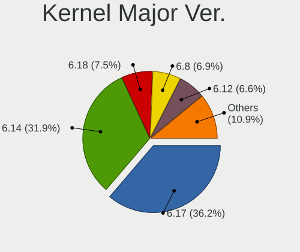

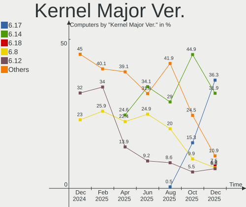

| Version | Computers | Percent |
|---------|-----------|---------|
| 6.17    | 116       | 36.25%  |
| 6.14    | 102       | 31.88%  |
| 6.18    | 24        | 7.5%    |
| 6.8     | 22        | 6.88%   |
| 6.12    | 21        | 6.56%   |
| 6.16    | 9         | 2.81%   |
| 6.11    | 6         | 1.88%   |
| 6.15    | 3         | 0.94%   |
| 6.1     | 3         | 0.94%   |
| 6.2     | 2         | 0.63%   |
| 5.15    | 2         | 0.63%   |
| 5.14    | 2         | 0.63%   |
| 6.6     | 1         | 0.31%   |
| 6.5     | 1         | 0.31%   |
| 6.4     | 1         | 0.31%   |
| 6.13    | 1         | 0.31%   |
| 5.4     | 1         | 0.31%   |
| 5.10    | 1         | 0.31%   |
| 4.4     | 1         | 0.31%   |
| 4.18    | 1         | 0.31%   |

Arch
----

OS architecture (x86_64, i586, etc.)

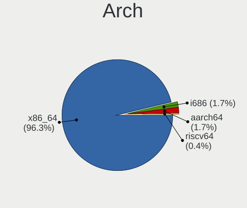

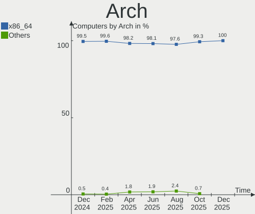

| Name   | Computers | Percent |
|--------|-----------|---------|
| x86_64 | 320       | 100%    |

DE
--

Desktop Environment

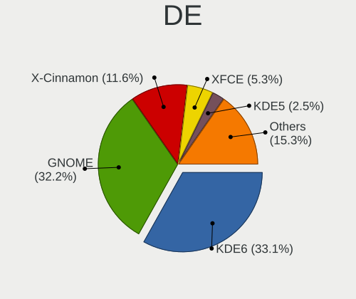

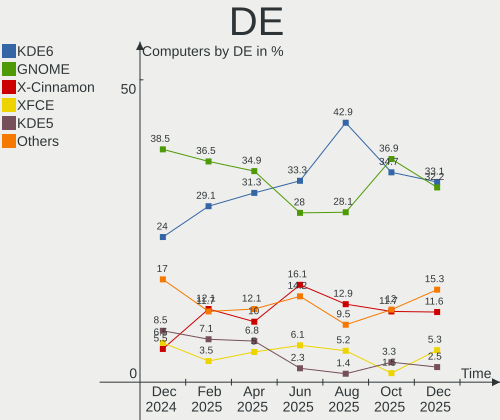

| Name                        | Computers | Percent |
|-----------------------------|-----------|---------|
| KDE6                        | 106       | 33.13%  |
| GNOME                       | 103       | 32.19%  |
| X-Cinnamon                  | 37        | 11.56%  |
| XFCE                        | 17        | 5.31%   |
| KDE5                        | 8         | 2.5%    |
| KDE                         | 8         | 2.5%    |
| COSMIC                      | 8         | 2.5%    |
| Hyprland                    | 7         | 2.19%   |
| Unknown                     | 7         | 2.19%   |
| LXQt                        | 5         | 1.56%   |
| MATE                        | 4         | 1.25%   |
| Pantheon                    | 3         | 0.94%   |
| Unity                       | 1         | 0.31%   |
| i3                          | 1         | 0.31%   |
| Endless:GNOME               | 1         | 0.31%   |
| Deepin                      | 1         | 0.31%   |
| Cinnamon                    | 1         | 0.31%   |
| Budgie                      | 1         | 0.31%   |
| /usr/local/bin/start-mwm.sh | 1         | 0.31%   |

Display Server
--------------

X11 or Wayland

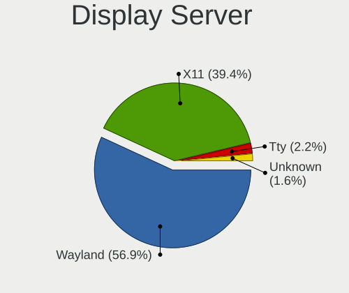

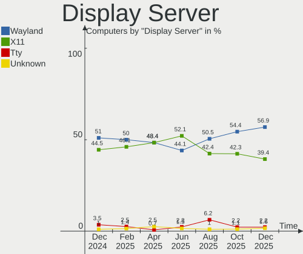

| Name    | Computers | Percent |
|---------|-----------|---------|
| Wayland | 182       | 56.88%  |
| X11     | 126       | 39.38%  |
| Tty     | 7         | 2.19%   |
| Unknown | 5         | 1.56%   |

Display Manager
---------------

SDDM, LightDM, etc.

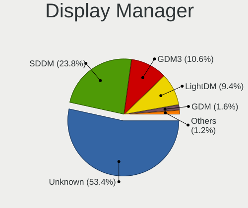

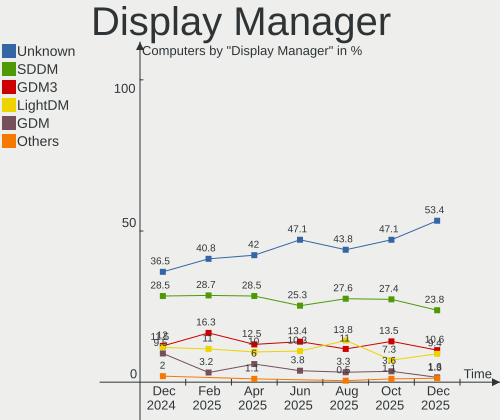

| Name           | Computers | Percent |
|----------------|-----------|---------|
| Unknown        | 171       | 53.44%  |
| SDDM           | 76        | 23.75%  |
| GDM3           | 34        | 10.63%  |
| LightDM        | 30        | 9.38%   |
| GDM            | 5         | 1.56%   |
| SLiM           | 1         | 0.31%   |
| MDM            | 1         | 0.31%   |
| LXDM           | 1         | 0.31%   |
| COSMIC-GREETER | 1         | 0.31%   |

OS Lang
-------

Language

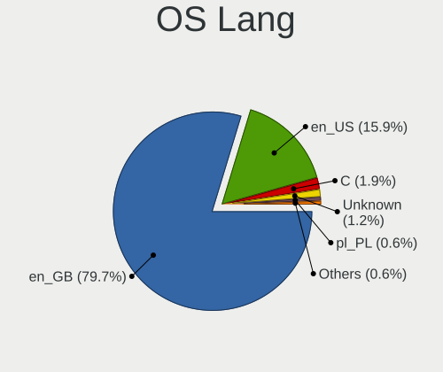

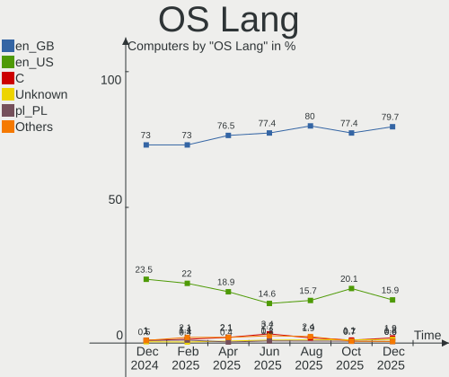

| Lang    | Computers | Percent |
|---------|-----------|---------|
| en_GB   | 255       | 79.69%  |
| en_US   | 51        | 15.94%  |
| C       | 6         | 1.88%   |
| Unknown | 4         | 1.25%   |
| pl_PL   | 2         | 0.63%   |
| lt_LT   | 1         | 0.31%   |
| en_IE   | 1         | 0.31%   |

Boot Mode
---------

EFI or BIOS

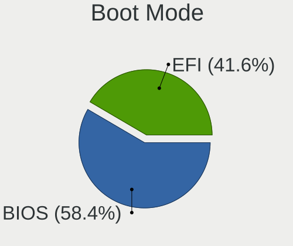

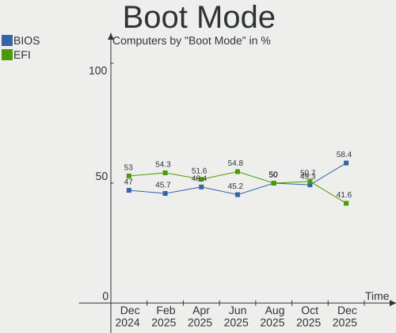

| Mode | Computers | Percent |
|------|-----------|---------|
| BIOS | 187       | 58.44%  |
| EFI  | 133       | 41.56%  |

Filesystem
----------

Type of filesystem

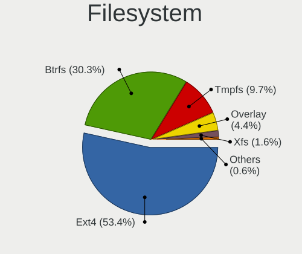

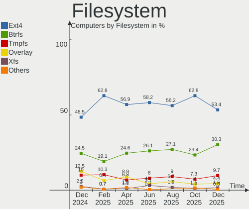

| Type    | Computers | Percent |
|---------|-----------|---------|
| Ext4    | 171       | 53.44%  |
| Btrfs   | 97        | 30.31%  |
| Tmpfs   | 31        | 9.69%   |
| Overlay | 14        | 4.38%   |
| Xfs     | 5         | 1.56%   |
| Rootfs  | 1         | 0.31%   |
| Ext3    | 1         | 0.31%   |

Part. scheme
------------

Scheme of partitioning

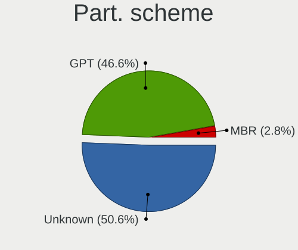

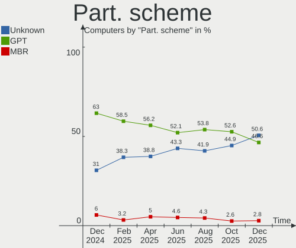

| Type    | Computers | Percent |
|---------|-----------|---------|
| Unknown | 162       | 50.63%  |
| GPT     | 149       | 46.56%  |
| MBR     | 9         | 2.81%   |

Dual Boot with Linux/BSD
------------------------

Hosting more than one Linux/BSD

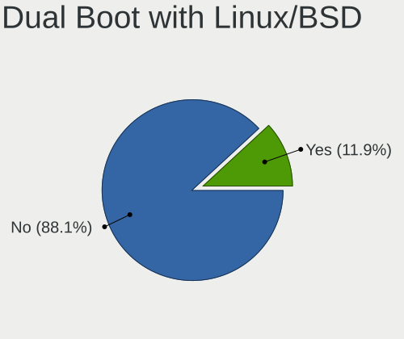

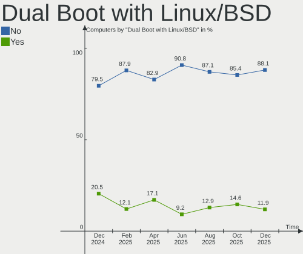

| Dual boot | Computers | Percent |
|-----------|-----------|---------|
| No        | 282       | 88.13%  |
| Yes       | 38        | 11.88%  |

Dual Boot (Win)
---------------

Hosting Linux and Windows

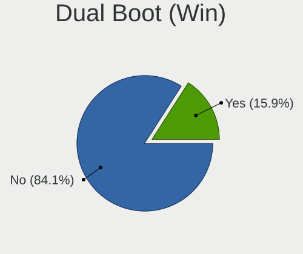

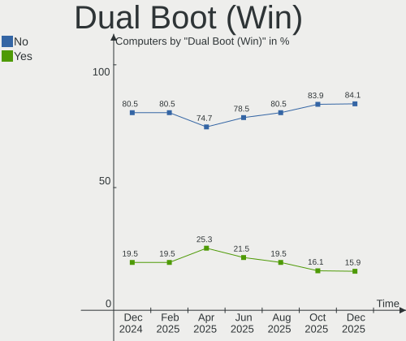

| Dual boot | Computers | Percent |
|-----------|-----------|---------|
| No        | 269       | 84.06%  |
| Yes       | 51        | 15.94%  |

Board
-----

Vendor
------

Motherboard manufacturer

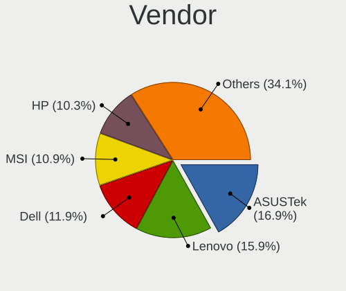

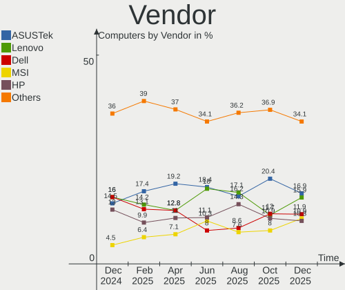

| Name                          | Computers | Percent |
|-------------------------------|-----------|---------|
| ASUSTek Computer              | 54        | 16.88%  |
| Lenovo                        | 51        | 15.94%  |
| Dell                          | 38        | 11.88%  |
| MSI                           | 35        | 10.94%  |
| Hewlett-Packard               | 33        | 10.31%  |
| Gigabyte Technology           | 30        | 9.38%   |
| Acer                          | 9         | 2.81%   |
| Apple                         | 8         | 2.5%    |
| Microsoft                     | 5         | 1.56%   |
| GMKtec                        | 4         | 1.25%   |
| Fujitsu                       | 4         | 1.25%   |
| AZW                           | 4         | 1.25%   |
| ASRock                        | 4         | 1.25%   |
| Unknown                       | 4         | 1.25%   |
| Valve                         | 3         | 0.94%   |
| Shanghai Hub Union Industural | 3         | 0.94%   |
| Samsung Electronics           | 3         | 0.94%   |
| Razer                         | 2         | 0.63%   |
| PC Specialist                 | 2         | 0.63%   |
| Intel                         | 2         | 0.63%   |
| Google                        | 2         | 0.63%   |
| Framework                     | 2         | 0.63%   |
| Star Labs                     | 1         | 0.31%   |
| Standard                      | 1         | 0.31%   |
| Sony                          | 1         | 0.31%   |
| RM Education                  | 1         | 0.31%   |
| Panasonic                     | 1         | 0.31%   |
| Packard Bell                  | 1         | 0.31%   |
| Notebook                      | 1         | 0.31%   |
| MAXSUN                        | 1         | 0.31%   |
| IBM                           | 1         | 0.31%   |
| HUAWEI                        | 1         | 0.31%   |
| Foxconn                       | 1         | 0.31%   |
| Entroware                     | 1         | 0.31%   |
| Clevo                         | 1         | 0.31%   |
| Chuwi                         | 1         | 0.31%   |
| Bosgame                       | 1         | 0.31%   |
| Biostar                       | 1         | 0.31%   |
| BESSTAR Tech                  | 1         | 0.31%   |
| Alienware                     | 1         | 0.31%   |

Model
-----

Motherboard model

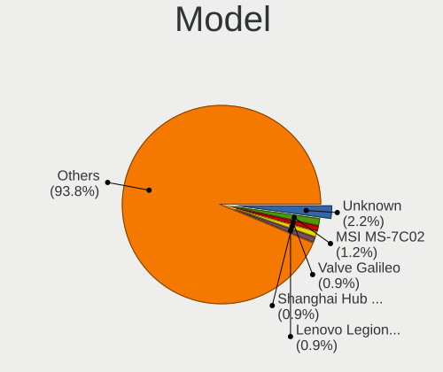

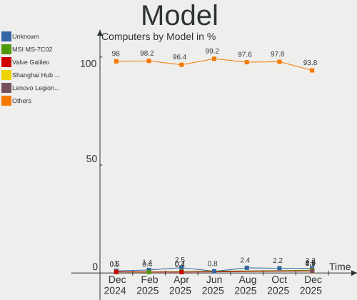

| Name                                               | Computers | Percent |
|----------------------------------------------------|-----------|---------|
| Unknown                                            | 7         | 2.19%   |
| MSI MS-7C02                                        | 4         | 1.25%   |
| Valve Galileo                                      | 3         | 0.94%   |
| Shanghai Hub Union Industural P6                   | 3         | 0.94%   |
| Lenovo Legion Go S 8ARP1 83L3                      | 3         | 0.94%   |
| MSI MS-7D25                                        | 2         | 0.63%   |
| MSI MS-7C95                                        | 2         | 0.63%   |
| MSI MS-7C91                                        | 2         | 0.63%   |
| MSI MS-7C56                                        | 2         | 0.63%   |
| MSI MS-7B86                                        | 2         | 0.63%   |
| GMKtec NucBox M7 Pro                               | 2         | 0.63%   |
| Gigabyte B650 AORUS ELITE AX V2                    | 2         | 0.63%   |
| Dell OptiPlex 780                                  | 2         | 0.63%   |
| Dell OptiPlex 7010                                 | 2         | 0.63%   |
| Dell Latitude D630                                 | 2         | 0.63%   |
| Dell Latitude 7410                                 | 2         | 0.63%   |
| Dell Latitude 3400                                 | 2         | 0.63%   |
| AZW EQ                                             | 2         | 0.63%   |
| ASUS ROG STRIX B550-I GAMING                       | 2         | 0.63%   |
| ASUS ROG STRIX B550-F GAMING WIFI II               | 2         | 0.63%   |
| ASUS ROG Ally X RC72LA_RC72LA                      | 2         | 0.63%   |
| ASUS PRIME B450M-K II                              | 2         | 0.63%   |
| Apple iMac15,1                                     | 2         | 0.63%   |
| Star Labs Byte                                     | 1         | 0.31%   |
| Sony VPCEH3N6E                                     | 1         | 0.31%   |
| Samsung R530/R730                                  | 1         | 0.31%   |
| Samsung 960QFG                                     | 1         | 0.31%   |
| Samsung 767XCL                                     | 1         | 0.31%   |
| RM Education RM                                    | 1         | 0.31%   |
| Razer Blade 16 - RZ09-0483                         | 1         | 0.31%   |
| Razer Blade 15 Base Model (Early 2020) - RZ09-0328 | 1         | 0.31%   |
| PC Specialist OctaneVI 17                          | 1         | 0.31%   |
| PC Specialist Lafite Pro 15 AMD                    | 1         | 0.31%   |
| Panasonic FZG1-4                                   | 1         | 0.31%   |
| Packard Bell IMEDIA S2185                          | 1         | 0.31%   |
| Notebook V5xTNC_TND_TNE                            | 1         | 0.31%   |
| MSI Prestige 16 AI Studio B1VFG                    | 1         | 0.31%   |
| MSI MS-7E49                                        | 1         | 0.31%   |
| MSI MS-7E28                                        | 1         | 0.31%   |
| MSI MS-7E27                                        | 1         | 0.31%   |

Model Family
------------

Motherboard model prefix

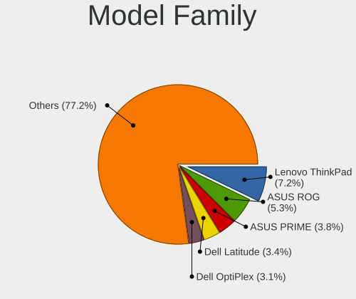

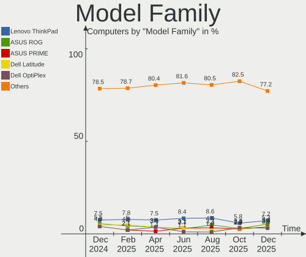

| Name                             | Computers | Percent |
|----------------------------------|-----------|---------|
| Lenovo ThinkPad                  | 23        | 7.19%   |
| ASUS ROG                         | 17        | 5.31%   |
| ASUS PRIME                       | 12        | 3.75%   |
| Dell Latitude                    | 11        | 3.44%   |
| Dell OptiPlex                    | 10        | 3.13%   |
| Lenovo Legion                    | 8         | 2.5%    |
| Lenovo IdeaPad                   | 7         | 2.19%   |
| Unknown                          | 7         | 2.19%   |
| Lenovo Yoga                      | 6         | 1.88%   |
| Dell Inspiron                    | 6         | 1.88%   |
| ASUS VivoBook                    | 6         | 1.88%   |
| Microsoft Surface                | 5         | 1.56%   |
| Dell XPS                         | 5         | 1.56%   |
| MSI MS-7C02                      | 4         | 1.25%   |
| HP ZBook                         | 4         | 1.25%   |
| HP EliteBook                     | 4         | 1.25%   |
| GMKtec NucBox                    | 4         | 1.25%   |
| Acer Aspire                      | 4         | 1.25%   |
| Valve Galileo                    | 3         | 0.94%   |
| Shanghai Hub Union Industural P6 | 3         | 0.94%   |
| HP Pavilion                      | 3         | 0.94%   |
| Dell Precision                   | 3         | 0.94%   |
| ASUS Zenbook                     | 3         | 0.94%   |
| ASUS TUF                         | 3         | 0.94%   |
| Razer Blade                      | 2         | 0.63%   |
| MSI MS-7D25                      | 2         | 0.63%   |
| MSI MS-7C95                      | 2         | 0.63%   |
| MSI MS-7C91                      | 2         | 0.63%   |
| MSI MS-7C56                      | 2         | 0.63%   |
| MSI MS-7B86                      | 2         | 0.63%   |
| HP ProDesk                       | 2         | 0.63%   |
| HP ProBook                       | 2         | 0.63%   |
| HP Laptop                        | 2         | 0.63%   |
| HP ENVY                          | 2         | 0.63%   |
| HP Compaq                        | 2         | 0.63%   |
| Gigabyte X570S                   | 2         | 0.63%   |
| Gigabyte X570                    | 2         | 0.63%   |
| Gigabyte B650                    | 2         | 0.63%   |
| Fujitsu LIFEBOOK                 | 2         | 0.63%   |
| Fujitsu ESPRIMO                  | 2         | 0.63%   |

MFG Year
--------

Motherboard manufacture year

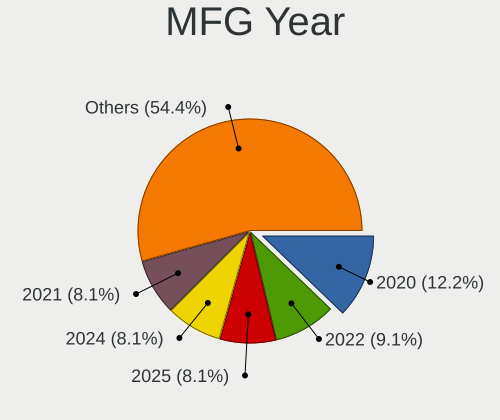

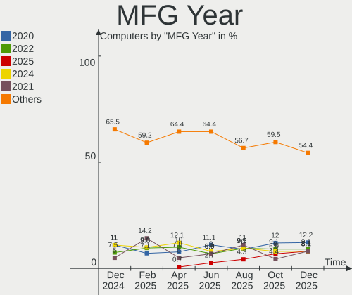

| Year | Computers | Percent |
|------|-----------|---------|
| 2020 | 39        | 12.19%  |
| 2022 | 29        | 9.06%   |
| 2025 | 26        | 8.13%   |
| 2024 | 26        | 8.13%   |
| 2021 | 26        | 8.13%   |
| 2019 | 26        | 8.13%   |
| 2023 | 25        | 7.81%   |
| 2018 | 20        | 6.25%   |
| 2013 | 15        | 4.69%   |
| 2012 | 14        | 4.38%   |
| 2011 | 14        | 4.38%   |
| 2014 | 12        | 3.75%   |
| 2017 | 11        | 3.44%   |
| 2016 | 11        | 3.44%   |
| 2015 | 10        | 3.13%   |
| 2009 | 9         | 2.81%   |
| 2007 | 4         | 1.25%   |
| 2010 | 2         | 0.63%   |
| 2008 | 1         | 0.31%   |

Form Factor
-----------

Physical design of the computer

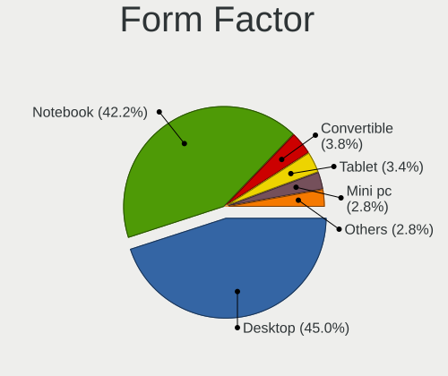

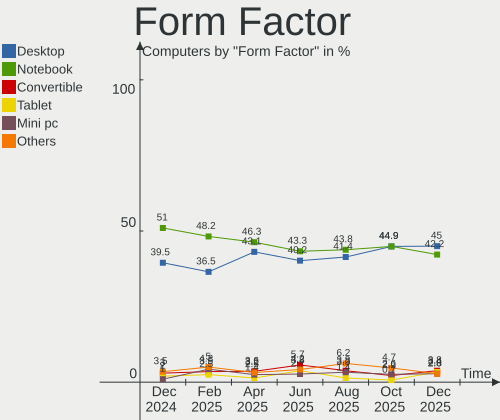

| Name        | Computers | Percent |
|-------------|-----------|---------|
| Desktop     | 144       | 45%     |
| Notebook    | 135       | 42.19%  |
| Convertible | 12        | 3.75%   |
| Tablet      | 11        | 3.44%   |
| Mini pc     | 9         | 2.81%   |
| All in one  | 6         | 1.88%   |
| Server      | 2         | 0.63%   |
| Other       | 1         | 0.31%   |

Secure Boot
-----------

Enabled or disabled

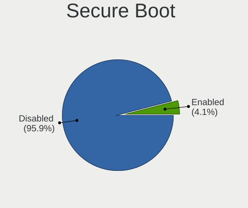

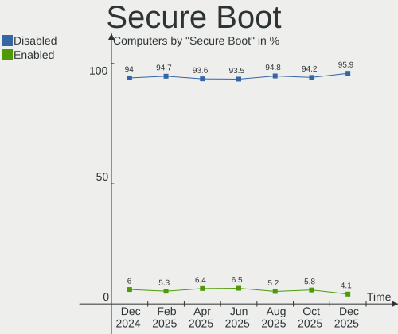

| State    | Computers | Percent |
|----------|-----------|---------|
| Disabled | 307       | 95.94%  |
| Enabled  | 13        | 4.06%   |

Coreboot
--------

Have coreboot on board

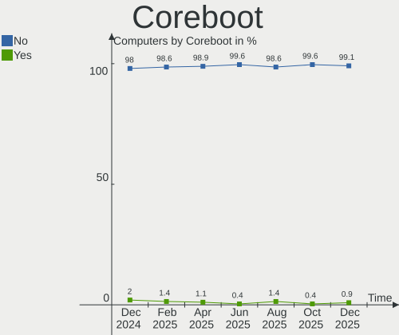

| Used | Computers | Percent |
|------|-----------|---------|
| No   | 317       | 99.06%  |
| Yes  | 3         | 0.94%   |

RAM Size
--------

Total RAM memory

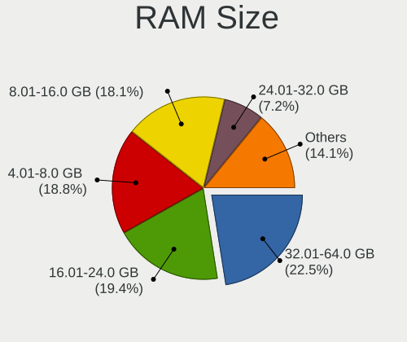

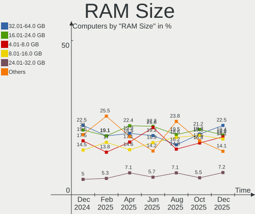

| Size in GB  | Computers | Percent |
|-------------|-----------|---------|
| 32.01-64.0  | 72        | 22.5%   |
| 16.01-24.0  | 62        | 19.38%  |
| 4.01-8.0    | 60        | 18.75%  |
| 8.01-16.0   | 58        | 18.13%  |
| 24.01-32.0  | 23        | 7.19%   |
| 3.01-4.0    | 21        | 6.56%   |
| 64.01-256.0 | 18        | 5.63%   |
| 1.01-2.0    | 4         | 1.25%   |
| 2.01-3.0    | 1         | 0.31%   |
| 0.51-1.0    | 1         | 0.31%   |

RAM Used
--------

Used RAM memory

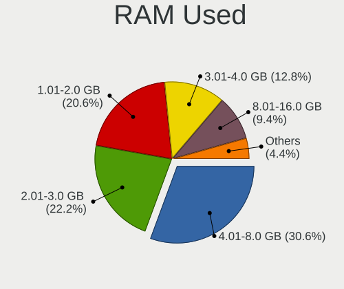

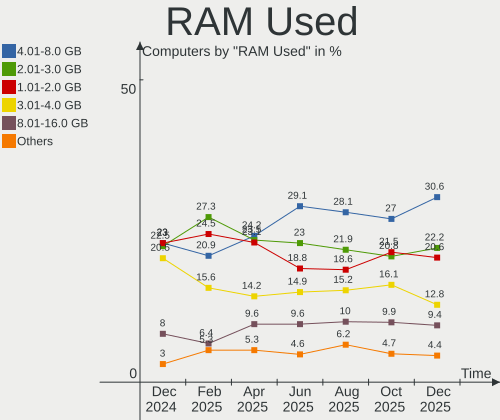

| Used GB    | Computers | Percent |
|------------|-----------|---------|
| 4.01-8.0   | 98        | 30.63%  |
| 2.01-3.0   | 71        | 22.19%  |
| 1.01-2.0   | 66        | 20.63%  |
| 3.01-4.0   | 41        | 12.81%  |
| 8.01-16.0  | 30        | 9.38%   |
| 0.51-1.0   | 8         | 2.5%    |
| 16.01-24.0 | 5         | 1.56%   |
| 24.01-32.0 | 1         | 0.31%   |

Total Drives
------------

Number of drives on board

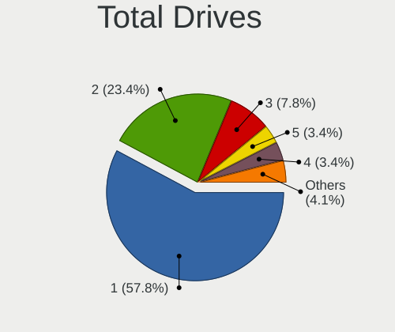

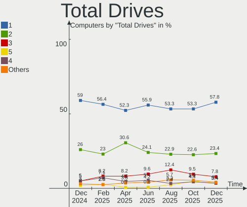

| Drives | Computers | Percent |
|--------|-----------|---------|
| 1      | 185       | 57.81%  |
| 2      | 75        | 23.44%  |
| 3      | 25        | 7.81%   |
| 5      | 11        | 3.44%   |
| 4      | 11        | 3.44%   |
| 7      | 6         | 1.88%   |
| 6      | 6         | 1.88%   |
| 12     | 1         | 0.31%   |

Has CD-ROM
----------

Has CD-ROM on board

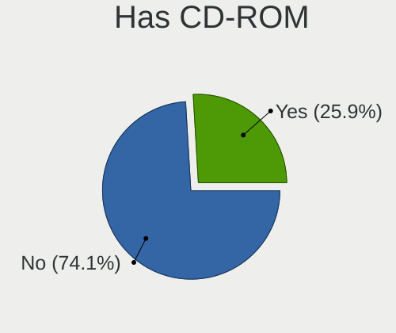

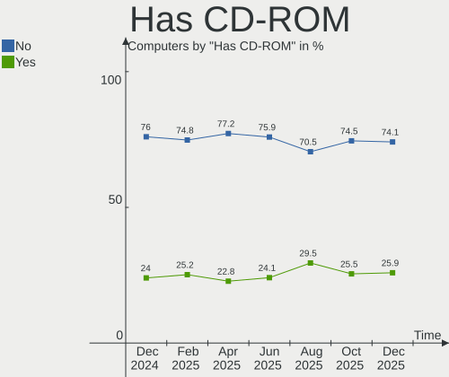

| Presented | Computers | Percent |
|-----------|-----------|---------|
| No        | 237       | 74.06%  |
| Yes       | 83        | 25.94%  |

Has Ethernet
------------

Has Ethernet on board

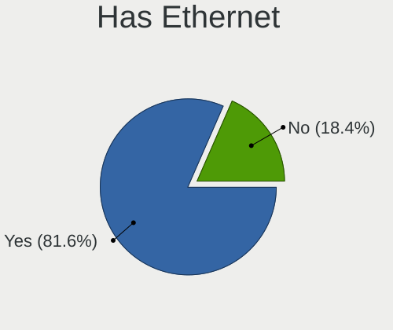

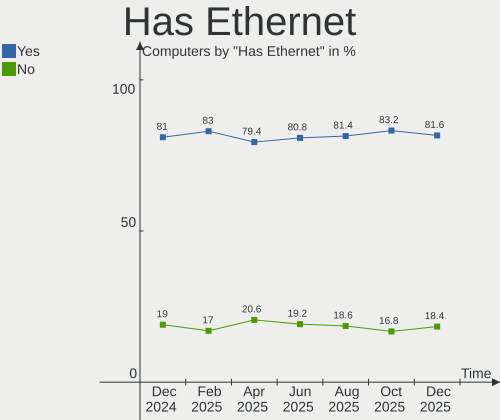

| Presented | Computers | Percent |
|-----------|-----------|---------|
| Yes       | 261       | 81.56%  |
| No        | 59        | 18.44%  |

Has WiFi
--------

Has WiFi module

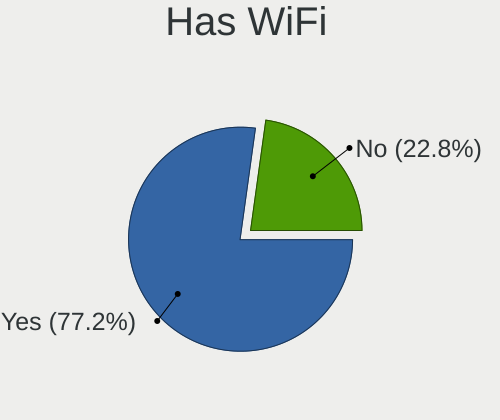

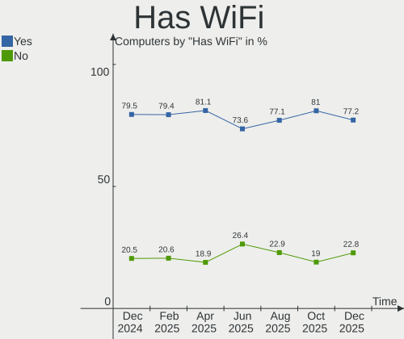

| Presented | Computers | Percent |
|-----------|-----------|---------|
| Yes       | 247       | 77.19%  |
| No        | 73        | 22.81%  |

Has Bluetooth
-------------

Has Bluetooth module

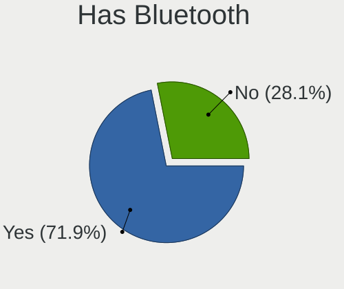

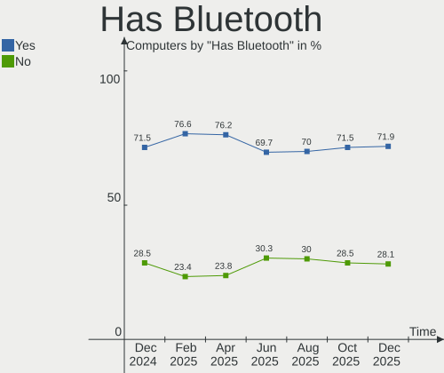

| Presented | Computers | Percent |
|-----------|-----------|---------|
| Yes       | 230       | 71.88%  |
| No        | 90        | 28.13%  |

Location
--------

Country
-------

Geographic location (country)

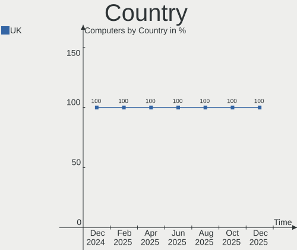

| Country | Computers | Percent |
|---------|-----------|---------|
| UK      | 320       | 100%    |

City
----

Geographic location (city)

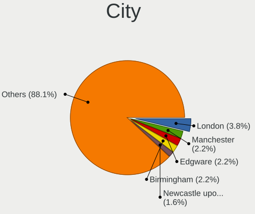

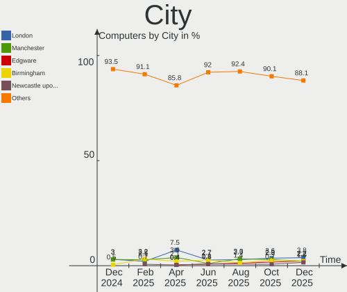

| City                | Computers | Percent |
|---------------------|-----------|---------|
| London              | 12        | 3.75%   |
| Manchester          | 7         | 2.19%   |
| Edgware             | 7         | 2.19%   |
| Birmingham          | 7         | 2.19%   |
| Newcastle upon Tyne | 5         | 1.56%   |
| Leeds               | 5         | 1.56%   |
| Bristol             | 5         | 1.56%   |
| Brent               | 5         | 1.56%   |
| Bradford            | 5         | 1.56%   |
| Southwark           | 4         | 1.25%   |
| Gravesend           | 4         | 1.25%   |
| Goole               | 4         | 1.25%   |
| Glasgow             | 4         | 1.25%   |
| Barnet              | 4         | 1.25%   |
| Witney              | 3         | 0.94%   |
| Stoke-on-Trent      | 3         | 0.94%   |
| Slough              | 3         | 0.94%   |
| Reading             | 3         | 0.94%   |
| Oxford              | 3         | 0.94%   |
| Norwich             | 3         | 0.94%   |
| Milton Keynes       | 3         | 0.94%   |
| Middlesbrough       | 3         | 0.94%   |
| Liverpool           | 3         | 0.94%   |
| Ilford              | 3         | 0.94%   |
| Coventry            | 3         | 0.94%   |
| Cambridge           | 3         | 0.94%   |
| Belfast             | 3         | 0.94%   |
| Wandsworth          | 2         | 0.63%   |
| Walton on Thames    | 2         | 0.63%   |
| Wakefield           | 2         | 0.63%   |
| Tower Hamlets       | 2         | 0.63%   |
| Taunton             | 2         | 0.63%   |
| Tamworth            | 2         | 0.63%   |
| Stockton-on-Tees    | 2         | 0.63%   |
| St Albans           | 2         | 0.63%   |
| Southampton         | 2         | 0.63%   |
| South Shields       | 2         | 0.63%   |
| Sheffield           | 2         | 0.63%   |
| Rotherham           | 2         | 0.63%   |
| Rochester           | 2         | 0.63%   |

Drives
------

Drive Vendor
------------

Hard drive vendors

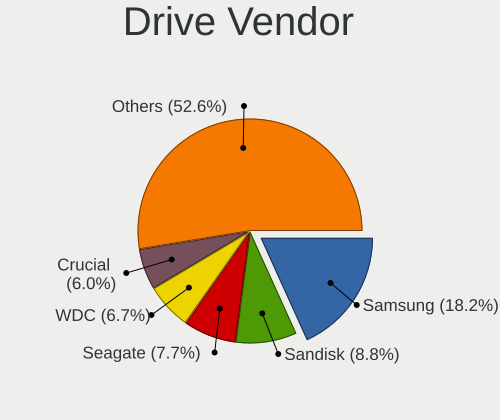

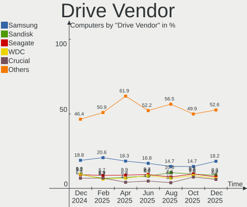

| Vendor                       | Computers | Drives | Percent |
|------------------------------|-----------|--------|---------|
| Samsung Electronics          | 95        | 120    | 18.23%  |
| Sandisk                      | 46        | 52     | 8.83%   |
| Seagate                      | 40        | 56     | 7.68%   |
| WDC                          | 35        | 43     | 6.72%   |
| Crucial                      | 31        | 35     | 5.95%   |
| Micron/Crucial Technology    | 25        | 27     | 4.8%    |
| Kingston                     | 22        | 25     | 4.22%   |
| Toshiba                      | 19        | 21     | 3.65%   |
| SK hynix                     | 17        | 17     | 3.26%   |
| Micron Technology            | 15        | 15     | 2.88%   |
| MAXIO Technology (Hangzhou)  | 15        | 16     | 2.88%   |
| Unknown                      | 14        | 16     | 2.69%   |
| Phison Electronics           | 9         | 9      | 1.73%   |
| KIOXIA                       | 8         | 8      | 1.54%   |
| Hitachi                      | 8         | 9      | 1.54%   |
| HGST                         | 8         | 8      | 1.54%   |
| Patriot                      | 6         | 8      | 1.15%   |
| Kingston Technology Company  | 6         | 6      | 1.15%   |
| Intel                        | 6         | 6      | 1.15%   |
| Unknown                      | 6         | 6      | 1.15%   |
| PNY                          | 5         | 5      | 0.96%   |
| Integral                     | 4         | 4      | 0.77%   |
| China                        | 4         | 4      | 0.77%   |
| XUM                          | 3         | 3      | 0.58%   |
| Silicon Motion               | 3         | 4      | 0.58%   |
| Shenzhen Longsys Electronics | 3         | 4      | 0.58%   |
| Realtek Semiconductor        | 3         | 3      | 0.58%   |
| KingSpec                     | 3         | 3      | 0.58%   |
| Fanxiang                     | 3         | 3      | 0.58%   |
| Biwin Storage Technology     | 3         | 3      | 0.58%   |
| Apple                        | 3         | 4      | 0.58%   |
| SPCC                         | 2         | 2      | 0.38%   |
| Netac                        | 2         | 2      | 0.38%   |
| LITEONIT                     | 2         | 2      | 0.38%   |
| KIOXIA-EXCERIA               | 2         | 2      | 0.38%   |
| JMicron Technology           | 2         | 2      | 0.38%   |
| ADATA Technology             | 2         | 2      | 0.38%   |
| A-DATA Technology            | 2         | 2      | 0.38%   |
| X12                          | 1         | 1      | 0.19%   |
| Wibtek                       | 1         | 1      | 0.19%   |

Drive Model
-----------

Hard drive models

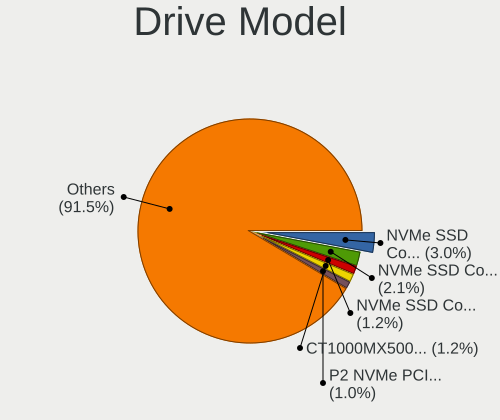

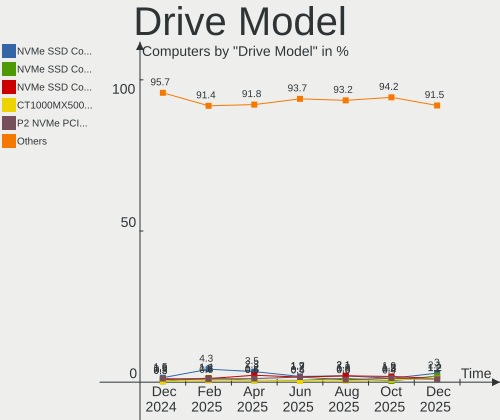

| Model                                                 | Computers | Percent |
|-------------------------------------------------------|-----------|---------|
| Samsung NVMe SSD Controller SM981/PM981/PM983 1TB     | 17        | 2.96%   |
| MAXIO (Hangzhou) NVMe SSD Controller MAP1202 2TB      | 12        | 2.09%   |
| Samsung NVMe SSD Controller PM9A1/PM9A3/980PRO 1TB    | 7         | 1.22%   |
| Crucial CT1000MX500SSD1 1TB                           | 7         | 1.22%   |
| Micron/Crucial P2 NVMe PCIe SSD 2TB                   | 6         | 1.05%   |
| Kingston SA400S37240G 240GB SSD                       | 6         | 1.05%   |
| Unknown                                               | 6         | 1.05%   |
| Sandisk WD Black SN850 1TB                            | 5         | 0.87%   |
| Samsung NVMe SSD Controller SM961/PM961/SM963 1024GB  | 5         | 0.87%   |
| Seagate ST4000DM004-2CV104 4TB                        | 4         | 0.7%    |
| Seagate ST4000DM000-1F2168 4TB                        | 4         | 0.7%    |
| Sandisk WD Black SN750 / PC SN730 NVMe SSD 500GB      | 4         | 0.7%    |
| Samsung SSD 990 PRO 4TB                               | 4         | 0.7%    |
| Samsung SSD 990 PRO 2TB                               | 4         | 0.7%    |
| Samsung SSD 870 EVO 1TB                               | 4         | 0.7%    |
| Samsung SSD 860 EVO 1TB                               | 4         | 0.7%    |
| Samsung SSD 850 EVO 500GB                             | 4         | 0.7%    |
| Kingston SA400S37480G 480GB SSD                       | 4         | 0.7%    |
| Unknown SD/MMC/MS PRO 2GB                             | 3         | 0.52%   |
| Unknown MMC Card  64GB                                | 3         | 0.52%   |
| Unknown MMC Card  32GB                                | 3         | 0.52%   |
| Seagate ST6000DM003-2CY186 6TB                        | 3         | 0.52%   |
| Seagate ST1000DM010-2EP102 1TB                        | 3         | 0.52%   |
| Samsung SSD 860 QVO 1TB                               | 3         | 0.52%   |
| Samsung SSD 850 EVO 250GB                             | 3         | 0.52%   |
| Micron/Crucial CT2000P5PSSD8 2TB                      | 3         | 0.52%   |
| Micron 2400 NVMe SSD (DRAM-less) 512GB                | 3         | 0.52%   |
| Crucial CT480BX500SSD1 480GB                          | 3         | 0.52%   |
| Crucial CT1000P310SSD8 1TB                            | 3         | 0.52%   |
| XUM HX256GSSDSATA3 256GB                              | 2         | 0.35%   |
| WDC WDS240G2G0A-00JH30 240GB SSD                      | 2         | 0.35%   |
| Unknown MMC Card  128GB                               | 2         | 0.35%   |
| Toshiba MQ01ABD100 1TB                                | 2         | 0.35%   |
| Toshiba HDWD130 3TB                                   | 2         | 0.35%   |
| Toshiba BG3 NVMe SSD Controller 256GB                 | 2         | 0.35%   |
| SK hynix SKHynix_HFS001TEM4X182N 1TB                  | 2         | 0.35%   |
| Silicon Motion SM2263EN/SM2263XT SSD Controller 512GB | 2         | 0.35%   |
| Seagate ST4000VN006-3CW104 4TB                        | 2         | 0.35%   |
| Seagate ST3500418AS 500GB                             | 2         | 0.35%   |
| Seagate ST3500312CS 500GB                             | 2         | 0.35%   |

HDD Vendor
----------

Hard disk drive vendors

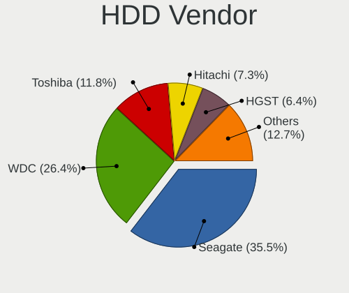

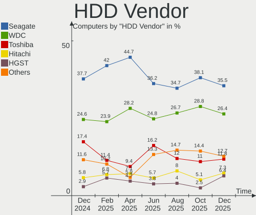

| Vendor              | Computers | Drives | Percent |
|---------------------|-----------|--------|---------|
| Seagate             | 39        | 52     | 35.45%  |
| WDC                 | 29        | 36     | 26.36%  |
| Toshiba             | 13        | 15     | 11.82%  |
| Hitachi             | 8         | 9      | 7.27%   |
| HGST                | 7         | 7      | 6.36%   |
| Unknown             | 3         | 3      | 2.73%   |
| Samsung Electronics | 3         | 4      | 2.73%   |
| JMicron Technology  | 2         | 2      | 1.82%   |
| USB3.0              | 1         | 1      | 0.91%   |
| TO Exter            | 1         | 1      | 0.91%   |
| RSH-339             | 1         | 1      | 0.91%   |
| Hewlett-Packard     | 1         | 1      | 0.91%   |
| ASMedia             | 1         | 1      | 0.91%   |
| Apple               | 1         | 1      | 0.91%   |

SSD Vendor
----------

Solid state drive vendors

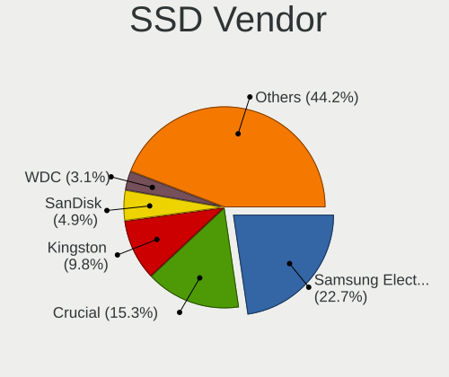

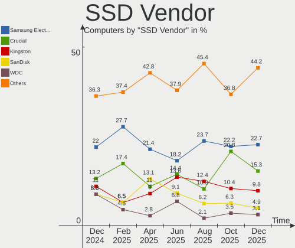

| Vendor              | Computers | Drives | Percent |
|---------------------|-----------|--------|---------|
| Samsung Electronics | 37        | 44     | 22.7%   |
| Crucial             | 25        | 29     | 15.34%  |
| Kingston            | 16        | 16     | 9.82%   |
| SanDisk             | 8         | 8      | 4.91%   |
| WDC                 | 5         | 5      | 3.07%   |
| PNY                 | 5         | 5      | 3.07%   |
| Patriot             | 5         | 7      | 3.07%   |
| SK hynix            | 4         | 4      | 2.45%   |
| Micron Technology   | 4         | 4      | 2.45%   |
| Integral            | 4         | 4      | 2.45%   |
| China               | 4         | 4      | 2.45%   |
| Unknown             | 4         | 4      | 2.45%   |
| XUM                 | 3         | 3      | 1.84%   |
| KingSpec            | 3         | 3      | 1.84%   |
| Intel               | 3         | 3      | 1.84%   |
| SPCC                | 2         | 2      | 1.23%   |
| Seagate             | 2         | 2      | 1.23%   |
| LITEONIT            | 2         | 2      | 1.23%   |
| X12                 | 1         | 1      | 0.61%   |
| Wibtek              | 1         | 1      | 0.61%   |
| VENO                | 1         | 1      | 0.61%   |
| Transcend           | 1         | 1      | 0.61%   |
| TEAM T25            | 1         | 1      | 0.61%   |
| Team                | 1         | 1      | 0.61%   |
| T-FORCE             | 1         | 1      | 0.61%   |
| Plextor             | 1         | 1      | 0.61%   |
| OCZ                 | 1         | 1      | 0.61%   |
| Netac               | 1         | 1      | 0.61%   |
| MSI                 | 1         | 1      | 0.61%   |
| MicroDream          | 1         | 1      | 0.61%   |
| Intenso             | 1         | 1      | 0.61%   |
| HPE                 | 1         | 1      | 0.61%   |
| HGST                | 1         | 1      | 0.61%   |
| FIKWOT              | 1         | 1      | 0.61%   |
| Fanxiang            | 1         | 1      | 0.61%   |
| Corsair             | 1         | 1      | 0.61%   |
| BIWIN               | 1         | 1      | 0.61%   |
| BHT                 | 1         | 1      | 0.61%   |
| BAITITON            | 1         | 1      | 0.61%   |
| Apple               | 1         | 1      | 0.61%   |

Drive Kind
----------

HDD or SSD

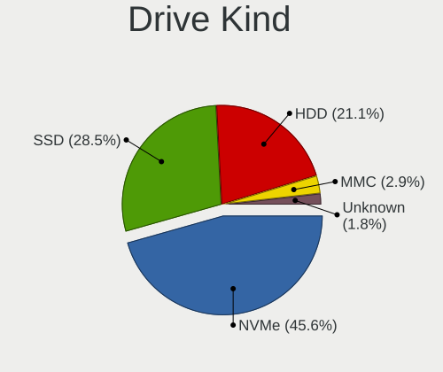

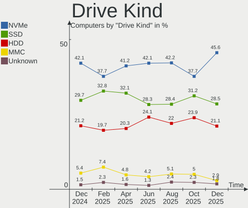

| Kind    | Computers | Drives | Percent |
|---------|-----------|--------|---------|
| NVMe    | 203       | 271    | 45.62%  |
| SSD     | 127       | 176    | 28.54%  |
| HDD     | 94        | 134    | 21.12%  |
| MMC     | 13        | 14     | 2.92%   |
| Unknown | 8         | 8      | 1.8%    |

Drive Connector
---------------

SATA, SAS, NVMe, etc.

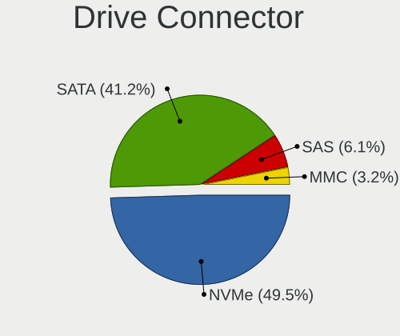

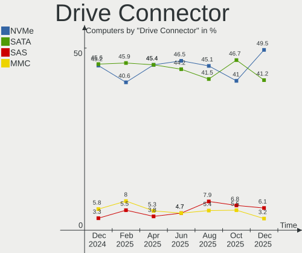

| Type | Computers | Drives | Percent |
|------|-----------|--------|---------|
| NVMe | 203       | 269    | 49.51%  |
| SATA | 169       | 290    | 41.22%  |
| SAS  | 25        | 30     | 6.1%    |
| MMC  | 13        | 14     | 3.17%   |

Drive Size
----------

Size of hard drive

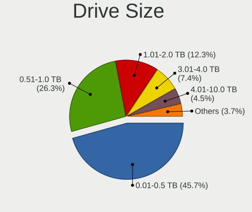

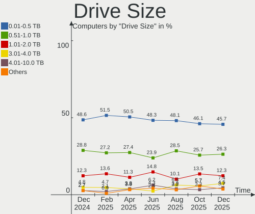

| Size in TB | Computers | Drives | Percent |
|------------|-----------|--------|---------|
| 0.01-0.5   | 111       | 139    | 45.68%  |
| 0.51-1.0   | 64        | 84     | 26.34%  |
| 1.01-2.0   | 30        | 37     | 12.35%  |
| 3.01-4.0   | 18        | 22     | 7.41%   |
| 4.01-10.0  | 11        | 14     | 4.53%   |
| 2.01-3.0   | 7         | 10     | 2.88%   |
| 10.01-20.0 | 2         | 4      | 0.82%   |

Space Total
-----------

Amount of disk space available on the file system

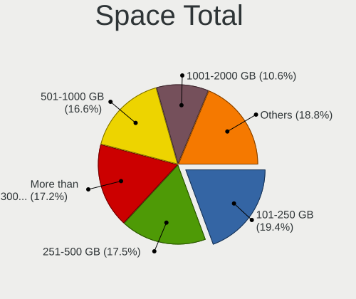

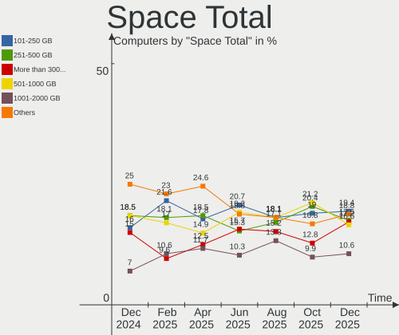

| Size in GB     | Computers | Percent |
|----------------|-----------|---------|
| 101-250        | 62        | 19.38%  |
| 251-500        | 56        | 17.5%   |
| More than 3000 | 55        | 17.19%  |
| 501-1000       | 53        | 16.56%  |
| 1001-2000      | 34        | 10.63%  |
| 2001-3000      | 16        | 5%      |
| 1-20           | 15        | 4.69%   |
| Unknown        | 15        | 4.69%   |
| 51-100         | 11        | 3.44%   |
| 21-50          | 3         | 0.94%   |

Space Used
----------

Amount of used disk space

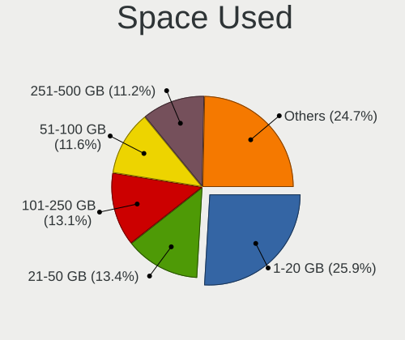

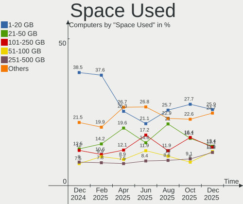

| Used GB        | Computers | Percent |
|----------------|-----------|---------|
| 1-20           | 83        | 25.94%  |
| 21-50          | 43        | 13.44%  |
| 101-250        | 42        | 13.13%  |
| 51-100         | 37        | 11.56%  |
| 251-500        | 36        | 11.25%  |
| 501-1000       | 23        | 7.19%   |
| 1001-2000      | 18        | 5.63%   |
| More than 3000 | 15        | 4.69%   |
| Unknown        | 15        | 4.69%   |
| 2001-3000      | 8         | 2.5%    |

Malfunc. Drives
---------------

Drive models with a malfunction

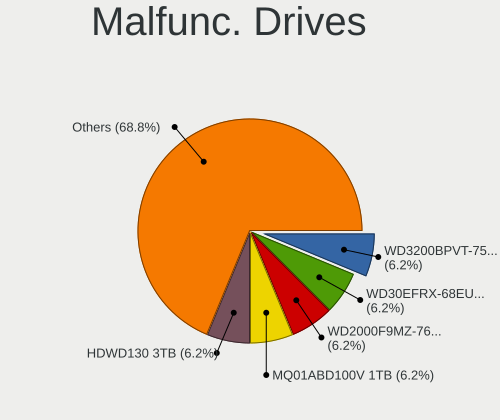

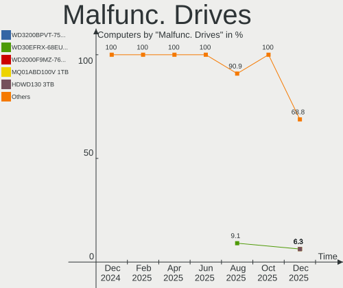

| Model                                               | Computers | Drives | Percent |
|-----------------------------------------------------|-----------|--------|---------|
| WDC WD3200BPVT-75JJ5T0 320GB                        | 1         | 1      | 6.25%   |
| WDC WD30EFRX-68EUZN0 3TB                            | 1         | 1      | 6.25%   |
| WDC WD2000F9MZ-76NVPL0 2TB                          | 1         | 1      | 6.25%   |
| Toshiba MQ01ABD100V 1TB                             | 1         | 1      | 6.25%   |
| Toshiba HDWD130 3TB                                 | 1         | 1      | 6.25%   |
| SK hynix HFS256G3AMNB-2200A 256GB SSD               | 1         | 1      | 6.25%   |
| SK hynix BC501 HFM256GDJTNG-8310A 256GB             | 1         | 1      | 6.25%   |
| Seagate ST320LT007-9ZV142 320GB                     | 1         | 1      | 6.25%   |
| Seagate ST1000LM024 HN-M101MBB 1TB                  | 1         | 1      | 6.25%   |
| Sandisk WD Black SN850 1TB                          | 1         | 1      | 6.25%   |
| Micron Technology MTFDDAK128MAY-1AH1ZABHA 128GB SSD | 1         | 1      | 6.25%   |
| Kingston SA400S37240G 240GB SSD                     | 1         | 1      | 6.25%   |
| Hitachi HUA722010CLA331 1TB                         | 1         | 1      | 6.25%   |
| Hitachi HTS541612J9SA00 3H 120GB                    | 1         | 1      | 6.25%   |
| BAITITON BT58SSD13S 1TB                             | 1         | 1      | 6.25%   |
| A-DATA Technology SU630 240GB SSD                   | 1         | 1      | 6.25%   |

Malfunc. Drive Vendor
---------------------

Vendors of faulty drives

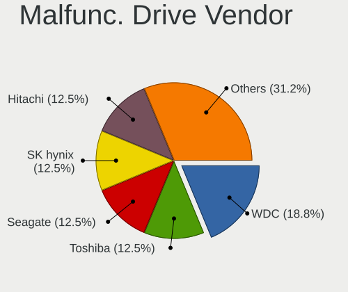

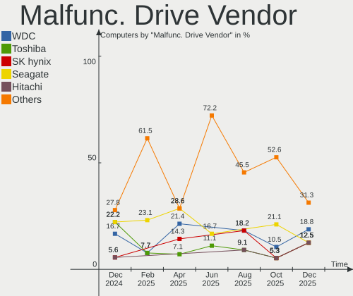

| Vendor            | Computers | Drives | Percent |
|-------------------|-----------|--------|---------|
| WDC               | 3         | 3      | 18.75%  |
| Toshiba           | 2         | 2      | 12.5%   |
| SK hynix          | 2         | 2      | 12.5%   |
| Seagate           | 2         | 2      | 12.5%   |
| Hitachi           | 2         | 2      | 12.5%   |
| Sandisk           | 1         | 1      | 6.25%   |
| Micron Technology | 1         | 1      | 6.25%   |
| Kingston          | 1         | 1      | 6.25%   |
| BAITITON          | 1         | 1      | 6.25%   |
| A-DATA Technology | 1         | 1      | 6.25%   |

Malfunc. HDD Vendor
-------------------

Vendors of faulty HDD drives

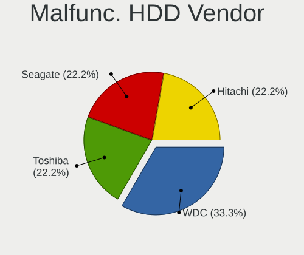

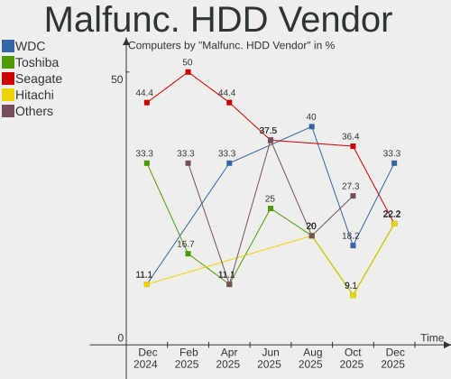

| Vendor  | Computers | Drives | Percent |
|---------|-----------|--------|---------|
| WDC     | 3         | 3      | 33.33%  |
| Toshiba | 2         | 2      | 22.22%  |
| Seagate | 2         | 2      | 22.22%  |
| Hitachi | 2         | 2      | 22.22%  |

Malfunc. Drive Kind
-------------------

Kinds of faulty drives

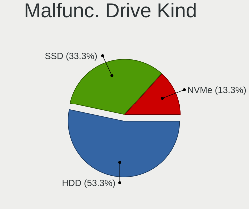

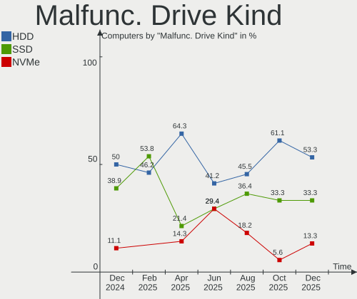

| Kind | Computers | Drives | Percent |
|------|-----------|--------|---------|
| HDD  | 8         | 9      | 53.33%  |
| SSD  | 5         | 5      | 33.33%  |
| NVMe | 2         | 2      | 13.33%  |

Failed Drives
-------------

Failed drive models

Zero info for selected period =(

Failed Drive Vendor
-------------------

Failed drive vendors

Zero info for selected period =(

Drive Status
------------

Number of failed and malfunc. drives

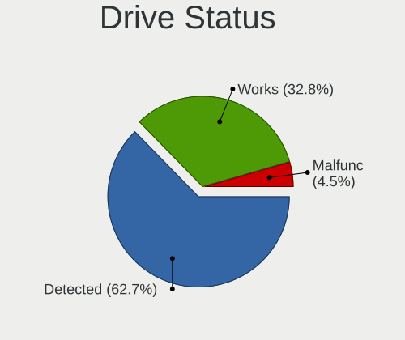

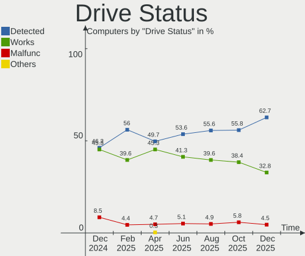

| Status   | Computers | Drives | Percent |
|----------|-----------|--------|---------|
| Detected | 210       | 400    | 62.69%  |
| Works    | 110       | 187    | 32.84%  |
| Malfunc  | 15        | 16     | 4.48%   |

Storage controller
------------------

Storage Vendor
--------------

Storage controller vendors

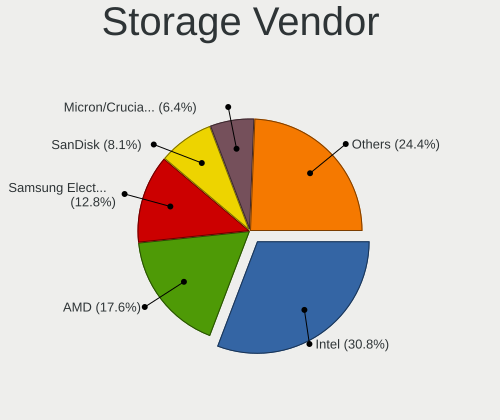

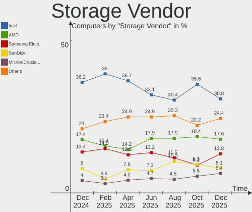

| Vendor                          | Computers | Percent |
|---------------------------------|-----------|---------|
| Intel                           | 149       | 30.79%  |
| AMD                             | 85        | 17.56%  |
| Samsung Electronics             | 62        | 12.81%  |
| SanDisk                         | 39        | 8.06%   |
| Micron/Crucial Technology       | 31        | 6.4%    |
| MAXIO Technology (Hangzhou)     | 16        | 3.31%   |
| SK hynix                        | 13        | 2.69%   |
| Kingston Technology Company     | 13        | 2.69%   |
| Phison Electronics              | 11        | 2.27%   |
| Micron Technology               | 11        | 2.27%   |
| KIOXIA                          | 11        | 2.27%   |
| ASMedia Technology              | 7         | 1.45%   |
| Toshiba America Info Systems    | 5         | 1.03%   |
| Silicon Motion                  | 3         | 0.62%   |
| Shenzhen Longsys Electronics    | 3         | 0.62%   |
| Realtek Semiconductor           | 3         | 0.62%   |
| Biwin Storage Technology        | 3         | 0.62%   |
| ADATA Technology                | 3         | 0.62%   |
| Nvidia                          | 2         | 0.41%   |
| Marvell Technology Group        | 2         | 0.41%   |
| LSI Logic / Symbios Logic       | 2         | 0.41%   |
| INNOGRIT                        | 2         | 0.41%   |
| Apple                           | 2         | 0.41%   |
| Union Memory (Shenzhen)         | 1         | 0.21%   |
| Solid State Storage Technology  | 1         | 0.21%   |
| Shenzhen Techwinsemi Technology | 1         | 0.21%   |
| Netac Technology                | 1         | 0.21%   |
| Hosin Global Electronics        | 1         | 0.21%   |
| Broadcom / LSI                  | 1         | 0.21%   |

Storage Model
-------------

Storage controller models

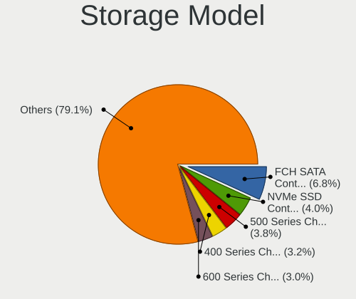

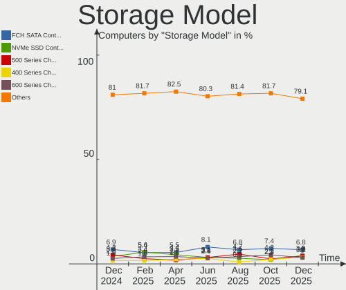

| Model                                                                          | Computers | Percent |
|--------------------------------------------------------------------------------|-----------|---------|
| AMD FCH SATA Controller [AHCI mode]                                            | 36        | 6.84%   |
| Samsung NVMe SSD Controller SM981/PM981/PM983                                  | 21        | 3.99%   |
| AMD 500 Series Chipset SATA Controller                                         | 20        | 3.8%    |
| AMD 400 Series Chipset SATA Controller                                         | 17        | 3.23%   |
| AMD 600 Series Chipset SATA Controller                                         | 16        | 3.04%   |
| MAXIO (Hangzhou) NVMe SSD Controller MAP1202 (DRAM-less)                       | 14        | 2.66%   |
| Samsung NVMe SSD Controller 980 (DRAM-less)                                    | 10        | 1.9%    |
| Micron/Crucial P2 [Nick P2] / P3 / P3 Plus NVMe PCIe SSD (DRAM-less)           | 10        | 1.9%    |
| Samsung NVMe SSD Controller S4LV008[Pascal]                                    | 9         | 1.71%   |
| Intel Sunrise Point-LP SATA Controller [AHCI mode]                             | 9         | 1.71%   |
| Intel 8 Series/C220 Series Chipset Family 6-port SATA Controller 1 [AHCI mode] | 9         | 1.71%   |
| SanDisk WD SN560/SN740/SN770/SN5000 NVMe SSD                                   | 8         | 1.52%   |
| Samsung NVMe SSD Controller PM9A1/PM9A3/980PRO                                 | 8         | 1.52%   |
| Intel RST Volume Management Device Controller                                  | 8         | 1.52%   |
| Intel Q170/Q150/B150/H170/H110/Z170/CM236 Chipset SATA Controller [AHCI Mode]  | 8         | 1.52%   |
| Intel 6 Series/C200 Series Chipset Family 6 port Desktop SATA AHCI Controller  | 8         | 1.52%   |
| Intel 200 Series PCH SATA controller [AHCI mode]                               | 8         | 1.52%   |
| Samsung NVMe SSD Controller PM9C1a (DRAM-less)                                 | 7         | 1.33%   |
| Micron/Crucial P310 NVMe PCIe SSD (DRAM-less)                                  | 7         | 1.33%   |
| Intel Volume Management Device NVMe RAID Controller                            | 7         | 1.33%   |
| Intel 7 Series Chipset Family 6-port SATA Controller [AHCI mode]               | 7         | 1.33%   |
| Sandisk WD Black SN850X NVMe SSD                                               | 6         | 1.14%   |
| Micron/Crucial P5 Plus NVMe PCIe SSD                                           | 6         | 1.14%   |
| KIOXIA NVMe SSD Controller BG4 (DRAM-less)                                     | 6         | 1.14%   |
| Intel Comet Lake SATA AHCI Controller                                          | 6         | 1.14%   |
| Intel 500 Series Chipset Family SATA AHCI Controller                           | 6         | 1.14%   |
| ASMedia ASM1061/ASM1062 Serial ATA Controller                                  | 6         | 1.14%   |
| SanDisk WD PC SN810 / Black SN850 NVMe SSD                                     | 5         | 0.95%   |
| Samsung NVMe SSD Controller SM961/PM961/SM963                                  | 5         | 0.95%   |
| Intel SATA Controller [RAID mode]                                              | 5         | 0.95%   |
| SanDisk Extreme Pro / WD Black SN750 / PC SN730 / Red SN700 NVMe SSD           | 4         | 0.76%   |
| Micron/Crucial T500 NVMe PCIe SSD                                              | 4         | 0.76%   |
| Micron 2400 NVMe SSD (DRAM-less)                                               | 4         | 0.76%   |
| Intel Raptor Lake SATA AHCI Controller                                         | 4         | 0.76%   |
| Intel Cannon Lake PCH SATA AHCI Controller                                     | 4         | 0.76%   |
| Intel Alder Lake-S PCH SATA Controller [AHCI Mode]                             | 4         | 0.76%   |
| Intel Alder Lake-N SATA AHCI Controller                                        | 4         | 0.76%   |
| Intel 82801 Mobile SATA Controller [RAID mode]                                 | 4         | 0.76%   |
| Intel 7 Series/C210 Series Chipset Family 6-port SATA Controller [AHCI mode]   | 4         | 0.76%   |
| AMD SB7x0/SB8x0/SB9x0 SATA Controller [AHCI mode]                              | 4         | 0.76%   |

Storage Kind
------------

Kind of storage controller (IDE, SATA, NVMe, SAS, ...)

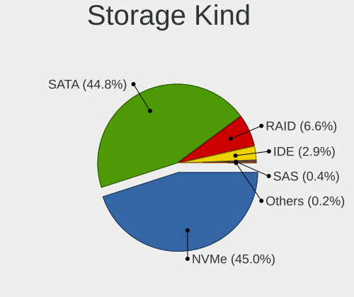

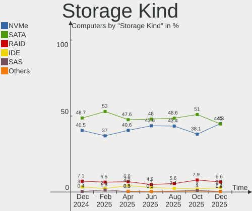

| Kind | Computers | Percent |
|------|-----------|---------|
| NVMe | 204       | 45.03%  |
| SATA | 203       | 44.81%  |
| RAID | 30        | 6.62%   |
| IDE  | 13        | 2.87%   |
| SAS  | 2         | 0.44%   |
| SCSI | 1         | 0.22%   |

Processor
---------

CPU Vendor
----------

Processor vendors

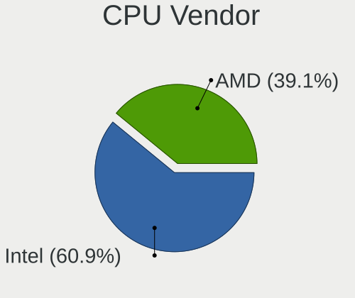

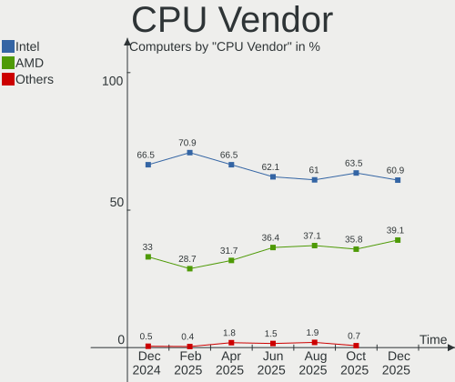

| Vendor | Computers | Percent |
|--------|-----------|---------|
| Intel  | 195       | 60.94%  |
| AMD    | 125       | 39.06%  |

CPU Model
---------

Processor models

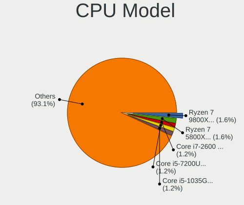

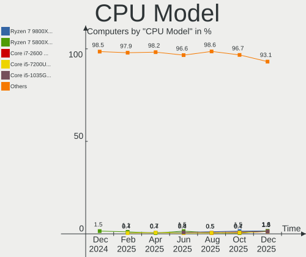

| Model                                         | Computers | Percent |
|-----------------------------------------------|-----------|---------|
| AMD Ryzen 7 9800X3D 8-Core Processor          | 5         | 1.56%   |
| AMD Ryzen 7 5800X 8-Core Processor            | 5         | 1.56%   |
| Intel Core i7-2600 CPU @ 3.40GHz              | 4         | 1.25%   |
| Intel Core i5-7200U CPU @ 2.50GHz             | 4         | 1.25%   |
| Intel Core i5-1035G1 CPU @ 1.00GHz            | 4         | 1.25%   |
| Intel 11th Gen Core i5-1135G7 @ 2.40GHz       | 4         | 1.25%   |
| AMD Ryzen 7 3700X 8-Core Processor            | 4         | 1.25%   |
| AMD Ryzen 5 5600X 6-Core Processor            | 4         | 1.25%   |
| Intel Core i7-9700K CPU @ 3.60GHz             | 3         | 0.94%   |
| Intel Core i7-8700K CPU @ 3.70GHz             | 3         | 0.94%   |
| Intel Core i7-4790 CPU @ 3.60GHz              | 3         | 0.94%   |
| Intel Core i5-2400 CPU @ 3.10GHz              | 3         | 0.94%   |
| Intel Core i3-3220 CPU @ 3.30GHz              | 3         | 0.94%   |
| AMD Ryzen Z2 Go                               | 3         | 0.94%   |
| AMD Ryzen Z1 Extreme                          | 3         | 0.94%   |
| AMD Ryzen 9 5900X 12-Core Processor           | 3         | 0.94%   |
| AMD Ryzen 7 5800X3D 8-Core Processor          | 3         | 0.94%   |
| AMD Ryzen 7 5700X 8-Core Processor            | 3         | 0.94%   |
| AMD Ryzen 5 5600G with Radeon Graphics        | 3         | 0.94%   |
| AMD Ryzen 5 3600 6-Core Processor             | 3         | 0.94%   |
| AMD Ryzen 5 3550H with Radeon Vega Mobile Gfx | 3         | 0.94%   |
| AMD Ryzen 5 2600 Six-Core Processor           | 3         | 0.94%   |
| AMD Custom APU 0932                           | 3         | 0.94%   |
| Intel N100                                    | 2         | 0.63%   |
| Intel Core Ultra 7 155H                       | 2         | 0.63%   |
| Intel Core i9-9900K CPU @ 3.60GHz             | 2         | 0.63%   |
| Intel Core i7-8565U CPU @ 1.80GHz             | 2         | 0.63%   |
| Intel Core i7-6700HQ CPU @ 2.60GHz            | 2         | 0.63%   |
| Intel Core i7-5500U CPU @ 2.40GHz             | 2         | 0.63%   |
| Intel Core i7-14700HX                         | 2         | 0.63%   |
| Intel Core i7-10850H CPU @ 2.70GHz            | 2         | 0.63%   |
| Intel Core i7-10510U CPU @ 1.80GHz            | 2         | 0.63%   |
| Intel Core i7 CPU M 640 @ 2.80GHz             | 2         | 0.63%   |
| Intel Core i5-8350U CPU @ 1.70GHz             | 2         | 0.63%   |
| Intel Core i5-8265U CPU @ 1.60GHz             | 2         | 0.63%   |
| Intel Core i5-7300U CPU @ 2.60GHz             | 2         | 0.63%   |
| Intel Core i5-6600K CPU @ 3.50GHz             | 2         | 0.63%   |
| Intel Core i5-6300U CPU @ 2.40GHz             | 2         | 0.63%   |
| Intel Core i5-4690 CPU @ 3.50GHz              | 2         | 0.63%   |
| Intel Core i5-4570 CPU @ 3.20GHz              | 2         | 0.63%   |

CPU Model Family
----------------

Processor model prefix

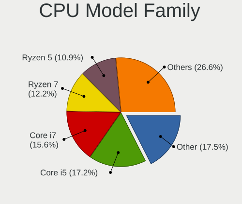

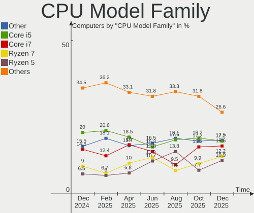

| Model                   | Computers | Percent |
|-------------------------|-----------|---------|
| Other                   | 56        | 17.5%   |
| Intel Core i5           | 55        | 17.19%  |
| Intel Core i7           | 50        | 15.63%  |
| AMD Ryzen 7             | 39        | 12.19%  |
| AMD Ryzen 5             | 35        | 10.94%  |
| AMD Ryzen 9             | 16        | 5%      |
| Intel Core i3           | 11        | 3.44%   |
| Intel Xeon              | 8         | 2.5%    |
| Intel Celeron           | 7         | 2.19%   |
| Intel Core 2 Duo        | 6         | 1.88%   |
| Intel Core              | 6         | 1.88%   |
| Intel Core i9           | 4         | 1.25%   |
| AMD Ryzen 5 PRO         | 4         | 1.25%   |
| AMD A8                  | 3         | 0.94%   |
| Intel Pentium           | 2         | 0.63%   |
| AMD Ryzen 7 PRO         | 2         | 0.63%   |
| AMD Ryzen 3             | 2         | 0.63%   |
| AMD FX                  | 2         | 0.63%   |
| AMD E                   | 2         | 0.63%   |
| AMD A4                  | 2         | 0.63%   |
| Intel Pentium Dual-Core | 1         | 0.31%   |
| Intel Genuine           | 1         | 0.31%   |
| Intel Core 2 Quad       | 1         | 0.31%   |
| AMD E2                  | 1         | 0.31%   |
| AMD Athlon X2           | 1         | 0.31%   |
| AMD Athlon II X2        | 1         | 0.31%   |
| AMD Athlon              | 1         | 0.31%   |
| AMD A6                  | 1         | 0.31%   |

CPU Cores
---------

Number of processor cores

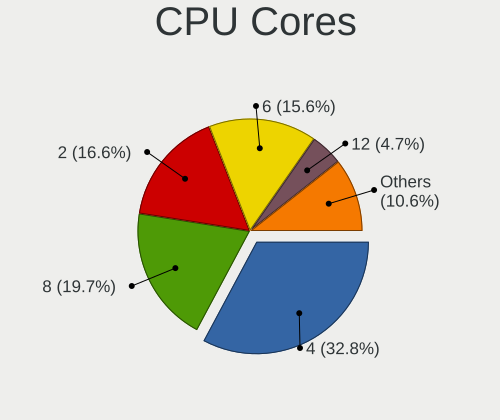

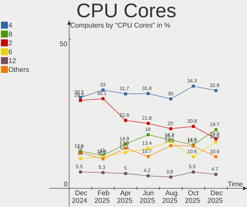

| Number | Computers | Percent |
|--------|-----------|---------|
| 4      | 105       | 32.81%  |
| 8      | 63        | 19.69%  |
| 2      | 53        | 16.56%  |
| 6      | 50        | 15.63%  |
| 12     | 15        | 4.69%   |
| 16     | 11        | 3.44%   |
| 10     | 11        | 3.44%   |
| 14     | 5         | 1.56%   |
| 20     | 3         | 0.94%   |
| 24     | 1         | 0.31%   |
| 18     | 1         | 0.31%   |
| 5      | 1         | 0.31%   |
| 1      | 1         | 0.31%   |

CPU Sockets
-----------

Number of sockets

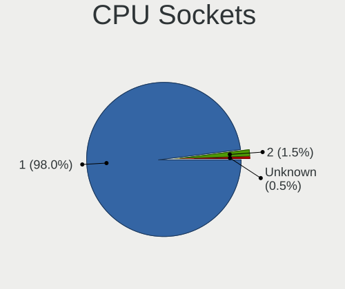

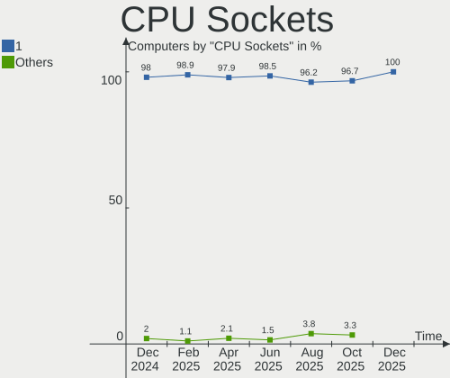

| Number | Computers | Percent |
|--------|-----------|---------|
| 1      | 320       | 100%    |

CPU Threads
-----------

Threads per core (Hyper-Threading)

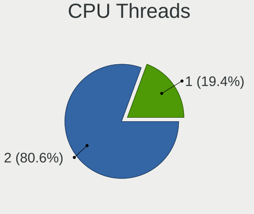

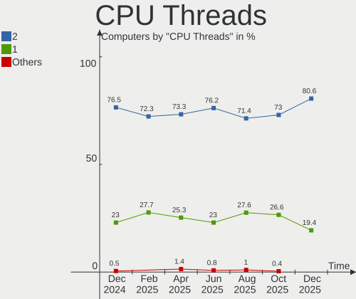

| Number | Computers | Percent |
|--------|-----------|---------|
| 2      | 258       | 80.63%  |
| 1      | 62        | 19.38%  |

CPU Op-Modes
------------

CPU Operation Modes (32-bit, 64-bit)

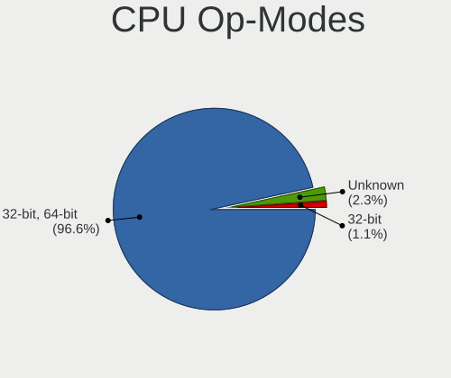

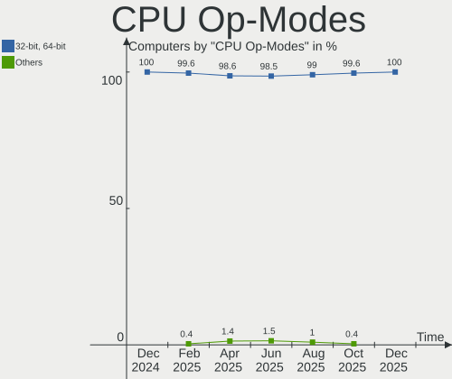

| Op mode        | Computers | Percent |
|----------------|-----------|---------|
| 32-bit, 64-bit | 320       | 100%    |

CPU Microcode
-------------

Microcode number

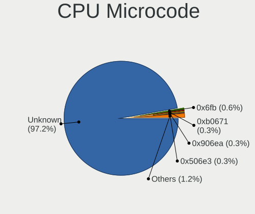

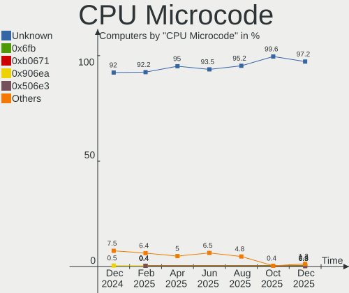

| Number     | Computers | Percent |
|------------|-----------|---------|
| Unknown    | 311       | 97.19%  |
| 0x6fb      | 2         | 0.63%   |
| 0xb0671    | 1         | 0.31%   |
| 0x906ea    | 1         | 0.31%   |
| 0x506e3    | 1         | 0.31%   |
| 0x306a9    | 1         | 0.31%   |
| 0x20655    | 1         | 0.31%   |
| 0x0b204037 | 1         | 0.31%   |
| 0x0a50000f | 1         | 0.31%   |

CPU Microarch
-------------

Microarchitecture

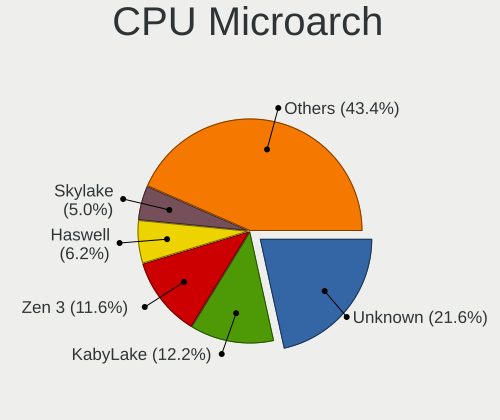

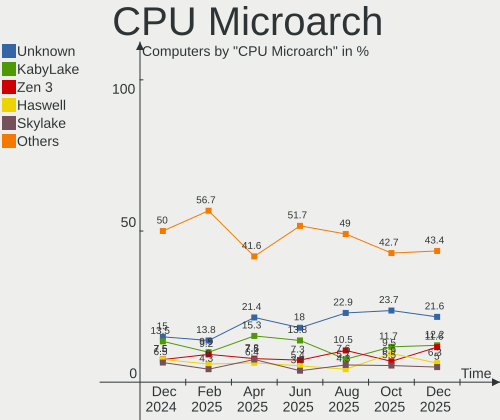

| Name               | Computers | Percent |
|--------------------|-----------|---------|
| Unknown            | 69        | 21.56%  |
| KabyLake           | 39        | 12.19%  |
| Zen 3              | 37        | 11.56%  |
| Haswell            | 20        | 6.25%   |
| Skylake            | 16        | 5%      |
| Zen+               | 15        | 4.69%   |
| Zen 2              | 15        | 4.69%   |
| Alderlake Hybrid   | 14        | 4.38%   |
| IvyBridge          | 13        | 4.06%   |
| SandyBridge        | 12        | 3.75%   |
| CometLake          | 11        | 3.44%   |
| TigerLake          | 9         | 2.81%   |
| IceLake            | 8         | 2.5%    |
| Penryn             | 6         | 1.88%   |
| Westmere           | 5         | 1.56%   |
| Silvermont         | 4         | 1.25%   |
| Broadwell          | 4         | 1.25%   |
| Core               | 3         | 0.94%   |
| Puma               | 2         | 0.63%   |
| Piledriver         | 2         | 0.63%   |
| Meteorlake Hybrid  | 2         | 0.63%   |
| K8 Hammer          | 2         | 0.63%   |
| K10 Llano          | 2         | 0.63%   |
| Goldmont plus      | 2         | 0.63%   |
| Zen                | 1         | 0.31%   |
| Steamroller        | 1         | 0.31%   |
| K10                | 1         | 0.31%   |
| Jaguar             | 1         | 0.31%   |
| Gracemont          | 1         | 0.31%   |
| Goldmont           | 1         | 0.31%   |
| Bobcat             | 1         | 0.31%   |
| ArrowLake-H Hybrid | 1         | 0.31%   |

Graphics
--------

GPU Vendor
----------

Vendors of graphics cards

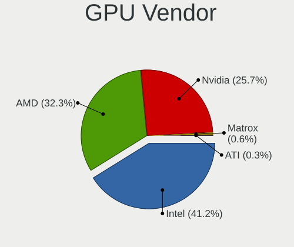

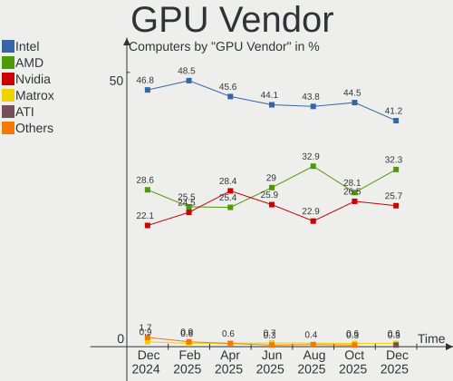

| Vendor                     | Computers | Percent |
|----------------------------|-----------|---------|
| Intel                      | 149       | 41.16%  |
| AMD                        | 117       | 32.32%  |
| Nvidia                     | 93        | 25.69%  |
| Matrox Electronics Systems | 2         | 0.55%   |
| ATI Technologies           | 1         | 0.28%   |

GPU Model
---------

Graphics card models

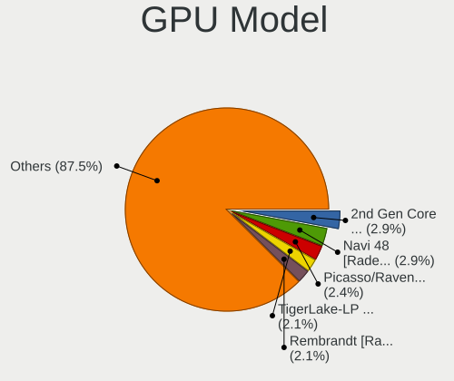

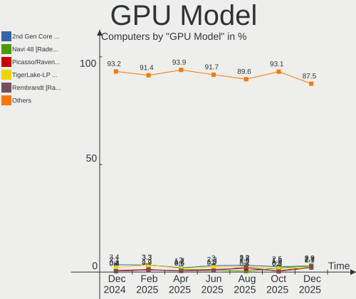

| Model                                                                                    | Computers | Percent |
|------------------------------------------------------------------------------------------|-----------|---------|
| Intel 2nd Generation Core Processor Family Integrated Graphics Controller                | 11        | 2.92%   |
| AMD Navi 48 [Radeon RX 9070/9070 XT/9070 GRE]                                            | 11        | 2.92%   |
| AMD Picasso/Raven 2 [Radeon Vega Series / Radeon Vega Mobile Series]                     | 9         | 2.39%   |
| Intel TigerLake-LP GT2 [Iris Xe Graphics]                                                | 8         | 2.12%   |
| AMD Rembrandt [Radeon 680M]                                                              | 8         | 2.12%   |
| AMD Granite Ridge [Radeon Graphics]                                                      | 8         | 2.12%   |
| AMD Cezanne [Radeon Vega Series / Radeon Vega Mobile Series]                             | 8         | 2.12%   |
| Intel Raptor Lake-P [Iris Xe Graphics]                                                   | 7         | 1.86%   |
| AMD Phoenix1                                                                             | 7         | 1.86%   |
| Intel Kaby Lake-U GT2 [HD Graphics 620]                                                  | 6         | 1.59%   |
| Intel CometLake-U GT2 [UHD Graphics]                                                     | 6         | 1.59%   |
| Nvidia GA106 [GeForce RTX 3060 Lite Hash Rate]                                           | 5         | 1.33%   |
| Intel Xeon E3-1200 v3/4th Gen Core Processor Integrated Graphics Controller              | 5         | 1.33%   |
| Intel WhiskeyLake-U GT2 [UHD Graphics 620]                                               | 5         | 1.33%   |
| Intel Kaby Lake-R GT2 [UHD Graphics 620]                                                 | 5         | 1.33%   |
| Intel Core Processor Integrated Graphics Controller                                      | 5         | 1.33%   |
| Intel 3rd Gen Core processor Graphics Controller                                         | 5         | 1.33%   |
| AMD Raphael                                                                              | 5         | 1.33%   |
| Intel Skylake-U GT2 [HD Graphics 520]                                                    | 4         | 1.06%   |
| Intel Skylake-S GT2 [HD Graphics 530]                                                    | 4         | 1.06%   |
| Intel Iris Plus Graphics G1 (Ice Lake)                                                   | 4         | 1.06%   |
| Intel CometLake-H GT2 [UHD Graphics]                                                     | 4         | 1.06%   |
| Intel CoffeeLake-S GT2 [UHD Graphics 630]                                                | 4         | 1.06%   |
| Intel Alder Lake-N [UHD Graphics]                                                        | 4         | 1.06%   |
| AMD Navi 22 [Radeon RX 6700/6700 XT/6750 XT / 6800M/6850M XT]                            | 4         | 1.06%   |
| AMD Navi 10 [Radeon RX 5600 OEM/5600 XT / 5700/5700 XT]                                  | 4         | 1.06%   |
| AMD Ellesmere [Radeon RX 470/480/570/570X/580/580X/590]                                  | 4         | 1.06%   |
| Nvidia GP106 [GeForce GTX 1060 6GB]                                                      | 3         | 0.8%    |
| Nvidia GP102 [GeForce GTX 1080 Ti]                                                       | 3         | 0.8%    |
| Nvidia GA102 [GeForce RTX 3090]                                                          | 3         | 0.8%    |
| Nvidia AD107M [GeForce RTX 4060 Max-Q / Mobile]                                          | 3         | 0.8%    |
| Intel Xeon E3-1200 v2/3rd Gen Core processor Graphics Controller                         | 3         | 0.8%    |
| Intel Skylake-H GT2 [HD Graphics 530]                                                    | 3         | 0.8%    |
| Intel Mobile 4 Series Chipset Integrated Graphics Controller                             | 3         | 0.8%    |
| Intel Broadwell-U GT2 [HD Graphics 5500]                                                 | 3         | 0.8%    |
| Intel Battlemage G21 [Arc B580]                                                          | 3         | 0.8%    |
| Intel Atom/Celeron/Pentium Processor x5-E8000/J3xxx/N3xxx Integrated Graphics Controller | 3         | 0.8%    |
| Intel Alder Lake-UP3 GT2 [Iris Xe Graphics]                                              | 3         | 0.8%    |
| Intel Alder Lake-P GT2 [Iris Xe Graphics]                                                | 3         | 0.8%    |
| AMD Strix [Radeon 880M / 890M]                                                           | 3         | 0.8%    |

GPU Combo
---------

Combinations of graphics cards

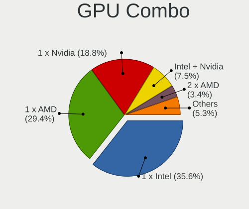

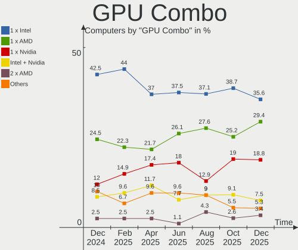

| Name                     | Computers | Percent |
|--------------------------|-----------|---------|
| 1 x Intel                | 114       | 35.63%  |
| 1 x AMD                  | 94        | 29.38%  |
| 1 x Nvidia               | 60        | 18.75%  |
| Intel + Nvidia           | 24        | 7.5%    |
| 2 x AMD                  | 11        | 3.44%   |
| AMD + Nvidia             | 6         | 1.88%   |
| Intel + AMD              | 5         | 1.56%   |
| 1 x Matrox               | 2         | 0.63%   |
| Intel + AMD + 1 x Nvidia | 2         | 0.63%   |
| Other                    | 1         | 0.31%   |
| 2 x Nvidia               | 1         | 0.31%   |

GPU Driver
----------

Free vs proprietary

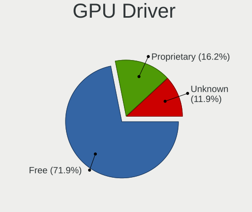

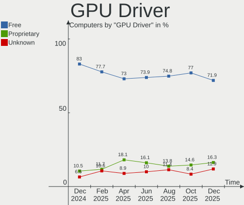

| Driver      | Computers | Percent |
|-------------|-----------|---------|
| Free        | 230       | 71.88%  |
| Proprietary | 52        | 16.25%  |
| Unknown     | 38        | 11.88%  |

GPU Memory
----------

Total video memory

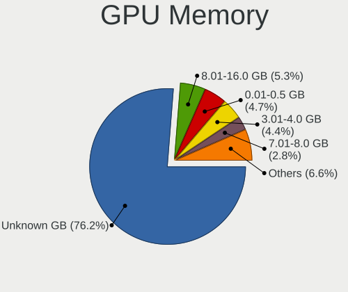

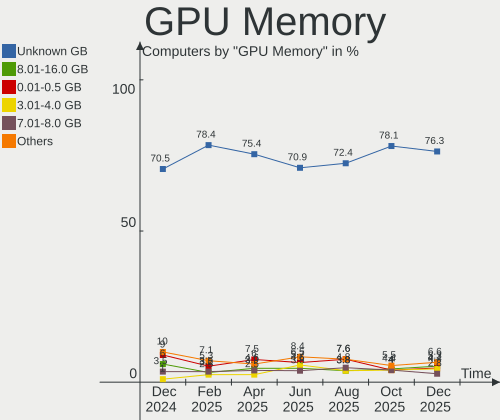

| Size in GB | Computers | Percent |
|------------|-----------|---------|
| Unknown    | 244       | 76.25%  |
| 8.01-16.0  | 17        | 5.31%   |
| 0.01-0.5   | 15        | 4.69%   |
| 3.01-4.0   | 14        | 4.38%   |
| 7.01-8.0   | 9         | 2.81%   |
| 0.51-1.0   | 7         | 2.19%   |
| 5.01-6.0   | 4         | 1.25%   |
| 1.01-2.0   | 4         | 1.25%   |
| 2.01-3.0   | 3         | 0.94%   |
| 16.01-24.0 | 2         | 0.63%   |
| 24.01-32.0 | 1         | 0.31%   |

Monitor
-------

Monitor Vendor
--------------

Monitor vendors

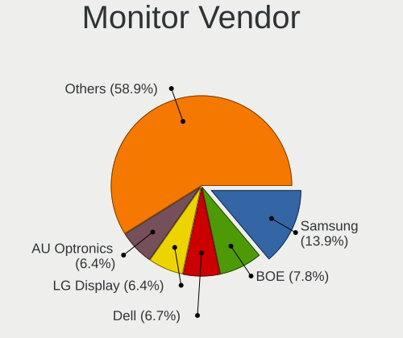

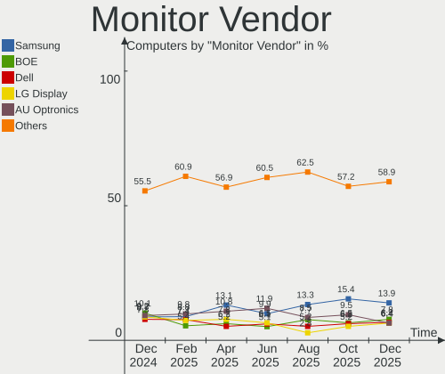

| Vendor                  | Computers | Percent |
|-------------------------|-----------|---------|
| Samsung Electronics     | 50        | 13.89%  |
| BOE                     | 28        | 7.78%   |
| Dell                    | 24        | 6.67%   |
| LG Display              | 23        | 6.39%   |
| AU Optronics            | 23        | 6.39%   |
| Chimei Innolux          | 19        | 5.28%   |
| Goldstar                | 18        | 5%      |
| AOC                     | 15        | 4.17%   |
| Acer                    | 14        | 3.89%   |
| Lenovo                  | 13        | 3.61%   |
| BenQ                    | 13        | 3.61%   |
| Philips                 | 12        | 3.33%   |
| Apple                   | 8         | 2.22%   |
| Iiyama                  | 7         | 1.94%   |
| ViewSonic               | 6         | 1.67%   |
| Sharp                   | 6         | 1.67%   |
| MSI                     | 6         | 1.67%   |
| Hewlett-Packard         | 6         | 1.67%   |
| ASUSTek Computer        | 5         | 1.39%   |
| HKC                     | 4         | 1.11%   |
| Ancor Communications    | 4         | 1.11%   |
| Valve                   | 3         | 0.83%   |
| TMX                     | 3         | 0.83%   |
| Panasonic               | 3         | 0.83%   |
| InfoVision              | 3         | 0.83%   |
| Gigabyte Technology     | 3         | 0.83%   |
| Vestel Elektronik       | 2         | 0.56%   |
| Unknown (XXX)           | 2         | 0.56%   |
| Unknown                 | 2         | 0.56%   |
| Sony                    | 2         | 0.56%   |
| PANDA                   | 2         | 0.56%   |
| Hitachi                 | 2         | 0.56%   |
| Chi Mei Optoelectronics | 2         | 0.56%   |
| UGD                     | 1         | 0.28%   |
| TCL                     | 1         | 0.28%   |
| STD                     | 1         | 0.28%   |
| RTK                     | 1         | 0.28%   |
| Roku                    | 1         | 0.28%   |
| Qushimei                | 1         | 0.28%   |
| Pixio                   | 1         | 0.28%   |

Monitor Model
-------------

Monitor models

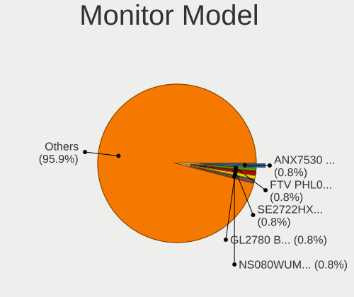

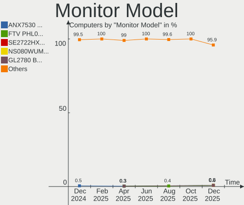

| Model                                                                 | Computers | Percent |
|-----------------------------------------------------------------------|-----------|---------|
| Valve ANX7530 U VLV3003 800x1280 100x160mm 7.4-inch                   | 3         | 0.81%   |
| Philips FTV PHL01EA 1920x1080 1440x810mm 65.0-inch                    | 3         | 0.81%   |
| Dell SE2722HX DELD118 1920x1080 600x340mm 27.2-inch                   | 3         | 0.81%   |
| BOE NS080WUM-LX1 BOE0CFF 1920x1200 172x108mm 8.0-inch                 | 3         | 0.81%   |
| BenQ GL2780 BNQ78EC 1920x1080 600x340mm 27.2-inch                     | 3         | 0.81%   |
| Acer S240HL ACR0289 1920x1080 531x299mm 24.0-inch                     | 3         | 0.81%   |
| Vestel Elektronik 40UHD_LCD_TV VES3700 3840x2160 880x500mm 39.8-inch  | 2         | 0.54%   |
| Unknown LCD Monitor FFFF 2288x1287 2550x2550mm 142.0-inch             | 2         | 0.54%   |
| TMX TL070FVXS01-0 TMX0002 1920x1080 160x100mm 7.4-inch                | 2         | 0.54%   |
| Sharp LCD Monitor SHP14D1 1920x1200 336x210mm 15.6-inch               | 2         | 0.54%   |
| Samsung Electronics SyncMaster SAM0091 1600x1200 432x324mm 21.3-inch  | 2         | 0.54%   |
| Samsung Electronics LCD Monitor SDCA029 3840x2160 344x194mm 15.5-inch | 2         | 0.54%   |
| Samsung Electronics LCD Monitor SDC4171 2880x1800 302x189mm 14.0-inch | 2         | 0.54%   |
| Panasonic VVX11F009G00 MEI96A2 1920x1080 344x193mm 15.5-inch          | 2         | 0.54%   |
| LG Display LCD Monitor LGD046F 1920x1080 344x194mm 15.5-inch          | 2         | 0.54%   |
| Goldstar ULTRAGEAR GSM5B71 1920x1080 597x336mm 27.0-inch              | 2         | 0.54%   |
| Dell AW3423DWF DELA212 3440x1440 800x337mm 34.2-inch                  | 2         | 0.54%   |
| Chimei Innolux P130ZFA-BA1 CMN8201 2160x1440 275x183mm 13.0-inch      | 2         | 0.54%   |
| Chimei Innolux LCD Monitor CMN14D4 1920x1080 309x173mm 13.9-inch      | 2         | 0.54%   |
| Chimei Innolux LCD Monitor CMN14C9 1920x1080 309x173mm 13.9-inch      | 2         | 0.54%   |
| AU Optronics LCD Monitor AUO235C 1366x768 256x144mm 11.6-inch         | 2         | 0.54%   |
| ASUSTek Computer XG16A AUS16E1 1920x1080 344x194mm 15.5-inch          | 2         | 0.54%   |
| Apple iMac APPAE01 3840x2160 597x336mm 27.0-inch                      | 2         | 0.54%   |
| AOC K27U3D AOC2703 3840x2160 597x336mm 27.0-inch                      | 2         | 0.54%   |
| AOC 27G2G4 AOC2702 1920x1080 598x336mm 27.0-inch                      | 2         | 0.54%   |
| Ancor Communications ASUS VE278 ACI27F6 1920x1080 598x336mm 27.0-inch | 2         | 0.54%   |
| Acer G276HL ACR0300 1920x1080 598x336mm 27.0-inch                     | 2         | 0.54%   |
| ViewSonic VX2718-2KPC VSCB73A 2560x1440 598x336mm 27.0-inch           | 1         | 0.27%   |
| ViewSonic VX2718 series VSCE439 1920x1080 609x348mm 27.6-inch         | 1         | 0.27%   |
| ViewSonic VX2718 Series VSC4D3B 1920x1080 598x336mm 27.0-inch         | 1         | 0.27%   |
| ViewSonic VX2363 Series VSC6B2F 1920x1080 509x286mm 23.0-inch         | 1         | 0.27%   |
| ViewSonic VA2719 Series VSCC132 1920x1080 598x336mm 27.0-inch         | 1         | 0.27%   |
| ViewSonic VA2213w VSC3422 1920x1080 477x268mm 21.5-inch               | 1         | 0.27%   |
| Unknown (XXX) Union TV XXX2841 1920x1080 1209x680mm 54.6-inch         | 1         | 0.27%   |
| Unknown (XXX) Beyond TV XXX9221 1920x1080 1209x680mm 54.6-inch        | 1         | 0.27%   |
| UGD Artist 15.6 UGD1501 1920x1080 344x193mm 15.5-inch                 | 1         | 0.27%   |
| TMX TL140BDXP01-0 TMX1400 2560x1440 310x174mm 14.0-inch               | 1         | 0.27%   |
| TCL Beyond TV TCL9653 3840x2160 1210x680mm 54.6-inch                  | 1         | 0.27%   |
| STD LCD TV STD0101 1920x1080                                          | 1         | 0.27%   |
| Sony TV SNYFF00 1360x768                                              | 1         | 0.27%   |

Monitor Resolution
------------------

Monitor screen resolution

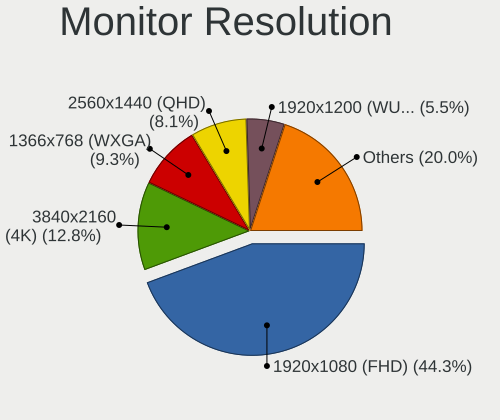

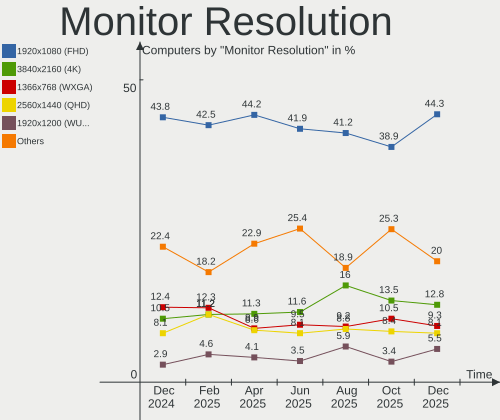

| Resolution         | Computers | Percent |
|--------------------|-----------|---------|
| 1920x1080 (FHD)    | 153       | 44.35%  |
| 3840x2160 (4K)     | 44        | 12.75%  |
| 1366x768 (WXGA)    | 32        | 9.28%   |
| 2560x1440 (QHD)    | 28        | 8.12%   |
| 1920x1200 (WUXGA)  | 19        | 5.51%   |
| 3440x1440          | 11        | 3.19%   |
| 2560x1600          | 9         | 2.61%   |
| 1680x1050 (WSXGA+) | 6         | 1.74%   |
| 1600x900 (HD+)     | 5         | 1.45%   |
| 2880x1800          | 4         | 1.16%   |
| Unknown            | 4         | 1.16%   |
| 800x1280           | 3         | 0.87%   |
| 2880x1920          | 3         | 0.87%   |
| 2160x1440          | 3         | 0.87%   |
| 1360x768           | 3         | 0.87%   |
| 2560x1080          | 2         | 0.58%   |
| 2288x1287          | 2         | 0.58%   |
| 1600x1200          | 2         | 0.58%   |
| 1440x900 (WXGA+)   | 2         | 0.58%   |
| 1280x800 (WXGA)    | 2         | 0.58%   |
| 3840x1600          | 1         | 0.29%   |
| 3840x1080          | 1         | 0.29%   |
| 3360x1440          | 1         | 0.29%   |
| 2880x1620          | 1         | 0.29%   |
| 2240x1400          | 1         | 0.29%   |
| 2048x1152          | 1         | 0.29%   |
| 1920x540           | 1         | 0.29%   |
| 1800x1200          | 1         | 0.29%   |

Monitor Diagonal
----------------

Diagonal size in inches

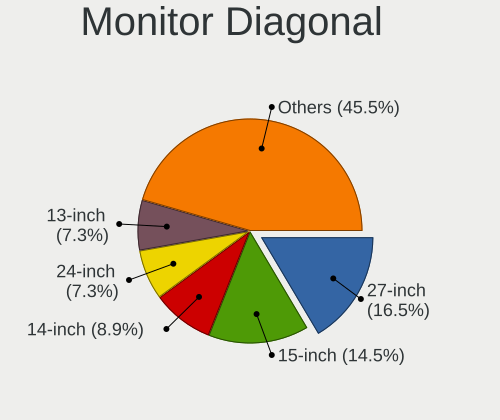

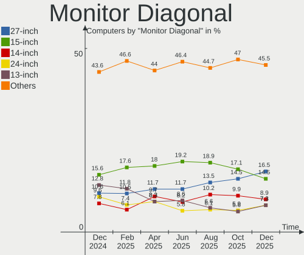

| Inches  | Computers | Percent |
|---------|-----------|---------|
| 27      | 59        | 16.48%  |
| 15      | 52        | 14.53%  |
| 14      | 32        | 8.94%   |
| 24      | 26        | 7.26%   |
| 13      | 26        | 7.26%   |
| 23      | 20        | 5.59%   |
| 21      | 20        | 5.59%   |
| 31      | 19        | 5.31%   |
| 34      | 11        | 3.07%   |
| 17      | 10        | 2.79%   |
| Unknown | 10        | 2.79%   |
| 16      | 8         | 2.23%   |
| 84      | 6         | 1.68%   |
| 11      | 5         | 1.4%    |
| 7       | 5         | 1.4%    |
| 65      | 4         | 1.12%   |
| 18      | 4         | 1.12%   |
| 12      | 4         | 1.12%   |
| 8       | 4         | 1.12%   |
| 72      | 3         | 0.84%   |
| 54      | 3         | 0.84%   |
| 22      | 3         | 0.84%   |
| 20      | 3         | 0.84%   |
| 142     | 2         | 0.56%   |
| 63      | 2         | 0.56%   |
| 36      | 2         | 0.56%   |
| 26      | 2         | 0.56%   |
| 10      | 2         | 0.56%   |
| 74      | 1         | 0.28%   |
| 64      | 1         | 0.28%   |
| 48      | 1         | 0.28%   |
| 46      | 1         | 0.28%   |
| 44      | 1         | 0.28%   |
| 39      | 1         | 0.28%   |
| 37      | 1         | 0.28%   |
| 33      | 1         | 0.28%   |
| 32      | 1         | 0.28%   |
| 30      | 1         | 0.28%   |
| 29      | 1         | 0.28%   |

Monitor Width
-------------

Physical width

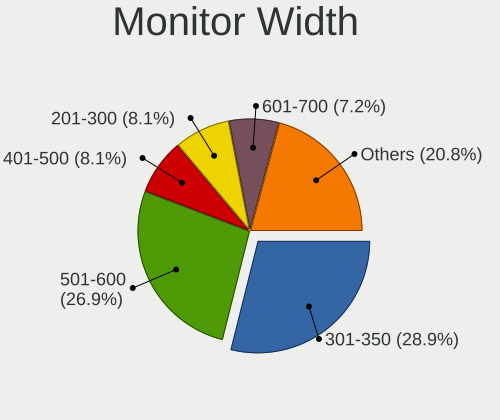

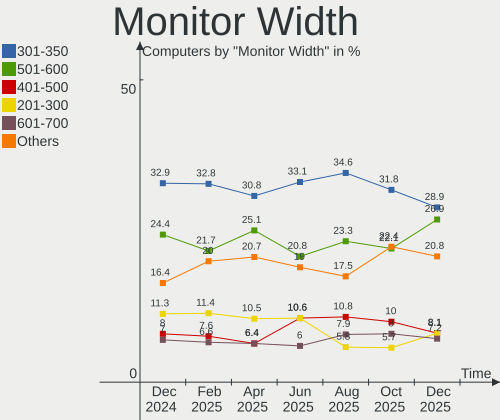

| Width in mm    | Computers | Percent |
|----------------|-----------|---------|
| 301-350        | 100       | 28.9%   |
| 501-600        | 93        | 26.88%  |
| 401-500        | 28        | 8.09%   |
| 201-300        | 28        | 8.09%   |
| 601-700        | 25        | 7.23%   |
| 701-800        | 14        | 4.05%   |
| 1001-1500      | 13        | 3.76%   |
| 351-400        | 11        | 3.18%   |
| 1501-2000      | 10        | 2.89%   |
| Unknown        | 10        | 2.89%   |
| 101-200        | 6         | 1.73%   |
| 1-100          | 3         | 0.87%   |
| More than 2000 | 2         | 0.58%   |
| 801-900        | 2         | 0.58%   |
| 901-1000       | 1         | 0.29%   |

Aspect Ratio
------------

Proportional relationship between the width and the height

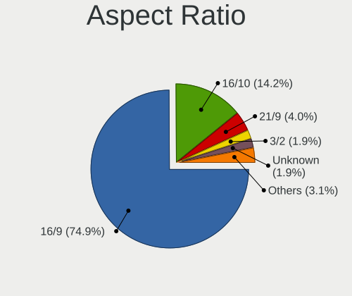

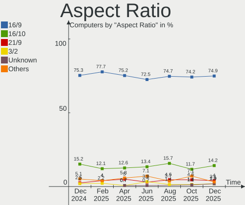

| Ratio   | Computers | Percent |
|---------|-----------|---------|
| 16/9    | 242       | 74.92%  |
| 16/10   | 46        | 14.24%  |
| 21/9    | 13        | 4.02%   |
| 3/2     | 6         | 1.86%   |
| Unknown | 6         | 1.86%   |
| 0.62    | 3         | 0.93%   |
| 4/3     | 2         | 0.62%   |
| 32/9    | 2         | 0.62%   |
| 1.00    | 2         | 0.62%   |
| 0.63    | 1         | 0.31%   |

Monitor Area
------------

Area in inch²

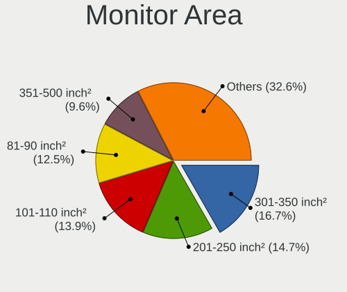

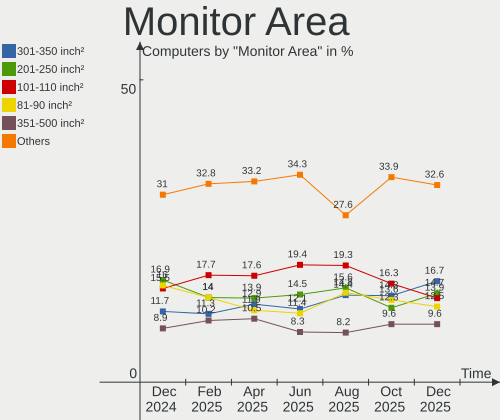

| Area in inch² | Computers | Percent |
|----------------|-----------|---------|
| 301-350        | 59        | 16.71%  |
| 201-250        | 52        | 14.73%  |
| 101-110        | 49        | 13.88%  |
| 81-90          | 44        | 12.46%  |
| 351-500        | 34        | 9.63%   |
| More than 1000 | 22        | 6.23%   |
| 71-80          | 15        | 4.25%   |
| 111-120        | 11        | 3.12%   |
| 121-130        | 10        | 2.83%   |
| Unknown        | 10        | 2.83%   |
| 1-40           | 9         | 2.55%   |
| 151-200        | 9         | 2.55%   |
| 251-300        | 8         | 2.27%   |
| 501-1000       | 7         | 1.98%   |
| 51-60          | 5         | 1.42%   |
| 141-150        | 4         | 1.13%   |
| 61-70          | 3         | 0.85%   |
| 41-50          | 2         | 0.57%   |

Pixel Density
-------------

Pixels per inch

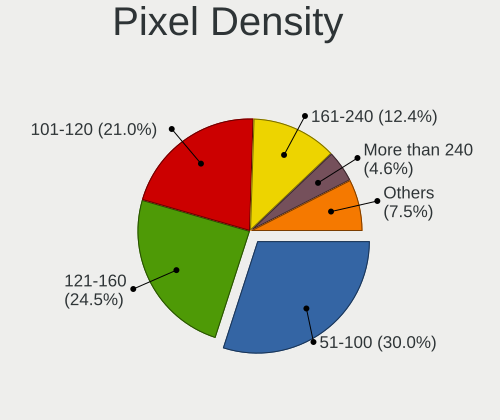

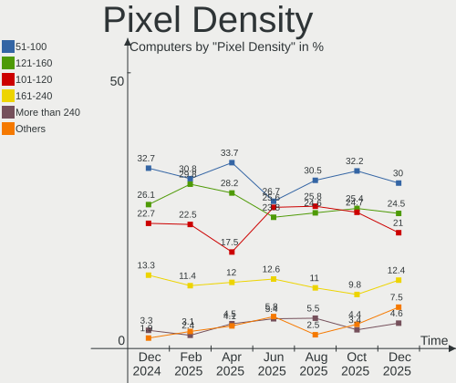

| Density       | Computers | Percent |
|---------------|-----------|---------|
| 51-100        | 104       | 29.97%  |
| 121-160       | 85        | 24.5%   |
| 101-120       | 73        | 21.04%  |
| 161-240       | 43        | 12.39%  |
| More than 240 | 16        | 4.61%   |
| 1-50          | 16        | 4.61%   |
| Unknown       | 10        | 2.88%   |

Multiple Monitors
-----------------

Total monitors connected

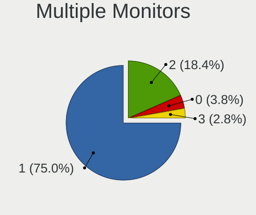

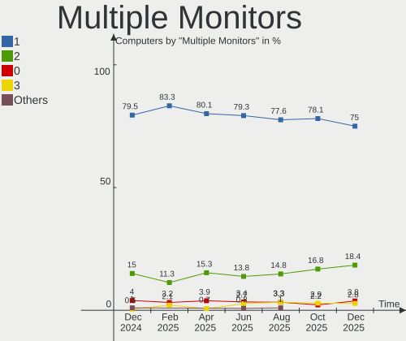

| Total | Computers | Percent |
|-------|-----------|---------|
| 1     | 240       | 75%     |
| 2     | 59        | 18.44%  |
| 0     | 12        | 3.75%   |
| 3     | 9         | 2.81%   |

Network
-------

Net Controller Vendor
---------------------

Controller vendors

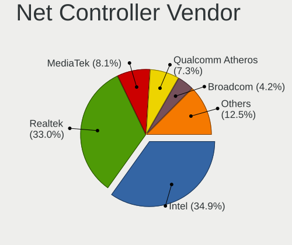

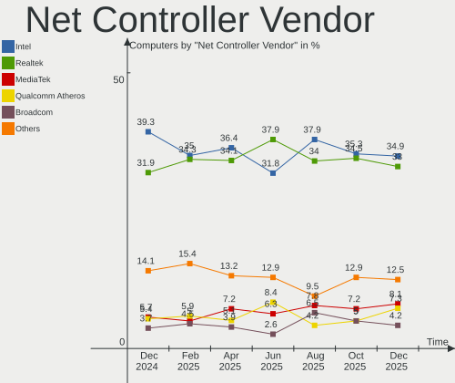

| Vendor                                 | Computers | Percent |
|----------------------------------------|-----------|---------|
| Intel                                  | 167       | 34.86%  |
| Realtek Semiconductor                  | 158       | 32.99%  |
| MediaTek                               | 39        | 8.14%   |
| Qualcomm Atheros                       | 35        | 7.31%   |
| Broadcom                               | 20        | 4.18%   |
| Microsoft                              | 7         | 1.46%   |
| TP-Link                                | 6         | 1.25%   |
| Qualcomm                               | 5         | 1.04%   |
| ASIX Electronics                       | 4         | 0.84%   |
| Realtek                                | 3         | 0.63%   |
| Ralink Technology                      | 3         | 0.63%   |
| Ralink                                 | 3         | 0.63%   |
| Shenzhen Goodix Technology             | 2         | 0.42%   |
| Nvidia                                 | 2         | 0.42%   |
| NetGear                                | 2         | 0.42%   |
| Motorola PCS                           | 2         | 0.42%   |
| Marvell Technology Group               | 2         | 0.42%   |
| TMS                                    | 1         | 0.21%   |
| Sony Ericsson Mobile Communications AB | 1         | 0.21%   |
| Sierra Wireless                        | 1         | 0.21%   |
| Samsung Electronics                    | 1         | 0.21%   |
| Qualcomm Technologies                  | 1         | 0.21%   |
| QNAP System                            | 1         | 0.21%   |
| QLogic                                 | 1         | 0.21%   |
| Prolific Technology                    | 1         | 0.21%   |
| OPPO Electronics                       | 1         | 0.21%   |
| Motorcomm Microelectronics.            | 1         | 0.21%   |
| Lenovo                                 | 1         | 0.21%   |
| IBM                                    | 1         | 0.21%   |
| Google                                 | 1         | 0.21%   |
| Fibocom                                | 1         | 0.21%   |
| DisplayLink                            | 1         | 0.21%   |
| Dimenco                                | 1         | 0.21%   |
| ASUSTek Computer                       | 1         | 0.21%   |
| Aquantia                               | 1         | 0.21%   |
| Apple                                  | 1         | 0.21%   |

Net Controller Model
--------------------

Controller models

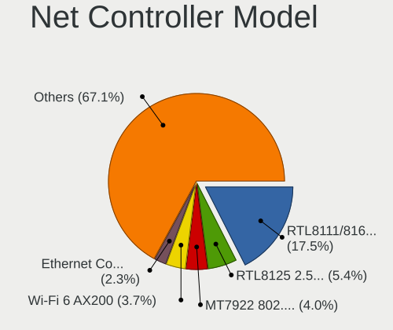

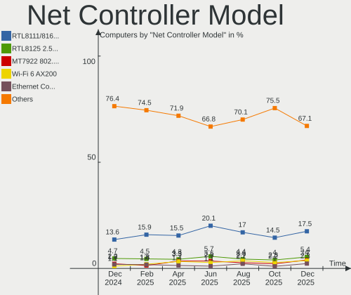

| Model                                                                  | Computers | Percent |
|------------------------------------------------------------------------|-----------|---------|
| Realtek RTL8111/8168/8211/8411 PCI Express Gigabit Ethernet Controller | 100       | 17.51%  |
| Realtek RTL8125 2.5GbE Controller                                      | 31        | 5.43%   |
| MediaTek MT7922 802.11ax PCI Express Wireless Network Adapter          | 23        | 4.03%   |
| Intel Wi-Fi 6 AX200                                                    | 21        | 3.68%   |
| Intel Ethernet Controller I225-V                                       | 13        | 2.28%   |
| Intel Wi-Fi 6E(802.11ax) AX210/AX1675* 2x2 [Typhoon Peak]              | 11        | 1.93%   |
| Realtek RTL8153 Gigabit Ethernet Adapter                               | 9         | 1.58%   |
| Intel Wireless 7265                                                    | 8         | 1.4%    |
| Intel 82579LM Gigabit Network Connection (Lewisville)                  | 8         | 1.4%    |
| Qualcomm Atheros QCA6174 802.11ac Wireless Network Adapter             | 7         | 1.23%   |
| MediaTek MT7921 802.11ax PCIe Wireless Network Adapter [Filogic 330]   | 7         | 1.23%   |
| Intel Ethernet Controller I226-V                                       | 7         | 1.23%   |
| Intel Comet Lake PCH CNVi WiFi                                         | 7         | 1.23%   |
| Realtek RTL8822CE 802.11ac PCIe Wireless Network Adapter               | 6         | 1.05%   |
| Realtek RTL810xE PCI Express Fast Ethernet controller                  | 6         | 1.05%   |
| Intel Wireless 8265 / 8275                                             | 6         | 1.05%   |
| Intel Wireless 8260                                                    | 6         | 1.05%   |
| Intel Wi-Fi 6 AX201                                                    | 6         | 1.05%   |
| Intel Raptor Lake PCH CNVi WiFi                                        | 6         | 1.05%   |
| Intel I211 Gigabit Network Connection                                  | 6         | 1.05%   |
| Intel Comet Lake PCH-LP CNVi WiFi                                      | 6         | 1.05%   |
| Realtek RTL8821CE 802.11ac PCIe Wireless Network Adapter               | 5         | 0.88%   |
| Realtek 802.11ac NIC                                                   | 5         | 0.88%   |
| Qualcomm QCNFA765 Wireless Network Adapter                             | 5         | 0.88%   |
| Qualcomm Atheros AR9285 Wireless Network Adapter (PCI-Express)         | 5         | 0.88%   |
| Intel Ethernet Connection I217-LM                                      | 5         | 0.88%   |
| Intel Cannon Point-LP CNVi [Wireless-AC]                               | 5         | 0.88%   |
| Intel Alder Lake-P PCH CNVi WiFi                                       | 5         | 0.88%   |
| Broadcom BCM43142 802.11b/g/n                                          | 5         | 0.88%   |
| Realtek RTL8852BE PCIe 802.11ax Wireless Network Controller            | 4         | 0.7%    |
| Microsoft Xbox Wireless Adapter for Windows                            | 4         | 0.7%    |
| MediaTek MT7902 802.11ax PCIe Wireless Network Adapter [Filogic 310]   | 4         | 0.7%    |
| Intel Wireless 7260                                                    | 4         | 0.7%    |
| Intel Wi-Fi 5(802.11ac) Wireless-AC 9x6x [Thunder Peak]                | 4         | 0.7%    |
| Intel Ethernet Connection (2) I219-V                                   | 4         | 0.7%    |
| Intel Centrino Advanced-N 6200                                         | 4         | 0.7%    |
| ASIX AX88179 Gigabit Ethernet                                          | 4         | 0.7%    |
| Realtek RTL8922AE 802.11be PCIe Wireless Network Adapter               | 3         | 0.53%   |
| Realtek RTL8822BE 802.11a/b/g/n/ac WiFi adapter                        | 3         | 0.53%   |
| Realtek RTL8188FTV 802.11b/g/n 1T1R 2.4G WLAN Adapter                  | 3         | 0.53%   |

Wireless Vendor
---------------

Wireless vendors

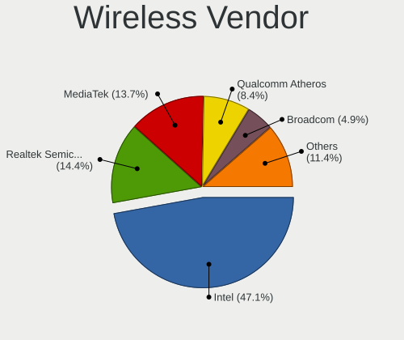

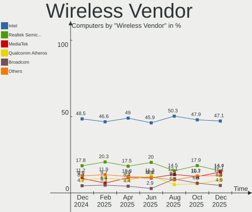

| Vendor                   | Computers | Percent |
|--------------------------|-----------|---------|
| Intel                    | 124       | 47.15%  |
| Realtek Semiconductor    | 38        | 14.45%  |
| MediaTek                 | 36        | 13.69%  |
| Qualcomm Atheros         | 22        | 8.37%   |
| Broadcom                 | 13        | 4.94%   |
| TP-Link                  | 5         | 1.9%    |
| Qualcomm                 | 5         | 1.9%    |
| Microsoft                | 5         | 1.9%    |
| Realtek                  | 3         | 1.14%   |
| Ralink Technology        | 3         | 1.14%   |
| Ralink                   | 3         | 1.14%   |
| NetGear                  | 2         | 0.76%   |
| Sierra Wireless          | 1         | 0.38%   |
| Marvell Technology Group | 1         | 0.38%   |
| Fibocom                  | 1         | 0.38%   |
| ASUSTek Computer         | 1         | 0.38%   |

Wireless Model
--------------

Wireless models

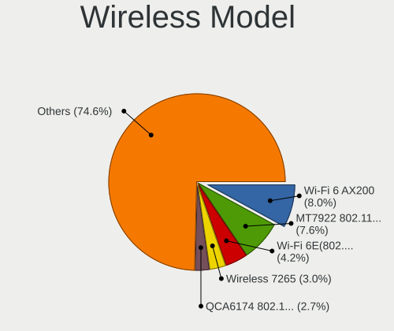

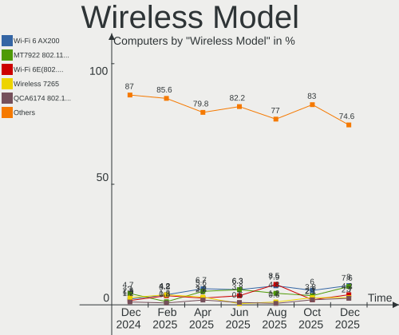

| Model                                                                | Computers | Percent |
|----------------------------------------------------------------------|-----------|---------|
| Intel Wi-Fi 6 AX200                                                  | 21        | 7.95%   |
| MediaTek MT7922 802.11ax PCI Express Wireless Network Adapter        | 20        | 7.58%   |
| Intel Wi-Fi 6E(802.11ax) AX210/AX1675* 2x2 [Typhoon Peak]            | 11        | 4.17%   |
| Intel Wireless 7265                                                  | 8         | 3.03%   |
| Qualcomm Atheros QCA6174 802.11ac Wireless Network Adapter           | 7         | 2.65%   |
| MediaTek MT7921 802.11ax PCIe Wireless Network Adapter [Filogic 330] | 7         | 2.65%   |
| Intel Comet Lake PCH CNVi WiFi                                       | 7         | 2.65%   |
| Realtek RTL8822CE 802.11ac PCIe Wireless Network Adapter             | 6         | 2.27%   |
| Intel Wireless 8265 / 8275                                           | 6         | 2.27%   |
| Intel Wireless 8260                                                  | 6         | 2.27%   |
| Intel Wi-Fi 6 AX201                                                  | 6         | 2.27%   |
| Intel Raptor Lake PCH CNVi WiFi                                      | 6         | 2.27%   |
| Intel Comet Lake PCH-LP CNVi WiFi                                    | 6         | 2.27%   |
| Realtek RTL8821CE 802.11ac PCIe Wireless Network Adapter             | 5         | 1.89%   |
| Realtek 802.11ac NIC                                                 | 5         | 1.89%   |
| Qualcomm QCNFA765 Wireless Network Adapter                           | 5         | 1.89%   |
| Qualcomm Atheros AR9285 Wireless Network Adapter (PCI-Express)       | 5         | 1.89%   |
| Intel Cannon Point-LP CNVi [Wireless-AC]                             | 5         | 1.89%   |
| Broadcom BCM43142 802.11b/g/n                                        | 5         | 1.89%   |
| Microsoft Xbox Wireless Adapter for Windows                          | 4         | 1.52%   |
| MediaTek MT7902 802.11ax PCIe Wireless Network Adapter [Filogic 310] | 4         | 1.52%   |
| Intel Wireless 7260                                                  | 4         | 1.52%   |
| Intel Wi-Fi 5(802.11ac) Wireless-AC 9x6x [Thunder Peak]              | 4         | 1.52%   |
| Intel Centrino Advanced-N 6200                                       | 4         | 1.52%   |
| Intel Alder Lake-P PCH CNVi WiFi                                     | 4         | 1.52%   |
| Realtek RTL8822BE 802.11a/b/g/n/ac WiFi adapter                      | 3         | 1.14%   |
| Realtek RTL8188FTV 802.11b/g/n 1T1R 2.4G WLAN Adapter                | 3         | 1.14%   |
| Qualcomm Atheros QCA9377 802.11ac Wireless Network Adapter           | 3         | 1.14%   |
| Intel Wi-Fi 7(802.11be) AX1775*/AX1790*/BE20*/BE401/BE1750* 2x2      | 3         | 1.14%   |
| Intel PRO/Wireless 3945ABG [Golan] Network Connection                | 3         | 1.14%   |
| Intel Ice Lake-LP PCH CNVi WiFi                                      | 3         | 1.14%   |
| Intel 700 Series Chipset CNVi WiFi                                   | 3         | 1.14%   |
| Broadcom BCM4360 802.11ac Dual Band Wireless Network Adapter         | 3         | 1.14%   |
| TP-Link TL-WN823N v2/v3 [Realtek RTL8192EU]                          | 2         | 0.76%   |
| TP-Link 802.11ac WLAN Adapter                                        | 2         | 0.76%   |
| Realtek RTL8922AE 802.11be PCIe Wireless Network Adapter             | 2         | 0.76%   |
| Realtek RTL88x2bu [AC1200 Techkey]                                   | 2         | 0.76%   |
| Realtek RTL8852CE PCIe 802.11ax Wireless Network Controller          | 2         | 0.76%   |
| Realtek RTL8812AE 802.11ac PCIe Wireless Network Adapter             | 2         | 0.76%   |
| Realtek RTL8723BE PCIe Wireless Network Adapter                      | 2         | 0.76%   |

Ethernet Vendor
---------------

Ethernet vendors

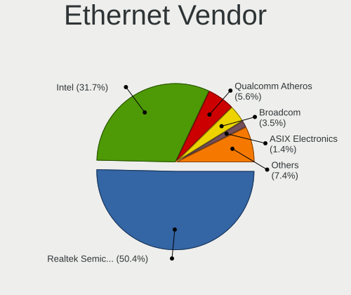

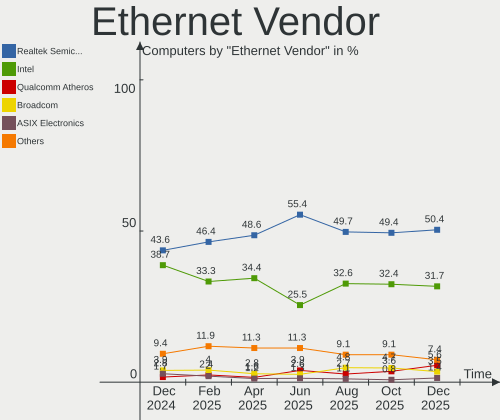

| Vendor                                 | Computers | Percent |
|----------------------------------------|-----------|---------|
| Realtek Semiconductor                  | 143       | 50.35%  |
| Intel                                  | 90        | 31.69%  |
| Qualcomm Atheros                       | 16        | 5.63%   |
| Broadcom                               | 10        | 3.52%   |
| ASIX Electronics                       | 4         | 1.41%   |
| MediaTek                               | 3         | 1.06%   |
| Nvidia                                 | 2         | 0.7%    |
| Motorola PCS                           | 2         | 0.7%    |
| TP-Link                                | 1         | 0.35%   |
| Sony Ericsson Mobile Communications AB | 1         | 0.35%   |
| Samsung Electronics                    | 1         | 0.35%   |
| Qualcomm Technologies                  | 1         | 0.35%   |
| QNAP System                            | 1         | 0.35%   |
| QLogic                                 | 1         | 0.35%   |
| OPPO Electronics                       | 1         | 0.35%   |
| Motorcomm Microelectronics.            | 1         | 0.35%   |
| Microsoft                              | 1         | 0.35%   |
| Marvell Technology Group               | 1         | 0.35%   |
| IBM                                    | 1         | 0.35%   |
| Google                                 | 1         | 0.35%   |
| DisplayLink                            | 1         | 0.35%   |
| Aquantia                               | 1         | 0.35%   |

Ethernet Model
--------------

Ethernet models

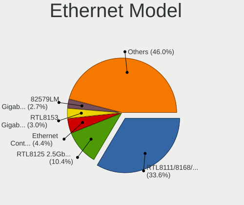

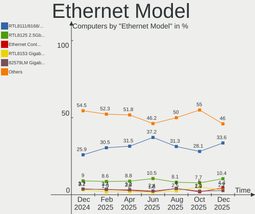

| Model                                                                  | Computers | Percent |
|------------------------------------------------------------------------|-----------|---------|
| Realtek RTL8111/8168/8211/8411 PCI Express Gigabit Ethernet Controller | 100       | 33.56%  |
| Realtek RTL8125 2.5GbE Controller                                      | 31        | 10.4%   |
| Intel Ethernet Controller I225-V                                       | 13        | 4.36%   |
| Realtek RTL8153 Gigabit Ethernet Adapter                               | 9         | 3.02%   |
| Intel 82579LM Gigabit Network Connection (Lewisville)                  | 8         | 2.68%   |
| Intel Ethernet Controller I226-V                                       | 7         | 2.35%   |
| Realtek RTL810xE PCI Express Fast Ethernet controller                  | 6         | 2.01%   |
| Intel I211 Gigabit Network Connection                                  | 6         | 2.01%   |
| Intel Ethernet Connection I217-LM                                      | 5         | 1.68%   |
| Intel Ethernet Connection (2) I219-V                                   | 4         | 1.34%   |
| ASIX AX88179 Gigabit Ethernet                                          | 4         | 1.34%   |
| Realtek RTL8852BE PCIe 802.11ax Wireless Network Controller            | 3         | 1.01%   |
| Qualcomm Atheros Killer E2500 Gigabit Ethernet Controller              | 3         | 1.01%   |
| Qualcomm Atheros Killer E2400 Gigabit Ethernet Controller              | 3         | 1.01%   |
| Qualcomm Atheros Killer E220x Gigabit Ethernet Controller              | 3         | 1.01%   |
| Qualcomm Atheros AR8131 Gigabit Ethernet                               | 3         | 1.01%   |
| MediaTek MT7922 802.11ax PCI Express Wireless Network Adapter          | 3         | 1.01%   |
| Intel I210 Gigabit Network Connection                                  | 3         | 1.01%   |
| Intel Ethernet Connection (7) I219-V                                   | 3         | 1.01%   |
| Intel Ethernet Connection (4) I219-LM                                  | 3         | 1.01%   |
| Broadcom NetXtreme BCM57765 Gigabit Ethernet PCIe                      | 3         | 1.01%   |
| Realtek RTL8126 5GbE Controller                                        | 2         | 0.67%   |
| Qualcomm Atheros AR8161 Gigabit Ethernet                               | 2         | 0.67%   |
| Motorola PCS motorola one 5G ace                                       | 2         | 0.67%   |
| Intel Ethernet Connection I219-LM                                      | 2         | 0.67%   |
| Intel Ethernet Connection I217-V                                       | 2         | 0.67%   |
| Intel Ethernet Connection (7) I219-LM                                  | 2         | 0.67%   |
| Intel Ethernet Connection (6) I219-V                                   | 2         | 0.67%   |
| Intel Ethernet Connection (23) I219-LM                                 | 2         | 0.67%   |
| Intel Ethernet Connection (2) I218-LM                                  | 2         | 0.67%   |
| Intel Ethernet Connection (13) I219-V                                  | 2         | 0.67%   |
| Intel 82577LM Gigabit Network Connection                               | 2         | 0.67%   |
| Intel 82567LM-3 Gigabit Network Connection                             | 2         | 0.67%   |
| Broadcom NetXtreme BCM57766 Gigabit Ethernet PCIe                      | 2         | 0.67%   |
| Broadcom NetXtreme BCM5755M Gigabit Ethernet PCI Express               | 2         | 0.67%   |
| TP-Link UE300 10/100/1000 LAN (ethernet mode) [Realtek RTL8153]        | 1         | 0.34%   |
| Sony Ericsson Mobile AB XQ-BT52                                        | 1         | 0.34%   |
| Samsung Galaxy series, misc. (tethering mode)                          | 1         | 0.34%   |
| Realtek USB 10/100/1G/2.5 LAN                                          | 1         | 0.34%   |
| Realtek RTL8922AE 802.11be PCIe Wireless Network Adapter               | 1         | 0.34%   |

Net Controller Kind
-------------------

Ethernet, WiFi or modem

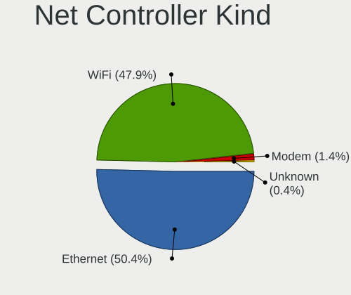

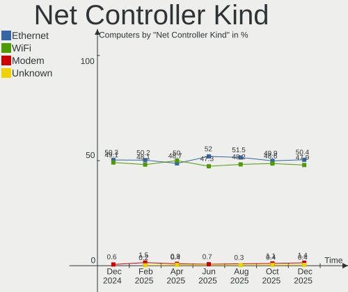

| Kind     | Computers | Percent |
|----------|-----------|---------|
| Ethernet | 260       | 50.39%  |
| WiFi     | 247       | 47.87%  |
| Modem    | 7         | 1.36%   |
| Unknown  | 2         | 0.39%   |

Used Controller
---------------

Currently used network controller

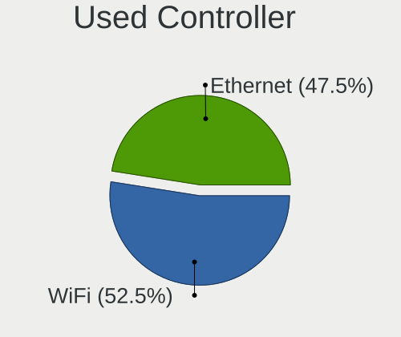

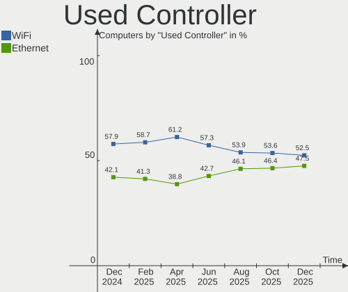

| Kind     | Computers | Percent |
|----------|-----------|---------|
| WiFi     | 169       | 52.48%  |
| Ethernet | 153       | 47.52%  |

NICs
----

Total network controllers on board

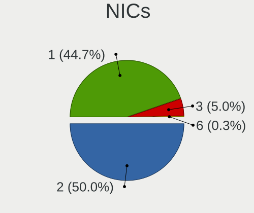

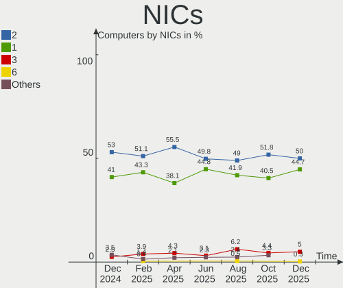

| Total | Computers | Percent |
|-------|-----------|---------|
| 2     | 160       | 50%     |
| 1     | 143       | 44.69%  |
| 3     | 16        | 5%      |
| 6     | 1         | 0.31%   |

IPv6
----

IPv6 vs IPv4

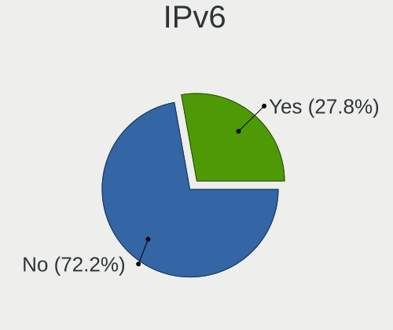

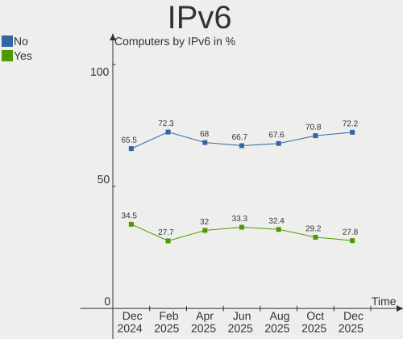

| Used | Computers | Percent |
|------|-----------|---------|
| No   | 231       | 72.19%  |
| Yes  | 89        | 27.81%  |

Bluetooth
---------

Bluetooth Vendor
----------------

Controller vendors

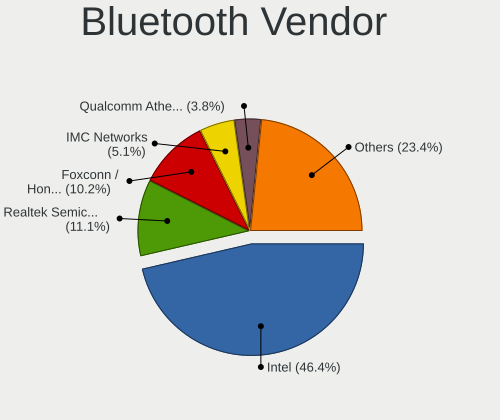

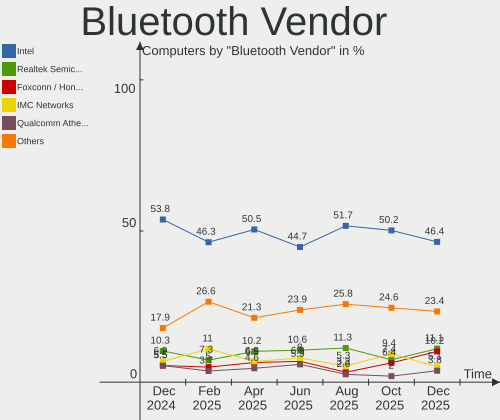

| Vendor                          | Computers | Percent |
|---------------------------------|-----------|---------|
| Intel                           | 109       | 46.38%  |
| Realtek Semiconductor           | 26        | 11.06%  |
| Foxconn / Hon Hai               | 24        | 10.21%  |
| IMC Networks                    | 12        | 5.11%   |
| Qualcomm Atheros Communications | 9         | 3.83%   |
| MediaTek                        | 9         | 3.83%   |
| Cambridge Silicon Radio         | 7         | 2.98%   |
| Broadcom                        | 7         | 2.98%   |
| Apple                           | 6         | 2.55%   |
| TP-Link                         | 5         | 2.13%   |
| Lite-On Technology              | 4         | 1.7%    |
| ASUSTek Computer                | 4         | 1.7%    |
| Realtek                         | 2         | 0.85%   |
| Askey Computer                  | 2         | 0.85%   |
| USI                             | 1         | 0.43%   |
| Ralink                          | 1         | 0.43%   |
| Marvell Semiconductor           | 1         | 0.43%   |
| Hewlett-Packard                 | 1         | 0.43%   |
| Foxconn International           | 1         | 0.43%   |
| Dell                            | 1         | 0.43%   |
| Belkin Components               | 1         | 0.43%   |
| Actions                         | 1         | 0.43%   |
| Unknown                         | 1         | 0.43%   |

Bluetooth Model
---------------

Controller models

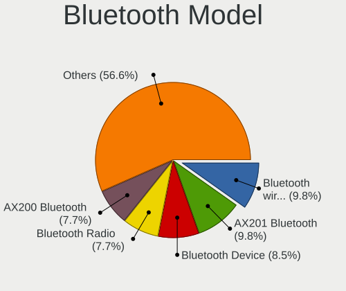

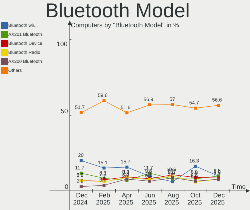

| Model                                               | Computers | Percent |
|-----------------------------------------------------|-----------|---------|
| Intel Bluetooth wireless interface                  | 23        | 9.79%   |
| Intel AX201 Bluetooth                               | 23        | 9.79%   |
| Intel Bluetooth Device                              | 20        | 8.51%   |
| Realtek Bluetooth Radio                             | 18        | 7.66%   |
| Intel AX200 Bluetooth                               | 18        | 7.66%   |
| Foxconn / Hon Hai Wireless_Device                   | 17        | 7.23%   |
| Intel AX210 Bluetooth                               | 10        | 4.26%   |
| MediaTek Wireless_Device                            | 9         | 3.83%   |
| Intel Bluetooth 9460/9560 Jefferson Peak (JfP)      | 9         | 3.83%   |
| IMC Networks Wireless_Device                        | 8         | 3.4%    |
| Cambridge Silicon Radio Bluetooth Dongle (HCI mode) | 7         | 2.98%   |
| TP-Link TP-T@- UB500 Adapter                        | 5         | 2.13%   |
| Qualcomm Atheros  Bluetooth Device                  | 5         | 2.13%   |
| Intel Wireless-AC 9260 Bluetooth Adapter            | 4         | 1.7%    |
| Realtek 802.11ac WLAN Adapter                       | 3         | 1.28%   |
| IMC Networks Bluetooth Radio                        | 3         | 1.28%   |
| Foxconn / Hon Hai MediaTek Bluetooth Adapter        | 3         | 1.28%   |
| Apple Built-in Bluetooth 2.0+EDR HCI                | 3         | 1.28%   |
| Realtek  Bluetooth 4.2 Adapter                      | 2         | 0.85%   |
| Realtek Bluetooth 5.4 Radio                         | 2         | 0.85%   |
| Realtek Bluetooth Radio                             | 2         | 0.85%   |
| Qualcomm Atheros QCA61x4 Bluetooth 4.0              | 2         | 0.85%   |
| Qualcomm Atheros AR3011 Bluetooth                   | 2         | 0.85%   |
| Lite-On Wireless_Device                             | 2         | 0.85%   |
| Lite-On Bluetooth Device                            | 2         | 0.85%   |
| Intel Wireless-AC 3168 Bluetooth                    | 2         | 0.85%   |
| Foxconn / Hon Hai Bluetooth Device                  | 2         | 0.85%   |
| Broadcom BCM43142A0 Bluetooth 4.0                   | 2         | 0.85%   |
| Broadcom BCM43142 Bluetooth 4.0                     | 2         | 0.85%   |
| ASUS Broadcom BCM20702A0 Bluetooth                  | 2         | 0.85%   |
| Askey Bluetooth Device                              | 2         | 0.85%   |
| Apple Bluetooth Host Controller                     | 2         | 0.85%   |
| USI Bluetooth Device                                | 1         | 0.43%   |
| Realtek RTL8822BE Bluetooth 4.2 Adapter             | 1         | 0.43%   |
| Ralink RT3290 Bluetooth                             | 1         | 0.43%   |
| Marvell Bluetooth and Wireless LAN Composite        | 1         | 0.43%   |
| IMC Networks Bluetooth Device                       | 1         | 0.43%   |
| HP Broadcom 2070 Bluetooth Combo                    | 1         | 0.43%   |
| Foxconn International BCM43142A0 Bluetooth module   | 1         | 0.43%   |
| Foxconn / Hon Hai Broadcom BCM20702 Bluetooth       | 1         | 0.43%   |

Sound
-----

Sound Vendor
------------

Sound card vendors

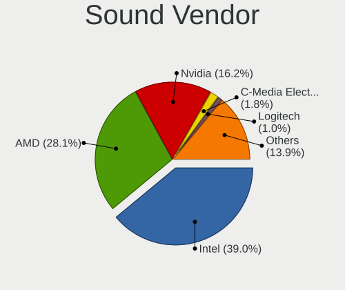

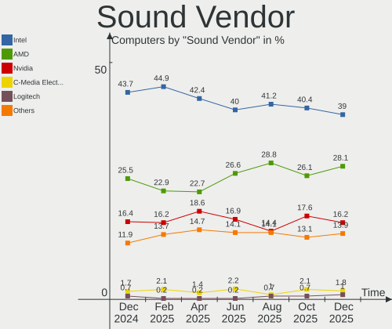

| Vendor                                       | Computers | Percent |
|----------------------------------------------|-----------|---------|
| Intel                                        | 193       | 38.99%  |
| AMD                                          | 139       | 28.08%  |
| Nvidia                                       | 80        | 16.16%  |
| C-Media Electronics                          | 9         | 1.82%   |
| Logitech                                     | 5         | 1.01%   |
| Zoran Co. Personal Media Division (Nogatech) | 4         | 0.81%   |
| Texas Instruments                            | 4         | 0.81%   |
| SteelSeries ApS                              | 4         | 0.81%   |
| Realtek Semiconductor                        | 4         | 0.81%   |
| Creative Labs                                | 4         | 0.81%   |
| ASUSTek Computer                             | 4         | 0.81%   |
| Sony                                         | 3         | 0.61%   |
| JMTek                                        | 3         | 0.61%   |
| BEHRINGER International                      | 3         | 0.61%   |
| Razer USA                                    | 2         | 0.4%    |
| Micro Star International                     | 2         | 0.4%    |
| KTMicro                                      | 2         | 0.4%    |
| Hewlett-Packard                              | 2         | 0.4%    |
| Focusrite-Novation                           | 2         | 0.4%    |
| Creative Technology                          | 2         | 0.4%    |
| Corsair                                      | 2         | 0.4%    |
| Blue Microphones                             | 2         | 0.4%    |
| Apple                                        | 2         | 0.4%    |
| XMOS                                         | 1         | 0.2%    |
| Xilinx                                       | 1         | 0.2%    |
| Walmart                                      | 1         | 0.2%    |
| Thesycon Systemsoftware & Consulting         | 1         | 0.2%    |
| Synaptics                                    | 1         | 0.2%    |
| Sennheiser electronic                        | 1         | 0.2%    |
| Roland                                       | 1         | 0.2%    |
| Plantronics                                  | 1         | 0.2%    |
| No brand                                     | 1         | 0.2%    |
| Nexight                                      | 1         | 0.2%    |
| Native Instruments                           | 1         | 0.2%    |
| Microsoft                                    | 1         | 0.2%    |
| Kingston Technology                          | 1         | 0.2%    |
| Jieli Technology                             | 1         | 0.2%    |
| Huawei Technologies                          | 1         | 0.2%    |
| Giga-Byte Technology                         | 1         | 0.2%    |
| DSEA A/S                                     | 1         | 0.2%    |

Sound Model
-----------

Sound card models

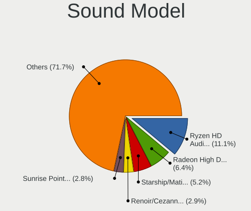

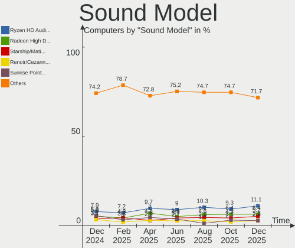

| Model                                                                      | Computers | Percent |
|----------------------------------------------------------------------------|-----------|---------|
| AMD Ryzen HD Audio Controller                                              | 68        | 11.07%  |
| AMD Radeon High Definition Audio Controller                                | 39        | 6.35%   |
| AMD Starship/Matisse HD Audio Controller                                   | 32        | 5.21%   |
| AMD Renoir/Cezanne HDMI/DP Audio Controller                                | 18        | 2.93%   |
| Intel Sunrise Point-LP HD Audio                                            | 17        | 2.77%   |
| Intel 6 Series/C200 Series Chipset Family High Definition Audio Controller | 13        | 2.12%   |
| AMD Navi 48 HDMI/DP Audio Controller                                       | 13        | 2.12%   |
| Intel 8 Series/C220 Series Chipset High Definition Audio Controller        | 11        | 1.79%   |
| Intel 7 Series/C216 Chipset Family High Definition Audio Controller        | 11        | 1.79%   |
| Intel 100 Series/C230 Series Chipset Family HD Audio Controller            | 10        | 1.63%   |
| AMD Raven/Raven2/Fenghuang HDMI/DP Audio Controller                        | 10        | 1.63%   |
| Intel Tiger Lake-LP Smart Sound Technology Audio Controller                | 9         | 1.47%   |
| Intel Comet Lake PCH cAVS                                                  | 9         | 1.47%   |
| AMD Navi 21/23 HDMI/DP Audio Controller                                    | 9         | 1.47%   |
| Intel Raptor Lake-P/U/H cAVS                                               | 8         | 1.3%    |
| Intel Raptor Lake High Definition Audio Controller                         | 7         | 1.14%   |
| Intel Comet Lake PCH-LP cAVS                                               | 7         | 1.14%   |
| Intel Alder Lake PCH-P High Definition Audio Controller                    | 7         | 1.14%   |
| Intel 200 Series PCH HD Audio                                              | 7         | 1.14%   |
| AMD FCH Azalia Controller                                                  | 7         | 1.14%   |
| Intel Tiger Lake-H HD Audio Controller                                     | 6         | 0.98%   |
| Intel Ice Lake-LP Smart Sound Technology Audio Controller                  | 6         | 0.98%   |
| Intel Cannon Lake PCH cAVS                                                 | 6         | 0.98%   |
| AMD Navi 31 HDMI/DP Audio                                                  | 6         | 0.98%   |
| Nvidia TU107 GeForce GTX 1650 High Definition Audio Controller             | 5         | 0.81%   |
| Nvidia GP106 High Definition Audio Controller                              | 5         | 0.81%   |
| Nvidia GB206 High Definition Audio Controller                              | 5         | 0.81%   |
| Nvidia GA106 High Definition Audio Controller                              | 5         | 0.81%   |
| Nvidia GA104 High Definition Audio Controller                              | 5         | 0.81%   |
| Intel Xeon E3-1200 v3/4th Gen Core Processor HD Audio Controller           | 5         | 0.81%   |
| Intel Cannon Point-LP High Definition Audio Controller                     | 5         | 0.81%   |
| Intel 5 Series/3400 Series Chipset High Definition Audio                   | 5         | 0.81%   |
| AMD Navi 10 HDMI Audio                                                     | 5         | 0.81%   |
| AMD Family 17h (Models 00h-0fh) HD Audio Controller                        | 5         | 0.81%   |
| AMD Ellesmere HDMI Audio [Radeon RX 470/480 / 570/580/590]                 | 5         | 0.81%   |
| Zoran Co. Personal Media Division (Nogatech) USB Audio and HID             | 4         | 0.65%   |
| Nvidia TU116 High Definition Audio Controller                              | 4         | 0.65%   |
| Nvidia TU106 High Definition Audio Controller                              | 4         | 0.65%   |
| Nvidia TU104 HD Audio Controller                                           | 4         | 0.65%   |
| Nvidia GA102 High Definition Audio Controller                              | 4         | 0.65%   |

Memory
------

Memory Vendor
-------------

Memory module vendors

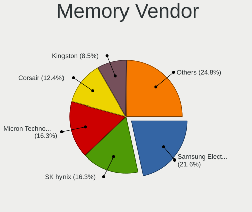

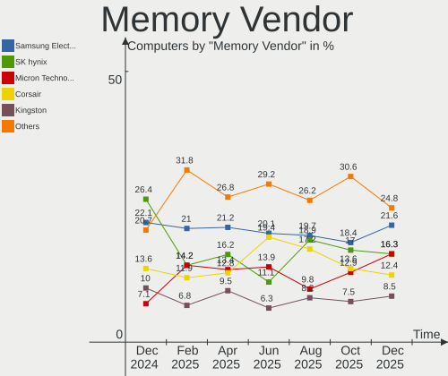

| Vendor              | Computers | Percent |
|---------------------|-----------|---------|
| Samsung Electronics | 33        | 21.57%  |
| SK hynix            | 25        | 16.34%  |
| Micron Technology   | 25        | 16.34%  |
| Corsair             | 19        | 12.42%  |
| Kingston            | 13        | 8.5%    |
| Crucial             | 10        | 6.54%   |
| Unknown             | 6         | 3.92%   |
| A-DATA Technology   | 6         | 3.92%   |
| Ramaxel Technology  | 3         | 1.96%   |
| Unknown             | 3         | 1.96%   |
| Team                | 2         | 1.31%   |
| Shenzhen Longsys    | 1         | 0.65%   |
| Patriot Memory      | 1         | 0.65%   |
| Netac               | 1         | 0.65%   |
| Lexar               | 1         | 0.65%   |
| GSkill              | 1         | 0.65%   |
| G.Skill             | 1         | 0.65%   |
| Essencore Limited   | 1         | 0.65%   |
| Elpida              | 1         | 0.65%   |

Memory Model
------------

Memory module models

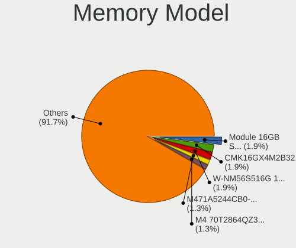

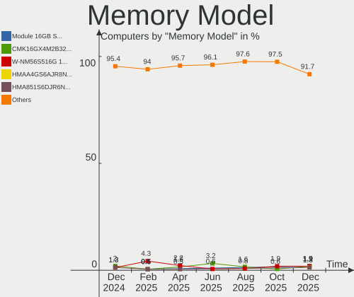

| Model                                                             | Computers | Percent |
|-------------------------------------------------------------------|-----------|---------|
| Unknown RAM Module 16GB SODIMM DDR4 2667MT/s                      | 3         | 1.92%   |
| Corsair RAM CMK16GX4M2B3200C16 8GB DIMM DDR4 3600MT/s             | 3         | 1.92%   |
| Unknown                                                           | 3         | 1.92%   |
| SK hynix RAM HMAA4GS6AJR8N-XN 32GB SODIMM DDR4 3200MT/s           | 2         | 1.28%   |
| SK hynix RAM HMA851S6DJR6N-XN 4GB SODIMM DDR4 3200MT/s            | 2         | 1.28%   |
| Samsung RAM M471A5244CB0-CTD 4GB SODIMM DDR4 3266MT/s             | 2         | 1.28%   |
| Samsung RAM M4 70T2864QZ3-CE6 1GB SODIMM DDR 1639MT/s             | 2         | 1.28%   |
| Samsung RAM M378A5143DB0-CPB 4GB DIMM DDR4 2400MT/s               | 2         | 1.28%   |
| Micron RAM MT62F1536M64D8CL-026 6GB DIMM LPDDR5 6000MT/s          | 2         | 1.28%   |
| Micron RAM MT62F1536M32D4DS-026 6GB SODIMM LPDDR5 7500MT/s        | 2         | 1.28%   |
| Micron RAM 4ATF51264HZ-3G2R1 4GB SODIMM DDR4 3200MT/s             | 2         | 1.28%   |
| Kingston RAM KHX3200C16D4/8GX 8GB DIMM DDR4 3733MT/s              | 2         | 1.28%   |
| Unknown RAM Module 8GB DIMM DDR4 2667MT/s                         | 1         | 0.64%   |
| Unknown RAM Module 4GB DIMM DDR3 1333MT/s                         | 1         | 0.64%   |
| Unknown RAM Module 1024MB SODIMM DDR2 667MT/s                     | 1         | 0.64%   |
| Team RAM TEAMGROUP-UD4-3200 8GB DIMM DDR4 3800MT/s                | 1         | 0.64%   |
| Team RAM TEAMGROUP-UD4-3000 8GB DIMM DDR4 3200MT/s                | 1         | 0.64%   |
| SK hynix RAM Module 8GB SODIMM DDR3 1600MT/s                      | 1         | 0.64%   |
| SK hynix RAM Module 4GB Row Of Chips LPDDR4 4267MT/s              | 1         | 0.64%   |
| SK hynix RAM Module 16GB SODIMM DDR4 2133MT/s                     | 1         | 0.64%   |
| SK hynix RAM HMT425S6CFR6A-PB 2GB SODIMM DDR3 1600MT/s            | 1         | 0.64%   |
| SK hynix RAM HMT41GU7AFR8C-PB 8GB DIMM DDR3 1600MT/s              | 1         | 0.64%   |
| SK hynix RAM HMT41GS6BFR8A-PB 8GB SODIMM DDR3 2667MT/s            | 1         | 0.64%   |
| SK hynix RAM HMT41GS6AFR8A-PB 8GiB SODIMM DDR3 2667MT/s           | 1         | 0.64%   |
| SK hynix RAM HMT325U6CFR8C-PB 2GB DIMM DDR3 1600MT/s              | 1         | 0.64%   |
| SK hynix RAM HMT325S6CFR8C-H9 2GB SODIMM DDR3 1333MT/s            | 1         | 0.64%   |
| SK hynix RAM HMAG68EXNSA051N 8GB SODIMM DDR4 3200MT/s             | 1         | 0.64%   |
| SK hynix RAM HMAA1GS6CMR8N-VK 8GB Row Of Chips DDR4 2667MT/s      | 1         | 0.64%   |
| SK hynix RAM HMA851S6CJR6N-XN 4GB SODIMM DDR4 3200MT/s            | 1         | 0.64%   |
| SK hynix RAM HMA851S6CJR6N-VK 4GB SODIMM DDR4 2667MT/s            | 1         | 0.64%   |
| SK hynix RAM HMA82GS6CJR8N-VK 16GB SODIMM DDR4 2667MT/s           | 1         | 0.64%   |
| SK hynix RAM HMA81GS6DJR8N-XN 8GB SODIMM DDR4 3200MT/s            | 1         | 0.64%   |
| SK hynix RAM HMA81GS6DJR8N-VK 8GB SODIMM DDR4 2667MT/s            | 1         | 0.64%   |
| SK hynix RAM H9JCNNNCP3MLYR-N6E 4GB SODIMM LPDDR5 6400MT/s        | 1         | 0.64%   |
| SK hynix RAM H9JCNNNBK3MLYR-N6E 1GB Row Of Chips LPDDR5 6400MT/s  | 1         | 0.64%   |
| SK hynix RAM H9HCNNNCPMALHR-NEE 8GiB Row Of Chips LPDDR4 4800MT/s | 1         | 0.64%   |
| SK hynix RAM H5TC8G63AMR-PBR 4GB SODIMM DDR3 1600MT/s             | 1         | 0.64%   |
| SK hynix RAM H58GE6AK8BX104 6GB Row Of Chips LPDDR5 7500MT/s      | 1         | 0.64%   |
| SK hynix RAM H58G66AK6BX070N 8GB Row Of Chips LPDDR5 6400MT/s     | 1         | 0.64%   |
| Shenzhen Longsys RAM FD4AS3200CQGZZ 16GB SODIMM DDR4 3200MT/s     | 1         | 0.64%   |

Memory Kind
-----------

Memory module kinds

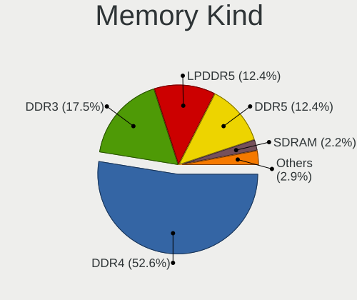

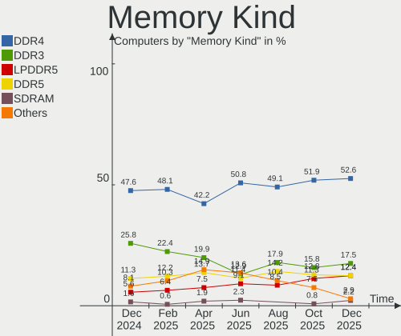

| Kind   | Computers | Percent |
|--------|-----------|---------|
| DDR4   | 72        | 52.55%  |
| DDR3   | 24        | 17.52%  |
| LPDDR5 | 17        | 12.41%  |
| DDR5   | 17        | 12.41%  |
| SDRAM  | 3         | 2.19%   |
| LPDDR4 | 2         | 1.46%   |
| LPDDR3 | 1         | 0.73%   |
| DDR2   | 1         | 0.73%   |

Memory Form Factor
------------------

Physical design of the memory module

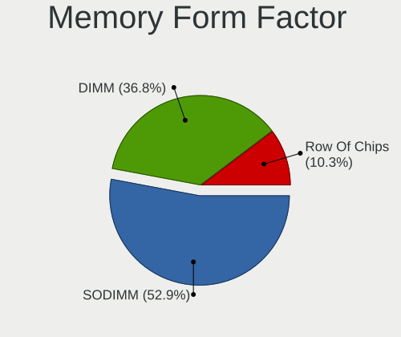

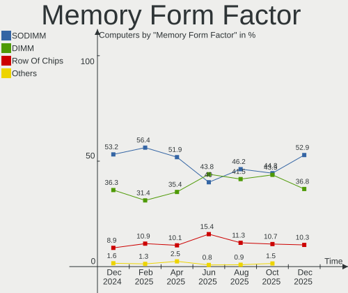

| Name         | Computers | Percent |
|--------------|-----------|---------|
| SODIMM       | 72        | 52.94%  |
| DIMM         | 50        | 36.76%  |
| Row Of Chips | 14        | 10.29%  |

Memory Size
-----------

Memory module size

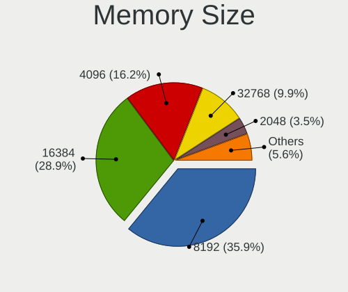

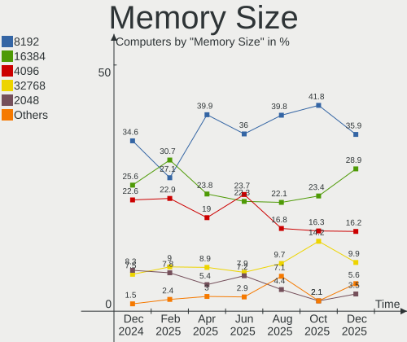

| Size  | Computers | Percent |
|-------|-----------|---------|
| 8192  | 51        | 35.92%  |
| 16384 | 41        | 28.87%  |
| 4096  | 23        | 16.2%   |
| 32768 | 14        | 9.86%   |
| 2048  | 5         | 3.52%   |
| 6144  | 3         | 2.11%   |
| 1024  | 3         | 2.11%   |
| 49152 | 1         | 0.7%    |
| 12288 | 1         | 0.7%    |

Memory Speed
------------

Memory module speed

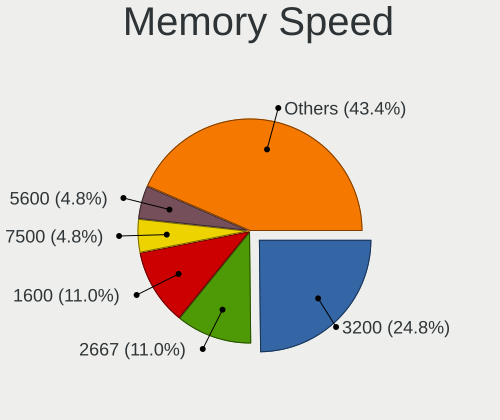

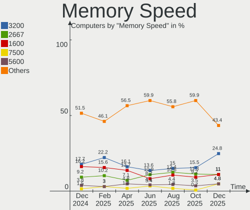

| Speed | Computers | Percent |
|-------|-----------|---------|
| 3200  | 36        | 24.83%  |
| 2667  | 16        | 11.03%  |
| 1600  | 16        | 11.03%  |
| 7500  | 7         | 4.83%   |
| 5600  | 7         | 4.83%   |
| 3600  | 7         | 4.83%   |
| 1333  | 7         | 4.83%   |
| 6400  | 6         | 4.14%   |
| 4800  | 6         | 4.14%   |
| 2400  | 6         | 4.14%   |
| 6000  | 3         | 2.07%   |
| 3733  | 3         | 2.07%   |
| 2133  | 3         | 2.07%   |
| 8533  | 2         | 1.38%   |
| 3800  | 2         | 1.38%   |
| 3266  | 2         | 1.38%   |
| 2933  | 2         | 1.38%   |
| 1639  | 2         | 1.38%   |
| 1334  | 2         | 1.38%   |
| 1067  | 2         | 1.38%   |
| 12800 | 1         | 0.69%   |
| 6800  | 1         | 0.69%   |
| 6200  | 1         | 0.69%   |
| 5200  | 1         | 0.69%   |
| 4267  | 1         | 0.69%   |
| 3100  | 1         | 0.69%   |
| 2666  | 1         | 0.69%   |
| 667   | 1         | 0.69%   |

Printers & scanners
-------------------

Printer Vendor
--------------

Printer device vendors

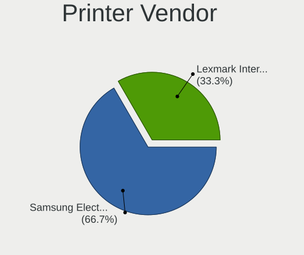

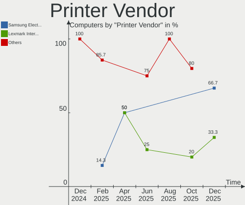

| Vendor                | Computers | Percent |
|-----------------------|-----------|---------|
| Samsung Electronics   | 2         | 66.67%  |
| Lexmark International | 1         | 33.33%  |

Printer Model
-------------

Printer device models

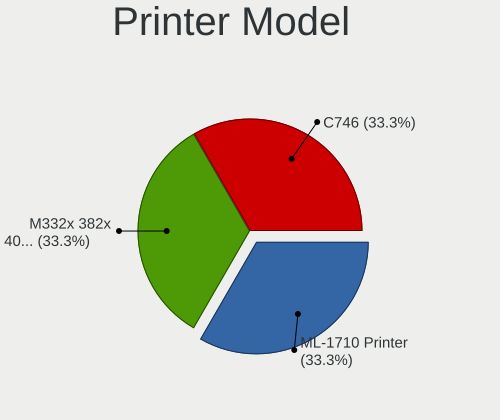

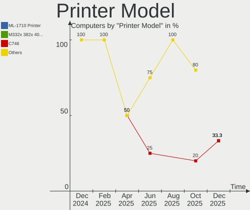

| Model                          | Computers | Percent |
|--------------------------------|-----------|---------|
| Samsung ML-1710 Printer        | 1         | 33.33%  |
| Samsung M332x 382x 402x Series | 1         | 33.33%  |
| Lexmark International C746     | 1         | 33.33%  |

Scanner Vendor
--------------

Scanner device vendors

Zero info for selected period =(

Scanner Model
-------------

Scanner device models

Zero info for selected period =(

Camera
------

Camera Vendor
-------------

Camera device vendors

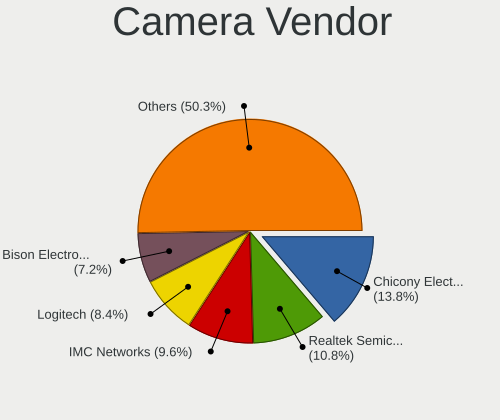

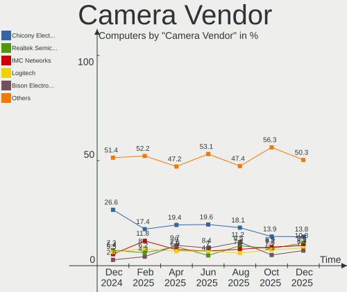

| Vendor                                 | Computers | Percent |
|----------------------------------------|-----------|---------|
| Chicony Electronics                    | 23        | 13.77%  |
| Realtek Semiconductor                  | 18        | 10.78%  |
| IMC Networks                           | 16        | 9.58%   |
| Logitech                               | 14        | 8.38%   |
| Bison Electronics                      | 12        | 7.19%   |
| Microdia                               | 9         | 5.39%   |
| Sunplus Innovation Technology          | 8         | 4.79%   |
| Quanta                                 | 8         | 4.79%   |
| Apple                                  | 8         | 4.79%   |
| Lite-On Technology                     | 7         | 4.19%   |
| Cheng Uei Precision Industry (Foxlink) | 7         | 4.19%   |
| Syntek                                 | 6         | 3.59%   |
| Luxvisions Innotech Limited            | 4         | 2.4%    |
| Sonix Technology                       | 3         | 1.8%    |
| Razer USA                              | 2         | 1.2%    |
| Primax Electronics                     | 2         | 1.2%    |
| webcamvendor                           | 1         | 0.6%    |
| webcam                                 | 1         | 0.6%    |
| Suyin                                  | 1         | 0.6%    |
| Sunplus IT                             | 1         | 0.6%    |
| Silicon Motion                         | 1         | 0.6%    |
| Shinetech                              | 1         | 0.6%    |
| Samsung Electronics                    | 1         | 0.6%    |
| Nexight                                | 1         | 0.6%    |
| Microsoft                              | 1         | 0.6%    |
| kingcome                               | 1         | 0.6%    |
| Jieli Technology                       | 1         | 0.6%    |
| Image+                                 | 1         | 0.6%    |
| Hewlett-Packard                        | 1         | 0.6%    |
| Generalplus Technology                 | 1         | 0.6%    |
| Framework                              | 1         | 0.6%    |
| DigiTech                               | 1         | 0.6%    |
| Creative Technology                    | 1         | 0.6%    |
| Anker PowerConf C200                   | 1         | 0.6%    |
| Anker Innovations Limited              | 1         | 0.6%    |
| Acer                                   | 1         | 0.6%    |

Camera Model
------------

Camera device models

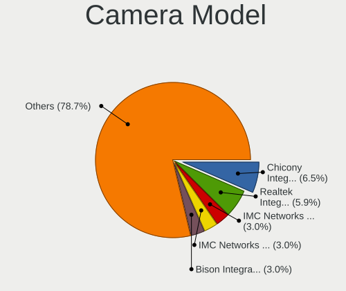

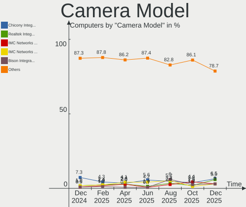

| Model                                                   | Computers | Percent |
|---------------------------------------------------------|-----------|---------|
| Chicony Integrated Camera                               | 11        | 6.51%   |
| Realtek Integrated_Webcam_HD                            | 10        | 5.92%   |
| IMC Networks USB2.0 HD UVC WebCam                       | 5         | 2.96%   |
| IMC Networks Integrated Camera                          | 5         | 2.96%   |
| Bison Integrated Camera                                 | 5         | 2.96%   |
| Microdia Integrated_Webcam_HD                           | 4         | 2.37%   |
| Logitech Webcam C270                                    | 4         | 2.37%   |
| Lite-On HP HD Webcam                                    | 4         | 2.37%   |
| Apple FaceTime HD Camera (Built-in)                     | 4         | 2.37%   |
| Syntek Integrated Camera                                | 3         | 1.78%   |
| Sunplus Integrated_Webcam_HD                            | 3         | 1.78%   |
| Logitech C922 Pro Stream Webcam                         | 3         | 1.78%   |
| Logitech C920 PRO HD Webcam                             | 3         | 1.78%   |
| Chicony HD WebCam                                       | 3         | 1.78%   |
| Syntek Integrated RGB Camera                            | 2         | 1.18%   |
| Sunplus SPCA2281 Web Camera                             | 2         | 1.18%   |
| Sunplus Integrated Camera                               | 2         | 1.18%   |
| Sonix USB2.0 FHD UVC WebCam                             | 2         | 1.18%   |
| Realtek Integrated Webcam HD                            | 2         | 1.18%   |
| Quanta HP HD Camera                                     | 2         | 1.18%   |
| Primax HP HD Webcam [Fixed]                             | 2         | 1.18%   |
| Microdia Integrated_Webcam_FHD                          | 2         | 1.18%   |
| Luxvisions Innotech Limited Integrated RGB Camera       | 2         | 1.18%   |
| Luxvisions Innotech Limited HP TrueVision HD Camera     | 2         | 1.18%   |
| Logitech BRIO 4K Stream Edition                         | 2         | 1.18%   |
| Lite-On Integrated Camera                               | 2         | 1.18%   |
| IMC Networks Integrated RGB Camera                      | 2         | 1.18%   |
| Cheng Uei Precision Industry (Foxlink) HP Truevision HD | 2         | 1.18%   |
| Bison SunplusIT Integrated Camera                       | 2         | 1.18%   |
| Apple iPhone 5/5C/5S/6/SE/7/8/X                         | 2         | 1.18%   |
| webcamvendor NexiGo N60 FHD Webcam                      | 1         | 0.59%   |
| webcam webcam                                           | 1         | 0.59%   |
| Syntek Lenovo EasyCamera                                | 1         | 0.59%   |
| Suyin HD Video WebCam                                   | 1         | 0.59%   |
| Sunplus IT PC Camera                                    | 1         | 0.59%   |
| Sunplus Lenovo EasyCamera                               | 1         | 0.59%   |
| Sunplus Full HD webcam                                  | 1         | 0.59%   |
| Sonix USB 2.0 Camera                                    | 1         | 0.59%   |
| Silicon Motion USB 2.0 PC Cam                           | 1         | 0.59%   |
| Shinetech USB2.0 FHD UVC WebCam                         | 1         | 0.59%   |

Security
--------

Fingerprint Vendor
------------------

Fingerprint sensor vendors

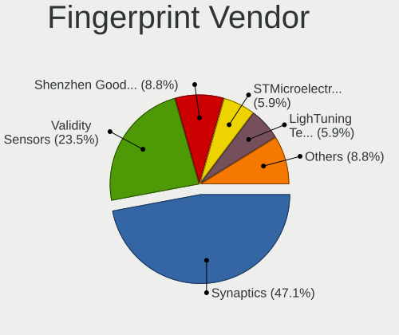

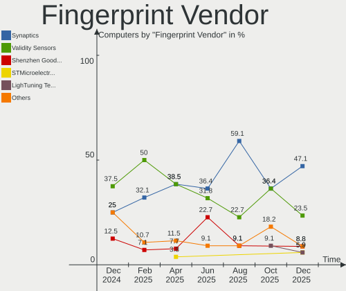

| Vendor                     | Computers | Percent |
|----------------------------|-----------|---------|
| Synaptics                  | 16        | 47.06%  |
| Validity Sensors           | 8         | 23.53%  |
| Shenzhen Goodix Technology | 3         | 8.82%   |
| STMicroelectronics         | 2         | 5.88%   |
| LighTuning Technology      | 2         | 5.88%   |
| Elan Microelectronics      | 2         | 5.88%   |
| AuthenTec                  | 1         | 2.94%   |

Fingerprint Model
-----------------

Fingerprint sensor models

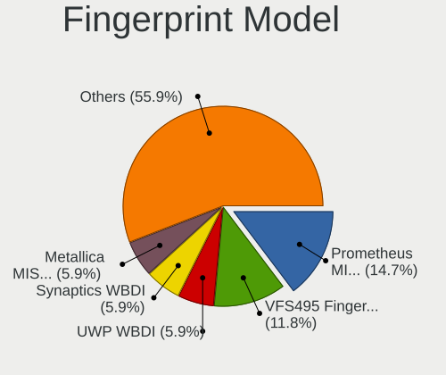

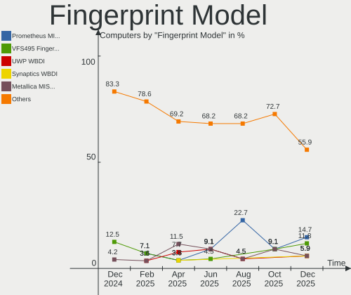

| Model                                                    | Computers | Percent |
|----------------------------------------------------------|-----------|---------|
| Synaptics Prometheus MIS Touch Fingerprint Reader        | 5         | 14.71%  |
| Validity Sensors VFS495 Fingerprint Reader               | 4         | 11.76%  |
| Synaptics UWP WBDI                                       | 2         | 5.88%   |
| Synaptics  WBDI                                          | 2         | 5.88%   |
| Synaptics Metallica MIS Touch Fingerprint Reader         | 2         | 5.88%   |
| STMicroelectronics Fingerprint Reader                    | 2         | 5.88%   |
| Elan ELAN:Fingerprint                                    | 2         | 5.88%   |
| Validity Sensors VFS5011 Fingerprint Reader              | 1         | 2.94%   |
| Validity Sensors VFS491                                  | 1         | 2.94%   |
| Validity Sensors VFS471 Fingerprint Reader               | 1         | 2.94%   |
| Validity Sensors VFS 5011 fingerprint sensor             | 1         | 2.94%   |
| Synaptics WBDI Device                                    | 1         | 2.94%   |
| Synaptics WBDI                                           | 1         | 2.94%   |
| Synaptics Prometheus Fingerprint Reader                  | 1         | 2.94%   |
| Synaptics FS7604 Touch Fingerprint Sensor with PurePrint | 1         | 2.94%   |
| Synaptics Fingerprint reader [HP G6]                     | 1         | 2.94%   |
| Shenzhen Goodix  FingerPrint Device                      | 1         | 2.94%   |
| Shenzhen Goodix Fingerprint Reader                       | 1         | 2.94%   |
| Shenzhen Goodix FingerPrint                              | 1         | 2.94%   |
| LighTuning ES603 Swipe Fingerprint Sensor                | 1         | 2.94%   |
| LighTuning EgisTec Touch Fingerprint Sensor              | 1         | 2.94%   |
| AuthenTec AES2810                                        | 1         | 2.94%   |

Chipcard Vendor
---------------

Chipcard module vendors

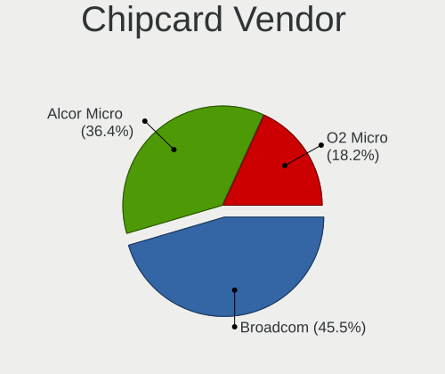

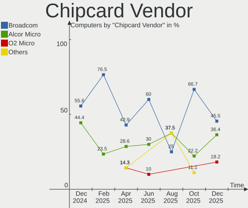

| Vendor      | Computers | Percent |
|-------------|-----------|---------|
| Broadcom    | 5         | 45.45%  |
| Alcor Micro | 4         | 36.36%  |
| O2 Micro    | 2         | 18.18%  |

Chipcard Model
--------------

Chipcard module models

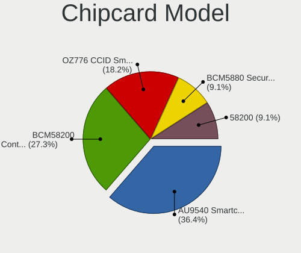

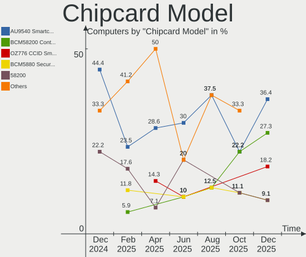

| Model                                                                       | Computers | Percent |
|-----------------------------------------------------------------------------|-----------|---------|
| Alcor Micro AU9540 Smartcard Reader                                         | 4         | 36.36%  |
| Broadcom BCM58200 ControlVault 3 (FingerPrint sensor + Contacted SmartCard) | 3         | 27.27%  |
| O2 Micro OZ776 CCID Smartcard Reader                                        | 2         | 18.18%  |
| Broadcom BCM5880 Secure Applications Processor                              | 1         | 9.09%   |
| Broadcom 58200                                                              | 1         | 9.09%   |

Unsupported
-----------

Unsupported Devices
-------------------

Total unsupported devices on board

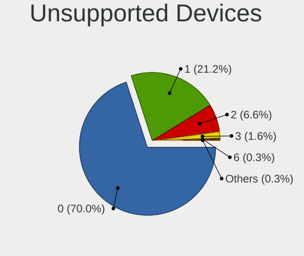

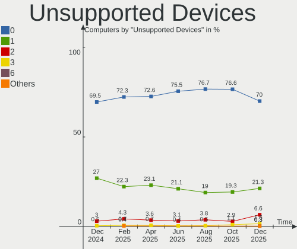

| Total | Computers | Percent |
|-------|-----------|---------|
| 0     | 224       | 70%     |
| 1     | 68        | 21.25%  |
| 2     | 21        | 6.56%   |
| 3     | 5         | 1.56%   |
| 6     | 1         | 0.31%   |
| 4     | 1         | 0.31%   |

Unsupported Device Types
------------------------

Types of unsupported devices

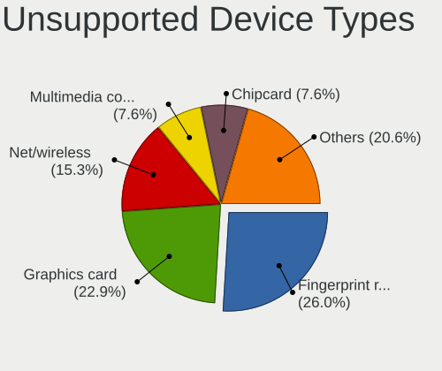

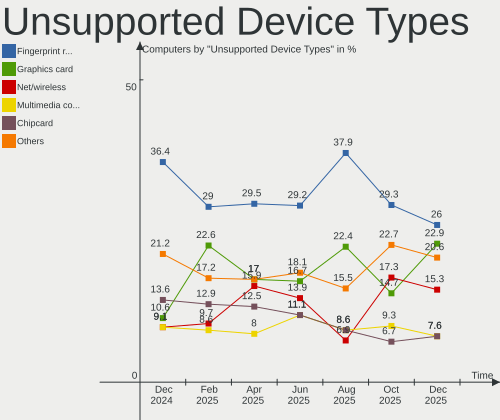

| Type                     | Computers | Percent |
|--------------------------|-----------|---------|
| Fingerprint reader       | 34        | 25.95%  |
| Graphics card            | 30        | 22.9%   |
| Net/wireless             | 20        | 15.27%  |
| Multimedia controller    | 10        | 7.63%   |
| Chipcard                 | 10        | 7.63%   |
| Unassigned class         | 5         | 3.82%   |
| Communication controller | 4         | 3.05%   |
| Storage/raid             | 3         | 2.29%   |
| Sound                    | 3         | 2.29%   |
| Bluetooth                | 3         | 2.29%   |
| Network                  | 2         | 1.53%   |
| Net/ethernet             | 2         | 1.53%   |
| Modem                    | 2         | 1.53%   |
| Storage/nvme             | 1         | 0.76%   |
| Storage                  | 1         | 0.76%   |
| Camera                   | 1         | 0.76%   |

