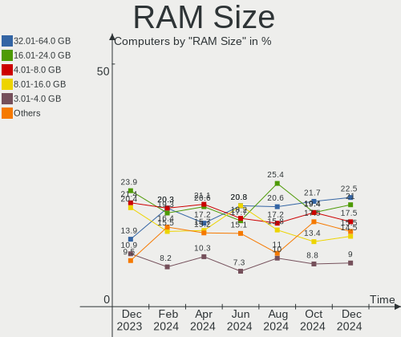
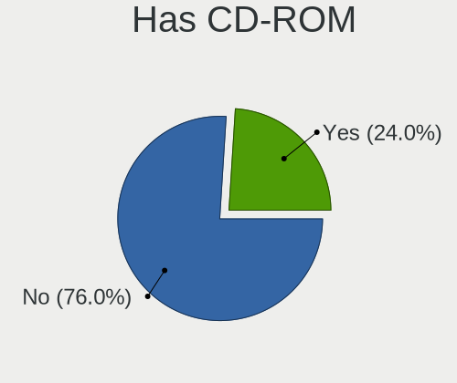
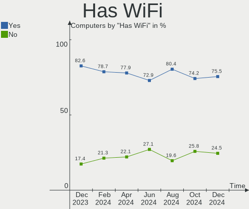
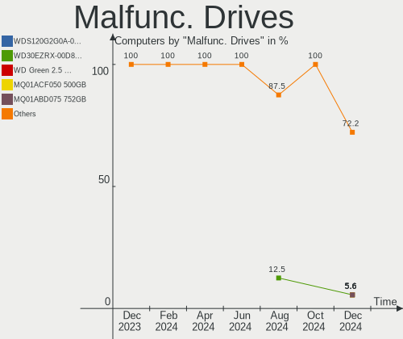
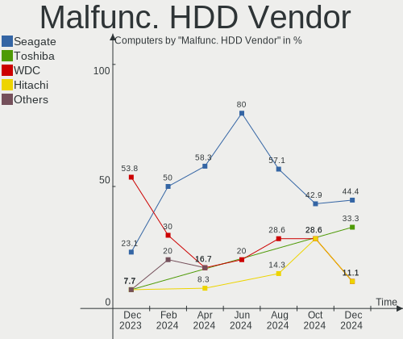
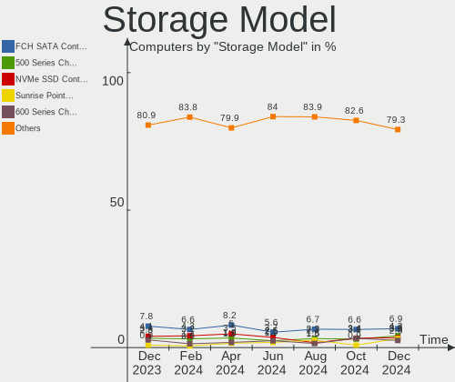
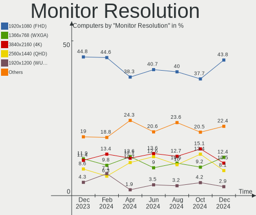

Linux in UK - Hardware Trends
-----------------------------

A project to identify most popular hardware characteristics and track their change
over time based on data collected by Linux users at https://Linux-Hardware.org.

Anyone can contribute to this report by the [hw-probe](https://github.com/linuxhw/hw-probe) tool:

    sudo -E hw-probe -all -upload

This is a report for all computer types. See also reports for [desktops](/Location/UK/Desktop/README.md) and [notebooks](/Location/UK/Notebook/README.md).

Period: Oct, 2023.

Contents
--------

* [ System ](#system)
  - [ OS                       ](#os)
  - [ OS Family                ](#os-family)
  - [ Kernel                   ](#kernel)
  - [ Kernel Family            ](#kernel-family)
  - [ Kernel Major Ver.        ](#kernel-major-ver)
  - [ Arch                     ](#arch)
  - [ DE                       ](#de)
  - [ Display Server           ](#display-server)
  - [ Display Manager          ](#display-manager)
  - [ OS Lang                  ](#os-lang)
  - [ Boot Mode                ](#boot-mode)
  - [ Filesystem               ](#filesystem)
  - [ Part. scheme             ](#part-scheme)
  - [ Dual Boot with Linux/BSD ](#dual-boot-with-linuxbsd)
  - [ Dual Boot (Win)          ](#dual-boot-win)

* [ Board ](#board)
  - [ Vendor                   ](#vendor)
  - [ Model                    ](#model)
  - [ Model Family             ](#model-family)
  - [ MFG Year                 ](#mfg-year)
  - [ Form Factor              ](#form-factor)
  - [ Secure Boot              ](#secure-boot)
  - [ Coreboot                 ](#coreboot)
  - [ RAM Size                 ](#ram-size)
  - [ RAM Used                 ](#ram-used)
  - [ Total Drives             ](#total-drives)
  - [ Has CD-ROM               ](#has-cd-rom)
  - [ Has Ethernet             ](#has-ethernet)
  - [ Has WiFi                 ](#has-wifi)
  - [ Has Bluetooth            ](#has-bluetooth)

* [ Location ](#location)
  - [ Country                  ](#country)
  - [ City                     ](#city)

* [ Drives ](#drives)
  - [ Drive Vendor             ](#drive-vendor)
  - [ Drive Model              ](#drive-model)
  - [ HDD Vendor               ](#hdd-vendor)
  - [ SSD Vendor               ](#ssd-vendor)
  - [ Drive Kind               ](#drive-kind)
  - [ Drive Connector          ](#drive-connector)
  - [ Drive Size               ](#drive-size)
  - [ Space Total              ](#space-total)
  - [ Space Used               ](#space-used)
  - [ Malfunc. Drives          ](#malfunc-drives)
  - [ Malfunc. Drive Vendor    ](#malfunc-drive-vendor)
  - [ Malfunc. HDD Vendor      ](#malfunc-hdd-vendor)
  - [ Malfunc. Drive Kind      ](#malfunc-drive-kind)
  - [ Failed Drives            ](#failed-drives)
  - [ Failed Drive Vendor      ](#failed-drive-vendor)
  - [ Drive Status             ](#drive-status)

* [ Storage controller ](#storage-controller)
  - [ Storage Vendor           ](#storage-vendor)
  - [ Storage Model            ](#storage-model)
  - [ Storage Kind             ](#storage-kind)

* [ Processor ](#processor)
  - [ CPU Vendor               ](#cpu-vendor)
  - [ CPU Model                ](#cpu-model)
  - [ CPU Model Family         ](#cpu-model-family)
  - [ CPU Cores                ](#cpu-cores)
  - [ CPU Sockets              ](#cpu-sockets)
  - [ CPU Threads              ](#cpu-threads)
  - [ CPU Op-Modes             ](#cpu-op-modes)
  - [ CPU Microcode            ](#cpu-microcode)
  - [ CPU Microarch            ](#cpu-microarch)

* [ Graphics ](#graphics)
  - [ GPU Vendor               ](#gpu-vendor)
  - [ GPU Model                ](#gpu-model)
  - [ GPU Combo                ](#gpu-combo)
  - [ GPU Driver               ](#gpu-driver)
  - [ GPU Memory               ](#gpu-memory)

* [ Monitor ](#monitor)
  - [ Monitor Vendor           ](#monitor-vendor)
  - [ Monitor Model            ](#monitor-model)
  - [ Monitor Resolution       ](#monitor-resolution)
  - [ Monitor Diagonal         ](#monitor-diagonal)
  - [ Monitor Width            ](#monitor-width)
  - [ Aspect Ratio             ](#aspect-ratio)
  - [ Monitor Area             ](#monitor-area)
  - [ Pixel Density            ](#pixel-density)
  - [ Multiple Monitors        ](#multiple-monitors)

* [ Network ](#network)
  - [ Net Controller Vendor    ](#net-controller-vendor)
  - [ Net Controller Model     ](#net-controller-model)
  - [ Wireless Vendor          ](#wireless-vendor)
  - [ Wireless Model           ](#wireless-model)
  - [ Ethernet Vendor          ](#ethernet-vendor)
  - [ Ethernet Model           ](#ethernet-model)
  - [ Net Controller Kind      ](#net-controller-kind)
  - [ Used Controller          ](#used-controller)
  - [ NICs                     ](#nics)
  - [ IPv6                     ](#ipv6)

* [ Bluetooth ](#bluetooth)
  - [ Bluetooth Vendor         ](#bluetooth-vendor)
  - [ Bluetooth Model          ](#bluetooth-model)

* [ Sound ](#sound)
  - [ Sound Vendor             ](#sound-vendor)
  - [ Sound Model              ](#sound-model)

* [ Memory ](#memory)
  - [ Memory Vendor            ](#memory-vendor)
  - [ Memory Model             ](#memory-model)
  - [ Memory Kind              ](#memory-kind)
  - [ Memory Form Factor       ](#memory-form-factor)
  - [ Memory Size              ](#memory-size)
  - [ Memory Speed             ](#memory-speed)

* [ Printers & scanners ](#printers--scanners)
  - [ Printer Vendor           ](#printer-vendor)
  - [ Printer Model            ](#printer-model)
  - [ Scanner Vendor           ](#scanner-vendor)
  - [ Scanner Model            ](#scanner-model)

* [ Camera ](#camera)
  - [ Camera Vendor            ](#camera-vendor)
  - [ Camera Model             ](#camera-model)

* [ Security ](#security)
  - [ Fingerprint Vendor       ](#fingerprint-vendor)
  - [ Fingerprint Model        ](#fingerprint-model)
  - [ Chipcard Vendor          ](#chipcard-vendor)
  - [ Chipcard Model           ](#chipcard-model)

* [ Unsupported ](#unsupported)
  - [ Unsupported Devices      ](#unsupported-devices)
  - [ Unsupported Device Types ](#unsupported-device-types)

System
------

OS
--

Installed operating systems

| Name               | Computers | Percent |
|--------------------|-----------|---------|
| Ubuntu 22.04       | 43        | 19.03%  |
| Linux Mint 21.2    | 20        | 8.85%   |
| Fedora 38          | 20        | 8.85%   |
| Pop!_OS 22.04      | 11        | 4.87%   |
| Arch Rolling       | 11        | 4.87%   |
| Debian 12          | 9         | 3.98%   |
| ArcoLinux Rolling  | 9         | 3.98%   |
| Zorin 16           | 7         | 3.1%    |
| KDE neon 22.04     | 7         | 3.1%    |
| Ubuntu 23.10       | 6         | 2.65%   |
| Gentoo 2.14        | 6         | 2.65%   |
| OpenMandriva 23.08 | 5         | 2.21%   |
| Ubuntu 23.04       | 4         | 1.77%   |
| Fedora 39          | 4         | 1.77%   |
| Debian 11          | 4         | 1.77%   |
| BlackPanther 18.1  | 4         | 1.77%   |
| SteamOS 3.4.11     | 3         | 1.33%   |
| Kubuntu 23.04      | 3         | 1.33%   |
| Kubuntu 22.04      | 3         | 1.33%   |
| Xubuntu 22.04      | 2         | 0.88%   |
| Ubuntu MATE 22.04  | 2         | 0.88%   |
| Ubuntu 22.10       | 2         | 0.88%   |
| Nobara 38          | 2         | 0.88%   |
| MX 23              | 2         | 0.88%   |
| Manjaro            | 2         | 0.88%   |
| LMDE 6             | 2         | 0.88%   |
| Linux Mint 20.3    | 2         | 0.88%   |
| Linux Mint 20.2    | 2         | 0.88%   |
| Kali 2023.3        | 2         | 0.88%   |
| Debian             | 2         | 0.88%   |
| Xubuntu 23.10      | 1         | 0.44%   |
| Xubuntu 21.04      | 1         | 0.44%   |
| Xubuntu 18.04      | 1         | 0.44%   |
| Xero Rolling       | 1         | 0.44%   |
| SteamOS 3.5        | 1         | 0.44%   |
| SteamOS 3.4.10     | 1         | 0.44%   |
| Slackware 15.0     | 1         | 0.44%   |
| Rocky Linux 8.5    | 1         | 0.44%   |
| Peppermint 10      | 1         | 0.44%   |
| openSUSE Leap-15.5 | 1         | 0.44%   |

OS Family
---------

OS without a version

| Name         | Computers | Percent |
|--------------|-----------|---------|
| Ubuntu       | 55        | 24.34%  |
| Linux Mint   | 26        | 11.5%   |
| Fedora       | 25        | 11.06%  |
| Debian       | 15        | 6.64%   |
| Pop!_OS      | 11        | 4.87%   |
| Arch         | 11        | 4.87%   |
| ArcoLinux    | 9         | 3.98%   |
| Zorin        | 7         | 3.1%    |
| KDE neon     | 7         | 3.1%    |
| OpenMandriva | 6         | 2.65%   |
| Kubuntu      | 6         | 2.65%   |
| Gentoo       | 6         | 2.65%   |
| Xubuntu      | 5         | 2.21%   |
| SteamOS      | 5         | 2.21%   |
| BlackPanther | 4         | 1.77%   |
| MX           | 3         | 1.33%   |
| Manjaro      | 3         | 1.33%   |
| Ubuntu MATE  | 2         | 0.88%   |
| Nobara       | 2         | 0.88%   |
| LMDE         | 2         | 0.88%   |
| Kali         | 2         | 0.88%   |
| Xero         | 1         | 0.44%   |
| Slackware    | 1         | 0.44%   |
| Rocky Linux  | 1         | 0.44%   |
| Peppermint   | 1         | 0.44%   |
| openSUSE     | 1         | 0.44%   |
| Mageia       | 1         | 0.44%   |
| Lubuntu      | 1         | 0.44%   |
| Endless      | 1         | 0.44%   |
| Devuan       | 1         | 0.44%   |
| Artix        | 1         | 0.44%   |
| Arch ARM     | 1         | 0.44%   |
| antiX        | 1         | 0.44%   |
| ALT Linux    | 1         | 0.44%   |
| AlmaLinux    | 1         | 0.44%   |

Kernel
------

Version of the Linux kernel

| Version                     | Computers | Percent |
|-----------------------------|-----------|---------|
| 6.2.0-34-generic            | 32        | 14.16%  |
| 6.2.0-35-generic            | 17        | 7.52%   |
| 5.15.0-86-generic           | 16        | 7.08%   |
| 6.5.6-200.fc38.x86_64       | 9         | 3.98%   |
| 6.5.5-arch1-1               | 8         | 3.54%   |
| 6.2.0-33-generic            | 8         | 3.54%   |
| 6.5.8-arch1-1               | 6         | 2.65%   |
| 6.5.5-200.fc38.x86_64       | 6         | 2.65%   |
| 6.1.0-13-amd64              | 6         | 2.65%   |
| 6.4.11-desktop-1omv2390     | 5         | 2.21%   |
| 6.5.6-300.fc39.x86_64       | 4         | 1.77%   |
| 6.5.0-9-generic             | 4         | 1.77%   |
| 6.1.0-12-amd64              | 4         | 1.77%   |
| 5.15.0-88-generic           | 4         | 1.77%   |
| 5.15.0-87-generic           | 4         | 1.77%   |
| 5.13.0-valve37-1-neptune    | 4         | 1.77%   |
| 5.10.0-26-amd64             | 4         | 1.77%   |
| 6.5.6-76060506-generic      | 3         | 1.33%   |
| 6.5.4-76060504-generic      | 3         | 1.33%   |
| 6.5.0-10-generic            | 3         | 1.33%   |
| 6.4.6-76060406-generic      | 3         | 1.33%   |
| 6.2.0-36-generic            | 3         | 1.33%   |
| 5.15.85-desktop-1bP         | 3         | 1.33%   |
| 6.5.8-200.fc38.x86_64       | 2         | 0.88%   |
| 6.5.0-kali2-amd64           | 2         | 0.88%   |
| 6.2.9-300.fc38.x86_64       | 2         | 0.88%   |
| 6.2.0-32-generic            | 2         | 0.88%   |
| 6.2.0-1014-lowlatency       | 2         | 0.88%   |
| 5.4.0-150-generic           | 2         | 0.88%   |
| 5.19.0-46-generic           | 2         | 0.88%   |
| 5.15.0-84-generic           | 2         | 0.88%   |
| 6.5.9-cachyos               | 1         | 0.44%   |
| 6.5.9-arch2-1               | 1         | 0.44%   |
| 6.5.8-zen1-1-zen            | 1         | 0.44%   |
| 6.5.8-1.surface.fc38.x86_64 | 1         | 0.44%   |
| 6.5.7-x64v3-xanmod1         | 1         | 0.44%   |
| 6.5.7-arch1-1               | 1         | 0.44%   |
| 6.5.6-surface               | 1         | 0.44%   |
| 6.5.6-arch2-1               | 1         | 0.44%   |
| 6.5.5-un-def-alt1           | 1         | 0.44%   |

Kernel Family
-------------

Linux kernel without a distro release

| Version  | Computers | Percent |
|----------|-----------|---------|
| 6.2.0    | 64        | 28.32%  |
| 5.15.0   | 31        | 13.72%  |
| 6.5.5    | 20        | 8.85%   |
| 6.5.6    | 18        | 7.96%   |
| 6.5.0    | 13        | 5.75%   |
| 6.1.0    | 12        | 5.31%   |
| 6.5.8    | 10        | 4.42%   |
| 6.4.11   | 6         | 2.65%   |
| 5.4.0    | 4         | 1.77%   |
| 5.13.0   | 4         | 1.77%   |
| 5.10.0   | 4         | 1.77%   |
| 6.5.4    | 3         | 1.33%   |
| 6.4.6    | 3         | 1.33%   |
| 5.15.85  | 3         | 1.33%   |
| 6.5.9    | 2         | 0.88%   |
| 6.5.7    | 2         | 0.88%   |
| 6.5.3    | 2         | 0.88%   |
| 6.2.9    | 2         | 0.88%   |
| 5.19.0   | 2         | 0.88%   |
| 6.5.2    | 1         | 0.44%   |
| 6.4.9    | 1         | 0.44%   |
| 6.4.12   | 1         | 0.44%   |
| 6.4.0    | 1         | 0.44%   |
| 6.3.9    | 1         | 0.44%   |
| 6.3.5    | 1         | 0.44%   |
| 6.3.0    | 1         | 0.44%   |
| 6.2.15   | 1         | 0.44%   |
| 6.1.57   | 1         | 0.44%   |
| 6.1.55   | 1         | 0.44%   |
| 6.1.53   | 1         | 0.44%   |
| 6.1.52   | 1         | 0.44%   |
| 5.8.0    | 1         | 0.44%   |
| 5.6.14   | 1         | 0.44%   |
| 5.17.15  | 1         | 0.44%   |
| 5.15.117 | 1         | 0.44%   |
| 5.14.21  | 1         | 0.44%   |
| 5.14.0   | 1         | 0.44%   |
| 5.11.0   | 1         | 0.44%   |
| 5.10.142 | 1         | 0.44%   |
| 4.18.0   | 1         | 0.44%   |

Kernel Major Ver.
-----------------

Linux kernel major version

| Version | Computers | Percent |
|---------|-----------|---------|
| 6.5     | 71        | 31.42%  |
| 6.2     | 67        | 29.65%  |
| 5.15    | 35        | 15.49%  |
| 6.1     | 16        | 7.08%   |
| 6.4     | 12        | 5.31%   |
| 5.10    | 5         | 2.21%   |
| 5.4     | 4         | 1.77%   |
| 5.13    | 4         | 1.77%   |
| 6.3     | 3         | 1.33%   |
| 5.19    | 2         | 0.88%   |
| 5.14    | 2         | 0.88%   |
| 5.8     | 1         | 0.44%   |
| 5.6     | 1         | 0.44%   |
| 5.17    | 1         | 0.44%   |
| 5.11    | 1         | 0.44%   |
| 4.18    | 1         | 0.44%   |

Arch
----

OS architecture (x86_64, i586, etc.)

| Name    | Computers | Percent |
|---------|-----------|---------|
| x86_64  | 223       | 98.67%  |
| aarch64 | 2         | 0.88%   |
| i686    | 1         | 0.44%   |

DE
--

Desktop Environment

| Name            | Computers | Percent |
|-----------------|-----------|---------|
| GNOME           | 99        | 43.81%  |
| KDE5            | 52        | 23.01%  |
| X-Cinnamon      | 22        | 9.73%   |
| XFCE            | 21        | 9.29%   |
| Unknown         | 9         | 3.98%   |
| Cinnamon        | 6         | 2.65%   |
| MATE            | 5         | 2.21%   |
| LXQt            | 4         | 1.77%   |
| LXDE            | 2         | 0.88%   |
| Hyprland        | 2         | 0.88%   |
| icewm           | 1         | 0.44%   |
| GNOME Flashback | 1         | 0.44%   |
| chadwm          | 1         | 0.44%   |
| Budgie          | 1         | 0.44%   |

Display Server
--------------

X11 or Wayland

| Name    | Computers | Percent |
|---------|-----------|---------|
| X11     | 131       | 57.96%  |
| Wayland | 81        | 35.84%  |
| Tty     | 10        | 4.42%   |
| Unknown | 4         | 1.77%   |

Display Manager
---------------

SDDM, LightDM, etc.

| Name    | Computers | Percent |
|---------|-----------|---------|
| Unknown | 83        | 36.73%  |
| GDM3    | 59        | 26.11%  |
| SDDM    | 35        | 15.49%  |
| LightDM | 33        | 14.6%   |
| GDM     | 16        | 7.08%   |

OS Lang
-------

Language

| Lang        | Computers | Percent |
|-------------|-----------|---------|
| en_GB       | 178       | 78.76%  |
| en_US       | 31        | 13.72%  |
| Unknown     | 7         | 3.1%    |
| C           | 4         | 1.77%   |
| lt_LT       | 2         | 0.88%   |
| zh_CN       | 1         | 0.44%   |
| ru_RU       | 1         | 0.44%   |
| en_US.utf-8 | 1         | 0.44%   |
| en_IE       | 1         | 0.44%   |

Boot Mode
---------

EFI or BIOS

| Mode | Computers | Percent |
|------|-----------|---------|
| BIOS | 115       | 50.88%  |
| EFI  | 111       | 49.12%  |

Filesystem
----------

Type of filesystem

| Type    | Computers | Percent |
|---------|-----------|---------|
| Ext4    | 135       | 59.73%  |
| Btrfs   | 42        | 18.58%  |
| Tmpfs   | 35        | 15.49%  |
| Overlay | 8         | 3.54%   |
| Xfs     | 4         | 1.77%   |
| Zfs     | 1         | 0.44%   |
| Ext3    | 1         | 0.44%   |

Part. scheme
------------

Scheme of partitioning

| Type    | Computers | Percent |
|---------|-----------|---------|
| GPT     | 132       | 58.41%  |
| Unknown | 73        | 32.3%   |
| MBR     | 21        | 9.29%   |

Dual Boot with Linux/BSD
------------------------

Hosting more than one Linux/BSD

| Dual boot | Computers | Percent |
|-----------|-----------|---------|
| No        | 206       | 91.15%  |
| Yes       | 20        | 8.85%   |

Dual Boot (Win)
---------------

Hosting Linux and Windows

| Dual boot | Computers | Percent |
|-----------|-----------|---------|
| No        | 172       | 76.11%  |
| Yes       | 54        | 23.89%  |

Board
-----

Vendor
------

Motherboard manufacturer

| Name                                 | Computers | Percent |
|--------------------------------------|-----------|---------|
| Dell                                 | 37        | 16.37%  |
| Lenovo                               | 34        | 15.04%  |
| ASUSTek Computer                     | 28        | 12.39%  |
| Hewlett-Packard                      | 24        | 10.62%  |
| Gigabyte Technology                  | 24        | 10.62%  |
| MSI                                  | 11        | 4.87%   |
| Acer                                 | 9         | 3.98%   |
| Apple                                | 8         | 3.54%   |
| Valve                                | 5         | 2.21%   |
| Toshiba                              | 4         | 1.77%   |
| ASRock                               | 4         | 1.77%   |
| Intel                                | 3         | 1.33%   |
| HUAWEI                               | 3         | 1.33%   |
| Samsung Electronics                  | 2         | 0.88%   |
| Microsoft                            | 2         | 0.88%   |
| Fanless Mini PC                      | 2         | 0.88%   |
| AZW                                  | 2         | 0.88%   |
| Alienware                            | 2         | 0.88%   |
| Star Labs                            | 1         | 0.44%   |
| Sony                                 | 1         | 0.44%   |
| Shenzhen Meigao Electronic Equipment | 1         | 0.44%   |
| PINE64                               | 1         | 0.44%   |
| Pegatron                             | 1         | 0.44%   |
| PC Specialist                        | 1         | 0.44%   |
| Panasonic                            | 1         | 0.44%   |
| Novatech                             | 1         | 0.44%   |
| IP3 Tech                             | 1         | 0.44%   |
| Inventec                             | 1         | 0.44%   |
| Google                               | 1         | 0.44%   |
| Fujitsu Siemens                      | 1         | 0.44%   |
| Fujitsu                              | 1         | 0.44%   |
| Framework                            | 1         | 0.44%   |
| Foxconn                              | 1         | 0.44%   |
| Eii                                  | 1         | 0.44%   |
| ECS                                  | 1         | 0.44%   |
| CompuLab                             | 1         | 0.44%   |
| Biostar                              | 1         | 0.44%   |
| AWOW                                 | 1         | 0.44%   |
| AMI                                  | 1         | 0.44%   |
| Unknown                              | 1         | 0.44%   |

Model
-----

Motherboard model

| Name                                       | Computers | Percent |
|--------------------------------------------|-----------|---------|
| Valve Jupiter                              | 5         | 2.21%   |
| MSI MS-7B79                                | 2         | 0.88%   |
| HP OMEN by Laptop 16-c0xxx                 | 2         | 0.88%   |
| Gigabyte X570S AORUS ELITE AX              | 2         | 0.88%   |
| Gigabyte B450M DS3H                        | 2         | 0.88%   |
| Dell XPS 15 9500                           | 2         | 0.88%   |
| Dell OptiPlex 7010                         | 2         | 0.88%   |
| Dell Inspiron 13-5378                      | 2         | 0.88%   |
| ASUS ROG STRIX X670E-F GAMING WIFI         | 2         | 0.88%   |
| Apple Macmini7,1                           | 2         | 0.88%   |
| Toshiba Satellite Pro R50-B                | 1         | 0.44%   |
| Toshiba Satellite NB10t-A-102              | 1         | 0.44%   |
| Toshiba Satellite C660D                    | 1         | 0.44%   |
| Toshiba Satellite C50-A-1DV                | 1         | 0.44%   |
| Star Labs StarBook                         | 1         | 0.44%   |
| Sony SVE1511K1ESI                          | 1         | 0.44%   |
| Shenzhen Meigao Electronic Equipment F7BSC | 1         | 0.44%   |
| Samsung 750XED                             | 1         | 0.44%   |
| Samsung 355V4C/356V4C/3445VC/3545VC        | 1         | 0.44%   |
| PINE64 Pinebook Pro                        | 1         | 0.44%   |
| Pegatron NF518AA-ABU a6744uk               | 1         | 0.44%   |
| PC Specialist P65_P67RGRERA                | 1         | 0.44%   |
| Panasonic CF-191HA23DE                     | 1         | 0.44%   |
| Novatech W9x0LU                            | 1         | 0.44%   |
| MSI MS-7E06                                | 1         | 0.44%   |
| MSI MS-7D75                                | 1         | 0.44%   |
| MSI MS-7C91                                | 1         | 0.44%   |
| MSI MS-7B89                                | 1         | 0.44%   |
| MSI MS-7B78                                | 1         | 0.44%   |
| MSI MS-7850                                | 1         | 0.44%   |
| MSI MS-7821                                | 1         | 0.44%   |
| MSI MJ-7592                                | 1         | 0.44%   |
| MSI Katana GF66 11UG                       | 1         | 0.44%   |
| Microsoft Surface Pro                      | 1         | 0.44%   |
| Microsoft Surface Go                       | 1         | 0.44%   |
| Lenovo Yoga Slim 7 ProX 14ARH7 82TL        | 1         | 0.44%   |
| Lenovo Yoga Slim 7 13ACN5 82CY             | 1         | 0.44%   |
| Lenovo Yoga 9 14IAP7 82LU                  | 1         | 0.44%   |
| Lenovo YB1-X91F                            | 1         | 0.44%   |
| Lenovo V330-14ARR 81B1                     | 1         | 0.44%   |

Model Family
------------

Motherboard model prefix

| Name                                       | Computers | Percent |
|--------------------------------------------|-----------|---------|
| Lenovo ThinkPad                            | 19        | 8.41%   |
| Dell Inspiron                              | 10        | 4.42%   |
| Dell Precision                             | 8         | 3.54%   |
| Dell Latitude                              | 6         | 2.65%   |
| Valve Jupiter                              | 5         | 2.21%   |
| Dell XPS                                   | 5         | 2.21%   |
| Dell OptiPlex                              | 5         | 2.21%   |
| ASUS VivoBook                              | 5         | 2.21%   |
| ASUS ROG                                   | 5         | 2.21%   |
| Acer Aspire                                | 5         | 2.21%   |
| Toshiba Satellite                          | 4         | 1.77%   |
| HP Pavilion                                | 4         | 1.77%   |
| Lenovo Yoga                                | 3         | 1.33%   |
| Lenovo ThinkCentre                         | 3         | 1.33%   |
| Lenovo IdeaPad                             | 3         | 1.33%   |
| HP ProBook                                 | 3         | 1.33%   |
| HP OMEN                                    | 3         | 1.33%   |
| MSI MS-7B79                                | 2         | 0.88%   |
| Microsoft Surface                          | 2         | 0.88%   |
| HP EliteBook                               | 2         | 0.88%   |
| HP Compaq                                  | 2         | 0.88%   |
| Gigabyte X570S                             | 2         | 0.88%   |
| Gigabyte X570                              | 2         | 0.88%   |
| Gigabyte B550M                             | 2         | 0.88%   |
| Gigabyte B550                              | 2         | 0.88%   |
| Gigabyte B450M                             | 2         | 0.88%   |
| ASUS ZenBook                               | 2         | 0.88%   |
| Apple Macmini7                             | 2         | 0.88%   |
| Apple MacBookAir6                          | 2         | 0.88%   |
| Star Labs StarBook                         | 1         | 0.44%   |
| Sony SVE1511K1ESI                          | 1         | 0.44%   |
| Shenzhen Meigao Electronic Equipment F7BSC | 1         | 0.44%   |
| Samsung 750XED                             | 1         | 0.44%   |
| Samsung 355V4C                             | 1         | 0.44%   |
| PINE64 Pinebook                            | 1         | 0.44%   |
| Pegatron NF518AA-ABU                       | 1         | 0.44%   |
| PC Specialist P65                          | 1         | 0.44%   |
| Panasonic CF-191HA23DE                     | 1         | 0.44%   |
| Novatech W9x0LU                            | 1         | 0.44%   |
| MSI MS-7E06                                | 1         | 0.44%   |

MFG Year
--------

Motherboard manufacture year

| Year    | Computers | Percent |
|---------|-----------|---------|
| 2022    | 25        | 11.06%  |
| 2021    | 24        | 10.62%  |
| 2020    | 22        | 9.73%   |
| 2018    | 22        | 9.73%   |
| 2023    | 19        | 8.41%   |
| 2014    | 17        | 7.52%   |
| 2013    | 17        | 7.52%   |
| 2019    | 14        | 6.19%   |
| 2015    | 11        | 4.87%   |
| 2017    | 9         | 3.98%   |
| 2016    | 8         | 3.54%   |
| 2012    | 8         | 3.54%   |
| 2010    | 8         | 3.54%   |
| 2008    | 6         | 2.65%   |
| 2011    | 5         | 2.21%   |
| 2006    | 4         | 1.77%   |
| 2009    | 3         | 1.33%   |
| 2007    | 3         | 1.33%   |
| Unknown | 1         | 0.44%   |

Form Factor
-----------

Physical design of the computer

| Name           | Computers | Percent |
|----------------|-----------|---------|
| Notebook       | 119       | 52.65%  |
| Desktop        | 84        | 37.17%  |
| Mini pc        | 10        | 4.42%   |
| Convertible    | 6         | 2.65%   |
| Server         | 3         | 1.33%   |
| System on chip | 2         | 0.88%   |
| Tablet         | 2         | 0.88%   |

Secure Boot
-----------

Enabled or disabled

| State    | Computers | Percent |
|----------|-----------|---------|
| Disabled | 212       | 93.81%  |
| Enabled  | 14        | 6.19%   |

Coreboot
--------

Have coreboot on board

| Used | Computers | Percent |
|------|-----------|---------|
| No   | 224       | 99.12%  |
| Yes  | 2         | 0.88%   |

RAM Size
--------

Total RAM memory

| Size in GB  | Computers | Percent |
|-------------|-----------|---------|
| 4.01-8.0    | 50        | 22.12%  |
| 16.01-24.0  | 42        | 18.58%  |
| 8.01-16.0   | 41        | 18.14%  |
| 32.01-64.0  | 40        | 17.7%   |
| 3.01-4.0    | 29        | 12.83%  |
| 64.01-256.0 | 13        | 5.75%   |
| 24.01-32.0  | 4         | 1.77%   |
| 1.01-2.0    | 3         | 1.33%   |
| 2.01-3.0    | 2         | 0.88%   |
| 0.51-1.0    | 2         | 0.88%   |

RAM Used
--------

Used RAM memory

| Used GB    | Computers | Percent |
|------------|-----------|---------|
| 4.01-8.0   | 66        | 29.2%   |
| 1.01-2.0   | 59        | 26.11%  |
| 2.01-3.0   | 41        | 18.14%  |
| 3.01-4.0   | 36        | 15.93%  |
| 8.01-16.0  | 11        | 4.87%   |
| 0.51-1.0   | 10        | 4.42%   |
| 16.01-24.0 | 3         | 1.33%   |

Total Drives
------------

Number of drives on board

| Drives | Computers | Percent |
|--------|-----------|---------|
| 1      | 133       | 58.85%  |
| 2      | 59        | 26.11%  |
| 4      | 12        | 5.31%   |
| 3      | 9         | 3.98%   |
| 6      | 4         | 1.77%   |
| 5      | 4         | 1.77%   |
| 11     | 2         | 0.88%   |
| 8      | 2         | 0.88%   |
| 7      | 1         | 0.44%   |

Has CD-ROM
----------

Has CD-ROM on board

| Presented | Computers | Percent |
|-----------|-----------|---------|
| No        | 167       | 73.89%  |
| Yes       | 59        | 26.11%  |

Has Ethernet
------------

Has Ethernet on board

| Presented | Computers | Percent |
|-----------|-----------|---------|
| Yes       | 181       | 80.09%  |
| No        | 45        | 19.91%  |

Has WiFi
--------

Has WiFi module

| Presented | Computers | Percent |
|-----------|-----------|---------|
| Yes       | 183       | 80.97%  |
| No        | 43        | 19.03%  |

Has Bluetooth
-------------

Has Bluetooth module

| Presented | Computers | Percent |
|-----------|-----------|---------|
| Yes       | 143       | 63.27%  |
| No        | 83        | 36.73%  |

Location
--------

Country
-------

Geographic location (country)

| Country | Computers | Percent |
|---------|-----------|---------|
| UK      | 226       | 100%    |

City
----

Geographic location (city)

| City                 | Computers | Percent |
|----------------------|-----------|---------|
| London               | 12        | 5.31%   |
| Glasgow              | 6         | 2.65%   |
| Manchester           | 5         | 2.21%   |
| Edinburgh            | 5         | 2.21%   |
| Birmingham           | 5         | 2.21%   |
| York                 | 4         | 1.77%   |
| Sheffield            | 4         | 1.77%   |
| Leeds                | 4         | 1.77%   |
| Croydon              | 4         | 1.77%   |
| Bristol              | 4         | 1.77%   |
| Stockport            | 3         | 1.33%   |
| Milton Keynes        | 3         | 1.33%   |
| Mansfield            | 3         | 1.33%   |
| Ilford               | 3         | 1.33%   |
| City of Westminster  | 3         | 1.33%   |
| Whitley Bay          | 2         | 0.88%   |
| Tiverton             | 2         | 0.88%   |
| St Albans            | 2         | 0.88%   |
| Southwark            | 2         | 0.88%   |
| Northampton          | 2         | 0.88%   |
| Newham               | 2         | 0.88%   |
| Newcastle upon Tyne  | 2         | 0.88%   |
| Liverpool            | 2         | 0.88%   |
| Leicester            | 2         | 0.88%   |
| Kingston upon Thames | 2         | 0.88%   |
| Inverness            | 2         | 0.88%   |
| Harringay            | 2         | 0.88%   |
| Harlow               | 2         | 0.88%   |
| Hackney              | 2         | 0.88%   |
| Feltham              | 2         | 0.88%   |
| Exeter               | 2         | 0.88%   |
| Dundee               | 2         | 0.88%   |
| Dumfries             | 2         | 0.88%   |
| Coventry             | 2         | 0.88%   |
| Cardiff              | 2         | 0.88%   |
| Brighton             | 2         | 0.88%   |
| Brent                | 2         | 0.88%   |
| Belfast              | 2         | 0.88%   |
| Barnet               | 2         | 0.88%   |
| Wrexham              | 1         | 0.44%   |

Drives
------

Drive Vendor
------------

Hard drive vendors

| Vendor                       | Computers | Drives | Percent |
|------------------------------|-----------|--------|---------|
| Samsung Electronics          | 47        | 65     | 13.86%  |
| WDC                          | 38        | 54     | 11.21%  |
| Seagate                      | 35        | 48     | 10.32%  |
| Toshiba                      | 26        | 27     | 7.67%   |
| Sandisk                      | 24        | 29     | 7.08%   |
| Crucial                      | 22        | 28     | 6.49%   |
| Unknown                      | 18        | 21     | 5.31%   |
| Kingston                     | 15        | 16     | 4.42%   |
| SK hynix                     | 10        | 11     | 2.95%   |
| Micron Technology            | 9         | 9      | 2.65%   |
| Silicon Motion               | 7         | 7      | 2.06%   |
| Phison Electronics           | 6         | 7      | 1.77%   |
| Intel                        | 6         | 9      | 1.77%   |
| Hitachi                      | 6         | 7      | 1.77%   |
| Apple                        | 6         | 6      | 1.77%   |
| Kingston Technology Company  | 5         | 5      | 1.47%   |
| China                        | 5         | 5      | 1.47%   |
| A-DATA Technology            | 5         | 6      | 1.47%   |
| LITEON                       | 4         | 4      | 1.18%   |
| Unknown                      | 4         | 4      | 1.18%   |
| Realtek                      | 3         | 4      | 0.88%   |
| Phison                       | 3         | 3      | 0.88%   |
| Micron/Crucial Technology    | 3         | 3      | 0.88%   |
| XUM                          | 2         | 2      | 0.59%   |
| Transcend                    | 2         | 2      | 0.59%   |
| Netac                        | 2         | 2      | 0.59%   |
| LITEONIT                     | 2         | 2      | 0.59%   |
| HGST                         | 2         | 2      | 0.59%   |
| Fujitsu                      | 2         | 2      | 0.59%   |
| SSSTC                        | 1         | 1      | 0.29%   |
| ShiJi                        | 1         | 1      | 0.29%   |
| Shenzhen Longsys Electronics | 1         | 2      | 0.29%   |
| SABRENT                      | 1         | 1      | 0.29%   |
| Realtek Semiconductor        | 1         | 1      | 0.29%   |
| PNY                          | 1         | 1      | 0.29%   |
| Origin                       | 1         | 1      | 0.29%   |
| OCZ                          | 1         | 1      | 0.29%   |
| MENGMI                       | 1         | 1      | 0.29%   |
| MAXIO Technology (Hangzhou)  | 1         | 1      | 0.29%   |
| M4-CT128                     | 1         | 1      | 0.29%   |

Drive Model
-----------

Hard drive models

| Model                                                 | Computers | Percent |
|-------------------------------------------------------|-----------|---------|
| Samsung NVMe SSD Controller SM981/PM981/PM983 1TB     | 16        | 4.13%   |
| Kingston SA400S37240G 240GB SSD                       | 6         | 1.55%   |
| Samsung SSD 850 EVO 500GB                             | 5         | 1.29%   |
| Samsung NVMe SSD Controller PM9A1/PM9A3/980PRO 1TB    | 5         | 1.29%   |
| Unknown SD/MMC/MS PRO 16GB                            | 4         | 1.03%   |
| Seagate ST2000DM008-2FR102 2TB                        | 4         | 1.03%   |
| Crucial CT500MX500SSD1 500GB                          | 4         | 1.03%   |
| Crucial CT1000MX500SSD1 1TB                           | 4         | 1.03%   |
| Unknown                                               | 4         | 1.03%   |
| Unknown MMC Card  64GB                                | 3         | 0.78%   |
| Toshiba MQ01ABD100 1TB                                | 3         | 0.78%   |
| Silicon Motion SM2263EN/SM2263XT SSD Controller 256GB | 3         | 0.78%   |
| Sandisk WD Black SN850 1TB                            | 3         | 0.78%   |
| WDC WDS500G2B0A-00SM50 500GB SSD                      | 2         | 0.52%   |
| WDC WD40EZRZ-00GXCB0 4TB                              | 2         | 0.52%   |
| WDC WD10JPVX-22JC3T0 1TB                              | 2         | 0.52%   |
| WDC WD10EZEX-00BN5A0 1TB                              | 2         | 0.52%   |
| WDC WD1003FBYZ-010FB0 1TB                             | 2         | 0.52%   |
| WDC WD1003FBYX-01Y7B2 1TB                             | 2         | 0.52%   |
| WDC WD1003FBYX-01Y7B0 1TB                             | 2         | 0.52%   |
| WDC PC SN530 SDBPNPZ-512G-1027 512GB                  | 2         | 0.52%   |
| Unknown MMC Card  512GB                               | 2         | 0.52%   |
| Unknown MMC Card  32GB                                | 2         | 0.52%   |
| Unknown MMC Card  256GB                               | 2         | 0.52%   |
| Unknown MMC Card  128GB                               | 2         | 0.52%   |
| Toshiba MQ01ABF050 500GB                              | 2         | 0.52%   |
| Toshiba DT01ACA100 1TB                                | 2         | 0.52%   |
| Toshiba BG3 NVMe SSD Controller 128GB                 | 2         | 0.52%   |
| Silicon Motion SM2262/SM2262EN SSD Controller 2TB     | 2         | 0.52%   |
| Seagate ST4000DM004-2CV104 4TB                        | 2         | 0.52%   |
| Seagate ST3500413AS 500GB                             | 2         | 0.52%   |
| Seagate ST2000LM007-1R8174 2TB                        | 2         | 0.52%   |
| Seagate ST1000DM010-2EP102 1TB                        | 2         | 0.52%   |
| Seagate ST1000DM003-1ER162 1TB                        | 2         | 0.52%   |
| Seagate ST1000DM003-1CH162 1TB                        | 2         | 0.52%   |
| Sandisk WD Blue SN570 2TB                             | 2         | 0.52%   |
| Sandisk WD Black SN750 / PC SN730 NVMe SSD 1024GB     | 2         | 0.52%   |
| SanDisk NVMe SSD Drive 1TB                            | 2         | 0.52%   |
| Samsung SSD 870 EVO 1TB                               | 2         | 0.52%   |
| Samsung SSD 860 EVO 1TB                               | 2         | 0.52%   |

HDD Vendor
----------

Hard disk drive vendors

| Vendor              | Computers | Drives | Percent |
|---------------------|-----------|--------|---------|
| Seagate             | 34        | 47     | 32.38%  |
| WDC                 | 30        | 44     | 28.57%  |
| Toshiba             | 18        | 19     | 17.14%  |
| Hitachi             | 6         | 7      | 5.71%   |
| Unknown             | 4         | 4      | 3.81%   |
| Samsung Electronics | 4         | 5      | 3.81%   |
| Apple               | 3         | 3      | 2.86%   |
| HGST                | 2         | 2      | 1.9%    |
| Fujitsu             | 2         | 2      | 1.9%    |
| LaCie               | 1         | 1      | 0.95%   |
| External            | 1         | 3      | 0.95%   |

SSD Vendor
----------

Solid state drive vendors

| Vendor              | Computers | Drives | Percent |
|---------------------|-----------|--------|---------|
| Crucial             | 18        | 21     | 18.56%  |
| Samsung Electronics | 15        | 20     | 15.46%  |
| Kingston            | 13        | 14     | 13.4%   |
| SanDisk             | 7         | 7      | 7.22%   |
| WDC                 | 5         | 5      | 5.15%   |
| Toshiba             | 4         | 4      | 4.12%   |
| LITEON              | 4         | 4      | 4.12%   |
| China               | 4         | 4      | 4.12%   |
| A-DATA Technology   | 4         | 5      | 4.12%   |
| Apple               | 3         | 3      | 3.09%   |
| XUM                 | 2         | 2      | 2.06%   |
| LITEONIT            | 2         | 2      | 2.06%   |
| Transcend           | 1         | 1      | 1.03%   |
| SK hynix            | 1         | 1      | 1.03%   |
| SABRENT             | 1         | 1      | 1.03%   |
| PNY                 | 1         | 1      | 1.03%   |
| Origin              | 1         | 1      | 1.03%   |
| OCZ                 | 1         | 1      | 1.03%   |
| Netac               | 1         | 1      | 1.03%   |
| Micron Technology   | 1         | 1      | 1.03%   |
| MENGMI              | 1         | 1      | 1.03%   |
| M4-CT128            | 1         | 1      | 1.03%   |
| KIOXIA-EXCERIA      | 1         | 1      | 1.03%   |
| KingSpec            | 1         | 1      | 1.03%   |
| Intel               | 1         | 2      | 1.03%   |
| HECTRON             | 1         | 1      | 1.03%   |
| Gigabyte Technology | 1         | 1      | 1.03%   |
| Corsair             | 1         | 1      | 1.03%   |

Drive Kind
----------

HDD or SSD

| Kind    | Computers | Drives | Percent |
|---------|-----------|--------|---------|
| NVMe    | 112       | 145    | 37.09%  |
| HDD     | 88        | 137    | 29.14%  |
| SSD     | 81        | 108    | 26.82%  |
| MMC     | 15        | 17     | 4.97%   |
| Unknown | 6         | 7      | 1.99%   |

Drive Connector
---------------

SATA, SAS, NVMe, etc.

| Type | Computers | Drives | Percent |
|------|-----------|--------|---------|
| SATA | 141       | 227    | 49.47%  |
| NVMe | 111       | 141    | 38.95%  |
| SAS  | 18        | 29     | 6.32%   |
| MMC  | 15        | 17     | 5.26%   |

Drive Size
----------

Size of hard drive

| Size in TB | Computers | Drives | Percent |
|------------|-----------|--------|---------|
| 0.01-0.5   | 97        | 125    | 52.15%  |
| 0.51-1.0   | 49        | 66     | 26.34%  |
| 1.01-2.0   | 20        | 24     | 10.75%  |
| 2.01-3.0   | 8         | 11     | 4.3%    |
| 3.01-4.0   | 7         | 11     | 3.76%   |
| 4.01-10.0  | 4         | 6      | 2.15%   |
| 10.01-20.0 | 1         | 2      | 0.54%   |

Space Total
-----------

Amount of disk space available on the file system

| Size in GB     | Computers | Percent |
|----------------|-----------|---------|
| 101-250        | 54        | 23.89%  |
| 251-500        | 43        | 19.03%  |
| 501-1000       | 42        | 18.58%  |
| More than 3000 | 20        | 8.85%   |
| 1001-2000      | 19        | 8.41%   |
| 2001-3000      | 15        | 6.64%   |
| 1-20           | 15        | 6.64%   |
| 51-100         | 7         | 3.1%    |
| 21-50          | 6         | 2.65%   |
| Unknown        | 5         | 2.21%   |

Space Used
----------

Amount of used disk space

| Used GB        | Computers | Percent |
|----------------|-----------|---------|
| 1-20           | 72        | 31.86%  |
| 101-250        | 38        | 16.81%  |
| 21-50          | 35        | 15.49%  |
| 51-100         | 23        | 10.18%  |
| 251-500        | 16        | 7.08%   |
| 501-1000       | 15        | 6.64%   |
| 1001-2000      | 11        | 4.87%   |
| More than 3000 | 7         | 3.1%    |
| Unknown        | 5         | 2.21%   |
| 2001-3000      | 4         | 1.77%   |

Malfunc. Drives
---------------

Drive models with a malfunction

| Model                                    | Computers | Drives | Percent |
|------------------------------------------|-----------|--------|---------|
| WDC WDS240G2G0A-00JH30 240GB SSD         | 1         | 1      | 4%      |
| WDC WD40EFRX-68WT0N0 4TB                 | 1         | 1      | 4%      |
| WDC WD20PURX-64P6ZY0 2TB                 | 1         | 1      | 4%      |
| WDC WD10SPZX-35Z10T0 1TB                 | 1         | 1      | 4%      |
| WDC WD1003FBYZ-010FB0 1TB                | 1         | 1      | 4%      |
| WDC WD1003FBYX-01Y7B2 1TB                | 1         | 1      | 4%      |
| Toshiba A100 240GB SSD                   | 1         | 1      | 4%      |
| Seagate ST500DM002-1BC142 500GB          | 1         | 1      | 4%      |
| Seagate ST4000DX001-1CE168 4TB           | 1         | 1      | 4%      |
| Seagate ST2000LX001-1RG174 2TB           | 1         | 1      | 4%      |
| Seagate ST1000DM010-2EP102 1TB           | 1         | 1      | 4%      |
| Seagate ST1000DM003-1CH162 1TB           | 1         | 1      | 4%      |
| Samsung Electronics SSD PM810 2.5 128GB  | 1         | 1      | 4%      |
| Samsung Electronics SSD 970 EVO Plus 1TB | 1         | 1      | 4%      |
| Samsung Electronics SP2504C 250GB        | 1         | 1      | 4%      |
| Samsung Electronics HM160JI 160GB        | 1         | 1      | 4%      |
| Samsung Electronics HD502IJ 500GB        | 1         | 1      | 4%      |
| Samsung Electronics HD160JJ 160GB        | 1         | 1      | 4%      |
| LITEON LCH-256V2S-11 2.5 7mm 256GB SSD   | 1         | 1      | 4%      |
| Intel HBRPEKNX0202AHO 32GB               | 1         | 1      | 4%      |
| Hitachi HDS5C1010CLA382 1TB              | 1         | 1      | 4%      |
| HECTRON HECX1-60G SSD                    | 1         | 1      | 4%      |
| Fujitsu MHY2120BH 120GB                  | 1         | 1      | 4%      |
| A-DATA Technology SU900 256GB SSD        | 1         | 1      | 4%      |
| A-DATA Technology SU650 960GB SSD        | 1         | 2      | 4%      |

Malfunc. Drive Vendor
---------------------

Vendors of faulty drives

| Vendor              | Computers | Drives | Percent |
|---------------------|-----------|--------|---------|
| WDC                 | 5         | 6      | 22.73%  |
| Samsung Electronics | 5         | 6      | 22.73%  |
| Seagate             | 4         | 5      | 18.18%  |
| A-DATA Technology   | 2         | 3      | 9.09%   |
| Toshiba             | 1         | 1      | 4.55%   |
| LITEON              | 1         | 1      | 4.55%   |
| Intel               | 1         | 1      | 4.55%   |
| Hitachi             | 1         | 1      | 4.55%   |
| HECTRON             | 1         | 1      | 4.55%   |
| Fujitsu             | 1         | 1      | 4.55%   |

Malfunc. HDD Vendor
-------------------

Vendors of faulty HDD drives

| Vendor              | Computers | Drives | Percent |
|---------------------|-----------|--------|---------|
| WDC                 | 4         | 5      | 30.77%  |
| Seagate             | 4         | 5      | 30.77%  |
| Samsung Electronics | 3         | 4      | 23.08%  |
| Hitachi             | 1         | 1      | 7.69%   |
| Fujitsu             | 1         | 1      | 7.69%   |

Malfunc. Drive Kind
-------------------

Kinds of faulty drives

| Kind | Computers | Drives | Percent |
|------|-----------|--------|---------|
| HDD  | 12        | 16     | 57.14%  |
| SSD  | 7         | 8      | 33.33%  |
| NVMe | 2         | 2      | 9.52%   |

Failed Drives
-------------

Failed drive models

Zero info for selected period =(

Failed Drive Vendor
-------------------

Failed drive vendors

Zero info for selected period =(

Drive Status
------------

Number of failed and malfunc. drives

| Status   | Computers | Drives | Percent |
|----------|-----------|--------|---------|
| Detected | 124       | 222    | 50%     |
| Works    | 104       | 166    | 41.94%  |
| Malfunc  | 20        | 26     | 8.06%   |

Storage controller
------------------

Storage Vendor
--------------

Storage controller vendors

| Vendor                         | Computers | Percent |
|--------------------------------|-----------|---------|
| Intel                          | 127       | 40.84%  |
| AMD                            | 50        | 16.08%  |
| Samsung Electronics            | 36        | 11.58%  |
| SanDisk                        | 22        | 7.07%   |
| SK hynix                       | 9         | 2.89%   |
| Phison Electronics             | 9         | 2.89%   |
| Micron/Crucial Technology      | 9         | 2.89%   |
| Silicon Motion                 | 8         | 2.57%   |
| Micron Technology              | 8         | 2.57%   |
| Kingston Technology Company    | 7         | 2.25%   |
| ASMedia Technology             | 5         | 1.61%   |
| Toshiba America Info Systems   | 4         | 1.29%   |
| Nvidia                         | 3         | 0.96%   |
| Marvell Technology Group       | 3         | 0.96%   |
| ADATA Technology               | 2         | 0.64%   |
| Solidigm                       | 1         | 0.32%   |
| Solid State Storage Technology | 1         | 0.32%   |
| Shenzhen Longsys Electronics   | 1         | 0.32%   |
| Realtek Semiconductor          | 1         | 0.32%   |
| MAXIO Technology (Hangzhou)    | 1         | 0.32%   |
| LSI Logic / Symbios Logic      | 1         | 0.32%   |
| KIOXIA                         | 1         | 0.32%   |
| JMicron Technology             | 1         | 0.32%   |
| Broadcom / LSI                 | 1         | 0.32%   |

Storage Model
-------------

Storage controller models

| Model                                                                          | Computers | Percent |
|--------------------------------------------------------------------------------|-----------|---------|
| AMD FCH SATA Controller [AHCI mode]                                            | 33        | 9.51%   |
| Samsung NVMe SSD Controller SM981/PM981/PM983                                  | 17        | 4.9%    |
| Intel 82801 Mobile SATA Controller [RAID mode]                                 | 12        | 3.46%   |
| Intel Volume Management Device NVMe RAID Controller                            | 10        | 2.88%   |
| AMD 400 Series Chipset SATA Controller                                         | 9         | 2.59%   |
| Micron/Crucial P2 [Nick P2] / P3 / P3 Plus NVMe PCIe SSD (DRAM-less)           | 8         | 2.31%   |
| Intel Sunrise Point-LP SATA Controller [AHCI mode]                             | 8         | 2.31%   |
| Intel Q170/Q150/B150/H170/H110/Z170/CM236 Chipset SATA Controller [AHCI Mode]  | 8         | 2.31%   |
| Samsung NVMe SSD Controller 980 (DRAM-less)                                    | 7         | 2.02%   |
| Intel 8 Series/C220 Series Chipset Family 6-port SATA Controller 1 [AHCI mode] | 7         | 2.02%   |
| Intel 7 Series Chipset Family 6-port SATA Controller [AHCI mode]               | 7         | 2.02%   |
| AMD SB7x0/SB8x0/SB9x0 SATA Controller [AHCI mode]                              | 7         | 2.02%   |
| AMD 500 Series Chipset SATA Controller                                         | 7         | 2.02%   |
| Samsung NVMe SSD Controller PM9A1/PM9A3/980PRO                                 | 6         | 1.73%   |
| Intel SATA Controller [RAID mode]                                              | 5         | 1.44%   |
| Intel 200 Series PCH SATA controller [AHCI mode]                               | 5         | 1.44%   |
| ASMedia ASM1062 Serial ATA Controller                                          | 5         | 1.44%   |
| Silicon Motion SM2263EN/SM2263XT (DRAM-less) NVMe SSD Controllers              | 4         | 1.15%   |
| SanDisk Extreme Pro / WD Black SN750 / PC SN730 / Red SN700 NVMe SSD           | 4         | 1.15%   |
| Phison E18 PCIe4 NVMe Controller                                               | 4         | 1.15%   |
| Intel Alder Lake-S PCH SATA Controller [AHCI Mode]                             | 4         | 1.15%   |
| Intel 82801G (ICH7 Family) IDE Controller                                      | 4         | 1.15%   |
| Intel 6 Series/C200 Series Chipset Family 6 port Mobile SATA AHCI Controller   | 4         | 1.15%   |
| SK hynix Gold P31/BC711/PC711 NVMe Solid State Drive                           | 3         | 0.86%   |
| Silicon Motion SM2262/SM2262EN SSD Controller                                  | 3         | 0.86%   |
| SanDisk WD PC SN810 / Black SN850 NVMe SSD                                     | 3         | 0.86%   |
| SanDisk Ultra 3D / WD Blue SN550 NVMe SSD                                      | 3         | 0.86%   |
| Samsung NVMe SSD Controller SM961/PM961/SM963                                  | 3         | 0.86%   |
| Micron 2450 NVMe SSD [HendrixV] (DRAM-less)                                    | 3         | 0.86%   |
| Kingston Company NV2 NVMe SSD SM2267XT                                         | 3         | 0.86%   |
| Intel Wildcat Point-LP SATA Controller [AHCI Mode]                             | 3         | 0.86%   |
| Intel Celeron/Pentium Silver Processor SATA Controller                         | 3         | 0.86%   |
| Intel 8 Series SATA Controller 1 [AHCI mode]                                   | 3         | 0.86%   |
| Intel 7 Series/C210 Series Chipset Family 6-port SATA Controller [AHCI mode]   | 3         | 0.86%   |
| Toshiba America Info Systems BG3 x2 NVMe SSD Controller (DRAM-less)            | 2         | 0.58%   |
| SK hynix BC901 NVMe Solid State Drive (DRAM-less)                              | 2         | 0.58%   |
| SK hynix BC511 NVMe SSD                                                        | 2         | 0.58%   |
| Sandisk WD PC SN740 NVMe SSD 512GB (DRAM-less)                                 | 2         | 0.58%   |
| SanDisk WD Blue SN570 NVMe SSD 2TB                                             | 2         | 0.58%   |
| SanDisk Ultra 3D / WD Blue SN570 NVMe SSD (DRAM-less)                          | 2         | 0.58%   |

Storage Kind
------------

Kind of storage controller (IDE, SATA, NVMe, SAS, ...)

| Kind | Computers | Percent |
|------|-----------|---------|
| SATA | 144       | 47.37%  |
| NVMe | 111       | 36.51%  |
| RAID | 30        | 9.87%   |
| IDE  | 18        | 5.92%   |
| SAS  | 1         | 0.33%   |

Processor
---------

CPU Vendor
----------

Processor vendors

| Vendor | Computers | Percent |
|--------|-----------|---------|
| Intel  | 149       | 65.93%  |
| AMD    | 75        | 33.19%  |
| ARM    | 2         | 0.88%   |

CPU Model
---------

Processor models

| Model                                      | Computers | Percent |
|--------------------------------------------|-----------|---------|
| AMD Custom APU 0405                        | 5         | 2.21%   |
| Intel Core i5-7200U CPU @ 2.50GHz          | 4         | 1.77%   |
| AMD Ryzen 7 2700X Eight-Core Processor     | 4         | 1.77%   |
| Intel Core i7-6700HQ CPU @ 2.60GHz         | 3         | 1.33%   |
| Intel Core i5-7300U CPU @ 2.60GHz          | 3         | 1.33%   |
| Intel Core i5-4260U CPU @ 1.40GHz          | 3         | 1.33%   |
| Intel 11th Gen Core i7-1165G7 @ 2.80GHz    | 3         | 1.33%   |
| AMD Ryzen 9 7900X 12-Core Processor        | 3         | 1.33%   |
| AMD Ryzen 7 5800H with Radeon Graphics     | 3         | 1.33%   |
| AMD Ryzen 5 5500U with Radeon Graphics     | 3         | 1.33%   |
| AMD Ryzen 5 3600 6-Core Processor          | 3         | 1.33%   |
| Intel Core i9-10885H CPU @ 2.40GHz         | 2         | 0.88%   |
| Intel Core i7-8750H CPU @ 2.20GHz          | 2         | 0.88%   |
| Intel Core i7-7700K CPU @ 4.20GHz          | 2         | 0.88%   |
| Intel Core i7-6820HQ CPU @ 2.70GHz         | 2         | 0.88%   |
| Intel Core i7-1065G7 CPU @ 1.30GHz         | 2         | 0.88%   |
| Intel Core i7-10510U CPU @ 1.80GHz         | 2         | 0.88%   |
| Intel Core i5-9600K CPU @ 3.70GHz          | 2         | 0.88%   |
| Intel Core i5-8250U CPU @ 1.60GHz          | 2         | 0.88%   |
| Intel Core i5-6500 CPU @ 3.20GHz           | 2         | 0.88%   |
| Intel Core i5-5300U CPU @ 2.30GHz          | 2         | 0.88%   |
| Intel Core i5-4670K CPU @ 3.40GHz          | 2         | 0.88%   |
| Intel Core i5-3470 CPU @ 3.20GHz           | 2         | 0.88%   |
| Intel Core i5-3320M CPU @ 2.60GHz          | 2         | 0.88%   |
| Intel Core 2 Duo CPU T7300 @ 2.00GHz       | 2         | 0.88%   |
| Intel Core 2 Duo CPU P8700 @ 2.53GHz       | 2         | 0.88%   |
| Intel Celeron CPU N3150 @ 1.60GHz          | 2         | 0.88%   |
| Intel 13th Gen Core i5-1335U               | 2         | 0.88%   |
| Intel 12th Gen Core i5-12400               | 2         | 0.88%   |
| Intel 11th Gen Core i7-11800H @ 2.30GHz    | 2         | 0.88%   |
| Intel 11th Gen Core i5-1135G7 @ 2.40GHz    | 2         | 0.88%   |
| ARM Processor                              | 2         | 0.88%   |
| AMD Ryzen 9 5950X 16-Core Processor        | 2         | 0.88%   |
| AMD Ryzen 7 PRO 6850U with Radeon Graphics | 2         | 0.88%   |
| AMD Ryzen 7 5800X3D 8-Core Processor       | 2         | 0.88%   |
| AMD Ryzen 7 5700U with Radeon Graphics     | 2         | 0.88%   |
| AMD Ryzen 5 5600X 6-Core Processor         | 2         | 0.88%   |
| AMD Ryzen 5 2600X Six-Core Processor       | 2         | 0.88%   |
| AMD Ryzen 3 7320U with Radeon Graphics     | 2         | 0.88%   |
| AMD FX-8350 Eight-Core Processor           | 2         | 0.88%   |

CPU Model Family
----------------

Processor model prefix

| Model                   | Computers | Percent |
|-------------------------|-----------|---------|
| Intel Core i5           | 42        | 18.58%  |
| Intel Core i7           | 34        | 15.04%  |
| Other                   | 32        | 14.16%  |
| AMD Ryzen 7             | 20        | 8.85%   |
| AMD Ryzen 5             | 18        | 7.96%   |
| Intel Core i3           | 9         | 3.98%   |
| Intel Core 2 Duo        | 8         | 3.54%   |
| Intel Celeron           | 8         | 3.54%   |
| AMD Ryzen 9             | 7         | 3.1%    |
| Intel Xeon              | 6         | 2.65%   |
| Intel Core i9           | 4         | 1.77%   |
| AMD Ryzen 7 PRO         | 4         | 1.77%   |
| AMD Ryzen 3             | 4         | 1.77%   |
| AMD FX                  | 4         | 1.77%   |
| Intel Core 2            | 3         | 1.33%   |
| Intel Pentium Dual-Core | 2         | 0.88%   |
| Intel Pentium           | 2         | 0.88%   |
| Intel Atom              | 2         | 0.88%   |
| AMD A8                  | 2         | 0.88%   |
| AMD A10                 | 2         | 0.88%   |
| Intel Xeon Gold         | 1         | 0.44%   |
| Intel Core 2 Quad       | 1         | 0.44%   |
| Intel Celeron M         | 1         | 0.44%   |
| Intel Celeron Dual-Core | 1         | 0.44%   |
| AMD Turion 64 X2 Mobile | 1         | 0.44%   |
| AMD Ryzen Threadripper  | 1         | 0.44%   |
| AMD Phenom II X6        | 1         | 0.44%   |
| AMD Phenom              | 1         | 0.44%   |
| AMD GX                  | 1         | 0.44%   |
| AMD Athlon II X2        | 1         | 0.44%   |
| AMD Athlon II           | 1         | 0.44%   |
| AMD A6                  | 1         | 0.44%   |
| AMD A4                  | 1         | 0.44%   |

CPU Cores
---------

Number of processor cores

| Number  | Computers | Percent |
|---------|-----------|---------|
| 4       | 70        | 30.97%  |
| 2       | 65        | 28.76%  |
| 8       | 31        | 13.72%  |
| 6       | 30        | 13.27%  |
| 12      | 8         | 3.54%   |
| 14      | 5         | 2.21%   |
| 10      | 5         | 2.21%   |
| 16      | 3         | 1.33%   |
| 3       | 3         | 1.33%   |
| 1       | 2         | 0.88%   |
| 32      | 1         | 0.44%   |
| 28      | 1         | 0.44%   |
| 24      | 1         | 0.44%   |
| Unknown | 1         | 0.44%   |

CPU Sockets
-----------

Number of sockets

| Number  | Computers | Percent |
|---------|-----------|---------|
| 1       | 222       | 98.23%  |
| 2       | 3         | 1.33%   |
| Unknown | 1         | 0.44%   |

CPU Threads
-----------

Threads per core (Hyper-Threading)

| Number  | Computers | Percent |
|---------|-----------|---------|
| 2       | 169       | 74.78%  |
| 1       | 56        | 24.78%  |
| Unknown | 1         | 0.44%   |

CPU Op-Modes
------------

CPU Operation Modes (32-bit, 64-bit)

| Op mode        | Computers | Percent |
|----------------|-----------|---------|
| 32-bit, 64-bit | 224       | 99.12%  |
| 64-bit         | 1         | 0.44%   |
| 32-bit         | 1         | 0.44%   |

CPU Microcode
-------------

Microcode number

| Number     | Computers | Percent |
|------------|-----------|---------|
| Unknown    | 141       | 62.39%  |
| 0x306a9    | 5         | 2.21%   |
| 0x1067a    | 5         | 2.21%   |
| 0x0a50000c | 5         | 2.21%   |
| 0x0800820d | 5         | 2.21%   |
| 0x206a7    | 4         | 1.77%   |
| 0x0a601203 | 4         | 1.77%   |
| 0x0a404102 | 3         | 1.33%   |
| 0x906ea    | 2         | 0.88%   |
| 0x906e9    | 2         | 0.88%   |
| 0x806e9    | 2         | 0.88%   |
| 0x506e3    | 2         | 0.88%   |
| 0x40651    | 2         | 0.88%   |
| 0x0a50000d | 2         | 0.88%   |
| 0x08701021 | 2         | 0.88%   |
| 0x08608103 | 2         | 0.88%   |
| 0x08600106 | 2         | 0.88%   |
| 0x08108109 | 2         | 0.88%   |
| 0x010000c8 | 2         | 0.88%   |
| 0xb06a3    | 1         | 0.44%   |
| 0xb06a2    | 1         | 0.44%   |
| 0x906ec    | 1         | 0.44%   |
| 0x806ea    | 1         | 0.44%   |
| 0x706a8    | 1         | 0.44%   |
| 0x706a1    | 1         | 0.44%   |
| 0x6fa      | 1         | 0.44%   |
| 0x6ec      | 1         | 0.44%   |
| 0x50654    | 1         | 0.44%   |
| 0x406c3    | 1         | 0.44%   |
| 0x306d4    | 1         | 0.44%   |
| 0x306c3    | 1         | 0.44%   |
| 0x30678    | 1         | 0.44%   |
| 0x10677    | 1         | 0.44%   |
| 0x0a704103 | 1         | 0.44%   |
| 0x0a704101 | 1         | 0.44%   |
| 0x0a601206 | 1         | 0.44%   |
| 0x0a201205 | 1         | 0.44%   |
| 0x0a201204 | 1         | 0.44%   |
| 0x0a201025 | 1         | 0.44%   |
| 0x08a00008 | 1         | 0.44%   |

CPU Microarch
-------------

Microarchitecture

| Name             | Computers | Percent |
|------------------|-----------|---------|
| Unknown          | 33        | 14.6%   |
| KabyLake         | 32        | 14.16%  |
| Haswell          | 20        | 8.85%   |
| Zen 3            | 16        | 7.08%   |
| Skylake          | 13        | 5.75%   |
| Penryn           | 11        | 4.87%   |
| Alderlake Hybrid | 11        | 4.87%   |
| Zen+             | 10        | 4.42%   |
| IvyBridge        | 10        | 4.42%   |
| Zen 2            | 7         | 3.1%    |
| TigerLake        | 7         | 3.1%    |
| Piledriver       | 7         | 3.1%    |
| SandyBridge      | 6         | 2.65%   |
| Silvermont       | 5         | 2.21%   |
| Core             | 5         | 2.21%   |
| CometLake        | 5         | 2.21%   |
| K10              | 4         | 1.77%   |
| Broadwell        | 4         | 1.77%   |
| Zen              | 3         | 1.33%   |
| IceLake          | 3         | 1.33%   |
| Goldmont plus    | 3         | 1.33%   |
| Excavator        | 3         | 1.33%   |
| Nehalem          | 2         | 0.88%   |
| Goldmont         | 2         | 0.88%   |
| Westmere         | 1         | 0.44%   |
| P6               | 1         | 0.44%   |
| K8 Hammer        | 1         | 0.44%   |
| Jaguar           | 1         | 0.44%   |

Graphics
--------

GPU Vendor
----------

Vendors of graphics cards

| Vendor                     | Computers | Percent |
|----------------------------|-----------|---------|
| Intel                      | 113       | 43.97%  |
| Nvidia                     | 72        | 28.02%  |
| AMD                        | 69        | 26.85%  |
| Matrox Electronics Systems | 3         | 1.17%   |

GPU Model
---------

Graphics card models

| Model                                                                                    | Computers | Percent |
|------------------------------------------------------------------------------------------|-----------|---------|
| Intel HD Graphics 620                                                                    | 8         | 3.02%   |
| Intel TigerLake-LP GT2 [Iris Xe Graphics]                                                | 6         | 2.26%   |
| Intel Haswell-ULT Integrated Graphics Controller                                         | 6         | 2.26%   |
| Intel 3rd Gen Core processor Graphics Controller                                         | 6         | 2.26%   |
| Intel 2nd Generation Core Processor Family Integrated Graphics Controller                | 6         | 2.26%   |
| AMD Cezanne [Radeon Vega Series / Radeon Vega Mobile Series]                             | 6         | 2.26%   |
| Intel 4th Gen Core Processor Integrated Graphics Controller                              | 5         | 1.89%   |
| AMD VanGogh [AMD Custom GPU 0405]                                                        | 5         | 1.89%   |
| AMD Lucienne                                                                             | 5         | 1.89%   |
| Intel Raptor Lake-P [Iris Xe Graphics]                                                   | 4         | 1.51%   |
| Intel HD Graphics 530                                                                    | 4         | 1.51%   |
| Intel Alder Lake-P GT2 [Iris Xe Graphics]                                                | 4         | 1.51%   |
| Nvidia GP108 [GeForce GT 1030]                                                           | 3         | 1.13%   |
| Nvidia GP104 [GeForce GTX 1080]                                                          | 3         | 1.13%   |
| Nvidia GP102 [GeForce GTX 1080 Ti]                                                       | 3         | 1.13%   |
| Nvidia GA106M [GeForce RTX 3060 Mobile / Max-Q]                                          | 3         | 1.13%   |
| Intel UHD Graphics 620                                                                   | 3         | 1.13%   |
| Intel Mobile 4 Series Chipset Integrated Graphics Controller                             | 3         | 1.13%   |
| Intel HD Graphics 5500                                                                   | 3         | 1.13%   |
| Intel GeminiLake [UHD Graphics 600]                                                      | 3         | 1.13%   |
| Intel CometLake-U GT2 [UHD Graphics]                                                     | 3         | 1.13%   |
| Intel CometLake-H GT2 [UHD Graphics]                                                     | 3         | 1.13%   |
| Intel Atom/Celeron/Pentium Processor x5-E8000/J3xxx/N3xxx Integrated Graphics Controller | 3         | 1.13%   |
| AMD Renoir [Radeon RX Vega 6 (Ryzen 4000/5000 Mobile Series)]                            | 3         | 1.13%   |
| AMD Rembrandt [Radeon 680M]                                                              | 3         | 1.13%   |
| AMD Raphael                                                                              | 3         | 1.13%   |
| AMD Picasso/Raven 2 [Radeon Vega Series / Radeon Vega Mobile Series]                     | 3         | 1.13%   |
| AMD Phoenix1                                                                             | 3         | 1.13%   |
| AMD Navi 22 [Radeon RX 6700/6700 XT/6750 XT / 6800M/6850M XT]                            | 3         | 1.13%   |
| Nvidia TU117M [GeForce GTX 1650 Ti Mobile]                                               | 2         | 0.75%   |
| Nvidia TU104 [GeForce RTX 2070 SUPER]                                                    | 2         | 0.75%   |
| Nvidia GP107M [GeForce GTX 1050 Mobile]                                                  | 2         | 0.75%   |
| Nvidia GP106 [GeForce GTX 1060 6GB]                                                      | 2         | 0.75%   |
| Nvidia GP104 [GeForce GTX 1070]                                                          | 2         | 0.75%   |
| Nvidia GM206 [GeForce GTX 960]                                                           | 2         | 0.75%   |
| Nvidia GK208B [GeForce GT 710]                                                           | 2         | 0.75%   |
| Nvidia GA102 [GeForce RTX 3080 Ti]                                                       | 2         | 0.75%   |
| Intel Xeon E3-1200 v3/4th Gen Core Processor Integrated Graphics Controller              | 2         | 0.75%   |
| Intel WhiskeyLake-U GT2 [UHD Graphics 620]                                               | 2         | 0.75%   |
| Intel TigerLake-H GT1 [UHD Graphics]                                                     | 2         | 0.75%   |

GPU Combo
---------

Combinations of graphics cards

| Name           | Computers | Percent |
|----------------|-----------|---------|
| 1 x Intel      | 82        | 36.28%  |
| 1 x AMD        | 60        | 26.55%  |
| 1 x Nvidia     | 43        | 19.03%  |
| Intel + Nvidia | 26        | 11.5%   |
| 2 x AMD        | 4         | 1.77%   |
| AMD + Nvidia   | 3         | 1.33%   |
| Other          | 2         | 0.88%   |
| 2 x Intel      | 2         | 0.88%   |
| 1 x Matrox     | 2         | 0.88%   |
| Intel + AMD    | 1         | 0.44%   |
| AMD + Matrox   | 1         | 0.44%   |

GPU Driver
----------

Free vs proprietary

| Driver      | Computers | Percent |
|-------------|-----------|---------|
| Free        | 175       | 77.43%  |
| Proprietary | 43        | 19.03%  |
| Unknown     | 8         | 3.54%   |

GPU Memory
----------

Total video memory

| Size in GB | Computers | Percent |
|------------|-----------|---------|
| Unknown    | 145       | 64.16%  |
| 1.01-2.0   | 19        | 8.41%   |
| 0.01-0.5   | 18        | 7.96%   |
| 8.01-16.0  | 11        | 4.87%   |
| 3.01-4.0   | 9         | 3.98%   |
| 0.51-1.0   | 9         | 3.98%   |
| 7.01-8.0   | 8         | 3.54%   |
| 5.01-6.0   | 3         | 1.33%   |
| 2.01-3.0   | 2         | 0.88%   |
| 16.01-24.0 | 2         | 0.88%   |

Monitor
-------

Monitor Vendor
--------------

Monitor vendors

| Vendor               | Computers | Percent |
|----------------------|-----------|---------|
| Samsung Electronics  | 26        | 10.53%  |
| LG Display           | 26        | 10.53%  |
| AU Optronics         | 24        | 9.72%   |
| Dell                 | 23        | 9.31%   |
| BOE                  | 20        | 8.1%    |
| Chimei Innolux       | 15        | 6.07%   |
| BenQ                 | 14        | 5.67%   |
| Hewlett-Packard      | 9         | 3.64%   |
| Iiyama               | 7         | 2.83%   |
| Goldstar             | 7         | 2.83%   |
| Sharp                | 6         | 2.43%   |
| AOC                  | 6         | 2.43%   |
| ViewSonic            | 5         | 2.02%   |
| Valve                | 5         | 2.02%   |
| Apple                | 5         | 2.02%   |
| Ancor Communications | 5         | 2.02%   |
| Acer                 | 5         | 2.02%   |
| MSI                  | 4         | 1.62%   |
| Philips              | 3         | 1.21%   |
| Sony                 | 2         | 0.81%   |
| PANDA                | 2         | 0.81%   |
| Panasonic            | 2         | 0.81%   |
| Lenovo               | 2         | 0.81%   |
| Hitachi              | 2         | 0.81%   |
| HannStar             | 2         | 0.81%   |
| Gigabyte Technology  | 2         | 0.81%   |
| ASUSTek Computer     | 2         | 0.81%   |
| Vestel Elektronik    | 1         | 0.4%    |
| Unknown              | 1         | 0.4%    |
| UGD                  | 1         | 0.4%    |
| Toshiba              | 1         | 0.4%    |
| Quanta Display       | 1         | 0.4%    |
| OEM                  | 1         | 0.4%    |
| LTM                  | 1         | 0.4%    |
| LG Philips           | 1         | 0.4%    |
| Idek Iiyama          | 1         | 0.4%    |
| HUAWEI               | 1         | 0.4%    |
| CVT                  | 1         | 0.4%    |
| CSO                  | 1         | 0.4%    |
| CPT                  | 1         | 0.4%    |

Monitor Model
-------------

Monitor models

| Model                                                                | Computers | Percent |
|----------------------------------------------------------------------|-----------|---------|
| Valve ANX7530 U VLV3001 800x1280 100x150mm 7.1-inch                  | 5         | 1.97%   |
| BOE LCD Monitor BOE09E5 2560x1440 355x200mm 16.0-inch                | 3         | 1.18%   |
| Sharp LCD Monitor SHP14D0 3840x2400 336x210mm 15.6-inch              | 2         | 0.79%   |
| Hewlett-Packard w1907 HWP26A2 1440x900 408x255mm 18.9-inch           | 2         | 0.79%   |
| Hewlett-Packard L1710 HWP26EB 1280x1024 340x270mm 17.1-inch          | 2         | 0.79%   |
| Goldstar LG ULTRAWIDE GSM59F1 2560x1080 800x340mm 34.2-inch          | 2         | 0.79%   |
| Dell U2412M DELA07B 1920x1200 518x324mm 24.1-inch                    | 2         | 0.79%   |
| Dell U2412M DELA07A 1920x1200 518x324mm 24.1-inch                    | 2         | 0.79%   |
| Chimei Innolux LCD Monitor CMN15F5 1920x1080 344x193mm 15.5-inch     | 2         | 0.79%   |
| Chimei Innolux LCD Monitor CMN1529 1920x1080 344x193mm 15.5-inch     | 2         | 0.79%   |
| BenQ EW3270U BNQ7950 3840x2160 698x393mm 31.5-inch                   | 2         | 0.79%   |
| AU Optronics LCD Monitor AUO2E3C 1366x768 309x173mm 13.9-inch        | 2         | 0.79%   |
| ViewSonic VX2458 series VSC0437 1920x1080 521x293mm 23.5-inch        | 1         | 0.39%   |
| ViewSonic VX2263 Series VSC692F 1920x1080 476x268mm 21.5-inch        | 1         | 0.39%   |
| ViewSonic VX2209 SERIES VSC662E 1920x1080 477x268mm 21.5-inch        | 1         | 0.39%   |
| ViewSonic VP2468a VSCA93A 1920x1080 527x296mm 23.8-inch              | 1         | 0.39%   |
| ViewSonic VE710s VSCF518 1280x1024 338x270mm 17.0-inch               | 1         | 0.39%   |
| ViewSonic VA2719 Series VSCC132 1920x1080 598x336mm 27.0-inch        | 1         | 0.39%   |
| Vestel Elektronik 42 FHD_LCD-TV VES3700 1920x540                     | 1         | 0.39%   |
| Unknown LCD Monitor FFFF 2288x1287 2550x2550mm 142.0-inch            | 1         | 0.39%   |
| UGD Artist 12 UGD1106 1920x1080 256x144mm 11.6-inch                  | 1         | 0.39%   |
| Toshiba LCD-MONITOR LCDE980 1440x900 408x255mm 18.9-inch             | 1         | 0.39%   |
| Sony TV SNYE903 1920x1080                                            | 1         | 0.39%   |
| Sony SAMSUNG SNY05D1 3840x2160 1872x1053mm 84.6-inch                 | 1         | 0.39%   |
| Sharp LQ100P1JX51 SHP14A6 1800x1200 211x141mm 10.0-inch              | 1         | 0.39%   |
| Sharp LCD Monitor SHP14CC 3840x2400 288x180mm 13.4-inch              | 1         | 0.39%   |
| Sharp LCD Monitor SHP1476 3840x2160 346x194mm 15.6-inch              | 1         | 0.39%   |
| Sharp LCD Monitor SHP1431 3840x2160 350x190mm 15.7-inch              | 1         | 0.39%   |
| Samsung Electronics U32J59x SAM0F33 3840x2160 697x392mm 31.5-inch    | 1         | 0.39%   |
| Samsung Electronics SyncMaster SAM043F 1920x1200 520x320mm 24.0-inch | 1         | 0.39%   |
| Samsung Electronics SyncMaster SAM0352 1680x1050 459x296mm 21.5-inch | 1         | 0.39%   |
| Samsung Electronics S24B300 SAM08CC 1920x1080 521x293mm 23.5-inch    | 1         | 0.39%   |
| Samsung Electronics S22R35x SAM103B 1920x1080 476x268mm 21.5-inch    | 1         | 0.39%   |
| Samsung Electronics S22A33x SAM7122 1920x1080 479x260mm 21.5-inch    | 1         | 0.39%   |
| Samsung Electronics LU28R55 SAM1017 3840x2160 632x360mm 28.6-inch    | 1         | 0.39%   |
| Samsung Electronics LS34A650U SAM7144 3440x1440 798x334mm 34.1-inch  | 1         | 0.39%   |
| Samsung Electronics LS27R75 SAM102E 2560x1440 598x336mm 27.0-inch    | 1         | 0.39%   |
| Samsung Electronics LCD Monitor SEC5441 1366x768 309x174mm 14.0-inch | 1         | 0.39%   |
| Samsung Electronics LCD Monitor SEC4151 1366x768 344x194mm 15.5-inch | 1         | 0.39%   |
| Samsung Electronics LCD Monitor SEC304C 1366x768 309x174mm 14.0-inch | 1         | 0.39%   |

Monitor Resolution
------------------

Monitor screen resolution

| Resolution         | Computers | Percent |
|--------------------|-----------|---------|
| 1920x1080 (FHD)    | 102       | 43.22%  |
| 1366x768 (WXGA)    | 27        | 11.44%  |
| 3840x2160 (4K)     | 24        | 10.17%  |
| 2560x1440 (QHD)    | 21        | 8.9%    |
| 1920x1200 (WUXGA)  | 8         | 3.39%   |
| 1440x900 (WXGA+)   | 7         | 2.97%   |
| 1280x800 (WXGA)    | 7         | 2.97%   |
| 800x1280           | 5         | 2.12%   |
| 3840x2400          | 3         | 1.27%   |
| 3440x1440          | 3         | 1.27%   |
| 2560x1080          | 3         | 1.27%   |
| 1600x900 (HD+)     | 3         | 1.27%   |
| 1280x1024 (SXGA)   | 3         | 1.27%   |
| 2880x1800          | 2         | 0.85%   |
| 2560x1600          | 2         | 0.85%   |
| 1680x1050 (WSXGA+) | 2         | 0.85%   |
| 3840x1600          | 1         | 0.42%   |
| 3840x1080          | 1         | 0.42%   |
| 3200x2000          | 1         | 0.42%   |
| 3072x1920          | 1         | 0.42%   |
| 2736x1824          | 1         | 0.42%   |
| 2520x1680          | 1         | 0.42%   |
| 2288x1287          | 1         | 0.42%   |
| 2256x1504          | 1         | 0.42%   |
| 2240x1400          | 1         | 0.42%   |
| 2160x1440          | 1         | 0.42%   |
| 2048x1152          | 1         | 0.42%   |
| 1800x1200          | 1         | 0.42%   |
| 1024x768 (XGA)     | 1         | 0.42%   |
| Unknown            | 1         | 0.42%   |

Monitor Diagonal
----------------

Diagonal size in inches

| Inches  | Computers | Percent |
|---------|-----------|---------|
| 15      | 53        | 21.37%  |
| 27      | 23        | 9.27%   |
| 14      | 23        | 9.27%   |
| 24      | 21        | 8.47%   |
| 13      | 20        | 8.06%   |
| 23      | 16        | 6.45%   |
| 21      | 11        | 4.44%   |
| 17      | 10        | 4.03%   |
| 84      | 7         | 2.82%   |
| 16      | 6         | 2.42%   |
| Unknown | 6         | 2.42%   |
| 31      | 5         | 2.02%   |
| 19      | 5         | 2.02%   |
| 11      | 5         | 2.02%   |
| 7       | 5         | 2.02%   |
| 34      | 4         | 1.61%   |
| 18      | 4         | 1.61%   |
| 40      | 3         | 1.21%   |
| 32      | 3         | 1.21%   |
| 26      | 3         | 1.21%   |
| 72      | 2         | 0.81%   |
| 39      | 2         | 0.81%   |
| 142     | 1         | 0.4%    |
| 64      | 1         | 0.4%    |
| 58      | 1         | 0.4%    |
| 46      | 1         | 0.4%    |
| 42      | 1         | 0.4%    |
| 37      | 1         | 0.4%    |
| 28      | 1         | 0.4%    |
| 25      | 1         | 0.4%    |
| 20      | 1         | 0.4%    |
| 12      | 1         | 0.4%    |
| 10      | 1         | 0.4%    |

Monitor Width
-------------

Physical width

| Width in mm    | Computers | Percent |
|----------------|-----------|---------|
| 301-350        | 86        | 35.98%  |
| 501-600        | 54        | 22.59%  |
| 401-500        | 21        | 8.79%   |
| 201-300        | 21        | 8.79%   |
| 351-400        | 12        | 5.02%   |
| 1501-2000      | 9         | 3.77%   |
| 701-800        | 7         | 2.93%   |
| 601-700        | 7         | 2.93%   |
| Unknown        | 6         | 2.51%   |
| 1-100          | 5         | 2.09%   |
| 801-900        | 4         | 1.67%   |
| 1001-1500      | 3         | 1.26%   |
| 901-1000       | 3         | 1.26%   |
| More than 2000 | 1         | 0.42%   |

Aspect Ratio
------------

Proportional relationship between the width and the height

| Ratio   | Computers | Percent |
|---------|-----------|---------|
| 16/9    | 156       | 71.56%  |
| 16/10   | 35        | 16.06%  |
| 21/9    | 7         | 3.21%   |
| 3/2     | 5         | 2.29%   |
| 0.67    | 5         | 2.29%   |
| Unknown | 5         | 2.29%   |
| 5/4     | 3         | 1.38%   |
| 4/3     | 1         | 0.46%   |
| 1.00    | 1         | 0.46%   |

Monitor Area
------------

Area in inch

| Area in inch | Computers | Percent |
|----------------|-----------|---------|
| 101-110        | 56        | 22.76%  |
| 201-250        | 34        | 13.82%  |
| 81-90          | 30        | 12.2%   |
| 301-350        | 25        | 10.16%  |
| 71-80          | 13        | 5.28%   |
| 351-500        | 13        | 5.28%   |
| More than 1000 | 12        | 4.88%   |
| 251-300        | 11        | 4.47%   |
| 151-200        | 10        | 4.07%   |
| 501-1000       | 8         | 3.25%   |
| 121-130        | 7         | 2.85%   |
| 141-150        | 6         | 2.44%   |
| Unknown        | 6         | 2.44%   |
| 51-60          | 5         | 2.03%   |
| 1-40           | 5         | 2.03%   |
| 111-120        | 3         | 1.22%   |
| 41-50          | 1         | 0.41%   |
| 91-100         | 1         | 0.41%   |

Pixel Density
-------------

Pixels per inch

| Density       | Computers | Percent |
|---------------|-----------|---------|
| 51-100        | 85        | 34.84%  |
| 121-160       | 61        | 25%     |
| 101-120       | 49        | 20.08%  |
| 161-240       | 29        | 11.89%  |
| More than 240 | 9         | 3.69%   |
| Unknown       | 6         | 2.46%   |
| 1-50          | 5         | 2.05%   |

Multiple Monitors
-----------------

Total monitors connected

| Total | Computers | Percent |
|-------|-----------|---------|
| 1     | 181       | 80.09%  |
| 2     | 29        | 12.83%  |
| 3     | 8         | 3.54%   |
| 0     | 8         | 3.54%   |

Network
-------

Net Controller Vendor
---------------------

Controller vendors

| Vendor                            | Computers | Percent |
|-----------------------------------|-----------|---------|
| Intel                             | 123       | 37.39%  |
| Realtek Semiconductor             | 112       | 34.04%  |
| Qualcomm Atheros                  | 24        | 7.29%   |
| Broadcom                          | 19        | 5.78%   |
| MediaTek                          | 12        | 3.65%   |
| Ralink Technology                 | 7         | 2.13%   |
| Broadcom Limited                  | 7         | 2.13%   |
| TP-Link                           | 5         | 1.52%   |
| Qualcomm                          | 4         | 1.22%   |
| ASIX Electronics                  | 3         | 0.91%   |
| Marvell Technology Group          | 2         | 0.61%   |
| DisplayLink                       | 2         | 0.61%   |
| Xiaomi                            | 1         | 0.3%    |
| Sierra Wireless                   | 1         | 0.3%    |
| Samsung Electronics               | 1         | 0.3%    |
| Microchip Technology              | 1         | 0.3%    |
| Hewlett-Packard                   | 1         | 0.3%    |
| Ericsson Business Mobile Networks | 1         | 0.3%    |
| Emulex                            | 1         | 0.3%    |
| Dell                              | 1         | 0.3%    |
| Aquantia                          | 1         | 0.3%    |

Net Controller Model
--------------------

Controller models

| Model                                                                | Computers | Percent |
|----------------------------------------------------------------------|-----------|---------|
| Realtek RTL8111/8168/8411 PCI Express Gigabit Ethernet Controller    | 67        | 17.14%  |
| Realtek RTL810xE PCI Express Fast Ethernet controller                | 11        | 2.81%   |
| Intel Wi-Fi 6 AX200                                                  | 10        | 2.56%   |
| Realtek RTL8822CE 802.11ac PCIe Wireless Network Adapter             | 9         | 2.3%    |
| Realtek RTL8125 2.5GbE Controller                                    | 9         | 2.3%    |
| Intel Wireless 8265 / 8275                                           | 9         | 2.3%    |
| Intel 82579LM Gigabit Network Connection (Lewisville)                | 8         | 2.05%   |
| Realtek RTL8153 Gigabit Ethernet Adapter                             | 7         | 1.79%   |
| Intel Wi-Fi 6 AX210/AX211/AX411 160MHz                               | 7         | 1.79%   |
| Intel Wi-Fi 6 AX201                                                  | 7         | 1.79%   |
| Intel I211 Gigabit Network Connection                                | 7         | 1.79%   |
| Intel Wireless 7265                                                  | 6         | 1.53%   |
| Intel Ethernet Controller I225-V                                     | 6         | 1.53%   |
| Qualcomm Atheros QCA6174 802.11ac Wireless Network Adapter           | 5         | 1.28%   |
| Qualcomm Atheros AR9485 Wireless Network Adapter                     | 5         | 1.28%   |
| MediaTek MT7922 802.11ax PCI Express Wireless Network Adapter        | 5         | 1.28%   |
| Intel Raptor Lake PCH CNVi WiFi                                      | 5         | 1.28%   |
| Intel Alder Lake-P PCH CNVi WiFi                                     | 5         | 1.28%   |
| Broadcom Limited BCM4360 802.11ac Dual Band Wireless Network Adapter | 5         | 1.28%   |
| Realtek RTL88x2bu [AC1200 Techkey]                                   | 4         | 1.02%   |
| Realtek RTL8821CE 802.11ac PCIe Wireless Network Adapter             | 4         | 1.02%   |
| Intel Wireless 8260                                                  | 4         | 1.02%   |
| Intel Wireless 3165                                                  | 4         | 1.02%   |
| Intel Ethernet Connection (2) I219-V                                 | 4         | 1.02%   |
| Intel Ethernet Connection (2) I219-LM                                | 4         | 1.02%   |
| Intel Centrino Advanced-N 6205 [Taylor Peak]                         | 4         | 1.02%   |
| Ralink MT7601U Wireless Adapter                                      | 3         | 0.77%   |
| Qualcomm QCNFA765 Wireless Network Adapter                           | 3         | 0.77%   |
| Qualcomm Atheros QCA9377 802.11ac Wireless Network Adapter           | 3         | 0.77%   |
| MediaTek MT7921K (RZ608) Wi-Fi 6E 80MHz                              | 3         | 0.77%   |
| MediaTek MT7921 802.11ax PCI Express Wireless Network Adapter        | 3         | 0.77%   |
| Intel PRO/Wireless 3945ABG [Golan] Network Connection                | 3         | 0.77%   |
| Intel Ethernet Connection I217-V                                     | 3         | 0.77%   |
| Intel Ethernet Connection I217-LM                                    | 3         | 0.77%   |
| Intel Ethernet Connection (4) I219-V                                 | 3         | 0.77%   |
| Intel Ethernet Connection (4) I219-LM                                | 3         | 0.77%   |
| Intel Comet Lake PCH-LP CNVi WiFi                                    | 3         | 0.77%   |
| ASIX AX88179 Gigabit Ethernet                                        | 3         | 0.77%   |
| Realtek RTL8852AE 802.11ax PCIe Wireless Network Adapter             | 2         | 0.51%   |
| Realtek 802.11ac NIC                                                 | 2         | 0.51%   |

Wireless Vendor
---------------

Wireless vendors

| Vendor                   | Computers | Percent |
|--------------------------|-----------|---------|
| Intel                    | 91        | 47.89%  |
| Realtek Semiconductor    | 31        | 16.32%  |
| Qualcomm Atheros         | 19        | 10%     |
| MediaTek                 | 12        | 6.32%   |
| Broadcom                 | 12        | 6.32%   |
| Ralink Technology        | 7         | 3.68%   |
| Broadcom Limited         | 7         | 3.68%   |
| TP-Link                  | 5         | 2.63%   |
| Qualcomm                 | 4         | 2.11%   |
| Sierra Wireless          | 1         | 0.53%   |
| Marvell Technology Group | 1         | 0.53%   |

Wireless Model
--------------

Wireless models

| Model                                                                | Computers | Percent |
|----------------------------------------------------------------------|-----------|---------|
| Intel Wi-Fi 6 AX200                                                  | 10        | 5.26%   |
| Realtek RTL8822CE 802.11ac PCIe Wireless Network Adapter             | 9         | 4.74%   |
| Intel Wireless 8265 / 8275                                           | 9         | 4.74%   |
| Intel Wi-Fi 6 AX210/AX211/AX411 160MHz                               | 7         | 3.68%   |
| Intel Wi-Fi 6 AX201                                                  | 7         | 3.68%   |
| Intel Wireless 7265                                                  | 6         | 3.16%   |
| Qualcomm Atheros QCA6174 802.11ac Wireless Network Adapter           | 5         | 2.63%   |
| Qualcomm Atheros AR9485 Wireless Network Adapter                     | 5         | 2.63%   |
| MediaTek MT7922 802.11ax PCI Express Wireless Network Adapter        | 5         | 2.63%   |
| Intel Raptor Lake PCH CNVi WiFi                                      | 5         | 2.63%   |
| Intel Alder Lake-P PCH CNVi WiFi                                     | 5         | 2.63%   |
| Broadcom Limited BCM4360 802.11ac Dual Band Wireless Network Adapter | 5         | 2.63%   |
| Realtek RTL88x2bu [AC1200 Techkey]                                   | 4         | 2.11%   |
| Realtek RTL8821CE 802.11ac PCIe Wireless Network Adapter             | 4         | 2.11%   |
| Intel Wireless 8260                                                  | 4         | 2.11%   |
| Intel Wireless 3165                                                  | 4         | 2.11%   |
| Intel Centrino Advanced-N 6205 [Taylor Peak]                         | 4         | 2.11%   |
| Ralink MT7601U Wireless Adapter                                      | 3         | 1.58%   |
| Qualcomm QCNFA765 Wireless Network Adapter                           | 3         | 1.58%   |
| Qualcomm Atheros QCA9377 802.11ac Wireless Network Adapter           | 3         | 1.58%   |
| MediaTek MT7921K (RZ608) Wi-Fi 6E 80MHz                              | 3         | 1.58%   |
| MediaTek MT7921 802.11ax PCI Express Wireless Network Adapter        | 3         | 1.58%   |
| Intel PRO/Wireless 3945ABG [Golan] Network Connection                | 3         | 1.58%   |
| Intel Comet Lake PCH-LP CNVi WiFi                                    | 3         | 1.58%   |
| Realtek RTL8852AE 802.11ax PCIe Wireless Network Adapter             | 2         | 1.05%   |
| Realtek 802.11ac NIC                                                 | 2         | 1.05%   |
| Qualcomm Atheros QCA9565 / AR9565 Wireless Network Adapter           | 2         | 1.05%   |
| Qualcomm Atheros AR9462 Wireless Network Adapter                     | 2         | 1.05%   |
| Intel WiFi Link 5100                                                 | 2         | 1.05%   |
| Intel Tiger Lake PCH CNVi WiFi                                       | 2         | 1.05%   |
| Intel Ice Lake-LP PCH CNVi WiFi                                      | 2         | 1.05%   |
| Intel Gemini Lake PCH CNVi WiFi                                      | 2         | 1.05%   |
| Intel Comet Lake PCH CNVi WiFi                                       | 2         | 1.05%   |
| Intel Centrino Advanced-N 6235                                       | 2         | 1.05%   |
| Intel Cannon Point-LP CNVi [Wireless-AC]                             | 2         | 1.05%   |
| Intel Alder Lake-S PCH CNVi WiFi                                     | 2         | 1.05%   |
| Broadcom BCM4352 802.11ac Dual Band Wireless Network Adapter         | 2         | 1.05%   |
| Broadcom BCM43228 802.11a/b/g/n                                      | 2         | 1.05%   |
| Broadcom BCM4313 802.11bgn Wireless Network Adapter                  | 2         | 1.05%   |
| Broadcom BCM4311 802.11b/g WLAN                                      | 2         | 1.05%   |

Ethernet Vendor
---------------

Ethernet vendors

| Vendor                   | Computers | Percent |
|--------------------------|-----------|---------|
| Realtek Semiconductor    | 93        | 49.47%  |
| Intel                    | 67        | 35.64%  |
| Broadcom                 | 9         | 4.79%   |
| Qualcomm Atheros         | 8         | 4.26%   |
| ASIX Electronics         | 3         | 1.6%    |
| DisplayLink              | 2         | 1.06%   |
| Xiaomi                   | 1         | 0.53%   |
| Samsung Electronics      | 1         | 0.53%   |
| Marvell Technology Group | 1         | 0.53%   |
| Hewlett-Packard          | 1         | 0.53%   |
| Emulex                   | 1         | 0.53%   |
| Aquantia                 | 1         | 0.53%   |

Ethernet Model
--------------

Ethernet models

| Model                                                             | Computers | Percent |
|-------------------------------------------------------------------|-----------|---------|
| Realtek RTL8111/8168/8411 PCI Express Gigabit Ethernet Controller | 67        | 33.84%  |
| Realtek RTL810xE PCI Express Fast Ethernet controller             | 11        | 5.56%   |
| Realtek RTL8125 2.5GbE Controller                                 | 9         | 4.55%   |
| Intel 82579LM Gigabit Network Connection (Lewisville)             | 8         | 4.04%   |
| Realtek RTL8153 Gigabit Ethernet Adapter                          | 7         | 3.54%   |
| Intel I211 Gigabit Network Connection                             | 7         | 3.54%   |
| Intel Ethernet Controller I225-V                                  | 6         | 3.03%   |
| Intel Ethernet Connection (2) I219-V                              | 4         | 2.02%   |
| Intel Ethernet Connection (2) I219-LM                             | 4         | 2.02%   |
| Intel Ethernet Connection I217-V                                  | 3         | 1.52%   |
| Intel Ethernet Connection I217-LM                                 | 3         | 1.52%   |
| Intel Ethernet Connection (4) I219-V                              | 3         | 1.52%   |
| Intel Ethernet Connection (4) I219-LM                             | 3         | 1.52%   |
| ASIX AX88179 Gigabit Ethernet                                     | 3         | 1.52%   |
| Qualcomm Atheros Killer E220x Gigabit Ethernet Controller         | 2         | 1.01%   |
| Intel Ethernet Connection (7) I219-V                              | 2         | 1.01%   |
| Intel Ethernet Connection (7) I219-LM                             | 2         | 1.01%   |
| Intel Ethernet Connection (3) I218-LM                             | 2         | 1.01%   |
| Intel Ethernet Connection (23) I219-V                             | 2         | 1.01%   |
| Intel 82567LM-3 Gigabit Network Connection                        | 2         | 1.01%   |
| Intel 82567LM Gigabit Network Connection                          | 2         | 1.01%   |
| DisplayLink USB-C Dual-4K Dock                                    | 2         | 1.01%   |
| Broadcom NetXtreme BCM57766 Gigabit Ethernet PCIe                 | 2         | 1.01%   |
| Broadcom BCM4401-B0 100Base-TX                                    | 2         | 1.01%   |
| Xiaomi Mi/Redmi series (RNDIS)                                    | 1         | 0.51%   |
| Samsung Galaxy series, misc. (tethering mode)                     | 1         | 0.51%   |
| Realtek RTL8169 PCI Gigabit Ethernet Controller                   | 1         | 0.51%   |
| Realtek RTL-8100/8101L/8139 PCI Fast Ethernet Adapter             | 1         | 0.51%   |
| Realtek Killer E3000 2.5GbE Controller                            | 1         | 0.51%   |
| Qualcomm Atheros QCA8172 Fast Ethernet                            | 1         | 0.51%   |
| Qualcomm Atheros QCA8171 Gigabit Ethernet                         | 1         | 0.51%   |
| Qualcomm Atheros Killer E2500 Gigabit Ethernet Controller         | 1         | 0.51%   |
| Qualcomm Atheros Killer E2400 Gigabit Ethernet Controller         | 1         | 0.51%   |
| Qualcomm Atheros AR8151 v2.0 Gigabit Ethernet                     | 1         | 0.51%   |
| Qualcomm Atheros AR8132 Fast Ethernet                             | 1         | 0.51%   |
| Marvell Group 88E8055 PCI-E Gigabit Ethernet Controller           | 1         | 0.51%   |
| Intel I210 Gigabit Network Connection                             | 1         | 0.51%   |
| Intel Ethernet Controller 10-Gigabit X540-AT2                     | 1         | 0.51%   |
| Intel Ethernet Connection X722 for 1GbE                           | 1         | 0.51%   |
| Intel Ethernet Connection X722                                    | 1         | 0.51%   |

Net Controller Kind
-------------------

Ethernet, WiFi or modem

| Kind     | Computers | Percent |
|----------|-----------|---------|
| WiFi     | 183       | 49.86%  |
| Ethernet | 181       | 49.32%  |
| Modem    | 3         | 0.82%   |

Used Controller
---------------

Currently used network controller

| Kind     | Computers | Percent |
|----------|-----------|---------|
| WiFi     | 142       | 60.68%  |
| Ethernet | 92        | 39.32%  |

NICs
----

Total network controllers on board

| Total | Computers | Percent |
|-------|-----------|---------|
| 2     | 114       | 50.44%  |
| 1     | 98        | 43.36%  |
| 3     | 8         | 3.54%   |
| 0     | 3         | 1.33%   |
| 4     | 2         | 0.88%   |
| 5     | 1         | 0.44%   |

IPv6
----

IPv6 vs IPv4

| Used | Computers | Percent |
|------|-----------|---------|
| No   | 182       | 80.53%  |
| Yes  | 44        | 19.47%  |

Bluetooth
---------

Bluetooth Vendor
----------------

Controller vendors

| Vendor                          | Computers | Percent |
|---------------------------------|-----------|---------|
| Intel                           | 75        | 52.08%  |
| Realtek Semiconductor           | 9         | 6.25%   |
| Apple                           | 8         | 5.56%   |
| Qualcomm Atheros Communications | 7         | 4.86%   |
| IMC Networks                    | 7         | 4.86%   |
| Cambridge Silicon Radio         | 6         | 4.17%   |
| MediaTek                        | 5         | 3.47%   |
| Lite-On Technology              | 5         | 3.47%   |
| Foxconn / Hon Hai               | 5         | 3.47%   |
| Broadcom                        | 4         | 2.78%   |
| USI                             | 3         | 2.08%   |
| ASUSTek Computer                | 3         | 2.08%   |
| Toshiba                         | 2         | 1.39%   |
| Realtek                         | 2         | 1.39%   |
| Marvell Semiconductor           | 1         | 0.69%   |
| Logitech                        | 1         | 0.69%   |
| Dell                            | 1         | 0.69%   |

Bluetooth Model
---------------

Controller models

| Model                                               | Computers | Percent |
|-----------------------------------------------------|-----------|---------|
| Intel Bluetooth wireless interface                  | 23        | 15.97%  |
| Intel AX201 Bluetooth                               | 20        | 13.89%  |
| Intel Bluetooth Device                              | 9         | 6.25%   |
| Realtek Bluetooth Radio                             | 8         | 5.56%   |
| Intel AX200 Bluetooth                               | 8         | 5.56%   |
| Intel Bluetooth 9460/9560 Jefferson Peak (JfP)      | 6         | 4.17%   |
| Intel AX210 Bluetooth                               | 6         | 4.17%   |
| Cambridge Silicon Radio Bluetooth Dongle (HCI mode) | 6         | 4.17%   |
| MediaTek Wireless_Device                            | 5         | 3.47%   |
| IMC Networks Bluetooth Radio                        | 5         | 3.47%   |
| Foxconn / Hon Hai Wireless_Device                   | 4         | 2.78%   |
| Apple Bluetooth Host Controller                     | 4         | 2.78%   |
| USI Bluetooth Device                                | 3         | 2.08%   |
| Qualcomm Atheros  Bluetooth Device                  | 3         | 2.08%   |
| Toshiba Bluetooth Device                            | 2         | 1.39%   |
| Realtek Bluetooth Radio                             | 2         | 1.39%   |
| Qualcomm Atheros QCA61x4 Bluetooth 4.0              | 2         | 1.39%   |
| Qualcomm Atheros AR3012 Bluetooth 4.0               | 2         | 1.39%   |
| Lite-On Bluetooth Device                            | 2         | 1.39%   |
| Intel Centrino Bluetooth Wireless Transceiver       | 2         | 1.39%   |
| IMC Networks Wireless_Device                        | 2         | 1.39%   |
| Broadcom HP Portable Bumble Bee                     | 2         | 1.39%   |
| Apple Bluetooth USB Host Controller                 | 2         | 1.39%   |
| Realtek  Bluetooth 4.2 Adapter                      | 1         | 0.69%   |
| Marvell Bluetooth and Wireless LAN Composite        | 1         | 0.69%   |
| Logitech BT Mini-Receiver (HCI mode)                | 1         | 0.69%   |
| Lite-On Wireless_Device                             | 1         | 0.69%   |
| Lite-On Qualcomm Atheros QCA9377 Bluetooth          | 1         | 0.69%   |
| Lite-On Bluetooth Radio                             | 1         | 0.69%   |
| Intel Wireless-AC 3168 Bluetooth                    | 1         | 0.69%   |
| Foxconn / Hon Hai BCM2045A0                         | 1         | 0.69%   |
| Dell BCM20702A0 Bluetooth Module                    | 1         | 0.69%   |
| Broadcom HP Portable Valentine                      | 1         | 0.69%   |
| Broadcom BCM2045 Bluetooth                          | 1         | 0.69%   |
| ASUS Qualcomm Bluetooth 4.1                         | 1         | 0.69%   |
| ASUS Broadcom BCM20702A0 Bluetooth                  | 1         | 0.69%   |
| ASUS BCM20702A0                                     | 1         | 0.69%   |
| Apple Built-in Bluetooth 2.0+EDR HCI                | 1         | 0.69%   |
| Apple Bluetooth HCI                                 | 1         | 0.69%   |

Sound
-----

Sound Vendor
------------

Sound card vendors

| Vendor                                       | Computers | Percent |
|----------------------------------------------|-----------|---------|
| Intel                                        | 143       | 43.2%   |
| AMD                                          | 80        | 24.17%  |
| Nvidia                                       | 60        | 18.13%  |
| Logitech                                     | 7         | 2.11%   |
| C-Media Electronics                          | 5         | 1.51%   |
| JMTek                                        | 3         | 0.91%   |
| Creative Labs                                | 3         | 0.91%   |
| ASUSTek Computer                             | 3         | 0.91%   |
| Texas Instruments                            | 2         | 0.6%    |
| SteelSeries ApS                              | 2         | 0.6%    |
| Realtek Semiconductor                        | 2         | 0.6%    |
| GN Netcom                                    | 2         | 0.6%    |
| Astro Gaming                                 | 2         | 0.6%    |
| Zoran Co. Personal Media Division (Nogatech) | 1         | 0.3%    |
| VIA Technologies                             | 1         | 0.3%    |
| Thesycon Systemsoftware & Consulting         | 1         | 0.3%    |
| Razer USA                                    | 1         | 0.3%    |
| Plantronics                                  | 1         | 0.3%    |
| Native Instruments                           | 1         | 0.3%    |
| MV-SILICON                                   | 1         | 0.3%    |
| Micro Star International                     | 1         | 0.3%    |
| Jieli Technology                             | 1         | 0.3%    |
| Giga-Byte Technology                         | 1         | 0.3%    |
| Generalplus Technology                       | 1         | 0.3%    |
| Focusrite-Novation                           | 1         | 0.3%    |
| FiiO Electronics Technology                  | 1         | 0.3%    |
| Evolution Electronics                        | 1         | 0.3%    |
| Blue Microphones                             | 1         | 0.3%    |
| ASRock                                       | 1         | 0.3%    |
| AKG C44-USB Microphone                       | 1         | 0.3%    |

Sound Model
-----------

Sound card models

| Model                                                                      | Computers | Percent |
|----------------------------------------------------------------------------|-----------|---------|
| AMD Family 17h/19h HD Audio Controller                                     | 30        | 7.59%   |
| AMD Rembrandt Radeon High Definition Audio Controller                      | 16        | 4.05%   |
| Intel Sunrise Point-LP HD Audio                                            | 14        | 3.54%   |
| AMD Renoir Radeon High Definition Audio Controller                         | 14        | 3.54%   |
| Intel 8 Series/C220 Series Chipset High Definition Audio Controller        | 12        | 3.04%   |
| AMD Starship/Matisse HD Audio Controller                                   | 12        | 3.04%   |
| Intel 7 Series/C216 Chipset Family High Definition Audio Controller        | 11        | 2.78%   |
| Intel 100 Series/C230 Series Chipset Family HD Audio Controller            | 11        | 2.78%   |
| Intel Xeon E3-1200 v3/4th Gen Core Processor HD Audio Controller           | 8         | 2.03%   |
| AMD Navi 21/23 HDMI/DP Audio Controller                                    | 8         | 2.03%   |
| Intel Tiger Lake-LP Smart Sound Technology Audio Controller                | 7         | 1.77%   |
| AMD SBx00 Azalia (Intel HDA)                                               | 7         | 1.77%   |
| AMD Family 17h (Models 00h-0fh) HD Audio Controller                        | 7         | 1.77%   |
| Nvidia GP104 High Definition Audio Controller                              | 6         | 1.52%   |
| Intel Haswell-ULT HD Audio Controller                                      | 6         | 1.52%   |
| Intel Alder Lake PCH-P High Definition Audio Controller                    | 6         | 1.52%   |
| Intel 8 Series HD Audio Controller                                         | 6         | 1.52%   |
| Intel 200 Series PCH HD Audio                                              | 6         | 1.52%   |
| Intel Raptor Lake-P/U/H cAVS                                               | 5         | 1.27%   |
| Intel NM10/ICH7 Family High Definition Audio Controller                    | 5         | 1.27%   |
| Intel Cannon Lake PCH cAVS                                                 | 5         | 1.27%   |
| Intel 6 Series/C200 Series Chipset Family High Definition Audio Controller | 5         | 1.27%   |
| Nvidia TU106 High Definition Audio Controller                              | 4         | 1.01%   |
| Nvidia GK208 HDMI/DP Audio Controller                                      | 4         | 1.01%   |
| Nvidia GA106 High Definition Audio Controller                              | 4         | 1.01%   |
| Intel Alder Lake-S HD Audio Controller                                     | 4         | 1.01%   |
| Intel 82801I (ICH9 Family) HD Audio Controller                             | 4         | 1.01%   |
| AMD Raven/Raven2/Fenghuang HDMI/DP Audio Controller                        | 4         | 1.01%   |
| AMD FCH Azalia Controller                                                  | 4         | 1.01%   |
| Nvidia TU104 HD Audio Controller                                           | 3         | 0.76%   |
| Nvidia GP108 High Definition Audio Controller                              | 3         | 0.76%   |
| Nvidia GP107GL High Definition Audio Controller                            | 3         | 0.76%   |
| Nvidia GP102 HDMI Audio Controller                                         | 3         | 0.76%   |
| Nvidia GM107 High Definition Audio Controller [GeForce 940MX]              | 3         | 0.76%   |
| Nvidia GA104 High Definition Audio Controller                              | 3         | 0.76%   |
| JMTek USB PnP Audio Device                                                 | 3         | 0.76%   |
| Intel Wildcat Point-LP High Definition Audio Controller                    | 3         | 0.76%   |
| Intel Ice Lake-LP Smart Sound Technology Audio Controller                  | 3         | 0.76%   |
| Intel Comet Lake PCH-LP cAVS                                               | 3         | 0.76%   |
| Intel Comet Lake PCH cAVS                                                  | 3         | 0.76%   |

Memory
------

Memory Vendor
-------------

Memory module vendors

| Vendor              | Computers | Percent |
|---------------------|-----------|---------|
| SK hynix            | 32        | 22.7%   |
| Samsung Electronics | 29        | 20.57%  |
| Corsair             | 19        | 13.48%  |
| Kingston            | 15        | 10.64%  |
| Micron Technology   | 14        | 9.93%   |
| Crucial             | 12        | 8.51%   |
| Unknown             | 8         | 5.67%   |
| Elpida              | 3         | 2.13%   |
| Unknown (ABCD)      | 2         | 1.42%   |
| G.Skill             | 2         | 1.42%   |
| Lexar               | 1         | 0.71%   |
| Hewlett-Packard     | 1         | 0.71%   |
| Essencore           | 1         | 0.71%   |
| A-DATA Technology   | 1         | 0.71%   |
| Unknown             | 1         | 0.71%   |

Memory Model
------------

Memory module models

| Model                                                            | Computers | Percent |
|------------------------------------------------------------------|-----------|---------|
| SK hynix RAM HMAA1GS6CJR6N-XN 8GB SODIMM DDR4 3200MT/s           | 4         | 2.67%   |
| Samsung RAM M471A2K43DB1-CTD 16GB SODIMM DDR4 2667MT/s           | 3         | 2%      |
| SK hynix RAM Module 2GB SODIMM DDR3 1600MT/s                     | 2         | 1.33%   |
| SK hynix RAM HMA851S6AFR6N-UH 4GB SODIMM DDR4 2667MT/s           | 2         | 1.33%   |
| SK hynix RAM HMA81GS6AFR8N-UH 8GB SODIMM DDR4 2667MT/s           | 2         | 1.33%   |
| Samsung RAM M471A1K43EB1-CWE 8GB SODIMM DDR4 3200MT/s            | 2         | 1.33%   |
| Samsung RAM M471A1K43DB1-CTD 8GB SODIMM DDR4 2667MT/s            | 2         | 1.33%   |
| Samsung RAM M471A1G44BB0-CWE 8GB SODIMM DDR4 3200MT/s            | 2         | 1.33%   |
| Kingston RAM Module 8GB DIMM DDR4 3200MT/s                       | 2         | 1.33%   |
| Corsair RAM CMK32GX4M2Z3600C18 16GB DIMM DDR4 3800MT/s           | 2         | 1.33%   |
| Corsair RAM CMK32GX4M2B3000C15 16GB DIMM DDR4 3000MT/s           | 2         | 1.33%   |
| Corsair RAM CMK16GX4M2B3200C16 8GB DIMM DDR4 3600MT/s            | 2         | 1.33%   |
| Unknown RAM Module 8GB SODIMM DDR3 1600MT/s                      | 1         | 0.67%   |
| Unknown RAM Module 8GB SODIMM DDR3 1333MT/s                      | 1         | 0.67%   |
| Unknown RAM Module 4GB SODIMM DDR3 1333MT/s                      | 1         | 0.67%   |
| Unknown RAM Module 4GB DIMM DDR3 1066MT/s                        | 1         | 0.67%   |
| Unknown RAM Module 4GB DIMM 1600MT/s                             | 1         | 0.67%   |
| Unknown RAM Module 2GB SODIMM DDR2 667MT/s                       | 1         | 0.67%   |
| Unknown RAM Module 2GB SODIMM DDR2 333MT/s                       | 1         | 0.67%   |
| Unknown RAM Module 2GB DIMM SDRAM 667MT/s                        | 1         | 0.67%   |
| Unknown RAM Module 1GB DIMM SDRAM 667MT/s                        | 1         | 0.67%   |
| Unknown (ABCD) RAM 123456789012345678 2GB SODIMM LPDDR4 2400MT/s | 1         | 0.67%   |
| Unknown (ABCD) RAM 123456789012345678 2GB DIMM LPDDR4 2400MT/s   | 1         | 0.67%   |
| SK hynix RAM Module 4GB SODIMM DDR3 1600MT/s                     | 1         | 0.67%   |
| SK hynix RAM Module 16GB SODIMM DDR4 3200MT/s                    | 1         | 0.67%   |
| SK hynix RAM HYMP564S64CP6-Y5 512MB SODIMM DDR 667MT/s           | 1         | 0.67%   |
| SK hynix RAM HMT451S6AFR8C-PB 4096MB SODIMM DDR3 1600MT/s        | 1         | 0.67%   |
| SK hynix RAM HMT41GU6MFR8C-PB 8GB DIMM DDR3 1600MT/s             | 1         | 0.67%   |
| SK hynix RAM HMT41GS6BFR8A-PB 8192MB SODIMM DDR3 1600MT/s        | 1         | 0.67%   |
| SK hynix RAM HMT41GS6AFR8A-PB 8GB SODIMM DDR3 1600MT/s           | 1         | 0.67%   |
| SK hynix RAM HMT351U6CFR8C-PB 4GB DIMM DDR3 1800MT/s             | 1         | 0.67%   |
| SK hynix RAM HMT351S6BFR8C-H9 4GB SODIMM DDR3 1333MT/s           | 1         | 0.67%   |
| SK hynix RAM HMCG78AEBSA095N 16GB SODIMM DDR5 4800MT/s           | 1         | 0.67%   |
| SK hynix RAM HMAA4GS6AJR8N-XN 32GB SODIMM DDR4 3200MT/s          | 1         | 0.67%   |
| SK hynix RAM HMA851S6DJR6N-XN 4GB Row Of Chips DDR4 3200MT/s     | 1         | 0.67%   |
| SK hynix RAM HMA851S6CJR6N-VK 4GB SODIMM DDR4 2667MT/s           | 1         | 0.67%   |
| SK hynix RAM HMA851S6CJR6N-VK 4GB Row Of Chips DDR4 2667MT/s     | 1         | 0.67%   |
| SK hynix RAM HMA82GS6DJR8N-XN 16GB SODIMM DDR4 3200MT/s          | 1         | 0.67%   |
| SK hynix RAM HMA82GR7AFR8N-VK 16GB DIMM DDR4 2666MT/s            | 1         | 0.67%   |
| SK hynix RAM HMA81GS6CJR8N-XN 8GB SODIMM DDR4 3200MT/s           | 1         | 0.67%   |

Memory Kind
-----------

Memory module kinds

| Kind    | Computers | Percent |
|---------|-----------|---------|
| DDR4    | 60        | 46.88%  |
| DDR3    | 32        | 25%     |
| DDR5    | 8         | 6.25%   |
| SDRAM   | 7         | 5.47%   |
| LPDDR5  | 7         | 5.47%   |
| LPDDR4  | 5         | 3.91%   |
| DDR2    | 5         | 3.91%   |
| LPDDR3  | 3         | 2.34%   |
| Unknown | 1         | 0.78%   |

Memory Form Factor
------------------

Physical design of the memory module

| Name         | Computers | Percent |
|--------------|-----------|---------|
| SODIMM       | 70        | 56.45%  |
| DIMM         | 43        | 34.68%  |
| Row Of Chips | 10        | 8.06%   |
| FB-DIMM      | 1         | 0.81%   |

Memory Size
-----------

Memory module size

| Size  | Computers | Percent |
|-------|-----------|---------|
| 8192  | 50        | 36.76%  |
| 4096  | 35        | 25.74%  |
| 16384 | 27        | 19.85%  |
| 2048  | 13        | 9.56%   |
| 32768 | 6         | 4.41%   |
| 1024  | 3         | 2.21%   |
| 49152 | 1         | 0.74%   |
| 512   | 1         | 0.74%   |

Memory Speed
------------

Memory module speed

| Speed | Computers | Percent |
|-------|-----------|---------|
| 3200  | 28        | 20.74%  |
| 1600  | 25        | 18.52%  |
| 2667  | 18        | 13.33%  |
| 2133  | 7         | 5.19%   |
| 1333  | 7         | 5.19%   |
| 6400  | 6         | 4.44%   |
| 4800  | 5         | 3.7%    |
| 2400  | 5         | 3.7%    |
| 3600  | 4         | 2.96%   |
| 1867  | 3         | 2.22%   |
| 667   | 3         | 2.22%   |
| 6000  | 2         | 1.48%   |
| 4199  | 2         | 1.48%   |
| 3800  | 2         | 1.48%   |
| 3000  | 2         | 1.48%   |
| 2666  | 2         | 1.48%   |
| 1800  | 2         | 1.48%   |
| 1400  | 2         | 1.48%   |
| 800   | 2         | 1.48%   |
| 5600  | 1         | 0.74%   |
| 5500  | 1         | 0.74%   |
| 4267  | 1         | 0.74%   |
| 3533  | 1         | 0.74%   |
| 2933  | 1         | 0.74%   |
| 2800  | 1         | 0.74%   |
| 1066  | 1         | 0.74%   |
| 333   | 1         | 0.74%   |

Printers & scanners
-------------------

Printer Vendor
--------------

Printer device vendors

| Vendor             | Computers | Percent |
|--------------------|-----------|---------|
| Pantum             | 1         | 25%     |
| Hewlett-Packard    | 1         | 25%     |
| Canon              | 1         | 25%     |
| Brother Industries | 1         | 25%     |

Printer Model
-------------

Printer device models

| Model                     | Computers | Percent |
|---------------------------|-----------|---------|
| Pantum P2200W series      | 1         | 25%     |
| HP Officejet 4630 series  | 1         | 25%     |
| Canon TS3100 series       | 1         | 25%     |
| Brother HL-5250DN Printer | 1         | 25%     |

Scanner Vendor
--------------

Scanner device vendors

| Vendor      | Computers | Percent |
|-------------|-----------|---------|
| Seiko Epson | 1         | 100%    |

Scanner Model
-------------

Scanner device models

| Model                                 | Computers | Percent |
|---------------------------------------|-----------|---------|
| Seiko Epson GT-X770 [Perfection V500] | 1         | 100%    |

Camera
------

Camera Vendor
-------------

Camera device vendors

| Vendor                                 | Computers | Percent |
|----------------------------------------|-----------|---------|
| Chicony Electronics                    | 20        | 16.13%  |
| Realtek Semiconductor                  | 10        | 8.06%   |
| Microdia                               | 10        | 8.06%   |
| Quanta                                 | 9         | 7.26%   |
| Sunplus Innovation Technology          | 7         | 5.65%   |
| Bison Electronics                      | 7         | 5.65%   |
| Luxvisions Innotech Limited            | 6         | 4.84%   |
| Logitech                               | 6         | 4.84%   |
| IMC Networks                           | 6         | 4.84%   |
| Cheng Uei Precision Industry (Foxlink) | 4         | 3.23%   |
| Syntek                                 | 3         | 2.42%   |
| Microsoft                              | 3         | 2.42%   |
| Lite-On Technology                     | 3         | 2.42%   |
| Apple                                  | 3         | 2.42%   |
| Suyin                                  | 2         | 1.61%   |
| Silicon Motion                         | 2         | 1.61%   |
| ARC International                      | 2         | 1.61%   |
| Alcor Micro                            | 2         | 1.61%   |
| Acer                                   | 2         | 1.61%   |
| ValueHD                                | 1         | 0.81%   |
| Trust                                  | 1         | 0.81%   |
| SunplusIT                              | 1         | 0.81%   |
| Sonix Technology                       | 1         | 0.81%   |
| ShineTech                              | 1         | 0.81%   |
| Shine-optics                           | 1         | 0.81%   |
| Ricoh                                  | 1         | 0.81%   |
| Razer USA                              | 1         | 0.81%   |
| OmniVision Technologies                | 1         | 0.81%   |
| MacroSilicon                           | 1         | 0.81%   |
| Lenovo                                 | 1         | 0.81%   |
| KYE Systems (Mouse Systems)            | 1         | 0.81%   |
| Intel                                  | 1         | 0.81%   |
| Generalplus Technology                 | 1         | 0.81%   |
| Creative Technology                    | 1         | 0.81%   |
| AVerMedia Technologies                 | 1         | 0.81%   |
| Anker PowerConf C200                   | 1         | 0.81%   |

Camera Model
------------

Camera device models

| Model                                               | Computers | Percent |
|-----------------------------------------------------|-----------|---------|
| Realtek Integrated_Webcam_HD                        | 6         | 4.84%   |
| Chicony Integrated Camera                           | 6         | 4.84%   |
| Sunplus Integrated_Webcam_HD                        | 5         | 4.03%   |
| Syntek Integrated Camera                            | 3         | 2.42%   |
| Quanta HP Wide Vision HD Camera                     | 3         | 2.42%   |
| Microdia Integrated_Webcam_HD                       | 3         | 2.42%   |
| Microdia Integrated Webcam                          | 3         | 2.42%   |
| Bison Integrated Camera                             | 3         | 2.42%   |
| Realtek Integrated Webcam HD                        | 2         | 1.61%   |
| Quanta HD User Facing                               | 2         | 1.61%   |
| Microsoft LifeCam HD-3000                           | 2         | 1.61%   |
| Microdia Integrated_Webcam_FHD                      | 2         | 1.61%   |
| Luxvisions Innotech Limited Integrated RGB Camera   | 2         | 1.61%   |
| Luxvisions Innotech Limited Integrated Camera       | 2         | 1.61%   |
| Logitech BRIO Ultra HD Webcam                       | 2         | 1.61%   |
| IMC Networks USB2.0 HD UVC WebCam                   | 2         | 1.61%   |
| IMC Networks Integrated Camera                      | 2         | 1.61%   |
| Chicony TOSHIBA Web Camera - HD                     | 2         | 1.61%   |
| Chicony HP Wide Vision HD Camera                    | 2         | 1.61%   |
| Cheng Uei Precision Industry (Foxlink) HP HD Webcam | 2         | 1.61%   |
| ARC International Camera                            | 2         | 1.61%   |
| Acer Integrated Camera                              | 2         | 1.61%   |
| ValueHD ViewSonic HD webcam                         | 1         | 0.81%   |
| Trust Webcam                                        | 1         | 0.81%   |
| Suyin UVC 1.3MPixel WebCam                          | 1         | 0.81%   |
| Suyin Acer CrystalEye Webcam                        | 1         | 0.81%   |
| SunplusIT 720p HD Camera                            | 1         | 0.81%   |
| Sunplus Laptop Integrated Webcam FHD                | 1         | 0.81%   |
| Sunplus Asus Webcam                                 | 1         | 0.81%   |
| Sonix Integrated Webcam_FHD                         | 1         | 0.81%   |
| Silicon Motion WebCam SC-03FFL11939N                | 1         | 0.81%   |
| Silicon Motion HP Webcam-101 Integrated Camera      | 1         | 0.81%   |
| ShineTech USB2.0 HD UVC WebCam                      | 1         | 0.81%   |
| Shine-optics USB2.0 HD UVC WebCam                   | 1         | 0.81%   |
| Ricoh USB2.0 Camera                                 | 1         | 0.81%   |
| Realtek Laptop Camera                               | 1         | 0.81%   |
| Realtek Integrated_Webcam_FHD                       | 1         | 0.81%   |
| Razer USA Razer Kiyo Pro                            | 1         | 0.81%   |
| Quanta USB2.0 HD UVC WebCam                         | 1         | 0.81%   |
| Quanta HP True Vision HD Camera                     | 1         | 0.81%   |

Security
--------

Fingerprint Vendor
------------------

Fingerprint sensor vendors

| Vendor                     | Computers | Percent |
|----------------------------|-----------|---------|
| Synaptics                  | 6         | 30%     |
| Shenzhen Goodix Technology | 5         | 25%     |
| Validity Sensors           | 4         | 20%     |
| Elan Microelectronics      | 3         | 15%     |
| LighTuning Technology      | 1         | 5%      |
| AuthenTec                  | 1         | 5%      |

Fingerprint Model
-----------------

Fingerprint sensor models

| Model                                                     | Computers | Percent |
|-----------------------------------------------------------|-----------|---------|
| Shenzhen Goodix FingerPrint                               | 3         | 15%     |
| Synaptics UWP WBDI                                        | 2         | 10%     |
| Synaptics Prometheus MIS Touch Fingerprint Reader         | 2         | 10%     |
| Elan ELAN:ARM-M4                                          | 2         | 10%     |
| Validity Sensors VFS7552 Touch Fingerprint Sensor         | 1         | 5%      |
| Validity Sensors VFS5011 Fingerprint Reader               | 1         | 5%      |
| Validity Sensors VFS495 Fingerprint Reader                | 1         | 5%      |
| Validity Sensors Synaptics WBDI                           | 1         | 5%      |
| Synaptics  FS7604 Touch Fingerprint Sensor with PurePrint | 1         | 5%      |
| Synaptics Metallica MIS Touch Fingerprint Reader          | 1         | 5%      |
| Shenzhen Goodix  Fingerprint Device                       | 1         | 5%      |
| Shenzhen Goodix Fingerprint Reader                        | 1         | 5%      |
| LighTuning ES603 Swipe Fingerprint Sensor                 | 1         | 5%      |
| Elan ELAN:Fingerprint                                     | 1         | 5%      |
| AuthenTec AES2501 Fingerprint Sensor                      | 1         | 5%      |

Chipcard Vendor
---------------

Chipcard module vendors

| Vendor                | Computers | Percent |
|-----------------------|-----------|---------|
| Broadcom              | 7         | 53.85%  |
| Alcor Micro           | 3         | 23.08%  |
| Upek                  | 1         | 7.69%   |
| OmniKey               | 1         | 7.69%   |
| Advanced Card Systems | 1         | 7.69%   |

Chipcard Model
--------------

Chipcard module models

| Model                                                                        | Computers | Percent |
|------------------------------------------------------------------------------|-----------|---------|
| Alcor Micro AU9540 Smartcard Reader                                          | 3         | 23.08%  |
| Broadcom BCM5880 Secure Applications Processor                               | 2         | 15.38%  |
| Broadcom 5880                                                                | 2         | 15.38%  |
| Broadcom 58200                                                               | 2         | 15.38%  |
| Upek TouchChip Fingerprint Coprocessor (WBF advanced mode)                   | 1         | 7.69%   |
| OmniKey CardMan 3021 / 3121                                                  | 1         | 7.69%   |
| Broadcom BCM5880 Secure Applications Processor with fingerprint swipe sensor | 1         | 7.69%   |
| Advanced Card Systems ACR1252 CL Reader PICC                                 | 1         | 7.69%   |

Unsupported
-----------

Unsupported Devices
-------------------

Total unsupported devices on board

| Total | Computers | Percent |
|-------|-----------|---------|
| 0     | 166       | 73.45%  |
| 1     | 50        | 22.12%  |
| 2     | 8         | 3.54%   |
| 5     | 1         | 0.44%   |
| 3     | 1         | 0.44%   |

Unsupported Device Types
------------------------

Types of unsupported devices

| Type                     | Computers | Percent |
|--------------------------|-----------|---------|
| Fingerprint reader       | 20        | 28.17%  |
| Graphics card            | 13        | 18.31%  |
| Chipcard                 | 11        | 15.49%  |
| Net/wireless             | 8         | 11.27%  |
| Multimedia controller    | 6         | 8.45%   |
| Unassigned class         | 2         | 2.82%   |
| Sound                    | 2         | 2.82%   |
| Communication controller | 2         | 2.82%   |
| Card reader              | 2         | 2.82%   |
| Camera                   | 2         | 2.82%   |
| Storage                  | 1         | 1.41%   |
| Net/ethernet             | 1         | 1.41%   |
| Bluetooth                | 1         | 1.41%   |

