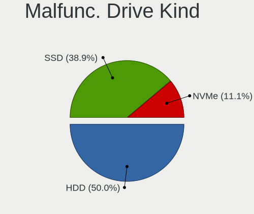
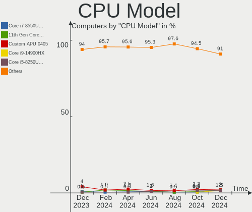
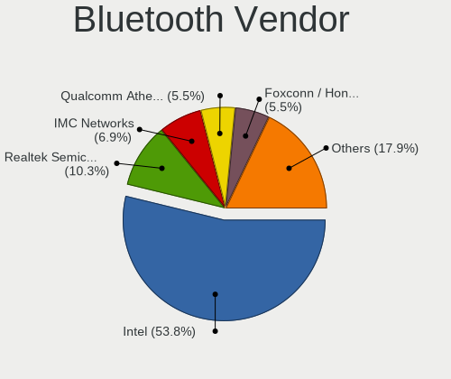
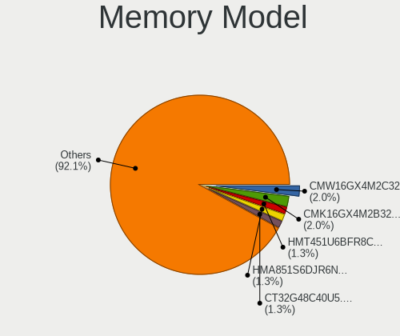

Linux in UK - Hardware Trends
-----------------------------

A project to identify most popular hardware characteristics and track their change
over time based on data collected by Linux users at https://Linux-Hardware.org.

Anyone can contribute to this report by the [hw-probe](https://github.com/linuxhw/hw-probe) tool:

    sudo -E hw-probe -all -upload

This is a report for all computer types. See also reports for [desktops](/Location/UK/Desktop/README.md) and [notebooks](/Location/UK/Notebook/README.md).

Period: Jan, 2024.

Contents
--------

* [ System ](#system)
  - [ OS                       ](#os)
  - [ OS Family                ](#os-family)
  - [ Kernel                   ](#kernel)
  - [ Kernel Family            ](#kernel-family)
  - [ Kernel Major Ver.        ](#kernel-major-ver)
  - [ Arch                     ](#arch)
  - [ DE                       ](#de)
  - [ Display Server           ](#display-server)
  - [ Display Manager          ](#display-manager)
  - [ OS Lang                  ](#os-lang)
  - [ Boot Mode                ](#boot-mode)
  - [ Filesystem               ](#filesystem)
  - [ Part. scheme             ](#part-scheme)
  - [ Dual Boot with Linux/BSD ](#dual-boot-with-linuxbsd)
  - [ Dual Boot (Win)          ](#dual-boot-win)

* [ Board ](#board)
  - [ Vendor                   ](#vendor)
  - [ Model                    ](#model)
  - [ Model Family             ](#model-family)
  - [ MFG Year                 ](#mfg-year)
  - [ Form Factor              ](#form-factor)
  - [ Secure Boot              ](#secure-boot)
  - [ Coreboot                 ](#coreboot)
  - [ RAM Size                 ](#ram-size)
  - [ RAM Used                 ](#ram-used)
  - [ Total Drives             ](#total-drives)
  - [ Has CD-ROM               ](#has-cd-rom)
  - [ Has Ethernet             ](#has-ethernet)
  - [ Has WiFi                 ](#has-wifi)
  - [ Has Bluetooth            ](#has-bluetooth)

* [ Location ](#location)
  - [ Country                  ](#country)
  - [ City                     ](#city)

* [ Drives ](#drives)
  - [ Drive Vendor             ](#drive-vendor)
  - [ Drive Model              ](#drive-model)
  - [ HDD Vendor               ](#hdd-vendor)
  - [ SSD Vendor               ](#ssd-vendor)
  - [ Drive Kind               ](#drive-kind)
  - [ Drive Connector          ](#drive-connector)
  - [ Drive Size               ](#drive-size)
  - [ Space Total              ](#space-total)
  - [ Space Used               ](#space-used)
  - [ Malfunc. Drives          ](#malfunc-drives)
  - [ Malfunc. Drive Vendor    ](#malfunc-drive-vendor)
  - [ Malfunc. HDD Vendor      ](#malfunc-hdd-vendor)
  - [ Malfunc. Drive Kind      ](#malfunc-drive-kind)
  - [ Failed Drives            ](#failed-drives)
  - [ Failed Drive Vendor      ](#failed-drive-vendor)
  - [ Drive Status             ](#drive-status)

* [ Storage controller ](#storage-controller)
  - [ Storage Vendor           ](#storage-vendor)
  - [ Storage Model            ](#storage-model)
  - [ Storage Kind             ](#storage-kind)

* [ Processor ](#processor)
  - [ CPU Vendor               ](#cpu-vendor)
  - [ CPU Model                ](#cpu-model)
  - [ CPU Model Family         ](#cpu-model-family)
  - [ CPU Cores                ](#cpu-cores)
  - [ CPU Sockets              ](#cpu-sockets)
  - [ CPU Threads              ](#cpu-threads)
  - [ CPU Op-Modes             ](#cpu-op-modes)
  - [ CPU Microcode            ](#cpu-microcode)
  - [ CPU Microarch            ](#cpu-microarch)

* [ Graphics ](#graphics)
  - [ GPU Vendor               ](#gpu-vendor)
  - [ GPU Model                ](#gpu-model)
  - [ GPU Combo                ](#gpu-combo)
  - [ GPU Driver               ](#gpu-driver)
  - [ GPU Memory               ](#gpu-memory)

* [ Monitor ](#monitor)
  - [ Monitor Vendor           ](#monitor-vendor)
  - [ Monitor Model            ](#monitor-model)
  - [ Monitor Resolution       ](#monitor-resolution)
  - [ Monitor Diagonal         ](#monitor-diagonal)
  - [ Monitor Width            ](#monitor-width)
  - [ Aspect Ratio             ](#aspect-ratio)
  - [ Monitor Area             ](#monitor-area)
  - [ Pixel Density            ](#pixel-density)
  - [ Multiple Monitors        ](#multiple-monitors)

* [ Network ](#network)
  - [ Net Controller Vendor    ](#net-controller-vendor)
  - [ Net Controller Model     ](#net-controller-model)
  - [ Wireless Vendor          ](#wireless-vendor)
  - [ Wireless Model           ](#wireless-model)
  - [ Ethernet Vendor          ](#ethernet-vendor)
  - [ Ethernet Model           ](#ethernet-model)
  - [ Net Controller Kind      ](#net-controller-kind)
  - [ Used Controller          ](#used-controller)
  - [ NICs                     ](#nics)
  - [ IPv6                     ](#ipv6)

* [ Bluetooth ](#bluetooth)
  - [ Bluetooth Vendor         ](#bluetooth-vendor)
  - [ Bluetooth Model          ](#bluetooth-model)

* [ Sound ](#sound)
  - [ Sound Vendor             ](#sound-vendor)
  - [ Sound Model              ](#sound-model)

* [ Memory ](#memory)
  - [ Memory Vendor            ](#memory-vendor)
  - [ Memory Model             ](#memory-model)
  - [ Memory Kind              ](#memory-kind)
  - [ Memory Form Factor       ](#memory-form-factor)
  - [ Memory Size              ](#memory-size)
  - [ Memory Speed             ](#memory-speed)

* [ Printers & scanners ](#printers--scanners)
  - [ Printer Vendor           ](#printer-vendor)
  - [ Printer Model            ](#printer-model)
  - [ Scanner Vendor           ](#scanner-vendor)
  - [ Scanner Model            ](#scanner-model)

* [ Camera ](#camera)
  - [ Camera Vendor            ](#camera-vendor)
  - [ Camera Model             ](#camera-model)

* [ Security ](#security)
  - [ Fingerprint Vendor       ](#fingerprint-vendor)
  - [ Fingerprint Model        ](#fingerprint-model)
  - [ Chipcard Vendor          ](#chipcard-vendor)
  - [ Chipcard Model           ](#chipcard-model)

* [ Unsupported ](#unsupported)
  - [ Unsupported Devices      ](#unsupported-devices)
  - [ Unsupported Device Types ](#unsupported-device-types)

System
------

OS
--

Installed operating systems

| Name                         | Computers | Percent |
|------------------------------|-----------|---------|
| Ubuntu 22.04                 | 30        | 12.3%   |
| Fedora 39                    | 18        | 7.38%   |
| Linux Mint 21.3              | 15        | 6.15%   |
| Linux Mint 21.2              | 13        | 5.33%   |
| Pop!_OS 22.04                | 12        | 4.92%   |
| Ubuntu 23.10                 | 11        | 4.51%   |
| Zorin 17                     | 10        | 4.1%    |
| Zorin 16                     | 10        | 4.1%    |
| Debian 12                    | 10        | 4.1%    |
| OpenMandriva 23.08           | 8         | 3.28%   |
| Arch Rolling                 | 8         | 3.28%   |
| Ubuntu 20.04                 | 7         | 2.87%   |
| openSUSE Tumbleweed-XXXXXXXX | 7         | 2.87%   |
| SteamOS 3.5.7                | 6         | 2.46%   |
| BlackPanther 18.1            | 6         | 2.46%   |
| ArcoLinux Rolling            | 6         | 2.46%   |
| EndeavourOS Rolling          | 5         | 2.05%   |
| OpenMandriva 24.01           | 4         | 1.64%   |
| Kubuntu 23.10                | 4         | 1.64%   |
| Kubuntu 22.04                | 4         | 1.64%   |
| Kali 2023.4                  | 3         | 1.23%   |
| Debian 11                    | 3         | 1.23%   |
| Xubuntu 22.04                | 2         | 0.82%   |
| Ubuntu 18.04                 | 2         | 0.82%   |
| OpenMandriva 5.0             | 2         | 0.82%   |
| Nobara 39                    | 2         | 0.82%   |
| MX 23                        | 2         | 0.82%   |
| Manjaro 23.1.2               | 2         | 0.82%   |
| Lubuntu 22.04                | 2         | 0.82%   |
| LMDE 6                       | 2         | 0.82%   |
| Linux Mint 20.3              | 2         | 0.82%   |
| Gentoo 2.14                  | 2         | 0.82%   |
| Void Linux Rolling           | 1         | 0.41%   |
| Ubuntu Core 22               | 1         | 0.41%   |
| Ubuntu Budgie 22.04          | 1         | 0.41%   |
| Ubuntu 23.04                 | 1         | 0.41%   |
| TUXEDO OS 22.04              | 1         | 0.41%   |
| SteamOS 3.6                  | 1         | 0.41%   |
| SteamOS 3.5.13               | 1         | 0.41%   |
| Peppermint                   | 1         | 0.41%   |

OS Family
---------

OS without a version

| Name          | Computers | Percent |
|---------------|-----------|---------|
| Ubuntu        | 52        | 21.31%  |
| Linux Mint    | 31        | 12.7%   |
| Fedora        | 21        | 8.61%   |
| Zorin         | 20        | 8.2%    |
| OpenMandriva  | 17        | 6.97%   |
| Debian        | 13        | 5.33%   |
| Pop!_OS       | 12        | 4.92%   |
| SteamOS       | 8         | 3.28%   |
| Kubuntu       | 8         | 3.28%   |
| Arch          | 8         | 3.28%   |
| openSUSE      | 7         | 2.87%   |
| BlackPanther  | 6         | 2.46%   |
| ArcoLinux     | 6         | 2.46%   |
| EndeavourOS   | 5         | 2.05%   |
| Manjaro       | 4         | 1.64%   |
| Kali          | 3         | 1.23%   |
| Xubuntu       | 2         | 0.82%   |
| Nobara        | 2         | 0.82%   |
| MX            | 2         | 0.82%   |
| Lubuntu       | 2         | 0.82%   |
| LMDE          | 2         | 0.82%   |
| Gentoo        | 2         | 0.82%   |
| Void Linux    | 1         | 0.41%   |
| Ubuntu Budgie | 1         | 0.41%   |
| TUXEDO OS     | 1         | 0.41%   |
| Peppermint    | 1         | 0.41%   |
| Parrot        | 1         | 0.41%   |
| NixOS         | 1         | 0.41%   |
| Lilidog       | 1         | 0.41%   |
| Garuda Linux  | 1         | 0.41%   |
| Elementary    | 1         | 0.41%   |
| ChimeraOS     | 1         | 0.41%   |
| CachyOS       | 1         | 0.41%   |

Kernel
------

Version of the Linux kernel

| Version                      | Computers | Percent |
|------------------------------|-----------|---------|
| 5.15.0-91-generic            | 31        | 12.7%   |
| 6.5.0-14-generic             | 30        | 12.3%   |
| 6.2.0-39-generic             | 14        | 5.74%   |
| 6.5.0-15-generic             | 13        | 5.33%   |
| 6.6.6-76060606-generic       | 11        | 4.51%   |
| 6.1.0-17-amd64               | 8         | 3.28%   |
| 6.6.8-200.fc39.x86_64        | 7         | 2.87%   |
| 6.6.9-200.fc39.x86_64        | 6         | 2.46%   |
| 6.6.2-desktop-1omv2390       | 6         | 2.46%   |
| 6.1.52-valve9-1-neptune-61   | 6         | 2.46%   |
| 6.7.0-arch3-1                | 5         | 2.05%   |
| 6.4.11-desktop-1omv2390      | 5         | 2.05%   |
| 5.15.0-92-generic            | 5         | 2.05%   |
| 6.4.8-desktop-2omv2390       | 4         | 1.64%   |
| 5.15.85-desktop-1bP          | 4         | 1.64%   |
| 6.7.1-arch1-1                | 3         | 1.23%   |
| 6.6.11-200.fc39.x86_64       | 3         | 1.23%   |
| 6.2.0-26-generic             | 3         | 1.23%   |
| 5.4.0-169-generic            | 3         | 1.23%   |
| 6.6.9-arch1-1                | 2         | 0.82%   |
| 6.6.9-1-default              | 2         | 0.82%   |
| 6.6.8-arch1-1                | 2         | 0.82%   |
| 6.6.11-1-default             | 2         | 0.82%   |
| 6.6.10-1-MANJARO             | 2         | 0.82%   |
| 6.5.0-kali3-amd64            | 2         | 0.82%   |
| 5.6.14-desktop-2bP           | 2         | 0.82%   |
| 5.15.0-84-generic            | 2         | 0.82%   |
| 5.15.0-76-generic            | 2         | 0.82%   |
| 5.15.0-67-generic            | 2         | 0.82%   |
| 6.7.2-arch1-1                | 1         | 0.41%   |
| 6.7.0-204.fsync.fc39.x86_64  | 1         | 0.41%   |
| 6.6.9-arch1-YuruYuri-T2-1-t2 | 1         | 0.41%   |
| 6.6.9-amd64                  | 1         | 0.41%   |
| 6.6.9-200.fsync.fc39.x86_64  | 1         | 0.41%   |
| 6.6.8_1                      | 1         | 0.41%   |
| 6.6.8-zen1-1-zen             | 1         | 0.41%   |
| 6.6.8-lqx2-1-liquorix        | 1         | 0.41%   |
| 6.6.8-2-MANJARO              | 1         | 0.41%   |
| 6.6.7-1-default              | 1         | 0.41%   |
| 6.6.6-surface-1              | 1         | 0.41%   |

Kernel Family
-------------

Linux kernel without a distro release

| Version   | Computers | Percent |
|-----------|-----------|---------|
| 6.5.0     | 49        | 20.08%  |
| 5.15.0    | 46        | 18.85%  |
| 6.2.0     | 18        | 7.38%   |
| 6.6.9     | 13        | 5.33%   |
| 6.6.8     | 13        | 5.33%   |
| 6.6.6     | 13        | 5.33%   |
| 6.1.0     | 13        | 5.33%   |
| 6.1.52    | 8         | 3.28%   |
| 6.6.11    | 7         | 2.87%   |
| 6.7.0     | 6         | 2.46%   |
| 6.6.2     | 6         | 2.46%   |
| 6.6.10    | 5         | 2.05%   |
| 6.4.11    | 5         | 2.05%   |
| 5.4.0     | 5         | 2.05%   |
| 6.4.8     | 4         | 1.64%   |
| 5.15.85   | 4         | 1.64%   |
| 6.7.1     | 3         | 1.23%   |
| 6.6.14    | 2         | 0.82%   |
| 6.6.1     | 2         | 0.82%   |
| 6.1.67    | 2         | 0.82%   |
| 5.6.14    | 2         | 0.82%   |
| 6.7.2     | 1         | 0.41%   |
| 6.6.7     | 1         | 0.41%   |
| 6.6.13    | 1         | 0.41%   |
| 6.6.12    | 1         | 0.41%   |
| 6.5.6     | 1         | 0.41%   |
| 6.2.9     | 1         | 0.41%   |
| 6.2.6     | 1         | 0.41%   |
| 6.2.15    | 1         | 0.41%   |
| 6.1.71    | 1         | 0.41%   |
| 6.1.66.19 | 1         | 0.41%   |
| 6.1.21    | 1         | 0.41%   |
| 6.0.12    | 1         | 0.41%   |
| 5.13.0    | 1         | 0.41%   |
| 5.10.197  | 1         | 0.41%   |
| 5.10.168  | 1         | 0.41%   |
| 5.10.14   | 1         | 0.41%   |
| 5.10.0    | 1         | 0.41%   |
| 4.15.0    | 1         | 0.41%   |

Kernel Major Ver.
-----------------

Linux kernel major version

| Version | Computers | Percent |
|---------|-----------|---------|
| 6.6     | 64        | 26.23%  |
| 6.5     | 50        | 20.49%  |
| 5.15    | 50        | 20.49%  |
| 6.1     | 25        | 10.25%  |
| 6.2     | 21        | 8.61%   |
| 6.7     | 10        | 4.1%    |
| 6.4     | 9         | 3.69%   |
| 5.4     | 5         | 2.05%   |
| 5.10    | 4         | 1.64%   |
| 5.6     | 2         | 0.82%   |
| 6.1.66  | 1         | 0.41%   |
| 6.0     | 1         | 0.41%   |
| 5.13    | 1         | 0.41%   |
| 4.15    | 1         | 0.41%   |

Arch
----

OS architecture (x86_64, i586, etc.)

| Name    | Computers | Percent |
|---------|-----------|---------|
| x86_64  | 240       | 98.36%  |
| aarch64 | 3         | 1.23%   |
| armv7l  | 1         | 0.41%   |

DE
--

Desktop Environment

| Name            | Computers | Percent |
|-----------------|-----------|---------|
| GNOME           | 105       | 43.03%  |
| KDE5            | 61        | 25%     |
| X-Cinnamon      | 29        | 11.89%  |
| Unknown         | 13        | 5.33%   |
| XFCE            | 12        | 4.92%   |
| Hyprland        | 5         | 2.05%   |
| LXQt            | 4         | 1.64%   |
| MATE            | 3         | 1.23%   |
| LXDE            | 2         | 0.82%   |
| Cinnamon        | 2         | 0.82%   |
| Budgie          | 2         | 0.82%   |
| sway            | 1         | 0.41%   |
| Pantheon        | 1         | 0.41%   |
| openbox         | 1         | 0.41%   |
| KDE             | 1         | 0.41%   |
| GNOME Flashback | 1         | 0.41%   |
| Enlightenment   | 1         | 0.41%   |

Display Server
--------------

X11 or Wayland

| Name    | Computers | Percent |
|---------|-----------|---------|
| X11     | 145       | 59.43%  |
| Wayland | 81        | 33.2%   |
| Tty     | 14        | 5.74%   |
| Unknown | 4         | 1.64%   |

Display Manager
---------------

SDDM, LightDM, etc.

| Name    | Computers | Percent |
|---------|-----------|---------|
| Unknown | 90        | 36.89%  |
| SDDM    | 51        | 20.9%   |
| GDM3    | 51        | 20.9%   |
| LightDM | 40        | 16.39%  |
| GDM     | 10        | 4.1%    |
| SLiM    | 1         | 0.41%   |
| LXDM    | 1         | 0.41%   |

OS Lang
-------

Language

| Lang    | Computers | Percent |
|---------|-----------|---------|
| en_GB   | 188       | 77.05%  |
| en_US   | 39        | 15.98%  |
| Unknown | 9         | 3.69%   |
| C       | 4         | 1.64%   |
| ru_RU   | 1         | 0.41%   |
| POSIX   | 1         | 0.41%   |
| pl_PL   | 1         | 0.41%   |
| lt_LT   | 1         | 0.41%   |

Boot Mode
---------

EFI or BIOS

| Mode | Computers | Percent |
|------|-----------|---------|
| EFI  | 140       | 57.38%  |
| BIOS | 104       | 42.62%  |

Filesystem
----------

Type of filesystem

| Type    | Computers | Percent |
|---------|-----------|---------|
| Ext4    | 146       | 59.84%  |
| Btrfs   | 45        | 18.44%  |
| Tmpfs   | 36        | 14.75%  |
| Overlay | 13        | 5.33%   |
| Ext2    | 2         | 0.82%   |
| Zfs     | 1         | 0.41%   |
| F2fs    | 1         | 0.41%   |

Part. scheme
------------

Scheme of partitioning

| Type    | Computers | Percent |
|---------|-----------|---------|
| GPT     | 144       | 59.02%  |
| Unknown | 74        | 30.33%  |
| MBR     | 26        | 10.66%  |

Dual Boot with Linux/BSD
------------------------

Hosting more than one Linux/BSD

| Dual boot | Computers | Percent |
|-----------|-----------|---------|
| No        | 210       | 86.07%  |
| Yes       | 34        | 13.93%  |

Dual Boot (Win)
---------------

Hosting Linux and Windows

| Dual boot | Computers | Percent |
|-----------|-----------|---------|
| No        | 177       | 72.54%  |
| Yes       | 67        | 27.46%  |

Board
-----

Vendor
------

Motherboard manufacturer

| Name                                 | Computers | Percent |
|--------------------------------------|-----------|---------|
| Lenovo                               | 45        | 18.44%  |
| ASUSTek Computer                     | 36        | 14.75%  |
| Hewlett-Packard                      | 30        | 12.3%   |
| Dell                                 | 29        | 11.89%  |
| MSI                                  | 12        | 4.92%   |
| Acer                                 | 12        | 4.92%   |
| ASRock                               | 9         | 3.69%   |
| Apple                                | 9         | 3.69%   |
| Gigabyte Technology                  | 8         | 3.28%   |
| Valve                                | 7         | 2.87%   |
| AZW                                  | 4         | 1.64%   |
| Raspberry Pi Foundation              | 3         | 1.23%   |
| Microsoft                            | 3         | 1.23%   |
| LG Electronics                       | 3         | 1.23%   |
| Biostar                              | 3         | 1.23%   |
| Toshiba                              | 2         | 0.82%   |
| Razer                                | 2         | 0.82%   |
| Foxconn                              | 2         | 0.82%   |
| ECS                                  | 2         | 0.82%   |
| BESSTAR Tech                         | 2         | 0.82%   |
| TI                                   | 1         | 0.41%   |
| Supermicro                           | 1         | 0.41%   |
| Star Labs                            | 1         | 0.41%   |
| Sony                                 | 1         | 0.41%   |
| Shenzhen Meigao Electronic Equipment | 1         | 0.41%   |
| Pegatron                             | 1         | 0.41%   |
| PC Specialist                        | 1         | 0.41%   |
| Panasonic                            | 1         | 0.41%   |
| Medion                               | 1         | 0.41%   |
| Intel                                | 1         | 0.41%   |
| HUAWEI                               | 1         | 0.41%   |
| HONOR                                | 1         | 0.41%   |
| GPD                                  | 1         | 0.41%   |
| Fujitsu                              | 1         | 0.41%   |
| Framework                            | 1         | 0.41%   |
| Fanless Mini PC                      | 1         | 0.41%   |
| ENTITY                               | 1         | 0.41%   |
| Dynabook                             | 1         | 0.41%   |
| CyberPowerPC                         | 1         | 0.41%   |
| AWOW                                 | 1         | 0.41%   |

Model
-----

Motherboard model

| Name                                                | Computers | Percent |
|-----------------------------------------------------|-----------|---------|
| Valve Jupiter                                       | 5         | 2.05%   |
| ASUS All Series                                     | 3         | 1.23%   |
| Valve Galileo                                       | 2         | 0.82%   |
| RPi Raspberry Pi 4 Model B Rev 1.5                  | 2         | 0.82%   |
| HP Pavilion dv6                                     | 2         | 0.82%   |
| HP Compaq Elite 8300 SFF                            | 2         | 0.82%   |
| Dell XPS 9320                                       | 2         | 0.82%   |
| Dell OptiPlex 9020                                  | 2         | 0.82%   |
| Dell Latitude E5470                                 | 2         | 0.82%   |
| Toshiba Satellite Pro R50-B                         | 1         | 0.41%   |
| Toshiba Satellite L50D-B                            | 1         | 0.41%   |
| TI AM335x PocketBeagle                              | 1         | 0.41%   |
| Supermicro X8DTU-6+                                 | 1         | 0.41%   |
| Star Labs StarLite                                  | 1         | 0.41%   |
| Sony SVF1521Q1EW                                    | 1         | 0.41%   |
| Shenzhen Meigao Electronic Equipment Mercury series | 1         | 0.41%   |
| Razer Blade Stealth                                 | 1         | 0.41%   |
| Razer Blade 15 Base Model (Early 2021) - RZ09-0369  | 1         | 0.41%   |
| RPi Raspberry Pi 5 Model B Rev 1.0                  | 1         | 0.41%   |
| Pegatron VS161AA-ABU s5206uk                        | 1         | 0.41%   |
| PC Specialist P65_67RSRP                            | 1         | 0.41%   |
| Panasonic CF-52PFN32PE                              | 1         | 0.41%   |
| MSI MS-7E27                                         | 1         | 0.41%   |
| MSI MS-7D70                                         | 1         | 0.41%   |
| MSI MS-7D54                                         | 1         | 0.41%   |
| MSI MS-7D30                                         | 1         | 0.41%   |
| MSI MS-7C86                                         | 1         | 0.41%   |
| MSI MS-7C37                                         | 1         | 0.41%   |
| MSI MS-7B92                                         | 1         | 0.41%   |
| MSI MS-7B89                                         | 1         | 0.41%   |
| MSI MS-7B78                                         | 1         | 0.41%   |
| MSI MS-7A78                                         | 1         | 0.41%   |
| MSI MS-7A38                                         | 1         | 0.41%   |
| MSI GS66 Stealth 10SE                               | 1         | 0.41%   |
| Microsoft Surface Pro 4                             | 1         | 0.41%   |
| Microsoft Surface Laptop 4                          | 1         | 0.41%   |
| Microsoft Surface Laptop 3                          | 1         | 0.41%   |
| Medion MS-7713                                      | 1         | 0.41%   |
| LG 17Z90P-K.AA78A1                                  | 1         | 0.41%   |
| LG 15Z90RT-K.AD7AA1                                 | 1         | 0.41%   |

Model Family
------------

Motherboard model prefix

| Name                                         | Computers | Percent |
|----------------------------------------------|-----------|---------|
| Lenovo ThinkPad                              | 21        | 8.61%   |
| Dell Latitude                                | 7         | 2.87%   |
| Lenovo IdeaPad                               | 6         | 2.46%   |
| Dell XPS                                     | 6         | 2.46%   |
| Dell Precision                               | 6         | 2.46%   |
| Dell OptiPlex                                | 6         | 2.46%   |
| ASUS ROG                                     | 6         | 2.46%   |
| ASUS PRIME                                   | 6         | 2.46%   |
| Acer Aspire                                  | 6         | 2.46%   |
| Valve Jupiter                                | 5         | 2.05%   |
| Lenovo Yoga                                  | 5         | 2.05%   |
| Lenovo ThinkCentre                           | 4         | 1.64%   |
| HP Pavilion                                  | 4         | 1.64%   |
| ASUS VivoBook                                | 4         | 1.64%   |
| Acer Swift                                   | 4         | 1.64%   |
| RPi Raspberry                                | 3         | 1.23%   |
| Microsoft Surface                            | 3         | 1.23%   |
| HP ProBook                                   | 3         | 1.23%   |
| HP Laptop                                    | 3         | 1.23%   |
| HP EliteDesk                                 | 3         | 1.23%   |
| HP EliteBook                                 | 3         | 1.23%   |
| HP Compaq                                    | 3         | 1.23%   |
| ASUS All                                     | 3         | 1.23%   |
| Valve Galileo                                | 2         | 0.82%   |
| Toshiba Satellite                            | 2         | 0.82%   |
| Razer Blade                                  | 2         | 0.82%   |
| HP ProDesk                                   | 2         | 0.82%   |
| HP ENVY                                      | 2         | 0.82%   |
| Dell Inspiron                                | 2         | 0.82%   |
| ASUS ZenBook                                 | 2         | 0.82%   |
| ASUS TUF                                     | 2         | 0.82%   |
| TI AM335x                                    | 1         | 0.41%   |
| Supermicro X8DTU-6+                          | 1         | 0.41%   |
| Star Labs StarLite                           | 1         | 0.41%   |
| Sony SVF1521Q1EW                             | 1         | 0.41%   |
| Shenzhen Meigao Electronic Equipment Mercury | 1         | 0.41%   |
| Pegatron VS161AA-ABU                         | 1         | 0.41%   |
| PC Specialist P65                            | 1         | 0.41%   |
| Panasonic CF-52PFN32PE                       | 1         | 0.41%   |
| MSI MS-7E27                                  | 1         | 0.41%   |

MFG Year
--------

Motherboard manufacture year

| Year    | Computers | Percent |
|---------|-----------|---------|
| 2020    | 26        | 10.66%  |
| 2023    | 25        | 10.25%  |
| 2019    | 23        | 9.43%   |
| 2013    | 23        | 9.43%   |
| 2021    | 21        | 8.61%   |
| 2018    | 18        | 7.38%   |
| 2022    | 16        | 6.56%   |
| 2016    | 13        | 5.33%   |
| 2012    | 13        | 5.33%   |
| 2011    | 12        | 4.92%   |
| 2017    | 11        | 4.51%   |
| 2014    | 10        | 4.1%    |
| 2009    | 8         | 3.28%   |
| 2015    | 6         | 2.46%   |
| 2010    | 6         | 2.46%   |
| 2008    | 5         | 2.05%   |
| Unknown | 4         | 1.64%   |
| 2007    | 3         | 1.23%   |
| 2006    | 1         | 0.41%   |

Form Factor
-----------

Physical design of the computer

| Name           | Computers | Percent |
|----------------|-----------|---------|
| Notebook       | 129       | 52.87%  |
| Desktop        | 90        | 36.89%  |
| Convertible    | 8         | 3.28%   |
| Mini pc        | 6         | 2.46%   |
| System on chip | 4         | 1.64%   |
| Tablet         | 4         | 1.64%   |
| All in one     | 2         | 0.82%   |
| Server         | 1         | 0.41%   |

Secure Boot
-----------

Enabled or disabled

| State    | Computers | Percent |
|----------|-----------|---------|
| Disabled | 224       | 91.8%   |
| Enabled  | 20        | 8.2%    |

Coreboot
--------

Have coreboot on board

| Used | Computers | Percent |
|------|-----------|---------|
| No   | 244       | 100%    |

RAM Size
--------

Total RAM memory

| Size in GB  | Computers | Percent |
|-------------|-----------|---------|
| 4.01-8.0    | 68        | 27.87%  |
| 16.01-24.0  | 55        | 22.54%  |
| 8.01-16.0   | 38        | 15.57%  |
| 32.01-64.0  | 32        | 13.11%  |
| 3.01-4.0    | 24        | 9.84%   |
| 64.01-256.0 | 11        | 4.51%   |
| 24.01-32.0  | 7         | 2.87%   |
| 1.01-2.0    | 5         | 2.05%   |
| 2.01-3.0    | 3         | 1.23%   |
| 0.01-0.5    | 1         | 0.41%   |

RAM Used
--------

Used RAM memory

| Used GB    | Computers | Percent |
|------------|-----------|---------|
| 3.01-4.0   | 61        | 25%     |
| 1.01-2.0   | 59        | 24.18%  |
| 2.01-3.0   | 50        | 20.49%  |
| 4.01-8.0   | 45        | 18.44%  |
| 8.01-16.0  | 13        | 5.33%   |
| 0.51-1.0   | 11        | 4.51%   |
| 0.01-0.5   | 4         | 1.64%   |
| 16.01-24.0 | 1         | 0.41%   |

Total Drives
------------

Number of drives on board

| Drives | Computers | Percent |
|--------|-----------|---------|
| 1      | 147       | 60.25%  |
| 2      | 58        | 23.77%  |
| 3      | 18        | 7.38%   |
| 4      | 14        | 5.74%   |
| 6      | 3         | 1.23%   |
| 5      | 2         | 0.82%   |
| 9      | 1         | 0.41%   |
| 7      | 1         | 0.41%   |

Has CD-ROM
----------

Has CD-ROM on board

| Presented | Computers | Percent |
|-----------|-----------|---------|
| No        | 176       | 72.13%  |
| Yes       | 68        | 27.87%  |

Has Ethernet
------------

Has Ethernet on board

| Presented | Computers | Percent |
|-----------|-----------|---------|
| Yes       | 193       | 79.1%   |
| No        | 51        | 20.9%   |

Has WiFi
--------

Has WiFi module

| Presented | Computers | Percent |
|-----------|-----------|---------|
| Yes       | 193       | 79.1%   |
| No        | 51        | 20.9%   |

Has Bluetooth
-------------

Has Bluetooth module

| Presented | Computers | Percent |
|-----------|-----------|---------|
| Yes       | 161       | 65.98%  |
| No        | 83        | 34.02%  |

Location
--------

Country
-------

Geographic location (country)

| Country | Computers | Percent |
|---------|-----------|---------|
| UK      | 244       | 100%    |

City
----

Geographic location (city)

| City            | Computers | Percent |
|-----------------|-----------|---------|
| London          | 7         | 2.87%   |
| Birmingham      | 7         | 2.87%   |
| Manchester      | 6         | 2.46%   |
| Glasgow         | 6         | 2.46%   |
| Leeds           | 5         | 2.05%   |
| Lambeth         | 5         | 2.05%   |
| Nottingham      | 4         | 1.64%   |
| Newham          | 4         | 1.64%   |
| Margate         | 4         | 1.64%   |
| Hackney         | 4         | 1.64%   |
| Bradford        | 4         | 1.64%   |
| Liverpool       | 3         | 1.23%   |
| Lincoln         | 3         | 1.23%   |
| Derby           | 3         | 1.23%   |
| Crawley         | 3         | 1.23%   |
| Cardiff         | 3         | 1.23%   |
| Brent           | 3         | 1.23%   |
| Barnet          | 3         | 1.23%   |
| Worthing        | 2         | 0.82%   |
| Worcester Park  | 2         | 0.82%   |
| Walsall         | 2         | 0.82%   |
| Wakefield       | 2         | 0.82%   |
| Tower Hamlets   | 2         | 0.82%   |
| Swansea         | 2         | 0.82%   |
| Stockport       | 2         | 0.82%   |
| Southwark       | 2         | 0.82%   |
| Southampton     | 2         | 0.82%   |
| South Shields   | 2         | 0.82%   |
| Sleaford        | 2         | 0.82%   |
| Sandhurst       | 2         | 0.82%   |
| Pontefract      | 2         | 0.82%   |
| Oxford          | 2         | 0.82%   |
| Ilford          | 2         | 0.82%   |
| Hull            | 2         | 0.82%   |
| Hexham          | 2         | 0.82%   |
| Hemel Hempstead | 2         | 0.82%   |
| Greenwich       | 2         | 0.82%   |
| Exeter          | 2         | 0.82%   |
| Edinburgh       | 2         | 0.82%   |
| Ealing          | 2         | 0.82%   |

Drives
------

Drive Vendor
------------

Hard drive vendors

| Vendor                      | Computers | Drives | Percent |
|-----------------------------|-----------|--------|---------|
| Samsung Electronics         | 56        | 71     | 15.18%  |
| WDC                         | 44        | 53     | 11.92%  |
| Seagate                     | 36        | 46     | 9.76%   |
| Crucial                     | 25        | 29     | 6.78%   |
| Sandisk                     | 23        | 24     | 6.23%   |
| Kingston                    | 16        | 17     | 4.34%   |
| Unknown                     | 14        | 16     | 3.79%   |
| Toshiba                     | 13        | 13     | 3.52%   |
| SK hynix                    | 13        | 14     | 3.52%   |
| Micron/Crucial Technology   | 8         | 9      | 2.17%   |
| Intel                       | 8         | 9      | 2.17%   |
| Micron Technology           | 7         | 7      | 1.9%    |
| Hitachi                     | 6         | 6      | 1.63%   |
| Phison Electronics          | 5         | 6      | 1.36%   |
| KIOXIA                      | 5         | 5      | 1.36%   |
| HGST                        | 5         | 5      | 1.36%   |
| Kingston Technology Company | 4         | 4      | 1.08%   |
| Integral                    | 4         | 4      | 1.08%   |
| China                       | 4         | 4      | 1.08%   |
| Apple                       | 4         | 6      | 1.08%   |
| Unknown                     | 4         | 4      | 1.08%   |
| Phison                      | 3         | 3      | 0.81%   |
| Fanxiang                    | 3         | 3      | 0.81%   |
| Teclast                     | 2         | 2      | 0.54%   |
| Patriot                     | 2         | 2      | 0.54%   |
| Netac                       | 2         | 2      | 0.54%   |
| MAXIO Technology (Hangzhou) | 2         | 2      | 0.54%   |
| LITEONIT                    | 2         | 2      | 0.54%   |
| LITEON                      | 2         | 2      | 0.54%   |
| Apacer                      | 2         | 2      | 0.54%   |
| XUM                         | 1         | 1      | 0.27%   |
| XrayDisk                    | 1         | 1      | 0.27%   |
| X12                         | 1         | 1      | 0.27%   |
| Vaseky                      | 1         | 1      | 0.27%   |
| USB3.0                      | 1         | 1      | 0.27%   |
| Unique                      | 1         | 1      | 0.27%   |
| Union Memory                | 1         | 1      | 0.27%   |
| Transcend                   | 1         | 1      | 0.27%   |
| TO Exter                    | 1         | 1      | 0.27%   |
| Team                        | 1         | 1      | 0.27%   |

Drive Model
-----------

Hard drive models

| Model                                               | Computers | Percent |
|-----------------------------------------------------|-----------|---------|
| Samsung NVMe SSD Controller SM981/PM981/PM983 1TB   | 10        | 2.46%   |
| Micron/Crucial P2 NVMe PCIe SSD 1TB                 | 7         | 1.72%   |
| Samsung SSD 860 EVO 1TB                             | 5         | 1.23%   |
| Sandisk WD Black SN750 / PC SN730 NVMe SSD 512GB    | 4         | 0.99%   |
| Crucial CT1000BX500SSD1 1TB                         | 4         | 0.99%   |
| Unknown                                             | 4         | 0.99%   |
| WDC WD10EZEX-08WN4A0 1TB                            | 3         | 0.74%   |
| Seagate ST3500312CS 500GB                           | 3         | 0.74%   |
| Seagate ST1000LM024 HN-M101MBB 1TB                  | 3         | 0.74%   |
| Seagate ST1000DM010-2EP102 1TB                      | 3         | 0.74%   |
| Seagate Expansion 1TB                               | 3         | 0.74%   |
| Samsung SSD 970 EVO Plus 500GB                      | 3         | 0.74%   |
| Samsung SSD 870 QVO 1TB                             | 3         | 0.74%   |
| Samsung SSD 850 EVO 250GB                           | 3         | 0.74%   |
| Kingston SV300S37A240G 240GB SSD                    | 3         | 0.74%   |
| Kingston SA400S37480G 480GB SSD                     | 3         | 0.74%   |
| Crucial CT240BX500SSD1 240GB                        | 3         | 0.74%   |
| WDC WDS500G3X0C-00SJG0 500GB                        | 2         | 0.49%   |
| WDC WDS500G2B0A-00SM50 500GB SSD                    | 2         | 0.49%   |
| Unknown MMC Card  64GB                              | 2         | 0.49%   |
| Unknown MMC Card  512GB                             | 2         | 0.49%   |
| Toshiba MQ01ABD100 1TB                              | 2         | 0.49%   |
| Teclast 60GB S500 SSD                               | 2         | 0.49%   |
| Seagate ST9320325AS 320GB                           | 2         | 0.49%   |
| Seagate ST2000LM003 HN-M201RAD 2TB                  | 2         | 0.49%   |
| Seagate ST2000DM008-2FR102 2TB                      | 2         | 0.49%   |
| SanDisk SDSSDA240G 240GB                            | 2         | 0.49%   |
| Samsung SSD 850 EVO 500GB                           | 2         | 0.49%   |
| Samsung NVMe SSD Controller SM961/PM961/SM963 256GB | 2         | 0.49%   |
| Samsung NVMe SSD Controller PM9A1/PM9A3/980PRO 2TB  | 2         | 0.49%   |
| Samsung HD103SI 1TB                                 | 2         | 0.49%   |
| Phison PS5013 E13 NVMe Controller 256GB             | 2         | 0.49%   |
| Phison E16 PCIe4 NVMe Controller 2TB                | 2         | 0.49%   |
| Phison E12 NVMe Controller 1TB                      | 2         | 0.49%   |
| Micron 2210_MTFDHBA512QFD 512GB                     | 2         | 0.49%   |
| MAXIO (Hangzhou) NVMe SSD Controller MAP1202 512GB  | 2         | 0.49%   |
| Kingston Company OM3PDP3 NVMe SSD 256GB             | 2         | 0.49%   |
| Kingston SA400S37240G 240GB SSD                     | 2         | 0.49%   |
| Intel SSDPEKNU512GZ 512GB                           | 2         | 0.49%   |
| Integral V Series SATA SSD 1TB-1000GB               | 2         | 0.49%   |

HDD Vendor
----------

Hard disk drive vendors

| Vendor              | Computers | Drives | Percent |
|---------------------|-----------|--------|---------|
| Seagate             | 36        | 46     | 37.11%  |
| WDC                 | 29        | 34     | 29.9%   |
| Toshiba             | 10        | 10     | 10.31%  |
| Samsung Electronics | 6         | 6      | 6.19%   |
| Hitachi             | 6         | 6      | 6.19%   |
| HGST                | 5         | 5      | 5.15%   |
| TO Exter            | 1         | 1      | 1.03%   |
| SSK                 | 1         | 2      | 1.03%   |
| Maxtor              | 1         | 2      | 1.03%   |
| External            | 1         | 1      | 1.03%   |
| ExcelStor           | 1         | 1      | 1.03%   |

SSD Vendor
----------

Solid state drive vendors

| Vendor              | Computers | Drives | Percent |
|---------------------|-----------|--------|---------|
| Samsung Electronics | 23        | 27     | 17.97%  |
| Crucial             | 19        | 22     | 14.84%  |
| Kingston            | 14        | 15     | 10.94%  |
| WDC                 | 11        | 11     | 8.59%   |
| SanDisk             | 11        | 11     | 8.59%   |
| Integral            | 4         | 4      | 3.13%   |
| China               | 4         | 4      | 3.13%   |
| Teclast             | 2         | 2      | 1.56%   |
| Patriot             | 2         | 2      | 1.56%   |
| Micron Technology   | 2         | 2      | 1.56%   |
| LITEONIT            | 2         | 2      | 1.56%   |
| LITEON              | 2         | 2      | 1.56%   |
| Apacer              | 2         | 2      | 1.56%   |
| XUM                 | 1         | 1      | 0.78%   |
| XrayDisk            | 1         | 1      | 0.78%   |
| X12                 | 1         | 1      | 0.78%   |
| Vaseky              | 1         | 1      | 0.78%   |
| USB3.0              | 1         | 1      | 0.78%   |
| Unique              | 1         | 1      | 0.78%   |
| Transcend           | 1         | 1      | 0.78%   |
| Toshiba             | 1         | 1      | 0.78%   |
| Team                | 1         | 1      | 0.78%   |
| Star                | 1         | 1      | 0.78%   |
| SK hynix            | 1         | 1      | 0.78%   |
| SABRENT             | 1         | 1      | 0.78%   |
| PNY                 | 1         | 1      | 0.78%   |
| OCZ                 | 1         | 1      | 0.78%   |
| Netac               | 1         | 1      | 0.78%   |
| Mushkin             | 1         | 1      | 0.78%   |
| KIOXIA-EXCERIA      | 1         | 1      | 0.78%   |
| KingSpec            | 1         | 1      | 0.78%   |
| Intel               | 1         | 1      | 0.78%   |
| GOODRAM             | 1         | 1      | 0.78%   |
| Gigastone           | 1         | 1      | 0.78%   |
| Gigabyte Technology | 1         | 1      | 0.78%   |
| Emtec               | 1         | 1      | 0.78%   |
| BAITITON            | 1         | 1      | 0.78%   |
| ASMT                | 1         | 1      | 0.78%   |
| ASMedia             | 1         | 1      | 0.78%   |
| ASENNO              | 1         | 1      | 0.78%   |

Drive Kind
----------

HDD or SSD

| Kind    | Computers | Drives | Percent |
|---------|-----------|--------|---------|
| NVMe    | 123       | 147    | 37.16%  |
| SSD     | 108       | 136    | 32.63%  |
| HDD     | 80        | 114    | 24.17%  |
| MMC     | 14        | 14     | 4.23%   |
| Unknown | 6         | 8      | 1.81%   |

Drive Connector
---------------

SATA, SAS, NVMe, etc.

| Type | Computers | Drives | Percent |
|------|-----------|--------|---------|
| SATA | 149       | 239    | 49.67%  |
| NVMe | 122       | 146    | 40.67%  |
| SAS  | 15        | 20     | 5%      |
| MMC  | 14        | 14     | 4.67%   |

Drive Size
----------

Size of hard drive

| Size in TB | Computers | Drives | Percent |
|------------|-----------|--------|---------|
| 0.01-0.5   | 103       | 136    | 51.76%  |
| 0.51-1.0   | 65        | 75     | 32.66%  |
| 1.01-2.0   | 17        | 20     | 8.54%   |
| 3.01-4.0   | 5         | 5      | 2.51%   |
| 2.01-3.0   | 4         | 4      | 2.01%   |
| 4.01-10.0  | 3         | 8      | 1.51%   |
| 10.01-20.0 | 2         | 2      | 1.01%   |

Space Total
-----------

Amount of disk space available on the file system

| Size in GB     | Computers | Percent |
|----------------|-----------|---------|
| 101-250        | 71        | 29.1%   |
| 251-500        | 53        | 21.72%  |
| 501-1000       | 35        | 14.34%  |
| 1001-2000      | 22        | 9.02%   |
| More than 3000 | 20        | 8.2%    |
| 51-100         | 14        | 5.74%   |
| 1-20           | 12        | 4.92%   |
| 2001-3000      | 8         | 3.28%   |
| Unknown        | 5         | 2.05%   |
| 21-50          | 4         | 1.64%   |

Space Used
----------

Amount of used disk space

| Used GB        | Computers | Percent |
|----------------|-----------|---------|
| 1-20           | 70        | 28.69%  |
| 21-50          | 45        | 18.44%  |
| 101-250        | 36        | 14.75%  |
| 51-100         | 33        | 13.52%  |
| 251-500        | 21        | 8.61%   |
| 501-1000       | 18        | 7.38%   |
| 1001-2000      | 9         | 3.69%   |
| More than 3000 | 6         | 2.46%   |
| Unknown        | 5         | 2.05%   |
| 2001-3000      | 1         | 0.41%   |

Malfunc. Drives
---------------

Drive models with a malfunction

| Model                                        | Computers | Drives | Percent |
|----------------------------------------------|-----------|--------|---------|
| Seagate ST9320325AS 320GB                    | 2         | 2      | 8.7%    |
| Seagate ST1000LM024 HN-M101MBB 1TB           | 2         | 2      | 8.7%    |
| HGST HTS541010A9E680 1TB                     | 2         | 2      | 8.7%    |
| XrayDisk SSD 512GB                           | 1         | 1      | 4.35%   |
| WDC WDS240G2G0A-00JH30 240GB SSD             | 1         | 1      | 4.35%   |
| WDC WD20EFRX-68EUZN0 2TB                     | 1         | 1      | 4.35%   |
| WDC WD1600BEVT-60A23T0 160GB                 | 1         | 1      | 4.35%   |
| Toshiba MQ01ABF050 500GB                     | 1         | 1      | 4.35%   |
| Toshiba MQ01ABD050V 500GB                    | 1         | 1      | 4.35%   |
| Seagate ST500DM002-1BC142 500GB              | 1         | 1      | 4.35%   |
| Seagate ST2000LM003 HN-M201RAD 2TB           | 1         | 1      | 4.35%   |
| Seagate ST1000DM003-1SB102 1TB               | 1         | 1      | 4.35%   |
| Samsung Electronics SSD 950 PRO 512GB        | 1         | 1      | 4.35%   |
| Samsung Electronics SSD 840 PRO Series 256GB | 1         | 2      | 4.35%   |
| Micron Technology M550_mSATA 512GB SSD       | 1         | 1      | 4.35%   |
| Maxtor 6Y080L0 82GB                          | 1         | 2      | 4.35%   |
| Hitachi HTS541680J9SA00 80GB                 | 1         | 1      | 4.35%   |
| Hitachi HDS721050CLA362 500GB                | 1         | 1      | 4.35%   |
| Crucial CT1050MX300SSD1 1050GB               | 1         | 1      | 4.35%   |
| China SATA3 512GB SSD                        | 1         | 1      | 4.35%   |

Malfunc. Drive Vendor
---------------------

Vendors of faulty drives

| Vendor              | Computers | Drives | Percent |
|---------------------|-----------|--------|---------|
| Seagate             | 7         | 7      | 30.43%  |
| WDC                 | 3         | 3      | 13.04%  |
| Toshiba             | 2         | 2      | 8.7%    |
| Samsung Electronics | 2         | 3      | 8.7%    |
| Hitachi             | 2         | 2      | 8.7%    |
| HGST                | 2         | 2      | 8.7%    |
| XrayDisk            | 1         | 1      | 4.35%   |
| Micron Technology   | 1         | 1      | 4.35%   |
| Maxtor              | 1         | 2      | 4.35%   |
| Crucial             | 1         | 1      | 4.35%   |
| China               | 1         | 1      | 4.35%   |

Malfunc. HDD Vendor
-------------------

Vendors of faulty HDD drives

| Vendor  | Computers | Drives | Percent |
|---------|-----------|--------|---------|
| Seagate | 7         | 7      | 43.75%  |
| WDC     | 2         | 2      | 12.5%   |
| Toshiba | 2         | 2      | 12.5%   |
| Hitachi | 2         | 2      | 12.5%   |
| HGST    | 2         | 2      | 12.5%   |
| Maxtor  | 1         | 2      | 6.25%   |

Malfunc. Drive Kind
-------------------

Kinds of faulty drives

| Kind | Computers | Drives | Percent |
|------|-----------|--------|---------|
| HDD  | 15        | 17     | 68.18%  |
| SSD  | 6         | 7      | 27.27%  |
| NVMe | 1         | 1      | 4.55%   |

Failed Drives
-------------

Failed drive models

Zero info for selected period =(

Failed Drive Vendor
-------------------

Failed drive vendors

Zero info for selected period =(

Drive Status
------------

Number of failed and malfunc. drives

| Status   | Computers | Drives | Percent |
|----------|-----------|--------|---------|
| Detected | 133       | 208    | 50.19%  |
| Works    | 110       | 186    | 41.51%  |
| Malfunc  | 22        | 25     | 8.3%    |

Storage controller
------------------

Storage Vendor
--------------

Storage controller vendors

| Vendor                         | Computers | Percent |
|--------------------------------|-----------|---------|
| Intel                          | 130       | 39.63%  |
| AMD                            | 56        | 17.07%  |
| Samsung Electronics            | 35        | 10.67%  |
| SanDisk                        | 21        | 6.4%    |
| Micron/Crucial Technology      | 14        | 4.27%   |
| SK hynix                       | 12        | 3.66%   |
| Phison Electronics             | 8         | 2.44%   |
| Kingston Technology Company    | 6         | 1.83%   |
| ASMedia Technology             | 6         | 1.83%   |
| Micron Technology              | 5         | 1.52%   |
| KIOXIA                         | 5         | 1.52%   |
| Nvidia                         | 4         | 1.22%   |
| MAXIO Technology (Hangzhou)    | 3         | 0.91%   |
| Apple                          | 3         | 0.91%   |
| Toshiba America Info Systems   | 2         | 0.61%   |
| Solidigm                       | 2         | 0.61%   |
| Silicon Image                  | 2         | 0.61%   |
| JMicron Technology             | 2         | 0.61%   |
| VIA Technologies               | 1         | 0.3%    |
| Union Memory (Shenzhen)        | 1         | 0.3%    |
| Solid State Storage Technology | 1         | 0.3%    |
| Silicon Motion                 | 1         | 0.3%    |
| Shenzhen Longsys Electronics   | 1         | 0.3%    |
| O2 Micro                       | 1         | 0.3%    |
| Netac Technology               | 1         | 0.3%    |
| Marvell Technology Group       | 1         | 0.3%    |
| Lite-On Technology             | 1         | 0.3%    |
| INNOGRIT                       | 1         | 0.3%    |
| Broadcom / LSI                 | 1         | 0.3%    |
| ADATA Technology               | 1         | 0.3%    |

Storage Model
-------------

Storage controller models

| Model                                                                          | Computers | Percent |
|--------------------------------------------------------------------------------|-----------|---------|
| AMD FCH SATA Controller [AHCI mode]                                            | 33        | 8.89%   |
| Samsung NVMe SSD Controller SM981/PM981/PM983                                  | 16        | 4.31%   |
| Intel 8 Series/C220 Series Chipset Family 6-port SATA Controller 1 [AHCI mode] | 13        | 3.5%    |
| Micron/Crucial P2 [Nick P2] / P3 / P3 Plus NVMe PCIe SSD (DRAM-less)           | 12        | 3.23%   |
| Intel Sunrise Point-LP SATA Controller [AHCI mode]                             | 9         | 2.43%   |
| Intel 82801 Mobile SATA Controller [RAID mode]                                 | 9         | 2.43%   |
| Intel 7 Series Chipset Family 6-port SATA Controller [AHCI mode]               | 8         | 2.16%   |
| SanDisk Extreme Pro / WD Black SN750 / PC SN730 / Red SN700 NVMe SSD           | 7         | 1.89%   |
| Samsung NVMe SSD Controller 980 (DRAM-less)                                    | 7         | 1.89%   |
| Intel Volume Management Device NVMe RAID Controller                            | 7         | 1.89%   |
| Intel 200 Series PCH SATA controller [AHCI mode]                               | 7         | 1.89%   |
| AMD 500 Series Chipset SATA Controller                                         | 7         | 1.89%   |
| AMD 400 Series Chipset SATA Controller                                         | 7         | 1.89%   |
| ASMedia ASM1061/ASM1062 Serial ATA Controller                                  | 6         | 1.62%   |
| AMD SB7x0/SB8x0/SB9x0 IDE Controller                                           | 6         | 1.62%   |
| Samsung NVMe SSD Controller PM9A1/PM9A3/980PRO                                 | 5         | 1.35%   |
| Intel NM10/ICH7 Family SATA Controller [IDE mode]                              | 5         | 1.35%   |
| Intel 7 Series/C210 Series Chipset Family 6-port SATA Controller [AHCI mode]   | 5         | 1.35%   |
| Phison E12 NVMe Controller                                                     | 4         | 1.08%   |
| Intel Wildcat Point-LP SATA Controller [AHCI Mode]                             | 4         | 1.08%   |
| Intel Celeron/Pentium Silver Processor SATA Controller                         | 4         | 1.08%   |
| Intel Alder Lake-S PCH SATA Controller [AHCI Mode]                             | 4         | 1.08%   |
| Intel 82801G (ICH7 Family) IDE Controller                                      | 4         | 1.08%   |
| Intel 6 Series/C200 Series Chipset Family 6 port Mobile SATA AHCI Controller   | 4         | 1.08%   |
| AMD SB7x0/SB8x0/SB9x0 SATA Controller [IDE mode]                               | 4         | 1.08%   |
| AMD SB7x0/SB8x0/SB9x0 SATA Controller [AHCI mode]                              | 4         | 1.08%   |
| AMD 600 Series Chipset SATA Controller                                         | 4         | 1.08%   |
| SK hynix BC901 NVMe Solid State Drive (DRAM-less)                              | 3         | 0.81%   |
| SanDisk Ultra 3D / WD Blue SN550 NVMe SSD                                      | 3         | 0.81%   |
| Samsung NVMe SSD Controller SM961/PM961/SM963                                  | 3         | 0.81%   |
| Samsung NVMe SSD Controller SM951/PM951                                        | 3         | 0.81%   |
| Phison E16 PCIe4 NVMe Controller                                               | 3         | 0.81%   |
| Nvidia MCP79 AHCI Controller                                                   | 3         | 0.81%   |
| Micron 2210 NVMe SSD [Cobain]                                                  | 3         | 0.81%   |
| KIOXIA NVMe SSD Controller BG4 (DRAM-less)                                     | 3         | 0.81%   |
| Intel SSD 670p Series [Keystone Harbor]                                        | 3         | 0.81%   |
| Intel HM170/QM170 Chipset SATA Controller [AHCI Mode]                          | 3         | 0.81%   |
| Intel Celeron N3350/Pentium N4200/Atom E3900 Series SATA AHCI Controller       | 3         | 0.81%   |
| Intel 6 Series/C200 Series Chipset Family 6 port Desktop SATA AHCI Controller  | 3         | 0.81%   |
| Solidigm P41 Plus NVMe SSD (DRAM-less) [Echo Harbor]                           | 2         | 0.54%   |

Storage Kind
------------

Kind of storage controller (IDE, SATA, NVMe, SAS, ...)

| Kind | Computers | Percent |
|------|-----------|---------|
| SATA | 157       | 48.01%  |
| NVMe | 122       | 37.31%  |
| RAID | 24        | 7.34%   |
| IDE  | 24        | 7.34%   |

Processor
---------

CPU Vendor
----------

Processor vendors

| Vendor | Computers | Percent |
|--------|-----------|---------|
| Intel  | 161       | 65.98%  |
| AMD    | 79        | 32.38%  |
| ARM    | 4         | 1.64%   |

CPU Model
---------

Processor models

| Model                                         | Computers | Percent |
|-----------------------------------------------|-----------|---------|
| AMD Custom APU 0405                           | 7         | 2.87%   |
| AMD Ryzen 5 3600 6-Core Processor             | 6         | 2.46%   |
| Intel 11th Gen Core i5-1135G7 @ 2.40GHz       | 4         | 1.64%   |
| Intel Core i7-1065G7 CPU @ 1.30GHz            | 3         | 1.23%   |
| Intel Core i5-8350U CPU @ 1.70GHz             | 3         | 1.23%   |
| Intel Core i5-8265U CPU @ 1.60GHz             | 3         | 1.23%   |
| Intel Core i5-6300U CPU @ 2.40GHz             | 3         | 1.23%   |
| Intel 13th Gen Core i7-1360P                  | 3         | 1.23%   |
| ARM Processor                                 | 3         | 1.23%   |
| AMD Ryzen 5 5600G with Radeon Graphics        | 3         | 1.23%   |
| AMD Ryzen 5 3550H with Radeon Vega Mobile Gfx | 3         | 1.23%   |
| Intel Pentium CPU N4200 @ 1.10GHz             | 2         | 0.82%   |
| Intel Core i7-8700 CPU @ 3.20GHz              | 2         | 0.82%   |
| Intel Core i7-7700HQ CPU @ 2.80GHz            | 2         | 0.82%   |
| Intel Core i7-6500U CPU @ 2.50GHz             | 2         | 0.82%   |
| Intel Core i7-4790 CPU @ 3.60GHz              | 2         | 0.82%   |
| Intel Core i7-3770S CPU @ 3.10GHz             | 2         | 0.82%   |
| Intel Core i7-10750H CPU @ 2.60GHz            | 2         | 0.82%   |
| Intel Core i7-10700 CPU @ 2.90GHz             | 2         | 0.82%   |
| Intel Core i5-8250U CPU @ 1.60GHz             | 2         | 0.82%   |
| Intel Core i5-7300U CPU @ 2.60GHz             | 2         | 0.82%   |
| Intel Core i5-6500 CPU @ 3.20GHz              | 2         | 0.82%   |
| Intel Core i5-5300U CPU @ 2.30GHz             | 2         | 0.82%   |
| Intel Core i5-4590 CPU @ 3.30GHz              | 2         | 0.82%   |
| Intel Core i5-3320M CPU @ 2.60GHz             | 2         | 0.82%   |
| Intel Core i5-3210M CPU @ 2.50GHz             | 2         | 0.82%   |
| Intel Core i5-2520M CPU @ 2.50GHz             | 2         | 0.82%   |
| Intel Core i3-4130 CPU @ 3.40GHz              | 2         | 0.82%   |
| Intel Core i3-2100 CPU @ 3.10GHz              | 2         | 0.82%   |
| Intel Core 2 Duo CPU P8600 @ 2.40GHz          | 2         | 0.82%   |
| Intel Celeron N4020 CPU @ 1.10GHz             | 2         | 0.82%   |
| Intel 11th Gen Core i7-1165G7 @ 2.80GHz       | 2         | 0.82%   |
| Intel 11th Gen Core i5-1145G7 @ 2.60GHz       | 2         | 0.82%   |
| AMD Ryzen 7 5800X 8-Core Processor            | 2         | 0.82%   |
| AMD Ryzen 7 5700U with Radeon Graphics        | 2         | 0.82%   |
| AMD Ryzen 7 3700X 8-Core Processor            | 2         | 0.82%   |
| AMD Ryzen 7 2700X Eight-Core Processor        | 2         | 0.82%   |
| AMD Ryzen 5 7600 6-Core Processor             | 2         | 0.82%   |
| AMD Ryzen 5 4500U with Radeon Graphics        | 2         | 0.82%   |
| AMD Ryzen 5 3500U with Radeon Vega Mobile Gfx | 2         | 0.82%   |

CPU Model Family
----------------

Processor model prefix

| Model                   | Computers | Percent |
|-------------------------|-----------|---------|
| Intel Core i5           | 47        | 19.26%  |
| Intel Core i7           | 38        | 15.57%  |
| Other                   | 35        | 14.34%  |
| AMD Ryzen 5             | 23        | 9.43%   |
| AMD Ryzen 7             | 17        | 6.97%   |
| Intel Core i3           | 14        | 5.74%   |
| Intel Xeon              | 7         | 2.87%   |
| Intel Core 2 Duo        | 7         | 2.87%   |
| Intel Celeron           | 7         | 2.87%   |
| AMD FX                  | 6         | 2.46%   |
| Intel Pentium           | 4         | 1.64%   |
| Intel Atom              | 4         | 1.64%   |
| AMD A8                  | 4         | 1.64%   |
| Intel Pentium Dual-Core | 3         | 1.23%   |
| AMD Ryzen 9             | 3         | 1.23%   |
| AMD A10                 | 3         | 1.23%   |
| Intel Core m3           | 2         | 0.82%   |
| AMD Ryzen 5 PRO         | 2         | 0.82%   |
| AMD Ryzen 3             | 2         | 0.82%   |
| AMD Athlon II X2        | 2         | 0.82%   |
| AMD Athlon              | 2         | 0.82%   |
| Intel Pentium Silver    | 1         | 0.41%   |
| Intel Pentium Dual      | 1         | 0.41%   |
| Intel Core i9           | 1         | 0.41%   |
| Intel Core 2            | 1         | 0.41%   |
| Intel Core              | 1         | 0.41%   |
| AMD Ryzen Threadripper  | 1         | 0.41%   |
| AMD Ryzen 7 PRO         | 1         | 0.41%   |
| AMD Phenom II X6        | 1         | 0.41%   |
| AMD E1                  | 1         | 0.41%   |
| AMD Athlon II X4        | 1         | 0.41%   |
| AMD A6                  | 1         | 0.41%   |
| AMD A12                 | 1         | 0.41%   |

CPU Cores
---------

Number of processor cores

| Number  | Computers | Percent |
|---------|-----------|---------|
| 4       | 90        | 36.89%  |
| 2       | 78        | 31.97%  |
| 6       | 30        | 12.3%   |
| 8       | 21        | 8.61%   |
| 12      | 7         | 2.87%   |
| 16      | 3         | 1.23%   |
| 10      | 3         | 1.23%   |
| 1       | 3         | 1.23%   |
| 24      | 2         | 0.82%   |
| 14      | 2         | 0.82%   |
| 3       | 2         | 0.82%   |
| Unknown | 2         | 0.82%   |
| 32      | 1         | 0.41%   |

CPU Sockets
-----------

Number of sockets

| Number  | Computers | Percent |
|---------|-----------|---------|
| 1       | 241       | 98.77%  |
| Unknown | 2         | 0.82%   |
| 2       | 1         | 0.41%   |

CPU Threads
-----------

Threads per core (Hyper-Threading)

| Number  | Computers | Percent |
|---------|-----------|---------|
| 2       | 188       | 77.05%  |
| 1       | 54        | 22.13%  |
| Unknown | 2         | 0.82%   |

CPU Op-Modes
------------

CPU Operation Modes (32-bit, 64-bit)

| Op mode        | Computers | Percent |
|----------------|-----------|---------|
| 32-bit, 64-bit | 243       | 99.59%  |
| Unknown        | 1         | 0.41%   |

CPU Microcode
-------------

Microcode number

| Number     | Computers | Percent |
|------------|-----------|---------|
| Unknown    | 146       | 59.84%  |
| 0x306a9    | 7         | 2.87%   |
| 0x0a50000d | 5         | 2.05%   |
| 0x806ea    | 4         | 1.64%   |
| 0x306c3    | 4         | 1.64%   |
| 0xa0655    | 3         | 1.23%   |
| 0x806ec    | 3         | 1.23%   |
| 0x08108109 | 3         | 1.23%   |
| 0x0800820d | 3         | 1.23%   |
| 0x0600611a | 3         | 1.23%   |
| 0x90675    | 2         | 0.82%   |
| 0x806e9    | 2         | 0.82%   |
| 0x806c1    | 2         | 0.82%   |
| 0x506e3    | 2         | 0.82%   |
| 0x406e3    | 2         | 0.82%   |
| 0x40651    | 2         | 0.82%   |
| 0x106ca    | 2         | 0.82%   |
| 0x1067a    | 2         | 0.82%   |
| 0x10676    | 2         | 0.82%   |
| 0x0a601203 | 2         | 0.82%   |
| 0x0a50000f | 2         | 0.82%   |
| 0x08701030 | 2         | 0.82%   |
| 0x0810100b | 2         | 0.82%   |
| 0x07030104 | 2         | 0.82%   |
| 0x06003106 | 2         | 0.82%   |
| 0xb06a2    | 1         | 0.41%   |
| 0x906ea    | 1         | 0.41%   |
| 0x906e9    | 1         | 0.41%   |
| 0x906c0    | 1         | 0.41%   |
| 0x706e5    | 1         | 0.41%   |
| 0x706a8    | 1         | 0.41%   |
| 0x706a1    | 1         | 0.41%   |
| 0x506c9    | 1         | 0.41%   |
| 0x406f1    | 1         | 0.41%   |
| 0x306d4    | 1         | 0.41%   |
| 0x206c2    | 1         | 0.41%   |
| 0x206a7    | 1         | 0.41%   |
| 0x20655    | 1         | 0.41%   |
| 0x20652    | 1         | 0.41%   |
| 0x0a704103 | 1         | 0.41%   |

CPU Microarch
-------------

Microarchitecture

| Name              | Computers | Percent |
|-------------------|-----------|---------|
| KabyLake          | 29        | 11.89%  |
| Unknown           | 24        | 9.84%   |
| Haswell           | 19        | 7.79%   |
| IvyBridge         | 18        | 7.38%   |
| Skylake           | 15        | 6.15%   |
| Alderlake Hybrid  | 14        | 5.74%   |
| Zen 3             | 13        | 5.33%   |
| Zen 2             | 13        | 5.33%   |
| Zen+              | 10        | 4.1%    |
| SandyBridge       | 9         | 3.69%   |
| TigerLake         | 8         | 3.28%   |
| Penryn            | 7         | 2.87%   |
| CometLake         | 6         | 2.46%   |
| Westmere          | 5         | 2.05%   |
| Piledriver        | 5         | 2.05%   |
| IceLake           | 5         | 2.05%   |
| Excavator         | 5         | 2.05%   |
| Core              | 5         | 2.05%   |
| Broadwell         | 5         | 2.05%   |
| K10               | 4         | 1.64%   |
| Goldmont plus     | 4         | 1.64%   |
| Steamroller       | 3         | 1.23%   |
| Goldmont          | 3         | 1.23%   |
| Bonnell           | 3         | 1.23%   |
| Zen               | 2         | 0.82%   |
| Silvermont        | 2         | 0.82%   |
| Puma              | 2         | 0.82%   |
| Tremont           | 1         | 0.41%   |
| Nehalem           | 1         | 0.41%   |
| Meteorlake Hybrid | 1         | 0.41%   |
| Gracemont         | 1         | 0.41%   |
| Bulldozer         | 1         | 0.41%   |
| Bobcat            | 1         | 0.41%   |

Graphics
--------

GPU Vendor
----------

Vendors of graphics cards

| Vendor                     | Computers | Percent |
|----------------------------|-----------|---------|
| Intel                      | 131       | 48.16%  |
| AMD                        | 77        | 28.31%  |
| Nvidia                     | 63        | 23.16%  |
| Matrox Electronics Systems | 1         | 0.37%   |

GPU Model
---------

Graphics card models

| Model                                                                                 | Computers | Percent |
|---------------------------------------------------------------------------------------|-----------|---------|
| Intel 3rd Gen Core processor Graphics Controller                                      | 12        | 4.32%   |
| Intel TigerLake-LP GT2 [Iris Xe Graphics]                                             | 8         | 2.88%   |
| Intel Skylake GT2 [HD Graphics 520]                                                   | 8         | 2.88%   |
| Intel Xeon E3-1200 v3/4th Gen Core Processor Integrated Graphics Controller           | 7         | 2.52%   |
| Intel UHD Graphics 620                                                                | 6         | 2.16%   |
| Intel Raptor Lake-P [Iris Xe Graphics]                                                | 6         | 2.16%   |
| Intel 2nd Generation Core Processor Family Integrated Graphics Controller             | 6         | 2.16%   |
| AMD Picasso/Raven 2 [Radeon Vega Series / Radeon Vega Mobile Series]                  | 6         | 2.16%   |
| AMD VanGogh [AMD Custom GPU 0405]                                                     | 5         | 1.8%    |
| AMD Renoir [Radeon RX Vega 6 (Ryzen 4000/5000 Mobile Series)]                         | 5         | 1.8%    |
| AMD Lucienne                                                                          | 5         | 1.8%    |
| Intel WhiskeyLake-U GT2 [UHD Graphics 620]                                            | 4         | 1.44%   |
| Intel Iris Plus Graphics G7                                                           | 4         | 1.44%   |
| Intel HD Graphics 620                                                                 | 4         | 1.44%   |
| Intel Core Processor Integrated Graphics Controller                                   | 4         | 1.44%   |
| AMD Raphael                                                                           | 4         | 1.44%   |
| Nvidia GF119 [GeForce GT 610]                                                         | 3         | 1.08%   |
| Intel IvyBridge GT2 [HD Graphics 4000]                                                | 3         | 1.08%   |
| Intel HD Graphics 5500                                                                | 3         | 1.08%   |
| Intel HD Graphics 530                                                                 | 3         | 1.08%   |
| Intel Haswell-ULT Integrated Graphics Controller                                      | 3         | 1.08%   |
| Intel GeminiLake [UHD Graphics 600]                                                   | 3         | 1.08%   |
| Intel CometLake-S GT2 [UHD Graphics 630]                                              | 3         | 1.08%   |
| Intel CometLake-H GT2 [UHD Graphics]                                                  | 3         | 1.08%   |
| Intel 4th Gen Core Processor Integrated Graphics Controller                           | 3         | 1.08%   |
| AMD Wani [Radeon R5/R6/R7 Graphics]                                                   | 3         | 1.08%   |
| AMD Topaz XT [Radeon R7 M260/M265 / M340/M360 / M440/M445 / 530/535 / 620/625 Mobile] | 3         | 1.08%   |
| Nvidia TU117M [GeForce GTX 1650 Mobile / Max-Q]                                       | 2         | 0.72%   |
| Nvidia TU102 [GeForce RTX 2080 Ti Rev. A]                                             | 2         | 0.72%   |
| Nvidia GP108 [GeForce GT 1030]                                                        | 2         | 0.72%   |
| Nvidia GP106 [GeForce GTX 1060 6GB]                                                   | 2         | 0.72%   |
| Nvidia GP104BM [GeForce GTX 1070 Mobile]                                              | 2         | 0.72%   |
| Nvidia GK208B [GeForce GT 710]                                                        | 2         | 0.72%   |
| Nvidia GF117M [GeForce 610M/710M/810M/820M / GT 620M/625M/630M/720M]                  | 2         | 0.72%   |
| Nvidia GA104M [GeForce RTX 3070 Mobile / Max-Q]                                       | 2         | 0.72%   |
| Nvidia GA104 [GeForce RTX 3060]                                                       | 2         | 0.72%   |
| Nvidia C79 [GeForce 9400M]                                                            | 2         | 0.72%   |
| Intel Mobile 4 Series Chipset Integrated Graphics Controller                          | 2         | 0.72%   |
| Intel CometLake-U GT2 [UHD Graphics]                                                  | 2         | 0.72%   |
| Intel CoffeeLake-U GT3e [Iris Plus Graphics 655]                                      | 2         | 0.72%   |

GPU Combo
---------

Combinations of graphics cards

| Name           | Computers | Percent |
|----------------|-----------|---------|
| 1 x Intel      | 103       | 42.21%  |
| 1 x AMD        | 65        | 26.64%  |
| 1 x Nvidia     | 38        | 15.57%  |
| Intel + Nvidia | 18        | 7.38%   |
| AMD + Nvidia   | 5         | 2.05%   |
| Other          | 4         | 1.64%   |
| Intel + AMD    | 4         | 1.64%   |
| 2 x AMD        | 3         | 1.23%   |
| 2 x Intel      | 2         | 0.82%   |
| 2 x Nvidia     | 1         | 0.41%   |
| 1 x Matrox     | 1         | 0.41%   |

GPU Driver
----------

Free vs proprietary

| Driver      | Computers | Percent |
|-------------|-----------|---------|
| Free        | 202       | 82.79%  |
| Proprietary | 32        | 13.11%  |
| Unknown     | 10        | 4.1%    |

GPU Memory
----------

Total video memory

| Size in GB | Computers | Percent |
|------------|-----------|---------|
| Unknown    | 165       | 67.62%  |
| 0.01-0.5   | 21        | 8.61%   |
| 1.01-2.0   | 19        | 7.79%   |
| 0.51-1.0   | 12        | 4.92%   |
| 7.01-8.0   | 8         | 3.28%   |
| 8.01-16.0  | 7         | 2.87%   |
| 5.01-6.0   | 5         | 2.05%   |
| 3.01-4.0   | 5         | 2.05%   |
| 2.01-3.0   | 2         | 0.82%   |

Monitor
-------

Monitor Vendor
--------------

Monitor vendors

| Vendor                  | Computers | Percent |
|-------------------------|-----------|---------|
| LG Display              | 27        | 11.07%  |
| Samsung Electronics     | 24        | 9.84%   |
| Chimei Innolux          | 21        | 8.61%   |
| AU Optronics            | 21        | 8.61%   |
| BOE                     | 16        | 6.56%   |
| Dell                    | 15        | 6.15%   |
| Sharp                   | 11        | 4.51%   |
| Goldstar                | 11        | 4.51%   |
| Lenovo                  | 9         | 3.69%   |
| Hewlett-Packard         | 9         | 3.69%   |
| Apple                   | 9         | 3.69%   |
| Ancor Communications    | 7         | 2.87%   |
| Valve                   | 6         | 2.46%   |
| Acer                    | 5         | 2.05%   |
| Sony                    | 4         | 1.64%   |
| Philips                 | 4         | 1.64%   |
| ViewSonic               | 3         | 1.23%   |
| PANDA                   | 3         | 1.23%   |
| Iiyama                  | 3         | 1.23%   |
| Chi Mei Optoelectronics | 3         | 1.23%   |
| ASUSTek Computer        | 3         | 1.23%   |
| AOC                     | 3         | 1.23%   |
| Vestel Elektronik       | 2         | 0.82%   |
| InfoVision              | 2         | 0.82%   |
| HKC                     | 2         | 0.82%   |
| HannStar                | 2         | 0.82%   |
| GreenWood               | 2         | 0.82%   |
| BenQ                    | 2         | 0.82%   |
| AOpen                   | 2         | 0.82%   |
| Vestel                  | 1         | 0.41%   |
| Unknown                 | 1         | 0.41%   |
| Toshiba                 | 1         | 0.41%   |
| Plain Tree Systems      | 1         | 0.41%   |
| Panasonic               | 1         | 0.41%   |
| NUL                     | 1         | 0.41%   |
| NEC Computers           | 1         | 0.41%   |
| MSI                     | 1         | 0.41%   |
| KTC                     | 1         | 0.41%   |
| KDB                     | 1         | 0.41%   |
| Gigabyte Technology     | 1         | 0.41%   |

Monitor Model
-------------

Monitor models

| Model                                                                 | Computers | Percent |
|-----------------------------------------------------------------------|-----------|---------|
| Valve ANX7530 U VLV3001 800x1280 100x150mm 7.1-inch                   | 4         | 1.61%   |
| Ancor Communications ASUS VP228 ACI22C3 1920x1080 476x268mm 21.5-inch | 4         | 1.61%   |
| Chimei Innolux LCD Monitor CMN14D5 1920x1080 309x173mm 13.9-inch      | 3         | 1.2%    |
| Vestel Elektronik 32FHD_LCD_TV VES3700 1920x1080 700x400mm 31.7-inch  | 2         | 0.8%    |
| Valve ANX7530 U VLV3003 800x1280 100x160mm 7.4-inch                   | 2         | 0.8%    |
| Sharp LQ135P1JX51 SHP14B3 2256x1504 285x190mm 13.5-inch               | 2         | 0.8%    |
| Samsung Electronics S24B150 SAM0983 1920x1080 521x293mm 23.5-inch     | 2         | 0.8%    |
| Samsung Electronics C24F390 SAM0D2C 1920x1080 521x293mm 23.5-inch     | 2         | 0.8%    |
| LG Display LCD Monitor LGD0563 1920x1080 344x194mm 15.5-inch          | 2         | 0.8%    |
| LG Display LCD Monitor LGD03D9 1366x768 345x194mm 15.6-inch           | 2         | 0.8%    |
| Lenovo LEN L28u-30 LEN65FA 3840x2160 620x340mm 27.8-inch              | 2         | 0.8%    |
| InfoVision LCD Monitor IVO04E3 1366x768 277x156mm 12.5-inch           | 2         | 0.8%    |
| Goldstar Ultra HD GSM5B09 3840x2160 600x340mm 27.2-inch               | 2         | 0.8%    |
| Goldstar Ultra HD GSM5B08 3840x2160 600x340mm 27.2-inch               | 2         | 0.8%    |
| Goldstar FULL HD GSM5B55 1920x1080 480x270mm 21.7-inch                | 2         | 0.8%    |
| Chimei Innolux LCD Monitor CMN1614 1920x1200 344x215mm 16.0-inch      | 2         | 0.8%    |
| Chimei Innolux LCD Monitor CMN15F5 1920x1080 344x193mm 15.5-inch      | 2         | 0.8%    |
| Acer S241HL ACR0312 1920x1080 531x299mm 24.0-inch                     | 2         | 0.8%    |
| ViewSonic VX2457 VSCB931 1920x1080 521x293mm 23.5-inch                | 1         | 0.4%    |
| ViewSonic VX2263 Series VSC692F 1920x1080 476x268mm 21.5-inch         | 1         | 0.4%    |
| ViewSonic LCD Monitor VX922 1280x1024                                 | 1         | 0.4%    |
| Vestel LCD Monitor 50UHD_LCD_TV 3840x2160                             | 1         | 0.4%    |
| Unknown LCD Monitor FFFF 2288x1287 2550x2550mm 142.0-inch             | 1         | 0.4%    |
| Toshiba 55UHD_LCD_TV TSB3700 3840x2160 1872x1053mm 84.6-inch          | 1         | 0.4%    |
| Sony TV SNYC701 1920x1080 880x490mm 39.7-inch                         | 1         | 0.4%    |
| Sony TV SNYAB03 1920x1080                                             | 1         | 0.4%    |
| Sony TV *30 SNYAC06 3840x2160 1218x685mm 55.0-inch                    | 1         | 0.4%    |
| Sony SDM-S51R SNY2150 1024x768 304x228mm 15.0-inch                    | 1         | 0.4%    |
| Sharp LQ156M1JW03 SHP14C5 1920x1080 344x194mm 15.5-inch               | 1         | 0.4%    |
| Sharp LQ133Z1JW26 SHP1493 3200x1800 294x165mm 13.3-inch               | 1         | 0.4%    |
| Sharp LCD Monitor SHP1551 3840x2400 288x180mm 13.4-inch               | 1         | 0.4%    |
| Sharp LCD Monitor SHP1548 1920x1200 288x180mm 13.4-inch               | 1         | 0.4%    |
| Sharp LCD Monitor SHP14A8 3840x2400 288x180mm 13.4-inch               | 1         | 0.4%    |
| Sharp LCD Monitor SHP1449 1920x1080 294x165mm 13.3-inch               | 1         | 0.4%    |
| Sharp LCD Monitor SHP143E 3840x2160 346x194mm 15.6-inch               | 1         | 0.4%    |
| Sharp LCD Monitor SHP1431 3840x2160 350x190mm 15.7-inch               | 1         | 0.4%    |
| Sharp LC-43LB371U SHP4353 1920x1080 940x529mm 42.5-inch               | 1         | 0.4%    |
| Samsung Electronics U32R59x SAM0F96 3840x2160 697x392mm 31.5-inch     | 1         | 0.4%    |
| Samsung Electronics U32H85x SAM0E3C 3840x2160 697x392mm 31.5-inch     | 1         | 0.4%    |
| Samsung Electronics U28H75x SAM0DFF 3840x2160 608x345mm 27.5-inch     | 1         | 0.4%    |

Monitor Resolution
------------------

Monitor screen resolution

| Resolution         | Computers | Percent |
|--------------------|-----------|---------|
| 1920x1080 (FHD)    | 101       | 42.62%  |
| 1366x768 (WXGA)    | 30        | 12.66%  |
| 3840x2160 (4K)     | 27        | 11.39%  |
| 2560x1440 (QHD)    | 8         | 3.38%   |
| 1680x1050 (WSXGA+) | 8         | 3.38%   |
| 1600x900 (HD+)     | 7         | 2.95%   |
| 800x1280           | 6         | 2.53%   |
| 1920x1200 (WUXGA)  | 6         | 2.53%   |
| 1280x800 (WXGA)    | 5         | 2.11%   |
| 2560x1600          | 4         | 1.69%   |
| 1440x900 (WXGA+)   | 4         | 1.69%   |
| 1280x1024 (SXGA)   | 4         | 1.69%   |
| 3440x1440          | 3         | 1.27%   |
| 2560x1080          | 3         | 1.27%   |
| 2256x1504          | 3         | 1.27%   |
| 3840x2400          | 2         | 0.84%   |
| 2880x1800          | 2         | 0.84%   |
| 3840x1080          | 1         | 0.42%   |
| 3200x1800 (QHD+)   | 1         | 0.42%   |
| 3072x1920          | 1         | 0.42%   |
| 2880x1440          | 1         | 0.42%   |
| 2736x1824          | 1         | 0.42%   |
| 2304x1440          | 1         | 0.42%   |
| 2288x1287          | 1         | 0.42%   |
| 2160x1440          | 1         | 0.42%   |
| 1680x945           | 1         | 0.42%   |
| 1400x1050          | 1         | 0.42%   |
| 1360x768           | 1         | 0.42%   |
| 1024x768 (XGA)     | 1         | 0.42%   |
| 1024x600           | 1         | 0.42%   |
| Unknown            | 1         | 0.42%   |

Monitor Diagonal
----------------

Diagonal size in inches

| Inches  | Computers | Percent |
|---------|-----------|---------|
| 15      | 54        | 22.04%  |
| 13      | 31        | 12.65%  |
| 27      | 18        | 7.35%   |
| 23      | 18        | 7.35%   |
| 14      | 18        | 7.35%   |
| 21      | 15        | 6.12%   |
| 24      | 9         | 3.67%   |
| 12      | 9         | 3.67%   |
| 17      | 8         | 3.27%   |
| Unknown | 8         | 3.27%   |
| 19      | 6         | 2.45%   |
| 7       | 6         | 2.45%   |
| 84      | 5         | 2.04%   |
| 34      | 5         | 2.04%   |
| 31      | 5         | 2.04%   |
| 22      | 4         | 1.63%   |
| 20      | 4         | 1.63%   |
| 16      | 4         | 1.63%   |
| 18      | 3         | 1.22%   |
| 11      | 3         | 1.22%   |
| 72      | 2         | 0.82%   |
| 142     | 1         | 0.41%   |
| 55      | 1         | 0.41%   |
| 43      | 1         | 0.41%   |
| 42      | 1         | 0.41%   |
| 40      | 1         | 0.41%   |
| 39      | 1         | 0.41%   |
| 33      | 1         | 0.41%   |
| 32      | 1         | 0.41%   |
| 25      | 1         | 0.41%   |
| 10      | 1         | 0.41%   |

Monitor Width
-------------

Physical width

| Width in mm    | Computers | Percent |
|----------------|-----------|---------|
| 301-350        | 88        | 36.07%  |
| 501-600        | 40        | 16.39%  |
| 201-300        | 31        | 12.7%   |
| 401-500        | 29        | 11.89%  |
| 351-400        | 12        | 4.92%   |
| 601-700        | 10        | 4.1%    |
| Unknown        | 8         | 3.28%   |
| 701-800        | 7         | 2.87%   |
| 1501-2000      | 7         | 2.87%   |
| 1-100          | 6         | 2.46%   |
| 801-900        | 2         | 0.82%   |
| 901-1000       | 2         | 0.82%   |
| More than 2000 | 1         | 0.41%   |
| 1001-1500      | 1         | 0.41%   |

Aspect Ratio
------------

Proportional relationship between the width and the height

| Ratio   | Computers | Percent |
|---------|-----------|---------|
| 16/9    | 167       | 71.98%  |
| 16/10   | 33        | 14.22%  |
| Unknown | 7         | 3.02%   |
| 3/2     | 6         | 2.59%   |
| 21/9    | 6         | 2.59%   |
| 0.67    | 4         | 1.72%   |
| 5/4     | 3         | 1.29%   |
| 4/3     | 2         | 0.86%   |
| 0.62    | 2         | 0.86%   |
| 2.00    | 1         | 0.43%   |
| 1.00    | 1         | 0.43%   |

Monitor Area
------------

Area in inch

| Area in inch | Computers | Percent |
|----------------|-----------|---------|
| 101-110        | 54        | 22.22%  |
| 201-250        | 42        | 17.28%  |
| 81-90          | 34        | 13.99%  |
| 301-350        | 18        | 7.41%   |
| 71-80          | 13        | 5.35%   |
| 351-500        | 12        | 4.94%   |
| 151-200        | 11        | 4.53%   |
| More than 1000 | 9         | 3.7%    |
| 61-70          | 9         | 3.7%    |
| 121-130        | 8         | 3.29%   |
| Unknown        | 8         | 3.29%   |
| 1-40           | 6         | 2.47%   |
| 141-150        | 4         | 1.65%   |
| 501-1000       | 4         | 1.65%   |
| 51-60          | 3         | 1.23%   |
| 111-120        | 3         | 1.23%   |
| 251-300        | 2         | 0.82%   |
| 91-100         | 2         | 0.82%   |
| 41-50          | 1         | 0.41%   |

Pixel Density
-------------

Pixels per inch

| Density       | Computers | Percent |
|---------------|-----------|---------|
| 121-160       | 78        | 32.5%   |
| 51-100        | 69        | 28.75%  |
| 101-120       | 45        | 18.75%  |
| 161-240       | 27        | 11.25%  |
| More than 240 | 10        | 4.17%   |
| Unknown       | 8         | 3.33%   |
| 1-50          | 3         | 1.25%   |

Multiple Monitors
-----------------

Total monitors connected

| Total | Computers | Percent |
|-------|-----------|---------|
| 1     | 208       | 85.25%  |
| 2     | 20        | 8.2%    |
| 0     | 13        | 5.33%   |
| 4     | 2         | 0.82%   |
| 3     | 1         | 0.41%   |

Network
-------

Net Controller Vendor
---------------------

Controller vendors

| Vendor                            | Computers | Percent |
|-----------------------------------|-----------|---------|
| Intel                             | 132       | 36.97%  |
| Realtek Semiconductor             | 127       | 35.57%  |
| Qualcomm Atheros                  | 19        | 5.32%   |
| Broadcom                          | 15        | 4.2%    |
| MediaTek                          | 10        | 2.8%    |
| TP-Link                           | 6         | 1.68%   |
| Ralink Technology                 | 5         | 1.4%    |
| Ralink                            | 5         | 1.4%    |
| Nvidia                            | 4         | 1.12%   |
| Marvell Technology Group          | 4         | 1.12%   |
| Qualcomm Atheros Communications   | 3         | 0.84%   |
| Sierra Wireless                   | 2         | 0.56%   |
| Samsung Electronics               | 2         | 0.56%   |
| Qualcomm                          | 2         | 0.56%   |
| DisplayLink                       | 2         | 0.56%   |
| Broadcom Limited                  | 2         | 0.56%   |
| TMS                               | 1         | 0.28%   |
| Texas Instruments                 | 1         | 0.28%   |
| Sigma Designs                     | 1         | 0.28%   |
| Raspberry Pi                      | 1         | 0.28%   |
| OPPO Electronics                  | 1         | 0.28%   |
| Mellanox Technologies             | 1         | 0.28%   |
| IMC Networks                      | 1         | 0.28%   |
| ICS Advent                        | 1         | 0.28%   |
| Hewlett-Packard                   | 1         | 0.28%   |
| Gemtek                            | 1         | 0.28%   |
| Fibocom                           | 1         | 0.28%   |
| Espressif                         | 1         | 0.28%   |
| Ericsson Business Mobile Networks | 1         | 0.28%   |
| Dell                              | 1         | 0.28%   |
| ASUSTek Computer                  | 1         | 0.28%   |
| ASIX Electronics                  | 1         | 0.28%   |
| Apple                             | 1         | 0.28%   |

Net Controller Model
--------------------

Controller models

| Model                                                                  | Computers | Percent |
|------------------------------------------------------------------------|-----------|---------|
| Realtek RTL8111/8168/8211/8411 PCI Express Gigabit Ethernet Controller | 78        | 18.71%  |
| Intel Wi-Fi 6 AX200                                                    | 12        | 2.88%   |
| Intel 82579LM Gigabit Network Connection (Lewisville)                  | 12        | 2.88%   |
| Realtek RTL810xE PCI Express Fast Ethernet controller                  | 10        | 2.4%    |
| Realtek RTL8822CE 802.11ac PCIe Wireless Network Adapter               | 9         | 2.16%   |
| Intel Wireless 7265                                                    | 9         | 2.16%   |
| Intel Ethernet Connection I217-LM                                      | 9         | 2.16%   |
| Realtek RTL8153 Gigabit Ethernet Adapter                               | 8         | 1.92%   |
| Intel Wireless 8265 / 8275                                             | 8         | 1.92%   |
| Realtek RTL8125 2.5GbE Controller                                      | 7         | 1.68%   |
| Intel Wi-Fi 6 AX201                                                    | 7         | 1.68%   |
| Intel Wireless 8260                                                    | 6         | 1.44%   |
| Intel Ethernet Controller I225-V                                       | 6         | 1.44%   |
| Intel Centrino Advanced-N 6205 [Taylor Peak]                           | 6         | 1.44%   |
| Qualcomm Atheros AR9485 Wireless Network Adapter                       | 5         | 1.2%    |
| Intel Raptor Lake PCH CNVi WiFi                                        | 5         | 1.2%    |
| Intel Ice Lake-LP PCH CNVi WiFi                                        | 5         | 1.2%    |
| Intel I211 Gigabit Network Connection                                  | 5         | 1.2%    |
| Intel Ethernet Connection (4) I219-LM                                  | 5         | 1.2%    |
| Realtek RTL88x2bu [AC1200 Techkey]                                     | 4         | 0.96%   |
| Realtek RTL8821CE 802.11ac PCIe Wireless Network Adapter               | 4         | 0.96%   |
| Realtek 802.11ac NIC                                                   | 4         | 0.96%   |
| MediaTek MT7922 802.11ax PCI Express Wireless Network Adapter          | 4         | 0.96%   |
| Intel Wireless 7260                                                    | 4         | 0.96%   |
| Intel Ethernet Connection I219-LM                                      | 4         | 0.96%   |
| Realtek RTL8821AE 802.11ac PCIe Wireless Network Adapter               | 3         | 0.72%   |
| Realtek RTL8723BE PCIe Wireless Network Adapter                        | 3         | 0.72%   |
| Realtek RTL8188EUS 802.11n Wireless Network Adapter                    | 3         | 0.72%   |
| Qualcomm Atheros QCA6174 802.11ac Wireless Network Adapter             | 3         | 0.72%   |
| Nvidia MCP79 Ethernet                                                  | 3         | 0.72%   |
| MediaTek MT7921 802.11ax PCI Express Wireless Network Adapter          | 3         | 0.72%   |
| Intel Wi-Fi 6E(802.11ax) AX210/AX1675* 2x2 [Typhoon Peak]              | 3         | 0.72%   |
| Intel Wi-Fi 5(802.11ac) Wireless-AC 9x6x [Thunder Peak]                | 3         | 0.72%   |
| Intel Gemini Lake PCH CNVi WiFi                                        | 3         | 0.72%   |
| Intel Ethernet Connection (2) I219-LM                                  | 3         | 0.72%   |
| Intel Comet Lake PCH CNVi WiFi                                         | 3         | 0.72%   |
| Intel Cannon Point-LP CNVi [Wireless-AC]                               | 3         | 0.72%   |
| Intel 82577LM Gigabit Network Connection                               | 3         | 0.72%   |
| Broadcom BCM4350 802.11ac Wireless Network Adapter                     | 3         | 0.72%   |
| TP-Link Archer T3U [Realtek RTL8812BU]                                 | 2         | 0.48%   |

Wireless Vendor
---------------

Wireless vendors

| Vendor                          | Computers | Percent |
|---------------------------------|-----------|---------|
| Intel                           | 101       | 49.03%  |
| Realtek Semiconductor           | 39        | 18.93%  |
| Qualcomm Atheros                | 14        | 6.8%    |
| Broadcom                        | 12        | 5.83%   |
| MediaTek                        | 10        | 4.85%   |
| TP-Link                         | 6         | 2.91%   |
| Ralink Technology               | 5         | 2.43%   |
| Ralink                          | 5         | 2.43%   |
| Qualcomm Atheros Communications | 3         | 1.46%   |
| Sierra Wireless                 | 2         | 0.97%   |
| Qualcomm                        | 2         | 0.97%   |
| Broadcom Limited                | 2         | 0.97%   |
| Marvell Technology Group        | 1         | 0.49%   |
| IMC Networks                    | 1         | 0.49%   |
| Gemtek                          | 1         | 0.49%   |
| Fibocom                         | 1         | 0.49%   |
| ASUSTek Computer                | 1         | 0.49%   |

Wireless Model
--------------

Wireless models

| Model                                                         | Computers | Percent |
|---------------------------------------------------------------|-----------|---------|
| Intel Wi-Fi 6 AX200                                           | 12        | 5.8%    |
| Realtek RTL8822CE 802.11ac PCIe Wireless Network Adapter      | 9         | 4.35%   |
| Intel Wireless 7265                                           | 9         | 4.35%   |
| Intel Wireless 8265 / 8275                                    | 8         | 3.86%   |
| Intel Wi-Fi 6 AX201                                           | 7         | 3.38%   |
| Intel Wireless 8260                                           | 6         | 2.9%    |
| Intel Centrino Advanced-N 6205 [Taylor Peak]                  | 6         | 2.9%    |
| Qualcomm Atheros AR9485 Wireless Network Adapter              | 5         | 2.42%   |
| Intel Raptor Lake PCH CNVi WiFi                               | 5         | 2.42%   |
| Intel Ice Lake-LP PCH CNVi WiFi                               | 5         | 2.42%   |
| Realtek RTL88x2bu [AC1200 Techkey]                            | 4         | 1.93%   |
| Realtek RTL8821CE 802.11ac PCIe Wireless Network Adapter      | 4         | 1.93%   |
| Realtek 802.11ac NIC                                          | 4         | 1.93%   |
| MediaTek MT7922 802.11ax PCI Express Wireless Network Adapter | 4         | 1.93%   |
| Intel Wireless 7260                                           | 4         | 1.93%   |
| Realtek RTL8821AE 802.11ac PCIe Wireless Network Adapter      | 3         | 1.45%   |
| Realtek RTL8723BE PCIe Wireless Network Adapter               | 3         | 1.45%   |
| Realtek RTL8188EUS 802.11n Wireless Network Adapter           | 3         | 1.45%   |
| Qualcomm Atheros QCA6174 802.11ac Wireless Network Adapter    | 3         | 1.45%   |
| MediaTek MT7921 802.11ax PCI Express Wireless Network Adapter | 3         | 1.45%   |
| Intel Wi-Fi 6E(802.11ax) AX210/AX1675* 2x2 [Typhoon Peak]     | 3         | 1.45%   |
| Intel Wi-Fi 5(802.11ac) Wireless-AC 9x6x [Thunder Peak]       | 3         | 1.45%   |
| Intel Gemini Lake PCH CNVi WiFi                               | 3         | 1.45%   |
| Intel Comet Lake PCH CNVi WiFi                                | 3         | 1.45%   |
| Intel Cannon Point-LP CNVi [Wireless-AC]                      | 3         | 1.45%   |
| Broadcom BCM4350 802.11ac Wireless Network Adapter            | 3         | 1.45%   |
| TP-Link Archer T3U [Realtek RTL8812BU]                        | 2         | 0.97%   |
| Realtek RTL8852BE PCIe 802.11ax Wireless Network Controller   | 2         | 0.97%   |
| Ralink RT5370 Wireless Adapter                                | 2         | 0.97%   |
| Ralink RT2870/RT3070 Wireless Adapter                         | 2         | 0.97%   |
| Ralink RT3290 Wireless 802.11n 1T/1R PCIe                     | 2         | 0.97%   |
| Ralink RT3090 Wireless 802.11n 1T/1R PCIe                     | 2         | 0.97%   |
| Qualcomm QCNFA765 Wireless Network Adapter                    | 2         | 0.97%   |
| Qualcomm Atheros QCA9565 / AR9565 Wireless Network Adapter    | 2         | 0.97%   |
| Qualcomm Atheros QCA9377 802.11ac Wireless Network Adapter    | 2         | 0.97%   |
| Qualcomm Atheros AR9271 802.11n                               | 2         | 0.97%   |
| MediaTek Wi-Fi 6E MT7902 Wireless Network Adapter             | 2         | 0.97%   |
| Intel Wireless 3165                                           | 2         | 0.97%   |
| Intel Dual Band Wireless-AC 3168NGW [Stone Peak]              | 2         | 0.97%   |
| Intel Cannon Lake PCH CNVi WiFi                               | 2         | 0.97%   |

Ethernet Vendor
---------------

Ethernet vendors

| Vendor                   | Computers | Percent |
|--------------------------|-----------|---------|
| Realtek Semiconductor    | 105       | 52.76%  |
| Intel                    | 66        | 33.17%  |
| Qualcomm Atheros         | 7         | 3.52%   |
| Nvidia                   | 4         | 2.01%   |
| Broadcom                 | 4         | 2.01%   |
| Marvell Technology Group | 3         | 1.51%   |
| Samsung Electronics      | 2         | 1.01%   |
| DisplayLink              | 2         | 1.01%   |
| Raspberry Pi             | 1         | 0.5%    |
| OPPO Electronics         | 1         | 0.5%    |
| Mellanox Technologies    | 1         | 0.5%    |
| ICS Advent               | 1         | 0.5%    |
| ASIX Electronics         | 1         | 0.5%    |
| Apple                    | 1         | 0.5%    |

Ethernet Model
--------------

Ethernet models

| Model                                                                  | Computers | Percent |
|------------------------------------------------------------------------|-----------|---------|
| Realtek RTL8111/8168/8211/8411 PCI Express Gigabit Ethernet Controller | 78        | 38.42%  |
| Intel 82579LM Gigabit Network Connection (Lewisville)                  | 12        | 5.91%   |
| Realtek RTL810xE PCI Express Fast Ethernet controller                  | 10        | 4.93%   |
| Intel Ethernet Connection I217-LM                                      | 9         | 4.43%   |
| Realtek RTL8153 Gigabit Ethernet Adapter                               | 8         | 3.94%   |
| Realtek RTL8125 2.5GbE Controller                                      | 7         | 3.45%   |
| Intel Ethernet Controller I225-V                                       | 6         | 2.96%   |
| Intel I211 Gigabit Network Connection                                  | 5         | 2.46%   |
| Intel Ethernet Connection (4) I219-LM                                  | 5         | 2.46%   |
| Intel Ethernet Connection I219-LM                                      | 4         | 1.97%   |
| Nvidia MCP79 Ethernet                                                  | 3         | 1.48%   |
| Intel Ethernet Connection (2) I219-LM                                  | 3         | 1.48%   |
| Intel 82577LM Gigabit Network Connection                               | 3         | 1.48%   |
| Samsung Galaxy series, misc. (tethering mode)                          | 2         | 0.99%   |
| Qualcomm Atheros AR8151 v2.0 Gigabit Ethernet                          | 2         | 0.99%   |
| Intel Ethernet Connection (4) I219-V                                   | 2         | 0.99%   |
| Intel Ethernet Connection (3) I218-LM                                  | 2         | 0.99%   |
| Intel 82567LM Gigabit Network Connection                               | 2         | 0.99%   |
| Broadcom NetXtreme BCM57765 Gigabit Ethernet PCIe                      | 2         | 0.99%   |
| Realtek USB 10/100/1G/2.5G LAN                                         | 1         | 0.49%   |
| Realtek RTL8152 Fast Ethernet Adapter                                  | 1         | 0.49%   |
| Realtek Killer E3000 2.5GbE Controller                                 | 1         | 0.49%   |
| Realtek Killer E2600 GbE Controller                                    | 1         | 0.49%   |
| Raspberry Pi RP1 PCIe 2.0 South Bridge                                 | 1         | 0.49%   |
| Qualcomm Atheros QCA8172 Fast Ethernet                                 | 1         | 0.49%   |
| Qualcomm Atheros QCA8171 Gigabit Ethernet                              | 1         | 0.49%   |
| Qualcomm Atheros Killer E2500 Gigabit Ethernet Controller              | 1         | 0.49%   |
| Qualcomm Atheros AR8162 Fast Ethernet                                  | 1         | 0.49%   |
| Qualcomm Atheros AR8161 Gigabit Ethernet                               | 1         | 0.49%   |
| OPPO SM8350-IDP _SN:361A1B3C                                           | 1         | 0.49%   |
| Nvidia MCP61 Ethernet                                                  | 1         | 0.49%   |
| Mellanox MT26448 [ConnectX EN 10GigE, PCIe 2.0 5GT/s]                  | 1         | 0.49%   |
| Marvell Group 88E8058 PCI-E Gigabit Ethernet Controller                | 1         | 0.49%   |
| Marvell Group 88E8040 PCI-E Fast Ethernet Controller                   | 1         | 0.49%   |
| Marvell Group 88E8001 Gigabit Ethernet Controller                      | 1         | 0.49%   |
| Intel Killer E3100X 2.5 Gigabit Ethernet Controller                    | 1         | 0.49%   |
| Intel Ethernet Controller I225-LM                                      | 1         | 0.49%   |
| Intel Ethernet Controller 10-Gigabit X540-AT2                          | 1         | 0.49%   |
| Intel Ethernet Connection (7) I219-V                                   | 1         | 0.49%   |
| Intel Ethernet Connection (6) I219-V                                   | 1         | 0.49%   |

Net Controller Kind
-------------------

Ethernet, WiFi or modem

| Kind     | Computers | Percent |
|----------|-----------|---------|
| WiFi     | 193       | 49.11%  |
| Ethernet | 193       | 49.11%  |
| Modem    | 7         | 1.78%   |

Used Controller
---------------

Currently used network controller

| Kind     | Computers | Percent |
|----------|-----------|---------|
| WiFi     | 157       | 63.31%  |
| Ethernet | 91        | 36.69%  |

NICs
----

Total network controllers on board

| Total | Computers | Percent |
|-------|-----------|---------|
| 1     | 122       | 50%     |
| 2     | 114       | 46.72%  |
| 0     | 4         | 1.64%   |
| 4     | 2         | 0.82%   |
| 3     | 2         | 0.82%   |

IPv6
----

IPv6 vs IPv4

| Used | Computers | Percent |
|------|-----------|---------|
| No   | 197       | 80.74%  |
| Yes  | 47        | 19.26%  |

Bluetooth
---------

Bluetooth Vendor
----------------

Controller vendors

| Vendor                          | Computers | Percent |
|---------------------------------|-----------|---------|
| Intel                           | 86        | 52.76%  |
| Realtek Semiconductor           | 18        | 11.04%  |
| IMC Networks                    | 10        | 6.13%   |
| Broadcom                        | 10        | 6.13%   |
| Cambridge Silicon Radio         | 8         | 4.91%   |
| Apple                           | 6         | 3.68%   |
| Qualcomm Atheros Communications | 5         | 3.07%   |
| Foxconn / Hon Hai               | 5         | 3.07%   |
| MediaTek                        | 3         | 1.84%   |
| Ralink                          | 2         | 1.23%   |
| Lite-On Technology              | 2         | 1.23%   |
| ASUSTek Computer                | 2         | 1.23%   |
| Toshiba                         | 1         | 0.61%   |
| Ralink Technology               | 1         | 0.61%   |
| Marvell Semiconductor           | 1         | 0.61%   |
| Hewlett-Packard                 | 1         | 0.61%   |
| Belkin Components               | 1         | 0.61%   |
| Unknown                         | 1         | 0.61%   |

Bluetooth Model
---------------

Controller models

| Model                                                       | Computers | Percent |
|-------------------------------------------------------------|-----------|---------|
| Intel Bluetooth wireless interface                          | 30        | 18.4%   |
| Intel AX201 Bluetooth                                       | 18        | 11.04%  |
| Realtek Bluetooth Radio                                     | 17        | 10.43%  |
| Intel AX200 Bluetooth                                       | 10        | 6.13%   |
| Intel Bluetooth Device                                      | 9         | 5.52%   |
| Intel Bluetooth 9460/9560 Jefferson Peak (JfP)              | 9         | 5.52%   |
| Cambridge Silicon Radio Bluetooth Dongle (HCI mode)         | 8         | 4.91%   |
| IMC Networks Bluetooth Radio                                | 7         | 4.29%   |
| Broadcom BCM2045B (BDC-2.1)                                 | 4         | 2.45%   |
| MediaTek Wireless_Device                                    | 3         | 1.84%   |
| Intel Wireless-AC 9260 Bluetooth Adapter                    | 3         | 1.84%   |
| Intel AX210 Bluetooth                                       | 3         | 1.84%   |
| IMC Networks Wireless_Device                                | 3         | 1.84%   |
| Foxconn / Hon Hai Wireless_Device                           | 3         | 1.84%   |
| Broadcom BCM20702A0 Bluetooth 4.0                           | 3         | 1.84%   |
| Ralink RT3290 Bluetooth                                     | 2         | 1.23%   |
| Qualcomm Atheros QCA61x4 Bluetooth 4.0                      | 2         | 1.23%   |
| Intel Wireless-AC 3168 Bluetooth                            | 2         | 1.23%   |
| Intel Centrino Bluetooth Wireless Transceiver               | 2         | 1.23%   |
| Apple Bluetooth USB Host Controller                         | 2         | 1.23%   |
| Apple Bluetooth Host Controller                             | 2         | 1.23%   |
| Toshiba BCM43142A0                                          | 1         | 0.61%   |
| Realtek Bluetooth 5.3 Radio                                 | 1         | 0.61%   |
| Ralink Motorola BC4 Bluetooth 3.0+HS Adapter                | 1         | 0.61%   |
| Qualcomm Atheros  Bluetooth Device                          | 1         | 0.61%   |
| Qualcomm Atheros AR3012 Bluetooth 4.0                       | 1         | 0.61%   |
| Qualcomm Atheros AR3012 Bluetooth                           | 1         | 0.61%   |
| Marvell Bluetooth and Wireless LAN Composite                | 1         | 0.61%   |
| Lite-On Qualcomm Atheros QCA9377 Bluetooth                  | 1         | 0.61%   |
| Lite-On Bluetooth Device                                    | 1         | 0.61%   |
| HP Integrated Module with Bluetooth 2.1 Wireless technology | 1         | 0.61%   |
| Foxconn / Hon Hai BCM43142A0                                | 1         | 0.61%   |
| Foxconn / Hon Hai BCM2045A0                                 | 1         | 0.61%   |
| Broadcom HP Portable SoftSailing                            | 1         | 0.61%   |
| Broadcom BCM2045B (BDC-2) [Bluetooth Controller]            | 1         | 0.61%   |
| Broadcom BCM2045A0                                          | 1         | 0.61%   |
| Belkin Components F8T065BF Mini Bluetooth 4.0 Adapter       | 1         | 0.61%   |
| ASUS Bluetooth Radio                                        | 1         | 0.61%   |
| ASUS ASUS USB-BT500                                         | 1         | 0.61%   |
| Apple Built-in Bluetooth 2.0+EDR HCI                        | 1         | 0.61%   |

Sound
-----

Sound Vendor
------------

Sound card vendors

| Vendor                                       | Computers | Percent |
|----------------------------------------------|-----------|---------|
| Intel                                        | 158       | 47.59%  |
| AMD                                          | 85        | 25.6%   |
| Nvidia                                       | 53        | 15.96%  |
| C-Media Electronics                          | 6         | 1.81%   |
| Realtek Semiconductor                        | 3         | 0.9%    |
| Tenx Technology                              | 2         | 0.6%    |
| Micro Star International                     | 2         | 0.6%    |
| JMTek                                        | 2         | 0.6%    |
| Hewlett-Packard                              | 2         | 0.6%    |
| Creative Technology                          | 2         | 0.6%    |
| Zoran Co. Personal Media Division (Nogatech) | 1         | 0.3%    |
| Texas Instruments                            | 1         | 0.3%    |
| RODE Microphones                             | 1         | 0.3%    |
| PreSonus Audio Electronics                   | 1         | 0.3%    |
| Plantronics                                  | 1         | 0.3%    |
| Logitech                                     | 1         | 0.3%    |
| Lenovo                                       | 1         | 0.3%    |
| GN Netcom                                    | 1         | 0.3%    |
| Generalplus Technology                       | 1         | 0.3%    |
| eMPIA Technology                             | 1         | 0.3%    |
| DSEA A/S                                     | 1         | 0.3%    |
| Dell                                         | 1         | 0.3%    |
| Blue Microphones                             | 1         | 0.3%    |
| AudioQuest                                   | 1         | 0.3%    |
| ASUSTek Computer                             | 1         | 0.3%    |
| ASRock                                       | 1         | 0.3%    |
| Apple                                        | 1         | 0.3%    |

Sound Model
-----------

Sound card models

| Model                                                                      | Computers | Percent |
|----------------------------------------------------------------------------|-----------|---------|
| AMD Family 17h/19h HD Audio Controller                                     | 33        | 8.05%   |
| Intel Sunrise Point-LP HD Audio                                            | 21        | 5.12%   |
| Intel 7 Series/C216 Chipset Family High Definition Audio Controller        | 17        | 4.15%   |
| AMD Renoir Radeon High Definition Audio Controller                         | 17        | 4.15%   |
| AMD Rembrandt Radeon High Definition Audio Controller                      | 15        | 3.66%   |
| Intel 8 Series/C220 Series Chipset High Definition Audio Controller        | 14        | 3.41%   |
| AMD Starship/Matisse HD Audio Controller                                   | 13        | 3.17%   |
| Intel Xeon E3-1200 v3/4th Gen Core Processor HD Audio Controller           | 11        | 2.68%   |
| Intel 6 Series/C200 Series Chipset Family High Definition Audio Controller | 9         | 2.2%    |
| Intel Tiger Lake-LP Smart Sound Technology Audio Controller                | 8         | 1.95%   |
| Intel NM10/ICH7 Family High Definition Audio Controller                    | 7         | 1.71%   |
| Intel 200 Series PCH HD Audio                                              | 7         | 1.71%   |
| AMD SBx00 Azalia (Intel HDA)                                               | 7         | 1.71%   |
| AMD FCH Azalia Controller                                                  | 7         | 1.71%   |
| Intel Cannon Point-LP High Definition Audio Controller                     | 6         | 1.46%   |
| AMD Raven/Raven2/Fenghuang HDMI/DP Audio Controller                        | 6         | 1.46%   |
| Nvidia GA104 High Definition Audio Controller                              | 5         | 1.22%   |
| Intel Raptor Lake-P/U/H cAVS                                               | 5         | 1.22%   |
| Intel Ice Lake-LP Smart Sound Technology Audio Controller                  | 5         | 1.22%   |
| Intel 5 Series/3400 Series Chipset High Definition Audio                   | 5         | 1.22%   |
| AMD Navi 21/23 HDMI/DP Audio Controller                                    | 5         | 1.22%   |
| AMD Kabini HDMI/DP Audio                                                   | 5         | 1.22%   |
| AMD Family 15h (Models 60h-6fh) Audio Controller                           | 5         | 1.22%   |
| Nvidia GP106 High Definition Audio Controller                              | 4         | 0.98%   |
| Intel Wildcat Point-LP High Definition Audio Controller                    | 4         | 0.98%   |
| Intel Comet Lake PCH cAVS                                                  | 4         | 0.98%   |
| Intel Celeron/Pentium Silver Processor High Definition Audio               | 4         | 0.98%   |
| Intel Broadwell-U Audio Controller                                         | 4         | 0.98%   |
| Intel Alder Lake-S HD Audio Controller                                     | 4         | 0.98%   |
| AMD Family 17h (Models 00h-0fh) HD Audio Controller                        | 4         | 0.98%   |
| Nvidia MCP79 High Definition Audio                                         | 3         | 0.73%   |
| Nvidia GP107GL High Definition Audio Controller                            | 3         | 0.73%   |
| Nvidia GP104 High Definition Audio Controller                              | 3         | 0.73%   |
| Nvidia GM204 High Definition Audio Controller                              | 3         | 0.73%   |
| Nvidia GK208 HDMI/DP Audio Controller                                      | 3         | 0.73%   |
| Nvidia GF119 HDMI Audio Controller                                         | 3         | 0.73%   |
| Nvidia Audio device                                                        | 3         | 0.73%   |
| Intel Haswell-ULT HD Audio Controller                                      | 3         | 0.73%   |
| Intel Celeron N3350/Pentium N4200/Atom E3900 Series Audio Cluster          | 3         | 0.73%   |
| Intel Cannon Lake PCH cAVS                                                 | 3         | 0.73%   |

Memory
------

Memory Vendor
-------------

Memory module vendors

| Vendor              | Computers | Percent |
|---------------------|-----------|---------|
| SK hynix            | 32        | 23.02%  |
| Samsung Electronics | 32        | 23.02%  |
| Micron Technology   | 16        | 11.51%  |
| Corsair             | 14        | 10.07%  |
| Kingston            | 13        | 9.35%   |
| Crucial             | 8         | 5.76%   |
| Unknown             | 5         | 3.6%    |
| Unknown             | 5         | 3.6%    |
| Ramaxel Technology  | 3         | 2.16%   |
| Unknown (ABCD)      | 2         | 1.44%   |
| G.Skill             | 2         | 1.44%   |
| Team                | 1         | 0.72%   |
| SGS/Thomson         | 1         | 0.72%   |
| Neo Forza           | 1         | 0.72%   |
| Nanya Technology    | 1         | 0.72%   |
| G-Alantic           | 1         | 0.72%   |
| Elpida              | 1         | 0.72%   |
| A-DATA Technology   | 1         | 0.72%   |

Memory Model
------------

Memory module models

| Model                                                               | Computers | Percent |
|---------------------------------------------------------------------|-----------|---------|
| Unknown                                                             | 5         | 3.4%    |
| Unknown (ABCD) RAM 123456789012345678 2048MB SODIMM LPDDR4 2400MT/s | 2         | 1.36%   |
| SK hynix RAM HMT41GS6BFR8A-PB 8GB SODIMM DDR3 1600MT/s              | 2         | 1.36%   |
| SK hynix RAM H9JCNNNCP3MLYR-N6E 2GB Row Of Chips LPDDR5 6400MT/s    | 2         | 1.36%   |
| Samsung RAM M471B5173EB0-YK0 4GB SODIMM DDR3 1600MT/s               | 2         | 1.36%   |
| Samsung RAM M471B1G73QH0-YK0 8GB SODIMM DDR3 1600MT/s               | 2         | 1.36%   |
| Samsung RAM M471B1G73EB0-YK0 8GB SODIMM DDR3 1600MT/s               | 2         | 1.36%   |
| Samsung RAM M471A5244CB0-CRC 4GB SODIMM DDR4 2667MT/s               | 2         | 1.36%   |
| Samsung RAM M471A1K43CB1-CRC 8GB SODIMM DDR4 2667MT/s               | 2         | 1.36%   |
| Micron RAM MT52L512M32D2PF-09 4GB Row Of Chips LPDDR3 2133MT/s      | 2         | 1.36%   |
| Micron RAM 8JTF51264AZ-1G6E1 4GB DIMM DDR3 1600MT/s                 | 2         | 1.36%   |
| Kingston RAM KF3600C16D4/16GX 16GB DIMM DDR4 3800MT/s               | 2         | 1.36%   |
| Corsair RAM CMK32GX5M2A4800C40 16GB DIMM DDR5 4800MT/s              | 2         | 1.36%   |
| Corsair RAM CMK16GX4M2B3200C16 8GB DIMM DDR4 3600MT/s               | 2         | 1.36%   |
| Unknown RAM Module 8GB DIMM DDR3 1600MT/s                           | 1         | 0.68%   |
| Unknown RAM Module 4GB DIMM DDR3 1333MT/s                           | 1         | 0.68%   |
| Unknown RAM Module 4GB DIMM 667MT/s                                 | 1         | 0.68%   |
| Unknown RAM Module 4096MB SODIMM DDR3 1067MT/s                      | 1         | 0.68%   |
| Unknown RAM Module 4096MB Chip DDR4 2133MT/s                        | 1         | 0.68%   |
| Unknown RAM Module 2GB SODIMM DDR2 667MT/s                          | 1         | 0.68%   |
| Team RAM Elite-133300 2GB DIMM 1333MT/s                             | 1         | 0.68%   |
| SK hynix RAM Module 2GB SODIMM DDR2 667MT/s                         | 1         | 0.68%   |
| SK hynix RAM HMT451S6AFR8C-PB 4GB SODIMM DDR3 1600MT/s              | 1         | 0.68%   |
| SK hynix RAM HMT41GS6MFR8C-H9 8GB SODIMM DDR3 1333MT/s              | 1         | 0.68%   |
| SK hynix RAM HMT351U7EFR8C-PB 4GB DIMM DDR3 1600MT/s                | 1         | 0.68%   |
| SK hynix RAM HMT351S6CFR8C-H9 4GB SODIMM DDR3 1334MT/s              | 1         | 0.68%   |
| SK hynix RAM HMT351S6BFR8C-H9 4GB SODIMM DDR3 1333MT/s              | 1         | 0.68%   |
| SK hynix RAM HMAG56EXNSA051N 4GB SODIMM DDR4 3200MT/s               | 1         | 0.68%   |
| SK hynix RAM HMAA1GS6CMR6N-XN 8GB Row Of Chips DDR4 3200MT/s        | 1         | 0.68%   |
| SK hynix RAM HMA851U6AFR6N-UH 4GB DIMM DDR4 2400MT/s                | 1         | 0.68%   |
| SK hynix RAM HMA851S6JJR6N-VK 4GB SODIMM DDR4 2667MT/s              | 1         | 0.68%   |
| SK hynix RAM HMA851S6CJR6N-VK 4GB SODIMM DDR4 2667MT/s              | 1         | 0.68%   |
| SK hynix RAM HMA851S6AFR6N-UH 4GB SODIMM DDR4 2667MT/s              | 1         | 0.68%   |
| SK hynix RAM HMA851S6AFR6N-UH 4GB SODIMM DDR4 2400MT/s              | 1         | 0.68%   |
| SK hynix RAM HMA82GU6MFR8N-TF 16GB DIMM DDR4 2133MT/s               | 1         | 0.68%   |
| SK hynix RAM HMA82GS6MFR8N-TF 16GB SODIMM DDR4 2133MT/s             | 1         | 0.68%   |
| SK hynix RAM HMA82GS6AFR8N-UH 16GB SODIMM DDR4 2667MT/s             | 1         | 0.68%   |
| SK hynix RAM HMA81GS6MFR8N-TF 8GB SODIMM DDR4 2133MT/s              | 1         | 0.68%   |
| SK hynix RAM HMA81GS6CJR8N-VK 8GB SODIMM DDR4 2667MT/s              | 1         | 0.68%   |
| SK hynix RAM HMA81GS6AFR8N-UH 8GB SODIMM DDR4 2667MT/s              | 1         | 0.68%   |

Memory Kind
-----------

Memory module kinds

| Kind    | Computers | Percent |
|---------|-----------|---------|
| DDR4    | 53        | 40.15%  |
| DDR3    | 38        | 28.79%  |
| LPDDR4  | 14        | 10.61%  |
| LPDDR5  | 7         | 5.3%    |
| DDR5    | 7         | 5.3%    |
| LPDDR3  | 6         | 4.55%   |
| SDRAM   | 3         | 2.27%   |
| DDR2    | 3         | 2.27%   |
| Unknown | 1         | 0.76%   |

Memory Form Factor
------------------

Physical design of the memory module

| Name         | Computers | Percent |
|--------------|-----------|---------|
| SODIMM       | 69        | 52.67%  |
| DIMM         | 39        | 29.77%  |
| Row Of Chips | 22        | 16.79%  |
| Chip         | 1         | 0.76%   |

Memory Size
-----------

Memory module size

| Size  | Computers | Percent |
|-------|-----------|---------|
| 8192  | 53        | 37.86%  |
| 4096  | 42        | 30%     |
| 16384 | 26        | 18.57%  |
| 2048  | 11        | 7.86%   |
| 1024  | 4         | 2.86%   |
| 32768 | 3         | 2.14%   |
| 49152 | 1         | 0.71%   |

Memory Speed
------------

Memory module speed

| Speed | Computers | Percent |
|-------|-----------|---------|
| 1600  | 24        | 17.52%  |
| 2667  | 20        | 14.6%   |
| 3200  | 16        | 11.68%  |
| 2400  | 11        | 8.03%   |
| 2133  | 9         | 6.57%   |
| 6400  | 7         | 5.11%   |
| 4800  | 6         | 4.38%   |
| 4267  | 5         | 3.65%   |
| 1333  | 5         | 3.65%   |
| 3600  | 4         | 2.92%   |
| 3733  | 3         | 2.19%   |
| 1334  | 3         | 2.19%   |
| 1067  | 3         | 2.19%   |
| 667   | 3         | 2.19%   |
| 5200  | 2         | 1.46%   |
| 4266  | 2         | 1.46%   |
| 3800  | 2         | 1.46%   |
| 1867  | 2         | 1.46%   |
| 4199  | 1         | 0.73%   |
| 3533  | 1         | 0.73%   |
| 3466  | 1         | 0.73%   |
| 3266  | 1         | 0.73%   |
| 3000  | 1         | 0.73%   |
| 2666  | 1         | 0.73%   |
| 2048  | 1         | 0.73%   |
| 1866  | 1         | 0.73%   |
| 1066  | 1         | 0.73%   |
| 800   | 1         | 0.73%   |

Printers & scanners
-------------------

Printer Vendor
--------------

Printer device vendors

| Vendor              | Computers | Percent |
|---------------------|-----------|---------|
| Samsung Electronics | 2         | 66.67%  |
| Brother Industries  | 1         | 33.33%  |

Printer Model
-------------

Printer device models

| Model                          | Computers | Percent |
|--------------------------------|-----------|---------|
| Samsung M332x 382x 402x Series | 1         | 33.33%  |
| Samsung M2020 Series           | 1         | 33.33%  |
| Brother HL-1430 Laser Printer  | 1         | 33.33%  |

Scanner Vendor
--------------

Scanner device vendors

| Vendor             | Computers | Percent |
|--------------------|-----------|---------|
| Ultima Electronics | 1         | 33.33%  |
| Seiko Epson        | 1         | 33.33%  |
| Canon              | 1         | 33.33%  |

Scanner Model
-------------

Scanner device models

| Model                                                                                 | Computers | Percent |
|---------------------------------------------------------------------------------------|-----------|---------|
| Ultima Artec Ultima 2000 (GT6801 based)/Lifetec LT9385/ScanMagic 1200 UB Plus Scanner | 1         | 33.33%  |
| Seiko Epson GT-8300UF [Perfection 1660 PHOTO]                                         | 1         | 33.33%  |
| Canon CanoScan LIDE 25                                                                | 1         | 33.33%  |

Camera
------

Camera Vendor
-------------

Camera device vendors

| Vendor                                 | Computers | Percent |
|----------------------------------------|-----------|---------|
| Chicony Electronics                    | 27        | 20%     |
| IMC Networks                           | 13        | 9.63%   |
| Quanta                                 | 12        | 8.89%   |
| Logitech                               | 11        | 8.15%   |
| Sunplus Innovation Technology          | 8         | 5.93%   |
| Realtek Semiconductor                  | 8         | 5.93%   |
| Microdia                               | 8         | 5.93%   |
| Apple                                  | 7         | 5.19%   |
| Cheng Uei Precision Industry (Foxlink) | 6         | 4.44%   |
| Syntek                                 | 4         | 2.96%   |
| Luxvisions Innotech Limited            | 4         | 2.96%   |
| Bison Electronics                      | 4         | 2.96%   |
| Microsoft                              | 3         | 2.22%   |
| Acer                                   | 3         | 2.22%   |
| Sonix Technology                       | 2         | 1.48%   |
| Lenovo                                 | 2         | 1.48%   |
| USB Camera                             | 1         | 0.74%   |
| Suyin                                  | 1         | 0.74%   |
| Silicon Motion                         | 1         | 0.74%   |
| Samsung Electronics                    | 1         | 0.74%   |
| Primax Electronics                     | 1         | 0.74%   |
| Nexight                                | 1         | 0.74%   |
| Netchip Technology                     | 1         | 0.74%   |
| Lite-On Technology                     | 1         | 0.74%   |
| Intel                                  | 1         | 0.74%   |
| Generalplus Technology                 | 1         | 0.74%   |
| GEMBIRD                                | 1         | 0.74%   |
| ASUSTek Computer                       | 1         | 0.74%   |
| ARC International                      | 1         | 0.74%   |

Camera Model
------------

Camera device models

| Model                                                   | Computers | Percent |
|---------------------------------------------------------|-----------|---------|
| Chicony Integrated Camera                               | 6         | 4.44%   |
| IMC Networks USB2.0 VGA UVC WebCam                      | 4         | 2.96%   |
| IMC Networks Integrated Camera                          | 4         | 2.96%   |
| Cheng Uei Precision Industry (Foxlink) HP Truevision HD | 4         | 2.96%   |
| Sunplus Integrated_Webcam_HD                            | 3         | 2.22%   |
| Logitech Webcam C270                                    | 3         | 2.22%   |
| Chicony HD WebCam                                       | 3         | 2.22%   |
| Bison Integrated Camera                                 | 3         | 2.22%   |
| Apple Built-in iSight                                   | 3         | 2.22%   |
| Syntek Lenovo EasyCamera                                | 2         | 1.48%   |
| Sunplus Asus Webcam                                     | 2         | 1.48%   |
| Sonix USB2.0 HD UVC WebCam                              | 2         | 1.48%   |
| Realtek Integrated_Webcam_HD                            | 2         | 1.48%   |
| Quanta HP TrueVision HD Camera                          | 2         | 1.48%   |
| Quanta HP HD Camera                                     | 2         | 1.48%   |
| Quanta HD User Facing                                   | 2         | 1.48%   |
| Microsoft Surface Camera Front                          | 2         | 1.48%   |
| Microdia Webcam Vitade AF                               | 2         | 1.48%   |
| Luxvisions Innotech Limited Integrated Camera           | 2         | 1.48%   |
| Logitech C922 Pro Stream Webcam                         | 2         | 1.48%   |
| IMC Networks USB2.0 HD UVC WebCam                       | 2         | 1.48%   |
| IMC Networks HD Camera                                  | 2         | 1.48%   |
| Chicony TOSHIBA Web Camera - HD                         | 2         | 1.48%   |
| Chicony Lenovo Integrated Camera (0.3MP)                | 2         | 1.48%   |
| Chicony Integrated Camera (1280x720@30)                 | 2         | 1.48%   |
| Chicony HD User Facing                                  | 2         | 1.48%   |
| Apple FaceTime HD Camera (Built-in)                     | 2         | 1.48%   |
| Acer Integrated Camera                                  | 2         | 1.48%   |
| USB Camera USB Camera                                   | 1         | 0.74%   |
| Syntek Integrated Camera                                | 1         | 0.74%   |
| Syntek EasyCamera                                       | 1         | 0.74%   |
| Suyin HP Webcam-50                                      | 1         | 0.74%   |
| Sunplus USB Camera                                      | 1         | 0.74%   |
| Sunplus Lenovo EasyCamera                               | 1         | 0.74%   |
| Sunplus Laptop_Integrated_Webcam_1.3M                   | 1         | 0.74%   |
| Silicon Motion 300k Pixel Camera                        | 1         | 0.74%   |
| Samsung Galaxy series, misc. (MTP mode)                 | 1         | 0.74%   |
| Realtek USB2.0 HD UVC WebCam                            | 1         | 0.74%   |
| Realtek USB Camera                                      | 1         | 0.74%   |
| Realtek LG Camera                                       | 1         | 0.74%   |

Security
--------

Fingerprint Vendor
------------------

Fingerprint sensor vendors

| Vendor                     | Computers | Percent |
|----------------------------|-----------|---------|
| Validity Sensors           | 8         | 29.63%  |
| Synaptics                  | 6         | 22.22%  |
| Shenzhen Goodix Technology | 5         | 18.52%  |
| Upek                       | 4         | 14.81%  |
| LighTuning Technology      | 2         | 7.41%   |
| STMicroelectronics         | 1         | 3.7%    |
| AuthenTec                  | 1         | 3.7%    |

Fingerprint Model
-----------------

Fingerprint sensor models

| Model                                                     | Computers | Percent |
|-----------------------------------------------------------|-----------|---------|
| Upek Biometric Touchchip/Touchstrip Fingerprint Sensor    | 4         | 14.81%  |
| Shenzhen Goodix Fingerprint Reader                        | 4         | 14.81%  |
| Validity Sensors VFS495 Fingerprint Reader                | 2         | 7.41%   |
| Validity Sensors VFS 5011 fingerprint sensor              | 2         | 7.41%   |
| Synaptics Metallica MIS Touch Fingerprint Reader          | 2         | 7.41%   |
| Validity Sensors VFS301 Fingerprint Reader                | 1         | 3.7%    |
| Validity Sensors Synaptics WBDI                           | 1         | 3.7%    |
| Validity Sensors Swipe Fingerprint Sensor                 | 1         | 3.7%    |
| Validity Sensors Fingerprint scanner                      | 1         | 3.7%    |
| Synaptics UWP WBDI                                        | 1         | 3.7%    |
| Synaptics  FS7604 Touch Fingerprint Sensor with PurePrint | 1         | 3.7%    |
| Synaptics Prometheus MIS Touch Fingerprint Reader         | 1         | 3.7%    |
| Synaptics Fingerprint reader [HP G6]                      | 1         | 3.7%    |
| STMicroelectronics Fingerprint Reader                     | 1         | 3.7%    |
| Shenzhen Goodix  Fingerprint Device                       | 1         | 3.7%    |
| LighTuning ES603 Swipe Fingerprint Sensor                 | 1         | 3.7%    |
| LighTuning EgisTec Touch Fingerprint Sensor               | 1         | 3.7%    |
| AuthenTec AES2810                                         | 1         | 3.7%    |

Chipcard Vendor
---------------

Chipcard module vendors

| Vendor                | Computers | Percent |
|-----------------------|-----------|---------|
| Broadcom              | 4         | 36.36%  |
| Alcor Micro           | 4         | 36.36%  |
| Upek                  | 1         | 9.09%   |
| Lenovo                | 1         | 9.09%   |
| Gemalto (was Gemplus) | 1         | 9.09%   |

Chipcard Model
--------------

Chipcard module models

| Model                                                      | Computers | Percent |
|------------------------------------------------------------|-----------|---------|
| Alcor Micro AU9540 Smartcard Reader                        | 4         | 36.36%  |
| Broadcom 5880                                              | 3         | 27.27%  |
| Upek TouchChip Fingerprint Coprocessor (WBF advanced mode) | 1         | 9.09%   |
| Lenovo Integrated Smart Card Reader                        | 1         | 9.09%   |
| Gemalto (was Gemplus) GemPC Twin SmartCard Reader          | 1         | 9.09%   |
| Broadcom BCM5880 Secure Applications Processor             | 1         | 9.09%   |

Unsupported
-----------

Unsupported Devices
-------------------

Total unsupported devices on board

| Total | Computers | Percent |
|-------|-----------|---------|
| 0     | 169       | 69.26%  |
| 1     | 67        | 27.46%  |
| 2     | 8         | 3.28%   |

Unsupported Device Types
------------------------

Types of unsupported devices

| Type                     | Computers | Percent |
|--------------------------|-----------|---------|
| Fingerprint reader       | 26        | 31.71%  |
| Graphics card            | 17        | 20.73%  |
| Chipcard                 | 11        | 13.41%  |
| Net/wireless             | 10        | 12.2%   |
| Multimedia controller    | 6         | 7.32%   |
| Camera                   | 4         | 4.88%   |
| Bluetooth                | 3         | 3.66%   |
| Unassigned class         | 2         | 2.44%   |
| Tv card                  | 1         | 1.22%   |
| Net/ethernet             | 1         | 1.22%   |
| Communication controller | 1         | 1.22%   |

