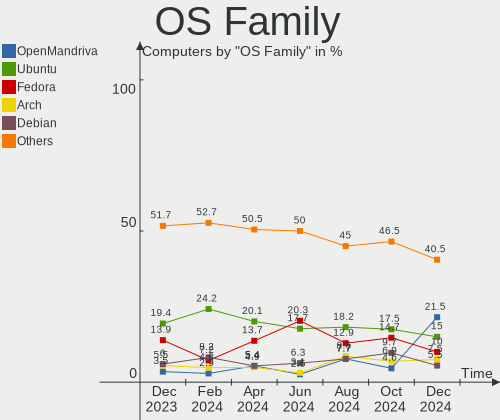
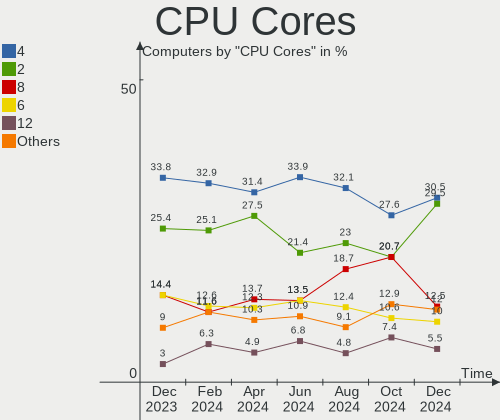
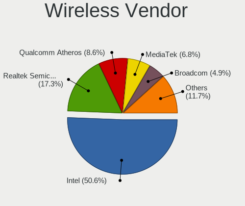
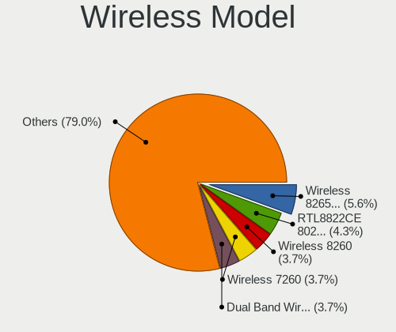
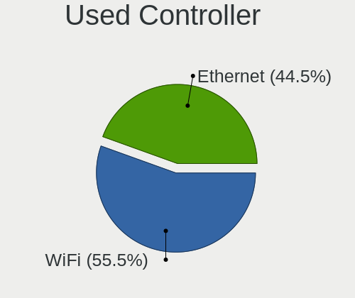
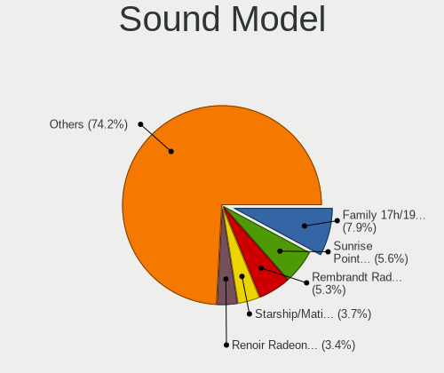
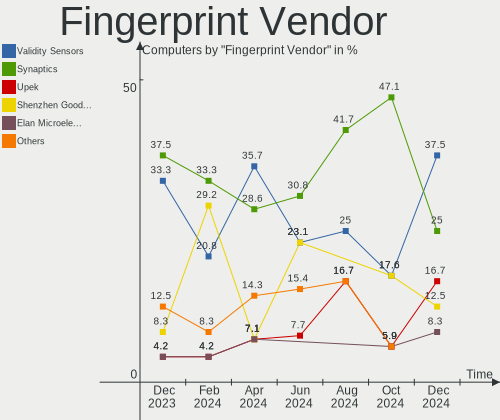

Linux in UK - Hardware Trends
-----------------------------

A project to identify most popular hardware characteristics and track their change
over time based on data collected by Linux users at https://Linux-Hardware.org.

Anyone can contribute to this report by the [hw-probe](https://github.com/linuxhw/hw-probe) tool:

    sudo -E hw-probe -all -upload

This is a report for all computer types. See also reports for [desktops](/Location/UK/Desktop/README.md) and [notebooks](/Location/UK/Notebook/README.md).

Contents
--------

* [ System ](#system)
  - [ OS                       ](#os)
  - [ OS Family                ](#os-family)
  - [ Kernel                   ](#kernel)
  - [ Kernel Family            ](#kernel-family)
  - [ Kernel Major Ver.        ](#kernel-major-ver)
  - [ Arch                     ](#arch)
  - [ DE                       ](#de)
  - [ Display Server           ](#display-server)
  - [ Display Manager          ](#display-manager)
  - [ OS Lang                  ](#os-lang)
  - [ Boot Mode                ](#boot-mode)
  - [ Filesystem               ](#filesystem)
  - [ Part. scheme             ](#part-scheme)
  - [ Dual Boot with Linux/BSD ](#dual-boot-with-linuxbsd)
  - [ Dual Boot (Win)          ](#dual-boot-win)

* [ Board ](#board)
  - [ Vendor                   ](#vendor)
  - [ Model                    ](#model)
  - [ Model Family             ](#model-family)
  - [ MFG Year                 ](#mfg-year)
  - [ Form Factor              ](#form-factor)
  - [ Secure Boot              ](#secure-boot)
  - [ Coreboot                 ](#coreboot)
  - [ RAM Size                 ](#ram-size)
  - [ RAM Used                 ](#ram-used)
  - [ Total Drives             ](#total-drives)
  - [ Has CD-ROM               ](#has-cd-rom)
  - [ Has Ethernet             ](#has-ethernet)
  - [ Has WiFi                 ](#has-wifi)
  - [ Has Bluetooth            ](#has-bluetooth)

* [ Location ](#location)
  - [ Country                  ](#country)
  - [ City                     ](#city)

* [ Drives ](#drives)
  - [ Drive Vendor             ](#drive-vendor)
  - [ Drive Model              ](#drive-model)
  - [ HDD Vendor               ](#hdd-vendor)
  - [ SSD Vendor               ](#ssd-vendor)
  - [ Drive Kind               ](#drive-kind)
  - [ Drive Connector          ](#drive-connector)
  - [ Drive Size               ](#drive-size)
  - [ Space Total              ](#space-total)
  - [ Space Used               ](#space-used)
  - [ Malfunc. Drives          ](#malfunc-drives)
  - [ Malfunc. Drive Vendor    ](#malfunc-drive-vendor)
  - [ Malfunc. HDD Vendor      ](#malfunc-hdd-vendor)
  - [ Malfunc. Drive Kind      ](#malfunc-drive-kind)
  - [ Failed Drives            ](#failed-drives)
  - [ Failed Drive Vendor      ](#failed-drive-vendor)
  - [ Drive Status             ](#drive-status)

* [ Storage controller ](#storage-controller)
  - [ Storage Vendor           ](#storage-vendor)
  - [ Storage Model            ](#storage-model)
  - [ Storage Kind             ](#storage-kind)

* [ Processor ](#processor)
  - [ CPU Vendor               ](#cpu-vendor)
  - [ CPU Model                ](#cpu-model)
  - [ CPU Model Family         ](#cpu-model-family)
  - [ CPU Cores                ](#cpu-cores)
  - [ CPU Sockets              ](#cpu-sockets)
  - [ CPU Threads              ](#cpu-threads)
  - [ CPU Op-Modes             ](#cpu-op-modes)
  - [ CPU Microcode            ](#cpu-microcode)
  - [ CPU Microarch            ](#cpu-microarch)

* [ Graphics ](#graphics)
  - [ GPU Vendor               ](#gpu-vendor)
  - [ GPU Model                ](#gpu-model)
  - [ GPU Combo                ](#gpu-combo)
  - [ GPU Driver               ](#gpu-driver)
  - [ GPU Memory               ](#gpu-memory)

* [ Monitor ](#monitor)
  - [ Monitor Vendor           ](#monitor-vendor)
  - [ Monitor Model            ](#monitor-model)
  - [ Monitor Resolution       ](#monitor-resolution)
  - [ Monitor Diagonal         ](#monitor-diagonal)
  - [ Monitor Width            ](#monitor-width)
  - [ Aspect Ratio             ](#aspect-ratio)
  - [ Monitor Area             ](#monitor-area)
  - [ Pixel Density            ](#pixel-density)
  - [ Multiple Monitors        ](#multiple-monitors)

* [ Network ](#network)
  - [ Net Controller Vendor    ](#net-controller-vendor)
  - [ Net Controller Model     ](#net-controller-model)
  - [ Wireless Vendor          ](#wireless-vendor)
  - [ Wireless Model           ](#wireless-model)
  - [ Ethernet Vendor          ](#ethernet-vendor)
  - [ Ethernet Model           ](#ethernet-model)
  - [ Net Controller Kind      ](#net-controller-kind)
  - [ Used Controller          ](#used-controller)
  - [ NICs                     ](#nics)
  - [ IPv6                     ](#ipv6)

* [ Bluetooth ](#bluetooth)
  - [ Bluetooth Vendor         ](#bluetooth-vendor)
  - [ Bluetooth Model          ](#bluetooth-model)

* [ Sound ](#sound)
  - [ Sound Vendor             ](#sound-vendor)
  - [ Sound Model              ](#sound-model)

* [ Memory ](#memory)
  - [ Memory Vendor            ](#memory-vendor)
  - [ Memory Model             ](#memory-model)
  - [ Memory Kind              ](#memory-kind)
  - [ Memory Form Factor       ](#memory-form-factor)
  - [ Memory Size              ](#memory-size)
  - [ Memory Speed             ](#memory-speed)

* [ Printers & scanners ](#printers--scanners)
  - [ Printer Vendor           ](#printer-vendor)
  - [ Printer Model            ](#printer-model)
  - [ Scanner Vendor           ](#scanner-vendor)
  - [ Scanner Model            ](#scanner-model)

* [ Camera ](#camera)
  - [ Camera Vendor            ](#camera-vendor)
  - [ Camera Model             ](#camera-model)

* [ Security ](#security)
  - [ Fingerprint Vendor       ](#fingerprint-vendor)
  - [ Fingerprint Model        ](#fingerprint-model)
  - [ Chipcard Vendor          ](#chipcard-vendor)
  - [ Chipcard Model           ](#chipcard-model)

* [ Unsupported ](#unsupported)
  - [ Unsupported Devices      ](#unsupported-devices)
  - [ Unsupported Device Types ](#unsupported-device-types)

System
------

OS
--

Installed operating systems

| Name                         | Computers | Percent |
|------------------------------|-----------|---------|
| Ubuntu 22.04                 | 30        | 16.22%  |
| Linux Mint 20.3              | 17        | 9.19%   |
| Pop!_OS 22.04                | 12        | 6.49%   |
| Fedora 36                    | 12        | 6.49%   |
| Ubuntu 20.04                 | 10        | 5.41%   |
| OpenMandriva 4.3             | 9         | 4.86%   |
| Zorin 16                     | 7         | 3.78%   |
| KDE neon 20.04               | 6         | 3.24%   |
| LMDE 5                       | 5         | 2.7%    |
| Pop!_OS 21.10                | 4         | 2.16%   |
| Manjaro                      | 4         | 2.16%   |
| Debian 11                    | 4         | 2.16%   |
| Xubuntu 20.04                | 3         | 1.62%   |
| Ubuntu 18.04                 | 3         | 1.62%   |
| RHEL 8                       | 3         | 1.62%   |
| openSUSE Leap-15.4           | 3         | 1.62%   |
| Manjaro 21.2.6               | 3         | 1.62%   |
| Kubuntu 22.04                | 3         | 1.62%   |
| ArcoLinux Rolling            | 3         | 1.62%   |
| Ubuntu 21.04                 | 2         | 1.08%   |
| SteamOS Snapshot             | 2         | 1.08%   |
| SteamOS 3.1                  | 2         | 1.08%   |
| openSUSE Leap-15.3           | 2         | 1.08%   |
| Lubuntu 22.04                | 2         | 1.08%   |
| Lubuntu 21.10                | 2         | 1.08%   |
| Linux Mint 19.1              | 2         | 1.08%   |
| Kubuntu 20.04                | 2         | 1.08%   |
| Fedora 35                    | 2         | 1.08%   |
| Arch Rolling                 | 2         | 1.08%   |
| Xubuntu 22.04                | 1         | 0.54%   |
| Ubuntu Budgie 18.04          | 1         | 0.54%   |
| Ubuntu 16.04                 | 1         | 0.54%   |
| Ubuntu 14.04                 | 1         | 0.54%   |
| Salient OS V21.06            | 1         | 0.54%   |
| ROSA 12.2                    | 1         | 0.54%   |
| Pop!_OS 21.04                | 1         | 0.54%   |
| openSUSE Tumbleweed-XXXXXXXX | 1         | 0.54%   |
| NixOS 22.05                  | 1         | 0.54%   |
| Mageia 8                     | 1         | 0.54%   |
| LinuxFX 11                   | 1         | 0.54%   |
| Linux Mint 19.3              | 1         | 0.54%   |
| Linux Lite 6.0               | 1         | 0.54%   |
| Kali 2022.2                  | 1         | 0.54%   |
| Kaisen 2.0                   | 1         | 0.54%   |
| Gentoo 2.8                   | 1         | 0.54%   |
| Gentoo 2.6                   | 1         | 0.54%   |
| EndeavourOS                  | 1         | 0.54%   |
| Debian Testing               | 1         | 0.54%   |
| Clear Linux 36410            | 1         | 0.54%   |
| Clear Linux 36360            | 1         | 0.54%   |
| Clear Linux 36010            | 1         | 0.54%   |
| BlackPanther 18.1            | 1         | 0.54%   |
| Arch                         | 1         | 0.54%   |

OS Family
---------

OS without a version

| Name          | Computers | Percent |
|---------------|-----------|---------|
| Ubuntu        | 47        | 25.41%  |
| Linux Mint    | 20        | 10.81%  |
| Pop!_OS       | 17        | 9.19%   |
| Fedora        | 14        | 7.57%   |
| OpenMandriva  | 9         | 4.86%   |
| Zorin         | 7         | 3.78%   |
| Manjaro       | 7         | 3.78%   |
| openSUSE      | 6         | 3.24%   |
| KDE neon      | 6         | 3.24%   |
| LMDE          | 5         | 2.7%    |
| Kubuntu       | 5         | 2.7%    |
| Debian        | 5         | 2.7%    |
| Xubuntu       | 4         | 2.16%   |
| SteamOS       | 4         | 2.16%   |
| Lubuntu       | 4         | 2.16%   |
| RHEL          | 3         | 1.62%   |
| Clear Linux   | 3         | 1.62%   |
| ArcoLinux     | 3         | 1.62%   |
| Arch          | 3         | 1.62%   |
| Gentoo        | 2         | 1.08%   |
| Ubuntu Budgie | 1         | 0.54%   |
| Salient OS    | 1         | 0.54%   |
| ROSA          | 1         | 0.54%   |
| NixOS         | 1         | 0.54%   |
| Mageia        | 1         | 0.54%   |
| LinuxFX       | 1         | 0.54%   |
| Linux Lite    | 1         | 0.54%   |
| Kali          | 1         | 0.54%   |
| Kaisen        | 1         | 0.54%   |
| EndeavourOS   | 1         | 0.54%   |
| BlackPanther  | 1         | 0.54%   |

Kernel
------

Version of the Linux kernel

| Version                                            | Computers | Percent |
|----------------------------------------------------|-----------|---------|
| 5.15.0-27-generic                                  | 16        | 8.65%   |
| 5.13.0-41-generic                                  | 14        | 7.57%   |
| 5.17.5-76051705-generic                            | 12        | 6.49%   |
| 5.13.0-40-generic                                  | 10        | 5.41%   |
| 5.15.0-33-generic                                  | 9         | 4.86%   |
| 5.4.0-109-generic                                  | 8         | 4.32%   |
| 5.16.7-desktop-1omv4003                            | 8         | 4.32%   |
| 5.15.0-30-generic                                  | 8         | 4.32%   |
| 5.4.0-110-generic                                  | 7         | 3.78%   |
| 5.10.0-14-amd64                                    | 6         | 3.24%   |
| 5.17.5-300.fc36.x86_64                             | 4         | 2.16%   |
| 5.16.19-76051619-generic                           | 3         | 1.62%   |
| 5.14.21-150400.19-default                          | 3         | 1.62%   |
| 4.15.0-176-generic                                 | 3         | 1.62%   |
| 5.18.0-051800-generic                              | 2         | 1.08%   |
| 5.17.9-arch1-1                                     | 2         | 1.08%   |
| 5.17.8-300.fc36.x86_64                             | 2         | 1.08%   |
| 5.17.3-302.fc36.x86_64                             | 2         | 1.08%   |
| 5.16.13-1132.native                                | 2         | 1.08%   |
| 5.15.41-1-MANJARO                                  | 2         | 1.08%   |
| 5.15.32-1-MANJARO                                  | 2         | 1.08%   |
| 5.14.0-1038-oem                                    | 2         | 1.08%   |
| 5.13.0-valve10.3-1-neptune-02176-g5fe416c4acd8     | 2         | 1.08%   |
| 5.13.0-valve10.1-2-neptune-dri-02144-g7fffaf925dfb | 2         | 1.08%   |
| 5.13.0-44-generic                                  | 2         | 1.08%   |
| 5.6.14-desktop-2bP                                 | 1         | 0.54%   |
| 5.4.0-91-generic                                   | 1         | 0.54%   |
| 5.4.0-113-lowlatency                               | 1         | 0.54%   |
| 5.4.0-113-generic                                  | 1         | 0.54%   |
| 5.4.0-107-generic                                  | 1         | 0.54%   |
| 5.3.18-150300.59.63-default                        | 1         | 0.54%   |
| 5.3.18-150300.59.60-default                        | 1         | 0.54%   |
| 5.17.9-zen1-1-zen                                  | 1         | 0.54%   |
| 5.17.9-xanmod1-x64v2                               | 1         | 0.54%   |
| 5.17.9-300.fc36.x86_64                             | 1         | 0.54%   |
| 5.17.9-1144.native                                 | 1         | 0.54%   |
| 5.17.7-arch1-1                                     | 1         | 0.54%   |
| 5.17.7-300.fc36.x86_64                             | 1         | 0.54%   |
| 5.17.6-300.fc36.x86_64                             | 1         | 0.54%   |
| 5.17.6-200.fc35.x86_64                             | 1         | 0.54%   |
| 5.17.5-zen1-1-zen                                  | 1         | 0.54%   |
| 5.17.5-arch1-1                                     | 1         | 0.54%   |
| 5.17.5-200.fc35.x86_64                             | 1         | 0.54%   |
| 5.17.4-1-default                                   | 1         | 0.54%   |
| 5.17.11-300.fc36.x86_64                            | 1         | 0.54%   |
| 5.17.1-gentoo-r1                                   | 1         | 0.54%   |
| 5.17.0-1-amd64                                     | 1         | 0.54%   |
| 5.16.18-1-MANJARO                                  | 1         | 0.54%   |
| 5.16.15-76051615-generic                           | 1         | 0.54%   |
| 5.16.13-desktop-1omv4003                           | 1         | 0.54%   |
| 5.16.0-kali7-amd64                                 | 1         | 0.54%   |
| 5.16.0-0.bpo.4-amd64                               | 1         | 0.54%   |
| 5.15.38-1-MANJARO                                  | 1         | 0.54%   |
| 5.15.37-1-lts                                      | 1         | 0.54%   |
| 5.15.35-desktop-2.mga8                             | 1         | 0.54%   |
| 5.15.34                                            | 1         | 0.54%   |
| 5.15.32-gentoo-r1                                  | 1         | 0.54%   |
| 5.15.0-kaisen1-amd64                               | 1         | 0.54%   |
| 5.15.0-30-lowlatency                               | 1         | 0.54%   |
| 5.15.0-27-lowlatency                               | 1         | 0.54%   |

Kernel Family
-------------

Linux kernel without a distro release

| Version  | Computers | Percent |
|----------|-----------|---------|
| 5.15.0   | 36        | 19.46%  |
| 5.13.0   | 32        | 17.3%   |
| 5.4.0    | 19        | 10.27%  |
| 5.17.5   | 19        | 10.27%  |
| 5.16.7   | 8         | 4.32%   |
| 5.10.0   | 7         | 3.78%   |
| 5.17.9   | 6         | 3.24%   |
| 4.15.0   | 6         | 3.24%   |
| 5.16.19  | 3         | 1.62%   |
| 5.16.13  | 3         | 1.62%   |
| 5.15.32  | 3         | 1.62%   |
| 5.14.21  | 3         | 1.62%   |
| 5.14.0   | 3         | 1.62%   |
| 4.18.0   | 3         | 1.62%   |
| 5.3.18   | 2         | 1.08%   |
| 5.18.0   | 2         | 1.08%   |
| 5.17.8   | 2         | 1.08%   |
| 5.17.7   | 2         | 1.08%   |
| 5.17.6   | 2         | 1.08%   |
| 5.17.3   | 2         | 1.08%   |
| 5.16.0   | 2         | 1.08%   |
| 5.15.41  | 2         | 1.08%   |
| 5.11.0   | 2         | 1.08%   |
| 5.6.14   | 1         | 0.54%   |
| 5.17.4   | 1         | 0.54%   |
| 5.17.11  | 1         | 0.54%   |
| 5.17.1   | 1         | 0.54%   |
| 5.17.0   | 1         | 0.54%   |
| 5.16.18  | 1         | 0.54%   |
| 5.16.15  | 1         | 0.54%   |
| 5.15.38  | 1         | 0.54%   |
| 5.15.37  | 1         | 0.54%   |
| 5.15.35  | 1         | 0.54%   |
| 5.15.34  | 1         | 0.54%   |
| 5.13.19  | 1         | 0.54%   |
| 5.12.9   | 1         | 0.54%   |
| 5.10.74  | 1         | 0.54%   |
| 5.10.109 | 1         | 0.54%   |
| 3.13.0   | 1         | 0.54%   |

Kernel Major Ver.
-----------------

Linux kernel major version

| Version | Computers | Percent |
|---------|-----------|---------|
| 5.15    | 45        | 24.32%  |
| 5.17    | 37        | 20%     |
| 5.13    | 33        | 17.84%  |
| 5.4     | 19        | 10.27%  |
| 5.16    | 18        | 9.73%   |
| 5.10    | 9         | 4.86%   |
| 5.14    | 6         | 3.24%   |
| 4.15    | 6         | 3.24%   |
| 4.18    | 3         | 1.62%   |
| 5.3     | 2         | 1.08%   |
| 5.18    | 2         | 1.08%   |
| 5.11    | 2         | 1.08%   |
| 5.6     | 1         | 0.54%   |
| 5.12    | 1         | 0.54%   |
| 3.13    | 1         | 0.54%   |

Arch
----

OS architecture (x86_64, i586, etc.)

| Name   | Computers | Percent |
|--------|-----------|---------|
| x86_64 | 183       | 98.92%  |
| i686   | 2         | 1.08%   |

DE
--

Desktop Environment

| Name        | Computers | Percent |
|-------------|-----------|---------|
| GNOME       | 81        | 43.78%  |
| KDE5        | 40        | 21.62%  |
| X-Cinnamon  | 21        | 11.35%  |
| XFCE        | 17        | 9.19%   |
| Unknown     | 13        | 7.03%   |
| LXQt        | 5         | 2.7%    |
| Cinnamon    | 2         | 1.08%   |
| WindowMaker | 1         | 0.54%   |
| Unity       | 1         | 0.54%   |
| MATE        | 1         | 0.54%   |
| LXDE        | 1         | 0.54%   |
| i3          | 1         | 0.54%   |
| Budgie      | 1         | 0.54%   |

Display Server
--------------

X11 or Wayland

| Name    | Computers | Percent |
|---------|-----------|---------|
| X11     | 146       | 78.92%  |
| Wayland | 29        | 15.68%  |
| Unknown | 7         | 3.78%   |
| Tty     | 3         | 1.62%   |

Display Manager
---------------

SDDM, LightDM, etc.

| Name    | Computers | Percent |
|---------|-----------|---------|
| Unknown | 80        | 43.24%  |
| GDM3    | 37        | 20%     |
| LightDM | 33        | 17.84%  |
| SDDM    | 27        | 14.59%  |
| GDM     | 8         | 4.32%   |

OS Lang
-------

Language

| Lang    | Computers | Percent |
|---------|-----------|---------|
| en_GB   | 145       | 78.38%  |
| en_US   | 27        | 14.59%  |
| Unknown | 6         | 3.24%   |
| en_IE   | 2         | 1.08%   |
| uk_UA   | 1         | 0.54%   |
| POSIX   | 1         | 0.54%   |
| it_IT   | 1         | 0.54%   |
| cs_CZ   | 1         | 0.54%   |
| C       | 1         | 0.54%   |

Boot Mode
---------

EFI or BIOS

| Mode | Computers | Percent |
|------|-----------|---------|
| BIOS | 96        | 51.89%  |
| EFI  | 89        | 48.11%  |

Filesystem
----------

Type of filesystem

| Type    | Computers | Percent |
|---------|-----------|---------|
| Ext4    | 142       | 76.76%  |
| Btrfs   | 22        | 11.89%  |
| Overlay | 12        | 6.49%   |
| Xfs     | 5         | 2.7%    |
| Zfs     | 3         | 1.62%   |
| Ext3    | 1         | 0.54%   |

Part. scheme
------------

Scheme of partitioning

| Type    | Computers | Percent |
|---------|-----------|---------|
| Unknown | 104       | 56.22%  |
| GPT     | 59        | 31.89%  |
| MBR     | 22        | 11.89%  |

Dual Boot with Linux/BSD
------------------------

Hosting more than one Linux/BSD

| Dual boot | Computers | Percent |
|-----------|-----------|---------|
| No        | 155       | 83.78%  |
| Yes       | 30        | 16.22%  |

Dual Boot (Win)
---------------

Hosting Linux and Windows

| Dual boot | Computers | Percent |
|-----------|-----------|---------|
| No        | 140       | 75.68%  |
| Yes       | 45        | 24.32%  |

Board
-----

Vendor
------

Motherboard manufacturer

| Name                | Computers | Percent |
|---------------------|-----------|---------|
| Dell                | 26        | 14.05%  |
| ASUSTek Computer    | 25        | 13.51%  |
| Lenovo              | 24        | 12.97%  |
| Hewlett-Packard     | 24        | 12.97%  |
| MSI                 | 14        | 7.57%   |
| Gigabyte Technology | 14        | 7.57%   |
| Acer                | 14        | 7.57%   |
| Apple               | 5         | 2.7%    |
| Toshiba             | 4         | 2.16%   |
| Notebook            | 3         | 1.62%   |
| Intel               | 3         | 1.62%   |
| Valve               | 2         | 1.08%   |
| Microsoft           | 2         | 1.08%   |
| Entroware           | 2         | 1.08%   |
| AZW                 | 2         | 1.08%   |
| ASRock              | 2         | 1.08%   |
| AMI                 | 2         | 1.08%   |
| Alienware           | 2         | 1.08%   |
| YANYU               | 1         | 0.54%   |
| Supermicro          | 1         | 0.54%   |
| Star Labs           | 1         | 0.54%   |
| Seeed Studio        | 1         | 0.54%   |
| Razer               | 1         | 0.54%   |
| PC Specialist       | 1         | 0.54%   |
| MW                  | 1         | 0.54%   |
| HYPA                | 1         | 0.54%   |
| HUAWEI              | 1         | 0.54%   |
| Fujitsu Siemens     | 1         | 0.54%   |
| ECS                 | 1         | 0.54%   |
| Clevo               | 1         | 0.54%   |
| BOX                 | 1         | 0.54%   |
| BESSTAR Tech        | 1         | 0.54%   |
| Unknown             | 1         | 0.54%   |

Model
-----

Motherboard model

| Name                                       | Computers | Percent |
|--------------------------------------------|-----------|---------|
| Valve Jupiter                              | 2         | 1.08%   |
| MSI MS-7C91                                | 2         | 1.08%   |
| MSI MS-7C56                                | 2         | 1.08%   |
| MSI MS-7C37                                | 2         | 1.08%   |
| Lenovo Z50-75 80EC                         | 2         | 1.08%   |
| HP ZBook 15 G5                             | 2         | 1.08%   |
| HP ProLiant DL380p Gen8                    | 2         | 1.08%   |
| HP Pavilion Notebook                       | 2         | 1.08%   |
| Dell XPS 13 9305                           | 2         | 1.08%   |
| ASUS PRIME H510M-E                         | 2         | 1.08%   |
| ASUS A68HM-PLUS                            | 2         | 1.08%   |
| Acer Aspire A515-45                        | 2         | 1.08%   |
| Unknown                                    | 2         | 1.08%   |
| YANYU ITX-N29 VER:1.3                      | 1         | 0.54%   |
| Toshiba TECRA A50-C                        | 1         | 0.54%   |
| Toshiba Satellite P850                     | 1         | 0.54%   |
| Toshiba Satellite C850-1KN                 | 1         | 0.54%   |
| Toshiba PORTEGE R30-A                      | 1         | 0.54%   |
| Supermicro X9SRA/X9SRA-3                   | 1         | 0.54%   |
| Star Labs Lite                             | 1         | 0.54%   |
| Seeed Studio ODYSSEY-X86J4125              | 1         | 0.54%   |
| Razer Blade                                | 1         | 0.54%   |
| PC Specialist NH5x_7xDCx_DDx               | 1         | 0.54%   |
| Notebook NS50_70MU                         | 1         | 0.54%   |
| Notebook NLx0MU                            | 1         | 0.54%   |
| Notebook NH5x_NH7x_HHx_HJx_HKx             | 1         | 0.54%   |
| MW GMLK-2_5G4L                             | 1         | 0.54%   |
| MSI VIG644M                                | 1         | 0.54%   |
| MSI Stealth GS66 12UGS                     | 1         | 0.54%   |
| MSI p6-2475ea                              | 1         | 0.54%   |
| MSI MS-7D53                                | 1         | 0.54%   |
| MSI MS-7D09                                | 1         | 0.54%   |
| MSI MS-7C60                                | 1         | 0.54%   |
| MSI MS-7B78                                | 1         | 0.54%   |
| MSI GE63 Raider RGB 8RE                    | 1         | 0.54%   |
| Microsoft Surface Pro                      | 1         | 0.54%   |
| Microsoft Surface Go 2                     | 1         | 0.54%   |
| Lenovo Yoga 300-11IBY 80M0                 | 1         | 0.54%   |
| Lenovo V145-15AST 81MT                     | 1         | 0.54%   |
| Lenovo ThinkPad X250 20CMCTO1WW            | 1         | 0.54%   |
| Lenovo ThinkPad X1 Carbon Gen 9 20XWCTO1WW | 1         | 0.54%   |
| Lenovo ThinkPad X1 Carbon 2nd 20A8S1AW11   | 1         | 0.54%   |
| Lenovo ThinkPad T480 20L6S5M40M            | 1         | 0.54%   |
| Lenovo ThinkPad T470 20HES1RB06            | 1         | 0.54%   |
| Lenovo ThinkPad T440 20B7A1P700            | 1         | 0.54%   |
| Lenovo ThinkPad T410 25223FG               | 1         | 0.54%   |
| Lenovo ThinkPad T15 Gen 2i 20W5S12J0K      | 1         | 0.54%   |
| Lenovo ThinkPad T14s Gen 2i 20WNS1F81N     | 1         | 0.54%   |
| Lenovo ThinkPad P73 20QSS09S00             | 1         | 0.54%   |
| Lenovo ThinkPad P50 20EQS0VV0C             | 1         | 0.54%   |
| Lenovo ThinkPad L380 Yoga 20M7S0BN00       | 1         | 0.54%   |
| Lenovo ThinkCentre M73z 10BC0017UK         | 1         | 0.54%   |
| Lenovo S21e-20 80M4                        | 1         | 0.54%   |
| Lenovo S20-00 F0AY001YUK                   | 1         | 0.54%   |
| Lenovo Legion 5 15ACH6H 82JU               | 1         | 0.54%   |
| Lenovo IdeaPad Z580                        | 1         | 0.54%   |
| Lenovo IdeaPad Gaming 3 15IHU6 82K1        | 1         | 0.54%   |
| Lenovo IdeaPad 5 15ARE05 81YQ              | 1         | 0.54%   |
| Lenovo IdeaCentre 310S-08ASR 90G9002VUK    | 1         | 0.54%   |
| Intel NUC7i3BNH                            | 1         | 0.54%   |

Model Family
------------

Motherboard model prefix

| Name                          | Computers | Percent |
|-------------------------------|-----------|---------|
| Lenovo ThinkPad               | 12        | 6.49%   |
| Acer Aspire                   | 12        | 6.49%   |
| Dell XPS                      | 6         | 3.24%   |
| Dell Inspiron                 | 6         | 3.24%   |
| ASUS PRIME                    | 6         | 3.24%   |
| HP ZBook                      | 4         | 2.16%   |
| Dell Precision                | 4         | 2.16%   |
| Dell OptiPlex                 | 4         | 2.16%   |
| Dell Latitude                 | 4         | 2.16%   |
| Lenovo IdeaPad                | 3         | 1.62%   |
| HP ProLiant                   | 3         | 1.62%   |
| HP EliteBook                  | 3         | 1.62%   |
| ASUS VivoBook                 | 3         | 1.62%   |
| ASUS ROG                      | 3         | 1.62%   |
| Valve Jupiter                 | 2         | 1.08%   |
| Toshiba Satellite             | 2         | 1.08%   |
| MSI MS-7C91                   | 2         | 1.08%   |
| MSI MS-7C56                   | 2         | 1.08%   |
| MSI MS-7C37                   | 2         | 1.08%   |
| Microsoft Surface             | 2         | 1.08%   |
| Lenovo Z50-75                 | 2         | 1.08%   |
| HP Spectre                    | 2         | 1.08%   |
| HP ProBook                    | 2         | 1.08%   |
| HP Pavilion                   | 2         | 1.08%   |
| HP ENVY                       | 2         | 1.08%   |
| HP Compaq                     | 2         | 1.08%   |
| ASUS A68HM-PLUS               | 2         | 1.08%   |
| Unknown                       | 2         | 1.08%   |
| YANYU ITX-N29                 | 1         | 0.54%   |
| Toshiba TECRA                 | 1         | 0.54%   |
| Toshiba PORTEGE               | 1         | 0.54%   |
| Supermicro X9SRA              | 1         | 0.54%   |
| Star Labs Lite                | 1         | 0.54%   |
| Seeed Studio ODYSSEY-X86J4125 | 1         | 0.54%   |
| Razer Blade                   | 1         | 0.54%   |
| PC Specialist NH5x            | 1         | 0.54%   |
| Notebook NS50                 | 1         | 0.54%   |
| Notebook NLx0MU               | 1         | 0.54%   |
| Notebook NH5x                 | 1         | 0.54%   |
| MW GMLK-2                     | 1         | 0.54%   |
| MSI VIG644M                   | 1         | 0.54%   |
| MSI Stealth                   | 1         | 0.54%   |
| MSI p6-2475ea                 | 1         | 0.54%   |
| MSI MS-7D53                   | 1         | 0.54%   |
| MSI MS-7D09                   | 1         | 0.54%   |
| MSI MS-7C60                   | 1         | 0.54%   |
| MSI MS-7B78                   | 1         | 0.54%   |
| MSI GE63                      | 1         | 0.54%   |
| Lenovo Yoga                   | 1         | 0.54%   |
| Lenovo V145-15AST             | 1         | 0.54%   |
| Lenovo ThinkCentre            | 1         | 0.54%   |
| Lenovo S21e-20                | 1         | 0.54%   |
| Lenovo S20-00                 | 1         | 0.54%   |
| Lenovo Legion                 | 1         | 0.54%   |
| Lenovo IdeaCentre             | 1         | 0.54%   |
| Intel NUC7i3BNH               | 1         | 0.54%   |
| Intel DQ57TM                  | 1         | 0.54%   |
| Intel DQ35JO                  | 1         | 0.54%   |
| HYPA FLUX                     | 1         | 0.54%   |
| HUAWEI BOD-WXX9               | 1         | 0.54%   |

MFG Year
--------

Motherboard manufacture year

| Year | Computers | Percent |
|------|-----------|---------|
| 2021 | 30        | 16.22%  |
| 2020 | 21        | 11.35%  |
| 2018 | 19        | 10.27%  |
| 2015 | 15        | 8.11%   |
| 2019 | 13        | 7.03%   |
| 2011 | 12        | 6.49%   |
| 2016 | 11        | 5.95%   |
| 2014 | 11        | 5.95%   |
| 2013 | 11        | 5.95%   |
| 2012 | 10        | 5.41%   |
| 2017 | 9         | 4.86%   |
| 2008 | 5         | 2.7%    |
| 2022 | 4         | 2.16%   |
| 2009 | 4         | 2.16%   |
| 2010 | 3         | 1.62%   |
| 2007 | 3         | 1.62%   |
| 2006 | 3         | 1.62%   |
| 2005 | 1         | 0.54%   |

Form Factor
-----------

Physical design of the computer

| Name        | Computers | Percent |
|-------------|-----------|---------|
| Notebook    | 96        | 51.89%  |
| Desktop     | 68        | 36.76%  |
| Mini pc     | 6         | 3.24%   |
| Convertible | 5         | 2.7%    |
| All in one  | 4         | 2.16%   |
| Server      | 4         | 2.16%   |
| Tablet      | 2         | 1.08%   |

Secure Boot
-----------

Enabled or disabled

| State    | Computers | Percent |
|----------|-----------|---------|
| Disabled | 175       | 94.59%  |
| Enabled  | 10        | 5.41%   |

Coreboot
--------

Have coreboot on board

| Used | Computers | Percent |
|------|-----------|---------|
| No   | 184       | 99.46%  |
| Yes  | 1         | 0.54%   |

RAM Size
--------

Total RAM memory

| Size in GB      | Computers | Percent |
|-----------------|-----------|---------|
| 16.01-24.0      | 48        | 25.95%  |
| 4.01-8.0        | 38        | 20.54%  |
| 8.01-16.0       | 31        | 16.76%  |
| 32.01-64.0      | 27        | 14.59%  |
| 3.01-4.0        | 24        | 12.97%  |
| 24.01-32.0      | 5         | 2.7%    |
| 1.01-2.0        | 5         | 2.7%    |
| 64.01-256.0     | 4         | 2.16%   |
| More than 256.0 | 1         | 0.54%   |
| 2.01-3.0        | 1         | 0.54%   |
| 0.51-1.0        | 1         | 0.54%   |

RAM Used
--------

Used RAM memory

| Used GB    | Computers | Percent |
|------------|-----------|---------|
| 1.01-2.0   | 62        | 33.51%  |
| 2.01-3.0   | 52        | 28.11%  |
| 3.01-4.0   | 29        | 15.68%  |
| 4.01-8.0   | 24        | 12.97%  |
| 0.51-1.0   | 9         | 4.86%   |
| 8.01-16.0  | 3         | 1.62%   |
| 16.01-24.0 | 2         | 1.08%   |
| 0.01-0.5   | 2         | 1.08%   |
| 32.01-64.0 | 1         | 0.54%   |
| Unknown    | 1         | 0.54%   |

Total Drives
------------

Number of drives on board

| Drives | Computers | Percent |
|--------|-----------|---------|
| 1      | 94        | 50.81%  |
| 2      | 55        | 29.73%  |
| 3      | 16        | 8.65%   |
| 4      | 10        | 5.41%   |
| 5      | 3         | 1.62%   |
| 0      | 3         | 1.62%   |
| 13     | 2         | 1.08%   |
| 9      | 1         | 0.54%   |
| 6      | 1         | 0.54%   |

Has CD-ROM
----------

Has CD-ROM on board

| Presented | Computers | Percent |
|-----------|-----------|---------|
| No        | 114       | 61.62%  |
| Yes       | 71        | 38.38%  |

Has Ethernet
------------

Has Ethernet on board

| Presented | Computers | Percent |
|-----------|-----------|---------|
| Yes       | 153       | 82.7%   |
| No        | 32        | 17.3%   |

Has WiFi
--------

Has WiFi module

| Presented | Computers | Percent |
|-----------|-----------|---------|
| Yes       | 145       | 78.38%  |
| No        | 40        | 21.62%  |

Has Bluetooth
-------------

Has Bluetooth module

| Presented | Computers | Percent |
|-----------|-----------|---------|
| Yes       | 122       | 65.95%  |
| No        | 63        | 34.05%  |

Location
--------

Country
-------

Geographic location (country)

| Country | Computers | Percent |
|---------|-----------|---------|
| UK      | 185       | 100%    |

City
----

Geographic location (city)

| City              | Computers | Percent |
|-------------------|-----------|---------|
| London            | 17        | 9.19%   |
| Glasgow           | 4         | 2.16%   |
| Edinburgh         | 4         | 2.16%   |
| Croydon           | 4         | 2.16%   |
| Reading           | 3         | 1.62%   |
| Neasden           | 3         | 1.62%   |
| Leicester         | 3         | 1.62%   |
| Didcot            | 3         | 1.62%   |
| Cambridge         | 3         | 1.62%   |
| Birmingham        | 3         | 1.62%   |
| Stockport         | 2         | 1.08%   |
| Sheerness         | 2         | 1.08%   |
| Seaford           | 2         | 1.08%   |
| Ryde              | 2         | 1.08%   |
| Redruth           | 2         | 1.08%   |
| Pontypool         | 2         | 1.08%   |
| Penarth           | 2         | 1.08%   |
| Nottingham        | 2         | 1.08%   |
| Norwich           | 2         | 1.08%   |
| Manchester        | 2         | 1.08%   |
| Liverpool         | 2         | 1.08%   |
| Islington         | 2         | 1.08%   |
| Hackney           | 2         | 1.08%   |
| Derby             | 2         | 1.08%   |
| Chelsea           | 2         | 1.08%   |
| Bristol           | 2         | 1.08%   |
| Brighton          | 2         | 1.08%   |
| Bangor            | 2         | 1.08%   |
| Abingdon          | 2         | 1.08%   |
| York              | 1         | 0.54%   |
| Yeovil            | 1         | 0.54%   |
| Wokingham         | 1         | 0.54%   |
| Witham            | 1         | 0.54%   |
| Whitley Bay       | 1         | 0.54%   |
| Weston-super-Mare | 1         | 0.54%   |
| Todmorden         | 1         | 0.54%   |
| Tillicoultry      | 1         | 0.54%   |
| Thornton Heath    | 1         | 0.54%   |
| Taunton           | 1         | 0.54%   |
| Tankerton         | 1         | 0.54%   |
| Tamworth          | 1         | 0.54%   |
| Swansea           | 1         | 0.54%   |
| Sunderland        | 1         | 0.54%   |
| Streatham         | 1         | 0.54%   |
| Stoke-on-Trent    | 1         | 0.54%   |
| Stockton-on-Tees  | 1         | 0.54%   |
| Stanmore          | 1         | 0.54%   |
| Stafford          | 1         | 0.54%   |
| St Helens         | 1         | 0.54%   |
| St Albans         | 1         | 0.54%   |
| South Shields     | 1         | 0.54%   |
| Skegness          | 1         | 0.54%   |
| Sidcup            | 1         | 0.54%   |
| Sheffield         | 1         | 0.54%   |
| Rotherham         | 1         | 0.54%   |
| Reigate           | 1         | 0.54%   |
| Redhill           | 1         | 0.54%   |
| Peterlee          | 1         | 0.54%   |
| Peterborough      | 1         | 0.54%   |
| Palmers Green     | 1         | 0.54%   |

Drives
------

Drive Vendor
------------

Hard drive vendors

| Vendor                    | Computers | Drives | Percent |
|---------------------------|-----------|--------|---------|
| Samsung Electronics       | 54        | 64     | 19.35%  |
| Seagate                   | 47        | 55     | 16.85%  |
| WDC                       | 37        | 50     | 13.26%  |
| SanDisk                   | 18        | 18     | 6.45%   |
| Kingston                  | 17        | 18     | 6.09%   |
| Unknown                   | 14        | 15     | 5.02%   |
| Toshiba                   | 14        | 15     | 5.02%   |
| Crucial                   | 14        | 17     | 5.02%   |
| SK Hynix                  | 6         | 6      | 2.15%   |
| Phison                    | 6         | 6      | 2.15%   |
| KIOXIA                    | 5         | 6      | 1.79%   |
| Hitachi                   | 4         | 4      | 1.43%   |
| A-DATA Technology         | 4         | 5      | 1.43%   |
| Silicon Motion            | 3         | 3      | 1.08%   |
| Micron Technology         | 3         | 3      | 1.08%   |
| Intel                     | 3         | 3      | 1.08%   |
| LITEONIT                  | 2         | 2      | 0.72%   |
| Hewlett-Packard           | 2         | 20     | 0.72%   |
| China                     | 2         | 2      | 0.72%   |
| Apple                     | 2         | 3      | 0.72%   |
| Verbatim                  | 1         | 1      | 0.36%   |
| Vaseky                    | 1         | 1      | 0.36%   |
| USB3.2                    | 1         | 1      | 0.36%   |
| TO Exter                  | 1         | 1      | 0.36%   |
| Team                      | 1         | 1      | 0.36%   |
| Star                      | 1         | 1      | 0.36%   |
| PNY                       | 1         | 1      | 0.36%   |
| Patriot                   | 1         | 1      | 0.36%   |
| OCZ-AGIL                  | 1         | 1      | 0.36%   |
| Netac                     | 1         | 1      | 0.36%   |
| Micron/Crucial Technology | 1         | 1      | 0.36%   |
| MAXTOR                    | 1         | 2      | 0.36%   |
| Lexar                     | 1         | 1      | 0.36%   |
| LaCie                     | 1         | 1      | 0.36%   |
| KIOXIA-EXCERIA            | 1         | 1      | 0.36%   |
| HPE                       | 1         | 2      | 0.36%   |
| H/W                       | 1         | 1      | 0.36%   |
| Gigabyte Technology       | 1         | 1      | 0.36%   |
| BIWIN                     | 1         | 1      | 0.36%   |
| Aura                      | 1         | 1      | 0.36%   |
| ADATA Technology          | 1         | 1      | 0.36%   |
| Unknown                   | 1         | 1      | 0.36%   |

Drive Model
-----------

Hard drive models

| Model                               | Computers | Percent |
|-------------------------------------|-----------|---------|
| Samsung NVMe SSD Drive 512GB        | 7         | 2.3%    |
| Samsung NVMe SSD Drive 500GB        | 5         | 1.64%   |
| Seagate ST1000LM035-1RK172 1TB      | 4         | 1.32%   |
| Samsung SSD 850 EVO 250GB           | 4         | 1.32%   |
| Crucial CT500MX500SSD1 500GB        | 4         | 1.32%   |
| Toshiba NVMe SSD Drive 512GB        | 3         | 0.99%   |
| Toshiba KBG30ZMS128G 128GB NVMe SSD | 3         | 0.99%   |
| Seagate ST2000LM007-1R8174 2TB      | 3         | 0.99%   |
| Seagate ST2000DM001-1ER164 2TB      | 3         | 0.99%   |
| Seagate ST1000DM010-2EP102 1TB      | 3         | 0.99%   |
| Samsung SSD 980 PRO 1TB             | 3         | 0.99%   |
| Samsung SSD 970 EVO 1TB             | 3         | 0.99%   |
| Samsung NVMe SSD Drive 1TB          | 3         | 0.99%   |
| Crucial CT1000MX500SSD1 1TB         | 3         | 0.99%   |
| WDC WD10JPVX-60JC3T0 1TB            | 2         | 0.66%   |
| Unknown MMC Card  64GB              | 2         | 0.66%   |
| Unknown MMC Card  32GB              | 2         | 0.66%   |
| Toshiba HDWD110 1TB                 | 2         | 0.66%   |
| SK Hynix NVMe SSD Drive 512GB       | 2         | 0.66%   |
| Seagate ST500LT012-1DG142 500GB     | 2         | 0.66%   |
| Seagate ST2000LM015-2E8174 2TB      | 2         | 0.66%   |
| Seagate ST2000LM003 HN-M201RAD 2TB  | 2         | 0.66%   |
| Seagate ST2000DM008-2FR102 2TB      | 2         | 0.66%   |
| Seagate ST2000DM006-2DM164 2TB      | 2         | 0.66%   |
| Seagate ST1000LM049-2GH172 1TB      | 2         | 0.66%   |
| Seagate ST1000DM003-1ER162 1TB      | 2         | 0.66%   |
| Seagate BUP Slim BL 1TB             | 2         | 0.66%   |
| SanDisk SSD PLUS 240GB              | 2         | 0.66%   |
| SanDisk SSD PLUS 120GB              | 2         | 0.66%   |
| SanDisk SDSSDHII240G 240GB          | 2         | 0.66%   |
| Sandisk NVMe SSD Drive 256GB        | 2         | 0.66%   |
| Samsung SSD 970 EVO Plus 500GB      | 2         | 0.66%   |
| Samsung SSD 970 EVO Plus 250GB      | 2         | 0.66%   |
| Samsung SSD 970 EVO Plus 1TB        | 2         | 0.66%   |
| Samsung SSD 870 QVO 1TB             | 2         | 0.66%   |
| Samsung SSD 860 EVO 250GB           | 2         | 0.66%   |
| Samsung SSD 850 EVO 500GB           | 2         | 0.66%   |
| Samsung SSD 840 EVO 250GB           | 2         | 0.66%   |
| Samsung PM991a NVMe 512GB           | 2         | 0.66%   |
| Micron NVMe SSD Drive 1024GB        | 2         | 0.66%   |
| KIOXIA KXG60ZNV512G 512GB           | 2         | 0.66%   |
| Kingston SUV400S37120G 120GB SSD    | 2         | 0.66%   |
| Kingston SA400S37240G 240GB SSD     | 2         | 0.66%   |
| HP MM2000JEFRC 2TB                  | 2         | 0.66%   |
| A-DATA SU650 120GB SSD              | 2         | 0.66%   |
| A-DATA SU630 240GB SSD              | 2         | 0.66%   |
| WDC WDS500G2B0C 500GB               | 1         | 0.33%   |
| WDC WDS500G2B0A-00SM50 500GB SSD    | 1         | 0.33%   |
| WDC WDS500G2B0A 500GB SSD           | 1         | 0.33%   |
| WDC WDS256G1X0C-00ENX0 256GB        | 1         | 0.33%   |
| WDC WDS240G2G0B-00EPW0 240GB SSD    | 1         | 0.33%   |
| WDC WDS240G2G0A-00JH30 240GB SSD    | 1         | 0.33%   |
| WDC WDS120G1G0A-00SS50 120GB SSD    | 1         | 0.33%   |
| WDC WD80EZAZ-11TDBA0 8TB            | 1         | 0.33%   |
| WDC WD800BEVS-22RST0 80GB           | 1         | 0.33%   |
| WDC WD800BEVS-07RST0 80GB           | 1         | 0.33%   |
| WDC WD7500AADS-00M2B0 752GB         | 1         | 0.33%   |
| WDC WD60EFRX-68L0BN1 6TB            | 1         | 0.33%   |
| WDC WD6003FZBX-00K5WB0 6TB          | 1         | 0.33%   |
| WDC WD5002AALX-00J37A0 500GB        | 1         | 0.33%   |

HDD Vendor
----------

Hard disk drive vendors

| Vendor              | Computers | Drives | Percent |
|---------------------|-----------|--------|---------|
| Seagate             | 46        | 52     | 49.46%  |
| WDC                 | 25        | 37     | 26.88%  |
| Toshiba             | 7         | 8      | 7.53%   |
| Samsung Electronics | 4         | 4      | 4.3%    |
| Hitachi             | 4         | 4      | 4.3%    |
| Hewlett-Packard     | 2         | 20     | 2.15%   |
| Apple               | 2         | 3      | 2.15%   |
| MAXTOR              | 1         | 2      | 1.08%   |
| LaCie               | 1         | 1      | 1.08%   |
| HPE                 | 1         | 2      | 1.08%   |

SSD Vendor
----------

Solid state drive vendors

| Vendor              | Computers | Drives | Percent |
|---------------------|-----------|--------|---------|
| Samsung Electronics | 25        | 27     | 27.17%  |
| Kingston            | 13        | 13     | 14.13%  |
| SanDisk             | 12        | 12     | 13.04%  |
| Crucial             | 11        | 14     | 11.96%  |
| WDC                 | 5         | 5      | 5.43%   |
| A-DATA Technology   | 4         | 5      | 4.35%   |
| SK Hynix            | 2         | 2      | 2.17%   |
| LITEONIT            | 2         | 2      | 2.17%   |
| China               | 2         | 2      | 2.17%   |
| Verbatim            | 1         | 1      | 1.09%   |
| Vaseky              | 1         | 1      | 1.09%   |
| TO Exter            | 1         | 1      | 1.09%   |
| Team                | 1         | 1      | 1.09%   |
| Star                | 1         | 1      | 1.09%   |
| PNY                 | 1         | 1      | 1.09%   |
| Patriot             | 1         | 1      | 1.09%   |
| OCZ-AGIL            | 1         | 1      | 1.09%   |
| Netac               | 1         | 1      | 1.09%   |
| Micron Technology   | 1         | 1      | 1.09%   |
| Lexar               | 1         | 1      | 1.09%   |
| KIOXIA-EXCERIA      | 1         | 1      | 1.09%   |
| Intel               | 1         | 1      | 1.09%   |
| Gigabyte Technology | 1         | 1      | 1.09%   |
| BIWIN               | 1         | 1      | 1.09%   |
| Aura                | 1         | 1      | 1.09%   |

Drive Kind
----------

HDD or SSD

| Kind    | Computers | Drives | Percent |
|---------|-----------|--------|---------|
| HDD     | 82        | 133    | 32.67%  |
| SSD     | 78        | 98     | 31.08%  |
| NVMe    | 72        | 88     | 28.69%  |
| MMC     | 15        | 16     | 5.98%   |
| Unknown | 4         | 4      | 1.59%   |

Drive Connector
---------------

SATA, SAS, NVMe, etc.

| Type | Computers | Drives | Percent |
|------|-----------|--------|---------|
| SATA | 129       | 223    | 56.83%  |
| NVMe | 72        | 88     | 31.72%  |
| MMC  | 15        | 16     | 6.61%   |
| SAS  | 11        | 12     | 4.85%   |

Drive Size
----------

Size of hard drive

| Size in TB | Computers | Drives | Percent |
|------------|-----------|--------|---------|
| 0.01-0.5   | 83        | 109    | 50.61%  |
| 0.51-1.0   | 45        | 55     | 27.44%  |
| 1.01-2.0   | 21        | 43     | 12.8%   |
| 3.01-4.0   | 7         | 9      | 4.27%   |
| 4.01-10.0  | 6         | 10     | 3.66%   |
| 2.01-3.0   | 1         | 1      | 0.61%   |
| 10.01-20.0 | 1         | 4      | 0.61%   |

Space Total
-----------

Amount of disk space available on the file system

| Size in GB     | Computers | Percent |
|----------------|-----------|---------|
| 101-250        | 51        | 27.57%  |
| 251-500        | 32        | 17.3%   |
| 501-1000       | 27        | 14.59%  |
| 1001-2000      | 20        | 10.81%  |
| 51-100         | 16        | 8.65%   |
| Unknown        | 13        | 7.03%   |
| More than 3000 | 12        | 6.49%   |
| 1-20           | 9         | 4.86%   |
| 2001-3000      | 3         | 1.62%   |
| 21-50          | 2         | 1.08%   |

Space Used
----------

Amount of used disk space

| Used GB        | Computers | Percent |
|----------------|-----------|---------|
| 1-20           | 61        | 32.97%  |
| 21-50          | 40        | 21.62%  |
| 101-250        | 23        | 12.43%  |
| 251-500        | 14        | 7.57%   |
| Unknown        | 13        | 7.03%   |
| 501-1000       | 12        | 6.49%   |
| 51-100         | 12        | 6.49%   |
| 1001-2000      | 6         | 3.24%   |
| More than 3000 | 2         | 1.08%   |
| 2001-3000      | 2         | 1.08%   |

Malfunc. Drives
---------------

Drive models with a malfunction

| Model                             | Computers | Drives | Percent |
|-----------------------------------|-----------|--------|---------|
| WDC WD3200AAKS-75L9A0 320GB       | 1         | 1      | 9.09%   |
| WDC WD2500BEVT-75A23T0 250GB      | 1         | 1      | 9.09%   |
| Seagate ST9500325AS 500GB         | 1         | 1      | 9.09%   |
| Seagate ST750LX003-1AC15 752GB    | 1         | 1      | 9.09%   |
| Seagate ST500LT012-1DG142 500GB   | 1         | 1      | 9.09%   |
| Seagate ST2000DM001-1CH164 2TB    | 1         | 1      | 9.09%   |
| Seagate ST1000LM014-SSHD-8GB      | 1         | 1      | 9.09%   |
| Samsung Electronics HM320JI 320GB | 1         | 1      | 9.09%   |
| Samsung Electronics HD080HJ 80GB  | 1         | 1      | 9.09%   |
| Kingston SMS200S3240G 240GB SSD   | 1         | 1      | 9.09%   |
| Apple HDD ST1000LM024 1TB         | 1         | 2      | 9.09%   |

Malfunc. Drive Vendor
---------------------

Vendors of faulty drives

| Vendor              | Computers | Drives | Percent |
|---------------------|-----------|--------|---------|
| Seagate             | 5         | 5      | 45.45%  |
| WDC                 | 2         | 2      | 18.18%  |
| Samsung Electronics | 2         | 2      | 18.18%  |
| Kingston            | 1         | 1      | 9.09%   |
| Apple               | 1         | 2      | 9.09%   |

Malfunc. HDD Vendor
-------------------

Vendors of faulty HDD drives

| Vendor              | Computers | Drives | Percent |
|---------------------|-----------|--------|---------|
| Seagate             | 5         | 5      | 50%     |
| WDC                 | 2         | 2      | 20%     |
| Samsung Electronics | 2         | 2      | 20%     |
| Apple               | 1         | 2      | 10%     |

Malfunc. Drive Kind
-------------------

Kinds of faulty drives

| Kind | Computers | Drives | Percent |
|------|-----------|--------|---------|
| HDD  | 10        | 11     | 90.91%  |
| SSD  | 1         | 1      | 9.09%   |

Failed Drives
-------------

Failed drive models

Zero info for selected period =(

Failed Drive Vendor
-------------------

Failed drive vendors

Zero info for selected period =(

Drive Status
------------

Number of failed and malfunc. drives

| Status   | Computers | Drives | Percent |
|----------|-----------|--------|---------|
| Detected | 114       | 194    | 59.38%  |
| Works    | 67        | 133    | 34.9%   |
| Malfunc  | 11        | 12     | 5.73%   |

Storage controller
------------------

Storage Vendor
--------------

Storage controller vendors

| Vendor                       | Computers | Percent |
|------------------------------|-----------|---------|
| Intel                        | 112       | 44.98%  |
| AMD                          | 43        | 17.27%  |
| Samsung Electronics          | 30        | 12.05%  |
| Sandisk                      | 14        | 5.62%   |
| Toshiba America Info Systems | 10        | 4.02%   |
| Phison Electronics           | 6         | 2.41%   |
| ASMedia Technology           | 6         | 2.41%   |
| SK Hynix                     | 4         | 1.61%   |
| Kingston Technology Company  | 4         | 1.61%   |
| Silicon Motion               | 3         | 1.2%    |
| Micron/Crucial Technology    | 3         | 1.2%    |
| Micron Technology            | 3         | 1.2%    |
| Nvidia                       | 2         | 0.8%    |
| KIOXIA                       | 2         | 0.8%    |
| Hewlett-Packard              | 2         | 0.8%    |
| Seagate Technology           | 1         | 0.4%    |
| Marvell Technology Group     | 1         | 0.4%    |
| JMicron Technology           | 1         | 0.4%    |
| Broadcom / LSI               | 1         | 0.4%    |
| ADATA Technology             | 1         | 0.4%    |

Storage Model
-------------

Storage controller models

| Model                                                                                  | Computers | Percent |
|----------------------------------------------------------------------------------------|-----------|---------|
| AMD FCH SATA Controller [AHCI mode]                                                    | 29        | 10.21%  |
| Samsung NVMe SSD Controller SM981/PM981/PM983                                          | 18        | 6.34%   |
| Intel 7 Series Chipset Family 6-port SATA Controller [AHCI mode]                       | 10        | 3.52%   |
| Intel Sunrise Point-LP SATA Controller [AHCI mode]                                     | 9         | 3.17%   |
| Intel Volume Management Device NVMe RAID Controller                                    | 8         | 2.82%   |
| Toshiba America Info Systems XG6 NVMe SSD Controller                                   | 6         | 2.11%   |
| Intel Cannon Lake Mobile PCH SATA AHCI Controller                                      | 6         | 2.11%   |
| Intel 8 Series/C220 Series Chipset Family 6-port SATA Controller 1 [AHCI mode]         | 6         | 2.11%   |
| AMD 500 Series Chipset SATA Controller                                                 | 6         | 2.11%   |
| Samsung NVMe SSD Controller PM9A1/PM9A3/980PRO                                         | 5         | 1.76%   |
| Intel Celeron/Pentium Silver Processor SATA Controller                                 | 5         | 1.76%   |
| ASMedia ASM1062 Serial ATA Controller                                                  | 5         | 1.76%   |
| AMD SB7x0/SB8x0/SB9x0 IDE Controller                                                   | 5         | 1.76%   |
| AMD 400 Series Chipset SATA Controller                                                 | 5         | 1.76%   |
| Samsung NVMe SSD Controller 980                                                        | 4         | 1.41%   |
| Intel Q170/Q150/B150/H170/H110/Z170/CM236 Chipset SATA Controller [AHCI Mode]          | 4         | 1.41%   |
| Intel 500 Series Chipset Family SATA AHCI Controller                                   | 4         | 1.41%   |
| Toshiba America Info Systems XG4 NVMe SSD Controller                                   | 3         | 1.06%   |
| Silicon Motion SM2263EN/SM2263XT SSD Controller                                        | 3         | 1.06%   |
| Sandisk WD Blue SN550 NVMe SSD                                                         | 3         | 1.06%   |
| Phison PS5013 E13 NVMe Controller                                                      | 3         | 1.06%   |
| Phison E12 NVMe Controller                                                             | 3         | 1.06%   |
| Micron Non-Volatile memory controller                                                  | 3         | 1.06%   |
| Intel Wildcat Point-LP SATA Controller [AHCI Mode]                                     | 3         | 1.06%   |
| Intel Tiger Lake-LP SATA Controller [AHCI mode]                                        | 3         | 1.06%   |
| Intel Celeron N3350/Pentium N4200/Atom E3900 Series SATA AHCI Controller               | 3         | 1.06%   |
| Intel Cannon Lake PCH SATA AHCI Controller                                             | 3         | 1.06%   |
| Intel 82801G (ICH7 Family) IDE Controller                                              | 3         | 1.06%   |
| Intel 82801 Mobile SATA Controller [RAID mode]                                         | 3         | 1.06%   |
| Intel 8 Series SATA Controller 1 [AHCI mode]                                           | 3         | 1.06%   |
| Intel 400 Series Chipset Family SATA AHCI Controller                                   | 3         | 1.06%   |
| AMD SB7x0/SB8x0/SB9x0 SATA Controller [IDE mode]                                       | 3         | 1.06%   |
| Sandisk WD PC SN810 / Black SN850 NVMe SSD                                             | 2         | 0.7%    |
| Sandisk WD Blue SN500 / PC SN520 NVMe SSD                                              | 2         | 0.7%    |
| Sandisk WD Black SN750 / PC SN730 NVMe SSD                                             | 2         | 0.7%    |
| Sandisk Non-Volatile memory controller                                                 | 2         | 0.7%    |
| Samsung NVMe SSD Controller SM961/PM961/SM963                                          | 2         | 0.7%    |
| Micron/Crucial P2 NVMe PCIe SSD                                                        | 2         | 0.7%    |
| KIOXIA Non-Volatile memory controller                                                  | 2         | 0.7%    |
| Kingston Company OM3PDP3 NVMe SSD                                                      | 2         | 0.7%    |
| Kingston Company A2000 NVMe SSD                                                        | 2         | 0.7%    |
| Intel HM170/QM170 Chipset SATA Controller [AHCI Mode]                                  | 2         | 0.7%    |
| Intel C600/X79 series chipset 4-Port SATA IDE Controller                               | 2         | 0.7%    |
| Intel Atom Processor E3800 Series SATA AHCI Controller                                 | 2         | 0.7%    |
| Intel 9 Series Chipset Family SATA Controller [AHCI Mode]                              | 2         | 0.7%    |
| Intel 82801JI (ICH10 Family) SATA AHCI Controller                                      | 2         | 0.7%    |
| Intel 82801JD/DO (ICH10 Family) SATA AHCI Controller                                   | 2         | 0.7%    |
| Intel 82801IBM/IEM (ICH9M/ICH9M-E) 4 port SATA Controller [AHCI mode]                  | 2         | 0.7%    |
| Intel 82801IBM/IEM (ICH9M/ICH9M-E) 2 port SATA Controller [IDE mode]                   | 2         | 0.7%    |
| Intel 82801HM/HEM (ICH8M/ICH8M-E) SATA Controller [AHCI mode]                          | 2         | 0.7%    |
| Intel 82801HM/HEM (ICH8M/ICH8M-E) IDE Controller                                       | 2         | 0.7%    |
| Intel 82801GBM/GHM (ICH7-M Family) SATA Controller [AHCI mode]                         | 2         | 0.7%    |
| Intel 7 Series/C210 Series Chipset Family 6-port SATA Controller [AHCI mode]           | 2         | 0.7%    |
| Intel 6 Series/C200 Series Chipset Family Mobile SATA Controller (IDE mode, ports 4-5) | 2         | 0.7%    |
| Intel 6 Series/C200 Series Chipset Family Mobile SATA Controller (IDE mode, ports 0-3) | 2         | 0.7%    |
| Intel 6 Series/C200 Series Chipset Family 6 port Mobile SATA AHCI Controller           | 2         | 0.7%    |
| Intel 5 Series/3400 Series Chipset 6 port SATA AHCI Controller                         | 2         | 0.7%    |
| Intel 200 Series PCH SATA controller [AHCI mode]                                       | 2         | 0.7%    |
| HP Smart Array Gen8 Controllers                                                        | 2         | 0.7%    |
| AMD SB7x0/SB8x0/SB9x0 SATA Controller [AHCI mode]                                      | 2         | 0.7%    |

Storage Kind
------------

Kind of storage controller (IDE, SATA, NVMe, SAS, ...)

| Kind | Computers | Percent |
|------|-----------|---------|
| SATA | 135       | 54%     |
| NVMe | 72        | 28.8%   |
| IDE  | 26        | 10.4%   |
| RAID | 15        | 6%      |
| SAS  | 2         | 0.8%    |

Processor
---------

CPU Vendor
----------

Processor vendors

| Vendor | Computers | Percent |
|--------|-----------|---------|
| Intel  | 135       | 72.97%  |
| AMD    | 50        | 27.03%  |

CPU Model
---------

Processor models

| Model                                          | Computers | Percent |
|------------------------------------------------|-----------|---------|
| Intel 11th Gen Core i7-1165G7 @ 2.80GHz        | 6         | 3.24%   |
| Intel Core i7-8750H CPU @ 2.20GHz              | 3         | 1.62%   |
| Intel Core i7-10750H CPU @ 2.60GHz             | 3         | 1.62%   |
| Intel Core i5-7200U CPU @ 2.50GHz              | 3         | 1.62%   |
| Intel 11th Gen Core i7-1185G7 @ 3.00GHz        | 3         | 1.62%   |
| Intel 11th Gen Core i7-11800H @ 2.30GHz        | 3         | 1.62%   |
| AMD Ryzen 5 5600X 6-Core Processor             | 3         | 1.62%   |
| Intel Xeon CPU E5-2650 v2 @ 2.60GHz            | 2         | 1.08%   |
| Intel Core i7-8850H CPU @ 2.60GHz              | 2         | 1.08%   |
| Intel Core i7-7700HQ CPU @ 2.80GHz             | 2         | 1.08%   |
| Intel Core i7-6500U CPU @ 2.50GHz              | 2         | 1.08%   |
| Intel Core i7-5600U CPU @ 2.60GHz              | 2         | 1.08%   |
| Intel Core i7-4790K CPU @ 4.00GHz              | 2         | 1.08%   |
| Intel Core i5-8250U CPU @ 1.60GHz              | 2         | 1.08%   |
| Intel Core i5-7300U CPU @ 2.60GHz              | 2         | 1.08%   |
| Intel Core i5-3470 CPU @ 3.20GHz               | 2         | 1.08%   |
| Intel Core i5-3230M CPU @ 2.60GHz              | 2         | 1.08%   |
| Intel Core 2 Duo CPU P8600 @ 2.40GHz           | 2         | 1.08%   |
| Intel Celeron J4125 CPU @ 2.00GHz              | 2         | 1.08%   |
| Intel Celeron CPU N2840 @ 2.16GHz              | 2         | 1.08%   |
| Intel 11th Gen Core i5-1135G7 @ 2.40GHz        | 2         | 1.08%   |
| AMD Ryzen 7 5800X 8-Core Processor             | 2         | 1.08%   |
| AMD Ryzen 7 5700U with Radeon Graphics         | 2         | 1.08%   |
| AMD Ryzen 7 3700X 8-Core Processor             | 2         | 1.08%   |
| AMD Ryzen 7 2700X Eight-Core Processor         | 2         | 1.08%   |
| AMD Ryzen 5 3600 6-Core Processor              | 2         | 1.08%   |
| AMD FX-8350 Eight-Core Processor               | 2         | 1.08%   |
| AMD Custom APU 0405                            | 2         | 1.08%   |
| AMD A10-7300 Radeon R6, 10 Compute Cores 4C+6G | 2         | 1.08%   |
| Intel Xeon CPU X5650 @ 2.67GHz                 | 1         | 0.54%   |
| Intel Xeon CPU E5620 @ 2.40GHz                 | 1         | 0.54%   |
| Intel Xeon CPU E5-2620 v4 @ 2.10GHz            | 1         | 0.54%   |
| Intel Xeon CPU E5-1620 v2 @ 3.70GHz            | 1         | 0.54%   |
| Intel Xeon CPU E3-1270 v5 @ 3.60GHz            | 1         | 0.54%   |
| Intel Xeon CPU @ 2.00GHz                       | 1         | 0.54%   |
| Intel Pentium Silver N5030 CPU @ 1.10GHz       | 1         | 0.54%   |
| Intel Pentium Silver J5040 CPU @ 2.00GHz       | 1         | 0.54%   |
| Intel Pentium Dual-Core CPU T4400 @ 2.20GHz    | 1         | 0.54%   |
| Intel Pentium CPU J2900 @ 2.41GHz              | 1         | 0.54%   |
| Intel Pentium CPU G4560 @ 3.50GHz              | 1         | 0.54%   |
| Intel Pentium CPU B960 @ 2.20GHz               | 1         | 0.54%   |
| Intel Pentium CPU 2117U @ 1.80GHz              | 1         | 0.54%   |
| Intel Pentium 4 CPU 3.00GHz                    | 1         | 0.54%   |
| Intel Core m3-8100Y CPU @ 1.10GHz              | 1         | 0.54%   |
| Intel Core i9-9900K CPU @ 3.60GHz              | 1         | 0.54%   |
| Intel Core i9-9880H CPU @ 2.30GHz              | 1         | 0.54%   |
| Intel Core i9-10900K CPU @ 3.70GHz             | 1         | 0.54%   |
| Intel Core i7-9850H CPU @ 2.60GHz              | 1         | 0.54%   |
| Intel Core i7-9700T CPU @ 2.00GHz              | 1         | 0.54%   |
| Intel Core i7-9700F CPU @ 3.00GHz              | 1         | 0.54%   |
| Intel Core i7-8565U CPU @ 1.80GHz              | 1         | 0.54%   |
| Intel Core i7-7700K CPU @ 4.20GHz              | 1         | 0.54%   |
| Intel Core i7-7600U CPU @ 2.80GHz              | 1         | 0.54%   |
| Intel Core i7-7560U CPU @ 2.40GHz              | 1         | 0.54%   |
| Intel Core i7-6820HQ CPU @ 2.70GHz             | 1         | 0.54%   |
| Intel Core i7-6700K CPU @ 4.00GHz              | 1         | 0.54%   |
| Intel Core i7-5820K CPU @ 3.30GHz              | 1         | 0.54%   |
| Intel Core i7-4710MQ CPU @ 2.50GHz             | 1         | 0.54%   |
| Intel Core i7-4710HQ CPU @ 2.50GHz             | 1         | 0.54%   |
| Intel Core i7-4600U CPU @ 2.10GHz              | 1         | 0.54%   |

CPU Model Family
----------------

Processor model prefix

| Model                   | Computers | Percent |
|-------------------------|-----------|---------|
| Intel Core i7           | 35        | 18.92%  |
| Intel Core i5           | 29        | 15.68%  |
| Other                   | 20        | 10.81%  |
| AMD Ryzen 7             | 14        | 7.57%   |
| Intel Celeron           | 12        | 6.49%   |
| AMD Ryzen 5             | 11        | 5.95%   |
| Intel Xeon              | 8         | 4.32%   |
| Intel Core 2 Duo        | 7         | 3.78%   |
| Intel Core i3           | 6         | 3.24%   |
| AMD FX                  | 5         | 2.7%    |
| Intel Pentium           | 4         | 2.16%   |
| Intel Core 2 Quad       | 4         | 2.16%   |
| AMD A6                  | 4         | 2.16%   |
| Intel Core i9           | 3         | 1.62%   |
| AMD A10                 | 3         | 1.62%   |
| Intel Pentium Silver    | 2         | 1.08%   |
| Intel Core 2            | 2         | 1.08%   |
| Intel Atom              | 2         | 1.08%   |
| AMD Ryzen 9             | 2         | 1.08%   |
| Intel Pentium Dual-Core | 1         | 0.54%   |
| Intel Pentium 4         | 1         | 0.54%   |
| Intel Core m3           | 1         | 0.54%   |
| Intel Celeron M         | 1         | 0.54%   |
| AMD Ryzen Threadripper  | 1         | 0.54%   |
| AMD Ryzen 3             | 1         | 0.54%   |
| AMD Phenom II X4        | 1         | 0.54%   |
| AMD Phenom              | 1         | 0.54%   |
| AMD E1                  | 1         | 0.54%   |
| AMD Athlon II X2        | 1         | 0.54%   |
| AMD Athlon              | 1         | 0.54%   |
| AMD A8                  | 1         | 0.54%   |

CPU Cores
---------

Number of processor cores

| Number | Computers | Percent |
|--------|-----------|---------|
| 2      | 65        | 35.14%  |
| 4      | 63        | 34.05%  |
| 8      | 25        | 13.51%  |
| 6      | 21        | 11.35%  |
| 16     | 3         | 1.62%   |
| 1      | 3         | 1.62%   |
| 3      | 2         | 1.08%   |
| 24     | 1         | 0.54%   |
| 14     | 1         | 0.54%   |
| 10     | 1         | 0.54%   |

CPU Sockets
-----------

Number of sockets

| Number | Computers | Percent |
|--------|-----------|---------|
| 1      | 182       | 98.38%  |
| 2      | 3         | 1.62%   |

CPU Threads
-----------

Threads per core (Hyper-Threading)

| Number | Computers | Percent |
|--------|-----------|---------|
| 2      | 130       | 70.27%  |
| 1      | 55        | 29.73%  |

CPU Op-Modes
------------

CPU Operation Modes (32-bit, 64-bit)

| Op mode        | Computers | Percent |
|----------------|-----------|---------|
| 32-bit, 64-bit | 184       | 99.46%  |
| 32-bit         | 1         | 0.54%   |

CPU Microcode
-------------

Microcode number

| Number     | Computers | Percent |
|------------|-----------|---------|
| Unknown    | 61        | 32.97%  |
| 0x806c1    | 10        | 5.41%   |
| 0x206a7    | 7         | 3.78%   |
| 0x806e9    | 6         | 3.24%   |
| 0x306c3    | 6         | 3.24%   |
| 0x306a9    | 6         | 3.24%   |
| 0x906ea    | 5         | 2.7%    |
| 0x1067a    | 5         | 2.7%    |
| 0x906ed    | 4         | 2.16%   |
| 0x06003106 | 4         | 2.16%   |
| 0x306e4    | 3         | 1.62%   |
| 0x30678    | 3         | 1.62%   |
| 0x0a201016 | 3         | 1.62%   |
| 0x0800820d | 3         | 1.62%   |
| 0x06000852 | 3         | 1.62%   |
| 0xa0652    | 2         | 1.08%   |
| 0x906e9    | 2         | 1.08%   |
| 0x806ea    | 2         | 1.08%   |
| 0x806d1    | 2         | 1.08%   |
| 0x706a8    | 2         | 1.08%   |
| 0x506e3    | 2         | 1.08%   |
| 0x506c9    | 2         | 1.08%   |
| 0x406e3    | 2         | 1.08%   |
| 0x406c4    | 2         | 1.08%   |
| 0x40651    | 2         | 1.08%   |
| 0x0a50000c | 2         | 1.08%   |
| 0x08701021 | 2         | 1.08%   |
| 0x08600106 | 2         | 1.08%   |
| 0x08108109 | 2         | 1.08%   |
| 0x06006705 | 2         | 1.08%   |
| 0x06001119 | 2         | 1.08%   |
| 0xf43      | 1         | 0.54%   |
| 0xa0655    | 1         | 0.54%   |
| 0x906ec    | 1         | 0.54%   |
| 0x906a3    | 1         | 0.54%   |
| 0x806eb    | 1         | 0.54%   |
| 0x6fd      | 1         | 0.54%   |
| 0x6fa      | 1         | 0.54%   |
| 0x6f6      | 1         | 0.54%   |
| 0x6f2      | 1         | 0.54%   |
| 0x6e8      | 1         | 0.54%   |
| 0x406f1    | 1         | 0.54%   |
| 0x406c3    | 1         | 0.54%   |
| 0x306d4    | 1         | 0.54%   |
| 0x206c2    | 1         | 0.54%   |
| 0x20655    | 1         | 0.54%   |
| 0x10677    | 1         | 0.54%   |
| 0x0a50000b | 1         | 0.54%   |
| 0x0a201205 | 1         | 0.54%   |
| 0x08101016 | 1         | 0.54%   |
| 0x06003109 | 1         | 0.54%   |
| 0x06000822 | 1         | 0.54%   |
| 0x010000c8 | 1         | 0.54%   |
| 0x01000095 | 1         | 0.54%   |
| 0x00000000 | 1         | 0.54%   |

CPU Microarch
-------------

Microarchitecture

| Name             | Computers | Percent |
|------------------|-----------|---------|
| KabyLake         | 29        | 15.68%  |
| IvyBridge        | 13        | 7.03%   |
| Haswell          | 13        | 7.03%   |
| TigerLake        | 12        | 6.49%   |
| Zen 3            | 11        | 5.95%   |
| Zen 2            | 10        | 5.41%   |
| Silvermont       | 8         | 4.32%   |
| SandyBridge      | 8         | 4.32%   |
| Penryn           | 8         | 4.32%   |
| Skylake          | 7         | 3.78%   |
| CometLake        | 7         | 3.78%   |
| Zen+             | 6         | 3.24%   |
| Piledriver       | 6         | 3.24%   |
| Core             | 6         | 3.24%   |
| Unknown          | 6         | 3.24%   |
| Westmere         | 5         | 2.7%    |
| Steamroller      | 5         | 2.7%    |
| Goldmont plus    | 5         | 2.7%    |
| Broadwell        | 4         | 2.16%   |
| K10              | 3         | 1.62%   |
| Goldmont         | 3         | 1.62%   |
| Excavator        | 3         | 1.62%   |
| Icelake          | 2         | 1.08%   |
| Zen              | 1         | 0.54%   |
| Puma             | 1         | 0.54%   |
| P6               | 1         | 0.54%   |
| NetBurst         | 1         | 0.54%   |
| Alderlake Hybrid | 1         | 0.54%   |

Graphics
--------

GPU Vendor
----------

Vendors of graphics cards

| Vendor                     | Computers | Percent |
|----------------------------|-----------|---------|
| Intel                      | 106       | 50.48%  |
| Nvidia                     | 64        | 30.48%  |
| AMD                        | 37        | 17.62%  |
| Matrox Electronics Systems | 3         | 1.43%   |

GPU Model
---------

Graphics card models

| Model                                                                                    | Computers | Percent |
|------------------------------------------------------------------------------------------|-----------|---------|
| Intel TigerLake-LP GT2 [Iris Xe Graphics]                                                | 12        | 5.56%   |
| Intel 3rd Gen Core processor Graphics Controller                                         | 8         | 3.7%    |
| Intel HD Graphics 620                                                                    | 7         | 3.24%   |
| Intel CoffeeLake-H GT2 [UHD Graphics 630]                                                | 6         | 2.78%   |
| Intel 2nd Generation Core Processor Family Integrated Graphics Controller                | 6         | 2.78%   |
| Intel Atom Processor Z36xxx/Z37xxx Series Graphics & Display                             | 5         | 2.31%   |
| Intel CometLake-H GT2 [UHD Graphics]                                                     | 4         | 1.85%   |
| Intel 4th Gen Core Processor Integrated Graphics Controller                              | 4         | 1.85%   |
| Nvidia GM206 [GeForce GTX 960]                                                           | 3         | 1.39%   |
| Nvidia GM107GL [Quadro K620]                                                             | 3         | 1.39%   |
| Nvidia GM107 [GeForce GTX 750 Ti]                                                        | 3         | 1.39%   |
| Nvidia GK208B [GeForce GT 710]                                                           | 3         | 1.39%   |
| Matrox Electronics Systems MGA G200EH                                                    | 3         | 1.39%   |
| Intel Xeon E3-1200 v3/4th Gen Core Processor Integrated Graphics Controller              | 3         | 1.39%   |
| Intel UHD Graphics 620                                                                   | 3         | 1.39%   |
| Intel TigerLake-H GT1 [UHD Graphics]                                                     | 3         | 1.39%   |
| Intel Skylake GT2 [HD Graphics 520]                                                      | 3         | 1.39%   |
| Intel Mobile 945GM/GMS/GME, 943/940GML Express Integrated Graphics Controller            | 3         | 1.39%   |
| Intel Mobile 945GM/GMS, 943/940GML Express Integrated Graphics Controller                | 3         | 1.39%   |
| Intel HD Graphics 630                                                                    | 3         | 1.39%   |
| Intel HD Graphics 530                                                                    | 3         | 1.39%   |
| Intel HD Graphics 500                                                                    | 3         | 1.39%   |
| Intel Haswell-ULT Integrated Graphics Controller                                         | 3         | 1.39%   |
| Intel GeminiLake [UHD Graphics 600]                                                      | 3         | 1.39%   |
| Intel Atom/Celeron/Pentium Processor x5-E8000/J3xxx/N3xxx Integrated Graphics Controller | 3         | 1.39%   |
| AMD Stoney [Radeon R2/R3/R4/R5 Graphics]                                                 | 3         | 1.39%   |
| AMD Renoir                                                                               | 3         | 1.39%   |
| AMD Picasso/Raven 2 [Radeon Vega Series / Radeon Vega Mobile Series]                     | 3         | 1.39%   |
| Nvidia TU116M [GeForce GTX 1660 Ti Mobile]                                               | 2         | 0.93%   |
| Nvidia GP107M [GeForce GTX 1050 Ti Mobile]                                               | 2         | 0.93%   |
| Nvidia GP106 [GeForce GTX 1060 6GB]                                                      | 2         | 0.93%   |
| Nvidia GP104 [GeForce GTX 1070]                                                          | 2         | 0.93%   |
| Nvidia GM204 [GeForce GTX 970]                                                           | 2         | 0.93%   |
| Nvidia GA107M [GeForce RTX 3050 Ti Mobile]                                               | 2         | 0.93%   |
| Intel Mobile 4 Series Chipset Integrated Graphics Controller                             | 2         | 0.93%   |
| Intel HD Graphics 5500                                                                   | 2         | 0.93%   |
| Intel GeminiLake [UHD Graphics 605]                                                      | 2         | 0.93%   |
| Intel Core Processor Integrated Graphics Controller                                      | 2         | 0.93%   |
| AMD VanGogh [AMD Custom GPU 0405]                                                        | 2         | 0.93%   |
| AMD Navi 10 [Radeon RX 5600 OEM/5600 XT / 5700/5700 XT]                                  | 2         | 0.93%   |
| AMD Lucienne                                                                             | 2         | 0.93%   |
| AMD Kaveri [Radeon R6 Graphics]                                                          | 2         | 0.93%   |
| AMD Ellesmere [Radeon RX 470/480/570/570X/580/580X/590]                                  | 2         | 0.93%   |
| AMD Cezanne                                                                              | 2         | 0.93%   |
| AMD Caicos [Radeon HD 6450/7450/8450 / R5 230 OEM]                                       | 2         | 0.93%   |
| Nvidia TU117M [GeForce MX450]                                                            | 1         | 0.46%   |
| Nvidia TU117M [GeForce GTX 1650 Ti Mobile]                                               | 1         | 0.46%   |
| Nvidia TU117GLM [Quadro T1000 Mobile]                                                    | 1         | 0.46%   |
| Nvidia TU116 [GeForce GTX 1650 SUPER]                                                    | 1         | 0.46%   |
| Nvidia TU106M [GeForce RTX 2070 Mobile]                                                  | 1         | 0.46%   |
| Nvidia TU104GLM [Quadro RTX 4000 Mobile / Max-Q]                                         | 1         | 0.46%   |
| Nvidia GT218M [NVS 3100M]                                                                | 1         | 0.46%   |
| Nvidia GT216 [GeForce 315]                                                               | 1         | 0.46%   |
| Nvidia GT215M [GeForce GT 335M]                                                          | 1         | 0.46%   |
| Nvidia GP107M [GeForce GTX 1050 Mobile]                                                  | 1         | 0.46%   |
| Nvidia GP107GLM [Quadro P1000 Mobile]                                                    | 1         | 0.46%   |
| Nvidia GP107GL [Quadro P400]                                                             | 1         | 0.46%   |
| Nvidia GP107 [GeForce GTX 1050 Ti]                                                       | 1         | 0.46%   |
| Nvidia GP106M [GeForce GTX 1060 Mobile]                                                  | 1         | 0.46%   |
| Nvidia GP106 [GeForce GTX 1060 3GB]                                                      | 1         | 0.46%   |

GPU Combo
---------

Combinations of graphics cards

| Name           | Computers | Percent |
|----------------|-----------|---------|
| 1 x Intel      | 80        | 43.24%  |
| 1 x Nvidia     | 41        | 22.16%  |
| 1 x AMD        | 35        | 18.92%  |
| Intel + Nvidia | 22        | 11.89%  |
| 1 x Matrox     | 3         | 1.62%   |
| Other          | 1         | 0.54%   |
| 2 x Nvidia     | 1         | 0.54%   |
| 2 x AMD        | 1         | 0.54%   |
| Intel + AMD    | 1         | 0.54%   |

GPU Driver
----------

Free vs proprietary

| Driver      | Computers | Percent |
|-------------|-----------|---------|
| Free        | 137       | 74.05%  |
| Proprietary | 39        | 21.08%  |
| Unknown     | 9         | 4.86%   |

GPU Memory
----------

Total video memory

| Size in GB | Computers | Percent |
|------------|-----------|---------|
| Unknown    | 122       | 65.95%  |
| 1.01-2.0   | 23        | 12.43%  |
| 0.01-0.5   | 12        | 6.49%   |
| 0.51-1.0   | 9         | 4.86%   |
| 7.01-8.0   | 7         | 3.78%   |
| 3.01-4.0   | 5         | 2.7%    |
| 5.01-6.0   | 4         | 2.16%   |
| 8.01-16.0  | 2         | 1.08%   |
| 2.01-3.0   | 1         | 0.54%   |

Monitor
-------

Monitor Vendor
--------------

Monitor vendors

| Vendor               | Computers | Percent |
|----------------------|-----------|---------|
| AU Optronics         | 24        | 12.31%  |
| Samsung Electronics  | 20        | 10.26%  |
| LG Display           | 18        | 9.23%   |
| Chimei Innolux       | 14        | 7.18%   |
| BOE                  | 14        | 7.18%   |
| Hewlett-Packard      | 11        | 5.64%   |
| Dell                 | 11        | 5.64%   |
| Sharp                | 8         | 4.1%    |
| Acer                 | 8         | 4.1%    |
| Goldstar             | 7         | 3.59%   |
| AOC                  | 7         | 3.59%   |
| ViewSonic            | 5         | 2.56%   |
| Philips              | 5         | 2.56%   |
| Lenovo               | 5         | 2.56%   |
| LG Philips           | 3         | 1.54%   |
| BenQ                 | 3         | 1.54%   |
| Unknown              | 2         | 1.03%   |
| LG Electronics       | 2         | 1.03%   |
| Iiyama               | 2         | 1.03%   |
| ASUSTek Computer     | 2         | 1.03%   |
| Apple                | 2         | 1.03%   |
| ANX                  | 2         | 1.03%   |
| Ancor Communications | 2         | 1.03%   |
| Videoseven           | 1         | 0.51%   |
| Vestel               | 1         | 0.51%   |
| Toshiba              | 1         | 0.51%   |
| Sony                 | 1         | 0.51%   |
| SKY                  | 1         | 0.51%   |
| PANDA                | 1         | 0.51%   |
| OEM                  | 1         | 0.51%   |
| NCS                  | 1         | 0.51%   |
| MSI                  | 1         | 0.51%   |
| InfoVision           | 1         | 0.51%   |
| HannStar             | 1         | 0.51%   |
| Gigabyte Technology  | 1         | 0.51%   |
| FHD                  | 1         | 0.51%   |
| Eizo                 | 1         | 0.51%   |
| Denver               | 1         | 0.51%   |
| DENON                | 1         | 0.51%   |
| CSO                  | 1         | 0.51%   |
| CMN                  | 1         | 0.51%   |

Monitor Model
-------------

Monitor models

| Model                                                                   | Computers | Percent |
|-------------------------------------------------------------------------|-----------|---------|
| Hewlett-Packard 27fw HPN354A 1920x1080 598x336mm 27.0-inch              | 3         | 1.52%   |
| Goldstar FULL HD GSM5B55 1920x1080 480x270mm 21.7-inch                  | 3         | 1.52%   |
| Samsung Electronics LCD Monitor SEC3150 1366x768 344x193mm 15.5-inch    | 2         | 1.01%   |
| Hewlett-Packard E231 HWP3064 1920x1080 509x286mm 23.0-inch              | 2         | 1.01%   |
| Dell U2410 DELF015 1920x1200 518x324mm 24.1-inch                        | 2         | 1.01%   |
| Chimei Innolux LCD Monitor CMN1482 1600x900 309x174mm 14.0-inch         | 2         | 1.01%   |
| BOE LCD Monitor BOE06A4 1366x768 344x194mm 15.5-inch                    | 2         | 1.01%   |
| AU Optronics LCD Monitor AUO4999 1920x1080 344x193mm 15.5-inch          | 2         | 1.01%   |
| AU Optronics LCD Monitor AUO235C 1366x768 256x144mm 11.6-inch           | 2         | 1.01%   |
| AOC 24G1WG4 AOC2401 1920x1080 521x293mm 23.5-inch                       | 2         | 1.01%   |
| ANX ANX7530 U ANX7539 800x1280                                          | 2         | 1.01%   |
| Acer K222HQL ACR040D 1920x1080 477x268mm 21.5-inch                      | 2         | 1.01%   |
| ViewSonic VX3276-QHD VSCE635 2560x1440 698x393mm 31.5-inch              | 1         | 0.51%   |
| ViewSonic VX3276-FHD VSCE735 1920x1080 698x393mm 31.5-inch              | 1         | 0.51%   |
| ViewSonic VX2718 series VSCE439 1920x1080 609x348mm 27.6-inch           | 1         | 0.51%   |
| ViewSonic VP171s VSCB716 1280x1024 340x270mm 17.1-inch                  | 1         | 0.51%   |
| ViewSonic VA2261 Series VSC0F30 1920x1080 477x268mm 21.5-inch           | 1         | 0.51%   |
| Videoseven L19FM IGM0812 1280x1024 376x301mm 19.0-inch                  | 1         | 0.51%   |
| Vestel LCD Monitor 24W_LCD_TV 1920x1080                                 | 1         | 0.51%   |
| Unknown LCD Monitor SAMSUNG 2464x900                                    | 1         | 0.51%   |
| Unknown LCD Monitor SAMSUNG 1360x768                                    | 1         | 0.51%   |
| Unknown LCD Monitor RTK                                                 | 1         | 0.51%   |
| Toshiba TV TSB0106 1920x1080 708x398mm 32.0-inch                        | 1         | 0.51%   |
| Sony TV *00 SNYAA04 3840x2160 1063x598mm 48.0-inch                      | 1         | 0.51%   |
| SKY BenQ G2420HD SKY6400 1920x1080 531x299mm 24.0-inch                  | 1         | 0.51%   |
| Sharp LCD Monitor SHP14F9 1920x1200 288x180mm 13.4-inch                 | 1         | 0.51%   |
| Sharp LCD Monitor SHP14A1 3840x2160 344x194mm 15.5-inch                 | 1         | 0.51%   |
| Sharp LCD Monitor SHP149A 1920x1080 344x194mm 15.5-inch                 | 1         | 0.51%   |
| Sharp LCD Monitor SHP148D 3840x2160 344x194mm 15.5-inch                 | 1         | 0.51%   |
| Sharp LCD Monitor SHP1453 1920x1080 346x194mm 15.6-inch                 | 1         | 0.51%   |
| Sharp LCD Monitor SHP1450 3840x2160 350x190mm 15.7-inch                 | 1         | 0.51%   |
| Sharp LCD Monitor SHP1449 1920x1080 294x165mm 13.3-inch                 | 1         | 0.51%   |
| Sharp HDMI SHP4404 1366x768 700x390mm 31.5-inch                         | 1         | 0.51%   |
| Samsung Electronics S27A950D SAM079D 1920x1080 598x336mm 27.0-inch      | 1         | 0.51%   |
| Samsung Electronics S24B150 SAM0983 1920x1080 521x293mm 23.5-inch       | 1         | 0.51%   |
| Samsung Electronics S24B150 SAM0982 1920x1080 521x293mm 23.5-inch       | 1         | 0.51%   |
| Samsung Electronics LCD Monitor SEC544B 1600x900 310x174mm 14.0-inch    | 1         | 0.51%   |
| Samsung Electronics LCD Monitor SEC5441 1366x768 309x174mm 14.0-inch    | 1         | 0.51%   |
| Samsung Electronics LCD Monitor SEC4641 1280x800 261x163mm 12.1-inch    | 1         | 0.51%   |
| Samsung Electronics LCD Monitor SEC4142 1280x800 303x190mm 14.1-inch    | 1         | 0.51%   |
| Samsung Electronics LCD Monitor SEC304C 1366x768 350x200mm 15.9-inch    | 1         | 0.51%   |
| Samsung Electronics LCD Monitor SDC4852 1366x768 344x194mm 15.5-inch    | 1         | 0.51%   |
| Samsung Electronics LCD Monitor SDC374A 3200x1800 293x165mm 13.2-inch   | 1         | 0.51%   |
| Samsung Electronics LCD Monitor SAM7129 3840x2160 950x540mm 43.0-inch   | 1         | 0.51%   |
| Samsung Electronics LCD Monitor SAM0D42 3840x2160 1872x1053mm 84.6-inch | 1         | 0.51%   |
| Samsung Electronics LCD Monitor SAM0669 1920x1080                       | 1         | 0.51%   |
| Samsung Electronics LCD Monitor SAM029D 1360x768                        | 1         | 0.51%   |
| Samsung Electronics LCD Monitor C27H58x 1920x1080                       | 1         | 0.51%   |
| Samsung Electronics LC27RG50 SAM100A 1920x1080 532x304mm 24.1-inch      | 1         | 0.51%   |
| Samsung Electronics C32F39M SAM100B 1920x1080 698x393mm 31.5-inch       | 1         | 0.51%   |
| Samsung Electronics C24F390 SAM0D2C 1920x1080 521x293mm 23.5-inch       | 1         | 0.51%   |
| Philips PHL 273V7 PHLC156 1920x1080 598x336mm 27.0-inch                 | 1         | 0.51%   |
| Philips PHL 242V8 PHLC219 1920x1080 527x296mm 23.8-inch                 | 1         | 0.51%   |
| Philips FTV PHL01EA 1920x1080 1440x810mm 65.0-inch                      | 1         | 0.51%   |
| Philips 234EL PHLC069 1920x1080 509x286mm 23.0-inch                     | 1         | 0.51%   |
| Philips 227E4LH PHLC0AC 1920x1080 477x268mm 21.5-inch                   | 1         | 0.51%   |
| PANDA LCD Monitor NCP004D 1920x1080 344x194mm 15.5-inch                 | 1         | 0.51%   |
| OEM 185W_LCD_TV OEM3700 1920x540                                        | 1         | 0.51%   |
| NCS LCD Monitor NCS2275 1920x1080 256x192mm 12.6-inch                   | 1         | 0.51%   |
| MSI LCD Monitor MSI3CA6 2560x1440 600x340mm 27.2-inch                   | 1         | 0.51%   |

Monitor Resolution
------------------

Monitor screen resolution

| Resolution         | Computers | Percent |
|--------------------|-----------|---------|
| 1920x1080 (FHD)    | 93        | 49.21%  |
| 1366x768 (WXGA)    | 28        | 14.81%  |
| 3840x2160 (4K)     | 19        | 10.05%  |
| 2560x1440 (QHD)    | 8         | 4.23%   |
| 1600x900 (HD+)     | 6         | 3.17%   |
| 1280x800 (WXGA)    | 5         | 2.65%   |
| 1680x1050 (WSXGA+) | 4         | 2.12%   |
| 1280x1024 (SXGA)   | 4         | 2.12%   |
| 1920x1200 (WUXGA)  | 3         | 1.59%   |
| 800x1280           | 2         | 1.06%   |
| 3440x1440          | 2         | 1.06%   |
| 1920x540           | 2         | 1.06%   |
| 1360x768           | 2         | 1.06%   |
| 3840x2400          | 1         | 0.53%   |
| 3840x1200          | 1         | 0.53%   |
| 3200x1800 (QHD+)   | 1         | 0.53%   |
| 2880x1800          | 1         | 0.53%   |
| 2736x1824          | 1         | 0.53%   |
| 2560x1080          | 1         | 0.53%   |
| 2464x900           | 1         | 0.53%   |
| 1920x1280          | 1         | 0.53%   |
| 1440x900 (WXGA+)   | 1         | 0.53%   |
| 1024x768 (XGA)     | 1         | 0.53%   |
| Unknown            | 1         | 0.53%   |

Monitor Diagonal
----------------

Diagonal size in inches

| Inches  | Computers | Percent |
|---------|-----------|---------|
| 15      | 51        | 26.15%  |
| 23      | 19        | 9.74%   |
| 13      | 17        | 8.72%   |
| 27      | 16        | 8.21%   |
| Unknown | 15        | 7.69%   |
| 24      | 13        | 6.67%   |
| 21      | 12        | 6.15%   |
| 17      | 11        | 5.64%   |
| 14      | 8         | 4.1%    |
| 31      | 6         | 3.08%   |
| 12      | 6         | 3.08%   |
| 11      | 5         | 2.56%   |
| 20      | 3         | 1.54%   |
| 84      | 2         | 1.03%   |
| 19      | 2         | 1.03%   |
| 72      | 1         | 0.51%   |
| 65      | 1         | 0.51%   |
| 55      | 1         | 0.51%   |
| 47      | 1         | 0.51%   |
| 34      | 1         | 0.51%   |
| 26      | 1         | 0.51%   |
| 22      | 1         | 0.51%   |
| 18      | 1         | 0.51%   |
| 10      | 1         | 0.51%   |

Monitor Width
-------------

Physical width

| Width in mm | Computers | Percent |
|-------------|-----------|---------|
| 301-350     | 64        | 32.99%  |
| 501-600     | 46        | 23.71%  |
| 201-300     | 24        | 12.37%  |
| 401-500     | 17        | 8.76%   |
| Unknown     | 15        | 7.73%   |
| 351-400     | 13        | 6.7%    |
| 601-700     | 8         | 4.12%   |
| 1501-2000   | 3         | 1.55%   |
| 1001-1500   | 3         | 1.55%   |
| 701-800     | 1         | 0.52%   |

Aspect Ratio
------------

Proportional relationship between the width and the height

| Ratio   | Computers | Percent |
|---------|-----------|---------|
| 16/9    | 138       | 77.53%  |
| 16/10   | 18        | 10.11%  |
| Unknown | 11        | 6.18%   |
| 5/4     | 4         | 2.25%   |
| 4/3     | 2         | 1.12%   |
| 3/2     | 2         | 1.12%   |
| 0.62    | 2         | 1.12%   |
| 21/9    | 1         | 0.56%   |

Monitor Area
------------

Area in inch

| Area in inch | Computers | Percent |
|----------------|-----------|---------|
| 101-110        | 50        | 25.64%  |
| 201-250        | 36        | 18.46%  |
| 301-350        | 17        | 8.72%   |
| Unknown        | 15        | 7.69%   |
| 71-80          | 14        | 7.18%   |
| 81-90          | 13        | 6.67%   |
| 121-130        | 9         | 4.62%   |
| 151-200        | 8         | 4.1%    |
| 351-500        | 7         | 3.59%   |
| 51-60          | 6         | 3.08%   |
| 251-300        | 6         | 3.08%   |
| More than 1000 | 5         | 2.56%   |
| 61-70          | 4         | 2.05%   |
| 141-150        | 3         | 1.54%   |
| 501-1000       | 1         | 0.51%   |
| 91-100         | 1         | 0.51%   |

Pixel Density
-------------

Pixels per inch

| Density       | Computers | Percent |
|---------------|-----------|---------|
| 51-100        | 56        | 29.95%  |
| 121-160       | 51        | 27.27%  |
| 101-120       | 39        | 20.86%  |
| 161-240       | 15        | 8.02%   |
| Unknown       | 15        | 8.02%   |
| More than 240 | 7         | 3.74%   |
| 1-50          | 4         | 2.14%   |

Multiple Monitors
-----------------

Total monitors connected

| Total | Computers | Percent |
|-------|-----------|---------|
| 1     | 149       | 80.54%  |
| 2     | 26        | 14.05%  |
| 0     | 8         | 4.32%   |
| 3     | 2         | 1.08%   |

Network
-------

Net Controller Vendor
---------------------

Controller vendors

| Vendor                   | Computers | Percent |
|--------------------------|-----------|---------|
| Intel                    | 114       | 41.01%  |
| Realtek Semiconductor    | 90        | 32.37%  |
| Qualcomm Atheros         | 20        | 7.19%   |
| Broadcom                 | 18        | 6.47%   |
| Marvell Technology Group | 6         | 2.16%   |
| Ralink Technology        | 5         | 1.8%    |
| Broadcom Limited         | 5         | 1.8%    |
| MEDIATEK                 | 3         | 1.08%   |
| Lenovo                   | 3         | 1.08%   |
| Nvidia                   | 2         | 0.72%   |
| Xiaomi                   | 1         | 0.36%   |
| Sierra Wireless          | 1         | 0.36%   |
| Seeed Technology         | 1         | 0.36%   |
| Samsung Electronics      | 1         | 0.36%   |
| Ralink                   | 1         | 0.36%   |
| Qualcomm                 | 1         | 0.36%   |
| NetGear                  | 1         | 0.36%   |
| Microsoft                | 1         | 0.36%   |
| Mellanox Technologies    | 1         | 0.36%   |
| Huawei Technologies      | 1         | 0.36%   |
| Dell                     | 1         | 0.36%   |
| ASIX Electronics         | 1         | 0.36%   |

Net Controller Model
--------------------

Controller models

| Model                                                             | Computers | Percent |
|-------------------------------------------------------------------|-----------|---------|
| Realtek RTL8111/8168/8411 PCI Express Gigabit Ethernet Controller | 60        | 18.13%  |
| Intel Wi-Fi 6 AX200                                               | 23        | 6.95%   |
| Realtek RTL810xE PCI Express Fast Ethernet controller             | 7         | 2.11%   |
| Intel Wi-Fi 6 AX201                                               | 7         | 2.11%   |
| Intel I211 Gigabit Network Connection                             | 7         | 2.11%   |
| Intel Wireless 7265                                               | 6         | 1.81%   |
| Qualcomm Atheros QCA9377 802.11ac Wireless Network Adapter        | 5         | 1.51%   |
| Intel Wireless 8265 / 8275                                        | 5         | 1.51%   |
| Intel Cannon Lake PCH CNVi WiFi                                   | 5         | 1.51%   |
| Intel 82579LM Gigabit Network Connection (Lewisville)             | 5         | 1.51%   |
| Realtek RTL8153 Gigabit Ethernet Adapter                          | 4         | 1.21%   |
| Realtek RTL8125 2.5GbE Controller                                 | 4         | 1.21%   |
| Intel Wireless 7260                                               | 4         | 1.21%   |
| Intel Wi-Fi 6 AX210/AX211/AX411 160MHz                            | 4         | 1.21%   |
| Intel PRO/Wireless 3945ABG [Golan] Network Connection             | 4         | 1.21%   |
| Intel Ethernet Connection (7) I219-LM                             | 4         | 1.21%   |
| Realtek RTL88x2bu [AC1200 Techkey]                                | 3         | 0.91%   |
| Realtek RTL8822CE 802.11ac PCIe Wireless Network Adapter          | 3         | 0.91%   |
| Qualcomm Atheros QCA6174 802.11ac Wireless Network Adapter        | 3         | 0.91%   |
| Intel Wireless-AC 9260                                            | 3         | 0.91%   |
| Intel Wireless 8260                                               | 3         | 0.91%   |
| Intel Wireless 3165                                               | 3         | 0.91%   |
| Intel Ethernet Controller I225-V                                  | 3         | 0.91%   |
| Intel Ethernet Connection (7) I219-V                              | 3         | 0.91%   |
| Intel Dual Band Wireless-AC 3168NGW [Stone Peak]                  | 3         | 0.91%   |
| Intel Comet Lake PCH CNVi WiFi                                    | 3         | 0.91%   |
| Broadcom BCM43142 802.11b/g/n                                     | 3         | 0.91%   |
| Realtek RTL8821CE 802.11ac PCIe Wireless Network Adapter          | 2         | 0.6%    |
| Realtek RTL8723BU 802.11b/g/n WLAN Adapter                        | 2         | 0.6%    |
| Realtek RTL8723BE PCIe Wireless Network Adapter                   | 2         | 0.6%    |
| Realtek Killer E3000 2.5GbE Controller                            | 2         | 0.6%    |
| Ralink MT7610U ("Archer T2U" 2.4G+5G WLAN Adapter                 | 2         | 0.6%    |
| Qualcomm Atheros AR9485 Wireless Network Adapter                  | 2         | 0.6%    |
| Qualcomm Atheros AR9462 Wireless Network Adapter                  | 2         | 0.6%    |
| Qualcomm Atheros AR8161 Gigabit Ethernet                          | 2         | 0.6%    |
| Marvell Group 88E8040 PCI-E Fast Ethernet Controller              | 2         | 0.6%    |
| Intel Gemini Lake PCH CNVi WiFi                                   | 2         | 0.6%    |
| Intel Ethernet Connection I218-LM                                 | 2         | 0.6%    |
| Intel Ethernet Connection I217-V                                  | 2         | 0.6%    |
| Intel Ethernet Connection (4) I219-LM                             | 2         | 0.6%    |
| Intel Ethernet Connection (3) I218-LM                             | 2         | 0.6%    |
| Intel Ethernet Connection (2) I219-V                              | 2         | 0.6%    |
| Intel Ethernet Connection (2) I219-LM                             | 2         | 0.6%    |
| Intel Ethernet Connection (14) I219-V                             | 2         | 0.6%    |
| Intel Centrino Wireless-N 2230                                    | 2         | 0.6%    |
| Intel Centrino Ultimate-N 6300                                    | 2         | 0.6%    |
| Intel 82579V Gigabit Network Connection                           | 2         | 0.6%    |
| Intel 82574L Gigabit Network Connection                           | 2         | 0.6%    |
| Intel 82567LM-3 Gigabit Network Connection                        | 2         | 0.6%    |
| Intel 82567LM Gigabit Network Connection                          | 2         | 0.6%    |
| Intel 82566DM-2 Gigabit Network Connection                        | 2         | 0.6%    |
| Broadcom NetXtreme BCM5719 Gigabit Ethernet PCIe                  | 2         | 0.6%    |
| Broadcom BCM4360 802.11ac Wireless Network Adapter                | 2         | 0.6%    |
| Broadcom BCM4313 802.11bgn Wireless Network Adapter               | 2         | 0.6%    |
| Xiaomi Mi/Redmi series (RNDIS)                                    | 1         | 0.3%    |
| Sierra Wireless EM7345 4G LTE                                     | 1         | 0.3%    |
| Seeed Seeeduino_Cortex_M0+                                        | 1         | 0.3%    |
| Samsung Galaxy series, misc. (tethering mode)                     | 1         | 0.3%    |
| Realtek RTL8852AE 802.11ax PCIe Wireless Network Adapter          | 1         | 0.3%    |
| Realtek RTL8821AE 802.11ac PCIe Wireless Network Adapter          | 1         | 0.3%    |

Wireless Vendor
---------------

Wireless vendors

| Vendor                   | Computers | Percent |
|--------------------------|-----------|---------|
| Intel                    | 87        | 56.49%  |
| Realtek Semiconductor    | 23        | 14.94%  |
| Qualcomm Atheros         | 14        | 9.09%   |
| Broadcom                 | 12        | 7.79%   |
| Ralink Technology        | 5         | 3.25%   |
| Broadcom Limited         | 4         | 2.6%    |
| MEDIATEK                 | 2         | 1.3%    |
| Sierra Wireless          | 1         | 0.65%   |
| Ralink                   | 1         | 0.65%   |
| Qualcomm                 | 1         | 0.65%   |
| NetGear                  | 1         | 0.65%   |
| Microsoft                | 1         | 0.65%   |
| Marvell Technology Group | 1         | 0.65%   |
| Dell                     | 1         | 0.65%   |

Wireless Model
--------------

Wireless models

| Model                                                         | Computers | Percent |
|---------------------------------------------------------------|-----------|---------|
| Intel Wi-Fi 6 AX200                                           | 23        | 14.94%  |
| Intel Wi-Fi 6 AX201                                           | 7         | 4.55%   |
| Intel Wireless 7265                                           | 6         | 3.9%    |
| Qualcomm Atheros QCA9377 802.11ac Wireless Network Adapter    | 5         | 3.25%   |
| Intel Wireless 8265 / 8275                                    | 5         | 3.25%   |
| Intel Cannon Lake PCH CNVi WiFi                               | 5         | 3.25%   |
| Intel Wireless 7260                                           | 4         | 2.6%    |
| Intel Wi-Fi 6 AX210/AX211/AX411 160MHz                        | 4         | 2.6%    |
| Intel PRO/Wireless 3945ABG [Golan] Network Connection         | 4         | 2.6%    |
| Realtek RTL88x2bu [AC1200 Techkey]                            | 3         | 1.95%   |
| Realtek RTL8822CE 802.11ac PCIe Wireless Network Adapter      | 3         | 1.95%   |
| Qualcomm Atheros QCA6174 802.11ac Wireless Network Adapter    | 3         | 1.95%   |
| Intel Wireless-AC 9260                                        | 3         | 1.95%   |
| Intel Wireless 8260                                           | 3         | 1.95%   |
| Intel Wireless 3165                                           | 3         | 1.95%   |
| Intel Dual Band Wireless-AC 3168NGW [Stone Peak]              | 3         | 1.95%   |
| Intel Comet Lake PCH CNVi WiFi                                | 3         | 1.95%   |
| Broadcom BCM43142 802.11b/g/n                                 | 3         | 1.95%   |
| Realtek RTL8821CE 802.11ac PCIe Wireless Network Adapter      | 2         | 1.3%    |
| Realtek RTL8723BU 802.11b/g/n WLAN Adapter                    | 2         | 1.3%    |
| Realtek RTL8723BE PCIe Wireless Network Adapter               | 2         | 1.3%    |
| Ralink MT7610U ("Archer T2U" 2.4G+5G WLAN Adapter             | 2         | 1.3%    |
| Qualcomm Atheros AR9485 Wireless Network Adapter              | 2         | 1.3%    |
| Qualcomm Atheros AR9462 Wireless Network Adapter              | 2         | 1.3%    |
| Intel Gemini Lake PCH CNVi WiFi                               | 2         | 1.3%    |
| Intel Centrino Wireless-N 2230                                | 2         | 1.3%    |
| Intel Centrino Ultimate-N 6300                                | 2         | 1.3%    |
| Broadcom BCM4360 802.11ac Wireless Network Adapter            | 2         | 1.3%    |
| Broadcom BCM4313 802.11bgn Wireless Network Adapter           | 2         | 1.3%    |
| Sierra Wireless EM7345 4G LTE                                 | 1         | 0.65%   |
| Realtek RTL8852AE 802.11ax PCIe Wireless Network Adapter      | 1         | 0.65%   |
| Realtek RTL8821AE 802.11ac PCIe Wireless Network Adapter      | 1         | 0.65%   |
| Realtek RTL8813AE 802.11ac PCIe Wireless Network Adapter      | 1         | 0.65%   |
| Realtek RTL8192EU 802.11b/g/n WLAN Adapter                    | 1         | 0.65%   |
| Realtek RTL8192EE PCIe Wireless Network Adapter               | 1         | 0.65%   |
| Realtek RTL8192CU 802.11n WLAN Adapter                        | 1         | 0.65%   |
| Realtek RTL8192CE PCIe Wireless Network Adapter               | 1         | 0.65%   |
| Realtek RTL8188EUS 802.11n Wireless Network Adapter           | 1         | 0.65%   |
| Realtek RTL8188CUS 802.11n WLAN Adapter                       | 1         | 0.65%   |
| Realtek RTL8188CE 802.11b/g/n WiFi Adapter                    | 1         | 0.65%   |
| Realtek 802.11ac NIC                                          | 1         | 0.65%   |
| Ralink RT5572 Wireless Adapter                                | 1         | 0.65%   |
| Ralink RT5372 Wireless Adapter                                | 1         | 0.65%   |
| Ralink RT5370 Wireless Adapter                                | 1         | 0.65%   |
| Ralink RT5390R 802.11bgn PCIe Wireless Network Adapter        | 1         | 0.65%   |
| Qualcomm QCA6390 Wireless Network Adapter                     | 1         | 0.65%   |
| Qualcomm Atheros QCA9565 / AR9565 Wireless Network Adapter    | 1         | 0.65%   |
| Qualcomm Atheros QCA6164 802.11ac Wireless Network Adapter    | 1         | 0.65%   |
| NetGear WNA3100M(v1) Wireless-N 300 [Realtek RTL8192CU]       | 1         | 0.65%   |
| Microsoft XBOX ACC                                            | 1         | 0.65%   |
| MEDIATEK MT7921K (RZ608) Wi-Fi 6E 80MHz                       | 1         | 0.65%   |
| MEDIATEK MT7921 802.11ax PCI Express Wireless Network Adapter | 1         | 0.65%   |
| Marvell Group 88W8897 [AVASTAR] 802.11ac Wireless             | 1         | 0.65%   |
| Intel Wireless 3160                                           | 1         | 0.65%   |
| Intel WiFi Link 5100                                          | 1         | 0.65%   |
| Intel Tiger Lake PCH CNVi WiFi                                | 1         | 0.65%   |
| Intel PRO/Wireless 5100 AGN [Shiloh] Network Connection       | 1         | 0.65%   |
| Intel Centrino Wireless-N 1030 [Rainbow Peak]                 | 1         | 0.65%   |
| Intel Centrino Advanced-N 6235                                | 1         | 0.65%   |
| Intel Centrino Advanced-N 6205 [Taylor Peak]                  | 1         | 0.65%   |

Ethernet Vendor
---------------

Ethernet vendors

| Vendor                   | Computers | Percent |
|--------------------------|-----------|---------|
| Realtek Semiconductor    | 79        | 47.02%  |
| Intel                    | 59        | 35.12%  |
| Broadcom                 | 8         | 4.76%   |
| Qualcomm Atheros         | 6         | 3.57%   |
| Marvell Technology Group | 5         | 2.98%   |
| Lenovo                   | 3         | 1.79%   |
| Nvidia                   | 2         | 1.19%   |
| Xiaomi                   | 1         | 0.6%    |
| Samsung Electronics      | 1         | 0.6%    |
| Mellanox Technologies    | 1         | 0.6%    |
| MediaTek                 | 1         | 0.6%    |
| Broadcom Limited         | 1         | 0.6%    |
| ASIX Electronics         | 1         | 0.6%    |

Ethernet Model
--------------

Ethernet models

| Model                                                             | Computers | Percent |
|-------------------------------------------------------------------|-----------|---------|
| Realtek RTL8111/8168/8411 PCI Express Gigabit Ethernet Controller | 60        | 34.29%  |
| Realtek RTL810xE PCI Express Fast Ethernet controller             | 7         | 4%      |
| Intel I211 Gigabit Network Connection                             | 7         | 4%      |
| Intel 82579LM Gigabit Network Connection (Lewisville)             | 5         | 2.86%   |
| Realtek RTL8153 Gigabit Ethernet Adapter                          | 4         | 2.29%   |
| Realtek RTL8125 2.5GbE Controller                                 | 4         | 2.29%   |
| Intel Ethernet Connection (7) I219-LM                             | 4         | 2.29%   |
| Intel Ethernet Controller I225-V                                  | 3         | 1.71%   |
| Intel Ethernet Connection (7) I219-V                              | 3         | 1.71%   |
| Realtek Killer E3000 2.5GbE Controller                            | 2         | 1.14%   |
| Qualcomm Atheros AR8161 Gigabit Ethernet                          | 2         | 1.14%   |
| Marvell Group 88E8040 PCI-E Fast Ethernet Controller              | 2         | 1.14%   |
| Intel Ethernet Connection I218-LM                                 | 2         | 1.14%   |
| Intel Ethernet Connection I217-V                                  | 2         | 1.14%   |
| Intel Ethernet Connection (4) I219-LM                             | 2         | 1.14%   |
| Intel Ethernet Connection (3) I218-LM                             | 2         | 1.14%   |
| Intel Ethernet Connection (2) I219-V                              | 2         | 1.14%   |
| Intel Ethernet Connection (2) I219-LM                             | 2         | 1.14%   |
| Intel Ethernet Connection (14) I219-V                             | 2         | 1.14%   |
| Intel 82579V Gigabit Network Connection                           | 2         | 1.14%   |
| Intel 82574L Gigabit Network Connection                           | 2         | 1.14%   |
| Intel 82567LM-3 Gigabit Network Connection                        | 2         | 1.14%   |
| Intel 82567LM Gigabit Network Connection                          | 2         | 1.14%   |
| Intel 82566DM-2 Gigabit Network Connection                        | 2         | 1.14%   |
| Broadcom NetXtreme BCM5719 Gigabit Ethernet PCIe                  | 2         | 1.14%   |
| Xiaomi Mi/Redmi series (RNDIS)                                    | 1         | 0.57%   |
| Samsung Galaxy series, misc. (tethering mode)                     | 1         | 0.57%   |
| Realtek RTL8169 PCI Gigabit Ethernet Controller                   | 1         | 0.57%   |
| Realtek RTL-8100/8101L/8139 PCI Fast Ethernet Adapter             | 1         | 0.57%   |
| Realtek Realtek Ethernet controller                               | 1         | 0.57%   |
| Realtek Killer E2600 Gigabit Ethernet Controller                  | 1         | 0.57%   |
| Realtek Killer E2500 Gigabit Ethernet Controller                  | 1         | 0.57%   |
| Qualcomm Atheros Killer E2500 Gigabit Ethernet Controller         | 1         | 0.57%   |
| Qualcomm Atheros Killer E220x Gigabit Ethernet Controller         | 1         | 0.57%   |
| Qualcomm Atheros AR8132 Fast Ethernet                             | 1         | 0.57%   |
| Qualcomm Atheros AR8121/AR8113/AR8114 Gigabit or Fast Ethernet    | 1         | 0.57%   |
| Nvidia MCP79 Ethernet                                             | 1         | 0.57%   |
| Nvidia MCP77 Ethernet                                             | 1         | 0.57%   |
| Mellanox MT26448 [ConnectX EN 10GigE, PCIe 2.0 5GT/s]             | 1         | 0.57%   |
| MediaTek Vodafone Smart N10                                       | 1         | 0.57%   |
| Marvell Group 88E8058 PCI-E Gigabit Ethernet Controller           | 1         | 0.57%   |
| Marvell Group 88E8055 PCI-E Gigabit Ethernet Controller           | 1         | 0.57%   |
| Marvell Group 88E8053 PCI-E Gigabit Ethernet Controller           | 1         | 0.57%   |
| Lenovo USB-C Dock Ethernet                                        | 1         | 0.57%   |
| Lenovo ThinkPad TBT 3 Dock                                        | 1         | 0.57%   |
| Lenovo P2a42                                                      | 1         | 0.57%   |
| Intel I350 Gigabit Network Connection                             | 1         | 0.57%   |
| Intel Ethernet Controller 10-Gigabit X540-AT2                     | 1         | 0.57%   |
| Intel Ethernet Connection I219-V                                  | 1         | 0.57%   |
| Intel Ethernet Connection I219-LM                                 | 1         | 0.57%   |
| Intel Ethernet Connection I217-LM                                 | 1         | 0.57%   |
| Intel Ethernet Connection (4) I219-V                              | 1         | 0.57%   |
| Intel Ethernet Connection (2) I218-V                              | 1         | 0.57%   |
| Intel Ethernet Connection (14) I219-LM                            | 1         | 0.57%   |
| Intel Ethernet Connection (13) I219-V                             | 1         | 0.57%   |
| Intel Ethernet Connection (13) I219-LM                            | 1         | 0.57%   |
| Intel Ethernet 10G 2P X520 Adapter                                | 1         | 0.57%   |
| Intel DH8900CC Series Gigabit Network Connection                  | 1         | 0.57%   |
| Intel DH8900CC Series Gigabit Backplane Network Connection        | 1         | 0.57%   |
| Intel 82578DM Gigabit Network Connection                          | 1         | 0.57%   |

Net Controller Kind
-------------------

Ethernet, WiFi or modem

| Kind     | Computers | Percent |
|----------|-----------|---------|
| Ethernet | 153       | 51%     |
| WiFi     | 145       | 48.33%  |
| Modem    | 2         | 0.67%   |

Used Controller
---------------

Currently used network controller

| Kind     | Computers | Percent |
|----------|-----------|---------|
| WiFi     | 115       | 59.9%   |
| Ethernet | 77        | 40.1%   |

NICs
----

Total network controllers on board

| Total | Computers | Percent |
|-------|-----------|---------|
| 2     | 99        | 53.51%  |
| 1     | 67        | 36.22%  |
| 3     | 8         | 4.32%   |
| 4     | 4         | 2.16%   |
| 0     | 4         | 2.16%   |
| 5     | 2         | 1.08%   |
| 8     | 1         | 0.54%   |

IPv6
----

IPv6 vs IPv4

| Used | Computers | Percent |
|------|-----------|---------|
| No   | 146       | 78.92%  |
| Yes  | 39        | 21.08%  |

Bluetooth
---------

Bluetooth Vendor
----------------

Controller vendors

| Vendor                          | Computers | Percent |
|---------------------------------|-----------|---------|
| Intel                           | 73        | 58.87%  |
| IMC Networks                    | 7         | 5.65%   |
| Realtek Semiconductor           | 6         | 4.84%   |
| Lite-On Technology              | 6         | 4.84%   |
| Broadcom                        | 6         | 4.84%   |
| Cambridge Silicon Radio         | 5         | 4.03%   |
| Apple                           | 5         | 4.03%   |
| Qualcomm Atheros Communications | 4         | 3.23%   |
| Hewlett-Packard                 | 3         | 2.42%   |
| Foxconn / Hon Hai               | 3         | 2.42%   |
| Dell                            | 2         | 1.61%   |
| TP-Link                         | 1         | 0.81%   |
| MediaTek                        | 1         | 0.81%   |
| Marvell Semiconductor           | 1         | 0.81%   |
| Foxconn International           | 1         | 0.81%   |

Bluetooth Model
---------------

Controller models

| Model                                               | Computers | Percent |
|-----------------------------------------------------|-----------|---------|
| Intel AX200 Bluetooth                               | 22        | 17.74%  |
| Intel Bluetooth wireless interface                  | 20        | 16.13%  |
| Intel AX201 Bluetooth                               | 9         | 7.26%   |
| Intel Bluetooth 9460/9560 Jefferson Peak (JfP)      | 8         | 6.45%   |
| Cambridge Silicon Radio Bluetooth Dongle (HCI mode) | 5         | 4.03%   |
| Realtek Bluetooth Radio                             | 4         | 3.23%   |
| Intel AX210 Bluetooth                               | 4         | 3.23%   |
| Qualcomm Atheros QCA61x4 Bluetooth 4.0              | 3         | 2.42%   |
| Intel Wireless-AC 3168 Bluetooth                    | 3         | 2.42%   |
| Intel Centrino Bluetooth Wireless Transceiver       | 3         | 2.42%   |
| IMC Networks Bluetooth Radio                        | 3         | 2.42%   |
| Lite-On Qualcomm Atheros QCA9377 Bluetooth          | 2         | 1.61%   |
| Lite-On Bluetooth Device                            | 2         | 1.61%   |
| Intel Wireless-AC 9260 Bluetooth Adapter            | 2         | 1.61%   |
| IMC Networks Bluetooth Device                       | 2         | 1.61%   |
| HP Bluetooth 2.0 Interface [Broadcom BCM2045]       | 2         | 1.61%   |
| Foxconn / Hon Hai Bluetooth Device                  | 2         | 1.61%   |
| Broadcom BCM20702A0 Bluetooth 4.0                   | 2         | 1.61%   |
| Apple Bluetooth USB Host Controller                 | 2         | 1.61%   |
| TP-Link UB500 Adapter                               | 1         | 0.81%   |
| Realtek RTL8723B Bluetooth                          | 1         | 0.81%   |
| Realtek 802.11ac WLAN Adapter                       | 1         | 0.81%   |
| Qualcomm Atheros AR3012 Bluetooth 4.0               | 1         | 0.81%   |
| MediaTek Wireless_Device                            | 1         | 0.81%   |
| Marvell Bluetooth and Wireless LAN Composite        | 1         | 0.81%   |
| Lite-On Bluetooth USB Host Controller               | 1         | 0.81%   |
| Lite-On BCM43142A0                                  | 1         | 0.81%   |
| Intel Centrino Advanced-N 6230 Bluetooth adapter    | 1         | 0.81%   |
| Intel Bluetooth Device                              | 1         | 0.81%   |
| IMC Networks Wireless_Device                        | 1         | 0.81%   |
| IMC Networks Bluetooth USB Host Controller          | 1         | 0.81%   |
| HP Broadcom 2070 Bluetooth Combo                    | 1         | 0.81%   |
| Foxconn International BCM43142A0 Bluetooth module   | 1         | 0.81%   |
| Foxconn / Hon Hai Broadcom BCM20702 Bluetooth       | 1         | 0.81%   |
| Dell Wireless 370 Bluetooth Mini-card               | 1         | 0.81%   |
| Dell Wireless 365 Bluetooth                         | 1         | 0.81%   |
| Broadcom HP Portable SoftSailing                    | 1         | 0.81%   |
| Broadcom BCM43142 Bluetooth 4.0                     | 1         | 0.81%   |
| Broadcom BCM2045B (BDC-2.1)                         | 1         | 0.81%   |
| Broadcom BCM2035 Bluetooth dongle                   | 1         | 0.81%   |
| Apple Built-in Bluetooth 2.0+EDR HCI                | 1         | 0.81%   |
| Apple Bluetooth Host Controller                     | 1         | 0.81%   |
| Apple Bluetooth HCI                                 | 1         | 0.81%   |

Sound
-----

Sound Vendor
------------

Sound card vendors

| Vendor                    | Computers | Percent |
|---------------------------|-----------|---------|
| Intel                     | 125       | 47.89%  |
| Nvidia                    | 56        | 21.46%  |
| AMD                       | 53        | 20.31%  |
| C-Media Electronics       | 4         | 1.53%   |
| Micro Star International  | 3         | 1.15%   |
| Logitech                  | 3         | 1.15%   |
| Texas Instruments         | 2         | 0.77%   |
| Lenovo                    | 2         | 0.77%   |
| Corsair                   | 2         | 0.77%   |
| Sony                      | 1         | 0.38%   |
| Sennheiser Communications | 1         | 0.38%   |
| Razer USA                 | 1         | 0.38%   |
| JMTek                     | 1         | 0.38%   |
| GYROCOM C&C               | 1         | 0.38%   |
| GN Netcom                 | 1         | 0.38%   |
| Elgato Systems            | 1         | 0.38%   |
| Creative Technology       | 1         | 0.38%   |
| Creative Labs             | 1         | 0.38%   |
| BEHRINGER International   | 1         | 0.38%   |
| Asahi Kasei Microsystems  | 1         | 0.38%   |

Sound Model
-----------

Sound card models

| Model                                                                             | Computers | Percent |
|-----------------------------------------------------------------------------------|-----------|---------|
| Intel Sunrise Point-LP HD Audio                                                   | 15        | 4.93%   |
| AMD Starship/Matisse HD Audio Controller                                          | 13        | 4.28%   |
| AMD Family 17h/19h HD Audio Controller                                            | 13        | 4.28%   |
| Intel Tiger Lake-LP Smart Sound Technology Audio Controller                       | 12        | 3.95%   |
| Intel 7 Series/C216 Chipset Family High Definition Audio Controller               | 12        | 3.95%   |
| Intel Cannon Lake PCH cAVS                                                        | 10        | 3.29%   |
| AMD Renoir Radeon High Definition Audio Controller                                | 8         | 2.63%   |
| AMD FCH Azalia Controller                                                         | 8         | 2.63%   |
| Nvidia GM107 High Definition Audio Controller [GeForce 940MX]                     | 7         | 2.3%    |
| Intel Xeon E3-1200 v3/4th Gen Core Processor HD Audio Controller                  | 7         | 2.3%    |
| Intel 8 Series/C220 Series Chipset High Definition Audio Controller               | 7         | 2.3%    |
| Intel 82801I (ICH9 Family) HD Audio Controller                                    | 6         | 1.97%   |
| AMD SBx00 Azalia (Intel HDA)                                                      | 6         | 1.97%   |
| Nvidia Audio device                                                               | 5         | 1.64%   |
| Intel Celeron/Pentium Silver Processor High Definition Audio                      | 5         | 1.64%   |
| Intel Atom Processor Z36xxx/Z37xxx Series High Definition Audio Controller        | 5         | 1.64%   |
| Intel 6 Series/C200 Series Chipset Family High Definition Audio Controller        | 5         | 1.64%   |
| Intel 100 Series/C230 Series Chipset Family HD Audio Controller                   | 5         | 1.64%   |
| Nvidia GP107GL High Definition Audio Controller                                   | 4         | 1.32%   |
| Nvidia GP106 High Definition Audio Controller                                     | 4         | 1.32%   |
| Nvidia GP104 High Definition Audio Controller                                     | 4         | 1.32%   |
| Nvidia GK208 HDMI/DP Audio Controller                                             | 4         | 1.32%   |
| Intel Tiger Lake-H HD Audio Controller                                            | 4         | 1.32%   |
| Intel Comet Lake PCH cAVS                                                         | 4         | 1.32%   |
| AMD Raven/Raven2/Fenghuang HDMI/DP Audio Controller                               | 4         | 1.32%   |
| AMD Kaveri HDMI/DP Audio Controller                                               | 4         | 1.32%   |
| Nvidia TU116 High Definition Audio Controller                                     | 3         | 0.99%   |
| Nvidia GM206 High Definition Audio Controller                                     | 3         | 0.99%   |
| Nvidia GA104 High Definition Audio Controller                                     | 3         | 0.99%   |
| Intel Wildcat Point-LP High Definition Audio Controller                           | 3         | 0.99%   |
| Intel NM10/ICH7 Family High Definition Audio Controller                           | 3         | 0.99%   |
| Intel Haswell-ULT HD Audio Controller                                             | 3         | 0.99%   |
| Intel Celeron N3350/Pentium N4200/Atom E3900 Series Audio Cluster                 | 3         | 0.99%   |
| Intel Broadwell-U Audio Controller                                                | 3         | 0.99%   |
| Intel 82801H (ICH8 Family) HD Audio Controller                                    | 3         | 0.99%   |
| Intel 8 Series HD Audio Controller                                                | 3         | 0.99%   |
| Intel 5 Series/3400 Series Chipset High Definition Audio                          | 3         | 0.99%   |
| AMD Navi 21/23 HDMI/DP Audio Controller                                           | 3         | 0.99%   |
| AMD High Definition Audio Controller                                              | 3         | 0.99%   |
| AMD Family 17h (Models 00h-0fh) HD Audio Controller                               | 3         | 0.99%   |
| AMD Family 15h (Models 60h-6fh) Audio Controller                                  | 3         | 0.99%   |
| Texas Instruments PCM2902 Audio Codec                                             | 2         | 0.66%   |
| Nvidia TU107 GeForce GTX 1650 High Definition Audio Controller                    | 2         | 0.66%   |
| Nvidia High Definition Audio Controller                                           | 2         | 0.66%   |
| Nvidia GM204 High Definition Audio Controller                                     | 2         | 0.66%   |
| Nvidia GK104 HDMI Audio Controller                                                | 2         | 0.66%   |
| Nvidia GF119 HDMI Audio Controller                                                | 2         | 0.66%   |
| Micro Star International USB Audio                                                | 2         | 0.66%   |
| Intel CM238 HD Audio Controller                                                   | 2         | 0.66%   |
| Intel Audio device                                                                | 2         | 0.66%   |
| Intel 9 Series Chipset Family HD Audio Controller                                 | 2         | 0.66%   |
| Intel 82801JI (ICH10 Family) HD Audio Controller                                  | 2         | 0.66%   |
| Intel 82801JD/DO (ICH10 Family) HD Audio Controller                               | 2         | 0.66%   |
| AMD Rembrandt Radeon High Definition Audio Controller                             | 2         | 0.66%   |
| AMD Navi 10 HDMI Audio                                                            | 2         | 0.66%   |
| AMD Ellesmere HDMI Audio [Radeon RX 470/480 / 570/580/590]                        | 2         | 0.66%   |
| AMD Caicos HDMI Audio [Radeon HD 6450 / 7450/8450/8490 OEM / R5 230/235/235X OEM] | 2         | 0.66%   |
| Sony DualShock 4 [CUH-ZCT2x]                                                      | 1         | 0.33%   |
| Sennheiser Communications EPOS ADAPT 1x5T                                         | 1         | 0.33%   |
| Razer USA Razer USB Sound Card                                                    | 1         | 0.33%   |

Memory
------

Memory Vendor
-------------

Memory module vendors

| Vendor              | Computers | Percent |
|---------------------|-----------|---------|
| SK Hynix            | 20        | 18.69%  |
| Samsung Electronics | 18        | 16.82%  |
| Micron Technology   | 12        | 11.21%  |
| Kingston            | 12        | 11.21%  |
| Unknown             | 10        | 9.35%   |
| Crucial             | 9         | 8.41%   |
| Corsair             | 8         | 7.48%   |
| Ramaxel Technology  | 3         | 2.8%    |
| Hewlett-Packard     | 3         | 2.8%    |
| Unknown (ABCD)      | 2         | 1.87%   |
| Unknown             | 2         | 1.87%   |
| Qimonda             | 1         | 0.93%   |
| Patriot             | 1         | 0.93%   |
| Nanya Technology    | 1         | 0.93%   |
| G.Skill             | 1         | 0.93%   |
| Elpida              | 1         | 0.93%   |
| ATP                 | 1         | 0.93%   |
| A-DATA Technology   | 1         | 0.93%   |
| A Force             | 1         | 0.93%   |

Memory Model
------------

Memory module models

| Model                                                          | Computers | Percent |
|----------------------------------------------------------------|-----------|---------|
| SK Hynix RAM HMA81GS6AFR8N-UH 8GB SODIMM DDR4 2667MT/s         | 3         | 2.73%   |
| Unknown RAM Module 2GB Row Of Chips LPDDR4 4267MT/s            | 2         | 1.82%   |
| Kingston RAM 99U5428-018.A00LF 8GB SODIMM DDR3 1600MT/s        | 2         | 1.82%   |
| HP RAM 713755-071 8GB DIMM DDR3 1600MT/s                       | 2         | 1.82%   |
| Corsair RAM CMX4GX3M1A1600C11 4GB DIMM DDR3 1600MT/s           | 2         | 1.82%   |
| Unknown                                                        | 2         | 1.82%   |
| Unknown RAM Module 4096MB DIMM 1600MT/s                        | 1         | 0.91%   |
| Unknown RAM Module 32GB DIMM DDR4 2400MT/s                     | 1         | 0.91%   |
| Unknown RAM Module 2GB SODIMM DDR3 1600MT/s                    | 1         | 0.91%   |
| Unknown RAM Module 2048MB SODIMM DDR3 1600MT/s                 | 1         | 0.91%   |
| Unknown RAM Module 2048MB SODIMM DDR2 667MT/s                  | 1         | 0.91%   |
| Unknown RAM Module 1GB SODIMM DDR2 333MT/s                     | 1         | 0.91%   |
| Unknown RAM Module 1GB SODIMM DDR                              | 1         | 0.91%   |
| Unknown RAM DDR4 16GB 2666MHz 16GB SODIMM DDR4 2667MT/s        | 1         | 0.91%   |
| Unknown (ABCD) RAM 123456789012345678 2GB SODIMM DDR4 2400MT/s | 1         | 0.91%   |
| Unknown (ABCD) RAM 123456789012345678 2GB DIMM LPDDR4 2400MT/s | 1         | 0.91%   |
| SK Hynix RAM Module 8GB SODIMM DDR3 1600MT/s                   | 1         | 0.91%   |
| SK Hynix RAM Module 4GB SODIMM DDR4 2133MT/s                   | 1         | 0.91%   |
| SK Hynix RAM Module 4GB DIMM DDR3 1066MT/s                     | 1         | 0.91%   |
| SK Hynix RAM Module 32GB SODIMM DDR4 3200MT/s                  | 1         | 0.91%   |
| SK Hynix RAM Module 2GB DIMM DDR3 1066MT/s                     | 1         | 0.91%   |
| SK Hynix RAM Module 1GB SODIMM DDR2 667MT/s                    | 1         | 0.91%   |
| SK Hynix RAM HYMP125S64CP8-S6 2GB SODIMM DDR 975MT/s           | 1         | 0.91%   |
| SK Hynix RAM HYMP112U64CP8-Y5 1024MB DIMM DDR2 1639MT/s        | 1         | 0.91%   |
| SK Hynix RAM HMT851S6AMR6R-PB N0 4GB Chip DDR3 1600MT/s        | 1         | 0.91%   |
| SK Hynix RAM HMT41GS6BFR8A-PB 8GB SODIMM DDR3 1600MT/s         | 1         | 0.91%   |
| SK Hynix RAM HMT351U6EFR8C-PB 4096MB DIMM DDR3 1600MT/s        | 1         | 0.91%   |
| SK Hynix RAM HMT351S6CFR8C-PB 4GB SODIMM DDR3 1600MT/s         | 1         | 0.91%   |
| SK Hynix RAM HMT351S6BFR8C-H9 4096MB SODIMM DDR3 1334MT/s      | 1         | 0.91%   |
| SK Hynix RAM HMCG78MEBSA092N 16GB SODIMM 4800MT/s              | 1         | 0.91%   |
| SK Hynix RAM HMA851S6AFR6N-UH 4GB SODIMM DDR4 2667MT/s         | 1         | 0.91%   |
| SK Hynix RAM HMA82GS6DJR8N-VK 16384MB SODIMM DDR4 2667MT/s     | 1         | 0.91%   |
| SK Hynix RAM HMA82GS6AFR8N-UH 16384MB SODIMM DDR4 2667MT/s     | 1         | 0.91%   |
| Samsung RAM Module 8GB SODIMM DDR4 2667MT/s                    | 1         | 0.91%   |
| Samsung RAM Module 16GB SODIMM DDR4 2667MT/s                   | 1         | 0.91%   |
| Samsung RAM M471B5773CHS-CH9 2GB SODIMM DDR3 4199MT/s          | 1         | 0.91%   |
| Samsung RAM M471B5674EB0-YK0 2GB SODIMM 1600MT/s               | 1         | 0.91%   |
| Samsung RAM M471B5673FH0-CH9 2GB SODIMM DDR3 1334MT/s          | 1         | 0.91%   |
| Samsung RAM M471B5273DH0-CH9 4GB SODIMM DDR3 1334MT/s          | 1         | 0.91%   |
| Samsung RAM M471B5173QH0-YK0 4GB SODIMM DDR3 1600MT/s          | 1         | 0.91%   |
| Samsung RAM M471B5173QH0-YK0 4096MB DIMM DDR3 1600MT/s         | 1         | 0.91%   |
| Samsung RAM M471B1G73QH0-YK0 8192MB SODIMM DDR3 1600MT/s       | 1         | 0.91%   |
| Samsung RAM M471B1G73EB0-YK0 8192MB SODIMM DDR3 1600MT/s       | 1         | 0.91%   |
| Samsung RAM M471B1G73DB0-YK0 8192MB SODIMM DDR3 1600MT/s       | 1         | 0.91%   |
| Samsung RAM M471A5244CB0-CTD 4GB Row Of Chips DDR4 2667MT/s    | 1         | 0.91%   |
| Samsung RAM M471A1K43CB1-CTD 8GB SODIMM DDR4 2667MT/s          | 1         | 0.91%   |
| Samsung RAM M471A1G44AB0-CWE 8GB SODIMM DDR4 3200MT/s          | 1         | 0.91%   |
| Samsung RAM M4 70T5663EH3-CF7 2GB SODIMM DDR2 975MT/s          | 1         | 0.91%   |
| Samsung RAM M4 70T2864QZ3-CE6 1GB SODIMM DDR 1639MT/s          | 1         | 0.91%   |
| Samsung RAM M3 78T5663EH3-CF7 2GB DIMM DDR2 800MT/s            | 1         | 0.91%   |
| Samsung RAM K4AAG165WA-BCWE 8GB SODIMM DDR4 3200MT/s           | 1         | 0.91%   |
| Ramaxel RAM RMT3170MN68F9F1600 4GB SODIMM DDR3 1600MT/s        | 1         | 0.91%   |
| Ramaxel RAM RMT3170EB68F9W1600 4GB SODIMM DDR3 1600MT/s        | 1         | 0.91%   |
| Ramaxel RAM RMR1870EC58E9F1333 4096MB DIMM DDR3 1333MT/s       | 1         | 0.91%   |
| Qimonda RAM 64T128021HDL3SB 1GB SODIMM DDR2 667MT/s            | 1         | 0.91%   |
| Patriot RAM 3200 C16 Series 8GB DIMM DDR4 3200MT/s             | 1         | 0.91%   |
| Nanya RAM NT2GT64U8HD0BN-AD 2GB SODIMM DDR 2048MT/s            | 1         | 0.91%   |
| Micron RAM MT53E1G32D4NQ-046 8GB Row Of Chips LPDDR4 4267MT/s  | 1         | 0.91%   |
| Micron RAM Module 8GB SODIMM DDR4 2667MT/s                     | 1         | 0.91%   |
| Micron RAM Module 2GB SODIMM DDR2 667MT/s                      | 1         | 0.91%   |

Memory Kind
-----------

Memory module kinds

| Kind    | Computers | Percent |
|---------|-----------|---------|
| DDR4    | 39        | 41.94%  |
| DDR3    | 32        | 34.41%  |
| LPDDR4  | 7         | 7.53%   |
| DDR2    | 7         | 7.53%   |
| SDRAM   | 5         | 5.38%   |
| Unknown | 2         | 2.15%   |
| DDR     | 1         | 1.08%   |

Memory Form Factor
------------------

Physical design of the memory module

| Name         | Computers | Percent |
|--------------|-----------|---------|
| SODIMM       | 52        | 58.43%  |
| DIMM         | 31        | 34.83%  |
| Row Of Chips | 5         | 5.62%   |
| Chip         | 1         | 1.12%   |

Memory Size
-----------

Memory module size

| Size  | Computers | Percent |
|-------|-----------|---------|
| 8192  | 34        | 35.05%  |
| 4096  | 24        | 24.74%  |
| 16384 | 17        | 17.53%  |
| 2048  | 12        | 12.37%  |
| 1024  | 6         | 6.19%   |
| 32768 | 4         | 4.12%   |

Memory Speed
------------

Memory module speed

| Speed   | Computers | Percent |
|---------|-----------|---------|
| 1600    | 26        | 27.08%  |
| 2667    | 19        | 19.79%  |
| 3200    | 12        | 12.5%   |
| 4267    | 4         | 4.17%   |
| 667     | 4         | 4.17%   |
| 2400    | 3         | 3.13%   |
| 2048    | 3         | 3.13%   |
| 1334    | 3         | 3.13%   |
| 3733    | 2         | 2.08%   |
| 3000    | 2         | 2.08%   |
| 2133    | 2         | 2.08%   |
| 1639    | 2         | 2.08%   |
| 1333    | 2         | 2.08%   |
| 1066    | 2         | 2.08%   |
| 4800    | 1         | 1.04%   |
| 4199    | 1         | 1.04%   |
| 3600    | 1         | 1.04%   |
| 3533    | 1         | 1.04%   |
| 2933    | 1         | 1.04%   |
| 2666    | 1         | 1.04%   |
| 975     | 1         | 1.04%   |
| 533     | 1         | 1.04%   |
| 333     | 1         | 1.04%   |
| Unknown | 1         | 1.04%   |

Printers & scanners
-------------------

Printer Vendor
--------------

Printer device vendors

| Vendor              | Computers | Percent |
|---------------------|-----------|---------|
| Samsung Electronics | 1         | 50%     |
| Hewlett-Packard     | 1         | 50%     |

Printer Model
-------------

Printer device models

| Model               | Computers | Percent |
|---------------------|-----------|---------|
| Samsung C43x Series | 1         | 50%     |
| HP LaserJet P2035   | 1         | 50%     |

Scanner Vendor
--------------

Scanner device vendors

Zero info for selected period =(

Scanner Model
-------------

Scanner device models

Zero info for selected period =(

Camera
------

Camera Vendor
-------------

Camera device vendors

| Vendor                                 | Computers | Percent |
|----------------------------------------|-----------|---------|
| Chicony Electronics                    | 25        | 21.55%  |
| Microdia                               | 14        | 12.07%  |
| Logitech                               | 13        | 11.21%  |
| Sunplus Innovation Technology          | 8         | 6.9%    |
| IMC Networks                           | 8         | 6.9%    |
| Realtek Semiconductor                  | 7         | 6.03%   |
| Quanta                                 | 7         | 6.03%   |
| Acer                                   | 7         | 6.03%   |
| Syntek                                 | 5         | 4.31%   |
| Lite-On Technology                     | 3         | 2.59%   |
| Cheng Uei Precision Industry (Foxlink) | 3         | 2.59%   |
| Suyin                                  | 2         | 1.72%   |
| Nokia Mobile Phones                    | 2         | 1.72%   |
| Unknown                                | 1         | 0.86%   |
| Sonix Technology                       | 1         | 0.86%   |
| Silicon Motion                         | 1         | 0.86%   |
| Samsung Electronics                    | 1         | 0.86%   |
| Primax Electronics                     | 1         | 0.86%   |
| Microsoft                              | 1         | 0.86%   |
| Lenovo                                 | 1         | 0.86%   |
| Generalplus Technology                 | 1         | 0.86%   |
| Creative Technology                    | 1         | 0.86%   |
| ARC International                      | 1         | 0.86%   |
| Apple                                  | 1         | 0.86%   |
| Alcor Micro                            | 1         | 0.86%   |

Camera Model
------------

Camera device models

| Model                                         | Computers | Percent |
|-----------------------------------------------|-----------|---------|
| Microdia Integrated_Webcam_HD                 | 8         | 6.9%    |
| Chicony Integrated Camera                     | 6         | 5.17%   |
| Logitech HD Pro Webcam C920                   | 5         | 4.31%   |
| IMC Networks Integrated Camera                | 4         | 3.45%   |
| Logitech HD Webcam C615                       | 3         | 2.59%   |
| Chicony USB2.0 Camera                         | 3         | 2.59%   |
| Acer BisonCam,NB Pro                          | 3         | 2.59%   |
| Syntek Lenovo EasyCamera                      | 2         | 1.72%   |
| Syntek Integrated Camera                      | 2         | 1.72%   |
| Realtek Integrated_Webcam_HD                  | 2         | 1.72%   |
| Quanta HD User Facing                         | 2         | 1.72%   |
| Nokia Mobile Phones Lumia 640 Phone           | 2         | 1.72%   |
| Logitech C922 Pro Stream Webcam               | 2         | 1.72%   |
| Cheng Uei Precision Industry (Foxlink) Webcam | 2         | 1.72%   |
| Unknown HuddleCamHD                           | 1         | 0.86%   |
| Syntek LENOVO LBG 720P CAM                    | 1         | 0.86%   |
| Suyin HD WebCam                               | 1         | 0.86%   |
| Suyin Acer/HP Integrated Webcam [CN0314]      | 1         | 0.86%   |
| Sunplus USB 2.0 Camera                        | 1         | 0.86%   |
| Sunplus Lenovo EasyCamera                     | 1         | 0.86%   |
| Sunplus Laptop_Integrated_Webcam_FHD          | 1         | 0.86%   |
| Sunplus Laptop Integrated WebCam HD           | 1         | 0.86%   |
| Sunplus Integrated_Webcam_HD                  | 1         | 0.86%   |
| Sunplus HD WebCam                             | 1         | 0.86%   |
| Sunplus HD 720P webcam                        | 1         | 0.86%   |
| Sunplus Dell HD Webcam                        | 1         | 0.86%   |
| Sonix USB2.0 HD UVC WebCam                    | 1         | 0.86%   |
| Silicon Motion 300k Pixel Camera              | 1         | 0.86%   |
| Samsung Galaxy A5 (MTP)                       | 1         | 0.86%   |
| Realtek USB2.0 HD UVC WebCam                  | 1         | 0.86%   |
| Realtek Integrated Webcam HD                  | 1         | 0.86%   |
| Realtek Integrated Webcam                     | 1         | 0.86%   |
| Realtek HP Truevision HD                      | 1         | 0.86%   |
| Realtek HP "Truevision HD" laptop camera      | 1         | 0.86%   |
| Quanta VGA WebCam                             | 1         | 0.86%   |
| Quanta HP Wide version HD                     | 1         | 0.86%   |
| Quanta HP True Vision HD Camera               | 1         | 0.86%   |
| Quanta HP HD Camera                           | 1         | 0.86%   |
| Quanta HD Camera                              | 1         | 0.86%   |
| Primax HP HD Webcam [Fixed]                   | 1         | 0.86%   |
| Microsoft LifeCam HD-3000                     | 1         | 0.86%   |
| Microdia USB Camera                           | 1         | 0.86%   |
| Microdia USB 2.0 Camera                       | 1         | 0.86%   |
| Microdia Sonix USB 2.0 Camera                 | 1         | 0.86%   |
| Microdia Laptop_Integrated_Webcam_HD          | 1         | 0.86%   |
| Microdia Laptop_Integrated_Webcam_1.3M        | 1         | 0.86%   |
| Microdia Integrated_Webcam_1.3M               | 1         | 0.86%   |
| Logitech HD Webcam C525                       | 1         | 0.86%   |
| Logitech C930c                                | 1         | 0.86%   |
| Logitech B525 HD Webcam                       | 1         | 0.86%   |
| Lite-On TOSHIBA Web Camera - HD               | 1         | 0.86%   |
| Lite-On Integrated Camera                     | 1         | 0.86%   |
| Lite-On HP HD Webcam                          | 1         | 0.86%   |
| Lenovo Integrated Webcam [R5U877]             | 1         | 0.86%   |
| IMC Networks VGA UVC WebCam                   | 1         | 0.86%   |
| IMC Networks USB2.0 VGA UVC WebCam            | 1         | 0.86%   |
| IMC Networks USB2.0 HD UVC WebCam             | 1         | 0.86%   |
| IMC Networks Lenovo EasyCamera                | 1         | 0.86%   |
| Generalplus GENERAL - UVC                     | 1         | 0.86%   |
| Creative Live! Cam Chat HD [VF0700]           | 1         | 0.86%   |

Security
--------

Fingerprint Vendor
------------------

Fingerprint sensor vendors

| Vendor                     | Computers | Percent |
|----------------------------|-----------|---------|
| Validity Sensors           | 8         | 28.57%  |
| Synaptics                  | 8         | 28.57%  |
| Shenzhen Goodix Technology | 5         | 17.86%  |
| Upek                       | 2         | 7.14%   |
| Elan Microelectronics      | 2         | 7.14%   |
| AuthenTec                  | 2         | 7.14%   |
| LighTuning Technology      | 1         | 3.57%   |

Fingerprint Model
-----------------

Fingerprint sensor models

| Model                                                                      | Computers | Percent |
|----------------------------------------------------------------------------|-----------|---------|
| Unknown                                                                    | 5         | 17.86%  |
| Shenzhen Goodix  Fingerprint Device                                        | 4         | 14.29%  |
| Validity Sensors VFS495 Fingerprint Reader                                 | 2         | 7.14%   |
| Upek Biometric Touchchip/Touchstrip Fingerprint Sensor                     | 2         | 7.14%   |
| Elan fingerprint sensor [FeinTech FPS00200]                                | 2         | 7.14%   |
| Validity Sensors VFS7500 Touch Fingerprint Sensor                          | 1         | 3.57%   |
| Validity Sensors VFS471 Fingerprint Reader                                 | 1         | 3.57%   |
| Validity Sensors VFS 5011 fingerprint sensor                               | 1         | 3.57%   |
| Validity Sensors Synaptics WBDI                                            | 1         | 3.57%   |
| Validity Sensors Synaptics VFS7552 Touch Fingerprint Sensor with PurePrint | 1         | 3.57%   |
| Validity Sensors Swipe Fingerprint Sensor                                  | 1         | 3.57%   |
| Synaptics  VFS7552 Touch Fingerprint Sensor with PurePrint                 | 1         | 3.57%   |
| Synaptics Prometheus MIS Touch Fingerprint Reader                          | 1         | 3.57%   |
| Synaptics Metallica MIS Touch Fingerprint Reader                           | 1         | 3.57%   |
| Shenzhen Goodix FingerPrint                                                | 1         | 3.57%   |
| LighTuning EgisTec Touch Fingerprint Sensor                                | 1         | 3.57%   |
| AuthenTec AES2810                                                          | 1         | 3.57%   |
| AuthenTec AES2501 Fingerprint Sensor                                       | 1         | 3.57%   |

Chipcard Vendor
---------------

Chipcard module vendors

| Vendor      | Computers | Percent |
|-------------|-----------|---------|
| Broadcom    | 4         | 57.14%  |
| Alcor Micro | 2         | 28.57%  |
| O2 Micro    | 1         | 14.29%  |

Chipcard Model
--------------

Chipcard module models

| Model                                                                        | Computers | Percent |
|------------------------------------------------------------------------------|-----------|---------|
| Broadcom BCM5880 Secure Applications Processor                               | 2         | 28.57%  |
| Alcor Micro AU9540 Smartcard Reader                                          | 2         | 28.57%  |
| O2 Micro OZ776 CCID Smartcard Reader                                         | 1         | 14.29%  |
| Broadcom BCM5880 Secure Applications Processor with fingerprint swipe sensor | 1         | 14.29%  |
| Broadcom 5880                                                                | 1         | 14.29%  |

Unsupported
-----------

Unsupported Devices
-------------------

Total unsupported devices on board

| Total | Computers | Percent |
|-------|-----------|---------|
| 0     | 128       | 69.19%  |
| 1     | 41        | 22.16%  |
| 2     | 14        | 7.57%   |
| 3     | 2         | 1.08%   |

Unsupported Device Types
------------------------

Types of unsupported devices

| Type                     | Computers | Percent |
|--------------------------|-----------|---------|
| Fingerprint reader       | 26        | 35.62%  |
| Graphics card            | 9         | 12.33%  |
| Net/wireless             | 7         | 9.59%   |
| Chipcard                 | 7         | 9.59%   |
| Multimedia controller    | 4         | 5.48%   |
| Bluetooth                | 4         | 5.48%   |
| Net/ethernet             | 3         | 4.11%   |
| Unassigned class         | 2         | 2.74%   |
| Communication controller | 2         | 2.74%   |
| Storage/raid             | 1         | 1.37%   |
| Storage/ide              | 1         | 1.37%   |
| Storage                  | 1         | 1.37%   |
| Sound                    | 1         | 1.37%   |
| Network                  | 1         | 1.37%   |
| Modem                    | 1         | 1.37%   |
| Firewire controller      | 1         | 1.37%   |
| Card reader              | 1         | 1.37%   |
| Camera                   | 1         | 1.37%   |

