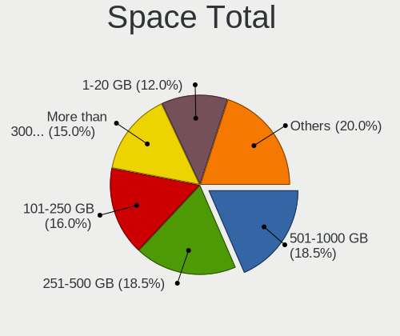
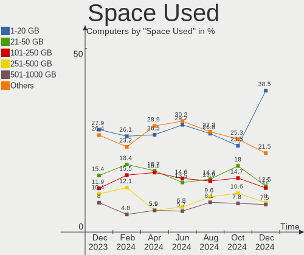
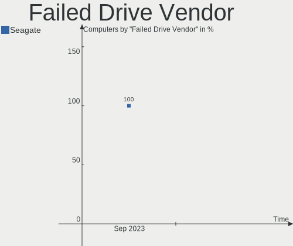
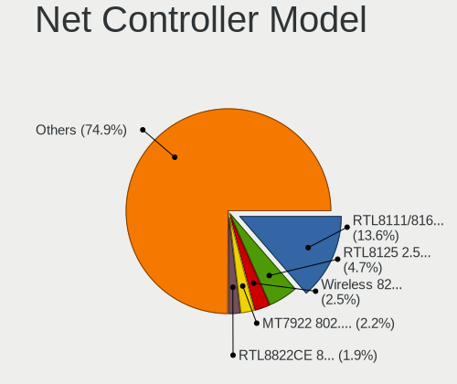
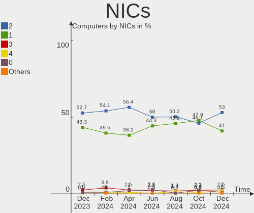
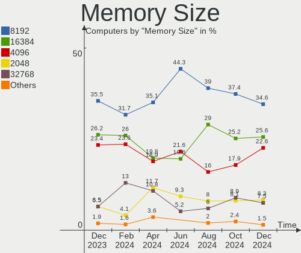
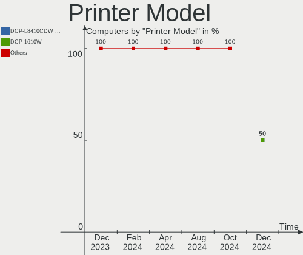
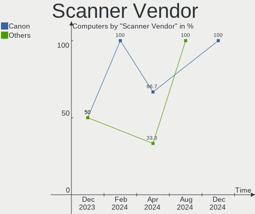

Linux in UK - Hardware Trends
-----------------------------

A project to identify most popular hardware characteristics and track their change
over time based on data collected by Linux users at https://Linux-Hardware.org.

Anyone can contribute to this report by the [hw-probe](https://github.com/linuxhw/hw-probe) tool:

    sudo -E hw-probe -all -upload

This is a report for all computer types. See also reports for [desktops](/Location/UK/Desktop/README.md) and [notebooks](/Location/UK/Notebook/README.md).

Period: Aug, 2023.

Contents
--------

* [ System ](#system)
  - [ OS                       ](#os)
  - [ OS Family                ](#os-family)
  - [ Kernel                   ](#kernel)
  - [ Kernel Family            ](#kernel-family)
  - [ Kernel Major Ver.        ](#kernel-major-ver)
  - [ Arch                     ](#arch)
  - [ DE                       ](#de)
  - [ Display Server           ](#display-server)
  - [ Display Manager          ](#display-manager)
  - [ OS Lang                  ](#os-lang)
  - [ Boot Mode                ](#boot-mode)
  - [ Filesystem               ](#filesystem)
  - [ Part. scheme             ](#part-scheme)
  - [ Dual Boot with Linux/BSD ](#dual-boot-with-linuxbsd)
  - [ Dual Boot (Win)          ](#dual-boot-win)

* [ Board ](#board)
  - [ Vendor                   ](#vendor)
  - [ Model                    ](#model)
  - [ Model Family             ](#model-family)
  - [ MFG Year                 ](#mfg-year)
  - [ Form Factor              ](#form-factor)
  - [ Secure Boot              ](#secure-boot)
  - [ Coreboot                 ](#coreboot)
  - [ RAM Size                 ](#ram-size)
  - [ RAM Used                 ](#ram-used)
  - [ Total Drives             ](#total-drives)
  - [ Has CD-ROM               ](#has-cd-rom)
  - [ Has Ethernet             ](#has-ethernet)
  - [ Has WiFi                 ](#has-wifi)
  - [ Has Bluetooth            ](#has-bluetooth)

* [ Location ](#location)
  - [ Country                  ](#country)
  - [ City                     ](#city)

* [ Drives ](#drives)
  - [ Drive Vendor             ](#drive-vendor)
  - [ Drive Model              ](#drive-model)
  - [ HDD Vendor               ](#hdd-vendor)
  - [ SSD Vendor               ](#ssd-vendor)
  - [ Drive Kind               ](#drive-kind)
  - [ Drive Connector          ](#drive-connector)
  - [ Drive Size               ](#drive-size)
  - [ Space Total              ](#space-total)
  - [ Space Used               ](#space-used)
  - [ Malfunc. Drives          ](#malfunc-drives)
  - [ Malfunc. Drive Vendor    ](#malfunc-drive-vendor)
  - [ Malfunc. HDD Vendor      ](#malfunc-hdd-vendor)
  - [ Malfunc. Drive Kind      ](#malfunc-drive-kind)
  - [ Failed Drives            ](#failed-drives)
  - [ Failed Drive Vendor      ](#failed-drive-vendor)
  - [ Drive Status             ](#drive-status)

* [ Storage controller ](#storage-controller)
  - [ Storage Vendor           ](#storage-vendor)
  - [ Storage Model            ](#storage-model)
  - [ Storage Kind             ](#storage-kind)

* [ Processor ](#processor)
  - [ CPU Vendor               ](#cpu-vendor)
  - [ CPU Model                ](#cpu-model)
  - [ CPU Model Family         ](#cpu-model-family)
  - [ CPU Cores                ](#cpu-cores)
  - [ CPU Sockets              ](#cpu-sockets)
  - [ CPU Threads              ](#cpu-threads)
  - [ CPU Op-Modes             ](#cpu-op-modes)
  - [ CPU Microcode            ](#cpu-microcode)
  - [ CPU Microarch            ](#cpu-microarch)

* [ Graphics ](#graphics)
  - [ GPU Vendor               ](#gpu-vendor)
  - [ GPU Model                ](#gpu-model)
  - [ GPU Combo                ](#gpu-combo)
  - [ GPU Driver               ](#gpu-driver)
  - [ GPU Memory               ](#gpu-memory)

* [ Monitor ](#monitor)
  - [ Monitor Vendor           ](#monitor-vendor)
  - [ Monitor Model            ](#monitor-model)
  - [ Monitor Resolution       ](#monitor-resolution)
  - [ Monitor Diagonal         ](#monitor-diagonal)
  - [ Monitor Width            ](#monitor-width)
  - [ Aspect Ratio             ](#aspect-ratio)
  - [ Monitor Area             ](#monitor-area)
  - [ Pixel Density            ](#pixel-density)
  - [ Multiple Monitors        ](#multiple-monitors)

* [ Network ](#network)
  - [ Net Controller Vendor    ](#net-controller-vendor)
  - [ Net Controller Model     ](#net-controller-model)
  - [ Wireless Vendor          ](#wireless-vendor)
  - [ Wireless Model           ](#wireless-model)
  - [ Ethernet Vendor          ](#ethernet-vendor)
  - [ Ethernet Model           ](#ethernet-model)
  - [ Net Controller Kind      ](#net-controller-kind)
  - [ Used Controller          ](#used-controller)
  - [ NICs                     ](#nics)
  - [ IPv6                     ](#ipv6)

* [ Bluetooth ](#bluetooth)
  - [ Bluetooth Vendor         ](#bluetooth-vendor)
  - [ Bluetooth Model          ](#bluetooth-model)

* [ Sound ](#sound)
  - [ Sound Vendor             ](#sound-vendor)
  - [ Sound Model              ](#sound-model)

* [ Memory ](#memory)
  - [ Memory Vendor            ](#memory-vendor)
  - [ Memory Model             ](#memory-model)
  - [ Memory Kind              ](#memory-kind)
  - [ Memory Form Factor       ](#memory-form-factor)
  - [ Memory Size              ](#memory-size)
  - [ Memory Speed             ](#memory-speed)

* [ Printers & scanners ](#printers--scanners)
  - [ Printer Vendor           ](#printer-vendor)
  - [ Printer Model            ](#printer-model)
  - [ Scanner Vendor           ](#scanner-vendor)
  - [ Scanner Model            ](#scanner-model)

* [ Camera ](#camera)
  - [ Camera Vendor            ](#camera-vendor)
  - [ Camera Model             ](#camera-model)

* [ Security ](#security)
  - [ Fingerprint Vendor       ](#fingerprint-vendor)
  - [ Fingerprint Model        ](#fingerprint-model)
  - [ Chipcard Vendor          ](#chipcard-vendor)
  - [ Chipcard Model           ](#chipcard-model)

* [ Unsupported ](#unsupported)
  - [ Unsupported Devices      ](#unsupported-devices)
  - [ Unsupported Device Types ](#unsupported-device-types)

System
------

OS
--

Installed operating systems

| Name                         | Computers | Percent |
|------------------------------|-----------|---------|
| Ubuntu 22.04                 | 28        | 12.84%  |
| OpenMandriva 23.08           | 25        | 11.47%  |
| Fedora 38                    | 17        | 7.8%    |
| Ubuntu 23.04                 | 15        | 6.88%   |
| Linux Mint 21.2              | 13        | 5.96%   |
| Zorin 16                     | 10        | 4.59%   |
| Debian 12                    | 9         | 4.13%   |
| Pop!_OS 22.04                | 7         | 3.21%   |
| Kubuntu 22.04                | 7         | 3.21%   |
| ArcoLinux Rolling            | 7         | 3.21%   |
| Arch Rolling                 | 5         | 2.29%   |
| Kubuntu 23.04                | 4         | 1.83%   |
| EndeavourOS Rolling          | 4         | 1.83%   |
| Ubuntu 20.04                 | 3         | 1.38%   |
| SteamOS 3.4.8                | 3         | 1.38%   |
| OpenMandriva 23.03           | 3         | 1.38%   |
| Manjaro                      | 3         | 1.38%   |
| KDE neon 22.04               | 3         | 1.38%   |
| Garuda Linux Soaring         | 3         | 1.38%   |
| Xubuntu 23.04                | 2         | 0.92%   |
| Xubuntu 22.04                | 2         | 0.92%   |
| openSUSE Tumbleweed-XXXXXXXX | 2         | 0.92%   |
| openSUSE Leap-15.5           | 2         | 0.92%   |
| OpenMandriva 23.01           | 2         | 0.92%   |
| Lubuntu 22.04                | 2         | 0.92%   |
| Linux Mint 21.1              | 2         | 0.92%   |
| Gentoo 2.14                  | 2         | 0.92%   |
| Elementary 7                 | 2         | 0.92%   |
| Debian 11                    | 2         | 0.92%   |
| BlackPanther 18.1            | 2         | 0.92%   |
| Xero Rolling                 | 1         | 0.46%   |
| Ubuntu Unity 18.04           | 1         | 0.46%   |
| Ubuntu Unity 16.04           | 1         | 0.46%   |
| Ubuntu 22.10                 | 1         | 0.46%   |
| SteamOS 4                    | 1         | 0.46%   |
| RHEL 9                       | 1         | 0.46%   |
| Raspbian 11                  | 1         | 0.46%   |
| Parrot 5.3                   | 1         | 0.46%   |
| openSUSE 42.3                | 1         | 0.46%   |
| OpenMandriva 23.90           | 1         | 0.46%   |

OS Family
---------

OS without a version

| Name         | Computers | Percent |
|--------------|-----------|---------|
| Ubuntu       | 47        | 21.56%  |
| OpenMandriva | 31        | 14.22%  |
| Fedora       | 19        | 8.72%   |
| Linux Mint   | 17        | 7.8%    |
| Debian       | 12        | 5.5%    |
| Kubuntu      | 11        | 5.05%   |
| Zorin        | 10        | 4.59%   |
| Pop!_OS      | 7         | 3.21%   |
| ArcoLinux    | 7         | 3.21%   |
| openSUSE     | 5         | 2.29%   |
| Arch         | 5         | 2.29%   |
| Xubuntu      | 4         | 1.83%   |
| SteamOS      | 4         | 1.83%   |
| Manjaro      | 4         | 1.83%   |
| EndeavourOS  | 4         | 1.83%   |
| Lubuntu      | 3         | 1.38%   |
| KDE neon     | 3         | 1.38%   |
| Gentoo       | 3         | 1.38%   |
| Garuda Linux | 3         | 1.38%   |
| Elementary   | 3         | 1.38%   |
| Ubuntu Unity | 2         | 0.92%   |
| Nobara       | 2         | 0.92%   |
| MX           | 2         | 0.92%   |
| BlackPanther | 2         | 0.92%   |
| Xero         | 1         | 0.46%   |
| RHEL         | 1         | 0.46%   |
| Raspbian     | 1         | 0.46%   |
| Parrot       | 1         | 0.46%   |
| LMDE         | 1         | 0.46%   |
| Kali         | 1         | 0.46%   |
| Endless      | 1         | 0.46%   |
| blendOS      | 1         | 0.46%   |

Kernel
------

Version of the Linux kernel

| Version                  | Computers | Percent |
|--------------------------|-----------|---------|
| 6.2.0-26-generic         | 37        | 16.97%  |
| 6.4.11-desktop-1omv2390  | 20        | 9.17%   |
| 5.15.0-78-generic        | 17        | 7.8%    |
| 5.15.0-79-generic        | 10        | 4.59%   |
| 6.2.0-27-generic         | 9         | 4.13%   |
| 6.4.8-desktop-2omv2390   | 6         | 2.75%   |
| 6.4.7-200.fc38.x86_64    | 5         | 2.29%   |
| 6.4.11-200.fc38.x86_64   | 5         | 2.29%   |
| 6.2.0-31-generic         | 5         | 2.29%   |
| 6.1.0-11-amd64           | 5         | 2.29%   |
| 6.4.6-76060406-generic   | 4         | 1.83%   |
| 6.4.12-arch1-1           | 4         | 1.83%   |
| 6.4.10-arch1-1           | 4         | 1.83%   |
| 5.19.0-50-generic        | 4         | 1.83%   |
| 6.4.10-200.fc38.x86_64   | 3         | 1.38%   |
| 6.2.6-desktop-1omv2390   | 3         | 1.38%   |
| 6.2.6-76060206-generic   | 3         | 1.38%   |
| 6.1.0-10-amd64           | 3         | 1.38%   |
| 5.13.0-valve36-1-neptune | 3         | 1.38%   |
| 6.4.9-arch1-1            | 2         | 0.92%   |
| 6.4.9-1-default          | 2         | 0.92%   |
| 6.4.11-arch2-1           | 2         | 0.92%   |
| 6.4.10-zen2-1-zen        | 2         | 0.92%   |
| 6.2.9-300.fc38.x86_64    | 2         | 0.92%   |
| 6.1.44-1-MANJARO         | 2         | 0.92%   |
| 6.1.1-desktop-1omv2290   | 2         | 0.92%   |
| 5.19.0-46-generic        | 2         | 0.92%   |
| 4.18.16-desktop-1bP      | 2         | 0.92%   |
| 4.15.0-213-generic       | 2         | 0.92%   |
| 6.4.9-zen1-1-zen         | 1         | 0.46%   |
| 6.4.9-gentoo             | 1         | 0.46%   |
| 6.4.9-200.fc38.x86_64    | 1         | 0.46%   |
| 6.4.8-arch1-1            | 1         | 0.46%   |
| 6.4.7-x64v4-xanmod1      | 1         | 0.46%   |
| 6.4.6-arch1-1            | 1         | 0.46%   |
| 6.4.6-1-MANJARO          | 1         | 0.46%   |
| 6.4.3-arch1-2            | 1         | 0.46%   |
| 6.4.2-060402-generic     | 1         | 0.46%   |
| 6.4.12-zen1-1-zen        | 1         | 0.46%   |
| 6.4.12-200.fc38.x86_64   | 1         | 0.46%   |

Kernel Family
-------------

Linux kernel without a distro release

| Version | Computers | Percent |
|---------|-----------|---------|
| 6.2.0   | 54        | 24.77%  |
| 5.15.0  | 33        | 15.14%  |
| 6.4.11  | 28        | 12.84%  |
| 6.1.0   | 10        | 4.59%   |
| 6.4.10  | 9         | 4.13%   |
| 6.4.9   | 7         | 3.21%   |
| 6.4.8   | 7         | 3.21%   |
| 6.4.12  | 7         | 3.21%   |
| 5.19.0  | 7         | 3.21%   |
| 6.4.7   | 6         | 2.75%   |
| 6.4.6   | 6         | 2.75%   |
| 6.2.6   | 6         | 2.75%   |
| 5.13.0  | 3         | 1.38%   |
| 5.10.0  | 3         | 1.38%   |
| 4.15.0  | 3         | 1.38%   |
| 6.4.0   | 2         | 0.92%   |
| 6.2.9   | 2         | 0.92%   |
| 6.1.44  | 2         | 0.92%   |
| 6.1.41  | 2         | 0.92%   |
| 6.1.1   | 2         | 0.92%   |
| 5.14.21 | 2         | 0.92%   |
| 4.18.16 | 2         | 0.92%   |
| 6.4.3   | 1         | 0.46%   |
| 6.4.2   | 1         | 0.46%   |
| 6.3.9   | 1         | 0.46%   |
| 6.3.8   | 1         | 0.46%   |
| 6.3.7   | 1         | 0.46%   |
| 6.3.12  | 1         | 0.46%   |
| 6.3.0   | 1         | 0.46%   |
| 6.1.38  | 1         | 0.46%   |
| 6.1.21  | 1         | 0.46%   |
| 6.0.0   | 1         | 0.46%   |
| 5.3.18  | 1         | 0.46%   |
| 5.19.7  | 1         | 0.46%   |
| 5.17.5  | 1         | 0.46%   |
| 5.14.0  | 1         | 0.46%   |
| 5.11.0  | 1         | 0.46%   |

Kernel Major Ver.
-----------------

Linux kernel major version

| Version | Computers | Percent |
|---------|-----------|---------|
| 6.4     | 74        | 33.94%  |
| 6.2     | 62        | 28.44%  |
| 5.15    | 33        | 15.14%  |
| 6.1     | 18        | 8.26%   |
| 5.19    | 8         | 3.67%   |
| 6.3     | 5         | 2.29%   |
| 5.14    | 3         | 1.38%   |
| 5.13    | 3         | 1.38%   |
| 5.10    | 3         | 1.38%   |
| 4.15    | 3         | 1.38%   |
| 4.18    | 2         | 0.92%   |
| 6.0     | 1         | 0.46%   |
| 5.3     | 1         | 0.46%   |
| 5.17    | 1         | 0.46%   |
| 5.11    | 1         | 0.46%   |

Arch
----

OS architecture (x86_64, i586, etc.)

| Name    | Computers | Percent |
|---------|-----------|---------|
| x86_64  | 214       | 98.17%  |
| i686    | 3         | 1.38%   |
| aarch64 | 1         | 0.46%   |

DE
--

Desktop Environment

| Name       | Computers | Percent |
|------------|-----------|---------|
| GNOME      | 88        | 40.37%  |
| KDE5       | 70        | 32.11%  |
| X-Cinnamon | 15        | 6.88%   |
| XFCE       | 13        | 5.96%   |
| Unknown    | 8         | 3.67%   |
| LXQt       | 5         | 2.29%   |
| MATE       | 4         | 1.83%   |
| Pantheon   | 3         | 1.38%   |
| Hyprland   | 3         | 1.38%   |
| Unity      | 2         | 0.92%   |
| chadwm     | 2         | 0.92%   |
| mwm        | 1         | 0.46%   |
| LXDE       | 1         | 0.46%   |
| KDE        | 1         | 0.46%   |
| Cinnamon   | 1         | 0.46%   |
| Budgie     | 1         | 0.46%   |

Display Server
--------------

X11 or Wayland

| Name    | Computers | Percent |
|---------|-----------|---------|
| X11     | 120       | 55.05%  |
| Wayland | 92        | 42.2%   |
| Tty     | 3         | 1.38%   |
| Unknown | 3         | 1.38%   |

Display Manager
---------------

SDDM, LightDM, etc.

| Name    | Computers | Percent |
|---------|-----------|---------|
| Unknown | 70        | 32.11%  |
| SDDM    | 56        | 25.69%  |
| GDM3    | 44        | 20.18%  |
| LightDM | 29        | 13.3%   |
| GDM     | 19        | 8.72%   |

OS Lang
-------

Language

| Lang    | Computers | Percent |
|---------|-----------|---------|
| en_GB   | 179       | 82.11%  |
| en_US   | 30        | 13.76%  |
| Unknown | 4         | 1.83%   |
| pl_PL   | 2         | 0.92%   |
| en_IN   | 1         | 0.46%   |
| en_IE   | 1         | 0.46%   |
| C       | 1         | 0.46%   |

Boot Mode
---------

EFI or BIOS

| Mode | Computers | Percent |
|------|-----------|---------|
| EFI  | 123       | 56.42%  |
| BIOS | 95        | 43.58%  |

Filesystem
----------

Type of filesystem

| Type    | Computers | Percent |
|---------|-----------|---------|
| Ext4    | 126       | 57.8%   |
| Tmpfs   | 36        | 16.51%  |
| Btrfs   | 35        | 16.06%  |
| Overlay | 16        | 7.34%   |
| Xfs     | 3         | 1.38%   |
| Zfs     | 1         | 0.46%   |
| Ext3    | 1         | 0.46%   |

Part. scheme
------------

Scheme of partitioning

| Type    | Computers | Percent |
|---------|-----------|---------|
| GPT     | 133       | 61.01%  |
| Unknown | 64        | 29.36%  |
| MBR     | 21        | 9.63%   |

Dual Boot with Linux/BSD
------------------------

Hosting more than one Linux/BSD

| Dual boot | Computers | Percent |
|-----------|-----------|---------|
| No        | 180       | 82.57%  |
| Yes       | 38        | 17.43%  |

Dual Boot (Win)
---------------

Hosting Linux and Windows

| Dual boot | Computers | Percent |
|-----------|-----------|---------|
| No        | 177       | 81.19%  |
| Yes       | 41        | 18.81%  |

Board
-----

Vendor
------

Motherboard manufacturer

| Name                                 | Computers | Percent |
|--------------------------------------|-----------|---------|
| Lenovo                               | 36        | 16.51%  |
| Dell                                 | 36        | 16.51%  |
| ASUSTek Computer                     | 27        | 12.39%  |
| Gigabyte Technology                  | 17        | 7.8%    |
| Hewlett-Packard                      | 16        | 7.34%   |
| MSI                                  | 15        | 6.88%   |
| Acer                                 | 12        | 5.5%    |
| Apple                                | 8         | 3.67%   |
| Intel                                | 5         | 2.29%   |
| Toshiba                              | 4         | 1.83%   |
| Valve                                | 3         | 1.38%   |
| Samsung Electronics                  | 3         | 1.38%   |
| ASRock                               | 3         | 1.38%   |
| Unknown                              | 3         | 1.38%   |
| Timi                                 | 2         | 0.92%   |
| Sony                                 | 2         | 0.92%   |
| Packard Bell                         | 2         | 0.92%   |
| HUAWEI                               | 2         | 0.92%   |
| Google                               | 2         | 0.92%   |
| AZW                                  | 2         | 0.92%   |
| ZOOSTORM                             | 1         | 0.46%   |
| Supermicro                           | 1         | 0.46%   |
| Shenzhen Meigao Electronic Equipment | 1         | 0.46%   |
| Raspberry Pi Foundation              | 1         | 0.46%   |
| Pegatron                             | 1         | 0.46%   |
| ONE-NETBOOK                          | 1         | 0.46%   |
| Novatech                             | 1         | 0.46%   |
| Notebook                             | 1         | 0.46%   |
| Mini PC                              | 1         | 0.46%   |
| Linx                                 | 1         | 0.46%   |
| Inventec                             | 1         | 0.46%   |
| HC Technology.                       | 1         | 0.46%   |
| GPD                                  | 1         | 0.46%   |
| GEO                                  | 1         | 0.46%   |
| Framework                            | 1         | 0.46%   |
| Foxconn                              | 1         | 0.46%   |
| Dell EMC                             | 1         | 0.46%   |
| AMI                                  | 1         | 0.46%   |

Model
-----

Motherboard model

| Name                                       | Computers | Percent |
|--------------------------------------------|-----------|---------|
| Valve Jupiter                              | 3         | 1.38%   |
| MSI MS-7693                                | 3         | 1.38%   |
| Unknown                                    | 3         | 1.38%   |
| MSI MS-7D70                                | 2         | 0.92%   |
| Dell XPS 15 9560                           | 2         | 0.92%   |
| ASUS ROG STRIX X670E-F GAMING WIFI         | 2         | 0.92%   |
| ASUS ROG STRIX B550-F GAMING               | 2         | 0.92%   |
| ASUS PRIME B550-PLUS                       | 2         | 0.92%   |
| ASUS PRIME B450-PLUS                       | 2         | 0.92%   |
| ZOOSTORM 7200-9062A                        | 1         | 0.46%   |
| Toshiba Satellite Pro C50-A-1E6            | 1         | 0.46%   |
| Toshiba Satellite C660                     | 1         | 0.46%   |
| Toshiba Satellite C55D-A-14W               | 1         | 0.46%   |
| Toshiba Satellite C50D-A-13G               | 1         | 0.46%   |
| Timi RedmiBook Pro 15S                     | 1         | 0.46%   |
| Timi RedmiBook Pro 14S                     | 1         | 0.46%   |
| Supermicro X9DAi                           | 1         | 0.46%   |
| Sony VPCEH3N6E                             | 1         | 0.46%   |
| Sony SVF15A1M2ES                           | 1         | 0.46%   |
| Shenzhen Meigao Electronic Equipment HX99G | 1         | 0.46%   |
| Samsung P500A2D                            | 1         | 0.46%   |
| Samsung N150P/N210P/N220P                  | 1         | 0.46%   |
| Samsung 755XDA                             | 1         | 0.46%   |
| RPi Raspberry Pi 4 Model B Rev 1.5         | 1         | 0.46%   |
| Pegatron Pro 3010 Microtower PC            | 1         | 0.46%   |
| Packard Bell IMEDIA S3730                  | 1         | 0.46%   |
| Packard Bell EasyNote TJ66                 | 1         | 0.46%   |
| ONE-NETBOOK ONEXPLAYER 2 PRO ARP23P        | 1         | 0.46%   |
| Novatech 15.6 nSpire Laptop                | 1         | 0.46%   |
| Notebook NL5xNU                            | 1         | 0.46%   |
| MSI PPPPP-CCC#MMMMMMMM                     | 1         | 0.46%   |
| MSI MS-7D53                                | 1         | 0.46%   |
| MSI MS-7D25                                | 1         | 0.46%   |
| MSI MS-7C56                                | 1         | 0.46%   |
| MSI MS-7C51                                | 1         | 0.46%   |
| MSI MS-7C02                                | 1         | 0.46%   |
| MSI MS-7B78                                | 1         | 0.46%   |
| MSI MS-7A38                                | 1         | 0.46%   |
| MSI MS-7721                                | 1         | 0.46%   |
| MSI GP62 6QF                               | 1         | 0.46%   |

Model Family
------------

Motherboard model prefix

| Name                                       | Computers | Percent |
|--------------------------------------------|-----------|---------|
| Lenovo ThinkPad                            | 17        | 7.8%    |
| Dell OptiPlex                              | 10        | 4.59%   |
| ASUS PRIME                                 | 10        | 4.59%   |
| Dell Latitude                              | 9         | 4.13%   |
| ASUS ROG                                   | 8         | 3.67%   |
| Acer Aspire                                | 8         | 3.67%   |
| Dell Inspiron                              | 7         | 3.21%   |
| Lenovo IdeaPad                             | 5         | 2.29%   |
| Dell XPS                                   | 5         | 2.29%   |
| Toshiba Satellite                          | 4         | 1.83%   |
| HP Pavilion                                | 4         | 1.83%   |
| Valve Jupiter                              | 3         | 1.38%   |
| MSI MS-7693                                | 3         | 1.38%   |
| Lenovo Legion                              | 3         | 1.38%   |
| HP Laptop                                  | 3         | 1.38%   |
| Unknown                                    | 3         | 1.38%   |
| Timi RedmiBook                             | 2         | 0.92%   |
| MSI MS-7D70                                | 2         | 0.92%   |
| Lenovo Yoga                                | 2         | 0.92%   |
| Lenovo ThinkCentre                         | 2         | 0.92%   |
| HP ENVY                                    | 2         | 0.92%   |
| HP EliteBook                               | 2         | 0.92%   |
| Gigabyte B450                              | 2         | 0.92%   |
| Dell Precision                             | 2         | 0.92%   |
| ASUS VivoBook                              | 2         | 0.92%   |
| Acer Swift                                 | 2         | 0.92%   |
| ZOOSTORM 7200-9062A                        | 1         | 0.46%   |
| Supermicro X9DAi                           | 1         | 0.46%   |
| Sony VPCEH3N6E                             | 1         | 0.46%   |
| Sony SVF15A1M2ES                           | 1         | 0.46%   |
| Shenzhen Meigao Electronic Equipment HX99G | 1         | 0.46%   |
| Samsung P500A2D                            | 1         | 0.46%   |
| Samsung N150P                              | 1         | 0.46%   |
| Samsung 755XDA                             | 1         | 0.46%   |
| RPi Raspberry                              | 1         | 0.46%   |
| Pegatron Pro                               | 1         | 0.46%   |
| Packard Bell IMEDIA                        | 1         | 0.46%   |
| Packard Bell EasyNote                      | 1         | 0.46%   |
| ONE-NETBOOK ONEXPLAYER                     | 1         | 0.46%   |
| Novatech 15.6                              | 1         | 0.46%   |

MFG Year
--------

Motherboard manufacture year

| Year    | Computers | Percent |
|---------|-----------|---------|
| 2021    | 22        | 10.09%  |
| 2022    | 20        | 9.17%   |
| 2018    | 19        | 8.72%   |
| 2017    | 19        | 8.72%   |
| 2020    | 18        | 8.26%   |
| 2019    | 18        | 8.26%   |
| 2012    | 17        | 7.8%    |
| 2023    | 13        | 5.96%   |
| 2014    | 13        | 5.96%   |
| 2013    | 13        | 5.96%   |
| 2015    | 9         | 4.13%   |
| 2011    | 8         | 3.67%   |
| 2016    | 6         | 2.75%   |
| 2010    | 6         | 2.75%   |
| 2009    | 6         | 2.75%   |
| 2008    | 5         | 2.29%   |
| 2007    | 5         | 2.29%   |
| Unknown | 1         | 0.46%   |

Form Factor
-----------

Physical design of the computer

| Name           | Computers | Percent |
|----------------|-----------|---------|
| Notebook       | 105       | 48.17%  |
| Desktop        | 80        | 36.7%   |
| Mini pc        | 11        | 5.05%   |
| Convertible    | 10        | 4.59%   |
| All in one     | 8         | 3.67%   |
| Tablet         | 3         | 1.38%   |
| System on chip | 1         | 0.46%   |

Secure Boot
-----------

Enabled or disabled

| State    | Computers | Percent |
|----------|-----------|---------|
| Disabled | 201       | 92.2%   |
| Enabled  | 17        | 7.8%    |

Coreboot
--------

Have coreboot on board

| Used | Computers | Percent |
|------|-----------|---------|
| No   | 216       | 99.08%  |
| Yes  | 2         | 0.92%   |

RAM Size
--------

Total RAM memory

| Size in GB  | Computers | Percent |
|-------------|-----------|---------|
| 4.01-8.0    | 55        | 25.23%  |
| 16.01-24.0  | 49        | 22.48%  |
| 32.01-64.0  | 31        | 14.22%  |
| 3.01-4.0    | 30        | 13.76%  |
| 8.01-16.0   | 22        | 10.09%  |
| 64.01-256.0 | 13        | 5.96%   |
| 24.01-32.0  | 8         | 3.67%   |
| 1.01-2.0    | 8         | 3.67%   |
| 2.01-3.0    | 2         | 0.92%   |

RAM Used
--------

Used RAM memory

| Used GB    | Computers | Percent |
|------------|-----------|---------|
| 1.01-2.0   | 66        | 30.28%  |
| 2.01-3.0   | 54        | 24.77%  |
| 3.01-4.0   | 36        | 16.51%  |
| 4.01-8.0   | 30        | 13.76%  |
| 8.01-16.0  | 17        | 7.8%    |
| 0.51-1.0   | 10        | 4.59%   |
| 24.01-32.0 | 2         | 0.92%   |
| 0.01-0.5   | 2         | 0.92%   |
| 16.01-24.0 | 1         | 0.46%   |

Total Drives
------------

Number of drives on board

| Drives | Computers | Percent |
|--------|-----------|---------|
| 1      | 130       | 59.63%  |
| 2      | 58        | 26.61%  |
| 3      | 11        | 5.05%   |
| 4      | 10        | 4.59%   |
| 5      | 5         | 2.29%   |
| 7      | 2         | 0.92%   |
| 6      | 2         | 0.92%   |

Has CD-ROM
----------

Has CD-ROM on board

| Presented | Computers | Percent |
|-----------|-----------|---------|
| No        | 154       | 70.64%  |
| Yes       | 64        | 29.36%  |

Has Ethernet
------------

Has Ethernet on board

| Presented | Computers | Percent |
|-----------|-----------|---------|
| Yes       | 166       | 76.15%  |
| No        | 52        | 23.85%  |

Has WiFi
--------

Has WiFi module

| Presented | Computers | Percent |
|-----------|-----------|---------|
| Yes       | 176       | 80.73%  |
| No        | 42        | 19.27%  |

Has Bluetooth
-------------

Has Bluetooth module

| Presented | Computers | Percent |
|-----------|-----------|---------|
| Yes       | 146       | 66.97%  |
| No        | 72        | 33.03%  |

Location
--------

Country
-------

Geographic location (country)

| Country | Computers | Percent |
|---------|-----------|---------|
| UK      | 218       | 100%    |

City
----

Geographic location (city)

| City                | Computers | Percent |
|---------------------|-----------|---------|
| London              | 12        | 5.5%    |
| Southwark           | 5         | 2.29%   |
| Manchester          | 5         | 2.29%   |
| Leeds               | 5         | 2.29%   |
| Lewisham            | 4         | 1.83%   |
| Edinburgh           | 4         | 1.83%   |
| Cambridge           | 4         | 1.83%   |
| Birmingham          | 4         | 1.83%   |
| Wigan               | 3         | 1.38%   |
| Rochdale            | 3         | 1.38%   |
| Lambeth             | 3         | 1.38%   |
| Feltham             | 3         | 1.38%   |
| Cardiff             | 3         | 1.38%   |
| Brighton            | 3         | 1.38%   |
| Ashford             | 3         | 1.38%   |
| Southampton         | 2         | 0.92%   |
| Slough              | 2         | 0.92%   |
| Portsmouth          | 2         | 0.92%   |
| Perth               | 2         | 0.92%   |
| Paisley             | 2         | 0.92%   |
| Nottingham          | 2         | 0.92%   |
| Halifax             | 2         | 0.92%   |
| Glasgow             | 2         | 0.92%   |
| Gerrards Cross      | 2         | 0.92%   |
| Enfield             | 2         | 0.92%   |
| Crewe               | 2         | 0.92%   |
| Colchester          | 2         | 0.92%   |
| City of Westminster | 2         | 0.92%   |
| Canterbury          | 2         | 0.92%   |
| Bristol             | 2         | 0.92%   |
| Bradford            | 2         | 0.92%   |
| Bournemouth         | 2         | 0.92%   |
| Blackpool           | 2         | 0.92%   |
| York                | 1         | 0.46%   |
| Yeovil              | 1         | 0.46%   |
| Wrexham             | 1         | 0.46%   |
| Wouldham            | 1         | 0.46%   |
| Workington          | 1         | 0.46%   |
| Worcester Park      | 1         | 0.46%   |
| Woking              | 1         | 0.46%   |

Drives
------

Drive Vendor
------------

Hard drive vendors

| Vendor                       | Computers | Drives | Percent |
|------------------------------|-----------|--------|---------|
| Samsung Electronics          | 40        | 50     | 12.38%  |
| Seagate                      | 33        | 46     | 10.22%  |
| SanDisk                      | 31        | 39     | 9.6%    |
| WDC                          | 24        | 27     | 7.43%   |
| Crucial                      | 24        | 26     | 7.43%   |
| Toshiba                      | 19        | 20     | 5.88%   |
| Kingston                     | 19        | 20     | 5.88%   |
| Unknown                      | 17        | 18     | 5.26%   |
| SK hynix                     | 11        | 13     | 3.41%   |
| Intel                        | 8         | 9      | 2.48%   |
| Hitachi                      | 8         | 8      | 2.48%   |
| Phison Electronics           | 6         | 7      | 1.86%   |
| China                        | 6         | 6      | 1.86%   |
| Micron Technology            | 5         | 5      | 1.55%   |
| HGST                         | 5         | 5      | 1.55%   |
| Netac                        | 3         | 3      | 0.93%   |
| MAXIO Technology (Hangzhou)  | 3         | 3      | 0.93%   |
| KIOXIA                       | 3         | 3      | 0.93%   |
| Kingston Technology Company  | 3         | 3      | 0.93%   |
| Fanxiang                     | 3         | 3      | 0.93%   |
| Apple                        | 3         | 4      | 0.93%   |
| SPCC                         | 2         | 3      | 0.62%   |
| Silicon Motion               | 2         | 2      | 0.62%   |
| Patriot                      | 2         | 2      | 0.62%   |
| OCZ                          | 2         | 2      | 0.62%   |
| Maxtor                       | 2         | 2      | 0.62%   |
| Integral                     | 2         | 2      | 0.62%   |
| ADATA Technology             | 2         | 4      | 0.62%   |
| XUM                          | 1         | 1      | 0.31%   |
| Union Memory (Shenzhen)      | 1         | 1      | 0.31%   |
| Teclast                      | 1         | 1      | 0.31%   |
| Team                         | 1         | 1      | 0.31%   |
| TCSUNBOW                     | 1         | 1      | 0.31%   |
| SSK                          | 1         | 1      | 0.31%   |
| ShiJi                        | 1         | 1      | 0.31%   |
| Shenzhen Longsys Electronics | 1         | 1      | 0.31%   |
| SABRENT                      | 1         | 1      | 0.31%   |
| Realtek Semiconductor        | 1         | 1      | 0.31%   |
| PNY                          | 1         | 1      | 0.31%   |
| Pioneer                      | 1         | 1      | 0.31%   |

Drive Model
-----------

Hard drive models

| Model                                                | Computers | Percent |
|------------------------------------------------------|-----------|---------|
| Samsung NVMe SSD Controller SM981/PM981/PM983 500GB  | 5         | 1.41%   |
| Kingston SA400S37240G 240GB SSD                      | 5         | 1.41%   |
| Crucial CT1000BX500SSD1 1TB                          | 5         | 1.41%   |
| Unknown MMC Card  64GB                               | 4         | 1.13%   |
| Seagate ST1000DM010-2EP102 1TB                       | 4         | 1.13%   |
| Sandisk WD Black SN850 256GB                         | 4         | 1.13%   |
| Intel SSD 660P Series 512GB                          | 4         | 1.13%   |
| Toshiba XG4 NVMe SSD Controller 256GB                | 3         | 0.85%   |
| Seagate ST4000DM004-2CV104 4TB                       | 3         | 0.85%   |
| Seagate ST2000DM008-2FR102 2TB                       | 3         | 0.85%   |
| Seagate ST2000DM006-2DM164 2TB                       | 3         | 0.85%   |
| Sandisk WD_BLACK SN850X 1000GB                       | 3         | 0.85%   |
| Sandisk WD Blue SN550 NVMe SSD 250GB                 | 3         | 0.85%   |
| Samsung SSD 870 QVO 1TB                              | 3         | 0.85%   |
| Phison E12 NVMe Controller 256GB                     | 3         | 0.85%   |
| Crucial CT480BX500SSD1 480GB                         | 3         | 0.85%   |
| Unknown MMC Card  512GB                              | 2         | 0.56%   |
| Unknown MMC Card  128GB                              | 2         | 0.56%   |
| Unknown DA4064  64GB                                 | 2         | 0.56%   |
| Toshiba MQ01ABF050 500GB                             | 2         | 0.56%   |
| Toshiba HDWD120 2TB                                  | 2         | 0.56%   |
| Silicon Motion SM2262/SM2262EN SSD Controller 1024GB | 2         | 0.56%   |
| Seagate ST1000LM035-1RK172 1TB                       | 2         | 0.56%   |
| Seagate Expansion 2TB                                | 2         | 0.56%   |
| Sandisk WD_BLACK SN770 1TB                           | 2         | 0.56%   |
| Sandisk WDC PC SN530 SDBPMPZ-256G-1101 256GB         | 2         | 0.56%   |
| Sandisk WD Blue SN570 2TB                            | 2         | 0.56%   |
| SanDisk SSD PLUS 480GB                               | 2         | 0.56%   |
| SanDisk SSD PLUS 240GB                               | 2         | 0.56%   |
| SanDisk NVMe SSD Drive 2TB                           | 2         | 0.56%   |
| SanDisk NVMe SSD Drive 1TB                           | 2         | 0.56%   |
| Samsung SSD 980 500GB                                | 2         | 0.56%   |
| Samsung SSD 980 1TB                                  | 2         | 0.56%   |
| Samsung SSD 970 EVO Plus 250GB                       | 2         | 0.56%   |
| Samsung SSD 870 EVO 500GB                            | 2         | 0.56%   |
| Samsung SSD 860 EVO 500GB                            | 2         | 0.56%   |
| Samsung SSD 850 EVO 500GB                            | 2         | 0.56%   |
| Samsung SSD 850 EVO 250GB                            | 2         | 0.56%   |
| Samsung SSD 840 PRO Series 128GB                     | 2         | 0.56%   |
| Samsung MZVLQ1T0HBLB-00BTW 1024GB                    | 2         | 0.56%   |

HDD Vendor
----------

Hard disk drive vendors

| Vendor              | Computers | Drives | Percent |
|---------------------|-----------|--------|---------|
| Seagate             | 30        | 37     | 35.29%  |
| WDC                 | 21        | 23     | 24.71%  |
| Toshiba             | 12        | 13     | 14.12%  |
| Hitachi             | 8         | 8      | 9.41%   |
| HGST                | 5         | 5      | 5.88%   |
| Samsung Electronics | 2         | 2      | 2.35%   |
| Maxtor              | 2         | 2      | 2.35%   |
| Apple               | 2         | 2      | 2.35%   |
| SSK                 | 1         | 1      | 1.18%   |
| SABRENT             | 1         | 1      | 1.18%   |
| Generic-            | 1         | 1      | 1.18%   |

SSD Vendor
----------

Solid state drive vendors

| Vendor              | Computers | Drives | Percent |
|---------------------|-----------|--------|---------|
| Crucial             | 19        | 20     | 16.96%  |
| Samsung Electronics | 18        | 24     | 16.07%  |
| Kingston            | 18        | 19     | 16.07%  |
| SanDisk             | 10        | 11     | 8.93%   |
| China               | 6         | 6      | 5.36%   |
| SK hynix            | 3         | 3      | 2.68%   |
| Netac               | 3         | 3      | 2.68%   |
| WDC                 | 2         | 2      | 1.79%   |
| SPCC                | 2         | 2      | 1.79%   |
| Seagate             | 2         | 5      | 1.79%   |
| Patriot             | 2         | 2      | 1.79%   |
| OCZ                 | 2         | 2      | 1.79%   |
| Micron Technology   | 2         | 2      | 1.79%   |
| Intel               | 2         | 2      | 1.79%   |
| Integral            | 2         | 2      | 1.79%   |
| XUM                 | 1         | 1      | 0.89%   |
| Unknown             | 1         | 1      | 0.89%   |
| Toshiba             | 1         | 1      | 0.89%   |
| Teclast             | 1         | 1      | 0.89%   |
| Team                | 1         | 1      | 0.89%   |
| TCSUNBOW            | 1         | 1      | 0.89%   |
| PNY                 | 1         | 1      | 0.89%   |
| Pioneer             | 1         | 1      | 0.89%   |
| ORTIAL              | 1         | 1      | 0.89%   |
| LITEONIT            | 1         | 1      | 0.89%   |
| KIOXIA-EXCERIA      | 1         | 1      | 0.89%   |
| Intenso             | 1         | 1      | 0.89%   |
| Gigabyte Technology | 1         | 1      | 0.89%   |
| Fanxiang            | 1         | 1      | 0.89%   |
| EDILOCA             | 1         | 1      | 0.89%   |
| CT500MX5            | 1         | 1      | 0.89%   |
| BIWIN               | 1         | 1      | 0.89%   |
| Apacer              | 1         | 1      | 0.89%   |
| 2-Power             | 1         | 1      | 0.89%   |

Drive Kind
----------

HDD or SSD

| Kind    | Computers | Drives | Percent |
|---------|-----------|--------|---------|
| NVMe    | 101       | 128    | 34.83%  |
| SSD     | 91        | 124    | 31.38%  |
| HDD     | 76        | 95     | 26.21%  |
| MMC     | 16        | 18     | 5.52%   |
| Unknown | 6         | 6      | 2.07%   |

Drive Connector
---------------

SATA, SAS, NVMe, etc.

| Type | Computers | Drives | Percent |
|------|-----------|--------|---------|
| SATA | 143       | 213    | 52.77%  |
| NVMe | 101       | 128    | 37.27%  |
| MMC  | 16        | 18     | 5.9%    |
| SAS  | 11        | 12     | 4.06%   |

Drive Size
----------

Size of hard drive

| Size in TB | Computers | Drives | Percent |
|------------|-----------|--------|---------|
| 0.01-0.5   | 99        | 120    | 53.8%   |
| 0.51-1.0   | 51        | 59     | 27.72%  |
| 1.01-2.0   | 18        | 21     | 9.78%   |
| 4.01-10.0  | 7         | 8      | 3.8%    |
| 3.01-4.0   | 6         | 7      | 3.26%   |
| 2.01-3.0   | 3         | 4      | 1.63%   |

Space Total
-----------

Amount of disk space available on the file system

| Size in GB     | Computers | Percent |
|----------------|-----------|---------|
| 101-250        | 58        | 26.61%  |
| 251-500        | 41        | 18.81%  |
| 501-1000       | 32        | 14.68%  |
| More than 3000 | 22        | 10.09%  |
| 1001-2000      | 16        | 7.34%   |
| 1-20           | 15        | 6.88%   |
| 51-100         | 11        | 5.05%   |
| 2001-3000      | 9         | 4.13%   |
| Unknown        | 9         | 4.13%   |
| 21-50          | 5         | 2.29%   |

Space Used
----------

Amount of used disk space

| Used GB        | Computers | Percent |
|----------------|-----------|---------|
| 1-20           | 79        | 36.24%  |
| 21-50          | 37        | 16.97%  |
| 101-250        | 25        | 11.47%  |
| 251-500        | 18        | 8.26%   |
| 51-100         | 18        | 8.26%   |
| 501-1000       | 15        | 6.88%   |
| Unknown        | 9         | 4.13%   |
| 1001-2000      | 8         | 3.67%   |
| More than 3000 | 6         | 2.75%   |
| 2001-3000      | 3         | 1.38%   |

Malfunc. Drives
---------------

Drive models with a malfunction

| Model                                    | Computers | Drives | Percent |
|------------------------------------------|-----------|--------|---------|
| WDC WD60EFRX-68L0BN1 6TB                 | 1         | 1      | 5.88%   |
| WDC WD2500BEVT-80A23T0 250GB             | 1         | 1      | 5.88%   |
| Toshiba THNSNK128GVN8 M.2 2280 128GB SSD | 1         | 1      | 5.88%   |
| Toshiba HDWD120 2TB                      | 1         | 1      | 5.88%   |
| SK hynix HFS128G39TND-N210A 128GB SSD    | 1         | 1      | 5.88%   |
| Seagate ST9320325AS 320GB                | 1         | 1      | 5.88%   |
| Seagate ST500NM0011 500GB                | 1         | 1      | 5.88%   |
| Samsung Electronics HD103UJ 1TB          | 1         | 1      | 5.88%   |
| Netac SSD 240GB                          | 1         | 1      | 5.88%   |
| LITEONIT LCT-128M3S 128GB SSD            | 1         | 1      | 5.88%   |
| Lexar 500GB SSD                          | 1         | 1      | 5.88%   |
| Kingston SV300S37A120G 120GB SSD         | 1         | 1      | 5.88%   |
| Kingston RBU-SNS8350DES3128GP 128GB SSD  | 1         | 1      | 5.88%   |
| Intel SSDSC2BF180A5L 180GB               | 1         | 1      | 5.88%   |
| Hitachi HTS547550A9E384 500GB            | 1         | 1      | 5.88%   |
| Hitachi HTS542516K9SA00 160GB            | 1         | 1      | 5.88%   |
| Apple HDD HTS541010A9E632 1TB            | 1         | 1      | 5.88%   |

Malfunc. Drive Vendor
---------------------

Vendors of faulty drives

| Vendor              | Computers | Drives | Percent |
|---------------------|-----------|--------|---------|
| WDC                 | 2         | 2      | 11.76%  |
| Toshiba             | 2         | 2      | 11.76%  |
| Seagate             | 2         | 2      | 11.76%  |
| Kingston            | 2         | 2      | 11.76%  |
| Hitachi             | 2         | 2      | 11.76%  |
| SK hynix            | 1         | 1      | 5.88%   |
| Samsung Electronics | 1         | 1      | 5.88%   |
| Netac               | 1         | 1      | 5.88%   |
| LITEONIT            | 1         | 1      | 5.88%   |
| Lexar               | 1         | 1      | 5.88%   |
| Intel               | 1         | 1      | 5.88%   |
| Apple               | 1         | 1      | 5.88%   |

Malfunc. HDD Vendor
-------------------

Vendors of faulty HDD drives

| Vendor              | Computers | Drives | Percent |
|---------------------|-----------|--------|---------|
| WDC                 | 2         | 2      | 22.22%  |
| Seagate             | 2         | 2      | 22.22%  |
| Hitachi             | 2         | 2      | 22.22%  |
| Toshiba             | 1         | 1      | 11.11%  |
| Samsung Electronics | 1         | 1      | 11.11%  |
| Apple               | 1         | 1      | 11.11%  |

Malfunc. Drive Kind
-------------------

Kinds of faulty drives

| Kind | Computers | Drives | Percent |
|------|-----------|--------|---------|
| HDD  | 9         | 9      | 52.94%  |
| SSD  | 7         | 7      | 41.18%  |
| NVMe | 1         | 1      | 5.88%   |

Failed Drives
-------------

Failed drive models

| Model                                         | Computers | Drives | Percent |
|-----------------------------------------------|-----------|--------|---------|
| Union Memory (Shenzhen) RPFTJ128PDD2EWX 128GB | 1         | 1      | 100%    |

Failed Drive Vendor
-------------------

Failed drive vendors

| Vendor                  | Computers | Drives | Percent |
|-------------------------|-----------|--------|---------|
| Union Memory (Shenzhen) | 1         | 1      | 100%    |

Drive Status
------------

Number of failed and malfunc. drives

| Status   | Computers | Drives | Percent |
|----------|-----------|--------|---------|
| Detected | 120       | 187    | 50.85%  |
| Works    | 98        | 166    | 41.53%  |
| Malfunc  | 17        | 17     | 7.2%    |
| Failed   | 1         | 1      | 0.42%   |

Storage controller
------------------

Storage Vendor
--------------

Storage controller vendors

| Vendor                       | Computers | Percent |
|------------------------------|-----------|---------|
| Intel                        | 123       | 41.98%  |
| AMD                          | 60        | 20.48%  |
| Samsung Electronics          | 24        | 8.19%   |
| SanDisk                      | 23        | 7.85%   |
| SK hynix                     | 8         | 2.73%   |
| Micron/Crucial Technology    | 7         | 2.39%   |
| Toshiba America Info Systems | 6         | 2.05%   |
| Phison Electronics           | 6         | 2.05%   |
| Nvidia                       | 4         | 1.37%   |
| Kingston Technology Company  | 4         | 1.37%   |
| Silicon Motion               | 3         | 1.02%   |
| Seagate Technology           | 3         | 1.02%   |
| Micron Technology            | 3         | 1.02%   |
| MAXIO Technology (Hangzhou)  | 3         | 1.02%   |
| KIOXIA                       | 3         | 1.02%   |
| Shenzhen Longsys Electronics | 2         | 0.68%   |
| Realtek Semiconductor        | 2         | 0.68%   |
| ADATA Technology             | 2         | 0.68%   |
| Union Memory (Shenzhen)      | 1         | 0.34%   |
| O2 Micro                     | 1         | 0.34%   |
| INNOGRIT                     | 1         | 0.34%   |
| Broadcom / LSI               | 1         | 0.34%   |
| Biwin Storage Technology     | 1         | 0.34%   |
| ASMedia Technology           | 1         | 0.34%   |
| Apple                        | 1         | 0.34%   |

Storage Model
-------------

Storage controller models

| Model                                                                          | Computers | Percent |
|--------------------------------------------------------------------------------|-----------|---------|
| AMD FCH SATA Controller [AHCI mode]                                            | 43        | 12.87%  |
| AMD 400 Series Chipset SATA Controller                                         | 12        | 3.59%   |
| Samsung NVMe SSD Controller SM981/PM981/PM983                                  | 11        | 3.29%   |
| Intel 7 Series Chipset Family 6-port SATA Controller [AHCI mode]               | 11        | 3.29%   |
| Intel 82801 Mobile SATA Controller [RAID mode]                                 | 9         | 2.69%   |
| Samsung NVMe SSD Controller 980                                                | 8         | 2.4%    |
| Intel Volume Management Device NVMe RAID Controller                            | 7         | 2.1%    |
| Intel 8 Series/C220 Series Chipset Family 6-port SATA Controller 1 [AHCI mode] | 7         | 2.1%    |
| Intel Sunrise Point-LP SATA Controller [AHCI mode]                             | 6         | 1.8%    |
| Intel HM170/QM170 Chipset SATA Controller [AHCI Mode]                          | 6         | 1.8%    |
| Intel 82801IBM/IEM (ICH9M/ICH9M-E) 4 port SATA Controller [AHCI mode]          | 6         | 1.8%    |
| Intel 6 Series/C200 Series Chipset Family 6 port Desktop SATA AHCI Controller  | 6         | 1.8%    |
| AMD 500 Series Chipset SATA Controller                                         | 6         | 1.8%    |
| SanDisk WD Blue SN550 NVMe SSD                                                 | 5         | 1.5%    |
| Intel Wildcat Point-LP SATA Controller [AHCI Mode]                             | 5         | 1.5%    |
| Intel SSD 660P Series                                                          | 5         | 1.5%    |
| Intel 6 Series/C200 Series Chipset Family 6 port Mobile SATA AHCI Controller   | 5         | 1.5%    |
| AMD SB7x0/SB8x0/SB9x0 SATA Controller [IDE mode]                               | 5         | 1.5%    |
| AMD SB7x0/SB8x0/SB9x0 IDE Controller                                           | 5         | 1.5%    |
| SanDisk WD PC SN810 / Black SN850 NVMe SSD                                     | 4         | 1.2%    |
| SanDisk WD Black SN770 / PC SN740 256GB / PC SN560 (DRAM-less) NVMe SSD        | 4         | 1.2%    |
| Samsung NVMe SSD Controller PM9A1/PM9A3/980PRO                                 | 4         | 1.2%    |
| Intel Tiger Lake-LP SATA Controller                                            | 4         | 1.2%    |
| Intel Q170/Q150/B150/H170/H110/Z170/CM236 Chipset SATA Controller [AHCI Mode]  | 4         | 1.2%    |
| Toshiba America Info Systems XG4 NVMe SSD Controller                           | 3         | 0.9%    |
| Sandisk Western Digital WD Black SN850X NVMe SSD                               | 3         | 0.9%    |
| SanDisk WD Blue SN570 NVMe SSD 2TB                                             | 3         | 0.9%    |
| Phison E12 NVMe Controller                                                     | 3         | 0.9%    |
| Micron/Crucial P5 Plus NVMe PCIe SSD                                           | 3         | 0.9%    |
| Micron/Crucial P2 [Nick P2] / P3 / P3 Plus NVMe PCIe SSD (DRAM-less)           | 3         | 0.9%    |
| KIOXIA NVMe SSD Controller BG4 (DRAM-less)                                     | 3         | 0.9%    |
| Intel SATA Controller [RAID mode]                                              | 3         | 0.9%    |
| Intel Jasper Lake SATA AHCI Controller                                         | 3         | 0.9%    |
| Intel Celeron/Pentium Silver Processor SATA Controller                         | 3         | 0.9%    |
| Intel Cannon Lake PCH SATA AHCI Controller                                     | 3         | 0.9%    |
| Intel 5 Series/3400 Series Chipset 6 port SATA AHCI Controller                 | 3         | 0.9%    |
| Intel 200 Series PCH SATA controller [AHCI mode]                               | 3         | 0.9%    |
| AMD FCH SATA Controller D                                                      | 3         | 0.9%    |
| Toshiba America Info Systems XG5 NVMe SSD Controller                           | 2         | 0.6%    |
| SK hynix Platinum P41/PC801 NVMe Solid State Drive                             | 2         | 0.6%    |

Storage Kind
------------

Kind of storage controller (IDE, SATA, NVMe, SAS, ...)

| Kind | Computers | Percent |
|------|-----------|---------|
| SATA | 162       | 54.18%  |
| NVMe | 101       | 33.78%  |
| RAID | 21        | 7.02%   |
| IDE  | 14        | 4.68%   |
| SAS  | 1         | 0.33%   |

Processor
---------

CPU Vendor
----------

Processor vendors

| Vendor | Computers | Percent |
|--------|-----------|---------|
| Intel  | 142       | 65.14%  |
| AMD    | 75        | 34.4%   |
| ARM    | 1         | 0.46%   |

CPU Model
---------

Processor models

| Model                                         | Computers | Percent |
|-----------------------------------------------|-----------|---------|
| Intel 11th Gen Core i5-1135G7 @ 2.40GHz       | 4         | 1.83%   |
| AMD Ryzen 5 5600X 6-Core Processor            | 4         | 1.83%   |
| AMD FX-6300 Six-Core Processor                | 4         | 1.83%   |
| Intel Core i7-7700HQ CPU @ 2.80GHz            | 3         | 1.38%   |
| Intel Core i7-6700HQ CPU @ 2.60GHz            | 3         | 1.38%   |
| Intel Core i5-6500T CPU @ 2.50GHz             | 3         | 1.38%   |
| Intel Core 2 Duo CPU P8600 @ 2.40GHz          | 3         | 1.38%   |
| AMD Ryzen 9 5950X 16-Core Processor           | 3         | 1.38%   |
| AMD Ryzen 7 2700X Eight-Core Processor        | 3         | 1.38%   |
| AMD Ryzen 5 5500U with Radeon Graphics        | 3         | 1.38%   |
| AMD Custom APU 0405                           | 3         | 1.38%   |
| Intel Core i7-8550U CPU @ 1.80GHz             | 2         | 0.92%   |
| Intel Core i5-7300U CPU @ 2.60GHz             | 2         | 0.92%   |
| Intel Core i5-6500 CPU @ 3.20GHz              | 2         | 0.92%   |
| Intel Core i5-6300U CPU @ 2.40GHz             | 2         | 0.92%   |
| Intel Core i5-5300U CPU @ 2.30GHz             | 2         | 0.92%   |
| Intel Core i5-3470 CPU @ 3.20GHz              | 2         | 0.92%   |
| Intel Core i5-2400 CPU @ 3.10GHz              | 2         | 0.92%   |
| Intel Celeron N5095 @ 2.00GHz                 | 2         | 0.92%   |
| Intel Celeron N4120 CPU @ 1.10GHz             | 2         | 0.92%   |
| Intel Atom x5-Z8550 CPU @ 1.44GHz             | 2         | 0.92%   |
| Intel Atom CPU N450 @ 1.66GHz                 | 2         | 0.92%   |
| Intel 12th Gen Core i7-1260P                  | 2         | 0.92%   |
| Intel 12th Gen Core i5-12400F                 | 2         | 0.92%   |
| Intel 11th Gen Core i7-11700 @ 2.50GHz        | 2         | 0.92%   |
| AMD Ryzen 9 7950X 16-Core Processor           | 2         | 0.92%   |
| AMD Ryzen 9 7900X 12-Core Processor           | 2         | 0.92%   |
| AMD Ryzen 9 5900X 12-Core Processor           | 2         | 0.92%   |
| AMD Ryzen 7 5800H with Radeon Graphics        | 2         | 0.92%   |
| AMD Ryzen 7 3700X 8-Core Processor            | 2         | 0.92%   |
| AMD Ryzen 5 4500U with Radeon Graphics        | 2         | 0.92%   |
| AMD Ryzen 5 3600 6-Core Processor             | 2         | 0.92%   |
| AMD Ryzen 5 3500X 6-Core Processor            | 2         | 0.92%   |
| AMD Ryzen 5 3500U with Radeon Vega Mobile Gfx | 2         | 0.92%   |
| AMD Ryzen 5 1600 Six-Core Processor           | 2         | 0.92%   |
| AMD A4-5000 APU with Radeon HD Graphics       | 2         | 0.92%   |
| Intel Xeon CPU W3580 @ 3.33GHz                | 1         | 0.46%   |
| Intel Xeon CPU E5-2643 0 @ 3.30GHz            | 1         | 0.46%   |
| Intel Pentium Silver N6000 @ 1.10GHz          | 1         | 0.46%   |
| Intel Pentium Gold 7505 @ 2.00GHz             | 1         | 0.46%   |

CPU Model Family
----------------

Processor model prefix

| Model                   | Computers | Percent |
|-------------------------|-----------|---------|
| Intel Core i5           | 41        | 18.81%  |
| Intel Core i7           | 30        | 13.76%  |
| AMD Ryzen 5             | 27        | 12.39%  |
| Other                   | 23        | 10.55%  |
| AMD Ryzen 7             | 14        | 6.42%   |
| Intel Core i3           | 12        | 5.5%    |
| Intel Celeron           | 12        | 5.5%    |
| AMD Ryzen 9             | 11        | 5.05%   |
| Intel Core 2 Duo        | 8         | 3.67%   |
| Intel Atom              | 7         | 3.21%   |
| AMD FX                  | 5         | 2.29%   |
| AMD A4                  | 4         | 1.83%   |
| Intel Pentium           | 3         | 1.38%   |
| Intel Xeon              | 2         | 0.92%   |
| Intel Pentium Dual-Core | 2         | 0.92%   |
| Intel Pentium Dual      | 2         | 0.92%   |
| AMD Ryzen 3             | 2         | 0.92%   |
| AMD Athlon 64 X2        | 2         | 0.92%   |
| Intel Pentium Silver    | 1         | 0.46%   |
| Intel Pentium Gold      | 1         | 0.46%   |
| Intel Genuine           | 1         | 0.46%   |
| Intel Core i9           | 1         | 0.46%   |
| ARM BCM                 | 1         | 0.46%   |
| AMD Ryzen Threadripper  | 1         | 0.46%   |
| AMD Ryzen 7 PRO         | 1         | 0.46%   |
| AMD Ryzen 5 PRO         | 1         | 0.46%   |
| AMD GX                  | 1         | 0.46%   |
| AMD A8                  | 1         | 0.46%   |
| AMD A6                  | 1         | 0.46%   |

CPU Cores
---------

Number of processor cores

| Number | Computers | Percent |
|--------|-----------|---------|
| 4      | 79        | 36.24%  |
| 2      | 62        | 28.44%  |
| 6      | 29        | 13.3%   |
| 8      | 21        | 9.63%   |
| 12     | 9         | 4.13%   |
| 16     | 6         | 2.75%   |
| 3      | 4         | 1.83%   |
| 14     | 3         | 1.38%   |
| 1      | 3         | 1.38%   |
| 32     | 1         | 0.46%   |
| 10     | 1         | 0.46%   |

CPU Sockets
-----------

Number of sockets

| Number | Computers | Percent |
|--------|-----------|---------|
| 1      | 217       | 99.54%  |
| 2      | 1         | 0.46%   |

CPU Threads
-----------

Threads per core (Hyper-Threading)

| Number | Computers | Percent |
|--------|-----------|---------|
| 2      | 148       | 67.89%  |
| 1      | 70        | 32.11%  |

CPU Op-Modes
------------

CPU Operation Modes (32-bit, 64-bit)

| Op mode        | Computers | Percent |
|----------------|-----------|---------|
| 32-bit, 64-bit | 217       | 99.54%  |
| Unknown        | 1         | 0.46%   |

CPU Microcode
-------------

Microcode number

| Number     | Computers | Percent |
|------------|-----------|---------|
| Unknown    | 131       | 60.09%  |
| 0x0800820d | 8         | 3.67%   |
| 0x806ec    | 3         | 1.38%   |
| 0x806e9    | 3         | 1.38%   |
| 0x206a7    | 3         | 1.38%   |
| 0x0a601203 | 3         | 1.38%   |
| 0x0a20120a | 3         | 1.38%   |
| 0x08701021 | 3         | 1.38%   |
| 0x08600106 | 3         | 1.38%   |
| 0x906e9    | 2         | 0.92%   |
| 0x6fd      | 2         | 0.92%   |
| 0x40651    | 2         | 0.92%   |
| 0x306a9    | 2         | 0.92%   |
| 0x1067a    | 2         | 0.92%   |
| 0x0a50000d | 2         | 0.92%   |
| 0x0a50000c | 2         | 0.92%   |
| 0x0a404102 | 2         | 0.92%   |
| 0x0a201016 | 2         | 0.92%   |
| 0x08701030 | 2         | 0.92%   |
| 0x08608103 | 2         | 0.92%   |
| 0x08108102 | 2         | 0.92%   |
| 0x0700010f | 2         | 0.92%   |
| 0x06000852 | 2         | 0.92%   |
| 0xb06a3    | 1         | 0.46%   |
| 0xb06a2    | 1         | 0.46%   |
| 0xa0671    | 1         | 0.46%   |
| 0x906ed    | 1         | 0.46%   |
| 0x906eb    | 1         | 0.46%   |
| 0x906a3    | 1         | 0.46%   |
| 0x90672    | 1         | 0.46%   |
| 0x90661    | 1         | 0.46%   |
| 0x806ea    | 1         | 0.46%   |
| 0x706e5    | 1         | 0.46%   |
| 0x506e3    | 1         | 0.46%   |
| 0x506c9    | 1         | 0.46%   |
| 0x406e3    | 1         | 0.46%   |
| 0x406c4    | 1         | 0.46%   |
| 0x306d4    | 1         | 0.46%   |
| 0x306c3    | 1         | 0.46%   |
| 0x206d7    | 1         | 0.46%   |

CPU Microarch
-------------

Microarchitecture

| Name             | Computers | Percent |
|------------------|-----------|---------|
| KabyLake         | 26        | 11.93%  |
| Unknown          | 23        | 10.55%  |
| Zen 3            | 17        | 7.8%    |
| Zen 2            | 14        | 6.42%   |
| Skylake          | 14        | 6.42%   |
| SandyBridge      | 14        | 6.42%   |
| Haswell          | 12        | 5.5%    |
| Zen+             | 11        | 5.05%   |
| IvyBridge        | 11        | 5.05%   |
| Penryn           | 9         | 4.13%   |
| Alderlake Hybrid | 8         | 3.67%   |
| TigerLake        | 6         | 2.75%   |
| Silvermont       | 6         | 2.75%   |
| Piledriver       | 6         | 2.75%   |
| Broadwell        | 5         | 2.29%   |
| Zen              | 4         | 1.83%   |
| Jaguar           | 4         | 1.83%   |
| Goldmont plus    | 4         | 1.83%   |
| Core             | 4         | 1.83%   |
| Westmere         | 3         | 1.38%   |
| IceLake          | 3         | 1.38%   |
| Tremont          | 2         | 0.92%   |
| Nehalem          | 2         | 0.92%   |
| K8 Hammer        | 2         | 0.92%   |
| Goldmont         | 2         | 0.92%   |
| CometLake        | 2         | 0.92%   |
| Bonnell          | 2         | 0.92%   |
| Puma             | 1         | 0.46%   |
| Excavator        | 1         | 0.46%   |

Graphics
--------

GPU Vendor
----------

Vendors of graphics cards

| Vendor | Computers | Percent |
|--------|-----------|---------|
| Intel  | 122       | 49.19%  |
| Nvidia | 66        | 26.61%  |
| AMD    | 60        | 24.19%  |

GPU Model
---------

Graphics card models

| Model                                                                                    | Computers | Percent |
|------------------------------------------------------------------------------------------|-----------|---------|
| Intel 2nd Generation Core Processor Family Integrated Graphics Controller                | 12        | 4.67%   |
| Intel 3rd Gen Core processor Graphics Controller                                         | 9         | 3.5%    |
| Intel HD Graphics 530                                                                    | 8         | 3.11%   |
| AMD Ellesmere [Radeon RX 470/480/570/570X/580/580X/590]                                  | 7         | 2.72%   |
| Intel Xeon E3-1200 v3/4th Gen Core Processor Integrated Graphics Controller              | 6         | 2.33%   |
| AMD Renoir                                                                               | 6         | 2.33%   |
| Intel UHD Graphics 620                                                                   | 5         | 1.95%   |
| Intel TigerLake-LP GT2 [Iris Xe Graphics]                                                | 4         | 1.56%   |
| Intel Skylake GT2 [HD Graphics 520]                                                      | 4         | 1.56%   |
| Intel Raptor Lake-P [Iris Xe Graphics]                                                   | 4         | 1.56%   |
| Intel Mobile 4 Series Chipset Integrated Graphics Controller                             | 4         | 1.56%   |
| Intel JasperLake [UHD Graphics]                                                          | 4         | 1.56%   |
| Intel HD Graphics 5500                                                                   | 4         | 1.56%   |
| Intel GeminiLake [UHD Graphics 600]                                                      | 4         | 1.56%   |
| Intel CometLake-U GT2 [UHD Graphics]                                                     | 4         | 1.56%   |
| Intel Atom/Celeron/Pentium Processor x5-E8000/J3xxx/N3xxx Integrated Graphics Controller | 4         | 1.56%   |
| Intel Alder Lake-P Integrated Graphics Controller                                        | 4         | 1.56%   |
| AMD Picasso/Raven 2 [Radeon Vega Series / Radeon Vega Mobile Series]                     | 4         | 1.56%   |
| AMD Lucienne                                                                             | 4         | 1.56%   |
| Nvidia GP107M [GeForce GTX 1050 Mobile]                                                  | 3         | 1.17%   |
| Nvidia GM107M [GeForce GTX 960M]                                                         | 3         | 1.17%   |
| Nvidia GK107 [GeForce GT 640]                                                            | 3         | 1.17%   |
| Intel HD Graphics 630                                                                    | 3         | 1.17%   |
| Intel HD Graphics 620                                                                    | 3         | 1.17%   |
| Intel Haswell-ULT Integrated Graphics Controller                                         | 3         | 1.17%   |
| AMD VanGogh [AMD Custom GPU 0405]                                                        | 3         | 1.17%   |
| AMD Raphael                                                                              | 3         | 1.17%   |
| AMD Navi 31 [Radeon RX 7900 XT/7900 XTX]                                                 | 3         | 1.17%   |
| AMD Navi 22 [Radeon RX 6700/6700 XT/6750 XT / 6800M/6850M XT]                            | 3         | 1.17%   |
| AMD Barcelo                                                                              | 3         | 1.17%   |
| Nvidia GP107 [GeForce GTX 1050 Ti]                                                       | 2         | 0.78%   |
| Nvidia GP104 [GeForce GTX 1070]                                                          | 2         | 0.78%   |
| Nvidia GM206 [GeForce GTX 960]                                                           | 2         | 0.78%   |
| Nvidia GM107 [GeForce GTX 750 Ti]                                                        | 2         | 0.78%   |
| Nvidia GK208B [GeForce GT 710]                                                           | 2         | 0.78%   |
| Nvidia GA106 [Geforce RTX 3050]                                                          | 2         | 0.78%   |
| Nvidia GA104 [GeForce RTX 3060 Ti Lite Hash Rate]                                        | 2         | 0.78%   |
| Intel Tiger Lake-LP GT2 [UHD Graphics G4]                                                | 2         | 0.78%   |
| Intel Mobile GM965/GL960 Integrated Graphics Controller (secondary)                      | 2         | 0.78%   |
| Intel Mobile GM965/GL960 Integrated Graphics Controller (primary)                        | 2         | 0.78%   |

GPU Combo
---------

Combinations of graphics cards

| Name           | Computers | Percent |
|----------------|-----------|---------|
| 1 x Intel      | 89        | 40.83%  |
| 1 x AMD        | 50        | 22.94%  |
| 1 x Nvidia     | 39        | 17.89%  |
| Intel + Nvidia | 24        | 11.01%  |
| Intel + AMD    | 5         | 2.29%   |
| 2 x AMD        | 4         | 1.83%   |
| 2 x Intel      | 3         | 1.38%   |
| 2 x Nvidia     | 2         | 0.92%   |
| Other          | 1         | 0.46%   |
| AMD + Nvidia   | 1         | 0.46%   |

GPU Driver
----------

Free vs proprietary

| Driver      | Computers | Percent |
|-------------|-----------|---------|
| Free        | 176       | 80.73%  |
| Proprietary | 32        | 14.68%  |
| Unknown     | 10        | 4.59%   |

GPU Memory
----------

Total video memory

| Size in GB | Computers | Percent |
|------------|-----------|---------|
| Unknown    | 139       | 63.76%  |
| 0.01-0.5   | 22        | 10.09%  |
| 1.01-2.0   | 21        | 9.63%   |
| 7.01-8.0   | 10        | 4.59%   |
| 3.01-4.0   | 9         | 4.13%   |
| 8.01-16.0  | 9         | 4.13%   |
| 0.51-1.0   | 4         | 1.83%   |
| 5.01-6.0   | 2         | 0.92%   |
| 16.01-24.0 | 2         | 0.92%   |

Monitor
-------

Monitor Vendor
--------------

Monitor vendors

| Vendor                  | Computers | Percent |
|-------------------------|-----------|---------|
| Samsung Electronics     | 21        | 8.82%   |
| LG Display              | 21        | 8.82%   |
| AU Optronics            | 21        | 8.82%   |
| Dell                    | 20        | 8.4%    |
| BOE                     | 19        | 7.98%   |
| Chimei Innolux          | 13        | 5.46%   |
| Lenovo                  | 11        | 4.62%   |
| AOC                     | 10        | 4.2%    |
| Acer                    | 10        | 4.2%    |
| Goldstar                | 9         | 3.78%   |
| Apple                   | 8         | 3.36%   |
| BenQ                    | 7         | 2.94%   |
| Iiyama                  | 6         | 2.52%   |
| Sharp                   | 5         | 2.1%    |
| Ancor Communications    | 5         | 2.1%    |
| Valve                   | 4         | 1.68%   |
| InfoVision              | 4         | 1.68%   |
| Hewlett-Packard         | 4         | 1.68%   |
| ViewSonic               | 3         | 1.26%   |
| Philips                 | 3         | 1.26%   |
| CVT                     | 3         | 1.26%   |
| Chi Mei Optoelectronics | 3         | 1.26%   |
| Vestel Elektronik       | 2         | 0.84%   |
| JDI                     | 2         | 0.84%   |
| Hitachi                 | 2         | 0.84%   |
| ASUSTek Computer        | 2         | 0.84%   |
| Vestel                  | 1         | 0.42%   |
| Unknown                 | 1         | 0.42%   |
| Toshiba                 | 1         | 0.42%   |
| TMX                     | 1         | 0.42%   |
| Sony                    | 1         | 0.42%   |
| Razer                   | 1         | 0.42%   |
| Pixio                   | 1         | 0.42%   |
| PANDA                   | 1         | 0.42%   |
| Panasonic               | 1         | 0.42%   |
| Optoma                  | 1         | 0.42%   |
| OEM                     | 1         | 0.42%   |
| MSI                     | 1         | 0.42%   |
| LG Philips              | 1         | 0.42%   |
| LG Electronics          | 1         | 0.42%   |

Monitor Model
-------------

Monitor models

| Model                                                                 | Computers | Percent |
|-----------------------------------------------------------------------|-----------|---------|
| Valve ANX7530 U VLV3001 800x1280 100x150mm 7.1-inch                   | 3         | 1.23%   |
| LG Display LCD Monitor LGD02DC 1366x768 344x194mm 15.5-inch           | 3         | 1.23%   |
| Vestel Elektronik 40W_LCD_TV VES3700 1920x540                         | 2         | 0.82%   |
| Sharp LCD Monitor SHP1476 3840x2160 346x194mm 15.6-inch               | 2         | 0.82%   |
| Lenovo LCD Monitor LEN4010 1280x800 261x163mm 12.1-inch               | 2         | 0.82%   |
| JDI LCD Monitor JDI422A 3000x2000 293x196mm 13.9-inch                 | 2         | 0.82%   |
| InfoVision LCD Monitor IVO8544 1920x1080 294x165mm 13.3-inch          | 2         | 0.82%   |
| Hitachi HISENSE HEC002F 3840x2160 1872x1053mm 84.6-inch               | 2         | 0.82%   |
| CVT Monitor CVT4668 1440x900 360x290mm 18.2-inch                      | 2         | 0.82%   |
| Chimei Innolux LCD Monitor CMN15F5 1920x1080 344x193mm 15.5-inch      | 2         | 0.82%   |
| Chimei Innolux LCD Monitor CMN15E7 1920x1080 344x193mm 15.5-inch      | 2         | 0.82%   |
| Chimei Innolux LCD Monitor CMN1406 1920x1080 309x173mm 13.9-inch      | 2         | 0.82%   |
| BOE LCD Monitor BOE084E 1920x1080 382x215mm 17.3-inch                 | 2         | 0.82%   |
| BenQ PD3200U BNQ8025 3840x2160 708x399mm 32.0-inch                    | 2         | 0.82%   |
| BenQ GL2450H BNQ78A7 1920x1080 531x298mm 24.0-inch                    | 2         | 0.82%   |
| AU Optronics LCD Monitor AUO45EC 1366x768 344x193mm 15.5-inch         | 2         | 0.82%   |
| AOC U34G2G1 AOC3402 3440x1440 797x334mm 34.0-inch                     | 2         | 0.82%   |
| Ancor Communications ASUS VS229 ACI22C2 1920x1080 477x268mm 21.5-inch | 2         | 0.82%   |
| ViewSonic VX3276-QHD VSCE635 2560x1440 698x393mm 31.5-inch            | 1         | 0.41%   |
| ViewSonic VA2405-FHD VSCA939 1920x1080 527x296mm 23.8-inch            | 1         | 0.41%   |
| ViewSonic VA2265 SERIES VSCB330 1920x1080 476x268mm 21.5-inch         | 1         | 0.41%   |
| Vestel LCD Monitor 50UHD_LCD_TV 3840x2160                             | 1         | 0.41%   |
| Valve Index HMD VLV91A8                                               | 1         | 0.41%   |
| Unknown LCD Monitor FFFF 2288x1287 2550x2550mm 142.0-inch             | 1         | 0.41%   |
| Toshiba TV TSB0108 1360x768 698x393mm 31.5-inch                       | 1         | 0.41%   |
| TMX TL156MDMP01-1 TMX1560 3200x2000 336x210mm 15.6-inch               | 1         | 0.41%   |
| Sony TV SNYA102 1920x1080 708x398mm 32.0-inch                         | 1         | 0.41%   |
| Sharp LCD Monitor SHP1515 1920x1200 336x210mm 15.6-inch               | 1         | 0.41%   |
| Sharp LCD Monitor SHP14D0 3840x2400 336x210mm 15.6-inch               | 1         | 0.41%   |
| Sharp LCD Monitor SHP1453 1920x1080 346x194mm 15.6-inch               | 1         | 0.41%   |
| Samsung Electronics U32J59x SAM0F34 3840x2160 697x392mm 31.5-inch     | 1         | 0.41%   |
| Samsung Electronics U32J59x SAM0F33 3840x2160 697x392mm 31.5-inch     | 1         | 0.41%   |
| Samsung Electronics SyncMaster SAM056E 1920x1200 518x324mm 24.1-inch  | 1         | 0.41%   |
| Samsung Electronics S24E650 SAM0CB8 1920x1080 521x293mm 23.5-inch     | 1         | 0.41%   |
| Samsung Electronics S22F350 SAM0D1A 1920x1080 477x268mm 21.5-inch     | 1         | 0.41%   |
| Samsung Electronics LF24T40 SAM703C 1920x1080 521x293mm 23.5-inch     | 1         | 0.41%   |
| Samsung Electronics LCD Monitor SEC5441 1280x800 331x207mm 15.4-inch  | 1         | 0.41%   |
| Samsung Electronics LCD Monitor SEC3157 1280x800 303x190mm 14.1-inch  | 1         | 0.41%   |
| Samsung Electronics LCD Monitor SEC3052 1024x600 223x125mm 10.1-inch  | 1         | 0.41%   |
| Samsung Electronics LCD Monitor SDC4951 1366x768 344x194mm 15.5-inch  | 1         | 0.41%   |

Monitor Resolution
------------------

Monitor screen resolution

| Resolution         | Computers | Percent |
|--------------------|-----------|---------|
| 1920x1080 (FHD)    | 93        | 40.79%  |
| 1366x768 (WXGA)    | 31        | 13.6%   |
| 3840x2160 (4K)     | 29        | 12.72%  |
| 2560x1440 (QHD)    | 15        | 6.58%   |
| 1920x1200 (WUXGA)  | 7         | 3.07%   |
| 1600x900 (HD+)     | 7         | 3.07%   |
| 3440x1440          | 6         | 2.63%   |
| 1280x800 (WXGA)    | 6         | 2.63%   |
| 2560x1600          | 4         | 1.75%   |
| 800x1280           | 3         | 1.32%   |
| 1440x900 (WXGA+)   | 3         | 1.32%   |
| 3840x2400          | 2         | 0.88%   |
| 3000x2000          | 2         | 0.88%   |
| 2880x1800          | 2         | 0.88%   |
| 2560x1080          | 2         | 0.88%   |
| 1920x540           | 2         | 0.88%   |
| 1360x768           | 2         | 0.88%   |
| 1280x1024 (SXGA)   | 2         | 0.88%   |
| 3840x1080          | 1         | 0.44%   |
| 3200x2000          | 1         | 0.44%   |
| 2288x1287          | 1         | 0.44%   |
| 2256x1504          | 1         | 0.44%   |
| 1920x1280          | 1         | 0.44%   |
| 1680x1050 (WSXGA+) | 1         | 0.44%   |
| 1600x2560          | 1         | 0.44%   |
| 1024x768 (XGA)     | 1         | 0.44%   |
| 1024x600           | 1         | 0.44%   |
| Unknown            | 1         | 0.44%   |

Monitor Diagonal
----------------

Diagonal size in inches

| Inches  | Computers | Percent |
|---------|-----------|---------|
| 15      | 49        | 20.59%  |
| 27      | 21        | 8.82%   |
| 23      | 18        | 7.56%   |
| 21      | 18        | 7.56%   |
| 14      | 18        | 7.56%   |
| 24      | 16        | 6.72%   |
| 13      | 14        | 5.88%   |
| 31      | 10        | 4.2%    |
| 17      | 9         | 3.78%   |
| Unknown | 8         | 3.36%   |
| 84      | 7         | 2.94%   |
| 12      | 7         | 2.94%   |
| 11      | 7         | 2.94%   |
| 34      | 4         | 1.68%   |
| 32      | 4         | 1.68%   |
| 16      | 4         | 1.68%   |
| 20      | 3         | 1.26%   |
| 18      | 3         | 1.26%   |
| 7       | 3         | 1.26%   |
| 54      | 2         | 0.84%   |
| 35      | 2         | 0.84%   |
| 26      | 2         | 0.84%   |
| 10      | 2         | 0.84%   |
| 142     | 1         | 0.42%   |
| 72      | 1         | 0.42%   |
| 48      | 1         | 0.42%   |
| 29      | 1         | 0.42%   |
| 28      | 1         | 0.42%   |
| 19      | 1         | 0.42%   |
| 8       | 1         | 0.42%   |

Monitor Width
-------------

Physical width

| Width in mm    | Computers | Percent |
|----------------|-----------|---------|
| 301-350        | 75        | 32.05%  |
| 501-600        | 49        | 20.94%  |
| 201-300        | 26        | 11.11%  |
| 401-500        | 23        | 9.83%   |
| 601-700        | 15        | 6.41%   |
| 351-400        | 12        | 5.13%   |
| 701-800        | 8         | 3.42%   |
| 1501-2000      | 8         | 3.42%   |
| Unknown        | 8         | 3.42%   |
| 1001-1500      | 3         | 1.28%   |
| 1-100          | 3         | 1.28%   |
| 801-900        | 2         | 0.85%   |
| More than 2000 | 1         | 0.43%   |
| 101-200        | 1         | 0.43%   |

Aspect Ratio
------------

Proportional relationship between the width and the height

| Ratio   | Computers | Percent |
|---------|-----------|---------|
| 16/9    | 166       | 75.8%   |
| 16/10   | 26        | 11.87%  |
| 21/9    | 6         | 2.74%   |
| Unknown | 6         | 2.74%   |
| 3/2     | 5         | 2.28%   |
| 0.67    | 3         | 1.37%   |
| 6/5     | 2         | 0.91%   |
| 5/4     | 2         | 0.91%   |
| 4/3     | 1         | 0.46%   |
| 1.00    | 1         | 0.46%   |
| 0.62    | 1         | 0.46%   |

Monitor Area
------------

Area in inch

| Area in inch | Computers | Percent |
|----------------|-----------|---------|
| 101-110        | 48        | 20.43%  |
| 201-250        | 38        | 16.17%  |
| 81-90          | 27        | 11.49%  |
| 301-350        | 22        | 9.36%   |
| 351-500        | 21        | 8.94%   |
| More than 1000 | 12        | 5.11%   |
| 151-200        | 12        | 5.11%   |
| 121-130        | 8         | 3.4%    |
| Unknown        | 8         | 3.4%    |
| 61-70          | 7         | 2.98%   |
| 51-60          | 7         | 2.98%   |
| 251-300        | 7         | 2.98%   |
| 71-80          | 5         | 2.13%   |
| 111-120        | 5         | 2.13%   |
| 1-40           | 4         | 1.7%    |
| 41-50          | 2         | 0.85%   |
| 141-150        | 1         | 0.43%   |
| 91-100         | 1         | 0.43%   |

Pixel Density
-------------

Pixels per inch

| Density       | Computers | Percent |
|---------------|-----------|---------|
| 51-100        | 62        | 26.72%  |
| 101-120       | 59        | 25.43%  |
| 121-160       | 58        | 25%     |
| 161-240       | 27        | 11.64%  |
| More than 240 | 12        | 5.17%   |
| Unknown       | 8         | 3.45%   |
| 1-50          | 6         | 2.59%   |

Multiple Monitors
-----------------

Total monitors connected

| Total | Computers | Percent |
|-------|-----------|---------|
| 1     | 176       | 80.73%  |
| 2     | 30        | 13.76%  |
| 0     | 8         | 3.67%   |
| 3     | 3         | 1.38%   |
| 4     | 1         | 0.46%   |

Network
-------

Net Controller Vendor
---------------------

Controller vendors

| Vendor                          | Computers | Percent |
|---------------------------------|-----------|---------|
| Intel                           | 106       | 33.97%  |
| Realtek Semiconductor           | 102       | 32.69%  |
| Qualcomm Atheros                | 35        | 11.22%  |
| Broadcom                        | 19        | 6.09%   |
| MediaTek                        | 10        | 3.21%   |
| Ralink Technology               | 5         | 1.6%    |
| Samsung Electronics             | 4         | 1.28%   |
| Nvidia                          | 4         | 1.28%   |
| Broadcom Limited                | 4         | 1.28%   |
| TP-Link                         | 3         | 0.96%   |
| Sierra Wireless                 | 3         | 0.96%   |
| Marvell Technology Group        | 2         | 0.64%   |
| Dell                            | 2         | 0.64%   |
| Aquantia                        | 2         | 0.64%   |
| SEGGER                          | 1         | 0.32%   |
| Ralink                          | 1         | 0.32%   |
| Qualcomm Atheros Communications | 1         | 0.32%   |
| Qualcomm                        | 1         | 0.32%   |
| NetGear                         | 1         | 0.32%   |
| Mellanox Technologies           | 1         | 0.32%   |
| Lenovo                          | 1         | 0.32%   |
| Gemalto M2M                     | 1         | 0.32%   |
| D-Link                          | 1         | 0.32%   |
| Belkin Components               | 1         | 0.32%   |
| ASIX Electronics                | 1         | 0.32%   |

Net Controller Model
--------------------

Controller models

| Model                                                                                         | Computers | Percent |
|-----------------------------------------------------------------------------------------------|-----------|---------|
| Realtek RTL8111/8168/8411 PCI Express Gigabit Ethernet Controller                             | 67        | 18.11%  |
| Realtek RTL8125 2.5GbE Controller                                                             | 9         | 2.43%   |
| Intel Wireless 8265 / 8275                                                                    | 9         | 2.43%   |
| Intel Wi-Fi 6 AX210/AX211/AX411 160MHz                                                        | 9         | 2.43%   |
| Intel Ethernet Controller I225-V                                                              | 9         | 2.43%   |
| Intel Wireless 7265                                                                           | 8         | 2.16%   |
| Intel Wi-Fi 6 AX200                                                                           | 8         | 2.16%   |
| Realtek RTL8822CE 802.11ac PCIe Wireless Network Adapter                                      | 7         | 1.89%   |
| Realtek RTL8821CE 802.11ac PCIe Wireless Network Adapter                                      | 7         | 1.89%   |
| Intel I211 Gigabit Network Connection                                                         | 6         | 1.62%   |
| Realtek RTL8153 Gigabit Ethernet Adapter                                                      | 5         | 1.35%   |
| Realtek RTL810xE PCI Express Fast Ethernet controller                                         | 5         | 1.35%   |
| Qualcomm Atheros QCA9565 / AR9565 Wireless Network Adapter                                    | 5         | 1.35%   |
| Qualcomm Atheros QCA6174 802.11ac Wireless Network Adapter                                    | 5         | 1.35%   |
| Qualcomm Atheros AR9462 Wireless Network Adapter                                              | 5         | 1.35%   |
| Intel Wireless 3165                                                                           | 5         | 1.35%   |
| Intel Ethernet Connection (4) I219-LM                                                         | 5         | 1.35%   |
| Intel 82579LM Gigabit Network Connection (Lewisville)                                         | 5         | 1.35%   |
| Qualcomm Atheros AR93xx Wireless Network Adapter                                              | 4         | 1.08%   |
| MediaTek MT7922 802.11ax PCI Express Wireless Network Adapter                                 | 4         | 1.08%   |
| MediaTek MT7921K (RZ608) Wi-Fi 6E 80MHz                                                       | 4         | 1.08%   |
| Intel Wireless 8260                                                                           | 4         | 1.08%   |
| Intel Alder Lake-P PCH CNVi WiFi                                                              | 4         | 1.08%   |
| Samsung Galaxy series, misc. (tethering mode)                                                 | 3         | 0.81%   |
| Ralink MT7601U Wireless Adapter                                                               | 3         | 0.81%   |
| Qualcomm Atheros AR9485 Wireless Network Adapter                                              | 3         | 0.81%   |
| Qualcomm Atheros AR9285 Wireless Network Adapter (PCI-Express)                                | 3         | 0.81%   |
| Intel Wireless 7260                                                                           | 3         | 0.81%   |
| Intel Wi-Fi 6 AX201                                                                           | 3         | 0.81%   |
| Intel Raptor Lake PCH CNVi WiFi                                                               | 3         | 0.81%   |
| Intel Ethernet Controller I226-V                                                              | 3         | 0.81%   |
| Intel Ethernet Connection I217-LM                                                             | 3         | 0.81%   |
| Intel Comet Lake PCH-LP CNVi WiFi                                                             | 3         | 0.81%   |
| Intel 82577LM Gigabit Network Connection                                                      | 3         | 0.81%   |
| Broadcom NetXtreme BCM57766 Gigabit Ethernet PCIe                                             | 3         | 0.81%   |
| Sierra Wireless EM7455                                                                        | 2         | 0.54%   |
| Realtek RTL8852BE PCIe 802.11ax Wireless Network Controller                                   | 2         | 0.54%   |
| Realtek RTL8822BE 802.11a/b/g/n/ac WiFi adapter                                               | 2         | 0.54%   |
| Realtek Realtek 8812AU/8821AU 802.11ac WLAN Adapter [USB Wireless Dual-Band Adapter 2.4/5Ghz] | 2         | 0.54%   |
| Qualcomm Atheros QCA8172 Fast Ethernet                                                        | 2         | 0.54%   |

Wireless Vendor
---------------

Wireless vendors

| Vendor                          | Computers | Percent |
|---------------------------------|-----------|---------|
| Intel                           | 83        | 45.6%   |
| Realtek Semiconductor           | 28        | 15.38%  |
| Qualcomm Atheros                | 28        | 15.38%  |
| Broadcom                        | 12        | 6.59%   |
| MediaTek                        | 10        | 5.49%   |
| Ralink Technology               | 5         | 2.75%   |
| Sierra Wireless                 | 3         | 1.65%   |
| Broadcom Limited                | 3         | 1.65%   |
| TP-Link                         | 2         | 1.1%    |
| Ralink                          | 1         | 0.55%   |
| Qualcomm Atheros Communications | 1         | 0.55%   |
| Qualcomm                        | 1         | 0.55%   |
| NetGear                         | 1         | 0.55%   |
| Marvell Technology Group        | 1         | 0.55%   |
| Dell                            | 1         | 0.55%   |
| D-Link                          | 1         | 0.55%   |
| Belkin Components               | 1         | 0.55%   |

Wireless Model
--------------

Wireless models

| Model                                                                                         | Computers | Percent |
|-----------------------------------------------------------------------------------------------|-----------|---------|
| Intel Wireless 8265 / 8275                                                                    | 9         | 4.92%   |
| Intel Wi-Fi 6 AX210/AX211/AX411 160MHz                                                        | 9         | 4.92%   |
| Intel Wireless 7265                                                                           | 8         | 4.37%   |
| Intel Wi-Fi 6 AX200                                                                           | 8         | 4.37%   |
| Realtek RTL8822CE 802.11ac PCIe Wireless Network Adapter                                      | 7         | 3.83%   |
| Realtek RTL8821CE 802.11ac PCIe Wireless Network Adapter                                      | 7         | 3.83%   |
| Qualcomm Atheros QCA9565 / AR9565 Wireless Network Adapter                                    | 5         | 2.73%   |
| Qualcomm Atheros QCA6174 802.11ac Wireless Network Adapter                                    | 5         | 2.73%   |
| Qualcomm Atheros AR9462 Wireless Network Adapter                                              | 5         | 2.73%   |
| Intel Wireless 3165                                                                           | 5         | 2.73%   |
| Qualcomm Atheros AR93xx Wireless Network Adapter                                              | 4         | 2.19%   |
| MediaTek MT7922 802.11ax PCI Express Wireless Network Adapter                                 | 4         | 2.19%   |
| MediaTek MT7921K (RZ608) Wi-Fi 6E 80MHz                                                       | 4         | 2.19%   |
| Intel Wireless 8260                                                                           | 4         | 2.19%   |
| Intel Alder Lake-P PCH CNVi WiFi                                                              | 4         | 2.19%   |
| Ralink MT7601U Wireless Adapter                                                               | 3         | 1.64%   |
| Qualcomm Atheros AR9485 Wireless Network Adapter                                              | 3         | 1.64%   |
| Qualcomm Atheros AR9285 Wireless Network Adapter (PCI-Express)                                | 3         | 1.64%   |
| Intel Wireless 7260                                                                           | 3         | 1.64%   |
| Intel Wi-Fi 6 AX201                                                                           | 3         | 1.64%   |
| Intel Raptor Lake PCH CNVi WiFi                                                               | 3         | 1.64%   |
| Intel Comet Lake PCH-LP CNVi WiFi                                                             | 3         | 1.64%   |
| Sierra Wireless EM7455                                                                        | 2         | 1.09%   |
| Realtek RTL8852BE PCIe 802.11ax Wireless Network Controller                                   | 2         | 1.09%   |
| Realtek RTL8822BE 802.11a/b/g/n/ac WiFi adapter                                               | 2         | 1.09%   |
| Realtek Realtek 8812AU/8821AU 802.11ac WLAN Adapter [USB Wireless Dual-Band Adapter 2.4/5Ghz] | 2         | 1.09%   |
| Intel Wireless-AC 9260                                                                        | 2         | 1.09%   |
| Intel PRO/Wireless 5100 AGN [Shiloh] Network Connection                                       | 2         | 1.09%   |
| Intel Centrino Ultimate-N 6300                                                                | 2         | 1.09%   |
| Intel Cannon Point-LP CNVi [Wireless-AC]                                                      | 2         | 1.09%   |
| Intel Alder Lake-S PCH CNVi WiFi                                                              | 2         | 1.09%   |
| Broadcom BCM4331 802.11a/b/g/n                                                                | 2         | 1.09%   |
| Broadcom BCM43142 802.11b/g/n                                                                 | 2         | 1.09%   |
| Broadcom BCM4313 802.11bgn Wireless Network Adapter                                           | 2         | 1.09%   |
| TP-Link TL-WN722N v2/v3 [Realtek RTL8188EUS]                                                  | 1         | 0.55%   |
| TP-Link Archer T4U v2 [Realtek RTL8812AU]                                                     | 1         | 0.55%   |
| Sierra Wireless EM7345 4G LTE                                                                 | 1         | 0.55%   |
| Realtek RTL8852AE 802.11ax PCIe Wireless Network Adapter                                      | 1         | 0.55%   |
| Realtek RTL8821AE 802.11ac PCIe Wireless Network Adapter                                      | 1         | 0.55%   |
| Realtek RTL8813AE 802.11ac PCIe Wireless Network Adapter                                      | 1         | 0.55%   |

Ethernet Vendor
---------------

Ethernet vendors

| Vendor                   | Computers | Percent |
|--------------------------|-----------|---------|
| Realtek Semiconductor    | 87        | 48.33%  |
| Intel                    | 55        | 30.56%  |
| Qualcomm Atheros         | 12        | 6.67%   |
| Broadcom                 | 11        | 6.11%   |
| Samsung Electronics      | 4         | 2.22%   |
| Nvidia                   | 4         | 2.22%   |
| Aquantia                 | 2         | 1.11%   |
| TP-Link                  | 1         | 0.56%   |
| Mellanox Technologies    | 1         | 0.56%   |
| Marvell Technology Group | 1         | 0.56%   |
| Broadcom Limited         | 1         | 0.56%   |
| ASIX Electronics         | 1         | 0.56%   |

Ethernet Model
--------------

Ethernet models

| Model                                                             | Computers | Percent |
|-------------------------------------------------------------------|-----------|---------|
| Realtek RTL8111/8168/8411 PCI Express Gigabit Ethernet Controller | 67        | 36.61%  |
| Realtek RTL8125 2.5GbE Controller                                 | 9         | 4.92%   |
| Intel Ethernet Controller I225-V                                  | 9         | 4.92%   |
| Intel I211 Gigabit Network Connection                             | 6         | 3.28%   |
| Realtek RTL8153 Gigabit Ethernet Adapter                          | 5         | 2.73%   |
| Realtek RTL810xE PCI Express Fast Ethernet controller             | 5         | 2.73%   |
| Intel Ethernet Connection (4) I219-LM                             | 5         | 2.73%   |
| Intel 82579LM Gigabit Network Connection (Lewisville)             | 5         | 2.73%   |
| Samsung Galaxy series, misc. (tethering mode)                     | 3         | 1.64%   |
| Intel Ethernet Controller I226-V                                  | 3         | 1.64%   |
| Intel Ethernet Connection I217-LM                                 | 3         | 1.64%   |
| Intel 82577LM Gigabit Network Connection                          | 3         | 1.64%   |
| Broadcom NetXtreme BCM57766 Gigabit Ethernet PCIe                 | 3         | 1.64%   |
| Qualcomm Atheros QCA8172 Fast Ethernet                            | 2         | 1.09%   |
| Qualcomm Atheros Killer E2400 Gigabit Ethernet Controller         | 2         | 1.09%   |
| Qualcomm Atheros Killer E220x Gigabit Ethernet Controller         | 2         | 1.09%   |
| Nvidia MCP79 Ethernet                                             | 2         | 1.09%   |
| Intel Ethernet Connection I219-LM                                 | 2         | 1.09%   |
| Intel Ethernet Connection (2) I219-LM                             | 2         | 1.09%   |
| Intel 82567LM Gigabit Network Connection                          | 2         | 1.09%   |
| Broadcom NetXtreme BCM57765 Gigabit Ethernet PCIe                 | 2         | 1.09%   |
| Broadcom NetLink BCM5784M Gigabit Ethernet PCIe                   | 2         | 1.09%   |
| TP-Link UE300 10/100/1000 LAN (ethernet mode) [Realtek RTL8153]   | 1         | 0.55%   |
| Samsung GT-I9070 (network tethering, USB debugging enabled)       | 1         | 0.55%   |
| Realtek USB 10/100/1G/2.5G LAN                                    | 1         | 0.55%   |
| Realtek RTL-8110SC/8169SC Gigabit Ethernet                        | 1         | 0.55%   |
| Realtek Killer E2600 Gigabit Ethernet Controller                  | 1         | 0.55%   |
| Qualcomm Atheros QCA8171 Gigabit Ethernet                         | 1         | 0.55%   |
| Qualcomm Atheros AR8162 Fast Ethernet                             | 1         | 0.55%   |
| Qualcomm Atheros AR8161 Gigabit Ethernet                          | 1         | 0.55%   |
| Qualcomm Atheros AR8152 v1.1 Fast Ethernet                        | 1         | 0.55%   |
| Qualcomm Atheros AR8151 v2.0 Gigabit Ethernet                     | 1         | 0.55%   |
| Qualcomm Atheros AR8131 Gigabit Ethernet                          | 1         | 0.55%   |
| Nvidia MCP73 Ethernet                                             | 1         | 0.55%   |
| Nvidia MCP61 Ethernet                                             | 1         | 0.55%   |
| Mellanox MT26448 [ConnectX EN 10GigE, PCIe 2.0 5GT/s]             | 1         | 0.55%   |
| Marvell Group 88E8040 PCI-E Fast Ethernet Controller              | 1         | 0.55%   |
| Intel I350 Gigabit Network Connection                             | 1         | 0.55%   |
| Intel I210 Gigabit Network Connection                             | 1         | 0.55%   |
| Intel Ethernet Controller I225-IT                                 | 1         | 0.55%   |

Net Controller Kind
-------------------

Ethernet, WiFi or modem

| Kind     | Computers | Percent |
|----------|-----------|---------|
| WiFi     | 176       | 50.87%  |
| Ethernet | 166       | 47.98%  |
| Modem    | 4         | 1.16%   |

Used Controller
---------------

Currently used network controller

| Kind     | Computers | Percent |
|----------|-----------|---------|
| WiFi     | 133       | 59.64%  |
| Ethernet | 89        | 39.91%  |
| Modem    | 1         | 0.45%   |

NICs
----

Total network controllers on board

| Total | Computers | Percent |
|-------|-----------|---------|
| 2     | 108       | 49.54%  |
| 1     | 97        | 44.5%   |
| 3     | 8         | 3.67%   |
| 0     | 5         | 2.29%   |

IPv6
----

IPv6 vs IPv4

| Used | Computers | Percent |
|------|-----------|---------|
| No   | 156       | 71.56%  |
| Yes  | 62        | 28.44%  |

Bluetooth
---------

Bluetooth Vendor
----------------

Controller vendors

| Vendor                          | Computers | Percent |
|---------------------------------|-----------|---------|
| Intel                           | 70        | 47.3%   |
| Realtek Semiconductor           | 15        | 10.14%  |
| Qualcomm Atheros Communications | 12        | 8.11%   |
| Cambridge Silicon Radio         | 11        | 7.43%   |
| IMC Networks                    | 7         | 4.73%   |
| MediaTek                        | 6         | 4.05%   |
| Broadcom                        | 6         | 4.05%   |
| Apple                           | 6         | 4.05%   |
| Foxconn / Hon Hai               | 4         | 2.7%    |
| Toshiba                         | 3         | 2.03%   |
| Lite-On Technology              | 3         | 2.03%   |
| TP-Link                         | 1         | 0.68%   |
| Realtek                         | 1         | 0.68%   |
| Opticis                         | 1         | 0.68%   |
| Logitech                        | 1         | 0.68%   |
| Dell                            | 1         | 0.68%   |

Bluetooth Model
---------------

Controller models

| Model                                               | Computers | Percent |
|-----------------------------------------------------|-----------|---------|
| Intel Bluetooth wireless interface                  | 32        | 21.62%  |
| Realtek Bluetooth Radio                             | 11        | 7.43%   |
| Cambridge Silicon Radio Bluetooth Dongle (HCI mode) | 11        | 7.43%   |
| Intel Bluetooth Device                              | 8         | 5.41%   |
| Intel AX201 Bluetooth                               | 8         | 5.41%   |
| Intel AX200 Bluetooth                               | 8         | 5.41%   |
| Intel AX210 Bluetooth                               | 7         | 4.73%   |
| MediaTek Wireless_Device                            | 6         | 4.05%   |
| IMC Networks Bluetooth Radio                        | 5         | 3.38%   |
| Qualcomm Atheros AR3012 Bluetooth 4.0               | 4         | 2.7%    |
| Intel Bluetooth 9460/9560 Jefferson Peak (JfP)      | 4         | 2.7%    |
| Qualcomm Atheros  Bluetooth Device                  | 3         | 2.03%   |
| Qualcomm Atheros QCA61x4 Bluetooth 4.0              | 3         | 2.03%   |
| Apple Bluetooth Host Controller                     | 3         | 2.03%   |
| Toshiba Bluetooth Device                            | 2         | 1.35%   |
| Realtek  Bluetooth 4.2 Adapter                      | 2         | 1.35%   |
| Lite-On Wireless_Device                             | 2         | 1.35%   |
| Intel Wireless-AC 9260 Bluetooth Adapter            | 2         | 1.35%   |
| Foxconn / Hon Hai Wireless_Device                   | 2         | 1.35%   |
| Apple Built-in Bluetooth 2.0+EDR HCI                | 2         | 1.35%   |
| TP-Link UB5A Adapter                                | 1         | 0.68%   |
| Toshiba Atheros AR3012 Bluetooth                    | 1         | 0.68%   |
| Realtek RTL8822BE Bluetooth 4.2 Adapter             | 1         | 0.68%   |
| Realtek RTL8821A Bluetooth                          | 1         | 0.68%   |
| Realtek Bluetooth Radio                             | 1         | 0.68%   |
| Qualcomm Atheros Bluetooth (AR3011)                 | 1         | 0.68%   |
| Qualcomm Atheros AR3011 Bluetooth                   | 1         | 0.68%   |
| Opticis Bluetooth Radio                             | 1         | 0.68%   |
| Logitech BT Mini-Receiver (HCI mode)                | 1         | 0.68%   |
| Lite-On Bluetooth Device                            | 1         | 0.68%   |
| Intel Centrino Bluetooth Wireless Transceiver       | 1         | 0.68%   |
| IMC Networks Wireless_Device                        | 1         | 0.68%   |
| IMC Networks Bluetooth USB Host Controller          | 1         | 0.68%   |
| Foxconn / Hon Hai Bluetooth Device                  | 1         | 0.68%   |
| Foxconn / Hon Hai BCM43142A0                        | 1         | 0.68%   |
| Dell Broadcom BCM20702A0 Bluetooth                  | 1         | 0.68%   |
| Broadcom BCM43142A0 Bluetooth Device                | 1         | 0.68%   |
| Broadcom BCM20702A0 Bluetooth 4.0                   | 1         | 0.68%   |
| Broadcom BCM20702 Bluetooth 4.0 [ThinkPad]          | 1         | 0.68%   |
| Broadcom BCM2070 Bluetooth Device                   | 1         | 0.68%   |

Sound
-----

Sound Vendor
------------

Sound card vendors

| Vendor                                       | Computers | Percent |
|----------------------------------------------|-----------|---------|
| Intel                                        | 134       | 41.74%  |
| AMD                                          | 82        | 25.55%  |
| Nvidia                                       | 48        | 14.95%  |
| C-Media Electronics                          | 6         | 1.87%   |
| Razer USA                                    | 3         | 0.93%   |
| Micro Star International                     | 3         | 0.93%   |
| JMTek                                        | 3         | 0.93%   |
| ASUSTek Computer                             | 3         | 0.93%   |
| XMOS                                         | 2         | 0.62%   |
| Texas Instruments                            | 2         | 0.62%   |
| Realtek Semiconductor                        | 2         | 0.62%   |
| Plantronics                                  | 2         | 0.62%   |
| Logitech                                     | 2         | 0.62%   |
| Focusrite-Novation                           | 2         | 0.62%   |
| DCMT Technology                              | 2         | 0.62%   |
| Creative Technology                          | 2         | 0.62%   |
| BEHRINGER International                      | 2         | 0.62%   |
| AKAI Professional M.I.                       | 2         | 0.62%   |
| Zoran Co. Personal Media Division (Nogatech) | 1         | 0.31%   |
| WinChipHead                                  | 1         | 0.31%   |
| VIA Technologies                             | 1         | 0.31%   |
| Valve Software                               | 1         | 0.31%   |
| TEAC                                         | 1         | 0.31%   |
| Setek Elektronik                             | 1         | 0.31%   |
| Sennheiser Communications                    | 1         | 0.31%   |
| SAVITECH                                     | 1         | 0.31%   |
| Roland                                       | 1         | 0.31%   |
| No brand                                     | 1         | 0.31%   |
| KTMicro                                      | 1         | 0.31%   |
| Jieli Technology                             | 1         | 0.31%   |
| Hewlett-Packard                              | 1         | 0.31%   |
| GN Netcom                                    | 1         | 0.31%   |
| Giga-Byte Technology                         | 1         | 0.31%   |
| Cambridge Silicon Radio                      | 1         | 0.31%   |
| Astro Gaming                                 | 1         | 0.31%   |
| Anlya.cn                                     | 1         | 0.31%   |
| AKG C44-USB Microphone                       | 1         | 0.31%   |

Sound Model
-----------

Sound card models

| Model                                                                      | Computers | Percent |
|----------------------------------------------------------------------------|-----------|---------|
| AMD Family 17h/19h HD Audio Controller                                     | 26        | 6.77%   |
| AMD Starship/Matisse HD Audio Controller                                   | 18        | 4.69%   |
| AMD Renoir Radeon High Definition Audio Controller                         | 16        | 4.17%   |
| Intel Sunrise Point-LP HD Audio                                            | 15        | 3.91%   |
| Intel 7 Series/C216 Chipset Family High Definition Audio Controller        | 12        | 3.13%   |
| Intel 6 Series/C200 Series Chipset Family High Definition Audio Controller | 12        | 3.13%   |
| AMD Family 17h (Models 00h-0fh) HD Audio Controller                        | 10        | 2.6%    |
| Intel 8 Series/C220 Series Chipset High Definition Audio Controller        | 8         | 2.08%   |
| AMD Rembrandt Radeon High Definition Audio Controller                      | 8         | 2.08%   |
| Intel Xeon E3-1200 v3/4th Gen Core Processor HD Audio Controller           | 7         | 1.82%   |
| Intel 100 Series/C230 Series Chipset Family HD Audio Controller            | 7         | 1.82%   |
| AMD Ellesmere HDMI Audio [Radeon RX 470/480 / 570/580/590]                 | 7         | 1.82%   |
| Intel Tiger Lake-LP Smart Sound Technology Audio Controller                | 6         | 1.56%   |
| Intel 82801I (ICH9 Family) HD Audio Controller                             | 6         | 1.56%   |
| AMD SBx00 Azalia (Intel HDA)                                               | 6         | 1.56%   |
| AMD FCH Azalia Controller                                                  | 6         | 1.56%   |
| Nvidia GA106 High Definition Audio Controller                              | 5         | 1.3%    |
| Nvidia GA102 High Definition Audio Controller                              | 5         | 1.3%    |
| Intel Wildcat Point-LP High Definition Audio Controller                    | 5         | 1.3%    |
| Intel Broadwell-U Audio Controller                                         | 5         | 1.3%    |
| AMD Raven/Raven2/Fenghuang HDMI/DP Audio Controller                        | 5         | 1.3%    |
| AMD Navi 21/23 HDMI/DP Audio Controller                                    | 5         | 1.3%    |
| AMD Kabini HDMI/DP Audio                                                   | 5         | 1.3%    |
| Nvidia GP107GL High Definition Audio Controller                            | 4         | 1.04%   |
| Nvidia GK208 HDMI/DP Audio Controller                                      | 4         | 1.04%   |
| Nvidia Audio device                                                        | 4         | 1.04%   |
| Intel Raptor Lake-P/U/H cAVS                                               | 4         | 1.04%   |
| Intel Jasper Lake HD Audio                                                 | 4         | 1.04%   |
| Intel Comet Lake PCH-LP cAVS                                               | 4         | 1.04%   |
| Intel Celeron/Pentium Silver Processor High Definition Audio               | 4         | 1.04%   |
| Intel Cannon Lake PCH cAVS                                                 | 4         | 1.04%   |
| Intel Alder Lake PCH-P High Definition Audio Controller                    | 4         | 1.04%   |
| Intel 5 Series/3400 Series Chipset High Definition Audio                   | 4         | 1.04%   |
| Intel 200 Series PCH HD Audio                                              | 4         | 1.04%   |
| Nvidia GM206 High Definition Audio Controller                              | 3         | 0.78%   |
| Nvidia GK107 HDMI Audio Controller                                         | 3         | 0.78%   |
| Micro Star International USB Audio                                         | 3         | 0.78%   |
| Intel NM10/ICH7 Family High Definition Audio Controller                    | 3         | 0.78%   |
| Intel Haswell-ULT HD Audio Controller                                      | 3         | 0.78%   |
| Intel CM238 HD Audio Controller                                            | 3         | 0.78%   |

Memory
------

Memory Vendor
-------------

Memory module vendors

| Vendor                       | Computers | Percent |
|------------------------------|-----------|---------|
| SK hynix                     | 33        | 22%     |
| Corsair                      | 24        | 16%     |
| Samsung Electronics          | 22        | 14.67%  |
| Micron Technology            | 21        | 14%     |
| Kingston                     | 13        | 8.67%   |
| Crucial                      | 11        | 7.33%   |
| Unknown                      | 4         | 2.67%   |
| Ramaxel Technology           | 3         | 2%      |
| Unknown                      | 3         | 2%      |
| A-DATA Technology            | 2         | 1.33%   |
| Unknown (ABCD)               | 1         | 0.67%   |
| Unknown (0000000080CE)       | 1         | 0.67%   |
| Shenzhen Longsys             | 1         | 0.67%   |
| Patriot Memory (PDP Systems) | 1         | 0.67%   |
| Patriot                      | 1         | 0.67%   |
| Nanya Technology             | 1         | 0.67%   |
| Lexar Co Limited             | 1         | 0.67%   |
| ff                           | 1         | 0.67%   |
| Elpida                       | 1         | 0.67%   |
| ASint Technology             | 1         | 0.67%   |
| A Force                      | 1         | 0.67%   |
| 9801AD80                     | 1         | 0.67%   |
| 86B5040B0000                 | 1         | 0.67%   |
| 4ea5                         | 1         | 0.67%   |

Memory Model
------------

Memory module models

| Model                                                                 | Computers | Percent |
|-----------------------------------------------------------------------|-----------|---------|
| SK hynix RAM HMA81GS6AFR8N-UH 8GB SODIMM DDR4 2667MT/s                | 4         | 2.55%   |
| Unknown                                                               | 3         | 1.91%   |
| SK hynix RAM HMT351U6CFR8C-PB 4GB DIMM DDR3 1800MT/s                  | 2         | 1.27%   |
| Samsung RAM M471A1G44AB0-CWE 8GB Row Of Chips DDR4 3200MT/s           | 2         | 1.27%   |
| Corsair RAM CMK16GX4M2D3600C18 8GB DIMM DDR4 3600MT/s                 | 2         | 1.27%   |
| Unknown RAM Module 8GB DIMM DDR4 2400MT/s                             | 1         | 0.64%   |
| Unknown RAM Module 8GB DIMM DDR3 1333MT/s                             | 1         | 0.64%   |
| Unknown RAM Module 4GB SODIMM DDR2 667MT/s                            | 1         | 0.64%   |
| Unknown RAM Module 2GB DIMM 800MT/s                                   | 1         | 0.64%   |
| Unknown (ABCD) RAM 123456789012345678 4GB SODIMM LPDDR4 2400MT/s      | 1         | 0.64%   |
| Unknown (0000000080CE) RAM K4U6E3S4AA-MGCR 4GB SODIMM LPDDR4 4266MT/s | 1         | 0.64%   |
| SK hynix RAM Module 8GB DIMM DDR4 2666MT/s                            | 1         | 0.64%   |
| SK hynix RAM Module 4GB SODIMM DDR3 1600MT/s                          | 1         | 0.64%   |
| SK hynix RAM Module 4GB DIMM DDR4 2133MT/s                            | 1         | 0.64%   |
| SK hynix RAM HYMP125U64CP8-S6 2GB DIMM DDR2 49926MT/s                 | 1         | 0.64%   |
| SK hynix RAM HMT451S6MFR8C-PB 4GB SODIMM DDR3 1600MT/s                | 1         | 0.64%   |
| SK hynix RAM HMT451S6BFR8C-PB 4GB SODIMM DDR3 1600MT/s                | 1         | 0.64%   |
| SK hynix RAM HMT451S6BFR8A-PB 4GB SODIMM DDR3 1600MT/s                | 1         | 0.64%   |
| SK hynix RAM HMT41GS6BFR8A-PB 8192MB SODIMM DDR3 1600MT/s             | 1         | 0.64%   |
| SK hynix RAM HMT41GS6AFR8A-PB 8GB SODIMM DDR3 1600MT/s                | 1         | 0.64%   |
| SK hynix RAM HMT351S6EFR8A-PB 4096MB SODIMM DDR3 1600MT/s             | 1         | 0.64%   |
| SK hynix RAM HMT325S6CFR8C-H9 2GB SODIMM DDR3 1333MT/s                | 1         | 0.64%   |
| SK hynix RAM HMT125S6BFR8C-H9 2GB SODIMM DDR3 1333MT/s                | 1         | 0.64%   |
| SK hynix RAM HMCG78MEBSA095N 16GB SODIMM DDR5 4800MT/s                | 1         | 0.64%   |
| SK hynix RAM HMAA51S6AMR6N-UH 8GB SODIMM DDR4 2400MT/s                | 1         | 0.64%   |
| SK hynix RAM HMAA51S6AMR6N-UH 8GB Row Of Chips DDR4 2400MT/s          | 1         | 0.64%   |
| SK hynix RAM HMAA4GS6AJR8N-XN 32GB SODIMM DDR4 3200MT/s               | 1         | 0.64%   |
| SK hynix RAM HMA851S6JJR6N-VK 4GB SODIMM DDR4 2667MT/s                | 1         | 0.64%   |
| SK hynix RAM HMA851S6DJR6N-XN 4GB SODIMM DDR4 3200MT/s                | 1         | 0.64%   |
| SK hynix RAM HMA851S6CJR6N-VK 4GB SODIMM DDR4 2667MT/s                | 1         | 0.64%   |
| SK hynix RAM HMA82GS6DJR8N-VK 16GB SODIMM DDR4 2667MT/s               | 1         | 0.64%   |
| SK hynix RAM HMA82GR7DJR8N-XN 16GB DIMM DDR4 3200MT/s                 | 1         | 0.64%   |
| SK hynix RAM HMA81GS6DJR8N-XN 8GB SODIMM DDR4 3200MT/s                | 1         | 0.64%   |
| SK hynix RAM HMA41GS6AFR8N-TF 8GB SODIMM DDR4 2667MT/s                | 1         | 0.64%   |
| SK hynix RAM H9HCNNNCPMMLXR-NEE 8GB SODIMM LPDDR4 4266MT/s            | 1         | 0.64%   |
| SK hynix RAM H9HCNNNCPMMLXR-NEE 2GB Row Of Chips LPDDR4 4267MT/s      | 1         | 0.64%   |
| SK hynix RAM H9CCNNNCLGALAR-NVD 8GB Row Of Chips LPDDR3 2133MT/s      | 1         | 0.64%   |
| SK hynix RAM H5AN8G6NDJR-XNC 4GB Row Of Chips DDR4 3200MT/s           | 1         | 0.64%   |
| SK hynix RAM 0000000000-00000 4GB SODIMM DDR4 2400MT/s                | 1         | 0.64%   |
| Shenzhen Longsys RAM FD4AS3200CQGZZ 16GB SODIMM DDR4 3200MT/s         | 1         | 0.64%   |

Memory Kind
-----------

Memory module kinds

| Kind    | Computers | Percent |
|---------|-----------|---------|
| DDR4    | 66        | 51.16%  |
| DDR3    | 36        | 27.91%  |
| DDR5    | 9         | 6.98%   |
| LPDDR4  | 8         | 6.2%    |
| LPDDR3  | 4         | 3.1%    |
| DDR2    | 4         | 3.1%    |
| LPDDR5  | 1         | 0.78%   |
| Unknown | 1         | 0.78%   |

Memory Form Factor
------------------

Physical design of the memory module

| Name         | Computers | Percent |
|--------------|-----------|---------|
| SODIMM       | 73        | 56.59%  |
| DIMM         | 42        | 32.56%  |
| Row Of Chips | 13        | 10.08%  |
| Unknown      | 1         | 0.78%   |

Memory Size
-----------

Memory module size

| Size  | Computers | Percent |
|-------|-----------|---------|
| 8192  | 58        | 41.73%  |
| 4096  | 36        | 25.9%   |
| 16384 | 23        | 16.55%  |
| 2048  | 12        | 8.63%   |
| 32768 | 7         | 5.04%   |
| 1024  | 3         | 2.16%   |

Memory Speed
------------

Memory module speed

| Speed | Computers | Percent |
|-------|-----------|---------|
| 3200  | 26        | 18.31%  |
| 1600  | 22        | 15.49%  |
| 2667  | 14        | 9.86%   |
| 2400  | 12        | 8.45%   |
| 2133  | 10        | 7.04%   |
| 4800  | 7         | 4.93%   |
| 1333  | 7         | 4.93%   |
| 1867  | 4         | 2.82%   |
| 667   | 4         | 2.82%   |
| 3600  | 3         | 2.11%   |
| 3400  | 3         | 2.11%   |
| 2800  | 3         | 2.11%   |
| 1334  | 3         | 2.11%   |
| 4267  | 2         | 1.41%   |
| 4266  | 2         | 1.41%   |
| 3733  | 2         | 1.41%   |
| 3666  | 2         | 1.41%   |
| 2666  | 2         | 1.41%   |
| 1800  | 2         | 1.41%   |
| 1067  | 2         | 1.41%   |
| 800   | 2         | 1.41%   |
| 49926 | 1         | 0.7%    |
| 6400  | 1         | 0.7%    |
| 6000  | 1         | 0.7%    |
| 5808  | 1         | 0.7%    |
| 3800  | 1         | 0.7%    |
| 3000  | 1         | 0.7%    |
| 2747  | 1         | 0.7%    |
| 1866  | 1         | 0.7%    |

Printers & scanners
-------------------

Printer Vendor
--------------

Printer device vendors

| Vendor             | Computers | Percent |
|--------------------|-----------|---------|
| Hewlett-Packard    | 1         | 33.33%  |
| Canon              | 1         | 33.33%  |
| Brother Industries | 1         | 33.33%  |

Printer Model
-------------

Printer device models

| Model                     | Computers | Percent |
|---------------------------|-----------|---------|
| HP DeskJet 2700 series    | 1         | 33.33%  |
| Canon PIXMA MG3600 Series | 1         | 33.33%  |
| Brother HL-3150CDW series | 1         | 33.33%  |

Scanner Vendor
--------------

Scanner device vendors

| Vendor | Computers | Percent |
|--------|-----------|---------|
| Canon  | 1         | 100%    |

Scanner Model
-------------

Scanner device models

| Model                              | Computers | Percent |
|------------------------------------|-----------|---------|
| Canon CanoScan N670U/N676U/LiDE 20 | 1         | 100%    |

Camera
------

Camera Vendor
-------------

Camera device vendors

| Vendor                                 | Computers | Percent |
|----------------------------------------|-----------|---------|
| Chicony Electronics                    | 28        | 21.71%  |
| Microdia                               | 11        | 8.53%   |
| Logitech                               | 11        | 8.53%   |
| IMC Networks                           | 10        | 7.75%   |
| Sunplus Innovation Technology          | 8         | 6.2%    |
| Realtek Semiconductor                  | 7         | 5.43%   |
| Cheng Uei Precision Industry (Foxlink) | 5         | 3.88%   |
| Apple                                  | 5         | 3.88%   |
| Lite-On Technology                     | 4         | 3.1%    |
| Lenovo                                 | 4         | 3.1%    |
| Bison Electronics                      | 4         | 3.1%    |
| Quanta                                 | 3         | 2.33%   |
| ARC International                      | 3         | 2.33%   |
| Acer                                   | 3         | 2.33%   |
| Z-Star Microelectronics                | 2         | 1.55%   |
| Syntek                                 | 2         | 1.55%   |
| Sonix Technology                       | 2         | 1.55%   |
| Razer USA                              | 2         | 1.55%   |
| Microsoft                              | 2         | 1.55%   |
| WCM_USB                                | 1         | 0.78%   |
| Valve Software                         | 1         | 0.78%   |
| Trust                                  | 1         | 0.78%   |
| Suyin                                  | 1         | 0.78%   |
| SunplusIT                              | 1         | 0.78%   |
| Sunplus Technology                     | 1         | 0.78%   |
| Silicon Motion                         | 1         | 0.78%   |
| Luxvisions Innotech Limited            | 1         | 0.78%   |
| Hewlett-Packard                        | 1         | 0.78%   |
| GEMBIRD                                | 1         | 0.78%   |
| ALi                                    | 1         | 0.78%   |
| Alcor Micro                            | 1         | 0.78%   |
| Unknown                                | 1         | 0.78%   |

Camera Model
------------

Camera device models

| Model                                            | Computers | Percent |
|--------------------------------------------------|-----------|---------|
| Chicony Integrated Camera                        | 5         | 3.88%   |
| Sunplus Integrated_Webcam_HD                     | 4         | 3.1%    |
| Logitech HD Pro Webcam C920                      | 4         | 3.1%    |
| Logitech C922 Pro Stream Webcam                  | 4         | 3.1%    |
| IMC Networks Integrated Camera                   | 4         | 3.1%    |
| Chicony HP TrueVision HD Camera                  | 4         | 3.1%    |
| Microdia Integrated_Webcam_HD                    | 3         | 2.33%   |
| IMC Networks USB2.0 HD UVC WebCam                | 3         | 2.33%   |
| Chicony HD WebCam                                | 3         | 2.33%   |
| Chicony EasyCamera                               | 3         | 2.33%   |
| ARC International Camera                         | 3         | 2.33%   |
| Apple FaceTime HD Camera (Built-in)              | 3         | 2.33%   |
| Sunplus XiaoMi USB 2.0 Webcam                    | 2         | 1.55%   |
| Sonix USB2.0 FHD UVC WebCam                      | 2         | 1.55%   |
| Realtek Integrated Webcam_HD                     | 2         | 1.55%   |
| Lite-On TOSHIBA Web Camera - HD                  | 2         | 1.55%   |
| Lenovo Integrated Webcam [R5U877]                | 2         | 1.55%   |
| Lenovo Integrated Webcam                         | 2         | 1.55%   |
| IMC Networks USB2.0 UVC HD Webcam                | 2         | 1.55%   |
| Chicony HD User Facing                           | 2         | 1.55%   |
| Cheng Uei Precision Industry (Foxlink) HD Camera | 2         | 1.55%   |
| Z-Star Webcam                                    | 1         | 0.78%   |
| Z-Star Lenovo USB2.0 UVC Camera                  | 1         | 0.78%   |
| WCM_USB WEB CAM                                  | 1         | 0.78%   |
| Valve Software 3D Camera                         | 1         | 0.78%   |
| Trust Full HD Webcam                             | 1         | 0.78%   |
| Syntek Lenovo EasyCamera                         | 1         | 0.78%   |
| Syntek Integrated Camera                         | 1         | 0.78%   |
| Suyin HD WebCam                                  | 1         | 0.78%   |
| SunplusIT 720p HD Camera                         | 1         | 0.78%   |
| Sunplus 1.3M WebCam                              | 1         | 0.78%   |
| Sunplus HD WebCam                                | 1         | 0.78%   |
| Sunplus HD 720P webcam                           | 1         | 0.78%   |
| Silicon Motion WebCam SC-10IRQ12340N             | 1         | 0.78%   |
| Realtek USB Camera                               | 1         | 0.78%   |
| Realtek MTD Camera                               | 1         | 0.78%   |
| Realtek Lenovo EasyCamera                        | 1         | 0.78%   |
| Realtek Integrated_Webcam_HD                     | 1         | 0.78%   |
| Realtek Integrated Webcam HD                     | 1         | 0.78%   |
| Razer USA Razer Kiyo Pro                         | 1         | 0.78%   |

Security
--------

Fingerprint Vendor
------------------

Fingerprint sensor vendors

| Vendor                     | Computers | Percent |
|----------------------------|-----------|---------|
| Validity Sensors           | 7         | 36.84%  |
| Synaptics                  | 5         | 26.32%  |
| LighTuning Technology      | 2         | 10.53%  |
| AuthenTec                  | 2         | 10.53%  |
| Upek                       | 1         | 5.26%   |
| Shenzhen Goodix Technology | 1         | 5.26%   |
| Elan Microelectronics      | 1         | 5.26%   |

Fingerprint Model
-----------------

Fingerprint sensor models

| Model                                                     | Computers | Percent |
|-----------------------------------------------------------|-----------|---------|
| Validity Sensors VFS7552 Touch Fingerprint Sensor         | 2         | 10.53%  |
| Validity Sensors Synaptics WBDI                           | 2         | 10.53%  |
| AuthenTec AES2810                                         | 2         | 10.53%  |
| Validity Sensors VFS7500 Touch Fingerprint Sensor         | 1         | 5.26%   |
| Validity Sensors VFS451 Fingerprint Reader                | 1         | 5.26%   |
| Validity Sensors VFS 5011 fingerprint sensor              | 1         | 5.26%   |
| Upek Biometric Touchchip/Touchstrip Fingerprint Sensor    | 1         | 5.26%   |
| Synaptics WBDI                                            | 1         | 5.26%   |
| Synaptics UWP WBDI Device                                 | 1         | 5.26%   |
| Synaptics UWP WBDI                                        | 1         | 5.26%   |
| Synaptics  FS7604 Touch Fingerprint Sensor with PurePrint | 1         | 5.26%   |
| Synaptics Prometheus MIS Touch Fingerprint Reader         | 1         | 5.26%   |
| Shenzhen Goodix FingerPrint                               | 1         | 5.26%   |
| LighTuning Fingerprint Sensor                             | 1         | 5.26%   |
| LighTuning EgisTec Touch Fingerprint Sensor               | 1         | 5.26%   |
| Elan ELAN:Fingerprint                                     | 1         | 5.26%   |

Chipcard Vendor
---------------

Chipcard module vendors

| Vendor      | Computers | Percent |
|-------------|-----------|---------|
| Broadcom    | 7         | 58.33%  |
| Alcor Micro | 2         | 16.67%  |
| Upek        | 1         | 8.33%   |
| O2 Micro    | 1         | 8.33%   |
| Cherry      | 1         | 8.33%   |

Chipcard Model
--------------

Chipcard module models

| Model                                                                        | Computers | Percent |
|------------------------------------------------------------------------------|-----------|---------|
| Broadcom BCM5880 Secure Applications Processor                               | 2         | 16.67%  |
| Broadcom 5880                                                                | 2         | 16.67%  |
| Broadcom 58200                                                               | 2         | 16.67%  |
| Alcor Micro AU9540 Smartcard Reader                                          | 2         | 16.67%  |
| Upek TouchChip Fingerprint Coprocessor (WBF advanced mode)                   | 1         | 8.33%   |
| O2 Micro OZ776 CCID Smartcard Reader                                         | 1         | 8.33%   |
| Cherry SmartCard Reader Keyboard KC 1000 SC                                  | 1         | 8.33%   |
| Broadcom BCM5880 Secure Applications Processor with fingerprint swipe sensor | 1         | 8.33%   |

Unsupported
-----------

Unsupported Devices
-------------------

Total unsupported devices on board

| Total | Computers | Percent |
|-------|-----------|---------|
| 0     | 157       | 72.02%  |
| 1     | 44        | 20.18%  |
| 2     | 13        | 5.96%   |
| 3     | 4         | 1.83%   |

Unsupported Device Types
------------------------

Types of unsupported devices

| Type                     | Computers | Percent |
|--------------------------|-----------|---------|
| Graphics card            | 23        | 28.75%  |
| Fingerprint reader       | 18        | 22.5%   |
| Chipcard                 | 11        | 13.75%  |
| Net/wireless             | 9         | 11.25%  |
| Multimedia controller    | 8         | 10%     |
| Sound                    | 3         | 3.75%   |
| Communication controller | 2         | 2.5%    |
| Card reader              | 2         | 2.5%    |
| Unassigned class         | 1         | 1.25%   |
| Storage                  | 1         | 1.25%   |
| Network                  | 1         | 1.25%   |
| Bluetooth                | 1         | 1.25%   |

