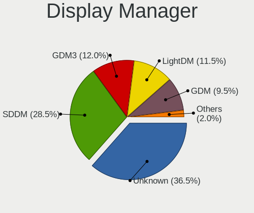
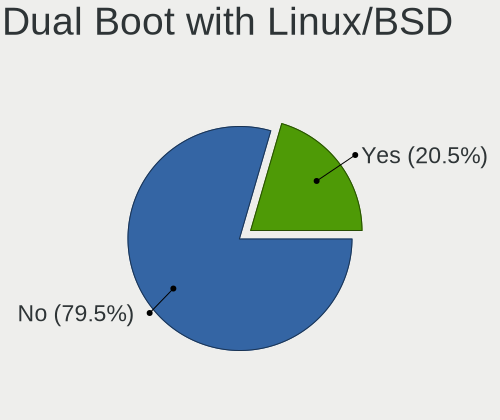
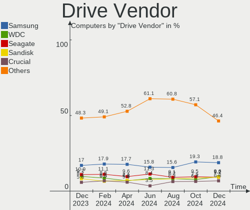
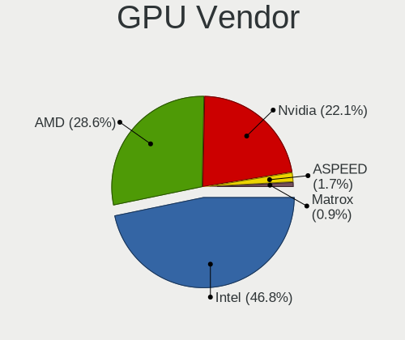
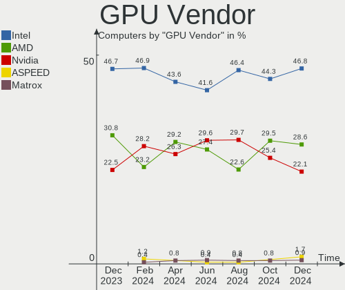
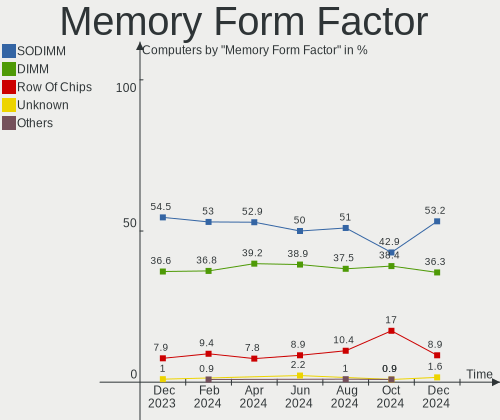
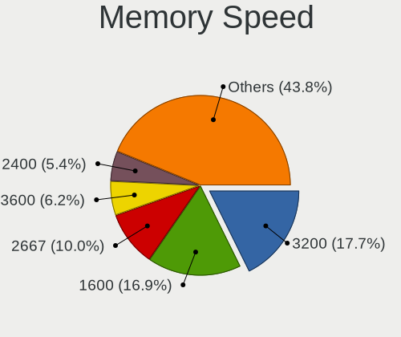
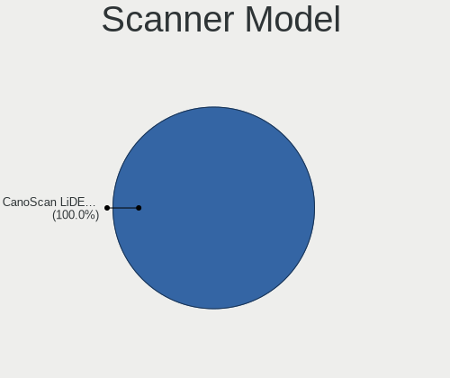
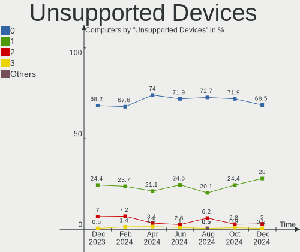

Linux in UK - Hardware Trends
-----------------------------

A project to identify most popular hardware characteristics and track their change
over time based on data collected by Linux users at https://Linux-Hardware.org.

Anyone can contribute to this report by the [hw-probe](https://github.com/linuxhw/hw-probe) tool:

    sudo -E hw-probe -all -upload

This is a report for all computer types. See also reports for [desktops](/Location/UK/Desktop/README.md) and [notebooks](/Location/UK/Notebook/README.md).

Period: May, 2023.

Contents
--------

* [ System ](#system)
  - [ OS                       ](#os)
  - [ OS Family                ](#os-family)
  - [ Kernel                   ](#kernel)
  - [ Kernel Family            ](#kernel-family)
  - [ Kernel Major Ver.        ](#kernel-major-ver)
  - [ Arch                     ](#arch)
  - [ DE                       ](#de)
  - [ Display Server           ](#display-server)
  - [ Display Manager          ](#display-manager)
  - [ OS Lang                  ](#os-lang)
  - [ Boot Mode                ](#boot-mode)
  - [ Filesystem               ](#filesystem)
  - [ Part. scheme             ](#part-scheme)
  - [ Dual Boot with Linux/BSD ](#dual-boot-with-linuxbsd)
  - [ Dual Boot (Win)          ](#dual-boot-win)

* [ Board ](#board)
  - [ Vendor                   ](#vendor)
  - [ Model                    ](#model)
  - [ Model Family             ](#model-family)
  - [ MFG Year                 ](#mfg-year)
  - [ Form Factor              ](#form-factor)
  - [ Secure Boot              ](#secure-boot)
  - [ Coreboot                 ](#coreboot)
  - [ RAM Size                 ](#ram-size)
  - [ RAM Used                 ](#ram-used)
  - [ Total Drives             ](#total-drives)
  - [ Has CD-ROM               ](#has-cd-rom)
  - [ Has Ethernet             ](#has-ethernet)
  - [ Has WiFi                 ](#has-wifi)
  - [ Has Bluetooth            ](#has-bluetooth)

* [ Location ](#location)
  - [ Country                  ](#country)
  - [ City                     ](#city)

* [ Drives ](#drives)
  - [ Drive Vendor             ](#drive-vendor)
  - [ Drive Model              ](#drive-model)
  - [ HDD Vendor               ](#hdd-vendor)
  - [ SSD Vendor               ](#ssd-vendor)
  - [ Drive Kind               ](#drive-kind)
  - [ Drive Connector          ](#drive-connector)
  - [ Drive Size               ](#drive-size)
  - [ Space Total              ](#space-total)
  - [ Space Used               ](#space-used)
  - [ Malfunc. Drives          ](#malfunc-drives)
  - [ Malfunc. Drive Vendor    ](#malfunc-drive-vendor)
  - [ Malfunc. HDD Vendor      ](#malfunc-hdd-vendor)
  - [ Malfunc. Drive Kind      ](#malfunc-drive-kind)
  - [ Failed Drives            ](#failed-drives)
  - [ Failed Drive Vendor      ](#failed-drive-vendor)
  - [ Drive Status             ](#drive-status)

* [ Storage controller ](#storage-controller)
  - [ Storage Vendor           ](#storage-vendor)
  - [ Storage Model            ](#storage-model)
  - [ Storage Kind             ](#storage-kind)

* [ Processor ](#processor)
  - [ CPU Vendor               ](#cpu-vendor)
  - [ CPU Model                ](#cpu-model)
  - [ CPU Model Family         ](#cpu-model-family)
  - [ CPU Cores                ](#cpu-cores)
  - [ CPU Sockets              ](#cpu-sockets)
  - [ CPU Threads              ](#cpu-threads)
  - [ CPU Op-Modes             ](#cpu-op-modes)
  - [ CPU Microcode            ](#cpu-microcode)
  - [ CPU Microarch            ](#cpu-microarch)

* [ Graphics ](#graphics)
  - [ GPU Vendor               ](#gpu-vendor)
  - [ GPU Model                ](#gpu-model)
  - [ GPU Combo                ](#gpu-combo)
  - [ GPU Driver               ](#gpu-driver)
  - [ GPU Memory               ](#gpu-memory)

* [ Monitor ](#monitor)
  - [ Monitor Vendor           ](#monitor-vendor)
  - [ Monitor Model            ](#monitor-model)
  - [ Monitor Resolution       ](#monitor-resolution)
  - [ Monitor Diagonal         ](#monitor-diagonal)
  - [ Monitor Width            ](#monitor-width)
  - [ Aspect Ratio             ](#aspect-ratio)
  - [ Monitor Area             ](#monitor-area)
  - [ Pixel Density            ](#pixel-density)
  - [ Multiple Monitors        ](#multiple-monitors)

* [ Network ](#network)
  - [ Net Controller Vendor    ](#net-controller-vendor)
  - [ Net Controller Model     ](#net-controller-model)
  - [ Wireless Vendor          ](#wireless-vendor)
  - [ Wireless Model           ](#wireless-model)
  - [ Ethernet Vendor          ](#ethernet-vendor)
  - [ Ethernet Model           ](#ethernet-model)
  - [ Net Controller Kind      ](#net-controller-kind)
  - [ Used Controller          ](#used-controller)
  - [ NICs                     ](#nics)
  - [ IPv6                     ](#ipv6)

* [ Bluetooth ](#bluetooth)
  - [ Bluetooth Vendor         ](#bluetooth-vendor)
  - [ Bluetooth Model          ](#bluetooth-model)

* [ Sound ](#sound)
  - [ Sound Vendor             ](#sound-vendor)
  - [ Sound Model              ](#sound-model)

* [ Memory ](#memory)
  - [ Memory Vendor            ](#memory-vendor)
  - [ Memory Model             ](#memory-model)
  - [ Memory Kind              ](#memory-kind)
  - [ Memory Form Factor       ](#memory-form-factor)
  - [ Memory Size              ](#memory-size)
  - [ Memory Speed             ](#memory-speed)

* [ Printers & scanners ](#printers--scanners)
  - [ Printer Vendor           ](#printer-vendor)
  - [ Printer Model            ](#printer-model)
  - [ Scanner Vendor           ](#scanner-vendor)
  - [ Scanner Model            ](#scanner-model)

* [ Camera ](#camera)
  - [ Camera Vendor            ](#camera-vendor)
  - [ Camera Model             ](#camera-model)

* [ Security ](#security)
  - [ Fingerprint Vendor       ](#fingerprint-vendor)
  - [ Fingerprint Model        ](#fingerprint-model)
  - [ Chipcard Vendor          ](#chipcard-vendor)
  - [ Chipcard Model           ](#chipcard-model)

* [ Unsupported ](#unsupported)
  - [ Unsupported Devices      ](#unsupported-devices)
  - [ Unsupported Device Types ](#unsupported-device-types)

System
------

OS
--

Installed operating systems

| Name                         | Computers | Percent |
|------------------------------|-----------|---------|
| Ubuntu 22.04                 | 32        | 16%     |
| Linux Mint 21.1              | 16        | 8%      |
| Pop!_OS 22.04                | 13        | 6.5%    |
| Ubuntu 23.04                 | 11        | 5.5%    |
| ArcoLinux Rolling            | 11        | 5.5%    |
| Arch Rolling                 | 10        | 5%      |
| Fedora 38                    | 9         | 4.5%    |
| Zorin 16                     | 8         | 4%      |
| OpenMandriva 23.03           | 8         | 4%      |
| KDE neon 22.04               | 8         | 4%      |
| Debian 11                    | 8         | 4%      |
| Ubuntu 20.04                 | 5         | 2.5%    |
| SteamOS 3.4.6                | 5         | 2.5%    |
| openSUSE Tumbleweed-XXXXXXXX | 4         | 2%      |
| Kubuntu 23.04                | 3         | 1.5%    |
| Gentoo 2.13                  | 3         | 1.5%    |
| BlackPanther 18.1            | 3         | 1.5%    |
| Ubuntu 22.10                 | 2         | 1%      |
| LMDE 5                       | 2         | 1%      |
| Linux Mint 20.3              | 2         | 1%      |
| Kubuntu 22.04                | 2         | 1%      |
| Kubuntu 20.04                | 2         | 1%      |
| Fedora 37                    | 2         | 1%      |
| Fedora 36                    | 2         | 1%      |
| Debian 12                    | 2         | 1%      |
| Xubuntu 22.10                | 1         | 0.5%    |
| Xubuntu 22.04                | 1         | 0.5%    |
| Ubuntu Budgie 22.04          | 1         | 0.5%    |
| Sparky 6.6                   | 1         | 0.5%    |
| RHEL 9                       | 1         | 0.5%    |
| Raspbian 10                  | 1         | 0.5%    |
| Q4OS 4                       | 1         | 0.5%    |
| OpenMandriva 4.3             | 1         | 0.5%    |
| Nobara 37                    | 1         | 0.5%    |
| Nobara 36                    | 1         | 0.5%    |
| NixOS 23.05                  | 1         | 0.5%    |
| NixOS 22.11                  | 1         | 0.5%    |
| Manjaro 22.1.3               | 1         | 0.5%    |
| Lubuntu 22.10                | 1         | 0.5%    |
| Lubuntu 22.04                | 1         | 0.5%    |

OS Family
---------

OS without a version

| Name          | Computers | Percent |
|---------------|-----------|---------|
| Ubuntu        | 50        | 25%     |
| Linux Mint    | 19        | 9.5%    |
| Pop!_OS       | 13        | 6.5%    |
| Fedora        | 13        | 6.5%    |
| ArcoLinux     | 11        | 5.5%    |
| Debian        | 10        | 5%      |
| Arch          | 10        | 5%      |
| OpenMandriva  | 9         | 4.5%    |
| KDE neon      | 9         | 4.5%    |
| Zorin         | 8         | 4%      |
| Kubuntu       | 7         | 3.5%    |
| SteamOS       | 5         | 2.5%    |
| openSUSE      | 4         | 2%      |
| Gentoo        | 3         | 1.5%    |
| BlackPanther  | 3         | 1.5%    |
| Xubuntu       | 2         | 1%      |
| Nobara        | 2         | 1%      |
| NixOS         | 2         | 1%      |
| Lubuntu       | 2         | 1%      |
| LMDE          | 2         | 1%      |
| Garuda Linux  | 2         | 1%      |
| Ubuntu Budgie | 1         | 0.5%    |
| Sparky        | 1         | 0.5%    |
| RHEL          | 1         | 0.5%    |
| Raspbian      | 1         | 0.5%    |
| Q4OS          | 1         | 0.5%    |
| Manjaro       | 1         | 0.5%    |
| Kali          | 1         | 0.5%    |
| Elementary    | 1         | 0.5%    |
| Clear Linux   | 1         | 0.5%    |
| ChimeraOS     | 1         | 0.5%    |
| BunsenLabs    | 1         | 0.5%    |
| blendOS       | 1         | 0.5%    |
| Athena OS     | 1         | 0.5%    |
| antergos      | 1         | 0.5%    |

Kernel
------

Version of the Linux kernel

| Version                       | Computers | Percent |
|-------------------------------|-----------|---------|
| 5.19.0-41-generic             | 28        | 14%     |
| 5.15.0-72-generic             | 16        | 8%      |
| 5.15.0-71-generic             | 15        | 7.5%    |
| 6.2.0-20-generic              | 14        | 7%      |
| 6.2.6-76060206-generic        | 9         | 4.5%    |
| 6.2.6-desktop-1omv2390        | 8         | 4%      |
| 5.19.0-42-generic             | 8         | 4%      |
| 5.13.0-valve36-1-neptune      | 5         | 2.5%    |
| 6.2.15-300.fc38.x86_64        | 4         | 2%      |
| 6.2.13-arch1-1                | 4         | 2%      |
| 5.15.0-56-generic             | 4         | 2%      |
| 5.10.0-23-amd64               | 4         | 2%      |
| 5.19.0-32-generic             | 3         | 1.5%    |
| 6.3.4-arch2-1                 | 2         | 1%      |
| 6.3.4-arch1-1                 | 2         | 1%      |
| 6.3.2-arch1-1                 | 2         | 1%      |
| 6.3.2-1-default               | 2         | 1%      |
| 6.3.1-arch1-1                 | 2         | 1%      |
| 6.2.14-300.fc38.x86_64        | 2         | 1%      |
| 6.2.14-100.fc36.x86_64        | 2         | 1%      |
| 6.2.13-zen-1-zen              | 2         | 1%      |
| 6.2.13-300.fc38.x86_64        | 2         | 1%      |
| 5.6.14-desktop-2bP            | 2         | 1%      |
| 5.10.0-22-amd64               | 2         | 1%      |
| 5.10.0-21-amd64               | 2         | 1%      |
| 6.3.5-arch1-1                 | 1         | 0.5%    |
| 6.3.4-1-default               | 1         | 0.5%    |
| 6.3.3-arch1-1                 | 1         | 0.5%    |
| 6.3.3-1-cachyos-bore          | 1         | 0.5%    |
| 6.3.3                         | 1         | 0.5%    |
| 6.3.2-zen1-1-zen              | 1         | 0.5%    |
| 6.3.2-Painoko-T2-xanmod1-1-t2 | 1         | 0.5%    |
| 6.3.2-gentoo-x86_64           | 1         | 0.5%    |
| 6.3.1-zen2-1-zen              | 1         | 0.5%    |
| 6.3.1-zen1-1-zen              | 1         | 0.5%    |
| 6.3.1-zen1                    | 1         | 0.5%    |
| 6.3.1-x64v1-xanmod1           | 1         | 0.5%    |
| 6.3.1-arch2-1                 | 1         | 0.5%    |
| 6.3.1-1-default               | 1         | 0.5%    |
| 6.3.0-273-tkg-tt-llvm         | 1         | 0.5%    |

Kernel Family
-------------

Linux kernel without a distro release

| Version  | Computers | Percent |
|----------|-----------|---------|
| 5.19.0   | 41        | 20.5%   |
| 5.15.0   | 38        | 19%     |
| 6.2.6    | 18        | 9%      |
| 6.2.0    | 14        | 7%      |
| 5.10.0   | 9         | 4.5%    |
| 6.3.1    | 8         | 4%      |
| 6.2.13   | 8         | 4%      |
| 6.3.2    | 7         | 3.5%    |
| 6.2.14   | 6         | 3%      |
| 6.3.4    | 5         | 2.5%    |
| 6.2.15   | 5         | 2.5%    |
| 5.4.0    | 5         | 2.5%    |
| 5.13.0   | 5         | 2.5%    |
| 6.3.3    | 3         | 1.5%    |
| 6.1.0    | 3         | 1.5%    |
| 6.2.12   | 2         | 1%      |
| 6.1.21   | 2         | 1%      |
| 5.6.14   | 2         | 1%      |
| 6.3.5    | 1         | 0.5%    |
| 6.3.0    | 1         | 0.5%    |
| 6.2.9    | 1         | 0.5%    |
| 6.1.27   | 1         | 0.5%    |
| 6.1.26   | 1         | 0.5%    |
| 6.1.19   | 1         | 0.5%    |
| 6.1.15   | 1         | 0.5%    |
| 6.0.6    | 1         | 0.5%    |
| 5.8.0    | 1         | 0.5%    |
| 5.19.14  | 1         | 0.5%    |
| 5.17.5   | 1         | 0.5%    |
| 5.16.7   | 1         | 0.5%    |
| 5.15.85  | 1         | 0.5%    |
| 5.15.110 | 1         | 0.5%    |
| 5.15.102 | 1         | 0.5%    |
| 5.14.0   | 1         | 0.5%    |
| 5.11.0   | 1         | 0.5%    |
| 5.10.180 | 1         | 0.5%    |
| 4.19.118 | 1         | 0.5%    |

Kernel Major Ver.
-----------------

Linux kernel major version

| Version | Computers | Percent |
|---------|-----------|---------|
| 6.2     | 54        | 27%     |
| 5.19    | 42        | 21%     |
| 5.15    | 41        | 20.5%   |
| 6.3     | 25        | 12.5%   |
| 5.10    | 10        | 5%      |
| 6.1     | 9         | 4.5%    |
| 5.4     | 5         | 2.5%    |
| 5.13    | 5         | 2.5%    |
| 5.6     | 2         | 1%      |
| 6.0     | 1         | 0.5%    |
| 5.8     | 1         | 0.5%    |
| 5.17    | 1         | 0.5%    |
| 5.16    | 1         | 0.5%    |
| 5.14    | 1         | 0.5%    |
| 5.11    | 1         | 0.5%    |
| 4.19    | 1         | 0.5%    |

Arch
----

OS architecture (x86_64, i586, etc.)

| Name    | Computers | Percent |
|---------|-----------|---------|
| x86_64  | 197       | 98.5%   |
| i686    | 1         | 0.5%    |
| armv7l  | 1         | 0.5%    |
| aarch64 | 1         | 0.5%    |

DE
--

Desktop Environment

| Name          | Computers | Percent |
|---------------|-----------|---------|
| GNOME         | 91        | 45.5%   |
| KDE5          | 58        | 29%     |
| X-Cinnamon    | 17        | 8.5%    |
| XFCE          | 14        | 7%      |
| Unknown       | 7         | 3.5%    |
| LXQt          | 3         | 1.5%    |
| MATE          | 2         | 1%      |
| chadwm        | 2         | 1%      |
| Pantheon      | 1         | 0.5%    |
| mwm           | 1         | 0.5%    |
| i3            | 1         | 0.5%    |
| Hyprland      | 1         | 0.5%    |
| GNOME Classic | 1         | 0.5%    |
| BunsenLabs    | 1         | 0.5%    |

Display Server
--------------

X11 or Wayland

| Name    | Computers | Percent |
|---------|-----------|---------|
| X11     | 128       | 64%     |
| Wayland | 60        | 30%     |
| Tty     | 11        | 5.5%    |
| Unknown | 1         | 0.5%    |

Display Manager
---------------

SDDM, LightDM, etc.

| Name    | Computers | Percent |
|---------|-----------|---------|
| Unknown | 81        | 40.5%   |
| GDM3    | 50        | 25%     |
| SDDM    | 46        | 23%     |
| LightDM | 16        | 8%      |
| GDM     | 7         | 3.5%    |

OS Lang
-------

Language

| Lang    | Computers | Percent |
|---------|-----------|---------|
| en_GB   | 150       | 75%     |
| en_US   | 38        | 19%     |
| C       | 6         | 3%      |
| Unknown | 3         | 1.5%    |
| lt_LT   | 1         | 0.5%    |
| fr_FR   | 1         | 0.5%    |
| en_AU   | 1         | 0.5%    |

Boot Mode
---------

EFI or BIOS

| Mode | Computers | Percent |
|------|-----------|---------|
| EFI  | 103       | 51.5%   |
| BIOS | 97        | 48.5%   |

Filesystem
----------

Type of filesystem

| Type    | Computers | Percent |
|---------|-----------|---------|
| Ext4    | 118       | 59%     |
| Btrfs   | 38        | 19%     |
| Tmpfs   | 32        | 16%     |
| Overlay | 8         | 4%      |
| Xfs     | 3         | 1.5%    |
| Zfs     | 1         | 0.5%    |

Part. scheme
------------

Scheme of partitioning

| Type    | Computers | Percent |
|---------|-----------|---------|
| GPT     | 113       | 56.5%   |
| Unknown | 78        | 39%     |
| MBR     | 9         | 4.5%    |

Dual Boot with Linux/BSD
------------------------

Hosting more than one Linux/BSD

| Dual boot | Computers | Percent |
|-----------|-----------|---------|
| No        | 170       | 85%     |
| Yes       | 30        | 15%     |

Dual Boot (Win)
---------------

Hosting Linux and Windows

| Dual boot | Computers | Percent |
|-----------|-----------|---------|
| No        | 155       | 77.5%   |
| Yes       | 45        | 22.5%   |

Board
-----

Vendor
------

Motherboard manufacturer

| Name                    | Computers | Percent |
|-------------------------|-----------|---------|
| ASUSTek Computer        | 35        | 17.5%   |
| Hewlett-Packard         | 28        | 14%     |
| Lenovo                  | 27        | 13.5%   |
| Dell                    | 22        | 11%     |
| MSI                     | 14        | 7%      |
| Gigabyte Technology     | 14        | 7%      |
| Acer                    | 10        | 5%      |
| Apple                   | 6         | 3%      |
| Valve                   | 5         | 2.5%    |
| ASRock                  | 5         | 2.5%    |
| Toshiba                 | 3         | 1.5%    |
| Samsung Electronics     | 3         | 1.5%    |
| Microsoft               | 3         | 1.5%    |
| Unknown                 | 3         | 1.5%    |
| Raspberry Pi Foundation | 2         | 1%      |
| Google                  | 2         | 1%      |
| Fujitsu                 | 2         | 1%      |
| SYWZ                    | 1         | 0.5%    |
| Supermicro              | 1         | 0.5%    |
| Sony                    | 1         | 0.5%    |
| PC Specialist           | 1         | 0.5%    |
| Medion                  | 1         | 0.5%    |
| lapbook                 | 1         | 0.5%    |
| HUAWEI                  | 1         | 0.5%    |
| Fusion5                 | 1         | 0.5%    |
| Entroware               | 1         | 0.5%    |
| eMachines               | 1         | 0.5%    |
| Eii                     | 1         | 0.5%    |
| Dell EMC                | 1         | 0.5%    |
| Biostar                 | 1         | 0.5%    |
| AZW                     | 1         | 0.5%    |
| AMI                     | 1         | 0.5%    |
| Advent                  | 1         | 0.5%    |

Model
-----

Motherboard model

| Name                                    | Computers | Percent |
|-----------------------------------------|-----------|---------|
| Valve Jupiter                           | 5         | 2.5%    |
| Unknown                                 | 3         | 1.5%    |
| MSI MS-7C91                             | 2         | 1%      |
| MSI MS-7C02                             | 2         | 1%      |
| Lenovo IdeaPad L340-17IRH Gaming 81LL   | 2         | 1%      |
| HP x2 210                               | 2         | 1%      |
| HP EliteBook 840 G8 Notebook PC         | 2         | 1%      |
| Dell OptiPlex 390                       | 2         | 1%      |
| Dell Latitude 7390                      | 2         | 1%      |
| ASUS All Series                         | 2         | 1%      |
| Toshiba Satellite Pro C50-A-1E6         | 1         | 0.5%    |
| Toshiba Satellite C75-A                 | 1         | 0.5%    |
| Toshiba PORTEGE Z30-A                   | 1         | 0.5%    |
| SYWZ S200 Series                        | 1         | 0.5%    |
| Supermicro Super Server                 | 1         | 0.5%    |
| Sony SVT1312B4E                         | 1         | 0.5%    |
| Samsung P500A2D                         | 1         | 0.5%    |
| Samsung DeskTop System                  | 1         | 0.5%    |
| Samsung 950QDB                          | 1         | 0.5%    |
| RPi Raspberry Pi 3 Model B Rev 1.2      | 1         | 0.5%    |
| RPi Raspberry Pi 3 Model B Plus Rev 1.3 | 1         | 0.5%    |
| PC Specialist P65_67RSRP                | 1         | 0.5%    |
| MSI MS-7D04                             | 1         | 0.5%    |
| MSI MS-7C95                             | 1         | 0.5%    |
| MSI MS-7A34                             | 1         | 0.5%    |
| MSI MS-7A15                             | 1         | 0.5%    |
| MSI MS-7923                             | 1         | 0.5%    |
| MSI MS-7502                             | 1         | 0.5%    |
| MSI MBB-11716B                          | 1         | 0.5%    |
| MSI GS43VR 7RE                          | 1         | 0.5%    |
| MSI CX62 6QD                            | 1         | 0.5%    |
| MSI 7200-5086C                          | 1         | 0.5%    |
| Microsoft Surface Pro 4                 | 1         | 0.5%    |
| Microsoft Surface Book                  | 1         | 0.5%    |
| Microsoft Surface 3                     | 1         | 0.5%    |
| Medion Akoya E1317T                     | 1         | 0.5%    |
| Lenovo Yoga Duet 7 13ITL6 82MA          | 1         | 0.5%    |
| Lenovo Yoga 720-15IKB 80X7              | 1         | 0.5%    |
| Lenovo Yoga 6 13ALC7 82UD               | 1         | 0.5%    |
| Lenovo V110-15IKB 80TH                  | 1         | 0.5%    |

Model Family
------------

Motherboard model prefix

| Name               | Computers | Percent |
|--------------------|-----------|---------|
| Lenovo ThinkPad    | 16        | 8%      |
| Dell Latitude      | 10        | 5%      |
| ASUS ROG           | 8         | 4%      |
| HP EliteBook       | 7         | 3.5%    |
| Acer Aspire        | 7         | 3.5%    |
| Valve Jupiter      | 5         | 2.5%    |
| Dell Inspiron      | 5         | 2.5%    |
| Lenovo IdeaPad     | 4         | 2%      |
| HP Pavilion        | 4         | 2%      |
| Microsoft Surface  | 3         | 1.5%    |
| Lenovo Yoga        | 3         | 1.5%    |
| ASUS TUF           | 3         | 1.5%    |
| ASUS PRIME         | 3         | 1.5%    |
| Unknown            | 3         | 1.5%    |
| Toshiba Satellite  | 2         | 1%      |
| RPi Raspberry      | 2         | 1%      |
| MSI MS-7C91        | 2         | 1%      |
| MSI MS-7C02        | 2         | 1%      |
| Lenovo ThinkBook   | 2         | 1%      |
| HP x2              | 2         | 1%      |
| HP Spectre         | 2         | 1%      |
| HP Laptop          | 2         | 1%      |
| HP ENVY            | 2         | 1%      |
| HP Compaq          | 2         | 1%      |
| Gigabyte B550M     | 2         | 1%      |
| Dell XPS           | 2         | 1%      |
| Dell OptiPlex      | 2         | 1%      |
| ASUS All           | 2         | 1%      |
| Apple MacBookPro15 | 2         | 1%      |
| Toshiba PORTEGE    | 1         | 0.5%    |
| SYWZ S200          | 1         | 0.5%    |
| Supermicro Super   | 1         | 0.5%    |
| Sony SVT1312B4E    | 1         | 0.5%    |
| Samsung P500A2D    | 1         | 0.5%    |
| Samsung DeskTop    | 1         | 0.5%    |
| Samsung 950QDB     | 1         | 0.5%    |
| PC Specialist P65  | 1         | 0.5%    |
| MSI MS-7D04        | 1         | 0.5%    |
| MSI MS-7C95        | 1         | 0.5%    |
| MSI MS-7A34        | 1         | 0.5%    |

MFG Year
--------

Motherboard manufacture year

| Year    | Computers | Percent |
|---------|-----------|---------|
| 2022    | 21        | 10.5%   |
| 2021    | 21        | 10.5%   |
| 2020    | 20        | 10%     |
| 2019    | 17        | 8.5%    |
| 2015    | 16        | 8%      |
| 2017    | 15        | 7.5%    |
| 2018    | 14        | 7%      |
| 2013    | 13        | 6.5%    |
| 2012    | 13        | 6.5%    |
| 2014    | 12        | 6%      |
| 2016    | 10        | 5%      |
| 2011    | 7         | 3.5%    |
| 2010    | 6         | 3%      |
| 2023    | 4         | 2%      |
| 2009    | 4         | 2%      |
| 2008    | 3         | 1.5%    |
| 2007    | 2         | 1%      |
| Unknown | 2         | 1%      |

Form Factor
-----------

Physical design of the computer

| Name           | Computers | Percent |
|----------------|-----------|---------|
| Notebook       | 100       | 50%     |
| Desktop        | 75        | 37.5%   |
| Convertible    | 11        | 5.5%    |
| Tablet         | 5         | 2.5%    |
| Mini pc        | 4         | 2%      |
| System on chip | 2         | 1%      |
| All in one     | 2         | 1%      |
| Server         | 1         | 0.5%    |

Secure Boot
-----------

Enabled or disabled

| State    | Computers | Percent |
|----------|-----------|---------|
| Disabled | 189       | 94.5%   |
| Enabled  | 11        | 5.5%    |

Coreboot
--------

Have coreboot on board

| Used | Computers | Percent |
|------|-----------|---------|
| No   | 198       | 99%     |
| Yes  | 2         | 1%      |

RAM Size
--------

Total RAM memory

| Size in GB      | Computers | Percent |
|-----------------|-----------|---------|
| 4.01-8.0        | 49        | 24.5%   |
| 16.01-24.0      | 47        | 23.5%   |
| 8.01-16.0       | 33        | 16.5%   |
| 32.01-64.0      | 31        | 15.5%   |
| 3.01-4.0        | 17        | 8.5%    |
| 24.01-32.0      | 7         | 3.5%    |
| 64.01-256.0     | 7         | 3.5%    |
| 1.01-2.0        | 5         | 2.5%    |
| 0.51-1.0        | 2         | 1%      |
| More than 256.0 | 1         | 0.5%    |
| 2.01-3.0        | 1         | 0.5%    |

RAM Used
--------

Used RAM memory

| Used GB     | Computers | Percent |
|-------------|-----------|---------|
| 2.01-3.0    | 53        | 26.5%   |
| 1.01-2.0    | 47        | 23.5%   |
| 4.01-8.0    | 45        | 22.5%   |
| 3.01-4.0    | 34        | 17%     |
| 8.01-16.0   | 8         | 4%      |
| 0.51-1.0    | 4         | 2%      |
| 0.01-0.5    | 4         | 2%      |
| 16.01-24.0  | 2         | 1%      |
| 32.01-64.0  | 1         | 0.5%    |
| 24.01-32.0  | 1         | 0.5%    |
| 64.01-256.0 | 1         | 0.5%    |

Total Drives
------------

Number of drives on board

| Drives | Computers | Percent |
|--------|-----------|---------|
| 1      | 106       | 53%     |
| 2      | 56        | 28%     |
| 3      | 15        | 7.5%    |
| 4      | 14        | 7%      |
| 6      | 4         | 2%      |
| 5      | 2         | 1%      |
| 25     | 1         | 0.5%    |
| 7      | 1         | 0.5%    |
| 0      | 1         | 0.5%    |

Has CD-ROM
----------

Has CD-ROM on board

| Presented | Computers | Percent |
|-----------|-----------|---------|
| No        | 146       | 73%     |
| Yes       | 54        | 27%     |

Has Ethernet
------------

Has Ethernet on board

| Presented | Computers | Percent |
|-----------|-----------|---------|
| Yes       | 160       | 80%     |
| No        | 40        | 20%     |

Has WiFi
--------

Has WiFi module

| Presented | Computers | Percent |
|-----------|-----------|---------|
| Yes       | 154       | 77%     |
| No        | 46        | 23%     |

Has Bluetooth
-------------

Has Bluetooth module

| Presented | Computers | Percent |
|-----------|-----------|---------|
| Yes       | 132       | 66%     |
| No        | 68        | 34%     |

Location
--------

Country
-------

Geographic location (country)

| Country | Computers | Percent |
|---------|-----------|---------|
| UK      | 200       | 100%    |

City
----

Geographic location (city)

| City                 | Computers | Percent |
|----------------------|-----------|---------|
| London               | 10        | 5%      |
| Edinburgh            | 5         | 2.5%    |
| Birmingham           | 5         | 2.5%    |
| Barnet               | 5         | 2.5%    |
| Manchester           | 4         | 2%      |
| Kingston upon Thames | 4         | 2%      |
| Brent                | 4         | 2%      |
| Stevenage            | 3         | 1.5%    |
| Southwark            | 3         | 1.5%    |
| Newcastle upon Tyne  | 3         | 1.5%    |
| Leeds                | 3         | 1.5%    |
| Bristol              | 3         | 1.5%    |
| Basingstoke          | 3         | 1.5%    |
| York                 | 2         | 1%      |
| Wellingborough       | 2         | 1%      |
| Warrington           | 2         | 1%      |
| Swansea              | 2         | 1%      |
| Stockton-on-Tees     | 2         | 1%      |
| Reading              | 2         | 1%      |
| Luton                | 2         | 1%      |
| Lewisham             | 2         | 1%      |
| Lewes                | 2         | 1%      |
| Harlow               | 2         | 1%      |
| Hackney              | 2         | 1%      |
| Gosport              | 2         | 1%      |
| Feltham              | 2         | 1%      |
| Exeter               | 2         | 1%      |
| Enfield              | 2         | 1%      |
| City of London       | 2         | 1%      |
| Chelmsford           | 2         | 1%      |
| Cambridge            | 2         | 1%      |
| Brighton             | 2         | 1%      |
| Bradford             | 2         | 1%      |
| Bedford              | 2         | 1%      |
| Woodford Green       | 1         | 0.5%    |
| Woking               | 1         | 0.5%    |
| Witney               | 1         | 0.5%    |
| Whitley Bay          | 1         | 0.5%    |
| Whiteley             | 1         | 0.5%    |
| Whitby               | 1         | 0.5%    |

Drives
------

Drive Vendor
------------

Hard drive vendors

| Vendor                      | Computers | Drives | Percent |
|-----------------------------|-----------|--------|---------|
| Samsung Electronics         | 56        | 75     | 17.34%  |
| Seagate                     | 34        | 45     | 10.53%  |
| WDC                         | 30        | 39     | 9.29%   |
| Unknown                     | 22        | 25     | 6.81%   |
| Toshiba                     | 18        | 20     | 5.57%   |
| SanDisk                     | 16        | 18     | 4.95%   |
| Kingston                    | 16        | 16     | 4.95%   |
| Intel                       | 11        | 12     | 3.41%   |
| Crucial                     | 11        | 11     | 3.41%   |
| SK hynix                    | 9         | 9      | 2.79%   |
| Phison Electronics          | 9         | 9      | 2.79%   |
| Hitachi                     | 9         | 10     | 2.79%   |
| Micron Technology           | 7         | 8      | 2.17%   |
| Micron/Crucial Technology   | 5         | 6      | 1.55%   |
| China                       | 5         | 5      | 1.55%   |
| KIOXIA                      | 4         | 4      | 1.24%   |
| Phison                      | 3         | 3      | 0.93%   |
| Netac                       | 3         | 4      | 0.93%   |
| LITEON                      | 3         | 3      | 0.93%   |
| Kingston Technology Company | 3         | 3      | 0.93%   |
| Apple                       | 3         | 3      | 0.93%   |
| Realtek                     | 2         | 2      | 0.62%   |
| Patriot                     | 2         | 2      | 0.62%   |
| LITEONIT                    | 2         | 2      | 0.62%   |
| JMicron Technology          | 2         | 2      | 0.62%   |
| Integral                    | 2         | 2      | 0.62%   |
| HGST                        | 2         | 2      | 0.62%   |
| Hewlett-Packard             | 2         | 2      | 0.62%   |
| Fanxiang                    | 2         | 2      | 0.62%   |
| ADATA Technology            | 2         | 2      | 0.62%   |
| A-DATA Technology           | 2         | 2      | 0.62%   |
| Unknown                     | 2         | 2      | 0.62%   |
| Union Memory                | 1         | 1      | 0.31%   |
| TSA                         | 1         | 1      | 0.31%   |
| TO Exter                    | 1         | 1      | 0.31%   |
| TDAS                        | 1         | 8      | 0.31%   |
| SSK                         | 1         | 1      | 0.31%   |
| SPCC                        | 1         | 2      | 0.31%   |
| sobetter                    | 1         | 2      | 0.31%   |
| Silicon Motion              | 1         | 1      | 0.31%   |

Drive Model
-----------

Hard drive models

| Model                                               | Computers | Percent |
|-----------------------------------------------------|-----------|---------|
| Samsung NVMe SSD Controller SM981/PM981/PM983 256GB | 11        | 3.07%   |
| Samsung NVMe SSD Controller PM9A1/PM9A3/980PRO 1TB  | 6         | 1.68%   |
| Unknown MMC Card  32GB                              | 5         | 1.4%    |
| Unknown MMC Card  512GB                             | 4         | 1.12%   |
| Toshiba XG6 NVMe SSD Controller 256GB               | 4         | 1.12%   |
| Samsung SSD 850 EVO 500GB                           | 4         | 1.12%   |
| Phison PS5013 E13 NVMe Controller 512GB             | 4         | 1.12%   |
| Micron/Crucial P2 NVMe PCIe SSD 1TB                 | 4         | 1.12%   |
| Toshiba MQ01ABD100 1TB                              | 3         | 0.84%   |
| SK hynix BC511 256GB                                | 3         | 0.84%   |
| Seagate ST2000DM008-2FR102 2TB                      | 3         | 0.84%   |
| Seagate ST1000DM010-2EP102 1TB                      | 3         | 0.84%   |
| Samsung SSD 980 1TB                                 | 3         | 0.84%   |
| Samsung NVMe SSD Controller SM961/PM961/SM963 256GB | 3         | 0.84%   |
| Phison E16 PCIe4 NVMe Controller 1TB                | 3         | 0.84%   |
| Kingston SA400S37480G 480GB SSD                     | 3         | 0.84%   |
| Kingston SA400S37120G 120GB SSD                     | 3         | 0.84%   |
| Crucial CT1000MX500SSD1 1TB                         | 3         | 0.84%   |
| WDC WD10EZEX-00WN4A0 1TB                            | 2         | 0.56%   |
| Unknown SD/MMC/MS PRO 64GB                          | 2         | 0.56%   |
| Unknown NVMe SSD Drive 512GB                        | 2         | 0.56%   |
| Unknown MMC Card  16GB                              | 2         | 0.56%   |
| Unknown MMC Card  134GB                             | 2         | 0.56%   |
| Unknown MMC Card  128GB                             | 2         | 0.56%   |
| Toshiba DT01ACA100 1TB                              | 2         | 0.56%   |
| Seagate ST4000VN006-3CW104 4TB                      | 2         | 0.56%   |
| Seagate ST4000DM004-2CV104 4TB                      | 2         | 0.56%   |
| Seagate ST3500312CS 500GB                           | 2         | 0.56%   |
| Sandisk WD Blue SN550 NVMe SSD 512GB                | 2         | 0.56%   |
| Sandisk WD Black 2018/SN750 / PC SN720 NVMe SSD 1TB | 2         | 0.56%   |
| Samsung SSD 870 EVO 1TB                             | 2         | 0.56%   |
| Samsung SSD 860 EVO 500GB                           | 2         | 0.56%   |
| Samsung SSD 850 EVO 250GB                           | 2         | 0.56%   |
| Samsung PSSD T7 1TB                                 | 2         | 0.56%   |
| Samsung NVMe SSD Controller SM951/PM951 128GB       | 2         | 0.56%   |
| Realtek RTL9210B-CG 1TB                             | 2         | 0.56%   |
| Micron 1100_MTFDDAV256TBN 256GB SSD                 | 2         | 0.56%   |
| KIOXIA NVMe SSD 500GB                               | 2         | 0.56%   |
| Kingston SV300S37A240G 240GB SSD                    | 2         | 0.56%   |
| Intel SSD 600P Series 256GB                         | 2         | 0.56%   |

HDD Vendor
----------

Hard disk drive vendors

| Vendor              | Computers | Drives | Percent |
|---------------------|-----------|--------|---------|
| Seagate             | 33        | 43     | 37.5%   |
| WDC                 | 27        | 36     | 30.68%  |
| Toshiba             | 9         | 11     | 10.23%  |
| Hitachi             | 9         | 10     | 10.23%  |
| Samsung Electronics | 3         | 3      | 3.41%   |
| Unknown             | 2         | 2      | 2.27%   |
| HGST                | 2         | 2      | 2.27%   |
| SSK                 | 1         | 1      | 1.14%   |
| RSH-339             | 1         | 1      | 1.14%   |
| Fujitsu             | 1         | 1      | 1.14%   |

SSD Vendor
----------

Solid state drive vendors

| Vendor              | Computers | Drives | Percent |
|---------------------|-----------|--------|---------|
| Samsung Electronics | 26        | 34     | 23.85%  |
| Kingston            | 14        | 14     | 12.84%  |
| Crucial             | 10        | 10     | 9.17%   |
| SanDisk             | 7         | 8      | 6.42%   |
| Intel               | 5         | 5      | 4.59%   |
| Micron Technology   | 4         | 4      | 3.67%   |
| China               | 4         | 4      | 3.67%   |
| Netac               | 3         | 4      | 2.75%   |
| LITEON              | 3         | 3      | 2.75%   |
| WDC                 | 2         | 2      | 1.83%   |
| Toshiba             | 2         | 2      | 1.83%   |
| Patriot             | 2         | 2      | 1.83%   |
| LITEONIT            | 2         | 2      | 1.83%   |
| Integral            | 2         | 2      | 1.83%   |
| Hewlett-Packard     | 2         | 2      | 1.83%   |
| TSA                 | 1         | 1      | 0.92%   |
| TO Exter            | 1         | 1      | 0.92%   |
| SPCC                | 1         | 2      | 0.92%   |
| SK hynix            | 1         | 1      | 0.92%   |
| ShiJi               | 1         | 1      | 0.92%   |
| Seagate             | 1         | 1      | 0.92%   |
| SABRENT             | 1         | 3      | 0.92%   |
| OWC                 | 1         | 1      | 0.92%   |
| ORTIAL              | 1         | 1      | 0.92%   |
| OCZ                 | 1         | 1      | 0.92%   |
| KIOXIA-EXCERIA      | 1         | 1      | 0.92%   |
| JMicron Technology  | 1         | 1      | 0.92%   |
| INTEL SS            | 1         | 2      | 0.92%   |
| HP Phison           | 1         | 1      | 0.92%   |
| Gigabyte Technology | 1         | 1      | 0.92%   |
| Fanxiang            | 1         | 1      | 0.92%   |
| Drevo               | 1         | 1      | 0.92%   |
| ASMT                | 1         | 2      | 0.92%   |
| ASENNO              | 1         | 1      | 0.92%   |
| Apple               | 1         | 1      | 0.92%   |
| A-DATA Technology   | 1         | 1      | 0.92%   |

Drive Kind
----------

HDD or SSD

| Kind    | Computers | Drives | Percent |
|---------|-----------|--------|---------|
| NVMe    | 94        | 115    | 33.45%  |
| SSD     | 91        | 124    | 32.38%  |
| HDD     | 69        | 110    | 24.56%  |
| MMC     | 20        | 22     | 7.12%   |
| Unknown | 7         | 16     | 2.49%   |

Drive Connector
---------------

SATA, SAS, NVMe, etc.

| Type | Computers | Drives | Percent |
|------|-----------|--------|---------|
| SATA | 133       | 213    | 50.76%  |
| NVMe | 94        | 113    | 35.88%  |
| MMC  | 20        | 22     | 7.63%   |
| SAS  | 15        | 39     | 5.73%   |

Drive Size
----------

Size of hard drive

| Size in TB | Computers | Drives | Percent |
|------------|-----------|--------|---------|
| 0.01-0.5   | 92        | 120    | 50.83%  |
| 0.51-1.0   | 50        | 60     | 27.62%  |
| 1.01-2.0   | 17        | 19     | 9.39%   |
| 3.01-4.0   | 12        | 20     | 6.63%   |
| 2.01-3.0   | 5         | 6      | 2.76%   |
| 10.01-20.0 | 3         | 5      | 1.66%   |
| 4.01-10.0  | 2         | 4      | 1.1%    |

Space Total
-----------

Amount of disk space available on the file system

| Size in GB     | Computers | Percent |
|----------------|-----------|---------|
| 101-250        | 44        | 22%     |
| 251-500        | 43        | 21.5%   |
| More than 3000 | 25        | 12.5%   |
| 501-1000       | 24        | 12%     |
| 1-20           | 20        | 10%     |
| 1001-2000      | 16        | 8%      |
| 51-100         | 11        | 5.5%    |
| 21-50          | 8         | 4%      |
| 2001-3000      | 7         | 3.5%    |
| Unknown        | 2         | 1%      |

Space Used
----------

Amount of used disk space

| Used GB        | Computers | Percent |
|----------------|-----------|---------|
| 1-20           | 68        | 34%     |
| 21-50          | 35        | 17.5%   |
| 101-250        | 25        | 12.5%   |
| 51-100         | 23        | 11.5%   |
| 251-500        | 20        | 10%     |
| 501-1000       | 11        | 5.5%    |
| 1001-2000      | 7         | 3.5%    |
| More than 3000 | 5         | 2.5%    |
| 2001-3000      | 4         | 2%      |
| Unknown        | 2         | 1%      |

Malfunc. Drives
---------------

Drive models with a malfunction

| Model                                 | Computers | Drives | Percent |
|---------------------------------------|-----------|--------|---------|
| WDC WD5000BEKT-75KA9T0 500GB          | 1         | 1      | 6.25%   |
| WDC WD5000AAKS-00V1A0 500GB           | 1         | 1      | 6.25%   |
| WDC WD40EZRZ-00WN9B0 4TB              | 1         | 1      | 6.25%   |
| WDC WD40EFRX-68WT0N0 4TB              | 1         | 3      | 6.25%   |
| WDC WD30EFRX-68AX9N0 3TB              | 1         | 1      | 6.25%   |
| WDC WD10EZEX-60ZF5A0 1TB              | 1         | 1      | 6.25%   |
| WDC WD10EZEX-60WN4A0 1TB              | 1         | 1      | 6.25%   |
| Seagate ST500DM002-1BC142 500GB       | 1         | 1      | 6.25%   |
| Samsung Electronics SSD 960 EVO 250GB | 1         | 1      | 6.25%   |
| Samsung Electronics SSD 850 EVO 250GB | 1         | 1      | 6.25%   |
| Samsung Electronics HD503HI 500GB     | 1         | 1      | 6.25%   |
| Kingston SNS4151S316GD 16GB SSD       | 1         | 1      | 6.25%   |
| Intel SSD 600P Series 256GB           | 1         | 1      | 6.25%   |
| Hitachi HTS545050A7E380 500GB         | 1         | 1      | 6.25%   |
| Drevo X1 Pro SSD 128GB                | 1         | 1      | 6.25%   |
| Crucial CT240M500SSD1 240GB           | 1         | 1      | 6.25%   |

Malfunc. Drive Vendor
---------------------

Vendors of faulty drives

| Vendor              | Computers | Drives | Percent |
|---------------------|-----------|--------|---------|
| WDC                 | 6         | 9      | 40%     |
| Samsung Electronics | 3         | 3      | 20%     |
| Seagate             | 1         | 1      | 6.67%   |
| Kingston            | 1         | 1      | 6.67%   |
| Intel               | 1         | 1      | 6.67%   |
| Hitachi             | 1         | 1      | 6.67%   |
| Drevo               | 1         | 1      | 6.67%   |
| Crucial             | 1         | 1      | 6.67%   |

Malfunc. HDD Vendor
-------------------

Vendors of faulty HDD drives

| Vendor              | Computers | Drives | Percent |
|---------------------|-----------|--------|---------|
| WDC                 | 6         | 9      | 66.67%  |
| Seagate             | 1         | 1      | 11.11%  |
| Samsung Electronics | 1         | 1      | 11.11%  |
| Hitachi             | 1         | 1      | 11.11%  |

Malfunc. Drive Kind
-------------------

Kinds of faulty drives

| Kind | Computers | Drives | Percent |
|------|-----------|--------|---------|
| HDD  | 8         | 12     | 57.14%  |
| SSD  | 4         | 4      | 28.57%  |
| NVMe | 2         | 2      | 14.29%  |

Failed Drives
-------------

Failed drive models

Zero info for selected period =(

Failed Drive Vendor
-------------------

Failed drive vendors

Zero info for selected period =(

Drive Status
------------

Number of failed and malfunc. drives

| Status   | Computers | Drives | Percent |
|----------|-----------|--------|---------|
| Detected | 129       | 234    | 60%     |
| Works    | 73        | 135    | 33.95%  |
| Malfunc  | 13        | 18     | 6.05%   |

Storage controller
------------------

Storage Vendor
--------------

Storage controller vendors

| Vendor                       | Computers | Percent |
|------------------------------|-----------|---------|
| Intel                        | 118       | 43.07%  |
| AMD                          | 46        | 16.79%  |
| Samsung Electronics          | 36        | 13.14%  |
| Phison Electronics           | 12        | 4.38%   |
| SanDisk                      | 10        | 3.65%   |
| SK hynix                     | 8         | 2.92%   |
| Toshiba America Info Systems | 7         | 2.55%   |
| Micron/Crucial Technology    | 6         | 2.19%   |
| Kingston Technology Company  | 5         | 1.82%   |
| KIOXIA                       | 4         | 1.46%   |
| Micron Technology            | 3         | 1.09%   |
| JMicron Technology           | 3         | 1.09%   |
| ASMedia Technology           | 3         | 1.09%   |
| ADATA Technology             | 3         | 1.09%   |
| Netac Technology             | 2         | 0.73%   |
| Apple                        | 2         | 0.73%   |
| Union Memory (Shenzhen)      | 1         | 0.36%   |
| Silicon Motion               | 1         | 0.36%   |
| O2 Micro                     | 1         | 0.36%   |
| Nvidia                       | 1         | 0.36%   |
| Marvell Technology Group     | 1         | 0.36%   |
| LSI Logic / Symbios Logic    | 1         | 0.36%   |

Storage Model
-------------

Storage controller models

| Model                                                                                   | Computers | Percent |
|-----------------------------------------------------------------------------------------|-----------|---------|
| AMD FCH SATA Controller [AHCI mode]                                                     | 27        | 8.77%   |
| Intel Sunrise Point-LP SATA Controller [AHCI mode]                                      | 14        | 4.55%   |
| Samsung NVMe SSD Controller SM981/PM981/PM983                                           | 13        | 4.22%   |
| Samsung NVMe SSD Controller PM9A1/PM9A3/980PRO                                          | 10        | 3.25%   |
| Intel Volume Management Device NVMe RAID Controller                                     | 9         | 2.92%   |
| Intel 7 Series Chipset Family 6-port SATA Controller [AHCI mode]                        | 9         | 2.92%   |
| AMD 500 Series Chipset SATA Controller                                                  | 8         | 2.6%    |
| Samsung NVMe SSD Controller 980                                                         | 7         | 2.27%   |
| Intel HM170/QM170 Chipset SATA Controller [AHCI Mode]                                   | 7         | 2.27%   |
| Intel 8 Series/C220 Series Chipset Family 6-port SATA Controller 1 [AHCI mode]          | 7         | 2.27%   |
| AMD 400 Series Chipset SATA Controller                                                  | 7         | 2.27%   |
| Samsung NVMe SSD Controller SM961/PM961/SM963                                           | 6         | 1.95%   |
| Intel 82801 Mobile SATA Controller [RAID mode]                                          | 6         | 1.95%   |
| Intel 500 Series Chipset Family SATA AHCI Controller                                    | 6         | 1.95%   |
| Phison PS5013 E13 NVMe Controller                                                       | 5         | 1.62%   |
| Micron/Crucial P2 NVMe PCIe SSD                                                         | 5         | 1.62%   |
| Intel Wildcat Point-LP SATA Controller [AHCI Mode]                                      | 5         | 1.62%   |
| Intel Q170/Q150/B150/H170/H110/Z170/CM236 Chipset SATA Controller [AHCI Mode]           | 5         | 1.62%   |
| AMD SB7x0/SB8x0/SB9x0 SATA Controller [AHCI mode]                                       | 5         | 1.62%   |
| Toshiba America Info Systems XG6 NVMe SSD Controller                                    | 4         | 1.3%    |
| Intel 8 Series SATA Controller 1 [AHCI mode]                                            | 4         | 1.3%    |
| Intel 200 Series PCH SATA controller [AHCI mode]                                        | 4         | 1.3%    |
| SK hynix BC511                                                                          | 3         | 0.97%   |
| Sandisk Non-Volatile memory controller                                                  | 3         | 0.97%   |
| Phison E16 PCIe4 NVMe Controller                                                        | 3         | 0.97%   |
| Micron NVMe Storage Controller                                                          | 3         | 0.97%   |
| Intel Cannon Lake Mobile PCH SATA AHCI Controller                                       | 3         | 0.97%   |
| Intel 6 Series/C200 Series Chipset Family Desktop SATA Controller (IDE mode, ports 4-5) | 3         | 0.97%   |
| Intel 6 Series/C200 Series Chipset Family Desktop SATA Controller (IDE mode, ports 0-3) | 3         | 0.97%   |
| AMD SB7x0/SB8x0/SB9x0 IDE Controller                                                    | 3         | 0.97%   |
| AMD FCH SATA Controller D                                                               | 3         | 0.97%   |
| SK hynix Gold P31/PC711 NVMe Solid State Drive                                          | 2         | 0.65%   |
| SanDisk WD Blue SN550 NVMe SSD                                                          | 2         | 0.65%   |
| SanDisk WD Black 2018/SN750 / PC SN720 NVMe SSD                                         | 2         | 0.65%   |
| Samsung NVMe SSD Controller SM951/PM951                                                 | 2         | 0.65%   |
| Phison E12 NVMe Controller                                                              | 2         | 0.65%   |
| Netac Non-Volatile memory controller                                                    | 2         | 0.65%   |
| KIOXIA NVMe SSD Controller BG4                                                          | 2         | 0.65%   |
| KIOXIA NVMe SSD                                                                         | 2         | 0.65%   |
| Kingston Company Company Non-Volatile memory controller                                 | 2         | 0.65%   |

Storage Kind
------------

Kind of storage controller (IDE, SATA, NVMe, SAS, ...)

| Kind | Computers | Percent |
|------|-----------|---------|
| SATA | 146       | 53.48%  |
| NVMe | 94        | 34.43%  |
| RAID | 16        | 5.86%   |
| IDE  | 15        | 5.49%   |
| SAS  | 1         | 0.37%   |
| SCSI | 1         | 0.37%   |

Processor
---------

CPU Vendor
----------

Processor vendors

| Vendor | Computers | Percent |
|--------|-----------|---------|
| Intel  | 138       | 69%     |
| AMD    | 60        | 30%     |
| ARM    | 2         | 1%      |

CPU Model
---------

Processor models

| Model                                       | Computers | Percent |
|---------------------------------------------|-----------|---------|
| Intel Core i7-7700HQ CPU @ 2.80GHz          | 5         | 2.5%    |
| AMD Custom APU 0405                         | 5         | 2.5%    |
| Intel Core i5-6200U CPU @ 2.30GHz           | 4         | 2%      |
| Intel Core i7-6700HQ CPU @ 2.60GHz          | 3         | 1.5%    |
| Intel Core i5-8250U CPU @ 1.60GHz           | 3         | 1.5%    |
| Intel Core i5-7300U CPU @ 2.60GHz           | 3         | 1.5%    |
| Intel Core i5-7200U CPU @ 2.50GHz           | 3         | 1.5%    |
| Intel Core i5-6300U CPU @ 2.40GHz           | 3         | 1.5%    |
| AMD Ryzen 9 5900X 12-Core Processor         | 3         | 1.5%    |
| AMD Ryzen 7 2700X Eight-Core Processor      | 3         | 1.5%    |
| AMD Ryzen 5 5600X 6-Core Processor          | 3         | 1.5%    |
| AMD FX-6300 Six-Core Processor              | 3         | 1.5%    |
| Intel Core i9-10850K CPU @ 3.60GHz          | 2         | 1%      |
| Intel Core i7-8550U CPU @ 1.80GHz           | 2         | 1%      |
| Intel Core i7-5500U CPU @ 2.40GHz           | 2         | 1%      |
| Intel Core i7-1065G7 CPU @ 1.30GHz          | 2         | 1%      |
| Intel Core i5-8350U CPU @ 1.70GHz           | 2         | 1%      |
| Intel Core i5-10210U CPU @ 1.60GHz          | 2         | 1%      |
| Intel Core i5 CPU 650 @ 3.20GHz             | 2         | 1%      |
| Intel Atom x5-Z8350 CPU @ 1.44GHz           | 2         | 1%      |
| Intel Atom x5-Z8300 CPU @ 1.44GHz           | 2         | 1%      |
| Intel 12th Gen Core i7-1260P                | 2         | 1%      |
| Intel 11th Gen Core i7-1165G7 @ 2.80GHz     | 2         | 1%      |
| Intel 11th Gen Core i5-1145G7 @ 2.60GHz     | 2         | 1%      |
| Intel 11th Gen Core i5-1135G7 @ 2.40GHz     | 2         | 1%      |
| AMD Ryzen 9 5950X 16-Core Processor         | 2         | 1%      |
| AMD Ryzen 7 PRO 6850U with Radeon Graphics  | 2         | 1%      |
| AMD Ryzen 7 4700U with Radeon Graphics      | 2         | 1%      |
| AMD Ryzen 7 1700 Eight-Core Processor       | 2         | 1%      |
| AMD Ryzen 5 5600U with Radeon Graphics      | 2         | 1%      |
| AMD Ryzen 5 3600 6-Core Processor           | 2         | 1%      |
| AMD Ryzen 5 2600 Six-Core Processor         | 2         | 1%      |
| AMD FX-8350 Eight-Core Processor            | 2         | 1%      |
| Intel Xeon CPU X5660 @ 2.80GHz              | 1         | 0.5%    |
| Intel Xeon CPU E5-2687W 0 @ 3.10GHz         | 1         | 0.5%    |
| Intel Xeon CPU E3-1240 V2 @ 3.40GHz         | 1         | 0.5%    |
| Intel Pentium Dual-Core CPU T4400 @ 2.20GHz | 1         | 0.5%    |
| Intel Pentium CPU G645T @ 2.50GHz           | 1         | 0.5%    |
| Intel Pentium CPU G620 @ 2.60GHz            | 1         | 0.5%    |
| Intel Pentium CPU G4400 @ 3.30GHz           | 1         | 0.5%    |

CPU Model Family
----------------

Processor model prefix

| Model                          | Computers | Percent |
|--------------------------------|-----------|---------|
| Intel Core i5                  | 45        | 22.5%   |
| Intel Core i7                  | 34        | 17%     |
| Other                          | 24        | 12%     |
| AMD Ryzen 5                    | 16        | 8%      |
| AMD Ryzen 7                    | 11        | 5.5%    |
| Intel Core i3                  | 10        | 5%      |
| Intel Celeron                  | 9         | 4.5%    |
| AMD Ryzen 9                    | 7         | 3.5%    |
| Intel Atom                     | 6         | 3%      |
| AMD FX                         | 6         | 3%      |
| Intel Pentium                  | 4         | 2%      |
| Intel Core 2 Duo               | 4         | 2%      |
| Intel Xeon                     | 3         | 1.5%    |
| Intel Core i9                  | 3         | 1.5%    |
| AMD Ryzen 7 PRO                | 3         | 1.5%    |
| AMD A6                         | 2         | 1%      |
| Intel Pentium Dual-Core        | 1         | 0.5%    |
| Intel Core 2 Quad              | 1         | 0.5%    |
| ARM BCM                        | 1         | 0.5%    |
| AMD Turion X2 Dual-Core Mobile | 1         | 0.5%    |
| AMD Ryzen Threadripper         | 1         | 0.5%    |
| AMD Ryzen 3                    | 1         | 0.5%    |
| AMD Phenom II X6               | 1         | 0.5%    |
| AMD Phenom II X4               | 1         | 0.5%    |
| AMD GX                         | 1         | 0.5%    |
| AMD EPYC                       | 1         | 0.5%    |
| AMD Athlon                     | 1         | 0.5%    |
| AMD A8                         | 1         | 0.5%    |
| AMD A4                         | 1         | 0.5%    |

CPU Cores
---------

Number of processor cores

| Number | Computers | Percent |
|--------|-----------|---------|
| 4      | 76        | 38%     |
| 2      | 58        | 29%     |
| 6      | 23        | 11.5%   |
| 8      | 22        | 11%     |
| 12     | 7         | 3.5%    |
| 16     | 4         | 2%      |
| 10     | 3         | 1.5%    |
| 1      | 3         | 1.5%    |
| 3      | 2         | 1%      |
| 64     | 1         | 0.5%    |
| 24     | 1         | 0.5%    |

CPU Sockets
-----------

Number of sockets

| Number | Computers | Percent |
|--------|-----------|---------|
| 1      | 199       | 99.5%   |
| 2      | 1         | 0.5%    |

CPU Threads
-----------

Threads per core (Hyper-Threading)

| Number | Computers | Percent |
|--------|-----------|---------|
| 2      | 153       | 76.5%   |
| 1      | 47        | 23.5%   |

CPU Op-Modes
------------

CPU Operation Modes (32-bit, 64-bit)

| Op mode        | Computers | Percent |
|----------------|-----------|---------|
| 32-bit, 64-bit | 199       | 99.5%   |
| Unknown        | 1         | 0.5%    |

CPU Microcode
-------------

Microcode number

| Number     | Computers | Percent |
|------------|-----------|---------|
| Unknown    | 109       | 54.5%   |
| 0x306a9    | 7         | 3.5%    |
| 0x306c3    | 6         | 3%      |
| 0x406e3    | 4         | 2%      |
| 0x0800820d | 4         | 2%      |
| 0x806e9    | 3         | 1.5%    |
| 0x806c1    | 3         | 1.5%    |
| 0x506e3    | 3         | 1.5%    |
| 0x0a201025 | 3         | 1.5%    |
| 0xa0671    | 2         | 1%      |
| 0x906ea    | 2         | 1%      |
| 0x906e9    | 2         | 1%      |
| 0x6fb      | 2         | 1%      |
| 0x506c9    | 2         | 1%      |
| 0x406c4    | 2         | 1%      |
| 0x306d4    | 2         | 1%      |
| 0x206a7    | 2         | 1%      |
| 0x0a601203 | 2         | 1%      |
| 0x0a50000d | 2         | 1%      |
| 0x0a50000c | 2         | 1%      |
| 0x0a404102 | 2         | 1%      |
| 0x0a201016 | 2         | 1%      |
| 0x08600106 | 2         | 1%      |
| 0x06000852 | 2         | 1%      |
| 0xa0655    | 1         | 0.5%    |
| 0x906c0    | 1         | 0.5%    |
| 0x906a4    | 1         | 0.5%    |
| 0x806ea    | 1         | 0.5%    |
| 0x806d1    | 1         | 0.5%    |
| 0x706e5    | 1         | 0.5%    |
| 0x40651    | 1         | 0.5%    |
| 0x206d7    | 1         | 0.5%    |
| 0x20652    | 1         | 0.5%    |
| 0x1067a    | 1         | 0.5%    |
| 0x10676    | 1         | 0.5%    |
| 0x0a20120a | 1         | 0.5%    |
| 0x0a001143 | 1         | 0.5%    |
| 0x08701030 | 1         | 0.5%    |
| 0x08701021 | 1         | 0.5%    |
| 0x08600104 | 1         | 0.5%    |

CPU Microarch
-------------

Microarchitecture

| Name             | Computers | Percent |
|------------------|-----------|---------|
| KabyLake         | 31        | 15.5%   |
| Skylake          | 17        | 8.5%    |
| Unknown          | 17        | 8.5%    |
| Haswell          | 16        | 8%      |
| Zen 3            | 14        | 7%      |
| IvyBridge        | 12        | 6%      |
| Zen 2            | 8         | 4%      |
| TigerLake        | 8         | 4%      |
| Zen+             | 7         | 3.5%    |
| Silvermont       | 7         | 3.5%    |
| SandyBridge      | 7         | 3.5%    |
| Piledriver       | 7         | 3.5%    |
| IceLake          | 6         | 3%      |
| CometLake        | 6         | 3%      |
| Westmere         | 5         | 2.5%    |
| Broadwell        | 5         | 2.5%    |
| Alderlake Hybrid | 5         | 2.5%    |
| Zen              | 4         | 2%      |
| Penryn           | 4         | 2%      |
| K10              | 2         | 1%      |
| Goldmont         | 2         | 1%      |
| Core             | 2         | 1%      |
| Tremont          | 1         | 0.5%    |
| Steamroller      | 1         | 0.5%    |
| Puma             | 1         | 0.5%    |
| K8 Hammer        | 1         | 0.5%    |
| K8 & K10 hybrid  | 1         | 0.5%    |
| K10 Llano        | 1         | 0.5%    |
| Jaguar           | 1         | 0.5%    |
| Goldmont plus    | 1         | 0.5%    |

Graphics
--------

GPU Vendor
----------

Vendors of graphics cards

| Vendor            | Computers | Percent |
|-------------------|-----------|---------|
| Intel             | 118       | 51.53%  |
| Nvidia            | 63        | 27.51%  |
| AMD               | 47        | 20.52%  |
| ASPEED Technology | 1         | 0.44%   |

GPU Model
---------

Graphics card models

| Model                                                                                    | Computers | Percent |
|------------------------------------------------------------------------------------------|-----------|---------|
| Intel Skylake GT2 [HD Graphics 520]                                                      | 8         | 3.43%   |
| Intel 3rd Gen Core processor Graphics Controller                                         | 8         | 3.43%   |
| Intel UHD Graphics 620                                                                   | 7         | 3%      |
| Intel TigerLake-LP GT2 [Iris Xe Graphics]                                                | 7         | 3%      |
| Intel HD Graphics 630                                                                    | 6         | 2.58%   |
| Intel HD Graphics 620                                                                    | 6         | 2.58%   |
| Intel Haswell-ULT Integrated Graphics Controller                                         | 6         | 2.58%   |
| Intel 2nd Generation Core Processor Family Integrated Graphics Controller                | 6         | 2.58%   |
| Nvidia GP107M [GeForce GTX 1050 Mobile]                                                  | 5         | 2.15%   |
| Intel HD Graphics 530                                                                    | 5         | 2.15%   |
| Intel Atom/Celeron/Pentium Processor x5-E8000/J3xxx/N3xxx Integrated Graphics Controller | 5         | 2.15%   |
| AMD VanGogh [AMD Custom GPU 0405]                                                        | 5         | 2.15%   |
| Intel Xeon E3-1200 v3/4th Gen Core Processor Integrated Graphics Controller              | 4         | 1.72%   |
| Intel CoffeeLake-H GT2 [UHD Graphics 630]                                                | 4         | 1.72%   |
| AMD Renoir                                                                               | 4         | 1.72%   |
| AMD Ellesmere [Radeon RX 470/480/570/570X/580/580X/590]                                  | 4         | 1.72%   |
| Nvidia GM107 [GeForce GTX 750 Ti]                                                        | 3         | 1.29%   |
| Nvidia GK208B [GeForce GT 710]                                                           | 3         | 1.29%   |
| Intel HD Graphics 5500                                                                   | 3         | 1.29%   |
| Intel Alder Lake-P Integrated Graphics Controller                                        | 3         | 1.29%   |
| Intel 4th Gen Core Processor Integrated Graphics Controller                              | 3         | 1.29%   |
| AMD Rembrandt [Radeon 680M]                                                              | 3         | 1.29%   |
| Nvidia TU117M [GeForce GTX 1650 Mobile / Max-Q]                                          | 2         | 0.86%   |
| Nvidia TU106 [GeForce RTX 2060 SUPER]                                                    | 2         | 0.86%   |
| Nvidia GP106 [GeForce GTX 1060 6GB]                                                      | 2         | 0.86%   |
| Nvidia GM108M [GeForce 940MX]                                                            | 2         | 0.86%   |
| Nvidia GM107M [GeForce GTX 960M]                                                         | 2         | 0.86%   |
| Nvidia GA102 [GeForce RTX 3080 Ti]                                                       | 2         | 0.86%   |
| Nvidia AD102 [GeForce RTX 4090]                                                          | 2         | 0.86%   |
| Intel Mobile GM965/GL960 Integrated Graphics Controller (secondary)                      | 2         | 0.86%   |
| Intel Mobile GM965/GL960 Integrated Graphics Controller (primary)                        | 2         | 0.86%   |
| Intel Mobile 4 Series Chipset Integrated Graphics Controller                             | 2         | 0.86%   |
| Intel Iris Plus Graphics G7                                                              | 2         | 0.86%   |
| Intel HD Graphics 500                                                                    | 2         | 0.86%   |
| Intel HD Graphics                                                                        | 2         | 0.86%   |
| Intel Core Processor Integrated Graphics Controller                                      | 2         | 0.86%   |
| Intel CometLake-U GT2 [UHD Graphics]                                                     | 2         | 0.86%   |
| Intel Atom Processor Z36xxx/Z37xxx Series Graphics & Display                             | 2         | 0.86%   |
| Intel 4th Generation Core Processor Family Integrated Graphics Controller                | 2         | 0.86%   |
| AMD Raphael                                                                              | 2         | 0.86%   |

GPU Combo
---------

Combinations of graphics cards

| Name            | Computers | Percent |
|-----------------|-----------|---------|
| 1 x Intel       | 90        | 45%     |
| 1 x AMD         | 42        | 21%     |
| 1 x Nvidia      | 37        | 18.5%   |
| Intel + Nvidia  | 23        | 11.5%   |
| Other           | 2         | 1%      |
| Intel + AMD     | 2         | 1%      |
| AMD + Nvidia    | 2         | 1%      |
| 2 x AMD         | 1         | 0.5%    |
| Nvidia + ASPEED | 1         | 0.5%    |

GPU Driver
----------

Free vs proprietary

| Driver      | Computers | Percent |
|-------------|-----------|---------|
| Free        | 157       | 78.5%   |
| Proprietary | 36        | 18%     |
| Unknown     | 7         | 3.5%    |

GPU Memory
----------

Total video memory

| Size in GB | Computers | Percent |
|------------|-----------|---------|
| Unknown    | 143       | 71.5%   |
| 1.01-2.0   | 14        | 7%      |
| 0.01-0.5   | 13        | 6.5%    |
| 3.01-4.0   | 11        | 5.5%    |
| 7.01-8.0   | 7         | 3.5%    |
| 8.01-16.0  | 5         | 2.5%    |
| 0.51-1.0   | 4         | 2%      |
| 5.01-6.0   | 3         | 1.5%    |

Monitor
-------

Monitor Vendor
--------------

Monitor vendors

| Vendor               | Computers | Percent |
|----------------------|-----------|---------|
| Samsung Electronics  | 25        | 11.79%  |
| Chimei Innolux       | 24        | 11.32%  |
| AU Optronics         | 21        | 9.91%   |
| LG Display           | 20        | 9.43%   |
| BOE                  | 12        | 5.66%   |
| Dell                 | 11        | 5.19%   |
| BenQ                 | 9         | 4.25%   |
| Acer                 | 9         | 4.25%   |
| AOC                  | 8         | 3.77%   |
| Iiyama               | 7         | 3.3%    |
| Valve                | 5         | 2.36%   |
| Hewlett-Packard      | 5         | 2.36%   |
| Goldstar             | 5         | 2.36%   |
| Ancor Communications | 5         | 2.36%   |
| Sharp                | 4         | 1.89%   |
| Panasonic            | 4         | 1.89%   |
| Lenovo               | 4         | 1.89%   |
| Apple                | 4         | 1.89%   |
| Sony                 | 3         | 1.42%   |
| Gigabyte Technology  | 3         | 1.42%   |
| Philips              | 2         | 0.94%   |
| HannStar             | 2         | 0.94%   |
| CSO                  | 2         | 0.94%   |
| Wacom                | 1         | 0.47%   |
| VMO                  | 1         | 0.47%   |
| UMC                  | 1         | 0.47%   |
| THT                  | 1         | 0.47%   |
| Pioneer              | 1         | 0.47%   |
| OEM                  | 1         | 0.47%   |
| NEC Computers        | 1         | 0.47%   |
| MiTAC                | 1         | 0.47%   |
| LOE                  | 1         | 0.47%   |
| LG Philips           | 1         | 0.47%   |
| JRY                  | 1         | 0.47%   |
| InfoVision           | 1         | 0.47%   |
| Idek Iiyama          | 1         | 0.47%   |
| HVR                  | 1         | 0.47%   |
| HUAWEI               | 1         | 0.47%   |
| Fujitsu Siemens      | 1         | 0.47%   |
| ASUSTek Computer     | 1         | 0.47%   |

Monitor Model
-------------

Monitor models

| Model                                                                 | Computers | Percent |
|-----------------------------------------------------------------------|-----------|---------|
| Valve ANX7530 U VLV3001 800x1280 100x150mm 7.1-inch                   | 5         | 2.31%   |
| BenQ GL2450H BNQ78A7 1920x1080 531x298mm 24.0-inch                    | 3         | 1.39%   |
| Sony TV SNYE903 1920x1080                                             | 2         | 0.93%   |
| Panasonic TV MEIA296 3840x2160 708x398mm 32.0-inch                    | 2         | 0.93%   |
| LG Display LCD Monitor LGD046D 1920x1080 309x174mm 14.0-inch          | 2         | 0.93%   |
| Iiyama PL2730H IVM663A 1920x1080 598x336mm 27.0-inch                  | 2         | 0.93%   |
| Chimei Innolux LCD Monitor CMN1738 1920x1080 381x214mm 17.2-inch      | 2         | 0.93%   |
| Chimei Innolux LCD Monitor CMN1512 1920x1080 344x193mm 15.5-inch      | 2         | 0.93%   |
| BenQ GW2270 BNQ78DB 1920x1080 480x270mm 21.7-inch                     | 2         | 0.93%   |
| AU Optronics LCD Monitor AUO18D4 1280x800 216x135mm 10.0-inch         | 2         | 0.93%   |
| Apple Color LCD APPA03D 2560x1600 286x179mm 13.3-inch                 | 2         | 0.93%   |
| AOC 27P2DG5 AOC2702 1920x1080 598x336mm 27.0-inch                     | 2         | 0.93%   |
| Acer S271HL ACR02CA 1920x1080 598x336mm 27.0-inch                     | 2         | 0.93%   |
| Acer KG251Q ACR0591 1920x1080 544x303mm 24.5-inch                     | 2         | 0.93%   |
| Wacom One 13 WAC1070 1920x1080 294x166mm 13.3-inch                    | 1         | 0.46%   |
| VMO LCD QHD 1 VMO1091 2560x1440 597x336mm 27.0-inch                   | 1         | 0.46%   |
| UMC TV UMCC032 1920x1080 702x396mm 31.7-inch                          | 1         | 0.46%   |
| THT LCD TV THT4208 1920x1080 480x300mm 22.3-inch                      | 1         | 0.46%   |
| Sony TV *00 SNYF303 1920x1080 952x535mm 43.0-inch                     | 1         | 0.46%   |
| Sharp LCD Monitor SHP149A 1920x1080 344x194mm 15.5-inch               | 1         | 0.46%   |
| Sharp LCD Monitor SHP1479 1920x1280 259x173mm 12.3-inch               | 1         | 0.46%   |
| Sharp LCD Monitor SHP1476 3840x2160 346x194mm 15.6-inch               | 1         | 0.46%   |
| Sharp LCD Monitor SHP1453 1920x1080 346x194mm 15.6-inch               | 1         | 0.46%   |
| Samsung Electronics U32R59x SAM0F96 3840x2160 697x392mm 31.5-inch     | 1         | 0.46%   |
| Samsung Electronics U32R59x SAM0F95 3840x2160 697x392mm 31.5-inch     | 1         | 0.46%   |
| Samsung Electronics U32J59x SAM0F33 3840x2160 697x392mm 31.5-inch     | 1         | 0.46%   |
| Samsung Electronics SyncMaster SAM0193 1280x1024 376x301mm 19.0-inch  | 1         | 0.46%   |
| Samsung Electronics SE790C SAM0BFD 3440x1440 797x333mm 34.0-inch      | 1         | 0.46%   |
| Samsung Electronics S24C450 SAM09CF 1920x1200 518x324mm 24.1-inch     | 1         | 0.46%   |
| Samsung Electronics S22F350 SAM0D1B 1920x1080 477x268mm 21.5-inch     | 1         | 0.46%   |
| Samsung Electronics LS28AG700N SAM7176 3840x2160 640x360mm 28.9-inch  | 1         | 0.46%   |
| Samsung Electronics LS24A40xU SAM71D1 1920x1080 527x296mm 23.8-inch   | 1         | 0.46%   |
| Samsung Electronics LF22T35 SAM707B 1920x1080 477x268mm 21.5-inch     | 1         | 0.46%   |
| Samsung Electronics LCD Monitor SEC5441 1280x800 331x207mm 15.4-inch  | 1         | 0.46%   |
| Samsung Electronics LCD Monitor SEC504B 1600x900 382x215mm 17.3-inch  | 1         | 0.46%   |
| Samsung Electronics LCD Monitor SEC4251 1366x768 344x194mm 15.5-inch  | 1         | 0.46%   |
| Samsung Electronics LCD Monitor SEC3252 1600x900 344x194mm 15.5-inch  | 1         | 0.46%   |
| Samsung Electronics LCD Monitor SDC4171 2880x1800 302x189mm 14.0-inch | 1         | 0.46%   |
| Samsung Electronics LCD Monitor SDC4159 1920x1080 344x194mm 15.5-inch | 1         | 0.46%   |
| Samsung Electronics LCD Monitor SDC4152 2880x1800 302x189mm 14.0-inch | 1         | 0.46%   |

Monitor Resolution
------------------

Monitor screen resolution

| Resolution         | Computers | Percent |
|--------------------|-----------|---------|
| 1920x1080 (FHD)    | 96        | 47.29%  |
| 1366x768 (WXGA)    | 26        | 12.81%  |
| 3840x2160 (4K)     | 18        | 8.87%   |
| 1920x1200 (WUXGA)  | 10        | 4.93%   |
| 2560x1440 (QHD)    | 8         | 3.94%   |
| 1600x900 (HD+)     | 6         | 2.96%   |
| 800x1280           | 5         | 2.46%   |
| 1280x1024 (SXGA)   | 5         | 2.46%   |
| 1920x540           | 4         | 1.97%   |
| 1280x800 (WXGA)    | 4         | 1.97%   |
| 3440x1440          | 3         | 1.48%   |
| 2880x1800          | 3         | 1.48%   |
| 2560x1600          | 3         | 1.48%   |
| 2560x1080          | 2         | 0.99%   |
| 3840x1080          | 1         | 0.49%   |
| 2736x1824          | 1         | 0.49%   |
| 2560x1700          | 1         | 0.49%   |
| 2240x1400          | 1         | 0.49%   |
| 2160x1350          | 1         | 0.49%   |
| 2160x1200          | 1         | 0.49%   |
| 1920x1280          | 1         | 0.49%   |
| 1680x1050 (WSXGA+) | 1         | 0.49%   |
| 1600x1200          | 1         | 0.49%   |
| 1440x900 (WXGA+)   | 1         | 0.49%   |

Monitor Diagonal
----------------

Diagonal size in inches

| Inches  | Computers | Percent |
|---------|-----------|---------|
| 15      | 39        | 18.57%  |
| 13      | 29        | 13.81%  |
| 24      | 21        | 10%     |
| 27      | 15        | 7.14%   |
| 14      | 15        | 7.14%   |
| 17      | 12        | 5.71%   |
| 31      | 10        | 4.76%   |
| 21      | 10        | 4.76%   |
| 23      | 8         | 3.81%   |
| Unknown | 6         | 2.86%   |
| 12      | 5         | 2.38%   |
| 7       | 5         | 2.38%   |
| 19      | 4         | 1.9%    |
| 84      | 3         | 1.43%   |
| 34      | 3         | 1.43%   |
| 22      | 3         | 1.43%   |
| 16      | 3         | 1.43%   |
| 10      | 3         | 1.43%   |
| 72      | 2         | 0.95%   |
| 39      | 2         | 0.95%   |
| 32      | 2         | 0.95%   |
| 28      | 2         | 0.95%   |
| 20      | 2         | 0.95%   |
| 75      | 1         | 0.48%   |
| 54      | 1         | 0.48%   |
| 48      | 1         | 0.48%   |
| 26      | 1         | 0.48%   |
| 18      | 1         | 0.48%   |
| 11      | 1         | 0.48%   |

Monitor Width
-------------

Physical width

| Width in mm | Computers | Percent |
|-------------|-----------|---------|
| 301-350     | 65        | 31.25%  |
| 501-600     | 43        | 20.67%  |
| 201-300     | 30        | 14.42%  |
| 401-500     | 17        | 8.17%   |
| 351-400     | 15        | 7.21%   |
| 601-700     | 11        | 5.29%   |
| 701-800     | 6         | 2.88%   |
| 1501-2000   | 6         | 2.88%   |
| Unknown     | 6         | 2.88%   |
| 1-100       | 5         | 2.4%    |
| 1001-1500   | 2         | 0.96%   |
| 801-900     | 1         | 0.48%   |
| 901-1000    | 1         | 0.48%   |

Aspect Ratio
------------

Proportional relationship between the width and the height

| Ratio   | Computers | Percent |
|---------|-----------|---------|
| 16/9    | 145       | 74.36%  |
| 16/10   | 27        | 13.85%  |
| 5/4     | 5         | 2.56%   |
| 21/9    | 5         | 2.56%   |
| 0.67    | 5         | 2.56%   |
| 3/2     | 3         | 1.54%   |
| Unknown | 3         | 1.54%   |
| 32/9    | 2         | 1.03%   |

Monitor Area
------------

Area in inch

| Area in inch | Computers | Percent |
|----------------|-----------|---------|
| 101-110        | 39        | 18.48%  |
| 201-250        | 33        | 15.64%  |
| 81-90          | 25        | 11.85%  |
| 71-80          | 20        | 9.48%   |
| 351-500        | 16        | 7.58%   |
| 301-350        | 16        | 7.58%   |
| 121-130        | 10        | 4.74%   |
| 251-300        | 9         | 4.27%   |
| 151-200        | 8         | 3.79%   |
| More than 1000 | 7         | 3.32%   |
| Unknown        | 6         | 2.84%   |
| 1-40           | 5         | 2.37%   |
| 61-70          | 4         | 1.9%    |
| 41-50          | 3         | 1.42%   |
| 141-150        | 3         | 1.42%   |
| 111-120        | 3         | 1.42%   |
| 501-1000       | 3         | 1.42%   |
| 51-60          | 1         | 0.47%   |

Pixel Density
-------------

Pixels per inch

| Density       | Computers | Percent |
|---------------|-----------|---------|
| 51-100        | 64        | 31.22%  |
| 121-160       | 55        | 26.83%  |
| 101-120       | 42        | 20.49%  |
| 161-240       | 25        | 12.2%   |
| More than 240 | 9         | 4.39%   |
| Unknown       | 6         | 2.93%   |
| 1-50          | 4         | 1.95%   |

Multiple Monitors
-----------------

Total monitors connected

| Total | Computers | Percent |
|-------|-----------|---------|
| 1     | 161       | 80.5%   |
| 2     | 26        | 13%     |
| 0     | 10        | 5%      |
| 3     | 3         | 1.5%    |

Network
-------

Net Controller Vendor
---------------------

Controller vendors

| Vendor                            | Computers | Percent |
|-----------------------------------|-----------|---------|
| Realtek Semiconductor             | 104       | 36.24%  |
| Intel                             | 99        | 34.49%  |
| Qualcomm Atheros                  | 23        | 8.01%   |
| Broadcom                          | 12        | 4.18%   |
| MediaTek                          | 7         | 2.44%   |
| Marvell Technology Group          | 5         | 1.74%   |
| Sierra Wireless                   | 3         | 1.05%   |
| Broadcom Limited                  | 3         | 1.05%   |
| ASIX Electronics                  | 3         | 1.05%   |
| TP-Link                           | 2         | 0.7%    |
| Ralink                            | 2         | 0.7%    |
| Qualcomm                          | 2         | 0.7%    |
| Huawei Technologies               | 2         | 0.7%    |
| Google                            | 2         | 0.7%    |
| Ericsson Business Mobile Networks | 2         | 0.7%    |
| T & A Mobile Phones               | 1         | 0.35%   |
| Standard Microsystems             | 1         | 0.35%   |
| Spreadtrum Communications         | 1         | 0.35%   |
| Samsung Electronics               | 1         | 0.35%   |
| OPPO Electronics                  | 1         | 0.35%   |
| NetGear                           | 1         | 0.35%   |
| Motorola PCS                      | 1         | 0.35%   |
| Microsoft                         | 1         | 0.35%   |
| Microchip Technology              | 1         | 0.35%   |
| Lenovo                            | 1         | 0.35%   |
| Insyde Software                   | 1         | 0.35%   |
| IMC Networks                      | 1         | 0.35%   |
| Gemalto M2M                       | 1         | 0.35%   |
| Emulex                            | 1         | 0.35%   |
| ASUSTek Computer                  | 1         | 0.35%   |
| Apple                             | 1         | 0.35%   |

Net Controller Model
--------------------

Controller models

| Model                                                             | Computers | Percent |
|-------------------------------------------------------------------|-----------|---------|
| Realtek RTL8111/8168/8411 PCI Express Gigabit Ethernet Controller | 75        | 21.19%  |
| Intel Wireless 8265 / 8275                                        | 11        | 3.11%   |
| Realtek RTL8125 2.5GbE Controller                                 | 8         | 2.26%   |
| Intel I211 Gigabit Network Connection                             | 8         | 2.26%   |
| Realtek RTL8821CE 802.11ac PCIe Wireless Network Adapter          | 7         | 1.98%   |
| Realtek 802.11ac NIC                                              | 7         | 1.98%   |
| Intel Wireless 8260                                               | 7         | 1.98%   |
| Intel Wireless 3165                                               | 7         | 1.98%   |
| Intel 82579LM Gigabit Network Connection (Lewisville)             | 7         | 1.98%   |
| Realtek RTL8822CE 802.11ac PCIe Wireless Network Adapter          | 6         | 1.69%   |
| Realtek RTL810xE PCI Express Fast Ethernet controller             | 6         | 1.69%   |
| Intel Wireless 7260                                               | 6         | 1.69%   |
| Intel Ethernet Controller I225-V                                  | 6         | 1.69%   |
| Intel Ethernet Connection (4) I219-LM                             | 6         | 1.69%   |
| Intel Wi-Fi 6 AX210/AX211/AX411 160MHz                            | 5         | 1.41%   |
| Intel Wi-Fi 6 AX201                                               | 5         | 1.41%   |
| Intel Alder Lake-P PCH CNVi WiFi                                  | 5         | 1.41%   |
| Qualcomm Atheros QCA9565 / AR9565 Wireless Network Adapter        | 4         | 1.13%   |
| Qualcomm Atheros QCA6174 802.11ac Wireless Network Adapter        | 4         | 1.13%   |
| Intel Wireless 7265                                               | 4         | 1.13%   |
| Intel Wi-Fi 6 AX200                                               | 4         | 1.13%   |
| Intel Ethernet Connection I217-LM                                 | 4         | 1.13%   |
| Realtek RTL8852BE PCIe 802.11ax Wireless Network Controller       | 3         | 0.85%   |
| Qualcomm Atheros AR9485 Wireless Network Adapter                  | 3         | 0.85%   |
| Qualcomm Atheros AR9462 Wireless Network Adapter                  | 3         | 0.85%   |
| MediaTek MT7921 802.11ax PCI Express Wireless Network Adapter     | 3         | 0.85%   |
| Marvell Group 88W8897 [AVASTAR] 802.11ac Wireless                 | 3         | 0.85%   |
| Intel Ethernet Connection I219-V                                  | 3         | 0.85%   |
| Intel Ethernet Connection I218-LM                                 | 3         | 0.85%   |
| Intel Ethernet Connection (2) I219-V                              | 3         | 0.85%   |
| ASIX AX88179 Gigabit Ethernet                                     | 3         | 0.85%   |
| TP-Link Archer T3U [Realtek RTL8812BU]                            | 2         | 0.56%   |
| Sierra Wireless EM7345 4G LTE                                     | 2         | 0.56%   |
| Realtek RTL88x2bu [AC1200 Techkey]                                | 2         | 0.56%   |
| Realtek RTL8821AE 802.11ac PCIe Wireless Network Adapter          | 2         | 0.56%   |
| Realtek RTL8723BE PCIe Wireless Network Adapter                   | 2         | 0.56%   |
| Realtek RTL8192EE PCIe Wireless Network Adapter                   | 2         | 0.56%   |
| Realtek RTL8153 Gigabit Ethernet Adapter                          | 2         | 0.56%   |
| Realtek RTL8152 Fast Ethernet Adapter                             | 2         | 0.56%   |
| Qualcomm QCNFA765 Wireless Network Adapter                        | 2         | 0.56%   |

Wireless Vendor
---------------

Wireless vendors

| Vendor                   | Computers | Percent |
|--------------------------|-----------|---------|
| Intel                    | 76        | 46.06%  |
| Realtek Semiconductor    | 34        | 20.61%  |
| Qualcomm Atheros         | 20        | 12.12%  |
| Broadcom                 | 9         | 5.45%   |
| MediaTek                 | 7         | 4.24%   |
| Sierra Wireless          | 3         | 1.82%   |
| Marvell Technology Group | 3         | 1.82%   |
| Broadcom Limited         | 3         | 1.82%   |
| TP-Link                  | 2         | 1.21%   |
| Ralink                   | 2         | 1.21%   |
| Qualcomm                 | 2         | 1.21%   |
| NetGear                  | 1         | 0.61%   |
| Microsoft                | 1         | 0.61%   |
| IMC Networks             | 1         | 0.61%   |
| ASUSTek Computer         | 1         | 0.61%   |

Wireless Model
--------------

Wireless models

| Model                                                                   | Computers | Percent |
|-------------------------------------------------------------------------|-----------|---------|
| Intel Wireless 8265 / 8275                                              | 11        | 6.55%   |
| Realtek RTL8821CE 802.11ac PCIe Wireless Network Adapter                | 7         | 4.17%   |
| Realtek 802.11ac NIC                                                    | 7         | 4.17%   |
| Intel Wireless 8260                                                     | 7         | 4.17%   |
| Intel Wireless 3165                                                     | 7         | 4.17%   |
| Realtek RTL8822CE 802.11ac PCIe Wireless Network Adapter                | 6         | 3.57%   |
| Intel Wireless 7260                                                     | 6         | 3.57%   |
| Intel Wi-Fi 6 AX210/AX211/AX411 160MHz                                  | 5         | 2.98%   |
| Intel Wi-Fi 6 AX201                                                     | 5         | 2.98%   |
| Intel Alder Lake-P PCH CNVi WiFi                                        | 5         | 2.98%   |
| Qualcomm Atheros QCA9565 / AR9565 Wireless Network Adapter              | 4         | 2.38%   |
| Qualcomm Atheros QCA6174 802.11ac Wireless Network Adapter              | 4         | 2.38%   |
| Intel Wireless 7265                                                     | 4         | 2.38%   |
| Intel Wi-Fi 6 AX200                                                     | 4         | 2.38%   |
| Realtek RTL8852BE PCIe 802.11ax Wireless Network Controller             | 3         | 1.79%   |
| Qualcomm Atheros AR9485 Wireless Network Adapter                        | 3         | 1.79%   |
| Qualcomm Atheros AR9462 Wireless Network Adapter                        | 3         | 1.79%   |
| MediaTek MT7921 802.11ax PCI Express Wireless Network Adapter           | 3         | 1.79%   |
| Marvell Group 88W8897 [AVASTAR] 802.11ac Wireless                       | 3         | 1.79%   |
| TP-Link Archer T3U [Realtek RTL8812BU]                                  | 2         | 1.19%   |
| Sierra Wireless EM7345 4G LTE                                           | 2         | 1.19%   |
| Realtek RTL88x2bu [AC1200 Techkey]                                      | 2         | 1.19%   |
| Realtek RTL8821AE 802.11ac PCIe Wireless Network Adapter                | 2         | 1.19%   |
| Realtek RTL8723BE PCIe Wireless Network Adapter                         | 2         | 1.19%   |
| Realtek RTL8192EE PCIe Wireless Network Adapter                         | 2         | 1.19%   |
| Qualcomm QCNFA765 Wireless Network Adapter                              | 2         | 1.19%   |
| Qualcomm Atheros QCA9377 802.11ac Wireless Network Adapter              | 2         | 1.19%   |
| Qualcomm Atheros AR242x / AR542x Wireless Network Adapter (PCI-Express) | 2         | 1.19%   |
| MediaTek MT7922 802.11ax PCI Express Wireless Network Adapter           | 2         | 1.19%   |
| Intel Wireless 3160                                                     | 2         | 1.19%   |
| Intel Ice Lake-LP PCH CNVi WiFi                                         | 2         | 1.19%   |
| Intel Comet Lake PCH-LP CNVi WiFi                                       | 2         | 1.19%   |
| Intel Comet Lake PCH CNVi WiFi                                          | 2         | 1.19%   |
| Intel Centrino Advanced-N 6205 [Taylor Peak]                            | 2         | 1.19%   |
| Broadcom Limited BCM4312 802.11b/g LP-PHY                               | 2         | 1.19%   |
| Broadcom BCM43142 802.11b/g/n                                           | 2         | 1.19%   |
| Sierra Wireless EM7455                                                  | 1         | 0.6%    |
| Realtek RTL8822BE 802.11a/b/g/n/ac WiFi adapter                         | 1         | 0.6%    |
| Realtek RTL8723BU 802.11b/g/n WLAN Adapter                              | 1         | 0.6%    |
| Realtek RTL8191SEvB Wireless LAN Controller                             | 1         | 0.6%    |

Ethernet Vendor
---------------

Ethernet vendors

| Vendor                    | Computers | Percent |
|---------------------------|-----------|---------|
| Realtek Semiconductor     | 92        | 53.18%  |
| Intel                     | 51        | 29.48%  |
| Qualcomm Atheros          | 7         | 4.05%   |
| Broadcom                  | 4         | 2.31%   |
| ASIX Electronics          | 3         | 1.73%   |
| Marvell Technology Group  | 2         | 1.16%   |
| Huawei Technologies       | 2         | 1.16%   |
| Google                    | 2         | 1.16%   |
| T & A Mobile Phones       | 1         | 0.58%   |
| Standard Microsystems     | 1         | 0.58%   |
| Spreadtrum Communications | 1         | 0.58%   |
| Samsung Electronics       | 1         | 0.58%   |
| OPPO Electronics          | 1         | 0.58%   |
| Microchip Technology      | 1         | 0.58%   |
| Lenovo                    | 1         | 0.58%   |
| Insyde Software           | 1         | 0.58%   |
| Emulex                    | 1         | 0.58%   |
| Apple                     | 1         | 0.58%   |

Ethernet Model
--------------

Ethernet models

| Model                                                                          | Computers | Percent |
|--------------------------------------------------------------------------------|-----------|---------|
| Realtek RTL8111/8168/8411 PCI Express Gigabit Ethernet Controller              | 75        | 41.44%  |
| Realtek RTL8125 2.5GbE Controller                                              | 8         | 4.42%   |
| Intel I211 Gigabit Network Connection                                          | 8         | 4.42%   |
| Intel 82579LM Gigabit Network Connection (Lewisville)                          | 7         | 3.87%   |
| Realtek RTL810xE PCI Express Fast Ethernet controller                          | 6         | 3.31%   |
| Intel Ethernet Controller I225-V                                               | 6         | 3.31%   |
| Intel Ethernet Connection (4) I219-LM                                          | 6         | 3.31%   |
| Intel Ethernet Connection I217-LM                                              | 4         | 2.21%   |
| Intel Ethernet Connection I219-V                                               | 3         | 1.66%   |
| Intel Ethernet Connection I218-LM                                              | 3         | 1.66%   |
| Intel Ethernet Connection (2) I219-V                                           | 3         | 1.66%   |
| ASIX AX88179 Gigabit Ethernet                                                  | 3         | 1.66%   |
| Realtek RTL8153 Gigabit Ethernet Adapter                                       | 2         | 1.1%    |
| Realtek RTL8152 Fast Ethernet Adapter                                          | 2         | 1.1%    |
| Qualcomm Atheros QCA8171 Gigabit Ethernet                                      | 2         | 1.1%    |
| Qualcomm Atheros Killer E2500 Gigabit Ethernet Controller                      | 2         | 1.1%    |
| Intel 82578DM Gigabit Network Connection                                       | 2         | 1.1%    |
| Intel 82574L Gigabit Network Connection                                        | 2         | 1.1%    |
| T & A Mobile Phones Alcatel 1                                                  | 1         | 0.55%   |
| Standard Microsystems Ethernet controller                                      | 1         | 0.55%   |
| Spreadtrum Spreadtrum Phone                                                    | 1         | 0.55%   |
| Samsung Galaxy series, misc. (tethering mode)                                  | 1         | 0.55%   |
| Realtek RTL8169 PCI Gigabit Ethernet Controller                                | 1         | 0.55%   |
| Realtek Killer E2600 Gigabit Ethernet Controller                               | 1         | 0.55%   |
| Realtek Killer E2500 Gigabit Ethernet Controller                               | 1         | 0.55%   |
| Qualcomm Atheros Killer E220x Gigabit Ethernet Controller                      | 1         | 0.55%   |
| Qualcomm Atheros AR8161 Gigabit Ethernet                                       | 1         | 0.55%   |
| Qualcomm Atheros AR8132 Fast Ethernet                                          | 1         | 0.55%   |
| OPPO SM8350-MTP _SN:1518BD09                                                   | 1         | 0.55%   |
| Microchip SMSC9512/9514 Fast Ethernet Adapter                                  | 1         | 0.55%   |
| Marvell Group Yukon Optima 88E8059 [PCIe Gigabit Ethernet Controller with AVB] | 1         | 0.55%   |
| Marvell Group 88E8058 PCI-E Gigabit Ethernet Controller                        | 1         | 0.55%   |
| Lenovo ThinkPad TBT 3 Dock                                                     | 1         | 0.55%   |
| Intel Ethernet Controller I225-LM                                              | 1         | 0.55%   |
| Intel Ethernet Controller (2) I225-IT                                          | 1         | 0.55%   |
| Intel Ethernet controller                                                      | 1         | 0.55%   |
| Intel Ethernet Connection (6) I219-LM                                          | 1         | 0.55%   |
| Intel Ethernet Connection (3) I218-LM                                          | 1         | 0.55%   |
| Intel Ethernet Connection (16) I219-LM                                         | 1         | 0.55%   |
| Intel Ethernet Connection (14) I219-LM                                         | 1         | 0.55%   |

Net Controller Kind
-------------------

Ethernet, WiFi or modem

| Kind     | Computers | Percent |
|----------|-----------|---------|
| Ethernet | 160       | 50.16%  |
| WiFi     | 154       | 48.28%  |
| Modem    | 3         | 0.94%   |
| Unknown  | 2         | 0.63%   |

Used Controller
---------------

Currently used network controller

| Kind     | Computers | Percent |
|----------|-----------|---------|
| WiFi     | 117       | 58.21%  |
| Ethernet | 84        | 41.79%  |

NICs
----

Total network controllers on board

| Total | Computers | Percent |
|-------|-----------|---------|
| 2     | 100       | 50%     |
| 1     | 84        | 42%     |
| 3     | 8         | 4%      |
| 0     | 6         | 3%      |
| 5     | 1         | 0.5%    |
| 4     | 1         | 0.5%    |

IPv6
----

IPv6 vs IPv4

| Used | Computers | Percent |
|------|-----------|---------|
| No   | 169       | 84.5%   |
| Yes  | 31        | 15.5%   |

Bluetooth
---------

Bluetooth Vendor
----------------

Controller vendors

| Vendor                          | Computers | Percent |
|---------------------------------|-----------|---------|
| Intel                           | 63        | 46.67%  |
| Realtek Semiconductor           | 16        | 11.85%  |
| IMC Networks                    | 10        | 7.41%   |
| Qualcomm Atheros Communications | 7         | 5.19%   |
| Broadcom                        | 6         | 4.44%   |
| Lite-On Technology              | 4         | 2.96%   |
| Foxconn / Hon Hai               | 4         | 2.96%   |
| Cambridge Silicon Radio         | 4         | 2.96%   |
| Apple                           | 4         | 2.96%   |
| Marvell Semiconductor           | 3         | 2.22%   |
| USI                             | 2         | 1.48%   |
| Toshiba                         | 2         | 1.48%   |
| MediaTek                        | 2         | 1.48%   |
| ASUSTek Computer                | 2         | 1.48%   |
| TP-Link                         | 1         | 0.74%   |
| Integrated System Solution      | 1         | 0.74%   |
| HTC (High Tech Computer)        | 1         | 0.74%   |
| D-Link                          | 1         | 0.74%   |
| Belkin Components               | 1         | 0.74%   |
| Unknown                         | 1         | 0.74%   |

Bluetooth Model
---------------

Controller models

| Model                                                                | Computers | Percent |
|----------------------------------------------------------------------|-----------|---------|
| Intel Bluetooth wireless interface                                   | 36        | 26.67%  |
| Realtek Bluetooth Radio                                              | 13        | 9.63%   |
| Intel AX201 Bluetooth                                                | 9         | 6.67%   |
| IMC Networks Bluetooth Radio                                         | 8         | 5.93%   |
| Intel Bluetooth 9460/9560 Jefferson Peak (JfP)                       | 5         | 3.7%    |
| Intel AX210 Bluetooth                                                | 5         | 3.7%    |
| Cambridge Silicon Radio Bluetooth Dongle (HCI mode)                  | 4         | 2.96%   |
| Qualcomm Atheros  Bluetooth Device                                   | 3         | 2.22%   |
| Qualcomm Atheros QCA61x4 Bluetooth 4.0                               | 3         | 2.22%   |
| Marvell Bluetooth and Wireless LAN Composite                         | 3         | 2.22%   |
| Intel Bluetooth Device                                               | 3         | 2.22%   |
| Intel AX200 Bluetooth                                                | 3         | 2.22%   |
| USI Bluetooth Device                                                 | 2         | 1.48%   |
| Realtek  Bluetooth 4.2 Adapter                                       | 2         | 1.48%   |
| MediaTek Wireless_Device                                             | 2         | 1.48%   |
| Lite-On Atheros AR3012 Bluetooth                                     | 2         | 1.48%   |
| IMC Networks Wireless_Device                                         | 2         | 1.48%   |
| Broadcom HP Portable SoftSailing                                     | 2         | 1.48%   |
| Broadcom BCM43142A0 Bluetooth Device                                 | 2         | 1.48%   |
| ASUS Broadcom BCM20702A0 Bluetooth                                   | 2         | 1.48%   |
| TP-Link UB500 Adapter                                                | 1         | 0.74%   |
| Toshiba Bluetooth Device                                             | 1         | 0.74%   |
| Toshiba Atheros AR3012 Bluetooth                                     | 1         | 0.74%   |
| Realtek RTL8821A Bluetooth                                           | 1         | 0.74%   |
| Qualcomm Atheros AR3012 Bluetooth 4.0                                | 1         | 0.74%   |
| Lite-On Wireless_Device                                              | 1         | 0.74%   |
| Lite-On Qualcomm Atheros QCA9377 Bluetooth                           | 1         | 0.74%   |
| Intel Wireless-AC 3168 Bluetooth                                     | 1         | 0.74%   |
| Intel Centrino Bluetooth Wireless Transceiver                        | 1         | 0.74%   |
| Integrated System Solution Bluetooth Device                          | 1         | 0.74%   |
| HTC (High Tech Computer) Vive Hub Bluetooth 4.1 (Broadcom BCM920703) | 1         | 0.74%   |
| Foxconn / Hon Hai Wireless_Device                                    | 1         | 0.74%   |
| Foxconn / Hon Hai MediaTek Bluetooth Adapter                         | 1         | 0.74%   |
| Foxconn / Hon Hai Bluetooth USB Host Controller                      | 1         | 0.74%   |
| Foxconn / Hon Hai Bluetooth Device                                   | 1         | 0.74%   |
| D-Link DBT-122 Bluetooth adapter                                     | 1         | 0.74%   |
| Broadcom BCM20703A1 Bluetooth 4.1 + LE                               | 1         | 0.74%   |
| Broadcom BCM20702A0 Bluetooth 4.0                                    | 1         | 0.74%   |
| Belkin Components F8T065BF Mini Bluetooth 4.0 Adapter                | 1         | 0.74%   |
| Apple Built-in Bluetooth 2.0+EDR HCI                                 | 1         | 0.74%   |

Sound
-----

Sound Vendor
------------

Sound card vendors

| Vendor                               | Computers | Percent |
|--------------------------------------|-----------|---------|
| Intel                                | 131       | 47.64%  |
| AMD                                  | 63        | 22.91%  |
| Nvidia                               | 46        | 16.73%  |
| C-Media Electronics                  | 6         | 2.18%   |
| ASUSTek Computer                     | 4         | 1.45%   |
| PreSonus Audio Electronics           | 2         | 0.73%   |
| Micro Star International             | 2         | 0.73%   |
| Logitech                             | 2         | 0.73%   |
| BEHRINGER International              | 2         | 0.73%   |
| Apple                                | 2         | 0.73%   |
| Yamaha                               | 1         | 0.36%   |
| XMOS                                 | 1         | 0.36%   |
| Thesycon Systemsoftware & Consulting | 1         | 0.36%   |
| SteelSeries ApS                      | 1         | 0.36%   |
| Samson Technologies                  | 1         | 0.36%   |
| Realtek Semiconductor                | 1         | 0.36%   |
| Lenovo                               | 1         | 0.36%   |
| KTMicro                              | 1         | 0.36%   |
| Hewlett-Packard                      | 1         | 0.36%   |
| Focusrite-Novation                   | 1         | 0.36%   |
| Creative Technology                  | 1         | 0.36%   |
| Creative Labs                        | 1         | 0.36%   |
| Blue Microphones                     | 1         | 0.36%   |
| AudioQuest                           | 1         | 0.36%   |
| AKG C44-USB Microphone               | 1         | 0.36%   |

Sound Model
-----------

Sound card models

| Model                                                                      | Computers | Percent |
|----------------------------------------------------------------------------|-----------|---------|
| Intel Sunrise Point-LP HD Audio                                            | 22        | 6.71%   |
| AMD Family 17h/19h HD Audio Controller                                     | 18        | 5.49%   |
| Intel 7 Series/C216 Chipset Family High Definition Audio Controller        | 12        | 3.66%   |
| AMD Starship/Matisse HD Audio Controller                                   | 11        | 3.35%   |
| AMD Renoir Radeon High Definition Audio Controller                         | 11        | 3.35%   |
| AMD Rembrandt Radeon High Definition Audio Controller                      | 10        | 3.05%   |
| Intel Xeon E3-1200 v3/4th Gen Core Processor HD Audio Controller           | 9         | 2.74%   |
| Intel 100 Series/C230 Series Chipset Family HD Audio Controller            | 9         | 2.74%   |
| AMD SBx00 Azalia (Intel HDA)                                               | 9         | 2.74%   |
| Intel Tiger Lake-LP Smart Sound Technology Audio Controller                | 8         | 2.44%   |
| AMD Family 17h (Models 00h-0fh) HD Audio Controller                        | 8         | 2.44%   |
| Intel 8 Series/C220 Series Chipset High Definition Audio Controller        | 7         | 2.13%   |
| Intel Haswell-ULT HD Audio Controller                                      | 6         | 1.83%   |
| Intel Alder Lake PCH-P High Definition Audio Controller                    | 6         | 1.83%   |
| Intel 8 Series HD Audio Controller                                         | 6         | 1.83%   |
| AMD Navi 21/23 HDMI/DP Audio Controller                                    | 6         | 1.83%   |
| Nvidia GP106 High Definition Audio Controller                              | 5         | 1.52%   |
| Intel CM238 HD Audio Controller                                            | 5         | 1.52%   |
| Intel Broadwell-U Audio Controller                                         | 5         | 1.52%   |
| Intel 6 Series/C200 Series Chipset Family High Definition Audio Controller | 5         | 1.52%   |
| AMD FCH Azalia Controller                                                  | 5         | 1.52%   |
| Nvidia GK208 HDMI/DP Audio Controller                                      | 4         | 1.22%   |
| Intel Wildcat Point-LP High Definition Audio Controller                    | 4         | 1.22%   |
| Intel 82801I (ICH9 Family) HD Audio Controller                             | 4         | 1.22%   |
| Intel 5 Series/3400 Series Chipset High Definition Audio                   | 4         | 1.22%   |
| Intel 200 Series PCH HD Audio                                              | 4         | 1.22%   |
| AMD Ellesmere HDMI Audio [Radeon RX 470/480 / 570/580/590]                 | 4         | 1.22%   |
| Nvidia TU107 GeForce GTX 1650 High Definition Audio Controller             | 3         | 0.91%   |
| Nvidia TU106 High Definition Audio Controller                              | 3         | 0.91%   |
| Nvidia GM107 High Definition Audio Controller [GeForce 940MX]              | 3         | 0.91%   |
| Intel Tiger Lake-H HD Audio Controller                                     | 3         | 0.91%   |
| Intel Smart Sound Technology (SST) Audio Controller                        | 3         | 0.91%   |
| Intel Ice Lake-LP Smart Sound Technology Audio Controller                  | 3         | 0.91%   |
| Intel Cannon Point-LP High Definition Audio Controller                     | 3         | 0.91%   |
| Intel Cannon Lake PCH cAVS                                                 | 3         | 0.91%   |
| ASUSTek Computer USB Audio                                                 | 3         | 0.91%   |
| Nvidia TU116 High Definition Audio Controller                              | 2         | 0.61%   |
| Nvidia GP107GL High Definition Audio Controller                            | 2         | 0.61%   |
| Nvidia GP104 High Definition Audio Controller                              | 2         | 0.61%   |
| Nvidia GK107 HDMI Audio Controller                                         | 2         | 0.61%   |

Memory
------

Memory Vendor
-------------

Memory module vendors

| Vendor              | Computers | Percent |
|---------------------|-----------|---------|
| Samsung Electronics | 20        | 19.05%  |
| SK hynix            | 16        | 15.24%  |
| Corsair             | 15        | 14.29%  |
| Kingston            | 14        | 13.33%  |
| Micron Technology   | 9         | 8.57%   |
| Unknown             | 8         | 7.62%   |
| Crucial             | 7         | 6.67%   |
| G.Skill             | 3         | 2.86%   |
| A-DATA Technology   | 3         | 2.86%   |
| Unknown (ABCD)      | 2         | 1.9%    |
| Thermaltake         | 1         | 0.95%   |
| Team                | 1         | 0.95%   |
| Ramaxel Technology  | 1         | 0.95%   |
| Patriot             | 1         | 0.95%   |
| Nanya Technology    | 1         | 0.95%   |
| Lexar               | 1         | 0.95%   |
| A Force             | 1         | 0.95%   |
| Unknown             | 1         | 0.95%   |

Memory Model
------------

Memory module models

| Model                                                            | Computers | Percent |
|------------------------------------------------------------------|-----------|---------|
| Samsung RAM M471B5173EB0-YK0 4GB SODIMM DDR3 1600MT/s            | 3         | 2.68%   |
| Corsair RAM CMK16GX4M2B3200C16 8GB DIMM DDR4 3600MT/s            | 3         | 2.68%   |
| Kingston RAM KHX1600C9D3/4GX 4GB DIMM DDR3 1600MT/s              | 2         | 1.79%   |
| Corsair RAM CMK16GX4M2B3000C15 8GB DIMM DDR4 3533MT/s            | 2         | 1.79%   |
| Unknown RAM Module 8GB Row Of Chips LPDDR3 2133MT/s              | 1         | 0.89%   |
| Unknown RAM Module 8GB DIMM DDR3 1866MT/s                        | 1         | 0.89%   |
| Unknown RAM Module 4GB SODIMM DDR3 1600MT/s                      | 1         | 0.89%   |
| Unknown RAM Module 4GB DIMM 1333MT/s                             | 1         | 0.89%   |
| Unknown RAM Module 2GB SODIMM DDR3 1066MT/s                      | 1         | 0.89%   |
| Unknown RAM Module 2GB SODIMM DDR2 800MT/s                       | 1         | 0.89%   |
| Unknown RAM Module 2GB SODIMM DDR2 667MT/s                       | 1         | 0.89%   |
| Unknown RAM DDR4 NB 8G 2666 8GB SODIMM DDR4 2667MT/s             | 1         | 0.89%   |
| Unknown (ABCD) RAM 123456789012345678 2GB SODIMM LPDDR4 2400MT/s | 1         | 0.89%   |
| Unknown (ABCD) RAM 123456789012345678 2GB DIMM LPDDR4 2400MT/s   | 1         | 0.89%   |
| Thermaltake RAM R017D408GX2-4000C19A 8GB DIMM DDR4 2666MT/s      | 1         | 0.89%   |
| Team RAM Elite-800 2GB SODIMM DDR 667MT/s                        | 1         | 0.89%   |
| SK hynix RAM Module 4GB SODIMM DDR4 2133MT/s                     | 1         | 0.89%   |
| SK hynix RAM Module 4GB SODIMM DDR3 1600MT/s                     | 1         | 0.89%   |
| SK hynix RAM Module 4GB SODIMM DDR3 1066MT/s                     | 1         | 0.89%   |
| SK hynix RAM HMT451S6MFR8A-PB 4096MB SODIMM DDR3 1600MT/s        | 1         | 0.89%   |
| SK hynix RAM HMT451S6AFR8A-PB 4GB SODIMM DDR3 1600MT/s           | 1         | 0.89%   |
| SK hynix RAM HMT425S6CFR6A-PB 2GB SODIMM DDR3 1600MT/s           | 1         | 0.89%   |
| SK hynix RAM HMT351S6EFR8C-PB 4GB SODIMM DDR3 1600MT/s           | 1         | 0.89%   |
| SK hynix RAM HMT351S6CFR8C-PB 4GB SODIMM DDR3 1600MT/s           | 1         | 0.89%   |
| SK hynix RAM HMCG78MEBSA092N 16GB SODIMM DDR5 4800MT/s           | 1         | 0.89%   |
| SK hynix RAM HMAA1GS6CJR6N-XN 8192MB SODIMM DDR4 3200MT/s        | 1         | 0.89%   |
| SK hynix RAM HMA82GU6CJR8N-VK 16GB DIMM DDR4 2667MT/s            | 1         | 0.89%   |
| SK hynix RAM HMA81GU6AFR8N-UH 8GB DIMM DDR4 2400MT/s             | 1         | 0.89%   |
| SK hynix RAM HMA81GS6AFR8N-UH 8GB SODIMM DDR4 2667MT/s           | 1         | 0.89%   |
| SK hynix RAM H9JCNNNFA5MLYR-N6E 8GB SODIMM LPDDR5 6400MT/s       | 1         | 0.89%   |
| SK hynix RAM H9HCNNNCPMALHR-NEE 8GB Row Of Chips LPDDR4 4800MT/s | 1         | 0.89%   |
| SK hynix RAM H9CCNNNBJTALAR-NVD 4GB Row Of Chips LPDDR3 2133MT/s | 1         | 0.89%   |
| Samsung RAM UBE3D4AA-MGCR 2GB Row Of Chips LPDDR4 4267MT/s       | 1         | 0.89%   |
| Samsung RAM Module 4GB SODIMM LPDDR3 1867MT/s                    | 1         | 0.89%   |
| Samsung RAM M471B5673FH0-CF8 2GB SODIMM DDR3 1067MT/s            | 1         | 0.89%   |
| Samsung RAM M471B5273DH0-CK0 4GB SODIMM DDR3 1600MT/s            | 1         | 0.89%   |
| Samsung RAM M471B5173QH0-YK0 4GB SODIMM DDR3 1600MT/s            | 1         | 0.89%   |
| Samsung RAM M471B5173DB0-YK0 4GB SODIMM DDR3 1600MT/s            | 1         | 0.89%   |
| Samsung RAM M471A5143DB0-CPB 4GB SODIMM DDR4 2133MT/s            | 1         | 0.89%   |
| Samsung RAM M471A2K43BB1-CRC 16GB SODIMM DDR4 2400MT/s           | 1         | 0.89%   |

Memory Kind
-----------

Memory module kinds

| Kind    | Computers | Percent |
|---------|-----------|---------|
| DDR4    | 45        | 48.39%  |
| DDR3    | 27        | 29.03%  |
| DDR5    | 5         | 5.38%   |
| LPDDR4  | 4         | 4.3%    |
| LPDDR3  | 4         | 4.3%    |
| LPDDR5  | 3         | 3.23%   |
| DDR2    | 3         | 3.23%   |
| DDR     | 1         | 1.08%   |
| Unknown | 1         | 1.08%   |

Memory Form Factor
------------------

Physical design of the memory module

| Name         | Computers | Percent |
|--------------|-----------|---------|
| SODIMM       | 48        | 52.17%  |
| DIMM         | 36        | 39.13%  |
| Row Of Chips | 8         | 8.7%    |

Memory Size
-----------

Memory module size

| Size  | Computers | Percent |
|-------|-----------|---------|
| 8192  | 34        | 33.66%  |
| 4096  | 30        | 29.7%   |
| 16384 | 20        | 19.8%   |
| 32768 | 8         | 7.92%   |
| 2048  | 8         | 7.92%   |
| 1024  | 1         | 0.99%   |

Memory Speed
------------

Memory module speed

| Speed | Computers | Percent |
|-------|-----------|---------|
| 1600  | 21        | 20%     |
| 3200  | 15        | 14.29%  |
| 2400  | 13        | 12.38%  |
| 2667  | 10        | 9.52%   |
| 2133  | 7         | 6.67%   |
| 3600  | 5         | 4.76%   |
| 6400  | 4         | 3.81%   |
| 4800  | 3         | 2.86%   |
| 2666  | 3         | 2.86%   |
| 6000  | 2         | 1.9%    |
| 3533  | 2         | 1.9%    |
| 1867  | 2         | 1.9%    |
| 1866  | 2         | 1.9%    |
| 1334  | 2         | 1.9%    |
| 1333  | 2         | 1.9%    |
| 1066  | 2         | 1.9%    |
| 667   | 2         | 1.9%    |
| 4267  | 1         | 0.95%   |
| 3933  | 1         | 0.95%   |
| 3733  | 1         | 0.95%   |
| 3266  | 1         | 0.95%   |
| 3001  | 1         | 0.95%   |
| 2733  | 1         | 0.95%   |
| 1067  | 1         | 0.95%   |
| 800   | 1         | 0.95%   |

Printers & scanners
-------------------

Printer Vendor
--------------

Printer device vendors

| Vendor          | Computers | Percent |
|-----------------|-----------|---------|
| Hewlett-Packard | 1         | 100%    |

Printer Model
-------------

Printer device models

| Model                       | Computers | Percent |
|-----------------------------|-----------|---------|
| HP DeskJet Plus 4100 series | 1         | 100%    |

Scanner Vendor
--------------

Scanner device vendors

| Vendor          | Computers | Percent |
|-----------------|-----------|---------|
| Hewlett-Packard | 1         | 100%    |

Scanner Model
-------------

Scanner device models

| Model            | Computers | Percent |
|------------------|-----------|---------|
| HP Scanjet G2710 | 1         | 100%    |

Camera
------

Camera Vendor
-------------

Camera device vendors

| Vendor                                 | Computers | Percent |
|----------------------------------------|-----------|---------|
| Chicony Electronics                    | 30        | 26.09%  |
| Logitech                               | 11        | 9.57%   |
| Sunplus Innovation Technology          | 8         | 6.96%   |
| Realtek Semiconductor                  | 8         | 6.96%   |
| Microdia                               | 8         | 6.96%   |
| Quanta                                 | 7         | 6.09%   |
| Bison Electronics                      | 7         | 6.09%   |
| IMC Networks                           | 4         | 3.48%   |
| Silicon Motion                         | 3         | 2.61%   |
| Cheng Uei Precision Industry (Foxlink) | 3         | 2.61%   |
| Syntek                                 | 2         | 1.74%   |
| Suyin                                  | 2         | 1.74%   |
| Sonix Technology                       | 2         | 1.74%   |
| Luxvisions Innotech Limited            | 2         | 1.74%   |
| Lite-On Technology                     | 2         | 1.74%   |
| Intel                                  | 2         | 1.74%   |
| Generalplus Technology                 | 2         | 1.74%   |
| ARC International                      | 2         | 1.74%   |
| Z-Star Microelectronics                | 1         | 0.87%   |
| webcamvendor                           | 1         | 0.87%   |
| WaveRider Communications               | 1         | 0.87%   |
| Shenzhen Kingcome Optoelectronic       | 1         | 0.87%   |
| Samsung Electronics                    | 1         | 0.87%   |
| Primax Electronics                     | 1         | 0.87%   |
| Microsoft                              | 1         | 0.87%   |
| Lenovo                                 | 1         | 0.87%   |
| Apple                                  | 1         | 0.87%   |
| Alcor Micro                            | 1         | 0.87%   |

Camera Model
------------

Camera device models

| Model                                           | Computers | Percent |
|-------------------------------------------------|-----------|---------|
| Sunplus Integrated_Webcam_HD                    | 5         | 4.35%   |
| Realtek Integrated_Webcam_HD                    | 5         | 4.35%   |
| Chicony Integrated Camera                       | 4         | 3.48%   |
| Chicony HP HD Camera                            | 3         | 2.61%   |
| Bison Integrated Camera                         | 3         | 2.61%   |
| Microdia Integrated_Webcam_HD                   | 2         | 1.74%   |
| Logitech Webcam C270                            | 2         | 1.74%   |
| Logitech HD Pro Webcam C920                     | 2         | 1.74%   |
| Logitech C922 Pro Stream Webcam                 | 2         | 1.74%   |
| Intel RealSense 3D Camera (Front F200)          | 2         | 1.74%   |
| Generalplus GENERAL WEBCAM                      | 2         | 1.74%   |
| Chicony USB 2.0 Camera                          | 2         | 1.74%   |
| Chicony Integrated Camera (1280x720@30)         | 2         | 1.74%   |
| ARC International Camera                        | 2         | 1.74%   |
| Z-Star WebCam SCB-1900N                         | 1         | 0.87%   |
| webcamvendor NexiGo N60 FHD Webcam Audio        | 1         | 0.87%   |
| WaveRider USB 2.0 Camera                        | 1         | 0.87%   |
| Syntek Integrated Camera                        | 1         | 0.87%   |
| Syntek EasyCamera                               | 1         | 0.87%   |
| Suyin Integrated_Webcam_HD                      | 1         | 0.87%   |
| Suyin HP Truevision HD                          | 1         | 0.87%   |
| Sunplus Laptop Integrated Webcam HD             | 1         | 0.87%   |
| Sunplus Full HD webcam                          | 1         | 0.87%   |
| Sunplus FHD Camera Microphone                   | 1         | 0.87%   |
| Sonix USB2.0 HD UVC WebCam                      | 1         | 0.87%   |
| Sonix USB2.0 FHD UVC WebCam                     | 1         | 0.87%   |
| Silicon Motion WebCam SC-10IRQ12340N            | 1         | 0.87%   |
| Silicon Motion NCM-G102                         | 1         | 0.87%   |
| Silicon Motion HP Webcam                        | 1         | 0.87%   |
| Shenzhen Kingcome Optoelectronic 720p HD Camera | 1         | 0.87%   |
| Samsung Galaxy series, misc. (MTP mode)         | 1         | 0.87%   |
| Realtek USB Camera                              | 1         | 0.87%   |
| Realtek HD WebCam                               | 1         | 0.87%   |
| Realtek Acer 640 x 480 laptop camera            | 1         | 0.87%   |
| Quanta VGA WebCam                               | 1         | 0.87%   |
| Quanta USB2.0 HD UVC WebCam                     | 1         | 0.87%   |
| Quanta HP TrueVision HD Camera                  | 1         | 0.87%   |
| Quanta HP True Vision HD Camera                 | 1         | 0.87%   |
| Quanta HP 5MP Camera                            | 1         | 0.87%   |
| Quanta HD User Facing                           | 1         | 0.87%   |

Security
--------

Fingerprint Vendor
------------------

Fingerprint sensor vendors

| Vendor                     | Computers | Percent |
|----------------------------|-----------|---------|
| Validity Sensors           | 14        | 51.85%  |
| Synaptics                  | 8         | 29.63%  |
| Upek                       | 2         | 7.41%   |
| LighTuning Technology      | 2         | 7.41%   |
| Shenzhen Goodix Technology | 1         | 3.7%    |

Fingerprint Model
-----------------

Fingerprint sensor models

| Model                                                                      | Computers | Percent |
|----------------------------------------------------------------------------|-----------|---------|
| Validity Sensors VFS 5011 fingerprint sensor                               | 3         | 11.11%  |
| Synaptics UWP WBDI                                                         | 3         | 11.11%  |
| Validity Sensors VFS5011 Fingerprint Reader                                | 2         | 7.41%   |
| Validity Sensors VFS495 Fingerprint Reader                                 | 2         | 7.41%   |
| Validity Sensors VFS491                                                    | 2         | 7.41%   |
| Synaptics  FS7604 Touch Fingerprint Sensor with PurePrint                  | 2         | 7.41%   |
| Synaptics FS7604 Touch Fingerprint Sensor with PurePrint                   | 2         | 7.41%   |
| LighTuning ES603 Swipe Fingerprint Sensor                                  | 2         | 7.41%   |
| Validity Sensors VFS7552 Touch Fingerprint Sensor                          | 1         | 3.7%    |
| Validity Sensors VFS Fingerprint sensor                                    | 1         | 3.7%    |
| Validity Sensors Synaptics WBDI                                            | 1         | 3.7%    |
| Validity Sensors Synaptics VFS7552 Touch Fingerprint Sensor with PurePrint | 1         | 3.7%    |
| Validity Sensors Fingerprint scanner                                       | 1         | 3.7%    |
| Upek TCS5B Fingerprint sensor                                              | 1         | 3.7%    |
| Upek Biometric Touchchip/Touchstrip Fingerprint Sensor                     | 1         | 3.7%    |
| Synaptics  WBDI                                                            | 1         | 3.7%    |
| Shenzhen Goodix Fingerprint Reader                                         | 1         | 3.7%    |

Chipcard Vendor
---------------

Chipcard module vendors

| Vendor      | Computers | Percent |
|-------------|-----------|---------|
| Broadcom    | 4         | 36.36%  |
| Alcor Micro | 3         | 27.27%  |
| Upek        | 2         | 18.18%  |
| O2 Micro    | 1         | 9.09%   |
| Lenovo      | 1         | 9.09%   |

Chipcard Model
--------------

Chipcard module models

| Model                                                      | Computers | Percent |
|------------------------------------------------------------|-----------|---------|
| Alcor Micro AU9540 Smartcard Reader                        | 3         | 27.27%  |
| Upek TouchChip Fingerprint Coprocessor (WBF advanced mode) | 2         | 18.18%  |
| Broadcom 5880                                              | 2         | 18.18%  |
| O2 Micro OZ776 CCID Smartcard Reader                       | 1         | 9.09%   |
| Lenovo Integrated Smart Card Reader                        | 1         | 9.09%   |
| Broadcom BCM5880 Secure Applications Processor             | 1         | 9.09%   |
| Broadcom 58200                                             | 1         | 9.09%   |

Unsupported
-----------

Unsupported Devices
-------------------

Total unsupported devices on board

| Total | Computers | Percent |
|-------|-----------|---------|
| 0     | 125       | 62.5%   |
| 1     | 55        | 27.5%   |
| 2     | 19        | 9.5%    |
| 3     | 1         | 0.5%    |

Unsupported Device Types
------------------------

Types of unsupported devices

| Type                     | Computers | Percent |
|--------------------------|-----------|---------|
| Fingerprint reader       | 27        | 29.35%  |
| Net/wireless             | 16        | 17.39%  |
| Graphics card            | 16        | 17.39%  |
| Multimedia controller    | 10        | 10.87%  |
| Chipcard                 | 10        | 10.87%  |
| Camera                   | 4         | 4.35%   |
| Sound                    | 3         | 3.26%   |
| Communication controller | 2         | 2.17%   |
| Bluetooth                | 2         | 2.17%   |
| Storage                  | 1         | 1.09%   |
| Network                  | 1         | 1.09%   |

