Linux in UK - Hardware Trends
-----------------------------

A project to identify most popular hardware characteristics and track their change
over time based on data collected by Linux users at https://Linux-Hardware.org.

Anyone can contribute to this report by the [hw-probe](https://github.com/linuxhw/hw-probe) tool:

    sudo -E hw-probe -all -upload

This is a report for all computer types. See also reports for [desktops](/Location/UK/Desktop/README.md) and [notebooks](/Location/UK/Notebook/README.md).

Period: Jan, 2023.

Contents
--------

* [ System ](#system)
  - [ OS                       ](#os)
  - [ OS Family                ](#os-family)
  - [ Kernel                   ](#kernel)
  - [ Kernel Family            ](#kernel-family)
  - [ Kernel Major Ver.        ](#kernel-major-ver)
  - [ Arch                     ](#arch)
  - [ DE                       ](#de)
  - [ Display Server           ](#display-server)
  - [ Display Manager          ](#display-manager)
  - [ OS Lang                  ](#os-lang)
  - [ Boot Mode                ](#boot-mode)
  - [ Filesystem               ](#filesystem)
  - [ Part. scheme             ](#part-scheme)
  - [ Dual Boot with Linux/BSD ](#dual-boot-with-linuxbsd)
  - [ Dual Boot (Win)          ](#dual-boot-win)

* [ Board ](#board)
  - [ Vendor                   ](#vendor)
  - [ Model                    ](#model)
  - [ Model Family             ](#model-family)
  - [ MFG Year                 ](#mfg-year)
  - [ Form Factor              ](#form-factor)
  - [ Secure Boot              ](#secure-boot)
  - [ Coreboot                 ](#coreboot)
  - [ RAM Size                 ](#ram-size)
  - [ RAM Used                 ](#ram-used)
  - [ Total Drives             ](#total-drives)
  - [ Has CD-ROM               ](#has-cd-rom)
  - [ Has Ethernet             ](#has-ethernet)
  - [ Has WiFi                 ](#has-wifi)
  - [ Has Bluetooth            ](#has-bluetooth)

* [ Location ](#location)
  - [ Country                  ](#country)
  - [ City                     ](#city)

* [ Drives ](#drives)
  - [ Drive Vendor             ](#drive-vendor)
  - [ Drive Model              ](#drive-model)
  - [ HDD Vendor               ](#hdd-vendor)
  - [ SSD Vendor               ](#ssd-vendor)
  - [ Drive Kind               ](#drive-kind)
  - [ Drive Connector          ](#drive-connector)
  - [ Drive Size               ](#drive-size)
  - [ Space Total              ](#space-total)
  - [ Space Used               ](#space-used)
  - [ Malfunc. Drives          ](#malfunc-drives)
  - [ Malfunc. Drive Vendor    ](#malfunc-drive-vendor)
  - [ Malfunc. HDD Vendor      ](#malfunc-hdd-vendor)
  - [ Malfunc. Drive Kind      ](#malfunc-drive-kind)
  - [ Failed Drives            ](#failed-drives)
  - [ Failed Drive Vendor      ](#failed-drive-vendor)
  - [ Drive Status             ](#drive-status)

* [ Storage controller ](#storage-controller)
  - [ Storage Vendor           ](#storage-vendor)
  - [ Storage Model            ](#storage-model)
  - [ Storage Kind             ](#storage-kind)

* [ Processor ](#processor)
  - [ CPU Vendor               ](#cpu-vendor)
  - [ CPU Model                ](#cpu-model)
  - [ CPU Model Family         ](#cpu-model-family)
  - [ CPU Cores                ](#cpu-cores)
  - [ CPU Sockets              ](#cpu-sockets)
  - [ CPU Threads              ](#cpu-threads)
  - [ CPU Op-Modes             ](#cpu-op-modes)
  - [ CPU Microcode            ](#cpu-microcode)
  - [ CPU Microarch            ](#cpu-microarch)

* [ Graphics ](#graphics)
  - [ GPU Vendor               ](#gpu-vendor)
  - [ GPU Model                ](#gpu-model)
  - [ GPU Combo                ](#gpu-combo)
  - [ GPU Driver               ](#gpu-driver)
  - [ GPU Memory               ](#gpu-memory)

* [ Monitor ](#monitor)
  - [ Monitor Vendor           ](#monitor-vendor)
  - [ Monitor Model            ](#monitor-model)
  - [ Monitor Resolution       ](#monitor-resolution)
  - [ Monitor Diagonal         ](#monitor-diagonal)
  - [ Monitor Width            ](#monitor-width)
  - [ Aspect Ratio             ](#aspect-ratio)
  - [ Monitor Area             ](#monitor-area)
  - [ Pixel Density            ](#pixel-density)
  - [ Multiple Monitors        ](#multiple-monitors)

* [ Network ](#network)
  - [ Net Controller Vendor    ](#net-controller-vendor)
  - [ Net Controller Model     ](#net-controller-model)
  - [ Wireless Vendor          ](#wireless-vendor)
  - [ Wireless Model           ](#wireless-model)
  - [ Ethernet Vendor          ](#ethernet-vendor)
  - [ Ethernet Model           ](#ethernet-model)
  - [ Net Controller Kind      ](#net-controller-kind)
  - [ Used Controller          ](#used-controller)
  - [ NICs                     ](#nics)
  - [ IPv6                     ](#ipv6)

* [ Bluetooth ](#bluetooth)
  - [ Bluetooth Vendor         ](#bluetooth-vendor)
  - [ Bluetooth Model          ](#bluetooth-model)

* [ Sound ](#sound)
  - [ Sound Vendor             ](#sound-vendor)
  - [ Sound Model              ](#sound-model)

* [ Memory ](#memory)
  - [ Memory Vendor            ](#memory-vendor)
  - [ Memory Model             ](#memory-model)
  - [ Memory Kind              ](#memory-kind)
  - [ Memory Form Factor       ](#memory-form-factor)
  - [ Memory Size              ](#memory-size)
  - [ Memory Speed             ](#memory-speed)

* [ Printers & scanners ](#printers--scanners)
  - [ Printer Vendor           ](#printer-vendor)
  - [ Printer Model            ](#printer-model)
  - [ Scanner Vendor           ](#scanner-vendor)
  - [ Scanner Model            ](#scanner-model)

* [ Camera ](#camera)
  - [ Camera Vendor            ](#camera-vendor)
  - [ Camera Model             ](#camera-model)

* [ Security ](#security)
  - [ Fingerprint Vendor       ](#fingerprint-vendor)
  - [ Fingerprint Model        ](#fingerprint-model)
  - [ Chipcard Vendor          ](#chipcard-vendor)
  - [ Chipcard Model           ](#chipcard-model)

* [ Unsupported ](#unsupported)
  - [ Unsupported Devices      ](#unsupported-devices)
  - [ Unsupported Device Types ](#unsupported-device-types)

System
------

OS
--

Installed operating systems

| Name                         | Computers | Percent |
|------------------------------|-----------|---------|
| OpenMandriva 23.01           | 50        | 19.16%  |
| Ubuntu 22.04                 | 39        | 14.94%  |
| Linux Mint 21.1              | 17        | 6.51%   |
| Fedora 37                    | 16        | 6.13%   |
| Ubuntu 22.10                 | 11        | 4.21%   |
| Pop!_OS 22.04                | 10        | 3.83%   |
| Ubuntu 20.04                 | 9         | 3.45%   |
| Debian 11                    | 8         | 3.07%   |
| Zorin 16                     | 7         | 2.68%   |
| KDE neon 22.04               | 7         | 2.68%   |
| Linux Mint 20.3              | 6         | 2.3%    |
| SteamOS 3.4.4                | 5         | 1.92%   |
| OpenMandriva 4.3             | 5         | 1.92%   |
| Manjaro                      | 4         | 1.53%   |
| Kubuntu 22.10                | 4         | 1.53%   |
| Fedora 36                    | 4         | 1.53%   |
| Debian                       | 4         | 1.53%   |
| Arch Rolling                 | 4         | 1.53%   |
| OpenMandriva 4.50            | 3         | 1.15%   |
| Kali 2022.4                  | 3         | 1.15%   |
| ArcoLinux Rolling            | 3         | 1.15%   |
| Ubuntu MATE 20.04            | 2         | 0.77%   |
| Ubuntu Budgie 22.10          | 2         | 0.77%   |
| Ubuntu 18.04                 | 2         | 0.77%   |
| SteamOS 3.4.2                | 2         | 0.77%   |
| Nobara 37                    | 2         | 0.77%   |
| MX 21                        | 2         | 0.77%   |
| Linux Mint 21                | 2         | 0.77%   |
| Kubuntu 22.04                | 2         | 0.77%   |
| EndeavourOS Rolling          | 2         | 0.77%   |
| Ultramarine Linux 37         | 1         | 0.38%   |
| Ubuntu MATE 22.10            | 1         | 0.38%   |
| Ubuntu Budgie 22.04          | 1         | 0.38%   |
| SteamOS 3.1                  | 1         | 0.38%   |
| ROSA 12.3                    | 1         | 0.38%   |
| openSUSE Tumbleweed-XXXXXXXX | 1         | 0.38%   |
| OpenMandriva 4.2             | 1         | 0.38%   |
| Nobara 36                    | 1         | 0.38%   |
| Manjaro 22.0.1               | 1         | 0.38%   |
| Manjaro 22.0.0               | 1         | 0.38%   |

OS Family
---------

OS without a version

| Name              | Computers | Percent |
|-------------------|-----------|---------|
| Ubuntu            | 61        | 23.37%  |
| OpenMandriva      | 59        | 22.61%  |
| Linux Mint        | 28        | 10.73%  |
| Fedora            | 21        | 8.05%   |
| Debian            | 12        | 4.6%    |
| Pop!_OS           | 10        | 3.83%   |
| SteamOS           | 8         | 3.07%   |
| Zorin             | 7         | 2.68%   |
| Kubuntu           | 7         | 2.68%   |
| KDE neon          | 7         | 2.68%   |
| Manjaro           | 6         | 2.3%    |
| Arch              | 4         | 1.53%   |
| Ubuntu MATE       | 3         | 1.15%   |
| Ubuntu Budgie     | 3         | 1.15%   |
| Nobara            | 3         | 1.15%   |
| Kali              | 3         | 1.15%   |
| ArcoLinux         | 3         | 1.15%   |
| MX                | 2         | 0.77%   |
| EndeavourOS       | 2         | 0.77%   |
| Ultramarine Linux | 1         | 0.38%   |
| ROSA              | 1         | 0.38%   |
| openSUSE          | 1         | 0.38%   |
| Lubuntu           | 1         | 0.38%   |
| Lilidog           | 1         | 0.38%   |
| Garuda Linux      | 1         | 0.38%   |
| Clear Linux       | 1         | 0.38%   |
| ChimeraOS         | 1         | 0.38%   |
| Calculate         | 1         | 0.38%   |
| Archcraft         | 1         | 0.38%   |
| Alpine            | 1         | 0.38%   |
| AlmaLinux         | 1         | 0.38%   |

Kernel
------

Version of the Linux kernel

| Version                     | Computers | Percent |
|-----------------------------|-----------|---------|
| 6.1.1-desktop-1omv2290      | 48        | 18.39%  |
| 5.15.0-58-generic           | 40        | 15.33%  |
| 5.15.0-56-generic           | 16        | 6.13%   |
| 5.15.0-57-generic           | 13        | 4.98%   |
| 5.19.0-29-generic           | 10        | 3.83%   |
| 6.0.12-76060006-generic     | 9         | 3.45%   |
| 5.13.0-valve36-1-neptune    | 7         | 2.68%   |
| 5.4.0-137-generic           | 5         | 1.92%   |
| 5.16.7-desktop-1omv4003     | 5         | 1.92%   |
| 5.15.0-43-generic           | 5         | 1.92%   |
| 5.10.0-20-amd64             | 5         | 1.92%   |
| 6.1.7-200.fc37.x86_64       | 4         | 1.53%   |
| 6.1.6-200.fc37.x86_64       | 3         | 1.15%   |
| 6.0.7-301.fc37.x86_64       | 3         | 1.15%   |
| 6.0.0-kali6-amd64           | 3         | 1.15%   |
| 6.0.0-6-amd64               | 3         | 1.15%   |
| 5.4.0-136-generic           | 3         | 1.15%   |
| 5.4.0-135-generic           | 3         | 1.15%   |
| 5.19.17-2-MANJARO           | 3         | 1.15%   |
| 5.19.0-26-generic           | 3         | 1.15%   |
| 6.1.7-arch1-1               | 2         | 0.77%   |
| 6.1.6-zen1-2-zen            | 2         | 0.77%   |
| 6.1.5-200.fc37.x86_64       | 2         | 0.77%   |
| 6.1.4-desktop-1omv2301      | 2         | 0.77%   |
| 6.1.4-203.fsync.fc37.x86_64 | 2         | 0.77%   |
| 6.1.1-arch1-1               | 2         | 0.77%   |
| 6.1.1-1-MANJARO             | 2         | 0.77%   |
| 6.0.18-300.fc37.x86_64      | 2         | 0.77%   |
| 6.0.15-300.fc37.x86_64      | 2         | 0.77%   |
| 5.19.12-desktop-2omv4090    | 2         | 0.77%   |
| 5.10.0-19-amd64             | 2         | 0.77%   |
| 6.1.8-arch1-1               | 1         | 0.38%   |
| 6.1.8-2-liquorix-amd64      | 1         | 0.38%   |
| 6.1.8-1252.native           | 1         | 0.38%   |
| 6.1.7-zen1-1-zen            | 1         | 0.38%   |
| 6.1.6-surface               | 1         | 0.38%   |
| 6.1.6-arch1-3               | 1         | 0.38%   |
| 6.1.5-100.fc36.x86_64       | 1         | 0.38%   |
| 6.1.4-060104-generic        | 1         | 0.38%   |
| 6.1.3-surface               | 1         | 0.38%   |

Kernel Family
-------------

Linux kernel without a distro release

| Version | Computers | Percent |
|---------|-----------|---------|
| 5.15.0  | 78        | 29.89%  |
| 6.1.1   | 52        | 19.92%  |
| 5.19.0  | 17        | 6.51%   |
| 5.4.0   | 13        | 4.98%   |
| 6.0.12  | 10        | 3.83%   |
| 5.10.0  | 9         | 3.45%   |
| 6.0.0   | 8         | 3.07%   |
| 5.13.0  | 8         | 3.07%   |
| 6.1.7   | 7         | 2.68%   |
| 6.1.6   | 7         | 2.68%   |
| 6.1.4   | 5         | 1.92%   |
| 5.16.7  | 5         | 1.92%   |
| 6.0.15  | 4         | 1.53%   |
| 6.1.8   | 3         | 1.15%   |
| 6.1.5   | 3         | 1.15%   |
| 6.0.7   | 3         | 1.15%   |
| 6.0.18  | 3         | 1.15%   |
| 5.19.17 | 3         | 1.15%   |
| 6.1.3   | 2         | 0.77%   |
| 6.0.14  | 2         | 0.77%   |
| 5.19.12 | 2         | 0.77%   |
| 5.15.86 | 2         | 0.77%   |
| 5.14.0  | 2         | 0.77%   |
| 4.15.0  | 2         | 0.77%   |
| 6.1.2   | 1         | 0.38%   |
| 6.0.6   | 1         | 0.38%   |
| 6.0.2   | 1         | 0.38%   |
| 5.8.0   | 1         | 0.38%   |
| 5.4.25  | 1         | 0.38%   |
| 5.19.11 | 1         | 0.38%   |
| 5.18.14 | 1         | 0.38%   |
| 5.17.5  | 1         | 0.38%   |
| 5.17.11 | 1         | 0.38%   |
| 5.15.82 | 1         | 0.38%   |
| 5.10.14 | 1         | 0.38%   |

Kernel Major Ver.
-----------------

Linux kernel major version

| Version | Computers | Percent |
|---------|-----------|---------|
| 5.15    | 81        | 31.03%  |
| 6.1     | 80        | 30.65%  |
| 6.0     | 32        | 12.26%  |
| 5.19    | 23        | 8.81%   |
| 5.4     | 14        | 5.36%   |
| 5.10    | 10        | 3.83%   |
| 5.13    | 8         | 3.07%   |
| 5.16    | 5         | 1.92%   |
| 5.17    | 2         | 0.77%   |
| 5.14    | 2         | 0.77%   |
| 4.15    | 2         | 0.77%   |
| 5.8     | 1         | 0.38%   |
| 5.18    | 1         | 0.38%   |

Arch
----

OS architecture (x86_64, i586, etc.)

| Name   | Computers | Percent |
|--------|-----------|---------|
| x86_64 | 260       | 99.62%  |
| i686   | 1         | 0.38%   |

DE
--

Desktop Environment

| Name             | Computers | Percent |
|------------------|-----------|---------|
| GNOME            | 107       | 41%     |
| KDE5             | 81        | 31.03%  |
| X-Cinnamon       | 26        | 9.96%   |
| XFCE             | 18        | 6.9%    |
| Unknown          | 9         | 3.45%   |
| MATE             | 8         | 3.07%   |
| Budgie           | 3         | 1.15%   |
| LXDE             | 2         | 0.77%   |
| Cinnamon         | 2         | 0.77%   |
| lightdm-xsession | 1         | 0.38%   |
| KDE              | 1         | 0.38%   |
| i3               | 1         | 0.38%   |
| GNOME Flashback  | 1         | 0.38%   |
| awesome          | 1         | 0.38%   |

Display Server
--------------

X11 or Wayland

| Name    | Computers | Percent |
|---------|-----------|---------|
| X11     | 181       | 69.35%  |
| Wayland | 70        | 26.82%  |
| Tty     | 10        | 3.83%   |

Display Manager
---------------

SDDM, LightDM, etc.

| Name    | Computers | Percent |
|---------|-----------|---------|
| Unknown | 78        | 29.89%  |
| SDDM    | 60        | 22.99%  |
| GDM3    | 54        | 20.69%  |
| LightDM | 45        | 17.24%  |
| GDM     | 24        | 9.2%    |

OS Lang
-------

Language

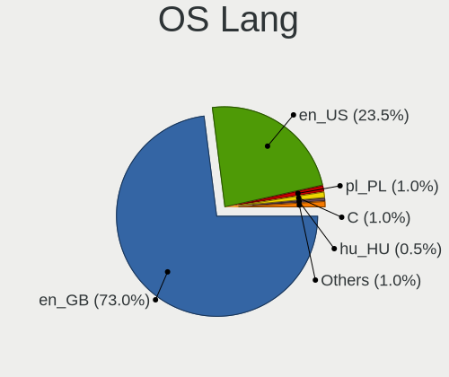

| Lang    | Computers | Percent |
|---------|-----------|---------|
| en_GB   | 184       | 70.5%   |
| en_US   | 58        | 22.22%  |
| pl_PL   | 5         | 1.92%   |
| C       | 5         | 1.92%   |
| lt_LT   | 2         | 0.77%   |
| fr_FR   | 2         | 0.77%   |
| es_ES   | 2         | 0.77%   |
| ro_RO   | 1         | 0.38%   |
| POSIX   | 1         | 0.38%   |
| Unknown | 1         | 0.38%   |

Boot Mode
---------

EFI or BIOS

| Mode | Computers | Percent |
|------|-----------|---------|
| EFI  | 132       | 50.57%  |
| BIOS | 129       | 49.43%  |

Filesystem
----------

Type of filesystem

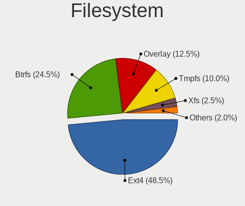

| Type    | Computers | Percent |
|---------|-----------|---------|
| Ext4    | 168       | 64.37%  |
| Overlay | 49        | 18.77%  |
| Btrfs   | 36        | 13.79%  |
| Zfs     | 4         | 1.53%   |
| Xfs     | 3         | 1.15%   |
| Ext2    | 1         | 0.38%   |

Part. scheme
------------

Scheme of partitioning

| Type    | Computers | Percent |
|---------|-----------|---------|
| GPT     | 158       | 60.54%  |
| Unknown | 70        | 26.82%  |
| MBR     | 33        | 12.64%  |

Dual Boot with Linux/BSD
------------------------

Hosting more than one Linux/BSD

| Dual boot | Computers | Percent |
|-----------|-----------|---------|
| No        | 204       | 78.16%  |
| Yes       | 57        | 21.84%  |

Dual Boot (Win)
---------------

Hosting Linux and Windows

| Dual boot | Computers | Percent |
|-----------|-----------|---------|
| No        | 182       | 69.73%  |
| Yes       | 79        | 30.27%  |

Board
-----

Vendor
------

Motherboard manufacturer

| Name                | Computers | Percent |
|---------------------|-----------|---------|
| ASUSTek Computer    | 47        | 18.01%  |
| Dell                | 40        | 15.33%  |
| Lenovo              | 31        | 11.88%  |
| Hewlett-Packard     | 30        | 11.49%  |
| Gigabyte Technology | 20        | 7.66%   |
| MSI                 | 14        | 5.36%   |
| Toshiba             | 11        | 4.21%   |
| Valve               | 8         | 3.07%   |
| ASRock              | 8         | 3.07%   |
| Acer                | 6         | 2.3%    |
| Sony                | 4         | 1.53%   |
| Microsoft           | 4         | 1.53%   |
| Intel               | 4         | 1.53%   |
| Apple               | 4         | 1.53%   |
| PC Specialist       | 3         | 1.15%   |
| Google              | 3         | 1.15%   |
| AZW                 | 3         | 1.15%   |
| Razer               | 2         | 0.77%   |
| Packard Bell        | 2         | 0.77%   |
| Notebook            | 2         | 0.77%   |
| Unknown             | 2         | 0.77%   |
| TUXEDO              | 1         | 0.38%   |
| Tactus              | 1         | 0.38%   |
| Samsung Electronics | 1         | 0.38%   |
| Razer x Lambda      | 1         | 0.38%   |
| OEGStone            | 1         | 0.38%   |
| Novatech            | 1         | 0.38%   |
| Gateway             | 1         | 0.38%   |
| Fanless Mini PC     | 1         | 0.38%   |
| Clevo               | 1         | 0.38%   |
| Chuwi               | 1         | 0.38%   |
| Biostar             | 1         | 0.38%   |
| Alienware           | 1         | 0.38%   |
| Advent              | 1         | 0.38%   |

Model
-----

Motherboard model

| Name                                  | Computers | Percent |
|---------------------------------------|-----------|---------|
| Valve Jupiter                         | 8         | 3.07%   |
| ASUS ROG Flow X13 GV301QH_GV301QH     | 5         | 1.92%   |
| MSI MS-7C91                           | 3         | 1.15%   |
| Dell OptiPlex 5070                    | 3         | 1.15%   |
| Unknown                               | 3         | 1.15%   |
| Toshiba Satellite Pro C50-A-1E6       | 2         | 0.77%   |
| Toshiba Satellite C660                | 2         | 0.77%   |
| Gigabyte B550M DS3H                   | 2         | 0.77%   |
| Gigabyte A320M-S2H                    | 2         | 0.77%   |
| Dell XPS 13 7390                      | 2         | 0.77%   |
| Dell OptiPlex 780                     | 2         | 0.77%   |
| Dell OptiPlex 755                     | 2         | 0.77%   |
| Dell Inspiron N5110                   | 2         | 0.77%   |
| ASUS Zenbook UX5401ZAS_UX5401ZAS      | 2         | 0.77%   |
| ASUS X102BA                           | 2         | 0.77%   |
| ASUS PRIME X570-P                     | 2         | 0.77%   |
| ASUS PRIME A320M-K                    | 2         | 0.77%   |
| ASUS M5A78L-M/USB3                    | 2         | 0.77%   |
| TUXEDO Pulse 15 Gen1                  | 1         | 0.38%   |
| Toshiba Satellite Pro L450D           | 1         | 0.38%   |
| Toshiba Satellite Pro C660            | 1         | 0.38%   |
| Toshiba Satellite P50-C               | 1         | 0.38%   |
| Toshiba Satellite L70-C-12H           | 1         | 0.38%   |
| Toshiba Satellite C850-1GL            | 1         | 0.38%   |
| Toshiba Satellite C50-B               | 1         | 0.38%   |
| Toshiba EQUIUM A100                   | 1         | 0.38%   |
| Tactus GeoPad 110                     | 1         | 0.38%   |
| Sony VPCEH3N6E                        | 1         | 0.38%   |
| Sony VGN-NW26M                        | 1         | 0.38%   |
| Sony SVF1521Q1EW                      | 1         | 0.38%   |
| Sony SVE1513B4E                       | 1         | 0.38%   |
| Samsung 350V5C/351V5C/3540VC/3440VC   | 1         | 0.38%   |
| Razer x Lambda TensorBook (late 2021) | 1         | 0.38%   |
| Razer Blade 17 (2022) - RZ09-0423     | 1         | 0.38%   |
| Razer Blade 15 (2022) - RZ09-0421     | 1         | 0.38%   |
| PC Specialist P65_P67RGRERA           | 1         | 0.38%   |
| PC Specialist P65_67RSRP              | 1         | 0.38%   |
| PC Specialist Elimina Iv 17           | 1         | 0.38%   |
| Packard Bell EasyNote TM97            | 1         | 0.38%   |
| Packard Bell EasyNote TM82            | 1         | 0.38%   |

Model Family
------------

Motherboard model prefix

| Name                   | Computers | Percent |
|------------------------|-----------|---------|
| Lenovo ThinkPad        | 13        | 4.98%   |
| ASUS ROG               | 11        | 4.21%   |
| Toshiba Satellite      | 10        | 3.83%   |
| Dell OptiPlex          | 10        | 3.83%   |
| Dell Latitude          | 9         | 3.45%   |
| Valve Jupiter          | 8         | 3.07%   |
| ASUS PRIME             | 8         | 3.07%   |
| Lenovo IdeaPad         | 7         | 2.68%   |
| HP EliteBook           | 6         | 2.3%    |
| Dell Inspiron          | 6         | 2.3%    |
| ASUS VivoBook          | 6         | 2.3%    |
| Dell XPS               | 5         | 1.92%   |
| Acer Aspire            | 5         | 1.92%   |
| Microsoft Surface      | 4         | 1.53%   |
| Dell Precision         | 4         | 1.53%   |
| MSI MS-7C91            | 3         | 1.15%   |
| Lenovo Yoga            | 3         | 1.15%   |
| HP Compaq              | 3         | 1.15%   |
| Unknown                | 3         | 1.15%   |
| Razer Blade            | 2         | 0.77%   |
| PC Specialist P65      | 2         | 0.77%   |
| Packard Bell EasyNote  | 2         | 0.77%   |
| Lenovo ThinkCentre     | 2         | 0.77%   |
| Lenovo ThinkBook       | 2         | 0.77%   |
| HP Laptop              | 2         | 0.77%   |
| HP ENVY                | 2         | 0.77%   |
| HP EliteDesk           | 2         | 0.77%   |
| Gigabyte GA-78LMT-USB3 | 2         | 0.77%   |
| Gigabyte B550M         | 2         | 0.77%   |
| Gigabyte A320M-S2H     | 2         | 0.77%   |
| Dell Vostro            | 2         | 0.77%   |
| Dell PowerEdge         | 2         | 0.77%   |
| ASUS Zenbook           | 2         | 0.77%   |
| ASUS Z170              | 2         | 0.77%   |
| ASUS X102BA            | 2         | 0.77%   |
| ASUS TUF               | 2         | 0.77%   |
| ASUS ProArt            | 2         | 0.77%   |
| ASUS M5A78L-M          | 2         | 0.77%   |
| ASRock B450M           | 2         | 0.77%   |
| TUXEDO Pulse           | 1         | 0.38%   |

MFG Year
--------

Motherboard manufacture year

| Year | Computers | Percent |
|------|-----------|---------|
| 2022 | 33        | 12.64%  |
| 2020 | 32        | 12.26%  |
| 2019 | 23        | 8.81%   |
| 2021 | 22        | 8.43%   |
| 2017 | 19        | 7.28%   |
| 2012 | 18        | 6.9%    |
| 2018 | 16        | 6.13%   |
| 2016 | 14        | 5.36%   |
| 2015 | 13        | 4.98%   |
| 2014 | 13        | 4.98%   |
| 2011 | 13        | 4.98%   |
| 2010 | 13        | 4.98%   |
| 2013 | 12        | 4.6%    |
| 2009 | 7         | 2.68%   |
| 2007 | 7         | 2.68%   |
| 2008 | 4         | 1.53%   |
| 2023 | 1         | 0.38%   |
| 2002 | 1         | 0.38%   |

Form Factor
-----------

Physical design of the computer

| Name        | Computers | Percent |
|-------------|-----------|---------|
| Notebook    | 131       | 50.19%  |
| Desktop     | 105       | 40.23%  |
| Mini pc     | 10        | 3.83%   |
| Tablet      | 7         | 2.68%   |
| Convertible | 4         | 1.53%   |
| Server      | 3         | 1.15%   |
| All in one  | 1         | 0.38%   |

Secure Boot
-----------

Enabled or disabled

| State    | Computers | Percent |
|----------|-----------|---------|
| Disabled | 237       | 90.8%   |
| Enabled  | 24        | 9.2%    |

Coreboot
--------

Have coreboot on board

| Used | Computers | Percent |
|------|-----------|---------|
| No   | 257       | 98.47%  |
| Yes  | 4         | 1.53%   |

RAM Size
--------

Total RAM memory

| Size in GB  | Computers | Percent |
|-------------|-----------|---------|
| 16.01-24.0  | 58        | 22.22%  |
| 8.01-16.0   | 55        | 21.07%  |
| 4.01-8.0    | 53        | 20.31%  |
| 3.01-4.0    | 37        | 14.18%  |
| 32.01-64.0  | 36        | 13.79%  |
| 64.01-256.0 | 10        | 3.83%   |
| 24.01-32.0  | 4         | 1.53%   |
| 2.01-3.0    | 4         | 1.53%   |
| 1.01-2.0    | 3         | 1.15%   |
| 0.51-1.0    | 1         | 0.38%   |

RAM Used
--------

Used RAM memory

| Used GB    | Computers | Percent |
|------------|-----------|---------|
| 1.01-2.0   | 88        | 33.72%  |
| 2.01-3.0   | 70        | 26.82%  |
| 4.01-8.0   | 48        | 18.39%  |
| 3.01-4.0   | 31        | 11.88%  |
| 8.01-16.0  | 12        | 4.6%    |
| 0.51-1.0   | 7         | 2.68%   |
| 16.01-24.0 | 2         | 0.77%   |
| 0.01-0.5   | 2         | 0.77%   |
| 32.01-64.0 | 1         | 0.38%   |

Total Drives
------------

Number of drives on board

| Drives | Computers | Percent |
|--------|-----------|---------|
| 1      | 137       | 52.49%  |
| 2      | 69        | 26.44%  |
| 3      | 27        | 10.34%  |
| 4      | 18        | 6.9%    |
| 5      | 7         | 2.68%   |
| 6      | 3         | 1.15%   |

Has CD-ROM
----------

Has CD-ROM on board

| Presented | Computers | Percent |
|-----------|-----------|---------|
| No        | 169       | 64.75%  |
| Yes       | 92        | 35.25%  |

Has Ethernet
------------

Has Ethernet on board

| Presented | Computers | Percent |
|-----------|-----------|---------|
| Yes       | 213       | 81.61%  |
| No        | 48        | 18.39%  |

Has WiFi
--------

Has WiFi module

| Presented | Computers | Percent |
|-----------|-----------|---------|
| Yes       | 201       | 77.01%  |
| No        | 60        | 22.99%  |

Has Bluetooth
-------------

Has Bluetooth module

| Presented | Computers | Percent |
|-----------|-----------|---------|
| Yes       | 171       | 65.52%  |
| No        | 90        | 34.48%  |

Location
--------

Country
-------

Geographic location (country)

| Country | Computers | Percent |
|---------|-----------|---------|
| UK      | 261       | 100%    |

City
----

Geographic location (city)

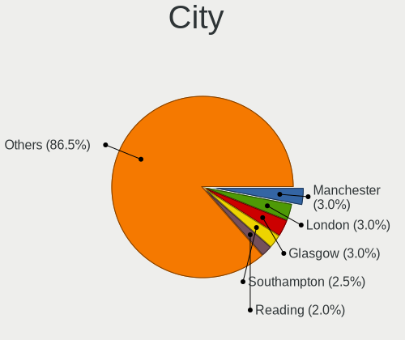

| City                   | Computers | Percent |
|------------------------|-----------|---------|
| London                 | 39        | 14.94%  |
| Birmingham             | 10        | 3.83%   |
| Leeds                  | 9         | 3.45%   |
| Southampton            | 6         | 2.3%    |
| Manchester             | 6         | 2.3%    |
| Derby                  | 6         | 2.3%    |
| Nottingham             | 5         | 1.92%   |
| Glasgow                | 4         | 1.53%   |
| Canterbury             | 4         | 1.53%   |
| Bolton                 | 4         | 1.53%   |
| Telford                | 3         | 1.15%   |
| Sheffield              | 3         | 1.15%   |
| Plymouth               | 3         | 1.15%   |
| Norwich                | 3         | 1.15%   |
| Dudley                 | 3         | 1.15%   |
| Crewe                  | 3         | 1.15%   |
| Cambridge              | 3         | 1.15%   |
| Bristol                | 3         | 1.15%   |
| Warrington             | 2         | 0.77%   |
| Swansea                | 2         | 0.77%   |
| Stockton-on-Tees       | 2         | 0.77%   |
| Shipley                | 2         | 0.77%   |
| Salisbury              | 2         | 0.77%   |
| Sale                   | 2         | 0.77%   |
| Rochester              | 2         | 0.77%   |
| Peterborough           | 2         | 0.77%   |
| Penarth                | 2         | 0.77%   |
| Mitcham                | 2         | 0.77%   |
| Milton Keynes          | 2         | 0.77%   |
| Liverpool              | 2         | 0.77%   |
| Letchworth Garden City | 2         | 0.77%   |
| High Wycombe           | 2         | 0.77%   |
| Harrow                 | 2         | 0.77%   |
| Edinburgh              | 2         | 0.77%   |
| Croydon                | 2         | 0.77%   |
| Buckingham             | 2         | 0.77%   |
| Bradford               | 2         | 0.77%   |
| Bournemouth            | 2         | 0.77%   |
| Worcester              | 1         | 0.38%   |
| Woodford Green         | 1         | 0.38%   |

Drives
------

Drive Vendor
------------

Hard drive vendors

| Vendor                      | Computers | Drives | Percent |
|-----------------------------|-----------|--------|---------|
| Samsung Electronics         | 63        | 83     | 15.52%  |
| WDC                         | 52        | 61     | 12.81%  |
| Seagate                     | 52        | 67     | 12.81%  |
| Crucial                     | 27        | 33     | 6.65%   |
| Toshiba                     | 26        | 27     | 6.4%    |
| SanDisk                     | 23        | 27     | 5.67%   |
| Unknown                     | 22        | 24     | 5.42%   |
| Kingston                    | 14        | 16     | 3.45%   |
| SK hynix                    | 12        | 12     | 2.96%   |
| Hitachi                     | 12        | 14     | 2.96%   |
| Phison Electronics          | 9         | 9      | 2.22%   |
| Intel                       | 9         | 9      | 2.22%   |
| Phison                      | 6         | 6      | 1.48%   |
| Unknown                     | 5         | 5      | 1.23%   |
| China                       | 4         | 4      | 0.99%   |
| A-DATA Technology           | 4         | 4      | 0.99%   |
| Micron Technology           | 3         | 3      | 0.74%   |
| Maxtor                      | 3         | 3      | 0.74%   |
| KIOXIA                      | 3         | 3      | 0.74%   |
| Kingston Technology Company | 3         | 3      | 0.74%   |
| Integral                    | 3         | 3      | 0.74%   |
| HGST                        | 3         | 3      | 0.74%   |
| TO Exter                    | 2         | 2      | 0.49%   |
| SSK                         | 2         | 3      | 0.49%   |
| Silicon Motion              | 2         | 2      | 0.49%   |
| Patriot                     | 2         | 2      | 0.49%   |
| OCZ                         | 2         | 2      | 0.49%   |
| O2 Micro                    | 2         | 2      | 0.49%   |
| Netac                       | 2         | 2      | 0.49%   |
| Micron/Crucial Technology   | 2         | 2      | 0.49%   |
| KIOXIA-EXCERIA              | 2         | 2      | 0.49%   |
| JMicron Technology          | 2         | 2      | 0.49%   |
| Fanxiang                    | 2         | 2      | 0.49%   |
| Apple                       | 2         | 2      | 0.49%   |
| Zheino                      | 1         | 1      | 0.25%   |
| USB3.0                      | 1         | 1      | 0.25%   |
| UMIS                        | 1         | 1      | 0.25%   |
| Transcend                   | 1         | 1      | 0.25%   |
| Timetec                     | 1         | 1      | 0.25%   |
| TCSUNBOW                    | 1         | 1      | 0.25%   |

Drive Model
-----------

Hard drive models

| Model                                                 | Computers | Percent |
|-------------------------------------------------------|-----------|---------|
| Samsung NVMe SSD Controller SM981/PM981/PM983 500GB   | 9         | 2.01%   |
| Samsung NVMe SSD Controller PM9A1/PM9A3/980PRO 512GB  | 7         | 1.56%   |
| Seagate ST1000DM010-2EP102 1TB                        | 6         | 1.34%   |
| WDC PC SN530 SDBPTPZ-512G-1002 512GB                  | 5         | 1.12%   |
| Samsung PSSD T7 500GB                                 | 5         | 1.12%   |
| Crucial CT250MX500SSD1 250GB                          | 5         | 1.12%   |
| Unknown                                               | 5         | 1.12%   |
| Seagate ST2000DM008-2FR102 2TB                        | 4         | 0.89%   |
| Seagate ST1000LM024 HN-M101MBB 1TB                    | 4         | 0.89%   |
| Samsung SSD 860 EVO 1TB                               | 4         | 0.89%   |
| WDC WDS500G2B0A-00SM50 500GB SSD                      | 3         | 0.67%   |
| Unknown SD/MMC/MS PRO 2GB                             | 3         | 0.67%   |
| Toshiba XG6 NVMe SSD Controller 512GB                 | 3         | 0.67%   |
| Toshiba MQ01ABF050 500GB                              | 3         | 0.67%   |
| Seagate ST3500418AS 500GB                             | 3         | 0.67%   |
| SanDisk SSD PLUS 480GB                                | 3         | 0.67%   |
| Samsung Portable SSD T5 1TB                           | 3         | 0.67%   |
| Phison E16 PCIe4 NVMe Controller 2TB                  | 3         | 0.67%   |
| Phison E12 NVMe Controller 1TB                        | 3         | 0.67%   |
| Kingston SA400S37240G 240GB SSD                       | 3         | 0.67%   |
| Crucial CT2000MX500SSD1 2TB                           | 3         | 0.67%   |
| Crucial CT1000MX500SSD1 1TB                           | 3         | 0.67%   |
| WDC WD10EZEX-08WN4A0 1TB                              | 2         | 0.45%   |
| Unknown MMC Card  64GB                                | 2         | 0.45%   |
| Unknown MMC Card  512GB                               | 2         | 0.45%   |
| Unknown MMC Card  256GB                               | 2         | 0.45%   |
| Unknown MMC Card  128GB                               | 2         | 0.45%   |
| Unknown DA4064  64GB                                  | 2         | 0.45%   |
| Unknown DA4032  32GB                                  | 2         | 0.45%   |
| Toshiba Q300. 480GB SSD                               | 2         | 0.45%   |
| Toshiba MQ04ABF100 1TB                                | 2         | 0.45%   |
| Toshiba MQ01ABD100 1TB                                | 2         | 0.45%   |
| Toshiba DT01ACA100 1TB                                | 2         | 0.45%   |
| TO Exter nal USB 3.0 500GB                            | 2         | 0.45%   |
| SSK Disk 128GB                                        | 2         | 0.45%   |
| Silicon Motion SM2263EN/SM2263XT SSD Controller 512GB | 2         | 0.45%   |
| Seagate ST2000DM006-2DM164 2TB                        | 2         | 0.45%   |
| Seagate ST1000LX 015-1U7172 1TB                       | 2         | 0.45%   |
| Seagate ST1000LM049-2GH172 1TB                        | 2         | 0.45%   |
| Seagate ST1000DX001-1CM162 1TB                        | 2         | 0.45%   |

HDD Vendor
----------

Hard disk drive vendors

| Vendor              | Computers | Drives | Percent |
|---------------------|-----------|--------|---------|
| Seagate             | 51        | 61     | 38.64%  |
| WDC                 | 35        | 43     | 26.52%  |
| Toshiba             | 20        | 21     | 15.15%  |
| Hitachi             | 12        | 14     | 9.09%   |
| Unknown             | 3         | 3      | 2.27%   |
| Samsung Electronics | 3         | 3      | 2.27%   |
| HGST                | 3         | 3      | 2.27%   |
| Maxtor              | 2         | 2      | 1.52%   |
| USB3.0              | 1         | 1      | 0.76%   |
| Fujitsu             | 1         | 1      | 0.76%   |
| Apple               | 1         | 1      | 0.76%   |

SSD Vendor
----------

Solid state drive vendors

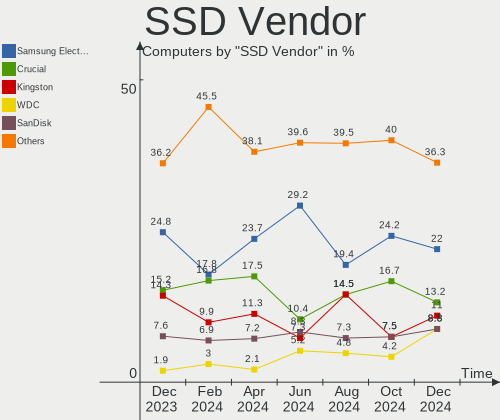

| Vendor              | Computers | Drives | Percent |
|---------------------|-----------|--------|---------|
| Samsung Electronics | 33        | 40     | 24.09%  |
| Crucial             | 23        | 29     | 16.79%  |
| SanDisk             | 18        | 20     | 13.14%  |
| Kingston            | 9         | 11     | 6.57%   |
| WDC                 | 8         | 8      | 5.84%   |
| China               | 4         | 4      | 2.92%   |
| A-DATA Technology   | 4         | 4      | 2.92%   |
| Toshiba             | 3         | 3      | 2.19%   |
| Integral            | 3         | 3      | 2.19%   |
| TO Exter            | 2         | 2      | 1.46%   |
| SK hynix            | 2         | 2      | 1.46%   |
| Patriot             | 2         | 2      | 1.46%   |
| OCZ                 | 2         | 2      | 1.46%   |
| Netac               | 2         | 2      | 1.46%   |
| Intel               | 2         | 2      | 1.46%   |
| Unknown             | 2         | 2      | 1.46%   |
| Zheino              | 1         | 1      | 0.73%   |
| Transcend           | 1         | 1      | 0.73%   |
| TCSUNBOW            | 1         | 1      | 0.73%   |
| SPCC                | 1         | 2      | 0.73%   |
| Seagate             | 1         | 1      | 0.73%   |
| PNY                 | 1         | 1      | 0.73%   |
| ORTIAL              | 1         | 1      | 0.73%   |
| Maxtor              | 1         | 1      | 0.73%   |
| LITEON              | 1         | 1      | 0.73%   |
| Lenovo              | 1         | 1      | 0.73%   |
| KIOXIA-EXCERIA      | 1         | 1      | 0.73%   |
| KingFast            | 1         | 1      | 0.73%   |
| JMicron Technology  | 1         | 1      | 0.73%   |
| FCS                 | 1         | 1      | 0.73%   |
| Fanxiang            | 1         | 1      | 0.73%   |
| Biostar             | 1         | 1      | 0.73%   |
| 2-Power             | 1         | 1      | 0.73%   |
| 1TB                 | 1         | 1      | 0.73%   |

Drive Kind
----------

HDD or SSD

| Kind    | Computers | Drives | Percent |
|---------|-----------|--------|---------|
| SSD     | 118       | 155    | 32.24%  |
| HDD     | 112       | 153    | 30.6%   |
| NVMe    | 108       | 128    | 29.51%  |
| MMC     | 19        | 19     | 5.19%   |
| Unknown | 9         | 14     | 2.46%   |

Drive Connector
---------------

SATA, SAS, NVMe, etc.

| Type | Computers | Drives | Percent |
|------|-----------|--------|---------|
| SATA | 179       | 286    | 53.92%  |
| NVMe | 108       | 127    | 32.53%  |
| SAS  | 26        | 37     | 7.83%   |
| MMC  | 19        | 19     | 5.72%   |

Drive Size
----------

Size of hard drive

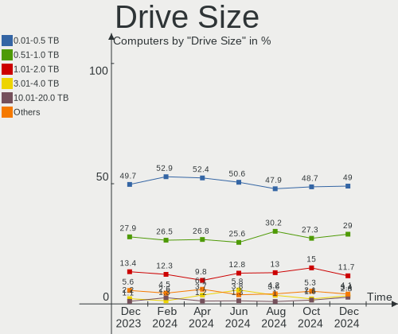

| Size in TB | Computers | Drives | Percent |
|------------|-----------|--------|---------|
| 0.01-0.5   | 132       | 172    | 53.88%  |
| 0.51-1.0   | 73        | 85     | 29.8%   |
| 1.01-2.0   | 22        | 26     | 8.98%   |
| 3.01-4.0   | 7         | 7      | 2.86%   |
| 2.01-3.0   | 6         | 8      | 2.45%   |
| 4.01-10.0  | 5         | 10     | 2.04%   |

Space Total
-----------

Amount of disk space available on the file system

| Size in GB     | Computers | Percent |
|----------------|-----------|---------|
| 501-1000       | 50        | 19.16%  |
| 251-500        | 47        | 18.01%  |
| 101-250        | 47        | 18.01%  |
| 1-20           | 40        | 15.33%  |
| 1001-2000      | 26        | 9.96%   |
| More than 3000 | 19        | 7.28%   |
| 51-100         | 11        | 4.21%   |
| Unknown        | 10        | 3.83%   |
| 21-50          | 7         | 2.68%   |
| 2001-3000      | 4         | 1.53%   |

Space Used
----------

Amount of used disk space

| Used GB        | Computers | Percent |
|----------------|-----------|---------|
| 1-20           | 98        | 37.55%  |
| 101-250        | 38        | 14.56%  |
| 251-500        | 32        | 12.26%  |
| 21-50          | 27        | 10.34%  |
| 51-100         | 19        | 7.28%   |
| 501-1000       | 15        | 5.75%   |
| 1001-2000      | 13        | 4.98%   |
| Unknown        | 10        | 3.83%   |
| More than 3000 | 5         | 1.92%   |
| 2001-3000      | 4         | 1.53%   |

Malfunc. Drives
---------------

Drive models with a malfunction

| Model                                 | Computers | Drives | Percent |
|---------------------------------------|-----------|--------|---------|
| WDC WD400BB-75CAA0 40GB               | 1         | 1      | 3.57%   |
| WDC WD30EZRZ-00Z5HB0 3TB              | 1         | 1      | 3.57%   |
| WDC WD10EZEX-00KUWA0 1TB              | 1         | 1      | 3.57%   |
| Toshiba MQ01ABD100 1TB                | 1         | 1      | 3.57%   |
| Toshiba MK5065GSXN 500GB              | 1         | 1      | 3.57%   |
| Toshiba MK3256GSY 320GB               | 1         | 1      | 3.57%   |
| Toshiba MK2565GSXN 250GB              | 1         | 1      | 3.57%   |
| Toshiba HDWJ105 500GB                 | 1         | 1      | 3.57%   |
| SK hynix HFS128G3AMNB-2200A 128GB SSD | 1         | 1      | 3.57%   |
| Seagate ST9500325AS 500GB             | 1         | 1      | 3.57%   |
| Seagate ST9100824AS 100GB             | 1         | 1      | 3.57%   |
| Seagate ST500DM002-1BC142 500GB       | 1         | 1      | 3.57%   |
| Seagate ST2000DM008-2FR102 2TB        | 1         | 1      | 3.57%   |
| Seagate ST1000LM024 HN-M101MBB 1TB    | 1         | 1      | 3.57%   |
| Seagate ST1000DX001-1CM162 1TB        | 1         | 1      | 3.57%   |
| Seagate OOS1000G128M 1TB              | 1         | 1      | 3.57%   |
| SanDisk SSD PLUS 480GB                | 1         | 1      | 3.57%   |
| Samsung Electronics SSD 870 EVO 500GB | 1         | 1      | 3.57%   |
| Samsung Electronics SSD 870 EVO 1TB   | 1         | 1      | 3.57%   |
| Kingston SV300S37A120G 120GB SSD      | 1         | 1      | 3.57%   |
| Intel SSDSC2CT120A3 120GB             | 1         | 1      | 3.57%   |
| Intel SSDSC2BW240A4 240GB             | 1         | 1      | 3.57%   |
| Hitachi HTS543216L9SA00 160GB         | 1         | 1      | 3.57%   |
| Hitachi HTS541060G9SA00 64GB          | 1         | 1      | 3.57%   |
| Hitachi HDT721032SLA380 320GB         | 1         | 1      | 3.57%   |
| Hitachi HDT721010SLA360 1TB           | 1         | 1      | 3.57%   |
| 2-Power SSD2042B 256GB                | 1         | 1      | 3.57%   |
| Unknown                               | 1         | 1      | 3.57%   |

Malfunc. Drive Vendor
---------------------

Vendors of faulty drives

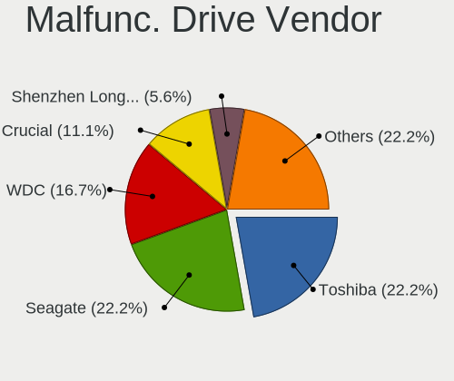

| Vendor              | Computers | Drives | Percent |
|---------------------|-----------|--------|---------|
| Seagate             | 7         | 7      | 25.93%  |
| Toshiba             | 5         | 5      | 18.52%  |
| Hitachi             | 4         | 4      | 14.81%  |
| WDC                 | 3         | 3      | 11.11%  |
| Intel               | 2         | 2      | 7.41%   |
| SK hynix            | 1         | 1      | 3.7%    |
| SanDisk             | 1         | 1      | 3.7%    |
| Samsung Electronics | 1         | 2      | 3.7%    |
| Kingston            | 1         | 1      | 3.7%    |
| 2-Power             | 1         | 1      | 3.7%    |
| Unknown             | 1         | 1      | 3.7%    |

Malfunc. HDD Vendor
-------------------

Vendors of faulty HDD drives

| Vendor  | Computers | Drives | Percent |
|---------|-----------|--------|---------|
| Seagate | 7         | 7      | 36.84%  |
| Toshiba | 5         | 5      | 26.32%  |
| Hitachi | 4         | 4      | 21.05%  |
| WDC     | 3         | 3      | 15.79%  |

Malfunc. Drive Kind
-------------------

Kinds of faulty drives

| Kind | Computers | Drives | Percent |
|------|-----------|--------|---------|
| HDD  | 19        | 19     | 70.37%  |
| SSD  | 8         | 9      | 29.63%  |

Failed Drives
-------------

Failed drive models

Zero info for selected period =(

Failed Drive Vendor
-------------------

Failed drive vendors

Zero info for selected period =(

Drive Status
------------

Number of failed and malfunc. drives

| Status   | Computers | Drives | Percent |
|----------|-----------|--------|---------|
| Detected | 135       | 235    | 47.2%   |
| Works    | 124       | 206    | 43.36%  |
| Malfunc  | 27        | 28     | 9.44%   |

Storage controller
------------------

Storage Vendor
--------------

Storage controller vendors

| Vendor                         | Computers | Percent |
|--------------------------------|-----------|---------|
| Intel                          | 151       | 43.27%  |
| AMD                            | 68        | 19.48%  |
| Samsung Electronics            | 34        | 9.74%   |
| SanDisk                        | 16        | 4.58%   |
| Phison Electronics             | 13        | 3.72%   |
| SK hynix                       | 11        | 3.15%   |
| Kingston Technology Company    | 8         | 2.29%   |
| ASMedia Technology             | 7         | 2.01%   |
| Micron/Crucial Technology      | 5         | 1.43%   |
| Micron Technology              | 4         | 1.15%   |
| KIOXIA                         | 4         | 1.15%   |
| Toshiba America Info Systems   | 3         | 0.86%   |
| Silicon Motion                 | 3         | 0.86%   |
| Nvidia                         | 3         | 0.86%   |
| Marvell Technology Group       | 3         | 0.86%   |
| Solid State Storage Technology | 2         | 0.57%   |
| Seagate Technology             | 2         | 0.57%   |
| O2 Micro                       | 2         | 0.57%   |
| LSI Logic / Symbios Logic      | 2         | 0.57%   |
| Union Memory (Shenzhen)        | 1         | 0.29%   |
| Solidigm                       | 1         | 0.29%   |
| Silicon Image                  | 1         | 0.29%   |
| MAXIO Technology (Hangzhou)    | 1         | 0.29%   |
| JMicron Technology             | 1         | 0.29%   |
| Hewlett-Packard                | 1         | 0.29%   |
| Apple                          | 1         | 0.29%   |
| ADATA Technology               | 1         | 0.29%   |

Storage Model
-------------

Storage controller models

| Model                                                                          | Computers | Percent |
|--------------------------------------------------------------------------------|-----------|---------|
| AMD FCH SATA Controller [AHCI mode]                                            | 46        | 11.27%  |
| Samsung NVMe SSD Controller SM981/PM981/PM983                                  | 16        | 3.92%   |
| Samsung NVMe SSD Controller PM9A1/PM9A3/980PRO                                 | 11        | 2.7%    |
| Intel Volume Management Device NVMe RAID Controller                            | 11        | 2.7%    |
| Intel 82801 Mobile SATA Controller [RAID mode]                                 | 9         | 2.21%   |
| Intel 8 Series/C220 Series Chipset Family 6-port SATA Controller 1 [AHCI mode] | 9         | 2.21%   |
| Intel 7 Series Chipset Family 6-port SATA Controller [AHCI mode]               | 9         | 2.21%   |
| SanDisk Non-Volatile memory controller                                         | 8         | 1.96%   |
| AMD 400 Series Chipset SATA Controller                                         | 8         | 1.96%   |
| Intel Sunrise Point-LP SATA Controller [AHCI mode]                             | 7         | 1.72%   |
| Intel Celeron/Pentium Silver Processor SATA Controller                         | 7         | 1.72%   |
| ASMedia ASM1062 Serial ATA Controller                                          | 7         | 1.72%   |
| AMD 500 Series Chipset SATA Controller                                         | 7         | 1.72%   |
| Intel Wildcat Point-LP SATA Controller [AHCI Mode]                             | 6         | 1.47%   |
| Intel 82801IBM/IEM (ICH9M/ICH9M-E) 4 port SATA Controller [AHCI mode]          | 6         | 1.47%   |
| Intel 200 Series PCH SATA controller [AHCI mode]                               | 6         | 1.47%   |
| AMD SB7x0/SB8x0/SB9x0 IDE Controller                                           | 6         | 1.47%   |
| SK hynix Gold P31/PC711 NVMe Solid State Drive                                 | 5         | 1.23%   |
| Samsung NVMe SSD Controller SM961/PM961/SM963                                  | 5         | 1.23%   |
| Phison E16 PCIe4 NVMe Controller                                               | 5         | 1.23%   |
| Phison E12 NVMe Controller                                                     | 5         | 1.23%   |
| Intel Tiger Lake-LP SATA Controller                                            | 5         | 1.23%   |
| Intel Cannon Lake PCH SATA AHCI Controller                                     | 5         | 1.23%   |
| Intel 6 Series/C200 Series Chipset Family 6 port Mobile SATA AHCI Controller   | 5         | 1.23%   |
| AMD SB7x0/SB8x0/SB9x0 SATA Controller [IDE mode]                               | 5         | 1.23%   |
| AMD FCH SATA Controller D                                                      | 5         | 1.23%   |
| SanDisk WD Blue SN550 NVMe SSD                                                 | 4         | 0.98%   |
| Micron/Crucial P2 NVMe PCIe SSD                                                | 4         | 0.98%   |
| Micron Non-Volatile memory controller                                          | 4         | 0.98%   |
| Kingston Company OM3PDP3 NVMe SSD                                              | 4         | 0.98%   |
| Intel SATA Controller [RAID mode]                                              | 4         | 0.98%   |
| Intel 7 Series/C210 Series Chipset Family 6-port SATA Controller [AHCI mode]   | 4         | 0.98%   |
| Intel 6 Series/C200 Series Chipset Family 6 port Desktop SATA AHCI Controller  | 4         | 0.98%   |
| AMD SB7x0/SB8x0/SB9x0 SATA Controller [AHCI mode]                              | 4         | 0.98%   |
| AMD SATA controller                                                            | 4         | 0.98%   |
| AMD 300 Series Chipset SATA Controller                                         | 4         | 0.98%   |
| Toshiba America Info Systems XG6 NVMe SSD Controller                           | 3         | 0.74%   |
| SK hynix BC501 NVMe Solid State Drive                                          | 3         | 0.74%   |
| Silicon Motion SM2263EN/SM2263XT SSD Controller                                | 3         | 0.74%   |
| KIOXIA NVMe SSD Controller BG4                                                 | 3         | 0.74%   |

Storage Kind
------------

Kind of storage controller (IDE, SATA, NVMe, SAS, ...)

| Kind | Computers | Percent |
|------|-----------|---------|
| SATA | 180       | 51.72%  |
| NVMe | 109       | 31.32%  |
| IDE  | 31        | 8.91%   |
| RAID | 26        | 7.47%   |
| SAS  | 2         | 0.57%   |

Processor
---------

CPU Vendor
----------

Processor vendors

| Vendor | Computers | Percent |
|--------|-----------|---------|
| Intel  | 172       | 65.9%   |
| AMD    | 89        | 34.1%   |

CPU Model
---------

Processor models

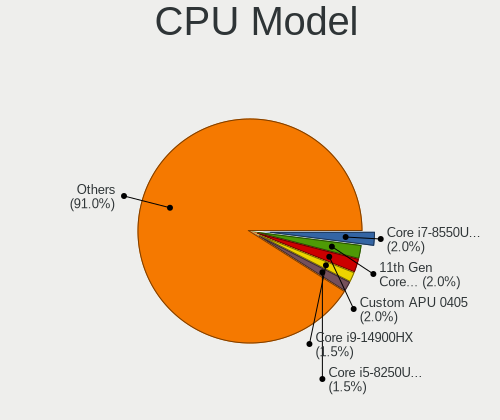

| Model                                       | Computers | Percent |
|---------------------------------------------|-----------|---------|
| AMD Custom APU 0405                         | 8         | 3.07%   |
| Intel 11th Gen Core i7-11800H @ 2.30GHz     | 5         | 1.92%   |
| AMD Ryzen 9 5900HS with Radeon Graphics     | 5         | 1.92%   |
| Intel Core i7-3770 CPU @ 3.40GHz            | 4         | 1.53%   |
| Intel Core i5-6300U CPU @ 2.40GHz           | 4         | 1.53%   |
| Intel 11th Gen Core i7-1165G7 @ 2.80GHz     | 4         | 1.53%   |
| AMD Ryzen 5 3600 6-Core Processor           | 4         | 1.53%   |
| Intel Core i7-6700HQ CPU @ 2.60GHz          | 3         | 1.15%   |
| Intel Core i7-5500U CPU @ 2.40GHz           | 3         | 1.15%   |
| Intel Core i7-10510U CPU @ 1.80GHz          | 3         | 1.15%   |
| Intel Core i5-4300U CPU @ 1.90GHz           | 3         | 1.15%   |
| Intel Celeron N4020 CPU @ 1.10GHz           | 3         | 1.15%   |
| Intel 12th Gen Core i7-12700H               | 3         | 1.15%   |
| AMD Ryzen 7 7700X 8-Core Processor          | 3         | 1.15%   |
| AMD Ryzen 7 3700X 8-Core Processor          | 3         | 1.15%   |
| AMD Ryzen 5 2600 Six-Core Processor         | 3         | 1.15%   |
| Intel Pentium Dual-Core CPU T4500 @ 2.30GHz | 2         | 0.77%   |
| Intel Core i7-1065G7 CPU @ 1.30GHz          | 2         | 0.77%   |
| Intel Core i5-9500T CPU @ 2.20GHz           | 2         | 0.77%   |
| Intel Core i5-8350U CPU @ 1.70GHz           | 2         | 0.77%   |
| Intel Core i5-8265U CPU @ 1.60GHz           | 2         | 0.77%   |
| Intel Core i5-5200U CPU @ 2.20GHz           | 2         | 0.77%   |
| Intel Core i5-4440 CPU @ 3.10GHz            | 2         | 0.77%   |
| Intel Core i5-3320M CPU @ 2.60GHz           | 2         | 0.77%   |
| Intel Core i5-3230M CPU @ 2.60GHz           | 2         | 0.77%   |
| Intel Core i5-3210M CPU @ 2.50GHz           | 2         | 0.77%   |
| Intel Core i5-2500K CPU @ 3.30GHz           | 2         | 0.77%   |
| Intel Core i3-7100U CPU @ 2.40GHz           | 2         | 0.77%   |
| Intel Core 2 Duo CPU P8600 @ 2.40GHz        | 2         | 0.77%   |
| Intel Core 2 Duo CPU E8400 @ 3.00GHz        | 2         | 0.77%   |
| Intel Celeron J4125 CPU @ 2.00GHz           | 2         | 0.77%   |
| Intel Celeron CPU N2840 @ 2.16GHz           | 2         | 0.77%   |
| Intel 12th Gen Core i7-12800H               | 2         | 0.77%   |
| Intel 11th Gen Core i5-1135G7 @ 2.40GHz     | 2         | 0.77%   |
| AMD Ryzen 9 5950X 16-Core Processor         | 2         | 0.77%   |
| AMD Ryzen 9 5900X 12-Core Processor         | 2         | 0.77%   |
| AMD Ryzen 7 5700G with Radeon Graphics      | 2         | 0.77%   |
| AMD Ryzen 7 4800H with Radeon Graphics      | 2         | 0.77%   |
| AMD Ryzen 7 1700 Eight-Core Processor       | 2         | 0.77%   |
| AMD Ryzen 5 5600X 6-Core Processor          | 2         | 0.77%   |

CPU Model Family
----------------

Processor model prefix

| Model                   | Computers | Percent |
|-------------------------|-----------|---------|
| Intel Core i5           | 46        | 17.62%  |
| Intel Core i7           | 35        | 13.41%  |
| Other                   | 30        | 11.49%  |
| AMD Ryzen 7             | 19        | 7.28%   |
| AMD Ryzen 5             | 17        | 6.51%   |
| Intel Celeron           | 15        | 5.75%   |
| Intel Core i3           | 12        | 4.6%    |
| Intel Xeon              | 11        | 4.21%   |
| Intel Core 2 Duo        | 11        | 4.21%   |
| AMD Ryzen 9             | 11        | 4.21%   |
| Intel Pentium Dual-Core | 5         | 1.92%   |
| Intel Pentium           | 5         | 1.92%   |
| AMD FX                  | 5         | 1.92%   |
| AMD A8                  | 5         | 1.92%   |
| AMD Ryzen 5 PRO         | 3         | 1.15%   |
| AMD Ryzen 3             | 3         | 1.15%   |
| AMD A4                  | 3         | 1.15%   |
| Intel Pentium Silver    | 2         | 0.77%   |
| Intel Core 2            | 2         | 0.77%   |
| AMD PRO A8              | 2         | 0.77%   |
| AMD A6                  | 2         | 0.77%   |
| AMD A10                 | 2         | 0.77%   |
| Intel Pentium 4         | 1         | 0.38%   |
| Intel Core M            | 1         | 0.38%   |
| Intel Core i9           | 1         | 0.38%   |
| Intel Core 2 Quad       | 1         | 0.38%   |
| Intel Core 2 Extreme    | 1         | 0.38%   |
| Intel Celeron Dual-Core | 1         | 0.38%   |
| AMD V120                | 1         | 0.38%   |
| AMD Turion 64 X2 Mobile | 1         | 0.38%   |
| AMD Phenom II X4        | 1         | 0.38%   |
| AMD Phenom II X3        | 1         | 0.38%   |
| AMD EPYC                | 1         | 0.38%   |
| AMD E2                  | 1         | 0.38%   |
| AMD Athlon X2           | 1         | 0.38%   |
| AMD Athlon II X2        | 1         | 0.38%   |
| AMD Athlon              | 1         | 0.38%   |

CPU Cores
---------

Number of processor cores

| Number | Computers | Percent |
|--------|-----------|---------|
| 2      | 94        | 36.02%  |
| 4      | 81        | 31.03%  |
| 8      | 33        | 12.64%  |
| 6      | 29        | 11.11%  |
| 16     | 6         | 2.3%    |
| 14     | 5         | 1.92%   |
| 12     | 5         | 1.92%   |
| 1      | 4         | 1.53%   |
| 10     | 2         | 0.77%   |
| 36     | 1         | 0.38%   |
| 3      | 1         | 0.38%   |

CPU Sockets
-----------

Number of sockets

| Number | Computers | Percent |
|--------|-----------|---------|
| 1      | 257       | 98.47%  |
| 2      | 4         | 1.53%   |

CPU Threads
-----------

Threads per core (Hyper-Threading)

| Number | Computers | Percent |
|--------|-----------|---------|
| 2      | 177       | 67.82%  |
| 1      | 84        | 32.18%  |

CPU Op-Modes
------------

CPU Operation Modes (32-bit, 64-bit)

| Op mode        | Computers | Percent |
|----------------|-----------|---------|
| 32-bit, 64-bit | 259       | 99.23%  |
| 32-bit         | 1         | 0.38%   |
| Unknown        | 1         | 0.38%   |

CPU Microcode
-------------

Microcode number

| Number     | Computers | Percent |
|------------|-----------|---------|
| Unknown    | 79        | 30.27%  |
| 0x1067a    | 12        | 4.6%    |
| 0x306a9    | 10        | 3.83%   |
| 0x806c1    | 7         | 2.68%   |
| 0x306d4    | 7         | 2.68%   |
| 0x306c3    | 7         | 2.68%   |
| 0x806e9    | 6         | 2.3%    |
| 0x0a50000c | 6         | 2.3%    |
| 0x08701021 | 6         | 2.3%    |
| 0x906ea    | 5         | 1.92%   |
| 0x706a8    | 5         | 1.92%   |
| 0x406e3    | 5         | 1.92%   |
| 0x206a7    | 5         | 1.92%   |
| 0x806ec    | 4         | 1.53%   |
| 0x806ea    | 4         | 1.53%   |
| 0x0a20120a | 4         | 1.53%   |
| 0x906e9    | 3         | 1.15%   |
| 0x906c0    | 3         | 1.15%   |
| 0x906a3    | 3         | 1.15%   |
| 0x30678    | 3         | 1.15%   |
| 0x0800820d | 3         | 1.15%   |
| 0x06003106 | 3         | 1.15%   |
| 0x06000852 | 3         | 1.15%   |
| 0x906eb    | 2         | 0.77%   |
| 0x90672    | 2         | 0.77%   |
| 0x806eb    | 2         | 0.77%   |
| 0x706e5    | 2         | 0.77%   |
| 0x706a1    | 2         | 0.77%   |
| 0x506e3    | 2         | 0.77%   |
| 0x40651    | 2         | 0.77%   |
| 0x206c2    | 2         | 0.77%   |
| 0x0a601203 | 2         | 0.77%   |
| 0x0a601201 | 2         | 0.77%   |
| 0x0a50000d | 2         | 0.77%   |
| 0x08701013 | 2         | 0.77%   |
| 0x08108109 | 2         | 0.77%   |
| 0x08001138 | 2         | 0.77%   |
| 0x0700010f | 2         | 0.77%   |
| 0x010000c8 | 2         | 0.77%   |
| 0xf24      | 1         | 0.38%   |

CPU Microarch
-------------

Microarchitecture

| Name             | Computers | Percent |
|------------------|-----------|---------|
| KabyLake         | 34        | 13.03%  |
| Unknown          | 22        | 8.43%   |
| IvyBridge        | 18        | 6.9%    |
| Zen 3            | 17        | 6.51%   |
| Penryn           | 17        | 6.51%   |
| Zen 2            | 16        | 6.13%   |
| Haswell          | 13        | 4.98%   |
| Skylake          | 12        | 4.6%    |
| Broadwell        | 10        | 3.83%   |
| Zen+             | 9         | 3.45%   |
| SandyBridge      | 9         | 3.45%   |
| TigerLake        | 8         | 3.07%   |
| Goldmont plus    | 8         | 3.07%   |
| Zen              | 6         | 2.3%    |
| Piledriver       | 6         | 2.3%    |
| Alderlake Hybrid | 6         | 2.3%    |
| Westmere         | 5         | 1.92%   |
| Silvermont       | 5         | 1.92%   |
| Steamroller      | 4         | 1.53%   |
| Nehalem          | 4         | 1.53%   |
| K10              | 4         | 1.53%   |
| Excavator        | 4         | 1.53%   |
| Core             | 4         | 1.53%   |
| CometLake        | 4         | 1.53%   |
| Tremont          | 3         | 1.15%   |
| Icelake          | 3         | 1.15%   |
| Puma             | 2         | 0.77%   |
| Jaguar           | 2         | 0.77%   |
| NetBurst         | 1         | 0.38%   |
| K8 Hammer        | 1         | 0.38%   |
| K8 & K10 hybrid  | 1         | 0.38%   |
| Goldmont         | 1         | 0.38%   |
| Bulldozer        | 1         | 0.38%   |
| Bobcat           | 1         | 0.38%   |

Graphics
--------

GPU Vendor
----------

Vendors of graphics cards

| Vendor                     | Computers | Percent |
|----------------------------|-----------|---------|
| Intel                      | 132       | 44.75%  |
| Nvidia                     | 87        | 29.49%  |
| AMD                        | 73        | 24.75%  |
| Matrox Electronics Systems | 3         | 1.02%   |

GPU Model
---------

Graphics card models

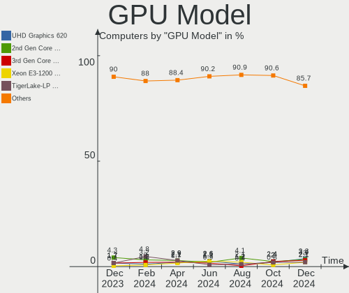

| Model                                                                       | Computers | Percent |
|-----------------------------------------------------------------------------|-----------|---------|
| Intel 3rd Gen Core processor Graphics Controller                            | 10        | 3.3%    |
| Intel Mobile 4 Series Chipset Integrated Graphics Controller                | 8         | 2.64%   |
| Intel CoffeeLake-S GT2 [UHD Graphics 630]                                   | 8         | 2.64%   |
| AMD VanGogh [AMD Custom GPU 0405]                                           | 8         | 2.64%   |
| Intel TigerLake-LP GT2 [Iris Xe Graphics]                                   | 7         | 2.31%   |
| Intel Skylake GT2 [HD Graphics 520]                                         | 7         | 2.31%   |
| AMD Cezanne [Radeon Vega Series / Radeon Vega Mobile Series]                | 7         | 2.31%   |
| Nvidia TU117M [GeForce GTX 1650 Mobile / Max-Q]                             | 6         | 1.98%   |
| Intel GeminiLake [UHD Graphics 600]                                         | 6         | 1.98%   |
| Intel 2nd Generation Core Processor Family Integrated Graphics Controller   | 6         | 1.98%   |
| Nvidia GA106M [GeForce RTX 3060 Mobile / Max-Q]                             | 5         | 1.65%   |
| Intel TigerLake-H GT1 [UHD Graphics]                                        | 5         | 1.65%   |
| Intel HD Graphics 5500                                                      | 5         | 1.65%   |
| Intel CometLake-U GT2 [UHD Graphics]                                        | 5         | 1.65%   |
| AMD Renoir                                                                  | 5         | 1.65%   |
| Nvidia GK208B [GeForce GT 710]                                              | 4         | 1.32%   |
| Intel Xeon E3-1200 v3/4th Gen Core Processor Integrated Graphics Controller | 4         | 1.32%   |
| Intel UHD Graphics 620                                                      | 4         | 1.32%   |
| Intel HD Graphics 620                                                       | 4         | 1.32%   |
| Intel Alder Lake-P Integrated Graphics Controller                           | 4         | 1.32%   |
| AMD Raphael                                                                 | 4         | 1.32%   |
| AMD Navi 21 [Radeon RX 6800/6800 XT / 6900 XT]                              | 4         | 1.32%   |
| AMD Ellesmere [Radeon RX 470/480/570/570X/580/580X/590]                     | 4         | 1.32%   |
| Nvidia TU106 [GeForce RTX 2060 SUPER]                                       | 3         | 0.99%   |
| Nvidia TU104 [GeForce RTX 2060]                                             | 3         | 0.99%   |
| Nvidia GP108 [GeForce GT 1030]                                              | 3         | 0.99%   |
| Nvidia GP107 [GeForce GTX 1050 Ti]                                          | 3         | 0.99%   |
| Nvidia GA107M [GeForce RTX 3050 Ti Mobile]                                  | 3         | 0.99%   |
| Intel WhiskeyLake-U GT2 [UHD Graphics 620]                                  | 3         | 0.99%   |
| Intel JasperLake [UHD Graphics]                                             | 3         | 0.99%   |
| Intel HD Graphics 530                                                       | 3         | 0.99%   |
| Intel Haswell-ULT Integrated Graphics Controller                            | 3         | 0.99%   |
| Intel Atom Processor Z36xxx/Z37xxx Series Graphics & Display                | 3         | 0.99%   |
| Intel 4th Gen Core Processor Integrated Graphics Controller                 | 3         | 0.99%   |
| AMD Picasso/Raven 2 [Radeon Vega Series / Radeon Vega Mobile Series]        | 3         | 0.99%   |
| AMD Kaveri [Radeon R7 Graphics]                                             | 3         | 0.99%   |
| Nvidia TU116M [GeForce GTX 1660 Ti Mobile]                                  | 2         | 0.66%   |
| Nvidia GP104 [GeForce GTX 1070]                                             | 2         | 0.66%   |
| Nvidia GM204M [GeForce GTX 970M]                                            | 2         | 0.66%   |
| Nvidia GF119 [NVS 310]                                                      | 2         | 0.66%   |

GPU Combo
---------

Combinations of graphics cards

| Name           | Computers | Percent |
|----------------|-----------|---------|
| 1 x Intel      | 98        | 37.55%  |
| 1 x AMD        | 60        | 22.99%  |
| 1 x Nvidia     | 55        | 21.07%  |
| Intel + Nvidia | 24        | 9.2%    |
| 2 x Intel      | 7         | 2.68%   |
| AMD + Nvidia   | 7         | 2.68%   |
| 2 x AMD        | 4         | 1.53%   |
| 1 x Matrox     | 3         | 1.15%   |
| Intel + AMD    | 2         | 0.77%   |
| 2 x Nvidia     | 1         | 0.38%   |

GPU Driver
----------

Free vs proprietary

| Driver      | Computers | Percent |
|-------------|-----------|---------|
| Free        | 207       | 79.31%  |
| Proprietary | 45        | 17.24%  |
| Unknown     | 9         | 3.45%   |

GPU Memory
----------

Total video memory

| Size in GB | Computers | Percent |
|------------|-----------|---------|
| Unknown    | 160       | 61.3%   |
| 1.01-2.0   | 22        | 8.43%   |
| 0.01-0.5   | 20        | 7.66%   |
| 3.01-4.0   | 16        | 6.13%   |
| 7.01-8.0   | 12        | 4.6%    |
| 0.51-1.0   | 12        | 4.6%    |
| 8.01-16.0  | 9         | 3.45%   |
| 5.01-6.0   | 7         | 2.68%   |
| 2.01-3.0   | 3         | 1.15%   |

Monitor
-------

Monitor Vendor
--------------

Monitor vendors

| Vendor                  | Computers | Percent |
|-------------------------|-----------|---------|
| Samsung Electronics     | 36        | 12.59%  |
| LG Display              | 29        | 10.14%  |
| AU Optronics            | 29        | 10.14%  |
| Dell                    | 20        | 6.99%   |
| Chimei Innolux          | 19        | 6.64%   |
| BOE                     | 15        | 5.24%   |
| Sharp                   | 14        | 4.9%    |
| Acer                    | 11        | 3.85%   |
| AOC                     | 10        | 3.5%    |
| Philips                 | 8         | 2.8%    |
| Hewlett-Packard         | 8         | 2.8%    |
| BenQ                    | 8         | 2.8%    |
| Valve                   | 7         | 2.45%   |
| Ancor Communications    | 7         | 2.45%   |
| Lenovo                  | 6         | 2.1%    |
| ASUSTek Computer        | 6         | 2.1%    |
| ViewSonic               | 5         | 1.75%   |
| Iiyama                  | 5         | 1.75%   |
| Goldstar                | 5         | 1.75%   |
| Apple                   | 4         | 1.4%    |
| Vestel Elektronik       | 3         | 1.05%   |
| MSI                     | 3         | 1.05%   |
| Unknown                 | 2         | 0.7%    |
| Toshiba                 | 2         | 0.7%    |
| NEC Computers           | 2         | 0.7%    |
| LG Electronics          | 2         | 0.7%    |
| Chi Mei Optoelectronics | 2         | 0.7%    |
| UMC                     | 1         | 0.35%   |
| Sony                    | 1         | 0.35%   |
| Plain Tree Systems      | 1         | 0.35%   |
| PANDA                   | 1         | 0.35%   |
| Panasonic               | 1         | 0.35%   |
| MStar                   | 1         | 0.35%   |
| MiTAC                   | 1         | 0.35%   |
| LG Philips              | 1         | 0.35%   |
| InfoVision              | 1         | 0.35%   |
| IBM                     | 1         | 0.35%   |
| HKC                     | 1         | 0.35%   |
| HannStar                | 1         | 0.35%   |
| GKE                     | 1         | 0.35%   |

Monitor Model
-------------

Monitor models

| Model                                                                 | Computers | Percent |
|-----------------------------------------------------------------------|-----------|---------|
| Valve ANX7530 U VLV3001 800x1280 100x150mm 7.1-inch                   | 7         | 2.39%   |
| Sharp LQ134N1JW52 SHP151E 1920x1200 288x180mm 13.4-inch               | 5         | 1.71%   |
| Vestel Elektronik 50FHD_LCD_TV VES3700 1920x1080 1280x720mm 57.8-inch | 3         | 1.02%   |
| LG Display LCD Monitor LGD02DC 1366x768 344x194mm 15.5-inch           | 3         | 1.02%   |
| ASUSTek Computer VP28U AUS28B1 3840x2160 621x341mm 27.9-inch          | 3         | 1.02%   |
| Samsung Electronics S34J55x SAM0F70 3440x1440 797x333mm 34.0-inch     | 2         | 0.68%   |
| Samsung Electronics LCD Monitor SDC4154 2880x1800 302x189mm 14.0-inch | 2         | 0.68%   |
| Samsung Electronics LC27G5xT SAM707A 2560x1440 597x336mm 27.0-inch    | 2         | 0.68%   |
| Philips PHL 288P6L PHL08F2 3840x2160 621x341mm 27.9-inch              | 2         | 0.68%   |
| MSI Optix G241VC MSI1462 1920x1080 521x294mm 23.6-inch                | 2         | 0.68%   |
| LG Electronics LCD Monitor 22MP55 1920x1080                           | 2         | 0.68%   |
| LG Display LCD Monitor LGD033B 1366x768 344x194mm 15.5-inch           | 2         | 0.68%   |
| LG Display LCD Monitor LGD033A 1366x768 344x194mm 15.5-inch           | 2         | 0.68%   |
| BenQ PD3200U BNQ8025 3840x2160 708x399mm 32.0-inch                    | 2         | 0.68%   |
| AU Optronics LCD Monitor AUO39ED 1920x1080 344x193mm 15.5-inch        | 2         | 0.68%   |
| AU Optronics LCD Monitor AUO35EC 1366x768 344x193mm 15.5-inch         | 2         | 0.68%   |
| AU Optronics LCD Monitor AUO22EC 1366x768 344x193mm 15.5-inch         | 2         | 0.68%   |
| AOC 2369M AOC2369 1920x1080 509x286mm 23.0-inch                       | 2         | 0.68%   |
| AOC 2270W AOC2270 1920x1080 477x268mm 21.5-inch                       | 2         | 0.68%   |
| Ancor Communications VE247 ACI2493 1920x1080 531x299mm 24.0-inch      | 2         | 0.68%   |
| Ancor Communications ASUS PB277 ACI27B5 1920x1080 597x336mm 27.0-inch | 2         | 0.68%   |
| Acer VG270U ACR06C9 2560x1440 597x336mm 27.0-inch                     | 2         | 0.68%   |
| Acer K242HL ACR03E3 1920x1080 531x299mm 24.0-inch                     | 2         | 0.68%   |
| Acer K222HQL ACR03E1 1920x1080 477x268mm 21.5-inch                    | 2         | 0.68%   |
| ViewSonic VX2758 Series VSCDD35 1920x1080 597x336mm 27.0-inch         | 1         | 0.34%   |
| ViewSonic VX2757 VSCF931 1920x1080 598x336mm 27.0-inch                | 1         | 0.34%   |
| ViewSonic VX2703 SERIES VSCF62B 1920x1080 597x336mm 27.0-inch         | 1         | 0.34%   |
| ViewSonic VE710s VSCF518 1280x1024 338x270mm 17.0-inch                | 1         | 0.34%   |
| ViewSonic VA2265 SERIES VSCB330 1920x1080 476x268mm 21.5-inch         | 1         | 0.34%   |
| Unknown LCD Monitor XXX AAA 1920x1080                                 | 1         | 0.34%   |
| Unknown LCD Monitor FFFF 2288x1287 2550x2550mm 142.0-inch             | 1         | 0.34%   |
| UMC LCD Monitor SHARP 3840x2160                                       | 1         | 0.34%   |
| Toshiba TV TSB0110 1920x1080 705x398mm 31.9-inch                      | 1         | 0.34%   |
| Toshiba TV TSB0108 1440x900 700x390mm 31.5-inch                       | 1         | 0.34%   |
| Sony TV SNY0745 3840x2160 1440x810mm 65.0-inch                        | 1         | 0.34%   |
| Sharp LQ156T1JW03 SHP1529 2560x1440 344x194mm 15.5-inch               | 1         | 0.34%   |
| Sharp LQ156M1JW01 SHP14C3 1920x1080 344x194mm 15.5-inch               | 1         | 0.34%   |
| Sharp LCD Monitor SHP14E0 1920x1280 259x173mm 12.3-inch               | 1         | 0.34%   |
| Sharp LCD Monitor SHP14AE 1920x1080 294x165mm 13.3-inch               | 1         | 0.34%   |
| Sharp LCD Monitor SHP14AD 3840x2160 294x165mm 13.3-inch               | 1         | 0.34%   |

Monitor Resolution
------------------

Monitor screen resolution

| Resolution         | Computers | Percent |
|--------------------|-----------|---------|
| 1920x1080 (FHD)    | 95        | 34.93%  |
| 1366x768 (WXGA)    | 44        | 16.18%  |
| 3840x2160 (4K)     | 29        | 10.66%  |
| 2560x1440 (QHD)    | 24        | 8.82%   |
| 1920x1200 (WUXGA)  | 10        | 3.68%   |
| 800x1280           | 8         | 2.94%   |
| 1680x1050 (WSXGA+) | 8         | 2.94%   |
| 1440x900 (WXGA+)   | 8         | 2.94%   |
| 1600x900 (HD+)     | 7         | 2.57%   |
| 1280x1024 (SXGA)   | 7         | 2.57%   |
| 3440x1440          | 6         | 2.21%   |
| 1280x800 (WXGA)    | 4         | 1.47%   |
| 1920x1280          | 3         | 1.1%    |
| 2880x1800          | 2         | 0.74%   |
| 2560x1080          | 2         | 0.74%   |
| 3840x1080          | 1         | 0.37%   |
| 3240x2160          | 1         | 0.37%   |
| 3200x1800 (QHD+)   | 1         | 0.37%   |
| 2736x1824          | 1         | 0.37%   |
| 2560x1700          | 1         | 0.37%   |
| 2560x1600          | 1         | 0.37%   |
| 2304x1440          | 1         | 0.37%   |
| 2288x1287          | 1         | 0.37%   |
| 2160x1440          | 1         | 0.37%   |
| 2048x1152          | 1         | 0.37%   |
| 1920x540           | 1         | 0.37%   |
| 1600x1200          | 1         | 0.37%   |
| 1366x912           | 1         | 0.37%   |
| 1360x768           | 1         | 0.37%   |
| 1024x768 (XGA)     | 1         | 0.37%   |

Monitor Diagonal
----------------

Diagonal size in inches

| Inches  | Computers | Percent |
|---------|-----------|---------|
| 15      | 58        | 20.64%  |
| 27      | 27        | 9.61%   |
| 13      | 24        | 8.54%   |
| 24      | 21        | 7.47%   |
| 23      | 16        | 5.69%   |
| 17      | 15        | 5.34%   |
| 14      | 15        | 5.34%   |
| 21      | 14        | 4.98%   |
| 31      | 13        | 4.63%   |
| 12      | 10        | 3.56%   |
| 19      | 9         | 3.2%    |
| Unknown | 8         | 2.85%   |
| 34      | 7         | 2.49%   |
| 7       | 7         | 2.49%   |
| 84      | 4         | 1.42%   |
| 32      | 4         | 1.42%   |
| 22      | 4         | 1.42%   |
| 20      | 4         | 1.42%   |
| 25      | 3         | 1.07%   |
| 11      | 3         | 1.07%   |
| 10      | 3         | 1.07%   |
| 52      | 2         | 0.71%   |
| 16      | 2         | 0.71%   |
| 142     | 1         | 0.36%   |
| 72      | 1         | 0.36%   |
| 65      | 1         | 0.36%   |
| 50      | 1         | 0.36%   |
| 48      | 1         | 0.36%   |
| 42      | 1         | 0.36%   |
| 28      | 1         | 0.36%   |
| 26      | 1         | 0.36%   |

Monitor Width
-------------

Physical width

| Width in mm    | Computers | Percent |
|----------------|-----------|---------|
| 301-350        | 86        | 30.94%  |
| 501-600        | 57        | 20.5%   |
| 201-300        | 30        | 10.79%  |
| 401-500        | 28        | 10.07%  |
| 601-700        | 20        | 7.19%   |
| 351-400        | 19        | 6.83%   |
| 701-800        | 11        | 3.96%   |
| Unknown        | 8         | 2.88%   |
| 1-100          | 7         | 2.52%   |
| 1501-2000      | 5         | 1.8%    |
| 1001-1500      | 5         | 1.8%    |
| More than 2000 | 1         | 0.36%   |
| 901-1000       | 1         | 0.36%   |

Aspect Ratio
------------

Proportional relationship between the width and the height

| Ratio   | Computers | Percent |
|---------|-----------|---------|
| 16/9    | 185       | 71.98%  |
| 16/10   | 34        | 13.23%  |
| 5/4     | 7         | 2.72%   |
| 3/2     | 7         | 2.72%   |
| 21/9    | 7         | 2.72%   |
| 0.67    | 7         | 2.72%   |
| Unknown | 5         | 1.95%   |
| 4/3     | 2         | 0.78%   |
| 32/9    | 1         | 0.39%   |
| 1.00    | 1         | 0.39%   |
| 0.62    | 1         | 0.39%   |

Monitor Area
------------

Area in inch

| Area in inch | Computers | Percent |
|----------------|-----------|---------|
| 101-110        | 59        | 21%     |
| 201-250        | 40        | 14.23%  |
| 301-350        | 28        | 9.96%   |
| 81-90          | 26        | 9.25%   |
| 351-500        | 25        | 8.9%    |
| 151-200        | 21        | 7.47%   |
| 71-80          | 12        | 4.27%   |
| 121-130        | 12        | 4.27%   |
| More than 1000 | 10        | 3.56%   |
| 251-300        | 10        | 3.56%   |
| 61-70          | 9         | 3.2%    |
| Unknown        | 8         | 2.85%   |
| 1-40           | 7         | 2.49%   |
| 51-60          | 4         | 1.42%   |
| 41-50          | 2         | 0.71%   |
| 141-150        | 2         | 0.71%   |
| 501-1000       | 2         | 0.71%   |
| 91-100         | 2         | 0.71%   |
| 131-140        | 1         | 0.36%   |
| 111-120        | 1         | 0.36%   |

Pixel Density
-------------

Pixels per inch

| Density       | Computers | Percent |
|---------------|-----------|---------|
| 101-120       | 75        | 28.09%  |
| 51-100        | 72        | 26.97%  |
| 121-160       | 68        | 25.47%  |
| 161-240       | 32        | 11.99%  |
| Unknown       | 8         | 3%      |
| More than 240 | 7         | 2.62%   |
| 1-50          | 5         | 1.87%   |

Multiple Monitors
-----------------

Total monitors connected

| Total | Computers | Percent |
|-------|-----------|---------|
| 1     | 204       | 78.16%  |
| 2     | 44        | 16.86%  |
| 0     | 8         | 3.07%   |
| 3     | 5         | 1.92%   |

Network
-------

Net Controller Vendor
---------------------

Controller vendors

| Vendor                                 | Computers | Percent |
|----------------------------------------|-----------|---------|
| Realtek Semiconductor                  | 139       | 36.39%  |
| Intel                                  | 133       | 34.82%  |
| Qualcomm Atheros                       | 30        | 7.85%   |
| Broadcom                               | 21        | 5.5%    |
| MediaTek                               | 8         | 2.09%   |
| Broadcom Limited                       | 6         | 1.57%   |
| TP-Link                                | 5         | 1.31%   |
| Ralink Technology                      | 5         | 1.31%   |
| OnePlus Technology (Shenzhen)          | 4         | 1.05%   |
| Samsung Electronics                    | 3         | 0.79%   |
| Marvell Technology Group               | 3         | 0.79%   |
| Ralink                                 | 2         | 0.52%   |
| Nvidia                                 | 2         | 0.52%   |
| Microsoft                              | 2         | 0.52%   |
| Lenovo                                 | 2         | 0.52%   |
| JMicron Technology                     | 2         | 0.52%   |
| Edimax Technology                      | 2         | 0.52%   |
| Aquantia                               | 2         | 0.52%   |
| ZTE WCDMA Technologies MSM             | 1         | 0.26%   |
| Xiaomi                                 | 1         | 0.26%   |
| Sony Ericsson Mobile Communications AB | 1         | 0.26%   |
| Sierra Wireless                        | 1         | 0.26%   |
| Qualcomm Atheros Communications        | 1         | 0.26%   |
| Qualcomm                               | 1         | 0.26%   |
| NetGear                                | 1         | 0.26%   |
| Motorola PCS                           | 1         | 0.26%   |
| Google                                 | 1         | 0.26%   |
| DisplayLink                            | 1         | 0.26%   |
| ASIX Electronics                       | 1         | 0.26%   |

Net Controller Model
--------------------

Controller models

| Model                                                             | Computers | Percent |
|-------------------------------------------------------------------|-----------|---------|
| Realtek RTL8111/8168/8411 PCI Express Gigabit Ethernet Controller | 96        | 21.24%  |
| Intel Wi-Fi 6 AX200                                               | 18        | 3.98%   |
| Realtek RTL810xE PCI Express Fast Ethernet controller             | 14        | 3.1%    |
| Realtek RTL8822CE 802.11ac PCIe Wireless Network Adapter          | 12        | 2.65%   |
| Realtek RTL8125 2.5GbE Controller                                 | 11        | 2.43%   |
| Realtek RTL8153 Gigabit Ethernet Adapter                          | 9         | 1.99%   |
| Intel Wireless 8265 / 8275                                        | 8         | 1.77%   |
| Intel 82579LM Gigabit Network Connection (Lewisville)             | 8         | 1.77%   |
| Intel Wireless 8260                                               | 7         | 1.55%   |
| Intel Ethernet Controller I225-V                                  | 7         | 1.55%   |
| Qualcomm Atheros QCA9565 / AR9565 Wireless Network Adapter        | 6         | 1.33%   |
| Qualcomm Atheros AR9485 Wireless Network Adapter                  | 6         | 1.33%   |
| Intel Wi-Fi 6 AX201                                               | 6         | 1.33%   |
| Intel Wireless 3160                                               | 5         | 1.11%   |
| Intel Wi-Fi 6 AX210/AX211/AX411 160MHz                            | 5         | 1.11%   |
| Intel I211 Gigabit Network Connection                             | 5         | 1.11%   |
| Intel Ethernet Connection I219-LM                                 | 5         | 1.11%   |
| Realtek RTL8821CE 802.11ac PCIe Wireless Network Adapter          | 4         | 0.88%   |
| Qualcomm Atheros QCA6174 802.11ac Wireless Network Adapter        | 4         | 0.88%   |
| OnePlus (Shenzhen) OnePlus                                        | 4         | 0.88%   |
| Intel Wireless 7260                                               | 4         | 0.88%   |
| Intel Tiger Lake PCH CNVi WiFi                                    | 4         | 0.88%   |
| Intel Gemini Lake PCH CNVi WiFi                                   | 4         | 0.88%   |
| Intel Ethernet Connection (7) I219-V                              | 4         | 0.88%   |
| Intel Ethernet Connection (2) I219-V                              | 4         | 0.88%   |
| Intel Alder Lake-P PCH CNVi WiFi                                  | 4         | 0.88%   |
| Broadcom BCM43142 802.11b/g/n                                     | 4         | 0.88%   |
| Realtek RTL88x2bu [AC1200 Techkey]                                | 3         | 0.66%   |
| Realtek RTL8192EE PCIe Wireless Network Adapter                   | 3         | 0.66%   |
| Realtek RTL8188CE 802.11b/g/n WiFi Adapter                        | 3         | 0.66%   |
| Qualcomm Atheros QCA9377 802.11ac Wireless Network Adapter        | 3         | 0.66%   |
| Qualcomm Atheros QCA8171 Gigabit Ethernet                         | 3         | 0.66%   |
| Qualcomm Atheros AR9462 Wireless Network Adapter                  | 3         | 0.66%   |
| MediaTek MT7922 802.11ax PCI Express Wireless Network Adapter     | 3         | 0.66%   |
| Intel Wireless 3165                                               | 3         | 0.66%   |
| Intel Ethernet Connection I217-LM                                 | 3         | 0.66%   |
| Intel Ethernet Connection (4) I219-LM                             | 3         | 0.66%   |
| Intel Dual Band Wireless-AC 3168NGW [Stone Peak]                  | 3         | 0.66%   |
| Intel Comet Lake PCH-LP CNVi WiFi                                 | 3         | 0.66%   |
| Intel Cannon Point-LP CNVi [Wireless-AC]                          | 3         | 0.66%   |

Wireless Vendor
---------------

Wireless vendors

| Vendor                          | Computers | Percent |
|---------------------------------|-----------|---------|
| Intel                           | 98        | 46.01%  |
| Realtek Semiconductor           | 42        | 19.72%  |
| Qualcomm Atheros                | 27        | 12.68%  |
| Broadcom                        | 13        | 6.1%    |
| MediaTek                        | 8         | 3.76%   |
| TP-Link                         | 5         | 2.35%   |
| Ralink Technology               | 5         | 2.35%   |
| Broadcom Limited                | 4         | 1.88%   |
| Ralink                          | 2         | 0.94%   |
| Marvell Technology Group        | 2         | 0.94%   |
| Edimax Technology               | 2         | 0.94%   |
| Sierra Wireless                 | 1         | 0.47%   |
| Qualcomm Atheros Communications | 1         | 0.47%   |
| Qualcomm                        | 1         | 0.47%   |
| NetGear                         | 1         | 0.47%   |
| Microsoft                       | 1         | 0.47%   |

Wireless Model
--------------

Wireless models

| Model                                                          | Computers | Percent |
|----------------------------------------------------------------|-----------|---------|
| Intel Wi-Fi 6 AX200                                            | 18        | 8.41%   |
| Realtek RTL8822CE 802.11ac PCIe Wireless Network Adapter       | 12        | 5.61%   |
| Intel Wireless 8265 / 8275                                     | 8         | 3.74%   |
| Intel Wireless 8260                                            | 7         | 3.27%   |
| Qualcomm Atheros QCA9565 / AR9565 Wireless Network Adapter     | 6         | 2.8%    |
| Qualcomm Atheros AR9485 Wireless Network Adapter               | 6         | 2.8%    |
| Intel Wi-Fi 6 AX201                                            | 6         | 2.8%    |
| Intel Wireless 3160                                            | 5         | 2.34%   |
| Intel Wi-Fi 6 AX210/AX211/AX411 160MHz                         | 5         | 2.34%   |
| Realtek RTL8821CE 802.11ac PCIe Wireless Network Adapter       | 4         | 1.87%   |
| Qualcomm Atheros QCA6174 802.11ac Wireless Network Adapter     | 4         | 1.87%   |
| Intel Wireless 7260                                            | 4         | 1.87%   |
| Intel Tiger Lake PCH CNVi WiFi                                 | 4         | 1.87%   |
| Intel Gemini Lake PCH CNVi WiFi                                | 4         | 1.87%   |
| Intel Alder Lake-P PCH CNVi WiFi                               | 4         | 1.87%   |
| Broadcom BCM43142 802.11b/g/n                                  | 4         | 1.87%   |
| Realtek RTL88x2bu [AC1200 Techkey]                             | 3         | 1.4%    |
| Realtek RTL8192EE PCIe Wireless Network Adapter                | 3         | 1.4%    |
| Realtek RTL8188CE 802.11b/g/n WiFi Adapter                     | 3         | 1.4%    |
| Qualcomm Atheros QCA9377 802.11ac Wireless Network Adapter     | 3         | 1.4%    |
| Qualcomm Atheros AR9462 Wireless Network Adapter               | 3         | 1.4%    |
| MediaTek MT7922 802.11ax PCI Express Wireless Network Adapter  | 3         | 1.4%    |
| Intel Wireless 3165                                            | 3         | 1.4%    |
| Intel Dual Band Wireless-AC 3168NGW [Stone Peak]               | 3         | 1.4%    |
| Intel Comet Lake PCH-LP CNVi WiFi                              | 3         | 1.4%    |
| Intel Cannon Point-LP CNVi [Wireless-AC]                       | 3         | 1.4%    |
| Intel Cannon Lake PCH CNVi WiFi                                | 3         | 1.4%    |
| Broadcom BCM4322 802.11a/b/g/n Wireless LAN Controller         | 3         | 1.4%    |
| Realtek RTL8192EU 802.11b/g/n WLAN Adapter                     | 2         | 0.93%   |
| Realtek RTL8188EUS 802.11n Wireless Network Adapter            | 2         | 0.93%   |
| Realtek RTL8188EE Wireless Network Adapter                     | 2         | 0.93%   |
| Realtek 802.11ac NIC                                           | 2         | 0.93%   |
| Ralink RT5370 Wireless Adapter                                 | 2         | 0.93%   |
| Ralink MT7601U Wireless Adapter                                | 2         | 0.93%   |
| Qualcomm Atheros AR9285 Wireless Network Adapter (PCI-Express) | 2         | 0.93%   |
| MediaTek WLAN controller                                       | 2         | 0.93%   |
| MediaTek MT7921K (RZ608) Wi-Fi 6E 80MHz                        | 2         | 0.93%   |
| Marvell Group 88W8897 [AVASTAR] 802.11ac Wireless              | 2         | 0.93%   |
| Intel Wireless 7265                                            | 2         | 0.93%   |
| Intel PRO/Wireless 3945ABG [Golan] Network Connection          | 2         | 0.93%   |

Ethernet Vendor
---------------

Ethernet vendors

| Vendor                        | Computers | Percent |
|-------------------------------|-----------|---------|
| Realtek Semiconductor         | 123       | 54.42%  |
| Intel                         | 63        | 27.88%  |
| Broadcom                      | 9         | 3.98%   |
| Qualcomm Atheros              | 6         | 2.65%   |
| OnePlus Technology (Shenzhen) | 4         | 1.77%   |
| Samsung Electronics           | 3         | 1.33%   |
| Nvidia                        | 2         | 0.88%   |
| Lenovo                        | 2         | 0.88%   |
| JMicron Technology            | 2         | 0.88%   |
| Broadcom Limited              | 2         | 0.88%   |
| Aquantia                      | 2         | 0.88%   |
| ZTE WCDMA Technologies MSM    | 1         | 0.44%   |
| Xiaomi                        | 1         | 0.44%   |
| Motorola PCS                  | 1         | 0.44%   |
| Microsoft                     | 1         | 0.44%   |
| Marvell Technology Group      | 1         | 0.44%   |
| Google                        | 1         | 0.44%   |
| DisplayLink                   | 1         | 0.44%   |
| ASIX Electronics              | 1         | 0.44%   |

Ethernet Model
--------------

Ethernet models

| Model                                                             | Computers | Percent |
|-------------------------------------------------------------------|-----------|---------|
| Realtek RTL8111/8168/8411 PCI Express Gigabit Ethernet Controller | 96        | 40.51%  |
| Realtek RTL810xE PCI Express Fast Ethernet controller             | 14        | 5.91%   |
| Realtek RTL8125 2.5GbE Controller                                 | 11        | 4.64%   |
| Realtek RTL8153 Gigabit Ethernet Adapter                          | 9         | 3.8%    |
| Intel 82579LM Gigabit Network Connection (Lewisville)             | 8         | 3.38%   |
| Intel Ethernet Controller I225-V                                  | 7         | 2.95%   |
| Intel I211 Gigabit Network Connection                             | 5         | 2.11%   |
| Intel Ethernet Connection I219-LM                                 | 5         | 2.11%   |
| OnePlus (Shenzhen) OnePlus                                        | 4         | 1.69%   |
| Intel Ethernet Connection (7) I219-V                              | 4         | 1.69%   |
| Intel Ethernet Connection (2) I219-V                              | 4         | 1.69%   |
| Qualcomm Atheros QCA8171 Gigabit Ethernet                         | 3         | 1.27%   |
| Intel Ethernet Connection I217-LM                                 | 3         | 1.27%   |
| Intel Ethernet Connection (4) I219-LM                             | 3         | 1.27%   |
| Intel 82567LM Gigabit Network Connection                          | 3         | 1.27%   |
| Intel 82566DM-2 Gigabit Network Connection                        | 3         | 1.27%   |
| Samsung GT-I9070 (network tethering, USB debugging enabled)       | 2         | 0.84%   |
| Lenovo USB-C Dock Ethernet                                        | 2         | 0.84%   |
| JMicron JMC260 PCI Express Fast Ethernet Controller               | 2         | 0.84%   |
| Intel PRO/100 VE Network Connection                               | 2         | 0.84%   |
| Intel 82567LM-3 Gigabit Network Connection                        | 2         | 0.84%   |
| Broadcom NetXtreme BCM5761 Gigabit Ethernet PCIe                  | 2         | 0.84%   |
| Broadcom NetLink BCM57780 Gigabit Ethernet PCIe                   | 2         | 0.84%   |
| ZTE WCDMA MSM USB SCSI CD-ROM                                     | 1         | 0.42%   |
| Xiaomi Mi/Redmi series (RNDIS)                                    | 1         | 0.42%   |
| Samsung Galaxy series, misc. (tethering mode)                     | 1         | 0.42%   |
| Realtek RTL8169 PCI Gigabit Ethernet Controller                   | 1         | 0.42%   |
| Realtek RTL8152 Fast Ethernet Adapter                             | 1         | 0.42%   |
| Qualcomm Atheros Killer E2400 Gigabit Ethernet Controller         | 1         | 0.42%   |
| Qualcomm Atheros AR8161 Gigabit Ethernet                          | 1         | 0.42%   |
| Qualcomm Atheros AR8132 Fast Ethernet                             | 1         | 0.42%   |
| Nvidia MCP77 Ethernet                                             | 1         | 0.42%   |
| Nvidia MCP51 Ethernet Controller                                  | 1         | 0.42%   |
| Motorola PCS motorola one 5G ace                                  | 1         | 0.42%   |
| Microsoft RTL8153 GigE [Surface Ethernet Adapter]                 | 1         | 0.42%   |
| Marvell Group 88E8057 PCI-E Gigabit Ethernet Controller           | 1         | 0.42%   |
| Intel I350 Gigabit Network Connection                             | 1         | 0.42%   |
| Intel I210 Gigabit Network Connection                             | 1         | 0.42%   |
| Intel Ethernet Connection I219-V                                  | 1         | 0.42%   |
| Intel Ethernet Connection I218-LM                                 | 1         | 0.42%   |

Net Controller Kind
-------------------

Ethernet, WiFi or modem

| Kind     | Computers | Percent |
|----------|-----------|---------|
| Ethernet | 213       | 51.33%  |
| WiFi     | 201       | 48.43%  |
| Unknown  | 1         | 0.24%   |

Used Controller
---------------

Currently used network controller

| Kind     | Computers | Percent |
|----------|-----------|---------|
| WiFi     | 150       | 57.47%  |
| Ethernet | 111       | 42.53%  |

NICs
----

Total network controllers on board

| Total | Computers | Percent |
|-------|-----------|---------|
| 2     | 128       | 49.04%  |
| 1     | 125       | 47.89%  |
| 3     | 5         | 1.92%   |
| 8     | 1         | 0.38%   |
| 4     | 1         | 0.38%   |
| 0     | 1         | 0.38%   |

IPv6
----

IPv6 vs IPv4

| Used | Computers | Percent |
|------|-----------|---------|
| No   | 209       | 80.08%  |
| Yes  | 52        | 19.92%  |

Bluetooth
---------

Bluetooth Vendor
----------------

Controller vendors

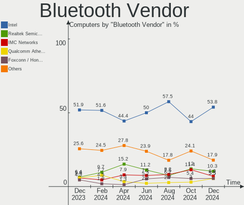

| Vendor                          | Computers | Percent |
|---------------------------------|-----------|---------|
| Intel                           | 85        | 49.13%  |
| Qualcomm Atheros Communications | 14        | 8.09%   |
| IMC Networks                    | 13        | 7.51%   |
| Cambridge Silicon Radio         | 11        | 6.36%   |
| Broadcom                        | 10        | 5.78%   |
| Realtek Semiconductor           | 9         | 5.2%    |
| Foxconn / Hon Hai               | 5         | 2.89%   |
| MediaTek                        | 4         | 2.31%   |
| Apple                           | 4         | 2.31%   |
| TP-Link                         | 3         | 1.73%   |
| Toshiba                         | 3         | 1.73%   |
| Lite-On Technology              | 2         | 1.16%   |
| Hewlett-Packard                 | 2         | 1.16%   |
| USI                             | 1         | 0.58%   |
| Micro Star International        | 1         | 0.58%   |
| Marvell Semiconductor           | 1         | 0.58%   |
| Foxconn International           | 1         | 0.58%   |
| Belkin Components               | 1         | 0.58%   |
| ASUSTek Computer                | 1         | 0.58%   |
| Alps Electric                   | 1         | 0.58%   |
| Unknown                         | 1         | 0.58%   |

Bluetooth Model
---------------

Controller models

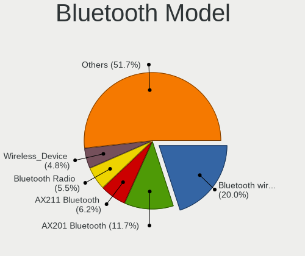

| Model                                                    | Computers | Percent |
|----------------------------------------------------------|-----------|---------|
| Intel Bluetooth wireless interface                       | 30        | 17.34%  |
| Intel Bluetooth Device                                   | 17        | 9.83%   |
| Intel AX200 Bluetooth                                    | 17        | 9.83%   |
| Intel Bluetooth 9460/9560 Jefferson Peak (JfP)           | 12        | 6.94%   |
| IMC Networks Bluetooth Radio                             | 11        | 6.36%   |
| Cambridge Silicon Radio Bluetooth Dongle (HCI mode)      | 11        | 6.36%   |
| Realtek Bluetooth Radio                                  | 7         | 4.05%   |
| Intel AX210 Bluetooth                                    | 5         | 2.89%   |
| Qualcomm Atheros  Bluetooth Device                       | 4         | 2.31%   |
| MediaTek Wireless_Device                                 | 4         | 2.31%   |
| TP-Link TPuLink UB500 Adapter                            | 3         | 1.73%   |
| Qualcomm Atheros QCA61x4 Bluetooth 4.0                   | 3         | 1.73%   |
| Qualcomm Atheros AR3012 Bluetooth 4.0                    | 3         | 1.73%   |
| Broadcom BCM20702A0 Bluetooth 4.0                        | 3         | 1.73%   |
| Toshiba Atheros AR3012 Bluetooth                         | 2         | 1.16%   |
| Qualcomm Atheros AR3011 Bluetooth                        | 2         | 1.16%   |
| Lite-On Bluetooth Device                                 | 2         | 1.16%   |
| Intel Wireless-AC 3168 Bluetooth                         | 2         | 1.16%   |
| IMC Networks Wireless_Device                             | 2         | 1.16%   |
| HP Bluetooth 2.0 Interface [Broadcom BCM2045]            | 2         | 1.16%   |
| Broadcom BCM20702A0                                      | 2         | 1.16%   |
| Apple Bluetooth Host Controller                          | 2         | 1.16%   |
| USI Bluetooth Device                                     | 1         | 0.58%   |
| Toshiba Bluetooth Device                                 | 1         | 0.58%   |
| Realtek RTL8723A Bluetooth                               | 1         | 0.58%   |
| Realtek  Bluetooth 4.2 Adapter                           | 1         | 0.58%   |
| Qualcomm Atheros Bluetooth                               | 1         | 0.58%   |
| Qualcomm Atheros AR9462 Bluetooth                        | 1         | 0.58%   |
| Micro Star International MS-6970 BToes Bluetooth adapter | 1         | 0.58%   |
| Marvell Bluetooth and Wireless LAN Composite             | 1         | 0.58%   |
| Intel Wireless-AC 9260 Bluetooth Adapter                 | 1         | 0.58%   |
| Intel Centrino Advanced-N 6230 Bluetooth adapter         | 1         | 0.58%   |
| Foxconn International BCM43142A0 Bluetooth module        | 1         | 0.58%   |
| Foxconn / Hon Hai Wireless_Device                        | 1         | 0.58%   |
| Foxconn / Hon Hai Bluetooth USB Host Controller          | 1         | 0.58%   |
| Foxconn / Hon Hai Bluetooth Device                       | 1         | 0.58%   |
| Foxconn / Hon Hai BCM43142A0 broadcom bluetooth          | 1         | 0.58%   |
| Foxconn / Hon Hai BCM43142A0                             | 1         | 0.58%   |
| Broadcom HP Portable Valentine                           | 1         | 0.58%   |
| Broadcom HP Portable Bumble Bee                          | 1         | 0.58%   |

Sound
-----

Sound Vendor
------------

Sound card vendors

| Vendor                                          | Computers | Percent |
|-------------------------------------------------|-----------|---------|
| Intel                                           | 165       | 44.35%  |
| AMD                                             | 94        | 25.27%  |
| Nvidia                                          | 68        | 18.28%  |
| C-Media Electronics                             | 6         | 1.61%   |
| ASUSTek Computer                                | 3         | 0.81%   |
| Texas Instruments                               | 2         | 0.54%   |
| SAVITECH                                        | 2         | 0.54%   |
| Razer USA                                       | 2         | 0.54%   |
| Microsoft                                       | 2         | 0.54%   |
| Logitech                                        | 2         | 0.54%   |
| Lenovo                                          | 2         | 0.54%   |
| KTMicro                                         | 2         | 0.54%   |
| GN Netcom                                       | 2         | 0.54%   |
| Blue Microphones                                | 2         | 0.54%   |
| Tenx Technology                                 | 1         | 0.27%   |
| SteelSeries ApS                                 | 1         | 0.27%   |
| Sennheiser Communications                       | 1         | 0.27%   |
| ROCCAT                                          | 1         | 0.27%   |
| RME                                             | 1         | 0.27%   |
| PreSonus Audio Electronics                      | 1         | 0.27%   |
| Plantronics                                     | 1         | 0.27%   |
| Micro Star International                        | 1         | 0.27%   |
| Licensed by Sony Computer Entertainment America | 1         | 0.27%   |
| Formosa Industrial Computing                    | 1         | 0.27%   |
| Focusrite-Novation                              | 1         | 0.27%   |
| FiiO Electronics Technology                     | 1         | 0.27%   |
| eMeet                                           | 1         | 0.27%   |
| Creative Labs                                   | 1         | 0.27%   |
| ATI Technologies                                | 1         | 0.27%   |
| Asahi Kasei Microsystems                        | 1         | 0.27%   |
| Antlion Audio                                   | 1         | 0.27%   |
| Anlya.cn                                        | 1         | 0.27%   |

Sound Model
-----------

Sound card models

| Model                                                                      | Computers | Percent |
|----------------------------------------------------------------------------|-----------|---------|
| AMD Family 17h/19h HD Audio Controller                                     | 26        | 5.79%   |
| AMD Starship/Matisse HD Audio Controller                                   | 18        | 4.01%   |
| Intel Sunrise Point-LP HD Audio                                            | 17        | 3.79%   |
| AMD Renoir Radeon High Definition Audio Controller                         | 16        | 3.56%   |
| Intel 7 Series/C216 Chipset Family High Definition Audio Controller        | 15        | 3.34%   |
| Intel 82801I (ICH9 Family) HD Audio Controller                             | 13        | 2.9%    |
| AMD Rembrandt Radeon High Definition Audio Controller                      | 13        | 2.9%    |
| AMD FCH Azalia Controller                                                  | 11        | 2.45%   |
| Intel 8 Series/C220 Series Chipset High Definition Audio Controller        | 10        | 2.23%   |
| Intel 6 Series/C200 Series Chipset Family High Definition Audio Controller | 10        | 2.23%   |
| AMD SBx00 Azalia (Intel HDA)                                               | 9         | 2%      |
| AMD Navi 21/23 HDMI/DP Audio Controller                                    | 9         | 2%      |
| AMD Family 17h (Models 00h-0fh) HD Audio Controller                        | 9         | 2%      |
| Intel Wildcat Point-LP High Definition Audio Controller                    | 8         | 1.78%   |
| Intel Celeron/Pentium Silver Processor High Definition Audio               | 8         | 1.78%   |
| Intel Broadwell-U Audio Controller                                         | 8         | 1.78%   |
| Nvidia GA106 High Definition Audio Controller                              | 7         | 1.56%   |
| Intel Xeon E3-1200 v3/4th Gen Core Processor HD Audio Controller           | 7         | 1.56%   |
| Intel Tiger Lake-LP Smart Sound Technology Audio Controller                | 7         | 1.56%   |
| Intel Cannon Lake PCH cAVS                                                 | 7         | 1.56%   |
| Intel Tiger Lake-H HD Audio Controller                                     | 6         | 1.34%   |
| Intel Alder Lake PCH-P High Definition Audio Controller                    | 6         | 1.34%   |
| Intel 82801JI (ICH10 Family) HD Audio Controller                           | 6         | 1.34%   |
| Intel 200 Series PCH HD Audio                                              | 6         | 1.34%   |
| Intel 100 Series/C230 Series Chipset Family HD Audio Controller            | 6         | 1.34%   |
| Nvidia TU106 High Definition Audio Controller                              | 5         | 1.11%   |
| Nvidia GK208 HDMI/DP Audio Controller                                      | 5         | 1.11%   |
| Intel Comet Lake PCH-LP cAVS                                               | 5         | 1.11%   |
| AMD Raven/Raven2/Fenghuang HDMI/DP Audio Controller                        | 5         | 1.11%   |
| AMD Kabini HDMI/DP Audio                                                   | 5         | 1.11%   |
| Nvidia TU116 High Definition Audio Controller                              | 4         | 0.89%   |
| Nvidia GP107GL High Definition Audio Controller                            | 4         | 0.89%   |
| Nvidia GP104 High Definition Audio Controller                              | 4         | 0.89%   |
| Nvidia GK104 HDMI Audio Controller                                         | 4         | 0.89%   |
| Nvidia GA104 High Definition Audio Controller                              | 4         | 0.89%   |
| Intel Cannon Point-LP High Definition Audio Controller                     | 4         | 0.89%   |
| AMD Kaveri HDMI/DP Audio Controller                                        | 4         | 0.89%   |
| AMD Ellesmere HDMI Audio [Radeon RX 470/480 / 570/580/590]                 | 4         | 0.89%   |
| Nvidia TU104 HD Audio Controller                                           | 3         | 0.67%   |
| Nvidia GP108 High Definition Audio Controller                              | 3         | 0.67%   |

Memory
------

Memory Vendor
-------------

Memory module vendors

| Vendor                       | Computers | Percent |
|------------------------------|-----------|---------|
| Samsung Electronics          | 35        | 19.34%  |
| SK hynix                     | 30        | 16.57%  |
| Micron Technology            | 23        | 12.71%  |
| Corsair                      | 21        | 11.6%   |
| Crucial                      | 17        | 9.39%   |
| Unknown                      | 15        | 8.29%   |
| Kingston                     | 12        | 6.63%   |
| Ramaxel Technology           | 4         | 2.21%   |
| Toshiba                      | 3         | 1.66%   |
| Elpida                       | 3         | 1.66%   |
| A-DATA Technology            | 3         | 1.66%   |
| Unknown (ABCD)               | 2         | 1.1%    |
| Unknown                      | 2         | 1.1%    |
| Unknown (9B0D)               | 1         | 0.55%   |
| Unknown (0x5846)             | 1         | 0.55%   |
| Unknown (0B38)               | 1         | 0.55%   |
| Team                         | 1         | 0.55%   |
| Patriot Memory (PDP Systems) | 1         | 0.55%   |
| Nanya Technology             | 1         | 0.55%   |
| Miron                        | 1         | 0.55%   |
| Hewlett-Packard              | 1         | 0.55%   |
| Gold Key                     | 1         | 0.55%   |
| ff                           | 1         | 0.55%   |
| 4ea5                         | 1         | 0.55%   |

Memory Model
------------

Memory module models

| Model                                                            | Computers | Percent |
|------------------------------------------------------------------|-----------|---------|
| Micron RAM MT53E1G32D2NP-046 8192MB SODIMM LPDDR4 4266MT/s       | 5         | 2.53%   |
| Corsair RAM CMK16GX4M2B3200C16 8GB DIMM DDR4 3600MT/s            | 4         | 2.02%   |
| Unknown RAM Module 4GB DIMM 1333MT/s                             | 3         | 1.52%   |
| Toshiba RAM 8HTF12864HDY-800G1 2GB SODIMM 1066MT/s               | 3         | 1.52%   |
| Toshiba RAM 64T128020EDL2.5C2 2GB SODIMM 1066MT/s                | 3         | 1.52%   |
| SK hynix RAM HMA81GS6AFR8N-UH 8192MB SODIMM DDR4 2667MT/s        | 3         | 1.52%   |
| Samsung RAM M471A1G44AB0-CWE 8GB SODIMM DDR4 3200MT/s            | 3         | 1.52%   |
| Unknown RAM Module 2GB SODIMM DDR2                               | 2         | 1.01%   |
| SK hynix RAM HMT451S6AFR6A-PB 4096MB SODIMM DDR3 1600MT/s        | 2         | 1.01%   |
| Samsung RAM M471B1G73QH0-YK0 8GB SODIMM DDR3 1867MT/s            | 2         | 1.01%   |
| Samsung RAM M471A5244CB0-CRC 4GB SODIMM DDR4 2667MT/s            | 2         | 1.01%   |
| Samsung RAM M425R1GB4BB0-CQKOL 8GB SODIMM DDR5 4800MT/s          | 2         | 1.01%   |
| Micron RAM 8ATF1G64HZ-2G3B1 8GB SODIMM DDR4 2400MT/s             | 2         | 1.01%   |
| Crucial RAM CT8G4SFRA266.M8FRS 8GB SODIMM DDR4 2667MT/s          | 2         | 1.01%   |
| Corsair RAM CMW16GX4M2C3200C16 8GB DIMM DDR4 3733MT/s            | 2         | 1.01%   |
| Unknown                                                          | 2         | 1.01%   |
| Unknown RAM Module 8GB SODIMM DDR3 1600MT/s                      | 1         | 0.51%   |
| Unknown RAM Module 8GB DIMM 1600MT/s                             | 1         | 0.51%   |
| Unknown RAM Module 8GB DIMM 1333MT/s                             | 1         | 0.51%   |
| Unknown RAM Module 512MB DIMM SDRAM 266MT/s                      | 1         | 0.51%   |
| Unknown RAM Module 4096MB DIMM 1333MT/s                          | 1         | 0.51%   |
| Unknown RAM Module 2GB SODIMM LPDDR4 2400MT/s                    | 1         | 0.51%   |
| Unknown RAM Module 2GB SODIMM DDR2 667MT/s                       | 1         | 0.51%   |
| Unknown RAM Module 2GB SODIMM DDR2 533MT/s                       | 1         | 0.51%   |
| Unknown RAM Module 2GB DIMM DDR2 800MT/s                         | 1         | 0.51%   |
| Unknown RAM Module 2GB DIMM 1066MT/s                             | 1         | 0.51%   |
| Unknown RAM DDR4 NB 8G 2666 8GB SODIMM DDR4 2667MT/s             | 1         | 0.51%   |
| Unknown (ABCD) RAM 123456789012345678 4GB DIMM DDR4 2400MT/s     | 1         | 0.51%   |
| Unknown (ABCD) RAM 123456789012345678 2GB SODIMM LPDDR4 2400MT/s | 1         | 0.51%   |
| Unknown (9B0D) RAM Module 4096MB DIMM DDR3 1600MT/s              | 1         | 0.51%   |
| Unknown (0x5846) RAM DDR4 NB 8G 2666 8GB SODIMM DDR4 2667MT/s    | 1         | 0.51%   |
| Unknown (0B38) RAM GST32G08SCL226P-52 32GB SODIMM DDR4 3200MT/s  | 1         | 0.51%   |
| Team RAM TEAMGROUP-UD4-2400 4GB DIMM DDR4 2400MT/s               | 1         | 0.51%   |
| SK hynix RAM Module 8GB SODIMM DDR4 2133MT/s                     | 1         | 0.51%   |
| SK hynix RAM Module 8GB Row Of Chips LPDDR4 3200MT/s             | 1         | 0.51%   |
| SK hynix RAM Module 4GB SODIMM DDR3 1600MT/s                     | 1         | 0.51%   |
| SK hynix RAM Module 4GB Row Of Chips LPDDR3 1867MT/s             | 1         | 0.51%   |
| SK hynix RAM Module 2GB SODIMM DDR3 1600MT/s                     | 1         | 0.51%   |
| SK hynix RAM Module 1GB DIMM DDR3 1067MT/s                       | 1         | 0.51%   |
| SK hynix RAM HYMP125S64CP8-S6 2GB SODIMM DDR2 800MT/s            | 1         | 0.51%   |

Memory Kind
-----------

Memory module kinds

| Kind    | Computers | Percent |
|---------|-----------|---------|
| DDR4    | 70        | 42.94%  |
| DDR3    | 46        | 28.22%  |
| LPDDR4  | 12        | 7.36%   |
| DDR2    | 11        | 6.75%   |
| Unknown | 8         | 4.91%   |
| DDR5    | 6         | 3.68%   |
| LPDDR3  | 5         | 3.07%   |
| SDRAM   | 4         | 2.45%   |
| LPDDR5  | 1         | 0.61%   |

Memory Form Factor
------------------

Physical design of the memory module

| Name         | Computers | Percent |
|--------------|-----------|---------|
| SODIMM       | 94        | 57.67%  |
| DIMM         | 58        | 35.58%  |
| Row Of Chips | 9         | 5.52%   |
| Chip         | 1         | 0.61%   |
| Unknown      | 1         | 0.61%   |

Memory Size
-----------

Memory module size

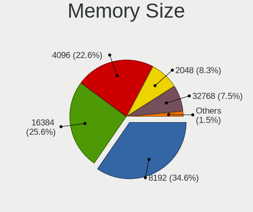

| Size  | Computers | Percent |
|-------|-----------|---------|
| 8192  | 84        | 48.84%  |
| 4096  | 39        | 22.67%  |
| 2048  | 21        | 12.21%  |
| 16384 | 20        | 11.63%  |
| 32768 | 4         | 2.33%   |
| 1024  | 3         | 1.74%   |
| 512   | 1         | 0.58%   |

Memory Speed
------------

Memory module speed

| Speed   | Computers | Percent |
|---------|-----------|---------|
| 3200    | 27        | 15.43%  |
| 1600    | 26        | 14.86%  |
| 2667    | 20        | 11.43%  |
| 2400    | 14        | 8%      |
| 1333    | 11        | 6.29%   |
| 2133    | 7         | 4%      |
| 3600    | 6         | 3.43%   |
| 4266    | 5         | 2.86%   |
| 1866    | 5         | 2.86%   |
| 1066    | 5         | 2.86%   |
| 800     | 5         | 2.86%   |
| 4800    | 4         | 2.29%   |
| 1867    | 4         | 2.29%   |
| 3400    | 3         | 1.71%   |
| 2800    | 3         | 1.71%   |
| 1334    | 3         | 1.71%   |
| 3733    | 2         | 1.14%   |
| 2048    | 2         | 1.14%   |
| 1067    | 2         | 1.14%   |
| Unknown | 2         | 1.14%   |
| 6400    | 1         | 0.57%   |
| 5800    | 1         | 0.57%   |
| 5200    | 1         | 0.57%   |
| 4267    | 1         | 0.57%   |
| 4000    | 1         | 0.57%   |
| 3466    | 1         | 0.57%   |
| 3007    | 1         | 0.57%   |
| 3000    | 1         | 0.57%   |
| 2933    | 1         | 0.57%   |
| 2666    | 1         | 0.57%   |
| 2000    | 1         | 0.57%   |
| 1800    | 1         | 0.57%   |
| 1639    | 1         | 0.57%   |
| 1596    | 1         | 0.57%   |
| 975     | 1         | 0.57%   |
| 933     | 1         | 0.57%   |
| 667     | 1         | 0.57%   |
| 533     | 1         | 0.57%   |
| 266     | 1         | 0.57%   |

Printers & scanners
-------------------

Printer Vendor
--------------

Printer device vendors

| Vendor              | Computers | Percent |
|---------------------|-----------|---------|
| Hewlett-Packard     | 2         | 40%     |
| Samsung Electronics | 1         | 20%     |
| Canon               | 1         | 20%     |
| Brother Industries  | 1         | 20%     |

Printer Model
-------------

Printer device models

| Model                   | Computers | Percent |
|-------------------------|-----------|---------|
| Samsung SCX-3400 Series | 1         | 20%     |
| HP LaserJet 1018        | 1         | 20%     |
| HP DeskJet 2130 series  | 1         | 20%     |
| Canon SELPHY CP400      | 1         | 20%     |
| Brother MFC-J4335DW     | 1         | 20%     |

Scanner Vendor
--------------

Scanner device vendors

Zero info for selected period =(

Scanner Model
-------------

Scanner device models

Zero info for selected period =(

Camera
------

Camera Vendor
-------------

Camera device vendors

| Vendor                                 | Computers | Percent |
|----------------------------------------|-----------|---------|
| Chicony Electronics                    | 30        | 19.35%  |
| IMC Networks                           | 23        | 14.84%  |
| Microdia                               | 15        | 9.68%   |
| Logitech                               | 15        | 9.68%   |
| Acer                                   | 12        | 7.74%   |
| Realtek Semiconductor                  | 11        | 7.1%    |
| Lite-On Technology                     | 6         | 3.87%   |
| Quanta                                 | 5         | 3.23%   |
| Apple                                  | 5         | 3.23%   |
| Sunplus Innovation Technology          | 4         | 2.58%   |
| Microsoft                              | 3         | 1.94%   |
| ARC International                      | 3         | 1.94%   |
| Z-Star Microelectronics                | 2         | 1.29%   |
| Syntek                                 | 2         | 1.29%   |
| Suyin                                  | 2         | 1.29%   |
| Silicon Motion                         | 2         | 1.29%   |
| Samsung Electronics                    | 2         | 1.29%   |
| Luxvisions Innotech Limited            | 2         | 1.29%   |
| Intel                                  | 2         | 1.29%   |
| Hewlett-Packard                        | 2         | 1.29%   |
| Cheng Uei Precision Industry (Foxlink) | 2         | 1.29%   |
| Razer USA                              | 1         | 0.65%   |
| Philips (or NXP)                       | 1         | 0.65%   |
| MacroSilicon                           | 1         | 0.65%   |
| GEMBIRD                                | 1         | 0.65%   |
| Alcor Micro                            | 1         | 0.65%   |

Camera Model
------------

Camera device models

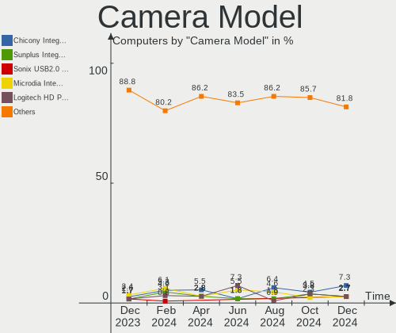

| Model                                                       | Computers | Percent |
|-------------------------------------------------------------|-----------|---------|
| IMC Networks USB2.0 HD UVC WebCam                           | 10        | 6.21%   |
| Chicony Integrated Camera                                   | 7         | 4.35%   |
| Microdia Integrated_Webcam_HD                               | 6         | 3.73%   |
| Realtek Integrated_Webcam_HD                                | 5         | 3.11%   |
| Microdia Integrated Webcam                                  | 4         | 2.48%   |
| Logitech HD Pro Webcam C920                                 | 4         | 2.48%   |
| Lite-On TOSHIBA Web Camera - HD                             | 4         | 2.48%   |
| IMC Networks USB2.0 VGA UVC WebCam                          | 4         | 2.48%   |
| Apple iPhone 5/5C/5S/6/SE                                   | 4         | 2.48%   |
| Logitech Webcam C270                                        | 3         | 1.86%   |
| Logitech StreamCam                                          | 3         | 1.86%   |
| IMC Networks Integrated RGB Camera                          | 3         | 1.86%   |
| IMC Networks Integrated Camera                              | 3         | 1.86%   |
| Chicony CNF9055 Toshiba Webcam                              | 3         | 1.86%   |
| ARC International Camera                                    | 3         | 1.86%   |
| Acer BisonCam,NB Pro                                        | 3         | 1.86%   |
| Suyin 1.3M WebCam (notebook emachines E730, Acer sub-brand) | 2         | 1.24%   |
| Sunplus Integrated_Webcam_HD                                | 2         | 1.24%   |
| Samsung Galaxy A5 (MTP)                                     | 2         | 1.24%   |
| Realtek Integrated Webcam HD                                | 2         | 1.24%   |
| Microsoft LifeCam HD-3000                                   | 2         | 1.24%   |
| Microdia USB 2.0 Camera                                     | 2         | 1.24%   |
| Intel RealSense 3D Camera (Front F200)                      | 2         | 1.24%   |
| IMC Networks TOSHIBA Web Camera - HD                        | 2         | 1.24%   |
| HP Webcam HD 2300                                           | 2         | 1.24%   |
| Chicony USB2.0 HD UVC WebCam                                | 2         | 1.24%   |
| Chicony USB 2.0 Camera                                      | 2         | 1.24%   |
| Chicony Sony Visual Communication Camera                    | 2         | 1.24%   |
| Chicony HP Wide Vision HD Camera                            | 2         | 1.24%   |
| Chicony HD WebCam                                           | 2         | 1.24%   |
| Acer Integrated Camera                                      | 2         | 1.24%   |
| Acer BisonCam, NB Pro                                       | 2         | 1.24%   |
| Z-Star Venus USB2.0 Camera                                  | 1         | 0.62%   |
| Z-Star Lenovo USB2.0 UVC Camera                             | 1         | 0.62%   |
| Syntek Lenovo EasyCamera                                    | 1         | 0.62%   |
| Syntek Integrated Camera                                    | 1         | 0.62%   |
| Sunplus Lenovo EasyCamera                                   | 1         | 0.62%   |
| Sunplus Dell HD Webcam                                      | 1         | 0.62%   |
| Silicon Motion WebCam SC-13HDL11939N                        | 1         | 0.62%   |
| Silicon Motion Chromebook HD WebCam                         | 1         | 0.62%   |

Security
--------

Fingerprint Vendor
------------------

Fingerprint sensor vendors

| Vendor                     | Computers | Percent |
|----------------------------|-----------|---------|
| Synaptics                  | 7         | 29.17%  |
| Validity Sensors           | 6         | 25%     |
| LighTuning Technology      | 4         | 16.67%  |
| Shenzhen Goodix Technology | 2         | 8.33%   |
| AuthenTec                  | 2         | 8.33%   |
| Upek                       | 1         | 4.17%   |
| HOLTEK                     | 1         | 4.17%   |
| Elan Microelectronics      | 1         | 4.17%   |

Fingerprint Model
-----------------

Fingerprint sensor models

| Model                                                     | Computers | Percent |
|-----------------------------------------------------------|-----------|---------|
| Unknown                                                   | 4         | 16.67%  |
| LighTuning ES603 Swipe Fingerprint Sensor                 | 3         | 12.5%   |
| Validity Sensors VFS495 Fingerprint Reader                | 2         | 8.33%   |
| Validity Sensors Synaptics WBDI                           | 2         | 8.33%   |
| AuthenTec AES2810                                         | 2         | 8.33%   |
| Validity Sensors VFS7552 Touch Fingerprint Sensor         | 1         | 4.17%   |
| Validity Sensors VFS 5011 fingerprint sensor              | 1         | 4.17%   |
| Upek Biometric Touchchip/Touchstrip Fingerprint Sensor    | 1         | 4.17%   |
| Synaptics  FS7604 Touch Fingerprint Sensor with PurePrint | 1         | 4.17%   |
| Synaptics Prometheus MIS Touch Fingerprint Reader         | 1         | 4.17%   |
| Synaptics Metallica MOH Touch Fingerprint Reader          | 1         | 4.17%   |
| Shenzhen Goodix  FingerPrint Device                       | 1         | 4.17%   |
| Shenzhen Goodix Fingerprint Reader                        | 1         | 4.17%   |
| LighTuning EgisTec Touch Fingerprint Sensor               | 1         | 4.17%   |
| HOLTEK FocalTech Fingerprint Device                       | 1         | 4.17%   |
| Elan ELAN:Fingerprint                                     | 1         | 4.17%   |

Chipcard Vendor
---------------

Chipcard module vendors

| Vendor      | Computers | Percent |
|-------------|-----------|---------|
| Broadcom    | 7         | 58.33%  |
| Lenovo      | 2         | 16.67%  |
| Upek        | 1         | 8.33%   |
| O2 Micro    | 1         | 8.33%   |
| Alcor Micro | 1         | 8.33%   |

Chipcard Model
--------------

Chipcard module models

| Model                                                                        | Computers | Percent |
|------------------------------------------------------------------------------|-----------|---------|
| Broadcom 5880                                                                | 3         | 25%     |
| Broadcom 58200                                                               | 2         | 16.67%  |
| Upek TouchChip Fingerprint Coprocessor (WBF advanced mode)                   | 1         | 8.33%   |
| O2 Micro OZ776 CCID Smartcard Reader                                         | 1         | 8.33%   |
| Lenovo Smartcard Keyboard                                                    | 1         | 8.33%   |
| Lenovo Integrated Smart Card Reader                                          | 1         | 8.33%   |
| Broadcom BCM5880 Secure Applications Processor with fingerprint swipe sensor | 1         | 8.33%   |
| Broadcom BCM5880 Secure Applications Processor                               | 1         | 8.33%   |
| Alcor Micro AU9540 Smartcard Reader                                          | 1         | 8.33%   |

Unsupported
-----------

Unsupported Devices
-------------------

Total unsupported devices on board

| Total | Computers | Percent |
|-------|-----------|---------|
| 0     | 192       | 73.56%  |
| 1     | 54        | 20.69%  |
| 2     | 10        | 3.83%   |
| 3     | 5         | 1.92%   |

Unsupported Device Types
------------------------

Types of unsupported devices

| Type                     | Computers | Percent |
|--------------------------|-----------|---------|
| Graphics card            | 24        | 28.92%  |
| Fingerprint reader       | 24        | 28.92%  |
| Net/wireless             | 8         | 9.64%   |
| Chipcard                 | 7         | 8.43%   |
| Multimedia controller    | 4         | 4.82%   |
| Sound                    | 3         | 3.61%   |
| Unassigned class         | 2         | 2.41%   |
| Communication controller | 2         | 2.41%   |
| Card reader              | 2         | 2.41%   |
| Camera                   | 2         | 2.41%   |
| Storage/nvme             | 1         | 1.2%    |
| Network                  | 1         | 1.2%    |
| Modem                    | 1         | 1.2%    |
| Dvb card                 | 1         | 1.2%    |
| Bluetooth                | 1         | 1.2%    |

