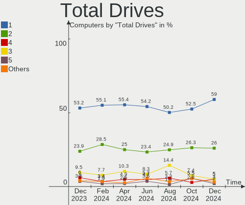
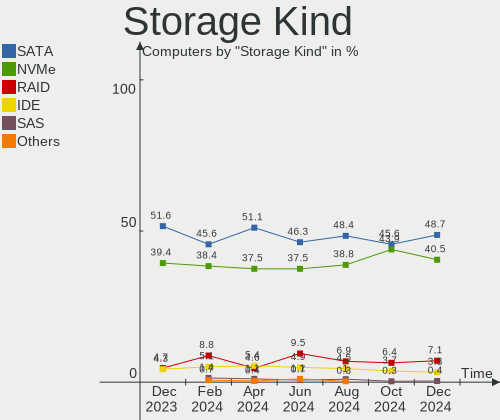
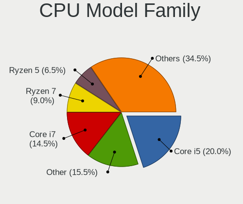
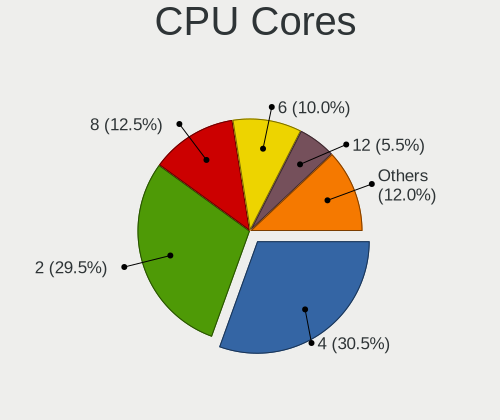
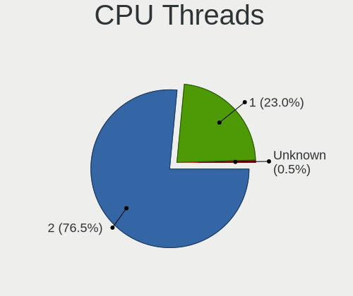
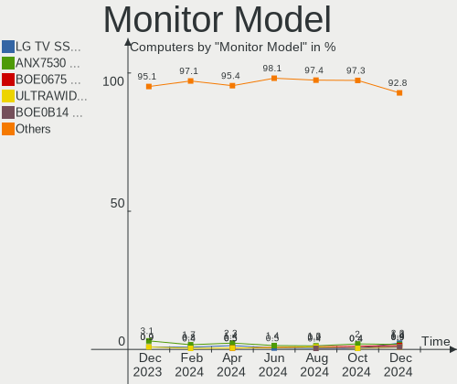
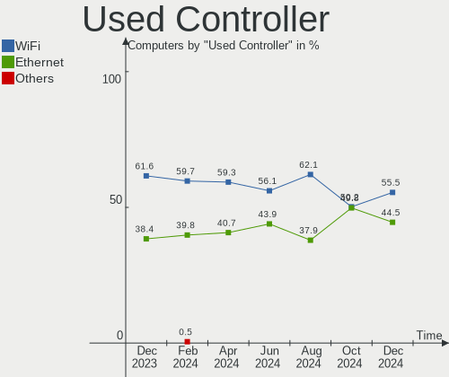
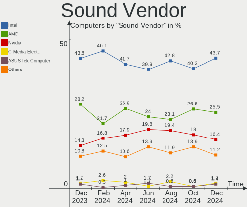
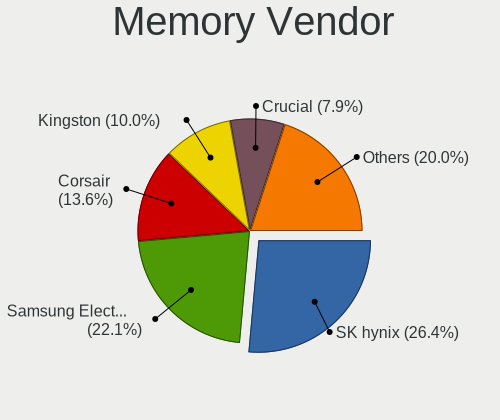

Linux in UK - Hardware Trends
-----------------------------

A project to identify most popular hardware characteristics and track their change
over time based on data collected by Linux users at https://Linux-Hardware.org.

Anyone can contribute to this report by the [hw-probe](https://github.com/linuxhw/hw-probe) tool:

    sudo -E hw-probe -all -upload

This is a report for all computer types. See also reports for [desktops](/Location/UK/Desktop/README.md) and [notebooks](/Location/UK/Notebook/README.md).

Period: Apr, 2023.

Contents
--------

* [ System ](#system)
  - [ OS                       ](#os)
  - [ OS Family                ](#os-family)
  - [ Kernel                   ](#kernel)
  - [ Kernel Family            ](#kernel-family)
  - [ Kernel Major Ver.        ](#kernel-major-ver)
  - [ Arch                     ](#arch)
  - [ DE                       ](#de)
  - [ Display Server           ](#display-server)
  - [ Display Manager          ](#display-manager)
  - [ OS Lang                  ](#os-lang)
  - [ Boot Mode                ](#boot-mode)
  - [ Filesystem               ](#filesystem)
  - [ Part. scheme             ](#part-scheme)
  - [ Dual Boot with Linux/BSD ](#dual-boot-with-linuxbsd)
  - [ Dual Boot (Win)          ](#dual-boot-win)

* [ Board ](#board)
  - [ Vendor                   ](#vendor)
  - [ Model                    ](#model)
  - [ Model Family             ](#model-family)
  - [ MFG Year                 ](#mfg-year)
  - [ Form Factor              ](#form-factor)
  - [ Secure Boot              ](#secure-boot)
  - [ Coreboot                 ](#coreboot)
  - [ RAM Size                 ](#ram-size)
  - [ RAM Used                 ](#ram-used)
  - [ Total Drives             ](#total-drives)
  - [ Has CD-ROM               ](#has-cd-rom)
  - [ Has Ethernet             ](#has-ethernet)
  - [ Has WiFi                 ](#has-wifi)
  - [ Has Bluetooth            ](#has-bluetooth)

* [ Location ](#location)
  - [ Country                  ](#country)
  - [ City                     ](#city)

* [ Drives ](#drives)
  - [ Drive Vendor             ](#drive-vendor)
  - [ Drive Model              ](#drive-model)
  - [ HDD Vendor               ](#hdd-vendor)
  - [ SSD Vendor               ](#ssd-vendor)
  - [ Drive Kind               ](#drive-kind)
  - [ Drive Connector          ](#drive-connector)
  - [ Drive Size               ](#drive-size)
  - [ Space Total              ](#space-total)
  - [ Space Used               ](#space-used)
  - [ Malfunc. Drives          ](#malfunc-drives)
  - [ Malfunc. Drive Vendor    ](#malfunc-drive-vendor)
  - [ Malfunc. HDD Vendor      ](#malfunc-hdd-vendor)
  - [ Malfunc. Drive Kind      ](#malfunc-drive-kind)
  - [ Failed Drives            ](#failed-drives)
  - [ Failed Drive Vendor      ](#failed-drive-vendor)
  - [ Drive Status             ](#drive-status)

* [ Storage controller ](#storage-controller)
  - [ Storage Vendor           ](#storage-vendor)
  - [ Storage Model            ](#storage-model)
  - [ Storage Kind             ](#storage-kind)

* [ Processor ](#processor)
  - [ CPU Vendor               ](#cpu-vendor)
  - [ CPU Model                ](#cpu-model)
  - [ CPU Model Family         ](#cpu-model-family)
  - [ CPU Cores                ](#cpu-cores)
  - [ CPU Sockets              ](#cpu-sockets)
  - [ CPU Threads              ](#cpu-threads)
  - [ CPU Op-Modes             ](#cpu-op-modes)
  - [ CPU Microcode            ](#cpu-microcode)
  - [ CPU Microarch            ](#cpu-microarch)

* [ Graphics ](#graphics)
  - [ GPU Vendor               ](#gpu-vendor)
  - [ GPU Model                ](#gpu-model)
  - [ GPU Combo                ](#gpu-combo)
  - [ GPU Driver               ](#gpu-driver)
  - [ GPU Memory               ](#gpu-memory)

* [ Monitor ](#monitor)
  - [ Monitor Vendor           ](#monitor-vendor)
  - [ Monitor Model            ](#monitor-model)
  - [ Monitor Resolution       ](#monitor-resolution)
  - [ Monitor Diagonal         ](#monitor-diagonal)
  - [ Monitor Width            ](#monitor-width)
  - [ Aspect Ratio             ](#aspect-ratio)
  - [ Monitor Area             ](#monitor-area)
  - [ Pixel Density            ](#pixel-density)
  - [ Multiple Monitors        ](#multiple-monitors)

* [ Network ](#network)
  - [ Net Controller Vendor    ](#net-controller-vendor)
  - [ Net Controller Model     ](#net-controller-model)
  - [ Wireless Vendor          ](#wireless-vendor)
  - [ Wireless Model           ](#wireless-model)
  - [ Ethernet Vendor          ](#ethernet-vendor)
  - [ Ethernet Model           ](#ethernet-model)
  - [ Net Controller Kind      ](#net-controller-kind)
  - [ Used Controller          ](#used-controller)
  - [ NICs                     ](#nics)
  - [ IPv6                     ](#ipv6)

* [ Bluetooth ](#bluetooth)
  - [ Bluetooth Vendor         ](#bluetooth-vendor)
  - [ Bluetooth Model          ](#bluetooth-model)

* [ Sound ](#sound)
  - [ Sound Vendor             ](#sound-vendor)
  - [ Sound Model              ](#sound-model)

* [ Memory ](#memory)
  - [ Memory Vendor            ](#memory-vendor)
  - [ Memory Model             ](#memory-model)
  - [ Memory Kind              ](#memory-kind)
  - [ Memory Form Factor       ](#memory-form-factor)
  - [ Memory Size              ](#memory-size)
  - [ Memory Speed             ](#memory-speed)

* [ Printers & scanners ](#printers--scanners)
  - [ Printer Vendor           ](#printer-vendor)
  - [ Printer Model            ](#printer-model)
  - [ Scanner Vendor           ](#scanner-vendor)
  - [ Scanner Model            ](#scanner-model)

* [ Camera ](#camera)
  - [ Camera Vendor            ](#camera-vendor)
  - [ Camera Model             ](#camera-model)

* [ Security ](#security)
  - [ Fingerprint Vendor       ](#fingerprint-vendor)
  - [ Fingerprint Model        ](#fingerprint-model)
  - [ Chipcard Vendor          ](#chipcard-vendor)
  - [ Chipcard Model           ](#chipcard-model)

* [ Unsupported ](#unsupported)
  - [ Unsupported Devices      ](#unsupported-devices)
  - [ Unsupported Device Types ](#unsupported-device-types)

System
------

OS
--

Installed operating systems

| Name                         | Computers | Percent |
|------------------------------|-----------|---------|
| OpenMandriva 23.03           | 41        | 16.73%  |
| Ubuntu 22.04                 | 25        | 10.2%   |
| Linux Mint 21.1              | 23        | 9.39%   |
| Pop!_OS 22.04                | 10        | 4.08%   |
| Fedora 38                    | 10        | 4.08%   |
| Debian 11                    | 8         | 3.27%   |
| Zorin 16                     | 7         | 2.86%   |
| Ubuntu 22.10                 | 7         | 2.86%   |
| Manjaro                      | 7         | 2.86%   |
| Fedora 37                    | 7         | 2.86%   |
| Linux Mint 21                | 6         | 2.45%   |
| Arch Rolling                 | 6         | 2.45%   |
| OpenMandriva 4.3             | 5         | 2.04%   |
| Kali 2023.1                  | 5         | 2.04%   |
| Gentoo 2.13                  | 5         | 2.04%   |
| Kubuntu 22.04                | 4         | 1.63%   |
| KDE neon 22.04               | 4         | 1.63%   |
| Ubuntu 23.04                 | 3         | 1.22%   |
| Ubuntu 20.04                 | 3         | 1.22%   |
| TUXEDO OS 22.04              | 3         | 1.22%   |
| Nobara 37                    | 3         | 1.22%   |
| Manjaro 22.1.0               | 3         | 1.22%   |
| blendOS                      | 3         | 1.22%   |
| ArcoLinux Rolling            | 3         | 1.22%   |
| Zorin 15                     | 2         | 0.82%   |
| Xubuntu 22.04                | 2         | 0.82%   |
| SteamOS 3.4.6                | 2         | 0.82%   |
| Parrot 5.3                   | 2         | 0.82%   |
| openSUSE Tumbleweed-XXXXXXXX | 2         | 0.82%   |
| OpenMandriva 23.01           | 2         | 0.82%   |
| LMDE 5                       | 2         | 0.82%   |
| Elementary 7                 | 2         | 0.82%   |
| Debian 12                    | 2         | 0.82%   |
| BunsenLabs 11                | 2         | 0.82%   |
| Xubuntu 20.04                | 1         | 0.41%   |
| Ubuntu Budgie 22.10          | 1         | 0.41%   |
| Ubuntu 18.04                 | 1         | 0.41%   |
| Sparky 6.6                   | 1         | 0.41%   |
| ROSA 12.4                    | 1         | 0.41%   |
| Raspbian 11                  | 1         | 0.41%   |

OS Family
---------

OS without a version

| Name          | Computers | Percent |
|---------------|-----------|---------|
| OpenMandriva  | 48        | 19.59%  |
| Ubuntu        | 39        | 15.92%  |
| Linux Mint    | 30        | 12.24%  |
| Fedora        | 18        | 7.35%   |
| Pop!_OS       | 10        | 4.08%   |
| Manjaro       | 10        | 4.08%   |
| Debian        | 10        | 4.08%   |
| Zorin         | 9         | 3.67%   |
| Arch          | 6         | 2.45%   |
| Kubuntu       | 5         | 2.04%   |
| Kali          | 5         | 2.04%   |
| Gentoo        | 5         | 2.04%   |
| KDE neon      | 4         | 1.63%   |
| ArcoLinux     | 4         | 1.63%   |
| Xubuntu       | 3         | 1.22%   |
| TUXEDO OS     | 3         | 1.22%   |
| Parrot        | 3         | 1.22%   |
| Nobara        | 3         | 1.22%   |
| blendOS       | 3         | 1.22%   |
| SteamOS       | 2         | 0.82%   |
| openSUSE      | 2         | 0.82%   |
| LMDE          | 2         | 0.82%   |
| Elementary    | 2         | 0.82%   |
| BunsenLabs    | 2         | 0.82%   |
| Ubuntu Budgie | 1         | 0.41%   |
| Sparky        | 1         | 0.41%   |
| ROSA          | 1         | 0.41%   |
| Raspbian      | 1         | 0.41%   |
| MX            | 1         | 0.41%   |
| Lubuntu       | 1         | 0.41%   |
| Linux Lite    | 1         | 0.41%   |
| Garuda Linux  | 1         | 0.41%   |
| Feren OS      | 1         | 0.41%   |
| EndeavourOS   | 1         | 0.41%   |
| ChimeraOS     | 1         | 0.41%   |
| CentOS        | 1         | 0.41%   |
| BlackPanther  | 1         | 0.41%   |
| BigLinux      | 1         | 0.41%   |
| Artix         | 1         | 0.41%   |
| antiX         | 1         | 0.41%   |

Kernel
------

Version of the Linux kernel

| Version                      | Computers | Percent |
|------------------------------|-----------|---------|
| 6.2.6-desktop-1omv2390       | 41        | 16.73%  |
| 5.15.0-69-generic            | 31        | 12.65%  |
| 5.19.0-38-generic            | 19        | 7.76%   |
| 5.10.0-21-amd64              | 11        | 4.49%   |
| 6.2.6-76060206-generic       | 10        | 4.08%   |
| 5.19.0-40-generic            | 10        | 4.08%   |
| 5.15.0-56-generic            | 5         | 2.04%   |
| 6.2.11-arch1-1               | 4         | 1.63%   |
| 6.1.0-kali7-amd64            | 4         | 1.63%   |
| 5.19.0-41-generic            | 4         | 1.63%   |
| 5.15.0-70-generic            | 4         | 1.63%   |
| 6.2.9-200.fc37.x86_64        | 3         | 1.22%   |
| 6.2.12-zen1-1-zen            | 3         | 1.22%   |
| 6.2.12-arch1-1               | 3         | 1.22%   |
| 6.2.12-300.fc38.x86_64       | 3         | 1.22%   |
| 6.2.11-300.fc38.x86_64       | 3         | 1.22%   |
| 6.2.0-20-generic             | 3         | 1.22%   |
| 6.2.0-10005-tuxedo           | 3         | 1.22%   |
| 5.4.0-147-generic            | 3         | 1.22%   |
| 5.4.0-146-generic            | 3         | 1.22%   |
| 5.16.13-desktop-1omv4003     | 3         | 1.22%   |
| 6.2.9-arch1-1                | 2         | 0.82%   |
| 6.2.9-300.fc38.x86_64        | 2         | 0.82%   |
| 6.2.11-201.fsync.fc37.x86_64 | 2         | 0.82%   |
| 6.2.10-arch1-1               | 2         | 0.82%   |
| 6.2.10-200.fc37.x86_64       | 2         | 0.82%   |
| 6.2.10-1-MANJARO             | 2         | 0.82%   |
| 6.1.21-1-MANJARO             | 2         | 0.82%   |
| 6.1.1-desktop-1omv2290       | 2         | 0.82%   |
| 6.1.0-1parrot1-amd64         | 2         | 0.82%   |
| 5.19.0-35-generic            | 2         | 0.82%   |
| 5.16.7-desktop-1omv4003      | 2         | 0.82%   |
| 5.15.0-67-generic            | 2         | 0.82%   |
| 5.13.0-valve36-1-neptune     | 2         | 0.82%   |
| 6.3.0-1-MANJARO              | 1         | 0.41%   |
| 6.2.9-zen1-1-zen             | 1         | 0.41%   |
| 6.2.9-gentoo-x86_64          | 1         | 0.41%   |
| 6.2.9-1-default              | 1         | 0.41%   |
| 6.2.8-arch1-1                | 1         | 0.41%   |
| 6.2.8-200.fc37.x86_64        | 1         | 0.41%   |

Kernel Family
-------------

Linux kernel without a distro release

| Version  | Computers | Percent |
|----------|-----------|---------|
| 6.2.6    | 51        | 20.82%  |
| 5.15.0   | 46        | 18.78%  |
| 5.19.0   | 37        | 15.1%   |
| 6.2.12   | 12        | 4.9%    |
| 5.10.0   | 12        | 4.9%    |
| 6.2.11   | 11        | 4.49%   |
| 6.2.9    | 10        | 4.08%   |
| 6.2.10   | 10        | 4.08%   |
| 6.1.0    | 9         | 3.67%   |
| 6.2.0    | 6         | 2.45%   |
| 5.4.0    | 6         | 2.45%   |
| 6.1.21   | 4         | 1.63%   |
| 5.16.13  | 3         | 1.22%   |
| 6.2.8    | 2         | 0.82%   |
| 6.2.13   | 2         | 0.82%   |
| 6.1.22   | 2         | 0.82%   |
| 6.1.20   | 2         | 0.82%   |
| 6.1.19   | 2         | 0.82%   |
| 6.1.1    | 2         | 0.82%   |
| 5.16.7   | 2         | 0.82%   |
| 5.13.0   | 2         | 0.82%   |
| 6.3.0    | 1         | 0.41%   |
| 6.2.7    | 1         | 0.41%   |
| 6.2.2    | 1         | 0.41%   |
| 6.1.25   | 1         | 0.41%   |
| 6.1.23   | 1         | 0.41%   |
| 6.1.12   | 1         | 0.41%   |
| 6.0.2    | 1         | 0.41%   |
| 6.0.0    | 1         | 0.41%   |
| 5.6.14   | 1         | 0.41%   |
| 5.15.104 | 1         | 0.41%   |
| 4.9.235  | 1         | 0.41%   |
| 3.10.0   | 1         | 0.41%   |

Kernel Major Ver.
-----------------

Linux kernel major version

| Version | Computers | Percent |
|---------|-----------|---------|
| 6.2     | 106       | 43.27%  |
| 5.15    | 47        | 19.18%  |
| 5.19    | 37        | 15.1%   |
| 6.1     | 24        | 9.8%    |
| 5.10    | 12        | 4.9%    |
| 5.4     | 6         | 2.45%   |
| 5.16    | 5         | 2.04%   |
| 6.0     | 2         | 0.82%   |
| 5.13    | 2         | 0.82%   |
| 6.3     | 1         | 0.41%   |
| 5.6     | 1         | 0.41%   |
| 4.9     | 1         | 0.41%   |
| 3.10    | 1         | 0.41%   |

Arch
----

OS architecture (x86_64, i586, etc.)

| Name   | Computers | Percent |
|--------|-----------|---------|
| x86_64 | 243       | 99.18%  |
| i686   | 1         | 0.41%   |
| armv7l | 1         | 0.41%   |

DE
--

Desktop Environment

| Name            | Computers | Percent |
|-----------------|-----------|---------|
| KDE5            | 93        | 37.96%  |
| GNOME           | 86        | 35.1%   |
| X-Cinnamon      | 23        | 9.39%   |
| XFCE            | 17        | 6.94%   |
| MATE            | 6         | 2.45%   |
| Unknown         | 3         | 1.22%   |
| Pantheon        | 2         | 0.82%   |
| LXQt            | 2         | 0.82%   |
| LXDE            | 2         | 0.82%   |
| Cinnamon        | 2         | 0.82%   |
| sway            | 1         | 0.41%   |
| mwm             | 1         | 0.41%   |
| KDE             | 1         | 0.41%   |
| i3              | 1         | 0.41%   |
| GNOME Flashback | 1         | 0.41%   |
| GNOME Classic   | 1         | 0.41%   |
| Enlightenment   | 1         | 0.41%   |
| BunsenLabs      | 1         | 0.41%   |
| Budgie          | 1         | 0.41%   |

Display Server
--------------

X11 or Wayland

| Name    | Computers | Percent |
|---------|-----------|---------|
| X11     | 187       | 76.33%  |
| Wayland | 51        | 20.82%  |
| Tty     | 6         | 2.45%   |
| Unknown | 1         | 0.41%   |

Display Manager
---------------

SDDM, LightDM, etc.

| Name    | Computers | Percent |
|---------|-----------|---------|
| Unknown | 75        | 30.61%  |
| SDDM    | 72        | 29.39%  |
| LightDM | 41        | 16.73%  |
| GDM3    | 37        | 15.1%   |
| GDM     | 17        | 6.94%   |
| SLiM    | 2         | 0.82%   |
| LXDM    | 1         | 0.41%   |

OS Lang
-------

Language

| Lang    | Computers | Percent |
|---------|-----------|---------|
| en_GB   | 204       | 83.27%  |
| en_US   | 33        | 13.47%  |
| C       | 4         | 1.63%   |
| pl_PL   | 1         | 0.41%   |
| lt_LT   | 1         | 0.41%   |
| en_AU   | 1         | 0.41%   |
| Unknown | 1         | 0.41%   |

Boot Mode
---------

EFI or BIOS

| Mode | Computers | Percent |
|------|-----------|---------|
| EFI  | 143       | 58.37%  |
| BIOS | 102       | 41.63%  |

Filesystem
----------

Type of filesystem

| Type    | Computers | Percent |
|---------|-----------|---------|
| Ext4    | 173       | 70.61%  |
| Btrfs   | 37        | 15.1%   |
| Overlay | 22        | 8.98%   |
| Tmpfs   | 7         | 2.86%   |
| Xfs     | 3         | 1.22%   |
| Zfs     | 2         | 0.82%   |
| Ext2    | 1         | 0.41%   |

Part. scheme
------------

Scheme of partitioning

| Type    | Computers | Percent |
|---------|-----------|---------|
| GPT     | 144       | 58.78%  |
| Unknown | 74        | 30.2%   |
| MBR     | 27        | 11.02%  |

Dual Boot with Linux/BSD
------------------------

Hosting more than one Linux/BSD

| Dual boot | Computers | Percent |
|-----------|-----------|---------|
| No        | 205       | 83.67%  |
| Yes       | 40        | 16.33%  |

Dual Boot (Win)
---------------

Hosting Linux and Windows

| Dual boot | Computers | Percent |
|-----------|-----------|---------|
| No        | 183       | 74.69%  |
| Yes       | 62        | 25.31%  |

Board
-----

Vendor
------

Motherboard manufacturer

| Name                    | Computers | Percent |
|-------------------------|-----------|---------|
| Lenovo                  | 44        | 17.96%  |
| ASUSTek Computer        | 35        | 14.29%  |
| Hewlett-Packard         | 29        | 11.84%  |
| Dell                    | 29        | 11.84%  |
| Gigabyte Technology     | 18        | 7.35%   |
| MSI                     | 16        | 6.53%   |
| Apple                   | 10        | 4.08%   |
| Acer                    | 10        | 4.08%   |
| Intel                   | 6         | 2.45%   |
| Google                  | 6         | 2.45%   |
| ASRock                  | 6         | 2.45%   |
| Toshiba                 | 4         | 1.63%   |
| Samsung Electronics     | 3         | 1.22%   |
| AZW                     | 3         | 1.22%   |
| Unknown                 | 3         | 1.22%   |
| Valve                   | 2         | 0.82%   |
| TUXEDO                  | 2         | 0.82%   |
| Sony                    | 2         | 0.82%   |
| LG Electronics          | 2         | 0.82%   |
| HUAWEI                  | 2         | 0.82%   |
| Shuttle                 | 1         | 0.41%   |
| Raspberry Pi Foundation | 1         | 0.41%   |
| Pegatron                | 1         | 0.41%   |
| Novatech                | 1         | 0.41%   |
| Microsoft               | 1         | 0.41%   |
| Linx                    | 1         | 0.41%   |
| lapbook                 | 1         | 0.41%   |
| HONOR                   | 1         | 0.41%   |
| Foxconn                 | 1         | 0.41%   |
| Fanless Mini PC         | 1         | 0.41%   |
| Eii                     | 1         | 0.41%   |
| Clevo                   | 1         | 0.41%   |
| Advent                  | 1         | 0.41%   |

Model
-----

Motherboard model

| Name                                    | Computers | Percent |
|-----------------------------------------|-----------|---------|
| ASUS All Series                         | 4         | 1.63%   |
| MSI MS-7C91                             | 3         | 1.22%   |
| Unknown                                 | 3         | 1.22%   |
| Valve Jupiter                           | 2         | 0.82%   |
| MSI MS-7C02                             | 2         | 0.82%   |
| HP Notebook                             | 2         | 0.82%   |
| Gigabyte X570 AORUS XTREME              | 2         | 0.82%   |
| Dell OptiPlex 5070                      | 2         | 0.82%   |
| ASUS ROG STRIX Z590-F GAMING WIFI       | 2         | 0.82%   |
| TUXEDO Pulse 15 Gen2                    | 1         | 0.41%   |
| TUXEDO InfinityBook Pro 14 Gen6         | 1         | 0.41%   |
| Toshiba Satellite Pro C850-1HE          | 1         | 0.41%   |
| Toshiba Satellite C660                  | 1         | 0.41%   |
| Toshiba Satellite C650                  | 1         | 0.41%   |
| Toshiba EQUIUM P200                     | 1         | 0.41%   |
| Sony SVF1521Q1EW                        | 1         | 0.41%   |
| Sony SVE1711C5E                         | 1         | 0.41%   |
| Shuttle SH67H3                          | 1         | 0.41%   |
| Samsung R530/R730/R540                  | 1         | 0.41%   |
| Samsung 950XCJ/951XCJ/950XCR            | 1         | 0.41%   |
| Samsung 930QED                          | 1         | 0.41%   |
| RPi Raspberry Pi 3 Model B Plus Rev 1.3 | 1         | 0.41%   |
| Pegatron WC731AA-ABU 300-1115uk         | 1         | 0.41%   |
| Novatech NL40_50CU                      | 1         | 0.41%   |
| MSI Stealth 14Studio A13VF              | 1         | 0.41%   |
| MSI MS-7D54                             | 1         | 0.41%   |
| MSI MS-7D32                             | 1         | 0.41%   |
| MSI MS-7D07                             | 1         | 0.41%   |
| MSI MS-7C94                             | 1         | 0.41%   |
| MSI MS-7C56                             | 1         | 0.41%   |
| MSI MS-7C37                             | 1         | 0.41%   |
| MSI MS-7C09                             | 1         | 0.41%   |
| MSI MS-7B85                             | 1         | 0.41%   |
| MSI MS-7721                             | 1         | 0.41%   |
| MSI Customised HZN-M-INTA PC            | 1         | 0.41%   |
| Microsoft Surface Pro                   | 1         | 0.41%   |
| Linx LINX10V64                          | 1         | 0.41%   |
| LG 17Z90Q-K.AA78A1                      | 1         | 0.41%   |
| LG 17Z90P-K.AA78A1                      | 1         | 0.41%   |
| Lenovo Yoga 6 13ALC7 82UD               | 1         | 0.41%   |

Model Family
------------

Motherboard model prefix

| Name                | Computers | Percent |
|---------------------|-----------|---------|
| Lenovo ThinkPad     | 14        | 5.71%   |
| Lenovo IdeaPad      | 10        | 4.08%   |
| Dell Latitude       | 8         | 3.27%   |
| Dell OptiPlex       | 7         | 2.86%   |
| Acer Aspire         | 7         | 2.86%   |
| ASUS ROG            | 6         | 2.45%   |
| Lenovo Legion       | 5         | 2.04%   |
| Dell XPS            | 5         | 2.04%   |
| ASUS PRIME          | 5         | 2.04%   |
| Lenovo ThinkCentre  | 4         | 1.63%   |
| HP Pavilion         | 4         | 1.63%   |
| HP ENVY             | 4         | 1.63%   |
| Dell Inspiron       | 4         | 1.63%   |
| ASUS All            | 4         | 1.63%   |
| Toshiba Satellite   | 3         | 1.22%   |
| MSI MS-7C91         | 3         | 1.22%   |
| HP ProDesk          | 3         | 1.22%   |
| HP ProBook          | 3         | 1.22%   |
| ASUS ASUS           | 3         | 1.22%   |
| Unknown             | 3         | 1.22%   |
| Valve Jupiter       | 2         | 0.82%   |
| MSI MS-7C02         | 2         | 0.82%   |
| Lenovo Yoga         | 2         | 0.82%   |
| HP Spectre          | 2         | 0.82%   |
| HP Notebook         | 2         | 0.82%   |
| HP Laptop           | 2         | 0.82%   |
| HP EliteDesk        | 2         | 0.82%   |
| HP EliteBook        | 2         | 0.82%   |
| Gigabyte X570       | 2         | 0.82%   |
| Dell Precision      | 2         | 0.82%   |
| ASUS VivoBook       | 2         | 0.82%   |
| ASUS TUF            | 2         | 0.82%   |
| Acer Nitro          | 2         | 0.82%   |
| TUXEDO Pulse        | 1         | 0.41%   |
| TUXEDO InfinityBook | 1         | 0.41%   |
| Toshiba EQUIUM      | 1         | 0.41%   |
| Sony SVF1521Q1EW    | 1         | 0.41%   |
| Sony SVE1711C5E     | 1         | 0.41%   |
| Shuttle SH67H3      | 1         | 0.41%   |
| Samsung R530        | 1         | 0.41%   |

MFG Year
--------

Motherboard manufacture year

| Year    | Computers | Percent |
|---------|-----------|---------|
| 2022    | 27        | 11.02%  |
| 2020    | 27        | 11.02%  |
| 2021    | 26        | 10.61%  |
| 2018    | 23        | 9.39%   |
| 2019    | 17        | 6.94%   |
| 2013    | 17        | 6.94%   |
| 2017    | 16        | 6.53%   |
| 2014    | 16        | 6.53%   |
| 2012    | 13        | 5.31%   |
| 2016    | 11        | 4.49%   |
| 2010    | 10        | 4.08%   |
| 2015    | 9         | 3.67%   |
| 2023    | 8         | 3.27%   |
| 2011    | 8         | 3.27%   |
| 2009    | 6         | 2.45%   |
| 2008    | 6         | 2.45%   |
| 2007    | 3         | 1.22%   |
| Unknown | 2         | 0.82%   |

Form Factor
-----------

Physical design of the computer

| Name           | Computers | Percent |
|----------------|-----------|---------|
| Notebook       | 118       | 48.16%  |
| Desktop        | 96        | 39.18%  |
| Convertible    | 12        | 4.9%    |
| Mini pc        | 7         | 2.86%   |
| All in one     | 6         | 2.45%   |
| Tablet         | 3         | 1.22%   |
| Server         | 2         | 0.82%   |
| System on chip | 1         | 0.41%   |

Secure Boot
-----------

Enabled or disabled

| State    | Computers | Percent |
|----------|-----------|---------|
| Disabled | 232       | 94.69%  |
| Enabled  | 13        | 5.31%   |

Coreboot
--------

Have coreboot on board

| Used | Computers | Percent |
|------|-----------|---------|
| No   | 238       | 97.14%  |
| Yes  | 7         | 2.86%   |

RAM Size
--------

Total RAM memory

| Size in GB  | Computers | Percent |
|-------------|-----------|---------|
| 16.01-24.0  | 60        | 24.49%  |
| 4.01-8.0    | 56        | 22.86%  |
| 32.01-64.0  | 42        | 17.14%  |
| 8.01-16.0   | 37        | 15.1%   |
| 3.01-4.0    | 28        | 11.43%  |
| 64.01-256.0 | 8         | 3.27%   |
| 1.01-2.0    | 6         | 2.45%   |
| 24.01-32.0  | 4         | 1.63%   |
| 2.01-3.0    | 3         | 1.22%   |
| 0.51-1.0    | 1         | 0.41%   |

RAM Used
--------

Used RAM memory

| Used GB    | Computers | Percent |
|------------|-----------|---------|
| 1.01-2.0   | 71        | 28.98%  |
| 2.01-3.0   | 68        | 27.76%  |
| 4.01-8.0   | 50        | 20.41%  |
| 3.01-4.0   | 35        | 14.29%  |
| 8.01-16.0  | 8         | 3.27%   |
| 0.51-1.0   | 8         | 3.27%   |
| 16.01-24.0 | 3         | 1.22%   |
| 32.01-64.0 | 1         | 0.41%   |
| 0.01-0.5   | 1         | 0.41%   |

Total Drives
------------

Number of drives on board

| Drives | Computers | Percent |
|--------|-----------|---------|
| 1      | 133       | 54.29%  |
| 2      | 63        | 25.71%  |
| 3      | 19        | 7.76%   |
| 4      | 12        | 4.9%    |
| 5      | 11        | 4.49%   |
| 0      | 3         | 1.22%   |
| 6      | 2         | 0.82%   |
| 10     | 1         | 0.41%   |
| 8      | 1         | 0.41%   |

Has CD-ROM
----------

Has CD-ROM on board

| Presented | Computers | Percent |
|-----------|-----------|---------|
| No        | 171       | 69.8%   |
| Yes       | 74        | 30.2%   |

Has Ethernet
------------

Has Ethernet on board

| Presented | Computers | Percent |
|-----------|-----------|---------|
| Yes       | 199       | 81.22%  |
| No        | 46        | 18.78%  |

Has WiFi
--------

Has WiFi module

| Presented | Computers | Percent |
|-----------|-----------|---------|
| Yes       | 187       | 76.33%  |
| No        | 58        | 23.67%  |

Has Bluetooth
-------------

Has Bluetooth module

| Presented | Computers | Percent |
|-----------|-----------|---------|
| Yes       | 162       | 66.12%  |
| No        | 83        | 33.88%  |

Location
--------

Country
-------

Geographic location (country)

| Country | Computers | Percent |
|---------|-----------|---------|
| UK      | 245       | 100%    |

City
----

Geographic location (city)

| City           | Computers | Percent |
|----------------|-----------|---------|
| London         | 35        | 14.29%  |
| Nottingham     | 5         | 2.04%   |
| Manchester     | 5         | 2.04%   |
| Exeter         | 5         | 2.04%   |
| Reading        | 4         | 1.63%   |
| Liverpool      | 4         | 1.63%   |
| Leeds          | 4         | 1.63%   |
| Glasgow        | 4         | 1.63%   |
| Birmingham     | 4         | 1.63%   |
| Walsall        | 3         | 1.22%   |
| Slough         | 3         | 1.22%   |
| City of London | 3         | 1.22%   |
| Cardiff        | 3         | 1.22%   |
| Airdrie        | 3         | 1.22%   |
| Wigan          | 2         | 0.82%   |
| Waterlooville  | 2         | 0.82%   |
| Tamworth       | 2         | 0.82%   |
| Sunderland     | 2         | 0.82%   |
| Sheffield      | 2         | 0.82%   |
| Rotherham      | 2         | 0.82%   |
| Rochester      | 2         | 0.82%   |
| Plymouth       | 2         | 0.82%   |
| Norwich        | 2         | 0.82%   |
| Middlesbrough  | 2         | 0.82%   |
| Livingston     | 2         | 0.82%   |
| Leigh-on-Sea   | 2         | 0.82%   |
| Hull           | 2         | 0.82%   |
| Hexham         | 2         | 0.82%   |
| Harlow         | 2         | 0.82%   |
| Halifax        | 2         | 0.82%   |
| Fareham        | 2         | 0.82%   |
| Edinburgh      | 2         | 0.82%   |
| East Grinstead | 2         | 0.82%   |
| Durham         | 2         | 0.82%   |
| Craigavon      | 2         | 0.82%   |
| Coventry       | 2         | 0.82%   |
| Cheltenham     | 2         | 0.82%   |
| Cambridge      | 2         | 0.82%   |
| Bristol        | 2         | 0.82%   |
| Bradford       | 2         | 0.82%   |

Drives
------

Drive Vendor
------------

Hard drive vendors

| Vendor                      | Computers | Drives | Percent |
|-----------------------------|-----------|--------|---------|
| Samsung Electronics         | 57        | 71     | 15.24%  |
| Seagate                     | 49        | 69     | 13.1%   |
| WDC                         | 45        | 63     | 12.03%  |
| Toshiba                     | 26        | 30     | 6.95%   |
| SanDisk                     | 24        | 27     | 6.42%   |
| Crucial                     | 23        | 28     | 6.15%   |
| Unknown                     | 15        | 18     | 4.01%   |
| Kingston                    | 14        | 15     | 3.74%   |
| SK hynix                    | 9         | 9      | 2.41%   |
| Phison Electronics          | 9         | 9      | 2.41%   |
| Intel                       | 9         | 9      | 2.41%   |
| China                       | 9         | 9      | 2.41%   |
| KIOXIA                      | 5         | 5      | 1.34%   |
| Hitachi                     | 5         | 5      | 1.34%   |
| Apple                       | 4         | 7      | 1.07%   |
| Phison                      | 3         | 3      | 0.8%    |
| Micron/Crucial Technology   | 3         | 4      | 0.8%    |
| Micron Technology           | 3         | 3      | 0.8%    |
| Kingston Technology Company | 3         | 3      | 0.8%    |
| HGST                        | 3         | 3      | 0.8%    |
| Drevo                       | 3         | 3      | 0.8%    |
| Unknown                     | 3         | 3      | 0.8%    |
| Transcend                   | 2         | 2      | 0.53%   |
| SPCC                        | 2         | 2      | 0.53%   |
| SABRENT                     | 2         | 2      | 0.53%   |
| PNY                         | 2         | 2      | 0.53%   |
| OCZ                         | 2         | 2      | 0.53%   |
| Netac                       | 2         | 2      | 0.53%   |
| MAXIO Technology (Hangzhou) | 2         | 2      | 0.53%   |
| LITEON                      | 2         | 2      | 0.53%   |
| Lenovo                      | 2         | 2      | 0.53%   |
| Integral                    | 2         | 2      | 0.53%   |
| Corsair                     | 2         | 2      | 0.53%   |
| ADATA Technology            | 2         | 2      | 0.53%   |
| A-DATA Technology           | 2         | 2      | 0.53%   |
| Zheino                      | 1         | 1      | 0.27%   |
| Yangtze Memory Technologies | 1         | 1      | 0.27%   |
| XUM                         | 1         | 1      | 0.27%   |
| XrayDisk                    | 1         | 1      | 0.27%   |
| XPG                         | 1         | 1      | 0.27%   |

Drive Model
-----------

Hard drive models

| Model                                              | Computers | Percent |
|----------------------------------------------------|-----------|---------|
| Samsung NVMe SSD Controller SM981/PM981/PM983 1TB  | 6         | 1.44%   |
| Seagate ST2000DM008-2FR102 2TB                     | 5         | 1.2%    |
| Samsung SSD 870 QVO 1TB                            | 5         | 1.2%    |
| Samsung NVMe SSD Controller PM9A1/PM9A3/980PRO 2TB | 5         | 1.2%    |
| Crucial CT1000MX500SSD1 1TB                        | 5         | 1.2%    |
| Seagate ST1000DM010-2EP102 1TB                     | 4         | 0.96%   |
| Seagate ST1000DM003-1ER162 1TB                     | 4         | 0.96%   |
| Samsung SSD 970 EVO Plus 1TB                       | 4         | 0.96%   |
| Phison E16 PCIe4 NVMe Controller 500GB             | 4         | 0.96%   |
| Toshiba XG6 NVMe SSD Controller 1024GB             | 3         | 0.72%   |
| Toshiba MQ01ABD100 1TB                             | 3         | 0.72%   |
| Seagate ST3500312CS 500GB                          | 3         | 0.72%   |
| Seagate ST1000LM024 HN-M101MBB 1TB                 | 3         | 0.72%   |
| Samsung SSD 980 1TB                                | 3         | 0.72%   |
| Samsung SSD 850 EVO 250GB                          | 3         | 0.72%   |
| Kingston SA400S37480G 480GB SSD                    | 3         | 0.72%   |
| Crucial CT480BX500SSD1 480GB                       | 3         | 0.72%   |
| Unknown                                            | 3         | 0.72%   |
| WDC WDS100T2B0C 1TB                                | 2         | 0.48%   |
| WDC WDS100T2B0A-00SM50 1TB SSD                     | 2         | 0.48%   |
| WDC WD3200BEVT-22ZCT0 320GB                        | 2         | 0.48%   |
| WDC WD10EARX-00N0YB0 1TB                           | 2         | 0.48%   |
| Unknown MMC Card  64GB                             | 2         | 0.48%   |
| Unknown MMC Card  16GB                             | 2         | 0.48%   |
| Unknown MMC Card  128GB                            | 2         | 0.48%   |
| Toshiba DT01ACA100 1TB                             | 2         | 0.48%   |
| SK hynix HFM512GD3JX013N 512GB                     | 2         | 0.48%   |
| Seagate ST500LM021-1KJ152 500GB                    | 2         | 0.48%   |
| Seagate ST500DM002-1BD142 500GB                    | 2         | 0.48%   |
| Seagate ST4000DM004-2CV104 4TB                     | 2         | 0.48%   |
| Seagate ST31000524AS 1TB                           | 2         | 0.48%   |
| Seagate ST1000LM014-1EJ164 1TB                     | 2         | 0.48%   |
| Seagate Expansion 4TB                              | 2         | 0.48%   |
| Sandisk WD Blue SN550 NVMe SSD 1024GB              | 2         | 0.48%   |
| Sandisk WD Black SN850 1TB                         | 2         | 0.48%   |
| SanDisk SSD PLUS 480GB                             | 2         | 0.48%   |
| SanDisk SDSSDH3 500G                               | 2         | 0.48%   |
| Samsung SSD 980 500GB                              | 2         | 0.48%   |
| Samsung SSD 870 EVO 250GB                          | 2         | 0.48%   |
| Samsung SSD 850 EVO 500GB                          | 2         | 0.48%   |

HDD Vendor
----------

Hard disk drive vendors

| Vendor              | Computers | Drives | Percent |
|---------------------|-----------|--------|---------|
| Seagate             | 48        | 67     | 42.86%  |
| WDC                 | 30        | 44     | 26.79%  |
| Toshiba             | 20        | 24     | 17.86%  |
| Hitachi             | 5         | 5      | 4.46%   |
| Samsung Electronics | 3         | 3      | 2.68%   |
| HGST                | 3         | 3      | 2.68%   |
| LaCie               | 1         | 1      | 0.89%   |
| Fujitsu             | 1         | 1      | 0.89%   |
| Apple               | 1         | 1      | 0.89%   |

SSD Vendor
----------

Solid state drive vendors

| Vendor              | Computers | Drives | Percent |
|---------------------|-----------|--------|---------|
| Samsung Electronics | 23        | 25     | 19.49%  |
| Crucial             | 19        | 23     | 16.1%   |
| SanDisk             | 14        | 17     | 11.86%  |
| WDC                 | 9         | 10     | 7.63%   |
| China               | 8         | 8      | 6.78%   |
| Kingston            | 7         | 8      | 5.93%   |
| Drevo               | 3         | 3      | 2.54%   |
| Transcend           | 2         | 2      | 1.69%   |
| SPCC                | 2         | 2      | 1.69%   |
| PNY                 | 2         | 2      | 1.69%   |
| OCZ                 | 2         | 2      | 1.69%   |
| Netac               | 2         | 2      | 1.69%   |
| Integral            | 2         | 2      | 1.69%   |
| A-DATA Technology   | 2         | 2      | 1.69%   |
| Zheino              | 1         | 1      | 0.85%   |
| XUM                 | 1         | 1      | 0.85%   |
| XrayDisk            | 1         | 1      | 0.85%   |
| X12                 | 1         | 1      | 0.85%   |
| Toshiba             | 1         | 1      | 0.85%   |
| SK hynix            | 1         | 1      | 0.85%   |
| ShiJi               | 1         | 1      | 0.85%   |
| Seagate             | 1         | 1      | 0.85%   |
| SCCTS-603-001T      | 1         | 1      | 0.85%   |
| Plextor             | 1         | 1      | 0.85%   |
| LITEON              | 1         | 1      | 0.85%   |
| Lenovo              | 1         | 1      | 0.85%   |
| KIOXIA-E            | 1         | 1      | 0.85%   |
| KingSpec            | 1         | 1      | 0.85%   |
| Intel               | 1         | 1      | 0.85%   |
| Hypertec            | 1         | 1      | 0.85%   |
| Gigabyte Technology | 1         | 1      | 0.85%   |
| Corsair             | 1         | 1      | 0.85%   |
| Apple               | 1         | 1      | 0.85%   |
| AEGO                | 1         | 1      | 0.85%   |
| addlink             | 1         | 1      | 0.85%   |

Drive Kind
----------

HDD or SSD

| Kind    | Computers | Drives | Percent |
|---------|-----------|--------|---------|
| NVMe    | 112       | 140    | 34.46%  |
| SSD     | 96        | 129    | 29.54%  |
| HDD     | 92        | 149    | 28.31%  |
| MMC     | 18        | 21     | 5.54%   |
| Unknown | 7         | 7      | 2.15%   |

Drive Connector
---------------

SATA, SAS, NVMe, etc.

| Type | Computers | Drives | Percent |
|------|-----------|--------|---------|
| SATA | 153       | 270    | 51.52%  |
| NVMe | 112       | 138    | 37.71%  |
| MMC  | 18        | 21     | 6.06%   |
| SAS  | 14        | 17     | 4.71%   |

Drive Size
----------

Size of hard drive

| Size in TB | Computers | Drives | Percent |
|------------|-----------|--------|---------|
| 0.01-0.5   | 102       | 130    | 47%     |
| 0.51-1.0   | 67        | 75     | 30.88%  |
| 1.01-2.0   | 21        | 24     | 9.68%   |
| 4.01-10.0  | 10        | 20     | 4.61%   |
| 3.01-4.0   | 9         | 15     | 4.15%   |
| 2.01-3.0   | 5         | 8      | 2.3%    |
| 10.01-20.0 | 3         | 6      | 1.38%   |

Space Total
-----------

Amount of disk space available on the file system

| Size in GB     | Computers | Percent |
|----------------|-----------|---------|
| 101-250        | 53        | 21.63%  |
| 251-500        | 48        | 19.59%  |
| 501-1000       | 41        | 16.73%  |
| 1001-2000      | 24        | 9.8%    |
| 1-20           | 22        | 8.98%   |
| More than 3000 | 20        | 8.16%   |
| 51-100         | 18        | 7.35%   |
| 21-50          | 9         | 3.67%   |
| 2001-3000      | 5         | 2.04%   |
| Unknown        | 5         | 2.04%   |

Space Used
----------

Amount of used disk space

| Used GB        | Computers | Percent |
|----------------|-----------|---------|
| 1-20           | 95        | 38.78%  |
| 21-50          | 36        | 14.69%  |
| 51-100         | 31        | 12.65%  |
| 101-250        | 27        | 11.02%  |
| 251-500        | 20        | 8.16%   |
| 1001-2000      | 11        | 4.49%   |
| More than 3000 | 9         | 3.67%   |
| 501-1000       | 8         | 3.27%   |
| Unknown        | 5         | 2.04%   |
| 2001-3000      | 2         | 0.82%   |
| 0              | 1         | 0.41%   |

Malfunc. Drives
---------------

Drive models with a malfunction

| Model                                 | Computers | Drives | Percent |
|---------------------------------------|-----------|--------|---------|
| Seagate ST500LM021-1KJ152 500GB       | 2         | 2      | 7.41%   |
| WDC WD60PURX-64T0ZY0 6TB              | 1         | 1      | 3.7%    |
| WDC WD5000AAKS-65V0A0 500GB           | 1         | 1      | 3.7%    |
| WDC WD40EZRZ-00WN9B0 4TB              | 1         | 1      | 3.7%    |
| WDC WD40EFRX-68WT0N0 4TB              | 1         | 1      | 3.7%    |
| WDC WD3200AAKX-753CA1 320GB           | 1         | 1      | 3.7%    |
| WDC WD30PURX-64P6ZY0 3TB              | 1         | 2      | 3.7%    |
| WDC WD10EZEX-75ZF5A0 1TB              | 1         | 1      | 3.7%    |
| WDC WD Blue SA510 M.2 2280 500GB      | 1         | 1      | 3.7%    |
| Toshiba MQ01ABD100 1TB                | 1         | 1      | 3.7%    |
| Toshiba MK1633GSGF 160GB              | 1         | 1      | 3.7%    |
| Toshiba MK1246GSX 120GB               | 1         | 1      | 3.7%    |
| Seagate ST500DM002-1BD142 500GB       | 1         | 1      | 3.7%    |
| Seagate ST500DM002-1BC142 500GB       | 1         | 1      | 3.7%    |
| Seagate ST2000DM006-2DM164 2TB        | 1         | 1      | 3.7%    |
| SanDisk SSD PLUS 480GB                | 1         | 1      | 3.7%    |
| Samsung Electronics SSD 970 EVO 1TB   | 1         | 1      | 3.7%    |
| Samsung Electronics SSD 850 EVO 250GB | 1         | 1      | 3.7%    |
| KingSpec NT-256 256GB SSD             | 1         | 1      | 3.7%    |
| Intel SSD 600P Series 256GB           | 1         | 1      | 3.7%    |
| Hitachi HUA722020ALA331 2TB           | 1         | 1      | 3.7%    |
| Fujitsu MHY2120BH 120GB               | 1         | 1      | 3.7%    |
| Drevo X1 SSD 120GB                    | 1         | 1      | 3.7%    |
| Drevo X1 Pro SSD 128GB                | 1         | 1      | 3.7%    |
| Crucial CT750MX300SSD1 752GB          | 1         | 1      | 3.7%    |
| China SSD 512GB                       | 1         | 1      | 3.7%    |

Malfunc. Drive Vendor
---------------------

Vendors of faulty drives

| Vendor              | Computers | Drives | Percent |
|---------------------|-----------|--------|---------|
| WDC                 | 6         | 9      | 24%     |
| Seagate             | 5         | 5      | 20%     |
| Toshiba             | 3         | 3      | 12%     |
| Samsung Electronics | 2         | 2      | 8%      |
| Drevo               | 2         | 2      | 8%      |
| SanDisk             | 1         | 1      | 4%      |
| KingSpec            | 1         | 1      | 4%      |
| Intel               | 1         | 1      | 4%      |
| Hitachi             | 1         | 1      | 4%      |
| Fujitsu             | 1         | 1      | 4%      |
| Crucial             | 1         | 1      | 4%      |
| China               | 1         | 1      | 4%      |

Malfunc. HDD Vendor
-------------------

Vendors of faulty HDD drives

| Vendor  | Computers | Drives | Percent |
|---------|-----------|--------|---------|
| WDC     | 5         | 8      | 33.33%  |
| Seagate | 5         | 5      | 33.33%  |
| Toshiba | 3         | 3      | 20%     |
| Hitachi | 1         | 1      | 6.67%   |
| Fujitsu | 1         | 1      | 6.67%   |

Malfunc. Drive Kind
-------------------

Kinds of faulty drives

| Kind | Computers | Drives | Percent |
|------|-----------|--------|---------|
| HDD  | 15        | 18     | 62.5%   |
| SSD  | 7         | 8      | 29.17%  |
| NVMe | 2         | 2      | 8.33%   |

Failed Drives
-------------

Failed drive models

Zero info for selected period =(

Failed Drive Vendor
-------------------

Failed drive vendors

Zero info for selected period =(

Drive Status
------------

Number of failed and malfunc. drives

| Status   | Computers | Drives | Percent |
|----------|-----------|--------|---------|
| Works    | 129       | 210    | 48.13%  |
| Detected | 117       | 208    | 43.66%  |
| Malfunc  | 22        | 28     | 8.21%   |

Storage controller
------------------

Storage Vendor
--------------

Storage controller vendors

| Vendor                       | Computers | Percent |
|------------------------------|-----------|---------|
| Intel                        | 152       | 46.2%   |
| AMD                          | 49        | 14.89%  |
| Samsung Electronics          | 36        | 10.94%  |
| SanDisk                      | 17        | 5.17%   |
| Phison Electronics           | 12        | 3.65%   |
| Kingston Technology Company  | 10        | 3.04%   |
| SK hynix                     | 8         | 2.43%   |
| Toshiba America Info Systems | 7         | 2.13%   |
| Micron/Crucial Technology    | 7         | 2.13%   |
| ASMedia Technology           | 5         | 1.52%   |
| Micron Technology            | 3         | 0.91%   |
| Marvell Technology Group     | 3         | 0.91%   |
| KIOXIA                       | 3         | 0.91%   |
| ADATA Technology             | 3         | 0.91%   |
| MAXIO Technology (Hangzhou)  | 2         | 0.61%   |
| LSI Logic / Symbios Logic    | 2         | 0.61%   |
| JMicron Technology           | 2         | 0.61%   |
| Yangtze Memory Technologies  | 1         | 0.3%    |
| Union Memory (Shenzhen)      | 1         | 0.3%    |
| Silicon Motion               | 1         | 0.3%    |
| Seagate Technology           | 1         | 0.3%    |
| Nvidia                       | 1         | 0.3%    |
| Lite-On Technology           | 1         | 0.3%    |
| Lenovo                       | 1         | 0.3%    |
| Apple                        | 1         | 0.3%    |

Storage Model
-------------

Storage controller models

| Model                                                                                   | Computers | Percent |
|-----------------------------------------------------------------------------------------|-----------|---------|
| AMD FCH SATA Controller [AHCI mode]                                                     | 35        | 9.09%   |
| Intel 8 Series/C220 Series Chipset Family 6-port SATA Controller 1 [AHCI mode]          | 17        | 4.42%   |
| Samsung NVMe SSD Controller SM981/PM981/PM983                                           | 14        | 3.64%   |
| Intel Volume Management Device NVMe RAID Controller                                     | 14        | 3.64%   |
| Samsung NVMe SSD Controller 980                                                         | 12        | 3.12%   |
| Intel Sunrise Point-LP SATA Controller [AHCI mode]                                      | 11        | 2.86%   |
| AMD 400 Series Chipset SATA Controller                                                  | 10        | 2.6%    |
| Intel 8 Series SATA Controller 1 [AHCI mode]                                            | 8         | 2.08%   |
| Intel 500 Series Chipset Family SATA AHCI Controller                                    | 8         | 2.08%   |
| Samsung NVMe SSD Controller PM9A1/PM9A3/980PRO                                          | 7         | 1.82%   |
| Intel 7 Series Chipset Family 6-port SATA Controller [AHCI mode]                        | 7         | 1.82%   |
| Toshiba America Info Systems XG6 NVMe SSD Controller                                    | 6         | 1.56%   |
| SanDisk WD Blue SN550 NVMe SSD                                                          | 6         | 1.56%   |
| Intel Comet Lake SATA AHCI Controller                                                   | 6         | 1.56%   |
| Intel 200 Series PCH SATA controller [AHCI mode]                                        | 6         | 1.56%   |
| AMD SB7x0/SB8x0/SB9x0 SATA Controller [AHCI mode]                                       | 6         | 1.56%   |
| AMD SB7x0/SB8x0/SB9x0 IDE Controller                                                    | 6         | 1.56%   |
| AMD 500 Series Chipset SATA Controller                                                  | 6         | 1.56%   |
| Phison E16 PCIe4 NVMe Controller                                                        | 5         | 1.3%    |
| Micron/Crucial P2 NVMe PCIe SSD                                                         | 5         | 1.3%    |
| Intel Q170/Q150/B150/H170/H110/Z170/CM236 Chipset SATA Controller [AHCI Mode]           | 5         | 1.3%    |
| Intel 82801HM/HEM (ICH8M/ICH8M-E) SATA Controller [AHCI mode]                           | 5         | 1.3%    |
| Intel 82801HM/HEM (ICH8M/ICH8M-E) IDE Controller                                        | 5         | 1.3%    |
| ASMedia ASM1062 Serial ATA Controller                                                   | 5         | 1.3%    |
| SK hynix Gold P31/PC711 NVMe Solid State Drive                                          | 4         | 1.04%   |
| Phison PS5013 E13 NVMe Controller                                                       | 4         | 1.04%   |
| Kingston Company A2000 NVMe SSD                                                         | 4         | 1.04%   |
| Intel SATA Controller [RAID mode]                                                       | 4         | 1.04%   |
| Intel Cannon Lake Mobile PCH SATA AHCI Controller                                       | 4         | 1.04%   |
| Intel 82801IBM/IEM (ICH9M/ICH9M-E) 4 port SATA Controller [AHCI mode]                   | 4         | 1.04%   |
| Intel 82801 Mobile SATA Controller [RAID mode]                                          | 4         | 1.04%   |
| Intel 6 Series/C200 Series Chipset Family Desktop SATA Controller (IDE mode, ports 4-5) | 4         | 1.04%   |
| Intel 6 Series/C200 Series Chipset Family Desktop SATA Controller (IDE mode, ports 0-3) | 4         | 1.04%   |
| SanDisk WD PC SN810 / Black SN850 NVMe SSD                                              | 3         | 0.78%   |
| Samsung NVMe SSD Controller SM961/PM961/SM963                                           | 3         | 0.78%   |
| Phison E12 NVMe Controller                                                              | 3         | 0.78%   |
| KIOXIA NVMe SSD Controller BG4                                                          | 3         | 0.78%   |
| Intel Tiger Lake-LP SATA Controller                                                     | 3         | 0.78%   |
| Intel HM170/QM170 Chipset SATA Controller [AHCI Mode]                                   | 3         | 0.78%   |
| Intel Alder Lake-S PCH SATA Controller [AHCI Mode]                                      | 3         | 0.78%   |

Storage Kind
------------

Kind of storage controller (IDE, SATA, NVMe, SAS, ...)

| Kind | Computers | Percent |
|------|-----------|---------|
| SATA | 171       | 51.04%  |
| NVMe | 112       | 33.43%  |
| IDE  | 25        | 7.46%   |
| RAID | 24        | 7.16%   |
| SCSI | 2         | 0.6%    |
| SAS  | 1         | 0.3%    |

Processor
---------

CPU Vendor
----------

Processor vendors

| Vendor | Computers | Percent |
|--------|-----------|---------|
| Intel  | 179       | 73.06%  |
| AMD    | 65        | 26.53%  |
| ARM    | 1         | 0.41%   |

CPU Model
---------

Processor models

| Model                                         | Computers | Percent |
|-----------------------------------------------|-----------|---------|
| Intel 11th Gen Core i7-1165G7 @ 2.80GHz       | 4         | 1.63%   |
| Intel Core i7-6700HQ CPU @ 2.60GHz            | 3         | 1.22%   |
| Intel Core i5-8250U CPU @ 1.60GHz             | 3         | 1.22%   |
| Intel Core i5-6300U CPU @ 2.40GHz             | 3         | 1.22%   |
| Intel Core i5-4570 CPU @ 3.20GHz              | 3         | 1.22%   |
| Intel Core i5-2450M CPU @ 2.50GHz             | 3         | 1.22%   |
| Intel 12th Gen Core i7-1260P                  | 3         | 1.22%   |
| AMD Ryzen 7 2700X Eight-Core Processor        | 3         | 1.22%   |
| AMD Ryzen 5 5500U with Radeon Graphics        | 3         | 1.22%   |
| AMD Ryzen 5 3550H with Radeon Vega Mobile Gfx | 3         | 1.22%   |
| Intel Core i9-10850K CPU @ 3.60GHz            | 2         | 0.82%   |
| Intel Core i7-9700 CPU @ 3.00GHz              | 2         | 0.82%   |
| Intel Core i7-8750H CPU @ 2.20GHz             | 2         | 0.82%   |
| Intel Core i7-8700 CPU @ 3.20GHz              | 2         | 0.82%   |
| Intel Core i7-6820HQ CPU @ 2.70GHz            | 2         | 0.82%   |
| Intel Core i7-4790K CPU @ 4.00GHz             | 2         | 0.82%   |
| Intel Core i7-10750H CPU @ 2.60GHz            | 2         | 0.82%   |
| Intel Core i5-8350U CPU @ 1.70GHz             | 2         | 0.82%   |
| Intel Core i5-6200U CPU @ 2.30GHz             | 2         | 0.82%   |
| Intel Core i5-5300U CPU @ 2.30GHz             | 2         | 0.82%   |
| Intel Core i5-4570T CPU @ 2.90GHz             | 2         | 0.82%   |
| Intel Core i5-3320M CPU @ 2.60GHz             | 2         | 0.82%   |
| Intel Core i5-2300 CPU @ 2.80GHz              | 2         | 0.82%   |
| Intel Core i5-10400F CPU @ 2.90GHz            | 2         | 0.82%   |
| Intel Core i3-4130 CPU @ 3.40GHz              | 2         | 0.82%   |
| Intel Core i3-4000M CPU @ 2.40GHz             | 2         | 0.82%   |
| Intel Core i3-2100 CPU @ 3.10GHz              | 2         | 0.82%   |
| Intel Core i3-10110U CPU @ 2.10GHz            | 2         | 0.82%   |
| Intel Core 2 Duo CPU T8100 @ 2.10GHz          | 2         | 0.82%   |
| Intel Core 2 Duo CPU E7500 @ 2.93GHz          | 2         | 0.82%   |
| Intel Celeron J4125 CPU @ 2.00GHz             | 2         | 0.82%   |
| Intel Celeron CPU N2840 @ 2.16GHz             | 2         | 0.82%   |
| Intel 11th Gen Core i5-11400H @ 2.70GHz       | 2         | 0.82%   |
| Intel 11th Gen Core i5-1135G7 @ 2.40GHz       | 2         | 0.82%   |
| Intel 11th Gen Core i3-1115G4 @ 3.00GHz       | 2         | 0.82%   |
| AMD Ryzen 7 5800H with Radeon Graphics        | 2         | 0.82%   |
| AMD Ryzen 7 3700X 8-Core Processor            | 2         | 0.82%   |
| AMD Ryzen 5 4500U with Radeon Graphics        | 2         | 0.82%   |
| AMD Ryzen 5 3600 6-Core Processor             | 2         | 0.82%   |
| AMD Ryzen 5 2600 Six-Core Processor           | 2         | 0.82%   |

CPU Model Family
----------------

Processor model prefix

| Model                   | Computers | Percent |
|-------------------------|-----------|---------|
| Intel Core i5           | 50        | 20.41%  |
| Intel Core i7           | 39        | 15.92%  |
| Other                   | 32        | 13.06%  |
| AMD Ryzen 5             | 19        | 7.76%   |
| Intel Core i3           | 17        | 6.94%   |
| Intel Celeron           | 14        | 5.71%   |
| AMD Ryzen 7             | 14        | 5.71%   |
| Intel Core 2 Duo        | 10        | 4.08%   |
| AMD Ryzen 9             | 9         | 3.67%   |
| Intel Pentium           | 6         | 2.45%   |
| AMD A6                  | 5         | 2.04%   |
| Intel Xeon              | 4         | 1.63%   |
| Intel Pentium Dual      | 2         | 0.82%   |
| Intel Core i9           | 2         | 0.82%   |
| Intel Atom              | 2         | 0.82%   |
| AMD FX                  | 2         | 0.82%   |
| AMD Athlon II X3        | 2         | 0.82%   |
| AMD Athlon II X2        | 2         | 0.82%   |
| AMD A10                 | 2         | 0.82%   |
| Intel Xeon Silver       | 1         | 0.41%   |
| Intel Pentium Gold      | 1         | 0.41%   |
| Intel Pentium Dual-Core | 1         | 0.41%   |
| Intel Genuine           | 1         | 0.41%   |
| Intel Celeron Dual-Core | 1         | 0.41%   |
| ARM BCM                 | 1         | 0.41%   |
| AMD Turion II Neo       | 1         | 0.41%   |
| AMD Ryzen Threadripper  | 1         | 0.41%   |
| AMD Ryzen 3             | 1         | 0.41%   |
| AMD E                   | 1         | 0.41%   |
| AMD Athlon II X4        | 1         | 0.41%   |
| AMD A8                  | 1         | 0.41%   |

CPU Cores
---------

Number of processor cores

| Number | Computers | Percent |
|--------|-----------|---------|
| 2      | 85        | 34.69%  |
| 4      | 77        | 31.43%  |
| 8      | 29        | 11.84%  |
| 6      | 28        | 11.43%  |
| 12     | 9         | 3.67%   |
| 10     | 7         | 2.86%   |
| 16     | 4         | 1.63%   |
| 1      | 3         | 1.22%   |
| 3      | 2         | 0.82%   |
| 20     | 1         | 0.41%   |

CPU Sockets
-----------

Number of sockets

| Number | Computers | Percent |
|--------|-----------|---------|
| 1      | 242       | 98.78%  |
| 2      | 3         | 1.22%   |

CPU Threads
-----------

Threads per core (Hyper-Threading)

| Number | Computers | Percent |
|--------|-----------|---------|
| 2      | 174       | 71.02%  |
| 1      | 71        | 28.98%  |

CPU Op-Modes
------------

CPU Operation Modes (32-bit, 64-bit)

| Op mode        | Computers | Percent |
|----------------|-----------|---------|
| 32-bit, 64-bit | 244       | 99.59%  |
| Unknown        | 1         | 0.41%   |

CPU Microcode
-------------

Microcode number

| Number     | Computers | Percent |
|------------|-----------|---------|
| Unknown    | 130       | 53.06%  |
| 0x306c3    | 6         | 2.45%   |
| 0x206a7    | 6         | 2.45%   |
| 0x0800820d | 6         | 2.45%   |
| 0x906ea    | 5         | 2.04%   |
| 0x506e3    | 5         | 2.04%   |
| 0x08701021 | 5         | 2.04%   |
| 0x1067a    | 4         | 1.63%   |
| 0x0a50000c | 4         | 1.63%   |
| 0xa0653    | 3         | 1.22%   |
| 0x906c0    | 3         | 1.22%   |
| 0x806ec    | 3         | 1.22%   |
| 0x806ea    | 3         | 1.22%   |
| 0x806e9    | 3         | 1.22%   |
| 0x806c1    | 3         | 1.22%   |
| 0x306a9    | 3         | 1.22%   |
| 0x0a50000d | 3         | 1.22%   |
| 0x6fd      | 2         | 0.82%   |
| 0x506c9    | 2         | 0.82%   |
| 0x306d4    | 2         | 0.82%   |
| 0x10676    | 2         | 0.82%   |
| 0x08600106 | 2         | 0.82%   |
| 0x08200103 | 2         | 0.82%   |
| 0x08108109 | 2         | 0.82%   |
| 0x06006705 | 2         | 0.82%   |
| 0x06001119 | 2         | 0.82%   |
| 0x010000c8 | 2         | 0.82%   |
| 0xa0671    | 1         | 0.41%   |
| 0xa0655    | 1         | 0.41%   |
| 0x906ed    | 1         | 0.41%   |
| 0x906a4    | 1         | 0.41%   |
| 0x906a3    | 1         | 0.41%   |
| 0x806d1    | 1         | 0.41%   |
| 0x706e5    | 1         | 0.41%   |
| 0x706a8    | 1         | 0.41%   |
| 0x406e3    | 1         | 0.41%   |
| 0x406c4    | 1         | 0.41%   |
| 0x406c3    | 1         | 0.41%   |
| 0x30678    | 1         | 0.41%   |
| 0x206d7    | 1         | 0.41%   |

CPU Microarch
-------------

Microarchitecture

| Name             | Computers | Percent |
|------------------|-----------|---------|
| KabyLake         | 34        | 13.88%  |
| Haswell          | 26        | 10.61%  |
| Skylake          | 17        | 6.94%   |
| Unknown          | 16        | 6.53%   |
| Zen+             | 12        | 4.9%    |
| Zen 2            | 12        | 4.9%    |
| TigerLake        | 12        | 4.9%    |
| SandyBridge      | 12        | 4.9%    |
| Penryn           | 11        | 4.49%   |
| Zen 3            | 10        | 4.08%   |
| IvyBridge        | 9         | 3.67%   |
| CometLake        | 9         | 3.67%   |
| Alderlake Hybrid | 9         | 3.67%   |
| Silvermont       | 7         | 2.86%   |
| K10              | 6         | 2.45%   |
| Zen              | 5         | 2.04%   |
| Westmere         | 5         | 2.04%   |
| Icelake          | 5         | 2.04%   |
| Piledriver       | 4         | 1.63%   |
| Goldmont plus    | 4         | 1.63%   |
| Excavator        | 4         | 1.63%   |
| Core             | 4         | 1.63%   |
| Broadwell        | 4         | 1.63%   |
| Tremont          | 2         | 0.82%   |
| Goldmont         | 2         | 0.82%   |
| Puma             | 1         | 0.41%   |
| Nehalem          | 1         | 0.41%   |
| Bulldozer        | 1         | 0.41%   |
| Bobcat           | 1         | 0.41%   |

Graphics
--------

GPU Vendor
----------

Vendors of graphics cards

| Vendor                     | Computers | Percent |
|----------------------------|-----------|---------|
| Intel                      | 137       | 49.28%  |
| Nvidia                     | 78        | 28.06%  |
| AMD                        | 62        | 22.3%   |
| Matrox Electronics Systems | 1         | 0.36%   |

GPU Model
---------

Graphics card models

| Model                                                                                    | Computers | Percent |
|------------------------------------------------------------------------------------------|-----------|---------|
| Intel TigerLake-LP GT2 [Iris Xe Graphics]                                                | 9         | 3.18%   |
| Intel Xeon E3-1200 v3/4th Gen Core Processor Integrated Graphics Controller              | 8         | 2.83%   |
| Intel HD Graphics 530                                                                    | 8         | 2.83%   |
| Intel Haswell-ULT Integrated Graphics Controller                                         | 8         | 2.83%   |
| Intel 2nd Generation Core Processor Family Integrated Graphics Controller                | 8         | 2.83%   |
| AMD Picasso/Raven 2 [Radeon Vega Series / Radeon Vega Mobile Series]                     | 7         | 2.47%   |
| Intel UHD Graphics 620                                                                   | 6         | 2.12%   |
| Intel CometLake-U GT2 [UHD Graphics]                                                     | 6         | 2.12%   |
| Intel 3rd Gen Core processor Graphics Controller                                         | 6         | 2.12%   |
| Nvidia GP107 [GeForce GTX 1050 Ti]                                                       | 5         | 1.77%   |
| Intel Skylake GT2 [HD Graphics 520]                                                      | 5         | 1.77%   |
| Intel Mobile 4 Series Chipset Integrated Graphics Controller                             | 5         | 1.77%   |
| Intel CoffeeLake-S GT2 [UHD Graphics 630]                                                | 5         | 1.77%   |
| Nvidia GK208B [GeForce GT 710]                                                           | 4         | 1.41%   |
| Intel TigerLake-H GT1 [UHD Graphics]                                                     | 4         | 1.41%   |
| Intel GeminiLake [UHD Graphics 600]                                                      | 4         | 1.41%   |
| Intel Atom/Celeron/Pentium Processor x5-E8000/J3xxx/N3xxx Integrated Graphics Controller | 4         | 1.41%   |
| Intel Alder Lake-P Integrated Graphics Controller                                        | 4         | 1.41%   |
| AMD Renoir                                                                               | 4         | 1.41%   |
| AMD Lucienne                                                                             | 4         | 1.41%   |
| AMD Cezanne [Radeon Vega Series / Radeon Vega Mobile Series]                             | 4         | 1.41%   |
| Nvidia TU116 [GeForce GTX 1660 SUPER]                                                    | 3         | 1.06%   |
| Nvidia GA104M [GeForce RTX 3080 Mobile / Max-Q 8GB/16GB]                                 | 3         | 1.06%   |
| Nvidia GA102 [GeForce RTX 3080 Ti]                                                       | 3         | 1.06%   |
| Intel Tiger Lake-LP GT2 [UHD Graphics G4]                                                | 3         | 1.06%   |
| Intel Mobile GM965/GL960 Integrated Graphics Controller (secondary)                      | 3         | 1.06%   |
| Intel Mobile GM965/GL960 Integrated Graphics Controller (primary)                        | 3         | 1.06%   |
| Intel JasperLake [UHD Graphics]                                                          | 3         | 1.06%   |
| Intel HD Graphics 5500                                                                   | 3         | 1.06%   |
| Intel CoffeeLake-H GT2 [UHD Graphics 630]                                                | 3         | 1.06%   |
| Intel 4th Gen Core Processor Integrated Graphics Controller                              | 3         | 1.06%   |
| Nvidia TU117M [GeForce GTX 1650 Mobile / Max-Q]                                          | 2         | 0.71%   |
| Nvidia TU116 [GeForce GTX 1660 Ti]                                                       | 2         | 0.71%   |
| Nvidia GP106 [GeForce GTX 1060 6GB]                                                      | 2         | 0.71%   |
| Nvidia GP102 [GeForce GTX 1080 Ti]                                                       | 2         | 0.71%   |
| Nvidia GM107 [GeForce GTX 750 Ti]                                                        | 2         | 0.71%   |
| Nvidia GF119 [GeForce GT 610]                                                            | 2         | 0.71%   |
| Nvidia GA107M [GeForce RTX 3050 Ti Mobile]                                               | 2         | 0.71%   |
| Nvidia GA106 [Geforce RTX 3050]                                                          | 2         | 0.71%   |
| Nvidia GA104M [GeForce RTX 3070 Mobile / Max-Q]                                          | 2         | 0.71%   |

GPU Combo
---------

Combinations of graphics cards

| Name           | Computers | Percent |
|----------------|-----------|---------|
| 1 x Intel      | 107       | 43.67%  |
| 1 x Nvidia     | 48        | 19.59%  |
| 1 x AMD        | 48        | 19.59%  |
| Intel + Nvidia | 20        | 8.16%   |
| AMD + Nvidia   | 10        | 4.08%   |
| 2 x Intel      | 5         | 2.04%   |
| Other          | 2         | 0.82%   |
| 2 x AMD        | 2         | 0.82%   |
| Intel + AMD    | 2         | 0.82%   |
| 1 x Matrox     | 1         | 0.41%   |

GPU Driver
----------

Free vs proprietary

| Driver      | Computers | Percent |
|-------------|-----------|---------|
| Free        | 187       | 76.33%  |
| Proprietary | 48        | 19.59%  |
| Unknown     | 10        | 4.08%   |

GPU Memory
----------

Total video memory

| Size in GB | Computers | Percent |
|------------|-----------|---------|
| Unknown    | 162       | 66.12%  |
| 0.01-0.5   | 21        | 8.57%   |
| 3.01-4.0   | 18        | 7.35%   |
| 1.01-2.0   | 11        | 4.49%   |
| 7.01-8.0   | 9         | 3.67%   |
| 0.51-1.0   | 9         | 3.67%   |
| 8.01-16.0  | 8         | 3.27%   |
| 5.01-6.0   | 7         | 2.86%   |

Monitor
-------

Monitor Vendor
--------------

Monitor vendors

| Vendor                  | Computers | Percent |
|-------------------------|-----------|---------|
| Samsung Electronics     | 33        | 13.31%  |
| BOE                     | 24        | 9.68%   |
| Dell                    | 20        | 8.06%   |
| Chimei Innolux          | 20        | 8.06%   |
| LG Display              | 19        | 7.66%   |
| AU Optronics            | 17        | 6.85%   |
| Acer                    | 10        | 4.03%   |
| Hewlett-Packard         | 7         | 2.82%   |
| Goldstar                | 7         | 2.82%   |
| BenQ                    | 7         | 2.82%   |
| Apple                   | 7         | 2.82%   |
| Lenovo                  | 6         | 2.42%   |
| AOC                     | 6         | 2.42%   |
| Sharp                   | 5         | 2.02%   |
| CSO                     | 5         | 2.02%   |
| PANDA                   | 4         | 1.61%   |
| Iiyama                  | 4         | 1.61%   |
| Chi Mei Optoelectronics | 4         | 1.61%   |
| Ancor Communications    | 4         | 1.61%   |
| ViewSonic               | 3         | 1.21%   |
| Idek Iiyama             | 3         | 1.21%   |
| Vestel Elektronik       | 2         | 0.81%   |
| Valve                   | 2         | 0.81%   |
| Sony                    | 2         | 0.81%   |
| Philips                 | 2         | 0.81%   |
| Gigabyte Technology     | 2         | 0.81%   |
| Unknown                 | 2         | 0.81%   |
| YTH                     | 1         | 0.4%    |
| VMO                     | 1         | 0.4%    |
| Unknown (XXX)           | 1         | 0.4%    |
| UMC                     | 1         | 0.4%    |
| UGD                     | 1         | 0.4%    |
| Toshiba                 | 1         | 0.4%    |
| Nvidia                  | 1         | 0.4%    |
| NEC Computers           | 1         | 0.4%    |
| MStar                   | 1         | 0.4%    |
| LG Philips              | 1         | 0.4%    |
| LG Electronics          | 1         | 0.4%    |
| KDB                     | 1         | 0.4%    |
| InnoLux Display         | 1         | 0.4%    |

Monitor Model
-------------

Monitor models

| Model                                                                  | Computers | Percent |
|------------------------------------------------------------------------|-----------|---------|
| Dell P2210 DEL404D 1680x1050 474x296mm 22.0-inch                       | 3         | 1.18%   |
| Vestel Elektronik 55UHD_LCD_TV VES3700 3840x2160 1872x1053mm 84.6-inch | 2         | 0.78%   |
| Valve ANX7530 U VLV3001 800x1280 100x150mm 7.1-inch                    | 2         | 0.78%   |
| Samsung Electronics LCD Monitor SEC5541 1366x768 344x193mm 15.5-inch   | 2         | 0.78%   |
| Chimei Innolux LCD Monitor CMN15DB 1366x768 344x193mm 15.5-inch        | 2         | 0.78%   |
| Chimei Innolux LCD Monitor CMN14D4 1920x1080 309x173mm 13.9-inch       | 2         | 0.78%   |
| Chimei Innolux LCD Monitor CMN14C9 1920x1080 309x173mm 13.9-inch       | 2         | 0.78%   |
| AU Optronics LCD Monitor AUO70EC 1366x768 344x193mm 15.5-inch          | 2         | 0.78%   |
| Acer V223HQV ACR025D 1920x1080 510x287mm 23.0-inch                     | 2         | 0.78%   |
| Unknown                                                                | 2         | 0.78%   |
| YTH HS-133MC YTH0133 1920x1080 600x340mm 27.2-inch                     | 1         | 0.39%   |
| VMO LCD QHD 1 VMO1091 2560x1440 597x336mm 27.0-inch                    | 1         | 0.39%   |
| ViewSonic VX3276-QHD VSCE635 2560x1440 698x393mm 31.5-inch             | 1         | 0.39%   |
| ViewSonic VX3276-FHD VSCE735 1920x1080 698x393mm 31.5-inch             | 1         | 0.39%   |
| ViewSonic VA2405-FHD VSCA939 1920x1080 527x296mm 23.8-inch             | 1         | 0.39%   |
| Unknown (XXX) Beyond TV XXX2851 3840x2160 1209x680mm 54.6-inch         | 1         | 0.39%   |
| UMC TV UMCC032 1920x1080 702x396mm 31.7-inch                           | 1         | 0.39%   |
| UGD Artist22R Pro UGD2202 1920x1080 476x268mm 21.5-inch                | 1         | 0.39%   |
| Toshiba TV TSB0108 1360x768 576x324mm 26.0-inch                        | 1         | 0.39%   |
| Sony TV *30 SNY9C06 3840x2160 1218x685mm 55.0-inch                     | 1         | 0.39%   |
| Sony LCD Monitor TV 3840x1080                                          | 1         | 0.39%   |
| Sharp LQ134N1JW52 SHP151E 1920x1200 288x180mm 13.4-inch                | 1         | 0.39%   |
| Sharp LCD Monitor SHP14E0 1920x1280 259x173mm 12.3-inch                | 1         | 0.39%   |
| Sharp LCD Monitor SHP14D7 1920x1200 366x229mm 17.0-inch                | 1         | 0.39%   |
| Sharp LCD Monitor SHP14AE 1920x1080 294x165mm 13.3-inch                | 1         | 0.39%   |
| Sharp LCD Monitor SHP14AD 3840x2160 294x165mm 13.3-inch                | 1         | 0.39%   |
| Samsung Electronics U32R59x SAM0F96 3840x2160 697x392mm 31.5-inch      | 1         | 0.39%   |
| Samsung Electronics SyncMaster SAM0423 1920x1080                       | 1         | 0.39%   |
| Samsung Electronics SyncMaster SAM03F0 1680x1050 433x271mm 20.1-inch   | 1         | 0.39%   |
| Samsung Electronics SyncMaster SAM016C 1280x1024 376x301mm 19.0-inch   | 1         | 0.39%   |
| Samsung Electronics S34J55x SAM0F72 3440x1440 797x333mm 34.0-inch      | 1         | 0.39%   |
| Samsung Electronics S34J55x SAM0F70 3440x1440 797x333mm 34.0-inch      | 1         | 0.39%   |
| Samsung Electronics S27F350 SAM0D22 1920x1080 598x336mm 27.0-inch      | 1         | 0.39%   |
| Samsung Electronics S27E390 SAM0C1C 1920x1080 598x336mm 27.0-inch      | 1         | 0.39%   |
| Samsung Electronics S24D330 SAM0D92 1920x1080 531x299mm 24.0-inch      | 1         | 0.39%   |
| Samsung Electronics S24C450 SAM09CF 1920x1200 518x324mm 24.1-inch      | 1         | 0.39%   |
| Samsung Electronics S22F350 SAM0D1B 1920x1080 477x268mm 21.5-inch      | 1         | 0.39%   |
| Samsung Electronics LS28AG700N SAM7177 3840x2160 632x360mm 28.6-inch   | 1         | 0.39%   |
| Samsung Electronics LF27T850 SAM704E 2560x1440 597x336mm 27.0-inch     | 1         | 0.39%   |
| Samsung Electronics LCD Monitor SEC5441 1366x768 344x194mm 15.5-inch   | 1         | 0.39%   |

Monitor Resolution
------------------

Monitor screen resolution

| Resolution         | Computers | Percent |
|--------------------|-----------|---------|
| 1920x1080 (FHD)    | 102       | 42.15%  |
| 1366x768 (WXGA)    | 38        | 15.7%   |
| 3840x2160 (4K)     | 29        | 11.98%  |
| 2560x1440 (QHD)    | 13        | 5.37%   |
| 1920x1200 (WUXGA)  | 9         | 3.72%   |
| 1680x1050 (WSXGA+) | 7         | 2.89%   |
| 1280x800 (WXGA)    | 6         | 2.48%   |
| 2560x1600          | 5         | 2.07%   |
| 1600x900 (HD+)     | 5         | 2.07%   |
| 2880x1800          | 4         | 1.65%   |
| Unknown            | 4         | 1.65%   |
| 800x1280           | 2         | 0.83%   |
| 3840x1080          | 2         | 0.83%   |
| 3440x1440          | 2         | 0.83%   |
| 2560x1080          | 2         | 0.83%   |
| 1280x1024 (SXGA)   | 2         | 0.83%   |
| 6400x2160          | 1         | 0.41%   |
| 3840x2400          | 1         | 0.41%   |
| 3360x1080          | 1         | 0.41%   |
| 3120x2080          | 1         | 0.41%   |
| 2736x1824          | 1         | 0.41%   |
| 2240x1400          | 1         | 0.41%   |
| 1920x540           | 1         | 0.41%   |
| 1920x1280          | 1         | 0.41%   |
| 1440x900 (WXGA+)   | 1         | 0.41%   |
| 1360x768           | 1         | 0.41%   |

Monitor Diagonal
----------------

Diagonal size in inches

| Inches  | Computers | Percent |
|---------|-----------|---------|
| 15      | 58        | 23.77%  |
| 27      | 24        | 9.84%   |
| 13      | 24        | 9.84%   |
| 24      | 15        | 6.15%   |
| 21      | 14        | 5.74%   |
| 14      | 14        | 5.74%   |
| Unknown | 13        | 5.33%   |
| 23      | 12        | 4.92%   |
| 31      | 8         | 3.28%   |
| 12      | 8         | 3.28%   |
| 17      | 7         | 2.87%   |
| 84      | 6         | 2.46%   |
| 22      | 6         | 2.46%   |
| 11      | 5         | 2.05%   |
| 34      | 4         | 1.64%   |
| 16      | 4         | 1.64%   |
| 32      | 3         | 1.23%   |
| 20      | 3         | 1.23%   |
| 72      | 2         | 0.82%   |
| 54      | 2         | 0.82%   |
| 19      | 2         | 0.82%   |
| 7       | 2         | 0.82%   |
| 65      | 1         | 0.41%   |
| 55      | 1         | 0.41%   |
| 37      | 1         | 0.41%   |
| 36      | 1         | 0.41%   |
| 35      | 1         | 0.41%   |
| 28      | 1         | 0.41%   |
| 26      | 1         | 0.41%   |
| 18      | 1         | 0.41%   |

Monitor Width
-------------

Physical width

| Width in mm | Computers | Percent |
|-------------|-----------|---------|
| 301-350     | 82        | 34.17%  |
| 501-600     | 47        | 19.58%  |
| 201-300     | 30        | 12.5%   |
| 401-500     | 23        | 9.58%   |
| Unknown     | 13        | 5.42%   |
| 351-400     | 11        | 4.58%   |
| 701-800     | 9         | 3.75%   |
| 601-700     | 9         | 3.75%   |
| 1501-2000   | 8         | 3.33%   |
| 1001-1500   | 4         | 1.67%   |
| 801-900     | 2         | 0.83%   |
| 1-100       | 2         | 0.83%   |

Aspect Ratio
------------

Proportional relationship between the width and the height

| Ratio   | Computers | Percent |
|---------|-----------|---------|
| 16/9    | 169       | 73.8%   |
| 16/10   | 35        | 15.28%  |
| Unknown | 12        | 5.24%   |
| 21/9    | 5         | 2.18%   |
| 3/2     | 3         | 1.31%   |
| 5/4     | 2         | 0.87%   |
| 0.67    | 2         | 0.87%   |
| 4/3     | 1         | 0.44%   |

Monitor Area
------------

Area in inch

| Area in inch | Computers | Percent |
|----------------|-----------|---------|
| 101-110        | 58        | 23.97%  |
| 201-250        | 35        | 14.46%  |
| 301-350        | 25        | 10.33%  |
| 81-90          | 23        | 9.5%    |
| 351-500        | 16        | 6.61%   |
| 71-80          | 15        | 6.2%    |
| Unknown        | 13        | 5.37%   |
| More than 1000 | 12        | 4.96%   |
| 151-200        | 9         | 3.72%   |
| 251-300        | 8         | 3.31%   |
| 61-70          | 7         | 2.89%   |
| 121-130        | 6         | 2.48%   |
| 51-60          | 5         | 2.07%   |
| 111-120        | 4         | 1.65%   |
| 1-40           | 2         | 0.83%   |
| 501-1000       | 2         | 0.83%   |
| 131-140        | 1         | 0.41%   |
| 91-100         | 1         | 0.41%   |

Pixel Density
-------------

Pixels per inch

| Density       | Computers | Percent |
|---------------|-----------|---------|
| 51-100        | 71        | 29.58%  |
| 121-160       | 64        | 26.67%  |
| 101-120       | 52        | 21.67%  |
| 161-240       | 28        | 11.67%  |
| Unknown       | 13        | 5.42%   |
| More than 240 | 8         | 3.33%   |
| 1-50          | 4         | 1.67%   |

Multiple Monitors
-----------------

Total monitors connected

| Total | Computers | Percent |
|-------|-----------|---------|
| 1     | 198       | 80.82%  |
| 2     | 30        | 12.24%  |
| 0     | 13        | 5.31%   |
| 3     | 4         | 1.63%   |

Network
-------

Net Controller Vendor
---------------------

Controller vendors

| Vendor                          | Computers | Percent |
|---------------------------------|-----------|---------|
| Realtek Semiconductor           | 133       | 36.84%  |
| Intel                           | 128       | 35.46%  |
| Qualcomm Atheros                | 26        | 7.2%    |
| Broadcom                        | 25        | 6.93%   |
| MediaTek                        | 7         | 1.94%   |
| Marvell Technology Group        | 5         | 1.39%   |
| TP-Link                         | 3         | 0.83%   |
| Broadcom Limited                | 3         | 0.83%   |
| ASIX Electronics                | 3         | 0.83%   |
| Ralink Technology               | 2         | 0.55%   |
| Ralink                          | 2         | 0.55%   |
| Huawei Technologies             | 2         | 0.55%   |
| Google                          | 2         | 0.55%   |
| ASUSTek Computer                | 2         | 0.55%   |
| Aquantia                        | 2         | 0.55%   |
| Standard Microsystems           | 1         | 0.28%   |
| Research In Motion              | 1         | 0.28%   |
| Qualcomm Atheros Communications | 1         | 0.28%   |
| Qualcomm                        | 1         | 0.28%   |
| OnePlus Technology (Shenzhen)   | 1         | 0.28%   |
| Nvidia                          | 1         | 0.28%   |
| NetGear                         | 1         | 0.28%   |
| Mellanox Technologies           | 1         | 0.28%   |
| Linksys                         | 1         | 0.28%   |
| Lenovo                          | 1         | 0.28%   |
| ICS Advent                      | 1         | 0.28%   |
| Fibocom                         | 1         | 0.28%   |
| Emulex                          | 1         | 0.28%   |
| D-Link System                   | 1         | 0.28%   |
| D-Link                          | 1         | 0.28%   |
| Arduino SA                      | 1         | 0.28%   |

Net Controller Model
--------------------

Controller models

| Model                                                             | Computers | Percent |
|-------------------------------------------------------------------|-----------|---------|
| Realtek RTL8111/8168/8411 PCI Express Gigabit Ethernet Controller | 91        | 21.67%  |
| Intel Wi-Fi 6 AX200                                               | 18        | 4.29%   |
| Realtek RTL8125 2.5GbE Controller                                 | 9         | 2.14%   |
| Realtek RTL810xE PCI Express Fast Ethernet controller             | 9         | 2.14%   |
| Realtek RTL8822CE 802.11ac PCIe Wireless Network Adapter          | 8         | 1.9%    |
| Realtek RTL8153 Gigabit Ethernet Adapter                          | 8         | 1.9%    |
| Intel Wi-Fi 6 AX210/AX211/AX411 160MHz                            | 8         | 1.9%    |
| Intel Wi-Fi 6 AX201                                               | 8         | 1.9%    |
| Intel Wireless 7265                                               | 7         | 1.67%   |
| Intel Wireless 3165                                               | 7         | 1.67%   |
| Intel Alder Lake-P PCH CNVi WiFi                                  | 7         | 1.67%   |
| Intel 82579LM Gigabit Network Connection (Lewisville)             | 7         | 1.67%   |
| Qualcomm Atheros QCA9377 802.11ac Wireless Network Adapter        | 6         | 1.43%   |
| Intel Wireless 8260                                               | 6         | 1.43%   |
| Intel I211 Gigabit Network Connection                             | 6         | 1.43%   |
| Intel Ethernet Controller I225-V                                  | 6         | 1.43%   |
| Intel Ethernet Connection I217-LM                                 | 6         | 1.43%   |
| Intel Comet Lake PCH-LP CNVi WiFi                                 | 6         | 1.43%   |
| Intel Wireless 8265 / 8275                                        | 4         | 0.95%   |
| Intel Tiger Lake PCH CNVi WiFi                                    | 4         | 0.95%   |
| Intel Comet Lake PCH CNVi WiFi                                    | 4         | 0.95%   |
| Realtek RTL88x2bu [AC1200 Techkey]                                | 3         | 0.71%   |
| Realtek RTL8821CE 802.11ac PCIe Wireless Network Adapter          | 3         | 0.71%   |
| Realtek Killer E2600 Gigabit Ethernet Controller                  | 3         | 0.71%   |
| Qualcomm Atheros AR9285 Wireless Network Adapter (PCI-Express)    | 3         | 0.71%   |
| Intel Wireless 7260                                               | 3         | 0.71%   |
| Intel Ethernet Connection (2) I219-V                              | 3         | 0.71%   |
| Broadcom NetXtreme BCM57766 Gigabit Ethernet PCIe                 | 3         | 0.71%   |
| Broadcom BCM4360 802.11ac Wireless Network Adapter                | 3         | 0.71%   |
| Broadcom BCM43142 802.11b/g/n                                     | 3         | 0.71%   |
| Realtek RTL8821AE 802.11ac PCIe Wireless Network Adapter          | 2         | 0.48%   |
| Realtek RTL8723DE Wireless Network Adapter                        | 2         | 0.48%   |
| Realtek RTL8723BE PCIe Wireless Network Adapter                   | 2         | 0.48%   |
| Realtek RTL8723AE PCIe Wireless Network Adapter                   | 2         | 0.48%   |
| Realtek RTL8152 Fast Ethernet Adapter                             | 2         | 0.48%   |
| Qualcomm Atheros QCA9565 / AR9565 Wireless Network Adapter        | 2         | 0.48%   |
| Qualcomm Atheros QCA6174 802.11ac Wireless Network Adapter        | 2         | 0.48%   |
| Qualcomm Atheros AR9485 Wireless Network Adapter                  | 2         | 0.48%   |
| Qualcomm Atheros AR9287 Wireless Network Adapter (PCI-Express)    | 2         | 0.48%   |
| Qualcomm Atheros AR8151 v2.0 Gigabit Ethernet                     | 2         | 0.48%   |

Wireless Vendor
---------------

Wireless vendors

| Vendor                          | Computers | Percent |
|---------------------------------|-----------|---------|
| Intel                           | 100       | 50.76%  |
| Realtek Semiconductor           | 32        | 16.24%  |
| Qualcomm Atheros                | 21        | 10.66%  |
| Broadcom                        | 18        | 9.14%   |
| MediaTek                        | 7         | 3.55%   |
| TP-Link                         | 3         | 1.52%   |
| Broadcom Limited                | 3         | 1.52%   |
| Ralink Technology               | 2         | 1.02%   |
| Ralink                          | 2         | 1.02%   |
| ASUSTek Computer                | 2         | 1.02%   |
| Qualcomm Atheros Communications | 1         | 0.51%   |
| NetGear                         | 1         | 0.51%   |
| Marvell Technology Group        | 1         | 0.51%   |
| Linksys                         | 1         | 0.51%   |
| Fibocom                         | 1         | 0.51%   |
| D-Link System                   | 1         | 0.51%   |
| D-Link                          | 1         | 0.51%   |

Wireless Model
--------------

Wireless models

| Model                                                          | Computers | Percent |
|----------------------------------------------------------------|-----------|---------|
| Intel Wi-Fi 6 AX200                                            | 18        | 9.09%   |
| Realtek RTL8822CE 802.11ac PCIe Wireless Network Adapter       | 8         | 4.04%   |
| Intel Wi-Fi 6 AX210/AX211/AX411 160MHz                         | 8         | 4.04%   |
| Intel Wi-Fi 6 AX201                                            | 8         | 4.04%   |
| Intel Wireless 7265                                            | 7         | 3.54%   |
| Intel Wireless 3165                                            | 7         | 3.54%   |
| Intel Alder Lake-P PCH CNVi WiFi                               | 7         | 3.54%   |
| Qualcomm Atheros QCA9377 802.11ac Wireless Network Adapter     | 6         | 3.03%   |
| Intel Wireless 8260                                            | 6         | 3.03%   |
| Intel Comet Lake PCH-LP CNVi WiFi                              | 6         | 3.03%   |
| Intel Wireless 8265 / 8275                                     | 4         | 2.02%   |
| Intel Tiger Lake PCH CNVi WiFi                                 | 4         | 2.02%   |
| Intel Comet Lake PCH CNVi WiFi                                 | 4         | 2.02%   |
| Realtek RTL88x2bu [AC1200 Techkey]                             | 3         | 1.52%   |
| Realtek RTL8821CE 802.11ac PCIe Wireless Network Adapter       | 3         | 1.52%   |
| Qualcomm Atheros AR9285 Wireless Network Adapter (PCI-Express) | 3         | 1.52%   |
| Intel Wireless 7260                                            | 3         | 1.52%   |
| Broadcom BCM4360 802.11ac Wireless Network Adapter             | 3         | 1.52%   |
| Broadcom BCM43142 802.11b/g/n                                  | 3         | 1.52%   |
| Realtek RTL8821AE 802.11ac PCIe Wireless Network Adapter       | 2         | 1.01%   |
| Realtek RTL8723DE Wireless Network Adapter                     | 2         | 1.01%   |
| Realtek RTL8723BE PCIe Wireless Network Adapter                | 2         | 1.01%   |
| Realtek RTL8723AE PCIe Wireless Network Adapter                | 2         | 1.01%   |
| Qualcomm Atheros QCA9565 / AR9565 Wireless Network Adapter     | 2         | 1.01%   |
| Qualcomm Atheros QCA6174 802.11ac Wireless Network Adapter     | 2         | 1.01%   |
| Qualcomm Atheros AR9485 Wireless Network Adapter               | 2         | 1.01%   |
| Qualcomm Atheros AR9287 Wireless Network Adapter (PCI-Express) | 2         | 1.01%   |
| MediaTek MT7922 802.11ax PCI Express Wireless Network Adapter  | 2         | 1.01%   |
| MediaTek MT7921 802.11ax PCI Express Wireless Network Adapter  | 2         | 1.01%   |
| Intel Wireless-AC 9260                                         | 2         | 1.01%   |
| Intel Gemini Lake PCH CNVi WiFi                                | 2         | 1.01%   |
| Intel Dual Band Wireless-AC 3165 Plus Bluetooth                | 2         | 1.01%   |
| Intel Cannon Lake PCH CNVi WiFi                                | 2         | 1.01%   |
| Intel Alder Lake-S PCH CNVi WiFi                               | 2         | 1.01%   |
| Broadcom BCM43602 802.11ac Wireless LAN SoC                    | 2         | 1.01%   |
| Broadcom BCM4350 802.11ac Wireless Network Adapter             | 2         | 1.01%   |
| Broadcom BCM43228 802.11a/b/g/n                                | 2         | 1.01%   |
| Broadcom BCM4322 802.11a/b/g/n Wireless LAN Controller         | 2         | 1.01%   |
| Broadcom BCM4321 802.11a/b/g/n                                 | 2         | 1.01%   |
| TP-Link Archer T9UH v1 [Realtek RTL8814AU]                     | 1         | 0.51%   |

Ethernet Vendor
---------------

Ethernet vendors

| Vendor                        | Computers | Percent |
|-------------------------------|-----------|---------|
| Realtek Semiconductor         | 119       | 55.35%  |
| Intel                         | 59        | 27.44%  |
| Broadcom                      | 9         | 4.19%   |
| Qualcomm Atheros              | 6         | 2.79%   |
| Marvell Technology Group      | 4         | 1.86%   |
| ASIX Electronics              | 3         | 1.4%    |
| Huawei Technologies           | 2         | 0.93%   |
| Google                        | 2         | 0.93%   |
| Aquantia                      | 2         | 0.93%   |
| Standard Microsystems         | 1         | 0.47%   |
| Research In Motion            | 1         | 0.47%   |
| Qualcomm                      | 1         | 0.47%   |
| OnePlus Technology (Shenzhen) | 1         | 0.47%   |
| Nvidia                        | 1         | 0.47%   |
| Mellanox Technologies         | 1         | 0.47%   |
| Lenovo                        | 1         | 0.47%   |
| ICS Advent                    | 1         | 0.47%   |
| Emulex                        | 1         | 0.47%   |

Ethernet Model
--------------

Ethernet models

| Model                                                             | Computers | Percent |
|-------------------------------------------------------------------|-----------|---------|
| Realtek RTL8111/8168/8411 PCI Express Gigabit Ethernet Controller | 91        | 41.18%  |
| Realtek RTL8125 2.5GbE Controller                                 | 9         | 4.07%   |
| Realtek RTL810xE PCI Express Fast Ethernet controller             | 9         | 4.07%   |
| Realtek RTL8153 Gigabit Ethernet Adapter                          | 8         | 3.62%   |
| Intel 82579LM Gigabit Network Connection (Lewisville)             | 7         | 3.17%   |
| Intel I211 Gigabit Network Connection                             | 6         | 2.71%   |
| Intel Ethernet Controller I225-V                                  | 6         | 2.71%   |
| Intel Ethernet Connection I217-LM                                 | 6         | 2.71%   |
| Realtek Killer E2600 Gigabit Ethernet Controller                  | 3         | 1.36%   |
| Intel Ethernet Connection (2) I219-V                              | 3         | 1.36%   |
| Broadcom NetXtreme BCM57766 Gigabit Ethernet PCIe                 | 3         | 1.36%   |
| Realtek RTL8152 Fast Ethernet Adapter                             | 2         | 0.9%    |
| Qualcomm Atheros AR8151 v2.0 Gigabit Ethernet                     | 2         | 0.9%    |
| Marvell Group 88E8058 PCI-E Gigabit Ethernet Controller           | 2         | 0.9%    |
| Marvell Group 88E8040 PCI-E Fast Ethernet Controller              | 2         | 0.9%    |
| Intel I350 Gigabit Network Connection                             | 2         | 0.9%    |
| Intel Ethernet Connection I219-LM                                 | 2         | 0.9%    |
| Intel Ethernet Connection I218-LM                                 | 2         | 0.9%    |
| Intel Ethernet Connection (7) I219-V                              | 2         | 0.9%    |
| Intel Ethernet Connection (4) I219-V                              | 2         | 0.9%    |
| Intel Ethernet Connection (4) I219-LM                             | 2         | 0.9%    |
| Intel Ethernet Connection (3) I218-LM                             | 2         | 0.9%    |
| Intel Ethernet Connection (2) I219-LM                             | 2         | 0.9%    |
| Intel Ethernet Connection (11) I219-V                             | 2         | 0.9%    |
| Intel 82574L Gigabit Network Connection                           | 2         | 0.9%    |
| Huawei E353/E3131                                                 | 2         | 0.9%    |
| Google Pixel 7                                                    | 2         | 0.9%    |
| ASIX AX88179 Gigabit Ethernet                                     | 2         | 0.9%    |
| Aquantia AQC107 NBase-T/IEEE 802.3bz Ethernet Controller [AQtion] | 2         | 0.9%    |
| Standard Microsystems Ethernet controller                         | 1         | 0.45%   |
| Research In Motion BlackBerry                                     | 1         | 0.45%   |
| Realtek PCIe GbE Family Controller                                | 1         | 0.45%   |
| Qualcomm Nokia XR20                                               | 1         | 0.45%   |
| Qualcomm Atheros QCA8171 Gigabit Ethernet                         | 1         | 0.45%   |
| Qualcomm Atheros Killer E2500 Gigabit Ethernet Controller         | 1         | 0.45%   |
| Qualcomm Atheros Killer E220x Gigabit Ethernet Controller         | 1         | 0.45%   |
| Qualcomm Atheros AR8152 v1.1 Fast Ethernet                        | 1         | 0.45%   |
| OnePlus (Shenzhen) OnePlus                                        | 1         | 0.45%   |
| Nvidia MCP79 Ethernet                                             | 1         | 0.45%   |
| Mellanox MT26448 [ConnectX EN 10GigE, PCIe 2.0 5GT/s]             | 1         | 0.45%   |

Net Controller Kind
-------------------

Ethernet, WiFi or modem

| Kind     | Computers | Percent |
|----------|-----------|---------|
| Ethernet | 199       | 51.42%  |
| WiFi     | 187       | 48.32%  |
| Modem    | 1         | 0.26%   |

Used Controller
---------------

Currently used network controller

| Kind     | Computers | Percent |
|----------|-----------|---------|
| WiFi     | 140       | 56.22%  |
| Ethernet | 109       | 43.78%  |

NICs
----

Total network controllers on board

| Total | Computers | Percent |
|-------|-----------|---------|
| 1     | 115       | 46.94%  |
| 2     | 114       | 46.53%  |
| 3     | 10        | 4.08%   |
| 0     | 4         | 1.63%   |
| 6     | 1         | 0.41%   |
| 4     | 1         | 0.41%   |

IPv6
----

IPv6 vs IPv4

| Used | Computers | Percent |
|------|-----------|---------|
| No   | 193       | 78.78%  |
| Yes  | 52        | 21.22%  |

Bluetooth
---------

Bluetooth Vendor
----------------

Controller vendors

| Vendor                          | Computers | Percent |
|---------------------------------|-----------|---------|
| Intel                           | 89        | 53.94%  |
| Realtek Semiconductor           | 20        | 12.12%  |
| Qualcomm Atheros Communications | 9         | 5.45%   |
| Apple                           | 8         | 4.85%   |
| Broadcom                        | 7         | 4.24%   |
| Foxconn / Hon Hai               | 6         | 3.64%   |
| IMC Networks                    | 5         | 3.03%   |
| Cambridge Silicon Radio         | 5         | 3.03%   |
| Lite-On Technology              | 3         | 1.82%   |
| Realtek                         | 2         | 1.21%   |
| MediaTek                        | 2         | 1.21%   |
| Unknown                         | 2         | 1.21%   |
| TP-Link                         | 1         | 0.61%   |
| Toshiba                         | 1         | 0.61%   |
| Marvell Semiconductor           | 1         | 0.61%   |
| Hewlett-Packard                 | 1         | 0.61%   |
| Foxconn International           | 1         | 0.61%   |
| Belkin Components               | 1         | 0.61%   |
| ASUSTek Computer                | 1         | 0.61%   |

Bluetooth Model
---------------

Controller models

| Model                                               | Computers | Percent |
|-----------------------------------------------------|-----------|---------|
| Intel Bluetooth wireless interface                  | 27        | 16.36%  |
| Intel AX201 Bluetooth                               | 23        | 13.94%  |
| Intel AX200 Bluetooth                               | 17        | 10.3%   |
| Realtek Bluetooth Radio                             | 16        | 9.7%    |
| Intel Bluetooth Device                              | 7         | 4.24%   |
| Intel Bluetooth 9460/9560 Jefferson Peak (JfP)      | 7         | 4.24%   |
| Qualcomm Atheros  Bluetooth Device                  | 6         | 3.64%   |
| Intel AX210 Bluetooth                               | 6         | 3.64%   |
| Cambridge Silicon Radio Bluetooth Dongle (HCI mode) | 5         | 3.03%   |
| IMC Networks Bluetooth Radio                        | 3         | 1.82%   |
| Broadcom BCM20702A0 Bluetooth 4.0                   | 3         | 1.82%   |
| Apple Bluetooth Host Controller                     | 3         | 1.82%   |
| Realtek RTL8821A Bluetooth                          | 2         | 1.21%   |
| Realtek  Bluetooth 4.2 Adapter                      | 2         | 1.21%   |
| MediaTek Wireless_Device                            | 2         | 1.21%   |
| Lite-On Wireless_Device                             | 2         | 1.21%   |
| Intel Wireless-AC 9260 Bluetooth Adapter            | 2         | 1.21%   |
| Foxconn / Hon Hai BCM43142A0                        | 2         | 1.21%   |
| Broadcom HP Portable Bumble Bee                     | 2         | 1.21%   |
| Apple Built-in Bluetooth 2.0+EDR HCI                | 2         | 1.21%   |
| Apple Bluetooth HCI                                 | 2         | 1.21%   |
| Unknown                                             | 2         | 1.21%   |
| TP-Link UB500 Adapter                               | 1         | 0.61%   |
| Toshiba RT Bluetooth Radio                          | 1         | 0.61%   |
| Realtek Bluetooth Radio                             | 1         | 0.61%   |
| Realtek 802.11ac WLAN Adapter                       | 1         | 0.61%   |
| Qualcomm Atheros AR3012 Bluetooth 4.0               | 1         | 0.61%   |
| Qualcomm Atheros AR3012 Bluetooth                   | 1         | 0.61%   |
| Qualcomm Atheros AR3011 Bluetooth                   | 1         | 0.61%   |
| Marvell Bluetooth and Wireless LAN Composite        | 1         | 0.61%   |
| Lite-On Qualcomm Atheros QCA9377 Bluetooth          | 1         | 0.61%   |
| IMC Networks Wireless_Device                        | 1         | 0.61%   |
| IMC Networks Bluetooth                              | 1         | 0.61%   |
| HP Broadcom 2070 Bluetooth Combo                    | 1         | 0.61%   |
| Foxconn International BCM43142A0 Bluetooth module   | 1         | 0.61%   |
| Foxconn / Hon Hai Wireless_Device                   | 1         | 0.61%   |
| Foxconn / Hon Hai Broadcom Bluetooth 2.1 Device     | 1         | 0.61%   |
| Foxconn / Hon Hai Bluetooth USB Host Controller     | 1         | 0.61%   |
| Foxconn / Hon Hai Bluetooth Device                  | 1         | 0.61%   |
| Broadcom BCM20702 Bluetooth 4.0 [ThinkPad]          | 1         | 0.61%   |

Sound
-----

Sound Vendor
------------

Sound card vendors

| Vendor                               | Computers | Percent |
|--------------------------------------|-----------|---------|
| Intel                                | 172       | 48.31%  |
| AMD                                  | 77        | 21.63%  |
| Nvidia                               | 66        | 18.54%  |
| C-Media Electronics                  | 5         | 1.4%    |
| Texas Instruments                    | 3         | 0.84%   |
| ASUSTek Computer                     | 3         | 0.84%   |
| Realtek Semiconductor                | 2         | 0.56%   |
| Micro Star International             | 2         | 0.56%   |
| Logitech                             | 2         | 0.56%   |
| GN Netcom                            | 2         | 0.56%   |
| Focusrite-Novation                   | 2         | 0.56%   |
| XMOS                                 | 1         | 0.28%   |
| VIA Technologies                     | 1         | 0.28%   |
| Thesycon Systemsoftware & Consulting | 1         | 0.28%   |
| Shure                                | 1         | 0.28%   |
| Sennheiser Communications            | 1         | 0.28%   |
| RME                                  | 1         | 0.28%   |
| Razer USA                            | 1         | 0.28%   |
| PreSonus Audio Electronics           | 1         | 0.28%   |
| OPPO Electronics                     | 1         | 0.28%   |
| M-Audio                              | 1         | 0.28%   |
| Lenovo                               | 1         | 0.28%   |
| KTMicro                              | 1         | 0.28%   |
| JMTek                                | 1         | 0.28%   |
| Hewlett-Packard                      | 1         | 0.28%   |
| FiiO Electronics Technology          | 1         | 0.28%   |
| DSEA A/S                             | 1         | 0.28%   |
| DCMT Technology                      | 1         | 0.28%   |
| Creative Labs                        | 1         | 0.28%   |
| CMTECK                               | 1         | 0.28%   |
| AKG C44-USB Microphone               | 1         | 0.28%   |

Sound Model
-----------

Sound card models

| Model                                                                      | Computers | Percent |
|----------------------------------------------------------------------------|-----------|---------|
| AMD Family 17h/19h HD Audio Controller                                     | 25        | 6%      |
| Intel 8 Series/C220 Series Chipset High Definition Audio Controller        | 17        | 4.08%   |
| Intel Sunrise Point-LP HD Audio                                            | 16        | 3.84%   |
| AMD Renoir Radeon High Definition Audio Controller                         | 13        | 3.12%   |
| Intel Xeon E3-1200 v3/4th Gen Core Processor HD Audio Controller           | 12        | 2.88%   |
| Intel Tiger Lake-LP Smart Sound Technology Audio Controller                | 12        | 2.88%   |
| Intel 7 Series/C216 Chipset Family High Definition Audio Controller        | 11        | 2.64%   |
| AMD Starship/Matisse HD Audio Controller                                   | 11        | 2.64%   |
| Intel 100 Series/C230 Series Chipset Family HD Audio Controller            | 10        | 2.4%    |
| Intel 6 Series/C200 Series Chipset Family High Definition Audio Controller | 9         | 2.16%   |
| Nvidia GP107GL High Definition Audio Controller                            | 8         | 1.92%   |
| Nvidia GA104 High Definition Audio Controller                              | 8         | 1.92%   |
| Intel Haswell-ULT HD Audio Controller                                      | 8         | 1.92%   |
| Intel 8 Series HD Audio Controller                                         | 8         | 1.92%   |
| AMD SBx00 Azalia (Intel HDA)                                               | 8         | 1.92%   |
| AMD Family 17h (Models 00h-0fh) HD Audio Controller                        | 8         | 1.92%   |
| Intel 200 Series PCH HD Audio                                              | 7         | 1.68%   |
| AMD Raven/Raven2/Fenghuang HDMI/DP Audio Controller                        | 7         | 1.68%   |
| Intel Tiger Lake-H HD Audio Controller                                     | 6         | 1.44%   |
| Intel Comet Lake PCH-LP cAVS                                               | 6         | 1.44%   |
| Intel Cannon Lake PCH cAVS                                                 | 6         | 1.44%   |
| Intel Alder Lake PCH-P High Definition Audio Controller                    | 6         | 1.44%   |
| Intel 82801I (ICH9 Family) HD Audio Controller                             | 6         | 1.44%   |
| Nvidia TU116 High Definition Audio Controller                              | 5         | 1.2%    |
| Nvidia TU106 High Definition Audio Controller                              | 5         | 1.2%    |
| Nvidia GK208 HDMI/DP Audio Controller                                      | 5         | 1.2%    |
| Nvidia Audio device                                                        | 5         | 1.2%    |
| Intel 82801H (ICH8 Family) HD Audio Controller                             | 5         | 1.2%    |
| AMD Rembrandt Radeon High Definition Audio Controller                      | 5         | 1.2%    |
| AMD Baffin HDMI/DP Audio [Radeon RX 550 640SP / RX 560/560X]               | 5         | 1.2%    |
| Nvidia GP106 High Definition Audio Controller                              | 4         | 0.96%   |
| Nvidia GA102 High Definition Audio Controller                              | 4         | 0.96%   |
| Intel Comet Lake PCH cAVS                                                  | 4         | 0.96%   |
| Intel Celeron/Pentium Silver Processor High Definition Audio               | 4         | 0.96%   |
| Intel 5 Series/3400 Series Chipset High Definition Audio                   | 4         | 0.96%   |
| AMD FCH Azalia Controller                                                  | 4         | 0.96%   |
| AMD Family 15h (Models 60h-6fh) Audio Controller                           | 4         | 0.96%   |
| Nvidia TU107 GeForce GTX 1650 High Definition Audio Controller             | 3         | 0.72%   |
| Nvidia GM107 High Definition Audio Controller [GeForce 940MX]              | 3         | 0.72%   |
| Nvidia GF119 HDMI Audio Controller                                         | 3         | 0.72%   |

Memory
------

Memory Vendor
-------------

Memory module vendors

| Vendor              | Computers | Percent |
|---------------------|-----------|---------|
| Samsung Electronics | 33        | 18.64%  |
| SK hynix            | 29        | 16.38%  |
| Micron Technology   | 19        | 10.73%  |
| Crucial             | 18        | 10.17%  |
| Corsair             | 18        | 10.17%  |
| Unknown             | 13        | 7.34%   |
| Kingston            | 12        | 6.78%   |
| A-DATA Technology   | 9         | 5.08%   |
| Unknown             | 4         | 2.26%   |
| Ramaxel Technology  | 3         | 1.69%   |
| Nanya Technology    | 3         | 1.69%   |
| Unknown (ABCD)      | 2         | 1.13%   |
| Innodisk            | 2         | 1.13%   |
| G.Skill             | 2         | 1.13%   |
| Elpida              | 2         | 1.13%   |
| 4ea5                | 2         | 1.13%   |
| Transcend           | 1         | 0.56%   |
| Timetec             | 1         | 0.56%   |
| Kingmax             | 1         | 0.56%   |
| ff                  | 1         | 0.56%   |
| Essencore           | 1         | 0.56%   |
| Apacer              | 1         | 0.56%   |

Memory Model
------------

Memory module models

| Model                                                            | Computers | Percent |
|------------------------------------------------------------------|-----------|---------|
| SK hynix RAM HMA81GS6AFR8N-UH 8GB SODIMM DDR4 2667MT/s           | 4         | 2.09%   |
| Unknown                                                          | 4         | 2.09%   |
| Unknown RAM Module 2GB SODIMM DDR2 667MT/s                       | 3         | 1.57%   |
| SK hynix RAM HMT41GS6BFR8A-PB 8GB SODIMM DDR3 1600MT/s           | 3         | 1.57%   |
| Corsair RAM CMK16GX4M2B3000C15 8192MB DIMM DDR4 3200MT/s         | 3         | 1.57%   |
| Unknown RAM Module 4GB DIMM DDR3 1600MT/s                        | 2         | 1.05%   |
| SK hynix RAM HMT351S6BFR8C-H9 4GB SODIMM DDR3 1333MT/s           | 2         | 1.05%   |
| SK hynix RAM HMA82GS6DJR8N-VK 16GB SODIMM DDR4 2667MT/s          | 2         | 1.05%   |
| Samsung RAM M471A5244CB0-CWE 4GB Row Of Chips DDR4 3200MT/s      | 2         | 1.05%   |
| Samsung RAM M471A5244CB0-CTD 4GB SODIMM DDR4 3266MT/s            | 2         | 1.05%   |
| Samsung RAM M471A1G44AB0-CWE 8GB SODIMM DDR4 3200MT/s            | 2         | 1.05%   |
| Micron RAM 8JTF51264AZ-1G6E1 4GB DIMM DDR3 1600MT/s              | 2         | 1.05%   |
| Micron RAM 4ATF51264HZ-3G2J1 4GB SODIMM DDR4 3200MT/s            | 2         | 1.05%   |
| Micron RAM 4ATF1G64HZ-3G2E2 8GB SODIMM DDR4 3200MT/s             | 2         | 1.05%   |
| Innodisk RAM M4S0-8GSSOCSJ 8GB SODIMM DDR4 2400MT/s              | 2         | 1.05%   |
| Elpida RAM EBJ41UF8BCS0-DJ-F 4GB SODIMM DDR3 1334MT/s            | 2         | 1.05%   |
| Corsair RAM CMK16GX4M2D3600C18 8GB DIMM DDR4 3600MT/s            | 2         | 1.05%   |
| A-DATA RAM DDR4 3200 8GB DIMM DDR4 3600MT/s                      | 2         | 1.05%   |
| Unknown RAM Module 4GB SODIMM DDR4 2133MT/s                      | 1         | 0.52%   |
| Unknown RAM Module 4GB DIMM 1333MT/s                             | 1         | 0.52%   |
| Unknown RAM Module 2GB SODIMM DDR2 800MT/s                       | 1         | 0.52%   |
| Unknown RAM Module 2GB SODIMM DDR2 533MT/s                       | 1         | 0.52%   |
| Unknown RAM Module 2GB Row Of Chips LPDDR4 4267MT/s              | 1         | 0.52%   |
| Unknown RAM Module 2GB DIMM DDR2 800MT/s                         | 1         | 0.52%   |
| Unknown RAM Module 2GB DIMM 800MT/s                              | 1         | 0.52%   |
| Unknown RAM Module 1GB SODIMM DDR2 533MT/s                       | 1         | 0.52%   |
| Unknown RAM Module 1GB DIMM DDR2 800MT/s                         | 1         | 0.52%   |
| Unknown RAM DDR4 NB 8G 2666 8GB SODIMM DDR4 2667MT/s             | 1         | 0.52%   |
| Unknown (ABCD) RAM 123456789012345678 3GB SODIMM LPDDR4 2400MT/s | 1         | 0.52%   |
| Unknown (ABCD) RAM 123456789012345678 2GB DIMM LPDDR4 2400MT/s   | 1         | 0.52%   |
| Transcend RAM TS1GLK64V6H 8GB DIMM DDR3 1600MT/s                 | 1         | 0.52%   |
| Timetec RAM SD3-1600 8GB SODIMM DDR3 1600MT/s                    | 1         | 0.52%   |
| SK hynix RAM Module 8GB SODIMM DDR3 1867MT/s                     | 1         | 0.52%   |
| SK hynix RAM Module 4GB SODIMM DDR3 1067MT/s                     | 1         | 0.52%   |
| SK hynix RAM Module 4GB DIMM DDR4 2133MT/s                       | 1         | 0.52%   |
| SK hynix RAM Module 16GB SODIMM DDR4 3200MT/s                    | 1         | 0.52%   |
| SK hynix RAM HMT451U6AFR8A-PB 4GB DIMM DDR3 1600MT/s             | 1         | 0.52%   |
| SK hynix RAM HMT451S6BFR8A-PB 4GB SODIMM DDR3 1600MT/s           | 1         | 0.52%   |
| SK hynix RAM HMT425S6AFR6A-PB 2GB SODIMM DDR3 3200MT/s           | 1         | 0.52%   |
| SK hynix RAM HMT351U6CFR8C-PB 4096MB DIMM DDR3 1600MT/s          | 1         | 0.52%   |

Memory Kind
-----------

Memory module kinds

| Kind    | Computers | Percent |
|---------|-----------|---------|
| DDR4    | 81        | 50.94%  |
| DDR3    | 40        | 25.16%  |
| LPDDR4  | 12        | 7.55%   |
| DDR2    | 9         | 5.66%   |
| LPDDR3  | 5         | 3.14%   |
| SDRAM   | 4         | 2.52%   |
| LPDDR5  | 4         | 2.52%   |
| DDR5    | 2         | 1.26%   |
| Unknown | 2         | 1.26%   |

Memory Form Factor
------------------

Physical design of the memory module

| Name         | Computers | Percent |
|--------------|-----------|---------|
| SODIMM       | 78        | 50%     |
| DIMM         | 53        | 33.97%  |
| Row Of Chips | 19        | 12.18%  |
| Unknown      | 5         | 3.21%   |
| Chip         | 1         | 0.64%   |

Memory Size
-----------

Memory module size

| Size  | Computers | Percent |
|-------|-----------|---------|
| 8192  | 71        | 42.26%  |
| 4096  | 39        | 23.21%  |
| 16384 | 24        | 14.29%  |
| 2048  | 21        | 12.5%   |
| 32768 | 8         | 4.76%   |
| 1024  | 5         | 2.98%   |

Memory Speed
------------

Memory module speed

| Speed | Computers | Percent |
|-------|-----------|---------|
| 3200  | 30        | 18.07%  |
| 1600  | 24        | 14.46%  |
| 2667  | 23        | 13.86%  |
| 2400  | 14        | 8.43%   |
| 2133  | 10        | 6.02%   |
| 1333  | 10        | 6.02%   |
| 800   | 7         | 4.22%   |
| 4267  | 6         | 3.61%   |
| 3600  | 6         | 3.61%   |
| 6400  | 5         | 3.01%   |
| 1334  | 4         | 2.41%   |
| 667   | 4         | 2.41%   |
| 3466  | 3         | 1.81%   |
| 4199  | 2         | 1.2%    |
| 3666  | 2         | 1.2%    |
| 3266  | 2         | 1.2%    |
| 2666  | 2         | 1.2%    |
| 1867  | 2         | 1.2%    |
| 5600  | 1         | 0.6%    |
| 4266  | 1         | 0.6%    |
| 3933  | 1         | 0.6%    |
| 3800  | 1         | 0.6%    |
| 3733  | 1         | 0.6%    |
| 3000  | 1         | 0.6%    |
| 2933  | 1         | 0.6%    |
| 1800  | 1         | 0.6%    |
| 1067  | 1         | 0.6%    |
| 533   | 1         | 0.6%    |

Printers & scanners
-------------------

Printer Vendor
--------------

Printer device vendors

| Vendor          | Computers | Percent |
|-----------------|-----------|---------|
| Hewlett-Packard | 4         | 50%     |
| Canon           | 3         | 37.5%   |
| Seiko Epson     | 1         | 12.5%   |

Printer Model
-------------

Printer device models

| Model                     | Computers | Percent |
|---------------------------|-----------|---------|
| Seiko Epson Printer       | 1         | 12.5%   |
| HP Deskjet F2280 series   | 1         | 12.5%   |
| HP DeskJet 990c           | 1         | 12.5%   |
| HP DeskJet 4100 series    | 1         | 12.5%   |
| HP DeskJet 3700 series    | 1         | 12.5%   |
| Canon PIXMA MX530 Series  | 1         | 12.5%   |
| Canon PIXMA MG3600 Series | 1         | 12.5%   |
| Canon G2020 series        | 1         | 12.5%   |

Scanner Vendor
--------------

Scanner device vendors

| Vendor | Computers | Percent |
|--------|-----------|---------|
| Canon  | 2         | 100%    |

Scanner Model
-------------

Scanner device models

| Model                         | Computers | Percent |
|-------------------------------|-----------|---------|
| Canon CanoScan N1240U/LiDE 30 | 1         | 50%     |
| Canon CanoScan LiDE 100       | 1         | 50%     |

Camera
------

Camera Vendor
-------------

Camera device vendors

| Vendor                                 | Computers | Percent |
|----------------------------------------|-----------|---------|
| Chicony Electronics                    | 31        | 21.83%  |
| Sunplus Innovation Technology          | 12        | 8.45%   |
| IMC Networks                           | 12        | 8.45%   |
| Microdia                               | 11        | 7.75%   |
| Bison Electronics                      | 10        | 7.04%   |
| Quanta                                 | 8         | 5.63%   |
| Logitech                               | 8         | 5.63%   |
| Luxvisions Innotech Limited            | 5         | 3.52%   |
| Apple                                  | 5         | 3.52%   |
| Syntek                                 | 4         | 2.82%   |
| Realtek Semiconductor                  | 4         | 2.82%   |
| Suyin                                  | 3         | 2.11%   |
| Acer                                   | 3         | 2.11%   |
| Sunplus IT                             | 2         | 1.41%   |
| Intel                                  | 2         | 1.41%   |
| Creative Technology                    | 2         | 1.41%   |
| Z-Star Microelectronics                | 1         | 0.7%    |
| ValueHD                                | 1         | 0.7%    |
| Sonix Technology                       | 1         | 0.7%    |
| Shenzhen Kingcome Optoelectronic       | 1         | 0.7%    |
| Samsung Electronics                    | 1         | 0.7%    |
| Remo Tech                              | 1         | 0.7%    |
| Razer USA                              | 1         | 0.7%    |
| Primax Electronics                     | 1         | 0.7%    |
| Microsoft                              | 1         | 0.7%    |
| Lite-On Technology                     | 1         | 0.7%    |
| Lenovo                                 | 1         | 0.7%    |
| Huawei Technologies                    | 1         | 0.7%    |
| Google                                 | 1         | 0.7%    |
| Generalplus Technology                 | 1         | 0.7%    |
| GEMBIRD                                | 1         | 0.7%    |
| DigiTech                               | 1         | 0.7%    |
| Cheng Uei Precision Industry (Foxlink) | 1         | 0.7%    |
| ASUSTek Computer                       | 1         | 0.7%    |
| ARC International                      | 1         | 0.7%    |
| Alcor Micro                            | 1         | 0.7%    |

Camera Model
------------

Camera device models

| Model                                             | Computers | Percent |
|---------------------------------------------------|-----------|---------|
| Chicony Integrated Camera                         | 8         | 5.48%   |
| Microdia Integrated_Webcam_HD                     | 7         | 4.79%   |
| IMC Networks USB2.0 HD UVC WebCam                 | 7         | 4.79%   |
| Sunplus Integrated_Webcam_HD                      | 4         | 2.74%   |
| Syntek Integrated Camera                          | 3         | 2.05%   |
| Quanta HD User Facing                             | 3         | 2.05%   |
| IMC Networks Integrated Camera                    | 3         | 2.05%   |
| Chicony HP Wide Vision HD Camera                  | 3         | 2.05%   |
| Chicony HD User Facing                            | 3         | 2.05%   |
| Bison SunplusIT Integrated Camera                 | 3         | 2.05%   |
| Bison Integrated Camera                           | 3         | 2.05%   |
| Apple Built-in iSight                             | 3         | 2.05%   |
| Suyin HP TrueVision HD                            | 2         | 1.37%   |
| Sunplus HD WebCam                                 | 2         | 1.37%   |
| Realtek USB Camera                                | 2         | 1.37%   |
| Quanta HP TrueVision HD Camera                    | 2         | 1.37%   |
| Luxvisions Innotech Limited Integrated RGB Camera | 2         | 1.37%   |
| Logitech Webcam C270                              | 2         | 1.37%   |
| Intel RealSense 3D Camera (Front F200)            | 2         | 1.37%   |
| Chicony HP HD Webcam                              | 2         | 1.37%   |
| Chicony HD Webcam                                 | 2         | 1.37%   |
| Chicony EasyCamera                                | 2         | 1.37%   |
| Apple FaceTime HD Camera (Built-in)               | 2         | 1.37%   |
| Z-Star Venus USB2.0 Camera                        | 1         | 0.68%   |
| ValueHD PTZOptics                                 | 1         | 0.68%   |
| Syntek Lenovo EasyCamera                          | 1         | 0.68%   |
| Suyin TOSHIBA Web Camera                          | 1         | 0.68%   |
| Sunplus IT AUKEY PC-LM1 USB Camera                | 1         | 0.68%   |
| Sunplus IT 1080P Webcam                           | 1         | 0.68%   |
| Sunplus Laptop Integrated Webcam HD               | 1         | 0.68%   |
| Sunplus Integrated_Webcam_FHD                     | 1         | 0.68%   |
| Sunplus Integrated Camera                         | 1         | 0.68%   |
| Sunplus HP Universal Camera                       | 1         | 0.68%   |
| Sunplus FHD Camera Microphone                     | 1         | 0.68%   |
| Sunplus 720p HD Camera                            | 1         | 0.68%   |
| Sunplus 1080p FHD Camera                          | 1         | 0.68%   |
| Sonix USB2.0 HD UVC WebCam                        | 1         | 0.68%   |
| Shenzhen Kingcome Optoelectronic 720p HD Camera   | 1         | 0.68%   |
| Samsung Galaxy series, misc. (MTP mode)           | 1         | 0.68%   |
| Remo Tech OBSBOT Tiny                             | 1         | 0.68%   |

Security
--------

Fingerprint Vendor
------------------

Fingerprint sensor vendors

| Vendor                             | Computers | Percent |
|------------------------------------|-----------|---------|
| Synaptics                          | 8         | 30.77%  |
| Validity Sensors                   | 6         | 23.08%  |
| Shenzhen Goodix Technology         | 6         | 23.08%  |
| Elan Microelectronics              | 2         | 7.69%   |
| Samsung Electronics                | 1         | 3.85%   |
| Realtek USB2.0 Finger Print Bridge | 1         | 3.85%   |
| LighTuning Technology              | 1         | 3.85%   |
| AuthenTec                          | 1         | 3.85%   |

Fingerprint Model
-----------------

Fingerprint sensor models

| Model                                                           | Computers | Percent |
|-----------------------------------------------------------------|-----------|---------|
| Synaptics UWP WBDI                                              | 3         | 11.54%  |
| Shenzhen Goodix  Fingerprint Device                             | 3         | 11.54%  |
| Validity Sensors VFS495 Fingerprint Reader                      | 2         | 7.69%   |
| Synaptics Metallica MIS Touch Fingerprint Reader                | 2         | 7.69%   |
| Shenzhen Goodix Fingerprint Reader                              | 2         | 7.69%   |
| Elan ELAN:ARM-M4                                                | 2         | 7.69%   |
| Validity Sensors VFS7500 Touch Fingerprint Sensor               | 1         | 3.85%   |
| Validity Sensors VFS491                                         | 1         | 3.85%   |
| Validity Sensors VFS471 Fingerprint Reader                      | 1         | 3.85%   |
| Validity Sensors Synaptics WBDI                                 | 1         | 3.85%   |
| Synaptics WBDI                                                  | 1         | 3.85%   |
| Synaptics UWP WBDI Device                                       | 1         | 3.85%   |
| Synaptics Metallica MOH Touch Fingerprint Reader                | 1         | 3.85%   |
| Shenzhen Goodix FingerPrint                                     | 1         | 3.85%   |
| Samsung Fingerprint Sensor Device - 730B                        | 1         | 3.85%   |
| Realtek USB2.0 Finger Print Bridge FocalTech Fingerprint Device | 1         | 3.85%   |
| LighTuning Fingerprint Sensor                                   | 1         | 3.85%   |
| AuthenTec AES1600                                               | 1         | 3.85%   |

Chipcard Vendor
---------------

Chipcard module vendors

| Vendor      | Computers | Percent |
|-------------|-----------|---------|
| Broadcom    | 5         | 50%     |
| Alcor Micro | 3         | 30%     |
| Upek        | 1         | 10%     |
| Lenovo      | 1         | 10%     |

Chipcard Model
--------------

Chipcard module models

| Model                                                                        | Computers | Percent |
|------------------------------------------------------------------------------|-----------|---------|
| Broadcom BCM5880 Secure Applications Processor with fingerprint swipe sensor | 3         | 30%     |
| Broadcom 58200                                                               | 2         | 20%     |
| Alcor Micro AU9540 Smartcard Reader                                          | 2         | 20%     |
| Upek TouchChip Fingerprint Coprocessor (WBF advanced mode)                   | 1         | 10%     |
| Lenovo Integrated Smart Card Reader                                          | 1         | 10%     |
| Alcor Micro Watchdata W 1981                                                 | 1         | 10%     |

Unsupported
-----------

Unsupported Devices
-------------------

Total unsupported devices on board

| Total | Computers | Percent |
|-------|-----------|---------|
| 0     | 174       | 71.02%  |
| 1     | 60        | 24.49%  |
| 2     | 7         | 2.86%   |
| 3     | 2         | 0.82%   |
| 6     | 1         | 0.41%   |
| 5     | 1         | 0.41%   |

Unsupported Device Types
------------------------

Types of unsupported devices

| Type                     | Computers | Percent |
|--------------------------|-----------|---------|
| Fingerprint reader       | 25        | 29.41%  |
| Graphics card            | 16        | 18.82%  |
| Net/wireless             | 11        | 12.94%  |
| Chipcard                 | 9         | 10.59%  |
| Multimedia controller    | 8         | 9.41%   |
| Bluetooth                | 5         | 5.88%   |
| Communication controller | 4         | 4.71%   |
| Unassigned class         | 2         | 2.35%   |
| Sound                    | 2         | 2.35%   |
| Camera                   | 2         | 2.35%   |
| Storage/raid             | 1         | 1.18%   |

