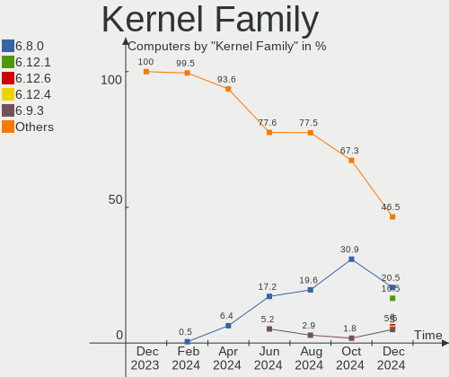
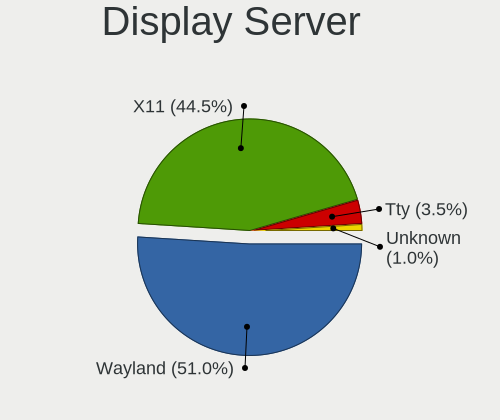
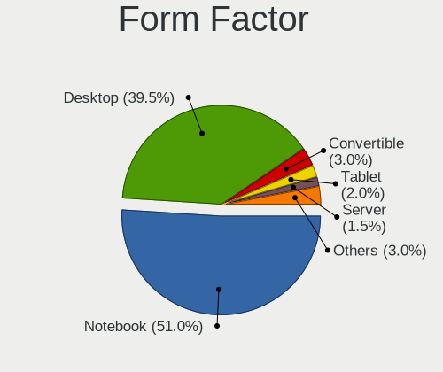

Linux in UK - Hardware Trends
-----------------------------

A project to identify most popular hardware characteristics and track their change
over time based on data collected by Linux users at https://Linux-Hardware.org.

Anyone can contribute to this report by the [hw-probe](https://github.com/linuxhw/hw-probe) tool:

    sudo -E hw-probe -all -upload

This is a report for all computer types. See also reports for [desktops](/Location/UK/Desktop/README.md) and [notebooks](/Location/UK/Notebook/README.md).

Period: Jul, 2023.

Contents
--------

* [ System ](#system)
  - [ OS                       ](#os)
  - [ OS Family                ](#os-family)
  - [ Kernel                   ](#kernel)
  - [ Kernel Family            ](#kernel-family)
  - [ Kernel Major Ver.        ](#kernel-major-ver)
  - [ Arch                     ](#arch)
  - [ DE                       ](#de)
  - [ Display Server           ](#display-server)
  - [ Display Manager          ](#display-manager)
  - [ OS Lang                  ](#os-lang)
  - [ Boot Mode                ](#boot-mode)
  - [ Filesystem               ](#filesystem)
  - [ Part. scheme             ](#part-scheme)
  - [ Dual Boot with Linux/BSD ](#dual-boot-with-linuxbsd)
  - [ Dual Boot (Win)          ](#dual-boot-win)

* [ Board ](#board)
  - [ Vendor                   ](#vendor)
  - [ Model                    ](#model)
  - [ Model Family             ](#model-family)
  - [ MFG Year                 ](#mfg-year)
  - [ Form Factor              ](#form-factor)
  - [ Secure Boot              ](#secure-boot)
  - [ Coreboot                 ](#coreboot)
  - [ RAM Size                 ](#ram-size)
  - [ RAM Used                 ](#ram-used)
  - [ Total Drives             ](#total-drives)
  - [ Has CD-ROM               ](#has-cd-rom)
  - [ Has Ethernet             ](#has-ethernet)
  - [ Has WiFi                 ](#has-wifi)
  - [ Has Bluetooth            ](#has-bluetooth)

* [ Location ](#location)
  - [ Country                  ](#country)
  - [ City                     ](#city)

* [ Drives ](#drives)
  - [ Drive Vendor             ](#drive-vendor)
  - [ Drive Model              ](#drive-model)
  - [ HDD Vendor               ](#hdd-vendor)
  - [ SSD Vendor               ](#ssd-vendor)
  - [ Drive Kind               ](#drive-kind)
  - [ Drive Connector          ](#drive-connector)
  - [ Drive Size               ](#drive-size)
  - [ Space Total              ](#space-total)
  - [ Space Used               ](#space-used)
  - [ Malfunc. Drives          ](#malfunc-drives)
  - [ Malfunc. Drive Vendor    ](#malfunc-drive-vendor)
  - [ Malfunc. HDD Vendor      ](#malfunc-hdd-vendor)
  - [ Malfunc. Drive Kind      ](#malfunc-drive-kind)
  - [ Failed Drives            ](#failed-drives)
  - [ Failed Drive Vendor      ](#failed-drive-vendor)
  - [ Drive Status             ](#drive-status)

* [ Storage controller ](#storage-controller)
  - [ Storage Vendor           ](#storage-vendor)
  - [ Storage Model            ](#storage-model)
  - [ Storage Kind             ](#storage-kind)

* [ Processor ](#processor)
  - [ CPU Vendor               ](#cpu-vendor)
  - [ CPU Model                ](#cpu-model)
  - [ CPU Model Family         ](#cpu-model-family)
  - [ CPU Cores                ](#cpu-cores)
  - [ CPU Sockets              ](#cpu-sockets)
  - [ CPU Threads              ](#cpu-threads)
  - [ CPU Op-Modes             ](#cpu-op-modes)
  - [ CPU Microcode            ](#cpu-microcode)
  - [ CPU Microarch            ](#cpu-microarch)

* [ Graphics ](#graphics)
  - [ GPU Vendor               ](#gpu-vendor)
  - [ GPU Model                ](#gpu-model)
  - [ GPU Combo                ](#gpu-combo)
  - [ GPU Driver               ](#gpu-driver)
  - [ GPU Memory               ](#gpu-memory)

* [ Monitor ](#monitor)
  - [ Monitor Vendor           ](#monitor-vendor)
  - [ Monitor Model            ](#monitor-model)
  - [ Monitor Resolution       ](#monitor-resolution)
  - [ Monitor Diagonal         ](#monitor-diagonal)
  - [ Monitor Width            ](#monitor-width)
  - [ Aspect Ratio             ](#aspect-ratio)
  - [ Monitor Area             ](#monitor-area)
  - [ Pixel Density            ](#pixel-density)
  - [ Multiple Monitors        ](#multiple-monitors)

* [ Network ](#network)
  - [ Net Controller Vendor    ](#net-controller-vendor)
  - [ Net Controller Model     ](#net-controller-model)
  - [ Wireless Vendor          ](#wireless-vendor)
  - [ Wireless Model           ](#wireless-model)
  - [ Ethernet Vendor          ](#ethernet-vendor)
  - [ Ethernet Model           ](#ethernet-model)
  - [ Net Controller Kind      ](#net-controller-kind)
  - [ Used Controller          ](#used-controller)
  - [ NICs                     ](#nics)
  - [ IPv6                     ](#ipv6)

* [ Bluetooth ](#bluetooth)
  - [ Bluetooth Vendor         ](#bluetooth-vendor)
  - [ Bluetooth Model          ](#bluetooth-model)

* [ Sound ](#sound)
  - [ Sound Vendor             ](#sound-vendor)
  - [ Sound Model              ](#sound-model)

* [ Memory ](#memory)
  - [ Memory Vendor            ](#memory-vendor)
  - [ Memory Model             ](#memory-model)
  - [ Memory Kind              ](#memory-kind)
  - [ Memory Form Factor       ](#memory-form-factor)
  - [ Memory Size              ](#memory-size)
  - [ Memory Speed             ](#memory-speed)

* [ Printers & scanners ](#printers--scanners)
  - [ Printer Vendor           ](#printer-vendor)
  - [ Printer Model            ](#printer-model)
  - [ Scanner Vendor           ](#scanner-vendor)
  - [ Scanner Model            ](#scanner-model)

* [ Camera ](#camera)
  - [ Camera Vendor            ](#camera-vendor)
  - [ Camera Model             ](#camera-model)

* [ Security ](#security)
  - [ Fingerprint Vendor       ](#fingerprint-vendor)
  - [ Fingerprint Model        ](#fingerprint-model)
  - [ Chipcard Vendor          ](#chipcard-vendor)
  - [ Chipcard Model           ](#chipcard-model)

* [ Unsupported ](#unsupported)
  - [ Unsupported Devices      ](#unsupported-devices)
  - [ Unsupported Device Types ](#unsupported-device-types)

System
------

OS
--

Installed operating systems

| Name                         | Computers | Percent |
|------------------------------|-----------|---------|
| Ubuntu 22.04                 | 25        | 10.37%  |
| Fedora 38                    | 25        | 10.37%  |
| Linux Mint 21.1              | 13        | 5.39%   |
| Debian 12                    | 12        | 4.98%   |
| Arch Rolling                 | 12        | 4.98%   |
| Ubuntu 23.04                 | 11        | 4.56%   |
| Linux Mint 21.2              | 11        | 4.56%   |
| Zorin 16                     | 10        | 4.15%   |
| OpenMandriva 23.03           | 10        | 4.15%   |
| SteamOS 3.4.8                | 8         | 3.32%   |
| Pop!_OS 22.04                | 8         | 3.32%   |
| Gentoo 2.13                  | 8         | 3.32%   |
| Kubuntu 23.04                | 6         | 2.49%   |
| Nobara 38                    | 5         | 2.07%   |
| OpenMandriva 23.07           | 4         | 1.66%   |
| Kubuntu 22.04                | 4         | 1.66%   |
| KDE neon 22.04               | 4         | 1.66%   |
| ArcoLinux Rolling            | 4         | 1.66%   |
| Zorin 15                     | 3         | 1.24%   |
| Manjaro                      | 3         | 1.24%   |
| Linux Mint 20.3              | 3         | 1.24%   |
| Kali 2023.2                  | 3         | 1.24%   |
| Debian 11                    | 3         | 1.24%   |
| Xubuntu 22.04                | 2         | 0.83%   |
| Ubuntu MATE 23.04            | 2         | 0.83%   |
| Ubuntu 22.10                 | 2         | 0.83%   |
| Ubuntu 20.04                 | 2         | 0.83%   |
| TUXEDO OS 22.04              | 2         | 0.83%   |
| openSUSE Tumbleweed-XXXXXXXX | 2         | 0.83%   |
| OpenMandriva 4.3             | 2         | 0.83%   |
| MX 21                        | 2         | 0.83%   |
| EndeavourOS Rolling          | 2         | 0.83%   |
| Debian                       | 2         | 0.83%   |
| Xubuntu 21.04                | 1         | 0.41%   |
| Xero Rolling                 | 1         | 0.41%   |
| Void Linux Rolling           | 1         | 0.41%   |
| Ubuntu MATE 22.10            | 1         | 0.41%   |
| Ubuntu MATE 22.04            | 1         | 0.41%   |
| Ubuntu 18.04                 | 1         | 0.41%   |
| Slackware 15.0               | 1         | 0.41%   |

OS Family
---------

OS without a version

| Name         | Computers | Percent |
|--------------|-----------|---------|
| Ubuntu       | 41        | 17.01%  |
| Linux Mint   | 28        | 11.62%  |
| Fedora       | 25        | 10.37%  |
| OpenMandriva | 19        | 7.88%   |
| Debian       | 17        | 7.05%   |
| Zorin        | 13        | 5.39%   |
| Arch         | 12        | 4.98%   |
| Kubuntu      | 11        | 4.56%   |
| SteamOS      | 8         | 3.32%   |
| Pop!_OS      | 8         | 3.32%   |
| Gentoo       | 8         | 3.32%   |
| Nobara       | 6         | 2.49%   |
| Ubuntu MATE  | 4         | 1.66%   |
| Manjaro      | 4         | 1.66%   |
| KDE neon     | 4         | 1.66%   |
| ArcoLinux    | 4         | 1.66%   |
| Xubuntu      | 3         | 1.24%   |
| MX           | 3         | 1.24%   |
| Kali         | 3         | 1.24%   |
| TUXEDO OS    | 2         | 0.83%   |
| openSUSE     | 2         | 0.83%   |
| Garuda Linux | 2         | 0.83%   |
| Endless      | 2         | 0.83%   |
| EndeavourOS  | 2         | 0.83%   |
| Xero         | 1         | 0.41%   |
| Void Linux   | 1         | 0.41%   |
| Slackware    | 1         | 0.41%   |
| Raspbian     | 1         | 0.41%   |
| Neptune OS   | 1         | 0.41%   |
| LMDE         | 1         | 0.41%   |
| Elementary   | 1         | 0.41%   |
| CentOS       | 1         | 0.41%   |
| CachyOS      | 1         | 0.41%   |
| blendOS      | 1         | 0.41%   |

Kernel
------

Version of the Linux kernel

| Version                      | Computers | Percent |
|------------------------------|-----------|---------|
| 5.19.0-46-generic            | 27        | 11.2%   |
| 5.15.0-76-generic            | 26        | 10.79%  |
| 6.2.6-desktop-1omv2390       | 9         | 3.73%   |
| 6.3.12-200.fc38.x86_64       | 8         | 3.32%   |
| 6.2.0-25-generic             | 8         | 3.32%   |
| 6.1.0-10-amd64               | 8         | 3.32%   |
| 5.13.0-valve36-1-neptune     | 8         | 3.32%   |
| 6.2.6-76060206-generic       | 6         | 2.49%   |
| 6.2.0-24-generic             | 6         | 2.49%   |
| 6.4.4-200.fc38.x86_64        | 5         | 2.07%   |
| 6.3.5-desktop-3omv2390       | 5         | 2.07%   |
| 5.15.0-78-generic            | 5         | 2.07%   |
| 6.3.8-200.fc38.x86_64        | 4         | 1.66%   |
| 6.4.3-arch1-2                | 3         | 1.24%   |
| 6.4.3-arch1-1                | 3         | 1.24%   |
| 6.3.11-200.fc38.x86_64       | 3         | 1.24%   |
| 6.2.9-300.fc38.x86_64        | 3         | 1.24%   |
| 6.2.0-26-generic             | 3         | 1.24%   |
| 6.1.21-v8+                   | 3         | 1.24%   |
| 6.1.0-kali9-amd64            | 3         | 1.24%   |
| 6.1.0-9-amd64                | 3         | 1.24%   |
| 5.4.0-150-generic            | 3         | 1.24%   |
| 6.4.6-200.fc38.x86_64        | 2         | 0.83%   |
| 6.4.6-060406-generic         | 2         | 0.83%   |
| 6.4.3-060403-generic         | 2         | 0.83%   |
| 6.4.2-arch1-1                | 2         | 0.83%   |
| 6.4.1-arch1-1                | 2         | 0.83%   |
| 6.3.12-204.fsync.fc38.x86_64 | 2         | 0.83%   |
| 6.3.12-203.fsync.fc38.x86_64 | 2         | 0.83%   |
| 6.1.39-1-lts                 | 2         | 0.83%   |
| 6.1.38-gentoo-x86_64         | 2         | 0.83%   |
| 6.1.38-1-lts                 | 2         | 0.83%   |
| 6.1.0-10-686-pae             | 2         | 0.83%   |
| 5.4.0-153-generic            | 2         | 0.83%   |
| 5.19.0-50-generic            | 2         | 0.83%   |
| 5.19.0-45-generic            | 2         | 0.83%   |
| 5.19.0-32-generic            | 2         | 0.83%   |
| 5.16.13-desktop-1omv4003     | 2         | 0.83%   |
| 5.15.0-75-generic            | 2         | 0.83%   |
| 5.15.0-73-generic            | 2         | 0.83%   |

Kernel Family
-------------

Linux kernel without a distro release

| Version | Computers | Percent |
|---------|-----------|---------|
| 5.15.0  | 39        | 16.18%  |
| 5.19.0  | 35        | 14.52%  |
| 6.2.0   | 20        | 8.3%    |
| 6.1.0   | 18        | 7.47%   |
| 6.2.6   | 15        | 6.22%   |
| 6.3.12  | 13        | 5.39%   |
| 6.4.3   | 8         | 3.32%   |
| 5.13.0  | 8         | 3.32%   |
| 5.4.0   | 7         | 2.9%    |
| 6.4.4   | 6         | 2.49%   |
| 6.4.2   | 6         | 2.49%   |
| 6.3.5   | 6         | 2.49%   |
| 6.4.6   | 5         | 2.07%   |
| 6.3.8   | 4         | 1.66%   |
| 6.1.38  | 4         | 1.66%   |
| 6.4.1   | 3         | 1.24%   |
| 6.3.9   | 3         | 1.24%   |
| 6.3.11  | 3         | 1.24%   |
| 6.3.0   | 3         | 1.24%   |
| 6.2.9   | 3         | 1.24%   |
| 6.1.21  | 3         | 1.24%   |
| 5.10.0  | 3         | 1.24%   |
| 6.3.10  | 2         | 0.83%   |
| 6.1.39  | 2         | 0.83%   |
| 6.1.31  | 2         | 0.83%   |
| 5.16.13 | 2         | 0.83%   |
| 5.11.0  | 2         | 0.83%   |
| 6.5.0   | 1         | 0.41%   |
| 6.4.7   | 1         | 0.41%   |
| 6.4.5   | 1         | 0.41%   |
| 6.4.0   | 1         | 0.41%   |
| 6.3.7   | 1         | 0.41%   |
| 6.2.2   | 1         | 0.41%   |
| 6.2.16  | 1         | 0.41%   |
| 6.1.41  | 1         | 0.41%   |
| 6.1.37  | 1         | 0.41%   |
| 6.1.15  | 1         | 0.41%   |
| 6.1.12  | 1         | 0.41%   |
| 6.1.1   | 1         | 0.41%   |
| 6.0.0   | 1         | 0.41%   |

Kernel Major Ver.
-----------------

Linux kernel major version

| Version | Computers | Percent |
|---------|-----------|---------|
| 6.2     | 40        | 16.6%   |
| 5.15    | 40        | 16.6%   |
| 6.3     | 35        | 14.52%  |
| 5.19    | 35        | 14.52%  |
| 6.1     | 34        | 14.11%  |
| 6.4     | 31        | 12.86%  |
| 5.13    | 8         | 3.32%   |
| 5.4     | 7         | 2.9%    |
| 5.11    | 3         | 1.24%   |
| 5.10    | 3         | 1.24%   |
| 5.16    | 2         | 0.83%   |
| 6.5     | 1         | 0.41%   |
| 6.0     | 1         | 0.41%   |
| 3.10    | 1         | 0.41%   |

Arch
----

OS architecture (x86_64, i586, etc.)

| Name    | Computers | Percent |
|---------|-----------|---------|
| x86_64  | 232       | 96.27%  |
| i686    | 4         | 1.66%   |
| aarch64 | 4         | 1.66%   |
| riscv64 | 1         | 0.41%   |

DE
--

Desktop Environment

| Name          | Computers | Percent |
|---------------|-----------|---------|
| GNOME         | 103       | 42.74%  |
| KDE5          | 62        | 25.73%  |
| X-Cinnamon    | 24        | 9.96%   |
| XFCE          | 21        | 8.71%   |
| Unknown       | 11        | 4.56%   |
| MATE          | 8         | 3.32%   |
| Cinnamon      | 3         | 1.24%   |
| LXQt          | 2         | 0.83%   |
| LXDE          | 2         | 0.83%   |
| sway          | 1         | 0.41%   |
| Pantheon      | 1         | 0.41%   |
| GNOME Classic | 1         | 0.41%   |
| chadwm        | 1         | 0.41%   |
| bspwm         | 1         | 0.41%   |

Display Server
--------------

X11 or Wayland

| Name    | Computers | Percent |
|---------|-----------|---------|
| X11     | 152       | 63.07%  |
| Wayland | 82        | 34.02%  |
| Tty     | 6         | 2.49%   |
| Unknown | 1         | 0.41%   |

Display Manager
---------------

SDDM, LightDM, etc.

| Name    | Computers | Percent |
|---------|-----------|---------|
| Unknown | 90        | 37.34%  |
| SDDM    | 51        | 21.16%  |
| GDM3    | 43        | 17.84%  |
| LightDM | 36        | 14.94%  |
| GDM     | 21        | 8.71%   |

OS Lang
-------

Language

| Lang    | Computers | Percent |
|---------|-----------|---------|
| en_GB   | 191       | 79.25%  |
| en_US   | 33        | 13.69%  |
| C       | 7         | 2.9%    |
| pl_PL   | 3         | 1.24%   |
| Unknown | 3         | 1.24%   |
| us      | 1         | 0.41%   |
| hu_HU   | 1         | 0.41%   |
| enGB    | 1         | 0.41%   |
| C.UTF8  | 1         | 0.41%   |

Boot Mode
---------

EFI or BIOS

| Mode | Computers | Percent |
|------|-----------|---------|
| EFI  | 123       | 51.04%  |
| BIOS | 118       | 48.96%  |

Filesystem
----------

Type of filesystem

| Type    | Computers | Percent |
|---------|-----------|---------|
| Ext4    | 133       | 55.19%  |
| Btrfs   | 59        | 24.48%  |
| Tmpfs   | 34        | 14.11%  |
| Overlay | 10        | 4.15%   |
| Xfs     | 3         | 1.24%   |
| Zfs     | 1         | 0.41%   |
| XXXX    | 1         | 0.41%   |

Part. scheme
------------

Scheme of partitioning

| Type    | Computers | Percent |
|---------|-----------|---------|
| GPT     | 135       | 56.02%  |
| Unknown | 83        | 34.44%  |
| MBR     | 23        | 9.54%   |

Dual Boot with Linux/BSD
------------------------

Hosting more than one Linux/BSD

| Dual boot | Computers | Percent |
|-----------|-----------|---------|
| No        | 211       | 87.55%  |
| Yes       | 30        | 12.45%  |

Dual Boot (Win)
---------------

Hosting Linux and Windows

| Dual boot | Computers | Percent |
|-----------|-----------|---------|
| No        | 181       | 75.1%   |
| Yes       | 60        | 24.9%   |

Board
-----

Vendor
------

Motherboard manufacturer

| Name                                 | Computers | Percent |
|--------------------------------------|-----------|---------|
| Lenovo                               | 35        | 14.52%  |
| Dell                                 | 35        | 14.52%  |
| ASUSTek Computer                     | 34        | 14.11%  |
| Hewlett-Packard                      | 26        | 10.79%  |
| Gigabyte Technology                  | 21        | 8.71%   |
| MSI                                  | 15        | 6.22%   |
| Apple                                | 12        | 4.98%   |
| Acer                                 | 9         | 3.73%   |
| Valve                                | 8         | 3.32%   |
| ASRock                               | 5         | 2.07%   |
| Unknown                              | 5         | 2.07%   |
| Sony                                 | 4         | 1.66%   |
| Toshiba                              | 3         | 1.24%   |
| Raspberry Pi Foundation              | 3         | 1.24%   |
| Intel                                | 3         | 1.24%   |
| Samsung Electronics                  | 2         | 0.83%   |
| PC Specialist                        | 2         | 0.83%   |
| Microsoft                            | 2         | 0.83%   |
| Google                               | 2         | 0.83%   |
| Teclast                              | 1         | 0.41%   |
| Supermicro                           | 1         | 0.41%   |
| Shenzhen Meigao Electronic Equipment | 1         | 0.41%   |
| Razer                                | 1         | 0.41%   |
| Pine Microsystems                    | 1         | 0.41%   |
| Packard Bell                         | 1         | 0.41%   |
| Notebook                             | 1         | 0.41%   |
| LG Electronics                       | 1         | 0.41%   |
| lapbook                              | 1         | 0.41%   |
| Fujitsu Siemens                      | 1         | 0.41%   |
| Fujitsu                              | 1         | 0.41%   |
| Fanless Mini PC                      | 1         | 0.41%   |
| Chuwi                                | 1         | 0.41%   |
| Alienware                            | 1         | 0.41%   |
| Acidanthera                          | 1         | 0.41%   |

Model
-----

Motherboard model

| Name                                        | Computers | Percent |
|---------------------------------------------|-----------|---------|
| Valve Jupiter                               | 8         | 3.32%   |
| Unknown                                     | 5         | 2.07%   |
| MSI MS-7C91                                 | 2         | 0.83%   |
| Microsoft Surface Pro 4                     | 2         | 0.83%   |
| Lenovo ThinkPad E15 20RD0011UK              | 2         | 0.83%   |
| Dell XPS 15 9570                            | 2         | 0.83%   |
| Dell XPS 13 9380                            | 2         | 0.83%   |
| Dell Inspiron 7415 2-in-1                   | 2         | 0.83%   |
| Dell Inspiron 13-5378                       | 2         | 0.83%   |
| ASUS ROG STRIX B550-F GAMING                | 2         | 0.83%   |
| ASUS MINIPC PN50-E1                         | 2         | 0.83%   |
| ASUS All Series                             | 2         | 0.83%   |
| Apple MacBookPro12,1                        | 2         | 0.83%   |
| Toshiba Satellite Pro L650                  | 1         | 0.41%   |
| Toshiba Satellite Pro C50-A-1E6             | 1         | 0.41%   |
| Toshiba PORTEGE X30T-E                      | 1         | 0.41%   |
| Teclast F15Plus 2                           | 1         | 0.41%   |
| Supermicro X9SRA/X9SRA-3                    | 1         | 0.41%   |
| Sony VPCZ214GX                              | 1         | 0.41%   |
| Sony VGN-S3HP                               | 1         | 0.41%   |
| Sony VGC-LV1S                               | 1         | 0.41%   |
| Sony SVP1321M2EB                            | 1         | 0.41%   |
| Shenzhen Meigao Electronic Equipment HX90G  | 1         | 0.41%   |
| Samsung RV411/RV511/E3511/S3511/RV711/E3411 | 1         | 0.41%   |
| Samsung 950XCJ/951XCJ/950XCR                | 1         | 0.41%   |
| Razer Blade                                 | 1         | 0.41%   |
| RPi Raspberry Pi 4 Model B Rev 1.4          | 1         | 0.41%   |
| RPi Raspberry Pi 3 Model B Rev 1.2          | 1         | 0.41%   |
| RPi Raspberry Pi                            | 1         | 0.41%   |
| Pine Microsystems Pine64 RockPro64 v2.1     | 1         | 0.41%   |
| PC Specialist Standard                      | 1         | 0.41%   |
| PC Specialist Ionico 16                     | 1         | 0.41%   |
| Packard Bell IMEDIA S2885                   | 1         | 0.41%   |
| Notebook N150ZU                             | 1         | 0.41%   |
| MSI VIG690M                                 | 1         | 0.41%   |
| MSI MS-7E07                                 | 1         | 0.41%   |
| MSI MS-7D75                                 | 1         | 0.41%   |
| MSI MS-7D53                                 | 1         | 0.41%   |
| MSI MS-7C73                                 | 1         | 0.41%   |
| MSI MS-7B89                                 | 1         | 0.41%   |

Model Family
------------

Motherboard model prefix

| Name               | Computers | Percent |
|--------------------|-----------|---------|
| Lenovo ThinkPad    | 18        | 7.47%   |
| ASUS ROG           | 12        | 4.98%   |
| Dell Inspiron      | 9         | 3.73%   |
| Valve Jupiter      | 8         | 3.32%   |
| Dell XPS           | 8         | 3.32%   |
| HP ENVY            | 5         | 2.07%   |
| HP EliteBook       | 5         | 2.07%   |
| Dell Latitude      | 5         | 2.07%   |
| Acer Aspire        | 5         | 2.07%   |
| Unknown            | 5         | 2.07%   |
| Lenovo ThinkCentre | 4         | 1.66%   |
| RPi Raspberry      | 3         | 1.24%   |
| Lenovo Yoga        | 3         | 1.24%   |
| HP ProBook         | 3         | 1.24%   |
| Dell Precision     | 3         | 1.24%   |
| Dell OptiPlex      | 3         | 1.24%   |
| ASUS VivoBook      | 3         | 1.24%   |
| ASUS PRIME         | 3         | 1.24%   |
| Toshiba Satellite  | 2         | 0.83%   |
| MSI MS-7C91        | 2         | 0.83%   |
| Microsoft Surface  | 2         | 0.83%   |
| Lenovo V15         | 2         | 0.83%   |
| Lenovo IdeaPad     | 2         | 0.83%   |
| Lenovo IdeaCentre  | 2         | 0.83%   |
| HP Laptop          | 2         | 0.83%   |
| HP Compaq          | 2         | 0.83%   |
| Dell Vostro        | 2         | 0.83%   |
| ASUS Zenbook       | 2         | 0.83%   |
| ASUS TUF           | 2         | 0.83%   |
| ASUS MINIPC        | 2         | 0.83%   |
| ASUS All           | 2         | 0.83%   |
| ASRock A320M-HDV   | 2         | 0.83%   |
| Apple MacBookPro12 | 2         | 0.83%   |
| Apple iMac11       | 2         | 0.83%   |
| Acer Swift         | 2         | 0.83%   |
| Toshiba PORTEGE    | 1         | 0.41%   |
| Teclast F15Plus    | 1         | 0.41%   |
| Supermicro X9SRA   | 1         | 0.41%   |
| Sony VPCZ214GX     | 1         | 0.41%   |
| Sony VGN-S3HP      | 1         | 0.41%   |

MFG Year
--------

Motherboard manufacture year

| Year    | Computers | Percent |
|---------|-----------|---------|
| 2022    | 32        | 13.28%  |
| 2021    | 27        | 11.2%   |
| 2018    | 25        | 10.37%  |
| 2020    | 21        | 8.71%   |
| 2019    | 15        | 6.22%   |
| 2017    | 14        | 5.81%   |
| 2011    | 14        | 5.81%   |
| 2023    | 13        | 5.39%   |
| 2014    | 13        | 5.39%   |
| 2016    | 11        | 4.56%   |
| 2015    | 11        | 4.56%   |
| 2012    | 10        | 4.15%   |
| 2010    | 9         | 3.73%   |
| 2013    | 7         | 2.9%    |
| 2009    | 4         | 1.66%   |
| 2008    | 4         | 1.66%   |
| 2007    | 4         | 1.66%   |
| Unknown | 4         | 1.66%   |
| 2006    | 1         | 0.41%   |
| 2005    | 1         | 0.41%   |
| 2002    | 1         | 0.41%   |

Form Factor
-----------

Physical design of the computer

| Name           | Computers | Percent |
|----------------|-----------|---------|
| Notebook       | 122       | 50.62%  |
| Desktop        | 87        | 36.1%   |
| Convertible    | 9         | 3.73%   |
| All in one     | 9         | 3.73%   |
| Mini pc        | 6         | 2.49%   |
| System on chip | 4         | 1.66%   |
| Tablet         | 3         | 1.24%   |
| Server         | 1         | 0.41%   |

Secure Boot
-----------

Enabled or disabled

| State    | Computers | Percent |
|----------|-----------|---------|
| Disabled | 226       | 93.78%  |
| Enabled  | 15        | 6.22%   |

Coreboot
--------

Have coreboot on board

| Used | Computers | Percent |
|------|-----------|---------|
| No   | 239       | 99.17%  |
| Yes  | 2         | 0.83%   |

RAM Size
--------

Total RAM memory

| Size in GB  | Computers | Percent |
|-------------|-----------|---------|
| 4.01-8.0    | 53        | 21.99%  |
| 16.01-24.0  | 50        | 20.75%  |
| 8.01-16.0   | 46        | 19.09%  |
| 32.01-64.0  | 36        | 14.94%  |
| 3.01-4.0    | 29        | 12.03%  |
| 64.01-256.0 | 13        | 5.39%   |
| 24.01-32.0  | 4         | 1.66%   |
| 1.01-2.0    | 4         | 1.66%   |
| 2.01-3.0    | 3         | 1.24%   |
| 0.51-1.0    | 3         | 1.24%   |

RAM Used
--------

Used RAM memory

| Used GB    | Computers | Percent |
|------------|-----------|---------|
| 4.01-8.0   | 61        | 25.31%  |
| 1.01-2.0   | 60        | 24.9%   |
| 2.01-3.0   | 51        | 21.16%  |
| 3.01-4.0   | 35        | 14.52%  |
| 8.01-16.0  | 15        | 6.22%   |
| 0.51-1.0   | 10        | 4.15%   |
| 0.01-0.5   | 4         | 1.66%   |
| 16.01-24.0 | 3         | 1.24%   |
| 24.01-32.0 | 2         | 0.83%   |

Total Drives
------------

Number of drives on board

| Drives | Computers | Percent |
|--------|-----------|---------|
| 1      | 133       | 55.19%  |
| 2      | 67        | 27.8%   |
| 3      | 19        | 7.88%   |
| 4      | 13        | 5.39%   |
| 5      | 7         | 2.9%    |
| 8      | 1         | 0.41%   |
| 0      | 1         | 0.41%   |

Has CD-ROM
----------

Has CD-ROM on board

| Presented | Computers | Percent |
|-----------|-----------|---------|
| No        | 173       | 71.78%  |
| Yes       | 68        | 28.22%  |

Has Ethernet
------------

Has Ethernet on board

| Presented | Computers | Percent |
|-----------|-----------|---------|
| Yes       | 192       | 79.67%  |
| No        | 49        | 20.33%  |

Has WiFi
--------

Has WiFi module

| Presented | Computers | Percent |
|-----------|-----------|---------|
| Yes       | 194       | 80.5%   |
| No        | 47        | 19.5%   |

Has Bluetooth
-------------

Has Bluetooth module

| Presented | Computers | Percent |
|-----------|-----------|---------|
| Yes       | 156       | 64.73%  |
| No        | 85        | 35.27%  |

Location
--------

Country
-------

Geographic location (country)

| Country | Computers | Percent |
|---------|-----------|---------|
| UK      | 241       | 100%    |

City
----

Geographic location (city)

| City                 | Computers | Percent |
|----------------------|-----------|---------|
| London               | 11        | 4.56%   |
| Manchester           | 8         | 3.32%   |
| Leeds                | 5         | 2.07%   |
| Swindon              | 4         | 1.66%   |
| Southend-on-Sea      | 4         | 1.66%   |
| Sheffield            | 4         | 1.66%   |
| Newcastle upon Tyne  | 4         | 1.66%   |
| Islington            | 4         | 1.66%   |
| Edinburgh            | 4         | 1.66%   |
| Coventry             | 4         | 1.66%   |
| Birmingham           | 4         | 1.66%   |
| Reading              | 3         | 1.24%   |
| Ilford               | 3         | 1.24%   |
| Bradford             | 3         | 1.24%   |
| Barnet               | 3         | 1.24%   |
| York                 | 2         | 0.83%   |
| Worthing             | 2         | 0.83%   |
| Wigan                | 2         | 0.83%   |
| Wakefield            | 2         | 0.83%   |
| Telford              | 2         | 0.83%   |
| Southwark            | 2         | 0.83%   |
| Shrewsbury           | 2         | 0.83%   |
| Rochdale             | 2         | 0.83%   |
| Portsmouth           | 2         | 0.83%   |
| Newport              | 2         | 0.83%   |
| Milton Keynes        | 2         | 0.83%   |
| Liverpool            | 2         | 0.83%   |
| Kingston upon Thames | 2         | 0.83%   |
| Harringay            | 2         | 0.83%   |
| Glasgow              | 2         | 0.83%   |
| Gillingham           | 2         | 0.83%   |
| Flint                | 2         | 0.83%   |
| Farnborough          | 2         | 0.83%   |
| Cullompton           | 2         | 0.83%   |
| Croydon              | 2         | 0.83%   |
| Burnham-on-Sea       | 2         | 0.83%   |
| Brent                | 2         | 0.83%   |
| Bolton               | 2         | 0.83%   |
| Basingstoke          | 2         | 0.83%   |
| Yeovil               | 1         | 0.41%   |

Drives
------

Drive Vendor
------------

Hard drive vendors

| Vendor                      | Computers | Drives | Percent |
|-----------------------------|-----------|--------|---------|
| Samsung Electronics         | 65        | 81     | 17.33%  |
| Seagate                     | 41        | 48     | 10.93%  |
| WDC                         | 35        | 42     | 9.33%   |
| Sandisk                     | 28        | 31     | 7.47%   |
| Unknown                     | 24        | 24     | 6.4%    |
| Kingston                    | 20        | 21     | 5.33%   |
| Toshiba                     | 18        | 19     | 4.8%    |
| SK hynix                    | 17        | 17     | 4.53%   |
| Crucial                     | 17        | 19     | 4.53%   |
| Phison Electronics          | 9         | 9      | 2.4%    |
| Intel                       | 8         | 9      | 2.13%   |
| Hitachi                     | 8         | 8      | 2.13%   |
| Micron/Crucial Technology   | 7         | 7      | 1.87%   |
| HGST                        | 7         | 8      | 1.87%   |
| Apple                       | 6         | 8      | 1.6%    |
| KIOXIA                      | 4         | 5      | 1.07%   |
| China                       | 4         | 4      | 1.07%   |
| Transcend                   | 3         | 3      | 0.8%    |
| Silicon Motion              | 3         | 3      | 0.8%    |
| Realtek                     | 3         | 3      | 0.8%    |
| Patriot                     | 3         | 3      | 0.8%    |
| OCZ                         | 3         | 5      | 0.8%    |
| Kingston Technology Company | 3         | 3      | 0.8%    |
| A-DATA Technology           | 3         | 3      | 0.8%    |
| Union Memory                | 2         | 2      | 0.53%   |
| SPCC                        | 2         | 2      | 0.53%   |
| SABRENT                     | 2         | 2      | 0.53%   |
| O2 Micro                    | 2         | 2      | 0.53%   |
| Micron Technology           | 2         | 2      | 0.53%   |
| Maxtor                      | 2         | 2      | 0.53%   |
| MAXIO Technology (Hangzhou) | 2         | 2      | 0.53%   |
| LITEON                      | 2         | 2      | 0.53%   |
| Gigabyte Technology         | 2         | 2      | 0.53%   |
| Fanxiang                    | 2         | 2      | 0.53%   |
| Unknown                     | 2         | 2      | 0.53%   |
| X12                         | 1         | 1      | 0.27%   |
| Vaseky                      | 1         | 1      | 0.27%   |
| TurXun                      | 1         | 1      | 0.27%   |
| Teclast                     | 1         | 1      | 0.27%   |
| TCSUNBOW                    | 1         | 1      | 0.27%   |

Drive Model
-----------

Hard drive models

| Model                                                 | Computers | Percent |
|-------------------------------------------------------|-----------|---------|
| Samsung NVMe SSD Controller SM981/PM981/PM983 500GB   | 11        | 2.72%   |
| Samsung NVMe SSD Controller PM9A1/PM9A3/980PRO 1TB    | 6         | 1.48%   |
| Kingston SA400S37240G 240GB SSD                       | 6         | 1.48%   |
| Seagate ST1000LM035-1RK172 1TB                        | 5         | 1.23%   |
| Samsung SSD 980 1TB                                   | 5         | 1.23%   |
| Micron/Crucial P2 NVMe PCIe SSD 1TB                   | 5         | 1.23%   |
| Unknown SD/MMC/MS PRO 128GB                           | 4         | 0.99%   |
| Unknown MMC Card  512GB                               | 4         | 0.99%   |
| Seagate ST1000DM010-2EP102 1TB                        | 4         | 0.99%   |
| SanDisk SSD PLUS 480GB                                | 4         | 0.99%   |
| Samsung SSD 870 QVO 1TB                               | 4         | 0.99%   |
| Samsung SSD 850 EVO 500GB                             | 4         | 0.99%   |
| Phison E12 NVMe Controller 2TB                        | 4         | 0.99%   |
| Kingston SA400S37480G 480GB SSD                       | 4         | 0.99%   |
| WDC WDS500G2B0A-00SM50 500GB SSD                      | 3         | 0.74%   |
| Unknown MMC Card  256GB                               | 3         | 0.74%   |
| Sandisk WD Black SN850 1TB                            | 3         | 0.74%   |
| Samsung SSD 860 EVO 1TB                               | 3         | 0.74%   |
| Samsung HD103SJ 1TB                                   | 3         | 0.74%   |
| Realtek RTL9210B-CG 256GB                             | 3         | 0.74%   |
| Kingston SA400S37120G 120GB SSD                       | 3         | 0.74%   |
| Crucial CT1000MX500SSD1 1TB                           | 3         | 0.74%   |
| WDC WD10EZEX-21WN4A0 1TB                              | 2         | 0.49%   |
| Unknown MMC Card  64GB                                | 2         | 0.49%   |
| Unknown MMC Card  32GB                                | 2         | 0.49%   |
| Unknown MMC Card  128GB                               | 2         | 0.49%   |
| Union Memory UMIS RPJTJ256MEE1OWX 256GB               | 2         | 0.49%   |
| Toshiba HDWD110 1TB                                   | 2         | 0.49%   |
| Toshiba DT01ACA200 2TB                                | 2         | 0.49%   |
| SK hynix PC401 NVMe Solid State Drive 256GB           | 2         | 0.49%   |
| SK hynix HFM001TD3JX013N 1TB                          | 2         | 0.49%   |
| Silicon Motion SM2263EN/SM2263XT SSD Controller 500GB | 2         | 0.49%   |
| Seagate ST9120822AS 120GB                             | 2         | 0.49%   |
| Seagate ST500DM002-1BD142 500GB                       | 2         | 0.49%   |
| Seagate ST3500413AS 500GB                             | 2         | 0.49%   |
| Seagate ST3000DM007-1WY10G 3TB                        | 2         | 0.49%   |
| Seagate ST2000DM008-2FR102 2TB                        | 2         | 0.49%   |
| Sandisk WD_BLACK SN850X HS 1000GB                     | 2         | 0.49%   |
| Sandisk WD Blue SN550 NVMe SSD 250GB                  | 2         | 0.49%   |
| Sandisk WD Black 2018/SN750 / PC SN720 NVMe SSD 1TB   | 2         | 0.49%   |

HDD Vendor
----------

Hard disk drive vendors

| Vendor              | Computers | Drives | Percent |
|---------------------|-----------|--------|---------|
| Seagate             | 41        | 46     | 37.61%  |
| WDC                 | 27        | 30     | 24.77%  |
| Toshiba             | 12        | 12     | 11.01%  |
| Hitachi             | 8         | 8      | 7.34%   |
| HGST                | 7         | 8      | 6.42%   |
| Samsung Electronics | 6         | 6      | 5.5%    |
| Unknown             | 4         | 4      | 3.67%   |
| Maxtor              | 2         | 2      | 1.83%   |
| Fujitsu             | 1         | 1      | 0.92%   |
| Apple               | 1         | 1      | 0.92%   |

SSD Vendor
----------

Solid state drive vendors

| Vendor              | Computers | Drives | Percent |
|---------------------|-----------|--------|---------|
| Samsung Electronics | 24        | 28     | 20.17%  |
| Kingston            | 19        | 20     | 15.97%  |
| Crucial             | 14        | 16     | 11.76%  |
| SanDisk             | 10        | 11     | 8.4%    |
| WDC                 | 8         | 9      | 6.72%   |
| Toshiba             | 4         | 5      | 3.36%   |
| China               | 4         | 4      | 3.36%   |
| Apple               | 4         | 4      | 3.36%   |
| Transcend           | 3         | 3      | 2.52%   |
| OCZ                 | 3         | 5      | 2.52%   |
| A-DATA Technology   | 3         | 3      | 2.52%   |
| SPCC                | 2         | 2      | 1.68%   |
| SK hynix            | 2         | 2      | 1.68%   |
| Patriot             | 2         | 2      | 1.68%   |
| LITEON              | 2         | 2      | 1.68%   |
| Intel               | 2         | 2      | 1.68%   |
| Gigabyte Technology | 2         | 2      | 1.68%   |
| X12                 | 1         | 1      | 0.84%   |
| Vaseky              | 1         | 1      | 0.84%   |
| Teclast             | 1         | 1      | 0.84%   |
| TCSUNBOW            | 1         | 1      | 0.84%   |
| ShiJi               | 1         | 1      | 0.84%   |
| Seagate             | 1         | 1      | 0.84%   |
| SABRENT             | 1         | 1      | 0.84%   |
| KIOXIA-EXCERIA      | 1         | 1      | 0.84%   |
| Integral            | 1         | 1      | 0.84%   |
| Fanxiang            | 1         | 1      | 0.84%   |
| CT500MX5            | 1         | 1      | 0.84%   |

Drive Kind
----------

HDD or SSD

| Kind    | Computers | Drives | Percent |
|---------|-----------|--------|---------|
| NVMe    | 125       | 147    | 36.87%  |
| SSD     | 99        | 131    | 29.2%   |
| HDD     | 92        | 118    | 27.14%  |
| MMC     | 21        | 21     | 6.19%   |
| Unknown | 2         | 2      | 0.59%   |

Drive Connector
---------------

SATA, SAS, NVMe, etc.

| Type | Computers | Drives | Percent |
|------|-----------|--------|---------|
| SATA | 148       | 236    | 48.37%  |
| NVMe | 122       | 143    | 39.87%  |
| MMC  | 21        | 21     | 6.86%   |
| SAS  | 15        | 19     | 4.9%    |

Drive Size
----------

Size of hard drive

| Size in TB | Computers | Drives | Percent |
|------------|-----------|--------|---------|
| 0.01-0.5   | 110       | 149    | 56.99%  |
| 0.51-1.0   | 53        | 64     | 27.46%  |
| 1.01-2.0   | 15        | 16     | 7.77%   |
| 3.01-4.0   | 6         | 9      | 3.11%   |
| 4.01-10.0  | 5         | 5      | 2.59%   |
| 2.01-3.0   | 4         | 6      | 2.07%   |

Space Total
-----------

Amount of disk space available on the file system

| Size in GB     | Computers | Percent |
|----------------|-----------|---------|
| 501-1000       | 53        | 21.99%  |
| 251-500        | 47        | 19.5%   |
| 101-250        | 45        | 18.67%  |
| More than 3000 | 22        | 9.13%   |
| 1001-2000      | 20        | 8.3%    |
| 1-20           | 15        | 6.22%   |
| 2001-3000      | 12        | 4.98%   |
| Unknown        | 10        | 4.15%   |
| 51-100         | 9         | 3.73%   |
| 21-50          | 8         | 3.32%   |

Space Used
----------

Amount of used disk space

| Used GB        | Computers | Percent |
|----------------|-----------|---------|
| 1-20           | 65        | 26.97%  |
| 21-50          | 39        | 16.18%  |
| 101-250        | 36        | 14.94%  |
| 51-100         | 33        | 13.69%  |
| 251-500        | 21        | 8.71%   |
| 501-1000       | 17        | 7.05%   |
| 1001-2000      | 10        | 4.15%   |
| Unknown        | 10        | 4.15%   |
| More than 3000 | 9         | 3.73%   |
| 2001-3000      | 1         | 0.41%   |

Malfunc. Drives
---------------

Drive models with a malfunction

| Model                                                          | Computers | Drives | Percent |
|----------------------------------------------------------------|-----------|--------|---------|
| WDC WD6400AAKS-22A7B2 640GB                                    | 1         | 1      | 6.25%   |
| WDC WD400BB-75CAA0 40GB                                        | 1         | 1      | 6.25%   |
| WDC WD20EARS-00MVWB0 2TB                                       | 1         | 1      | 6.25%   |
| WDC WD10EZEX-60ZF5A0 1TB                                       | 1         | 1      | 6.25%   |
| WDC WD10EZEX-21WN4A0 1TB                                       | 1         | 1      | 6.25%   |
| Seagate ST500LT012-1DG142 500GB                                | 1         | 1      | 6.25%   |
| Seagate ST1000DM003-1SB102 1TB                                 | 1         | 1      | 6.25%   |
| Samsung Electronics SSD 970 EVO Plus 1TB                       | 1         | 2      | 6.25%   |
| Samsung Electronics NVMe SSD Controller PM9A1/PM9A3/980PRO 1TB | 1         | 1      | 6.25%   |
| Samsung Electronics MZRPA128HMCD-000SO 64GB SSD                | 1         | 2      | 6.25%   |
| OCZ ARC100 240GB SSD                                           | 1         | 1      | 6.25%   |
| Kingston SA400S37480G 480GB SSD                                | 1         | 1      | 6.25%   |
| Kingston RBU-SNS8350DES3128GP 128GB SSD                        | 1         | 1      | 6.25%   |
| Intel SSDPEKKW512G7 512GB                                      | 1         | 1      | 6.25%   |
| Hitachi HTS541680J9SA00 80GB                                   | 1         | 1      | 6.25%   |
| Hitachi HDS721050CLA362 500GB                                  | 1         | 1      | 6.25%   |

Malfunc. Drive Vendor
---------------------

Vendors of faulty drives

| Vendor              | Computers | Drives | Percent |
|---------------------|-----------|--------|---------|
| WDC                 | 4         | 5      | 26.67%  |
| Samsung Electronics | 3         | 5      | 20%     |
| Seagate             | 2         | 2      | 13.33%  |
| Kingston            | 2         | 2      | 13.33%  |
| Hitachi             | 2         | 2      | 13.33%  |
| OCZ                 | 1         | 1      | 6.67%   |
| Intel               | 1         | 1      | 6.67%   |

Malfunc. HDD Vendor
-------------------

Vendors of faulty HDD drives

| Vendor  | Computers | Drives | Percent |
|---------|-----------|--------|---------|
| WDC     | 4         | 5      | 50%     |
| Seagate | 2         | 2      | 25%     |
| Hitachi | 2         | 2      | 25%     |

Malfunc. Drive Kind
-------------------

Kinds of faulty drives

| Kind | Computers | Drives | Percent |
|------|-----------|--------|---------|
| HDD  | 7         | 9      | 50%     |
| SSD  | 4         | 5      | 28.57%  |
| NVMe | 3         | 4      | 21.43%  |

Failed Drives
-------------

Failed drive models

Zero info for selected period =(

Failed Drive Vendor
-------------------

Failed drive vendors

Zero info for selected period =(

Drive Status
------------

Number of failed and malfunc. drives

| Status   | Computers | Drives | Percent |
|----------|-----------|--------|---------|
| Detected | 137       | 242    | 53.52%  |
| Works    | 105       | 159    | 41.02%  |
| Malfunc  | 14        | 18     | 5.47%   |

Storage controller
------------------

Storage Vendor
--------------

Storage controller vendors

| Vendor                       | Computers | Percent |
|------------------------------|-----------|---------|
| Intel                        | 130       | 40.63%  |
| AMD                          | 54        | 16.88%  |
| Samsung Electronics          | 44        | 13.75%  |
| SanDisk                      | 22        | 6.88%   |
| SK hynix                     | 15        | 4.69%   |
| Phison Electronics           | 10        | 3.13%   |
| Micron/Crucial Technology    | 10        | 3.13%   |
| Kingston Technology Company  | 4         | 1.25%   |
| Toshiba America Info Systems | 3         | 0.94%   |
| Silicon Motion               | 3         | 0.94%   |
| MAXIO Technology (Hangzhou)  | 3         | 0.94%   |
| KIOXIA                       | 3         | 0.94%   |
| ASMedia Technology           | 3         | 0.94%   |
| Union Memory (Shenzhen)      | 2         | 0.63%   |
| O2 Micro                     | 2         | 0.63%   |
| Micron Technology            | 2         | 0.63%   |
| Apple                        | 2         | 0.63%   |
| Nvidia                       | 1         | 0.31%   |
| Netac Technology             | 1         | 0.31%   |
| Marvell Technology Group     | 1         | 0.31%   |
| LSI Logic / Symbios Logic    | 1         | 0.31%   |
| Lenovo                       | 1         | 0.31%   |
| JMicron Technology           | 1         | 0.31%   |
| INNOGRIT                     | 1         | 0.31%   |
| ADATA Technology             | 1         | 0.31%   |

Storage Model
-------------

Storage controller models

| Model                                                                          | Computers | Percent |
|--------------------------------------------------------------------------------|-----------|---------|
| AMD FCH SATA Controller [AHCI mode]                                            | 38        | 10.53%  |
| Samsung NVMe SSD Controller SM981/PM981/PM983                                  | 18        | 4.99%   |
| Samsung NVMe SSD Controller 980                                                | 13        | 3.6%    |
| Intel Sunrise Point-LP SATA Controller [AHCI mode]                             | 11        | 3.05%   |
| Intel 8 Series/C220 Series Chipset Family 6-port SATA Controller 1 [AHCI mode] | 10        | 2.77%   |
| AMD 400 Series Chipset SATA Controller                                         | 9         | 2.49%   |
| SK hynix Gold P31/BC711/PC711 NVMe Solid State Drive                           | 8         | 2.22%   |
| Intel 82801 Mobile SATA Controller [RAID mode]                                 | 8         | 2.22%   |
| Samsung NVMe SSD Controller PM9A1/PM9A3/980PRO                                 | 7         | 1.94%   |
| Micron/Crucial P2 [Nick P2] / P3 / P3 Plus NVMe PCIe SSD (DRAM-less)           | 7         | 1.94%   |
| AMD 500 Series Chipset SATA Controller                                         | 7         | 1.94%   |
| SanDisk WD PC SN810 / Black SN850 NVMe SSD                                     | 6         | 1.66%   |
| Intel 7 Series Chipset Family 6-port SATA Controller [AHCI mode]               | 6         | 1.66%   |
| Phison E12 NVMe Controller                                                     | 5         | 1.39%   |
| Intel Volume Management Device NVMe RAID Controller                            | 5         | 1.39%   |
| Intel Q170/Q150/B150/H170/H110/Z170/CM236 Chipset SATA Controller [AHCI Mode]  | 5         | 1.39%   |
| Intel Celeron/Pentium Silver Processor SATA Controller                         | 5         | 1.39%   |
| Intel Cannon Lake Mobile PCH SATA AHCI Controller                              | 5         | 1.39%   |
| Intel 6 Series/C200 Series Chipset Family 6 port Mobile SATA AHCI Controller   | 5         | 1.39%   |
| Intel 5 Series/3400 Series Chipset 6 port SATA AHCI Controller                 | 5         | 1.39%   |
| Intel Comet Lake SATA AHCI Controller                                          | 4         | 1.11%   |
| Intel 6 Series/C200 Series Chipset Family 6 port Desktop SATA AHCI Controller  | 4         | 1.11%   |
| AMD SB7x0/SB8x0/SB9x0 SATA Controller [AHCI mode]                              | 4         | 1.11%   |
| AMD SB7x0/SB8x0/SB9x0 IDE Controller                                           | 4         | 1.11%   |
| AMD FCH SATA Controller D                                                      | 4         | 1.11%   |
| SK hynix PC401 NVMe Solid State Drive 256GB                                    | 3         | 0.83%   |
| Sandisk Western Digital WD Black SN850X NVMe SSD                               | 3         | 0.83%   |
| Samsung S4LN058A01[SSUBX] AHCI SSD Controller (Apple slot)                     | 3         | 0.83%   |
| Samsung NVMe SSD Controller S4LV008[Pascal]                                    | 3         | 0.83%   |
| Intel Tiger Lake-LP SATA Controller                                            | 3         | 0.83%   |
| Intel SSD 670p Series [Keystone Harbor]                                        | 3         | 0.83%   |
| Intel SATA Controller [RAID mode]                                              | 3         | 0.83%   |
| Intel Cannon Lake PCH SATA AHCI Controller                                     | 3         | 0.83%   |
| Intel Alder Lake-P SATA AHCI Controller                                        | 3         | 0.83%   |
| Intel 8 Series SATA Controller 1 [AHCI mode]                                   | 3         | 0.83%   |
| Intel 500 Series Chipset Family SATA AHCI Controller                           | 3         | 0.83%   |
| Intel 5 Series/3400 Series Chipset 4 port SATA AHCI Controller                 | 3         | 0.83%   |
| Intel 200 Series PCH SATA controller [AHCI mode]                               | 3         | 0.83%   |
| ASMedia ASM1062 Serial ATA Controller                                          | 3         | 0.83%   |
| Union Memory (Shenzhen) AM620 PCIe 3.0 NVMe SSD 256GB                          | 2         | 0.55%   |

Storage Kind
------------

Kind of storage controller (IDE, SATA, NVMe, SAS, ...)

| Kind | Computers | Percent |
|------|-----------|---------|
| SATA | 158       | 49.38%  |
| NVMe | 122       | 38.13%  |
| IDE  | 20        | 6.25%   |
| RAID | 18        | 5.63%   |
| SAS  | 2         | 0.63%   |

Processor
---------

CPU Vendor
----------

Processor vendors

| Vendor        | Computers | Percent |
|---------------|-----------|---------|
| Intel         | 158       | 65.56%  |
| AMD           | 78        | 32.37%  |
| ARM           | 4         | 1.66%   |
| sifive,u74-mc | 1         | 0.41%   |

CPU Model
---------

Processor models

| Model                                   | Computers | Percent |
|-----------------------------------------|-----------|---------|
| AMD Custom APU 0405                     | 8         | 3.32%   |
| Intel Core i5-4460 CPU @ 3.20GHz        | 4         | 1.66%   |
| Intel 11th Gen Core i5-1135G7 @ 2.40GHz | 4         | 1.66%   |
| Intel Core i7-8750H CPU @ 2.20GHz       | 3         | 1.24%   |
| Intel Core i7-8565U CPU @ 1.80GHz       | 3         | 1.24%   |
| Intel Core i7-1065G7 CPU @ 1.30GHz      | 3         | 1.24%   |
| Intel Core i5-8265U CPU @ 1.60GHz       | 3         | 1.24%   |
| Intel 13th Gen Core i7-1360P            | 3         | 1.24%   |
| ARM Processor                           | 3         | 1.24%   |
| AMD Ryzen 9 7900X 12-Core Processor     | 3         | 1.24%   |
| AMD Ryzen 9 5950X 16-Core Processor     | 3         | 1.24%   |
| AMD Ryzen 9 5900HX with Radeon Graphics | 3         | 1.24%   |
| AMD Ryzen 7 5700U with Radeon Graphics  | 3         | 1.24%   |
| AMD Ryzen 5 5600X 6-Core Processor      | 3         | 1.24%   |
| AMD Ryzen 5 4500U with Radeon Graphics  | 3         | 1.24%   |
| Intel Core i7-9750H CPU @ 2.60GHz       | 2         | 0.83%   |
| Intel Core i7-4810MQ CPU @ 2.80GHz      | 2         | 0.83%   |
| Intel Core i7-4770 CPU @ 3.40GHz        | 2         | 0.83%   |
| Intel Core i7-2620M CPU @ 2.70GHz       | 2         | 0.83%   |
| Intel Core i7-10510U CPU @ 1.80GHz      | 2         | 0.83%   |
| Intel Core i5-8300H CPU @ 2.30GHz       | 2         | 0.83%   |
| Intel Core i5-7200U CPU @ 2.50GHz       | 2         | 0.83%   |
| Intel Core i5-6300U CPU @ 2.40GHz       | 2         | 0.83%   |
| Intel Core i5-6200U CPU @ 2.30GHz       | 2         | 0.83%   |
| Intel Core i5-3320M CPU @ 2.60GHz       | 2         | 0.83%   |
| Intel Core i5-3210M CPU @ 2.50GHz       | 2         | 0.83%   |
| Intel Core i5-2430M CPU @ 2.40GHz       | 2         | 0.83%   |
| Intel Core i5-10210U CPU @ 1.60GHz      | 2         | 0.83%   |
| Intel Core i5 CPU M 480 @ 2.67GHz       | 2         | 0.83%   |
| Intel Core i3-4150 CPU @ 3.50GHz        | 2         | 0.83%   |
| Intel Core 2 Duo CPU E8400 @ 3.00GHz    | 2         | 0.83%   |
| Intel Celeron J4125 CPU @ 2.00GHz       | 2         | 0.83%   |
| Intel 13th Gen Core i9-13900H           | 2         | 0.83%   |
| Intel 12th Gen Core i7-1255U            | 2         | 0.83%   |
| Intel 12th Gen Core i5-1235U            | 2         | 0.83%   |
| Intel 11th Gen Core i7-11800H @ 2.30GHz | 2         | 0.83%   |
| AMD Ryzen 9 7845HX with Radeon Graphics | 2         | 0.83%   |
| AMD Ryzen 7 5800HS with Radeon Graphics | 2         | 0.83%   |
| AMD Ryzen 7 5800H with Radeon Graphics  | 2         | 0.83%   |
| AMD Ryzen 7 3800X 8-Core Processor      | 2         | 0.83%   |

CPU Model Family
----------------

Processor model prefix

| Model                   | Computers | Percent |
|-------------------------|-----------|---------|
| Intel Core i5           | 45        | 18.67%  |
| Other                   | 41        | 17.01%  |
| Intel Core i7           | 38        | 15.77%  |
| AMD Ryzen 7             | 21        | 8.71%   |
| AMD Ryzen 5             | 20        | 8.3%    |
| Intel Core i3           | 16        | 6.64%   |
| AMD Ryzen 9             | 12        | 4.98%   |
| Intel Core 2 Duo        | 10        | 4.15%   |
| Intel Celeron           | 8         | 3.32%   |
| Intel Core i9           | 4         | 1.66%   |
| AMD FX                  | 4         | 1.66%   |
| Intel Xeon              | 3         | 1.24%   |
| AMD A6                  | 2         | 0.83%   |
| Intel Pentium Silver    | 1         | 0.41%   |
| Intel Pentium M         | 1         | 0.41%   |
| Intel Pentium 4         | 1         | 0.41%   |
| Intel Pentium           | 1         | 0.41%   |
| Intel Atom              | 1         | 0.41%   |
| ARM BCM                 | 1         | 0.41%   |
| AMD Turion 64 X2 Mobile | 1         | 0.41%   |
| AMD Ryzen 7 PRO         | 1         | 0.41%   |
| AMD Ryzen 5 PRO         | 1         | 0.41%   |
| AMD Ryzen 3             | 1         | 0.41%   |
| AMD Phenom II X2        | 1         | 0.41%   |
| AMD E                   | 1         | 0.41%   |
| AMD Athlon X4           | 1         | 0.41%   |
| AMD Athlon              | 1         | 0.41%   |
| AMD A8                  | 1         | 0.41%   |
| AMD A12                 | 1         | 0.41%   |
| AMD A10                 | 1         | 0.41%   |

CPU Cores
---------

Number of processor cores

| Number  | Computers | Percent |
|---------|-----------|---------|
| 4       | 73        | 30.29%  |
| 2       | 73        | 30.29%  |
| 8       | 35        | 14.52%  |
| 6       | 25        | 10.37%  |
| 12      | 10        | 4.15%   |
| 10      | 8         | 3.32%   |
| 14      | 5         | 2.07%   |
| 1       | 4         | 1.66%   |
| 16      | 3         | 1.24%   |
| 3       | 2         | 0.83%   |
| Unknown | 2         | 0.83%   |
| 24      | 1         | 0.41%   |

CPU Sockets
-----------

Number of sockets

| Number  | Computers | Percent |
|---------|-----------|---------|
| 1       | 238       | 98.76%  |
| Unknown | 2         | 0.83%   |
| 2       | 1         | 0.41%   |

CPU Threads
-----------

Threads per core (Hyper-Threading)

| Number  | Computers | Percent |
|---------|-----------|---------|
| 2       | 182       | 75.52%  |
| 1       | 57        | 23.65%  |
| Unknown | 2         | 0.83%   |

CPU Op-Modes
------------

CPU Operation Modes (32-bit, 64-bit)

| Op mode        | Computers | Percent |
|----------------|-----------|---------|
| 32-bit, 64-bit | 237       | 98.34%  |
| 32-bit         | 2         | 0.83%   |
| Unknown        | 2         | 0.83%   |

CPU Microcode
-------------

Microcode number

| Number     | Computers | Percent |
|------------|-----------|---------|
| Unknown    | 131       | 54.36%  |
| 0x206a7    | 7         | 2.9%    |
| 0x0a50000d | 6         | 2.49%   |
| 0x306c3    | 5         | 2.07%   |
| 0x0a601203 | 5         | 2.07%   |
| 0x0a20120a | 5         | 2.07%   |
| 0xb06a2    | 4         | 1.66%   |
| 0x806e9    | 4         | 1.66%   |
| 0x0a50000c | 4         | 1.66%   |
| 0x08600106 | 4         | 1.66%   |
| 0x0800820d | 4         | 1.66%   |
| 0x806ec    | 3         | 1.24%   |
| 0x406e3    | 3         | 1.24%   |
| 0x0a201025 | 3         | 1.24%   |
| 0x0810100b | 3         | 1.24%   |
| 0x906ea    | 2         | 0.83%   |
| 0x706a1    | 2         | 0.83%   |
| 0x40651    | 2         | 0.83%   |
| 0x306d4    | 2         | 0.83%   |
| 0x1067a    | 2         | 0.83%   |
| 0x10676    | 2         | 0.83%   |
| 0x08608103 | 2         | 0.83%   |
| 0x08001138 | 2         | 0.83%   |
| 0xf24      | 1         | 0.41%   |
| 0xb06e0    | 1         | 0.41%   |
| 0xb0671    | 1         | 0.41%   |
| 0xa0655    | 1         | 0.41%   |
| 0x906e9    | 1         | 0.41%   |
| 0x806d1    | 1         | 0.41%   |
| 0x806c1    | 1         | 0.41%   |
| 0x706e5    | 1         | 0.41%   |
| 0x6fd      | 1         | 0.41%   |
| 0x6fb      | 1         | 0.41%   |
| 0x6f7      | 1         | 0.41%   |
| 0x6d8      | 1         | 0.41%   |
| 0x506e3    | 1         | 0.41%   |
| 0x50654    | 1         | 0.41%   |
| 0x306e4    | 1         | 0.41%   |
| 0x306a9    | 1         | 0.41%   |
| 0x30678    | 1         | 0.41%   |

CPU Microarch
-------------

Microarchitecture

| Name             | Computers | Percent |
|------------------|-----------|---------|
| Unknown          | 34        | 14.11%  |
| KabyLake         | 32        | 13.28%  |
| Zen 3            | 22        | 9.13%   |
| Haswell          | 18        | 7.47%   |
| Skylake          | 16        | 6.64%   |
| IvyBridge        | 11        | 4.56%   |
| Zen 2            | 10        | 4.15%   |
| Alderlake Hybrid | 10        | 4.15%   |
| SandyBridge      | 9         | 3.73%   |
| Westmere         | 8         | 3.32%   |
| Penryn           | 8         | 3.32%   |
| Zen+             | 6         | 2.49%   |
| Zen              | 6         | 2.49%   |
| TigerLake        | 6         | 2.49%   |
| Icelake          | 6         | 2.49%   |
| Goldmont plus    | 6         | 2.49%   |
| Broadwell        | 5         | 2.07%   |
| Core             | 4         | 1.66%   |
| Piledriver       | 3         | 1.24%   |
| Excavator        | 3         | 1.24%   |
| CometLake        | 3         | 1.24%   |
| Steamroller      | 2         | 0.83%   |
| Gracemont        | 2         | 0.83%   |
| Tremont          | 1         | 0.41%   |
| Silvermont       | 1         | 0.41%   |
| Puma             | 1         | 0.41%   |
| P6               | 1         | 0.41%   |
| NetBurst         | 1         | 0.41%   |
| Nehalem          | 1         | 0.41%   |
| K8 Hammer        | 1         | 0.41%   |
| K10              | 1         | 0.41%   |
| Bulldozer        | 1         | 0.41%   |
| Bonnell          | 1         | 0.41%   |
| Bobcat           | 1         | 0.41%   |

Graphics
--------

GPU Vendor
----------

Vendors of graphics cards

| Vendor | Computers | Percent |
|--------|-----------|---------|
| Intel  | 124       | 44.77%  |
| Nvidia | 77        | 27.8%   |
| AMD    | 76        | 27.44%  |

GPU Model
---------

Graphics card models

| Model                                                                       | Computers | Percent |
|-----------------------------------------------------------------------------|-----------|---------|
| Intel CoffeeLake-H GT2 [UHD Graphics 630]                                   | 8         | 2.82%   |
| Intel 2nd Generation Core Processor Family Integrated Graphics Controller   | 8         | 2.82%   |
| AMD VanGogh [AMD Custom GPU 0405]                                           | 8         | 2.82%   |
| AMD Cezanne [Radeon Vega Series / Radeon Vega Mobile Series]                | 8         | 2.82%   |
| Intel Xeon E3-1200 v3/4th Gen Core Processor Integrated Graphics Controller | 7         | 2.46%   |
| Intel Skylake GT2 [HD Graphics 520]                                         | 7         | 2.46%   |
| Intel 3rd Gen Core processor Graphics Controller                            | 7         | 2.46%   |
| Intel WhiskeyLake-U GT2 [UHD Graphics 620]                                  | 6         | 2.11%   |
| Intel Raptor Lake-P [Iris Xe Graphics]                                      | 6         | 2.11%   |
| Intel HD Graphics 620                                                       | 6         | 2.11%   |
| AMD Renoir                                                                  | 6         | 2.11%   |
| Intel TigerLake-LP GT2 [Iris Xe Graphics]                                   | 5         | 1.76%   |
| Intel GeminiLake [UHD Graphics 600]                                         | 5         | 1.76%   |
| Intel Core Processor Integrated Graphics Controller                         | 5         | 1.76%   |
| AMD Raphael                                                                 | 5         | 1.76%   |
| AMD Lucienne                                                                | 5         | 1.76%   |
| AMD Ellesmere [Radeon RX 470/480/570/570X/580/580X/590]                     | 5         | 1.76%   |
| Intel CometLake-U GT2 [UHD Graphics]                                        | 4         | 1.41%   |
| Intel Alder Lake-UP3 GT2 [Iris Xe Graphics]                                 | 4         | 1.41%   |
| Nvidia GP108 [GeForce GT 1030]                                              | 3         | 1.06%   |
| Nvidia GP107M [GeForce GTX 1050 Ti Mobile]                                  | 3         | 1.06%   |
| Nvidia GK208B [GeForce GT 710]                                              | 3         | 1.06%   |
| Nvidia GA106M [GeForce RTX 3060 Mobile / Max-Q]                             | 3         | 1.06%   |
| Nvidia GA104M [GeForce RTX 3070 Mobile / Max-Q]                             | 3         | 1.06%   |
| Intel Xeon E3-1200 v2/3rd Gen Core processor Graphics Controller            | 3         | 1.06%   |
| Intel Iris Plus Graphics G7                                                 | 3         | 1.06%   |
| Intel HD Graphics 530                                                       | 3         | 1.06%   |
| Intel Haswell-ULT Integrated Graphics Controller                            | 3         | 1.06%   |
| AMD Raven Ridge [Radeon Vega Series / Radeon Vega Mobile Series]            | 3         | 1.06%   |
| AMD Navi 21 [Radeon RX 6800/6800 XT / 6900 XT]                              | 3         | 1.06%   |
| Nvidia TU117M [GeForce GTX 1650 Mobile / Max-Q]                             | 2         | 0.7%    |
| Nvidia TU117 [GeForce GTX 1650]                                             | 2         | 0.7%    |
| Nvidia GP107 [GeForce GTX 1050]                                             | 2         | 0.7%    |
| Nvidia GP106M [GeForce GTX 1060 Mobile]                                     | 2         | 0.7%    |
| Nvidia GP104 [GeForce GTX 1070]                                             | 2         | 0.7%    |
| Nvidia AD107M [GeForce RTX 4060 Max-Q / Mobile]                             | 2         | 0.7%    |
| Nvidia AD104M [GeForce RTX 4080 Max-Q / Mobile]                             | 2         | 0.7%    |
| Intel TigerLake-H GT1 [UHD Graphics]                                        | 2         | 0.7%    |
| Intel Mobile 4 Series Chipset Integrated Graphics Controller                | 2         | 0.7%    |
| Intel Iris Graphics 6100                                                    | 2         | 0.7%    |

GPU Combo
---------

Combinations of graphics cards

| Name                     | Computers | Percent |
|--------------------------|-----------|---------|
| 1 x Intel                | 88        | 36.51%  |
| 1 x AMD                  | 59        | 24.48%  |
| 1 x Nvidia               | 44        | 18.26%  |
| Intel + Nvidia           | 25        | 10.37%  |
| Intel + AMD              | 7         | 2.9%    |
| Other                    | 6         | 2.49%   |
| AMD + Nvidia             | 6         | 2.49%   |
| 2 x AMD                  | 3         | 1.24%   |
| 2 x Nvidia               | 1         | 0.41%   |
| 2 x Intel                | 1         | 0.41%   |
| Intel + AMD + 3 x Nvidia | 1         | 0.41%   |

GPU Driver
----------

Free vs proprietary

| Driver      | Computers | Percent |
|-------------|-----------|---------|
| Free        | 184       | 76.35%  |
| Proprietary | 47        | 19.5%   |
| Unknown     | 10        | 4.15%   |

GPU Memory
----------

Total video memory

| Size in GB | Computers | Percent |
|------------|-----------|---------|
| Unknown    | 154       | 63.9%   |
| 0.01-0.5   | 26        | 10.79%  |
| 1.01-2.0   | 18        | 7.47%   |
| 7.01-8.0   | 14        | 5.81%   |
| 3.01-4.0   | 7         | 2.9%    |
| 8.01-16.0  | 7         | 2.9%    |
| 0.51-1.0   | 7         | 2.9%    |
| 5.01-6.0   | 4         | 1.66%   |
| 16.01-24.0 | 2         | 0.83%   |
| 4.01-5.0   | 1         | 0.41%   |
| 2.01-3.0   | 1         | 0.41%   |

Monitor
-------

Monitor Vendor
--------------

Monitor vendors

| Vendor                  | Computers | Percent |
|-------------------------|-----------|---------|
| Samsung Electronics     | 31        | 12.06%  |
| BOE                     | 25        | 9.73%   |
| AU Optronics            | 23        | 8.95%   |
| Chimei Innolux          | 17        | 6.61%   |
| LG Display              | 15        | 5.84%   |
| Dell                    | 15        | 5.84%   |
| Goldstar                | 11        | 4.28%   |
| BenQ                    | 11        | 4.28%   |
| Apple                   | 10        | 3.89%   |
| Lenovo                  | 9         | 3.5%    |
| Acer                    | 9         | 3.5%    |
| Valve                   | 8         | 3.11%   |
| Sharp                   | 7         | 2.72%   |
| Iiyama                  | 7         | 2.72%   |
| Hewlett-Packard         | 6         | 2.33%   |
| Ancor Communications    | 6         | 2.33%   |
| ASUSTek Computer        | 5         | 1.95%   |
| AOC                     | 5         | 1.95%   |
| Sony                    | 3         | 1.17%   |
| PANDA                   | 3         | 1.17%   |
| Gigabyte Technology     | 3         | 1.17%   |
| Chi Mei Optoelectronics | 3         | 1.17%   |
| Panasonic               | 2         | 0.78%   |
| LG Electronics          | 2         | 0.78%   |
| InfoVision              | 2         | 0.78%   |
| HKC                     | 2         | 0.78%   |
| VMO                     | 1         | 0.39%   |
| ViewSonic               | 1         | 0.39%   |
| Vestel Elektronik       | 1         | 0.39%   |
| Vestel                  | 1         | 0.39%   |
| Unknown                 | 1         | 0.39%   |
| Seiko/Epson             | 1         | 0.39%   |
| Pixio                   | 1         | 0.39%   |
| Philips                 | 1         | 0.39%   |
| MSI                     | 1         | 0.39%   |
| MPI                     | 1         | 0.39%   |
| Idek Iiyama             | 1         | 0.39%   |
| Hitachi                 | 1         | 0.39%   |
| HannStar                | 1         | 0.39%   |
| CVT                     | 1         | 0.39%   |

Monitor Model
-------------

Monitor models

| Model                                                                 | Computers | Percent |
|-----------------------------------------------------------------------|-----------|---------|
| Valve ANX7530 U VLV3001 800x1280 100x150mm 7.1-inch                   | 8         | 3.02%   |
| Dell P2419H DELD0DA 1920x1080 527x296mm 23.8-inch                     | 3         | 1.13%   |
| Sharp LCD Monitor SHP14AD 3840x2160 294x165mm 13.3-inch               | 2         | 0.75%   |
| Sharp LCD Monitor SHP148D 3840x2160 344x194mm 15.5-inch               | 2         | 0.75%   |
| Samsung Electronics U28E590 SAM0C4D 3840x2160 607x345mm 27.5-inch     | 2         | 0.75%   |
| Samsung Electronics LCD Monitor SDC3853 2736x1824 260x173mm 12.3-inch | 2         | 0.75%   |
| Lenovo LCD Monitor LEN40BA 1920x1080 344x194mm 15.5-inch              | 2         | 0.75%   |
| Dell U2410 DELF017 1920x1200 520x320mm 24.0-inch                      | 2         | 0.75%   |
| Chimei Innolux LCD Monitor CMN15F5 1920x1080 344x193mm 15.5-inch      | 2         | 0.75%   |
| BOE LCD Monitor BOE0675 1366x768 344x194mm 15.5-inch                  | 2         | 0.75%   |
| AU Optronics LCD Monitor AUO119D 1920x1080 381x214mm 17.2-inch        | 2         | 0.75%   |
| AU Optronics LCD Monitor AUO106C 1366x768 277x156mm 12.5-inch         | 2         | 0.75%   |
| AU Optronics LCD Monitor AUO102D 1920x1080 293x165mm 13.2-inch        | 2         | 0.75%   |
| Apple Color LCD APPA02A 2560x1600 286x179mm 13.3-inch                 | 2         | 0.75%   |
| AOC 2270W AOC2270 1920x1080 477x268mm 21.5-inch                       | 2         | 0.75%   |
| Ancor Communications ASUS VS229 ACI22C2 1920x1080 477x268mm 21.5-inch | 2         | 0.75%   |
| VMO LCD QHD 1 VMO1091 2560x1440 600x340mm 27.2-inch                   | 1         | 0.38%   |
| VMO LCD QHD 1 VMO1091 2560x1440 597x336mm 27.0-inch                   | 1         | 0.38%   |
| ViewSonic VX2260WM VSCFC21 1920x1080 477x268mm 21.5-inch              | 1         | 0.38%   |
| Vestel LCD Monitor 50UHD_LCD_TV 3840x2160                             | 1         | 0.38%   |
| Vestel Elektronik 42 FHD_LCD-TV VES3700 1920x540                      | 1         | 0.38%   |
| Unknown LCD Monitor SAMSUNG 1366x768                                  | 1         | 0.38%   |
| Sony TV SNYE903 1920x1080                                             | 1         | 0.38%   |
| Sony TV SNY1A02 1920x1080                                             | 1         | 0.38%   |
| Sony LCD SNY06FA 1600x900 291x164mm 13.2-inch                         | 1         | 0.38%   |
| Sharp LQ156M1JW26 SHP1532 1920x1080 344x194mm 15.5-inch               | 1         | 0.38%   |
| Sharp LCD Monitor SHP1517 3840x2400 366x229mm 17.0-inch               | 1         | 0.38%   |
| Sharp LCD Monitor SHP14CB 1920x1200 288x180mm 13.4-inch               | 1         | 0.38%   |
| Seiko/Epson LCD Monitor 1280x800                                      | 1         | 0.38%   |
| Samsung Electronics U32R59x SAM0F94 3840x2160 697x392mm 31.5-inch     | 1         | 0.38%   |
| Samsung Electronics U32J59x SAM0F52 3840x2160 697x392mm 31.5-inch     | 1         | 0.38%   |
| Samsung Electronics T23B551 SAM09A8 1920x1080 510x287mm 23.0-inch     | 1         | 0.38%   |
| Samsung Electronics SyncMaster SAM0304 1680x1050 494x320mm 23.2-inch  | 1         | 0.38%   |
| Samsung Electronics SyncMaster SAM0226 1440x900 410x257mm 19.1-inch   | 1         | 0.38%   |
| Samsung Electronics S27D590 SAM0BE9 1920x1080 598x336mm 27.0-inch     | 1         | 0.38%   |
| Samsung Electronics S24B150 SAM0983 1920x1080 521x293mm 23.5-inch     | 1         | 0.38%   |
| Samsung Electronics S22D300 SAM0B3F 1920x1080 480x270mm 21.7-inch     | 1         | 0.38%   |
| Samsung Electronics S22B350 SAM08D4 1920x1080 477x268mm 21.5-inch     | 1         | 0.38%   |
| Samsung Electronics LU28R55 SAM1017 3840x2160 632x360mm 28.6-inch     | 1         | 0.38%   |
| Samsung Electronics LCD Monitor SEC5441 1366x768 344x194mm 15.5-inch  | 1         | 0.38%   |

Monitor Resolution
------------------

Monitor screen resolution

| Resolution         | Computers | Percent |
|--------------------|-----------|---------|
| 1920x1080 (FHD)    | 106       | 42.74%  |
| 3840x2160 (4K)     | 25        | 10.08%  |
| 1366x768 (WXGA)    | 25        | 10.08%  |
| 2560x1440 (QHD)    | 20        | 8.06%   |
| 1920x1200 (WUXGA)  | 10        | 4.03%   |
| 1600x900 (HD+)     | 10        | 4.03%   |
| 800x1280           | 8         | 3.23%   |
| 3440x1440          | 6         | 2.42%   |
| 2560x1600          | 5         | 2.02%   |
| 1280x800 (WXGA)    | 5         | 2.02%   |
| 2880x1800          | 4         | 1.61%   |
| 1440x900 (WXGA+)   | 4         | 1.61%   |
| 3840x2400          | 3         | 1.21%   |
| 3456x2160          | 2         | 0.81%   |
| 2736x1824          | 2         | 0.81%   |
| 1360x768           | 2         | 0.81%   |
| 1280x1024 (SXGA)   | 2         | 0.81%   |
| 3200x2000          | 1         | 0.4%    |
| 2560x1080          | 1         | 0.4%    |
| 2256x1504          | 1         | 0.4%    |
| 2160x1440          | 1         | 0.4%    |
| 1680x1050 (WSXGA+) | 1         | 0.4%    |
| 1600x1200          | 1         | 0.4%    |
| 1280x720 (HD)      | 1         | 0.4%    |
| 1024x768 (XGA)     | 1         | 0.4%    |
| 1024x600           | 1         | 0.4%    |

Monitor Diagonal
----------------

Diagonal size in inches

| Inches  | Computers | Percent |
|---------|-----------|---------|
| 15      | 47        | 18.08%  |
| 27      | 27        | 10.38%  |
| 13      | 22        | 8.46%   |
| 14      | 21        | 8.08%   |
| 24      | 20        | 7.69%   |
| 21      | 15        | 5.77%   |
| 17      | 15        | 5.77%   |
| 23      | 12        | 4.62%   |
| Unknown | 10        | 3.85%   |
| 31      | 9         | 3.46%   |
| 12      | 9         | 3.46%   |
| 7       | 8         | 3.08%   |
| 34      | 6         | 2.31%   |
| 20      | 5         | 1.92%   |
| 19      | 5         | 1.92%   |
| 72      | 4         | 1.54%   |
| 32      | 4         | 1.54%   |
| 26      | 4         | 1.54%   |
| 16      | 4         | 1.54%   |
| 84      | 3         | 1.15%   |
| 18      | 2         | 0.77%   |
| 11      | 2         | 0.77%   |
| 42      | 1         | 0.38%   |
| 40      | 1         | 0.38%   |
| 39      | 1         | 0.38%   |
| 29      | 1         | 0.38%   |
| 28      | 1         | 0.38%   |
| 10      | 1         | 0.38%   |

Monitor Width
-------------

Physical width

| Width in mm | Computers | Percent |
|-------------|-----------|---------|
| 301-350     | 74        | 29.37%  |
| 501-600     | 51        | 20.24%  |
| 201-300     | 31        | 12.3%   |
| 401-500     | 26        | 10.32%  |
| 351-400     | 18        | 7.14%   |
| 601-700     | 14        | 5.56%   |
| Unknown     | 10        | 3.97%   |
| 701-800     | 9         | 3.57%   |
| 1-100       | 8         | 3.17%   |
| 1501-2000   | 7         | 2.78%   |
| 801-900     | 3         | 1.19%   |
| 901-1000    | 1         | 0.4%    |

Aspect Ratio
------------

Proportional relationship between the width and the height

| Ratio   | Computers | Percent |
|---------|-----------|---------|
| 16/9    | 167       | 71.67%  |
| 16/10   | 32        | 13.73%  |
| Unknown | 9         | 3.86%   |
| 0.67    | 8         | 3.43%   |
| 3/2     | 6         | 2.58%   |
| 21/9    | 6         | 2.58%   |
| 5/4     | 2         | 0.86%   |
| 4/3     | 2         | 0.86%   |
| 1.00    | 1         | 0.43%   |

Monitor Area
------------

Area in inch

| Area in inch | Computers | Percent |
|----------------|-----------|---------|
| 101-110        | 48        | 18.6%   |
| 201-250        | 37        | 14.34%  |
| 301-350        | 30        | 11.63%  |
| 81-90          | 29        | 11.24%  |
| 351-500        | 21        | 8.14%   |
| 121-130        | 15        | 5.81%   |
| 71-80          | 13        | 5.04%   |
| 151-200        | 13        | 5.04%   |
| Unknown        | 10        | 3.88%   |
| 61-70          | 9         | 3.49%   |
| 1-40           | 8         | 3.1%    |
| More than 1000 | 7         | 2.71%   |
| 251-300        | 6         | 2.33%   |
| 111-120        | 4         | 1.55%   |
| 501-1000       | 3         | 1.16%   |
| 51-60          | 2         | 0.78%   |
| 141-150        | 2         | 0.78%   |
| 41-50          | 1         | 0.39%   |

Pixel Density
-------------

Pixels per inch

| Density       | Computers | Percent |
|---------------|-----------|---------|
| 121-160       | 71        | 28.17%  |
| 51-100        | 68        | 26.98%  |
| 101-120       | 54        | 21.43%  |
| 161-240       | 31        | 12.3%   |
| More than 240 | 14        | 5.56%   |
| Unknown       | 10        | 3.97%   |
| 1-50          | 4         | 1.59%   |

Multiple Monitors
-----------------

Total monitors connected

| Total | Computers | Percent |
|-------|-----------|---------|
| 1     | 194       | 80.5%   |
| 2     | 30        | 12.45%  |
| 0     | 11        | 4.56%   |
| 3     | 6         | 2.49%   |

Network
-------

Net Controller Vendor
---------------------

Controller vendors

| Vendor                          | Computers | Percent |
|---------------------------------|-----------|---------|
| Intel                           | 125       | 35.01%  |
| Realtek Semiconductor           | 115       | 32.21%  |
| Qualcomm Atheros                | 30        | 8.4%    |
| Broadcom                        | 23        | 6.44%   |
| MediaTek                        | 10        | 2.8%    |
| Ralink Technology               | 6         | 1.68%   |
| TP-Link                         | 5         | 1.4%    |
| Broadcom Limited                | 5         | 1.4%    |
| Samsung Electronics             | 3         | 0.84%   |
| Microsoft                       | 3         | 0.84%   |
| ASIX Electronics                | 3         | 0.84%   |
| Ralink                          | 2         | 0.56%   |
| Qualcomm                        | 2         | 0.56%   |
| OPPO Electronics                | 2         | 0.56%   |
| Marvell Technology Group        | 2         | 0.56%   |
| Huawei Technologies             | 2         | 0.56%   |
| DisplayLink                     | 2         | 0.56%   |
| Xiaomi                          | 1         | 0.28%   |
| UltiMachine (ultimachine.com)   | 1         | 0.28%   |
| U-Blox                          | 1         | 0.28%   |
| Toshiba                         | 1         | 0.28%   |
| Sierra Wireless                 | 1         | 0.28%   |
| Qualcomm Technologies           | 1         | 0.28%   |
| Qualcomm Atheros Communications | 1         | 0.28%   |
| Philips (or NXP)                | 1         | 0.28%   |
| Nvidia                          | 1         | 0.28%   |
| NetGear                         | 1         | 0.28%   |
| Microchip Technology            | 1         | 0.28%   |
| Lenovo                          | 1         | 0.28%   |
| Hewlett-Packard                 | 1         | 0.28%   |
| Google                          | 1         | 0.28%   |
| Fibocom                         | 1         | 0.28%   |
| Edimax Technology               | 1         | 0.28%   |
| Dell                            | 1         | 0.28%   |

Net Controller Model
--------------------

Controller models

| Model                                                             | Computers | Percent |
|-------------------------------------------------------------------|-----------|---------|
| Realtek RTL8111/8168/8411 PCI Express Gigabit Ethernet Controller | 76        | 17.97%  |
| Realtek RTL8822CE 802.11ac PCIe Wireless Network Adapter          | 13        | 3.07%   |
| Realtek RTL8125 2.5GbE Controller                                 | 13        | 3.07%   |
| Intel Wi-Fi 6 AX200                                               | 11        | 2.6%    |
| Intel Ethernet Controller I225-V                                  | 10        | 2.36%   |
| Realtek RTL8153 Gigabit Ethernet Adapter                          | 8         | 1.89%   |
| Intel Wi-Fi 6 AX210/AX211/AX411 160MHz                            | 8         | 1.89%   |
| Intel 82579LM Gigabit Network Connection (Lewisville)             | 8         | 1.89%   |
| Intel Wireless 3165                                               | 7         | 1.65%   |
| Intel I211 Gigabit Network Connection                             | 7         | 1.65%   |
| Realtek RTL8821CE 802.11ac PCIe Wireless Network Adapter          | 6         | 1.42%   |
| MediaTek MT7922 802.11ax PCI Express Wireless Network Adapter     | 6         | 1.42%   |
| Intel Wireless 8265 / 8275                                        | 6         | 1.42%   |
| Intel Raptor Lake PCH CNVi WiFi                                   | 6         | 1.42%   |
| Intel Tiger Lake PCH CNVi WiFi                                    | 5         | 1.18%   |
| Intel Alder Lake-P PCH CNVi WiFi                                  | 5         | 1.18%   |
| Realtek RTL810xE PCI Express Fast Ethernet controller             | 4         | 0.95%   |
| Qualcomm Atheros QCA9377 802.11ac Wireless Network Adapter        | 4         | 0.95%   |
| Qualcomm Atheros QCA6174 802.11ac Wireless Network Adapter        | 4         | 0.95%   |
| Qualcomm Atheros AR928X Wireless Network Adapter (PCI-Express)    | 4         | 0.95%   |
| Intel Wireless 8260                                               | 4         | 0.95%   |
| Intel Wi-Fi 6 AX201                                               | 4         | 0.95%   |
| Intel Comet Lake PCH-LP CNVi WiFi                                 | 4         | 0.95%   |
| Intel Centrino Advanced-N 6205 [Taylor Peak]                      | 4         | 0.95%   |
| Samsung Galaxy series, misc. (tethering mode)                     | 3         | 0.71%   |
| Realtek RTL8852BE PCIe 802.11ax Wireless Network Controller       | 3         | 0.71%   |
| Qualcomm Atheros AR9462 Wireless Network Adapter                  | 3         | 0.71%   |
| Intel Wireless-AC 9260                                            | 3         | 0.71%   |
| Intel Ice Lake-LP PCH CNVi WiFi                                   | 3         | 0.71%   |
| Intel Ethernet Connection I219-LM                                 | 3         | 0.71%   |
| Intel Cannon Lake PCH CNVi WiFi                                   | 3         | 0.71%   |
| Intel 82577LM Gigabit Network Connection                          | 3         | 0.71%   |
| Broadcom BCM43602 802.11ac Wireless LAN SoC                       | 3         | 0.71%   |
| Broadcom BCM43142 802.11b/g/n                                     | 3         | 0.71%   |
| Broadcom BCM4313 802.11bgn Wireless Network Adapter               | 3         | 0.71%   |
| ASIX AX88179 Gigabit Ethernet                                     | 3         | 0.71%   |
| TP-Link Archer T2U PLUS [RTL8821AU]                               | 2         | 0.47%   |
| TP-Link 802.11ac WLAN Adapter                                     | 2         | 0.47%   |
| Realtek RTL8812AU 802.11a/b/g/n/ac 2T2R DB WLAN Adapter           | 2         | 0.47%   |
| Realtek RTL8169 PCI Gigabit Ethernet Controller                   | 2         | 0.47%   |

Wireless Vendor
---------------

Wireless vendors

| Vendor                          | Computers | Percent |
|---------------------------------|-----------|---------|
| Intel                           | 99        | 47.6%   |
| Realtek Semiconductor           | 33        | 15.87%  |
| Qualcomm Atheros                | 21        | 10.1%   |
| Broadcom                        | 17        | 8.17%   |
| MediaTek                        | 10        | 4.81%   |
| Ralink Technology               | 6         | 2.88%   |
| TP-Link                         | 5         | 2.4%    |
| Broadcom Limited                | 4         | 1.92%   |
| Ralink                          | 2         | 0.96%   |
| Microsoft                       | 2         | 0.96%   |
| Marvell Technology Group        | 2         | 0.96%   |
| Sierra Wireless                 | 1         | 0.48%   |
| Qualcomm Technologies           | 1         | 0.48%   |
| Qualcomm Atheros Communications | 1         | 0.48%   |
| Philips (or NXP)                | 1         | 0.48%   |
| NetGear                         | 1         | 0.48%   |
| Fibocom                         | 1         | 0.48%   |
| Edimax Technology               | 1         | 0.48%   |

Wireless Model
--------------

Wireless models

| Model                                                          | Computers | Percent |
|----------------------------------------------------------------|-----------|---------|
| Realtek RTL8822CE 802.11ac PCIe Wireless Network Adapter       | 13        | 6.16%   |
| Intel Wi-Fi 6 AX200                                            | 11        | 5.21%   |
| Intel Wi-Fi 6 AX210/AX211/AX411 160MHz                         | 8         | 3.79%   |
| Intel Wireless 3165                                            | 7         | 3.32%   |
| Realtek RTL8821CE 802.11ac PCIe Wireless Network Adapter       | 6         | 2.84%   |
| MediaTek MT7922 802.11ax PCI Express Wireless Network Adapter  | 6         | 2.84%   |
| Intel Wireless 8265 / 8275                                     | 6         | 2.84%   |
| Intel Raptor Lake PCH CNVi WiFi                                | 6         | 2.84%   |
| Intel Tiger Lake PCH CNVi WiFi                                 | 5         | 2.37%   |
| Intel Alder Lake-P PCH CNVi WiFi                               | 5         | 2.37%   |
| Qualcomm Atheros QCA9377 802.11ac Wireless Network Adapter     | 4         | 1.9%    |
| Qualcomm Atheros QCA6174 802.11ac Wireless Network Adapter     | 4         | 1.9%    |
| Qualcomm Atheros AR928X Wireless Network Adapter (PCI-Express) | 4         | 1.9%    |
| Intel Wireless 8260                                            | 4         | 1.9%    |
| Intel Wi-Fi 6 AX201                                            | 4         | 1.9%    |
| Intel Comet Lake PCH-LP CNVi WiFi                              | 4         | 1.9%    |
| Intel Centrino Advanced-N 6205 [Taylor Peak]                   | 4         | 1.9%    |
| Realtek RTL8852BE PCIe 802.11ax Wireless Network Controller    | 3         | 1.42%   |
| Qualcomm Atheros AR9462 Wireless Network Adapter               | 3         | 1.42%   |
| Intel Wireless-AC 9260                                         | 3         | 1.42%   |
| Intel Ice Lake-LP PCH CNVi WiFi                                | 3         | 1.42%   |
| Intel Cannon Lake PCH CNVi WiFi                                | 3         | 1.42%   |
| Broadcom BCM43602 802.11ac Wireless LAN SoC                    | 3         | 1.42%   |
| Broadcom BCM43142 802.11b/g/n                                  | 3         | 1.42%   |
| Broadcom BCM4313 802.11bgn Wireless Network Adapter            | 3         | 1.42%   |
| TP-Link Archer T2U PLUS [RTL8821AU]                            | 2         | 0.95%   |
| TP-Link 802.11ac WLAN Adapter                                  | 2         | 0.95%   |
| Realtek RTL8812AU 802.11a/b/g/n/ac 2T2R DB WLAN Adapter        | 2         | 0.95%   |
| Realtek 802.11ac NIC                                           | 2         | 0.95%   |
| Ralink MT7601U Wireless Adapter                                | 2         | 0.95%   |
| Qualcomm Atheros AR93xx Wireless Network Adapter               | 2         | 0.95%   |
| Qualcomm Atheros AR9285 Wireless Network Adapter (PCI-Express) | 2         | 0.95%   |
| MediaTek MT7921 802.11ax PCI Express Wireless Network Adapter  | 2         | 0.95%   |
| Marvell Group 88W8897 [AVASTAR] 802.11ac Wireless              | 2         | 0.95%   |
| Intel Wireless 7265                                            | 2         | 0.95%   |
| Intel Wireless 7260                                            | 2         | 0.95%   |
| Intel Dual Band Wireless-AC 3165 Plus Bluetooth                | 2         | 0.95%   |
| Intel Comet Lake PCH CNVi WiFi                                 | 2         | 0.95%   |
| Intel Centrino Wireless-N 1030 [Rainbow Peak]                  | 2         | 0.95%   |
| Intel Centrino Ultimate-N 6300                                 | 2         | 0.95%   |

Ethernet Vendor
---------------

Ethernet vendors

| Vendor                | Computers | Percent |
|-----------------------|-----------|---------|
| Realtek Semiconductor | 98        | 49%     |
| Intel                 | 60        | 30%     |
| Qualcomm Atheros      | 11        | 5.5%    |
| Broadcom              | 9         | 4.5%    |
| Samsung Electronics   | 3         | 1.5%    |
| ASIX Electronics      | 3         | 1.5%    |
| Qualcomm              | 2         | 1%      |
| OPPO Electronics      | 2         | 1%      |
| Huawei Technologies   | 2         | 1%      |
| DisplayLink           | 2         | 1%      |
| Xiaomi                | 1         | 0.5%    |
| Toshiba               | 1         | 0.5%    |
| Nvidia                | 1         | 0.5%    |
| Microsoft             | 1         | 0.5%    |
| Microchip Technology  | 1         | 0.5%    |
| Lenovo                | 1         | 0.5%    |
| Google                | 1         | 0.5%    |
| Broadcom Limited      | 1         | 0.5%    |

Ethernet Model
--------------

Ethernet models

| Model                                                             | Computers | Percent |
|-------------------------------------------------------------------|-----------|---------|
| Realtek RTL8111/8168/8411 PCI Express Gigabit Ethernet Controller | 76        | 36.54%  |
| Realtek RTL8125 2.5GbE Controller                                 | 13        | 6.25%   |
| Intel Ethernet Controller I225-V                                  | 10        | 4.81%   |
| Realtek RTL8153 Gigabit Ethernet Adapter                          | 8         | 3.85%   |
| Intel 82579LM Gigabit Network Connection (Lewisville)             | 8         | 3.85%   |
| Intel I211 Gigabit Network Connection                             | 7         | 3.37%   |
| Realtek RTL810xE PCI Express Fast Ethernet controller             | 4         | 1.92%   |
| Samsung Galaxy series, misc. (tethering mode)                     | 3         | 1.44%   |
| Intel Ethernet Connection I219-LM                                 | 3         | 1.44%   |
| Intel 82577LM Gigabit Network Connection                          | 3         | 1.44%   |
| ASIX AX88179 Gigabit Ethernet                                     | 3         | 1.44%   |
| Realtek RTL8169 PCI Gigabit Ethernet Controller                   | 2         | 0.96%   |
| Qualcomm Redmi Note 8                                             | 2         | 0.96%   |
| Qualcomm Atheros Killer E2500 Gigabit Ethernet Controller         | 2         | 0.96%   |
| Qualcomm Atheros Killer E220x Gigabit Ethernet Controller         | 2         | 0.96%   |
| Qualcomm Atheros AR8151 v2.0 Gigabit Ethernet                     | 2         | 0.96%   |
| OPPO SM6375-QRD _SN:F4A23F05                                      | 2         | 0.96%   |
| Intel Ethernet Controller I226-V                                  | 2         | 0.96%   |
| Intel Ethernet Connection I219-V                                  | 2         | 0.96%   |
| Intel Ethernet Connection I217-LM                                 | 2         | 0.96%   |
| Intel Ethernet Connection (7) I219-V                              | 2         | 0.96%   |
| Intel Ethernet Connection (2) I219-V                              | 2         | 0.96%   |
| Intel Ethernet Connection (16) I219-LM                            | 2         | 0.96%   |
| Intel 82567LM Gigabit Network Connection                          | 2         | 0.96%   |
| Broadcom NetXtreme BCM5764M Gigabit Ethernet PCIe                 | 2         | 0.96%   |
| Xiaomi Mi/Redmi series (RNDIS)                                    | 1         | 0.48%   |
| Toshiba USB 10/100/1000 LAN                                       | 1         | 0.48%   |
| Realtek Killer E2600 Gigabit Ethernet Controller                  | 1         | 0.48%   |
| Qualcomm Atheros QCA8171 Gigabit Ethernet                         | 1         | 0.48%   |
| Qualcomm Atheros Killer E2400 Gigabit Ethernet Controller         | 1         | 0.48%   |
| Qualcomm Atheros Attansic L1 Gigabit Ethernet                     | 1         | 0.48%   |
| Qualcomm Atheros AR8162 Fast Ethernet                             | 1         | 0.48%   |
| Qualcomm Atheros AR8152 v1.1 Fast Ethernet                        | 1         | 0.48%   |
| Nvidia MCP79 Ethernet                                             | 1         | 0.48%   |
| Microsoft RTL8153 GigE [Surface Ethernet Adapter]                 | 1         | 0.48%   |
| Microchip SMSC9512/9514 Fast Ethernet Adapter                     | 1         | 0.48%   |
| Lenovo USB-C to LAN                                               | 1         | 0.48%   |
| Intel I210 Gigabit Network Connection                             | 1         | 0.48%   |
| Intel Ethernet Connection I218-LM                                 | 1         | 0.48%   |
| Intel Ethernet Connection I217-V                                  | 1         | 0.48%   |

Net Controller Kind
-------------------

Ethernet, WiFi or modem

| Kind     | Computers | Percent |
|----------|-----------|---------|
| WiFi     | 194       | 49.74%  |
| Ethernet | 192       | 49.23%  |
| Modem    | 4         | 1.03%   |

Used Controller
---------------

Currently used network controller

| Kind     | Computers | Percent |
|----------|-----------|---------|
| WiFi     | 147       | 60%     |
| Ethernet | 98        | 40%     |

NICs
----

Total network controllers on board

| Total | Computers | Percent |
|-------|-----------|---------|
| 2     | 121       | 50.21%  |
| 1     | 110       | 45.64%  |
| 0     | 5         | 2.07%   |
| 3     | 3         | 1.24%   |
| 4     | 2         | 0.83%   |

IPv6
----

IPv6 vs IPv4

| Used | Computers | Percent |
|------|-----------|---------|
| No   | 185       | 76.76%  |
| Yes  | 56        | 23.24%  |

Bluetooth
---------

Bluetooth Vendor
----------------

Controller vendors

| Vendor                          | Computers | Percent |
|---------------------------------|-----------|---------|
| Intel                           | 81        | 51.59%  |
| Realtek Semiconductor           | 16        | 10.19%  |
| IMC Networks                    | 10        | 6.37%   |
| Apple                           | 9         | 5.73%   |
| Broadcom                        | 7         | 4.46%   |
| Foxconn / Hon Hai               | 6         | 3.82%   |
| Cambridge Silicon Radio         | 5         | 3.18%   |
| Qualcomm Atheros Communications | 4         | 2.55%   |
| MediaTek                        | 4         | 2.55%   |
| Lite-On Technology              | 4         | 2.55%   |
| Hewlett-Packard                 | 3         | 1.91%   |
| ASUSTek Computer                | 3         | 1.91%   |
| TP-Link                         | 1         | 0.64%   |
| Toshiba                         | 1         | 0.64%   |
| Marvell Semiconductor           | 1         | 0.64%   |
| Dell                            | 1         | 0.64%   |
| Alps Electric                   | 1         | 0.64%   |

Bluetooth Model
---------------

Controller models

| Model                                               | Computers | Percent |
|-----------------------------------------------------|-----------|---------|
| Intel Bluetooth wireless interface                  | 20        | 12.74%  |
| Intel AX201 Bluetooth                               | 17        | 10.83%  |
| Realtek Bluetooth Radio                             | 14        | 8.92%   |
| Intel Bluetooth Device                              | 12        | 7.64%   |
| Intel AX200 Bluetooth                               | 11        | 7.01%   |
| Intel AX210 Bluetooth                               | 8         | 5.1%    |
| IMC Networks Bluetooth Radio                        | 8         | 5.1%    |
| Intel Bluetooth 9460/9560 Jefferson Peak (JfP)      | 6         | 3.82%   |
| Cambridge Silicon Radio Bluetooth Dongle (HCI mode) | 5         | 3.18%   |
| MediaTek Wireless_Device                            | 4         | 2.55%   |
| Apple Built-in Bluetooth 2.0+EDR HCI                | 4         | 2.55%   |
| Intel Wireless-AC 9260 Bluetooth Adapter            | 3         | 1.91%   |
| Intel Centrino Advanced-N 6230 Bluetooth adapter    | 3         | 1.91%   |
| Foxconn / Hon Hai Wireless_Device                   | 3         | 1.91%   |
| Foxconn / Hon Hai Bluetooth Device                  | 3         | 1.91%   |
| Apple Bluetooth Host Controller                     | 3         | 1.91%   |
| Qualcomm Atheros  Bluetooth Device                  | 2         | 1.27%   |
| Lite-On Qualcomm Atheros QCA9377 Bluetooth          | 2         | 1.27%   |
| IMC Networks Wireless_Device                        | 2         | 1.27%   |
| Broadcom BCM43142A0 Bluetooth Device                | 2         | 1.27%   |
| ASUS Broadcom BCM20702A0 Bluetooth                  | 2         | 1.27%   |
| Apple Bluetooth USB Host Controller                 | 2         | 1.27%   |
| TP-Link UB500 Adapter                               | 1         | 0.64%   |
| Toshiba Atheros AR3012 Bluetooth                    | 1         | 0.64%   |
| Realtek RTL8822BE Bluetooth 4.2 Adapter             | 1         | 0.64%   |
| Realtek  Bluetooth 4.2 Adapter                      | 1         | 0.64%   |
| Qualcomm Atheros QCA61x4 Bluetooth 4.0              | 1         | 0.64%   |
| Qualcomm Atheros AR3012 Bluetooth 4.0               | 1         | 0.64%   |
| Marvell Bluetooth and Wireless LAN Composite        | 1         | 0.64%   |
| Lite-On Wireless_Device                             | 1         | 0.64%   |
| Lite-On Bluetooth Device                            | 1         | 0.64%   |
| Intel Wireless-AC 3168 Bluetooth                    | 1         | 0.64%   |
| HP Broadcom 2070 Bluetooth Combo                    | 1         | 0.64%   |
| HP Bluetooth 2.0 Interface [Broadcom BCM2045]       | 1         | 0.64%   |
| HP Atheros AR9285 Malbec Bluetooth Adapter          | 1         | 0.64%   |
| Dell Broadcom BCM20702A0 Bluetooth                  | 1         | 0.64%   |
| Broadcom HP Portable SoftSailing                    | 1         | 0.64%   |
| Broadcom Bluetooth Controller                       | 1         | 0.64%   |
| Broadcom BCM43142A0 Bluetooth 4.0                   | 1         | 0.64%   |
| Broadcom BCM20702A0 Bluetooth 4.0                   | 1         | 0.64%   |

Sound
-----

Sound Vendor
------------

Sound card vendors

| Vendor                                       | Computers | Percent |
|----------------------------------------------|-----------|---------|
| Intel                                        | 156       | 43.45%  |
| AMD                                          | 92        | 25.63%  |
| Nvidia                                       | 65        | 18.11%  |
| C-Media Electronics                          | 9         | 2.51%   |
| Razer USA                                    | 4         | 1.11%   |
| Zoran Co. Personal Media Division (Nogatech) | 2         | 0.56%   |
| Micro Star International                     | 2         | 0.56%   |
| Logitech                                     | 2         | 0.56%   |
| Kingston Technology                          | 2         | 0.56%   |
| Generalplus Technology                       | 2         | 0.56%   |
| Cambridge Silicon Radio                      | 2         | 0.56%   |
| ASUSTek Computer                             | 2         | 0.56%   |
| VIA Technologies                             | 1         | 0.28%   |
| Thesycon Systemsoftware & Consulting         | 1         | 0.28%   |
| Texas Instruments                            | 1         | 0.28%   |
| SteelSeries ApS                              | 1         | 0.28%   |
| RODE Microphones                             | 1         | 0.28%   |
| Realtek Semiconductor                        | 1         | 0.28%   |
| PreSonus Audio Electronics                   | 1         | 0.28%   |
| Plantronics                                  | 1         | 0.28%   |
| miniDSP                                      | 1         | 0.28%   |
| Microsoft                                    | 1         | 0.28%   |
| Jieli Technology                             | 1         | 0.28%   |
| GYROCOM C&C                                  | 1         | 0.28%   |
| Google                                       | 1         | 0.28%   |
| GN Netcom                                    | 1         | 0.28%   |
| FiiO Electronics Technology                  | 1         | 0.28%   |
| DSEA A/S                                     | 1         | 0.28%   |
| BEHRINGER International                      | 1         | 0.28%   |
| Audio-Technica                               | 1         | 0.28%   |
| AKG C44-USB Microphone                       | 1         | 0.28%   |

Sound Model
-----------

Sound card models

| Model                                                                      | Computers | Percent |
|----------------------------------------------------------------------------|-----------|---------|
| AMD Family 17h/19h HD Audio Controller                                     | 37        | 8.79%   |
| AMD Renoir Radeon High Definition Audio Controller                         | 22        | 5.23%   |
| Intel Sunrise Point-LP HD Audio                                            | 17        | 4.04%   |
| Intel 8 Series/C220 Series Chipset High Definition Audio Controller        | 13        | 3.09%   |
| AMD Rembrandt Radeon High Definition Audio Controller                      | 12        | 2.85%   |
| Intel 6 Series/C200 Series Chipset Family High Definition Audio Controller | 11        | 2.61%   |
| AMD Starship/Matisse HD Audio Controller                                   | 11        | 2.61%   |
| Intel Cannon Lake PCH cAVS                                                 | 10        | 2.38%   |
| Intel Xeon E3-1200 v3/4th Gen Core Processor HD Audio Controller           | 9         | 2.14%   |
| Intel 5 Series/3400 Series Chipset High Definition Audio                   | 9         | 2.14%   |
| Intel 7 Series/C216 Chipset Family High Definition Audio Controller        | 8         | 1.9%    |
| Nvidia Audio device                                                        | 7         | 1.66%   |
| Nvidia GA104 High Definition Audio Controller                              | 6         | 1.43%   |
| Intel Tiger Lake-LP Smart Sound Technology Audio Controller                | 6         | 1.43%   |
| Intel Raptor Lake-P/U/H cAVS                                               | 6         | 1.43%   |
| Intel Celeron/Pentium Silver Processor High Definition Audio               | 6         | 1.43%   |
| Intel Cannon Point-LP High Definition Audio Controller                     | 6         | 1.43%   |
| Intel Alder Lake PCH-P High Definition Audio Controller                    | 6         | 1.43%   |
| Intel 100 Series/C230 Series Chipset Family HD Audio Controller            | 6         | 1.43%   |
| AMD SBx00 Azalia (Intel HDA)                                               | 6         | 1.43%   |
| AMD Family 17h (Models 00h-0fh) HD Audio Controller                        | 6         | 1.43%   |
| Nvidia GA106 High Definition Audio Controller                              | 5         | 1.19%   |
| Intel Tiger Lake-H HD Audio Controller                                     | 5         | 1.19%   |
| Intel 82801I (ICH9 Family) HD Audio Controller                             | 5         | 1.19%   |
| AMD Raven/Raven2/Fenghuang HDMI/DP Audio Controller                        | 5         | 1.19%   |
| AMD Ellesmere HDMI Audio [Radeon RX 470/480 / 570/580/590]                 | 5         | 1.19%   |
| Nvidia GP106 High Definition Audio Controller                              | 4         | 0.95%   |
| Nvidia GK107 HDMI Audio Controller                                         | 4         | 0.95%   |
| Nvidia GA102 High Definition Audio Controller                              | 4         | 0.95%   |
| Intel Wildcat Point-LP High Definition Audio Controller                    | 4         | 0.95%   |
| Intel Comet Lake PCH-LP cAVS                                               | 4         | 0.95%   |
| Intel Broadwell-U Audio Controller                                         | 4         | 0.95%   |
| AMD Navi 21/23 HDMI/DP Audio Controller                                    | 4         | 0.95%   |
| Nvidia TU107 GeForce GTX 1650 High Definition Audio Controller             | 3         | 0.71%   |
| Nvidia GP108 High Definition Audio Controller                              | 3         | 0.71%   |
| Nvidia GP107GL High Definition Audio Controller                            | 3         | 0.71%   |
| Nvidia GK208 HDMI/DP Audio Controller                                      | 3         | 0.71%   |
| Nvidia GF119 HDMI Audio Controller                                         | 3         | 0.71%   |
| Nvidia GF108 High Definition Audio Controller                              | 3         | 0.71%   |
| Intel NM10/ICH7 Family High Definition Audio Controller                    | 3         | 0.71%   |

Memory
------

Memory Vendor
-------------

Memory module vendors

| Vendor              | Computers | Percent |
|---------------------|-----------|---------|
| Samsung Electronics | 26        | 19.12%  |
| SK hynix            | 25        | 18.38%  |
| Kingston            | 18        | 13.24%  |
| Crucial             | 18        | 13.24%  |
| Corsair             | 14        | 10.29%  |
| Micron Technology   | 13        | 9.56%   |
| Unknown             | 7         | 5.15%   |
| G.Skill             | 3         | 2.21%   |
| Unknown (ABCD)      | 2         | 1.47%   |
| Nanya Technology    | 2         | 1.47%   |
| Unknown             | 2         | 1.47%   |
| Lexar Co Limited    | 1         | 0.74%   |
| GOODRAM             | 1         | 0.74%   |
| Elpida              | 1         | 0.74%   |
| ATP                 | 1         | 0.74%   |
| AMD                 | 1         | 0.74%   |
| A-DATA Technology   | 1         | 0.74%   |

Memory Model
------------

Memory module models

| Model                                                                   | Computers | Percent |
|-------------------------------------------------------------------------|-----------|---------|
| Unknown RAM Module 2GB SODIMM DDR3                                      | 2         | 1.43%   |
| Unknown (ABCD) RAM 123456789012345678 2GB SODIMM LPDDR4 2400MT/s        | 2         | 1.43%   |
| SK hynix RAM HMAA1GS6CJR6N-XN 8GB SODIMM DDR4 3200MT/s                  | 2         | 1.43%   |
| SK hynix RAM HMA81GS6AFR8N-UH 8GB SODIMM DDR4 2667MT/s                  | 2         | 1.43%   |
| Samsung RAM K3LKBKB0BM-MGCP 4GB SODIMM LPDDR5 6400MT/s                  | 2         | 1.43%   |
| Micron RAM 4ATF1G64HZ-3G2F1 8GB SODIMM DDR4 3200MT/s                    | 2         | 1.43%   |
| Kingston RAM KHX1600C9D3/4GX 4GB DIMM DDR3 1600MT/s                     | 2         | 1.43%   |
| Corsair RAM CMK16GX4M2B3200C16 8GB DIMM DDR4 3600MT/s                   | 2         | 1.43%   |
| Unknown                                                                 | 2         | 1.43%   |
| Unknown RAM Module 8GB Row Of Chips LPDDR4 4267MT/s                     | 1         | 0.71%   |
| Unknown RAM Module 8GB DIMM 1600MT/s                                    | 1         | 0.71%   |
| Unknown RAM Module 512MB SODIMM DDR 100MT/s                             | 1         | 0.71%   |
| Unknown RAM Module 512MB DIMM SDRAM 266MT/s                             | 1         | 0.71%   |
| Unknown RAM Module 4GB DIMM 667MT/s                                     | 1         | 0.71%   |
| SK hynix RAM Module 8GB SODIMM DDR4 3200MT/s                            | 1         | 0.71%   |
| SK hynix RAM Module 4GB SODIMM DDR3 1867MT/s                            | 1         | 0.71%   |
| SK hynix RAM Module 4GB FB-DIMM DDR2 667MT/s                            | 1         | 0.71%   |
| SK hynix RAM Module 32GB SODIMM DDR4 3200MT/s                           | 1         | 0.71%   |
| SK hynix RAM Module 1GB Row Of Chips LPDDR4 4267MT/s                    | 1         | 0.71%   |
| SK hynix RAM HMT425S6AFR6A-PB 2048MB SODIMM DDR3 1600MT/s               | 1         | 0.71%   |
| SK hynix RAM HMT41GU6MFR8C-PB 8GB DIMM DDR3 1600MT/s                    | 1         | 0.71%   |
| SK hynix RAM HMT41GU6AFR8A-PB 8GB DIMM DDR3 1600MT/s                    | 1         | 0.71%   |
| SK hynix RAM HMT351U6EFR8C-PB 4GB DIMM DDR3 1800MT/s                    | 1         | 0.71%   |
| SK hynix RAM HMT351S6CFR8C-PB 4GB SODIMM DDR3 1600MT/s                  | 1         | 0.71%   |
| SK hynix RAM HMT125S6BFR8C-H9 2GB SODIMM DDR3 1333MT/s                  | 1         | 0.71%   |
| SK hynix RAM HMCG88MEBSA095N 32GB SODIMM DDR5 4800MT/s                  | 1         | 0.71%   |
| SK hynix RAM HMAG78EXNSA051N 16GB SODIMM DDR4 3200MT/s                  | 1         | 0.71%   |
| SK hynix RAM HMAA51S6AMR6N-UH 8GB SODIMM DDR4 2400MT/s                  | 1         | 0.71%   |
| SK hynix RAM HMA851S6DJR6N-XN 4GB SODIMM DDR4 3200MT/s                  | 1         | 0.71%   |
| SK hynix RAM HMA851S6CJR6N-XN 4GB SODIMM DDR4 3200MT/s                  | 1         | 0.71%   |
| SK hynix RAM HMA851S6AFR6N-UH 4096MB SODIMM DDR4 2667MT/s               | 1         | 0.71%   |
| SK hynix RAM HMA82GS6AFR8N-UH 16GB SODIMM DDR4 2667MT/s                 | 1         | 0.71%   |
| SK hynix RAM HMA81GS6AFR8N-UH 8GB SODIMM DDR4 2400MT/s                  | 1         | 0.71%   |
| SK hynix RAM H9CCNNNCLGALAR-NVD 8GB Row Of Chips LPDDR3 2133MT/s        | 1         | 0.71%   |
| SK hynix RAM 48594D503132355536344350382D53362020 2GB DIMM DDR2 800MT/s | 1         | 0.71%   |
| Samsung RAM UBE3D4AA-MGCR 8GB Row Of Chips LPDDR4 4267MT/s              | 1         | 0.71%   |
| Samsung RAM Module 8192MB DIMM DDR4 2667MT/s                            | 1         | 0.71%   |
| Samsung RAM Module 4GB Row Of Chips LPDDR3 2133MT/s                     | 1         | 0.71%   |
| Samsung RAM Module 2GB Row Of Chips LPDDR5 6400MT/s                     | 1         | 0.71%   |
| Samsung RAM M471B5773CHS-CH9 2GB DIMM DDR3 1333MT/s                     | 1         | 0.71%   |

Memory Kind
-----------

Memory module kinds

| Kind    | Computers | Percent |
|---------|-----------|---------|
| DDR4    | 60        | 48.78%  |
| DDR3    | 30        | 24.39%  |
| LPDDR4  | 9         | 7.32%   |
| DDR5    | 8         | 6.5%    |
| LPDDR5  | 5         | 4.07%   |
| SDRAM   | 4         | 3.25%   |
| LPDDR3  | 2         | 1.63%   |
| DDR2    | 2         | 1.63%   |
| Unknown | 2         | 1.63%   |
| DDR     | 1         | 0.81%   |

Memory Form Factor
------------------

Physical design of the memory module

| Name         | Computers | Percent |
|--------------|-----------|---------|
| SODIMM       | 67        | 55.37%  |
| DIMM         | 41        | 33.88%  |
| Row Of Chips | 11        | 9.09%   |
| FB-DIMM      | 1         | 0.83%   |
| Unknown      | 1         | 0.83%   |

Memory Size
-----------

Memory module size

| Size  | Computers | Percent |
|-------|-----------|---------|
| 8192  | 51        | 39.53%  |
| 4096  | 28        | 21.71%  |
| 16384 | 19        | 14.73%  |
| 2048  | 14        | 10.85%  |
| 32768 | 10        | 7.75%   |
| 1024  | 5         | 3.88%   |
| 512   | 2         | 1.55%   |

Memory Speed
------------

Memory module speed

| Speed   | Computers | Percent |
|---------|-----------|---------|
| 3200    | 28        | 21.37%  |
| 1600    | 16        | 12.21%  |
| 2667    | 13        | 9.92%   |
| 2400    | 13        | 9.92%   |
| 6400    | 6         | 4.58%   |
| 3600    | 5         | 3.82%   |
| 4800    | 4         | 3.05%   |
| 4267    | 4         | 3.05%   |
| 2133    | 4         | 3.05%   |
| 1333    | 4         | 3.05%   |
| 3733    | 3         | 2.29%   |
| 1334    | 3         | 2.29%   |
| 2800    | 2         | 1.53%   |
| 1867    | 2         | 1.53%   |
| 667     | 2         | 1.53%   |
| Unknown | 2         | 1.53%   |
| 6600    | 1         | 0.76%   |
| 5600    | 1         | 0.76%   |
| 5200    | 1         | 0.76%   |
| 4266    | 1         | 0.76%   |
| 4199    | 1         | 0.76%   |
| 3800    | 1         | 0.76%   |
| 3666    | 1         | 0.76%   |
| 3466    | 1         | 0.76%   |
| 3266    | 1         | 0.76%   |
| 3007    | 1         | 0.76%   |
| 2933    | 1         | 0.76%   |
| 2666    | 1         | 0.76%   |
| 2048    | 1         | 0.76%   |
| 1800    | 1         | 0.76%   |
| 1639    | 1         | 0.76%   |
| 1067    | 1         | 0.76%   |
| 1066    | 1         | 0.76%   |
| 800     | 1         | 0.76%   |
| 266     | 1         | 0.76%   |
| 100     | 1         | 0.76%   |

Printers & scanners
-------------------

Printer Vendor
--------------

Printer device vendors

| Vendor | Computers | Percent |
|--------|-----------|---------|
| Canon  | 2         | 100%    |

Printer Model
-------------

Printer device models

| Model                                | Computers | Percent |
|--------------------------------------|-----------|---------|
| Canon PIXMA MP270 All-In-One Printer | 1         | 50%     |
| Canon PIXMA MG3600 Series            | 1         | 50%     |

Scanner Vendor
--------------

Scanner device vendors

| Vendor | Computers | Percent |
|--------|-----------|---------|
| Canon  | 1         | 100%    |

Scanner Model
-------------

Scanner device models

| Model                              | Computers | Percent |
|------------------------------------|-----------|---------|
| Canon CanoScan N670U/N676U/LiDE 20 | 1         | 100%    |

Camera
------

Camera Vendor
-------------

Camera device vendors

| Vendor                                 | Computers | Percent |
|----------------------------------------|-----------|---------|
| Chicony Electronics                    | 19        | 13.87%  |
| Microdia                               | 16        | 11.68%  |
| Quanta                                 | 11        | 8.03%   |
| IMC Networks                           | 11        | 8.03%   |
| Realtek Semiconductor                  | 9         | 6.57%   |
| Logitech                               | 9         | 6.57%   |
| Apple                                  | 8         | 5.84%   |
| Syntek                                 | 6         | 4.38%   |
| Sunplus Innovation Technology          | 5         | 3.65%   |
| Lite-On Technology                     | 5         | 3.65%   |
| Cheng Uei Precision Industry (Foxlink) | 4         | 2.92%   |
| Bison Electronics                      | 4         | 2.92%   |
| Acer                                   | 4         | 2.92%   |
| Z-Star Microelectronics                | 3         | 2.19%   |
| Luxvisions Innotech Limited            | 3         | 2.19%   |
| Ricoh                                  | 2         | 1.46%   |
| Microsoft                              | 2         | 1.46%   |
| Lenovo                                 | 2         | 1.46%   |
| WCM_USB                                | 1         | 0.73%   |
| Tobii Technology AB                    | 1         | 0.73%   |
| Sony Ericsson Mobile Communications AB | 1         | 0.73%   |
| Silicon Motion                         | 1         | 0.73%   |
| Shenzhen Kingcome Optoelectronic       | 1         | 0.73%   |
| Primax Electronics                     | 1         | 0.73%   |
| OmniVision Technologies                | 1         | 0.73%   |
| MacroSilicon                           | 1         | 0.73%   |
| KYE Systems                            | 1         | 0.73%   |
| Importek                               | 1         | 0.73%   |
| Generalplus Technology                 | 1         | 0.73%   |
| GEMBIRD                                | 1         | 0.73%   |
| Arkmicro Technologies                  | 1         | 0.73%   |
| Anker PowerConf C200                   | 1         | 0.73%   |

Camera Model
------------

Camera device models

| Model                                           | Computers | Percent |
|-------------------------------------------------|-----------|---------|
| Microdia Integrated_Webcam_HD                   | 7         | 5.07%   |
| Syntek Integrated Camera                        | 6         | 4.35%   |
| Chicony Integrated Camera                       | 5         | 3.62%   |
| Realtek Integrated_Webcam_HD                    | 4         | 2.9%    |
| Quanta HD User Facing                           | 4         | 2.9%    |
| Logitech C922 Pro Stream Webcam                 | 4         | 2.9%    |
| Lite-On Integrated Camera                       | 4         | 2.9%    |
| IMC Networks USB2.0 HD UVC WebCam               | 4         | 2.9%    |
| IMC Networks Integrated Camera                  | 4         | 2.9%    |
| Microdia Webcam Vitade AF                       | 3         | 2.17%   |
| Apple FaceTime HD Camera (Built-in)             | 3         | 2.17%   |
| Apple Built-in iSight                           | 3         | 2.17%   |
| Z-Star Lenovo IdeaCentre Web Camera             | 2         | 1.45%   |
| Sunplus Integrated_Webcam_HD                    | 2         | 1.45%   |
| Quanta VGA WebCam                               | 2         | 1.45%   |
| Microdia Integrated_Webcam_FHD                  | 2         | 1.45%   |
| Logitech Webcam C270                            | 2         | 1.45%   |
| Chicony USB2.0 Camera                           | 2         | 1.45%   |
| Chicony HP TrueVision HD Camera                 | 2         | 1.45%   |
| Chicony HP Truevision HD                        | 2         | 1.45%   |
| Chicony HP HD Camera                            | 2         | 1.45%   |
| Cheng Uei Precision Industry (Foxlink) Webcam   | 2         | 1.45%   |
| Bison Lenovo EasyCamera                         | 2         | 1.45%   |
| Z-Star Integrated Camera                        | 1         | 0.72%   |
| WCM_USB WEB CAM                                 | 1         | 0.72%   |
| Tobii AB EyeChip                                | 1         | 0.72%   |
| Sunplus Sandberg USB Webcam Pro                 | 1         | 0.72%   |
| Sunplus Depstech webcam                         | 1         | 0.72%   |
| Sunplus Dell HD Webcam                          | 1         | 0.72%   |
| Sony Ericsson Mobile AB XQ-BT52                 | 1         | 0.72%   |
| Silicon Motion WebCam SC-0311139N               | 1         | 0.72%   |
| Shenzhen Kingcome Optoelectronic 720p HD Camera | 1         | 0.72%   |
| Ricoh Sony Visual Communication Camera          | 1         | 0.72%   |
| Ricoh Laptop_Integrated_Webcam_FHD              | 1         | 0.72%   |
| Realtek USB Webcam                              | 1         | 0.72%   |
| Realtek LG Camera                               | 1         | 0.72%   |
| Realtek Integrated Webcam HD                    | 1         | 0.72%   |
| Realtek Integrated Webcam                       | 1         | 0.72%   |
| Realtek Integrated Camera                       | 1         | 0.72%   |
| Quanta USB2.0 HD UVC WebCam                     | 1         | 0.72%   |

Security
--------

Fingerprint Vendor
------------------

Fingerprint sensor vendors

| Vendor                     | Computers | Percent |
|----------------------------|-----------|---------|
| Validity Sensors           | 7         | 33.33%  |
| Synaptics                  | 5         | 23.81%  |
| AuthenTec                  | 4         | 19.05%  |
| Shenzhen Goodix Technology | 2         | 9.52%   |
| Upek                       | 1         | 4.76%   |
| Samsung Electronics        | 1         | 4.76%   |
| Elan Microelectronics      | 1         | 4.76%   |

Fingerprint Model
-----------------

Fingerprint sensor models

| Model                                                    | Computers | Percent |
|----------------------------------------------------------|-----------|---------|
| Validity Sensors VFS451 Fingerprint Reader               | 2         | 9.52%   |
| AuthenTec AES2501 Fingerprint Sensor                     | 2         | 9.52%   |
| Validity Sensors VFS5011 Fingerprint Reader              | 1         | 4.76%   |
| Validity Sensors VFS495 Fingerprint Reader               | 1         | 4.76%   |
| Validity Sensors VFS491                                  | 1         | 4.76%   |
| Validity Sensors VFS 5011 fingerprint sensor             | 1         | 4.76%   |
| Validity Sensors Synaptics WBDI                          | 1         | 4.76%   |
| Upek Biometric Touchchip/Touchstrip Fingerprint Sensor   | 1         | 4.76%   |
| Synaptics UWP WBDI Device                                | 1         | 4.76%   |
| Synaptics UWP WBDI                                       | 1         | 4.76%   |
| Synaptics Metallica MIS Touch Fingerprint Reader         | 1         | 4.76%   |
| Synaptics FS7604 Touch Fingerprint Sensor with PurePrint | 1         | 4.76%   |
| Shenzhen Goodix Fingerprint Reader                       | 1         | 4.76%   |
| Shenzhen Goodix FingerPrint                              | 1         | 4.76%   |
| Samsung Fingerprint Sensor Device - 730B                 | 1         | 4.76%   |
| Elan ELAN:ARM-M4                                         | 1         | 4.76%   |
| AuthenTec AES2810                                        | 1         | 4.76%   |
| AuthenTec AES1660 Fingerprint Sensor                     | 1         | 4.76%   |
| Unknown                                                  | 1         | 4.76%   |

Chipcard Vendor
---------------

Chipcard module vendors

| Vendor   | Computers | Percent |
|----------|-----------|---------|
| Broadcom | 4         | 66.67%  |
| Upek     | 1         | 16.67%  |
| Lenovo   | 1         | 16.67%  |

Chipcard Model
--------------

Chipcard module models

| Model                                                                        | Computers | Percent |
|------------------------------------------------------------------------------|-----------|---------|
| Broadcom BCM5880 Secure Applications Processor                               | 2         | 33.33%  |
| Upek TouchChip Fingerprint Coprocessor (WBF advanced mode)                   | 1         | 16.67%  |
| Lenovo Integrated Smart Card Reader                                          | 1         | 16.67%  |
| Broadcom BCM5880 Secure Applications Processor with fingerprint swipe sensor | 1         | 16.67%  |
| Broadcom 58200                                                               | 1         | 16.67%  |

Unsupported
-----------

Unsupported Devices
-------------------

Total unsupported devices on board

| Total | Computers | Percent |
|-------|-----------|---------|
| 0     | 175       | 72.61%  |
| 1     | 51        | 21.16%  |
| 2     | 12        | 4.98%   |
| 3     | 3         | 1.24%   |

Unsupported Device Types
------------------------

Types of unsupported devices

| Type                     | Computers | Percent |
|--------------------------|-----------|---------|
| Graphics card            | 22        | 27.5%   |
| Fingerprint reader       | 21        | 26.25%  |
| Net/wireless             | 11        | 13.75%  |
| Multimedia controller    | 8         | 10%     |
| Chipcard                 | 6         | 7.5%    |
| Camera                   | 4         | 5%      |
| Sound                    | 3         | 3.75%   |
| Unassigned class         | 1         | 1.25%   |
| Storage                  | 1         | 1.25%   |
| Net/ethernet             | 1         | 1.25%   |
| Modem                    | 1         | 1.25%   |
| Communication controller | 1         | 1.25%   |

