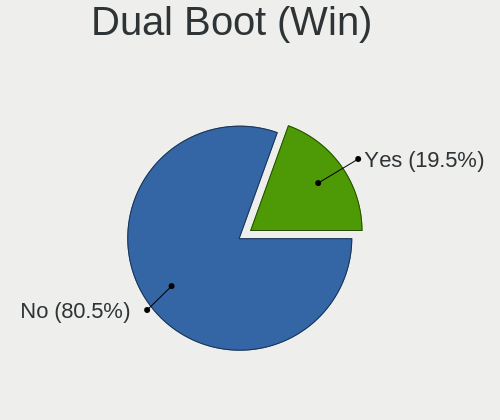
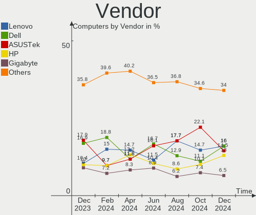
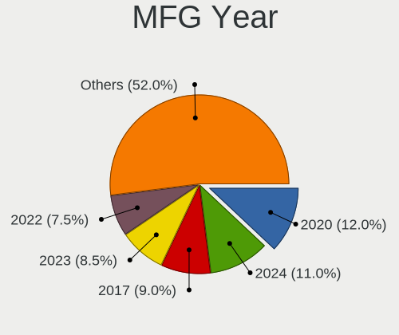
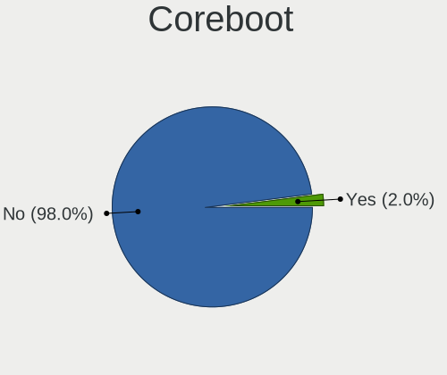
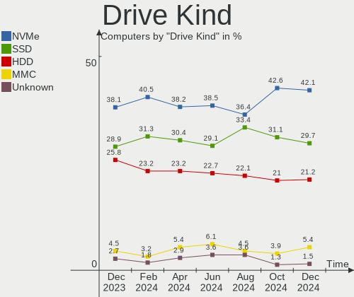
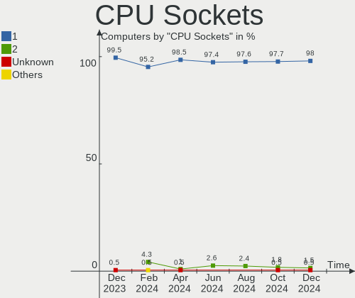
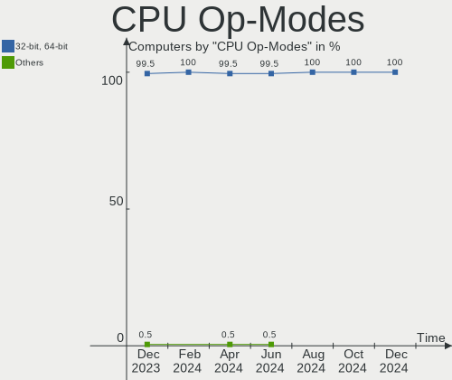
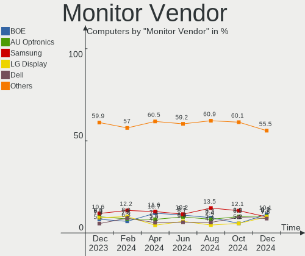
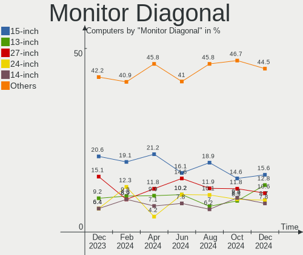
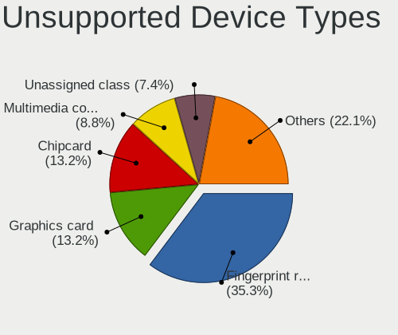

Linux in UK - Hardware Trends
-----------------------------

A project to identify most popular hardware characteristics and track their change
over time based on data collected by Linux users at https://Linux-Hardware.org.

Anyone can contribute to this report by the [hw-probe](https://github.com/linuxhw/hw-probe) tool:

    sudo -E hw-probe -all -upload

This is a report for all computer types. See also reports for [desktops](/Location/UK/Desktop/README.md) and [notebooks](/Location/UK/Notebook/README.md).

Period: Nov, 2022.

Contents
--------

* [ System ](#system)
  - [ OS                       ](#os)
  - [ OS Family                ](#os-family)
  - [ Kernel                   ](#kernel)
  - [ Kernel Family            ](#kernel-family)
  - [ Kernel Major Ver.        ](#kernel-major-ver)
  - [ Arch                     ](#arch)
  - [ DE                       ](#de)
  - [ Display Server           ](#display-server)
  - [ Display Manager          ](#display-manager)
  - [ OS Lang                  ](#os-lang)
  - [ Boot Mode                ](#boot-mode)
  - [ Filesystem               ](#filesystem)
  - [ Part. scheme             ](#part-scheme)
  - [ Dual Boot with Linux/BSD ](#dual-boot-with-linuxbsd)
  - [ Dual Boot (Win)          ](#dual-boot-win)

* [ Board ](#board)
  - [ Vendor                   ](#vendor)
  - [ Model                    ](#model)
  - [ Model Family             ](#model-family)
  - [ MFG Year                 ](#mfg-year)
  - [ Form Factor              ](#form-factor)
  - [ Secure Boot              ](#secure-boot)
  - [ Coreboot                 ](#coreboot)
  - [ RAM Size                 ](#ram-size)
  - [ RAM Used                 ](#ram-used)
  - [ Total Drives             ](#total-drives)
  - [ Has CD-ROM               ](#has-cd-rom)
  - [ Has Ethernet             ](#has-ethernet)
  - [ Has WiFi                 ](#has-wifi)
  - [ Has Bluetooth            ](#has-bluetooth)

* [ Location ](#location)
  - [ Country                  ](#country)
  - [ City                     ](#city)

* [ Drives ](#drives)
  - [ Drive Vendor             ](#drive-vendor)
  - [ Drive Model              ](#drive-model)
  - [ HDD Vendor               ](#hdd-vendor)
  - [ SSD Vendor               ](#ssd-vendor)
  - [ Drive Kind               ](#drive-kind)
  - [ Drive Connector          ](#drive-connector)
  - [ Drive Size               ](#drive-size)
  - [ Space Total              ](#space-total)
  - [ Space Used               ](#space-used)
  - [ Malfunc. Drives          ](#malfunc-drives)
  - [ Malfunc. Drive Vendor    ](#malfunc-drive-vendor)
  - [ Malfunc. HDD Vendor      ](#malfunc-hdd-vendor)
  - [ Malfunc. Drive Kind      ](#malfunc-drive-kind)
  - [ Failed Drives            ](#failed-drives)
  - [ Failed Drive Vendor      ](#failed-drive-vendor)
  - [ Drive Status             ](#drive-status)

* [ Storage controller ](#storage-controller)
  - [ Storage Vendor           ](#storage-vendor)
  - [ Storage Model            ](#storage-model)
  - [ Storage Kind             ](#storage-kind)

* [ Processor ](#processor)
  - [ CPU Vendor               ](#cpu-vendor)
  - [ CPU Model                ](#cpu-model)
  - [ CPU Model Family         ](#cpu-model-family)
  - [ CPU Cores                ](#cpu-cores)
  - [ CPU Sockets              ](#cpu-sockets)
  - [ CPU Threads              ](#cpu-threads)
  - [ CPU Op-Modes             ](#cpu-op-modes)
  - [ CPU Microcode            ](#cpu-microcode)
  - [ CPU Microarch            ](#cpu-microarch)

* [ Graphics ](#graphics)
  - [ GPU Vendor               ](#gpu-vendor)
  - [ GPU Model                ](#gpu-model)
  - [ GPU Combo                ](#gpu-combo)
  - [ GPU Driver               ](#gpu-driver)
  - [ GPU Memory               ](#gpu-memory)

* [ Monitor ](#monitor)
  - [ Monitor Vendor           ](#monitor-vendor)
  - [ Monitor Model            ](#monitor-model)
  - [ Monitor Resolution       ](#monitor-resolution)
  - [ Monitor Diagonal         ](#monitor-diagonal)
  - [ Monitor Width            ](#monitor-width)
  - [ Aspect Ratio             ](#aspect-ratio)
  - [ Monitor Area             ](#monitor-area)
  - [ Pixel Density            ](#pixel-density)
  - [ Multiple Monitors        ](#multiple-monitors)

* [ Network ](#network)
  - [ Net Controller Vendor    ](#net-controller-vendor)
  - [ Net Controller Model     ](#net-controller-model)
  - [ Wireless Vendor          ](#wireless-vendor)
  - [ Wireless Model           ](#wireless-model)
  - [ Ethernet Vendor          ](#ethernet-vendor)
  - [ Ethernet Model           ](#ethernet-model)
  - [ Net Controller Kind      ](#net-controller-kind)
  - [ Used Controller          ](#used-controller)
  - [ NICs                     ](#nics)
  - [ IPv6                     ](#ipv6)

* [ Bluetooth ](#bluetooth)
  - [ Bluetooth Vendor         ](#bluetooth-vendor)
  - [ Bluetooth Model          ](#bluetooth-model)

* [ Sound ](#sound)
  - [ Sound Vendor             ](#sound-vendor)
  - [ Sound Model              ](#sound-model)

* [ Memory ](#memory)
  - [ Memory Vendor            ](#memory-vendor)
  - [ Memory Model             ](#memory-model)
  - [ Memory Kind              ](#memory-kind)
  - [ Memory Form Factor       ](#memory-form-factor)
  - [ Memory Size              ](#memory-size)
  - [ Memory Speed             ](#memory-speed)

* [ Printers & scanners ](#printers--scanners)
  - [ Printer Vendor           ](#printer-vendor)
  - [ Printer Model            ](#printer-model)
  - [ Scanner Vendor           ](#scanner-vendor)
  - [ Scanner Model            ](#scanner-model)

* [ Camera ](#camera)
  - [ Camera Vendor            ](#camera-vendor)
  - [ Camera Model             ](#camera-model)

* [ Security ](#security)
  - [ Fingerprint Vendor       ](#fingerprint-vendor)
  - [ Fingerprint Model        ](#fingerprint-model)
  - [ Chipcard Vendor          ](#chipcard-vendor)
  - [ Chipcard Model           ](#chipcard-model)

* [ Unsupported ](#unsupported)
  - [ Unsupported Devices      ](#unsupported-devices)
  - [ Unsupported Device Types ](#unsupported-device-types)

System
------

OS
--

Installed operating systems

| Name                         | Computers | Percent |
|------------------------------|-----------|---------|
| Ubuntu 22.04                 | 35        | 17.95%  |
| Pop!_OS 22.04                | 16        | 8.21%   |
| Zorin 16                     | 13        | 6.67%   |
| Linux Mint 21                | 10        | 5.13%   |
| OpenMandriva 4.3             | 9         | 4.62%   |
| Ubuntu 20.04                 | 7         | 3.59%   |
| Linux Mint 20.3              | 7         | 3.59%   |
| Fedora 36                    | 7         | 3.59%   |
| Debian 11                    | 7         | 3.59%   |
| Ubuntu 22.10                 | 6         | 3.08%   |
| Ubuntu 18.04                 | 6         | 3.08%   |
| SteamOS 3.4                  | 5         | 2.56%   |
| OpenMandriva 4.50            | 5         | 2.56%   |
| KDE neon 22.04               | 5         | 2.56%   |
| Fedora 37                    | 5         | 2.56%   |
| SteamOS 3.3.2                | 4         | 2.05%   |
| Kubuntu 22.10                | 4         | 2.05%   |
| ArcoLinux Rolling            | 3         | 1.54%   |
| Arch Rolling                 | 3         | 1.54%   |
| Xubuntu 22.04                | 2         | 1.03%   |
| Raspbian 11                  | 2         | 1.03%   |
| openSUSE Tumbleweed-XXXXXXXX | 2         | 1.03%   |
| Manjaro                      | 2         | 1.03%   |
| Lubuntu 22.04                | 2         | 1.03%   |
| Kubuntu 22.04                | 2         | 1.03%   |
| KDE neon 20.04               | 2         | 1.03%   |
| Debian                       | 2         | 1.03%   |
| Zorin 15                     | 1         | 0.51%   |
| Xubuntu 22.10                | 1         | 0.51%   |
| Xubuntu 20.04                | 1         | 0.51%   |
| Xero Rolling                 | 1         | 0.51%   |
| Ubuntu MATE 22.04            | 1         | 0.51%   |
| Ubuntu 21.04                 | 1         | 0.51%   |
| OpenMandriva 4.2             | 1         | 0.51%   |
| Nobara 36                    | 1         | 0.51%   |
| MX 21                        | 1         | 0.51%   |
| Manjaro 22.0.0               | 1         | 0.51%   |
| Lubuntu 22.10                | 1         | 0.51%   |
| Lubuntu 16.04                | 1         | 0.51%   |
| Linux Mint 20                | 1         | 0.51%   |

OS Family
---------

OS without a version

| Name         | Computers | Percent |
|--------------|-----------|---------|
| Ubuntu       | 55        | 28.21%  |
| Linux Mint   | 19        | 9.74%   |
| Pop!_OS      | 16        | 8.21%   |
| OpenMandriva | 15        | 7.69%   |
| Zorin        | 14        | 7.18%   |
| Fedora       | 12        | 6.15%   |
| Debian       | 10        | 5.13%   |
| SteamOS      | 9         | 4.62%   |
| KDE neon     | 7         | 3.59%   |
| Kubuntu      | 6         | 3.08%   |
| Xubuntu      | 4         | 2.05%   |
| Lubuntu      | 4         | 2.05%   |
| Manjaro      | 3         | 1.54%   |
| ArcoLinux    | 3         | 1.54%   |
| Arch         | 3         | 1.54%   |
| Raspbian     | 2         | 1.03%   |
| openSUSE     | 2         | 1.03%   |
| Xero         | 1         | 0.51%   |
| Ubuntu MATE  | 1         | 0.51%   |
| Nobara       | 1         | 0.51%   |
| MX           | 1         | 0.51%   |
| Linux Lite   | 1         | 0.51%   |
| Lilidog      | 1         | 0.51%   |
| Guix         | 1         | 0.51%   |
| Gentoo       | 1         | 0.51%   |
| Endless      | 1         | 0.51%   |
| CachyOS      | 1         | 0.51%   |
| AlmaLinux    | 1         | 0.51%   |

Kernel
------

Version of the Linux kernel

| Version                     | Computers | Percent |
|-----------------------------|-----------|---------|
| 5.15.0-52-generic           | 36        | 18.46%  |
| 5.15.0-53-generic           | 29        | 14.87%  |
| 5.19.0-23-generic           | 9         | 4.62%   |
| 6.0.6-76060006-generic      | 8         | 4.1%    |
| 5.16.7-desktop-1omv4003     | 8         | 4.1%    |
| 5.4.0-132-generic           | 7         | 3.59%   |
| 5.13.0-valve21.3-1-neptune  | 6         | 3.08%   |
| 5.4.0-131-generic           | 4         | 2.05%   |
| 6.0.3-76060003-generic      | 3         | 1.54%   |
| 6.0.2-76060002-generic      | 3         | 1.54%   |
| 6.0.0-2-amd64               | 3         | 1.54%   |
| 5.19.5-desktop-1omv4090     | 3         | 1.54%   |
| 5.15.0-50-generic           | 3         | 1.54%   |
| 5.13.0-valve31-1-neptune    | 3         | 1.54%   |
| 6.0.8-surface               | 2         | 1.03%   |
| 6.0.8-arch1-1               | 2         | 1.03%   |
| 6.0.8-300.fc37.x86_64       | 2         | 1.03%   |
| 6.0.8-060008-generic        | 2         | 1.03%   |
| 6.0.5-200.fc36.x86_64       | 2         | 1.03%   |
| 6.0.10-arch2-1              | 2         | 1.03%   |
| 5.19.16-200.fc36.x86_64     | 2         | 1.03%   |
| 5.19.12-desktop-2omv4090    | 2         | 1.03%   |
| 5.18.10-76051810-generic    | 2         | 1.03%   |
| 5.15.74-v7l+                | 2         | 1.03%   |
| 5.10.0-19-amd64             | 2         | 1.03%   |
| 4.15.0-197-generic          | 2         | 1.03%   |
| 6.1.0-rc3-vanilla           | 1         | 0.51%   |
| 6.0.9-arch1-1               | 1         | 0.51%   |
| 6.0.9-300.fc37.x86_64       | 1         | 0.51%   |
| 6.0.9-1-cachyos-bore-lto    | 1         | 0.51%   |
| 6.0.8-200.fc36.x86_64       | 1         | 0.51%   |
| 6.0.8-1-MANJARO             | 1         | 0.51%   |
| 6.0.7-201.fsync.fc36.x86_64 | 1         | 0.51%   |
| 6.0.7-200.fc36.x86_64       | 1         | 0.51%   |
| 6.0.7                       | 1         | 0.51%   |
| 6.0.6-zen1-1-zen            | 1         | 0.51%   |
| 6.0.6-300.fc37.x86_64       | 1         | 0.51%   |
| 6.0.6-1-default             | 1         | 0.51%   |
| 6.0.10-gentoo-dist          | 1         | 0.51%   |
| 6.0.0-9.1-liquorix-amd64    | 1         | 0.51%   |

Kernel Family
-------------

Linux kernel without a distro release

| Version  | Computers | Percent |
|----------|-----------|---------|
| 5.15.0   | 71        | 36.41%  |
| 5.4.0    | 15        | 7.69%   |
| 5.13.0   | 12        | 6.15%   |
| 6.0.6    | 11        | 5.64%   |
| 5.19.0   | 11        | 5.64%   |
| 6.0.8    | 10        | 5.13%   |
| 5.16.7   | 8         | 4.1%    |
| 6.0.0    | 5         | 2.56%   |
| 5.19.5   | 4         | 2.05%   |
| 5.10.0   | 4         | 2.05%   |
| 4.15.0   | 4         | 2.05%   |
| 6.0.9    | 3         | 1.54%   |
| 6.0.7    | 3         | 1.54%   |
| 6.0.3    | 3         | 1.54%   |
| 6.0.2    | 3         | 1.54%   |
| 6.0.10   | 3         | 1.54%   |
| 5.15.74  | 3         | 1.54%   |
| 6.0.5    | 2         | 1.03%   |
| 5.19.16  | 2         | 1.03%   |
| 5.19.12  | 2         | 1.03%   |
| 5.18.10  | 2         | 1.03%   |
| 5.11.0   | 2         | 1.03%   |
| 6.1.0    | 1         | 0.51%   |
| 5.19.9   | 1         | 0.51%   |
| 5.19.17  | 1         | 0.51%   |
| 5.17.5   | 1         | 0.51%   |
| 5.17.0   | 1         | 0.51%   |
| 5.16.13  | 1         | 0.51%   |
| 5.15.78  | 1         | 0.51%   |
| 5.15.76  | 1         | 0.51%   |
| 5.14.0   | 1         | 0.51%   |
| 5.10.14  | 1         | 0.51%   |
| 5.10.110 | 1         | 0.51%   |
| 4.18.0   | 1         | 0.51%   |

Kernel Major Ver.
-----------------

Linux kernel major version

| Version | Computers | Percent |
|---------|-----------|---------|
| 5.15    | 76        | 38.97%  |
| 6.0     | 43        | 22.05%  |
| 5.19    | 21        | 10.77%  |
| 5.4     | 15        | 7.69%   |
| 5.13    | 12        | 6.15%   |
| 5.16    | 9         | 4.62%   |
| 5.10    | 6         | 3.08%   |
| 4.15    | 4         | 2.05%   |
| 5.18    | 2         | 1.03%   |
| 5.17    | 2         | 1.03%   |
| 5.11    | 2         | 1.03%   |
| 6.1     | 1         | 0.51%   |
| 5.14    | 1         | 0.51%   |
| 4.18    | 1         | 0.51%   |

Arch
----

OS architecture (x86_64, i586, etc.)

| Name    | Computers | Percent |
|---------|-----------|---------|
| x86_64  | 187       | 95.9%   |
| i686    | 3         | 1.54%   |
| aarch64 | 3         | 1.54%   |
| armv7l  | 2         | 1.03%   |

DE
--

Desktop Environment

| Name             | Computers | Percent |
|------------------|-----------|---------|
| GNOME            | 89        | 45.64%  |
| KDE5             | 47        | 24.1%   |
| XFCE             | 18        | 9.23%   |
| X-Cinnamon       | 18        | 9.23%   |
| Unknown          | 7         | 3.59%   |
| MATE             | 6         | 3.08%   |
| LXQt             | 3         | 1.54%   |
| lightdm-xsession | 2         | 1.03%   |
| GNOME Classic    | 2         | 1.03%   |
| openbox          | 1         | 0.51%   |
| LXDE             | 1         | 0.51%   |
| KDE              | 1         | 0.51%   |

Display Server
--------------

X11 or Wayland

| Name    | Computers | Percent |
|---------|-----------|---------|
| X11     | 151       | 77.44%  |
| Wayland | 37        | 18.97%  |
| Tty     | 4         | 2.05%   |
| Unknown | 3         | 1.54%   |

Display Manager
---------------

SDDM, LightDM, etc.

| Name    | Computers | Percent |
|---------|-----------|---------|
| Unknown | 72        | 36.92%  |
| GDM3    | 55        | 28.21%  |
| SDDM    | 34        | 17.44%  |
| LightDM | 25        | 12.82%  |
| GDM     | 9         | 4.62%   |

OS Lang
-------

Language

| Lang    | Computers | Percent |
|---------|-----------|---------|
| en_GB   | 161       | 82.56%  |
| en_US   | 27        | 13.85%  |
| POSIX   | 2         | 1.03%   |
| C       | 2         | 1.03%   |
| pl_PL   | 1         | 0.51%   |
| de_DE   | 1         | 0.51%   |
| Unknown | 1         | 0.51%   |

Boot Mode
---------

EFI or BIOS

| Mode | Computers | Percent |
|------|-----------|---------|
| BIOS | 107       | 54.87%  |
| EFI  | 88        | 45.13%  |

Filesystem
----------

Type of filesystem

| Type    | Computers | Percent |
|---------|-----------|---------|
| Ext4    | 149       | 76.41%  |
| Btrfs   | 29        | 14.87%  |
| Overlay | 13        | 6.67%   |
| Xfs     | 2         | 1.03%   |
| Zfs     | 1         | 0.51%   |
| Tmpfs   | 1         | 0.51%   |

Part. scheme
------------

Scheme of partitioning

| Type    | Computers | Percent |
|---------|-----------|---------|
| GPT     | 109       | 55.9%   |
| Unknown | 66        | 33.85%  |
| MBR     | 20        | 10.26%  |

Dual Boot with Linux/BSD
------------------------

Hosting more than one Linux/BSD

| Dual boot | Computers | Percent |
|-----------|-----------|---------|
| No        | 170       | 87.18%  |
| Yes       | 25        | 12.82%  |

Dual Boot (Win)
---------------

Hosting Linux and Windows

| Dual boot | Computers | Percent |
|-----------|-----------|---------|
| No        | 144       | 73.85%  |
| Yes       | 51        | 26.15%  |

Board
-----

Vendor
------

Motherboard manufacturer

| Name                    | Computers | Percent |
|-------------------------|-----------|---------|
| Hewlett-Packard         | 28        | 14.36%  |
| Dell                    | 28        | 14.36%  |
| ASUSTek Computer        | 28        | 14.36%  |
| Lenovo                  | 16        | 8.21%   |
| Gigabyte Technology     | 14        | 7.18%   |
| MSI                     | 13        | 6.67%   |
| Acer                    | 9         | 4.62%   |
| Valve                   | 8         | 4.1%    |
| Samsung Electronics     | 6         | 3.08%   |
| Toshiba                 | 5         | 2.56%   |
| Apple                   | 5         | 2.56%   |
| Raspberry Pi Foundation | 4         | 2.05%   |
| Microsoft               | 4         | 2.05%   |
| ASRock                  | 3         | 1.54%   |
| GEO                     | 2         | 1.03%   |
| TYAN Computer           | 1         | 0.51%   |
| Timi                    | 1         | 0.51%   |
| System76                | 1         | 0.51%   |
| Star Labs               | 1         | 0.51%   |
| Silicom                 | 1         | 0.51%   |
| Razer x Lambda          | 1         | 0.51%   |
| Radxa                   | 1         | 0.51%   |
| Phoenix                 | 1         | 0.51%   |
| PC Specialist           | 1         | 0.51%   |
| Packard Bell            | 1         | 0.51%   |
| OEGStone                | 1         | 0.51%   |
| Notebook                | 1         | 0.51%   |
| Medion                  | 1         | 0.51%   |
| Linx                    | 1         | 0.51%   |
| JGINYUE                 | 1         | 0.51%   |
| Fujitsu                 | 1         | 0.51%   |
| Fanless Mini PC         | 1         | 0.51%   |
| Entroware               | 1         | 0.51%   |
| Dixonsxp                | 1         | 0.51%   |
| Colorful Technology     | 1         | 0.51%   |
| Alienware               | 1         | 0.51%   |
| Unknown                 | 1         | 0.51%   |

Model
-----

Motherboard model

| Name                                                                                     | Computers | Percent |
|------------------------------------------------------------------------------------------|-----------|---------|
| Valve Jupiter                                                                            | 8         | 4.1%    |
| RPi Raspberry Pi 4 Model B Rev 1.4                                                       | 4         | 2.05%   |
| Dell XPS 15 7590                                                                         | 3         | 1.54%   |
| Toshiba Satellite C50D-B                                                                 | 2         | 1.03%   |
| Samsung 350V5C/351V5C/3540VC/3440VC                                                      | 2         | 1.03%   |
| Gigabyte A320M-S2H                                                                       | 2         | 1.03%   |
| Dell Inspiron 7501                                                                       | 2         | 1.03%   |
| ASUS TUF Gaming X570-PLUS                                                                | 2         | 1.03%   |
| ASUS PRIME A320M-K                                                                       | 2         | 1.03%   |
| TYAN S7012                                                                               | 1         | 0.51%   |
| Toshiba Satellite Pro U500                                                               | 1         | 0.51%   |
| Toshiba Satellite L750                                                                   | 1         | 0.51%   |
| Toshiba Satellite L50D-B                                                                 | 1         | 0.51%   |
| Timi TM1613                                                                              | 1         | 0.51%   |
| System76 Oryx Pro                                                                        | 1         | 0.51%   |
| Star Labs StarBook                                                                       | 1         | 0.51%   |
| Silicom Minnowboard Turbot D0/D1 PLATFORM                                                | 1         | 0.51%   |
| Samsung RV411/RV511/E3511/S3511/RV711/E3411                                              | 1         | 0.51%   |
| Samsung 700T1C                                                                           | 1         | 0.51%   |
| Samsung 400B2B/400B2B                                                                    | 1         | 0.51%   |
| Samsung 355V4C/355V4X/355V5C/355V5X/356V4C/356V4X/356V5C/356V5X/3445VC/3445VX/3545VC/354 | 1         | 0.51%   |
| Razer x Lambda TensorBook (late 2021)                                                    | 1         | 0.51%   |
| Radxa ROCK 5B                                                                            | 1         | 0.51%   |
| Phoenix POULSBO                                                                          | 1         | 0.51%   |
| PC Specialist Elimina Iv 15                                                              | 1         | 0.51%   |
| Packard Bell ISTART D2314                                                                | 1         | 0.51%   |
| OEGStone NOTCHA-322                                                                      | 1         | 0.51%   |
| Notebook PA70ES                                                                          | 1         | 0.51%   |
| MSI MS-7D25                                                                              | 1         | 0.51%   |
| MSI MS-7D07                                                                              | 1         | 0.51%   |
| MSI MS-7C96                                                                              | 1         | 0.51%   |
| MSI MS-7C95                                                                              | 1         | 0.51%   |
| MSI MS-7C84                                                                              | 1         | 0.51%   |
| MSI MS-7C77                                                                              | 1         | 0.51%   |
| MSI MS-7C56                                                                              | 1         | 0.51%   |
| MSI MS-7C37                                                                              | 1         | 0.51%   |
| MSI MS-7C02                                                                              | 1         | 0.51%   |
| MSI MS-7B09                                                                              | 1         | 0.51%   |
| MSI MS-7A34                                                                              | 1         | 0.51%   |
| MSI MS-7817                                                                              | 1         | 0.51%   |

Model Family
------------

Motherboard model prefix

| Name                      | Computers | Percent |
|---------------------------|-----------|---------|
| Dell Inspiron             | 10        | 5.13%   |
| Valve Jupiter             | 8         | 4.1%    |
| Lenovo ThinkPad           | 8         | 4.1%    |
| HP EliteBook              | 7         | 3.59%   |
| Dell OptiPlex             | 7         | 3.59%   |
| ASUS PRIME                | 7         | 3.59%   |
| HP Pavilion               | 6         | 3.08%   |
| Acer Aspire               | 6         | 3.08%   |
| Toshiba Satellite         | 5         | 2.56%   |
| Dell XPS                  | 5         | 2.56%   |
| RPi Raspberry             | 4         | 2.05%   |
| Microsoft Surface         | 4         | 2.05%   |
| Dell Latitude             | 4         | 2.05%   |
| Lenovo IdeaPad            | 3         | 1.54%   |
| ASUS Zenbook              | 3         | 1.54%   |
| ASUS TUF                  | 3         | 1.54%   |
| Samsung 350V5C            | 2         | 1.03%   |
| HP ProBook                | 2         | 1.03%   |
| HP Laptop                 | 2         | 1.03%   |
| HP ENVY                   | 2         | 1.03%   |
| HP Compaq                 | 2         | 1.03%   |
| Gigabyte X570             | 2         | 1.03%   |
| Gigabyte A320M-S2H        | 2         | 1.03%   |
| ASUS ROG                  | 2         | 1.03%   |
| Apple iMac13              | 2         | 1.03%   |
| TYAN S7012                | 1         | 0.51%   |
| Timi TM1613               | 1         | 0.51%   |
| System76 Oryx             | 1         | 0.51%   |
| Star Labs StarBook        | 1         | 0.51%   |
| Silicom Minnowboard       | 1         | 0.51%   |
| Samsung RV411             | 1         | 0.51%   |
| Samsung 700T1C            | 1         | 0.51%   |
| Samsung 400B2B            | 1         | 0.51%   |
| Samsung 355V4C            | 1         | 0.51%   |
| Razer x Lambda TensorBook | 1         | 0.51%   |
| Radxa ROCK                | 1         | 0.51%   |
| Phoenix POULSBO           | 1         | 0.51%   |
| PC Specialist Elimina     | 1         | 0.51%   |
| Packard Bell ISTART       | 1         | 0.51%   |
| OEGStone NOTCHA-322       | 1         | 0.51%   |

MFG Year
--------

Motherboard manufacture year

| Year    | Computers | Percent |
|---------|-----------|---------|
| 2020    | 26        | 13.33%  |
| 2021    | 21        | 10.77%  |
| 2019    | 21        | 10.77%  |
| 2018    | 17        | 8.72%   |
| 2022    | 16        | 8.21%   |
| 2011    | 16        | 8.21%   |
| 2017    | 14        | 7.18%   |
| 2013    | 10        | 5.13%   |
| 2014    | 9         | 4.62%   |
| 2008    | 9         | 4.62%   |
| 2016    | 8         | 4.1%    |
| 2012    | 7         | 3.59%   |
| 2010    | 6         | 3.08%   |
| 2015    | 4         | 2.05%   |
| 2007    | 4         | 2.05%   |
| Unknown | 4         | 2.05%   |
| 2009    | 2         | 1.03%   |
| 2006    | 1         | 0.51%   |

Form Factor
-----------

Physical design of the computer

| Name           | Computers | Percent |
|----------------|-----------|---------|
| Notebook       | 101       | 51.79%  |
| Desktop        | 71        | 36.41%  |
| Convertible    | 6         | 3.08%   |
| System on chip | 5         | 2.56%   |
| Tablet         | 5         | 2.56%   |
| All in one     | 4         | 2.05%   |
| Server         | 2         | 1.03%   |
| Mini pc        | 1         | 0.51%   |

Secure Boot
-----------

Enabled or disabled

| State    | Computers | Percent |
|----------|-----------|---------|
| Disabled | 175       | 89.74%  |
| Enabled  | 20        | 10.26%  |

Coreboot
--------

Have coreboot on board

| Used | Computers | Percent |
|------|-----------|---------|
| No   | 194       | 99.49%  |
| Yes  | 1         | 0.51%   |

RAM Size
--------

Total RAM memory

| Size in GB      | Computers | Percent |
|-----------------|-----------|---------|
| 8.01-16.0       | 52        | 26.67%  |
| 4.01-8.0        | 43        | 22.05%  |
| 16.01-24.0      | 31        | 15.9%   |
| 3.01-4.0        | 27        | 13.85%  |
| 32.01-64.0      | 24        | 12.31%  |
| 64.01-256.0     | 7         | 3.59%   |
| 1.01-2.0        | 5         | 2.56%   |
| 24.01-32.0      | 2         | 1.03%   |
| 2.01-3.0        | 2         | 1.03%   |
| More than 256.0 | 1         | 0.51%   |
| 0.51-1.0        | 1         | 0.51%   |

RAM Used
--------

Used RAM memory

| Used GB    | Computers | Percent |
|------------|-----------|---------|
| 1.01-2.0   | 63        | 32.31%  |
| 2.01-3.0   | 57        | 29.23%  |
| 3.01-4.0   | 29        | 14.87%  |
| 4.01-8.0   | 25        | 12.82%  |
| 8.01-16.0  | 12        | 6.15%   |
| 0.51-1.0   | 5         | 2.56%   |
| 0.01-0.5   | 3         | 1.54%   |
| 24.01-32.0 | 1         | 0.51%   |

Total Drives
------------

Number of drives on board

| Drives | Computers | Percent |
|--------|-----------|---------|
| 1      | 123       | 63.08%  |
| 2      | 40        | 20.51%  |
| 3      | 13        | 6.67%   |
| 5      | 7         | 3.59%   |
| 4      | 7         | 3.59%   |
| 12     | 1         | 0.51%   |
| 11     | 1         | 0.51%   |
| 10     | 1         | 0.51%   |
| 7      | 1         | 0.51%   |
| 0      | 1         | 0.51%   |

Has CD-ROM
----------

Has CD-ROM on board

| Presented | Computers | Percent |
|-----------|-----------|---------|
| No        | 119       | 61.03%  |
| Yes       | 76        | 38.97%  |

Has Ethernet
------------

Has Ethernet on board

| Presented | Computers | Percent |
|-----------|-----------|---------|
| Yes       | 154       | 78.97%  |
| No        | 41        | 21.03%  |

Has WiFi
--------

Has WiFi module

| Presented | Computers | Percent |
|-----------|-----------|---------|
| Yes       | 148       | 75.9%   |
| No        | 47        | 24.1%   |

Has Bluetooth
-------------

Has Bluetooth module

| Presented | Computers | Percent |
|-----------|-----------|---------|
| Yes       | 127       | 65.13%  |
| No        | 68        | 34.87%  |

Location
--------

Country
-------

Geographic location (country)

| Country | Computers | Percent |
|---------|-----------|---------|
| UK      | 195       | 100%    |

City
----

Geographic location (city)

| City                  | Computers | Percent |
|-----------------------|-----------|---------|
| London                | 14        | 7.18%   |
| Manchester            | 4         | 2.05%   |
| Liverpool             | 4         | 2.05%   |
| Bristol               | 4         | 2.05%   |
| Sheffield             | 3         | 1.54%   |
| Peterborough          | 3         | 1.54%   |
| Nottingham            | 3         | 1.54%   |
| Leeds                 | 3         | 1.54%   |
| Colchester            | 3         | 1.54%   |
| Chelsea               | 3         | 1.54%   |
| Birmingham            | 3         | 1.54%   |
| Ashford               | 3         | 1.54%   |
| Wirral                | 2         | 1.03%   |
| Wigan                 | 2         | 1.03%   |
| Somerset              | 2         | 1.03%   |
| Royal Tunbridge Wells | 2         | 1.03%   |
| Richmond              | 2         | 1.03%   |
| Reading               | 2         | 1.03%   |
| Poole                 | 2         | 1.03%   |
| Plymouth              | 2         | 1.03%   |
| Olney                 | 2         | 1.03%   |
| Norwood               | 2         | 1.03%   |
| Newcastle upon Tyne   | 2         | 1.03%   |
| Milton Keynes         | 2         | 1.03%   |
| Lincoln               | 2         | 1.03%   |
| City of London        | 2         | 1.03%   |
| Canterbury            | 2         | 1.03%   |
| Blackwood             | 2         | 1.03%   |
| Alton                 | 2         | 1.03%   |
| York                  | 1         | 0.51%   |
| Wymondham             | 1         | 0.51%   |
| Worthing              | 1         | 0.51%   |
| Wolverhampton         | 1         | 0.51%   |
| Witham                | 1         | 0.51%   |
| Windsor               | 1         | 0.51%   |
| Wigton                | 1         | 0.51%   |
| Whitby                | 1         | 0.51%   |
| Weston-super-Mare     | 1         | 0.51%   |
| West Malling          | 1         | 0.51%   |
| Welling               | 1         | 0.51%   |

Drives
------

Drive Vendor
------------

Hard drive vendors

| Vendor                       | Computers | Drives | Percent |
|------------------------------|-----------|--------|---------|
| Samsung Electronics          | 39        | 50     | 13.98%  |
| WDC                          | 36        | 47     | 12.9%   |
| Seagate                      | 34        | 43     | 12.19%  |
| SanDisk                      | 26        | 28     | 9.32%   |
| Crucial                      | 23        | 25     | 8.24%   |
| Unknown                      | 17        | 19     | 6.09%   |
| Toshiba                      | 12        | 15     | 4.3%    |
| Phison Electronics           | 10        | 16     | 3.58%   |
| Intel                        | 8         | 8      | 2.87%   |
| Kingston                     | 7         | 7      | 2.51%   |
| SK hynix                     | 6         | 6      | 2.15%   |
| KIOXIA                       | 5         | 5      | 1.79%   |
| Hitachi                      | 5         | 5      | 1.79%   |
| Micron Technology            | 4         | 4      | 1.43%   |
| Apple                        | 4         | 5      | 1.43%   |
| Netac                        | 3         | 4      | 1.08%   |
| China                        | 3         | 4      | 1.08%   |
| Silicon Motion               | 2         | 2      | 0.72%   |
| PNY                          | 2         | 2      | 0.72%   |
| Phison                       | 2         | 2      | 0.72%   |
| Micron/Crucial Technology    | 2         | 3      | 0.72%   |
| Lexar                        | 2         | 2      | 0.72%   |
| Integral                     | 2         | 2      | 0.72%   |
| HGST                         | 2         | 2      | 0.72%   |
| A-DATA Technology            | 2         | 2      | 0.72%   |
| Unknown                      | 2         | 2      | 0.72%   |
| WD MediaMax                  | 1         | 1      | 0.36%   |
| USB                          | 1         | 1      | 0.36%   |
| Transcend                    | 1         | 1      | 0.36%   |
| Shenzhen Longsys Electronics | 1         | 1      | 0.36%   |
| Patriot                      | 1         | 1      | 0.36%   |
| MAXIO Technology (Hangzhou)  | 1         | 1      | 0.36%   |
| LITEON                       | 1         | 1      | 0.36%   |
| KIOXIA-EXCERIA               | 1         | 1      | 0.36%   |
| Kingston Technology Company  | 1         | 1      | 0.36%   |
| JMicron Technology           | 1         | 1      | 0.36%   |
| Hewlett-Packard              | 1         | 8      | 0.36%   |
| Drevo                        | 1         | 1      | 0.36%   |
| ASMT                         | 1         | 1      | 0.36%   |
| ASMedia                      | 1         | 1      | 0.36%   |

Drive Model
-----------

Hard drive models

| Model                                                | Computers | Percent |
|------------------------------------------------------|-----------|---------|
| Crucial CT1000BX500SSD1 1TB                          | 8         | 2.55%   |
| Seagate ST2000DM008-2FR102 2TB                       | 5         | 1.59%   |
| Seagate ST8000DM004-2CX188 8TB                       | 4         | 1.27%   |
| Sandisk WD Blue SN550 NVMe SSD 1TB                   | 4         | 1.27%   |
| Samsung NVMe SSD Controller SM981/PM981/PM983 1TB    | 4         | 1.27%   |
| Phison PS5013 E13 NVMe Controller 256GB              | 4         | 1.27%   |
| Crucial CT1000MX500SSD1 1TB                          | 4         | 1.27%   |
| Unknown MMC Card  64GB                               | 3         | 0.96%   |
| Unknown MMC Card  512GB                              | 3         | 0.96%   |
| Seagate ST1000DM010-2EP102 1TB                       | 3         | 0.96%   |
| Samsung SSD 970 EVO Plus 1TB                         | 3         | 0.96%   |
| Samsung SSD 840 EVO 250GB                            | 3         | 0.96%   |
| Samsung HD103SJ 1TB                                  | 3         | 0.96%   |
| Phison E16 PCIe4 NVMe Controller 1TB                 | 3         | 0.96%   |
| Phison E12 NVMe Controller 2TB                       | 3         | 0.96%   |
| Kingston SA400S37240G 240GB SSD                      | 3         | 0.96%   |
| Crucial CT500MX500SSD1 500GB                         | 3         | 0.96%   |
| Unknown NVMe SSD Drive 1TB                           | 2         | 0.64%   |
| Unknown MMC Card  32GB                               | 2         | 0.64%   |
| Unknown MMC Card  256GB                              | 2         | 0.64%   |
| Toshiba XG6 NVMe SSD Controller 256GB                | 2         | 0.64%   |
| Toshiba BG3 NVMe SSD Controller 128GB                | 2         | 0.64%   |
| SK hynix BC511 512GB                                 | 2         | 0.64%   |
| Seagate ST500LM021-1KJ152 500GB                      | 2         | 0.64%   |
| Seagate ST1000LM035-1RK172 1TB                       | 2         | 0.64%   |
| Seagate ST1000DM003-1CH162 1TB                       | 2         | 0.64%   |
| Seagate Expansion 1TB                                | 2         | 0.64%   |
| SanDisk SD8SN8U-256G-1006 256GB SSD                  | 2         | 0.64%   |
| Sandisk PC SN520 NVMe SSD 256GB                      | 2         | 0.64%   |
| Samsung SSD 980 1TB                                  | 2         | 0.64%   |
| Samsung SSD 970 EVO Plus 2TB                         | 2         | 0.64%   |
| Samsung SSD 860 EVO 1TB                              | 2         | 0.64%   |
| Samsung NVMe SSD Controller SM951/PM951 256GB        | 2         | 0.64%   |
| Samsung NVMe SSD Controller PM9A1/PM9A3/980PRO 250GB | 2         | 0.64%   |
| Netac SSD 128GB                                      | 2         | 0.64%   |
| Micron/Crucial P2 NVMe PCIe SSD 250GB                | 2         | 0.64%   |
| KIOXIA KBG40ZNV512G 512GB                            | 2         | 0.64%   |
| Intel SSDPEKNU010TZ 1TB                              | 2         | 0.64%   |
| Crucial CT240BX500SSD1 240GB                         | 2         | 0.64%   |
| Unknown                                              | 2         | 0.64%   |

HDD Vendor
----------

Hard disk drive vendors

| Vendor              | Computers | Drives | Percent |
|---------------------|-----------|--------|---------|
| Seagate             | 34        | 43     | 35.79%  |
| WDC                 | 30        | 40     | 31.58%  |
| Toshiba             | 8         | 10     | 8.42%   |
| Samsung Electronics | 6         | 8      | 6.32%   |
| Hitachi             | 5         | 5      | 5.26%   |
| Apple               | 3         | 3      | 3.16%   |
| HGST                | 2         | 2      | 2.11%   |
| WD MediaMax         | 1         | 1      | 1.05%   |
| USB                 | 1         | 1      | 1.05%   |
| Unknown             | 1         | 1      | 1.05%   |
| Hewlett-Packard     | 1         | 8      | 1.05%   |
| ASMT                | 1         | 1      | 1.05%   |
| ASMedia             | 1         | 1      | 1.05%   |
| Advantech           | 1         | 1      | 1.05%   |

SSD Vendor
----------

Solid state drive vendors

| Vendor              | Computers | Drives | Percent |
|---------------------|-----------|--------|---------|
| Crucial             | 22        | 24     | 25.29%  |
| Samsung Electronics | 15        | 15     | 17.24%  |
| SanDisk             | 13        | 14     | 14.94%  |
| Kingston            | 6         | 6      | 6.9%    |
| WDC                 | 3         | 3      | 3.45%   |
| Netac               | 3         | 4      | 3.45%   |
| China               | 3         | 4      | 3.45%   |
| PNY                 | 2         | 2      | 2.3%    |
| Micron Technology   | 2         | 2      | 2.3%    |
| Lexar               | 2         | 2      | 2.3%    |
| Integral            | 2         | 2      | 2.3%    |
| Apple               | 2         | 2      | 2.3%    |
| Unknown             | 1         | 1      | 1.15%   |
| SK hynix            | 1         | 1      | 1.15%   |
| Patriot             | 1         | 1      | 1.15%   |
| LITEON              | 1         | 1      | 1.15%   |
| KIOXIA-EXCERIA      | 1         | 1      | 1.15%   |
| JMicron Technology  | 1         | 1      | 1.15%   |
| Intel               | 1         | 1      | 1.15%   |
| Drevo               | 1         | 1      | 1.15%   |
| Argon               | 1         | 1      | 1.15%   |
| AGI                 | 1         | 1      | 1.15%   |
| AEGO                | 1         | 1      | 1.15%   |
| A-DATA Technology   | 1         | 1      | 1.15%   |

Drive Kind
----------

HDD or SSD

| Kind | Computers | Drives | Percent |
|------|-----------|--------|---------|
| NVMe | 87        | 103    | 34.25%  |
| HDD  | 80        | 125    | 31.5%   |
| SSD  | 72        | 92     | 28.35%  |
| MMC  | 15        | 16     | 5.91%   |

Drive Connector
---------------

SATA, SAS, NVMe, etc.

| Type | Computers | Drives | Percent |
|------|-----------|--------|---------|
| SATA | 122       | 206    | 51.91%  |
| NVMe | 87        | 102    | 37.02%  |
| MMC  | 15        | 16     | 6.38%   |
| SAS  | 11        | 12     | 4.68%   |

Drive Size
----------

Size of hard drive

| Size in TB | Computers | Drives | Percent |
|------------|-----------|--------|---------|
| 0.01-0.5   | 81        | 90     | 46.82%  |
| 0.51-1.0   | 53        | 67     | 30.64%  |
| 1.01-2.0   | 18        | 23     | 10.4%   |
| 4.01-10.0  | 13        | 25     | 7.51%   |
| 3.01-4.0   | 4         | 7      | 2.31%   |
| 2.01-3.0   | 3         | 3      | 1.73%   |
| 10.01-20.0 | 1         | 2      | 0.58%   |

Space Total
-----------

Amount of disk space available on the file system

| Size in GB     | Computers | Percent |
|----------------|-----------|---------|
| 101-250        | 53        | 27.18%  |
| 251-500        | 41        | 21.03%  |
| 501-1000       | 37        | 18.97%  |
| 1001-2000      | 15        | 7.69%   |
| More than 3000 | 14        | 7.18%   |
| 1-20           | 10        | 5.13%   |
| 2001-3000      | 8         | 4.1%    |
| 51-100         | 8         | 4.1%    |
| 21-50          | 6         | 3.08%   |
| Unknown        | 3         | 1.54%   |

Space Used
----------

Amount of used disk space

| Used GB        | Computers | Percent |
|----------------|-----------|---------|
| 1-20           | 61        | 31.28%  |
| 101-250        | 35        | 17.95%  |
| 21-50          | 30        | 15.38%  |
| 251-500        | 20        | 10.26%  |
| 51-100         | 20        | 10.26%  |
| More than 3000 | 10        | 5.13%   |
| 501-1000       | 10        | 5.13%   |
| 1001-2000      | 6         | 3.08%   |
| Unknown        | 3         | 1.54%   |

Malfunc. Drives
---------------

Drive models with a malfunction

| Model                                          | Computers | Drives | Percent |
|------------------------------------------------|-----------|--------|---------|
| WDC WD5000AAKX-60U6AA0 500GB                   | 1         | 1      | 5.88%   |
| WDC WD20EURS-63S48Y0 2TB                       | 1         | 1      | 5.88%   |
| WDC WD20EFRX-68AX9N0 2TB                       | 1         | 1      | 5.88%   |
| WDC WD2002FYPS-02W3B0 2TB                      | 1         | 1      | 5.88%   |
| WD MediaMax WL5000GSA12872B 5TB                | 1         | 1      | 5.88%   |
| Toshiba MK3256GSY 320GB                        | 1         | 1      | 5.88%   |
| Seagate ST9750420AS 752GB                      | 1         | 1      | 5.88%   |
| Seagate ST3500312CS 500GB                      | 1         | 1      | 5.88%   |
| Seagate ST2000DM001-1CH164 2TB                 | 1         | 1      | 5.88%   |
| Samsung Electronics SSD 970 EVO Plus 2TB       | 1         | 1      | 5.88%   |
| Samsung Electronics SSD 970 EVO Plus 1TB       | 1         | 1      | 5.88%   |
| Samsung Electronics HD753LJ 752GB              | 1         | 1      | 5.88%   |
| Samsung Electronics HD103SJ 1TB                | 1         | 1      | 5.88%   |
| Micron Technology MTFDDAK256MAM-1K12 256GB SSD | 1         | 1      | 5.88%   |
| Micron Technology 5100_MTFDDAV960TCB 960GB SSD | 1         | 1      | 5.88%   |
| Hitachi HTS547575A9E384 752GB                  | 1         | 1      | 5.88%   |
| AGI AGI1T0G17AI178 1TB SSD                     | 1         | 1      | 5.88%   |

Malfunc. Drive Vendor
---------------------

Vendors of faulty drives

| Vendor              | Computers | Drives | Percent |
|---------------------|-----------|--------|---------|
| WDC                 | 4         | 4      | 25%     |
| Seagate             | 3         | 3      | 18.75%  |
| Samsung Electronics | 3         | 4      | 18.75%  |
| Micron Technology   | 2         | 2      | 12.5%   |
| WD MediaMax         | 1         | 1      | 6.25%   |
| Toshiba             | 1         | 1      | 6.25%   |
| Hitachi             | 1         | 1      | 6.25%   |
| AGI                 | 1         | 1      | 6.25%   |

Malfunc. HDD Vendor
-------------------

Vendors of faulty HDD drives

| Vendor              | Computers | Drives | Percent |
|---------------------|-----------|--------|---------|
| WDC                 | 4         | 4      | 36.36%  |
| Seagate             | 3         | 3      | 27.27%  |
| WD MediaMax         | 1         | 1      | 9.09%   |
| Toshiba             | 1         | 1      | 9.09%   |
| Samsung Electronics | 1         | 2      | 9.09%   |
| Hitachi             | 1         | 1      | 9.09%   |

Malfunc. Drive Kind
-------------------

Kinds of faulty drives

| Kind | Computers | Drives | Percent |
|------|-----------|--------|---------|
| HDD  | 9         | 12     | 64.29%  |
| SSD  | 3         | 3      | 21.43%  |
| NVMe | 2         | 2      | 14.29%  |

Failed Drives
-------------

Failed drive models

Zero info for selected period =(

Failed Drive Vendor
-------------------

Failed drive vendors

Zero info for selected period =(

Drive Status
------------

Number of failed and malfunc. drives

| Status   | Computers | Drives | Percent |
|----------|-----------|--------|---------|
| Detected | 117       | 199    | 56.52%  |
| Works    | 77        | 120    | 37.2%   |
| Malfunc  | 13        | 17     | 6.28%   |

Storage controller
------------------

Storage Vendor
--------------

Storage controller vendors

| Vendor                         | Computers | Percent |
|--------------------------------|-----------|---------|
| Intel                          | 106       | 42.06%  |
| AMD                            | 52        | 20.63%  |
| Samsung Electronics            | 27        | 10.71%  |
| SanDisk                        | 17        | 6.75%   |
| Phison Electronics             | 12        | 4.76%   |
| Toshiba America Info Systems   | 6         | 2.38%   |
| SK hynix                       | 5         | 1.98%   |
| KIOXIA                         | 4         | 1.59%   |
| Silicon Motion                 | 3         | 1.19%   |
| Micron/Crucial Technology      | 3         | 1.19%   |
| ASMedia Technology             | 3         | 1.19%   |
| Micron Technology              | 2         | 0.79%   |
| Kingston Technology Company    | 2         | 0.79%   |
| JMicron Technology             | 2         | 0.79%   |
| Solid State Storage Technology | 1         | 0.4%    |
| Shenzhen Longsys Electronics   | 1         | 0.4%    |
| Nvidia                         | 1         | 0.4%    |
| MAXIO Technology (Hangzhou)    | 1         | 0.4%    |
| INNOGRIT                       | 1         | 0.4%    |
| Hewlett-Packard                | 1         | 0.4%    |
| Broadcom / LSI                 | 1         | 0.4%    |
| ADATA Technology               | 1         | 0.4%    |

Storage Model
-------------

Storage controller models

| Model                                                                          | Computers | Percent |
|--------------------------------------------------------------------------------|-----------|---------|
| AMD FCH SATA Controller [AHCI mode]                                            | 38        | 12.97%  |
| Samsung NVMe SSD Controller SM981/PM981/PM983                                  | 11        | 3.75%   |
| Intel Comet Lake SATA AHCI Controller                                          | 7         | 2.39%   |
| Intel Volume Management Device NVMe RAID Controller                            | 6         | 2.05%   |
| Intel 82801 Mobile SATA Controller [RAID mode]                                 | 6         | 2.05%   |
| Intel 6 Series/C200 Series Chipset Family 6 port Mobile SATA AHCI Controller   | 6         | 2.05%   |
| AMD 500 Series Chipset SATA Controller                                         | 6         | 2.05%   |
| SanDisk WD Blue SN550 NVMe SSD                                                 | 5         | 1.71%   |
| SanDisk Non-Volatile memory controller                                         | 5         | 1.71%   |
| Samsung NVMe SSD Controller 980                                                | 5         | 1.71%   |
| Intel 7 Series Chipset Family 6-port SATA Controller [AHCI mode]               | 5         | 1.71%   |
| AMD SB7x0/SB8x0/SB9x0 IDE Controller                                           | 5         | 1.71%   |
| Samsung NVMe SSD Controller SM961/PM961/SM963                                  | 4         | 1.37%   |
| Samsung NVMe SSD Controller PM9A1/PM9A3/980PRO                                 | 4         | 1.37%   |
| Phison PS5013 E13 NVMe Controller                                              | 4         | 1.37%   |
| Phison E16 PCIe4 NVMe Controller                                               | 4         | 1.37%   |
| Phison E12 NVMe Controller                                                     | 4         | 1.37%   |
| KIOXIA NVMe SSD Controller BG4                                                 | 4         | 1.37%   |
| Intel Sunrise Point-LP SATA Controller [AHCI mode]                             | 4         | 1.37%   |
| Intel Cannon Lake Mobile PCH SATA AHCI Controller                              | 4         | 1.37%   |
| Intel 82801IBM/IEM (ICH9M/ICH9M-E) 4 port SATA Controller [AHCI mode]          | 4         | 1.37%   |
| Intel 7 Series/C210 Series Chipset Family 6-port SATA Controller [AHCI mode]   | 4         | 1.37%   |
| Intel 400 Series Chipset Family SATA AHCI Controller                           | 4         | 1.37%   |
| Intel 200 Series PCH SATA controller [AHCI mode]                               | 4         | 1.37%   |
| AMD SB7x0/SB8x0/SB9x0 SATA Controller [IDE mode]                               | 4         | 1.37%   |
| AMD FCH SATA Controller D                                                      | 4         | 1.37%   |
| AMD 300 Series Chipset SATA Controller                                         | 4         | 1.37%   |
| Toshiba America Info Systems XG6 NVMe SSD Controller                           | 3         | 1.02%   |
| Silicon Motion SM2263EN/SM2263XT SSD Controller                                | 3         | 1.02%   |
| SanDisk WD Black SN750 / PC SN730 NVMe SSD                                     | 3         | 1.02%   |
| Micron/Crucial P2 NVMe PCIe SSD                                                | 3         | 1.02%   |
| Intel Non-Volatile memory controller                                           | 3         | 1.02%   |
| Intel Cannon Lake PCH SATA AHCI Controller                                     | 3         | 1.02%   |
| Intel Alder Lake-S PCH SATA Controller [AHCI Mode]                             | 3         | 1.02%   |
| Intel 82801HM/HEM (ICH8M/ICH8M-E) IDE Controller                               | 3         | 1.02%   |
| Intel 8 Series/C220 Series Chipset Family 6-port SATA Controller 1 [AHCI mode] | 3         | 1.02%   |
| Intel 6 Series/C200 Series Chipset Family 6 port Desktop SATA AHCI Controller  | 3         | 1.02%   |
| Intel 5 Series/3400 Series Chipset 4 port SATA AHCI Controller                 | 3         | 1.02%   |
| ASMedia ASM1062 Serial ATA Controller                                          | 3         | 1.02%   |
| AMD SB7x0/SB8x0/SB9x0 SATA Controller [AHCI mode]                              | 3         | 1.02%   |

Storage Kind
------------

Kind of storage controller (IDE, SATA, NVMe, SAS, ...)

| Kind | Computers | Percent |
|------|-----------|---------|
| SATA | 131       | 50.78%  |
| NVMe | 87        | 33.72%  |
| IDE  | 22        | 8.53%   |
| RAID | 18        | 6.98%   |

Processor
---------

CPU Vendor
----------

Processor vendors

| Vendor | Computers | Percent |
|--------|-----------|---------|
| Intel  | 125       | 64.1%   |
| AMD    | 65        | 33.33%  |
| ARM    | 5         | 2.56%   |

CPU Model
---------

Processor models

| Model                                       | Computers | Percent |
|---------------------------------------------|-----------|---------|
| AMD Custom APU 0405                         | 8         | 4.1%    |
| Intel Core i7-8550U CPU @ 1.80GHz           | 4         | 2.05%   |
| Intel Core i5-8265U CPU @ 1.60GHz           | 3         | 1.54%   |
| Intel Core i5-1035G1 CPU @ 1.00GHz          | 3         | 1.54%   |
| Intel 11th Gen Core i7-1165G7 @ 2.80GHz     | 3         | 1.54%   |
| ARM Processor                               | 3         | 1.54%   |
| AMD Ryzen 9 3900X 12-Core Processor         | 3         | 1.54%   |
| AMD Ryzen 5 5600G with Radeon Graphics      | 3         | 1.54%   |
| AMD E1-6010 APU with AMD Radeon R2 Graphics | 3         | 1.54%   |
| Intel Core i7-8565U CPU @ 1.80GHz           | 2         | 1.03%   |
| Intel Core i7-10750H CPU @ 2.60GHz          | 2         | 1.03%   |
| Intel Core i7-10510U CPU @ 1.80GHz          | 2         | 1.03%   |
| Intel Core i5-7300U CPU @ 2.60GHz           | 2         | 1.03%   |
| Intel Core i5-6200U CPU @ 2.30GHz           | 2         | 1.03%   |
| Intel Core i5-10400F CPU @ 2.90GHz          | 2         | 1.03%   |
| Intel Core i5-10310U CPU @ 1.70GHz          | 2         | 1.03%   |
| Intel Core i3-2310M CPU @ 2.10GHz           | 2         | 1.03%   |
| Intel Core 2 Duo CPU E6550 @ 2.33GHz        | 2         | 1.03%   |
| Intel 11th Gen Core i7-11800H @ 2.30GHz     | 2         | 1.03%   |
| ARM BCM2711 Processor                       | 2         | 1.03%   |
| AMD Ryzen 7 3700X 8-Core Processor          | 2         | 1.03%   |
| Intel Xeon CPU X5650 @ 2.67GHz              | 1         | 0.51%   |
| Intel Xeon CPU E5-2670 0 @ 2.60GHz          | 1         | 0.51%   |
| Intel Xeon CPU E5-2630 0 @ 2.30GHz          | 1         | 0.51%   |
| Intel Pentium Gold G5400 CPU @ 3.70GHz      | 1         | 0.51%   |
| Intel Pentium Dual-Core CPU T4200 @ 2.00GHz | 1         | 0.51%   |
| Intel Pentium Dual-Core CPU E6500 @ 2.93GHz | 1         | 0.51%   |
| Intel Pentium Dual CPU T3200 @ 2.00GHz      | 1         | 0.51%   |
| Intel Pentium Dual CPU E2160 @ 1.80GHz      | 1         | 0.51%   |
| Intel Pentium CPU G630 @ 2.70GHz            | 1         | 0.51%   |
| Intel Pentium CPU G4560 @ 3.50GHz           | 1         | 0.51%   |
| Intel Pentium CPU G3220 @ 3.00GHz           | 1         | 0.51%   |
| Intel Pentium CPU 2020M @ 2.40GHz           | 1         | 0.51%   |
| Intel Core i9-9980HK CPU @ 2.40GHz          | 1         | 0.51%   |
| Intel Core i9-9900K CPU @ 3.60GHz           | 1         | 0.51%   |
| Intel Core i9-10885H CPU @ 2.40GHz          | 1         | 0.51%   |
| Intel Core i7-9750H CPU @ 2.60GHz           | 1         | 0.51%   |
| Intel Core i7-9700T CPU @ 2.00GHz           | 1         | 0.51%   |
| Intel Core i7-8750H CPU @ 2.20GHz           | 1         | 0.51%   |
| Intel Core i7-8700T CPU @ 2.40GHz           | 1         | 0.51%   |

CPU Model Family
----------------

Processor model prefix

| Model                   | Computers | Percent |
|-------------------------|-----------|---------|
| Intel Core i5           | 40        | 20.51%  |
| Other                   | 29        | 14.87%  |
| Intel Core i7           | 26        | 13.33%  |
| AMD Ryzen 5             | 13        | 6.67%   |
| Intel Core i3           | 9         | 4.62%   |
| AMD Ryzen 7             | 9         | 4.62%   |
| Intel Core 2 Duo        | 7         | 3.59%   |
| AMD Ryzen 9             | 6         | 3.08%   |
| Intel Celeron           | 5         | 2.56%   |
| Intel Atom              | 5         | 2.56%   |
| Intel Pentium           | 4         | 2.05%   |
| Intel Xeon              | 3         | 1.54%   |
| Intel Core i9           | 3         | 1.54%   |
| AMD FX                  | 3         | 1.54%   |
| AMD E1                  | 3         | 1.54%   |
| Intel Pentium Dual-Core | 2         | 1.03%   |
| Intel Pentium Dual      | 2         | 1.03%   |
| ARM BCM                 | 2         | 1.03%   |
| AMD Ryzen Threadripper  | 2         | 1.03%   |
| AMD Ryzen 5 PRO         | 2         | 1.03%   |
| AMD Athlon              | 2         | 1.03%   |
| AMD A8                  | 2         | 1.03%   |
| AMD A6                  | 2         | 1.03%   |
| AMD A10                 | 2         | 1.03%   |
| Intel Pentium Gold      | 1         | 0.51%   |
| Intel Core 2 Extreme    | 1         | 0.51%   |
| AMD Z                   | 1         | 0.51%   |
| AMD Turion 64 Mobile    | 1         | 0.51%   |
| AMD Ryzen 3 PRO         | 1         | 0.51%   |
| AMD Ryzen 3             | 1         | 0.51%   |
| AMD Phenom II X6        | 1         | 0.51%   |
| AMD Phenom II X2        | 1         | 0.51%   |
| AMD E2                  | 1         | 0.51%   |
| AMD E                   | 1         | 0.51%   |
| AMD Athlon II X4        | 1         | 0.51%   |
| AMD A4                  | 1         | 0.51%   |

CPU Cores
---------

Number of processor cores

| Number | Computers | Percent |
|--------|-----------|---------|
| 2      | 71        | 36.41%  |
| 4      | 65        | 33.33%  |
| 8      | 21        | 10.77%  |
| 6      | 19        | 9.74%   |
| 12     | 9         | 4.62%   |
| 16     | 3         | 1.54%   |
| 14     | 3         | 1.54%   |
| 1      | 2         | 1.03%   |
| 24     | 1         | 0.51%   |
| 3      | 1         | 0.51%   |

CPU Sockets
-----------

Number of sockets

| Number | Computers | Percent |
|--------|-----------|---------|
| 1      | 192       | 98.46%  |
| 2      | 2         | 1.03%   |
| 3      | 1         | 0.51%   |

CPU Threads
-----------

Threads per core (Hyper-Threading)

| Number | Computers | Percent |
|--------|-----------|---------|
| 2      | 137       | 70.26%  |
| 1      | 58        | 29.74%  |

CPU Op-Modes
------------

CPU Operation Modes (32-bit, 64-bit)

| Op mode        | Computers | Percent |
|----------------|-----------|---------|
| 32-bit, 64-bit | 192       | 98.46%  |
| Unknown        | 2         | 1.03%   |
| 32-bit         | 1         | 0.51%   |

CPU Microcode
-------------

Microcode number

| Number     | Computers | Percent |
|------------|-----------|---------|
| Unknown    | 67        | 34.36%  |
| 0x206a7    | 11        | 5.64%   |
| 0x806ec    | 8         | 4.1%    |
| 0x806c1    | 5         | 2.56%   |
| 0x08701021 | 5         | 2.56%   |
| 0xa0652    | 4         | 2.05%   |
| 0x906e9    | 4         | 2.05%   |
| 0x906a3    | 4         | 2.05%   |
| 0x806ea    | 4         | 2.05%   |
| 0x306a9    | 4         | 2.05%   |
| 0x30678    | 4         | 2.05%   |
| 0x0a50000c | 4         | 2.05%   |
| 0x906ed    | 3         | 1.54%   |
| 0x6fb      | 3         | 1.54%   |
| 0x1067a    | 3         | 1.54%   |
| 0xa0655    | 2         | 1.03%   |
| 0x90672    | 2         | 1.03%   |
| 0x806e9    | 2         | 1.03%   |
| 0x806d1    | 2         | 1.03%   |
| 0x706e5    | 2         | 1.03%   |
| 0x306c3    | 2         | 1.03%   |
| 0x20655    | 2         | 1.03%   |
| 0x20652    | 2         | 1.03%   |
| 0x10676    | 2         | 1.03%   |
| 0x0a20120a | 2         | 1.03%   |
| 0x08108109 | 2         | 1.03%   |
| 0x0810100b | 2         | 1.03%   |
| 0x0800820d | 2         | 1.03%   |
| 0x07030105 | 2         | 1.03%   |
| 0x06006705 | 2         | 1.03%   |
| 0x06000852 | 2         | 1.03%   |
| 0xb0671    | 1         | 0.51%   |
| 0xa0671    | 1         | 0.51%   |
| 0xa0653    | 1         | 0.51%   |
| 0x906ea    | 1         | 0.51%   |
| 0x906c0    | 1         | 0.51%   |
| 0x706a8    | 1         | 0.51%   |
| 0x706a1    | 1         | 0.51%   |
| 0x6fd      | 1         | 0.51%   |
| 0x506e3    | 1         | 0.51%   |

CPU Microarch
-------------

Microarchitecture

| Name             | Computers | Percent |
|------------------|-----------|---------|
| KabyLake         | 33        | 16.92%  |
| Unknown          | 16        | 8.21%   |
| Zen 2            | 13        | 6.67%   |
| SandyBridge      | 13        | 6.67%   |
| IvyBridge        | 9         | 4.62%   |
| CometLake        | 9         | 4.62%   |
| Zen 3            | 8         | 4.1%    |
| Zen              | 8         | 4.1%    |
| Westmere         | 7         | 3.59%   |
| Core             | 7         | 3.59%   |
| Zen+             | 6         | 3.08%   |
| TigerLake        | 6         | 3.08%   |
| Icelake          | 6         | 3.08%   |
| Haswell          | 6         | 3.08%   |
| Alderlake Hybrid | 6         | 3.08%   |
| Skylake          | 5         | 2.56%   |
| Silvermont       | 5         | 2.56%   |
| Penryn           | 5         | 2.56%   |
| Excavator        | 5         | 2.56%   |
| Piledriver       | 4         | 2.05%   |
| K10              | 4         | 2.05%   |
| Puma             | 3         | 1.54%   |
| Goldmont plus    | 2         | 1.03%   |
| Bobcat           | 2         | 1.03%   |
| Tremont          | 1         | 0.51%   |
| Steamroller      | 1         | 0.51%   |
| K8 Hammer        | 1         | 0.51%   |
| K10 Llano        | 1         | 0.51%   |
| Goldmont         | 1         | 0.51%   |
| Broadwell        | 1         | 0.51%   |
| Bonnell          | 1         | 0.51%   |

Graphics
--------

GPU Vendor
----------

Vendors of graphics cards

| Vendor                     | Computers | Percent |
|----------------------------|-----------|---------|
| Intel                      | 101       | 46.33%  |
| Nvidia                     | 62        | 28.44%  |
| AMD                        | 53        | 24.31%  |
| Matrox Electronics Systems | 1         | 0.46%   |
| ASPEED Technology          | 1         | 0.46%   |

GPU Model
---------

Graphics card models

| Model                                                                       | Computers | Percent |
|-----------------------------------------------------------------------------|-----------|---------|
| Intel 2nd Generation Core Processor Family Integrated Graphics Controller   | 11        | 4.91%   |
| AMD VanGogh [AMD Custom GPU 0405]                                           | 8         | 3.57%   |
| Intel WhiskeyLake-U GT2 [UHD Graphics 620]                                  | 6         | 2.68%   |
| Intel CometLake-U GT2 [UHD Graphics]                                        | 6         | 2.68%   |
| Intel TigerLake-LP GT2 [Iris Xe Graphics]                                   | 5         | 2.23%   |
| Intel Core Processor Integrated Graphics Controller                         | 5         | 2.23%   |
| Intel CometLake-H GT2 [UHD Graphics]                                        | 5         | 2.23%   |
| Intel Atom Processor Z36xxx/Z37xxx Series Graphics & Display                | 5         | 2.23%   |
| AMD Renoir                                                                  | 5         | 2.23%   |
| AMD Cezanne [Radeon Vega Series / Radeon Vega Mobile Series]                | 5         | 2.23%   |
| Intel UHD Graphics 620                                                      | 4         | 1.79%   |
| Intel Skylake GT2 [HD Graphics 520]                                         | 4         | 1.79%   |
| Intel Alder Lake-P Integrated Graphics Controller                           | 4         | 1.79%   |
| Intel 3rd Gen Core processor Graphics Controller                            | 4         | 1.79%   |
| AMD Raven Ridge [Radeon Vega Series / Radeon Vega Mobile Series]            | 4         | 1.79%   |
| Nvidia TU117M [GeForce GTX 1650 Mobile / Max-Q]                             | 3         | 1.34%   |
| Nvidia GK208B [GeForce GT 730]                                              | 3         | 1.34%   |
| Intel Xeon E3-1200 v3/4th Gen Core Processor Integrated Graphics Controller | 3         | 1.34%   |
| Intel Mobile GM965/GL960 Integrated Graphics Controller (secondary)         | 3         | 1.34%   |
| Intel Mobile GM965/GL960 Integrated Graphics Controller (primary)           | 3         | 1.34%   |
| Intel Iris Plus Graphics G1 (Ice Lake)                                      | 3         | 1.34%   |
| Intel HD Graphics 630                                                       | 3         | 1.34%   |
| Intel HD Graphics 620                                                       | 3         | 1.34%   |
| Intel CoffeeLake-S GT2 [UHD Graphics 630]                                   | 3         | 1.34%   |
| Intel CoffeeLake-H GT2 [UHD Graphics 630]                                   | 3         | 1.34%   |
| AMD Stoney [Radeon R2/R3/R4/R5 Graphics]                                    | 3         | 1.34%   |
| AMD Picasso/Raven 2 [Radeon Vega Series / Radeon Vega Mobile Series]        | 3         | 1.34%   |
| AMD Mullins [Radeon R2 Graphics]                                            | 3         | 1.34%   |
| Nvidia TU117M [GeForce GTX 1650 Ti Mobile]                                  | 2         | 0.89%   |
| Nvidia TU117 [GeForce GTX 1650]                                             | 2         | 0.89%   |
| Nvidia TU106M [GeForce RTX 2060 Mobile]                                     | 2         | 0.89%   |
| Nvidia TU106 [GeForce RTX 2060 SUPER]                                       | 2         | 0.89%   |
| Nvidia GP107 [GeForce GTX 1050 Ti]                                          | 2         | 0.89%   |
| Nvidia GP104 [GeForce GTX 1070]                                             | 2         | 0.89%   |
| Nvidia GK208B [GeForce GT 710]                                              | 2         | 0.89%   |
| Nvidia GF119 [GeForce GT 610]                                               | 2         | 0.89%   |
| Nvidia GA104M [GeForce RTX 3080 Mobile / Max-Q 8GB/16GB]                    | 2         | 0.89%   |
| Intel TigerLake-H GT1 [UHD Graphics]                                        | 2         | 0.89%   |
| Intel Haswell-ULT Integrated Graphics Controller                            | 2         | 0.89%   |
| Intel GeminiLake [UHD Graphics 600]                                         | 2         | 0.89%   |

GPU Combo
---------

Combinations of graphics cards

| Name            | Computers | Percent |
|-----------------|-----------|---------|
| 1 x Intel       | 78        | 40%     |
| 1 x AMD         | 45        | 23.08%  |
| 1 x Nvidia      | 36        | 18.46%  |
| Intel + Nvidia  | 20        | 10.26%  |
| Other           | 5         | 2.56%   |
| AMD + Nvidia    | 4         | 2.05%   |
| 2 x AMD         | 2         | 1.03%   |
| Intel + AMD     | 2         | 1.03%   |
| 2 x Nvidia      | 1         | 0.51%   |
| Nvidia + ASPEED | 1         | 0.51%   |
| 1 x Matrox      | 1         | 0.51%   |

GPU Driver
----------

Free vs proprietary

| Driver      | Computers | Percent |
|-------------|-----------|---------|
| Free        | 150       | 76.92%  |
| Proprietary | 34        | 17.44%  |
| Unknown     | 11        | 5.64%   |

GPU Memory
----------

Total video memory

| Size in GB | Computers | Percent |
|------------|-----------|---------|
| Unknown    | 129       | 66.15%  |
| 0.01-0.5   | 22        | 11.28%  |
| 0.51-1.0   | 12        | 6.15%   |
| 1.01-2.0   | 11        | 5.64%   |
| 7.01-8.0   | 8         | 4.1%    |
| 3.01-4.0   | 8         | 4.1%    |
| 8.01-16.0  | 4         | 2.05%   |
| 5.01-6.0   | 1         | 0.51%   |

Monitor
-------

Monitor Vendor
--------------

Monitor vendors

| Vendor                  | Computers | Percent |
|-------------------------|-----------|---------|
| Samsung Electronics     | 29        | 14.36%  |
| AU Optronics            | 24        | 11.88%  |
| LG Display              | 17        | 8.42%   |
| Chimei Innolux          | 16        | 7.92%   |
| BOE                     | 12        | 5.94%   |
| Acer                    | 9         | 4.46%   |
| Dell                    | 8         | 3.96%   |
| Goldstar                | 7         | 3.47%   |
| Iiyama                  | 5         | 2.48%   |
| Apple                   | 5         | 2.48%   |
| AOC                     | 5         | 2.48%   |
| Valve                   | 4         | 1.98%   |
| Lenovo                  | 4         | 1.98%   |
| Hewlett-Packard         | 4         | 1.98%   |
| Chi Mei Optoelectronics | 4         | 1.98%   |
| BenQ                    | 4         | 1.98%   |
| Analogix                | 4         | 1.98%   |
| Toshiba                 | 3         | 1.49%   |
| Sony                    | 3         | 1.49%   |
| Sharp                   | 3         | 1.49%   |
| Philips                 | 3         | 1.49%   |
| Panasonic               | 3         | 1.49%   |
| ASUSTek Computer        | 3         | 1.49%   |
| ViewSonic               | 2         | 0.99%   |
| InfoVision              | 2         | 0.99%   |
| HKC                     | 2         | 0.99%   |
| Hitachi                 | 2         | 0.99%   |
| Xiaomi                  | 1         | 0.5%    |
| Pixio                   | 1         | 0.5%    |
| PANDA                   | 1         | 0.5%    |
| MSI                     | 1         | 0.5%    |
| MiTAC                   | 1         | 0.5%    |
| Lenovo Group Limited    | 1         | 0.5%    |
| InnoLux Display         | 1         | 0.5%    |
| HVR                     | 1         | 0.5%    |
| HannStar                | 1         | 0.5%    |
| Eizo                    | 1         | 0.5%    |
| DSGR                    | 1         | 0.5%    |
| Denver                  | 1         | 0.5%    |
| CSO                     | 1         | 0.5%    |

Monitor Model
-------------

Monitor models

| Model                                                                 | Computers | Percent |
|-----------------------------------------------------------------------|-----------|---------|
| Valve ANX7530 U VLV3001 800x1280 100x150mm 7.1-inch                   | 4         | 1.92%   |
| Analogix ANX7530 U ANX7539 800x1280                                   | 4         | 1.92%   |
| AU Optronics LCD Monitor AUO21EC 1366x768 344x193mm 15.5-inch         | 3         | 1.44%   |
| Samsung Electronics LCD Monitor SEC5441 1366x768 344x194mm 15.5-inch  | 2         | 0.96%   |
| Samsung Electronics LCD Monitor SDCA029 3840x2160 344x194mm 15.5-inch | 2         | 0.96%   |
| Panasonic LCD Monitor MEI96A2 2560x1440 309x173mm 13.9-inch           | 2         | 0.96%   |
| LG Display LCD Monitor LGD0555 2736x1824 260x173mm 12.3-inch          | 2         | 0.96%   |
| HKC 27N1 HKC2713 1920x1080 527x296mm 23.8-inch                        | 2         | 0.96%   |
| Chimei Innolux LCD Monitor CMN15DB 1366x768 344x193mm 15.5-inch       | 2         | 0.96%   |
| AU Optronics LCD Monitor AUO38ED 1920x1080 344x193mm 15.5-inch        | 2         | 0.96%   |
| ASUSTek Computer VG289 AUS28BA 3840x2160 621x341mm 27.9-inch          | 2         | 0.96%   |
| Xiaomi Mi TV XMD009A 2880x1800 480x270mm 21.7-inch                    | 1         | 0.48%   |
| ViewSonic VX2718-2KPC VSCB73A 2560x1440 598x336mm 27.0-inch           | 1         | 0.48%   |
| ViewSonic VA2248 SERIES VSC0E28 1920x1080 477x268mm 21.5-inch         | 1         | 0.48%   |
| Toshiba TV TSB0108 1360x768 580x320mm 26.1-inch                       | 1         | 0.48%   |
| Toshiba LCD-MONITOR LCDE980 1440x900 408x255mm 18.9-inch              | 1         | 0.48%   |
| Toshiba L705A LCD705A 1280x1024 340x270mm 17.1-inch                   | 1         | 0.48%   |
| Sony TV SNYA401 1920x1080                                             | 1         | 0.48%   |
| Sony TV SNY4B03 1920x1080 708x398mm 32.0-inch                         | 1         | 0.48%   |
| Sony TV SNY0801 1360x768                                              | 1         | 0.48%   |
| Sharp LCD Monitor SHP14D0 3840x2400 336x210mm 15.6-inch               | 1         | 0.48%   |
| Sharp LCD Monitor SHP14BA 1920x1080 344x194mm 15.5-inch               | 1         | 0.48%   |
| Sharp LCD Monitor SHP1447 1920x1080 294x165mm 13.3-inch               | 1         | 0.48%   |
| Samsung Electronics U32R59x SAM0F94 3840x2160 697x392mm 31.5-inch     | 1         | 0.48%   |
| Samsung Electronics U32J59x SAM0F52 3840x2160 697x392mm 31.5-inch     | 1         | 0.48%   |
| Samsung Electronics SyncMaster SAM0304 1680x1050 490x320mm 23.0-inch  | 1         | 0.48%   |
| Samsung Electronics SyncMaster SAM021E 1680x1050 433x271mm 20.1-inch  | 1         | 0.48%   |
| Samsung Electronics S34J55x SAM0F72 3440x1440 797x333mm 34.0-inch     | 1         | 0.48%   |
| Samsung Electronics LU28R55 SAM1017 3840x2160 632x360mm 28.6-inch     | 1         | 0.48%   |
| Samsung Electronics LU28R55 SAM1015 3840x2160 632x360mm 28.6-inch     | 1         | 0.48%   |
| Samsung Electronics LCD Monitor SyncMaster 1440x900                   | 1         | 0.48%   |
| Samsung Electronics LCD Monitor SEC5541 1366x768 344x193mm 15.5-inch  | 1         | 0.48%   |
| Samsung Electronics LCD Monitor SEC3157 1280x800 303x190mm 14.1-inch  | 1         | 0.48%   |
| Samsung Electronics LCD Monitor SEC3152 1366x768 344x194mm 15.5-inch  | 1         | 0.48%   |
| Samsung Electronics LCD Monitor SEC3145 1366x768 268x151mm 12.1-inch  | 1         | 0.48%   |
| Samsung Electronics LCD Monitor SEC304C 1366x768 309x174mm 14.0-inch  | 1         | 0.48%   |
| Samsung Electronics LCD Monitor SDC4347 1366x768 344x193mm 15.5-inch  | 1         | 0.48%   |
| Samsung Electronics LCD Monitor SDC4171 2880x1800 302x189mm 14.0-inch | 1         | 0.48%   |
| Samsung Electronics LCD Monitor SDC4164 3840x2400 344x215mm 16.0-inch | 1         | 0.48%   |
| Samsung Electronics LCD Monitor SDC4161 1920x1080 344x194mm 15.5-inch | 1         | 0.48%   |

Monitor Resolution
------------------

Monitor screen resolution

| Resolution         | Computers | Percent |
|--------------------|-----------|---------|
| 1920x1080 (FHD)    | 70        | 35.71%  |
| 1366x768 (WXGA)    | 35        | 17.86%  |
| 3840x2160 (4K)     | 22        | 11.22%  |
| 2560x1440 (QHD)    | 16        | 8.16%   |
| 800x1280           | 8         | 4.08%   |
| 1440x900 (WXGA+)   | 6         | 3.06%   |
| 3440x1440          | 5         | 2.55%   |
| 1680x1050 (WSXGA+) | 5         | 2.55%   |
| 1280x1024 (SXGA)   | 4         | 2.04%   |
| 1920x1200 (WUXGA)  | 3         | 1.53%   |
| 1600x900 (HD+)     | 3         | 1.53%   |
| 1360x768           | 3         | 1.53%   |
| 1280x800 (WXGA)    | 3         | 1.53%   |
| 3840x2400          | 2         | 1.02%   |
| 2880x1800          | 2         | 1.02%   |
| 2736x1824          | 2         | 1.02%   |
| 2560x1600          | 2         | 1.02%   |
| 1920x540           | 2         | 1.02%   |
| 3840x1100          | 1         | 0.51%   |
| 3840x1080          | 1         | 0.51%   |
| 2880x1600          | 1         | 0.51%   |

Monitor Diagonal
----------------

Diagonal size in inches

| Inches  | Computers | Percent |
|---------|-----------|---------|
| 15      | 51        | 24.88%  |
| 27      | 22        | 10.73%  |
| 13      | 16        | 7.8%    |
| 23      | 14        | 6.83%   |
| 17      | 13        | 6.34%   |
| 21      | 11        | 5.37%   |
| 14      | 11        | 5.37%   |
| Unknown | 10        | 4.88%   |
| 31      | 6         | 2.93%   |
| 24      | 6         | 2.93%   |
| 12      | 6         | 2.93%   |
| 84      | 4         | 1.95%   |
| 34      | 4         | 1.95%   |
| 7       | 4         | 1.95%   |
| 72      | 3         | 1.46%   |
| 19      | 3         | 1.46%   |
| 20      | 2         | 0.98%   |
| 18      | 2         | 0.98%   |
| 16      | 2         | 0.98%   |
| 11      | 2         | 0.98%   |
| 10      | 2         | 0.98%   |
| 57      | 1         | 0.49%   |
| 54      | 1         | 0.49%   |
| 50      | 1         | 0.49%   |
| 49      | 1         | 0.49%   |
| 40      | 1         | 0.49%   |
| 39      | 1         | 0.49%   |
| 33      | 1         | 0.49%   |
| 32      | 1         | 0.49%   |
| 28      | 1         | 0.49%   |
| 26      | 1         | 0.49%   |
| 22      | 1         | 0.49%   |

Monitor Width
-------------

Physical width

| Width in mm | Computers | Percent |
|-------------|-----------|---------|
| 301-350     | 71        | 35.5%   |
| 501-600     | 36        | 18%     |
| 401-500     | 20        | 10%     |
| 201-300     | 17        | 8.5%    |
| 351-400     | 14        | 7%      |
| 601-700     | 10        | 5%      |
| Unknown     | 10        | 5%      |
| 1501-2000   | 7         | 3.5%    |
| 701-800     | 5         | 2.5%    |
| 1001-1500   | 4         | 2%      |
| 1-100       | 4         | 2%      |
| 801-900     | 2         | 1%      |

Aspect Ratio
------------

Proportional relationship between the width and the height

| Ratio   | Computers | Percent |
|---------|-----------|---------|
| 16/9    | 141       | 75%     |
| 16/10   | 20        | 10.64%  |
| Unknown | 5         | 2.66%   |
| 5/4     | 4         | 2.13%   |
| 21/9    | 4         | 2.13%   |
| 0.67    | 4         | 2.13%   |
| 0.62    | 4         | 2.13%   |
| 3/2     | 3         | 1.6%    |
| 32/9    | 1         | 0.53%   |
| 3.40    | 1         | 0.53%   |
| 1.00    | 1         | 0.53%   |

Monitor Area
------------

Area in inch

| Area in inch | Computers | Percent |
|----------------|-----------|---------|
| 101-110        | 51        | 25%     |
| 201-250        | 30        | 14.71%  |
| 301-350        | 22        | 10.78%  |
| 81-90          | 20        | 9.8%    |
| 351-500        | 13        | 6.37%   |
| More than 1000 | 10        | 4.9%    |
| Unknown        | 10        | 4.9%    |
| 121-130        | 9         | 4.41%   |
| 71-80          | 8         | 3.92%   |
| 151-200        | 8         | 3.92%   |
| 61-70          | 4         | 1.96%   |
| 1-40           | 4         | 1.96%   |
| 51-60          | 3         | 1.47%   |
| 141-150        | 3         | 1.47%   |
| 501-1000       | 3         | 1.47%   |
| 41-50          | 2         | 0.98%   |
| 111-120        | 2         | 0.98%   |
| 251-300        | 1         | 0.49%   |
| 131-140        | 1         | 0.49%   |

Pixel Density
-------------

Pixels per inch

| Density       | Computers | Percent |
|---------------|-----------|---------|
| 51-100        | 53        | 26.5%   |
| 101-120       | 52        | 26%     |
| 121-160       | 48        | 24%     |
| 161-240       | 19        | 9.5%    |
| More than 240 | 11        | 5.5%    |
| Unknown       | 10        | 5%      |
| 1-50          | 7         | 3.5%    |

Multiple Monitors
-----------------

Total monitors connected

| Total | Computers | Percent |
|-------|-----------|---------|
| 1     | 160       | 82.05%  |
| 2     | 25        | 12.82%  |
| 0     | 6         | 3.08%   |
| 3     | 4         | 2.05%   |

Network
-------

Net Controller Vendor
---------------------

Controller vendors

| Vendor                   | Computers | Percent |
|--------------------------|-----------|---------|
| Realtek Semiconductor    | 113       | 39.93%  |
| Intel                    | 93        | 32.86%  |
| Qualcomm Atheros         | 22        | 7.77%   |
| Broadcom                 | 17        | 6.01%   |
| Marvell Technology Group | 5         | 1.77%   |
| Broadcom Limited         | 4         | 1.41%   |
| TP-Link                  | 3         | 1.06%   |
| Ralink Technology        | 3         | 1.06%   |
| MediaTek                 | 3         | 1.06%   |
| DisplayLink              | 3         | 1.06%   |
| Ralink                   | 2         | 0.71%   |
| ASIX Electronics         | 2         | 0.71%   |
| U-Blox                   | 1         | 0.35%   |
| Qualcomm                 | 1         | 0.35%   |
| OPPO Electronics         | 1         | 0.35%   |
| Microsoft                | 1         | 0.35%   |
| Microchip Technology     | 1         | 0.35%   |
| Micro Star International | 1         | 0.35%   |
| Mellanox Technologies    | 1         | 0.35%   |
| JMicron Technology       | 1         | 0.35%   |
| Huawei Technologies      | 1         | 0.35%   |
| Hewlett-Packard          | 1         | 0.35%   |
| Askey Computer           | 1         | 0.35%   |
| AMD                      | 1         | 0.35%   |
| Adafruit                 | 1         | 0.35%   |

Net Controller Model
--------------------

Controller models

| Model                                                             | Computers | Percent |
|-------------------------------------------------------------------|-----------|---------|
| Realtek RTL8111/8168/8411 PCI Express Gigabit Ethernet Controller | 66        | 20.5%   |
| Intel Wi-Fi 6 AX200                                               | 15        | 4.66%   |
| Realtek RTL810xE PCI Express Fast Ethernet controller             | 12        | 3.73%   |
| Realtek RTL8822CE 802.11ac PCIe Wireless Network Adapter          | 10        | 3.11%   |
| Realtek RTL8153 Gigabit Ethernet Adapter                          | 9         | 2.8%    |
| Intel I211 Gigabit Network Connection                             | 9         | 2.8%    |
| Realtek RTL8125 2.5GbE Controller                                 | 8         | 2.48%   |
| Realtek RTL8821CE 802.11ac PCIe Wireless Network Adapter          | 7         | 2.17%   |
| Intel Wireless-AC 9260                                            | 7         | 2.17%   |
| Qualcomm Atheros AR9485 Wireless Network Adapter                  | 6         | 1.86%   |
| Intel Comet Lake PCH CNVi WiFi                                    | 6         | 1.86%   |
| Intel 82579LM Gigabit Network Connection (Lewisville)             | 5         | 1.55%   |
| Qualcomm Atheros QCA9565 / AR9565 Wireless Network Adapter        | 4         | 1.24%   |
| Qualcomm Atheros QCA9377 802.11ac Wireless Network Adapter        | 4         | 1.24%   |
| Intel Wireless 8265 / 8275                                        | 4         | 1.24%   |
| Intel Alder Lake-P PCH CNVi WiFi                                  | 4         | 1.24%   |
| Broadcom BCM4313 802.11bgn Wireless Network Adapter               | 4         | 1.24%   |
| Realtek 802.11ac NIC                                              | 3         | 0.93%   |
| Marvell Group 88W8897 [AVASTAR] 802.11ac Wireless                 | 3         | 0.93%   |
| Intel Wireless 8260                                               | 3         | 0.93%   |
| Intel Wi-Fi 6 AX210/AX211/AX411 160MHz                            | 3         | 0.93%   |
| Intel Wi-Fi 6 AX201                                               | 3         | 0.93%   |
| Intel Dual Band Wireless-AC 3168NGW [Stone Peak]                  | 3         | 0.93%   |
| Intel Comet Lake PCH-LP CNVi WiFi                                 | 3         | 0.93%   |
| Realtek RTL88x2bu [AC1200 Techkey]                                | 2         | 0.62%   |
| Realtek RTL8821AE 802.11ac PCIe Wireless Network Adapter          | 2         | 0.62%   |
| Ralink MT7601U Wireless Adapter                                   | 2         | 0.62%   |
| Qualcomm Atheros AR9285 Wireless Network Adapter (PCI-Express)    | 2         | 0.62%   |
| MediaTek MT7921 802.11ax PCI Express Wireless Network Adapter     | 2         | 0.62%   |
| Marvell Group 88E8040 PCI-E Fast Ethernet Controller              | 2         | 0.62%   |
| Intel Wireless 7260                                               | 2         | 0.62%   |
| Intel Wireless 3165                                               | 2         | 0.62%   |
| Intel WiFi Link 5100                                              | 2         | 0.62%   |
| Intel Ultimate N WiFi Link 5300                                   | 2         | 0.62%   |
| Intel Ethernet Controller I225-V                                  | 2         | 0.62%   |
| Intel Ethernet Connection (4) I219-V                              | 2         | 0.62%   |
| Intel Ethernet Connection (2) I219-V                              | 2         | 0.62%   |
| Intel Ethernet Connection (11) I219-V                             | 2         | 0.62%   |
| Intel Ethernet Connection (10) I219-V                             | 2         | 0.62%   |
| Intel Ethernet Connection (10) I219-LM                            | 2         | 0.62%   |

Wireless Vendor
---------------

Wireless vendors

| Vendor                   | Computers | Percent |
|--------------------------|-----------|---------|
| Intel                    | 73        | 47.4%   |
| Realtek Semiconductor    | 29        | 18.83%  |
| Qualcomm Atheros         | 18        | 11.69%  |
| Broadcom                 | 11        | 7.14%   |
| Broadcom Limited         | 4         | 2.6%    |
| TP-Link                  | 3         | 1.95%   |
| Ralink Technology        | 3         | 1.95%   |
| MediaTek                 | 3         | 1.95%   |
| Marvell Technology Group | 3         | 1.95%   |
| Ralink                   | 2         | 1.3%    |
| Qualcomm                 | 1         | 0.65%   |
| Microsoft                | 1         | 0.65%   |
| Micro Star International | 1         | 0.65%   |
| Hewlett-Packard          | 1         | 0.65%   |
| Askey Computer           | 1         | 0.65%   |

Wireless Model
--------------

Wireless models

| Model                                                          | Computers | Percent |
|----------------------------------------------------------------|-----------|---------|
| Intel Wi-Fi 6 AX200                                            | 15        | 9.68%   |
| Realtek RTL8822CE 802.11ac PCIe Wireless Network Adapter       | 10        | 6.45%   |
| Realtek RTL8821CE 802.11ac PCIe Wireless Network Adapter       | 7         | 4.52%   |
| Intel Wireless-AC 9260                                         | 7         | 4.52%   |
| Qualcomm Atheros AR9485 Wireless Network Adapter               | 6         | 3.87%   |
| Intel Comet Lake PCH CNVi WiFi                                 | 6         | 3.87%   |
| Qualcomm Atheros QCA9565 / AR9565 Wireless Network Adapter     | 4         | 2.58%   |
| Qualcomm Atheros QCA9377 802.11ac Wireless Network Adapter     | 4         | 2.58%   |
| Intel Wireless 8265 / 8275                                     | 4         | 2.58%   |
| Intel Alder Lake-P PCH CNVi WiFi                               | 4         | 2.58%   |
| Broadcom BCM4313 802.11bgn Wireless Network Adapter            | 4         | 2.58%   |
| Realtek 802.11ac NIC                                           | 3         | 1.94%   |
| Marvell Group 88W8897 [AVASTAR] 802.11ac Wireless              | 3         | 1.94%   |
| Intel Wireless 8260                                            | 3         | 1.94%   |
| Intel Wi-Fi 6 AX210/AX211/AX411 160MHz                         | 3         | 1.94%   |
| Intel Wi-Fi 6 AX201                                            | 3         | 1.94%   |
| Intel Dual Band Wireless-AC 3168NGW [Stone Peak]               | 3         | 1.94%   |
| Intel Comet Lake PCH-LP CNVi WiFi                              | 3         | 1.94%   |
| Realtek RTL88x2bu [AC1200 Techkey]                             | 2         | 1.29%   |
| Realtek RTL8821AE 802.11ac PCIe Wireless Network Adapter       | 2         | 1.29%   |
| Ralink MT7601U Wireless Adapter                                | 2         | 1.29%   |
| Qualcomm Atheros AR9285 Wireless Network Adapter (PCI-Express) | 2         | 1.29%   |
| MediaTek MT7921 802.11ax PCI Express Wireless Network Adapter  | 2         | 1.29%   |
| Intel Wireless 7260                                            | 2         | 1.29%   |
| Intel Wireless 3165                                            | 2         | 1.29%   |
| Intel WiFi Link 5100                                           | 2         | 1.29%   |
| Intel Ultimate N WiFi Link 5300                                | 2         | 1.29%   |
| Intel Centrino Ultimate-N 6300                                 | 2         | 1.29%   |
| Intel Cannon Point-LP CNVi [Wireless-AC]                       | 2         | 1.29%   |
| Broadcom Limited BCM4331 802.11a/b/g/n                         | 2         | 1.29%   |
| TP-Link Archer T9UH v1 [Realtek RTL8814AU]                     | 1         | 0.65%   |
| TP-Link 802.11ac WLAN Adapter                                  | 1         | 0.65%   |
| TP-Link 802.11ac NIC                                           | 1         | 0.65%   |
| Realtek RTL8812AU 802.11a/b/g/n/ac 2T2R DB WLAN Adapter        | 1         | 0.65%   |
| Realtek RTL8723BE PCIe Wireless Network Adapter                | 1         | 0.65%   |
| Realtek RTL8192EU 802.11b/g/n WLAN Adapter                     | 1         | 0.65%   |
| Realtek RTL8192EE PCIe Wireless Network Adapter                | 1         | 0.65%   |
| Realtek RTL8191SEvB Wireless LAN Controller                    | 1         | 0.65%   |
| Realtek RTL8188CUS 802.11n WLAN Adapter                        | 1         | 0.65%   |
| Ralink RT5370 Wireless Adapter                                 | 1         | 0.65%   |

Ethernet Vendor
---------------

Ethernet vendors

| Vendor                   | Computers | Percent |
|--------------------------|-----------|---------|
| Realtek Semiconductor    | 96        | 60.38%  |
| Intel                    | 39        | 24.53%  |
| Broadcom                 | 8         | 5.03%   |
| Qualcomm Atheros         | 5         | 3.14%   |
| DisplayLink              | 3         | 1.89%   |
| Marvell Technology Group | 2         | 1.26%   |
| ASIX Electronics         | 2         | 1.26%   |
| OPPO Electronics         | 1         | 0.63%   |
| Mellanox Technologies    | 1         | 0.63%   |
| JMicron Technology       | 1         | 0.63%   |
| Huawei Technologies      | 1         | 0.63%   |

Ethernet Model
--------------

Ethernet models

| Model                                                                         | Computers | Percent |
|-------------------------------------------------------------------------------|-----------|---------|
| Realtek RTL8111/8168/8411 PCI Express Gigabit Ethernet Controller             | 66        | 40.49%  |
| Realtek RTL810xE PCI Express Fast Ethernet controller                         | 12        | 7.36%   |
| Realtek RTL8153 Gigabit Ethernet Adapter                                      | 9         | 5.52%   |
| Intel I211 Gigabit Network Connection                                         | 9         | 5.52%   |
| Realtek RTL8125 2.5GbE Controller                                             | 8         | 4.91%   |
| Intel 82579LM Gigabit Network Connection (Lewisville)                         | 5         | 3.07%   |
| Marvell Group 88E8040 PCI-E Fast Ethernet Controller                          | 2         | 1.23%   |
| Intel Ethernet Controller I225-V                                              | 2         | 1.23%   |
| Intel Ethernet Connection (4) I219-V                                          | 2         | 1.23%   |
| Intel Ethernet Connection (2) I219-V                                          | 2         | 1.23%   |
| Intel Ethernet Connection (11) I219-V                                         | 2         | 1.23%   |
| Intel Ethernet Connection (10) I219-V                                         | 2         | 1.23%   |
| Intel Ethernet Connection (10) I219-LM                                        | 2         | 1.23%   |
| Intel 82567LM Gigabit Network Connection                                      | 2         | 1.23%   |
| Intel 82566DM-2 Gigabit Network Connection                                    | 2         | 1.23%   |
| Broadcom NetXtreme BCM57766 Gigabit Ethernet PCIe                             | 2         | 1.23%   |
| ASIX AX88179 Gigabit Ethernet                                                 | 2         | 1.23%   |
| Realtek RTL-8100/8101L/8139 PCI Fast Ethernet Adapter                         | 1         | 0.61%   |
| Realtek Killer E3000 2.5GbE Controller                                        | 1         | 0.61%   |
| Realtek Killer E2500 Gigabit Ethernet Controller                              | 1         | 0.61%   |
| Qualcomm Atheros QCA8171 Gigabit Ethernet                                     | 1         | 0.61%   |
| Qualcomm Atheros AR8161 Gigabit Ethernet                                      | 1         | 0.61%   |
| Qualcomm Atheros AR8152 v2.0 Fast Ethernet                                    | 1         | 0.61%   |
| Qualcomm Atheros AR8151 v2.0 Gigabit Ethernet                                 | 1         | 0.61%   |
| Qualcomm Atheros AR8121/AR8113/AR8114 Gigabit or Fast Ethernet                | 1         | 0.61%   |
| OPPO SDM665-IDP _SN:18689828                                                  | 1         | 0.61%   |
| Mellanox MT26448 [ConnectX EN 10GigE, PCIe 2.0 5GT/s]                         | 1         | 0.61%   |
| JMicron JMC250 PCI Express Gigabit Ethernet Controller                        | 1         | 0.61%   |
| Intel Ethernet Connection I219-V                                              | 1         | 0.61%   |
| Intel Ethernet Connection I219-LM                                             | 1         | 0.61%   |
| Intel Ethernet Connection I217-LM                                             | 1         | 0.61%   |
| Intel Ethernet Connection (7) I219-V                                          | 1         | 0.61%   |
| Intel Ethernet Connection (7) I219-LM                                         | 1         | 0.61%   |
| Intel Ethernet Connection (6) I219-LM                                         | 1         | 0.61%   |
| Intel Ethernet Connection (2) I219-LM                                         | 1         | 0.61%   |
| Intel 82578DC Gigabit Network Connection                                      | 1         | 0.61%   |
| Intel 82576 Gigabit Network Connection                                        | 1         | 0.61%   |
| Intel 82574L Gigabit Network Connection                                       | 1         | 0.61%   |
| Intel 82571EB/82571GB Gigabit Ethernet Controller D0/D1 (copper applications) | 1         | 0.61%   |
| Huawei SNE-LX1                                                                | 1         | 0.61%   |

Net Controller Kind
-------------------

Ethernet, WiFi or modem

| Kind     | Computers | Percent |
|----------|-----------|---------|
| Ethernet | 152       | 50.17%  |
| WiFi     | 148       | 48.84%  |
| Modem    | 3         | 0.99%   |

Used Controller
---------------

Currently used network controller

| Kind     | Computers | Percent |
|----------|-----------|---------|
| WiFi     | 122       | 61.62%  |
| Ethernet | 76        | 38.38%  |

NICs
----

Total network controllers on board

| Total | Computers | Percent |
|-------|-----------|---------|
| 2     | 90        | 46.15%  |
| 1     | 89        | 45.64%  |
| 0     | 10        | 5.13%   |
| 3     | 4         | 2.05%   |
| 5     | 1         | 0.51%   |
| 4     | 1         | 0.51%   |

IPv6
----

IPv6 vs IPv4

| Used | Computers | Percent |
|------|-----------|---------|
| No   | 151       | 77.44%  |
| Yes  | 44        | 22.56%  |

Bluetooth
---------

Bluetooth Vendor
----------------

Controller vendors

| Vendor                          | Computers | Percent |
|---------------------------------|-----------|---------|
| Intel                           | 61        | 47.66%  |
| Realtek Semiconductor           | 12        | 9.38%   |
| IMC Networks                    | 12        | 9.38%   |
| Qualcomm Atheros Communications | 7         | 5.47%   |
| Cambridge Silicon Radio         | 6         | 4.69%   |
| Broadcom                        | 5         | 3.91%   |
| Apple                           | 5         | 3.91%   |
| Toshiba                         | 4         | 3.13%   |
| Lite-On Technology              | 3         | 2.34%   |
| Hewlett-Packard                 | 3         | 2.34%   |
| Marvell Semiconductor           | 2         | 1.56%   |
| Dell                            | 2         | 1.56%   |
| TP-Link                         | 1         | 0.78%   |
| Ralink Technology               | 1         | 0.78%   |
| HTC (High Tech Computer)        | 1         | 0.78%   |
| Foxconn / Hon Hai               | 1         | 0.78%   |
| Belkin Components               | 1         | 0.78%   |
| ASUSTek Computer                | 1         | 0.78%   |

Bluetooth Model
---------------

Controller models

| Model                                                                | Computers | Percent |
|----------------------------------------------------------------------|-----------|---------|
| Intel AX200 Bluetooth                                                | 15        | 11.72%  |
| Intel AX201 Bluetooth                                                | 14        | 10.94%  |
| Intel Bluetooth wireless interface                                   | 10        | 7.81%   |
| IMC Networks Bluetooth Radio                                         | 10        | 7.81%   |
| Realtek Bluetooth Radio                                              | 9         | 7.03%   |
| Intel Wireless-AC 9260 Bluetooth Adapter                             | 7         | 5.47%   |
| Cambridge Silicon Radio Bluetooth Dongle (HCI mode)                  | 6         | 4.69%   |
| Intel Bluetooth 9460/9560 Jefferson Peak (JfP)                       | 4         | 3.13%   |
| Qualcomm Atheros  Bluetooth Device                                   | 3         | 2.34%   |
| Qualcomm Atheros AR3012 Bluetooth 4.0                                | 3         | 2.34%   |
| Intel Wireless-AC 3168 Bluetooth                                     | 3         | 2.34%   |
| Intel Bluetooth Device                                               | 3         | 2.34%   |
| Intel AX210 Bluetooth                                                | 3         | 2.34%   |
| Toshiba Bluetooth Device                                             | 2         | 1.56%   |
| Realtek  Bluetooth 4.2 Adapter                                       | 2         | 1.56%   |
| Marvell Bluetooth and Wireless LAN Composite                         | 2         | 1.56%   |
| IMC Networks Wireless_Device                                         | 2         | 1.56%   |
| HP Bluetooth 2.0 Interface [Broadcom BCM2045]                        | 2         | 1.56%   |
| Dell DW375 Bluetooth Module                                          | 2         | 1.56%   |
| Broadcom BCM20702A0 Bluetooth 4.0                                    | 2         | 1.56%   |
| Apple Bluetooth USB Host Controller                                  | 2         | 1.56%   |
| Apple Bluetooth Host Controller                                      | 2         | 1.56%   |
| TP-Link UB500 Adapter                                                | 1         | 0.78%   |
| Toshiba Integrated Bluetooth HCI                                     | 1         | 0.78%   |
| Toshiba BCM43142A0                                                   | 1         | 0.78%   |
| Realtek RTL8821A Bluetooth                                           | 1         | 0.78%   |
| Ralink Motorola BC4 Bluetooth 3.0+HS Adapter                         | 1         | 0.78%   |
| Qualcomm Atheros AR3011 Bluetooth                                    | 1         | 0.78%   |
| Lite-On Qualcomm Atheros QCA9377 Bluetooth                           | 1         | 0.78%   |
| Lite-On Qualcomm Atheros Bluetooth                                   | 1         | 0.78%   |
| Lite-On Atheros AR3012 Bluetooth                                     | 1         | 0.78%   |
| Intel Centrino Bluetooth Wireless Transceiver                        | 1         | 0.78%   |
| Intel Centrino Advanced-N 6230 Bluetooth adapter                     | 1         | 0.78%   |
| HTC (High Tech Computer) Vive Hub Bluetooth 4.1 (Broadcom BCM920703) | 1         | 0.78%   |
| HP Broadcom 2070 Bluetooth Combo                                     | 1         | 0.78%   |
| Foxconn / Hon Hai BCM20702A0                                         | 1         | 0.78%   |
| Broadcom HP Portable Valentine                                       | 1         | 0.78%   |
| Broadcom HP Portable SoftSailing                                     | 1         | 0.78%   |
| Broadcom BCM2045B (BDC-2.1)                                          | 1         | 0.78%   |
| Belkin Components Bluetooth Mini Dongle                              | 1         | 0.78%   |

Sound
-----

Sound Vendor
------------

Sound card vendors

| Vendor                    | Computers | Percent |
|---------------------------|-----------|---------|
| Intel                     | 117       | 45%     |
| AMD                       | 68        | 26.15%  |
| Nvidia                    | 45        | 17.31%  |
| Realtek Semiconductor     | 4         | 1.54%   |
| Logitech                  | 4         | 1.54%   |
| Sennheiser Communications | 2         | 0.77%   |
| JMTek                     | 2         | 0.77%   |
| Creative Labs             | 2         | 0.77%   |
| Conexant Systems          | 2         | 0.77%   |
| ASUSTek Computer          | 2         | 0.77%   |
| VIA Technologies          | 1         | 0.38%   |
| Tenx Technology           | 1         | 0.38%   |
| SAVITECH                  | 1         | 0.38%   |
| Samson Technologies       | 1         | 0.38%   |
| Plantronics               | 1         | 0.38%   |
| Micro Star International  | 1         | 0.38%   |
| Kingston Technology       | 1         | 0.38%   |
| HTC (High Tech Computer)  | 1         | 0.38%   |
| Generalplus Technology    | 1         | 0.38%   |
| Corsair                   | 1         | 0.38%   |
| BEHRINGER International   | 1         | 0.38%   |
| Anlya.cn                  | 1         | 0.38%   |

Sound Model
-----------

Sound card models

| Model                                                                      | Computers | Percent |
|----------------------------------------------------------------------------|-----------|---------|
| AMD Family 17h/19h HD Audio Controller                                     | 18        | 6%      |
| Intel Sunrise Point-LP HD Audio                                            | 11        | 3.67%   |
| Intel 6 Series/C200 Series Chipset Family High Definition Audio Controller | 11        | 3.67%   |
| AMD Starship/Matisse HD Audio Controller                                   | 11        | 3.67%   |
| Intel Comet Lake PCH cAVS                                                  | 9         | 3%      |
| Intel 7 Series/C216 Chipset Family High Definition Audio Controller        | 9         | 3%      |
| AMD Renoir Radeon High Definition Audio Controller                         | 9         | 3%      |
| AMD Rembrandt Radeon High Definition Audio Controller                      | 8         | 2.67%   |
| AMD FCH Azalia Controller                                                  | 8         | 2.67%   |
| Intel Cannon Point-LP High Definition Audio Controller                     | 7         | 2.33%   |
| Intel 82801I (ICH9 Family) HD Audio Controller                             | 7         | 2.33%   |
| AMD SBx00 Azalia (Intel HDA)                                               | 7         | 2.33%   |
| Nvidia TU106 High Definition Audio Controller                              | 6         | 2%      |
| Nvidia GA104 High Definition Audio Controller                              | 6         | 2%      |
| Intel Tiger Lake-LP Smart Sound Technology Audio Controller                | 6         | 2%      |
| Intel Comet Lake PCH-LP cAVS                                               | 6         | 2%      |
| Intel Cannon Lake PCH cAVS                                                 | 6         | 2%      |
| Intel 5 Series/3400 Series Chipset High Definition Audio                   | 6         | 2%      |
| AMD Raven/Raven2/Fenghuang HDMI/DP Audio Controller                        | 6         | 2%      |
| AMD Family 17h (Models 00h-0fh) HD Audio Controller                        | 6         | 2%      |
| Nvidia GK208 HDMI/DP Audio Controller                                      | 5         | 1.67%   |
| AMD Family 15h (Models 60h-6fh) Audio Controller                           | 5         | 1.67%   |
| Realtek Semiconductor USB Audio                                            | 4         | 1.33%   |
| Nvidia TU107 GeForce GTX 1650 High Definition Audio Controller             | 4         | 1.33%   |
| Intel Tiger Lake-H HD Audio Controller                                     | 4         | 1.33%   |
| Intel Alder Lake PCH-P High Definition Audio Controller                    | 4         | 1.33%   |
| Intel 8 Series/C220 Series Chipset High Definition Audio Controller        | 4         | 1.33%   |
| Intel 200 Series PCH HD Audio                                              | 4         | 1.33%   |
| AMD Kabini HDMI/DP Audio                                                   | 4         | 1.33%   |
| Nvidia TU116 High Definition Audio Controller                              | 3         | 1%      |
| Nvidia GA106 High Definition Audio Controller                              | 3         | 1%      |
| Intel Xeon E3-1200 v3/4th Gen Core Processor HD Audio Controller           | 3         | 1%      |
| Intel Ice Lake-LP Smart Sound Technology Audio Controller                  | 3         | 1%      |
| Intel Alder Lake-S HD Audio Controller                                     | 3         | 1%      |
| Intel 82801H (ICH8 Family) HD Audio Controller                             | 3         | 1%      |
| AMD Navi 21/23 HDMI/DP Audio Controller                                    | 3         | 1%      |
| AMD High Definition Audio Controller                                       | 3         | 1%      |
| Nvidia GP107GL High Definition Audio Controller                            | 2         | 0.67%   |
| Nvidia GP104 High Definition Audio Controller                              | 2         | 0.67%   |
| Nvidia GM206 High Definition Audio Controller                              | 2         | 0.67%   |

Memory
------

Memory Vendor
-------------

Memory module vendors

| Vendor              | Computers | Percent |
|---------------------|-----------|---------|
| Samsung Electronics | 25        | 23.81%  |
| SK hynix            | 19        | 18.1%   |
| Micron Technology   | 12        | 11.43%  |
| Corsair             | 12        | 11.43%  |
| Crucial             | 9         | 8.57%   |
| Kingston            | 8         | 7.62%   |
| Unknown             | 7         | 6.67%   |
| Nanya Technology    | 3         | 2.86%   |
| Elpida              | 3         | 2.86%   |
| A-DATA Technology   | 2         | 1.9%    |
| Unknown (CB83)      | 1         | 0.95%   |
| Ramaxel Technology  | 1         | 0.95%   |
| Neo Forza           | 1         | 0.95%   |
| Hewlett-Packard     | 1         | 0.95%   |
| Gold Key            | 1         | 0.95%   |

Memory Model
------------

Memory module models

| Model                                                            | Computers | Percent |
|------------------------------------------------------------------|-----------|---------|
| Samsung RAM M471A2G43AB2-CWE 16GB SODIMM DDR4 3200MT/s           | 2         | 1.79%   |
| Samsung RAM M471A1G44AB0-CWE 8GB SODIMM DDR4 3200MT/s            | 2         | 1.79%   |
| Crucial RAM CT102464BF160B.C16 8GB SODIMM DDR3 1600MT/s          | 2         | 1.79%   |
| Corsair RAM CMK16GX4M2B3200C16 8GB DIMM DDR4 3600MT/s            | 2         | 1.79%   |
| Unknown RAM Module 8192MB SODIMM DDR4 1866MT/s                   | 1         | 0.89%   |
| Unknown RAM Module 4GB SODIMM DDR3 1333MT/s                      | 1         | 0.89%   |
| Unknown RAM Module 4096MB DIMM 1333MT/s                          | 1         | 0.89%   |
| Unknown RAM Module 2GB SODIMM DDR2 667MT/s                       | 1         | 0.89%   |
| Unknown RAM Module 2GB DIMM 800MT/s                              | 1         | 0.89%   |
| Unknown RAM Module 256MB DIMM DDR2                               | 1         | 0.89%   |
| Unknown RAM Module 1GB SODIMM DDR2 667MT/s                       | 1         | 0.89%   |
| Unknown RAM Module 1024MB DIMM SDRAM                             | 1         | 0.89%   |
| Unknown (CB83) RAM Module 8GB SODIMM DDR4 2667MT/s               | 1         | 0.89%   |
| SK hynix RAM Module 8GB SODIMM DDR4 2133MT/s                     | 1         | 0.89%   |
| SK hynix RAM Module 8GB Row Of Chips LPDDR4 3200MT/s             | 1         | 0.89%   |
| SK hynix RAM HMT425S6AFR6A-PB 2GB SODIMM DDR3 1600MT/s           | 1         | 0.89%   |
| SK hynix RAM HMT41GU6MFR8C-PB 8192MB DIMM DDR3 1600MT/s          | 1         | 0.89%   |
| SK hynix RAM HMT41GS6BFR8A-PB 8GB SODIMM DDR3 1600MT/s           | 1         | 0.89%   |
| SK hynix RAM HMT351S6CFR8C-PB 4GB SODIMM DDR3 1600MT/s           | 1         | 0.89%   |
| SK hynix RAM HMT351S6CFR8C-H9 4GB SODIMM DDR3 1334MT/s           | 1         | 0.89%   |
| SK hynix RAM HMT351S6CFR8C-H9 4GB SODIMM DDR3 1333MT/s           | 1         | 0.89%   |
| SK hynix RAM HMT325S6CFR8C-PB 2GB SODIMM DDR3 1600MT/s           | 1         | 0.89%   |
| SK hynix RAM HMT125R7TFR8C-H9 2GB DIMM 1333MT/s                  | 1         | 0.89%   |
| SK hynix RAM HMT125R7BFR8C-H9 2GB DIMM 1333MT/s                  | 1         | 0.89%   |
| SK hynix RAM HMT125R7AFP8C-H9 2GB DIMM 1333MT/s                  | 1         | 0.89%   |
| SK hynix RAM HMAA4GS6AJR8N-XN 32GB SODIMM DDR4 3200MT/s          | 1         | 0.89%   |
| SK hynix RAM HMA851U6AFR6N-UH 4GB DIMM DDR4 2400MT/s             | 1         | 0.89%   |
| SK hynix RAM HMA82GS6JJR8N-VK 16GB SODIMM DDR4 2667MT/s          | 1         | 0.89%   |
| SK hynix RAM HMA82GS6DJR8N-VK 16GB SODIMM DDR4 2667MT/s          | 1         | 0.89%   |
| SK hynix RAM HMA81GU6CJR8N-XNC 16GB DIMM DDR4 2933MT/s           | 1         | 0.89%   |
| SK hynix RAM HMA81GU6AFR8N-UH 8GB DIMM DDR4 2400MT/s             | 1         | 0.89%   |
| SK hynix RAM HMA81GS6AFR8N-UH 8GB SODIMM DDR4 2667MT/s           | 1         | 0.89%   |
| SK hynix RAM HMA41GS6AFR8N-TF 8GB SODIMM DDR4 2667MT/s           | 1         | 0.89%   |
| SK hynix RAM H9JCNNNFA5MLYR-N6E 4GB Row Of Chips LPDDR5 6400MT/s | 1         | 0.89%   |
| SK hynix RAM H9CCNNNBJTALAR-NUD 4GB Row Of Chips LPDDR3 1867MT/s | 1         | 0.89%   |
| Samsung RAM UBE3D4AA-MGCR 2GB Row Of Chips LPDDR4 4267MT/s       | 1         | 0.89%   |
| Samsung RAM Module 8GB Row Of Chips LPDDR3 2133MT/s              | 1         | 0.89%   |
| Samsung RAM Module 4GB SODIMM DDR4 2400MT/s                      | 1         | 0.89%   |
| Samsung RAM Module 4GB SODIMM DDR3 1867MT/s                      | 1         | 0.89%   |
| Samsung RAM M471B5273DH0-CH9 4GB SODIMM DDR3 1334MT/s            | 1         | 0.89%   |

Memory Kind
-----------

Memory module kinds

| Kind    | Computers | Percent |
|---------|-----------|---------|
| DDR4    | 53        | 56.38%  |
| DDR3    | 22        | 23.4%   |
| LPDDR4  | 5         | 5.32%   |
| SDRAM   | 3         | 3.19%   |
| Unknown | 3         | 3.19%   |
| LPDDR5  | 2         | 2.13%   |
| LPDDR3  | 2         | 2.13%   |
| DDR5    | 2         | 2.13%   |
| DDR2    | 2         | 2.13%   |

Memory Form Factor
------------------

Physical design of the memory module

| Name         | Computers | Percent |
|--------------|-----------|---------|
| SODIMM       | 54        | 58.06%  |
| DIMM         | 32        | 34.41%  |
| Row Of Chips | 7         | 7.53%   |

Memory Size
-----------

Memory module size

| Size  | Computers | Percent |
|-------|-----------|---------|
| 8192  | 39        | 39.39%  |
| 4096  | 22        | 22.22%  |
| 16384 | 17        | 17.17%  |
| 2048  | 11        | 11.11%  |
| 32768 | 7         | 7.07%   |
| 1024  | 2         | 2.02%   |
| 256   | 1         | 1.01%   |

Memory Speed
------------

Memory module speed

| Speed   | Computers | Percent |
|---------|-----------|---------|
| 3200    | 20        | 20.62%  |
| 2667    | 15        | 15.46%  |
| 2400    | 11        | 11.34%  |
| 1600    | 11        | 11.34%  |
| 2133    | 5         | 5.15%   |
| 1333    | 5         | 5.15%   |
| 1334    | 4         | 4.12%   |
| 1867    | 3         | 3.09%   |
| 1866    | 3         | 3.09%   |
| 6400    | 2         | 2.06%   |
| 4267    | 2         | 2.06%   |
| 3600    | 2         | 2.06%   |
| 2933    | 2         | 2.06%   |
| Unknown | 2         | 2.06%   |
| 5800    | 1         | 1.03%   |
| 4800    | 1         | 1.03%   |
| 4266    | 1         | 1.03%   |
| 3000    | 1         | 1.03%   |
| 2800    | 1         | 1.03%   |
| 2448    | 1         | 1.03%   |
| 2048    | 1         | 1.03%   |
| 1066    | 1         | 1.03%   |
| 800     | 1         | 1.03%   |
| 667     | 1         | 1.03%   |

Printers & scanners
-------------------

Printer Vendor
--------------

Printer device vendors

| Vendor                | Computers | Percent |
|-----------------------|-----------|---------|
| Lexmark International | 1         | 50%     |
| Brother Industries    | 1         | 50%     |

Printer Model
-------------

Printer device models

| Model                            | Computers | Percent |
|----------------------------------|-----------|---------|
| Lexmark International 640 Series | 1         | 50%     |
| Brother DCP-7055W                | 1         | 50%     |

Scanner Vendor
--------------

Scanner device vendors

| Vendor | Computers | Percent |
|--------|-----------|---------|
| Canon  | 1         | 100%    |

Scanner Model
-------------

Scanner device models

| Model                  | Computers | Percent |
|------------------------|-----------|---------|
| Canon CanoScan LiDE 70 | 1         | 100%    |

Camera
------

Camera Vendor
-------------

Camera device vendors

| Vendor                                 | Computers | Percent |
|----------------------------------------|-----------|---------|
| Chicony Electronics                    | 22        | 18.64%  |
| Microdia                               | 11        | 9.32%   |
| IMC Networks                           | 10        | 8.47%   |
| Realtek Semiconductor                  | 9         | 7.63%   |
| Acer                                   | 9         | 7.63%   |
| Logitech                               | 8         | 6.78%   |
| Cheng Uei Precision Industry (Foxlink) | 6         | 5.08%   |
| Apple                                  | 6         | 5.08%   |
| Silicon Motion                         | 5         | 4.24%   |
| Lite-On Technology                     | 5         | 4.24%   |
| Sunplus Innovation Technology          | 4         | 3.39%   |
| Quanta                                 | 4         | 3.39%   |
| Microsoft                              | 3         | 2.54%   |
| Sonix Technology                       | 2         | 1.69%   |
| Luxvisions Innotech Limited            | 2         | 1.69%   |
| Z-Star Microelectronics                | 1         | 0.85%   |
| Xiongmai                               | 1         | 0.85%   |
| WaveRider Communications               | 1         | 0.85%   |
| Suyin                                  | 1         | 0.85%   |
| Ricoh                                  | 1         | 0.85%   |
| Primax Electronics                     | 1         | 0.85%   |
| MacroSilicon                           | 1         | 0.85%   |
| Linux Foundation                       | 1         | 0.85%   |
| HTC (High Tech Computer)               | 1         | 0.85%   |
| Generalplus Technology                 | 1         | 0.85%   |
| EC2U200                                | 1         | 0.85%   |
| AlcorMicroCorp                         | 1         | 0.85%   |

Camera Model
------------

Camera device models

| Model                                    | Computers | Percent |
|------------------------------------------|-----------|---------|
| Microdia Integrated_Webcam_HD            | 6         | 5.04%   |
| Realtek Integrated_Webcam_HD             | 4         | 3.36%   |
| Logitech HD Pro Webcam C920              | 4         | 3.36%   |
| IMC Networks USB2.0 HD UVC WebCam        | 4         | 3.36%   |
| Sunplus Integrated_Webcam_HD             | 3         | 2.52%   |
| Realtek USB Camera                       | 3         | 2.52%   |
| Chicony Integrated Camera                | 3         | 2.52%   |
| Apple FaceTime HD Camera (Built-in)      | 3         | 2.52%   |
| Acer BisonCam,NB Pro                     | 3         | 2.52%   |
| Silicon Motion WebCam SC-13HDL11939N     | 2         | 1.68%   |
| Quanta VGA WebCam                        | 2         | 1.68%   |
| Microdia Hy-HD-Camera                    | 2         | 1.68%   |
| Logitech C920 PRO HD Webcam              | 2         | 1.68%   |
| Lite-On HP HD Camera                     | 2         | 1.68%   |
| IMC Networks TOSHIBA Web Camera - HD     | 2         | 1.68%   |
| IMC Networks Integrated Camera           | 2         | 1.68%   |
| Chicony VGA Webcam                       | 2         | 1.68%   |
| Chicony Integrated Camera (1280x720@30)  | 2         | 1.68%   |
| Chicony CKA7216                          | 2         | 1.68%   |
| Apple iPhone 5/5C/5S/6/SE                | 2         | 1.68%   |
| Acer BisonCam, NB Pro                    | 2         | 1.68%   |
| Z-Star WebCam SC-03FFL11739P             | 1         | 0.84%   |
| Xiongmai web camera                      | 1         | 0.84%   |
| WaveRider USB 2.0 Camera                 | 1         | 0.84%   |
| Suyin Acer/HP Integrated Webcam [CN0314] | 1         | 0.84%   |
| Sunplus Laptop_Integrated_Webcam_FHD     | 1         | 0.84%   |
| Sonix USB2.0 HD UVC WebCam               | 1         | 0.84%   |
| Sonix USB2.0 FHD UVC WebCam              | 1         | 0.84%   |
| Silicon Motion WebCam SCB-0385N          | 1         | 0.84%   |
| Silicon Motion WebCam SC-50AFL11C54N     | 1         | 0.84%   |
| Silicon Motion WebCam SC-20HDM12347N     | 1         | 0.84%   |
| Silicon Motion WebCam SC-13HDN10939N     | 1         | 0.84%   |
| Ricoh Integrated Webcam                  | 1         | 0.84%   |
| Realtek EasyCamera                       | 1         | 0.84%   |
| Realtek Dell_Monitor_IR_Webcam           | 1         | 0.84%   |
| Quanta HP TrueVision HD Camera           | 1         | 0.84%   |
| Quanta HP HD Camera                      | 1         | 0.84%   |
| Primax HP HD Webcam [Fixed]              | 1         | 0.84%   |
| Microsoft LifeCam Studio                 | 1         | 0.84%   |
| Microsoft LifeCam HD-3000                | 1         | 0.84%   |

Security
--------

Fingerprint Vendor
------------------

Fingerprint sensor vendors

| Vendor                     | Computers | Percent |
|----------------------------|-----------|---------|
| Synaptics                  | 11        | 47.83%  |
| AuthenTec                  | 4         | 17.39%  |
| Validity Sensors           | 2         | 8.7%    |
| Upek                       | 2         | 8.7%    |
| Shenzhen Goodix Technology | 2         | 8.7%    |
| Elan Microelectronics      | 2         | 8.7%    |

Fingerprint Model
-----------------

Fingerprint sensor models

| Model                                                      | Computers | Percent |
|------------------------------------------------------------|-----------|---------|
| Upek Biometric Touchchip/Touchstrip Fingerprint Sensor     | 2         | 8.7%    |
| Synaptics  VFS7552 Touch Fingerprint Sensor with PurePrint | 2         | 8.7%    |
| Synaptics Metallica MIS Touch Fingerprint Reader           | 2         | 8.7%    |
| AuthenTec Fingerprint Sensor                               | 2         | 8.7%    |
| AuthenTec AES2810                                          | 2         | 8.7%    |
| Unknown                                                    | 2         | 8.7%    |
| Validity Sensors VFS491                                    | 1         | 4.35%   |
| Validity Sensors VFS471 Fingerprint Reader                 | 1         | 4.35%   |
| Synaptics WBDI Device                                      | 1         | 4.35%   |
| Synaptics  WBDI                                            | 1         | 4.35%   |
| Synaptics  FS7604 Touch Fingerprint Sensor with PurePrint  | 1         | 4.35%   |
| Synaptics Prometheus MIS Touch Fingerprint Reader          | 1         | 4.35%   |
| Synaptics Metallica MOH Touch Fingerprint Reader           | 1         | 4.35%   |
| Shenzhen Goodix Fingerprint Reader                         | 1         | 4.35%   |
| Shenzhen Goodix FingerPrint                                | 1         | 4.35%   |
| Elan fingerprint sensor [FeinTech FPS00200]                | 1         | 4.35%   |
| Elan ELAN:ARM-M4                                           | 1         | 4.35%   |

Chipcard Vendor
---------------

Chipcard module vendors

| Vendor      | Computers | Percent |
|-------------|-----------|---------|
| Alcor Micro | 3         | 42.86%  |
| O2 Micro    | 2         | 28.57%  |
| Broadcom    | 2         | 28.57%  |

Chipcard Model
--------------

Chipcard module models

| Model                                          | Computers | Percent |
|------------------------------------------------|-----------|---------|
| Alcor Micro AU9540 Smartcard Reader            | 3         | 42.86%  |
| O2 Micro OZ776 CCID Smartcard Reader           | 2         | 28.57%  |
| Broadcom BCM5880 Secure Applications Processor | 1         | 14.29%  |
| Broadcom 58200                                 | 1         | 14.29%  |

Unsupported
-----------

Unsupported Devices
-------------------

Total unsupported devices on board

| Total | Computers | Percent |
|-------|-----------|---------|
| 0     | 146       | 74.87%  |
| 1     | 36        | 18.46%  |
| 2     | 11        | 5.64%   |
| 5     | 1         | 0.51%   |
| 3     | 1         | 0.51%   |

Unsupported Device Types
------------------------

Types of unsupported devices

| Type                     | Computers | Percent |
|--------------------------|-----------|---------|
| Fingerprint reader       | 23        | 36.51%  |
| Graphics card            | 13        | 20.63%  |
| Chipcard                 | 7         | 11.11%  |
| Net/wireless             | 5         | 7.94%   |
| Communication controller | 4         | 6.35%   |
| Multimedia controller    | 3         | 4.76%   |
| Sound                    | 2         | 3.17%   |
| Storage/raid             | 1         | 1.59%   |
| Storage/ide              | 1         | 1.59%   |
| Storage                  | 1         | 1.59%   |
| Net/ethernet             | 1         | 1.59%   |
| Dvb card                 | 1         | 1.59%   |
| Bluetooth                | 1         | 1.59%   |

