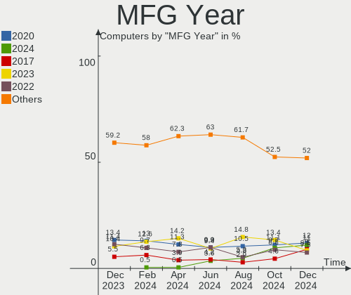
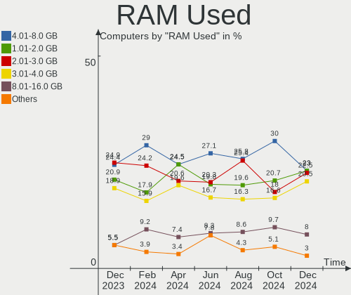
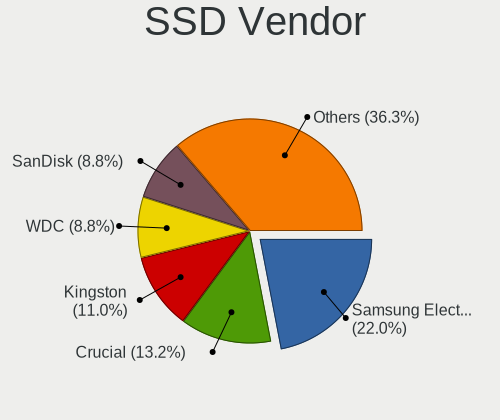
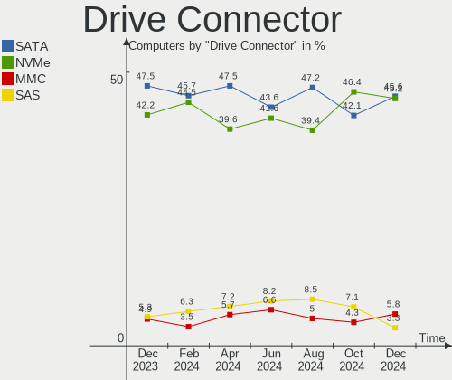
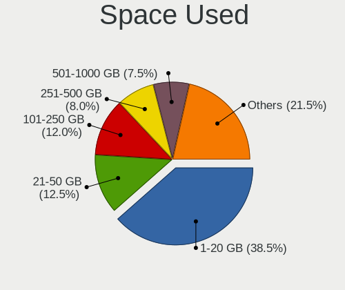
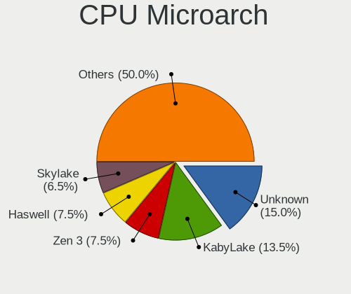
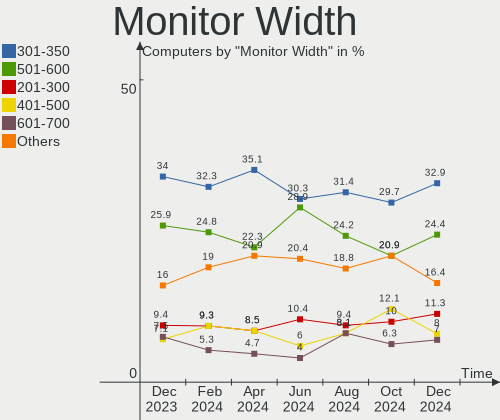
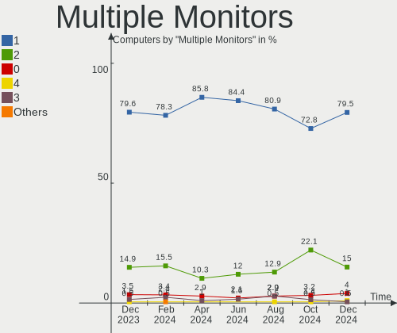
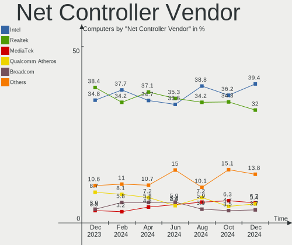

Linux in UK - Hardware Trends
-----------------------------

A project to identify most popular hardware characteristics and track their change
over time based on data collected by Linux users at https://Linux-Hardware.org.

Anyone can contribute to this report by the [hw-probe](https://github.com/linuxhw/hw-probe) tool:

    sudo -E hw-probe -all -upload

This is a report for all computer types. See also reports for [desktops](/Location/UK/Desktop/README.md) and [notebooks](/Location/UK/Notebook/README.md).

Period: Aug, 2022.

Contents
--------

* [ System ](#system)
  - [ OS                       ](#os)
  - [ OS Family                ](#os-family)
  - [ Kernel                   ](#kernel)
  - [ Kernel Family            ](#kernel-family)
  - [ Kernel Major Ver.        ](#kernel-major-ver)
  - [ Arch                     ](#arch)
  - [ DE                       ](#de)
  - [ Display Server           ](#display-server)
  - [ Display Manager          ](#display-manager)
  - [ OS Lang                  ](#os-lang)
  - [ Boot Mode                ](#boot-mode)
  - [ Filesystem               ](#filesystem)
  - [ Part. scheme             ](#part-scheme)
  - [ Dual Boot with Linux/BSD ](#dual-boot-with-linuxbsd)
  - [ Dual Boot (Win)          ](#dual-boot-win)

* [ Board ](#board)
  - [ Vendor                   ](#vendor)
  - [ Model                    ](#model)
  - [ Model Family             ](#model-family)
  - [ MFG Year                 ](#mfg-year)
  - [ Form Factor              ](#form-factor)
  - [ Secure Boot              ](#secure-boot)
  - [ Coreboot                 ](#coreboot)
  - [ RAM Size                 ](#ram-size)
  - [ RAM Used                 ](#ram-used)
  - [ Total Drives             ](#total-drives)
  - [ Has CD-ROM               ](#has-cd-rom)
  - [ Has Ethernet             ](#has-ethernet)
  - [ Has WiFi                 ](#has-wifi)
  - [ Has Bluetooth            ](#has-bluetooth)

* [ Location ](#location)
  - [ Country                  ](#country)
  - [ City                     ](#city)

* [ Drives ](#drives)
  - [ Drive Vendor             ](#drive-vendor)
  - [ Drive Model              ](#drive-model)
  - [ HDD Vendor               ](#hdd-vendor)
  - [ SSD Vendor               ](#ssd-vendor)
  - [ Drive Kind               ](#drive-kind)
  - [ Drive Connector          ](#drive-connector)
  - [ Drive Size               ](#drive-size)
  - [ Space Total              ](#space-total)
  - [ Space Used               ](#space-used)
  - [ Malfunc. Drives          ](#malfunc-drives)
  - [ Malfunc. Drive Vendor    ](#malfunc-drive-vendor)
  - [ Malfunc. HDD Vendor      ](#malfunc-hdd-vendor)
  - [ Malfunc. Drive Kind      ](#malfunc-drive-kind)
  - [ Failed Drives            ](#failed-drives)
  - [ Failed Drive Vendor      ](#failed-drive-vendor)
  - [ Drive Status             ](#drive-status)

* [ Storage controller ](#storage-controller)
  - [ Storage Vendor           ](#storage-vendor)
  - [ Storage Model            ](#storage-model)
  - [ Storage Kind             ](#storage-kind)

* [ Processor ](#processor)
  - [ CPU Vendor               ](#cpu-vendor)
  - [ CPU Model                ](#cpu-model)
  - [ CPU Model Family         ](#cpu-model-family)
  - [ CPU Cores                ](#cpu-cores)
  - [ CPU Sockets              ](#cpu-sockets)
  - [ CPU Threads              ](#cpu-threads)
  - [ CPU Op-Modes             ](#cpu-op-modes)
  - [ CPU Microcode            ](#cpu-microcode)
  - [ CPU Microarch            ](#cpu-microarch)

* [ Graphics ](#graphics)
  - [ GPU Vendor               ](#gpu-vendor)
  - [ GPU Model                ](#gpu-model)
  - [ GPU Combo                ](#gpu-combo)
  - [ GPU Driver               ](#gpu-driver)
  - [ GPU Memory               ](#gpu-memory)

* [ Monitor ](#monitor)
  - [ Monitor Vendor           ](#monitor-vendor)
  - [ Monitor Model            ](#monitor-model)
  - [ Monitor Resolution       ](#monitor-resolution)
  - [ Monitor Diagonal         ](#monitor-diagonal)
  - [ Monitor Width            ](#monitor-width)
  - [ Aspect Ratio             ](#aspect-ratio)
  - [ Monitor Area             ](#monitor-area)
  - [ Pixel Density            ](#pixel-density)
  - [ Multiple Monitors        ](#multiple-monitors)

* [ Network ](#network)
  - [ Net Controller Vendor    ](#net-controller-vendor)
  - [ Net Controller Model     ](#net-controller-model)
  - [ Wireless Vendor          ](#wireless-vendor)
  - [ Wireless Model           ](#wireless-model)
  - [ Ethernet Vendor          ](#ethernet-vendor)
  - [ Ethernet Model           ](#ethernet-model)
  - [ Net Controller Kind      ](#net-controller-kind)
  - [ Used Controller          ](#used-controller)
  - [ NICs                     ](#nics)
  - [ IPv6                     ](#ipv6)

* [ Bluetooth ](#bluetooth)
  - [ Bluetooth Vendor         ](#bluetooth-vendor)
  - [ Bluetooth Model          ](#bluetooth-model)

* [ Sound ](#sound)
  - [ Sound Vendor             ](#sound-vendor)
  - [ Sound Model              ](#sound-model)

* [ Memory ](#memory)
  - [ Memory Vendor            ](#memory-vendor)
  - [ Memory Model             ](#memory-model)
  - [ Memory Kind              ](#memory-kind)
  - [ Memory Form Factor       ](#memory-form-factor)
  - [ Memory Size              ](#memory-size)
  - [ Memory Speed             ](#memory-speed)

* [ Printers & scanners ](#printers--scanners)
  - [ Printer Vendor           ](#printer-vendor)
  - [ Printer Model            ](#printer-model)
  - [ Scanner Vendor           ](#scanner-vendor)
  - [ Scanner Model            ](#scanner-model)

* [ Camera ](#camera)
  - [ Camera Vendor            ](#camera-vendor)
  - [ Camera Model             ](#camera-model)

* [ Security ](#security)
  - [ Fingerprint Vendor       ](#fingerprint-vendor)
  - [ Fingerprint Model        ](#fingerprint-model)
  - [ Chipcard Vendor          ](#chipcard-vendor)
  - [ Chipcard Model           ](#chipcard-model)

* [ Unsupported ](#unsupported)
  - [ Unsupported Devices      ](#unsupported-devices)
  - [ Unsupported Device Types ](#unsupported-device-types)

System
------

OS
--

Installed operating systems

| Name                         | Computers | Percent |
|------------------------------|-----------|---------|
| Ubuntu 22.04                 | 29        | 17.16%  |
| OpenMandriva 4.3             | 13        | 7.69%   |
| Zorin 16                     | 11        | 6.51%   |
| Fedora 36                    | 11        | 6.51%   |
| Pop!_OS 22.04                | 10        | 5.92%   |
| Linux Mint 21                | 10        | 5.92%   |
| Ubuntu 20.04                 | 8         | 4.73%   |
| Elementary 6.1               | 8         | 4.73%   |
| OpenMandriva 4.90            | 6         | 3.55%   |
| SteamOS 3.3                  | 5         | 2.96%   |
| Debian 11                    | 4         | 2.37%   |
| Arch                         | 4         | 2.37%   |
| Zorin 15                     | 3         | 1.78%   |
| SteamOS 3.3.1                | 3         | 1.78%   |
| openSUSE Tumbleweed-XXXXXXXX | 3         | 1.78%   |
| Debian Testing               | 3         | 1.78%   |
| Arch Rolling                 | 3         | 1.78%   |
| Xubuntu 20.04                | 2         | 1.18%   |
| Nobara 36                    | 2         | 1.18%   |
| Linux Mint 20.3              | 2         | 1.18%   |
| KDE neon 20.04               | 2         | 1.18%   |
| Kali 2022.3                  | 2         | 1.18%   |
| Garuda Linux Soaring         | 2         | 1.18%   |
| Endless 4.0.4                | 2         | 1.18%   |
| Xubuntu 22.04                | 1         | 0.59%   |
| Ubuntu Studio 22.04          | 1         | 0.59%   |
| Ubuntu MATE 22.04            | 1         | 0.59%   |
| Ubuntu MATE 20.04            | 1         | 0.59%   |
| Ubuntu 18.04                 | 1         | 0.59%   |
| Sparky 7                     | 1         | 0.59%   |
| RHEL 9                       | 1         | 0.59%   |
| openSUSE Leap-15.4           | 1         | 0.59%   |
| OpenMandriva 4.2             | 1         | 0.59%   |
| Manjaro 21.3.7               | 1         | 0.59%   |
| Manjaro 21.3.6               | 1         | 0.59%   |
| Manjaro                      | 1         | 0.59%   |
| Lubuntu 20.04                | 1         | 0.59%   |
| Linux Mint 19.1              | 1         | 0.59%   |
| Kubuntu 22.04                | 1         | 0.59%   |
| Kubuntu 11.1                 | 1         | 0.59%   |
| KDE neon 22.04               | 1         | 0.59%   |
| Kali 2022.2                  | 1         | 0.59%   |
| Gentoo 2.8                   | 1         | 0.59%   |
| Feren OS 20.04               | 1         | 0.59%   |
| antiX 21                     | 1         | 0.59%   |

OS Family
---------

OS without a version

| Name          | Computers | Percent |
|---------------|-----------|---------|
| Ubuntu        | 38        | 22.49%  |
| OpenMandriva  | 20        | 11.83%  |
| Zorin         | 14        | 8.28%   |
| Linux Mint    | 13        | 7.69%   |
| Fedora        | 11        | 6.51%   |
| Pop!_OS       | 10        | 5.92%   |
| SteamOS       | 8         | 4.73%   |
| Elementary    | 8         | 4.73%   |
| Debian        | 7         | 4.14%   |
| Arch          | 7         | 4.14%   |
| openSUSE      | 4         | 2.37%   |
| Xubuntu       | 3         | 1.78%   |
| Manjaro       | 3         | 1.78%   |
| KDE neon      | 3         | 1.78%   |
| Kali          | 3         | 1.78%   |
| Ubuntu MATE   | 2         | 1.18%   |
| Nobara        | 2         | 1.18%   |
| Kubuntu       | 2         | 1.18%   |
| Garuda Linux  | 2         | 1.18%   |
| Endless       | 2         | 1.18%   |
| Ubuntu Studio | 1         | 0.59%   |
| Sparky        | 1         | 0.59%   |
| RHEL          | 1         | 0.59%   |
| Lubuntu       | 1         | 0.59%   |
| Gentoo        | 1         | 0.59%   |
| Feren OS      | 1         | 0.59%   |
| antiX         | 1         | 0.59%   |

Kernel
------

Version of the Linux kernel

| Version                                        | Computers | Percent |
|------------------------------------------------|-----------|---------|
| 5.15.0-46-generic                              | 42        | 24.85%  |
| 5.15.0-43-generic                              | 15        | 8.88%   |
| 5.16.7-desktop-1omv4003                        | 13        | 7.69%   |
| 5.18.12-desktop-3omv4090                       | 6         | 3.55%   |
| 5.18.10-76051810-generic                       | 5         | 2.96%   |
| 5.19.0-76051900-generic                        | 4         | 2.37%   |
| 5.15.0-41-generic                              | 4         | 2.37%   |
| 5.13.0-valve21-1-neptune-02209-g2a5bdc1102a0   | 4         | 2.37%   |
| 5.4.0-124-generic                              | 3         | 1.78%   |
| 5.18.16-200.fc36.x86_64                        | 3         | 1.78%   |
| 5.18.13-200.fc36.x86_64                        | 3         | 1.78%   |
| 5.18.0-4-amd64                                 | 3         | 1.78%   |
| 5.13.0-valve21.1-1-neptune-02211-gc54cda5a36f3 | 3         | 1.78%   |
| 5.4.0-122-generic                              | 2         | 1.18%   |
| 5.19.1-arch2-1                                 | 2         | 1.18%   |
| 5.18.0-kali5-amd64                             | 2         | 1.18%   |
| 5.13.0-30-generic                              | 2         | 1.18%   |
| 5.11.0-35-generic                              | 2         | 1.18%   |
| 5.10.0-17-amd64                                | 2         | 1.18%   |
| 5.10.0-16-amd64                                | 2         | 1.18%   |
| 5.8.0-50-generic                               | 1         | 0.59%   |
| 5.4.0-42-generic                               | 1         | 0.59%   |
| 5.4.0-125-generic                              | 1         | 0.59%   |
| 5.4.0-123-generic                              | 1         | 0.59%   |
| 5.4.0-113-generic                              | 1         | 0.59%   |
| 5.4.0-110-generic                              | 1         | 0.59%   |
| 5.19.4-201.fsync.fc36.x86_64                   | 1         | 0.59%   |
| 5.19.4-200.fc36.x86_64                         | 1         | 0.59%   |
| 5.19.3-zen1-1-zen                              | 1         | 0.59%   |
| 5.19.2-arch1-1                                 | 1         | 0.59%   |
| 5.19.1-4.g4fdb301-default                      | 1         | 0.59%   |
| 5.19.1-2-MANJARO                               | 1         | 0.59%   |
| 5.19.1-1-default                               | 1         | 0.59%   |
| 5.19.0-2-MANJARO                               | 1         | 0.59%   |
| 5.19.0-1-default                               | 1         | 0.59%   |
| 5.18.18-201.fsync.fc36.x86_64                  | 1         | 0.59%   |
| 5.18.18-200.fc36.x86_64                        | 1         | 0.59%   |
| 5.18.17-200.fc36.x86_64                        | 1         | 0.59%   |
| 5.18.16-zen1-1-zen                             | 1         | 0.59%   |
| 5.18.16-arch1-1                                | 1         | 0.59%   |
| 5.18.15-051815-generic                         | 1         | 0.59%   |
| 5.18.13-201.fsync.fc36.x86_64                  | 1         | 0.59%   |
| 5.18.12-zen1-1-zen                             | 1         | 0.59%   |
| 5.18.0-3-amd64                                 | 1         | 0.59%   |
| 5.17.5-76051705-generic                        | 1         | 0.59%   |
| 5.17.5-300.fc36.x86_64                         | 1         | 0.59%   |
| 5.17.15-76051715-generic                       | 1         | 0.59%   |
| 5.17.1-t2                                      | 1         | 0.59%   |
| 5.16.0-kali7-amd64                             | 1         | 0.59%   |
| 5.15.63-1-lts                                  | 1         | 0.59%   |
| 5.15.60-1-MANJARO                              | 1         | 0.59%   |
| 5.15.60-1-lts                                  | 1         | 0.59%   |
| 5.15.59-gentoo                                 | 1         | 0.59%   |
| 5.15.0-47-generic                              | 1         | 0.59%   |
| 5.15.0-46-lowlatency                           | 1         | 0.59%   |
| 5.15.0-43-lowlatency                           | 1         | 0.59%   |
| 5.15.0-42-lowlatency                           | 1         | 0.59%   |
| 5.15.0-25-generic                              | 1         | 0.59%   |
| 5.14.21-150400.24.18-default                   | 1         | 0.59%   |
| 5.14.0-70.22.1.el9_0.x86_64                    | 1         | 0.59%   |

Kernel Family
-------------

Linux kernel without a distro release

| Version | Computers | Percent |
|---------|-----------|---------|
| 5.15.0  | 66        | 39.05%  |
| 5.16.7  | 13        | 7.69%   |
| 5.13.0  | 12        | 7.1%    |
| 5.4.0   | 10        | 5.92%   |
| 5.18.12 | 7         | 4.14%   |
| 5.19.0  | 6         | 3.55%   |
| 5.18.0  | 6         | 3.55%   |
| 5.19.1  | 5         | 2.96%   |
| 5.18.16 | 5         | 2.96%   |
| 5.18.10 | 5         | 2.96%   |
| 5.18.13 | 4         | 2.37%   |
| 5.10.0  | 4         | 2.37%   |
| 5.11.0  | 3         | 1.78%   |
| 5.19.4  | 2         | 1.18%   |
| 5.18.18 | 2         | 1.18%   |
| 5.17.5  | 2         | 1.18%   |
| 5.15.60 | 2         | 1.18%   |
| 5.8.0   | 1         | 0.59%   |
| 5.19.3  | 1         | 0.59%   |
| 5.19.2  | 1         | 0.59%   |
| 5.18.17 | 1         | 0.59%   |
| 5.18.15 | 1         | 0.59%   |
| 5.17.15 | 1         | 0.59%   |
| 5.17.1  | 1         | 0.59%   |
| 5.16.0  | 1         | 0.59%   |
| 5.15.63 | 1         | 0.59%   |
| 5.15.59 | 1         | 0.59%   |
| 5.14.21 | 1         | 0.59%   |
| 5.14.0  | 1         | 0.59%   |
| 5.10.14 | 1         | 0.59%   |
| 4.9.0   | 1         | 0.59%   |
| 4.15.0  | 1         | 0.59%   |

Kernel Major Ver.
-----------------

Linux kernel major version

| Version | Computers | Percent |
|---------|-----------|---------|
| 5.15    | 70        | 41.42%  |
| 5.18    | 31        | 18.34%  |
| 5.19    | 15        | 8.88%   |
| 5.16    | 14        | 8.28%   |
| 5.13    | 12        | 7.1%    |
| 5.4     | 10        | 5.92%   |
| 5.10    | 5         | 2.96%   |
| 5.17    | 4         | 2.37%   |
| 5.11    | 3         | 1.78%   |
| 5.14    | 2         | 1.18%   |
| 5.8     | 1         | 0.59%   |
| 4.9     | 1         | 0.59%   |
| 4.15    | 1         | 0.59%   |

Arch
----

OS architecture (x86_64, i586, etc.)

| Name   | Computers | Percent |
|--------|-----------|---------|
| x86_64 | 169       | 100%    |

DE
--

Desktop Environment

| Name       | Computers | Percent |
|------------|-----------|---------|
| GNOME      | 76        | 44.97%  |
| KDE5       | 47        | 27.81%  |
| X-Cinnamon | 13        | 7.69%   |
| XFCE       | 12        | 7.1%    |
| Pantheon   | 8         | 4.73%   |
| Unknown    | 5         | 2.96%   |
| MATE       | 3         | 1.78%   |
| sway       | 1         | 0.59%   |
| LXQt       | 1         | 0.59%   |
| LXDE       | 1         | 0.59%   |
| icewm      | 1         | 0.59%   |
| Cinnamon   | 1         | 0.59%   |

Display Server
--------------

X11 or Wayland

| Name    | Computers | Percent |
|---------|-----------|---------|
| X11     | 128       | 75.74%  |
| Wayland | 35        | 20.71%  |
| Unknown | 4         | 2.37%   |
| Tty     | 2         | 1.18%   |

Display Manager
---------------

SDDM, LightDM, etc.

| Name    | Computers | Percent |
|---------|-----------|---------|
| Unknown | 70        | 41.42%  |
| GDM3    | 36        | 21.3%   |
| SDDM    | 29        | 17.16%  |
| LightDM | 24        | 14.2%   |
| GDM     | 8         | 4.73%   |
| XDM     | 1         | 0.59%   |
| GREETD  | 1         | 0.59%   |

OS Lang
-------

Language

| Lang    | Computers | Percent |
|---------|-----------|---------|
| en_GB   | 119       | 70.41%  |
| en_US   | 42        | 24.85%  |
| pl_PL   | 2         | 1.18%   |
| Unknown | 2         | 1.18%   |
| POSIX   | 1         | 0.59%   |
| es_ES   | 1         | 0.59%   |
| en_GG   | 1         | 0.59%   |
| C       | 1         | 0.59%   |

Boot Mode
---------

EFI or BIOS

| Mode | Computers | Percent |
|------|-----------|---------|
| EFI  | 87        | 51.48%  |
| BIOS | 82        | 48.52%  |

Filesystem
----------

Type of filesystem

| Type    | Computers | Percent |
|---------|-----------|---------|
| Ext4    | 117       | 69.23%  |
| Btrfs   | 25        | 14.79%  |
| Overlay | 22        | 13.02%  |
| Xfs     | 2         | 1.18%   |
| Tmpfs   | 2         | 1.18%   |
| Ext2    | 1         | 0.59%   |

Part. scheme
------------

Scheme of partitioning

| Type    | Computers | Percent |
|---------|-----------|---------|
| Unknown | 93        | 55.03%  |
| GPT     | 65        | 38.46%  |
| MBR     | 11        | 6.51%   |

Dual Boot with Linux/BSD
------------------------

Hosting more than one Linux/BSD

| Dual boot | Computers | Percent |
|-----------|-----------|---------|
| No        | 141       | 83.43%  |
| Yes       | 28        | 16.57%  |

Dual Boot (Win)
---------------

Hosting Linux and Windows

| Dual boot | Computers | Percent |
|-----------|-----------|---------|
| No        | 127       | 75.15%  |
| Yes       | 42        | 24.85%  |

Board
-----

Vendor
------

Motherboard manufacturer

| Name                | Computers | Percent |
|---------------------|-----------|---------|
| Dell                | 32        | 18.93%  |
| Hewlett-Packard     | 21        | 12.43%  |
| ASUSTek Computer    | 19        | 11.24%  |
| Lenovo              | 17        | 10.06%  |
| MSI                 | 14        | 8.28%   |
| Gigabyte Technology | 11        | 6.51%   |
| Apple               | 9         | 5.33%   |
| Acer                | 9         | 5.33%   |
| Valve               | 7         | 4.14%   |
| ASRock              | 5         | 2.96%   |
| Intel               | 3         | 1.78%   |
| Toshiba             | 2         | 1.18%   |
| Notebook            | 2         | 1.18%   |
| HUAWEI              | 2         | 1.18%   |
| Star Labs           | 1         | 0.59%   |
| Standard            | 1         | 0.59%   |
| Samsung Electronics | 1         | 0.59%   |
| Pegatron            | 1         | 0.59%   |
| Packard Bell        | 1         | 0.59%   |
| OEM_MB              | 1         | 0.59%   |
| Microsoft           | 1         | 0.59%   |
| Linx                | 1         | 0.59%   |
| IP3 Tech            | 1         | 0.59%   |
| GEO                 | 1         | 0.59%   |
| Fujitsu Siemens     | 1         | 0.59%   |
| Fanless Mini PC     | 1         | 0.59%   |
| ECS                 | 1         | 0.59%   |
| AMI                 | 1         | 0.59%   |
| Alienware           | 1         | 0.59%   |
| Unknown             | 1         | 0.59%   |

Model
-----

Motherboard model

| Name                                  | Computers | Percent |
|---------------------------------------|-----------|---------|
| Valve Jupiter                         | 7         | 4.14%   |
| Unknown                               | 3         | 1.78%   |
| MSI MS-7B51                           | 2         | 1.18%   |
| Lenovo Yoga 530-14ARR 81H9            | 2         | 1.18%   |
| Dell XPS 13 7390 2-in-1               | 2         | 1.18%   |
| Dell OptiPlex 780                     | 2         | 1.18%   |
| Apple MacBookPro9,2                   | 2         | 1.18%   |
| Acer Aspire 5740                      | 2         | 1.18%   |
| Toshiba TECRA Z40-C                   | 1         | 0.59%   |
| Toshiba Satellite C660                | 1         | 0.59%   |
| Star Labs LabTop                      | 1         | 0.59%   |
| Samsung R519/R719                     | 1         | 0.59%   |
| Pegatron VG238AA-ABU s5229uk          | 1         | 0.59%   |
| Packard Bell EasyNote TK13BZ          | 1         | 0.59%   |
| OEM_MB KX733AA-ABU a6511.uk           | 1         | 0.59%   |
| Notebook PCx0Dx                       | 1         | 0.59%   |
| Notebook NL40_50CU                    | 1         | 0.59%   |
| MSI MS-AA1511                         | 1         | 0.59%   |
| MSI MS-7C94                           | 1         | 0.59%   |
| MSI MS-7C52                           | 1         | 0.59%   |
| MSI MS-7C37                           | 1         | 0.59%   |
| MSI MS-7C02                           | 1         | 0.59%   |
| MSI MS-7B89                           | 1         | 0.59%   |
| MSI MS-7B86                           | 1         | 0.59%   |
| MSI MS-7B84                           | 1         | 0.59%   |
| MSI MS-7924                           | 1         | 0.59%   |
| MSI MS-7721                           | 1         | 0.59%   |
| MSI GE62VR 7RF                        | 1         | 0.59%   |
| MSI Creator Z16 Hiroshi F A11UE       | 1         | 0.59%   |
| Microsoft Surface Pro 4               | 1         | 0.59%   |
| Linx LINX1010B                        | 1         | 0.59%   |
| Lenovo Z51-70 80K6                    | 1         | 0.59%   |
| Lenovo V15-IIL 82C5                   | 1         | 0.59%   |
| Lenovo ThinkPad T480 20L6SBD000       | 1         | 0.59%   |
| Lenovo ThinkPad T450s 20BXCTO1WW      | 1         | 0.59%   |
| Lenovo ThinkPad 20M8S1K100            | 1         | 0.59%   |
| Lenovo ThinkCentre M83 10AHS03K00     | 1         | 0.59%   |
| Lenovo ThinkCentre M75q-1 11A5S1HM00  | 1         | 0.59%   |
| Lenovo ThinkBook 15-IIL 20SM          | 1         | 0.59%   |
| Lenovo Legion 5 15ACH6H 82JU          | 1         | 0.59%   |
| Lenovo IdeaPad Z580                   | 1         | 0.59%   |
| Lenovo IdeaPad S540-13API 81XC        | 1         | 0.59%   |
| Lenovo IdeaPad S130-11IGM 81J1        | 1         | 0.59%   |
| Lenovo IdeaPad 510S-14ISK 80TK        | 1         | 0.59%   |
| Lenovo IdeaPad 5 Pro 14ACN6 82L7      | 1         | 0.59%   |
| Lenovo G505s 20255                    | 1         | 0.59%   |
| IP3 Tech AP34 PRO                     | 1         | 0.59%   |
| Intel TOWER 300                       | 1         | 0.59%   |
| Intel NUC7i5BNK                       | 1         | 0.59%   |
| Intel D525MW AAE93082-401             | 1         | 0.59%   |
| HUAWEI NBD-WXX9                       | 1         | 0.59%   |
| HUAWEI KLVD-WXX9                      | 1         | 0.59%   |
| HP Z600 Workstation                   | 1         | 0.59%   |
| HP Z1 Entry Tower G5                  | 1         | 0.59%   |
| HP Spectre x360 Convertible 13-aw0xxx | 1         | 0.59%   |
| HP ProBook 6570b                      | 1         | 0.59%   |
| HP ProBook 455 G7                     | 1         | 0.59%   |
| HP ProBook 450 G6                     | 1         | 0.59%   |
| HP Pavilion Laptop 15-cd0xx           | 1         | 0.59%   |
| HP Pavilion Gaming Laptop 15-ec0xxx   | 1         | 0.59%   |

Model Family
------------

Motherboard model prefix

| Name                  | Computers | Percent |
|-----------------------|-----------|---------|
| Dell XPS              | 8         | 4.73%   |
| Valve Jupiter         | 7         | 4.14%   |
| Dell Inspiron         | 7         | 4.14%   |
| Dell OptiPlex         | 6         | 3.55%   |
| Acer Aspire           | 6         | 3.55%   |
| Lenovo IdeaPad        | 5         | 2.96%   |
| ASUS PRIME            | 5         | 2.96%   |
| Dell Latitude         | 4         | 2.37%   |
| ASUS ROG              | 4         | 2.37%   |
| Lenovo ThinkPad       | 3         | 1.78%   |
| HP ProBook            | 3         | 1.78%   |
| HP Pavilion           | 3         | 1.78%   |
| HP Laptop             | 3         | 1.78%   |
| Dell Precision        | 3         | 1.78%   |
| Unknown               | 3         | 1.78%   |
| MSI MS-7B51           | 2         | 1.18%   |
| Lenovo Yoga           | 2         | 1.18%   |
| Lenovo ThinkCentre    | 2         | 1.18%   |
| HP ENVY               | 2         | 1.18%   |
| Gigabyte X570S        | 2         | 1.18%   |
| Dell PowerEdge        | 2         | 1.18%   |
| Apple MacBookPro9     | 2         | 1.18%   |
| Toshiba TECRA         | 1         | 0.59%   |
| Toshiba Satellite     | 1         | 0.59%   |
| Star Labs LabTop      | 1         | 0.59%   |
| Samsung R519          | 1         | 0.59%   |
| Pegatron VG238AA-ABU  | 1         | 0.59%   |
| Packard Bell EasyNote | 1         | 0.59%   |
| OEM_MB KX733AA-ABU    | 1         | 0.59%   |
| Notebook PCx0Dx       | 1         | 0.59%   |
| Notebook NL40         | 1         | 0.59%   |
| MSI MS-AA1511         | 1         | 0.59%   |
| MSI MS-7C94           | 1         | 0.59%   |
| MSI MS-7C52           | 1         | 0.59%   |
| MSI MS-7C37           | 1         | 0.59%   |
| MSI MS-7C02           | 1         | 0.59%   |
| MSI MS-7B89           | 1         | 0.59%   |
| MSI MS-7B86           | 1         | 0.59%   |
| MSI MS-7B84           | 1         | 0.59%   |
| MSI MS-7924           | 1         | 0.59%   |
| MSI MS-7721           | 1         | 0.59%   |
| MSI GE62VR            | 1         | 0.59%   |
| MSI Creator           | 1         | 0.59%   |
| Microsoft Surface     | 1         | 0.59%   |
| Linx LINX1010B        | 1         | 0.59%   |
| Lenovo Z51-70         | 1         | 0.59%   |
| Lenovo V15-IIL        | 1         | 0.59%   |
| Lenovo ThinkBook      | 1         | 0.59%   |
| Lenovo Legion         | 1         | 0.59%   |
| Lenovo G505s          | 1         | 0.59%   |
| IP3 Tech AP34         | 1         | 0.59%   |
| Intel TOWER           | 1         | 0.59%   |
| Intel NUC7i5BNK       | 1         | 0.59%   |
| Intel D525MW          | 1         | 0.59%   |
| HUAWEI NBD-WXX9       | 1         | 0.59%   |
| HUAWEI KLVD-WXX9      | 1         | 0.59%   |
| HP Z600               | 1         | 0.59%   |
| HP Z1                 | 1         | 0.59%   |
| HP Spectre            | 1         | 0.59%   |
| HP OMEN               | 1         | 0.59%   |

MFG Year
--------

Motherboard manufacture year

| Year | Computers | Percent |
|------|-----------|---------|
| 2019 | 23        | 13.61%  |
| 2021 | 20        | 11.83%  |
| 2018 | 20        | 11.83%  |
| 2020 | 12        | 7.1%    |
| 2017 | 12        | 7.1%    |
| 2022 | 10        | 5.92%   |
| 2015 | 10        | 5.92%   |
| 2010 | 10        | 5.92%   |
| 2016 | 9         | 5.33%   |
| 2014 | 9         | 5.33%   |
| 2011 | 9         | 5.33%   |
| 2009 | 8         | 4.73%   |
| 2012 | 7         | 4.14%   |
| 2008 | 4         | 2.37%   |
| 2013 | 3         | 1.78%   |
| 2007 | 2         | 1.18%   |
| 2006 | 1         | 0.59%   |

Form Factor
-----------

Physical design of the computer

| Name        | Computers | Percent |
|-------------|-----------|---------|
| Notebook    | 84        | 49.7%   |
| Desktop     | 63        | 37.28%  |
| Convertible | 9         | 5.33%   |
| All in one  | 6         | 3.55%   |
| Mini pc     | 4         | 2.37%   |
| Server      | 2         | 1.18%   |
| Tablet      | 1         | 0.59%   |

Secure Boot
-----------

Enabled or disabled

| State    | Computers | Percent |
|----------|-----------|---------|
| Disabled | 155       | 91.72%  |
| Enabled  | 14        | 8.28%   |

Coreboot
--------

Have coreboot on board

| Used | Computers | Percent |
|------|-----------|---------|
| No   | 169       | 100%    |

RAM Size
--------

Total RAM memory

| Size in GB      | Computers | Percent |
|-----------------|-----------|---------|
| 8.01-16.0       | 43        | 25.44%  |
| 4.01-8.0        | 41        | 24.26%  |
| 16.01-24.0      | 39        | 23.08%  |
| 3.01-4.0        | 19        | 11.24%  |
| 32.01-64.0      | 16        | 9.47%   |
| 1.01-2.0        | 4         | 2.37%   |
| 64.01-256.0     | 3         | 1.78%   |
| 2.01-3.0        | 2         | 1.18%   |
| More than 256.0 | 1         | 0.59%   |
| 24.01-32.0      | 1         | 0.59%   |

RAM Used
--------

Used RAM memory

| Used GB     | Computers | Percent |
|-------------|-----------|---------|
| 2.01-3.0    | 54        | 31.95%  |
| 1.01-2.0    | 50        | 29.59%  |
| 4.01-8.0    | 28        | 16.57%  |
| 3.01-4.0    | 24        | 14.2%   |
| 8.01-16.0   | 8         | 4.73%   |
| 0.51-1.0    | 3         | 1.78%   |
| 64.01-256.0 | 1         | 0.59%   |
| 0.01-0.5    | 1         | 0.59%   |

Total Drives
------------

Number of drives on board

| Drives | Computers | Percent |
|--------|-----------|---------|
| 1      | 93        | 55.03%  |
| 2      | 47        | 27.81%  |
| 3      | 18        | 10.65%  |
| 6      | 3         | 1.78%   |
| 4      | 3         | 1.78%   |
| 5      | 2         | 1.18%   |
| 14     | 1         | 0.59%   |
| 7      | 1         | 0.59%   |
| 0      | 1         | 0.59%   |

Has CD-ROM
----------

Has CD-ROM on board

| Presented | Computers | Percent |
|-----------|-----------|---------|
| No        | 117       | 69.23%  |
| Yes       | 52        | 30.77%  |

Has Ethernet
------------

Has Ethernet on board

| Presented | Computers | Percent |
|-----------|-----------|---------|
| Yes       | 131       | 77.51%  |
| No        | 38        | 22.49%  |

Has WiFi
--------

Has WiFi module

| Presented | Computers | Percent |
|-----------|-----------|---------|
| Yes       | 137       | 81.07%  |
| No        | 32        | 18.93%  |

Has Bluetooth
-------------

Has Bluetooth module

| Presented | Computers | Percent |
|-----------|-----------|---------|
| Yes       | 110       | 65.09%  |
| No        | 59        | 34.91%  |

Location
--------

Country
-------

Geographic location (country)

| Country | Computers | Percent |
|---------|-----------|---------|
| UK      | 169       | 100%    |

City
----

Geographic location (city)

| City              | Computers | Percent |
|-------------------|-----------|---------|
| Bristol           | 8         | 4.73%   |
| London            | 7         | 4.14%   |
| Manchester        | 5         | 2.96%   |
| Nottingham        | 4         | 2.37%   |
| Wolverhampton     | 3         | 1.78%   |
| Reading           | 3         | 1.78%   |
| Leicester         | 3         | 1.78%   |
| Islington         | 3         | 1.78%   |
| Glasgow           | 3         | 1.78%   |
| Sutton            | 2         | 1.18%   |
| Sunderland        | 2         | 1.18%   |
| Sheffield         | 2         | 1.18%   |
| Salisbury         | 2         | 1.18%   |
| Salford           | 2         | 1.18%   |
| Rochester         | 2         | 1.18%   |
| Rhyl              | 2         | 1.18%   |
| Northampton       | 2         | 1.18%   |
| North Shields     | 2         | 1.18%   |
| Mansfield         | 2         | 1.18%   |
| Liverpool         | 2         | 1.18%   |
| Leeds             | 2         | 1.18%   |
| Lancaster         | 2         | 1.18%   |
| Edinburgh         | 2         | 1.18%   |
| Balham            | 2         | 1.18%   |
| Ystradgynlais     | 1         | 0.59%   |
| York              | 1         | 0.59%   |
| Workington        | 1         | 0.59%   |
| Wirral            | 1         | 0.59%   |
| Winchmore Hill    | 1         | 0.59%   |
| Winchester        | 1         | 0.59%   |
| Wimbledon         | 1         | 0.59%   |
| West Bromwich     | 1         | 0.59%   |
| Watford           | 1         | 0.59%   |
| Warrington        | 1         | 0.59%   |
| Wanstead          | 1         | 0.59%   |
| Walthamstow       | 1         | 0.59%   |
| Walsall           | 1         | 0.59%   |
| Tring             | 1         | 0.59%   |
| Torquay           | 1         | 0.59%   |
| Thornton Heath    | 1         | 0.59%   |
| Taunton           | 1         | 0.59%   |
| Swansea           | 1         | 0.59%   |
| Strabane          | 1         | 0.59%   |
| Stone             | 1         | 0.59%   |
| Stoke-on-Trent    | 1         | 0.59%   |
| Stevenage         | 1         | 0.59%   |
| Spalding          | 1         | 0.59%   |
| Slough            | 1         | 0.59%   |
| Sherburn in Elmet | 1         | 0.59%   |
| Sheerness         | 1         | 0.59%   |
| Rugby             | 1         | 0.59%   |
| Rotherham         | 1         | 0.59%   |
| Ringwood          | 1         | 0.59%   |
| Redhill           | 1         | 0.59%   |
| Redditch          | 1         | 0.59%   |
| Redcar            | 1         | 0.59%   |
| Portsmouth        | 1         | 0.59%   |
| Poole             | 1         | 0.59%   |
| Peterlee          | 1         | 0.59%   |
| Peterborough      | 1         | 0.59%   |

Drives
------

Drive Vendor
------------

Hard drive vendors

| Vendor                      | Computers | Drives | Percent |
|-----------------------------|-----------|--------|---------|
| Seagate                     | 41        | 48     | 15.95%  |
| Samsung Electronics         | 40        | 50     | 15.56%  |
| WDC                         | 26        | 30     | 10.12%  |
| Toshiba                     | 17        | 17     | 6.61%   |
| Unknown                     | 15        | 18     | 5.84%   |
| SanDisk                     | 14        | 17     | 5.45%   |
| Crucial                     | 14        | 20     | 5.45%   |
| SK hynix                    | 11        | 11     | 4.28%   |
| Phison                      | 10        | 10     | 3.89%   |
| Hitachi                     | 7         | 8      | 2.72%   |
| Apple                       | 6         | 7      | 2.33%   |
| Micron Technology           | 4         | 7      | 1.56%   |
| LITEON                      | 4         | 4      | 1.56%   |
| KIOXIA                      | 4         | 4      | 1.56%   |
| Kingston                    | 4         | 4      | 1.56%   |
| China                       | 4         | 5      | 1.56%   |
| PNY                         | 3         | 3      | 1.17%   |
| A-DATA Technology           | 3         | 3      | 1.17%   |
| XUM                         | 2         | 2      | 0.78%   |
| Silicon Motion              | 2         | 3      | 0.78%   |
| Intel                       | 2         | 2      | 0.78%   |
| ADATA Technology            | 2         | 2      | 0.78%   |
| ZTE                         | 1         | 1      | 0.39%   |
| ZTC                         | 1         | 1      | 0.39%   |
| Yangtze Memory Technologies | 1         | 1      | 0.39%   |
| XPG                         | 1         | 1      | 0.39%   |
| USB3.0                      | 1         | 1      | 0.39%   |
| Team                        | 1         | 1      | 0.39%   |
| SPCC                        | 1         | 1      | 0.39%   |
| O2 Micro                    | 1         | 1      | 0.39%   |
| Netac                       | 1         | 1      | 0.39%   |
| Leven                       | 1         | 1      | 0.39%   |
| KIOXIA-EXCERIA              | 1         | 1      | 0.39%   |
| KingFast                    | 1         | 1      | 0.39%   |
| JMicron Technology          | 1         | 1      | 0.39%   |
| HGST                        | 1         | 1      | 0.39%   |
| Hewlett-Packard             | 1         | 1      | 0.39%   |
| GOODRAM                     | 1         | 1      | 0.39%   |
| Fujitsu                     | 1         | 1      | 0.39%   |
| External                    | 1         | 1      | 0.39%   |
| BHT                         | 1         | 1      | 0.39%   |
| ASMT                        | 1         | 2      | 0.39%   |
| ASMedia                     | 1         | 1      | 0.39%   |
| Unknown                     | 1         | 4      | 0.39%   |

Drive Model
-----------

Hard drive models

| Model                                   | Computers | Percent |
|-----------------------------------------|-----------|---------|
| Samsung NVMe SSD Drive 500GB            | 5         | 1.75%   |
| Phison NVMe SSD Drive 512GB             | 5         | 1.75%   |
| Seagate ST1000LM035-1RK172 1TB          | 4         | 1.4%    |
| Unknown MMC Card  512GB                 | 3         | 1.05%   |
| Toshiba KBG30ZMS128G 128GB NVMe SSD     | 3         | 1.05%   |
| Toshiba HDWD110 1TB                     | 3         | 1.05%   |
| Seagate ST1000DM003-1SB102 1TB          | 3         | 1.05%   |
| Samsung SSD 850 EVO 500GB               | 3         | 1.05%   |
| Samsung NVMe SSD Drive 1TB              | 3         | 1.05%   |
| Crucial CT500MX500SSD1 500GB            | 3         | 1.05%   |
| XUM HX256GSSDSATA3 256GB                | 2         | 0.7%    |
| WDC WDS500G2B0A-00SM50 500GB SSD        | 2         | 0.7%    |
| WDC WDS100T2B0A-00SM50 1TB SSD          | 2         | 0.7%    |
| WDC WD10EZEX-08M2NA0 1TB                | 2         | 0.7%    |
| Unknown MMC Card  32GB                  | 2         | 0.7%    |
| Unknown MMC Card  128GB                 | 2         | 0.7%    |
| SK hynix PC401 NVMe 512GB               | 2         | 0.7%    |
| Seagate ST3500413AS 500GB               | 2         | 0.7%    |
| Seagate ST3500312CS 500GB               | 2         | 0.7%    |
| Seagate ST1000LM024 HN-M101MBB 1TB      | 2         | 0.7%    |
| Seagate ST1000LM014-1EJ164 1TB          | 2         | 0.7%    |
| Seagate ST1000DM010-2EP102 1TB          | 2         | 0.7%    |
| Seagate ST1000DM003-1CH162 1TB          | 2         | 0.7%    |
| SanDisk NVMe SSD Drive 500GB            | 2         | 0.7%    |
| SanDisk NVMe SSD Drive 256GB            | 2         | 0.7%    |
| Samsung SSD 860 QVO 1TB                 | 2         | 0.7%    |
| Samsung SM963 2.5" NVMe PCIe SSD 128GB  | 2         | 0.7%    |
| Samsung SM963 2.5" NVMe PCIe SSD 1024GB | 2         | 0.7%    |
| Samsung NVMe SSD Drive 512GB            | 2         | 0.7%    |
| Samsung NVMe SSD Drive 256GB            | 2         | 0.7%    |
| PNY CS900 240GB SSD                     | 2         | 0.7%    |
| Phison NVMe SSD Drive 1024GB            | 2         | 0.7%    |
| KIOXIA NVMe SSD Drive 512GB             | 2         | 0.7%    |
| Hitachi HDS721032CLA362 320GB           | 2         | 0.7%    |
| Crucial CT250MX500SSD1 250GB            | 2         | 0.7%    |
| Crucial CT240M500SSD1 240GB             | 2         | 0.7%    |
| Crucial CT1000MX500SSD1 1TB             | 2         | 0.7%    |
| ZTE MMC Storage 942MB                   | 1         | 0.35%   |
| ZTC SM201-512G SSD                      | 1         | 0.35%   |
| Yangtze Memory NVMe SSD Drive 512GB     | 1         | 0.35%   |
| XPG NVMe SSD Drive 1024GB               | 1         | 0.35%   |
| WDC WDS500G2B0C-00PXH0 500GB            | 1         | 0.35%   |
| WDC WDS120G2G0A-00JH30 120GB SSD        | 1         | 0.35%   |
| WDC WDS100T2B0C 1TB                     | 1         | 0.35%   |
| WDC WD6400AAKS-22A7B2 640GB             | 1         | 0.35%   |
| WDC WD5000BPKT-00PK4T0 500GB            | 1         | 0.35%   |
| WDC WD5000AVCS-632DY1 500GB             | 1         | 0.35%   |
| WDC WD5000AAKX-00ERMA0 500GB            | 1         | 0.35%   |
| WDC WD5000AAKS-00UU3A0 500GB            | 1         | 0.35%   |
| WDC WD4003FZEX-00Z4SA0 4TB              | 1         | 0.35%   |
| WDC WD3200BPVT-75JJ5T0 320GB            | 1         | 0.35%   |
| WDC WD2500BEVT-80A23T0 250GB            | 1         | 0.35%   |
| WDC WD2500AAKX-753CA1 250GB             | 1         | 0.35%   |
| WDC WD20EFRX-68EUZN0 2TB                | 1         | 0.35%   |
| WDC WD20EARS-00MVWB0 2TB                | 1         | 0.35%   |
| WDC WD2003FZEX-00SRLA0 2TB              | 1         | 0.35%   |
| WDC WD10SPZX-75Z10T2 1TB                | 1         | 0.35%   |
| WDC WD10EZRX-00L4HB0 1TB                | 1         | 0.35%   |
| WDC WD10EZEX-08WN4A0 1TB                | 1         | 0.35%   |
| WDC WD10EALX-009BA0 1TB                 | 1         | 0.35%   |

HDD Vendor
----------

Hard disk drive vendors

| Vendor              | Computers | Drives | Percent |
|---------------------|-----------|--------|---------|
| Seagate             | 38        | 42     | 44.19%  |
| WDC                 | 18        | 21     | 20.93%  |
| Toshiba             | 8         | 8      | 9.3%    |
| Hitachi             | 7         | 8      | 8.14%   |
| Samsung Electronics | 5         | 6      | 5.81%   |
| Apple               | 4         | 4      | 4.65%   |
| USB3.0              | 1         | 1      | 1.16%   |
| Unknown             | 1         | 1      | 1.16%   |
| HGST                | 1         | 1      | 1.16%   |
| Hewlett-Packard     | 1         | 1      | 1.16%   |
| Fujitsu             | 1         | 1      | 1.16%   |
| ASMT                | 1         | 2      | 1.16%   |

SSD Vendor
----------

Solid state drive vendors

| Vendor              | Computers | Drives | Percent |
|---------------------|-----------|--------|---------|
| Samsung Electronics | 12        | 15     | 15.38%  |
| Crucial             | 12        | 17     | 15.38%  |
| SanDisk             | 7         | 9      | 8.97%   |
| WDC                 | 5         | 5      | 6.41%   |
| Toshiba             | 5         | 5      | 6.41%   |
| LITEON              | 4         | 4      | 5.13%   |
| China               | 4         | 5      | 5.13%   |
| PNY                 | 3         | 3      | 3.85%   |
| Apple               | 3         | 3      | 3.85%   |
| XUM                 | 2         | 2      | 2.56%   |
| SK hynix            | 2         | 2      | 2.56%   |
| Micron Technology   | 2         | 5      | 2.56%   |
| Kingston            | 2         | 2      | 2.56%   |
| A-DATA Technology   | 2         | 2      | 2.56%   |
| ZTC                 | 1         | 1      | 1.28%   |
| Team                | 1         | 1      | 1.28%   |
| SPCC                | 1         | 1      | 1.28%   |
| Seagate             | 1         | 2      | 1.28%   |
| Netac               | 1         | 1      | 1.28%   |
| Leven               | 1         | 1      | 1.28%   |
| KIOXIA-EXCERIA      | 1         | 1      | 1.28%   |
| KingFast            | 1         | 1      | 1.28%   |
| JMicron Technology  | 1         | 1      | 1.28%   |
| Intel               | 1         | 1      | 1.28%   |
| GOODRAM             | 1         | 1      | 1.28%   |
| BHT                 | 1         | 1      | 1.28%   |
| ASMedia             | 1         | 1      | 1.28%   |

Drive Kind
----------

HDD or SSD

| Kind    | Computers | Drives | Percent |
|---------|-----------|--------|---------|
| NVMe    | 77        | 92     | 33.48%  |
| HDD     | 72        | 96     | 31.3%   |
| SSD     | 64        | 93     | 27.83%  |
| MMC     | 14        | 15     | 6.09%   |
| Unknown | 3         | 5      | 1.3%    |

Drive Connector
---------------

SATA, SAS, NVMe, etc.

| Type | Computers | Drives | Percent |
|------|-----------|--------|---------|
| SATA | 111       | 178    | 52.11%  |
| NVMe | 76        | 91     | 35.68%  |
| MMC  | 14        | 15     | 6.57%   |
| SAS  | 12        | 17     | 5.63%   |

Drive Size
----------

Size of hard drive

| Size in TB | Computers | Drives | Percent |
|------------|-----------|--------|---------|
| 0.01-0.5   | 78        | 105    | 53.42%  |
| 0.51-1.0   | 47        | 57     | 32.19%  |
| 1.01-2.0   | 13        | 14     | 8.9%    |
| 4.01-10.0  | 4         | 8      | 2.74%   |
| 2.01-3.0   | 3         | 4      | 2.05%   |
| 3.01-4.0   | 1         | 1      | 0.68%   |

Space Total
-----------

Amount of disk space available on the file system

| Size in GB     | Computers | Percent |
|----------------|-----------|---------|
| 101-250        | 39        | 23.08%  |
| 251-500        | 38        | 22.49%  |
| 501-1000       | 26        | 15.38%  |
| 1-20           | 17        | 10.06%  |
| 1001-2000      | 14        | 8.28%   |
| 2001-3000      | 10        | 5.92%   |
| 21-50          | 7         | 4.14%   |
| 51-100         | 7         | 4.14%   |
| More than 3000 | 6         | 3.55%   |
| Unknown        | 5         | 2.96%   |

Space Used
----------

Amount of used disk space

| Used GB        | Computers | Percent |
|----------------|-----------|---------|
| 1-20           | 62        | 36.69%  |
| 101-250        | 29        | 17.16%  |
| 21-50          | 19        | 11.24%  |
| 251-500        | 18        | 10.65%  |
| 51-100         | 16        | 9.47%   |
| 1001-2000      | 9         | 5.33%   |
| 501-1000       | 9         | 5.33%   |
| Unknown        | 5         | 2.96%   |
| More than 3000 | 1         | 0.59%   |
| 2001-3000      | 1         | 0.59%   |

Malfunc. Drives
---------------

Drive models with a malfunction

| Model                              | Computers | Drives | Percent |
|------------------------------------|-----------|--------|---------|
| WDC WD4003FZEX-00Z4SA0 4TB         | 1         | 1      | 8.33%   |
| WDC WD10EALX-009BA0 1TB            | 1         | 1      | 8.33%   |
| WDC WD10EADS-00M2B0 1TB            | 1         | 1      | 8.33%   |
| Toshiba MK3265GSXF 320GB           | 1         | 1      | 8.33%   |
| Seagate ST9640320AS 640GB          | 1         | 1      | 8.33%   |
| Seagate ST9500620NS 500GB          | 1         | 1      | 8.33%   |
| Seagate ST3500413AS 500GB          | 1         | 1      | 8.33%   |
| Seagate ST3160811AS 160GB          | 1         | 1      | 8.33%   |
| Seagate ST1000LM024 HN-M101MBB 1TB | 1         | 1      | 8.33%   |
| Seagate ST1000LM014-1EJ164 1TB     | 1         | 1      | 8.33%   |
| Hitachi HTS543216L9A300 160GB      | 1         | 1      | 8.33%   |
| China SATA3 480GB SSD              | 1         | 1      | 8.33%   |

Malfunc. Drive Vendor
---------------------

Vendors of faulty drives

| Vendor  | Computers | Drives | Percent |
|---------|-----------|--------|---------|
| Seagate | 6         | 6      | 50%     |
| WDC     | 3         | 3      | 25%     |
| Toshiba | 1         | 1      | 8.33%   |
| Hitachi | 1         | 1      | 8.33%   |
| China   | 1         | 1      | 8.33%   |

Malfunc. HDD Vendor
-------------------

Vendors of faulty HDD drives

| Vendor  | Computers | Drives | Percent |
|---------|-----------|--------|---------|
| Seagate | 6         | 6      | 54.55%  |
| WDC     | 3         | 3      | 27.27%  |
| Toshiba | 1         | 1      | 9.09%   |
| Hitachi | 1         | 1      | 9.09%   |

Malfunc. Drive Kind
-------------------

Kinds of faulty drives

| Kind | Computers | Drives | Percent |
|------|-----------|--------|---------|
| HDD  | 10        | 11     | 90.91%  |
| SSD  | 1         | 1      | 9.09%   |

Failed Drives
-------------

Failed drive models

Zero info for selected period =(

Failed Drive Vendor
-------------------

Failed drive vendors

Zero info for selected period =(

Drive Status
------------

Number of failed and malfunc. drives

| Status   | Computers | Drives | Percent |
|----------|-----------|--------|---------|
| Detected | 102       | 174    | 55.43%  |
| Works    | 71        | 115    | 38.59%  |
| Malfunc  | 11        | 12     | 5.98%   |

Storage controller
------------------

Storage Vendor
--------------

Storage controller vendors

| Vendor                       | Computers | Percent |
|------------------------------|-----------|---------|
| Intel                        | 92        | 40.53%  |
| AMD                          | 42        | 18.5%   |
| Samsung Electronics          | 26        | 11.45%  |
| SanDisk                      | 10        | 4.41%   |
| Phison Electronics           | 10        | 4.41%   |
| SK hynix                     | 9         | 3.96%   |
| Nvidia                       | 6         | 2.64%   |
| KIOXIA                       | 5         | 2.2%    |
| Toshiba America Info Systems | 4         | 1.76%   |
| ASMedia Technology           | 4         | 1.76%   |
| ADATA Technology             | 4         | 1.76%   |
| Silicon Motion               | 2         | 0.88%   |
| Seagate Technology           | 2         | 0.88%   |
| Micron/Crucial Technology    | 2         | 0.88%   |
| Micron Technology            | 2         | 0.88%   |
| LSI Logic / Symbios Logic    | 2         | 0.88%   |
| Kingston Technology Company  | 2         | 0.88%   |
| Yangtze Memory Technologies  | 1         | 0.44%   |
| O2 Micro                     | 1         | 0.44%   |
| Marvell Technology Group     | 1         | 0.44%   |

Storage Model
-------------

Storage controller models

| Model                                                                            | Computers | Percent |
|----------------------------------------------------------------------------------|-----------|---------|
| AMD FCH SATA Controller [AHCI mode]                                              | 31        | 11.88%  |
| Samsung NVMe SSD Controller SM981/PM981/PM983                                    | 11        | 4.21%   |
| Samsung NVMe SSD Controller 980                                                  | 8         | 3.07%   |
| Intel 82801 Mobile SATA Controller [RAID mode]                                   | 8         | 3.07%   |
| AMD 400 Series Chipset SATA Controller                                           | 8         | 3.07%   |
| Phison PS5013 E13 NVMe Controller                                                | 6         | 2.3%    |
| Intel Sunrise Point-LP SATA Controller [AHCI mode]                               | 6         | 2.3%    |
| Intel SATA Controller [RAID mode]                                                | 6         | 2.3%    |
| Intel Cannon Lake PCH SATA AHCI Controller                                       | 5         | 1.92%   |
| SanDisk WD Blue SN550 NVMe SSD                                                   | 4         | 1.53%   |
| Intel Comet Lake SATA AHCI Controller                                            | 4         | 1.53%   |
| Intel 7 Series Chipset Family 6-port SATA Controller [AHCI mode]                 | 4         | 1.53%   |
| Intel 5 Series/3400 Series Chipset 4 port SATA AHCI Controller                   | 4         | 1.53%   |
| ASMedia ASM1062 Serial ATA Controller                                            | 4         | 1.53%   |
| AMD SB7x0/SB8x0/SB9x0 SATA Controller [AHCI mode]                                | 4         | 1.53%   |
| AMD FCH SATA Controller D                                                        | 4         | 1.53%   |
| Toshiba America Info Systems XG6 NVMe SSD Controller                             | 3         | 1.15%   |
| SK hynix Gold P31 SSD                                                            | 3         | 1.15%   |
| Samsung NVMe SSD Controller PM9A1/PM9A3/980PRO                                   | 3         | 1.15%   |
| KIOXIA NVMe SSD Controller BG4                                                   | 3         | 1.15%   |
| Intel Wildcat Point-LP SATA Controller [AHCI Mode]                               | 3         | 1.15%   |
| Intel Volume Management Device NVMe RAID Controller                              | 3         | 1.15%   |
| Intel Q170/Q150/B150/H170/H110/Z170/CM236 Chipset SATA Controller [AHCI Mode]    | 3         | 1.15%   |
| Intel Ice Lake-LP SATA Controller [AHCI mode]                                    | 3         | 1.15%   |
| Intel 82801HM/HEM (ICH8M/ICH8M-E) SATA Controller [AHCI mode]                    | 3         | 1.15%   |
| Intel 8 Series/C220 Series Chipset Family 6-port SATA Controller 1 [AHCI mode]   | 3         | 1.15%   |
| Intel 6 Series/C200 Series Chipset Family 6 port Mobile SATA AHCI Controller     | 3         | 1.15%   |
| Intel 6 Series/C200 Series Chipset Family 6 port Desktop SATA AHCI Controller    | 3         | 1.15%   |
| AMD 500 Series Chipset SATA Controller                                           | 3         | 1.15%   |
| ADATA XPG SX8200 Pro PCIe Gen3x4 M.2 2280 Solid State Drive                      | 3         | 1.15%   |
| SK hynix PC401 NVMe Solid State Drive 256GB                                      | 2         | 0.77%   |
| SK hynix Non-Volatile memory controller                                          | 2         | 0.77%   |
| Silicon Motion SM2263EN/SM2263XT SSD Controller                                  | 2         | 0.77%   |
| Samsung NVMe SSD Controller SM951/PM951                                          | 2         | 0.77%   |
| Phison E12 NVMe Controller                                                       | 2         | 0.77%   |
| Nvidia MCP78S [GeForce 8200] SATA Controller (non-AHCI mode)                     | 2         | 0.77%   |
| Nvidia MCP61 SATA Controller                                                     | 2         | 0.77%   |
| Micron/Crucial P2 NVMe PCIe SSD                                                  | 2         | 0.77%   |
| Micron Non-Volatile memory controller                                            | 2         | 0.77%   |
| Kingston Company A2000 NVMe SSD                                                  | 2         | 0.77%   |
| Intel NM10/ICH7 Family SATA Controller [AHCI mode]                               | 2         | 0.77%   |
| Intel HM170/QM170 Chipset SATA Controller [AHCI Mode]                            | 2         | 0.77%   |
| Intel Celeron/Pentium Silver Processor SATA Controller                           | 2         | 0.77%   |
| Intel Cannon Lake Mobile PCH SATA AHCI Controller                                | 2         | 0.77%   |
| Intel C610/X99 series chipset sSATA Controller [AHCI mode]                       | 2         | 0.77%   |
| Intel C610/X99 series chipset 6-Port SATA Controller [AHCI mode]                 | 2         | 0.77%   |
| Intel 82801IBM/IEM (ICH9M/ICH9M-E) 4 port SATA Controller [AHCI mode]            | 2         | 0.77%   |
| Intel 82801HM/HEM (ICH8M/ICH8M-E) IDE Controller                                 | 2         | 0.77%   |
| Intel 7 Series Chipset Family 4-port SATA Controller [IDE mode]                  | 2         | 0.77%   |
| Intel 7 Series Chipset Family 2-port SATA Controller [IDE mode]                  | 2         | 0.77%   |
| Intel 5 Series/3400 Series Chipset 6 port SATA AHCI Controller                   | 2         | 0.77%   |
| Intel 400 Series Chipset Family SATA AHCI Controller                             | 2         | 0.77%   |
| Intel 4 Series Chipset PT IDER Controller                                        | 2         | 0.77%   |
| Intel 200 Series PCH SATA controller [AHCI mode]                                 | 2         | 0.77%   |
| AMD SB7x0/SB8x0/SB9x0 SATA Controller [IDE mode]                                 | 2         | 0.77%   |
| AMD SB7x0/SB8x0/SB9x0 IDE Controller                                             | 2         | 0.77%   |
| Yangtze Memory Non-Volatile memory controller                                    | 1         | 0.38%   |
| Toshiba America Info Systems Toshiba America Info Non-Volatile memory controller | 1         | 0.38%   |
| SK hynix BC511                                                                   | 1         | 0.38%   |
| SK hynix BC501 NVMe Solid State Drive                                            | 1         | 0.38%   |

Storage Kind
------------

Kind of storage controller (IDE, SATA, NVMe, SAS, ...)

| Kind | Computers | Percent |
|------|-----------|---------|
| SATA | 116       | 50.43%  |
| NVMe | 76        | 33.04%  |
| RAID | 18        | 7.83%   |
| IDE  | 18        | 7.83%   |
| SAS  | 2         | 0.87%   |

Processor
---------

CPU Vendor
----------

Processor vendors

| Vendor | Computers | Percent |
|--------|-----------|---------|
| Intel  | 109       | 64.5%   |
| AMD    | 60        | 35.5%   |

CPU Model
---------

Processor models

| Model                                         | Computers | Percent |
|-----------------------------------------------|-----------|---------|
| AMD Custom APU 0405                           | 7         | 4.14%   |
| AMD Ryzen 5 3400G with Radeon Vega Graphics   | 5         | 2.96%   |
| Intel Core i7-1065G7 CPU @ 1.30GHz            | 3         | 1.78%   |
| Intel Core i5-8265U CPU @ 1.60GHz             | 3         | 1.78%   |
| Intel 11th Gen Core i7-1165G7 @ 2.80GHz       | 3         | 1.78%   |
| AMD FX-8350 Eight-Core Processor              | 3         | 1.78%   |
| Intel Core i7-7820X CPU @ 3.60GHz             | 2         | 1.18%   |
| Intel Core i7-7700HQ CPU @ 2.80GHz            | 2         | 1.18%   |
| Intel Core i7-6700K CPU @ 4.00GHz             | 2         | 1.18%   |
| Intel Core i5-8250U CPU @ 1.60GHz             | 2         | 1.18%   |
| Intel Core i5-5200U CPU @ 2.20GHz             | 2         | 1.18%   |
| Intel Core i5-3210M CPU @ 2.50GHz             | 2         | 1.18%   |
| Intel Core i5-1035G1 CPU @ 1.00GHz            | 2         | 1.18%   |
| Intel Core i5 CPU 650 @ 3.20GHz               | 2         | 1.18%   |
| Intel Core i3-10110U CPU @ 2.10GHz            | 2         | 1.18%   |
| Intel Core i3 CPU M 330 @ 2.13GHz             | 2         | 1.18%   |
| AMD Ryzen 9 5900X 12-Core Processor           | 2         | 1.18%   |
| AMD Ryzen 7 5800H with Radeon Graphics        | 2         | 1.18%   |
| AMD Ryzen 5 5600 6-Core Processor             | 2         | 1.18%   |
| AMD Ryzen 5 3600 6-Core Processor             | 2         | 1.18%   |
| AMD Ryzen 5 2600 Six-Core Processor           | 2         | 1.18%   |
| AMD Ryzen 5 2500U with Radeon Vega Mobile Gfx | 2         | 1.18%   |
| Intel Xeon CPU X5650 @ 2.67GHz                | 1         | 0.59%   |
| Intel Xeon CPU X5570 @ 2.93GHz                | 1         | 0.59%   |
| Intel Xeon CPU X3430 @ 2.40GHz                | 1         | 0.59%   |
| Intel Xeon CPU E5-2697 v3 @ 2.60GHz           | 1         | 0.59%   |
| Intel Xeon CPU E5-2690 0 @ 2.90GHz            | 1         | 0.59%   |
| Intel Xeon CPU E5-2420 v2 @ 2.20GHz           | 1         | 0.59%   |
| Intel Pentium Gold 7505 @ 2.00GHz             | 1         | 0.59%   |
| Intel Pentium Dual-Core CPU T4500 @ 2.30GHz   | 1         | 0.59%   |
| Intel Pentium Dual-Core CPU T4300 @ 2.10GHz   | 1         | 0.59%   |
| Intel Pentium Dual-Core CPU T4200 @ 2.00GHz   | 1         | 0.59%   |
| Intel Pentium CPU N3710 @ 1.60GHz             | 1         | 0.59%   |
| Intel Pentium CPU G2030T @ 2.60GHz            | 1         | 0.59%   |
| Intel Core m3-6Y30 CPU @ 0.90GHz              | 1         | 0.59%   |
| Intel Core i9-9900K CPU @ 3.60GHz             | 1         | 0.59%   |
| Intel Core i7-9750H CPU @ 2.60GHz             | 1         | 0.59%   |
| Intel Core i7-9700 CPU @ 3.00GHz              | 1         | 0.59%   |
| Intel Core i7-8705G CPU @ 3.10GHz             | 1         | 0.59%   |
| Intel Core i7-8700 CPU @ 3.20GHz              | 1         | 0.59%   |
| Intel Core i7-8565U CPU @ 1.80GHz             | 1         | 0.59%   |
| Intel Core i7-8550U CPU @ 1.80GHz             | 1         | 0.59%   |
| Intel Core i7-8086K CPU @ 4.00GHz             | 1         | 0.59%   |
| Intel Core i7-7500U CPU @ 2.70GHz             | 1         | 0.59%   |
| Intel Core i7-6567U CPU @ 3.30GHz             | 1         | 0.59%   |
| Intel Core i7-5820K CPU @ 3.30GHz             | 1         | 0.59%   |
| Intel Core i7-5600U CPU @ 2.60GHz             | 1         | 0.59%   |
| Intel Core i7-5557U CPU @ 3.10GHz             | 1         | 0.59%   |
| Intel Core i7-5500U CPU @ 2.40GHz             | 1         | 0.59%   |
| Intel Core i7-4790K CPU @ 4.00GHz             | 1         | 0.59%   |
| Intel Core i7-4700HQ CPU @ 2.40GHz            | 1         | 0.59%   |
| Intel Core i7-4650U CPU @ 1.70GHz             | 1         | 0.59%   |
| Intel Core i7-3770 CPU @ 3.40GHz              | 1         | 0.59%   |
| Intel Core i7-3615QM CPU @ 2.30GHz            | 1         | 0.59%   |
| Intel Core i7-2600K CPU @ 3.40GHz             | 1         | 0.59%   |
| Intel Core i7-10875H CPU @ 2.30GHz            | 1         | 0.59%   |
| Intel Core i7-10870H CPU @ 2.20GHz            | 1         | 0.59%   |
| Intel Core i5-9600KF CPU @ 3.70GHz            | 1         | 0.59%   |
| Intel Core i5-9300H CPU @ 2.40GHz             | 1         | 0.59%   |
| Intel Core i5-7500T CPU @ 2.70GHz             | 1         | 0.59%   |

CPU Model Family
----------------

Processor model prefix

| Model                   | Computers | Percent |
|-------------------------|-----------|---------|
| Intel Core i5           | 32        | 18.93%  |
| Intel Core i7           | 30        | 17.75%  |
| AMD Ryzen 5             | 20        | 11.83%  |
| Other                   | 15        | 8.88%   |
| Intel Core i3           | 12        | 7.1%    |
| Intel Core 2 Duo        | 7         | 4.14%   |
| Intel Xeon              | 6         | 3.55%   |
| AMD Ryzen 7             | 6         | 3.55%   |
| AMD Ryzen 9             | 5         | 2.96%   |
| AMD FX                  | 5         | 2.96%   |
| Intel Celeron           | 4         | 2.37%   |
| Intel Pentium Dual-Core | 3         | 1.78%   |
| Intel Atom              | 3         | 1.78%   |
| Intel Pentium           | 2         | 1.18%   |
| AMD Ryzen 5 PRO         | 2         | 1.18%   |
| AMD A4                  | 2         | 1.18%   |
| AMD A10                 | 2         | 1.18%   |
| Intel Pentium Gold      | 1         | 0.59%   |
| Intel Core m3           | 1         | 0.59%   |
| Intel Core i9           | 1         | 0.59%   |
| Intel Core 2 Quad       | 1         | 0.59%   |
| Intel Core 2            | 1         | 0.59%   |
| AMD Ryzen 3             | 1         | 0.59%   |
| AMD PRO A8              | 1         | 0.59%   |
| AMD Phenom              | 1         | 0.59%   |
| AMD E                   | 1         | 0.59%   |
| AMD Athlon X4           | 1         | 0.59%   |
| AMD Athlon II X4        | 1         | 0.59%   |
| AMD Athlon II X2        | 1         | 0.59%   |
| AMD A8                  | 1         | 0.59%   |

CPU Cores
---------

Number of processor cores

| Number | Computers | Percent |
|--------|-----------|---------|
| 4      | 63        | 37.28%  |
| 2      | 62        | 36.69%  |
| 6      | 19        | 11.24%  |
| 8      | 16        | 9.47%   |
| 12     | 3         | 1.78%   |
| 3      | 3         | 1.78%   |
| 28     | 1         | 0.59%   |
| 14     | 1         | 0.59%   |
| 1      | 1         | 0.59%   |

CPU Sockets
-----------

Number of sockets

| Number | Computers | Percent |
|--------|-----------|---------|
| 1      | 167       | 98.82%  |
| 2      | 2         | 1.18%   |

CPU Threads
-----------

Threads per core (Hyper-Threading)

| Number | Computers | Percent |
|--------|-----------|---------|
| 2      | 129       | 76.33%  |
| 1      | 40        | 23.67%  |

CPU Op-Modes
------------

CPU Operation Modes (32-bit, 64-bit)

| Op mode        | Computers | Percent |
|----------------|-----------|---------|
| 32-bit, 64-bit | 169       | 100%    |

CPU Microcode
-------------

Microcode number

| Number     | Computers | Percent |
|------------|-----------|---------|
| Unknown    | 51        | 30.18%  |
| 0x306a9    | 8         | 4.73%   |
| 0x08108109 | 6         | 3.55%   |
| 0x706e5    | 5         | 2.96%   |
| 0x306d4    | 5         | 2.96%   |
| 0x806ec    | 4         | 2.37%   |
| 0x406e3    | 4         | 2.37%   |
| 0x206a7    | 4         | 2.37%   |
| 0x08701021 | 4         | 2.37%   |
| 0x06006705 | 4         | 2.37%   |
| 0x906ea    | 3         | 1.78%   |
| 0x906e9    | 3         | 1.78%   |
| 0x806ea    | 3         | 1.78%   |
| 0x806c1    | 3         | 1.78%   |
| 0x306c3    | 3         | 1.78%   |
| 0x1067a    | 3         | 1.78%   |
| 0x0a50000c | 3         | 1.78%   |
| 0x0a201205 | 3         | 1.78%   |
| 0x0800820d | 3         | 1.78%   |
| 0xa0652    | 2         | 1.18%   |
| 0x906ed    | 2         | 1.18%   |
| 0x806e9    | 2         | 1.18%   |
| 0x506e3    | 2         | 1.18%   |
| 0x406c4    | 2         | 1.18%   |
| 0x20655    | 2         | 1.18%   |
| 0x20652    | 2         | 1.18%   |
| 0x0810100b | 2         | 1.18%   |
| 0x010000c8 | 2         | 1.18%   |
| 0xa0653    | 1         | 0.59%   |
| 0x906ec    | 1         | 0.59%   |
| 0x806eb    | 1         | 0.59%   |
| 0x806d1    | 1         | 0.59%   |
| 0x706a8    | 1         | 0.59%   |
| 0x706a1    | 1         | 0.59%   |
| 0x6fd      | 1         | 0.59%   |
| 0x6fa      | 1         | 0.59%   |
| 0x6f6      | 1         | 0.59%   |
| 0x506c9    | 1         | 0.59%   |
| 0x406c3    | 1         | 0.59%   |
| 0x206d7    | 1         | 0.59%   |
| 0x206c2    | 1         | 0.59%   |
| 0x106ca    | 1         | 0.59%   |
| 0x106a5    | 1         | 0.59%   |
| 0x0a50000d | 1         | 0.59%   |
| 0x0a201016 | 1         | 0.59%   |
| 0x08600106 | 1         | 0.59%   |
| 0x08600104 | 1         | 0.59%   |
| 0x08108102 | 1         | 0.59%   |
| 0x08101007 | 1         | 0.59%   |
| 0x0600611a | 1         | 0.59%   |
| 0x06003104 | 1         | 0.59%   |
| 0x06001119 | 1         | 0.59%   |
| 0x06000852 | 1         | 0.59%   |
| 0x0600081c | 1         | 0.59%   |
| 0x05000028 | 1         | 0.59%   |
| 0x01000095 | 1         | 0.59%   |
| 0x01000086 | 1         | 0.59%   |

CPU Microarch
-------------

Microarchitecture

| Name          | Computers | Percent |
|---------------|-----------|---------|
| KabyLake      | 25        | 14.79%  |
| Zen+          | 13        | 7.69%   |
| Zen 3         | 10        | 5.92%   |
| Skylake       | 10        | 5.92%   |
| IvyBridge     | 10        | 5.92%   |
| Zen 2         | 8         | 4.73%   |
| Westmere      | 8         | 4.73%   |
| Penryn        | 8         | 4.73%   |
| Haswell       | 8         | 4.73%   |
| Unknown       | 8         | 4.73%   |
| IceLake       | 7         | 4.14%   |
| Excavator     | 6         | 3.55%   |
| SandyBridge   | 5         | 2.96%   |
| Piledriver    | 5         | 2.96%   |
| Broadwell     | 5         | 2.96%   |
| TigerLake     | 4         | 2.37%   |
| Silvermont    | 4         | 2.37%   |
| K10           | 4         | 2.37%   |
| Core          | 4         | 2.37%   |
| CometLake     | 4         | 2.37%   |
| Zen           | 3         | 1.78%   |
| Steamroller   | 2         | 1.18%   |
| Nehalem       | 2         | 1.18%   |
| Goldmont plus | 2         | 1.18%   |
| Goldmont      | 1         | 0.59%   |
| Bulldozer     | 1         | 0.59%   |
| Bonnell       | 1         | 0.59%   |
| Bobcat        | 1         | 0.59%   |

Graphics
--------

GPU Vendor
----------

Vendors of graphics cards

| Vendor                     | Computers | Percent |
|----------------------------|-----------|---------|
| Intel                      | 76        | 38.97%  |
| AMD                        | 60        | 30.77%  |
| Nvidia                     | 56        | 28.72%  |
| Matrox Electronics Systems | 2         | 1.03%   |
| ATI Technologies           | 1         | 0.51%   |

GPU Model
---------

Graphics card models

| Model                                                                                    | Computers | Percent |
|------------------------------------------------------------------------------------------|-----------|---------|
| AMD Picasso/Raven 2 [Radeon Vega Series / Radeon Vega Mobile Series]                     | 10        | 5.05%   |
| AMD VanGogh [AMD Custom GPU 0405]                                                        | 7         | 3.54%   |
| Intel 3rd Gen Core processor Graphics Controller                                         | 6         | 3.03%   |
| Intel WhiskeyLake-U GT2 [UHD Graphics 620]                                               | 4         | 2.02%   |
| Intel HD Graphics 630                                                                    | 4         | 2.02%   |
| Intel HD Graphics 5500                                                                   | 4         | 2.02%   |
| Intel Core Processor Integrated Graphics Controller                                      | 4         | 2.02%   |
| Intel 2nd Generation Core Processor Family Integrated Graphics Controller                | 4         | 2.02%   |
| AMD Stoney [Radeon R2/R3/R4/R5 Graphics]                                                 | 4         | 2.02%   |
| AMD Cezanne                                                                              | 4         | 2.02%   |
| Nvidia GP107 [GeForce GTX 1050 Ti]                                                       | 3         | 1.52%   |
| Nvidia GA106M [GeForce RTX 3060 Mobile / Max-Q]                                          | 3         | 1.52%   |
| Intel UHD Graphics 620                                                                   | 3         | 1.52%   |
| Intel TigerLake-LP GT2 [Iris Xe Graphics]                                                | 3         | 1.52%   |
| Intel Iris Plus Graphics G7                                                              | 3         | 1.52%   |
| Intel CometLake-U GT2 [UHD Graphics]                                                     | 3         | 1.52%   |
| Intel Atom/Celeron/Pentium Processor x5-E8000/J3xxx/N3xxx Integrated Graphics Controller | 3         | 1.52%   |
| AMD Topaz XT [Radeon R7 M260/M265 / M340/M360 / M440/M445 / 530/535 / 620/625 Mobile]    | 3         | 1.52%   |
| AMD Renoir                                                                               | 3         | 1.52%   |
| AMD Raven Ridge [Radeon Vega Series / Radeon Vega Mobile Series]                         | 3         | 1.52%   |
| Nvidia TU117M [GeForce GTX 1650 Mobile / Max-Q]                                          | 2         | 1.01%   |
| Nvidia GP108 [GeForce GT 1030]                                                           | 2         | 1.01%   |
| Nvidia GP104 [GeForce GTX 1080]                                                          | 2         | 1.01%   |
| Nvidia GM206 [GeForce GTX 960]                                                           | 2         | 1.01%   |
| Nvidia GK208B [GeForce GT 710]                                                           | 2         | 1.01%   |
| Intel Skylake GT2 [HD Graphics 520]                                                      | 2         | 1.01%   |
| Intel Mobile 4 Series Chipset Integrated Graphics Controller                             | 2         | 1.01%   |
| Intel Iris Plus Graphics G1 (Ice Lake)                                                   | 2         | 1.01%   |
| Intel HD Graphics 620                                                                    | 2         | 1.01%   |
| Intel HD Graphics 530                                                                    | 2         | 1.01%   |
| Intel Haswell-ULT Integrated Graphics Controller                                         | 2         | 1.01%   |
| Intel GeminiLake [UHD Graphics 600]                                                      | 2         | 1.01%   |
| Intel CometLake-H GT2 [UHD Graphics]                                                     | 2         | 1.01%   |
| Intel CoffeeLake-S GT2 [UHD Graphics 630]                                                | 2         | 1.01%   |
| Intel CoffeeLake-H GT2 [UHD Graphics 630]                                                | 2         | 1.01%   |
| AMD Cedar [Radeon HD 5000/6000/7350/8350 Series]                                         | 2         | 1.01%   |
| AMD Baffin [Radeon RX 460/560D / Pro 450/455/460/555/555X/560/560X]                      | 2         | 1.01%   |
| Nvidia TU117 [GeForce GTX 1650]                                                          | 1         | 0.51%   |
| Nvidia TU116 [GeForce GTX 1660 Ti]                                                       | 1         | 0.51%   |
| Nvidia TU106M [GeForce RTX 2070 Mobile / Max-Q Refresh]                                  | 1         | 0.51%   |
| Nvidia TU106M [GeForce RTX 2060 Max-Q]                                                   | 1         | 0.51%   |
| Nvidia TU104 [GeForce RTX 2070 SUPER]                                                    | 1         | 0.51%   |
| Nvidia TU104 [GeForce RTX 2060]                                                          | 1         | 0.51%   |
| Nvidia GT218M [NVS 3100M]                                                                | 1         | 0.51%   |
| Nvidia GT218 [GeForce G210]                                                              | 1         | 0.51%   |
| Nvidia GT218 [GeForce 210]                                                               | 1         | 0.51%   |
| Nvidia GT200b [GeForce GTX 275]                                                          | 1         | 0.51%   |
| Nvidia GP108M [GeForce MX250]                                                            | 1         | 0.51%   |
| Nvidia GP107M [GeForce GTX 1050 Mobile]                                                  | 1         | 0.51%   |
| Nvidia GP107M [GeForce GTX 1050 3 GB Max-Q]                                              | 1         | 0.51%   |
| Nvidia GP107GL [Quadro P620]                                                             | 1         | 0.51%   |
| Nvidia GP106M [GeForce GTX 1060 Mobile]                                                  | 1         | 0.51%   |
| Nvidia GP106 [GeForce GTX 1060 6GB]                                                      | 1         | 0.51%   |
| Nvidia GM206 [GeForce GTX 950]                                                           | 1         | 0.51%   |
| Nvidia GM204 [GeForce GTX 980]                                                           | 1         | 0.51%   |
| Nvidia GM108M [GeForce MX130]                                                            | 1         | 0.51%   |
| Nvidia GM108M [GeForce 840M]                                                             | 1         | 0.51%   |
| Nvidia GM107M [GeForce GTX 860M]                                                         | 1         | 0.51%   |
| Nvidia GM107 [GeForce GTX 750]                                                           | 1         | 0.51%   |
| Nvidia GM107 [GeForce GTX 750 Ti]                                                        | 1         | 0.51%   |

GPU Combo
---------

Combinations of graphics cards

| Name           | Computers | Percent |
|----------------|-----------|---------|
| 1 x Intel      | 54        | 31.95%  |
| 1 x AMD        | 50        | 29.59%  |
| 1 x Nvidia     | 37        | 21.89%  |
| Intel + Nvidia | 15        | 8.88%   |
| Intel + AMD    | 5         | 2.96%   |
| AMD + Nvidia   | 4         | 2.37%   |
| 2 x AMD        | 2         | 1.18%   |
| 1 x Matrox     | 2         | 1.18%   |

GPU Driver
----------

Free vs proprietary

| Driver      | Computers | Percent |
|-------------|-----------|---------|
| Free        | 137       | 81.07%  |
| Proprietary | 28        | 16.57%  |
| Unknown     | 4         | 2.37%   |

GPU Memory
----------

Total video memory

| Size in GB | Computers | Percent |
|------------|-----------|---------|
| Unknown    | 99        | 58.58%  |
| 0.01-0.5   | 23        | 13.61%  |
| 1.01-2.0   | 17        | 10.06%  |
| 0.51-1.0   | 9         | 5.33%   |
| 7.01-8.0   | 8         | 4.73%   |
| 3.01-4.0   | 7         | 4.14%   |
| 5.01-6.0   | 3         | 1.78%   |
| 8.01-16.0  | 2         | 1.18%   |
| 2.01-3.0   | 1         | 0.59%   |

Monitor
-------

Monitor Vendor
--------------

Monitor vendors

| Vendor               | Computers | Percent |
|----------------------|-----------|---------|
| AU Optronics         | 28        | 15.14%  |
| Samsung Electronics  | 17        | 9.19%   |
| BOE                  | 14        | 7.57%   |
| Dell                 | 11        | 5.95%   |
| LG Display           | 10        | 5.41%   |
| BenQ                 | 10        | 5.41%   |
| Apple                | 9         | 4.86%   |
| Chimei Innolux       | 8         | 4.32%   |
| Goldstar             | 7         | 3.78%   |
| ANX                  | 7         | 3.78%   |
| Sharp                | 6         | 3.24%   |
| MSI                  | 6         | 3.24%   |
| Hewlett-Packard      | 6         | 3.24%   |
| AOC                  | 6         | 3.24%   |
| Ancor Communications | 6         | 3.24%   |
| Toshiba              | 5         | 2.7%    |
| ViewSonic            | 3         | 1.62%   |
| PANDA                | 3         | 1.62%   |
| Acer                 | 3         | 1.62%   |
| Philips              | 2         | 1.08%   |
| LG Electronics       | 2         | 1.08%   |
| Lenovo               | 2         | 1.08%   |
| Iiyama               | 2         | 1.08%   |
| Vestel Elektronik    | 1         | 0.54%   |
| TVW                  | 1         | 0.54%   |
| Pixio                | 1         | 0.54%   |
| Panasonic            | 1         | 0.54%   |
| OEM                  | 1         | 0.54%   |
| InfoVision           | 1         | 0.54%   |
| Hitachi              | 1         | 0.54%   |
| Higer                | 1         | 0.54%   |
| HannStar             | 1         | 0.54%   |
| GKE                  | 1         | 0.54%   |
| CSO                  | 1         | 0.54%   |
| ASUSTek Computer     | 1         | 0.54%   |

Monitor Model
-------------

Monitor models

| Model                                                                   | Computers | Percent |
|-------------------------------------------------------------------------|-----------|---------|
| ANX ANX7530 U ANX7539 800x1280                                          | 7         | 3.66%   |
| Toshiba 32FHD_LCD_TV TSB3700 1920x1080 700x400mm 31.7-inch              | 3         | 1.57%   |
| Samsung Electronics C24F390 SAM0D2C 1920x1080 520x290mm 23.4-inch       | 3         | 1.57%   |
| AU Optronics LCD Monitor AUO38ED 1920x1080 344x193mm 15.5-inch          | 3         | 1.57%   |
| MSI Optix G241VC MSI1462 1920x1080 521x294mm 23.6-inch                  | 2         | 1.05%   |
| LG Display LCD Monitor LGD046D 1920x1080 309x174mm 14.0-inch            | 2         | 1.05%   |
| Goldstar FULL HD GSM5B55 1920x1080 480x270mm 21.7-inch                  | 2         | 1.05%   |
| AU Optronics LCD Monitor AUO22EC 1366x768 344x193mm 15.5-inch           | 2         | 1.05%   |
| ViewSonic VX2476 Series VSCD332 1920x1080 527x296mm 23.8-inch           | 1         | 0.52%   |
| ViewSonic VE710s VSCF518 1280x1024 338x270mm 17.0-inch                  | 1         | 0.52%   |
| ViewSonic VA2407 Series VSC8C31 1920x1080 521x293mm 23.5-inch           | 1         | 0.52%   |
| Vestel Elektronik 50UHD_LCD_TV VES3700 3840x2160 1872x1053mm 84.6-inch  | 1         | 0.52%   |
| TVW LCD MONITOR TVW0190 1440x1440 410x260mm 19.1-inch                   | 1         | 0.52%   |
| Toshiba TV TSB0106 1920x1080 708x398mm 32.0-inch                        | 1         | 0.52%   |
| Toshiba LCD Monitor LCD58E1 1280x800 261x163mm 12.1-inch                | 1         | 0.52%   |
| Sharp LCD Monitor SHP1515 1920x1200 336x210mm 15.6-inch                 | 1         | 0.52%   |
| Sharp LCD Monitor SHP14BA 1920x1080 344x194mm 15.5-inch                 | 1         | 0.52%   |
| Sharp LCD Monitor SHP14AF 1920x1200 288x180mm 13.4-inch                 | 1         | 0.52%   |
| Sharp LCD Monitor SHP14A8 3840x2400 288x180mm 13.4-inch                 | 1         | 0.52%   |
| Sharp LCD Monitor SHP1491 3840x2160 346x194mm 15.6-inch                 | 1         | 0.52%   |
| Sharp LCD Monitor SHP1476 3840x2160 346x194mm 15.6-inch                 | 1         | 0.52%   |
| Samsung Electronics SyncMaster SAM03F2 1680x1050                        | 1         | 0.52%   |
| Samsung Electronics SyncMaster SAM0304 1680x1050 494x320mm 23.2-inch    | 1         | 0.52%   |
| Samsung Electronics LU28R55 SAM1018 3840x2160 632x360mm 28.6-inch       | 1         | 0.52%   |
| Samsung Electronics LS32A80 SAM7186 3840x2160 698x393mm 31.5-inch       | 1         | 0.52%   |
| Samsung Electronics LCD Monitor SEC544B 1600x900 382x215mm 17.3-inch    | 1         | 0.52%   |
| Samsung Electronics LCD Monitor SEC5443 1920x1200 367x230mm 17.1-inch   | 1         | 0.52%   |
| Samsung Electronics LCD Monitor SEC3358 1280x800 331x207mm 15.4-inch    | 1         | 0.52%   |
| Samsung Electronics LCD Monitor SEC3245 1366x768 344x194mm 15.5-inch    | 1         | 0.52%   |
| Samsung Electronics LCD Monitor SDC4161 1920x1080 344x194mm 15.5-inch   | 1         | 0.52%   |
| Samsung Electronics LCD Monitor SDC3853 2736x1824 260x173mm 12.3-inch   | 1         | 0.52%   |
| Samsung Electronics LCD Monitor SAM0FA5 3840x2160 1872x1053mm 84.6-inch | 1         | 0.52%   |
| Samsung Electronics LCD Monitor SAM090B 1920x1080 1020x570mm 46.0-inch  | 1         | 0.52%   |
| Samsung Electronics C32JG5x SAM0F55 2560x1440 697x392mm 31.5-inch       | 1         | 0.52%   |
| Samsung Electronics C24F390 SAM0D2D 1920x1080 520x290mm 23.4-inch       | 1         | 0.52%   |
| Pixio PX277P PNS0277 2560x1440 620x370mm 28.4-inch                      | 1         | 0.52%   |
| Philips LCD Monitor PHL 288E2 3840x2160                                 | 1         | 0.52%   |
| Philips 227E4LH PHLC0AC 1920x1080 477x268mm 21.5-inch                   | 1         | 0.52%   |
| PANDA LM133LF1L02 NCP0019 1920x1080 294x165mm 13.3-inch                 | 1         | 0.52%   |
| PANDA LCD Monitor NCP0046 1920x1080 344x194mm 15.5-inch                 | 1         | 0.52%   |
| PANDA LCD Monitor NCP0035 1920x1080 309x174mm 14.0-inch                 | 1         | 0.52%   |
| Panasonic TV MEIA296 3840x2160 698x392mm 31.5-inch                      | 1         | 0.52%   |
| OEM 32_LCD_TV OEM3700 1920x540                                          | 1         | 0.52%   |
| MSI Wind Net MSI7459 1600x900 462x272mm 21.1-inch                       | 1         | 0.52%   |
| MSI MAG342CQRV MSI3DB6 3440x1440 797x333mm 34.0-inch                    | 1         | 0.52%   |
| MSI G32C4 MSI3DA6 1920x1080 698x393mm 31.5-inch                         | 1         | 0.52%   |
| MSI G27C4 MSI3CA9 1920x1080 600x340mm 27.2-inch                         | 1         | 0.52%   |
| LG Electronics LCD Monitor E2251 1920x1080                              | 1         | 0.52%   |
| LG Electronics LCD Monitor 2D FHD LG TV 1920x1080                       | 1         | 0.52%   |
| LG Display LCD Monitor LGD05C4 1920x1080 344x194mm 15.5-inch            | 1         | 0.52%   |
| LG Display LCD Monitor LGD05B3 1920x1080 294x165mm 13.3-inch            | 1         | 0.52%   |
| LG Display LCD Monitor LGD046F 1920x1080 345x194mm 15.6-inch            | 1         | 0.52%   |
| LG Display LCD Monitor LGD02F2 1366x768 344x194mm 15.5-inch             | 1         | 0.52%   |
| LG Display LCD Monitor LGD02DF 1600x900 310x174mm 14.0-inch             | 1         | 0.52%   |
| LG Display LCD Monitor LGD02DC 1366x768 344x194mm 15.5-inch             | 1         | 0.52%   |
| LG Display LCD Monitor LGD02AC 1366x768 344x194mm 15.5-inch             | 1         | 0.52%   |
| LG Display LCD Monitor LGD0250 1366x768 345x194mm 15.6-inch             | 1         | 0.52%   |
| Lenovo LEN L28u-30 LEN65FA 3840x2160 621x341mm 27.9-inch                | 1         | 0.52%   |
| Lenovo L24q-35 LEN66D1 2560x1440 530x300mm 24.0-inch                    | 1         | 0.52%   |
| InfoVision LCD Monitor IVO8584 1920x1080 294x165mm 13.3-inch            | 1         | 0.52%   |

Monitor Resolution
------------------

Monitor screen resolution

| Resolution         | Computers | Percent |
|--------------------|-----------|---------|
| 1920x1080 (FHD)    | 74        | 41.34%  |
| 3840x2160 (4K)     | 17        | 9.5%    |
| 1366x768 (WXGA)    | 16        | 8.94%   |
| 2560x1440 (QHD)    | 14        | 7.82%   |
| 1680x1050 (WSXGA+) | 8         | 4.47%   |
| 800x1280           | 7         | 3.91%   |
| 1280x1024 (SXGA)   | 7         | 3.91%   |
| 3440x1440          | 6         | 3.35%   |
| 1920x1200 (WUXGA)  | 6         | 3.35%   |
| 1600x900 (HD+)     | 6         | 3.35%   |
| 1280x800 (WXGA)    | 5         | 2.79%   |
| 2560x1600          | 3         | 1.68%   |
| 2880x1800          | 2         | 1.12%   |
| 1920x540           | 2         | 1.12%   |
| 3840x2400          | 1         | 0.56%   |
| 2736x1824          | 1         | 0.56%   |
| 2160x1440          | 1         | 0.56%   |
| 1440x900 (WXGA+)   | 1         | 0.56%   |
| 1440x1440          | 1         | 0.56%   |
| 1024x768 (XGA)     | 1         | 0.56%   |

Monitor Diagonal
----------------

Diagonal size in inches

| Inches  | Computers | Percent |
|---------|-----------|---------|
| 15      | 37        | 19.58%  |
| 13      | 24        | 12.7%   |
| 24      | 15        | 7.94%   |
| 27      | 14        | 7.41%   |
| 23      | 14        | 7.41%   |
| 21      | 13        | 6.88%   |
| Unknown | 13        | 6.88%   |
| 17      | 12        | 6.35%   |
| 14      | 7         | 3.7%    |
| 84      | 6         | 3.17%   |
| 31      | 6         | 3.17%   |
| 34      | 5         | 2.65%   |
| 19      | 5         | 2.65%   |
| 22      | 4         | 2.12%   |
| 20      | 3         | 1.59%   |
| 16      | 3         | 1.59%   |
| 28      | 2         | 1.06%   |
| 12      | 2         | 1.06%   |
| 54      | 1         | 0.53%   |
| 47      | 1         | 0.53%   |
| 35      | 1         | 0.53%   |
| 11      | 1         | 0.53%   |

Monitor Width
-------------

Physical width

| Width in mm | Computers | Percent |
|-------------|-----------|---------|
| 301-350     | 58        | 31.52%  |
| 501-600     | 36        | 19.57%  |
| 401-500     | 21        | 11.41%  |
| 201-300     | 18        | 9.78%   |
| 351-400     | 14        | 7.61%   |
| Unknown     | 13        | 7.07%   |
| 601-700     | 10        | 5.43%   |
| 1501-2000   | 6         | 3.26%   |
| 701-800     | 5         | 2.72%   |
| 1001-1500   | 2         | 1.09%   |
| 801-900     | 1         | 0.54%   |

Aspect Ratio
------------

Proportional relationship between the width and the height

| Ratio   | Computers | Percent |
|---------|-----------|---------|
| 16/9    | 116       | 67.84%  |
| 16/10   | 27        | 15.79%  |
| 5/4     | 7         | 4.09%   |
| 0.62    | 7         | 4.09%   |
| 21/9    | 6         | 3.51%   |
| Unknown | 4         | 2.34%   |
| 3/2     | 3         | 1.75%   |
| 4/3     | 1         | 0.58%   |

Monitor Area
------------

Area in inch

| Area in inch | Computers | Percent |
|----------------|-----------|---------|
| 101-110        | 37        | 20%     |
| 201-250        | 32        | 17.3%   |
| 81-90          | 20        | 10.81%  |
| 351-500        | 14        | 7.57%   |
| 301-350        | 14        | 7.57%   |
| Unknown        | 13        | 7.03%   |
| 151-200        | 12        | 6.49%   |
| 71-80          | 11        | 5.95%   |
| 121-130        | 8         | 4.32%   |
| More than 1000 | 7         | 3.78%   |
| 251-300        | 6         | 3.24%   |
| 141-150        | 3         | 1.62%   |
| 111-120        | 3         | 1.62%   |
| 61-70          | 2         | 1.08%   |
| 51-60          | 1         | 0.54%   |
| 131-140        | 1         | 0.54%   |
| 501-1000       | 1         | 0.54%   |

Pixel Density
-------------

Pixels per inch

| Density       | Computers | Percent |
|---------------|-----------|---------|
| 51-100        | 53        | 29.94%  |
| 121-160       | 46        | 25.99%  |
| 101-120       | 41        | 23.16%  |
| 161-240       | 16        | 9.04%   |
| Unknown       | 13        | 7.34%   |
| More than 240 | 6         | 3.39%   |
| 1-50          | 2         | 1.13%   |

Multiple Monitors
-----------------

Total monitors connected

| Total | Computers | Percent |
|-------|-----------|---------|
| 1     | 129       | 76.33%  |
| 2     | 31        | 18.34%  |
| 0     | 7         | 4.14%   |
| 3     | 2         | 1.18%   |

Network
-------

Net Controller Vendor
---------------------

Controller vendors

| Vendor                     | Computers | Percent |
|----------------------------|-----------|---------|
| Realtek Semiconductor      | 84        | 33.6%   |
| Intel                      | 76        | 30.4%   |
| Qualcomm Atheros           | 23        | 9.2%    |
| Broadcom                   | 22        | 8.8%    |
| Broadcom Limited           | 9         | 3.6%    |
| TP-Link                    | 5         | 2%      |
| MediaTek                   | 5         | 2%      |
| Ralink Technology          | 4         | 1.6%    |
| Nvidia                     | 4         | 1.6%    |
| Marvell Technology Group   | 3         | 1.2%    |
| Ralink                     | 2         | 0.8%    |
| Microsoft                  | 2         | 0.8%    |
| ASIX Electronics           | 2         | 0.8%    |
| ZTE WCDMA Technologies MSM | 1         | 0.4%    |
| Xiaomi                     | 1         | 0.4%    |
| Wilocity                   | 1         | 0.4%    |
| Samsung Electronics        | 1         | 0.4%    |
| Qualcomm                   | 1         | 0.4%    |
| NetGear                    | 1         | 0.4%    |
| Gemtek                     | 1         | 0.4%    |
| Edimax Technology          | 1         | 0.4%    |
| Belkin Components          | 1         | 0.4%    |

Net Controller Model
--------------------

Controller models

| Model                                                             | Computers | Percent |
|-------------------------------------------------------------------|-----------|---------|
| Realtek RTL8111/8168/8411 PCI Express Gigabit Ethernet Controller | 48        | 16.72%  |
| Realtek RTL810xE PCI Express Fast Ethernet controller             | 12        | 4.18%   |
| Realtek RTL8822CE 802.11ac PCIe Wireless Network Adapter          | 10        | 3.48%   |
| Intel Wi-Fi 6 AX200                                               | 9         | 3.14%   |
| Intel Wireless 8265 / 8275                                        | 6         | 2.09%   |
| Realtek RTL8153 Gigabit Ethernet Adapter                          | 5         | 1.74%   |
| Qualcomm Atheros QCA6174 802.11ac Wireless Network Adapter        | 5         | 1.74%   |
| Intel Wi-Fi 6 AX210/AX211/AX411 160MHz                            | 5         | 1.74%   |
| Qualcomm Atheros QCA9377 802.11ac Wireless Network Adapter        | 4         | 1.39%   |
| MediaTek MT7921 802.11ax PCI Express Wireless Network Adapter     | 4         | 1.39%   |
| Intel Wireless 8260                                               | 4         | 1.39%   |
| Intel Wireless 3165                                               | 4         | 1.39%   |
| Intel Ice Lake-LP PCH CNVi WiFi                                   | 4         | 1.39%   |
| Intel I211 Gigabit Network Connection                             | 4         | 1.39%   |
| Intel Ethernet Connection (2) I219-V                              | 4         | 1.39%   |
| Intel Dual Band Wireless-AC 3168NGW [Stone Peak]                  | 4         | 1.39%   |
| Realtek RTL88x2bu [AC1200 Techkey]                                | 3         | 1.05%   |
| Realtek 802.11ac NIC                                              | 3         | 1.05%   |
| Qualcomm Atheros AR928X Wireless Network Adapter (PCI-Express)    | 3         | 1.05%   |
| Intel Wireless 7265                                               | 3         | 1.05%   |
| Intel Ethernet Connection (7) I219-V                              | 3         | 1.05%   |
| Intel Cannon Point-LP CNVi [Wireless-AC]                          | 3         | 1.05%   |
| TP-Link 802.11ac WLAN Adapter                                     | 2         | 0.7%    |
| Realtek RTL8822BE 802.11a/b/g/n/ac WiFi adapter                   | 2         | 0.7%    |
| Realtek RTL8821CE 802.11ac PCIe Wireless Network Adapter          | 2         | 0.7%    |
| Realtek RTL8723BE PCIe Wireless Network Adapter                   | 2         | 0.7%    |
| Realtek RTL8192EE PCIe Wireless Network Adapter                   | 2         | 0.7%    |
| Realtek RTL8125 2.5GbE Controller                                 | 2         | 0.7%    |
| Qualcomm Atheros QCA9565 / AR9565 Wireless Network Adapter        | 2         | 0.7%    |
| Qualcomm Atheros AR8151 v2.0 Gigabit Ethernet                     | 2         | 0.7%    |
| Nvidia MCP61 Ethernet                                             | 2         | 0.7%    |
| Microsoft XBOX ACC                                                | 2         | 0.7%    |
| Intel Wi-Fi 6 AX201                                               | 2         | 0.7%    |
| Intel Ethernet Controller I225-V                                  | 2         | 0.7%    |
| Intel Ethernet Connection I217-LM                                 | 2         | 0.7%    |
| Intel Ethernet Connection (4) I219-V                              | 2         | 0.7%    |
| Intel Centrino Ultimate-N 6300                                    | 2         | 0.7%    |
| Intel Centrino Advanced-N 6205 [Taylor Peak]                      | 2         | 0.7%    |
| Intel 82579LM Gigabit Network Connection (Lewisville)             | 2         | 0.7%    |
| Intel 82578DM Gigabit Network Connection                          | 2         | 0.7%    |
| Intel 82567LM-3 Gigabit Network Connection                        | 2         | 0.7%    |
| Broadcom NetXtreme BCM57766 Gigabit Ethernet PCIe                 | 2         | 0.7%    |
| Broadcom NetXtreme BCM57765 Gigabit Ethernet PCIe                 | 2         | 0.7%    |
| Broadcom NetLink BCM57780 Gigabit Ethernet PCIe                   | 2         | 0.7%    |
| Broadcom Limited BCM4331 802.11a/b/g/n                            | 2         | 0.7%    |
| Broadcom BCM4360 802.11ac Wireless Network Adapter                | 2         | 0.7%    |
| Broadcom BCM4331 802.11a/b/g/n                                    | 2         | 0.7%    |
| Broadcom BCM4313 802.11bgn Wireless Network Adapter               | 2         | 0.7%    |
| ASIX AX88179 Gigabit Ethernet                                     | 2         | 0.7%    |
| ZTE WCDMA MSM ZTE Mobile Broadband Station                        | 1         | 0.35%   |
| Xiaomi Mi/Redmi series (RNDIS + ADB)                              | 1         | 0.35%   |
| Wilocity Wil6200 802.11ad Wireless Network Adapter                | 1         | 0.35%   |
| TP-Link UE300 10/100/1000 LAN (ethernet mode) [Realtek RTL8153]   | 1         | 0.35%   |
| TP-Link TL-WN722N v2                                              | 1         | 0.35%   |
| TP-Link Archer T3U [Realtek RTL8812BU]                            | 1         | 0.35%   |
| Samsung Galaxy series, misc. (tethering mode)                     | 1         | 0.35%   |
| Realtek RTL8852AE 802.11ax PCIe Wireless Network Adapter          | 1         | 0.35%   |
| Realtek RTL8821AE 802.11ac PCIe Wireless Network Adapter          | 1         | 0.35%   |
| Realtek RTL8814AU 802.11a/b/g/n/ac Wireless Adapter               | 1         | 0.35%   |
| Realtek RTL8812AE 802.11ac PCIe Wireless Network Adapter          | 1         | 0.35%   |

Wireless Vendor
---------------

Wireless vendors

| Vendor                   | Computers | Percent |
|--------------------------|-----------|---------|
| Intel                    | 55        | 37.67%  |
| Realtek Semiconductor    | 32        | 21.92%  |
| Qualcomm Atheros         | 19        | 13.01%  |
| Broadcom                 | 11        | 7.53%   |
| Broadcom Limited         | 6         | 4.11%   |
| MediaTek                 | 5         | 3.42%   |
| TP-Link                  | 4         | 2.74%   |
| Ralink Technology        | 4         | 2.74%   |
| Ralink                   | 2         | 1.37%   |
| Microsoft                | 2         | 1.37%   |
| Wilocity                 | 1         | 0.68%   |
| NetGear                  | 1         | 0.68%   |
| Marvell Technology Group | 1         | 0.68%   |
| Gemtek                   | 1         | 0.68%   |
| Edimax Technology        | 1         | 0.68%   |
| Belkin Components        | 1         | 0.68%   |

Wireless Model
--------------

Wireless models

| Model                                                                   | Computers | Percent |
|-------------------------------------------------------------------------|-----------|---------|
| Realtek RTL8822CE 802.11ac PCIe Wireless Network Adapter                | 10        | 6.85%   |
| Intel Wi-Fi 6 AX200                                                     | 9         | 6.16%   |
| Intel Wireless 8265 / 8275                                              | 6         | 4.11%   |
| Qualcomm Atheros QCA6174 802.11ac Wireless Network Adapter              | 5         | 3.42%   |
| Intel Wi-Fi 6 AX210/AX211/AX411 160MHz                                  | 5         | 3.42%   |
| Qualcomm Atheros QCA9377 802.11ac Wireless Network Adapter              | 4         | 2.74%   |
| MediaTek MT7921 802.11ax PCI Express Wireless Network Adapter           | 4         | 2.74%   |
| Intel Wireless 8260                                                     | 4         | 2.74%   |
| Intel Wireless 3165                                                     | 4         | 2.74%   |
| Intel Ice Lake-LP PCH CNVi WiFi                                         | 4         | 2.74%   |
| Intel Dual Band Wireless-AC 3168NGW [Stone Peak]                        | 4         | 2.74%   |
| Realtek RTL88x2bu [AC1200 Techkey]                                      | 3         | 2.05%   |
| Realtek 802.11ac NIC                                                    | 3         | 2.05%   |
| Qualcomm Atheros AR928X Wireless Network Adapter (PCI-Express)          | 3         | 2.05%   |
| Intel Wireless 7265                                                     | 3         | 2.05%   |
| Intel Cannon Point-LP CNVi [Wireless-AC]                                | 3         | 2.05%   |
| TP-Link 802.11ac WLAN Adapter                                           | 2         | 1.37%   |
| Realtek RTL8822BE 802.11a/b/g/n/ac WiFi adapter                         | 2         | 1.37%   |
| Realtek RTL8821CE 802.11ac PCIe Wireless Network Adapter                | 2         | 1.37%   |
| Realtek RTL8723BE PCIe Wireless Network Adapter                         | 2         | 1.37%   |
| Realtek RTL8192EE PCIe Wireless Network Adapter                         | 2         | 1.37%   |
| Qualcomm Atheros QCA9565 / AR9565 Wireless Network Adapter              | 2         | 1.37%   |
| Microsoft XBOX ACC                                                      | 2         | 1.37%   |
| Intel Wi-Fi 6 AX201                                                     | 2         | 1.37%   |
| Intel Centrino Ultimate-N 6300                                          | 2         | 1.37%   |
| Intel Centrino Advanced-N 6205 [Taylor Peak]                            | 2         | 1.37%   |
| Broadcom Limited BCM4331 802.11a/b/g/n                                  | 2         | 1.37%   |
| Broadcom BCM4360 802.11ac Wireless Network Adapter                      | 2         | 1.37%   |
| Broadcom BCM4331 802.11a/b/g/n                                          | 2         | 1.37%   |
| Broadcom BCM4313 802.11bgn Wireless Network Adapter                     | 2         | 1.37%   |
| Wilocity Wil6200 802.11ad Wireless Network Adapter                      | 1         | 0.68%   |
| TP-Link TL-WN722N v2                                                    | 1         | 0.68%   |
| TP-Link Archer T3U [Realtek RTL8812BU]                                  | 1         | 0.68%   |
| Realtek RTL8852AE 802.11ax PCIe Wireless Network Adapter                | 1         | 0.68%   |
| Realtek RTL8821AE 802.11ac PCIe Wireless Network Adapter                | 1         | 0.68%   |
| Realtek RTL8814AU 802.11a/b/g/n/ac Wireless Adapter                     | 1         | 0.68%   |
| Realtek RTL8812AE 802.11ac PCIe Wireless Network Adapter                | 1         | 0.68%   |
| Realtek RTL8191SEvB Wireless LAN Controller                             | 1         | 0.68%   |
| Realtek RTL8188EUS 802.11n Wireless Network Adapter                     | 1         | 0.68%   |
| Realtek RTL8188ETV Wireless LAN 802.11n Network Adapter                 | 1         | 0.68%   |
| Realtek RTL8188CE 802.11b/g/n WiFi Adapter                              | 1         | 0.68%   |
| Ralink RT5370 Wireless Adapter                                          | 1         | 0.68%   |
| Ralink RT2870/RT3070 Wireless Adapter                                   | 1         | 0.68%   |
| Ralink RT2870 Wireless Adapter                                          | 1         | 0.68%   |
| Ralink MT7601U Wireless Adapter                                         | 1         | 0.68%   |
| Ralink RT5390 Wireless 802.11n 1T/1R PCIe                               | 1         | 0.68%   |
| Ralink RT2561/RT61 802.11g PCI                                          | 1         | 0.68%   |
| Qualcomm Atheros AR9485 Wireless Network Adapter                        | 1         | 0.68%   |
| Qualcomm Atheros AR9462 Wireless Network Adapter                        | 1         | 0.68%   |
| Qualcomm Atheros AR9287 Wireless Network Adapter (PCI-Express)          | 1         | 0.68%   |
| Qualcomm Atheros AR9285 Wireless Network Adapter (PCI-Express)          | 1         | 0.68%   |
| Qualcomm Atheros AR242x / AR542x Wireless Network Adapter (PCI-Express) | 1         | 0.68%   |
| NetGear WG111T                                                          | 1         | 0.68%   |
| MediaTek MT7921K (RZ608) Wi-Fi 6E 80MHz                                 | 1         | 0.68%   |
| Marvell Group 88W8897 [AVASTAR] 802.11ac Wireless                       | 1         | 0.68%   |
| Intel Wireless-AC 9260                                                  | 1         | 0.68%   |
| Intel WiFi Link 5100                                                    | 1         | 0.68%   |
| Intel PRO/Wireless 3945ABG [Golan] Network Connection                   | 1         | 0.68%   |
| Intel Comet Lake PCH-LP CNVi WiFi                                       | 1         | 0.68%   |
| Intel Comet Lake PCH CNVi WiFi                                          | 1         | 0.68%   |

Ethernet Vendor
---------------

Ethernet vendors

| Vendor                   | Computers | Percent |
|--------------------------|-----------|---------|
| Realtek Semiconductor    | 66        | 48.53%  |
| Intel                    | 35        | 25.74%  |
| Broadcom                 | 14        | 10.29%  |
| Qualcomm Atheros         | 6         | 4.41%   |
| Nvidia                   | 4         | 2.94%   |
| Broadcom Limited         | 3         | 2.21%   |
| Marvell Technology Group | 2         | 1.47%   |
| ASIX Electronics         | 2         | 1.47%   |
| Xiaomi                   | 1         | 0.74%   |
| TP-Link                  | 1         | 0.74%   |
| Samsung Electronics      | 1         | 0.74%   |
| Qualcomm                 | 1         | 0.74%   |

Ethernet Model
--------------

Ethernet models

| Model                                                             | Computers | Percent |
|-------------------------------------------------------------------|-----------|---------|
| Realtek RTL8111/8168/8411 PCI Express Gigabit Ethernet Controller | 48        | 34.29%  |
| Realtek RTL810xE PCI Express Fast Ethernet controller             | 12        | 8.57%   |
| Realtek RTL8153 Gigabit Ethernet Adapter                          | 5         | 3.57%   |
| Intel I211 Gigabit Network Connection                             | 4         | 2.86%   |
| Intel Ethernet Connection (2) I219-V                              | 4         | 2.86%   |
| Intel Ethernet Connection (7) I219-V                              | 3         | 2.14%   |
| Realtek RTL8125 2.5GbE Controller                                 | 2         | 1.43%   |
| Qualcomm Atheros AR8151 v2.0 Gigabit Ethernet                     | 2         | 1.43%   |
| Nvidia MCP61 Ethernet                                             | 2         | 1.43%   |
| Intel Ethernet Controller I225-V                                  | 2         | 1.43%   |
| Intel Ethernet Connection I217-LM                                 | 2         | 1.43%   |
| Intel Ethernet Connection (4) I219-V                              | 2         | 1.43%   |
| Intel 82579LM Gigabit Network Connection (Lewisville)             | 2         | 1.43%   |
| Intel 82578DM Gigabit Network Connection                          | 2         | 1.43%   |
| Intel 82567LM-3 Gigabit Network Connection                        | 2         | 1.43%   |
| Broadcom NetXtreme BCM57766 Gigabit Ethernet PCIe                 | 2         | 1.43%   |
| Broadcom NetXtreme BCM57765 Gigabit Ethernet PCIe                 | 2         | 1.43%   |
| Broadcom NetLink BCM57780 Gigabit Ethernet PCIe                   | 2         | 1.43%   |
| ASIX AX88179 Gigabit Ethernet                                     | 2         | 1.43%   |
| Xiaomi Mi/Redmi series (RNDIS + ADB)                              | 1         | 0.71%   |
| TP-Link UE300 10/100/1000 LAN (ethernet mode) [Realtek RTL8153]   | 1         | 0.71%   |
| Samsung Galaxy series, misc. (tethering mode)                     | 1         | 0.71%   |
| Realtek RTL8169 PCI Gigabit Ethernet Controller                   | 1         | 0.71%   |
| Qualcomm Nokia X100                                               | 1         | 0.71%   |
| Qualcomm Atheros QCA8172 Fast Ethernet                            | 1         | 0.71%   |
| Qualcomm Atheros QCA8171 Gigabit Ethernet                         | 1         | 0.71%   |
| Qualcomm Atheros Killer E2500 Gigabit Ethernet Controller         | 1         | 0.71%   |
| Qualcomm Atheros Killer E2400 Gigabit Ethernet Controller         | 1         | 0.71%   |
| Nvidia MCP79 Ethernet                                             | 1         | 0.71%   |
| Nvidia MCP77 Ethernet                                             | 1         | 0.71%   |
| Marvell Group 88E8058 PCI-E Gigabit Ethernet Controller           | 1         | 0.71%   |
| Marvell Group 88E8040 PCI-E Fast Ethernet Controller              | 1         | 0.71%   |
| Intel Ethernet Connection I219-V                                  | 1         | 0.71%   |
| Intel Ethernet Connection I219-LM                                 | 1         | 0.71%   |
| Intel Ethernet Connection (7) I219-LM                             | 1         | 0.71%   |
| Intel Ethernet Connection (5) I219-V                              | 1         | 0.71%   |
| Intel Ethernet Connection (3) I218-V                              | 1         | 0.71%   |
| Intel Ethernet Connection (3) I218-LM                             | 1         | 0.71%   |
| Intel Ethernet Connection (2) I218-V                              | 1         | 0.71%   |
| Intel Ethernet Connection (14) I219-V                             | 1         | 0.71%   |
| Intel Ethernet Connection (11) I219-V                             | 1         | 0.71%   |
| Intel 82579V Gigabit Network Connection                           | 1         | 0.71%   |
| Intel 82577LM Gigabit Network Connection                          | 1         | 0.71%   |
| Intel 82574L Gigabit Network Connection                           | 1         | 0.71%   |
| Intel 82567LF Gigabit Network Connection                          | 1         | 0.71%   |
| Broadcom NetXtreme II BCM57810 10 Gigabit Ethernet                | 1         | 0.71%   |
| Broadcom NetXtreme II BCM57800 1/10 Gigabit Ethernet              | 1         | 0.71%   |
| Broadcom NetXtreme II BCM5716 Gigabit Ethernet                    | 1         | 0.71%   |
| Broadcom NetXtreme BCM57786 Gigabit Ethernet PCIe                 | 1         | 0.71%   |
| Broadcom NetXtreme BCM5764M Gigabit Ethernet PCIe                 | 1         | 0.71%   |
| Broadcom NetXtreme BCM5762 Gigabit Ethernet PCIe                  | 1         | 0.71%   |
| Broadcom NetXtreme BCM5761 Gigabit Ethernet PCIe                  | 1         | 0.71%   |
| Broadcom NetLink BCM5789 Gigabit Ethernet PCI Express             | 1         | 0.71%   |
| Broadcom NetLink BCM5784M Gigabit Ethernet PCIe                   | 1         | 0.71%   |
| Broadcom Limited NetXtreme BCM5761e Gigabit Ethernet PCIe         | 1         | 0.71%   |
| Broadcom Limited NetLink BCM5787 Gigabit Ethernet PCI Express     | 1         | 0.71%   |
| Broadcom Limited NetLink BCM57780 Gigabit Ethernet PCIe           | 1         | 0.71%   |

Net Controller Kind
-------------------

Ethernet, WiFi or modem

| Kind     | Computers | Percent |
|----------|-----------|---------|
| WiFi     | 137       | 50.93%  |
| Ethernet | 131       | 48.7%   |
| Modem    | 1         | 0.37%   |

Used Controller
---------------

Currently used network controller

| Kind     | Computers | Percent |
|----------|-----------|---------|
| WiFi     | 106       | 60.57%  |
| Ethernet | 69        | 39.43%  |

NICs
----

Total network controllers on board

| Total | Computers | Percent |
|-------|-----------|---------|
| 1     | 86        | 50.89%  |
| 2     | 79        | 46.75%  |
| 6     | 1         | 0.59%   |
| 4     | 1         | 0.59%   |
| 3     | 1         | 0.59%   |
| 0     | 1         | 0.59%   |

IPv6
----

IPv6 vs IPv4

| Used | Computers | Percent |
|------|-----------|---------|
| No   | 129       | 76.33%  |
| Yes  | 40        | 23.67%  |

Bluetooth
---------

Bluetooth Vendor
----------------

Controller vendors

| Vendor                          | Computers | Percent |
|---------------------------------|-----------|---------|
| Intel                           | 44        | 39.29%  |
| Cambridge Silicon Radio         | 11        | 9.82%   |
| Realtek Semiconductor           | 9         | 8.04%   |
| IMC Networks                    | 8         | 7.14%   |
| Apple                           | 8         | 7.14%   |
| Qualcomm Atheros Communications | 7         | 6.25%   |
| Broadcom                        | 7         | 6.25%   |
| Foxconn / Hon Hai               | 6         | 5.36%   |
| ASUSTek Computer                | 4         | 3.57%   |
| Lite-On Technology              | 2         | 1.79%   |
| Toshiba                         | 1         | 0.89%   |
| Realtek                         | 1         | 0.89%   |
| MediaTek                        | 1         | 0.89%   |
| Marvell Semiconductor           | 1         | 0.89%   |
| Dell                            | 1         | 0.89%   |
| Belkin Components               | 1         | 0.89%   |

Bluetooth Model
---------------

Controller models

| Model                                                 | Computers | Percent |
|-------------------------------------------------------|-----------|---------|
| Intel Bluetooth wireless interface                    | 14        | 12.5%   |
| Cambridge Silicon Radio Bluetooth Dongle (HCI mode)   | 11        | 9.82%   |
| Intel AX200 Bluetooth                                 | 9         | 8.04%   |
| Realtek Bluetooth Radio                               | 8         | 7.14%   |
| Intel AX201 Bluetooth                                 | 8         | 7.14%   |
| IMC Networks Bluetooth Radio                          | 7         | 6.25%   |
| Broadcom BCM20702A0 Bluetooth 4.0                     | 5         | 4.46%   |
| Intel Wireless-AC 3168 Bluetooth                      | 4         | 3.57%   |
| Intel Bluetooth 9460/9560 Jefferson Peak (JfP)        | 4         | 3.57%   |
| Intel AX210 Bluetooth                                 | 4         | 3.57%   |
| Apple Bluetooth USB Host Controller                   | 4         | 3.57%   |
| Foxconn / Hon Hai Wireless_Device                     | 3         | 2.68%   |
| Qualcomm Atheros  Bluetooth Device                    | 2         | 1.79%   |
| Qualcomm Atheros QCA61x4 Bluetooth 4.0                | 2         | 1.79%   |
| Qualcomm Atheros AR3012 Bluetooth 4.0                 | 2         | 1.79%   |
| Foxconn / Hon Hai Bluetooth Device                    | 2         | 1.79%   |
| Apple Bluetooth Host Controller                       | 2         | 1.79%   |
| Toshiba Bluetooth Radio                               | 1         | 0.89%   |
| Realtek RTL8822BE Bluetooth 4.2 Adapter               | 1         | 0.89%   |
| Realtek Bluetooth Radio                               | 1         | 0.89%   |
| Qualcomm Atheros AR9462 Bluetooth                     | 1         | 0.89%   |
| MediaTek Wireless_Device                              | 1         | 0.89%   |
| Marvell Bluetooth and Wireless LAN Composite          | 1         | 0.89%   |
| Lite-On Qualcomm Atheros QCA9377 Bluetooth            | 1         | 0.89%   |
| Lite-On Qualcomm Atheros Bluetooth                    | 1         | 0.89%   |
| Intel Bluetooth Device                                | 1         | 0.89%   |
| IMC Networks Wireless_Device                          | 1         | 0.89%   |
| Foxconn / Hon Hai Broadcom BCM20702 Bluetooth         | 1         | 0.89%   |
| Dell BCM20702A0 Bluetooth Module                      | 1         | 0.89%   |
| Broadcom HP Portable SoftSailing                      | 1         | 0.89%   |
| Broadcom BCM2045 Bluetooth                            | 1         | 0.89%   |
| Belkin Components F8T001v2 Bluetooth                  | 1         | 0.89%   |
| ASUS Broadcom BCM20702 Single-Chip Bluetooth 4.0 + LE | 1         | 0.89%   |
| ASUS Bluetooth Radio                                  | 1         | 0.89%   |
| ASUS Bluetooth Device                                 | 1         | 0.89%   |
| ASUS ASUS USB-BT500                                   | 1         | 0.89%   |
| Apple Built-in Bluetooth 2.0+EDR HCI                  | 1         | 0.89%   |
| Apple Bluetooth HCI                                   | 1         | 0.89%   |

Sound
-----

Sound Vendor
------------

Sound card vendors

| Vendor                    | Computers | Percent |
|---------------------------|-----------|---------|
| Intel                     | 103       | 42.21%  |
| AMD                       | 68        | 27.87%  |
| Nvidia                    | 47        | 19.26%  |
| C-Media Electronics       | 3         | 1.23%   |
| Texas Instruments         | 2         | 0.82%   |
| Sennheiser Communications | 2         | 0.82%   |
| Razer USA                 | 2         | 0.82%   |
| Kingston Technology       | 2         | 0.82%   |
| GN Netcom                 | 2         | 0.82%   |
| Creative Technology       | 2         | 0.82%   |
| Turtle Beach              | 1         | 0.41%   |
| SteelSeries ApS           | 1         | 0.41%   |
| Schiit Audio              | 1         | 0.41%   |
| Samson Technologies       | 1         | 0.41%   |
| RODE Microphones          | 1         | 0.41%   |
| Medeli Electronics        | 1         | 0.41%   |
| Logitech                  | 1         | 0.41%   |
| Blue Microphones          | 1         | 0.41%   |
| AudioQuest                | 1         | 0.41%   |
| Asahi Kasei Microsystems  | 1         | 0.41%   |
| Alesis                    | 1         | 0.41%   |

Sound Model
-----------

Sound card models

| Model                                                                                             | Computers | Percent |
|---------------------------------------------------------------------------------------------------|-----------|---------|
| AMD Family 17h/19h HD Audio Controller                                                            | 21        | 7.19%   |
| AMD Raven/Raven2/Fenghuang HDMI/DP Audio Controller                                               | 12        | 4.11%   |
| Intel Sunrise Point-LP HD Audio                                                                   | 10        | 3.42%   |
| AMD Starship/Matisse HD Audio Controller                                                          | 9         | 3.08%   |
| AMD Renoir Radeon High Definition Audio Controller                                                | 8         | 2.74%   |
| Intel Cannon Lake PCH cAVS                                                                        | 7         | 2.4%    |
| Intel 7 Series/C216 Chipset Family High Definition Audio Controller                               | 7         | 2.4%    |
| Intel 5 Series/3400 Series Chipset High Definition Audio                                          | 7         | 2.4%    |
| AMD Rembrandt Radeon High Definition Audio Controller                                             | 7         | 2.4%    |
| Intel Ice Lake-LP Smart Sound Technology Audio Controller                                         | 6         | 2.05%   |
| Intel 6 Series/C200 Series Chipset Family High Definition Audio Controller                        | 6         | 2.05%   |
| AMD SBx00 Azalia (Intel HDA)                                                                      | 6         | 2.05%   |
| AMD Family 15h (Models 60h-6fh) Audio Controller                                                  | 6         | 2.05%   |
| Nvidia GP107GL High Definition Audio Controller                                                   | 5         | 1.71%   |
| Nvidia GA106 High Definition Audio Controller                                                     | 5         | 1.71%   |
| Intel Wildcat Point-LP High Definition Audio Controller                                           | 5         | 1.71%   |
| Intel Broadwell-U Audio Controller                                                                | 5         | 1.71%   |
| Intel Tiger Lake-LP Smart Sound Technology Audio Controller                                       | 4         | 1.37%   |
| Intel Cannon Point-LP High Definition Audio Controller                                            | 4         | 1.37%   |
| Intel 200 Series PCH HD Audio                                                                     | 4         | 1.37%   |
| Intel 100 Series/C230 Series Chipset Family HD Audio Controller                                   | 4         | 1.37%   |
| AMD High Definition Audio Controller                                                              | 4         | 1.37%   |
| Nvidia High Definition Audio Controller                                                           | 3         | 1.03%   |
| Nvidia GM206 High Definition Audio Controller                                                     | 3         | 1.03%   |
| Nvidia GK208 HDMI/DP Audio Controller                                                             | 3         | 1.03%   |
| Nvidia GA104 High Definition Audio Controller                                                     | 3         | 1.03%   |
| Intel NM10/ICH7 Family High Definition Audio Controller                                           | 3         | 1.03%   |
| Intel Comet Lake PCH-LP cAVS                                                                      | 3         | 1.03%   |
| Intel Comet Lake PCH cAVS                                                                         | 3         | 1.03%   |
| Intel CM238 HD Audio Controller                                                                   | 3         | 1.03%   |
| Intel 82801I (ICH9 Family) HD Audio Controller                                                    | 3         | 1.03%   |
| Intel 82801H (ICH8 Family) HD Audio Controller                                                    | 3         | 1.03%   |
| Intel 8 Series/C220 Series Chipset High Definition Audio Controller                               | 3         | 1.03%   |
| AMD RV710/730 HDMI Audio [Radeon HD 4000 series]                                                  | 3         | 1.03%   |
| AMD FCH Azalia Controller                                                                         | 3         | 1.03%   |
| AMD Family 17h (Models 00h-0fh) HD Audio Controller                                               | 3         | 1.03%   |
| AMD Cedar HDMI Audio [Radeon HD 5400/6300/7300 Series]                                            | 3         | 1.03%   |
| AMD Baffin HDMI/DP Audio [Radeon RX 550 640SP / RX 560/560X]                                      | 3         | 1.03%   |
| Texas Instruments PCM2902 Audio Codec                                                             | 2         | 0.68%   |
| Nvidia TU107 GeForce GTX 1650 High Definition Audio Controller                                    | 2         | 0.68%   |
| Nvidia TU106 High Definition Audio Controller                                                     | 2         | 0.68%   |
| Nvidia TU104 HD Audio Controller                                                                  | 2         | 0.68%   |
| Nvidia MCP79 High Definition Audio                                                                | 2         | 0.68%   |
| Nvidia MCP72XE/MCP72P/MCP78U/MCP78S High Definition Audio                                         | 2         | 0.68%   |
| Nvidia MCP61 High Definition Audio                                                                | 2         | 0.68%   |
| Nvidia GP108 High Definition Audio Controller                                                     | 2         | 0.68%   |
| Nvidia GP106 High Definition Audio Controller                                                     | 2         | 0.68%   |
| Nvidia GP104 High Definition Audio Controller                                                     | 2         | 0.68%   |
| Nvidia GM107 High Definition Audio Controller [GeForce 940MX]                                     | 2         | 0.68%   |
| Nvidia GF108 High Definition Audio Controller                                                     | 2         | 0.68%   |
| Intel Haswell-ULT HD Audio Controller                                                             | 2         | 0.68%   |
| Intel Celeron/Pentium Silver Processor High Definition Audio                                      | 2         | 0.68%   |
| Intel Atom/Celeron/Pentium Processor x5-E8000/J3xxx/N3xxx Series High Definition Audio Controller | 2         | 0.68%   |
| Intel 82801JI (ICH10 Family) HD Audio Controller                                                  | 2         | 0.68%   |
| Intel 82801JD/DO (ICH10 Family) HD Audio Controller                                               | 2         | 0.68%   |
| Intel 8 Series HD Audio Controller                                                                | 2         | 0.68%   |
| C-Media Electronics Blue Snowball                                                                 | 2         | 0.68%   |
| AMD Navi 21/23 HDMI/DP Audio Controller                                                           | 2         | 0.68%   |
| Turtle Beach Ear Force Stealth 450                                                                | 1         | 0.34%   |
| Texas Instruments SMSL AD18 AMP                                                                   | 1         | 0.34%   |

Memory
------

Memory Vendor
-------------

Memory module vendors

| Vendor              | Computers | Percent |
|---------------------|-----------|---------|
| Samsung Electronics | 23        | 23.47%  |
| SK hynix            | 22        | 22.45%  |
| Micron Technology   | 13        | 13.27%  |
| Corsair             | 11        | 11.22%  |
| Unknown             | 8         | 8.16%   |
| Crucial             | 8         | 8.16%   |
| Kingston            | 5         | 5.1%    |
| Ramaxel Technology  | 2         | 2.04%   |
| Unknown (ABCD)      | 1         | 1.02%   |
| Team                | 1         | 1.02%   |
| Nanya Technology    | 1         | 1.02%   |
| G.Skill             | 1         | 1.02%   |
| Elpida              | 1         | 1.02%   |
| A-DATA Technology   | 1         | 1.02%   |

Memory Model
------------

Memory module models

| Model                                                                | Computers | Percent |
|----------------------------------------------------------------------|-----------|---------|
| SK hynix RAM Module 4GB SODIMM DDR3 1600MT/s                         | 2         | 1.94%   |
| SK hynix RAM HMT41GS6BFR8A-PB 8GB SODIMM DDR3 1600MT/s               | 2         | 1.94%   |
| SK hynix RAM HMT351U6CFR8C-PB 4GB DIMM DDR3 1800MT/s                 | 2         | 1.94%   |
| SK hynix RAM HMT351S6CFR8C-PB 4GB SODIMM DDR3 1600MT/s               | 2         | 1.94%   |
| Samsung RAM M471A5244CB0-CTD 4096MB SODIMM DDR4 3266MT/s             | 2         | 1.94%   |
| Samsung RAM M471A1G44AB0-CWE 8GB SODIMM DDR4 3200MT/s                | 2         | 1.94%   |
| Corsair RAM CMW16GX4M2C3200C16 8GB DIMM DDR4 3266MT/s                | 2         | 1.94%   |
| Corsair RAM CMK8GX4M1A2666C16 8192MB DIMM DDR4 3000MT/s              | 2         | 1.94%   |
| Corsair RAM CMK16GX4M2B3200C16 8GB DIMM DDR4 3600MT/s                | 2         | 1.94%   |
| Corsair RAM CMK16GX4M2B3000C15 8GB DIMM DDR4 3000MT/s                | 2         | 1.94%   |
| Unknown RAM Module 4GB SODIMM DDR3 1067MT/s                          | 1         | 0.97%   |
| Unknown RAM Module 4GB SODIMM DDR2 667MT/s                           | 1         | 0.97%   |
| Unknown RAM Module 4GB DIMM DDR3 1333MT/s                            | 1         | 0.97%   |
| Unknown RAM Module 4GB DIMM 667MT/s                                  | 1         | 0.97%   |
| Unknown RAM Module 4GB DIMM 1333MT/s                                 | 1         | 0.97%   |
| Unknown RAM Module 4096MB DIMM DDR3 1333MT/s                         | 1         | 0.97%   |
| Unknown RAM Module 2GB Row Of Chips LPDDR4 4267MT/s                  | 1         | 0.97%   |
| Unknown RAM Module 2GB DIMM DDR3 800MT/s                             | 1         | 0.97%   |
| Unknown (ABCD) RAM 123456789012345678 1GB DIMM DDR3 2400MT/s         | 1         | 0.97%   |
| Team RAM TEAMGROUP-UD3-1600 8GB DIMM DDR3 1600MT/s                   | 1         | 0.97%   |
| SK hynix RAM Module 8GB SODIMM DDR4 3200MT/s                         | 1         | 0.97%   |
| SK hynix RAM Module 16GB DIMM DDR4 2667MT/s                          | 1         | 0.97%   |
| SK hynix RAM HMT851S6CMR6A-PB 4GB SODIMM DDR3 1600MT/s               | 1         | 0.97%   |
| SK hynix RAM HMT451S6BFR8A-PB 4GB SODIMM DDR3 1600MT/s               | 1         | 0.97%   |
| SK hynix RAM HMT351S6EFR8A-PB 4GB SODIMM DDR3 1600MT/s               | 1         | 0.97%   |
| SK hynix RAM HMT351S6BFR8C-H9 4GB SODIMM DDR3 1333MT/s               | 1         | 0.97%   |
| SK hynix RAM HMT325U7CFR8C-H9 2GB DIMM DDR3 1333MT/s                 | 1         | 0.97%   |
| SK hynix RAM HMT125S6BFR8C-G7 2GB SODIMM DDR3 1067MT/s               | 1         | 0.97%   |
| SK hynix RAM HMAA51S6AMR6N-UH 16GB Row Of Chips DDR4 2400MT/s        | 1         | 0.97%   |
| SK hynix RAM HMAA4GS6AJR8N-VK 32GB SODIMM DDR4 2667MT/s              | 1         | 0.97%   |
| SK hynix RAM HMAA1GS6CJR6N-XN 8GB SODIMM DDR4 3200MT/s               | 1         | 0.97%   |
| SK hynix RAM HMA81GS6JJR8N-VK 8GB SODIMM DDR4 2667MT/s               | 1         | 0.97%   |
| SK hynix RAM HMA81GS6CJR8N-VK 8GB SODIMM DDR4 2667MT/s               | 1         | 0.97%   |
| SK hynix RAM HMA81GS6AFR8N-UH 8GB SODIMM DDR4 2667MT/s               | 1         | 0.97%   |
| SK hynix RAM HMA41GS6AFR8N-TF 8GB SODIMM DDR4 2667MT/s               | 1         | 0.97%   |
| SK hynix RAM H9HCNNNFAMALTR-NEE 16384MB Row Of Chips LPDDR4 3733MT/s | 1         | 0.97%   |
| Samsung RAM Module 8192MB SODIMM DDR4 2667MT/s                       | 1         | 0.97%   |
| Samsung RAM M471B5273EB0-CK0 4GB SODIMM DDR3 4199MT/s                | 1         | 0.97%   |
| Samsung RAM M471B5173DB0-YK0 4096MB SODIMM DDR3 1600MT/s             | 1         | 0.97%   |
| Samsung RAM M471B1G73DB0-YK0 8GB SODIMM DDR3 1600MT/s                | 1         | 0.97%   |
| Samsung RAM M471A5244CB0-CRC 4GB SODIMM DDR4 2667MT/s                | 1         | 0.97%   |
| Samsung RAM M471A2K43EB1-CWE 16GB SODIMM DDR4 3200MT/s               | 1         | 0.97%   |
| Samsung RAM M471A1K43EB1-CWE 8GB SODIMM DDR4 3200MT/s                | 1         | 0.97%   |
| Samsung RAM M471A1K43DB1-CTD 8GB SODIMM DDR4 2667MT/s                | 1         | 0.97%   |
| Samsung RAM M471A1K43CB1-CTD 8GB SODIMM DDR4 2667MT/s                | 1         | 0.97%   |
| Samsung RAM M471A1K43CB1-CRC 8GB SODIMM DDR4 2667MT/s                | 1         | 0.97%   |
| Samsung RAM M471A1K43BB1-CRC 8GB SODIMM DDR4 2667MT/s                | 1         | 0.97%   |
| Samsung RAM M4 70T5663RZ3-CF7 2GB SODIMM DDR 975MT/s                 | 1         | 0.97%   |
| Samsung RAM M4 70T2864QZ3-CF7 1GB SODIMM DDR 2048MT/s                | 1         | 0.97%   |
| Samsung RAM M378B5673FH0-CH9 2048MB DIMM DDR3 1600MT/s               | 1         | 0.97%   |
| Samsung RAM M378B5673EH1-CH9 2GB DIMM DDR3 1333MT/s                  | 1         | 0.97%   |
| Samsung RAM M378B1G73EB0-YK0 8GB DIMM DDR3 1600MT/s                  | 1         | 0.97%   |
| Samsung RAM M378A5244CB0-CRC 4GB SODIMM DDR4 2400MT/s                | 1         | 0.97%   |
| Samsung RAM M378A1K43DB2-CTD 8GB DIMM DDR4 4333MT/s                  | 1         | 0.97%   |
| Samsung RAM M3 78T2863QZS-CF7 1024MB DIMM DDR2 800MT/s               | 1         | 0.97%   |
| Samsung RAM K4EBE304EC-EGCG 8GB Row Of Chips LPDDR3 2133MT/s         | 1         | 0.97%   |
| Ramaxel RAM RMT3170MN68F9F1600 4GB SODIMM DDR3 1600MT/s              | 1         | 0.97%   |
| Ramaxel RAM RMT3170ME68F9F1600 4096MB SODIMM DDR3 1600MT/s           | 1         | 0.97%   |
| Nanya RAM NT2GC64B8HA1NS-BE 2GB SODIMM DDR3 1067MT/s                 | 1         | 0.97%   |
| Micron RAM M471A5244BB0-CPB 4GB SODIMM DDR4 2400MT/s                 | 1         | 0.97%   |

Memory Kind
-----------

Memory module kinds

| Kind    | Computers | Percent |
|---------|-----------|---------|
| DDR4    | 47        | 54.02%  |
| DDR3    | 26        | 29.89%  |
| SDRAM   | 5         | 5.75%   |
| LPDDR4  | 3         | 3.45%   |
| DDR2    | 3         | 3.45%   |
| Unknown | 2         | 2.3%    |
| LPDDR3  | 1         | 1.15%   |

Memory Form Factor
------------------

Physical design of the memory module

| Name         | Computers | Percent |
|--------------|-----------|---------|
| SODIMM       | 47        | 55.95%  |
| DIMM         | 31        | 36.9%   |
| Row Of Chips | 6         | 7.14%   |

Memory Size
-----------

Memory module size

| Size  | Computers | Percent |
|-------|-----------|---------|
| 8192  | 42        | 46.15%  |
| 4096  | 28        | 30.77%  |
| 2048  | 9         | 9.89%   |
| 16384 | 8         | 8.79%   |
| 32768 | 2         | 2.2%    |
| 1024  | 2         | 2.2%    |

Memory Speed
------------

Memory module speed

| Speed | Computers | Percent |
|-------|-----------|---------|
| 2667  | 17        | 18.28%  |
| 1600  | 16        | 17.2%   |
| 3200  | 10        | 10.75%  |
| 2400  | 9         | 9.68%   |
| 1333  | 6         | 6.45%   |
| 3600  | 5         | 5.38%   |
| 3266  | 4         | 4.3%    |
| 1867  | 3         | 3.23%   |
| 1800  | 3         | 3.23%   |
| 3466  | 2         | 2.15%   |
| 3000  | 2         | 2.15%   |
| 1067  | 2         | 2.15%   |
| 800   | 2         | 2.15%   |
| 667   | 2         | 2.15%   |
| 4333  | 1         | 1.08%   |
| 4267  | 1         | 1.08%   |
| 4199  | 1         | 1.08%   |
| 3733  | 1         | 1.08%   |
| 3333  | 1         | 1.08%   |
| 2933  | 1         | 1.08%   |
| 2800  | 1         | 1.08%   |
| 2133  | 1         | 1.08%   |
| 2048  | 1         | 1.08%   |
| 975   | 1         | 1.08%   |

Printers & scanners
-------------------

Printer Vendor
--------------

Printer device vendors

| Vendor          | Computers | Percent |
|-----------------|-----------|---------|
| Hewlett-Packard | 2         | 66.67%  |
| Dymo-CoStar     | 1         | 33.33%  |

Printer Model
-------------

Printer device models

| Model                       | Computers | Percent |
|-----------------------------|-----------|---------|
| HP LaserJet P1005           | 1         | 33.33%  |
| HP Color LaserJet CP1215    | 1         | 33.33%  |
| Dymo-CoStar LabelWriter 450 | 1         | 33.33%  |

Scanner Vendor
--------------

Scanner device vendors

| Vendor | Computers | Percent |
|--------|-----------|---------|
| Canon  | 1         | 100%    |

Scanner Model
-------------

Scanner device models

| Model                    | Computers | Percent |
|--------------------------|-----------|---------|
| Canon CanoScan LiDE 600F | 1         | 100%    |

Camera
------

Camera Vendor
-------------

Camera device vendors

| Vendor                                 | Computers | Percent |
|----------------------------------------|-----------|---------|
| Logitech                               | 14        | 14.14%  |
| Chicony Electronics                    | 12        | 12.12%  |
| Realtek Semiconductor                  | 9         | 9.09%   |
| Microdia                               | 9         | 9.09%   |
| Quanta                                 | 7         | 7.07%   |
| IMC Networks                           | 7         | 7.07%   |
| Apple                                  | 7         | 7.07%   |
| Acer                                   | 6         | 6.06%   |
| Sunplus Innovation Technology          | 4         | 4.04%   |
| Lite-On Technology                     | 3         | 3.03%   |
| Suyin                                  | 2         | 2.02%   |
| Samsung Electronics                    | 2         | 2.02%   |
| Ricoh                                  | 2         | 2.02%   |
| Microsoft                              | 2         | 2.02%   |
| Cheng Uei Precision Industry (Foxlink) | 2         | 2.02%   |
| ARC International                      | 2         | 2.02%   |
| ALi                                    | 2         | 2.02%   |
| Z-Star Microelectronics                | 1         | 1.01%   |
| SHENZHEN EMEET TECHNOLOGY              | 1         | 1.01%   |
| Luxvisions Innotech Limited            | 1         | 1.01%   |
| Intel                                  | 1         | 1.01%   |
| GEMBIRD                                | 1         | 1.01%   |
| Cubeternet                             | 1         | 1.01%   |
| Alcor Micro                            | 1         | 1.01%   |

Camera Model
------------

Camera device models

| Model                                               | Computers | Percent |
|-----------------------------------------------------|-----------|---------|
| IMC Networks Integrated Camera                      | 5         | 5.05%   |
| Realtek Integrated_Webcam_HD                        | 4         | 4.04%   |
| Realtek USB Camera                                  | 3         | 3.03%   |
| Microdia Integrated_Webcam_HD                       | 3         | 3.03%   |
| Logitech HD Pro Webcam C920                         | 3         | 3.03%   |
| Apple FaceTime HD Camera (Built-in)                 | 3         | 3.03%   |
| Suyin VGA Webcam                                    | 2         | 2.02%   |
| Sunplus Integrated_Webcam_HD                        | 2         | 2.02%   |
| Samsung Galaxy series, misc. (MTP mode)             | 2         | 2.02%   |
| Quanta HD Camera                                    | 2         | 2.02%   |
| Logitech Webcam C270                                | 2         | 2.02%   |
| Logitech BRIO Ultra HD Webcam                       | 2         | 2.02%   |
| Chicony Integrated Camera                           | 2         | 2.02%   |
| ARC International Camera                            | 2         | 2.02%   |
| Apple FaceTime HD Camera                            | 2         | 2.02%   |
| Apple Built-in iSight                               | 2         | 2.02%   |
| ALi Gateway Webcam                                  | 2         | 2.02%   |
| Acer BisonCam,NB Pro                                | 2         | 2.02%   |
| Z-Star WebCam SCB-0320N                             | 1         | 1.01%   |
| Sunplus Lenovo EasyCamera                           | 1         | 1.01%   |
| Sunplus HP HD Webcam [Fixed]                        | 1         | 1.01%   |
| SHENZHEN EMEET TECHNOLOGY HD Webcam eMeet C960      | 1         | 1.01%   |
| Ricoh Integrated Webcam                             | 1         | 1.01%   |
| Ricoh HD Webcam                                     | 1         | 1.01%   |
| Realtek Integrated Webcam                           | 1         | 1.01%   |
| Realtek HP Wide Vision FHD Camera                   | 1         | 1.01%   |
| Quanta HP Wide Vision HD Camera                     | 1         | 1.01%   |
| Quanta HP TrueVision HD Camera                      | 1         | 1.01%   |
| Quanta HP True Vision HD Camera                     | 1         | 1.01%   |
| Quanta HP HD Camera                                 | 1         | 1.01%   |
| Quanta HD Webcam                                    | 1         | 1.01%   |
| Microsoft LifeCam VX-700                            | 1         | 1.01%   |
| Microsoft LifeCam Cinema                            | 1         | 1.01%   |
| Microdia Webcam Vitade AF                           | 1         | 1.01%   |
| Microdia USB 2.0 Camera                             | 1         | 1.01%   |
| Microdia Sonix USB 2.0 Camera                       | 1         | 1.01%   |
| Microdia Laptop_Integrated_Webcam_E4HD              | 1         | 1.01%   |
| Microdia Integrated_Webcam_FHD                      | 1         | 1.01%   |
| Microdia HP Integrated Webcam                       | 1         | 1.01%   |
| Luxvisions Innotech Limited HP TrueVision HD Camera | 1         | 1.01%   |
| Logitech Webcam Pro 9000                            | 1         | 1.01%   |
| Logitech StreamCam                                  | 1         | 1.01%   |
| Logitech HD Webcam C615                             | 1         | 1.01%   |
| Logitech HD Webcam C525                             | 1         | 1.01%   |
| Logitech HD Webcam B910                             | 1         | 1.01%   |
| Logitech C920 PRO HD Webcam                         | 1         | 1.01%   |
| Logitech C505 HD Webcam                             | 1         | 1.01%   |
| Lite-On Integrated Camera                           | 1         | 1.01%   |
| Lite-On HP Wide Vision HD Camera                    | 1         | 1.01%   |
| Lite-On HP HD Camera                                | 1         | 1.01%   |
| Intel RealSense 3D Camera (Front F200)              | 1         | 1.01%   |
| IMC Networks USB2.0 HD UVC WebCam                   | 1         | 1.01%   |
| IMC Networks HP TrueVision HD Camera                | 1         | 1.01%   |
| GEMBIRD Generic UVC 1.00 camera [AppoTech AX2311]   | 1         | 1.01%   |
| Cubeternet eEver USB Device                         | 1         | 1.01%   |
| Chicony USB2.0 VGA UVC WebCam                       | 1         | 1.01%   |
| Chicony USB2.0 HD UVC WebCam                        | 1         | 1.01%   |
| Chicony TOSHIBA Web Camera - FHD                    | 1         | 1.01%   |
| Chicony Integrated Camera (1280x720@30)             | 1         | 1.01%   |
| Chicony HP Wide Vision HD Camera                    | 1         | 1.01%   |

Security
--------

Fingerprint Vendor
------------------

Fingerprint sensor vendors

| Vendor                     | Computers | Percent |
|----------------------------|-----------|---------|
| Synaptics                  | 9         | 52.94%  |
| Shenzhen Goodix Technology | 5         | 29.41%  |
| Validity Sensors           | 3         | 17.65%  |

Fingerprint Model
-----------------

Fingerprint sensor models

| Model                                                      | Computers | Percent |
|------------------------------------------------------------|-----------|---------|
| Shenzhen Goodix  Fingerprint Device                        | 4         | 23.53%  |
| Unknown                                                    | 4         | 23.53%  |
| Synaptics  WBDI                                            | 2         | 11.76%  |
| Validity Sensors VFS7552 Touch Fingerprint Sensor          | 1         | 5.88%   |
| Validity Sensors VFS Fingerprint sensor                    | 1         | 5.88%   |
| Validity Sensors VFS 5011 fingerprint sensor               | 1         | 5.88%   |
| Synaptics  VFS7552 Touch Fingerprint Sensor with PurePrint | 1         | 5.88%   |
| Synaptics  FS7604 Touch Fingerprint Sensor with PurePrint  | 1         | 5.88%   |
| Synaptics Metallica MIS Touch Fingerprint Reader           | 1         | 5.88%   |
| Shenzhen Goodix Fingerprint Reader                         | 1         | 5.88%   |

Chipcard Vendor
---------------

Chipcard module vendors

| Vendor                | Computers | Percent |
|-----------------------|-----------|---------|
| Broadcom              | 4         | 57.14%  |
| O2 Micro              | 2         | 28.57%  |
| Gemalto (was Gemplus) | 1         | 14.29%  |

Chipcard Model
--------------

Chipcard module models

| Model                                                                        | Computers | Percent |
|------------------------------------------------------------------------------|-----------|---------|
| O2 Micro OZ776 CCID Smartcard Reader                                         | 2         | 28.57%  |
| Broadcom BCM5880 Secure Applications Processor with fingerprint swipe sensor | 2         | 28.57%  |
| Gemalto (was Gemplus) GemPC Twin SmartCard Reader                            | 1         | 14.29%  |
| Broadcom BCM5880 Secure Applications Processor                               | 1         | 14.29%  |
| Broadcom 5880                                                                | 1         | 14.29%  |

Unsupported
-----------

Unsupported Devices
-------------------

Total unsupported devices on board

| Total | Computers | Percent |
|-------|-----------|---------|
| 0     | 116       | 68.64%  |
| 1     | 43        | 25.44%  |
| 2     | 9         | 5.33%   |
| 3     | 1         | 0.59%   |

Unsupported Device Types
------------------------

Types of unsupported devices

| Type                     | Computers | Percent |
|--------------------------|-----------|---------|
| Fingerprint reader       | 16        | 26.67%  |
| Graphics card            | 9         | 15%     |
| Net/wireless             | 8         | 13.33%  |
| Multimedia controller    | 8         | 13.33%  |
| Chipcard                 | 7         | 11.67%  |
| Unassigned class         | 2         | 3.33%   |
| Communication controller | 2         | 3.33%   |
| Camera                   | 2         | 3.33%   |
| Storage/nvme             | 1         | 1.67%   |
| Sound                    | 1         | 1.67%   |
| Network                  | 1         | 1.67%   |
| Net/ethernet             | 1         | 1.67%   |
| Flash memory             | 1         | 1.67%   |
| Bluetooth                | 1         | 1.67%   |

