Linux in UK - Hardware Trends
-----------------------------

A project to identify most popular hardware characteristics and track their change
over time based on data collected by Linux users at https://Linux-Hardware.org.

Anyone can contribute to this report by the [hw-probe](https://github.com/linuxhw/hw-probe) tool:

    sudo -E hw-probe -all -upload

This is a report for all computer types. See also reports for [desktops](/Location/UK/Desktop/README.md) and [notebooks](/Location/UK/Notebook/README.md).

Period: Feb, 2023.

Contents
--------

* [ System ](#system)
  - [ OS                       ](#os)
  - [ OS Family                ](#os-family)
  - [ Kernel                   ](#kernel)
  - [ Kernel Family            ](#kernel-family)
  - [ Kernel Major Ver.        ](#kernel-major-ver)
  - [ Arch                     ](#arch)
  - [ DE                       ](#de)
  - [ Display Server           ](#display-server)
  - [ Display Manager          ](#display-manager)
  - [ OS Lang                  ](#os-lang)
  - [ Boot Mode                ](#boot-mode)
  - [ Filesystem               ](#filesystem)
  - [ Part. scheme             ](#part-scheme)
  - [ Dual Boot with Linux/BSD ](#dual-boot-with-linuxbsd)
  - [ Dual Boot (Win)          ](#dual-boot-win)

* [ Board ](#board)
  - [ Vendor                   ](#vendor)
  - [ Model                    ](#model)
  - [ Model Family             ](#model-family)
  - [ MFG Year                 ](#mfg-year)
  - [ Form Factor              ](#form-factor)
  - [ Secure Boot              ](#secure-boot)
  - [ Coreboot                 ](#coreboot)
  - [ RAM Size                 ](#ram-size)
  - [ RAM Used                 ](#ram-used)
  - [ Total Drives             ](#total-drives)
  - [ Has CD-ROM               ](#has-cd-rom)
  - [ Has Ethernet             ](#has-ethernet)
  - [ Has WiFi                 ](#has-wifi)
  - [ Has Bluetooth            ](#has-bluetooth)

* [ Location ](#location)
  - [ Country                  ](#country)
  - [ City                     ](#city)

* [ Drives ](#drives)
  - [ Drive Vendor             ](#drive-vendor)
  - [ Drive Model              ](#drive-model)
  - [ HDD Vendor               ](#hdd-vendor)
  - [ SSD Vendor               ](#ssd-vendor)
  - [ Drive Kind               ](#drive-kind)
  - [ Drive Connector          ](#drive-connector)
  - [ Drive Size               ](#drive-size)
  - [ Space Total              ](#space-total)
  - [ Space Used               ](#space-used)
  - [ Malfunc. Drives          ](#malfunc-drives)
  - [ Malfunc. Drive Vendor    ](#malfunc-drive-vendor)
  - [ Malfunc. HDD Vendor      ](#malfunc-hdd-vendor)
  - [ Malfunc. Drive Kind      ](#malfunc-drive-kind)
  - [ Failed Drives            ](#failed-drives)
  - [ Failed Drive Vendor      ](#failed-drive-vendor)
  - [ Drive Status             ](#drive-status)

* [ Storage controller ](#storage-controller)
  - [ Storage Vendor           ](#storage-vendor)
  - [ Storage Model            ](#storage-model)
  - [ Storage Kind             ](#storage-kind)

* [ Processor ](#processor)
  - [ CPU Vendor               ](#cpu-vendor)
  - [ CPU Model                ](#cpu-model)
  - [ CPU Model Family         ](#cpu-model-family)
  - [ CPU Cores                ](#cpu-cores)
  - [ CPU Sockets              ](#cpu-sockets)
  - [ CPU Threads              ](#cpu-threads)
  - [ CPU Op-Modes             ](#cpu-op-modes)
  - [ CPU Microcode            ](#cpu-microcode)
  - [ CPU Microarch            ](#cpu-microarch)

* [ Graphics ](#graphics)
  - [ GPU Vendor               ](#gpu-vendor)
  - [ GPU Model                ](#gpu-model)
  - [ GPU Combo                ](#gpu-combo)
  - [ GPU Driver               ](#gpu-driver)
  - [ GPU Memory               ](#gpu-memory)

* [ Monitor ](#monitor)
  - [ Monitor Vendor           ](#monitor-vendor)
  - [ Monitor Model            ](#monitor-model)
  - [ Monitor Resolution       ](#monitor-resolution)
  - [ Monitor Diagonal         ](#monitor-diagonal)
  - [ Monitor Width            ](#monitor-width)
  - [ Aspect Ratio             ](#aspect-ratio)
  - [ Monitor Area             ](#monitor-area)
  - [ Pixel Density            ](#pixel-density)
  - [ Multiple Monitors        ](#multiple-monitors)

* [ Network ](#network)
  - [ Net Controller Vendor    ](#net-controller-vendor)
  - [ Net Controller Model     ](#net-controller-model)
  - [ Wireless Vendor          ](#wireless-vendor)
  - [ Wireless Model           ](#wireless-model)
  - [ Ethernet Vendor          ](#ethernet-vendor)
  - [ Ethernet Model           ](#ethernet-model)
  - [ Net Controller Kind      ](#net-controller-kind)
  - [ Used Controller          ](#used-controller)
  - [ NICs                     ](#nics)
  - [ IPv6                     ](#ipv6)

* [ Bluetooth ](#bluetooth)
  - [ Bluetooth Vendor         ](#bluetooth-vendor)
  - [ Bluetooth Model          ](#bluetooth-model)

* [ Sound ](#sound)
  - [ Sound Vendor             ](#sound-vendor)
  - [ Sound Model              ](#sound-model)

* [ Memory ](#memory)
  - [ Memory Vendor            ](#memory-vendor)
  - [ Memory Model             ](#memory-model)
  - [ Memory Kind              ](#memory-kind)
  - [ Memory Form Factor       ](#memory-form-factor)
  - [ Memory Size              ](#memory-size)
  - [ Memory Speed             ](#memory-speed)

* [ Printers & scanners ](#printers--scanners)
  - [ Printer Vendor           ](#printer-vendor)
  - [ Printer Model            ](#printer-model)
  - [ Scanner Vendor           ](#scanner-vendor)
  - [ Scanner Model            ](#scanner-model)

* [ Camera ](#camera)
  - [ Camera Vendor            ](#camera-vendor)
  - [ Camera Model             ](#camera-model)

* [ Security ](#security)
  - [ Fingerprint Vendor       ](#fingerprint-vendor)
  - [ Fingerprint Model        ](#fingerprint-model)
  - [ Chipcard Vendor          ](#chipcard-vendor)
  - [ Chipcard Model           ](#chipcard-model)

* [ Unsupported ](#unsupported)
  - [ Unsupported Devices      ](#unsupported-devices)
  - [ Unsupported Device Types ](#unsupported-device-types)

System
------

OS
--

Installed operating systems

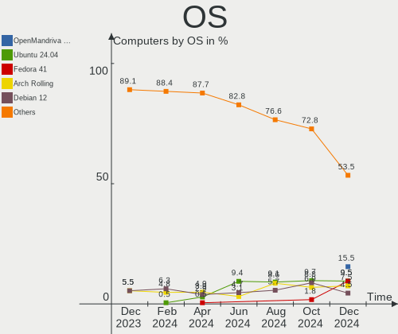

| Name                         | Computers | Percent |
|------------------------------|-----------|---------|
| Ubuntu 22.04                 | 34        | 17.35%  |
| Linux Mint 21.1              | 16        | 8.16%   |
| OpenMandriva 23.01           | 14        | 7.14%   |
| Debian 11                    | 12        | 6.12%   |
| Pop!_OS 22.04                | 11        | 5.61%   |
| Zorin 16                     | 9         | 4.59%   |
| Fedora 37                    | 8         | 4.08%   |
| Arch Rolling                 | 8         | 4.08%   |
| Ubuntu 22.10                 | 7         | 3.57%   |
| OpenMandriva 4.3             | 7         | 3.57%   |
| KDE neon 22.04               | 7         | 3.57%   |
| Ubuntu 20.04                 | 5         | 2.55%   |
| Manjaro                      | 5         | 2.55%   |
| Nobara 37                    | 4         | 2.04%   |
| SteamOS 3.4.4                | 3         | 1.53%   |
| Linux Mint 20.3              | 3         | 1.53%   |
| Kubuntu 22.04                | 3         | 1.53%   |
| Kali 2022.4                  | 3         | 1.53%   |
| Ubuntu 18.04                 | 2         | 1.02%   |
| Debian                       | 2         | 1.02%   |
| ArcoLinux Rolling            | 2         | 1.02%   |
| Xubuntu 22.10                | 1         | 0.51%   |
| XeroG                        | 1         | 0.51%   |
| Ubuntu Studio 22.10          | 1         | 0.51%   |
| Ubuntu Budgie 22.10          | 1         | 0.51%   |
| Raspbian                     | 1         | 0.51%   |
| Q4OS 4                       | 1         | 0.51%   |
| PureOS 10.0                  | 1         | 0.51%   |
| openSUSE Tumbleweed-XXXXXXXX | 1         | 0.51%   |
| openSUSE Microos-XXXXXXXX    | 1         | 0.51%   |
| OpenMandriva 4.50            | 1         | 0.51%   |
| OpenMandriva 22.12           | 1         | 0.51%   |
| NixOS 22.11                  | 1         | 0.51%   |
| MX 21                        | 1         | 0.51%   |
| Manjaro 22.0.4               | 1         | 0.51%   |
| Manjaro 22.0.3               | 1         | 0.51%   |
| Makulu Bld-2022.12.04        | 1         | 0.51%   |
| Lubuntu 18.04                | 1         | 0.51%   |
| Linux Mint 20.1              | 1         | 0.51%   |
| Kubuntu 23.04                | 1         | 0.51%   |

OS Family
---------

OS without a version

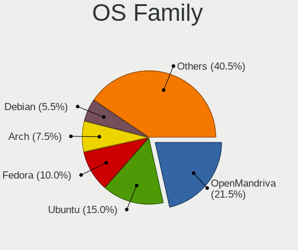

| Name          | Computers | Percent |
|---------------|-----------|---------|
| Ubuntu        | 48        | 24.49%  |
| OpenMandriva  | 23        | 11.73%  |
| Linux Mint    | 20        | 10.2%   |
| Debian        | 14        | 7.14%   |
| Pop!_OS       | 11        | 5.61%   |
| Zorin         | 9         | 4.59%   |
| Fedora        | 9         | 4.59%   |
| Arch          | 8         | 4.08%   |
| Manjaro       | 7         | 3.57%   |
| KDE neon      | 7         | 3.57%   |
| Kubuntu       | 5         | 2.55%   |
| Nobara        | 4         | 2.04%   |
| SteamOS       | 3         | 1.53%   |
| Kali          | 3         | 1.53%   |
| openSUSE      | 2         | 1.02%   |
| Elementary    | 2         | 1.02%   |
| ArcoLinux     | 2         | 1.02%   |
| Xubuntu       | 1         | 0.51%   |
| XeroG         | 1         | 0.51%   |
| Ubuntu Studio | 1         | 0.51%   |
| Ubuntu Budgie | 1         | 0.51%   |
| Raspbian      | 1         | 0.51%   |
| Q4OS          | 1         | 0.51%   |
| PureOS        | 1         | 0.51%   |
| NixOS         | 1         | 0.51%   |
| MX            | 1         | 0.51%   |
| Makulu        | 1         | 0.51%   |
| Lubuntu       | 1         | 0.51%   |
| Gentoo        | 1         | 0.51%   |
| EndeavourOS   | 1         | 0.51%   |
| Clear Linux   | 1         | 0.51%   |
| BunsenLabs    | 1         | 0.51%   |
| BigLinux      | 1         | 0.51%   |
| Archcraft     | 1         | 0.51%   |
| antergos      | 1         | 0.51%   |
| AlmaLinux     | 1         | 0.51%   |

Kernel
------

Version of the Linux kernel

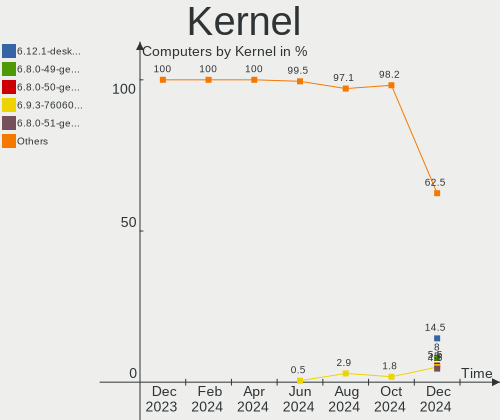

| Version                      | Computers | Percent |
|------------------------------|-----------|---------|
| 5.15.0-60-generic            | 26        | 13.27%  |
| 5.15.0-58-generic            | 23        | 11.73%  |
| 5.19.0-32-generic            | 12        | 6.12%   |
| 5.10.0-21-amd64              | 12        | 6.12%   |
| 6.1.1-desktop-1omv2290       | 9         | 4.59%   |
| 6.0.12-76060006-generic      | 8         | 4.08%   |
| 5.19.0-29-generic            | 5         | 2.55%   |
| 6.1.9-arch1-1                | 4         | 2.04%   |
| 6.1.11-200.fc37.x86_64       | 4         | 2.04%   |
| 5.16.13-desktop-1omv4003     | 4         | 2.04%   |
| 6.1.9-1-MANJARO              | 3         | 1.53%   |
| 6.1.4-desktop-1omv2301       | 3         | 1.53%   |
| 6.1.12-arch1-1               | 3         | 1.53%   |
| 6.1.11-76060111-generic      | 3         | 1.53%   |
| 5.4.0-139-generic            | 3         | 1.53%   |
| 5.19.0-31-generic            | 3         | 1.53%   |
| 5.16.7-desktop-1omv4003      | 3         | 1.53%   |
| 5.15.0-43-generic            | 3         | 1.53%   |
| 5.13.0-valve36-1-neptune     | 3         | 1.53%   |
| 6.1.9-arch1-2                | 2         | 1.02%   |
| 6.1.9-200.fsync.fc37.x86_64  | 2         | 1.02%   |
| 6.1.12-1-MANJARO             | 2         | 1.02%   |
| 6.1.11-arch1-1               | 2         | 1.02%   |
| 6.1.10-1-default             | 2         | 1.02%   |
| 6.1.0-3-amd64                | 2         | 1.02%   |
| 6.1.0-1006-oem               | 2         | 1.02%   |
| 6.0.0-kali6-amd64            | 2         | 1.02%   |
| 5.4.0-137-generic            | 2         | 1.02%   |
| 5.19.0-21-generic            | 2         | 1.02%   |
| 6.2.0-desktop-0.rc2.1omv2301 | 1         | 0.51%   |
| 6.2.0-060200-generic         | 1         | 0.51%   |
| 6.1.9-zen1-1-zen             | 1         | 0.51%   |
| 6.1.9-x64v1-xanmod1-1        | 1         | 0.51%   |
| 6.1.9-200.fc37.x86_64        | 1         | 0.51%   |
| 6.1.6-203.fsync.fc37.x86_64  | 1         | 0.51%   |
| 6.1.5-060105-generic         | 1         | 0.51%   |
| 6.1.4-desktop-gcc-1omv2301   | 1         | 0.51%   |
| 6.1.13-surface               | 1         | 0.51%   |
| 6.1.12-zen1-1-zen            | 1         | 0.51%   |
| 6.1.12-200.fc37.x86_64       | 1         | 0.51%   |

Kernel Family
-------------

Linux kernel without a distro release

| Version | Computers | Percent |
|---------|-----------|---------|
| 5.15.0  | 56        | 28.57%  |
| 5.19.0  | 25        | 12.76%  |
| 6.1.9   | 14        | 7.14%   |
| 5.10.0  | 14        | 7.14%   |
| 6.1.11  | 12        | 6.12%   |
| 6.1.1   | 9         | 4.59%   |
| 6.0.12  | 9         | 4.59%   |
| 6.1.12  | 8         | 4.08%   |
| 5.4.0   | 7         | 3.57%   |
| 6.1.0   | 5         | 2.55%   |
| 6.1.4   | 4         | 2.04%   |
| 6.1.10  | 4         | 2.04%   |
| 6.0.0   | 4         | 2.04%   |
| 5.16.13 | 4         | 2.04%   |
| 5.13.0  | 4         | 2.04%   |
| 5.16.7  | 3         | 1.53%   |
| 6.2.0   | 2         | 1.02%   |
| 6.1.6   | 1         | 0.51%   |
| 6.1.5   | 1         | 0.51%   |
| 6.1.13  | 1         | 0.51%   |
| 6.0.7   | 1         | 0.51%   |
| 6.0.10  | 1         | 0.51%   |
| 5.17.9  | 1         | 0.51%   |
| 5.15.95 | 1         | 0.51%   |
| 5.15.94 | 1         | 0.51%   |
| 5.15.93 | 1         | 0.51%   |
| 5.15.90 | 1         | 0.51%   |
| 5.15.85 | 1         | 0.51%   |
| 5.14.0  | 1         | 0.51%   |

Kernel Major Ver.
-----------------

Linux kernel major version

| Version | Computers | Percent |
|---------|-----------|---------|
| 5.15    | 61        | 31.12%  |
| 6.1     | 59        | 30.1%   |
| 5.19    | 25        | 12.76%  |
| 6.0     | 15        | 7.65%   |
| 5.10    | 14        | 7.14%   |
| 5.4     | 7         | 3.57%   |
| 5.16    | 7         | 3.57%   |
| 5.13    | 4         | 2.04%   |
| 6.2     | 2         | 1.02%   |
| 5.17    | 1         | 0.51%   |
| 5.14    | 1         | 0.51%   |

Arch
----

OS architecture (x86_64, i586, etc.)

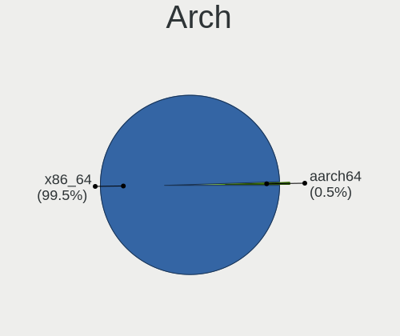

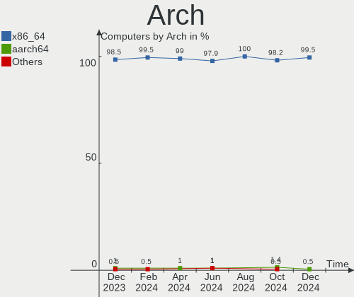

| Name   | Computers | Percent |
|--------|-----------|---------|
| x86_64 | 194       | 98.98%  |
| i686   | 1         | 0.51%   |
| armv7l | 1         | 0.51%   |

DE
--

Desktop Environment

| Name            | Computers | Percent |
|-----------------|-----------|---------|
| GNOME           | 93        | 47.45%  |
| KDE5            | 53        | 27.04%  |
| X-Cinnamon      | 16        | 8.16%   |
| XFCE            | 11        | 5.61%   |
| Unknown         | 10        | 5.1%    |
| LXDE            | 3         | 1.53%   |
| Pantheon        | 2         | 1.02%   |
| MATE            | 2         | 1.02%   |
| xmonad          | 1         | 0.51%   |
| Trinity         | 1         | 0.51%   |
| i3              | 1         | 0.51%   |
| GNOME Flashback | 1         | 0.51%   |
| Cinnamon        | 1         | 0.51%   |
| Budgie          | 1         | 0.51%   |

Display Server
--------------

X11 or Wayland

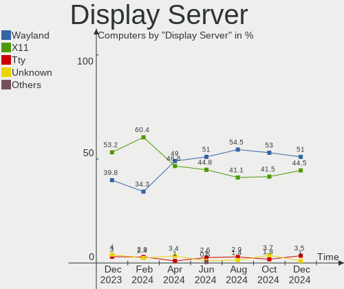

| Name    | Computers | Percent |
|---------|-----------|---------|
| X11     | 130       | 66.33%  |
| Wayland | 56        | 28.57%  |
| Unknown | 6         | 3.06%   |
| Tty     | 4         | 2.04%   |

Display Manager
---------------

SDDM, LightDM, etc.

| Name    | Computers | Percent |
|---------|-----------|---------|
| Unknown | 75        | 38.27%  |
| GDM3    | 47        | 23.98%  |
| SDDM    | 31        | 15.82%  |
| LightDM | 25        | 12.76%  |
| GDM     | 16        | 8.16%   |
| TDM     | 1         | 0.51%   |
| LXDM    | 1         | 0.51%   |

OS Lang
-------

Language

| Lang    | Computers | Percent |
|---------|-----------|---------|
| en_GB   | 161       | 82.14%  |
| en_US   | 26        | 13.27%  |
| pl_PL   | 2         | 1.02%   |
| fr_FR   | 2         | 1.02%   |
| Unknown | 2         | 1.02%   |
| lt_LT   | 1         | 0.51%   |
| et_EE   | 1         | 0.51%   |
| C       | 1         | 0.51%   |

Boot Mode
---------

EFI or BIOS

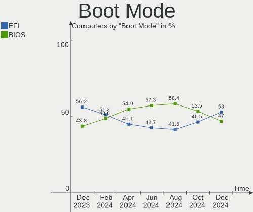

| Mode | Computers | Percent |
|------|-----------|---------|
| BIOS | 99        | 50.51%  |
| EFI  | 97        | 49.49%  |

Filesystem
----------

Type of filesystem

| Type    | Computers | Percent |
|---------|-----------|---------|
| Ext4    | 157       | 80.1%   |
| Btrfs   | 22        | 11.22%  |
| Overlay | 9         | 4.59%   |
| Xfs     | 4         | 2.04%   |
| Zfs     | 3         | 1.53%   |
| F2fs    | 1         | 0.51%   |

Part. scheme
------------

Scheme of partitioning

| Type    | Computers | Percent |
|---------|-----------|---------|
| GPT     | 112       | 57.14%  |
| Unknown | 63        | 32.14%  |
| MBR     | 21        | 10.71%  |

Dual Boot with Linux/BSD
------------------------

Hosting more than one Linux/BSD

| Dual boot | Computers | Percent |
|-----------|-----------|---------|
| No        | 172       | 87.76%  |
| Yes       | 24        | 12.24%  |

Dual Boot (Win)
---------------

Hosting Linux and Windows

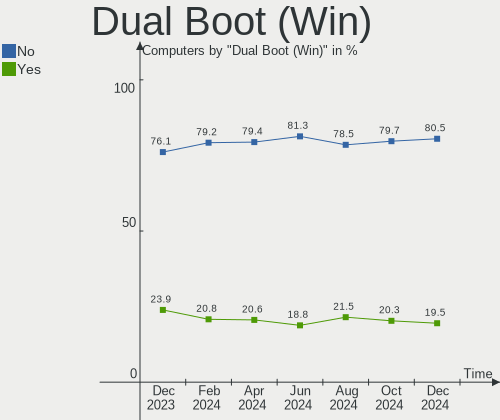

| Dual boot | Computers | Percent |
|-----------|-----------|---------|
| No        | 143       | 72.96%  |
| Yes       | 53        | 27.04%  |

Board
-----

Vendor
------

Motherboard manufacturer

| Name                    | Computers | Percent |
|-------------------------|-----------|---------|
| Lenovo                  | 29        | 14.8%   |
| Hewlett-Packard         | 25        | 12.76%  |
| Dell                    | 25        | 12.76%  |
| ASUSTek Computer        | 24        | 12.24%  |
| Gigabyte Technology     | 14        | 7.14%   |
| MSI                     | 12        | 6.12%   |
| Acer                    | 11        | 5.61%   |
| Apple                   | 9         | 4.59%   |
| AZW                     | 6         | 3.06%   |
| HUAWEI                  | 4         | 2.04%   |
| ASRock                  | 4         | 2.04%   |
| Valve                   | 3         | 1.53%   |
| Toshiba                 | 3         | 1.53%   |
| Intel                   | 3         | 1.53%   |
| GEO                     | 3         | 1.53%   |
| PC Specialist           | 2         | 1.02%   |
| Google                  | 2         | 1.02%   |
| Unknown                 | 2         | 1.02%   |
| Umbrel                  | 1         | 0.51%   |
| Star Labs               | 1         | 0.51%   |
| Sony                    | 1         | 0.51%   |
| Samsung Electronics     | 1         | 0.51%   |
| Raspberry Pi Foundation | 1         | 0.51%   |
| Panasonic               | 1         | 0.51%   |
| Novatech                | 1         | 0.51%   |
| Notebook                | 1         | 0.51%   |
| Microsoft               | 1         | 0.51%   |
| Linx                    | 1         | 0.51%   |
| Framework               | 1         | 0.51%   |
| Biostar                 | 1         | 0.51%   |
| AMI                     | 1         | 0.51%   |
| Alienware               | 1         | 0.51%   |
| AAEON                   | 1         | 0.51%   |

Model
-----

Motherboard model

| Name                                 | Computers | Percent |
|--------------------------------------|-----------|---------|
| AZW SER                              | 4         | 2.04%   |
| Valve Jupiter                        | 3         | 1.53%   |
| MSI MS-7758                          | 2         | 1.02%   |
| HUAWEI NBD-WXX9                      | 2         | 1.02%   |
| HP Pavilion g6                       | 2         | 1.02%   |
| HP Notebook                          | 2         | 1.02%   |
| ASUS ROG STRIX B550-F GAMING         | 2         | 1.02%   |
| Unknown                              | 2         | 1.02%   |
| Umbrel Home                          | 1         | 0.51%   |
| Toshiba Satellite Pro C850-10N       | 1         | 0.51%   |
| Toshiba Satellite L50D-B             | 1         | 0.51%   |
| Toshiba Satellite C850-1GF           | 1         | 0.51%   |
| Star Labs StarBook                   | 1         | 0.51%   |
| Sony SVF1521Q1EW                     | 1         | 0.51%   |
| Samsung 530U3BI/530U4BI/530U4BH      | 1         | 0.51%   |
| RPi Raspberry Pi 4 Model B Rev 1.5   | 1         | 0.51%   |
| PC Specialist PD5x_7xPNP_PNN_PNT     | 1         | 0.51%   |
| PC Specialist NJ50_70CU              | 1         | 0.51%   |
| Panasonic CF-31WEUEEBE               | 1         | 0.51%   |
| Novatech NL40_50CU                   | 1         | 0.51%   |
| Notebook NL5xNU                      | 1         | 0.51%   |
| MSI MS-7D89                          | 1         | 0.51%   |
| MSI MS-7D36                          | 1         | 0.51%   |
| MSI MS-7D32                          | 1         | 0.51%   |
| MSI MS-7C56                          | 1         | 0.51%   |
| MSI MS-7B98                          | 1         | 0.51%   |
| MSI MS-7B85                          | 1         | 0.51%   |
| MSI MS-7B09                          | 1         | 0.51%   |
| MSI MS-7919                          | 1         | 0.51%   |
| MSI Modern 14 B10MW                  | 1         | 0.51%   |
| MSI GS66 Stealth 10SF                | 1         | 0.51%   |
| Microsoft Surface Pro 3              | 1         | 0.51%   |
| Linx LINX1010B                       | 1         | 0.51%   |
| Lenovo Yoga Slim 7 ProX 14ARH7 82TL  | 1         | 0.51%   |
| Lenovo Yoga 7 14ARB7 82QF            | 1         | 0.51%   |
| Lenovo Yoga 7 14ACN6 82N7            | 1         | 0.51%   |
| Lenovo V15-ADA 82C7                  | 1         | 0.51%   |
| Lenovo V14 G2 ALC 82KC               | 1         | 0.51%   |
| Lenovo ThinkPad X390 Yoga 20NN0026UK | 1         | 0.51%   |
| Lenovo ThinkPad X280 20KEA0VCUK      | 1         | 0.51%   |

Model Family
------------

Motherboard model prefix

| Name                   | Computers | Percent |
|------------------------|-----------|---------|
| Lenovo ThinkPad        | 14        | 7.14%   |
| Dell Latitude          | 9         | 4.59%   |
| ASUS ROG               | 8         | 4.08%   |
| Acer Aspire            | 7         | 3.57%   |
| Dell OptiPlex          | 5         | 2.55%   |
| HP EliteBook           | 4         | 2.04%   |
| Dell Inspiron          | 4         | 2.04%   |
| AZW SER                | 4         | 2.04%   |
| ASUS PRIME             | 4         | 2.04%   |
| Valve Jupiter          | 3         | 1.53%   |
| Toshiba Satellite      | 3         | 1.53%   |
| Lenovo Yoga            | 3         | 1.53%   |
| Lenovo IdeaPad         | 3         | 1.53%   |
| HP Pavilion            | 3         | 1.53%   |
| HP Laptop              | 3         | 1.53%   |
| Dell XPS               | 3         | 1.53%   |
| Dell Precision         | 3         | 1.53%   |
| MSI MS-7758            | 2         | 1.02%   |
| Lenovo ThinkCentre     | 2         | 1.02%   |
| Lenovo IdeaCentre      | 2         | 1.02%   |
| HUAWEI NBD-WXX9        | 2         | 1.02%   |
| HP Notebook            | 2         | 1.02%   |
| HP EliteDesk           | 2         | 1.02%   |
| HP Compaq              | 2         | 1.02%   |
| Gigabyte X570          | 2         | 1.02%   |
| GEO GeoBook            | 2         | 1.02%   |
| ASUS TUF               | 2         | 1.02%   |
| ASUS M5A97             | 2         | 1.02%   |
| Acer TravelMate        | 2         | 1.02%   |
| Unknown                | 2         | 1.02%   |
| Umbrel Home            | 1         | 0.51%   |
| Star Labs StarBook     | 1         | 0.51%   |
| Sony SVF1521Q1EW       | 1         | 0.51%   |
| Samsung 530U3BI        | 1         | 0.51%   |
| RPi Raspberry          | 1         | 0.51%   |
| PC Specialist PD5x     | 1         | 0.51%   |
| PC Specialist NJ50     | 1         | 0.51%   |
| Panasonic CF-31WEUEEBE | 1         | 0.51%   |
| Novatech NL40          | 1         | 0.51%   |
| Notebook NL5xNU        | 1         | 0.51%   |

MFG Year
--------

Motherboard manufacture year

| Year    | Computers | Percent |
|---------|-----------|---------|
| 2022    | 25        | 12.76%  |
| 2020    | 23        | 11.73%  |
| 2012    | 20        | 10.2%   |
| 2019    | 19        | 9.69%   |
| 2021    | 18        | 9.18%   |
| 2018    | 13        | 6.63%   |
| 2017    | 13        | 6.63%   |
| 2014    | 13        | 6.63%   |
| 2015    | 10        | 5.1%    |
| 2013    | 9         | 4.59%   |
| 2011    | 9         | 4.59%   |
| 2016    | 7         | 3.57%   |
| 2010    | 5         | 2.55%   |
| 2009    | 5         | 2.55%   |
| 2023    | 3         | 1.53%   |
| 2008    | 2         | 1.02%   |
| 2007    | 1         | 0.51%   |
| Unknown | 1         | 0.51%   |

Form Factor
-----------

Physical design of the computer

| Name           | Computers | Percent |
|----------------|-----------|---------|
| Notebook       | 100       | 51.02%  |
| Desktop        | 69        | 35.2%   |
| Convertible    | 10        | 5.1%    |
| Mini pc        | 8         | 4.08%   |
| All in one     | 5         | 2.55%   |
| Server         | 2         | 1.02%   |
| System on chip | 1         | 0.51%   |
| Tablet         | 1         | 0.51%   |

Secure Boot
-----------

Enabled or disabled

| State    | Computers | Percent |
|----------|-----------|---------|
| Disabled | 189       | 96.43%  |
| Enabled  | 7         | 3.57%   |

Coreboot
--------

Have coreboot on board

| Used | Computers | Percent |
|------|-----------|---------|
| No   | 193       | 98.47%  |
| Yes  | 3         | 1.53%   |

RAM Size
--------

Total RAM memory

| Size in GB      | Computers | Percent |
|-----------------|-----------|---------|
| 4.01-8.0        | 54        | 27.55%  |
| 8.01-16.0       | 38        | 19.39%  |
| 16.01-24.0      | 36        | 18.37%  |
| 32.01-64.0      | 26        | 13.27%  |
| 3.01-4.0        | 18        | 9.18%   |
| 64.01-256.0     | 10        | 5.1%    |
| 1.01-2.0        | 8         | 4.08%   |
| 24.01-32.0      | 4         | 2.04%   |
| More than 256.0 | 1         | 0.51%   |
| 2.01-3.0        | 1         | 0.51%   |

RAM Used
--------

Used RAM memory

| Used GB    | Computers | Percent |
|------------|-----------|---------|
| 1.01-2.0   | 61        | 31.12%  |
| 2.01-3.0   | 49        | 25%     |
| 4.01-8.0   | 35        | 17.86%  |
| 3.01-4.0   | 28        | 14.29%  |
| 8.01-16.0  | 15        | 7.65%   |
| 0.51-1.0   | 6         | 3.06%   |
| 16.01-24.0 | 1         | 0.51%   |
| 0.01-0.5   | 1         | 0.51%   |

Total Drives
------------

Number of drives on board

| Drives | Computers | Percent |
|--------|-----------|---------|
| 1      | 112       | 57.14%  |
| 2      | 44        | 22.45%  |
| 3      | 17        | 8.67%   |
| 5      | 7         | 3.57%   |
| 4      | 7         | 3.57%   |
| 6      | 4         | 2.04%   |
| 7      | 2         | 1.02%   |
| 0      | 2         | 1.02%   |
| 10     | 1         | 0.51%   |

Has CD-ROM
----------

Has CD-ROM on board

| Presented | Computers | Percent |
|-----------|-----------|---------|
| No        | 132       | 67.35%  |
| Yes       | 64        | 32.65%  |

Has Ethernet
------------

Has Ethernet on board

| Presented | Computers | Percent |
|-----------|-----------|---------|
| Yes       | 158       | 80.61%  |
| No        | 38        | 19.39%  |

Has WiFi
--------

Has WiFi module

| Presented | Computers | Percent |
|-----------|-----------|---------|
| Yes       | 160       | 81.63%  |
| No        | 36        | 18.37%  |

Has Bluetooth
-------------

Has Bluetooth module

| Presented | Computers | Percent |
|-----------|-----------|---------|
| Yes       | 134       | 68.37%  |
| No        | 62        | 31.63%  |

Location
--------

Country
-------

Geographic location (country)

| Country | Computers | Percent |
|---------|-----------|---------|
| UK      | 196       | 100%    |

City
----

Geographic location (city)

| City               | Computers | Percent |
|--------------------|-----------|---------|
| London             | 24        | 12.24%  |
| Manchester         | 7         | 3.57%   |
| Birmingham         | 5         | 2.55%   |
| Nottingham         | 4         | 2.04%   |
| Milton Keynes      | 4         | 2.04%   |
| Glasgow            | 4         | 2.04%   |
| Plymouth           | 3         | 1.53%   |
| Bradford           | 3         | 1.53%   |
| Wigan              | 2         | 1.02%   |
| Welwyn Garden City | 2         | 1.02%   |
| Walsall            | 2         | 1.02%   |
| Wallsend           | 2         | 1.02%   |
| Uttoxeter          | 2         | 1.02%   |
| Telford            | 2         | 1.02%   |
| Sunderland         | 2         | 1.02%   |
| Stoke-on-Trent     | 2         | 1.02%   |
| St Helens          | 2         | 1.02%   |
| Southampton        | 2         | 1.02%   |
| Rotherham          | 2         | 1.02%   |
| Portsmouth         | 2         | 1.02%   |
| Loughborough       | 2         | 1.02%   |
| Liverpool          | 2         | 1.02%   |
| Leyland            | 2         | 1.02%   |
| Leeds              | 2         | 1.02%   |
| Huddersfield       | 2         | 1.02%   |
| Deeside            | 2         | 1.02%   |
| City of London     | 2         | 1.02%   |
| Bury               | 2         | 1.02%   |
| Bristol            | 2         | 1.02%   |
| York               | 1         | 0.51%   |
| Worksop            | 1         | 0.51%   |
| Woodford Green     | 1         | 0.51%   |
| Wolverhampton      | 1         | 0.51%   |
| Wokingham          | 1         | 0.51%   |
| Wigton             | 1         | 0.51%   |
| Watford            | 1         | 0.51%   |
| Walthamstow        | 1         | 0.51%   |
| Wallasey           | 1         | 0.51%   |
| Uxbridge           | 1         | 0.51%   |
| Twickenham         | 1         | 0.51%   |

Drives
------

Drive Vendor
------------

Hard drive vendors

| Vendor                      | Computers | Drives | Percent |
|-----------------------------|-----------|--------|---------|
| Samsung Electronics         | 48        | 60     | 15.89%  |
| Seagate                     | 42        | 56     | 13.91%  |
| WDC                         | 37        | 50     | 12.25%  |
| Sandisk                     | 26        | 30     | 8.61%   |
| Toshiba                     | 18        | 18     | 5.96%   |
| Crucial                     | 16        | 17     | 5.3%    |
| Unknown                     | 14        | 16     | 4.64%   |
| Micron Technology           | 9         | 9      | 2.98%   |
| Intel                       | 9         | 10     | 2.98%   |
| Kingston                    | 8         | 8      | 2.65%   |
| SK hynix                    | 5         | 5      | 1.66%   |
| Apple                       | 5         | 7      | 1.66%   |
| Hitachi                     | 4         | 5      | 1.32%   |
| Unknown                     | 4         | 4      | 1.32%   |
| Silicon Motion              | 3         | 3      | 0.99%   |
| Phison Electronics          | 3         | 4      | 0.99%   |
| Kingston Technology Company | 3         | 3      | 0.99%   |
| HGST                        | 3         | 3      | 0.99%   |
| China                       | 3         | 3      | 0.99%   |
| ADATA Technology            | 3         | 4      | 0.99%   |
| A-DATA Technology           | 3         | 3      | 0.99%   |
| Realtek                     | 2         | 2      | 0.66%   |
| PNY                         | 2         | 2      | 0.66%   |
| Micron/Crucial Technology   | 2         | 2      | 0.66%   |
| Hoodisk                     | 2         | 2      | 0.66%   |
| Drevo                       | 2         | 2      | 0.66%   |
| XUM                         | 1         | 1      | 0.33%   |
| Vaseky                      | 1         | 1      | 0.33%   |
| USB3.0                      | 1         | 1      | 0.33%   |
| Union Memory                | 1         | 1      | 0.33%   |
| UMIS                        | 1         | 1      | 0.33%   |
| Transcend                   | 1         | 1      | 0.33%   |
| TCSUNBOW                    | 1         | 1      | 0.33%   |
| Star Drive                  | 1         | 1      | 0.33%   |
| SSK                         | 1         | 1      | 0.33%   |
| SPCC                        | 1         | 1      | 0.33%   |
| SABRENT                     | 1         | 1      | 0.33%   |
| Phison                      | 1         | 1      | 0.33%   |
| Netac                       | 1         | 1      | 0.33%   |
| MSI                         | 1         | 1      | 0.33%   |

Drive Model
-----------

Hard drive models

| Model                                                           | Computers | Percent |
|-----------------------------------------------------------------|-----------|---------|
| Unknown MMC Card  64GB                                          | 4         | 1.2%    |
| Toshiba MQ01ABD100 1TB                                          | 4         | 1.2%    |
| Seagate ST500DM002-1BD142 500GB                                 | 4         | 1.2%    |
| Samsung NVMe SSD Controller SM961/PM961/SM963 512GB             | 4         | 1.2%    |
| Samsung NVMe SSD Controller PM9A1/PM9A3/980PRO 960GB            | 4         | 1.2%    |
| Unknown                                                         | 4         | 1.2%    |
| WDC WDS500G2B0A-00SM50 500GB SSD                                | 3         | 0.9%    |
| WDC WD10EURX-83UY4Y0 1TB                                        | 3         | 0.9%    |
| Toshiba XG6 NVMe SSD Controller 512GB                           | 3         | 0.9%    |
| Seagate ST3500312CS 500GB                                       | 3         | 0.9%    |
| Seagate ST1000DM003-1SB102 1TB                                  | 3         | 0.9%    |
| Sandisk WD_BLACK SN770 2TB                                      | 3         | 0.9%    |
| Samsung SSD 870 EVO 1TB                                         | 3         | 0.9%    |
| Samsung SSD 850 EVO 250GB                                       | 3         | 0.9%    |
| Samsung NVMe SSD Controller SM981/PM981/PM983 250GB             | 3         | 0.9%    |
| Phison E16 PCIe4 NVMe Controller 512GB                          | 3         | 0.9%    |
| Micron 2400_MTFDKBA512QFM 512GB                                 | 3         | 0.9%    |
| Kingston SA400S37240G 240GB SSD                                 | 3         | 0.9%    |
| WDC WD10EZEX-08M2NA0 1TB                                        | 2         | 0.6%    |
| Unknown MMC Card  32GB                                          | 2         | 0.6%    |
| Unknown MMC Card  16GB                                          | 2         | 0.6%    |
| Seagate ST4000DM004-2CV104 4TB                                  | 2         | 0.6%    |
| Seagate ST3500418AS 500GB                                       | 2         | 0.6%    |
| Seagate ST2000LM003 HN-M201RAD 2TB                              | 2         | 0.6%    |
| Seagate ST1000LM024 HN-M101MBB 1TB                              | 2         | 0.6%    |
| SanDisk SSD PLUS 240GB                                          | 2         | 0.6%    |
| SanDisk SDSSDP128G 128GB                                        | 2         | 0.6%    |
| SanDisk SDSSDHII960G 960GB                                      | 2         | 0.6%    |
| Samsung SSD 970 EVO Plus 500GB                                  | 2         | 0.6%    |
| Samsung SSD 870 QVO 1TB                                         | 2         | 0.6%    |
| Samsung SSD 860 EVO 500GB                                       | 2         | 0.6%    |
| Samsung SSD 850 EVO 500GB                                       | 2         | 0.6%    |
| Samsung MZAL4512HBLU-00BL2 512GB                                | 2         | 0.6%    |
| Samsung HD204UI 2TB                                             | 2         | 0.6%    |
| Kingston Company OM3PDP3 NVMe SSD 512GB                         | 2         | 0.6%    |
| Crucial M4-CT128M4SSD2 128GB                                    | 2         | 0.6%    |
| Crucial CT2000MX500SSD1 2TB                                     | 2         | 0.6%    |
| Crucial CT1000MX500SSD1 1TB                                     | 2         | 0.6%    |
| Apple S3X NVMe Controller 1TB                                   | 2         | 0.6%    |
| ADATA XPG SX8200 Pro PCIe Gen3x4 M.2 2280 Solid State Drive 2TB | 2         | 0.6%    |

HDD Vendor
----------

Hard disk drive vendors

| Vendor              | Computers | Drives | Percent |
|---------------------|-----------|--------|---------|
| Seagate             | 41        | 53     | 41.84%  |
| WDC                 | 26        | 38     | 26.53%  |
| Toshiba             | 12        | 12     | 12.24%  |
| Samsung Electronics | 5         | 5      | 5.1%    |
| Hitachi             | 4         | 5      | 4.08%   |
| HGST                | 3         | 3      | 3.06%   |
| Apple               | 2         | 2      | 2.04%   |
| USB3.0              | 1         | 1      | 1.02%   |
| Unknown             | 1         | 1      | 1.02%   |
| SABRENT             | 1         | 1      | 1.02%   |
| Hewlett-Packard     | 1         | 4      | 1.02%   |
| ASMedia             | 1         | 1      | 1.02%   |

SSD Vendor
----------

Solid state drive vendors

| Vendor              | Computers | Drives | Percent |
|---------------------|-----------|--------|---------|
| Samsung Electronics | 21        | 24     | 22.83%  |
| Crucial             | 13        | 14     | 14.13%  |
| SanDisk             | 12        | 13     | 13.04%  |
| WDC                 | 6         | 6      | 6.52%   |
| Kingston            | 6         | 6      | 6.52%   |
| Micron Technology   | 3         | 3      | 3.26%   |
| China               | 3         | 3      | 3.26%   |
| PNY                 | 2         | 2      | 2.17%   |
| Intel               | 2         | 2      | 2.17%   |
| Drevo               | 2         | 2      | 2.17%   |
| A-DATA Technology   | 2         | 2      | 2.17%   |
| XUM                 | 1         | 1      | 1.09%   |
| Vaseky              | 1         | 1      | 1.09%   |
| Transcend           | 1         | 1      | 1.09%   |
| Toshiba             | 1         | 1      | 1.09%   |
| TCSUNBOW            | 1         | 1      | 1.09%   |
| SPCC                | 1         | 1      | 1.09%   |
| SK hynix            | 1         | 1      | 1.09%   |
| Seagate             | 1         | 1      | 1.09%   |
| Netac               | 1         | 1      | 1.09%   |
| LT                  | 1         | 1      | 1.09%   |
| LITEON              | 1         | 1      | 1.09%   |
| KIOXIA-EXCERIA      | 1         | 1      | 1.09%   |
| Kimtigo             | 1         | 1      | 1.09%   |
| Hoodisk             | 1         | 1      | 1.09%   |
| GOODRAM             | 1         | 1      | 1.09%   |
| Gigabyte Technology | 1         | 1      | 1.09%   |
| Corsair             | 1         | 1      | 1.09%   |
| BHT                 | 1         | 1      | 1.09%   |
| Apple               | 1         | 1      | 1.09%   |
| Unknown             | 1         | 1      | 1.09%   |

Drive Kind
----------

HDD or SSD

| Kind    | Computers | Drives | Percent |
|---------|-----------|--------|---------|
| NVMe    | 86        | 109    | 31.97%  |
| SSD     | 83        | 97     | 30.86%  |
| HDD     | 78        | 126    | 29%     |
| MMC     | 18        | 21     | 6.69%   |
| Unknown | 4         | 4      | 1.49%   |

Drive Connector
---------------

SATA, SAS, NVMe, etc.

| Type | Computers | Drives | Percent |
|------|-----------|--------|---------|
| SATA | 129       | 207    | 52.23%  |
| NVMe | 86        | 107    | 34.82%  |
| MMC  | 18        | 21     | 7.29%   |
| SAS  | 14        | 22     | 5.67%   |

Drive Size
----------

Size of hard drive

| Size in TB | Computers | Drives | Percent |
|------------|-----------|--------|---------|
| 0.01-0.5   | 90        | 111    | 51.14%  |
| 0.51-1.0   | 49        | 64     | 27.84%  |
| 1.01-2.0   | 19        | 22     | 10.8%   |
| 3.01-4.0   | 8         | 10     | 4.55%   |
| 4.01-10.0  | 5         | 7      | 2.84%   |
| 2.01-3.0   | 4         | 4      | 2.27%   |
| 10.01-20.0 | 1         | 5      | 0.57%   |

Space Total
-----------

Amount of disk space available on the file system

| Size in GB     | Computers | Percent |
|----------------|-----------|---------|
| 251-500        | 45        | 22.96%  |
| 101-250        | 43        | 21.94%  |
| 501-1000       | 31        | 15.82%  |
| More than 3000 | 18        | 9.18%   |
| 1001-2000      | 18        | 9.18%   |
| 1-20           | 12        | 6.12%   |
| 21-50          | 10        | 5.1%    |
| Unknown        | 7         | 3.57%   |
| 2001-3000      | 6         | 3.06%   |
| 51-100         | 6         | 3.06%   |

Space Used
----------

Amount of used disk space

| Used GB        | Computers | Percent |
|----------------|-----------|---------|
| 1-20           | 68        | 34.69%  |
| 21-50          | 35        | 17.86%  |
| 251-500        | 20        | 10.2%   |
| 101-250        | 20        | 10.2%   |
| 51-100         | 16        | 8.16%   |
| 501-1000       | 11        | 5.61%   |
| More than 3000 | 10        | 5.1%    |
| 1001-2000      | 7         | 3.57%   |
| Unknown        | 7         | 3.57%   |
| 2001-3000      | 2         | 1.02%   |

Malfunc. Drives
---------------

Drive models with a malfunction

| Model                                 | Computers | Drives | Percent |
|---------------------------------------|-----------|--------|---------|
| WDC WD5000AAKS-75A7B0 500GB           | 1         | 1      | 4.76%   |
| WDC WD3200AAKX-001CA0 320GB           | 1         | 1      | 4.76%   |
| WDC WD20EARX-008FB0 2TB               | 1         | 1      | 4.76%   |
| WDC WD10EURX-83UY4Y0 1TB              | 1         | 1      | 4.76%   |
| Toshiba MK2552GSX 250GB               | 1         | 1      | 4.76%   |
| Toshiba MK1656GSY 160GB               | 1         | 1      | 4.76%   |
| SK hynix HFS256G3AMNB-2200A 256GB SSD | 1         | 1      | 4.76%   |
| Seagate ST9320423AS 320GB             | 1         | 1      | 4.76%   |
| Seagate ST500LM021-1KJ152 500GB       | 1         | 1      | 4.76%   |
| Seagate ST500DM002-1BC142 500GB       | 1         | 1      | 4.76%   |
| Seagate ST3500418AS 500GB             | 1         | 1      | 4.76%   |
| Seagate ST3500413AS 500GB             | 1         | 1      | 4.76%   |
| Seagate ST3250823AS 250GB             | 1         | 1      | 4.76%   |
| Seagate ST2000DM001-1CH164 2TB        | 1         | 1      | 4.76%   |
| Seagate ST1000LM024 HN-M101MBB 1TB    | 1         | 1      | 4.76%   |
| Samsung Electronics HM501II 500GB     | 1         | 1      | 4.76%   |
| Intel SSDSC2BF180A5L 180GB            | 1         | 1      | 4.76%   |
| Intel SSD 600P Series 512GB           | 1         | 1      | 4.76%   |
| Hitachi HCS5C2020ALA632 2TB           | 1         | 1      | 4.76%   |
| Drevo X1 Pro SSD 128GB                | 1         | 1      | 4.76%   |
| Crucial CT525MX300SSD1 528GB          | 1         | 1      | 4.76%   |

Malfunc. Drive Vendor
---------------------

Vendors of faulty drives

| Vendor              | Computers | Drives | Percent |
|---------------------|-----------|--------|---------|
| Seagate             | 7         | 8      | 35%     |
| WDC                 | 4         | 4      | 20%     |
| Toshiba             | 2         | 2      | 10%     |
| Intel               | 2         | 2      | 10%     |
| SK hynix            | 1         | 1      | 5%      |
| Samsung Electronics | 1         | 1      | 5%      |
| Hitachi             | 1         | 1      | 5%      |
| Drevo               | 1         | 1      | 5%      |
| Crucial             | 1         | 1      | 5%      |

Malfunc. HDD Vendor
-------------------

Vendors of faulty HDD drives

| Vendor              | Computers | Drives | Percent |
|---------------------|-----------|--------|---------|
| Seagate             | 7         | 8      | 46.67%  |
| WDC                 | 4         | 4      | 26.67%  |
| Toshiba             | 2         | 2      | 13.33%  |
| Samsung Electronics | 1         | 1      | 6.67%   |
| Hitachi             | 1         | 1      | 6.67%   |

Malfunc. Drive Kind
-------------------

Kinds of faulty drives

| Kind | Computers | Drives | Percent |
|------|-----------|--------|---------|
| HDD  | 12        | 16     | 70.59%  |
| SSD  | 4         | 4      | 23.53%  |
| NVMe | 1         | 1      | 5.88%   |

Failed Drives
-------------

Failed drive models

Zero info for selected period =(

Failed Drive Vendor
-------------------

Failed drive vendors

Zero info for selected period =(

Drive Status
------------

Number of failed and malfunc. drives

| Status   | Computers | Drives | Percent |
|----------|-----------|--------|---------|
| Detected | 116       | 208    | 54.98%  |
| Works    | 79        | 128    | 37.44%  |
| Malfunc  | 16        | 21     | 7.58%   |

Storage controller
------------------

Storage Vendor
--------------

Storage controller vendors

| Vendor                       | Computers | Percent |
|------------------------------|-----------|---------|
| Intel                        | 110       | 42.64%  |
| AMD                          | 47        | 18.22%  |
| Samsung Electronics          | 26        | 10.08%  |
| SanDisk                      | 17        | 6.59%   |
| Phison Electronics           | 7         | 2.71%   |
| Micron Technology            | 6         | 2.33%   |
| Micron/Crucial Technology    | 5         | 1.94%   |
| Kingston Technology Company  | 5         | 1.94%   |
| ASMedia Technology           | 5         | 1.94%   |
| Toshiba America Info Systems | 4         | 1.55%   |
| ADATA Technology             | 4         | 1.55%   |
| SK hynix                     | 3         | 1.16%   |
| Silicon Motion               | 3         | 1.16%   |
| Nvidia                       | 3         | 1.16%   |
| Union Memory (Shenzhen)      | 2         | 0.78%   |
| JMicron Technology           | 2         | 0.78%   |
| Apple                        | 2         | 0.78%   |
| Seagate Technology           | 1         | 0.39%   |
| Marvell Technology Group     | 1         | 0.39%   |
| Lite-On Technology           | 1         | 0.39%   |
| KIOXIA                       | 1         | 0.39%   |
| Hewlett-Packard              | 1         | 0.39%   |
| Broadcom / LSI               | 1         | 0.39%   |
| Unknown                      | 1         | 0.39%   |

Storage Model
-------------

Storage controller models

| Model                                                                          | Computers | Percent |
|--------------------------------------------------------------------------------|-----------|---------|
| AMD FCH SATA Controller [AHCI mode]                                            | 30        | 10.56%  |
| Intel 7 Series Chipset Family 6-port SATA Controller [AHCI mode]               | 11        | 3.87%   |
| Samsung NVMe SSD Controller SM981/PM981/PM983                                  | 10        | 3.52%   |
| Sandisk Non-Volatile memory controller                                         | 8         | 2.82%   |
| Intel 82801 Mobile SATA Controller [RAID mode]                                 | 8         | 2.82%   |
| Samsung NVMe SSD Controller PM9A1/PM9A3/980PRO                                 | 7         | 2.46%   |
| Micron Non-Volatile memory controller                                          | 6         | 2.11%   |
| Intel Volume Management Device NVMe RAID Controller                            | 6         | 2.11%   |
| Intel 8 Series SATA Controller 1 [AHCI mode]                                   | 6         | 2.11%   |
| AMD SB7x0/SB8x0/SB9x0 SATA Controller [AHCI mode]                              | 6         | 2.11%   |
| Intel 8 Series/C220 Series Chipset Family 6-port SATA Controller 1 [AHCI mode] | 5         | 1.76%   |
| Intel 6 Series/C200 Series Chipset Family 6 port Mobile SATA AHCI Controller   | 5         | 1.76%   |
| Intel 6 Series/C200 Series Chipset Family 6 port Desktop SATA AHCI Controller  | 5         | 1.76%   |
| Intel 200 Series PCH SATA controller [AHCI mode]                               | 5         | 1.76%   |
| ASMedia ASM1062 Serial ATA Controller                                          | 5         | 1.76%   |
| Samsung NVMe SSD Controller SM961/PM961/SM963                                  | 4         | 1.41%   |
| Intel Wildcat Point-LP SATA Controller [AHCI Mode]                             | 4         | 1.41%   |
| Intel Comet Lake SATA AHCI Controller                                          | 4         | 1.41%   |
| Intel Cannon Lake PCH SATA AHCI Controller                                     | 4         | 1.41%   |
| AMD SB7x0/SB8x0/SB9x0 IDE Controller                                           | 4         | 1.41%   |
| AMD SATA controller                                                            | 4         | 1.41%   |
| AMD 500 Series Chipset SATA Controller                                         | 4         | 1.41%   |
| Toshiba America Info Systems XG6 NVMe SSD Controller                           | 3         | 1.06%   |
| Samsung NVMe SSD Controller 980                                                | 3         | 1.06%   |
| Phison E16 PCIe4 NVMe Controller                                               | 3         | 1.06%   |
| Kingston Company OM3PDP3 NVMe SSD                                              | 3         | 1.06%   |
| Intel Sunrise Point-LP SATA Controller [AHCI mode]                             | 3         | 1.06%   |
| Intel SSD 660P Series                                                          | 3         | 1.06%   |
| Intel Non-Volatile memory controller                                           | 3         | 1.06%   |
| Intel Ice Lake-LP SATA Controller [AHCI mode]                                  | 3         | 1.06%   |
| Intel Alder Lake-S PCH SATA Controller [AHCI Mode]                             | 3         | 1.06%   |
| Intel 9 Series Chipset Family SATA Controller [AHCI Mode]                      | 3         | 1.06%   |
| Intel 82801HM/HEM (ICH8M/ICH8M-E) IDE Controller                               | 3         | 1.06%   |
| Intel 7 Series/C210 Series Chipset Family 6-port SATA Controller [AHCI mode]   | 3         | 1.06%   |
| AMD X399 Series Chipset SATA Controller                                        | 3         | 1.06%   |
| AMD 400 Series Chipset SATA Controller                                         | 3         | 1.06%   |
| Union Memory (Shenzhen) Non-Volatile memory controller                         | 2         | 0.7%    |
| SK hynix Platinum P41 NVMe Solid State Drive 2TB                               | 2         | 0.7%    |
| Silicon Motion SM2263EN/SM2263XT SSD Controller                                | 2         | 0.7%    |
| SanDisk WD PC SN810 / Black SN850 NVMe SSD                                     | 2         | 0.7%    |

Storage Kind
------------

Kind of storage controller (IDE, SATA, NVMe, SAS, ...)

| Kind | Computers | Percent |
|------|-----------|---------|
| SATA | 136       | 53.75%  |
| NVMe | 86        | 33.99%  |
| RAID | 16        | 6.32%   |
| IDE  | 14        | 5.53%   |
| SAS  | 1         | 0.4%    |

Processor
---------

CPU Vendor
----------

Processor vendors

| Vendor | Computers | Percent |
|--------|-----------|---------|
| Intel  | 134       | 68.37%  |
| AMD    | 61        | 31.12%  |
| ARM    | 1         | 0.51%   |

CPU Model
---------

Processor models

| Model                                         | Computers | Percent |
|-----------------------------------------------|-----------|---------|
| Intel 11th Gen Core i7-1165G7 @ 2.80GHz       | 4         | 2.04%   |
| Intel Core i5-3320M CPU @ 2.60GHz             | 3         | 1.53%   |
| Intel Core i5-1035G1 CPU @ 1.00GHz            | 3         | 1.53%   |
| Intel Core i5-10210U CPU @ 1.60GHz            | 3         | 1.53%   |
| AMD Ryzen 7 3750H with Radeon Vega Mobile Gfx | 3         | 1.53%   |
| AMD FX-8350 Eight-Core Processor              | 3         | 1.53%   |
| AMD Custom APU 0405                           | 3         | 1.53%   |
| Intel Core i7-3540M CPU @ 3.00GHz             | 2         | 1.02%   |
| Intel Core i5-8350U CPU @ 1.70GHz             | 2         | 1.02%   |
| Intel Core i5-7500 CPU @ 3.40GHz              | 2         | 1.02%   |
| Intel Core i5-7200U CPU @ 2.50GHz             | 2         | 1.02%   |
| Intel Core i5-5300U CPU @ 2.30GHz             | 2         | 1.02%   |
| Intel Core i5-4460 CPU @ 3.20GHz              | 2         | 1.02%   |
| Intel Core i5-4300U CPU @ 1.90GHz             | 2         | 1.02%   |
| Intel Core i5-4210U CPU @ 1.70GHz             | 2         | 1.02%   |
| Intel Core i5-2500K CPU @ 3.30GHz             | 2         | 1.02%   |
| Intel Core i3-2100 CPU @ 3.10GHz              | 2         | 1.02%   |
| Intel Celeron N5105 @ 2.00GHz                 | 2         | 1.02%   |
| Intel Atom x5-Z8350 CPU @ 1.44GHz             | 2         | 1.02%   |
| Intel 12th Gen Core i7-12700H                 | 2         | 1.02%   |
| Intel 12th Gen Core i7-1260P                  | 2         | 1.02%   |
| Intel 11th Gen Core i3-1115G4 @ 3.00GHz       | 2         | 1.02%   |
| AMD Ryzen 9 7950X 16-Core Processor           | 2         | 1.02%   |
| AMD Ryzen 7 4700U with Radeon Graphics        | 2         | 1.02%   |
| AMD Ryzen 7 3700X 8-Core Processor            | 2         | 1.02%   |
| AMD Ryzen 5 5600G with Radeon Graphics        | 2         | 1.02%   |
| Intel Xeon CPU X5650 @ 2.67GHz                | 1         | 0.51%   |
| Intel Xeon CPU W3580 @ 3.33GHz                | 1         | 0.51%   |
| Intel Xeon CPU E5-2620 v4 @ 2.10GHz           | 1         | 0.51%   |
| Intel Xeon CPU E5-2430 0 @ 2.20GHz            | 1         | 0.51%   |
| Intel Pentium Silver N5030 CPU @ 1.10GHz      | 1         | 0.51%   |
| Intel Pentium CPU N4200 @ 1.10GHz             | 1         | 0.51%   |
| Intel Pentium CPU N3700 @ 1.60GHz             | 1         | 0.51%   |
| Intel Pentium CPU G4620 @ 3.70GHz             | 1         | 0.51%   |
| Intel Pentium CPU 4417U @ 2.30GHz             | 1         | 0.51%   |
| Intel Core i7-9750H CPU @ 2.60GHz             | 1         | 0.51%   |
| Intel Core i7-8700 CPU @ 3.20GHz              | 1         | 0.51%   |
| Intel Core i7-8565U CPU @ 1.80GHz             | 1         | 0.51%   |
| Intel Core i7-7660U CPU @ 2.50GHz             | 1         | 0.51%   |
| Intel Core i7-7500U CPU @ 2.70GHz             | 1         | 0.51%   |

CPU Model Family
----------------

Processor model prefix

| Model                  | Computers | Percent |
|------------------------|-----------|---------|
| Intel Core i5          | 48        | 24.49%  |
| Other                  | 25        | 12.76%  |
| Intel Core i7          | 22        | 11.22%  |
| Intel Core i3          | 17        | 8.67%   |
| AMD Ryzen 7            | 14        | 7.14%   |
| AMD Ryzen 5            | 12        | 6.12%   |
| Intel Celeron          | 9         | 4.59%   |
| AMD Ryzen 9            | 6         | 3.06%   |
| AMD FX                 | 6         | 3.06%   |
| Intel Core 2 Duo       | 5         | 2.55%   |
| Intel Xeon             | 4         | 2.04%   |
| Intel Pentium          | 4         | 2.04%   |
| Intel Atom             | 4         | 2.04%   |
| AMD Ryzen Threadripper | 3         | 1.53%   |
| AMD Ryzen 3            | 3         | 1.53%   |
| AMD A8                 | 3         | 1.53%   |
| AMD A6                 | 2         | 1.02%   |
| Intel Pentium Silver   | 1         | 0.51%   |
| ARM BCM                | 1         | 0.51%   |
| AMD Ryzen 7 PRO        | 1         | 0.51%   |
| AMD Phenom II X4       | 1         | 0.51%   |
| AMD G                  | 1         | 0.51%   |
| AMD E1                 | 1         | 0.51%   |
| AMD Athlon 64 X2       | 1         | 0.51%   |
| AMD A4                 | 1         | 0.51%   |
| AMD A10                | 1         | 0.51%   |

CPU Cores
---------

Number of processor cores

| Number | Computers | Percent |
|--------|-----------|---------|
| 2      | 76        | 38.78%  |
| 4      | 63        | 32.14%  |
| 6      | 19        | 9.69%   |
| 8      | 15        | 7.65%   |
| 12     | 8         | 4.08%   |
| 16     | 7         | 3.57%   |
| 10     | 3         | 1.53%   |
| 14     | 2         | 1.02%   |
| 3      | 2         | 1.02%   |
| 24     | 1         | 0.51%   |

CPU Sockets
-----------

Number of sockets

| Number | Computers | Percent |
|--------|-----------|---------|
| 1      | 194       | 98.98%  |
| 2      | 2         | 1.02%   |

CPU Threads
-----------

Threads per core (Hyper-Threading)

| Number | Computers | Percent |
|--------|-----------|---------|
| 2      | 147       | 75%     |
| 1      | 49        | 25%     |

CPU Op-Modes
------------

CPU Operation Modes (32-bit, 64-bit)

| Op mode        | Computers | Percent |
|----------------|-----------|---------|
| 32-bit, 64-bit | 195       | 99.49%  |
| Unknown        | 1         | 0.51%   |

CPU Microcode
-------------

Microcode number

| Number     | Computers | Percent |
|------------|-----------|---------|
| Unknown    | 71        | 36.22%  |
| 0x306a9    | 9         | 4.59%   |
| 0x306c3    | 7         | 3.57%   |
| 0x806ec    | 6         | 3.06%   |
| 0x806c1    | 6         | 3.06%   |
| 0x906a3    | 5         | 2.55%   |
| 0x206a7    | 5         | 2.55%   |
| 0x08701021 | 5         | 2.55%   |
| 0x806e9    | 4         | 2.04%   |
| 0x0a601203 | 4         | 2.04%   |
| 0x706e5    | 3         | 1.53%   |
| 0x406c4    | 3         | 1.53%   |
| 0x306d4    | 3         | 1.53%   |
| 0x0a404102 | 3         | 1.53%   |
| 0x08108109 | 3         | 1.53%   |
| 0xa0652    | 2         | 1.02%   |
| 0x906e9    | 2         | 1.02%   |
| 0x906c0    | 2         | 1.02%   |
| 0x90672    | 2         | 1.02%   |
| 0x806ea    | 2         | 1.02%   |
| 0x406c3    | 2         | 1.02%   |
| 0x40651    | 2         | 1.02%   |
| 0x20655    | 2         | 1.02%   |
| 0x10676    | 2         | 1.02%   |
| 0x0a50000c | 2         | 1.02%   |
| 0x08608102 | 2         | 1.02%   |
| 0x0600611a | 2         | 1.02%   |
| 0xb0671    | 1         | 0.51%   |
| 0x906ea    | 1         | 0.51%   |
| 0x906a4    | 1         | 0.51%   |
| 0x806d1    | 1         | 0.51%   |
| 0x706a8    | 1         | 0.51%   |
| 0x6fa      | 1         | 0.51%   |
| 0x506e3    | 1         | 0.51%   |
| 0x506ca    | 1         | 0.51%   |
| 0x506c9    | 1         | 0.51%   |
| 0x406f1    | 1         | 0.51%   |
| 0x406e3    | 1         | 0.51%   |
| 0x30678    | 1         | 0.51%   |
| 0x206d7    | 1         | 0.51%   |

CPU Microarch
-------------

Microarchitecture

| Name             | Computers | Percent |
|------------------|-----------|---------|
| KabyLake         | 25        | 12.76%  |
| Unknown          | 19        | 9.69%   |
| IvyBridge        | 16        | 8.16%   |
| Haswell          | 14        | 7.14%   |
| SandyBridge      | 13        | 6.63%   |
| Zen+             | 10        | 5.1%    |
| Zen 2            | 8         | 4.08%   |
| Alderlake Hybrid | 8         | 4.08%   |
| Zen 3            | 7         | 3.57%   |
| TigerLake        | 7         | 3.57%   |
| Silvermont       | 7         | 3.57%   |
| Broadwell        | 7         | 3.57%   |
| Piledriver       | 6         | 3.06%   |
| Westmere         | 5         | 2.55%   |
| Skylake          | 5         | 2.55%   |
| IceLake          | 5         | 2.55%   |
| Zen              | 4         | 2.04%   |
| Penryn           | 4         | 2.04%   |
| Excavator        | 4         | 2.04%   |
| CometLake        | 4         | 2.04%   |
| Puma             | 3         | 1.53%   |
| Tremont          | 2         | 1.02%   |
| Steamroller      | 2         | 1.02%   |
| Nehalem          | 2         | 1.02%   |
| Goldmont plus    | 2         | 1.02%   |
| Goldmont         | 2         | 1.02%   |
| K8 Hammer        | 1         | 0.51%   |
| K10              | 1         | 0.51%   |
| Core             | 1         | 0.51%   |
| Bonnell          | 1         | 0.51%   |
| Bobcat           | 1         | 0.51%   |

Graphics
--------

GPU Vendor
----------

Vendors of graphics cards

| Vendor                     | Computers | Percent |
|----------------------------|-----------|---------|
| Intel                      | 116       | 53.95%  |
| AMD                        | 54        | 25.12%  |
| Nvidia                     | 43        | 20%     |
| Matrox Electronics Systems | 2         | 0.93%   |

GPU Model
---------

Graphics card models

| Model                                                                                    | Computers | Percent |
|------------------------------------------------------------------------------------------|-----------|---------|
| Intel 3rd Gen Core processor Graphics Controller                                         | 11        | 5%      |
| Intel 2nd Generation Core Processor Family Integrated Graphics Controller                | 11        | 5%      |
| AMD Picasso/Raven 2 [Radeon Vega Series / Radeon Vega Mobile Series]                     | 7         | 3.18%   |
| Intel Haswell-ULT Integrated Graphics Controller                                         | 6         | 2.73%   |
| Intel TigerLake-LP GT2 [Iris Xe Graphics]                                                | 5         | 2.27%   |
| Intel HD Graphics 5500                                                                   | 5         | 2.27%   |
| Intel CometLake-U GT2 [UHD Graphics]                                                     | 5         | 2.27%   |
| Intel Atom/Celeron/Pentium Processor x5-E8000/J3xxx/N3xxx Integrated Graphics Controller | 5         | 2.27%   |
| Intel Alder Lake-P Integrated Graphics Controller                                        | 5         | 2.27%   |
| Intel Xeon E3-1200 v3/4th Gen Core Processor Integrated Graphics Controller              | 4         | 1.82%   |
| Intel Iris Plus Graphics G1 (Ice Lake)                                                   | 4         | 1.82%   |
| Intel HD Graphics 620                                                                    | 4         | 1.82%   |
| Intel CoffeeLake-S GT2 [UHD Graphics 630]                                                | 4         | 1.82%   |
| AMD Rembrandt [Radeon 680M]                                                              | 4         | 1.82%   |
| Nvidia GA107M [GeForce RTX 3050 Ti Mobile]                                               | 3         | 1.36%   |
| Intel Xeon E3-1200 v2/3rd Gen Core processor Graphics Controller                         | 3         | 1.36%   |
| Intel HD Graphics 630                                                                    | 3         | 1.36%   |
| Intel CometLake-H GT2 [UHD Graphics]                                                     | 3         | 1.36%   |
| AMD VanGogh [AMD Custom GPU 0405]                                                        | 3         | 1.36%   |
| AMD Raphael                                                                              | 3         | 1.36%   |
| AMD Lucienne                                                                             | 3         | 1.36%   |
| Nvidia GM204 [GeForce GTX 970]                                                           | 2         | 0.91%   |
| Nvidia GM107 [GeForce GTX 750 Ti]                                                        | 2         | 0.91%   |
| Nvidia AD103 [GeForce RTX 4080]                                                          | 2         | 0.91%   |
| Intel WhiskeyLake-U GT2 [UHD Graphics 620]                                               | 2         | 0.91%   |
| Intel UHD Graphics 620                                                                   | 2         | 0.91%   |
| Intel Tiger Lake-LP GT2 [UHD Graphics G4]                                                | 2         | 0.91%   |
| Intel Skylake GT2 [HD Graphics 520]                                                      | 2         | 0.91%   |
| Intel Mobile GM965/GL960 Integrated Graphics Controller (secondary)                      | 2         | 0.91%   |
| Intel Mobile GM965/GL960 Integrated Graphics Controller (primary)                        | 2         | 0.91%   |
| Intel JasperLake [UHD Graphics]                                                          | 2         | 0.91%   |
| Intel HD Graphics 530                                                                    | 2         | 0.91%   |
| Intel DG2 [Arc A770]                                                                     | 2         | 0.91%   |
| Intel Core Processor Integrated Graphics Controller                                      | 2         | 0.91%   |
| Intel Atom Processor Z36xxx/Z37xxx Series Graphics & Display                             | 2         | 0.91%   |
| Intel 4th Gen Core Processor Integrated Graphics Controller                              | 2         | 0.91%   |
| AMD Wani [Radeon R5/R6/R7 Graphics]                                                      | 2         | 0.91%   |
| AMD Stoney [Radeon R2/R3/R4/R5 Graphics]                                                 | 2         | 0.91%   |
| AMD RV730/M96-XT [Mobility Radeon HD 4670]                                               | 2         | 0.91%   |
| AMD Renoir                                                                               | 2         | 0.91%   |

GPU Combo
---------

Combinations of graphics cards

| Name           | Computers | Percent |
|----------------|-----------|---------|
| 1 x Intel      | 95        | 48.47%  |
| 1 x AMD        | 47        | 23.98%  |
| 1 x Nvidia     | 26        | 13.27%  |
| Intel + Nvidia | 14        | 7.14%   |
| 2 x Intel      | 3         | 1.53%   |
| AMD + Nvidia   | 3         | 1.53%   |
| Other          | 2         | 1.02%   |
| 2 x AMD        | 2         | 1.02%   |
| 1 x Matrox     | 2         | 1.02%   |
| Intel + AMD    | 2         | 1.02%   |

GPU Driver
----------

Free vs proprietary

| Driver      | Computers | Percent |
|-------------|-----------|---------|
| Free        | 153       | 78.06%  |
| Proprietary | 30        | 15.31%  |
| Unknown     | 13        | 6.63%   |

GPU Memory
----------

Total video memory

| Size in GB | Computers | Percent |
|------------|-----------|---------|
| Unknown    | 144       | 73.47%  |
| 0.01-0.5   | 14        | 7.14%   |
| 1.01-2.0   | 13        | 6.63%   |
| 7.01-8.0   | 8         | 4.08%   |
| 8.01-16.0  | 6         | 3.06%   |
| 0.51-1.0   | 6         | 3.06%   |
| 3.01-4.0   | 3         | 1.53%   |
| 5.01-6.0   | 1         | 0.51%   |
| 16.01-24.0 | 1         | 0.51%   |

Monitor
-------

Monitor Vendor
--------------

Monitor vendors

| Vendor                  | Computers | Percent |
|-------------------------|-----------|---------|
| AU Optronics            | 29        | 15.1%   |
| Samsung Electronics     | 21        | 10.94%  |
| Chimei Innolux          | 17        | 8.85%   |
| BOE                     | 17        | 8.85%   |
| LG Display              | 16        | 8.33%   |
| Dell                    | 9         | 4.69%   |
| Apple                   | 8         | 4.17%   |
| AOC                     | 8         | 4.17%   |
| Ancor Communications    | 8         | 4.17%   |
| BenQ                    | 7         | 3.65%   |
| Iiyama                  | 6         | 3.13%   |
| Acer                    | 5         | 2.6%    |
| Valve                   | 4         | 2.08%   |
| Hewlett-Packard         | 4         | 2.08%   |
| Goldstar                | 3         | 1.56%   |
| ASUSTek Computer        | 3         | 1.56%   |
| Unknown                 | 2         | 1.04%   |
| Sharp                   | 2         | 1.04%   |
| Philips                 | 2         | 1.04%   |
| NEC Computers           | 2         | 1.04%   |
| Medion                  | 2         | 1.04%   |
| Lenovo                  | 2         | 1.04%   |
| ViewSonic               | 1         | 0.52%   |
| Vestel Elektronik       | 1         | 0.52%   |
| Toshiba                 | 1         | 0.52%   |
| TMX                     | 1         | 0.52%   |
| Sun                     | 1         | 0.52%   |
| Panasonic               | 1         | 0.52%   |
| InfoVision              | 1         | 0.52%   |
| IBM                     | 1         | 0.52%   |
| HannStar Display        | 1         | 0.52%   |
| HannStar                | 1         | 0.52%   |
| Gigabyte Technology     | 1         | 0.52%   |
| Eizo                    | 1         | 0.52%   |
| Daewoo                  | 1         | 0.52%   |
| Chi Mei Optoelectronics | 1         | 0.52%   |
| Unknown                 | 1         | 0.52%   |

Monitor Model
-------------

Monitor models

| Model                                                                  | Computers | Percent |
|------------------------------------------------------------------------|-----------|---------|
| Valve ANX7530 U VLV3001 800x1280 100x150mm 7.1-inch                    | 3         | 1.56%   |
| AU Optronics LCD Monitor AUO40EC 1366x768 344x193mm 15.5-inch          | 3         | 1.56%   |
| Iiyama PL2483H IVM6138 1920x1080 531x299mm 24.0-inch                   | 2         | 1.04%   |
| Chimei Innolux LCD Monitor CMN15F5 1920x1080 344x193mm 15.5-inch       | 2         | 1.04%   |
| BOE LCD Monitor BOE0877 1920x1080 309x173mm 13.9-inch                  | 2         | 1.04%   |
| AU Optronics LCD Monitor AUO61ED 1920x1080 344x193mm 15.5-inch         | 2         | 1.04%   |
| AU Optronics LCD Monitor AUO403D 1920x1080 309x173mm 13.9-inch         | 2         | 1.04%   |
| AU Optronics LCD Monitor AUO2E3C 1366x768 309x173mm 13.9-inch          | 2         | 1.04%   |
| AU Optronics LCD Monitor AUO106C 1366x768 277x156mm 12.5-inch          | 2         | 1.04%   |
| Apple Color LCD APPA034 2880x1800 286x179mm 13.3-inch                  | 2         | 1.04%   |
| Ancor Communications ASUS VS229 ACI22C2 1920x1080 477x268mm 21.5-inch  | 2         | 1.04%   |
| Ancor Communications ASUS PB287Q ACI28A3 3840x2160 621x341mm 27.9-inch | 2         | 1.04%   |
| ViewSonic VX3276-FHD VSCE735 1920x1080 698x393mm 31.5-inch             | 1         | 0.52%   |
| Vestel Elektronik 42 FHD_LCD-TV VES3700 1920x540                       | 1         | 0.52%   |
| Valve LCD Monitor VLV91A8                                              | 1         | 0.52%   |
| Unknown LCD Monitor XXX AAA 1920x1080                                  | 1         | 0.52%   |
| Unknown LCD Monitor OOO LED MONITOR 2560x1440                          | 1         | 0.52%   |
| Toshiba LCD-MONITOR LCDE780 1280x1024 340x270mm 17.1-inch              | 1         | 0.52%   |
| TMX TL140VDXP10 TMX1485 1920x1200 301x188mm 14.0-inch                  | 1         | 0.52%   |
| Sun SCEI MONITOR SCE0301 1920x1080 522x294mm 23.6-inch                 | 1         | 0.52%   |
| Sharp LQ156M1JW03 SHP155D 1920x1080 344x194mm 15.5-inch                | 1         | 0.52%   |
| Sharp LQ156M1JW03 SHP14C5 1920x1080 344x194mm 15.5-inch                | 1         | 0.52%   |
| Samsung Electronics U32H85x SAM0E3B 3840x2160 697x392mm 31.5-inch      | 1         | 0.52%   |
| Samsung Electronics T24D390 SAM0B6E 1920x1080 521x293mm 23.5-inch      | 1         | 0.52%   |
| Samsung Electronics SMB2430H SAM064D 1920x1080 531x299mm 24.0-inch     | 1         | 0.52%   |
| Samsung Electronics LU28R55 SAM1019 3840x2160 632x360mm 28.6-inch      | 1         | 0.52%   |
| Samsung Electronics LCD Monitor SM320MX3 1366x768                      | 1         | 0.52%   |
| Samsung Electronics LCD Monitor SEC4251 1366x768 344x194mm 15.5-inch   | 1         | 0.52%   |
| Samsung Electronics LCD Monitor SEC3542 2160x1440 254x169mm 12.0-inch  | 1         | 0.52%   |
| Samsung Electronics LCD Monitor SEC3150 1366x768 344x193mm 15.5-inch   | 1         | 0.52%   |
| Samsung Electronics LCD Monitor SEC304C 1366x768 353x198mm 15.9-inch   | 1         | 0.52%   |
| Samsung Electronics LCD Monitor SDC4E51 1366x768 344x194mm 15.5-inch   | 1         | 0.52%   |
| Samsung Electronics LCD Monitor SDC4C48 1920x1080 344x194mm 15.5-inch  | 1         | 0.52%   |
| Samsung Electronics LCD Monitor SDC415D 3840x2400 344x215mm 16.0-inch  | 1         | 0.52%   |
| Samsung Electronics LCD Monitor SDC4158 1920x1080 294x165mm 13.3-inch  | 1         | 0.52%   |
| Samsung Electronics LCD Monitor SDC414D 3456x2160 336x210mm 15.6-inch  | 1         | 0.52%   |
| Samsung Electronics LCD Monitor SDC4143 3840x2160 344x194mm 15.5-inch  | 1         | 0.52%   |
| Samsung Electronics LCD Monitor SDC3652 1366x768 344x194mm 15.5-inch   | 1         | 0.52%   |
| Samsung Electronics LCD Monitor SDC3147 1920x1080 276x155mm 12.5-inch  | 1         | 0.52%   |
| Samsung Electronics LCD Monitor SAM0B60 1920x1080 887x500mm 40.1-inch  | 1         | 0.52%   |

Monitor Resolution
------------------

Monitor screen resolution

| Resolution        | Computers | Percent |
|-------------------|-----------|---------|
| 1920x1080 (FHD)   | 75        | 40.76%  |
| 1366x768 (WXGA)   | 37        | 20.11%  |
| 3840x2160 (4K)    | 19        | 10.33%  |
| 2560x1440 (QHD)   | 9         | 4.89%   |
| 1280x1024 (SXGA)  | 7         | 3.8%    |
| 1920x1200 (WUXGA) | 6         | 3.26%   |
| Unknown           | 4         | 2.17%   |
| 800x1280          | 3         | 1.63%   |
| 1280x800 (WXGA)   | 3         | 1.63%   |
| 2880x1800         | 2         | 1.09%   |
| 2160x1440         | 2         | 1.09%   |
| 1600x900 (HD+)    | 2         | 1.09%   |
| 1440x900 (WXGA+)  | 2         | 1.09%   |
| 5760x2160         | 1         | 0.54%   |
| 3840x2400         | 1         | 0.54%   |
| 3840x1600         | 1         | 0.54%   |
| 3840x1200         | 1         | 0.54%   |
| 3840x1080         | 1         | 0.54%   |
| 3456x2160         | 1         | 0.54%   |
| 3200x1080         | 1         | 0.54%   |
| 3072x1920         | 1         | 0.54%   |
| 2560x1700         | 1         | 0.54%   |
| 2560x1600         | 1         | 0.54%   |
| 2256x1504         | 1         | 0.54%   |
| 2240x1400         | 1         | 0.54%   |
| 1280x960          | 1         | 0.54%   |

Monitor Diagonal
----------------

Diagonal size in inches

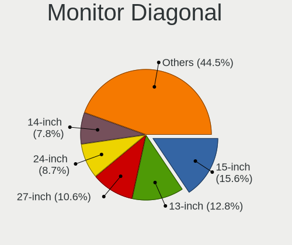

| Inches  | Computers | Percent |
|---------|-----------|---------|
| 15      | 43        | 22.87%  |
| 13      | 30        | 15.96%  |
| 14      | 17        | 9.04%   |
| 27      | 16        | 8.51%   |
| 24      | 13        | 6.91%   |
| Unknown | 11        | 5.85%   |
| 31      | 9         | 4.79%   |
| 23      | 8         | 4.26%   |
| 21      | 8         | 4.26%   |
| 19      | 8         | 4.26%   |
| 12      | 5         | 2.66%   |
| 17      | 3         | 1.6%    |
| 7       | 3         | 1.6%    |
| 84      | 2         | 1.06%   |
| 18      | 2         | 1.06%   |
| 16      | 2         | 1.06%   |
| 65      | 1         | 0.53%   |
| 57      | 1         | 0.53%   |
| 54      | 1         | 0.53%   |
| 48      | 1         | 0.53%   |
| 37      | 1         | 0.53%   |
| 33      | 1         | 0.53%   |
| 28      | 1         | 0.53%   |
| 11      | 1         | 0.53%   |

Monitor Width
-------------

Physical width

| Width in mm | Computers | Percent |
|-------------|-----------|---------|
| 301-350     | 75        | 40.32%  |
| 501-600     | 29        | 15.59%  |
| 201-300     | 23        | 12.37%  |
| 601-700     | 16        | 8.6%    |
| 351-400     | 11        | 5.91%   |
| Unknown     | 11        | 5.91%   |
| 401-500     | 10        | 5.38%   |
| 1001-1500   | 4         | 2.15%   |
| 1-100       | 3         | 1.61%   |
| 1501-2000   | 2         | 1.08%   |
| 801-900     | 1         | 0.54%   |
| 701-800     | 1         | 0.54%   |

Aspect Ratio
------------

Proportional relationship between the width and the height

| Ratio   | Computers | Percent |
|---------|-----------|---------|
| 16/9    | 131       | 73.6%   |
| 16/10   | 20        | 11.24%  |
| Unknown | 11        | 6.18%   |
| 5/4     | 7         | 3.93%   |
| 3/2     | 3         | 1.69%   |
| 0.67    | 3         | 1.69%   |
| 4/3     | 1         | 0.56%   |
| 32/9    | 1         | 0.56%   |
| 21/9    | 1         | 0.56%   |

Monitor Area
------------

Area in inch

| Area in inch | Computers | Percent |
|----------------|-----------|---------|
| 101-110        | 43        | 22.87%  |
| 81-90          | 33        | 17.55%  |
| 201-250        | 20        | 10.64%  |
| 301-350        | 16        | 8.51%   |
| 71-80          | 15        | 7.98%   |
| 351-500        | 11        | 5.85%   |
| 151-200        | 11        | 5.85%   |
| Unknown        | 11        | 5.85%   |
| 251-300        | 6         | 3.19%   |
| More than 1000 | 5         | 2.66%   |
| 61-70          | 4         | 2.13%   |
| 1-40           | 3         | 1.6%    |
| 141-150        | 2         | 1.06%   |
| 121-130        | 2         | 1.06%   |
| 111-120        | 2         | 1.06%   |
| 501-1000       | 2         | 1.06%   |
| 51-60          | 1         | 0.53%   |
| 91-100         | 1         | 0.53%   |

Pixel Density
-------------

Pixels per inch

| Density       | Computers | Percent |
|---------------|-----------|---------|
| 121-160       | 53        | 28.65%  |
| 101-120       | 49        | 26.49%  |
| 51-100        | 43        | 23.24%  |
| 161-240       | 18        | 9.73%   |
| Unknown       | 11        | 5.95%   |
| More than 240 | 8         | 4.32%   |
| 1-50          | 3         | 1.62%   |

Multiple Monitors
-----------------

Total monitors connected

| Total | Computers | Percent |
|-------|-----------|---------|
| 1     | 167       | 85.2%   |
| 0     | 13        | 6.63%   |
| 2     | 12        | 6.12%   |
| 3     | 3         | 1.53%   |
| 4     | 1         | 0.51%   |

Network
-------

Net Controller Vendor
---------------------

Controller vendors

| Vendor                            | Computers | Percent |
|-----------------------------------|-----------|---------|
| Realtek Semiconductor             | 102       | 35.79%  |
| Intel                             | 98        | 34.39%  |
| Broadcom                          | 22        | 7.72%   |
| Qualcomm Atheros                  | 17        | 5.96%   |
| MediaTek                          | 9         | 3.16%   |
| Ralink Technology                 | 6         | 2.11%   |
| TP-Link                           | 5         | 1.75%   |
| Nvidia                            | 3         | 1.05%   |
| Marvell Technology Group          | 3         | 1.05%   |
| Aquantia                          | 3         | 1.05%   |
| Ralink                            | 2         | 0.7%    |
| Ericsson Business Mobile Networks | 2         | 0.7%    |
| Broadcom Limited                  | 2         | 0.7%    |
| Xiaomi                            | 1         | 0.35%   |
| Sierra Wireless                   | 1         | 0.35%   |
| Samsung Electronics               | 1         | 0.35%   |
| OPPO                              | 1         | 0.35%   |
| Microchip Technology              | 1         | 0.35%   |
| Huawei Technologies               | 1         | 0.35%   |
| Dell                              | 1         | 0.35%   |
| D-Link                            | 1         | 0.35%   |
| Belkin Components                 | 1         | 0.35%   |
| Atmel                             | 1         | 0.35%   |
| ASUSTek Computer                  | 1         | 0.35%   |

Net Controller Model
--------------------

Controller models

| Model                                                             | Computers | Percent |
|-------------------------------------------------------------------|-----------|---------|
| Realtek RTL8111/8168/8411 PCI Express Gigabit Ethernet Controller | 65        | 18.79%  |
| Realtek RTL810xE PCI Express Fast Ethernet controller             | 11        | 3.18%   |
| Intel 82579LM Gigabit Network Connection (Lewisville)             | 11        | 3.18%   |
| Realtek RTL8822CE 802.11ac PCIe Wireless Network Adapter          | 9         | 2.6%    |
| Intel Wireless 8265 / 8275                                        | 9         | 2.6%    |
| Intel Wireless 7265                                               | 8         | 2.31%   |
| Intel I211 Gigabit Network Connection                             | 8         | 2.31%   |
| Intel Wireless 3165                                               | 7         | 2.02%   |
| Intel Wi-Fi 6 AX201                                               | 7         | 2.02%   |
| Realtek RTL8125 2.5GbE Controller                                 | 6         | 1.73%   |
| MediaTek MT7922 802.11ax PCI Express Wireless Network Adapter     | 6         | 1.73%   |
| Intel Ethernet Controller I225-V                                  | 6         | 1.73%   |
| Realtek RTL8153 Gigabit Ethernet Adapter                          | 5         | 1.45%   |
| Intel Wi-Fi 6 AX210/AX211/AX411 160MHz                            | 5         | 1.45%   |
| Intel Wi-Fi 6 AX200                                               | 5         | 1.45%   |
| Realtek RTL8821CE 802.11ac PCIe Wireless Network Adapter          | 4         | 1.16%   |
| Qualcomm Atheros AR9485 Wireless Network Adapter                  | 4         | 1.16%   |
| Intel Centrino Advanced-N 6205 [Taylor Peak]                      | 4         | 1.16%   |
| Intel Cannon Lake PCH CNVi WiFi                                   | 4         | 1.16%   |
| Intel Alder Lake-P PCH CNVi WiFi                                  | 4         | 1.16%   |
| Broadcom BCM4313 802.11bgn Wireless Network Adapter               | 4         | 1.16%   |
| Realtek RTL88x2bu [AC1200 Techkey]                                | 3         | 0.87%   |
| Intel Wireless 7260                                               | 3         | 0.87%   |
| Intel Ethernet Connection I217-LM                                 | 3         | 0.87%   |
| Intel Comet Lake PCH-LP CNVi WiFi                                 | 3         | 0.87%   |
| Broadcom BCM43142 802.11b/g/n                                     | 3         | 0.87%   |
| TP-Link 802.11ac WLAN Adapter                                     | 2         | 0.58%   |
| Realtek RTL8821AE 802.11ac PCIe Wireless Network Adapter          | 2         | 0.58%   |
| Realtek RTL8723BE PCIe Wireless Network Adapter                   | 2         | 0.58%   |
| Realtek RTL8723AE PCIe Wireless Network Adapter                   | 2         | 0.58%   |
| Realtek 802.11ac NIC                                              | 2         | 0.58%   |
| Ralink RT5370 Wireless Adapter                                    | 2         | 0.58%   |
| Ralink RT2870/RT3070 Wireless Adapter                             | 2         | 0.58%   |
| Qualcomm Atheros QCA9565 / AR9565 Wireless Network Adapter        | 2         | 0.58%   |
| Qualcomm Atheros QCA9377 802.11ac Wireless Network Adapter        | 2         | 0.58%   |
| Qualcomm Atheros AR928X Wireless Network Adapter (PCI-Express)    | 2         | 0.58%   |
| Qualcomm Atheros AR9285 Wireless Network Adapter (PCI-Express)    | 2         | 0.58%   |
| Nvidia MCP79 Ethernet                                             | 2         | 0.58%   |
| MediaTek MT7921 802.11ax PCI Express Wireless Network Adapter     | 2         | 0.58%   |
| Marvell Group 88E8058 PCI-E Gigabit Ethernet Controller           | 2         | 0.58%   |

Wireless Vendor
---------------

Wireless vendors

| Vendor                            | Computers | Percent |
|-----------------------------------|-----------|---------|
| Intel                             | 83        | 48.54%  |
| Realtek Semiconductor             | 31        | 18.13%  |
| Qualcomm Atheros                  | 15        | 8.77%   |
| Broadcom                          | 14        | 8.19%   |
| MediaTek                          | 9         | 5.26%   |
| Ralink Technology                 | 6         | 3.51%   |
| TP-Link                           | 5         | 2.92%   |
| Ralink                            | 2         | 1.17%   |
| Sierra Wireless                   | 1         | 0.58%   |
| Marvell Technology Group          | 1         | 0.58%   |
| Ericsson Business Mobile Networks | 1         | 0.58%   |
| D-Link                            | 1         | 0.58%   |
| Belkin Components                 | 1         | 0.58%   |
| ASUSTek Computer                  | 1         | 0.58%   |

Wireless Model
--------------

Wireless models

| Model                                                          | Computers | Percent |
|----------------------------------------------------------------|-----------|---------|
| Realtek RTL8822CE 802.11ac PCIe Wireless Network Adapter       | 9         | 5.23%   |
| Intel Wireless 8265 / 8275                                     | 9         | 5.23%   |
| Intel Wireless 7265                                            | 8         | 4.65%   |
| Intel Wireless 3165                                            | 7         | 4.07%   |
| Intel Wi-Fi 6 AX201                                            | 7         | 4.07%   |
| MediaTek MT7922 802.11ax PCI Express Wireless Network Adapter  | 6         | 3.49%   |
| Intel Wi-Fi 6 AX210/AX211/AX411 160MHz                         | 5         | 2.91%   |
| Intel Wi-Fi 6 AX200                                            | 5         | 2.91%   |
| Realtek RTL8821CE 802.11ac PCIe Wireless Network Adapter       | 4         | 2.33%   |
| Qualcomm Atheros AR9485 Wireless Network Adapter               | 4         | 2.33%   |
| Intel Centrino Advanced-N 6205 [Taylor Peak]                   | 4         | 2.33%   |
| Intel Cannon Lake PCH CNVi WiFi                                | 4         | 2.33%   |
| Intel Alder Lake-P PCH CNVi WiFi                               | 4         | 2.33%   |
| Broadcom BCM4313 802.11bgn Wireless Network Adapter            | 4         | 2.33%   |
| Realtek RTL88x2bu [AC1200 Techkey]                             | 3         | 1.74%   |
| Intel Wireless 7260                                            | 3         | 1.74%   |
| Intel Comet Lake PCH-LP CNVi WiFi                              | 3         | 1.74%   |
| Broadcom BCM43142 802.11b/g/n                                  | 3         | 1.74%   |
| TP-Link 802.11ac WLAN Adapter                                  | 2         | 1.16%   |
| Realtek RTL8821AE 802.11ac PCIe Wireless Network Adapter       | 2         | 1.16%   |
| Realtek RTL8723BE PCIe Wireless Network Adapter                | 2         | 1.16%   |
| Realtek RTL8723AE PCIe Wireless Network Adapter                | 2         | 1.16%   |
| Realtek 802.11ac NIC                                           | 2         | 1.16%   |
| Ralink RT5370 Wireless Adapter                                 | 2         | 1.16%   |
| Ralink RT2870/RT3070 Wireless Adapter                          | 2         | 1.16%   |
| Qualcomm Atheros QCA9565 / AR9565 Wireless Network Adapter     | 2         | 1.16%   |
| Qualcomm Atheros QCA9377 802.11ac Wireless Network Adapter     | 2         | 1.16%   |
| Qualcomm Atheros AR928X Wireless Network Adapter (PCI-Express) | 2         | 1.16%   |
| Qualcomm Atheros AR9285 Wireless Network Adapter (PCI-Express) | 2         | 1.16%   |
| MediaTek MT7921 802.11ax PCI Express Wireless Network Adapter  | 2         | 1.16%   |
| Intel WLAN controller                                          | 2         | 1.16%   |
| Intel Wireless 8260                                            | 2         | 1.16%   |
| Intel PRO/Wireless 3945ABG [Golan] Network Connection          | 2         | 1.16%   |
| Intel Ice Lake-LP PCH CNVi WiFi                                | 2         | 1.16%   |
| Intel Comet Lake PCH CNVi WiFi                                 | 2         | 1.16%   |
| Intel Centrino Ultimate-N 6300                                 | 2         | 1.16%   |
| Broadcom BCM4350 802.11ac Wireless Network Adapter             | 2         | 1.16%   |
| TP-Link TL-WN822N Version 4 RTL8192EU                          | 1         | 0.58%   |
| TP-Link AC600 wireless Realtek RTL8811AU [Archer T2U Nano]     | 1         | 0.58%   |
| TP-Link 802.11ac NIC                                           | 1         | 0.58%   |

Ethernet Vendor
---------------

Ethernet vendors

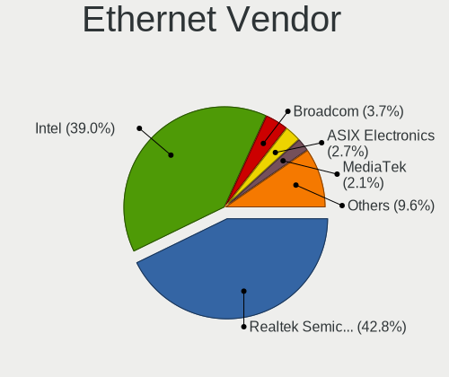

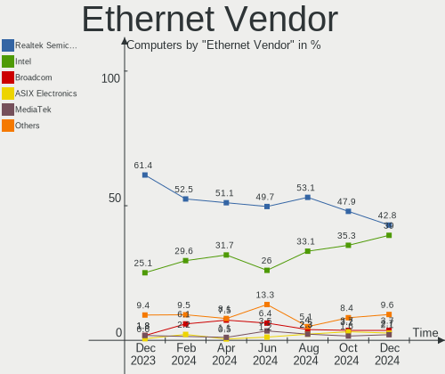

| Vendor                   | Computers | Percent |
|--------------------------|-----------|---------|
| Realtek Semiconductor    | 88        | 53.01%  |
| Intel                    | 50        | 30.12%  |
| Broadcom                 | 10        | 6.02%   |
| Qualcomm Atheros         | 3         | 1.81%   |
| Nvidia                   | 3         | 1.81%   |
| Aquantia                 | 3         | 1.81%   |
| Marvell Technology Group | 2         | 1.2%    |
| Broadcom Limited         | 2         | 1.2%    |
| Xiaomi                   | 1         | 0.6%    |
| Samsung Electronics      | 1         | 0.6%    |
| OPPO                     | 1         | 0.6%    |
| Microchip Technology     | 1         | 0.6%    |
| Huawei Technologies      | 1         | 0.6%    |

Ethernet Model
--------------

Ethernet models

| Model                                                             | Computers | Percent |
|-------------------------------------------------------------------|-----------|---------|
| Realtek RTL8111/8168/8411 PCI Express Gigabit Ethernet Controller | 65        | 38.01%  |
| Realtek RTL810xE PCI Express Fast Ethernet controller             | 11        | 6.43%   |
| Intel 82579LM Gigabit Network Connection (Lewisville)             | 11        | 6.43%   |
| Intel I211 Gigabit Network Connection                             | 8         | 4.68%   |
| Realtek RTL8125 2.5GbE Controller                                 | 6         | 3.51%   |
| Intel Ethernet Controller I225-V                                  | 6         | 3.51%   |
| Realtek RTL8153 Gigabit Ethernet Adapter                          | 5         | 2.92%   |
| Intel Ethernet Connection I217-LM                                 | 3         | 1.75%   |
| Nvidia MCP79 Ethernet                                             | 2         | 1.17%   |
| Marvell Group 88E8058 PCI-E Gigabit Ethernet Controller           | 2         | 1.17%   |
| Intel Ethernet Connection (7) I219-V                              | 2         | 1.17%   |
| Intel Ethernet Connection (7) I219-LM                             | 2         | 1.17%   |
| Intel Ethernet Connection (3) I218-LM                             | 2         | 1.17%   |
| Broadcom NetXtreme BCM5761 Gigabit Ethernet PCIe                  | 2         | 1.17%   |
| Broadcom NetXtreme BCM5719 Gigabit Ethernet PCIe                  | 2         | 1.17%   |
| Xiaomi Mi/Redmi series (RNDIS)                                    | 1         | 0.58%   |
| Samsung Galaxy series, misc. (tethering mode)                     | 1         | 0.58%   |
| Realtek RTL8169 PCI Gigabit Ethernet Controller                   | 1         | 0.58%   |
| Realtek Realtek Ethernet controller                               | 1         | 0.58%   |
| Qualcomm Atheros Killer E220x Gigabit Ethernet Controller         | 1         | 0.58%   |
| Qualcomm Atheros AR8152 v2.0 Fast Ethernet                        | 1         | 0.58%   |
| Qualcomm Atheros AR8151 v2.0 Gigabit Ethernet                     | 1         | 0.58%   |
| OPPO CPH1923                                                      | 1         | 0.58%   |
| Nvidia MCP61 Ethernet                                             | 1         | 0.58%   |
| Microchip LAN9500/LAN9500i                                        | 1         | 0.58%   |
| Intel Ethernet Controller I226-V                                  | 1         | 0.58%   |
| Intel Ethernet Controller I225-LM                                 | 1         | 0.58%   |
| Intel Ethernet controller                                         | 1         | 0.58%   |
| Intel Ethernet Connection I219-V                                  | 1         | 0.58%   |
| Intel Ethernet Connection I219-LM                                 | 1         | 0.58%   |
| Intel Ethernet Connection I218-LM                                 | 1         | 0.58%   |
| Intel Ethernet Connection (6) I219-V                              | 1         | 0.58%   |
| Intel Ethernet Connection (5) I219-LM                             | 1         | 0.58%   |
| Intel Ethernet Connection (4) I219-V                              | 1         | 0.58%   |
| Intel Ethernet Connection (4) I219-LM                             | 1         | 0.58%   |
| Intel Ethernet Connection (2) I219-V                              | 1         | 0.58%   |
| Intel Ethernet Connection (2) I218-V                              | 1         | 0.58%   |
| Intel Ethernet Connection (13) I219-LM                            | 1         | 0.58%   |
| Intel Ethernet Connection (11) I219-LM                            | 1         | 0.58%   |
| Intel Ethernet Connection (10) I219-V                             | 1         | 0.58%   |

Net Controller Kind
-------------------

Ethernet, WiFi or modem

| Kind     | Computers | Percent |
|----------|-----------|---------|
| WiFi     | 159       | 49.69%  |
| Ethernet | 158       | 49.38%  |
| Modem    | 3         | 0.94%   |

Used Controller
---------------

Currently used network controller

| Kind     | Computers | Percent |
|----------|-----------|---------|
| WiFi     | 113       | 57.65%  |
| Ethernet | 83        | 42.35%  |

NICs
----

Total network controllers on board

| Total | Computers | Percent |
|-------|-----------|---------|
| 2     | 102       | 52.04%  |
| 1     | 79        | 40.31%  |
| 3     | 8         | 4.08%   |
| 0     | 5         | 2.55%   |
| 6     | 2         | 1.02%   |

IPv6
----

IPv6 vs IPv4

| Used | Computers | Percent |
|------|-----------|---------|
| No   | 151       | 77.04%  |
| Yes  | 45        | 22.96%  |

Bluetooth
---------

Bluetooth Vendor
----------------

Controller vendors

| Vendor                          | Computers | Percent |
|---------------------------------|-----------|---------|
| Intel                           | 70        | 51.85%  |
| Realtek Semiconductor           | 16        | 11.85%  |
| Foxconn / Hon Hai               | 8         | 5.93%   |
| Cambridge Silicon Radio         | 7         | 5.19%   |
| Apple                           | 7         | 5.19%   |
| Broadcom                        | 6         | 4.44%   |
| Qualcomm Atheros Communications | 4         | 2.96%   |
| IMC Networks                    | 4         | 2.96%   |
| Lite-On Technology              | 3         | 2.22%   |
| Dell                            | 3         | 2.22%   |
| MediaTek                        | 2         | 1.48%   |
| Toshiba                         | 1         | 0.74%   |
| Realtek                         | 1         | 0.74%   |
| Marvell Semiconductor           | 1         | 0.74%   |
| Logitech                        | 1         | 0.74%   |
| Edimax Technology               | 1         | 0.74%   |

Bluetooth Model
---------------

Controller models

| Model                                                   | Computers | Percent |
|---------------------------------------------------------|-----------|---------|
| Intel Bluetooth wireless interface                      | 30        | 22.22%  |
| Intel AX201 Bluetooth                                   | 15        | 11.11%  |
| Realtek Bluetooth Radio                                 | 11        | 8.15%   |
| Cambridge Silicon Radio Bluetooth Dongle (HCI mode)     | 7         | 5.19%   |
| Intel Bluetooth 9460/9560 Jefferson Peak (JfP)          | 6         | 4.44%   |
| Intel AX210 Bluetooth                                   | 5         | 3.7%    |
| Intel AX200 Bluetooth                                   | 5         | 3.7%    |
| Foxconn / Hon Hai Wireless_Device                       | 5         | 3.7%    |
| Intel Bluetooth Device                                  | 4         | 2.96%   |
| Realtek  Bluetooth 4.2 Adapter                          | 3         | 2.22%   |
| IMC Networks Bluetooth Radio                            | 3         | 2.22%   |
| Qualcomm Atheros  Bluetooth Device                      | 2         | 1.48%   |
| MediaTek Wireless_Device                                | 2         | 1.48%   |
| Intel Centrino Bluetooth Wireless Transceiver           | 2         | 1.48%   |
| Foxconn / Hon Hai Bluetooth Device                      | 2         | 1.48%   |
| Broadcom BCM20702 Bluetooth 4.0 [ThinkPad]              | 2         | 1.48%   |
| Apple Built-in Bluetooth 2.0+EDR HCI                    | 2         | 1.48%   |
| Apple Bluetooth Host Controller                         | 2         | 1.48%   |
| Toshiba RT Bluetooth Radio                              | 1         | 0.74%   |
| Realtek RTL8821A Bluetooth                              | 1         | 0.74%   |
| Realtek RTL8723B Bluetooth                              | 1         | 0.74%   |
| Realtek 802.11ac WLAN Adapter                           | 1         | 0.74%   |
| Qualcomm Atheros AR3012 Bluetooth 4.0                   | 1         | 0.74%   |
| Qualcomm Atheros AR3011 Bluetooth                       | 1         | 0.74%   |
| Marvell Bluetooth and Wireless LAN Composite Device     | 1         | 0.74%   |
| Logitech BT Mini-Receiver (HCI mode)                    | 1         | 0.74%   |
| Lite-On Wireless_Device                                 | 1         | 0.74%   |
| Lite-On Bluetooth Device                                | 1         | 0.74%   |
| Lite-On Atheros AR3012 Bluetooth                        | 1         | 0.74%   |
| Intel Wireless-AC 9260 Bluetooth Adapter                | 1         | 0.74%   |
| Intel Wireless-AC 3168 Bluetooth                        | 1         | 0.74%   |
| Intel Centrino Advanced-N 6230 Bluetooth adapter        | 1         | 0.74%   |
| IMC Networks Wireless_Device                            | 1         | 0.74%   |
| Foxconn / Hon Hai BCM43142A0                            | 1         | 0.74%   |
| Edimax EW-7611ULB 802.11b/g/n and Bluetooth 4.0 Adapter | 1         | 0.74%   |
| Dell Wireless 360 Bluetooth                             | 1         | 0.74%   |
| Dell DW375 Bluetooth Module                             | 1         | 0.74%   |
| Dell BCM20702A0 Bluetooth Module                        | 1         | 0.74%   |
| Broadcom HP Portable Valentine                          | 1         | 0.74%   |
| Broadcom HP Portable Bumble Bee                         | 1         | 0.74%   |

Sound
-----

Sound Vendor
------------

Sound card vendors

| Vendor                                       | Computers | Percent |
|----------------------------------------------|-----------|---------|
| Intel                                        | 127       | 47.74%  |
| AMD                                          | 69        | 25.94%  |
| Nvidia                                       | 43        | 16.17%  |
| C-Media Electronics                          | 4         | 1.5%    |
| ASUSTek Computer                             | 4         | 1.5%    |
| Micro Star International                     | 2         | 0.75%   |
| Logitech                                     | 2         | 0.75%   |
| Creative Labs                                | 2         | 0.75%   |
| Corsair                                      | 2         | 0.75%   |
| Zoran Co. Personal Media Division (Nogatech) | 1         | 0.38%   |
| Valve Software                               | 1         | 0.38%   |
| Texas Instruments                            | 1         | 0.38%   |
| Sennheiser Communications                    | 1         | 0.38%   |
| ROCCAT                                       | 1         | 0.38%   |
| Realtek Semiconductor                        | 1         | 0.38%   |
| KTMicro                                      | 1         | 0.38%   |
| Hewlett-Packard                              | 1         | 0.38%   |
| Focusrite-Novation                           | 1         | 0.38%   |
| Blue Microphones                             | 1         | 0.38%   |
| BEHRINGER International                      | 1         | 0.38%   |

Sound Model
-----------

Sound card models

| Model                                                                                             | Computers | Percent |
|---------------------------------------------------------------------------------------------------|-----------|---------|
| AMD Family 17h/19h HD Audio Controller                                                            | 25        | 7.67%   |
| Intel 7 Series/C216 Chipset Family High Definition Audio Controller                               | 17        | 5.21%   |
| Intel Sunrise Point-LP HD Audio                                                                   | 11        | 3.37%   |
| Intel 6 Series/C200 Series Chipset Family High Definition Audio Controller                        | 11        | 3.37%   |
| AMD Renoir Radeon High Definition Audio Controller                                                | 11        | 3.37%   |
| AMD Rembrandt Radeon High Definition Audio Controller                                             | 10        | 3.07%   |
| AMD SBx00 Azalia (Intel HDA)                                                                      | 8         | 2.45%   |
| Intel Xeon E3-1200 v3/4th Gen Core Processor HD Audio Controller                                  | 7         | 2.15%   |
| Intel Tiger Lake-LP Smart Sound Technology Audio Controller                                       | 7         | 2.15%   |
| AMD Starship/Matisse HD Audio Controller                                                          | 7         | 2.15%   |
| AMD Raven/Raven2/Fenghuang HDMI/DP Audio Controller                                               | 7         | 2.15%   |
| Intel Haswell-ULT HD Audio Controller                                                             | 6         | 1.84%   |
| Intel Comet Lake PCH-LP cAVS                                                                      | 6         | 1.84%   |
| Intel Broadwell-U Audio Controller                                                                | 6         | 1.84%   |
| Intel Alder Lake PCH-P High Definition Audio Controller                                           | 6         | 1.84%   |
| Intel 8 Series/C220 Series Chipset High Definition Audio Controller                               | 6         | 1.84%   |
| Intel 8 Series HD Audio Controller                                                                | 6         | 1.84%   |
| AMD Family 17h (Models 00h-0fh) HD Audio Controller                                               | 6         | 1.84%   |
| Nvidia Audio device                                                                               | 5         | 1.53%   |
| Intel Cannon Lake PCH cAVS                                                                        | 5         | 1.53%   |
| Intel 5 Series/3400 Series Chipset High Definition Audio                                          | 5         | 1.53%   |
| Intel 200 Series PCH HD Audio                                                                     | 5         | 1.53%   |
| AMD Kabini HDMI/DP Audio                                                                          | 5         | 1.53%   |
| AMD FCH Azalia Controller                                                                         | 5         | 1.53%   |
| Intel Wildcat Point-LP High Definition Audio Controller                                           | 4         | 1.23%   |
| Intel Ice Lake-LP Smart Sound Technology Audio Controller                                         | 4         | 1.23%   |
| AMD Family 15h (Models 60h-6fh) Audio Controller                                                  | 4         | 1.23%   |
| Nvidia TU106 High Definition Audio Controller                                                     | 3         | 0.92%   |
| Intel Comet Lake PCH cAVS                                                                         | 3         | 0.92%   |
| Intel Cannon Point-LP High Definition Audio Controller                                            | 3         | 0.92%   |
| Intel Atom/Celeron/Pentium Processor x5-E8000/J3xxx/N3xxx Series High Definition Audio Controller | 3         | 0.92%   |
| Intel Alder Lake-S HD Audio Controller                                                            | 3         | 0.92%   |
| Intel 9 Series Chipset Family HD Audio Controller                                                 | 3         | 0.92%   |
| Intel 82801H (ICH8 Family) HD Audio Controller                                                    | 3         | 0.92%   |
| C-Media Electronics Audio Adapter (Unitek Y-247A)                                                 | 3         | 0.92%   |
| AMD RV710/730 HDMI Audio [Radeon HD 4000 series]                                                  | 3         | 0.92%   |
| Nvidia TU116 High Definition Audio Controller                                                     | 2         | 0.61%   |
| Nvidia TU107 GeForce GTX 1650 High Definition Audio Controller                                    | 2         | 0.61%   |
| Nvidia TU104 HD Audio Controller                                                                  | 2         | 0.61%   |
| Nvidia TU102 High Definition Audio Controller                                                     | 2         | 0.61%   |

Memory
------

Memory Vendor
-------------

Memory module vendors

| Vendor              | Computers | Percent |
|---------------------|-----------|---------|
| SK hynix            | 24        | 20.87%  |
| Crucial             | 20        | 17.39%  |
| Samsung Electronics | 15        | 13.04%  |
| Corsair             | 14        | 12.17%  |
| Kingston            | 12        | 10.43%  |
| Micron Technology   | 10        | 8.7%    |
| Unknown             | 7         | 6.09%   |
| A-DATA Technology   | 3         | 2.61%   |
| Ramaxel Technology  | 2         | 1.74%   |
| Unknown             | 2         | 1.74%   |
| Team                | 1         | 0.87%   |
| Nanya Technology    | 1         | 0.87%   |
| Lexar               | 1         | 0.87%   |
| Hewlett-Packard     | 1         | 0.87%   |
| GSkill              | 1         | 0.87%   |
| G.Skill             | 1         | 0.87%   |

Memory Model
------------

Memory module models

| Model                                                            | Computers | Percent |
|------------------------------------------------------------------|-----------|---------|
| Crucial RAM CT102464BF160B.C16 8192MB SODIMM DDR3 1600MT/s       | 4         | 3.31%   |
| SK hynix RAM HMT451S6BFR8A-PB 4GB SODIMM DDR3 1600MT/s           | 3         | 2.48%   |
| Kingston RAM KHX1600C9D3/4GX 4GB DIMM DDR3 1600MT/s              | 2         | 1.65%   |
| Corsair RAM CMK16GX4M2B3200C16 8GB DIMM DDR4 3600MT/s            | 2         | 1.65%   |
| Unknown                                                          | 2         | 1.65%   |
| Unknown RAM Module 4GB SODIMM DDR4 2400MT/s                      | 1         | 0.83%   |
| Unknown RAM Module 4GB SODIMM DDR3 1600MT/s                      | 1         | 0.83%   |
| Unknown RAM Module 2GB SODIMM DDR3 1333MT/s                      | 1         | 0.83%   |
| Unknown RAM Module 2GB SODIMM DDR2 667MT/s                       | 1         | 0.83%   |
| Unknown RAM Module 2GB DIMM DDR3 800MT/s                         | 1         | 0.83%   |
| Unknown RAM Module 2GB DIMM 800MT/s                              | 1         | 0.83%   |
| Unknown RAM DDR4 NB 16G 2666 16384MB SODIMM DDR4 2667MT/s        | 1         | 0.83%   |
| Team RAM Elite-1333 4GB SODIMM DDR3 1334MT/s                     | 1         | 0.83%   |
| SK hynix RAM Module 8GB SODIMM DDR4 2133MT/s                     | 1         | 0.83%   |
| SK hynix RAM Module 4GB DIMM DDR3 1066MT/s                       | 1         | 0.83%   |
| SK hynix RAM Module 2GB DIMM DDR3 1066MT/s                       | 1         | 0.83%   |
| SK hynix RAM HYMP325S64AMP8-Y5 2GB SODIMM DDR 667MT/s            | 1         | 0.83%   |
| SK hynix RAM HMT851S6AMR6R-PB 4GB SODIMM DDR3 1600MT/s           | 1         | 0.83%   |
| SK hynix RAM HMT451U6AFR8C-PB 4096MB DIMM DDR3 1600MT/s          | 1         | 0.83%   |
| SK hynix RAM HMT425S6CFR6A-PB 2048MB SODIMM DDR3 1600MT/s        | 1         | 0.83%   |
| SK hynix RAM HMT41GU7AFR8A-PB 8GB DIMM DDR3 1600MT/s             | 1         | 0.83%   |
| SK hynix RAM HMT41GS6BFR8A-PB 8GB SODIMM DDR3 1600MT/s           | 1         | 0.83%   |
| SK hynix RAM HMT351S6EFR8C-PB 4GB SODIMM DDR3 1600MT/s           | 1         | 0.83%   |
| SK hynix RAM HMAB2GS6AMR6N-XN 16GB SODIMM DDR4 3200MT/s          | 1         | 0.83%   |
| SK hynix RAM HMAA4GS6CJR8N-XN 32GB SODIMM DDR4 3200MT/s          | 1         | 0.83%   |
| SK hynix RAM HMA851S6DJR6N-XN 4GB Row Of Chips DDR4 3200MT/s     | 1         | 0.83%   |
| SK hynix RAM HMA851S6CJR6N-VK 4GB Row Of Chips DDR4 2667MT/s     | 1         | 0.83%   |
| SK hynix RAM HMA82GS6JJR8N-VK 16GB SODIMM DDR4 2667MT/s          | 1         | 0.83%   |
| SK hynix RAM HMA81GU6CJR8N-VK 8GB DIMM DDR4 2400MT/s             | 1         | 0.83%   |
| SK hynix RAM HMA81GU6AFR8N-UH 8GB DIMM DDR4 2400MT/s             | 1         | 0.83%   |
| SK hynix RAM HMA81GS6JJR8N-VK 8GB SODIMM DDR4 2667MT/s           | 1         | 0.83%   |
| SK hynix RAM H9JCNNNCP3MLYR-N6E 4GB Row Of Chips LPDDR5 6400MT/s | 1         | 0.83%   |
| SK hynix RAM H9HCNNNBKMMLXR-NEE 4GB Row Of Chips LPDDR4 4266MT/s | 1         | 0.83%   |
| SK hynix RAM H9CCNNNCLGALAR-NVD 8GB Row Of Chips LPDDR3 2133MT/s | 1         | 0.83%   |
| Samsung RAM UBE3D4AA-MGCR 2GB Row Of Chips LPDDR4 4267MT/s       | 1         | 0.83%   |
| Samsung RAM U6E3S4AA-MGCR 1GB Row Of Chips LPDDR4 4267MT/s       | 1         | 0.83%   |
| Samsung RAM Module 1GB SODIMM DDR2 667MT/s                       | 1         | 0.83%   |
| Samsung RAM M471B5173DB0-YK0 4GB SODIMM DDR3 1600MT/s            | 1         | 0.83%   |
| Samsung RAM M471A5244CB0-CWE 4GB Row Of Chips DDR4 3200MT/s      | 1         | 0.83%   |
| Samsung RAM M471A5244CB0-CTD 4GB SODIMM DDR4 3266MT/s            | 1         | 0.83%   |

Memory Kind
-----------

Memory module kinds

| Kind    | Computers | Percent |
|---------|-----------|---------|
| DDR4    | 47        | 47.47%  |
| DDR3    | 30        | 30.3%   |
| DDR5    | 7         | 7.07%   |
| LPDDR4  | 6         | 6.06%   |
| LPDDR5  | 3         | 3.03%   |
| LPDDR3  | 3         | 3.03%   |
| DDR2    | 2         | 2.02%   |
| Unknown | 1         | 1.01%   |

Memory Form Factor
------------------

Physical design of the memory module

| Name         | Computers | Percent |
|--------------|-----------|---------|
| SODIMM       | 53        | 52.48%  |
| DIMM         | 33        | 32.67%  |
| Row Of Chips | 15        | 14.85%  |

Memory Size
-----------

Memory module size

| Size  | Computers | Percent |
|-------|-----------|---------|
| 8192  | 39        | 37.5%   |
| 4096  | 26        | 25%     |
| 16384 | 22        | 21.15%  |
| 32768 | 9         | 8.65%   |
| 2048  | 7         | 6.73%   |
| 1024  | 1         | 0.96%   |

Memory Speed
------------

Memory module speed

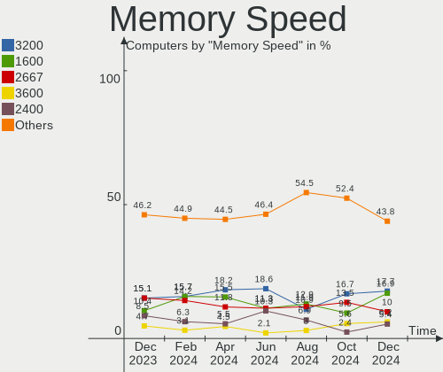

| Speed | Computers | Percent |
|-------|-----------|---------|
| 1600  | 22        | 19.82%  |
| 3200  | 19        | 17.12%  |
| 2667  | 17        | 15.32%  |
| 2400  | 9         | 8.11%   |
| 2133  | 6         | 5.41%   |
| 3600  | 4         | 3.6%    |
| 6400  | 3         | 2.7%    |
| 4800  | 3         | 2.7%    |
| 6000  | 2         | 1.8%    |
| 5200  | 2         | 1.8%    |
| 4267  | 2         | 1.8%    |
| 4266  | 2         | 1.8%    |
| 3733  | 2         | 1.8%    |
| 3000  | 2         | 1.8%    |
| 1333  | 2         | 1.8%    |
| 1066  | 2         | 1.8%    |
| 800   | 2         | 1.8%    |
| 667   | 2         | 1.8%    |
| 3466  | 1         | 0.9%    |
| 3400  | 1         | 0.9%    |
| 3266  | 1         | 0.9%    |
| 2800  | 1         | 0.9%    |
| 2666  | 1         | 0.9%    |
| 1867  | 1         | 0.9%    |
| 1334  | 1         | 0.9%    |
| 1067  | 1         | 0.9%    |

Printers & scanners
-------------------

Printer Vendor
--------------

Printer device vendors

| Vendor          | Computers | Percent |
|-----------------|-----------|---------|
| Hewlett-Packard | 2         | 100%    |

Printer Model
-------------

Printer device models

| Model                    | Computers | Percent |
|--------------------------|-----------|---------|
| HP LaserJet P2015 series | 1         | 50%     |
| HP ENVY 4520 series      | 1         | 50%     |

Scanner Vendor
--------------

Scanner device vendors

| Vendor | Computers | Percent |
|--------|-----------|---------|
| Canon  | 1         | 100%    |

Scanner Model
-------------

Scanner device models

| Model                   | Computers | Percent |
|-------------------------|-----------|---------|
| Canon CanoScan LiDE 200 | 1         | 100%    |

Camera
------

Camera Vendor
-------------

Camera device vendors

| Vendor                                 | Computers | Percent |
|----------------------------------------|-----------|---------|
| Chicony Electronics                    | 22        | 18.8%   |
| Acer                                   | 13        | 11.11%  |
| Microdia                               | 11        | 9.4%    |
| Realtek Semiconductor                  | 9         | 7.69%   |
| Quanta                                 | 9         | 7.69%   |
| Logitech                               | 9         | 7.69%   |
| Apple                                  | 9         | 7.69%   |
| Sunplus Innovation Technology          | 6         | 5.13%   |
| IMC Networks                           | 5         | 4.27%   |
| Microsoft                              | 4         | 3.42%   |
| Luxvisions Innotech Limited            | 3         | 2.56%   |
| Alcor Micro                            | 3         | 2.56%   |
| Syntek                                 | 2         | 1.71%   |
| Silicon Motion                         | 2         | 1.71%   |
| Cheng Uei Precision Industry (Foxlink) | 2         | 1.71%   |
| Suyin                                  | 1         | 0.85%   |
| Primax Electronics                     | 1         | 0.85%   |
| Lite-On Technology                     | 1         | 0.85%   |
| HD WEBCAM                              | 1         | 0.85%   |
| Generalplus Technology                 | 1         | 0.85%   |
| Creative Technology                    | 1         | 0.85%   |
| ARC International                      | 1         | 0.85%   |
| ALi                                    | 1         | 0.85%   |

Camera Model
------------

Camera device models

| Model                                             | Computers | Percent |
|---------------------------------------------------|-----------|---------|
| Logitech HD Pro Webcam C920                       | 4         | 3.36%   |
| Apple Built-in iSight                             | 4         | 3.36%   |
| Acer Integrated Camera                            | 4         | 3.36%   |
| Realtek Integrated_Webcam_HD                      | 3         | 2.52%   |
| Microdia Integrated_Webcam_HD                     | 3         | 2.52%   |
| Chicony TOSHIBA Web Camera - HD                   | 3         | 2.52%   |
| Chicony integrated camera                         | 3         | 2.52%   |
| Chicony HD WebCam                                 | 3         | 2.52%   |
| Apple iPhone 5/5C/5S/6/SE                         | 3         | 2.52%   |
| Acer BisonCam,NB Pro                              | 3         | 2.52%   |
| Syntek Integrated Camera                          | 2         | 1.68%   |
| Sunplus Integrated_Webcam_HD                      | 2         | 1.68%   |
| Quanta ov9734_techfront_camera                    | 2         | 1.68%   |
| Quanta HP TrueVision HD Camera                    | 2         | 1.68%   |
| Microsoft LifeCam HD-3000                         | 2         | 1.68%   |
| Luxvisions Innotech Limited Integrated RGB Camera | 2         | 1.68%   |
| Logitech Webcam C270                              | 2         | 1.68%   |
| IMC Networks USB2.0 HD UVC WebCam                 | 2         | 1.68%   |
| Chicony HD User Facing                            | 2         | 1.68%   |
| Apple FaceTime HD Camera (Built-in)               | 2         | 1.68%   |
| Alcor Micro USB Camera                            | 2         | 1.68%   |
| Acer SunplusIT INC. Integrated Camera             | 2         | 1.68%   |
| Suyin HP Truevision HD                            | 1         | 0.84%   |
| Sunplus Integrated Camera                         | 1         | 0.84%   |
| Sunplus HP 2.0MP High Definition Webcam           | 1         | 0.84%   |
| Sunplus HD WebCam                                 | 1         | 0.84%   |
| Sunplus 1.3M HD WebCam                            | 1         | 0.84%   |
| Silicon Motion WebCam SC-13HDL11431N              | 1         | 0.84%   |
| Silicon Motion NCM-G102                           | 1         | 0.84%   |
| Realtek USB Camera                                | 1         | 0.84%   |
| Realtek Integrated Webcam                         | 1         | 0.84%   |
| Realtek HP Truevision HD                          | 1         | 0.84%   |
| Realtek HK 5M WebCam K50                          | 1         | 0.84%   |
| Realtek Acer 640 x 480 laptop camera              | 1         | 0.84%   |
| Realtek 2SF022                                    | 1         | 0.84%   |
| Quanta WEBCAM                                     | 1         | 0.84%   |
| Quanta USB2.0 HD UVC WebCam                       | 1         | 0.84%   |
| Quanta HP Webcam                                  | 1         | 0.84%   |
| Quanta HP True Vision HD Camera                   | 1         | 0.84%   |
| Quanta HD User Facing                             | 1         | 0.84%   |

Security
--------

Fingerprint Vendor
------------------

Fingerprint sensor vendors

| Vendor                             | Computers | Percent |
|------------------------------------|-----------|---------|
| Validity Sensors                   | 5         | 38.46%  |
| Shenzhen Goodix Technology         | 5         | 38.46%  |
| Synaptics                          | 2         | 15.38%  |
| Realtek USB2.0 Finger Print Bridge | 1         | 7.69%   |

Fingerprint Model
-----------------

Fingerprint sensor models

| Model                                                           | Computers | Percent |
|-----------------------------------------------------------------|-----------|---------|
| Shenzhen Goodix  FingerPrint Device                             | 4         | 30.77%  |
| Validity Sensors VFS 5011 fingerprint sensor                    | 2         | 15.38%  |
| Validity Sensors VFS495 Fingerprint Reader                      | 1         | 7.69%   |
| Validity Sensors Synaptics WBDI                                 | 1         | 7.69%   |
| Validity Sensors Synaptics VFS7552 Touch Fingerprint Sensor     | 1         | 7.69%   |
| Synaptics Prometheus MIS Touch Fingerprint Reader               | 1         | 7.69%   |
| Shenzhen Goodix Fingerprint Reader                              | 1         | 7.69%   |
| Realtek USB2.0 Finger Print Bridge FocalTech Fingerprint Device | 1         | 7.69%   |
| Unknown                                                         | 1         | 7.69%   |

Chipcard Vendor
---------------

Chipcard module vendors

| Vendor      | Computers | Percent |
|-------------|-----------|---------|
| Broadcom    | 4         | 40%     |
| Alcor Micro | 3         | 30%     |
| Upek        | 1         | 10%     |
| O2 Micro    | 1         | 10%     |
| Lenovo      | 1         | 10%     |

Chipcard Model
--------------

Chipcard module models

| Model                                                      | Computers | Percent |
|------------------------------------------------------------|-----------|---------|
| Alcor Micro AU9540 Smartcard Reader                        | 3         | 30%     |
| Broadcom BCM5880 Secure Applications Processor             | 2         | 20%     |
| Broadcom 58200                                             | 2         | 20%     |
| Upek TouchChip Fingerprint Coprocessor (WBF advanced mode) | 1         | 10%     |
| O2 Micro OZ776 CCID Smartcard Reader                       | 1         | 10%     |
| Lenovo Integrated Smart Card Reader                        | 1         | 10%     |

Unsupported
-----------

Unsupported Devices
-------------------

Total unsupported devices on board

| Total | Computers | Percent |
|-------|-----------|---------|
| 0     | 145       | 73.98%  |
| 1     | 44        | 22.45%  |
| 2     | 5         | 2.55%   |
| 5     | 1         | 0.51%   |
| 4     | 1         | 0.51%   |

Unsupported Device Types
------------------------

Types of unsupported devices

| Type                     | Computers | Percent |
|--------------------------|-----------|---------|
| Graphics card            | 15        | 24.59%  |
| Net/wireless             | 13        | 21.31%  |
| Fingerprint reader       | 13        | 21.31%  |
| Chipcard                 | 8         | 13.11%  |
| Multimedia controller    | 3         | 4.92%   |
| Communication controller | 3         | 4.92%   |
| Camera                   | 2         | 3.28%   |
| Unclassified device      | 1         | 1.64%   |
| Unassigned class         | 1         | 1.64%   |
| Sound                    | 1         | 1.64%   |
| Net/ethernet             | 1         | 1.64%   |

