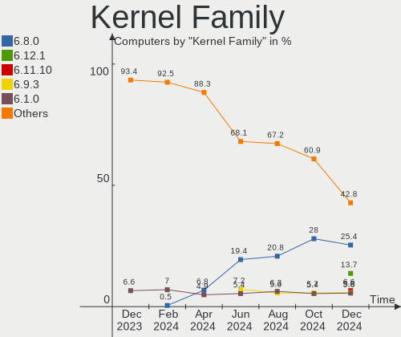
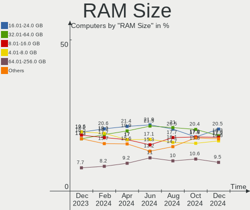
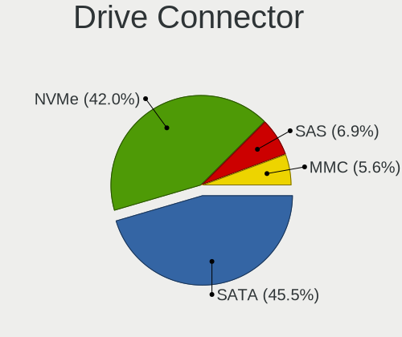
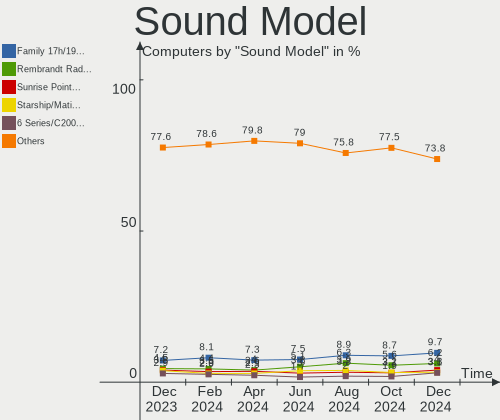

Linux in USA - Hardware Trends
------------------------------

A project to identify most popular hardware characteristics and track their change
over time based on data collected by Linux users at https://Linux-Hardware.org.

Anyone can contribute to this report by the [hw-probe](https://github.com/linuxhw/hw-probe) tool:

    sudo -E hw-probe -all -upload

This is a report for all computer types. See also reports for [desktops](/Location/USA/Desktop/README.md) and [notebooks](/Location/USA/Notebook/README.md).

Period: Aug, 2023.

Contents
--------

* [ System ](#system)
  - [ OS                       ](#os)
  - [ OS Family                ](#os-family)
  - [ Kernel                   ](#kernel)
  - [ Kernel Family            ](#kernel-family)
  - [ Kernel Major Ver.        ](#kernel-major-ver)
  - [ Arch                     ](#arch)
  - [ DE                       ](#de)
  - [ Display Server           ](#display-server)
  - [ Display Manager          ](#display-manager)
  - [ OS Lang                  ](#os-lang)
  - [ Boot Mode                ](#boot-mode)
  - [ Filesystem               ](#filesystem)
  - [ Part. scheme             ](#part-scheme)
  - [ Dual Boot with Linux/BSD ](#dual-boot-with-linuxbsd)
  - [ Dual Boot (Win)          ](#dual-boot-win)

* [ Board ](#board)
  - [ Vendor                   ](#vendor)
  - [ Model                    ](#model)
  - [ Model Family             ](#model-family)
  - [ MFG Year                 ](#mfg-year)
  - [ Form Factor              ](#form-factor)
  - [ Secure Boot              ](#secure-boot)
  - [ Coreboot                 ](#coreboot)
  - [ RAM Size                 ](#ram-size)
  - [ RAM Used                 ](#ram-used)
  - [ Total Drives             ](#total-drives)
  - [ Has CD-ROM               ](#has-cd-rom)
  - [ Has Ethernet             ](#has-ethernet)
  - [ Has WiFi                 ](#has-wifi)
  - [ Has Bluetooth            ](#has-bluetooth)

* [ Location ](#location)
  - [ Country                  ](#country)
  - [ City                     ](#city)

* [ Drives ](#drives)
  - [ Drive Vendor             ](#drive-vendor)
  - [ Drive Model              ](#drive-model)
  - [ HDD Vendor               ](#hdd-vendor)
  - [ SSD Vendor               ](#ssd-vendor)
  - [ Drive Kind               ](#drive-kind)
  - [ Drive Connector          ](#drive-connector)
  - [ Drive Size               ](#drive-size)
  - [ Space Total              ](#space-total)
  - [ Space Used               ](#space-used)
  - [ Malfunc. Drives          ](#malfunc-drives)
  - [ Malfunc. Drive Vendor    ](#malfunc-drive-vendor)
  - [ Malfunc. HDD Vendor      ](#malfunc-hdd-vendor)
  - [ Malfunc. Drive Kind      ](#malfunc-drive-kind)
  - [ Failed Drives            ](#failed-drives)
  - [ Failed Drive Vendor      ](#failed-drive-vendor)
  - [ Drive Status             ](#drive-status)

* [ Storage controller ](#storage-controller)
  - [ Storage Vendor           ](#storage-vendor)
  - [ Storage Model            ](#storage-model)
  - [ Storage Kind             ](#storage-kind)

* [ Processor ](#processor)
  - [ CPU Vendor               ](#cpu-vendor)
  - [ CPU Model                ](#cpu-model)
  - [ CPU Model Family         ](#cpu-model-family)
  - [ CPU Cores                ](#cpu-cores)
  - [ CPU Sockets              ](#cpu-sockets)
  - [ CPU Threads              ](#cpu-threads)
  - [ CPU Op-Modes             ](#cpu-op-modes)
  - [ CPU Microcode            ](#cpu-microcode)
  - [ CPU Microarch            ](#cpu-microarch)

* [ Graphics ](#graphics)
  - [ GPU Vendor               ](#gpu-vendor)
  - [ GPU Model                ](#gpu-model)
  - [ GPU Combo                ](#gpu-combo)
  - [ GPU Driver               ](#gpu-driver)
  - [ GPU Memory               ](#gpu-memory)

* [ Monitor ](#monitor)
  - [ Monitor Vendor           ](#monitor-vendor)
  - [ Monitor Model            ](#monitor-model)
  - [ Monitor Resolution       ](#monitor-resolution)
  - [ Monitor Diagonal         ](#monitor-diagonal)
  - [ Monitor Width            ](#monitor-width)
  - [ Aspect Ratio             ](#aspect-ratio)
  - [ Monitor Area             ](#monitor-area)
  - [ Pixel Density            ](#pixel-density)
  - [ Multiple Monitors        ](#multiple-monitors)

* [ Network ](#network)
  - [ Net Controller Vendor    ](#net-controller-vendor)
  - [ Net Controller Model     ](#net-controller-model)
  - [ Wireless Vendor          ](#wireless-vendor)
  - [ Wireless Model           ](#wireless-model)
  - [ Ethernet Vendor          ](#ethernet-vendor)
  - [ Ethernet Model           ](#ethernet-model)
  - [ Net Controller Kind      ](#net-controller-kind)
  - [ Used Controller          ](#used-controller)
  - [ NICs                     ](#nics)
  - [ IPv6                     ](#ipv6)

* [ Bluetooth ](#bluetooth)
  - [ Bluetooth Vendor         ](#bluetooth-vendor)
  - [ Bluetooth Model          ](#bluetooth-model)

* [ Sound ](#sound)
  - [ Sound Vendor             ](#sound-vendor)
  - [ Sound Model              ](#sound-model)

* [ Memory ](#memory)
  - [ Memory Vendor            ](#memory-vendor)
  - [ Memory Model             ](#memory-model)
  - [ Memory Kind              ](#memory-kind)
  - [ Memory Form Factor       ](#memory-form-factor)
  - [ Memory Size              ](#memory-size)
  - [ Memory Speed             ](#memory-speed)

* [ Printers & scanners ](#printers--scanners)
  - [ Printer Vendor           ](#printer-vendor)
  - [ Printer Model            ](#printer-model)
  - [ Scanner Vendor           ](#scanner-vendor)
  - [ Scanner Model            ](#scanner-model)

* [ Camera ](#camera)
  - [ Camera Vendor            ](#camera-vendor)
  - [ Camera Model             ](#camera-model)

* [ Security ](#security)
  - [ Fingerprint Vendor       ](#fingerprint-vendor)
  - [ Fingerprint Model        ](#fingerprint-model)
  - [ Chipcard Vendor          ](#chipcard-vendor)
  - [ Chipcard Model           ](#chipcard-model)

* [ Unsupported ](#unsupported)
  - [ Unsupported Devices      ](#unsupported-devices)
  - [ Unsupported Device Types ](#unsupported-device-types)

System
------

OS
--

Installed operating systems

| Name                         | Computers | Percent |
|------------------------------|-----------|---------|
| Ubuntu 22.04                 | 150       | 13.35%  |
| Debian 12                    | 148       | 13.17%  |
| Fedora 38                    | 77        | 6.85%   |
| Linux Mint 21.2              | 76        | 6.76%   |
| OpenMandriva 23.08           | 60        | 5.34%   |
| Pop!_OS 22.04                | 55        | 4.89%   |
| Ubuntu 23.04                 | 40        | 3.56%   |
| Arch Rolling                 | 38        | 3.38%   |
| Zorin 16                     | 35        | 3.11%   |
| ArcoLinux Rolling            | 28        | 2.49%   |
| Linux Mint 21.1              | 25        | 2.22%   |
| SteamOS 3.4.8                | 20        | 1.78%   |
| openSUSE Tumbleweed-XXXXXXXX | 18        | 1.6%    |
| KDE neon 22.04               | 18        | 1.6%    |
| OpenMandriva 23.03           | 16        | 1.42%   |
| Xero Rolling                 | 15        | 1.33%   |
| Ubuntu 20.04                 | 14        | 1.25%   |
| Linux Mint 20.3              | 13        | 1.16%   |
| Kubuntu 22.04                | 13        | 1.16%   |
| Manjaro 23.0.0               | 12        | 1.07%   |
| Fedora 37                    | 12        | 1.07%   |
| Debian 11                    | 12        | 1.07%   |
| EndeavourOS Rolling          | 11        | 0.98%   |
| Kubuntu 23.04                | 10        | 0.89%   |
| Kali 2023.3                  | 10        | 0.89%   |
| Manjaro                      | 9         | 0.8%    |
| Elementary 7                 | 9         | 0.8%    |
| Xubuntu 22.04                | 7         | 0.62%   |
| Nobara 38                    | 7         | 0.62%   |
| Parrot 5.3                   | 6         | 0.53%   |
| openSUSE Leap-15.5           | 6         | 0.53%   |
| LMDE 5                       | 6         | 0.53%   |
| OpenMandriva 23.07           | 5         | 0.44%   |
| Gentoo 2.13                  | 5         | 0.44%   |
| Ubuntu MATE 22.04            | 4         | 0.36%   |
| Ubuntu 22.10                 | 4         | 0.36%   |
| Ubuntu 18.04                 | 4         | 0.36%   |
| Rocky Linux 9.2              | 4         | 0.36%   |
| OpenMandriva 4.3             | 4         | 0.36%   |
| Kali 2023.2                  | 4         | 0.36%   |

OS Family
---------

OS without a version

| Name         | Computers | Percent |
|--------------|-----------|---------|
| Ubuntu       | 212       | 18.86%  |
| Debian       | 162       | 14.41%  |
| Linux Mint   | 119       | 10.59%  |
| Fedora       | 91        | 8.1%    |
| OpenMandriva | 90        | 8.01%   |
| Pop!_OS      | 58        | 5.16%   |
| Arch         | 38        | 3.38%   |
| Zorin        | 36        | 3.2%    |
| SteamOS      | 30        | 2.67%   |
| openSUSE     | 29        | 2.58%   |
| ArcoLinux    | 28        | 2.49%   |
| Kubuntu      | 24        | 2.14%   |
| Manjaro      | 21        | 1.87%   |
| KDE neon     | 18        | 1.6%    |
| Xero         | 15        | 1.33%   |
| Kali         | 14        | 1.25%   |
| Xubuntu      | 11        | 0.98%   |
| EndeavourOS  | 11        | 0.98%   |
| Nobara       | 9         | 0.8%    |
| Elementary   | 9         | 0.8%    |
| Gentoo       | 8         | 0.71%   |
| Parrot       | 7         | 0.62%   |
| Rocky Linux  | 6         | 0.53%   |
| LMDE         | 6         | 0.53%   |
| Garuda Linux | 6         | 0.53%   |
| Ubuntu MATE  | 4         | 0.36%   |
| MX           | 4         | 0.36%   |
| CachyOS      | 4         | 0.36%   |
| ROSA         | 3         | 0.27%   |
| NixOS        | 3         | 0.27%   |
| Lubuntu      | 3         | 0.27%   |
| AlmaLinux    | 3         | 0.27%   |
| Ubuntu Unity | 2         | 0.18%   |
| Reborn OS    | 2         | 0.18%   |
| Oracle Linux | 2         | 0.18%   |
| Neptune OS   | 2         | 0.18%   |
| ChimeraOS    | 2         | 0.18%   |
| BunsenLabs   | 2         | 0.18%   |
| BlackPanther | 2         | 0.18%   |
| Arch ARM     | 2         | 0.18%   |

Kernel
------

Version of the Linux kernel

| Version                  | Computers | Percent |
|--------------------------|-----------|---------|
| 6.2.0-26-generic         | 140       | 12.46%  |
| 6.1.0-11-amd64           | 123       | 10.94%  |
| 5.15.0-78-generic        | 64        | 5.69%   |
| 5.15.0-79-generic        | 46        | 4.09%   |
| 6.4.11-desktop-1omv2390  | 38        | 3.38%   |
| 6.4.6-76060406-generic   | 33        | 2.94%   |
| 5.19.0-50-generic        | 25        | 2.22%   |
| 6.2.0-27-generic         | 24        | 2.14%   |
| 6.1.0-10-amd64           | 23        | 2.05%   |
| 5.15.0-76-generic        | 22        | 1.96%   |
| 5.13.0-valve36-1-neptune | 22        | 1.96%   |
| 6.4.8-desktop-2omv2390   | 21        | 1.87%   |
| 6.2.6-76060206-generic   | 19        | 1.69%   |
| 6.2.6-desktop-1omv2390   | 18        | 1.6%    |
| 6.4.12-arch1-1           | 16        | 1.42%   |
| 6.4.11-200.fc38.x86_64   | 14        | 1.25%   |
| 6.2.0-31-generic         | 13        | 1.16%   |
| 6.4.6-200.fc38.x86_64    | 12        | 1.07%   |
| 6.3.0-kali1-amd64        | 12        | 1.07%   |
| 6.4.9-200.fc38.x86_64    | 11        | 0.98%   |
| 6.4.12-200.fc38.x86_64   | 10        | 0.89%   |
| 6.4.10-200.fc38.x86_64   | 10        | 0.89%   |
| 6.4.7-200.fc38.x86_64    | 9         | 0.8%    |
| 6.4.11-arch2-1           | 9         | 0.8%    |
| 5.15.0-82-generic        | 9         | 0.8%    |
| 6.4.9-arch1-1            | 8         | 0.71%   |
| 5.19.0-46-generic        | 8         | 0.71%   |
| 6.4.8-arch1-1            | 7         | 0.62%   |
| 6.4.8-1-default          | 7         | 0.62%   |
| 6.4.10-arch1-1           | 7         | 0.62%   |
| 6.1.44-1-MANJARO         | 7         | 0.62%   |
| 5.4.0-156-generic        | 7         | 0.62%   |
| 5.19.0-32-generic        | 7         | 0.62%   |
| 6.1.0-1parrot1-amd64     | 6         | 0.53%   |
| 5.4.0-155-generic        | 6         | 0.53%   |
| 6.4.7-arch1-2            | 5         | 0.44%   |
| 6.4.6-1-default          | 5         | 0.44%   |
| 6.4.11-1-default         | 5         | 0.44%   |
| 6.3.5-desktop-3omv2390   | 5         | 0.44%   |
| 6.2.9-300.fc38.x86_64    | 5         | 0.44%   |

Kernel Family
-------------

Linux kernel without a distro release

| Version | Computers | Percent |
|---------|-----------|---------|
| 6.2.0   | 187       | 16.64%  |
| 6.1.0   | 159       | 14.15%  |
| 5.15.0  | 154       | 13.7%   |
| 6.4.11  | 79        | 7.03%   |
| 6.4.6   | 54        | 4.8%    |
| 6.4.8   | 48        | 4.27%   |
| 5.19.0  | 47        | 4.18%   |
| 6.2.6   | 37        | 3.29%   |
| 6.4.12  | 32        | 2.85%   |
| 6.4.9   | 31        | 2.76%   |
| 6.4.10  | 31        | 2.76%   |
| 6.4.7   | 26        | 2.31%   |
| 5.13.0  | 26        | 2.31%   |
| 5.4.0   | 20        | 1.78%   |
| 6.3.0   | 14        | 1.25%   |
| 5.10.0  | 13        | 1.16%   |
| 6.3.12  | 10        | 0.89%   |
| 6.5.0   | 9         | 0.8%    |
| 6.1.44  | 9         | 0.8%    |
| 5.14.21 | 8         | 0.71%   |
| 6.1.41  | 7         | 0.62%   |
| 6.4.3   | 6         | 0.53%   |
| 4.18.0  | 6         | 0.53%   |
| 6.4.4   | 5         | 0.44%   |
| 6.4.0   | 5         | 0.44%   |
| 6.3.5   | 5         | 0.44%   |
| 6.2.9   | 5         | 0.44%   |
| 5.14.0  | 5         | 0.44%   |
| 6.3.7   | 4         | 0.36%   |
| 6.2.16  | 4         | 0.36%   |
| 6.1.46  | 4         | 0.36%   |
| 6.1.39  | 3         | 0.27%   |
| 6.0.12  | 3         | 0.27%   |
| 5.17.0  | 3         | 0.27%   |
| 5.16.13 | 3         | 0.27%   |
| 4.15.0  | 3         | 0.27%   |
| 6.3.9   | 2         | 0.18%   |
| 6.3.8   | 2         | 0.18%   |
| 6.3.13  | 2         | 0.18%   |
| 6.1.47  | 2         | 0.18%   |

Kernel Major Ver.
-----------------

Linux kernel major version

| Version | Computers | Percent |
|---------|-----------|---------|
| 6.4     | 318       | 28.29%  |
| 6.2     | 234       | 20.82%  |
| 6.1     | 198       | 17.62%  |
| 5.15    | 161       | 14.32%  |
| 5.19    | 47        | 4.18%   |
| 6.3     | 42        | 3.74%   |
| 5.13    | 26        | 2.31%   |
| 5.4     | 22        | 1.96%   |
| 5.10    | 18        | 1.6%    |
| 5.14    | 13        | 1.16%   |
| 6.5     | 9         | 0.8%    |
| 4.18    | 8         | 0.71%   |
| 6.0     | 5         | 0.44%   |
| 5.16    | 5         | 0.44%   |
| 5.8     | 3         | 0.27%   |
| 5.17    | 3         | 0.27%   |
| 4.9     | 3         | 0.27%   |
| 4.15    | 3         | 0.27%   |
| 5.18    | 2         | 0.18%   |
| 5.11    | 2         | 0.18%   |
| 6.3.3   | 1         | 0.09%   |
| 3.10    | 1         | 0.09%   |

Arch
----

OS architecture (x86_64, i586, etc.)

| Name    | Computers | Percent |
|---------|-----------|---------|
| x86_64  | 1112      | 98.93%  |
| aarch64 | 9         | 0.8%    |
| i686    | 2         | 0.18%   |
| armv7l  | 1         | 0.09%   |

DE
--

Desktop Environment

| Name             | Computers | Percent |
|------------------|-----------|---------|
| GNOME            | 426       | 37.9%   |
| KDE5             | 278       | 24.73%  |
| Unknown          | 141       | 12.54%  |
| X-Cinnamon       | 112       | 9.96%   |
| XFCE             | 63        | 5.6%    |
| MATE             | 32        | 2.85%   |
| LXQt             | 14        | 1.25%   |
| i3               | 10        | 0.89%   |
| Pantheon         | 9         | 0.8%    |
| Budgie           | 5         | 0.44%   |
| Hyprland         | 4         | 0.36%   |
| Cinnamon         | 4         | 0.36%   |
| Xpra             | 3         | 0.27%   |
| GNOME Classic    | 3         | 0.27%   |
| Unity            | 2         | 0.18%   |
| LXDE             | 2         | 0.18%   |
| lightdm-xsession | 2         | 0.18%   |
| GNOME Flashback  | 2         | 0.18%   |
| dwm              | 2         | 0.18%   |
| BunsenLabs       | 2         | 0.18%   |
| awesome          | 2         | 0.18%   |
| sway             | 1         | 0.09%   |
| OPENBOX          | 1         | 0.09%   |
| none+i3          | 1         | 0.09%   |
| KDE4             | 1         | 0.09%   |
| KDE              | 1         | 0.09%   |
| Deepin           | 1         | 0.09%   |

Display Server
--------------

X11 or Wayland

| Name    | Computers | Percent |
|---------|-----------|---------|
| X11     | 622       | 55.34%  |
| Wayland | 346       | 30.78%  |
| Unknown | 135       | 12.01%  |
| Tty     | 21        | 1.87%   |

Display Manager
---------------

SDDM, LightDM, etc.

| Name    | Computers | Percent |
|---------|-----------|---------|
| Unknown | 535       | 47.6%   |
| SDDM    | 200       | 17.79%  |
| GDM3    | 192       | 17.08%  |
| LightDM | 133       | 11.83%  |
| GDM     | 55        | 4.89%   |
| SLiM    | 3         | 0.27%   |
| Ly      | 2         | 0.18%   |
| EMPTTY  | 2         | 0.18%   |
| KDM     | 1         | 0.09%   |
| GREETD  | 1         | 0.09%   |

OS Lang
-------

Language

| Lang    | Computers | Percent |
|---------|-----------|---------|
| en_US   | 947       | 84.25%  |
| Unknown | 124       | 11.03%  |
| C       | 22        | 1.96%   |
| en_CA   | 7         | 0.62%   |
| en_GB   | 6         | 0.53%   |
| POSIX   | 3         | 0.27%   |
| it_IT   | 2         | 0.18%   |
| de_DE   | 2         | 0.18%   |
| zh_CN   | 1         | 0.09%   |
| ru_RU   | 1         | 0.09%   |
| pl_PL   | 1         | 0.09%   |
| nl_NL   | 1         | 0.09%   |
| fr_FR   | 1         | 0.09%   |
| en_IN   | 1         | 0.09%   |
| en_IE   | 1         | 0.09%   |
| en_BW   | 1         | 0.09%   |
| en_AU   | 1         | 0.09%   |
| en_AG   | 1         | 0.09%   |
| C.UTF8  | 1         | 0.09%   |

Boot Mode
---------

EFI or BIOS

| Mode | Computers | Percent |
|------|-----------|---------|
| EFI  | 617       | 54.89%  |
| BIOS | 507       | 45.11%  |

Filesystem
----------

Type of filesystem

| Type    | Computers | Percent |
|---------|-----------|---------|
| Ext4    | 555       | 49.38%  |
| Btrfs   | 201       | 17.88%  |
| Overlay | 169       | 15.04%  |
| Tmpfs   | 151       | 13.43%  |
| Xfs     | 29        | 2.58%   |
| Zfs     | 8         | 0.71%   |
| Jfs     | 3         | 0.27%   |
| F2fs    | 3         | 0.27%   |
| Ext3    | 3         | 0.27%   |
| XXX4    | 1         | 0.09%   |
| Aufs    | 1         | 0.09%   |

Part. scheme
------------

Scheme of partitioning

| Type    | Computers | Percent |
|---------|-----------|---------|
| GPT     | 657       | 58.45%  |
| Unknown | 390       | 34.7%   |
| MBR     | 77        | 6.85%   |

Dual Boot with Linux/BSD
------------------------

Hosting more than one Linux/BSD

| Dual boot | Computers | Percent |
|-----------|-----------|---------|
| No        | 966       | 85.94%  |
| Yes       | 158       | 14.06%  |

Dual Boot (Win)
---------------

Hosting Linux and Windows

| Dual boot | Computers | Percent |
|-----------|-----------|---------|
| No        | 936       | 83.27%  |
| Yes       | 188       | 16.73%  |

Board
-----

Vendor
------

Motherboard manufacturer

| Name                    | Computers | Percent |
|-------------------------|-----------|---------|
| Lenovo                  | 217       | 19.31%  |
| Dell                    | 172       | 15.3%   |
| Hewlett-Packard         | 160       | 14.23%  |
| ASUSTek Computer        | 137       | 12.19%  |
| Apple                   | 59        | 5.25%   |
| MSI                     | 53        | 4.72%   |
| Gigabyte Technology     | 52        | 4.63%   |
| ASRock                  | 26        | 2.31%   |
| Acer                    | 26        | 2.31%   |
| Valve                   | 24        | 2.14%   |
| Intel                   | 24        | 2.14%   |
| Google                  | 16        | 1.42%   |
| Unknown                 | 16        | 1.42%   |
| Microsoft               | 14        | 1.25%   |
| Toshiba                 | 13        | 1.16%   |
| System76                | 9         | 0.8%    |
| AZW                     | 9         | 0.8%    |
| Alienware               | 9         | 0.8%    |
| Supermicro              | 7         | 0.62%   |
| GPU Company             | 7         | 0.62%   |
| Samsung Electronics     | 6         | 0.53%   |
| Gateway                 | 6         | 0.53%   |
| Framework               | 6         | 0.53%   |
| Panasonic               | 4         | 0.36%   |
| Sony                    | 3         | 0.27%   |
| Pegatron                | 3         | 0.27%   |
| ATOPNUC                 | 3         | 0.27%   |
| Razer                   | 2         | 0.18%   |
| Raspberry Pi Foundation | 2         | 0.18%   |
| NZXT                    | 2         | 0.18%   |
| Notebook                | 2         | 0.18%   |
| IP3 Tech                | 2         | 0.18%   |
| HUAWEI                  | 2         | 0.18%   |
| Foxconn                 | 2         | 0.18%   |
| eMachines               | 2         | 0.18%   |
| Chuwi                   | 2         | 0.18%   |
| Biostar                 | 2         | 0.18%   |
| ZOTAC                   | 1         | 0.09%   |
| Touch Dynamic           | 1         | 0.09%   |
| Star Labs               | 1         | 0.09%   |

Model
-----

Motherboard model

| Name                                      | Computers | Percent |
|-------------------------------------------|-----------|---------|
| Lenovo ThinkPad L13 Yoga Gen 2 20VK0019US | 98        | 8.72%   |
| Valve Jupiter                             | 24        | 2.14%   |
| Unknown                                   | 16        | 1.42%   |
| Dell OptiPlex 7010                        | 6         | 0.53%   |
| ASUS TUF Gaming X570-PLUS                 | 6         | 0.53%   |
| ASUS All Series                           | 6         | 0.53%   |
| Apple MacBookPro9,2                       | 6         | 0.53%   |
| MSI MS-7C91                               | 5         | 0.44%   |
| AZW SER                                   | 5         | 0.44%   |
| Toshiba Satellite C55-A                   | 4         | 0.36%   |
| Dell OptiPlex 7050                        | 4         | 0.36%   |
| ASUS M5A97 R2.0                           | 4         | 0.36%   |
| Microsoft Surface Pro 4                   | 3         | 0.27%   |
| Lenovo ThinkPad 13 2nd Gen 20J10046US     | 3         | 0.27%   |
| HP Z620 Workstation                       | 3         | 0.27%   |
| HP Notebook                               | 3         | 0.27%   |
| HP Compaq 6005 Pro MT PC                  | 3         | 0.27%   |
| Dell OptiPlex 990                         | 3         | 0.27%   |
| Dell OptiPlex 3040                        | 3         | 0.27%   |
| Dell Latitude E6420                       | 3         | 0.27%   |
| Dell Latitude E5470                       | 3         | 0.27%   |
| Dell Inspiron 3847                        | 3         | 0.27%   |
| ATOPNUC MA90                              | 3         | 0.27%   |
| ASUS ROG STRIX X670E-E GAMING WIFI        | 3         | 0.27%   |
| ASUS ROG STRIX B550-F GAMING              | 3         | 0.27%   |
| Apple iMac9,1                             | 3         | 0.27%   |
| System76 Thelio Major                     | 2         | 0.18%   |
| System76 Gazelle                          | 2         | 0.18%   |
| NZXT N7 B550                              | 2         | 0.18%   |
| MSI MS-7C95                               | 2         | 0.18%   |
| MSI MS-7C56                               | 2         | 0.18%   |
| MSI MS-7C37                               | 2         | 0.18%   |
| MSI MS-7C02                               | 2         | 0.18%   |
| MSI MS-7B79                               | 2         | 0.18%   |
| MSI MPG H410 Trident 3 (MS-B932)          | 2         | 0.18%   |
| Microsoft Surface Pro 6                   | 2         | 0.18%   |
| Microsoft Surface Pro 3                   | 2         | 0.18%   |
| Microsoft Surface Pro                     | 2         | 0.18%   |
| Lenovo Yoga 7 16ARP8 83BS                 | 2         | 0.18%   |
| Lenovo ThinkStation P520 30BFS44D00       | 2         | 0.18%   |

Model Family
------------

Motherboard model prefix

| Name                | Computers | Percent |
|---------------------|-----------|---------|
| Lenovo ThinkPad     | 161       | 14.32%  |
| Dell Inspiron       | 43        | 3.83%   |
| Dell Latitude       | 39        | 3.47%   |
| ASUS ROG            | 39        | 3.47%   |
| Dell OptiPlex       | 35        | 3.11%   |
| HP Pavilion         | 26        | 2.31%   |
| Valve Jupiter       | 24        | 2.14%   |
| HP Laptop           | 23        | 2.05%   |
| Dell XPS            | 22        | 1.96%   |
| ASUS PRIME          | 18        | 1.6%    |
| ASUS TUF            | 17        | 1.51%   |
| HP EliteBook        | 16        | 1.42%   |
| Unknown             | 16        | 1.42%   |
| Dell Precision      | 15        | 1.33%   |
| Acer Aspire         | 15        | 1.33%   |
| Microsoft Surface   | 14        | 1.25%   |
| Lenovo Legion       | 13        | 1.16%   |
| HP Compaq           | 12        | 1.07%   |
| Toshiba Satellite   | 11        | 0.98%   |
| Lenovo IdeaPad      | 11        | 0.98%   |
| HP ENVY             | 11        | 0.98%   |
| ASUS Zenbook        | 11        | 0.98%   |
| HP EliteDesk        | 10        | 0.89%   |
| HP ProBook          | 9         | 0.8%    |
| Lenovo Yoga         | 7         | 0.62%   |
| Dell PowerEdge      | 7         | 0.62%   |
| Apple MacBookPro9   | 7         | 0.62%   |
| Lenovo ThinkStation | 6         | 0.53%   |
| Lenovo ThinkCentre  | 6         | 0.53%   |
| Lenovo IdeaPadFlex  | 6         | 0.53%   |
| Framework Laptop    | 6         | 0.53%   |
| ASUS All            | 6         | 0.53%   |
| MSI MS-7C91         | 5         | 0.44%   |
| HP ZBook            | 5         | 0.44%   |
| Gigabyte Z390       | 5         | 0.44%   |
| Gigabyte X570       | 5         | 0.44%   |
| AZW SER             | 5         | 0.44%   |
| Acer Nitro          | 5         | 0.44%   |
| HP Victus           | 4         | 0.36%   |
| HP OMEN             | 4         | 0.36%   |

MFG Year
--------

Motherboard manufacture year

| Year    | Computers | Percent |
|---------|-----------|---------|
| 2020    | 178       | 15.84%  |
| 2022    | 146       | 12.99%  |
| 2021    | 99        | 8.81%   |
| 2019    | 86        | 7.65%   |
| 2018    | 82        | 7.3%    |
| 2012    | 70        | 6.23%   |
| 2023    | 64        | 5.69%   |
| 2017    | 59        | 5.25%   |
| 2013    | 56        | 4.98%   |
| 2011    | 50        | 4.45%   |
| 2015    | 49        | 4.36%   |
| 2016    | 47        | 4.18%   |
| 2014    | 42        | 3.74%   |
| 2010    | 38        | 3.38%   |
| 2008    | 20        | 1.78%   |
| 2009    | 17        | 1.51%   |
| 2007    | 10        | 0.89%   |
| Unknown | 9         | 0.8%    |
| 2006    | 2         | 0.18%   |

Form Factor
-----------

Physical design of the computer

| Name           | Computers | Percent |
|----------------|-----------|---------|
| Notebook       | 476       | 42.35%  |
| Desktop        | 396       | 35.23%  |
| Convertible    | 148       | 13.17%  |
| Mini pc        | 37        | 3.29%   |
| All in one     | 23        | 2.05%   |
| Tablet         | 18        | 1.6%    |
| Server         | 16        | 1.42%   |
| System on chip | 9         | 0.8%    |
| Phone          | 1         | 0.09%   |

Secure Boot
-----------

Enabled or disabled

| State    | Computers | Percent |
|----------|-----------|---------|
| Disabled | 1074      | 95.55%  |
| Enabled  | 50        | 4.45%   |

Coreboot
--------

Have coreboot on board

| Used | Computers | Percent |
|------|-----------|---------|
| No   | 1101      | 97.95%  |
| Yes  | 23        | 2.05%   |

RAM Size
--------

Total RAM memory

| Size in GB      | Computers | Percent |
|-----------------|-----------|---------|
| 8.01-16.0       | 281       | 25%     |
| 16.01-24.0      | 250       | 22.24%  |
| 4.01-8.0        | 213       | 18.95%  |
| 32.01-64.0      | 159       | 14.15%  |
| 3.01-4.0        | 82        | 7.3%    |
| 64.01-256.0     | 80        | 7.12%   |
| 24.01-32.0      | 31        | 2.76%   |
| More than 256.0 | 9         | 0.8%    |
| 2.01-3.0        | 8         | 0.71%   |
| 1.01-2.0        | 8         | 0.71%   |
| 0.01-0.5        | 2         | 0.18%   |
| 0.51-1.0        | 1         | 0.09%   |

RAM Used
--------

Used RAM memory

| Used GB     | Computers | Percent |
|-------------|-----------|---------|
| 1.01-2.0    | 358       | 31.85%  |
| 2.01-3.0    | 247       | 21.98%  |
| 4.01-8.0    | 212       | 18.86%  |
| 3.01-4.0    | 180       | 16.01%  |
| 8.01-16.0   | 67        | 5.96%   |
| 0.51-1.0    | 32        | 2.85%   |
| 0.01-0.5    | 9         | 0.8%    |
| 16.01-24.0  | 8         | 0.71%   |
| 32.01-64.0  | 5         | 0.44%   |
| 24.01-32.0  | 3         | 0.27%   |
| 64.01-256.0 | 3         | 0.27%   |

Total Drives
------------

Number of drives on board

| Drives | Computers | Percent |
|--------|-----------|---------|
| 1      | 680       | 60.5%   |
| 2      | 244       | 21.71%  |
| 3      | 88        | 7.83%   |
| 4      | 49        | 4.36%   |
| 5      | 27        | 2.4%    |
| 0      | 15        | 1.33%   |
| 6      | 9         | 0.8%    |
| 8      | 4         | 0.36%   |
| 7      | 4         | 0.36%   |
| 13     | 2         | 0.18%   |
| 11     | 1         | 0.09%   |
| 10     | 1         | 0.09%   |

Has CD-ROM
----------

Has CD-ROM on board

| Presented | Computers | Percent |
|-----------|-----------|---------|
| No        | 816       | 72.6%   |
| Yes       | 308       | 27.4%   |

Has Ethernet
------------

Has Ethernet on board

| Presented | Computers | Percent |
|-----------|-----------|---------|
| Yes       | 928       | 82.56%  |
| No        | 196       | 17.44%  |

Has WiFi
--------

Has WiFi module

| Presented | Computers | Percent |
|-----------|-----------|---------|
| Yes       | 934       | 83.1%   |
| No        | 190       | 16.9%   |

Has Bluetooth
-------------

Has Bluetooth module

| Presented | Computers | Percent |
|-----------|-----------|---------|
| Yes       | 809       | 71.98%  |
| No        | 315       | 28.02%  |

Location
--------

Country
-------

Geographic location (country)

| Country | Computers | Percent |
|---------|-----------|---------|
| USA     | 1124      | 100%    |

City
----

Geographic location (city)

| City             | Computers | Percent |
|------------------|-----------|---------|
| Bangor           | 113       | 10.05%  |
| Seattle          | 18        | 1.6%    |
| Los Angeles      | 17        | 1.51%   |
| New York         | 13        | 1.16%   |
| Houston          | 11        | 0.98%   |
| Denver           | 11        | 0.98%   |
| Dallas           | 11        | 0.98%   |
| Portland         | 9         | 0.8%    |
| Las Vegas        | 9         | 0.8%    |
| Chicago          | 9         | 0.8%    |
| Charlotte        | 8         | 0.71%   |
| Tucson           | 7         | 0.62%   |
| Atlanta          | 7         | 0.62%   |
| Springfield      | 6         | 0.53%   |
| San Antonio      | 6         | 0.53%   |
| Phoenix          | 6         | 0.53%   |
| Nashville        | 6         | 0.53%   |
| Minneapolis      | 6         | 0.53%   |
| Miami            | 6         | 0.53%   |
| Lincoln          | 6         | 0.53%   |
| Colorado Springs | 6         | 0.53%   |
| Ashburn          | 6         | 0.53%   |
| Vancouver        | 5         | 0.44%   |
| Tacoma           | 5         | 0.44%   |
| St Louis         | 5         | 0.44%   |
| Spokane          | 5         | 0.44%   |
| Raleigh          | 5         | 0.44%   |
| Jacksonville     | 5         | 0.44%   |
| Fort Worth       | 5         | 0.44%   |
| Cleveland        | 5         | 0.44%   |
| Cincinnati       | 5         | 0.44%   |
| Brooklyn         | 5         | 0.44%   |
| Arlington        | 5         | 0.44%   |
| Wichita          | 4         | 0.36%   |
| Washington       | 4         | 0.36%   |
| Vero Beach       | 4         | 0.36%   |
| St. Petersburg   | 4         | 0.36%   |
| San Jose         | 4         | 0.36%   |
| San Francisco    | 4         | 0.36%   |
| Pine Island      | 4         | 0.36%   |

Drives
------

Drive Vendor
------------

Hard drive vendors

| Vendor                      | Computers | Drives | Percent |
|-----------------------------|-----------|--------|---------|
| Samsung Electronics         | 334       | 426    | 20.54%  |
| WDC                         | 170       | 237    | 10.46%  |
| Seagate                     | 161       | 201    | 9.9%    |
| SanDisk                     | 145       | 159    | 8.92%   |
| Unknown                     | 75        | 84     | 4.61%   |
| Toshiba                     | 74        | 82     | 4.55%   |
| Crucial                     | 69        | 79     | 4.24%   |
| SK hynix                    | 62        | 69     | 3.81%   |
| Intel                       | 43        | 47     | 2.64%   |
| Phison Electronics          | 35        | 40     | 2.15%   |
| Kingston                    | 31        | 32     | 1.91%   |
| Hitachi                     | 30        | 32     | 1.85%   |
| Apple                       | 30        | 36     | 1.85%   |
| Micron Technology           | 28        | 28     | 1.72%   |
| Micron/Crucial Technology   | 23        | 27     | 1.41%   |
| China                       | 21        | 21     | 1.29%   |
| PNY                         | 20        | 22     | 1.23%   |
| HGST                        | 19        | 28     | 1.17%   |
| KIOXIA                      | 17        | 17     | 1.05%   |
| Kingston Technology Company | 16        | 17     | 0.98%   |
| SPCC                        | 15        | 16     | 0.92%   |
| A-DATA Technology           | 13        | 14     | 0.8%    |
| Unknown                     | 13        | 14     | 0.8%    |
| Team                        | 11        | 11     | 0.68%   |
| Silicon Motion              | 8         | 8      | 0.49%   |
| Hewlett-Packard             | 8         | 8      | 0.49%   |
| Fanxiang                    | 8         | 8      | 0.49%   |
| Phison                      | 6         | 7      | 0.37%   |
| Netac                       | 6         | 6      | 0.37%   |
| LITEON                      | 6         | 10     | 0.37%   |
| Realtek Semiconductor       | 5         | 5      | 0.31%   |
| OCZ                         | 5         | 5      | 0.31%   |
| JMicron Technology          | 5         | 5      | 0.31%   |
| Wibtek                      | 4         | 4      | 0.25%   |
| T-FORCE                     | 4         | 5      | 0.25%   |
| SABRENT                     | 4         | 5      | 0.25%   |
| O2 Micro                    | 4         | 4      | 0.25%   |
| Mushkin                     | 4         | 4      | 0.25%   |
| Lexar                       | 4         | 4      | 0.25%   |
| SSSTC                       | 3         | 3      | 0.18%   |

Drive Model
-----------

Hard drive models

| Model                                                 | Computers | Percent |
|-------------------------------------------------------|-----------|---------|
| Samsung MZVLB512HBJQ-000L7 512GB                      | 96        | 5.33%   |
| Samsung NVMe SSD Controller SM981/PM981/PM983 500GB   | 39        | 2.16%   |
| Samsung NVMe SSD Controller PM9A1/PM9A3/980PRO 1024GB | 34        | 1.89%   |
| Micron/Crucial P2 NVMe PCIe SSD 1TB                   | 19        | 1.05%   |
| Sandisk WD Blue SN550 NVMe SSD 250GB                  | 16        | 0.89%   |
| Sandisk WD Black SN750 / PC SN730 NVMe SSD 1024GB     | 15        | 0.83%   |
| Samsung SSD 860 EVO 500GB                             | 13        | 0.72%   |
| Crucial CT1000MX500SSD1 1TB                           | 13        | 0.72%   |
| Unknown                                               | 13        | 0.72%   |
| Seagate ST2000DM008-2FR102 2TB                        | 12        | 0.67%   |
| Samsung SSD 850 EVO 500GB                             | 12        | 0.67%   |
| Phison E12 NVMe Controller 256GB                      | 12        | 0.67%   |
| Crucial CT500MX500SSD1 500GB                          | 12        | 0.67%   |
| Phison PS5013 E13 NVMe Controller 512GB               | 11        | 0.61%   |
| Unknown MMC Card  64GB                                | 10        | 0.55%   |
| Samsung SSD 870 EVO 1TB                               | 10        | 0.55%   |
| Samsung NVMe SSD Controller SM961/PM961/SM963 1024GB  | 10        | 0.55%   |
| Seagate ST1000LM035-1RK172 1TB                        | 9         | 0.5%    |
| Seagate ST1000DM010-2EP102 1TB                        | 9         | 0.5%    |
| Sandisk WD Black SN850 256GB                          | 9         | 0.5%    |
| Kingston Company OM3PDP3 NVMe SSD 256GB               | 9         | 0.5%    |
| WDC WD10EZEX-08WN4A0 1TB                              | 8         | 0.44%   |
| Unknown SD/MMC/MS PRO 1GB                             | 8         | 0.44%   |
| Unknown MMC Card  32GB                                | 8         | 0.44%   |
| Silicon Motion SM2263EN/SM2263XT SSD Controller 256GB | 8         | 0.44%   |
| Sandisk WD Blue SN570 1TB                             | 8         | 0.44%   |
| Samsung SSD 860 EVO 1TB                               | 8         | 0.44%   |
| Samsung SSD 850 EVO 250GB                             | 8         | 0.44%   |
| Intel SSD 660P Series 512GB                           | 8         | 0.44%   |
| Crucial CT1000BX500SSD1 1TB                           | 8         | 0.44%   |
| Unknown MMC Card  512GB                               | 7         | 0.39%   |
| Unknown MMC Card  256GB                               | 7         | 0.39%   |
| SK hynix SHPP41-2000GM 2TB                            | 7         | 0.39%   |
| Samsung SSD 980 1TB                                   | 7         | 0.39%   |
| Samsung SSD 970 EVO Plus 2TB                          | 7         | 0.39%   |
| Toshiba DT01ACA200 2TB                                | 6         | 0.33%   |
| Seagate ST2000DM006-2DM164 2TB                        | 6         | 0.33%   |
| Sandisk WD_BLACK SN770 1TB                            | 6         | 0.33%   |
| Samsung SSD 980 PRO 2TB                               | 6         | 0.33%   |
| Samsung SSD 870 EVO 2TB                               | 6         | 0.33%   |

HDD Vendor
----------

Hard disk drive vendors

| Vendor              | Computers | Drives | Percent |
|---------------------|-----------|--------|---------|
| Seagate             | 153       | 187    | 36%     |
| WDC                 | 121       | 170    | 28.47%  |
| Toshiba             | 57        | 63     | 13.41%  |
| Hitachi             | 30        | 32     | 7.06%   |
| HGST                | 19        | 28     | 4.47%   |
| Unknown             | 9         | 9      | 2.12%   |
| Apple               | 9         | 9      | 2.12%   |
| Samsung Electronics | 4         | 5      | 0.94%   |
| SABRENT             | 4         | 5      | 0.94%   |
| Hewlett-Packard     | 4         | 4      | 0.94%   |
| Maxtor              | 3         | 3      | 0.71%   |
| LaCie               | 3         | 3      | 0.71%   |
| Fujitsu             | 3         | 3      | 0.71%   |
| WD MediaMax         | 2         | 2      | 0.47%   |
| USB3.0              | 1         | 1      | 0.24%   |
| Maxone              | 1         | 1      | 0.24%   |
| MaxDigital          | 1         | 1      | 0.24%   |
| IBM/Hitachi         | 1         | 1      | 0.24%   |

SSD Vendor
----------

Solid state drive vendors

| Vendor              | Computers | Drives | Percent |
|---------------------|-----------|--------|---------|
| Samsung Electronics | 118       | 146    | 23.98%  |
| Crucial             | 60        | 68     | 12.2%   |
| SanDisk             | 46        | 49     | 9.35%   |
| WDC                 | 40        | 48     | 8.13%   |
| Kingston            | 25        | 26     | 5.08%   |
| China               | 21        | 21     | 4.27%   |
| PNY                 | 20        | 22     | 4.07%   |
| SK hynix            | 13        | 13     | 2.64%   |
| A-DATA Technology   | 12        | 12     | 2.44%   |
| SPCC                | 11        | 12     | 2.24%   |
| Apple               | 10        | 10     | 2.03%   |
| Team                | 9         | 9      | 1.83%   |
| Intel               | 9         | 9      | 1.83%   |
| Micron Technology   | 7         | 7      | 1.42%   |
| Netac               | 6         | 6      | 1.22%   |
| LITEON              | 6         | 10     | 1.22%   |
| Fanxiang            | 6         | 6      | 1.22%   |
| Toshiba             | 5         | 5      | 1.02%   |
| OCZ                 | 5         | 5      | 1.02%   |
| Mushkin             | 4         | 4      | 0.81%   |
| Hewlett-Packard     | 4         | 4      | 0.81%   |
| Wibtek              | 3         | 3      | 0.61%   |
| T-FORCE             | 3         | 3      | 0.61%   |
| Lexar               | 3         | 3      | 0.61%   |
| JMicron Technology  | 3         | 3      | 0.61%   |
| Timetec             | 2         | 3      | 0.41%   |
| Super Talent        | 2         | 2      | 0.41%   |
| Seagate             | 2         | 2      | 0.41%   |
| SCY                 | 2         | 2      | 0.41%   |
| PNY CS90            | 2         | 2      | 0.41%   |
| Plextor             | 2         | 2      | 0.41%   |
| Neo                 | 2         | 2      | 0.41%   |
| KingFast            | 2         | 2      | 0.41%   |
| KingDian            | 2         | 2      | 0.41%   |
| Intenso             | 2         | 2      | 0.41%   |
| BHT                 | 2         | 2      | 0.41%   |
| Acer                | 2         | 2      | 0.41%   |
| Unknown             | 2         | 2      | 0.41%   |
| WDC WDS             | 1         | 1      | 0.2%    |
| Star                | 1         | 1      | 0.2%    |

Drive Kind
----------

HDD or SSD

| Kind    | Computers | Drives | Percent |
|---------|-----------|--------|---------|
| NVMe    | 593       | 738    | 40.48%  |
| SSD     | 430       | 548    | 29.35%  |
| HDD     | 347       | 527    | 23.69%  |
| MMC     | 70        | 78     | 4.78%   |
| Unknown | 25        | 28     | 1.71%   |

Drive Connector
---------------

SATA, SAS, NVMe, etc.

| Type | Computers | Drives | Percent |
|------|-----------|--------|---------|
| SATA | 640       | 1013   | 46.41%  |
| NVMe | 592       | 732    | 42.93%  |
| SAS  | 77        | 96     | 5.58%   |
| MMC  | 70        | 78     | 5.08%   |

Drive Size
----------

Size of hard drive

| Size in TB | Computers | Drives | Percent |
|------------|-----------|--------|---------|
| 0.01-0.5   | 381       | 471    | 44.25%  |
| 0.51-1.0   | 294       | 357    | 34.15%  |
| 1.01-2.0   | 104       | 117    | 12.08%  |
| 3.01-4.0   | 32        | 46     | 3.72%   |
| 4.01-10.0  | 26        | 48     | 3.02%   |
| 2.01-3.0   | 17        | 23     | 1.97%   |
| 10.01-20.0 | 7         | 13     | 0.81%   |

Space Total
-----------

Amount of disk space available on the file system

| Size in GB     | Computers | Percent |
|----------------|-----------|---------|
| 251-500        | 292       | 25.98%  |
| 101-250        | 197       | 17.53%  |
| 501-1000       | 196       | 17.44%  |
| More than 3000 | 122       | 10.85%  |
| 1001-2000      | 108       | 9.61%   |
| 1-20           | 61        | 5.43%   |
| 2001-3000      | 39        | 3.47%   |
| 51-100         | 39        | 3.47%   |
| Unknown        | 37        | 3.29%   |
| 21-50          | 33        | 2.94%   |

Space Used
----------

Amount of used disk space

| Used GB        | Computers | Percent |
|----------------|-----------|---------|
| 1-20           | 417       | 37.1%   |
| 21-50          | 192       | 17.08%  |
| 101-250        | 117       | 10.41%  |
| 51-100         | 117       | 10.41%  |
| 251-500        | 75        | 6.67%   |
| 501-1000       | 67        | 5.96%   |
| 1001-2000      | 41        | 3.65%   |
| More than 3000 | 37        | 3.29%   |
| Unknown        | 37        | 3.29%   |
| 2001-3000      | 24        | 2.14%   |

Malfunc. Drives
---------------

Drive models with a malfunction

| Model                                   | Computers | Drives | Percent |
|-----------------------------------------|-----------|--------|---------|
| Toshiba MQ01ABD100 1TB                  | 2         | 2      | 2.5%    |
| Toshiba DT01ACA100 1TB                  | 2         | 2      | 2.5%    |
| Seagate ST9500325AS 500GB               | 2         | 2      | 2.5%    |
| HGST HTS541010A9E680 1TB                | 2         | 2      | 2.5%    |
| Crucial CT1050MX300SSD1 1TB             | 2         | 2      | 2.5%    |
| A-DATA Technology SU635 240GB SSD       | 2         | 2      | 2.5%    |
| WDC WD6400BEVT-75A0RT0 640GB            | 1         | 1      | 1.25%   |
| WDC WD60EFRX-68MYMN1 6TB                | 1         | 1      | 1.25%   |
| WDC WD4000FYYZ-01UL1B2 4TB              | 1         | 2      | 1.25%   |
| WDC WD4000FYYZ-01UL1B1 4TB              | 1         | 1      | 1.25%   |
| WDC WD3200BPVT-24JJ5T0 320GB            | 1         | 1      | 1.25%   |
| WDC WD30EZRX-00MMMB0 3TB                | 1         | 1      | 1.25%   |
| WDC WD15EADS-00S2B0 1TB                 | 1         | 1      | 1.25%   |
| WDC WD10JPCX-24UE4T0 1TB                | 1         | 1      | 1.25%   |
| WDC WD10EZEX-08WN4A0 1TB                | 1         | 1      | 1.25%   |
| WDC WD10EZEX-00RKKA0 1TB                | 1         | 1      | 1.25%   |
| WDC WD10EZEX-00BN5A0 1TB                | 1         | 1      | 1.25%   |
| WDC WD10EAVS-00D7B1 1TB                 | 1         | 1      | 1.25%   |
| WDC WD Blue SA510 2.5 500GB             | 1         | 2      | 1.25%   |
| WDC WD Blue SA510 2.5 1000GB            | 1         | 1      | 1.25%   |
| Toshiba MQ01ABD075 752GB                | 1         | 1      | 1.25%   |
| Toshiba MK3256GSY 320GB                 | 1         | 1      | 1.25%   |
| Toshiba MK2555GSX 250GB                 | 1         | 1      | 1.25%   |
| Toshiba KSG60ZMV256G M.2 2280 256GB SSD | 1         | 1      | 1.25%   |
| Toshiba DT01ACA300 3TB                  | 1         | 1      | 1.25%   |
| SPCC M.2 PCIe SSD 256GB                 | 1         | 1      | 1.25%   |
| SK hynix HFS128G3AMNB-2200A 128GB SSD   | 1         | 1      | 1.25%   |
| Seagate ST500NM0011 500GB               | 1         | 2      | 1.25%   |
| Seagate ST500LT012-9WS142 500GB         | 1         | 1      | 1.25%   |
| Seagate ST500LT012-1DG142 500GB         | 1         | 1      | 1.25%   |
| Seagate ST500LM021-1KJ152 500GB         | 1         | 1      | 1.25%   |
| Seagate ST500LM000-1EJ162 500GB         | 1         | 1      | 1.25%   |
| Seagate ST500DM002-1BD142 500GB         | 1         | 1      | 1.25%   |
| Seagate ST3750640AS Q 752GB             | 1         | 1      | 1.25%   |
| Seagate ST3500841A 500GB                | 1         | 1      | 1.25%   |
| Seagate ST33000651NS 3TB                | 1         | 1      | 1.25%   |
| Seagate ST320LT012-9WS14C 320GB         | 1         | 1      | 1.25%   |
| Seagate ST320LT009-9WC142 320GB         | 1         | 1      | 1.25%   |
| Seagate ST320LT007-9ZV142 320GB         | 1         | 1      | 1.25%   |
| Seagate ST31000333AS 1TB                | 1         | 2      | 1.25%   |

Malfunc. Drive Vendor
---------------------

Vendors of faulty drives

| Vendor                | Computers | Drives | Percent |
|-----------------------|-----------|--------|---------|
| Seagate               | 23        | 26     | 29.11%  |
| WDC                   | 13        | 16     | 16.46%  |
| Toshiba               | 9         | 9      | 11.39%  |
| Hitachi               | 6         | 6      | 7.59%   |
| Samsung Electronics   | 5         | 6      | 6.33%   |
| Intel                 | 4         | 4      | 5.06%   |
| SanDisk               | 3         | 3      | 3.8%    |
| HGST                  | 3         | 3      | 3.8%    |
| Kingston              | 2         | 2      | 2.53%   |
| Crucial               | 2         | 2      | 2.53%   |
| A-DATA Technology     | 2         | 2      | 2.53%   |
| SPCC                  | 1         | 1      | 1.27%   |
| SK hynix              | 1         | 1      | 1.27%   |
| Realtek Semiconductor | 1         | 1      | 1.27%   |
| KingDian              | 1         | 1      | 1.27%   |
| IBM/Hitachi           | 1         | 1      | 1.27%   |
| Fujitsu               | 1         | 1      | 1.27%   |
| Apple                 | 1         | 1      | 1.27%   |

Malfunc. HDD Vendor
-------------------

Vendors of faulty HDD drives

| Vendor              | Computers | Drives | Percent |
|---------------------|-----------|--------|---------|
| Seagate             | 23        | 26     | 41.07%  |
| WDC                 | 11        | 13     | 19.64%  |
| Toshiba             | 8         | 8      | 14.29%  |
| Hitachi             | 6         | 6      | 10.71%  |
| HGST                | 3         | 3      | 5.36%   |
| Samsung Electronics | 2         | 3      | 3.57%   |
| IBM/Hitachi         | 1         | 1      | 1.79%   |
| Fujitsu             | 1         | 1      | 1.79%   |
| Apple               | 1         | 1      | 1.79%   |

Malfunc. Drive Kind
-------------------

Kinds of faulty drives

| Kind | Computers | Drives | Percent |
|------|-----------|--------|---------|
| HDD  | 49        | 62     | 68.06%  |
| SSD  | 18        | 19     | 25%     |
| NVMe | 5         | 5      | 6.94%   |

Failed Drives
-------------

Failed drive models

Zero info for selected period =(

Failed Drive Vendor
-------------------

Failed drive vendors

Zero info for selected period =(

Drive Status
------------

Number of failed and malfunc. drives

| Status   | Computers | Drives | Percent |
|----------|-----------|--------|---------|
| Detected | 612       | 1035   | 51.04%  |
| Works    | 515       | 798    | 42.95%  |
| Malfunc  | 72        | 86     | 6.01%   |

Storage controller
------------------

Storage Vendor
--------------

Storage controller vendors

| Vendor                                  | Computers | Percent |
|-----------------------------------------|-----------|---------|
| Intel                                   | 573       | 38.07%  |
| Samsung Electronics                     | 247       | 16.41%  |
| AMD                                     | 231       | 15.35%  |
| SanDisk                                 | 116       | 7.71%   |
| SK hynix                                | 49        | 3.26%   |
| Phison Electronics                      | 41        | 2.72%   |
| Micron/Crucial Technology               | 32        | 2.13%   |
| ASMedia Technology                      | 24        | 1.59%   |
| Kingston Technology Company             | 23        | 1.53%   |
| Micron Technology                       | 21        | 1.4%    |
| KIOXIA                                  | 17        | 1.13%   |
| Toshiba America Info Systems            | 15        | 1%      |
| Nvidia                                  | 12        | 0.8%    |
| Marvell Technology Group                | 11        | 0.73%   |
| LSI Logic / Symbios Logic               | 10        | 0.66%   |
| Apple                                   | 10        | 0.66%   |
| Silicon Motion                          | 9         | 0.6%    |
| Realtek Semiconductor                   | 9         | 0.6%    |
| JMicron Technology                      | 8         | 0.53%   |
| Seagate Technology                      | 5         | 0.33%   |
| Broadcom / LSI                          | 5         | 0.33%   |
| O2 Micro                                | 4         | 0.27%   |
| MAXIO Technology (Hangzhou)             | 4         | 0.27%   |
| Solid State Storage Technology          | 3         | 0.2%    |
| Hewlett-Packard                         | 3         | 0.2%    |
| ADATA Technology                        | 3         | 0.2%    |
| VIA Technologies                        | 2         | 0.13%   |
| Solidigm                                | 2         | 0.13%   |
| Silicon Image                           | 2         | 0.13%   |
| INNOGRIT                                | 2         | 0.13%   |
| Biwin Storage Technology                | 2         | 0.13%   |
| Western Digital                         | 1         | 0.07%   |
| Union Memory (Shenzhen)                 | 1         | 0.07%   |
| Shenzhen Unionmemory Information System | 1         | 0.07%   |
| Shenzhen Longsys Electronics            | 1         | 0.07%   |
| OCZ Technology Group                    | 1         | 0.07%   |
| Nextorage                               | 1         | 0.07%   |
| Lite-On Technology                      | 1         | 0.07%   |
| Lenovo                                  | 1         | 0.07%   |
| Broadcom                                | 1         | 0.07%   |

Storage Model
-------------

Storage controller models

| Model                                                                          | Computers | Percent |
|--------------------------------------------------------------------------------|-----------|---------|
| AMD FCH SATA Controller [AHCI mode]                                            | 157       | 9.31%   |
| Samsung NVMe SSD Controller SM981/PM981/PM983                                  | 149       | 8.84%   |
| Samsung NVMe SSD Controller PM9A1/PM9A3/980PRO                                 | 45        | 2.67%   |
| Intel Sunrise Point-LP SATA Controller [AHCI mode]                             | 45        | 2.67%   |
| Intel Volume Management Device NVMe RAID Controller                            | 39        | 2.31%   |
| Intel 82801 Mobile SATA Controller [RAID mode]                                 | 34        | 2.02%   |
| Intel 7 Series Chipset Family 6-port SATA Controller [AHCI mode]               | 34        | 2.02%   |
| AMD 500 Series Chipset SATA Controller                                         | 33        | 1.96%   |
| Intel 8 Series/C220 Series Chipset Family 6-port SATA Controller 1 [AHCI mode] | 31        | 1.84%   |
| Intel 200 Series PCH SATA controller [AHCI mode]                               | 29        | 1.72%   |
| Samsung NVMe SSD Controller 980                                                | 28        | 1.66%   |
| Intel SATA Controller [RAID mode]                                              | 28        | 1.66%   |
| Intel Q170/Q150/B150/H170/H110/Z170/CM236 Chipset SATA Controller [AHCI Mode]  | 26        | 1.54%   |
| Micron/Crucial P2 [Nick P2] / P3 / P3 Plus NVMe PCIe SSD (DRAM-less)           | 25        | 1.48%   |
| AMD 400 Series Chipset SATA Controller                                         | 24        | 1.42%   |
| SK hynix Gold P31/BC711/PC711 NVMe Solid State Drive                           | 22        | 1.3%    |
| SanDisk WD Black SN750 / PC SN730 NVMe SSD                                     | 22        | 1.3%    |
| Intel 6 Series/C200 Series Chipset Family 6 port Mobile SATA AHCI Controller   | 22        | 1.3%    |
| AMD SB7x0/SB8x0/SB9x0 SATA Controller [AHCI mode]                              | 22        | 1.3%    |
| ASMedia ASM1062 Serial ATA Controller                                          | 21        | 1.25%   |
| SanDisk WD Blue SN550 NVMe SSD                                                 | 20        | 1.19%   |
| Intel Wildcat Point-LP SATA Controller [AHCI Mode]                             | 17        | 1.01%   |
| Intel Tiger Lake-LP SATA Controller                                            | 17        | 1.01%   |
| Intel 8 Series SATA Controller 1 [AHCI mode]                                   | 17        | 1.01%   |
| Intel 7 Series/C210 Series Chipset Family 6-port SATA Controller [AHCI mode]   | 16        | 0.95%   |
| AMD SB7x0/SB8x0/SB9x0 IDE Controller                                           | 16        | 0.95%   |
| Intel Comet Lake SATA AHCI Controller                                          | 15        | 0.89%   |
| Intel Cannon Lake PCH SATA AHCI Controller                                     | 15        | 0.89%   |
| Intel 6 Series/C200 Series Chipset Family 6 port Desktop SATA AHCI Controller  | 15        | 0.89%   |
| Phison E12 NVMe Controller                                                     | 14        | 0.83%   |
| SanDisk WD Black SN770 / PC SN740 256GB / PC SN560 (DRAM-less) NVMe SSD        | 13        | 0.77%   |
| Samsung NVMe SSD Controller SM961/PM961/SM963                                  | 13        | 0.77%   |
| Intel Alder Lake-S PCH SATA Controller [AHCI Mode]                             | 13        | 0.77%   |
| SK hynix Platinum P41/PC801 NVMe Solid State Drive                             | 12        | 0.71%   |
| SanDisk WD PC SN810 / Black SN850 NVMe SSD                                     | 12        | 0.71%   |
| SanDisk WD Blue SN570 NVMe SSD 1TB                                             | 12        | 0.71%   |
| Phison PS5013 E13 NVMe Controller                                              | 11        | 0.65%   |
| AMD SB7x0/SB8x0/SB9x0 SATA Controller [IDE mode]                               | 11        | 0.65%   |
| Sandisk Western Digital WD Black SN850X NVMe SSD                               | 10        | 0.59%   |
| SanDisk WD Black 2018/SN750 / PC SN720 NVMe SSD                                | 10        | 0.59%   |

Storage Kind
------------

Kind of storage controller (IDE, SATA, NVMe, SAS, ...)

| Kind | Computers | Percent |
|------|-----------|---------|
| SATA | 688       | 46.05%  |
| NVMe | 591       | 39.56%  |
| RAID | 127       | 8.5%    |
| IDE  | 72        | 4.82%   |
| SAS  | 14        | 0.94%   |
| SCSI | 2         | 0.13%   |

Processor
---------

CPU Vendor
----------

Processor vendors

| Vendor | Computers | Percent |
|--------|-----------|---------|
| Intel  | 802       | 71.35%  |
| AMD    | 312       | 27.76%  |
| ARM    | 10        | 0.89%   |

CPU Model
---------

Processor models

| Model                                   | Computers | Percent |
|-----------------------------------------|-----------|---------|
| Intel 11th Gen Core i7-1165G7 @ 2.80GHz | 107       | 9.52%   |
| AMD Custom APU 0405                     | 24        | 2.14%   |
| Intel 11th Gen Core i5-1135G7 @ 2.40GHz | 11        | 0.98%   |
| Intel Core i7-8650U CPU @ 1.90GHz       | 10        | 0.89%   |
| AMD Ryzen 9 7950X 16-Core Processor     | 10        | 0.89%   |
| AMD Ryzen 7 3700X 8-Core Processor      | 10        | 0.89%   |
| ARM Processor                           | 9         | 0.8%    |
| AMD Ryzen 7 5700G with Radeon Graphics  | 9         | 0.8%    |
| AMD Ryzen 5 3600 6-Core Processor       | 9         | 0.8%    |
| Intel Core i7-8550U CPU @ 1.80GHz       | 8         | 0.71%   |
| Intel Core i5-6500 CPU @ 3.20GHz        | 8         | 0.71%   |
| Intel Core i5-6200U CPU @ 2.30GHz       | 8         | 0.71%   |
| Intel Core i7-6820HQ CPU @ 2.70GHz      | 7         | 0.62%   |
| Intel Core i7-6600U CPU @ 2.60GHz       | 7         | 0.62%   |
| Intel Core i7-4790 CPU @ 3.60GHz        | 7         | 0.62%   |
| Intel Core i7-3770 CPU @ 3.40GHz        | 7         | 0.62%   |
| Intel Core i5-8250U CPU @ 1.60GHz       | 7         | 0.62%   |
| Intel Core i5-5300U CPU @ 2.30GHz       | 7         | 0.62%   |
| Intel Core i5-3210M CPU @ 2.50GHz       | 7         | 0.62%   |
| AMD Ryzen 9 5900X 12-Core Processor     | 7         | 0.62%   |
| AMD Ryzen 9 3900X 12-Core Processor     | 7         | 0.62%   |
| AMD Ryzen 7 5800X 8-Core Processor      | 7         | 0.62%   |
| Intel Core i5-7200U CPU @ 2.50GHz       | 6         | 0.53%   |
| Intel Core i5-6300U CPU @ 2.40GHz       | 6         | 0.53%   |
| Intel 11th Gen Core i7-11800H @ 2.30GHz | 6         | 0.53%   |
| Intel 11th Gen Core i3-1115G4 @ 3.00GHz | 6         | 0.53%   |
| AMD Ryzen 7 5800H with Radeon Graphics  | 6         | 0.53%   |
| AMD Ryzen 5 5600G with Radeon Graphics  | 6         | 0.53%   |
| Intel Core i7-9750H CPU @ 2.60GHz       | 5         | 0.44%   |
| Intel Core i7-6700 CPU @ 3.40GHz        | 5         | 0.44%   |
| Intel Core i5-3470 CPU @ 3.20GHz        | 5         | 0.44%   |
| Intel Core i3-7100U CPU @ 2.40GHz       | 5         | 0.44%   |
| Intel Core i3-4010U CPU @ 1.70GHz       | 5         | 0.44%   |
| Intel 12th Gen Core i5-1240P            | 5         | 0.44%   |
| Intel 11th Gen Core i7-1185G7 @ 3.00GHz | 5         | 0.44%   |
| AMD Ryzen 9 5950X 16-Core Processor     | 5         | 0.44%   |
| AMD Ryzen 5 5600X 6-Core Processor      | 5         | 0.44%   |
| AMD Ryzen 5 5500U with Radeon Graphics  | 5         | 0.44%   |
| AMD Ryzen 5 2600 Six-Core Processor     | 5         | 0.44%   |
| Intel Core i7-9700K CPU @ 3.60GHz       | 4         | 0.36%   |

CPU Model Family
----------------

Processor model prefix

| Model                   | Computers | Percent |
|-------------------------|-----------|---------|
| Other                   | 262       | 23.31%  |
| Intel Core i5           | 203       | 18.06%  |
| Intel Core i7           | 189       | 16.81%  |
| AMD Ryzen 7             | 78        | 6.94%   |
| AMD Ryzen 5             | 66        | 5.87%   |
| Intel Core i3           | 53        | 4.72%   |
| AMD Ryzen 9             | 48        | 4.27%   |
| Intel Xeon              | 36        | 3.2%    |
| Intel Celeron           | 36        | 3.2%    |
| Intel Core 2 Duo        | 23        | 2.05%   |
| AMD FX                  | 14        | 1.25%   |
| Intel Pentium           | 10        | 0.89%   |
| Intel Core i9           | 8         | 0.71%   |
| AMD Ryzen 3             | 7         | 0.62%   |
| AMD A6                  | 7         | 0.62%   |
| Intel Pentium Dual-Core | 5         | 0.44%   |
| Intel Core 2 Quad       | 5         | 0.44%   |
| AMD Ryzen 7 PRO         | 5         | 0.44%   |
| Intel Atom              | 4         | 0.36%   |
| AMD Phenom II X4        | 4         | 0.36%   |
| AMD Athlon              | 4         | 0.36%   |
| AMD A4                  | 4         | 0.36%   |
| AMD A10                 | 4         | 0.36%   |
| AMD Phenom II X3        | 3         | 0.27%   |
| AMD Phenom              | 3         | 0.27%   |
| AMD E1                  | 3         | 0.27%   |
| AMD Athlon II X2        | 3         | 0.27%   |
| Intel Xeon Silver       | 2         | 0.18%   |
| Intel Pentium Silver    | 2         | 0.18%   |
| Intel Core m3           | 2         | 0.18%   |
| Intel Core M            | 2         | 0.18%   |
| AMD Turion 64 X2 Mobile | 2         | 0.18%   |
| AMD Ryzen Threadripper  | 2         | 0.18%   |
| AMD Ryzen 5 PRO         | 2         | 0.18%   |
| AMD EPYC                | 2         | 0.18%   |
| AMD E2                  | 2         | 0.18%   |
| AMD E                   | 2         | 0.18%   |
| AMD Athlon II           | 2         | 0.18%   |
| AMD A8                  | 2         | 0.18%   |
| AMD A12                 | 2         | 0.18%   |

CPU Cores
---------

Number of processor cores

| Number  | Computers | Percent |
|---------|-----------|---------|
| 4       | 450       | 40.04%  |
| 2       | 296       | 26.33%  |
| 8       | 124       | 11.03%  |
| 6       | 106       | 9.43%   |
| 12      | 42        | 3.74%   |
| 16      | 30        | 2.67%   |
| 10      | 24        | 2.14%   |
| 14      | 16        | 1.42%   |
| 3       | 9         | 0.8%    |
| 1       | 9         | 0.8%    |
| 24      | 8         | 0.71%   |
| Unknown | 4         | 0.36%   |
| 64      | 1         | 0.09%   |
| 44      | 1         | 0.09%   |
| 40      | 1         | 0.09%   |
| 32      | 1         | 0.09%   |
| 28      | 1         | 0.09%   |
| 5       | 1         | 0.09%   |

CPU Sockets
-----------

Number of sockets

| Number  | Computers | Percent |
|---------|-----------|---------|
| 1       | 1100      | 97.86%  |
| 2       | 19        | 1.69%   |
| Unknown | 4         | 0.36%   |
| 14      | 1         | 0.09%   |

CPU Threads
-----------

Threads per core (Hyper-Threading)

| Number  | Computers | Percent |
|---------|-----------|---------|
| 2       | 869       | 77.31%  |
| 1       | 251       | 22.33%  |
| Unknown | 4         | 0.36%   |

CPU Op-Modes
------------

CPU Operation Modes (32-bit, 64-bit)

| Op mode        | Computers | Percent |
|----------------|-----------|---------|
| 32-bit, 64-bit | 1119      | 99.56%  |
| 64-bit         | 3         | 0.27%   |
| Unknown        | 2         | 0.18%   |

CPU Microcode
-------------

Microcode number

| Number     | Computers | Percent |
|------------|-----------|---------|
| Unknown    | 636       | 56.58%  |
| 0x806c1    | 108       | 9.61%   |
| 0x0a601203 | 21        | 1.87%   |
| 0x306c3    | 20        | 1.78%   |
| 0x206a7    | 16        | 1.42%   |
| 0x0a50000d | 16        | 1.42%   |
| 0x0a50000c | 16        | 1.42%   |
| 0x306a9    | 15        | 1.33%   |
| 0x806e9    | 14        | 1.25%   |
| 0x506e3    | 14        | 1.25%   |
| 0x08701021 | 12        | 1.07%   |
| 0x0a404102 | 11        | 0.98%   |
| 0x306d4    | 8         | 0.71%   |
| 0x1067a    | 8         | 0.71%   |
| 0x08108109 | 8         | 0.71%   |
| 0x906ea    | 6         | 0.53%   |
| 0x806ea    | 6         | 0.53%   |
| 0x08701030 | 6         | 0.53%   |
| 0x08001138 | 6         | 0.53%   |
| 0x06006705 | 6         | 0.53%   |
| 0x06000852 | 6         | 0.53%   |
| 0x806d1    | 5         | 0.44%   |
| 0x406e3    | 5         | 0.44%   |
| 0x40651    | 5         | 0.44%   |
| 0x0600611a | 5         | 0.44%   |
| 0x010000c8 | 5         | 0.44%   |
| 0xb06a2    | 4         | 0.36%   |
| 0x906e9    | 4         | 0.36%   |
| 0x906c0    | 4         | 0.36%   |
| 0x806ec    | 4         | 0.36%   |
| 0x0a20120a | 4         | 0.36%   |
| 0x0a201025 | 4         | 0.36%   |
| 0x0a201016 | 4         | 0.36%   |
| 0x08701013 | 4         | 0.36%   |
| 0x08608103 | 4         | 0.36%   |
| 0x0800820d | 4         | 0.36%   |
| 0x06001119 | 4         | 0.36%   |
| 0x90672    | 3         | 0.27%   |
| 0x6fb      | 3         | 0.27%   |
| 0x30678    | 3         | 0.27%   |

CPU Microarch
-------------

Microarchitecture

| Name             | Computers | Percent |
|------------------|-----------|---------|
| KabyLake         | 148       | 13.17%  |
| TigerLake        | 136       | 12.1%   |
| Unknown          | 126       | 11.21%  |
| Zen 3            | 76        | 6.76%   |
| Skylake          | 75        | 6.67%   |
| Haswell          | 72        | 6.41%   |
| IvyBridge        | 63        | 5.6%    |
| SandyBridge      | 56        | 4.98%   |
| Alderlake Hybrid | 42        | 3.74%   |
| Zen 2            | 39        | 3.47%   |
| Broadwell        | 30        | 2.67%   |
| CometLake        | 28        | 2.49%   |
| Zen+             | 26        | 2.31%   |
| Penryn           | 25        | 2.22%   |
| Zen              | 21        | 1.87%   |
| Westmere         | 20        | 1.78%   |
| Piledriver       | 19        | 1.69%   |
| K10              | 17        | 1.51%   |
| Silvermont       | 15        | 1.33%   |
| IceLake          | 12        | 1.07%   |
| Excavator        | 12        | 1.07%   |
| Goldmont plus    | 10        | 0.89%   |
| Core             | 10        | 0.89%   |
| Nehalem          | 9         | 0.8%    |
| K8 Hammer        | 6         | 0.53%   |
| Tremont          | 5         | 0.44%   |
| Goldmont         | 5         | 0.44%   |
| Bobcat           | 5         | 0.44%   |
| Steamroller      | 4         | 0.36%   |
| Puma             | 3         | 0.27%   |
| K8 & K10 hybrid  | 2         | 0.18%   |
| K10 Llano        | 2         | 0.18%   |
| Jaguar           | 2         | 0.18%   |
| Gracemont        | 1         | 0.09%   |
| Bulldozer        | 1         | 0.09%   |
| Bonnell          | 1         | 0.09%   |

Graphics
--------

GPU Vendor
----------

Vendors of graphics cards

| Vendor                     | Computers | Percent |
|----------------------------|-----------|---------|
| Intel                      | 639       | 50.24%  |
| AMD                        | 310       | 24.37%  |
| Nvidia                     | 304       | 23.9%   |
| Matrox Electronics Systems | 10        | 0.79%   |
| ASPEED Technology          | 6         | 0.47%   |
| ATI Technologies           | 2         | 0.16%   |
| Red Hat                    | 1         | 0.08%   |

GPU Model
---------

Graphics card models

| Model                                                                       | Computers | Percent |
|-----------------------------------------------------------------------------|-----------|---------|
| Intel TigerLake-LP GT2 [Iris Xe Graphics]                                   | 129       | 9.96%   |
| Intel 2nd Generation Core Processor Family Integrated Graphics Controller   | 42        | 3.24%   |
| Intel 3rd Gen Core processor Graphics Controller                            | 33        | 2.55%   |
| Intel UHD Graphics 620                                                      | 28        | 2.16%   |
| AMD Cezanne [Radeon Vega Series / Radeon Vega Mobile Series]                | 28        | 2.16%   |
| Intel Skylake GT2 [HD Graphics 520]                                         | 25        | 1.93%   |
| Intel HD Graphics 530                                                       | 25        | 1.93%   |
| AMD VanGogh [AMD Custom GPU 0405]                                           | 24        | 1.85%   |
| Intel Haswell-ULT Integrated Graphics Controller                            | 22        | 1.7%    |
| Intel HD Graphics 5500                                                      | 21        | 1.62%   |
| AMD Raphael                                                                 | 20        | 1.54%   |
| AMD Ellesmere [Radeon RX 470/480/570/570X/580/580X/590]                     | 19        | 1.47%   |
| Intel HD Graphics 620                                                       | 18        | 1.39%   |
| Intel Alder Lake-P Integrated Graphics Controller                           | 17        | 1.31%   |
| AMD Picasso/Raven 2 [Radeon Vega Series / Radeon Vega Mobile Series]        | 17        | 1.31%   |
| Intel WhiskeyLake-U GT2 [UHD Graphics 620]                                  | 14        | 1.08%   |
| Intel Raptor Lake-P [Iris Xe Graphics]                                      | 14        | 1.08%   |
| Intel Core Processor Integrated Graphics Controller                         | 14        | 1.08%   |
| AMD Rembrandt [Radeon 680M]                                                 | 14        | 1.08%   |
| Intel HD Graphics 630                                                       | 13        | 1%      |
| Intel CoffeeLake-H GT2 [UHD Graphics 630]                                   | 13        | 1%      |
| Intel 4th Gen Core Processor Integrated Graphics Controller                 | 13        | 1%      |
| Intel Xeon E3-1200 v3/4th Gen Core Processor Integrated Graphics Controller | 12        | 0.93%   |
| AMD Barcelo                                                                 | 12        | 0.93%   |
| Nvidia GA106 [GeForce RTX 3060 Lite Hash Rate]                              | 11        | 0.85%   |
| Intel CoffeeLake-S GT2 [UHD Graphics 630]                                   | 11        | 0.85%   |
| Nvidia AD102 [GeForce RTX 4090]                                             | 10        | 0.77%   |
| Intel CometLake-U GT2 [UHD Graphics]                                        | 10        | 0.77%   |
| AMD Navi 23 [Radeon RX 6600/6600 XT/6600M]                                  | 10        | 0.77%   |
| AMD Navi 21 [Radeon RX 6800/6800 XT / 6900 XT]                              | 10        | 0.77%   |
| AMD Navi 10 [Radeon RX 5600 OEM/5600 XT / 5700/5700 XT]                     | 10        | 0.77%   |
| Nvidia TU116 [GeForce GTX 1660 SUPER]                                       | 9         | 0.69%   |
| AMD Navi 22 [Radeon RX 6700/6700 XT/6750 XT / 6800M/6850M XT]               | 9         | 0.69%   |
| AMD Lucienne                                                                | 9         | 0.69%   |
| Nvidia GP108 [GeForce GT 1030]                                              | 8         | 0.62%   |
| Intel TigerLake-H GT1 [UHD Graphics]                                        | 8         | 0.62%   |
| Intel GeminiLake [UHD Graphics 600]                                         | 8         | 0.62%   |
| Intel CometLake-S GT2 [UHD Graphics 630]                                    | 8         | 0.62%   |
| Intel Atom Processor Z36xxx/Z37xxx Series Graphics & Display                | 8         | 0.62%   |
| AMD Renoir                                                                  | 8         | 0.62%   |

GPU Combo
---------

Combinations of graphics cards

| Name            | Computers | Percent |
|-----------------|-----------|---------|
| 1 x Intel       | 511       | 45.46%  |
| 1 x AMD         | 246       | 21.89%  |
| 1 x Nvidia      | 176       | 15.66%  |
| Intel + Nvidia  | 90        | 8.01%   |
| AMD + Nvidia    | 28        | 2.49%   |
| Intel + AMD     | 19        | 1.69%   |
| 2 x AMD         | 17        | 1.51%   |
| Other           | 13        | 1.16%   |
| 1 x Matrox      | 6         | 0.53%   |
| 2 x Intel       | 4         | 0.36%   |
| 2 x Nvidia      | 3         | 0.27%   |
| Nvidia + Matrox | 3         | 0.27%   |
| Nvidia + ASPEED | 3         | 0.27%   |
| 1 x ASPEED      | 2         | 0.18%   |
| 1 x Red Hat     | 1         | 0.09%   |
| AMD + Matrox    | 1         | 0.09%   |
| AMD + ASPEED    | 1         | 0.09%   |

GPU Driver
----------

Free vs proprietary

| Driver      | Computers | Percent |
|-------------|-----------|---------|
| Free        | 903       | 80.34%  |
| Proprietary | 181       | 16.1%   |
| Unknown     | 40        | 3.56%   |

GPU Memory
----------

Total video memory

| Size in GB | Computers | Percent |
|------------|-----------|---------|
| Unknown    | 776       | 69.04%  |
| 0.01-0.5   | 80        | 7.12%   |
| 7.01-8.0   | 58        | 5.16%   |
| 1.01-2.0   | 53        | 4.72%   |
| 3.01-4.0   | 43        | 3.83%   |
| 0.51-1.0   | 42        | 3.74%   |
| 8.01-16.0  | 35        | 3.11%   |
| 5.01-6.0   | 20        | 1.78%   |
| 2.01-3.0   | 8         | 0.71%   |
| 16.01-24.0 | 8         | 0.71%   |
| 4.01-5.0   | 1         | 0.09%   |

Monitor
-------

Monitor Vendor
--------------

Monitor vendors

| Vendor                  | Computers | Percent |
|-------------------------|-----------|---------|
| AU Optronics            | 211       | 17.52%  |
| Samsung Electronics     | 120       | 9.97%   |
| BOE                     | 89        | 7.39%   |
| Dell                    | 85        | 7.06%   |
| Chimei Innolux          | 78        | 6.48%   |
| LG Display              | 68        | 5.65%   |
| Goldstar                | 63        | 5.23%   |
| Apple                   | 54        | 4.49%   |
| Hewlett-Packard         | 53        | 4.4%    |
| Acer                    | 40        | 3.32%   |
| Ancor Communications    | 31        | 2.57%   |
| Sharp                   | 29        | 2.41%   |
| Valve                   | 24        | 1.99%   |
| Sceptre Tech            | 19        | 1.58%   |
| ViewSonic               | 18        | 1.5%    |
| ASUSTek Computer        | 16        | 1.33%   |
| MSI                     | 14        | 1.16%   |
| AOC                     | 13        | 1.08%   |
| Lenovo                  | 12        | 1%      |
| Sony                    | 11        | 0.91%   |
| InfoVision              | 11        | 0.91%   |
| Vizio                   | 10        | 0.83%   |
| PANDA                   | 9         | 0.75%   |
| Gigabyte Technology     | 8         | 0.66%   |
| BenQ                    | 8         | 0.66%   |
| Unknown                 | 6         | 0.5%    |
| Chi Mei Optoelectronics | 6         | 0.5%    |
| Unknown (XXX)           | 5         | 0.42%   |
| Toshiba                 | 5         | 0.42%   |
| Insignia                | 5         | 0.42%   |
| LG Electronics          | 4         | 0.33%   |
| Hitachi                 | 4         | 0.33%   |
| HannStar                | 4         | 0.33%   |
| CSO                     | 4         | 0.33%   |
| Unknown                 | 4         | 0.33%   |
| RTK                     | 3         | 0.25%   |
| Philips                 | 3         | 0.25%   |
| Panasonic               | 3         | 0.25%   |
| MStar                   | 3         | 0.25%   |
| HKC                     | 3         | 0.25%   |

Monitor Model
-------------

Monitor models

| Model                                                                  | Computers | Percent |
|------------------------------------------------------------------------|-----------|---------|
| AU Optronics LCD Monitor AUO592D 1920x1080 293x165mm 13.2-inch         | 90        | 7.25%   |
| Valve ANX7530 U VLV3001 800x1280 100x150mm 7.1-inch                    | 24        | 1.93%   |
| Chimei Innolux LCD Monitor CMN1387 1920x1080 293x165mm 13.2-inch       | 7         | 0.56%   |
| AU Optronics LCD Monitor AUO10EC 1366x768 344x193mm 15.5-inch          | 6         | 0.48%   |
| Ancor Communications ASUS VS229 ACI22D3 1920x1080 475x267mm 21.5-inch  | 5         | 0.4%    |
| Unknown (XXX) Beyond TV XXX2851 1920x1080 1209x680mm 54.6-inch         | 4         | 0.32%   |
| LG Display LCD Monitor LGD0555 2736x1824 260x173mm 12.3-inch           | 4         | 0.32%   |
| Goldstar HDR 4K GSM7706 3840x2160 600x340mm 27.2-inch                  | 4         | 0.32%   |
| Goldstar FULL HD GSM5B55 1920x1080 480x270mm 21.7-inch                 | 4         | 0.32%   |
| Chimei Innolux LCD Monitor CMN14D4 1920x1080 309x173mm 13.9-inch       | 4         | 0.32%   |
| BOE LCD Monitor BOE095F 2256x1504 285x190mm 13.5-inch                  | 4         | 0.32%   |
| Apple LCD Monitor APP9CC3 1280x800 286x179mm 13.3-inch                 | 4         | 0.32%   |
| Ancor Communications ASUS PB278 ACI27A3 2560x1440 597x336mm 27.0-inch  | 4         | 0.32%   |
| Unknown                                                                | 4         | 0.32%   |
| Sony TV SNY3102 1920x1080 708x398mm 32.0-inch                          | 3         | 0.24%   |
| Sceptre Tech Sceptre F27 SPT0AD7 1920x1080 600x330mm 27.0-inch         | 3         | 0.24%   |
| Samsung Electronics LCD Monitor SDC4171 2880x1800 302x189mm 14.0-inch  | 3         | 0.24%   |
| Samsung Electronics LCD Monitor SDC3853 2736x1824 260x173mm 12.3-inch  | 3         | 0.24%   |
| Samsung Electronics LCD Monitor SAM0B7C 1920x1080 886x498mm 40.0-inch  | 3         | 0.24%   |
| Samsung Electronics C27F390 SAM0D32 1920x1080 598x336mm 27.0-inch      | 3         | 0.24%   |
| LG Display LCD Monitor LGD04A7 1920x1080 344x194mm 15.5-inch           | 3         | 0.24%   |
| LG Display LCD Monitor LGD0395 1366x768 344x194mm 15.5-inch            | 3         | 0.24%   |
| InfoVision LCD Monitor IVO057D 1920x1080 309x174mm 14.0-inch           | 3         | 0.24%   |
| Goldstar ULTRAWIDE GSM76F9 2560x1080 798x334mm 34.1-inch               | 3         | 0.24%   |
| Goldstar ULTRAWIDE GSM59F1 2560x1080 673x284mm 28.8-inch               | 3         | 0.24%   |
| Goldstar 32inch LG FHD GSM76F5 1920x1080 700x390mm 31.5-inch           | 3         | 0.24%   |
| Dell U2412M DELA07B 1920x1200 518x324mm 24.1-inch                      | 3         | 0.24%   |
| Dell P2311H DEL4066 1920x1080 509x286mm 23.0-inch                      | 3         | 0.24%   |
| Chimei Innolux LCD Monitor CMN15E7 1920x1080 344x193mm 15.5-inch       | 3         | 0.24%   |
| Chimei Innolux LCD Monitor CMN1521 1920x1080 344x193mm 15.5-inch       | 3         | 0.24%   |
| AU Optronics LCD Monitor AUOA49A 1920x1200 301x188mm 14.0-inch         | 3         | 0.24%   |
| AU Optronics LCD Monitor AUO303D 1920x1080 309x174mm 14.0-inch         | 3         | 0.24%   |
| AU Optronics LCD Monitor AUO159E 1600x900 382x214mm 17.2-inch          | 3         | 0.24%   |
| AU Optronics LCD Monitor AUO123D 1920x1080 309x173mm 13.9-inch         | 3         | 0.24%   |
| AU Optronics LCD Monitor AUO106C 1366x768 276x155mm 12.5-inch          | 3         | 0.24%   |
| ASUSTek Computer VG245 AUS24A1 1920x1080 531x299mm 24.0-inch           | 3         | 0.24%   |
| Apple iMac APPA012 1920x1080 475x267mm 21.5-inch                       | 3         | 0.24%   |
| AOC 2752H AOC2752 1920x1080 598x336mm 27.0-inch                        | 3         | 0.24%   |
| Ancor Communications ASUS VH236H ACI23F2 1920x1080 521x293mm 23.5-inch | 3         | 0.24%   |
| Acer SB220Q ACR06AB 1920x1080 476x268mm 21.5-inch                      | 3         | 0.24%   |

Monitor Resolution
------------------

Monitor screen resolution

| Resolution         | Computers | Percent |
|--------------------|-----------|---------|
| 1920x1080 (FHD)    | 557       | 48.27%  |
| 1366x768 (WXGA)    | 121       | 10.49%  |
| 3840x2160 (4K)     | 100       | 8.67%   |
| 2560x1440 (QHD)    | 73        | 6.33%   |
| 1920x1200 (WUXGA)  | 40        | 3.47%   |
| 1600x900 (HD+)     | 38        | 3.29%   |
| 800x1280           | 24        | 2.08%   |
| 1680x1050 (WSXGA+) | 20        | 1.73%   |
| 2560x1600          | 17        | 1.47%   |
| 1280x800 (WXGA)    | 17        | 1.47%   |
| 1440x900 (WXGA+)   | 16        | 1.39%   |
| 3440x1440          | 15        | 1.3%    |
| 2880x1800          | 13        | 1.13%   |
| 2560x1080          | 12        | 1.04%   |
| 1280x1024 (SXGA)   | 12        | 1.04%   |
| 2736x1824          | 7         | 0.61%   |
| 2256x1504          | 7         | 0.61%   |
| 1920x540           | 6         | 0.52%   |
| 3840x2400          | 5         | 0.43%   |
| 1024x768 (XGA)     | 5         | 0.43%   |
| Unknown            | 5         | 0.43%   |
| 3072x1920          | 4         | 0.35%   |
| 2160x1440          | 4         | 0.35%   |
| 1360x768           | 4         | 0.35%   |
| 3840x1080          | 3         | 0.26%   |
| 2304x1440          | 3         | 0.26%   |
| 2240x1400          | 3         | 0.26%   |
| 5760x1080          | 2         | 0.17%   |
| 3200x1800 (QHD+)   | 2         | 0.17%   |
| 2288x1287          | 2         | 0.17%   |
| 1920x1280          | 2         | 0.17%   |
| 5120x1440          | 1         | 0.09%   |
| 4480x1440          | 1         | 0.09%   |
| 3840x1100          | 1         | 0.09%   |
| 3600x1080          | 1         | 0.09%   |
| 3456x2160          | 1         | 0.09%   |
| 2880x1920          | 1         | 0.09%   |
| 2880x1620          | 1         | 0.09%   |
| 2800x1752          | 1         | 0.09%   |
| 2520x1680          | 1         | 0.09%   |

Monitor Diagonal
----------------

Diagonal size in inches

| Inches  | Computers | Percent |
|---------|-----------|---------|
| 15      | 209       | 17.34%  |
| 13      | 195       | 16.18%  |
| 27      | 116       | 9.63%   |
| 14      | 89        | 7.39%   |
| 24      | 70        | 5.81%   |
| 23      | 70        | 5.81%   |
| 31      | 57        | 4.73%   |
| 21      | 53        | 4.4%    |
| 17      | 53        | 4.4%    |
| Unknown | 32        | 2.66%   |
| 34      | 26        | 2.16%   |
| 16      | 26        | 2.16%   |
| 7       | 24        | 1.99%   |
| 12      | 23        | 1.91%   |
| 20      | 18        | 1.49%   |
| 19      | 18        | 1.49%   |
| 54      | 12        | 1%      |
| 84      | 10        | 0.83%   |
| 22      | 10        | 0.83%   |
| 11      | 10        | 0.83%   |
| 32      | 8         | 0.66%   |
| 40      | 7         | 0.58%   |
| 29      | 6         | 0.5%    |
| 26      | 6         | 0.5%    |
| 18      | 6         | 0.5%    |
| 28      | 5         | 0.41%   |
| 72      | 4         | 0.33%   |
| 46      | 4         | 0.33%   |
| 42      | 4         | 0.33%   |
| 25      | 4         | 0.33%   |
| 74      | 3         | 0.25%   |
| 58      | 3         | 0.25%   |
| 38      | 3         | 0.25%   |
| 142     | 2         | 0.17%   |
| 52      | 2         | 0.17%   |
| 48      | 2         | 0.17%   |
| 41      | 2         | 0.17%   |
| 10      | 2         | 0.17%   |
| 8       | 2         | 0.17%   |
| 75      | 1         | 0.08%   |

Monitor Width
-------------

Physical width

| Width in mm    | Computers | Percent |
|----------------|-----------|---------|
| 301-350        | 361       | 30.62%  |
| 501-600        | 241       | 20.44%  |
| 201-300        | 187       | 15.86%  |
| 401-500        | 94        | 7.97%   |
| 601-700        | 73        | 6.19%   |
| 351-400        | 64        | 5.43%   |
| 701-800        | 38        | 3.22%   |
| Unknown        | 32        | 2.71%   |
| 1001-1500      | 25        | 2.12%   |
| 1-100          | 24        | 2.04%   |
| 1501-2000      | 18        | 1.53%   |
| 801-900        | 11        | 0.93%   |
| 901-1000       | 7         | 0.59%   |
| More than 2000 | 2         | 0.17%   |
| 101-200        | 2         | 0.17%   |

Aspect Ratio
------------

Proportional relationship between the width and the height

| Ratio   | Computers | Percent |
|---------|-----------|---------|
| 16/9    | 824       | 75.25%  |
| 16/10   | 137       | 12.51%  |
| 21/9    | 28        | 2.56%   |
| Unknown | 28        | 2.56%   |
| 3/2     | 25        | 2.28%   |
| 0.67    | 24        | 2.19%   |
| 5/4     | 10        | 0.91%   |
| 4/3     | 6         | 0.55%   |
| 6/5     | 2         | 0.18%   |
| 32/9    | 2         | 0.18%   |
| 1.00    | 2         | 0.18%   |
| 3.40    | 1         | 0.09%   |
| 2.65    | 1         | 0.09%   |
| 1.96    | 1         | 0.09%   |
| 0.62    | 1         | 0.09%   |
| 0.58    | 1         | 0.09%   |
| 0.56    | 1         | 0.09%   |
| 0.45    | 1         | 0.09%   |

Monitor Area
------------

Area in inch

| Area in inch | Computers | Percent |
|----------------|-----------|---------|
| 101-110        | 207       | 17.34%  |
| 201-250        | 159       | 13.32%  |
| 81-90          | 150       | 12.56%  |
| 71-80          | 134       | 11.22%  |
| 301-350        | 121       | 10.13%  |
| 351-500        | 97        | 8.12%   |
| 151-200        | 48        | 4.02%   |
| 121-130        | 46        | 3.85%   |
| More than 1000 | 40        | 3.35%   |
| 251-300        | 34        | 2.85%   |
| Unknown        | 32        | 2.68%   |
| 111-120        | 28        | 2.35%   |
| 1-40           | 26        | 2.18%   |
| 501-1000       | 26        | 2.18%   |
| 61-70          | 19        | 1.59%   |
| 51-60          | 11        | 0.92%   |
| 141-150        | 8         | 0.67%   |
| 131-140        | 3         | 0.25%   |
| 91-100         | 3         | 0.25%   |
| 41-50          | 2         | 0.17%   |

Pixel Density
-------------

Pixels per inch

| Density       | Computers | Percent |
|---------------|-----------|---------|
| 51-100        | 337       | 29.03%  |
| 121-160       | 266       | 22.91%  |
| 101-120       | 239       | 20.59%  |
| 161-240       | 222       | 19.12%  |
| More than 240 | 34        | 2.93%   |
| Unknown       | 32        | 2.76%   |
| 1-50          | 31        | 2.67%   |

Multiple Monitors
-----------------

Total monitors connected

| Total | Computers | Percent |
|-------|-----------|---------|
| 1     | 909       | 80.87%  |
| 2     | 144       | 12.81%  |
| 0     | 41        | 3.65%   |
| 3     | 27        | 2.4%    |
| 6     | 1         | 0.09%   |
| 5     | 1         | 0.09%   |
| 4     | 1         | 0.09%   |

Network
-------

Net Controller Vendor
---------------------

Controller vendors

| Vendor                     | Computers | Percent |
|----------------------------|-----------|---------|
| Intel                      | 670       | 41.15%  |
| Realtek Semiconductor      | 488       | 29.98%  |
| Broadcom                   | 105       | 6.45%   |
| Qualcomm Atheros           | 104       | 6.39%   |
| MediaTek                   | 51        | 3.13%   |
| ASIX Electronics           | 22        | 1.35%   |
| Broadcom Limited           | 21        | 1.29%   |
| Marvell Technology Group   | 18        | 1.11%   |
| Aquantia                   | 11        | 0.68%   |
| TP-Link                    | 10        | 0.61%   |
| Ralink Technology          | 10        | 0.61%   |
| Nvidia                     | 10        | 0.61%   |
| Samsung Electronics        | 9         | 0.55%   |
| NetGear                    | 6         | 0.37%   |
| Motorola PCS               | 6         | 0.37%   |
| Microsoft                  | 6         | 0.37%   |
| DisplayLink                | 6         | 0.37%   |
| Linksys                    | 5         | 0.31%   |
| Edimax Technology          | 5         | 0.31%   |
| ASUSTek Computer           | 5         | 0.31%   |
| Ralink                     | 4         | 0.25%   |
| Qualcomm Technologies      | 4         | 0.25%   |
| Qualcomm                   | 4         | 0.25%   |
| Lenovo                     | 4         | 0.25%   |
| Sierra Wireless            | 3         | 0.18%   |
| Mellanox Technologies      | 3         | 0.18%   |
| Insyde Software            | 3         | 0.18%   |
| Apple                      | 3         | 0.18%   |
| U-Blox                     | 2         | 0.12%   |
| Sigma Designs              | 2         | 0.12%   |
| QinHeng Electronics        | 2         | 0.12%   |
| OPPO Electronics           | 2         | 0.12%   |
| OpenMoko                   | 2         | 0.12%   |
| InterBiometrics            | 2         | 0.12%   |
| Google                     | 2         | 0.12%   |
| Cypress Semiconductor      | 2         | 0.12%   |
| Belkin Components          | 2         | 0.12%   |
| 3Com                       | 2         | 0.12%   |
| ZyDAS                      | 1         | 0.06%   |
| ZTE WCDMA Technologies MSM | 1         | 0.06%   |

Net Controller Model
--------------------

Controller models

| Model                                                             | Computers | Percent |
|-------------------------------------------------------------------|-----------|---------|
| Realtek RTL8111/8168/8411 PCI Express Gigabit Ethernet Controller | 262       | 12.78%  |
| Intel Wi-Fi 6 AX201                                               | 118       | 5.76%   |
| Intel Ethernet Connection (13) I219-V                             | 99        | 4.83%   |
| Intel Wi-Fi 6 AX200                                               | 60        | 2.93%   |
| Realtek RTL8125 2.5GbE Controller                                 | 55        | 2.68%   |
| Intel 82579LM Gigabit Network Connection (Lewisville)             | 47        | 2.29%   |
| Realtek RTL8822CE 802.11ac PCIe Wireless Network Adapter          | 40        | 1.95%   |
| Realtek RTL8153 Gigabit Ethernet Adapter                          | 40        | 1.95%   |
| Intel Wireless 8265 / 8275                                        | 37        | 1.8%    |
| Intel Wi-Fi 6 AX210/AX211/AX411 160MHz                            | 37        | 1.8%    |
| Realtek RTL810xE PCI Express Fast Ethernet controller             | 35        | 1.71%   |
| Intel Ethernet Controller I225-V                                  | 34        | 1.66%   |
| Intel I211 Gigabit Network Connection                             | 31        | 1.51%   |
| Intel Wireless 7265                                               | 28        | 1.37%   |
| Realtek RTL8821CE 802.11ac PCIe Wireless Network Adapter          | 26        | 1.27%   |
| Intel Wireless 8260                                               | 26        | 1.27%   |
| Qualcomm Atheros QCA6174 802.11ac Wireless Network Adapter        | 22        | 1.07%   |
| Intel Wireless 7260                                               | 22        | 1.07%   |
| Intel Dual Band Wireless-AC 3168NGW [Stone Peak]                  | 21        | 1.02%   |
| Intel Alder Lake-P PCH CNVi WiFi                                  | 21        | 1.02%   |
| MediaTek MT7922 802.11ax PCI Express Wireless Network Adapter     | 19        | 0.93%   |
| Realtek RTL8852BE PCIe 802.11ax Wireless Network Controller       | 18        | 0.88%   |
| Broadcom NetXtreme BCM57765 Gigabit Ethernet PCIe                 | 18        | 0.88%   |
| ASIX AX88179 Gigabit Ethernet                                     | 18        | 0.88%   |
| MediaTek MT7921 802.11ax PCI Express Wireless Network Adapter     | 17        | 0.83%   |
| Intel Ethernet Connection (2) I219-V                              | 16        | 0.78%   |
| Intel Centrino Advanced-N 6205 [Taylor Peak]                      | 16        | 0.78%   |
| Qualcomm Atheros AR9485 Wireless Network Adapter                  | 14        | 0.68%   |
| Intel Ethernet Connection I217-LM                                 | 14        | 0.68%   |
| Intel Ethernet Connection (2) I219-LM                             | 14        | 0.68%   |
| Broadcom BCM4331 802.11a/b/g/n                                    | 14        | 0.68%   |
| Realtek RTL8188EE Wireless Network Adapter                        | 13        | 0.63%   |
| Intel Ethernet Connection (4) I219-V                              | 13        | 0.63%   |
| Intel Ethernet Connection (4) I219-LM                             | 13        | 0.63%   |
| Intel Cannon Lake PCH CNVi WiFi                                   | 13        | 0.63%   |
| Intel Wireless-AC 9260                                            | 12        | 0.59%   |
| Intel Raptor Lake PCH CNVi WiFi                                   | 12        | 0.59%   |
| Realtek 802.11ac NIC                                              | 11        | 0.54%   |
| MediaTek MT7921K (RZ608) Wi-Fi 6E 80MHz                           | 11        | 0.54%   |
| Intel Ethernet Connection I219-LM                                 | 11        | 0.54%   |

Wireless Vendor
---------------

Wireless vendors

| Vendor                   | Computers | Percent |
|--------------------------|-----------|---------|
| Intel                    | 518       | 52.91%  |
| Realtek Semiconductor    | 165       | 16.85%  |
| Qualcomm Atheros         | 83        | 8.48%   |
| Broadcom                 | 72        | 7.35%   |
| MediaTek                 | 51        | 5.21%   |
| Broadcom Limited         | 17        | 1.74%   |
| Ralink Technology        | 10        | 1.02%   |
| Marvell Technology Group | 10        | 1.02%   |
| TP-Link                  | 8         | 0.82%   |
| NetGear                  | 6         | 0.61%   |
| Microsoft                | 5         | 0.51%   |
| Linksys                  | 5         | 0.51%   |
| Edimax Technology        | 5         | 0.51%   |
| Ralink                   | 4         | 0.41%   |
| Qualcomm Technologies    | 4         | 0.41%   |
| ASUSTek Computer         | 4         | 0.41%   |
| Sierra Wireless          | 3         | 0.31%   |
| Qualcomm                 | 2         | 0.2%    |
| Belkin Components        | 2         | 0.2%    |
| ZyDAS                    | 1         | 0.1%    |
| Wilocity                 | 1         | 0.1%    |
| Dell                     | 1         | 0.1%    |
| D-Link                   | 1         | 0.1%    |
| BUFFALO                  | 1         | 0.1%    |

Wireless Model
--------------

Wireless models

| Model                                                          | Computers | Percent |
|----------------------------------------------------------------|-----------|---------|
| Intel Wi-Fi 6 AX201                                            | 118       | 11.92%  |
| Intel Wi-Fi 6 AX200                                            | 60        | 6.06%   |
| Realtek RTL8822CE 802.11ac PCIe Wireless Network Adapter       | 40        | 4.04%   |
| Intel Wireless 8265 / 8275                                     | 37        | 3.74%   |
| Intel Wi-Fi 6 AX210/AX211/AX411 160MHz                         | 37        | 3.74%   |
| Intel Wireless 7265                                            | 28        | 2.83%   |
| Realtek RTL8821CE 802.11ac PCIe Wireless Network Adapter       | 26        | 2.63%   |
| Intel Wireless 8260                                            | 26        | 2.63%   |
| Qualcomm Atheros QCA6174 802.11ac Wireless Network Adapter     | 22        | 2.22%   |
| Intel Wireless 7260                                            | 22        | 2.22%   |
| Intel Dual Band Wireless-AC 3168NGW [Stone Peak]               | 21        | 2.12%   |
| Intel Alder Lake-P PCH CNVi WiFi                               | 21        | 2.12%   |
| MediaTek MT7922 802.11ax PCI Express Wireless Network Adapter  | 19        | 1.92%   |
| Realtek RTL8852BE PCIe 802.11ax Wireless Network Controller    | 18        | 1.82%   |
| MediaTek MT7921 802.11ax PCI Express Wireless Network Adapter  | 17        | 1.72%   |
| Intel Centrino Advanced-N 6205 [Taylor Peak]                   | 16        | 1.62%   |
| Qualcomm Atheros AR9485 Wireless Network Adapter               | 14        | 1.41%   |
| Broadcom BCM4331 802.11a/b/g/n                                 | 14        | 1.41%   |
| Realtek RTL8188EE Wireless Network Adapter                     | 13        | 1.31%   |
| Intel Cannon Lake PCH CNVi WiFi                                | 13        | 1.31%   |
| Intel Wireless-AC 9260                                         | 12        | 1.21%   |
| Intel Raptor Lake PCH CNVi WiFi                                | 12        | 1.21%   |
| Realtek 802.11ac NIC                                           | 11        | 1.11%   |
| MediaTek MT7921K (RZ608) Wi-Fi 6E 80MHz                        | 11        | 1.11%   |
| Qualcomm Atheros AR9285 Wireless Network Adapter (PCI-Express) | 10        | 1.01%   |
| Marvell Group 88W8897 [AVASTAR] 802.11ac Wireless              | 10        | 1.01%   |
| Intel Comet Lake PCH CNVi WiFi                                 | 10        | 1.01%   |
| Intel Cannon Point-LP CNVi [Wireless-AC]                       | 10        | 1.01%   |
| Broadcom BCM4360 802.11ac Wireless Network Adapter             | 10        | 1.01%   |
| Realtek RTL8822BE 802.11a/b/g/n/ac WiFi adapter                | 9         | 0.91%   |
| Qualcomm Atheros QCA9565 / AR9565 Wireless Network Adapter     | 9         | 0.91%   |
| Qualcomm Atheros QCA9377 802.11ac Wireless Network Adapter     | 9         | 0.91%   |
| Intel Wireless 3165                                            | 9         | 0.91%   |
| Intel Tiger Lake PCH CNVi WiFi                                 | 9         | 0.91%   |
| Intel Comet Lake PCH-LP CNVi WiFi                              | 9         | 0.91%   |
| Intel 700 Series Chipset Family Wi-Fi                          | 8         | 0.81%   |
| Realtek RTL88x2bu [AC1200 Techkey]                             | 7         | 0.71%   |
| Qualcomm Atheros AR93xx Wireless Network Adapter               | 7         | 0.71%   |
| Broadcom BCM4322 802.11a/b/g/n Wireless LAN Controller         | 7         | 0.71%   |
| Broadcom Limited BCM4360 802.11ac Wireless Network Adapter     | 6         | 0.61%   |

Ethernet Vendor
---------------

Ethernet vendors

| Vendor                     | Computers | Percent |
|----------------------------|-----------|---------|
| Intel                      | 418       | 41.3%   |
| Realtek Semiconductor      | 398       | 39.33%  |
| Broadcom                   | 61        | 6.03%   |
| Qualcomm Atheros           | 29        | 2.87%   |
| ASIX Electronics           | 22        | 2.17%   |
| Aquantia                   | 11        | 1.09%   |
| Nvidia                     | 10        | 0.99%   |
| Samsung Electronics        | 9         | 0.89%   |
| Marvell Technology Group   | 8         | 0.79%   |
| DisplayLink                | 6         | 0.59%   |
| Motorola PCS               | 5         | 0.49%   |
| Broadcom Limited           | 5         | 0.49%   |
| Lenovo                     | 4         | 0.4%    |
| Insyde Software            | 3         | 0.3%    |
| TP-Link                    | 2         | 0.2%    |
| Qualcomm                   | 2         | 0.2%    |
| OPPO Electronics           | 2         | 0.2%    |
| Google                     | 2         | 0.2%    |
| Cypress Semiconductor      | 2         | 0.2%    |
| Apple                      | 2         | 0.2%    |
| 3Com                       | 2         | 0.2%    |
| ZTE WCDMA Technologies MSM | 1         | 0.1%    |
| Solarflare Communications  | 1         | 0.1%    |
| Netchip Technology         | 1         | 0.1%    |
| Microsoft                  | 1         | 0.1%    |
| Mellanox Technologies      | 1         | 0.1%    |
| Hewlett-Packard            | 1         | 0.1%    |
| Attansic Technology        | 1         | 0.1%    |
| ASUSTek Computer           | 1         | 0.1%    |
| American Megatrends        | 1         | 0.1%    |

Ethernet Model
--------------

Ethernet models

| Model                                                             | Computers | Percent |
|-------------------------------------------------------------------|-----------|---------|
| Realtek RTL8111/8168/8411 PCI Express Gigabit Ethernet Controller | 262       | 25.17%  |
| Intel Ethernet Connection (13) I219-V                             | 99        | 9.51%   |
| Realtek RTL8125 2.5GbE Controller                                 | 55        | 5.28%   |
| Intel 82579LM Gigabit Network Connection (Lewisville)             | 47        | 4.51%   |
| Realtek RTL8153 Gigabit Ethernet Adapter                          | 40        | 3.84%   |
| Realtek RTL810xE PCI Express Fast Ethernet controller             | 35        | 3.36%   |
| Intel Ethernet Controller I225-V                                  | 34        | 3.27%   |
| Intel I211 Gigabit Network Connection                             | 31        | 2.98%   |
| Broadcom NetXtreme BCM57765 Gigabit Ethernet PCIe                 | 18        | 1.73%   |
| ASIX AX88179 Gigabit Ethernet                                     | 18        | 1.73%   |
| Intel Ethernet Connection (2) I219-V                              | 16        | 1.54%   |
| Intel Ethernet Connection I217-LM                                 | 14        | 1.34%   |
| Intel Ethernet Connection (2) I219-LM                             | 14        | 1.34%   |
| Intel Ethernet Connection (4) I219-V                              | 13        | 1.25%   |
| Intel Ethernet Connection (4) I219-LM                             | 13        | 1.25%   |
| Intel Ethernet Connection I219-LM                                 | 11        | 1.06%   |
| Intel Ethernet Connection (7) I219-V                              | 10        | 0.96%   |
| Intel Ethernet Connection (3) I218-LM                             | 10        | 0.96%   |
| Intel Ethernet Connection (5) I219-LM                             | 8         | 0.77%   |
| Intel 82579V Gigabit Network Connection                           | 8         | 0.77%   |
| Broadcom NetXtreme BCM57766 Gigabit Ethernet PCIe                 | 8         | 0.77%   |
| Samsung Galaxy series, misc. (tethering mode)                     | 7         | 0.67%   |
| Qualcomm Atheros AR8151 v2.0 Gigabit Ethernet                     | 7         | 0.67%   |
| Realtek RTL8152 Fast Ethernet Adapter                             | 6         | 0.58%   |
| Realtek Killer E3000 2.5GbE Controller                            | 6         | 0.58%   |
| Intel I350 Gigabit Network Connection                             | 6         | 0.58%   |
| Intel Ethernet Connection (6) I219-LM                             | 6         | 0.58%   |
| Aquantia AQC107 NBase-T/IEEE 802.3bz Ethernet Controller [AQtion] | 6         | 0.58%   |
| Qualcomm Atheros Killer E220x Gigabit Ethernet Controller         | 5         | 0.48%   |
| Motorola PCS motorola edge 20 lite                                | 5         | 0.48%   |
| Intel I210 Gigabit Network Connection                             | 5         | 0.48%   |
| Intel Ethernet Connection (7) I219-LM                             | 5         | 0.48%   |
| Intel Ethernet Connection (2) I218-V                              | 5         | 0.48%   |
| Intel 82574L Gigabit Network Connection                           | 5         | 0.48%   |
| Broadcom NetXtreme BCM5764M Gigabit Ethernet PCIe                 | 5         | 0.48%   |
| Broadcom NetXtreme BCM5761 Gigabit Ethernet PCIe                  | 5         | 0.48%   |
| Broadcom NetXtreme BCM5720 Gigabit Ethernet PCIe                  | 5         | 0.48%   |
| Realtek Killer E2600 Gigabit Ethernet Controller                  | 4         | 0.38%   |
| Qualcomm Atheros Killer E2500 Gigabit Ethernet Controller         | 4         | 0.38%   |
| Qualcomm Atheros AR8162 Fast Ethernet                             | 4         | 0.38%   |

Net Controller Kind
-------------------

Ethernet, WiFi or modem

| Kind     | Computers | Percent |
|----------|-----------|---------|
| WiFi     | 935       | 49.73%  |
| Ethernet | 926       | 49.26%  |
| Modem    | 12        | 0.64%   |
| Unknown  | 7         | 0.37%   |

Used Controller
---------------

Currently used network controller

| Kind     | Computers | Percent |
|----------|-----------|---------|
| WiFi     | 714       | 61.13%  |
| Ethernet | 452       | 38.7%   |
| Unknown  | 2         | 0.17%   |

NICs
----

Total network controllers on board

| Total | Computers | Percent |
|-------|-----------|---------|
| 2     | 646       | 57.47%  |
| 1     | 416       | 37.01%  |
| 3     | 35        | 3.11%   |
| 0     | 14        | 1.25%   |
| 4     | 9         | 0.8%    |
| 6     | 3         | 0.27%   |
| 5     | 1         | 0.09%   |

IPv6
----

IPv6 vs IPv4

| Used | Computers | Percent |
|------|-----------|---------|
| No   | 783       | 69.66%  |
| Yes  | 341       | 30.34%  |

Bluetooth
---------

Bluetooth Vendor
----------------

Controller vendors

| Vendor                          | Computers | Percent |
|---------------------------------|-----------|---------|
| Intel                           | 465       | 56.36%  |
| Realtek Semiconductor           | 80        | 9.7%    |
| IMC Networks                    | 48        | 5.82%   |
| Apple                           | 46        | 5.58%   |
| Qualcomm Atheros Communications | 42        | 5.09%   |
| Foxconn / Hon Hai               | 28        | 3.39%   |
| MediaTek                        | 17        | 2.06%   |
| Cambridge Silicon Radio         | 17        | 2.06%   |
| Broadcom                        | 16        | 1.94%   |
| ASUSTek Computer                | 16        | 1.94%   |
| Marvell Semiconductor           | 10        | 1.21%   |
| Dell                            | 8         | 0.97%   |
| Lite-On Technology              | 7         | 0.85%   |
| TP-Link                         | 4         | 0.48%   |
| Realtek                         | 4         | 0.48%   |
| Hewlett-Packard                 | 3         | 0.36%   |
| Dynex                           | 3         | 0.36%   |
| USI                             | 2         | 0.24%   |
| Toshiba                         | 2         | 0.24%   |
| Ralink                          | 2         | 0.24%   |
| Alps Electric                   | 2         | 0.24%   |
| HTC (High Tech Computer)        | 1         | 0.12%   |
| Fujitsu                         | 1         | 0.12%   |
| Edimax Technology               | 1         | 0.12%   |

Bluetooth Model
---------------

Controller models

| Model                                                    | Computers | Percent |
|----------------------------------------------------------|-----------|---------|
| Intel AX201 Bluetooth                                    | 156       | 18.89%  |
| Intel Bluetooth wireless interface                       | 115       | 13.92%  |
| Realtek Bluetooth Radio                                  | 59        | 7.14%   |
| Intel AX200 Bluetooth                                    | 58        | 7.02%   |
| Intel Bluetooth Device                                   | 55        | 6.66%   |
| IMC Networks Bluetooth Radio                             | 35        | 4.24%   |
| Intel AX210 Bluetooth                                    | 34        | 4.12%   |
| Intel Bluetooth 9460/9560 Jefferson Peak (JfP)           | 32        | 3.87%   |
| Qualcomm Atheros  Bluetooth Device                       | 20        | 2.42%   |
| Apple Bluetooth Host Controller                          | 20        | 2.42%   |
| Realtek  Bluetooth 4.2 Adapter                           | 18        | 2.18%   |
| MediaTek Wireless_Device                                 | 17        | 2.06%   |
| Cambridge Silicon Radio Bluetooth Dongle (HCI mode)      | 17        | 2.06%   |
| Apple Bluetooth USB Host Controller                      | 14        | 1.69%   |
| Intel Wireless-AC 9260 Bluetooth Adapter                 | 12        | 1.45%   |
| Foxconn / Hon Hai Wireless_Device                        | 12        | 1.45%   |
| IMC Networks Wireless_Device                             | 10        | 1.21%   |
| Apple Built-in Bluetooth 2.0+EDR HCI                     | 9         | 1.09%   |
| Marvell Bluetooth and Wireless LAN Composite             | 8         | 0.97%   |
| Foxconn / Hon Hai Bluetooth Device                       | 8         | 0.97%   |
| Qualcomm Atheros QCA61x4 Bluetooth 4.0                   | 7         | 0.85%   |
| ASUS ASUS USB-BT500                                      | 7         | 0.85%   |
| Qualcomm Atheros AR9462 Bluetooth                        | 6         | 0.73%   |
| Broadcom BCM20702A0 Bluetooth 4.0                        | 6         | 0.73%   |
| Qualcomm Atheros AR3011 Bluetooth                        | 5         | 0.61%   |
| Dell DW375 Bluetooth Module                              | 5         | 0.61%   |
| TP-Link UB5A Adapter                                     | 4         | 0.48%   |
| Realtek Bluetooth Radio                                  | 4         | 0.48%   |
| Intel Centrino Bluetooth Wireless Transceiver            | 4         | 0.48%   |
| Lite-On Wireless_Device                                  | 3         | 0.36%   |
| HP Bluetooth 2.0 Interface [Broadcom BCM2045]            | 3         | 0.36%   |
| Foxconn / Hon Hai MediaTek Bluetooth Adapter             | 3         | 0.36%   |
| Dynex Bluetooth 4.0 Adapter [Broadcom, 1.12, BCM20702A0] | 3         | 0.36%   |
| Broadcom BCM2045B (BDC-2.1)                              | 3         | 0.36%   |
| ASUS Broadcom BCM20702 Single-Chip Bluetooth 4.0 + LE    | 3         | 0.36%   |
| USI Bluetooth Device                                     | 2         | 0.24%   |
| Toshiba BCM43142A0                                       | 2         | 0.24%   |
| Realtek RTL8822BE Bluetooth 4.2 Adapter                  | 2         | 0.24%   |
| Ralink RT3290 Bluetooth                                  | 2         | 0.24%   |
| Qualcomm Atheros AR3012 Bluetooth 4.0                    | 2         | 0.24%   |

Sound
-----

Sound Vendor
------------

Sound card vendors

| Vendor                                       | Computers | Percent |
|----------------------------------------------|-----------|---------|
| Intel                                        | 776       | 48.65%  |
| AMD                                          | 355       | 22.26%  |
| Nvidia                                       | 259       | 16.24%  |
| C-Media Electronics                          | 22        | 1.38%   |
| Logitech                                     | 18        | 1.13%   |
| Realtek Semiconductor                        | 13        | 0.82%   |
| ASUSTek Computer                             | 12        | 0.75%   |
| Texas Instruments                            | 11        | 0.69%   |
| Kingston Technology                          | 8         | 0.5%    |
| JMTek                                        | 8         | 0.5%    |
| Generalplus Technology                       | 8         | 0.5%    |
| Lenovo                                       | 7         | 0.44%   |
| GN Netcom                                    | 7         | 0.44%   |
| Apple                                        | 7         | 0.44%   |
| Razer USA                                    | 6         | 0.38%   |
| Creative Technology                          | 5         | 0.31%   |
| SteelSeries ApS                              | 4         | 0.25%   |
| Hewlett-Packard                              | 4         | 0.25%   |
| Focusrite-Novation                           | 4         | 0.25%   |
| BlackWeb                                     | 4         | 0.25%   |
| Turtle Beach                                 | 3         | 0.19%   |
| Sony                                         | 3         | 0.19%   |
| SAVITECH                                     | 3         | 0.19%   |
| Jieli Technology                             | 3         | 0.19%   |
| Creative Labs                                | 3         | 0.19%   |
| Corsair                                      | 3         | 0.19%   |
| Tenx Technology                              | 2         | 0.13%   |
| PreSonus Audio Electronics                   | 2         | 0.13%   |
| Plantronics                                  | 2         | 0.13%   |
| Micro Star International                     | 2         | 0.13%   |
| KTMicro                                      | 2         | 0.13%   |
| Cambridge Silicon Radio                      | 2         | 0.13%   |
| Bose                                         | 2         | 0.13%   |
| Zoran Co. Personal Media Division (Nogatech) | 1         | 0.06%   |
| Toshiba                                      | 1         | 0.06%   |
| TEAC                                         | 1         | 0.06%   |
| Samson Technologies                          | 1         | 0.06%   |
| Positive Grid                                | 1         | 0.06%   |
| Plugable                                     | 1         | 0.06%   |
| Nreal                                        | 1         | 0.06%   |

Sound Model
-----------

Sound card models

| Model                                                                      | Computers | Percent |
|----------------------------------------------------------------------------|-----------|---------|
| Intel Tiger Lake-LP Smart Sound Technology Audio Controller                | 136       | 7.22%   |
| AMD Family 17h/19h HD Audio Controller                                     | 122       | 6.48%   |
| Intel Sunrise Point-LP HD Audio                                            | 87        | 4.62%   |
| Intel 7 Series/C216 Chipset Family High Definition Audio Controller        | 61        | 3.24%   |
| AMD Renoir Radeon High Definition Audio Controller                         | 59        | 3.13%   |
| AMD Rembrandt Radeon High Definition Audio Controller                      | 59        | 3.13%   |
| AMD Starship/Matisse HD Audio Controller                                   | 53        | 2.81%   |
| Intel 6 Series/C200 Series Chipset Family High Definition Audio Controller | 46        | 2.44%   |
| Intel 8 Series/C220 Series Chipset High Definition Audio Controller        | 39        | 2.07%   |
| AMD Navi 21/23 HDMI/DP Audio Controller                                    | 36        | 1.91%   |
| AMD SBx00 Azalia (Intel HDA)                                               | 34        | 1.81%   |
| Intel 200 Series PCH HD Audio                                              | 33        | 1.75%   |
| Intel 100 Series/C230 Series Chipset Family HD Audio Controller            | 32        | 1.7%    |
| Intel Cannon Lake PCH cAVS                                                 | 31        | 1.65%   |
| Intel Xeon E3-1200 v3/4th Gen Core Processor HD Audio Controller           | 28        | 1.49%   |
| Nvidia Audio device                                                        | 27        | 1.43%   |
| Intel Alder Lake PCH-P High Definition Audio Controller                    | 25        | 1.33%   |
| Intel Broadwell-U Audio Controller                                         | 24        | 1.27%   |
| AMD Raven/Raven2/Fenghuang HDMI/DP Audio Controller                        | 24        | 1.27%   |
| Intel Wildcat Point-LP High Definition Audio Controller                    | 23        | 1.22%   |
| Intel Haswell-ULT HD Audio Controller                                      | 22        | 1.17%   |
| Intel 8 Series HD Audio Controller                                         | 22        | 1.17%   |
| AMD Family 17h (Models 00h-0fh) HD Audio Controller                        | 22        | 1.17%   |
| Intel 5 Series/3400 Series Chipset High Definition Audio                   | 21        | 1.12%   |
| AMD Ellesmere HDMI Audio [Radeon RX 470/480 / 570/580/590]                 | 21        | 1.12%   |
| Nvidia GA106 High Definition Audio Controller                              | 20        | 1.06%   |
| AMD FCH Azalia Controller                                                  | 20        | 1.06%   |
| Intel Comet Lake PCH cAVS                                                  | 18        | 0.96%   |
| Nvidia TU104 HD Audio Controller                                           | 17        | 0.9%    |
| Nvidia GP107GL High Definition Audio Controller                            | 16        | 0.85%   |
| Intel Raptor Lake-P/U/H cAVS                                               | 16        | 0.85%   |
| Nvidia GA104 High Definition Audio Controller                              | 15        | 0.8%    |
| Intel Cannon Point-LP High Definition Audio Controller                     | 15        | 0.8%    |
| Intel Tiger Lake-H HD Audio Controller                                     | 14        | 0.74%   |
| Intel Alder Lake-S HD Audio Controller                                     | 14        | 0.74%   |
| Nvidia TU116 High Definition Audio Controller                              | 13        | 0.69%   |
| Nvidia GP104 High Definition Audio Controller                              | 13        | 0.69%   |
| Nvidia GA102 High Definition Audio Controller                              | 13        | 0.69%   |
| Intel Comet Lake PCH-LP cAVS                                               | 13        | 0.69%   |
| AMD Navi 10 HDMI Audio                                                     | 12        | 0.64%   |

Memory
------

Memory Vendor
-------------

Memory module vendors

| Vendor                       | Computers | Percent |
|------------------------------|-----------|---------|
| Samsung Electronics          | 214       | 31.1%   |
| SK hynix                     | 119       | 17.3%   |
| Micron Technology            | 70        | 10.17%  |
| Crucial                      | 53        | 7.7%    |
| Corsair                      | 44        | 6.4%    |
| G.Skill                      | 40        | 5.81%   |
| Unknown                      | 35        | 5.09%   |
| Kingston                     | 30        | 4.36%   |
| Team                         | 13        | 1.89%   |
| A-DATA Technology            | 13        | 1.89%   |
| Unknown                      | 13        | 1.89%   |
| Ramaxel Technology           | 6         | 0.87%   |
| Nanya Technology             | 6         | 0.87%   |
| Patriot                      | 4         | 0.58%   |
| Unknown (ABCD)               | 3         | 0.44%   |
| Wodposit                     | 2         | 0.29%   |
| Timetec                      | 2         | 0.29%   |
| Silicon Power                | 2         | 0.29%   |
| PNY                          | 2         | 0.29%   |
| Elpida                       | 2         | 0.29%   |
| ZIFEI                        | 1         | 0.15%   |
| V-Color                      | 1         | 0.15%   |
| Unknown (0x7F7FBA00FFFFFFFF) | 1         | 0.15%   |
| Unknown (0x59B)              | 1         | 0.15%   |
| Unknown (0x5846)             | 1         | 0.15%   |
| Unifosa                      | 1         | 0.15%   |
| Super Talent                 | 1         | 0.15%   |
| Red Hat                      | 1         | 0.15%   |
| Mushkin                      | 1         | 0.15%   |
| KingFast                     | 1         | 0.15%   |
| Hewlett-Packard              | 1         | 0.15%   |
| Golden Empire                | 1         | 0.15%   |
| Avant                        | 1         | 0.15%   |
| ASint Technology             | 1         | 0.15%   |
| 4ea5                         | 1         | 0.15%   |

Memory Model
------------

Memory module models

| Model                                                            | Computers | Percent |
|------------------------------------------------------------------|-----------|---------|
| Samsung RAM M471A1G44AB0-CWE 8GB SODIMM DDR4 3200MT/s            | 100       | 13.66%  |
| Unknown                                                          | 13        | 1.78%   |
| Samsung RAM M471B5173EB0-YK0 4GB SODIMM DDR3 1600MT/s            | 6         | 0.82%   |
| Samsung RAM M471B5173QH0-YK0 4GB SODIMM DDR3 1600MT/s            | 5         | 0.68%   |
| SK hynix RAM Module 8GB DIMM DDR4 2133MT/s                       | 4         | 0.55%   |
| SK hynix RAM Module 4GB SODIMM DDR3 1600MT/s                     | 4         | 0.55%   |
| SK hynix RAM HMT451S6BFR8A-PB 4GB SODIMM DDR3 1600MT/s           | 4         | 0.55%   |
| SK hynix RAM HMT41GS6BFR8A-PB 8192MB SODIMM DDR3 1600MT/s        | 4         | 0.55%   |
| SK hynix RAM HMT351S6CFR8C-PB 4GB SODIMM DDR3 1600MT/s           | 4         | 0.55%   |
| SK hynix RAM HMA81GS6AFR8N-UH 8GB SODIMM DDR4 2667MT/s           | 4         | 0.55%   |
| Samsung RAM Module 8GB SODIMM DDR4 2133MT/s                      | 4         | 0.55%   |
| Samsung RAM M471A1K43EB1-CWE 8GB SODIMM DDR4 3200MT/s            | 4         | 0.55%   |
| Micron RAM MTC4C10163S1SC48BA1 8GB SODIMM DDR5 4800MT/s          | 4         | 0.55%   |
| G.Skill RAM F5-6000J3636F16G 16GB DIMM DDR5 6400MT/s             | 4         | 0.55%   |
| Crucial RAM CT102464BF160B.C16 8GB SODIMM DDR3 1600MT/s          | 4         | 0.55%   |
| Corsair RAM CMK16GX4M2B3200C16 8GB DIMM DDR4 3600MT/s            | 4         | 0.55%   |
| Unknown RAM Module 8GB SODIMM DDR3 1600MT/s                      | 3         | 0.41%   |
| Team RAM TEAMGROUP-UD4-3200 8GB DIMM DDR4 3800MT/s               | 3         | 0.41%   |
| SK hynix RAM Module 8GB SODIMM DDR4 2133MT/s                     | 3         | 0.41%   |
| SK hynix RAM Module 2GB SODIMM DDR3 1333MT/s                     | 3         | 0.41%   |
| SK hynix RAM HMAA1GS6CJR6N-XN 8GB SODIMM DDR4 3200MT/s           | 3         | 0.41%   |
| SK hynix RAM HMA851S6DJR6N-XN 4GB SODIMM DDR4 3200MT/s           | 3         | 0.41%   |
| SK hynix RAM HMA81GS6JJR8N-VK 8GB SODIMM DDR4 2667MT/s           | 3         | 0.41%   |
| SK hynix RAM HMA41GS6AFR8N-TF 8GB SODIMM DDR4 2667MT/s           | 3         | 0.41%   |
| Samsung RAM M471B5273CH0-CH9 4GB SODIMM DDR3 1334MT/s            | 3         | 0.41%   |
| Samsung RAM M471B5173DB0-YK0 4GB SODIMM DDR3 1600MT/s            | 3         | 0.41%   |
| Samsung RAM M471B1G73DB0-YK0 8GB SODIMM DDR3 1600MT/s            | 3         | 0.41%   |
| Samsung RAM M471A5244CB0-CTD 4GB SODIMM DDR4 3266MT/s            | 3         | 0.41%   |
| Samsung RAM M471A1K43DB1-CWE 8GB SODIMM DDR4 3200MT/s            | 3         | 0.41%   |
| Samsung RAM M471A1K43CB1-CTD 8GB SODIMM DDR4 2667MT/s            | 3         | 0.41%   |
| G.Skill RAM F4-3200C22-32GRS 32GB SODIMM DDR4 3200MT/s           | 3         | 0.41%   |
| Crucial RAM CT8G4SFS824A.M8FE 8GB SODIMM DDR4 2667MT/s           | 3         | 0.41%   |
| Corsair RAM CMK16GX4M2E3200C16 8GB DIMM DDR4 3200MT/s            | 3         | 0.41%   |
| Wodposit RAM WPBH26D408SWA-8G 8GB SODIMM DDR4 2400MT/s           | 2         | 0.27%   |
| Unknown RAM Module 8GB DIMM 1333MT/s                             | 2         | 0.27%   |
| Unknown RAM Module 4GB SODIMM DDR3 1333MT/s                      | 2         | 0.27%   |
| Unknown RAM Module 2GB SODIMM DRAM 667MT/s                       | 2         | 0.27%   |
| Unknown (ABCD) RAM 123456789012345678 4GB SODIMM LPDDR4 2400MT/s | 2         | 0.27%   |
| Team RAM TEAMGROUP-SD4-3200 8192MB SODIMM DDR4 3200MT/s          | 2         | 0.27%   |
| SK hynix RAM Module 8GB SODIMM DDR3 1600MT/s                     | 2         | 0.27%   |

Memory Kind
-----------

Memory module kinds

| Kind    | Computers | Percent |
|---------|-----------|---------|
| DDR4    | 356       | 57.98%  |
| DDR3    | 141       | 22.96%  |
| DDR5    | 30        | 4.89%   |
| LPDDR4  | 24        | 3.91%   |
| LPDDR3  | 19        | 3.09%   |
| LPDDR5  | 16        | 2.61%   |
| DDR2    | 9         | 1.47%   |
| SDRAM   | 7         | 1.14%   |
| Unknown | 7         | 1.14%   |
| DRAM    | 3         | 0.49%   |
| RAM     | 1         | 0.16%   |
| DDR     | 1         | 0.16%   |

Memory Form Factor
------------------

Physical design of the memory module

| Name         | Computers | Percent |
|--------------|-----------|---------|
| SODIMM       | 373       | 60.45%  |
| DIMM         | 186       | 30.15%  |
| Row Of Chips | 45        | 7.29%   |
| Unknown      | 9         | 1.46%   |
| Chip         | 2         | 0.32%   |
| RIMM         | 1         | 0.16%   |
| FB-DIMM      | 1         | 0.16%   |

Memory Size
-----------

Memory module size

| Size  | Computers | Percent |
|-------|-----------|---------|
| 8192  | 333       | 50.45%  |
| 4096  | 134       | 20.3%   |
| 16384 | 93        | 14.09%  |
| 32768 | 45        | 6.82%   |
| 2048  | 45        | 6.82%   |
| 1024  | 6         | 0.91%   |
| 65536 | 1         | 0.15%   |
| 49152 | 1         | 0.15%   |
| 12333 | 1         | 0.15%   |
| 6144  | 1         | 0.15%   |

Memory Speed
------------

Memory module speed

| Speed   | Computers | Percent |
|---------|-----------|---------|
| 3200    | 196       | 29.83%  |
| 1600    | 90        | 13.7%   |
| 2667    | 60        | 9.13%   |
| 2133    | 40        | 6.09%   |
| 1333    | 35        | 5.33%   |
| 2400    | 34        | 5.18%   |
| 3600    | 20        | 3.04%   |
| 4800    | 19        | 2.89%   |
| 6400    | 18        | 2.74%   |
| 1867    | 16        | 2.44%   |
| 4267    | 12        | 1.83%   |
| 667     | 9         | 1.37%   |
| 1334    | 8         | 1.22%   |
| 3733    | 7         | 1.07%   |
| 2933    | 7         | 1.07%   |
| 1866    | 6         | 0.91%   |
| 5600    | 5         | 0.76%   |
| 3800    | 5         | 0.76%   |
| 3000    | 5         | 0.76%   |
| 1067    | 5         | 0.76%   |
| Unknown | 5         | 0.76%   |
| 4266    | 4         | 0.61%   |
| 3266    | 4         | 0.61%   |
| 2800    | 3         | 0.46%   |
| 1800    | 3         | 0.46%   |
| 1066    | 3         | 0.46%   |
| 800     | 3         | 0.46%   |
| 8400    | 2         | 0.3%    |
| 5500    | 2         | 0.3%    |
| 3666    | 2         | 0.3%    |
| 3534    | 2         | 0.3%    |
| 3533    | 2         | 0.3%    |
| 3400    | 2         | 0.3%    |
| 2666    | 2         | 0.3%    |
| 2134    | 2         | 0.3%    |
| 2048    | 2         | 0.3%    |
| 7000    | 1         | 0.15%   |
| 6000    | 1         | 0.15%   |
| 5200    | 1         | 0.15%   |
| 4333    | 1         | 0.15%   |

Printers & scanners
-------------------

Printer Vendor
--------------

Printer device vendors

| Vendor             | Computers | Percent |
|--------------------|-----------|---------|
| Hewlett-Packard    | 8         | 36.36%  |
| Canon              | 5         | 22.73%  |
| Brother Industries | 5         | 22.73%  |
| Seiko Epson        | 2         | 9.09%   |
| Xerox              | 1         | 4.55%   |
| Dymo-CoStar        | 1         | 4.55%   |

Printer Model
-------------

Printer device models

| Model                                  | Computers | Percent |
|----------------------------------------|-----------|---------|
| HP OfficeJet 6950                      | 2         | 9.09%   |
| HP ENVY 6000 series                    | 2         | 9.09%   |
| Xerox Phaser 6022                      | 1         | 4.55%   |
| Seiko Epson WF-7310 Series             | 1         | 4.55%   |
| Seiko Epson ET-4850 Series             | 1         | 4.55%   |
| HP OfficeJet Pro 9020 series           | 1         | 4.55%   |
| HP LaserJet Professional P1102w        | 1         | 4.55%   |
| HP ENVY Photo 7800 series              | 1         | 4.55%   |
| HP ENVY 6400 series                    | 1         | 4.55%   |
| Dymo-CoStar DYMO LabelWriter 450 Turbo | 1         | 4.55%   |
| Canon TR8500 series                    | 1         | 4.55%   |
| Canon TR4500 series                    | 1         | 4.55%   |
| Canon PIXMA MG3600 Series              | 1         | 4.55%   |
| Canon MF4700 Series                    | 1         | 4.55%   |
| Canon MF260 II Series                  | 1         | 4.55%   |
| Brother QL-600 Label Printer           | 1         | 4.55%   |
| Brother MFC-L2700DW                    | 1         | 4.55%   |
| Brother MFC-9340CDW                    | 1         | 4.55%   |
| Brother HL-L2340D series               | 1         | 4.55%   |
| Brother HL-52x0 series                 | 1         | 4.55%   |

Scanner Vendor
--------------

Scanner device vendors

| Vendor      | Computers | Percent |
|-------------|-----------|---------|
| Canon       | 3         | 60%     |
| Seiko Epson | 2         | 40%     |

Scanner Model
-------------

Scanner device models

| Model                                       | Computers | Percent |
|---------------------------------------------|-----------|---------|
| Canon CanoScan LiDE 210                     | 2         | 40%     |
| Seiko Epson Scanner                         | 1         | 20%     |
| Seiko Epson GT-X750 [Perfection 4490 Photo] | 1         | 20%     |
| Canon CanoScan LiDE 110                     | 1         | 20%     |

Camera
------

Camera Vendor
-------------

Camera device vendors

| Vendor                                 | Computers | Percent |
|----------------------------------------|-----------|---------|
| Chicony Electronics                    | 170       | 23.19%  |
| Bison Electronics                      | 118       | 16.1%   |
| Microdia                               | 54        | 7.37%   |
| Realtek Semiconductor                  | 48        | 6.55%   |
| IMC Networks                           | 46        | 6.28%   |
| Sunplus Innovation Technology          | 44        | 6%      |
| Apple                                  | 44        | 6%      |
| Logitech                               | 42        | 5.73%   |
| Cheng Uei Precision Industry (Foxlink) | 23        | 3.14%   |
| Quanta                                 | 21        | 2.86%   |
| Luxvisions Innotech Limited            | 20        | 2.73%   |
| Microsoft                              | 12        | 1.64%   |
| Lite-On Technology                     | 12        | 1.64%   |
| Syntek                                 | 10        | 1.36%   |
| Suyin                                  | 9         | 1.23%   |
| Sonix Technology                       | 6         | 0.82%   |
| Importek                               | 6         | 0.82%   |
| Acer                                   | 5         | 0.68%   |
| Samsung Electronics                    | 4         | 0.55%   |
| ARC International                      | 4         | 0.55%   |
| MacroSilicon                           | 3         | 0.41%   |
| AVerMedia Technologies                 | 3         | 0.41%   |
| 2M UVC CAMERA                          | 3         | 0.41%   |
| Silicon Motion                         | 2         | 0.27%   |
| HRY                                    | 2         | 0.27%   |
| Hewlett-Packard                        | 2         | 0.27%   |
| Creative Technology                    | 2         | 0.27%   |
| Alcor Micro                            | 2         | 0.27%   |
| WaveRider Communications               | 1         | 0.14%   |
| Shinetech                              | 1         | 0.14%   |
| Shenzhen Kingcome Optoelectronic       | 1         | 0.14%   |
| Ruision                                | 1         | 0.14%   |
| Ricoh                                  | 1         | 0.14%   |
| Razer USA                              | 1         | 0.14%   |
| OmniVision Technologies                | 1         | 0.14%   |
| lihappe8                               | 1         | 0.14%   |
| Lenovo                                 | 1         | 0.14%   |
| KYE Systems (Mouse Systems)            | 1         | 0.14%   |
| Huawei Technologies                    | 1         | 0.14%   |
| HTC (High Tech Computer)               | 1         | 0.14%   |

Camera Model
------------

Camera device models

| Model                                                   | Computers | Percent |
|---------------------------------------------------------|-----------|---------|
| Bison Integrated Camera                                 | 73        | 9.49%   |
| Chicony Integrated Camera                               | 62        | 8.06%   |
| Bison Integrated 5M Camera                              | 60        | 7.8%    |
| Chicony Integrated 5M Camera                            | 38        | 4.94%   |
| Microdia Integrated_Webcam_HD                           | 21        | 2.73%   |
| Realtek Integrated_Webcam_HD                            | 20        | 2.6%    |
| IMC Networks USB2.0 HD UVC WebCam                       | 18        | 2.34%   |
| IMC Networks Integrated Camera                          | 13        | 1.69%   |
| Apple FaceTime HD Camera (Built-in)                     | 13        | 1.69%   |
| Sunplus Integrated_Webcam_HD                            | 11        | 1.43%   |
| Logitech HD Pro Webcam C920                             | 11        | 1.43%   |
| Apple Built-in iSight                                   | 10        | 1.3%    |
| Apple FaceTime HD Camera                                | 9         | 1.17%   |
| Chicony HD WebCam                                       | 7         | 0.91%   |
| Apple iPhone 5/5C/5S/6/SE/7/8/X                         | 7         | 0.91%   |
| Syntek Integrated Camera                                | 6         | 0.78%   |
| Quanta HP Wide Vision HD Camera                         | 6         | 0.78%   |
| Microdia Integrated Webcam                              | 6         | 0.78%   |
| Luxvisions Innotech Limited HP TrueVision HD Camera     | 6         | 0.78%   |
| Chicony HP HD Camera                                    | 6         | 0.78%   |
| Chicony HD User Facing                                  | 6         | 0.78%   |
| Realtek Laptop Camera                                   | 5         | 0.65%   |
| Quanta HD User Facing                                   | 5         | 0.65%   |
| Microdia Integrated_Webcam_FHD                          | 5         | 0.65%   |
| Luxvisions Innotech Limited HP Wide Vision HD Camera    | 5         | 0.65%   |
| Lite-On Integrated Camera                               | 5         | 0.65%   |
| Chicony Integrated Camera (1280x720@30)                 | 5         | 0.65%   |
| Chicony HP TrueVision HD Camera                         | 5         | 0.65%   |
| Cheng Uei Precision Industry (Foxlink) HP TrueVision HD | 5         | 0.65%   |
| Sunplus papalook AF 925                                 | 4         | 0.52%   |
| Samsung Galaxy series, misc. (MTP mode)                 | 4         | 0.52%   |
| Microdia Laptop_Integrated_Webcam_HD                    | 4         | 0.52%   |
| Logitech Webcam C930e                                   | 4         | 0.52%   |
| Logitech Webcam C270                                    | 4         | 0.52%   |
| Logitech HD Webcam C910                                 | 4         | 0.52%   |
| Importek TOSHIBA Web Camera - HD                        | 4         | 0.52%   |
| Cheng Uei Precision Industry (Foxlink) HP HD Camera     | 4         | 0.52%   |
| ARC International Camera                                | 4         | 0.52%   |
| Syntek Integrated RGB Camera                            | 3         | 0.39%   |
| Realtek Integrated_Webcam_FHD                           | 3         | 0.39%   |

Security
--------

Fingerprint Vendor
------------------

Fingerprint sensor vendors

| Vendor                             | Computers | Percent |
|------------------------------------|-----------|---------|
| Synaptics                          | 135       | 69.95%  |
| Validity Sensors                   | 32        | 16.58%  |
| Shenzhen Goodix Technology         | 12        | 6.22%   |
| Focal-systems.Corp                 | 4         | 2.07%   |
| LighTuning Technology              | 2         | 1.04%   |
| Elan Microelectronics              | 2         | 1.04%   |
| AuthenTec                          | 2         | 1.04%   |
| Upek                               | 1         | 0.52%   |
| STMicroelectronics                 | 1         | 0.52%   |
| Samsung Electronics                | 1         | 0.52%   |
| Realtek USB2.0 Finger Print Bridge | 1         | 0.52%   |

Fingerprint Model
-----------------

Fingerprint sensor models

| Model                                                                      | Computers | Percent |
|----------------------------------------------------------------------------|-----------|---------|
| Synaptics Prometheus MIS Touch Fingerprint Reader                          | 106       | 54.92%  |
| Validity Sensors VFS495 Fingerprint Reader                                 | 9         | 4.66%   |
| Synaptics Metallica MIS Touch Fingerprint Reader                           | 8         | 4.15%   |
| Shenzhen Goodix Fingerprint Reader                                         | 8         | 4.15%   |
| Validity Sensors VFS 5011 fingerprint sensor                               | 6         | 3.11%   |
| Validity Sensors VFS5011 Fingerprint Reader                                | 4         | 2.07%   |
| Synaptics FS7604 Touch Fingerprint Sensor with PurePrint                   | 4         | 2.07%   |
| Focal-systems.Corp FT9201Fingerprint.                                      | 4         | 2.07%   |
| Validity Sensors VFS7500 Touch Fingerprint Sensor                          | 3         | 1.55%   |
| Synaptics WBDI                                                             | 3         | 1.55%   |
| Shenzhen Goodix  FingerPrint Device                                        | 3         | 1.55%   |
| Validity Sensors VFS7552 Touch Fingerprint Sensor                          | 2         | 1.04%   |
| Validity Sensors VFS491                                                    | 2         | 1.04%   |
| Synaptics UWP WBDI Device                                                  | 2         | 1.04%   |
| Synaptics  WBDI Fingerprint Reader - USB 052                               | 2         | 1.04%   |
| Synaptics  WBDI                                                            | 2         | 1.04%   |
| Synaptics Fingerprint scanner                                              | 2         | 1.04%   |
| Synaptics Fingerprint reader [HP G6]                                       | 2         | 1.04%   |
| LighTuning Fingerprint Sensor                                              | 2         | 1.04%   |
| Elan ELAN:ARM-M4                                                           | 2         | 1.04%   |
| AuthenTec AES2501 Fingerprint Sensor                                       | 2         | 1.04%   |
| Validity Sensors VFS451 Fingerprint Reader                                 | 1         | 0.52%   |
| Validity Sensors VFS301 Fingerprint Reader                                 | 1         | 0.52%   |
| Validity Sensors Synaptics WBDI                                            | 1         | 0.52%   |
| Validity Sensors Synaptics VFS7552 Touch Fingerprint Sensor with PurePrint | 1         | 0.52%   |
| Validity Sensors Synaptics VFS7552 Touch Fingerprint Sensor                | 1         | 0.52%   |
| Validity Sensors Fingerprint scanner                                       | 1         | 0.52%   |
| Upek Biometric Touchchip/Touchstrip Fingerprint Sensor                     | 1         | 0.52%   |
| Synaptics UWP WBDI                                                         | 1         | 0.52%   |
| Synaptics  FS7604 Touch Fingerprint Sensor with PurePrint                  | 1         | 0.52%   |
| Synaptics Metallica MOH Touch Fingerprint Reader                           | 1         | 0.52%   |
| STMicroelectronics Fingerprint Reader                                      | 1         | 0.52%   |
| Shenzhen Goodix FingerPrint                                                | 1         | 0.52%   |
| Samsung Fingerprint Sensor Device - 730B                                   | 1         | 0.52%   |
| Realtek USB2.0 Finger Print Bridge FocalTech Fingerprint Device            | 1         | 0.52%   |
| Unknown                                                                    | 1         | 0.52%   |

Chipcard Vendor
---------------

Chipcard module vendors

| Vendor                    | Computers | Percent |
|---------------------------|-----------|---------|
| Broadcom                  | 24        | 66.67%  |
| Alcor Micro               | 4         | 11.11%  |
| SCM Microsystems          | 3         | 8.33%   |
| Upek                      | 2         | 5.56%   |
| Realtek Semiconductor     | 1         | 2.78%   |
| NXP Semiconductors        | 1         | 2.78%   |
| Aladdin Knowledge Systems | 1         | 2.78%   |

Chipcard Model
--------------

Chipcard module models

| Model                                                                        | Computers | Percent |
|------------------------------------------------------------------------------|-----------|---------|
| Broadcom 5880                                                                | 9         | 25%     |
| Broadcom BCM5880 Secure Applications Processor                               | 8         | 22.22%  |
| Broadcom BCM5880 Secure Applications Processor with fingerprint swipe sensor | 4         | 11.11%  |
| Alcor Micro AU9540 Smartcard Reader                                          | 4         | 11.11%  |
| SCM Microsystems SCR331-LC1 / SCR3310 SmartCard Reader                       | 3         | 8.33%   |
| Broadcom 58200                                                               | 3         | 8.33%   |
| Upek TouchChip Fingerprint Coprocessor (WBF advanced mode)                   | 2         | 5.56%   |
| Realtek Semiconductor Smart Card Reader Interface                            | 1         | 2.78%   |
| NXP Semiconductors PR533                                                     | 1         | 2.78%   |
| Aladdin Knowledge Systems Token JC                                           | 1         | 2.78%   |

Unsupported
-----------

Unsupported Devices
-------------------

Total unsupported devices on board

| Total | Computers | Percent |
|-------|-----------|---------|
| 0     | 723       | 64.32%  |
| 1     | 355       | 31.58%  |
| 2     | 32        | 2.85%   |
| 3     | 8         | 0.71%   |
| 5     | 2         | 0.18%   |
| 4     | 2         | 0.18%   |
| 7     | 1         | 0.09%   |
| 6     | 1         | 0.09%   |

Unsupported Device Types
------------------------

Types of unsupported devices

| Type                     | Computers | Percent |
|--------------------------|-----------|---------|
| Fingerprint reader       | 192       | 42.2%   |
| Graphics card            | 77        | 16.92%  |
| Net/wireless             | 45        | 9.89%   |
| Multimedia controller    | 33        | 7.25%   |
| Chipcard                 | 27        | 5.93%   |
| Communication controller | 19        | 4.18%   |
| Unassigned class         | 17        | 3.74%   |
| Sound                    | 10        | 2.2%    |
| Bluetooth                | 10        | 2.2%    |
| Camera                   | 8         | 1.76%   |
| Storage                  | 5         | 1.1%    |
| Net/ethernet             | 4         | 0.88%   |
| Modem                    | 2         | 0.44%   |
| Card reader              | 2         | 0.44%   |
| Storage/raid             | 1         | 0.22%   |
| Storage/ide              | 1         | 0.22%   |
| Storage/ata              | 1         | 0.22%   |
| Network                  | 1         | 0.22%   |

