Linux in USA - Hardware Trends
------------------------------

A project to identify most popular hardware characteristics and track their change
over time based on data collected by Linux users at https://Linux-Hardware.org.

Anyone can contribute to this report by the [hw-probe](https://github.com/linuxhw/hw-probe) tool:

    sudo -E hw-probe -all -upload

This is a report for all computer types. See also reports for [desktops](/Location/USA/Desktop/README.md) and [notebooks](/Location/USA/Notebook/README.md).

Period: Jun, 2022.

Contents
--------

* [ System ](#system)
  - [ OS                       ](#os)
  - [ OS Family                ](#os-family)
  - [ Kernel                   ](#kernel)
  - [ Kernel Family            ](#kernel-family)
  - [ Kernel Major Ver.        ](#kernel-major-ver)
  - [ Arch                     ](#arch)
  - [ DE                       ](#de)
  - [ Display Server           ](#display-server)
  - [ Display Manager          ](#display-manager)
  - [ OS Lang                  ](#os-lang)
  - [ Boot Mode                ](#boot-mode)
  - [ Filesystem               ](#filesystem)
  - [ Part. scheme             ](#part-scheme)
  - [ Dual Boot with Linux/BSD ](#dual-boot-with-linuxbsd)
  - [ Dual Boot (Win)          ](#dual-boot-win)

* [ Board ](#board)
  - [ Vendor                   ](#vendor)
  - [ Model                    ](#model)
  - [ Model Family             ](#model-family)
  - [ MFG Year                 ](#mfg-year)
  - [ Form Factor              ](#form-factor)
  - [ Secure Boot              ](#secure-boot)
  - [ Coreboot                 ](#coreboot)
  - [ RAM Size                 ](#ram-size)
  - [ RAM Used                 ](#ram-used)
  - [ Total Drives             ](#total-drives)
  - [ Has CD-ROM               ](#has-cd-rom)
  - [ Has Ethernet             ](#has-ethernet)
  - [ Has WiFi                 ](#has-wifi)
  - [ Has Bluetooth            ](#has-bluetooth)

* [ Location ](#location)
  - [ Country                  ](#country)
  - [ City                     ](#city)

* [ Drives ](#drives)
  - [ Drive Vendor             ](#drive-vendor)
  - [ Drive Model              ](#drive-model)
  - [ HDD Vendor               ](#hdd-vendor)
  - [ SSD Vendor               ](#ssd-vendor)
  - [ Drive Kind               ](#drive-kind)
  - [ Drive Connector          ](#drive-connector)
  - [ Drive Size               ](#drive-size)
  - [ Space Total              ](#space-total)
  - [ Space Used               ](#space-used)
  - [ Malfunc. Drives          ](#malfunc-drives)
  - [ Malfunc. Drive Vendor    ](#malfunc-drive-vendor)
  - [ Malfunc. HDD Vendor      ](#malfunc-hdd-vendor)
  - [ Malfunc. Drive Kind      ](#malfunc-drive-kind)
  - [ Failed Drives            ](#failed-drives)
  - [ Failed Drive Vendor      ](#failed-drive-vendor)
  - [ Drive Status             ](#drive-status)

* [ Storage controller ](#storage-controller)
  - [ Storage Vendor           ](#storage-vendor)
  - [ Storage Model            ](#storage-model)
  - [ Storage Kind             ](#storage-kind)

* [ Processor ](#processor)
  - [ CPU Vendor               ](#cpu-vendor)
  - [ CPU Model                ](#cpu-model)
  - [ CPU Model Family         ](#cpu-model-family)
  - [ CPU Cores                ](#cpu-cores)
  - [ CPU Sockets              ](#cpu-sockets)
  - [ CPU Threads              ](#cpu-threads)
  - [ CPU Op-Modes             ](#cpu-op-modes)
  - [ CPU Microcode            ](#cpu-microcode)
  - [ CPU Microarch            ](#cpu-microarch)

* [ Graphics ](#graphics)
  - [ GPU Vendor               ](#gpu-vendor)
  - [ GPU Model                ](#gpu-model)
  - [ GPU Combo                ](#gpu-combo)
  - [ GPU Driver               ](#gpu-driver)
  - [ GPU Memory               ](#gpu-memory)

* [ Monitor ](#monitor)
  - [ Monitor Vendor           ](#monitor-vendor)
  - [ Monitor Model            ](#monitor-model)
  - [ Monitor Resolution       ](#monitor-resolution)
  - [ Monitor Diagonal         ](#monitor-diagonal)
  - [ Monitor Width            ](#monitor-width)
  - [ Aspect Ratio             ](#aspect-ratio)
  - [ Monitor Area             ](#monitor-area)
  - [ Pixel Density            ](#pixel-density)
  - [ Multiple Monitors        ](#multiple-monitors)

* [ Network ](#network)
  - [ Net Controller Vendor    ](#net-controller-vendor)
  - [ Net Controller Model     ](#net-controller-model)
  - [ Wireless Vendor          ](#wireless-vendor)
  - [ Wireless Model           ](#wireless-model)
  - [ Ethernet Vendor          ](#ethernet-vendor)
  - [ Ethernet Model           ](#ethernet-model)
  - [ Net Controller Kind      ](#net-controller-kind)
  - [ Used Controller          ](#used-controller)
  - [ NICs                     ](#nics)
  - [ IPv6                     ](#ipv6)

* [ Bluetooth ](#bluetooth)
  - [ Bluetooth Vendor         ](#bluetooth-vendor)
  - [ Bluetooth Model          ](#bluetooth-model)

* [ Sound ](#sound)
  - [ Sound Vendor             ](#sound-vendor)
  - [ Sound Model              ](#sound-model)

* [ Memory ](#memory)
  - [ Memory Vendor            ](#memory-vendor)
  - [ Memory Model             ](#memory-model)
  - [ Memory Kind              ](#memory-kind)
  - [ Memory Form Factor       ](#memory-form-factor)
  - [ Memory Size              ](#memory-size)
  - [ Memory Speed             ](#memory-speed)

* [ Printers & scanners ](#printers--scanners)
  - [ Printer Vendor           ](#printer-vendor)
  - [ Printer Model            ](#printer-model)
  - [ Scanner Vendor           ](#scanner-vendor)
  - [ Scanner Model            ](#scanner-model)

* [ Camera ](#camera)
  - [ Camera Vendor            ](#camera-vendor)
  - [ Camera Model             ](#camera-model)

* [ Security ](#security)
  - [ Fingerprint Vendor       ](#fingerprint-vendor)
  - [ Fingerprint Model        ](#fingerprint-model)
  - [ Chipcard Vendor          ](#chipcard-vendor)
  - [ Chipcard Model           ](#chipcard-model)

* [ Unsupported ](#unsupported)
  - [ Unsupported Devices      ](#unsupported-devices)
  - [ Unsupported Device Types ](#unsupported-device-types)

System
------

OS
--

Installed operating systems

| Name                         | Computers | Percent |
|------------------------------|-----------|---------|
| Ubuntu 22.04                 | 125       | 15.19%  |
| Ubuntu 20.04                 | 84        | 10.21%  |
| Pop!_OS 22.04                | 68        | 8.26%   |
| Fedora 36                    | 66        | 8.02%   |
| Linux Mint 20.3              | 64        | 7.78%   |
| KDE neon 20.04               | 34        | 4.13%   |
| Debian 11                    | 31        | 3.77%   |
| OpenMandriva 4.3             | 28        | 3.4%    |
| Zorin 16                     | 25        | 3.04%   |
| Arch                         | 22        | 2.67%   |
| SteamOS 3.2                  | 12        | 1.46%   |
| Kubuntu 22.04                | 12        | 1.46%   |
| ArcoLinux Rolling            | 12        | 1.46%   |
| Elementary 6.1               | 11        | 1.34%   |
| Manjaro                      | 10        | 1.22%   |
| Kali 2022.2                  | 10        | 1.22%   |
| Fedora 35                    | 10        | 1.22%   |
| Arch Rolling                 | 10        | 1.22%   |
| Xubuntu 20.04                | 8         | 0.97%   |
| openSUSE Tumbleweed-XXXXXXXX | 7         | 0.85%   |
| MX 21                        | 7         | 0.85%   |
| Gentoo 2.8                   | 7         | 0.85%   |
| EndeavourOS Rolling          | 7         | 0.85%   |
| Ubuntu 18.04                 | 6         | 0.73%   |
| SteamOS 3.2 (steamdeck-main) | 6         | 0.73%   |
| Manjaro 21.3.0               | 6         | 0.73%   |
| Kubuntu 20.04                | 6         | 0.73%   |
| Xubuntu 22.04                | 5         | 0.61%   |
| Parrot 5.0                   | 5         | 0.61%   |
| Endless 4.0.6                | 5         | 0.61%   |
| Ubuntu 21.10                 | 4         | 0.49%   |
| Linux Mint 19.3              | 4         | 0.49%   |
| Ubuntu MATE 22.04            | 3         | 0.36%   |
| Ubuntu Budgie 22.04          | 3         | 0.36%   |
| NixOS 22.05                  | 3         | 0.36%   |
| Manjaro 21.2.6               | 3         | 0.36%   |
| LinuxFX 11                   | 3         | 0.36%   |
| Linux Mint 20.2              | 3         | 0.36%   |
| Linux Mint 20                | 3         | 0.36%   |
| Artix Rolling                | 3         | 0.36%   |
| Xubuntu 18.04                | 2         | 0.24%   |
| Ubuntu 22.10                 | 2         | 0.24%   |
| Ubuntu 16.04                 | 2         | 0.24%   |
| openSUSE Leap-15.4           | 2         | 0.24%   |
| OpenMandriva 4.2             | 2         | 0.24%   |
| Manjaro 21.3.1               | 2         | 0.24%   |
| Lubuntu 22.04                | 2         | 0.24%   |
| LMDE 5                       | 2         | 0.24%   |
| Kubuntu 11.1                 | 2         | 0.24%   |
| Kaisen 2.1                   | 2         | 0.24%   |
| Garuda Linux Soaring         | 2         | 0.24%   |
| Debian Unstable              | 2         | 0.24%   |
| Debian Testing               | 2         | 0.24%   |
| Debian 11-updates            | 2         | 0.24%   |
| Debian 10                    | 2         | 0.24%   |
| Clear Linux 36480            | 2         | 0.24%   |
| antiX 21                     | 2         | 0.24%   |
| Alpine 3.16.0                | 2         | 0.24%   |
| Zorin 15                     | 1         | 0.12%   |
| Xero Rolling                 | 1         | 0.12%   |

OS Family
---------

OS without a version

| Name             | Computers | Percent |
|------------------|-----------|---------|
| Ubuntu           | 224       | 27.22%  |
| Fedora           | 79        | 9.6%    |
| Linux Mint       | 76        | 9.23%   |
| Pop!_OS          | 70        | 8.51%   |
| Debian           | 39        | 4.74%   |
| KDE neon         | 34        | 4.13%   |
| Arch             | 32        | 3.89%   |
| OpenMandriva     | 31        | 3.77%   |
| Zorin            | 26        | 3.16%   |
| Kubuntu          | 22        | 2.67%   |
| Manjaro          | 21        | 2.55%   |
| SteamOS          | 20        | 2.43%   |
| Xubuntu          | 15        | 1.82%   |
| ArcoLinux        | 12        | 1.46%   |
| Elementary       | 11        | 1.34%   |
| openSUSE         | 10        | 1.22%   |
| Kali             | 10        | 1.22%   |
| EndeavourOS      | 8         | 0.97%   |
| MX               | 7         | 0.85%   |
| Gentoo           | 7         | 0.85%   |
| Endless          | 6         | 0.73%   |
| Parrot           | 5         | 0.61%   |
| Ubuntu MATE      | 4         | 0.49%   |
| Ubuntu Budgie    | 4         | 0.49%   |
| Clear Linux      | 4         | 0.49%   |
| Artix            | 4         | 0.49%   |
| NixOS            | 3         | 0.36%   |
| Lubuntu          | 3         | 0.36%   |
| LinuxFX          | 3         | 0.36%   |
| CentOS           | 3         | 0.36%   |
| LMDE             | 2         | 0.24%   |
| Kaisen           | 2         | 0.24%   |
| Garuda Linux     | 2         | 0.24%   |
| antiX            | 2         | 0.24%   |
| Alpine           | 2         | 0.24%   |
| Xero             | 1         | 0.12%   |
| Void Linux       | 1         | 0.12%   |
| Ubuntu Studio    | 1         | 0.12%   |
| Rocky Linux      | 1         | 0.12%   |
| RHEL             | 1         | 0.12%   |
| Raspbian         | 1         | 0.12%   |
| Q4OS             | 1         | 0.12%   |
| PCLinuxOS        | 1         | 0.12%   |
| org.kde.Platform | 1         | 0.12%   |
| Oracle Linux     | 1         | 0.12%   |
| Lilidog          | 1         | 0.12%   |
| Guix             | 1         | 0.12%   |
| Generic          | 1         | 0.12%   |
| Feren OS         | 1         | 0.12%   |
| Devuan           | 1         | 0.12%   |
| Deepin           | 1         | 0.12%   |
| Calculate        | 1         | 0.12%   |
| BlackPanther     | 1         | 0.12%   |
| Arch ARM         | 1         | 0.12%   |
| AlmaLinux        | 1         | 0.12%   |

Kernel
------

Version of the Linux kernel

| Version                                            | Computers | Percent |
|----------------------------------------------------|-----------|---------|
| 5.17.5-76051705-generic                            | 66        | 8.02%   |
| 5.13.0-51-generic                                  | 58        | 7.05%   |
| 5.13.0-44-generic                                  | 47        | 5.71%   |
| 5.15.0-40-generic                                  | 34        | 4.13%   |
| 5.13.0-48-generic                                  | 32        | 3.89%   |
| 5.16.7-desktop-1omv4003                            | 28        | 3.4%    |
| 5.15.0-39-generic                                  | 28        | 3.4%    |
| 5.15.0-35-generic                                  | 25        | 3.04%   |
| 5.15.0-33-generic                                  | 22        | 2.67%   |
| 5.15.0-37-generic                                  | 19        | 2.31%   |
| 5.4.0-117-generic                                  | 18        | 2.19%   |
| 5.4.0-113-generic                                  | 16        | 1.94%   |
| 5.4.0-121-generic                                  | 15        | 1.82%   |
| 5.4.0-120-generic                                  | 14        | 1.7%    |
| 5.18.5-200.fc36.x86_64                             | 13        | 1.58%   |
| 5.13.0-valve15-1-neptune-02197-gf6ec7ad3762a       | 12        | 1.46%   |
| 5.10.0-15-amd64                                    | 11        | 1.34%   |
| 5.18.6-arch1-1                                     | 10        | 1.22%   |
| 5.17.13-300.fc36.x86_64                            | 10        | 1.22%   |
| 5.17.12-300.fc36.x86_64                            | 10        | 1.22%   |
| 5.17.11-300.fc36.x86_64                            | 10        | 1.22%   |
| 5.10.0-13-amd64                                    | 10        | 1.22%   |
| 5.18.3-arch1-1                                     | 9         | 1.09%   |
| 5.18.1-arch1-1                                     | 9         | 1.09%   |
| 5.15.0-25-generic                                  | 9         | 1.09%   |
| 5.18.5-arch1-1                                     | 8         | 0.97%   |
| 5.10.0-14-amd64                                    | 8         | 0.97%   |
| 5.4.0-91-generic                                   | 7         | 0.85%   |
| 5.13.0-valve10.1-2-neptune-dri-02144-g7fffaf925dfb | 7         | 0.85%   |
| 5.18.6-200.fc36.x86_64                             | 6         | 0.73%   |
| 5.13.0-40-generic                                  | 6         | 0.73%   |
| 5.17.5-300.fc36.x86_64                             | 5         | 0.61%   |
| 5.17.0-kali3-amd64                                 | 5         | 0.61%   |
| 5.16.0-12parrot1-amd64                             | 5         | 0.61%   |
| 5.15.48-1-MANJARO                                  | 5         | 0.61%   |
| 5.11.0-35-generic                                  | 5         | 0.61%   |
| 5.4.0-110-generic                                  | 4         | 0.49%   |
| 5.18.1-200.fc36.x86_64                             | 4         | 0.49%   |
| 5.16.0-kali7-amd64                                 | 4         | 0.49%   |
| 5.15.0-1008-raspi                                  | 4         | 0.49%   |
| 4.15.0-188-generic                                 | 4         | 0.49%   |
| 5.18.6-1-default                                   | 3         | 0.36%   |
| 5.15.0-1011-raspi                                  | 3         | 0.36%   |
| 5.14.0-1042-oem                                    | 3         | 0.36%   |
| 5.11.0-38-generic                                  | 3         | 0.36%   |
| 5.4.0-58-generic                                   | 2         | 0.24%   |
| 5.18.6-artix1-1                                    | 2         | 0.24%   |
| 5.18.5-zen1-1-zen                                  | 2         | 0.24%   |
| 5.18.5-100.fc35.x86_64                             | 2         | 0.24%   |
| 5.18.2-zen1-1-zen                                  | 2         | 0.24%   |
| 5.18.1-surface                                     | 2         | 0.24%   |
| 5.18.1-gentoo-r2                                   | 2         | 0.24%   |
| 5.18.0-1-amd64                                     | 2         | 0.24%   |
| 5.17.9-1-MANJARO                                   | 2         | 0.24%   |
| 5.17.9-1-default                                   | 2         | 0.24%   |
| 5.17.12-xanmod1-1                                  | 2         | 0.24%   |
| 5.17.1-3-rt17-MANJARO                              | 2         | 0.24%   |
| 5.17.0-kaisen1-amd64                               | 2         | 0.24%   |
| 5.17.0-1-amd64                                     | 2         | 0.24%   |
| 5.16.13-1132.native                                | 2         | 0.24%   |

Kernel Family
-------------

Linux kernel without a distro release

| Version | Computers | Percent |
|---------|-----------|---------|
| 5.13.0  | 176       | 21.39%  |
| 5.15.0  | 152       | 18.47%  |
| 5.4.0   | 82        | 9.96%   |
| 5.17.5  | 71        | 8.63%   |
| 5.10.0  | 32        | 3.89%   |
| 5.18.5  | 29        | 3.52%   |
| 5.16.7  | 28        | 3.4%    |
| 5.18.6  | 23        | 2.79%   |
| 5.18.1  | 23        | 2.79%   |
| 5.17.0  | 14        | 1.7%    |
| 5.16.0  | 14        | 1.7%    |
| 5.11.0  | 14        | 1.7%    |
| 5.17.12 | 13        | 1.58%   |
| 5.17.13 | 12        | 1.46%   |
| 5.17.11 | 12        | 1.46%   |
| 5.18.3  | 11        | 1.34%   |
| 4.15.0  | 9         | 1.09%   |
| 5.17.9  | 8         | 0.97%   |
| 5.14.0  | 7         | 0.85%   |
| 5.18.2  | 6         | 0.73%   |
| 5.18.0  | 6         | 0.73%   |
| 5.15.48 | 5         | 0.61%   |
| 5.18.7  | 4         | 0.49%   |
| 5.17.6  | 4         | 0.49%   |
| 5.15.46 | 4         | 0.49%   |
| 5.15.32 | 4         | 0.49%   |
| 5.17.1  | 3         | 0.36%   |
| 5.15.41 | 3         | 0.36%   |
| 5.8.0   | 2         | 0.24%   |
| 5.18.4  | 2         | 0.24%   |
| 5.17.14 | 2         | 0.24%   |
| 5.16.13 | 2         | 0.24%   |
| 5.15.47 | 2         | 0.24%   |
| 5.15.44 | 2         | 0.24%   |
| 5.15.43 | 2         | 0.24%   |
| 5.10.14 | 2         | 0.24%   |
| 4.9.0   | 2         | 0.24%   |
| 4.18.0  | 2         | 0.24%   |
| 5.4.198 | 1         | 0.12%   |
| 5.4.17  | 1         | 0.12%   |
| 5.3.18  | 1         | 0.12%   |
| 5.19.0  | 1         | 0.12%   |
| 5.17.8  | 1         | 0.12%   |
| 5.17.7  | 1         | 0.12%   |
| 5.17.4  | 1         | 0.12%   |
| 5.17.15 | 1         | 0.12%   |
| 5.16.9  | 1         | 0.12%   |
| 5.16.8  | 1         | 0.12%   |
| 5.15.50 | 1         | 0.12%   |
| 5.15.49 | 1         | 0.12%   |
| 5.15.45 | 1         | 0.12%   |
| 5.15.35 | 1         | 0.12%   |
| 5.15.29 | 1         | 0.12%   |
| 5.15.25 | 1         | 0.12%   |
| 5.14.21 | 1         | 0.12%   |
| 5.14.18 | 1         | 0.12%   |
| 5.14.16 | 1         | 0.12%   |
| 5.13.19 | 1         | 0.12%   |
| 5.13.13 | 1         | 0.12%   |
| 5.12.8  | 1         | 0.12%   |

Kernel Major Ver.
-----------------

Linux kernel major version

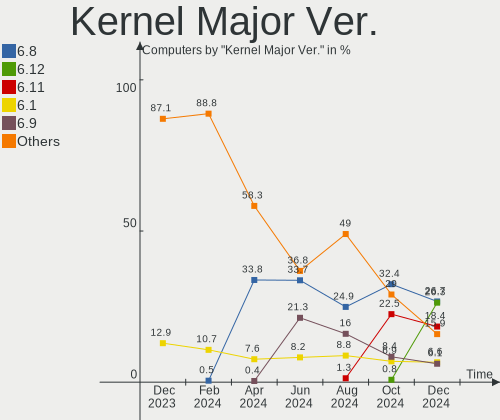

| Version | Computers | Percent |
|---------|-----------|---------|
| 5.15    | 180       | 21.87%  |
| 5.13    | 178       | 21.63%  |
| 5.17    | 143       | 17.38%  |
| 5.18    | 104       | 12.64%  |
| 5.4     | 84        | 10.21%  |
| 5.16    | 46        | 5.59%   |
| 5.10    | 40        | 4.86%   |
| 5.11    | 14        | 1.7%    |
| 5.14    | 10        | 1.22%   |
| 4.15    | 9         | 1.09%   |
| 4.18    | 3         | 0.36%   |
| 5.8     | 2         | 0.24%   |
| 4.9     | 2         | 0.24%   |
| 4.19    | 2         | 0.24%   |
| 5.3     | 1         | 0.12%   |
| 5.19    | 1         | 0.12%   |
| 5.12    | 1         | 0.12%   |
| 5.0     | 1         | 0.12%   |
| 4.4     | 1         | 0.12%   |
| 3.10    | 1         | 0.12%   |

Arch
----

OS architecture (x86_64, i586, etc.)

| Name    | Computers | Percent |
|---------|-----------|---------|
| x86_64  | 802       | 97.45%  |
| aarch64 | 14        | 1.7%    |
| i686    | 5         | 0.61%   |
| riscv64 | 1         | 0.12%   |
| armv7l  | 1         | 0.12%   |

DE
--

Desktop Environment

| Name             | Computers | Percent |
|------------------|-----------|---------|
| GNOME            | 380       | 46.17%  |
| KDE5             | 190       | 23.09%  |
| X-Cinnamon       | 60        | 7.29%   |
| XFCE             | 57        | 6.93%   |
| Unknown          | 53        | 6.44%   |
| MATE             | 27        | 3.28%   |
| Pantheon         | 11        | 1.34%   |
| Budgie           | 10        | 1.22%   |
| Cinnamon         | 8         | 0.97%   |
| LXQt             | 5         | 0.61%   |
| GNOME Classic    | 5         | 0.61%   |
| i3               | 3         | 0.36%   |
| GNOME Flashback  | 3         | 0.36%   |
| lightdm-xsession | 2         | 0.24%   |
| KDE              | 2         | 0.24%   |
| icewm            | 2         | 0.24%   |
| Trinity          | 1         | 0.12%   |
| sway-dbus        | 1         | 0.12%   |
| Openbox          | 1         | 0.12%   |
| Deepin           | 1         | 0.12%   |
| awesome          | 1         | 0.12%   |

Display Server
--------------

X11 or Wayland

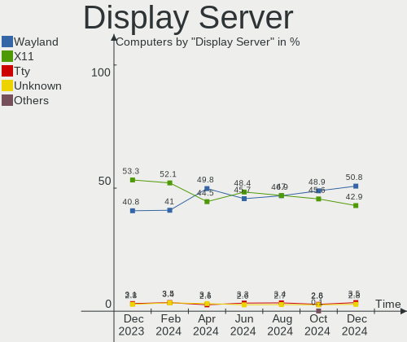

| Name    | Computers | Percent |
|---------|-----------|---------|
| X11     | 602       | 73.15%  |
| Wayland | 170       | 20.66%  |
| Tty     | 31        | 3.77%   |
| Unknown | 20        | 2.43%   |

Display Manager
---------------

SDDM, LightDM, etc.

| Name    | Computers | Percent |
|---------|-----------|---------|
| Unknown | 333       | 40.46%  |
| GDM3    | 201       | 24.42%  |
| LightDM | 121       | 14.7%   |
| SDDM    | 110       | 13.37%  |
| GDM     | 54        | 6.56%   |
| TDM     | 1         | 0.12%   |
| SLiM    | 1         | 0.12%   |
| NODM    | 1         | 0.12%   |
| LXDM    | 1         | 0.12%   |

OS Lang
-------

Language

| Lang        | Computers | Percent |
|-------------|-----------|---------|
| en_US       | 766       | 93.07%  |
| C           | 24        | 2.92%   |
| Unknown     | 8         | 0.97%   |
| en_CA       | 7         | 0.85%   |
| en_GB       | 4         | 0.49%   |
| de_DE       | 3         | 0.36%   |
| pt_BR       | 2         | 0.24%   |
| POSIX       | 2         | 0.24%   |
| en_IN       | 2         | 0.24%   |
| ru_RU       | 1         | 0.12%   |
| fr_FR       | 1         | 0.12%   |
| es_UY       | 1         | 0.12%   |
| en_US.UTF.8 | 1         | 0.12%   |
| C.UTF8      | 1         | 0.12%   |

Boot Mode
---------

EFI or BIOS

| Mode | Computers | Percent |
|------|-----------|---------|
| EFI  | 416       | 50.55%  |
| BIOS | 407       | 49.45%  |

Filesystem
----------

Type of filesystem

| Type    | Computers | Percent |
|---------|-----------|---------|
| Ext4    | 610       | 74.12%  |
| Btrfs   | 127       | 15.43%  |
| Overlay | 51        | 6.2%    |
| Xfs     | 19        | 2.31%   |
| Zfs     | 11        | 1.34%   |
| Ext3    | 2         | 0.24%   |
| XXXXXXX | 1         | 0.12%   |
| Rootfs  | 1         | 0.12%   |
| Ext2    | 1         | 0.12%   |

Part. scheme
------------

Scheme of partitioning

| Type    | Computers | Percent |
|---------|-----------|---------|
| Unknown | 481       | 58.44%  |
| GPT     | 289       | 35.12%  |
| MBR     | 53        | 6.44%   |

Dual Boot with Linux/BSD
------------------------

Hosting more than one Linux/BSD

| Dual boot | Computers | Percent |
|-----------|-----------|---------|
| No        | 716       | 87%     |
| Yes       | 107       | 13%     |

Dual Boot (Win)
---------------

Hosting Linux and Windows

| Dual boot | Computers | Percent |
|-----------|-----------|---------|
| No        | 648       | 78.74%  |
| Yes       | 175       | 21.26%  |

Board
-----

Vendor
------

Motherboard manufacturer

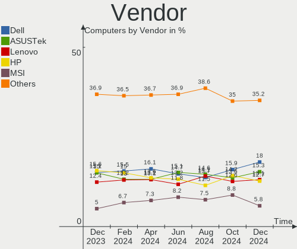

| Name                           | Computers | Percent |
|--------------------------------|-----------|---------|
| Dell                           | 165       | 20.05%  |
| ASUSTek Computer               | 122       | 14.82%  |
| Hewlett-Packard                | 117       | 14.22%  |
| Lenovo                         | 96        | 11.66%  |
| MSI                            | 46        | 5.59%   |
| Gigabyte Technology            | 44        | 5.35%   |
| Apple                          | 35        | 4.25%   |
| Acer                           | 20        | 2.43%   |
| ASRock                         | 19        | 2.31%   |
| Valve                          | 13        | 1.58%   |
| Intel                          | 12        | 1.46%   |
| Unknown                        | 12        | 1.46%   |
| Toshiba                        | 11        | 1.34%   |
| Raspberry Pi Foundation        | 11        | 1.34%   |
| System76                       | 10        | 1.22%   |
| Google                         | 9         | 1.09%   |
| Microsoft                      | 8         | 0.97%   |
| GPU Company                    | 8         | 0.97%   |
| Samsung Electronics            | 7         | 0.85%   |
| Alienware                      | 7         | 0.85%   |
| Supermicro                     | 6         | 0.73%   |
| Pegatron                       | 3         | 0.36%   |
| Framework                      | 3         | 0.36%   |
| Foxconn                        | 3         | 0.36%   |
| EVGA                           | 3         | 0.36%   |
| Sony                           | 2         | 0.24%   |
| Razer                          | 2         | 0.24%   |
| Matsushita Electric Industrial | 2         | 0.24%   |
| AZW                            | 2         | 0.24%   |
| ZOTAC                          | 1         | 0.12%   |
| TUXEDO                         | 1         | 0.12%   |
| SLIMBOOK                       | 1         | 0.12%   |
| Shuttle                        | 1         | 0.12%   |
| Purism                         | 1         | 0.12%   |
| Protectli                      | 1         | 0.12%   |
| Panasonic                      | 1         | 0.12%   |
| MOTILE                         | 1         | 0.12%   |
| MicroByte                      | 1         | 0.12%   |
| Micro Electronics              | 1         | 0.12%   |
| LG Electronics                 | 1         | 0.12%   |
| IP3 Tech                       | 1         | 0.12%   |
| Insyde                         | 1         | 0.12%   |
| HUAWEI                         | 1         | 0.12%   |
| Hardkernel                     | 1         | 0.12%   |
| GPD                            | 1         | 0.12%   |
| GEO                            | 1         | 0.12%   |
| Gateway                        | 1         | 0.12%   |
| FriendlyElec                   | 1         | 0.12%   |
| Ematic                         | 1         | 0.12%   |
| Eluktronics                    | 1         | 0.12%   |
| Cincoze                        | 1         | 0.12%   |
| Chuwi                          | 1         | 0.12%   |
| Biostar                        | 1         | 0.12%   |
| AMI                            | 1         | 0.12%   |

Model
-----

Motherboard model

| Name                                      | Computers | Percent |
|-------------------------------------------|-----------|---------|
| Valve Jupiter                             | 13        | 1.58%   |
| Unknown                                   | 12        | 1.46%   |
| ASUS All Series                           | 8         | 0.97%   |
| RPi Raspberry Pi                          | 6         | 0.73%   |
| Dell Latitude E5430 non-vPro              | 5         | 0.61%   |
| HP Pavilion Notebook                      | 4         | 0.49%   |
| GPU Company GWTC116-2                     | 4         | 0.49%   |
| Dell OptiPlex 3020                        | 4         | 0.49%   |
| MSI MS-7C35                               | 3         | 0.36%   |
| HP Notebook                               | 3         | 0.36%   |
| HP 15 Notebook PC                         | 3         | 0.36%   |
| Framework Laptop                          | 3         | 0.36%   |
| Dell XPS 15 9560                          | 3         | 0.36%   |
| Dell OptiPlex 9020                        | 3         | 0.36%   |
| Dell Latitude E6430                       | 3         | 0.36%   |
| Dell Inspiron 660                         | 3         | 0.36%   |
| ASUS TUF Gaming X570-PLUS                 | 3         | 0.36%   |
| ASUS ROG STRIX X570-E GAMING              | 3         | 0.36%   |
| ASUS ROG STRIX B550-F GAMING              | 3         | 0.36%   |
| ASUS CROSSHAIR V FORMULA-Z                | 3         | 0.36%   |
| Apple Macmini7,1                          | 3         | 0.36%   |
| Toshiba Satellite L775D                   | 2         | 0.24%   |
| System76 Oryx Pro                         | 2         | 0.24%   |
| System76 Lemur Pro                        | 2         | 0.24%   |
| RPi Raspberry Pi 4 Model B Rev 1.4        | 2         | 0.24%   |
| MSI MS-7D16                               | 2         | 0.24%   |
| MSI MS-7C56                               | 2         | 0.24%   |
| MSI MS-7C02                               | 2         | 0.24%   |
| MSI MS-7B86                               | 2         | 0.24%   |
| MSI MS-7B85                               | 2         | 0.24%   |
| Microsoft Surface Laptop 3                | 2         | 0.24%   |
| Microsoft Surface Book 2                  | 2         | 0.24%   |
| Lenovo Yoga C740-15IML 81TD               | 2         | 0.24%   |
| Lenovo ThinkPad L13 Yoga Gen 2 20VK0019US | 2         | 0.24%   |
| Lenovo IdeaPad Gaming 3 15ACH6 82K2       | 2         | 0.24%   |
| Lenovo IdeaPad 3 15IIL05 81WE             | 2         | 0.24%   |
| Intel AB2L                                | 2         | 0.24%   |
| HP Stream Laptop 14-cb1xxx                | 2         | 0.24%   |
| HP Pavilion Gaming Laptop 15-cx0xxx       | 2         | 0.24%   |
| HP Laptop 17-by4xxx                       | 2         | 0.24%   |
| HP Laptop 15-dy0xxx                       | 2         | 0.24%   |
| HP Laptop 14-dk1xxx                       | 2         | 0.24%   |
| HP ENVY x360 m6 Convertible               | 2         | 0.24%   |
| HP ENVY x360 Convertible 15-ee1xxx        | 2         | 0.24%   |
| HP ENVY x360 Convertible 13-bd0xxx        | 2         | 0.24%   |
| HP ENVY dv7                               | 2         | 0.24%   |
| HP EliteBook 8740w                        | 2         | 0.24%   |
| HP Compaq Pro 6300 MT                     | 2         | 0.24%   |
| Google Cyan                               | 2         | 0.24%   |
| Gigabyte Z97X-SLI                         | 2         | 0.24%   |
| Gigabyte GA-78LMT-USB3 6.0                | 2         | 0.24%   |
| Dell XPS 17 9710                          | 2         | 0.24%   |
| Dell XPS 15 9520                          | 2         | 0.24%   |
| Dell XPS 13 9310                          | 2         | 0.24%   |
| Dell Precision Tower 5810                 | 2         | 0.24%   |
| Dell Precision T5610                      | 2         | 0.24%   |
| Dell Precision T3610                      | 2         | 0.24%   |
| Dell OptiPlex 7070                        | 2         | 0.24%   |
| Dell OptiPlex 7040                        | 2         | 0.24%   |
| Dell OptiPlex 7010                        | 2         | 0.24%   |

Model Family
------------

Motherboard model prefix

| Name                  | Computers | Percent |
|-----------------------|-----------|---------|
| Lenovo ThinkPad       | 45        | 5.47%   |
| Dell Inspiron         | 42        | 5.1%    |
| Dell Latitude         | 40        | 4.86%   |
| ASUS ROG              | 27        | 3.28%   |
| Dell OptiPlex         | 26        | 3.16%   |
| Dell Precision        | 24        | 2.92%   |
| Dell XPS              | 17        | 2.07%   |
| HP Pavilion           | 16        | 1.94%   |
| HP Laptop             | 16        | 1.94%   |
| ASUS PRIME            | 16        | 1.94%   |
| ASUS TUF              | 14        | 1.7%    |
| Valve Jupiter         | 13        | 1.58%   |
| Lenovo IdeaPad        | 13        | 1.58%   |
| HP ENVY               | 13        | 1.58%   |
| Acer Aspire           | 13        | 1.58%   |
| Lenovo ThinkCentre    | 12        | 1.46%   |
| Unknown               | 12        | 1.46%   |
| RPi Raspberry         | 11        | 1.34%   |
| Toshiba Satellite     | 10        | 1.22%   |
| HP EliteBook          | 10        | 1.22%   |
| Microsoft Surface     | 8         | 0.97%   |
| Lenovo Yoga           | 8         | 0.97%   |
| ASUS All              | 8         | 0.97%   |
| HP Compaq             | 7         | 0.85%   |
| HP Stream             | 6         | 0.73%   |
| Dell PowerEdge        | 6         | 0.73%   |
| ASUS VivoBook         | 6         | 0.73%   |
| Lenovo Legion         | 4         | 0.49%   |
| HP ZBook              | 4         | 0.49%   |
| HP Spectre            | 4         | 0.49%   |
| HP EliteDesk          | 4         | 0.49%   |
| GPU Company GWTC116-2 | 4         | 0.49%   |
| Gigabyte X570         | 4         | 0.49%   |
| ASUS CROSSHAIR        | 4         | 0.49%   |
| Alienware Aurora      | 4         | 0.49%   |
| MSI MS-7C35           | 3         | 0.36%   |
| Lenovo ThinkBook      | 3         | 0.36%   |
| HP ProDesk            | 3         | 0.36%   |
| HP ProBook            | 3         | 0.36%   |
| HP OMEN               | 3         | 0.36%   |
| HP Notebook           | 3         | 0.36%   |
| HP 15                 | 3         | 0.36%   |
| Gigabyte B450M        | 3         | 0.36%   |
| Framework Laptop      | 3         | 0.36%   |
| Dell Vostro           | 3         | 0.36%   |
| ASUS ZenBook          | 3         | 0.36%   |
| Apple Macmini7        | 3         | 0.36%   |
| Apple MacBookPro11    | 3         | 0.36%   |
| Acer Nitro            | 3         | 0.36%   |
| System76 Thelio       | 2         | 0.24%   |
| System76 Oryx         | 2         | 0.24%   |
| System76 Lemur        | 2         | 0.24%   |
| Razer Blade           | 2         | 0.24%   |
| MSI MS-7D16           | 2         | 0.24%   |
| MSI MS-7C56           | 2         | 0.24%   |
| MSI MS-7C02           | 2         | 0.24%   |
| MSI MS-7B86           | 2         | 0.24%   |
| MSI MS-7B85           | 2         | 0.24%   |
| Lenovo IdeaPadFlex    | 2         | 0.24%   |
| Intel AB2L            | 2         | 0.24%   |

MFG Year
--------

Motherboard manufacture year

| Year    | Computers | Percent |
|---------|-----------|---------|
| 2021    | 112       | 13.61%  |
| 2020    | 98        | 11.91%  |
| 2019    | 87        | 10.57%  |
| 2018    | 56        | 6.8%    |
| 2012    | 54        | 6.56%   |
| 2014    | 53        | 6.44%   |
| 2015    | 47        | 5.71%   |
| 2022    | 46        | 5.59%   |
| 2017    | 46        | 5.59%   |
| 2016    | 40        | 4.86%   |
| 2010    | 38        | 4.62%   |
| 2011    | 36        | 4.37%   |
| 2013    | 35        | 4.25%   |
| 2008    | 22        | 2.67%   |
| 2009    | 17        | 2.07%   |
| Unknown | 16        | 1.94%   |
| 2007    | 12        | 1.46%   |
| 2006    | 5         | 0.61%   |
| 2005    | 3         | 0.36%   |

Form Factor
-----------

Physical design of the computer

| Name           | Computers | Percent |
|----------------|-----------|---------|
| Notebook       | 395       | 48%     |
| Desktop        | 319       | 38.76%  |
| Convertible    | 42        | 5.1%    |
| Mini pc        | 16        | 1.94%   |
| All in one     | 15        | 1.82%   |
| System on chip | 14        | 1.7%    |
| Tablet         | 11        | 1.34%   |
| Server         | 11        | 1.34%   |

Secure Boot
-----------

Enabled or disabled

| State    | Computers | Percent |
|----------|-----------|---------|
| Disabled | 769       | 93.44%  |
| Enabled  | 54        | 6.56%   |

Coreboot
--------

Have coreboot on board

| Used | Computers | Percent |
|------|-----------|---------|
| No   | 806       | 97.93%  |
| Yes  | 17        | 2.07%   |

RAM Size
--------

Total RAM memory

| Size in GB      | Computers | Percent |
|-----------------|-----------|---------|
| 16.01-24.0      | 189       | 22.96%  |
| 4.01-8.0        | 162       | 19.68%  |
| 32.01-64.0      | 135       | 16.4%   |
| 8.01-16.0       | 127       | 15.43%  |
| 3.01-4.0        | 115       | 13.97%  |
| 64.01-256.0     | 52        | 6.32%   |
| 24.01-32.0      | 15        | 1.82%   |
| 1.01-2.0        | 13        | 1.58%   |
| 0.51-1.0        | 7         | 0.85%   |
| 2.01-3.0        | 6         | 0.73%   |
| More than 256.0 | 1         | 0.12%   |
| Unknown         | 1         | 0.12%   |

RAM Used
--------

Used RAM memory

| Used GB    | Computers | Percent |
|------------|-----------|---------|
| 1.01-2.0   | 256       | 31.11%  |
| 2.01-3.0   | 215       | 26.12%  |
| 4.01-8.0   | 138       | 16.77%  |
| 3.01-4.0   | 114       | 13.85%  |
| 8.01-16.0  | 47        | 5.71%   |
| 0.51-1.0   | 31        | 3.77%   |
| 0.01-0.5   | 11        | 1.34%   |
| 16.01-24.0 | 7         | 0.85%   |
| 24.01-32.0 | 2         | 0.24%   |
| 32.01-64.0 | 1         | 0.12%   |
| Unknown    | 1         | 0.12%   |

Total Drives
------------

Number of drives on board

| Drives | Computers | Percent |
|--------|-----------|---------|
| 1      | 472       | 57.35%  |
| 2      | 192       | 23.33%  |
| 3      | 75        | 9.11%   |
| 4      | 36        | 4.37%   |
| 5      | 16        | 1.94%   |
| 6      | 10        | 1.22%   |
| 7      | 9         | 1.09%   |
| 8      | 5         | 0.61%   |
| 0      | 3         | 0.36%   |
| 10     | 2         | 0.24%   |
| 12     | 1         | 0.12%   |
| 11     | 1         | 0.12%   |
| 9      | 1         | 0.12%   |

Has CD-ROM
----------

Has CD-ROM on board

| Presented | Computers | Percent |
|-----------|-----------|---------|
| No        | 530       | 64.4%   |
| Yes       | 293       | 35.6%   |

Has Ethernet
------------

Has Ethernet on board

| Presented | Computers | Percent |
|-----------|-----------|---------|
| Yes       | 655       | 79.59%  |
| No        | 168       | 20.41%  |

Has WiFi
--------

Has WiFi module

| Presented | Computers | Percent |
|-----------|-----------|---------|
| Yes       | 664       | 80.68%  |
| No        | 159       | 19.32%  |

Has Bluetooth
-------------

Has Bluetooth module

| Presented | Computers | Percent |
|-----------|-----------|---------|
| Yes       | 538       | 65.37%  |
| No        | 285       | 34.63%  |

Location
--------

Country
-------

Geographic location (country)

| Country | Computers | Percent |
|---------|-----------|---------|
| USA     | 823       | 100%    |

City
----

Geographic location (city)

| City             | Computers | Percent |
|------------------|-----------|---------|
| New York         | 17        | 2.07%   |
| Seattle          | 14        | 1.7%    |
| Dallas           | 13        | 1.58%   |
| Chicago          | 11        | 1.34%   |
| San Antonio      | 9         | 1.09%   |
| Tucson           | 8         | 0.97%   |
| San Francisco    | 8         | 0.97%   |
| Phoenix          | 8         | 0.97%   |
| Miami            | 8         | 0.97%   |
| Atlanta          | 8         | 0.97%   |
| Springfield      | 7         | 0.85%   |
| Portland         | 7         | 0.85%   |
| Orlando          | 7         | 0.85%   |
| Las Vegas        | 7         | 0.85%   |
| San Jose         | 6         | 0.73%   |
| San Diego        | 6         | 0.73%   |
| Philadelphia     | 6         | 0.73%   |
| Houston          | 6         | 0.73%   |
| Washington       | 5         | 0.61%   |
| Plymouth         | 5         | 0.61%   |
| Nashville        | 5         | 0.61%   |
| Marietta         | 5         | 0.61%   |
| Los Angeles      | 5         | 0.61%   |
| Charlotte        | 5         | 0.61%   |
| Brooklyn         | 5         | 0.61%   |
| Albany           | 5         | 0.61%   |
| The Bronx        | 4         | 0.49%   |
| St Louis         | 4         | 0.49%   |
| Raleigh          | 4         | 0.49%   |
| Orange           | 4         | 0.49%   |
| Minneapolis      | 4         | 0.49%   |
| Knoxville        | 4         | 0.49%   |
| Kansas City      | 4         | 0.49%   |
| Jacksonville     | 4         | 0.49%   |
| Everett          | 4         | 0.49%   |
| Denver           | 4         | 0.49%   |
| Austin           | 4         | 0.49%   |
| Arlington        | 4         | 0.49%   |
| Albuquerque      | 4         | 0.49%   |
| Worcester        | 3         | 0.36%   |
| Virginia Beach   | 3         | 0.36%   |
| Tampa            | 3         | 0.36%   |
| Southampton      | 3         | 0.36%   |
| Schenectady      | 3         | 0.36%   |
| Saint Paul       | 3         | 0.36%   |
| Rochester        | 3         | 0.36%   |
| Puyallup         | 3         | 0.36%   |
| Plano            | 3         | 0.36%   |
| Parker           | 3         | 0.36%   |
| Oklahoma City    | 3         | 0.36%   |
| Ogden            | 3         | 0.36%   |
| Norman           | 3         | 0.36%   |
| Mesa             | 3         | 0.36%   |
| Maricopa         | 3         | 0.36%   |
| Lincoln          | 3         | 0.36%   |
| Laurel           | 3         | 0.36%   |
| Fort Lauderdale  | 3         | 0.36%   |
| East Stroudsburg | 3         | 0.36%   |
| Duncan           | 3         | 0.36%   |
| Duluth           | 3         | 0.36%   |

Drives
------

Drive Vendor
------------

Hard drive vendors

| Vendor                         | Computers | Drives | Percent |
|--------------------------------|-----------|--------|---------|
| Samsung Electronics            | 196       | 258    | 16.03%  |
| Seagate                        | 177       | 226    | 14.47%  |
| WDC                            | 173       | 267    | 14.15%  |
| SanDisk                        | 70        | 80     | 5.72%   |
| Unknown                        | 67        | 76     | 5.48%   |
| Toshiba                        | 61        | 71     | 4.99%   |
| SK hynix                       | 44        | 47     | 3.6%    |
| Kingston                       | 41        | 43     | 3.35%   |
| Crucial                        | 38        | 44     | 3.11%   |
| Intel                          | 37        | 62     | 3.03%   |
| Hitachi                        | 36        | 38     | 2.94%   |
| HGST                           | 21        | 23     | 1.72%   |
| PNY                            | 20        | 21     | 1.64%   |
| Phison                         | 20        | 22     | 1.64%   |
| Micron Technology              | 19        | 22     | 1.55%   |
| Unknown                        | 16        | 16     | 1.31%   |
| Apple                          | 15        | 18     | 1.23%   |
| A-DATA Technology              | 14        | 14     | 1.14%   |
| China                          | 12        | 13     | 0.98%   |
| KIOXIA                         | 10        | 10     | 0.82%   |
| Team                           | 9         | 12     | 0.74%   |
| SPCC                           | 8         | 9      | 0.65%   |
| Hewlett-Packard                | 7         | 10     | 0.57%   |
| Realtek Semiconductor          | 6         | 6      | 0.49%   |
| Micron/Crucial Technology      | 6         | 7      | 0.49%   |
| SABRENT                        | 5         | 6      | 0.41%   |
| Patriot                        | 5         | 5      | 0.41%   |
| Silicon Motion                 | 4         | 4      | 0.33%   |
| OCZ                            | 4         | 4      | 0.33%   |
| Mushkin                        | 4         | 5      | 0.33%   |
| Fujitsu                        | 4         | 4      | 0.33%   |
| ASMT                           | 4         | 5      | 0.33%   |
| T-FORCE                        | 3         | 3      | 0.25%   |
| Netac                          | 3         | 3      | 0.25%   |
| LITEONIT                       | 3         | 3      | 0.25%   |
| Leven                          | 3         | 3      | 0.25%   |
| BIWIN                          | 3         | 3      | 0.25%   |
| WD MediaMax                    | 2         | 2      | 0.16%   |
| USB3.0                         | 2         | 2      | 0.16%   |
| SSK                            | 2         | 2      | 0.16%   |
| O2 Micro                       | 2         | 2      | 0.16%   |
| LITEON                         | 2         | 2      | 0.16%   |
| Lexar                          | 2         | 2      | 0.16%   |
| LaCie                          | 2         | 2      | 0.16%   |
| KingFast                       | 2         | 3      | 0.16%   |
| JMicron Technology             | 2         | 2      | 0.16%   |
| External                       | 2         | 3      | 0.16%   |
| BHT                            | 2         | 2      | 0.16%   |
| XINTOR                         | 1         | 1      | 0.08%   |
| WDC WDS1                       | 1         | 1      | 0.08%   |
| WDC WDB                        | 1         | 1      | 0.08%   |
| Union Memory (Shenzhen)        | 1         | 1      | 0.08%   |
| UMIS                           | 1         | 1      | 0.08%   |
| Transcend                      | 1         | 1      | 0.08%   |
| Timetec                        | 1         | 1      | 0.08%   |
| SSSTC                          | 1         | 1      | 0.08%   |
| Solid State Storage Technology | 1         | 1      | 0.08%   |
| Realtek                        | 1         | 1      | 0.08%   |
| Protectli                      | 1         | 1      | 0.08%   |
| Plextor                        | 1         | 1      | 0.08%   |

Drive Model
-----------

Hard drive models

| Model                            | Computers | Percent |
|----------------------------------|-----------|---------|
| Samsung NVMe SSD Drive 1TB       | 23        | 1.63%   |
| Unknown                          | 16        | 1.13%   |
| Seagate ST2000DM008-2FR102 2TB   | 14        | 0.99%   |
| Samsung NVMe SSD Drive 256GB     | 12        | 0.85%   |
| Unknown SD/MMC/MS PRO 128GB      | 11        | 0.78%   |
| SanDisk NVMe SSD Drive 500GB     | 11        | 0.78%   |
| SanDisk NVMe SSD Drive 1TB       | 11        | 0.78%   |
| Samsung SSD 860 EVO 1TB          | 11        | 0.78%   |
| Samsung NVMe SSD Drive 512GB     | 11        | 0.78%   |
| Crucial CT1000MX500SSD1 1TB      | 11        | 0.78%   |
| Toshiba MQ01ABD100 1TB           | 10        | 0.71%   |
| Unknown MMC Card  64GB           | 9         | 0.64%   |
| Samsung SSD 970 EVO 500GB        | 9         | 0.64%   |
| Kingston NVMe SSD Drive 512GB    | 9         | 0.64%   |
| WDC WD10EZEX-08WN4A0 1TB         | 8         | 0.57%   |
| Unknown MMC Card  32GB           | 8         | 0.57%   |
| Samsung SSD 850 EVO 500GB        | 8         | 0.57%   |
| Samsung SSD 850 EVO 250GB        | 8         | 0.57%   |
| Intel NVMe SSD Drive 512GB       | 8         | 0.57%   |
| SK hynix NVMe SSD Drive 512GB    | 7         | 0.5%    |
| Seagate ST500LT012-1DG142 500GB  | 7         | 0.5%    |
| Seagate ST3500413AS 500GB        | 7         | 0.5%    |
| Samsung SSD 860 EVO 500GB        | 7         | 0.5%    |
| HGST HTS721010A9E630 1TB         | 7         | 0.5%    |
| WDC WDS500G2B0B-00YS70 500GB SSD | 6         | 0.42%   |
| Seagate ST500DM002-1BD142 500GB  | 6         | 0.42%   |
| Samsung SSD 970 EVO Plus 1TB     | 6         | 0.42%   |
| PNY CS900 500GB SSD              | 6         | 0.42%   |
| Seagate ST4000DM004-2CV104 4TB   | 5         | 0.35%   |
| Seagate ST2000DM001-1ER164 2TB   | 5         | 0.35%   |
| Seagate ST2000DM001-1CH164 2TB   | 5         | 0.35%   |
| Seagate ST1000LM035-1RK172 1TB   | 5         | 0.35%   |
| Seagate ST1000DM003-1SB102 1TB   | 5         | 0.35%   |
| Seagate ST1000DM003-1CH162 1TB   | 5         | 0.35%   |
| SanDisk NVMe SSD Drive 512GB     | 5         | 0.35%   |
| Samsung SSD 980 PRO 2TB          | 5         | 0.35%   |
| Samsung SSD 980 PRO 1TB          | 5         | 0.35%   |
| Samsung SSD 970 EVO Plus 2TB     | 5         | 0.35%   |
| Samsung NVMe SSD Drive 2TB       | 5         | 0.35%   |
| Samsung NVMe SSD Drive 1024GB    | 5         | 0.35%   |
| SABRENT Disk 1TB                 | 5         | 0.35%   |
| PNY CS900 240GB SSD              | 5         | 0.35%   |
| Kingston SA400S37240G 240GB SSD  | 5         | 0.35%   |
| Intel HBRPEKNX0202AHO 32GB       | 5         | 0.35%   |
| Crucial CT500MX500SSD1 500GB     | 5         | 0.35%   |
| WDC WDS100T2B0A-00SM50 1TB SSD   | 4         | 0.28%   |
| WDC WDBNCE5000PNC 500GB SSD      | 4         | 0.28%   |
| WDC WD20EZRZ-00Z5HB0 2TB         | 4         | 0.28%   |
| WDC WD2003FZEX-00Z4SA0 2TB       | 4         | 0.28%   |
| Unknown MMC Card  128GB          | 4         | 0.28%   |
| SK hynix NVMe SSD Drive 500GB    | 4         | 0.28%   |
| Seagate ST3500418AS 500GB        | 4         | 0.28%   |
| Seagate Expansion+ Desk 4TB      | 4         | 0.28%   |
| Seagate BUP Slim 2TB             | 4         | 0.28%   |
| Seagate Backup+ Hub BK 8TB       | 4         | 0.28%   |
| Samsung SSD 970 PRO 1TB          | 4         | 0.28%   |
| Samsung SSD 870 EVO 1TB          | 4         | 0.28%   |
| Samsung SSD 860 QVO 1TB          | 4         | 0.28%   |
| Samsung SSD 860 EVO 2TB          | 4         | 0.28%   |
| Samsung SSD 850 EVO 1TB          | 4         | 0.28%   |

HDD Vendor
----------

Hard disk drive vendors

| Vendor              | Computers | Drives | Percent |
|---------------------|-----------|--------|---------|
| Seagate             | 173       | 220    | 39.5%   |
| WDC                 | 130       | 211    | 29.68%  |
| Toshiba             | 42        | 52     | 9.59%   |
| Hitachi             | 36        | 38     | 8.22%   |
| HGST                | 21        | 23     | 4.79%   |
| Unknown             | 12        | 12     | 2.74%   |
| Samsung Electronics | 7         | 8      | 1.6%    |
| Fujitsu             | 4         | 4      | 0.91%   |
| ASMT                | 4         | 5      | 0.91%   |
| Hewlett-Packard     | 2         | 2      | 0.46%   |
| Apple               | 2         | 2      | 0.46%   |
| WD MediaMax         | 1         | 1      | 0.23%   |
| Maxtor              | 1         | 1      | 0.23%   |
| Inateck             | 1         | 1      | 0.23%   |
| IBM/Hitachi         | 1         | 1      | 0.23%   |
| HGST HDN            | 1         | 1      | 0.23%   |

SSD Vendor
----------

Solid state drive vendors

| Vendor              | Computers | Drives | Percent |
|---------------------|-----------|--------|---------|
| Samsung Electronics | 83        | 103    | 22.8%   |
| SanDisk             | 38        | 45     | 10.44%  |
| Crucial             | 34        | 39     | 9.34%   |
| WDC                 | 28        | 29     | 7.69%   |
| Kingston            | 25        | 27     | 6.87%   |
| PNY                 | 19        | 20     | 5.22%   |
| A-DATA Technology   | 13        | 13     | 3.57%   |
| China               | 12        | 13     | 3.3%    |
| SK hynix            | 9         | 9      | 2.47%   |
| Micron Technology   | 9         | 10     | 2.47%   |
| Apple               | 9         | 9      | 2.47%   |
| Team                | 8         | 11     | 2.2%    |
| SPCC                | 7         | 8      | 1.92%   |
| Intel               | 7         | 7      | 1.92%   |
| Toshiba             | 5         | 5      | 1.37%   |
| Patriot             | 5         | 5      | 1.37%   |
| OCZ                 | 4         | 4      | 1.1%    |
| Mushkin             | 4         | 5      | 1.1%    |
| Netac               | 3         | 3      | 0.82%   |
| LITEONIT            | 3         | 3      | 0.82%   |
| Unknown             | 3         | 3      | 0.82%   |
| USB3.0              | 2         | 2      | 0.55%   |
| Seagate             | 2         | 2      | 0.55%   |
| LITEON              | 2         | 2      | 0.55%   |
| Lexar               | 2         | 2      | 0.55%   |
| Leven               | 2         | 2      | 0.55%   |
| KingFast            | 2         | 2      | 0.55%   |
| Hewlett-Packard     | 2         | 2      | 0.55%   |
| BIWIN               | 2         | 2      | 0.55%   |
| BHT                 | 2         | 2      | 0.55%   |
| XINTOR              | 1         | 1      | 0.27%   |
| WDC WDS1            | 1         | 1      | 0.27%   |
| WDC WDB             | 1         | 1      | 0.27%   |
| Timetec             | 1         | 1      | 0.27%   |
| T-FORCE             | 1         | 1      | 0.27%   |
| Protectli           | 1         | 1      | 0.27%   |
| Plextor             | 1         | 1      | 0.27%   |
| Phison              | 1         | 1      | 0.27%   |
| KingSpec            | 1         | 1      | 0.27%   |
| KingDian            | 1         | 1      | 0.27%   |
| JMicron Technology  | 1         | 1      | 0.27%   |
| Innodisk            | 1         | 1      | 0.27%   |
| Gigabyte Technology | 1         | 1      | 0.27%   |
| FORESEE             | 1         | 1      | 0.27%   |
| EDGE                | 1         | 1      | 0.27%   |
| Dogfish             | 1         | 1      | 0.27%   |
| Axiom               | 1         | 1      | 0.27%   |
| Argon               | 1         | 1      | 0.27%   |

Drive Kind
----------

HDD or SSD

| Kind    | Computers | Drives | Percent |
|---------|-----------|--------|---------|
| HDD     | 367       | 582    | 33.18%  |
| NVMe    | 330       | 436    | 29.84%  |
| SSD     | 322       | 407    | 29.11%  |
| MMC     | 69        | 75     | 6.24%   |
| Unknown | 18        | 20     | 1.63%   |

Drive Connector
---------------

SATA, SAS, NVMe, etc.

| Type | Computers | Drives | Percent |
|------|-----------|--------|---------|
| SATA | 550       | 927    | 54.03%  |
| NVMe | 326       | 425    | 32.02%  |
| SAS  | 73        | 93     | 7.17%   |
| MMC  | 69        | 75     | 6.78%   |

Drive Size
----------

Size of hard drive

| Size in TB | Computers | Drives | Percent |
|------------|-----------|--------|---------|
| 0.01-0.5   | 365       | 462    | 47.84%  |
| 0.51-1.0   | 225       | 284    | 29.49%  |
| 1.01-2.0   | 92        | 118    | 12.06%  |
| 3.01-4.0   | 31        | 42     | 4.06%   |
| 4.01-10.0  | 31        | 57     | 4.06%   |
| 2.01-3.0   | 15        | 18     | 1.97%   |
| 10.01-20.0 | 4         | 8      | 0.52%   |

Space Total
-----------

Amount of disk space available on the file system

| Size in GB     | Computers | Percent |
|----------------|-----------|---------|
| 251-500        | 182       | 22.11%  |
| 101-250        | 150       | 18.23%  |
| 501-1000       | 143       | 17.38%  |
| More than 3000 | 85        | 10.33%  |
| 1001-2000      | 85        | 10.33%  |
| 1-20           | 50        | 6.08%   |
| 51-100         | 42        | 5.1%    |
| 21-50          | 32        | 3.89%   |
| 2001-3000      | 27        | 3.28%   |
| Unknown        | 27        | 3.28%   |

Space Used
----------

Amount of used disk space

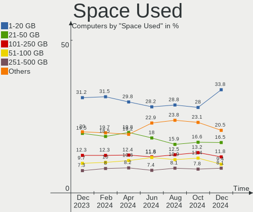

| Used GB        | Computers | Percent |
|----------------|-----------|---------|
| 1-20           | 292       | 35.48%  |
| 21-50          | 129       | 15.67%  |
| 101-250        | 96        | 11.66%  |
| 51-100         | 96        | 11.66%  |
| 251-500        | 64        | 7.78%   |
| 501-1000       | 50        | 6.08%   |
| 1001-2000      | 27        | 3.28%   |
| Unknown        | 27        | 3.28%   |
| More than 3000 | 22        | 2.67%   |
| 2001-3000      | 19        | 2.31%   |
| 0              | 1         | 0.12%   |

Malfunc. Drives
---------------

Drive models with a malfunction

| Model                                          | Computers | Drives | Percent |
|------------------------------------------------|-----------|--------|---------|
| Seagate ST250DM000-1BD141 250GB                | 2         | 2      | 3.28%   |
| Seagate ST1000LX015-1U7172 1TB                 | 2         | 2      | 3.28%   |
| HGST HTS721010A9E630 1TB                       | 2         | 2      | 3.28%   |
| WDC WD6002FZWX-00GBGB0 6TB                     | 1         | 1      | 1.64%   |
| WDC WD60 EFRX-68MYMN1 6TB                      | 1         | 1      | 1.64%   |
| WDC WD5000AAKS-00UU3A0 500GB                   | 1         | 1      | 1.64%   |
| WDC WD5000AAKB-00H8A0 500GB                    | 1         | 1      | 1.64%   |
| WDC WD40EFRX-68WT0N0 4TB                       | 1         | 2      | 1.64%   |
| WDC WD3200AAKS-75B3A0 320GB                    | 1         | 1      | 1.64%   |
| WDC WD2500AAJS-00B4A0 250GB                    | 1         | 1      | 1.64%   |
| WDC WD10JPVX-22JC3T0 1TB                       | 1         | 1      | 1.64%   |
| WDC WD10EZEX-22BN5A0 1TB                       | 1         | 1      | 1.64%   |
| Toshiba MQ01ACF050 500GB                       | 1         | 1      | 1.64%   |
| Toshiba MQ01ABD050 500GB                       | 1         | 1      | 1.64%   |
| Toshiba MK1665GSX H 160GB                      | 1         | 1      | 1.64%   |
| Toshiba MK1255GSX H 120GB                      | 1         | 1      | 1.64%   |
| Toshiba KSG60ZMV256G M.2 2280 256GB SSD        | 1         | 1      | 1.64%   |
| Toshiba DT01ACA300 3TB                         | 1         | 1      | 1.64%   |
| SPCC M.2 PCIe SSD 512GB                        | 1         | 1      | 1.64%   |
| SK hynix PC711 HFS001TDE9X073N 1TB             | 1         | 1      | 1.64%   |
| Seagate ST9160412AS 160GB                      | 1         | 1      | 1.64%   |
| Seagate ST8000DM004-2CX188 8TB                 | 1         | 2      | 1.64%   |
| Seagate ST500DM002-1BD142 500GB                | 1         | 1      | 1.64%   |
| Seagate ST3500841A 500GB                       | 1         | 1      | 1.64%   |
| Seagate ST2000LM007-1R8174 2TB                 | 1         | 1      | 1.64%   |
| Seagate ST2000DM006-2DM164 2TB                 | 1         | 1      | 1.64%   |
| Seagate ST2000DM001-9YN164 2TB                 | 1         | 1      | 1.64%   |
| Seagate ST2000DM001-1ER164 2TB                 | 1         | 1      | 1.64%   |
| Seagate ST2000DM001-1CH164 2TB                 | 1         | 1      | 1.64%   |
| SanDisk SSD PLUS 240GB                         | 1         | 1      | 1.64%   |
| SanDisk SDSSDXPS240G 240GB                     | 1         | 4      | 1.64%   |
| SanDisk SDSSDXP240G 240GB                      | 1         | 1      | 1.64%   |
| SanDisk SD9SN8W-128G-1006 128GB SSD            | 1         | 1      | 1.64%   |
| Samsung Electronics SSD 980 PRO 2TB            | 1         | 2      | 1.64%   |
| Samsung Electronics SSD 970 PRO 1TB            | 1         | 1      | 1.64%   |
| Samsung Electronics SSD 970 EVO Plus 1TB       | 1         | 1      | 1.64%   |
| Samsung Electronics SSD 970 EVO 500GB          | 1         | 1      | 1.64%   |
| Samsung Electronics SSD 870 EVO 1TB            | 1         | 1      | 1.64%   |
| Samsung Electronics SSD 850 EVO 1TB            | 1         | 1      | 1.64%   |
| Samsung Electronics SSD 840 Series 250GB       | 1         | 1      | 1.64%   |
| Micron Technology 1100_MTFDDAV256TBN 256GB SSD | 1         | 1      | 1.64%   |
| LITEONIT LCT-256M3S 2.5 7mm 256GB SSD          | 1         | 1      | 1.64%   |
| Kingston SH103S3240G 240GB SSD                 | 1         | 1      | 1.64%   |
| Innodisk DES25-64GM41BW1DC-27 64GB SSD         | 1         | 1      | 1.64%   |
| IBM/Hitachi IC35L060AVV207-0 64GB              | 1         | 1      | 1.64%   |
| Hitachi HUA723020ALA641 2TB                    | 1         | 1      | 1.64%   |
| Hitachi HTS727550A9E364 500GB                  | 1         | 1      | 1.64%   |
| Hitachi HTS725050A7E630 500GB                  | 1         | 1      | 1.64%   |
| Hitachi HTS545016B9A300 160GB                  | 1         | 1      | 1.64%   |
| Hitachi HTS541010A9E680 1TB                    | 1         | 1      | 1.64%   |
| Hitachi HDS721050CLA362 500GB                  | 1         | 1      | 1.64%   |
| Hitachi HDE721010SLA330 1TB                    | 1         | 1      | 1.64%   |
| HGST HTS725050A7E630 500GB                     | 1         | 1      | 1.64%   |
| HGST HTS725032A7E630 320GB                     | 1         | 1      | 1.64%   |
| Fujitsu MHT2030AT 32GB                         | 1         | 1      | 1.64%   |
| Crucial M4-CT128M4SSD2 128GB                   | 1         | 1      | 1.64%   |
| Crucial CT1050MX300SSD1 1TB                    | 1         | 1      | 1.64%   |
| China SSD 240GB                                | 1         | 1      | 1.64%   |

Malfunc. Drive Vendor
---------------------

Vendors of faulty drives

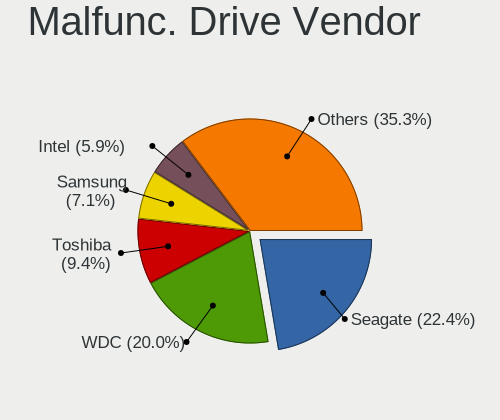

| Vendor              | Computers | Drives | Percent |
|---------------------|-----------|--------|---------|
| Seagate             | 13        | 14     | 21.31%  |
| WDC                 | 9         | 10     | 14.75%  |
| Samsung Electronics | 7         | 8      | 11.48%  |
| Hitachi             | 7         | 7      | 11.48%  |
| Toshiba             | 6         | 6      | 9.84%   |
| SanDisk             | 4         | 7      | 6.56%   |
| HGST                | 4         | 4      | 6.56%   |
| Crucial             | 2         | 2      | 3.28%   |
| SPCC                | 1         | 1      | 1.64%   |
| SK hynix            | 1         | 1      | 1.64%   |
| Micron Technology   | 1         | 1      | 1.64%   |
| LITEONIT            | 1         | 1      | 1.64%   |
| Kingston            | 1         | 1      | 1.64%   |
| Innodisk            | 1         | 1      | 1.64%   |
| IBM/Hitachi         | 1         | 1      | 1.64%   |
| Fujitsu             | 1         | 1      | 1.64%   |
| China               | 1         | 1      | 1.64%   |

Malfunc. HDD Vendor
-------------------

Vendors of faulty HDD drives

| Vendor      | Computers | Drives | Percent |
|-------------|-----------|--------|---------|
| Seagate     | 13        | 14     | 32.5%   |
| WDC         | 9         | 10     | 22.5%   |
| Hitachi     | 7         | 7      | 17.5%   |
| Toshiba     | 5         | 5      | 12.5%   |
| HGST        | 4         | 4      | 10%     |
| IBM/Hitachi | 1         | 1      | 2.5%    |
| Fujitsu     | 1         | 1      | 2.5%    |

Malfunc. Drive Kind
-------------------

Kinds of faulty drives

| Kind | Computers | Drives | Percent |
|------|-----------|--------|---------|
| HDD  | 37        | 42     | 63.79%  |
| SSD  | 15        | 18     | 25.86%  |
| NVMe | 6         | 7      | 10.34%  |

Failed Drives
-------------

Failed drive models

Zero info for selected period =(

Failed Drive Vendor
-------------------

Failed drive vendors

Zero info for selected period =(

Drive Status
------------

Number of failed and malfunc. drives

| Status   | Computers | Drives | Percent |
|----------|-----------|--------|---------|
| Detected | 526       | 916    | 59.17%  |
| Works    | 308       | 537    | 34.65%  |
| Malfunc  | 55        | 67     | 6.19%   |

Storage controller
------------------

Storage Vendor
--------------

Storage controller vendors

| Vendor                         | Computers | Percent |
|--------------------------------|-----------|---------|
| Intel                          | 495       | 46.3%   |
| AMD                            | 180       | 16.84%  |
| Samsung Electronics            | 131       | 12.25%  |
| SanDisk                        | 55        | 5.14%   |
| SK hynix                       | 34        | 3.18%   |
| Phison Electronics             | 20        | 1.87%   |
| ASMedia Technology             | 20        | 1.87%   |
| Toshiba America Info Systems   | 16        | 1.5%    |
| Kingston Technology Company    | 16        | 1.5%    |
| Marvell Technology Group       | 12        | 1.12%   |
| Micron Technology              | 11        | 1.03%   |
| Micron/Crucial Technology      | 10        | 0.94%   |
| Nvidia                         | 8         | 0.75%   |
| KIOXIA                         | 8         | 0.75%   |
| Realtek Semiconductor          | 7         | 0.65%   |
| JMicron Technology             | 7         | 0.65%   |
| Broadcom / LSI                 | 7         | 0.65%   |
| Silicon Motion                 | 6         | 0.56%   |
| LSI Logic / Symbios Logic      | 3         | 0.28%   |
| Biwin Storage Technology       | 3         | 0.28%   |
| Apple                          | 3         | 0.28%   |
| Unknown                        | 2         | 0.19%   |
| Union Memory (Shenzhen)        | 2         | 0.19%   |
| Solid State Storage Technology | 2         | 0.19%   |
| Seagate Technology             | 2         | 0.19%   |
| O2 Micro                       | 2         | 0.19%   |
| MAXIO Technology (Hangzhou)    | 2         | 0.19%   |
| ADATA Technology               | 2         | 0.19%   |
| VIA Technologies               | 1         | 0.09%   |
| Silicon Image                  | 1         | 0.09%   |
| Integrated Technology Express  | 1         | 0.09%   |

Storage Model
-------------

Storage controller models

| Model                                                                          | Computers | Percent |
|--------------------------------------------------------------------------------|-----------|---------|
| AMD FCH SATA Controller [AHCI mode]                                            | 119       | 9.76%   |
| Samsung NVMe SSD Controller SM981/PM981/PM983                                  | 54        | 4.43%   |
| Intel 82801 Mobile SATA Controller [RAID mode]                                 | 43        | 3.53%   |
| Samsung NVMe SSD Controller 980                                                | 36        | 2.95%   |
| Intel Volume Management Device NVMe RAID Controller                            | 33        | 2.71%   |
| Intel 8 Series/C220 Series Chipset Family 6-port SATA Controller 1 [AHCI mode] | 32        | 2.63%   |
| AMD 400 Series Chipset SATA Controller                                         | 30        | 2.46%   |
| Samsung NVMe SSD Controller PM9A1/PM9A3/980PRO                                 | 29        | 2.38%   |
| Intel Sunrise Point-LP SATA Controller [AHCI mode]                             | 26        | 2.13%   |
| AMD SB7x0/SB8x0/SB9x0 SATA Controller [AHCI mode]                              | 25        | 2.05%   |
| Intel 7 Series Chipset Family 6-port SATA Controller [AHCI mode]               | 22        | 1.8%    |
| Intel SATA Controller [RAID mode]                                              | 21        | 1.72%   |
| SK hynix Gold P31 SSD                                                          | 20        | 1.64%   |
| AMD 500 Series Chipset SATA Controller                                         | 20        | 1.64%   |
| Intel Q170/Q150/B150/H170/H110/Z170/CM236 Chipset SATA Controller [AHCI Mode]  | 19        | 1.56%   |
| ASMedia ASM1062 Serial ATA Controller                                          | 18        | 1.48%   |
| Intel 6 Series/C200 Series Chipset Family 6 port Mobile SATA AHCI Controller   | 17        | 1.39%   |
| Intel Non-Volatile memory controller                                           | 15        | 1.23%   |
| Intel Celeron/Pentium Silver Processor SATA Controller                         | 15        | 1.23%   |
| AMD SB7x0/SB8x0/SB9x0 IDE Controller                                           | 15        | 1.23%   |
| Intel Cannon Lake Mobile PCH SATA AHCI Controller                              | 14        | 1.15%   |
| Intel 7 Series/C210 Series Chipset Family 6-port SATA Controller [AHCI mode]   | 14        | 1.15%   |
| Intel 500 Series Chipset Family SATA AHCI Controller                           | 14        | 1.15%   |
| Intel 5 Series/3400 Series Chipset 6 port SATA AHCI Controller                 | 14        | 1.15%   |
| SanDisk WD Blue SN550 NVMe SSD                                                 | 13        | 1.07%   |
| SanDisk Non-Volatile memory controller                                         | 13        | 1.07%   |
| Intel Alder Lake-S PCH SATA Controller [AHCI Mode]                             | 13        | 1.07%   |
| SanDisk WD Black SN750 / PC SN730 NVMe SSD                                     | 12        | 0.98%   |
| Intel Tiger Lake-LP SATA Controller [AHCI mode]                                | 12        | 0.98%   |
| Intel Comet Lake SATA AHCI Controller                                          | 12        | 0.98%   |
| Intel 6 Series/C200 Series Chipset Family 6 port Desktop SATA AHCI Controller  | 12        | 0.98%   |
| Micron Non-Volatile memory controller                                          | 11        | 0.9%    |
| Intel 200 Series PCH SATA controller [AHCI mode]                               | 11        | 0.9%    |
| Kingston Company OM3PDP3 NVMe SSD                                              | 10        | 0.82%   |
| Intel SSD 660P Series                                                          | 10        | 0.82%   |
| Intel NM10/ICH7 Family SATA Controller [IDE mode]                              | 10        | 0.82%   |
| SanDisk WD PC SN810 / Black SN850 NVMe SSD                                     | 9         | 0.74%   |
| Phison E12 NVMe Controller                                                     | 9         | 0.74%   |
| Intel Celeron N3350/Pentium N4200/Atom E3900 Series SATA AHCI Controller       | 9         | 0.74%   |
| Intel Cannon Lake PCH SATA AHCI Controller                                     | 9         | 0.74%   |
| Intel 82801IBM/IEM (ICH9M/ICH9M-E) 4 port SATA Controller [AHCI mode]          | 9         | 0.74%   |
| Intel 8 Series SATA Controller 1 [AHCI mode]                                   | 9         | 0.74%   |
| KIOXIA Non-Volatile memory controller                                          | 8         | 0.66%   |
| Intel Wildcat Point-LP SATA Controller [AHCI Mode]                             | 8         | 0.66%   |
| Intel C610/X99 series chipset sSATA Controller [AHCI mode]                     | 8         | 0.66%   |
| Intel C600/X79 series chipset SATA RAID Controller                             | 8         | 0.66%   |
| Intel 9 Series Chipset Family SATA Controller [AHCI Mode]                      | 8         | 0.66%   |
| Intel 82801HM/HEM (ICH8M/ICH8M-E) IDE Controller                               | 8         | 0.66%   |
| Toshiba America Info Systems XG6 NVMe SSD Controller                           | 7         | 0.57%   |
| Samsung NVMe SSD Controller SM961/PM961/SM963                                  | 7         | 0.57%   |
| Intel C610/X99 series chipset 6-Port SATA Controller [AHCI mode]               | 7         | 0.57%   |
| Intel 82801JI (ICH10 Family) SATA AHCI Controller                              | 7         | 0.57%   |
| Intel 82801HM/HEM (ICH8M/ICH8M-E) SATA Controller [AHCI mode]                  | 7         | 0.57%   |
| Intel 82801G (ICH7 Family) IDE Controller                                      | 7         | 0.57%   |
| AMD SB7x0/SB8x0/SB9x0 SATA Controller [IDE mode]                               | 7         | 0.57%   |
| Micron/Crucial P2 NVMe PCIe SSD                                                | 6         | 0.49%   |
| SanDisk WD Blue SN570 NVMe SSD                                                 | 5         | 0.41%   |
| Samsung NVMe SSD Controller SM951/PM951                                        | 5         | 0.41%   |
| Samsung Electronics SATA controller                                            | 5         | 0.41%   |
| Realtek Realtek Non-Volatile memory controller                                 | 5         | 0.41%   |

Storage Kind
------------

Kind of storage controller (IDE, SATA, NVMe, SAS, ...)

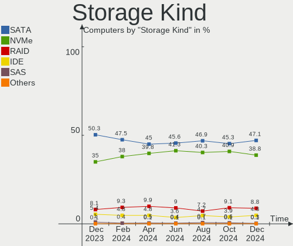

| Kind | Computers | Percent |
|------|-----------|---------|
| SATA | 562       | 51.94%  |
| NVMe | 327       | 30.22%  |
| RAID | 114       | 10.54%  |
| IDE  | 71        | 6.56%   |
| SAS  | 5         | 0.46%   |
| SCSI | 3         | 0.28%   |

Processor
---------

CPU Vendor
----------

Processor vendors

| Vendor        | Computers | Percent |
|---------------|-----------|---------|
| Intel         | 588       | 71.45%  |
| AMD           | 219       | 26.61%  |
| ARM           | 14        | 1.7%    |
| sifive,u74-mc | 1         | 0.12%   |
| Unknown       | 1         | 0.12%   |

CPU Model
---------

Processor models

| Model                                       | Computers | Percent |
|---------------------------------------------|-----------|---------|
| Intel 11th Gen Core i5-1135G7 @ 2.40GHz     | 17        | 2.07%   |
| Intel 11th Gen Core i7-1165G7 @ 2.80GHz     | 13        | 1.58%   |
| ARM Processor                               | 13        | 1.58%   |
| AMD Custom APU 0405                         | 13        | 1.58%   |
| Intel Celeron N4020 CPU @ 1.10GHz           | 12        | 1.46%   |
| Intel Core i7-9750H CPU @ 2.60GHz           | 9         | 1.09%   |
| Intel Core i7-8550U CPU @ 1.80GHz           | 8         | 0.97%   |
| AMD Ryzen 9 3900X 12-Core Processor         | 8         | 0.97%   |
| AMD Ryzen 7 5800X 8-Core Processor          | 8         | 0.97%   |
| Intel Core i7-7700HQ CPU @ 2.80GHz          | 7         | 0.85%   |
| Intel Core i7-10510U CPU @ 1.80GHz          | 7         | 0.85%   |
| Intel Core i5-3320M CPU @ 2.60GHz           | 7         | 0.85%   |
| AMD Ryzen 7 3700X 8-Core Processor          | 7         | 0.85%   |
| AMD Ryzen 5 5600G with Radeon Graphics      | 7         | 0.85%   |
| AMD FX-8350 Eight-Core Processor            | 7         | 0.85%   |
| Intel 11th Gen Core i7-11800H @ 2.30GHz     | 6         | 0.73%   |
| AMD Ryzen 7 2700X Eight-Core Processor      | 6         | 0.73%   |
| AMD Ryzen 5 3600 6-Core Processor           | 6         | 0.73%   |
| Intel Core i7-4790 CPU @ 3.60GHz            | 5         | 0.61%   |
| Intel Core i5-7200U CPU @ 2.50GHz           | 5         | 0.61%   |
| Intel Core i5-6200U CPU @ 2.30GHz           | 5         | 0.61%   |
| Intel Core i5-1035G1 CPU @ 1.00GHz          | 5         | 0.61%   |
| Intel Celeron CPU N2840 @ 2.16GHz           | 5         | 0.61%   |
| Intel 12th Gen Core i7-12700K               | 5         | 0.61%   |
| Intel 11th Gen Core i7-1185G7 @ 3.00GHz     | 5         | 0.61%   |
| AMD Ryzen 9 5950X 16-Core Processor         | 5         | 0.61%   |
| AMD Ryzen 7 5800H with Radeon Graphics      | 5         | 0.61%   |
| AMD Ryzen 7 5700U with Radeon Graphics      | 5         | 0.61%   |
| Intel Core i7-8750H CPU @ 2.20GHz           | 4         | 0.49%   |
| Intel Core i7-8650U CPU @ 1.90GHz           | 4         | 0.49%   |
| Intel Core i7-6700 CPU @ 3.40GHz            | 4         | 0.49%   |
| Intel Core i7-4770 CPU @ 3.40GHz            | 4         | 0.49%   |
| Intel Core i7-3770 CPU @ 3.40GHz            | 4         | 0.49%   |
| Intel Core i7-3520M CPU @ 2.90GHz           | 4         | 0.49%   |
| Intel Core i5-8350U CPU @ 1.70GHz           | 4         | 0.49%   |
| Intel Core i5-8250U CPU @ 1.60GHz           | 4         | 0.49%   |
| Intel Core i5-6300U CPU @ 2.40GHz           | 4         | 0.49%   |
| Intel Core i5-4590 CPU @ 3.30GHz            | 4         | 0.49%   |
| Intel Core i5-4570 CPU @ 3.20GHz            | 4         | 0.49%   |
| Intel Core i5-3330 CPU @ 3.00GHz            | 4         | 0.49%   |
| Intel Core i5-3317U CPU @ 1.70GHz           | 4         | 0.49%   |
| Intel Core i5-2520M CPU @ 2.50GHz           | 4         | 0.49%   |
| Intel Core i5-10400 CPU @ 2.90GHz           | 4         | 0.49%   |
| Intel Core i5 CPU M 560 @ 2.67GHz           | 4         | 0.49%   |
| Intel Core i3-3220 CPU @ 3.30GHz            | 4         | 0.49%   |
| Intel Celeron CPU N3450 @ 1.10GHz           | 4         | 0.49%   |
| Intel Celeron CPU N3060 @ 1.60GHz           | 4         | 0.49%   |
| Intel 12th Gen Core i9-12900K               | 4         | 0.49%   |
| Intel 11th Gen Core i5-11400 @ 2.60GHz      | 4         | 0.49%   |
| AMD Ryzen 9 5900X 12-Core Processor         | 4         | 0.49%   |
| AMD Ryzen 5 5600X 6-Core Processor          | 4         | 0.49%   |
| AMD Ryzen 5 5500U with Radeon Graphics      | 4         | 0.49%   |
| AMD Ryzen 5 2600 Six-Core Processor         | 4         | 0.49%   |
| Intel Pentium Silver N5030 CPU @ 1.10GHz    | 3         | 0.36%   |
| Intel Pentium Dual-Core CPU T4400 @ 2.20GHz | 3         | 0.36%   |
| Intel Core i7-8850H CPU @ 2.60GHz           | 3         | 0.36%   |
| Intel Core i7-6820HQ CPU @ 2.70GHz          | 3         | 0.36%   |
| Intel Core i7-5820K CPU @ 3.30GHz           | 3         | 0.36%   |
| Intel Core i7-10850H CPU @ 2.70GHz          | 3         | 0.36%   |
| Intel Core i7 CPU 920 @ 2.67GHz             | 3         | 0.36%   |

CPU Model Family
----------------

Processor model prefix

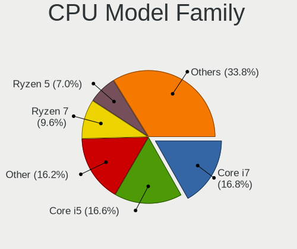

| Model                   | Computers | Percent |
|-------------------------|-----------|---------|
| Intel Core i5           | 156       | 18.96%  |
| Intel Core i7           | 154       | 18.71%  |
| Other                   | 119       | 14.46%  |
| AMD Ryzen 7             | 51        | 6.2%    |
| Intel Celeron           | 43        | 5.22%   |
| Intel Core i3           | 39        | 4.74%   |
| AMD Ryzen 5             | 37        | 4.5%    |
| Intel Xeon              | 31        | 3.77%   |
| Intel Core 2 Duo        | 24        | 2.92%   |
| AMD Ryzen 9             | 24        | 2.92%   |
| AMD FX                  | 23        | 2.79%   |
| Intel Core i9           | 10        | 1.22%   |
| AMD A6                  | 10        | 1.22%   |
| Intel Pentium Dual-Core | 8         | 0.97%   |
| Intel Pentium           | 8         | 0.97%   |
| AMD A8                  | 8         | 0.97%   |
| Intel Atom              | 7         | 0.85%   |
| AMD Ryzen 3             | 7         | 0.85%   |
| AMD E2                  | 7         | 0.85%   |
| AMD Ryzen 7 PRO         | 6         | 0.73%   |
| Intel Core 2 Quad       | 4         | 0.49%   |
| AMD Ryzen Threadripper  | 4         | 0.49%   |
| AMD A10                 | 4         | 0.49%   |
| Intel Pentium Silver    | 3         | 0.36%   |
| Intel Core 2            | 3         | 0.36%   |
| AMD Phenom II X4        | 3         | 0.36%   |
| AMD A4                  | 3         | 0.36%   |
| Intel Pentium Dual      | 2         | 0.24%   |
| Intel Pentium 4         | 2         | 0.24%   |
| AMD Phenom II X2        | 2         | 0.24%   |
| AMD Opteron             | 2         | 0.24%   |
| AMD Athlon              | 2         | 0.24%   |
| Intel Pentium M         | 1         | 0.12%   |
| Intel Pentium D         | 1         | 0.12%   |
| Intel Genuine           | 1         | 0.12%   |
| Intel Core m3           | 1         | 0.12%   |
| Intel Core M            | 1         | 0.12%   |
| Intel Celeron Dual-Core | 1         | 0.12%   |
| ARM BCM                 | 1         | 0.12%   |
| AMD Sempron             | 1         | 0.12%   |
| AMD Ryzen 5 PRO         | 1         | 0.12%   |
| AMD Phenom II X6        | 1         | 0.12%   |
| AMD Phenom II           | 1         | 0.12%   |
| AMD Phenom              | 1         | 0.12%   |
| AMD E                   | 1         | 0.12%   |
| AMD Athlon II X4        | 1         | 0.12%   |
| AMD Athlon II X2        | 1         | 0.12%   |
| AMD Athlon 64 X2        | 1         | 0.12%   |
| AMD A12                 | 1         | 0.12%   |

CPU Cores
---------

Number of processor cores

| Number  | Computers | Percent |
|---------|-----------|---------|
| 4       | 319       | 38.76%  |
| 2       | 244       | 29.65%  |
| 6       | 92        | 11.18%  |
| 8       | 90        | 10.94%  |
| 12      | 27        | 3.28%   |
| 16      | 20        | 2.43%   |
| 1       | 12        | 1.46%   |
| 14      | 5         | 0.61%   |
| 10      | 4         | 0.49%   |
| 3       | 3         | 0.36%   |
| 20      | 2         | 0.24%   |
| Unknown | 2         | 0.24%   |
| 32      | 1         | 0.12%   |
| 28      | 1         | 0.12%   |
| 24      | 1         | 0.12%   |

CPU Sockets
-----------

Number of sockets

| Number  | Computers | Percent |
|---------|-----------|---------|
| 1       | 806       | 97.93%  |
| 2       | 15        | 1.82%   |
| Unknown | 2         | 0.24%   |

CPU Threads
-----------

Threads per core (Hyper-Threading)

| Number  | Computers | Percent |
|---------|-----------|---------|
| 2       | 582       | 70.72%  |
| 1       | 239       | 29.04%  |
| Unknown | 2         | 0.24%   |

CPU Op-Modes
------------

CPU Operation Modes (32-bit, 64-bit)

| Op mode        | Computers | Percent |
|----------------|-----------|---------|
| 32-bit, 64-bit | 807       | 98.06%  |
| Unknown        | 13        | 1.58%   |
| 32-bit         | 2         | 0.24%   |
| 64-bit         | 1         | 0.12%   |

CPU Microcode
-------------

Microcode number

| Number     | Computers | Percent |
|------------|-----------|---------|
| Unknown    | 246       | 29.89%  |
| 0x806c1    | 40        | 4.86%   |
| 0x306a9    | 38        | 4.62%   |
| 0x306c3    | 34        | 4.13%   |
| 0x906ea    | 23        | 2.79%   |
| 0x206a7    | 22        | 2.67%   |
| 0x1067a    | 19        | 2.31%   |
| 0x806ea    | 17        | 2.07%   |
| 0x08701021 | 17        | 2.07%   |
| 0x0a50000c | 15        | 1.82%   |
| 0x906e9    | 14        | 1.7%    |
| 0x806ec    | 14        | 1.7%    |
| 0x806e9    | 12        | 1.46%   |
| 0x706a8    | 10        | 1.22%   |
| 0x506e3    | 10        | 1.22%   |
| 0x90672    | 9         | 1.09%   |
| 0x806d1    | 9         | 1.09%   |
| 0x406e3    | 9         | 1.09%   |
| 0x40651    | 9         | 1.09%   |
| 0x306d4    | 9         | 1.09%   |
| 0x10676    | 9         | 1.09%   |
| 0x08108109 | 9         | 1.09%   |
| 0x0800820d | 9         | 1.09%   |
| 0x406c4    | 8         | 0.97%   |
| 0xa0671    | 7         | 0.85%   |
| 0x906a3    | 7         | 0.85%   |
| 0x506c9    | 7         | 0.85%   |
| 0x306e4    | 7         | 0.85%   |
| 0x30678    | 7         | 0.85%   |
| 0xa0653    | 6         | 0.73%   |
| 0x08608103 | 6         | 0.73%   |
| 0x06000852 | 6         | 0.73%   |
| 0xa0652    | 5         | 0.61%   |
| 0x706e5    | 5         | 0.61%   |
| 0x6fb      | 5         | 0.61%   |
| 0x306f2    | 5         | 0.61%   |
| 0x20655    | 5         | 0.61%   |
| 0x0a201016 | 5         | 0.61%   |
| 0x08701013 | 5         | 0.61%   |
| 0x06000822 | 5         | 0.61%   |
| 0x6fd      | 4         | 0.49%   |
| 0x20652    | 4         | 0.49%   |
| 0x106e5    | 4         | 0.49%   |
| 0x07030106 | 4         | 0.49%   |
| 0x07030105 | 4         | 0.49%   |
| 0x03000027 | 4         | 0.49%   |
| 0x706a1    | 3         | 0.36%   |
| 0x6f6      | 3         | 0.36%   |
| 0x0a201009 | 3         | 0.36%   |
| 0x08108102 | 3         | 0.36%   |
| 0x06003106 | 3         | 0.36%   |
| 0x00000000 | 3         | 0.36%   |
| 0xf43      | 2         | 0.24%   |
| 0xa0660    | 2         | 0.24%   |
| 0xa0655    | 2         | 0.24%   |
| 0x906ed    | 2         | 0.24%   |
| 0x906ec    | 2         | 0.24%   |
| 0x806eb    | 2         | 0.24%   |
| 0x506ca    | 2         | 0.24%   |
| 0x50657    | 2         | 0.24%   |

CPU Microarch
-------------

Microarchitecture

| Name             | Computers | Percent |
|------------------|-----------|---------|
| KabyLake         | 109       | 13.24%  |
| Haswell          | 71        | 8.63%   |
| IvyBridge        | 57        | 6.93%   |
| Unknown          | 57        | 6.93%   |
| Zen 3            | 44        | 5.35%   |
| TigerLake        | 44        | 5.35%   |
| Zen 2            | 38        | 4.62%   |
| Skylake          | 37        | 4.5%    |
| SandyBridge      | 37        | 4.5%    |
| Penryn           | 34        | 4.13%   |
| Zen+             | 30        | 3.65%   |
| IceLake          | 24        | 2.92%   |
| Silvermont       | 23        | 2.79%   |
| Piledriver       | 22        | 2.67%   |
| CometLake        | 22        | 2.67%   |
| Westmere         | 21        | 2.55%   |
| Goldmont plus    | 20        | 2.43%   |
| Broadwell        | 15        | 1.82%   |
| Alderlake Hybrid | 15        | 1.82%   |
| Core             | 13        | 1.58%   |
| Puma             | 12        | 1.46%   |
| Nehalem          | 12        | 1.46%   |
| K10              | 10        | 1.22%   |
| Excavator        | 10        | 1.22%   |
| Zen              | 9         | 1.09%   |
| Goldmont         | 9         | 1.09%   |
| K10 Llano        | 5         | 0.61%   |
| Bulldozer        | 5         | 0.61%   |
| NetBurst         | 4         | 0.49%   |
| Steamroller      | 3         | 0.36%   |
| Bonnell          | 3         | 0.36%   |
| P6               | 2         | 0.24%   |
| K8 Hammer        | 2         | 0.24%   |
| Jaguar           | 2         | 0.24%   |
| Bobcat           | 2         | 0.24%   |

Graphics
--------

GPU Vendor
----------

Vendors of graphics cards

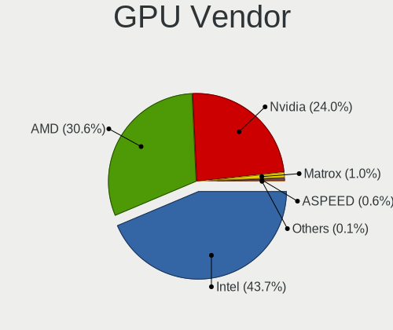

| Vendor                     | Computers | Percent |
|----------------------------|-----------|---------|
| Intel                      | 432       | 46.2%   |
| Nvidia                     | 262       | 28.02%  |
| AMD                        | 231       | 24.71%  |
| Matrox Electronics Systems | 6         | 0.64%   |
| ASPEED Technology          | 3         | 0.32%   |
| ATI Technologies           | 1         | 0.11%   |

GPU Model
---------

Graphics card models

| Model                                                                                    | Computers | Percent |
|------------------------------------------------------------------------------------------|-----------|---------|
| Intel TigerLake-LP GT2 [Iris Xe Graphics]                                                | 41        | 4.25%   |
| Intel 3rd Gen Core processor Graphics Controller                                         | 30        | 3.11%   |
| Intel 2nd Generation Core Processor Family Integrated Graphics Controller                | 25        | 2.59%   |
| Intel UHD Graphics 620                                                                   | 20        | 2.07%   |
| Intel CoffeeLake-H GT2 [UHD Graphics 630]                                                | 19        | 1.97%   |
| AMD Cezanne                                                                              | 19        | 1.97%   |
| Intel GeminiLake [UHD Graphics 600]                                                      | 17        | 1.76%   |
| AMD Picasso/Raven 2 [Radeon Vega Series / Radeon Vega Mobile Series]                     | 17        | 1.76%   |
| Intel Xeon E3-1200 v3/4th Gen Core Processor Integrated Graphics Controller              | 15        | 1.56%   |
| AMD Ellesmere [Radeon RX 470/480/570/570X/580/580X/590]                                  | 14        | 1.45%   |
| Intel HD Graphics 630                                                                    | 13        | 1.35%   |
| Intel Haswell-ULT Integrated Graphics Controller                                         | 13        | 1.35%   |
| Intel Atom/Celeron/Pentium Processor x5-E8000/J3xxx/N3xxx Integrated Graphics Controller | 13        | 1.35%   |
| AMD VanGogh [AMD Custom GPU 0405]                                                        | 13        | 1.35%   |
| Intel Skylake GT2 [HD Graphics 520]                                                      | 12        | 1.24%   |
| Intel Xeon E3-1200 v2/3rd Gen Core processor Graphics Controller                         | 11        | 1.14%   |
| Intel TigerLake-H GT1 [UHD Graphics]                                                     | 11        | 1.14%   |
| Intel HD Graphics 620                                                                    | 11        | 1.14%   |
| Intel HD Graphics 530                                                                    | 11        | 1.14%   |
| Intel Core Processor Integrated Graphics Controller                                      | 11        | 1.14%   |
| Intel CometLake-U GT2 [UHD Graphics]                                                     | 10        | 1.04%   |
| Intel Atom Processor Z36xxx/Z37xxx Series Graphics & Display                             | 10        | 1.04%   |
| Intel WhiskeyLake-U GT2 [UHD Graphics 620]                                               | 9         | 0.93%   |
| Intel Mobile 4 Series Chipset Integrated Graphics Controller                             | 9         | 0.93%   |
| Intel 4th Gen Core Processor Integrated Graphics Controller                              | 9         | 0.93%   |
| AMD Lucienne                                                                             | 9         | 0.93%   |
| Nvidia GP108 [GeForce GT 1030]                                                           | 8         | 0.83%   |
| Nvidia GK208B [GeForce GT 710]                                                           | 8         | 0.83%   |
| Intel Iris Plus Graphics G1 (Ice Lake)                                                   | 8         | 0.83%   |
| Intel HD Graphics 5500                                                                   | 8         | 0.83%   |
| Intel CoffeeLake-S GT2 [UHD Graphics 630]                                                | 8         | 0.83%   |
| Intel AlderLake-S GT1                                                                    | 8         | 0.83%   |
| Intel Alder Lake-P Integrated Graphics Controller                                        | 8         | 0.83%   |
| AMD Renoir                                                                               | 8         | 0.83%   |
| AMD Navi 22 [Radeon RX 6700/6700 XT/6750 XT / 6800M]                                     | 8         | 0.83%   |
| Nvidia TU106M [GeForce RTX 2060 Mobile]                                                  | 7         | 0.73%   |
| Nvidia GP107M [GeForce GTX 1050 Mobile]                                                  | 7         | 0.73%   |
| Nvidia GA107M [GeForce RTX 3050 Ti Mobile]                                               | 7         | 0.73%   |
| Intel HD Graphics 500                                                                    | 7         | 0.73%   |
| Intel CometLake-H GT2 [UHD Graphics]                                                     | 7         | 0.73%   |
| AMD Navi 10 [Radeon RX 5600 OEM/5600 XT / 5700/5700 XT]                                  | 7         | 0.73%   |
| AMD Mullins [Radeon R4/R5 Graphics]                                                      | 7         | 0.73%   |
| Nvidia GP102 [GeForce GTX 1080 Ti]                                                       | 6         | 0.62%   |
| Nvidia GM204 [GeForce GTX 970]                                                           | 6         | 0.62%   |
| Nvidia GA106 [GeForce RTX 3060 Lite Hash Rate]                                           | 6         | 0.62%   |
| Intel 4 Series Chipset Integrated Graphics Controller                                    | 6         | 0.62%   |
| Nvidia TU117M [GeForce GTX 1650 Mobile / Max-Q]                                          | 5         | 0.52%   |
| Nvidia GP107 [GeForce GTX 1050 Ti]                                                       | 5         | 0.52%   |
| Nvidia GP104 [GeForce GTX 1080]                                                          | 5         | 0.52%   |
| Nvidia GM206 [GeForce GTX 960]                                                           | 5         | 0.52%   |
| Nvidia GA106M [GeForce RTX 3060 Mobile / Max-Q]                                          | 5         | 0.52%   |
| AMD Wani [Radeon R5/R6/R7 Graphics]                                                      | 5         | 0.52%   |
| AMD Navi 21 [Radeon RX 6800/6800 XT / 6900 XT]                                           | 5         | 0.52%   |
| AMD Cedar [Radeon HD 5000/6000/7350/8350 Series]                                         | 5         | 0.52%   |
| AMD Baffin [Radeon RX 460/560D / Pro 450/455/460/555/555X/560/560X]                      | 5         | 0.52%   |
| Nvidia TU116 [GeForce GTX 1660 SUPER]                                                    | 4         | 0.41%   |
| Nvidia TU116 [GeForce GTX 1650 SUPER]                                                    | 4         | 0.41%   |
| Nvidia MCP89 [GeForce 320M]                                                              | 4         | 0.41%   |
| Nvidia GP107M [GeForce GTX 1050 Ti Mobile]                                               | 4         | 0.41%   |
| Nvidia GM108M [GeForce 940MX]                                                            | 4         | 0.41%   |

GPU Combo
---------

Combinations of graphics cards

| Name                    | Computers | Percent |
|-------------------------|-----------|---------|
| 1 x Intel               | 315       | 38.27%  |
| 1 x AMD                 | 194       | 23.57%  |
| 1 x Nvidia              | 160       | 19.44%  |
| Intel + Nvidia          | 88        | 10.69%  |
| Other                   | 18        | 2.19%   |
| 2 x AMD                 | 13        | 1.58%   |
| Intel + AMD             | 12        | 1.46%   |
| AMD + Nvidia            | 9         | 1.09%   |
| 1 x Matrox              | 5         | 0.61%   |
| 2 x Nvidia              | 2         | 0.24%   |
| 3 x AMD                 | 1         | 0.12%   |
| 2 x Nvidia + 1 x ASPEED | 1         | 0.12%   |
| 2 x Intel               | 1         | 0.12%   |
| Nvidia + ASPEED         | 1         | 0.12%   |
| Intel + 2 x AMD         | 1         | 0.12%   |
| 1 x ASPEED              | 1         | 0.12%   |
| AMD + Matrox            | 1         | 0.12%   |

GPU Driver
----------

Free vs proprietary

| Driver      | Computers | Percent |
|-------------|-----------|---------|
| Free        | 627       | 76.18%  |
| Proprietary | 146       | 17.74%  |
| Unknown     | 50        | 6.08%   |

GPU Memory
----------

Total video memory

| Size in GB | Computers | Percent |
|------------|-----------|---------|
| Unknown    | 519       | 63.06%  |
| 0.01-0.5   | 72        | 8.75%   |
| 1.01-2.0   | 64        | 7.78%   |
| 3.01-4.0   | 50        | 6.08%   |
| 0.51-1.0   | 36        | 4.37%   |
| 8.01-16.0  | 31        | 3.77%   |
| 7.01-8.0   | 29        | 3.52%   |
| 5.01-6.0   | 14        | 1.7%    |
| 2.01-3.0   | 5         | 0.61%   |
| 4.01-5.0   | 2         | 0.24%   |
| 16.01-24.0 | 1         | 0.12%   |

Monitor
-------

Monitor Vendor
--------------

Monitor vendors

| Vendor                  | Computers | Percent |
|-------------------------|-----------|---------|
| Samsung Electronics     | 99        | 11.15%  |
| AU Optronics            | 95        | 10.7%   |
| Dell                    | 85        | 9.57%   |
| LG Display              | 69        | 7.77%   |
| Chimei Innolux          | 61        | 6.87%   |
| BOE                     | 61        | 6.87%   |
| Hewlett-Packard         | 41        | 4.62%   |
| Goldstar                | 34        | 3.83%   |
| Acer                    | 32        | 3.6%    |
| Ancor Communications    | 27        | 3.04%   |
| Apple                   | 26        | 2.93%   |
| ASUSTek Computer        | 22        | 2.48%   |
| Sharp                   | 20        | 2.25%   |
| ANX                     | 13        | 1.46%   |
| ViewSonic               | 12        | 1.35%   |
| Sceptre Tech            | 12        | 1.35%   |
| Lenovo                  | 12        | 1.35%   |
| AOC                     | 12        | 1.35%   |
| Vizio                   | 11        | 1.24%   |
| Chi Mei Optoelectronics | 11        | 1.24%   |
| BenQ                    | 9         | 1.01%   |
| InfoVision              | 8         | 0.9%    |
| Sony                    | 7         | 0.79%   |
| PANDA                   | 7         | 0.79%   |
| MSI                     | 7         | 0.79%   |
| Panasonic               | 6         | 0.68%   |
| Philips                 | 5         | 0.56%   |
| Unknown                 | 4         | 0.45%   |
| Gigabyte Technology     | 4         | 0.45%   |
| ONN                     | 3         | 0.34%   |
| Insignia                | 3         | 0.34%   |
| ___                     | 2         | 0.23%   |
| Westinghouse            | 2         | 0.23%   |
| Viotek                  | 2         | 0.23%   |
| Toshiba                 | 2         | 0.23%   |
| Seiki                   | 2         | 0.23%   |
| Planar                  | 2         | 0.23%   |
| Pixio                   | 2         | 0.23%   |
| Onkyo                   | 2         | 0.23%   |
| LG Philips              | 2         | 0.23%   |
| JVC                     | 2         | 0.23%   |
| INS                     | 2         | 0.23%   |
| Hitachi                 | 2         | 0.23%   |
| FHD                     | 2         | 0.23%   |
| DENON                   | 2         | 0.23%   |
| CSO                     | 2         | 0.23%   |
| AUS                     | 2         | 0.23%   |
| Unknown                 | 2         | 0.23%   |
| ZSC                     | 1         | 0.11%   |
| YTH                     | 1         | 0.11%   |
| YHI                     | 1         | 0.11%   |
| Valve                   | 1         | 0.11%   |
| Unknown (XXX)           | 1         | 0.11%   |
| Tech Concepts           | 1         | 0.11%   |
| STA                     | 1         | 0.11%   |
| Skyworth                | 1         | 0.11%   |
| SGT                     | 1         | 0.11%   |
| Sceptre                 | 1         | 0.11%   |
| SANYO                   | 1         | 0.11%   |
| SAC                     | 1         | 0.11%   |

Monitor Model
-------------

Monitor models

| Model                                                                    | Computers | Percent |
|--------------------------------------------------------------------------|-----------|---------|
| ANX ANX7530 U ANX7539 800x1280                                           | 13        | 1.41%   |
| Chimei Innolux LCD Monitor CMN14D4 1920x1080 309x173mm 13.9-inch         | 6         | 0.65%   |
| Panasonic LCD Monitor MEI96A2 2560x1440 309x173mm 13.9-inch              | 5         | 0.54%   |
| Chimei Innolux LCD Monitor CMN15DB 1366x768 344x193mm 15.5-inch          | 5         | 0.54%   |
| AU Optronics LCD Monitor AUO109D 1920x1080 381x214mm 17.2-inch           | 4         | 0.43%   |
| Acer SB220Q ACR06AB 1920x1080 476x268mm 21.5-inch                        | 4         | 0.43%   |
| Sharp LCD Monitor SHP1476 3840x2160 346x194mm 15.6-inch                  | 3         | 0.33%   |
| Sceptre Tech F27 SPT0ABF 1920x1080 409x230mm 18.5-inch                   | 3         | 0.33%   |
| Samsung Electronics LCD Monitor SEC544B 1600x900 310x174mm 14.0-inch     | 3         | 0.33%   |
| Samsung Electronics LCD Monitor SEC5441 1366x768 344x194mm 15.5-inch     | 3         | 0.33%   |
| Samsung Electronics C27F390 SAM0D32 1920x1080 598x336mm 27.0-inch        | 3         | 0.33%   |
| InfoVision LCD Monitor IVO8584 1920x1080 294x165mm 13.3-inch             | 3         | 0.33%   |
| Dell E2720H DELA15B 1920x1080 600x340mm 27.2-inch                        | 3         | 0.33%   |
| Dell 2407WFP DELA017 1920x1200 520x330mm 24.2-inch                       | 3         | 0.33%   |
| Chimei Innolux LCD Monitor CMN15E6 1366x768 344x193mm 15.5-inch          | 3         | 0.33%   |
| Chi Mei Optoelectronics LCD Monitor CMO1469 1366x768 309x174mm 14.0-inch | 3         | 0.33%   |
| BOE LCD Monitor BOE095F 2256x1504 285x190mm 13.5-inch                    | 3         | 0.33%   |
| BOE LCD Monitor BOE08C2 1920x1080 344x194mm 15.5-inch                    | 3         | 0.33%   |
| BOE LCD Monitor BOE08A8 1920x1080 344x194mm 15.5-inch                    | 3         | 0.33%   |
| AU Optronics LCD Monitor AUO70EC 1366x768 344x193mm 15.5-inch            | 3         | 0.33%   |
| AU Optronics LCD Monitor AUO61ED 1920x1080 344x194mm 15.5-inch           | 3         | 0.33%   |
| AU Optronics LCD Monitor AUO405C 1366x768 256x144mm 11.6-inch            | 3         | 0.33%   |
| AU Optronics LCD Monitor AUO213E 1600x900 309x174mm 14.0-inch            | 3         | 0.33%   |
| ASUSTek Computer VG245 AUS24A1 1920x1080 531x299mm 24.0-inch             | 3         | 0.33%   |
| Apple LCD Monitor APP9C5F 1280x800 286x179mm 13.3-inch                   | 3         | 0.33%   |
| Apple Color LCD APP9CF0 1440x900 290x180mm 13.4-inch                     | 3         | 0.33%   |
| Ancor Communications PA248 ACI24B1 1920x1200 546x352mm 25.6-inch         | 3         | 0.33%   |
| Ancor Communications ASUS VS239 ACI23D2 1920x1080 509x286mm 23.0-inch    | 3         | 0.33%   |
| Vizio E320-A1 VIZ0095 1360x768 697x392mm 31.5-inch                       | 2         | 0.22%   |
| Sharp LCD Monitor SHP1517 3840x2400 366x229mm 17.0-inch                  | 2         | 0.22%   |
| Sharp LCD Monitor SHP148D 3840x2160 344x194mm 15.5-inch                  | 2         | 0.22%   |
| Sceptre Tech X505BV-FMQC SPT13C0 1920x1080                               | 2         | 0.22%   |
| Sceptre Tech Sceptre C27 SPT0AD7 1920x1080 598x336mm 27.0-inch           | 2         | 0.22%   |
| Samsung Electronics LCD Monitor SAM0FEE 3840x2160 1872x1053mm 84.6-inch  | 2         | 0.22%   |
| Samsung Electronics LCD Monitor SAM0F13 3840x2160 1872x1053mm 84.6-inch  | 2         | 0.22%   |
| Samsung Electronics LCD Monitor SAM094E 1920x1080 700x390mm 31.5-inch    | 2         | 0.22%   |
| Samsung Electronics LCD Monitor SAM08FC 1366x768 700x390mm 31.5-inch     | 2         | 0.22%   |
| Samsung Electronics Color LCD SDCA029 2160x1440 252x168mm 11.9-inch      | 2         | 0.22%   |
| PANDA LCD Monitor NCP004D 1920x1080 344x194mm 15.5-inch                  | 2         | 0.22%   |
| ONN ONA18HO015 ONN0101 1920x1080 698x393mm 31.5-inch                     | 2         | 0.22%   |
| MSI Optix MAG27C MSI1462 1920x1080 598x336mm 27.0-inch                   | 2         | 0.22%   |
| LG Display LCD Monitor LGD068D 1920x1080 309x174mm 14.0-inch             | 2         | 0.22%   |
| LG Display LCD Monitor LGD060F 1920x1080 309x174mm 14.0-inch             | 2         | 0.22%   |
| LG Display LCD Monitor LGD0521 1920x1080 309x174mm 14.0-inch             | 2         | 0.22%   |
| LG Display LCD Monitor LGD0493 1366x768 344x194mm 15.5-inch              | 2         | 0.22%   |
| LG Display LCD Monitor LGD044F 1920x1080 345x194mm 15.6-inch             | 2         | 0.22%   |
| LG Display LCD Monitor LGD03AB 1366x768 344x194mm 15.5-inch              | 2         | 0.22%   |
| LG Display LCD Monitor LGD033E 1366x768 309x174mm 14.0-inch              | 2         | 0.22%   |
| LG Display LCD Monitor LGD02DC 1366x768 344x194mm 15.5-inch              | 2         | 0.22%   |
| Hewlett-Packard 2311 HWP293B 1920x1080 509x286mm 23.0-inch               | 2         | 0.22%   |
| Goldstar ULTRAWIDE GSM5AFB 2560x1080 798x334mm 34.1-inch                 | 2         | 0.22%   |
| Goldstar ULTRAGEAR GSM7765 2560x1440 697x392mm 31.5-inch                 | 2         | 0.22%   |
| Goldstar ULTRAGEAR GSM5B7F 2560x1440 597x336mm 27.0-inch                 | 2         | 0.22%   |
| Goldstar Ultra HD GSM5B08 3840x2160 600x340mm 27.2-inch                  | 2         | 0.22%   |
| Goldstar HDR 4K GSM7706 3840x2160 600x340mm 27.2-inch                    | 2         | 0.22%   |
| Goldstar FULL HD GSM5B55 1920x1080 480x270mm 21.7-inch                   | 2         | 0.22%   |
| Goldstar 27GN7 GSM5B8D 1920x1080 610x360mm 27.9-inch                     | 2         | 0.22%   |
| Dell U4021QW DEL4206 2560x1080 929x392mm 39.7-inch                       | 2         | 0.22%   |
| Dell SE198WFP DELF004 1440x900 408x255mm 18.9-inch                       | 2         | 0.22%   |
| Dell S2440L DELA08B 1920x1080 531x299mm 24.0-inch                        | 2         | 0.22%   |

Monitor Resolution
------------------

Monitor screen resolution

| Resolution         | Computers | Percent |
|--------------------|-----------|---------|
| 1920x1080 (FHD)    | 381       | 44.2%   |
| 1366x768 (WXGA)    | 126       | 14.62%  |
| 3840x2160 (4K)     | 72        | 8.35%   |
| 2560x1440 (QHD)    | 48        | 5.57%   |
| 1600x900 (HD+)     | 41        | 4.76%   |
| 1920x1200 (WUXGA)  | 23        | 2.67%   |
| 1440x900 (WXGA+)   | 20        | 2.32%   |
| 1280x1024 (SXGA)   | 16        | 1.86%   |
| 1680x1050 (WSXGA+) | 15        | 1.74%   |
| 800x1280           | 13        | 1.51%   |
| Unknown            | 13        | 1.51%   |
| 3440x1440          | 12        | 1.39%   |
| 1280x800 (WXGA)    | 11        | 1.28%   |
| 1360x768           | 9         | 1.04%   |
| 3840x1080          | 8         | 0.93%   |
| 2560x1600          | 8         | 0.93%   |
| 2560x1080          | 8         | 0.93%   |
| 3840x2400          | 5         | 0.58%   |
| 1920x540           | 4         | 0.46%   |
| 2880x1800          | 3         | 0.35%   |
| 2256x1504          | 3         | 0.35%   |
| 1400x1050          | 3         | 0.35%   |
| 4480x1440          | 2         | 0.23%   |
| 3200x1800 (QHD+)   | 2         | 0.23%   |
| 1920x1280          | 2         | 0.23%   |
| 1600x1200          | 2         | 0.23%   |
| 7680x2160          | 1         | 0.12%   |
| 5760x2160          | 1         | 0.12%   |
| 5120x1440          | 1         | 0.12%   |
| 3840x1200          | 1         | 0.12%   |
| 3456x2160          | 1         | 0.12%   |
| 3072x1920          | 1         | 0.12%   |
| 2496x1664          | 1         | 0.12%   |
| 2400x1600          | 1         | 0.12%   |
| 2160x1440          | 1         | 0.12%   |
| 2048x1152          | 1         | 0.12%   |
| 1368x769           | 1         | 0.12%   |
| 1280x720 (HD)      | 1         | 0.12%   |

Monitor Diagonal
----------------

Diagonal size in inches

| Inches  | Computers | Percent |
|---------|-----------|---------|
| 15      | 181       | 20.52%  |
| 27      | 86        | 9.75%   |
| 13      | 72        | 8.16%   |
| 24      | 66        | 7.48%   |
| 17      | 62        | 7.03%   |
| 14      | 61        | 6.92%   |
| Unknown | 55        | 6.24%   |
| 23      | 49        | 5.56%   |
| 31      | 42        | 4.76%   |
| 21      | 34        | 3.85%   |
| 11      | 23        | 2.61%   |
| 19      | 16        | 1.81%   |
| 34      | 14        | 1.59%   |
| 84      | 12        | 1.36%   |
| 32      | 12        | 1.36%   |
| 20      | 12        | 1.36%   |
| 18      | 10        | 1.13%   |
| 12      | 7         | 0.79%   |
| 72      | 6         | 0.68%   |
| 25      | 6         | 0.68%   |
| 16      | 6         | 0.68%   |
| 54      | 5         | 0.57%   |
| 22      | 5         | 0.57%   |
| 39      | 4         | 0.45%   |
| 26      | 4         | 0.45%   |
| 49      | 3         | 0.34%   |
| 48      | 3         | 0.34%   |
| 42      | 3         | 0.34%   |
| 40      | 3         | 0.34%   |
| 65      | 2         | 0.23%   |
| 46      | 2         | 0.23%   |
| 36      | 2         | 0.23%   |
| 29      | 2         | 0.23%   |
| 28      | 2         | 0.23%   |
| 10      | 2         | 0.23%   |
| 100     | 1         | 0.11%   |
| 74      | 1         | 0.11%   |
| 57      | 1         | 0.11%   |
| 52      | 1         | 0.11%   |
| 47      | 1         | 0.11%   |
| 43      | 1         | 0.11%   |
| 37      | 1         | 0.11%   |
| 30      | 1         | 0.11%   |

Monitor Width
-------------

Physical width

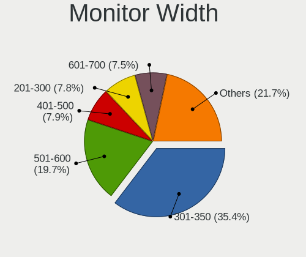

| Width in mm    | Computers | Percent |
|----------------|-----------|---------|
| 301-350        | 276       | 31.83%  |
| 501-600        | 187       | 21.57%  |
| 201-300        | 76        | 8.77%   |
| 401-500        | 70        | 8.07%   |
| 351-400        | 67        | 7.73%   |
| 601-700        | 58        | 6.69%   |
| Unknown        | 55        | 6.34%   |
| 701-800        | 28        | 3.23%   |
| 1501-2000      | 19        | 2.19%   |
| 1001-1500      | 18        | 2.08%   |
| 801-900        | 6         | 0.69%   |
| 901-1000       | 6         | 0.69%   |
| More than 2000 | 1         | 0.12%   |

Aspect Ratio
------------

Proportional relationship between the width and the height

| Ratio   | Computers | Percent |
|---------|-----------|---------|
| 16/9    | 614       | 76.37%  |
| 16/10   | 88        | 10.95%  |
| Unknown | 36        | 4.48%   |
| 21/9    | 18        | 2.24%   |
| 5/4     | 15        | 1.87%   |
| 0.62    | 13        | 1.62%   |
| 3/2     | 9         | 1.12%   |
| 4/3     | 5         | 0.62%   |
| 32/9    | 4         | 0.5%    |
| 2.65    | 1         | 0.12%   |
| 1.96    | 1         | 0.12%   |

Monitor Area
------------

Area in inch

| Area in inch | Computers | Percent |
|----------------|-----------|---------|
| 101-110        | 182       | 20.73%  |
| 201-250        | 123       | 14.01%  |
| 81-90          | 101       | 11.5%   |
| 301-350        | 89        | 10.14%  |
| 351-500        | 70        | 7.97%   |
| Unknown        | 55        | 6.26%   |
| 121-130        | 47        | 5.35%   |
| 151-200        | 42        | 4.78%   |
| More than 1000 | 30        | 3.42%   |
| 71-80          | 30        | 3.42%   |
| 251-300        | 28        | 3.19%   |
| 51-60          | 23        | 2.62%   |
| 501-1000       | 21        | 2.39%   |
| 141-150        | 14        | 1.59%   |
| 131-140        | 8         | 0.91%   |
| 61-70          | 7         | 0.8%    |
| 111-120        | 5         | 0.57%   |
| 41-50          | 2         | 0.23%   |
| 91-100         | 1         | 0.11%   |

Pixel Density
-------------

Pixels per inch

| Density       | Computers | Percent |
|---------------|-----------|---------|
| 51-100        | 274       | 32.46%  |
| 121-160       | 217       | 25.71%  |
| 101-120       | 178       | 21.09%  |
| 161-240       | 56        | 6.64%   |
| Unknown       | 55        | 6.52%   |
| 1-50          | 34        | 4.03%   |
| More than 240 | 30        | 3.55%   |

Multiple Monitors
-----------------

Total monitors connected

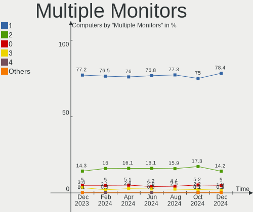

| Total | Computers | Percent |
|-------|-----------|---------|
| 1     | 628       | 76.31%  |
| 2     | 126       | 15.31%  |
| 0     | 47        | 5.71%   |
| 3     | 19        | 2.31%   |
| 4     | 3         | 0.36%   |

Network
-------

Net Controller Vendor
---------------------

Controller vendors

| Vendor                          | Computers | Percent |
|---------------------------------|-----------|---------|
| Intel                           | 477       | 38.78%  |
| Realtek Semiconductor           | 416       | 33.82%  |
| Qualcomm Atheros                | 85        | 6.91%   |
| Broadcom                        | 73        | 5.93%   |
| Broadcom Limited                | 22        | 1.79%   |
| Marvell Technology Group        | 14        | 1.14%   |
| ASIX Electronics                | 13        | 1.06%   |
| Samsung Electronics             | 12        | 0.98%   |
| Ralink Technology               | 12        | 0.98%   |
| MediaTek                        | 11        | 0.89%   |
| TP-Link                         | 8         | 0.65%   |
| NetGear                         | 7         | 0.57%   |
| Aquantia                        | 7         | 0.57%   |
| Nvidia                          | 5         | 0.41%   |
| Qualcomm Atheros Communications | 4         | 0.33%   |
| Qualcomm                        | 4         | 0.33%   |
| DisplayLink                     | 4         | 0.33%   |
| D-Link System                   | 4         | 0.33%   |
| ASUSTek Computer                | 4         | 0.33%   |
| Sierra Wireless                 | 3         | 0.24%   |
| Ralink                          | 3         | 0.24%   |
| Apple                           | 3         | 0.24%   |
| TRENDnet                        | 2         | 0.16%   |
| Motorola PCS                    | 2         | 0.16%   |
| Microsoft                       | 2         | 0.16%   |
| Microchip Technology            | 2         | 0.16%   |
| Linksys                         | 2         | 0.16%   |
| Lenovo                          | 2         | 0.16%   |
| InterBiometrics                 | 2         | 0.16%   |
| Google                          | 2         | 0.16%   |
| Dell                            | 2         | 0.16%   |
| D-Link                          | 2         | 0.16%   |
| Belkin Components               | 2         | 0.16%   |
| Wilocity                        | 1         | 0.08%   |
| VIA Technologies                | 1         | 0.08%   |
| U-Blox                          | 1         | 0.08%   |
| T & A Mobile Phones             | 1         | 0.08%   |
| Standard Microsystems           | 1         | 0.08%   |
| Sigma Designs                   | 1         | 0.08%   |
| QLogic                          | 1         | 0.08%   |
| QinHeng Electronics             | 1         | 0.08%   |
| Prolific Technology             | 1         | 0.08%   |
| MicroPython                     | 1         | 0.08%   |
| Micro Star International        | 1         | 0.08%   |
| Mellanox Technologies           | 1         | 0.08%   |
| LSI                             | 1         | 0.08%   |
| ICS Advent                      | 1         | 0.08%   |
| Hewlett-Packard                 | 1         | 0.08%   |
| Cypress Semiconductor           | 1         | 0.08%   |
| Arduino SA                      | 1         | 0.08%   |

Net Controller Model
--------------------

Controller models

| Model                                                             | Computers | Percent |
|-------------------------------------------------------------------|-----------|---------|
| Realtek RTL8111/8168/8411 PCI Express Gigabit Ethernet Controller | 219       | 14.76%  |
| Intel Wi-Fi 6 AX200                                               | 64        | 4.31%   |
| Realtek RTL8125 2.5GbE Controller                                 | 38        | 2.56%   |
| Realtek RTL810xE PCI Express Fast Ethernet controller             | 38        | 2.56%   |
| Intel 82579LM Gigabit Network Connection (Lewisville)             | 38        | 2.56%   |
| Intel Wi-Fi 6 AX201                                               | 33        | 2.22%   |
| Realtek RTL8153 Gigabit Ethernet Adapter                          | 31        | 2.09%   |
| Intel I211 Gigabit Network Connection                             | 30        | 2.02%   |
| Intel Wireless 7265                                               | 22        | 1.48%   |
| Realtek RTL8822CE 802.11ac PCIe Wireless Network Adapter          | 21        | 1.42%   |
| Realtek RTL8821CE 802.11ac PCIe Wireless Network Adapter          | 21        | 1.42%   |
| Intel Ethernet Connection I217-LM                                 | 20        | 1.35%   |
| Qualcomm Atheros QCA6174 802.11ac Wireless Network Adapter        | 18        | 1.21%   |
| Intel Wireless 8265 / 8275                                        | 18        | 1.21%   |
| Intel Wireless 7260                                               | 18        | 1.21%   |
| Intel Wi-Fi 6 AX210/AX211/AX411 160MHz                            | 17        | 1.15%   |
| Intel Ethernet Controller I225-V                                  | 17        | 1.15%   |
| Intel Wireless-AC 9260                                            | 14        | 0.94%   |
| Intel Wireless 8260                                               | 14        | 0.94%   |
| Intel Tiger Lake PCH CNVi WiFi                                    | 14        | 0.94%   |
| Realtek RTL8852AE 802.11ax PCIe Wireless Network Adapter          | 13        | 0.88%   |
| Realtek RTL8188EE Wireless Network Adapter                        | 13        | 0.88%   |
| Intel Comet Lake PCH CNVi WiFi                                    | 13        | 0.88%   |
| Intel Cannon Lake PCH CNVi WiFi                                   | 13        | 0.88%   |
| Realtek 802.11n WLAN Adapter                                      | 12        | 0.81%   |
| Realtek 802.11ac NIC                                              | 12        | 0.81%   |
| Qualcomm Atheros QCA9565 / AR9565 Wireless Network Adapter        | 11        | 0.74%   |
| Intel Comet Lake PCH-LP CNVi WiFi                                 | 11        | 0.74%   |
| Intel Centrino Advanced-N 6205 [Taylor Peak]                      | 11        | 0.74%   |
| Intel Ethernet Connection (2) I219-V                              | 10        | 0.67%   |
| Intel Centrino Ultimate-N 6300                                    | 10        | 0.67%   |
| ASIX AX88179 Gigabit Ethernet                                     | 10        | 0.67%   |
| Qualcomm Atheros AR9485 Wireless Network Adapter                  | 9         | 0.61%   |
| Intel Wireless 3165                                               | 9         | 0.61%   |
| Intel Ice Lake-LP PCH CNVi WiFi                                   | 9         | 0.61%   |
| Intel Ethernet Connection (4) I219-LM                             | 9         | 0.61%   |
| Intel Ethernet Connection (2) I219-LM                             | 9         | 0.61%   |
| Realtek RTL8188CE 802.11b/g/n WiFi Adapter                        | 8         | 0.54%   |
| Qualcomm Atheros QCA9377 802.11ac Wireless Network Adapter        | 8         | 0.54%   |
| Intel I210 Gigabit Network Connection                             | 8         | 0.54%   |
| Intel Dual Band Wireless-AC 3168NGW [Stone Peak]                  | 8         | 0.54%   |
| Intel Cannon Point-LP CNVi [Wireless-AC]                          | 8         | 0.54%   |
| Intel Alder Lake-P PCH CNVi WiFi                                  | 8         | 0.54%   |
| Intel 82577LM Gigabit Network Connection                          | 8         | 0.54%   |
| Intel 82574L Gigabit Network Connection                           | 8         | 0.54%   |
| Broadcom Limited BCM4360 802.11ac Wireless Network Adapter        | 8         | 0.54%   |
| Samsung GT-I9070 (network tethering, USB debugging enabled)       | 7         | 0.47%   |
| Intel Ethernet Connection (7) I219-LM                             | 7         | 0.47%   |
| Intel Ethernet Connection (2) I218-V                              | 7         | 0.47%   |
| Intel Alder Lake-S PCH CNVi WiFi                                  | 7         | 0.47%   |
| Broadcom NetXtreme BCM5761 Gigabit Ethernet PCIe                  | 7         | 0.47%   |
| Broadcom BCM4360 802.11ac Wireless Network Adapter                | 7         | 0.47%   |
| Broadcom BCM4313 802.11bgn Wireless Network Adapter               | 7         | 0.47%   |
| Realtek RTL88x2bu [AC1200 Techkey]                                | 6         | 0.4%    |
| Realtek RTL8822BE 802.11a/b/g/n/ac WiFi adapter                   | 6         | 0.4%    |
| Realtek RTL8811AU 802.11a/b/g/n/ac WLAN Adapter                   | 6         | 0.4%    |
| Broadcom NetXtreme BCM57766 Gigabit Ethernet PCIe                 | 6         | 0.4%    |
| Broadcom BCM43224 802.11a/b/g/n                                   | 6         | 0.4%    |
| Broadcom BCM43142 802.11b/g/n                                     | 6         | 0.4%    |
| Samsung Galaxy series, misc. (tethering mode)                     | 5         | 0.34%   |

Wireless Vendor
---------------

Wireless vendors

| Vendor                          | Computers | Percent |
|---------------------------------|-----------|---------|
| Intel                           | 359       | 50.14%  |
| Realtek Semiconductor           | 152       | 21.23%  |
| Qualcomm Atheros                | 67        | 9.36%   |
| Broadcom                        | 50        | 6.98%   |
| Broadcom Limited                | 15        | 2.09%   |
| Ralink Technology               | 12        | 1.68%   |
| MediaTek                        | 10        | 1.4%    |
| TP-Link                         | 7         | 0.98%   |
| NetGear                         | 7         | 0.98%   |
| Marvell Technology Group        | 5         | 0.7%    |
| Qualcomm Atheros Communications | 4         | 0.56%   |
| D-Link System                   | 4         | 0.56%   |
| Sierra Wireless                 | 3         | 0.42%   |
| Ralink                          | 3         | 0.42%   |
| Qualcomm                        | 3         | 0.42%   |
| ASUSTek Computer                | 3         | 0.42%   |
| TRENDnet                        | 2         | 0.28%   |
| Microsoft                       | 2         | 0.28%   |
| Linksys                         | 2         | 0.28%   |
| Belkin Components               | 2         | 0.28%   |
| Wilocity                        | 1         | 0.14%   |
| Micro Star International        | 1         | 0.14%   |
| Dell                            | 1         | 0.14%   |
| D-Link                          | 1         | 0.14%   |

Wireless Model
--------------

Wireless models

| Model                                                          | Computers | Percent |
|----------------------------------------------------------------|-----------|---------|
| Intel Wi-Fi 6 AX200                                            | 64        | 8.76%   |
| Intel Wi-Fi 6 AX201                                            | 33        | 4.51%   |
| Intel Wireless 7265                                            | 22        | 3.01%   |
| Realtek RTL8822CE 802.11ac PCIe Wireless Network Adapter       | 21        | 2.87%   |
| Realtek RTL8821CE 802.11ac PCIe Wireless Network Adapter       | 21        | 2.87%   |
| Qualcomm Atheros QCA6174 802.11ac Wireless Network Adapter     | 18        | 2.46%   |
| Intel Wireless 8265 / 8275                                     | 18        | 2.46%   |
| Intel Wireless 7260                                            | 18        | 2.46%   |
| Intel Wi-Fi 6 AX210/AX211/AX411 160MHz                         | 17        | 2.33%   |
| Intel Wireless-AC 9260                                         | 14        | 1.92%   |
| Intel Wireless 8260                                            | 14        | 1.92%   |
| Intel Tiger Lake PCH CNVi WiFi                                 | 14        | 1.92%   |
| Realtek RTL8852AE 802.11ax PCIe Wireless Network Adapter       | 13        | 1.78%   |
| Realtek RTL8188EE Wireless Network Adapter                     | 13        | 1.78%   |
| Intel Comet Lake PCH CNVi WiFi                                 | 13        | 1.78%   |
| Intel Cannon Lake PCH CNVi WiFi                                | 13        | 1.78%   |
| Realtek 802.11n WLAN Adapter                                   | 12        | 1.64%   |
| Realtek 802.11ac NIC                                           | 12        | 1.64%   |
| Qualcomm Atheros QCA9565 / AR9565 Wireless Network Adapter     | 11        | 1.5%    |
| Intel Comet Lake PCH-LP CNVi WiFi                              | 11        | 1.5%    |
| Intel Centrino Advanced-N 6205 [Taylor Peak]                   | 11        | 1.5%    |
| Intel Centrino Ultimate-N 6300                                 | 10        | 1.37%   |
| Qualcomm Atheros AR9485 Wireless Network Adapter               | 9         | 1.23%   |
| Intel Wireless 3165                                            | 9         | 1.23%   |
| Intel Ice Lake-LP PCH CNVi WiFi                                | 9         | 1.23%   |
| Realtek RTL8188CE 802.11b/g/n WiFi Adapter                     | 8         | 1.09%   |
| Qualcomm Atheros QCA9377 802.11ac Wireless Network Adapter     | 8         | 1.09%   |
| Intel Dual Band Wireless-AC 3168NGW [Stone Peak]               | 8         | 1.09%   |
| Intel Cannon Point-LP CNVi [Wireless-AC]                       | 8         | 1.09%   |
| Intel Alder Lake-P PCH CNVi WiFi                               | 8         | 1.09%   |
| Broadcom Limited BCM4360 802.11ac Wireless Network Adapter     | 8         | 1.09%   |
| Intel Alder Lake-S PCH CNVi WiFi                               | 7         | 0.96%   |
| Broadcom BCM4360 802.11ac Wireless Network Adapter             | 7         | 0.96%   |
| Broadcom BCM4313 802.11bgn Wireless Network Adapter            | 7         | 0.96%   |
| Realtek RTL88x2bu [AC1200 Techkey]                             | 6         | 0.82%   |
| Realtek RTL8822BE 802.11a/b/g/n/ac WiFi adapter                | 6         | 0.82%   |
| Realtek RTL8811AU 802.11a/b/g/n/ac WLAN Adapter                | 6         | 0.82%   |
| Broadcom BCM43224 802.11a/b/g/n                                | 6         | 0.82%   |
| Broadcom BCM43142 802.11b/g/n                                  | 6         | 0.82%   |
| Qualcomm Atheros AR9462 Wireless Network Adapter               | 5         | 0.68%   |
| Qualcomm Atheros AR93xx Wireless Network Adapter               | 5         | 0.68%   |
| Marvell Group 88W8897 [AVASTAR] 802.11ac Wireless              | 5         | 0.68%   |
| Intel Centrino Advanced-N 6200                                 | 5         | 0.68%   |
| Realtek RTL8192CU 802.11n WLAN Adapter                         | 4         | 0.55%   |
| Realtek RTL8191SU 802.11n WLAN Adapter                         | 4         | 0.55%   |
| Realtek RTL8188CUS 802.11n WLAN Adapter                        | 4         | 0.55%   |
| Ralink RT5572 Wireless Adapter                                 | 4         | 0.55%   |
| Ralink MT7601U Wireless Adapter                                | 4         | 0.55%   |
| Qualcomm Atheros AR9271 802.11n                                | 4         | 0.55%   |
| Qualcomm Atheros AR9285 Wireless Network Adapter (PCI-Express) | 4         | 0.55%   |
| NetGear A6210                                                  | 4         | 0.55%   |
| Intel Centrino Wireless-N 2230                                 | 4         | 0.55%   |
| Broadcom BCM43602 802.11ac Wireless LAN SoC                    | 4         | 0.55%   |
| TP-Link AC600 wireless Realtek RTL8811AU [Archer T2U Nano]     | 3         | 0.41%   |
| Realtek RTL8821AE 802.11ac PCIe Wireless Network Adapter       | 3         | 0.41%   |
| Realtek RTL8814AU 802.11a/b/g/n/ac Wireless Adapter            | 3         | 0.41%   |
| Realtek RTL8812AU 802.11a/b/g/n/ac 2T2R DB WLAN Adapter        | 3         | 0.41%   |
| Realtek RTL8723DE Wireless Network Adapter                     | 3         | 0.41%   |
| Realtek RTL8192EU 802.11b/g/n WLAN Adapter                     | 3         | 0.41%   |
| Realtek RTL8188EUS 802.11n Wireless Network Adapter            | 3         | 0.41%   |

Ethernet Vendor
---------------

Ethernet vendors

| Vendor                   | Computers | Percent |
|--------------------------|-----------|---------|
| Realtek Semiconductor    | 333       | 46.31%  |
| Intel                    | 253       | 35.19%  |
| Broadcom                 | 34        | 4.73%   |
| Qualcomm Atheros         | 20        | 2.78%   |
| ASIX Electronics         | 13        | 1.81%   |
| Samsung Electronics      | 12        | 1.67%   |
| Marvell Technology Group | 9         | 1.25%   |
| Broadcom Limited         | 7         | 0.97%   |
| Aquantia                 | 7         | 0.97%   |
| Nvidia                   | 5         | 0.7%    |
| DisplayLink              | 4         | 0.56%   |
| Apple                    | 3         | 0.42%   |
| Motorola PCS             | 2         | 0.28%   |
| Lenovo                   | 2         | 0.28%   |
| Google                   | 2         | 0.28%   |
| VIA Technologies         | 1         | 0.14%   |
| TP-Link                  | 1         | 0.14%   |
| Standard Microsystems    | 1         | 0.14%   |
| Qualcomm                 | 1         | 0.14%   |
| QLogic                   | 1         | 0.14%   |
| Microchip Technology     | 1         | 0.14%   |
| Mellanox Technologies    | 1         | 0.14%   |
| MediaTek                 | 1         | 0.14%   |
| ICS Advent               | 1         | 0.14%   |
| Hewlett-Packard          | 1         | 0.14%   |
| D-Link                   | 1         | 0.14%   |
| Cypress Semiconductor    | 1         | 0.14%   |
| ASUSTek Computer         | 1         | 0.14%   |

Ethernet Model
--------------

Ethernet models

| Model                                                             | Computers | Percent |
|-------------------------------------------------------------------|-----------|---------|
| Realtek RTL8111/8168/8411 PCI Express Gigabit Ethernet Controller | 219       | 29.67%  |
| Realtek RTL8125 2.5GbE Controller                                 | 38        | 5.15%   |
| Realtek RTL810xE PCI Express Fast Ethernet controller             | 38        | 5.15%   |
| Intel 82579LM Gigabit Network Connection (Lewisville)             | 38        | 5.15%   |
| Realtek RTL8153 Gigabit Ethernet Adapter                          | 31        | 4.2%    |
| Intel I211 Gigabit Network Connection                             | 30        | 4.07%   |
| Intel Ethernet Connection I217-LM                                 | 20        | 2.71%   |
| Intel Ethernet Controller I225-V                                  | 17        | 2.3%    |
| Intel Ethernet Connection (2) I219-V                              | 10        | 1.36%   |
| ASIX AX88179 Gigabit Ethernet                                     | 10        | 1.36%   |
| Intel Ethernet Connection (4) I219-LM                             | 9         | 1.22%   |
| Intel Ethernet Connection (2) I219-LM                             | 9         | 1.22%   |
| Intel I210 Gigabit Network Connection                             | 8         | 1.08%   |
| Intel 82577LM Gigabit Network Connection                          | 8         | 1.08%   |
| Intel 82574L Gigabit Network Connection                           | 8         | 1.08%   |
| Samsung GT-I9070 (network tethering, USB debugging enabled)       | 7         | 0.95%   |
| Intel Ethernet Connection (7) I219-LM                             | 7         | 0.95%   |
| Intel Ethernet Connection (2) I218-V                              | 7         | 0.95%   |
| Broadcom NetXtreme BCM5761 Gigabit Ethernet PCIe                  | 7         | 0.95%   |
| Broadcom NetXtreme BCM57766 Gigabit Ethernet PCIe                 | 6         | 0.81%   |
| Samsung Galaxy series, misc. (tethering mode)                     | 5         | 0.68%   |
| Intel I350 Gigabit Network Connection                             | 5         | 0.68%   |
| Intel Ethernet Connection I219-LM                                 | 5         | 0.68%   |
| Intel Ethernet Connection I218-LM                                 | 5         | 0.68%   |
| Realtek Killer E3000 2.5GbE Controller                            | 4         | 0.54%   |
| Qualcomm Atheros Killer E2500 Gigabit Ethernet Controller         | 4         | 0.54%   |
| Intel Ethernet Connection (7) I219-V                              | 4         | 0.54%   |
| Intel Ethernet Connection (3) I218-LM                             | 4         | 0.54%   |
| Broadcom NetXtreme BCM5764M Gigabit Ethernet PCIe                 | 4         | 0.54%   |
| Aquantia AQC107 NBase-T/IEEE 802.3bz Ethernet Controller [AQtion] | 4         | 0.54%   |
| Realtek Killer E2600 Gigabit Ethernet Controller                  | 3         | 0.41%   |
| Qualcomm Atheros AR8152 v2.0 Fast Ethernet                        | 3         | 0.41%   |
| Marvell Group 88E8058 PCI-E Gigabit Ethernet Controller           | 3         | 0.41%   |
| Intel WiMAX Connection 2400m                                      | 3         | 0.41%   |
| Intel Ethernet Connection I217-V                                  | 3         | 0.41%   |
| Intel Ethernet Connection (13) I219-V                             | 3         | 0.41%   |
| Intel Ethernet Connection (11) I219-LM                            | 3         | 0.41%   |
| Intel Ethernet Connection (10) I219-V                             | 3         | 0.41%   |
| Intel 82583V Gigabit Network Connection                           | 3         | 0.41%   |
| Intel 82576 Gigabit Network Connection                            | 3         | 0.41%   |
| Broadcom NetXtreme BCM57765 Gigabit Ethernet PCIe                 | 3         | 0.41%   |
| Qualcomm Atheros QCA8171 Gigabit Ethernet                         | 2         | 0.27%   |
| Qualcomm Atheros Killer E220x Gigabit Ethernet Controller         | 2         | 0.27%   |
| Qualcomm Atheros AR8162 Fast Ethernet                             | 2         | 0.27%   |
| Qualcomm Atheros AR8161 Gigabit Ethernet                          | 2         | 0.27%   |
| Nvidia MCP79 Ethernet                                             | 2         | 0.27%   |
| Motorola PCS moto g stylus                                        | 2         | 0.27%   |
| Marvell Group 88E8053 PCI-E Gigabit Ethernet Controller           | 2         | 0.27%   |
| Intel I350 Gigabit Fiber Network Connection                       | 2         | 0.27%   |
| Intel Ethernet Connection I219-V                                  | 2         | 0.27%   |
| Intel Ethernet Connection (6) I219-V                              | 2         | 0.27%   |
| Intel Ethernet Connection (5) I219-LM                             | 2         | 0.27%   |
| Intel Ethernet Connection (16) I219-LM                            | 2         | 0.27%   |
| Intel Ethernet Connection (14) I219-V                             | 2         | 0.27%   |
| Intel Ethernet Connection (14) I219-LM                            | 2         | 0.27%   |
| Intel Ethernet Connection (13) I219-LM                            | 2         | 0.27%   |
| Intel Ethernet Connection (11) I219-V                             | 2         | 0.27%   |
| Intel 82579V Gigabit Network Connection                           | 2         | 0.27%   |
| Intel 82567LM-3 Gigabit Network Connection                        | 2         | 0.27%   |
| Intel 82567LM Gigabit Network Connection                          | 2         | 0.27%   |

Net Controller Kind
-------------------

Ethernet, WiFi or modem

| Kind     | Computers | Percent |
|----------|-----------|---------|
| WiFi     | 664       | 49.92%  |
| Ethernet | 651       | 48.95%  |
| Modem    | 11        | 0.83%   |
| Unknown  | 4         | 0.3%    |

Used Controller
---------------

Currently used network controller

| Kind     | Computers | Percent |
|----------|-----------|---------|
| WiFi     | 484       | 58.24%  |
| Ethernet | 347       | 41.76%  |

NICs
----

Total network controllers on board

| Total | Computers | Percent |
|-------|-----------|---------|
| 2     | 422       | 51.28%  |
| 1     | 321       | 39%     |
| 0     | 33        | 4.01%   |
| 3     | 31        | 3.77%   |
| 4     | 9         | 1.09%   |
| 6     | 4         | 0.49%   |
| 10    | 1         | 0.12%   |
| 9     | 1         | 0.12%   |
| 7     | 1         | 0.12%   |

IPv6
----

IPv6 vs IPv4

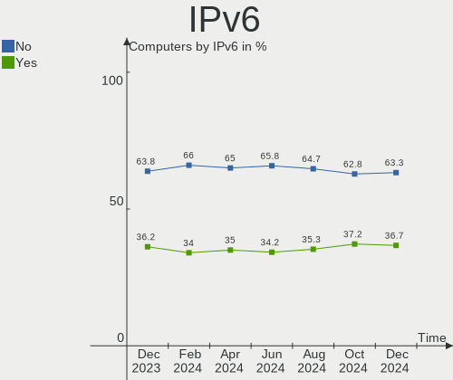

| Used | Computers | Percent |
|------|-----------|---------|
| No   | 557       | 67.68%  |
| Yes  | 266       | 32.32%  |

Bluetooth
---------

Bluetooth Vendor
----------------

Controller vendors

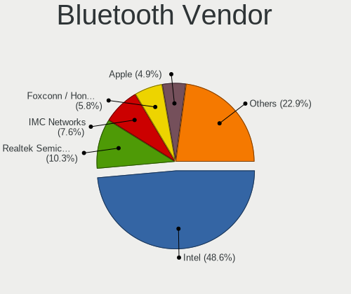

| Vendor                          | Computers | Percent |
|---------------------------------|-----------|---------|
| Intel                           | 294       | 53.85%  |
| Realtek Semiconductor           | 57        | 10.44%  |
| Broadcom                        | 31        | 5.68%   |
| Qualcomm Atheros Communications | 30        | 5.49%   |
| Apple                           | 30        | 5.49%   |
| IMC Networks                    | 26        | 4.76%   |
| Cambridge Silicon Radio         | 19        | 3.48%   |
| Dell                            | 10        | 1.83%   |
| ASUSTek Computer                | 10        | 1.83%   |
| Lite-On Technology              | 9         | 1.65%   |
| Foxconn / Hon Hai               | 6         | 1.1%    |
| Marvell Semiconductor           | 4         | 0.73%   |
| Hewlett-Packard                 | 3         | 0.55%   |
| Ralink Technology               | 2         | 0.37%   |
| MediaTek                        | 2         | 0.37%   |
| Logitech                        | 2         | 0.37%   |
| Edimax Technology               | 2         | 0.37%   |
| Dynex                           | 2         | 0.37%   |
| TP-Link                         | 1         | 0.18%   |
| Toshiba                         | 1         | 0.18%   |
| Mobile Action Technology        | 1         | 0.18%   |
| Micro Star International        | 1         | 0.18%   |
| Foxconn International           | 1         | 0.18%   |
| Alps Electric                   | 1         | 0.18%   |
| Unknown                         | 1         | 0.18%   |

Bluetooth Model
---------------

Controller models

| Model                                               | Computers | Percent |
|-----------------------------------------------------|-----------|---------|
| Intel Bluetooth Device                              | 85        | 15.57%  |
| Intel Bluetooth wireless interface                  | 70        | 12.82%  |
| Intel AX200 Bluetooth                               | 58        | 10.62%  |
| Realtek Bluetooth Radio                             | 41        | 7.51%   |
| Intel Bluetooth 9460/9560 Jefferson Peak (JfP)      | 31        | 5.68%   |
| IMC Networks Bluetooth Radio                        | 20        | 3.66%   |
| Cambridge Silicon Radio Bluetooth Dongle (HCI mode) | 19        | 3.48%   |
| Qualcomm Atheros  Bluetooth Device                  | 17        | 3.11%   |
| Realtek  Bluetooth 4.2 Adapter                      | 14        | 2.56%   |
| Intel Wireless-AC 9260 Bluetooth Adapter            | 14        | 2.56%   |
| Intel AX210 Bluetooth                               | 14        | 2.56%   |
| Broadcom BCM20702A0 Bluetooth 4.0                   | 14        | 2.56%   |
| Apple Bluetooth Host Controller                     | 13        | 2.38%   |
| Intel Wireless-AC 3168 Bluetooth                    | 9         | 1.65%   |
| Qualcomm Atheros QCA61x4 Bluetooth 4.0              | 8         | 1.47%   |
| Intel Centrino Bluetooth Wireless Transceiver       | 7         | 1.28%   |
| Apple Bluetooth USB Host Controller                 | 7         | 1.28%   |
| Intel Centrino Advanced-N 6230 Bluetooth adapter    | 6         | 1.1%    |
| Foxconn / Hon Hai Bluetooth Device                  | 5         | 0.92%   |
| Dell BCM20702A0 Bluetooth Module                    | 5         | 0.92%   |
| Apple Built-in Bluetooth 2.0+EDR HCI                | 5         | 0.92%   |
| Qualcomm Atheros AR3012 Bluetooth 4.0               | 4         | 0.73%   |
| Broadcom BCM20702 Bluetooth 4.0 [ThinkPad]          | 4         | 0.73%   |
| ASUS Bluetooth Radio                                | 4         | 0.73%   |
| Apple Bluetooth HCI                                 | 4         | 0.73%   |
| Marvell Bluetooth and Wireless LAN Composite        | 3         | 0.55%   |
| Lite-On Qualcomm Atheros QCA9377 Bluetooth          | 3         | 0.55%   |
| Lite-On Atheros AR3012 Bluetooth                    | 3         | 0.55%   |
| HP Broadcom 2070 Bluetooth Combo                    | 3         | 0.55%   |
| Broadcom HP Portable SoftSailing                    | 3         | 0.55%   |
| Broadcom BCM43142A0 Bluetooth Device                | 3         | 0.55%   |
| Broadcom BCM2045B (BDC-2.1)                         | 3         | 0.55%   |
| ASUS ASUS USB-BT500                                 | 3         | 0.55%   |
| Realtek Bluetooth 5.1 Radio                         | 2         | 0.37%   |
| Ralink Motorola BC4 Bluetooth 3.0+HS Adapter        | 2         | 0.37%   |
| MediaTek Wireless_Device                            | 2         | 0.37%   |
| Logitech BT Mini-Receiver (HCI mode)                | 2         | 0.37%   |
| Lite-On Bluetooth Device                            | 2         | 0.37%   |
| IMC Networks Wireless_Device                        | 2         | 0.37%   |
| Edimax Bluetooth Device                             | 2         | 0.37%   |
| Dynex BCM20702A0                                    | 2         | 0.37%   |
| Dell Wireless 365 Bluetooth                         | 2         | 0.37%   |
| Broadcom BCM43142A0 Bluetooth 4.0                   | 2         | 0.37%   |
| Broadcom BCM20702A0                                 | 2         | 0.37%   |
| TP-Link UB500 Adapter                               | 1         | 0.18%   |
| Toshiba Integrated Bluetooth HCI                    | 1         | 0.18%   |
| Qualcomm Atheros AR9462 Bluetooth                   | 1         | 0.18%   |
| Mobile Action MA-700 Bluetooth Adapter              | 1         | 0.18%   |
| Micro Star International Bluetooth Device           | 1         | 0.18%   |
| Marvell Bluetooth and Wireless LAN Composite Device | 1         | 0.18%   |
| Lite-On Wireless_Device                             | 1         | 0.18%   |
| IMC Networks Bluetooth Device                       | 1         | 0.18%   |
| IMC Networks Bluetooth                              | 1         | 0.18%   |
| IMC Networks BCM20702A0                             | 1         | 0.18%   |
| IMC Networks Atheros AR3012 Bluetooth 4.0 Adapter   | 1         | 0.18%   |
| Foxconn International BCM43142A0 Bluetooth module   | 1         | 0.18%   |
| Foxconn / Hon Hai Wireless_Device                   | 1         | 0.18%   |
| Dell Wireless 370 Bluetooth Mini-card               | 1         | 0.18%   |
| Dell Wireless 355 Bluetooth                         | 1         | 0.18%   |
| Dell DW375 Bluetooth Module                         | 1         | 0.18%   |

Sound
-----

Sound Vendor
------------

Sound card vendors

| Vendor                      | Computers | Percent |
|-----------------------------|-----------|---------|
| Intel                       | 558       | 47.25%  |
| AMD                         | 272       | 23.03%  |
| Nvidia                      | 202       | 17.1%   |
| C-Media Electronics         | 26        | 2.2%    |
| Logitech                    | 14        | 1.19%   |
| Texas Instruments           | 8         | 0.68%   |
| JMTek                       | 8         | 0.68%   |
| ASUSTek Computer            | 7         | 0.59%   |
| SteelSeries ApS             | 6         | 0.51%   |
| Kingston Technology         | 6         | 0.51%   |
| Realtek Semiconductor       | 5         | 0.42%   |
| Focusrite-Novation          | 5         | 0.42%   |
| Dell                        | 5         | 0.42%   |
| Creative Labs               | 5         | 0.42%   |
| Blue Microphones            | 4         | 0.34%   |
| Sennheiser Communications   | 3         | 0.25%   |
| Samson Technologies         | 3         | 0.25%   |
| Razer USA                   | 3         | 0.25%   |
| GN Netcom                   | 3         | 0.25%   |
| Creative Technology         | 3         | 0.25%   |
| Corsair                     | 3         | 0.25%   |
| Audio-Technica              | 3         | 0.25%   |
| Sony                        | 2         | 0.17%   |
| PreSonus Audio Electronics  | 2         | 0.17%   |
| Plantronics                 | 2         | 0.17%   |
| Lenovo                      | 2         | 0.17%   |
| Apple                       | 2         | 0.17%   |
| XMOS                        | 1         | 0.08%   |
| Valve Software              | 1         | 0.08%   |
| Unknown                     | 1         | 0.08%   |
| Tenx Technology             | 1         | 0.08%   |
| Schiit Audio                | 1         | 0.08%   |
| ONN                         | 1         | 0.08%   |
| Numark                      | 1         | 0.08%   |
| Micro Star International    | 1         | 0.08%   |
| Medeli Electronics          | 1         | 0.08%   |
| iConnectivity               | 1         | 0.08%   |
| Generalplus Technology      | 1         | 0.08%   |
| GEMBIRD                     | 1         | 0.08%   |
| FiiO Electronics Technology | 1         | 0.08%   |
| FIFINE Microphones          | 1         | 0.08%   |
| Cyber Acoustics             | 1         | 0.08%   |
| Conexant Systems            | 1         | 0.08%   |
| ATI Technologies            | 1         | 0.08%   |
| Astro Gaming                | 1         | 0.08%   |
| AlfaPlus Semiconductor      | 1         | 0.08%   |

Sound Model
-----------

Sound card models

| Model                                                                                             | Computers | Percent |
|---------------------------------------------------------------------------------------------------|-----------|---------|
| AMD Family 17h/19h HD Audio Controller                                                            | 63        | 4.57%   |
| Intel 7 Series/C216 Chipset Family High Definition Audio Controller                               | 49        | 3.55%   |
| AMD Starship/Matisse HD Audio Controller                                                          | 48        | 3.48%   |
| Intel Sunrise Point-LP HD Audio                                                                   | 47        | 3.41%   |
| Intel Tiger Lake-LP Smart Sound Technology Audio Controller                                       | 44        | 3.19%   |
| Intel 8 Series/C220 Series Chipset High Definition Audio Controller                               | 40        | 2.9%    |
| AMD Renoir Radeon High Definition Audio Controller                                                | 35        | 2.54%   |
| Intel 6 Series/C200 Series Chipset Family High Definition Audio Controller                        | 34        | 2.47%   |
| AMD SBx00 Azalia (Intel HDA)                                                                      | 32        | 2.32%   |
| Intel Cannon Lake PCH cAVS                                                                        | 31        | 2.25%   |
| AMD FCH Azalia Controller                                                                         | 27        | 1.96%   |
| Intel Xeon E3-1200 v3/4th Gen Core Processor HD Audio Controller                                  | 26        | 1.89%   |
| Intel 5 Series/3400 Series Chipset High Definition Audio                                          | 23        | 1.67%   |
| Intel Tiger Lake-H HD Audio Controller                                                            | 22        | 1.6%    |
| AMD Oland/Hainan/Cape Verde/Pitcairn HDMI Audio [Radeon HD 7000 Series]                           | 21        | 1.52%   |
| Intel Celeron/Pentium Silver Processor High Definition Audio                                      | 20        | 1.45%   |
| Nvidia Audio device                                                                               | 19        | 1.38%   |
| AMD Navi 21/23 HDMI/DP Audio Controller                                                           | 19        | 1.38%   |
| AMD Kabini HDMI/DP Audio                                                                          | 19        | 1.38%   |
| Intel 100 Series/C230 Series Chipset Family HD Audio Controller                                   | 18        | 1.31%   |
| AMD Raven/Raven2/Fenghuang HDMI/DP Audio Controller                                               | 18        | 1.31%   |
| AMD Family 17h (Models 00h-0fh) HD Audio Controller                                               | 18        | 1.31%   |
| AMD Rembrandt Radeon High Definition Audio Controller                                             | 16        | 1.16%   |
| Intel Comet Lake PCH cAVS                                                                         | 15        | 1.09%   |
| Intel 82801I (ICH9 Family) HD Audio Controller                                                    | 15        | 1.09%   |
| AMD Ellesmere HDMI Audio [Radeon RX 470/480 / 570/580/590]                                        | 15        | 1.09%   |
| Nvidia TU106 High Definition Audio Controller                                                     | 14        | 1.02%   |
| Intel 8 Series HD Audio Controller                                                                | 14        | 1.02%   |
| Intel 200 Series PCH HD Audio                                                                     | 14        | 1.02%   |
| Nvidia GP107GL High Definition Audio Controller                                                   | 13        | 0.94%   |
| Intel NM10/ICH7 Family High Definition Audio Controller                                           | 13        | 0.94%   |
| Intel Haswell-ULT HD Audio Controller                                                             | 13        | 0.94%   |
| Intel Alder Lake-S HD Audio Controller                                                            | 13        | 0.94%   |
| Intel Comet Lake PCH-LP cAVS                                                                      | 12        | 0.87%   |
| Intel Broadwell-U Audio Controller                                                                | 12        | 0.87%   |
| Nvidia GA104 High Definition Audio Controller                                                     | 11        | 0.8%    |
| Intel Wildcat Point-LP High Definition Audio Controller                                           | 11        | 0.8%    |
| Intel Cannon Point-LP High Definition Audio Controller                                            | 11        | 0.8%    |
| Intel Atom/Celeron/Pentium Processor x5-E8000/J3xxx/N3xxx Series High Definition Audio Controller | 11        | 0.8%    |
| Nvidia TU116 High Definition Audio Controller                                                     | 10        | 0.73%   |
| Nvidia GK208 HDMI/DP Audio Controller                                                             | 10        | 0.73%   |
| Intel Ice Lake-LP Smart Sound Technology Audio Controller                                         | 10        | 0.73%   |
| Intel 82801JI (ICH10 Family) HD Audio Controller                                                  | 10        | 0.73%   |
| Intel 82801H (ICH8 Family) HD Audio Controller                                                    | 10        | 0.73%   |
| AMD Family 15h (Models 60h-6fh) Audio Controller                                                  | 10        | 0.73%   |
| AMD Baffin HDMI/DP Audio [Radeon RX 550 640SP / RX 560/560X]                                      | 10        | 0.73%   |
| Nvidia TU107 GeForce GTX 1650 High Definition Audio Controller                                    | 9         | 0.65%   |
| Nvidia GP104 High Definition Audio Controller                                                     | 9         | 0.65%   |
| Nvidia GA102 High Definition Audio Controller                                                     | 9         | 0.65%   |
| Intel CM238 HD Audio Controller                                                                   | 9         | 0.65%   |
| Intel C610/X99 series chipset HD Audio Controller                                                 | 9         | 0.65%   |
| Intel Atom Processor Z36xxx/Z37xxx Series High Definition Audio Controller                        | 9         | 0.65%   |
| Intel 9 Series Chipset Family HD Audio Controller                                                 | 9         | 0.65%   |
| AMD Navi 10 HDMI Audio                                                                            | 9         | 0.65%   |
| Nvidia GP108 High Definition Audio Controller                                                     | 8         | 0.58%   |
| Nvidia GP106 High Definition Audio Controller                                                     | 8         | 0.58%   |
| Nvidia GM206 High Definition Audio Controller                                                     | 8         | 0.58%   |
| Nvidia GM107 High Definition Audio Controller [GeForce 940MX]                                     | 8         | 0.58%   |
| Intel Celeron N3350/Pentium N4200/Atom E3900 Series Audio Cluster                                 | 8         | 0.58%   |
| Intel Alder Lake PCH-P High Definition Audio Controller                                           | 8         | 0.58%   |

Memory
------

Memory Vendor
-------------

Memory module vendors

| Vendor                                  | Computers | Percent |
|-----------------------------------------|-----------|---------|
| Samsung Electronics                     | 104       | 22.61%  |
| SK hynix                                | 77        | 16.74%  |
| Micron Technology                       | 51        | 11.09%  |
| G.Skill                                 | 32        | 6.96%   |
| Crucial                                 | 32        | 6.96%   |
| Corsair                                 | 32        | 6.96%   |
| Unknown                                 | 29        | 6.3%    |
| Kingston                                | 27        | 5.87%   |
| Unknown (ABCD)                          | 12        | 2.61%   |
| Elpida                                  | 7         | 1.52%   |
| A-DATA Technology                       | 7         | 1.52%   |
| Unknown                                 | 7         | 1.52%   |
| Team                                    | 6         | 1.3%    |
| Silicon Power                           | 4         | 0.87%   |
| Nanya Technology                        | 4         | 0.87%   |
| Goldkey                                 | 4         | 0.87%   |
| Ramaxel Technology                      | 3         | 0.65%   |
| Unknown (0x0C26)                        | 2         | 0.43%   |
| PNY                                     | 2         | 0.43%   |
| Neo Forza                               | 2         | 0.43%   |
| Unknown (000080B3802C)                  | 1         | 0.22%   |
| Unifosa                                 | 1         | 0.22%   |
| Transcend                               | 1         | 0.22%   |
| Timetec                                 | 1         | 0.22%   |
| Silicon Power Computer & Communications | 1         | 0.22%   |
| Sesame                                  | 1         | 0.22%   |
| Patriot                                 | 1         | 0.22%   |
| OCZ                                     | 1         | 0.22%   |
| Netlist                                 | 1         | 0.22%   |
| GSkill                                  | 1         | 0.22%   |
| Gold Key                                | 1         | 0.22%   |
| GIGA-BYTE                               | 1         | 0.22%   |
| EVGA                                    | 1         | 0.22%   |
| CSX                                     | 1         | 0.22%   |
| Carry                                   | 1         | 0.22%   |
| AMD                                     | 1         | 0.22%   |

Memory Model
------------

Memory module models

| Model                                                               | Computers | Percent |
|---------------------------------------------------------------------|-----------|---------|
| Unknown (ABCD) RAM 123456789012345678 2048MB SODIMM LPDDR4 2400MT/s | 9         | 1.84%   |
| Unknown                                                             | 7         | 1.43%   |
| Samsung RAM M471A1G44AB0-CWE 8192MB SODIMM DDR4 3200MT/s            | 6         | 1.23%   |
| SK hynix RAM HMA81GS6AFR8N-UH 8GB SODIMM DDR4 2667MT/s              | 5         | 1.02%   |
| Samsung RAM M471B5173DB0-YK0 4GB SODIMM DDR3 1600MT/s               | 5         | 1.02%   |
| Samsung RAM M471A5244CB0-CWE 4GB SODIMM DDR4 3200MT/s               | 5         | 1.02%   |
| Samsung RAM M471A5244CB0-CTD 4GB SODIMM DDR4 3266MT/s               | 5         | 1.02%   |
| Samsung RAM M471A1K43DB1-CWE 8GB SODIMM DDR4 3200MT/s               | 5         | 1.02%   |
| G.Skill RAM F4-3200C16-16GVK 16GB DIMM DDR4 3600MT/s                | 5         | 1.02%   |
| SK hynix RAM HMT351S6CFR8C-PB 4GB SODIMM DDR3 1600MT/s              | 4         | 0.82%   |
| SK hynix RAM HMAA2GS6CJR8N-XN 16384MB SODIMM DDR4 3200MT/s          | 4         | 0.82%   |
| Samsung RAM M471B1G73DB0-YK0 8GB SODIMM DDR3 1600MT/s               | 4         | 0.82%   |
| Unknown (ABCD) RAM 123456789012345678 2GB DIMM LPDDR4 2400MT/s      | 3         | 0.61%   |
| SK hynix RAM HMT41GS6BFR8A-PB 8GB SODIMM DDR3 1600MT/s              | 3         | 0.61%   |
| SK hynix RAM HMA41GS6AFR8N-TF 8GB SODIMM DDR4 2667MT/s              | 3         | 0.61%   |
| Samsung RAM UBE3D4AA-MGCR 2GB Row Of Chips LPDDR4 4267MT/s          | 3         | 0.61%   |
| Samsung RAM M471B1G73EB0-YK0 8GB SODIMM DDR3 1600MT/s               | 3         | 0.61%   |
| Samsung RAM M471A1K43EB1-CWE 8GB SODIMM DDR4 3200MT/s               | 3         | 0.61%   |
| Samsung RAM M471A1K43CB1-CTD 8GB SODIMM DDR4 2667MT/s               | 3         | 0.61%   |
| Micron RAM 8JTF51264AZ-1G6E1 4GB DIMM DDR3 1600MT/s                 | 3         | 0.61%   |
| Micron RAM 4ATF1G64HZ-3G2E2 8GB SODIMM DDR4 3200MT/s                | 3         | 0.61%   |
| Corsair RAM CMK32GX4M2B3200C16 16GB DIMM DDR4 3400MT/s              | 3         | 0.61%   |
| Corsair RAM CMK16GX4M2B3200C16 8GB DIMM DDR4 3600MT/s               | 3         | 0.61%   |
| Unknown RAM Module 4096MB DIMM 1333MT/s                             | 2         | 0.41%   |
| Team RAM TEAMGROUP-UD4-3000 8GB DIMM DDR4 3067MT/s                  | 2         | 0.41%   |
| SK hynix RAM HMT451S6BFR8A-PB 4GB SODIMM DDR3 1600MT/s              | 2         | 0.41%   |
| SK hynix RAM HMT425S6CFR6A-PB 2048MB SODIMM DDR3 1600MT/s           | 2         | 0.41%   |
| SK hynix RAM HMT351U6CFR8C-PB 4GB DIMM DDR3 1800MT/s                | 2         | 0.41%   |
| SK hynix RAM HMT351S6EFR8A-PB 4096MB SODIMM DDR3 1600MT/s           | 2         | 0.41%   |
| SK hynix RAM HMT125U6TFR8C-H9 2GB DIMM DDR3 1333MT/s                | 2         | 0.41%   |
| SK hynix RAM HMP351S6AFR8C-S6 4GB SODIMM DDR 800MT/s                | 2         | 0.41%   |
| SK hynix RAM HMA82GS6AFR8N-UH 16GB SODIMM DDR4 2667MT/s             | 2         | 0.41%   |
| Samsung RAM M471B5173QH0-YK0 4GB SODIMM DDR3 1600MT/s               | 2         | 0.41%   |
| Samsung RAM M471B1G73QH0-YK0 8GB SODIMM DDR3 1600MT/s               | 2         | 0.41%   |
| Samsung RAM M471A5244CB0-CTD 4GB Row Of Chips DDR4 2667MT/s         | 2         | 0.41%   |
| Samsung RAM M471A4G43MB1-CTD 32GB SODIMM DDR4 2667MT/s              | 2         | 0.41%   |
| Samsung RAM M471A4G43AB1-CWE 32GB SODIMM DDR4 3200MT/s              | 2         | 0.41%   |
| Samsung RAM M471A1K43CB1-CRC 8192MB SODIMM DDR4 2667MT/s            | 2         | 0.41%   |
| Samsung RAM M471A1K43BB1-CRC 8GB SODIMM DDR4 2667MT/s               | 2         | 0.41%   |
| Samsung RAM M471A1K43BB0-CPB 8192MB SODIMM DDR4 2133MT/s            | 2         | 0.41%   |
| Samsung RAM M425R2GA3BB0-CQKOL 16384MB SODIMM 4800MT/s              | 2         | 0.41%   |
| Samsung RAM K4AAG165WA-BCWE 8GB SODIMM DDR4 3200MT/s                | 2         | 0.41%   |
| Nanya RAM NT2GT64U8HD0BY-AD 2GB DIMM DDR 2048MT/s                   | 2         | 0.41%   |
| Micron RAM MT52L1G32D4PG-093 8GB Row Of Chips LPDDR3 2133MT/s       | 2         | 0.41%   |
| Micron RAM 8ATF1G64HZ-3G2J1 8GB SODIMM DDR4 3200MT/s                | 2         | 0.41%   |
| Micron RAM 8ATF1G64AZ-2G6E1 8GB DIMM DDR4 2667MT/s                  | 2         | 0.41%   |
| Micron RAM 53E1G32D2NP-046 2048MB Row Of Chips LPDDR4 4267MT/s      | 2         | 0.41%   |
| Micron RAM 4ATS2G64HZ-3G2B1 16GB SODIMM DDR4 3200MT/s               | 2         | 0.41%   |
| Micron RAM 4ATF51264HZ-2G6E1 4GB SODIMM DDR4 2667MT/s               | 2         | 0.41%   |
| Goldkey RAM GKE800SO102408-2666A 8GB SODIMM DDR4 2667MT/s           | 2         | 0.41%   |
| G.Skill RAM F4-3600C16-16GTZNC 16GB DIMM DDR4 3600MT/s              | 2         | 0.41%   |
| Crucial RAM CT16G4SFRA266.C8FB 16GB SODIMM DDR4 2667MT/s            | 2         | 0.41%   |
| Crucial RAM BLS8G3D1609DS1S00. 8192MB DIMM DDR3 1600MT/s            | 2         | 0.41%   |
| Corsair RAM CMSO4GX3M1A1333C9 4GB SODIMM DDR3 1334MT/s              | 2         | 0.41%   |
| Corsair RAM CMK16GX4M2E3200C16 8GB DIMM DDR4 3200MT/s               | 2         | 0.41%   |
| Corsair RAM CMK16GX4M2B3000C15 8192MB DIMM DDR4 3000MT/s            | 2         | 0.41%   |
| Corsair RAM CMK16GX4M2A2400C16 8GB DIMM DDR4 2933MT/s               | 2         | 0.41%   |
| Corsair RAM CMK16GX4M2A2400C14 8GB DIMM DDR4 2800MT/s               | 2         | 0.41%   |
| A-DATA RAM Module 32GB SODIMM DDR4 3200MT/s                         | 2         | 0.41%   |
| Unknown RAM Module 8GB DIMM 1600MT/s                                | 1         | 0.2%    |

Memory Kind
-----------

Memory module kinds

| Kind    | Computers | Percent |
|---------|-----------|---------|
| DDR4    | 203       | 50%     |
| DDR3    | 122       | 30.05%  |
| LPDDR4  | 30        | 7.39%   |
| Unknown | 17        | 4.19%   |
| DDR2    | 15        | 3.69%   |
| LPDDR3  | 13        | 3.2%    |
| SDRAM   | 4         | 0.99%   |
| DDR     | 2         | 0.49%   |

Memory Form Factor
------------------

Physical design of the memory module

| Name         | Computers | Percent |
|--------------|-----------|---------|
| SODIMM       | 210       | 51.6%   |
| DIMM         | 153       | 37.59%  |
| Row Of Chips | 34        | 8.35%   |
| Chip         | 5         | 1.23%   |
| Unknown      | 3         | 0.74%   |
| FB-DIMM      | 2         | 0.49%   |

Memory Size
-----------

Memory module size

| Size  | Computers | Percent |
|-------|-----------|---------|
| 8192  | 173       | 39.41%  |
| 4096  | 114       | 25.97%  |
| 16384 | 82        | 18.68%  |
| 2048  | 41        | 9.34%   |
| 32768 | 20        | 4.56%   |
| 1024  | 7         | 1.59%   |
| 1536  | 1         | 0.23%   |
| 512   | 1         | 0.23%   |

Memory Speed
------------

Memory module speed

| Speed   | Computers | Percent |
|---------|-----------|---------|
| 1600    | 82        | 18.51%  |
| 3200    | 80        | 18.06%  |
| 2667    | 61        | 13.77%  |
| 2400    | 31        | 7%      |
| 2133    | 26        | 5.87%   |
| 1333    | 26        | 5.87%   |
| 3600    | 16        | 3.61%   |
| 4267    | 13        | 2.93%   |
| 667     | 10        | 2.26%   |
| 1867    | 9         | 2.03%   |
| 4800    | 8         | 1.81%   |
| 2933    | 7         | 1.58%   |
| 1334    | 7         | 1.58%   |
| 3266    | 6         | 1.35%   |
| 800     | 6         | 1.35%   |
| 1067    | 5         | 1.13%   |
| 1066    | 5         | 1.13%   |
| 2048    | 4         | 0.9%    |
| 1866    | 4         | 0.9%    |
| 3800    | 3         | 0.68%   |
| 3733    | 3         | 0.68%   |
| 3466    | 3         | 0.68%   |
| 3400    | 3         | 0.68%   |
| 1800    | 3         | 0.68%   |
| 4266    | 2         | 0.45%   |
| 3067    | 2         | 0.45%   |
| 3000    | 2         | 0.45%   |
| 2800    | 2         | 0.45%   |
| 533     | 2         | 0.45%   |
| Unknown | 2         | 0.45%   |
| 6400    | 1         | 0.23%   |
| 5600    | 1         | 0.23%   |
| 4333    | 1         | 0.23%   |
| 4000    | 1         | 0.23%   |
| 3866    | 1         | 0.23%   |
| 2465    | 1         | 0.23%   |
| 2267    | 1         | 0.23%   |
| 2132    | 1         | 0.23%   |
| 1258    | 1         | 0.23%   |
| 266     | 1         | 0.23%   |

Printers & scanners
-------------------

Printer Vendor
--------------

Printer device vendors

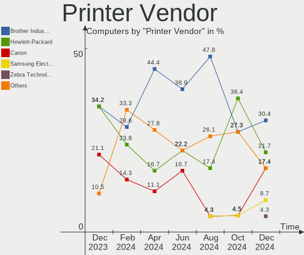

| Vendor              | Computers | Percent |
|---------------------|-----------|---------|
| Brother Industries  | 7         | 35%     |
| Samsung Electronics | 4         | 20%     |
| Hewlett-Packard     | 4         | 20%     |
| STMicroelectronics  | 2         | 10%     |
| Canon               | 2         | 10%     |
| Seiko Epson         | 1         | 5%      |

Printer Model
-------------

Printer device models

| Model                                                     | Computers | Percent |
|-----------------------------------------------------------|-----------|---------|
| Samsung ML-191x/ML-252x Laser Printer                     | 2         | 10%     |
| STMicroelectronics USB Printer P                          | 1         | 5%      |
| STMicroelectronics LED badge -- mini LED display -- 11x44 | 1         | 5%      |
| Seiko Epson WF-4830 Series                                | 1         | 5%      |
| Samsung SCX-3400 Series                                   | 1         | 5%      |
| Samsung M283x Series                                      | 1         | 5%      |
| HP OfficeJet 5500 series                                  | 1         | 5%      |
| HP LaserJet M14-M17                                       | 1         | 5%      |
| HP ENVY 6400 series                                       | 1         | 5%      |
| HP DeskJet 3700 series                                    | 1         | 5%      |
| Canon TR7500 series                                       | 1         | 5%      |
| Canon Pro9000II series                                    | 1         | 5%      |
| Brother Printer                                           | 1         | 5%      |
| Brother MFC-L2700DW                                       | 1         | 5%      |
| Brother MFC-7360N                                         | 1         | 5%      |
| Brother HL-L2340D series                                  | 1         | 5%      |
| Brother HL-5340 series                                    | 1         | 5%      |
| Brother HL-3140CW series                                  | 1         | 5%      |
| Brother DCP-L2540DW                                       | 1         | 5%      |

Scanner Vendor
--------------

Scanner device vendors

| Vendor      | Computers | Percent |
|-------------|-----------|---------|
| Seiko Epson | 1         | 100%    |

Scanner Model
-------------

Scanner device models

| Model                                       | Computers | Percent |
|---------------------------------------------|-----------|---------|
| Seiko Epson GT-X820 [Perfection V600 Photo] | 1         | 100%    |

Camera
------

Camera Vendor
-------------

Camera device vendors

| Vendor                                 | Computers | Percent |
|----------------------------------------|-----------|---------|
| Chicony Electronics                    | 75        | 16.16%  |
| Microdia                               | 59        | 12.72%  |
| Realtek Semiconductor                  | 35        | 7.54%   |
| Acer                                   | 34        | 7.33%   |
| Logitech                               | 30        | 6.47%   |
| IMC Networks                           | 29        | 6.25%   |
| Apple                                  | 29        | 6.25%   |
| Sunplus Innovation Technology          | 23        | 4.96%   |
| Quanta                                 | 22        | 4.74%   |
| Cheng Uei Precision Industry (Foxlink) | 20        | 4.31%   |
| Syntek                                 | 11        | 2.37%   |
| Microsoft                              | 10        | 2.16%   |
| Luxvisions Innotech Limited            | 10        | 2.16%   |
| Lite-On Technology                     | 7         | 1.51%   |
| Samsung Electronics                    | 6         | 1.29%   |
| MacroSilicon                           | 5         | 1.08%   |
| Alcor Micro                            | 5         | 1.08%   |
| Ricoh                                  | 4         | 0.86%   |
| Z-Star Microelectronics                | 3         | 0.65%   |
| Suyin                                  | 3         | 0.65%   |
| SunplusIT                              | 3         | 0.65%   |
| Sonix Technology                       | 3         | 0.65%   |
| Hewlett-Packard                        | 3         | 0.65%   |
| Generalplus Technology                 | 3         | 0.65%   |
| ARC International                      | 3         | 0.65%   |
| Unknown                                | 2         | 0.43%   |
| OmniVision Technologies                | 2         | 0.43%   |
| Importek                               | 2         | 0.43%   |
| Huawei Technologies                    | 2         | 0.43%   |
| XHT-210518                             | 1         | 0.22%   |
| Valve Software                         | 1         | 0.22%   |
| Tobii Technology AB                    | 1         | 0.22%   |
| Silicon Motion                         | 1         | 0.22%   |
| Pixart Imaging                         | 1         | 0.22%   |
| Magic Control Technology               | 1         | 0.22%   |
| Lenovo                                 | 1         | 0.22%   |
| KYE Systems (Mouse Systems)            | 1         | 0.22%   |
| IPEVO                                  | 1         | 0.22%   |
| icSpring                               | 1         | 0.22%   |
| HD USB Camera                          | 1         | 0.22%   |
| HD Camera Manufacturer                 | 1         | 0.22%   |
| GEMBIRD                                | 1         | 0.22%   |
| FPL-2053-191010                        | 1         | 0.22%   |
| EVGA                                   | 1         | 0.22%   |
| eMeet                                  | 1         | 0.22%   |
| Cubeternet                             | 1         | 0.22%   |
| Creative Technology                    | 1         | 0.22%   |
| Alpha Imaging Technology               | 1         | 0.22%   |
| ALi                                    | 1         | 0.22%   |
| Unknown                                | 1         | 0.22%   |

Camera Model
------------

Camera device models

| Model                                                          | Computers | Percent |
|----------------------------------------------------------------|-----------|---------|
| Microdia Integrated_Webcam_HD                                  | 26        | 5.52%   |
| Chicony Integrated Camera                                      | 18        | 3.82%   |
| Acer Integrated Camera                                         | 14        | 2.97%   |
| Realtek Integrated_Webcam_HD                                   | 13        | 2.76%   |
| IMC Networks Integrated Camera                                 | 13        | 2.76%   |
| Apple iPhone 5/5C/5S/6/SE                                      | 12        | 2.55%   |
| Logitech HD Pro Webcam C920                                    | 10        | 2.12%   |
| Sunplus Integrated_Webcam_HD                                   | 9         | 1.91%   |
| Chicony HD WebCam                                              | 8         | 1.7%    |
| Syntek Integrated Camera                                       | 7         | 1.49%   |
| Quanta HP TrueVision HD Camera                                 | 7         | 1.49%   |
| Apple FaceTime HD Camera (Built-in)                            | 7         | 1.49%   |
| Apple Built-in iSight                                          | 7         | 1.49%   |
| Samsung Galaxy series, misc. (MTP mode)                        | 6         | 1.27%   |
| Microdia USB 2.0 Camera                                        | 6         | 1.27%   |
| IMC Networks USB2.0 HD UVC WebCam                              | 6         | 1.27%   |
| Chicony HP Truevision HD                                       | 6         | 1.27%   |
| Cheng Uei Precision Industry (Foxlink) HP Webcam               | 6         | 1.27%   |
| Quanta HP Wide Vision HD Camera                                | 5         | 1.06%   |
| Microdia Integrated Webcam                                     | 5         | 1.06%   |
| Realtek USB Camera                                             | 4         | 0.85%   |
| Microdia Dell Integrated HD Webcam                             | 4         | 0.85%   |
| MacroSilicon MiraBox Capture                                   | 4         | 0.85%   |
| Logitech Webcam C270                                           | 4         | 0.85%   |
| Cheng Uei Precision Industry (Foxlink) HP TrueVision HD Camera | 4         | 0.85%   |
| Alcor Micro USB 2.0 Camera                                     | 4         | 0.85%   |
| Acer HD Webcam                                                 | 4         | 0.85%   |
| Realtek Integrated Webcam_HD                                   | 3         | 0.64%   |
| Realtek HD WebCam                                              | 3         | 0.64%   |
| Microdia Webcam Vitade AF                                      | 3         | 0.64%   |
| Luxvisions Innotech Limited HP TrueVision HD Camera            | 3         | 0.64%   |
| Logitech HD Webcam C525                                        | 3         | 0.64%   |
| Lite-On Integrated Camera                                      | 3         | 0.64%   |
| IMC Networks USB2.0 VGA UVC WebCam                             | 3         | 0.64%   |
| Chicony USB2.0 VGA UVC WebCam                                  | 3         | 0.64%   |
| Chicony USB2.0 HD UVC WebCam                                   | 3         | 0.64%   |
| Chicony USB2.0 Camera                                          | 3         | 0.64%   |
| Chicony HP Wide Vision HD Camera                               | 3         | 0.64%   |
| Cheng Uei Precision Industry (Foxlink) Webcam                  | 3         | 0.64%   |
| Acer ThinkPad P50 Integrated Camera                            | 3         | 0.64%   |
| Acer BisonCam,NB Pro                                           | 3         | 0.64%   |
| SunplusIT MTD camera                                           | 2         | 0.42%   |
| Sunplus Laptop_Integrated_Webcam_FHD                           | 2         | 0.42%   |
| Realtek Integrated_Webcam_FHD                                  | 2         | 0.42%   |
| Realtek Integrated Webcam                                      | 2         | 0.42%   |
| Quanta HP HD Camera                                            | 2         | 0.42%   |
| Quanta HD Webcam                                               | 2         | 0.42%   |
| Quanta HD User Facing                                          | 2         | 0.42%   |
| OmniVision OV2640 Webcam                                       | 2         | 0.42%   |
| Microsoft Surface Camera Front                                 | 2         | 0.42%   |
| Microsoft LifeCam HD-3000                                      | 2         | 0.42%   |
| Microdia Laptop_Integrated_Webcam_HD                           | 2         | 0.42%   |
| Microdia Laptop_Integrated_Webcam_2M                           | 2         | 0.42%   |
| Microdia HP Webcam                                             | 2         | 0.42%   |
| Microdia Dell Laptop Integrated Webcam HD                      | 2         | 0.42%   |
| Luxvisions Innotech Limited HP Wide Vision HD Camera           | 2         | 0.42%   |
| Logitech Webcam C925e                                          | 2         | 0.42%   |
| Logitech C920 PRO HD Webcam                                    | 2         | 0.42%   |
| Logitech BRIO Ultra HD Webcam                                  | 2         | 0.42%   |
| Lite-On HP Wide Vision HD Camera                               | 2         | 0.42%   |

Security
--------

Fingerprint Vendor
------------------

Fingerprint sensor vendors

| Vendor                     | Computers | Percent |
|----------------------------|-----------|---------|
| Validity Sensors           | 29        | 39.73%  |
| Synaptics                  | 24        | 32.88%  |
| Shenzhen Goodix Technology | 9         | 12.33%  |
| AuthenTec                  | 4         | 5.48%   |
| Upek                       | 1         | 1.37%   |
| STMicroelectronics         | 1         | 1.37%   |
| Samsung Electronics        | 1         | 1.37%   |
| LighTuning Technology      | 1         | 1.37%   |
| HOLTEK                     | 1         | 1.37%   |
| Focal-systems.Corp         | 1         | 1.37%   |
| Elan Microelectronics      | 1         | 1.37%   |

Fingerprint Model
-----------------

Fingerprint sensor models

| Model                                                                      | Computers | Percent |
|----------------------------------------------------------------------------|-----------|---------|
| Unknown                                                                    | 12        | 16.44%  |
| Synaptics Prometheus MIS Touch Fingerprint Reader                          | 8         | 10.96%  |
| Validity Sensors VFS7500 Touch Fingerprint Sensor                          | 4         | 5.48%   |
| Shenzhen Goodix  FingerPrint Device                                        | 4         | 5.48%   |
| Shenzhen Goodix Fingerprint Reader                                         | 4         | 5.48%   |
| Validity Sensors VFS495 Fingerprint Reader                                 | 3         | 4.11%   |
| Validity Sensors VFS491                                                    | 3         | 4.11%   |
| Validity Sensors VFS451 Fingerprint Reader                                 | 3         | 4.11%   |
| Validity Sensors VFS 5011 fingerprint sensor                               | 3         | 4.11%   |
| Validity Sensors Fingerprint scanner                                       | 3         | 4.11%   |
| Synaptics Metallica MIS Touch Fingerprint Reader                           | 3         | 4.11%   |
| AuthenTec AES2810                                                          | 3         | 4.11%   |
| Validity Sensors VFS7552 Touch Fingerprint Sensor                          | 2         | 2.74%   |
| Validity Sensors VFS471 Fingerprint Reader                                 | 2         | 2.74%   |
| Validity Sensors Synaptics WBDI                                            | 2         | 2.74%   |
| Validity Sensors VFS5011 Fingerprint Reader                                | 1         | 1.37%   |
| Validity Sensors VFS300 Fingerprint Reader                                 | 1         | 1.37%   |
| Validity Sensors Synaptics VFS7552 Touch Fingerprint Sensor with PurePrint | 1         | 1.37%   |
| Validity Sensors Swipe Fingerprint Sensor                                  | 1         | 1.37%   |
| Upek Biometric Touchchip/Touchstrip Fingerprint Sensor                     | 1         | 1.37%   |
| Synaptics  WBDI                                                            | 1         | 1.37%   |
| STMicroelectronics Fingerprint Reader                                      | 1         | 1.37%   |
| Shenzhen Goodix FingerPrint                                                | 1         | 1.37%   |
| Samsung Fingerprint Sensor Device - 730B                                   | 1         | 1.37%   |
| LighTuning ES603 Swipe Fingerprint Sensor                                  | 1         | 1.37%   |
| HOLTEK FocalTech Fingerprint Device                                        | 1         | 1.37%   |
| Focal-systems.Corp FT9201Fingerprint.                                      | 1         | 1.37%   |
| Elan ELAN:Fingerprint                                                      | 1         | 1.37%   |
| AuthenTec Fingerprint Sensor                                               | 1         | 1.37%   |

Chipcard Vendor
---------------

Chipcard module vendors

| Vendor           | Computers | Percent |
|------------------|-----------|---------|
| Broadcom         | 25        | 71.43%  |
| Upek             | 3         | 8.57%   |
| Alcor Micro      | 3         | 8.57%   |
| O2 Micro         | 2         | 5.71%   |
| Yubico.com       | 1         | 2.86%   |
| SCM Microsystems | 1         | 2.86%   |

Chipcard Model
--------------

Chipcard module models

| Model                                                                        | Computers | Percent |
|------------------------------------------------------------------------------|-----------|---------|
| Broadcom BCM5880 Secure Applications Processor                               | 8         | 22.86%  |
| Broadcom 5880                                                                | 8         | 22.86%  |
| Broadcom BCM5880 Secure Applications Processor with fingerprint swipe sensor | 5         | 14.29%  |
| Broadcom 58200                                                               | 4         | 11.43%  |
| Upek TouchChip Fingerprint Coprocessor (WBF advanced mode)                   | 3         | 8.57%   |
| Alcor Micro AU9540 Smartcard Reader                                          | 3         | 8.57%   |
| O2 Micro OZ776 CCID Smartcard Reader                                         | 2         | 5.71%   |
| Yubico.com Yubikey NEO(-N) OTP+CCID                                          | 1         | 2.86%   |
| SCM Microsystems SCR331-LC1 / SCR3310 SmartCard Reader                       | 1         | 2.86%   |

Unsupported
-----------

Unsupported Devices
-------------------

Total unsupported devices on board

| Total | Computers | Percent |
|-------|-----------|---------|
| 0     | 569       | 69.14%  |
| 1     | 194       | 23.57%  |
| 2     | 50        | 6.08%   |
| 3     | 5         | 0.61%   |
| 6     | 2         | 0.24%   |
| 4     | 2         | 0.24%   |
| 5     | 1         | 0.12%   |

Unsupported Device Types
------------------------

Types of unsupported devices

| Type                     | Computers | Percent |
|--------------------------|-----------|---------|
| Fingerprint reader       | 70        | 21.74%  |
| Graphics card            | 68        | 21.12%  |
| Net/wireless             | 53        | 16.46%  |
| Chipcard                 | 29        | 9.01%   |
| Multimedia controller    | 24        | 7.45%   |
| Communication controller | 17        | 5.28%   |
| Unassigned class         | 11        | 3.42%   |
| Net/ethernet             | 9         | 2.8%    |
| Sound                    | 8         | 2.48%   |
| Network                  | 8         | 2.48%   |
| Storage                  | 5         | 1.55%   |
| Camera                   | 5         | 1.55%   |
| Bluetooth                | 5         | 1.55%   |
| Modem                    | 4         | 1.24%   |
| Card reader              | 3         | 0.93%   |
| Storage/ide              | 1         | 0.31%   |
| Storage/ata              | 1         | 0.31%   |
| Firewire controller      | 1         | 0.31%   |

