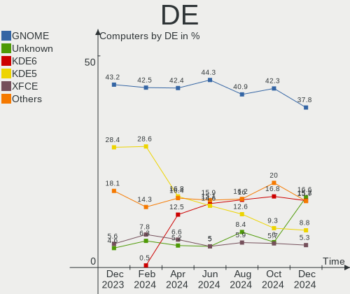
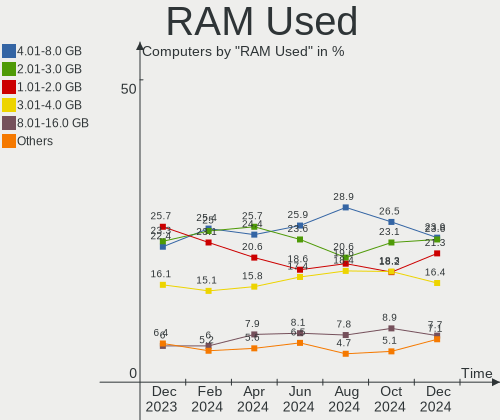
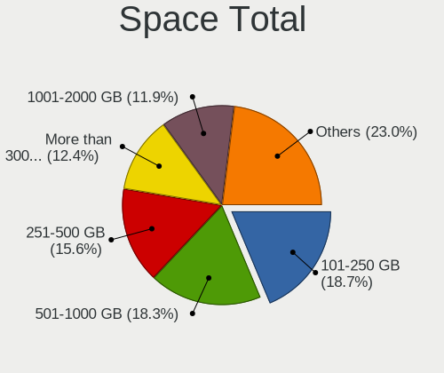
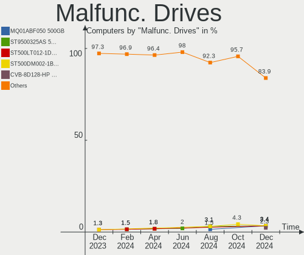
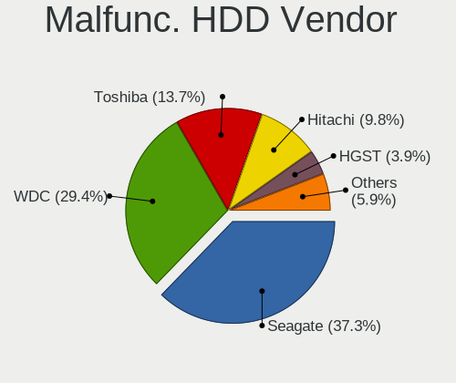
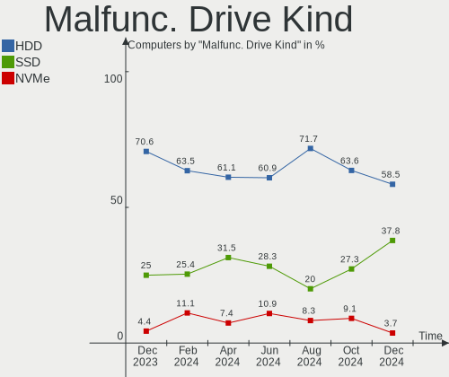
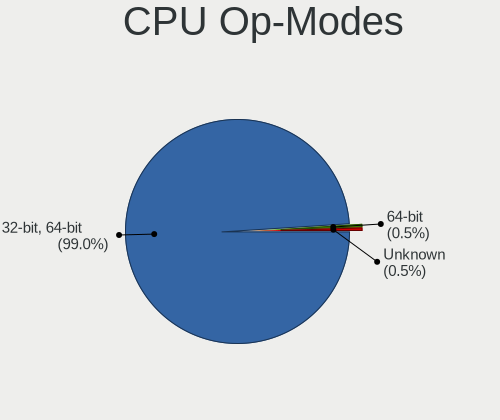
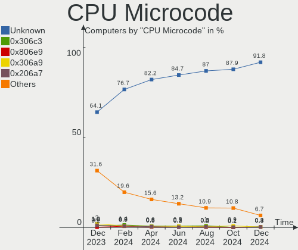
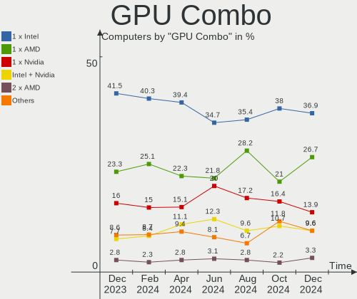
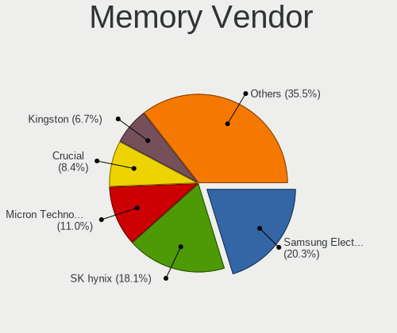

Linux in USA - Hardware Trends
------------------------------

A project to identify most popular hardware characteristics and track their change
over time based on data collected by Linux users at https://Linux-Hardware.org.

Anyone can contribute to this report by the [hw-probe](https://github.com/linuxhw/hw-probe) tool:

    sudo -E hw-probe -all -upload

This is a report for all computer types. See also reports for [desktops](/Location/USA/Desktop/README.md) and [notebooks](/Location/USA/Notebook/README.md).

Period: Jul, 2023.

Contents
--------

* [ System ](#system)
  - [ OS                       ](#os)
  - [ OS Family                ](#os-family)
  - [ Kernel                   ](#kernel)
  - [ Kernel Family            ](#kernel-family)
  - [ Kernel Major Ver.        ](#kernel-major-ver)
  - [ Arch                     ](#arch)
  - [ DE                       ](#de)
  - [ Display Server           ](#display-server)
  - [ Display Manager          ](#display-manager)
  - [ OS Lang                  ](#os-lang)
  - [ Boot Mode                ](#boot-mode)
  - [ Filesystem               ](#filesystem)
  - [ Part. scheme             ](#part-scheme)
  - [ Dual Boot with Linux/BSD ](#dual-boot-with-linuxbsd)
  - [ Dual Boot (Win)          ](#dual-boot-win)

* [ Board ](#board)
  - [ Vendor                   ](#vendor)
  - [ Model                    ](#model)
  - [ Model Family             ](#model-family)
  - [ MFG Year                 ](#mfg-year)
  - [ Form Factor              ](#form-factor)
  - [ Secure Boot              ](#secure-boot)
  - [ Coreboot                 ](#coreboot)
  - [ RAM Size                 ](#ram-size)
  - [ RAM Used                 ](#ram-used)
  - [ Total Drives             ](#total-drives)
  - [ Has CD-ROM               ](#has-cd-rom)
  - [ Has Ethernet             ](#has-ethernet)
  - [ Has WiFi                 ](#has-wifi)
  - [ Has Bluetooth            ](#has-bluetooth)

* [ Location ](#location)
  - [ Country                  ](#country)
  - [ City                     ](#city)

* [ Drives ](#drives)
  - [ Drive Vendor             ](#drive-vendor)
  - [ Drive Model              ](#drive-model)
  - [ HDD Vendor               ](#hdd-vendor)
  - [ SSD Vendor               ](#ssd-vendor)
  - [ Drive Kind               ](#drive-kind)
  - [ Drive Connector          ](#drive-connector)
  - [ Drive Size               ](#drive-size)
  - [ Space Total              ](#space-total)
  - [ Space Used               ](#space-used)
  - [ Malfunc. Drives          ](#malfunc-drives)
  - [ Malfunc. Drive Vendor    ](#malfunc-drive-vendor)
  - [ Malfunc. HDD Vendor      ](#malfunc-hdd-vendor)
  - [ Malfunc. Drive Kind      ](#malfunc-drive-kind)
  - [ Failed Drives            ](#failed-drives)
  - [ Failed Drive Vendor      ](#failed-drive-vendor)
  - [ Drive Status             ](#drive-status)

* [ Storage controller ](#storage-controller)
  - [ Storage Vendor           ](#storage-vendor)
  - [ Storage Model            ](#storage-model)
  - [ Storage Kind             ](#storage-kind)

* [ Processor ](#processor)
  - [ CPU Vendor               ](#cpu-vendor)
  - [ CPU Model                ](#cpu-model)
  - [ CPU Model Family         ](#cpu-model-family)
  - [ CPU Cores                ](#cpu-cores)
  - [ CPU Sockets              ](#cpu-sockets)
  - [ CPU Threads              ](#cpu-threads)
  - [ CPU Op-Modes             ](#cpu-op-modes)
  - [ CPU Microcode            ](#cpu-microcode)
  - [ CPU Microarch            ](#cpu-microarch)

* [ Graphics ](#graphics)
  - [ GPU Vendor               ](#gpu-vendor)
  - [ GPU Model                ](#gpu-model)
  - [ GPU Combo                ](#gpu-combo)
  - [ GPU Driver               ](#gpu-driver)
  - [ GPU Memory               ](#gpu-memory)

* [ Monitor ](#monitor)
  - [ Monitor Vendor           ](#monitor-vendor)
  - [ Monitor Model            ](#monitor-model)
  - [ Monitor Resolution       ](#monitor-resolution)
  - [ Monitor Diagonal         ](#monitor-diagonal)
  - [ Monitor Width            ](#monitor-width)
  - [ Aspect Ratio             ](#aspect-ratio)
  - [ Monitor Area             ](#monitor-area)
  - [ Pixel Density            ](#pixel-density)
  - [ Multiple Monitors        ](#multiple-monitors)

* [ Network ](#network)
  - [ Net Controller Vendor    ](#net-controller-vendor)
  - [ Net Controller Model     ](#net-controller-model)
  - [ Wireless Vendor          ](#wireless-vendor)
  - [ Wireless Model           ](#wireless-model)
  - [ Ethernet Vendor          ](#ethernet-vendor)
  - [ Ethernet Model           ](#ethernet-model)
  - [ Net Controller Kind      ](#net-controller-kind)
  - [ Used Controller          ](#used-controller)
  - [ NICs                     ](#nics)
  - [ IPv6                     ](#ipv6)

* [ Bluetooth ](#bluetooth)
  - [ Bluetooth Vendor         ](#bluetooth-vendor)
  - [ Bluetooth Model          ](#bluetooth-model)

* [ Sound ](#sound)
  - [ Sound Vendor             ](#sound-vendor)
  - [ Sound Model              ](#sound-model)

* [ Memory ](#memory)
  - [ Memory Vendor            ](#memory-vendor)
  - [ Memory Model             ](#memory-model)
  - [ Memory Kind              ](#memory-kind)
  - [ Memory Form Factor       ](#memory-form-factor)
  - [ Memory Size              ](#memory-size)
  - [ Memory Speed             ](#memory-speed)

* [ Printers & scanners ](#printers--scanners)
  - [ Printer Vendor           ](#printer-vendor)
  - [ Printer Model            ](#printer-model)
  - [ Scanner Vendor           ](#scanner-vendor)
  - [ Scanner Model            ](#scanner-model)

* [ Camera ](#camera)
  - [ Camera Vendor            ](#camera-vendor)
  - [ Camera Model             ](#camera-model)

* [ Security ](#security)
  - [ Fingerprint Vendor       ](#fingerprint-vendor)
  - [ Fingerprint Model        ](#fingerprint-model)
  - [ Chipcard Vendor          ](#chipcard-vendor)
  - [ Chipcard Model           ](#chipcard-model)

* [ Unsupported ](#unsupported)
  - [ Unsupported Devices      ](#unsupported-devices)
  - [ Unsupported Device Types ](#unsupported-device-types)

System
------

OS
--

Installed operating systems

| Name                         | Computers | Percent |
|------------------------------|-----------|---------|
| Ubuntu 22.04                 | 137       | 13.65%  |
| Fedora 38                    | 85        | 8.47%   |
| Pop!_OS 22.04                | 65        | 6.47%   |
| Debian 12                    | 52        | 5.18%   |
| Linux Mint 21.1              | 50        | 4.98%   |
| Ubuntu 23.04                 | 43        | 4.28%   |
| Zorin 16                     | 39        | 3.88%   |
| Arch Rolling                 | 34        | 3.39%   |
| ArcoLinux Rolling            | 33        | 3.29%   |
| Linux Mint 21.2              | 28        | 2.79%   |
| Debian 11                    | 23        | 2.29%   |
| SteamOS 3.4.8                | 22        | 2.19%   |
| OpenMandriva 23.07           | 22        | 2.19%   |
| Ubuntu 20.04                 | 18        | 1.79%   |
| OpenMandriva 23.03           | 18        | 1.79%   |
| Nobara 38                    | 17        | 1.69%   |
| Kali 2023.2                  | 17        | 1.69%   |
| EndeavourOS Rolling          | 17        | 1.69%   |
| openSUSE Tumbleweed-XXXXXXXX | 15        | 1.49%   |
| Manjaro                      | 15        | 1.49%   |
| KDE neon 22.04               | 14        | 1.39%   |
| Kubuntu 22.04                | 12        | 1.2%    |
| Xero Rolling                 | 11        | 1.1%    |
| Kubuntu 23.04                | 11        | 1.1%    |
| Ubuntu 22.10                 | 10        | 1%      |
| Gentoo 2.13                  | 10        | 1%      |
| Linux Mint 20.3              | 8         | 0.8%    |
| Ubuntu 18.04                 | 7         | 0.7%    |
| Manjaro 23.0.0               | 7         | 0.7%    |
| Debian                       | 7         | 0.7%    |
| Parrot 5.3                   | 6         | 0.6%    |
| OpenMandriva 4.3             | 6         | 0.6%    |
| Elementary 7                 | 6         | 0.6%    |
| Xubuntu 22.04                | 5         | 0.5%    |
| openSUSE Leap-15.5           | 5         | 0.5%    |
| OpenMandriva 23.06           | 5         | 0.5%    |
| LMDE 5                       | 5         | 0.5%    |
| Fedora 37                    | 5         | 0.5%    |
| org.kde.Platform 5.15-21.08  | 4         | 0.4%    |
| Lubuntu 23.04                | 4         | 0.4%    |

OS Family
---------

OS without a version

| Name             | Computers | Percent |
|------------------|-----------|---------|
| Ubuntu           | 216       | 21.51%  |
| Fedora           | 93        | 9.26%   |
| Linux Mint       | 92        | 9.16%   |
| Debian           | 82        | 8.17%   |
| Pop!_OS          | 65        | 6.47%   |
| OpenMandriva     | 58        | 5.78%   |
| Zorin            | 40        | 3.98%   |
| Arch             | 35        | 3.49%   |
| ArcoLinux        | 34        | 3.39%   |
| SteamOS          | 30        | 2.99%   |
| Kubuntu          | 26        | 2.59%   |
| Manjaro          | 23        | 2.29%   |
| openSUSE         | 22        | 2.19%   |
| Nobara           | 18        | 1.79%   |
| Kali             | 17        | 1.69%   |
| EndeavourOS      | 17        | 1.69%   |
| KDE neon         | 14        | 1.39%   |
| Gentoo           | 13        | 1.29%   |
| Xero             | 11        | 1.1%    |
| Xubuntu          | 9         | 0.9%    |
| Lubuntu          | 7         | 0.7%    |
| Garuda Linux     | 7         | 0.7%    |
| Parrot           | 6         | 0.6%    |
| NixOS            | 6         | 0.6%    |
| Elementary       | 6         | 0.6%    |
| LMDE             | 5         | 0.5%    |
| Rocky Linux      | 4         | 0.4%    |
| org.kde.Platform | 4         | 0.4%    |
| blendOS          | 4         | 0.4%    |
| Solus            | 3         | 0.3%    |
| Linux Lite       | 3         | 0.3%    |
| Lilidog          | 3         | 0.3%    |
| Ubuntu MATE      | 2         | 0.2%    |
| Trisquel         | 2         | 0.2%    |
| ChimeraOS        | 2         | 0.2%    |
| Archcraft        | 2         | 0.2%    |
| Arch ARM         | 2         | 0.2%    |
| AlmaLinux        | 2         | 0.2%    |
| UbuntuDDE        | 1         | 0.1%    |
| Ubuntu Studio    | 1         | 0.1%    |

Kernel
------

Version of the Linux kernel

| Version                      | Computers | Percent |
|------------------------------|-----------|---------|
| 5.19.0-46-generic            | 115       | 11.45%  |
| 5.15.0-76-generic            | 105       | 10.46%  |
| 6.2.6-76060206-generic       | 60        | 5.98%   |
| 6.1.0-10-amd64               | 37        | 3.69%   |
| 6.3.5-desktop-3omv2390       | 26        | 2.59%   |
| 6.2.0-25-generic             | 24        | 2.39%   |
| 5.15.0-78-generic            | 24        | 2.39%   |
| 5.13.0-valve36-1-neptune     | 23        | 2.29%   |
| 6.3.12-200.fc38.x86_64       | 20        | 1.99%   |
| 6.3.8-200.fc38.x86_64        | 19        | 1.89%   |
| 6.2.6-desktop-1omv2390       | 18        | 1.79%   |
| 6.3.11-200.fc38.x86_64       | 16        | 1.59%   |
| 6.4.3-arch1-2                | 15        | 1.49%   |
| 6.2.0-24-generic             | 15        | 1.49%   |
| 6.3.9-arch1-1                | 14        | 1.39%   |
| 6.1.0-9-amd64                | 14        | 1.39%   |
| 6.1.0-kali9-amd64            | 13        | 1.29%   |
| 5.19.0-50-generic            | 13        | 1.29%   |
| 5.19.0-32-generic            | 11        | 1.1%    |
| 5.10.0-23-amd64              | 11        | 1.1%    |
| 6.3.12-204.fsync.fc38.x86_64 | 10        | 1%      |
| 5.4.0-153-generic            | 8         | 0.8%    |
| 6.4.6-arch1-1                | 7         | 0.7%    |
| 6.4.2-arch1-1                | 7         | 0.7%    |
| 6.4.1-arch2-1                | 7         | 0.7%    |
| 6.2.9-300.fc38.x86_64        | 7         | 0.7%    |
| 5.15.0-56-generic            | 7         | 0.7%    |
| 6.4.1-arch1-1                | 6         | 0.6%    |
| 6.2.0-26-generic             | 6         | 0.6%    |
| 6.1.0-1parrot1-amd64         | 6         | 0.6%    |
| 5.19.0-45-generic            | 6         | 0.6%    |
| 5.15.0-75-generic            | 6         | 0.6%    |
| 6.4.6-200.fc38.x86_64        | 5         | 0.5%    |
| 6.4.3-arch1-1                | 5         | 0.5%    |
| 6.4.2-zen1-1-zen             | 5         | 0.5%    |
| 6.3.9-zen1-1-zen             | 5         | 0.5%    |
| 6.3.9-1-default              | 5         | 0.5%    |
| 6.3.10-200.fsync.fc38.x86_64 | 5         | 0.5%    |
| 6.3.0-1-amd64                | 5         | 0.5%    |
| 6.2.0-20-generic             | 5         | 0.5%    |

Kernel Family
-------------

Linux kernel without a distro release

| Version | Computers | Percent |
|---------|-----------|---------|
| 5.15.0  | 164       | 16.33%  |
| 5.19.0  | 153       | 15.24%  |
| 6.2.6   | 79        | 7.87%   |
| 6.1.0   | 76        | 7.57%   |
| 6.2.0   | 59        | 5.88%   |
| 6.4.3   | 35        | 3.49%   |
| 6.3.12  | 35        | 3.49%   |
| 6.3.9   | 31        | 3.09%   |
| 6.3.5   | 28        | 2.79%   |
| 6.4.2   | 27        | 2.69%   |
| 6.3.8   | 26        | 2.59%   |
| 5.13.0  | 26        | 2.59%   |
| 6.4.6   | 22        | 2.19%   |
| 6.4.1   | 19        | 1.89%   |
| 5.10.0  | 19        | 1.89%   |
| 6.4.4   | 16        | 1.59%   |
| 6.3.11  | 16        | 1.59%   |
| 5.4.0   | 16        | 1.59%   |
| 6.3.0   | 11        | 1.1%    |
| 6.3.10  | 10        | 1%      |
| 6.4.0   | 9         | 0.9%    |
| 6.1.38  | 9         | 0.9%    |
| 6.1.31  | 9         | 0.9%    |
| 6.2.9   | 8         | 0.8%    |
| 6.4.7   | 7         | 0.7%    |
| 5.14.21 | 6         | 0.6%    |
| 5.14.0  | 5         | 0.5%    |
| 6.3.1   | 4         | 0.4%    |
| 6.1.1   | 4         | 0.4%    |
| 5.16.7  | 4         | 0.4%    |
| 6.2.16  | 3         | 0.3%    |
| 6.2.15  | 3         | 0.3%    |
| 6.2.11  | 3         | 0.3%    |
| 6.1.41  | 3         | 0.3%    |
| 6.1.39  | 3         | 0.3%    |
| 4.18.0  | 3         | 0.3%    |
| 6.5.0   | 2         | 0.2%    |
| 6.4.5   | 2         | 0.2%    |
| 6.3.6   | 2         | 0.2%    |
| 6.2.10  | 2         | 0.2%    |

Kernel Major Ver.
-----------------

Linux kernel major version

| Version | Computers | Percent |
|---------|-----------|---------|
| 5.15    | 170       | 16.93%  |
| 6.3     | 166       | 16.53%  |
| 6.2     | 159       | 15.84%  |
| 5.19    | 154       | 15.34%  |
| 6.4     | 137       | 13.65%  |
| 6.1     | 115       | 11.45%  |
| 5.13    | 26        | 2.59%   |
| 5.10    | 22        | 2.19%   |
| 5.4     | 18        | 1.79%   |
| 5.14    | 11        | 1.1%    |
| 5.16    | 7         | 0.7%    |
| 6.0     | 5         | 0.5%    |
| 5.17    | 4         | 0.4%    |
| 4.18    | 3         | 0.3%    |
| 6.5     | 2         | 0.2%    |
| 4.15    | 2         | 0.2%    |
| 5.8     | 1         | 0.1%    |
| 5.18    | 1         | 0.1%    |
| 4.4     | 1         | 0.1%    |

Arch
----

OS architecture (x86_64, i586, etc.)

| Name    | Computers | Percent |
|---------|-----------|---------|
| x86_64  | 987       | 98.31%  |
| aarch64 | 10        | 1%      |
| i686    | 6         | 0.6%    |
| armv7l  | 1         | 0.1%    |

DE
--

Desktop Environment

| Name             | Computers | Percent |
|------------------|-----------|---------|
| GNOME            | 442       | 44.02%  |
| KDE5             | 267       | 26.59%  |
| X-Cinnamon       | 93        | 9.26%   |
| XFCE             | 69        | 6.87%   |
| Unknown          | 45        | 4.48%   |
| MATE             | 25        | 2.49%   |
| Cinnamon         | 11        | 1.1%    |
| LXQt             | 8         | 0.8%    |
| Pantheon         | 6         | 0.6%    |
| GNOME Classic    | 6         | 0.6%    |
| Hyprland         | 5         | 0.5%    |
| lightdm-xsession | 4         | 0.4%    |
| Budgie           | 4         | 0.4%    |
| sway             | 3         | 0.3%    |
| i3               | 3         | 0.3%    |
| LXDE             | 2         | 0.2%    |
| dwm              | 2         | 0.2%    |
| Deepin           | 2         | 0.2%    |
| X-Generic        | 1         | 0.1%    |
| Lubuntu          | 1         | 0.1%    |
| KDE              | 1         | 0.1%    |
| GNOME-Classic    | 1         | 0.1%    |
| GNOME Flashback  | 1         | 0.1%    |
| gamescope        | 1         | 0.1%    |
| BunsenLabs       | 1         | 0.1%    |

Display Server
--------------

X11 or Wayland

| Name    | Computers | Percent |
|---------|-----------|---------|
| X11     | 620       | 61.75%  |
| Wayland | 319       | 31.77%  |
| Unknown | 39        | 3.88%   |
| Tty     | 26        | 2.59%   |

Display Manager
---------------

SDDM, LightDM, etc.

| Name    | Computers | Percent |
|---------|-----------|---------|
| Unknown | 443       | 44.12%  |
| GDM3    | 201       | 20.02%  |
| SDDM    | 184       | 18.33%  |
| LightDM | 118       | 11.75%  |
| GDM     | 51        | 5.08%   |
| GREETD  | 3         | 0.3%    |
| SLiM    | 1         | 0.1%    |
| LY-DM   | 1         | 0.1%    |
| Ly      | 1         | 0.1%    |
| LXDM    | 1         | 0.1%    |

OS Lang
-------

Language

| Lang    | Computers | Percent |
|---------|-----------|---------|
| en_US   | 946       | 94.22%  |
| C       | 22        | 2.19%   |
| Unknown | 13        | 1.29%   |
| en_GB   | 8         | 0.8%    |
| en_CA   | 6         | 0.6%    |
| POSIX   | 2         | 0.2%    |
| nl_NL   | 2         | 0.2%    |
| zh_CN   | 1         | 0.1%    |
| it_IT   | 1         | 0.1%    |
| fr_CA   | 1         | 0.1%    |
| en_HK   | 1         | 0.1%    |
| Default | 1         | 0.1%    |

Boot Mode
---------

EFI or BIOS

| Mode | Computers | Percent |
|------|-----------|---------|
| EFI  | 532       | 52.99%  |
| BIOS | 472       | 47.01%  |

Filesystem
----------

Type of filesystem

| Type    | Computers | Percent |
|---------|-----------|---------|
| Ext4    | 558       | 55.58%  |
| Btrfs   | 206       | 20.52%  |
| Tmpfs   | 159       | 15.84%  |
| Overlay | 42        | 4.18%   |
| Xfs     | 25        | 2.49%   |
| Zfs     | 11        | 1.1%    |
| F2fs    | 2         | 0.2%    |
| Unknown | 1         | 0.1%    |

Part. scheme
------------

Scheme of partitioning

| Type    | Computers | Percent |
|---------|-----------|---------|
| GPT     | 533       | 53.09%  |
| Unknown | 403       | 40.14%  |
| MBR     | 68        | 6.77%   |

Dual Boot with Linux/BSD
------------------------

Hosting more than one Linux/BSD

| Dual boot | Computers | Percent |
|-----------|-----------|---------|
| No        | 884       | 88.05%  |
| Yes       | 120       | 11.95%  |

Dual Boot (Win)
---------------

Hosting Linux and Windows

| Dual boot | Computers | Percent |
|-----------|-----------|---------|
| No        | 831       | 82.77%  |
| Yes       | 173       | 17.23%  |

Board
-----

Vendor
------

Motherboard manufacturer

| Name                    | Computers | Percent |
|-------------------------|-----------|---------|
| Dell                    | 162       | 16.14%  |
| Hewlett-Packard         | 155       | 15.44%  |
| Lenovo                  | 132       | 13.15%  |
| ASUSTek Computer        | 129       | 12.85%  |
| MSI                     | 68        | 6.77%   |
| Apple                   | 58        | 5.78%   |
| Gigabyte Technology     | 54        | 5.38%   |
| ASRock                  | 31        | 3.09%   |
| Acer                    | 30        | 2.99%   |
| Valve                   | 27        | 2.69%   |
| Google                  | 19        | 1.89%   |
| Unknown                 | 13        | 1.29%   |
| Intel                   | 11        | 1.1%    |
| Alienware               | 10        | 1%      |
| Samsung Electronics     | 9         | 0.9%    |
| AZW                     | 9         | 0.9%    |
| Toshiba                 | 6         | 0.6%    |
| System76                | 6         | 0.6%    |
| Microsoft               | 6         | 0.6%    |
| GPU Company             | 6         | 0.6%    |
| Supermicro              | 5         | 0.5%    |
| Raspberry Pi Foundation | 5         | 0.5%    |
| ATOPNUC                 | 5         | 0.5%    |
| Notebook                | 4         | 0.4%    |
| Gateway                 | 4         | 0.4%    |
| Sony                    | 3         | 0.3%    |
| Pegatron                | 3         | 0.3%    |
| ASRockRack              | 3         | 0.3%    |
| LG Electronics          | 2         | 0.2%    |
| Huanan                  | 2         | 0.2%    |
| Chuwi                   | 2         | 0.2%    |
| Biostar                 | 2         | 0.2%    |
| XIAOMI                  | 1         | 0.1%    |
| win element             | 1         | 0.1%    |
| Teclast                 | 1         | 0.1%    |
| raspberrypi,4-model-b   | 1         | 0.1%    |
| Purism                  | 1         | 0.1%    |
| Panasonic               | 1         | 0.1%    |
| OTVOC                   | 1         | 0.1%    |
| NZXT                    | 1         | 0.1%    |

Model
-----

Motherboard model

| Name                                      | Computers | Percent |
|-------------------------------------------|-----------|---------|
| Valve Jupiter                             | 27        | 2.69%   |
| Unknown                                   | 13        | 1.29%   |
| ASUS All Series                           | 7         | 0.7%    |
| Apple MacBookPro9,2                       | 7         | 0.7%    |
| Lenovo ThinkPad L13 Yoga Gen 2 20VK0019US | 6         | 0.6%    |
| Dell OptiPlex 9020                        | 6         | 0.6%    |
| Dell OptiPlex 7010                        | 6         | 0.6%    |
| AZW SER                                   | 6         | 0.6%    |
| ASRock B450M Pro4                         | 6         | 0.6%    |
| Apple MacBookPro8,1                       | 6         | 0.6%    |
| Apple MacBookPro11,1                      | 5         | 0.5%    |
| MSI MS-7C56                               | 4         | 0.4%    |
| HP Z800 Workstation                       | 4         | 0.4%    |
| HP Notebook                               | 4         | 0.4%    |
| HP Laptop 17-cp0xxx                       | 4         | 0.4%    |
| Dell OptiPlex 7020                        | 4         | 0.4%    |
| ATOPNUC MA90                              | 4         | 0.4%    |
| ASUS TUF Gaming X570-PLUS                 | 4         | 0.4%    |
| HP Z640 Workstation                       | 3         | 0.3%    |
| HP Pavilion Laptop 15-eh1xxx              | 3         | 0.3%    |
| HP 15                                     | 3         | 0.3%    |
| GPU Company GWNR71517                     | 3         | 0.3%    |
| Dell XPS 15 7590                          | 3         | 0.3%    |
| Dell Precision M4700                      | 3         | 0.3%    |
| Dell OptiPlex 780                         | 3         | 0.3%    |
| Dell OptiPlex 7050                        | 3         | 0.3%    |
| Dell OptiPlex 5050                        | 3         | 0.3%    |
| Dell Latitude 7480                        | 3         | 0.3%    |
| ASUS Z170-A                               | 3         | 0.3%    |
| ASUS ROG STRIX B550-F GAMING              | 3         | 0.3%    |
| Apple MacPro6,1                           | 3         | 0.3%    |
| Apple MacPro5,1                           | 3         | 0.3%    |
| Apple MacBookPro11,3                      | 3         | 0.3%    |
| Apple MacBookAir7,2                       | 3         | 0.3%    |
| Acer Aspire A515-56                       | 3         | 0.3%    |
| System76 Thelio Mira                      | 2         | 0.2%    |
| MSI MS-7D78                               | 2         | 0.2%    |
| MSI MS-7D75                               | 2         | 0.2%    |
| MSI MS-7D67                               | 2         | 0.2%    |
| MSI MS-7D25                               | 2         | 0.2%    |

Model Family
------------

Motherboard model prefix

| Name               | Computers | Percent |
|--------------------|-----------|---------|
| Lenovo ThinkPad    | 75        | 7.47%   |
| Dell Inspiron      | 51        | 5.08%   |
| Dell OptiPlex      | 40        | 3.98%   |
| ASUS ROG           | 37        | 3.69%   |
| Dell Latitude      | 32        | 3.19%   |
| Valve Jupiter      | 27        | 2.69%   |
| HP Laptop          | 25        | 2.49%   |
| HP Pavilion        | 20        | 1.99%   |
| ASUS PRIME         | 20        | 1.99%   |
| Acer Aspire        | 17        | 1.69%   |
| HP ENVY            | 15        | 1.49%   |
| HP EliteBook       | 14        | 1.39%   |
| Lenovo IdeaPad     | 13        | 1.29%   |
| Dell XPS           | 13        | 1.29%   |
| Dell Precision     | 13        | 1.29%   |
| Unknown            | 13        | 1.29%   |
| ASUS TUF           | 12        | 1.2%    |
| ASUS VivoBook      | 10        | 1%      |
| Apple MacBookPro11 | 10        | 1%      |
| Lenovo ThinkCentre | 9         | 0.9%    |
| HP Compaq          | 9         | 0.9%    |
| Lenovo Yoga        | 8         | 0.8%    |
| Lenovo IdeaPadFlex | 8         | 0.8%    |
| HP ProBook         | 8         | 0.8%    |
| ASRock B450M       | 8         | 0.8%    |
| Apple MacBookPro9  | 8         | 0.8%    |
| ASUS All           | 7         | 0.7%    |
| Acer Swift         | 7         | 0.7%    |
| Microsoft Surface  | 6         | 0.6%    |
| Lenovo Legion      | 6         | 0.6%    |
| HP ZBook           | 6         | 0.6%    |
| HP EliteDesk       | 6         | 0.6%    |
| AZW SER            | 6         | 0.6%    |
| Apple MacBookPro8  | 6         | 0.6%    |
| Toshiba Satellite  | 5         | 0.5%    |
| RPi Raspberry      | 5         | 0.5%    |
| Gigabyte B550      | 5         | 0.5%    |
| ASRock X570        | 5         | 0.5%    |
| MSI MS-7C56        | 4         | 0.4%    |
| HP Z800            | 4         | 0.4%    |

MFG Year
--------

Motherboard manufacture year

| Year    | Computers | Percent |
|---------|-----------|---------|
| 2022    | 143       | 14.24%  |
| 2021    | 104       | 10.36%  |
| 2020    | 100       | 9.96%   |
| 2018    | 89        | 8.86%   |
| 2019    | 73        | 7.27%   |
| 2012    | 60        | 5.98%   |
| 2013    | 57        | 5.68%   |
| 2017    | 55        | 5.48%   |
| 2015    | 55        | 5.48%   |
| 2023    | 46        | 4.58%   |
| 2011    | 46        | 4.58%   |
| 2014    | 39        | 3.88%   |
| 2016    | 37        | 3.69%   |
| 2010    | 31        | 3.09%   |
| 2009    | 28        | 2.79%   |
| 2008    | 18        | 1.79%   |
| Unknown | 10        | 1%      |
| 2007    | 9         | 0.9%    |
| 2004    | 2         | 0.2%    |
| 2006    | 1         | 0.1%    |
| 2005    | 1         | 0.1%    |

Form Factor
-----------

Physical design of the computer

| Name           | Computers | Percent |
|----------------|-----------|---------|
| Notebook       | 481       | 47.91%  |
| Desktop        | 389       | 38.75%  |
| Convertible    | 59        | 5.88%   |
| Mini pc        | 28        | 2.79%   |
| All in one     | 13        | 1.29%   |
| Server         | 13        | 1.29%   |
| System on chip | 11        | 1.1%    |
| Tablet         | 9         | 0.9%    |
| Stick pc       | 1         | 0.1%    |

Secure Boot
-----------

Enabled or disabled

| State    | Computers | Percent |
|----------|-----------|---------|
| Disabled | 939       | 93.53%  |
| Enabled  | 65        | 6.47%   |

Coreboot
--------

Have coreboot on board

| Used | Computers | Percent |
|------|-----------|---------|
| No   | 981       | 97.71%  |
| Yes  | 23        | 2.29%   |

RAM Size
--------

Total RAM memory

| Size in GB      | Computers | Percent |
|-----------------|-----------|---------|
| 16.01-24.0      | 241       | 24%     |
| 8.01-16.0       | 196       | 19.52%  |
| 4.01-8.0        | 181       | 18.03%  |
| 32.01-64.0      | 154       | 15.34%  |
| 3.01-4.0        | 99        | 9.86%   |
| 64.01-256.0     | 75        | 7.47%   |
| 24.01-32.0      | 30        | 2.99%   |
| 1.01-2.0        | 14        | 1.39%   |
| 2.01-3.0        | 6         | 0.6%    |
| More than 256.0 | 5         | 0.5%    |
| 0.51-1.0        | 3         | 0.3%    |

RAM Used
--------

Used RAM memory

| Used GB         | Computers | Percent |
|-----------------|-----------|---------|
| 1.01-2.0        | 264       | 26.29%  |
| 2.01-3.0        | 246       | 24.5%   |
| 4.01-8.0        | 209       | 20.82%  |
| 3.01-4.0        | 168       | 16.73%  |
| 8.01-16.0       | 62        | 6.18%   |
| 0.51-1.0        | 28        | 2.79%   |
| 16.01-24.0      | 10        | 1%      |
| 32.01-64.0      | 6         | 0.6%    |
| 0.01-0.5        | 5         | 0.5%    |
| 24.01-32.0      | 3         | 0.3%    |
| 64.01-256.0     | 2         | 0.2%    |
| More than 256.0 | 1         | 0.1%    |

Total Drives
------------

Number of drives on board

| Drives | Computers | Percent |
|--------|-----------|---------|
| 1      | 557       | 55.48%  |
| 2      | 265       | 26.39%  |
| 3      | 90        | 8.96%   |
| 4      | 39        | 3.88%   |
| 5      | 23        | 2.29%   |
| 6      | 9         | 0.9%    |
| 7      | 7         | 0.7%    |
| 0      | 4         | 0.4%    |
| 10     | 3         | 0.3%    |
| 8      | 2         | 0.2%    |
| 27     | 1         | 0.1%    |
| 19     | 1         | 0.1%    |
| 12     | 1         | 0.1%    |
| 11     | 1         | 0.1%    |
| 9      | 1         | 0.1%    |

Has CD-ROM
----------

Has CD-ROM on board

| Presented | Computers | Percent |
|-----------|-----------|---------|
| No        | 691       | 68.82%  |
| Yes       | 313       | 31.18%  |

Has Ethernet
------------

Has Ethernet on board

| Presented | Computers | Percent |
|-----------|-----------|---------|
| Yes       | 805       | 80.18%  |
| No        | 199       | 19.82%  |

Has WiFi
--------

Has WiFi module

| Presented | Computers | Percent |
|-----------|-----------|---------|
| Yes       | 828       | 82.47%  |
| No        | 176       | 17.53%  |

Has Bluetooth
-------------

Has Bluetooth module

| Presented | Computers | Percent |
|-----------|-----------|---------|
| Yes       | 717       | 71.41%  |
| No        | 287       | 28.59%  |

Location
--------

Country
-------

Geographic location (country)

| Country | Computers | Percent |
|---------|-----------|---------|
| USA     | 1004      | 100%    |

City
----

Geographic location (city)

| City          | Computers | Percent |
|---------------|-----------|---------|
| Los Angeles   | 21        | 2.09%   |
| Seattle       | 16        | 1.59%   |
| Atlanta       | 14        | 1.39%   |
| Las Vegas     | 12        | 1.2%    |
| Denver        | 12        | 1.2%    |
| Chicago       | 12        | 1.2%    |
| New York      | 11        | 1.1%    |
| Phoenix       | 10        | 1%      |
| Houston       | 10        | 1%      |
| Bangor        | 10        | 1%      |
| San Francisco | 8         | 0.8%    |
| San Antonio   | 8         | 0.8%    |
| Saint Paul    | 8         | 0.8%    |
| St Louis      | 7         | 0.7%    |
| Portland      | 7         | 0.7%    |
| Austin        | 7         | 0.7%    |
| Pittsburgh    | 6         | 0.6%    |
| Miami         | 6         | 0.6%    |
| Jacksonville  | 5         | 0.5%    |
| Dayton        | 5         | 0.5%    |
| Dallas        | 5         | 0.5%    |
| Columbia      | 5         | 0.5%    |
| Charlotte     | 5         | 0.5%    |
| Brooklyn      | 5         | 0.5%    |
| Springfield   | 4         | 0.4%    |
| San Jose      | 4         | 0.4%    |
| Sacramento    | 4         | 0.4%    |
| Orlando       | 4         | 0.4%    |
| Nashville     | 4         | 0.4%    |
| Minneapolis   | 4         | 0.4%    |
| Lincoln       | 4         | 0.4%    |
| Lexington     | 4         | 0.4%    |
| Lancaster     | 4         | 0.4%    |
| Flushing      | 4         | 0.4%    |
| Decatur       | 4         | 0.4%    |
| Buffalo       | 4         | 0.4%    |
| Bedford       | 4         | 0.4%    |
| Athens        | 4         | 0.4%    |
| Albuquerque   | 4         | 0.4%    |
| Westminster   | 3         | 0.3%    |

Drives
------

Drive Vendor
------------

Hard drive vendors

| Vendor                       | Computers | Drives | Percent |
|------------------------------|-----------|--------|---------|
| Samsung Electronics          | 251       | 333    | 16.26%  |
| Seagate                      | 175       | 221    | 11.33%  |
| WDC                          | 172       | 260    | 11.14%  |
| SanDisk                      | 138       | 149    | 8.94%   |
| Unknown                      | 77        | 87     | 4.99%   |
| Toshiba                      | 57        | 61     | 3.69%   |
| Crucial                      | 53        | 59     | 3.43%   |
| Intel                        | 44        | 64     | 2.85%   |
| SK hynix                     | 43        | 47     | 2.78%   |
| Kingston                     | 40        | 44     | 2.59%   |
| Micron Technology            | 36        | 36     | 2.33%   |
| Phison Electronics           | 32        | 36     | 2.07%   |
| Hitachi                      | 32        | 37     | 2.07%   |
| PNY                          | 31        | 34     | 2.01%   |
| Apple                        | 31        | 31     | 2.01%   |
| Micron/Crucial Technology    | 29        | 30     | 1.88%   |
| HGST                         | 21        | 28     | 1.36%   |
| KIOXIA                       | 18        | 18     | 1.17%   |
| Unknown                      | 18        | 21     | 1.17%   |
| China                        | 15        | 15     | 0.97%   |
| SPCC                         | 13        | 14     | 0.84%   |
| Team                         | 12        | 13     | 0.78%   |
| Silicon Motion               | 12        | 12     | 0.78%   |
| A-DATA Technology            | 11        | 12     | 0.71%   |
| Phison                       | 9         | 9      | 0.58%   |
| ASMT                         | 9         | 11     | 0.58%   |
| Kingston Technology Company  | 8         | 9      | 0.52%   |
| SABRENT                      | 7         | 7      | 0.45%   |
| JMicron Technology           | 6         | 6      | 0.39%   |
| Hewlett-Packard              | 6         | 6      | 0.39%   |
| ADATA Technology             | 6         | 6      | 0.39%   |
| Transcend                    | 5         | 5      | 0.32%   |
| T-FORCE                      | 5         | 5      | 0.32%   |
| Realtek Semiconductor        | 5         | 6      | 0.32%   |
| Netac                        | 5         | 5      | 0.32%   |
| LITEONIT                     | 5         | 5      | 0.32%   |
| LITEON                       | 5         | 5      | 0.32%   |
| Fujitsu                      | 5         | 6      | 0.32%   |
| Shenzhen Longsys Electronics | 4         | 4      | 0.26%   |
| O2 Micro                     | 4         | 4      | 0.26%   |

Drive Model
-----------

Hard drive models

| Model                                                 | Computers | Percent |
|-------------------------------------------------------|-----------|---------|
| Samsung NVMe SSD Controller SM981/PM981/PM983 500GB   | 45        | 2.63%   |
| Samsung NVMe SSD Controller PM9A1/PM9A3/980PRO 1TB    | 34        | 1.99%   |
| Micron/Crucial P2 NVMe PCIe SSD 1TB                   | 21        | 1.23%   |
| Unknown                                               | 18        | 1.05%   |
| Seagate ST2000DM008-2FR102 2TB                        | 13        | 0.76%   |
| Sandisk WD Black SN750 / PC SN730 NVMe SSD 1024GB     | 13        | 0.76%   |
| Unknown MMC Card  64GB                                | 12        | 0.7%    |
| Unknown MMC Card  128GB                               | 12        | 0.7%    |
| Samsung SSD 870 EVO 1TB                               | 12        | 0.7%    |
| Crucial CT1000MX500SSD1 1TB                           | 12        | 0.7%    |
| Phison E12 NVMe Controller 2TB                        | 11        | 0.64%   |
| Sandisk WD_BLACK SN770 1TB                            | 10        | 0.58%   |
| Sandisk WD Blue SN550 NVMe SSD 250GB                  | 10        | 0.58%   |
| Samsung SSD 980 1TB                                   | 10        | 0.58%   |
| Samsung SSD 860 EVO 500GB                             | 10        | 0.58%   |
| Samsung SSD 860 EVO 1TB                               | 10        | 0.58%   |
| Samsung NVMe SSD Controller SM961/PM961/SM963 256GB   | 10        | 0.58%   |
| Seagate ST1000LM035-1RK172 1TB                        | 9         | 0.53%   |
| Samsung SSD 850 EVO 500GB                             | 9         | 0.53%   |
| Intel SSD 660P Series 1024GB                          | 9         | 0.53%   |
| Unknown MMC Card  32GB                                | 8         | 0.47%   |
| Silicon Motion SM2263EN/SM2263XT SSD Controller 500GB | 8         | 0.47%   |
| Seagate ST2000LM007-1R8174 2TB                        | 8         | 0.47%   |
| PNY CS900 240GB SSD                                   | 8         | 0.47%   |
| Phison PS5013 E13 NVMe Controller 256GB               | 8         | 0.47%   |
| HGST HTS721010A9E630 1TB                              | 8         | 0.47%   |
| WDC WD10EZEX-08WN4A0 1TB                              | 7         | 0.41%   |
| Sandisk WD Blue SN570 1TB                             | 7         | 0.41%   |
| SanDisk NVMe SSD Drive 1TB                            | 7         | 0.41%   |
| Samsung SSD 990 PRO 2TB                               | 7         | 0.41%   |
| Samsung SSD 980 PRO 1TB                               | 7         | 0.41%   |
| Kingston SA400S37240G 240GB SSD                       | 7         | 0.41%   |
| Unknown SD/MMC/MS PRO 128GB                           | 6         | 0.35%   |
| Toshiba XG6 NVMe SSD Controller 512GB                 | 6         | 0.35%   |
| Toshiba DT01ACA100 1TB                                | 6         | 0.35%   |
| Seagate ST500DM002-1BD142 500GB                       | 6         | 0.35%   |
| Seagate ST2000DM006-2DM164 2TB                        | 6         | 0.35%   |
| Seagate ST1000LM048-2E7172 1TB                        | 6         | 0.35%   |
| Samsung SSD 870 EVO 500GB                             | 6         | 0.35%   |
| Samsung SSD 870 EVO 2TB                               | 6         | 0.35%   |

HDD Vendor
----------

Hard disk drive vendors

| Vendor              | Computers | Drives | Percent |
|---------------------|-----------|--------|---------|
| Seagate             | 169       | 209    | 38.32%  |
| WDC                 | 131       | 212    | 29.71%  |
| Toshiba             | 37        | 40     | 8.39%   |
| Hitachi             | 32        | 37     | 7.26%   |
| HGST                | 21        | 28     | 4.76%   |
| ASMT                | 8         | 10     | 1.81%   |
| Apple               | 8         | 8      | 1.81%   |
| Unknown             | 7         | 8      | 1.59%   |
| Samsung Electronics | 7         | 7      | 1.59%   |
| Fujitsu             | 5         | 6      | 1.13%   |
| MaxDigital          | 3         | 3      | 0.68%   |
| SSK                 | 2         | 2      | 0.45%   |
| PHD 3.0             | 2         | 2      | 0.45%   |
| JMicron Technology  | 2         | 2      | 0.45%   |
| Hewlett-Packard     | 2         | 2      | 0.45%   |
| Unknown             | 2         | 2      | 0.45%   |
| SABRENT             | 1         | 1      | 0.23%   |
| QNAP                | 1         | 1      | 0.23%   |
| LaCie               | 1         | 1      | 0.23%   |

SSD Vendor
----------

Solid state drive vendors

| Vendor              | Computers | Drives | Percent |
|---------------------|-----------|--------|---------|
| Samsung Electronics | 109       | 132    | 23.24%  |
| Crucial             | 49        | 55     | 10.45%  |
| SanDisk             | 43        | 43     | 9.17%   |
| WDC                 | 36        | 38     | 7.68%   |
| PNY                 | 29        | 32     | 6.18%   |
| Kingston            | 27        | 30     | 5.76%   |
| Apple               | 19        | 19     | 4.05%   |
| China               | 15        | 15     | 3.2%    |
| Micron Technology   | 13        | 13     | 2.77%   |
| Team                | 12        | 12     | 2.56%   |
| A-DATA Technology   | 11        | 12     | 2.35%   |
| SK hynix            | 10        | 10     | 2.13%   |
| Intel               | 10        | 20     | 2.13%   |
| SPCC                | 8         | 9      | 1.71%   |
| Transcend           | 5         | 5      | 1.07%   |
| Toshiba             | 5         | 5      | 1.07%   |
| Netac               | 5         | 5      | 1.07%   |
| LITEONIT            | 5         | 5      | 1.07%   |
| LITEON              | 5         | 5      | 1.07%   |
| T-FORCE             | 4         | 4      | 0.85%   |
| Leven               | 4         | 4      | 0.85%   |
| Hewlett-Packard     | 4         | 4      | 0.85%   |
| Wibtek              | 3         | 3      | 0.64%   |
| SCY                 | 3         | 3      | 0.64%   |
| PNY CS90            | 2         | 2      | 0.43%   |
| OWC                 | 2         | 2      | 0.43%   |
| Mushkin             | 2         | 2      | 0.43%   |
| KingFast            | 2         | 2      | 0.43%   |
| Dogfish             | 2         | 2      | 0.43%   |
| BHT                 | 2         | 2      | 0.43%   |
| Acer                | 2         | 2      | 0.43%   |
| Unknown             | 2         | 2      | 0.43%   |
| ZOTAC               | 1         | 1      | 0.21%   |
| Wodposit            | 1         | 1      | 0.21%   |
| Unknown (CF)        | 1         | 1      | 0.21%   |
| Timetec             | 1         | 2      | 0.21%   |
| Teclast             | 1         | 1      | 0.21%   |
| Tanbassh            | 1         | 1      | 0.21%   |
| Super Talent        | 1         | 1      | 0.21%   |
| Seagate             | 1         | 1      | 0.21%   |

Drive Kind
----------

HDD or SSD

| Kind    | Computers | Drives | Percent |
|---------|-----------|--------|---------|
| NVMe    | 477       | 628    | 35.15%  |
| SSD     | 411       | 520    | 30.29%  |
| HDD     | 362       | 581    | 26.68%  |
| MMC     | 80        | 89     | 5.9%    |
| Unknown | 27        | 35     | 1.99%   |

Drive Connector
---------------

SATA, SAS, NVMe, etc.

| Type | Computers | Drives | Percent |
|------|-----------|--------|---------|
| SATA | 645       | 1032   | 50.39%  |
| NVMe | 472       | 618    | 36.88%  |
| SAS  | 83        | 114    | 6.48%   |
| MMC  | 80        | 89     | 6.25%   |

Drive Size
----------

Size of hard drive

| Size in TB | Computers | Drives | Percent |
|------------|-----------|--------|---------|
| 0.01-0.5   | 381       | 442    | 43.89%  |
| 0.51-1.0   | 287       | 351    | 33.06%  |
| 1.01-2.0   | 99        | 129    | 11.41%  |
| 3.01-4.0   | 42        | 56     | 4.84%   |
| 4.01-10.0  | 35        | 86     | 4.03%   |
| 2.01-3.0   | 12        | 20     | 1.38%   |
| 10.01-20.0 | 11        | 16     | 1.27%   |
| 20.01-50.0 | 1         | 1      | 0.12%   |

Space Total
-----------

Amount of disk space available on the file system

| Size in GB     | Computers | Percent |
|----------------|-----------|---------|
| 101-250        | 209       | 20.82%  |
| 251-500        | 206       | 20.52%  |
| 501-1000       | 186       | 18.53%  |
| 1001-2000      | 119       | 11.85%  |
| More than 3000 | 117       | 11.65%  |
| 1-20           | 42        | 4.18%   |
| 2001-3000      | 36        | 3.59%   |
| Unknown        | 33        | 3.29%   |
| 51-100         | 31        | 3.09%   |
| 21-50          | 25        | 2.49%   |

Space Used
----------

Amount of used disk space

| Used GB        | Computers | Percent |
|----------------|-----------|---------|
| 1-20           | 294       | 29.28%  |
| 21-50          | 200       | 19.92%  |
| 101-250        | 129       | 12.85%  |
| 51-100         | 117       | 11.65%  |
| 251-500        | 84        | 8.37%   |
| 501-1000       | 54        | 5.38%   |
| 1001-2000      | 46        | 4.58%   |
| Unknown        | 33        | 3.29%   |
| More than 3000 | 32        | 3.19%   |
| 2001-3000      | 15        | 1.49%   |

Malfunc. Drives
---------------

Drive models with a malfunction

| Model                                                           | Computers | Drives | Percent |
|-----------------------------------------------------------------|-----------|--------|---------|
| Seagate ST500DM002-1BD142 500GB                                 | 2         | 2      | 3.28%   |
| Seagate ST1000LM035-1RK172 1TB                                  | 2         | 2      | 3.28%   |
| Samsung Electronics NVMe SSD Controller SM981/PM981/PM983 500GB | 2         | 3      | 3.28%   |
| WDC WDS100T2B0B-00YS70 1TB SSD                                  | 1         | 1      | 1.64%   |
| WDC WD80EMAZ-00WJTA0 8TB                                        | 1         | 11     | 1.64%   |
| WDC WD6400AAKS-00E4A0 640GB                                     | 1         | 1      | 1.64%   |
| WDC WD5000LPLX-75ZNTT0 500GB                                    | 1         | 1      | 1.64%   |
| WDC WD5000AAKX-08ERMA0 500GB                                    | 1         | 1      | 1.64%   |
| WDC WD5000AAKS-00V1A0 500GB                                     | 1         | 1      | 1.64%   |
| WDC WD400UE-22HCT0 40GB                                         | 1         | 1      | 1.64%   |
| WDC WD20EARS-00MVWB0 2TB                                        | 1         | 1      | 1.64%   |
| WDC WD2003FYYS-02W0B0 2TB                                       | 1         | 2      | 1.64%   |
| WDC WD2002FAEX-007BA0 2TB                                       | 1         | 1      | 1.64%   |
| WDC WD10EARS-00MVWB0 1TB                                        | 1         | 1      | 1.64%   |
| WDC WD10EADS-65M2B0 1TB                                         | 1         | 1      | 1.64%   |
| WDC WD10 JPLX-00MBPT0 1TB                                       | 1         | 1      | 1.64%   |
| Toshiba MQ01ABD100V 1TB                                         | 1         | 1      | 1.64%   |
| Toshiba KSG60ZMV256G M.2 2280 256GB SSD                         | 1         | 1      | 1.64%   |
| Toshiba DT01ACA300 3TB                                          | 1         | 1      | 1.64%   |
| SK hynix PC711 HFS001TDE9X073N 1TB                              | 1         | 1      | 1.64%   |
| SK hynix HFS256G3AMNB-2200A 256GB SSD                           | 1         | 1      | 1.64%   |
| Seagate ST9750420AS 752GB                                       | 1         | 1      | 1.64%   |
| Seagate ST9500325AS 500GB                                       | 1         | 1      | 1.64%   |
| Seagate ST8000DM004-2CX188 8TB                                  | 1         | 2      | 1.64%   |
| Seagate ST500LM012 HN-M500MBB 500GB                             | 1         | 1      | 1.64%   |
| Seagate ST4000LM024-2AN17V 4TB                                  | 1         | 1      | 1.64%   |
| Seagate ST4000DM004-2CV104 4TB                                  | 1         | 1      | 1.64%   |
| Seagate ST33000651NS 3TB                                        | 1         | 1      | 1.64%   |
| Seagate ST31000340NS 1TB                                        | 1         | 1      | 1.64%   |
| Seagate ST2000DX001-1CM164 2TB                                  | 1         | 1      | 1.64%   |
| Seagate ST1000DM003-9YN162 1TB                                  | 1         | 1      | 1.64%   |
| Samsung Electronics SSD 980 1TB                                 | 1         | 1      | 1.64%   |
| Samsung Electronics SSD 970 EVO Plus 1TB                        | 1         | 1      | 1.64%   |
| Samsung Electronics SSD 970 EVO 500GB                           | 1         | 1      | 1.64%   |
| Samsung Electronics SSD 870 EVO 1TB                             | 1         | 1      | 1.64%   |
| Samsung Electronics SP0802N 80GB                                | 1         | 1      | 1.64%   |
| Samsung Electronics MZ7WD480HCGM-00003 480GB SSD                | 1         | 1      | 1.64%   |
| Realtek Semiconductor RTS5763DL NVMe SSD Controller 1TB         | 1         | 1      | 1.64%   |
| PNY CS1311 240GB SSD                                            | 1         | 1      | 1.64%   |
| Micron Technology MTFDDAV256TBN-1AR15ABHA 256GB SSD             | 1         | 1      | 1.64%   |

Malfunc. Drive Vendor
---------------------

Vendors of faulty drives

| Vendor                | Computers | Drives | Percent |
|-----------------------|-----------|--------|---------|
| Seagate               | 14        | 15     | 23.33%  |
| WDC                   | 12        | 24     | 20%     |
| Samsung Electronics   | 8         | 9      | 13.33%  |
| Crucial               | 5         | 5      | 8.33%   |
| Toshiba               | 3         | 3      | 5%      |
| Hitachi               | 3         | 3      | 5%      |
| SK hynix              | 2         | 2      | 3.33%   |
| Kingston              | 2         | 2      | 3.33%   |
| Intel                 | 2         | 2      | 3.33%   |
| HGST                  | 2         | 2      | 3.33%   |
| Realtek Semiconductor | 1         | 1      | 1.67%   |
| PNY                   | 1         | 1      | 1.67%   |
| Micron Technology     | 1         | 1      | 1.67%   |
| LITEONIT              | 1         | 1      | 1.67%   |
| LITEON                | 1         | 1      | 1.67%   |
| ADATA Technology      | 1         | 1      | 1.67%   |
| Unknown               | 1         | 1      | 1.67%   |

Malfunc. HDD Vendor
-------------------

Vendors of faulty HDD drives

| Vendor              | Computers | Drives | Percent |
|---------------------|-----------|--------|---------|
| Seagate             | 14        | 15     | 42.42%  |
| WDC                 | 11        | 23     | 33.33%  |
| Hitachi             | 3         | 3      | 9.09%   |
| Toshiba             | 2         | 2      | 6.06%   |
| HGST                | 2         | 2      | 6.06%   |
| Samsung Electronics | 1         | 1      | 3.03%   |

Malfunc. Drive Kind
-------------------

Kinds of faulty drives

| Kind | Computers | Drives | Percent |
|------|-----------|--------|---------|
| HDD  | 31        | 46     | 53.45%  |
| SSD  | 17        | 17     | 29.31%  |
| NVMe | 10        | 11     | 17.24%  |

Failed Drives
-------------

Failed drive models

Zero info for selected period =(

Failed Drive Vendor
-------------------

Failed drive vendors

Zero info for selected period =(

Drive Status
------------

Number of failed and malfunc. drives

| Status   | Computers | Drives | Percent |
|----------|-----------|--------|---------|
| Detected | 637       | 1088   | 58.39%  |
| Works    | 396       | 691    | 36.3%   |
| Malfunc  | 58        | 74     | 5.32%   |

Storage controller
------------------

Storage Vendor
--------------

Storage controller vendors

| Vendor                         | Computers | Percent |
|--------------------------------|-----------|---------|
| Intel                          | 566       | 40.72%  |
| AMD                            | 214       | 15.4%   |
| Samsung Electronics            | 171       | 12.3%   |
| SanDisk                        | 102       | 7.34%   |
| Phison Electronics             | 44        | 3.17%   |
| Micron/Crucial Technology      | 33        | 2.37%   |
| SK hynix                       | 32        | 2.3%    |
| ASMedia Technology             | 32        | 2.3%    |
| Micron Technology              | 23        | 1.65%   |
| Kingston Technology Company    | 21        | 1.51%   |
| KIOXIA                         | 18        | 1.29%   |
| Toshiba America Info Systems   | 17        | 1.22%   |
| Silicon Motion                 | 14        | 1.01%   |
| Marvell Technology Group       | 13        | 0.94%   |
| Nvidia                         | 12        | 0.86%   |
| LSI Logic / Symbios Logic      | 9         | 0.65%   |
| Realtek Semiconductor          | 8         | 0.58%   |
| MAXIO Technology (Hangzhou)    | 8         | 0.58%   |
| Broadcom / LSI                 | 7         | 0.5%    |
| ADATA Technology               | 6         | 0.43%   |
| JMicron Technology             | 5         | 0.36%   |
| Shenzhen Longsys Electronics   | 4         | 0.29%   |
| O2 Micro                       | 4         | 0.29%   |
| Apple                          | 4         | 0.29%   |
| Yangtze Memory Technologies    | 3         | 0.22%   |
| Solid State Storage Technology | 3         | 0.22%   |
| Silicon Image                  | 3         | 0.22%   |
| Seagate Technology             | 3         | 0.22%   |
| Hewlett-Packard                | 3         | 0.22%   |
| INNOGRIT                       | 2         | 0.14%   |
| Biwin Storage Technology       | 2         | 0.14%   |
| Union Memory (Shenzhen)        | 1         | 0.07%   |
| Radian Memory Systems          | 1         | 0.07%   |
| Nextorage                      | 1         | 0.07%   |
| Chelsio Communications         | 1         | 0.07%   |

Storage Model
-------------

Storage controller models

| Model                                                                          | Computers | Percent |
|--------------------------------------------------------------------------------|-----------|---------|
| AMD FCH SATA Controller [AHCI mode]                                            | 150       | 9.6%    |
| Samsung NVMe SSD Controller SM981/PM981/PM983                                  | 69        | 4.42%   |
| Samsung NVMe SSD Controller PM9A1/PM9A3/980PRO                                 | 48        | 3.07%   |
| Intel Sunrise Point-LP SATA Controller [AHCI mode]                             | 46        | 2.94%   |
| Intel Volume Management Device NVMe RAID Controller                            | 40        | 2.56%   |
| Intel 8 Series/C220 Series Chipset Family 6-port SATA Controller 1 [AHCI mode] | 36        | 2.3%    |
| Intel 7 Series Chipset Family 6-port SATA Controller [AHCI mode]               | 36        | 2.3%    |
| AMD 400 Series Chipset SATA Controller                                         | 33        | 2.11%   |
| AMD 500 Series Chipset SATA Controller                                         | 30        | 1.92%   |
| Intel SATA Controller [RAID mode]                                              | 29        | 1.86%   |
| ASMedia ASM1062 Serial ATA Controller                                          | 28        | 1.79%   |
| Intel 82801 Mobile SATA Controller [RAID mode]                                 | 26        | 1.66%   |
| Samsung NVMe SSD Controller 980                                                | 24        | 1.54%   |
| Micron/Crucial P2 [Nick P2] / P3 / P3 Plus NVMe PCIe SSD (DRAM-less)           | 24        | 1.54%   |
| Intel Q170/Q150/B150/H170/H110/Z170/CM236 Chipset SATA Controller [AHCI Mode]  | 22        | 1.41%   |
| Intel 200 Series PCH SATA controller [AHCI mode]                               | 21        | 1.34%   |
| SanDisk WD Black SN770 / PC SN740 256GB / PC SN560 (DRAM-less) NVMe SSD        | 19        | 1.22%   |
| SK hynix Gold P31/BC711/PC711 NVMe Solid State Drive                           | 18        | 1.15%   |
| Intel 6 Series/C200 Series Chipset Family 6 port Mobile SATA AHCI Controller   | 18        | 1.15%   |
| AMD SB7x0/SB8x0/SB9x0 IDE Controller                                           | 17        | 1.09%   |
| SanDisk WD Blue SN550 NVMe SSD                                                 | 16        | 1.02%   |
| SanDisk WD Black SN750 / PC SN730 NVMe SSD                                     | 16        | 1.02%   |
| Phison E12 NVMe Controller                                                     | 16        | 1.02%   |
| Intel Tiger Lake-LP SATA Controller                                            | 16        | 1.02%   |
| Intel 7 Series/C210 Series Chipset Family 6-port SATA Controller [AHCI mode]   | 15        | 0.96%   |
| AMD SB7x0/SB8x0/SB9x0 SATA Controller [AHCI mode]                              | 15        | 0.96%   |
| Intel SSD 660P Series                                                          | 13        | 0.83%   |
| Intel Comet Lake SATA AHCI Controller                                          | 13        | 0.83%   |
| Silicon Motion SM2263EN/SM2263XT (DRAM-less) NVMe SSD Controllers              | 12        | 0.77%   |
| Samsung NVMe SSD Controller SM961/PM961/SM963                                  | 12        | 0.77%   |
| Intel Cannon Lake Mobile PCH SATA AHCI Controller                              | 12        | 0.77%   |
| Intel 6 Series/C200 Series Chipset Family 6 port Desktop SATA AHCI Controller  | 12        | 0.77%   |
| KIOXIA NVMe SSD Controller BG4 (DRAM-less)                                     | 11        | 0.7%    |
| Intel Wildcat Point-LP SATA Controller [AHCI Mode]                             | 11        | 0.7%    |
| Intel Celeron/Pentium Silver Processor SATA Controller                         | 11        | 0.7%    |
| Intel 8 Series SATA Controller 1 [AHCI mode]                                   | 11        | 0.7%    |
| Intel 500 Series Chipset Family SATA AHCI Controller                           | 11        | 0.7%    |
| Sandisk Western Digital WD Black SN850X NVMe SSD                               | 10        | 0.64%   |
| SanDisk WD Blue SN570 NVMe SSD 1TB                                             | 10        | 0.64%   |
| Phison E16 PCIe4 NVMe Controller                                               | 10        | 0.64%   |

Storage Kind
------------

Kind of storage controller (IDE, SATA, NVMe, SAS, ...)

| Kind | Computers | Percent |
|------|-----------|---------|
| SATA | 671       | 49.78%  |
| NVMe | 472       | 35.01%  |
| RAID | 116       | 8.61%   |
| IDE  | 70        | 5.19%   |
| SAS  | 12        | 0.89%   |
| SCSI | 7         | 0.52%   |

Processor
---------

CPU Vendor
----------

Processor vendors

| Vendor | Computers | Percent |
|--------|-----------|---------|
| Intel  | 691       | 68.82%  |
| AMD    | 302       | 30.08%  |
| ARM    | 11        | 1.1%    |

CPU Model
---------

Processor models

| Model                                   | Computers | Percent |
|-----------------------------------------|-----------|---------|
| AMD Custom APU 0405                     | 27        | 2.69%   |
| Intel 11th Gen Core i7-1165G7 @ 2.80GHz | 17        | 1.69%   |
| Intel Core i7-8550U CPU @ 1.80GHz       | 13        | 1.29%   |
| Intel Core i7-8650U CPU @ 1.90GHz       | 11        | 1.1%    |
| Intel 11th Gen Core i5-1135G7 @ 2.40GHz | 11        | 1.1%    |
| Intel Core i5-3210M CPU @ 2.50GHz       | 9         | 0.9%    |
| Intel Celeron N4020 CPU @ 1.10GHz       | 9         | 0.9%    |
| Intel 11th Gen Core i3-1115G4 @ 3.00GHz | 9         | 0.9%    |
| ARM Processor                           | 9         | 0.9%    |
| AMD Ryzen 5 5600X 6-Core Processor      | 9         | 0.9%    |
| AMD Ryzen 5 5500U with Radeon Graphics  | 9         | 0.9%    |
| AMD Ryzen 5 3600 6-Core Processor       | 9         | 0.9%    |
| AMD Ryzen 7 7700X 8-Core Processor      | 8         | 0.8%    |
| Intel Core i7-9750H CPU @ 2.60GHz       | 7         | 0.7%    |
| Intel Core i7-8565U CPU @ 1.80GHz       | 7         | 0.7%    |
| Intel Core i5-6300U CPU @ 2.40GHz       | 7         | 0.7%    |
| AMD Ryzen 7 5800X 8-Core Processor      | 7         | 0.7%    |
| AMD Ryzen 5 5600G with Radeon Graphics  | 7         | 0.7%    |
| Intel Core i7-6700K CPU @ 4.00GHz       | 6         | 0.6%    |
| Intel Core i7-4770 CPU @ 3.40GHz        | 6         | 0.6%    |
| Intel Core i5-6200U CPU @ 2.30GHz       | 6         | 0.6%    |
| Intel 12th Gen Core i7-1260P            | 6         | 0.6%    |
| Intel 11th Gen Core i7-11800H @ 2.30GHz | 6         | 0.6%    |
| AMD Ryzen 9 5950X 16-Core Processor     | 6         | 0.6%    |
| AMD Ryzen 9 5900X 12-Core Processor     | 6         | 0.6%    |
| AMD Ryzen 7 5700U with Radeon Graphics  | 6         | 0.6%    |
| AMD Ryzen 5 5625U with Radeon Graphics  | 6         | 0.6%    |
| Intel Core i7-8750H CPU @ 2.20GHz       | 5         | 0.5%    |
| Intel Core i7-6600U CPU @ 2.60GHz       | 5         | 0.5%    |
| Intel Core i7-4790 CPU @ 3.60GHz        | 5         | 0.5%    |
| Intel Core i7-10750H CPU @ 2.60GHz      | 5         | 0.5%    |
| Intel Core i5-8250U CPU @ 1.60GHz       | 5         | 0.5%    |
| Intel Core i5-7300U CPU @ 2.60GHz       | 5         | 0.5%    |
| Intel Core i5-7200U CPU @ 2.50GHz       | 5         | 0.5%    |
| Intel Core i5-3320M CPU @ 2.60GHz       | 5         | 0.5%    |
| Intel Celeron CPU N2840 @ 2.16GHz       | 5         | 0.5%    |
| Intel 12th Gen Core i7-12700H           | 5         | 0.5%    |
| Intel 11th Gen Core i7-11700K @ 3.60GHz | 5         | 0.5%    |
| AMD Ryzen 9 3900X 12-Core Processor     | 5         | 0.5%    |
| AMD Ryzen 7 3700X 8-Core Processor      | 5         | 0.5%    |

CPU Model Family
----------------

Processor model prefix

| Model                   | Computers | Percent |
|-------------------------|-----------|---------|
| Intel Core i7           | 185       | 18.43%  |
| Intel Core i5           | 177       | 17.63%  |
| Other                   | 171       | 17.03%  |
| AMD Ryzen 7             | 78        | 7.77%   |
| AMD Ryzen 5             | 63        | 6.27%   |
| Intel Core i3           | 42        | 4.18%   |
| Intel Celeron           | 42        | 4.18%   |
| Intel Xeon              | 39        | 3.88%   |
| AMD Ryzen 9             | 38        | 3.78%   |
| Intel Core 2 Duo        | 32        | 3.19%   |
| Intel Pentium           | 13        | 1.29%   |
| AMD FX                  | 13        | 1.29%   |
| AMD Ryzen 3             | 12        | 1.2%    |
| Intel Core i9           | 9         | 0.9%    |
| AMD Ryzen 7 PRO         | 9         | 0.9%    |
| AMD A10                 | 7         | 0.7%    |
| Intel Atom              | 6         | 0.6%    |
| AMD A6                  | 6         | 0.6%    |
| Intel Pentium Silver    | 5         | 0.5%    |
| AMD Ryzen 5 PRO         | 5         | 0.5%    |
| AMD Athlon              | 5         | 0.5%    |
| Intel Pentium Dual-Core | 4         | 0.4%    |
| Intel Core 2 Quad       | 4         | 0.4%    |
| AMD Ryzen Threadripper  | 4         | 0.4%    |
| AMD E1                  | 3         | 0.3%    |
| AMD E                   | 3         | 0.3%    |
| AMD Athlon II           | 3         | 0.3%    |
| AMD A4                  | 3         | 0.3%    |
| Intel Xeon Silver       | 2         | 0.2%    |
| Intel Xeon Gold         | 2         | 0.2%    |
| AMD Phenom II X4        | 2         | 0.2%    |
| AMD Athlon 64 X2        | 2         | 0.2%    |
| AMD A8                  | 2         | 0.2%    |
| Intel Pentium Dual      | 1         | 0.1%    |
| Intel Core m3           | 1         | 0.1%    |
| Intel Core M            | 1         | 0.1%    |
| Intel Core 2            | 1         | 0.1%    |
| Intel Celeron M         | 1         | 0.1%    |
| ARM BCM                 | 1         | 0.1%    |
| AMD Turion 64 X2 Mobile | 1         | 0.1%    |

CPU Cores
---------

Number of processor cores

| Number  | Computers | Percent |
|---------|-----------|---------|
| 4       | 343       | 34.16%  |
| 2       | 287       | 28.59%  |
| 8       | 129       | 12.85%  |
| 6       | 115       | 11.45%  |
| 12      | 36        | 3.59%   |
| 16      | 25        | 2.49%   |
| 10      | 20        | 1.99%   |
| 14      | 16        | 1.59%   |
| 1       | 9         | 0.9%    |
| 24      | 6         | 0.6%    |
| Unknown | 6         | 0.6%    |
| 3       | 4         | 0.4%    |
| 32      | 3         | 0.3%    |
| 28      | 2         | 0.2%    |
| 96      | 1         | 0.1%    |
| 36      | 1         | 0.1%    |
| 18      | 1         | 0.1%    |

CPU Sockets
-----------

Number of sockets

| Number  | Computers | Percent |
|---------|-----------|---------|
| 1       | 976       | 97.21%  |
| 2       | 19        | 1.89%   |
| Unknown | 6         | 0.6%    |
| 4       | 2         | 0.2%    |
| 3       | 1         | 0.1%    |

CPU Threads
-----------

Threads per core (Hyper-Threading)

| Number  | Computers | Percent |
|---------|-----------|---------|
| 2       | 760       | 75.7%   |
| 1       | 238       | 23.71%  |
| Unknown | 6         | 0.6%    |

CPU Op-Modes
------------

CPU Operation Modes (32-bit, 64-bit)

| Op mode        | Computers | Percent |
|----------------|-----------|---------|
| 32-bit, 64-bit | 995       | 99.1%   |
| 32-bit         | 4         | 0.4%    |
| 64-bit         | 3         | 0.3%    |
| Unknown        | 2         | 0.2%    |

CPU Microcode
-------------

Microcode number

| Number     | Computers | Percent |
|------------|-----------|---------|
| Unknown    | 574       | 57.17%  |
| 0x306a9    | 19        | 1.89%   |
| 0x306c3    | 18        | 1.79%   |
| 0x206a7    | 18        | 1.79%   |
| 0x0a50000d | 18        | 1.79%   |
| 0x08701021 | 17        | 1.69%   |
| 0x0a601203 | 14        | 1.39%   |
| 0x806c1    | 13        | 1.29%   |
| 0x506e3    | 13        | 1.29%   |
| 0x1067a    | 11        | 1.1%    |
| 0x08108109 | 11        | 1.1%    |
| 0x806ea    | 10        | 1%      |
| 0x0a50000c | 10        | 1%      |
| 0x906e9    | 9         | 0.9%    |
| 0x0a20120a | 9         | 0.9%    |
| 0x08608103 | 9         | 0.9%    |
| 0x906a3    | 8         | 0.8%    |
| 0x706a8    | 7         | 0.7%    |
| 0x406e3    | 7         | 0.7%    |
| 0x0a404102 | 7         | 0.7%    |
| 0x0800820d | 7         | 0.7%    |
| 0x906a4    | 6         | 0.6%    |
| 0x806e9    | 6         | 0.6%    |
| 0x506c9    | 6         | 0.6%    |
| 0x306d4    | 6         | 0.6%    |
| 0x30678    | 6         | 0.6%    |
| 0x08600106 | 6         | 0.6%    |
| 0xa0655    | 5         | 0.5%    |
| 0x906ea    | 5         | 0.5%    |
| 0x806ec    | 5         | 0.5%    |
| 0x20655    | 5         | 0.5%    |
| 0x06000852 | 5         | 0.5%    |
| 0x806d1    | 4         | 0.4%    |
| 0x406c4    | 4         | 0.4%    |
| 0x40661    | 4         | 0.4%    |
| 0x106a5    | 4         | 0.4%    |
| 0x0700010f | 4         | 0.4%    |
| 0x06006705 | 4         | 0.4%    |
| 0xa0653    | 3         | 0.3%    |
| 0x906c0    | 3         | 0.3%    |

CPU Microarch
-------------

Microarchitecture

| Name             | Computers | Percent |
|------------------|-----------|---------|
| KabyLake         | 137       | 13.65%  |
| Unknown          | 125       | 12.45%  |
| Zen 3            | 77        | 7.67%   |
| Haswell          | 77        | 7.67%   |
| Skylake          | 63        | 6.27%   |
| IvyBridge        | 61        | 6.08%   |
| TigerLake        | 47        | 4.68%   |
| Zen 2            | 39        | 3.88%   |
| SandyBridge      | 39        | 3.88%   |
| Alderlake Hybrid | 38        | 3.78%   |
| Penryn           | 34        | 3.39%   |
| Zen+             | 29        | 2.89%   |
| Westmere         | 24        | 2.39%   |
| CometLake        | 24        | 2.39%   |
| Broadwell        | 24        | 2.39%   |
| Goldmont plus    | 19        | 1.89%   |
| IceLake          | 17        | 1.69%   |
| Silvermont       | 16        | 1.59%   |
| Zen              | 14        | 1.39%   |
| Piledriver       | 14        | 1.39%   |
| Excavator        | 12        | 1.2%    |
| Nehalem          | 11        | 1.1%    |
| Core             | 11        | 1.1%    |
| Goldmont         | 8         | 0.8%    |
| K10              | 7         | 0.7%    |
| Steamroller      | 6         | 0.6%    |
| Bobcat           | 5         | 0.5%    |
| Tremont          | 4         | 0.4%    |
| Puma             | 4         | 0.4%    |
| Jaguar           | 4         | 0.4%    |
| K8 Hammer        | 3         | 0.3%    |
| Bulldozer        | 3         | 0.3%    |
| P6               | 2         | 0.2%    |
| K10 Llano        | 2         | 0.2%    |
| Bonnell          | 2         | 0.2%    |
| K6               | 1         | 0.1%    |
| Gracemont        | 1         | 0.1%    |

Graphics
--------

GPU Vendor
----------

Vendors of graphics cards

| Vendor                               | Computers | Percent |
|--------------------------------------|-----------|---------|
| Intel                                | 513       | 45.08%  |
| AMD                                  | 335       | 29.44%  |
| Nvidia                               | 275       | 24.17%  |
| Matrox Electronics Systems           | 8         | 0.7%    |
| ASPEED Technology                    | 6         | 0.53%   |
| NVidia / SGS Thomson (Joint Venture) | 1         | 0.09%   |

GPU Model
---------

Graphics card models

| Model                                                                       | Computers | Percent |
|-----------------------------------------------------------------------------|-----------|---------|
| Intel TigerLake-LP GT2 [Iris Xe Graphics]                                   | 37        | 3.17%   |
| Intel 3rd Gen Core processor Graphics Controller                            | 35        | 3%      |
| Intel UHD Graphics 620                                                      | 32        | 2.74%   |
| AMD VanGogh [AMD Custom GPU 0405]                                           | 27        | 2.31%   |
| Intel Skylake GT2 [HD Graphics 520]                                         | 25        | 2.14%   |
| Intel 2nd Generation Core Processor Family Integrated Graphics Controller   | 24        | 2.06%   |
| AMD Ellesmere [Radeon RX 470/480/570/570X/580/580X/590]                     | 23        | 1.97%   |
| AMD Cezanne [Radeon Vega Series / Radeon Vega Mobile Series]                | 22        | 1.89%   |
| Intel HD Graphics 630                                                       | 19        | 1.63%   |
| Intel Haswell-ULT Integrated Graphics Controller                            | 19        | 1.63%   |
| Intel Alder Lake-P Integrated Graphics Controller                           | 19        | 1.63%   |
| Intel HD Graphics 620                                                       | 18        | 1.54%   |
| AMD Raphael                                                                 | 18        | 1.54%   |
| AMD Picasso/Raven 2 [Radeon Vega Series / Radeon Vega Mobile Series]        | 18        | 1.54%   |
| Intel CoffeeLake-H GT2 [UHD Graphics 630]                                   | 17        | 1.46%   |
| AMD Lucienne                                                                | 17        | 1.46%   |
| Intel Xeon E3-1200 v3/4th Gen Core Processor Integrated Graphics Controller | 16        | 1.37%   |
| Intel WhiskeyLake-U GT2 [UHD Graphics 620]                                  | 16        | 1.37%   |
| Intel GeminiLake [UHD Graphics 600]                                         | 15        | 1.29%   |
| AMD Barcelo                                                                 | 15        | 1.29%   |
| Intel HD Graphics 530                                                       | 14        | 1.2%    |
| AMD Renoir                                                                  | 13        | 1.11%   |
| AMD Navi 23 [Radeon RX 6600/6600 XT/6600M]                                  | 13        | 1.11%   |
| Intel Xeon E3-1200 v2/3rd Gen Core processor Graphics Controller            | 12        | 1.03%   |
| AMD Rembrandt [Radeon 680M]                                                 | 12        | 1.03%   |
| Nvidia GA106 [GeForce RTX 3060 Lite Hash Rate]                              | 11        | 0.94%   |
| Intel Tiger Lake-LP GT2 [UHD Graphics G4]                                   | 10        | 0.86%   |
| Intel HD Graphics 5500                                                      | 10        | 0.86%   |
| Intel Core Processor Integrated Graphics Controller                         | 10        | 0.86%   |
| Intel 4th Gen Core Processor Integrated Graphics Controller                 | 9         | 0.77%   |
| AMD Stoney [Radeon R2/R3/R4/R5 Graphics]                                    | 9         | 0.77%   |
| AMD Navi 22 [Radeon RX 6700/6700 XT/6750 XT / 6800M/6850M XT]               | 9         | 0.77%   |
| Nvidia GP107 [GeForce GTX 1050 Ti]                                          | 8         | 0.69%   |
| Nvidia GP104 [GeForce GTX 1070]                                             | 8         | 0.69%   |
| Intel TigerLake-H GT1 [UHD Graphics]                                        | 8         | 0.69%   |
| Intel CoffeeLake-S GT2 [UHD Graphics 630]                                   | 8         | 0.69%   |
| Intel Atom Processor Z36xxx/Z37xxx Series Graphics & Display                | 8         | 0.69%   |
| Nvidia GA106M [GeForce RTX 3060 Mobile / Max-Q]                             | 7         | 0.6%    |
| Nvidia AD102 [GeForce RTX 4090]                                             | 7         | 0.6%    |
| Intel Mobile 4 Series Chipset Integrated Graphics Controller                | 7         | 0.6%    |

GPU Combo
---------

Combinations of graphics cards

| Name                                     | Computers | Percent |
|------------------------------------------|-----------|---------|
| 1 x Intel                                | 391       | 38.94%  |
| 1 x AMD                                  | 267       | 26.59%  |
| 1 x Nvidia                               | 159       | 15.84%  |
| Intel + Nvidia                           | 82        | 8.17%   |
| AMD + Nvidia                             | 25        | 2.49%   |
| 2 x AMD                                  | 19        | 1.89%   |
| Intel + AMD                              | 19        | 1.89%   |
| Other                                    | 15        | 1.49%   |
| 1 x Matrox                               | 8         | 0.8%    |
| 2 x Intel                                | 6         | 0.6%    |
| 2 x Nvidia                               | 4         | 0.4%    |
| 1 x ASPEED                               | 4         | 0.4%    |
| AMD + ASPEED                             | 2         | 0.2%    |
| 1 x NVidia / SGS Thomson (Joint Venture) | 1         | 0.1%    |
| Intel + AMD + 1 x Nvidia                 | 1         | 0.1%    |
| AMD + 2 x Nvidia                         | 1         | 0.1%    |

GPU Driver
----------

Free vs proprietary

| Driver      | Computers | Percent |
|-------------|-----------|---------|
| Free        | 814       | 81.08%  |
| Proprietary | 153       | 15.24%  |
| Unknown     | 37        | 3.69%   |

GPU Memory
----------

Total video memory

| Size in GB | Computers | Percent |
|------------|-----------|---------|
| Unknown    | 680       | 67.73%  |
| 0.01-0.5   | 77        | 7.67%   |
| 7.01-8.0   | 64        | 6.37%   |
| 3.01-4.0   | 47        | 4.68%   |
| 1.01-2.0   | 44        | 4.38%   |
| 0.51-1.0   | 34        | 3.39%   |
| 8.01-16.0  | 25        | 2.49%   |
| 5.01-6.0   | 13        | 1.29%   |
| 2.01-3.0   | 11        | 1.1%    |
| 16.01-24.0 | 9         | 0.9%    |

Monitor
-------

Monitor Vendor
--------------

Monitor vendors

| Vendor                  | Computers | Percent |
|-------------------------|-----------|---------|
| AU Optronics            | 119       | 10.88%  |
| Samsung Electronics     | 100       | 9.14%   |
| BOE                     | 95        | 8.68%   |
| Dell                    | 91        | 8.32%   |
| LG Display              | 84        | 7.68%   |
| Chimei Innolux          | 67        | 6.12%   |
| Hewlett-Packard         | 58        | 5.3%    |
| Acer                    | 56        | 5.12%   |
| Goldstar                | 52        | 4.75%   |
| Apple                   | 49        | 4.48%   |
| Valve                   | 26        | 2.38%   |
| Ancor Communications    | 25        | 2.29%   |
| Sharp                   | 21        | 1.92%   |
| Sceptre Tech            | 21        | 1.92%   |
| ASUSTek Computer        | 17        | 1.55%   |
| Lenovo                  | 16        | 1.46%   |
| ViewSonic               | 14        | 1.28%   |
| Sony                    | 13        | 1.19%   |
| AOC                     | 13        | 1.19%   |
| Vizio                   | 11        | 1.01%   |
| InfoVision              | 9         | 0.82%   |
| BenQ                    | 9         | 0.82%   |
| HannStar                | 6         | 0.55%   |
| Gigabyte Technology     | 6         | 0.55%   |
| TMX                     | 5         | 0.46%   |
| MSI                     | 5         | 0.46%   |
| Chi Mei Optoelectronics | 5         | 0.46%   |
| Unknown                 | 5         | 0.46%   |
| Toshiba                 | 4         | 0.37%   |
| Philips                 | 4         | 0.37%   |
| PANDA                   | 4         | 0.37%   |
| CSO                     | 4         | 0.37%   |
| Unknown                 | 3         | 0.27%   |
| Planar                  | 3         | 0.27%   |
| ONN                     | 3         | 0.27%   |
| HKC                     | 3         | 0.27%   |
| VIZ                     | 2         | 0.18%   |
| STD                     | 2         | 0.18%   |
| SANYO                   | 2         | 0.18%   |
| Pixio                   | 2         | 0.18%   |

Monitor Model
-------------

Monitor models

| Model                                                                 | Computers | Percent |
|-----------------------------------------------------------------------|-----------|---------|
| Valve ANX7530 U VLV3001 800x1280 100x150mm 7.1-inch                   | 25        | 2.22%   |
| AU Optronics LCD Monitor AUO592D 1920x1080 293x165mm 13.2-inch        | 6         | 0.53%   |
| AU Optronics LCD Monitor AUO21ED 1920x1080 344x194mm 15.5-inch        | 6         | 0.53%   |
| Goldstar FULL HD GSM5B55 1920x1080 480x270mm 21.7-inch                | 5         | 0.44%   |
| Apple Color LCD APPA020 2560x1600 286x179mm 13.3-inch                 | 5         | 0.44%   |
| Unknown                                                               | 5         | 0.44%   |
| Samsung Electronics C27F390 SAM0D32 1920x1080 598x336mm 27.0-inch     | 4         | 0.36%   |
| LG Display LCD Monitor LGD0555 2736x1824 260x173mm 12.3-inch          | 4         | 0.36%   |
| Dell U2412M DELA07B 1920x1200 518x324mm 24.1-inch                     | 4         | 0.36%   |
| Chimei Innolux LCD Monitor CMN1521 1920x1080 344x193mm 15.5-inch      | 4         | 0.36%   |
| BOE LCD Monitor BOE06A4 1366x768 344x194mm 15.5-inch                  | 4         | 0.36%   |
| AU Optronics LCD Monitor AUO10EC 1366x768 344x193mm 15.5-inch         | 4         | 0.36%   |
| Apple LCD Monitor APP9CC3 1280x800 286x179mm 13.3-inch                | 4         | 0.36%   |
| Apple Color LCD APP9CC7 1280x800 286x179mm 13.3-inch                  | 4         | 0.36%   |
| Sony TV SNYF301 1920x1080                                             | 3         | 0.27%   |
| Sony TV SNY3102 1920x1080 708x398mm 32.0-inch                         | 3         | 0.27%   |
| Sceptre Tech Sceptre Y32 SPT0CAD 2560x1440 697x392mm 31.5-inch        | 3         | 0.27%   |
| Sceptre Tech Sceptre F27 SPT0AD7 1920x1080 600x330mm 27.0-inch        | 3         | 0.27%   |
| Samsung Electronics LCD Monitor SDC5441 1366x768 309x174mm 14.0-inch  | 3         | 0.27%   |
| Samsung Electronics LCD Monitor SDC414D 3456x2160 336x210mm 15.6-inch | 3         | 0.27%   |
| ONN 100002480 ONN0101 1920x1080 474x296mm 22.0-inch                   | 3         | 0.27%   |
| LG Display LCD Monitor LGD046F 1920x1080 344x194mm 15.5-inch          | 3         | 0.27%   |
| LG Display LCD Monitor LGD033B 1366x768 344x194mm 15.5-inch           | 3         | 0.27%   |
| LG Display LCD Monitor LGD02F1 1366x768 344x194mm 15.5-inch           | 3         | 0.27%   |
| InfoVision LCD Monitor IVO8C78 1920x1080 309x174mm 14.0-inch          | 3         | 0.27%   |
| InfoVision LCD Monitor IVO057D 1920x1080 309x174mm 14.0-inch          | 3         | 0.27%   |
| Goldstar ULTRAWIDE GSM76F9 2560x1080 531x298mm 24.0-inch              | 3         | 0.27%   |
| Goldstar ULTRAWIDE GSM59F1 2560x1080 673x284mm 28.8-inch              | 3         | 0.27%   |
| Goldstar HDR 4K GSM7707 3840x2160 600x340mm 27.2-inch                 | 3         | 0.27%   |
| Goldstar HDR 4K GSM7706 3840x2160 600x340mm 27.2-inch                 | 3         | 0.27%   |
| Dell SE198WFP DELF003 1440x900 408x255mm 18.9-inch                    | 3         | 0.27%   |
| Dell S3220DGF DELD0F4 2560x1440 697x392mm 31.5-inch                   | 3         | 0.27%   |
| Chimei Innolux LCD Monitor CMN1747 1920x1080 381x214mm 17.2-inch      | 3         | 0.27%   |
| Chimei Innolux LCD Monitor CMN14D4 1920x1080 309x173mm 13.9-inch      | 3         | 0.27%   |
| BOE LCD Monitor BOE0964 1920x1200 286x179mm 13.3-inch                 | 3         | 0.27%   |
| BOE LCD Monitor BOE084E 1920x1080 382x215mm 17.3-inch                 | 3         | 0.27%   |
| AU Optronics LCD Monitor AUOD792 1600x900 382x215mm 17.3-inch         | 3         | 0.27%   |
| AU Optronics LCD Monitor AUO403D 1920x1080 309x174mm 14.0-inch        | 3         | 0.27%   |
| AU Optronics LCD Monitor AUO106C 1366x768 277x156mm 12.5-inch         | 3         | 0.27%   |
| AU Optronics LCD Monitor AUO103D 1920x1080 309x173mm 13.9-inch        | 3         | 0.27%   |

Monitor Resolution
------------------

Monitor screen resolution

| Resolution         | Computers | Percent |
|--------------------|-----------|---------|
| 1920x1080 (FHD)    | 454       | 43.24%  |
| 1366x768 (WXGA)    | 127       | 12.1%   |
| 3840x2160 (4K)     | 86        | 8.19%   |
| 2560x1440 (QHD)    | 69        | 6.57%   |
| 1600x900 (HD+)     | 43        | 4.1%    |
| 1920x1200 (WUXGA)  | 39        | 3.71%   |
| 800x1280           | 26        | 2.48%   |
| 1280x800 (WXGA)    | 26        | 2.48%   |
| 1440x900 (WXGA+)   | 23        | 2.19%   |
| 1680x1050 (WSXGA+) | 21        | 2%      |
| 2560x1600          | 20        | 1.9%    |
| 1280x1024 (SXGA)   | 16        | 1.52%   |
| 3440x1440          | 14        | 1.33%   |
| 2560x1080          | 11        | 1.05%   |
| Unknown            | 10        | 0.95%   |
| 2880x1800          | 9         | 0.86%   |
| 3840x1080          | 6         | 0.57%   |
| 1920x540           | 6         | 0.57%   |
| 2736x1824          | 4         | 0.38%   |
| 3840x1600          | 3         | 0.29%   |
| 3456x2160          | 3         | 0.29%   |
| 1024x768 (XGA)     | 3         | 0.29%   |
| 1024x600           | 3         | 0.29%   |
| 3840x2400          | 2         | 0.19%   |
| 3200x2000          | 2         | 0.19%   |
| 3072x1920          | 2         | 0.19%   |
| 2240x1400          | 2         | 0.19%   |
| 2160x1440          | 2         | 0.19%   |
| 1600x1200          | 2         | 0.19%   |
| 1280x720 (HD)      | 2         | 0.19%   |
| 800x480            | 1         | 0.1%    |
| 7120x2160          | 1         | 0.1%    |
| 6000x1440          | 1         | 0.1%    |
| 4480x1440          | 1         | 0.1%    |
| 3840x1200          | 1         | 0.1%    |
| 3200x1800 (QHD+)   | 1         | 0.1%    |
| 3000x2000          | 1         | 0.1%    |
| 2880x1920          | 1         | 0.1%    |
| 2800x1752          | 1         | 0.1%    |
| 1920x1280          | 1         | 0.1%    |

Monitor Diagonal
----------------

Diagonal size in inches

| Inches  | Computers | Percent |
|---------|-----------|---------|
| 15      | 226       | 20.7%   |
| 13      | 97        | 8.88%   |
| 27      | 90        | 8.24%   |
| 24      | 83        | 7.6%    |
| 14      | 73        | 6.68%   |
| 17      | 60        | 5.49%   |
| 23      | 53        | 4.85%   |
| 31      | 51        | 4.67%   |
| 21      | 50        | 4.58%   |
| Unknown | 41        | 3.75%   |
| 7       | 26        | 2.38%   |
| 19      | 24        | 2.2%    |
| 16      | 23        | 2.11%   |
| 34      | 22        | 2.01%   |
| 12      | 21        | 1.92%   |
| 11      | 20        | 1.83%   |
| 20      | 17        | 1.56%   |
| 22      | 13        | 1.19%   |
| 18      | 10        | 0.92%   |
| 32      | 9         | 0.82%   |
| 72      | 8         | 0.73%   |
| 84      | 7         | 0.64%   |
| 40      | 7         | 0.64%   |
| 54      | 5         | 0.46%   |
| 28      | 5         | 0.46%   |
| 52      | 4         | 0.37%   |
| 43      | 4         | 0.37%   |
| 29      | 4         | 0.37%   |
| 47      | 3         | 0.27%   |
| 46      | 3         | 0.27%   |
| 42      | 3         | 0.27%   |
| 38      | 3         | 0.27%   |
| 37      | 3         | 0.27%   |
| 26      | 3         | 0.27%   |
| 49      | 2         | 0.18%   |
| 39      | 2         | 0.18%   |
| 35      | 2         | 0.18%   |
| 25      | 2         | 0.18%   |
| 10      | 2         | 0.18%   |
| 85      | 1         | 0.09%   |

Monitor Width
-------------

Physical width

| Width in mm | Computers | Percent |
|-------------|-----------|---------|
| 301-350     | 358       | 33.43%  |
| 501-600     | 206       | 19.23%  |
| 201-300     | 106       | 9.9%    |
| 401-500     | 105       | 9.8%    |
| 601-700     | 67        | 6.26%   |
| 351-400     | 64        | 5.98%   |
| Unknown     | 41        | 3.83%   |
| 701-800     | 33        | 3.08%   |
| 1-100       | 26        | 2.43%   |
| 1001-1500   | 23        | 2.15%   |
| 1501-2000   | 18        | 1.68%   |
| 801-900     | 17        | 1.59%   |
| 901-1000    | 6         | 0.56%   |
| 101-200     | 1         | 0.09%   |

Aspect Ratio
------------

Proportional relationship between the width and the height

| Ratio   | Computers | Percent |
|---------|-----------|---------|
| 16/9    | 712       | 72.21%  |
| 16/10   | 148       | 15.01%  |
| 21/9    | 28        | 2.84%   |
| Unknown | 28        | 2.84%   |
| 0.67    | 25        | 2.54%   |
| 5/4     | 15        | 1.52%   |
| 3/2     | 10        | 1.01%   |
| 4/3     | 9         | 0.91%   |
| 32/9    | 5         | 0.51%   |
| 6/5     | 1         | 0.1%    |
| 3.20    | 1         | 0.1%    |
| 2.12    | 1         | 0.1%    |
| 1.00    | 1         | 0.1%    |
| 0.62    | 1         | 0.1%    |
| 0.45    | 1         | 0.1%    |

Monitor Area
------------

Area in inch

| Area in inch | Computers | Percent |
|----------------|-----------|---------|
| 101-110        | 225       | 20.7%   |
| 201-250        | 155       | 14.26%  |
| 81-90          | 127       | 11.68%  |
| 301-350        | 91        | 8.37%   |
| 351-500        | 90        | 8.28%   |
| 151-200        | 59        | 5.43%   |
| 121-130        | 49        | 4.51%   |
| 71-80          | 46        | 4.23%   |
| Unknown        | 41        | 3.77%   |
| More than 1000 | 34        | 3.13%   |
| 251-300        | 32        | 2.94%   |
| 501-1000       | 30        | 2.76%   |
| 1-40           | 27        | 2.48%   |
| 111-120        | 24        | 2.21%   |
| 51-60          | 20        | 1.84%   |
| 61-70          | 16        | 1.47%   |
| 141-150        | 14        | 1.29%   |
| 131-140        | 3         | 0.28%   |
| 41-50          | 2         | 0.18%   |
| 91-100         | 2         | 0.18%   |

Pixel Density
-------------

Pixels per inch

| Density       | Computers | Percent |
|---------------|-----------|---------|
| 51-100        | 315       | 29.97%  |
| 121-160       | 275       | 26.17%  |
| 101-120       | 236       | 22.45%  |
| 161-240       | 123       | 11.7%   |
| Unknown       | 41        | 3.9%    |
| 1-50          | 35        | 3.33%   |
| More than 240 | 26        | 2.47%   |

Multiple Monitors
-----------------

Total monitors connected

| Total | Computers | Percent |
|-------|-----------|---------|
| 1     | 782       | 77.89%  |
| 2     | 164       | 16.33%  |
| 0     | 37        | 3.69%   |
| 3     | 18        | 1.79%   |
| 4     | 3         | 0.3%    |

Network
-------

Net Controller Vendor
---------------------

Controller vendors

| Vendor                   | Computers | Percent |
|--------------------------|-----------|---------|
| Intel                    | 558       | 36.98%  |
| Realtek Semiconductor    | 482       | 31.94%  |
| Qualcomm Atheros         | 105       | 6.96%   |
| Broadcom                 | 94        | 6.23%   |
| MediaTek                 | 65        | 4.31%   |
| ASIX Electronics         | 22        | 1.46%   |
| Broadcom Limited         | 20        | 1.33%   |
| TP-Link                  | 14        | 0.93%   |
| Samsung Electronics      | 14        | 0.93%   |
| Ralink Technology        | 12        | 0.8%    |
| Nvidia                   | 11        | 0.73%   |
| Marvell Technology Group | 10        | 0.66%   |
| NetGear                  | 9         | 0.6%    |
| Aquantia                 | 9         | 0.6%    |
| Qualcomm                 | 8         | 0.53%   |
| ASUSTek Computer         | 7         | 0.46%   |
| Lenovo                   | 5         | 0.33%   |
| Motorola PCS             | 4         | 0.27%   |
| Mellanox Technologies    | 4         | 0.27%   |
| Linksys                  | 4         | 0.27%   |
| DisplayLink              | 4         | 0.27%   |
| Google                   | 3         | 0.2%    |
| Dell                     | 3         | 0.2%    |
| Belkin Components        | 3         | 0.2%    |
| Apple                    | 3         | 0.2%    |
| American Megatrends      | 3         | 0.2%    |
| U-Blox                   | 2         | 0.13%   |
| Ralink                   | 2         | 0.13%   |
| OPPO Electronics         | 2         | 0.13%   |
| InterBiometrics          | 2         | 0.13%   |
| Edimax Technology        | 2         | 0.13%   |
| D-Link System            | 2         | 0.13%   |
| D-Link                   | 2         | 0.13%   |
| ZyDAS                    | 1         | 0.07%   |
| Xiaomi                   | 1         | 0.07%   |
| Wilocity                 | 1         | 0.07%   |
| TRENDnet                 | 1         | 0.07%   |
| T & A Mobile Phones      | 1         | 0.07%   |
| Sierra Wireless          | 1         | 0.07%   |
| QinHeng Electronics      | 1         | 0.07%   |

Net Controller Model
--------------------

Controller models

| Model                                                             | Computers | Percent |
|-------------------------------------------------------------------|-----------|---------|
| Realtek RTL8111/8168/8411 PCI Express Gigabit Ethernet Controller | 253       | 13.95%  |
| Intel Wi-Fi 6 AX200                                               | 59        | 3.25%   |
| Realtek RTL8125 2.5GbE Controller                                 | 51        | 2.81%   |
| Realtek RTL8822CE 802.11ac PCIe Wireless Network Adapter          | 46        | 2.54%   |
| Intel 82579LM Gigabit Network Connection (Lewisville)             | 40        | 2.21%   |
| Realtek RTL810xE PCI Express Fast Ethernet controller             | 38        | 2.09%   |
| Intel Wireless 8265 / 8275                                        | 37        | 2.04%   |
| Intel Wi-Fi 6 AX201                                               | 34        | 1.87%   |
| Intel Ethernet Controller I225-V                                  | 33        | 1.82%   |
| Realtek RTL8153 Gigabit Ethernet Adapter                          | 32        | 1.76%   |
| Realtek RTL8821CE 802.11ac PCIe Wireless Network Adapter          | 31        | 1.71%   |
| Intel I211 Gigabit Network Connection                             | 29        | 1.6%    |
| Intel Wireless 7265                                               | 28        | 1.54%   |
| MediaTek MT7922 802.11ax PCI Express Wireless Network Adapter     | 27        | 1.49%   |
| Intel Alder Lake-P PCH CNVi WiFi                                  | 27        | 1.49%   |
| Intel Wi-Fi 6 AX210/AX211/AX411 160MHz                            | 26        | 1.43%   |
| ASIX AX88179 Gigabit Ethernet                                     | 20        | 1.1%    |
| Intel Wireless 7260                                               | 19        | 1.05%   |
| Intel Ethernet Connection I217-LM                                 | 19        | 1.05%   |
| Intel Dual Band Wireless-AC 3168NGW [Stone Peak]                  | 19        | 1.05%   |
| Intel Wireless 8260                                               | 18        | 0.99%   |
| Qualcomm Atheros QCA6174 802.11ac Wireless Network Adapter        | 17        | 0.94%   |
| MediaTek MT7921 802.11ax PCI Express Wireless Network Adapter     | 17        | 0.94%   |
| Intel Ethernet Connection (4) I219-LM                             | 16        | 0.88%   |
| Realtek 802.11ac NIC                                              | 15        | 0.83%   |
| Qualcomm Atheros QCA9377 802.11ac Wireless Network Adapter        | 15        | 0.83%   |
| Qualcomm Atheros AR9485 Wireless Network Adapter                  | 15        | 0.83%   |
| Intel Ethernet Connection (2) I219-V                              | 15        | 0.83%   |
| Broadcom BCM4331 802.11a/b/g/n                                    | 15        | 0.83%   |
| Realtek RTL88x2bu [AC1200 Techkey]                                | 14        | 0.77%   |
| MediaTek MT7921K (RZ608) Wi-Fi 6E 80MHz                           | 14        | 0.77%   |
| Broadcom NetXtreme BCM57765 Gigabit Ethernet PCIe                 | 14        | 0.77%   |
| Intel Cannon Point-LP CNVi [Wireless-AC]                          | 13        | 0.72%   |
| Intel Comet Lake PCH CNVi WiFi                                    | 12        | 0.66%   |
| Intel Centrino Advanced-N 6205 [Taylor Peak]                      | 12        | 0.66%   |
| Broadcom Limited BCM4360 802.11ac Wireless Network Adapter        | 12        | 0.66%   |
| Broadcom BCM4360 802.11ac Wireless Network Adapter                | 12        | 0.66%   |
| Samsung Galaxy series, misc. (tethering mode)                     | 11        | 0.61%   |
| Intel Wireless-AC 9260                                            | 11        | 0.61%   |
| Intel Tiger Lake PCH CNVi WiFi                                    | 11        | 0.61%   |

Wireless Vendor
---------------

Wireless vendors

| Vendor                   | Computers | Percent |
|--------------------------|-----------|---------|
| Intel                    | 411       | 46.49%  |
| Realtek Semiconductor    | 170       | 19.23%  |
| Qualcomm Atheros         | 82        | 9.28%   |
| Broadcom                 | 69        | 7.81%   |
| MediaTek                 | 64        | 7.24%   |
| Broadcom Limited         | 17        | 1.92%   |
| TP-Link                  | 14        | 1.58%   |
| Ralink Technology        | 12        | 1.36%   |
| NetGear                  | 9         | 1.02%   |
| ASUSTek Computer         | 5         | 0.57%   |
| Qualcomm                 | 4         | 0.45%   |
| Linksys                  | 4         | 0.45%   |
| Marvell Technology Group | 3         | 0.34%   |
| Dell                     | 3         | 0.34%   |
| Belkin Components        | 3         | 0.34%   |
| Ralink                   | 2         | 0.23%   |
| Edimax Technology        | 2         | 0.23%   |
| D-Link                   | 2         | 0.23%   |
| ZyDAS                    | 1         | 0.11%   |
| Wilocity                 | 1         | 0.11%   |
| TRENDnet                 | 1         | 0.11%   |
| Sierra Wireless          | 1         | 0.11%   |
| Samsung Electronics      | 1         | 0.11%   |
| Microsoft                | 1         | 0.11%   |
| Micro Star International | 1         | 0.11%   |
| D-Link System            | 1         | 0.11%   |

Wireless Model
--------------

Wireless models

| Model                                                          | Computers | Percent |
|----------------------------------------------------------------|-----------|---------|
| Intel Wi-Fi 6 AX200                                            | 59        | 6.6%    |
| Realtek RTL8822CE 802.11ac PCIe Wireless Network Adapter       | 46        | 5.15%   |
| Intel Wireless 8265 / 8275                                     | 37        | 4.14%   |
| Intel Wi-Fi 6 AX201                                            | 34        | 3.8%    |
| Realtek RTL8821CE 802.11ac PCIe Wireless Network Adapter       | 31        | 3.47%   |
| Intel Wireless 7265                                            | 28        | 3.13%   |
| MediaTek MT7922 802.11ax PCI Express Wireless Network Adapter  | 27        | 3.02%   |
| Intel Alder Lake-P PCH CNVi WiFi                               | 27        | 3.02%   |
| Intel Wi-Fi 6 AX210/AX211/AX411 160MHz                         | 26        | 2.91%   |
| Intel Wireless 7260                                            | 19        | 2.13%   |
| Intel Dual Band Wireless-AC 3168NGW [Stone Peak]               | 19        | 2.13%   |
| Intel Wireless 8260                                            | 18        | 2.01%   |
| Qualcomm Atheros QCA6174 802.11ac Wireless Network Adapter     | 17        | 1.9%    |
| MediaTek MT7921 802.11ax PCI Express Wireless Network Adapter  | 17        | 1.9%    |
| Realtek 802.11ac NIC                                           | 15        | 1.68%   |
| Qualcomm Atheros QCA9377 802.11ac Wireless Network Adapter     | 15        | 1.68%   |
| Qualcomm Atheros AR9485 Wireless Network Adapter               | 15        | 1.68%   |
| Broadcom BCM4331 802.11a/b/g/n                                 | 15        | 1.68%   |
| Realtek RTL88x2bu [AC1200 Techkey]                             | 14        | 1.57%   |
| MediaTek MT7921K (RZ608) Wi-Fi 6E 80MHz                        | 14        | 1.57%   |
| Intel Cannon Point-LP CNVi [Wireless-AC]                       | 13        | 1.45%   |
| Intel Comet Lake PCH CNVi WiFi                                 | 12        | 1.34%   |
| Intel Centrino Advanced-N 6205 [Taylor Peak]                   | 12        | 1.34%   |
| Broadcom Limited BCM4360 802.11ac Wireless Network Adapter     | 12        | 1.34%   |
| Broadcom BCM4360 802.11ac Wireless Network Adapter             | 12        | 1.34%   |
| Intel Wireless-AC 9260                                         | 11        | 1.23%   |
| Intel Tiger Lake PCH CNVi WiFi                                 | 11        | 1.23%   |
| Intel Cannon Lake PCH CNVi WiFi                                | 11        | 1.23%   |
| Qualcomm Atheros AR9285 Wireless Network Adapter (PCI-Express) | 10        | 1.12%   |
| Qualcomm Atheros QCA9565 / AR9565 Wireless Network Adapter     | 9         | 1.01%   |
| Broadcom BCM4322 802.11a/b/g/n Wireless LAN Controller         | 9         | 1.01%   |
| Intel Wireless 3165                                            | 8         | 0.89%   |
| Intel 700 Series Chipset Family Wi-Fi                          | 8         | 0.89%   |
| Realtek RTL8852BE PCIe 802.11ax Wireless Network Controller    | 7         | 0.78%   |
| Realtek RTL8723BE PCIe Wireless Network Adapter                | 7         | 0.78%   |
| Intel Wireless 3160                                            | 7         | 0.78%   |
| Broadcom BCM43142 802.11b/g/n                                  | 7         | 0.78%   |
| Realtek RTL8852AE 802.11ax PCIe Wireless Network Adapter       | 6         | 0.67%   |
| Realtek RTL8188EE Wireless Network Adapter                     | 6         | 0.67%   |
| Qualcomm Atheros AR9462 Wireless Network Adapter               | 6         | 0.67%   |

Ethernet Vendor
---------------

Ethernet vendors

| Vendor                   | Computers | Percent |
|--------------------------|-----------|---------|
| Realtek Semiconductor    | 378       | 43.25%  |
| Intel                    | 309       | 35.35%  |
| Broadcom                 | 48        | 5.49%   |
| Qualcomm Atheros         | 36        | 4.12%   |
| ASIX Electronics         | 22        | 2.52%   |
| Samsung Electronics      | 11        | 1.26%   |
| Nvidia                   | 11        | 1.26%   |
| Aquantia                 | 9         | 1.03%   |
| Marvell Technology Group | 7         | 0.8%    |
| Lenovo                   | 5         | 0.57%   |
| Qualcomm                 | 4         | 0.46%   |
| Mellanox Technologies    | 4         | 0.46%   |
| DisplayLink              | 4         | 0.46%   |
| Motorola PCS             | 3         | 0.34%   |
| Broadcom Limited         | 3         | 0.34%   |
| Apple                    | 3         | 0.34%   |
| American Megatrends      | 3         | 0.34%   |
| OPPO Electronics         | 2         | 0.23%   |
| Google                   | 2         | 0.23%   |
| ASUSTek Computer         | 2         | 0.23%   |
| Xiaomi                   | 1         | 0.11%   |
| MediaTek                 | 1         | 0.11%   |
| Magic Control Technology | 1         | 0.11%   |
| Insyde Software          | 1         | 0.11%   |
| Hewlett-Packard          | 1         | 0.11%   |
| D-Link System            | 1         | 0.11%   |
| Chelsio Communications   | 1         | 0.11%   |
| 3Com                     | 1         | 0.11%   |

Ethernet Model
--------------

Ethernet models

| Model                                                             | Computers | Percent |
|-------------------------------------------------------------------|-----------|---------|
| Realtek RTL8111/8168/8411 PCI Express Gigabit Ethernet Controller | 253       | 28.08%  |
| Realtek RTL8125 2.5GbE Controller                                 | 51        | 5.66%   |
| Intel 82579LM Gigabit Network Connection (Lewisville)             | 40        | 4.44%   |
| Realtek RTL810xE PCI Express Fast Ethernet controller             | 38        | 4.22%   |
| Intel Ethernet Controller I225-V                                  | 33        | 3.66%   |
| Realtek RTL8153 Gigabit Ethernet Adapter                          | 32        | 3.55%   |
| Intel I211 Gigabit Network Connection                             | 29        | 3.22%   |
| ASIX AX88179 Gigabit Ethernet                                     | 20        | 2.22%   |
| Intel Ethernet Connection I217-LM                                 | 19        | 2.11%   |
| Intel Ethernet Connection (4) I219-LM                             | 16        | 1.78%   |
| Intel Ethernet Connection (2) I219-V                              | 15        | 1.66%   |
| Broadcom NetXtreme BCM57765 Gigabit Ethernet PCIe                 | 14        | 1.55%   |
| Samsung Galaxy series, misc. (tethering mode)                     | 11        | 1.22%   |
| Intel Ethernet Connection I219-LM                                 | 11        | 1.22%   |
| Intel I210 Gigabit Network Connection                             | 10        | 1.11%   |
| Intel Ethernet Connection (2) I219-LM                             | 10        | 1.11%   |
| Broadcom NetXtreme BCM5764M Gigabit Ethernet PCIe                 | 9         | 1%      |
| Intel Ethernet Connection (7) I219-V                              | 8         | 0.89%   |
| Intel 82579V Gigabit Network Connection                           | 8         | 0.89%   |
| Intel 82574L Gigabit Network Connection                           | 8         | 0.89%   |
| Intel 82567LM-3 Gigabit Network Connection                        | 8         | 0.89%   |
| Nvidia MCP79 Ethernet                                             | 7         | 0.78%   |
| Intel Ethernet Connection (6) I219-V                              | 7         | 0.78%   |
| Intel Ethernet Connection (13) I219-V                             | 7         | 0.78%   |
| Aquantia AQC107 NBase-T/IEEE 802.3bz Ethernet Controller [AQtion] | 7         | 0.78%   |
| Qualcomm Atheros Killer E2500 Gigabit Ethernet Controller         | 6         | 0.67%   |
| Qualcomm Atheros Killer E220x Gigabit Ethernet Controller         | 6         | 0.67%   |
| Intel Ethernet Connection (5) I219-LM                             | 6         | 0.67%   |
| Intel Ethernet Connection (4) I219-V                              | 6         | 0.67%   |
| Qualcomm Atheros AR8161 Gigabit Ethernet                          | 5         | 0.55%   |
| Qualcomm Atheros AR8151 v2.0 Gigabit Ethernet                     | 5         | 0.55%   |
| Intel Ethernet Connection (2) I218-V                              | 5         | 0.55%   |
| Intel Ethernet Connection (2) I218-LM                             | 5         | 0.55%   |
| Intel Ethernet Connection (11) I219-V                             | 5         | 0.55%   |
| Broadcom NetXtreme BCM57762 Gigabit Ethernet PCIe                 | 5         | 0.55%   |
| Realtek RTL8169 PCI Gigabit Ethernet Controller                   | 4         | 0.44%   |
| Qualcomm Atheros QCA8171 Gigabit Ethernet                         | 4         | 0.44%   |
| Qualcomm Atheros Killer E2400 Gigabit Ethernet Controller         | 4         | 0.44%   |
| Qualcomm Atheros AR8152 v2.0 Fast Ethernet                        | 4         | 0.44%   |
| Marvell Group 88E8040 PCI-E Fast Ethernet Controller              | 4         | 0.44%   |

Net Controller Kind
-------------------

Ethernet, WiFi or modem

| Kind     | Computers | Percent |
|----------|-----------|---------|
| WiFi     | 826       | 50.18%  |
| Ethernet | 801       | 48.66%  |
| Modem    | 14        | 0.85%   |
| Unknown  | 5         | 0.3%    |

Used Controller
---------------

Currently used network controller

| Kind     | Computers | Percent |
|----------|-----------|---------|
| WiFi     | 602       | 58.16%  |
| Ethernet | 433       | 41.84%  |

NICs
----

Total network controllers on board

| Total | Computers | Percent |
|-------|-----------|---------|
| 2     | 517       | 51.49%  |
| 1     | 407       | 40.54%  |
| 3     | 43        | 4.28%   |
| 0     | 19        | 1.89%   |
| 4     | 12        | 1.2%    |
| 5     | 2         | 0.2%    |
| 132   | 1         | 0.1%    |
| 9     | 1         | 0.1%    |
| 8     | 1         | 0.1%    |
| 6     | 1         | 0.1%    |

IPv6
----

IPv6 vs IPv4

| Used | Computers | Percent |
|------|-----------|---------|
| No   | 630       | 62.75%  |
| Yes  | 374       | 37.25%  |

Bluetooth
---------

Bluetooth Vendor
----------------

Controller vendors

| Vendor                          | Computers | Percent |
|---------------------------------|-----------|---------|
| Intel                           | 372       | 50.89%  |
| Realtek Semiconductor           | 67        | 9.17%   |
| IMC Networks                    | 55        | 7.52%   |
| Apple                           | 53        | 7.25%   |
| Qualcomm Atheros Communications | 37        | 5.06%   |
| Foxconn / Hon Hai               | 26        | 3.56%   |
| Cambridge Silicon Radio         | 26        | 3.56%   |
| MediaTek                        | 24        | 3.28%   |
| Broadcom                        | 22        | 3.01%   |
| Lite-On Technology              | 12        | 1.64%   |
| ASUSTek Computer                | 10        | 1.37%   |
| Dynex                           | 4         | 0.55%   |
| Dell                            | 4         | 0.55%   |
| TP-Link                         | 3         | 0.41%   |
| Hewlett-Packard                 | 3         | 0.41%   |
| USI                             | 2         | 0.27%   |
| Primax Electronics              | 2         | 0.27%   |
| Marvell Semiconductor           | 2         | 0.27%   |
| Edimax Technology               | 2         | 0.27%   |
| Toshiba                         | 1         | 0.14%   |
| Realtek                         | 1         | 0.14%   |
| Ralink                          | 1         | 0.14%   |
| Micro Star International        | 1         | 0.14%   |
| Fujitsu                         | 1         | 0.14%   |

Bluetooth Model
---------------

Controller models

| Model                                                    | Computers | Percent |
|----------------------------------------------------------|-----------|---------|
| Intel Bluetooth wireless interface                       | 112       | 15.3%   |
| Intel AX201 Bluetooth                                    | 68        | 9.29%   |
| Intel AX200 Bluetooth                                    | 57        | 7.79%   |
| Realtek Bluetooth Radio                                  | 52        | 7.1%    |
| IMC Networks Bluetooth Radio                             | 39        | 5.33%   |
| Intel Bluetooth Device                                   | 38        | 5.19%   |
| Intel Bluetooth 9460/9560 Jefferson Peak (JfP)           | 36        | 4.92%   |
| Intel AX210 Bluetooth                                    | 27        | 3.69%   |
| Cambridge Silicon Radio Bluetooth Dongle (HCI mode)      | 26        | 3.55%   |
| MediaTek Wireless_Device                                 | 24        | 3.28%   |
| Apple Bluetooth Host Controller                          | 23        | 3.14%   |
| Intel Wireless-AC 3168 Bluetooth                         | 19        | 2.6%    |
| Apple Bluetooth USB Host Controller                      | 19        | 2.6%    |
| Qualcomm Atheros  Bluetooth Device                       | 18        | 2.46%   |
| Foxconn / Hon Hai Wireless_Device                        | 14        | 1.91%   |
| Realtek  Bluetooth 4.2 Adapter                           | 12        | 1.64%   |
| Intel Wireless-AC 9260 Bluetooth Adapter                 | 10        | 1.37%   |
| Apple Built-in Bluetooth 2.0+EDR HCI                     | 9         | 1.23%   |
| IMC Networks Wireless_Device                             | 8         | 1.09%   |
| Qualcomm Atheros AR9462 Bluetooth                        | 7         | 0.96%   |
| Broadcom BCM20702A0 Bluetooth 4.0                        | 7         | 0.96%   |
| Lite-On Wireless_Device                                  | 6         | 0.82%   |
| Qualcomm Atheros QCA61x4 Bluetooth 4.0                   | 5         | 0.68%   |
| Lite-On Bluetooth Device                                 | 5         | 0.68%   |
| Intel Centrino Bluetooth Wireless Transceiver            | 5         | 0.68%   |
| Foxconn / Hon Hai MediaTek Bluetooth Adapter             | 5         | 0.68%   |
| Foxconn / Hon Hai Bluetooth Device                       | 5         | 0.68%   |
| Qualcomm Atheros Bluetooth USB Host Controller           | 4         | 0.55%   |
| IMC Networks Bluetooth Device                            | 4         | 0.55%   |
| Dynex Bluetooth 4.0 Adapter [Broadcom, 1.12, BCM20702A0] | 4         | 0.55%   |
| Broadcom BCM20702 Bluetooth 4.0 [ThinkPad]               | 4         | 0.55%   |
| TP-Link UB500 Adapter                                    | 3         | 0.41%   |
| Qualcomm Atheros AR3012 Bluetooth 4.0                    | 3         | 0.41%   |
| IMC Networks BCM20702A0                                  | 3         | 0.41%   |
| ASUS ASUS USB-BT500                                      | 3         | 0.41%   |
| USI Bluetooth Device                                     | 2         | 0.27%   |
| Primax Rocketfish RF-FLBTAD Bluetooth Adapter            | 2         | 0.27%   |
| Marvell Bluetooth and Wireless LAN Composite             | 2         | 0.27%   |
| HP Broadcom 2070 Bluetooth Combo                         | 2         | 0.27%   |
| Foxconn / Hon Hai MediaTek MT7921 Bluetooth              | 2         | 0.27%   |

Sound
-----

Sound Vendor
------------

Sound card vendors

| Vendor                                       | Computers | Percent |
|----------------------------------------------|-----------|---------|
| Intel                                        | 662       | 44.97%  |
| AMD                                          | 364       | 24.73%  |
| Nvidia                                       | 242       | 16.44%  |
| C-Media Electronics                          | 19        | 1.29%   |
| Logitech                                     | 15        | 1.02%   |
| Texas Instruments                            | 12        | 0.82%   |
| ASUSTek Computer                             | 11        | 0.75%   |
| Micro Star International                     | 10        | 0.68%   |
| Razer USA                                    | 9         | 0.61%   |
| Kingston Technology                          | 9         | 0.61%   |
| Generalplus Technology                       | 8         | 0.54%   |
| Realtek Semiconductor                        | 7         | 0.48%   |
| Lenovo                                       | 7         | 0.48%   |
| SteelSeries ApS                              | 6         | 0.41%   |
| Creative Labs                                | 6         | 0.41%   |
| JMTek                                        | 5         | 0.34%   |
| Corsair                                      | 5         | 0.34%   |
| Apple                                        | 5         | 0.34%   |
| Hewlett-Packard                              | 4         | 0.27%   |
| Focusrite-Novation                           | 4         | 0.27%   |
| Plantronics                                  | 3         | 0.2%    |
| Turtle Beach                                 | 2         | 0.14%   |
| Sony                                         | 2         | 0.14%   |
| SAVITECH                                     | 2         | 0.14%   |
| ROCCAT                                       | 2         | 0.14%   |
| Native Instruments                           | 2         | 0.14%   |
| Medeli Electronics                           | 2         | 0.14%   |
| Giga-Byte Technology                         | 2         | 0.14%   |
| DSEA A/S                                     | 2         | 0.14%   |
| Dell                                         | 2         | 0.14%   |
| Creative Technology                          | 2         | 0.14%   |
| Blue Microphones                             | 2         | 0.14%   |
| Audio-Technica                               | 2         | 0.14%   |
| AKAI Professional M.I.                       | 2         | 0.14%   |
| Zoran Co. Personal Media Division (Nogatech) | 1         | 0.07%   |
| Yamaha                                       | 1         | 0.07%   |
| Valve Software                               | 1         | 0.07%   |
| USB MICROPHONE                               | 1         | 0.07%   |
| Universal Audio                              | 1         | 0.07%   |
| Thesycon Systemsoftware & Consulting         | 1         | 0.07%   |

Sound Model
-----------

Sound card models

| Model                                                                      | Computers | Percent |
|----------------------------------------------------------------------------|-----------|---------|
| AMD Family 17h/19h HD Audio Controller                                     | 132       | 7.47%   |
| Intel Sunrise Point-LP HD Audio                                            | 78        | 4.41%   |
| AMD Renoir Radeon High Definition Audio Controller                         | 70        | 3.96%   |
| AMD Rembrandt Radeon High Definition Audio Controller                      | 61        | 3.45%   |
| AMD Starship/Matisse HD Audio Controller                                   | 58        | 3.28%   |
| Intel 7 Series/C216 Chipset Family High Definition Audio Controller        | 57        | 3.22%   |
| Intel 8 Series/C220 Series Chipset High Definition Audio Controller        | 49        | 2.77%   |
| Intel Tiger Lake-LP Smart Sound Technology Audio Controller                | 47        | 2.66%   |
| Intel 6 Series/C200 Series Chipset Family High Definition Audio Controller | 34        | 1.92%   |
| AMD Navi 21/23 HDMI/DP Audio Controller                                    | 33        | 1.87%   |
| Intel Alder Lake PCH-P High Definition Audio Controller                    | 30        | 1.7%    |
| Intel Cannon Lake PCH cAVS                                                 | 29        | 1.64%   |
| Intel Xeon E3-1200 v3/4th Gen Core Processor HD Audio Controller           | 27        | 1.53%   |
| Intel 200 Series PCH HD Audio                                              | 26        | 1.47%   |
| AMD Ellesmere HDMI Audio [Radeon RX 470/480 / 570/580/590]                 | 26        | 1.47%   |
| Intel 100 Series/C230 Series Chipset Family HD Audio Controller            | 25        | 1.41%   |
| AMD Raven/Raven2/Fenghuang HDMI/DP Audio Controller                        | 25        | 1.41%   |
| AMD SBx00 Azalia (Intel HDA)                                               | 23        | 1.3%    |
| Nvidia GA106 High Definition Audio Controller                              | 21        | 1.19%   |
| AMD FCH Azalia Controller                                                  | 21        | 1.19%   |
| Intel Haswell-ULT HD Audio Controller                                      | 20        | 1.13%   |
| Intel Cannon Point-LP High Definition Audio Controller                     | 20        | 1.13%   |
| Intel 8 Series HD Audio Controller                                         | 20        | 1.13%   |
| Intel Celeron/Pentium Silver Processor High Definition Audio               | 19        | 1.07%   |
| Nvidia GA104 High Definition Audio Controller                              | 18        | 1.02%   |
| Nvidia Audio device                                                        | 17        | 0.96%   |
| Intel Tiger Lake-H HD Audio Controller                                     | 17        | 0.96%   |
| Intel Broadwell-U Audio Controller                                         | 17        | 0.96%   |
| Nvidia GP104 High Definition Audio Controller                              | 16        | 0.9%    |
| AMD Family 17h (Models 00h-0fh) HD Audio Controller                        | 16        | 0.9%    |
| Nvidia GP107GL High Definition Audio Controller                            | 15        | 0.85%   |
| Intel Wildcat Point-LP High Definition Audio Controller                    | 15        | 0.85%   |
| Intel 82801JI (ICH10 Family) HD Audio Controller                           | 15        | 0.85%   |
| Intel 5 Series/3400 Series Chipset High Definition Audio                   | 15        | 0.85%   |
| Nvidia GA102 High Definition Audio Controller                              | 14        | 0.79%   |
| Intel Comet Lake PCH cAVS                                                  | 14        | 0.79%   |
| Nvidia GM107 High Definition Audio Controller [GeForce 940MX]              | 13        | 0.74%   |
| Intel 82801I (ICH9 Family) HD Audio Controller                             | 13        | 0.74%   |
| AMD Oland/Hainan/Cape Verde/Pitcairn HDMI Audio [Radeon HD 7000 Series]    | 13        | 0.74%   |
| AMD Family 15h (Models 60h-6fh) Audio Controller                           | 12        | 0.68%   |

Memory
------

Memory Vendor
-------------

Memory module vendors

| Vendor                       | Computers | Percent |
|------------------------------|-----------|---------|
| Samsung Electronics          | 129       | 23.24%  |
| SK hynix                     | 97        | 17.48%  |
| Micron Technology            | 68        | 12.25%  |
| G.Skill                      | 42        | 7.57%   |
| Crucial                      | 39        | 7.03%   |
| Corsair                      | 39        | 7.03%   |
| Kingston                     | 29        | 5.23%   |
| Unknown                      | 22        | 3.96%   |
| Team                         | 11        | 1.98%   |
| Unknown                      | 11        | 1.98%   |
| Nanya Technology             | 9         | 1.62%   |
| Elpida                       | 8         | 1.44%   |
| Unknown (ABCD)               | 7         | 1.26%   |
| Ramaxel Technology           | 4         | 0.72%   |
| PNY                          | 4         | 0.72%   |
| Timetec                      | 3         | 0.54%   |
| Patriot                      | 3         | 0.54%   |
| Avant                        | 3         | 0.54%   |
| A-DATA Technology            | 3         | 0.54%   |
| Wodposit                     | 2         | 0.36%   |
| Unknown (AB)                 | 2         | 0.36%   |
| Silicon Power                | 2         | 0.36%   |
| Mushkin                      | 2         | 0.36%   |
| Gold Key                     | 2         | 0.36%   |
| ff                           | 2         | 0.36%   |
| 4ea5                         | 2         | 0.36%   |
| Unknown (8AF1)               | 1         | 0.18%   |
| Unknown (0x7FFF)             | 1         | 0.18%   |
| Toshiba                      | 1         | 0.18%   |
| Patriot Memory (PDP Systems) | 1         | 0.18%   |
| HPE                          | 1         | 0.18%   |
| Hewlett-Packard              | 1         | 0.18%   |
| Goldkey                      | 1         | 0.18%   |
| fef5                         | 1         | 0.18%   |
| EVGA                         | 1         | 0.18%   |
| 48spaces                     | 1         | 0.18%   |

Memory Model
------------

Memory module models

| Model                                                             | Computers | Percent |
|-------------------------------------------------------------------|-----------|---------|
| Unknown                                                           | 11        | 1.83%   |
| Samsung RAM M471A1G44AB0-CWE 8GB SODIMM DDR4 3200MT/s             | 9         | 1.5%    |
| Samsung RAM M471A5244CB0-CWE 4GB SODIMM DDR4 3200MT/s             | 7         | 1.17%   |
| SK hynix RAM HMA81GS6AFR8N-UH 8GB SODIMM DDR4 2667MT/s            | 6         | 1%      |
| Samsung RAM M471A1K43EB1-CWE 8GB SODIMM DDR4 3200MT/s             | 6         | 1%      |
| Elpida RAM EBJ41UF8BCS0-DJ-F 4GB SODIMM DDR3 1334MT/s             | 6         | 1%      |
| G.Skill RAM F5-6000J3636F16G 16GB DIMM DDR5 6400MT/s              | 5         | 0.83%   |
| Unknown (ABCD) RAM 123456789012345678 2GB SODIMM LPDDR4 2400MT/s  | 4         | 0.67%   |
| SK hynix RAM Module 8GB SODIMM DDR3 1600MT/s                      | 4         | 0.67%   |
| SK hynix RAM HMT351S6CFR8C-PB 4GB SODIMM DDR3 1600MT/s            | 4         | 0.67%   |
| Samsung RAM Module 8GB SODIMM DDR4 2133MT/s                       | 4         | 0.67%   |
| Samsung RAM M471B5173QH0-YK0 4096MB SODIMM DDR3 1600MT/s          | 4         | 0.67%   |
| Samsung RAM M471A2G43BB2-CWE 16GB SODIMM DDR4 3200MT/s            | 4         | 0.67%   |
| Micron RAM 8ATF1G64HZ-3G2R1 8GB SODIMM DDR4 3200MT/s              | 4         | 0.67%   |
| Micron RAM 4ATF51264HZ-3G2J1 4GB SODIMM DDR4 3200MT/s             | 4         | 0.67%   |
| Unknown (ABCD) RAM 123456789012345678 1536MB DIMM LPDDR4 2400MT/s | 3         | 0.5%    |
| Team RAM TEAMGROUP-UD4-3200 16GB DIMM DDR4 3733MT/s               | 3         | 0.5%    |
| SK hynix RAM HMT41GS6BFR8A-PB 8GB SODIMM DDR3 1600MT/s            | 3         | 0.5%    |
| SK hynix RAM HMA851S6DJR6N-XN 4GB SODIMM DDR4 3200MT/s            | 3         | 0.5%    |
| SK hynix RAM HMA851S6CJR6N-VK 4GB SODIMM DDR4 2667MT/s            | 3         | 0.5%    |
| SK hynix RAM HMA82GS6JJR8N-VK 16GB SODIMM DDR4 2667MT/s           | 3         | 0.5%    |
| Samsung RAM M471A1K43DB1-CWE 8192MB SODIMM DDR4 3200MT/s          | 3         | 0.5%    |
| Samsung RAM M471A1K43DB1-CTD 8GB SODIMM DDR4 2667MT/s             | 3         | 0.5%    |
| Samsung RAM M471A1K43CB1-CTD 8GB SODIMM DDR4 2667MT/s             | 3         | 0.5%    |
| Samsung RAM M471A1G44AB0-CWE 8GB Row Of Chips DDR4 3200MT/s       | 3         | 0.5%    |
| Samsung RAM M378B1G73EB0-CK0 8GB DIMM DDR3 1600MT/s               | 3         | 0.5%    |
| Micron RAM 4ATF51264HZ-2G6E1 4GB SODIMM DDR4 2667MT/s             | 3         | 0.5%    |
| Micron RAM 4ATF1G64HZ-3G2E1 8GB SODIMM DDR4 3200MT/s              | 3         | 0.5%    |
| Crucial RAM CT102464BF160B.M16 8GB SODIMM DDR3 1600MT/s           | 3         | 0.5%    |
| Corsair RAM CMW32GX4M2D3600C18 16GB DIMM DDR4 3600MT/s            | 3         | 0.5%    |
| Corsair RAM CMK16GX4M2B3200C16 8GB DIMM DDR4 3600MT/s             | 3         | 0.5%    |
| Corsair RAM CMK16GX4M2B3000C15 8GB DIMM DDR4 3533MT/s             | 3         | 0.5%    |
| Wodposit RAM WPBH26D408SWA-8G 8GB SODIMM DDR4 2400MT/s            | 2         | 0.33%   |
| Unknown RAM Module 8GB DIMM 667MT/s                               | 2         | 0.33%   |
| Timetec RAM Module 4GB SODIMM DDR3 1067MT/s                       | 2         | 0.33%   |
| Team RAM TEAMGROUP-UD3-1600 8GB DIMM DDR3 1600MT/s                | 2         | 0.33%   |
| Team RAM TEAMGROUP-SD4-2666 16GB SODIMM DDR4 2667MT/s             | 2         | 0.33%   |
| SK hynix RAM HMT451S6BFR8A-PB 4GB SODIMM DDR3 1600MT/s            | 2         | 0.33%   |
| SK hynix RAM HMT451S6AFR8A-PB 4GB SODIMM DDR3 1600MT/s            | 2         | 0.33%   |
| SK hynix RAM HMT351U6CFR8C-H9 4GB DIMM DDR3 1600MT/s              | 2         | 0.33%   |

Memory Kind
-----------

Memory module kinds

| Kind    | Computers | Percent |
|---------|-----------|---------|
| DDR4    | 248       | 51.24%  |
| DDR3    | 129       | 26.65%  |
| DDR5    | 27        | 5.58%   |
| LPDDR4  | 26        | 5.37%   |
| LPDDR5  | 14        | 2.89%   |
| LPDDR3  | 13        | 2.69%   |
| DDR2    | 9         | 1.86%   |
| Unknown | 9         | 1.86%   |
| SDRAM   | 8         | 1.65%   |
| DDR     | 1         | 0.21%   |

Memory Form Factor
------------------

Physical design of the memory module

| Name         | Computers | Percent |
|--------------|-----------|---------|
| SODIMM       | 268       | 55.37%  |
| DIMM         | 169       | 34.92%  |
| Row Of Chips | 38        | 7.85%   |
| Unknown      | 6         | 1.24%   |
| Chip         | 2         | 0.41%   |
| RIMM         | 1         | 0.21%   |

Memory Size
-----------

Memory module size

| Size  | Computers | Percent |
|-------|-----------|---------|
| 8192  | 214       | 40.53%  |
| 4096  | 116       | 21.97%  |
| 16384 | 103       | 19.51%  |
| 2048  | 38        | 7.2%    |
| 32768 | 35        | 6.63%   |
| 1024  | 15        | 2.84%   |
| 512   | 3         | 0.57%   |
| 65536 | 2         | 0.38%   |
| 49152 | 2         | 0.38%   |

Memory Speed
------------

Memory module speed

| Speed   | Computers | Percent |
|---------|-----------|---------|
| 3200    | 107       | 20.7%   |
| 1600    | 84        | 16.25%  |
| 2667    | 62        | 11.99%  |
| 2400    | 41        | 7.93%   |
| 2133    | 27        | 5.22%   |
| 1333    | 23        | 4.45%   |
| 6400    | 21        | 4.06%   |
| 4800    | 17        | 3.29%   |
| 3600    | 17        | 3.29%   |
| 4267    | 10        | 1.93%   |
| 1334    | 10        | 1.93%   |
| 800     | 9         | 1.74%   |
| 1867    | 8         | 1.55%   |
| 667     | 8         | 1.55%   |
| 3733    | 7         | 1.35%   |
| 1800    | 6         | 1.16%   |
| 1866    | 4         | 0.77%   |
| Unknown | 4         | 0.77%   |
| 4266    | 3         | 0.58%   |
| 3800    | 3         | 0.58%   |
| 3533    | 3         | 0.58%   |
| 3400    | 3         | 0.58%   |
| 3266    | 3         | 0.58%   |
| 1067    | 3         | 0.58%   |
| 6000    | 2         | 0.39%   |
| 5600    | 2         | 0.39%   |
| 4199    | 2         | 0.39%   |
| 3866    | 2         | 0.39%   |
| 3534    | 2         | 0.39%   |
| 3000    | 2         | 0.39%   |
| 2933    | 2         | 0.39%   |
| 2666    | 2         | 0.39%   |
| 2134    | 2         | 0.39%   |
| 1066    | 2         | 0.39%   |
| 8400    | 1         | 0.19%   |
| 5200    | 1         | 0.19%   |
| 4000    | 1         | 0.19%   |
| 3333    | 1         | 0.19%   |
| 3100    | 1         | 0.19%   |
| 3066    | 1         | 0.19%   |

Printers & scanners
-------------------

Printer Vendor
--------------

Printer device vendors

| Vendor              | Computers | Percent |
|---------------------|-----------|---------|
| Hewlett-Packard     | 10        | 37.04%  |
| Brother Industries  | 5         | 18.52%  |
| Canon               | 3         | 11.11%  |
| Seiko Epson         | 2         | 7.41%   |
| Samsung Electronics | 2         | 7.41%   |
| Zebra               | 1         | 3.7%    |
| Xerox               | 1         | 3.7%    |
| Prolific Technology | 1         | 3.7%    |
| Dymo-CoStar         | 1         | 3.7%    |
| Dell                | 1         | 3.7%    |

Printer Model
-------------

Printer device models

| Model                                  | Computers | Percent |
|----------------------------------------|-----------|---------|
| HP DeskJet 3700 series                 | 2         | 7.14%   |
| Zebra ZTC GX430t                       | 1         | 3.57%   |
| Xerox Phaser 3260                      | 1         | 3.57%   |
| Seiko Epson XP-4200 Series             | 1         | 3.57%   |
| Seiko Epson Stylus NX230/SX235W Series | 1         | 3.57%   |
| Samsung ML-371x Series                 | 1         | 3.57%   |
| Samsung M2070 Series                   | 1         | 3.57%   |
| Prolific PL2305 Parallel Port          | 1         | 3.57%   |
| HP OfficeJet Pro 8020 series           | 1         | 3.57%   |
| HP Officejet 4500 G510n-z              | 1         | 3.57%   |
| HP LaserJet Pro M201dw                 | 1         | 3.57%   |
| HP ENVY Photo 7800 series              | 1         | 3.57%   |
| HP ENVY 6400 series                    | 1         | 3.57%   |
| HP DeskJet 4100 series                 | 1         | 3.57%   |
| HP DeskJet 3630 series                 | 1         | 3.57%   |
| HP Deskjet 2540 series                 | 1         | 3.57%   |
| Dymo-CoStar LabelWriter 400 Turbo      | 1         | 3.57%   |
| Dell 1130 Laser Printer                | 1         | 3.57%   |
| Canon PIXMA MG2500 Series              | 1         | 3.57%   |
| Canon MF260 II Series                  | 1         | 3.57%   |
| Canon D400-450                         | 1         | 3.57%   |
| Brother QL-500 label printer           | 1         | 3.57%   |
| Brother MFC-L2700DW                    | 1         | 3.57%   |
| Brother MFC-J460DW                     | 1         | 3.57%   |
| Brother HL-L2390DW                     | 1         | 3.57%   |
| Brother HL-L2315D series               | 1         | 3.57%   |
| Brother HL-3140CW series               | 1         | 3.57%   |

Scanner Vendor
--------------

Scanner device vendors

| Vendor          | Computers | Percent |
|-----------------|-----------|---------|
| Seiko Epson     | 2         | 40%     |
| Plustek         | 1         | 20%     |
| Hewlett-Packard | 1         | 20%     |
| Canon           | 1         | 20%     |

Scanner Model
-------------

Scanner device models

| Model                                             | Computers | Percent |
|---------------------------------------------------|-----------|---------|
| Seiko Epson GT-8300UF [Perfection 1660 PHOTO]     | 1         | 20%     |
| Seiko Epson GT-7200U [Perfection 1250/1250 PHOTO] | 1         | 20%     |
| Plustek 600dpi USB Scanner                        | 1         | 20%     |
| HP ScanJet 82x0C                                  | 1         | 20%     |
| Canon CanoScan LiDE 110                           | 1         | 20%     |

Camera
------

Camera Vendor
-------------

Camera device vendors

| Vendor                                 | Computers | Percent |
|----------------------------------------|-----------|---------|
| Chicony Electronics                    | 93        | 16.49%  |
| Microdia                               | 64        | 11.35%  |
| Quanta                                 | 40        | 7.09%   |
| Logitech                               | 40        | 7.09%   |
| IMC Networks                           | 40        | 7.09%   |
| Apple                                  | 38        | 6.74%   |
| Realtek Semiconductor                  | 35        | 6.21%   |
| Sunplus Innovation Technology          | 29        | 5.14%   |
| Cheng Uei Precision Industry (Foxlink) | 25        | 4.43%   |
| Bison Electronics                      | 23        | 4.08%   |
| Luxvisions Innotech Limited            | 19        | 3.37%   |
| Acer                                   | 17        | 3.01%   |
| Suyin                                  | 9         | 1.6%    |
| Lite-On Technology                     | 9         | 1.6%    |
| Microsoft                              | 8         | 1.42%   |
| Samsung Electronics                    | 7         | 1.24%   |
| Syntek                                 | 6         | 1.06%   |
| Sonix Technology                       | 6         | 1.06%   |
| Silicon Motion                         | 4         | 0.71%   |
| MacroSilicon                           | 4         | 0.71%   |
| Razer USA                              | 3         | 0.53%   |
| HRY                                    | 3         | 0.53%   |
| Z-Star Microelectronics                | 2         | 0.35%   |
| SunplusIT                              | 2         | 0.35%   |
| Ricoh                                  | 2         | 0.35%   |
| Primax Electronics                     | 2         | 0.35%   |
| Lenovo                                 | 2         | 0.35%   |
| Intel                                  | 2         | 0.35%   |
| Importek                               | 2         | 0.35%   |
| Hewlett-Packard                        | 2         | 0.35%   |
| ARC International                      | 2         | 0.35%   |
| Alcor Micro                            | 2         | 0.35%   |
| YT-221117-J                            | 1         | 0.18%   |
| Y Media                                | 1         | 0.18%   |
| Shenzhen Kingcome Optoelectronic       | 1         | 0.18%   |
| SHENZHEN AONI ELECTRONIC               | 1         | 0.18%   |
| Ruision                                | 1         | 0.18%   |
| LG Electronics                         | 1         | 0.18%   |
| KYE Systems (Mouse Systems)            | 1         | 0.18%   |
| Jieli Technology                       | 1         | 0.18%   |

Camera Model
------------

Camera device models

| Model                                                           | Computers | Percent |
|-----------------------------------------------------------------|-----------|---------|
| Chicony Integrated Camera                                       | 29        | 5.07%   |
| Microdia Integrated_Webcam_HD                                   | 25        | 4.37%   |
| Realtek Integrated_Webcam_HD                                    | 16        | 2.8%    |
| IMC Networks Integrated Camera                                  | 16        | 2.8%    |
| IMC Networks USB2.0 HD UVC WebCam                               | 13        | 2.27%   |
| Apple FaceTime HD Camera                                        | 13        | 2.27%   |
| Apple Built-in iSight                                           | 13        | 2.27%   |
| Logitech HD Pro Webcam C920                                     | 10        | 1.75%   |
| Chicony HP TrueVision HD Camera                                 | 9         | 1.57%   |
| Acer Integrated Camera                                          | 9         | 1.57%   |
| Sunplus Integrated_Webcam_HD                                    | 8         | 1.4%    |
| Microdia USB 2.0 Camera                                         | 8         | 1.4%    |
| Logitech Webcam C270                                            | 8         | 1.4%    |
| Bison Integrated Camera                                         | 8         | 1.4%    |
| Apple iPhone 5/5C/5S/6/SE/7/8/X                                 | 8         | 1.4%    |
| Samsung Galaxy series, misc. (MTP mode)                         | 7         | 1.22%   |
| Quanta HP TrueVision HD Camera                                  | 7         | 1.22%   |
| Quanta HP HD Camera                                             | 7         | 1.22%   |
| Quanta HD User Facing                                           | 7         | 1.22%   |
| Quanta HP Wide Vision HD Camera                                 | 6         | 1.05%   |
| Chicony HP HD Camera                                            | 6         | 1.05%   |
| Cheng Uei Precision Industry (Foxlink) HP TrueVision HD         | 6         | 1.05%   |
| Syntek Integrated Camera                                        | 5         | 0.87%   |
| Microdia Integrated Webcam                                      | 5         | 0.87%   |
| Luxvisions Innotech Limited Integrated Camera                   | 5         | 0.87%   |
| Luxvisions Innotech Limited HP TrueVision HD Camera             | 5         | 0.87%   |
| Chicony HD WebCam                                               | 5         | 0.87%   |
| Cheng Uei Precision Industry (Foxlink) HP Wide Vision HD Camera | 5         | 0.87%   |
| Microdia Laptop_Integrated_Webcam_HD                            | 4         | 0.7%    |
| MacroSilicon USB Video                                          | 4         | 0.7%    |
| Luxvisions Innotech Limited Integrated RGB Camera               | 4         | 0.7%    |
| Lite-On Integrated Camera                                       | 4         | 0.7%    |
| IMC Networks USB2.0 VGA UVC WebCam                              | 4         | 0.7%    |
| Chicony Integrated Camera (1280x720@30)                         | 4         | 0.7%    |
| Bison ThinkPad Integrated Camera                                | 4         | 0.7%    |
| Bison SunplusIT Integrated Camera                               | 4         | 0.7%    |
| Suyin Integrated_Webcam_HD                                      | 3         | 0.52%   |
| Sonix USB2.0 FHD UVC WebCam                                     | 3         | 0.52%   |
| Realtek Integrated Webcam HD                                    | 3         | 0.52%   |
| Realtek HD Webcam - Realtek                                     | 3         | 0.52%   |

Security
--------

Fingerprint Vendor
------------------

Fingerprint sensor vendors

| Vendor                     | Computers | Percent |
|----------------------------|-----------|---------|
| Synaptics                  | 53        | 46.09%  |
| Validity Sensors           | 30        | 26.09%  |
| Shenzhen Goodix Technology | 10        | 8.7%    |
| Focal-systems.Corp         | 5         | 4.35%   |
| Elan Microelectronics      | 5         | 4.35%   |
| Upek                       | 3         | 2.61%   |
| STMicroelectronics         | 2         | 1.74%   |
| DigitalPersona             | 2         | 1.74%   |
| AuthenTec                  | 2         | 1.74%   |
| Microsoft                  | 1         | 0.87%   |
| LighTuning Technology      | 1         | 0.87%   |
| Gingytech                  | 1         | 0.87%   |

Fingerprint Model
-----------------

Fingerprint sensor models

| Model                                                                      | Computers | Percent |
|----------------------------------------------------------------------------|-----------|---------|
| Synaptics Prometheus MIS Touch Fingerprint Reader                          | 17        | 14.78%  |
| Synaptics Metallica MIS Touch Fingerprint Reader                           | 12        | 10.43%  |
| Validity Sensors VFS495 Fingerprint Reader                                 | 9         | 7.83%   |
| Shenzhen Goodix Fingerprint Reader                                         | 7         | 6.09%   |
| Synaptics UWP WBDI                                                         | 5         | 4.35%   |
| Focal-systems.Corp FT9201Fingerprint.                                      | 5         | 4.35%   |
| Validity Sensors VFS5011 Fingerprint Reader                                | 4         | 3.48%   |
| Synaptics WBDI                                                             | 4         | 3.48%   |
| Synaptics FS7604 Touch Fingerprint Sensor with PurePrint                   | 4         | 3.48%   |
| Elan ELAN:ARM-M4                                                           | 4         | 3.48%   |
| Validity Sensors VFS471 Fingerprint Reader                                 | 3         | 2.61%   |
| Validity Sensors VFS 5011 fingerprint sensor                               | 3         | 2.61%   |
| Synaptics UWP WBDI Device                                                  | 3         | 2.61%   |
| Synaptics  FS7604 Touch Fingerprint Sensor with PurePrint                  | 3         | 2.61%   |
| Shenzhen Goodix  FingerPrint Device                                        | 3         | 2.61%   |
| Validity Sensors VFS7500 Touch Fingerprint Sensor                          | 2         | 1.74%   |
| Validity Sensors Synaptics WBDI                                            | 2         | 1.74%   |
| Validity Sensors Swipe Fingerprint Sensor                                  | 2         | 1.74%   |
| Validity Sensors Fingerprint scanner                                       | 2         | 1.74%   |
| Upek Biometric Touchchip/Touchstrip Fingerprint Sensor                     | 2         | 1.74%   |
| Synaptics  WBDI                                                            | 2         | 1.74%   |
| STMicroelectronics Fingerprint Reader                                      | 2         | 1.74%   |
| DigitalPersona Fingerprint Reader                                          | 2         | 1.74%   |
| AuthenTec AES2810                                                          | 2         | 1.74%   |
| Validity Sensors VFS7552 Touch Fingerprint Sensor                          | 1         | 0.87%   |
| Validity Sensors VFS Fingerprint sensor                                    | 1         | 0.87%   |
| Validity Sensors Synaptics VFS7552 Touch Fingerprint Sensor with PurePrint | 1         | 0.87%   |
| Upek TCS1C EIM/STM32 Fingerprint sensor                                    | 1         | 0.87%   |
| Synaptics WBDI Fingerprint Reader USB 102                                  | 1         | 0.87%   |
| Synaptics WBDI Device                                                      | 1         | 0.87%   |
| Synaptics Metallica MOH Touch Fingerprint Reader                           | 1         | 0.87%   |
| Microsoft Fingerprint Reader                                               | 1         | 0.87%   |
| LighTuning ES603 Swipe Fingerprint Sensor                                  | 1         | 0.87%   |
| Gingytech Fingerprint sensor                                               | 1         | 0.87%   |
| Elan ELAN:Fingerprint                                                      | 1         | 0.87%   |

Chipcard Vendor
---------------

Chipcard module vendors

| Vendor           | Computers | Percent |
|------------------|-----------|---------|
| Broadcom         | 19        | 51.35%  |
| Upek             | 8         | 21.62%  |
| SCM Microsystems | 3         | 8.11%   |
| Alcor Micro      | 3         | 8.11%   |
| O2 Micro         | 2         | 5.41%   |
| Lenovo           | 2         | 5.41%   |

Chipcard Model
--------------

Chipcard module models

| Model                                                                        | Computers | Percent |
|------------------------------------------------------------------------------|-----------|---------|
| Broadcom 5880                                                                | 10        | 27.03%  |
| Upek TouchChip Fingerprint Coprocessor (WBF advanced mode)                   | 8         | 21.62%  |
| Broadcom BCM5880 Secure Applications Processor                               | 4         | 10.81%  |
| SCM Microsystems SCR331-LC1 / SCR3310 SmartCard Reader                       | 3         | 8.11%   |
| Broadcom BCM5880 Secure Applications Processor with fingerprint swipe sensor | 3         | 8.11%   |
| Alcor Micro AU9540 Smartcard Reader                                          | 3         | 8.11%   |
| O2 Micro Oz776 SmartCard Reader                                              | 2         | 5.41%   |
| Lenovo Integrated Smart Card Reader                                          | 2         | 5.41%   |
| Broadcom 58200                                                               | 2         | 5.41%   |

Unsupported
-----------

Unsupported Devices
-------------------

Total unsupported devices on board

| Total | Computers | Percent |
|-------|-----------|---------|
| 0     | 675       | 67.23%  |
| 1     | 264       | 26.29%  |
| 2     | 52        | 5.18%   |
| 4     | 6         | 0.6%    |
| 3     | 5         | 0.5%    |
| 8     | 1         | 0.1%    |
| 7     | 1         | 0.1%    |

Unsupported Device Types
------------------------

Types of unsupported devices

| Type                     | Computers | Percent |
|--------------------------|-----------|---------|
| Fingerprint reader       | 113       | 28.54%  |
| Graphics card            | 66        | 16.67%  |
| Net/wireless             | 63        | 15.91%  |
| Multimedia controller    | 43        | 10.86%  |
| Chipcard                 | 33        | 8.33%   |
| Communication controller | 15        | 3.79%   |
| Unassigned class         | 14        | 3.54%   |
| Bluetooth                | 12        | 3.03%   |
| Sound                    | 10        | 2.53%   |
| Camera                   | 10        | 2.53%   |
| Network                  | 3         | 0.76%   |
| Card reader              | 3         | 0.76%   |
| Storage                  | 2         | 0.51%   |
| Net/ethernet             | 2         | 0.51%   |
| Modem                    | 2         | 0.51%   |
| Firewire controller      | 2         | 0.51%   |
| Storage/nvme             | 1         | 0.25%   |
| Storage/ide              | 1         | 0.25%   |
| Storage/ata              | 1         | 0.25%   |

