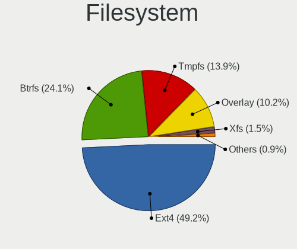
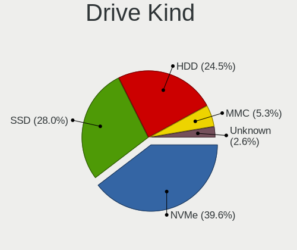
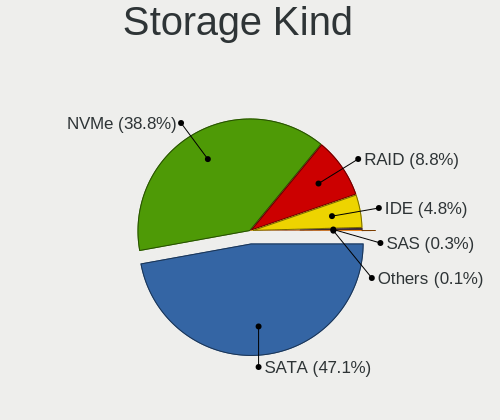
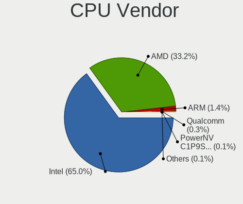
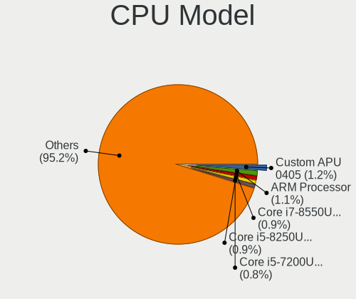
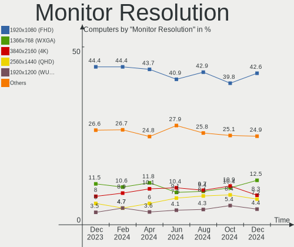
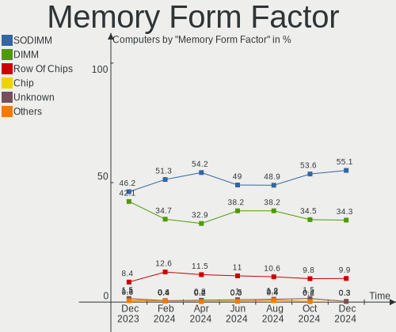
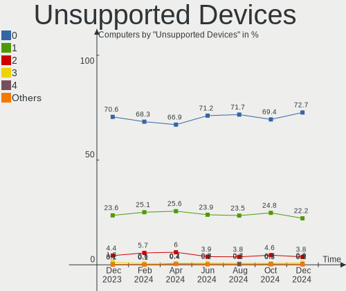

Linux in USA - Hardware Trends
------------------------------

A project to identify most popular hardware characteristics and track their change
over time based on data collected by Linux users at https://Linux-Hardware.org.

Anyone can contribute to this report by the [hw-probe](https://github.com/linuxhw/hw-probe) tool:

    sudo -E hw-probe -all -upload

This is a report for all computer types. See also reports for [desktops](/Location/USA/Desktop/README.md) and [notebooks](/Location/USA/Notebook/README.md).

Period: Jan, 2023.

Contents
--------

* [ System ](#system)
  - [ OS                       ](#os)
  - [ OS Family                ](#os-family)
  - [ Kernel                   ](#kernel)
  - [ Kernel Family            ](#kernel-family)
  - [ Kernel Major Ver.        ](#kernel-major-ver)
  - [ Arch                     ](#arch)
  - [ DE                       ](#de)
  - [ Display Server           ](#display-server)
  - [ Display Manager          ](#display-manager)
  - [ OS Lang                  ](#os-lang)
  - [ Boot Mode                ](#boot-mode)
  - [ Filesystem               ](#filesystem)
  - [ Part. scheme             ](#part-scheme)
  - [ Dual Boot with Linux/BSD ](#dual-boot-with-linuxbsd)
  - [ Dual Boot (Win)          ](#dual-boot-win)

* [ Board ](#board)
  - [ Vendor                   ](#vendor)
  - [ Model                    ](#model)
  - [ Model Family             ](#model-family)
  - [ MFG Year                 ](#mfg-year)
  - [ Form Factor              ](#form-factor)
  - [ Secure Boot              ](#secure-boot)
  - [ Coreboot                 ](#coreboot)
  - [ RAM Size                 ](#ram-size)
  - [ RAM Used                 ](#ram-used)
  - [ Total Drives             ](#total-drives)
  - [ Has CD-ROM               ](#has-cd-rom)
  - [ Has Ethernet             ](#has-ethernet)
  - [ Has WiFi                 ](#has-wifi)
  - [ Has Bluetooth            ](#has-bluetooth)

* [ Location ](#location)
  - [ Country                  ](#country)
  - [ City                     ](#city)

* [ Drives ](#drives)
  - [ Drive Vendor             ](#drive-vendor)
  - [ Drive Model              ](#drive-model)
  - [ HDD Vendor               ](#hdd-vendor)
  - [ SSD Vendor               ](#ssd-vendor)
  - [ Drive Kind               ](#drive-kind)
  - [ Drive Connector          ](#drive-connector)
  - [ Drive Size               ](#drive-size)
  - [ Space Total              ](#space-total)
  - [ Space Used               ](#space-used)
  - [ Malfunc. Drives          ](#malfunc-drives)
  - [ Malfunc. Drive Vendor    ](#malfunc-drive-vendor)
  - [ Malfunc. HDD Vendor      ](#malfunc-hdd-vendor)
  - [ Malfunc. Drive Kind      ](#malfunc-drive-kind)
  - [ Failed Drives            ](#failed-drives)
  - [ Failed Drive Vendor      ](#failed-drive-vendor)
  - [ Drive Status             ](#drive-status)

* [ Storage controller ](#storage-controller)
  - [ Storage Vendor           ](#storage-vendor)
  - [ Storage Model            ](#storage-model)
  - [ Storage Kind             ](#storage-kind)

* [ Processor ](#processor)
  - [ CPU Vendor               ](#cpu-vendor)
  - [ CPU Model                ](#cpu-model)
  - [ CPU Model Family         ](#cpu-model-family)
  - [ CPU Cores                ](#cpu-cores)
  - [ CPU Sockets              ](#cpu-sockets)
  - [ CPU Threads              ](#cpu-threads)
  - [ CPU Op-Modes             ](#cpu-op-modes)
  - [ CPU Microcode            ](#cpu-microcode)
  - [ CPU Microarch            ](#cpu-microarch)

* [ Graphics ](#graphics)
  - [ GPU Vendor               ](#gpu-vendor)
  - [ GPU Model                ](#gpu-model)
  - [ GPU Combo                ](#gpu-combo)
  - [ GPU Driver               ](#gpu-driver)
  - [ GPU Memory               ](#gpu-memory)

* [ Monitor ](#monitor)
  - [ Monitor Vendor           ](#monitor-vendor)
  - [ Monitor Model            ](#monitor-model)
  - [ Monitor Resolution       ](#monitor-resolution)
  - [ Monitor Diagonal         ](#monitor-diagonal)
  - [ Monitor Width            ](#monitor-width)
  - [ Aspect Ratio             ](#aspect-ratio)
  - [ Monitor Area             ](#monitor-area)
  - [ Pixel Density            ](#pixel-density)
  - [ Multiple Monitors        ](#multiple-monitors)

* [ Network ](#network)
  - [ Net Controller Vendor    ](#net-controller-vendor)
  - [ Net Controller Model     ](#net-controller-model)
  - [ Wireless Vendor          ](#wireless-vendor)
  - [ Wireless Model           ](#wireless-model)
  - [ Ethernet Vendor          ](#ethernet-vendor)
  - [ Ethernet Model           ](#ethernet-model)
  - [ Net Controller Kind      ](#net-controller-kind)
  - [ Used Controller          ](#used-controller)
  - [ NICs                     ](#nics)
  - [ IPv6                     ](#ipv6)

* [ Bluetooth ](#bluetooth)
  - [ Bluetooth Vendor         ](#bluetooth-vendor)
  - [ Bluetooth Model          ](#bluetooth-model)

* [ Sound ](#sound)
  - [ Sound Vendor             ](#sound-vendor)
  - [ Sound Model              ](#sound-model)

* [ Memory ](#memory)
  - [ Memory Vendor            ](#memory-vendor)
  - [ Memory Model             ](#memory-model)
  - [ Memory Kind              ](#memory-kind)
  - [ Memory Form Factor       ](#memory-form-factor)
  - [ Memory Size              ](#memory-size)
  - [ Memory Speed             ](#memory-speed)

* [ Printers & scanners ](#printers--scanners)
  - [ Printer Vendor           ](#printer-vendor)
  - [ Printer Model            ](#printer-model)
  - [ Scanner Vendor           ](#scanner-vendor)
  - [ Scanner Model            ](#scanner-model)

* [ Camera ](#camera)
  - [ Camera Vendor            ](#camera-vendor)
  - [ Camera Model             ](#camera-model)

* [ Security ](#security)
  - [ Fingerprint Vendor       ](#fingerprint-vendor)
  - [ Fingerprint Model        ](#fingerprint-model)
  - [ Chipcard Vendor          ](#chipcard-vendor)
  - [ Chipcard Model           ](#chipcard-model)

* [ Unsupported ](#unsupported)
  - [ Unsupported Devices      ](#unsupported-devices)
  - [ Unsupported Device Types ](#unsupported-device-types)

System
------

OS
--

Installed operating systems

| Name                         | Computers | Percent |
|------------------------------|-----------|---------|
| OpenMandriva 23.01           | 194       | 15.59%  |
| Ubuntu 22.04                 | 180       | 14.47%  |
| Pop!_OS 22.04                | 80        | 6.43%   |
| Linux Mint 21.1              | 75        | 6.03%   |
| Fedora 37                    | 68        | 5.47%   |
| Ubuntu 22.10                 | 64        | 5.14%   |
| Zorin 16                     | 52        | 4.18%   |
| Arch Rolling                 | 42        | 3.38%   |
| Debian 11                    | 40        | 3.22%   |
| SteamOS 3.4.4                | 30        | 2.41%   |
| Ubuntu 20.04                 | 28        | 2.25%   |
| Kubuntu 22.04                | 24        | 1.93%   |
| KDE neon 22.04               | 18        | 1.45%   |
| ArcoLinux Rolling            | 18        | 1.45%   |
| OpenMandriva 4.3             | 16        | 1.29%   |
| Kubuntu 22.10                | 16        | 1.29%   |
| Manjaro                      | 13        | 1.05%   |
| Linux Mint 20.3              | 13        | 1.05%   |
| Gentoo 2.9                   | 13        | 1.05%   |
| openSUSE Tumbleweed-XXXXXXXX | 12        | 0.96%   |
| EndeavourOS Rolling          | 12        | 0.96%   |
| Manjaro 22.0.0               | 11        | 0.88%   |
| Linux Mint 21                | 10        | 0.8%    |
| Ubuntu 18.04                 | 9         | 0.72%   |
| Nobara 37                    | 8         | 0.64%   |
| Xubuntu 22.04                | 7         | 0.56%   |
| Ubuntu MATE 22.04            | 6         | 0.48%   |
| SteamOS 3.4                  | 6         | 0.48%   |
| MX 21                        | 6         | 0.48%   |
| Manjaro 22.0                 | 6         | 0.48%   |
| LMDE 5                       | 6         | 0.48%   |
| Kali 2022.4                  | 6         | 0.48%   |
| Elementary 6.1               | 6         | 0.48%   |
| Nobara 36                    | 5         | 0.4%    |
| SteamOS 3.4.5                | 4         | 0.32%   |
| Rocky Linux 9.1              | 4         | 0.32%   |
| Raspbian 11                  | 4         | 0.32%   |
| Fedora 36                    | 4         | 0.32%   |
| Debian                       | 4         | 0.32%   |
| Zorin 15                     | 3         | 0.24%   |

OS Family
---------

OS without a version

| Name              | Computers | Percent |
|-------------------|-----------|---------|
| Ubuntu            | 285       | 22.91%  |
| OpenMandriva      | 215       | 17.28%  |
| Linux Mint        | 103       | 8.28%   |
| Pop!_OS           | 83        | 6.67%   |
| Fedora            | 74        | 5.95%   |
| Zorin             | 55        | 4.42%   |
| Debian            | 46        | 3.7%    |
| SteamOS           | 43        | 3.46%   |
| Kubuntu           | 42        | 3.38%   |
| Arch              | 42        | 3.38%   |
| Manjaro           | 32        | 2.57%   |
| ArcoLinux         | 20        | 1.61%   |
| KDE neon          | 18        | 1.45%   |
| Xubuntu           | 16        | 1.29%   |
| openSUSE          | 16        | 1.29%   |
| Nobara            | 13        | 1.05%   |
| Gentoo            | 13        | 1.05%   |
| EndeavourOS       | 12        | 0.96%   |
| Ubuntu MATE       | 10        | 0.8%    |
| Ubuntu Unity      | 9         | 0.72%   |
| Kali              | 7         | 0.56%   |
| MX                | 6         | 0.48%   |
| LMDE              | 6         | 0.48%   |
| Elementary        | 6         | 0.48%   |
| Garuda Linux      | 5         | 0.4%    |
| AlmaLinux         | 5         | 0.4%    |
| Rocky Linux       | 4         | 0.32%   |
| Raspbian          | 4         | 0.32%   |
| Void Linux        | 3         | 0.24%   |
| Slackware         | 3         | 0.24%   |
| ROSA              | 3         | 0.24%   |
| NixOS             | 3         | 0.24%   |
| Alpine            | 3         | 0.24%   |
| Xero              | 2         | 0.16%   |
| Ubuntu Budgie     | 2         | 0.16%   |
| PureOS            | 2         | 0.16%   |
| Lubuntu           | 2         | 0.16%   |
| LinuxFX           | 2         | 0.16%   |
| Artix             | 2         | 0.16%   |
| Ultramarine Linux | 1         | 0.08%   |

Kernel
------

Version of the Linux kernel

| Version                      | Computers | Percent |
|------------------------------|-----------|---------|
| 6.1.1-desktop-1omv2290       | 188       | 15.11%  |
| 5.15.0-58-generic            | 176       | 14.15%  |
| 5.15.0-56-generic            | 97        | 7.8%    |
| 6.0.12-76060006-generic      | 74        | 5.95%   |
| 5.15.0-57-generic            | 65        | 5.23%   |
| 5.13.0-valve36-1-neptune     | 34        | 2.73%   |
| 5.19.0-29-generic            | 32        | 2.57%   |
| 5.10.0-20-amd64              | 31        | 2.49%   |
| 5.19.0-28-generic            | 17        | 1.37%   |
| 5.19.0-26-generic            | 16        | 1.29%   |
| 5.16.7-desktop-1omv4003      | 15        | 1.21%   |
| 5.15.0-43-generic            | 15        | 1.21%   |
| 5.4.0-137-generic            | 14        | 1.13%   |
| 5.4.0-135-generic            | 14        | 1.13%   |
| 6.1.1-1-MANJARO              | 13        | 1.05%   |
| 6.0.15-300.fc37.x86_64       | 11        | 0.88%   |
| 6.1.7-200.fc37.x86_64        | 10        | 0.8%    |
| 6.1.4-arch1-1                | 10        | 0.8%    |
| 5.15.85-1-MANJARO            | 10        | 0.8%    |
| 6.1.8-arch1-1                | 9         | 0.72%   |
| 6.1.6-200.fc37.x86_64        | 9         | 0.72%   |
| 6.0.18-300.fc37.x86_64       | 9         | 0.72%   |
| 6.1.5-200.fc37.x86_64        | 8         | 0.64%   |
| 5.19.0-21-generic            | 8         | 0.64%   |
| 6.1.3-arch1-1                | 7         | 0.56%   |
| 5.19.0-30-generic            | 7         | 0.56%   |
| 6.0.16-300.fc37.x86_64       | 6         | 0.48%   |
| 5.10.0-21-amd64              | 6         | 0.48%   |
| 6.1.7-arch1-1                | 5         | 0.4%    |
| 6.1.6-arch1-3                | 5         | 0.4%    |
| 6.1.5-arch2-1                | 5         | 0.4%    |
| 6.1.2-arch1-1                | 5         | 0.4%    |
| 6.1.1-arch1-1                | 5         | 0.4%    |
| 6.0.7-301.fc37.x86_64        | 5         | 0.4%    |
| 5.4.0-136-generic            | 5         | 0.4%    |
| 6.1.6-arch1-1                | 4         | 0.32%   |
| 6.1.4-1-default              | 4         | 0.32%   |
| 6.0.6-76060006-generic       | 4         | 0.32%   |
| 6.0.14-201.fsync.fc36.x86_64 | 4         | 0.32%   |
| 5.15.0-53-generic            | 4         | 0.32%   |

Kernel Family
-------------

Linux kernel without a distro release

| Version | Computers | Percent |
|---------|-----------|---------|
| 5.15.0  | 386       | 31.03%  |
| 6.1.1   | 213       | 17.12%  |
| 5.19.0  | 86        | 6.91%   |
| 6.0.12  | 80        | 6.43%   |
| 5.13.0  | 43        | 3.46%   |
| 5.4.0   | 42        | 3.38%   |
| 5.10.0  | 40        | 3.22%   |
| 6.1.4   | 31        | 2.49%   |
| 6.1.7   | 30        | 2.41%   |
| 6.1.6   | 27        | 2.17%   |
| 6.1.5   | 18        | 1.45%   |
| 6.1.8   | 16        | 1.29%   |
| 6.0.15  | 15        | 1.21%   |
| 5.16.7  | 15        | 1.21%   |
| 6.1.2   | 14        | 1.13%   |
| 6.0.0   | 13        | 1.05%   |
| 5.15.85 | 12        | 0.96%   |
| 6.1.3   | 11        | 0.88%   |
| 6.0.18  | 10        | 0.8%    |
| 6.0.16  | 8         | 0.64%   |
| 5.14.0  | 8         | 0.64%   |
| 4.15.0  | 7         | 0.56%   |
| 6.1.0   | 6         | 0.48%   |
| 6.0.7   | 6         | 0.48%   |
| 5.15.84 | 6         | 0.48%   |
| 6.0.6   | 5         | 0.4%    |
| 5.17.0  | 5         | 0.4%    |
| 5.15.86 | 5         | 0.4%    |
| 6.0.17  | 4         | 0.32%   |
| 6.0.14  | 4         | 0.32%   |
| 6.0.10  | 4         | 0.32%   |
| 4.19.0  | 4         | 0.32%   |
| 6.0.9   | 3         | 0.24%   |
| 5.18.10 | 3         | 0.24%   |
| 5.15.89 | 3         | 0.24%   |
| 5.15.19 | 3         | 0.24%   |
| 5.14.21 | 3         | 0.24%   |
| 5.8.0   | 2         | 0.16%   |
| 5.18.1  | 2         | 0.16%   |
| 5.17.5  | 2         | 0.16%   |

Kernel Major Ver.
-----------------

Linux kernel major version

| Version | Computers | Percent |
|---------|-----------|---------|
| 5.15    | 432       | 34.73%  |
| 6.1     | 366       | 29.42%  |
| 6.0     | 155       | 12.46%  |
| 5.19    | 91        | 7.32%   |
| 5.10    | 45        | 3.62%   |
| 5.4     | 43        | 3.46%   |
| 5.13    | 43        | 3.46%   |
| 5.16    | 18        | 1.45%   |
| 5.14    | 11        | 0.88%   |
| 5.17    | 8         | 0.64%   |
| 5.18    | 7         | 0.56%   |
| 4.15    | 7         | 0.56%   |
| 4.19    | 4         | 0.32%   |
| 5.11    | 3         | 0.24%   |
| 4.4     | 3         | 0.24%   |
| 4.18    | 3         | 0.24%   |
| 5.8     | 2         | 0.16%   |
| 6.2     | 1         | 0.08%   |
| 4.9     | 1         | 0.08%   |
| 4.16    | 1         | 0.08%   |

Arch
----

OS architecture (x86_64, i586, etc.)

| Name    | Computers | Percent |
|---------|-----------|---------|
| x86_64  | 1222      | 98.23%  |
| aarch64 | 10        | 0.8%    |
| i686    | 6         | 0.48%   |
| armv7l  | 6         | 0.48%   |

DE
--

Desktop Environment

| Name             | Computers | Percent |
|------------------|-----------|---------|
| GNOME            | 527       | 42.36%  |
| KDE5             | 411       | 33.04%  |
| X-Cinnamon       | 105       | 8.44%   |
| XFCE             | 69        | 5.55%   |
| Unknown          | 35        | 2.81%   |
| MATE             | 31        | 2.49%   |
| Unity            | 9         | 0.72%   |
| LXDE             | 9         | 0.72%   |
| i3               | 7         | 0.56%   |
| Pantheon         | 6         | 0.48%   |
| GNOME Classic    | 4         | 0.32%   |
| LXQt             | 3         | 0.24%   |
| KDE              | 3         | 0.24%   |
| Hyprland         | 3         | 0.24%   |
| Cinnamon         | 3         | 0.24%   |
| Budgie           | 2         | 0.16%   |
| awesome          | 2         | 0.16%   |
| xmonad           | 1         | 0.08%   |
| X-Generic        | 1         | 0.08%   |
| wayfire-session  | 1         | 0.08%   |
| Trinity          | 1         | 0.08%   |
| Sway             | 1         | 0.08%   |
| qtile            | 1         | 0.08%   |
| pika:GNOME       | 1         | 0.08%   |
| openbox          | 1         | 0.08%   |
| Lubuntu          | 1         | 0.08%   |
| lightdm-xsession | 1         | 0.08%   |
| GNOME Flashback  | 1         | 0.08%   |
| fluxbox          | 1         | 0.08%   |
| dwm              | 1         | 0.08%   |
| BunsenLabs       | 1         | 0.08%   |
| 2bwm             | 1         | 0.08%   |

Display Server
--------------

X11 or Wayland

| Name        | Computers | Percent |
|-------------|-----------|---------|
| X11         | 879       | 70.66%  |
| Wayland     | 313       | 25.16%  |
| Tty         | 40        | 3.22%   |
| Unknown     | 11        | 0.88%   |
| Unspecified | 1         | 0.08%   |

Display Manager
---------------

SDDM, LightDM, etc.

| Name    | Computers | Percent |
|---------|-----------|---------|
| Unknown | 414       | 33.28%  |
| SDDM    | 295       | 23.71%  |
| GDM3    | 276       | 22.19%  |
| LightDM | 165       | 13.26%  |
| GDM     | 88        | 7.07%   |
| XDM     | 3         | 0.24%   |
| SLiM    | 1         | 0.08%   |
| LYNDE   | 1         | 0.08%   |
| LXDM    | 1         | 0.08%   |

OS Lang
-------

Language

| Lang    | Computers | Percent |
|---------|-----------|---------|
| en_US   | 1174      | 94.37%  |
| C       | 26        | 2.09%   |
| en_GB   | 9         | 0.72%   |
| Unknown | 9         | 0.72%   |
| en_CA   | 5         | 0.4%    |
| ru_RU   | 4         | 0.32%   |
| fr_FR   | 3         | 0.24%   |
| C.UTF8  | 3         | 0.24%   |
| zh_CN   | 1         | 0.08%   |
| pt_BR   | 1         | 0.08%   |
| POSIX   | 1         | 0.08%   |
| pl_PL   | 1         | 0.08%   |
| osa_US  | 1         | 0.08%   |
| fr_CA   | 1         | 0.08%   |
| es_VE   | 1         | 0.08%   |
| es_US   | 1         | 0.08%   |
| en_HK   | 1         | 0.08%   |
| en_DK   | 1         | 0.08%   |
| cs_CZ   | 1         | 0.08%   |

Boot Mode
---------

EFI or BIOS

| Mode | Computers | Percent |
|------|-----------|---------|
| EFI  | 637       | 51.21%  |
| BIOS | 607       | 48.79%  |

Filesystem
----------

Type of filesystem

| Type    | Computers | Percent |
|---------|-----------|---------|
| Ext4    | 780       | 62.7%   |
| Btrfs   | 207       | 16.64%  |
| Overlay | 204       | 16.4%   |
| Zfs     | 27        | 2.17%   |
| Xfs     | 15        | 1.21%   |
| Tmpfs   | 4         | 0.32%   |
| Ext2    | 3         | 0.24%   |
| F2fs    | 1         | 0.08%   |
| Ext3    | 1         | 0.08%   |
| Aufs    | 1         | 0.08%   |
| Unknown | 1         | 0.08%   |

Part. scheme
------------

Scheme of partitioning

| Type    | Computers | Percent |
|---------|-----------|---------|
| GPT     | 727       | 58.44%  |
| Unknown | 382       | 30.71%  |
| MBR     | 135       | 10.85%  |

Dual Boot with Linux/BSD
------------------------

Hosting more than one Linux/BSD

| Dual boot | Computers | Percent |
|-----------|-----------|---------|
| No        | 1002      | 80.55%  |
| Yes       | 242       | 19.45%  |

Dual Boot (Win)
---------------

Hosting Linux and Windows

| Dual boot | Computers | Percent |
|-----------|-----------|---------|
| No        | 957       | 76.93%  |
| Yes       | 287       | 23.07%  |

Board
-----

Vendor
------

Motherboard manufacturer

| Name                     | Computers | Percent |
|--------------------------|-----------|---------|
| Dell                     | 200       | 16.08%  |
| Hewlett-Packard          | 192       | 15.43%  |
| ASUSTek Computer         | 171       | 13.75%  |
| Lenovo                   | 152       | 12.22%  |
| MSI                      | 77        | 6.19%   |
| Gigabyte Technology      | 73        | 5.87%   |
| Apple                    | 41        | 3.3%    |
| Acer                     | 41        | 3.3%    |
| ASRock                   | 40        | 3.22%   |
| Valve                    | 35        | 2.81%   |
| Google                   | 23        | 1.85%   |
| Intel                    | 20        | 1.61%   |
| Toshiba                  | 16        | 1.29%   |
| System76                 | 14        | 1.13%   |
| Microsoft                | 11        | 0.88%   |
| Raspberry Pi Foundation  | 10        | 0.8%    |
| AZW                      | 8         | 0.64%   |
| Alienware                | 8         | 0.64%   |
| Supermicro               | 7         | 0.56%   |
| Pegatron                 | 7         | 0.56%   |
| GPU Company              | 7         | 0.56%   |
| Gateway                  | 7         | 0.56%   |
| Foxconn                  | 7         | 0.56%   |
| Unknown                  | 6         | 0.48%   |
| Samsung Electronics      | 4         | 0.32%   |
| Notebook                 | 4         | 0.32%   |
| LG Electronics           | 4         | 0.32%   |
| Hardkernel               | 3         | 0.24%   |
| Fujitsu                  | 3         | 0.24%   |
| Framework                | 3         | 0.24%   |
| BESSTAR Tech             | 3         | 0.24%   |
| Rockchip                 | 2         | 0.16%   |
| Razer                    | 2         | 0.16%   |
| FFF SMART LIFE CONNECTED | 2         | 0.16%   |
| ECS                      | 2         | 0.16%   |
| Chuwi                    | 2         | 0.16%   |
| Win element              | 1         | 0.08%   |
| Tyco                     | 1         | 0.08%   |
| SYWZ                     | 1         | 0.08%   |
| Sony                     | 1         | 0.08%   |

Model
-----

Motherboard model

| Name                              | Computers | Percent |
|-----------------------------------|-----------|---------|
| Valve Jupiter                     | 35        | 2.81%   |
| ASUS All Series                   | 9         | 0.72%   |
| Unknown                           | 8         | 0.64%   |
| Dell OptiPlex 7010                | 6         | 0.48%   |
| ASUS TUF Gaming X570-PLUS         | 6         | 0.48%   |
| ASUS ROG CROSSHAIR VIII HERO      | 5         | 0.4%    |
| ASUS M5A97 R2.0                   | 5         | 0.4%    |
| Supermicro Super Server           | 4         | 0.32%   |
| MSI MS-7C56                       | 4         | 0.32%   |
| Lenovo IdeaPadFlex 5 14ITL05 82HS | 4         | 0.32%   |
| HP Pavilion Notebook              | 4         | 0.32%   |
| HP Notebook                       | 4         | 0.32%   |
| Dell XPS 8940                     | 4         | 0.32%   |
| Dell XPS 15 9570                  | 4         | 0.32%   |
| ASUS ROG STRIX B450-F GAMING      | 4         | 0.32%   |
| ASRock B450M Pro4                 | 4         | 0.32%   |
| System76 Oryx Pro                 | 3         | 0.24%   |
| RPi Raspberry Pi                  | 3         | 0.24%   |
| MSI MS-7C37                       | 3         | 0.24%   |
| MSI MS-7C02                       | 3         | 0.24%   |
| MSI MS-7B86                       | 3         | 0.24%   |
| MSI MS-7693                       | 3         | 0.24%   |
| Lenovo Yoga 6 13ALC7 82UD         | 3         | 0.24%   |
| Lenovo IdeaPadFlex 5 14ARE05 81X2 | 3         | 0.24%   |
| HP ZBook 15                       | 3         | 0.24%   |
| HP Stream Laptop 14-cb1xxx        | 3         | 0.24%   |
| HP Laptop 17-cp0xxx               | 3         | 0.24%   |
| HP EliteBook 840 G5               | 3         | 0.24%   |
| Gigabyte Z390 DESIGNARE           | 3         | 0.24%   |
| Gigabyte B450M DS3H WIFI          | 3         | 0.24%   |
| Dell XPS 13 9360                  | 3         | 0.24%   |
| Dell OptiPlex 9020                | 3         | 0.24%   |
| Dell OptiPlex 9010                | 3         | 0.24%   |
| Dell OptiPlex 3020                | 3         | 0.24%   |
| Dell Latitude E6510               | 3         | 0.24%   |
| AZW SER                           | 3         | 0.24%   |
| AZW GTR                           | 3         | 0.24%   |
| ASUS Zephyrus G GU502DU_GA502DU   | 3         | 0.24%   |
| ASUS ROG STRIX B550-F GAMING      | 3         | 0.24%   |
| Apple Macmini8,1                  | 3         | 0.24%   |

Model Family
------------

Motherboard model prefix

| Name               | Computers | Percent |
|--------------------|-----------|---------|
| Lenovo ThinkPad    | 63        | 5.06%   |
| Dell Inspiron      | 55        | 4.42%   |
| HP Pavilion        | 43        | 3.46%   |
| Dell Latitude      | 42        | 3.38%   |
| ASUS ROG           | 40        | 3.22%   |
| Valve Jupiter      | 35        | 2.81%   |
| Dell OptiPlex      | 32        | 2.57%   |
| Dell XPS           | 30        | 2.41%   |
| Acer Aspire        | 25        | 2.01%   |
| Lenovo IdeaPad     | 23        | 1.85%   |
| HP Laptop          | 22        | 1.77%   |
| HP EliteBook       | 22        | 1.77%   |
| Dell Precision     | 22        | 1.77%   |
| ASUS PRIME         | 22        | 1.77%   |
| ASUS TUF           | 18        | 1.45%   |
| Lenovo ThinkCentre | 17        | 1.37%   |
| Toshiba Satellite  | 14        | 1.13%   |
| HP ENVY            | 14        | 1.13%   |
| HP Compaq          | 13        | 1.05%   |
| ASUS VivoBook      | 13        | 1.05%   |
| Microsoft Surface  | 11        | 0.88%   |
| RPi Raspberry      | 10        | 0.8%    |
| Lenovo IdeaPadFlex | 10        | 0.8%    |
| Lenovo Yoga        | 9         | 0.72%   |
| Lenovo Legion      | 9         | 0.72%   |
| ASUS All           | 9         | 0.72%   |
| HP ZBook           | 8         | 0.64%   |
| HP EliteDesk       | 8         | 0.64%   |
| Unknown            | 8         | 0.64%   |
| ASUS M5A97         | 7         | 0.56%   |
| Lenovo IdeaCentre  | 6         | 0.48%   |
| HP Stream          | 6         | 0.48%   |
| Dell PowerEdge     | 6         | 0.48%   |
| Acer Nitro         | 6         | 0.48%   |
| HP Spectre         | 5         | 0.4%    |
| HP ProLiant        | 5         | 0.4%    |
| HP ProBook         | 5         | 0.4%    |
| Gigabyte X570      | 5         | 0.4%    |
| Gigabyte B450M     | 5         | 0.4%    |
| ASUS ASUS          | 5         | 0.4%    |

MFG Year
--------

Motherboard manufacture year

| Year    | Computers | Percent |
|---------|-----------|---------|
| 2022    | 185       | 14.87%  |
| 2021    | 143       | 11.5%   |
| 2020    | 127       | 10.21%  |
| 2019    | 106       | 8.52%   |
| 2018    | 95        | 7.64%   |
| 2012    | 85        | 6.83%   |
| 2017    | 70        | 5.63%   |
| 2013    | 69        | 5.55%   |
| 2011    | 65        | 5.23%   |
| 2015    | 64        | 5.14%   |
| 2014    | 48        | 3.86%   |
| 2016    | 45        | 3.62%   |
| 2010    | 40        | 3.22%   |
| 2008    | 31        | 2.49%   |
| 2009    | 23        | 1.85%   |
| 2007    | 22        | 1.77%   |
| Unknown | 18        | 1.45%   |
| 2006    | 3         | 0.24%   |
| 2005    | 2         | 0.16%   |
| 2023    | 1         | 0.08%   |
| 2004    | 1         | 0.08%   |
| 2003    | 1         | 0.08%   |

Form Factor
-----------

Physical design of the computer

| Name           | Computers | Percent |
|----------------|-----------|---------|
| Notebook       | 566       | 45.5%   |
| Desktop        | 496       | 39.87%  |
| Convertible    | 70        | 5.63%   |
| Mini pc        | 38        | 3.05%   |
| Server         | 22        | 1.77%   |
| All in one     | 21        | 1.69%   |
| System on chip | 16        | 1.29%   |
| Tablet         | 15        | 1.21%   |

Secure Boot
-----------

Enabled or disabled

| State    | Computers | Percent |
|----------|-----------|---------|
| Disabled | 1170      | 94.05%  |
| Enabled  | 74        | 5.95%   |

Coreboot
--------

Have coreboot on board

| Used | Computers | Percent |
|------|-----------|---------|
| No   | 1213      | 97.51%  |
| Yes  | 31        | 2.49%   |

RAM Size
--------

Total RAM memory

| Size in GB      | Computers | Percent |
|-----------------|-----------|---------|
| 16.01-24.0      | 288       | 23.15%  |
| 4.01-8.0        | 250       | 20.1%   |
| 8.01-16.0       | 227       | 18.25%  |
| 32.01-64.0      | 191       | 15.35%  |
| 3.01-4.0        | 137       | 11.01%  |
| 64.01-256.0     | 68        | 5.47%   |
| 24.01-32.0      | 42        | 3.38%   |
| 1.01-2.0        | 30        | 2.41%   |
| 2.01-3.0        | 6         | 0.48%   |
| 0.51-1.0        | 3         | 0.24%   |
| More than 256.0 | 1         | 0.08%   |
| 0.01-0.5        | 1         | 0.08%   |

RAM Used
--------

Used RAM memory

| Used GB     | Computers | Percent |
|-------------|-----------|---------|
| 1.01-2.0    | 371       | 29.82%  |
| 2.01-3.0    | 324       | 26.05%  |
| 4.01-8.0    | 240       | 19.29%  |
| 3.01-4.0    | 177       | 14.23%  |
| 8.01-16.0   | 67        | 5.39%   |
| 0.51-1.0    | 37        | 2.97%   |
| 0.01-0.5    | 13        | 1.05%   |
| 16.01-24.0  | 8         | 0.64%   |
| 24.01-32.0  | 3         | 0.24%   |
| 32.01-64.0  | 2         | 0.16%   |
| 64.01-256.0 | 2         | 0.16%   |

Total Drives
------------

Number of drives on board

| Drives | Computers | Percent |
|--------|-----------|---------|
| 1      | 712       | 57.23%  |
| 2      | 315       | 25.32%  |
| 3      | 98        | 7.88%   |
| 4      | 53        | 4.26%   |
| 5      | 30        | 2.41%   |
| 6      | 10        | 0.8%    |
| 0      | 8         | 0.64%   |
| 7      | 6         | 0.48%   |
| 8      | 5         | 0.4%    |
| 18     | 2         | 0.16%   |
| 27     | 1         | 0.08%   |
| 26     | 1         | 0.08%   |
| 12     | 1         | 0.08%   |
| 10     | 1         | 0.08%   |
| 9      | 1         | 0.08%   |

Has CD-ROM
----------

Has CD-ROM on board

| Presented | Computers | Percent |
|-----------|-----------|---------|
| No        | 827       | 66.48%  |
| Yes       | 417       | 33.52%  |

Has Ethernet
------------

Has Ethernet on board

| Presented | Computers | Percent |
|-----------|-----------|---------|
| Yes       | 997       | 80.14%  |
| No        | 247       | 19.86%  |

Has WiFi
--------

Has WiFi module

| Presented | Computers | Percent |
|-----------|-----------|---------|
| Yes       | 1007      | 80.95%  |
| No        | 237       | 19.05%  |

Has Bluetooth
-------------

Has Bluetooth module

| Presented | Computers | Percent |
|-----------|-----------|---------|
| Yes       | 838       | 67.36%  |
| No        | 406       | 32.64%  |

Location
--------

Country
-------

Geographic location (country)

| Country | Computers | Percent |
|---------|-----------|---------|
| USA     | 1244      | 100%    |

City
----

Geographic location (city)

| City             | Computers | Percent |
|------------------|-----------|---------|
| New York         | 29        | 2.33%   |
| Seattle          | 16        | 1.29%   |
| Dallas           | 15        | 1.21%   |
| Los Angeles      | 14        | 1.13%   |
| Denver           | 13        | 1.05%   |
| Chicago          | 13        | 1.05%   |
| San Jose         | 12        | 0.96%   |
| Phoenix          | 12        | 0.96%   |
| Portland         | 11        | 0.88%   |
| Austin           | 11        | 0.88%   |
| Atlanta          | 10        | 0.8%    |
| Miami            | 9         | 0.72%   |
| Brooklyn         | 9         | 0.72%   |
| Tacoma           | 8         | 0.64%   |
| Saint Paul       | 8         | 0.64%   |
| Las Vegas        | 8         | 0.64%   |
| San Francisco    | 7         | 0.56%   |
| Milwaukee        | 7         | 0.56%   |
| Jacksonville     | 7         | 0.56%   |
| Indianapolis     | 7         | 0.56%   |
| Houston          | 7         | 0.56%   |
| Columbus         | 7         | 0.56%   |
| Cleveland        | 7         | 0.56%   |
| West Stockbridge | 6         | 0.48%   |
| Tucson           | 6         | 0.48%   |
| Springfield      | 6         | 0.48%   |
| San Antonio      | 6         | 0.48%   |
| Philadelphia     | 6         | 0.48%   |
| Orlando          | 6         | 0.48%   |
| Fort Worth       | 6         | 0.48%   |
| Dublin           | 6         | 0.48%   |
| Cincinnati       | 6         | 0.48%   |
| Albuquerque      | 6         | 0.48%   |
| Washington       | 5         | 0.4%    |
| St Louis         | 5         | 0.4%    |
| Spring Hill      | 5         | 0.4%    |
| San Diego        | 5         | 0.4%    |
| Riverside        | 5         | 0.4%    |
| Minneapolis      | 5         | 0.4%    |
| Fayetteville     | 5         | 0.4%    |

Drives
------

Drive Vendor
------------

Hard drive vendors

| Vendor                      | Computers | Drives | Percent |
|-----------------------------|-----------|--------|---------|
| Samsung Electronics         | 295       | 361    | 15.72%  |
| WDC                         | 245       | 329    | 13.05%  |
| Seagate                     | 240       | 332    | 12.79%  |
| Unknown                     | 122       | 146    | 6.5%    |
| SanDisk                     | 120       | 131    | 6.39%   |
| Toshiba                     | 76        | 86     | 4.05%   |
| Crucial                     | 72        | 79     | 3.84%   |
| SK hynix                    | 62        | 63     | 3.3%    |
| Intel                       | 56        | 63     | 2.98%   |
| Kingston                    | 54        | 55     | 2.88%   |
| Micron Technology           | 38        | 46     | 2.02%   |
| Hitachi                     | 35        | 38     | 1.86%   |
| Phison Electronics          | 34        | 36     | 1.81%   |
| HGST                        | 34        | 47     | 1.81%   |
| China                       | 28        | 32     | 1.49%   |
| PNY                         | 27        | 28     | 1.44%   |
| SPCC                        | 23        | 28     | 1.23%   |
| Unknown                     | 22        | 23     | 1.17%   |
| Apple                       | 21        | 23     | 1.12%   |
| A-DATA Technology           | 21        | 22     | 1.12%   |
| Kingston Technology Company | 18        | 20     | 0.96%   |
| Silicon Motion              | 17        | 19     | 0.91%   |
| Micron/Crucial Technology   | 15        | 15     | 0.8%    |
| KIOXIA                      | 15        | 15     | 0.8%    |
| Team                        | 14        | 14     | 0.75%   |
| Phison                      | 9         | 12     | 0.48%   |
| OCZ                         | 9         | 9      | 0.48%   |
| JMicron Technology          | 9         | 9      | 0.48%   |
| O2 Micro                    | 8         | 8      | 0.43%   |
| Mushkin                     | 7         | 7      | 0.37%   |
| Hewlett-Packard             | 7         | 10     | 0.37%   |
| LITEONIT                    | 6         | 6      | 0.32%   |
| SABRENT                     | 5         | 6      | 0.27%   |
| Realtek Semiconductor       | 5         | 5      | 0.27%   |
| Netac                       | 5         | 5      | 0.27%   |
| ASMT                        | 5         | 7      | 0.27%   |
| Lexar                       | 4         | 4      | 0.21%   |
| Fujitsu                     | 4         | 4      | 0.21%   |
| Union Memory                | 3         | 3      | 0.16%   |
| Transcend                   | 3         | 3      | 0.16%   |

Drive Model
-----------

Hard drive models

| Model                                                 | Computers | Percent |
|-------------------------------------------------------|-----------|---------|
| Samsung NVMe SSD Controller SM981/PM981/PM983 500GB   | 56        | 2.69%   |
| Samsung NVMe SSD Controller PM9A1/PM9A3/980PRO 512GB  | 24        | 1.15%   |
| Unknown                                               | 22        | 1.06%   |
| Unknown MMC Card  64GB                                | 20        | 0.96%   |
| Unknown SD/MMC/MS PRO 2GB                             | 19        | 0.91%   |
| Intel SSD 660P Series 512GB                           | 19        | 0.91%   |
| Kingston SA400S37240G 240GB SSD                       | 17        | 0.82%   |
| Seagate ST2000DM008-2FR102 2TB                        | 16        | 0.77%   |
| Crucial CT1000MX500SSD1 1TB                           | 15        | 0.72%   |
| Samsung SSD 860 EVO 500GB                             | 14        | 0.67%   |
| Seagate ST500DM002-1BD142 500GB                       | 13        | 0.63%   |
| Sandisk WD Black SN750 / PC SN730 NVMe SSD 1TB        | 13        | 0.63%   |
| Unknown MMC Card  128GB                               | 12        | 0.58%   |
| Sandisk WD Blue SN550 NVMe SSD 1TB                    | 12        | 0.58%   |
| Samsung SSD 850 EVO 500GB                             | 12        | 0.58%   |
| Phison PS5013 E13 NVMe Controller 256GB               | 12        | 0.58%   |
| Unknown MMC Card  32GB                                | 11        | 0.53%   |
| Kingston Company OM3PDP3 NVMe SSD 512GB               | 11        | 0.53%   |
| WDC WD10EZEX-08WN4A0 1TB                              | 10        | 0.48%   |
| Silicon Motion SM2263EN/SM2263XT SSD Controller 512GB | 10        | 0.48%   |
| Samsung SSD 850 EVO 250GB                             | 10        | 0.48%   |
| Samsung NVMe SSD Controller SM961/PM961/SM963 256GB   | 10        | 0.48%   |
| Seagate ST1000LM024 HN-M101MBB 1TB                    | 9         | 0.43%   |
| Micron/Crucial P2 NVMe PCIe SSD 500GB                 | 9         | 0.43%   |
| China SATA SSD 240GB                                  | 9         | 0.43%   |
| WDC WDBNCE5000PNC 500GB SSD                           | 8         | 0.38%   |
| Unknown MMC Card  512GB                               | 8         | 0.38%   |
| Unknown MMC Card  16GB                                | 8         | 0.38%   |
| Samsung SSD 970 EVO Plus 500GB                        | 8         | 0.38%   |
| Samsung SSD 860 EVO 1TB                               | 8         | 0.38%   |
| Phison E12 NVMe Controller 1TB                        | 8         | 0.38%   |
| O2 Micro E2M2 64GB                                    | 8         | 0.38%   |
| HGST HTS721010A9E630 1TB                              | 8         | 0.38%   |
| WDC WDBNCE0010PNC 1TB SSD                             | 7         | 0.34%   |
| WDC WD20EZAZ-00GGJB0 2TB                              | 7         | 0.34%   |
| Seagate ST1000LM035-1RK172 1TB                        | 7         | 0.34%   |
| SanDisk NVMe SSD Drive 1TB                            | 7         | 0.34%   |
| Samsung SSD 970 EVO Plus 2TB                          | 7         | 0.34%   |
| Samsung SSD 970 EVO Plus 1TB                          | 7         | 0.34%   |
| Toshiba MQ04ABF100 1TB                                | 6         | 0.29%   |

HDD Vendor
----------

Hard disk drive vendors

| Vendor              | Computers | Drives | Percent |
|---------------------|-----------|--------|---------|
| Seagate             | 231       | 319    | 39.29%  |
| WDC                 | 173       | 244    | 29.42%  |
| Toshiba             | 57        | 66     | 9.69%   |
| Hitachi             | 35        | 38     | 5.95%   |
| HGST                | 34        | 47     | 5.78%   |
| Unknown             | 20        | 21     | 3.4%    |
| Samsung Electronics | 8         | 10     | 1.36%   |
| Apple               | 8         | 8      | 1.36%   |
| SABRENT             | 5         | 6      | 0.85%   |
| Fujitsu             | 4         | 4      | 0.68%   |
| ASMT                | 4         | 5      | 0.68%   |
| ASMedia             | 2         | 2      | 0.34%   |
| StoreJet            | 1         | 1      | 0.17%   |
| Maxtor              | 1         | 1      | 0.17%   |
| Maxone              | 1         | 1      | 0.17%   |
| Inateck             | 1         | 1      | 0.17%   |
| IBM/Hitachi         | 1         | 1      | 0.17%   |
| Hewlett-Packard     | 1         | 4      | 0.17%   |
| Fantom              | 1         | 1      | 0.17%   |

SSD Vendor
----------

Solid state drive vendors

| Vendor              | Computers | Drives | Percent |
|---------------------|-----------|--------|---------|
| Samsung Electronics | 124       | 139    | 21.72%  |
| Crucial             | 65        | 72     | 11.38%  |
| WDC                 | 53        | 57     | 9.28%   |
| SanDisk             | 50        | 53     | 8.76%   |
| Kingston            | 40        | 41     | 7.01%   |
| China               | 28        | 32     | 4.9%    |
| PNY                 | 27        | 28     | 4.73%   |
| SPCC                | 21        | 24     | 3.68%   |
| A-DATA Technology   | 19        | 20     | 3.33%   |
| SK hynix            | 12        | 12     | 2.1%    |
| Intel               | 12        | 13     | 2.1%    |
| Team                | 10        | 10     | 1.75%   |
| OCZ                 | 9         | 9      | 1.58%   |
| Micron Technology   | 9         | 16     | 1.58%   |
| Apple               | 9         | 9      | 1.58%   |
| LITEONIT            | 6         | 6      | 1.05%   |
| Toshiba             | 5         | 5      | 0.88%   |
| Netac               | 5         | 5      | 0.88%   |
| Mushkin             | 5         | 5      | 0.88%   |
| Hewlett-Packard     | 5         | 5      | 0.88%   |
| Lexar               | 4         | 4      | 0.7%    |
| Transcend           | 3         | 3      | 0.53%   |
| PNY CS90            | 3         | 3      | 0.53%   |
| JMicron Technology  | 3         | 3      | 0.53%   |
| Dogfish             | 3         | 3      | 0.53%   |
| Unknown             | 3         | 3      | 0.53%   |
| Seagate             | 2         | 2      | 0.35%   |
| OWC                 | 2         | 2      | 0.35%   |
| LITEON              | 2         | 2      | 0.35%   |
| Inland              | 2         | 2      | 0.35%   |
| XrayDisk            | 1         | 1      | 0.18%   |
| WDC WDS2            | 1         | 1      | 0.18%   |
| VICKTER             | 1         | 1      | 0.18%   |
| USB3.0              | 1         | 1      | 0.18%   |
| SUNEAST             | 1         | 1      | 0.18%   |
| SCY                 | 1         | 1      | 0.18%   |
| Pioneer             | 1         | 1      | 0.18%   |
| Patriot             | 1         | 2      | 0.18%   |
| ORTIAL              | 1         | 1      | 0.18%   |
| NGFF                | 1         | 1      | 0.18%   |

Drive Kind
----------

HDD or SSD

| Kind    | Computers | Drives | Percent |
|---------|-----------|--------|---------|
| NVMe    | 555       | 664    | 33%     |
| HDD     | 490       | 780    | 29.13%  |
| SSD     | 487       | 620    | 28.95%  |
| MMC     | 118       | 132    | 7.02%   |
| Unknown | 32        | 43     | 1.9%    |

Drive Connector
---------------

SATA, SAS, NVMe, etc.

| Type | Computers | Drives | Percent |
|------|-----------|--------|---------|
| SATA | 782       | 1285   | 49.75%  |
| NVMe | 555       | 664    | 35.31%  |
| MMC  | 118       | 132    | 7.51%   |
| SAS  | 117       | 158    | 7.44%   |

Drive Size
----------

Size of hard drive

| Size in TB | Computers | Drives | Percent |
|------------|-----------|--------|---------|
| 0.01-0.5   | 501       | 615    | 46.82%  |
| 0.51-1.0   | 315       | 412    | 29.44%  |
| 1.01-2.0   | 119       | 149    | 11.12%  |
| 3.01-4.0   | 52        | 72     | 4.86%   |
| 4.01-10.0  | 46        | 84     | 4.3%    |
| 2.01-3.0   | 28        | 35     | 2.62%   |
| 10.01-20.0 | 9         | 33     | 0.84%   |

Space Total
-----------

Amount of disk space available on the file system

| Size in GB     | Computers | Percent |
|----------------|-----------|---------|
| 101-250        | 242       | 19.45%  |
| 251-500        | 228       | 18.33%  |
| 501-1000       | 200       | 16.08%  |
| 1-20           | 162       | 13.02%  |
| More than 3000 | 114       | 9.16%   |
| 1001-2000      | 101       | 8.12%   |
| 51-100         | 70        | 5.63%   |
| 2001-3000      | 48        | 3.86%   |
| Unknown        | 47        | 3.78%   |
| 21-50          | 32        | 2.57%   |

Space Used
----------

Amount of used disk space

| Used GB        | Computers | Percent |
|----------------|-----------|---------|
| 1-20           | 491       | 39.47%  |
| 21-50          | 193       | 15.51%  |
| 101-250        | 138       | 11.09%  |
| 51-100         | 119       | 9.57%   |
| 251-500        | 93        | 7.48%   |
| 501-1000       | 61        | 4.9%    |
| Unknown        | 47        | 3.78%   |
| 1001-2000      | 44        | 3.54%   |
| More than 3000 | 35        | 2.81%   |
| 2001-3000      | 22        | 1.77%   |
| 0              | 1         | 0.08%   |

Malfunc. Drives
---------------

Drive models with a malfunction

| Model                                 | Computers | Drives | Percent |
|---------------------------------------|-----------|--------|---------|
| Seagate ST2000DM008-2FR102 2TB        | 3         | 3      | 3.19%   |
| WDC WD5000AAVS-00N7B0 500GB           | 2         | 2      | 2.13%   |
| WDC WD5000AAKX-001CA0 500GB           | 2         | 2      | 2.13%   |
| Seagate ST500DM002-1BD142 500GB       | 2         | 2      | 2.13%   |
| Seagate ST31500341AS 1TB              | 2         | 2      | 2.13%   |
| Seagate ST2000DL003-9VT166 2TB        | 2         | 2      | 2.13%   |
| Seagate ST1000LM024 HN-M101MBB 1TB    | 2         | 2      | 2.13%   |
| Samsung Electronics PM9A1 NVMe 2048GB | 2         | 2      | 2.13%   |
| HGST HTS725050A7E630 500GB            | 2         | 2      | 2.13%   |
| WDC WDS240G2G0B-00EPW0 240GB SSD      | 1         | 1      | 1.06%   |
| WDC WD800AAJS-00PSA0 80GB             | 1         | 1      | 1.06%   |
| WDC WD7500BPKX-00HPJT0 752GB          | 1         | 1      | 1.06%   |
| WDC WD7500AAKS-00RBA0 752GB           | 1         | 1      | 1.06%   |
| WDC WD5000BPVT-80HXZT3 500GB          | 1         | 1      | 1.06%   |
| WDC WD5000AACS-00G8B1 500GB           | 1         | 1      | 1.06%   |
| WDC WD30EFRX-68EUZN0 3TB              | 1         | 1      | 1.06%   |
| WDC WD20EZRX-22D8PB0 2TB              | 1         | 1      | 1.06%   |
| WDC WD10EZEX-75WN4A0 1TB              | 1         | 1      | 1.06%   |
| WDC WD10EZEX-21WN4A0 1TB              | 1         | 1      | 1.06%   |
| WDC WD10EZEX-08WN4A0 1TB              | 1         | 1      | 1.06%   |
| WDC WD10EACS-00D6B1 1TB               | 1         | 1      | 1.06%   |
| WDC WD Green 2.5 1000GB SSD           | 1         | 1      | 1.06%   |
| WDC WD Blue SA510 2.5 1TB SSD         | 1         | 1      | 1.06%   |
| WDC PC SN520 SDAPMUW-128G-1001 128GB  | 1         | 1      | 1.06%   |
| Toshiba MK3261GSYN 320GB              | 1         | 1      | 1.06%   |
| Toshiba DT01ACA300 3TB                | 1         | 1      | 1.06%   |
| SUNEAST SSD SE800 1TB                 | 1         | 1      | 1.06%   |
| SPCC Solid State Disk 512GB           | 1         | 1      | 1.06%   |
| SK hynix SC210 mSATA 256GB SSD        | 1         | 1      | 1.06%   |
| SK hynix HFS256G39TND-N210A 256GB SSD | 1         | 1      | 1.06%   |
| SK hynix BC711 HFM512GD3JX013N 512GB  | 1         | 1      | 1.06%   |
| Seagate ST9160314AS 160GB             | 1         | 1      | 1.06%   |
| Seagate ST500LM021-1KJ152 500GB       | 1         | 1      | 1.06%   |
| Seagate ST4000DM000-1F2168 4TB        | 1         | 3      | 1.06%   |
| Seagate ST380811AS 80GB               | 1         | 1      | 1.06%   |
| Seagate ST3808110AS 80GB              | 1         | 1      | 1.06%   |
| Seagate ST3750640NS 752GB             | 1         | 1      | 1.06%   |
| Seagate ST320LT007-9ZV142 320GB       | 1         | 1      | 1.06%   |
| Seagate ST32000644NS 2TB              | 1         | 1      | 1.06%   |
| Seagate ST31000528AS 1TB              | 1         | 1      | 1.06%   |

Malfunc. Drive Vendor
---------------------

Vendors of faulty drives

| Vendor              | Computers | Drives | Percent |
|---------------------|-----------|--------|---------|
| Seagate             | 29        | 33     | 31.52%  |
| WDC                 | 19        | 19     | 20.65%  |
| Samsung Electronics | 8         | 9      | 8.7%    |
| HGST                | 5         | 7      | 5.43%   |
| Hitachi             | 4         | 5      | 4.35%   |
| SK hynix            | 3         | 3      | 3.26%   |
| Toshiba             | 2         | 2      | 2.17%   |
| SanDisk             | 2         | 2      | 2.17%   |
| Micron Technology   | 2         | 8      | 2.17%   |
| Crucial             | 2         | 2      | 2.17%   |
| Apple               | 2         | 2      | 2.17%   |
| A-DATA Technology   | 2         | 2      | 2.17%   |
| SUNEAST             | 1         | 1      | 1.09%   |
| SPCC                | 1         | 1      | 1.09%   |
| OCZ                 | 1         | 1      | 1.09%   |
| Netac               | 1         | 1      | 1.09%   |
| Mushkin             | 1         | 1      | 1.09%   |
| LITEONIT            | 1         | 1      | 1.09%   |
| Kingston            | 1         | 1      | 1.09%   |
| IBM/Hitachi         | 1         | 1      | 1.09%   |
| Fujitsu             | 1         | 1      | 1.09%   |
| ASMT                | 1         | 1      | 1.09%   |
| ASMedia             | 1         | 1      | 1.09%   |
| Unknown             | 1         | 1      | 1.09%   |

Malfunc. HDD Vendor
-------------------

Vendors of faulty HDD drives

| Vendor              | Computers | Drives | Percent |
|---------------------|-----------|--------|---------|
| Seagate             | 29        | 33     | 46.77%  |
| WDC                 | 15        | 15     | 24.19%  |
| HGST                | 5         | 7      | 8.06%   |
| Hitachi             | 4         | 5      | 6.45%   |
| Toshiba             | 2         | 2      | 3.23%   |
| Samsung Electronics | 2         | 3      | 3.23%   |
| IBM/Hitachi         | 1         | 1      | 1.61%   |
| Fujitsu             | 1         | 1      | 1.61%   |
| ASMT                | 1         | 1      | 1.61%   |
| ASMedia             | 1         | 1      | 1.61%   |
| Apple               | 1         | 1      | 1.61%   |

Malfunc. Drive Kind
-------------------

Kinds of faulty drives

| Kind | Computers | Drives | Percent |
|------|-----------|--------|---------|
| HDD  | 57        | 70     | 65.52%  |
| SSD  | 22        | 28     | 25.29%  |
| NVMe | 8         | 8      | 9.2%    |

Failed Drives
-------------

Failed drive models

| Model                    | Computers | Drives | Percent |
|--------------------------|-----------|--------|---------|
| WDC WD10EARX-22N0YB0 1TB | 1         | 1      | 100%    |

Failed Drive Vendor
-------------------

Failed drive vendors

| Vendor | Computers | Drives | Percent |
|--------|-----------|--------|---------|
| WDC    | 1         | 1      | 100%    |

Drive Status
------------

Number of failed and malfunc. drives

| Status   | Computers | Drives | Percent |
|----------|-----------|--------|---------|
| Detected | 720       | 1190   | 53.14%  |
| Works    | 549       | 942    | 40.52%  |
| Malfunc  | 85        | 106    | 6.27%   |
| Failed   | 1         | 1      | 0.07%   |

Storage controller
------------------

Storage Vendor
--------------

Storage controller vendors

| Vendor                           | Computers | Percent |
|----------------------------------|-----------|---------|
| Intel                            | 691       | 41.65%  |
| AMD                              | 302       | 18.2%   |
| Samsung Electronics              | 192       | 11.57%  |
| SanDisk                          | 98        | 5.91%   |
| SK hynix                         | 50        | 3.01%   |
| Phison Electronics               | 50        | 3.01%   |
| ASMedia Technology               | 33        | 1.99%   |
| Kingston Technology Company      | 32        | 1.93%   |
| Micron Technology                | 28        | 1.69%   |
| Silicon Motion                   | 22        | 1.33%   |
| Micron/Crucial Technology        | 22        | 1.33%   |
| Marvell Technology Group         | 17        | 1.02%   |
| Toshiba America Info Systems     | 16        | 0.96%   |
| Nvidia                           | 16        | 0.96%   |
| KIOXIA                           | 13        | 0.78%   |
| LSI Logic / Symbios Logic        | 11        | 0.66%   |
| Realtek Semiconductor            | 8         | 0.48%   |
| O2 Micro                         | 8         | 0.48%   |
| JMicron Technology               | 8         | 0.48%   |
| Union Memory (Shenzhen)          | 5         | 0.3%    |
| MAXIO Technology (Hangzhou)      | 4         | 0.24%   |
| Hewlett-Packard                  | 4         | 0.24%   |
| Broadcom / LSI                   | 4         | 0.24%   |
| Apple                            | 4         | 0.24%   |
| Solid State Storage Technology   | 2         | 0.12%   |
| Silicon Integrated Systems [SiS] | 2         | 0.12%   |
| Silicon Image                    | 2         | 0.12%   |
| Shenzhen Longsys Electronics     | 2         | 0.12%   |
| Seagate Technology               | 2         | 0.12%   |
| Biwin Storage Technology         | 2         | 0.12%   |
| ADATA Technology                 | 2         | 0.12%   |
| VIA Technologies                 | 1         | 0.06%   |
| Sony                             | 1         | 0.06%   |
| Solidigm                         | 1         | 0.06%   |
| Lite-On Technology               | 1         | 0.06%   |
| INNOGRIT                         | 1         | 0.06%   |
| ATTO Technology                  | 1         | 0.06%   |
| 3ware                            | 1         | 0.06%   |

Storage Model
-------------

Storage controller models

| Model                                                                          | Computers | Percent |
|--------------------------------------------------------------------------------|-----------|---------|
| AMD FCH SATA Controller [AHCI mode]                                            | 194       | 10.43%  |
| Samsung NVMe SSD Controller SM981/PM981/PM983                                  | 93        | 5%      |
| Intel 8 Series/C220 Series Chipset Family 6-port SATA Controller 1 [AHCI mode] | 54        | 2.9%    |
| Intel Sunrise Point-LP SATA Controller [AHCI mode]                             | 49        | 2.63%   |
| Intel Volume Management Device NVMe RAID Controller                            | 47        | 2.53%   |
| Samsung NVMe SSD Controller 980                                                | 44        | 2.37%   |
| Intel 82801 Mobile SATA Controller [RAID mode]                                 | 42        | 2.26%   |
| AMD 400 Series Chipset SATA Controller                                         | 41        | 2.2%    |
| AMD 500 Series Chipset SATA Controller                                         | 39        | 2.1%    |
| Samsung NVMe SSD Controller PM9A1/PM9A3/980PRO                                 | 38        | 2.04%   |
| Sandisk Non-Volatile memory controller                                         | 34        | 1.83%   |
| Intel Q170/Q150/B150/H170/H110/Z170/CM236 Chipset SATA Controller [AHCI Mode]  | 34        | 1.83%   |
| SK hynix Gold P31/PC711 NVMe Solid State Drive                                 | 30        | 1.61%   |
| ASMedia ASM1062 Serial ATA Controller                                          | 30        | 1.61%   |
| AMD SB7x0/SB8x0/SB9x0 SATA Controller [AHCI mode]                              | 29        | 1.56%   |
| Intel 7 Series/C210 Series Chipset Family 6-port SATA Controller [AHCI mode]   | 28        | 1.51%   |
| Intel 7 Series Chipset Family 6-port SATA Controller [AHCI mode]               | 28        | 1.51%   |
| Micron Non-Volatile memory controller                                          | 27        | 1.45%   |
| Intel SATA Controller [RAID mode]                                              | 27        | 1.45%   |
| Intel Celeron/Pentium Silver Processor SATA Controller                         | 24        | 1.29%   |
| Intel 6 Series/C200 Series Chipset Family 6 port Mobile SATA AHCI Controller   | 24        | 1.29%   |
| Intel SSD 660P Series                                                          | 23        | 1.24%   |
| AMD SB7x0/SB8x0/SB9x0 IDE Controller                                           | 23        | 1.24%   |
| Intel 6 Series/C200 Series Chipset Family 6 port Desktop SATA AHCI Controller  | 20        | 1.08%   |
| Intel Cannon Lake PCH SATA AHCI Controller                                     | 19        | 1.02%   |
| Intel Alder Lake-S PCH SATA Controller [AHCI Mode]                             | 19        | 1.02%   |
| SanDisk WD Blue SN550 NVMe SSD                                                 | 18        | 0.97%   |
| SanDisk WD Black SN750 / PC SN730 NVMe SSD                                     | 18        | 0.97%   |
| Phison PS5013 E13 NVMe Controller                                              | 18        | 0.97%   |
| Intel 200 Series PCH SATA controller [AHCI mode]                               | 17        | 0.91%   |
| Samsung NVMe SSD Controller SM961/PM961/SM963                                  | 16        | 0.86%   |
| Intel Comet Lake SATA AHCI Controller                                          | 16        | 0.86%   |
| AMD SB7x0/SB8x0/SB9x0 SATA Controller [IDE mode]                               | 16        | 0.86%   |
| Phison E12 NVMe Controller                                                     | 15        | 0.81%   |
| Intel Non-Volatile memory controller                                           | 15        | 0.81%   |
| Silicon Motion SM2263EN/SM2263XT SSD Controller                                | 14        | 0.75%   |
| Kingston Company OM3PDP3 NVMe SSD                                              | 14        | 0.75%   |
| Intel 82801JI (ICH10 Family) SATA AHCI Controller                              | 14        | 0.75%   |
| Intel Wildcat Point-LP SATA Controller [AHCI Mode]                             | 13        | 0.7%    |
| Phison E16 PCIe4 NVMe Controller                                               | 12        | 0.65%   |

Storage Kind
------------

Kind of storage controller (IDE, SATA, NVMe, SAS, ...)

| Kind | Computers | Percent |
|------|-----------|---------|
| SATA | 836       | 50.98%  |
| NVMe | 555       | 33.84%  |
| RAID | 135       | 8.23%   |
| IDE  | 100       | 6.1%    |
| SAS  | 10        | 0.61%   |
| SCSI | 4         | 0.24%   |

Processor
---------

CPU Vendor
----------

Processor vendors

| Vendor | Computers | Percent |
|--------|-----------|---------|
| Intel  | 828       | 66.56%  |
| AMD    | 400       | 32.15%  |
| ARM    | 16        | 1.29%   |

CPU Model
---------

Processor models

| Model                                         | Computers | Percent |
|-----------------------------------------------|-----------|---------|
| AMD Custom APU 0405                           | 35        | 2.81%   |
| Intel 11th Gen Core i7-1165G7 @ 2.80GHz       | 16        | 1.29%   |
| Intel 11th Gen Core i5-1135G7 @ 2.40GHz       | 16        | 1.29%   |
| Intel 12th Gen Core i7-12700H                 | 12        | 0.96%   |
| AMD Ryzen 7 3700X 8-Core Processor            | 12        | 0.96%   |
| AMD Ryzen 5 5600G with Radeon Graphics        | 12        | 0.96%   |
| Intel Core i7-3770 CPU @ 3.40GHz              | 11        | 0.88%   |
| Intel Celeron N4020 CPU @ 1.10GHz             | 11        | 0.88%   |
| AMD Ryzen 9 3900X 12-Core Processor           | 11        | 0.88%   |
| Intel 11th Gen Core i7-11800H @ 2.30GHz       | 10        | 0.8%    |
| Intel 11th Gen Core i3-1115G4 @ 3.00GHz       | 10        | 0.8%    |
| ARM Processor                                 | 10        | 0.8%    |
| AMD Ryzen 9 5900X 12-Core Processor           | 10        | 0.8%    |
| Intel Core i5-8250U CPU @ 1.60GHz             | 9         | 0.72%   |
| AMD Ryzen 7 5700U with Radeon Graphics        | 9         | 0.72%   |
| AMD Ryzen 7 3750H with Radeon Vega Mobile Gfx | 9         | 0.72%   |
| AMD Ryzen 5 5600X 6-Core Processor            | 9         | 0.72%   |
| AMD Ryzen 5 5500U with Radeon Graphics        | 9         | 0.72%   |
| AMD Ryzen 5 3600 6-Core Processor             | 9         | 0.72%   |
| Intel Core i7-8550U CPU @ 1.80GHz             | 8         | 0.64%   |
| Intel Core i7-10750H CPU @ 2.60GHz            | 8         | 0.64%   |
| Intel Core i5-7200U CPU @ 2.50GHz             | 8         | 0.64%   |
| AMD Ryzen 7 2700X Eight-Core Processor        | 8         | 0.64%   |
| Intel Core i7-10700 CPU @ 2.90GHz             | 7         | 0.56%   |
| Intel Core i5-6300U CPU @ 2.40GHz             | 7         | 0.56%   |
| Intel Core i5-6200U CPU @ 2.30GHz             | 7         | 0.56%   |
| Intel Core i5-3470 CPU @ 3.20GHz              | 7         | 0.56%   |
| Intel Celeron J4125 CPU @ 2.00GHz             | 7         | 0.56%   |
| AMD FX-8350 Eight-Core Processor              | 7         | 0.56%   |
| Intel Core i9-9900K CPU @ 3.60GHz             | 6         | 0.48%   |
| Intel Core i7-9750H CPU @ 2.60GHz             | 6         | 0.48%   |
| Intel Core i7-8750H CPU @ 2.20GHz             | 6         | 0.48%   |
| Intel Core i7-8650U CPU @ 1.90GHz             | 6         | 0.48%   |
| Intel Core i7-7700HQ CPU @ 2.80GHz            | 6         | 0.48%   |
| Intel Core i7-10510U CPU @ 1.80GHz            | 6         | 0.48%   |
| Intel Core i5-1035G1 CPU @ 1.00GHz            | 6         | 0.48%   |
| Intel Core i3-7100U CPU @ 2.40GHz             | 6         | 0.48%   |
| Intel Core i3 CPU M 370 @ 2.40GHz             | 6         | 0.48%   |
| Intel Celeron CPU N3060 @ 1.60GHz             | 6         | 0.48%   |
| Intel 12th Gen Core i9-12900K                 | 6         | 0.48%   |

CPU Model Family
----------------

Processor model prefix

| Model                   | Computers | Percent |
|-------------------------|-----------|---------|
| Intel Core i7           | 228       | 18.33%  |
| Intel Core i5           | 199       | 16%     |
| Other                   | 189       | 15.19%  |
| AMD Ryzen 7             | 93        | 7.48%   |
| AMD Ryzen 5             | 84        | 6.75%   |
| Intel Celeron           | 59        | 4.74%   |
| Intel Core i3           | 49        | 3.94%   |
| Intel Xeon              | 41        | 3.3%    |
| AMD Ryzen 9             | 41        | 3.3%    |
| Intel Core 2 Duo        | 37        | 2.97%   |
| AMD FX                  | 23        | 1.85%   |
| Intel Pentium           | 20        | 1.61%   |
| AMD Ryzen 3             | 16        | 1.29%   |
| AMD A6                  | 15        | 1.21%   |
| Intel Core i9           | 14        | 1.13%   |
| AMD A8                  | 12        | 0.96%   |
| Intel Pentium Silver    | 10        | 0.8%    |
| Intel Core 2 Quad       | 7         | 0.56%   |
| AMD Athlon 64 X2        | 7         | 0.56%   |
| Intel Atom              | 6         | 0.48%   |
| AMD E1                  | 6         | 0.48%   |
| AMD Athlon              | 6         | 0.48%   |
| AMD Phenom II X4        | 5         | 0.4%    |
| AMD EPYC                | 5         | 0.4%    |
| AMD A10                 | 5         | 0.4%    |
| Intel Pentium Dual      | 4         | 0.32%   |
| ARM BCM                 | 4         | 0.32%   |
| AMD Ryzen 7 PRO         | 4         | 0.32%   |
| AMD A4                  | 4         | 0.32%   |
| Intel Pentium 4         | 3         | 0.24%   |
| Intel Core m3           | 3         | 0.24%   |
| AMD Phenom II X6        | 3         | 0.24%   |
| AMD Athlon II X2        | 3         | 0.24%   |
| AMD A12                 | 3         | 0.24%   |
| Intel Xeon Silver       | 2         | 0.16%   |
| Intel Xeon Gold         | 2         | 0.16%   |
| Intel Pentium Dual-Core | 2         | 0.16%   |
| Intel Pentium D         | 2         | 0.16%   |
| Intel Core M            | 2         | 0.16%   |
| AMD Sempron             | 2         | 0.16%   |

CPU Cores
---------

Number of processor cores

| Number  | Computers | Percent |
|---------|-----------|---------|
| 4       | 461       | 37.06%  |
| 2       | 349       | 28.05%  |
| 8       | 155       | 12.46%  |
| 6       | 149       | 11.98%  |
| 12      | 41        | 3.3%    |
| 14      | 23        | 1.85%   |
| 16      | 19        | 1.53%   |
| 1       | 17        | 1.37%   |
| 10      | 11        | 0.88%   |
| 3       | 7         | 0.56%   |
| Unknown | 5         | 0.4%    |
| 32      | 2         | 0.16%   |
| 48      | 1         | 0.08%   |
| 40      | 1         | 0.08%   |
| 28      | 1         | 0.08%   |
| 24      | 1         | 0.08%   |
| 20      | 1         | 0.08%   |

CPU Sockets
-----------

Number of sockets

| Number  | Computers | Percent |
|---------|-----------|---------|
| 1       | 1217      | 97.83%  |
| 2       | 21        | 1.69%   |
| Unknown | 5         | 0.4%    |
| 3       | 1         | 0.08%   |

CPU Threads
-----------

Threads per core (Hyper-Threading)

| Number  | Computers | Percent |
|---------|-----------|---------|
| 2       | 900       | 72.35%  |
| 1       | 334       | 26.85%  |
| Unknown | 5         | 0.4%    |
| 4       | 4         | 0.32%   |
| 8       | 1         | 0.08%   |

CPU Op-Modes
------------

CPU Operation Modes (32-bit, 64-bit)

| Op mode        | Computers | Percent |
|----------------|-----------|---------|
| 32-bit, 64-bit | 1230      | 98.87%  |
| Unknown        | 7         | 0.56%   |
| 64-bit         | 4         | 0.32%   |
| 32-bit         | 3         | 0.24%   |

CPU Microcode
-------------

Microcode number

| Number     | Computers | Percent |
|------------|-----------|---------|
| Unknown    | 440       | 35.37%  |
| 0x306a9    | 49        | 3.94%   |
| 0x306c3    | 44        | 3.54%   |
| 0x806c1    | 36        | 2.89%   |
| 0x206a7    | 34        | 2.73%   |
| 0x906ea    | 27        | 2.17%   |
| 0x506e3    | 24        | 1.93%   |
| 0x1067a    | 24        | 1.93%   |
| 0x08701021 | 24        | 1.93%   |
| 0x806e9    | 22        | 1.77%   |
| 0x906a3    | 20        | 1.61%   |
| 0x806ea    | 19        | 1.53%   |
| 0x0a50000c | 19        | 1.53%   |
| 0x906e9    | 18        | 1.45%   |
| 0x706a8    | 16        | 1.29%   |
| 0x406e3    | 13        | 1.05%   |
| 0x0a50000d | 13        | 1.05%   |
| 0x08108109 | 13        | 1.05%   |
| 0x40651    | 12        | 0.96%   |
| 0x20655    | 12        | 0.96%   |
| 0x906c0    | 11        | 0.88%   |
| 0x806d1    | 11        | 0.88%   |
| 0x0a20120a | 11        | 0.88%   |
| 0x08608103 | 11        | 0.88%   |
| 0x306d4    | 10        | 0.8%    |
| 0x0800820d | 10        | 0.8%    |
| 0x06000852 | 10        | 0.8%    |
| 0x806ec    | 9         | 0.72%   |
| 0x6fd      | 9         | 0.72%   |
| 0xa0655    | 8         | 0.64%   |
| 0xa0652    | 8         | 0.64%   |
| 0x0a201016 | 8         | 0.64%   |
| 0x906ed    | 7         | 0.56%   |
| 0x906a4    | 7         | 0.56%   |
| 0x90672    | 7         | 0.56%   |
| 0xa0671    | 6         | 0.48%   |
| 0x90675    | 6         | 0.48%   |
| 0x806eb    | 6         | 0.48%   |
| 0x106a5    | 6         | 0.48%   |
| 0x0a201205 | 6         | 0.48%   |

CPU Microarch
-------------

Microarchitecture

| Name             | Computers | Percent |
|------------------|-----------|---------|
| KabyLake         | 164       | 13.18%  |
| Unknown          | 126       | 10.13%  |
| Haswell          | 94        | 7.56%   |
| Zen 3            | 86        | 6.91%   |
| IvyBridge        | 72        | 5.79%   |
| SandyBridge      | 62        | 4.98%   |
| Zen 2            | 59        | 4.74%   |
| Skylake          | 58        | 4.66%   |
| Zen+             | 51        | 4.1%    |
| TigerLake        | 51        | 4.1%    |
| Alderlake Hybrid | 38        | 3.05%   |
| Penryn           | 33        | 2.65%   |
| CometLake        | 32        | 2.57%   |
| Piledriver       | 31        | 2.49%   |
| Goldmont plus    | 31        | 2.49%   |
| Westmere         | 26        | 2.09%   |
| IceLake          | 26        | 2.09%   |
| Silvermont       | 24        | 1.93%   |
| Broadwell        | 23        | 1.85%   |
| Core             | 20        | 1.61%   |
| Zen              | 18        | 1.45%   |
| K10              | 17        | 1.37%   |
| Nehalem          | 14        | 1.13%   |
| K8 Hammer        | 13        | 1.05%   |
| Excavator        | 13        | 1.05%   |
| Tremont          | 11        | 0.88%   |
| Jaguar           | 10        | 0.8%    |
| K10 Llano        | 7         | 0.56%   |
| Puma             | 6         | 0.48%   |
| Goldmont         | 6         | 0.48%   |
| Steamroller      | 5         | 0.4%    |
| NetBurst         | 5         | 0.4%    |
| Bobcat           | 5         | 0.4%    |
| Bonnell          | 3         | 0.24%   |
| Bulldozer        | 2         | 0.16%   |
| K8 & K10 hybrid  | 1         | 0.08%   |
| K6               | 1         | 0.08%   |

Graphics
--------

GPU Vendor
----------

Vendors of graphics cards

| Vendor                           | Computers | Percent |
|----------------------------------|-----------|---------|
| Intel                            | 641       | 45.01%  |
| AMD                              | 394       | 27.67%  |
| Nvidia                           | 370       | 25.98%  |
| Matrox Electronics Systems       | 10        | 0.7%    |
| ASPEED Technology                | 7         | 0.49%   |
| VIA Technologies                 | 1         | 0.07%   |
| Silicon Integrated Systems [SiS] | 1         | 0.07%   |

GPU Model
---------

Graphics card models

| Model                                                                                    | Computers | Percent |
|------------------------------------------------------------------------------------------|-----------|---------|
| Intel TigerLake-LP GT2 [Iris Xe Graphics]                                                | 41        | 2.82%   |
| Intel 2nd Generation Core Processor Family Integrated Graphics Controller                | 37        | 2.54%   |
| AMD VanGogh [AMD Custom GPU 0405]                                                        | 35        | 2.41%   |
| AMD Picasso/Raven 2 [Radeon Vega Series / Radeon Vega Mobile Series]                     | 33        | 2.27%   |
| AMD Ellesmere [Radeon RX 470/480/570/570X/580/580X/590]                                  | 31        | 2.13%   |
| Intel Alder Lake-P Integrated Graphics Controller                                        | 29        | 1.99%   |
| AMD Cezanne [Radeon Vega Series / Radeon Vega Mobile Series]                             | 29        | 1.99%   |
| Intel Xeon E3-1200 v3/4th Gen Core Processor Integrated Graphics Controller              | 28        | 1.93%   |
| Intel UHD Graphics 620                                                                   | 27        | 1.86%   |
| Intel 3rd Gen Core processor Graphics Controller                                         | 25        | 1.72%   |
| Intel HD Graphics 620                                                                    | 23        | 1.58%   |
| Intel GeminiLake [UHD Graphics 600]                                                      | 23        | 1.58%   |
| Intel Skylake GT2 [HD Graphics 520]                                                      | 22        | 1.51%   |
| Intel 4th Gen Core Processor Integrated Graphics Controller                              | 22        | 1.51%   |
| Intel HD Graphics 530                                                                    | 21        | 1.44%   |
| Intel CoffeeLake-H GT2 [UHD Graphics 630]                                                | 21        | 1.44%   |
| AMD Lucienne                                                                             | 19        | 1.31%   |
| Intel Xeon E3-1200 v2/3rd Gen Core processor Graphics Controller                         | 17        | 1.17%   |
| Intel Haswell-ULT Integrated Graphics Controller                                         | 17        | 1.17%   |
| Intel Core Processor Integrated Graphics Controller                                      | 15        | 1.03%   |
| Intel Atom/Celeron/Pentium Processor x5-E8000/J3xxx/N3xxx Integrated Graphics Controller | 15        | 1.03%   |
| AMD Renoir                                                                               | 15        | 1.03%   |
| AMD Navi 10 [Radeon RX 5600 OEM/5600 XT / 5700/5700 XT]                                  | 15        | 1.03%   |
| Nvidia GA106M [GeForce RTX 3060 Mobile / Max-Q]                                          | 14        | 0.96%   |
| Intel HD Graphics 630                                                                    | 14        | 0.96%   |
| AMD Navi 23 [Radeon RX 6600/6600 XT/6600M]                                               | 14        | 0.96%   |
| Nvidia GP107 [GeForce GTX 1050 Ti]                                                       | 13        | 0.89%   |
| Intel JasperLake [UHD Graphics]                                                          | 13        | 0.89%   |
| Intel CometLake-H GT2 [UHD Graphics]                                                     | 13        | 0.89%   |
| AMD Navi 22 [Radeon RX 6700/6700 XT/6750 XT / 6800M]                                     | 13        | 0.89%   |
| Intel WhiskeyLake-U GT2 [UHD Graphics 620]                                               | 12        | 0.83%   |
| Intel TigerLake-H GT1 [UHD Graphics]                                                     | 12        | 0.83%   |
| Intel HD Graphics 5500                                                                   | 12        | 0.83%   |
| Intel CoffeeLake-S GT2 [UHD Graphics 630]                                                | 12        | 0.83%   |
| AMD Rembrandt [Radeon 680M]                                                              | 12        | 0.83%   |
| Intel CometLake-U GT2 [UHD Graphics]                                                     | 11        | 0.76%   |
| AMD Navi 21 [Radeon RX 6800/6800 XT / 6900 XT]                                           | 11        | 0.76%   |
| Intel Tiger Lake-LP GT2 [UHD Graphics G4]                                                | 10        | 0.69%   |
| Intel Mobile 4 Series Chipset Integrated Graphics Controller                             | 10        | 0.69%   |
| Nvidia GK208B [GeForce GT 710]                                                           | 9         | 0.62%   |

GPU Combo
---------

Combinations of graphics cards

| Name            | Computers | Percent |
|-----------------|-----------|---------|
| 1 x Intel       | 470       | 37.78%  |
| 1 x AMD         | 326       | 26.21%  |
| 1 x Nvidia      | 201       | 16.16%  |
| Intel + Nvidia  | 124       | 9.97%   |
| AMD + Nvidia    | 34        | 2.73%   |
| Other           | 19        | 1.53%   |
| Intel + AMD     | 18        | 1.45%   |
| 2 x AMD         | 15        | 1.21%   |
| 2 x Intel       | 12        | 0.96%   |
| 1 x Matrox      | 9         | 0.72%   |
| 2 x Nvidia      | 5         | 0.4%    |
| 1 x ASPEED      | 4         | 0.32%   |
| Nvidia + ASPEED | 2         | 0.16%   |
| 4 x Nvidia      | 1         | 0.08%   |
| 1 x VIA         | 1         | 0.08%   |
| 1 x SiS         | 1         | 0.08%   |
| Nvidia + Matrox | 1         | 0.08%   |
| AMD + ASPEED    | 1         | 0.08%   |

GPU Driver
----------

Free vs proprietary

| Driver      | Computers | Percent |
|-------------|-----------|---------|
| Free        | 1008      | 81.03%  |
| Proprietary | 197       | 15.84%  |
| Unknown     | 39        | 3.14%   |

GPU Memory
----------

Total video memory

| Size in GB | Computers | Percent |
|------------|-----------|---------|
| Unknown    | 798       | 64.15%  |
| 0.01-0.5   | 108       | 8.68%   |
| 1.01-2.0   | 81        | 6.51%   |
| 7.01-8.0   | 63        | 5.06%   |
| 3.01-4.0   | 58        | 4.66%   |
| 0.51-1.0   | 44        | 3.54%   |
| 8.01-16.0  | 41        | 3.3%    |
| 5.01-6.0   | 32        | 2.57%   |
| 2.01-3.0   | 11        | 0.88%   |
| 16.01-24.0 | 8         | 0.64%   |

Monitor
-------

Monitor Vendor
--------------

Monitor vendors

| Vendor                  | Computers | Percent |
|-------------------------|-----------|---------|
| AU Optronics            | 139       | 10.27%  |
| Dell                    | 119       | 8.8%    |
| Samsung Electronics     | 113       | 8.35%   |
| BOE                     | 102       | 7.54%   |
| LG Display              | 93        | 6.87%   |
| Goldstar                | 86        | 6.36%   |
| Chimei Innolux          | 86        | 6.36%   |
| Acer                    | 70        | 5.17%   |
| Hewlett-Packard         | 69        | 5.1%    |
| Ancor Communications    | 37        | 2.73%   |
| Valve                   | 33        | 2.44%   |
| Sharp                   | 33        | 2.44%   |
| ViewSonic               | 29        | 2.14%   |
| Apple                   | 27        | 2%      |
| Lenovo                  | 25        | 1.85%   |
| Vizio                   | 20        | 1.48%   |
| AOC                     | 19        | 1.4%    |
| InfoVision              | 18        | 1.33%   |
| ASUSTek Computer        | 18        | 1.33%   |
| PANDA                   | 16        | 1.18%   |
| Sceptre Tech            | 15        | 1.11%   |
| Chi Mei Optoelectronics | 15        | 1.11%   |
| BenQ                    | 15        | 1.11%   |
| Sony                    | 10        | 0.74%   |
| Gigabyte Technology     | 9         | 0.67%   |
| MSI                     | 8         | 0.59%   |
| ONN                     | 6         | 0.44%   |
| Philips                 | 5         | 0.37%   |
| Panasonic               | 5         | 0.37%   |
| Toshiba                 | 4         | 0.3%    |
| Pixio                   | 4         | 0.3%    |
| LG Philips              | 4         | 0.3%    |
| Insignia                | 4         | 0.3%    |
| HannStar                | 4         | 0.3%    |
| eMachines               | 4         | 0.3%    |
| Westinghouse            | 3         | 0.22%   |
| Viotek                  | 3         | 0.22%   |
| Unknown                 | 3         | 0.22%   |
| Hitachi                 | 3         | 0.22%   |
| Gateway                 | 3         | 0.22%   |

Monitor Model
-------------

Monitor models

| Model                                                                   | Computers | Percent |
|-------------------------------------------------------------------------|-----------|---------|
| Valve ANX7530 U VLV3001 800x1280 100x150mm 7.1-inch                     | 33        | 2.38%   |
| Goldstar FULL HD GSM5B55 1920x1080 480x270mm 21.7-inch                  | 10        | 0.72%   |
| Acer SB220Q ACR06AB 1920x1080 476x268mm 21.5-inch                       | 6         | 0.43%   |
| Lenovo LCD Monitor LEN40B0 1366x768 344x194mm 15.5-inch                 | 5         | 0.36%   |
| Goldstar Ultra HD GSM5B08 3840x2160 600x340mm 27.2-inch                 | 5         | 0.36%   |
| Chimei Innolux LCD Monitor CMN15DB 1366x768 344x193mm 15.5-inch         | 5         | 0.36%   |
| Chimei Innolux LCD Monitor CMN1406 1920x1080 309x173mm 13.9-inch        | 5         | 0.36%   |
| AU Optronics LCD Monitor AUO978F 1920x1080 382x215mm 17.3-inch          | 5         | 0.36%   |
| Samsung Electronics U28E590 SAM0C4D 3840x2160 607x345mm 27.5-inch       | 4         | 0.29%   |
| Samsung Electronics LCD Monitor SEC5441 1366x768 344x194mm 15.5-inch    | 4         | 0.29%   |
| Samsung Electronics LCD Monitor SAM7017 3840x2160 1872x1053mm 84.6-inch | 4         | 0.29%   |
| PANDA LCD Monitor NCP0036 1920x1080 344x194mm 15.5-inch                 | 4         | 0.29%   |
| LG Display LCD Monitor LGD0555 1536x1024 263x175mm 12.4-inch            | 4         | 0.29%   |
| LG Display LCD Monitor LGD046F 1920x1080 344x194mm 15.5-inch            | 4         | 0.29%   |
| LG Display LCD Monitor LGD02DC 1366x768 344x194mm 15.5-inch             | 4         | 0.29%   |
| Goldstar Ultra HD GSM5B09 3840x2160 600x340mm 27.2-inch                 | 4         | 0.29%   |
| Goldstar HDR 4K GSM7707 3840x2160 600x340mm 27.2-inch                   | 4         | 0.29%   |
| Gigabyte Technology M27Q GBT270D 2560x1440 596x335mm 26.9-inch          | 4         | 0.29%   |
| Dell U2412M DELA07A 1920x1200 518x324mm 24.1-inch                       | 4         | 0.29%   |
| Dell P2419H DELD0DA 1920x1080 527x296mm 23.8-inch                       | 4         | 0.29%   |
| Chimei Innolux LCD Monitor CMN14D4 1920x1080 309x173mm 13.9-inch        | 4         | 0.29%   |
| Vizio E320VT VIZ0067 1920x1080 698x392mm 31.5-inch                      | 3         | 0.22%   |
| ViewSonic VX2758-Series VSCA738 2560x1440 598x336mm 27.0-inch           | 3         | 0.22%   |
| ViewSonic VX2452 Series VSCDE2E 1920x1080 521x293mm 23.5-inch           | 3         | 0.22%   |
| Sharp LCD Monitor SHP148D 3840x2160 344x194mm 15.5-inch                 | 3         | 0.22%   |
| Samsung Electronics LCD Monitor SEC544B 1600x900 310x174mm 14.0-inch    | 3         | 0.22%   |
| Samsung Electronics LCD Monitor SDC4159 1920x1080 344x194mm 15.5-inch   | 3         | 0.22%   |
| Samsung Electronics C24F390 SAM0D2C 1920x1080 521x293mm 23.5-inch       | 3         | 0.22%   |
| PANDA LCD Monitor NCP002D 1920x1080 344x194mm 15.5-inch                 | 3         | 0.22%   |
| ONN 100002487 ONN0101 1920x1080 517x323mm 24.0-inch                     | 3         | 0.22%   |
| InfoVision LCD Monitor IVO8C78 1920x1080 309x174mm 14.0-inch            | 3         | 0.22%   |
| InfoVision LCD Monitor IVO057D 1920x1080 309x174mm 14.0-inch            | 3         | 0.22%   |
| Hewlett-Packard 22cwa HWP3183 1920x1080 476x268mm 21.5-inch             | 3         | 0.22%   |
| Goldstar TV SSCR2 GSMC0C8 3840x2160                                     | 3         | 0.22%   |
| Goldstar LG ULTRAWIDE GSM59F1 2560x1080 670x280mm 28.6-inch             | 3         | 0.22%   |
| Goldstar HDR WQHD GSM772E 3440x1440 800x335mm 34.1-inch                 | 3         | 0.22%   |
| Goldstar HDR 4K GSM774F 3840x2160 697x392mm 31.5-inch                   | 3         | 0.22%   |
| Goldstar FULL HD GSM5B54 1920x1080 480x270mm 21.7-inch                  | 3         | 0.22%   |
| Goldstar 32inch FHD GSM76F5 1920x1080 698x392mm 31.5-inch               | 3         | 0.22%   |
| Dell P190S DEL405A 1280x1024 376x301mm 19.0-inch                        | 3         | 0.22%   |

Monitor Resolution
------------------

Monitor screen resolution

| Resolution         | Computers | Percent |
|--------------------|-----------|---------|
| 1920x1080 (FHD)    | 600       | 46.37%  |
| 1366x768 (WXGA)    | 154       | 11.9%   |
| 3840x2160 (4K)     | 127       | 9.81%   |
| 2560x1440 (QHD)    | 74        | 5.72%   |
| 1600x900 (HD+)     | 52        | 4.02%   |
| 800x1280           | 35        | 2.7%    |
| 1920x1200 (WUXGA)  | 32        | 2.47%   |
| 1680x1050 (WSXGA+) | 27        | 2.09%   |
| 1280x1024 (SXGA)   | 24        | 1.85%   |
| 1280x800 (WXGA)    | 21        | 1.62%   |
| 1440x900 (WXGA+)   | 20        | 1.55%   |
| 3440x1440          | 19        | 1.47%   |
| 2560x1600          | 17        | 1.31%   |
| 2560x1080          | 12        | 0.93%   |
| 3840x2400          | 10        | 0.77%   |
| 1024x768 (XGA)     | 7         | 0.54%   |
| 3840x1080          | 6         | 0.46%   |
| 2880x1800          | 6         | 0.46%   |
| 1920x540           | 5         | 0.39%   |
| Unknown            | 5         | 0.39%   |
| 3200x1800 (QHD+)   | 4         | 0.31%   |
| 2736x1824          | 4         | 0.31%   |
| 2288x1287          | 4         | 0.31%   |
| 1360x768           | 4         | 0.31%   |
| 3840x1600          | 3         | 0.23%   |
| 2256x1504          | 3         | 0.23%   |
| 3360x1080          | 2         | 0.15%   |
| 1920x1280          | 2         | 0.15%   |
| 1800x1200          | 2         | 0.15%   |
| 1600x1200          | 2         | 0.15%   |
| 1024x600           | 2         | 0.15%   |
| 5760x1080          | 1         | 0.08%   |
| 3200x2000          | 1         | 0.08%   |
| 2880x1920          | 1         | 0.08%   |
| 2880x1620          | 1         | 0.08%   |
| 2560x2880          | 1         | 0.08%   |
| 2400x1600          | 1         | 0.08%   |
| 2304x1440          | 1         | 0.08%   |
| 2240x1400          | 1         | 0.08%   |
| 1792x768           | 1         | 0.08%   |

Monitor Diagonal
----------------

Diagonal size in inches

| Inches  | Computers | Percent |
|---------|-----------|---------|
| 15      | 267       | 19.79%  |
| 27      | 128       | 9.49%   |
| 24      | 107       | 7.93%   |
| 14      | 105       | 7.78%   |
| 13      | 95        | 7.04%   |
| 23      | 91        | 6.75%   |
| 17      | 84        | 6.23%   |
| 21      | 76        | 5.63%   |
| 31      | 64        | 4.74%   |
| 7       | 33        | 2.45%   |
| 20      | 30        | 2.22%   |
| Unknown | 29        | 2.15%   |
| 19      | 26        | 1.93%   |
| 34      | 23        | 1.7%    |
| 11      | 22        | 1.63%   |
| 22      | 15        | 1.11%   |
| 32      | 14        | 1.04%   |
| 12      | 13        | 0.96%   |
| 84      | 12        | 0.89%   |
| 16      | 12        | 0.89%   |
| 72      | 9         | 0.67%   |
| 18      | 9         | 0.67%   |
| 10      | 8         | 0.59%   |
| 54      | 7         | 0.52%   |
| 40      | 7         | 0.52%   |
| 26      | 6         | 0.44%   |
| 48      | 5         | 0.37%   |
| 69      | 4         | 0.3%    |
| 35      | 4         | 0.3%    |
| 29      | 4         | 0.3%    |
| 74      | 3         | 0.22%   |
| 49      | 3         | 0.22%   |
| 47      | 3         | 0.22%   |
| 38      | 3         | 0.22%   |
| 37      | 3         | 0.22%   |
| 36      | 3         | 0.22%   |
| 28      | 3         | 0.22%   |
| 25      | 3         | 0.22%   |
| 57      | 2         | 0.15%   |
| 52      | 2         | 0.15%   |

Monitor Width
-------------

Physical width

| Width in mm    | Computers | Percent |
|----------------|-----------|---------|
| 301-350        | 430       | 32.33%  |
| 501-600        | 304       | 22.86%  |
| 401-500        | 139       | 10.45%  |
| 351-400        | 98        | 7.37%   |
| 201-300        | 94        | 7.07%   |
| 601-700        | 84        | 6.32%   |
| 701-800        | 40        | 3.01%   |
| 1-100          | 33        | 2.48%   |
| Unknown        | 29        | 2.18%   |
| 1501-2000      | 28        | 2.11%   |
| 1001-1500      | 27        | 2.03%   |
| 801-900        | 19        | 1.43%   |
| 901-1000       | 4         | 0.3%    |
| More than 2000 | 1         | 0.08%   |

Aspect Ratio
------------

Proportional relationship between the width and the height

| Ratio   | Computers | Percent |
|---------|-----------|---------|
| 16/9    | 926       | 75.65%  |
| 16/10   | 145       | 11.85%  |
| 21/9    | 34        | 2.78%   |
| 0.67    | 33        | 2.7%    |
| 5/4     | 27        | 2.21%   |
| Unknown | 19        | 1.55%   |
| 3/2     | 14        | 1.14%   |
| 4/3     | 12        | 0.98%   |
| 32/9    | 8         | 0.65%   |
| 0.62    | 2         | 0.16%   |
| 2.65    | 1         | 0.08%   |
| 1.00    | 1         | 0.08%   |
| 0.89    | 1         | 0.08%   |
| 0.56    | 1         | 0.08%   |

Monitor Area
------------

Area in inch

| Area in inch | Computers | Percent |
|----------------|-----------|---------|
| 101-110        | 263       | 19.73%  |
| 201-250        | 222       | 16.65%  |
| 81-90          | 153       | 11.48%  |
| 301-350        | 131       | 9.83%   |
| 351-500        | 106       | 7.95%   |
| 151-200        | 83        | 6.23%   |
| 121-130        | 69        | 5.18%   |
| More than 1000 | 48        | 3.6%    |
| 71-80          | 48        | 3.6%    |
| 251-300        | 39        | 2.93%   |
| 1-40           | 33        | 2.48%   |
| 501-1000       | 29        | 2.18%   |
| Unknown        | 29        | 2.18%   |
| 51-60          | 25        | 1.88%   |
| 141-150        | 16        | 1.2%    |
| 111-120        | 16        | 1.2%    |
| 61-70          | 8         | 0.6%    |
| 41-50          | 5         | 0.38%   |
| 131-140        | 5         | 0.38%   |
| 91-100         | 5         | 0.38%   |

Pixel Density
-------------

Pixels per inch

| Density       | Computers | Percent |
|---------------|-----------|---------|
| 51-100        | 447       | 34.44%  |
| 121-160       | 334       | 25.73%  |
| 101-120       | 277       | 21.34%  |
| 161-240       | 133       | 10.25%  |
| More than 240 | 41        | 3.16%   |
| 1-50          | 37        | 2.85%   |
| Unknown       | 29        | 2.23%   |

Multiple Monitors
-----------------

Total monitors connected

| Total | Computers | Percent |
|-------|-----------|---------|
| 1     | 989       | 79.5%   |
| 2     | 180       | 14.47%  |
| 0     | 45        | 3.62%   |
| 3     | 27        | 2.17%   |
| 4     | 2         | 0.16%   |
| 5     | 1         | 0.08%   |

Network
-------

Net Controller Vendor
---------------------

Controller vendors

| Vendor                           | Computers | Percent |
|----------------------------------|-----------|---------|
| Intel                            | 673       | 37.16%  |
| Realtek Semiconductor            | 648       | 35.78%  |
| Qualcomm Atheros                 | 122       | 6.74%   |
| Broadcom                         | 106       | 5.85%   |
| MediaTek                         | 31        | 1.71%   |
| Broadcom Limited                 | 30        | 1.66%   |
| ASIX Electronics                 | 18        | 0.99%   |
| Ralink Technology                | 16        | 0.88%   |
| TP-Link                          | 12        | 0.66%   |
| Ralink                           | 12        | 0.66%   |
| Nvidia                           | 12        | 0.66%   |
| NetGear                          | 11        | 0.61%   |
| Marvell Technology Group         | 11        | 0.61%   |
| Samsung Electronics              | 8         | 0.44%   |
| Linksys                          | 8         | 0.44%   |
| Motorola PCS                     | 6         | 0.33%   |
| Edimax Technology                | 6         | 0.33%   |
| Aquantia                         | 6         | 0.33%   |
| Qualcomm                         | 5         | 0.28%   |
| Microsoft                        | 5         | 0.28%   |
| Google                           | 5         | 0.28%   |
| Dell                             | 5         | 0.28%   |
| Belkin Components                | 5         | 0.28%   |
| Apple                            | 5         | 0.28%   |
| Lenovo                           | 4         | 0.22%   |
| U-Blox                           | 3         | 0.17%   |
| Sierra Wireless                  | 3         | 0.17%   |
| Insyde Software                  | 3         | 0.17%   |
| DisplayLink                      | 3         | 0.17%   |
| Silicon Integrated Systems [SiS] | 2         | 0.11%   |
| Microchip Technology             | 2         | 0.11%   |
| D-Link                           | 2         | 0.11%   |
| ASUSTek Computer                 | 2         | 0.11%   |
| ZyDAS                            | 1         | 0.06%   |
| Xiaomi                           | 1         | 0.06%   |
| VIA Technologies                 | 1         | 0.06%   |
| QinHeng Electronics              | 1         | 0.06%   |
| Padix (Rockfire)                 | 1         | 0.06%   |
| OPPO Electronics                 | 1         | 0.06%   |
| OnePlus Technology (Shenzhen)    | 1         | 0.06%   |

Net Controller Model
--------------------

Controller models

| Model                                                             | Computers | Percent |
|-------------------------------------------------------------------|-----------|---------|
| Realtek RTL8111/8168/8411 PCI Express Gigabit Ethernet Controller | 377       | 17.34%  |
| Intel Wi-Fi 6 AX200                                               | 80        | 3.68%   |
| Realtek RTL8822CE 802.11ac PCIe Wireless Network Adapter          | 62        | 2.85%   |
| Realtek RTL810xE PCI Express Fast Ethernet controller             | 52        | 2.39%   |
| Realtek RTL8125 2.5GbE Controller                                 | 49        | 2.25%   |
| Intel I211 Gigabit Network Connection                             | 45        | 2.07%   |
| Intel 82579LM Gigabit Network Connection (Lewisville)             | 44        | 2.02%   |
| Realtek RTL8821CE 802.11ac PCIe Wireless Network Adapter          | 39        | 1.79%   |
| Intel Alder Lake-P PCH CNVi WiFi                                  | 37        | 1.7%    |
| Intel Wi-Fi 6 AX201                                               | 36        | 1.66%   |
| Realtek RTL8153 Gigabit Ethernet Adapter                          | 35        | 1.61%   |
| Intel Wireless 8265 / 8275                                        | 35        | 1.61%   |
| Intel Ethernet Controller I225-V                                  | 35        | 1.61%   |
| Intel Dual Band Wireless-AC 3168NGW [Stone Peak]                  | 33        | 1.52%   |
| Intel Wireless 7260                                               | 32        | 1.47%   |
| Intel Wi-Fi 6 AX210/AX211/AX411 160MHz                            | 30        | 1.38%   |
| Intel Wireless 7265                                               | 29        | 1.33%   |
| Qualcomm Atheros QCA6174 802.11ac Wireless Network Adapter        | 27        | 1.24%   |
| Intel Wireless 8260                                               | 27        | 1.24%   |
| Intel Ethernet Connection I217-LM                                 | 22        | 1.01%   |
| Intel Cannon Lake PCH CNVi WiFi                                   | 18        | 0.83%   |
| Intel Ethernet Connection (4) I219-LM                             | 17        | 0.78%   |
| Intel Ethernet Connection (2) I219-LM                             | 17        | 0.78%   |
| ASIX AX88179 Gigabit Ethernet                                     | 17        | 0.78%   |
| Intel Comet Lake PCH CNVi WiFi                                    | 16        | 0.74%   |
| Qualcomm Atheros QCA9377 802.11ac Wireless Network Adapter        | 15        | 0.69%   |
| Intel Ethernet Connection (2) I219-V                              | 15        | 0.69%   |
| Broadcom BCM4313 802.11bgn Wireless Network Adapter               | 15        | 0.69%   |
| Realtek 802.11ac NIC                                              | 14        | 0.64%   |
| Qualcomm Atheros AR9485 Wireless Network Adapter                  | 14        | 0.64%   |
| Intel Wireless 3165                                               | 14        | 0.64%   |
| Intel Ethernet Connection (7) I219-V                              | 14        | 0.64%   |
| Qualcomm Atheros AR9462 Wireless Network Adapter                  | 12        | 0.55%   |
| Intel Wireless-AC 9260                                            | 12        | 0.55%   |
| Intel Cannon Point-LP CNVi [Wireless-AC]                          | 12        | 0.55%   |
| Broadcom NetXtreme BCM57766 Gigabit Ethernet PCIe                 | 12        | 0.55%   |
| Realtek RTL8852AE 802.11ax PCIe Wireless Network Adapter          | 11        | 0.51%   |
| Qualcomm Atheros QCA9565 / AR9565 Wireless Network Adapter        | 11        | 0.51%   |
| Intel 82579V Gigabit Network Connection                           | 11        | 0.51%   |
| Realtek RTL8822BE 802.11a/b/g/n/ac WiFi adapter                   | 10        | 0.46%   |

Wireless Vendor
---------------

Wireless vendors

| Vendor                   | Computers | Percent |
|--------------------------|-----------|---------|
| Intel                    | 520       | 49.2%   |
| Realtek Semiconductor    | 223       | 21.1%   |
| Qualcomm Atheros         | 104       | 9.84%   |
| Broadcom                 | 66        | 6.24%   |
| MediaTek                 | 31        | 2.93%   |
| Broadcom Limited         | 20        | 1.89%   |
| Ralink Technology        | 16        | 1.51%   |
| Ralink                   | 12        | 1.14%   |
| NetGear                  | 11        | 1.04%   |
| TP-Link                  | 10        | 0.95%   |
| Linksys                  | 7         | 0.66%   |
| Edimax Technology        | 6         | 0.57%   |
| Qualcomm                 | 5         | 0.47%   |
| Belkin Components        | 5         | 0.47%   |
| Microsoft                | 4         | 0.38%   |
| Sierra Wireless          | 3         | 0.28%   |
| Marvell Technology Group | 3         | 0.28%   |
| Dell                     | 3         | 0.28%   |
| D-Link                   | 2         | 0.19%   |
| ASUSTek Computer         | 2         | 0.19%   |
| ZyDAS                    | 1         | 0.09%   |
| Gemtek                   | 1         | 0.09%   |
| Fibocom                  | 1         | 0.09%   |
| D-Link System            | 1         | 0.09%   |

Wireless Model
--------------

Wireless models

| Model                                                          | Computers | Percent |
|----------------------------------------------------------------|-----------|---------|
| Intel Wi-Fi 6 AX200                                            | 80        | 7.5%    |
| Realtek RTL8822CE 802.11ac PCIe Wireless Network Adapter       | 62        | 5.81%   |
| Realtek RTL8821CE 802.11ac PCIe Wireless Network Adapter       | 39        | 3.66%   |
| Intel Alder Lake-P PCH CNVi WiFi                               | 37        | 3.47%   |
| Intel Wi-Fi 6 AX201                                            | 36        | 3.37%   |
| Intel Wireless 8265 / 8275                                     | 35        | 3.28%   |
| Intel Dual Band Wireless-AC 3168NGW [Stone Peak]               | 33        | 3.09%   |
| Intel Wireless 7260                                            | 32        | 3%      |
| Intel Wi-Fi 6 AX210/AX211/AX411 160MHz                         | 30        | 2.81%   |
| Intel Wireless 7265                                            | 29        | 2.72%   |
| Qualcomm Atheros QCA6174 802.11ac Wireless Network Adapter     | 27        | 2.53%   |
| Intel Wireless 8260                                            | 27        | 2.53%   |
| Intel Cannon Lake PCH CNVi WiFi                                | 18        | 1.69%   |
| Intel Comet Lake PCH CNVi WiFi                                 | 16        | 1.5%    |
| Qualcomm Atheros QCA9377 802.11ac Wireless Network Adapter     | 15        | 1.41%   |
| Broadcom BCM4313 802.11bgn Wireless Network Adapter            | 15        | 1.41%   |
| Realtek 802.11ac NIC                                           | 14        | 1.31%   |
| Qualcomm Atheros AR9485 Wireless Network Adapter               | 14        | 1.31%   |
| Intel Wireless 3165                                            | 14        | 1.31%   |
| Qualcomm Atheros AR9462 Wireless Network Adapter               | 12        | 1.12%   |
| Intel Wireless-AC 9260                                         | 12        | 1.12%   |
| Intel Cannon Point-LP CNVi [Wireless-AC]                       | 12        | 1.12%   |
| Realtek RTL8852AE 802.11ax PCIe Wireless Network Adapter       | 11        | 1.03%   |
| Qualcomm Atheros QCA9565 / AR9565 Wireless Network Adapter     | 11        | 1.03%   |
| Realtek RTL8822BE 802.11a/b/g/n/ac WiFi adapter                | 10        | 0.94%   |
| Realtek RTL8188EE Wireless Network Adapter                     | 10        | 0.94%   |
| Intel Comet Lake PCH-LP CNVi WiFi                              | 10        | 0.94%   |
| Intel Alder Lake-S PCH CNVi WiFi                               | 10        | 0.94%   |
| Realtek RTL88x2bu [AC1200 Techkey]                             | 9         | 0.84%   |
| Realtek RTL8188EUS 802.11n Wireless Network Adapter            | 9         | 0.84%   |
| Realtek Realtek Network controller                             | 9         | 0.84%   |
| Qualcomm Atheros AR93xx Wireless Network Adapter               | 9         | 0.84%   |
| MediaTek MT7922 802.11ax PCI Express Wireless Network Adapter  | 9         | 0.84%   |
| MediaTek MT7921K (RZ608) Wi-Fi 6E 80MHz                        | 9         | 0.84%   |
| MediaTek MT7921 802.11ax PCI Express Wireless Network Adapter  | 9         | 0.84%   |
| Intel Ice Lake-LP PCH CNVi WiFi                                | 9         | 0.84%   |
| Intel Centrino Advanced-N 6205 [Taylor Peak]                   | 9         | 0.84%   |
| Realtek RTL8821AE 802.11ac PCIe Wireless Network Adapter       | 8         | 0.75%   |
| Qualcomm Atheros AR9285 Wireless Network Adapter (PCI-Express) | 8         | 0.75%   |
| Intel Gemini Lake PCH CNVi WiFi                                | 8         | 0.75%   |

Ethernet Vendor
---------------

Ethernet vendors

| Vendor                           | Computers | Percent |
|----------------------------------|-----------|---------|
| Realtek Semiconductor            | 531       | 50.05%  |
| Intel                            | 340       | 32.05%  |
| Broadcom                         | 63        | 5.94%   |
| Qualcomm Atheros                 | 24        | 2.26%   |
| ASIX Electronics                 | 18        | 1.7%    |
| Nvidia                           | 12        | 1.13%   |
| Broadcom Limited                 | 10        | 0.94%   |
| Samsung Electronics              | 8         | 0.75%   |
| Marvell Technology Group         | 8         | 0.75%   |
| Aquantia                         | 6         | 0.57%   |
| Google                           | 5         | 0.47%   |
| Apple                            | 5         | 0.47%   |
| Motorola PCS                     | 3         | 0.28%   |
| Lenovo                           | 3         | 0.28%   |
| Insyde Software                  | 3         | 0.28%   |
| DisplayLink                      | 3         | 0.28%   |
| TP-Link                          | 2         | 0.19%   |
| Silicon Integrated Systems [SiS] | 2         | 0.19%   |
| Microchip Technology             | 2         | 0.19%   |
| Dell                             | 2         | 0.19%   |
| Xiaomi                           | 1         | 0.09%   |
| VIA Technologies                 | 1         | 0.09%   |
| OPPO Electronics                 | 1         | 0.09%   |
| Microsoft                        | 1         | 0.09%   |
| Mellanox Technologies            | 1         | 0.09%   |
| Linksys                          | 1         | 0.09%   |
| JMicron Technology               | 1         | 0.09%   |
| Hewlett-Packard                  | 1         | 0.09%   |
| Cypress Semiconductor            | 1         | 0.09%   |
| American Megatrends              | 1         | 0.09%   |
| 3Com                             | 1         | 0.09%   |

Ethernet Model
--------------

Ethernet models

| Model                                                             | Computers | Percent |
|-------------------------------------------------------------------|-----------|---------|
| Realtek RTL8111/8168/8411 PCI Express Gigabit Ethernet Controller | 377       | 34.59%  |
| Realtek RTL810xE PCI Express Fast Ethernet controller             | 52        | 4.77%   |
| Realtek RTL8125 2.5GbE Controller                                 | 49        | 4.5%    |
| Intel I211 Gigabit Network Connection                             | 45        | 4.13%   |
| Intel 82579LM Gigabit Network Connection (Lewisville)             | 44        | 4.04%   |
| Realtek RTL8153 Gigabit Ethernet Adapter                          | 35        | 3.21%   |
| Intel Ethernet Controller I225-V                                  | 35        | 3.21%   |
| Intel Ethernet Connection I217-LM                                 | 22        | 2.02%   |
| Intel Ethernet Connection (4) I219-LM                             | 17        | 1.56%   |
| Intel Ethernet Connection (2) I219-LM                             | 17        | 1.56%   |
| ASIX AX88179 Gigabit Ethernet                                     | 17        | 1.56%   |
| Intel Ethernet Connection (2) I219-V                              | 15        | 1.38%   |
| Intel Ethernet Connection (7) I219-V                              | 14        | 1.28%   |
| Broadcom NetXtreme BCM57766 Gigabit Ethernet PCIe                 | 12        | 1.1%    |
| Intel 82579V Gigabit Network Connection                           | 11        | 1.01%   |
| Realtek Killer E3000 2.5GbE Controller                            | 10        | 0.92%   |
| Intel Ethernet Connection I217-V                                  | 10        | 0.92%   |
| Intel I210 Gigabit Network Connection                             | 9         | 0.83%   |
| Intel Ethernet Connection (2) I218-V                              | 9         | 0.83%   |
| Intel 82574L Gigabit Network Connection                           | 9         | 0.83%   |
| Broadcom NetXtreme BCM57765 Gigabit Ethernet PCIe                 | 9         | 0.83%   |
| Intel Ethernet Connection I219-LM                                 | 8         | 0.73%   |
| Intel 82577LM Gigabit Network Connection                          | 8         | 0.73%   |
| Broadcom NetXtreme BCM5720 Gigabit Ethernet PCIe                  | 7         | 0.64%   |
| Samsung Galaxy series, misc. (tethering mode)                     | 6         | 0.55%   |
| Realtek Killer E2600 Gigabit Ethernet Controller                  | 6         | 0.55%   |
| Qualcomm Atheros AR8161 Gigabit Ethernet                          | 6         | 0.55%   |
| Intel Ethernet Connection I219-V                                  | 6         | 0.55%   |
| Intel Ethernet Connection I218-LM                                 | 6         | 0.55%   |
| Nvidia MCP79 Ethernet                                             | 5         | 0.46%   |
| Intel Ethernet Connection (7) I219-LM                             | 5         | 0.46%   |
| Intel Ethernet Connection (4) I219-V                              | 5         | 0.46%   |
| Qualcomm Atheros Killer E2500 Gigabit Ethernet Controller         | 4         | 0.37%   |
| Intel Ethernet Connection (5) I219-LM                             | 4         | 0.37%   |
| Intel Ethernet Connection (3) I218-LM                             | 4         | 0.37%   |
| Intel Ethernet Connection (16) I219-LM                            | 4         | 0.37%   |
| Intel 82566DM-2 Gigabit Network Connection                        | 4         | 0.37%   |
| Broadcom NetXtreme II BCM5709 Gigabit Ethernet                    | 4         | 0.37%   |
| Broadcom NetXtreme BCM5761 Gigabit Ethernet PCIe                  | 4         | 0.37%   |
| Qualcomm Atheros Killer E2400 Gigabit Ethernet Controller         | 3         | 0.28%   |

Net Controller Kind
-------------------

Ethernet, WiFi or modem

| Kind     | Computers | Percent |
|----------|-----------|---------|
| WiFi     | 1006      | 49.85%  |
| Ethernet | 995       | 49.31%  |
| Modem    | 10        | 0.5%    |
| Unknown  | 7         | 0.35%   |

Used Controller
---------------

Currently used network controller

| Kind     | Computers | Percent |
|----------|-----------|---------|
| WiFi     | 746       | 59.44%  |
| Ethernet | 509       | 40.56%  |

NICs
----

Total network controllers on board

| Total | Computers | Percent |
|-------|-----------|---------|
| 2     | 630       | 50.64%  |
| 1     | 524       | 42.12%  |
| 3     | 40        | 3.22%   |
| 0     | 28        | 2.25%   |
| 4     | 18        | 1.45%   |
| 6     | 2         | 0.16%   |
| 7     | 1         | 0.08%   |
| 5     | 1         | 0.08%   |

IPv6
----

IPv6 vs IPv4

| Used | Computers | Percent |
|------|-----------|---------|
| No   | 787       | 63.26%  |
| Yes  | 457       | 36.74%  |

Bluetooth
---------

Bluetooth Vendor
----------------

Controller vendors

| Vendor                          | Computers | Percent |
|---------------------------------|-----------|---------|
| Intel                           | 460       | 53.74%  |
| Realtek Semiconductor           | 97        | 11.33%  |
| IMC Networks                    | 67        | 7.83%   |
| Qualcomm Atheros Communications | 48        | 5.61%   |
| Apple                           | 39        | 4.56%   |
| Cambridge Silicon Radio         | 30        | 3.5%    |
| Broadcom                        | 26        | 3.04%   |
| Lite-On Technology              | 19        | 2.22%   |
| Foxconn / Hon Hai               | 14        | 1.64%   |
| ASUSTek Computer                | 14        | 1.64%   |
| MediaTek                        | 12        | 1.4%    |
| Hewlett-Packard                 | 8         | 0.93%   |
| Dell                            | 6         | 0.7%    |
| Toshiba                         | 4         | 0.47%   |
| Marvell Semiconductor           | 3         | 0.35%   |
| Dynex                           | 3         | 0.35%   |
| TP-Link                         | 1         | 0.12%   |
| Taiyo Yuden                     | 1         | 0.12%   |
| SINO WEALTH                     | 1         | 0.12%   |
| SIN                             | 1         | 0.12%   |
| Realtek                         | 1         | 0.12%   |
| Edimax Technology               | 1         | 0.12%   |

Bluetooth Model
---------------

Controller models

| Model                                                    | Computers | Percent |
|----------------------------------------------------------|-----------|---------|
| Intel Bluetooth wireless interface                       | 140       | 16.32%  |
| Intel Bluetooth Device                                   | 118       | 13.75%  |
| Intel AX200 Bluetooth                                    | 73        | 8.51%   |
| Realtek Bluetooth Radio                                  | 64        | 7.46%   |
| IMC Networks Bluetooth Radio                             | 53        | 6.18%   |
| Intel Bluetooth 9460/9560 Jefferson Peak (JfP)           | 46        | 5.36%   |
| Intel Wireless-AC 3168 Bluetooth                         | 33        | 3.85%   |
| Qualcomm Atheros  Bluetooth Device                       | 30        | 3.5%    |
| Cambridge Silicon Radio Bluetooth Dongle (HCI mode)      | 30        | 3.5%    |
| Intel AX210 Bluetooth                                    | 27        | 3.15%   |
| Realtek  Bluetooth 4.2 Adapter                           | 24        | 2.8%    |
| Apple Bluetooth USB Host Controller                      | 17        | 1.98%   |
| Apple Bluetooth Host Controller                          | 16        | 1.86%   |
| MediaTek Wireless_Device                                 | 12        | 1.4%    |
| Intel Centrino Bluetooth Wireless Transceiver            | 12        | 1.4%    |
| Intel Wireless-AC 9260 Bluetooth Adapter                 | 11        | 1.28%   |
| Broadcom BCM20702A0 Bluetooth 4.0                        | 10        | 1.17%   |
| Lite-On Bluetooth Device                                 | 9         | 1.05%   |
| IMC Networks Wireless_Device                             | 7         | 0.82%   |
| Foxconn / Hon Hai Wireless_Device                        | 7         | 0.82%   |
| Qualcomm Atheros QCA61x4 Bluetooth 4.0                   | 6         | 0.7%    |
| Foxconn / Hon Hai Bluetooth Device                       | 6         | 0.7%    |
| ASUS ASUS USB-BT500                                      | 6         | 0.7%    |
| Lite-On Bluetooth Radio                                  | 5         | 0.58%   |
| HP Broadcom 2070 Bluetooth Combo                         | 5         | 0.58%   |
| Realtek RTL8821A Bluetooth                               | 4         | 0.47%   |
| Dell DW375 Bluetooth Module                              | 4         | 0.47%   |
| Broadcom BCM20702 Bluetooth 4.0 [ThinkPad]               | 4         | 0.47%   |
| Qualcomm Atheros Bluetooth USB Host Controller           | 3         | 0.35%   |
| Qualcomm Atheros AR9462 Bluetooth                        | 3         | 0.35%   |
| Marvell Bluetooth and Wireless LAN Composite             | 3         | 0.35%   |
| Lite-On Atheros AR3012 Bluetooth                         | 3         | 0.35%   |
| IMC Networks Atheros AR3012 Bluetooth 4.0 Adapter        | 3         | 0.35%   |
| HP Bluetooth 2.0 Interface [Broadcom BCM2045]            | 3         | 0.35%   |
| Dynex Bluetooth 4.0 Adapter [Broadcom, 1.12, BCM20702A0] | 3         | 0.35%   |
| Apple Built-in Bluetooth 2.0+EDR HCI                     | 3         | 0.35%   |
| Toshiba BCM43142A0                                       | 2         | 0.23%   |
| Realtek RTL8822BE Bluetooth 4.2 Adapter                  | 2         | 0.23%   |
| Realtek RTL8723B Bluetooth                               | 2         | 0.23%   |
| Qualcomm Atheros AR3012 Bluetooth 4.0                    | 2         | 0.23%   |

Sound
-----

Sound Vendor
------------

Sound card vendors

| Vendor                                       | Computers | Percent |
|----------------------------------------------|-----------|---------|
| Intel                                        | 790       | 44.96%  |
| AMD                                          | 448       | 25.5%   |
| Nvidia                                       | 315       | 17.93%  |
| C-Media Electronics                          | 31        | 1.76%   |
| Logitech                                     | 12        | 0.68%   |
| Texas Instruments                            | 11        | 0.63%   |
| Creative Labs                                | 11        | 0.63%   |
| SteelSeries ApS                              | 9         | 0.51%   |
| Realtek Semiconductor                        | 9         | 0.51%   |
| Corsair                                      | 8         | 0.46%   |
| ASUSTek Computer                             | 7         | 0.4%    |
| Kingston Technology                          | 6         | 0.34%   |
| Lenovo                                       | 5         | 0.28%   |
| JMTek                                        | 5         | 0.28%   |
| Focusrite-Novation                           | 5         | 0.28%   |
| Razer USA                                    | 4         | 0.23%   |
| Generalplus Technology                       | 4         | 0.23%   |
| Apple                                        | 4         | 0.23%   |
| XMOS                                         | 3         | 0.17%   |
| Sony                                         | 3         | 0.17%   |
| Micro Star International                     | 3         | 0.17%   |
| Jieli Technology                             | 3         | 0.17%   |
| GN Netcom                                    | 3         | 0.17%   |
| Giga-Byte Technology                         | 3         | 0.17%   |
| FiiO Electronics Technology                  | 3         | 0.17%   |
| Dell                                         | 3         | 0.17%   |
| Tenx Technology                              | 2         | 0.11%   |
| Silicon Integrated Systems [SiS]             | 2         | 0.11%   |
| Samson Technologies                          | 2         | 0.11%   |
| RODE Microphones                             | 2         | 0.11%   |
| Plantronics                                  | 2         | 0.11%   |
| MosArt Semiconductor                         | 2         | 0.11%   |
| Hewlett-Packard                              | 2         | 0.11%   |
| Creative Technology                          | 2         | 0.11%   |
| Blue Microphones                             | 2         | 0.11%   |
| BEHRINGER International                      | 2         | 0.11%   |
| Astro Gaming                                 | 2         | 0.11%   |
| Zoran Co. Personal Media Division (Nogatech) | 1         | 0.06%   |
| VIA Technologies                             | 1         | 0.06%   |
| Unknown (ABC)                                | 1         | 0.06%   |

Sound Model
-----------

Sound card models

| Model                                                                      | Computers | Percent |
|----------------------------------------------------------------------------|-----------|---------|
| AMD Family 17h/19h HD Audio Controller                                     | 140       | 6.66%   |
| Intel Sunrise Point-LP HD Audio                                            | 83        | 3.95%   |
| AMD Starship/Matisse HD Audio Controller                                   | 76        | 3.62%   |
| AMD Renoir Radeon High Definition Audio Controller                         | 72        | 3.43%   |
| Intel 7 Series/C216 Chipset Family High Definition Audio Controller        | 67        | 3.19%   |
| Intel 8 Series/C220 Series Chipset High Definition Audio Controller        | 60        | 2.85%   |
| Intel 6 Series/C200 Series Chipset Family High Definition Audio Controller | 54        | 2.57%   |
| Intel Tiger Lake-LP Smart Sound Technology Audio Controller                | 51        | 2.43%   |
| AMD Rembrandt Radeon High Definition Audio Controller                      | 51        | 2.43%   |
| Intel Xeon E3-1200 v3/4th Gen Core Processor HD Audio Controller           | 49        | 2.33%   |
| AMD Navi 21/23 HDMI/DP Audio Controller                                    | 47        | 2.24%   |
| Intel Cannon Lake PCH cAVS                                                 | 45        | 2.14%   |
| AMD SBx00 Azalia (Intel HDA)                                               | 45        | 2.14%   |
| Intel Alder Lake PCH-P High Definition Audio Controller                    | 39        | 1.86%   |
| AMD FCH Azalia Controller                                                  | 39        | 1.86%   |
| AMD Raven/Raven2/Fenghuang HDMI/DP Audio Controller                        | 36        | 1.71%   |
| Intel 100 Series/C230 Series Chipset Family HD Audio Controller            | 34        | 1.62%   |
| AMD Ellesmere HDMI Audio [Radeon RX 470/480 / 570/580/590]                 | 32        | 1.52%   |
| Intel Celeron/Pentium Silver Processor High Definition Audio               | 31        | 1.47%   |
| Nvidia GA104 High Definition Audio Controller                              | 26        | 1.24%   |
| AMD Family 17h (Models 00h-0fh) HD Audio Controller                        | 25        | 1.19%   |
| Nvidia GA106 High Definition Audio Controller                              | 24        | 1.14%   |
| Nvidia TU106 High Definition Audio Controller                              | 22        | 1.05%   |
| Intel Comet Lake PCH cAVS                                                  | 22        | 1.05%   |
| Nvidia GP107GL High Definition Audio Controller                            | 21        | 1%      |
| Intel 200 Series PCH HD Audio                                              | 21        | 1%      |
| Intel Tiger Lake-H HD Audio Controller                                     | 20        | 0.95%   |
| Intel Alder Lake-S HD Audio Controller                                     | 20        | 0.95%   |
| Intel 5 Series/3400 Series Chipset High Definition Audio                   | 20        | 0.95%   |
| AMD Kabini HDMI/DP Audio                                                   | 20        | 0.95%   |
| Nvidia TU116 High Definition Audio Controller                              | 19        | 0.9%    |
| Nvidia TU107 GeForce GTX 1650 High Definition Audio Controller             | 18        | 0.86%   |
| Intel Broadwell-U Audio Controller                                         | 18        | 0.86%   |
| AMD Navi 10 HDMI Audio                                                     | 18        | 0.86%   |
| Nvidia GP106 High Definition Audio Controller                              | 17        | 0.81%   |
| Intel Wildcat Point-LP High Definition Audio Controller                    | 17        | 0.81%   |
| Intel Haswell-ULT HD Audio Controller                                      | 17        | 0.81%   |
| Intel 82801JI (ICH10 Family) HD Audio Controller                           | 17        | 0.81%   |
| Intel 82801I (ICH9 Family) HD Audio Controller                             | 17        | 0.81%   |
| Intel 8 Series HD Audio Controller                                         | 17        | 0.81%   |

Memory
------

Memory Vendor
-------------

Memory module vendors

| Vendor                       | Computers | Percent |
|------------------------------|-----------|---------|
| SK hynix                     | 166       | 20.93%  |
| Samsung Electronics          | 166       | 20.93%  |
| Micron Technology            | 82        | 10.34%  |
| G.Skill                      | 57        | 7.19%   |
| Crucial                      | 56        | 7.06%   |
| Unknown                      | 50        | 6.31%   |
| Corsair                      | 47        | 5.93%   |
| Kingston                     | 37        | 4.67%   |
| Team                         | 20        | 2.52%   |
| A-DATA Technology            | 17        | 2.14%   |
| Unknown                      | 16        | 2.02%   |
| Nanya Technology             | 11        | 1.39%   |
| Unknown (ABCD)               | 9         | 1.13%   |
| Ramaxel Technology           | 8         | 1.01%   |
| Elpida                       | 8         | 1.01%   |
| Timetec                      | 5         | 0.63%   |
| PNY                          | 5         | 0.63%   |
| Silicon Power                | 4         | 0.5%    |
| Patriot                      | 4         | 0.5%    |
| Sesame                       | 3         | 0.38%   |
| Neo Forza                    | 2         | 0.25%   |
| Goldkey                      | 2         | 0.25%   |
| fef5                         | 2         | 0.25%   |
| 4ea5                         | 2         | 0.25%   |
| Unknown (0x0B45)             | 1         | 0.13%   |
| Unifosa                      | 1         | 0.13%   |
| Super Talent                 | 1         | 0.13%   |
| Qimonda                      | 1         | 0.13%   |
| PUSKILL                      | 1         | 0.13%   |
| Patriot Memory (PDP Systems) | 1         | 0.13%   |
| Mushkin                      | 1         | 0.13%   |
| Melco                        | 1         | 0.13%   |
| Innodisk                     | 1         | 0.13%   |
| Infineon                     | 1         | 0.13%   |
| ff                           | 1         | 0.13%   |
| CSX                          | 1         | 0.13%   |
| Apacer                       | 1         | 0.13%   |
| >386                         | 1         | 0.13%   |

Memory Model
------------

Memory module models

| Model                                                            | Computers | Percent |
|------------------------------------------------------------------|-----------|---------|
| Unknown                                                          | 16        | 1.92%   |
| SK hynix RAM HMA81GS6AFR8N-UH 8192MB SODIMM DDR4 2667MT/s        | 9         | 1.08%   |
| Corsair RAM CMK16GX4M2B3200C16 8GB DIMM DDR4 3600MT/s            | 9         | 1.08%   |
| SK hynix RAM HMAA1GS6CJR6N-XN 8GB SODIMM DDR4 3200MT/s           | 8         | 0.96%   |
| Samsung RAM M471A5244CB0-CWE 4GB SODIMM DDR4 3200MT/s            | 7         | 0.84%   |
| Samsung RAM M425R1GB4BB0-CQKOL 8GB SODIMM DDR5 4800MT/s          | 7         | 0.84%   |
| Samsung RAM M471A1G44AB0-CWE 8GB SODIMM DDR4 3200MT/s            | 6         | 0.72%   |
| Unknown (ABCD) RAM 123456789012345678 2GB SODIMM LPDDR4 2400MT/s | 5         | 0.6%    |
| Team RAM TEAMGROUP-UD4-3200 16GB DIMM DDR4 3800MT/s              | 5         | 0.6%    |
| SK hynix RAM HMT351S6CFR8C-PB 4GB SODIMM DDR3 1600MT/s           | 5         | 0.6%    |
| Samsung RAM M471B5273DH0-CH9 4GB SODIMM DDR3 1334MT/s            | 5         | 0.6%    |
| Samsung RAM M471A1K43DB1-CWE 8GB SODIMM DDR4 3200MT/s            | 5         | 0.6%    |
| Samsung RAM M471A1K43DB1-CTD 8GB SODIMM DDR4 2667MT/s            | 5         | 0.6%    |
| Micron RAM 8KTF51264HZ-1G6E1 4GB SODIMM DDR3 1600MT/s            | 5         | 0.6%    |
| G.Skill RAM F4-3200C16-8GVKB 8GB DIMM DDR4 3866MT/s              | 5         | 0.6%    |
| Unknown (ABCD) RAM 123456789012345678 4GB DIMM DDR4 2400MT/s     | 4         | 0.48%   |
| Team RAM TEAMGROUP-UD4-3200 8GB DIMM DDR4 3733MT/s               | 4         | 0.48%   |
| SK hynix RAM HMT451S6BFR8A-PB 4096MB SODIMM DDR3 1600MT/s        | 4         | 0.48%   |
| SK hynix RAM HMT41GS6BFR8A-PB 8GB SODIMM DDR3 1600MT/s           | 4         | 0.48%   |
| SK hynix RAM HMT351S6EFR8A-PB 4GB SODIMM DDR3 1600MT/s           | 4         | 0.48%   |
| SK hynix RAM HMA851S6DJR6N-XN 4GB SODIMM DDR4 3200MT/s           | 4         | 0.48%   |
| SK hynix RAM HMA81GS6DJR8N-XN 8GB SODIMM DDR4 3200MT/s           | 4         | 0.48%   |
| SK hynix RAM HMA81GS6CJR8N-VK 8GB SODIMM DDR4 2667MT/s           | 4         | 0.48%   |
| Samsung RAM M471B5173QH0-YK0 4GB SODIMM DDR3 1600MT/s            | 4         | 0.48%   |
| Samsung RAM M471B5173DB0-YK0 4GB SODIMM DDR3 1600MT/s            | 4         | 0.48%   |
| Samsung RAM M471B1G73QH0-YK0 8GB SODIMM DDR3 1867MT/s            | 4         | 0.48%   |
| Samsung RAM M471B1G73EB0-YK0 8GB SODIMM DDR3 1600MT/s            | 4         | 0.48%   |
| Samsung RAM M471A5244CB0-CTD 4GB SODIMM DDR4 3266MT/s            | 4         | 0.48%   |
| Samsung RAM M471A1G44AB0-CWE 8GB Row Of Chips DDR4 3200MT/s      | 4         | 0.48%   |
| Micron RAM 4ATF51264HZ-3G2J1 4GB SODIMM DDR4 3200MT/s            | 4         | 0.48%   |
| G.Skill RAM F4-3200C16-16GVK 16GB DIMM DDR4 3600MT/s             | 4         | 0.48%   |
| Unknown RAM Module 8GB DIMM DDR3 1333MT/s                        | 3         | 0.36%   |
| Unknown RAM Module 2GB DIMM 1333MT/s                             | 3         | 0.36%   |
| Team RAM TEAMGROUP-SD4-3200 16GB SODIMM DDR4 3200MT/s            | 3         | 0.36%   |
| SK hynix RAM Module 8GB SODIMM DDR4 2400MT/s                     | 3         | 0.36%   |
| SK hynix RAM HMT425S6AFR6A-PB 2GB SODIMM DDR3 3200MT/s           | 3         | 0.36%   |
| SK hynix RAM HMA82GS6JJR8N-VK 16GB SODIMM DDR4 2667MT/s          | 3         | 0.36%   |
| SK hynix RAM H9CCNNNCLGALAR-NVD 8GB Row Of Chips LPDDR3 2133MT/s | 3         | 0.36%   |
| Samsung RAM M471B1G73DB0-YK0 8GB SODIMM DDR3 1600MT/s            | 3         | 0.36%   |
| Samsung RAM M471A1K43EB1-CWE 8GB SODIMM DDR4 3200MT/s            | 3         | 0.36%   |

Memory Kind
-----------

Memory module kinds

| Kind    | Computers | Percent |
|---------|-----------|---------|
| DDR4    | 336       | 48.35%  |
| DDR3    | 200       | 28.78%  |
| LPDDR4  | 41        | 5.9%    |
| DDR2    | 28        | 4.03%   |
| DDR5    | 27        | 3.88%   |
| LPDDR3  | 22        | 3.17%   |
| Unknown | 20        | 2.88%   |
| SDRAM   | 11        | 1.58%   |
| LPDDR5  | 6         | 0.86%   |
| DDR     | 4         | 0.58%   |

Memory Form Factor
------------------

Physical design of the memory module

| Name         | Computers | Percent |
|--------------|-----------|---------|
| SODIMM       | 351       | 50.87%  |
| DIMM         | 271       | 39.28%  |
| Row Of Chips | 53        | 7.68%   |
| Unknown      | 12        | 1.74%   |
| Chip         | 2         | 0.29%   |
| FB-DIMM      | 1         | 0.14%   |

Memory Size
-----------

Memory module size

| Size  | Computers | Percent |
|-------|-----------|---------|
| 8192  | 294       | 39.46%  |
| 4096  | 179       | 24.03%  |
| 16384 | 121       | 16.24%  |
| 2048  | 73        | 9.8%    |
| 32768 | 51        | 6.85%   |
| 1024  | 22        | 2.95%   |
| 512   | 4         | 0.54%   |
| 256   | 1         | 0.13%   |

Memory Speed
------------

Memory module speed

| Speed   | Computers | Percent |
|---------|-----------|---------|
| 3200    | 139       | 18.76%  |
| 1600    | 133       | 17.95%  |
| 2667    | 81        | 10.93%  |
| 2400    | 52        | 7.02%   |
| 1333    | 48        | 6.48%   |
| 2133    | 35        | 4.72%   |
| 3600    | 33        | 4.45%   |
| 4800    | 21        | 2.83%   |
| 667     | 19        | 2.56%   |
| 1867    | 16        | 2.16%   |
| 4267    | 15        | 2.02%   |
| 1334    | 13        | 1.75%   |
| 800     | 12        | 1.62%   |
| 3733    | 10        | 1.35%   |
| 1067    | 10        | 1.35%   |
| 2933    | 8         | 1.08%   |
| 1866    | 7         | 0.94%   |
| 6400    | 6         | 0.81%   |
| 3866    | 6         | 0.81%   |
| Unknown | 6         | 0.81%   |
| 3800    | 5         | 0.67%   |
| 2666    | 5         | 0.67%   |
| 533     | 5         | 0.67%   |
| 3400    | 4         | 0.54%   |
| 3266    | 4         | 0.54%   |
| 6000    | 3         | 0.4%    |
| 4266    | 3         | 0.4%    |
| 3666    | 3         | 0.4%    |
| 3000    | 3         | 0.4%    |
| 1066    | 3         | 0.4%    |
| 975     | 3         | 0.4%    |
| 49926   | 2         | 0.27%   |
| 8400    | 2         | 0.27%   |
| 5200    | 2         | 0.27%   |
| 3466    | 2         | 0.27%   |
| 2048    | 2         | 0.27%   |
| 1800    | 2         | 0.27%   |
| 133     | 2         | 0.27%   |
| 5800    | 1         | 0.13%   |
| 4199    | 1         | 0.13%   |

Printers & scanners
-------------------

Printer Vendor
--------------

Printer device vendors

| Vendor              | Computers | Percent |
|---------------------|-----------|---------|
| Brother Industries  | 12        | 31.58%  |
| Hewlett-Packard     | 11        | 28.95%  |
| Canon               | 9         | 23.68%  |
| Seiko Epson         | 2         | 5.26%   |
| Zebra               | 1         | 2.63%   |
| Xerox               | 1         | 2.63%   |
| Prolific Technology | 1         | 2.63%   |
| Dymo-CoStar         | 1         | 2.63%   |

Printer Model
-------------

Printer device models

| Model                                 | Computers | Percent |
|---------------------------------------|-----------|---------|
| Zebra ZP 450 Printer                  | 1         | 2.56%   |
| Xerox Phaser 3610                     | 1         | 2.56%   |
| Seiko Epson ET-3840 Series            | 1         | 2.56%   |
| Seiko Epson ET-2800 Series            | 1         | 2.56%   |
| Prolific PL2305 Parallel Port         | 1         | 2.56%   |
| HP OfficeJet Pro 9010 series          | 1         | 2.56%   |
| HP OfficeJet Pro 8020 series          | 1         | 2.56%   |
| HP Officejet 6600                     | 1         | 2.56%   |
| HP LaserJet 3055                      | 1         | 2.56%   |
| HP LaserJet 3050                      | 1         | 2.56%   |
| HP LaserJet 1320                      | 1         | 2.56%   |
| HP ENVY Inspire 7200 series           | 1         | 2.56%   |
| HP ENVY 4520 series                   | 1         | 2.56%   |
| HP DeskJet 4100 series                | 1         | 2.56%   |
| HP DeskJet 3700 series                | 1         | 2.56%   |
| HP DeskJet 2600 series                | 1         | 2.56%   |
| Dymo-CoStar DYMO LabelWriter 4XL      | 1         | 2.56%   |
| Canon TS3300 series                   | 1         | 2.56%   |
| Canon PIXMA MX920 Series              | 1         | 2.56%   |
| Canon PIXMA MX490 Series              | 1         | 2.56%   |
| Canon PIXMA MX410                     | 1         | 2.56%   |
| Canon PIXMA MX300                     | 1         | 2.56%   |
| Canon PIXMA MG3600 Series             | 1         | 2.56%   |
| Canon PIXMA MG3200 Series             | 1         | 2.56%   |
| Canon MF641C                          | 1         | 2.56%   |
| Canon MF4100 series                   | 1         | 2.56%   |
| Brother PT-P700 P-touch Label Printer | 1         | 2.56%   |
| Brother Printer                       | 1         | 2.56%   |
| Brother MFC-L2690DW                   | 1         | 2.56%   |
| Brother MFC-J491DW                    | 1         | 2.56%   |
| Brother HL-L8350CDW series            | 1         | 2.56%   |
| Brother HL-L2395DW series             | 1         | 2.56%   |
| Brother HL-L2390DW                    | 1         | 2.56%   |
| Brother HL-L2370DW series             | 1         | 2.56%   |
| Brother HL-L2360D series              | 1         | 2.56%   |
| Brother HL-L2340D series              | 1         | 2.56%   |
| Brother HL-L2305 series               | 1         | 2.56%   |
| Brother HL-L2300D series              | 1         | 2.56%   |
| Brother HL-1440 Laser Printer         | 1         | 2.56%   |

Scanner Vendor
--------------

Scanner device vendors

| Vendor          | Computers | Percent |
|-----------------|-----------|---------|
| Seiko Epson     | 4         | 50%     |
| Hewlett-Packard | 2         | 25%     |
| Canon           | 2         | 25%     |

Scanner Model
-------------

Scanner device models

| Model                                            | Computers | Percent |
|--------------------------------------------------|-----------|---------|
| Seiko Epson GT-X820 [Perfection V600 Photo]      | 2         | 25%     |
| Seiko Epson GT-X900 [Perfection V700/V750 Photo] | 1         | 12.5%   |
| Seiko Epson GT-X770 [Perfection V500]            | 1         | 12.5%   |
| HP Scanjet N6010                                 | 1         | 12.5%   |
| HP ScanJet G4010                                 | 1         | 12.5%   |
| Canon CanoScan LiDE 210                          | 1         | 12.5%   |
| Canon CanoScan LiDE 120                          | 1         | 12.5%   |

Camera
------

Camera Vendor
-------------

Camera device vendors

| Vendor                                 | Computers | Percent |
|----------------------------------------|-----------|---------|
| Chicony Electronics                    | 117       | 17.33%  |
| Microdia                               | 75        | 11.11%  |
| Logitech                               | 54        | 8%      |
| Acer                                   | 52        | 7.7%    |
| IMC Networks                           | 51        | 7.56%   |
| Quanta                                 | 42        | 6.22%   |
| Realtek Semiconductor                  | 40        | 5.93%   |
| Apple                                  | 34        | 5.04%   |
| Sunplus Innovation Technology          | 29        | 4.3%    |
| Cheng Uei Precision Industry (Foxlink) | 29        | 4.3%    |
| Luxvisions Innotech Limited            | 18        | 2.67%   |
| Syntek                                 | 16        | 2.37%   |
| Suyin                                  | 13        | 1.93%   |
| Lite-On Technology                     | 12        | 1.78%   |
| Samsung Electronics                    | 9         | 1.33%   |
| Microsoft                              | 8         | 1.19%   |
| Sonix Technology                       | 6         | 0.89%   |
| Importek                               | 5         | 0.74%   |
| ARC International                      | 5         | 0.74%   |
| Alcor Micro                            | 5         | 0.74%   |
| OmniVision Technologies                | 4         | 0.59%   |
| MacroSilicon                           | 4         | 0.59%   |
| Lenovo                                 | 4         | 0.59%   |
| Ricoh                                  | 3         | 0.44%   |
| Z-Star Microelectronics                | 2         | 0.3%    |
| Tripath Technology                     | 2         | 0.3%    |
| SunplusIT                              | 2         | 0.3%    |
| Linux Foundation                       | 2         | 0.3%    |
| icSpring                               | 2         | 0.3%    |
| Huawei Technologies                    | 2         | 0.3%    |
| Generalplus Technology                 | 2         | 0.3%    |
| 2M UVC CAMERA                          | 2         | 0.3%    |
| Y Media                                | 1         | 0.15%   |
| Unknown                                | 1         | 0.15%   |
| Teslong Camera                         | 1         | 0.15%   |
| SN0002                                 | 1         | 0.15%   |
| Razer USA                              | 1         | 0.15%   |
| Pyle                                   | 1         | 0.15%   |
| Mitsumi                                | 1         | 0.15%   |
| Linux Foundation HS                    | 1         | 0.15%   |

Camera Model
------------

Camera device models

| Model                                                           | Computers | Percent |
|-----------------------------------------------------------------|-----------|---------|
| Microdia Integrated_Webcam_HD                                   | 35        | 5.16%   |
| IMC Networks USB2.0 HD UVC WebCam                               | 25        | 3.69%   |
| Chicony Integrated Camera                                       | 22        | 3.24%   |
| Acer Integrated Camera                                          | 16        | 2.36%   |
| Syntek Integrated Camera                                        | 14        | 2.06%   |
| Sunplus Integrated_Webcam_HD                                    | 12        | 1.77%   |
| Logitech HD Pro Webcam C920                                     | 12        | 1.77%   |
| IMC Networks Integrated Camera                                  | 12        | 1.77%   |
| Realtek Integrated_Webcam_HD                                    | 11        | 1.62%   |
| Chicony HD WebCam                                               | 11        | 1.62%   |
| Microdia Integrated Webcam                                      | 10        | 1.47%   |
| Logitech Webcam C270                                            | 10        | 1.47%   |
| Samsung Galaxy A5 (MTP)                                         | 9         | 1.33%   |
| Apple iPhone 5/5C/5S/6/SE                                       | 9         | 1.33%   |
| Apple FaceTime HD Camera (Built-in)                             | 9         | 1.33%   |
| Quanta HD User Facing                                           | 8         | 1.18%   |
| Chicony USB2.0 Camera                                           | 8         | 1.18%   |
| Apple Built-in iSight                                           | 8         | 1.18%   |
| Realtek Integrated Webcam HD                                    | 7         | 1.03%   |
| Luxvisions Innotech Limited HP TrueVision HD Camera             | 7         | 1.03%   |
| Cheng Uei Precision Industry (Foxlink) HP Wide Vision HD Camera | 7         | 1.03%   |
| Logitech BRIO Ultra HD Webcam                                   | 6         | 0.88%   |
| Apple FaceTime HD Camera                                        | 6         | 0.88%   |
| Quanta HP Wide Vision HD Camera                                 | 5         | 0.74%   |
| Quanta HD Webcam                                                | 5         | 0.74%   |
| Microdia Integrated_Webcam_FHD                                  | 5         | 0.74%   |
| Chicony HP HD Camera                                            | 5         | 0.74%   |
| Cheng Uei Precision Industry (Foxlink) HP TrueVision HD Camera  | 5         | 0.74%   |
| ARC International Camera                                        | 5         | 0.74%   |
| Acer BisonCam,NB Pro                                            | 5         | 0.74%   |
| Quanta USB2.0 HD UVC WebCam                                     | 4         | 0.59%   |
| Quanta HP HD Camera                                             | 4         | 0.59%   |
| OmniVision OV2640 Webcam                                        | 4         | 0.59%   |
| Microdia Webcam Vitade AF                                       | 4         | 0.59%   |
| Logitech HD Webcam C615                                         | 4         | 0.59%   |
| Lite-On Integrated Camera                                       | 4         | 0.59%   |
| Chicony HP Wide Vision HD Camera                                | 4         | 0.59%   |
| Chicony HP Webcam                                               | 4         | 0.59%   |
| Chicony HP TrueVision HD Camera                                 | 4         | 0.59%   |
| Chicony 720p HD Camera                                          | 4         | 0.59%   |

Security
--------

Fingerprint Vendor
------------------

Fingerprint sensor vendors

| Vendor                     | Computers | Percent |
|----------------------------|-----------|---------|
| Validity Sensors           | 46        | 35.11%  |
| Synaptics                  | 32        | 24.43%  |
| Shenzhen Goodix Technology | 23        | 17.56%  |
| Elan Microelectronics      | 11        | 8.4%    |
| LighTuning Technology      | 7         | 5.34%   |
| AuthenTec                  | 5         | 3.82%   |
| Upek                       | 2         | 1.53%   |
| STMicroelectronics         | 1         | 0.76%   |
| Samsung Electronics        | 1         | 0.76%   |
| Next Biometrics            | 1         | 0.76%   |
| Microsoft                  | 1         | 0.76%   |
| DigitalPersona             | 1         | 0.76%   |

Fingerprint Model
-----------------

Fingerprint sensor models

| Model                                                                      | Computers | Percent |
|----------------------------------------------------------------------------|-----------|---------|
| Unknown                                                                    | 20        | 15.27%  |
| Shenzhen Goodix Fingerprint Reader                                         | 13        | 9.92%   |
| Validity Sensors VFS495 Fingerprint Reader                                 | 9         | 6.87%   |
| Elan ELAN:ARM-M4                                                           | 7         | 5.34%   |
| Shenzhen Goodix  Fingerprint Device                                        | 6         | 4.58%   |
| Validity Sensors VFS7500 Touch Fingerprint Sensor                          | 5         | 3.82%   |
| Validity Sensors VFS491                                                    | 5         | 3.82%   |
| Validity Sensors VFS 5011 fingerprint sensor                               | 5         | 3.82%   |
| Validity Sensors Synaptics WBDI                                            | 5         | 3.82%   |
| Synaptics Metallica MIS Touch Fingerprint Reader                           | 5         | 3.82%   |
| Validity Sensors VFS451 Fingerprint Reader                                 | 4         | 3.05%   |
| Synaptics Prometheus MIS Touch Fingerprint Reader                          | 4         | 3.05%   |
| Shenzhen Goodix FingerPrint                                                | 4         | 3.05%   |
| Elan ELAN:Fingerprint                                                      | 4         | 3.05%   |
| Validity Sensors VFS5011 Fingerprint Reader                                | 3         | 2.29%   |
| Validity Sensors Fingerprint scanner                                       | 3         | 2.29%   |
| LighTuning Fingerprint Sensor                                              | 3         | 2.29%   |
| LighTuning ES603 Swipe Fingerprint Sensor                                  | 3         | 2.29%   |
| Validity Sensors VFS471 Fingerprint Reader                                 | 2         | 1.53%   |
| Validity Sensors Synaptics VFS7552 Touch Fingerprint Sensor with PurePrint | 2         | 1.53%   |
| Synaptics  WBDI                                                            | 2         | 1.53%   |
| AuthenTec AES2810                                                          | 2         | 1.53%   |
| AuthenTec AES2550 Fingerprint Sensor                                       | 2         | 1.53%   |
| Validity Sensors VFS7552 Touch Fingerprint Sensor                          | 1         | 0.76%   |
| Validity Sensors VFS101 Fingerprint Reader                                 | 1         | 0.76%   |
| Validity Sensors Swipe Fingerprint Sensor                                  | 1         | 0.76%   |
| Upek TCS5B Fingerprint sensor                                              | 1         | 0.76%   |
| Upek Biometric Touchchip/Touchstrip Fingerprint Sensor                     | 1         | 0.76%   |
| Synaptics WBDI Device                                                      | 1         | 0.76%   |
| STMicroelectronics Fingerprint Reader                                      | 1         | 0.76%   |
| Samsung Fingerprint Sensor Device - 730B                                   | 1         | 0.76%   |
| Next Biometrics NB-2020-U Fingerprint Reader                               | 1         | 0.76%   |
| Microsoft Fingerprint Reader                                               | 1         | 0.76%   |
| LighTuning EgisTec Touch Fingerprint Sensor                                | 1         | 0.76%   |
| DigitalPersona Fingerprint Reader                                          | 1         | 0.76%   |
| AuthenTec AES2501 Fingerprint Sensor                                       | 1         | 0.76%   |

Chipcard Vendor
---------------

Chipcard module vendors

| Vendor                | Computers | Percent |
|-----------------------|-----------|---------|
| Broadcom              | 31        | 67.39%  |
| Alcor Micro           | 5         | 10.87%  |
| O2 Micro              | 3         | 6.52%   |
| Upek                  | 2         | 4.35%   |
| OmniKey               | 2         | 4.35%   |
| Realtek Semiconductor | 1         | 2.17%   |
| Purism, SPC           | 1         | 2.17%   |
| Lenovo                | 1         | 2.17%   |

Chipcard Model
--------------

Chipcard module models

| Model                                                                        | Computers | Percent |
|------------------------------------------------------------------------------|-----------|---------|
| Broadcom 5880                                                                | 12        | 26.09%  |
| Broadcom BCM5880 Secure Applications Processor                               | 8         | 17.39%  |
| Broadcom 58200                                                               | 6         | 13.04%  |
| Alcor Micro AU9540 Smartcard Reader                                          | 5         | 10.87%  |
| Broadcom BCM5880 Secure Applications Processor with fingerprint swipe sensor | 4         | 8.7%    |
| Upek TouchChip Fingerprint Coprocessor (WBF advanced mode)                   | 2         | 4.35%   |
| O2 Micro OZ776 CCID Smartcard Reader                                         | 2         | 4.35%   |
| Realtek Semiconductor Smart Card Reader Interface                            | 1         | 2.17%   |
| Purism, SPC Librem Key                                                       | 1         | 2.17%   |
| OmniKey 5022 Smart Card Reader                                               | 1         | 2.17%   |
| OmniKey 3x21 Smart Card Reader                                               | 1         | 2.17%   |
| O2 Micro Oz776 SmartCard Reader                                              | 1         | 2.17%   |
| Lenovo Integrated Smart Card Reader                                          | 1         | 2.17%   |
| Broadcom BCM5880 Secure Applications Processor with fingerprint touch sensor | 1         | 2.17%   |

Unsupported
-----------

Unsupported Devices
-------------------

Total unsupported devices on board

| Total | Computers | Percent |
|-------|-----------|---------|
| 0     | 897       | 72.11%  |
| 1     | 277       | 22.27%  |
| 2     | 57        | 4.58%   |
| 3     | 9         | 0.72%   |
| 4     | 2         | 0.16%   |
| 9     | 1         | 0.08%   |
| 6     | 1         | 0.08%   |

Unsupported Device Types
------------------------

Types of unsupported devices

| Type                     | Computers | Percent |
|--------------------------|-----------|---------|
| Fingerprint reader       | 128       | 29.84%  |
| Graphics card            | 76        | 17.72%  |
| Net/wireless             | 62        | 14.45%  |
| Chipcard                 | 39        | 9.09%   |
| Multimedia controller    | 32        | 7.46%   |
| Communication controller | 23        | 5.36%   |
| Camera                   | 16        | 3.73%   |
| Unassigned class         | 14        | 3.26%   |
| Sound                    | 6         | 1.4%    |
| Network                  | 6         | 1.4%    |
| Card reader              | 5         | 1.17%   |
| Storage                  | 4         | 0.93%   |
| Net/ethernet             | 4         | 0.93%   |
| Modem                    | 3         | 0.7%    |
| Storage/raid             | 2         | 0.47%   |
| Storage/ide              | 2         | 0.47%   |
| Dvb card                 | 2         | 0.47%   |
| Bluetooth                | 2         | 0.47%   |
| Wireless                 | 1         | 0.23%   |
| Storage/nvme             | 1         | 0.23%   |
| Firewire controller      | 1         | 0.23%   |

