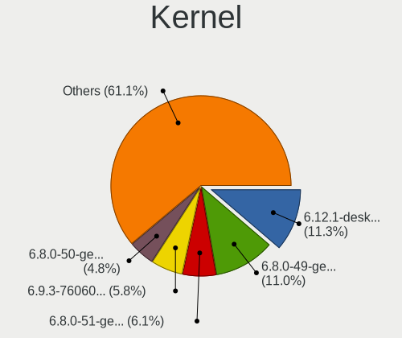
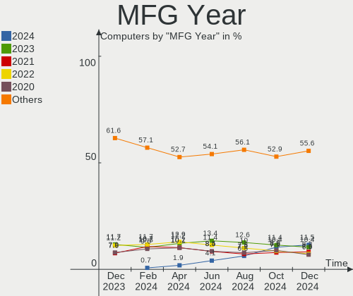
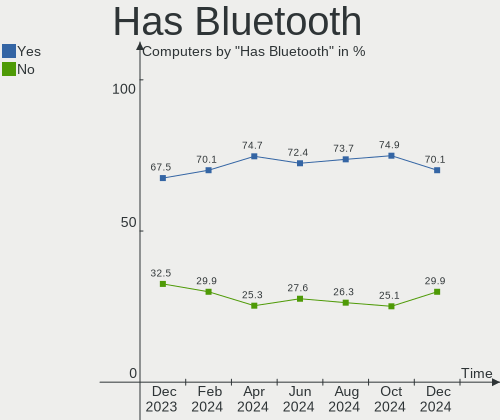
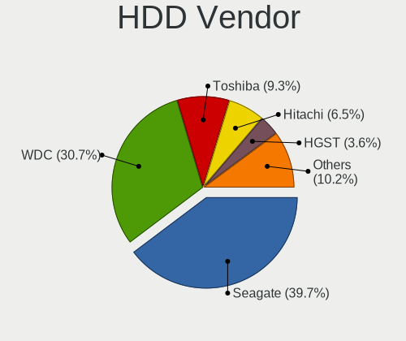
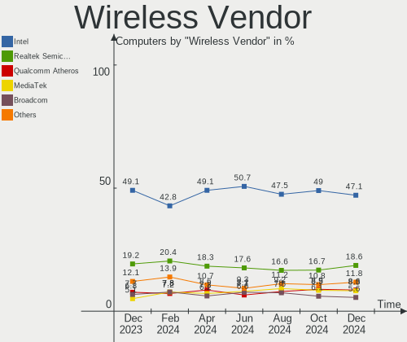
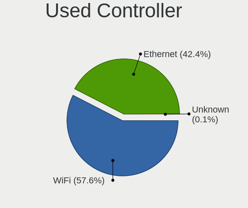
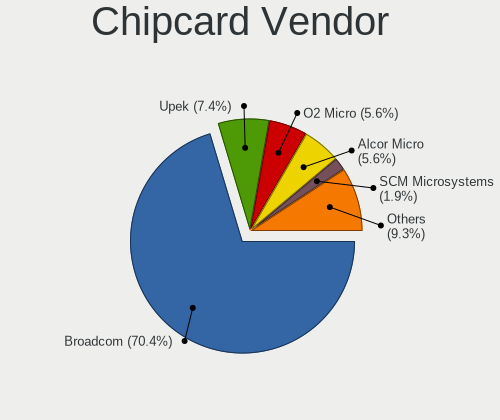

Linux in USA - Hardware Trends
------------------------------

A project to identify most popular hardware characteristics and track their change
over time based on data collected by Linux users at https://Linux-Hardware.org.

Anyone can contribute to this report by the [hw-probe](https://github.com/linuxhw/hw-probe) tool:

    sudo -E hw-probe -all -upload

This is a report for all computer types. See also reports for [desktops](/Location/USA/Desktop/README.md) and [notebooks](/Location/USA/Notebook/README.md).

Period: Dec, 2024.

Contents
--------

* [ System ](#system)
  - [ OS                       ](#os)
  - [ OS Family                ](#os-family)
  - [ Kernel                   ](#kernel)
  - [ Kernel Family            ](#kernel-family)
  - [ Kernel Major Ver.        ](#kernel-major-ver)
  - [ Arch                     ](#arch)
  - [ DE                       ](#de)
  - [ Display Server           ](#display-server)
  - [ Display Manager          ](#display-manager)
  - [ OS Lang                  ](#os-lang)
  - [ Boot Mode                ](#boot-mode)
  - [ Filesystem               ](#filesystem)
  - [ Part. scheme             ](#part-scheme)
  - [ Dual Boot with Linux/BSD ](#dual-boot-with-linuxbsd)
  - [ Dual Boot (Win)          ](#dual-boot-win)

* [ Board ](#board)
  - [ Vendor                   ](#vendor)
  - [ Model                    ](#model)
  - [ Model Family             ](#model-family)
  - [ MFG Year                 ](#mfg-year)
  - [ Form Factor              ](#form-factor)
  - [ Secure Boot              ](#secure-boot)
  - [ Coreboot                 ](#coreboot)
  - [ RAM Size                 ](#ram-size)
  - [ RAM Used                 ](#ram-used)
  - [ Total Drives             ](#total-drives)
  - [ Has CD-ROM               ](#has-cd-rom)
  - [ Has Ethernet             ](#has-ethernet)
  - [ Has WiFi                 ](#has-wifi)
  - [ Has Bluetooth            ](#has-bluetooth)

* [ Location ](#location)
  - [ Country                  ](#country)
  - [ City                     ](#city)

* [ Drives ](#drives)
  - [ Drive Vendor             ](#drive-vendor)
  - [ Drive Model              ](#drive-model)
  - [ HDD Vendor               ](#hdd-vendor)
  - [ SSD Vendor               ](#ssd-vendor)
  - [ Drive Kind               ](#drive-kind)
  - [ Drive Connector          ](#drive-connector)
  - [ Drive Size               ](#drive-size)
  - [ Space Total              ](#space-total)
  - [ Space Used               ](#space-used)
  - [ Malfunc. Drives          ](#malfunc-drives)
  - [ Malfunc. Drive Vendor    ](#malfunc-drive-vendor)
  - [ Malfunc. HDD Vendor      ](#malfunc-hdd-vendor)
  - [ Malfunc. Drive Kind      ](#malfunc-drive-kind)
  - [ Failed Drives            ](#failed-drives)
  - [ Failed Drive Vendor      ](#failed-drive-vendor)
  - [ Drive Status             ](#drive-status)

* [ Storage controller ](#storage-controller)
  - [ Storage Vendor           ](#storage-vendor)
  - [ Storage Model            ](#storage-model)
  - [ Storage Kind             ](#storage-kind)

* [ Processor ](#processor)
  - [ CPU Vendor               ](#cpu-vendor)
  - [ CPU Model                ](#cpu-model)
  - [ CPU Model Family         ](#cpu-model-family)
  - [ CPU Cores                ](#cpu-cores)
  - [ CPU Sockets              ](#cpu-sockets)
  - [ CPU Threads              ](#cpu-threads)
  - [ CPU Op-Modes             ](#cpu-op-modes)
  - [ CPU Microcode            ](#cpu-microcode)
  - [ CPU Microarch            ](#cpu-microarch)

* [ Graphics ](#graphics)
  - [ GPU Vendor               ](#gpu-vendor)
  - [ GPU Model                ](#gpu-model)
  - [ GPU Combo                ](#gpu-combo)
  - [ GPU Driver               ](#gpu-driver)
  - [ GPU Memory               ](#gpu-memory)

* [ Monitor ](#monitor)
  - [ Monitor Vendor           ](#monitor-vendor)
  - [ Monitor Model            ](#monitor-model)
  - [ Monitor Resolution       ](#monitor-resolution)
  - [ Monitor Diagonal         ](#monitor-diagonal)
  - [ Monitor Width            ](#monitor-width)
  - [ Aspect Ratio             ](#aspect-ratio)
  - [ Monitor Area             ](#monitor-area)
  - [ Pixel Density            ](#pixel-density)
  - [ Multiple Monitors        ](#multiple-monitors)

* [ Network ](#network)
  - [ Net Controller Vendor    ](#net-controller-vendor)
  - [ Net Controller Model     ](#net-controller-model)
  - [ Wireless Vendor          ](#wireless-vendor)
  - [ Wireless Model           ](#wireless-model)
  - [ Ethernet Vendor          ](#ethernet-vendor)
  - [ Ethernet Model           ](#ethernet-model)
  - [ Net Controller Kind      ](#net-controller-kind)
  - [ Used Controller          ](#used-controller)
  - [ NICs                     ](#nics)
  - [ IPv6                     ](#ipv6)

* [ Bluetooth ](#bluetooth)
  - [ Bluetooth Vendor         ](#bluetooth-vendor)
  - [ Bluetooth Model          ](#bluetooth-model)

* [ Sound ](#sound)
  - [ Sound Vendor             ](#sound-vendor)
  - [ Sound Model              ](#sound-model)

* [ Memory ](#memory)
  - [ Memory Vendor            ](#memory-vendor)
  - [ Memory Model             ](#memory-model)
  - [ Memory Kind              ](#memory-kind)
  - [ Memory Form Factor       ](#memory-form-factor)
  - [ Memory Size              ](#memory-size)
  - [ Memory Speed             ](#memory-speed)

* [ Printers & scanners ](#printers--scanners)
  - [ Printer Vendor           ](#printer-vendor)
  - [ Printer Model            ](#printer-model)
  - [ Scanner Vendor           ](#scanner-vendor)
  - [ Scanner Model            ](#scanner-model)

* [ Camera ](#camera)
  - [ Camera Vendor            ](#camera-vendor)
  - [ Camera Model             ](#camera-model)

* [ Security ](#security)
  - [ Fingerprint Vendor       ](#fingerprint-vendor)
  - [ Fingerprint Model        ](#fingerprint-model)
  - [ Chipcard Vendor          ](#chipcard-vendor)
  - [ Chipcard Model           ](#chipcard-model)

* [ Unsupported ](#unsupported)
  - [ Unsupported Devices      ](#unsupported-devices)
  - [ Unsupported Device Types ](#unsupported-device-types)

System
------

OS
--

Installed operating systems

| Name                         | Computers | Percent |
|------------------------------|-----------|---------|
| OpenMandriva 24.12           | 145       | 12.37%  |
| Ubuntu 24.04                 | 132       | 11.26%  |
| Fedora 41                    | 108       | 9.22%   |
| Debian 12                    | 64        | 5.46%   |
| Pop!_OS 22.04                | 63        | 5.38%   |
| Arch Rolling                 | 54        | 4.61%   |
| Zorin 17                     | 49        | 4.18%   |
| Bazzite 41                   | 43        | 3.67%   |
| Linux Mint 22                | 42        | 3.58%   |
| Ubuntu 22.04                 | 33        | 2.82%   |
| Ubuntu 24.10                 | 25        | 2.13%   |
| OpenMandriva 5.0             | 19        | 1.62%   |
| Kubuntu 24.04                | 19        | 1.62%   |
| SteamOS 3.6.20               | 18        | 1.54%   |
| Nobara 40                    | 14        | 1.19%   |
| Fedora 40                    | 13        | 1.11%   |
| Debian                       | 13        | 1.11%   |
| KDE neon 24.04               | 12        | 1.02%   |
| OpenMandriva 23.08           | 11        | 0.94%   |
| Manjaro                      | 11        | 0.94%   |
| Kubuntu 24.10                | 11        | 0.94%   |
| EndeavourOS Rolling          | 11        | 0.94%   |
| ArcoLinux Rolling            | 11        | 0.94%   |
| OpenMandriva 24.07           | 9         | 0.77%   |
| Linux Mint 21.3              | 9         | 0.77%   |
| Elementary 7.1               | 9         | 0.77%   |
| Elementary 8                 | 8         | 0.68%   |
| Ubuntu 20.04                 | 7         | 0.6%    |
| MX 23                        | 7         | 0.6%    |
| LMDE 6                       | 7         | 0.6%    |
| Kali 2024.4                  | 7         | 0.6%    |
| Xubuntu 24.04                | 6         | 0.51%   |
| Slackware 15.0               | 6         | 0.51%   |
| openSUSE Tumbleweed-XXXXXXXX | 6         | 0.51%   |
| CentOS 7                     | 6         | 0.51%   |
| Zorin 16                     | 5         | 0.43%   |
| Pop!_OS 24.04                | 5         | 0.43%   |
| openSUSE Leap-15.6           | 5         | 0.43%   |
| OpenMandriva 24.90           | 5         | 0.43%   |
| Manjaro 24.2.1               | 5         | 0.43%   |

OS Family
---------

OS without a version

| Name          | Computers | Percent |
|---------------|-----------|---------|
| Ubuntu        | 200       | 17.06%  |
| OpenMandriva  | 190       | 16.21%  |
| Fedora        | 128       | 10.92%  |
| Debian        | 84        | 7.17%   |
| Pop!_OS       | 68        | 5.8%    |
| Linux Mint    | 55        | 4.69%   |
| Zorin         | 54        | 4.61%   |
| Arch          | 54        | 4.61%   |
| Bazzite       | 43        | 3.67%   |
| Kubuntu       | 34        | 2.9%    |
| SteamOS       | 27        | 2.3%    |
| Manjaro       | 22        | 1.88%   |
| Elementary    | 18        | 1.54%   |
| Nobara        | 14        | 1.19%   |
| openSUSE      | 13        | 1.11%   |
| ArcoLinux     | 13        | 1.11%   |
| KDE neon      | 12        | 1.02%   |
| EndeavourOS   | 11        | 0.94%   |
| Kali          | 9         | 0.77%   |
| Xubuntu       | 8         | 0.68%   |
| NixOS         | 8         | 0.68%   |
| MX            | 8         | 0.68%   |
| CentOS        | 8         | 0.68%   |
| Ubuntu MATE   | 7         | 0.6%    |
| LMDE          | 7         | 0.6%    |
| Garuda Linux  | 7         | 0.6%    |
| Slackware     | 6         | 0.51%   |
| Gentoo        | 5         | 0.43%   |
| Vanilla       | 4         | 0.34%   |
| AlmaLinux     | 4         | 0.34%   |
| Q4OS          | 3         | 0.26%   |
| Parrot        | 3         | 0.26%   |
| Dts-distro    | 3         | 0.26%   |
| CachyOS       | 3         | 0.26%   |
| BigLinux      | 3         | 0.26%   |
| Ubuntu Budgie | 2         | 0.17%   |
| TUXEDO OS     | 2         | 0.17%   |
| Solus         | 2         | 0.17%   |
| PostmarketOS  | 2         | 0.17%   |
| Peppermint    | 2         | 0.17%   |

Kernel
------

Version of the Linux kernel

| Version                                  | Computers | Percent |
|------------------------------------------|-----------|---------|
| 6.12.1-desktop-1omv2490                  | 132       | 11.26%  |
| 6.8.0-49-generic                         | 129       | 11.01%  |
| 6.8.0-51-generic                         | 71        | 6.06%   |
| 6.9.3-76060903-generic                   | 68        | 5.8%    |
| 6.8.0-50-generic                         | 56        | 4.78%   |
| 6.1.0-28-amd64                           | 40        | 3.41%   |
| 6.11.10-300.fc41.x86_64                  | 36        | 3.07%   |
| 6.11.10-304.bazzite.fc41.x86_64          | 25        | 2.13%   |
| 6.6.2-desktop-1omv2390                   | 19        | 1.62%   |
| 6.5.0-valve22-1-neptune-65-g9a338ed8a75e | 18        | 1.54%   |
| 6.11.0-9-generic                         | 17        | 1.45%   |
| 6.12.6-200.fc41.x86_64                   | 16        | 1.37%   |
| 6.12.4-arch1-1                           | 16        | 1.37%   |
| 6.11.0-13-generic                        | 15        | 1.28%   |
| 6.8.0-48-generic                         | 14        | 1.19%   |
| 6.11.9-303.bazzite.fc41.x86_64           | 14        | 1.19%   |
| 6.11.11-300.fc41.x86_64                  | 14        | 1.19%   |
| 6.12.5-200.fc41.x86_64                   | 13        | 1.11%   |
| 6.12.4-200.fc41.x86_64                   | 13        | 1.11%   |
| 6.11.9-200.fsync.fc40.x86_64             | 13        | 1.11%   |
| 6.12.6-desktop-1omv2490                  | 12        | 1.02%   |
| 6.12.1-arch1-1                           | 12        | 1.02%   |
| 6.1.0-27-amd64                           | 11        | 0.94%   |
| 5.15.0-126-generic                       | 10        | 0.85%   |
| 6.12.7-arch1-1                           | 9         | 0.77%   |
| 6.12.6-arch1-1                           | 9         | 0.77%   |
| 6.4.8-desktop-2omv2390                   | 8         | 0.68%   |
| 6.8.0-41-generic                         | 7         | 0.6%    |
| 6.12.4-zen1-1-zen                        | 7         | 0.6%    |
| 6.12.4-1-MANJARO                         | 7         | 0.6%    |
| 6.11.4-301.fc41.x86_64                   | 7         | 0.6%    |
| 6.10.0-desktop-1omv2490                  | 7         | 0.6%    |
| 6.8.5-301.fc40.x86_64                    | 5         | 0.43%   |
| 6.8.0-38-generic                         | 5         | 0.43%   |
| 6.11.8-1-default                         | 5         | 0.43%   |
| 6.11.2-amd64                             | 5         | 0.43%   |
| 6.8.0-40-generic                         | 4         | 0.34%   |
| 6.12.1-zen1-1-zen                        | 4         | 0.34%   |
| 6.11.6-amd64                             | 4         | 0.34%   |
| 6.11.5+bpo-amd64                         | 4         | 0.34%   |

Kernel Family
-------------

Linux kernel without a distro release

| Version | Computers | Percent |
|---------|-----------|---------|
| 6.8.0   | 298       | 25.43%  |
| 6.12.1  | 161       | 13.74%  |
| 6.11.10 | 77        | 6.57%   |
| 6.9.3   | 68        | 5.8%    |
| 6.1.0   | 66        | 5.63%   |
| 6.12.6  | 56        | 4.78%   |
| 6.12.4  | 48        | 4.1%    |
| 6.11.0  | 42        | 3.58%   |
| 6.11.9  | 27        | 2.3%    |
| 5.15.0  | 26        | 2.22%   |
| 6.5.0   | 24        | 2.05%   |
| 6.11.11 | 22        | 1.88%   |
| 6.6.2   | 19        | 1.62%   |
| 6.12.5  | 16        | 1.37%   |
| 6.12.7  | 13        | 1.11%   |
| 6.11.8  | 10        | 0.85%   |
| 6.11.4  | 9         | 0.77%   |
| 6.4.8   | 8         | 0.68%   |
| 6.12.3  | 8         | 0.68%   |
| 6.11.5  | 8         | 0.68%   |
| 6.13.0  | 7         | 0.6%    |
| 6.11.6  | 7         | 0.6%    |
| 6.10.0  | 7         | 0.6%    |
| 6.8.5   | 6         | 0.51%   |
| 6.8.12  | 6         | 0.51%   |
| 6.6.63  | 6         | 0.51%   |
| 6.4.0   | 6         | 0.51%   |
| 6.11.7  | 6         | 0.51%   |
| 5.4.0   | 6         | 0.51%   |
| 3.10.0  | 6         | 0.51%   |
| 6.11.2  | 5         | 0.43%   |
| 6.6.65  | 4         | 0.34%   |
| 6.6.62  | 4         | 0.34%   |
| 6.10.11 | 4         | 0.34%   |
| 6.9.7   | 3         | 0.26%   |
| 6.6.64  | 3         | 0.26%   |
| 6.6.51  | 3         | 0.26%   |
| 6.6.21  | 3         | 0.26%   |
| 6.4.11  | 3         | 0.26%   |
| 6.12.2  | 3         | 0.26%   |

Kernel Major Ver.
-----------------

Linux kernel major version

| Version | Computers | Percent |
|---------|-----------|---------|
| 6.8     | 313       | 26.71%  |
| 6.12    | 308       | 26.28%  |
| 6.11    | 216       | 18.43%  |
| 6.1     | 77        | 6.57%   |
| 6.9     | 72        | 6.14%   |
| 6.6     | 55        | 4.69%   |
| 6.5     | 26        | 2.22%   |
| 5.15    | 26        | 2.22%   |
| 6.10    | 18        | 1.54%   |
| 6.4     | 17        | 1.45%   |
| 6.13    | 7         | 0.6%    |
| 5.4     | 6         | 0.51%   |
| 3.10    | 6         | 0.51%   |
| 5.14    | 5         | 0.43%   |
| 4.19    | 3         | 0.26%   |
| 5.19    | 2         | 0.17%   |
| 5.10    | 2         | 0.17%   |
| 4.18    | 2         | 0.17%   |
| 6.7     | 1         | 0.09%   |
| 6.2     | 1         | 0.09%   |
| 6.0     | 1         | 0.09%   |
| 5.8     | 1         | 0.09%   |
| 5.6     | 1         | 0.09%   |
| 5.18    | 1         | 0.09%   |
| 5.13    | 1         | 0.09%   |
| 4.9     | 1         | 0.09%   |
| 4.16    | 1         | 0.09%   |
| 4.15    | 1         | 0.09%   |
| 2.6     | 1         | 0.09%   |

Arch
----

OS architecture (x86_64, i586, etc.)

| Name    | Computers | Percent |
|---------|-----------|---------|
| x86_64  | 1151      | 98.21%  |
| aarch64 | 17        | 1.45%   |
| armv7l  | 3         | 0.26%   |
| ppc64le | 1         | 0.09%   |

DE
--

Desktop Environment

| Name          | Computers | Percent |
|---------------|-----------|---------|
| GNOME         | 443       | 37.8%   |
| Unknown       | 195       | 16.64%  |
| KDE6          | 185       | 15.78%  |
| KDE5          | 103       | 8.79%   |
| XFCE          | 62        | 5.29%   |
| X-Cinnamon    | 61        | 5.2%    |
| LXQt          | 24        | 2.05%   |
| Pantheon      | 18        | 1.54%   |
| MATE          | 18        | 1.54%   |
| KDE           | 8         | 0.68%   |
| Budgie        | 8         | 0.68%   |
| COSMIC        | 7         | 0.6%    |
| KDE4          | 5         | 0.43%   |
| i3            | 5         | 0.43%   |
| Cinnamon      | 5         | 0.43%   |
| Trinity       | 4         | 0.34%   |
| sway          | 3         | 0.26%   |
| icewm         | 3         | 0.26%   |
| openbox       | 2         | 0.17%   |
| Hyprland      | 2         | 0.17%   |
| GNOME Classic | 2         | 0.17%   |
| Deepin        | 2         | 0.17%   |
| wlroots       | 1         | 0.09%   |
| Unity         | 1         | 0.09%   |
| none+awesome  | 1         | 0.09%   |
| niri          | 1         | 0.09%   |
| LXDE          | 1         | 0.09%   |
| fluxbox       | 1         | 0.09%   |
| Enlightenment | 1         | 0.09%   |

Display Server
--------------

X11 or Wayland

| Name    | Computers | Percent |
|---------|-----------|---------|
| Wayland | 595       | 50.77%  |
| X11     | 503       | 42.92%  |
| Tty     | 41        | 3.5%    |
| Unknown | 33        | 2.82%   |

Display Manager
---------------

SDDM, LightDM, etc.

| Name           | Computers | Percent |
|----------------|-----------|---------|
| Unknown        | 473       | 40.36%  |
| SDDM           | 290       | 24.74%  |
| GDM3           | 213       | 18.17%  |
| LightDM        | 116       | 9.9%    |
| GDM            | 65        | 5.55%   |
| XDM            | 5         | 0.43%   |
| TDM            | 4         | 0.34%   |
| LXDM           | 2         | 0.17%   |
| SLIMSKI        | 1         | 0.09%   |
| LY-DM          | 1         | 0.09%   |
| Ly             | 1         | 0.09%   |
| COSMIC-GREETER | 1         | 0.09%   |

OS Lang
-------

Language

| Lang            | Computers | Percent |
|-----------------|-----------|---------|
| en_US           | 1090      | 93%     |
| C               | 38        | 3.24%   |
| Unknown         | 12        | 1.02%   |
| en_GB           | 9         | 0.77%   |
| en_CA           | 5         | 0.43%   |
| de_DE           | 3         | 0.26%   |
| ru_RU           | 2         | 0.17%   |
| fr_FR           | 2         | 0.17%   |
| es_US           | 2         | 0.17%   |
| es_ES           | 2         | 0.17%   |
| tr_TR           | 1         | 0.09%   |
| POSIX           | 1         | 0.09%   |
| pl_PL           | 1         | 0.09%   |
| es_MX           | 1         | 0.09%   |
| en_US.iso885915 | 1         | 0.09%   |
| en_IN           | 1         | 0.09%   |
| en_AU           | 1         | 0.09%   |

Boot Mode
---------

EFI or BIOS

| Mode | Computers | Percent |
|------|-----------|---------|
| BIOS | 676       | 57.68%  |
| EFI  | 496       | 42.32%  |

Filesystem
----------

Type of filesystem

| Type    | Computers | Percent |
|---------|-----------|---------|
| Ext4    | 577       | 49.23%  |
| Btrfs   | 283       | 24.15%  |
| Tmpfs   | 163       | 13.91%  |
| Overlay | 120       | 10.24%  |
| Xfs     | 18        | 1.54%   |
| Zfs     | 6         | 0.51%   |
| Jfs     | 2         | 0.17%   |
| Rootfs  | 1         | 0.09%   |
| F2fs    | 1         | 0.09%   |
| Aufs    | 1         | 0.09%   |

Part. scheme
------------

Scheme of partitioning

| Type    | Computers | Percent |
|---------|-----------|---------|
| GPT     | 674       | 57.51%  |
| Unknown | 419       | 35.75%  |
| MBR     | 79        | 6.74%   |

Dual Boot with Linux/BSD
------------------------

Hosting more than one Linux/BSD

| Dual boot | Computers | Percent |
|-----------|-----------|---------|
| No        | 991       | 84.56%  |
| Yes       | 181       | 15.44%  |

Dual Boot (Win)
---------------

Hosting Linux and Windows

| Dual boot | Computers | Percent |
|-----------|-----------|---------|
| No        | 944       | 80.55%  |
| Yes       | 228       | 19.45%  |

Board
-----

Vendor
------

Motherboard manufacturer

| Name                                 | Computers | Percent |
|--------------------------------------|-----------|---------|
| Dell                                 | 211       | 18%     |
| ASUSTek Computer                     | 179       | 15.27%  |
| Lenovo                               | 153       | 13.05%  |
| Hewlett-Packard                      | 149       | 12.71%  |
| MSI                                  | 68        | 5.8%    |
| Gigabyte Technology                  | 54        | 4.61%   |
| ASRock                               | 46        | 3.92%   |
| Apple                                | 45        | 3.84%   |
| Acer                                 | 31        | 2.65%   |
| Valve                                | 23        | 1.96%   |
| Unknown                              | 22        | 1.88%   |
| Google                               | 20        | 1.71%   |
| Toshiba                              | 18        | 1.54%   |
| AZW                                  | 17        | 1.45%   |
| Samsung Electronics                  | 10        | 0.85%   |
| Intel                                | 10        | 0.85%   |
| System76                             | 9         | 0.77%   |
| Shenzhen Meigao Electronic Equipment | 9         | 0.77%   |
| Supermicro                           | 7         | 0.6%    |
| Raspberry Pi Foundation              | 7         | 0.6%    |
| Framework                            | 7         | 0.6%    |
| Notebook                             | 5         | 0.43%   |
| Alienware                            | 5         | 0.43%   |
| Pegatron                             | 4         | 0.34%   |
| Microsoft                            | 4         | 0.34%   |
| GPD                                  | 4         | 0.34%   |
| Sony                                 | 3         | 0.26%   |
| Intel Client Systems                 | 3         | 0.26%   |
| Gateway                              | 3         | 0.26%   |
| BESSTAR Tech                         | 3         | 0.26%   |
| TianBei                              | 2         | 0.17%   |
| sunxi                                | 2         | 0.17%   |
| Razer                                | 2         | 0.17%   |
| GPU Company                          | 2         | 0.17%   |
| GMKtec                               | 2         | 0.17%   |
| GEEKOM                               | 2         | 0.17%   |
| eMachines                            | 2         | 0.17%   |
| Eluktronics                          | 2         | 0.17%   |
| ECS                                  | 2         | 0.17%   |
| Vizio                                | 1         | 0.09%   |

Model
-----

Motherboard model

| Name                                                  | Computers | Percent |
|-------------------------------------------------------|-----------|---------|
| Unknown                                               | 23        | 1.96%   |
| Valve Jupiter                                         | 14        | 1.19%   |
| Valve Galileo                                         | 9         | 0.77%   |
| Dell OptiPlex 7010                                    | 8         | 0.68%   |
| Dell OptiPlex 9020                                    | 7         | 0.6%    |
| AZW SER                                               | 6         | 0.51%   |
| ASUS All Series                                       | 6         | 0.51%   |
| HP Notebook                                           | 5         | 0.43%   |
| AZW MINI S                                            | 5         | 0.43%   |
| ASUS TUF Gaming X570-PLUS                             | 5         | 0.43%   |
| Shenzhen Meigao Electronic Equipment EliteMini Series | 4         | 0.34%   |
| MSI MS-7693                                           | 4         | 0.34%   |
| Dell XPS 8700                                         | 4         | 0.34%   |
| Dell Precision Tower 3620                             | 4         | 0.34%   |
| Dell Latitude E6430                                   | 4         | 0.34%   |
| Dell Inspiron 5570                                    | 4         | 0.34%   |
| ASUS ProArt X670E-CREATOR WIFI                        | 4         | 0.34%   |
| ASUS ASUS TUF Gaming A16 FA617NT_FA617NT              | 4         | 0.34%   |
| Apple MacBookAir6,2                                   | 4         | 0.34%   |
| System76 Darter Pro                                   | 3         | 0.26%   |
| RPi Raspberry Pi 5 Model B Rev 1.0                    | 3         | 0.26%   |
| MSI MS-7E47                                           | 3         | 0.26%   |
| MSI MS-7E26                                           | 3         | 0.26%   |
| MSI MS-7D75                                           | 3         | 0.26%   |
| MSI MS-7D25                                           | 3         | 0.26%   |
| MSI MS-7C37                                           | 3         | 0.26%   |
| Lenovo Legion 5 16IRX9 83DG                           | 3         | 0.26%   |
| HP Pavilion g7                                        | 3         | 0.26%   |
| HP Pavilion Desktop TP01-2xxx                         | 3         | 0.26%   |
| HP Laptop 15-dy2xxx                                   | 3         | 0.26%   |
| HP Laptop 14-cf2xxx                                   | 3         | 0.26%   |
| HP 15 Notebook PC                                     | 3         | 0.26%   |
| Gigabyte B450M DS3H WIFI                              | 3         | 0.26%   |
| Dell PowerEdge R610                                   | 3         | 0.26%   |
| Dell OptiPlex 990                                     | 3         | 0.26%   |
| Dell OptiPlex 5040                                    | 3         | 0.26%   |
| Dell Latitude E6420                                   | 3         | 0.26%   |
| Dell Latitude 5400                                    | 3         | 0.26%   |
| ASUS VivoBook_ASUSLaptop X1404ZA_X1404ZA              | 3         | 0.26%   |
| ASUS PRIME B350-PLUS                                  | 3         | 0.26%   |

Model Family
------------

Motherboard model prefix

| Name               | Computers | Percent |
|--------------------|-----------|---------|
| Lenovo ThinkPad    | 73        | 6.23%   |
| Dell Latitude      | 51        | 4.35%   |
| Dell OptiPlex      | 47        | 4.01%   |
| Dell Inspiron      | 38        | 3.24%   |
| ASUS ROG           | 37        | 3.16%   |
| Dell Precision     | 29        | 2.47%   |
| Lenovo IdeaPad     | 25        | 2.13%   |
| HP Pavilion        | 24        | 2.05%   |
| Dell XPS           | 23        | 1.96%   |
| Unknown            | 23        | 1.96%   |
| HP Laptop          | 21        | 1.79%   |
| ASUS PRIME         | 21        | 1.79%   |
| ASUS ASUS          | 20        | 1.71%   |
| Acer Aspire        | 18        | 1.54%   |
| Toshiba Satellite  | 17        | 1.45%   |
| Lenovo Legion      | 17        | 1.45%   |
| HP EliteBook       | 17        | 1.45%   |
| ASUS TUF           | 17        | 1.45%   |
| Valve Jupiter      | 14        | 1.19%   |
| ASUS Vivobook      | 14        | 1.19%   |
| Lenovo ThinkCentre | 12        | 1.02%   |
| Dell PowerEdge     | 10        | 0.85%   |
| Valve Galileo      | 9         | 0.77%   |
| Lenovo Yoga        | 9         | 0.77%   |
| HP EliteDesk       | 9         | 0.77%   |
| HP ENVY            | 8         | 0.68%   |
| RPi Raspberry      | 7         | 0.6%    |
| HP ProBook         | 7         | 0.6%    |
| HP Compaq          | 7         | 0.6%    |
| Framework Laptop   | 7         | 0.6%    |
| ASUS ProArt        | 7         | 0.6%    |
| Acer Nitro         | 7         | 0.6%    |
| HP ProLiant        | 6         | 0.51%   |
| HP 15              | 6         | 0.51%   |
| AZW SER            | 6         | 0.51%   |
| ASUS All           | 6         | 0.51%   |
| Lenovo IdeaPadFlex | 5         | 0.43%   |
| HP Victus          | 5         | 0.43%   |
| HP ProDesk         | 5         | 0.43%   |
| HP Notebook        | 5         | 0.43%   |

MFG Year
--------

Motherboard manufacture year

| Year    | Computers | Percent |
|---------|-----------|---------|
| 2024    | 135       | 11.52%  |
| 2023    | 122       | 10.41%  |
| 2021    | 96        | 8.19%   |
| 2022    | 86        | 7.34%   |
| 2020    | 81        | 6.91%   |
| 2019    | 80        | 6.83%   |
| 2018    | 75        | 6.4%    |
| 2013    | 71        | 6.06%   |
| 2011    | 68        | 5.8%    |
| 2017    | 63        | 5.38%   |
| 2012    | 57        | 4.86%   |
| 2015    | 45        | 3.84%   |
| 2014    | 45        | 3.84%   |
| 2010    | 36        | 3.07%   |
| 2016    | 35        | 2.99%   |
| 2008    | 23        | 1.96%   |
| 2009    | 22        | 1.88%   |
| Unknown | 18        | 1.54%   |
| 2007    | 12        | 1.02%   |
| 2006    | 2         | 0.17%   |

Form Factor
-----------

Physical design of the computer

| Name           | Computers | Percent |
|----------------|-----------|---------|
| Notebook       | 568       | 48.46%  |
| Desktop        | 444       | 37.88%  |
| Convertible    | 53        | 4.52%   |
| Mini pc        | 38        | 3.24%   |
| Server         | 21        | 1.79%   |
| System on chip | 17        | 1.45%   |
| All in one     | 17        | 1.45%   |
| Tablet         | 12        | 1.02%   |
| Other          | 2         | 0.17%   |

Secure Boot
-----------

Enabled or disabled

| State    | Computers | Percent |
|----------|-----------|---------|
| Disabled | 1122      | 95.73%  |
| Enabled  | 50        | 4.27%   |

Coreboot
--------

Have coreboot on board

| Used | Computers | Percent |
|------|-----------|---------|
| No   | 1146      | 97.78%  |
| Yes  | 26        | 2.22%   |

RAM Size
--------

Total RAM memory

| Size in GB      | Computers | Percent |
|-----------------|-----------|---------|
| 16.01-24.0      | 240       | 20.48%  |
| 32.01-64.0      | 215       | 18.34%  |
| 8.01-16.0       | 209       | 17.83%  |
| 4.01-8.0        | 194       | 16.55%  |
| 64.01-256.0     | 111       | 9.47%   |
| 3.01-4.0        | 103       | 8.79%   |
| 24.01-32.0      | 69        | 5.89%   |
| 1.01-2.0        | 13        | 1.11%   |
| 2.01-3.0        | 7         | 0.6%    |
| 0.51-1.0        | 4         | 0.34%   |
| 0.01-0.5        | 4         | 0.34%   |
| More than 256.0 | 3         | 0.26%   |

RAM Used
--------

Used RAM memory

| Used GB         | Computers | Percent |
|-----------------|-----------|---------|
| 4.01-8.0        | 280       | 23.89%  |
| 2.01-3.0        | 277       | 23.63%  |
| 1.01-2.0        | 250       | 21.33%  |
| 3.01-4.0        | 192       | 16.38%  |
| 8.01-16.0       | 90        | 7.68%   |
| 0.51-1.0        | 39        | 3.33%   |
| 16.01-24.0      | 12        | 1.02%   |
| 0.01-0.5        | 10        | 0.85%   |
| 32.01-64.0      | 9         | 0.77%   |
| 24.01-32.0      | 6         | 0.51%   |
| 64.01-256.0     | 5         | 0.43%   |
| More than 256.0 | 1         | 0.09%   |
| Unknown         | 1         | 0.09%   |

Total Drives
------------

Number of drives on board

| Drives | Computers | Percent |
|--------|-----------|---------|
| 1      | 681       | 58.11%  |
| 2      | 286       | 24.4%   |
| 3      | 91        | 7.76%   |
| 4      | 58        | 4.95%   |
| 6      | 13        | 1.11%   |
| 5      | 12        | 1.02%   |
| 0      | 12        | 1.02%   |
| 7      | 5         | 0.43%   |
| 8      | 4         | 0.34%   |
| 9      | 2         | 0.17%   |
| 61     | 1         | 0.09%   |
| 35     | 1         | 0.09%   |
| 34     | 1         | 0.09%   |
| 22     | 1         | 0.09%   |
| 16     | 1         | 0.09%   |
| 14     | 1         | 0.09%   |
| 11     | 1         | 0.09%   |
| 10     | 1         | 0.09%   |

Has CD-ROM
----------

Has CD-ROM on board

| Presented | Computers | Percent |
|-----------|-----------|---------|
| No        | 827       | 70.56%  |
| Yes       | 345       | 29.44%  |

Has Ethernet
------------

Has Ethernet on board

| Presented | Computers | Percent |
|-----------|-----------|---------|
| Yes       | 959       | 81.83%  |
| No        | 213       | 18.17%  |

Has WiFi
--------

Has WiFi module

| Presented | Computers | Percent |
|-----------|-----------|---------|
| Yes       | 935       | 79.78%  |
| No        | 237       | 20.22%  |

Has Bluetooth
-------------

Has Bluetooth module

| Presented | Computers | Percent |
|-----------|-----------|---------|
| Yes       | 821       | 70.05%  |
| No        | 351       | 29.95%  |

Location
--------

Country
-------

Geographic location (country)

| Country | Computers | Percent |
|---------|-----------|---------|
| USA     | 1172      | 100%    |

City
----

Geographic location (city)

| City             | Computers | Percent |
|------------------|-----------|---------|
| Los Angeles      | 27        | 2.3%    |
| Seattle          | 22        | 1.88%   |
| Dallas           | 15        | 1.28%   |
| Chicago          | 15        | 1.28%   |
| Minneapolis      | 13        | 1.11%   |
| New York         | 11        | 0.94%   |
| Houston          | 11        | 0.94%   |
| Ann Arbor        | 11        | 0.94%   |
| Phoenix          | 10        | 0.85%   |
| Atlanta          | 10        | 0.85%   |
| San Jose         | 9         | 0.77%   |
| Jacksonville     | 9         | 0.77%   |
| Portland         | 8         | 0.68%   |
| Las Vegas        | 8         | 0.68%   |
| Kansas City      | 8         | 0.68%   |
| Flushing         | 8         | 0.68%   |
| Denver           | 8         | 0.68%   |
| Columbus         | 8         | 0.68%   |
| Charlotte        | 8         | 0.68%   |
| Brooklyn         | 8         | 0.68%   |
| Tacoma           | 7         | 0.6%    |
| Miami            | 7         | 0.6%    |
| The Bronx        | 6         | 0.51%   |
| Rochester        | 6         | 0.51%   |
| Parker           | 6         | 0.51%   |
| Oklahoma City    | 6         | 0.51%   |
| Livonia          | 6         | 0.51%   |
| Buffalo          | 6         | 0.51%   |
| Tucson           | 5         | 0.43%   |
| San Antonio      | 5         | 0.43%   |
| Reno             | 5         | 0.43%   |
| Newark           | 5         | 0.43%   |
| Katy             | 5         | 0.43%   |
| Colorado Springs | 5         | 0.43%   |
| Cleveland        | 5         | 0.43%   |
| Bremerton        | 5         | 0.43%   |
| Austin           | 5         | 0.43%   |
| Topeka           | 4         | 0.34%   |
| Thornton         | 4         | 0.34%   |
| St Louis         | 4         | 0.34%   |

Drives
------

Drive Vendor
------------

Hard drive vendors

| Vendor                       | Computers | Drives | Percent |
|------------------------------|-----------|--------|---------|
| Samsung Electronics          | 249       | 313    | 14.39%  |
| Seagate                      | 180       | 251    | 10.4%   |
| WDC                          | 170       | 227    | 9.83%   |
| Sandisk                      | 160       | 175    | 9.25%   |
| Unknown                      | 96        | 114    | 5.55%   |
| SK hynix                     | 66        | 76     | 3.82%   |
| Toshiba                      | 65        | 67     | 3.76%   |
| Crucial                      | 60        | 65     | 3.47%   |
| Micron Technology            | 48        | 50     | 2.77%   |
| Kingston                     | 44        | 47     | 2.54%   |
| Phison Electronics           | 42        | 47     | 2.43%   |
| Intel                        | 42        | 54     | 2.43%   |
| Micron/Crucial Technology    | 35        | 36     | 2.02%   |
| China                        | 32        | 32     | 1.85%   |
| Hitachi                      | 29        | 56     | 1.68%   |
| PNY                          | 27        | 28     | 1.56%   |
| SPCC                         | 23        | 23     | 1.33%   |
| Kingston Technology Company  | 21        | 23     | 1.21%   |
| KIOXIA                       | 20        | 20     | 1.16%   |
| Unknown                      | 20        | 21     | 1.16%   |
| MAXIO Technology (Hangzhou)  | 19        | 22     | 1.1%    |
| Apple                        | 19        | 23     | 1.1%    |
| Team                         | 17        | 20     | 0.98%   |
| HGST                         | 16        | 59     | 0.92%   |
| A-DATA Technology            | 16        | 18     | 0.92%   |
| Silicon Motion               | 14        | 14     | 0.81%   |
| Shenzhen Longsys Electronics | 12        | 12     | 0.69%   |
| Realtek Semiconductor        | 10        | 12     | 0.58%   |
| Hewlett-Packard              | 9         | 54     | 0.52%   |
| T-FORCE                      | 8         | 8      | 0.46%   |
| JMicron Technology           | 7         | 8      | 0.4%    |
| SABRENT                      | 6         | 6      | 0.35%   |
| LITEON                       | 6         | 6      | 0.35%   |
| Fujitsu                      | 6         | 6      | 0.35%   |
| Fanxiang                     | 6         | 6      | 0.35%   |
| Netac                        | 5         | 5      | 0.29%   |
| ADATA Technology             | 5         | 5      | 0.29%   |
| Timetec                      | 4         | 4      | 0.23%   |
| Phison                       | 4         | 4      | 0.23%   |
| Lexar                        | 4         | 4      | 0.23%   |

Drive Model
-----------

Hard drive models

| Model                                                 | Computers | Percent |
|-------------------------------------------------------|-----------|---------|
| Samsung NVMe SSD Controller SM981/PM981/PM983 512GB   | 35        | 1.82%   |
| Samsung NVMe SSD Controller PM9A1/PM9A3/980PRO 512GB  | 25        | 1.3%    |
| Unknown                                               | 20        | 1.04%   |
| Unknown MMC Card  64GB                                | 17        | 0.89%   |
| Micron/Crucial P2 NVMe PCIe SSD 500GB                 | 16        | 0.83%   |
| Samsung SSD 980 1TB                                   | 15        | 0.78%   |
| Seagate ST2000DM008-2FR102 2TB                        | 14        | 0.73%   |
| Samsung SSD 860 EVO 1TB                               | 14        | 0.73%   |
| Samsung NVMe SSD Controller SM961/PM961/SM963 256GB   | 13        | 0.68%   |
| Unknown MMC Card  128GB                               | 12        | 0.63%   |
| Sandisk WD Blue SN550 NVMe SSD 256GB                  | 12        | 0.63%   |
| Seagate ST1000LM035-1RK172 1TB                        | 11        | 0.57%   |
| Unknown MMC Card  512GB                               | 10        | 0.52%   |
| Unknown MMC Card  32GB                                | 10        | 0.52%   |
| Silicon Motion SM2263EN/SM2263XT SSD Controller 256GB | 10        | 0.52%   |
| Sandisk WD_BLACK SN770 1TB                            | 10        | 0.52%   |
| Sandisk WD Black SN750 / PC SN730 NVMe SSD 512GB      | 10        | 0.52%   |
| Seagate ST500LT012-1DG142 500GB                       | 9         | 0.47%   |
| Sandisk WD Blue SN580 1TB                             | 9         | 0.47%   |
| SanDisk NVMe SSD Drive 1TB                            | 9         | 0.47%   |
| Samsung SSD 990 PRO 2TB                               | 9         | 0.47%   |
| Samsung SSD 860 EVO 500GB                             | 9         | 0.47%   |
| Toshiba MQ01ABF050 500GB                              | 8         | 0.42%   |
| Seagate ST1000LM024 HN-M101MBB 1TB                    | 8         | 0.42%   |
| Seagate BUP Slim BK 2TB                               | 8         | 0.42%   |
| Phison PS5013 E13 NVMe Controller 512GB               | 8         | 0.42%   |
| Unknown NVMe SSD Drive 2TB                            | 7         | 0.36%   |
| SPCC Solid State Disk 512GB                           | 7         | 0.36%   |
| Seagate ST500DM002-1BD142 500GB                       | 7         | 0.36%   |
| Sandisk WD Black 2018/SN750 / PC SN720 NVMe SSD 512GB | 7         | 0.36%   |
| Samsung SSD 870 EVO 2TB                               | 7         | 0.36%   |
| Samsung SSD 850 EVO 500GB                             | 7         | 0.36%   |
| PNY CS900 120GB SSD                                   | 7         | 0.36%   |
| Phison E16 PCIe4 NVMe Controller 1TB                  | 7         | 0.36%   |
| Phison E12 NVMe Controller 480GB                      | 7         | 0.36%   |
| MAXIO (Hangzhou) NVMe SSD Controller MAP1202 512GB    | 7         | 0.36%   |
| Kingston Company OM3PDP3 NVMe SSD 512GB               | 7         | 0.36%   |
| Crucial CT1000BX500SSD1 1TB                           | 7         | 0.36%   |
| Unknown MMC Card  16GB                                | 6         | 0.31%   |
| Toshiba MQ01ABD100 1TB                                | 6         | 0.31%   |

HDD Vendor
----------

Hard disk drive vendors

| Vendor              | Computers | Drives | Percent |
|---------------------|-----------|--------|---------|
| Seagate             | 176       | 244    | 39.73%  |
| WDC                 | 136       | 179    | 30.7%   |
| Toshiba             | 41        | 42     | 9.26%   |
| Hitachi             | 29        | 56     | 6.55%   |
| HGST                | 16        | 57     | 3.61%   |
| SABRENT             | 6         | 6      | 1.35%   |
| Fujitsu             | 6         | 6      | 1.35%   |
| Samsung Electronics | 5         | 5      | 1.13%   |
| Hewlett-Packard     | 5         | 49     | 1.13%   |
| JMicron Technology  | 4         | 5      | 0.9%    |
| ASMT                | 3         | 6      | 0.68%   |
| Apple               | 3         | 3      | 0.68%   |
| Unknown             | 2         | 2      | 0.45%   |
| External            | 2         | 2      | 0.45%   |
| WD MediaMax         | 1         | 1      | 0.23%   |
| TO Exter            | 1         | 1      | 0.23%   |
| QUANTUM             | 1         | 1      | 0.23%   |
| Maxtor              | 1         | 1      | 0.23%   |
| Maxone              | 1         | 1      | 0.23%   |
| Inateck             | 1         | 2      | 0.23%   |
| IBM-XIV             | 1         | 7      | 0.23%   |
| IBM-ESXS            | 1         | 1      | 0.23%   |
| Unknown             | 1         | 1      | 0.23%   |

SSD Vendor
----------

Solid state drive vendors

| Vendor              | Computers | Drives | Percent |
|---------------------|-----------|--------|---------|
| Samsung Electronics | 102       | 121    | 20.82%  |
| Crucial             | 47        | 50     | 9.59%   |
| SanDisk             | 40        | 43     | 8.16%   |
| China               | 32        | 32     | 6.53%   |
| WDC                 | 30        | 37     | 6.12%   |
| PNY                 | 27        | 28     | 5.51%   |
| SPCC                | 22        | 22     | 4.49%   |
| Kingston            | 22        | 24     | 4.49%   |
| Intel               | 15        | 23     | 3.06%   |
| Apple               | 14        | 14     | 2.86%   |
| Team                | 13        | 14     | 2.65%   |
| SK hynix            | 13        | 14     | 2.65%   |
| A-DATA Technology   | 13        | 14     | 2.65%   |
| Micron Technology   | 12        | 13     | 2.45%   |
| Toshiba             | 10        | 11     | 2.04%   |
| LITEON              | 6         | 6      | 1.22%   |
| T-FORCE             | 4         | 4      | 0.82%   |
| Transcend           | 3         | 3      | 0.61%   |
| Timetec             | 3         | 3      | 0.61%   |
| SSSTC               | 3         | 3      | 0.61%   |
| OCZ                 | 3         | 4      | 0.61%   |
| Netac               | 3         | 3      | 0.61%   |
| Mushkin             | 3         | 3      | 0.61%   |
| LITEONIT            | 3         | 3      | 0.61%   |
| KingSpec            | 3         | 3      | 0.61%   |
| Inland              | 3         | 3      | 0.61%   |
| Seagate             | 2         | 3      | 0.41%   |
| Patriot             | 2         | 2      | 0.41%   |
| NGFF                | 2         | 2      | 0.41%   |
| FORESEE             | 2         | 2      | 0.41%   |
| Fanxiang            | 2         | 2      | 0.41%   |
| 2.5"                | 2         | 2      | 0.41%   |
| Unknown             | 2         | 2      | 0.41%   |
| Verbatim            | 1         | 1      | 0.2%    |
| tecmiyo             | 1         | 1      | 0.2%    |
| TEAM T25            | 1         | 1      | 0.2%    |
| Super Talent        | 1         | 1      | 0.2%    |
| SSK SSD             | 1         | 1      | 0.2%    |
| SSK Port            | 1         | 1      | 0.2%    |
| SATA SSD            | 1         | 1      | 0.2%    |

Drive Kind
----------

HDD or SSD

| Kind    | Computers | Drives | Percent |
|---------|-----------|--------|---------|
| NVMe    | 614       | 781    | 39.64%  |
| SSD     | 433       | 544    | 27.95%  |
| HDD     | 379       | 678    | 24.47%  |
| MMC     | 82        | 88     | 5.29%   |
| Unknown | 41        | 54     | 2.65%   |

Drive Connector
---------------

SATA, SAS, NVMe, etc.

| Type | Computers | Drives | Percent |
|------|-----------|--------|---------|
| SATA | 662       | 1122   | 45.47%  |
| NVMe | 612       | 772    | 42.03%  |
| SAS  | 100       | 163    | 6.87%   |
| MMC  | 82        | 88     | 5.63%   |

Drive Size
----------

Size of hard drive

| Size in TB | Computers | Drives | Percent |
|------------|-----------|--------|---------|
| 0.01-0.5   | 425       | 518    | 47.27%  |
| 0.51-1.0   | 254       | 328    | 28.25%  |
| 1.01-2.0   | 115       | 148    | 12.79%  |
| 4.01-10.0  | 37        | 48     | 4.12%   |
| 3.01-4.0   | 35        | 49     | 3.89%   |
| 10.01-20.0 | 20        | 65     | 2.22%   |
| 2.01-3.0   | 13        | 66     | 1.45%   |

Space Total
-----------

Amount of disk space available on the file system

| Size in GB     | Computers | Percent |
|----------------|-----------|---------|
| 101-250        | 219       | 18.69%  |
| 501-1000       | 215       | 18.34%  |
| 251-500        | 183       | 15.61%  |
| More than 3000 | 145       | 12.37%  |
| 1001-2000      | 140       | 11.95%  |
| 1-20           | 108       | 9.22%   |
| 2001-3000      | 59        | 5.03%   |
| 51-100         | 42        | 3.58%   |
| 21-50          | 31        | 2.65%   |
| Unknown        | 30        | 2.56%   |

Space Used
----------

Amount of used disk space

| Used GB        | Computers | Percent |
|----------------|-----------|---------|
| 1-20           | 396       | 33.79%  |
| 21-50          | 193       | 16.47%  |
| 101-250        | 138       | 11.77%  |
| 51-100         | 110       | 9.39%   |
| 251-500        | 95        | 8.11%   |
| 501-1000       | 82        | 7%      |
| 1001-2000      | 51        | 4.35%   |
| More than 3000 | 50        | 4.27%   |
| Unknown        | 30        | 2.56%   |
| 2001-3000      | 20        | 1.71%   |
| 0              | 7         | 0.6%    |

Malfunc. Drives
---------------

Drive models with a malfunction

| Model                                   | Computers | Drives | Percent |
|-----------------------------------------|-----------|--------|---------|
| Toshiba MQ01ABF050 500GB                | 3         | 3      | 3.45%   |
| Seagate ST9500325AS 500GB               | 3         | 3      | 3.45%   |
| Seagate ST500LT012-1DG142 500GB         | 3         | 3      | 3.45%   |
| Seagate ST500DM002-1BD142 500GB         | 3         | 4      | 3.45%   |
| SSSTC CVB-8D128-HP 128GB SSD            | 2         | 2      | 2.3%    |
| Seagate ST31000524AS 1TB                | 2         | 2      | 2.3%    |
| Intel SSDSA2M160G2GC 160GB              | 2         | 2      | 2.3%    |
| WDC WDS240G2G0A-00JH30 240GB SSD        | 1         | 1      | 1.15%   |
| WDC WDS120G2G0A-00JH30 120GB SSD        | 1         | 1      | 1.15%   |
| WDC WD6400AAKS-22A7B2 640GB             | 1         | 1      | 1.15%   |
| WDC WD5002ABYS-18B1B0 500GB             | 1         | 1      | 1.15%   |
| WDC WD5000LPVX-28V0TT0 500GB            | 1         | 1      | 1.15%   |
| WDC WD5000LPCX-60VHAT0 500GB            | 1         | 1      | 1.15%   |
| WDC WD5000AZLX-00ZR6A0 500GB            | 1         | 1      | 1.15%   |
| WDC WD5000AAKX-001CA0 500GB             | 1         | 1      | 1.15%   |
| WDC WD3200AAJS-22B4A0 320GB             | 1         | 1      | 1.15%   |
| WDC WD30EZRX-00D8PB0 3TB                | 1         | 1      | 1.15%   |
| WDC WD30EFRX-68EUZN0 3TB                | 1         | 1      | 1.15%   |
| WDC WD2500BEVT-75A23T0 250GB            | 1         | 1      | 1.15%   |
| WDC WD2500BEVT-60ZCT1 250GB             | 1         | 1      | 1.15%   |
| WDC WD20EFRX-68EUZN0 2TB                | 1         | 1      | 1.15%   |
| WDC WD20EARX-00PASB0 2TB                | 1         | 1      | 1.15%   |
| WDC WD1600ADFS-75SLR2 160GB             | 1         | 1      | 1.15%   |
| WDC WD10EADS-22M2B0 1TB                 | 1         | 1      | 1.15%   |
| Toshiba MQ01ABD075 752GB                | 1         | 1      | 1.15%   |
| Toshiba MQ01ABD050 500GB                | 1         | 1      | 1.15%   |
| Toshiba MK6465GSX 640GB                 | 1         | 1      | 1.15%   |
| Toshiba MK3263GSX 320GB                 | 1         | 1      | 1.15%   |
| Toshiba KSG60ZMV256G M.2 2280 256GB SSD | 1         | 1      | 1.15%   |
| tecmiyo SATA SSD 120GB                  | 1         | 1      | 1.15%   |
| SSSTC CV8-8E128-HP 128GB SSD            | 1         | 1      | 1.15%   |
| SPCC Solid State Disk 120GB             | 1         | 1      | 1.15%   |
| SK hynix HFS128G39TNF-N3A0A 128GB SSD   | 1         | 1      | 1.15%   |
| Seagate ST9500420AS 500GB               | 1         | 1      | 1.15%   |
| Seagate ST9250315AS 250GB               | 1         | 1      | 1.15%   |
| Seagate ST500LM000-1EJ162 500GB         | 1         | 1      | 1.15%   |
| Seagate ST2000LM003 HN-M201RAD 2TB      | 1         | 1      | 1.15%   |
| Seagate ST2000DX001-1CM164 2TB          | 1         | 1      | 1.15%   |
| Seagate ST2000DM006-2DM164 2TB          | 1         | 1      | 1.15%   |
| Seagate ST2000DM001-1ER164 2TB          | 1         | 1      | 1.15%   |

Malfunc. Drive Vendor
---------------------

Vendors of faulty drives

| Vendor              | Computers | Drives | Percent |
|---------------------|-----------|--------|---------|
| Seagate             | 19        | 22     | 22.35%  |
| WDC                 | 17        | 17     | 20%     |
| Toshiba             | 8         | 8      | 9.41%   |
| Samsung Electronics | 6         | 6      | 7.06%   |
| Intel               | 5         | 5      | 5.88%   |
| Hitachi             | 5         | 5      | 5.88%   |
| Crucial             | 5         | 5      | 5.88%   |
| SSSTC               | 3         | 3      | 3.53%   |
| HGST                | 2         | 2      | 2.35%   |
| Apple               | 2         | 2      | 2.35%   |
| A-DATA Technology   | 2         | 2      | 2.35%   |
| tecmiyo             | 1         | 1      | 1.18%   |
| SPCC                | 1         | 1      | 1.18%   |
| SK hynix            | 1         | 1      | 1.18%   |
| SanDisk             | 1         | 1      | 1.18%   |
| PNY                 | 1         | 1      | 1.18%   |
| OCZ                 | 1         | 1      | 1.18%   |
| Micron Technology   | 1         | 1      | 1.18%   |
| Lexar               | 1         | 1      | 1.18%   |
| Leven               | 1         | 1      | 1.18%   |
| Fujitsu             | 1         | 1      | 1.18%   |
| Unknown             | 1         | 1      | 1.18%   |

Malfunc. HDD Vendor
-------------------

Vendors of faulty HDD drives

| Vendor              | Computers | Drives | Percent |
|---------------------|-----------|--------|---------|
| Seagate             | 19        | 22     | 37.25%  |
| WDC                 | 15        | 15     | 29.41%  |
| Toshiba             | 7         | 7      | 13.73%  |
| Hitachi             | 5         | 5      | 9.8%    |
| HGST                | 2         | 2      | 3.92%   |
| Samsung Electronics | 1         | 1      | 1.96%   |
| Fujitsu             | 1         | 1      | 1.96%   |
| Unknown             | 1         | 1      | 1.96%   |

Malfunc. Drive Kind
-------------------

Kinds of faulty drives

| Kind | Computers | Drives | Percent |
|------|-----------|--------|---------|
| HDD  | 48        | 54     | 58.54%  |
| SSD  | 31        | 31     | 37.8%   |
| NVMe | 3         | 3      | 3.66%   |

Failed Drives
-------------

Failed drive models

| Model             | Computers | Drives | Percent |
|-------------------|-----------|--------|---------|
| JM icron Tech 2TB | 1         | 1      | 100%    |

Failed Drive Vendor
-------------------

Failed drive vendors

| Vendor   | Computers | Drives | Percent |
|----------|-----------|--------|---------|
| JM icron | 1         | 1      | 100%    |

Drive Status
------------

Number of failed and malfunc. drives

| Status   | Computers | Drives | Percent |
|----------|-----------|--------|---------|
| Detected | 671       | 1202   | 53.64%  |
| Works    | 499       | 854    | 39.89%  |
| Malfunc  | 80        | 88     | 6.39%   |
| Failed   | 1         | 1      | 0.08%   |

Storage controller
------------------

Storage Vendor
--------------

Storage controller vendors

| Vendor                                  | Computers | Percent |
|-----------------------------------------|-----------|---------|
| Intel                                   | 613       | 37.38%  |
| AMD                                     | 256       | 15.61%  |
| Samsung Electronics                     | 164       | 10%     |
| SanDisk                                 | 134       | 8.17%   |
| SK hynix                                | 56        | 3.41%   |
| Phison Electronics                      | 51        | 3.11%   |
| Micron/Crucial Technology               | 45        | 2.74%   |
| ASMedia Technology                      | 42        | 2.56%   |
| Kingston Technology Company             | 41        | 2.5%    |
| Micron Technology                       | 39        | 2.38%   |
| KIOXIA                                  | 21        | 1.28%   |
| MAXIO Technology (Hangzhou)             | 20        | 1.22%   |
| Silicon Motion                          | 16        | 0.98%   |
| Shenzhen Longsys Electronics            | 15        | 0.91%   |
| Toshiba America Info Systems            | 13        | 0.79%   |
| Realtek Semiconductor                   | 13        | 0.79%   |
| Nvidia                                  | 11        | 0.67%   |
| Marvell Technology Group                | 11        | 0.67%   |
| LSI Logic / Symbios Logic               | 10        | 0.61%   |
| Solidigm                                | 9         | 0.55%   |
| JMicron Technology                      | 8         | 0.49%   |
| ADATA Technology                        | 7         | 0.43%   |
| INNOGRIT                                | 6         | 0.37%   |
| Hewlett-Packard                         | 5         | 0.3%    |
| Broadcom / LSI                          | 5         | 0.3%    |
| Yangtze Memory Technologies             | 3         | 0.18%   |
| Union Memory (Shenzhen)                 | 3         | 0.18%   |
| Nextorage                               | 3         | 0.18%   |
| Solid State Storage Technology          | 2         | 0.12%   |
| Silicon Image                           | 2         | 0.12%   |
| Shenzhen Unionmemory Information System | 2         | 0.12%   |
| Dell                                    | 2         | 0.12%   |
| Biwin Storage Technology                | 2         | 0.12%   |
| Apple                                   | 2         | 0.12%   |
| Unknown                                 | 2         | 0.12%   |
| TenaFe                                  | 1         | 0.06%   |
| Seagate Technology                      | 1         | 0.06%   |
| PMC-Sierra                              | 1         | 0.06%   |
| Lite-On Technology                      | 1         | 0.06%   |
| Artop Electronic                        | 1         | 0.06%   |

Storage Model
-------------

Storage controller models

| Model                                                                          | Computers | Percent |
|--------------------------------------------------------------------------------|-----------|---------|
| AMD FCH SATA Controller [AHCI mode]                                            | 127       | 7.05%   |
| Samsung NVMe SSD Controller SM981/PM981/PM983                                  | 51        | 2.83%   |
| AMD 600 Series Chipset SATA Controller                                         | 45        | 2.5%    |
| Intel Sunrise Point-LP SATA Controller [AHCI mode]                             | 41        | 2.28%   |
| Intel 82801 Mobile SATA Controller [RAID mode]                                 | 38        | 2.11%   |
| Intel 8 Series/C220 Series Chipset Family 6-port SATA Controller 1 [AHCI mode] | 35        | 1.94%   |
| SanDisk WD Black SN770 / PC SN740 256GB / PC SN560 (DRAM-less) NVMe SSD        | 33        | 1.83%   |
| AMD 400 Series Chipset SATA Controller                                         | 33        | 1.83%   |
| ASMedia ASM1061/ASM1062 Serial ATA Controller                                  | 32        | 1.78%   |
| Samsung NVMe SSD Controller PM9A1/PM9A3/980PRO                                 | 29        | 1.61%   |
| Intel 7 Series Chipset Family 6-port SATA Controller [AHCI mode]               | 29        | 1.61%   |
| Intel 6 Series/C200 Series Chipset Family 6 port Mobile SATA AHCI Controller   | 29        | 1.61%   |
| Intel Volume Management Device NVMe RAID Controller                            | 28        | 1.55%   |
| AMD 500 Series Chipset SATA Controller                                         | 28        | 1.55%   |
| Samsung NVMe SSD Controller 980 (DRAM-less)                                    | 27        | 1.5%    |
| Intel Raptor Lake SATA AHCI Controller                                         | 26        | 1.44%   |
| Intel SATA Controller [RAID mode]                                              | 25        | 1.39%   |
| Intel 7 Series/C210 Series Chipset Family 6-port SATA Controller [AHCI mode]   | 25        | 1.39%   |
| AMD SB7x0/SB8x0/SB9x0 SATA Controller [AHCI mode]                              | 23        | 1.28%   |
| Micron/Crucial P2 [Nick P2] / P3 / P3 Plus NVMe PCIe SSD (DRAM-less)           | 22        | 1.22%   |
| Samsung NVMe SSD Controller S4LV008[Pascal]                                    | 21        | 1.17%   |
| Intel Volume Management Device NVMe RAID Controller Intel Corporation          | 21        | 1.17%   |
| Intel 6 Series/C200 Series Chipset Family 6 port Desktop SATA AHCI Controller  | 21        | 1.17%   |
| SK hynix Gold P31/BC711/PC711 NVMe Solid State Drive                           | 19        | 1.05%   |
| AMD SB7x0/SB8x0/SB9x0 IDE Controller                                           | 19        | 1.05%   |
| Sandisk WD Black SN850X NVMe SSD                                               | 18        | 1%      |
| Intel Q170/Q150/B150/H170/H110/Z170/CM236 Chipset SATA Controller [AHCI Mode]  | 18        | 1%      |
| Intel Cannon Lake Mobile PCH SATA AHCI Controller                              | 17        | 0.94%   |
| Intel 200 Series PCH SATA controller [AHCI mode]                               | 17        | 0.94%   |
| Samsung NVMe SSD Controller SM961/PM961/SM963                                  | 16        | 0.89%   |
| Intel Celeron/Pentium Silver Processor SATA Controller                         | 16        | 0.89%   |
| SanDisk Extreme Pro / WD Black SN750 / PC SN730 / Red SN700 NVMe SSD           | 15        | 0.83%   |
| Intel 8 Series SATA Controller 1 [AHCI mode]                                   | 15        | 0.83%   |
| Intel Comet Lake SATA AHCI Controller                                          | 14        | 0.78%   |
| Intel Alder Lake-S PCH SATA Controller [AHCI Mode]                             | 14        | 0.78%   |
| SK hynix Platinum P41/PC801 NVMe Solid State Drive                             | 13        | 0.72%   |
| Sandisk WD Blue SN580 NVMe SSD (DRAM-less)                                     | 13        | 0.72%   |
| SanDisk Ultra 3D / WD PC SN530, IX SN530, Blue SN550 NVMe SSD (DRAM-less)      | 13        | 0.72%   |
| Micron 2550 NVMe SSD (DRAM-less)                                               | 13        | 0.72%   |
| AMD SB7x0/SB8x0/SB9x0 SATA Controller [IDE mode]                               | 13        | 0.72%   |

Storage Kind
------------

Kind of storage controller (IDE, SATA, NVMe, SAS, ...)

| Kind | Computers | Percent |
|------|-----------|---------|
| SATA | 743       | 47.14%  |
| NVMe | 612       | 38.83%  |
| RAID | 138       | 8.76%   |
| IDE  | 76        | 4.82%   |
| SAS  | 5         | 0.32%   |
| SCSI | 2         | 0.13%   |

Processor
---------

CPU Vendor
----------

Processor vendors

| Vendor                   | Computers | Percent |
|--------------------------|-----------|---------|
| Intel                    | 762       | 65.02%  |
| AMD                      | 389       | 33.19%  |
| ARM                      | 16        | 1.37%   |
| Qualcomm                 | 3         | 0.26%   |
| PowerNV C1P9S01 REV 1.02 | 1         | 0.09%   |
| Unknown                  | 1         | 0.09%   |

CPU Model
---------

Processor models

| Model                                      | Computers | Percent |
|--------------------------------------------|-----------|---------|
| AMD Custom APU 0405                        | 14        | 1.19%   |
| ARM Processor                              | 13        | 1.11%   |
| Intel Core i7-8550U CPU @ 1.80GHz          | 10        | 0.85%   |
| Intel Core i5-8250U CPU @ 1.60GHz          | 10        | 0.85%   |
| Intel Core i5-7200U CPU @ 2.50GHz          | 9         | 0.77%   |
| Intel Core i5-2520M CPU @ 2.50GHz          | 9         | 0.77%   |
| AMD Ryzen 7 5700G with Radeon Graphics     | 9         | 0.77%   |
| AMD Ryzen 7 3700X 8-Core Processor         | 9         | 0.77%   |
| AMD Custom APU 0932                        | 9         | 0.77%   |
| Intel Core i7-4790 CPU @ 3.60GHz           | 8         | 0.68%   |
| Intel Core i7-3770 CPU @ 3.40GHz           | 8         | 0.68%   |
| Intel Core i5-6500 CPU @ 3.20GHz           | 8         | 0.68%   |
| Intel Core i5-6300U CPU @ 2.40GHz          | 8         | 0.68%   |
| Intel 11th Gen Core i5-1135G7 @ 2.40GHz    | 8         | 0.68%   |
| AMD Ryzen 9 7950X3D 16-Core Processor      | 8         | 0.68%   |
| AMD Ryzen 9 5900X 12-Core Processor        | 8         | 0.68%   |
| AMD Ryzen 7 7735HS with Radeon Graphics    | 8         | 0.68%   |
| AMD Ryzen 5 3600 6-Core Processor          | 8         | 0.68%   |
| Intel N100                                 | 7         | 0.6%    |
| Intel Core i7-7500U CPU @ 2.70GHz          | 7         | 0.6%    |
| Intel Celeron N4020 CPU @ 1.10GHz          | 7         | 0.6%    |
| AMD Ryzen 7 5800X 8-Core Processor         | 7         | 0.6%    |
| AMD Ryzen 7 5700X 8-Core Processor         | 7         | 0.6%    |
| AMD Ryzen 5 7600X 6-Core Processor         | 7         | 0.6%    |
| AMD Ryzen 5 5600X 6-Core Processor         | 7         | 0.6%    |
| Intel Core Ultra 7 155H                    | 6         | 0.51%   |
| Intel Core i7-8750H CPU @ 2.20GHz          | 6         | 0.51%   |
| Intel Core i7-4770 CPU @ 3.40GHz           | 6         | 0.51%   |
| Intel Core i7-2600 CPU @ 3.40GHz           | 6         | 0.51%   |
| Intel Core i7-10510U CPU @ 1.80GHz         | 6         | 0.51%   |
| Intel Core i5-4570 CPU @ 3.20GHz           | 6         | 0.51%   |
| Intel Core i5-10210U CPU @ 1.60GHz         | 6         | 0.51%   |
| Intel 12th Gen Core i7-12700K              | 6         | 0.51%   |
| Intel 11th Gen Core i7-1165G7 @ 2.80GHz    | 6         | 0.51%   |
| Intel 11th Gen Core i3-1115G4 @ 3.00GHz    | 6         | 0.51%   |
| AMD Ryzen 9 5900HX with Radeon Graphics    | 6         | 0.51%   |
| AMD Ryzen 7 8845HS w/ Radeon 780M Graphics | 6         | 0.51%   |
| AMD Ryzen 7 5700U with Radeon Graphics     | 6         | 0.51%   |
| AMD Ryzen 5 5500U with Radeon Graphics     | 6         | 0.51%   |
| Intel Core Ultra 7 256V                    | 5         | 0.43%   |

CPU Model Family
----------------

Processor model prefix

| Model                   | Computers | Percent |
|-------------------------|-----------|---------|
| Intel Core i7           | 197       | 16.81%  |
| Intel Core i5           | 194       | 16.55%  |
| Other                   | 190       | 16.21%  |
| AMD Ryzen 7             | 113       | 9.64%   |
| AMD Ryzen 5             | 82        | 7%      |
| AMD Ryzen 9             | 62        | 5.29%   |
| Intel Xeon              | 42        | 3.58%   |
| Intel Celeron           | 42        | 3.58%   |
| Intel Core i3           | 39        | 3.33%   |
| Intel Core 2 Duo        | 27        | 2.3%    |
| Intel Core i9           | 21        | 1.79%   |
| Intel Core              | 20        | 1.71%   |
| Intel Pentium           | 18        | 1.54%   |
| AMD FX                  | 15        | 1.28%   |
| AMD Ryzen 3             | 9         | 0.77%   |
| Intel Pentium Silver    | 8         | 0.68%   |
| AMD A8                  | 7         | 0.6%    |
| AMD Ryzen 5 PRO         | 6         | 0.51%   |
| AMD Phenom II X4        | 6         | 0.51%   |
| Intel Core 2 Quad       | 5         | 0.43%   |
| AMD Athlon              | 5         | 0.43%   |
| AMD A6                  | 5         | 0.43%   |
| AMD A10                 | 5         | 0.43%   |
| Intel Core m3           | 4         | 0.34%   |
| AMD Ryzen 7 PRO         | 4         | 0.34%   |
| AMD Athlon 64 X2        | 4         | 0.34%   |
| Intel Pentium Dual-Core | 3         | 0.26%   |
| AMD Phenom II X6        | 3         | 0.26%   |
| AMD Athlon II X2        | 3         | 0.26%   |
| AMD A4                  | 3         | 0.26%   |
| Intel Pentium D         | 2         | 0.17%   |
| Intel Core 2            | 2         | 0.17%   |
| AMD PRO A10             | 2         | 0.17%   |
| AMD Phenom II X2        | 2         | 0.17%   |
| AMD GX                  | 2         | 0.17%   |
| AMD E1                  | 2         | 0.17%   |
| AMD Athlon II X4        | 2         | 0.17%   |
| AMD Athlon II           | 2         | 0.17%   |
| AMD A12                 | 2         | 0.17%   |
| Intel Xeon Gold         | 1         | 0.09%   |

CPU Cores
---------

Number of processor cores

| Number  | Computers | Percent |
|---------|-----------|---------|
| 4       | 376       | 32.08%  |
| 2       | 291       | 24.83%  |
| 8       | 179       | 15.27%  |
| 6       | 131       | 11.18%  |
| 12      | 54        | 4.61%   |
| 16      | 43        | 3.67%   |
| 10      | 28        | 2.39%   |
| 24      | 23        | 1.96%   |
| 14      | 16        | 1.37%   |
| Unknown | 10        | 0.85%   |
| 20      | 6         | 0.51%   |
| 1       | 6         | 0.51%   |
| 36      | 2         | 0.17%   |
| 18      | 2         | 0.17%   |
| 3       | 2         | 0.17%   |
| 32      | 1         | 0.09%   |
| 28      | 1         | 0.09%   |
| 5       | 1         | 0.09%   |

CPU Sockets
-----------

Number of sockets

| Number  | Computers | Percent |
|---------|-----------|---------|
| 1       | 1141      | 97.35%  |
| 2       | 21        | 1.79%   |
| Unknown | 10        | 0.85%   |

CPU Threads
-----------

Threads per core (Hyper-Threading)

| Number  | Computers | Percent |
|---------|-----------|---------|
| 2       | 858       | 73.21%  |
| 1       | 303       | 25.85%  |
| Unknown | 10        | 0.85%   |
| 4       | 1         | 0.09%   |

CPU Op-Modes
------------

CPU Operation Modes (32-bit, 64-bit)

| Op mode        | Computers | Percent |
|----------------|-----------|---------|
| 32-bit, 64-bit | 1160      | 98.98%  |
| 64-bit         | 6         | 0.51%   |
| Unknown        | 6         | 0.51%   |

CPU Microcode
-------------

Microcode number

| Number     | Computers | Percent |
|------------|-----------|---------|
| Unknown    | 1076      | 91.81%  |
| 0x306c3    | 5         | 0.43%   |
| 0x806e9    | 4         | 0.34%   |
| 0x306a9    | 4         | 0.34%   |
| 0x206a7    | 4         | 0.34%   |
| 0x0a601206 | 4         | 0.34%   |
| 0x806ec    | 3         | 0.26%   |
| 0x406e3    | 3         | 0.26%   |
| 0x206c2    | 3         | 0.26%   |
| 0x08108109 | 3         | 0.26%   |
| 0xb06e0    | 2         | 0.17%   |
| 0xb06a3    | 2         | 0.17%   |
| 0xa0653    | 2         | 0.17%   |
| 0xa0652    | 2         | 0.17%   |
| 0x806ea    | 2         | 0.17%   |
| 0x806c1    | 2         | 0.17%   |
| 0x706a8    | 2         | 0.17%   |
| 0x306f2    | 2         | 0.17%   |
| 0x206d7    | 2         | 0.17%   |
| 0x20655    | 2         | 0.17%   |
| 0x1067a    | 2         | 0.17%   |
| 0x08701021 | 2         | 0.17%   |
| 0xb06a2    | 1         | 0.09%   |
| 0xb0671    | 1         | 0.09%   |
| 0xa06a4    | 1         | 0.09%   |
| 0x906ea    | 1         | 0.09%   |
| 0x906a4    | 1         | 0.09%   |
| 0x906a3    | 1         | 0.09%   |
| 0x90672    | 1         | 0.09%   |
| 0x806eb    | 1         | 0.09%   |
| 0x706e5    | 1         | 0.09%   |
| 0x6fd      | 1         | 0.09%   |
| 0x6f6      | 1         | 0.09%   |
| 0x506e3    | 1         | 0.09%   |
| 0x506c9    | 1         | 0.09%   |
| 0x406f1    | 1         | 0.09%   |
| 0x40651    | 1         | 0.09%   |
| 0x30678    | 1         | 0.09%   |
| 0x106e5    | 1         | 0.09%   |
| 0x0b204018 | 1         | 0.09%   |

CPU Microarch
-------------

Microarchitecture

| Name              | Computers | Percent |
|-------------------|-----------|---------|
| Unknown           | 258       | 22.01%  |
| KabyLake          | 153       | 13.05%  |
| Haswell           | 84        | 7.17%   |
| Zen 3             | 81        | 6.91%   |
| SandyBridge       | 76        | 6.48%   |
| IvyBridge         | 60        | 5.12%   |
| Skylake           | 56        | 4.78%   |
| Alderlake Hybrid  | 50        | 4.27%   |
| Zen 2             | 38        | 3.24%   |
| TigerLake         | 26        | 2.22%   |
| Penryn            | 26        | 2.22%   |
| Zen+              | 22        | 1.88%   |
| Goldmont plus     | 21        | 1.79%   |
| K10               | 19        | 1.62%   |
| Westmere          | 18        | 1.54%   |
| Piledriver        | 17        | 1.45%   |
| Zen               | 16        | 1.37%   |
| Core              | 16        | 1.37%   |
| Silvermont        | 15        | 1.28%   |
| CometLake         | 15        | 1.28%   |
| Broadwell         | 15        | 1.28%   |
| Icelake           | 13        | 1.11%   |
| Nehalem           | 9         | 0.77%   |
| Excavator         | 9         | 0.77%   |
| Puma              | 8         | 0.68%   |
| K8 Hammer         | 8         | 0.68%   |
| Meteorlake Hybrid | 7         | 0.6%    |
| Goldmont          | 7         | 0.6%    |
| Jaguar            | 5         | 0.43%   |
| Tremont           | 4         | 0.34%   |
| Steamroller       | 4         | 0.34%   |
| Lunarlake Hybrid  | 4         | 0.34%   |
| Gracemont         | 4         | 0.34%   |
| K10 Llano         | 3         | 0.26%   |
| NetBurst          | 2         | 0.17%   |
| Bulldozer         | 2         | 0.17%   |
| Bobcat            | 1         | 0.09%   |

Graphics
--------

GPU Vendor
----------

Vendors of graphics cards

| Vendor                     | Computers | Percent |
|----------------------------|-----------|---------|
| Intel                      | 585       | 43.66%  |
| AMD                        | 410       | 30.6%   |
| Nvidia                     | 322       | 24.03%  |
| Matrox Electronics Systems | 14        | 1.04%   |
| ASPEED Technology          | 8         | 0.6%    |
| ATI Technologies           | 1         | 0.07%   |

GPU Model
---------

Graphics card models

| Model                                                                       | Computers | Percent |
|-----------------------------------------------------------------------------|-----------|---------|
| Intel 2nd Generation Core Processor Family Integrated Graphics Controller   | 60        | 4.32%   |
| Intel 3rd Gen Core processor Graphics Controller                            | 31        | 2.23%   |
| Intel UHD Graphics 620                                                      | 28        | 2.02%   |
| AMD Rembrandt [Radeon 680M]                                                 | 27        | 1.94%   |
| AMD Raphael                                                                 | 27        | 1.94%   |
| AMD Ellesmere [Radeon RX 470/480/570/570X/580/580X/590]                     | 25        | 1.8%    |
| AMD Cezanne [Radeon Vega Series / Radeon Vega Mobile Series]                | 24        | 1.73%   |
| Intel HD Graphics 620                                                       | 22        | 1.58%   |
| Intel HD Graphics 530                                                       | 21        | 1.51%   |
| Intel CoffeeLake-H GT2 [UHD Graphics 630]                                   | 21        | 1.51%   |
| Intel TigerLake-LP GT2 [Iris Xe Graphics]                                   | 20        | 1.44%   |
| Intel Skylake GT2 [HD Graphics 520]                                         | 20        | 1.44%   |
| Intel Haswell-ULT Integrated Graphics Controller                            | 20        | 1.44%   |
| AMD Phoenix1                                                                | 20        | 1.44%   |
| AMD Phoenix3                                                                | 19        | 1.37%   |
| AMD Navi 31 [Radeon RX 7900 XT/7900 XTX/7900 GRE/7900M]                     | 19        | 1.37%   |
| Intel Raptor Lake-P [Iris Xe Graphics]                                      | 18        | 1.3%    |
| Intel Xeon E3-1200 v3/4th Gen Core Processor Integrated Graphics Controller | 17        | 1.22%   |
| Intel CometLake-U GT2 [UHD Graphics]                                        | 17        | 1.22%   |
| AMD Picasso/Raven 2 [Radeon Vega Series / Radeon Vega Mobile Series]        | 16        | 1.15%   |
| Intel GeminiLake [UHD Graphics 600]                                         | 15        | 1.08%   |
| Intel WhiskeyLake-U GT2 [UHD Graphics 620]                                  | 14        | 1.01%   |
| AMD VanGogh [AMD Custom GPU 0405]                                           | 14        | 1.01%   |
| AMD Navi 22 [Radeon RX 6700/6700 XT/6750 XT / 6800M/6850M XT]               | 14        | 1.01%   |
| Nvidia AD107M [GeForce RTX 4060 Max-Q / Mobile]                             | 13        | 0.94%   |
| Intel Alder Lake-P GT2 [Iris Xe Graphics]                                   | 13        | 0.94%   |
| Intel Alder Lake-N [UHD Graphics]                                           | 13        | 0.94%   |
| AMD Navi 33 [Radeon RX 7600/7600 XT/7600M XT/7600S/7700S / PRO W7600]       | 13        | 0.94%   |
| Intel HD Graphics 630                                                       | 12        | 0.86%   |
| Intel CoffeeLake-S GT2 [UHD Graphics 630]                                   | 12        | 0.86%   |
| AMD Lucienne                                                                | 12        | 0.86%   |
| Intel HD Graphics 5500                                                      | 11        | 0.79%   |
| AMD Navi 32 [Radeon RX 7700 XT / 7800 XT]                                   | 11        | 0.79%   |
| Intel TigerLake-H GT1 [UHD Graphics]                                        | 10        | 0.72%   |
| Intel Atom Processor Z36xxx/Z37xxx Series Graphics & Display                | 10        | 0.72%   |
| AMD Barcelo                                                                 | 10        | 0.72%   |
| Nvidia GA106 [GeForce RTX 3060 Lite Hash Rate]                              | 9         | 0.65%   |
| Intel Meteor Lake-P [Intel Arc Graphics]                                    | 9         | 0.65%   |
| AMD Sephiroth [AMD Custom GPU 0405]                                         | 9         | 0.65%   |
| AMD Granite Ridge [Radeon Graphics]                                         | 9         | 0.65%   |

GPU Combo
---------

Combinations of graphics cards

| Name            | Computers | Percent |
|-----------------|-----------|---------|
| 1 x Intel       | 432       | 36.86%  |
| 1 x AMD         | 313       | 26.71%  |
| 1 x Nvidia      | 163       | 13.91%  |
| Intel + Nvidia  | 112       | 9.56%   |
| 2 x AMD         | 39        | 3.33%   |
| AMD + Nvidia    | 38        | 3.24%   |
| Other           | 24        | 2.05%   |
| Intel + AMD     | 18        | 1.54%   |
| 1 x Matrox      | 13        | 1.11%   |
| 2 x Intel       | 7         | 0.6%    |
| 2 x Nvidia      | 5         | 0.43%   |
| 1 x ASPEED      | 4         | 0.34%   |
| Nvidia + ASPEED | 2         | 0.17%   |
| Nvidia + Matrox | 1         | 0.09%   |
| AMD + ASPEED    | 1         | 0.09%   |

GPU Driver
----------

Free vs proprietary

| Driver      | Computers | Percent |
|-------------|-----------|---------|
| Free        | 901       | 76.88%  |
| Proprietary | 164       | 13.99%  |
| Unknown     | 107       | 9.13%   |

GPU Memory
----------

Total video memory

| Size in GB | Computers | Percent |
|------------|-----------|---------|
| Unknown    | 894       | 76.28%  |
| 0.01-0.5   | 75        | 6.4%    |
| 7.01-8.0   | 41        | 3.5%    |
| 1.01-2.0   | 36        | 3.07%   |
| 3.01-4.0   | 34        | 2.9%    |
| 0.51-1.0   | 32        | 2.73%   |
| 8.01-16.0  | 26        | 2.22%   |
| 5.01-6.0   | 17        | 1.45%   |
| 16.01-24.0 | 13        | 1.11%   |
| 2.01-3.0   | 4         | 0.34%   |

Monitor
-------

Monitor Vendor
--------------

Monitor vendors

| Vendor                  | Computers | Percent |
|-------------------------|-----------|---------|
| Samsung Electronics     | 143       | 11.58%  |
| BOE                     | 135       | 10.93%  |
| AU Optronics            | 121       | 9.8%    |
| Chimei Innolux          | 81        | 6.56%   |
| Goldstar                | 76        | 6.15%   |
| Dell                    | 73        | 5.91%   |
| LG Display              | 69        | 5.59%   |
| Acer                    | 59        | 4.78%   |
| Hewlett-Packard         | 57        | 4.62%   |
| Apple                   | 36        | 2.91%   |
| Ancor Communications    | 25        | 2.02%   |
| Valve                   | 24        | 1.94%   |
| Sharp                   | 23        | 1.86%   |
| Sceptre Tech            | 23        | 1.86%   |
| ViewSonic               | 21        | 1.7%    |
| ASUSTek Computer        | 19        | 1.54%   |
| MSI                     | 18        | 1.46%   |
| AOC                     | 16        | 1.3%    |
| Vizio                   | 13        | 1.05%   |
| Lenovo                  | 13        | 1.05%   |
| Chi Mei Optoelectronics | 12        | 0.97%   |
| Gigabyte Technology     | 10        | 0.81%   |
| InfoVision              | 9         | 0.73%   |
| Unknown                 | 8         | 0.65%   |
| Sony                    | 8         | 0.65%   |
| CSO                     | 8         | 0.65%   |
| BenQ                    | 8         | 0.65%   |
| Philips                 | 7         | 0.57%   |
| Insignia                | 7         | 0.57%   |
| PANDA                   | 6         | 0.49%   |
| NEC Computers           | 5         | 0.4%    |
| LG Philips              | 5         | 0.4%    |
| Viotek                  | 4         | 0.32%   |
| Unknown (XXX)           | 4         | 0.32%   |
| RTK                     | 4         | 0.32%   |
| HKC                     | 4         | 0.32%   |
| Gateway                 | 4         | 0.32%   |
| Toshiba                 | 3         | 0.24%   |
| TMX                     | 3         | 0.24%   |
| ONN                     | 3         | 0.24%   |

Monitor Model
-------------

Monitor models

| Model                                                                    | Computers | Percent |
|--------------------------------------------------------------------------|-----------|---------|
| Valve ANX7530 U VLV3001 800x1280 100x150mm 7.1-inch                      | 14        | 1.1%    |
| Samsung Electronics LCD Monitor SEC5441 1280x800 286x179mm 13.3-inch     | 10        | 0.79%   |
| Goldstar FULL HD GSM5B55 1920x1080 480x270mm 21.7-inch                   | 9         | 0.71%   |
| Valve ANX7530 U VLV3003 800x1280 100x160mm 7.4-inch                      | 8         | 0.63%   |
| Unknown LCD Monitor FFFF 2288x1287 2550x2550mm 142.0-inch                | 7         | 0.55%   |
| Goldstar ULTRAGEAR GSM7765 2560x1440 697x392mm 31.5-inch                 | 6         | 0.47%   |
| AU Optronics LCD Monitor AUO26EC 1366x768 344x193mm 15.5-inch            | 6         | 0.47%   |
| Sceptre Tech Sceptre F24 SPT09AB 1920x1080 526x296mm 23.8-inch           | 4         | 0.31%   |
| Samsung Electronics C32R50x SAM7000 1920x1080 698x393mm 31.5-inch        | 4         | 0.31%   |
| Samsung Electronics C27F390 SAM0D32 1920x1080 600x340mm 27.2-inch        | 4         | 0.31%   |
| Chimei Innolux LCD Monitor CMN15F5 1920x1080 344x193mm 15.5-inch         | 4         | 0.31%   |
| Chimei Innolux LCD Monitor CMN1521 1920x1080 344x193mm 15.5-inch         | 4         | 0.31%   |
| Chimei Innolux LCD Monitor CMN1132 1366x768 256x144mm 11.6-inch          | 4         | 0.31%   |
| BOE LCD Monitor BOE08C2 1920x1080 344x194mm 15.5-inch                    | 4         | 0.31%   |
| AU Optronics LCD Monitor AUO213E 1600x900 309x174mm 14.0-inch            | 4         | 0.31%   |
| ViewSonic VX3276-FHD VSCE735 1920x1080 698x393mm 31.5-inch               | 3         | 0.24%   |
| Sharp LCD Monitor SHP148D 3840x2160 344x194mm 15.5-inch                  | 3         | 0.24%   |
| Sceptre Tech Sceptre J20 SPT080D 1600x900 440x230mm 19.5-inch            | 3         | 0.24%   |
| Samsung Electronics LF24T35 SAM707D 1920x1080 528x297mm 23.9-inch        | 3         | 0.24%   |
| Samsung Electronics LCD Monitor SDC41A0 1920x1200 302x189mm 14.0-inch    | 3         | 0.24%   |
| Samsung Electronics LCD Monitor SDC419D 2880x1800 302x189mm 14.0-inch    | 3         | 0.24%   |
| Samsung Electronics LCD Monitor SDC4159 1920x1080 344x194mm 15.5-inch    | 3         | 0.24%   |
| Samsung Electronics LCD Monitor SAM0E4C 1366x768 522x293mm 23.6-inch     | 3         | 0.24%   |
| PANDA LCD Monitor NCP004D 1920x1080 344x194mm 15.5-inch                  | 3         | 0.24%   |
| MSI MAG342CQR MSI3DB6 3440x1440 797x333mm 34.0-inch                      | 3         | 0.24%   |
| Goldstar ULTRAGEAR GSM5BD3 2560x1440 697x392mm 31.5-inch                 | 3         | 0.24%   |
| Goldstar LG TV SSCR2 GSMC0C8 3840x2160                                   | 3         | 0.24%   |
| Goldstar HDR 4K GSM7706 3840x2160 600x340mm 27.2-inch                    | 3         | 0.24%   |
| Dell S2716DG DELA0D1 2560x1440 598x336mm 27.0-inch                       | 3         | 0.24%   |
| Chimei Innolux LCD Monitor CMN14E5 1920x1080 309x173mm 13.9-inch         | 3         | 0.24%   |
| Chimei Innolux LCD Monitor CMN1482 1600x900 309x174mm 14.0-inch          | 3         | 0.24%   |
| Chi Mei Optoelectronics LCD Monitor CMO15A7 1366x768 344x193mm 15.5-inch | 3         | 0.24%   |
| BOE LCD Monitor BOE095F 2256x1504 285x190mm 13.5-inch                    | 3         | 0.24%   |
| BOE LCD Monitor BOE081D 1920x1080 309x174mm 14.0-inch                    | 3         | 0.24%   |
| AU Optronics LCD Monitor AUO70EC 1366x768 344x193mm 15.5-inch            | 3         | 0.24%   |
| AU Optronics LCD Monitor AUO159E 1600x900 382x214mm 17.2-inch            | 3         | 0.24%   |
| AU Optronics LCD Monitor AUO10EC 1366x768 344x193mm 15.5-inch            | 3         | 0.24%   |
| ASUSTek Computer VG32VQ1B AUS32E0 2560x1440 697x392mm 31.5-inch          | 3         | 0.24%   |
| Apple Color LCD APP9CF2 1366x768 256x144mm 11.6-inch                     | 3         | 0.24%   |
| Apple Color LCD APP9CF0 1440x900 290x180mm 13.4-inch                     | 3         | 0.24%   |

Monitor Resolution
------------------

Monitor screen resolution

| Resolution         | Computers | Percent |
|--------------------|-----------|---------|
| 1920x1080 (FHD)    | 511       | 42.62%  |
| 1366x768 (WXGA)    | 150       | 12.51%  |
| 3840x2160 (4K)     | 100       | 8.34%   |
| 2560x1440 (QHD)    | 86        | 7.17%   |
| 1920x1200 (WUXGA)  | 53        | 4.42%   |
| 1600x900 (HD+)     | 46        | 3.84%   |
| 3440x1440          | 38        | 3.17%   |
| 2880x1800          | 24        | 2%      |
| 800x1280           | 23        | 1.92%   |
| 1440x900 (WXGA+)   | 21        | 1.75%   |
| 2560x1600          | 20        | 1.67%   |
| 1680x1050 (WSXGA+) | 20        | 1.67%   |
| 1280x800 (WXGA)    | 14        | 1.17%   |
| 1280x1024 (SXGA)   | 13        | 1.08%   |
| 2288x1287          | 9         | 0.75%   |
| 2560x1080          | 8         | 0.67%   |
| 1920x540           | 8         | 0.67%   |
| 3840x2400          | 5         | 0.42%   |
| 3840x1080          | 5         | 0.42%   |
| Unknown            | 5         | 0.42%   |
| 2256x1504          | 4         | 0.33%   |
| 1360x768           | 4         | 0.33%   |
| 1024x768 (XGA)     | 4         | 0.33%   |
| 3200x2000          | 3         | 0.25%   |
| 2880x1920          | 3         | 0.25%   |
| 2160x1440          | 2         | 0.17%   |
| 1680x945           | 2         | 0.17%   |
| 1600x1200          | 2         | 0.17%   |
| 7680x1080          | 1         | 0.08%   |
| 720x1280           | 1         | 0.08%   |
| 4480x1440          | 1         | 0.08%   |
| 3840x1200          | 1         | 0.08%   |
| 3072x1920          | 1         | 0.08%   |
| 2880x1620          | 1         | 0.08%   |
| 2736x1824          | 1         | 0.08%   |
| 2560x682           | 1         | 0.08%   |
| 2560x1700          | 1         | 0.08%   |
| 2400x1600          | 1         | 0.08%   |
| 2200x1650          | 1         | 0.08%   |
| 2160x1200          | 1         | 0.08%   |

Monitor Diagonal
----------------

Diagonal size in inches

| Inches  | Computers | Percent |
|---------|-----------|---------|
| 15      | 249       | 20.1%   |
| 27      | 116       | 9.36%   |
| 14      | 112       | 9.04%   |
| 13      | 103       | 8.31%   |
| 31      | 80        | 6.46%   |
| 24      | 77        | 6.21%   |
| 23      | 63        | 5.08%   |
| 21      | 55        | 4.44%   |
| 17      | 48        | 3.87%   |
| 16      | 42        | 3.39%   |
| 34      | 39        | 3.15%   |
| 7       | 24        | 1.94%   |
| 11      | 22        | 1.78%   |
| Unknown | 19        | 1.53%   |
| 32      | 18        | 1.45%   |
| 20      | 16        | 1.29%   |
| 19      | 16        | 1.29%   |
| 12      | 16        | 1.29%   |
| 54      | 12        | 0.97%   |
| 40      | 12        | 0.97%   |
| 22      | 12        | 0.97%   |
| 72      | 9         | 0.73%   |
| 142     | 7         | 0.56%   |
| 49      | 7         | 0.56%   |
| 48      | 7         | 0.56%   |
| 18      | 7         | 0.56%   |
| 42      | 6         | 0.48%   |
| 26      | 6         | 0.48%   |
| 84      | 5         | 0.4%    |
| 38      | 4         | 0.32%   |
| 52      | 3         | 0.24%   |
| 46      | 3         | 0.24%   |
| 29      | 3         | 0.24%   |
| 25      | 3         | 0.24%   |
| 58      | 2         | 0.16%   |
| 55      | 2         | 0.16%   |
| 36      | 2         | 0.16%   |
| 35      | 2         | 0.16%   |
| 85      | 1         | 0.08%   |
| 77      | 1         | 0.08%   |

Monitor Width
-------------

Physical width

| Width in mm    | Computers | Percent |
|----------------|-----------|---------|
| 301-350        | 432       | 35.38%  |
| 501-600        | 241       | 19.74%  |
| 401-500        | 96        | 7.86%   |
| 201-300        | 95        | 7.78%   |
| 601-700        | 92        | 7.53%   |
| 351-400        | 73        | 5.98%   |
| 701-800        | 60        | 4.91%   |
| 1001-1500      | 41        | 3.36%   |
| 1-100          | 23        | 1.88%   |
| Unknown        | 19        | 1.56%   |
| 801-900        | 18        | 1.47%   |
| 1501-2000      | 17        | 1.39%   |
| More than 2000 | 7         | 0.57%   |
| 901-1000       | 6         | 0.49%   |
| 101-200        | 1         | 0.08%   |

Aspect Ratio
------------

Proportional relationship between the width and the height

| Ratio   | Computers | Percent |
|---------|-----------|---------|
| 16/9    | 837       | 73.61%  |
| 16/10   | 163       | 14.34%  |
| 21/9    | 44        | 3.87%   |
| 3/2     | 14        | 1.23%   |
| 0.67    | 14        | 1.23%   |
| 5/4     | 13        | 1.14%   |
| 0.62    | 10        | 0.88%   |
| 32/9    | 9         | 0.79%   |
| Unknown | 9         | 0.79%   |
| 4/3     | 8         | 0.7%    |
| 1.00    | 7         | 0.62%   |
| 2.64    | 2         | 0.18%   |
| 1.96    | 2         | 0.18%   |
| 6/5     | 1         | 0.09%   |
| 3.75    | 1         | 0.09%   |
| 3.20    | 1         | 0.09%   |
| 2.12    | 1         | 0.09%   |
| 0.56    | 1         | 0.09%   |

Monitor Area
------------

Area in inch

| Area in inch | Computers | Percent |
|----------------|-----------|---------|
| 101-110        | 248       | 20.21%  |
| 81-90          | 173       | 14.1%   |
| 201-250        | 154       | 12.55%  |
| 351-500        | 139       | 11.33%  |
| 301-350        | 119       | 9.7%    |
| 151-200        | 55        | 4.48%   |
| More than 1000 | 48        | 3.91%   |
| 71-80          | 41        | 3.34%   |
| 111-120        | 41        | 3.34%   |
| 501-1000       | 40        | 3.26%   |
| 121-130        | 36        | 2.93%   |
| 251-300        | 31        | 2.53%   |
| 1-40           | 24        | 1.96%   |
| 51-60          | 22        | 1.79%   |
| Unknown        | 19        | 1.55%   |
| 61-70          | 14        | 1.14%   |
| 141-150        | 10        | 0.81%   |
| 131-140        | 8         | 0.65%   |
| 91-100         | 5         | 0.41%   |

Pixel Density
-------------

Pixels per inch

| Density       | Computers | Percent |
|---------------|-----------|---------|
| 51-100        | 386       | 32.11%  |
| 121-160       | 319       | 26.54%  |
| 101-120       | 266       | 22.13%  |
| 161-240       | 123       | 10.23%  |
| 1-50          | 46        | 3.83%   |
| More than 240 | 42        | 3.49%   |
| Unknown       | 20        | 1.66%   |

Multiple Monitors
-----------------

Total monitors connected

| Total | Computers | Percent |
|-------|-----------|---------|
| 1     | 919       | 78.41%  |
| 2     | 167       | 14.25%  |
| 0     | 59        | 5.03%   |
| 3     | 22        | 1.88%   |
| 4     | 3         | 0.26%   |
| 6     | 1         | 0.09%   |
| 5     | 1         | 0.09%   |

Network
-------

Net Controller Vendor
---------------------

Controller vendors

| Vendor                                 | Computers | Percent |
|----------------------------------------|-----------|---------|
| Intel                                  | 625       | 35.73%  |
| Realtek Semiconductor                  | 590       | 33.73%  |
| Qualcomm Atheros                       | 109       | 6.23%   |
| Broadcom                               | 102       | 5.83%   |
| MediaTek                               | 96        | 5.49%   |
| Broadcom Limited                       | 21        | 1.2%    |
| ASIX Electronics                       | 21        | 1.2%    |
| TP-Link                                | 19        | 1.09%   |
| Ralink Technology                      | 13        | 0.74%   |
| Qualcomm                               | 12        | 0.69%   |
| Marvell Technology Group               | 12        | 0.69%   |
| Aquantia                               | 10        | 0.57%   |
| Samsung Electronics                    | 9         | 0.51%   |
| Nvidia                                 | 9         | 0.51%   |
| Ralink                                 | 8         | 0.46%   |
| Qualcomm Technologies                  | 8         | 0.46%   |
| NetGear                                | 7         | 0.4%    |
| Microsoft                              | 6         | 0.34%   |
| D-Link System                          | 5         | 0.29%   |
| QinHeng Electronics                    | 4         | 0.23%   |
| Dell                                   | 4         | 0.23%   |
| D-Link                                 | 4         | 0.23%   |
| American Future Technology             | 4         | 0.23%   |
| U-Blox                                 | 3         | 0.17%   |
| Raspberry Pi                           | 3         | 0.17%   |
| Motorola PCS                           | 3         | 0.17%   |
| Microchip Technology                   | 3         | 0.17%   |
| Linksys                                | 3         | 0.17%   |
| Edimax Technology                      | 3         | 0.17%   |
| Belkin Components                      | 3         | 0.17%   |
| Solarflare Communications              | 2         | 0.11%   |
| Qualcomm Atheros Communications        | 2         | 0.11%   |
| Mellanox Technologies                  | 2         | 0.11%   |
| Lenovo                                 | 2         | 0.11%   |
| InterBiometrics                        | 2         | 0.11%   |
| DisplayLink                            | 2         | 0.11%   |
| T & A Mobile Phones                    | 1         | 0.06%   |
| Suzhou Motorcomm Electronic Technology | 1         | 0.06%   |
| Signia                                 | 1         | 0.06%   |
| Sierra Wireless                        | 1         | 0.06%   |

Net Controller Model
--------------------

Controller models

| Model                                                                  | Computers | Percent |
|------------------------------------------------------------------------|-----------|---------|
| Realtek RTL8111/8168/8211/8411 PCI Express Gigabit Ethernet Controller | 328       | 15.61%  |
| Realtek RTL8125 2.5GbE Controller                                      | 74        | 3.52%   |
| Intel Wi-Fi 6 AX200                                                    | 61        | 2.9%    |
| Intel 82579LM Gigabit Network Connection (Lewisville)                  | 52        | 2.48%   |
| Realtek RTL8153 Gigabit Ethernet Adapter                               | 48        | 2.28%   |
| Realtek RTL810xE PCI Express Fast Ethernet controller                  | 43        | 2.05%   |
| MediaTek MT7922 802.11ax PCI Express Wireless Network Adapter          | 43        | 2.05%   |
| Intel Wireless 8265 / 8275                                             | 43        | 2.05%   |
| Intel Wi-Fi 6E(802.11ax) AX210/AX1675* 2x2 [Typhoon Peak]              | 39        | 1.86%   |
| Realtek RTL8821CE 802.11ac PCIe Wireless Network Adapter               | 35        | 1.67%   |
| Intel Ethernet Controller I225-V                                       | 32        | 1.52%   |
| Realtek RTL8852BE PCIe 802.11ax Wireless Network Controller            | 29        | 1.38%   |
| Realtek RTL8822CE 802.11ac PCIe Wireless Network Adapter               | 28        | 1.33%   |
| Intel Wireless 7265                                                    | 24        | 1.14%   |
| Intel I211 Gigabit Network Connection                                  | 24        | 1.14%   |
| MediaTek MT7921 802.11ax PCI Express Wireless Network Adapter          | 23        | 1.09%   |
| Intel Alder Lake-P PCH CNVi WiFi                                       | 23        | 1.09%   |
| Intel Ethernet Controller I226-V                                       | 21        | 1%      |
| Intel Ethernet Connection I217-LM                                      | 21        | 1%      |
| ASIX AX88179 Gigabit Ethernet                                          | 21        | 1%      |
| Qualcomm Atheros QCA6174 802.11ac Wireless Network Adapter             | 20        | 0.95%   |
| Intel Wireless 8260                                                    | 19        | 0.9%    |
| Intel Wireless 3165                                                    | 18        | 0.86%   |
| Intel Centrino Advanced-N 6205 [Taylor Peak]                           | 17        | 0.81%   |
| Realtek RTL88x2bu [AC1200 Techkey]                                     | 16        | 0.76%   |
| Qualcomm Atheros AR9485 Wireless Network Adapter                       | 16        | 0.76%   |
| Intel Wireless 7260                                                    | 16        | 0.76%   |
| Intel Raptor Lake-S PCH CNVi WiFi                                      | 16        | 0.76%   |
| Intel Raptor Lake PCH CNVi WiFi                                        | 15        | 0.71%   |
| Intel Ethernet Connection (4) I219-LM                                  | 15        | 0.71%   |
| Intel Comet Lake PCH-LP CNVi WiFi                                      | 15        | 0.71%   |
| Intel Cannon Lake PCH CNVi WiFi                                        | 15        | 0.71%   |
| Intel Ethernet Connection (2) I219-LM                                  | 14        | 0.67%   |
| Intel Alder Lake-S PCH CNVi WiFi                                       | 14        | 0.67%   |
| Realtek 802.11ac NIC                                                   | 13        | 0.62%   |
| Intel Wi-Fi 6 AX201                                                    | 13        | 0.62%   |
| Intel Dual Band Wireless-AC 3168NGW [Stone Peak]                       | 13        | 0.62%   |
| Intel Wi-Fi 5(802.11ac) Wireless-AC 9x6x [Thunder Peak]                | 12        | 0.57%   |
| Realtek RTL8188EE Wireless Network Adapter                             | 11        | 0.52%   |
| Qualcomm QCNFA765 Wireless Network Adapter                             | 11        | 0.52%   |

Wireless Vendor
---------------

Wireless vendors

| Vendor                          | Computers | Percent |
|---------------------------------|-----------|---------|
| Intel                           | 462       | 47.14%  |
| Realtek Semiconductor           | 182       | 18.57%  |
| Qualcomm Atheros                | 84        | 8.57%   |
| MediaTek                        | 81        | 8.27%   |
| Broadcom                        | 55        | 5.61%   |
| TP-Link                         | 18        | 1.84%   |
| Broadcom Limited                | 18        | 1.84%   |
| Ralink Technology               | 13        | 1.33%   |
| Qualcomm                        | 12        | 1.22%   |
| Ralink                          | 8         | 0.82%   |
| Qualcomm Technologies           | 7         | 0.71%   |
| NetGear                         | 7         | 0.71%   |
| Microsoft                       | 6         | 0.61%   |
| D-Link                          | 4         | 0.41%   |
| Marvell Technology Group        | 3         | 0.31%   |
| Linksys                         | 3         | 0.31%   |
| Edimax Technology               | 3         | 0.31%   |
| Dell                            | 3         | 0.31%   |
| D-Link System                   | 3         | 0.31%   |
| Belkin Components               | 3         | 0.31%   |
| Qualcomm Atheros Communications | 2         | 0.2%    |
| Sierra Wireless                 | 1         | 0.1%    |
| Realtek                         | 1         | 0.1%    |
| ASUSTek Computer                | 1         | 0.1%    |

Wireless Model
--------------

Wireless models

| Model                                                                | Computers | Percent |
|----------------------------------------------------------------------|-----------|---------|
| Intel Wi-Fi 6 AX200                                                  | 61        | 6.16%   |
| Intel Wireless 8265 / 8275                                           | 43        | 4.34%   |
| Intel Wi-Fi 6E(802.11ax) AX210/AX1675* 2x2 [Typhoon Peak]            | 39        | 3.94%   |
| Realtek RTL8821CE 802.11ac PCIe Wireless Network Adapter             | 35        | 3.54%   |
| MediaTek MT7922 802.11ax PCI Express Wireless Network Adapter        | 35        | 3.54%   |
| Realtek RTL8822CE 802.11ac PCIe Wireless Network Adapter             | 28        | 2.83%   |
| Intel Wireless 7265                                                  | 24        | 2.42%   |
| Realtek RTL8852BE PCIe 802.11ax Wireless Network Controller          | 23        | 2.32%   |
| MediaTek MT7921 802.11ax PCI Express Wireless Network Adapter        | 23        | 2.32%   |
| Intel Alder Lake-P PCH CNVi WiFi                                     | 22        | 2.22%   |
| Qualcomm Atheros QCA6174 802.11ac Wireless Network Adapter           | 20        | 2.02%   |
| Intel Wireless 8260                                                  | 19        | 1.92%   |
| Intel Wireless 3165                                                  | 18        | 1.82%   |
| Intel Centrino Advanced-N 6205 [Taylor Peak]                         | 17        | 1.72%   |
| Realtek RTL88x2bu [AC1200 Techkey]                                   | 16        | 1.62%   |
| Qualcomm Atheros AR9485 Wireless Network Adapter                     | 16        | 1.62%   |
| Intel Wireless 7260                                                  | 16        | 1.62%   |
| Intel Raptor Lake-S PCH CNVi WiFi                                    | 16        | 1.62%   |
| Intel Raptor Lake PCH CNVi WiFi                                      | 15        | 1.52%   |
| Intel Comet Lake PCH-LP CNVi WiFi                                    | 15        | 1.52%   |
| Intel Cannon Lake PCH CNVi WiFi                                      | 15        | 1.52%   |
| Intel Alder Lake-S PCH CNVi WiFi                                     | 14        | 1.41%   |
| Realtek 802.11ac NIC                                                 | 13        | 1.31%   |
| Intel Wi-Fi 6 AX201                                                  | 13        | 1.31%   |
| Intel Dual Band Wireless-AC 3168NGW [Stone Peak]                     | 13        | 1.31%   |
| Intel Wi-Fi 5(802.11ac) Wireless-AC 9x6x [Thunder Peak]              | 12        | 1.21%   |
| Realtek RTL8188EE Wireless Network Adapter                           | 11        | 1.11%   |
| Qualcomm QCNFA765 Wireless Network Adapter                           | 11        | 1.11%   |
| Qualcomm Atheros QCA9377 802.11ac Wireless Network Adapter           | 11        | 1.11%   |
| MediaTek MT7921K (RZ608) Wi-Fi 6E 80MHz                              | 11        | 1.11%   |
| Intel Meteor Lake PCH CNVi WiFi                                      | 11        | 1.11%   |
| Intel Cannon Point-LP CNVi [Wireless-AC]                             | 11        | 1.11%   |
| Qualcomm Atheros QCA9565 / AR9565 Wireless Network Adapter           | 10        | 1.01%   |
| TP-Link Archer T2U PLUS [RTL8821AU]                                  | 9         | 0.91%   |
| Broadcom BCM4360 802.11ac Dual Band Wireless Network Adapter         | 9         | 0.91%   |
| MediaTek Wi-Fi 6E MT7902 Wireless Network Adapter                    | 8         | 0.81%   |
| Broadcom Limited BCM4360 802.11ac Dual Band Wireless Network Adapter | 8         | 0.81%   |
| Realtek RTL8852AE 802.11ax PCIe Wireless Network Adapter             | 7         | 0.71%   |
| Realtek RTL8188CE 802.11b/g/n WiFi Adapter                           | 7         | 0.71%   |
| Intel Gemini Lake PCH CNVi WiFi                                      | 7         | 0.71%   |

Ethernet Vendor
---------------

Ethernet vendors

| Vendor                                 | Computers | Percent |
|----------------------------------------|-----------|---------|
| Realtek Semiconductor                  | 502       | 48.5%   |
| Intel                                  | 335       | 32.37%  |
| Broadcom                               | 62        | 5.99%   |
| Qualcomm Atheros                       | 37        | 3.57%   |
| ASIX Electronics                       | 21        | 2.03%   |
| MediaTek                               | 11        | 1.06%   |
| Aquantia                               | 10        | 0.97%   |
| Nvidia                                 | 9         | 0.87%   |
| Marvell Technology Group               | 9         | 0.87%   |
| Samsung Electronics                    | 6         | 0.58%   |
| Broadcom Limited                       | 4         | 0.39%   |
| Raspberry Pi                           | 3         | 0.29%   |
| Motorola PCS                           | 3         | 0.29%   |
| Solarflare Communications              | 2         | 0.19%   |
| Microchip Technology                   | 2         | 0.19%   |
| Mellanox Technologies                  | 2         | 0.19%   |
| Lenovo                                 | 2         | 0.19%   |
| DisplayLink                            | 2         | 0.19%   |
| D-Link System                          | 2         | 0.19%   |
| TP-Link                                | 1         | 0.1%    |
| T & A Mobile Phones                    | 1         | 0.1%    |
| Suzhou Motorcomm Electronic Technology | 1         | 0.1%    |
| Qualcomm Technologies                  | 1         | 0.1%    |
| QinHeng Electronics                    | 1         | 0.1%    |
| Netchip Technology                     | 1         | 0.1%    |
| Insyde Software                        | 1         | 0.1%    |
| Hewlett-Packard                        | 1         | 0.1%    |
| Google                                 | 1         | 0.1%    |
| Dell                                   | 1         | 0.1%    |
| American Megatrends                    | 1         | 0.1%    |

Ethernet Model
--------------

Ethernet models

| Model                                                                           | Computers | Percent |
|---------------------------------------------------------------------------------|-----------|---------|
| Realtek RTL8111/8168/8211/8411 PCI Express Gigabit Ethernet Controller          | 328       | 30.34%  |
| Realtek RTL8125 2.5GbE Controller                                               | 74        | 6.85%   |
| Intel 82579LM Gigabit Network Connection (Lewisville)                           | 52        | 4.81%   |
| Realtek RTL8153 Gigabit Ethernet Adapter                                        | 48        | 4.44%   |
| Realtek RTL810xE PCI Express Fast Ethernet controller                           | 43        | 3.98%   |
| Intel Ethernet Controller I225-V                                                | 32        | 2.96%   |
| Intel I211 Gigabit Network Connection                                           | 24        | 2.22%   |
| Intel Ethernet Controller I226-V                                                | 21        | 1.94%   |
| Intel Ethernet Connection I217-LM                                               | 21        | 1.94%   |
| ASIX AX88179 Gigabit Ethernet                                                   | 21        | 1.94%   |
| Intel Ethernet Connection (4) I219-LM                                           | 15        | 1.39%   |
| Intel Ethernet Connection (2) I219-LM                                           | 14        | 1.3%    |
| Intel Ethernet Connection (7) I219-LM                                           | 11        | 1.02%   |
| Broadcom NetXtreme BCM57765 Gigabit Ethernet PCIe                               | 11        | 1.02%   |
| Intel Ethernet Connection (2) I219-V                                            | 10        | 0.93%   |
| Qualcomm Atheros AR8161 Gigabit Ethernet                                        | 9         | 0.83%   |
| MediaTek MT7922 802.11ax PCI Express Wireless Network Adapter                   | 8         | 0.74%   |
| Intel Ethernet Connection (4) I219-V                                            | 8         | 0.74%   |
| Qualcomm Atheros Killer E220x Gigabit Ethernet Controller                       | 7         | 0.65%   |
| Qualcomm Atheros AR8151 v2.0 Gigabit Ethernet                                   | 7         | 0.65%   |
| Intel Ethernet Controller 10-Gigabit X540-AT2                                   | 7         | 0.65%   |
| Intel Ethernet Connection I219-LM                                               | 7         | 0.65%   |
| Intel Ethernet Connection (7) I219-V                                            | 7         | 0.65%   |
| Broadcom NetXtreme BCM57766 Gigabit Ethernet PCIe                               | 7         | 0.65%   |
| Broadcom NetXtreme BCM5761 Gigabit Ethernet PCIe                                | 7         | 0.65%   |
| Samsung Galaxy series, misc. (tethering mode)                                   | 6         | 0.56%   |
| Realtek RTL8852BE PCIe 802.11ax Wireless Network Controller                     | 6         | 0.56%   |
| Realtek RT8126 PCIe Ethernet Controller                                         | 6         | 0.56%   |
| Intel I210 Gigabit Network Connection                                           | 6         | 0.56%   |
| Intel Ethernet Connection (5) I219-LM                                           | 6         | 0.56%   |
| Broadcom NetXtreme BCM5719 Gigabit Ethernet PCIe                                | 6         | 0.56%   |
| Intel Wi-Fi 6E AX231 160MHz                                                     | 5         | 0.46%   |
| Intel Ethernet Connection (3) I218-LM                                           | 5         | 0.46%   |
| Intel 82574L Gigabit Network Connection                                         | 5         | 0.46%   |
| Intel 82567LM-3 Gigabit Network Connection                                      | 5         | 0.46%   |
| Aquantia AQtion AQC113CS NBase-T/IEEE 802.3an Ethernet Controller [Antigua 10G] | 5         | 0.46%   |
| Realtek RTL8852CE PCIe 802.11ax Wireless Network Controller                     | 4         | 0.37%   |
| Realtek Realtek Network controller                                              | 4         | 0.37%   |
| Realtek Killer E3000 2.5GbE Controller                                          | 4         | 0.37%   |
| Qualcomm Atheros QCA8171 Gigabit Ethernet                                       | 4         | 0.37%   |

Net Controller Kind
-------------------

Ethernet, WiFi or modem

| Kind     | Computers | Percent |
|----------|-----------|---------|
| Ethernet | 959       | 49.92%  |
| WiFi     | 934       | 48.62%  |
| Modem    | 22        | 1.15%   |
| Unknown  | 6         | 0.31%   |

Used Controller
---------------

Currently used network controller

| Kind     | Computers | Percent |
|----------|-----------|---------|
| WiFi     | 693       | 57.56%  |
| Ethernet | 510       | 42.36%  |
| Unknown  | 1         | 0.08%   |

NICs
----

Total network controllers on board

| Total | Computers | Percent |
|-------|-----------|---------|
| 2     | 624       | 53.24%  |
| 1     | 454       | 38.74%  |
| 3     | 48        | 4.1%    |
| 0     | 22        | 1.88%   |
| 4     | 14        | 1.19%   |
| 6     | 6         | 0.51%   |
| 8     | 2         | 0.17%   |
| 5     | 2         | 0.17%   |

IPv6
----

IPv6 vs IPv4

| Used | Computers | Percent |
|------|-----------|---------|
| No   | 742       | 63.31%  |
| Yes  | 430       | 36.69%  |

Bluetooth
---------

Bluetooth Vendor
----------------

Controller vendors

| Vendor                          | Computers | Percent |
|---------------------------------|-----------|---------|
| Intel                           | 410       | 48.58%  |
| Realtek Semiconductor           | 87        | 10.31%  |
| IMC Networks                    | 64        | 7.58%   |
| Foxconn / Hon Hai               | 49        | 5.81%   |
| Apple                           | 41        | 4.86%   |
| MediaTek                        | 40        | 4.74%   |
| Qualcomm Atheros Communications | 35        | 4.15%   |
| Cambridge Silicon Radio         | 25        | 2.96%   |
| Broadcom                        | 22        | 2.61%   |
| Lite-On Technology              | 16        | 1.9%    |
| Dell                            | 11        | 1.3%    |
| ASUSTek Computer                | 10        | 1.18%   |
| TP-Link                         | 6         | 0.71%   |
| Ralink                          | 5         | 0.59%   |
| Toshiba                         | 4         | 0.47%   |
| Realtek                         | 4         | 0.47%   |
| USI                             | 3         | 0.36%   |
| Marvell Semiconductor           | 3         | 0.36%   |
| Hewlett-Packard                 | 3         | 0.36%   |
| Dynex                           | 3         | 0.36%   |
| Kensington                      | 1         | 0.12%   |
| HTC (High Tech Computer)        | 1         | 0.12%   |
| Edimax Technology               | 1         | 0.12%   |

Bluetooth Model
---------------

Controller models

| Model                                               | Computers | Percent |
|-----------------------------------------------------|-----------|---------|
| Intel Bluetooth wireless interface                  | 119       | 14.08%  |
| Realtek Bluetooth Radio                             | 64        | 7.57%   |
| Intel AX200 Bluetooth                               | 59        | 6.98%   |
| Intel AX211 Bluetooth                               | 57        | 6.75%   |
| Intel AX201 Bluetooth                               | 54        | 6.39%   |
| Intel Bluetooth 9460/9560 Jefferson Peak (JfP)      | 47        | 5.56%   |
| MediaTek Wireless_Device                            | 40        | 4.73%   |
| IMC Networks Bluetooth Radio                        | 38        | 4.5%    |
| Intel AX210 Bluetooth                               | 34        | 4.02%   |
| Cambridge Silicon Radio Bluetooth Dongle (HCI mode) | 25        | 2.96%   |
| Foxconn / Hon Hai Wireless_Device                   | 22        | 2.6%    |
| Qualcomm Atheros  Bluetooth Device                  | 20        | 2.37%   |
| IMC Networks Wireless_Device                        | 20        | 2.37%   |
| Apple Bluetooth Host Controller                     | 19        | 2.25%   |
| Intel Wireless-AC 3168 Bluetooth                    | 14        | 1.66%   |
| Realtek  Bluetooth 4.2 Adapter                      | 12        | 1.42%   |
| Intel Wireless-AC 9260 Bluetooth Adapter            | 11        | 1.3%    |
| Foxconn / Hon Hai Bluetooth Device                  | 11        | 1.3%    |
| Apple Built-in Bluetooth 2.0+EDR HCI                | 10        | 1.18%   |
| Apple Bluetooth USB Host Controller                 | 9         | 1.07%   |
| TP-Link TP-Link Bluetooth USB Adapter               | 6         | 0.71%   |
| Intel Bluetooth Device                              | 6         | 0.71%   |
| Foxconn / Hon Hai MediaTek Bluetooth Adapter        | 6         | 0.71%   |
| Ralink RT3290 Bluetooth                             | 5         | 0.59%   |
| Qualcomm Atheros QCA61x4 Bluetooth 4.0              | 5         | 0.59%   |
| Lite-On Wireless_Device                             | 5         | 0.59%   |
| Intel Centrino Bluetooth Wireless Transceiver       | 5         | 0.59%   |
| Foxconn / Hon Hai Bluetooth Radio                   | 5         | 0.59%   |
| Dell DW375 Bluetooth Module                         | 5         | 0.59%   |
| Broadcom BCM20702A0 Bluetooth 4.0                   | 5         | 0.59%   |
| Broadcom BCM20702 Bluetooth 4.0 [ThinkPad]          | 5         | 0.59%   |
| ASUS ASUS USB-BT500                                 | 5         | 0.59%   |
| Realtek Bluetooth 5.3 Radio                         | 4         | 0.47%   |
| Realtek 802.11ac WLAN Adapter                       | 4         | 0.47%   |
| Realtek Bluetooth Radio                             | 4         | 0.47%   |
| Qualcomm Atheros Bluetooth USB Host Controller      | 4         | 0.47%   |
| Broadcom BCM2045B (BDC-2.1)                         | 4         | 0.47%   |
| USI Bluetooth Device                                | 3         | 0.36%   |
| Qualcomm Atheros AR3012 Bluetooth 4.0               | 3         | 0.36%   |
| Lite-On Qualcomm Atheros QCA9377 Bluetooth          | 3         | 0.36%   |

Sound
-----

Sound Vendor
------------

Sound card vendors

| Vendor                                       | Computers | Percent |
|----------------------------------------------|-----------|---------|
| Intel                                        | 730       | 43.76%  |
| AMD                                          | 456       | 27.34%  |
| Nvidia                                       | 264       | 15.83%  |
| C-Media Electronics                          | 29        | 1.74%   |
| Logitech                                     | 16        | 0.96%   |
| ASUSTek Computer                             | 11        | 0.66%   |
| Micro Star International                     | 9         | 0.54%   |
| Jieli Technology                             | 9         | 0.54%   |
| SteelSeries ApS                              | 8         | 0.48%   |
| Texas Instruments                            | 7         | 0.42%   |
| Realtek Semiconductor                        | 7         | 0.42%   |
| Razer USA                                    | 7         | 0.42%   |
| Zoran Co. Personal Media Division (Nogatech) | 5         | 0.3%    |
| Sony                                         | 5         | 0.3%    |
| Hewlett-Packard                              | 5         | 0.3%    |
| GN Netcom                                    | 5         | 0.3%    |
| Generalplus Technology                       | 5         | 0.3%    |
| Tenx Technology                              | 4         | 0.24%   |
| Lenovo                                       | 4         | 0.24%   |
| KTMicro                                      | 4         | 0.24%   |
| JMTek                                        | 4         | 0.24%   |
| Focusrite-Novation                           | 4         | 0.24%   |
| Medeli Electronics                           | 3         | 0.18%   |
| Kingston Technology                          | 3         | 0.18%   |
| Creative Technology                          | 3         | 0.18%   |
| Corsair                                      | 3         | 0.18%   |
| Walmart                                      | 2         | 0.12%   |
| Valve Software                               | 2         | 0.12%   |
| Turtle Beach                                 | 2         | 0.12%   |
| Native Instruments                           | 2         | 0.12%   |
| Linux Foundation                             | 2         | 0.12%   |
| Huawei Technologies                          | 2         | 0.12%   |
| Creative Labs                                | 2         | 0.12%   |
| Blue Microphones                             | 2         | 0.12%   |
| Audio-Technica                               | 2         | 0.12%   |
| Astro Gaming                                 | 2         | 0.12%   |
| Apple                                        | 2         | 0.12%   |
| Wyred 4 Sound                                | 1         | 0.06%   |
| Weltrend Semiconductor                       | 1         | 0.06%   |
| TTGK Technology                              | 1         | 0.06%   |

Sound Model
-----------

Sound card models

| Model                                                                      | Computers | Percent |
|----------------------------------------------------------------------------|-----------|---------|
| AMD Family 17h/19h/1ah HD Audio Controller                                 | 198       | 9.65%   |
| AMD Rembrandt Radeon High Definition Audio Controller                      | 128       | 6.24%   |
| Intel Sunrise Point-LP HD Audio                                            | 82        | 4%      |
| AMD Starship/Matisse HD Audio Controller                                   | 67        | 3.27%   |
| Intel 6 Series/C200 Series Chipset Family High Definition Audio Controller | 63        | 3.07%   |
| Intel 7 Series/C216 Chipset Family High Definition Audio Controller        | 59        | 2.88%   |
| AMD Renoir Radeon High Definition Audio Controller                         | 57        | 2.78%   |
| Intel 8 Series/C220 Series Chipset High Definition Audio Controller        | 47        | 2.29%   |
| AMD Navi 31 HDMI/DP Audio                                                  | 43        | 2.1%    |
| Intel Cannon Lake PCH cAVS                                                 | 38        | 1.85%   |
| AMD SBx00 Azalia (Intel HDA)                                               | 37        | 1.8%    |
| Intel Raptor Lake High Definition Audio Controller                         | 34        | 1.66%   |
| AMD Navi 21/23 HDMI/DP Audio Controller                                    | 34        | 1.66%   |
| Intel Alder Lake PCH-P High Definition Audio Controller                    | 28        | 1.37%   |
| Intel Tiger Lake-LP Smart Sound Technology Audio Controller                | 25        | 1.22%   |
| Intel 100 Series/C230 Series Chipset Family HD Audio Controller            | 25        | 1.22%   |
| AMD FCH Azalia Controller                                                  | 25        | 1.22%   |
| AMD Ellesmere HDMI Audio [Radeon RX 470/480 / 570/580/590]                 | 25        | 1.22%   |
| Intel Xeon E3-1200 v3/4th Gen Core Processor HD Audio Controller           | 24        | 1.17%   |
| Nvidia AD107 High Definition Audio Controller                              | 23        | 1.12%   |
| AMD Raven/Raven2/Fenghuang HDMI/DP Audio Controller                        | 22        | 1.07%   |
| Intel Raptor Lake-P/U/H cAVS                                               | 21        | 1.02%   |
| Intel Celeron/Pentium Silver Processor High Definition Audio               | 21        | 1.02%   |
| Intel Haswell-ULT HD Audio Controller                                      | 20        | 0.98%   |
| Intel 8 Series HD Audio Controller                                         | 20        | 0.98%   |
| Nvidia GA106 High Definition Audio Controller                              | 19        | 0.93%   |
| Intel 200 Series PCH HD Audio                                              | 19        | 0.93%   |
| Intel Comet Lake PCH-LP cAVS                                               | 18        | 0.88%   |
| Intel 5 Series/3400 Series Chipset High Definition Audio                   | 18        | 0.88%   |
| AMD Kabini HDMI/DP Audio                                                   | 18        | 0.88%   |
| Nvidia GA104 High Definition Audio Controller                              | 17        | 0.83%   |
| Intel Alder Lake-S HD Audio Controller                                     | 17        | 0.83%   |
| Nvidia TU116 High Definition Audio Controller                              | 16        | 0.78%   |
| Intel Cannon Point-LP High Definition Audio Controller                     | 15        | 0.73%   |
| Intel Tiger Lake-H HD Audio Controller                                     | 14        | 0.68%   |
| Intel Meteor Lake-P HD Audio Controller                                    | 14        | 0.68%   |
| Intel Alder Lake-N PCH High Definition Audio Controller                    | 14        | 0.68%   |
| Intel 82801H (ICH8 Family) HD Audio Controller                             | 14        | 0.68%   |
| AMD Family 17h (Models 00h-0fh) HD Audio Controller                        | 14        | 0.68%   |
| Nvidia AD104 High Definition Audio Controller                              | 13        | 0.63%   |

Memory
------

Memory Vendor
-------------

Memory module vendors

| Vendor                                           | Computers | Percent |
|--------------------------------------------------|-----------|---------|
| Samsung Electronics                              | 142       | 20.26%  |
| SK hynix                                         | 127       | 18.12%  |
| Micron Technology                                | 77        | 10.98%  |
| Crucial                                          | 59        | 8.42%   |
| Kingston                                         | 47        | 6.7%    |
| G.Skill                                          | 47        | 6.7%    |
| Unknown                                          | 34        | 4.85%   |
| Corsair                                          | 31        | 4.42%   |
| Unknown                                          | 25        | 3.57%   |
| Team                                             | 18        | 2.57%   |
| A-DATA Technology                                | 12        | 1.71%   |
| Nanya Technology                                 | 11        | 1.57%   |
| Timetec                                          | 10        | 1.43%   |
| Elpida                                           | 7         | 1%      |
| Patriot                                          | 6         | 0.86%   |
| PNY                                              | 5         | 0.71%   |
| Hewlett-Packard                                  | 5         | 0.71%   |
| Unknown (ABCD)                                   | 4         | 0.57%   |
| Wodposit                                         | 2         | 0.29%   |
| Unifosa                                          | 2         | 0.29%   |
| Ramaxel Technology                               | 2         | 0.29%   |
| Neo Forza                                        | 2         | 0.29%   |
| Lexar Co Limited                                 | 2         | 0.29%   |
| Goldkey                                          | 2         | 0.29%   |
| Avant                                            | 2         | 0.29%   |
| Apacer                                           | 2         | 0.29%   |
| Unknown (F785)                                   | 1         | 0.14%   |
| Unknown (8A6B)                                   | 1         | 0.14%   |
| Unknown (0x5846)                                 | 1         | 0.14%   |
| Unknown (0x48594D503132355336344350382D59352020) | 1         | 0.14%   |
| Unknown (0x48594D503131325336344350362D59352020) | 1         | 0.14%   |
| Unknown (0x0DD5)                                 | 1         | 0.14%   |
| Silicon Power Computer & Communications          | 1         | 0.14%   |
| Silicon Power                                    | 1         | 0.14%   |
| Patriot Memory (PDP Systems)                     | 1         | 0.14%   |
| OLOY                                             | 1         | 0.14%   |
| Lexar                                            | 1         | 0.14%   |
| Juhor                                            | 1         | 0.14%   |
| Gold Key                                         | 1         | 0.14%   |
| GLOWAY                                           | 1         | 0.14%   |

Memory Model
------------

Memory module models

| Model                                                            | Computers | Percent |
|------------------------------------------------------------------|-----------|---------|
| Unknown                                                          | 25        | 3.3%    |
| Samsung RAM M471A5244CB0-CWE 4096MB SODIMM DDR4 3200MT/s         | 7         | 0.92%   |
| SK hynix RAM HMA81GS6AFR8N-UH 8GB SODIMM DDR4 2667MT/s           | 6         | 0.79%   |
| SK hynix RAM HMT451S6BFR8A-PB 4GB SODIMM DDR3 1600MT/s           | 5         | 0.66%   |
| Samsung RAM M471B5173DB0-YK0 4GB SODIMM DDR3 1600MT/s            | 5         | 0.66%   |
| Team RAM TEAMGROUP-SD4-3200 16GB SODIMM DDR4 3200MT/s            | 4         | 0.53%   |
| SK hynix RAM HMT41GS6BFR8A-PB 8GB SODIMM DDR3 1600MT/s           | 4         | 0.53%   |
| SK hynix RAM HMAA1GS6CJR6N-XN 8GB SODIMM DDR4 3200MT/s           | 4         | 0.53%   |
| SK hynix RAM HMA41GS6AFR8N-TF 8GB SODIMM DDR4 2667MT/s           | 4         | 0.53%   |
| Samsung RAM M425R1GB4BB0-CQKOL 8GB SODIMM DDR5 4800MT/s          | 4         | 0.53%   |
| Samsung RAM K3KL9L90CM-MGCT 8GB SODIMM LPDDR5 7500MT/s           | 4         | 0.53%   |
| Micron RAM 4ATF1G64HZ-3G2E1 8GB SODIMM DDR4 3200MT/s             | 4         | 0.53%   |
| Crucial RAM CT16G56C46S5.C8D 16GB SODIMM DDR5 5600MT/s           | 4         | 0.53%   |
| Unknown RAM Module 4GB DIMM 1333MT/s                             | 3         | 0.4%    |
| Team RAM TEAMGROUP-UD4-3200 8GB DIMM DDR4 3733MT/s               | 3         | 0.4%    |
| SK hynix RAM Module 8GB Row Of Chips LPDDR3 2133MT/s             | 3         | 0.4%    |
| SK hynix RAM Module 4GB SODIMM DDR3 1600MT/s                     | 3         | 0.4%    |
| SK hynix RAM HMT451S6AFR8A-PB 4GB SODIMM DDR3 1600MT/s           | 3         | 0.4%    |
| SK hynix RAM HMT425S6AFR6A-PB 2GB SODIMM DDR3 3200MT/s           | 3         | 0.4%    |
| SK hynix RAM HMT351S6CFR8C-PB 4GB SODIMM DDR3 1600MT/s           | 3         | 0.4%    |
| SK hynix RAM HMA82GS6AFR8N-UH 16GB SODIMM DDR4 2667MT/s          | 3         | 0.4%    |
| Samsung RAM M471A5244CB0-CRC 4GB SODIMM DDR4 2667MT/s            | 3         | 0.4%    |
| Samsung RAM M471A2K43DB1-CTD 16GB SODIMM DDR4 2667MT/s           | 3         | 0.4%    |
| Samsung RAM M471A1G44BB0-CWE 8GB SODIMM DDR4 3200MT/s            | 3         | 0.4%    |
| Micron RAM MTC4C10163S1SC56BD1 8GB SODIMM DDR5 5600MT/s          | 3         | 0.4%    |
| Micron RAM MTC4C10163S1SC48BA1 8GB SODIMM DDR5 4800MT/s          | 3         | 0.4%    |
| Micron RAM 8KTF51264HZ-1G6E1 4GB SODIMM DDR3 1600MT/s            | 3         | 0.4%    |
| Micron RAM 4ATF1G64HZ-3G2F1 8GB SODIMM DDR4 3200MT/s             | 3         | 0.4%    |
| Micron RAM 16ATF2G64HZ-2G6E1 16GB SODIMM DDR4 2667MT/s           | 3         | 0.4%    |
| G.Skill RAM F5-6400J3239F48G 48GB DIMM DDR5 6400MT/s             | 3         | 0.4%    |
| G.Skill RAM F5-6000J3238F16G 16GB DIMM DDR5 6000MT/s             | 3         | 0.4%    |
| A-DATA RAM DDR4 3000 8GB DIMM DDR4 3600MT/s                      | 3         | 0.4%    |
| Unknown RAM Module 8GB SODIMM DDR4 3200MT/s                      | 2         | 0.26%   |
| Unknown RAM Module 8GB SODIMM DDR3 1600MT/s                      | 2         | 0.26%   |
| Unknown RAM Module 8GB DIMM 1600MT/s                             | 2         | 0.26%   |
| Unknown RAM Module 2GB SODIMM DDR2 667MT/s                       | 2         | 0.26%   |
| Unknown (ABCD) RAM 123456789012345678 2GB SODIMM LPDDR3 2400MT/s | 2         | 0.26%   |
| Unknown (ABCD) RAM 123456789012345678 2GB DIMM DDR3 2400MT/s     | 2         | 0.26%   |
| Timetec RAM Module 8GB SODIMM DDR3 1600MT/s                      | 2         | 0.26%   |
| Timetec RAM Module 4GB SODIMM DDR3 1067MT/s                      | 2         | 0.26%   |

Memory Kind
-----------

Memory module kinds

| Kind    | Computers | Percent |
|---------|-----------|---------|
| DDR4    | 262       | 41.72%  |
| DDR3    | 162       | 25.8%   |
| DDR5    | 87        | 13.85%  |
| LPDDR5  | 33        | 5.25%   |
| LPDDR4  | 20        | 3.18%   |
| LPDDR3  | 17        | 2.71%   |
| DDR2    | 16        | 2.55%   |
| SDRAM   | 13        | 2.07%   |
| Unknown | 13        | 2.07%   |
| DDR     | 3         | 0.48%   |
| DRAM    | 2         | 0.32%   |

Memory Form Factor
------------------

Physical design of the memory module

| Name         | Computers | Percent |
|--------------|-----------|---------|
| SODIMM       | 344       | 55.13%  |
| DIMM         | 214       | 34.29%  |
| Row Of Chips | 62        | 9.94%   |
| Chip         | 2         | 0.32%   |
| Unknown      | 2         | 0.32%   |

Memory Size
-----------

Memory module size

| Size  | Computers | Percent |
|-------|-----------|---------|
| 8192  | 233       | 34.62%  |
| 16384 | 157       | 23.33%  |
| 4096  | 141       | 20.95%  |
| 32768 | 60        | 8.92%   |
| 2048  | 60        | 8.92%   |
| 49152 | 9         | 1.34%   |
| 1024  | 9         | 1.34%   |
| 65536 | 1         | 0.15%   |
| 12288 | 1         | 0.15%   |
| 5120  | 1         | 0.15%   |
| 512   | 1         | 0.15%   |

Memory Speed
------------

Memory module speed

| Speed   | Computers | Percent |
|---------|-----------|---------|
| 3200    | 116       | 16.98%  |
| 1600    | 109       | 15.96%  |
| 2667    | 73        | 10.69%  |
| 2133    | 42        | 6.15%   |
| 1333    | 39        | 5.71%   |
| 5600    | 36        | 5.27%   |
| 2400    | 36        | 5.27%   |
| 4800    | 23        | 3.37%   |
| 6400    | 19        | 2.78%   |
| 3600    | 18        | 2.64%   |
| 6000    | 17        | 2.49%   |
| 1334    | 13        | 1.9%    |
| 7500    | 12        | 1.76%   |
| 1867    | 12        | 1.76%   |
| 4267    | 10        | 1.46%   |
| 3733    | 10        | 1.46%   |
| 667     | 10        | 1.46%   |
| 800     | 9         | 1.32%   |
| 8533    | 5         | 0.73%   |
| 1067    | 5         | 0.73%   |
| 3800    | 4         | 0.59%   |
| 3000    | 4         | 0.59%   |
| 2933    | 4         | 0.59%   |
| Unknown | 4         | 0.59%   |
| 4199    | 3         | 0.44%   |
| 3666    | 3         | 0.44%   |
| 2666    | 3         | 0.44%   |
| 2048    | 3         | 0.44%   |
| 1866    | 3         | 0.44%   |
| 12800   | 2         | 0.29%   |
| 7467    | 2         | 0.29%   |
| 7000    | 2         | 0.29%   |
| 5200    | 2         | 0.29%   |
| 4266    | 2         | 0.29%   |
| 3866    | 2         | 0.29%   |
| 3534    | 2         | 0.29%   |
| 3266    | 2         | 0.29%   |
| 2733    | 2         | 0.29%   |
| 1800    | 2         | 0.29%   |
| 1648    | 2         | 0.29%   |

Printers & scanners
-------------------

Printer Vendor
--------------

Printer device vendors

| Vendor                | Computers | Percent |
|-----------------------|-----------|---------|
| Brother Industries    | 7         | 30.43%  |
| Hewlett-Packard       | 5         | 21.74%  |
| Canon                 | 4         | 17.39%  |
| Samsung Electronics   | 2         | 8.7%    |
| Zebra Technologies    | 1         | 4.35%   |
| Seiko Epson           | 1         | 4.35%   |
| Oki Data              | 1         | 4.35%   |
| Lexmark International | 1         | 4.35%   |
| Dell                  | 1         | 4.35%   |

Printer Model
-------------

Printer device models

| Model                                | Computers | Percent |
|--------------------------------------|-----------|---------|
| Zebra GX420d Desktop Label Printer   | 1         | 4.17%   |
| Seiko Epson WF-3520 Series           | 1         | 4.17%   |
| Samsung ML-216x Series Laser Printer | 1         | 4.17%   |
| Samsung M283x Series                 | 1         | 4.17%   |
| Oki Data USB Device                  | 1         | 4.17%   |
| Lexmark International Z35 Printer    | 1         | 4.17%   |
| HP HP ColorLaserJet M255-M256        | 1         | 4.17%   |
| HP ENVY Inspire 7900 series          | 1         | 4.17%   |
| HP DeskJet 959c                      | 1         | 4.17%   |
| HP DeskJet 2800 series               | 1         | 4.17%   |
| HP DeskJet 2620 All-in-One Printer   | 1         | 4.17%   |
| Dell 1250c Color Printer             | 1         | 4.17%   |
| Canon TS6400 series                  | 1         | 4.17%   |
| Canon TR4700 series                  | 1         | 4.17%   |
| Canon PIXMA MG2500 Series            | 1         | 4.17%   |
| Canon MF240 Series UFRII LT          | 1         | 4.17%   |
| Brother Printer                      | 1         | 4.17%   |
| Brother MFC-L2707DW                  | 1         | 4.17%   |
| Brother MFC-J4335DW                  | 1         | 4.17%   |
| Brother MFC-7340                     | 1         | 4.17%   |
| Brother HL-L3290CDW                  | 1         | 4.17%   |
| Brother HL-L2370DW series            | 1         | 4.17%   |
| Brother HL-L2340D series             | 1         | 4.17%   |
| Brother HL-2270DW Laser Printer      | 1         | 4.17%   |

Scanner Vendor
--------------

Scanner device vendors

| Vendor      | Computers | Percent |
|-------------|-----------|---------|
| Canon       | 4         | 66.67%  |
| Seiko Epson | 2         | 33.33%  |

Scanner Model
-------------

Scanner device models

| Model                                                   | Computers | Percent |
|---------------------------------------------------------|-----------|---------|
| Canon CanoScan LiDE 210                                 | 2         | 33.33%  |
| Seiko Epson GT-F720 [GT-S620/Perfection V30/V300 Photo] | 1         | 16.67%  |
| Seiko Epson GT-F600 [Perfection 4180]                   | 1         | 16.67%  |
| Canon CanoScan N670U/N676U/LiDE 20                      | 1         | 16.67%  |
| Canon CanoScan 4200F                                    | 1         | 16.67%  |

Camera
------

Camera Vendor
-------------

Camera device vendors

| Vendor                                 | Computers | Percent |
|----------------------------------------|-----------|---------|
| Chicony Electronics                    | 117       | 17.89%  |
| IMC Networks                           | 53        | 8.1%    |
| Microdia                               | 50        | 7.65%   |
| Realtek Semiconductor                  | 48        | 7.34%   |
| Sunplus Innovation Technology          | 39        | 5.96%   |
| Logitech                               | 39        | 5.96%   |
| Quanta                                 | 29        | 4.43%   |
| Bison Electronics                      | 29        | 4.43%   |
| Luxvisions Innotech Limited            | 28        | 4.28%   |
| Apple                                  | 26        | 3.98%   |
| Cheng Uei Precision Industry (Foxlink) | 21        | 3.21%   |
| Syntek                                 | 20        | 3.06%   |
| Suyin                                  | 18        | 2.75%   |
| Shinetech                              | 14        | 2.14%   |
| Lite-On Technology                     | 14        | 2.14%   |
| Sonix Technology                       | 12        | 1.83%   |
| Samsung Electronics                    | 11        | 1.68%   |
| Acer                                   | 8         | 1.22%   |
| Alcor Micro                            | 7         | 1.07%   |
| SunplusIT                              | 5         | 0.76%   |
| Razer USA                              | 5         | 0.76%   |
| Importek                               | 5         | 0.76%   |
| Silicon Motion                         | 4         | 0.61%   |
| Linux Foundation                       | 3         | 0.46%   |
| eMeet                                  | 3         | 0.46%   |
| Shine-optics                           | 2         | 0.31%   |
| Ricoh                                  | 2         | 0.31%   |
| Primax Electronics                     | 2         | 0.31%   |
| OmniVision Technologies                | 2         | 0.31%   |
| MacroSilicon                           | 2         | 0.31%   |
| kingcome                               | 2         | 0.31%   |
| Jieli Technology                       | 2         | 0.31%   |
| Intel                                  | 2         | 0.31%   |
| Huawei Technologies                    | 2         | 0.31%   |
| GenesysLogic Technology                | 2         | 0.31%   |
| Generalplus Technology                 | 2         | 0.31%   |
| ARC International                      | 2         | 0.31%   |
| 2M UVC CAMERA                          | 2         | 0.31%   |
| Valve Software                         | 1         | 0.15%   |
| USB 4K Camera                          | 1         | 0.15%   |

Camera Model
------------

Camera device models

| Model                                               | Computers | Percent |
|-----------------------------------------------------|-----------|---------|
| Chicony Integrated Camera                           | 27        | 4.11%   |
| IMC Networks USB2.0 HD UVC WebCam                   | 22        | 3.35%   |
| Realtek Integrated_Webcam_HD                        | 21        | 3.2%    |
| Microdia Integrated_Webcam_HD                       | 18        | 2.74%   |
| Luxvisions Innotech Limited Integrated Camera       | 17        | 2.59%   |
| Syntek Integrated Camera                            | 16        | 2.44%   |
| IMC Networks Integrated Camera                      | 13        | 1.98%   |
| Bison Integrated Camera                             | 13        | 1.98%   |
| Logitech HD Pro Webcam C920                         | 11        | 1.67%   |
| Shinetech USB2.0 FHD UVC WebCam                     | 10        | 1.52%   |
| Samsung Galaxy series, misc. (MTP mode)             | 10        | 1.52%   |
| Chicony HP TrueVision HD Camera                     | 9         | 1.37%   |
| Microdia Integrated Webcam                          | 8         | 1.22%   |
| Chicony HP HD Camera                                | 8         | 1.22%   |
| Apple FaceTime HD Camera (Built-in)                 | 8         | 1.22%   |
| Sunplus Integrated_Webcam_HD                        | 7         | 1.07%   |
| Sonix USB2.0 HD UVC WebCam                          | 7         | 1.07%   |
| Chicony HD User Facing                              | 7         | 1.07%   |
| Apple Built-in iSight                               | 7         | 1.07%   |
| IMC Networks USB2.0 VGA UVC WebCam                  | 6         | 0.91%   |
| Chicony HD Webcam                                   | 6         | 0.91%   |
| Quanta HP Webcam                                    | 5         | 0.76%   |
| Quanta ACER HD User Facing                          | 5         | 0.76%   |
| Microdia Laptop_Integrated_Webcam_HD                | 5         | 0.76%   |
| Logitech Webcam C270                                | 5         | 0.76%   |
| Bison HD Webcam                                     | 5         | 0.76%   |
| Apple FaceTime HD Camera                            | 5         | 0.76%   |
| Sunplus HD WebCam                                   | 4         | 0.61%   |
| Sunplus DICOTA 4K                                   | 4         | 0.61%   |
| Shinetech ASUS FHD webcam                           | 4         | 0.61%   |
| Realtek Integrated Webcam HD                        | 4         | 0.61%   |
| Realtek Bluetooth Radio                             | 4         | 0.61%   |
| Quanta HD User Facing                               | 4         | 0.61%   |
| Luxvisions Innotech Limited Integrated RGB Camera   | 4         | 0.61%   |
| Luxvisions Innotech Limited HP TrueVision HD Camera | 4         | 0.61%   |
| Lite-On HP HD Camera                                | 4         | 0.61%   |
| Chicony Integrated Camera (1280x720@30)             | 4         | 0.61%   |
| Chicony HP Wide Vision HD Camera                    | 4         | 0.61%   |
| Chicony HP TrueVision HD                            | 4         | 0.61%   |
| Chicony EasyCamera                                  | 4         | 0.61%   |

Security
--------

Fingerprint Vendor
------------------

Fingerprint sensor vendors

| Vendor                     | Computers | Percent |
|----------------------------|-----------|---------|
| Synaptics                  | 32        | 37.21%  |
| Validity Sensors           | 28        | 32.56%  |
| Shenzhen Goodix Technology | 9         | 10.47%  |
| Elan Microelectronics      | 8         | 9.3%    |
| LighTuning Technology      | 3         | 3.49%   |
| AuthenTec                  | 2         | 2.33%   |
| Upek                       | 1         | 1.16%   |
| Samsung Electronics        | 1         | 1.16%   |
| HOLTEK                     | 1         | 1.16%   |
| Focal-systems.Corp         | 1         | 1.16%   |

Fingerprint Model
-----------------

Fingerprint sensor models

| Model                                                                      | Computers | Percent |
|----------------------------------------------------------------------------|-----------|---------|
| Synaptics Prometheus MIS Touch Fingerprint Reader                          | 9         | 10.47%  |
| Validity Sensors VFS495 Fingerprint Reader                                 | 6         | 6.98%   |
| Synaptics Metallica MIS Touch Fingerprint Reader                           | 5         | 5.81%   |
| Validity Sensors VFS 5011 fingerprint sensor                               | 4         | 4.65%   |
| Validity Sensors Synaptics WBDI                                            | 4         | 4.65%   |
| Shenzhen Goodix Fingerprint Reader                                         | 4         | 4.65%   |
| Elan ELAN:Fingerprint                                                      | 4         | 4.65%   |
| Elan ELAN:ARM-M4                                                           | 4         | 4.65%   |
| Synaptics WBDI                                                             | 3         | 3.49%   |
| Synaptics UWP WBDI Device                                                  | 3         | 3.49%   |
| Synaptics  WBDI                                                            | 3         | 3.49%   |
| Synaptics Prometheus Fingerprint Reader                                    | 3         | 3.49%   |
| Synaptics Fingerprint reader [HP G6]                                       | 3         | 3.49%   |
| Shenzhen Goodix  FingerPrint Device                                        | 3         | 3.49%   |
| Validity Sensors VFS5011 Fingerprint Reader                                | 2         | 2.33%   |
| Validity Sensors VFS451 Fingerprint Reader                                 | 2         | 2.33%   |
| Validity Sensors Synaptics VFS7552 Touch Fingerprint Sensor with PurePrint | 2         | 2.33%   |
| Validity Sensors Synaptics VFS7552 Touch Fingerprint Sensor                | 2         | 2.33%   |
| Validity Sensors Swipe Fingerprint Sensor                                  | 2         | 2.33%   |
| Validity Sensors Fingerprint scanner                                       | 2         | 2.33%   |
| Shenzhen Goodix FingerPrint                                                | 2         | 2.33%   |
| LighTuning Fingerprint Sensor                                              | 2         | 2.33%   |
| Validity Sensors VFS471 Fingerprint Reader                                 | 1         | 1.16%   |
| Validity Sensors VFS301 Fingerprint Reader                                 | 1         | 1.16%   |
| Upek Biometric Touchchip/Touchstrip Fingerprint Sensor                     | 1         | 1.16%   |
| Synaptics UWP WBDI                                                         | 1         | 1.16%   |
| Synaptics TouchPad                                                         | 1         | 1.16%   |
| Synaptics  FS7604 Touch Fingerprint Sensor with PurePrint                  | 1         | 1.16%   |
| Samsung Fingerprint Device                                                 | 1         | 1.16%   |
| LighTuning Fingerprint Reader                                              | 1         | 1.16%   |
| HOLTEK FocalTech Fingerprint Device                                        | 1         | 1.16%   |
| Focal-systems.Corp FT9201Fingerprint.                                  | 1         | 1.16%   |
| AuthenTec Fingerprint Sensor                                               | 1         | 1.16%   |
| AuthenTec AES2501 Fingerprint Sensor                                       | 1         | 1.16%   |

Chipcard Vendor
---------------

Chipcard module vendors

| Vendor                | Computers | Percent |
|-----------------------|-----------|---------|
| Broadcom              | 38        | 70.37%  |
| Upek                  | 4         | 7.41%   |
| O2 Micro              | 3         | 5.56%   |
| Alcor Micro           | 3         | 5.56%   |
| SCM Microsystems      | 1         | 1.85%   |
| Realtek Semiconductor | 1         | 1.85%   |
| NXP Semiconductors    | 1         | 1.85%   |
| Lenovo                | 1         | 1.85%   |
| Jing-Mold Enterprise  | 1         | 1.85%   |
| Chicony Electronics   | 1         | 1.85%   |

Chipcard Model
--------------

Chipcard module models

| Model                                                                        | Computers | Percent |
|------------------------------------------------------------------------------|-----------|---------|
| Broadcom BCM5880 Secure Applications Processor                               | 15        | 27.78%  |
| Broadcom 5880                                                                | 11        | 20.37%  |
| Broadcom 58200                                                               | 9         | 16.67%  |
| Upek TouchChip Fingerprint Coprocessor (WBF advanced mode)                   | 4         | 7.41%   |
| O2 Micro OZ776 CCID Smartcard Reader                                         | 3         | 5.56%   |
| Broadcom BCM5880 Secure Applications Processor with fingerprint swipe sensor | 3         | 5.56%   |
| Alcor Micro AU9540 Smartcard Reader                                          | 3         | 5.56%   |
| SCM Microsystems SCR331-LC1 / SCR3310 SmartCard Reader                       | 1         | 1.85%   |
| Realtek Semiconductor Smart Card Reader Interface                            | 1         | 1.85%   |
| NXP Semiconductors PR533                                                     | 1         | 1.85%   |
| Lenovo Integrated Smart Card Reader                                          | 1         | 1.85%   |
| Jing-Mold Enterprise HP USB Business Slim Smartcard CCID Keyboard            | 1         | 1.85%   |
| Chicony Electronics HP Skylab USB Smartcard Keyboard                         | 1         | 1.85%   |

Unsupported
-----------

Unsupported Devices
-------------------

Total unsupported devices on board

| Total | Computers | Percent |
|-------|-----------|---------|
| 0     | 852       | 72.7%   |
| 1     | 260       | 22.18%  |
| 2     | 45        | 3.84%   |
| 3     | 10        | 0.85%   |
| 4     | 3         | 0.26%   |
| 8     | 1         | 0.09%   |
| 5     | 1         | 0.09%   |

Unsupported Device Types
------------------------

Types of unsupported devices

| Type                     | Computers | Percent |
|--------------------------|-----------|---------|
| Graphics card            | 92        | 23.9%   |
| Fingerprint reader       | 85        | 22.08%  |
| Net/wireless             | 48        | 12.47%  |
| Chipcard                 | 47        | 12.21%  |
| Communication controller | 26        | 6.75%   |
| Multimedia controller    | 23        | 5.97%   |
| Unassigned class         | 16        | 4.16%   |
| Bluetooth                | 9         | 2.34%   |
| Sound                    | 8         | 2.08%   |
| Camera                   | 8         | 2.08%   |
| Storage                  | 7         | 1.82%   |
| Storage/raid             | 5         | 1.3%    |
| Net/ethernet             | 5         | 1.3%    |
| Network                  | 4         | 1.04%   |
| Modem                    | 1         | 0.26%   |
| Card reader              | 1         | 0.26%   |

