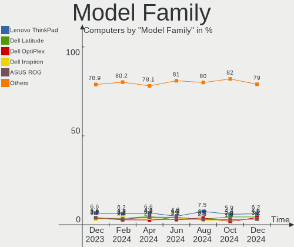
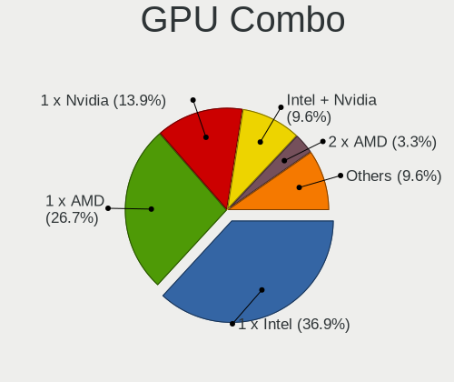

Linux in USA - Hardware Trends
------------------------------

A project to identify most popular hardware characteristics and track their change
over time based on data collected by Linux users at https://Linux-Hardware.org.

Anyone can contribute to this report by the [hw-probe](https://github.com/linuxhw/hw-probe) tool:

    sudo -E hw-probe -all -upload

This is a report for all computer types. See also reports for [desktops](/Location/USA/Desktop/README.md) and [notebooks](/Location/USA/Notebook/README.md).

Period: Jun, 2023.

Contents
--------

* [ System ](#system)
  - [ OS                       ](#os)
  - [ OS Family                ](#os-family)
  - [ Kernel                   ](#kernel)
  - [ Kernel Family            ](#kernel-family)
  - [ Kernel Major Ver.        ](#kernel-major-ver)
  - [ Arch                     ](#arch)
  - [ DE                       ](#de)
  - [ Display Server           ](#display-server)
  - [ Display Manager          ](#display-manager)
  - [ OS Lang                  ](#os-lang)
  - [ Boot Mode                ](#boot-mode)
  - [ Filesystem               ](#filesystem)
  - [ Part. scheme             ](#part-scheme)
  - [ Dual Boot with Linux/BSD ](#dual-boot-with-linuxbsd)
  - [ Dual Boot (Win)          ](#dual-boot-win)

* [ Board ](#board)
  - [ Vendor                   ](#vendor)
  - [ Model                    ](#model)
  - [ Model Family             ](#model-family)
  - [ MFG Year                 ](#mfg-year)
  - [ Form Factor              ](#form-factor)
  - [ Secure Boot              ](#secure-boot)
  - [ Coreboot                 ](#coreboot)
  - [ RAM Size                 ](#ram-size)
  - [ RAM Used                 ](#ram-used)
  - [ Total Drives             ](#total-drives)
  - [ Has CD-ROM               ](#has-cd-rom)
  - [ Has Ethernet             ](#has-ethernet)
  - [ Has WiFi                 ](#has-wifi)
  - [ Has Bluetooth            ](#has-bluetooth)

* [ Location ](#location)
  - [ Country                  ](#country)
  - [ City                     ](#city)

* [ Drives ](#drives)
  - [ Drive Vendor             ](#drive-vendor)
  - [ Drive Model              ](#drive-model)
  - [ HDD Vendor               ](#hdd-vendor)
  - [ SSD Vendor               ](#ssd-vendor)
  - [ Drive Kind               ](#drive-kind)
  - [ Drive Connector          ](#drive-connector)
  - [ Drive Size               ](#drive-size)
  - [ Space Total              ](#space-total)
  - [ Space Used               ](#space-used)
  - [ Malfunc. Drives          ](#malfunc-drives)
  - [ Malfunc. Drive Vendor    ](#malfunc-drive-vendor)
  - [ Malfunc. HDD Vendor      ](#malfunc-hdd-vendor)
  - [ Malfunc. Drive Kind      ](#malfunc-drive-kind)
  - [ Failed Drives            ](#failed-drives)
  - [ Failed Drive Vendor      ](#failed-drive-vendor)
  - [ Drive Status             ](#drive-status)

* [ Storage controller ](#storage-controller)
  - [ Storage Vendor           ](#storage-vendor)
  - [ Storage Model            ](#storage-model)
  - [ Storage Kind             ](#storage-kind)

* [ Processor ](#processor)
  - [ CPU Vendor               ](#cpu-vendor)
  - [ CPU Model                ](#cpu-model)
  - [ CPU Model Family         ](#cpu-model-family)
  - [ CPU Cores                ](#cpu-cores)
  - [ CPU Sockets              ](#cpu-sockets)
  - [ CPU Threads              ](#cpu-threads)
  - [ CPU Op-Modes             ](#cpu-op-modes)
  - [ CPU Microcode            ](#cpu-microcode)
  - [ CPU Microarch            ](#cpu-microarch)

* [ Graphics ](#graphics)
  - [ GPU Vendor               ](#gpu-vendor)
  - [ GPU Model                ](#gpu-model)
  - [ GPU Combo                ](#gpu-combo)
  - [ GPU Driver               ](#gpu-driver)
  - [ GPU Memory               ](#gpu-memory)

* [ Monitor ](#monitor)
  - [ Monitor Vendor           ](#monitor-vendor)
  - [ Monitor Model            ](#monitor-model)
  - [ Monitor Resolution       ](#monitor-resolution)
  - [ Monitor Diagonal         ](#monitor-diagonal)
  - [ Monitor Width            ](#monitor-width)
  - [ Aspect Ratio             ](#aspect-ratio)
  - [ Monitor Area             ](#monitor-area)
  - [ Pixel Density            ](#pixel-density)
  - [ Multiple Monitors        ](#multiple-monitors)

* [ Network ](#network)
  - [ Net Controller Vendor    ](#net-controller-vendor)
  - [ Net Controller Model     ](#net-controller-model)
  - [ Wireless Vendor          ](#wireless-vendor)
  - [ Wireless Model           ](#wireless-model)
  - [ Ethernet Vendor          ](#ethernet-vendor)
  - [ Ethernet Model           ](#ethernet-model)
  - [ Net Controller Kind      ](#net-controller-kind)
  - [ Used Controller          ](#used-controller)
  - [ NICs                     ](#nics)
  - [ IPv6                     ](#ipv6)

* [ Bluetooth ](#bluetooth)
  - [ Bluetooth Vendor         ](#bluetooth-vendor)
  - [ Bluetooth Model          ](#bluetooth-model)

* [ Sound ](#sound)
  - [ Sound Vendor             ](#sound-vendor)
  - [ Sound Model              ](#sound-model)

* [ Memory ](#memory)
  - [ Memory Vendor            ](#memory-vendor)
  - [ Memory Model             ](#memory-model)
  - [ Memory Kind              ](#memory-kind)
  - [ Memory Form Factor       ](#memory-form-factor)
  - [ Memory Size              ](#memory-size)
  - [ Memory Speed             ](#memory-speed)

* [ Printers & scanners ](#printers--scanners)
  - [ Printer Vendor           ](#printer-vendor)
  - [ Printer Model            ](#printer-model)
  - [ Scanner Vendor           ](#scanner-vendor)
  - [ Scanner Model            ](#scanner-model)

* [ Camera ](#camera)
  - [ Camera Vendor            ](#camera-vendor)
  - [ Camera Model             ](#camera-model)

* [ Security ](#security)
  - [ Fingerprint Vendor       ](#fingerprint-vendor)
  - [ Fingerprint Model        ](#fingerprint-model)
  - [ Chipcard Vendor          ](#chipcard-vendor)
  - [ Chipcard Model           ](#chipcard-model)

* [ Unsupported ](#unsupported)
  - [ Unsupported Devices      ](#unsupported-devices)
  - [ Unsupported Device Types ](#unsupported-device-types)

System
------

OS
--

Installed operating systems

| Name                         | Computers | Percent |
|------------------------------|-----------|---------|
| Ubuntu 22.04                 | 125       | 13.14%  |
| Fedora 38                    | 82        | 8.62%   |
| Linux Mint 21.1              | 68        | 7.15%   |
| Pop!_OS 22.04                | 61        | 6.41%   |
| Debian 12                    | 50        | 5.26%   |
| Ubuntu 23.04                 | 46        | 4.84%   |
| ArcoLinux Rolling            | 45        | 4.73%   |
| Arch Rolling                 | 32        | 3.36%   |
| Zorin 16                     | 30        | 3.15%   |
| Ubuntu 20.04                 | 23        | 2.42%   |
| KDE neon 22.04               | 22        | 2.31%   |
| Debian 11                    | 22        | 2.31%   |
| OpenMandriva 23.03           | 18        | 1.89%   |
| openSUSE Tumbleweed-XXXXXXXX | 17        | 1.79%   |
| OpenMandriva 23.06           | 17        | 1.79%   |
| SteamOS 3.4.8                | 15        | 1.58%   |
| Kali 2023.2                  | 14        | 1.47%   |
| Kubuntu 22.04                | 13        | 1.37%   |
| Ubuntu 22.10                 | 12        | 1.26%   |
| Nobara 37                    | 12        | 1.26%   |
| Kubuntu 23.04                | 12        | 1.26%   |
| Parrot 5.3                   | 10        | 1.05%   |
| Manjaro 23.0.0               | 10        | 1.05%   |
| Manjaro                      | 10        | 1.05%   |
| Gentoo 2.13                  | 9         | 0.95%   |
| Xubuntu 22.04                | 8         | 0.84%   |
| Linux Mint 20.3              | 8         | 0.84%   |
| ChimeraOS 42                 | 8         | 0.84%   |
| Linux Mint 21                | 7         | 0.74%   |
| EndeavourOS Rolling          | 7         | 0.74%   |
| SteamOS 3.4                  | 5         | 0.53%   |
| OpenMandriva 23.01           | 5         | 0.53%   |
| Nobara 38                    | 5         | 0.53%   |
| Elementary 7                 | 5         | 0.53%   |
| Ubuntu 18.04                 | 4         | 0.42%   |
| SteamOS 3.4.6                | 4         | 0.42%   |
| openSUSE Leap-15.5           | 4         | 0.42%   |
| LMDE 5                       | 4         | 0.42%   |
| Fedora 37                    | 4         | 0.42%   |
| Xubuntu 23.04                | 3         | 0.32%   |

OS Family
---------

OS without a version

| Name          | Computers | Percent |
|---------------|-----------|---------|
| Ubuntu        | 212       | 22.29%  |
| Fedora        | 89        | 9.36%   |
| Linux Mint    | 87        | 9.15%   |
| Debian        | 75        | 7.89%   |
| Pop!_OS       | 61        | 6.41%   |
| ArcoLinux     | 46        | 4.84%   |
| OpenMandriva  | 44        | 4.63%   |
| Arch          | 32        | 3.36%   |
| Zorin         | 31        | 3.26%   |
| SteamOS       | 30        | 3.15%   |
| Kubuntu       | 27        | 2.84%   |
| openSUSE      | 22        | 2.31%   |
| Manjaro       | 22        | 2.31%   |
| KDE neon      | 22        | 2.31%   |
| Nobara        | 18        | 1.89%   |
| Kali          | 15        | 1.58%   |
| Xubuntu       | 13        | 1.37%   |
| Parrot        | 10        | 1.05%   |
| Gentoo        | 9         | 0.95%   |
| ChimeraOS     | 8         | 0.84%   |
| EndeavourOS   | 7         | 0.74%   |
| Elementary    | 6         | 0.63%   |
| Ubuntu Unity  | 4         | 0.42%   |
| Lubuntu       | 4         | 0.42%   |
| LMDE          | 4         | 0.42%   |
| Ubuntu Studio | 3         | 0.32%   |
| Ubuntu MATE   | 3         | 0.32%   |
| Ubuntu Budgie | 3         | 0.32%   |
| TUXEDO OS     | 3         | 0.32%   |
| RHEL          | 3         | 0.32%   |
| MX            | 3         | 0.32%   |
| Garuda Linux  | 3         | 0.32%   |
| CachyOS       | 3         | 0.32%   |
| Siduction     | 2         | 0.21%   |
| Reborn OS     | 2         | 0.21%   |
| Oracle Linux  | 2         | 0.21%   |
| NixOS         | 2         | 0.21%   |
| Arch ARM      | 2         | 0.21%   |
| Alpine        | 2         | 0.21%   |
| Xero          | 1         | 0.11%   |

Kernel
------

Version of the Linux kernel

| Version                     | Computers | Percent |
|-----------------------------|-----------|---------|
| 5.19.0-43-generic           | 77        | 8.1%    |
| 5.15.0-73-generic           | 66        | 6.94%   |
| 6.2.6-76060206-generic      | 54        | 5.68%   |
| 5.19.0-45-generic           | 50        | 5.26%   |
| 6.1.0-9-amd64               | 44        | 4.63%   |
| 5.15.0-75-generic           | 42        | 4.42%   |
| 6.2.0-20-generic            | 34        | 3.58%   |
| 6.2.0-23-generic            | 27        | 2.84%   |
| 6.3.8-200.fc38.x86_64       | 23        | 2.42%   |
| 5.13.0-valve36-1-neptune    | 21        | 2.21%   |
| 6.3.5-200.fc38.x86_64       | 18        | 1.89%   |
| 6.2.6-desktop-1omv2390      | 18        | 1.89%   |
| 6.3.5-desktop-3omv2390      | 17        | 1.79%   |
| 6.1.0-kali9-amd64           | 14        | 1.47%   |
| 6.3.7-200.fc38.x86_64       | 13        | 1.37%   |
| 5.4.0-150-generic           | 13        | 1.37%   |
| 5.10.0-23-amd64             | 13        | 1.37%   |
| 5.15.0-72-generic           | 12        | 1.26%   |
| 6.3.8-arch1-1               | 11        | 1.16%   |
| 6.3.7-arch1-1               | 10        | 1.05%   |
| 6.3.9-arch1-1               | 9         | 0.95%   |
| 6.3.6-200.fc38.x86_64       | 9         | 0.95%   |
| 6.1.31-2-MANJARO            | 9         | 0.95%   |
| 6.1.0-1parrot1-amd64        | 9         | 0.95%   |
| 6.1.27-1-lts                | 8         | 0.84%   |
| 6.3.7-200.fsync.fc37.x86_64 | 7         | 0.74%   |
| 6.3.7-1-default             | 6         | 0.63%   |
| 6.3.6-zen1-1-zen            | 6         | 0.63%   |
| 6.3.6-arch1-1               | 6         | 0.63%   |
| 6.3.5-zen1-1-zen            | 6         | 0.63%   |
| 6.3.5-arch1-1               | 6         | 0.63%   |
| 6.3.4-201.fc38.x86_64       | 6         | 0.63%   |
| 6.3.4-1-default             | 6         | 0.63%   |
| 5.19.0-46-generic           | 6         | 0.63%   |
| 6.3.6-1-default             | 5         | 0.53%   |
| 6.3.5-2-MANJARO             | 5         | 0.53%   |
| 6.2.9-300.fc38.x86_64       | 5         | 0.53%   |
| 6.1.1-desktop-1omv2290      | 5         | 0.53%   |
| 5.19.0-42-generic           | 5         | 0.53%   |
| 5.19.0-32-generic           | 5         | 0.53%   |

Kernel Family
-------------

Linux kernel without a distro release

| Version  | Computers | Percent |
|----------|-----------|---------|
| 5.19.0   | 153       | 16.09%  |
| 5.15.0   | 151       | 15.88%  |
| 6.1.0    | 75        | 7.89%   |
| 6.2.6    | 73        | 7.68%   |
| 6.2.0    | 73        | 7.68%   |
| 6.3.5    | 60        | 6.31%   |
| 6.3.8    | 45        | 4.73%   |
| 6.3.7    | 42        | 4.42%   |
| 6.3.6    | 30        | 3.15%   |
| 5.13.0   | 26        | 2.73%   |
| 5.10.0   | 25        | 2.63%   |
| 5.4.0    | 24        | 2.52%   |
| 6.3.4    | 18        | 1.89%   |
| 6.3.9    | 16        | 1.68%   |
| 6.1.31   | 15        | 1.58%   |
| 6.3.3    | 9         | 0.95%   |
| 6.1.27   | 9         | 0.95%   |
| 6.2.15   | 7         | 0.74%   |
| 6.4.0    | 6         | 0.63%   |
| 6.0.0    | 6         | 0.63%   |
| 6.2.9    | 5         | 0.53%   |
| 6.1.1    | 5         | 0.53%   |
| 6.3.1    | 4         | 0.42%   |
| 6.1.34   | 4         | 0.42%   |
| 6.1.21   | 4         | 0.42%   |
| 5.14.21  | 4         | 0.42%   |
| 6.3.10   | 3         | 0.32%   |
| 5.15.107 | 3         | 0.32%   |
| 5.14.0   | 3         | 0.32%   |
| 6.3.2    | 2         | 0.21%   |
| 6.3.0    | 2         | 0.21%   |
| 6.2.16   | 2         | 0.21%   |
| 6.2.10   | 2         | 0.21%   |
| 6.1.35   | 2         | 0.21%   |
| 6.1.33   | 2         | 0.21%   |
| 6.1.24   | 2         | 0.21%   |
| 6.0.2    | 2         | 0.21%   |
| 6.0.12   | 2         | 0.21%   |
| 5.18.12  | 2         | 0.21%   |
| 5.10.136 | 2         | 0.21%   |

Kernel Major Ver.
-----------------

Linux kernel major version

| Version | Computers | Percent |
|---------|-----------|---------|
| 6.3     | 231       | 24.29%  |
| 6.2     | 166       | 17.46%  |
| 5.15    | 156       | 16.4%   |
| 5.19    | 154       | 16.19%  |
| 6.1     | 122       | 12.83%  |
| 5.10    | 30        | 3.15%   |
| 5.13    | 26        | 2.73%   |
| 5.4     | 24        | 2.52%   |
| 6.0     | 12        | 1.26%   |
| 5.14    | 7         | 0.74%   |
| 6.4     | 6         | 0.63%   |
| 5.16    | 3         | 0.32%   |
| 5.18    | 2         | 0.21%   |
| 4.4     | 2         | 0.21%   |
| 4.19    | 2         | 0.21%   |
| 4.18    | 2         | 0.21%   |
| 4.15    | 2         | 0.21%   |
| 5.9     | 1         | 0.11%   |
| 5.6     | 1         | 0.11%   |
| 5.17    | 1         | 0.11%   |
| 4.9     | 1         | 0.11%   |

Arch
----

OS architecture (x86_64, i586, etc.)

| Name    | Computers | Percent |
|---------|-----------|---------|
| x86_64  | 938       | 98.63%  |
| aarch64 | 6         | 0.63%   |
| i686    | 5         | 0.53%   |
| armv7l  | 2         | 0.21%   |

DE
--

Desktop Environment

| Name             | Computers | Percent |
|------------------|-----------|---------|
| GNOME            | 421       | 44.27%  |
| KDE5             | 236       | 24.82%  |
| X-Cinnamon       | 76        | 7.99%   |
| XFCE             | 72        | 7.57%   |
| Unknown          | 60        | 6.31%   |
| MATE             | 31        | 3.26%   |
| LXQt             | 8         | 0.84%   |
| GNOME Classic    | 8         | 0.84%   |
| Pantheon         | 6         | 0.63%   |
| Budgie           | 6         | 0.63%   |
| i3               | 5         | 0.53%   |
| Hyprland         | 5         | 0.53%   |
| Cinnamon         | 4         | 0.42%   |
| Unity            | 3         | 0.32%   |
| sway             | 1         | 0.11%   |
| Openbox          | 1         | 0.11%   |
| LXDE             | 1         | 0.11%   |
| lightdm-xsession | 1         | 0.11%   |
| LeftWM           | 1         | 0.11%   |
| KDE              | 1         | 0.11%   |
| icewm            | 1         | 0.11%   |
| GNOME Flashback  | 1         | 0.11%   |
| Deepin           | 1         | 0.11%   |
| bspwm            | 1         | 0.11%   |

Display Server
--------------

X11 or Wayland

| Name    | Computers | Percent |
|---------|-----------|---------|
| X11     | 582       | 61.2%   |
| Wayland | 300       | 31.55%  |
| Unknown | 47        | 4.94%   |
| Tty     | 22        | 2.31%   |

Display Manager
---------------

SDDM, LightDM, etc.

| Name    | Computers | Percent |
|---------|-----------|---------|
| Unknown | 414       | 43.53%  |
| GDM3    | 191       | 20.08%  |
| SDDM    | 158       | 16.61%  |
| LightDM | 123       | 12.93%  |
| GDM     | 58        | 6.1%    |
| SLiM    | 2         | 0.21%   |
| LXDM    | 2         | 0.21%   |
| GREETD  | 2         | 0.21%   |
| EMPTTY  | 1         | 0.11%   |

OS Lang
-------

Language

| Lang    | Computers | Percent |
|---------|-----------|---------|
| en_US   | 889       | 93.48%  |
| Unknown | 33        | 3.47%   |
| C       | 15        | 1.58%   |
| zh_CN   | 5         | 0.53%   |
| en_GB   | 2         | 0.21%   |
| en_CA   | 2         | 0.21%   |
| n_US    | 1         | 0.11%   |
| es_VE   | 1         | 0.11%   |
| en_IN   | 1         | 0.11%   |
| de_DE   | 1         | 0.11%   |
| C.UTF8  | 1         | 0.11%   |

Boot Mode
---------

EFI or BIOS

| Mode | Computers | Percent |
|------|-----------|---------|
| BIOS | 484       | 50.89%  |
| EFI  | 467       | 49.11%  |

Filesystem
----------

Type of filesystem

| Type    | Computers | Percent |
|---------|-----------|---------|
| Ext4    | 486       | 51.1%   |
| Btrfs   | 227       | 23.87%  |
| Tmpfs   | 154       | 16.19%  |
| Overlay | 57        | 5.99%   |
| Xfs     | 13        | 1.37%   |
| Zfs     | 8         | 0.84%   |
| F2fs    | 2         | 0.21%   |
| Unknown | 2         | 0.21%   |
| Rootfs  | 1         | 0.11%   |
| Jfs     | 1         | 0.11%   |

Part. scheme
------------

Scheme of partitioning

| Type    | Computers | Percent |
|---------|-----------|---------|
| GPT     | 523       | 54.99%  |
| Unknown | 365       | 38.38%  |
| MBR     | 63        | 6.62%   |

Dual Boot with Linux/BSD
------------------------

Hosting more than one Linux/BSD

| Dual boot | Computers | Percent |
|-----------|-----------|---------|
| No        | 822       | 86.44%  |
| Yes       | 129       | 13.56%  |

Dual Boot (Win)
---------------

Hosting Linux and Windows

| Dual boot | Computers | Percent |
|-----------|-----------|---------|
| No        | 767       | 80.65%  |
| Yes       | 184       | 19.35%  |

Board
-----

Vendor
------

Motherboard manufacturer

| Name                                 | Computers | Percent |
|--------------------------------------|-----------|---------|
| Dell                                 | 157       | 16.51%  |
| Hewlett-Packard                      | 154       | 16.19%  |
| ASUSTek Computer                     | 121       | 12.72%  |
| Lenovo                               | 118       | 12.41%  |
| MSI                                  | 78        | 8.2%    |
| Apple                                | 50        | 5.26%   |
| Gigabyte Technology                  | 46        | 4.84%   |
| Valve                                | 24        | 2.52%   |
| Acer                                 | 24        | 2.52%   |
| ASRock                               | 23        | 2.42%   |
| Google                               | 15        | 1.58%   |
| Intel                                | 14        | 1.47%   |
| Unknown                              | 10        | 1.05%   |
| Supermicro                           | 8         | 0.84%   |
| System76                             | 7         | 0.74%   |
| AZW                                  | 7         | 0.74%   |
| Toshiba                              | 6         | 0.63%   |
| Pegatron                             | 6         | 0.63%   |
| GPU Company                          | 6         | 0.63%   |
| Microsoft                            | 5         | 0.53%   |
| Foxconn                              | 5         | 0.53%   |
| Samsung Electronics                  | 4         | 0.42%   |
| Raspberry Pi Foundation              | 4         | 0.42%   |
| Sony                                 | 3         | 0.32%   |
| Razer                                | 3         | 0.32%   |
| Gateway                              | 3         | 0.32%   |
| Biostar                              | 3         | 0.32%   |
| BESSTAR Tech                         | 3         | 0.32%   |
| ATOPNUC                              | 3         | 0.32%   |
| Alienware                            | 3         | 0.32%   |
| Shuttle                              | 2         | 0.21%   |
| Shenzhen Meigao Electronic Equipment | 2         | 0.21%   |
| Notebook                             | 2         | 0.21%   |
| GEEKOM                               | 2         | 0.21%   |
| Framework                            | 2         | 0.21%   |
| ASRockRack                           | 2         | 0.21%   |
| AMI                                  | 2         | 0.21%   |
| ZOTAC                                | 1         | 0.11%   |
| XFX                                  | 1         | 0.11%   |
| TYAN Computer                        | 1         | 0.11%   |

Model
-----

Motherboard model

| Name                                            | Computers | Percent |
|-------------------------------------------------|-----------|---------|
| Valve Jupiter                                   | 24        | 2.52%   |
| Unknown                                         | 13        | 1.37%   |
| Lenovo ThinkCentre M55p 8808D8U                 | 12        | 1.26%   |
| Apple MacBookAir7,2                             | 8         | 0.84%   |
| MSI MS-7C95                                     | 6         | 0.63%   |
| MSI MS-7C02                                     | 6         | 0.63%   |
| Dell OptiPlex 7010                              | 6         | 0.63%   |
| MSI MS-7C56                                     | 5         | 0.53%   |
| MSI MS-7C37                                     | 5         | 0.53%   |
| HP Notebook                                     | 5         | 0.53%   |
| Apple MacBookPro9,2                             | 5         | 0.53%   |
| Dell OptiPlex 9020                              | 4         | 0.42%   |
| ASUS TUF Gaming X570-PLUS                       | 4         | 0.42%   |
| MSI MS-7B17                                     | 3         | 0.32%   |
| MSI MS-7A71                                     | 3         | 0.32%   |
| Lenovo IdeaPadFlex 5 14ITL05 82HS               | 3         | 0.32%   |
| Gigabyte Z390 AORUS PRO WIFI                    | 3         | 0.32%   |
| Gigabyte GA-78LMT-USB3 6.0                      | 3         | 0.32%   |
| Dell OptiPlex 790                               | 3         | 0.32%   |
| Dell OptiPlex 3020                              | 3         | 0.32%   |
| Dell Latitude E7470                             | 3         | 0.32%   |
| Dell Latitude E6420                             | 3         | 0.32%   |
| Dell Inspiron 5515                              | 3         | 0.32%   |
| Dell Inspiron 3501                              | 3         | 0.32%   |
| AZW GTR                                         | 3         | 0.32%   |
| ATOPNUC MA90                                    | 3         | 0.32%   |
| ASUS ROG STRIX B450-F GAMING                    | 3         | 0.32%   |
| Acer Aspire E5-575G                             | 3         | 0.32%   |
| System76 Oryx Pro                               | 2         | 0.21%   |
| System76 Gazelle                                | 2         | 0.21%   |
| Shenzhen Meigao Electronic Equipment UM773 Lite | 2         | 0.21%   |
| MSI MS-7721                                     | 2         | 0.21%   |
| Lenovo Yoga 6 13ALC7 82UD                       | 2         | 0.21%   |
| Lenovo ThinkPad L13 Yoga Gen 2 20VK0019US       | 2         | 0.21%   |
| Lenovo IdeaPad Gaming 3 15ACH6 82K2             | 2         | 0.21%   |
| Lenovo 70A4000HUX ThinkServer TS140             | 2         | 0.21%   |
| HP Z420 Workstation                             | 2         | 0.21%   |
| HP Victus by 15L Gaming Desktop TG02-0xxx       | 2         | 0.21%   |
| HP ProBook 650 G5                               | 2         | 0.21%   |
| HP Pavilion dv6                                 | 2         | 0.21%   |

Model Family
------------

Motherboard model prefix

| Name               | Computers | Percent |
|--------------------|-----------|---------|
| Lenovo ThinkPad    | 53        | 5.57%   |
| Dell Inspiron      | 43        | 4.52%   |
| Dell OptiPlex      | 32        | 3.36%   |
| ASUS ROG           | 32        | 3.36%   |
| Dell Latitude      | 27        | 2.84%   |
| Valve Jupiter      | 24        | 2.52%   |
| Dell Precision     | 24        | 2.52%   |
| Lenovo ThinkCentre | 23        | 2.42%   |
| HP Pavilion        | 21        | 2.21%   |
| HP EliteBook       | 21        | 2.21%   |
| ASUS PRIME         | 18        | 1.89%   |
| HP Laptop          | 17        | 1.79%   |
| Dell XPS           | 15        | 1.58%   |
| Lenovo IdeaPad     | 14        | 1.47%   |
| Acer Aspire        | 14        | 1.47%   |
| HP Compaq          | 13        | 1.37%   |
| Unknown            | 13        | 1.37%   |
| HP ENVY            | 11        | 1.16%   |
| ASUS TUF           | 11        | 1.16%   |
| Apple MacBookAir7  | 10        | 1.05%   |
| ASUS VivoBook      | 9         | 0.95%   |
| HP EliteDesk       | 8         | 0.84%   |
| MSI MS-7C95        | 6         | 0.63%   |
| MSI MS-7C02        | 6         | 0.63%   |
| Dell PowerEdge     | 6         | 0.63%   |
| MSI MS-7C56        | 5         | 0.53%   |
| MSI MS-7C37        | 5         | 0.53%   |
| Microsoft Surface  | 5         | 0.53%   |
| HP ZBook           | 5         | 0.53%   |
| HP Stream          | 5         | 0.53%   |
| HP Spectre         | 5         | 0.53%   |
| HP OMEN            | 5         | 0.53%   |
| HP Notebook        | 5         | 0.53%   |
| Apple MacBookPro9  | 5         | 0.53%   |
| Toshiba Satellite  | 4         | 0.42%   |
| RPi Raspberry      | 4         | 0.42%   |
| Lenovo Yoga        | 4         | 0.42%   |
| Lenovo Legion      | 4         | 0.42%   |
| Lenovo IdeaPadFlex | 4         | 0.42%   |
| HP ProBook         | 4         | 0.42%   |

MFG Year
--------

Motherboard manufacture year

| Year    | Computers | Percent |
|---------|-----------|---------|
| 2022    | 126       | 13.25%  |
| 2020    | 93        | 9.78%   |
| 2019    | 77        | 8.1%    |
| 2021    | 76        | 7.99%   |
| 2018    | 76        | 7.99%   |
| 2013    | 62        | 6.52%   |
| 2015    | 55        | 5.78%   |
| 2012    | 49        | 5.15%   |
| 2023    | 48        | 5.05%   |
| 2016    | 48        | 5.05%   |
| 2011    | 46        | 4.84%   |
| 2017    | 45        | 4.73%   |
| 2014    | 41        | 4.31%   |
| 2010    | 31        | 3.26%   |
| 2009    | 28        | 2.94%   |
| 2008    | 21        | 2.21%   |
| 2007    | 20        | 2.1%    |
| Unknown | 8         | 0.84%   |
| 2005    | 1         | 0.11%   |

Form Factor
-----------

Physical design of the computer

| Name           | Computers | Percent |
|----------------|-----------|---------|
| Notebook       | 426       | 44.79%  |
| Desktop        | 397       | 41.75%  |
| Convertible    | 50        | 5.26%   |
| Mini pc        | 25        | 2.63%   |
| Server         | 19        | 2%      |
| All in one     | 18        | 1.89%   |
| System on chip | 8         | 0.84%   |
| Tablet         | 8         | 0.84%   |

Secure Boot
-----------

Enabled or disabled

| State    | Computers | Percent |
|----------|-----------|---------|
| Disabled | 896       | 94.22%  |
| Enabled  | 55        | 5.78%   |

Coreboot
--------

Have coreboot on board

| Used | Computers | Percent |
|------|-----------|---------|
| No   | 932       | 98%     |
| Yes  | 19        | 2%      |

RAM Size
--------

Total RAM memory

| Size in GB      | Computers | Percent |
|-----------------|-----------|---------|
| 4.01-8.0        | 191       | 20.08%  |
| 16.01-24.0      | 189       | 19.87%  |
| 8.01-16.0       | 169       | 17.77%  |
| 32.01-64.0      | 158       | 16.61%  |
| 3.01-4.0        | 114       | 11.99%  |
| 64.01-256.0     | 61        | 6.41%   |
| 24.01-32.0      | 30        | 3.15%   |
| 1.01-2.0        | 16        | 1.68%   |
| 2.01-3.0        | 11        | 1.16%   |
| More than 256.0 | 9         | 0.95%   |
| 0.51-1.0        | 3         | 0.32%   |

RAM Used
--------

Used RAM memory

| Used GB     | Computers | Percent |
|-------------|-----------|---------|
| 1.01-2.0    | 245       | 25.76%  |
| 2.01-3.0    | 223       | 23.45%  |
| 4.01-8.0    | 213       | 22.4%   |
| 3.01-4.0    | 147       | 15.46%  |
| 8.01-16.0   | 71        | 7.47%   |
| 0.51-1.0    | 23        | 2.42%   |
| 0.01-0.5    | 9         | 0.95%   |
| 16.01-24.0  | 8         | 0.84%   |
| 32.01-64.0  | 6         | 0.63%   |
| 24.01-32.0  | 3         | 0.32%   |
| 64.01-256.0 | 2         | 0.21%   |
| 0           | 1         | 0.11%   |

Total Drives
------------

Number of drives on board

| Drives | Computers | Percent |
|--------|-----------|---------|
| 1      | 512       | 53.84%  |
| 2      | 272       | 28.6%   |
| 3      | 83        | 8.73%   |
| 4      | 39        | 4.1%    |
| 5      | 20        | 2.1%    |
| 6      | 6         | 0.63%   |
| 0      | 5         | 0.53%   |
| 7      | 4         | 0.42%   |
| 8      | 3         | 0.32%   |
| 12     | 2         | 0.21%   |
| 47     | 1         | 0.11%   |
| 21     | 1         | 0.11%   |
| 19     | 1         | 0.11%   |
| 14     | 1         | 0.11%   |
| 10     | 1         | 0.11%   |

Has CD-ROM
----------

Has CD-ROM on board

| Presented | Computers | Percent |
|-----------|-----------|---------|
| No        | 665       | 69.93%  |
| Yes       | 286       | 30.07%  |

Has Ethernet
------------

Has Ethernet on board

| Presented | Computers | Percent |
|-----------|-----------|---------|
| Yes       | 788       | 82.86%  |
| No        | 163       | 17.14%  |

Has WiFi
--------

Has WiFi module

| Presented | Computers | Percent |
|-----------|-----------|---------|
| Yes       | 770       | 80.97%  |
| No        | 181       | 19.03%  |

Has Bluetooth
-------------

Has Bluetooth module

| Presented | Computers | Percent |
|-----------|-----------|---------|
| Yes       | 649       | 68.24%  |
| No        | 302       | 31.76%  |

Location
--------

Country
-------

Geographic location (country)

| Country | Computers | Percent |
|---------|-----------|---------|
| USA     | 951       | 100%    |

City
----

Geographic location (city)

| City          | Computers | Percent |
|---------------|-----------|---------|
| Bangor        | 31        | 3.26%   |
| Seattle       | 22        | 2.31%   |
| New York      | 18        | 1.89%   |
| Atlanta       | 11        | 1.16%   |
| Portland      | 10        | 1.05%   |
| Houston       | 9         | 0.95%   |
| Denver        | 9         | 0.95%   |
| Dallas        | 9         | 0.95%   |
| Springfield   | 8         | 0.84%   |
| San Francisco | 7         | 0.74%   |
| San Antonio   | 7         | 0.74%   |
| Los Angeles   | 7         | 0.74%   |
| Las Vegas     | 7         | 0.74%   |
| Jacksonville  | 7         | 0.74%   |
| Redmond       | 6         | 0.63%   |
| Phoenix       | 6         | 0.63%   |
| Omaha         | 6         | 0.63%   |
| Cleveland     | 6         | 0.63%   |
| Austin        | 6         | 0.63%   |
| Wichita       | 5         | 0.53%   |
| Washington    | 5         | 0.53%   |
| South Bend    | 5         | 0.53%   |
| Philadelphia  | 5         | 0.53%   |
| Minneapolis   | 5         | 0.53%   |
| Miami         | 5         | 0.53%   |
| Manchester    | 5         | 0.53%   |
| Kansas City   | 5         | 0.53%   |
| Flushing      | 5         | 0.53%   |
| Charlotte     | 5         | 0.53%   |
| Spokane       | 4         | 0.42%   |
| Scottsdale    | 4         | 0.42%   |
| San Jose      | 4         | 0.42%   |
| San Diego     | 4         | 0.42%   |
| Saint Paul    | 4         | 0.42%   |
| Rochester     | 4         | 0.42%   |
| Orlando       | 4         | 0.42%   |
| Oakland       | 4         | 0.42%   |
| Nashville     | 4         | 0.42%   |
| Milwaukee     | 4         | 0.42%   |
| Grand Rapids  | 4         | 0.42%   |

Drives
------

Drive Vendor
------------

Hard drive vendors

| Vendor                      | Computers | Drives | Percent |
|-----------------------------|-----------|--------|---------|
| Samsung Electronics         | 252       | 319    | 17.11%  |
| Seagate                     | 172       | 246    | 11.68%  |
| WDC                         | 170       | 221    | 11.54%  |
| SanDisk                     | 112       | 118    | 7.6%    |
| Unknown                     | 79        | 86     | 5.36%   |
| Toshiba                     | 77        | 85     | 5.23%   |
| SK hynix                    | 54        | 59     | 3.67%   |
| Crucial                     | 47        | 64     | 3.19%   |
| Hitachi                     | 39        | 47     | 2.65%   |
| Kingston                    | 34        | 38     | 2.31%   |
| Micron Technology           | 31        | 36     | 2.1%    |
| Apple                       | 30        | 32     | 2.04%   |
| Intel                       | 29        | 32     | 1.97%   |
| Phison Electronics          | 25        | 27     | 1.7%    |
| Kingston Technology Company | 23        | 24     | 1.56%   |
| PNY                         | 20        | 20     | 1.36%   |
| KIOXIA                      | 20        | 20     | 1.36%   |
| Micron/Crucial Technology   | 19        | 21     | 1.29%   |
| HGST                        | 18        | 30     | 1.22%   |
| SPCC                        | 17        | 23     | 1.15%   |
| China                       | 14        | 15     | 0.95%   |
| Unknown                     | 12        | 13     | 0.81%   |
| SABRENT                     | 10        | 11     | 0.68%   |
| Team                        | 9         | 11     | 0.61%   |
| A-DATA Technology           | 9         | 10     | 0.61%   |
| OCZ                         | 8         | 9      | 0.54%   |
| Fujitsu                     | 8         | 8      | 0.54%   |
| Silicon Motion              | 7         | 7      | 0.48%   |
| T-FORCE                     | 6         | 6      | 0.41%   |
| KingFast                    | 5         | 5      | 0.34%   |
| ADATA Technology            | 5         | 6      | 0.34%   |
| Realtek Semiconductor       | 4         | 4      | 0.27%   |
| O2 Micro                    | 4         | 4      | 0.27%   |
| Netac                       | 4         | 4      | 0.27%   |
| Mushkin                     | 4         | 6      | 0.27%   |
| Lexar                       | 4         | 4      | 0.27%   |
| Yangtze Memory Technologies | 3         | 3      | 0.2%    |
| Transcend                   | 3         | 3      | 0.2%    |
| LITEON                      | 3         | 3      | 0.2%    |
| Inland                      | 3         | 3      | 0.2%    |

Drive Model
-----------

Hard drive models

| Model                                                 | Computers | Percent |
|-------------------------------------------------------|-----------|---------|
| Samsung NVMe SSD Controller SM981/PM981/PM983 250GB   | 45        | 2.78%   |
| Samsung NVMe SSD Controller PM9A1/PM9A3/980PRO 2TB    | 30        | 1.85%   |
| Unknown MMC Card  64GB                                | 17        | 1.05%   |
| Micron/Crucial P2 NVMe PCIe SSD 4TB                   | 15        | 0.93%   |
| Seagate ST2000DM008-2FR102 2TB                        | 14        | 0.86%   |
| Sandisk WD Blue SN550 NVMe SSD 1TB                    | 13        | 0.8%    |
| Sandisk WD Black SN750 / PC SN730 NVMe SSD 500GB      | 13        | 0.8%    |
| Samsung SSD 980 1TB                                   | 13        | 0.8%    |
| Unknown MMC Card  128GB                               | 12        | 0.74%   |
| Samsung SSD 860 EVO 500GB                             | 12        | 0.74%   |
| Samsung NVMe SSD Controller SM961/PM961/SM963 256GB   | 12        | 0.74%   |
| Kingston Company OM3PDP3 NVMe SSD 256GB               | 12        | 0.74%   |
| Unknown                                               | 12        | 0.74%   |
| Samsung SSD 870 EVO 1TB                               | 11        | 0.68%   |
| Seagate ST1000LM035-1RK172 1TB                        | 10        | 0.62%   |
| Samsung SSD 860 EVO 1TB                               | 10        | 0.62%   |
| Crucial CT1000MX500SSD1 1TB                           | 10        | 0.62%   |
| Unknown MMC Card  32GB                                | 9         | 0.56%   |
| Toshiba MQ04ABF100 1TB                                | 9         | 0.56%   |
| SABRENT Disk 1TB                                      | 9         | 0.56%   |
| Phison E12 NVMe Controller 1TB                        | 9         | 0.56%   |
| Apple SSD SM0128G 121GB                               | 9         | 0.56%   |
| Unknown MMC Card  512GB                               | 8         | 0.49%   |
| Seagate ST500DM002-1BD142 500GB                       | 8         | 0.49%   |
| Seagate ST1000DM010-2EP102 1TB                        | 8         | 0.49%   |
| Kingston SA400S37120G 120GB SSD                       | 8         | 0.49%   |
| Toshiba DT01ACA100 1TB                                | 7         | 0.43%   |
| Silicon Motion SM2263EN/SM2263XT SSD Controller 256GB | 7         | 0.43%   |
| Seagate ST1000DM003-1CH162 1TB                        | 7         | 0.43%   |
| Samsung SSD 870 EVO 500GB                             | 7         | 0.43%   |
| Samsung SSD 850 EVO 250GB                             | 7         | 0.43%   |
| Hitachi HDS728080PLA380 40Y9028LEN 80GB               | 7         | 0.43%   |
| Unknown SD/MMC/MS PRO 250GB                           | 6         | 0.37%   |
| Seagate ST4000DM004-2CV104 4TB                        | 6         | 0.37%   |
| Sandisk WD Black 2018/SN750 / PC SN720 NVMe SSD 500GB | 6         | 0.37%   |
| SanDisk NVMe SSD Drive 1TB                            | 6         | 0.37%   |
| WDC WDS500G2B0A-00SM50 500GB SSD                      | 5         | 0.31%   |
| WDC WD10EZEX-08WN4A0 1TB                              | 5         | 0.31%   |
| Toshiba MQ01ABD100 1TB                                | 5         | 0.31%   |
| Seagate ST2000DM006-2DM164 2TB                        | 5         | 0.31%   |

HDD Vendor
----------

Hard disk drive vendors

| Vendor              | Computers | Drives | Percent |
|---------------------|-----------|--------|---------|
| Seagate             | 170       | 240    | 36.88%  |
| WDC                 | 137       | 175    | 29.72%  |
| Toshiba             | 56        | 62     | 12.15%  |
| Hitachi             | 39        | 47     | 8.46%   |
| HGST                | 18        | 30     | 3.9%    |
| Samsung Electronics | 8         | 8      | 1.74%   |
| Fujitsu             | 8         | 8      | 1.74%   |
| Apple               | 7         | 7      | 1.52%   |
| Unknown             | 6         | 6      | 1.3%    |
| ASMT                | 3         | 6      | 0.65%   |
| USB3.0              | 2         | 4      | 0.43%   |
| ASMedia             | 2         | 2      | 0.43%   |
| USB                 | 1         | 1      | 0.22%   |
| SABRENT             | 1         | 2      | 0.22%   |
| Maxtor              | 1         | 1      | 0.22%   |
| LaCie               | 1         | 1      | 0.22%   |
| Fantom              | 1         | 1      | 0.22%   |

SSD Vendor
----------

Solid state drive vendors

| Vendor              | Computers | Drives | Percent |
|---------------------|-----------|--------|---------|
| Samsung Electronics | 114       | 132    | 26.7%   |
| Crucial             | 41        | 54     | 9.6%    |
| SanDisk             | 33        | 34     | 7.73%   |
| WDC                 | 31        | 36     | 7.26%   |
| Kingston            | 25        | 28     | 5.85%   |
| PNY                 | 20        | 20     | 4.68%   |
| Apple               | 16        | 16     | 3.75%   |
| SPCC                | 15        | 19     | 3.51%   |
| China               | 14        | 15     | 3.28%   |
| SK hynix            | 11        | 12     | 2.58%   |
| Intel               | 11        | 12     | 2.58%   |
| Team                | 9         | 11     | 2.11%   |
| Toshiba             | 8         | 8      | 1.87%   |
| OCZ                 | 8         | 9      | 1.87%   |
| A-DATA Technology   | 8         | 9      | 1.87%   |
| Micron Technology   | 7         | 10     | 1.64%   |
| T-FORCE             | 5         | 5      | 1.17%   |
| Transcend           | 3         | 3      | 0.7%    |
| LITEON              | 3         | 3      | 0.7%    |
| Lexar               | 3         | 3      | 0.7%    |
| Inland              | 3         | 3      | 0.7%    |
| Acer                | 3         | 3      | 0.7%    |
| SCY                 | 2         | 2      | 0.47%   |
| PNY CS90            | 2         | 2      | 0.47%   |
| Plextor             | 2         | 2      | 0.47%   |
| Patriot             | 2         | 2      | 0.47%   |
| Netac               | 2         | 2      | 0.47%   |
| Mushkin             | 2         | 2      | 0.47%   |
| KingFast            | 2         | 2      | 0.47%   |
| FORESEE             | 2         | 2      | 0.47%   |
| BHT                 | 2         | 2      | 0.47%   |
| Teclast             | 1         | 1      | 0.23%   |
| SUNEAST             | 1         | 1      | 0.23%   |
| SPCC M.2            | 1         | 1      | 0.23%   |
| Seagate             | 1         | 2      | 0.23%   |
| SATAFIRM            | 1         | 1      | 0.23%   |
| ORTIAL              | 1         | 1      | 0.23%   |
| OEM                 | 1         | 1      | 0.23%   |
| NGFF                | 1         | 1      | 0.23%   |
| MicroFrom           | 1         | 1      | 0.23%   |

Drive Kind
----------

HDD or SSD

| Kind    | Computers | Drives | Percent |
|---------|-----------|--------|---------|
| NVMe    | 442       | 579    | 34.08%  |
| HDD     | 390       | 601    | 30.07%  |
| SSD     | 362       | 489    | 27.91%  |
| MMC     | 80        | 87     | 6.17%   |
| Unknown | 23        | 26     | 1.77%   |

Drive Connector
---------------

SATA, SAS, NVMe, etc.

| Type | Computers | Drives | Percent |
|------|-----------|--------|---------|
| SATA | 615       | 995    | 51%     |
| NVMe | 436       | 564    | 36.15%  |
| MMC  | 80        | 87     | 6.63%   |
| SAS  | 75        | 136    | 6.22%   |

Drive Size
----------

Size of hard drive

| Size in TB | Computers | Drives | Percent |
|------------|-----------|--------|---------|
| 0.01-0.5   | 382       | 462    | 45.8%   |
| 0.51-1.0   | 245       | 317    | 29.38%  |
| 1.01-2.0   | 126       | 172    | 15.11%  |
| 3.01-4.0   | 30        | 38     | 3.6%    |
| 4.01-10.0  | 28        | 56     | 3.36%   |
| 2.01-3.0   | 18        | 19     | 2.16%   |
| 10.01-20.0 | 5         | 26     | 0.6%    |

Space Total
-----------

Amount of disk space available on the file system

| Size in GB     | Computers | Percent |
|----------------|-----------|---------|
| 251-500        | 193       | 20.29%  |
| 501-1000       | 187       | 19.66%  |
| 101-250        | 174       | 18.3%   |
| More than 3000 | 122       | 12.83%  |
| 1001-2000      | 90        | 9.46%   |
| Unknown        | 56        | 5.89%   |
| 1-20           | 47        | 4.94%   |
| 2001-3000      | 38        | 4%      |
| 51-100         | 23        | 2.42%   |
| 21-50          | 21        | 2.21%   |

Space Used
----------

Amount of used disk space

| Used GB        | Computers | Percent |
|----------------|-----------|---------|
| 1-20           | 266       | 27.97%  |
| 21-50          | 188       | 19.77%  |
| 101-250        | 109       | 11.46%  |
| 51-100         | 106       | 11.15%  |
| 251-500        | 70        | 7.36%   |
| 501-1000       | 62        | 6.52%   |
| Unknown        | 56        | 5.89%   |
| 1001-2000      | 39        | 4.1%    |
| More than 3000 | 31        | 3.26%   |
| 2001-3000      | 24        | 2.52%   |

Malfunc. Drives
---------------

Drive models with a malfunction

| Model                                                          | Computers | Drives | Percent |
|----------------------------------------------------------------|-----------|--------|---------|
| Samsung Electronics SSD 870 EVO 1TB                            | 4         | 11     | 4.65%   |
| Seagate ST1000LX015-1U7172 1TB                                 | 3         | 3      | 3.49%   |
| WDC WD1600AAJS-00B4A0 160GB                                    | 2         | 2      | 2.33%   |
| Toshiba MQ04ABF100 1TB                                         | 2         | 2      | 2.33%   |
| Seagate ST9500325AS 500GB                                      | 2         | 2      | 2.33%   |
| Seagate ST500DM002-1BD142 500GB                                | 2         | 2      | 2.33%   |
| Seagate ST1000LM035-1RK172 1TB                                 | 2         | 2      | 2.33%   |
| Samsung Electronics NVMe SSD Controller PM9A1/PM9A3/980PRO 2TB | 2         | 3      | 2.33%   |
| Crucial CT512MX100SSD1 512GB                                   | 2         | 2      | 2.33%   |
| WDC WDS100T2G0A-00JH30 1TB SSD                                 | 1         | 2      | 1.16%   |
| WDC WD5000AAKX-60U6AA0 500GB                                   | 1         | 1      | 1.16%   |
| WDC WD5000AAKX-08ERMA0 500GB                                   | 1         | 1      | 1.16%   |
| WDC WD400BD-60LRA0 40GB                                        | 1         | 1      | 1.16%   |
| WDC WD3200AAJS-22B4A0 320GB                                    | 1         | 1      | 1.16%   |
| WDC WD2500KS-00MJB0 250GB                                      | 1         | 1      | 1.16%   |
| WDC WD20SPZX-60UA7T0 2TB                                       | 1         | 1      | 1.16%   |
| WDC WD20EARS-00J2GB0 2TB                                       | 1         | 1      | 1.16%   |
| WDC WD2002FAEX-007BA0 2TB                                      | 1         | 1      | 1.16%   |
| WDC WD15EARS-00MVWB0 1TB                                       | 1         | 1      | 1.16%   |
| WDC WD10SPCX-08S8TT0 1TB                                       | 1         | 1      | 1.16%   |
| WDC WD10EURX-63C57Y0 1TB                                       | 1         | 1      | 1.16%   |
| WDC WD10EADS-00L5B1 1TB                                        | 1         | 1      | 1.16%   |
| WDC WD1001FALS-00J7B0 1TB                                      | 1         | 1      | 1.16%   |
| WDC WD Blue SA510 2.5 1TB SSD                                  | 1         | 1      | 1.16%   |
| Toshiba THNSNK256GCS8 SATA 256GB SSD                           | 1         | 1      | 1.16%   |
| Toshiba MQ01ABF050 500GB                                       | 1         | 1      | 1.16%   |
| Toshiba MQ01ABD100 1TB                                         | 1         | 1      | 1.16%   |
| Toshiba MQ01ABD075 752GB                                       | 1         | 1      | 1.16%   |
| Toshiba MK8052GSX 80GB                                         | 1         | 1      | 1.16%   |
| Toshiba MK6475GSX 640GB                                        | 1         | 1      | 1.16%   |
| Toshiba MK2555GSX 250GB                                        | 1         | 1      | 1.16%   |
| Toshiba DT01ACA200 2TB                                         | 1         | 1      | 1.16%   |
| Silicon Motion SM2263EN/SM2263XT SSD Controller 256GB          | 1         | 1      | 1.16%   |
| Seagate ST8000DM004-2CX188 8TB                                 | 1         | 2      | 1.16%   |
| Seagate ST500LT012-1DG142 500GB                                | 1         | 1      | 1.16%   |
| Seagate ST4000LM016-1N2170 4TB                                 | 1         | 1      | 1.16%   |
| Seagate ST4000DM004-2CV104 4TB                                 | 1         | 1      | 1.16%   |
| Seagate ST3808110AS 41N3267 LEN 80GB                           | 1         | 1      | 1.16%   |
| Seagate ST3500630AS 500GB                                      | 1         | 1      | 1.16%   |
| Seagate ST3500320AS 500GB                                      | 1         | 1      | 1.16%   |

Malfunc. Drive Vendor
---------------------

Vendors of faulty drives

| Vendor              | Computers | Drives | Percent |
|---------------------|-----------|--------|---------|
| Seagate             | 18        | 20     | 21.95%  |
| WDC                 | 16        | 18     | 19.51%  |
| Samsung Electronics | 10        | 20     | 12.2%   |
| Toshiba             | 9         | 10     | 10.98%  |
| Hitachi             | 7         | 7      | 8.54%   |
| Intel               | 4         | 5      | 4.88%   |
| Crucial             | 4         | 4      | 4.88%   |
| SanDisk             | 3         | 3      | 3.66%   |
| Kingston            | 2         | 2      | 2.44%   |
| HGST                | 2         | 2      | 2.44%   |
| Silicon Motion      | 1         | 1      | 1.22%   |
| ORTIAL              | 1         | 1      | 1.22%   |
| OCZ                 | 1         | 1      | 1.22%   |
| Micron Technology   | 1         | 4      | 1.22%   |
| Fujitsu             | 1         | 1      | 1.22%   |
| ASMedia             | 1         | 1      | 1.22%   |
| A-DATA Technology   | 1         | 1      | 1.22%   |

Malfunc. HDD Vendor
-------------------

Vendors of faulty HDD drives

| Vendor  | Computers | Drives | Percent |
|---------|-----------|--------|---------|
| Seagate | 18        | 20     | 35.29%  |
| WDC     | 14        | 15     | 27.45%  |
| Toshiba | 8         | 9      | 15.69%  |
| Hitachi | 7         | 7      | 13.73%  |
| HGST    | 2         | 2      | 3.92%   |
| Fujitsu | 1         | 1      | 1.96%   |
| ASMedia | 1         | 1      | 1.96%   |

Malfunc. Drive Kind
-------------------

Kinds of faulty drives

| Kind | Computers | Drives | Percent |
|------|-----------|--------|---------|
| HDD  | 48        | 55     | 60%     |
| SSD  | 28        | 41     | 35%     |
| NVMe | 4         | 5      | 5%      |

Failed Drives
-------------

Failed drive models

Zero info for selected period =(

Failed Drive Vendor
-------------------

Failed drive vendors

Zero info for selected period =(

Drive Status
------------

Number of failed and malfunc. drives

| Status   | Computers | Drives | Percent |
|----------|-----------|--------|---------|
| Detected | 591       | 1023   | 57.05%  |
| Works    | 370       | 658    | 35.71%  |
| Malfunc  | 75        | 101    | 7.24%   |

Storage controller
------------------

Storage Vendor
--------------

Storage controller vendors

| Vendor                         | Computers | Percent |
|--------------------------------|-----------|---------|
| Intel                          | 519       | 39.38%  |
| AMD                            | 228       | 17.3%   |
| Samsung Electronics            | 159       | 12.06%  |
| Sandisk                        | 88        | 6.68%   |
| SK hynix                       | 44        | 3.34%   |
| Kingston Technology Company    | 33        | 2.5%    |
| ASMedia Technology             | 29        | 2.2%    |
| Micron/Crucial Technology      | 27        | 2.05%   |
| Phison Electronics             | 26        | 1.97%   |
| Micron Technology              | 25        | 1.9%    |
| KIOXIA                         | 21        | 1.59%   |
| Nvidia                         | 17        | 1.29%   |
| Toshiba America Info Systems   | 12        | 0.91%   |
| Marvell Technology Group       | 10        | 0.76%   |
| Silicon Motion                 | 9         | 0.68%   |
| Broadcom / LSI                 | 8         | 0.61%   |
| JMicron Technology             | 7         | 0.53%   |
| Apple                          | 7         | 0.53%   |
| Realtek Semiconductor          | 6         | 0.46%   |
| ADATA Technology               | 6         | 0.46%   |
| O2 Micro                       | 4         | 0.3%    |
| Yangtze Memory Technologies    | 3         | 0.23%   |
| Union Memory (Shenzhen)        | 3         | 0.23%   |
| Solid State Storage Technology | 3         | 0.23%   |
| LSI Logic / Symbios Logic      | 3         | 0.23%   |
| Seagate Technology             | 2         | 0.15%   |
| MAXIO Technology (Hangzhou)    | 2         | 0.15%   |
| Lite-On Technology             | 2         | 0.15%   |
| INNOGRIT                       | 2         | 0.15%   |
| HighPoint Technologies         | 2         | 0.15%   |
| Hewlett-Packard                | 2         | 0.15%   |
| Biwin Storage Technology       | 2         | 0.15%   |
| Western Digital                | 1         | 0.08%   |
| Toshiba                        | 1         | 0.08%   |
| Solidigm                       | 1         | 0.08%   |
| Silicon Image                  | 1         | 0.08%   |
| Nextorage                      | 1         | 0.08%   |
| Netac Technology               | 1         | 0.08%   |
| Adaptec                        | 1         | 0.08%   |

Storage Model
-------------

Storage controller models

| Model                                                                          | Computers | Percent |
|--------------------------------------------------------------------------------|-----------|---------|
| AMD FCH SATA Controller [AHCI mode]                                            | 148       | 9.89%   |
| Samsung NVMe SSD Controller SM981/PM981/PM983                                  | 57        | 3.81%   |
| Intel Sunrise Point-LP SATA Controller [AHCI mode]                             | 41        | 2.74%   |
| Samsung NVMe SSD Controller PM9A1/PM9A3/980PRO                                 | 39        | 2.61%   |
| Intel 8 Series/C220 Series Chipset Family 6-port SATA Controller 1 [AHCI mode] | 38        | 2.54%   |
| AMD 500 Series Chipset SATA Controller                                         | 34        | 2.27%   |
| AMD 400 Series Chipset SATA Controller                                         | 34        | 2.27%   |
| Samsung NVMe SSD Controller 980                                                | 33        | 2.2%    |
| Intel Volume Management Device NVMe RAID Controller                            | 31        | 2.07%   |
| Intel 82801 Mobile SATA Controller [RAID mode]                                 | 28        | 1.87%   |
| SK hynix Gold P31/BC711/PC711 NVMe Solid State Drive                           | 26        | 1.74%   |
| ASMedia ASM1062 Serial ATA Controller                                          | 25        | 1.67%   |
| Intel SATA Controller [RAID mode]                                              | 23        | 1.54%   |
| AMD SB7x0/SB8x0/SB9x0 IDE Controller                                           | 23        | 1.54%   |
| Micron/Crucial P2 NVMe PCIe SSD                                                | 22        | 1.47%   |
| Intel Q170/Q150/B150/H170/H110/Z170/CM236 Chipset SATA Controller [AHCI Mode]  | 21        | 1.4%    |
| Intel 200 Series PCH SATA controller [AHCI mode]                               | 19        | 1.27%   |
| Intel 7 Series/C210 Series Chipset Family 6-port SATA Controller [AHCI mode]   | 18        | 1.2%    |
| Intel 7 Series Chipset Family 6-port SATA Controller [AHCI mode]               | 18        | 1.2%    |
| Intel 6 Series/C200 Series Chipset Family 6 port Desktop SATA AHCI Controller  | 18        | 1.2%    |
| SanDisk WD Black SN750 / PC SN730 NVMe SSD                                     | 17        | 1.14%   |
| Samsung NVMe SSD Controller SM961/PM961/SM963                                  | 17        | 1.14%   |
| Micron NVMe Storage Controller                                                 | 16        | 1.07%   |
| Intel Cannon Lake PCH SATA AHCI Controller                                     | 16        | 1.07%   |
| Intel 6 Series/C200 Series Chipset Family 6 port Mobile SATA AHCI Controller   | 16        | 1.07%   |
| AMD SB7x0/SB8x0/SB9x0 SATA Controller [IDE mode]                               | 16        | 1.07%   |
| Intel Celeron/Pentium Silver Processor SATA Controller                         | 15        | 1%      |
| KIOXIA NVMe SSD Controller BG4                                                 | 14        | 0.94%   |
| SanDisk WD Blue SN550 NVMe SSD                                                 | 13        | 0.87%   |
| AMD SB7x0/SB8x0/SB9x0 SATA Controller [AHCI mode]                              | 13        | 0.87%   |
| Kingston Company Company Non-Volatile memory controller                        | 12        | 0.8%    |
| Kingston Company OM3PDP3 NVMe SSD                                              | 12        | 0.8%    |
| Intel 5 Series/3400 Series Chipset 6 port SATA AHCI Controller                 | 12        | 0.8%    |
| SanDisk WD Black SN770 NVMe SSD                                                | 11        | 0.73%   |
| Samsung Electronics SATA controller                                            | 11        | 0.73%   |
| Intel Alder Lake-S PCH SATA Controller [AHCI Mode]                             | 11        | 0.73%   |
| Phison E12 NVMe Controller                                                     | 10        | 0.67%   |
| Intel Comet Lake SATA AHCI Controller                                          | 10        | 0.67%   |
| Intel Cannon Lake Mobile PCH SATA AHCI Controller                              | 10        | 0.67%   |
| Intel 82801IBM/IEM (ICH9M/ICH9M-E) 4 port SATA Controller [AHCI mode]          | 10        | 0.67%   |

Storage Kind
------------

Kind of storage controller (IDE, SATA, NVMe, SAS, ...)

| Kind | Computers | Percent |
|------|-----------|---------|
| SATA | 642       | 49.77%  |
| NVMe | 436       | 33.8%   |
| RAID | 104       | 8.06%   |
| IDE  | 96        | 7.44%   |
| SAS  | 10        | 0.78%   |
| SCSI | 2         | 0.16%   |

Processor
---------

CPU Vendor
----------

Processor vendors

| Vendor | Computers | Percent |
|--------|-----------|---------|
| Intel  | 652       | 68.56%  |
| AMD    | 291       | 30.6%   |
| ARM    | 8         | 0.84%   |

CPU Model
---------

Processor models

| Model                                   | Computers | Percent |
|-----------------------------------------|-----------|---------|
| AMD Custom APU 0405                     | 24        | 2.52%   |
| Intel Core i5-7200U CPU @ 2.50GHz       | 13        | 1.37%   |
| Intel Core 2 CPU 6400 @ 2.13GHz         | 12        | 1.26%   |
| AMD Ryzen 5 5600G with Radeon Graphics  | 10        | 1.05%   |
| Intel Core i7-8750H CPU @ 2.20GHz       | 9         | 0.95%   |
| Intel Core i5-5250U CPU @ 1.60GHz       | 9         | 0.95%   |
| Intel 11th Gen Core i7-1165G7 @ 2.80GHz | 9         | 0.95%   |
| Intel 11th Gen Core i3-1115G4 @ 3.00GHz | 9         | 0.95%   |
| Intel Core i7-3770 CPU @ 3.40GHz        | 8         | 0.84%   |
| Intel Core i7-10750H CPU @ 2.60GHz      | 7         | 0.74%   |
| Intel Core i5-6200U CPU @ 2.30GHz       | 7         | 0.74%   |
| Intel Celeron N4020 CPU @ 1.10GHz       | 7         | 0.74%   |
| Intel Celeron CPU N2840 @ 2.16GHz       | 7         | 0.74%   |
| AMD Ryzen 9 7950X 16-Core Processor     | 7         | 0.74%   |
| AMD Ryzen 9 5950X 16-Core Processor     | 7         | 0.74%   |
| AMD Ryzen 7 5700U with Radeon Graphics  | 7         | 0.74%   |
| AMD Ryzen 7 3700X 8-Core Processor      | 7         | 0.74%   |
| Intel Core i7-9750H CPU @ 2.60GHz       | 6         | 0.63%   |
| Intel Core i7-6700K CPU @ 4.00GHz       | 6         | 0.63%   |
| Intel Core i5-6500 CPU @ 3.20GHz        | 6         | 0.63%   |
| Intel Core i5-3470 CPU @ 3.20GHz        | 6         | 0.63%   |
| Intel Core i5-2520M CPU @ 2.50GHz       | 6         | 0.63%   |
| Intel Core i3-2120 CPU @ 3.30GHz        | 6         | 0.63%   |
| Intel 12th Gen Core i7-12700H           | 6         | 0.63%   |
| Intel 11th Gen Core i5-1135G7 @ 2.40GHz | 6         | 0.63%   |
| ARM Processor                           | 6         | 0.63%   |
| AMD Ryzen 7 5800X 8-Core Processor      | 6         | 0.63%   |
| Intel Core i7-6700HQ CPU @ 2.60GHz      | 5         | 0.53%   |
| Intel Core i5-6300U CPU @ 2.40GHz       | 5         | 0.53%   |
| Intel Celeron J4125 CPU @ 2.00GHz       | 5         | 0.53%   |
| AMD Ryzen 9 7900X 12-Core Processor     | 5         | 0.53%   |
| AMD Ryzen 9 5900X 12-Core Processor     | 5         | 0.53%   |
| AMD Ryzen 7 5700G with Radeon Graphics  | 5         | 0.53%   |
| AMD Ryzen 5 5600X 6-Core Processor      | 5         | 0.53%   |
| AMD Ryzen 5 5500                        | 5         | 0.53%   |
| AMD Ryzen 5 2600 Six-Core Processor     | 5         | 0.53%   |
| Intel Core i9-9900K CPU @ 3.60GHz       | 4         | 0.42%   |
| Intel Core i7-8650U CPU @ 1.90GHz       | 4         | 0.42%   |
| Intel Core i7-8565U CPU @ 1.80GHz       | 4         | 0.42%   |
| Intel Core i7-8550U CPU @ 1.80GHz       | 4         | 0.42%   |

CPU Model Family
----------------

Processor model prefix

| Model                   | Computers | Percent |
|-------------------------|-----------|---------|
| Intel Core i7           | 175       | 18.4%   |
| Intel Core i5           | 158       | 16.61%  |
| Other                   | 137       | 14.41%  |
| AMD Ryzen 7             | 57        | 5.99%   |
| AMD Ryzen 5             | 57        | 5.99%   |
| Intel Core i3           | 55        | 5.78%   |
| Intel Celeron           | 43        | 4.52%   |
| AMD Ryzen 9             | 43        | 4.52%   |
| Intel Core 2 Duo        | 28        | 2.94%   |
| Intel Xeon              | 27        | 2.84%   |
| AMD FX                  | 18        | 1.89%   |
| Intel Core 2            | 14        | 1.47%   |
| AMD Ryzen 3             | 13        | 1.37%   |
| Intel Pentium           | 10        | 1.05%   |
| Intel Pentium Dual-Core | 9         | 0.95%   |
| Intel Core i9           | 9         | 0.95%   |
| AMD A6                  | 9         | 0.95%   |
| AMD Ryzen 5 PRO         | 7         | 0.74%   |
| AMD A10                 | 7         | 0.74%   |
| AMD Athlon              | 6         | 0.63%   |
| Intel Pentium Silver    | 5         | 0.53%   |
| Intel Atom              | 5         | 0.53%   |
| AMD Phenom II X4        | 5         | 0.53%   |
| AMD Athlon II X2        | 5         | 0.53%   |
| AMD Ryzen 7 PRO         | 4         | 0.42%   |
| AMD A8                  | 4         | 0.42%   |
| Intel Xeon Gold         | 3         | 0.32%   |
| Intel Core m5           | 3         | 0.32%   |
| AMD Ryzen Threadripper  | 3         | 0.32%   |
| AMD E2                  | 3         | 0.32%   |
| Intel Xeon Platinum     | 2         | 0.21%   |
| ARM BCM                 | 2         | 0.21%   |
| AMD GX                  | 2         | 0.21%   |
| AMD EPYC                | 2         | 0.21%   |
| AMD E                   | 2         | 0.21%   |
| AMD Athlon II X3        | 2         | 0.21%   |
| AMD A4                  | 2         | 0.21%   |
| Intel Pentium Gold      | 1         | 0.11%   |
| Intel Pentium Dual      | 1         | 0.11%   |
| Intel Pentium 4         | 1         | 0.11%   |

CPU Cores
---------

Number of processor cores

| Number  | Computers | Percent |
|---------|-----------|---------|
| 2       | 306       | 32.18%  |
| 4       | 305       | 32.07%  |
| 6       | 112       | 11.78%  |
| 8       | 103       | 10.83%  |
| 12      | 32        | 3.36%   |
| 16      | 24        | 2.52%   |
| 14      | 18        | 1.89%   |
| 10      | 15        | 1.58%   |
| 1       | 10        | 1.05%   |
| 24      | 8         | 0.84%   |
| 3       | 5         | 0.53%   |
| Unknown | 4         | 0.42%   |
| 32      | 2         | 0.21%   |
| 384     | 1         | 0.11%   |
| 128     | 1         | 0.11%   |
| 48      | 1         | 0.11%   |
| 40      | 1         | 0.11%   |
| 36      | 1         | 0.11%   |
| 28      | 1         | 0.11%   |
| 7       | 1         | 0.11%   |

CPU Sockets
-----------

Number of sockets

| Number  | Computers | Percent |
|---------|-----------|---------|
| 1       | 929       | 97.69%  |
| 2       | 17        | 1.79%   |
| Unknown | 4         | 0.42%   |
| 8       | 1         | 0.11%   |

CPU Threads
-----------

Threads per core (Hyper-Threading)

| Number  | Computers | Percent |
|---------|-----------|---------|
| 2       | 688       | 72.34%  |
| 1       | 259       | 27.23%  |
| Unknown | 4         | 0.42%   |

CPU Op-Modes
------------

CPU Operation Modes (32-bit, 64-bit)

| Op mode        | Computers | Percent |
|----------------|-----------|---------|
| 32-bit, 64-bit | 942       | 99.05%  |
| 64-bit         | 4         | 0.42%   |
| Unknown        | 3         | 0.32%   |
| 32-bit         | 2         | 0.21%   |

CPU Microcode
-------------

Microcode number

| Number     | Computers | Percent |
|------------|-----------|---------|
| Unknown    | 551       | 57.94%  |
| 0x306c3    | 23        | 2.42%   |
| 0x0a601203 | 16        | 1.68%   |
| 0x506e3    | 15        | 1.58%   |
| 0x0a50000d | 15        | 1.58%   |
| 0x306a9    | 14        | 1.47%   |
| 0x206a7    | 14        | 1.47%   |
| 0x306d4    | 13        | 1.37%   |
| 0x1067a    | 12        | 1.26%   |
| 0x6f2      | 11        | 1.16%   |
| 0x906ea    | 9         | 0.95%   |
| 0x0a404102 | 9         | 0.95%   |
| 0x0a20120a | 9         | 0.95%   |
| 0x806c1    | 8         | 0.84%   |
| 0x08701021 | 8         | 0.84%   |
| 0x08108109 | 8         | 0.84%   |
| 0x806e9    | 7         | 0.74%   |
| 0x0a50000c | 7         | 0.74%   |
| 0x06000852 | 7         | 0.74%   |
| 0x706a8    | 6         | 0.63%   |
| 0x406e3    | 6         | 0.63%   |
| 0x0800820d | 6         | 0.63%   |
| 0x906a3    | 5         | 0.53%   |
| 0x706a1    | 5         | 0.53%   |
| 0x40651    | 5         | 0.53%   |
| 0x30678    | 5         | 0.53%   |
| 0x08701013 | 5         | 0.53%   |
| 0x08608103 | 5         | 0.53%   |
| 0x08600106 | 5         | 0.53%   |
| 0x08108102 | 5         | 0.53%   |
| 0x07030105 | 5         | 0.53%   |
| 0x806ec    | 4         | 0.42%   |
| 0x806ea    | 4         | 0.42%   |
| 0x50654    | 4         | 0.42%   |
| 0x20655    | 4         | 0.42%   |
| 0x010000c8 | 4         | 0.42%   |
| 0x00000000 | 4         | 0.42%   |
| 0xb06a3    | 3         | 0.32%   |
| 0x906ed    | 3         | 0.32%   |
| 0x706e5    | 3         | 0.32%   |

CPU Microarch
-------------

Microarchitecture

| Name             | Computers | Percent |
|------------------|-----------|---------|
| KabyLake         | 123       | 12.93%  |
| Unknown          | 101       | 10.62%  |
| Zen 3            | 71        | 7.47%   |
| Skylake          | 70        | 7.36%   |
| Haswell          | 67        | 7.05%   |
| IvyBridge        | 53        | 5.57%   |
| SandyBridge      | 47        | 4.94%   |
| Alderlake Hybrid | 38        | 4%      |
| Penryn           | 33        | 3.47%   |
| Zen 2            | 32        | 3.36%   |
| Zen+             | 31        | 3.26%   |
| TigerLake        | 31        | 3.26%   |
| Goldmont plus    | 27        | 2.84%   |
| Core             | 24        | 2.52%   |
| CometLake        | 24        | 2.52%   |
| Broadwell        | 22        | 2.31%   |
| Piledriver       | 19        | 2%      |
| K10              | 18        | 1.89%   |
| Icelake          | 17        | 1.79%   |
| Westmere         | 15        | 1.58%   |
| Silvermont       | 15        | 1.58%   |
| Zen              | 12        | 1.26%   |
| Excavator        | 12        | 1.26%   |
| Nehalem          | 10        | 1.05%   |
| Puma             | 9         | 0.95%   |
| Steamroller      | 6         | 0.63%   |
| Jaguar           | 4         | 0.42%   |
| Goldmont         | 4         | 0.42%   |
| Bobcat           | 4         | 0.42%   |
| Bulldozer        | 3         | 0.32%   |
| Tremont          | 2         | 0.21%   |
| K8 Hammer        | 2         | 0.21%   |
| Bonnell          | 2         | 0.21%   |
| Sapphire Rapids  | 1         | 0.11%   |
| NetBurst         | 1         | 0.11%   |
| K10 Llano        | 1         | 0.11%   |

Graphics
--------

GPU Vendor
----------

Vendors of graphics cards

| Vendor                     | Computers | Percent |
|----------------------------|-----------|---------|
| Intel                      | 502       | 45.06%  |
| AMD                        | 306       | 27.47%  |
| Nvidia                     | 291       | 26.12%  |
| ASPEED Technology          | 11        | 0.99%   |
| Matrox Electronics Systems | 4         | 0.36%   |

GPU Model
---------

Graphics card models

| Model                                                                       | Computers | Percent |
|-----------------------------------------------------------------------------|-----------|---------|
| Intel 2nd Generation Core Processor Family Integrated Graphics Controller   | 31        | 2.7%    |
| Intel HD Graphics 620                                                       | 24        | 2.09%   |
| AMD VanGogh [AMD Custom GPU 0405]                                           | 24        | 2.09%   |
| AMD Cezanne [Radeon Vega Series / Radeon Vega Mobile Series]                | 24        | 2.09%   |
| Intel TigerLake-LP GT2 [Iris Xe Graphics]                                   | 22        | 1.92%   |
| Intel GeminiLake [UHD Graphics 600]                                         | 22        | 1.92%   |
| Intel CoffeeLake-H GT2 [UHD Graphics 630]                                   | 22        | 1.92%   |
| Intel 3rd Gen Core processor Graphics Controller                            | 20        | 1.74%   |
| Intel Xeon E3-1200 v3/4th Gen Core Processor Integrated Graphics Controller | 19        | 1.66%   |
| Intel Skylake GT2 [HD Graphics 520]                                         | 19        | 1.66%   |
| Intel HD Graphics 530                                                       | 19        | 1.66%   |
| AMD Picasso/Raven 2 [Radeon Vega Series / Radeon Vega Mobile Series]        | 18        | 1.57%   |
| AMD Ellesmere [Radeon RX 470/480/570/570X/580/580X/590]                     | 18        | 1.57%   |
| Intel Alder Lake-P Integrated Graphics Controller                           | 17        | 1.48%   |
| Intel 4th Gen Core Processor Integrated Graphics Controller                 | 15        | 1.31%   |
| Intel Xeon E3-1200 v2/3rd Gen Core processor Graphics Controller            | 13        | 1.13%   |
| Intel WhiskeyLake-U GT2 [UHD Graphics 620]                                  | 13        | 1.13%   |
| Intel UHD Graphics 620                                                      | 13        | 1.13%   |
| Intel 82Q963/Q965 Integrated Graphics Controller                            | 13        | 1.13%   |
| AMD Raphael                                                                 | 13        | 1.13%   |
| AMD Navi 23 [Radeon RX 6600/6600 XT/6600M]                                  | 13        | 1.13%   |
| Intel Haswell-ULT Integrated Graphics Controller                            | 12        | 1.05%   |
| Intel CometLake-H GT2 [UHD Graphics]                                        | 12        | 1.05%   |
| AMD Renoir                                                                  | 12        | 1.05%   |
| Intel Raptor Lake-P [Iris Xe Graphics]                                      | 11        | 0.96%   |
| Intel HD Graphics 630                                                       | 11        | 0.96%   |
| ASPEED Technology ASPEED Graphics Family                                    | 11        | 0.96%   |
| AMD Navi 22 [Radeon RX 6700/6700 XT/6750 XT / 6800M/6850M XT]               | 11        | 0.96%   |
| AMD Lucienne                                                                | 11        | 0.96%   |
| Nvidia GA106 [GeForce RTX 3060 Lite Hash Rate]                              | 10        | 0.87%   |
| Intel Mobile 4 Series Chipset Integrated Graphics Controller                | 10        | 0.87%   |
| Intel HD Graphics 6000                                                      | 10        | 0.87%   |
| AMD Rembrandt [Radeon 680M]                                                 | 10        | 0.87%   |
| Intel Tiger Lake-LP GT2 [UHD Graphics G4]                                   | 9         | 0.78%   |
| Intel HD Graphics 5500                                                      | 9         | 0.78%   |
| Intel CoffeeLake-S GT2 [UHD Graphics 630]                                   | 9         | 0.78%   |
| Intel Atom Processor Z36xxx/Z37xxx Series Graphics & Display                | 9         | 0.78%   |
| Intel CometLake-U GT2 [UHD Graphics]                                        | 8         | 0.7%    |
| Nvidia GA106M [GeForce RTX 3060 Mobile / Max-Q]                             | 7         | 0.61%   |
| AMD Cedar [Radeon HD 5000/6000/7350/8350 Series]                            | 7         | 0.61%   |

GPU Combo
---------

Combinations of graphics cards

| Name                      | Computers | Percent |
|---------------------------|-----------|---------|
| 1 x Intel                 | 352       | 37.01%  |
| 1 x AMD                   | 246       | 25.87%  |
| 1 x Nvidia                | 153       | 16.09%  |
| Intel + Nvidia            | 104       | 10.94%  |
| AMD + Nvidia              | 25        | 2.63%   |
| Intel + AMD               | 18        | 1.89%   |
| 2 x AMD                   | 13        | 1.37%   |
| Other                     | 12        | 1.26%   |
| 2 x Intel                 | 8         | 0.84%   |
| 1 x ASPEED                | 7         | 0.74%   |
| 2 x Nvidia                | 3         | 0.32%   |
| 1 x Matrox                | 3         | 0.32%   |
| 3 x Nvidia + 1 x ASPEED   | 1         | 0.11%   |
| 2 x Nvidia + 1 x ASPEED   | 1         | 0.11%   |
| 2 x Intel + 1 x AMD       | 1         | 0.11%   |
| Nvidia + ASPEED           | 1         | 0.11%   |
| AMD + 2 x Nvidia          | 1         | 0.11%   |
| AMD + Nvidia + 1 x Matrox | 1         | 0.11%   |
| AMD + ASPEED              | 1         | 0.11%   |

GPU Driver
----------

Free vs proprietary

| Driver      | Computers | Percent |
|-------------|-----------|---------|
| Free        | 759       | 79.81%  |
| Proprietary | 166       | 17.46%  |
| Unknown     | 26        | 2.73%   |

GPU Memory
----------

Total video memory

| Size in GB | Computers | Percent |
|------------|-----------|---------|
| Unknown    | 638       | 67.09%  |
| 0.01-0.5   | 74        | 7.78%   |
| 1.01-2.0   | 56        | 5.89%   |
| 3.01-4.0   | 50        | 5.26%   |
| 7.01-8.0   | 43        | 4.52%   |
| 0.51-1.0   | 37        | 3.89%   |
| 8.01-16.0  | 25        | 2.63%   |
| 5.01-6.0   | 17        | 1.79%   |
| 16.01-24.0 | 7         | 0.74%   |
| 2.01-3.0   | 4         | 0.42%   |

Monitor
-------

Monitor Vendor
--------------

Monitor vendors

| Vendor                  | Computers | Percent |
|-------------------------|-----------|---------|
| Samsung Electronics     | 113       | 10.8%   |
| AU Optronics            | 98        | 9.37%   |
| Dell                    | 91        | 8.7%    |
| BOE                     | 83        | 7.93%   |
| Chimei Innolux          | 65        | 6.21%   |
| LG Display              | 62        | 5.93%   |
| Goldstar                | 62        | 5.93%   |
| Hewlett-Packard         | 52        | 4.97%   |
| Ancor Communications    | 47        | 4.49%   |
| Acer                    | 45        | 4.3%    |
| Apple                   | 43        | 4.11%   |
| Valve                   | 23        | 2.2%    |
| AOC                     | 22        | 2.1%    |
| ASUSTek Computer        | 19        | 1.82%   |
| Sceptre Tech            | 18        | 1.72%   |
| ViewSonic               | 15        | 1.43%   |
| Sharp                   | 15        | 1.43%   |
| InfoVision              | 13        | 1.24%   |
| Lenovo                  | 12        | 1.15%   |
| Vizio                   | 10        | 0.96%   |
| Insignia                | 10        | 0.96%   |
| BenQ                    | 10        | 0.96%   |
| Chi Mei Optoelectronics | 7         | 0.67%   |
| Gigabyte Technology     | 6         | 0.57%   |
| Sony                    | 5         | 0.48%   |
| PANDA                   | 5         | 0.48%   |
| LG Philips              | 5         | 0.48%   |
| CSO                     | 5         | 0.48%   |
| Unknown                 | 4         | 0.38%   |
| Toshiba                 | 4         | 0.38%   |
| Panasonic               | 4         | 0.38%   |
| MSI                     | 4         | 0.38%   |
| TMX                     | 3         | 0.29%   |
| Pixio                   | 3         | 0.29%   |
| ONN                     | 3         | 0.29%   |
| NEC Computers           | 3         | 0.29%   |
| HKC                     | 3         | 0.29%   |
| Hitachi                 | 3         | 0.29%   |
| ___                     | 2         | 0.19%   |
| QCM                     | 2         | 0.19%   |

Monitor Model
-------------

Monitor models

| Model                                                                 | Computers | Percent |
|-----------------------------------------------------------------------|-----------|---------|
| Valve ANX7530 U VLV3001 800x1280 100x150mm 7.1-inch                   | 23        | 2.14%   |
| Ancor Communications ASUS VS229 ACI22D3 1920x1080 475x267mm 21.5-inch | 13        | 1.21%   |
| Samsung Electronics C27F390 SAM0D32 1920x1080 598x336mm 27.0-inch     | 7         | 0.65%   |
| Goldstar HDR 4K GSM7706 3840x2160 600x340mm 27.2-inch                 | 5         | 0.46%   |
| AU Optronics LCD Monitor AUO21ED 1920x1080 344x194mm 15.5-inch        | 5         | 0.46%   |
| Samsung Electronics LCD Monitor SDC4C48 1920x1080 409x230mm 18.5-inch | 4         | 0.37%   |
| Insignia NS32DD200NA14 BBY0032 1680x1050 700x390mm 31.5-inch          | 4         | 0.37%   |
| Goldstar HDR 4K GSM7707 3840x2160 600x340mm 27.2-inch                 | 4         | 0.37%   |
| Goldstar FULL HD GSM5B55 1920x1080 480x270mm 21.7-inch                | 4         | 0.37%   |
| Chimei Innolux LCD Monitor CMN15E7 1920x1080 344x193mm 15.5-inch      | 4         | 0.37%   |
| BOE LCD Monitor BOE0757 1366x768 344x194mm 15.5-inch                  | 4         | 0.37%   |
| AU Optronics LCD Monitor AUO20EC 1366x768 344x193mm 15.5-inch         | 4         | 0.37%   |
| AU Optronics LCD Monitor AUO10EC 1366x768 344x193mm 15.5-inch         | 4         | 0.37%   |
| Hitachi HISENSE HEC0030 3840x2160 1095x616mm 49.5-inch                | 3         | 0.28%   |
| Hewlett-Packard 2009 HWP2827 1600x900 440x250mm 19.9-inch             | 3         | 0.28%   |
| Goldstar Ultra HD GSM5B09 3840x2160 600x340mm 27.2-inch               | 3         | 0.28%   |
| Goldstar FULL HD GSM5ABB 1920x1080 480x270mm 21.7-inch                | 3         | 0.28%   |
| Goldstar 27GL650F GSM5B71 1920x1080 531x298mm 24.0-inch               | 3         | 0.28%   |
| Gigabyte Technology M27Q GBT270D 2560x1440 596x335mm 26.9-inch        | 3         | 0.28%   |
| Dell E2414H DEL4091 1920x1080 531x299mm 24.0-inch                     | 3         | 0.28%   |
| Dell E228WFP DELD015 1680x1050 473x296mm 22.0-inch                    | 3         | 0.28%   |
| Chimei Innolux LCD Monitor CMN1735 1920x1080 382x215mm 17.3-inch      | 3         | 0.28%   |
| Chimei Innolux LCD Monitor CMN15F5 1920x1080 344x193mm 15.5-inch      | 3         | 0.28%   |
| Chimei Innolux LCD Monitor CMN1406 1920x1080 309x173mm 13.9-inch      | 3         | 0.28%   |
| BOE LCD Monitor BOE095F 2256x1504 285x190mm 13.5-inch                 | 3         | 0.28%   |
| AU Optronics LCD Monitor AUO235C 1366x768 256x144mm 11.6-inch         | 3         | 0.28%   |
| AU Optronics LCD Monitor AUO20ED 1920x1080 344x193mm 15.5-inch        | 3         | 0.28%   |
| AU Optronics LCD Monitor AUO203C 1366x768 309x173mm 13.9-inch         | 3         | 0.28%   |
| Apple LCD Monitor APP9CC3 1280x800 286x179mm 13.3-inch                | 3         | 0.28%   |
| Apple Color LCD APP9CF0 1440x900 290x180mm 13.4-inch                  | 3         | 0.28%   |
| Apple Color LCD APP9CDF 1440x900 286x179mm 13.3-inch                  | 3         | 0.28%   |
| Ancor Communications ASUS PB278 ACI27A3 2560x1440 597x336mm 27.0-inch | 3         | 0.28%   |
| Acer G236HL ACR02EB 1920x1080 509x286mm 23.0-inch                     | 3         | 0.28%   |
| ___ LCDTV16 ___0101 1920x1080                                         | 2         | 0.19%   |
| Vizio E191VA VIZ0067 1360x768 410x230mm 18.5-inch                     | 2         | 0.19%   |
| Unknown LCDTV16 0101 1920x1080 1600x900mm 72.3-inch                   | 2         | 0.19%   |
| Unknown LCD Monitor FFFF 2288x1287 2550x2550mm 142.0-inch             | 2         | 0.19%   |
| Sceptre Tech Sceptre J20 SPT080D 1600x900 435x237mm 19.5-inch         | 2         | 0.19%   |
| Sceptre Tech Sceptre F27 SPT0AD7 1920x1080 600x330mm 27.0-inch        | 2         | 0.19%   |
| Samsung Electronics SMS23A550H SAM07CA 1920x1080 509x286mm 23.0-inch  | 2         | 0.19%   |

Monitor Resolution
------------------

Monitor screen resolution

| Resolution         | Computers | Percent |
|--------------------|-----------|---------|
| 1920x1080 (FHD)    | 443       | 44.34%  |
| 1366x768 (WXGA)    | 114       | 11.41%  |
| 3840x2160 (4K)     | 91        | 9.11%   |
| 2560x1440 (QHD)    | 63        | 6.31%   |
| 1600x900 (HD+)     | 38        | 3.8%    |
| 1920x1200 (WUXGA)  | 35        | 3.5%    |
| 1440x900 (WXGA+)   | 24        | 2.4%    |
| 800x1280           | 23        | 2.3%    |
| 1280x800 (WXGA)    | 20        | 2%      |
| 3440x1440          | 17        | 1.7%    |
| 1680x1050 (WSXGA+) | 17        | 1.7%    |
| 2560x1080          | 16        | 1.6%    |
| 1280x1024 (SXGA)   | 14        | 1.4%    |
| 2560x1600          | 10        | 1%      |
| 1920x540           | 10        | 1%      |
| 2880x1800          | 8         | 0.8%    |
| 1360x768           | 8         | 0.8%    |
| 3840x1080          | 5         | 0.5%    |
| 2256x1504          | 5         | 0.5%    |
| 3840x2400          | 4         | 0.4%    |
| 2736x1824          | 3         | 0.3%    |
| 1024x768 (XGA)     | 3         | 0.3%    |
| 3840x1600          | 2         | 0.2%    |
| 3456x2160          | 2         | 0.2%    |
| 3000x2000          | 2         | 0.2%    |
| 2800x1752          | 2         | 0.2%    |
| 2288x1287          | 2         | 0.2%    |
| 2048x1152          | 2         | 0.2%    |
| 1920x1280          | 2         | 0.2%    |
| 1280x720 (HD)      | 2         | 0.2%    |
| 1024x600           | 2         | 0.2%    |
| Unknown            | 2         | 0.2%    |
| 3840x1200          | 1         | 0.1%    |
| 3072x1920          | 1         | 0.1%    |
| 2880x1920          | 1         | 0.1%    |
| 2880x1620          | 1         | 0.1%    |
| 2560x1700          | 1         | 0.1%    |
| 1600x2560          | 1         | 0.1%    |
| 1600x1200          | 1         | 0.1%    |
| 1280x960           | 1         | 0.1%    |

Monitor Diagonal
----------------

Diagonal size in inches

| Inches  | Computers | Percent |
|---------|-----------|---------|
| 15      | 195       | 18.55%  |
| 27      | 111       | 10.56%  |
| 24      | 83        | 7.9%    |
| 13      | 80        | 7.61%   |
| 14      | 67        | 6.37%   |
| 21      | 66        | 6.28%   |
| 23      | 65        | 6.18%   |
| 17      | 52        | 4.95%   |
| 31      | 41        | 3.9%    |
| 11      | 25        | 2.38%   |
| 34      | 23        | 2.19%   |
| 7       | 23        | 2.19%   |
| 20      | 22        | 2.09%   |
| 19      | 22        | 2.09%   |
| Unknown | 18        | 1.71%   |
| 84      | 17        | 1.62%   |
| 18      | 14        | 1.33%   |
| 16      | 14        | 1.33%   |
| 22      | 13        | 1.24%   |
| 72      | 10        | 0.95%   |
| 40      | 9         | 0.86%   |
| 12      | 9         | 0.86%   |
| 48      | 7         | 0.67%   |
| 32      | 7         | 0.67%   |
| 28      | 5         | 0.48%   |
| 54      | 4         | 0.38%   |
| 42      | 4         | 0.38%   |
| 26      | 4         | 0.38%   |
| 25      | 4         | 0.38%   |
| 43      | 3         | 0.29%   |
| 38      | 3         | 0.29%   |
| 37      | 3         | 0.29%   |
| 35      | 3         | 0.29%   |
| 29      | 3         | 0.29%   |
| 142     | 2         | 0.19%   |
| 66      | 2         | 0.19%   |
| 46      | 2         | 0.19%   |
| 36      | 2         | 0.19%   |
| 10      | 2         | 0.19%   |
| 8       | 2         | 0.19%   |

Monitor Width
-------------

Physical width

| Width in mm    | Computers | Percent |
|----------------|-----------|---------|
| 301-350        | 298       | 29.24%  |
| 501-600        | 233       | 22.87%  |
| 401-500        | 122       | 11.97%  |
| 201-300        | 93        | 9.13%   |
| 351-400        | 64        | 6.28%   |
| 601-700        | 59        | 5.79%   |
| 701-800        | 33        | 3.24%   |
| 1501-2000      | 29        | 2.85%   |
| 1-100          | 23        | 2.26%   |
| 801-900        | 18        | 1.77%   |
| 1001-1500      | 18        | 1.77%   |
| Unknown        | 18        | 1.77%   |
| 901-1000       | 7         | 0.69%   |
| More than 2000 | 2         | 0.2%    |
| 101-200        | 2         | 0.2%    |

Aspect Ratio
------------

Proportional relationship between the width and the height

| Ratio   | Computers | Percent |
|---------|-----------|---------|
| 16/9    | 703       | 74.47%  |
| 16/10   | 125       | 13.24%  |
| 21/9    | 33        | 3.5%    |
| 0.67    | 23        | 2.44%   |
| 3/2     | 14        | 1.48%   |
| 5/4     | 12        | 1.27%   |
| Unknown | 12        | 1.27%   |
| 32/9    | 7         | 0.74%   |
| 4/3     | 4         | 0.42%   |
| 1.96    | 4         | 0.42%   |
| 1.00    | 2         | 0.21%   |
| 0.45    | 2         | 0.21%   |
| 6/5     | 1         | 0.11%   |
| 3.20    | 1         | 0.11%   |
| 0.63    | 1         | 0.11%   |

Monitor Area
------------

Area in inch

| Area in inch | Computers | Percent |
|----------------|-----------|---------|
| 101-110        | 193       | 18.67%  |
| 201-250        | 182       | 17.6%   |
| 81-90          | 117       | 11.32%  |
| 301-350        | 116       | 11.22%  |
| 351-500        | 76        | 7.35%   |
| 151-200        | 52        | 5.03%   |
| 121-130        | 44        | 4.26%   |
| More than 1000 | 39        | 3.77%   |
| 501-1000       | 35        | 3.38%   |
| 251-300        | 34        | 3.29%   |
| 71-80          | 33        | 3.19%   |
| 51-60          | 25        | 2.42%   |
| 1-40           | 25        | 2.42%   |
| Unknown        | 18        | 1.74%   |
| 141-150        | 16        | 1.55%   |
| 111-120        | 13        | 1.26%   |
| 61-70          | 5         | 0.48%   |
| 131-140        | 5         | 0.48%   |
| 41-50          | 3         | 0.29%   |
| 91-100         | 3         | 0.29%   |

Pixel Density
-------------

Pixels per inch

| Density       | Computers | Percent |
|---------------|-----------|---------|
| 51-100        | 331       | 33.33%  |
| 121-160       | 238       | 23.97%  |
| 101-120       | 236       | 23.77%  |
| 161-240       | 100       | 10.07%  |
| More than 240 | 36        | 3.63%   |
| 1-50          | 34        | 3.42%   |
| Unknown       | 18        | 1.81%   |

Multiple Monitors
-----------------

Total monitors connected

| Total | Computers | Percent |
|-------|-----------|---------|
| 1     | 745       | 78.34%  |
| 2     | 148       | 15.56%  |
| 0     | 29        | 3.05%   |
| 3     | 26        | 2.73%   |
| 4     | 3         | 0.32%   |

Network
-------

Net Controller Vendor
---------------------

Controller vendors

| Vendor                          | Computers | Percent |
|---------------------------------|-----------|---------|
| Intel                           | 521       | 35.64%  |
| Realtek Semiconductor           | 497       | 33.99%  |
| Broadcom                        | 98        | 6.7%    |
| Qualcomm Atheros                | 89        | 6.09%   |
| MediaTek                        | 54        | 3.69%   |
| Broadcom Limited                | 25        | 1.71%   |
| Ralink Technology               | 20        | 1.37%   |
| ASIX Electronics                | 16        | 1.09%   |
| Nvidia                          | 15        | 1.03%   |
| Marvell Technology Group        | 12        | 0.82%   |
| Ralink                          | 8         | 0.55%   |
| NetGear                         | 8         | 0.55%   |
| Aquantia                        | 8         | 0.55%   |
| Samsung Electronics             | 7         | 0.48%   |
| ASUSTek Computer                | 7         | 0.48%   |
| TP-Link                         | 6         | 0.41%   |
| Qualcomm                        | 6         | 0.41%   |
| Mellanox Technologies           | 6         | 0.41%   |
| DisplayLink                     | 5         | 0.34%   |
| Linksys                         | 4         | 0.27%   |
| Lenovo                          | 4         | 0.27%   |
| Belkin Components               | 4         | 0.27%   |
| Microsoft                       | 3         | 0.21%   |
| American Megatrends             | 3         | 0.21%   |
| 3Com                            | 3         | 0.21%   |
| Wilocity                        | 2         | 0.14%   |
| Qualcomm Atheros Communications | 2         | 0.14%   |
| Motorola PCS                    | 2         | 0.14%   |
| Microchip Technology            | 2         | 0.14%   |
| Insyde Software                 | 2         | 0.14%   |
| Edimax Technology               | 2         | 0.14%   |
| Dell                            | 2         | 0.14%   |
| D-Link System                   | 2         | 0.14%   |
| Apple                           | 2         | 0.14%   |
| Wacom                           | 1         | 0.07%   |
| U-Blox                          | 1         | 0.07%   |
| STMicroelectronics              | 1         | 0.07%   |
| Sierra Wireless                 | 1         | 0.07%   |
| Seeed Technology                | 1         | 0.07%   |
| Razer USA                       | 1         | 0.07%   |

Net Controller Model
--------------------

Controller models

| Model                                                             | Computers | Percent |
|-------------------------------------------------------------------|-----------|---------|
| Realtek RTL8111/8168/8411 PCI Express Gigabit Ethernet Controller | 282       | 16.29%  |
| Intel Wi-Fi 6 AX200                                               | 51        | 2.95%   |
| Intel 82579LM Gigabit Network Connection (Lewisville)             | 42        | 2.43%   |
| Realtek RTL8153 Gigabit Ethernet Adapter                          | 41        | 2.37%   |
| Realtek RTL8822CE 802.11ac PCIe Wireless Network Adapter          | 35        | 2.02%   |
| Realtek RTL8125 2.5GbE Controller                                 | 34        | 1.96%   |
| Realtek RTL810xE PCI Express Fast Ethernet controller             | 32        | 1.85%   |
| Intel Wi-Fi 6 AX210/AX211/AX411 160MHz                            | 31        | 1.79%   |
| Intel Wireless 8265 / 8275                                        | 29        | 1.68%   |
| Intel Ethernet Controller I225-V                                  | 28        | 1.62%   |
| Realtek RTL8821CE 802.11ac PCIe Wireless Network Adapter          | 25        | 1.44%   |
| Intel Wireless 8260                                               | 24        | 1.39%   |
| Intel Wi-Fi 6 AX201                                               | 24        | 1.39%   |
| Intel Ethernet Connection I217-LM                                 | 23        | 1.33%   |
| MediaTek MT7921K (RZ608) Wi-Fi 6E 80MHz                           | 22        | 1.27%   |
| Intel Alder Lake-P PCH CNVi WiFi                                  | 22        | 1.27%   |
| Intel I211 Gigabit Network Connection                             | 19        | 1.1%    |
| Realtek RTL8152 Fast Ethernet Adapter                             | 18        | 1.04%   |
| MediaTek MT7921 802.11ax PCI Express Wireless Network Adapter     | 17        | 0.98%   |
| Intel Wireless 7265                                               | 17        | 0.98%   |
| Intel Comet Lake PCH CNVi WiFi                                    | 17        | 0.98%   |
| Intel Cannon Lake PCH CNVi WiFi                                   | 17        | 0.98%   |
| Intel Wireless 7260                                               | 16        | 0.92%   |
| Qualcomm Atheros QCA9377 802.11ac Wireless Network Adapter        | 15        | 0.87%   |
| Intel Ethernet Connection (7) I219-V                              | 15        | 0.87%   |
| Intel Ethernet Connection (2) I219-LM                             | 15        | 0.87%   |
| Intel Dual Band Wireless-AC 3168NGW [Stone Peak]                  | 15        | 0.87%   |
| Intel 82566DM Gigabit Network Connection                          | 12        | 0.69%   |
| Broadcom Limited BCM4360 802.11ac Wireless Network Adapter        | 12        | 0.69%   |
| ASIX AX88179 Gigabit Ethernet                                     | 12        | 0.69%   |
| Realtek 802.11ac NIC                                              | 11        | 0.64%   |
| MediaTek MT7922 802.11ax PCI Express Wireless Network Adapter     | 11        | 0.64%   |
| Intel Wireless 3165                                               | 11        | 0.64%   |
| Intel Ethernet Connection (2) I219-V                              | 11        | 0.64%   |
| Intel Centrino Advanced-N 6205 [Taylor Peak]                      | 11        | 0.64%   |
| Qualcomm Atheros AR9485 Wireless Network Adapter                  | 10        | 0.58%   |
| Intel Ethernet Connection I219-LM                                 | 10        | 0.58%   |
| Broadcom NetXtreme BCM57765 Gigabit Ethernet PCIe                 | 10        | 0.58%   |
| Qualcomm Atheros QCA9565 / AR9565 Wireless Network Adapter        | 9         | 0.52%   |
| Intel Wireless-AC 9260                                            | 9         | 0.52%   |

Wireless Vendor
---------------

Wireless vendors

| Vendor                          | Computers | Percent |
|---------------------------------|-----------|---------|
| Intel                           | 379       | 45.94%  |
| Realtek Semiconductor           | 162       | 19.64%  |
| Broadcom                        | 68        | 8.24%   |
| Qualcomm Atheros                | 64        | 7.76%   |
| MediaTek                        | 54        | 6.55%   |
| Broadcom Limited                | 21        | 2.55%   |
| Ralink Technology               | 20        | 2.42%   |
| Ralink                          | 8         | 0.97%   |
| NetGear                         | 8         | 0.97%   |
| ASUSTek Computer                | 7         | 0.85%   |
| TP-Link                         | 5         | 0.61%   |
| Qualcomm                        | 4         | 0.48%   |
| Linksys                         | 4         | 0.48%   |
| Belkin Components               | 4         | 0.48%   |
| Microsoft                       | 3         | 0.36%   |
| Marvell Technology Group        | 3         | 0.36%   |
| Wilocity                        | 2         | 0.24%   |
| Qualcomm Atheros Communications | 2         | 0.24%   |
| Edimax Technology               | 2         | 0.24%   |
| Dell                            | 2         | 0.24%   |
| Wacom                           | 1         | 0.12%   |
| Sierra Wireless                 | 1         | 0.12%   |
| D-Link System                   | 1         | 0.12%   |

Wireless Model
--------------

Wireless models

| Model                                                         | Computers | Percent |
|---------------------------------------------------------------|-----------|---------|
| Intel Wi-Fi 6 AX200                                           | 51        | 6.12%   |
| Realtek RTL8822CE 802.11ac PCIe Wireless Network Adapter      | 35        | 4.2%    |
| Intel Wi-Fi 6 AX210/AX211/AX411 160MHz                        | 31        | 3.72%   |
| Intel Wireless 8265 / 8275                                    | 29        | 3.48%   |
| Realtek RTL8821CE 802.11ac PCIe Wireless Network Adapter      | 25        | 3%      |
| Intel Wireless 8260                                           | 24        | 2.88%   |
| Intel Wi-Fi 6 AX201                                           | 24        | 2.88%   |
| MediaTek MT7921K (RZ608) Wi-Fi 6E 80MHz                       | 22        | 2.64%   |
| Intel Alder Lake-P PCH CNVi WiFi                              | 22        | 2.64%   |
| MediaTek MT7921 802.11ax PCI Express Wireless Network Adapter | 17        | 2.04%   |
| Intel Wireless 7265                                           | 17        | 2.04%   |
| Intel Comet Lake PCH CNVi WiFi                                | 17        | 2.04%   |
| Intel Cannon Lake PCH CNVi WiFi                               | 17        | 2.04%   |
| Intel Wireless 7260                                           | 16        | 1.92%   |
| Qualcomm Atheros QCA9377 802.11ac Wireless Network Adapter    | 15        | 1.8%    |
| Intel Dual Band Wireless-AC 3168NGW [Stone Peak]              | 15        | 1.8%    |
| Broadcom Limited BCM4360 802.11ac Wireless Network Adapter    | 12        | 1.44%   |
| Realtek 802.11ac NIC                                          | 11        | 1.32%   |
| MediaTek MT7922 802.11ax PCI Express Wireless Network Adapter | 11        | 1.32%   |
| Intel Wireless 3165                                           | 11        | 1.32%   |
| Intel Centrino Advanced-N 6205 [Taylor Peak]                  | 11        | 1.32%   |
| Qualcomm Atheros AR9485 Wireless Network Adapter              | 10        | 1.2%    |
| Qualcomm Atheros QCA9565 / AR9565 Wireless Network Adapter    | 9         | 1.08%   |
| Intel Wireless-AC 9260                                        | 9         | 1.08%   |
| Broadcom BCM4360 802.11ac Wireless Network Adapter            | 9         | 1.08%   |
| Realtek RTL8852BE PCIe 802.11ax Wireless Network Controller   | 8         | 0.96%   |
| Realtek RTL8822BE 802.11a/b/g/n/ac WiFi adapter               | 8         | 0.96%   |
| Ralink MT7601U Wireless Adapter                               | 8         | 0.96%   |
| Qualcomm Atheros QCA6174 802.11ac Wireless Network Adapter    | 8         | 0.96%   |
| Qualcomm Atheros AR93xx Wireless Network Adapter              | 8         | 0.96%   |
| Intel Comet Lake PCH-LP CNVi WiFi                             | 8         | 0.96%   |
| Broadcom BCM4331 802.11a/b/g/n                                | 8         | 0.96%   |
| Broadcom BCM43142 802.11b/g/n                                 | 8         | 0.96%   |
| Realtek RTL88x2bu [AC1200 Techkey]                            | 7         | 0.84%   |
| Realtek RTL8188EUS 802.11n Wireless Network Adapter           | 7         | 0.84%   |
| Intel Tiger Lake PCH CNVi WiFi                                | 7         | 0.84%   |
| Intel Gemini Lake PCH CNVi WiFi                               | 7         | 0.84%   |
| Intel 700 Series Chipset Family Wi-Fi                         | 7         | 0.84%   |
| Realtek RTL8723BE PCIe Wireless Network Adapter               | 6         | 0.72%   |
| Realtek RTL8188EE Wireless Network Adapter                    | 6         | 0.72%   |

Ethernet Vendor
---------------

Ethernet vendors

| Vendor                   | Computers | Percent |
|--------------------------|-----------|---------|
| Realtek Semiconductor    | 407       | 47.22%  |
| Intel                    | 288       | 33.41%  |
| Broadcom                 | 44        | 5.1%    |
| Qualcomm Atheros         | 28        | 3.25%   |
| ASIX Electronics         | 16        | 1.86%   |
| Nvidia                   | 15        | 1.74%   |
| Marvell Technology Group | 9         | 1.04%   |
| Aquantia                 | 8         | 0.93%   |
| Samsung Electronics      | 7         | 0.81%   |
| Mellanox Technologies    | 6         | 0.7%    |
| DisplayLink              | 5         | 0.58%   |
| Lenovo                   | 4         | 0.46%   |
| Broadcom Limited         | 4         | 0.46%   |
| American Megatrends      | 3         | 0.35%   |
| 3Com                     | 3         | 0.35%   |
| Qualcomm                 | 2         | 0.23%   |
| Microchip Technology     | 2         | 0.23%   |
| Insyde Software          | 2         | 0.23%   |
| TP-Link                  | 1         | 0.12%   |
| Novatel Wireless         | 1         | 0.12%   |
| Motorola PCS             | 1         | 0.12%   |
| ICS Advent               | 1         | 0.12%   |
| IBM                      | 1         | 0.12%   |
| Google                   | 1         | 0.12%   |
| Foxconn / Hon Hai        | 1         | 0.12%   |
| D-Link System            | 1         | 0.12%   |
| Accton Technology        | 1         | 0.12%   |

Ethernet Model
--------------

Ethernet models

| Model                                                             | Computers | Percent |
|-------------------------------------------------------------------|-----------|---------|
| Realtek RTL8111/8168/8411 PCI Express Gigabit Ethernet Controller | 282       | 31.79%  |
| Intel 82579LM Gigabit Network Connection (Lewisville)             | 42        | 4.74%   |
| Realtek RTL8153 Gigabit Ethernet Adapter                          | 41        | 4.62%   |
| Realtek RTL8125 2.5GbE Controller                                 | 34        | 3.83%   |
| Realtek RTL810xE PCI Express Fast Ethernet controller             | 32        | 3.61%   |
| Intel Ethernet Controller I225-V                                  | 28        | 3.16%   |
| Intel Ethernet Connection I217-LM                                 | 23        | 2.59%   |
| Intel I211 Gigabit Network Connection                             | 19        | 2.14%   |
| Realtek RTL8152 Fast Ethernet Adapter                             | 18        | 2.03%   |
| Intel Ethernet Connection (7) I219-V                              | 15        | 1.69%   |
| Intel Ethernet Connection (2) I219-LM                             | 15        | 1.69%   |
| Intel 82566DM Gigabit Network Connection                          | 12        | 1.35%   |
| ASIX AX88179 Gigabit Ethernet                                     | 12        | 1.35%   |
| Intel Ethernet Connection (2) I219-V                              | 11        | 1.24%   |
| Intel Ethernet Connection I219-LM                                 | 10        | 1.13%   |
| Broadcom NetXtreme BCM57765 Gigabit Ethernet PCIe                 | 10        | 1.13%   |
| Intel Ethernet Connection (4) I219-LM                             | 8         | 0.9%    |
| Intel 82579V Gigabit Network Connection                           | 8         | 0.9%    |
| Samsung Galaxy series, misc. (tethering mode)                     | 7         | 0.79%   |
| Qualcomm Atheros Killer E2500 Gigabit Ethernet Controller         | 7         | 0.79%   |
| Nvidia MCP79 Ethernet                                             | 7         | 0.79%   |
| Intel I210 Gigabit Network Connection                             | 7         | 0.79%   |
| Intel Ethernet Connection (6) I219-V                              | 7         | 0.79%   |
| Realtek Killer E3000 2.5GbE Controller                            | 6         | 0.68%   |
| Qualcomm Atheros Killer E2400 Gigabit Ethernet Controller         | 6         | 0.68%   |
| Nvidia MCP61 Ethernet                                             | 6         | 0.68%   |
| Realtek Killer E2600 Gigabit Ethernet Controller                  | 5         | 0.56%   |
| Intel Ethernet Connection (5) I219-LM                             | 5         | 0.56%   |
| Intel Ethernet Connection (3) I218-LM                             | 5         | 0.56%   |
| Intel 82574L Gigabit Network Connection                           | 5         | 0.56%   |
| Qualcomm Atheros AR8151 v2.0 Gigabit Ethernet                     | 4         | 0.45%   |
| Intel Ethernet Controller I226-V                                  | 4         | 0.45%   |
| Intel Ethernet Connection I219-V                                  | 4         | 0.45%   |
| Intel Ethernet Connection (4) I219-V                              | 4         | 0.45%   |
| Intel 82577LM Gigabit Network Connection                          | 4         | 0.45%   |
| Broadcom NetXtreme BCM57766 Gigabit Ethernet PCIe                 | 4         | 0.45%   |
| Broadcom NetXtreme BCM5764M Gigabit Ethernet PCIe                 | 4         | 0.45%   |
| Aquantia AQC107 NBase-T/IEEE 802.3bz Ethernet Controller [AQtion] | 4         | 0.45%   |
| Qualcomm Atheros QCA8171 Gigabit Ethernet                         | 3         | 0.34%   |
| Mellanox MT27500 Family [ConnectX-3]                              | 3         | 0.34%   |

Net Controller Kind
-------------------

Ethernet, WiFi or modem

| Kind     | Computers | Percent |
|----------|-----------|---------|
| Ethernet | 784       | 50.13%  |
| WiFi     | 770       | 49.23%  |
| Modem    | 8         | 0.51%   |
| Unknown  | 2         | 0.13%   |

Used Controller
---------------

Currently used network controller

| Kind     | Computers | Percent |
|----------|-----------|---------|
| WiFi     | 554       | 56.3%   |
| Ethernet | 430       | 43.7%   |

NICs
----

Total network controllers on board

| Total | Computers | Percent |
|-------|-----------|---------|
| 2     | 501       | 52.68%  |
| 1     | 385       | 40.48%  |
| 3     | 32        | 3.36%   |
| 0     | 17        | 1.79%   |
| 4     | 11        | 1.16%   |
| 6     | 2         | 0.21%   |
| 10    | 1         | 0.11%   |
| 8     | 1         | 0.11%   |
| 5     | 1         | 0.11%   |

IPv6
----

IPv6 vs IPv4

| Used | Computers | Percent |
|------|-----------|---------|
| No   | 595       | 62.57%  |
| Yes  | 356       | 37.43%  |

Bluetooth
---------

Bluetooth Vendor
----------------

Controller vendors

| Vendor                          | Computers | Percent |
|---------------------------------|-----------|---------|
| Intel                           | 335       | 50.68%  |
| Realtek Semiconductor           | 72        | 10.89%  |
| Apple                           | 43        | 6.51%   |
| IMC Networks                    | 42        | 6.35%   |
| Qualcomm Atheros Communications | 27        | 4.08%   |
| MediaTek                        | 27        | 4.08%   |
| Broadcom                        | 26        | 3.93%   |
| Cambridge Silicon Radio         | 24        | 3.63%   |
| ASUSTek Computer                | 16        | 2.42%   |
| Foxconn / Hon Hai               | 15        | 2.27%   |
| Lite-On Technology              | 8         | 1.21%   |
| Dell                            | 6         | 0.91%   |
| Hewlett-Packard                 | 3         | 0.45%   |
| Ralink                          | 2         | 0.3%    |
| Marvell Semiconductor           | 2         | 0.3%    |
| Logitech                        | 2         | 0.3%    |
| Dynex                           | 2         | 0.3%    |
| Unknown                         | 2         | 0.3%    |
| USI                             | 1         | 0.15%   |
| TP-Link                         | 1         | 0.15%   |
| Toshiba                         | 1         | 0.15%   |
| Realtek                         | 1         | 0.15%   |
| Integrated System Solution      | 1         | 0.15%   |
| Alps Electric                   | 1         | 0.15%   |
| Actions                         | 1         | 0.15%   |

Bluetooth Model
---------------

Controller models

| Model                                               | Computers | Percent |
|-----------------------------------------------------|-----------|---------|
| Intel Bluetooth wireless interface                  | 97        | 14.65%  |
| Intel AX201 Bluetooth                               | 56        | 8.46%   |
| Realtek Bluetooth Radio                             | 51        | 7.7%    |
| Intel AX200 Bluetooth                               | 49        | 7.4%    |
| Intel Bluetooth 9460/9560 Jefferson Peak (JfP)      | 38        | 5.74%   |
| Intel Bluetooth Device                              | 34        | 5.14%   |
| Intel AX210 Bluetooth                               | 30        | 4.53%   |
| IMC Networks Bluetooth Radio                        | 29        | 4.38%   |
| MediaTek Wireless_Device                            | 27        | 4.08%   |
| Cambridge Silicon Radio Bluetooth Dongle (HCI mode) | 24        | 3.63%   |
| Apple Bluetooth USB Host Controller                 | 20        | 3.02%   |
| Realtek  Bluetooth 4.2 Adapter                      | 18        | 2.72%   |
| Qualcomm Atheros  Bluetooth Device                  | 17        | 2.57%   |
| Intel Wireless-AC 3168 Bluetooth                    | 15        | 2.27%   |
| Apple Bluetooth Host Controller                     | 12        | 1.81%   |
| Intel Wireless-AC 9260 Bluetooth Adapter            | 9         | 1.36%   |
| Apple Built-in Bluetooth 2.0+EDR HCI                | 9         | 1.36%   |
| IMC Networks Wireless_Device                        | 8         | 1.21%   |
| Broadcom BCM20702A0 Bluetooth 4.0                   | 6         | 0.91%   |
| Foxconn / Hon Hai Wireless_Device                   | 5         | 0.76%   |
| ASUS ASUS USB-BT500                                 | 5         | 0.76%   |
| Qualcomm Atheros AR9462 Bluetooth                   | 4         | 0.6%    |
| Lite-On Wireless_Device                             | 4         | 0.6%    |
| Intel Centrino Bluetooth Wireless Transceiver       | 4         | 0.6%    |
| Lite-On Qualcomm Atheros QCA9377 Bluetooth          | 3         | 0.45%   |
| Intel Centrino Advanced-N 6230 Bluetooth adapter    | 3         | 0.45%   |
| HP Broadcom 2070 Bluetooth Combo                    | 3         | 0.45%   |
| Foxconn / Hon Hai Bluetooth Device                  | 3         | 0.45%   |
| Dell DW375 Bluetooth Module                         | 3         | 0.45%   |
| Broadcom HP Portable Bumble Bee                     | 3         | 0.45%   |
| Broadcom BCM43142A0 Bluetooth 4.0                   | 3         | 0.45%   |
| ASUS Bluetooth Radio                                | 3         | 0.45%   |
| Ralink RT3290 Bluetooth                             | 2         | 0.3%    |
| Qualcomm Atheros QCA61x4 Bluetooth 4.0              | 2         | 0.3%    |
| Qualcomm Atheros AR3012 Bluetooth 4.0               | 2         | 0.3%    |
| Marvell Bluetooth and Wireless LAN Composite        | 2         | 0.3%    |
| Logitech BT Mini-Receiver (HCI mode)                | 2         | 0.3%    |
| IMC Networks BCM20702A0                             | 2         | 0.3%    |
| Foxconn / Hon Hai MediaTek MT7921 Bluetooth         | 2         | 0.3%    |
| Foxconn / Hon Hai MediaTek Bluetooth Adapter        | 2         | 0.3%    |

Sound
-----

Sound Vendor
------------

Sound card vendors

| Vendor                               | Computers | Percent |
|--------------------------------------|-----------|---------|
| Intel                                | 624       | 44.83%  |
| AMD                                  | 343       | 24.64%  |
| Nvidia                               | 237       | 17.03%  |
| C-Media Electronics                  | 32        | 2.3%    |
| Logitech                             | 17        | 1.22%   |
| ASUSTek Computer                     | 11        | 0.79%   |
| Razer USA                            | 9         | 0.65%   |
| Generalplus Technology               | 8         | 0.57%   |
| SteelSeries ApS                      | 7         | 0.5%    |
| Kingston Technology                  | 6         | 0.43%   |
| Creative Labs                        | 6         | 0.43%   |
| Lenovo                               | 5         | 0.36%   |
| JMTek                                | 5         | 0.36%   |
| Texas Instruments                    | 4         | 0.29%   |
| Realtek Semiconductor                | 4         | 0.29%   |
| Plantronics                          | 4         | 0.29%   |
| Micro Star International             | 4         | 0.29%   |
| Focusrite-Novation                   | 4         | 0.29%   |
| Apple                                | 4         | 0.29%   |
| Hewlett-Packard                      | 3         | 0.22%   |
| Cambridge Silicon Radio              | 3         | 0.22%   |
| Blue Microphones                     | 3         | 0.22%   |
| Yamaha                               | 2         | 0.14%   |
| Tenx Technology                      | 2         | 0.14%   |
| SAVITECH                             | 2         | 0.14%   |
| Samson Technologies                  | 2         | 0.14%   |
| Medeli Electronics                   | 2         | 0.14%   |
| KTMicro                              | 2         | 0.14%   |
| Jieli Technology                     | 2         | 0.14%   |
| GN Netcom                            | 2         | 0.14%   |
| Audio-Technica                       | 2         | 0.14%   |
| Afatech                              | 2         | 0.14%   |
| XMOS                                 | 1         | 0.07%   |
| Weltrend Semiconductor               | 1         | 0.07%   |
| Turtle Beach                         | 1         | 0.07%   |
| Thesycon Systemsoftware & Consulting | 1         | 0.07%   |
| Sony                                 | 1         | 0.07%   |
| Solid State Logic                    | 1         | 0.07%   |
| Silicon Labs                         | 1         | 0.07%   |
| Scarlett                             | 1         | 0.07%   |

Sound Model
-----------

Sound card models

| Model                                                                      | Computers | Percent |
|----------------------------------------------------------------------------|-----------|---------|
| AMD Family 17h/19h HD Audio Controller                                     | 112       | 6.69%   |
| Intel Sunrise Point-LP HD Audio                                            | 63        | 3.77%   |
| AMD Renoir Radeon High Definition Audio Controller                         | 56        | 3.35%   |
| AMD Starship/Matisse HD Audio Controller                                   | 51        | 3.05%   |
| Intel 6 Series/C200 Series Chipset Family High Definition Audio Controller | 50        | 2.99%   |
| AMD Rembrandt Radeon High Definition Audio Controller                      | 49        | 2.93%   |
| Intel 8 Series/C220 Series Chipset High Definition Audio Controller        | 46        | 2.75%   |
| Intel 7 Series/C216 Chipset Family High Definition Audio Controller        | 40        | 2.39%   |
| Intel Xeon E3-1200 v3/4th Gen Core Processor HD Audio Controller           | 38        | 2.27%   |
| Intel Cannon Lake PCH cAVS                                                 | 38        | 2.27%   |
| AMD Navi 21/23 HDMI/DP Audio Controller                                    | 35        | 2.09%   |
| Intel 100 Series/C230 Series Chipset Family HD Audio Controller            | 33        | 1.97%   |
| Intel Tiger Lake-LP Smart Sound Technology Audio Controller                | 31        | 1.85%   |
| AMD SBx00 Azalia (Intel HDA)                                               | 30        | 1.79%   |
| Intel Celeron/Pentium Silver Processor High Definition Audio               | 27        | 1.61%   |
| AMD FCH Azalia Controller                                                  | 27        | 1.61%   |
| Intel Alder Lake PCH-P High Definition Audio Controller                    | 24        | 1.43%   |
| Nvidia GA106 High Definition Audio Controller                              | 22        | 1.32%   |
| Intel Broadwell-U Audio Controller                                         | 22        | 1.32%   |
| AMD Raven/Raven2/Fenghuang HDMI/DP Audio Controller                        | 22        | 1.32%   |
| Intel Wildcat Point-LP High Definition Audio Controller                    | 21        | 1.26%   |
| Intel 200 Series PCH HD Audio                                              | 20        | 1.2%    |
| AMD Ellesmere HDMI Audio [Radeon RX 470/480 / 570/580/590]                 | 20        | 1.2%    |
| Intel Comet Lake PCH cAVS                                                  | 19        | 1.14%   |
| Intel 82801H (ICH8 Family) HD Audio Controller                             | 19        | 1.14%   |
| Intel 5 Series/3400 Series Chipset High Definition Audio                   | 19        | 1.14%   |
| AMD Kabini HDMI/DP Audio                                                   | 17        | 1.02%   |
| Nvidia GA104 High Definition Audio Controller                              | 16        | 0.96%   |
| Intel Cannon Point-LP High Definition Audio Controller                     | 16        | 0.96%   |
| Nvidia GP107GL High Definition Audio Controller                            | 15        | 0.9%    |
| Nvidia Audio device                                                        | 15        | 0.9%    |
| Intel 82801I (ICH9 Family) HD Audio Controller                             | 15        | 0.9%    |
| Nvidia TU116 High Definition Audio Controller                              | 14        | 0.84%   |
| Nvidia TU107 GeForce GTX 1650 High Definition Audio Controller             | 14        | 0.84%   |
| AMD Oland/Hainan/Cape Verde/Pitcairn HDMI Audio [Radeon HD 7000 Series]    | 14        | 0.84%   |
| Nvidia TU106 High Definition Audio Controller                              | 13        | 0.78%   |
| AMD Family 17h (Models 00h-0fh) HD Audio Controller                        | 13        | 0.78%   |
| Nvidia TU104 HD Audio Controller                                           | 12        | 0.72%   |
| Nvidia GP106 High Definition Audio Controller                              | 12        | 0.72%   |
| Intel Haswell-ULT HD Audio Controller                                      | 12        | 0.72%   |

Memory
------

Memory Vendor
-------------

Memory module vendors

| Vendor                               | Computers | Percent |
|--------------------------------------|-----------|---------|
| Samsung Electronics                  | 114       | 21.47%  |
| SK hynix                             | 91        | 17.14%  |
| Micron Technology                    | 58        | 10.92%  |
| Crucial                              | 48        | 9.04%   |
| G.Skill                              | 45        | 8.47%   |
| Corsair                              | 38        | 7.16%   |
| Kingston                             | 31        | 5.84%   |
| Unknown                              | 19        | 3.58%   |
| Team                                 | 11        | 2.07%   |
| Micro Memory Bank                    | 8         | 1.51%   |
| Unknown                              | 8         | 1.51%   |
| Unknown (ABCD)                       | 7         | 1.32%   |
| Nanya Technology                     | 7         | 1.32%   |
| Ramaxel Technology                   | 5         | 0.94%   |
| V-Color                              | 4         | 0.75%   |
| Patriot                              | 4         | 0.75%   |
| Elpida                               | 4         | 0.75%   |
| Avant                                | 4         | 0.75%   |
| Unknown (0x0B45)                     | 2         | 0.38%   |
| PNY                                  | 2         | 0.38%   |
| Neo Forza                            | 2         | 0.38%   |
| EVGA                                 | 2         | 0.38%   |
| A-DATA Technology                    | 2         | 0.38%   |
| Wodposit                             | 1         | 0.19%   |
| Unknown (458A)                       | 1         | 0.19%   |
| Unifosa                              | 1         | 0.19%   |
| Timetec                              | 1         | 0.19%   |
| Sesame                               | 1         | 0.19%   |
| Patriot Memory (PDP Systems)         | 1         | 0.19%   |
| OLOY                                 | 1         | 0.19%   |
| Micron/Elpida                        | 1         | 0.19%   |
| Golden Empire                        | 1         | 0.19%   |
| GLOWAY                               | 1         | 0.19%   |
| CSX                                  | 1         | 0.19%   |
| Chun Well Technology Holding Limited | 1         | 0.19%   |
| 89450000830B                         | 1         | 0.19%   |
| 4ea5                                 | 1         | 0.19%   |
| 04?@                                 | 1         | 0.19%   |

Memory Model
------------

Memory module models

| Model                                                                            | Computers | Percent |
|----------------------------------------------------------------------------------|-----------|---------|
| Samsung RAM M471A1G44AB0-CWE 8GB SODIMM DDR4 3200MT/s                            | 8         | 1.43%   |
| Micro Memory Bank RAM FFFFFFFFFFFFFFFFFFFFFFFFFFFFFFFFFFFF 2GB DIMM DDR2 667MT/s | 8         | 1.43%   |
| Unknown                                                                          | 8         | 1.43%   |
| Samsung RAM M471A1K43EB1-CWE 8GB SODIMM DDR4 3200MT/s                            | 6         | 1.07%   |
| Unknown (ABCD) RAM 123456789012345678 3GB SODIMM LPDDR4 2400MT/s                 | 5         | 0.89%   |
| SK hynix RAM Module 4GB SODIMM DDR3 1600MT/s                                     | 5         | 0.89%   |
| SK hynix RAM HMT451S6BFR8A-PB 4GB SODIMM DDR3 1600MT/s                           | 5         | 0.89%   |
| Samsung RAM M471B5173DB0-YK0 4GB SODIMM DDR3 1600MT/s                            | 5         | 0.89%   |
| Corsair RAM CMK16GX4M2B3200C16 8192MB DIMM DDR4 3600MT/s                         | 5         | 0.89%   |
| Samsung RAM Module 16GB SODIMM DDR4 2133MT/s                                     | 4         | 0.71%   |
| Samsung RAM M471A5244CB0-CWE 4GB SODIMM DDR4 3200MT/s                            | 4         | 0.71%   |
| Samsung RAM M471A1K43CB1-CTD 8GB SODIMM DDR4 2667MT/s                            | 4         | 0.71%   |
| Micron RAM 8JTF51264AZ-1G6E1 4GB DIMM DDR3 1600MT/s                              | 4         | 0.71%   |
| Crucial RAM CT16G48C40S5.M8A1 16GB SODIMM DDR5 4800MT/s                          | 4         | 0.71%   |
| Crucial RAM CT102464BF160B.C16 8GB SODIMM DDR3 1600MT/s                          | 4         | 0.71%   |
| Team RAM TEAMGROUP-SD4-2666 16GB SODIMM DDR4 2667MT/s                            | 3         | 0.54%   |
| SK hynix RAM HMAA1GS6CJR6N-XN 8GB SODIMM DDR4 3200MT/s                           | 3         | 0.54%   |
| SK hynix RAM HMA81GS6AFR8N-UH 8GB SODIMM DDR4 2667MT/s                           | 3         | 0.54%   |
| Samsung RAM Module 8GB SODIMM DDR4 2133MT/s                                      | 3         | 0.54%   |
| Samsung RAM M471A5244CB0-CTD 4GB SODIMM DDR4 3266MT/s                            | 3         | 0.54%   |
| Samsung RAM M471A5244CB0-CRC 4GB SODIMM DDR4 2667MT/s                            | 3         | 0.54%   |
| Samsung RAM M471A1K43BB1-CRC 8GB SODIMM DDR4 2667MT/s                            | 3         | 0.54%   |
| Micron RAM 4ATF1G64HZ-3G2F1 8GB SODIMM DDR4 3200MT/s                             | 3         | 0.54%   |
| G.Skill RAM F4-3200C16-16GVK 16GB DIMM DDR4 3600MT/s                             | 3         | 0.54%   |
| G.Skill RAM F3-1600C9-8GXM 8GB DIMM DDR3 1867MT/s                                | 3         | 0.54%   |
| Crucial RAM 524D313238363441413636372E384648FFFF 1GB DIMM DDR2 667MT/s           | 3         | 0.54%   |
| Corsair RAM CMW32GX4M2E3200C16 16GB DIMM DDR4 3200MT/s                           | 3         | 0.54%   |
| Corsair RAM CMK32GX4M2E3200C16 16GB DIMM DDR4 3534MT/s                           | 3         | 0.54%   |
| Corsair RAM CMK16GX4M2B3000C15 8GB DIMM DDR4 3533MT/s                            | 3         | 0.54%   |
| V-Color RAM TD48G26S819-VC 8GB DIMM DDR4 2667MT/s                                | 2         | 0.36%   |
| Unknown RAM Module 8GB DIMM 1333MT/s                                             | 2         | 0.36%   |
| Unknown RAM Module 4GB DIMM 1333MT/s                                             | 2         | 0.36%   |
| Unknown RAM Module 2GB DIMM DDR2 800MT/s                                         | 2         | 0.36%   |
| Unknown (ABCD) RAM 123456789012345678 2GB DIMM LPDDR4 2400MT/s                   | 2         | 0.36%   |
| Unknown (0x0B45) RAM WPBH26D416SXA-8G 8GB SODIMM DDR4 2667MT/s                   | 2         | 0.36%   |
| Team RAM TEAMGROUP-UD4-3200 8GB DIMM DDR4 3800MT/s                               | 2         | 0.36%   |
| SK hynix RAM Module 4096MB DIMM DDR3 1066MT/s                                    | 2         | 0.36%   |
| SK hynix RAM HYMP112U64CP8-S6 1GB DIMM DDR2 800MT/s                              | 2         | 0.36%   |
| SK hynix RAM HMT451S6AFR8A-PB 4GB SODIMM DDR3 1600MT/s                           | 2         | 0.36%   |
| SK hynix RAM HMT351S6CFR8C-PB 4GB SODIMM DDR3 1600MT/s                           | 2         | 0.36%   |

Memory Kind
-----------

Memory module kinds

| Kind    | Computers | Percent |
|---------|-----------|---------|
| DDR4    | 224       | 48.48%  |
| DDR3    | 113       | 24.46%  |
| DDR5    | 34        | 7.36%   |
| DDR2    | 25        | 5.41%   |
| LPDDR4  | 17        | 3.68%   |
| LPDDR3  | 15        | 3.25%   |
| LPDDR5  | 14        | 3.03%   |
| SDRAM   | 13        | 2.81%   |
| Unknown | 7         | 1.52%   |

Memory Form Factor
------------------

Physical design of the memory module

| Name         | Computers | Percent |
|--------------|-----------|---------|
| SODIMM       | 224       | 48.59%  |
| DIMM         | 194       | 42.08%  |
| Row Of Chips | 34        | 7.38%   |
| Chip         | 4         | 0.87%   |
| Unknown      | 4         | 0.87%   |
| FB-DIMM      | 1         | 0.22%   |

Memory Size
-----------

Memory module size

| Size  | Computers | Percent |
|-------|-----------|---------|
| 8192  | 181       | 36.06%  |
| 4096  | 112       | 22.31%  |
| 16384 | 104       | 20.72%  |
| 2048  | 49        | 9.76%   |
| 32768 | 39        | 7.77%   |
| 1024  | 12        | 2.39%   |
| 65536 | 3         | 0.6%    |
| 512   | 2         | 0.4%    |

Memory Speed
------------

Memory module speed

| Speed   | Computers | Percent |
|---------|-----------|---------|
| 3200    | 93        | 18.94%  |
| 1600    | 79        | 16.09%  |
| 2667    | 56        | 11.41%  |
| 2400    | 34        | 6.92%   |
| 1333    | 25        | 5.09%   |
| 2133    | 23        | 4.68%   |
| 4800    | 19        | 3.87%   |
| 667     | 19        | 3.87%   |
| 3600    | 16        | 3.26%   |
| 1867    | 15        | 3.05%   |
| 6400    | 14        | 2.85%   |
| 4267    | 7         | 1.43%   |
| 1067    | 7         | 1.43%   |
| 800     | 7         | 1.43%   |
| 5600    | 5         | 1.02%   |
| 2933    | 5         | 1.02%   |
| 5200    | 4         | 0.81%   |
| 3733    | 4         | 0.81%   |
| 3533    | 4         | 0.81%   |
| 2666    | 4         | 0.81%   |
| 1866    | 4         | 0.81%   |
| 1066    | 4         | 0.81%   |
| Unknown | 4         | 0.81%   |
| 6000    | 3         | 0.61%   |
| 4266    | 3         | 0.61%   |
| 3800    | 3         | 0.61%   |
| 3534    | 3         | 0.61%   |
| 3266    | 3         | 0.61%   |
| 3866    | 2         | 0.41%   |
| 3666    | 2         | 0.41%   |
| 2048    | 2         | 0.41%   |
| 1334    | 2         | 0.41%   |
| 8400    | 1         | 0.2%    |
| 5800    | 1         | 0.2%    |
| 4000    | 1         | 0.2%    |
| 3466    | 1         | 0.2%    |
| 3100    | 1         | 0.2%    |
| 3007    | 1         | 0.2%    |
| 3000    | 1         | 0.2%    |
| 2800    | 1         | 0.2%    |

Printers & scanners
-------------------

Printer Vendor
--------------

Printer device vendors

| Vendor             | Computers | Percent |
|--------------------|-----------|---------|
| Hewlett-Packard    | 11        | 42.31%  |
| Brother Industries | 9         | 34.62%  |
| Dymo-CoStar        | 3         | 11.54%  |
| Canon              | 2         | 7.69%   |
| Seiko Epson        | 1         | 3.85%   |

Printer Model
-------------

Printer device models

| Model                                  | Computers | Percent |
|----------------------------------------|-----------|---------|
| HP DeskJet 3700 series                 | 2         | 7.69%   |
| Dymo-CoStar DYMO LabelWriter 450 Turbo | 2         | 7.69%   |
| Brother HL-L2390DW                     | 2         | 7.69%   |
| Seiko Epson XP-4200 Series             | 1         | 3.85%   |
| HP OfficeJet Pro 7740 series           | 1         | 3.85%   |
| HP Officejet 4500 G510n-z              | 1         | 3.85%   |
| HP LaserJet Pro M12w                   | 1         | 3.85%   |
| HP LaserJet 1320                       | 1         | 3.85%   |
| HP LaserJet 1200                       | 1         | 3.85%   |
| HP LaserJet 1020                       | 1         | 3.85%   |
| HP DeskJet 959c                        | 1         | 3.85%   |
| HP DeskJet 2620 All-in-One Printer     | 1         | 3.85%   |
| HP coredump                            | 1         | 3.85%   |
| Dymo-CoStar DYMO LabelWriter 4XL       | 1         | 3.85%   |
| Canon TR4500 series                    | 1         | 3.85%   |
| Canon G4010 series                     | 1         | 3.85%   |
| Brother MFC-L2690DW                    | 1         | 3.85%   |
| Brother MFC-9330CDW                    | 1         | 3.85%   |
| Brother MFC-7340                       | 1         | 3.85%   |
| Brother HL-L2380DW                     | 1         | 3.85%   |
| Brother HL-L2320D series               | 1         | 3.85%   |
| Brother HL-3170CDW series              | 1         | 3.85%   |
| Brother HL-1440 Laser Printer          | 1         | 3.85%   |

Scanner Vendor
--------------

Scanner device vendors

| Vendor      | Computers | Percent |
|-------------|-----------|---------|
| Seiko Epson | 1         | 50%     |
| Canon       | 1         | 50%     |

Scanner Model
-------------

Scanner device models

| Model                                         | Computers | Percent |
|-----------------------------------------------|-----------|---------|
| Seiko Epson GT-8300UF [Perfection 1660 PHOTO] | 1         | 50%     |
| Canon CanoScan LiDE 210                       | 1         | 50%     |

Camera
------

Camera Vendor
-------------

Camera device vendors

| Vendor                                 | Computers | Percent |
|----------------------------------------|-----------|---------|
| Chicony Electronics                    | 87        | 16.7%   |
| Microdia                               | 61        | 11.71%  |
| Logitech                               | 41        | 7.87%   |
| IMC Networks                           | 35        | 6.72%   |
| Apple                                  | 32        | 6.14%   |
| Quanta                                 | 29        | 5.57%   |
| Bison Electronics                      | 28        | 5.37%   |
| Realtek Semiconductor                  | 27        | 5.18%   |
| Sunplus Innovation Technology          | 25        | 4.8%    |
| Cheng Uei Precision Industry (Foxlink) | 22        | 4.22%   |
| Acer                                   | 19        | 3.65%   |
| Luxvisions Innotech Limited            | 12        | 2.3%    |
| Suyin                                  | 11        | 2.11%   |
| Lite-On Technology                     | 11        | 2.11%   |
| Samsung Electronics                    | 8         | 1.54%   |
| Ricoh                                  | 6         | 1.15%   |
| Syntek                                 | 5         | 0.96%   |
| Microsoft                              | 5         | 0.96%   |
| Alcor Micro                            | 4         | 0.77%   |
| Sonix Technology                       | 3         | 0.58%   |
| Silicon Motion                         | 3         | 0.58%   |
| OmniVision Technologies                | 3         | 0.58%   |
| MacroSilicon                           | 3         | 0.58%   |
| Z-Star Microelectronics                | 2         | 0.38%   |
| Y Media                                | 2         | 0.38%   |
| Shenzhen Kingcome Optoelectronic       | 2         | 0.38%   |
| Ruision                                | 2         | 0.38%   |
| Razer USA                              | 2         | 0.38%   |
| Jieli Technology                       | 2         | 0.38%   |
| Intel                                  | 2         | 0.38%   |
| Genesys Logic                          | 2         | 0.38%   |
| eMeet                                  | 2         | 0.38%   |
| ARC International                      | 2         | 0.38%   |
| SunplusIT                              | 1         | 0.19%   |
| ShineTech                              | 1         | 0.19%   |
| Shine-optics                           | 1         | 0.19%   |
| Primax Electronics                     | 1         | 0.19%   |
| Polycom                                | 1         | 0.19%   |
| Oculus VR                              | 1         | 0.19%   |
| Magic Control Technology               | 1         | 0.19%   |

Camera Model
------------

Camera device models

| Model                                                   | Computers | Percent |
|---------------------------------------------------------|-----------|---------|
| Microdia Integrated_Webcam_HD                           | 21        | 3.99%   |
| Chicony Integrated Camera                               | 20        | 3.8%    |
| IMC Networks Integrated Camera                          | 13        | 2.47%   |
| Apple Built-in iSight                                   | 11        | 2.09%   |
| Realtek Integrated_Webcam_HD                            | 9         | 1.71%   |
| IMC Networks USB2.0 HD UVC WebCam                       | 9         | 1.71%   |
| Bison Integrated Camera                                 | 9         | 1.71%   |
| Apple iPhone 5/5C/5S/6/SE/7/8/X                         | 9         | 1.71%   |
| Samsung Galaxy A5 (MTP)                                 | 8         | 1.52%   |
| Microdia Webcam Vitade AF                               | 8         | 1.52%   |
| Microdia Integrated_Webcam_FHD                          | 8         | 1.52%   |
| Quanta HP Wide Vision HD Camera                         | 7         | 1.33%   |
| Logitech Webcam C270                                    | 7         | 1.33%   |
| Chicony HP HD Camera                                    | 7         | 1.33%   |
| Chicony HD User Facing                                  | 7         | 1.33%   |
| Acer HD Webcam                                          | 7         | 1.33%   |
| Sunplus Integrated_Webcam_HD                            | 6         | 1.14%   |
| Apple FaceTime HD Camera (Built-in)                     | 6         | 1.14%   |
| Apple FaceTime HD Camera                                | 6         | 1.14%   |
| Sunplus FHD Camera Microphone                           | 5         | 0.95%   |
| Quanta HP TrueVision HD Camera                          | 5         | 0.95%   |
| Logitech HD Pro Webcam C920                             | 5         | 0.95%   |
| Chicony HP TrueVision HD Camera                         | 5         | 0.95%   |
| Chicony HP Truevision HD                                | 5         | 0.95%   |
| Bison SunplusIT Integrated Camera                       | 5         | 0.95%   |
| Acer Integrated Camera                                  | 5         | 0.95%   |
| Syntek Integrated Camera                                | 4         | 0.76%   |
| Realtek Integrated Webcam HD                            | 4         | 0.76%   |
| Quanta HD User Facing                                   | 4         | 0.76%   |
| Luxvisions Innotech Limited Integrated Camera           | 4         | 0.76%   |
| Luxvisions Innotech Limited HP TrueVision HD Camera     | 4         | 0.76%   |
| Logitech C922 Pro Stream Webcam                         | 4         | 0.76%   |
| Logitech C920 PRO HD Webcam                             | 4         | 0.76%   |
| Lite-On Integrated Camera                               | 4         | 0.76%   |
| IMC Networks USB2.0 VGA UVC WebCam                      | 4         | 0.76%   |
| Chicony USB2.0 HD UVC WebCam                            | 4         | 0.76%   |
| Chicony HD WebCam                                       | 4         | 0.76%   |
| Cheng Uei Precision Industry (Foxlink) HP Webcam        | 4         | 0.76%   |
| Cheng Uei Precision Industry (Foxlink) HP TrueVision HD | 4         | 0.76%   |
| Realtek USB Camera                                      | 3         | 0.57%   |

Security
--------

Fingerprint Vendor
------------------

Fingerprint sensor vendors

| Vendor                             | Computers | Percent |
|------------------------------------|-----------|---------|
| Synaptics                          | 37        | 38.95%  |
| Validity Sensors                   | 32        | 33.68%  |
| Shenzhen Goodix Technology         | 8         | 8.42%   |
| Upek                               | 3         | 3.16%   |
| STMicroelectronics                 | 3         | 3.16%   |
| LighTuning Technology              | 3         | 3.16%   |
| Samsung Electronics                | 2         | 2.11%   |
| Focal-systems.Corp                 | 2         | 2.11%   |
| AuthenTec                          | 2         | 2.11%   |
| Realtek USB2.0 Finger Print Bridge | 1         | 1.05%   |
| Elan Microelectronics              | 1         | 1.05%   |
| DigitalPersona                     | 1         | 1.05%   |

Fingerprint Model
-----------------

Fingerprint sensor models

| Model                                                           | Computers | Percent |
|-----------------------------------------------------------------|-----------|---------|
| Validity Sensors VFS495 Fingerprint Reader                      | 10        | 10.53%  |
| Synaptics Prometheus MIS Touch Fingerprint Reader               | 9         | 9.47%   |
| Synaptics Metallica MIS Touch Fingerprint Reader                | 9         | 9.47%   |
| Validity Sensors VFS 5011 fingerprint sensor                    | 5         | 5.26%   |
| Shenzhen Goodix Fingerprint Reader                              | 5         | 5.26%   |
| Validity Sensors VFS7500 Touch Fingerprint Sensor               | 4         | 4.21%   |
| Synaptics FS7604 Touch Fingerprint Sensor with PurePrint        | 4         | 4.21%   |
| Upek Biometric Touchchip/Touchstrip Fingerprint Sensor          | 3         | 3.16%   |
| Synaptics WBDI                                                  | 3         | 3.16%   |
| Synaptics UWP WBDI                                              | 3         | 3.16%   |
| Synaptics  VFS7552 Touch Fingerprint Sensor with PurePrint      | 3         | 3.16%   |
| STMicroelectronics Fingerprint Reader                           | 3         | 3.16%   |
| LighTuning Fingerprint Sensor                                   | 3         | 3.16%   |
| Validity Sensors VFS5011 Fingerprint Reader                     | 2         | 2.11%   |
| Validity Sensors VFS471 Fingerprint Reader                      | 2         | 2.11%   |
| Validity Sensors VFS451 Fingerprint Reader                      | 2         | 2.11%   |
| Validity Sensors Synaptics WBDI                                 | 2         | 2.11%   |
| Validity Sensors Fingerprint scanner                            | 2         | 2.11%   |
| Synaptics UWP WBDI Device                                       | 2         | 2.11%   |
| Shenzhen Goodix  FingerPrint Device                             | 2         | 2.11%   |
| Focal-systems.Corp FT9201Fingerprint.                           | 2         | 2.11%   |
| Validity Sensors VFS491                                         | 1         | 1.05%   |
| Validity Sensors VFS301 Fingerprint Reader                      | 1         | 1.05%   |
| Validity Sensors Synaptics VFS7552 Touch Fingerprint Sensor     | 1         | 1.05%   |
| Synaptics WBDI Fingerprint Reader USB 086                       | 1         | 1.05%   |
| Synaptics WBDI Device                                           | 1         | 1.05%   |
| Synaptics  WBDI                                                 | 1         | 1.05%   |
| Synaptics  FS7604 Touch Fingerprint Sensor with PurePrint       | 1         | 1.05%   |
| Shenzhen Goodix FingerPrint                                     | 1         | 1.05%   |
| Samsung Fingerprint Sensor Device - 730B                        | 1         | 1.05%   |
| Samsung Fingerprint Device                                      | 1         | 1.05%   |
| Realtek USB2.0 Finger Print Bridge FocalTech Fingerprint Device | 1         | 1.05%   |
| Elan ELAN:ARM-M4                                                | 1         | 1.05%   |
| DigitalPersona Fingerprint Reader                               | 1         | 1.05%   |
| AuthenTec Fingerprint Sensor                                    | 1         | 1.05%   |
| AuthenTec AES2501 Fingerprint Sensor                            | 1         | 1.05%   |

Chipcard Vendor
---------------

Chipcard module vendors

| Vendor          | Computers | Percent |
|-----------------|-----------|---------|
| Broadcom        | 24        | 77.42%  |
| Upek            | 3         | 9.68%   |
| O2 Micro        | 2         | 6.45%   |
| Yubico.com      | 1         | 3.23%   |
| Hewlett-Packard | 1         | 3.23%   |

Chipcard Model
--------------

Chipcard module models

| Model                                                                        | Computers | Percent |
|------------------------------------------------------------------------------|-----------|---------|
| Broadcom BCM5880 Secure Applications Processor                               | 12        | 38.71%  |
| Broadcom 5880                                                                | 6         | 19.35%  |
| Upek TouchChip Fingerprint Coprocessor (WBF advanced mode)                   | 3         | 9.68%   |
| Broadcom 58200                                                               | 3         | 9.68%   |
| Broadcom BCM5880 Secure Applications Processor with fingerprint swipe sensor | 2         | 6.45%   |
| Yubico.com Yubikey 4/5 U2F+CCID                                              | 1         | 3.23%   |
| O2 Micro Oz776 SmartCard Reader                                              | 1         | 3.23%   |
| O2 Micro OZ776 CCID Smartcard Reader                                         | 1         | 3.23%   |
| Hewlett-Packard SC Keyboard - Apollo (Liteon)                                | 1         | 3.23%   |
| Broadcom BCM5880 Secure Applications Processor with fingerprint touch sensor | 1         | 3.23%   |

Unsupported
-----------

Unsupported Devices
-------------------

Total unsupported devices on board

| Total | Computers | Percent |
|-------|-----------|---------|
| 0     | 678       | 71.29%  |
| 1     | 211       | 22.19%  |
| 2     | 46        | 4.84%   |
| 3     | 9         | 0.95%   |
| 5     | 3         | 0.32%   |
| 6     | 2         | 0.21%   |
| 8     | 1         | 0.11%   |
| 4     | 1         | 0.11%   |

Unsupported Device Types
------------------------

Types of unsupported devices

| Type                     | Computers | Percent |
|--------------------------|-----------|---------|
| Fingerprint reader       | 93        | 26.5%   |
| Graphics card            | 59        | 16.81%  |
| Net/wireless             | 56        | 15.95%  |
| Multimedia controller    | 35        | 9.97%   |
| Chipcard                 | 26        | 7.41%   |
| Communication controller | 21        | 5.98%   |
| Camera                   | 17        | 4.84%   |
| Unassigned class         | 13        | 3.7%    |
| Sound                    | 8         | 2.28%   |
| Bluetooth                | 8         | 2.28%   |
| Storage                  | 7         | 1.99%   |
| Network                  | 3         | 0.85%   |
| Dvb card                 | 2         | 0.57%   |
| Storage/ide              | 1         | 0.28%   |
| Net/ethernet             | 1         | 0.28%   |
| Card reader              | 1         | 0.28%   |

