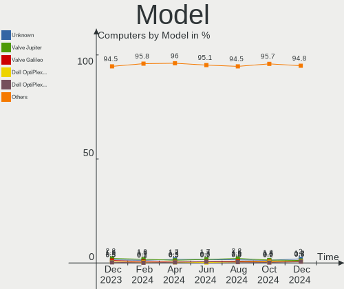
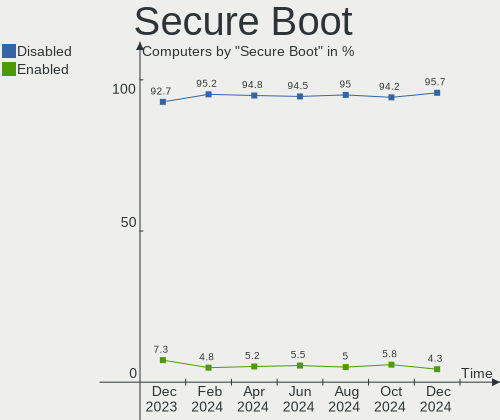
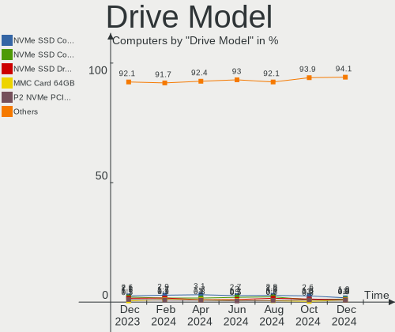
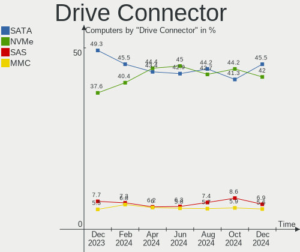
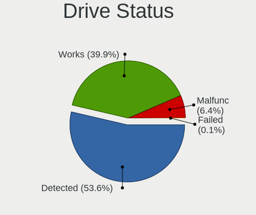
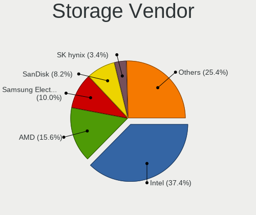
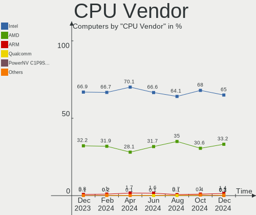
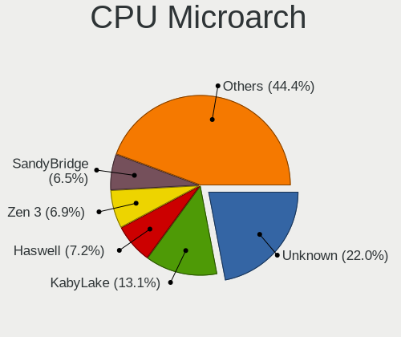
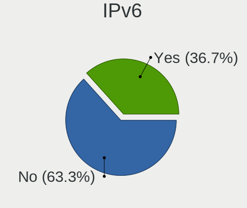
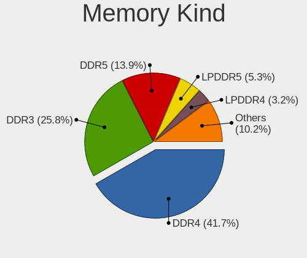

Linux in USA - Hardware Trends
------------------------------

A project to identify most popular hardware characteristics and track their change
over time based on data collected by Linux users at https://Linux-Hardware.org.

Anyone can contribute to this report by the [hw-probe](https://github.com/linuxhw/hw-probe) tool:

    sudo -E hw-probe -all -upload

This is a report for all computer types. See also reports for [desktops](/Location/USA/Desktop/README.md) and [notebooks](/Location/USA/Notebook/README.md).

Period: Mar, 2023.

Contents
--------

* [ System ](#system)
  - [ OS                       ](#os)
  - [ OS Family                ](#os-family)
  - [ Kernel                   ](#kernel)
  - [ Kernel Family            ](#kernel-family)
  - [ Kernel Major Ver.        ](#kernel-major-ver)
  - [ Arch                     ](#arch)
  - [ DE                       ](#de)
  - [ Display Server           ](#display-server)
  - [ Display Manager          ](#display-manager)
  - [ OS Lang                  ](#os-lang)
  - [ Boot Mode                ](#boot-mode)
  - [ Filesystem               ](#filesystem)
  - [ Part. scheme             ](#part-scheme)
  - [ Dual Boot with Linux/BSD ](#dual-boot-with-linuxbsd)
  - [ Dual Boot (Win)          ](#dual-boot-win)

* [ Board ](#board)
  - [ Vendor                   ](#vendor)
  - [ Model                    ](#model)
  - [ Model Family             ](#model-family)
  - [ MFG Year                 ](#mfg-year)
  - [ Form Factor              ](#form-factor)
  - [ Secure Boot              ](#secure-boot)
  - [ Coreboot                 ](#coreboot)
  - [ RAM Size                 ](#ram-size)
  - [ RAM Used                 ](#ram-used)
  - [ Total Drives             ](#total-drives)
  - [ Has CD-ROM               ](#has-cd-rom)
  - [ Has Ethernet             ](#has-ethernet)
  - [ Has WiFi                 ](#has-wifi)
  - [ Has Bluetooth            ](#has-bluetooth)

* [ Location ](#location)
  - [ Country                  ](#country)
  - [ City                     ](#city)

* [ Drives ](#drives)
  - [ Drive Vendor             ](#drive-vendor)
  - [ Drive Model              ](#drive-model)
  - [ HDD Vendor               ](#hdd-vendor)
  - [ SSD Vendor               ](#ssd-vendor)
  - [ Drive Kind               ](#drive-kind)
  - [ Drive Connector          ](#drive-connector)
  - [ Drive Size               ](#drive-size)
  - [ Space Total              ](#space-total)
  - [ Space Used               ](#space-used)
  - [ Malfunc. Drives          ](#malfunc-drives)
  - [ Malfunc. Drive Vendor    ](#malfunc-drive-vendor)
  - [ Malfunc. HDD Vendor      ](#malfunc-hdd-vendor)
  - [ Malfunc. Drive Kind      ](#malfunc-drive-kind)
  - [ Failed Drives            ](#failed-drives)
  - [ Failed Drive Vendor      ](#failed-drive-vendor)
  - [ Drive Status             ](#drive-status)

* [ Storage controller ](#storage-controller)
  - [ Storage Vendor           ](#storage-vendor)
  - [ Storage Model            ](#storage-model)
  - [ Storage Kind             ](#storage-kind)

* [ Processor ](#processor)
  - [ CPU Vendor               ](#cpu-vendor)
  - [ CPU Model                ](#cpu-model)
  - [ CPU Model Family         ](#cpu-model-family)
  - [ CPU Cores                ](#cpu-cores)
  - [ CPU Sockets              ](#cpu-sockets)
  - [ CPU Threads              ](#cpu-threads)
  - [ CPU Op-Modes             ](#cpu-op-modes)
  - [ CPU Microcode            ](#cpu-microcode)
  - [ CPU Microarch            ](#cpu-microarch)

* [ Graphics ](#graphics)
  - [ GPU Vendor               ](#gpu-vendor)
  - [ GPU Model                ](#gpu-model)
  - [ GPU Combo                ](#gpu-combo)
  - [ GPU Driver               ](#gpu-driver)
  - [ GPU Memory               ](#gpu-memory)

* [ Monitor ](#monitor)
  - [ Monitor Vendor           ](#monitor-vendor)
  - [ Monitor Model            ](#monitor-model)
  - [ Monitor Resolution       ](#monitor-resolution)
  - [ Monitor Diagonal         ](#monitor-diagonal)
  - [ Monitor Width            ](#monitor-width)
  - [ Aspect Ratio             ](#aspect-ratio)
  - [ Monitor Area             ](#monitor-area)
  - [ Pixel Density            ](#pixel-density)
  - [ Multiple Monitors        ](#multiple-monitors)

* [ Network ](#network)
  - [ Net Controller Vendor    ](#net-controller-vendor)
  - [ Net Controller Model     ](#net-controller-model)
  - [ Wireless Vendor          ](#wireless-vendor)
  - [ Wireless Model           ](#wireless-model)
  - [ Ethernet Vendor          ](#ethernet-vendor)
  - [ Ethernet Model           ](#ethernet-model)
  - [ Net Controller Kind      ](#net-controller-kind)
  - [ Used Controller          ](#used-controller)
  - [ NICs                     ](#nics)
  - [ IPv6                     ](#ipv6)

* [ Bluetooth ](#bluetooth)
  - [ Bluetooth Vendor         ](#bluetooth-vendor)
  - [ Bluetooth Model          ](#bluetooth-model)

* [ Sound ](#sound)
  - [ Sound Vendor             ](#sound-vendor)
  - [ Sound Model              ](#sound-model)

* [ Memory ](#memory)
  - [ Memory Vendor            ](#memory-vendor)
  - [ Memory Model             ](#memory-model)
  - [ Memory Kind              ](#memory-kind)
  - [ Memory Form Factor       ](#memory-form-factor)
  - [ Memory Size              ](#memory-size)
  - [ Memory Speed             ](#memory-speed)

* [ Printers & scanners ](#printers--scanners)
  - [ Printer Vendor           ](#printer-vendor)
  - [ Printer Model            ](#printer-model)
  - [ Scanner Vendor           ](#scanner-vendor)
  - [ Scanner Model            ](#scanner-model)

* [ Camera ](#camera)
  - [ Camera Vendor            ](#camera-vendor)
  - [ Camera Model             ](#camera-model)

* [ Security ](#security)
  - [ Fingerprint Vendor       ](#fingerprint-vendor)
  - [ Fingerprint Model        ](#fingerprint-model)
  - [ Chipcard Vendor          ](#chipcard-vendor)
  - [ Chipcard Model           ](#chipcard-model)

* [ Unsupported ](#unsupported)
  - [ Unsupported Devices      ](#unsupported-devices)
  - [ Unsupported Device Types ](#unsupported-device-types)

System
------

OS
--

Installed operating systems

| Name                         | Computers | Percent |
|------------------------------|-----------|---------|
| Ubuntu 22.04                 | 142       | 12.17%  |
| Debian 11                    | 113       | 9.68%   |
| Pop!_OS 22.04                | 100       | 8.57%   |
| Linux Mint 21.1              | 82        | 7.03%   |
| Fedora 37                    | 63        | 5.4%    |
| Ubuntu 22.10                 | 50        | 4.28%   |
| OpenMandriva 23.03           | 42        | 3.6%    |
| Arch Rolling                 | 39        | 3.34%   |
| Zorin 16                     | 37        | 3.17%   |
| OpenMandriva 23.01           | 35        | 3%      |
| Ubuntu 20.04                 | 30        | 2.57%   |
| Manjaro                      | 27        | 2.31%   |
| KDE neon 22.04               | 24        | 2.06%   |
| Kubuntu 22.04                | 20        | 1.71%   |
| Nobara 37                    | 18        | 1.54%   |
| Kubuntu 22.10                | 17        | 1.46%   |
| Kali 2023.1                  | 15        | 1.29%   |
| Linux Mint 20.3              | 14        | 1.2%    |
| EndeavourOS Rolling          | 14        | 1.2%    |
| Xubuntu 22.04                | 13        | 1.11%   |
| Gentoo 2.13                  | 13        | 1.11%   |
| ArcoLinux Rolling            | 13        | 1.11%   |
| SteamOS 3.4.6                | 11        | 0.94%   |
| SteamOS 3.4.4                | 11        | 0.94%   |
| openSUSE Tumbleweed-XXXXXXXX | 10        | 0.86%   |
| OpenMandriva 4.3             | 9         | 0.77%   |
| Manjaro 22.0.5               | 7         | 0.6%    |
| LMDE 5                       | 7         | 0.6%    |
| Elementary 7                 | 7         | 0.6%    |
| SteamOS 3.4                  | 6         | 0.51%   |
| Manjaro 22.0.4               | 6         | 0.51%   |
| Lubuntu 22.04                | 6         | 0.51%   |
| Fedora 38                    | 6         | 0.51%   |
| Debian 12                    | 6         | 0.51%   |
| ChimeraOS 39                 | 6         | 0.51%   |
| Xubuntu 20.04                | 5         | 0.43%   |
| Parrot 5.2                   | 5         | 0.43%   |
| Fedora 36                    | 5         | 0.43%   |
| Debian                       | 5         | 0.43%   |
| Ubuntu 18.04                 | 4         | 0.34%   |

OS Family
---------

OS without a version

| Name              | Computers | Percent |
|-------------------|-----------|---------|
| Ubuntu            | 229       | 19.62%  |
| Debian            | 124       | 10.63%  |
| Linux Mint        | 105       | 9%      |
| Pop!_OS           | 102       | 8.74%   |
| OpenMandriva      | 88        | 7.54%   |
| Fedora            | 76        | 6.51%   |
| Manjaro           | 40        | 3.43%   |
| Zorin             | 39        | 3.34%   |
| Arch              | 39        | 3.34%   |
| Kubuntu           | 38        | 3.26%   |
| SteamOS           | 29        | 2.49%   |
| KDE neon          | 24        | 2.06%   |
| Xubuntu           | 20        | 1.71%   |
| Nobara            | 18        | 1.54%   |
| Kali              | 16        | 1.37%   |
| Gentoo            | 14        | 1.2%    |
| EndeavourOS       | 14        | 1.2%    |
| ArcoLinux         | 13        | 1.11%   |
| openSUSE          | 12        | 1.03%   |
| Lubuntu           | 10        | 0.86%   |
| Elementary        | 10        | 0.86%   |
| Garuda Linux      | 8         | 0.69%   |
| LMDE              | 7         | 0.6%    |
| Endless           | 6         | 0.51%   |
| ChimeraOS         | 6         | 0.51%   |
| Parrot            | 5         | 0.43%   |
| Ultramarine Linux | 4         | 0.34%   |
| Ubuntu MATE       | 4         | 0.34%   |
| Ubuntu Budgie     | 4         | 0.34%   |
| NixOS             | 4         | 0.34%   |
| Devuan            | 4         | 0.34%   |
| Clear Linux       | 4         | 0.34%   |
| Ubuntu Studio     | 3         | 0.26%   |
| ROSA              | 3         | 0.26%   |
| Rocky Linux       | 3         | 0.26%   |
| RHEL              | 3         | 0.26%   |
| AlmaLinux         | 3         | 0.26%   |
| TUXEDO OS         | 2         | 0.17%   |
| Siduction         | 2         | 0.17%   |
| Raspbian          | 2         | 0.17%   |

Kernel
------

Version of the Linux kernel

| Version                      | Computers | Percent |
|------------------------------|-----------|---------|
| 5.19.0-35-generic            | 157       | 13.45%  |
| 5.15.0-67-generic            | 111       | 9.51%   |
| 5.10.0-20-amd64              | 54        | 4.63%   |
| 6.2.0-76060200-generic       | 41        | 3.51%   |
| 6.2.6-desktop-1omv2390       | 37        | 3.17%   |
| 5.10.0-21-amd64              | 33        | 2.83%   |
| 6.1.1-desktop-1omv2290       | 31        | 2.66%   |
| 5.19.0-38-generic            | 27        | 2.31%   |
| 5.4.0-144-generic            | 24        | 2.06%   |
| 5.15.0-60-generic            | 24        | 2.06%   |
| 5.13.0-valve36-1-neptune     | 23        | 1.97%   |
| 6.1.11-76060111-generic      | 22        | 1.89%   |
| 5.19.0-32-generic            | 21        | 1.8%    |
| 6.2.6-76060206-generic       | 18        | 1.54%   |
| 6.1.14-200.fc37.x86_64       | 17        | 1.46%   |
| 5.15.0-69-generic            | 17        | 1.46%   |
| 6.1.18-200.fc37.x86_64       | 16        | 1.37%   |
| 6.1.12-1-MANJARO             | 16        | 1.37%   |
| 6.0.12-76060006-generic      | 14        | 1.2%    |
| 6.2.8-arch1-1                | 12        | 1.03%   |
| 6.1.0-kali5-amd64            | 12        | 1.03%   |
| 6.2.7-200.fc37.x86_64        | 10        | 0.86%   |
| 6.2.2-arch1-1                | 10        | 0.86%   |
| 6.1.14-201.fsync.fc37.x86_64 | 9         | 0.77%   |
| 5.15.0-56-generic            | 9         | 0.77%   |
| 6.2.6-arch1-1                | 8         | 0.69%   |
| 6.1.19-1-MANJARO             | 7         | 0.6%    |
| 6.1.15-200.fc37.x86_64       | 7         | 0.6%    |
| 6.1.11-arch1-1               | 7         | 0.6%    |
| 6.1.0-6-amd64                | 7         | 0.6%    |
| 6.0.0-0.deb11.6-amd64        | 7         | 0.6%    |
| 5.19.0-37-generic            | 7         | 0.6%    |
| 6.2.8-200.fc37.x86_64        | 6         | 0.51%   |
| 6.2.7-arch1-1                | 6         | 0.51%   |
| 6.2.6-201.fsync.fc37.x86_64  | 6         | 0.51%   |
| 5.15.94-1-MANJARO            | 6         | 0.51%   |
| 5.15.0-58-generic            | 6         | 0.51%   |
| 6.2.7-2-MANJARO              | 5         | 0.43%   |
| 6.2.6-300.fc38.x86_64        | 5         | 0.43%   |
| 6.2.1-arch1-1                | 5         | 0.43%   |

Kernel Family
-------------

Linux kernel without a distro release

| Version | Computers | Percent |
|---------|-----------|---------|
| 5.19.0  | 226       | 19.37%  |
| 5.15.0  | 184       | 15.77%  |
| 5.10.0  | 96        | 8.23%   |
| 6.2.6   | 88        | 7.54%   |
| 6.2.0   | 45        | 3.86%   |
| 6.1.11  | 38        | 3.26%   |
| 5.4.0   | 37        | 3.17%   |
| 6.2.2   | 32        | 2.74%   |
| 6.1.1   | 32        | 2.74%   |
| 5.13.0  | 32        | 2.74%   |
| 6.1.0   | 31        | 2.66%   |
| 6.2.7   | 29        | 2.49%   |
| 6.1.14  | 29        | 2.49%   |
| 6.2.8   | 28        | 2.4%    |
| 6.1.12  | 26        | 2.23%   |
| 6.2.1   | 21        | 1.8%    |
| 6.0.0   | 19        | 1.63%   |
| 6.1.18  | 17        | 1.46%   |
| 6.0.12  | 16        | 1.37%   |
| 6.1.19  | 14        | 1.2%    |
| 6.2.5   | 11        | 0.94%   |
| 5.14.0  | 10        | 0.86%   |
| 6.1.15  | 8         | 0.69%   |
| 5.15.94 | 8         | 0.69%   |
| 6.1.13  | 5         | 0.43%   |
| 5.16.13 | 5         | 0.43%   |
| 5.16.7  | 4         | 0.34%   |
| 6.2.3   | 3         | 0.26%   |
| 6.1.4   | 3         | 0.26%   |
| 6.0.6   | 3         | 0.26%   |
| 5.16.0  | 3         | 0.26%   |
| 5.11.0  | 3         | 0.26%   |
| 4.18.0  | 3         | 0.26%   |
| 4.15.0  | 3         | 0.26%   |
| 6.3.0   | 2         | 0.17%   |
| 6.0.7   | 2         | 0.17%   |
| 5.19.17 | 2         | 0.17%   |
| 5.17.0  | 2         | 0.17%   |
| 5.15.85 | 2         | 0.17%   |
| 5.15.84 | 2         | 0.17%   |

Kernel Major Ver.
-----------------

Linux kernel major version

| Version | Computers | Percent |
|---------|-----------|---------|
| 6.2     | 258       | 22.11%  |
| 5.19    | 230       | 19.71%  |
| 6.1     | 209       | 17.91%  |
| 5.15    | 209       | 17.91%  |
| 5.10    | 100       | 8.57%   |
| 6.0     | 43        | 3.68%   |
| 5.4     | 39        | 3.34%   |
| 5.13    | 32        | 2.74%   |
| 5.16    | 13        | 1.11%   |
| 5.14    | 12        | 1.03%   |
| 5.17    | 4         | 0.34%   |
| 5.11    | 4         | 0.34%   |
| 4.18    | 3         | 0.26%   |
| 4.15    | 3         | 0.26%   |
| 6.3     | 2         | 0.17%   |
| 5.18    | 2         | 0.17%   |
| 3.10    | 2         | 0.17%   |
| 5.8     | 1         | 0.09%   |
| 4.4     | 1         | 0.09%   |

Arch
----

OS architecture (x86_64, i586, etc.)

| Name    | Computers | Percent |
|---------|-----------|---------|
| x86_64  | 1144      | 98.03%  |
| aarch64 | 11        | 0.94%   |
| i686    | 6         | 0.51%   |
| armv7l  | 4         | 0.34%   |
| riscv64 | 2         | 0.17%   |

DE
--

Desktop Environment

| Name            | Computers | Percent |
|-----------------|-----------|---------|
| GNOME           | 482       | 41.3%   |
| KDE5            | 310       | 26.56%  |
| X-Cinnamon      | 107       | 9.17%   |
| Unknown         | 105       | 9%      |
| XFCE            | 73        | 6.26%   |
| MATE            | 23        | 1.97%   |
| LXQt            | 16        | 1.37%   |
| Pantheon        | 11        | 0.94%   |
| i3              | 6         | 0.51%   |
| Budgie          | 5         | 0.43%   |
| sway            | 4         | 0.34%   |
| LXDE            | 4         | 0.34%   |
| Hyprland        | 3         | 0.26%   |
| Trinity         | 2         | 0.17%   |
| openbox         | 2         | 0.17%   |
| DWM             | 2         | 0.17%   |
| BunsenLabs      | 2         | 0.17%   |
| ratpoison       | 1         | 0.09%   |
| qtile           | 1         | 0.09%   |
| onyx:GNOME      | 1         | 0.09%   |
| LeftWM          | 1         | 0.09%   |
| KDE             | 1         | 0.09%   |
| GNUstep         | 1         | 0.09%   |
| GNOME Flashback | 1         | 0.09%   |
| GNOME Classic   | 1         | 0.09%   |
| Cinnamon        | 1         | 0.09%   |
| bspwm           | 1         | 0.09%   |

Display Server
--------------

X11 or Wayland

| Name    | Computers | Percent |
|---------|-----------|---------|
| X11     | 771       | 66.07%  |
| Wayland | 280       | 23.99%  |
| Unknown | 74        | 6.34%   |
| Tty     | 41        | 3.51%   |
| Web     | 1         | 0.09%   |

Display Manager
---------------

SDDM, LightDM, etc.

| Name    | Computers | Percent |
|---------|-----------|---------|
| Unknown | 529       | 45.33%  |
| GDM3    | 222       | 19.02%  |
| SDDM    | 201       | 17.22%  |
| LightDM | 143       | 12.25%  |
| GDM     | 60        | 5.14%   |
| SLiM    | 4         | 0.34%   |
| XDM     | 2         | 0.17%   |
| GREETD  | 2         | 0.17%   |
| TDM     | 1         | 0.09%   |
| NODM    | 1         | 0.09%   |
| LXDM    | 1         | 0.09%   |
| EMPTTY  | 1         | 0.09%   |

OS Lang
-------

Language

| Lang        | Computers | Percent |
|-------------|-----------|---------|
| en_US       | 1061      | 90.92%  |
| Unknown     | 67        | 5.74%   |
| C           | 16        | 1.37%   |
| en_GB       | 8         | 0.69%   |
| en_CA       | 5         | 0.43%   |
| ru_RU       | 2         | 0.17%   |
| C.UTF8      | 2         | 0.17%   |
| zh_TW       | 1         | 0.09%   |
| zh_CN       | 1         | 0.09%   |
| pl_PL       | 1         | 0.09%   |
| es_MX       | 1         | 0.09%   |
| en_US_UTF-8 | 1         | 0.09%   |
| -enUS       | 1         | 0.09%   |

Boot Mode
---------

EFI or BIOS

| Mode | Computers | Percent |
|------|-----------|---------|
| EFI  | 607       | 52.01%  |
| BIOS | 560       | 47.99%  |

Filesystem
----------

Type of filesystem

| Type    | Computers | Percent |
|---------|-----------|---------|
| Ext4    | 814       | 69.75%  |
| Btrfs   | 198       | 16.97%  |
| Overlay | 105       | 9%      |
| Xfs     | 31        | 2.66%   |
| Zfs     | 18        | 1.54%   |
| XXXXXXX | 1         | 0.09%   |

Part. scheme
------------

Scheme of partitioning

| Type    | Computers | Percent |
|---------|-----------|---------|
| GPT     | 637       | 54.58%  |
| Unknown | 422       | 36.16%  |
| MBR     | 108       | 9.25%   |

Dual Boot with Linux/BSD
------------------------

Hosting more than one Linux/BSD

| Dual boot | Computers | Percent |
|-----------|-----------|---------|
| No        | 1009      | 86.46%  |
| Yes       | 158       | 13.54%  |

Dual Boot (Win)
---------------

Hosting Linux and Windows

| Dual boot | Computers | Percent |
|-----------|-----------|---------|
| No        | 942       | 80.72%  |
| Yes       | 225       | 19.28%  |

Board
-----

Vendor
------

Motherboard manufacturer

| Name                    | Computers | Percent |
|-------------------------|-----------|---------|
| Dell                    | 190       | 16.28%  |
| Hewlett-Packard         | 177       | 15.17%  |
| ASUSTek Computer        | 160       | 13.71%  |
| Lenovo                  | 124       | 10.63%  |
| Apple                   | 87        | 7.46%   |
| MSI                     | 82        | 7.03%   |
| Gigabyte Technology     | 55        | 4.71%   |
| ASRock                  | 37        | 3.17%   |
| Acer                    | 31        | 2.66%   |
| Valve                   | 23        | 1.97%   |
| Intel                   | 17        | 1.46%   |
| Google                  | 17        | 1.46%   |
| Unknown                 | 15        | 1.29%   |
| Toshiba                 | 13        | 1.11%   |
| AZW                     | 12        | 1.03%   |
| Supermicro              | 10        | 0.86%   |
| Microsoft               | 9         | 0.77%   |
| Pegatron                | 8         | 0.69%   |
| System76                | 7         | 0.6%    |
| Gateway                 | 6         | 0.51%   |
| Sony                    | 5         | 0.43%   |
| Razer                   | 5         | 0.43%   |
| Star Labs               | 4         | 0.34%   |
| Raspberry Pi Foundation | 4         | 0.34%   |
| GPU Company             | 4         | 0.34%   |
| Framework               | 4         | 0.34%   |
| Foxconn                 | 4         | 0.34%   |
| ECS                     | 3         | 0.26%   |
| BESSTAR Tech            | 3         | 0.26%   |
| ASRockRack              | 3         | 0.26%   |
| TUXEDO                  | 2         | 0.17%   |
| Purism                  | 2         | 0.17%   |
| NEWSMAY                 | 2         | 0.17%   |
| Biostar                 | 2         | 0.17%   |
| ATOPNUC                 | 2         | 0.17%   |
| AMI                     | 2         | 0.17%   |
| Alienware               | 2         | 0.17%   |
| Acidanthera             | 2         | 0.17%   |
| ZOTAC                   | 1         | 0.09%   |
| Xunlong                 | 1         | 0.09%   |

Model
-----

Motherboard model

| Name                                  | Computers | Percent |
|---------------------------------------|-----------|---------|
| Apple MacBook5,2                      | 47        | 4.03%   |
| Valve Jupiter                         | 23        | 1.97%   |
| Unknown                               | 17        | 1.46%   |
| Dell OptiPlex 9020                    | 6         | 0.51%   |
| ASUS All Series                       | 6         | 0.51%   |
| MSI MS-7C91                           | 5         | 0.43%   |
| MSI MS-7C02                           | 5         | 0.43%   |
| Dell OptiPlex 780                     | 5         | 0.43%   |
| Dell OptiPlex 7010                    | 5         | 0.43%   |
| ASUS TUF Gaming X570-PLUS             | 5         | 0.43%   |
| ASUS ROG STRIX B550-F GAMING          | 5         | 0.43%   |
| MSI MS-7C37                           | 4         | 0.34%   |
| MSI MS-7B79                           | 4         | 0.34%   |
| Dell XPS 15 9520                      | 4         | 0.34%   |
| Dell OptiPlex 9010                    | 4         | 0.34%   |
| Dell OptiPlex 3020                    | 4         | 0.34%   |
| Dell Latitude E6430                   | 4         | 0.34%   |
| AZW U59                               | 4         | 0.34%   |
| ASUS ROG STRIX B450-F GAMING          | 4         | 0.34%   |
| Star Labs StarBook                    | 3         | 0.26%   |
| MSI MS-7C56                           | 3         | 0.26%   |
| MSI MS-7721                           | 3         | 0.26%   |
| Lenovo ThinkPad 13 2nd Gen 20J10046US | 3         | 0.26%   |
| HP Pavilion dv7                       | 3         | 0.26%   |
| HP Notebook                           | 3         | 0.26%   |
| HP Laptop 15-dw0xxx                   | 3         | 0.26%   |
| HP EliteBook 8560w                    | 3         | 0.26%   |
| Google Lillipup                       | 3         | 0.26%   |
| Google Kefka                          | 3         | 0.26%   |
| Dell XPS 8700                         | 3         | 0.26%   |
| Dell XPS 13 9310                      | 3         | 0.26%   |
| Dell Precision M3800                  | 3         | 0.26%   |
| Dell Latitude E5570                   | 3         | 0.26%   |
| Dell Latitude 7480                    | 3         | 0.26%   |
| AZW GTR                               | 3         | 0.26%   |
| ASUS ROG STRIX Z390-E GAMING          | 3         | 0.26%   |
| ASUS ROG STRIX X570-E GAMING          | 3         | 0.26%   |
| ASUS ROG STRIX B650E-F GAMING WIFI    | 3         | 0.26%   |
| ASUS M5A78L-M LX PLUS                 | 3         | 0.26%   |
| Apple MacBookPro14,1                  | 3         | 0.26%   |

Model Family
------------

Motherboard model prefix

| Name                | Computers | Percent |
|---------------------|-----------|---------|
| Lenovo ThinkPad     | 73        | 6.26%   |
| Apple MacBook5      | 48        | 4.11%   |
| Dell Latitude       | 47        | 4.03%   |
| Dell OptiPlex       | 44        | 3.77%   |
| ASUS ROG            | 42        | 3.6%    |
| Dell Inspiron       | 40        | 3.43%   |
| HP Laptop           | 28        | 2.4%    |
| HP Pavilion         | 26        | 2.23%   |
| Dell XPS            | 25        | 2.14%   |
| Valve Jupiter       | 23        | 1.97%   |
| Dell Precision      | 23        | 1.97%   |
| Acer Aspire         | 19        | 1.63%   |
| HP EliteBook        | 18        | 1.54%   |
| ASUS TUF            | 18        | 1.54%   |
| ASUS PRIME          | 18        | 1.54%   |
| Unknown             | 17        | 1.46%   |
| HP ENVY             | 15        | 1.29%   |
| Lenovo IdeaPad      | 13        | 1.11%   |
| HP Compaq           | 13        | 1.11%   |
| Toshiba Satellite   | 12        | 1.03%   |
| Lenovo ThinkCentre  | 11        | 0.94%   |
| Microsoft Surface   | 9         | 0.77%   |
| HP ZBook            | 9         | 0.77%   |
| HP ProBook          | 9         | 0.77%   |
| ASUS VivoBook       | 9         | 0.77%   |
| HP EliteDesk        | 8         | 0.69%   |
| ASUS ASUS           | 7         | 0.6%    |
| ASUS All            | 6         | 0.51%   |
| Razer Blade         | 5         | 0.43%   |
| MSI MS-7C91         | 5         | 0.43%   |
| MSI MS-7C02         | 5         | 0.43%   |
| HP ProLiant         | 5         | 0.43%   |
| ASUS ZenBook        | 5         | 0.43%   |
| RPi Raspberry       | 4         | 0.34%   |
| MSI MS-7C37         | 4         | 0.34%   |
| MSI MS-7B79         | 4         | 0.34%   |
| Lenovo ThinkStation | 4         | 0.34%   |
| Lenovo ThinkBook    | 4         | 0.34%   |
| Lenovo Legion       | 4         | 0.34%   |
| HP ProDesk          | 4         | 0.34%   |

MFG Year
--------

Motherboard manufacture year

| Year    | Computers | Percent |
|---------|-----------|---------|
| 2022    | 162       | 13.88%  |
| 2020    | 112       | 9.6%    |
| 2021    | 103       | 8.83%   |
| 2019    | 97        | 8.31%   |
| 2018    | 95        | 8.14%   |
| 2012    | 77        | 6.6%    |
| 2009    | 74        | 6.34%   |
| 2017    | 62        | 5.31%   |
| 2015    | 60        | 5.14%   |
| 2013    | 60        | 5.14%   |
| 2011    | 58        | 4.97%   |
| 2016    | 47        | 4.03%   |
| 2014    | 45        | 3.86%   |
| 2010    | 29        | 2.49%   |
| 2008    | 22        | 1.89%   |
| 2023    | 21        | 1.8%    |
| 2007    | 18        | 1.54%   |
| Unknown | 18        | 1.54%   |
| 2006    | 5         | 0.43%   |
| 2005    | 1         | 0.09%   |
| 2004    | 1         | 0.09%   |

Form Factor
-----------

Physical design of the computer

| Name           | Computers | Percent |
|----------------|-----------|---------|
| Notebook       | 567       | 48.59%  |
| Desktop        | 470       | 40.27%  |
| Convertible    | 40        | 3.43%   |
| Mini pc        | 25        | 2.14%   |
| All in one     | 20        | 1.71%   |
| Server         | 16        | 1.37%   |
| Tablet         | 15        | 1.29%   |
| System on chip | 13        | 1.11%   |
| Other          | 1         | 0.09%   |

Secure Boot
-----------

Enabled or disabled

| State    | Computers | Percent |
|----------|-----------|---------|
| Disabled | 1101      | 94.34%  |
| Enabled  | 66        | 5.66%   |

Coreboot
--------

Have coreboot on board

| Used | Computers | Percent |
|------|-----------|---------|
| No   | 1141      | 97.77%  |
| Yes  | 26        | 2.23%   |

RAM Size
--------

Total RAM memory

| Size in GB      | Computers | Percent |
|-----------------|-----------|---------|
| 16.01-24.0      | 235       | 20.14%  |
| 4.01-8.0        | 219       | 18.77%  |
| 32.01-64.0      | 200       | 17.14%  |
| 8.01-16.0       | 198       | 16.97%  |
| 3.01-4.0        | 146       | 12.51%  |
| 64.01-256.0     | 77        | 6.6%    |
| 24.01-32.0      | 46        | 3.94%   |
| 1.01-2.0        | 21        | 1.8%    |
| 2.01-3.0        | 10        | 0.86%   |
| 0.51-1.0        | 7         | 0.6%    |
| More than 256.0 | 6         | 0.51%   |
| 0.01-0.5        | 2         | 0.17%   |

RAM Used
--------

Used RAM memory

| Used GB         | Computers | Percent |
|-----------------|-----------|---------|
| 1.01-2.0        | 320       | 27.42%  |
| 2.01-3.0        | 306       | 26.22%  |
| 4.01-8.0        | 232       | 19.88%  |
| 3.01-4.0        | 169       | 14.48%  |
| 8.01-16.0       | 59        | 5.06%   |
| 0.51-1.0        | 33        | 2.83%   |
| 0.01-0.5        | 19        | 1.63%   |
| 16.01-24.0      | 14        | 1.2%    |
| 24.01-32.0      | 8         | 0.69%   |
| 64.01-256.0     | 3         | 0.26%   |
| 32.01-64.0      | 2         | 0.17%   |
| More than 256.0 | 1         | 0.09%   |
| Unknown         | 1         | 0.09%   |

Total Drives
------------

Number of drives on board

| Drives | Computers | Percent |
|--------|-----------|---------|
| 1      | 671       | 57.5%   |
| 2      | 284       | 24.34%  |
| 3      | 100       | 8.57%   |
| 4      | 47        | 4.03%   |
| 5      | 25        | 2.14%   |
| 6      | 11        | 0.94%   |
| 0      | 10        | 0.86%   |
| 7      | 5         | 0.43%   |
| 8      | 4         | 0.34%   |
| 13     | 3         | 0.26%   |
| 9      | 2         | 0.17%   |
| 22     | 1         | 0.09%   |
| 17     | 1         | 0.09%   |
| 14     | 1         | 0.09%   |
| 12     | 1         | 0.09%   |
| 10     | 1         | 0.09%   |

Has CD-ROM
----------

Has CD-ROM on board

| Presented | Computers | Percent |
|-----------|-----------|---------|
| No        | 766       | 65.64%  |
| Yes       | 401       | 34.36%  |

Has Ethernet
------------

Has Ethernet on board

| Presented | Computers | Percent |
|-----------|-----------|---------|
| Yes       | 961       | 82.35%  |
| No        | 206       | 17.65%  |

Has WiFi
--------

Has WiFi module

| Presented | Computers | Percent |
|-----------|-----------|---------|
| Yes       | 943       | 80.81%  |
| No        | 224       | 19.19%  |

Has Bluetooth
-------------

Has Bluetooth module

| Presented | Computers | Percent |
|-----------|-----------|---------|
| Yes       | 782       | 67.01%  |
| No        | 385       | 32.99%  |

Location
--------

Country
-------

Geographic location (country)

| Country | Computers | Percent |
|---------|-----------|---------|
| USA     | 1167      | 100%    |

City
----

Geographic location (city)

| City           | Computers | Percent |
|----------------|-----------|---------|
| Bangor         | 55        | 4.71%   |
| Los Angeles    | 17        | 1.46%   |
| Houston        | 17        | 1.46%   |
| Chicago        | 14        | 1.2%    |
| Seattle        | 12        | 1.03%   |
| New York       | 12        | 1.03%   |
| Denver         | 12        | 1.03%   |
| Portland       | 11        | 0.94%   |
| Kansas City    | 11        | 0.94%   |
| Minneapolis    | 10        | 0.86%   |
| Dallas         | 10        | 0.86%   |
| San Antonio    | 9         | 0.77%   |
| Orlando        | 9         | 0.77%   |
| Philadelphia   | 8         | 0.69%   |
| Miami          | 8         | 0.69%   |
| Eugene         | 8         | 0.69%   |
| Brooklyn       | 8         | 0.69%   |
| Springfield    | 7         | 0.6%    |
| San Francisco  | 7         | 0.6%    |
| Oklahoma City  | 7         | 0.6%    |
| Indianapolis   | 7         | 0.6%    |
| Austin         | 7         | 0.6%    |
| Atlanta        | 7         | 0.6%    |
| St Louis       | 6         | 0.51%   |
| San Jose       | 6         | 0.51%   |
| Phoenix        | 6         | 0.51%   |
| Beaverton      | 6         | 0.51%   |
| Albuquerque    | 6         | 0.51%   |
| Tucson         | 5         | 0.43%   |
| San Diego      | 5         | 0.43%   |
| Pittsburgh     | 5         | 0.43%   |
| Milwaukee      | 5         | 0.43%   |
| Madison        | 5         | 0.43%   |
| Columbia       | 5         | 0.43%   |
| Bellingham     | 5         | 0.43%   |
| Salt Lake City | 4         | 0.34%   |
| Salem          | 4         | 0.34%   |
| Richmond       | 4         | 0.34%   |
| Reno           | 4         | 0.34%   |
| Queens         | 4         | 0.34%   |

Drives
------

Drive Vendor
------------

Hard drive vendors

| Vendor                      | Computers | Drives | Percent |
|-----------------------------|-----------|--------|---------|
| Samsung Electronics         | 303       | 381    | 17.31%  |
| WDC                         | 217       | 301    | 12.4%   |
| Seagate                     | 191       | 269    | 10.91%  |
| Sandisk                     | 126       | 138    | 7.2%    |
| Unknown                     | 86        | 99     | 4.91%   |
| Toshiba                     | 78        | 88     | 4.46%   |
| Crucial                     | 58        | 64     | 3.31%   |
| SK hynix                    | 54        | 54     | 3.09%   |
| Intel                       | 46        | 51     | 2.63%   |
| Hitachi                     | 44        | 49     | 2.51%   |
| Kingston                    | 38        | 41     | 2.17%   |
| Fujitsu                     | 38        | 38     | 2.17%   |
| Micron Technology           | 36        | 36     | 2.06%   |
| PNY                         | 29        | 29     | 1.66%   |
| HGST                        | 29        | 32     | 1.66%   |
| China                       | 29        | 33     | 1.66%   |
| Phison Electronics          | 25        | 41     | 1.43%   |
| Micron/Crucial Technology   | 23        | 26     | 1.31%   |
| Apple                       | 23        | 27     | 1.31%   |
| SPCC                        | 20        | 21     | 1.14%   |
| A-DATA Technology           | 18        | 19     | 1.03%   |
| Kingston Technology Company | 17        | 18     | 0.97%   |
| Team                        | 16        | 17     | 0.91%   |
| Hewlett-Packard             | 14        | 17     | 0.8%    |
| Unknown                     | 14        | 14     | 0.8%    |
| Silicon Motion              | 13        | 14     | 0.74%   |
| KIOXIA                      | 13        | 13     | 0.74%   |
| SABRENT                     | 7         | 9      | 0.4%    |
| Phison                      | 7         | 7      | 0.4%    |
| Realtek Semiconductor       | 6         | 7      | 0.34%   |
| ASMT                        | 6         | 10     | 0.34%   |
| LITEONIT                    | 5         | 5      | 0.29%   |
| T-FORCE                     | 4         | 4      | 0.23%   |
| Realtek                     | 4         | 4      | 0.23%   |
| Mushkin                     | 4         | 5      | 0.23%   |
| Fanxiang                    | 4         | 5      | 0.23%   |
| Corsair                     | 4         | 5      | 0.23%   |
| Plextor                     | 3         | 3      | 0.17%   |
| OCZ                         | 3         | 3      | 0.17%   |
| O2 Micro                    | 3         | 3      | 0.17%   |

Drive Model
-----------

Hard drive models

| Model                                                  | Computers | Percent |
|--------------------------------------------------------|-----------|---------|
| Samsung NVMe SSD Controller SM981/PM981/PM983 250GB    | 51        | 2.65%   |
| Fujitsu MHZ2160BH FFS G1 160GB                         | 36        | 1.87%   |
| Samsung NVMe SSD Controller PM9A1/PM9A3/980PRO 1TB     | 32        | 1.66%   |
| Micron/Crucial P2 NVMe PCIe SSD 1TB                    | 17        | 0.88%   |
| Samsung NVMe SSD Controller SM961/PM961/SM963 256GB    | 15        | 0.78%   |
| Unknown MMC Card  64GB                                 | 14        | 0.73%   |
| Crucial CT1000MX500SSD1 1TB                            | 14        | 0.73%   |
| Unknown                                                | 14        | 0.73%   |
| Unknown MMC Card  512GB                                | 13        | 0.67%   |
| Samsung SSD 860 EVO 1TB                                | 13        | 0.67%   |
| Samsung SSD 870 EVO 1TB                                | 12        | 0.62%   |
| Samsung SSD 850 EVO 250GB                              | 12        | 0.62%   |
| Seagate ST2000DM008-2FR102 2TB                         | 11        | 0.57%   |
| Samsung SSD 860 EVO 500GB                              | 11        | 0.57%   |
| Silicon Motion SM2263EN/SM2263XT SSD Controller 1024GB | 10        | 0.52%   |
| Sandisk WD Black SN750 / PC SN730 NVMe SSD 1TB         | 10        | 0.52%   |
| Samsung SSD 970 EVO Plus 1TB                           | 10        | 0.52%   |
| Phison PS5013 E13 NVMe Controller 256GB                | 10        | 0.52%   |
| WDC WDBNCE5000PNC 500GB SSD                            | 9         | 0.47%   |
| Seagate ST500DM002-1BD142 500GB                        | 9         | 0.47%   |
| Seagate ST4000DM004-2CV104 4TB                         | 9         | 0.47%   |
| Samsung SSD 980 PRO 2TB                                | 9         | 0.47%   |
| Unknown MMC Card  32GB                                 | 8         | 0.41%   |
| Seagate ST1000DM010-2EP102 1TB                         | 8         | 0.41%   |
| Kingston Company OM3PDP3 NVMe SSD 256GB                | 8         | 0.41%   |
| Kingston SA400S37240G 240GB SSD                        | 8         | 0.41%   |
| HGST HTS721010A9E630 1TB                               | 8         | 0.41%   |
| WDC WD10EZEX-08WN4A0 1TB                               | 7         | 0.36%   |
| Toshiba MQ01ABD100 1TB                                 | 7         | 0.36%   |
| Toshiba MK1655GSXF 160GB                               | 7         | 0.36%   |
| Seagate ST1000DM003-1CH162 1TB                         | 7         | 0.36%   |
| Sandisk WD Blue SN550 NVMe SSD 256GB                   | 7         | 0.36%   |
| Samsung SSD 980 PRO 1TB                                | 7         | 0.36%   |
| Samsung SSD 980 1TB                                    | 7         | 0.36%   |
| Samsung SSD 850 EVO 500GB                              | 7         | 0.36%   |
| SABRENT Disk 160GB                                     | 7         | 0.36%   |
| Unknown SD/MMC/MS PRO 64GB                             | 6         | 0.31%   |
| Unknown MMC Card  256GB                                | 6         | 0.31%   |
| Toshiba MQ04ABF100 1TB                                 | 6         | 0.31%   |
| Toshiba MQ01ABF050 500GB                               | 6         | 0.31%   |

HDD Vendor
----------

Hard disk drive vendors

| Vendor              | Computers | Drives | Percent |
|---------------------|-----------|--------|---------|
| Seagate             | 184       | 259    | 31.83%  |
| WDC                 | 170       | 243    | 29.41%  |
| Toshiba             | 64        | 73     | 11.07%  |
| Hitachi             | 44        | 49     | 7.61%   |
| Fujitsu             | 38        | 38     | 6.57%   |
| HGST                | 29        | 32     | 5.02%   |
| Samsung Electronics | 8         | 8      | 1.38%   |
| SABRENT             | 7         | 9      | 1.21%   |
| Unknown             | 6         | 6      | 1.04%   |
| ASMT                | 5         | 9      | 0.87%   |
| Apple               | 5         | 5      | 0.87%   |
| Hewlett-Packard     | 4         | 4      | 0.69%   |
| USB3.0              | 2         | 2      | 0.35%   |
| PHD 3.0             | 2         | 2      | 0.35%   |
| Maxtor              | 2         | 2      | 0.35%   |
| T-CREATE            | 1         | 1      | 0.17%   |
| Super Talent        | 1         | 1      | 0.17%   |
| SD                  | 1         | 1      | 0.17%   |
| LaCie               | 1         | 1      | 0.17%   |
| IET                 | 1         | 1      | 0.17%   |
| IBM/Hitachi         | 1         | 1      | 0.17%   |
| Generic-            | 1         | 1      | 0.17%   |
| ASMedia             | 1         | 1      | 0.17%   |

SSD Vendor
----------

Solid state drive vendors

| Vendor              | Computers | Drives | Percent |
|---------------------|-----------|--------|---------|
| Samsung Electronics | 118       | 144    | 23.69%  |
| Crucial             | 50        | 55     | 10.04%  |
| SanDisk             | 47        | 48     | 9.44%   |
| China               | 29        | 33     | 5.82%   |
| WDC                 | 28        | 32     | 5.62%   |
| PNY                 | 28        | 28     | 5.62%   |
| Kingston            | 28        | 29     | 5.62%   |
| SPCC                | 15        | 16     | 3.01%   |
| A-DATA Technology   | 15        | 16     | 3.01%   |
| Team                | 13        | 14     | 2.61%   |
| Intel               | 12        | 12     | 2.41%   |
| Micron Technology   | 9         | 9      | 1.81%   |
| Hewlett-Packard     | 8         | 11     | 1.61%   |
| Apple               | 8         | 8      | 1.61%   |
| SK hynix            | 7         | 7      | 1.41%   |
| Toshiba             | 6         | 6      | 1.2%    |
| LITEONIT            | 5         | 5      | 1%      |
| Mushkin             | 4         | 5      | 0.8%    |
| Seagate             | 3         | 3      | 0.6%    |
| Plextor             | 3         | 3      | 0.6%    |
| OCZ                 | 3         | 3      | 0.6%    |
| LITEON              | 3         | 3      | 0.6%    |
| Fanxiang            | 3         | 4      | 0.6%    |
| Corsair             | 3         | 4      | 0.6%    |
| Transcend           | 2         | 2      | 0.4%    |
| PNY CS90            | 2         | 2      | 0.4%    |
| NGFF                | 2         | 2      | 0.4%    |
| Lexar               | 2         | 2      | 0.4%    |
| KingFast            | 2         | 2      | 0.4%    |
| Kimtigo             | 2         | 2      | 0.4%    |
| FORESEE             | 2         | 2      | 0.4%    |
| Dogfish             | 2         | 2      | 0.4%    |
| Apacer              | 2         | 2      | 0.4%    |
| Acer                | 2         | 2      | 0.4%    |
| Unknown             | 2         | 2      | 0.4%    |
| ZEPLIN              | 1         | 1      | 0.2%    |
| WDC WDS1            | 1         | 1      | 0.2%    |
| WDC WDB             | 1         | 1      | 0.2%    |
| VICKTER             | 1         | 1      | 0.2%    |
| VICK                | 1         | 1      | 0.2%    |

Drive Kind
----------

HDD or SSD

| Kind    | Computers | Drives | Percent |
|---------|-----------|--------|---------|
| NVMe    | 512       | 659    | 33.29%  |
| HDD     | 476       | 749    | 30.95%  |
| SSD     | 429       | 548    | 27.89%  |
| MMC     | 89        | 100    | 5.79%   |
| Unknown | 32        | 36     | 2.08%   |

Drive Connector
---------------

SATA, SAS, NVMe, etc.

| Type | Computers | Drives | Percent |
|------|-----------|--------|---------|
| SATA | 742       | 1232   | 52.03%  |
| NVMe | 510       | 652    | 35.76%  |
| MMC  | 89        | 100    | 6.24%   |
| SAS  | 85        | 108    | 5.96%   |

Drive Size
----------

Size of hard drive

| Size in TB | Computers | Drives | Percent |
|------------|-----------|--------|---------|
| 0.01-0.5   | 485       | 615    | 49.24%  |
| 0.51-1.0   | 291       | 365    | 29.54%  |
| 1.01-2.0   | 106       | 130    | 10.76%  |
| 3.01-4.0   | 43        | 61     | 4.37%   |
| 4.01-10.0  | 38        | 64     | 3.86%   |
| 2.01-3.0   | 15        | 26     | 1.52%   |
| 10.01-20.0 | 7         | 36     | 0.71%   |

Space Total
-----------

Amount of disk space available on the file system

| Size in GB     | Computers | Percent |
|----------------|-----------|---------|
| 101-250        | 230       | 19.71%  |
| 251-500        | 216       | 18.51%  |
| 501-1000       | 209       | 17.91%  |
| 1001-2000      | 130       | 11.14%  |
| More than 3000 | 102       | 8.74%   |
| Unknown        | 96        | 8.23%   |
| 1-20           | 66        | 5.66%   |
| 2001-3000      | 47        | 4.03%   |
| 51-100         | 44        | 3.77%   |
| 21-50          | 27        | 2.31%   |

Space Used
----------

Amount of used disk space

| Used GB        | Computers | Percent |
|----------------|-----------|---------|
| 1-20           | 329       | 28.19%  |
| 21-50          | 210       | 17.99%  |
| 51-100         | 143       | 12.25%  |
| 101-250        | 136       | 11.65%  |
| Unknown        | 96        | 8.23%   |
| 251-500        | 90        | 7.71%   |
| 501-1000       | 65        | 5.57%   |
| 1001-2000      | 49        | 4.2%    |
| More than 3000 | 33        | 2.83%   |
| 2001-3000      | 16        | 1.37%   |

Malfunc. Drives
---------------

Drive models with a malfunction

| Model                                       | Computers | Drives | Percent |
|---------------------------------------------|-----------|--------|---------|
| Hitachi HTS543216L9SA02 160GB               | 5         | 5      | 4.1%    |
| Fujitsu MHZ2160BH FFS G1 160GB              | 5         | 5      | 4.1%    |
| Seagate ST1000LM024 HN-M101MBB 1TB          | 3         | 3      | 2.46%   |
| WDC WD6400AAKS-00E4A0 640GB                 | 2         | 2      | 1.64%   |
| WDC WD40EFRX-68WT0N0 4TB                    | 2         | 3      | 1.64%   |
| WDC WD3200AAJS-22RYA0 320GB                 | 2         | 2      | 1.64%   |
| Toshiba MQ01ABF050 500GB                    | 2         | 2      | 1.64%   |
| SK hynix BC711 HFM256GD3JX013N 256GB        | 2         | 2      | 1.64%   |
| Seagate ST2000DM008-2FR102 2TB              | 2         | 2      | 1.64%   |
| Crucial CT1050MX300SSD1 1TB                 | 2         | 2      | 1.64%   |
| WDC WDS240G2G0B-00EPW0 240GB SSD            | 1         | 1      | 0.82%   |
| WDC WD6402AAEX-00Z3A0 640GB                 | 1         | 1      | 0.82%   |
| WDC WD5000LPVT-22G33T0 500GB                | 1         | 1      | 0.82%   |
| WDC WD5000BPVT-22HXZT1 500GB                | 1         | 1      | 0.82%   |
| WDC WD5000BPKT-60PK4T0 500GB                | 1         | 1      | 0.82%   |
| WDC WD5000AAKS-75V0A0 500GB                 | 1         | 1      | 0.82%   |
| WDC WD5000AAJS-55A8B2 500GB                 | 1         | 1      | 0.82%   |
| WDC WD40EZRZ-00GXCB0 4TB                    | 1         | 1      | 0.82%   |
| WDC WD20EARS-55MVWB0 2TB                    | 1         | 1      | 0.82%   |
| WDC WD10SPZX-60Z10T0 1TB                    | 1         | 1      | 0.82%   |
| WDC WD10EZRX-00A8LB0 1TB                    | 1         | 1      | 0.82%   |
| WDC WD10EZEX-60M2NA0 1TB                    | 1         | 1      | 0.82%   |
| WDC WD10EZEX-22BN5A0 1TB                    | 1         | 1      | 0.82%   |
| WDC WD10EZEX-00WN4A0 1TB                    | 1         | 1      | 0.82%   |
| WDC WD10EURX-73C57Y0 1TB                    | 1         | 1      | 0.82%   |
| Transcend TS32GMTS400 32GB SSD              | 1         | 1      | 0.82%   |
| Transcend TS256GSSD360S 256GB               | 1         | 1      | 0.82%   |
| Toshiba MQ02ABD100H 1TB                     | 1         | 1      | 0.82%   |
| Toshiba MQ01ABD100 1TB                      | 1         | 1      | 0.82%   |
| Toshiba MK7559GSXF 752GB                    | 1         | 1      | 0.82%   |
| Toshiba MK1655GSXF 160GB                    | 1         | 1      | 0.82%   |
| Toshiba DT01ACA300 3TB                      | 1         | 1      | 0.82%   |
| Team TM8FP4004T 4TB                         | 1         | 1      | 0.82%   |
| Team TM8FP4001T 1TB                         | 1         | 1      | 0.82%   |
| SK hynix PC711 HFS001TDE9X073N 1TB          | 1         | 1      | 0.82%   |
| SK hynix PC401 NVMe 256GB                   | 1         | 1      | 0.82%   |
| SK hynix BC501 NVMe Solid State Drive 512GB | 1         | 1      | 0.82%   |
| Seagate ST9750420AS 752GB                   | 1         | 1      | 0.82%   |
| Seagate ST9500325AS 500GB                   | 1         | 1      | 0.82%   |
| Seagate ST9320423AS 320GB                   | 1         | 1      | 0.82%   |

Malfunc. Drive Vendor
---------------------

Vendors of faulty drives

| Vendor              | Computers | Drives | Percent |
|---------------------|-----------|--------|---------|
| Seagate             | 26        | 33     | 22.61%  |
| WDC                 | 18        | 22     | 15.65%  |
| Hitachi             | 12        | 13     | 10.43%  |
| Samsung Electronics | 10        | 11     | 8.7%    |
| Toshiba             | 7         | 7      | 6.09%   |
| SK hynix            | 5         | 5      | 4.35%   |
| Fujitsu             | 5         | 5      | 4.35%   |
| Intel               | 4         | 4      | 3.48%   |
| Crucial             | 4         | 4      | 3.48%   |
| Hewlett-Packard     | 3         | 3      | 2.61%   |
| Transcend           | 2         | 2      | 1.74%   |
| Team                | 2         | 2      | 1.74%   |
| SanDisk             | 2         | 2      | 1.74%   |
| HGST                | 2         | 2      | 1.74%   |
| ASMT                | 2         | 3      | 1.74%   |
| A-DATA Technology   | 2         | 2      | 1.74%   |
| OCZ                 | 1         | 1      | 0.87%   |
| Netac               | 1         | 1      | 0.87%   |
| Maxtor              | 1         | 1      | 0.87%   |
| LITEON              | 1         | 1      | 0.87%   |
| LaCie               | 1         | 1      | 0.87%   |
| IBM/Hitachi         | 1         | 1      | 0.87%   |
| China               | 1         | 1      | 0.87%   |
| ASMedia             | 1         | 1      | 0.87%   |
| Apple               | 1         | 1      | 0.87%   |

Malfunc. HDD Vendor
-------------------

Vendors of faulty HDD drives

| Vendor              | Computers | Drives | Percent |
|---------------------|-----------|--------|---------|
| Seagate             | 26        | 33     | 33.33%  |
| WDC                 | 17        | 21     | 21.79%  |
| Hitachi             | 12        | 13     | 15.38%  |
| Toshiba             | 7         | 7      | 8.97%   |
| Fujitsu             | 5         | 5      | 6.41%   |
| HGST                | 2         | 2      | 2.56%   |
| Hewlett-Packard     | 2         | 2      | 2.56%   |
| ASMT                | 2         | 3      | 2.56%   |
| Samsung Electronics | 1         | 1      | 1.28%   |
| Maxtor              | 1         | 1      | 1.28%   |
| LaCie               | 1         | 1      | 1.28%   |
| IBM/Hitachi         | 1         | 1      | 1.28%   |
| ASMedia             | 1         | 1      | 1.28%   |

Malfunc. Drive Kind
-------------------

Kinds of faulty drives

| Kind | Computers | Drives | Percent |
|------|-----------|--------|---------|
| HDD  | 70        | 91     | 65.42%  |
| SSD  | 24        | 25     | 22.43%  |
| NVMe | 13        | 13     | 12.15%  |

Failed Drives
-------------

Failed drive models

| Model                                 | Computers | Drives | Percent |
|---------------------------------------|-----------|--------|---------|
| Toshiba DT01ACA100 1TB                | 1         | 1      | 33.33%  |
| Samsung Electronics SSD 980 250GB     | 1         | 1      | 33.33%  |
| Samsung Electronics SSD 960 EVO 250GB | 1         | 1      | 33.33%  |

Failed Drive Vendor
-------------------

Failed drive vendors

| Vendor              | Computers | Drives | Percent |
|---------------------|-----------|--------|---------|
| Samsung Electronics | 2         | 2      | 66.67%  |
| Toshiba             | 1         | 1      | 33.33%  |

Drive Status
------------

Number of failed and malfunc. drives

| Status   | Computers | Drives | Percent |
|----------|-----------|--------|---------|
| Detected | 679       | 1123   | 53.63%  |
| Works    | 480       | 837    | 37.91%  |
| Malfunc  | 104       | 129    | 8.21%   |
| Failed   | 3         | 3      | 0.24%   |

Storage controller
------------------

Storage Vendor
--------------

Storage controller vendors

| Vendor                         | Computers | Percent |
|--------------------------------|-----------|---------|
| Intel                          | 603       | 38.36%  |
| AMD                            | 270       | 17.18%  |
| Samsung Electronics            | 205       | 13.04%  |
| SanDisk                        | 99        | 6.3%    |
| Nvidia                         | 64        | 4.07%   |
| SK hynix                       | 46        | 2.93%   |
| Phison Electronics             | 37        | 2.35%   |
| ASMedia Technology             | 34        | 2.16%   |
| Micron/Crucial Technology      | 32        | 2.04%   |
| Micron Technology              | 27        | 1.72%   |
| Kingston Technology Company    | 27        | 1.72%   |
| Marvell Technology Group       | 16        | 1.02%   |
| Silicon Motion                 | 14        | 0.89%   |
| Realtek Semiconductor          | 12        | 0.76%   |
| KIOXIA                         | 12        | 0.76%   |
| Broadcom / LSI                 | 12        | 0.76%   |
| Toshiba America Info Systems   | 11        | 0.7%    |
| JMicron Technology             | 8         | 0.51%   |
| Apple                          | 7         | 0.45%   |
| LSI Logic / Symbios Logic      | 6         | 0.38%   |
| Hewlett-Packard                | 4         | 0.25%   |
| ADATA Technology               | 4         | 0.25%   |
| Seagate Technology             | 3         | 0.19%   |
| O2 Micro                       | 3         | 0.19%   |
| MAXIO Technology (Hangzhou)    | 3         | 0.19%   |
| VIA Technologies               | 2         | 0.13%   |
| Union Memory (Shenzhen)        | 2         | 0.13%   |
| Silicon Image                  | 2         | 0.13%   |
| Biwin Storage Technology       | 2         | 0.13%   |
| Adaptec                        | 2         | 0.13%   |
| Solid State Storage Technology | 1         | 0.06%   |
| Shenzhen Longsys Electronics   | 1         | 0.06%   |
| Integrated Technology Express  | 1         | 0.06%   |

Storage Model
-------------

Storage controller models

| Model                                                                          | Computers | Percent |
|--------------------------------------------------------------------------------|-----------|---------|
| AMD FCH SATA Controller [AHCI mode]                                            | 187       | 10.57%  |
| Samsung NVMe SSD Controller SM981/PM981/PM983                                  | 85        | 4.8%    |
| Samsung NVMe SSD Controller PM9A1/PM9A3/980PRO                                 | 59        | 3.34%   |
| Nvidia MCP79 AHCI Controller                                                   | 51        | 2.88%   |
| Intel 8 Series/C220 Series Chipset Family 6-port SATA Controller 1 [AHCI mode] | 43        | 2.43%   |
| Intel Sunrise Point-LP SATA Controller [AHCI mode]                             | 40        | 2.26%   |
| Intel 82801 Mobile SATA Controller [RAID mode]                                 | 39        | 2.2%    |
| Samsung NVMe SSD Controller 980                                                | 38        | 2.15%   |
| Intel Volume Management Device NVMe RAID Controller                            | 37        | 2.09%   |
| Intel Q170/Q150/B150/H170/H110/Z170/CM236 Chipset SATA Controller [AHCI Mode]  | 33        | 1.87%   |
| AMD 500 Series Chipset SATA Controller                                         | 32        | 1.81%   |
| Intel SATA Controller [RAID mode]                                              | 30        | 1.7%    |
| AMD 400 Series Chipset SATA Controller                                         | 29        | 1.64%   |
| ASMedia ASM1062 Serial ATA Controller                                          | 28        | 1.58%   |
| Micron NVMe Storage Controller                                                 | 27        | 1.53%   |
| Intel 6 Series/C200 Series Chipset Family 6 port Mobile SATA AHCI Controller   | 27        | 1.53%   |
| Intel 7 Series/C210 Series Chipset Family 6-port SATA Controller [AHCI mode]   | 25        | 1.41%   |
| Micron/Crucial P2 NVMe PCIe SSD                                                | 24        | 1.36%   |
| Intel 7 Series Chipset Family 6-port SATA Controller [AHCI mode]               | 23        | 1.3%    |
| SK hynix Gold P31/PC711 NVMe Solid State Drive                                 | 22        | 1.24%   |
| Samsung NVMe SSD Controller SM961/PM961/SM963                                  | 22        | 1.24%   |
| Intel Cannon Lake PCH SATA AHCI Controller                                     | 22        | 1.24%   |
| Intel 200 Series PCH SATA controller [AHCI mode]                               | 22        | 1.24%   |
| AMD SB7x0/SB8x0/SB9x0 SATA Controller [AHCI mode]                              | 22        | 1.24%   |
| AMD SB7x0/SB8x0/SB9x0 IDE Controller                                           | 21        | 1.19%   |
| SanDisk NVMe Controller                                                        | 18        | 1.02%   |
| SanDisk Non-Volatile memory controller                                         | 18        | 1.02%   |
| Intel 6 Series/C200 Series Chipset Family 6 port Desktop SATA AHCI Controller  | 18        | 1.02%   |
| SanDisk WD Blue SN550 NVMe SSD                                                 | 17        | 0.96%   |
| SanDisk WD Black SN750 / PC SN730 NVMe SSD                                     | 14        | 0.79%   |
| Phison PS5013 E13 NVMe Controller                                              | 14        | 0.79%   |
| Intel Cannon Lake Mobile PCH SATA AHCI Controller                              | 14        | 0.79%   |
| Intel Wildcat Point-LP SATA Controller [AHCI Mode]                             | 13        | 0.73%   |
| AMD SB7x0/SB8x0/SB9x0 SATA Controller [IDE mode]                               | 13        | 0.73%   |
| Intel Jasper Lake SATA AHCI Controller                                         | 12        | 0.68%   |
| Intel Alder Lake-S PCH SATA Controller [AHCI Mode]                             | 12        | 0.68%   |
| Silicon Motion SM2263EN/SM2263XT SSD Controller                                | 11        | 0.62%   |
| KIOXIA NVMe SSD Controller BG4                                                 | 11        | 0.62%   |
| Intel Celeron/Pentium Silver Processor SATA Controller                         | 11        | 0.62%   |
| Intel C600/X79 series chipset 6-Port SATA AHCI Controller                      | 11        | 0.62%   |

Storage Kind
------------

Kind of storage controller (IDE, SATA, NVMe, SAS, ...)

| Kind | Computers | Percent |
|------|-----------|---------|
| SATA | 774       | 50.26%  |
| NVMe | 510       | 33.12%  |
| RAID | 135       | 8.77%   |
| IDE  | 102       | 6.62%   |
| SAS  | 19        | 1.23%   |

Processor
---------

CPU Vendor
----------

Processor vendors

| Vendor        | Computers | Percent |
|---------------|-----------|---------|
| Intel         | 796       | 68.21%  |
| AMD           | 354       | 30.33%  |
| ARM           | 12        | 1.03%   |
| Unknown       | 3         | 0.26%   |
| sifive,u74-mc | 2         | 0.17%   |

CPU Model
---------

Processor models

| Model                                   | Computers | Percent |
|-----------------------------------------|-----------|---------|
| Intel Core 2 Duo CPU P7450 @ 2.13GHz    | 47        | 4.03%   |
| AMD Custom APU 0405                     | 23        | 1.97%   |
| Intel Core i7-9750H CPU @ 2.60GHz       | 12        | 1.03%   |
| Intel 11th Gen Core i7-1165G7 @ 2.80GHz | 12        | 1.03%   |
| AMD Ryzen 5 3600 6-Core Processor       | 12        | 1.03%   |
| Intel 11th Gen Core i5-1135G7 @ 2.40GHz | 11        | 0.94%   |
| AMD Ryzen 7 3700X 8-Core Processor      | 11        | 0.94%   |
| Intel Core i7-3770 CPU @ 3.40GHz        | 9         | 0.77%   |
| Intel Core i5-6500 CPU @ 3.20GHz        | 9         | 0.77%   |
| Intel 12th Gen Core i7-1260P            | 9         | 0.77%   |
| ARM Processor                           | 9         | 0.77%   |
| AMD Ryzen 9 7900X 12-Core Processor     | 9         | 0.77%   |
| AMD Ryzen 7 5700U with Radeon Graphics  | 9         | 0.77%   |
| AMD Ryzen 7 2700X Eight-Core Processor  | 9         | 0.77%   |
| Intel Core i5-6300U CPU @ 2.40GHz       | 8         | 0.69%   |
| AMD Ryzen 5 5600X 6-Core Processor      | 8         | 0.69%   |
| Intel Core i7-8650U CPU @ 1.90GHz       | 7         | 0.6%    |
| Intel Core i7-8550U CPU @ 1.80GHz       | 7         | 0.6%    |
| Intel Core i5-8350U CPU @ 1.70GHz       | 7         | 0.6%    |
| Intel Core i5-8250U CPU @ 1.60GHz       | 7         | 0.6%    |
| Intel Core i5-7300U CPU @ 2.60GHz       | 7         | 0.6%    |
| Intel Core i5-3470 CPU @ 3.20GHz        | 7         | 0.6%    |
| Intel Celeron N5105 @ 2.00GHz           | 7         | 0.6%    |
| Intel 12th Gen Core i7-12700H           | 7         | 0.6%    |
| AMD Ryzen 9 5900X 12-Core Processor     | 7         | 0.6%    |
| AMD Ryzen 9 5900HX with Radeon Graphics | 7         | 0.6%    |
| AMD Ryzen 7 5800X 8-Core Processor      | 7         | 0.6%    |
| Intel Core i7-6700HQ CPU @ 2.60GHz      | 6         | 0.51%   |
| Intel Core i7-10750H CPU @ 2.60GHz      | 6         | 0.51%   |
| Intel Core i5-3320M CPU @ 2.60GHz       | 6         | 0.51%   |
| Intel 11th Gen Core i7-11800H @ 2.30GHz | 6         | 0.51%   |
| AMD Ryzen 9 7950X 16-Core Processor     | 6         | 0.51%   |
| AMD Ryzen 7 7700X 8-Core Processor      | 6         | 0.51%   |
| AMD Ryzen 7 5700G with Radeon Graphics  | 6         | 0.51%   |
| AMD Ryzen 5 5600G with Radeon Graphics  | 6         | 0.51%   |
| AMD Ryzen 5 5500U with Radeon Graphics  | 6         | 0.51%   |
| Intel Core i9-9900K CPU @ 3.60GHz       | 5         | 0.43%   |
| Intel Core i7-8750H CPU @ 2.20GHz       | 5         | 0.43%   |
| Intel Core i7-8565U CPU @ 1.80GHz       | 5         | 0.43%   |
| Intel Core i7-6700 CPU @ 3.40GHz        | 5         | 0.43%   |

CPU Model Family
----------------

Processor model prefix

| Model                   | Computers | Percent |
|-------------------------|-----------|---------|
| Intel Core i7           | 218       | 18.68%  |
| Intel Core i5           | 183       | 15.68%  |
| Other                   | 153       | 13.11%  |
| AMD Ryzen 7             | 82        | 7.03%   |
| AMD Ryzen 5             | 74        | 6.34%   |
| Intel Core 2 Duo        | 70        | 6%      |
| AMD Ryzen 9             | 51        | 4.37%   |
| Intel Celeron           | 49        | 4.2%    |
| Intel Core i3           | 47        | 4.03%   |
| Intel Xeon              | 40        | 3.43%   |
| AMD FX                  | 20        | 1.71%   |
| Intel Pentium           | 15        | 1.29%   |
| AMD A10                 | 12        | 1.03%   |
| Intel Core i9           | 11        | 0.94%   |
| AMD Ryzen 7 PRO         | 11        | 0.94%   |
| AMD Ryzen 3             | 9         | 0.77%   |
| Intel Pentium Silver    | 8         | 0.69%   |
| Intel Atom              | 8         | 0.69%   |
| Intel Core 2 Quad       | 7         | 0.6%    |
| Intel Core 2            | 6         | 0.51%   |
| AMD A8                  | 6         | 0.51%   |
| AMD A6                  | 6         | 0.51%   |
| Intel Pentium Dual      | 5         | 0.43%   |
| AMD Phenom II X4        | 5         | 0.43%   |
| AMD E1                  | 4         | 0.34%   |
| AMD Athlon 64 X2        | 4         | 0.34%   |
| Intel Xeon Gold         | 3         | 0.26%   |
| Intel Pentium Dual-Core | 3         | 0.26%   |
| Intel Core m3           | 3         | 0.26%   |
| AMD Ryzen Threadripper  | 3         | 0.26%   |
| AMD Phenom              | 3         | 0.26%   |
| AMD EPYC                | 3         | 0.26%   |
| AMD Athlon X4           | 3         | 0.26%   |
| AMD Athlon              | 3         | 0.26%   |
| AMD A4                  | 3         | 0.26%   |
| Intel Pentium Gold      | 2         | 0.17%   |
| ARM BCM                 | 2         | 0.17%   |
| AMD Turion 64 X2 Mobile | 2         | 0.17%   |
| AMD Ryzen 5 PRO         | 2         | 0.17%   |
| AMD Phenom II X2        | 2         | 0.17%   |

CPU Cores
---------

Number of processor cores

| Number  | Computers | Percent |
|---------|-----------|---------|
| 4       | 405       | 34.7%   |
| 2       | 355       | 30.42%  |
| 8       | 139       | 11.91%  |
| 6       | 126       | 10.8%   |
| 12      | 45        | 3.86%   |
| 16      | 29        | 2.49%   |
| 14      | 19        | 1.63%   |
| 10      | 16        | 1.37%   |
| 1       | 12        | 1.03%   |
| 3       | 6         | 0.51%   |
| Unknown | 4         | 0.34%   |
| 20      | 3         | 0.26%   |
| 24      | 2         | 0.17%   |
| 128     | 1         | 0.09%   |
| 44      | 1         | 0.09%   |
| 40      | 1         | 0.09%   |
| 36      | 1         | 0.09%   |
| 32      | 1         | 0.09%   |
| 5       | 1         | 0.09%   |

CPU Sockets
-----------

Number of sockets

| Number  | Computers | Percent |
|---------|-----------|---------|
| 1       | 1147      | 98.29%  |
| 2       | 16        | 1.37%   |
| Unknown | 4         | 0.34%   |

CPU Threads
-----------

Threads per core (Hyper-Threading)

| Number  | Computers | Percent |
|---------|-----------|---------|
| 2       | 816       | 69.92%  |
| 1       | 346       | 29.65%  |
| Unknown | 4         | 0.34%   |
| 12      | 1         | 0.09%   |

CPU Op-Modes
------------

CPU Operation Modes (32-bit, 64-bit)

| Op mode        | Computers | Percent |
|----------------|-----------|---------|
| 32-bit, 64-bit | 1153      | 98.8%   |
| Unknown        | 6         | 0.51%   |
| 32-bit         | 5         | 0.43%   |
| 64-bit         | 3         | 0.26%   |

CPU Microcode
-------------

Microcode number

| Number     | Computers | Percent |
|------------|-----------|---------|
| Unknown    | 526       | 45.07%  |
| 0x1067a    | 60        | 5.14%   |
| 0x206a7    | 32        | 2.74%   |
| 0x306a9    | 30        | 2.57%   |
| 0x806ea    | 25        | 2.14%   |
| 0x306c3    | 25        | 2.14%   |
| 0x0a601203 | 19        | 1.63%   |
| 0x806c1    | 17        | 1.46%   |
| 0x08701021 | 17        | 1.46%   |
| 0x906a3    | 16        | 1.37%   |
| 0x0a50000c | 15        | 1.29%   |
| 0x506e3    | 14        | 1.2%    |
| 0x906ea    | 13        | 1.11%   |
| 0x906c0    | 13        | 1.11%   |
| 0x806ec    | 13        | 1.11%   |
| 0x906e9    | 12        | 1.03%   |
| 0x0a50000d | 12        | 1.03%   |
| 0x806e9    | 11        | 0.94%   |
| 0x406e3    | 11        | 0.94%   |
| 0x40651    | 11        | 0.94%   |
| 0x0800820d | 9         | 0.77%   |
| 0x906ed    | 7         | 0.6%    |
| 0x206d7    | 7         | 0.6%    |
| 0x20655    | 7         | 0.6%    |
| 0x0a404102 | 7         | 0.6%    |
| 0x08701013 | 7         | 0.6%    |
| 0x08108109 | 7         | 0.6%    |
| 0xa0652    | 6         | 0.51%   |
| 0x706e5    | 6         | 0.51%   |
| 0x406f1    | 6         | 0.51%   |
| 0x08608103 | 6         | 0.51%   |
| 0x06001119 | 6         | 0.51%   |
| 0x90672    | 5         | 0.43%   |
| 0x706a8    | 5         | 0.43%   |
| 0x406c4    | 5         | 0.43%   |
| 0x106e5    | 5         | 0.43%   |
| 0x0a201016 | 5         | 0.43%   |
| 0x010000c8 | 5         | 0.43%   |
| 0xb0671    | 4         | 0.34%   |
| 0xa0653    | 4         | 0.34%   |

CPU Microarch
-------------

Microarchitecture

| Name             | Computers | Percent |
|------------------|-----------|---------|
| KabyLake         | 159       | 13.62%  |
| Unknown          | 128       | 10.97%  |
| Penryn           | 79        | 6.77%   |
| Haswell          | 77        | 6.6%    |
| Zen 3            | 73        | 6.26%   |
| IvyBridge        | 70        | 6%      |
| Skylake          | 65        | 5.57%   |
| SandyBridge      | 62        | 5.31%   |
| Zen 2            | 53        | 4.54%   |
| TigerLake        | 40        | 3.43%   |
| Alderlake Hybrid | 39        | 3.34%   |
| Zen+             | 35        | 3%      |
| Piledriver       | 27        | 2.31%   |
| CometLake        | 26        | 2.23%   |
| Broadwell        | 23        | 1.97%   |
| IceLake          | 22        | 1.89%   |
| Westmere         | 19        | 1.63%   |
| K10              | 19        | 1.63%   |
| Zen              | 18        | 1.54%   |
| Core             | 16        | 1.37%   |
| Tremont          | 14        | 1.2%    |
| Silvermont       | 14        | 1.2%    |
| Goldmont plus    | 14        | 1.2%    |
| Excavator        | 13        | 1.11%   |
| Nehalem          | 11        | 0.94%   |
| Goldmont         | 10        | 0.86%   |
| Steamroller      | 8         | 0.69%   |
| K8 Hammer        | 7         | 0.6%    |
| Puma             | 5         | 0.43%   |
| P6               | 4         | 0.34%   |
| K10 Llano        | 4         | 0.34%   |
| Bobcat           | 4         | 0.34%   |
| Jaguar           | 3         | 0.26%   |
| Bonnell          | 3         | 0.26%   |
| Bulldozer        | 2         | 0.17%   |
| NetBurst         | 1         | 0.09%   |

Graphics
--------

GPU Vendor
----------

Vendors of graphics cards

| Vendor                     | Computers | Percent |
|----------------------------|-----------|---------|
| Intel                      | 557       | 42.2%   |
| Nvidia                     | 403       | 30.53%  |
| AMD                        | 346       | 26.21%  |
| ASPEED Technology          | 9         | 0.68%   |
| Matrox Electronics Systems | 5         | 0.38%   |

GPU Model
---------

Graphics card models

| Model                                                                                    | Computers | Percent |
|------------------------------------------------------------------------------------------|-----------|---------|
| Nvidia C79 [GeForce 9400M G]                                                             | 47        | 3.45%   |
| Intel 2nd Generation Core Processor Family Integrated Graphics Controller                | 41        | 3.01%   |
| Intel 3rd Gen Core processor Graphics Controller                                         | 32        | 2.35%   |
| Intel TigerLake-LP GT2 [Iris Xe Graphics]                                                | 31        | 2.28%   |
| AMD Ellesmere [Radeon RX 470/480/570/570X/580/580X/590]                                  | 31        | 2.28%   |
| Intel UHD Graphics 620                                                                   | 30        | 2.2%    |
| Intel Alder Lake-P Integrated Graphics Controller                                        | 30        | 2.2%    |
| AMD Cezanne [Radeon Vega Series / Radeon Vega Mobile Series]                             | 30        | 2.2%    |
| Intel HD Graphics 530                                                                    | 24        | 1.76%   |
| AMD VanGogh [AMD Custom GPU 0405]                                                        | 23        | 1.69%   |
| AMD Raphael                                                                              | 20        | 1.47%   |
| AMD Picasso/Raven 2 [Radeon Vega Series / Radeon Vega Mobile Series]                     | 20        | 1.47%   |
| Intel Xeon E3-1200 v3/4th Gen Core Processor Integrated Graphics Controller              | 19        | 1.4%    |
| Intel HD Graphics 620                                                                    | 17        | 1.25%   |
| Intel CoffeeLake-H GT2 [UHD Graphics 630]                                                | 17        | 1.25%   |
| Intel 4th Gen Core Processor Integrated Graphics Controller                              | 17        | 1.25%   |
| Intel Skylake GT2 [HD Graphics 520]                                                      | 16        | 1.18%   |
| Intel JasperLake [UHD Graphics]                                                          | 16        | 1.18%   |
| AMD Lucienne                                                                             | 15        | 1.1%    |
| AMD Rembrandt [Radeon 680M]                                                              | 14        | 1.03%   |
| AMD Navi 10 [Radeon RX 5600 OEM/5600 XT / 5700/5700 XT]                                  | 14        | 1.03%   |
| Intel Haswell-ULT Integrated Graphics Controller                                         | 13        | 0.96%   |
| Intel CometLake-U GT2 [UHD Graphics]                                                     | 13        | 0.96%   |
| Nvidia GA107M [GeForce RTX 3050 Ti Mobile]                                               | 12        | 0.88%   |
| Intel HD Graphics 5500                                                                   | 12        | 0.88%   |
| Intel CometLake-H GT2 [UHD Graphics]                                                     | 12        | 0.88%   |
| AMD Renoir                                                                               | 12        | 0.88%   |
| Intel Xeon E3-1200 v2/3rd Gen Core processor Graphics Controller                         | 11        | 0.81%   |
| Intel WhiskeyLake-U GT2 [UHD Graphics 620]                                               | 11        | 0.81%   |
| Nvidia TU117 [GeForce GTX 1650]                                                          | 10        | 0.73%   |
| AMD Navi 23 [Radeon RX 6600/6600 XT/6600M]                                               | 10        | 0.73%   |
| AMD Navi 22 [Radeon RX 6700/6700 XT/6750 XT / 6800M/6850M XT]                            | 10        | 0.73%   |
| Nvidia GP107 [GeForce GTX 1050 Ti]                                                       | 9         | 0.66%   |
| Nvidia GA106M [GeForce RTX 3060 Mobile / Max-Q]                                          | 9         | 0.66%   |
| Intel HD Graphics 630                                                                    | 9         | 0.66%   |
| Intel GeminiLake [UHD Graphics 600]                                                      | 9         | 0.66%   |
| Intel CoffeeLake-S GT2 [UHD Graphics 630]                                                | 9         | 0.66%   |
| Intel Atom/Celeron/Pentium Processor x5-E8000/J3xxx/N3xxx Integrated Graphics Controller | 9         | 0.66%   |
| Intel 4 Series Chipset Integrated Graphics Controller                                    | 9         | 0.66%   |
| ASPEED Technology ASPEED Graphics Family                                                 | 9         | 0.66%   |

GPU Combo
---------

Combinations of graphics cards

| Name               | Computers | Percent |
|--------------------|-----------|---------|
| 1 x Intel          | 414       | 35.48%  |
| 1 x AMD            | 284       | 24.34%  |
| 1 x Nvidia         | 251       | 21.51%  |
| Intel + Nvidia     | 117       | 10.03%  |
| 2 x AMD            | 25        | 2.14%   |
| AMD + Nvidia       | 25        | 2.14%   |
| Other              | 19        | 1.63%   |
| Intel + AMD        | 8         | 0.69%   |
| 1 x ASPEED         | 6         | 0.51%   |
| 2 x Nvidia         | 5         | 0.43%   |
| 2 x Intel          | 4         | 0.34%   |
| Nvidia + Matrox    | 2         | 0.17%   |
| 1 x Matrox         | 2         | 0.17%   |
| AMD + ASPEED       | 2         | 0.17%   |
| Nvidia + ASPEED    | 1         | 0.09%   |
| Intel + 2 x Nvidia | 1         | 0.09%   |
| AMD + Matrox       | 1         | 0.09%   |

GPU Driver
----------

Free vs proprietary

| Driver      | Computers | Percent |
|-------------|-----------|---------|
| Free        | 918       | 78.66%  |
| Proprietary | 201       | 17.22%  |
| Unknown     | 48        | 4.11%   |

GPU Memory
----------

Total video memory

| Size in GB | Computers | Percent |
|------------|-----------|---------|
| Unknown    | 737       | 63.15%  |
| 0.01-0.5   | 129       | 11.05%  |
| 3.01-4.0   | 69        | 5.91%   |
| 1.01-2.0   | 65        | 5.57%   |
| 7.01-8.0   | 48        | 4.11%   |
| 0.51-1.0   | 44        | 3.77%   |
| 8.01-16.0  | 37        | 3.17%   |
| 5.01-6.0   | 23        | 1.97%   |
| 16.01-24.0 | 9         | 0.77%   |
| 2.01-3.0   | 6         | 0.51%   |

Monitor
-------

Monitor Vendor
--------------

Monitor vendors

| Vendor                  | Computers | Percent |
|-------------------------|-----------|---------|
| AU Optronics            | 121       | 9.96%   |
| Samsung Electronics     | 105       | 8.64%   |
| Dell                    | 103       | 8.48%   |
| BOE                     | 84        | 6.91%   |
| Apple                   | 83        | 6.83%   |
| Chimei Innolux          | 82        | 6.75%   |
| LG Display              | 80        | 6.58%   |
| Hewlett-Packard         | 64        | 5.27%   |
| Goldstar                | 47        | 3.87%   |
| Acer                    | 47        | 3.87%   |
| Sharp                   | 37        | 3.05%   |
| Ancor Communications    | 24        | 1.98%   |
| Valve                   | 23        | 1.89%   |
| ViewSonic               | 21        | 1.73%   |
| ASUSTek Computer        | 21        | 1.73%   |
| Sceptre Tech            | 19        | 1.56%   |
| Lenovo                  | 17        | 1.4%    |
| InfoVision              | 17        | 1.4%    |
| Vizio                   | 16        | 1.32%   |
| AOC                     | 16        | 1.32%   |
| Insignia                | 12        | 0.99%   |
| Unknown                 | 12        | 0.99%   |
| PANDA                   | 9         | 0.74%   |
| Gigabyte Technology     | 9         | 0.74%   |
| Chi Mei Optoelectronics | 9         | 0.74%   |
| BenQ                    | 9         | 0.74%   |
| Sony                    | 7         | 0.58%   |
| MSI                     | 7         | 0.58%   |
| HannStar                | 6         | 0.49%   |
| Toshiba                 | 5         | 0.41%   |
| LG Electronics          | 5         | 0.41%   |
| Unknown                 | 4         | 0.33%   |
| ONN                     | 4         | 0.33%   |
| NEC Computers           | 4         | 0.33%   |
| Gateway                 | 4         | 0.33%   |
| Westinghouse            | 3         | 0.25%   |
| Panasonic               | 3         | 0.25%   |
| eMachines               | 3         | 0.25%   |
| Element                 | 3         | 0.25%   |
| VIZ                     | 2         | 0.16%   |

Monitor Model
-------------

Monitor models

| Model                                                                 | Computers | Percent |
|-----------------------------------------------------------------------|-----------|---------|
| Apple LCD Monitor APP9C5F 1280x800 286x179mm 13.3-inch                | 36        | 2.91%   |
| Valve ANX7530 U VLV3001 800x1280 100x150mm 7.1-inch                   | 23        | 1.86%   |
| Unknown                                                               | 12        | 0.97%   |
| Apple Color LCD APP9C5B 1280x800 286x179mm 13.3-inch                  | 10        | 0.81%   |
| Goldstar FULL HD GSM5B55 1920x1080 480x270mm 21.7-inch                | 6         | 0.48%   |
| AU Optronics LCD Monitor AUO22EC 1366x768 344x193mm 15.5-inch         | 5         | 0.4%    |
| AU Optronics LCD Monitor AUO21ED 1920x1080 344x194mm 15.5-inch        | 5         | 0.4%    |
| Sceptre Tech E24 SPT099D 1920x1080 409x230mm 18.5-inch                | 4         | 0.32%   |
| Hewlett-Packard 22cwa HWP3183 1920x1080 476x268mm 21.5-inch           | 4         | 0.32%   |
| Chimei Innolux LCD Monitor CMN15DC 1366x768 344x193mm 15.5-inch       | 4         | 0.32%   |
| Chimei Innolux LCD Monitor CMN1521 1920x1080 344x193mm 15.5-inch      | 4         | 0.32%   |
| BOE LCD Monitor BOE095F 2256x1504 285x190mm 13.5-inch                 | 4         | 0.32%   |
| AU Optronics LCD Monitor AUO235C 1366x768 256x144mm 11.6-inch         | 4         | 0.32%   |
| AU Optronics LCD Monitor AUO10EC 1366x768 344x193mm 15.5-inch         | 4         | 0.32%   |
| AOC 27B2G5 AOC2702 1920x1080 598x336mm 27.0-inch                      | 4         | 0.32%   |
| Vizio M55Q6-J01 VIZ1039 3840x2160 1209x680mm 54.6-inch                | 3         | 0.24%   |
| Vizio D32f-E1 VIZ1027 1920x1080 698x392mm 31.5-inch                   | 3         | 0.24%   |
| Sceptre Tech Sceptre F24 SPT09AB 1920x1080 520x320mm 24.0-inch        | 3         | 0.24%   |
| Samsung Electronics LCD Monitor SEC5441 1366x768 344x194mm 15.5-inch  | 3         | 0.24%   |
| Samsung Electronics LCD Monitor SAM094E 1920x1080 890x500mm 40.2-inch | 3         | 0.24%   |
| ONN 100002487 ONN0101 1920x1080 517x323mm 24.0-inch                   | 3         | 0.24%   |
| LG Display LCD Monitor LGD02D8 1366x768 277x156mm 12.5-inch           | 3         | 0.24%   |
| Insignia NS-43D420NA20 BBY0050 1920x1080 708x398mm 32.0-inch          | 3         | 0.24%   |
| Insignia DX-32L100A13 BBY0032 1360x768 544x326mm 25.0-inch            | 3         | 0.24%   |
| InfoVision LCD Monitor IVO8C78 1920x1080 309x174mm 14.0-inch          | 3         | 0.24%   |
| Goldstar ULTRAWIDE GSM59F1 2560x1080 673x284mm 28.8-inch              | 3         | 0.24%   |
| Goldstar ULTRAGEAR GSM5B7F 2560x1440 597x336mm 27.0-inch              | 3         | 0.24%   |
| Goldstar Ultra HD GSM5B08 3840x2160 600x340mm 27.2-inch               | 3         | 0.24%   |
| Gigabyte Technology M27Q GBT270D 2560x1440 596x335mm 26.9-inch        | 3         | 0.24%   |
| Dell S2721QS DELA198 3840x2160 597x336mm 27.0-inch                    | 3         | 0.24%   |
| Dell D3218HN DEL200B 1920x1080 698x393mm 31.5-inch                    | 3         | 0.24%   |
| Chimei Innolux LCD Monitor CMN15FD 1366x768 344x193mm 15.5-inch       | 3         | 0.24%   |
| Chimei Innolux LCD Monitor CMN15DB 1366x768 344x193mm 15.5-inch       | 3         | 0.24%   |
| Chimei Innolux LCD Monitor CMN15C5 1366x768 344x193mm 15.5-inch       | 3         | 0.24%   |
| Chimei Innolux LCD Monitor CMN153B 1920x1080 344x193mm 15.5-inch      | 3         | 0.24%   |
| Chimei Innolux LCD Monitor CMN1512 1920x1080 344x193mm 15.5-inch      | 3         | 0.24%   |
| Chimei Innolux LCD Monitor CMN14F2 1920x1080 309x173mm 13.9-inch      | 3         | 0.24%   |
| Chimei Innolux LCD Monitor CMN14D4 1920x1080 309x173mm 13.9-inch      | 3         | 0.24%   |
| BOE LCD Monitor BOE08A8 1920x1080 344x194mm 15.5-inch                 | 3         | 0.24%   |
| AU Optronics LCD Monitor AUOA08B 1920x1080 344x193mm 15.5-inch        | 3         | 0.24%   |

Monitor Resolution
------------------

Monitor screen resolution

| Resolution         | Computers | Percent |
|--------------------|-----------|---------|
| 1920x1080 (FHD)    | 494       | 42.15%  |
| 1366x768 (WXGA)    | 142       | 12.12%  |
| 3840x2160 (4K)     | 92        | 7.85%   |
| 2560x1440 (QHD)    | 66        | 5.63%   |
| 1280x800 (WXGA)    | 63        | 5.38%   |
| 1920x1200 (WUXGA)  | 35        | 2.99%   |
| 1600x900 (HD+)     | 28        | 2.39%   |
| 1440x900 (WXGA+)   | 25        | 2.13%   |
| 3440x1440          | 24        | 2.05%   |
| 800x1280           | 23        | 1.96%   |
| 1280x1024 (SXGA)   | 19        | 1.62%   |
| Unknown            | 19        | 1.62%   |
| 1680x1050 (WSXGA+) | 18        | 1.54%   |
| 2560x1600          | 17        | 1.45%   |
| 2560x1080          | 14        | 1.19%   |
| 2880x1800          | 11        | 0.94%   |
| 3840x1080          | 9         | 0.77%   |
| 1360x768           | 7         | 0.6%    |
| 1920x540           | 6         | 0.51%   |
| 3840x2400          | 5         | 0.43%   |
| 2256x1504          | 4         | 0.34%   |
| 1920x1280          | 4         | 0.34%   |
| 1024x768 (XGA)     | 4         | 0.34%   |
| 3456x2160          | 3         | 0.26%   |
| 3072x1920          | 3         | 0.26%   |
| 2736x1824          | 3         | 0.26%   |
| 5120x1440          | 2         | 0.17%   |
| 3840x1200          | 2         | 0.17%   |
| 3240x2160          | 2         | 0.17%   |
| 3200x1800 (QHD+)   | 2         | 0.17%   |
| 2880x1920          | 2         | 0.17%   |
| 1600x1200          | 2         | 0.17%   |
| 1280x960           | 2         | 0.17%   |
| 1024x600           | 2         | 0.17%   |
| 7680x1440          | 1         | 0.09%   |
| 7680x1080          | 1         | 0.09%   |
| 7280x2160          | 1         | 0.09%   |
| 6400x1652          | 1         | 0.09%   |
| 5760x1080          | 1         | 0.09%   |
| 4480x1080          | 1         | 0.09%   |

Monitor Diagonal
----------------

Diagonal size in inches

| Inches  | Computers | Percent |
|---------|-----------|---------|
| 15      | 238       | 19.93%  |
| 13      | 153       | 12.81%  |
| 27      | 105       | 8.79%   |
| 14      | 73        | 6.11%   |
| 24      | 71        | 5.95%   |
| 23      | 63        | 5.28%   |
| 17      | 63        | 5.28%   |
| Unknown | 61        | 5.11%   |
| 31      | 50        | 4.19%   |
| 21      | 49        | 4.1%    |
| 34      | 29        | 2.43%   |
| 12      | 25        | 2.09%   |
| 7       | 23        | 1.93%   |
| 19      | 19        | 1.59%   |
| 16      | 18        | 1.51%   |
| 11      | 16        | 1.34%   |
| 32      | 14        | 1.17%   |
| 20      | 13        | 1.09%   |
| 22      | 12        | 1.01%   |
| 18      | 11        | 0.92%   |
| 84      | 9         | 0.75%   |
| 72      | 6         | 0.5%    |
| 54      | 6         | 0.5%    |
| 49      | 6         | 0.5%    |
| 48      | 6         | 0.5%    |
| 40      | 6         | 0.5%    |
| 29      | 6         | 0.5%    |
| 74      | 5         | 0.42%   |
| 10      | 5         | 0.42%   |
| 69      | 3         | 0.25%   |
| 42      | 3         | 0.25%   |
| 36      | 3         | 0.25%   |
| 28      | 3         | 0.25%   |
| 25      | 3         | 0.25%   |
| 58      | 2         | 0.17%   |
| 52      | 2         | 0.17%   |
| 47      | 2         | 0.17%   |
| 46      | 2         | 0.17%   |
| 37      | 2         | 0.17%   |
| 35      | 2         | 0.17%   |

Monitor Width
-------------

Physical width

| Width in mm    | Computers | Percent |
|----------------|-----------|---------|
| 301-350        | 377       | 32.03%  |
| 501-600        | 224       | 19.03%  |
| 201-300        | 157       | 13.34%  |
| 401-500        | 96        | 8.16%   |
| 601-700        | 65        | 5.52%   |
| 351-400        | 61        | 5.18%   |
| Unknown        | 61        | 5.18%   |
| 701-800        | 46        | 3.91%   |
| 1001-1500      | 28        | 2.38%   |
| 1501-2000      | 23        | 1.95%   |
| 1-100          | 23        | 1.95%   |
| 801-900        | 11        | 0.93%   |
| 901-1000       | 4         | 0.34%   |
| More than 2000 | 1         | 0.08%   |

Aspect Ratio
------------

Proportional relationship between the width and the height

| Ratio   | Computers | Percent |
|---------|-----------|---------|
| 16/9    | 762       | 68.96%  |
| 16/10   | 177       | 16.02%  |
| Unknown | 52        | 4.71%   |
| 21/9    | 36        | 3.26%   |
| 0.67    | 23        | 2.08%   |
| 5/4     | 20        | 1.81%   |
| 3/2     | 17        | 1.54%   |
| 4/3     | 7         | 0.63%   |
| 32/9    | 6         | 0.54%   |
| 1.96    | 3         | 0.27%   |
| 6/5     | 1         | 0.09%   |
| 3.40    | 1         | 0.09%   |

Monitor Area
------------

Area in inch

| Area in inch | Computers | Percent |
|----------------|-----------|---------|
| 101-110        | 237       | 19.92%  |
| 81-90          | 172       | 14.45%  |
| 201-250        | 153       | 12.86%  |
| 301-350        | 109       | 9.16%   |
| 351-500        | 94        | 7.9%    |
| Unknown        | 61        | 5.13%   |
| 71-80          | 53        | 4.45%   |
| 151-200        | 53        | 4.45%   |
| 121-130        | 46        | 3.87%   |
| More than 1000 | 41        | 3.45%   |
| 501-1000       | 30        | 2.52%   |
| 251-300        | 28        | 2.35%   |
| 141-150        | 24        | 2.02%   |
| 1-40           | 23        | 1.93%   |
| 61-70          | 21        | 1.76%   |
| 51-60          | 18        | 1.51%   |
| 111-120        | 18        | 1.51%   |
| 41-50          | 4         | 0.34%   |
| 91-100         | 4         | 0.34%   |
| 131-140        | 1         | 0.08%   |

Pixel Density
-------------

Pixels per inch

| Density       | Computers | Percent |
|---------------|-----------|---------|
| 51-100        | 330       | 28.45%  |
| 121-160       | 292       | 25.17%  |
| 101-120       | 283       | 24.4%   |
| 161-240       | 118       | 10.17%  |
| Unknown       | 61        | 5.26%   |
| 1-50          | 40        | 3.45%   |
| More than 240 | 36        | 3.1%    |

Multiple Monitors
-----------------

Total monitors connected

| Total | Computers | Percent |
|-------|-----------|---------|
| 1     | 921       | 78.92%  |
| 2     | 161       | 13.8%   |
| 0     | 67        | 5.74%   |
| 3     | 17        | 1.46%   |
| 4     | 1         | 0.09%   |

Network
-------

Net Controller Vendor
---------------------

Controller vendors

| Vendor                                | Computers | Percent |
|---------------------------------------|-----------|---------|
| Intel                                 | 657       | 37.78%  |
| Realtek Semiconductor                 | 527       | 30.3%   |
| Broadcom                              | 149       | 8.57%   |
| Qualcomm Atheros                      | 97        | 5.58%   |
| Nvidia                                | 61        | 3.51%   |
| MediaTek                              | 51        | 2.93%   |
| Ralink Technology                     | 21        | 1.21%   |
| Broadcom Limited                      | 19        | 1.09%   |
| Ralink                                | 17        | 0.98%   |
| Marvell Technology Group              | 15        | 0.86%   |
| ASIX Electronics                      | 15        | 0.86%   |
| TP-Link                               | 14        | 0.81%   |
| NetGear                               | 12        | 0.69%   |
| Qualcomm                              | 8         | 0.46%   |
| Motorola PCS                          | 6         | 0.35%   |
| Linksys                               | 6         | 0.35%   |
| Samsung Electronics                   | 5         | 0.29%   |
| Microsoft                             | 4         | 0.23%   |
| Dell                                  | 4         | 0.23%   |
| Belkin Components                     | 4         | 0.23%   |
| ASUSTek Computer                      | 4         | 0.23%   |
| Microchip Technology                  | 3         | 0.17%   |
| Google                                | 3         | 0.17%   |
| DisplayLink                           | 3         | 0.17%   |
| Aquantia                              | 3         | 0.17%   |
| OnePlus Technology (Shenzhen)         | 2         | 0.12%   |
| Mellanox Technologies                 | 2         | 0.12%   |
| Lenovo                                | 2         | 0.12%   |
| D-Link System                         | 2         | 0.12%   |
| American Megatrends                   | 2         | 0.12%   |
| 802.11g Adapter [Linksys WUSB54GC v3] | 2         | 0.12%   |
| VIA Technologies                      | 1         | 0.06%   |
| U-Blox                                | 1         | 0.06%   |
| Toshiba                               | 1         | 0.06%   |
| Sigma Designs                         | 1         | 0.06%   |
| Research In Motion                    | 1         | 0.06%   |
| Qualcomm Atheros Communications       | 1         | 0.06%   |
| OPPO Electronics                      | 1         | 0.06%   |
| OpenMoko                              | 1         | 0.06%   |
| InterBiometrics                       | 1         | 0.06%   |

Net Controller Model
--------------------

Controller models

| Model                                                             | Computers | Percent |
|-------------------------------------------------------------------|-----------|---------|
| Realtek RTL8111/8168/8411 PCI Express Gigabit Ethernet Controller | 305       | 14.67%  |
| Intel Wi-Fi 6 AX200                                               | 69        | 3.32%   |
| Intel 82579LM Gigabit Network Connection (Lewisville)             | 60        | 2.89%   |
| Realtek RTL8125 2.5GbE Controller                                 | 53        | 2.55%   |
| Nvidia MCP79 Ethernet                                             | 52        | 2.5%    |
| Broadcom BCM4322 802.11a/b/g/n Wireless LAN Controller            | 51        | 2.45%   |
| Realtek RTL8153 Gigabit Ethernet Adapter                          | 46        | 2.21%   |
| Realtek RTL8822CE 802.11ac PCIe Wireless Network Adapter          | 42        | 2.02%   |
| Intel Ethernet Controller I225-V                                  | 41        | 1.97%   |
| Intel Wireless 8265 / 8275                                        | 40        | 1.92%   |
| Intel Wi-Fi 6 AX210/AX211/AX411 160MHz                            | 39        | 1.88%   |
| Intel Alder Lake-P PCH CNVi WiFi                                  | 35        | 1.68%   |
| Realtek RTL810xE PCI Express Fast Ethernet controller             | 34        | 1.64%   |
| Realtek RTL8821CE 802.11ac PCIe Wireless Network Adapter          | 32        | 1.54%   |
| Intel Wireless 7265                                               | 32        | 1.54%   |
| Intel Wi-Fi 6 AX201                                               | 31        | 1.49%   |
| Intel I211 Gigabit Network Connection                             | 30        | 1.44%   |
| Intel Wireless 8260                                               | 23        | 1.11%   |
| Intel Ethernet Connection (2) I219-V                              | 23        | 1.11%   |
| Intel Ethernet Connection I217-LM                                 | 20        | 0.96%   |
| Qualcomm Atheros QCA6174 802.11ac Wireless Network Adapter        | 18        | 0.87%   |
| Intel Ethernet Connection (4) I219-LM                             | 18        | 0.87%   |
| Intel Dual Band Wireless-AC 3168NGW [Stone Peak]                  | 18        | 0.87%   |
| MediaTek MT7922 802.11ax PCI Express Wireless Network Adapter     | 17        | 0.82%   |
| Intel Wireless 7260                                               | 17        | 0.82%   |
| Realtek RTL88x2bu [AC1200 Techkey]                                | 16        | 0.77%   |
| Intel Comet Lake PCH CNVi WiFi                                    | 16        | 0.77%   |
| Intel Cannon Lake PCH CNVi WiFi                                   | 16        | 0.77%   |
| Intel Wireless 3165                                               | 15        | 0.72%   |
| Realtek RTL8852BE PCIe 802.11ax Wireless Network Controller       | 14        | 0.67%   |
| MediaTek MT7921K (RZ608) Wi-Fi 6E 80MHz                           | 14        | 0.67%   |
| MediaTek MT7921 802.11ax PCI Express Wireless Network Adapter     | 14        | 0.67%   |
| Intel Ethernet Connection (7) I219-V                              | 14        | 0.67%   |
| ASIX AX88179 Gigabit Ethernet                                     | 14        | 0.67%   |
| Intel Centrino Ultimate-N 6300                                    | 12        | 0.58%   |
| Intel Centrino Advanced-N 6205 [Taylor Peak]                      | 12        | 0.58%   |
| Realtek 802.11ac NIC                                              | 11        | 0.53%   |
| Qualcomm Atheros AR9485 Wireless Network Adapter                  | 11        | 0.53%   |
| Intel Ethernet Connection (2) I219-LM                             | 11        | 0.53%   |
| Intel Comet Lake PCH-LP CNVi WiFi                                 | 11        | 0.53%   |

Wireless Vendor
---------------

Wireless vendors

| Vendor                                | Computers | Percent |
|---------------------------------------|-----------|---------|
| Intel                                 | 470       | 47.43%  |
| Realtek Semiconductor                 | 171       | 17.26%  |
| Broadcom                              | 115       | 11.6%   |
| Qualcomm Atheros                      | 68        | 6.86%   |
| MediaTek                              | 50        | 5.05%   |
| Ralink Technology                     | 21        | 2.12%   |
| Ralink                                | 17        | 1.72%   |
| Broadcom Limited                      | 14        | 1.41%   |
| TP-Link                               | 13        | 1.31%   |
| NetGear                               | 12        | 1.21%   |
| Qualcomm                              | 6         | 0.61%   |
| Marvell Technology Group              | 6         | 0.61%   |
| Linksys                               | 5         | 0.5%    |
| Dell                                  | 4         | 0.4%    |
| Belkin Components                     | 4         | 0.4%    |
| ASUSTek Computer                      | 3         | 0.3%    |
| Microsoft                             | 2         | 0.2%    |
| 802.11g Adapter [Linksys WUSB54GC v3] | 2         | 0.2%    |
| Toshiba                               | 1         | 0.1%    |
| Qualcomm Atheros Communications       | 1         | 0.1%    |
| Hewlett-Packard                       | 1         | 0.1%    |
| Gemtek                                | 1         | 0.1%    |
| Fibocom                               | 1         | 0.1%    |
| D-Link System                         | 1         | 0.1%    |
| D-Link                                | 1         | 0.1%    |
| Cisco Aironet Wireless Communications | 1         | 0.1%    |

Wireless Model
--------------

Wireless models

| Model                                                         | Computers | Percent |
|---------------------------------------------------------------|-----------|---------|
| Intel Wi-Fi 6 AX200                                           | 69        | 6.85%   |
| Broadcom BCM4322 802.11a/b/g/n Wireless LAN Controller        | 51        | 5.06%   |
| Realtek RTL8822CE 802.11ac PCIe Wireless Network Adapter      | 42        | 4.17%   |
| Intel Wireless 8265 / 8275                                    | 40        | 3.97%   |
| Intel Wi-Fi 6 AX210/AX211/AX411 160MHz                        | 39        | 3.87%   |
| Intel Alder Lake-P PCH CNVi WiFi                              | 35        | 3.47%   |
| Realtek RTL8821CE 802.11ac PCIe Wireless Network Adapter      | 32        | 3.17%   |
| Intel Wireless 7265                                           | 32        | 3.17%   |
| Intel Wi-Fi 6 AX201                                           | 31        | 3.08%   |
| Intel Wireless 8260                                           | 23        | 2.28%   |
| Qualcomm Atheros QCA6174 802.11ac Wireless Network Adapter    | 18        | 1.79%   |
| Intel Dual Band Wireless-AC 3168NGW [Stone Peak]              | 18        | 1.79%   |
| MediaTek MT7922 802.11ax PCI Express Wireless Network Adapter | 17        | 1.69%   |
| Intel Wireless 7260                                           | 17        | 1.69%   |
| Realtek RTL88x2bu [AC1200 Techkey]                            | 16        | 1.59%   |
| Intel Comet Lake PCH CNVi WiFi                                | 16        | 1.59%   |
| Intel Cannon Lake PCH CNVi WiFi                               | 16        | 1.59%   |
| Intel Wireless 3165                                           | 15        | 1.49%   |
| Realtek RTL8852BE PCIe 802.11ax Wireless Network Controller   | 14        | 1.39%   |
| MediaTek MT7921K (RZ608) Wi-Fi 6E 80MHz                       | 14        | 1.39%   |
| MediaTek MT7921 802.11ax PCI Express Wireless Network Adapter | 14        | 1.39%   |
| Intel Centrino Ultimate-N 6300                                | 12        | 1.19%   |
| Intel Centrino Advanced-N 6205 [Taylor Peak]                  | 12        | 1.19%   |
| Realtek 802.11ac NIC                                          | 11        | 1.09%   |
| Qualcomm Atheros AR9485 Wireless Network Adapter              | 11        | 1.09%   |
| Intel Comet Lake PCH-LP CNVi WiFi                             | 11        | 1.09%   |
| Realtek RTL8188EUS 802.11n Wireless Network Adapter           | 10        | 0.99%   |
| Intel Wireless-AC 9260                                        | 9         | 0.89%   |
| Broadcom BCM43142 802.11b/g/n                                 | 9         | 0.89%   |
| Qualcomm Atheros QCA9377 802.11ac Wireless Network Adapter    | 8         | 0.79%   |
| Intel Tiger Lake PCH CNVi WiFi                                | 8         | 0.79%   |
| Broadcom BCM4360 802.11ac Wireless Network Adapter            | 8         | 0.79%   |
| Ralink MT7601U Wireless Adapter                               | 7         | 0.69%   |
| Intel Ice Lake-LP PCH CNVi WiFi                               | 7         | 0.69%   |
| Intel Cannon Point-LP CNVi [Wireless-AC]                      | 7         | 0.69%   |
| Intel Alder Lake-S PCH CNVi WiFi                              | 7         | 0.69%   |
| Broadcom BCM4331 802.11a/b/g/n                                | 7         | 0.69%   |
| Broadcom BCM43228 802.11a/b/g/n                               | 7         | 0.69%   |
| Realtek RTL8852AE 802.11ax PCIe Wireless Network Adapter      | 6         | 0.6%    |
| Realtek RTL8188EE Wireless Network Adapter                    | 6         | 0.6%    |

Ethernet Vendor
---------------

Ethernet vendors

| Vendor                        | Computers | Percent |
|-------------------------------|-----------|---------|
| Realtek Semiconductor         | 443       | 43.3%   |
| Intel                         | 366       | 35.78%  |
| Nvidia                        | 61        | 5.96%   |
| Broadcom                      | 50        | 4.89%   |
| Qualcomm Atheros              | 33        | 3.23%   |
| ASIX Electronics              | 15        | 1.47%   |
| Marvell Technology Group      | 9         | 0.88%   |
| Samsung Electronics           | 5         | 0.49%   |
| Broadcom Limited              | 5         | 0.49%   |
| Motorola PCS                  | 3         | 0.29%   |
| Microchip Technology          | 3         | 0.29%   |
| Google                        | 3         | 0.29%   |
| DisplayLink                   | 3         | 0.29%   |
| Aquantia                      | 3         | 0.29%   |
| Qualcomm                      | 2         | 0.2%    |
| Microsoft                     | 2         | 0.2%    |
| Lenovo                        | 2         | 0.2%    |
| American Megatrends           | 2         | 0.2%    |
| VIA Technologies              | 1         | 0.1%    |
| TP-Link                       | 1         | 0.1%    |
| Research In Motion            | 1         | 0.1%    |
| OPPO Electronics              | 1         | 0.1%    |
| OnePlus Technology (Shenzhen) | 1         | 0.1%    |
| MediaTek                      | 1         | 0.1%    |
| Linksys                       | 1         | 0.1%    |
| Insyde Software               | 1         | 0.1%    |
| ICS Advent                    | 1         | 0.1%    |
| D-Link System                 | 1         | 0.1%    |
| ASUSTek Computer              | 1         | 0.1%    |
| Apple                         | 1         | 0.1%    |
| Accton Technology             | 1         | 0.1%    |

Ethernet Model
--------------

Ethernet models

| Model                                                             | Computers | Percent |
|-------------------------------------------------------------------|-----------|---------|
| Realtek RTL8111/8168/8411 PCI Express Gigabit Ethernet Controller | 305       | 28.86%  |
| Intel 82579LM Gigabit Network Connection (Lewisville)             | 60        | 5.68%   |
| Realtek RTL8125 2.5GbE Controller                                 | 53        | 5.01%   |
| Nvidia MCP79 Ethernet                                             | 52        | 4.92%   |
| Realtek RTL8153 Gigabit Ethernet Adapter                          | 46        | 4.35%   |
| Intel Ethernet Controller I225-V                                  | 41        | 3.88%   |
| Realtek RTL810xE PCI Express Fast Ethernet controller             | 34        | 3.22%   |
| Intel I211 Gigabit Network Connection                             | 30        | 2.84%   |
| Intel Ethernet Connection (2) I219-V                              | 23        | 2.18%   |
| Intel Ethernet Connection I217-LM                                 | 20        | 1.89%   |
| Intel Ethernet Connection (4) I219-LM                             | 18        | 1.7%    |
| Intel Ethernet Connection (7) I219-V                              | 14        | 1.32%   |
| ASIX AX88179 Gigabit Ethernet                                     | 14        | 1.32%   |
| Intel Ethernet Connection (2) I219-LM                             | 11        | 1.04%   |
| Intel I210 Gigabit Network Connection                             | 10        | 0.95%   |
| Intel Ethernet Connection I219-LM                                 | 10        | 0.95%   |
| Intel Ethernet Connection (5) I219-LM                             | 9         | 0.85%   |
| Intel 82567LM-3 Gigabit Network Connection                        | 9         | 0.85%   |
| Broadcom NetXtreme BCM57765 Gigabit Ethernet PCIe                 | 8         | 0.76%   |
| Intel Ethernet Connection (7) I219-LM                             | 7         | 0.66%   |
| Intel 82574L Gigabit Network Connection                           | 7         | 0.66%   |
| Broadcom NetXtreme BCM57766 Gigabit Ethernet PCIe                 | 7         | 0.66%   |
| Nvidia MCP61 Ethernet                                             | 6         | 0.57%   |
| Intel 82579V Gigabit Network Connection                           | 6         | 0.57%   |
| Intel 82577LM Gigabit Network Connection                          | 6         | 0.57%   |
| Samsung Galaxy series, misc. (tethering mode)                     | 5         | 0.47%   |
| Realtek Killer E3000 2.5GbE Controller                            | 5         | 0.47%   |
| Realtek Killer E2600 Gigabit Ethernet Controller                  | 5         | 0.47%   |
| Qualcomm Atheros AR8161 Gigabit Ethernet                          | 5         | 0.47%   |
| Intel Ethernet Connection (4) I219-V                              | 5         | 0.47%   |
| Intel Ethernet Connection (3) I218-LM                             | 5         | 0.47%   |
| Realtek USB 10/100/1G/2.5G LAN                                    | 4         | 0.38%   |
| Qualcomm Atheros Killer E2500 Gigabit Ethernet Controller         | 4         | 0.38%   |
| Qualcomm Atheros Killer E220x Gigabit Ethernet Controller         | 4         | 0.38%   |
| Qualcomm Atheros AR8152 v2.0 Fast Ethernet                        | 4         | 0.38%   |
| Qualcomm Atheros AR8151 v2.0 Gigabit Ethernet                     | 4         | 0.38%   |
| Intel Ethernet Connection (6) I219-LM                             | 4         | 0.38%   |
| Intel Ethernet Connection (2) I218-V                              | 4         | 0.38%   |
| Qualcomm Atheros QCA8171 Gigabit Ethernet                         | 3         | 0.28%   |
| Qualcomm Atheros AR8162 Fast Ethernet                             | 3         | 0.28%   |

Net Controller Kind
-------------------

Ethernet, WiFi or modem

| Kind     | Computers | Percent |
|----------|-----------|---------|
| Ethernet | 958       | 50.08%  |
| WiFi     | 941       | 49.19%  |
| Unknown  | 8         | 0.42%   |
| Modem    | 6         | 0.31%   |

Used Controller
---------------

Currently used network controller

| Kind     | Computers | Percent |
|----------|-----------|---------|
| WiFi     | 693       | 58.43%  |
| Ethernet | 493       | 41.57%  |

NICs
----

Total network controllers on board

| Total | Computers | Percent |
|-------|-----------|---------|
| 2     | 626       | 53.64%  |
| 1     | 457       | 39.16%  |
| 3     | 43        | 3.68%   |
| 0     | 27        | 2.31%   |
| 4     | 6         | 0.51%   |
| 6     | 3         | 0.26%   |
| 7     | 2         | 0.17%   |
| 5     | 2         | 0.17%   |
| 8     | 1         | 0.09%   |

IPv6
----

IPv6 vs IPv4

| Used | Computers | Percent |
|------|-----------|---------|
| No   | 757       | 64.87%  |
| Yes  | 410       | 35.13%  |

Bluetooth
---------

Bluetooth Vendor
----------------

Controller vendors

| Vendor                          | Computers | Percent |
|---------------------------------|-----------|---------|
| Intel                           | 408       | 51.26%  |
| Apple                           | 79        | 9.92%   |
| Realtek Semiconductor           | 71        | 8.92%   |
| IMC Networks                    | 45        | 5.65%   |
| Cambridge Silicon Radio         | 36        | 4.52%   |
| Broadcom                        | 29        | 3.64%   |
| Qualcomm Atheros Communications | 24        | 3.02%   |
| MediaTek                        | 19        | 2.39%   |
| Foxconn / Hon Hai               | 14        | 1.76%   |
| Lite-On Technology              | 13        | 1.63%   |
| Hewlett-Packard                 | 11        | 1.38%   |
| Dell                            | 11        | 1.38%   |
| ASUSTek Computer                | 7         | 0.88%   |
| Marvell Semiconductor           | 5         | 0.63%   |
| USI                             | 3         | 0.38%   |
| TP-Link                         | 3         | 0.38%   |
| Dynex                           | 3         | 0.38%   |
| Alps Electric                   | 3         | 0.38%   |
| Realtek                         | 2         | 0.25%   |
| Ralink Technology               | 2         | 0.25%   |
| Ralink                          | 2         | 0.25%   |
| Toshiba                         | 1         | 0.13%   |
| Primax Electronics              | 1         | 0.13%   |
| Plugable                        | 1         | 0.13%   |
| Micro Star International        | 1         | 0.13%   |
| Foxconn International           | 1         | 0.13%   |
| Edimax Technology               | 1         | 0.13%   |

Bluetooth Model
---------------

Controller models

| Model                                                    | Computers | Percent |
|----------------------------------------------------------|-----------|---------|
| Intel Bluetooth wireless interface                       | 121       | 15.2%   |
| Intel AX201 Bluetooth                                    | 84        | 10.55%  |
| Intel AX200 Bluetooth                                    | 67        | 8.42%   |
| Apple Built-in Bluetooth 2.0+EDR HCI                     | 53        | 6.66%   |
| Realtek Bluetooth Radio                                  | 50        | 6.28%   |
| Intel AX210 Bluetooth                                    | 39        | 4.9%    |
| Intel Bluetooth 9460/9560 Jefferson Peak (JfP)           | 38        | 4.77%   |
| Cambridge Silicon Radio Bluetooth Dongle (HCI mode)      | 36        | 4.52%   |
| IMC Networks Bluetooth Radio                             | 30        | 3.77%   |
| Intel Bluetooth Device                                   | 24        | 3.02%   |
| Realtek  Bluetooth 4.2 Adapter                           | 20        | 2.51%   |
| MediaTek Wireless_Device                                 | 19        | 2.39%   |
| Intel Wireless-AC 3168 Bluetooth                         | 17        | 2.14%   |
| Apple Bluetooth Host Controller                          | 16        | 2.01%   |
| Qualcomm Atheros  Bluetooth Device                       | 15        | 1.88%   |
| IMC Networks Wireless_Device                             | 12        | 1.51%   |
| HP Broadcom 2070 Bluetooth Combo                         | 11        | 1.38%   |
| Apple Bluetooth USB Host Controller                      | 10        | 1.26%   |
| Intel Wireless-AC 9260 Bluetooth Adapter                 | 9         | 1.13%   |
| Foxconn / Hon Hai Wireless_Device                        | 7         | 0.88%   |
| Broadcom BCM20702A0 Bluetooth 4.0                        | 7         | 0.88%   |
| Intel Centrino Bluetooth Wireless Transceiver            | 5         | 0.63%   |
| Foxconn / Hon Hai Bluetooth Device                       | 5         | 0.63%   |
| Dell BCM20702A0 Bluetooth Module                         | 5         | 0.63%   |
| Broadcom BCM43142 Bluetooth 4.0                          | 5         | 0.63%   |
| Qualcomm Atheros QCA61x4 Bluetooth 4.0                   | 4         | 0.5%    |
| Marvell Bluetooth and Wireless LAN Composite             | 4         | 0.5%    |
| Lite-On Wireless_Device                                  | 4         | 0.5%    |
| Intel Centrino Advanced-N 6230 Bluetooth adapter         | 4         | 0.5%    |
| Broadcom BCM2045B (BDC-2.1)                              | 4         | 0.5%    |
| USI Bluetooth Device                                     | 3         | 0.38%   |
| TP-Link UB500 Adapter                                    | 3         | 0.38%   |
| Lite-On Bluetooth Device                                 | 3         | 0.38%   |
| Dynex Bluetooth 4.0 Adapter [Broadcom, 1.12, BCM20702A0] | 3         | 0.38%   |
| Dell DW375 Bluetooth Module                              | 3         | 0.38%   |
| Broadcom BCM20702 Bluetooth 4.0 [ThinkPad]               | 3         | 0.38%   |
| Realtek Bluetooth Radio                                  | 2         | 0.25%   |
| Ralink RT3290 Bluetooth                                  | 2         | 0.25%   |
| Lite-On Qualcomm Atheros QCA9377 Bluetooth               | 2         | 0.25%   |
| Lite-On Bluetooth Radio                                  | 2         | 0.25%   |

Sound
-----

Sound Vendor
------------

Sound card vendors

| Vendor                               | Computers | Percent |
|--------------------------------------|-----------|---------|
| Intel                                | 716       | 42.7%   |
| AMD                                  | 400       | 23.85%  |
| Nvidia                               | 337       | 20.1%   |
| C-Media Electronics                  | 23        | 1.37%   |
| Logitech                             | 13        | 0.78%   |
| ASUSTek Computer                     | 13        | 0.78%   |
| Razer USA                            | 11        | 0.66%   |
| Creative Labs                        | 10        | 0.6%    |
| Texas Instruments                    | 9         | 0.54%   |
| Realtek Semiconductor                | 8         | 0.48%   |
| JMTek                                | 8         | 0.48%   |
| Micro Star International             | 7         | 0.42%   |
| KTMicro                              | 7         | 0.42%   |
| SteelSeries ApS                      | 6         | 0.36%   |
| Sony                                 | 6         | 0.36%   |
| Generalplus Technology               | 6         | 0.36%   |
| Creative Technology                  | 6         | 0.36%   |
| Kingston Technology                  | 5         | 0.3%    |
| Corsair                              | 5         | 0.3%    |
| Apple                                | 5         | 0.3%    |
| Focusrite-Novation                   | 4         | 0.24%   |
| Blue Microphones                     | 4         | 0.24%   |
| Thesycon Systemsoftware & Consulting | 3         | 0.18%   |
| GN Netcom                            | 3         | 0.18%   |
| Cambridge Silicon Radio              | 3         | 0.18%   |
| Astro Gaming                         | 3         | 0.18%   |
| XMOS                                 | 2         | 0.12%   |
| VIA Technologies                     | 2         | 0.12%   |
| Valve Software                       | 2         | 0.12%   |
| Turtle Beach                         | 2         | 0.12%   |
| Samson Technologies                  | 2         | 0.12%   |
| PreSonus Audio Electronics           | 2         | 0.12%   |
| Plantronics                          | 2         | 0.12%   |
| Native Instruments                   | 2         | 0.12%   |
| Medeli Electronics                   | 2         | 0.12%   |
| Lenovo                               | 2         | 0.12%   |
| Hewlett-Packard                      | 2         | 0.12%   |
| Elgato Systems                       | 2         | 0.12%   |
| DSEA A/S                             | 2         | 0.12%   |
| Best Buy                             | 2         | 0.12%   |

Sound Model
-----------

Sound card models

| Model                                                                      | Computers | Percent |
|----------------------------------------------------------------------------|-----------|---------|
| AMD Family 17h/19h HD Audio Controller                                     | 130       | 6.52%   |
| Intel Sunrise Point-LP HD Audio                                            | 77        | 3.86%   |
| AMD Starship/Matisse HD Audio Controller                                   | 69        | 3.46%   |
| Intel 7 Series/C216 Chipset Family High Definition Audio Controller        | 65        | 3.26%   |
| AMD Renoir Radeon High Definition Audio Controller                         | 64        | 3.21%   |
| AMD Rembrandt Radeon High Definition Audio Controller                      | 57        | 2.86%   |
| Intel 8 Series/C220 Series Chipset High Definition Audio Controller        | 56        | 2.81%   |
| Nvidia MCP79 High Definition Audio                                         | 52        | 2.61%   |
| Intel 6 Series/C200 Series Chipset Family High Definition Audio Controller | 51        | 2.56%   |
| Intel Tiger Lake-LP Smart Sound Technology Audio Controller                | 40        | 2.01%   |
| Intel Cannon Lake PCH cAVS                                                 | 40        | 2.01%   |
| Intel Alder Lake PCH-P High Definition Audio Controller                    | 40        | 2.01%   |
| Intel 100 Series/C230 Series Chipset Family HD Audio Controller            | 40        | 2.01%   |
| AMD Navi 21/23 HDMI/DP Audio Controller                                    | 39        | 1.96%   |
| Intel Xeon E3-1200 v3/4th Gen Core Processor HD Audio Controller           | 35        | 1.76%   |
| AMD SBx00 Azalia (Intel HDA)                                               | 34        | 1.71%   |
| AMD Ellesmere HDMI Audio [Radeon RX 470/480 / 570/580/590]                 | 32        | 1.6%    |
| AMD FCH Azalia Controller                                                  | 29        | 1.45%   |
| AMD Raven/Raven2/Fenghuang HDMI/DP Audio Controller                        | 26        | 1.3%    |
| Intel 200 Series PCH HD Audio                                              | 25        | 1.25%   |
| AMD Family 17h (Models 00h-0fh) HD Audio Controller                        | 25        | 1.25%   |
| Nvidia GA104 High Definition Audio Controller                              | 22        | 1.1%    |
| Intel 5 Series/3400 Series Chipset High Definition Audio                   | 21        | 1.05%   |
| Nvidia TU107 GeForce GTX 1650 High Definition Audio Controller             | 20        | 1%      |
| Nvidia TU106 High Definition Audio Controller                              | 20        | 1%      |
| Intel Comet Lake PCH cAVS                                                  | 19        | 0.95%   |
| AMD Navi 10 HDMI Audio                                                     | 18        | 0.9%    |
| Nvidia GP107GL High Definition Audio Controller                            | 17        | 0.85%   |
| Nvidia GA106 High Definition Audio Controller                              | 17        | 0.85%   |
| Nvidia TU116 High Definition Audio Controller                              | 16        | 0.8%    |
| Intel Wildcat Point-LP High Definition Audio Controller                    | 16        | 0.8%    |
| Intel Jasper Lake HD Audio                                                 | 16        | 0.8%    |
| Intel Broadwell-U Audio Controller                                         | 16        | 0.8%    |
| Intel 82801I (ICH9 Family) HD Audio Controller                             | 16        | 0.8%    |
| Intel Comet Lake PCH-LP cAVS                                               | 15        | 0.75%   |
| AMD Baffin HDMI/DP Audio [Radeon RX 550 640SP / RX 560/560X]               | 15        | 0.75%   |
| Nvidia GM107 High Definition Audio Controller [GeForce 940MX]              | 14        | 0.7%    |
| Nvidia GF108 High Definition Audio Controller                              | 14        | 0.7%    |
| Intel Celeron/Pentium Silver Processor High Definition Audio               | 14        | 0.7%    |
| Nvidia GP106 High Definition Audio Controller                              | 13        | 0.65%   |

Memory
------

Memory Vendor
-------------

Memory module vendors

| Vendor                                  | Computers | Percent |
|-----------------------------------------|-----------|---------|
| Samsung Electronics                     | 134       | 19.97%  |
| SK hynix                                | 119       | 17.73%  |
| Micron Technology                       | 76        | 11.33%  |
| Unknown                                 | 55        | 8.2%    |
| Crucial                                 | 55        | 8.2%    |
| G.Skill                                 | 54        | 8.05%   |
| Corsair                                 | 44        | 6.56%   |
| Kingston                                | 38        | 5.66%   |
| Ramaxel Technology                      | 12        | 1.79%   |
| A-DATA Technology                       | 12        | 1.79%   |
| Unknown                                 | 10        | 1.49%   |
| Unknown (ABCD)                          | 9         | 1.34%   |
| Team                                    | 8         | 1.19%   |
| Nanya Technology                        | 6         | 0.89%   |
| Elpida                                  | 4         | 0.6%    |
| PNY                                     | 3         | 0.45%   |
| Patriot                                 | 3         | 0.45%   |
| GSkill                                  | 3         | 0.45%   |
| Timetec                                 | 2         | 0.3%    |
| Avant                                   | 2         | 0.3%    |
| Apacer                                  | 2         | 0.3%    |
| Wodposit                                | 1         | 0.15%   |
| V-Color                                 | 1         | 0.15%   |
| Unknown (F785)                          | 1         | 0.15%   |
| Unknown (0x5846)                        | 1         | 0.15%   |
| Silicon Power Computer & Communications | 1         | 0.15%   |
| Silicon Power                           | 1         | 0.15%   |
| Sesame                                  | 1         | 0.15%   |
| Ramsta                                  | 1         | 0.15%   |
| Ramos Technology                        | 1         | 0.15%   |
| Neo Forza                               | 1         | 0.15%   |
| Hewlett-Packard                         | 1         | 0.15%   |
| Golden Empire                           | 1         | 0.15%   |
| GeIL                                    | 1         | 0.15%   |
| fef5                                    | 1         | 0.15%   |
| EVGA                                    | 1         | 0.15%   |
| CSX                                     | 1         | 0.15%   |
| Chun Well Technology Holding Limited    | 1         | 0.15%   |
| Centon                                  | 1         | 0.15%   |
| 8945000080AD                            | 1         | 0.15%   |

Memory Model
------------

Memory module models

| Model                                                            | Computers | Percent |
|------------------------------------------------------------------|-----------|---------|
| Unknown RAM Module 2GB SODIMM DDR2 800MT/s                       | 23        | 3.23%   |
| Micron RAM Module 2GB SODIMM DDR2 800MT/s                        | 17        | 2.39%   |
| Unknown                                                          | 10        | 1.41%   |
| Samsung RAM K4E8E324EB-EGCF 2GB LPDDR3 1867MT/s                  | 7         | 0.98%   |
| Unknown (ABCD) RAM 123456789012345678 2GB SODIMM LPDDR4 2400MT/s | 6         | 0.84%   |
| SK hynix RAM Module 1GB SODIMM DDR2 800MT/s                      | 6         | 0.84%   |
| SK hynix RAM HMCG78MEBSA092N 16GB SODIMM DDR5 4800MT/s           | 6         | 0.84%   |
| G.Skill RAM F4-3200C16-16GVK 16GB DIMM DDR4 3600MT/s             | 6         | 0.84%   |
| Samsung RAM M471A1K43BB1-CRC 8GB SODIMM DDR4 2667MT/s            | 5         | 0.7%    |
| Samsung RAM M471A1G44AB0-CWE 8GB SODIMM DDR4 3200MT/s            | 5         | 0.7%    |
| G.Skill RAM F5-6000J3636F16G 16GB DIMM DDR5 6400MT/s             | 5         | 0.7%    |
| Corsair RAM CMK16GX4M2B3000C15 8GB DIMM DDR4 3200MT/s            | 5         | 0.7%    |
| SK hynix RAM HMT351S6EFR8A-PB 4GB SODIMM DDR3 1600MT/s           | 4         | 0.56%   |
| SK hynix RAM HMAA1GS6CJR6N-XN 8GB SODIMM DDR4 3200MT/s           | 4         | 0.56%   |
| Samsung RAM M471A5244CB0-CWE 4GB SODIMM DDR4 3200MT/s            | 4         | 0.56%   |
| Samsung RAM M471A1K43EB1-CWE 8GB SODIMM DDR4 3200MT/s            | 4         | 0.56%   |
| Samsung RAM M471A1K43DB1-CWE 8GB SODIMM DDR4 3200MT/s            | 4         | 0.56%   |
| G.Skill RAM F4-3600C16-16GVKC 16GB DIMM DDR4 3866MT/s            | 4         | 0.56%   |
| Unknown RAM Module 4GB DIMM DDR3 1333MT/s                        | 3         | 0.42%   |
| Unknown RAM DDR4 NB 8G 2666 8GB SODIMM DDR4 2667MT/s             | 3         | 0.42%   |
| Unknown (ABCD) RAM 123456789012345678 1GB DIMM DDR3 2400MT/s     | 3         | 0.42%   |
| SK hynix RAM HMT451U6AFR8C-PB 4GB DIMM DDR3 1600MT/s             | 3         | 0.42%   |
| SK hynix RAM HMT451S6BFR8A-PB 4GB SODIMM DDR3 1600MT/s           | 3         | 0.42%   |
| SK hynix RAM HMT351S6CFR8C-PB 4GB SODIMM DDR3 1600MT/s           | 3         | 0.42%   |
| SK hynix RAM HMT351S6BFR8C-H9 4GB SODIMM DDR3 1333MT/s           | 3         | 0.42%   |
| SK hynix RAM HMA82GS6JJR8N-VK 16GB SODIMM DDR4 2667MT/s          | 3         | 0.42%   |
| SK hynix RAM HMA81GS6DJR8N-XN 8GB SODIMM DDR4 3200MT/s           | 3         | 0.42%   |
| SK hynix RAM HMA81GS6CJR8N-XN 8GB SODIMM DDR4 3200MT/s           | 3         | 0.42%   |
| SK hynix RAM HMA81GS6AFR8N-UH 8GB SODIMM DDR4 2667MT/s           | 3         | 0.42%   |
| SK hynix RAM HMA41GR7MFR8N-TF 8GB DIMM DDR4 2133MT/s             | 3         | 0.42%   |
| Samsung RAM M471B5173QH0-YK0 4GB SODIMM DDR3 1600MT/s            | 3         | 0.42%   |
| Samsung RAM M471B5173DB0-YK0 4GB SODIMM DDR3 1600MT/s            | 3         | 0.42%   |
| Samsung RAM M471A2K43DB1-CWE 16GB SODIMM DDR4 3200MT/s           | 3         | 0.42%   |
| Samsung RAM M471A1K43CB1-CRC 8GB SODIMM DDR4 2667MT/s            | 3         | 0.42%   |
| G.Skill RAM F5-6000J3040G32G 32GB DIMM 4800MT/s                  | 3         | 0.42%   |
| G.Skill RAM F4-3600C16-8GVKC 8GB DIMM DDR4 3600MT/s              | 3         | 0.42%   |
| Crucial RAM CT8G4SFS824A.M8FE 8GB SODIMM DDR4 2667MT/s           | 3         | 0.42%   |
| Corsair RAM CMY32GX3M4A1600C9 8192MB DIMM DDR3 1600MT/s          | 3         | 0.42%   |
| Corsair RAM CMK16GX4M2B3200C16 8GB DIMM DDR4 3600MT/s            | 3         | 0.42%   |
| A-DATA RAM Module 16GB SODIMM DDR4 3200MT/s                      | 3         | 0.42%   |

Memory Kind
-----------

Memory module kinds

| Kind    | Computers | Percent |
|---------|-----------|---------|
| DDR4    | 279       | 46.12%  |
| DDR3    | 145       | 23.97%  |
| DDR2    | 57        | 9.42%   |
| DDR5    | 37        | 6.12%   |
| LPDDR4  | 30        | 4.96%   |
| LPDDR3  | 23        | 3.8%    |
| SDRAM   | 11        | 1.82%   |
| Unknown | 11        | 1.82%   |
| LPDDR5  | 8         | 1.32%   |
| DDR     | 4         | 0.66%   |

Memory Form Factor
------------------

Physical design of the memory module

| Name         | Computers | Percent |
|--------------|-----------|---------|
| SODIMM       | 335       | 55.83%  |
| DIMM         | 215       | 35.83%  |
| Row Of Chips | 35        | 5.83%   |
| Unknown      | 11        | 1.83%   |
| Chip         | 3         | 0.5%    |
| RIMM         | 1         | 0.17%   |

Memory Size
-----------

Memory module size

| Size  | Computers | Percent |
|-------|-----------|---------|
| 8192  | 230       | 35.88%  |
| 16384 | 131       | 20.44%  |
| 4096  | 119       | 18.56%  |
| 2048  | 90        | 14.04%  |
| 32768 | 47        | 7.33%   |
| 1024  | 22        | 3.43%   |
| 512   | 2         | 0.31%   |

Memory Speed
------------

Memory module speed

| Speed   | Computers | Percent |
|---------|-----------|---------|
| 3200    | 102       | 15.94%  |
| 1600    | 87        | 13.59%  |
| 2667    | 77        | 12.03%  |
| 800     | 54        | 8.44%   |
| 2400    | 51        | 7.97%   |
| 1333    | 41        | 6.41%   |
| 4800    | 32        | 5%      |
| 2133    | 25        | 3.91%   |
| 3600    | 23        | 3.59%   |
| 1867    | 21        | 3.28%   |
| 4267    | 12        | 1.88%   |
| 6400    | 11        | 1.72%   |
| 1334    | 7         | 1.09%   |
| 3733    | 6         | 0.94%   |
| 3466    | 6         | 0.94%   |
| 3000    | 6         | 0.94%   |
| 2933    | 6         | 0.94%   |
| 1067    | 6         | 0.94%   |
| Unknown | 6         | 0.94%   |
| 3866    | 5         | 0.78%   |
| 3800    | 4         | 0.63%   |
| 3666    | 4         | 0.63%   |
| 667     | 4         | 0.63%   |
| 4266    | 3         | 0.47%   |
| 4199    | 3         | 0.47%   |
| 3400    | 3         | 0.47%   |
| 3266    | 3         | 0.47%   |
| 2666    | 3         | 0.47%   |
| 1866    | 3         | 0.47%   |
| 1066    | 3         | 0.47%   |
| 5500    | 2         | 0.31%   |
| 5200    | 2         | 0.31%   |
| 3467    | 2         | 0.31%   |
| 1800    | 2         | 0.31%   |
| 1777    | 2         | 0.31%   |
| 5600    | 1         | 0.16%   |
| 3534    | 1         | 0.16%   |
| 3533    | 1         | 0.16%   |
| 3334    | 1         | 0.16%   |
| 3100    | 1         | 0.16%   |

Printers & scanners
-------------------

Printer Vendor
--------------

Printer device vendors

| Vendor                | Computers | Percent |
|-----------------------|-----------|---------|
| Hewlett-Packard       | 9         | 26.47%  |
| Brother Industries    | 8         | 23.53%  |
| Canon                 | 5         | 14.71%  |
| Seiko Epson           | 3         | 8.82%   |
| Samsung Electronics   | 3         | 8.82%   |
| Zebra                 | 1         | 2.94%   |
| QinHeng Electronics   | 1         | 2.94%   |
| Printer               | 1         | 2.94%   |
| Lexmark International | 1         | 2.94%   |
| Dymo-CoStar           | 1         | 2.94%   |
| Dell                  | 1         | 2.94%   |

Printer Model
-------------

Printer device models

| Model                           | Computers | Percent |
|---------------------------------|-----------|---------|
| HP LaserJet 1012                | 3         | 8.82%   |
| HP ENVY 4520 series             | 2         | 5.88%   |
| Brother HL-2270DW Laser Printer | 2         | 5.88%   |
| Zebra ZTC ZP 500 (ZPL)          | 1         | 2.94%   |
| Seiko Epson XP-4100 Series      | 1         | 2.94%   |
| Seiko Epson WP-4020 Series      | 1         | 2.94%   |
| Seiko Epson WF-3520 Series      | 1         | 2.94%   |
| Samsung SCX-4x26 Series         | 1         | 2.94%   |
| Samsung ML-1710 Printer         | 1         | 2.94%   |
| Samsung M332x 382x 402x Series  | 1         | 2.94%   |
| QinHeng CH340S                  | 1         | 2.94%   |
| Printer Printer                 | 1         | 2.94%   |
| Lexmark International MS710     | 1         | 2.94%   |
| HP LaserJet 3015                | 1         | 2.94%   |
| HP ENVY 5000 series             | 1         | 2.94%   |
| HP DeskJet 2130 series          | 1         | 2.94%   |
| HP Deskjet 2050 J510            | 1         | 2.94%   |
| Dymo-CoStar LabelWriter 330     | 1         | 2.94%   |
| Dell Laser Printer 1720         | 1         | 2.94%   |
| Canon TS3500 series             | 1         | 2.94%   |
| Canon TR4500 series             | 1         | 2.94%   |
| Canon PRO-100 series            | 1         | 2.94%   |
| Canon MF4800 Series             | 1         | 2.94%   |
| Canon CanoScan LiDE 300         | 1         | 2.94%   |
| Brother MFC-J460DW              | 1         | 2.94%   |
| Brother MFC-J435W               | 1         | 2.94%   |
| Brother HL-L2395DW series       | 1         | 2.94%   |
| Brother HL-L2315D series        | 1         | 2.94%   |
| Brother HL-3140CW series        | 1         | 2.94%   |
| Brother HL-2170W series         | 1         | 2.94%   |

Scanner Vendor
--------------

Scanner device vendors

| Vendor          | Computers | Percent |
|-----------------|-----------|---------|
| Seiko Epson     | 3         | 75%     |
| Hewlett-Packard | 1         | 25%     |

Scanner Model
-------------

Scanner device models

| Model                                   | Computers | Percent |
|-----------------------------------------|-----------|---------|
| Seiko Epson GT-X770 [Perfection V500]   | 1         | 25%     |
| Seiko Epson GT-7700U [Perfection 1240U] | 1         | 25%     |
| Seiko Epson ES-D200 [GT-S50]            | 1         | 25%     |
| HP ScanJet 3970c                        | 1         | 25%     |

Camera
------

Camera Vendor
-------------

Camera device vendors

| Vendor                                 | Computers | Percent |
|----------------------------------------|-----------|---------|
| Chicony Electronics                    | 107       | 18.01%  |
| Microdia                               | 60        | 10.1%   |
| Logitech                               | 55        | 9.26%   |
| Realtek Semiconductor                  | 50        | 8.42%   |
| IMC Networks                           | 43        | 7.24%   |
| Apple                                  | 36        | 6.06%   |
| Quanta                                 | 35        | 5.89%   |
| Sunplus Innovation Technology          | 33        | 5.56%   |
| Acer                                   | 28        | 4.71%   |
| Luxvisions Innotech Limited            | 15        | 2.53%   |
| Cheng Uei Precision Industry (Foxlink) | 13        | 2.19%   |
| Lite-On Technology                     | 12        | 2.02%   |
| Syntek                                 | 11        | 1.85%   |
| Suyin                                  | 10        | 1.68%   |
| Bison Electronics                      | 8         | 1.35%   |
| Microsoft                              | 7         | 1.18%   |
| Ricoh                                  | 6         | 1.01%   |
| Samsung Electronics                    | 5         | 0.84%   |
| ARC International                      | 5         | 0.84%   |
| USB Camera                             | 4         | 0.67%   |
| Primax Electronics                     | 4         | 0.67%   |
| Sonix Technology                       | 3         | 0.51%   |
| Importek                               | 3         | 0.51%   |
| Alcor Micro                            | 3         | 0.51%   |
| SunplusIT                              | 2         | 0.34%   |
| Silicon Motion                         | 2         | 0.34%   |
| Razer USA                              | 2         | 0.34%   |
| Lenovo                                 | 2         | 0.34%   |
| Hopewin Electronic Material            | 2         | 0.34%   |
| Generalplus Technology                 | 2         | 0.34%   |
| Z-Star Microelectronics                | 1         | 0.17%   |
| YGTek                                  | 1         | 0.17%   |
| webcam                                 | 1         | 0.17%   |
| WCM_USB                                | 1         | 0.17%   |
| Valve Software                         | 1         | 0.17%   |
| Tripath Technology                     | 1         | 0.17%   |
| Sony Electronics                       | 1         | 0.17%   |
| Shenzhen Kingcome Optoelectronic       | 1         | 0.17%   |
| Sensor Technology                      | 1         | 0.17%   |
| Ruision                                | 1         | 0.17%   |

Camera Model
------------

Camera device models

| Model                                               | Computers | Percent |
|-----------------------------------------------------|-----------|---------|
| Realtek Integrated_Webcam_HD                        | 26        | 4.34%   |
| Chicony Integrated Camera                           | 26        | 4.34%   |
| Microdia Integrated_Webcam_HD                       | 23        | 3.84%   |
| IMC Networks USB2.0 HD UVC WebCam                   | 21        | 3.51%   |
| Sunplus Integrated_Webcam_HD                        | 13        | 2.17%   |
| IMC Networks Integrated Camera                      | 11        | 1.84%   |
| Chicony HD WebCam                                   | 11        | 1.84%   |
| Apple FaceTime HD Camera (Built-in)                 | 11        | 1.84%   |
| Acer Integrated Camera                              | 11        | 1.84%   |
| Syntek Integrated Camera                            | 10        | 1.67%   |
| Quanta HP TrueVision HD Camera                      | 10        | 1.67%   |
| Microdia Webcam Vitade AF                           | 8         | 1.34%   |
| Logitech Webcam C270                                | 8         | 1.34%   |
| Logitech HD Pro Webcam C920                         | 8         | 1.34%   |
| Microdia USB 2.0 Camera                             | 7         | 1.17%   |
| Chicony HP Wide Vision HD Camera                    | 7         | 1.17%   |
| Apple iPhone 5/5C/5S/6/SE/7/8/X                     | 7         | 1.17%   |
| Quanta HP HD Camera                                 | 6         | 1%      |
| Logitech C922 Pro Stream Webcam                     | 6         | 1%      |
| Chicony HP TrueVision HD Camera                     | 6         | 1%      |
| Chicony HP HD Camera                                | 6         | 1%      |
| Apple Built-in iSight [Micron]                      | 6         | 1%      |
| Apple Built-in iSight                               | 6         | 1%      |
| Acer HD Webcam                                      | 6         | 1%      |
| Samsung Galaxy A5 (MTP)                             | 5         | 0.83%   |
| Quanta HD User Facing                               | 5         | 0.83%   |
| Chicony HP Truevision HD                            | 5         | 0.83%   |
| ARC International Camera                            | 5         | 0.83%   |
| Apple FaceTime HD Camera                            | 5         | 0.83%   |
| Acer BisonCam,NB Pro                                | 5         | 0.83%   |
| USB Camera USB Camera                               | 4         | 0.67%   |
| Primax HP HD Webcam [Fixed]                         | 4         | 0.67%   |
| Microdia Laptop_Integrated_Webcam_HD                | 4         | 0.67%   |
| Microdia Integrated_Webcam_FHD                      | 4         | 0.67%   |
| Microdia Dell Integrated HD Webcam                  | 4         | 0.67%   |
| Luxvisions Innotech Limited HP TrueVision HD Camera | 4         | 0.67%   |
| Logitech Webcam C310                                | 4         | 0.67%   |
| Logitech HD Webcam C615                             | 4         | 0.67%   |
| Logitech BRIO Ultra HD Webcam                       | 4         | 0.67%   |
| Chicony Lenovo Integrated Camera (0.3MP)            | 4         | 0.67%   |

Security
--------

Fingerprint Vendor
------------------

Fingerprint sensor vendors

| Vendor                             | Computers | Percent |
|------------------------------------|-----------|---------|
| Synaptics                          | 39        | 35.78%  |
| Validity Sensors                   | 37        | 33.94%  |
| Shenzhen Goodix Technology         | 13        | 11.93%  |
| Elan Microelectronics              | 9         | 8.26%   |
| LighTuning Technology              | 4         | 3.67%   |
| STMicroelectronics                 | 2         | 1.83%   |
| Upek                               | 1         | 0.92%   |
| Realtek USB2.0 Finger Print Bridge | 1         | 0.92%   |
| Focal-systems.Corp                 | 1         | 0.92%   |
| DigitalPersona                     | 1         | 0.92%   |
| AuthenTec                          | 1         | 0.92%   |

Fingerprint Model
-----------------

Fingerprint sensor models

| Model                                                                      | Computers | Percent |
|----------------------------------------------------------------------------|-----------|---------|
| Synaptics Prometheus MIS Touch Fingerprint Reader                          | 10        | 9.17%   |
| Validity Sensors VFS471 Fingerprint Reader                                 | 8         | 7.34%   |
| Validity Sensors Synaptics WBDI                                            | 6         | 5.5%    |
| Shenzhen Goodix  Fingerprint Device                                        | 6         | 5.5%    |
| Elan ELAN:ARM-M4                                                           | 6         | 5.5%    |
| Synaptics UWP WBDI Device                                                  | 5         | 4.59%   |
| Synaptics Metallica MIS Touch Fingerprint Reader                           | 5         | 4.59%   |
| Synaptics FS7604 Touch Fingerprint Sensor with PurePrint                   | 5         | 4.59%   |
| Shenzhen Goodix FingerPrint                                                | 5         | 4.59%   |
| Validity Sensors VFS7500 Touch Fingerprint Sensor                          | 4         | 3.67%   |
| Validity Sensors VFS5011 Fingerprint Reader                                | 4         | 3.67%   |
| Synaptics UWP WBDI                                                         | 4         | 3.67%   |
| Validity Sensors VFS491                                                    | 3         | 2.75%   |
| Validity Sensors Fingerprint scanner                                       | 3         | 2.75%   |
| Synaptics  VFS7552 Touch Fingerprint Sensor with PurePrint                 | 3         | 2.75%   |
| LighTuning Fingerprint Sensor                                              | 3         | 2.75%   |
| Elan ELAN:Fingerprint                                                      | 3         | 2.75%   |
| Validity Sensors VFS495 Fingerprint Reader                                 | 2         | 1.83%   |
| Validity Sensors VFS301 Fingerprint Reader                                 | 2         | 1.83%   |
| Validity Sensors VFS 5011 fingerprint sensor                               | 2         | 1.83%   |
| Validity Sensors Synaptics VFS7552 Touch Fingerprint Sensor with PurePrint | 2         | 1.83%   |
| Synaptics  WBDI                                                            | 2         | 1.83%   |
| Synaptics  FS7604 Touch Fingerprint Sensor with PurePrint                  | 2         | 1.83%   |
| STMicroelectronics Fingerprint Reader                                      | 2         | 1.83%   |
| Shenzhen Goodix Fingerprint Reader                                         | 2         | 1.83%   |
| Validity Sensors Swipe Fingerprint Sensor                                  | 1         | 0.92%   |
| Upek Biometric Touchchip/Touchstrip Fingerprint Sensor                     | 1         | 0.92%   |
| Synaptics WBDI Fingerprint Reader USB 102                                  | 1         | 0.92%   |
| Synaptics WBDI                                                             | 1         | 0.92%   |
| Synaptics Metallica MOH Touch Fingerprint Reader                           | 1         | 0.92%   |
| Realtek USB2.0 Finger Print Bridge FocalTech Fingerprint Device            | 1         | 0.92%   |
| LighTuning Fingerprint Reader                                              | 1         | 0.92%   |
| Focal-systems.Corp FT9201Fingerprint.                                      | 1         | 0.92%   |
| DigitalPersona Fingerprint Reader                                          | 1         | 0.92%   |
| AuthenTec AES2550 Fingerprint Sensor                                       | 1         | 0.92%   |

Chipcard Vendor
---------------

Chipcard module vendors

| Vendor                | Computers | Percent |
|-----------------------|-----------|---------|
| Broadcom              | 34        | 65.38%  |
| Alcor Micro           | 7         | 13.46%  |
| Upek                  | 5         | 9.62%   |
| O2 Micro              | 2         | 3.85%   |
| Realtek Semiconductor | 1         | 1.92%   |
| Purism, SPC           | 1         | 1.92%   |
| Lenovo                | 1         | 1.92%   |
| Gemalto (was Gemplus) | 1         | 1.92%   |

Chipcard Model
--------------

Chipcard module models

| Model                                                                        | Computers | Percent |
|------------------------------------------------------------------------------|-----------|---------|
| Broadcom 5880                                                                | 12        | 23.08%  |
| Broadcom 58200                                                               | 10        | 19.23%  |
| Broadcom BCM5880 Secure Applications Processor with fingerprint swipe sensor | 7         | 13.46%  |
| Alcor Micro AU9540 Smartcard Reader                                          | 6         | 11.54%  |
| Upek TouchChip Fingerprint Coprocessor (WBF advanced mode)                   | 5         | 9.62%   |
| Broadcom BCM5880 Secure Applications Processor                               | 5         | 9.62%   |
| O2 Micro OZ776 CCID Smartcard Reader                                         | 2         | 3.85%   |
| Realtek Semiconductor Smart Card Reader Interface                            | 1         | 1.92%   |
| Purism, SPC Librem Key                                                       | 1         | 1.92%   |
| Lenovo Integrated Smart Card Reader                                          | 1         | 1.92%   |
| Gemalto (was Gemplus) GemPC Twin SmartCard Reader                            | 1         | 1.92%   |
| Alcor Micro EMV Smartcard Reader                                             | 1         | 1.92%   |

Unsupported
-----------

Unsupported Devices
-------------------

Total unsupported devices on board

| Total | Computers | Percent |
|-------|-----------|---------|
| 0     | 824       | 70.61%  |
| 1     | 281       | 24.08%  |
| 2     | 47        | 4.03%   |
| 3     | 10        | 0.86%   |
| 8     | 2         | 0.17%   |
| 7     | 1         | 0.09%   |
| 5     | 1         | 0.09%   |
| 4     | 1         | 0.09%   |

Unsupported Device Types
------------------------

Types of unsupported devices

| Type                     | Computers | Percent |
|--------------------------|-----------|---------|
| Fingerprint reader       | 104       | 24.88%  |
| Graphics card            | 75        | 17.94%  |
| Net/wireless             | 62        | 14.83%  |
| Chipcard                 | 45        | 10.77%  |
| Multimedia controller    | 41        | 9.81%   |
| Communication controller | 23        | 5.5%    |
| Unassigned class         | 18        | 4.31%   |
| Camera                   | 11        | 2.63%   |
| Sound                    | 10        | 2.39%   |
| Bluetooth                | 9         | 2.15%   |
| Net/ethernet             | 5         | 1.2%    |
| Storage/raid             | 3         | 0.72%   |
| Network                  | 3         | 0.72%   |
| Storage                  | 2         | 0.48%   |
| Card reader              | 2         | 0.48%   |
| Storage/nvme             | 1         | 0.24%   |
| Storage/ide              | 1         | 0.24%   |
| Modem                    | 1         | 0.24%   |
| Flash memory             | 1         | 0.24%   |
| Dvb card                 | 1         | 0.24%   |

