Linux in USA - Hardware Trends (Desktops)
-----------------------------------------

A project to identify most popular hardware characteristics and track their change
over time based on data collected by Linux users at https://Linux-Hardware.org.

Anyone can contribute to this report by the [hw-probe](https://github.com/linuxhw/hw-probe) tool:

    sudo -E hw-probe -all -upload

Period: Dec, 2025.

Contents
--------

* [ System ](#system)
  - [ OS                       ](#os)
  - [ OS Family                ](#os-family)
  - [ Kernel                   ](#kernel)
  - [ Kernel Family            ](#kernel-family)
  - [ Kernel Major Ver.        ](#kernel-major-ver)
  - [ Arch                     ](#arch)
  - [ DE                       ](#de)
  - [ Display Server           ](#display-server)
  - [ Display Manager          ](#display-manager)
  - [ OS Lang                  ](#os-lang)
  - [ Boot Mode                ](#boot-mode)
  - [ Filesystem               ](#filesystem)
  - [ Part. scheme             ](#part-scheme)
  - [ Dual Boot with Linux/BSD ](#dual-boot-with-linuxbsd)
  - [ Dual Boot (Win)          ](#dual-boot-win)

* [ Board ](#board)
  - [ Vendor                   ](#vendor)
  - [ Model                    ](#model)
  - [ Model Family             ](#model-family)
  - [ MFG Year                 ](#mfg-year)
  - [ Form Factor              ](#form-factor)
  - [ Secure Boot              ](#secure-boot)
  - [ Coreboot                 ](#coreboot)
  - [ RAM Size                 ](#ram-size)
  - [ RAM Used                 ](#ram-used)
  - [ Total Drives             ](#total-drives)
  - [ Has CD-ROM               ](#has-cd-rom)
  - [ Has Ethernet             ](#has-ethernet)
  - [ Has WiFi                 ](#has-wifi)
  - [ Has Bluetooth            ](#has-bluetooth)

* [ Location ](#location)
  - [ Country                  ](#country)
  - [ City                     ](#city)

* [ Drives ](#drives)
  - [ Drive Vendor             ](#drive-vendor)
  - [ Drive Model              ](#drive-model)
  - [ HDD Vendor               ](#hdd-vendor)
  - [ SSD Vendor               ](#ssd-vendor)
  - [ Drive Kind               ](#drive-kind)
  - [ Drive Connector          ](#drive-connector)
  - [ Drive Size               ](#drive-size)
  - [ Space Total              ](#space-total)
  - [ Space Used               ](#space-used)
  - [ Malfunc. Drives          ](#malfunc-drives)
  - [ Malfunc. Drive Vendor    ](#malfunc-drive-vendor)
  - [ Malfunc. HDD Vendor      ](#malfunc-hdd-vendor)
  - [ Malfunc. Drive Kind      ](#malfunc-drive-kind)
  - [ Failed Drives            ](#failed-drives)
  - [ Failed Drive Vendor      ](#failed-drive-vendor)
  - [ Drive Status             ](#drive-status)

* [ Storage controller ](#storage-controller)
  - [ Storage Vendor           ](#storage-vendor)
  - [ Storage Model            ](#storage-model)
  - [ Storage Kind             ](#storage-kind)

* [ Processor ](#processor)
  - [ CPU Vendor               ](#cpu-vendor)
  - [ CPU Model                ](#cpu-model)
  - [ CPU Model Family         ](#cpu-model-family)
  - [ CPU Cores                ](#cpu-cores)
  - [ CPU Sockets              ](#cpu-sockets)
  - [ CPU Threads              ](#cpu-threads)
  - [ CPU Op-Modes             ](#cpu-op-modes)
  - [ CPU Microcode            ](#cpu-microcode)
  - [ CPU Microarch            ](#cpu-microarch)

* [ Graphics ](#graphics)
  - [ GPU Vendor               ](#gpu-vendor)
  - [ GPU Model                ](#gpu-model)
  - [ GPU Combo                ](#gpu-combo)
  - [ GPU Driver               ](#gpu-driver)
  - [ GPU Memory               ](#gpu-memory)

* [ Monitor ](#monitor)
  - [ Monitor Vendor           ](#monitor-vendor)
  - [ Monitor Model            ](#monitor-model)
  - [ Monitor Resolution       ](#monitor-resolution)
  - [ Monitor Diagonal         ](#monitor-diagonal)
  - [ Monitor Width            ](#monitor-width)
  - [ Aspect Ratio             ](#aspect-ratio)
  - [ Monitor Area             ](#monitor-area)
  - [ Pixel Density            ](#pixel-density)
  - [ Multiple Monitors        ](#multiple-monitors)

* [ Network ](#network)
  - [ Net Controller Vendor    ](#net-controller-vendor)
  - [ Net Controller Model     ](#net-controller-model)
  - [ Wireless Vendor          ](#wireless-vendor)
  - [ Wireless Model           ](#wireless-model)
  - [ Ethernet Vendor          ](#ethernet-vendor)
  - [ Ethernet Model           ](#ethernet-model)
  - [ Net Controller Kind      ](#net-controller-kind)
  - [ Used Controller          ](#used-controller)
  - [ NICs                     ](#nics)
  - [ IPv6                     ](#ipv6)

* [ Bluetooth ](#bluetooth)
  - [ Bluetooth Vendor         ](#bluetooth-vendor)
  - [ Bluetooth Model          ](#bluetooth-model)

* [ Sound ](#sound)
  - [ Sound Vendor             ](#sound-vendor)
  - [ Sound Model              ](#sound-model)

* [ Memory ](#memory)
  - [ Memory Vendor            ](#memory-vendor)
  - [ Memory Model             ](#memory-model)
  - [ Memory Kind              ](#memory-kind)
  - [ Memory Form Factor       ](#memory-form-factor)
  - [ Memory Size              ](#memory-size)
  - [ Memory Speed             ](#memory-speed)

* [ Printers & scanners ](#printers--scanners)
  - [ Printer Vendor           ](#printer-vendor)
  - [ Printer Model            ](#printer-model)
  - [ Scanner Vendor           ](#scanner-vendor)
  - [ Scanner Model            ](#scanner-model)

* [ Camera ](#camera)
  - [ Camera Vendor            ](#camera-vendor)
  - [ Camera Model             ](#camera-model)

* [ Security ](#security)
  - [ Fingerprint Vendor       ](#fingerprint-vendor)
  - [ Fingerprint Model        ](#fingerprint-model)
  - [ Chipcard Vendor          ](#chipcard-vendor)
  - [ Chipcard Model           ](#chipcard-model)

* [ Unsupported ](#unsupported)
  - [ Unsupported Devices      ](#unsupported-devices)
  - [ Unsupported Device Types ](#unsupported-device-types)

System
------

OS
--

Installed operating systems

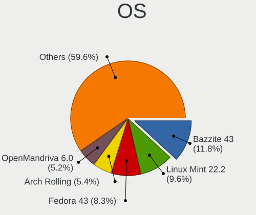

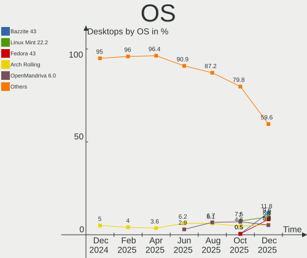

| Name                         | Desktops | Percent |
|------------------------------|----------|---------|
| Bazzite 43                   | 88       | 11.84%  |
| Linux Mint 22.2              | 71       | 9.56%   |
| Fedora 43                    | 62       | 8.34%   |
| Arch Rolling                 | 40       | 5.38%   |
| OpenMandriva 6.0             | 39       | 5.25%   |
| Ubuntu 24.04                 | 38       | 5.11%   |
| Zorin 18                     | 31       | 4.17%   |
| OpenMandriva 25.11           | 27       | 3.63%   |
| OpenMandriva 25.90           | 24       | 3.23%   |
| Bazzite 42                   | 24       | 3.23%   |
| Pop!_OS 24.04                | 23       | 3.1%    |
| Pop!_OS 22.04                | 19       | 2.56%   |
| Debian 13                    | 19       | 2.56%   |
| Kubuntu 25.10                | 17       | 2.29%   |
| CachyOS Rolling              | 14       | 1.88%   |
| Zorin 17                     | 13       | 1.75%   |
| Fedora 42                    | 13       | 1.75%   |
| Nobara 43                    | 12       | 1.62%   |
| EndeavourOS Rolling          | 11       | 1.48%   |
| Ubuntu 25.10                 | 10       | 1.35%   |
| Linux Mint 22.1              | 10       | 1.35%   |
| CachyOS                      | 9        | 1.21%   |
| KDE neon 24.04               | 8        | 1.08%   |
| Gentoo 2.18                  | 8        | 1.08%   |
| Manjaro 25.1.0               | 6        | 0.81%   |
| Garuda Linux Rolling         | 6        | 0.81%   |
| OpenMandriva 25.06           | 5        | 0.67%   |
| Kubuntu 24.04                | 5        | 0.67%   |
| Debian 12                    | 5        | 0.67%   |
| Ubuntu 22.04                 | 3        | 0.4%    |
| openSUSE Tumbleweed-XXXXXXXX | 3        | 0.4%    |
| NixOS 26.05                  | 3        | 0.4%    |
| Manjaro                      | 3        | 0.4%    |
| LMDE 7                       | 3        | 0.4%    |
| Linux Mint 21.3              | 3        | 0.4%    |
| Bluefin 43                   | 3        | 0.4%    |
| Ubuntu 26.04                 | 2        | 0.27%   |
| SteamOS 3.7.17               | 2        | 0.27%   |
| Pika OS 4                    | 2        | 0.27%   |
| OpenMandriva 5.0             | 2        | 0.27%   |

OS Family
---------

OS without a version

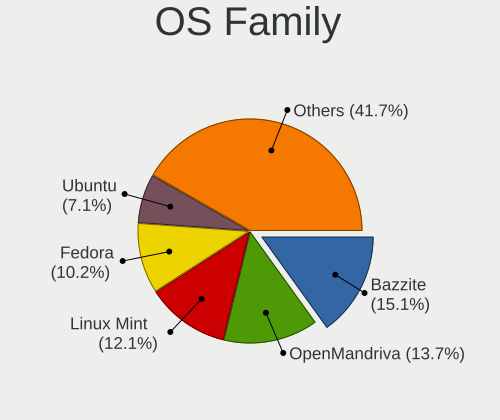

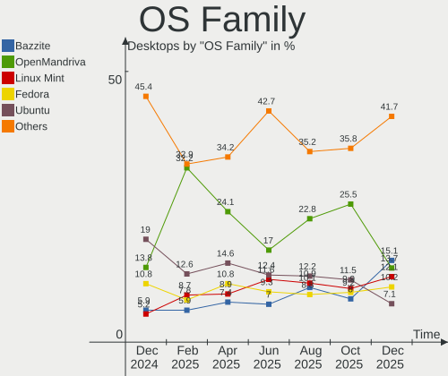

| Name         | Desktops | Percent |
|--------------|----------|---------|
| Bazzite      | 112      | 15.07%  |
| OpenMandriva | 102      | 13.73%  |
| Linux Mint   | 90       | 12.11%  |
| Fedora       | 76       | 10.23%  |
| Ubuntu       | 53       | 7.13%   |
| Zorin        | 44       | 5.92%   |
| Pop!_OS      | 42       | 5.65%   |
| Arch         | 40       | 5.38%   |
| Debian       | 25       | 3.36%   |
| CachyOS      | 23       | 3.1%    |
| Kubuntu      | 22       | 2.96%   |
| Nobara       | 12       | 1.62%   |
| Manjaro      | 11       | 1.48%   |
| EndeavourOS  | 11       | 1.48%   |
| Gentoo       | 9        | 1.21%   |
| KDE neon     | 8        | 1.08%   |
| Garuda Linux | 7        | 0.94%   |
| openSUSE     | 5        | 0.67%   |
| NixOS        | 5        | 0.67%   |
| SteamOS      | 4        | 0.54%   |
| Lubuntu      | 4        | 0.54%   |
| LMDE         | 3        | 0.4%    |
| Bluefin      | 3        | 0.4%    |
| Xubuntu      | 2        | 0.27%   |
| Unraid OS    | 2        | 0.27%   |
| Ubuntu MATE  | 2        | 0.27%   |
| Pikaos       | 2        | 0.27%   |
| Kali         | 2        | 0.27%   |
| Dts-distro   | 2        | 0.27%   |
| BuildRoot    | 2        | 0.27%   |
| BigLinux     | 2        | 0.27%   |
| Anduinos     | 2        | 0.27%   |
| Void Linux   | 1        | 0.13%   |
| Solus        | 1        | 0.13%   |
| Rocky Linux  | 1        | 0.13%   |
| Parrot       | 1        | 0.13%   |
| Pardus       | 1        | 0.13%   |
| MX           | 1        | 0.13%   |
| Elementary   | 1        | 0.13%   |
| Drauger OS   | 1        | 0.13%   |

Kernel
------

Version of the Linux kernel

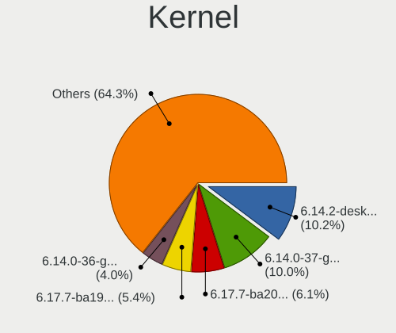

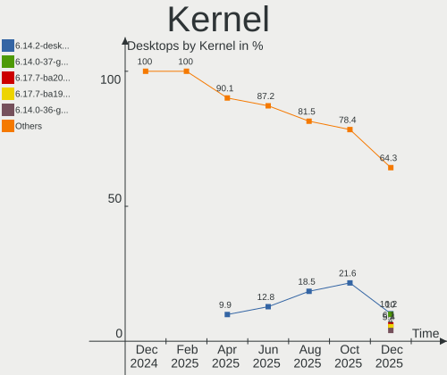

| Version                        | Desktops | Percent |
|--------------------------------|----------|---------|
| 6.14.2-desktop-3omv2590        | 76       | 10.23%  |
| 6.14.0-37-generic              | 74       | 9.96%   |
| 6.17.7-ba20.fc43.x86_64        | 45       | 6.06%   |
| 6.17.7-ba19.fc43.x86_64        | 40       | 5.38%   |
| 6.14.0-36-generic              | 30       | 4.04%   |
| 6.8.0-90-generic               | 29       | 3.9%    |
| 6.17.9-arch1-1                 | 27       | 3.63%   |
| 6.16.4-116.bazzite.fc42.x86_64 | 23       | 3.1%    |
| 6.12.57+deb13-amd64            | 21       | 2.83%   |
| 6.17.9-76061709-generic        | 20       | 2.69%   |
| 6.8.0-88-generic               | 19       | 2.56%   |
| 6.17.12-300.fc43.x86_64        | 19       | 2.56%   |
| 6.17.9-300.fc43.x86_64         | 15       | 2.02%   |
| 6.17.4-76061704-generic        | 15       | 2.02%   |
| 6.17.0-7-generic               | 15       | 2.02%   |
| 6.17.0-8-generic               | 13       | 1.75%   |
| 6.18.0-desktop-1omv2590        | 11       | 1.48%   |
| 6.14.0-29-generic              | 11       | 1.48%   |
| 6.17.9-zen1-1-zen              | 9        | 1.21%   |
| 6.17.7-desktop-1omv2590        | 9        | 1.21%   |
| 6.17.11-300.fc43.x86_64        | 9        | 1.21%   |
| 6.17.10-300.fc43.x86_64        | 9        | 1.21%   |
| 6.8.0-87-generic               | 8        | 1.08%   |
| 6.17.1-300.fc43.x86_64         | 8        | 1.08%   |
| 6.16.3-76061603-generic        | 7        | 0.94%   |
| 6.18.0-3-cachyos               | 6        | 0.81%   |
| 6.17.10-200.nobara.fc43.x86_64 | 6        | 0.81%   |
| 6.18.2-arch2-1                 | 5        | 0.67%   |
| 6.18.2-zen2-1-zen              | 4        | 0.54%   |
| 6.17.9-200.fc42.x86_64         | 4        | 0.54%   |
| 6.17.9-2-cachyos               | 4        | 0.54%   |
| 6.18.2-200.nobara.fc43.x86_64  | 3        | 0.4%    |
| 6.18.2-2-cachyos               | 3        | 0.4%    |
| 6.18.0-061800-generic          | 3        | 0.4%    |
| 6.17.8-300.fc43.x86_64         | 3        | 0.4%    |
| 6.12.58-gentoo-x86_64          | 3        | 0.4%    |
| 5.15.0-163-generic             | 3        | 0.4%    |
| 6.8.0-51-generic               | 2        | 0.27%   |
| 6.6.21-yocto-standard          | 2        | 0.27%   |
| 6.6.2-desktop-1omv2390         | 2        | 0.27%   |

Kernel Family
-------------

Linux kernel without a distro release

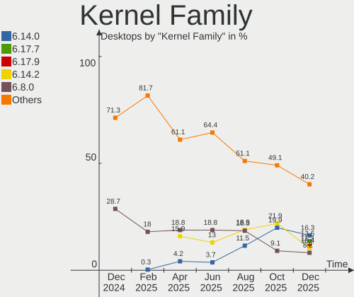

| Version | Desktops | Percent |
|---------|----------|---------|
| 6.14.0  | 121      | 16.29%  |
| 6.17.7  | 101      | 13.59%  |
| 6.17.9  | 84       | 11.31%  |
| 6.14.2  | 77       | 10.36%  |
| 6.8.0   | 61       | 8.21%   |
| 6.18.0  | 33       | 4.44%   |
| 6.17.0  | 31       | 4.17%   |
| 6.16.4  | 25       | 3.36%   |
| 6.12.57 | 23       | 3.1%    |
| 6.17.12 | 22       | 2.96%   |
| 6.17.10 | 21       | 2.83%   |
| 6.18.2  | 18       | 2.42%   |
| 6.17.4  | 15       | 2.02%   |
| 6.17.11 | 11       | 1.48%   |
| 6.18.1  | 10       | 1.35%   |
| 6.17.8  | 9        | 1.21%   |
| 6.17.1  | 8        | 1.08%   |
| 5.15.0  | 8        | 1.08%   |
| 6.16.3  | 7        | 0.94%   |
| 6.12.63 | 4        | 0.54%   |
| 6.12.58 | 4        | 0.54%   |
| 6.1.0   | 4        | 0.54%   |
| 6.16.12 | 3        | 0.4%    |
| 6.12.62 | 3        | 0.4%    |
| 6.12.48 | 3        | 0.4%    |
| 6.12.1  | 3        | 0.4%    |
| 6.6.21  | 2        | 0.27%   |
| 6.6.2   | 2        | 0.27%   |
| 6.17.13 | 2        | 0.27%   |
| 6.12.61 | 2        | 0.27%   |
| 6.12.60 | 2        | 0.27%   |
| 6.12.0  | 2        | 0.27%   |
| 6.11.11 | 2        | 0.27%   |
| 6.9.10  | 1        | 0.13%   |
| 6.6.68  | 1        | 0.13%   |
| 6.6.119 | 1        | 0.13%   |
| 6.5.0   | 1        | 0.13%   |
| 6.4.8   | 1        | 0.13%   |
| 6.19.0  | 1        | 0.13%   |
| 6.17.5  | 1        | 0.13%   |

Kernel Major Ver.
-----------------

Linux kernel major version

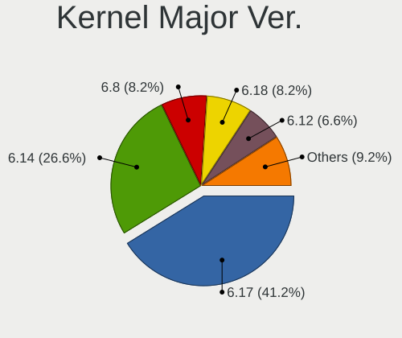

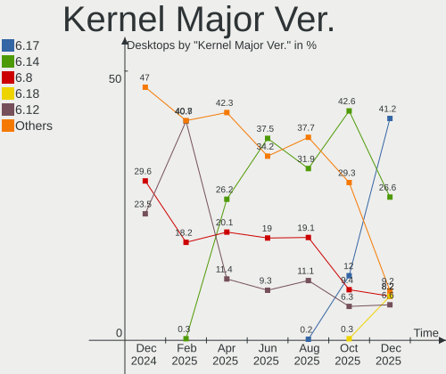

| Version | Desktops | Percent |
|---------|----------|---------|
| 6.17    | 306      | 41.18%  |
| 6.14    | 198      | 26.65%  |
| 6.8     | 61       | 8.21%   |
| 6.18    | 61       | 8.21%   |
| 6.12    | 49       | 6.59%   |
| 6.16    | 36       | 4.85%   |
| 5.15    | 8        | 1.08%   |
| 6.6     | 6        | 0.81%   |
| 6.1     | 6        | 0.81%   |
| 6.11    | 3        | 0.4%    |
| 6.15    | 2        | 0.27%   |
| 6.9     | 1        | 0.13%   |
| 6.5     | 1        | 0.13%   |
| 6.4     | 1        | 0.13%   |
| 6.19    | 1        | 0.13%   |
| 6.13    | 1        | 0.13%   |
| 5.4     | 1        | 0.13%   |
| 5.14    | 1        | 0.13%   |

Arch
----

OS architecture (x86_64, i586, etc.)

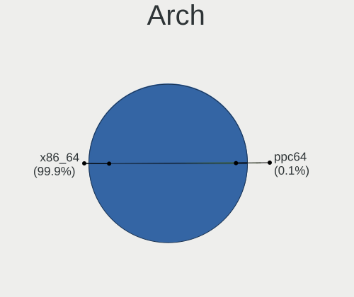

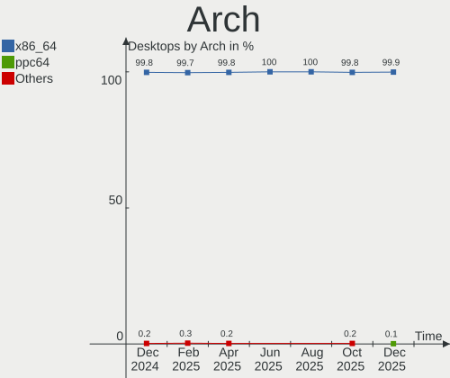

| Name   | Desktops | Percent |
|--------|----------|---------|
| x86_64 | 742      | 99.87%  |
| ppc64  | 1        | 0.13%   |

DE
--

Desktop Environment

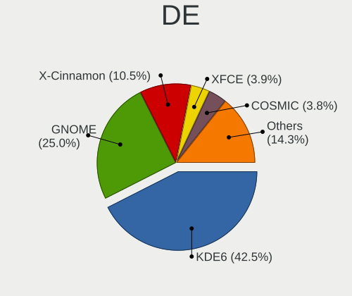

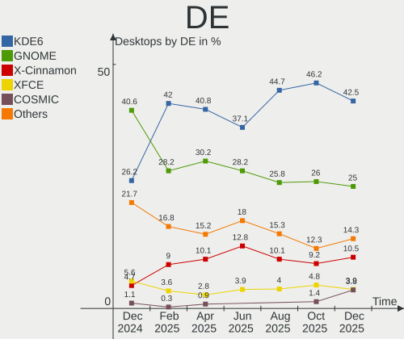

| Name          | Desktops | Percent |
|---------------|----------|---------|
| KDE6          | 316      | 42.53%  |
| GNOME         | 186      | 25.03%  |
| X-Cinnamon    | 78       | 10.5%   |
| XFCE          | 29       | 3.9%    |
| COSMIC        | 28       | 3.77%   |
| Unknown       | 23       | 3.1%    |
| LXQt          | 16       | 2.15%   |
| KDE5          | 16       | 2.15%   |
| KDE           | 14       | 1.88%   |
| MATE          | 7        | 0.94%   |
| KDE4          | 6        | 0.81%   |
| niri          | 5        | 0.67%   |
| Hyprland      | 5        | 0.67%   |
| Cinnamon      | 3        | 0.4%    |
| i3            | 2        | 0.27%   |
| Budgie        | 2        | 0.27%   |
| sway:wlroots  | 1        | 0.13%   |
| sway          | 1        | 0.13%   |
| Pantheon      | 1        | 0.13%   |
| LeftWM        | 1        | 0.13%   |
| GNOME Classic | 1        | 0.13%   |
| e16-session   | 1        | 0.13%   |
| bspwm         | 1        | 0.13%   |

Display Server
--------------

X11 or Wayland

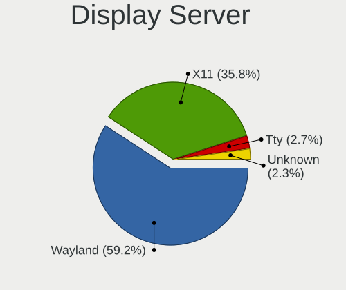

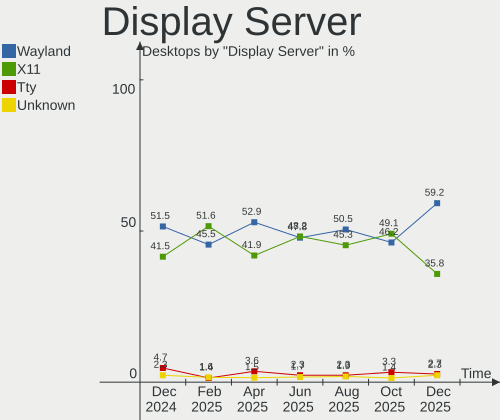

| Name    | Desktops | Percent |
|---------|----------|---------|
| Wayland | 440      | 59.22%  |
| X11     | 266      | 35.8%   |
| Tty     | 20       | 2.69%   |
| Unknown | 17       | 2.29%   |

Display Manager
---------------

SDDM, LightDM, etc.

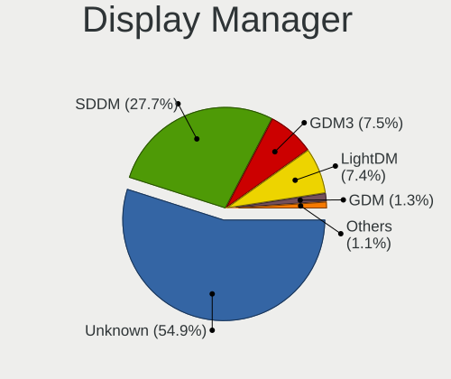

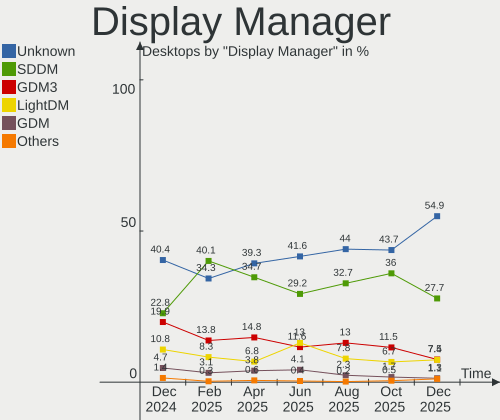

| Name           | Desktops | Percent |
|----------------|----------|---------|
| Unknown        | 408      | 54.91%  |
| SDDM           | 206      | 27.73%  |
| GDM3           | 56       | 7.54%   |
| LightDM        | 55       | 7.4%    |
| GDM            | 10       | 1.35%   |
| COSMIC-GREETER | 4        | 0.54%   |
| GREETD         | 3        | 0.4%    |
| Ly             | 1        | 0.13%   |

OS Lang
-------

Language

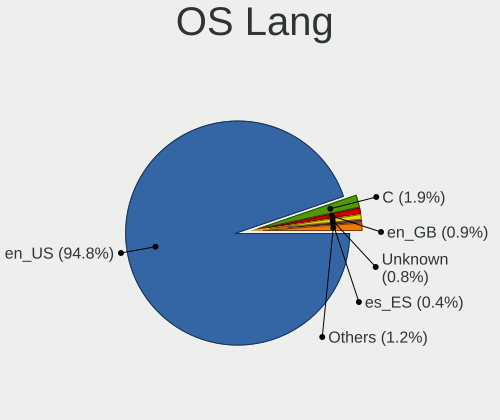

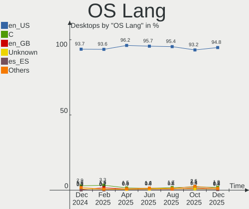

| Lang    | Desktops | Percent |
|---------|----------|---------|
| en_US   | 704      | 94.75%  |
| C       | 14       | 1.88%   |
| en_GB   | 7        | 0.94%   |
| Unknown | 6        | 0.81%   |
| es_ES   | 3        | 0.4%    |
| de_AT   | 2        | 0.27%   |
| C.UTF8  | 2        | 0.27%   |
| zh_CN   | 1        | 0.13%   |
| ru_RU   | 1        | 0.13%   |
| POSIX   | 1        | 0.13%   |
| es_US   | 1        | 0.13%   |
| en_CA   | 1        | 0.13%   |

Boot Mode
---------

EFI or BIOS

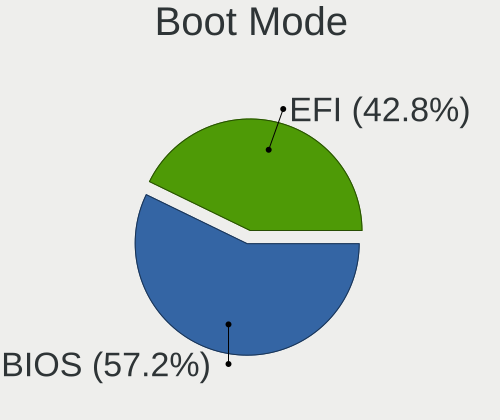

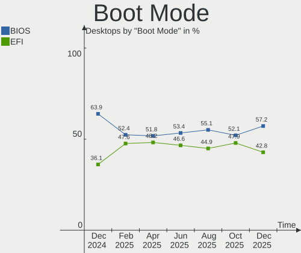

| Mode | Desktops | Percent |
|------|----------|---------|
| BIOS | 425      | 57.2%   |
| EFI  | 318      | 42.8%   |

Filesystem
----------

Type of filesystem

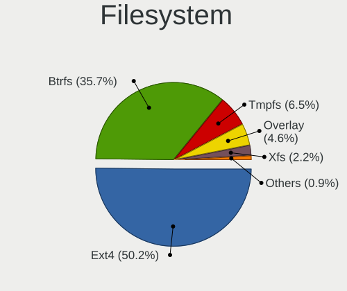

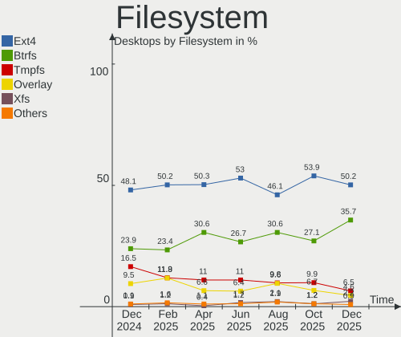

| Type    | Desktops | Percent |
|---------|----------|---------|
| Ext4    | 373      | 50.2%   |
| Btrfs   | 265      | 35.67%  |
| Tmpfs   | 48       | 6.46%   |
| Overlay | 34       | 4.58%   |
| Xfs     | 16       | 2.15%   |
| Rootfs  | 3        | 0.4%    |
| Zfs     | 2        | 0.27%   |
| XXXXX   | 1        | 0.13%   |
| XXX4    | 1        | 0.13%   |

Part. scheme
------------

Scheme of partitioning

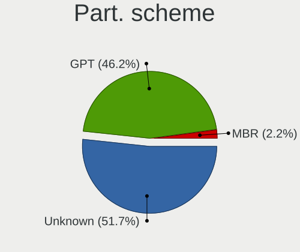

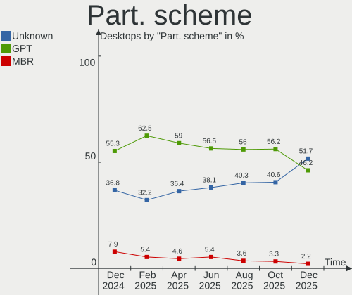

| Type    | Desktops | Percent |
|---------|----------|---------|
| Unknown | 384      | 51.68%  |
| GPT     | 343      | 46.16%  |
| MBR     | 16       | 2.15%   |

Dual Boot with Linux/BSD
------------------------

Hosting more than one Linux/BSD

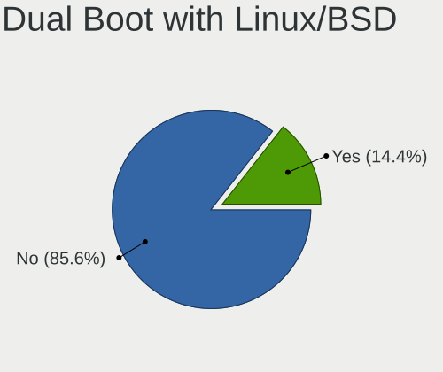

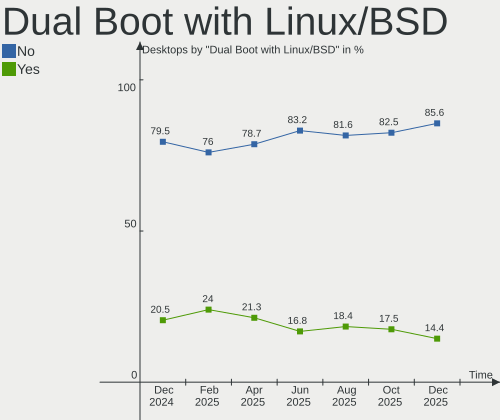

| Dual boot | Desktops | Percent |
|-----------|----------|---------|
| No        | 636      | 85.6%   |
| Yes       | 107      | 14.4%   |

Dual Boot (Win)
---------------

Hosting Linux and Windows

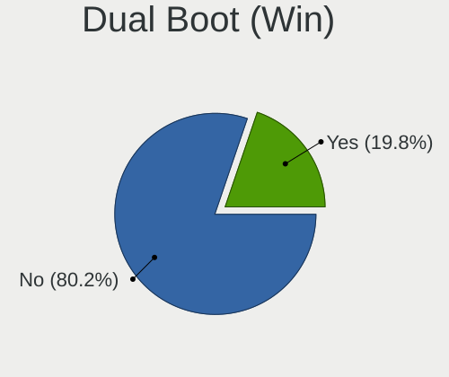

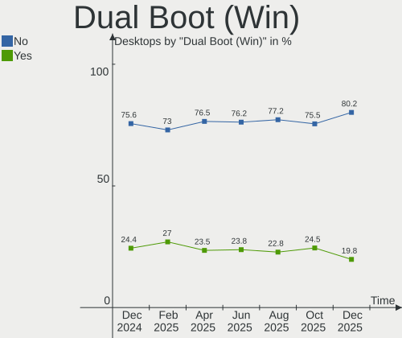

| Dual boot | Desktops | Percent |
|-----------|----------|---------|
| No        | 596      | 80.22%  |
| Yes       | 147      | 19.78%  |

Board
-----

Vendor
------

Motherboard manufacturer

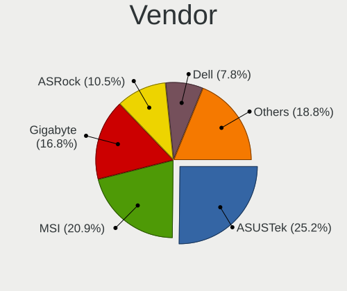

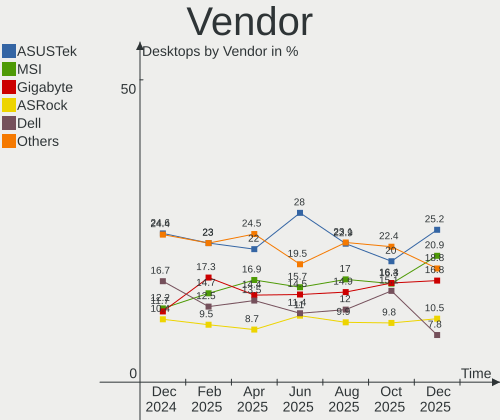

| Name                                 | Desktops | Percent |
|--------------------------------------|----------|---------|
| ASUSTek Computer                     | 187      | 25.17%  |
| MSI                                  | 155      | 20.86%  |
| Gigabyte Technology                  | 125      | 16.82%  |
| ASRock                               | 78       | 10.5%   |
| Dell                                 | 58       | 7.81%   |
| Hewlett-Packard                      | 55       | 7.4%    |
| Lenovo                               | 20       | 2.69%   |
| Pegatron                             | 8        | 1.08%   |
| Unknown                              | 8        | 1.08%   |
| Intel                                | 7        | 0.94%   |
| Acer                                 | 5        | 0.67%   |
| GEEKOM                               | 4        | 0.54%   |
| AZW                                  | 4        | 0.54%   |
| PELADN                               | 3        | 0.4%    |
| Biostar                              | 3        | 0.4%    |
| AMD                                  | 3        | 0.4%    |
| System76                             | 2        | 0.27%   |
| Shenzhen Meigao Electronic Equipment | 2        | 0.27%   |
| GMKtec                               | 2        | 0.27%   |
| BESSTAR Tech                         | 2        | 0.27%   |
| Alienware                            | 2        | 0.27%   |
| Tianbei                              | 1        | 0.13%   |
| Supermicro                           | 1        | 0.13%   |
| SHANGZHAOYUAN                        | 1        | 0.13%   |
| Quanta                               | 1        | 0.13%   |
| NZXT                                 | 1        | 0.13%   |
| Minix                                | 1        | 0.13%   |
| IceWhale Technology                  | 1        | 0.13%   |
| Huanan                               | 1        | 0.13%   |
| HC Technology.                       | 1        | 0.13%   |
| Gateway                              | 1        | 0.13%   |

Model
-----

Motherboard model

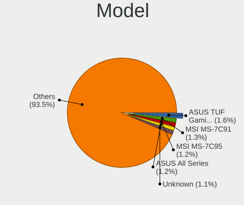

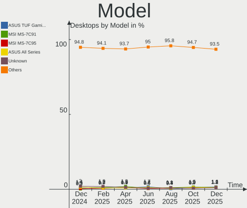

| Name                                      | Desktops | Percent |
|-------------------------------------------|----------|---------|
| ASUS TUF Gaming X570-PLUS                 | 12       | 1.62%   |
| MSI MS-7C91                               | 10       | 1.35%   |
| MSI MS-7C95                               | 9        | 1.21%   |
| ASUS All Series                           | 9        | 1.21%   |
| Unknown                                   | 8        | 1.08%   |
| MSI MS-7C37                               | 6        | 0.81%   |
| MSI MS-7E12                               | 5        | 0.67%   |
| MSI MS-7D75                               | 5        | 0.67%   |
| ASUS ROG STRIX B550-F GAMING WIFI II      | 5        | 0.67%   |
| MSI MS-7E51                               | 4        | 0.54%   |
| MSI MS-7C56                               | 4        | 0.54%   |
| MSI MS-7B24                               | 4        | 0.54%   |
| Lenovo ThinkCentre M72e 0967B5U           | 4        | 0.54%   |
| Dell XPS 8700                             | 4        | 0.54%   |
| Dell Precision Tower 5810                 | 4        | 0.54%   |
| ASUS ROG STRIX X870E-E GAMING WIFI        | 4        | 0.54%   |
| MSI MS-7E59                               | 3        | 0.4%    |
| MSI MS-7E49                               | 3        | 0.4%    |
| MSI MS-7D78                               | 3        | 0.4%    |
| MSI MS-7C02                               | 3        | 0.4%    |
| MSI MS-7B87                               | 3        | 0.4%    |
| MSI MS-7B85                               | 3        | 0.4%    |
| MSI MS-7A34                               | 3        | 0.4%    |
| MSI MS-7850                               | 3        | 0.4%    |
| MSI MS-7721                               | 3        | 0.4%    |
| HP Z4 G4 Workstation                      | 3        | 0.4%    |
| HP Victus by 15L Gaming Desktop TG02-0xxx | 3        | 0.4%    |
| HP Pavilion Desktop TP01-0xxx             | 3        | 0.4%    |
| Gigabyte X870E AORUS ELITE WIFI7          | 3        | 0.4%    |
| Gigabyte X670 AORUS ELITE AX              | 3        | 0.4%    |
| Gigabyte X570 AORUS ULTRA                 | 3        | 0.4%    |
| Gigabyte X570 AORUS ELITE                 | 3        | 0.4%    |
| Gigabyte GamingPC                         | 3        | 0.4%    |
| Gigabyte B650 AORUS ELITE AX              | 3        | 0.4%    |
| Gigabyte AB350-Gaming 3                   | 3        | 0.4%    |
| ASUS TUF Gaming X570-PRO                  | 3        | 0.4%    |
| ASUS TUF Gaming B650-PLUS WIFI            | 3        | 0.4%    |
| ASUS TUF Gaming B560M-PLUS WIFI           | 3        | 0.4%    |
| ASUS TUF Gaming B550M-PLUS                | 3        | 0.4%    |
| ASUS ROG STRIX B650E-F GAMING WIFI        | 3        | 0.4%    |

Model Family
------------

Motherboard model prefix

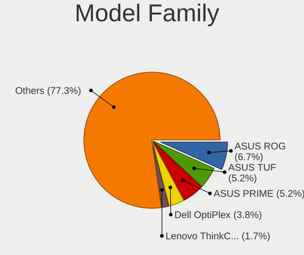

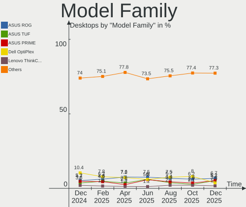

| Name                  | Desktops | Percent |
|-----------------------|----------|---------|
| ASUS ROG              | 50       | 6.73%   |
| ASUS TUF              | 39       | 5.25%   |
| ASUS PRIME            | 39       | 5.25%   |
| Dell OptiPlex         | 28       | 3.77%   |
| Lenovo ThinkCentre    | 13       | 1.75%   |
| Dell XPS              | 11       | 1.48%   |
| MSI MS-7C91           | 10       | 1.35%   |
| HP Compaq             | 10       | 1.35%   |
| Gigabyte X570         | 10       | 1.35%   |
| Gigabyte B650         | 10       | 1.35%   |
| Dell Precision        | 10       | 1.35%   |
| MSI MS-7C95           | 9        | 1.21%   |
| ASUS All              | 9        | 1.21%   |
| HP Pavilion           | 8        | 1.08%   |
| Gigabyte X870E        | 8        | 1.08%   |
| Unknown               | 8        | 1.08%   |
| ASRock X570           | 7        | 0.94%   |
| MSI MS-7C37           | 6        | 0.81%   |
| Gigabyte X870         | 6        | 0.81%   |
| Gigabyte B650M        | 6        | 0.81%   |
| Gigabyte B550         | 6        | 0.81%   |
| Dell Inspiron         | 6        | 0.81%   |
| MSI US                | 5        | 0.67%   |
| MSI MS-7E12           | 5        | 0.67%   |
| MSI MS-7D75           | 5        | 0.67%   |
| HP EliteDesk          | 5        | 0.67%   |
| Gigabyte Z790         | 5        | 0.67%   |
| ASUS Pro              | 5        | 0.67%   |
| ASRock B550           | 5        | 0.67%   |
| MSI MS-7E51           | 4        | 0.54%   |
| MSI MS-7C56           | 4        | 0.54%   |
| MSI MS-7B24           | 4        | 0.54%   |
| HP ProDesk            | 4        | 0.54%   |
| Gigabyte B450M        | 4        | 0.54%   |
| Gigabyte B450         | 4        | 0.54%   |
| Gigabyte AB350-Gaming | 4        | 0.54%   |
| ASUS Amd              | 4        | 0.54%   |
| ASRock X670E          | 4        | 0.54%   |
| ASRock B650M          | 4        | 0.54%   |
| MSI MS-7E59           | 3        | 0.4%    |

MFG Year
--------

Motherboard manufacture year

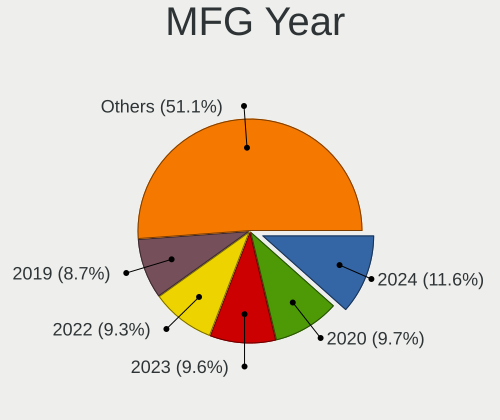

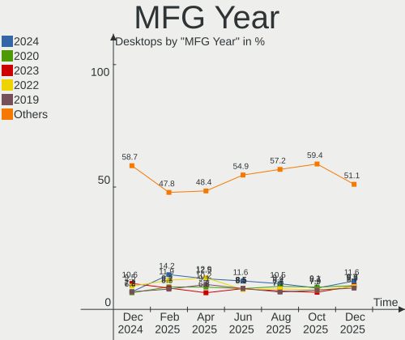

| Year    | Desktops | Percent |
|---------|----------|---------|
| 2024    | 86       | 11.57%  |
| 2020    | 72       | 9.69%   |
| 2023    | 71       | 9.56%   |
| 2022    | 69       | 9.29%   |
| 2019    | 65       | 8.75%   |
| 2018    | 63       | 8.48%   |
| 2021    | 59       | 7.94%   |
| 2025    | 41       | 5.52%   |
| 2013    | 36       | 4.85%   |
| 2017    | 34       | 4.58%   |
| 2012    | 30       | 4.04%   |
| 2016    | 26       | 3.5%    |
| 2014    | 26       | 3.5%    |
| 2015    | 21       | 2.83%   |
| 2011    | 21       | 2.83%   |
| 2009    | 12       | 1.62%   |
| 2010    | 5        | 0.67%   |
| 2008    | 3        | 0.4%    |
| 2007    | 2        | 0.27%   |
| Unknown | 1        | 0.13%   |

Form Factor
-----------

Physical design of the computer

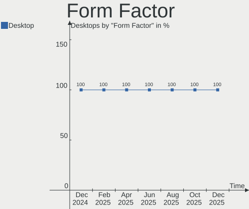

| Name    | Desktops | Percent |
|---------|----------|---------|
| Desktop | 743      | 100%    |

Secure Boot
-----------

Enabled or disabled

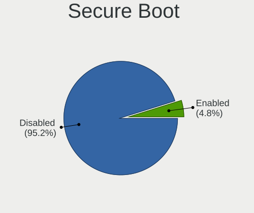

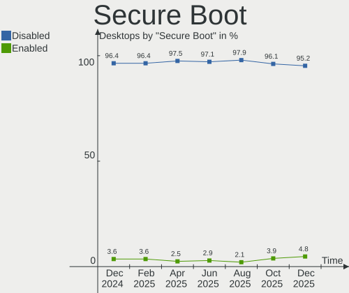

| State    | Desktops | Percent |
|----------|----------|---------|
| Disabled | 707      | 95.15%  |
| Enabled  | 36       | 4.85%   |

Coreboot
--------

Have coreboot on board

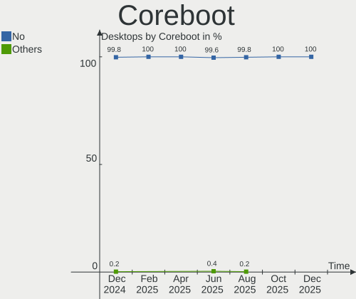

| Used | Desktops | Percent |
|------|----------|---------|
| No   | 743      | 100%    |

RAM Size
--------

Total RAM memory

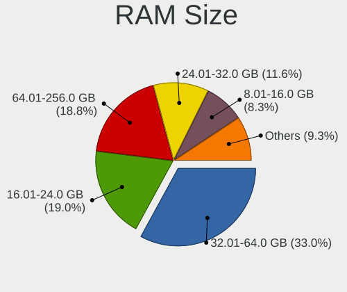

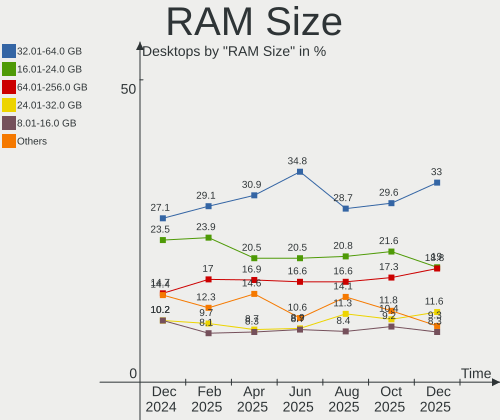

| Size in GB      | Desktops | Percent |
|-----------------|----------|---------|
| 32.01-64.0      | 245      | 32.97%  |
| 16.01-24.0      | 141      | 18.98%  |
| 64.01-256.0     | 140      | 18.84%  |
| 24.01-32.0      | 86       | 11.57%  |
| 8.01-16.0       | 62       | 8.34%   |
| 4.01-8.0        | 48       | 6.46%   |
| 3.01-4.0        | 13       | 1.75%   |
| More than 256.0 | 4        | 0.54%   |
| 1.01-2.0        | 2        | 0.27%   |
| 2.01-3.0        | 1        | 0.13%   |
| 0.01-0.5        | 1        | 0.13%   |

RAM Used
--------

Used RAM memory

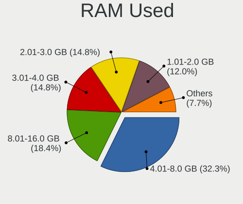

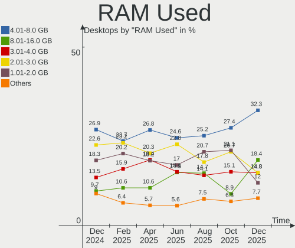

| Used GB     | Desktops | Percent |
|-------------|----------|---------|
| 4.01-8.0    | 240      | 32.3%   |
| 8.01-16.0   | 137      | 18.44%  |
| 3.01-4.0    | 110      | 14.8%   |
| 2.01-3.0    | 110      | 14.8%   |
| 1.01-2.0    | 89       | 11.98%  |
| 16.01-24.0  | 23       | 3.1%    |
| 0.51-1.0    | 14       | 1.88%   |
| 32.01-64.0  | 7        | 0.94%   |
| 24.01-32.0  | 6        | 0.81%   |
| 0.01-0.5    | 5        | 0.67%   |
| 64.01-256.0 | 2        | 0.27%   |

Total Drives
------------

Number of drives on board

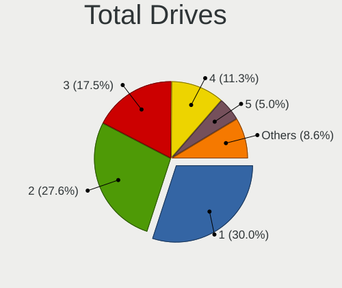

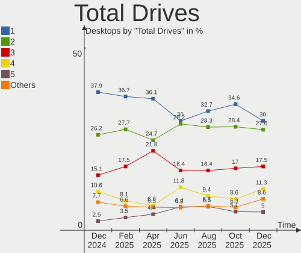

| Drives | Desktops | Percent |
|--------|----------|---------|
| 1      | 223      | 30.01%  |
| 2      | 205      | 27.59%  |
| 3      | 130      | 17.5%   |
| 4      | 84       | 11.31%  |
| 5      | 37       | 4.98%   |
| 6      | 32       | 4.31%   |
| 7      | 13       | 1.75%   |
| 9      | 4        | 0.54%   |
| 0      | 4        | 0.54%   |
| 10     | 3        | 0.4%    |
| 8      | 3        | 0.4%    |
| 13     | 2        | 0.27%   |
| 33     | 1        | 0.13%   |
| 16     | 1        | 0.13%   |
| 14     | 1        | 0.13%   |

Has CD-ROM
----------

Has CD-ROM on board

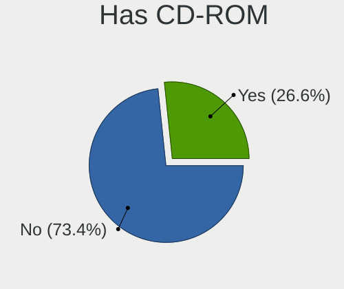

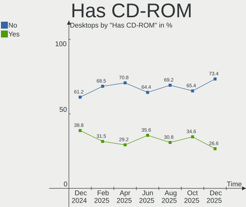

| Presented | Desktops | Percent |
|-----------|----------|---------|
| No        | 545      | 73.35%  |
| Yes       | 198      | 26.65%  |

Has Ethernet
------------

Has Ethernet on board

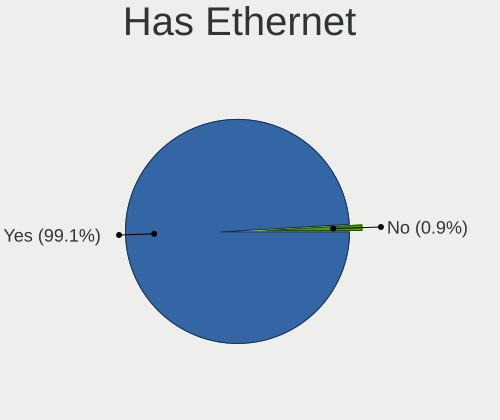

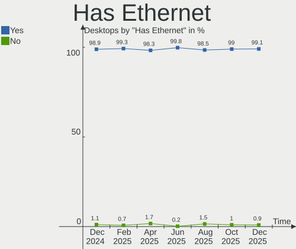

| Presented | Desktops | Percent |
|-----------|----------|---------|
| Yes       | 736      | 99.06%  |
| No        | 7        | 0.94%   |

Has WiFi
--------

Has WiFi module

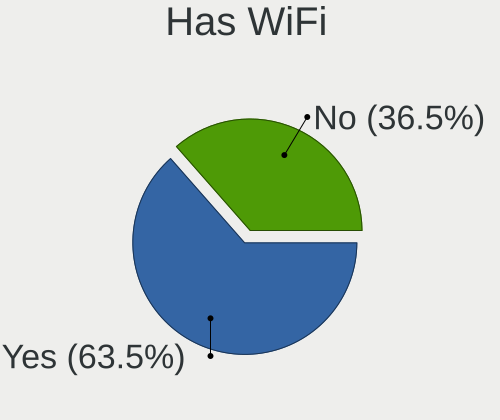

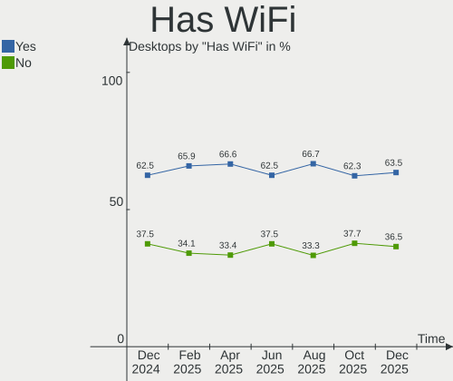

| Presented | Desktops | Percent |
|-----------|----------|---------|
| Yes       | 472      | 63.53%  |
| No        | 271      | 36.47%  |

Has Bluetooth
-------------

Has Bluetooth module

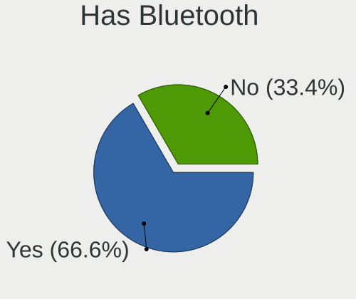

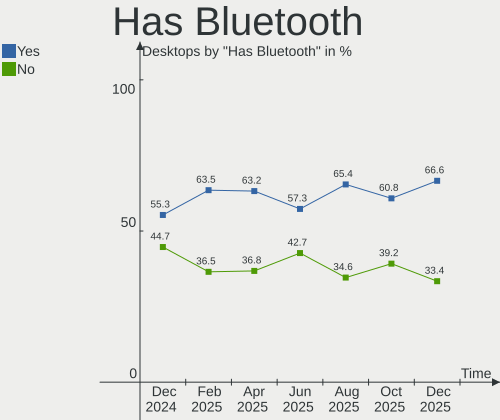

| Presented | Desktops | Percent |
|-----------|----------|---------|
| Yes       | 495      | 66.62%  |
| No        | 248      | 33.38%  |

Location
--------

Country
-------

Geographic location (country)

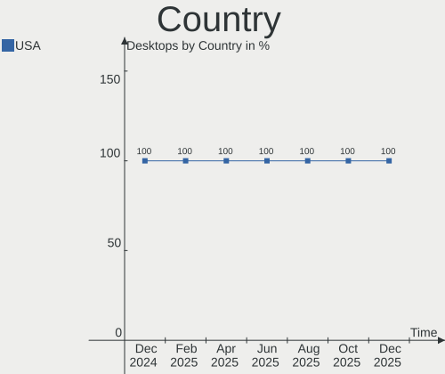

| Country | Desktops | Percent |
|---------|----------|---------|
| USA     | 743      | 100%    |

City
----

Geographic location (city)

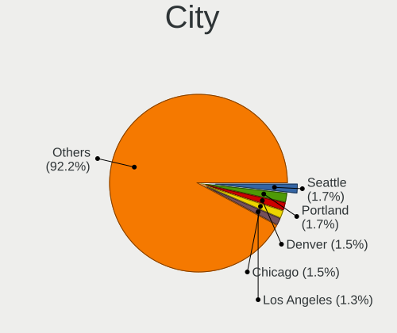

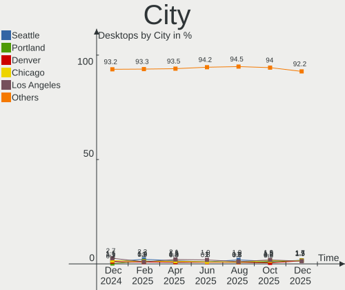

| City           | Desktops | Percent |
|----------------|----------|---------|
| Seattle        | 13       | 1.75%   |
| Portland       | 13       | 1.75%   |
| Denver         | 11       | 1.48%   |
| Chicago        | 11       | 1.48%   |
| Los Angeles    | 10       | 1.35%   |
| San Diego      | 8        | 1.08%   |
| Atlanta        | 8        | 1.08%   |
| Houston        | 7        | 0.94%   |
| Las Vegas      | 6        | 0.81%   |
| Indianapolis   | 6        | 0.81%   |
| Cleveland      | 6        | 0.81%   |
| St Louis       | 5        | 0.67%   |
| San Antonio    | 5        | 0.67%   |
| New York       | 5        | 0.67%   |
| Minneapolis    | 5        | 0.67%   |
| Miami          | 5        | 0.67%   |
| Dallas         | 5        | 0.67%   |
| Sterling       | 4        | 0.54%   |
| San Francisco  | 4        | 0.54%   |
| Richmond       | 4        | 0.54%   |
| Peoria         | 4        | 0.54%   |
| Knoxville      | 4        | 0.54%   |
| Kansas City    | 4        | 0.54%   |
| Brooklyn       | 4        | 0.54%   |
| Ashburn        | 4        | 0.54%   |
| Aiken          | 4        | 0.54%   |
| Vancouver      | 3        | 0.4%    |
| Twin Valley    | 3        | 0.4%    |
| Troy           | 3        | 0.4%    |
| St. Petersburg | 3        | 0.4%    |
| Spokane        | 3        | 0.4%    |
| Sioux City     | 3        | 0.4%    |
| Petersburg     | 3        | 0.4%    |
| Omaha          | 3        | 0.4%    |
| Oklahoma City  | 3        | 0.4%    |
| Mesa           | 3        | 0.4%    |
| Medway         | 3        | 0.4%    |
| Lynnwood       | 3        | 0.4%    |
| Lubbock        | 3        | 0.4%    |
| Lincoln        | 3        | 0.4%    |

Drives
------

Drive Vendor
------------

Hard drive vendors

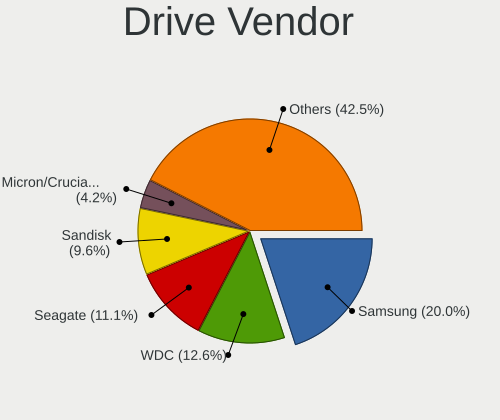

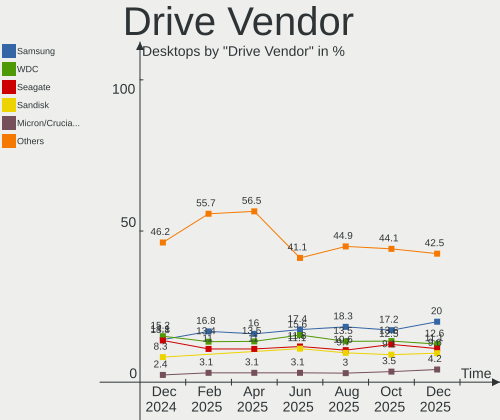

| Vendor                       | Desktops | Drives | Percent |
|------------------------------|----------|--------|---------|
| Samsung Electronics          | 294      | 479    | 19.96%  |
| WDC                          | 186      | 267    | 12.63%  |
| Seagate                      | 163      | 251    | 11.07%  |
| Sandisk                      | 142      | 176    | 9.64%   |
| Micron/Crucial Technology    | 62       | 73     | 4.21%   |
| Crucial                      | 61       | 74     | 4.14%   |
| Toshiba                      | 47       | 52     | 3.19%   |
| Phison Electronics           | 37       | 47     | 2.51%   |
| Kingston                     | 37       | 45     | 2.51%   |
| MAXIO Technology (Hangzhou)  | 30       | 34     | 2.04%   |
| Intel                        | 26       | 32     | 1.77%   |
| PNY                          | 25       | 31     | 1.7%    |
| Micron Technology            | 24       | 25     | 1.63%   |
| Hitachi                      | 22       | 27     | 1.49%   |
| SK hynix                     | 19       | 27     | 1.29%   |
| Kingston Technology Company  | 18       | 20     | 1.22%   |
| China                        | 18       | 20     | 1.22%   |
| Realtek Semiconductor        | 17       | 19     | 1.15%   |
| Unknown                      | 16       | 26     | 1.09%   |
| HGST                         | 16       | 36     | 1.09%   |
| SPCC                         | 15       | 18     | 1.02%   |
| T-FORCE                      | 14       | 17     | 0.95%   |
| Silicon Motion               | 9        | 9      | 0.61%   |
| SOLIDIGM                     | 8        | 10     | 0.54%   |
| Shenzhen Longsys Electronics | 8        | 8      | 0.54%   |
| Team                         | 7        | 7      | 0.48%   |
| OCZ                          | 7        | 7      | 0.48%   |
| Hewlett-Packard              | 7        | 9      | 0.48%   |
| Seagate Technology           | 6        | 6      | 0.41%   |
| KingSpec                     | 6        | 6      | 0.41%   |
| ADATA Technology             | 6        | 6      | 0.41%   |
| Corsair                      | 5        | 6      | 0.34%   |
| X12                          | 4        | 4      | 0.27%   |
| Nextorage                    | 4        | 4      | 0.27%   |
| Mushkin                      | 4        | 5      | 0.27%   |
| LITEONIT                     | 4        | 4      | 0.27%   |
| KIOXIA                       | 4        | 4      | 0.27%   |
| HPE                          | 4        | 4      | 0.27%   |
| Fanxiang                     | 4        | 4      | 0.27%   |
| USB                          | 3        | 3      | 0.2%    |

Drive Model
-----------

Hard drive models

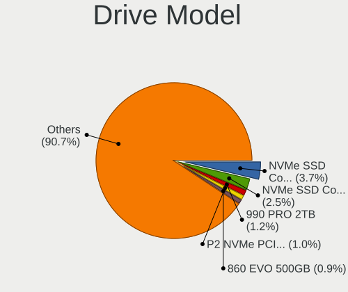

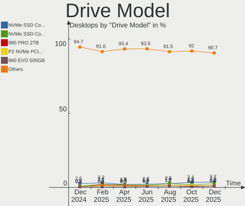

| Model                                                | Desktops | Percent |
|------------------------------------------------------|----------|---------|
| Samsung NVMe SSD Controller SM981/PM981/PM983 1TB    | 67       | 3.71%   |
| Samsung NVMe SSD Controller PM9A1/PM9A3/980PRO 1TB   | 45       | 2.49%   |
| Samsung SSD 990 PRO 2TB                              | 21       | 1.16%   |
| Micron/Crucial P2 NVMe PCIe SSD 2TB                  | 18       | 1%      |
| Samsung SSD 860 EVO 500GB                            | 17       | 0.94%   |
| Sandisk WD Blue SN550 NVMe SSD 1024GB                | 15       | 0.83%   |
| MAXIO (Hangzhou) NVMe SSD Controller MAP1202 2TB     | 15       | 0.83%   |
| Samsung SSD 980 1TB                                  | 14       | 0.78%   |
| WDC WD10EZEX-08WN4A0 1TB                             | 13       | 0.72%   |
| Samsung SSD 870 EVO 1TB                              | 13       | 0.72%   |
| Phison E12 NVMe Controller 1TB                       | 13       | 0.72%   |
| Seagate ST1000DM003-1CH162 1TB                       | 12       | 0.66%   |
| Sandisk WD_BLACK SN850X 2000GB                       | 12       | 0.66%   |
| Kingston SA400S37240G 240GB SSD                      | 12       | 0.66%   |
| Samsung SSD 990 PRO 4TB                              | 11       | 0.61%   |
| Samsung SSD 990 EVO Plus 1TB                         | 11       | 0.61%   |
| Crucial CT1000MX500SSD1 1TB                          | 11       | 0.61%   |
| Seagate ST2000DM008-2FR102 2TB                       | 10       | 0.55%   |
| Sandisk WD Blue SN580 1TB                            | 10       | 0.55%   |
| Samsung SSD 990 EVO 1TB                              | 10       | 0.55%   |
| Samsung SSD 870 EVO 4TB                              | 10       | 0.55%   |
| Samsung SSD 870 EVO 2TB                              | 10       | 0.55%   |
| Samsung SSD 850 EVO 500GB                            | 10       | 0.55%   |
| Sandisk WD_BLACK SN770 1TB                           | 9        | 0.5%    |
| Samsung SSD 860 EVO 1TB                              | 9        | 0.5%    |
| PNY CS900 1TB SSD                                    | 9        | 0.5%    |
| Seagate ST8000DM004-2U9188 8TB                       | 8        | 0.44%   |
| Sandisk WD_BLACK SN850X 1000GB                       | 8        | 0.44%   |
| Sandisk WD Black SN750 / PC SN730 NVMe SSD 500GB     | 8        | 0.44%   |
| Samsung NVMe SSD Controller SM961/PM961/SM963 1024GB | 8        | 0.44%   |
| Phison E16 PCIe4 NVMe Controller 1TB                 | 8        | 0.44%   |
| Crucial CT2000BX500SSD1 2TB                          | 8        | 0.44%   |
| WDC WDS500G2B0A-00SM50 500GB                         | 7        | 0.39%   |
| Seagate ST2000DM001-1ER164 2TB                       | 7        | 0.39%   |
| Samsung SSD 9100 PRO 2TB                             | 7        | 0.39%   |
| Samsung SSD 850 EVO 250GB                            | 7        | 0.39%   |
| Micron/Crucial CT1000P310SSD8 1TB                    | 7        | 0.39%   |
| Crucial CT1000BX500SSD1 1TB                          | 7        | 0.39%   |
| WDC WDS100T2B0A-00SM50 1TB SSD                       | 6        | 0.33%   |
| WDC WD6003FZBX-00K5WB0 6TB                           | 6        | 0.33%   |

HDD Vendor
----------

Hard disk drive vendors

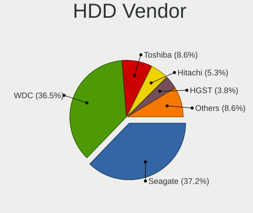

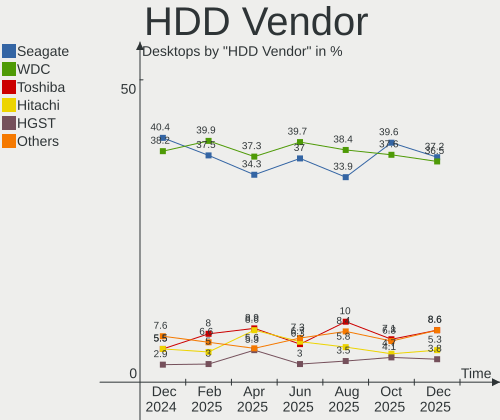

| Vendor              | Desktops | Drives | Percent |
|---------------------|----------|--------|---------|
| Seagate             | 156      | 237    | 37.23%  |
| WDC                 | 153      | 214    | 36.52%  |
| Toshiba             | 36       | 41     | 8.59%   |
| Hitachi             | 22       | 27     | 5.25%   |
| HGST                | 16       | 36     | 3.82%   |
| Samsung Electronics | 9        | 12     | 2.15%   |
| Unknown             | 7        | 7      | 1.67%   |
| T-FORCE             | 5        | 6      | 1.19%   |
| HPE                 | 4        | 4      | 0.95%   |
| TO Exter            | 1        | 1      | 0.24%   |
| TerraMas            | 1        | 3      | 0.24%   |
| SSK                 | 1        | 1      | 0.24%   |
| SABRENT             | 1        | 2      | 0.24%   |
| PRO-T5              | 1        | 1      | 0.24%   |
| Maxone              | 1        | 1      | 0.24%   |
| JMicron Technology  | 1        | 1      | 0.24%   |
| HGST HUH            | 1        | 2      | 0.24%   |
| Hewlett-Packard     | 1        | 1      | 0.24%   |
| Elite               | 1        | 2      | 0.24%   |
| Unknown             | 1        | 1      | 0.24%   |

SSD Vendor
----------

Solid state drive vendors

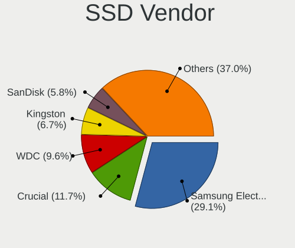

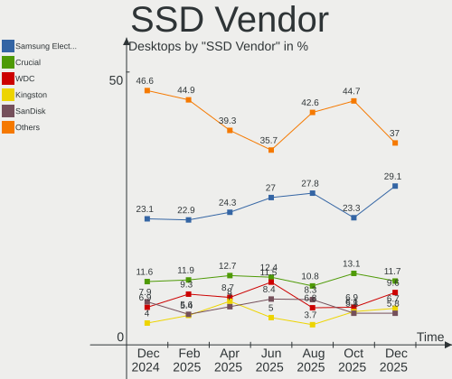

| Vendor              | Desktops | Drives | Percent |
|---------------------|----------|--------|---------|
| Samsung Electronics | 130      | 157    | 29.15%  |
| Crucial             | 52       | 58     | 11.66%  |
| WDC                 | 43       | 50     | 9.64%   |
| Kingston            | 30       | 37     | 6.73%   |
| SanDisk             | 26       | 33     | 5.83%   |
| PNY                 | 24       | 30     | 5.38%   |
| China               | 18       | 20     | 4.04%   |
| SPCC                | 15       | 18     | 3.36%   |
| Micron Technology   | 10       | 10     | 2.24%   |
| T-FORCE             | 8        | 8      | 1.79%   |
| OCZ                 | 7        | 7      | 1.57%   |
| SK hynix            | 6        | 13     | 1.35%   |
| Intel               | 5        | 5      | 1.12%   |
| X12                 | 4        | 4      | 0.9%    |
| Toshiba             | 4        | 4      | 0.9%    |
| Team                | 4        | 4      | 0.9%    |
| Mushkin             | 4        | 5      | 0.9%    |
| LITEONIT            | 4        | 4      | 0.9%    |
| KingSpec            | 4        | 4      | 0.9%    |
| Hewlett-Packard     | 4        | 4      | 0.9%    |
| Corsair             | 4        | 5      | 0.9%    |
| Seagate             | 3        | 3      | 0.67%   |
| Patriot             | 3        | 3      | 0.67%   |
| Lexar               | 3        | 3      | 0.67%   |
| Fanxiang            | 3        | 3      | 0.67%   |
| SABRENT             | 2        | 3      | 0.45%   |
| Rayson              | 2        | 2      | 0.45%   |
| MicroFrom           | 2        | 2      | 0.45%   |
| Kimtigo             | 2        | 2      | 0.45%   |
| Inland              | 2        | 3      | 0.45%   |
| A-DATA Technology   | 2        | 2      | 0.45%   |
| WALRAM              | 1        | 1      | 0.22%   |
| ThinkPlus           | 1        | 2      | 0.22%   |
| SPCC Sol            | 1        | 1      | 0.22%   |
| SMI                 | 1        | 1      | 0.22%   |
| SD                  | 1        | 1      | 0.22%   |
| PELADN              | 1        | 1      | 0.22%   |
| NVMe                | 1        | 2      | 0.22%   |
| LITEON              | 1        | 1      | 0.22%   |
| KingDian            | 1        | 1      | 0.22%   |

Drive Kind
----------

HDD or SSD

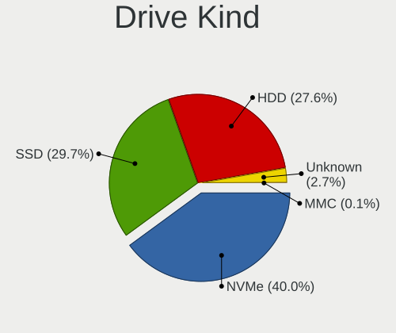

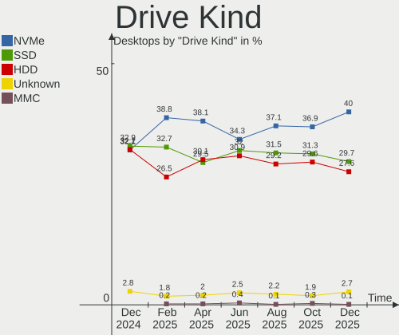

| Kind    | Desktops | Drives | Percent |
|---------|----------|--------|---------|
| NVMe    | 493      | 832    | 39.95%  |
| SSD     | 366      | 524    | 29.66%  |
| HDD     | 341      | 600    | 27.63%  |
| Unknown | 33       | 45     | 2.67%   |
| MMC     | 1        | 1      | 0.08%   |

Drive Connector
---------------

SATA, SAS, NVMe, etc.

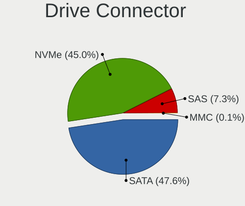

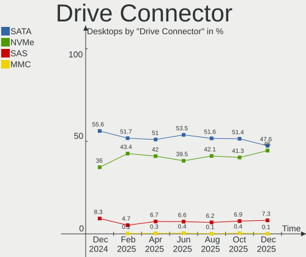

| Type | Desktops | Drives | Percent |
|------|----------|--------|---------|
| SATA | 521      | 1050   | 47.58%  |
| NVMe | 493      | 824    | 45.02%  |
| SAS  | 80       | 127    | 7.31%   |
| MMC  | 1        | 1      | 0.09%   |

Drive Size
----------

Size of hard drive

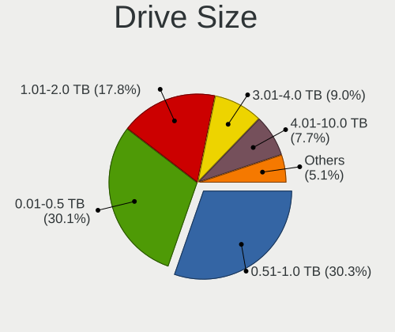

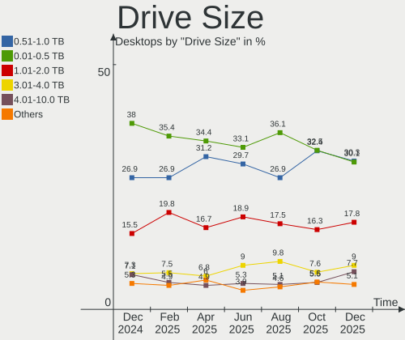

| Size in TB | Desktops | Drives | Percent |
|------------|----------|--------|---------|
| 0.51-1.0   | 256      | 334    | 30.33%  |
| 0.01-0.5   | 254      | 327    | 30.09%  |
| 1.01-2.0   | 150      | 186    | 17.77%  |
| 3.01-4.0   | 76       | 108    | 9%      |
| 4.01-10.0  | 65       | 101    | 7.7%    |
| 2.01-3.0   | 20       | 26     | 2.37%   |
| 10.01-20.0 | 20       | 39     | 2.37%   |
| 20.01-50.0 | 3        | 3      | 0.36%   |

Space Total
-----------

Amount of disk space available on the file system

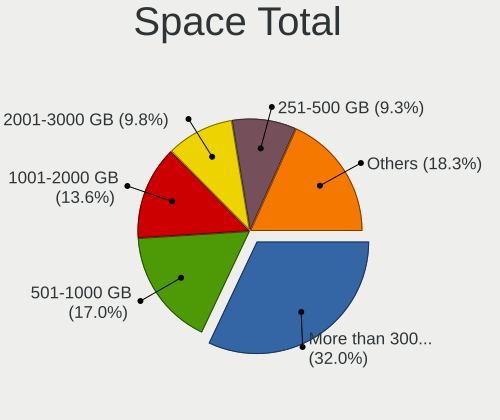

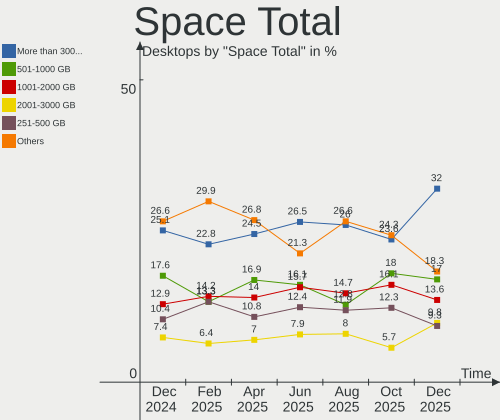

| Size in GB     | Desktops | Percent |
|----------------|----------|---------|
| More than 3000 | 238      | 32.03%  |
| 501-1000       | 126      | 16.96%  |
| 1001-2000      | 101      | 13.59%  |
| 2001-3000      | 73       | 9.83%   |
| 251-500        | 69       | 9.29%   |
| 101-250        | 61       | 8.21%   |
| Unknown        | 32       | 4.31%   |
| 1-20           | 29       | 3.9%    |
| 51-100         | 10       | 1.35%   |
| 21-50          | 3        | 0.4%    |
| 0              | 1        | 0.13%   |

Space Used
----------

Amount of used disk space

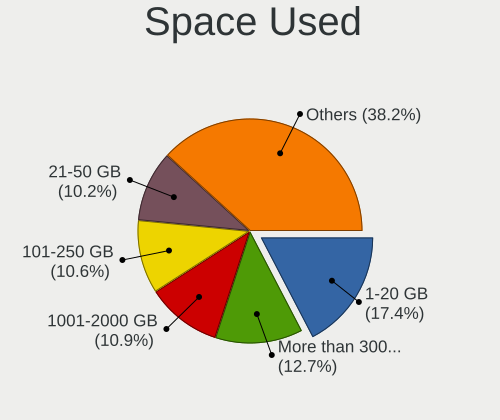

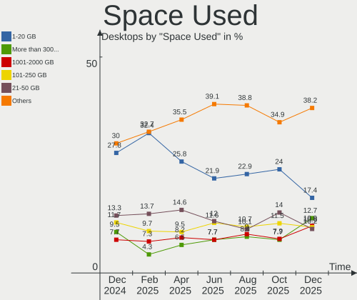

| Used GB        | Desktops | Percent |
|----------------|----------|---------|
| 1-20           | 129      | 17.36%  |
| More than 3000 | 94       | 12.65%  |
| 1001-2000      | 81       | 10.9%   |
| 101-250        | 79       | 10.63%  |
| 21-50          | 76       | 10.23%  |
| 51-100         | 74       | 9.96%   |
| 501-1000       | 70       | 9.42%   |
| 251-500        | 59       | 7.94%   |
| 2001-3000      | 48       | 6.46%   |
| Unknown        | 32       | 4.31%   |
| 0              | 1        | 0.13%   |

Malfunc. Drives
---------------

Drive models with a malfunction

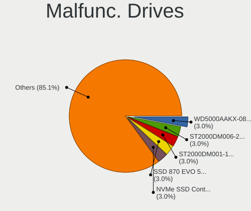

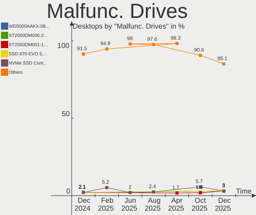

| Model                                                         | Desktops | Drives | Percent |
|---------------------------------------------------------------|----------|--------|---------|
| WDC WD5000AAKX-08U6AA0 500GB                                  | 2        | 2      | 2.99%   |
| Seagate ST2000DM006-2DM164 2TB                                | 2        | 2      | 2.99%   |
| Seagate ST2000DM001-1ER164 2TB                                | 2        | 3      | 2.99%   |
| Samsung Electronics SSD 870 EVO 500GB                         | 2        | 3      | 2.99%   |
| Samsung Electronics NVMe SSD Controller SM981/PM981/PM983 1TB | 2        | 3      | 2.99%   |
| WDC WDS240G2G0A-00JH30 240GB SSD                              | 1        | 1      | 1.49%   |
| WDC WD5000AAKX-7 500GB                                        | 1        | 1      | 1.49%   |
| WDC WD40EFRX-68N32N0 4TB                                      | 1        | 1      | 1.49%   |
| WDC WD3003FZEX-00Z4SA0 3TB                                    | 1        | 1      | 1.49%   |
| WDC WD20EZRX-00D8PB0 2TB                                      | 1        | 1      | 1.49%   |
| WDC WD20EARS-00MVWB0 2TB                                      | 1        | 1      | 1.49%   |
| WDC WD2003FYYS-05T9B0 2TB                                     | 1        | 1      | 1.49%   |
| WDC WD1600AAJS-00L7A0 160GB                                   | 1        | 1      | 1.49%   |
| WDC WD15EARS-60MVWB0 1TB                                      | 1        | 1      | 1.49%   |
| WDC WD10EZEX-75M2NA0 1TB                                      | 1        | 1      | 1.49%   |
| WDC WD10EZEX-60WN4A1 1TB                                      | 1        | 1      | 1.49%   |
| WDC WD10EZEX-60WN4A0 1TB                                      | 1        | 1      | 1.49%   |
| WDC WD10EZEX-08WN4A0 1TB                                      | 1        | 1      | 1.49%   |
| WDC WD10EZEX-08M2NA0 1TB                                      | 1        | 1      | 1.49%   |
| WDC WD10EURS-630AB1 1TB                                       | 1        | 1      | 1.49%   |
| WDC WD10EADS-00L5B1 1TB                                       | 1        | 1      | 1.49%   |
| Toshiba MQ04ABF100 1TB                                        | 1        | 1      | 1.49%   |
| Toshiba MQ01ABD100 1TB                                        | 1        | 1      | 1.49%   |
| Seagate ST9200827AS 200GB                                     | 1        | 1      | 1.49%   |
| Seagate ST500DM009-2F110A 500GB                               | 1        | 1      | 1.49%   |
| Seagate ST5000DM000-1FK178 5TB                                | 1        | 1      | 1.49%   |
| Seagate ST4000DX001-1CE168 4TB                                | 1        | 1      | 1.49%   |
| Seagate ST4000DM000-1F2168 4TB                                | 1        | 1      | 1.49%   |
| Seagate ST3500620AS 500GB                                     | 1        | 1      | 1.49%   |
| Seagate ST3500418AS 500GB                                     | 1        | 1      | 1.49%   |
| Seagate ST31000524AS 1TB                                      | 1        | 1      | 1.49%   |
| Seagate ST3000DM008-2DM166 3TB                                | 1        | 1      | 1.49%   |
| Seagate ST3000DM001-1ER166 3TB                                | 1        | 1      | 1.49%   |
| Seagate ST240HM000-1G5152 240GB SSD                           | 1        | 1      | 1.49%   |
| Seagate ST2000DM001-9YN164 2TB                                | 1        | 1      | 1.49%   |
| Seagate ST1500DL003-9VT16L 1TB                                | 1        | 1      | 1.49%   |
| Seagate ST1000DM010-2EP102 1TB                                | 1        | 1      | 1.49%   |
| Seagate ST1000DM003-1CH162 1TB                                | 1        | 1      | 1.49%   |
| SanDisk SDSSDXPS960G 960GB                                    | 1        | 2      | 1.49%   |
| Samsung Electronics SSD 980 1TB                               | 1        | 1      | 1.49%   |

Malfunc. Drive Vendor
---------------------

Vendors of faulty drives

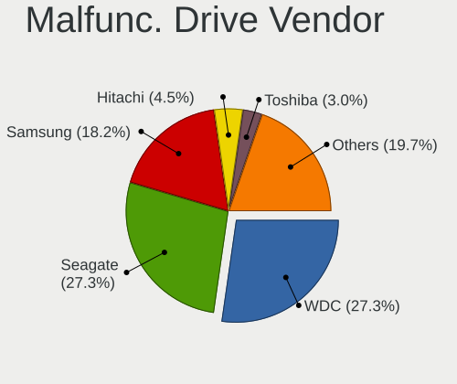

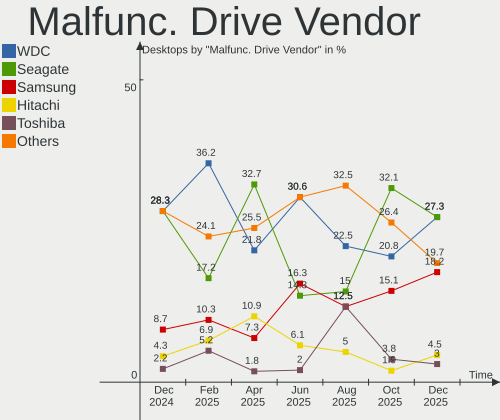

| Vendor                      | Desktops | Drives | Percent |
|-----------------------------|----------|--------|---------|
| WDC                         | 18       | 18     | 27.27%  |
| Seagate                     | 18       | 20     | 27.27%  |
| Samsung Electronics         | 12       | 15     | 18.18%  |
| Hitachi                     | 3        | 3      | 4.55%   |
| Toshiba                     | 2        | 2      | 3.03%   |
| HGST                        | 2        | 2      | 3.03%   |
| SanDisk                     | 1        | 2      | 1.52%   |
| SABRENT                     | 1        | 1      | 1.52%   |
| Realtek Semiconductor       | 1        | 1      | 1.52%   |
| Patriot                     | 1        | 1      | 1.52%   |
| OCZ                         | 1        | 1      | 1.52%   |
| Mushkin                     | 1        | 1      | 1.52%   |
| MAXIO Technology (Hangzhou) | 1        | 1      | 1.52%   |
| Kingston                    | 1        | 1      | 1.52%   |
| Intel                       | 1        | 1      | 1.52%   |
| Crucial                     | 1        | 1      | 1.52%   |
| China                       | 1        | 1      | 1.52%   |

Malfunc. HDD Vendor
-------------------

Vendors of faulty HDD drives

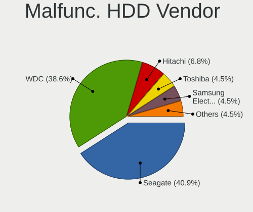

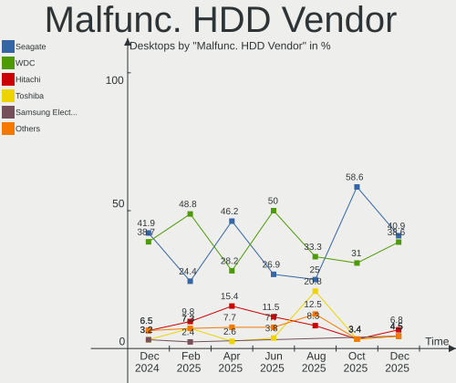

| Vendor              | Desktops | Drives | Percent |
|---------------------|----------|--------|---------|
| Seagate             | 18       | 19     | 40.91%  |
| WDC                 | 17       | 17     | 38.64%  |
| Hitachi             | 3        | 3      | 6.82%   |
| Toshiba             | 2        | 2      | 4.55%   |
| Samsung Electronics | 2        | 2      | 4.55%   |
| HGST                | 2        | 2      | 4.55%   |

Malfunc. Drive Kind
-------------------

Kinds of faulty drives

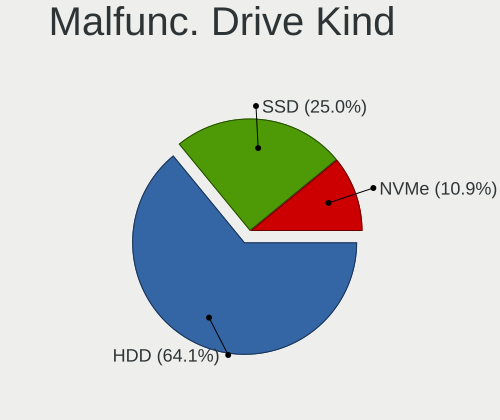

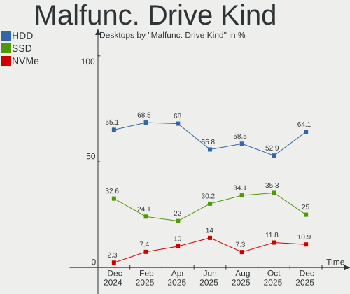

| Kind | Desktops | Drives | Percent |
|------|----------|--------|---------|
| HDD  | 41       | 45     | 64.06%  |
| SSD  | 16       | 19     | 25%     |
| NVMe | 7        | 8      | 10.94%  |

Failed Drives
-------------

Failed drive models

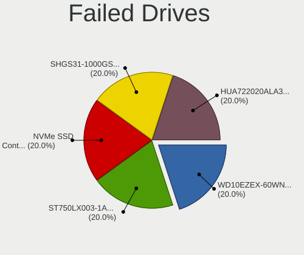

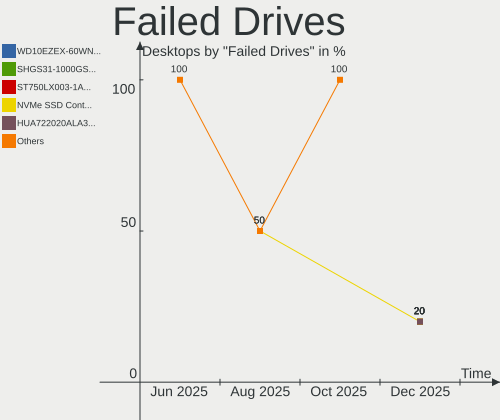

| Model                                                          | Desktops | Drives | Percent |
|----------------------------------------------------------------|----------|--------|---------|
| WDC WD10EZEX-60WN4A0 1TB                                       | 1        | 1      | 20%     |
| SK hynix SHGS31-1000GS-2 1TB SSD                               | 1        | 8      | 20%     |
| Seagate ST750LX003-1AC154 752GB                                | 1        | 1      | 20%     |
| Samsung Electronics NVMe SSD Controller PM9A1/PM9A3/980PRO 1TB | 1        | 1      | 20%     |
| Hitachi HUA722020ALA330 2TB                                    | 1        | 1      | 20%     |

Failed Drive Vendor
-------------------

Failed drive vendors

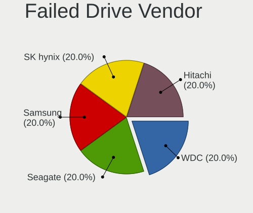

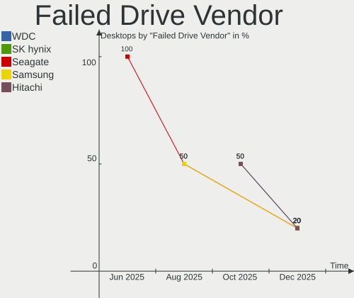

| Vendor              | Desktops | Drives | Percent |
|---------------------|----------|--------|---------|
| WDC                 | 1        | 1      | 20%     |
| SK hynix            | 1        | 8      | 20%     |
| Seagate             | 1        | 1      | 20%     |
| Samsung Electronics | 1        | 1      | 20%     |
| Hitachi             | 1        | 1      | 20%     |

Drive Status
------------

Number of failed and malfunc. drives

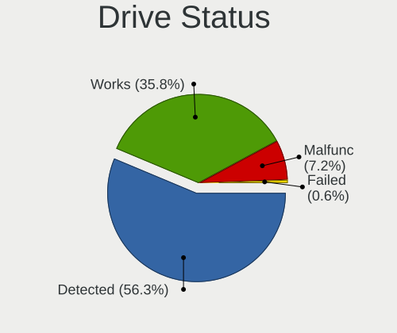

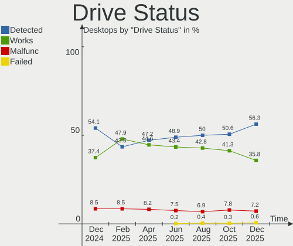

| Status   | Desktops | Drives | Percent |
|----------|----------|--------|---------|
| Detected | 459      | 1173   | 56.32%  |
| Works    | 292      | 745    | 35.83%  |
| Malfunc  | 59       | 72     | 7.24%   |
| Failed   | 5        | 12     | 0.61%   |

Storage controller
------------------

Storage Vendor
--------------

Storage controller vendors

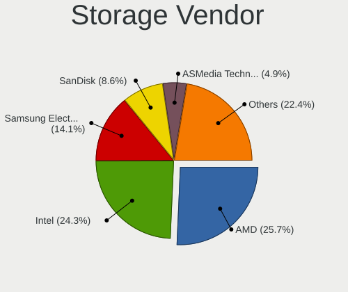

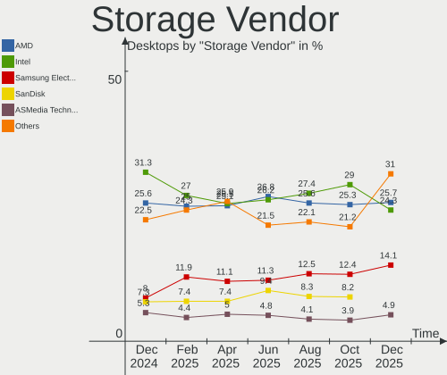

| Vendor                         | Desktops | Percent |
|--------------------------------|----------|---------|
| AMD                            | 380      | 25.69%  |
| Intel                          | 359      | 24.27%  |
| Samsung Electronics            | 209      | 14.13%  |
| SanDisk                        | 127      | 8.59%   |
| ASMedia Technology             | 73       | 4.94%   |
| Micron/Crucial Technology      | 72       | 4.87%   |
| Phison Electronics             | 45       | 3.04%   |
| MAXIO Technology (Hangzhou)    | 32       | 2.16%   |
| Kingston Technology Company    | 26       | 1.76%   |
| Realtek Semiconductor          | 18       | 1.22%   |
| Micron Technology              | 16       | 1.08%   |
| SK hynix                       | 13       | 0.88%   |
| INNOGRIT                       | 11       | 0.74%   |
| Silicon Motion                 | 10       | 0.68%   |
| Seagate Technology             | 10       | 0.68%   |
| Solidigm                       | 8        | 0.54%   |
| Shenzhen Longsys Electronics   | 8        | 0.54%   |
| Marvell Technology Group       | 7        | 0.47%   |
| Broadcom / LSI                 | 7        | 0.47%   |
| Toshiba America Info Systems   | 6        | 0.41%   |
| JMicron Technology             | 6        | 0.41%   |
| ADATA Technology               | 6        | 0.41%   |
| Nextorage                      | 4        | 0.27%   |
| LSI Logic / Symbios Logic      | 4        | 0.27%   |
| KIOXIA                         | 4        | 0.27%   |
| Nvidia                         | 3        | 0.2%    |
| Biwin Storage Technology       | 3        | 0.2%    |
| Hosin Global Electronics       | 2        | 0.14%   |
| Yangtze Memory Technologies    | 1        | 0.07%   |
| Western Digital                | 1        | 0.07%   |
| Toshiba                        | 1        | 0.07%   |
| Sony                           | 1        | 0.07%   |
| Solid State Storage Technology | 1        | 0.07%   |
| Silicon Image                  | 1        | 0.07%   |
| OCZ Technology Group           | 1        | 0.07%   |
| Microsoft                      | 1        | 0.07%   |
| Integrated Technology Express  | 1        | 0.07%   |
| Areca Technology               | 1        | 0.07%   |

Storage Model
-------------

Storage controller models

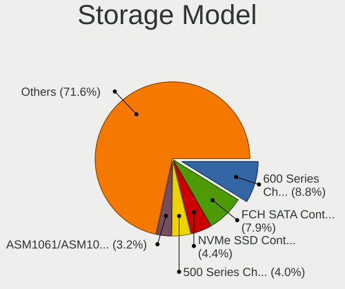

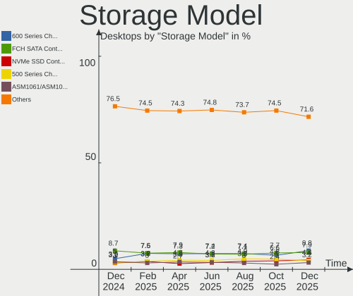

| Model                                                                          | Desktops | Percent |
|--------------------------------------------------------------------------------|----------|---------|
| AMD 600 Series Chipset SATA Controller                                         | 147      | 8.81%   |
| AMD FCH SATA Controller [AHCI mode]                                            | 132      | 7.91%   |
| Samsung NVMe SSD Controller SM981/PM981/PM983                                  | 74       | 4.44%   |
| AMD 500 Series Chipset SATA Controller                                         | 67       | 4.02%   |
| ASMedia ASM1061/ASM1062 Serial ATA Controller                                  | 54       | 3.24%   |
| Samsung NVMe SSD Controller PM9A1/PM9A3/980PRO                                 | 50       | 3%      |
| Samsung NVMe SSD Controller S4LV008[Pascal]                                    | 48       | 2.88%   |
| AMD 400 Series Chipset SATA Controller                                         | 46       | 2.76%   |
| Intel SATA Controller [RAID mode]                                              | 37       | 2.22%   |
| Samsung NVMe SSD Controller PM9C1a (DRAM-less)                                 | 35       | 2.1%    |
| Intel Raptor Lake SATA AHCI Controller                                         | 34       | 2.04%   |
| Intel Cannon Lake PCH SATA AHCI Controller                                     | 33       | 1.98%   |
| Intel 8 Series/C220 Series Chipset Family 6-port SATA Controller 1 [AHCI mode] | 33       | 1.98%   |
| Sandisk WD Black SN850X NVMe SSD                                               | 32       | 1.92%   |
| SanDisk WD SN560/SN740/SN770/SN5000 NVMe SSD                                   | 29       | 1.74%   |
| Intel Alder Lake-S PCH SATA Controller [AHCI Mode]                             | 29       | 1.74%   |
| Intel Q170/Q150/B150/H170/H110/Z170/CM236 Chipset SATA Controller [AHCI Mode]  | 24       | 1.44%   |
| Intel 200 Series PCH SATA controller [AHCI mode]                               | 24       | 1.44%   |
| Micron/Crucial P2 [Nick P2] / P3 / P3 Plus NVMe PCIe SSD (DRAM-less)           | 23       | 1.38%   |
| Intel 6 Series/C200 Series Chipset Family 6 port Desktop SATA AHCI Controller  | 21       | 1.26%   |
| MAXIO (Hangzhou) NVMe SSD Controller MAP1202 (DRAM-less)                       | 19       | 1.14%   |
| Micron/Crucial P310 NVMe PCIe SSD (DRAM-less)                                  | 17       | 1.02%   |
| Intel Volume Management Device NVMe RAID Controller                            | 17       | 1.02%   |
| SanDisk Ultra 3D / WD PC SN530, IX SN530, Blue SN550 NVMe SSD (DRAM-less)      | 16       | 0.96%   |
| Samsung NVMe SSD Controller 980 (DRAM-less)                                    | 16       | 0.96%   |
| ASMedia ASM1064 Serial ATA Controller                                          | 16       | 0.96%   |
| AMD SB7x0/SB8x0/SB9x0 SATA Controller [AHCI mode]                              | 15       | 0.9%    |
| Samsung NVMe SSD 9100 PRO [PM9E1]                                              | 14       | 0.84%   |
| Phison E12 NVMe Controller                                                     | 14       | 0.84%   |
| Sandisk WD Blue SN580 NVMe SSD (DRAM-less)                                     | 13       | 0.78%   |
| Intel Comet Lake SATA AHCI Controller                                          | 13       | 0.78%   |
| Intel 7 Series/C210 Series Chipset Family 6-port SATA Controller [AHCI mode]   | 13       | 0.78%   |
| Intel 500 Series Chipset Family SATA AHCI Controller                           | 13       | 0.78%   |
| MAXIO (Hangzhou) NVMe SSD Controller MAP1602 (DRAM-less)                       | 12       | 0.72%   |
| Intel RST Volume Management Device Controller                                  | 12       | 0.72%   |
| Micron/Crucial P3 Plus NVMe PCIe SSD (DRAM-less)                               | 11       | 0.66%   |
| AMD 300 Series Chipset SATA Controller                                         | 11       | 0.66%   |
| SanDisk Extreme Pro / WD Black SN750 / PC SN730 / Red SN700 NVMe SSD           | 10       | 0.6%    |
| Phison E16 PCIe4 NVMe Controller                                               | 10       | 0.6%    |
| AMD SB7x0/SB8x0/SB9x0 IDE Controller                                           | 10       | 0.6%    |

Storage Kind
------------

Kind of storage controller (IDE, SATA, NVMe, SAS, ...)

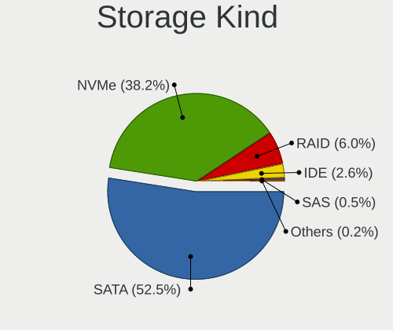

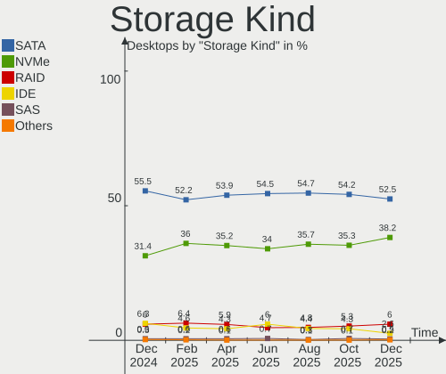

| Kind | Desktops | Percent |
|------|----------|---------|
| SATA | 677      | 52.48%  |
| NVMe | 493      | 38.22%  |
| RAID | 78       | 6.05%   |
| IDE  | 33       | 2.56%   |
| SAS  | 6        | 0.47%   |
| SCSI | 3        | 0.23%   |

Processor
---------

CPU Vendor
----------

Processor vendors

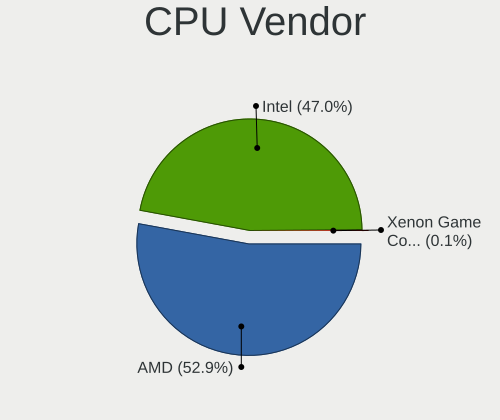

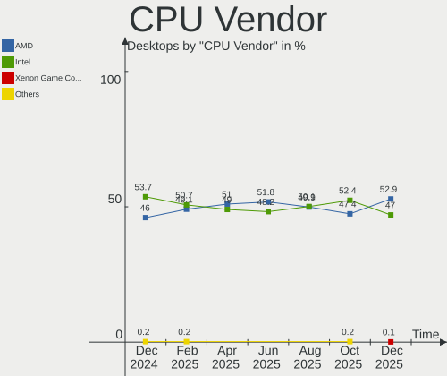

| Vendor             | Desktops | Percent |
|--------------------|----------|---------|
| AMD                | 393      | 52.89%  |
| Intel              | 349      | 46.97%  |
| Xenon Game Console | 1        | 0.13%   |

CPU Model
---------

Processor models

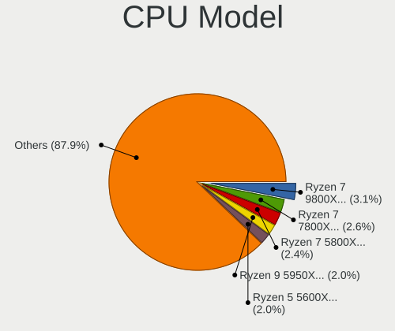

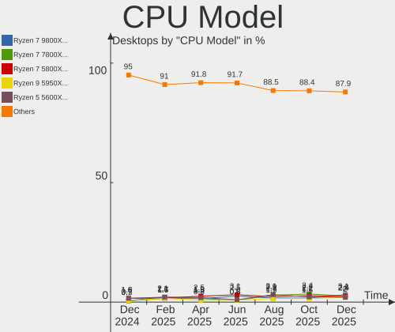

| Model                                  | Desktops | Percent |
|----------------------------------------|----------|---------|
| AMD Ryzen 7 9800X3D 8-Core Processor   | 23       | 3.1%    |
| AMD Ryzen 7 7800X3D 8-Core Processor   | 19       | 2.56%   |
| AMD Ryzen 7 5800X 8-Core Processor     | 18       | 2.42%   |
| AMD Ryzen 9 5950X 16-Core Processor    | 15       | 2.02%   |
| AMD Ryzen 5 5600X 6-Core Processor     | 15       | 2.02%   |
| AMD Ryzen 9 9950X3D 16-Core Processor  | 14       | 1.88%   |
| AMD Ryzen 9 9950X 16-Core Processor    | 14       | 1.88%   |
| AMD Ryzen 9 5900X 12-Core Processor    | 12       | 1.62%   |
| AMD Ryzen 7 7700X 8-Core Processor     | 12       | 1.62%   |
| AMD Ryzen 5 7600X 6-Core Processor     | 12       | 1.62%   |
| Intel Core i5-3470 CPU @ 3.20GHz       | 9        | 1.21%   |
| AMD Ryzen 7 9700X 8-Core Processor     | 9        | 1.21%   |
| AMD Ryzen 7 5700G with Radeon Graphics | 9        | 1.21%   |
| AMD Ryzen 7 3700X 8-Core Processor     | 9        | 1.21%   |
| AMD Ryzen 7 2700X Eight-Core Processor | 9        | 1.21%   |
| Intel Core i7-8700 CPU @ 3.20GHz       | 8        | 1.08%   |
| Intel Core i5-8500 CPU @ 3.00GHz       | 8        | 1.08%   |
| AMD Ryzen 5 5600G with Radeon Graphics | 8        | 1.08%   |
| AMD Ryzen 5 3600 6-Core Processor      | 8        | 1.08%   |
| Intel Core i7-6700 CPU @ 3.40GHz       | 7        | 0.94%   |
| Intel Core i5-6500 CPU @ 3.20GHz       | 7        | 0.94%   |
| Intel 12th Gen Core i5-12600K          | 7        | 0.94%   |
| AMD Ryzen 7 5800X3D 8-Core Processor   | 7        | 0.94%   |
| AMD Ryzen 7 5700X 8-Core Processor     | 7        | 0.94%   |
| AMD Ryzen 5 9600X 6-Core Processor     | 7        | 0.94%   |
| AMD Ryzen 5 5600 6-Core Processor      | 7        | 0.94%   |
| Intel Core i5-7400 CPU @ 3.00GHz       | 6        | 0.81%   |
| Intel 12th Gen Core i9-12900K          | 6        | 0.81%   |
| AMD Ryzen 9 7950X3D 16-Core Processor  | 6        | 0.81%   |
| AMD Ryzen 7 5800XT 8-Core Processor    | 6        | 0.81%   |
| AMD Ryzen 5 5500                       | 6        | 0.81%   |
| Intel Core i7-6700K CPU @ 4.00GHz      | 5        | 0.67%   |
| Intel Core i7-4790 CPU @ 3.60GHz       | 5        | 0.67%   |
| Intel Core i7-4770 CPU @ 3.40GHz       | 5        | 0.67%   |
| Intel 13th Gen Core i7-13700K          | 5        | 0.67%   |
| Intel 12th Gen Core i5-12400F          | 5        | 0.67%   |
| AMD Ryzen 9 9900X 12-Core Processor    | 5        | 0.67%   |
| AMD Ryzen 9 7900X 12-Core Processor    | 5        | 0.67%   |
| AMD Ryzen 9 3900X 12-Core Processor    | 5        | 0.67%   |
| AMD Ryzen 7 2700 Eight-Core Processor  | 5        | 0.67%   |

CPU Model Family
----------------

Processor model prefix

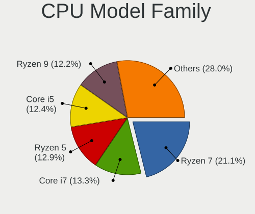

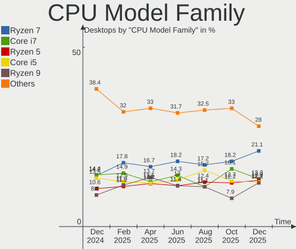

| Model                   | Desktops | Percent |
|-------------------------|----------|---------|
| AMD Ryzen 7             | 157      | 21.13%  |
| Intel Core i7           | 99       | 13.32%  |
| AMD Ryzen 5             | 96       | 12.92%  |
| Intel Core i5           | 92       | 12.38%  |
| AMD Ryzen 9             | 91       | 12.25%  |
| Other                   | 74       | 9.96%   |
| Intel Xeon              | 22       | 2.96%   |
| Intel Core i3           | 20       | 2.69%   |
| Intel Core i9           | 19       | 2.56%   |
| AMD FX                  | 10       | 1.35%   |
| Intel Core              | 7        | 0.94%   |
| Intel Celeron           | 7        | 0.94%   |
| AMD Ryzen 3             | 7        | 0.94%   |
| Intel Core 2 Duo        | 5        | 0.67%   |
| AMD Ryzen Threadripper  | 5        | 0.67%   |
| Intel Pentium           | 4        | 0.54%   |
| AMD Phenom II X6        | 3        | 0.4%    |
| AMD A6                  | 3        | 0.4%    |
| Intel Core 2 Quad       | 2        | 0.27%   |
| AMD Phenom II X4        | 2        | 0.27%   |
| AMD E1                  | 2        | 0.27%   |
| AMD A8                  | 2        | 0.27%   |
| Intel Pentium Dual-Core | 1        | 0.13%   |
| Intel Pentium Dual      | 1        | 0.13%   |
| AMD Ryzen 7 PRO         | 1        | 0.13%   |
| AMD Ryzen 5 PRO         | 1        | 0.13%   |
| AMD Quad-Core Opteron   | 1        | 0.13%   |
| AMD PRO A8              | 1        | 0.13%   |
| AMD EPYC                | 1        | 0.13%   |
| AMD Athlon II X4        | 1        | 0.13%   |
| AMD Athlon II X3        | 1        | 0.13%   |
| AMD Athlon II X2        | 1        | 0.13%   |
| AMD Athlon 64 X2        | 1        | 0.13%   |
| AMD Athlon              | 1        | 0.13%   |
| AMD A4                  | 1        | 0.13%   |
| AMD A10                 | 1        | 0.13%   |

CPU Cores
---------

Number of processor cores

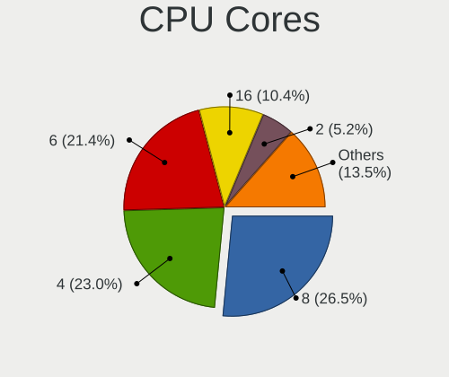

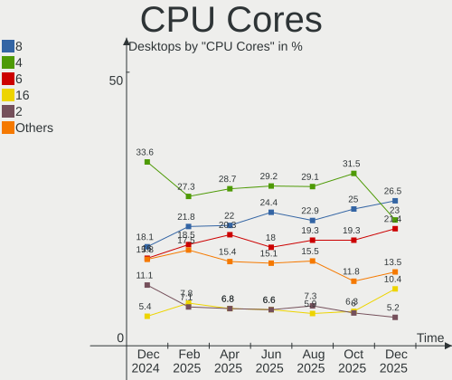

| Number | Desktops | Percent |
|--------|----------|---------|
| 8      | 197      | 26.51%  |
| 4      | 171      | 23.01%  |
| 6      | 159      | 21.4%   |
| 16     | 77       | 10.36%  |
| 2      | 39       | 5.25%   |
| 12     | 34       | 4.58%   |
| 10     | 23       | 3.1%    |
| 24     | 18       | 2.42%   |
| 20     | 11       | 1.48%   |
| 14     | 8        | 1.08%   |
| 3      | 3        | 0.4%    |
| 32     | 2        | 0.27%   |
| 28     | 1        | 0.13%   |

CPU Sockets
-----------

Number of sockets

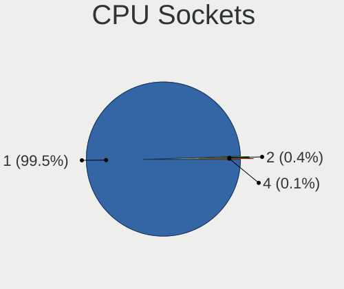

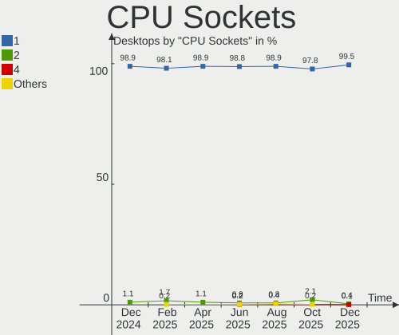

| Number | Desktops | Percent |
|--------|----------|---------|
| 1      | 739      | 99.46%  |
| 2      | 3        | 0.4%    |
| 4      | 1        | 0.13%   |

CPU Threads
-----------

Threads per core (Hyper-Threading)

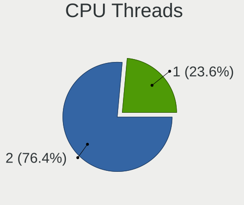

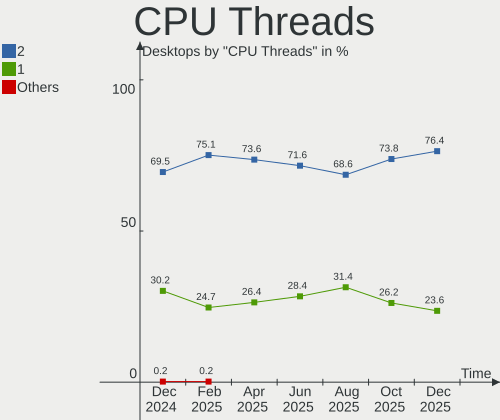

| Number | Desktops | Percent |
|--------|----------|---------|
| 2      | 568      | 76.45%  |
| 1      | 175      | 23.55%  |

CPU Op-Modes
------------

CPU Operation Modes (32-bit, 64-bit)

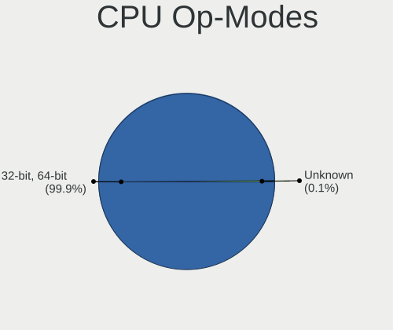

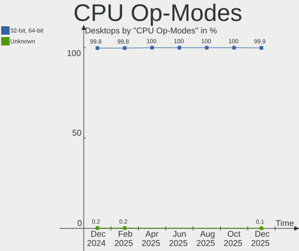

| Op mode        | Desktops | Percent |
|----------------|----------|---------|
| 32-bit, 64-bit | 742      | 99.87%  |
| Unknown        | 1        | 0.13%   |

CPU Microcode
-------------

Microcode number

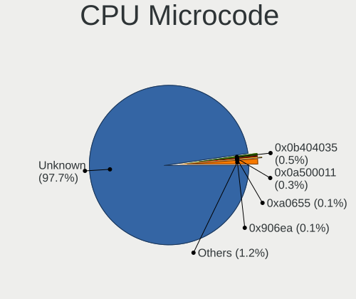

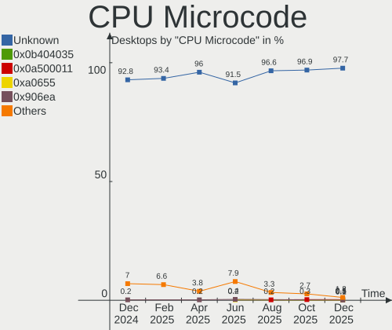

| Number     | Desktops | Percent |
|------------|----------|---------|
| Unknown    | 726      | 97.71%  |
| 0x0b404035 | 4        | 0.54%   |
| 0x0a500011 | 2        | 0.27%   |
| 0xa0655    | 1        | 0.13%   |
| 0x906ea    | 1        | 0.13%   |
| 0x906e9    | 1        | 0.13%   |
| 0x506e3    | 1        | 0.13%   |
| 0x306a9    | 1        | 0.13%   |
| 0x206a7    | 1        | 0.13%   |
| 0x0a50000f | 1        | 0.13%   |
| 0x0a20120e | 1        | 0.13%   |
| 0x0a20120a | 1        | 0.13%   |
| 0x08108109 | 1        | 0.13%   |
| 0x08001138 | 1        | 0.13%   |

CPU Microarch
-------------

Microarchitecture

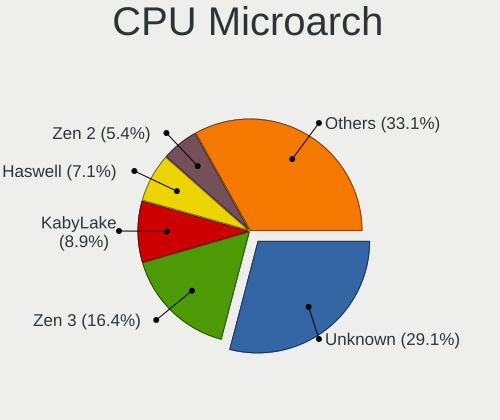

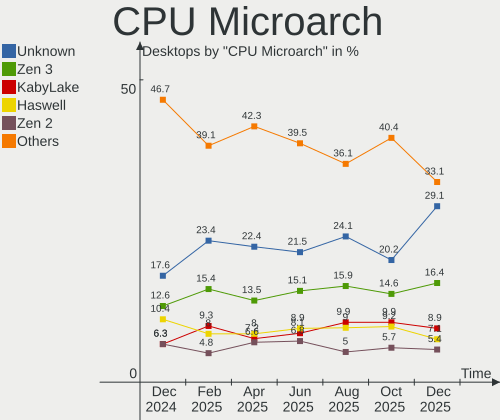

| Name             | Desktops | Percent |
|------------------|----------|---------|
| Unknown          | 216      | 29.07%  |
| Zen 3            | 122      | 16.42%  |
| KabyLake         | 66       | 8.88%   |
| Haswell          | 53       | 7.13%   |
| Zen 2            | 40       | 5.38%   |
| Skylake          | 37       | 4.98%   |
| Alderlake Hybrid | 31       | 4.17%   |
| IvyBridge        | 24       | 3.23%   |
| Zen+             | 23       | 3.1%    |
| SandyBridge      | 22       | 2.96%   |
| CometLake        | 22       | 2.96%   |
| Zen              | 15       | 2.02%   |
| Piledriver       | 14       | 1.88%   |
| K10              | 9        | 1.21%   |
| Nehalem          | 8        | 1.08%   |
| Broadwell        | 7        | 0.94%   |
| Penryn           | 6        | 0.81%   |
| Icelake          | 5        | 0.67%   |
| Lunarlake Hybrid | 3        | 0.4%    |
| Gracemont        | 3        | 0.4%    |
| Core             | 3        | 0.4%    |
| Sapphire Rapids  | 2        | 0.27%   |
| K10 Llano        | 2        | 0.27%   |
| Bobcat           | 2        | 0.27%   |
| TigerLake        | 1        | 0.13%   |
| Silvermont       | 1        | 0.13%   |
| K8 Hammer        | 1        | 0.13%   |
| Jaguar           | 1        | 0.13%   |
| Goldmont plus    | 1        | 0.13%   |
| Goldmont         | 1        | 0.13%   |
| Excavator        | 1        | 0.13%   |
| Bulldozer        | 1        | 0.13%   |

Graphics
--------

GPU Vendor
----------

Vendors of graphics cards

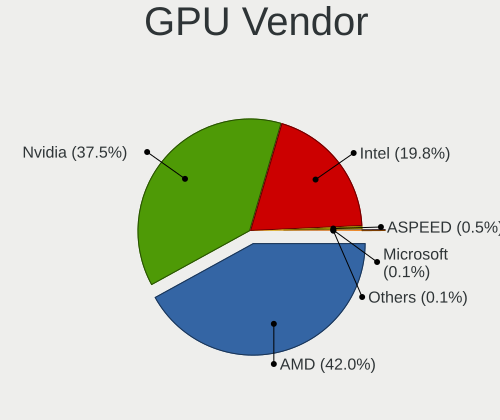

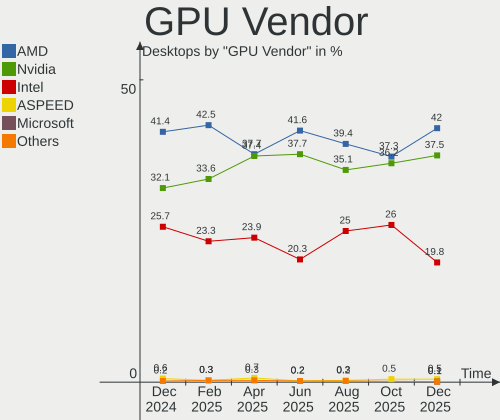

| Vendor                     | Desktops | Percent |
|----------------------------|----------|---------|
| AMD                        | 357      | 42%     |
| Nvidia                     | 319      | 37.53%  |
| Intel                      | 168      | 19.76%  |
| ASPEED Technology          | 4        | 0.47%   |
| Microsoft                  | 1        | 0.12%   |
| Matrox Electronics Systems | 1        | 0.12%   |

GPU Model
---------

Graphics card models

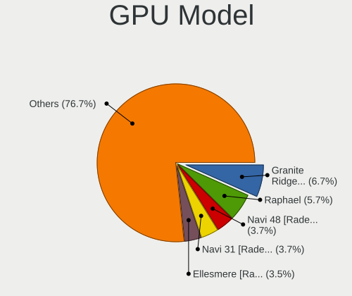

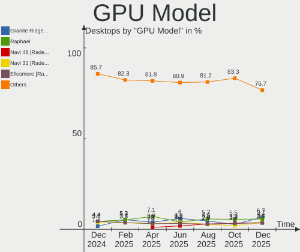

| Model                                                                       | Desktops | Percent |
|-----------------------------------------------------------------------------|----------|---------|
| AMD Granite Ridge [Radeon Graphics]                                         | 63       | 6.67%   |
| AMD Raphael                                                                 | 54       | 5.72%   |
| AMD Navi 48 [Radeon RX 9070/9070 XT/9070 GRE]                               | 35       | 3.71%   |
| AMD Navi 31 [Radeon RX 7900 XT/7900 XTX/7900 GRE/7900M]                     | 35       | 3.71%   |
| AMD Ellesmere [Radeon RX 470/480/570/570X/580/580X/590]                     | 33       | 3.5%    |
| Intel Xeon E3-1200 v3/4th Gen Core Processor Integrated Graphics Controller | 20       | 2.12%   |
| Intel CoffeeLake-S GT2 [UHD Graphics 630]                                   | 19       | 2.01%   |
| AMD Navi 23 [Radeon RX 6600/6600 XT/6600M]                                  | 19       | 2.01%   |
| AMD Cezanne [Radeon Vega Series / Radeon Vega Mobile Series]                | 18       | 1.91%   |
| Intel Skylake-S GT2 [HD Graphics 530]                                       | 17       | 1.8%    |
| AMD Navi 22 [Radeon RX 6700/6700 XT/6750 XT / 6800M/6850M XT]               | 17       | 1.8%    |
| AMD Navi 21 [Radeon RX 6800/6800 XT / 6900 XT]                              | 16       | 1.69%   |
| Nvidia GA106 [GeForce RTX 3060 Lite Hash Rate]                              | 15       | 1.59%   |
| AMD Navi 44 [Radeon RX 9060 XT]                                             | 15       | 1.59%   |
| Nvidia GP107 [GeForce GTX 1050 Ti]                                          | 11       | 1.17%   |
| Nvidia GP104 [GeForce GTX 1070]                                             | 11       | 1.17%   |
| Nvidia GA104 [GeForce RTX 3070]                                             | 11       | 1.17%   |
| Nvidia GA104 [GeForce RTX 3070 Ti]                                          | 11       | 1.17%   |
| Nvidia AD103 [GeForce RTX 4080 SUPER]                                       | 11       | 1.17%   |
| Intel Xeon E3-1200 v2/3rd Gen Core processor Graphics Controller            | 11       | 1.17%   |
| Intel Raptor Lake-S GT1 [UHD Graphics 770]                                  | 11       | 1.17%   |
| AMD Navi 33 [Radeon RX 7600/7600 XT/7600M XT/7600S/7700S / PRO W7600]       | 10       | 1.06%   |
| Nvidia GP104 [GeForce GTX 1080]                                             | 9        | 0.95%   |
| Nvidia AD104 [GeForce RTX 4070 Ti]                                          | 9        | 0.95%   |
| Intel Kaby Lake-S GT2 [HD Graphics 630]                                     | 9        | 0.95%   |
| Intel 2nd Generation Core Processor Family Integrated Graphics Controller   | 9        | 0.95%   |
| AMD Navi 24 [Radeon RX 6400/6500 XT/6500M]                                  | 9        | 0.95%   |
| AMD Navi 10 [Radeon RX 5600 OEM/5600 XT / 5700/5700 XT]                     | 9        | 0.95%   |
| Nvidia GA104 [GeForce RTX 3060 Ti Lite Hash Rate]                           | 8        | 0.85%   |
| Nvidia AD102 [GeForce RTX 4090]                                             | 8        | 0.85%   |
| Intel Battlemage G21 [Arc B580]                                             | 8        | 0.85%   |
| AMD Navi 32 [Radeon RX 7700 XT / 7800 XT]                                   | 8        | 0.85%   |
| Nvidia GP106 [GeForce GTX 1060 6GB]                                         | 7        | 0.74%   |
| Nvidia GB203 [GeForce RTX 5080]                                             | 7        | 0.74%   |
| Nvidia GB202 [GeForce RTX 5090]                                             | 7        | 0.74%   |
| Nvidia GA102 [GeForce RTX 3090]                                             | 7        | 0.74%   |
| Nvidia GA102 [GeForce RTX 3080 Ti]                                          | 7        | 0.74%   |
| Nvidia AD106 [GeForce RTX 4060 Ti]                                          | 7        | 0.74%   |
| Nvidia AD104 [GeForce RTX 4070]                                             | 7        | 0.74%   |
| Intel CometLake-S GT2 [UHD Graphics 630]                                    | 7        | 0.74%   |

GPU Combo
---------

Combinations of graphics cards

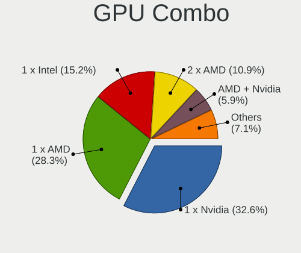

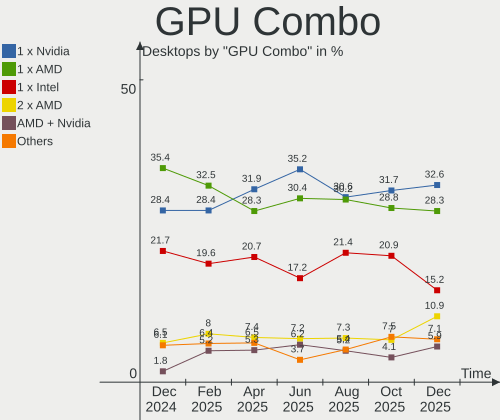

| Name                        | Desktops | Percent |
|-----------------------------|----------|---------|
| 1 x Nvidia                  | 242      | 32.57%  |
| 1 x AMD                     | 210      | 28.26%  |
| 1 x Intel                   | 113      | 15.21%  |
| 2 x AMD                     | 81       | 10.9%   |
| AMD + Nvidia                | 44       | 5.92%   |
| Intel + AMD                 | 16       | 2.15%   |
| Intel + Nvidia              | 15       | 2.02%   |
| 2 x Nvidia                  | 7        | 0.94%   |
| 2 x Intel                   | 3        | 0.4%    |
| Nvidia + ASPEED             | 3        | 0.4%    |
| 2 x AMD + 1 x Nvidia        | 2        | 0.27%   |
| 4 x AMD                     | 1        | 0.13%   |
| 3 x AMD                     | 1        | 0.13%   |
| 1 x Microsoft               | 1        | 0.13%   |
| Intel + 2 x Nvidia          | 1        | 0.13%   |
| Intel + Nvidia + 1 x ASPEED | 1        | 0.13%   |
| AMD + 2 x Nvidia            | 1        | 0.13%   |
| AMD + Matrox                | 1        | 0.13%   |

GPU Driver
----------

Free vs proprietary

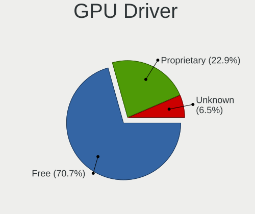

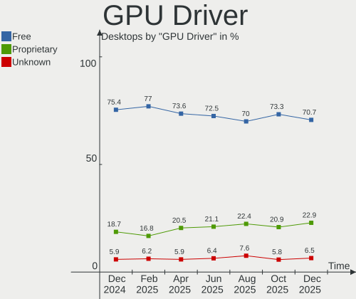

| Driver      | Desktops | Percent |
|-------------|----------|---------|
| Free        | 525      | 70.66%  |
| Proprietary | 170      | 22.88%  |
| Unknown     | 48       | 6.46%   |

GPU Memory
----------

Total video memory

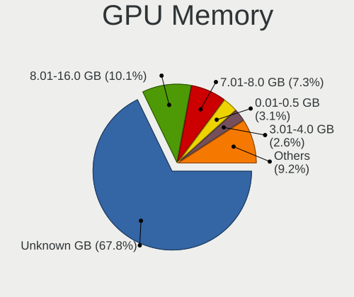

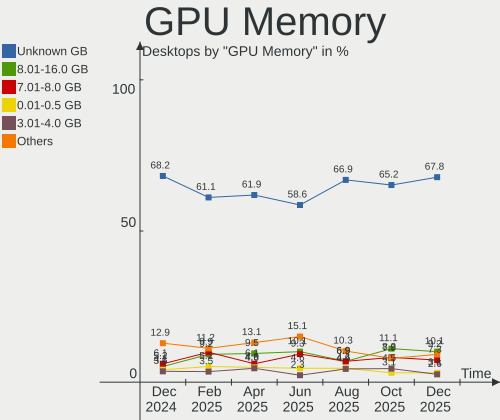

| Size in GB | Desktops | Percent |
|------------|----------|---------|
| Unknown    | 504      | 67.83%  |
| 8.01-16.0  | 75       | 10.09%  |
| 7.01-8.0   | 54       | 7.27%   |
| 0.01-0.5   | 23       | 3.1%    |
| 3.01-4.0   | 19       | 2.56%   |
| 5.01-6.0   | 18       | 2.42%   |
| 16.01-24.0 | 18       | 2.42%   |
| 1.01-2.0   | 17       | 2.29%   |
| 0.51-1.0   | 12       | 1.62%   |
| 2.01-3.0   | 2        | 0.27%   |
| 32.01-64.0 | 1        | 0.13%   |

Monitor
-------

Monitor Vendor
--------------

Monitor vendors

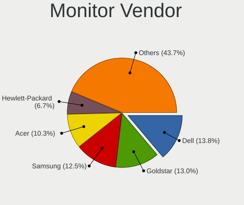

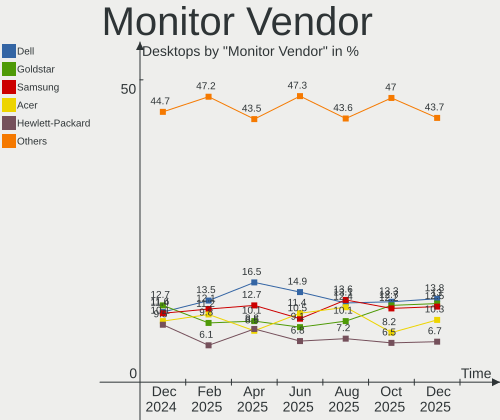

| Vendor               | Desktops | Percent |
|----------------------|----------|---------|
| Dell                 | 120      | 13.84%  |
| Goldstar             | 113      | 13.03%  |
| Samsung Electronics  | 108      | 12.46%  |
| Acer                 | 89       | 10.27%  |
| Hewlett-Packard      | 58       | 6.69%   |
| Ancor Communications | 38       | 4.38%   |
| ASUSTek Computer     | 36       | 4.15%   |
| MSI                  | 30       | 3.46%   |
| AOC                  | 27       | 3.11%   |
| Sceptre Tech         | 24       | 2.77%   |
| Vizio                | 22       | 2.54%   |
| ViewSonic            | 18       | 2.08%   |
| Gigabyte Technology  | 18       | 2.08%   |
| Lenovo               | 12       | 1.38%   |
| BenQ                 | 12       | 1.38%   |
| Sony                 | 9        | 1.04%   |
| ONN                  | 8        | 0.92%   |
| Insignia             | 8        | 0.92%   |
| Unknown              | 6        | 0.69%   |
| Roku                 | 6        | 0.69%   |
| Toshiba              | 5        | 0.58%   |
| SKG                  | 5        | 0.58%   |
| Wacom                | 4        | 0.46%   |
| Valve                | 4        | 0.46%   |
| Unknown (XXX)        | 4        | 0.46%   |
| Pixio                | 4        | 0.46%   |
| Philips              | 4        | 0.46%   |
| Element              | 4        | 0.46%   |
| Viotek               | 3        | 0.35%   |
| SANSUI               | 3        | 0.35%   |
| Planar               | 3        | 0.35%   |
| Onkyo                | 3        | 0.35%   |
| HannStar             | 3        | 0.35%   |
| XYK                  | 2        | 0.23%   |
| TCL                  | 2        | 0.23%   |
| RTK                  | 2        | 0.23%   |
| Pioneer              | 2        | 0.23%   |
| Panasonic            | 2        | 0.23%   |
| Huion                | 2        | 0.23%   |
| HKC                  | 2        | 0.23%   |

Monitor Model
-------------

Monitor models

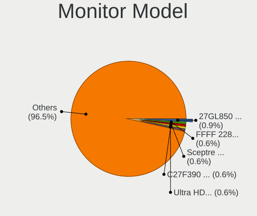

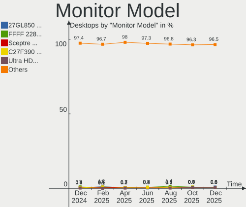

| Model                                                                 | Desktops | Percent |
|-----------------------------------------------------------------------|----------|---------|
| Goldstar 27GL850 GSM5B7F 2560x1440 597x336mm 27.0-inch                | 8        | 0.87%   |
| Unknown LCD Monitor FFFF 2288x1287 2550x2550mm 142.0-inch             | 6        | 0.65%   |
| Sceptre Tech Sceptre F24 SPT09AB 1920x1080 530x290mm 23.8-inch        | 6        | 0.65%   |
| Samsung Electronics C27F390 SAM0D32 1920x1080 598x336mm 27.0-inch     | 6        | 0.65%   |
| Goldstar Ultra HD GSM5B09 3840x2160 600x340mm 27.2-inch               | 6        | 0.65%   |
| Goldstar HDR 4K GSM7707 3840x2160 600x340mm 27.2-inch                 | 6        | 0.65%   |
| Goldstar FULL HD GSM5B55 1920x1080 480x270mm 21.7-inch                | 6        | 0.65%   |
| ONN ONA18HO015 ONN0101 1920x1080 698x393mm 31.5-inch                  | 5        | 0.54%   |
| MSI G274QPF E2 MSI8CC2 2560x1440 597x336mm 27.0-inch                  | 5        | 0.54%   |
| Goldstar LG TV SSCR2 GSMC0C8 3840x2160                                | 5        | 0.54%   |
| Valve Index HMD VLV91A8                                               | 4        | 0.43%   |
| Sceptre Tech Sceptre F27 SPT0AD7 1920x1080 600x330mm 27.0-inch        | 4        | 0.43%   |
| Sceptre Tech Sceptre E22 SPT08D5 1920x1080 470x300mm 22.0-inch        | 4        | 0.43%   |
| Samsung Electronics C24F390 SAM0D2C 1920x1080 521x293mm 23.5-inch     | 4        | 0.43%   |
| Gigabyte Technology M27Q GBT270D 2560x1440 597x336mm 27.0-inch        | 4        | 0.43%   |
| Dell SE2717H/HX DELD0A1 1920x1080 598x336mm 27.0-inch                 | 4        | 0.43%   |
| Ancor Communications VG248 ACI24A5 1920x1080 531x299mm 24.0-inch      | 4        | 0.43%   |
| Vizio V505-J09 VIZ1039 3840x2160 1096x616mm 49.5-inch                 | 3        | 0.32%   |
| Sceptre Tech Sceptre J20 SPT080D 1600x900 435x237mm 19.5-inch         | 3        | 0.32%   |
| Samsung Electronics LS32FG51x SAM78F2 2560x1440 697x392mm 31.5-inch   | 3        | 0.32%   |
| Samsung Electronics LCD Monitor SAM0F13 3840x2160 950x540mm 43.0-inch | 3        | 0.32%   |
| Samsung Electronics LCD Monitor SAM0C39 1920x1080 885x498mm 40.0-inch | 3        | 0.32%   |
| Goldstar ULTRAGEAR GSM5C95 2560x1440 597x336mm 27.0-inch              | 3        | 0.32%   |
| Goldstar QHD GSM772A 2560x1440 697x392mm 31.5-inch                    | 3        | 0.32%   |
| Goldstar HDR 4K GSM7706 3840x2160 600x340mm 27.2-inch                 | 3        | 0.32%   |
| Gigabyte Technology G27Q GBT2709 2560x1440 598x336mm 27.0-inch        | 3        | 0.32%   |
| Dell U2412M DELA07A 1920x1200 518x324mm 24.1-inch                     | 3        | 0.32%   |
| Dell S2721QS DELA198 3840x2160 597x336mm 27.0-inch                    | 3        | 0.32%   |
| Dell P2419H DELD0DA 1920x1080 527x296mm 23.8-inch                     | 3        | 0.32%   |
| Dell AW3423DWF DELA212 3440x1440 800x337mm 34.2-inch                  | 3        | 0.32%   |
| ASUSTek Computer VG248 AUS24AC 1920x1080 531x299mm 24.0-inch          | 3        | 0.32%   |
| ASUSTek Computer VG245 AUS24A1 1920x1080 531x299mm 24.0-inch          | 3        | 0.32%   |
| Ancor Communications ASUS VS247 ACI249A 1920x1080 521x293mm 23.5-inch | 3        | 0.32%   |
| Ancor Communications ASUS VP228 ACI22C3 1920x1080 476x268mm 21.5-inch | 3        | 0.32%   |
| Acer S271HL ACR02CA 1920x1080 598x336mm 27.0-inch                     | 3        | 0.32%   |
| XYK Display XYK1200 1920x1200 301x188mm 14.0-inch                     | 2        | 0.22%   |
| Wacom One 13 WAC1070 1920x1080 294x166mm 13.3-inch                    | 2        | 0.22%   |
| Vizio VFD40M-0809 VIZ0109 1920x1080 890x490mm 40.0-inch               | 2        | 0.22%   |
| Vizio V405-G9 VIZ1033 3840x2160 1096x616mm 49.5-inch                  | 2        | 0.22%   |
| Vizio D43f-F1 VIZ1027 1920x1080 940x529mm 42.5-inch                   | 2        | 0.22%   |

Monitor Resolution
------------------

Monitor screen resolution

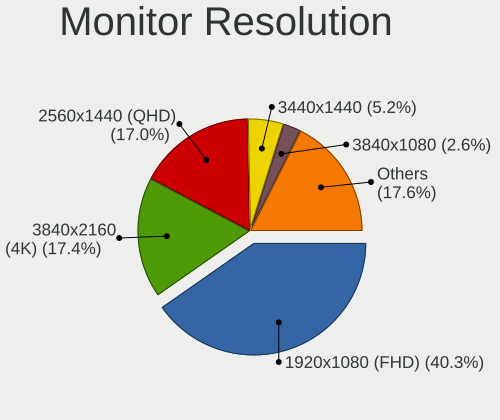

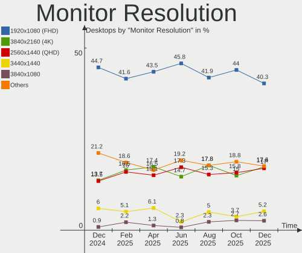

| Resolution         | Desktops | Percent |
|--------------------|----------|---------|
| 1920x1080 (FHD)    | 328      | 40.29%  |
| 3840x2160 (4K)     | 142      | 17.44%  |
| 2560x1440 (QHD)    | 138      | 16.95%  |
| 3440x1440          | 42       | 5.16%   |
| 3840x1080          | 21       | 2.58%   |
| 1920x1200 (WUXGA)  | 20       | 2.46%   |
| 2560x1080          | 17       | 2.09%   |
| 1280x1024 (SXGA)   | 17       | 2.09%   |
| 1680x1050 (WSXGA+) | 15       | 1.84%   |
| 1600x900 (HD+)     | 14       | 1.72%   |
| 1366x768 (WXGA)    | 8        | 0.98%   |
| 1440x900 (WXGA+)   | 7        | 0.86%   |
| 2288x1287          | 6        | 0.74%   |
| 1920x540           | 6        | 0.74%   |
| Unknown            | 6        | 0.74%   |
| 3840x1600          | 5        | 0.61%   |
| 1360x768           | 5        | 0.61%   |
| 1024x768 (XGA)     | 4        | 0.49%   |
| 2560x2880          | 2        | 0.25%   |
| 6400x1440          | 1        | 0.12%   |
| 5760x1080          | 1        | 0.12%   |
| 2560x682           | 1        | 0.12%   |
| 2560x1600          | 1        | 0.12%   |
| 2256x1504          | 1        | 0.12%   |
| 2160x1200          | 1        | 0.12%   |
| 1920x720           | 1        | 0.12%   |
| 1600x1200          | 1        | 0.12%   |
| 1400x1050          | 1        | 0.12%   |
| 1280x720 (HD)      | 1        | 0.12%   |
| 1152x864           | 1        | 0.12%   |

Monitor Diagonal
----------------

Diagonal size in inches

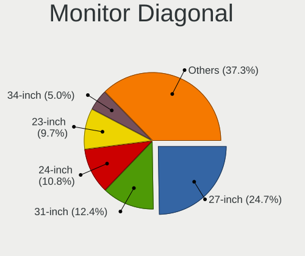

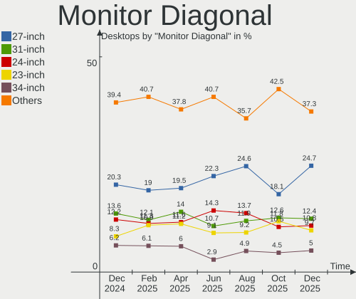

| Inches  | Desktops | Percent |
|---------|----------|---------|
| 27      | 217      | 24.74%  |
| 31      | 109      | 12.43%  |
| 24      | 95       | 10.83%  |
| 23      | 85       | 9.69%   |
| 34      | 44       | 5.02%   |
| 21      | 43       | 4.9%    |
| Unknown | 24       | 2.74%   |
| 32      | 20       | 2.28%   |
| 19      | 17       | 1.94%   |
| 48      | 16       | 1.82%   |
| 84      | 15       | 1.71%   |
| 15      | 15       | 1.71%   |
| 40      | 14       | 1.6%    |
| 72      | 13       | 1.48%   |
| 22      | 13       | 1.48%   |
| 20      | 13       | 1.48%   |
| 49      | 11       | 1.25%   |
| 26      | 11       | 1.25%   |
| 54      | 9        | 1.03%   |
| 17      | 9        | 1.03%   |
| 74      | 7        | 0.8%    |
| 63      | 7        | 0.8%    |
| 142     | 6        | 0.68%   |
| 42      | 6        | 0.68%   |
| 37      | 5        | 0.57%   |
| 36      | 5        | 0.57%   |
| 29      | 5        | 0.57%   |
| 28      | 5        | 0.57%   |
| 18      | 5        | 0.57%   |
| 44      | 3        | 0.34%   |
| 39      | 3        | 0.34%   |
| 35      | 3        | 0.34%   |
| 25      | 3        | 0.34%   |
| 14      | 3        | 0.34%   |
| 13      | 3        | 0.34%   |
| 85      | 2        | 0.23%   |
| 55      | 2        | 0.23%   |
| 46      | 2        | 0.23%   |
| 70      | 1        | 0.11%   |
| 65      | 1        | 0.11%   |

Monitor Width
-------------

Physical width

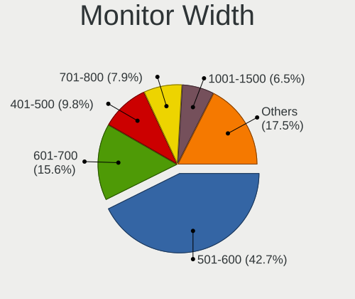

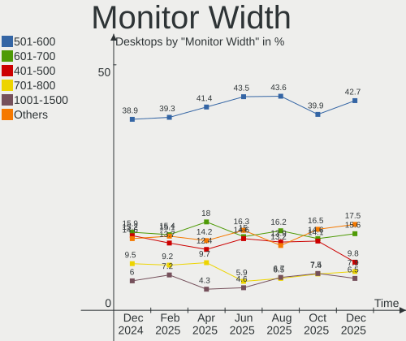

| Width in mm    | Desktops | Percent |
|----------------|----------|---------|
| 501-600        | 353      | 42.68%  |
| 601-700        | 129      | 15.6%   |
| 401-500        | 81       | 9.79%   |
| 701-800        | 65       | 7.86%   |
| 1001-1500      | 54       | 6.53%   |
| 1501-2000      | 38       | 4.59%   |
| 301-350        | 27       | 3.26%   |
| 801-900        | 26       | 3.14%   |
| Unknown        | 24       | 2.9%    |
| 901-1000       | 11       | 1.33%   |
| 351-400        | 9        | 1.09%   |
| More than 2000 | 6        | 0.73%   |
| 201-300        | 4        | 0.48%   |

Aspect Ratio
------------

Proportional relationship between the width and the height

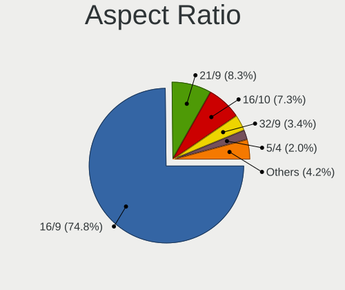

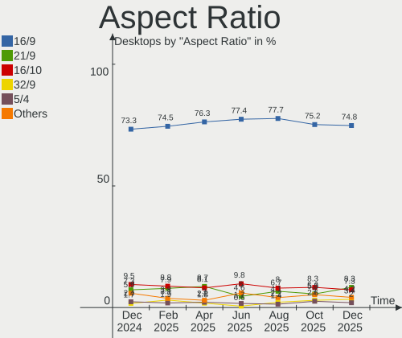

| Ratio   | Desktops | Percent |
|---------|----------|---------|
| 16/9    | 556      | 74.83%  |
| 21/9    | 62       | 8.34%   |
| 16/10   | 54       | 7.27%   |
| 32/9    | 25       | 3.36%   |
| 5/4     | 15       | 2.02%   |
| 4/3     | 9        | 1.21%   |
| Unknown | 9        | 1.21%   |
| 1.00    | 6        | 0.81%   |
| 0.89    | 2        | 0.27%   |
| 6/5     | 1        | 0.13%   |
| 3/2     | 1        | 0.13%   |
| 3.75    | 1        | 0.13%   |
| 2.69    | 1        | 0.13%   |
| 1.96    | 1        | 0.13%   |

Monitor Area
------------

Area in inch²

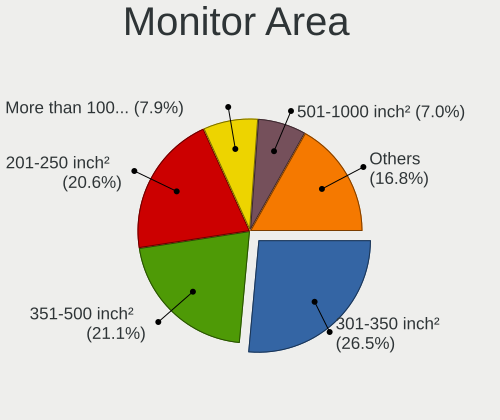

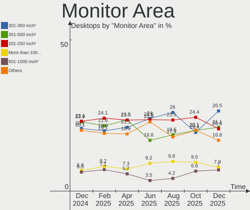

| Area in inch² | Desktops | Percent |
|----------------|----------|---------|
| 301-350        | 223      | 26.45%  |
| 351-500        | 178      | 21.12%  |
| 201-250        | 174      | 20.64%  |
| More than 1000 | 67       | 7.95%   |
| 501-1000       | 59       | 7%      |
| 151-200        | 41       | 4.86%   |
| 251-300        | 40       | 4.74%   |
| Unknown        | 24       | 2.85%   |
| 101-110        | 14       | 1.66%   |
| 141-150        | 13       | 1.54%   |
| 81-90          | 2        | 0.24%   |
| 71-80          | 2        | 0.24%   |
| 51-60          | 2        | 0.24%   |
| 131-140        | 2        | 0.24%   |
| 111-120        | 2        | 0.24%   |

Pixel Density
-------------

Pixels per inch

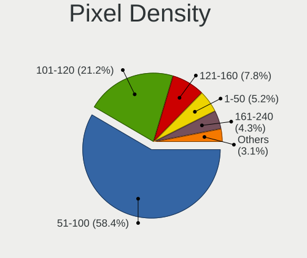

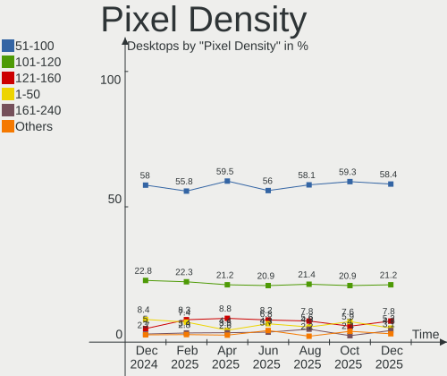

| Density | Desktops | Percent |
|---------|----------|---------|
| 51-100  | 458      | 58.42%  |
| 101-120 | 166      | 21.17%  |
| 121-160 | 61       | 7.78%   |
| 1-50    | 41       | 5.23%   |
| 161-240 | 34       | 4.34%   |
| Unknown | 24       | 3.06%   |

Multiple Monitors
-----------------

Total monitors connected

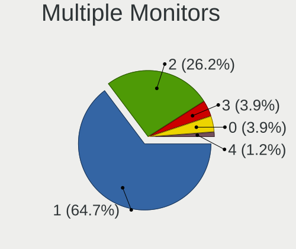

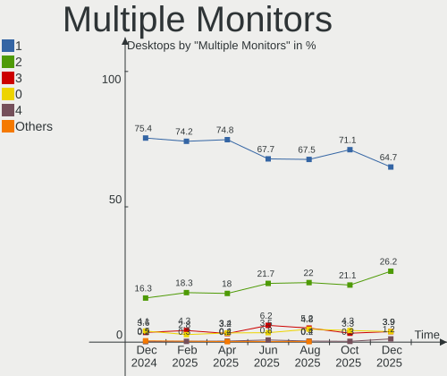

| Total | Desktops | Percent |
|-------|----------|---------|
| 1     | 481      | 64.74%  |
| 2     | 195      | 26.24%  |
| 3     | 29       | 3.9%    |
| 0     | 29       | 3.9%    |
| 4     | 9        | 1.21%   |

Network
-------

Net Controller Vendor
---------------------

Controller vendors

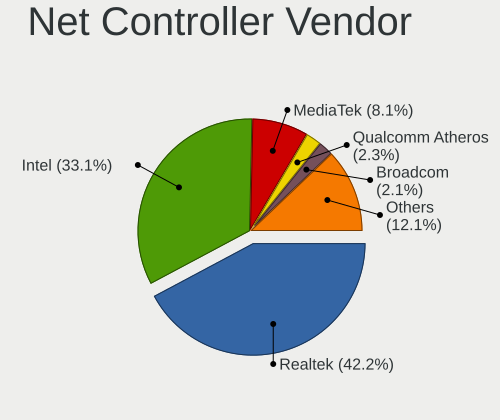

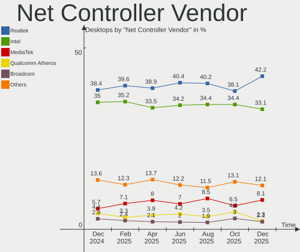

| Vendor                          | Desktops | Percent |
|---------------------------------|----------|---------|
| Realtek Semiconductor           | 498      | 42.2%   |
| Intel                           | 391      | 33.14%  |
| MediaTek                        | 96       | 8.14%   |
| Qualcomm Atheros                | 27       | 2.29%   |
| Broadcom                        | 25       | 2.12%   |
| Qualcomm Technologies           | 17       | 1.44%   |
| Aquantia                        | 16       | 1.36%   |
| Microsoft                       | 10       | 0.85%   |
| TP-Link                         | 7        | 0.59%   |
| Ralink Technology               | 7        | 0.59%   |
| NetGear                         | 7        | 0.59%   |
| Ralink                          | 6        | 0.51%   |
| Samsung Electronics             | 5        | 0.42%   |
| Realtek                         | 5        | 0.42%   |
| Motorola PCS                    | 4        | 0.34%   |
| DisplayLink                     | 4        | 0.34%   |
| ASIX Electronics                | 4        | 0.34%   |
| American Megatrends             | 4        | 0.34%   |
| Nvidia                          | 3        | 0.25%   |
| Linksys                         | 3        | 0.25%   |
| ASUSTek Computer                | 3        | 0.25%   |
| U-Blox                          | 2        | 0.17%   |
| InterBiometrics                 | 2        | 0.17%   |
| HYTE                            | 2        | 0.17%   |
| Google                          | 2        | 0.17%   |
| Edimax Technology               | 2        | 0.17%   |
| D-Link System                   | 2        | 0.17%   |
| American Future Technology      | 2        | 0.17%   |
| aicsemi                         | 2        | 0.17%   |
| Xiaomi                          | 1        | 0.08%   |
| Winbond Electronics             | 1        | 0.08%   |
| TRENDnet                        | 1        | 0.08%   |
| ROCCAT                          | 1        | 0.08%   |
| Qualcomm Atheros Communications | 1        | 0.08%   |
| QinHeng Electronics             | 1        | 0.08%   |
| Netchip Technology              | 1        | 0.08%   |
| MicroPython                     | 1        | 0.08%   |
| Microchip Technology            | 1        | 0.08%   |
| Mellanox Technologies           | 1        | 0.08%   |
| Marvell Technology Group        | 1        | 0.08%   |

Net Controller Model
--------------------

Controller models

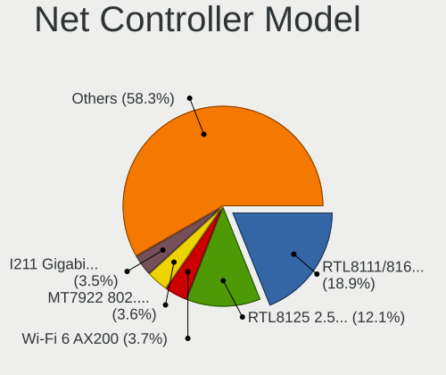

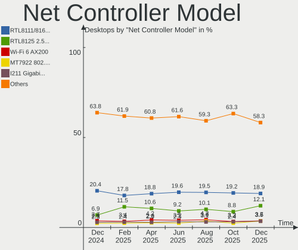

| Model                                                                           | Desktops | Percent |
|---------------------------------------------------------------------------------|----------|---------|
| Realtek RTL8111/8168/8211/8411 PCI Express Gigabit Ethernet Controller          | 266      | 18.91%  |
| Realtek RTL8125 2.5GbE Controller                                               | 170      | 12.08%  |
| Intel Wi-Fi 6 AX200                                                             | 52       | 3.7%    |
| MediaTek MT7922 802.11ax PCI Express Wireless Network Adapter                   | 50       | 3.55%   |
| Intel I211 Gigabit Network Connection                                           | 49       | 3.48%   |
| Intel Wi-Fi 6E(802.11ax) AX210/AX1675* 2x2 [Typhoon Peak]                       | 44       | 3.13%   |
| Intel Ethernet Controller I225-V                                                | 43       | 3.06%   |
| Realtek RTL8126 5GbE Controller                                                 | 33       | 2.35%   |
| Intel Ethernet Connection (2) I219-V                                            | 29       | 2.06%   |
| Realtek RTL8821CE 802.11ac PCIe Wireless Network Adapter                        | 22       | 1.56%   |
| Intel Ethernet Controller I226-V                                                | 22       | 1.56%   |
| Intel Wi-Fi 5(802.11ac) Wireless-AC 9x6x [Thunder Peak]                         | 20       | 1.42%   |
| Intel Dual Band Wireless-AC 3168NGW [Stone Peak]                                | 19       | 1.35%   |
| Intel 82579LM Gigabit Network Connection (Lewisville)                           | 19       | 1.35%   |
| Realtek RTL8852BE PCIe 802.11ax Wireless Network Controller                     | 18       | 1.28%   |
| Qualcomm WCN785x Wi-Fi 7(802.11be) 320MHz 2x2 [FastConnect 7800]                | 17       | 1.21%   |
| Intel 700 Series Chipset CNVi WiFi                                              | 17       | 1.21%   |
| Intel Ethernet Connection (7) I219-V                                            | 16       | 1.14%   |
| Intel Wireless 7265                                                             | 13       | 0.92%   |
| Intel Ethernet Connection I217-LM                                               | 13       | 0.92%   |
| Realtek RTL8922AE 802.11be PCIe Wireless Network Adapter                        | 11       | 0.78%   |
| Realtek Killer E3000 2.5GbE Controller                                          | 11       | 0.78%   |
| MediaTek MT7927 802.11be 320MHz 2x2 PCIe Wireless Network Adapter [Filogic 380] | 11       | 0.78%   |
| MediaTek MT7921K (RZ608) Wi-Fi 6E 80MHz                                         | 11       | 0.78%   |
| Intel Alder Lake-S PCH CNVi WiFi                                                | 11       | 0.78%   |
| Realtek RTL88x2bu [AC1200 Techkey]                                              | 10       | 0.71%   |
| Realtek RTL8852CE PCIe 802.11ax Wireless Network Controller                     | 10       | 0.71%   |
| Realtek RTL8851BE PCIe 802.11ax Wireless Network Controller                     | 10       | 0.71%   |
| Realtek RTL8153 Gigabit Ethernet Adapter                                        | 10       | 0.71%   |
| MediaTek MT7925 802.11be 160MHz 2x2 PCIe Wireless Network Adapter [Filogic 360] | 10       | 0.71%   |
| Intel Cannon Lake PCH CNVi WiFi                                                 | 10       | 0.71%   |
| Broadcom BCM4360 802.11ac Dual Band Wireless Network Adapter                    | 10       | 0.71%   |
| Intel Ethernet Connection I217-V                                                | 9        | 0.64%   |
| Intel Comet Lake PCH CNVi WiFi                                                  | 9        | 0.64%   |
| Intel I210 Gigabit Network Connection                                           | 8        | 0.57%   |
| Intel Ethernet Connection (7) I219-LM                                           | 8        | 0.57%   |
| Realtek 802.11ac NIC                                                            | 7        | 0.5%    |
| MediaTek MT7925 (RZ717) Wi-Fi 7 160MHz                                          | 7        | 0.5%    |
| Intel Ethernet Connection (2) I219-LM                                           | 7        | 0.5%    |
| Intel Ethernet Connection (2) I218-V                                            | 7        | 0.5%    |

Wireless Vendor
---------------

Wireless vendors

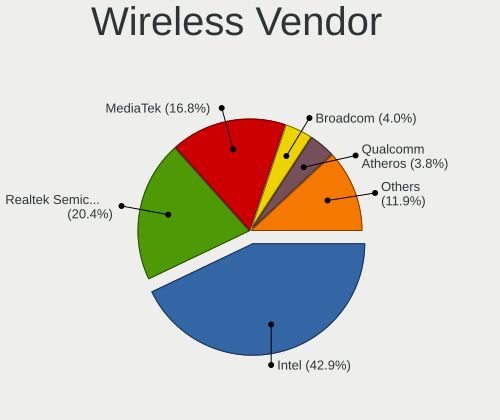

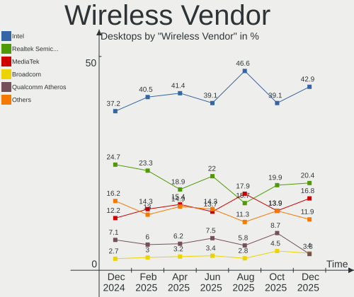

| Vendor                          | Desktops | Percent |
|---------------------------------|----------|---------|
| Intel                           | 212      | 42.91%  |
| Realtek Semiconductor           | 101      | 20.45%  |
| MediaTek                        | 83       | 16.8%   |
| Broadcom                        | 20       | 4.05%   |
| Qualcomm Atheros                | 19       | 3.85%   |
| Microsoft                       | 9        | 1.82%   |
| TP-Link                         | 7        | 1.42%   |
| Ralink Technology               | 7        | 1.42%   |
| NetGear                         | 7        | 1.42%   |
| Ralink                          | 6        | 1.21%   |
| Realtek                         | 5        | 1.01%   |
| Qualcomm Technologies           | 3        | 0.61%   |
| Linksys                         | 3        | 0.61%   |
| ASUSTek Computer                | 3        | 0.61%   |
| Edimax Technology               | 2        | 0.4%    |
| D-Link System                   | 2        | 0.4%    |
| TRENDnet                        | 1        | 0.2%    |
| Qualcomm Atheros Communications | 1        | 0.2%    |
| Gemtek                          | 1        | 0.2%    |
| Broadcom Limited                | 1        | 0.2%    |
| Belkin Components               | 1        | 0.2%    |

Wireless Model
--------------

Wireless models

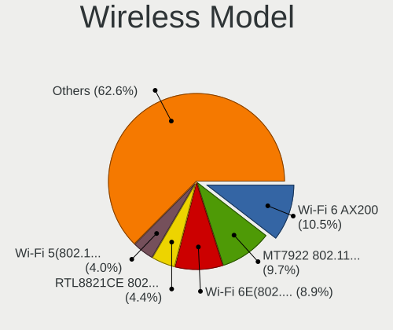

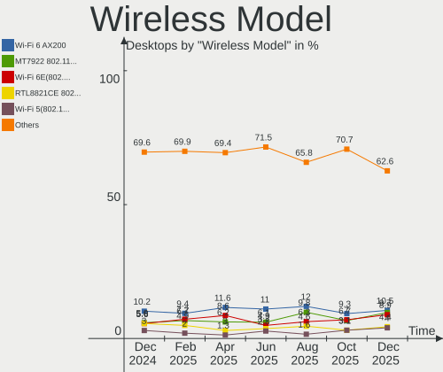

| Model                                                                           | Desktops | Percent |
|---------------------------------------------------------------------------------|----------|---------|
| Intel Wi-Fi 6 AX200                                                             | 52       | 10.46%  |
| MediaTek MT7922 802.11ax PCI Express Wireless Network Adapter                   | 48       | 9.66%   |
| Intel Wi-Fi 6E(802.11ax) AX210/AX1675* 2x2 [Typhoon Peak]                       | 44       | 8.85%   |
| Realtek RTL8821CE 802.11ac PCIe Wireless Network Adapter                        | 22       | 4.43%   |
| Intel Wi-Fi 5(802.11ac) Wireless-AC 9x6x [Thunder Peak]                         | 20       | 4.02%   |
| Intel Dual Band Wireless-AC 3168NGW [Stone Peak]                                | 19       | 3.82%   |
| Intel 700 Series Chipset CNVi WiFi                                              | 16       | 3.22%   |
| Realtek RTL8852BE PCIe 802.11ax Wireless Network Controller                     | 13       | 2.62%   |
| Intel Wireless 7265                                                             | 13       | 2.62%   |
| MediaTek MT7921K (RZ608) Wi-Fi 6E 80MHz                                         | 11       | 2.21%   |
| Realtek RTL88x2bu [AC1200 Techkey]                                              | 10       | 2.01%   |
| Realtek RTL8852CE PCIe 802.11ax Wireless Network Controller                     | 10       | 2.01%   |
| Realtek RTL8851BE PCIe 802.11ax Wireless Network Controller                     | 10       | 2.01%   |
| Intel Cannon Lake PCH CNVi WiFi                                                 | 10       | 2.01%   |
| Broadcom BCM4360 802.11ac Dual Band Wireless Network Adapter                    | 10       | 2.01%   |
| Intel Comet Lake PCH CNVi WiFi                                                  | 9        | 1.81%   |
| MediaTek MT7927 802.11be 320MHz 2x2 PCIe Wireless Network Adapter [Filogic 380] | 8        | 1.61%   |
| Realtek 802.11ac NIC                                                            | 7        | 1.41%   |
| MediaTek MT7925 (RZ717) Wi-Fi 7 160MHz                                          | 7        | 1.41%   |
| Intel Alder Lake-S PCH CNVi WiFi                                                | 6        | 1.21%   |
| Realtek RTL8812AE 802.11ac PCIe Wireless Network Adapter                        | 5        | 1.01%   |
| Qualcomm Atheros AR9485 Wireless Network Adapter                                | 5        | 1.01%   |
| Realtek RTL8822CE 802.11ac PCIe Wireless Network Adapter                        | 4        | 0.8%    |
| Qualcomm Atheros AR9462 Wireless Network Adapter                                | 4        | 0.8%    |
| Microsoft Xbox Wireless Adapter for Windows                                     | 4        | 0.8%    |
| Microsoft Xbox 360 Wireless Adapter                                             | 4        | 0.8%    |
| MediaTek MT7925 802.11be 160MHz 2x2 PCIe Wireless Network Adapter [Filogic 360] | 4        | 0.8%    |
| Intel Wireless 8260                                                             | 4        | 0.8%    |
| Intel Wireless 7260                                                             | 4        | 0.8%    |
| Intel Wireless 3165                                                             | 4        | 0.8%    |
| Intel Wi-Fi 7(802.11be) AX1775*/AX1790*/BE20*/BE401/BE1750* 2x2                 | 4        | 0.8%    |
| Intel Tiger Lake PCH CNVi WiFi                                                  | 4        | 0.8%    |
| TP-Link 802.11ac WLAN Adapter                                                   | 3        | 0.6%    |
| Realtek 802.11ac WLAN Adapter                                                   | 3        | 0.6%    |
| Ralink RT5370 Wireless Adapter                                                  | 3        | 0.6%    |
| Ralink RT3290 Wireless 802.11n 1T/1R PCIe                                       | 3        | 0.6%    |
| Qualcomm WCN785x Wi-Fi 7(802.11be) 320MHz 2x2 [FastConnect 7800]                | 3        | 0.6%    |
| Qualcomm Atheros QCA9377 802.11ac Wireless Network Adapter                      | 3        | 0.6%    |
| Broadcom BCM4352 802.11ac Dual Band Wireless Network Adapter                    | 3        | 0.6%    |
| ASUS 802.11ax WLAN Adapter                                                      | 3        | 0.6%    |

Ethernet Vendor
---------------

Ethernet vendors

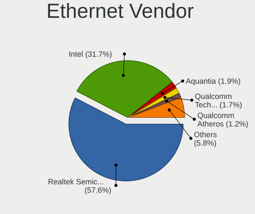

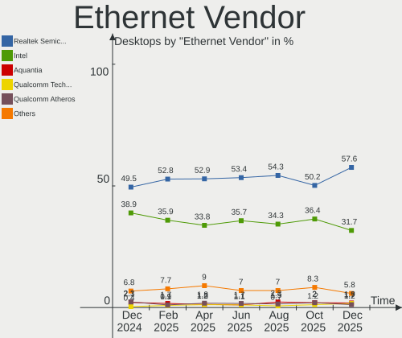

| Vendor                   | Desktops | Percent |
|--------------------------|----------|---------|
| Realtek Semiconductor    | 474      | 57.59%  |
| Intel                    | 261      | 31.71%  |
| Aquantia                 | 16       | 1.94%   |
| Qualcomm Technologies    | 14       | 1.7%    |
| Qualcomm Atheros         | 10       | 1.22%   |
| MediaTek                 | 8        | 0.97%   |
| Broadcom                 | 6        | 0.73%   |
| Samsung Electronics      | 5        | 0.61%   |
| Motorola PCS             | 4        | 0.49%   |
| DisplayLink              | 4        | 0.49%   |
| ASIX Electronics         | 4        | 0.49%   |
| American Megatrends      | 4        | 0.49%   |
| Nvidia                   | 3        | 0.36%   |
| Xiaomi                   | 1        | 0.12%   |
| Microsoft                | 1        | 0.12%   |
| Mellanox Technologies    | 1        | 0.12%   |
| Marvell Technology Group | 1        | 0.12%   |
| Lenovo                   | 1        | 0.12%   |
| Insyde Software          | 1        | 0.12%   |
| ICS Advent               | 1        | 0.12%   |
| Google                   | 1        | 0.12%   |
| Apple                    | 1        | 0.12%   |
| 3Com                     | 1        | 0.12%   |

Ethernet Model
--------------

Ethernet models

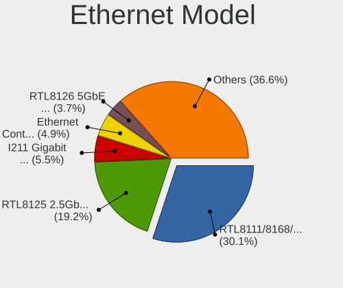

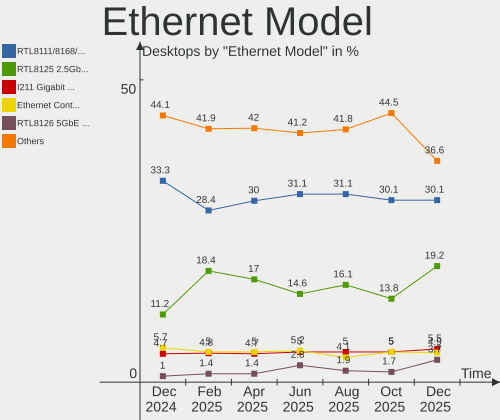

| Model                                                                             | Desktops | Percent |
|-----------------------------------------------------------------------------------|----------|---------|
| Realtek RTL8111/8168/8211/8411 PCI Express Gigabit Ethernet Controller            | 266      | 30.06%  |
| Realtek RTL8125 2.5GbE Controller                                                 | 170      | 19.21%  |
| Intel I211 Gigabit Network Connection                                             | 49       | 5.54%   |
| Intel Ethernet Controller I225-V                                                  | 43       | 4.86%   |
| Realtek RTL8126 5GbE Controller                                                   | 33       | 3.73%   |
| Intel Ethernet Connection (2) I219-V                                              | 29       | 3.28%   |
| Intel Ethernet Controller I226-V                                                  | 22       | 2.49%   |
| Intel 82579LM Gigabit Network Connection (Lewisville)                             | 19       | 2.15%   |
| Intel Ethernet Connection (7) I219-V                                              | 16       | 1.81%   |
| Qualcomm WCN785x Wi-Fi 7(802.11be) 320MHz 2x2 [FastConnect 7800]                  | 14       | 1.58%   |
| Intel Ethernet Connection I217-LM                                                 | 13       | 1.47%   |
| Realtek Killer E3000 2.5GbE Controller                                            | 11       | 1.24%   |
| Realtek RTL8153 Gigabit Ethernet Adapter                                          | 10       | 1.13%   |
| Realtek RTL8922AE 802.11be PCIe Wireless Network Adapter                          | 9        | 1.02%   |
| Intel Ethernet Connection I217-V                                                  | 9        | 1.02%   |
| Intel I210 Gigabit Network Connection                                             | 8        | 0.9%    |
| Intel Ethernet Connection (7) I219-LM                                             | 8        | 0.9%    |
| Intel Ethernet Connection (2) I219-LM                                             | 7        | 0.79%   |
| Intel Ethernet Connection (2) I218-V                                              | 7        | 0.79%   |
| MediaTek MT7925 802.11be 160MHz 2x2 PCIe Wireless Network Adapter [Filogic 360]   | 6        | 0.68%   |
| Samsung GT-I9070 (network tethering, USB debugging enabled)                       | 5        | 0.56%   |
| Realtek RTL8852BE PCIe 802.11ax Wireless Network Controller                       | 5        | 0.56%   |
| Qualcomm Atheros Killer E220x Gigabit Ethernet Controller                         | 5        | 0.56%   |
| Intel Ethernet Connection (17) I219-V                                             | 5        | 0.56%   |
| Intel Alder Lake-S PCH CNVi WiFi                                                  | 5        | 0.56%   |
| Aquantia AQtion AQC113CS NBase-T/IEEE 802.3an Ethernet Controller [Antigua 10G]   | 5        | 0.56%   |
| Intel Ethernet Controller X710 for 10GBASE-T                                      | 4        | 0.45%   |
| Intel Ethernet Connection (11) I219-LM                                            | 4        | 0.45%   |
| Aquantia AQtion AQC107 NBase-T/IEEE 802.3an Ethernet Controller [Atlantic 10G]    | 4        | 0.45%   |
| Aquantia AQC113C NBase-T/IEEE 802.3an Ethernet Controller [Marvell Scalable mGig] | 4        | 0.45%   |
| American Megatrends Virtual Ethernet.                                             | 4        | 0.45%   |
| Motorola PCS motorola one 5G ace                                                  | 3        | 0.34%   |
| Intel Ethernet Controller 10-Gigabit X540-AT2                                     | 3        | 0.34%   |
| Intel Ethernet Connection (5) I219-LM                                             | 3        | 0.34%   |
| Intel 82574L Gigabit Network Connection                                           | 3        | 0.34%   |
| Intel 82567LM-3 Gigabit Network Connection                                        | 3        | 0.34%   |
| ASIX AX88179 Gigabit Ethernet                                                     | 3        | 0.34%   |
| Realtek USB 10/100/1G/2.5 LAN                                                     | 2        | 0.23%   |
| Realtek Killer E2600 GbE Controller                                               | 2        | 0.23%   |
| Qualcomm Atheros QCA8171 Gigabit Ethernet                                         | 2        | 0.23%   |

Net Controller Kind
-------------------

Ethernet, WiFi or modem

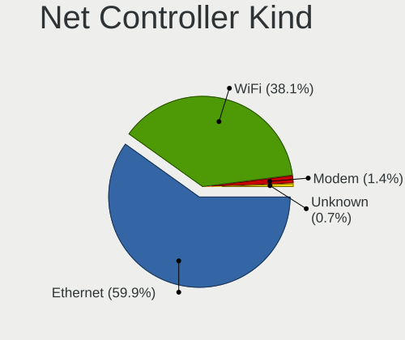

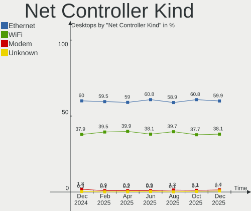

| Kind     | Desktops | Percent |
|----------|----------|---------|
| Ethernet | 736      | 59.89%  |
| WiFi     | 468      | 38.08%  |
| Modem    | 17       | 1.38%   |
| Unknown  | 8        | 0.65%   |

Used Controller
---------------

Currently used network controller

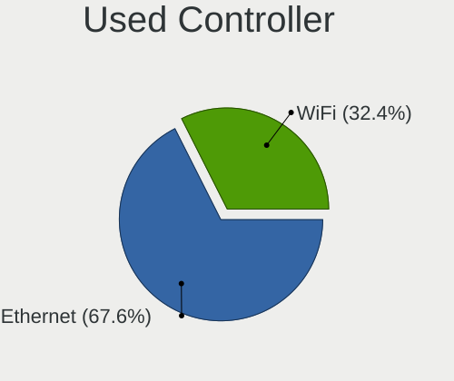

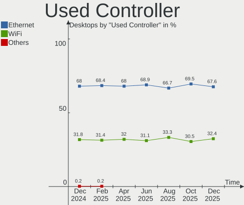

| Kind     | Desktops | Percent |
|----------|----------|---------|
| Ethernet | 523      | 67.57%  |
| WiFi     | 251      | 32.43%  |

NICs
----

Total network controllers on board

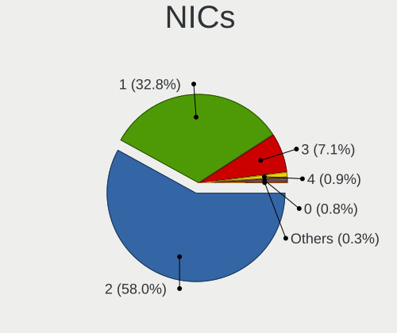

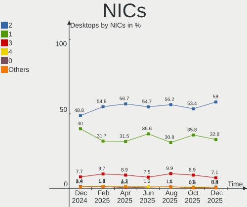

| Total | Desktops | Percent |
|-------|----------|---------|
| 2     | 431      | 58.01%  |
| 1     | 244      | 32.84%  |
| 3     | 53       | 7.13%   |
| 4     | 7        | 0.94%   |
| 0     | 6        | 0.81%   |
| 6     | 2        | 0.27%   |

IPv6
----

IPv6 vs IPv4

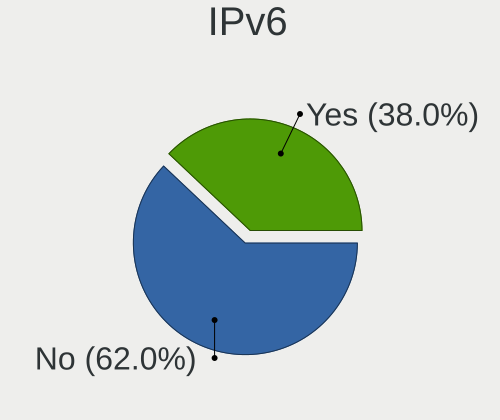

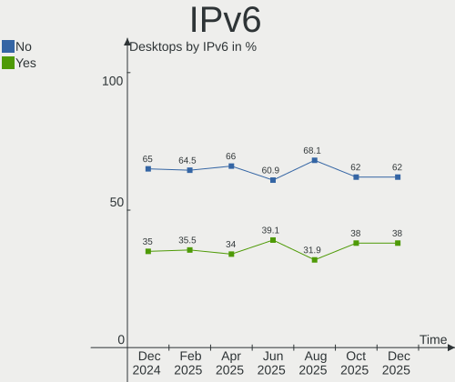

| Used | Desktops | Percent |
|------|----------|---------|
| No   | 461      | 62.05%  |
| Yes  | 282      | 37.95%  |

Bluetooth
---------

Bluetooth Vendor
----------------

Controller vendors

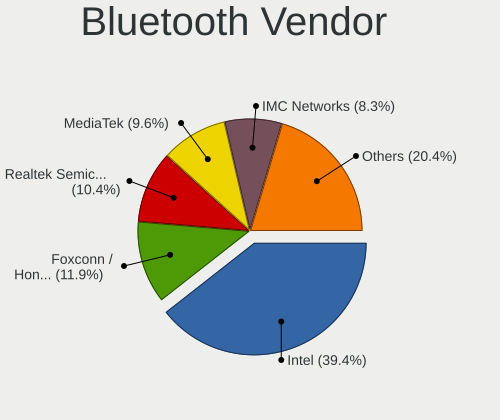

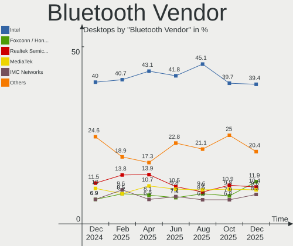

| Vendor                          | Desktops | Percent |
|---------------------------------|----------|---------|
| Intel                           | 205      | 39.42%  |
| Foxconn / Hon Hai               | 62       | 11.92%  |
| Realtek Semiconductor           | 54       | 10.38%  |
| MediaTek                        | 50       | 9.62%   |
| IMC Networks                    | 43       | 8.27%   |
| ASUSTek Computer                | 22       | 4.23%   |
| Cambridge Silicon Radio         | 21       | 4.04%   |
| TP-Link                         | 16       | 3.08%   |
| Broadcom                        | 12       | 2.31%   |
| Realtek                         | 7        | 1.35%   |
| Qualcomm Atheros Communications | 7        | 1.35%   |
| Actions                         | 4        | 0.77%   |
| Ralink                          | 3        | 0.58%   |
| Dynex                           | 3        | 0.58%   |
| Apple                           | 3        | 0.58%   |
| Edimax Technology               | 2        | 0.38%   |
| Primax Electronics              | 1        | 0.19%   |
| Kensington                      | 1        | 0.19%   |
| Integrated System Solution      | 1        | 0.19%   |
| HTC (High Tech Computer)        | 1        | 0.19%   |
| Hewlett-Packard                 | 1        | 0.19%   |
| Unknown                         | 1        | 0.19%   |

Bluetooth Model
---------------

Controller models

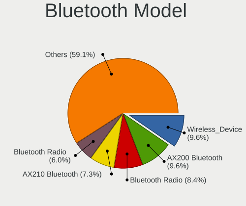

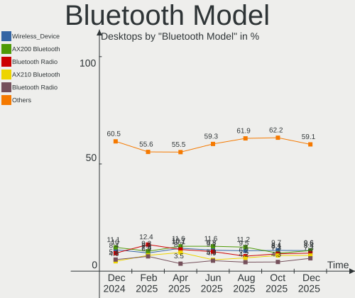

| Model                                                    | Desktops | Percent |
|----------------------------------------------------------|----------|---------|
| MediaTek Wireless_Device                                 | 50       | 9.6%    |
| Intel AX200 Bluetooth                                    | 50       | 9.6%    |
| Realtek Bluetooth Radio                                  | 44       | 8.45%   |
| Intel AX210 Bluetooth                                    | 38       | 7.29%   |
| IMC Networks Bluetooth Radio                             | 31       | 5.95%   |
| Foxconn / Hon Hai Wireless_Device                        | 31       | 5.95%   |
| Foxconn / Hon Hai Bluetooth Device                       | 26       | 4.99%   |
| Intel Bluetooth Device                                   | 25       | 4.8%    |
| Intel Bluetooth wireless interface                       | 24       | 4.61%   |
| Cambridge Silicon Radio Bluetooth Dongle (HCI mode)      | 21       | 4.03%   |
| Intel Wireless-AC 9260 Bluetooth Adapter                 | 19       | 3.65%   |
| Intel Wireless-AC 3168 Bluetooth                         | 18       | 3.45%   |
| Intel AX201 Bluetooth                                    | 18       | 3.45%   |
| TP-Link TP-T@- UB500 Adapter                             | 16       | 3.07%   |
| Intel Bluetooth 9460/9560 Jefferson Peak (JfP)           | 13       | 2.5%    |
| IMC Networks Wireless_Device                             | 12       | 2.3%    |
| ASUS ASUS USB-BT500                                      | 11       | 2.11%   |
| Realtek Bluetooth Radio                                  | 7        | 1.34%   |
| Broadcom BCM20702A0 Bluetooth 4.0                        | 7        | 1.34%   |
| Realtek Bluetooth 5.4 Radio                              | 5        | 0.96%   |
| Foxconn / Hon Hai Bluetooth Radio                        | 5        | 0.96%   |
| Realtek  Bluetooth 4.2 Adapter                           | 4        | 0.77%   |
| Actions general adapter                                  | 4        | 0.77%   |
| Ralink RT3290 Bluetooth                                  | 3        | 0.58%   |
| Qualcomm Atheros  Bluetooth Device                       | 3        | 0.58%   |
| Dynex Bluetooth 4.0 Adapter [Broadcom, 1.12, BCM20702A0] | 3        | 0.58%   |
| ASUS Bluetooth Radio                                     | 3        | 0.58%   |
| Edimax Bluetooth Device                                  | 2        | 0.38%   |
| Broadcom HP Bluethunder                                  | 2        | 0.38%   |
| Broadcom BCM43142 Bluetooth 4.0                          | 2        | 0.38%   |
| ASUS Broadcom BCM20702A0 Bluetooth                       | 2        | 0.38%   |
| ASUS Broadcom BCM20702 Single-Chip Bluetooth 4.0 + LE    | 2        | 0.38%   |
| ASUS Bluetooth Controller                                | 2        | 0.38%   |
| Apple Bluetooth Host Controller                          | 2        | 0.38%   |
| Realtek Bluetooth 5.3 Radio                              | 1        | 0.19%   |
| Realtek 802.11ac WLAN Adapter                            | 1        | 0.19%   |
| Qualcomm Atheros Bluetooth USB Host Controller           | 1        | 0.19%   |
| Qualcomm Atheros AR9462 Bluetooth                        | 1        | 0.19%   |
| Qualcomm Atheros AR3012 Bluetooth                        | 1        | 0.19%   |
| Qualcomm Atheros AR3011 Bluetooth                        | 1        | 0.19%   |

Sound
-----

Sound Vendor
------------

Sound card vendors

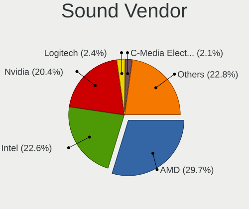

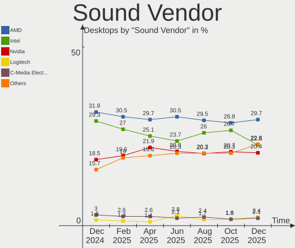

| Vendor                                       | Desktops | Percent |
|----------------------------------------------|----------|---------|
| AMD                                          | 456      | 29.73%  |
| Intel                                        | 347      | 22.62%  |
| Nvidia                                       | 313      | 20.4%   |
| Logitech                                     | 37       | 2.41%   |
| C-Media Electronics                          | 32       | 2.09%   |
| ASUSTek Computer                             | 25       | 1.63%   |
| Micro Star International                     | 23       | 1.5%    |
| SteelSeries ApS                              | 21       | 1.37%   |
| Razer USA                                    | 21       | 1.37%   |
| JMTek                                        | 18       | 1.17%   |
| Focusrite-Novation                           | 12       | 0.78%   |
| Texas Instruments                            | 11       | 0.72%   |
| Hewlett-Packard                              | 11       | 0.72%   |
| Creative Labs                                | 10       | 0.65%   |
| Audio-Technica                               | 10       | 0.65%   |
| Kingston Technology                          | 9        | 0.59%   |
| ASRock                                       | 9        | 0.59%   |
| Sony                                         | 8        | 0.52%   |
| Valve Software                               | 7        | 0.46%   |
| Jieli Technology                             | 7        | 0.46%   |
| Corsair                                      | 7        | 0.46%   |
| Generalplus Technology                       | 6        | 0.39%   |
| Blue Microphones                             | 6        | 0.39%   |
| Astro Gaming                                 | 5        | 0.33%   |
| Thesycon Systemsoftware & Consulting         | 4        | 0.26%   |
| TC Electronic                                | 4        | 0.26%   |
| Samson Technologies                          | 4        | 0.26%   |
| PreSonus Audio Electronics                   | 4        | 0.26%   |
| MV-SILICON                                   | 4        | 0.26%   |
| Unknown                                      | 4        | 0.26%   |
| Zoran Co. Personal Media Division (Nogatech) | 3        | 0.2%    |
| XMOS                                         | 3        | 0.2%    |
| Turtle Beach                                 | 3        | 0.2%    |
| Tenx Technology                              | 3        | 0.2%    |
| Shure                                        | 3        | 0.2%    |
| Schiit Audio                                 | 3        | 0.2%    |
| Nordic Semiconductor ASA                     | 3        | 0.2%    |
| KTMicro                                      | 3        | 0.2%    |
| GN Netcom                                    | 3        | 0.2%    |
| Giga-Byte Technology                         | 3        | 0.2%    |

Sound Model
-----------

Sound card models

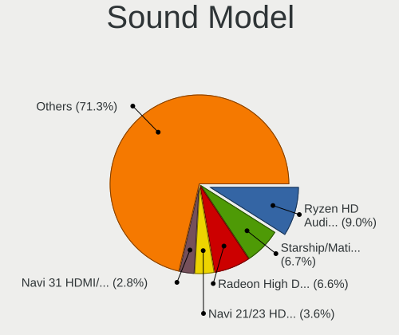

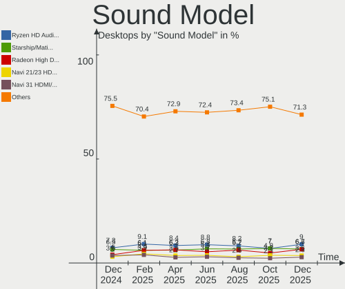

| Model                                                                      | Desktops | Percent |
|----------------------------------------------------------------------------|----------|---------|
| AMD Ryzen HD Audio Controller                                              | 173      | 8.98%   |
| AMD Starship/Matisse HD Audio Controller                                   | 129      | 6.7%    |
| AMD Radeon High Definition Audio Controller                                | 128      | 6.65%   |
| AMD Navi 21/23 HDMI/DP Audio Controller                                    | 69       | 3.58%   |
| AMD Navi 31 HDMI/DP Audio                                                  | 53       | 2.75%   |
| AMD Navi 48 HDMI/DP Audio Controller                                       | 51       | 2.65%   |
| Nvidia GA104 High Definition Audio Controller                              | 40       | 2.08%   |
| AMD Ellesmere HDMI Audio [Radeon RX 470/480 / 570/580/590]                 | 39       | 2.02%   |
| Intel Cannon Lake PCH cAVS                                                 | 38       | 1.97%   |
| Intel 8 Series/C220 Series Chipset High Definition Audio Controller        | 36       | 1.87%   |
| Intel Raptor Lake High Definition Audio Controller                         | 33       | 1.71%   |
| Intel 100 Series/C230 Series Chipset Family HD Audio Controller            | 33       | 1.71%   |
| AMD Renoir/Cezanne HDMI/DP Audio Controller                                | 32       | 1.66%   |
| Intel Alder Lake-S HD Audio Controller                                     | 31       | 1.61%   |
| Intel 200 Series PCH HD Audio                                              | 30       | 1.56%   |
| AMD Family 17h (Models 00h-0fh) HD Audio Controller                        | 30       | 1.56%   |
| Intel 6 Series/C200 Series Chipset Family High Definition Audio Controller | 26       | 1.35%   |
| Nvidia GP104 High Definition Audio Controller                              | 24       | 1.25%   |
| Intel Xeon E3-1200 v3/4th Gen Core Processor HD Audio Controller           | 24       | 1.25%   |
| Nvidia GA102 High Definition Audio Controller                              | 23       | 1.19%   |
| Micro Star International USB Audio                                         | 23       | 1.19%   |
| ASUSTek Computer USB Audio                                                 | 23       | 1.19%   |
| Nvidia AD104 High Definition Audio Controller                              | 21       | 1.09%   |
| Nvidia GA106 High Definition Audio Controller                              | 19       | 0.99%   |
| Nvidia AD103 High Definition Audio Controller                              | 19       | 0.99%   |
| AMD SBx00 Azalia (Intel HDA)                                               | 19       | 0.99%   |
| Nvidia TU116 High Definition Audio Controller                              | 15       | 0.78%   |
| JMTek USB PnP Audio Device                                                 | 15       | 0.78%   |
| Intel 7 Series/C216 Chipset Family High Definition Audio Controller        | 15       | 0.78%   |
| Nvidia TU104 HD Audio Controller                                           | 13       | 0.67%   |
| Intel Comet Lake PCH cAVS                                                  | 12       | 0.62%   |
| Intel C610/X99 series chipset HD Audio Controller                          | 12       | 0.62%   |
| Nvidia GP107GL High Definition Audio Controller                            | 11       | 0.57%   |
| Nvidia TU106 High Definition Audio Controller                              | 10       | 0.52%   |
| AMD Navi 10 HDMI Audio                                                     | 10       | 0.52%   |
| Nvidia GP106 High Definition Audio Controller                              | 9        | 0.47%   |
| Nvidia GK208 HDMI/DP Audio Controller                                      | 9        | 0.47%   |
| Nvidia GB203 High Definition Audio Controller                              | 9        | 0.47%   |
| Nvidia AD102 High Definition Audio Controller                              | 9        | 0.47%   |
| Intel Tiger Lake-H HD Audio Controller                                     | 9        | 0.47%   |

Memory
------

Memory Vendor
-------------

Memory module vendors

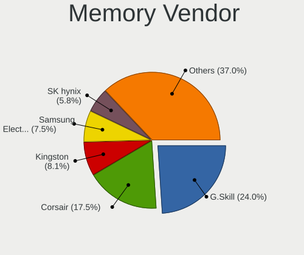

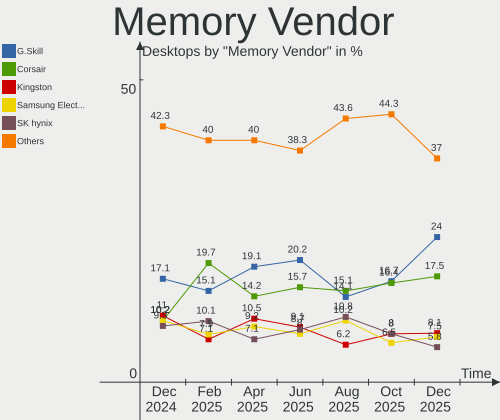

| Vendor                               | Desktops | Percent |
|--------------------------------------|----------|---------|
| G.Skill                              | 86       | 23.96%  |
| Corsair                              | 63       | 17.55%  |
| Kingston                             | 29       | 8.08%   |
| Samsung Electronics                  | 27       | 7.52%   |
| SK hynix                             | 21       | 5.85%   |
| Micron Technology                    | 19       | 5.29%   |
| Crucial                              | 19       | 5.29%   |
| Team                                 | 16       | 4.46%   |
| Unknown                              | 16       | 4.46%   |
| Unknown                              | 11       | 3.06%   |
| A-DATA Technology                    | 8        | 2.23%   |
| TeamGroup                            | 7        | 1.95%   |
| Patriot                              | 7        | 1.95%   |
| Timetec                              | 3        | 0.84%   |
| Silicon Power                        | 3        | 0.84%   |
| Unknown (ABCD)                       | 2        | 0.56%   |
| Ramaxel Technology                   | 2        | 0.56%   |
| PNY                                  | 2        | 0.56%   |
| Avant                                | 2        | 0.56%   |
| Unknown (0x0CC7)                     | 1        | 0.28%   |
| Transcend                            | 1        | 0.28%   |
| T-FORCE                              | 1        | 0.28%   |
| Sesame                               | 1        | 0.28%   |
| Patriot Memory (PDP Systems)         | 1        | 0.28%   |
| Patriot Memory                       | 1        | 0.28%   |
| Nanya Technology                     | 1        | 0.28%   |
| Lexar                                | 1        | 0.28%   |
| KINGBANK                             | 1        | 0.28%   |
| Juhor                                | 1        | 0.28%   |
| EVGA                                 | 1        | 0.28%   |
| CSX                                  | 1        | 0.28%   |
| Chun Well Technology Holding Limited | 1        | 0.28%   |
| Chun Well                            | 1        | 0.28%   |
| Axiom                                | 1        | 0.28%   |
| ASint Technology                     | 1        | 0.28%   |

Memory Model
------------

Memory module models

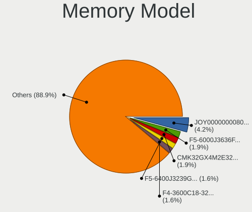

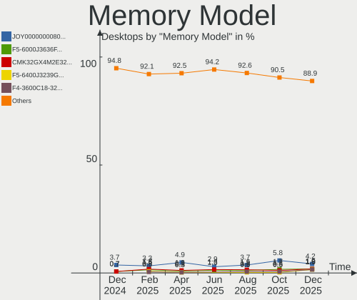

| Model                                                          | Desktops | Percent |
|----------------------------------------------------------------|----------|---------|
| Unknown                                                        | 16       | 4.23%   |
| G.Skill RAM F5-6000J3636F16G 16GB DIMM DDR5 6400MT/s           | 7        | 1.85%   |
| Corsair RAM CMK32GX4M2E3200C16 16GB DIMM DDR4 3600MT/s         | 7        | 1.85%   |
| G.Skill RAM F5-6400J3239G32G 32GB DIMM DDR5 6400MT/s           | 6        | 1.59%   |
| G.Skill RAM F4-3600C18-32GVK 32GiB DIMM DDR4 3600MT/s          | 6        | 1.59%   |
| G.Skill RAM F4-3200C16-16GVK 16GB DIMM DDR4 3600MT/s           | 5        | 1.32%   |
| Team RAM UD5-6000 16GB DIMM DDR5 6000MT/s                      | 4        | 1.06%   |
| Samsung RAM M378B5173QH0-CK0 4GB DIMM DDR3                     | 4        | 1.06%   |
| G.Skill RAM F4-3600C16-16GTZNC 16GiB DIMM DDR4 3600MT/s        | 4        | 1.06%   |
| Crucial RAM Module 4GB DIMM DDR3 1600MT/s                      | 4        | 1.06%   |
| TeamGroup RAM UD5-6400 16GB DIMM DDR5 6400MT/s                 | 3        | 0.79%   |
| G.Skill RAM F5-6000J3038F16G 16GB DIMM DDR5 6000MT/s           | 3        | 0.79%   |
| G.Skill RAM F4-3600C18-16GVK 16GB DIMM DDR4 3733MT/s           | 3        | 0.79%   |
| G.Skill RAM F4-3600C16-16GVKC 16GB DIMM DDR4 3866MT/s          | 3        | 0.79%   |
| G.Skill RAM F4-3200C16-8GVKB 8GB DIMM DDR4 4000MT/s            | 3        | 0.79%   |
| Corsair RAM CMW32GX4M2C3200C16 16GB DIMM DDR4 3400MT/s         | 3        | 0.79%   |
| Corsair RAM CMK16GX4M2A2666C16 8GB DIMM DDR4 3400MT/s          | 3        | 0.79%   |
| Unknown (ABCD) RAM 123456789012345678 2GB DIMM LPDDR4 2133MT/s | 2        | 0.53%   |
| Timetec RAM U16G-3200 16GB DIMM DDR4 3200MT/s                  | 2        | 0.53%   |
| Team RAM TEAMGROUP-UD4-3600 16GB DIMM DDR4 4000MT/s            | 2        | 0.53%   |
| Team RAM TEAMGROUP-UD4-3600 16GB DIMM DDR4 3600MT/s            | 2        | 0.53%   |
| Team RAM TEAMGROUP-UD4-3200 8GB DIMM DDR4 3800MT/s             | 2        | 0.53%   |
| Team RAM TEAMGROUP-UD4-3200 8GB DIMM DDR4 3733MT/s             | 2        | 0.53%   |
| SK hynix RAM HMT41GU6BFR8A-PB 8GB DIMM DDR3 1600MT/s           | 2        | 0.53%   |
| SK hynix RAM HMA82GU6JJR8N-VK 16GB DIMM DDR4 2667MT/s          | 2        | 0.53%   |
| SK hynix RAM HMA82GR7CJR4N-WM 16GB DIMM DDR4 2933MT/s          | 2        | 0.53%   |
| SK hynix RAM HMA81GU6DJR8N-VK 8GB DIMM DDR4 2667MT/s           | 2        | 0.53%   |
| Samsung RAM M378A5143EB1-CPB 4GB DIMM DDR4 2666MT/s            | 2        | 0.53%   |
| Samsung RAM M378A1K43CB2-CTD 8GB DIMM DDR4 3266MT/s            | 2        | 0.53%   |
| Kingston RAM KHX3200C16D4/8GX 8GB DIMM DDR4 3733MT/s           | 2        | 0.53%   |
| Kingston RAM KF556C40-16 16GB DIMM DDR5 6800MT/s               | 2        | 0.53%   |
| Kingston RAM KF3200C16D4/16GX 16GB DIMM DDR4 3733MT/s          | 2        | 0.53%   |
| G.Skill RAM F5-6000J3636F32G 32GB DIMM DDR5 6000MT/s           | 2        | 0.53%   |
| G.Skill RAM F5-6000J3238G32G 32GB DIMM DDR5 6000MT/s           | 2        | 0.53%   |
| G.Skill RAM F5-6000J3040G32G 32GB DIMM DDR5 6200MT/s           | 2        | 0.53%   |
| G.Skill RAM F4-3600C19-16GVRB 16GB DIMM DDR4 3600MT/s          | 2        | 0.53%   |
| G.Skill RAM F4-3600C16-8GVKC 8GB DIMM DDR4 3600MT/s            | 2        | 0.53%   |
| G.Skill RAM F4-3200C16-8GTZR 8GB DIMM DDR4 3200MT/s            | 2        | 0.53%   |
| Crucial RAM CT51264BD160B.C16F 4GB DIMM DDR3 1600MT/s          | 2        | 0.53%   |
| Crucial RAM BLS8G3D1609DS1S00. 8GB DIMM DDR3 1800MT/s          | 2        | 0.53%   |

Memory Kind
-----------

Memory module kinds

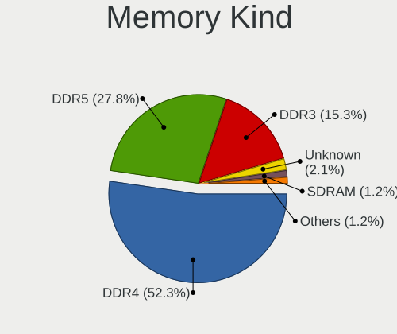

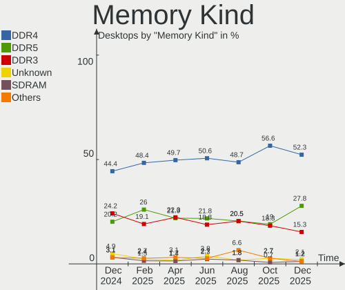

| Kind    | Desktops | Percent |
|---------|----------|---------|
| DDR4    | 171      | 52.29%  |
| DDR5    | 91       | 27.83%  |
| DDR3    | 50       | 15.29%  |
| Unknown | 7        | 2.14%   |
| SDRAM   | 4        | 1.22%   |
| LPDDR4  | 3        | 0.92%   |
| DDR2    | 1        | 0.31%   |

Memory Form Factor
------------------

Physical design of the memory module

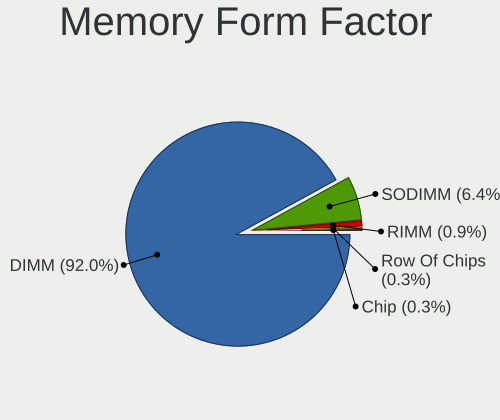

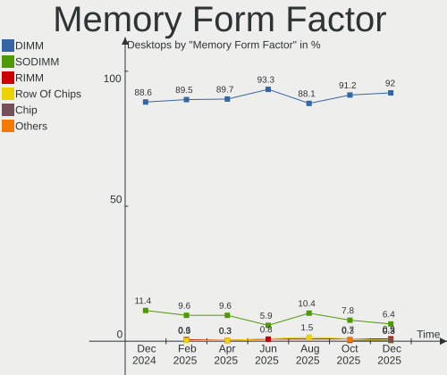

| Name         | Desktops | Percent |
|--------------|----------|---------|
| DIMM         | 300      | 92.02%  |
| SODIMM       | 21       | 6.44%   |
| RIMM         | 3        | 0.92%   |
| Row Of Chips | 1        | 0.31%   |
| Chip         | 1        | 0.31%   |

Memory Size
-----------

Memory module size

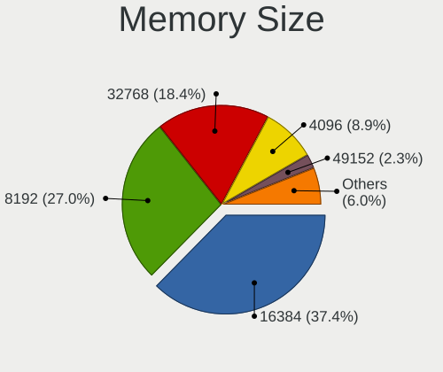

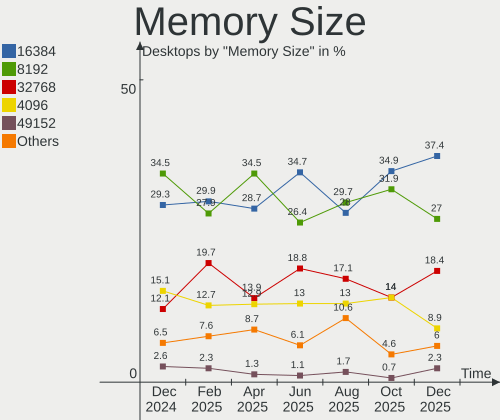

| Size  | Desktops | Percent |
|-------|----------|---------|
| 16384 | 130      | 37.36%  |
| 8192  | 94       | 27.01%  |
| 32768 | 64       | 18.39%  |
| 4096  | 31       | 8.91%   |
| 49152 | 8        | 2.3%    |
| 2048  | 6        | 1.72%   |
| 65536 | 5        | 1.44%   |
| 24576 | 4        | 1.15%   |
| 1024  | 4        | 1.15%   |
| 6144  | 1        | 0.29%   |
| 512   | 1        | 0.29%   |

Memory Speed
------------

Memory module speed

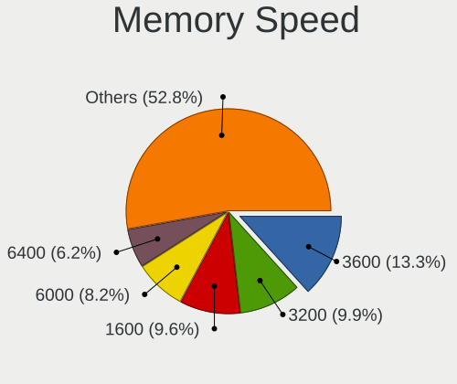

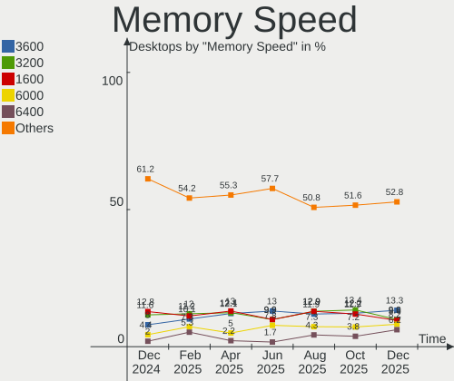

| Speed   | Desktops | Percent |
|---------|----------|---------|
| 3600    | 47       | 13.28%  |
| 3200    | 35       | 9.89%   |
| 1600    | 34       | 9.6%    |
| 6000    | 29       | 8.19%   |
| 6400    | 22       | 6.21%   |
| 4800    | 18       | 5.08%   |
| 2667    | 18       | 5.08%   |
| 2400    | 18       | 5.08%   |
| 3733    | 11       | 3.11%   |
| 2133    | 11       | 3.11%   |
| 1333    | 11       | 3.11%   |
| 5600    | 9        | 2.54%   |
| 4000    | 7        | 1.98%   |
| 3866    | 7        | 1.98%   |
| 3400    | 7        | 1.98%   |
| 3800    | 6        | 1.69%   |
| 1866    | 6        | 1.69%   |
| 5200    | 5        | 1.41%   |
| 1800    | 5        | 1.41%   |
| 3000    | 4        | 1.13%   |
| 2666    | 4        | 1.13%   |
| 1867    | 4        | 1.13%   |
| 6200    | 3        | 0.85%   |
| 3266    | 3        | 0.85%   |
| 2933    | 3        | 0.85%   |
| 12800   | 2        | 0.56%   |
| 7200    | 2        | 0.56%   |
| 6800    | 2        | 0.56%   |
| 3666    | 2        | 0.56%   |
| 3100    | 2        | 0.56%   |
| 3066    | 2        | 0.56%   |
| 1066    | 2        | 0.56%   |
| Unknown | 2        | 0.56%   |
| 8000    | 1        | 0.28%   |
| 5800    | 1        | 0.28%   |
| 4333    | 1        | 0.28%   |
| 3533    | 1        | 0.28%   |
| 3467    | 1        | 0.28%   |
| 3466    | 1        | 0.28%   |
| 3151    | 1        | 0.28%   |

Printers & scanners
-------------------

Printer Vendor
--------------

Printer device vendors

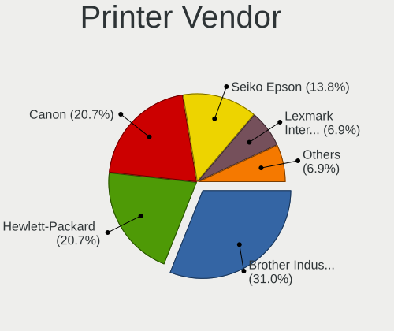

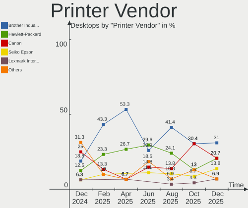

| Vendor                   | Desktops | Percent |
|--------------------------|----------|---------|
| Brother Industries       | 9        | 31.03%  |
| Hewlett-Packard          | 6        | 20.69%  |
| Canon                    | 6        | 20.69%  |
| Seiko Epson              | 4        | 13.79%  |
| Lexmark International    | 2        | 6.9%    |
| Zhuhai Poskey Technology | 1        | 3.45%   |
| Pantum                   | 1        | 3.45%   |

Printer Model
-------------

Printer device models

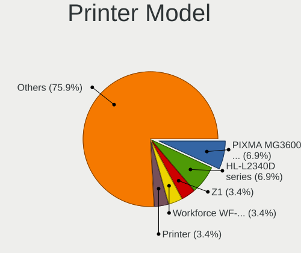

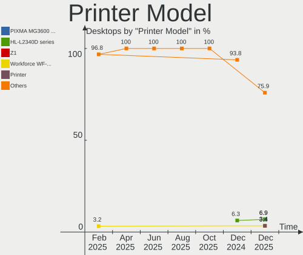

| Model                                                      | Desktops | Percent |
|------------------------------------------------------------|----------|---------|
| Canon PIXMA MG3600 Series                                  | 2        | 6.9%    |
| Brother HL-L2340D series                                   | 2        | 6.9%    |
| Zhuhai Poskey Z1                                           | 1        | 3.45%   |
| Seiko Epson Workforce WF-7820/7840 Series                  | 1        | 3.45%   |
| Seiko Epson Printer                                        | 1        | 3.45%   |
| Seiko Epson ET-4750 [WorkForce ET-4750 EcoTank All-in-One] | 1        | 3.45%   |
| Seiko Epson ET-2800 Series                                 | 1        | 3.45%   |
| Pantum P2500W-series                                       | 1        | 3.45%   |
| Lexmark International Lexmark CX331adwe                    | 1        | 3.45%   |
| Lexmark International Lexmark CS510de                      | 1        | 3.45%   |
| HP LaserJet P2035                                          | 1        | 3.45%   |
| HP LaserJet P1006                                          | 1        | 3.45%   |
| HP LaserJet M109-M112                                      | 1        | 3.45%   |
| HP LaserJet 400 M401dne                                    | 1        | 3.45%   |
| HP LaserJet 1320                                           | 1        | 3.45%   |
| HP DeskJet 2700 series                                     | 1        | 3.45%   |
| Canon TS3700 series                                        | 1        | 3.45%   |
| Canon TR8600 series                                        | 1        | 3.45%   |
| Canon MF741C/743C                                          | 1        | 3.45%   |
| Canon LiDE 400                                             | 1        | 3.45%   |
| Brother PT-1500PC                                          | 1        | 3.45%   |
| Brother MFC-L2690DW                                        | 1        | 3.45%   |
| Brother MFC-J491DW                                         | 1        | 3.45%   |
| Brother HL-L3280CDW series                                 | 1        | 3.45%   |
| Brother HL-3140CW series                                   | 1        | 3.45%   |
| Brother HL-2240D series                                    | 1        | 3.45%   |
| Brother DCP-7065DN                                         | 1        | 3.45%   |

Scanner Vendor
--------------

Scanner device vendors

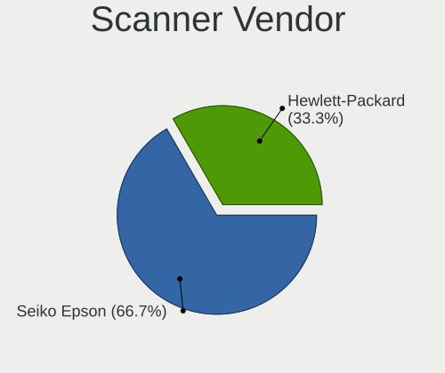

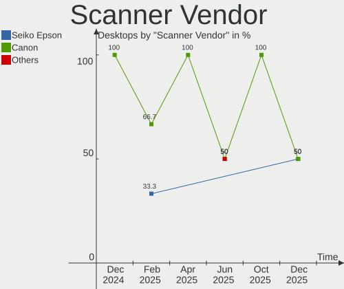

| Vendor      | Desktops | Percent |
|-------------|----------|---------|
| Seiko Epson | 1        | 50%     |
| Canon       | 1        | 50%     |

Scanner Model
-------------

Scanner device models

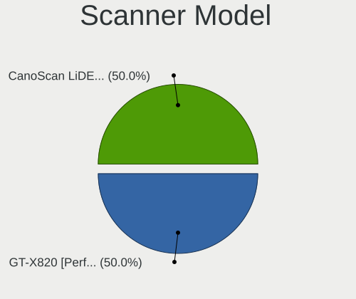

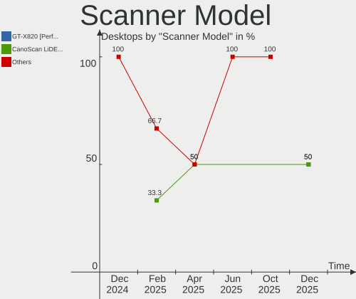

| Model                                       | Desktops | Percent |
|---------------------------------------------|----------|---------|
| Seiko Epson GT-X820 [Perfection V600 Photo] | 1        | 50%     |
| Canon CanoScan LiDE 220                     | 1        | 50%     |

Camera
------

Camera Vendor
-------------

Camera device vendors

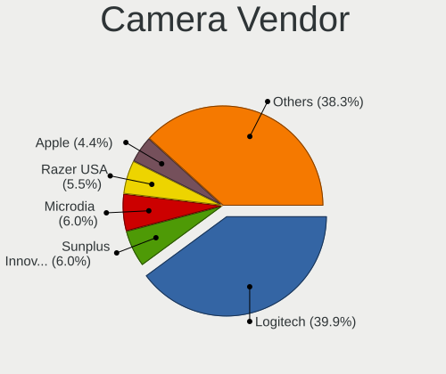

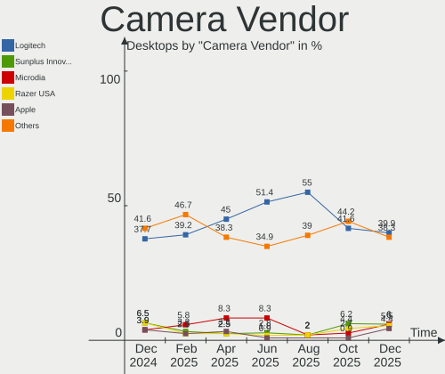

| Vendor                        | Desktops | Percent |
|-------------------------------|----------|---------|
| Logitech                      | 73       | 39.89%  |
| Sunplus Innovation Technology | 11       | 6.01%   |
| Microdia                      | 11       | 6.01%   |
| Razer USA                     | 10       | 5.46%   |
| Apple                         | 8        | 4.37%   |
| Valve Software                | 6        | 3.28%   |
| eMeet                         | 6        | 3.28%   |
| webcam                        | 5        | 2.73%   |
| Elgato Systems                | 5        | 2.73%   |
| Chicony Electronics           | 5        | 2.73%   |
| webcamvendor                  | 4        | 2.19%   |
| Samsung Electronics           | 4        | 2.19%   |
| Ruision                       | 3        | 1.64%   |
| Realtek Semiconductor         | 3        | 1.64%   |
| Remo Tech                     | 2        | 1.09%   |
| MacroSilicon                  | 2        | 1.09%   |
| Creative Technology           | 2        | 1.09%   |
| Unknown                       | 2        | 1.09%   |
| Web Camera                    | 1        | 0.55%   |
| WCM_USB                       | 1        | 0.55%   |
| WaveRider Communications      | 1        | 0.55%   |
| ValueHD                       | 1        | 0.55%   |
| USB3.0 HD Audio Capture       | 1        | 0.55%   |
| UGREEN 35871                  | 1        | 0.55%   |
| Tobii Technology AB           | 1        | 0.55%   |
| SunplusIT                     | 1        | 0.55%   |
| Sonix Technology              | 1        | 0.55%   |
| Nikon                         | 1        | 0.55%   |
| Motorola PCS                  | 1        | 0.55%   |
| Insta360                      | 1        | 0.55%   |
| Huawei Technologies           | 1        | 0.55%   |
| Generalplus Technology        | 1        | 0.55%   |
| GEMBIRD                       | 1        | 0.55%   |
| EVGA                          | 1        | 0.55%   |
| AVerMedia Technologies        | 1        | 0.55%   |
| ARC International             | 1        | 0.55%   |
| Anker Innovations Limited     | 1        | 0.55%   |
| Alcor Micro                   | 1        | 0.55%   |
| 48M USB Camera                | 1        | 0.55%   |

Camera Model
------------

Camera device models

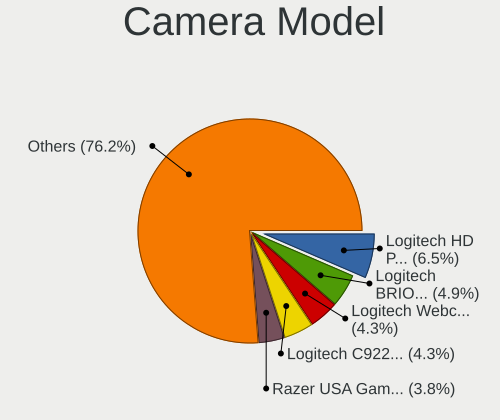

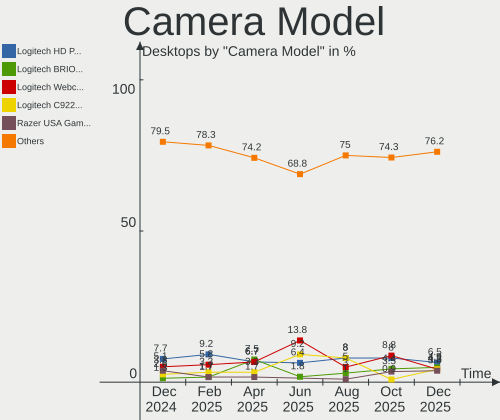

| Model                                           | Desktops | Percent |
|-------------------------------------------------|----------|---------|
| Logitech HD Pro Webcam C920                     | 12       | 6.49%   |
| Logitech BRIO Ultra HD Webcam                   | 9        | 4.86%   |
| Logitech Webcam C270                            | 8        | 4.32%   |
| Logitech C922 Pro Stream Webcam                 | 8        | 4.32%   |
| Razer USA Gaming Webcam [Kiyo]                  | 7        | 3.78%   |
| Valve Software 3D Camera                        | 6        | 3.24%   |
| Apple iPhone 5/5C/5S/6/SE/7/8/X                 | 6        | 3.24%   |
| webcam webcam                                   | 5        | 2.7%    |
| Microdia Webcam Vitade AF                       | 5        | 2.7%    |
| Logitech HD Webcam C615                         | 5        | 2.7%    |
| Logitech HD Webcam C525                         | 5        | 2.7%    |
| Logitech C920 PRO HD Webcam                     | 5        | 2.7%    |
| webcamvendor NexiGo N60 FHD Webcam              | 4        | 2.16%   |
| Samsung Galaxy series, misc. (MTP mode)         | 4        | 2.16%   |
| Logitech HD Webcam C910                         | 4        | 2.16%   |
| Logitech CrystalCam                             | 4        | 2.16%   |
| Sunplus Integrated Camera                       | 3        | 1.62%   |
| Ruision UVC Camera                              | 3        | 1.62%   |
| Microdia USB 2.0 Camera                         | 3        | 1.62%   |
| Logitech Webcam C310                            | 3        | 1.62%   |
| eMeet HD Webcam C950                            | 3        | 1.62%   |
| Sunplus USB 2.0 Camera                          | 2        | 1.08%   |
| Sunplus UHD Capture                             | 2        | 1.08%   |
| Razer USA Razer Kiyo Pro                        | 2        | 1.08%   |
| Microdia CyberTrack H7                          | 2        | 1.08%   |
| MacroSilicon USB Video                          | 2        | 1.08%   |
| Logitech Brio 101                               | 2        | 1.08%   |
| eMeet HD Webcam C960                            | 2        | 1.08%   |
| Creative Live! Cam Sync 1080p V2                | 2        | 1.08%   |
| Apple iSight in LED Cinema Display              | 2        | 1.08%   |
| Unknown                                         | 2        | 1.08%   |
| Web Camera Web Camera                           | 1        | 0.54%   |
| WCM_USB WEB CAM                                 | 1        | 0.54%   |
| WaveRider USB Live camera                       | 1        | 0.54%   |
| ValueHD Rocware RC28                            | 1        | 0.54%   |
| USB3.0 HD Audio Capture USB3.0 HD Video Capture | 1        | 0.54%   |
| UGREEN 35871 UGREEN 35871                       | 1        | 0.54%   |
| Tobii AB EyeChip                                | 1        | 0.54%   |
| SunplusIT USB 2.0 Camera                        | 1        | 0.54%   |
| Sunplus SPCA2281 Web Camera                     | 1        | 0.54%   |

Security
--------

Fingerprint Vendor
------------------

Fingerprint sensor vendors

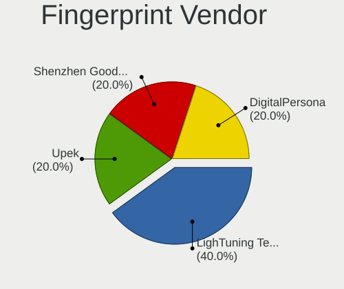

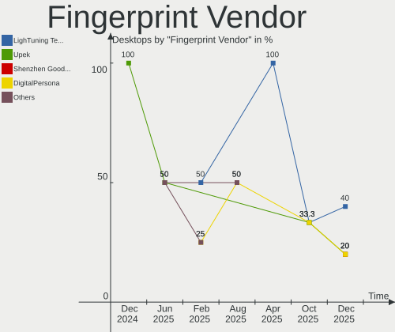

| Vendor                     | Desktops | Percent |
|----------------------------|----------|---------|
| LighTuning Technology      | 2        | 40%     |
| Upek                       | 1        | 20%     |
| Shenzhen Goodix Technology | 1        | 20%     |
| DigitalPersona             | 1        | 20%     |

Fingerprint Model
-----------------

Fingerprint sensor models

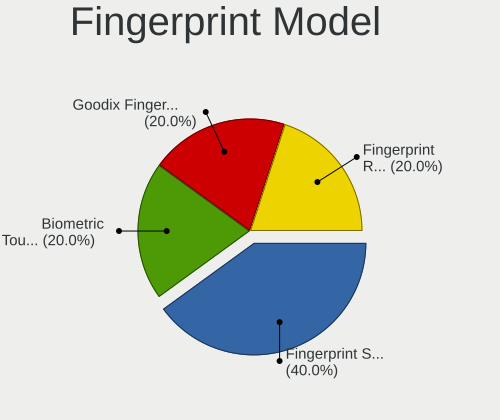

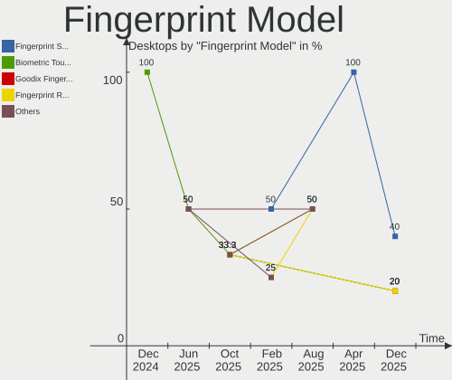

| Model                                                  | Desktops | Percent |
|--------------------------------------------------------|----------|---------|
| LighTuning Fingerprint Sensor                          | 2        | 40%     |
| Upek Biometric Touchchip/Touchstrip Fingerprint Sensor | 1        | 20%     |
| Shenzhen Goodix  Fingerprint Device                    | 1        | 20%     |
| DigitalPersona Fingerprint Reader                      | 1        | 20%     |

Chipcard Vendor
---------------

Chipcard module vendors

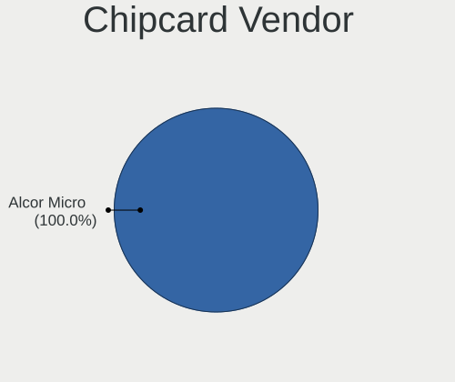

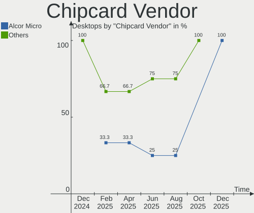

| Vendor      | Desktops | Percent |
|-------------|----------|---------|
| Alcor Micro | 1        | 100%    |

Chipcard Model
--------------

Chipcard module models

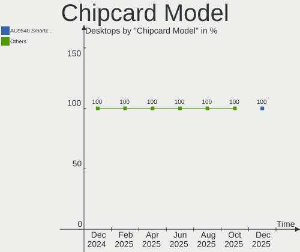

| Model                               | Desktops | Percent |
|-------------------------------------|----------|---------|
| Alcor Micro AU9540 Smartcard Reader | 1        | 100%    |

Unsupported
-----------

Unsupported Devices
-------------------

Total unsupported devices on board

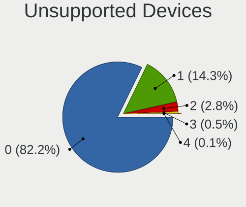

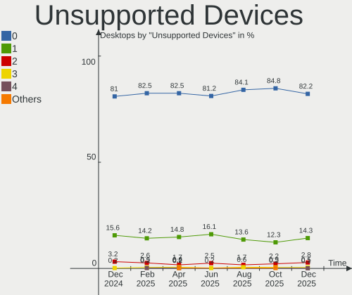

| Total | Desktops | Percent |
|-------|----------|---------|
| 0     | 611      | 82.23%  |
| 1     | 106      | 14.27%  |
| 2     | 21       | 2.83%   |
| 3     | 4        | 0.54%   |
| 4     | 1        | 0.13%   |

Unsupported Device Types
------------------------

Types of unsupported devices

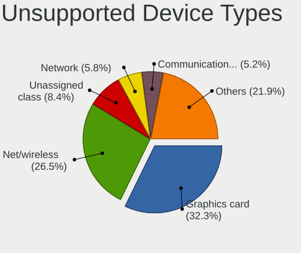

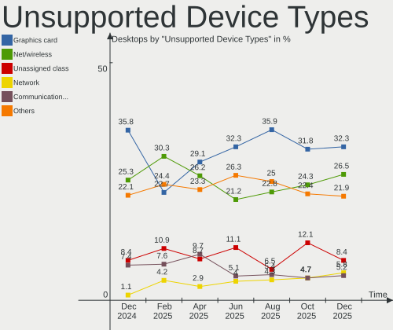

| Type                     | Desktops | Percent |
|--------------------------|----------|---------|
| Graphics card            | 50       | 32.26%  |
| Net/wireless             | 41       | 26.45%  |
| Unassigned class         | 13       | 8.39%   |
| Network                  | 9        | 5.81%   |
| Communication controller | 8        | 5.16%   |
| Sound                    | 7        | 4.52%   |
| Bluetooth                | 7        | 4.52%   |
| Multimedia controller    | 6        | 3.87%   |
| Fingerprint reader       | 4        | 2.58%   |
| Storage/raid             | 2        | 1.29%   |
| Storage/ata              | 2        | 1.29%   |
| Net/ethernet             | 2        | 1.29%   |
| Camera                   | 2        | 1.29%   |
| Chipcard                 | 1        | 0.65%   |
| Card reader              | 1        | 0.65%   |

