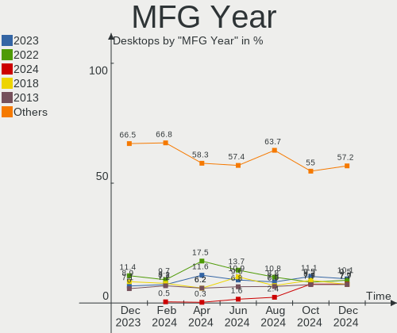
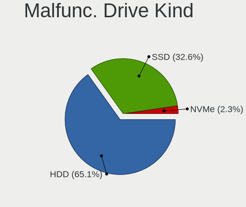
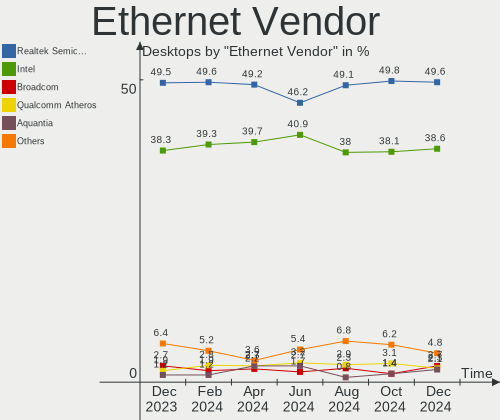
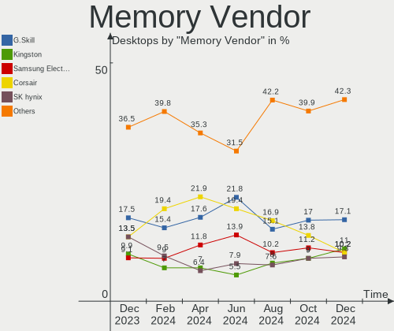
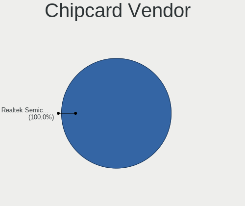
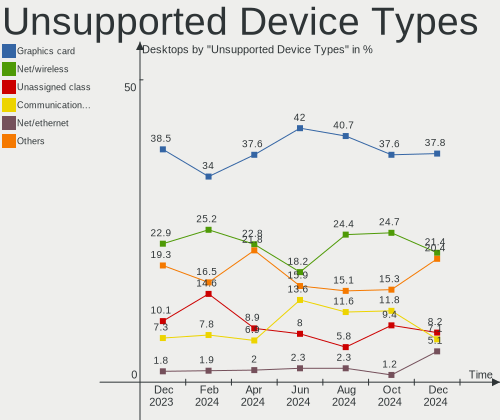

Linux in USA - Hardware Trends (Desktops)
-----------------------------------------

A project to identify most popular hardware characteristics and track their change
over time based on data collected by Linux users at https://Linux-Hardware.org.

Anyone can contribute to this report by the [hw-probe](https://github.com/linuxhw/hw-probe) tool:

    sudo -E hw-probe -all -upload

Period: Jan, 2024.

Contents
--------

* [ System ](#system)
  - [ OS                       ](#os)
  - [ OS Family                ](#os-family)
  - [ Kernel                   ](#kernel)
  - [ Kernel Family            ](#kernel-family)
  - [ Kernel Major Ver.        ](#kernel-major-ver)
  - [ Arch                     ](#arch)
  - [ DE                       ](#de)
  - [ Display Server           ](#display-server)
  - [ Display Manager          ](#display-manager)
  - [ OS Lang                  ](#os-lang)
  - [ Boot Mode                ](#boot-mode)
  - [ Filesystem               ](#filesystem)
  - [ Part. scheme             ](#part-scheme)
  - [ Dual Boot with Linux/BSD ](#dual-boot-with-linuxbsd)
  - [ Dual Boot (Win)          ](#dual-boot-win)

* [ Board ](#board)
  - [ Vendor                   ](#vendor)
  - [ Model                    ](#model)
  - [ Model Family             ](#model-family)
  - [ MFG Year                 ](#mfg-year)
  - [ Form Factor              ](#form-factor)
  - [ Secure Boot              ](#secure-boot)
  - [ Coreboot                 ](#coreboot)
  - [ RAM Size                 ](#ram-size)
  - [ RAM Used                 ](#ram-used)
  - [ Total Drives             ](#total-drives)
  - [ Has CD-ROM               ](#has-cd-rom)
  - [ Has Ethernet             ](#has-ethernet)
  - [ Has WiFi                 ](#has-wifi)
  - [ Has Bluetooth            ](#has-bluetooth)

* [ Location ](#location)
  - [ Country                  ](#country)
  - [ City                     ](#city)

* [ Drives ](#drives)
  - [ Drive Vendor             ](#drive-vendor)
  - [ Drive Model              ](#drive-model)
  - [ HDD Vendor               ](#hdd-vendor)
  - [ SSD Vendor               ](#ssd-vendor)
  - [ Drive Kind               ](#drive-kind)
  - [ Drive Connector          ](#drive-connector)
  - [ Drive Size               ](#drive-size)
  - [ Space Total              ](#space-total)
  - [ Space Used               ](#space-used)
  - [ Malfunc. Drives          ](#malfunc-drives)
  - [ Malfunc. Drive Vendor    ](#malfunc-drive-vendor)
  - [ Malfunc. HDD Vendor      ](#malfunc-hdd-vendor)
  - [ Malfunc. Drive Kind      ](#malfunc-drive-kind)
  - [ Failed Drives            ](#failed-drives)
  - [ Failed Drive Vendor      ](#failed-drive-vendor)
  - [ Drive Status             ](#drive-status)

* [ Storage controller ](#storage-controller)
  - [ Storage Vendor           ](#storage-vendor)
  - [ Storage Model            ](#storage-model)
  - [ Storage Kind             ](#storage-kind)

* [ Processor ](#processor)
  - [ CPU Vendor               ](#cpu-vendor)
  - [ CPU Model                ](#cpu-model)
  - [ CPU Model Family         ](#cpu-model-family)
  - [ CPU Cores                ](#cpu-cores)
  - [ CPU Sockets              ](#cpu-sockets)
  - [ CPU Threads              ](#cpu-threads)
  - [ CPU Op-Modes             ](#cpu-op-modes)
  - [ CPU Microcode            ](#cpu-microcode)
  - [ CPU Microarch            ](#cpu-microarch)

* [ Graphics ](#graphics)
  - [ GPU Vendor               ](#gpu-vendor)
  - [ GPU Model                ](#gpu-model)
  - [ GPU Combo                ](#gpu-combo)
  - [ GPU Driver               ](#gpu-driver)
  - [ GPU Memory               ](#gpu-memory)

* [ Monitor ](#monitor)
  - [ Monitor Vendor           ](#monitor-vendor)
  - [ Monitor Model            ](#monitor-model)
  - [ Monitor Resolution       ](#monitor-resolution)
  - [ Monitor Diagonal         ](#monitor-diagonal)
  - [ Monitor Width            ](#monitor-width)
  - [ Aspect Ratio             ](#aspect-ratio)
  - [ Monitor Area             ](#monitor-area)
  - [ Pixel Density            ](#pixel-density)
  - [ Multiple Monitors        ](#multiple-monitors)

* [ Network ](#network)
  - [ Net Controller Vendor    ](#net-controller-vendor)
  - [ Net Controller Model     ](#net-controller-model)
  - [ Wireless Vendor          ](#wireless-vendor)
  - [ Wireless Model           ](#wireless-model)
  - [ Ethernet Vendor          ](#ethernet-vendor)
  - [ Ethernet Model           ](#ethernet-model)
  - [ Net Controller Kind      ](#net-controller-kind)
  - [ Used Controller          ](#used-controller)
  - [ NICs                     ](#nics)
  - [ IPv6                     ](#ipv6)

* [ Bluetooth ](#bluetooth)
  - [ Bluetooth Vendor         ](#bluetooth-vendor)
  - [ Bluetooth Model          ](#bluetooth-model)

* [ Sound ](#sound)
  - [ Sound Vendor             ](#sound-vendor)
  - [ Sound Model              ](#sound-model)

* [ Memory ](#memory)
  - [ Memory Vendor            ](#memory-vendor)
  - [ Memory Model             ](#memory-model)
  - [ Memory Kind              ](#memory-kind)
  - [ Memory Form Factor       ](#memory-form-factor)
  - [ Memory Size              ](#memory-size)
  - [ Memory Speed             ](#memory-speed)

* [ Printers & scanners ](#printers--scanners)
  - [ Printer Vendor           ](#printer-vendor)
  - [ Printer Model            ](#printer-model)
  - [ Scanner Vendor           ](#scanner-vendor)
  - [ Scanner Model            ](#scanner-model)

* [ Camera ](#camera)
  - [ Camera Vendor            ](#camera-vendor)
  - [ Camera Model             ](#camera-model)

* [ Security ](#security)
  - [ Fingerprint Vendor       ](#fingerprint-vendor)
  - [ Fingerprint Model        ](#fingerprint-model)
  - [ Chipcard Vendor          ](#chipcard-vendor)
  - [ Chipcard Model           ](#chipcard-model)

* [ Unsupported ](#unsupported)
  - [ Unsupported Devices      ](#unsupported-devices)
  - [ Unsupported Device Types ](#unsupported-device-types)

System
------

OS
--

Installed operating systems

| Name                           | Desktops | Percent |
|--------------------------------|----------|---------|
| Ubuntu 22.04                   | 77       | 15.84%  |
| Fedora 39                      | 52       | 10.7%   |
| Linux Mint 21.2                | 28       | 5.76%   |
| Pop!_OS 22.04                  | 26       | 5.35%   |
| Arch Rolling                   | 26       | 5.35%   |
| Ubuntu 23.10                   | 25       | 5.14%   |
| Debian 12                      | 21       | 4.32%   |
| Zorin 17                       | 15       | 3.09%   |
| Zorin 16                       | 15       | 3.09%   |
| ArcoLinux Rolling              | 13       | 2.67%   |
| Nobara 39                      | 9        | 1.85%   |
| Linux Mint 21.3                | 9        | 1.85%   |
| OpenMandriva 5.0               | 8        | 1.65%   |
| Kubuntu 22.04                  | 8        | 1.65%   |
| ChimeraOS 44-1                 | 8        | 1.65%   |
| openSUSE Tumbleweed-XXXXXXXX   | 7        | 1.44%   |
| LMDE 6                         | 7        | 1.44%   |
| Gentoo 2.14                    | 7        | 1.44%   |
| Xubuntu 22.04                  | 6        | 1.23%   |
| OpenMandriva 23.08             | 6        | 1.23%   |
| EndeavourOS Rolling            | 6        | 1.23%   |
| Ubuntu 20.04                   | 5        | 1.03%   |
| Kubuntu 23.10                  | 5        | 1.03%   |
| KDE neon 22.04                 | 5        | 1.03%   |
| Fedora 38                      | 5        | 1.03%   |
| OpenMandriva 24.01             | 4        | 0.82%   |
| Manjaro                        | 4        | 0.82%   |
| Kali 2023.4                    | 4        | 0.82%   |
| Debian 11                      | 4        | 0.82%   |
| Ubuntu 23.04                   | 3        | 0.62%   |
| RHEL 9                         | 3        | 0.62%   |
| NixOS 24.05                    | 3        | 0.62%   |
| MX 23                          | 3        | 0.62%   |
| Linux Mint 21.1                | 3        | 0.62%   |
| Linux Mint 20.3                | 3        | 0.62%   |
| Xubuntu 20.04                  | 2        | 0.41%   |
| Ubuntu MATE 22.04              | 2        | 0.41%   |
| SteamOS 4                      | 2        | 0.41%   |
| Redcore Rolling.boulder.uphill | 2        | 0.41%   |
| OpenMandriva 4.3               | 2        | 0.41%   |

OS Family
---------

OS without a version

| Name         | Desktops | Percent |
|--------------|----------|---------|
| Ubuntu       | 111      | 22.84%  |
| Fedora       | 58       | 11.93%  |
| Linux Mint   | 46       | 9.47%   |
| Zorin        | 30       | 6.17%   |
| Debian       | 27       | 5.56%   |
| Pop!_OS      | 26       | 5.35%   |
| Arch         | 26       | 5.35%   |
| OpenMandriva | 23       | 4.73%   |
| Kubuntu      | 16       | 3.29%   |
| ArcoLinux    | 13       | 2.67%   |
| Nobara       | 11       | 2.26%   |
| Xubuntu      | 9        | 1.85%   |
| openSUSE     | 9        | 1.85%   |
| LMDE         | 8        | 1.65%   |
| ChimeraOS    | 8        | 1.65%   |
| NixOS        | 7        | 1.44%   |
| Gentoo       | 7        | 1.44%   |
| Manjaro      | 6        | 1.23%   |
| EndeavourOS  | 6        | 1.23%   |
| KDE neon     | 5        | 1.03%   |
| Kali         | 4        | 0.82%   |
| SteamOS      | 3        | 0.62%   |
| RHEL         | 3        | 0.62%   |
| MX           | 3        | 0.62%   |
| Ubuntu MATE  | 2        | 0.41%   |
| Redcore      | 2        | 0.41%   |
| Lubuntu      | 2        | 0.41%   |
| Linux Lite   | 2        | 0.41%   |
| Garuda Linux | 2        | 0.41%   |
| Xero         | 1        | 0.21%   |
| TUXEDO OS    | 1        | 0.21%   |
| Rocky Linux  | 1        | 0.21%   |
| PCLinuxOS    | 1        | 0.21%   |
| Parrot       | 1        | 0.21%   |
| Neptune OS   | 1        | 0.21%   |
| Elementary   | 1        | 0.21%   |
| CachyOS      | 1        | 0.21%   |
| BunsenLabs   | 1        | 0.21%   |
| BigLinux     | 1        | 0.21%   |
| Alpine       | 1        | 0.21%   |

Kernel
------

Version of the Linux kernel

| Version                      | Desktops | Percent |
|------------------------------|----------|---------|
| 6.5.0-14-generic             | 71       | 14.61%  |
| 5.15.0-91-generic            | 50       | 10.29%  |
| 6.2.0-39-generic             | 38       | 7.82%   |
| 6.1.0-17-amd64               | 21       | 4.32%   |
| 6.6.9-200.fc39.x86_64        | 20       | 4.12%   |
| 6.6.6-76060606-generic       | 20       | 4.12%   |
| 6.6.2-desktop-1omv2390       | 12       | 2.47%   |
| 5.15.0-92-generic            | 12       | 2.47%   |
| 6.5.0-15-generic             | 10       | 2.06%   |
| 6.6.8-arch1-1                | 8        | 1.65%   |
| 6.6.13-200.fc39.x86_64       | 8        | 1.65%   |
| 6.5.6-chos1-chimeraos-1      | 8        | 1.65%   |
| 6.4.11-desktop-1omv2390      | 8        | 1.65%   |
| 5.4.0-169-generic            | 8        | 1.65%   |
| 6.6.8-200.fc39.x86_64        | 7        | 1.44%   |
| 6.6.11-200.fc39.x86_64       | 7        | 1.44%   |
| 6.6.10-arch1-1               | 6        | 1.23%   |
| 6.7.0-204.fsync.fc39.x86_64  | 5        | 1.03%   |
| 6.6.10-76060610-generic      | 5        | 1.03%   |
| 6.5.0-kali3-amd64            | 5        | 1.03%   |
| 5.15.0-76-generic            | 5        | 1.03%   |
| 6.7.1-arch1-1                | 4        | 0.82%   |
| 6.7.0-arch3-1                | 4        | 0.82%   |
| 6.6.9-zen1-1-zen             | 4        | 0.82%   |
| 6.6.12-200.fc39.x86_64       | 4        | 0.82%   |
| 6.2.0-26-generic             | 4        | 0.82%   |
| 6.7.2-arch1-1                | 3        | 0.62%   |
| 6.7.0-zen3-1-zen             | 3        | 0.62%   |
| 5.14.0-362.13.1.el9_3.x86_64 | 3        | 0.62%   |
| 5.10.0-27-amd64              | 3        | 0.62%   |
| 6.7.1-2-default              | 2        | 0.41%   |
| 6.7.1-1-default              | 2        | 0.41%   |
| 6.7.0-0-MANJARO              | 2        | 0.41%   |
| 6.6.9-arch1-1                | 2        | 0.41%   |
| 6.6.9-100.fc38.x86_64        | 2        | 0.41%   |
| 6.6.8-zen1-1-zen             | 2        | 0.41%   |
| 6.6.8-2-MANJARO              | 2        | 0.41%   |
| 6.6.13-redcore-lts           | 2        | 0.41%   |
| 6.6.13-1-lts                 | 2        | 0.41%   |
| 6.6.12-201.fsync.fc39.x86_64 | 2        | 0.41%   |

Kernel Family
-------------

Linux kernel without a distro release

| Version | Desktops | Percent |
|---------|----------|---------|
| 6.5.0   | 94       | 19.34%  |
| 5.15.0  | 75       | 15.43%  |
| 6.2.0   | 44       | 9.05%   |
| 6.6.9   | 30       | 6.17%   |
| 6.1.0   | 30       | 6.17%   |
| 6.6.8   | 26       | 5.35%   |
| 6.7.0   | 22       | 4.53%   |
| 6.6.6   | 20       | 4.12%   |
| 6.6.10  | 15       | 3.09%   |
| 6.6.13  | 13       | 2.67%   |
| 6.6.2   | 12       | 2.47%   |
| 6.7.1   | 11       | 2.26%   |
| 6.6.11  | 11       | 2.26%   |
| 6.5.6   | 10       | 2.06%   |
| 5.4.0   | 10       | 2.06%   |
| 6.4.11  | 8        | 1.65%   |
| 6.6.12  | 7        | 1.44%   |
| 5.10.0  | 6        | 1.23%   |
| 6.7.2   | 5        | 1.03%   |
| 5.14.0  | 4        | 0.82%   |
| 6.6.7   | 3        | 0.62%   |
| 6.5.11  | 2        | 0.41%   |
| 6.3.7   | 2        | 0.41%   |
| 6.1.69  | 2        | 0.41%   |
| 5.16.7  | 2        | 0.41%   |
| 6.6.4   | 1        | 0.21%   |
| 6.6.3   | 1        | 0.21%   |
| 6.6.1   | 1        | 0.21%   |
| 6.6.0   | 1        | 0.21%   |
| 6.5.9   | 1        | 0.21%   |
| 6.5.7   | 1        | 0.21%   |
| 6.5.13  | 1        | 0.21%   |
| 6.4.13  | 1        | 0.21%   |
| 6.4.12  | 1        | 0.21%   |
| 6.2.16  | 1        | 0.21%   |
| 6.1.71  | 1        | 0.21%   |
| 6.1.67  | 1        | 0.21%   |
| 6.1.65  | 1        | 0.21%   |
| 6.1.57  | 1        | 0.21%   |
| 6.1.49  | 1        | 0.21%   |

Kernel Major Ver.
-----------------

Linux kernel major version

| Version | Desktops | Percent |
|---------|----------|---------|
| 6.6     | 141      | 29.01%  |
| 6.5     | 109      | 22.43%  |
| 5.15    | 76       | 15.64%  |
| 6.2     | 45       | 9.26%   |
| 6.7     | 38       | 7.82%   |
| 6.1     | 37       | 7.61%   |
| 6.4     | 10       | 2.06%   |
| 5.4     | 10       | 2.06%   |
| 5.10    | 6        | 1.23%   |
| 5.14    | 5        | 1.03%   |
| 6.3     | 2        | 0.41%   |
| 5.16    | 2        | 0.41%   |
| 6.0     | 1        | 0.21%   |
| 5.19    | 1        | 0.21%   |
| 5.18    | 1        | 0.21%   |
| 5.17    | 1        | 0.21%   |
| 5.13    | 1        | 0.21%   |

Arch
----

OS architecture (x86_64, i586, etc.)

| Name    | Desktops | Percent |
|---------|----------|---------|
| x86_64  | 482      | 99.18%  |
| i686    | 2        | 0.41%   |
| ppc     | 1        | 0.21%   |
| aarch64 | 1        | 0.21%   |

DE
--

Desktop Environment

| Name            | Desktops | Percent |
|-----------------|----------|---------|
| GNOME           | 217      | 44.65%  |
| KDE5            | 120      | 24.69%  |
| X-Cinnamon      | 45       | 9.26%   |
| XFCE            | 33       | 6.79%   |
| Unknown         | 32       | 6.58%   |
| MATE            | 13       | 2.67%   |
| LXQt            | 9        | 1.85%   |
| i3              | 3        | 0.62%   |
| Hyprland        | 3        | 0.62%   |
| Cinnamon        | 2        | 0.41%   |
| Budgie          | 2        | 0.41%   |
| sway:GNOME      | 1        | 0.21%   |
| sway            | 1        | 0.21%   |
| Pantheon        | 1        | 0.21%   |
| LXDE            | 1        | 0.21%   |
| GNOME Flashback | 1        | 0.21%   |
| Deepin          | 1        | 0.21%   |
| awesome         | 1        | 0.21%   |

Display Server
--------------

X11 or Wayland

| Name    | Desktops | Percent |
|---------|----------|---------|
| X11     | 253      | 52.06%  |
| Wayland | 188      | 38.68%  |
| Unknown | 24       | 4.94%   |
| Tty     | 21       | 4.32%   |

Display Manager
---------------

SDDM, LightDM, etc.

| Name    | Desktops | Percent |
|---------|----------|---------|
| Unknown | 215      | 44.24%  |
| GDM3    | 102      | 20.99%  |
| SDDM    | 85       | 17.49%  |
| LightDM | 61       | 12.55%  |
| GDM     | 21       | 4.32%   |
| XDM     | 1        | 0.21%   |
| Ly      | 1        | 0.21%   |

OS Lang
-------

Language

| Lang    | Desktops | Percent |
|---------|----------|---------|
| en_US   | 450      | 92.59%  |
| Unknown | 10       | 2.06%   |
| C       | 9        | 1.85%   |
| en_GB   | 4        | 0.82%   |
| en_CA   | 3        | 0.62%   |
| ru_RU   | 2        | 0.41%   |
| it_IT   | 2        | 0.41%   |
| C.UTF8  | 2        | 0.41%   |
| zh_CN   | 1        | 0.21%   |
| POSIX   | 1        | 0.21%   |
| en_IN   | 1        | 0.21%   |
| en_IE   | 1        | 0.21%   |

Boot Mode
---------

EFI or BIOS

| Mode | Desktops | Percent |
|------|----------|---------|
| BIOS | 248      | 51.03%  |
| EFI  | 238      | 48.97%  |

Filesystem
----------

Type of filesystem

| Type    | Desktops | Percent |
|---------|----------|---------|
| Ext4    | 265      | 54.53%  |
| Btrfs   | 105      | 21.6%   |
| Tmpfs   | 78       | 16.05%  |
| Overlay | 19       | 3.91%   |
| Zfs     | 10       | 2.06%   |
| Xfs     | 7        | 1.44%   |
| F2fs    | 1        | 0.21%   |
| Ext3    | 1        | 0.21%   |

Part. scheme
------------

Scheme of partitioning

| Type    | Desktops | Percent |
|---------|----------|---------|
| GPT     | 268      | 55.14%  |
| Unknown | 190      | 39.09%  |
| MBR     | 28       | 5.76%   |

Dual Boot with Linux/BSD
------------------------

Hosting more than one Linux/BSD

| Dual boot | Desktops | Percent |
|-----------|----------|---------|
| No        | 401      | 82.51%  |
| Yes       | 85       | 17.49%  |

Dual Boot (Win)
---------------

Hosting Linux and Windows

| Dual boot | Desktops | Percent |
|-----------|----------|---------|
| No        | 385      | 79.22%  |
| Yes       | 101      | 20.78%  |

Board
-----

Vendor
------

Motherboard manufacturer

| Name                                 | Desktops | Percent |
|--------------------------------------|----------|---------|
| ASUSTek Computer                     | 117      | 24.07%  |
| MSI                                  | 76       | 15.64%  |
| Dell                                 | 65       | 13.37%  |
| Gigabyte Technology                  | 54       | 11.11%  |
| Hewlett-Packard                      | 48       | 9.88%   |
| ASRock                               | 40       | 8.23%   |
| Lenovo                               | 19       | 3.91%   |
| Intel                                | 9        | 1.85%   |
| Unknown                              | 8        | 1.65%   |
| Supermicro                           | 6        | 1.23%   |
| Foxconn                              | 6        | 1.23%   |
| Pegatron                             | 5        | 1.03%   |
| AZW                                  | 4        | 0.82%   |
| Apple                                | 4        | 0.82%   |
| Shenzhen Meigao Electronic Equipment | 2        | 0.41%   |
| Gateway                              | 2        | 0.41%   |
| ECS                                  | 2        | 0.41%   |
| Biostar                              | 2        | 0.41%   |
| BESSTAR Tech                         | 2        | 0.41%   |
| Acer                                 | 2        | 0.41%   |
| SJS                                  | 1        | 0.21%   |
| Phoenix Contact                      | 1        | 0.21%   |
| OEM                                  | 1        | 0.21%   |
| NZXT                                 | 1        | 0.21%   |
| NCR                                  | 1        | 0.21%   |
| MACHINIST                            | 1        | 0.21%   |
| JGINYUE                              | 1        | 0.21%   |
| IBM                                  | 1        | 0.21%   |
| GEEKOM                               | 1        | 0.21%   |
| EVGA                                 | 1        | 0.21%   |
| Azulle                               | 1        | 0.21%   |
| AMI                                  | 1        | 0.21%   |
| Alienware                            | 1        | 0.21%   |

Model
-----

Motherboard model

| Name                               | Desktops | Percent |
|------------------------------------|----------|---------|
| ASUS All Series                    | 9        | 1.85%   |
| Unknown                            | 8        | 1.65%   |
| Dell OptiPlex 9020                 | 6        | 1.23%   |
| ASUS TUF Gaming X570-PLUS          | 6        | 1.23%   |
| MSI MS-7C91                        | 5        | 1.03%   |
| Supermicro AS -2124BT-HTR          | 4        | 0.82%   |
| MSI MS-7C95                        | 4        | 0.82%   |
| Dell OptiPlex 9010                 | 4        | 0.82%   |
| ASUS SABERTOOTH 990FX R2.0         | 4        | 0.82%   |
| ASUS PRIME B550-PLUS               | 4        | 0.82%   |
| MSI MS-7E12                        | 3        | 0.62%   |
| MSI MS-7D67                        | 3        | 0.62%   |
| MSI MS-7C37                        | 3        | 0.62%   |
| MSI MS-7B86                        | 3        | 0.62%   |
| Intel Jasper Lake Client Platform  | 3        | 0.62%   |
| Dell Precision T1700               | 3        | 0.62%   |
| Dell Inspiron 3650                 | 3        | 0.62%   |
| ASUS TUF Gaming X670E-PLUS WIFI    | 3        | 0.62%   |
| ASUS ROG STRIX X570-I GAMING       | 3        | 0.62%   |
| ASUS ROG STRIX B650E-F GAMING WIFI | 3        | 0.62%   |
| ASUS PRIME B450M-A II              | 3        | 0.62%   |
| MSI MS-7E26                        | 2        | 0.41%   |
| MSI MS-7D91                        | 2        | 0.41%   |
| MSI MS-7C75                        | 2        | 0.41%   |
| MSI MS-7C02                        | 2        | 0.41%   |
| MSI MS-7B79                        | 2        | 0.41%   |
| Lenovo ThinkCentre M55p 8808D8U    | 2        | 0.41%   |
| HP Z440 Workstation                | 2        | 0.41%   |
| HP Z220 SFF Workstation            | 2        | 0.41%   |
| HP Slim Desktop S01-pF2xxx         | 2        | 0.41%   |
| HP Pavilion Desktop TP01-2xxx      | 2        | 0.41%   |
| HP Pavilion Desktop PC 570-p0xx    | 2        | 0.41%   |
| HP Pavilion Desktop 590-p0xxx      | 2        | 0.41%   |
| HP EliteDesk 800 G2 SFF            | 2        | 0.41%   |
| HP Compaq Elite 8300 SFF           | 2        | 0.41%   |
| Gigabyte B650M AORUS ELITE AX      | 2        | 0.41%   |
| Gigabyte B650 AORUS ELITE AX       | 2        | 0.41%   |
| Gigabyte B550M AORUS PRO-P         | 2        | 0.41%   |
| Gigabyte B550I AORUS PRO AX        | 2        | 0.41%   |
| Gigabyte B550 AORUS ELITE AX V2    | 2        | 0.41%   |

Model Family
------------

Motherboard model prefix

| Name                | Desktops | Percent |
|---------------------|----------|---------|
| ASUS ROG            | 32       | 6.58%   |
| Dell OptiPlex       | 29       | 5.97%   |
| ASUS PRIME          | 23       | 4.73%   |
| Dell Inspiron       | 19       | 3.91%   |
| ASUS TUF            | 19       | 3.91%   |
| Lenovo ThinkCentre  | 15       | 3.09%   |
| Dell Precision      | 12       | 2.47%   |
| ASUS All            | 9        | 1.85%   |
| Unknown             | 8        | 1.65%   |
| HP Pavilion         | 7        | 1.44%   |
| HP EliteDesk        | 7        | 1.44%   |
| ASUS SABERTOOTH     | 7        | 1.44%   |
| HP Compaq           | 6        | 1.23%   |
| MSI MS-7C91         | 5        | 1.03%   |
| Gigabyte B550       | 5        | 1.03%   |
| Supermicro AS       | 4        | 0.82%   |
| MSI MS-7C95         | 4        | 0.82%   |
| HP Slim             | 4        | 0.82%   |
| HP OMEN             | 4        | 0.82%   |
| ASRock X570         | 4        | 0.82%   |
| MSI MS-7E12         | 3        | 0.62%   |
| MSI MS-7D67         | 3        | 0.62%   |
| MSI MS-7C37         | 3        | 0.62%   |
| MSI MS-7B86         | 3        | 0.62%   |
| Intel Jasper        | 3        | 0.62%   |
| HP Z220             | 3        | 0.62%   |
| Gigabyte B650       | 3        | 0.62%   |
| Gigabyte B550M      | 3        | 0.62%   |
| ASUS Maximus        | 3        | 0.62%   |
| ASRock X470         | 3        | 0.62%   |
| MSI MS-7E26         | 2        | 0.41%   |
| MSI MS-7D91         | 2        | 0.41%   |
| MSI MS-7C75         | 2        | 0.41%   |
| MSI MS-7C02         | 2        | 0.41%   |
| MSI MS-7B79         | 2        | 0.41%   |
| Lenovo ThinkStation | 2        | 0.41%   |
| HP Z440             | 2        | 0.41%   |
| HP Z240             | 2        | 0.41%   |
| HP ProDesk          | 2        | 0.41%   |
| Gigabyte Z590       | 2        | 0.41%   |

MFG Year
--------

Motherboard manufacture year

| Year    | Desktops | Percent |
|---------|----------|---------|
| 2022    | 65       | 13.37%  |
| 2020    | 61       | 12.55%  |
| 2018    | 41       | 8.44%   |
| 2019    | 34       | 7%      |
| 2023    | 33       | 6.79%   |
| 2021    | 33       | 6.79%   |
| 2012    | 32       | 6.58%   |
| 2013    | 31       | 6.38%   |
| 2015    | 28       | 5.76%   |
| 2017    | 23       | 4.73%   |
| 2016    | 22       | 4.53%   |
| 2014    | 22       | 4.53%   |
| 2011    | 16       | 3.29%   |
| 2010    | 13       | 2.67%   |
| 2009    | 12       | 2.47%   |
| 2008    | 8        | 1.65%   |
| 2007    | 7        | 1.44%   |
| 2005    | 2        | 0.41%   |
| Unknown | 2        | 0.41%   |
| 2006    | 1        | 0.21%   |

Form Factor
-----------

Physical design of the computer

| Name    | Desktops | Percent |
|---------|----------|---------|
| Desktop | 486      | 100%    |

Secure Boot
-----------

Enabled or disabled

| State    | Desktops | Percent |
|----------|----------|---------|
| Disabled | 466      | 95.88%  |
| Enabled  | 20       | 4.12%   |

Coreboot
--------

Have coreboot on board

| Used | Desktops | Percent |
|------|----------|---------|
| No   | 486      | 100%    |

RAM Size
--------

Total RAM memory

| Size in GB      | Desktops | Percent |
|-----------------|----------|---------|
| 32.01-64.0      | 143      | 29.42%  |
| 16.01-24.0      | 115      | 23.66%  |
| 64.01-256.0     | 71       | 14.61%  |
| 4.01-8.0        | 56       | 11.52%  |
| 8.01-16.0       | 43       | 8.85%   |
| 24.01-32.0      | 26       | 5.35%   |
| 3.01-4.0        | 20       | 4.12%   |
| More than 256.0 | 5        | 1.03%   |
| 2.01-3.0        | 4        | 0.82%   |
| 1.01-2.0        | 2        | 0.41%   |
| 0.01-0.5        | 1        | 0.21%   |

RAM Used
--------

Used RAM memory

| Used GB     | Desktops | Percent |
|-------------|----------|---------|
| 4.01-8.0    | 116      | 23.87%  |
| 2.01-3.0    | 115      | 23.66%  |
| 1.01-2.0    | 95       | 19.55%  |
| 3.01-4.0    | 77       | 15.84%  |
| 8.01-16.0   | 38       | 7.82%   |
| 16.01-24.0  | 15       | 3.09%   |
| 0.51-1.0    | 13       | 2.67%   |
| 32.01-64.0  | 5        | 1.03%   |
| 64.01-256.0 | 5        | 1.03%   |
| 24.01-32.0  | 4        | 0.82%   |
| 0.01-0.5    | 3        | 0.62%   |

Total Drives
------------

Number of drives on board

| Drives | Desktops | Percent |
|--------|----------|---------|
| 1      | 197      | 40.53%  |
| 2      | 120      | 24.69%  |
| 3      | 77       | 15.84%  |
| 4      | 34       | 7%      |
| 5      | 33       | 6.79%   |
| 6      | 13       | 2.67%   |
| 7      | 6        | 1.23%   |
| 21     | 1        | 0.21%   |
| 11     | 1        | 0.21%   |
| 10     | 1        | 0.21%   |
| 9      | 1        | 0.21%   |
| 8      | 1        | 0.21%   |
| 0      | 1        | 0.21%   |

Has CD-ROM
----------

Has CD-ROM on board

| Presented | Desktops | Percent |
|-----------|----------|---------|
| No        | 287      | 59.05%  |
| Yes       | 199      | 40.95%  |

Has Ethernet
------------

Has Ethernet on board

| Presented | Desktops | Percent |
|-----------|----------|---------|
| Yes       | 476      | 97.94%  |
| No        | 10       | 2.06%   |

Has WiFi
--------

Has WiFi module

| Presented | Desktops | Percent |
|-----------|----------|---------|
| Yes       | 318      | 65.43%  |
| No        | 168      | 34.57%  |

Has Bluetooth
-------------

Has Bluetooth module

| Presented | Desktops | Percent |
|-----------|----------|---------|
| Yes       | 266      | 54.73%  |
| No        | 220      | 45.27%  |

Location
--------

Country
-------

Geographic location (country)

| Country | Desktops | Percent |
|---------|----------|---------|
| USA     | 486      | 100%    |

City
----

Geographic location (city)

| City           | Desktops | Percent |
|----------------|----------|---------|
| Seattle        | 8        | 1.65%   |
| Tucson         | 7        | 1.44%   |
| Minneapolis    | 7        | 1.44%   |
| Denver         | 7        | 1.44%   |
| Los Angeles    | 6        | 1.23%   |
| St Louis       | 5        | 1.03%   |
| San Jose       | 5        | 1.03%   |
| Raleigh        | 5        | 1.03%   |
| Dallas         | 5        | 1.03%   |
| Atlanta        | 5        | 1.03%   |
| Salt Lake City | 4        | 0.82%   |
| Portland       | 4        | 0.82%   |
| Kansas City    | 4        | 0.82%   |
| Columbus       | 4        | 0.82%   |
| Chicago        | 4        | 0.82%   |
| Wilmington     | 3        | 0.62%   |
| Tampa          | 3        | 0.62%   |
| Pittsburgh     | 3        | 0.62%   |
| Lansing        | 3        | 0.62%   |
| Harrisonburg   | 3        | 0.62%   |
| Austin         | 3        | 0.62%   |
| Albany         | 3        | 0.62%   |
| Woodland       | 2        | 0.41%   |
| Wauwatosa      | 2        | 0.41%   |
| Wasilla        | 2        | 0.41%   |
| Waco           | 2        | 0.41%   |
| Valencia       | 2        | 0.41%   |
| Springfield    | 2        | 0.41%   |
| Southampton    | 2        | 0.41%   |
| Silver Spring  | 2        | 0.41%   |
| San Jacinto    | 2        | 0.41%   |
| San Francisco  | 2        | 0.41%   |
| Roseburg       | 2        | 0.41%   |
| Rockford       | 2        | 0.41%   |
| Rio Rancho     | 2        | 0.41%   |
| Plainfield     | 2        | 0.41%   |
| Petersburg     | 2        | 0.41%   |
| Parshall       | 2        | 0.41%   |
| Painesville    | 2        | 0.41%   |
| Ooltewah       | 2        | 0.41%   |

Drives
------

Drive Vendor
------------

Hard drive vendors

| Vendor                      | Desktops | Drives | Percent |
|-----------------------------|----------|--------|---------|
| Samsung Electronics         | 161      | 244    | 18.27%  |
| WDC                         | 156      | 221    | 17.71%  |
| Seagate                     | 119      | 183    | 13.51%  |
| Sandisk                     | 73       | 93     | 8.29%   |
| Toshiba                     | 34       | 40     | 3.86%   |
| Hitachi                     | 24       | 28     | 2.72%   |
| Crucial                     | 24       | 25     | 2.72%   |
| Phison Electronics          | 23       | 25     | 2.61%   |
| PNY                         | 21       | 21     | 2.38%   |
| Intel                       | 19       | 21     | 2.16%   |
| Kingston                    | 18       | 18     | 2.04%   |
| Unknown                     | 17       | 21     | 1.93%   |
| Micron/Crucial Technology   | 17       | 17     | 1.93%   |
| China                       | 13       | 16     | 1.48%   |
| SK hynix                    | 12       | 14     | 1.36%   |
| SPCC                        | 11       | 11     | 1.25%   |
| Micron Technology           | 11       | 11     | 1.25%   |
| Team                        | 10       | 14     | 1.14%   |
| Kingston Technology Company | 8        | 8      | 0.91%   |
| HGST                        | 8        | 10     | 0.91%   |
| MAXIO Technology (Hangzhou) | 7        | 7      | 0.79%   |
| A-DATA Technology           | 7        | 8      | 0.79%   |
| Realtek Semiconductor       | 6        | 6      | 0.68%   |
| Silicon Motion              | 5        | 5      | 0.57%   |
| Phison                      | 5        | 7      | 0.57%   |
| KingFast                    | 5        | 5      | 0.57%   |
| ADATA Technology            | 5        | 5      | 0.57%   |
| T-FORCE                     | 4        | 4      | 0.45%   |
| Unknown                     | 4        | 4      | 0.45%   |
| Patriot                     | 3        | 3      | 0.34%   |
| Maxtor                      | 3        | 3      | 0.34%   |
| Hewlett-Packard             | 3        | 3      | 0.34%   |
| Timetec                     | 2        | 2      | 0.23%   |
| SABRENT                     | 2        | 2      | 0.23%   |
| OCZ                         | 2        | 2      | 0.23%   |
| Netac                       | 2        | 2      | 0.23%   |
| MSI                         | 2        | 2      | 0.23%   |
| Lexar                       | 2        | 2      | 0.23%   |
| KIOXIA                      | 2        | 2      | 0.23%   |
| G-DRIVE                     | 2        | 2      | 0.23%   |

Drive Model
-----------

Hard drive models

| Model                                                 | Desktops | Percent |
|-------------------------------------------------------|----------|---------|
| Samsung NVMe SSD Controller SM981/PM981/PM983 1TB     | 40       | 3.81%   |
| Samsung NVMe SSD Controller PM9A1/PM9A3/980PRO 2TB    | 29       | 2.76%   |
| Seagate ST2000DM008-2FR102 2TB                        | 15       | 1.43%   |
| WDC WD10EZEX-08WN4A0 1TB                              | 12       | 1.14%   |
| Samsung SSD 860 EVO 500GB                             | 10       | 0.95%   |
| Toshiba DT01ACA100 1TB                                | 9        | 0.86%   |
| Samsung SSD 870 EVO 1TB                               | 9        | 0.86%   |
| Samsung SSD 980 1TB                                   | 8        | 0.76%   |
| Samsung SSD 850 EVO 250GB                             | 8        | 0.76%   |
| Phison E12 NVMe Controller 1TB                        | 8        | 0.76%   |
| WDC WDBNCE5000PNC 500GB SSD                           | 7        | 0.67%   |
| WDC WD1003FZEX-00MK2A0 1TB                            | 7        | 0.67%   |
| Unknown SD/MMC/MS PRO 256GB                           | 7        | 0.67%   |
| Seagate ST2000DM006-2DM164 2TB                        | 7        | 0.67%   |
| Sandisk WD_BLACK SN770 1TB                            | 7        | 0.67%   |
| Samsung SSD 980 PRO 2TB                               | 7        | 0.67%   |
| Samsung SSD 850 EVO 500GB                             | 7        | 0.67%   |
| Phison E16 PCIe4 NVMe Controller 2TB                  | 7        | 0.67%   |
| Micron/Crucial P2 NVMe PCIe SSD 1TB                   | 7        | 0.67%   |
| WDC WD10EZEX-60WN4A0 1TB                              | 6        | 0.57%   |
| Samsung SSD 860 EVO 1TB                               | 6        | 0.57%   |
| WDC WD2003FZEX-00SRLA0 2TB                            | 5        | 0.48%   |
| Toshiba HDWE150 5TB                                   | 5        | 0.48%   |
| Seagate ST500DM002-1BD142 500GB                       | 5        | 0.48%   |
| Sandisk WD_BLACK SN850X 4000GB                        | 5        | 0.48%   |
| Samsung SSD 870 QVO 4TB                               | 5        | 0.48%   |
| PNY CS900 500GB SSD                                   | 5        | 0.48%   |
| Crucial CT1000MX500SSD1 1TB                           | 5        | 0.48%   |
| WDC WDS500G2B0A-00SM50 500GB SSD                      | 4        | 0.38%   |
| Silicon Motion SM2263EN/SM2263XT SSD Controller 128GB | 4        | 0.38%   |
| Seagate ST8000DM004-2U9188 8TB                        | 4        | 0.38%   |
| Seagate ST8000DM004-2CX188 8TB                        | 4        | 0.38%   |
| Seagate ST1000DM003-1SB102 1TB                        | 4        | 0.38%   |
| Seagate ST1000DM003-1CH162 1TB                        | 4        | 0.38%   |
| Seagate Expansion Desk 8TB                            | 4        | 0.38%   |
| Sandisk WD_BLACK SN850X 2000GB                        | 4        | 0.38%   |
| Sandisk WD Blue SN570 1TB                             | 4        | 0.38%   |
| SanDisk SSD PLUS 1000GB                               | 4        | 0.38%   |
| SanDisk NVMe SSD Drive 1TB                            | 4        | 0.38%   |
| Samsung SSD 990 PRO 2TB                               | 4        | 0.38%   |

HDD Vendor
----------

Hard disk drive vendors

| Vendor              | Desktops | Drives | Percent |
|---------------------|----------|--------|---------|
| WDC                 | 137      | 193    | 41.52%  |
| Seagate             | 116      | 177    | 35.15%  |
| Toshiba             | 31       | 36     | 9.39%   |
| Hitachi             | 24       | 28     | 7.27%   |
| HGST                | 8        | 10     | 2.42%   |
| Unknown             | 7        | 7      | 2.12%   |
| Maxtor              | 3        | 3      | 0.91%   |
| Fujitsu             | 2        | 2      | 0.61%   |
| Samsung Electronics | 1        | 1      | 0.3%    |
| Inateck             | 1        | 1      | 0.3%    |

SSD Vendor
----------

Solid state drive vendors

| Vendor              | Desktops | Drives | Percent |
|---------------------|----------|--------|---------|
| Samsung Electronics | 84       | 109    | 29.79%  |
| SanDisk             | 28       | 32     | 9.93%   |
| WDC                 | 24       | 24     | 8.51%   |
| PNY                 | 21       | 21     | 7.45%   |
| Crucial             | 20       | 21     | 7.09%   |
| Kingston            | 15       | 15     | 5.32%   |
| China               | 13       | 16     | 4.61%   |
| SPCC                | 10       | 10     | 3.55%   |
| Team                | 8        | 11     | 2.84%   |
| SK hynix            | 6        | 7      | 2.13%   |
| A-DATA Technology   | 6        | 7      | 2.13%   |
| Intel               | 5        | 6      | 1.77%   |
| Micron Technology   | 4        | 4      | 1.42%   |
| KingFast            | 4        | 4      | 1.42%   |
| Patriot             | 3        | 3      | 1.06%   |
| Toshiba             | 2        | 2      | 0.71%   |
| SABRENT             | 2        | 2      | 0.71%   |
| OCZ                 | 2        | 2      | 0.71%   |
| Netac               | 2        | 2      | 0.71%   |
| MSI                 | 2        | 2      | 0.71%   |
| Lexar               | 2        | 2      | 0.71%   |
| Hewlett-Packard     | 2        | 2      | 0.71%   |
| XrayDisk            | 1        | 1      | 0.35%   |
| Transcend           | 1        | 1      | 0.35%   |
| Timetec             | 1        | 1      | 0.35%   |
| T-FORCE             | 1        | 1      | 0.35%   |
| SUNEAST             | 1        | 1      | 0.35%   |
| Seagate             | 1        | 2      | 0.35%   |
| SATAFIRM            | 1        | 1      | 0.35%   |
| OCZ-VERTEX2         | 1        | 1      | 0.35%   |
| MOVESPEED           | 1        | 1      | 0.35%   |
| Leven               | 1        | 5      | 0.35%   |
| INTEL SS            | 1        | 1      | 0.35%   |
| Fanxiang            | 1        | 2      | 0.35%   |
| Corsair             | 1        | 1      | 0.35%   |
| BIWIN               | 1        | 1      | 0.35%   |
| Apple               | 1        | 1      | 0.35%   |
| Acer                | 1        | 1      | 0.35%   |
| Unknown             | 1        | 1      | 0.35%   |

Drive Kind
----------

HDD or SSD

| Kind    | Desktops | Drives | Percent |
|---------|----------|--------|---------|
| HDD     | 266      | 458    | 34.82%  |
| SSD     | 238      | 327    | 31.15%  |
| NVMe    | 237      | 339    | 31.02%  |
| Unknown | 19       | 27     | 2.49%   |
| MMC     | 4        | 4      | 0.52%   |

Drive Connector
---------------

SATA, SAS, NVMe, etc.

| Type | Desktops | Drives | Percent |
|------|----------|--------|---------|
| SATA | 381      | 751    | 57.21%  |
| NVMe | 236      | 337    | 35.44%  |
| SAS  | 45       | 63     | 6.76%   |
| MMC  | 4        | 4      | 0.6%    |

Drive Size
----------

Size of hard drive

| Size in TB | Desktops | Drives | Percent |
|------------|----------|--------|---------|
| 0.01-0.5   | 219      | 291    | 38.09%  |
| 0.51-1.0   | 182      | 230    | 31.65%  |
| 1.01-2.0   | 89       | 127    | 15.48%  |
| 4.01-10.0  | 32       | 58     | 5.57%   |
| 3.01-4.0   | 29       | 44     | 5.04%   |
| 2.01-3.0   | 13       | 16     | 2.26%   |
| 10.01-20.0 | 11       | 19     | 1.91%   |

Space Total
-----------

Amount of disk space available on the file system

| Size in GB     | Desktops | Percent |
|----------------|----------|---------|
| More than 3000 | 112      | 23.05%  |
| 501-1000       | 92       | 18.93%  |
| 1001-2000      | 73       | 15.02%  |
| 251-500        | 71       | 14.61%  |
| 101-250        | 55       | 11.32%  |
| 1-20           | 23       | 4.73%   |
| 2001-3000      | 22       | 4.53%   |
| Unknown        | 20       | 4.12%   |
| 51-100         | 14       | 2.88%   |
| 21-50          | 4        | 0.82%   |

Space Used
----------

Amount of used disk space

| Used GB        | Desktops | Percent |
|----------------|----------|---------|
| 1-20           | 124      | 25.51%  |
| 21-50          | 77       | 15.84%  |
| 101-250        | 65       | 13.37%  |
| 501-1000       | 38       | 7.82%   |
| 251-500        | 37       | 7.61%   |
| 51-100         | 37       | 7.61%   |
| 1001-2000      | 35       | 7.2%    |
| More than 3000 | 33       | 6.79%   |
| 2001-3000      | 20       | 4.12%   |
| Unknown        | 20       | 4.12%   |

Malfunc. Drives
---------------

Drive models with a malfunction

| Model                                 | Desktops | Drives | Percent |
|---------------------------------------|----------|--------|---------|
| WDC WD20EARS-00MVWB0 2TB              | 2        | 2      | 4.76%   |
| WDC WD2002FAEX-007BA0 2TB             | 2        | 2      | 4.76%   |
| Toshiba HDWE150 5TB                   | 2        | 2      | 4.76%   |
| Seagate ST500DM002-1BD142 500GB       | 2        | 2      | 4.76%   |
| Seagate ST2000DM008-2FR102 2TB        | 2        | 2      | 4.76%   |
| WDC WD5000AAVS-00N7B0 500GB           | 1        | 1      | 2.38%   |
| WDC WD5000AADS-00S9B0 500GB           | 1        | 1      | 2.38%   |
| WDC WD40EFAX-68JH4N1 4TB              | 1        | 4      | 2.38%   |
| WDC WD3200JD-22KLB0 320GB             | 1        | 1      | 2.38%   |
| WDC WD2500AAJS-75M0A0 249GB           | 1        | 1      | 2.38%   |
| WDC WD20EFRX-68EUZN0 2TB              | 1        | 2      | 2.38%   |
| WDC WD15EARS-00Z5B1 1TB               | 1        | 1      | 2.38%   |
| WDC WD10EARX-32N0YB0 1TB              | 1        | 1      | 2.38%   |
| WDC WD1003FBYX-01Y7B0 1TB             | 1        | 1      | 2.38%   |
| WDC WD1002FBYS-02A6B0 1TB             | 1        | 1      | 2.38%   |
| WDC WD1001FALS-40U9B0 1TB             | 1        | 1      | 2.38%   |
| Toshiba MQ01ABD050 500GB              | 1        | 1      | 2.38%   |
| Toshiba DT01ACA100 1TB                | 1        | 1      | 2.38%   |
| SK hynix SHGS31-500GS-2 500GB SSD     | 1        | 1      | 2.38%   |
| SK hynix HFS250G32TND-N1A2A 250GB SSD | 1        | 1      | 2.38%   |
| Seagate ST4000VN008-2DR166 4TB        | 1        | 1      | 2.38%   |
| Seagate ST380815AS 80GB               | 1        | 1      | 2.38%   |
| Seagate ST31000528AS 1TB              | 1        | 1      | 2.38%   |
| Seagate ST3000DM008-2DM166 3TB        | 1        | 1      | 2.38%   |
| Seagate ST2000VN000-1H3164 2TB        | 1        | 2      | 2.38%   |
| Seagate ST1000DX001-1NS162 1TB        | 1        | 1      | 2.38%   |
| Seagate ST1000DM003-1SB102 1TB        | 1        | 1      | 2.38%   |
| Seagate ST1000DM003-1CH162 1TB        | 1        | 1      | 2.38%   |
| Samsung Electronics SSD 980 1TB       | 1        | 1      | 2.38%   |
| Samsung Electronics SSD 870 EVO 1TB   | 1        | 1      | 2.38%   |
| Samsung Electronics SSD 850 EVO 1TB   | 1        | 1      | 2.38%   |
| Samsung Electronics HD321KJ 320GB     | 1        | 1      | 2.38%   |
| Hitachi HTS725050A9A364 500GB         | 1        | 1      | 2.38%   |
| Hitachi HTS723232L9A360 320GB         | 1        | 1      | 2.38%   |
| Hitachi HDS721050CLA362 500GB         | 1        | 1      | 2.38%   |
| Hitachi HDS721010CLA332 1TB           | 1        | 1      | 2.38%   |
| Crucial CT240M500SSD1 240GB           | 1        | 1      | 2.38%   |

Malfunc. Drive Vendor
---------------------

Vendors of faulty drives

| Vendor              | Desktops | Drives | Percent |
|---------------------|----------|--------|---------|
| WDC                 | 14       | 19     | 35%     |
| Seagate             | 11       | 13     | 27.5%   |
| Toshiba             | 4        | 4      | 10%     |
| Samsung Electronics | 4        | 4      | 10%     |
| Hitachi             | 4        | 4      | 10%     |
| SK hynix            | 2        | 2      | 5%      |
| Crucial             | 1        | 1      | 2.5%    |

Malfunc. HDD Vendor
-------------------

Vendors of faulty HDD drives

| Vendor              | Desktops | Drives | Percent |
|---------------------|----------|--------|---------|
| WDC                 | 14       | 19     | 41.18%  |
| Seagate             | 11       | 13     | 32.35%  |
| Toshiba             | 4        | 4      | 11.76%  |
| Hitachi             | 4        | 4      | 11.76%  |
| Samsung Electronics | 1        | 1      | 2.94%   |

Malfunc. Drive Kind
-------------------

Kinds of faulty drives

| Kind | Desktops | Drives | Percent |
|------|----------|--------|---------|
| HDD  | 33       | 41     | 84.62%  |
| SSD  | 5        | 5      | 12.82%  |
| NVMe | 1        | 1      | 2.56%   |

Failed Drives
-------------

Failed drive models

| Model                    | Desktops | Drives | Percent |
|--------------------------|----------|--------|---------|
| Seagate ST91000430AS 1TB | 1        | 1      | 100%    |

Failed Drive Vendor
-------------------

Failed drive vendors

| Vendor  | Desktops | Drives | Percent |
|---------|----------|--------|---------|
| Seagate | 1        | 1      | 100%    |

Drive Status
------------

Number of failed and malfunc. drives

| Status   | Desktops | Drives | Percent |
|----------|----------|--------|---------|
| Detected | 299      | 648    | 54.96%  |
| Works    | 206      | 459    | 37.87%  |
| Malfunc  | 38       | 47     | 6.99%   |
| Failed   | 1        | 1      | 0.18%   |

Storage controller
------------------

Storage Vendor
--------------

Storage controller vendors

| Vendor                           | Desktops | Percent |
|----------------------------------|----------|---------|
| Intel                            | 280      | 34.15%  |
| AMD                              | 198      | 24.15%  |
| Samsung Electronics              | 105      | 12.8%   |
| Sandisk                          | 50       | 6.1%    |
| ASMedia Technology               | 41       | 5%      |
| Phison Electronics               | 29       | 3.54%   |
| Micron/Crucial Technology        | 20       | 2.44%   |
| Marvell Technology Group         | 13       | 1.59%   |
| Silicon Motion                   | 11       | 1.34%   |
| Kingston Technology Company      | 11       | 1.34%   |
| Realtek Semiconductor            | 8        | 0.98%   |
| MAXIO Technology (Hangzhou)      | 8        | 0.98%   |
| Micron Technology                | 7        | 0.85%   |
| JMicron Technology               | 7        | 0.85%   |
| SK hynix                         | 6        | 0.73%   |
| ADATA Technology                 | 6        | 0.73%   |
| Nvidia                           | 5        | 0.61%   |
| Solidigm                         | 4        | 0.49%   |
| Toshiba America Info Systems     | 2        | 0.24%   |
| KIOXIA                           | 2        | 0.24%   |
| Swissbit                         | 1        | 0.12%   |
| Silicon Integrated Systems [SiS] | 1        | 0.12%   |
| Silicon Image                    | 1        | 0.12%   |
| Seagate Technology               | 1        | 0.12%   |
| LSI Logic / Symbios Logic        | 1        | 0.12%   |
| Hosin Global Electronics         | 1        | 0.12%   |
| Broadcom / LSI                   | 1        | 0.12%   |

Storage Model
-------------

Storage controller models

| Model                                                                          | Desktops | Percent |
|--------------------------------------------------------------------------------|----------|---------|
| AMD FCH SATA Controller [AHCI mode]                                            | 85       | 8.96%   |
| Samsung NVMe SSD Controller SM981/PM981/PM983                                  | 45       | 4.74%   |
| AMD 500 Series Chipset SATA Controller                                         | 43       | 4.53%   |
| Samsung NVMe SSD Controller PM9A1/PM9A3/980PRO                                 | 39       | 4.11%   |
| ASMedia ASM1061/ASM1062 Serial ATA Controller                                  | 36       | 3.79%   |
| AMD 600 Series Chipset SATA Controller                                         | 36       | 3.79%   |
| AMD 400 Series Chipset SATA Controller                                         | 29       | 3.06%   |
| Intel Q170/Q150/B150/H170/H110/Z170/CM236 Chipset SATA Controller [AHCI Mode]  | 28       | 2.95%   |
| Intel 8 Series/C220 Series Chipset Family 6-port SATA Controller 1 [AHCI mode] | 28       | 2.95%   |
| Intel SATA Controller [RAID mode]                                              | 26       | 2.74%   |
| Intel Alder Lake-S PCH SATA Controller [AHCI Mode]                             | 23       | 2.42%   |
| AMD SB7x0/SB8x0/SB9x0 SATA Controller [AHCI mode]                              | 21       | 2.21%   |
| Intel 200 Series PCH SATA controller [AHCI mode]                               | 18       | 1.9%    |
| Intel 7 Series/C210 Series Chipset Family 6-port SATA Controller [AHCI mode]   | 17       | 1.79%   |
| Intel Cannon Lake PCH SATA AHCI Controller                                     | 16       | 1.69%   |
| Sandisk WD Black SN850X NVMe SSD                                               | 15       | 1.58%   |
| SanDisk WD Black SN770 / PC SN740 256GB / PC SN560 (DRAM-less) NVMe SSD        | 15       | 1.58%   |
| Intel Raptor Lake SATA AHCI Controller                                         | 13       | 1.37%   |
| AMD SB7x0/SB8x0/SB9x0 IDE Controller                                           | 13       | 1.37%   |
| Intel 6 Series/C200 Series Chipset Family 6 port Desktop SATA AHCI Controller  | 12       | 1.26%   |
| Samsung NVMe SSD Controller 980 (DRAM-less)                                    | 11       | 1.16%   |
| Phison E16 PCIe4 NVMe Controller                                               | 10       | 1.05%   |
| Intel 500 Series Chipset Family SATA AHCI Controller                           | 10       | 1.05%   |
| Silicon Motion SM2263EN/SM2263XT (DRAM-less) NVMe SSD Controllers              | 9        | 0.95%   |
| Phison E12 NVMe Controller                                                     | 9        | 0.95%   |
| Micron/Crucial P2 [Nick P2] / P3 / P3 Plus NVMe PCIe SSD (DRAM-less)           | 9        | 0.95%   |
| SanDisk Ultra 3D / WD Blue SN570 NVMe SSD (DRAM-less)                          | 7        | 0.74%   |
| Samsung NVMe SSD Controller S4LV008[Pascal]                                    | 7        | 0.74%   |
| Kingston Company NV2 NVMe SSD SM2267XT (DRAM-less)                             | 7        | 0.74%   |
| Intel Volume Management Device NVMe RAID Controller                            | 7        | 0.74%   |
| Intel Comet Lake SATA AHCI Controller                                          | 7        | 0.74%   |
| Samsung NVMe SSD Controller SM961/PM961/SM963                                  | 6        | 0.63%   |
| Marvell Group 88SE9172 SATA 6Gb/s Controller                                   | 6        | 0.63%   |
| Intel Volume Management Device NVMe RAID Controller Intel Corporation          | 6        | 0.63%   |
| Intel C610/X99 series chipset sSATA Controller [AHCI mode]                     | 6        | 0.63%   |
| Intel 9 Series Chipset Family SATA Controller [AHCI Mode]                      | 6        | 0.63%   |
| AMD SB7x0/SB8x0/SB9x0 SATA Controller [IDE mode]                               | 6        | 0.63%   |
| AMD 300 Series Chipset SATA Controller                                         | 6        | 0.63%   |
| Phison E18 PCIe4 NVMe Controller                                               | 5        | 0.53%   |
| MAXIO (Hangzhou) NVMe SSD Controller MAP1202 (DRAM-less)                       | 5        | 0.53%   |

Storage Kind
------------

Kind of storage controller (IDE, SATA, NVMe, SAS, ...)

| Kind | Desktops | Percent |
|------|----------|---------|
| SATA | 427      | 56.33%  |
| NVMe | 237      | 31.27%  |
| IDE  | 48       | 6.33%   |
| RAID | 43       | 5.67%   |
| SAS  | 3        | 0.4%    |

Processor
---------

CPU Vendor
----------

Processor vendors

| Vendor       | Desktops | Percent |
|--------------|----------|---------|
| Intel        | 279      | 57.41%  |
| AMD          | 205      | 42.18%  |
| PowerBook3,5 | 1        | 0.21%   |
| Unknown      | 1        | 0.21%   |

CPU Model
---------

Processor models

| Model                                   | Desktops | Percent |
|-----------------------------------------|----------|---------|
| AMD Ryzen 7 5800X 8-Core Processor      | 15       | 3.09%   |
| AMD Ryzen 7 5700G with Radeon Graphics  | 11       | 2.26%   |
| AMD Ryzen 5 5600X 6-Core Processor      | 9        | 1.85%   |
| Intel Core i7-6700 CPU @ 3.40GHz        | 8        | 1.65%   |
| AMD Ryzen 9 7950X3D 16-Core Processor   | 8        | 1.65%   |
| AMD Ryzen 9 5950X 16-Core Processor     | 8        | 1.65%   |
| Intel Core i5-6500 CPU @ 3.20GHz        | 7        | 1.44%   |
| Intel Core i5-3470 CPU @ 3.20GHz        | 7        | 1.44%   |
| AMD Ryzen 7 7800X3D 8-Core Processor    | 7        | 1.44%   |
| AMD Ryzen 7 7700X 8-Core Processor      | 7        | 1.44%   |
| AMD Ryzen 5 3600 6-Core Processor       | 7        | 1.44%   |
| Intel Core i7-3770 CPU @ 3.40GHz        | 6        | 1.23%   |
| Intel 12th Gen Core i5-12600K           | 6        | 1.23%   |
| AMD Ryzen 9 7900X 12-Core Processor     | 6        | 1.23%   |
| AMD Ryzen 5 5600G with Radeon Graphics  | 6        | 1.23%   |
| Intel Core i7-8700 CPU @ 3.20GHz        | 5        | 1.03%   |
| Intel Core i7-6700K CPU @ 4.00GHz       | 5        | 1.03%   |
| Intel Core i7-4770 CPU @ 3.40GHz        | 5        | 1.03%   |
| Intel Core i5-4590 CPU @ 3.30GHz        | 5        | 1.03%   |
| Intel Core i5-10400F CPU @ 2.90GHz      | 5        | 1.03%   |
| Intel 12th Gen Core i7-12700K           | 5        | 1.03%   |
| Intel 11th Gen Core i7-11700K @ 3.60GHz | 5        | 1.03%   |
| AMD Ryzen 7 3700X 8-Core Processor      | 5        | 1.03%   |
| AMD FX-8350 Eight-Core Processor        | 5        | 1.03%   |
| Intel Core i7-9700 CPU @ 3.00GHz        | 4        | 0.82%   |
| Intel Core i7-7700 CPU @ 3.60GHz        | 4        | 0.82%   |
| Intel Core i7-4790 CPU @ 3.60GHz        | 4        | 0.82%   |
| Intel Core i5-8400 CPU @ 2.80GHz        | 4        | 0.82%   |
| Intel Core i5-7400 CPU @ 3.00GHz        | 4        | 0.82%   |
| Intel Core i5-2400 CPU @ 3.10GHz        | 4        | 0.82%   |
| Intel Core 2 Quad CPU Q6600 @ 2.40GHz   | 4        | 0.82%   |
| Intel 13th Gen Core i9-13900K           | 4        | 0.82%   |
| AMD Ryzen 9 7950X 16-Core Processor     | 4        | 0.82%   |
| AMD Ryzen 7 5700X 8-Core Processor      | 4        | 0.82%   |
| AMD FX-8320 Eight-Core Processor        | 4        | 0.82%   |
| AMD EPYC 7452 32-Core Processor         | 4        | 0.82%   |
| Intel Pentium CPU G3220 @ 3.00GHz       | 3        | 0.62%   |
| Intel N100                              | 3        | 0.62%   |
| Intel Core i7-9700K CPU @ 3.60GHz       | 3        | 0.62%   |
| Intel Core i7-8700K CPU @ 3.70GHz       | 3        | 0.62%   |

CPU Model Family
----------------

Processor model prefix

| Model                   | Desktops | Percent |
|-------------------------|----------|---------|
| Intel Core i7           | 72       | 14.81%  |
| Intel Core i5           | 67       | 13.79%  |
| AMD Ryzen 7             | 62       | 12.76%  |
| Other                   | 50       | 10.29%  |
| AMD Ryzen 5             | 41       | 8.44%   |
| AMD Ryzen 9             | 37       | 7.61%   |
| Intel Xeon              | 22       | 4.53%   |
| Intel Core i3           | 19       | 3.91%   |
| AMD FX                  | 18       | 3.7%    |
| Intel Celeron           | 13       | 2.67%   |
| Intel Pentium           | 11       | 2.26%   |
| AMD Ryzen 3             | 10       | 2.06%   |
| Intel Pentium Dual-Core | 6        | 1.23%   |
| Intel Core 2 Quad       | 6        | 1.23%   |
| Intel Core 2 Duo        | 5        | 1.03%   |
| AMD Ryzen Threadripper  | 5        | 1.03%   |
| AMD A8                  | 5        | 1.03%   |
| AMD EPYC                | 4        | 0.82%   |
| Intel Core i9           | 3        | 0.62%   |
| Intel Core 2            | 3        | 0.62%   |
| AMD Phenom II X6        | 3        | 0.62%   |
| AMD Athlon II X2        | 3        | 0.62%   |
| AMD Athlon 64 X2        | 3        | 0.62%   |
| Intel Pentium 4         | 2        | 0.41%   |
| Intel Atom              | 2        | 0.41%   |
| AMD A6                  | 2        | 0.41%   |
| AMD A10                 | 2        | 0.41%   |
| Intel Pentium Dual      | 1        | 0.21%   |
| AMD Ryzen 5 PRO         | 1        | 0.21%   |
| AMD Phenom II X4        | 1        | 0.21%   |
| AMD Phenom II X2        | 1        | 0.21%   |
| AMD Phenom              | 1        | 0.21%   |
| AMD Athlon X4           | 1        | 0.21%   |
| AMD Athlon II X4        | 1        | 0.21%   |
| AMD Athlon              | 1        | 0.21%   |
| AMD A4                  | 1        | 0.21%   |
| AMD A12                 | 1        | 0.21%   |

CPU Cores
---------

Number of processor cores

| Number  | Desktops | Percent |
|---------|----------|---------|
| 4       | 164      | 33.74%  |
| 8       | 86       | 17.7%   |
| 6       | 76       | 15.64%  |
| 2       | 63       | 12.96%  |
| 16      | 29       | 5.97%   |
| 12      | 23       | 4.73%   |
| 10      | 10       | 2.06%   |
| 1       | 9        | 1.85%   |
| 24      | 7        | 1.44%   |
| 14      | 5        | 1.03%   |
| 64      | 4        | 0.82%   |
| 3       | 3        | 0.62%   |
| 32      | 2        | 0.41%   |
| 40      | 1        | 0.21%   |
| 36      | 1        | 0.21%   |
| 22      | 1        | 0.21%   |
| 18      | 1        | 0.21%   |
| Unknown | 1        | 0.21%   |

CPU Sockets
-----------

Number of sockets

| Number  | Desktops | Percent |
|---------|----------|---------|
| 1       | 475      | 97.74%  |
| 2       | 10       | 2.06%   |
| Unknown | 1        | 0.21%   |

CPU Threads
-----------

Threads per core (Hyper-Threading)

| Number  | Desktops | Percent |
|---------|----------|---------|
| 2       | 327      | 67.28%  |
| 1       | 158      | 32.51%  |
| Unknown | 1        | 0.21%   |

CPU Op-Modes
------------

CPU Operation Modes (32-bit, 64-bit)

| Op mode        | Desktops | Percent |
|----------------|----------|---------|
| 32-bit, 64-bit | 482      | 99.18%  |
| 32-bit         | 3        | 0.62%   |
| Unknown        | 1        | 0.21%   |

CPU Microcode
-------------

Microcode number

| Number     | Desktops | Percent |
|------------|----------|---------|
| Unknown    | 310      | 63.79%  |
| 0x0a601206 | 16       | 3.29%   |
| 0x08701021 | 13       | 2.67%   |
| 0x0a20120a | 11       | 2.26%   |
| 0x306c3    | 10       | 2.06%   |
| 0x306a9    | 8        | 1.65%   |
| 0x06000852 | 7        | 1.44%   |
| 0x1067a    | 6        | 1.23%   |
| 0x0a201016 | 6        | 1.23%   |
| 0x906ea    | 4        | 0.82%   |
| 0x906e9    | 4        | 0.82%   |
| 0x0830107a | 4        | 0.82%   |
| 0x0800820d | 4        | 0.82%   |
| 0xb0671    | 3        | 0.62%   |
| 0x90672    | 3        | 0.62%   |
| 0x206a7    | 3        | 0.62%   |
| 0x10676    | 3        | 0.62%   |
| 0x0a601203 | 3        | 0.62%   |
| 0x0a50000f | 3        | 0.62%   |
| 0x0a50000d | 3        | 0.62%   |
| 0x0a201205 | 3        | 0.62%   |
| 0x0a20102b | 3        | 0.62%   |
| 0x08701013 | 3        | 0.62%   |
| 0x08101016 | 3        | 0.62%   |
| 0x08001138 | 3        | 0.62%   |
| 0xb06e0    | 2        | 0.41%   |
| 0x906ed    | 2        | 0.41%   |
| 0x706a8    | 2        | 0.41%   |
| 0x6f2      | 2        | 0.41%   |
| 0x506e3    | 2        | 0.41%   |
| 0x0a201025 | 2        | 0.41%   |
| 0x08701030 | 2        | 0.41%   |
| 0x08600106 | 2        | 0.41%   |
| 0x0830107b | 2        | 0.41%   |
| 0x0600063e | 2        | 0.41%   |
| 0x03000027 | 2        | 0.41%   |
| 0x010000dc | 2        | 0.41%   |
| 0xf34      | 1        | 0.21%   |
| 0xf29      | 1        | 0.21%   |
| 0xa0655    | 1        | 0.21%   |

CPU Microarch
-------------

Microarchitecture

| Name             | Desktops | Percent |
|------------------|----------|---------|
| Zen 3            | 62       | 12.76%  |
| Unknown          | 56       | 11.52%  |
| KabyLake         | 44       | 9.05%   |
| Haswell          | 43       | 8.85%   |
| IvyBridge        | 33       | 6.79%   |
| Zen 2            | 32       | 6.58%   |
| Skylake          | 30       | 6.17%   |
| Alderlake Hybrid | 26       | 5.35%   |
| Piledriver       | 19       | 3.91%   |
| Zen+             | 15       | 3.09%   |
| SandyBridge      | 15       | 3.09%   |
| CometLake        | 14       | 2.88%   |
| Zen              | 12       | 2.47%   |
| Penryn           | 12       | 2.47%   |
| Core             | 11       | 2.26%   |
| K10              | 10       | 2.06%   |
| Icelake          | 7        | 1.44%   |
| Westmere         | 5        | 1.03%   |
| Bulldozer        | 5        | 1.03%   |
| Nehalem          | 4        | 0.82%   |
| Goldmont plus    | 4        | 0.82%   |
| Goldmont         | 4        | 0.82%   |
| Excavator        | 4        | 0.82%   |
| Broadwell        | 4        | 0.82%   |
| Tremont          | 3        | 0.62%   |
| K8 Hammer        | 3        | 0.62%   |
| NetBurst         | 2        | 0.41%   |
| K10 Llano        | 2        | 0.41%   |
| Gracemont        | 2        | 0.41%   |
| Steamroller      | 1        | 0.21%   |
| Silvermont       | 1        | 0.21%   |
| Jaguar           | 1        | 0.21%   |

Graphics
--------

GPU Vendor
----------

Vendors of graphics cards

| Vendor                     | Desktops | Percent |
|----------------------------|----------|---------|
| Nvidia                     | 198      | 36.33%  |
| AMD                        | 190      | 34.86%  |
| Intel                      | 149      | 27.34%  |
| ASPEED Technology          | 6        | 1.1%    |
| Matrox Electronics Systems | 2        | 0.37%   |

GPU Model
---------

Graphics card models

| Model                                                                       | Desktops | Percent |
|-----------------------------------------------------------------------------|----------|---------|
| AMD Raphael                                                                 | 31       | 5.42%   |
| AMD Ellesmere [Radeon RX 470/480/570/570X/580/580X/590]                     | 26       | 4.55%   |
| Intel Xeon E3-1200 v3/4th Gen Core Processor Integrated Graphics Controller | 17       | 2.97%   |
| Intel HD Graphics 530                                                       | 17       | 2.97%   |
| Intel CoffeeLake-S GT2 [UHD Graphics 630]                                   | 16       | 2.8%    |
| AMD Navi 23 [Radeon RX 6600/6600 XT/6600M]                                  | 12       | 2.1%    |
| AMD Navi 22 [Radeon RX 6700/6700 XT/6750 XT / 6800M/6850M XT]               | 12       | 2.1%    |
| AMD Cezanne [Radeon Vega Series / Radeon Vega Mobile Series]                | 12       | 2.1%    |
| Intel AlderLake-S GT1                                                       | 11       | 1.92%   |
| AMD Navi 10 [Radeon RX 5600 OEM/5600 XT / 5700/5700 XT]                     | 11       | 1.92%   |
| Nvidia GP104 [GeForce GTX 1070]                                             | 10       | 1.75%   |
| Nvidia GA106 [GeForce RTX 3060 Lite Hash Rate]                              | 10       | 1.75%   |
| Nvidia GA106 [Geforce RTX 3050]                                             | 10       | 1.75%   |
| Intel Xeon E3-1200 v2/3rd Gen Core processor Graphics Controller            | 10       | 1.75%   |
| Nvidia GP107 [GeForce GTX 1050 Ti]                                          | 8        | 1.4%    |
| Intel HD Graphics 630                                                       | 8        | 1.4%    |
| Intel 2nd Generation Core Processor Family Integrated Graphics Controller   | 8        | 1.4%    |
| AMD Navi 31 [Radeon RX 7900 XT/7900 XTX/7900M]                              | 8        | 1.4%    |
| AMD Navi 21 [Radeon RX 6800/6800 XT / 6900 XT]                              | 8        | 1.4%    |
| Nvidia GK208B [GeForce GT 710]                                              | 7        | 1.22%   |
| Intel Raptor Lake-S GT1 [UHD Graphics 770]                                  | 7        | 1.22%   |
| Nvidia TU116 [GeForce GTX 1660 SUPER]                                       | 6        | 1.05%   |
| Nvidia GP108 [GeForce GT 1030]                                              | 6        | 1.05%   |
| Nvidia GA102 [GeForce RTX 3090]                                             | 6        | 1.05%   |
| Intel 4 Series Chipset Integrated Graphics Controller                       | 6        | 1.05%   |
| ASPEED Technology ASPEED Graphics Family                                    | 6        | 1.05%   |
| AMD Navi 32 [Radeon RX 7700 XT / 7800 XT]                                   | 6        | 1.05%   |
| AMD Cedar [Radeon HD 5000/6000/7350/8350 Series]                            | 6        | 1.05%   |
| Nvidia TU116 [GeForce GTX 1660 Ti]                                          | 5        | 0.87%   |
| Intel IvyBridge GT2 [HD Graphics 4000]                                      | 5        | 0.87%   |
| AMD Polaris 20 XL [Radeon RX 580 2048SP]                                    | 5        | 0.87%   |
| Nvidia GT218 [GeForce 8400 GS Rev. 3]                                       | 4        | 0.7%    |
| Nvidia GP106 [GeForce GTX 1060 6GB]                                         | 4        | 0.7%    |
| Nvidia GP104 [GeForce GTX 1080]                                             | 4        | 0.7%    |
| Nvidia GK107 [GeForce GTX 650]                                              | 4        | 0.7%    |
| Nvidia GA104 [GeForce RTX 3060 Ti Lite Hash Rate]                           | 4        | 0.7%    |
| Nvidia AD104 [GeForce RTX 4070]                                             | 4        | 0.7%    |
| Nvidia AD102 [GeForce RTX 4090]                                             | 4        | 0.7%    |
| Intel GeminiLake [UHD Graphics 600]                                         | 4        | 0.7%    |
| Intel Alder Lake-N [UHD Graphics]                                           | 4        | 0.7%    |

GPU Combo
---------

Combinations of graphics cards

| Name            | Desktops | Percent |
|-----------------|----------|---------|
| 1 x Nvidia      | 162      | 33.33%  |
| 1 x AMD         | 140      | 28.81%  |
| 1 x Intel       | 108      | 22.22%  |
| 2 x AMD         | 24       | 4.94%   |
| AMD + Nvidia    | 17       | 3.5%    |
| Intel + Nvidia  | 13       | 2.67%   |
| Intel + AMD     | 7        | 1.44%   |
| 1 x ASPEED      | 5        | 1.03%   |
| 2 x Nvidia      | 3        | 0.62%   |
| 2 x Intel       | 2        | 0.41%   |
| 1 x Matrox      | 2        | 0.41%   |
| Other           | 1        | 0.21%   |
| Nvidia + ASPEED | 1        | 0.21%   |
| Intel + 2 x AMD | 1        | 0.21%   |

GPU Driver
----------

Free vs proprietary

| Driver      | Desktops | Percent |
|-------------|----------|---------|
| Free        | 328      | 67.49%  |
| Proprietary | 127      | 26.13%  |
| Unknown     | 31       | 6.38%   |

GPU Memory
----------

Total video memory

| Size in GB | Desktops | Percent |
|------------|----------|---------|
| Unknown    | 276      | 56.79%  |
| 7.01-8.0   | 54       | 11.11%  |
| 3.01-4.0   | 32       | 6.58%   |
| 8.01-16.0  | 31       | 6.38%   |
| 0.01-0.5   | 25       | 5.14%   |
| 1.01-2.0   | 24       | 4.94%   |
| 0.51-1.0   | 23       | 4.73%   |
| 5.01-6.0   | 13       | 2.67%   |
| 16.01-24.0 | 7        | 1.44%   |
| 2.01-3.0   | 1        | 0.21%   |

Monitor
-------

Monitor Vendor
--------------

Monitor vendors

| Vendor               | Desktops | Percent |
|----------------------|----------|---------|
| Dell                 | 94       | 17.64%  |
| Acer                 | 66       | 12.38%  |
| Samsung Electronics  | 62       | 11.63%  |
| Goldstar             | 52       | 9.76%   |
| Hewlett-Packard      | 41       | 7.69%   |
| Ancor Communications | 29       | 5.44%   |
| ASUSTek Computer     | 23       | 4.32%   |
| ViewSonic            | 21       | 3.94%   |
| Sceptre Tech         | 21       | 3.94%   |
| AOC                  | 13       | 2.44%   |
| Vizio                | 11       | 2.06%   |
| Lenovo               | 9        | 1.69%   |
| MSI                  | 6        | 1.13%   |
| Sony                 | 5        | 0.94%   |
| Hitachi              | 5        | 0.94%   |
| Unknown              | 5        | 0.94%   |
| Unknown              | 4        | 0.75%   |
| ONN                  | 4        | 0.75%   |
| Gigabyte Technology  | 4        | 0.75%   |
| BenQ                 | 4        | 0.75%   |
| Westinghouse         | 3        | 0.56%   |
| NEC Computers        | 3        | 0.56%   |
| Insignia             | 3        | 0.56%   |
| Sharp                | 2        | 0.38%   |
| Sceptre              | 2        | 0.38%   |
| RTK                  | 2        | 0.38%   |
| Philips              | 2        | 0.38%   |
| Panasonic            | 2        | 0.38%   |
| HKC                  | 2        | 0.38%   |
| HannStar             | 2        | 0.38%   |
| Element              | 2        | 0.38%   |
| Apple                | 2        | 0.38%   |
| VIZ                  | 1        | 0.19%   |
| Viotek               | 1        | 0.19%   |
| Unknown (XXX)        | 1        | 0.19%   |
| UGD                  | 1        | 0.19%   |
| STD                  | 1        | 0.19%   |
| SEK                  | 1        | 0.19%   |
| SANYO                | 1        | 0.19%   |
| Razer                | 1        | 0.19%   |

Monitor Model
-------------

Monitor models

| Model                                                                 | Desktops | Percent |
|-----------------------------------------------------------------------|----------|---------|
| Sceptre Tech Sceptre F24 SPT09AB 1920x1080 530x290mm 23.8-inch        | 5        | 0.88%   |
| Ancor Communications VE247 ACI2493 1920x1080 531x299mm 24.0-inch      | 5        | 0.88%   |
| Unknown                                                               | 5        | 0.88%   |
| Goldstar ULTRAWIDE GSM59F1 2560x1080 673x284mm 28.8-inch              | 4        | 0.7%    |
| Goldstar Ultra HD GSM5B09 3840x2160 600x340mm 27.2-inch               | 4        | 0.7%    |
| Dell P2314H DEL409A 1920x1080 510x290mm 23.1-inch                     | 4        | 0.7%    |
| Ancor Communications ASUS VS229 ACI22D3 1920x1080 475x267mm 21.5-inch | 4        | 0.7%    |
| Unknown LCD Monitor FFFF 2288x1287 2550x2550mm 142.0-inch             | 3        | 0.53%   |
| Samsung Electronics S34J55x SAM0F70 3440x1440 797x333mm 34.0-inch     | 3        | 0.53%   |
| Samsung Electronics C27F390 SAM0D32 1920x1080 598x336mm 27.0-inch     | 3        | 0.53%   |
| Samsung Electronics C24F390 SAM0D2C 1920x1080 521x293mm 23.5-inch     | 3        | 0.53%   |
| ONN 100002487 ONN0101 1920x1080 517x323mm 24.0-inch                   | 3        | 0.53%   |
| Hitachi HISENSE HEC0030 3840x2160 1872x1053mm 84.6-inch               | 3        | 0.53%   |
| Hewlett-Packard 25x HPN357F 1920x1080 544x303mm 24.5-inch             | 3        | 0.53%   |
| Goldstar TV SSCR2 GSMC0C8 3840x2160                                   | 3        | 0.53%   |
| Goldstar MP59HT GSM5B44 1920x1080 480x270mm 21.7-inch                 | 3        | 0.53%   |
| Dell 1907FP DEL4015 1280x1024 376x301mm 19.0-inch                     | 3        | 0.53%   |
| Ancor Communications VE248 ACI2494 1920x1080 531x299mm 24.0-inch      | 3        | 0.53%   |
| Acer H236HL ACR0318 1920x1080 509x286mm 23.0-inch                     | 3        | 0.53%   |
| Vizio D32f-E1 VIZ1027 1920x1080 698x392mm 31.5-inch                   | 2        | 0.35%   |
| ViewSonic VX2025wm VSCE51D 1680x1050 433x271mm 20.1-inch              | 2        | 0.35%   |
| Sceptre Tech Sceptre M24 SPT604D 1920x1080 526x296mm 23.8-inch        | 2        | 0.35%   |
| Sceptre Tech Sceptre E24 SPT099D 1920x1080 521x293mm 23.5-inch        | 2        | 0.35%   |
| Samsung Electronics U28E590 SAM0C4D 3840x2160 607x345mm 27.5-inch     | 2        | 0.35%   |
| Samsung Electronics LC49G95T SAM7053 3840x1080 1193x336mm 48.8-inch   | 2        | 0.35%   |
| Samsung Electronics C34H89x SAM0E26 3440x1440 797x333mm 34.0-inch     | 2        | 0.35%   |
| MSI G32C4 MSI3DA6 1920x1080 698x393mm 31.5-inch                       | 2        | 0.35%   |
| Lenovo LEN G32qc-10 LEN66A2 2560x1440 698x392mm 31.5-inch             | 2        | 0.35%   |
| Hitachi HISENSE HEC002F 3840x2160 1872x1053mm 84.6-inch               | 2        | 0.35%   |
| Hewlett-Packard w2338h HWP281C 1920x1080 509x286mm 23.0-inch          | 2        | 0.35%   |
| Hewlett-Packard w19b/w19e HWP26A1 1440x900 400x250mm 18.6-inch        | 2        | 0.35%   |
| Hewlett-Packard w1907 HWP26A2 1440x900 408x255mm 18.9-inch            | 2        | 0.35%   |
| Hewlett-Packard 27er HWP3326 1920x1080 598x336mm 27.0-inch            | 2        | 0.35%   |
| Goldstar ULTRAWIDE GSM76F9 2560x1080 531x298mm 24.0-inch              | 2        | 0.35%   |
| Goldstar ULTRAGEAR+ GSM9E8B 3440x1440 1048x441mm 44.8-inch            | 2        | 0.35%   |
| Goldstar ULTRAGEAR GSM5C0A 1920x1080 600x340mm 27.2-inch              | 2        | 0.35%   |
| Goldstar ULTRAGEAR GSM5BB2 1920x1080 527x296mm 23.8-inch              | 2        | 0.35%   |
| Goldstar ULTRAGEAR GSM5B72 1920x1080 531x298mm 24.0-inch              | 2        | 0.35%   |
| Goldstar Ultra HD GSM5B08 3840x2160 600x340mm 27.2-inch               | 2        | 0.35%   |
| Goldstar LG ULTRAGEAR GSM5B7F 2560x1440 600x340mm 27.2-inch           | 2        | 0.35%   |

Monitor Resolution
------------------

Monitor screen resolution

| Resolution         | Desktops | Percent |
|--------------------|----------|---------|
| 1920x1080 (FHD)    | 225      | 44.2%   |
| 3840x2160 (4K)     | 78       | 15.32%  |
| 2560x1440 (QHD)    | 53       | 10.41%  |
| 3440x1440          | 23       | 4.52%   |
| 1280x1024 (SXGA)   | 20       | 3.93%   |
| 1680x1050 (WSXGA+) | 19       | 3.73%   |
| 1366x768 (WXGA)    | 14       | 2.75%   |
| 1600x900 (HD+)     | 11       | 2.16%   |
| 1440x900 (WXGA+)   | 11       | 2.16%   |
| 2560x1080          | 10       | 1.96%   |
| 3840x1080          | 8        | 1.57%   |
| 1920x1200 (WUXGA)  | 7        | 1.38%   |
| Unknown            | 5        | 0.98%   |
| 1360x768           | 4        | 0.79%   |
| 3840x1600          | 3        | 0.59%   |
| 2288x1287          | 3        | 0.59%   |
| 1920x540           | 3        | 0.59%   |
| 2560x1600          | 2        | 0.39%   |
| 1600x1200          | 2        | 0.39%   |
| 5760x2160          | 1        | 0.2%    |
| 4480x1080          | 1        | 0.2%    |
| 3840x1200          | 1        | 0.2%    |
| 3600x1080          | 1        | 0.2%    |
| 3286x1080          | 1        | 0.2%    |
| 1400x1050          | 1        | 0.2%    |
| 1280x960           | 1        | 0.2%    |
| 1280x854           | 1        | 0.2%    |

Monitor Diagonal
----------------

Diagonal size in inches

| Inches  | Desktops | Percent |
|---------|----------|---------|
| 27      | 104      | 19.44%  |
| 23      | 70       | 13.08%  |
| 24      | 67       | 12.52%  |
| 31      | 53       | 9.91%   |
| 21      | 38       | 7.1%    |
| 34      | 26       | 4.86%   |
| Unknown | 24       | 4.49%   |
| 19      | 21       | 3.93%   |
| 22      | 17       | 3.18%   |
| 20      | 15       | 2.8%    |
| 84      | 11       | 2.06%   |
| 54      | 8        | 1.5%    |
| 32      | 8        | 1.5%    |
| 18      | 8        | 1.5%    |
| 25      | 6        | 1.12%   |
| 72      | 5        | 0.93%   |
| 17      | 5        | 0.93%   |
| 49      | 4        | 0.75%   |
| 48      | 4        | 0.75%   |
| 26      | 4        | 0.75%   |
| 142     | 3        | 0.56%   |
| 42      | 3        | 0.56%   |
| 40      | 3        | 0.56%   |
| 37      | 3        | 0.56%   |
| 35      | 3        | 0.56%   |
| 28      | 3        | 0.56%   |
| 16      | 3        | 0.56%   |
| 44      | 2        | 0.37%   |
| 38      | 2        | 0.37%   |
| 15      | 2        | 0.37%   |
| 85      | 1        | 0.19%   |
| 74      | 1        | 0.19%   |
| 69      | 1        | 0.19%   |
| 64      | 1        | 0.19%   |
| 60      | 1        | 0.19%   |
| 59      | 1        | 0.19%   |
| 46      | 1        | 0.19%   |
| 43      | 1        | 0.19%   |
| 41      | 1        | 0.19%   |
| 29      | 1        | 0.19%   |

Monitor Width
-------------

Physical width

| Width in mm    | Desktops | Percent |
|----------------|----------|---------|
| 501-600        | 223      | 43.55%  |
| 401-500        | 86       | 16.8%   |
| 601-700        | 65       | 12.7%   |
| 701-800        | 32       | 6.25%   |
| Unknown        | 24       | 4.69%   |
| 1001-1500      | 23       | 4.49%   |
| 1501-2000      | 19       | 3.71%   |
| 351-400        | 13       | 2.54%   |
| 801-900        | 12       | 2.34%   |
| 301-350        | 8        | 1.56%   |
| 901-1000       | 4        | 0.78%   |
| More than 2000 | 3        | 0.59%   |

Aspect Ratio
------------

Proportional relationship between the width and the height

| Ratio   | Desktops | Percent |
|---------|----------|---------|
| 16/9    | 345      | 72.63%  |
| 16/10   | 44       | 9.26%   |
| 21/9    | 36       | 7.58%   |
| Unknown | 18       | 3.79%   |
| 5/4     | 17       | 3.58%   |
| 32/9    | 6        | 1.26%   |
| 1.00    | 3        | 0.63%   |
| 4/3     | 2        | 0.42%   |
| 3/2     | 2        | 0.42%   |
| 6/5     | 1        | 0.21%   |
| 3.20    | 1        | 0.21%   |

Monitor Area
------------

Area in inch

| Area in inch | Desktops | Percent |
|----------------|----------|---------|
| 201-250        | 151      | 29.04%  |
| 301-350        | 107      | 20.58%  |
| 351-500        | 88       | 16.92%  |
| 151-200        | 49       | 9.42%   |
| More than 1000 | 36       | 6.92%   |
| 251-300        | 29       | 5.58%   |
| Unknown        | 24       | 4.62%   |
| 501-1000       | 21       | 4.04%   |
| 141-150        | 10       | 1.92%   |
| 101-110        | 3        | 0.58%   |
| 131-140        | 1        | 0.19%   |
| 121-130        | 1        | 0.19%   |

Pixel Density
-------------

Pixels per inch

| Density | Desktops | Percent |
|---------|----------|---------|
| 51-100  | 295      | 60.08%  |
| 101-120 | 96       | 19.55%  |
| 1-50    | 27       | 5.5%    |
| 121-160 | 26       | 5.3%    |
| Unknown | 24       | 4.89%   |
| 161-240 | 23       | 4.68%   |

Multiple Monitors
-----------------

Total monitors connected

| Total | Desktops | Percent |
|-------|----------|---------|
| 1     | 342      | 70.37%  |
| 2     | 90       | 18.52%  |
| 0     | 31       | 6.38%   |
| 3     | 22       | 4.53%   |
| 5     | 1        | 0.21%   |

Network
-------

Net Controller Vendor
---------------------

Controller vendors

| Vendor                                | Desktops | Percent |
|---------------------------------------|----------|---------|
| Intel                                 | 278      | 36.48%  |
| Realtek Semiconductor                 | 275      | 36.09%  |
| MediaTek                              | 43       | 5.64%   |
| Qualcomm Atheros                      | 29       | 3.81%   |
| Broadcom                              | 26       | 3.41%   |
| TP-Link                               | 13       | 1.71%   |
| Ralink Technology                     | 13       | 1.71%   |
| Aquantia                              | 8        | 1.05%   |
| NetGear                               | 7        | 0.92%   |
| Linksys                               | 7        | 0.92%   |
| Mellanox Technologies                 | 6        | 0.79%   |
| Ralink                                | 5        | 0.66%   |
| Microsoft                             | 5        | 0.66%   |
| Broadcom Limited                      | 5        | 0.66%   |
| Samsung Electronics                   | 3        | 0.39%   |
| Nvidia                                | 3        | 0.39%   |
| Marvell Technology Group              | 3        | 0.39%   |
| Belkin Components                     | 3        | 0.39%   |
| ASUSTek Computer                      | 3        | 0.39%   |
| ASIX Electronics                      | 3        | 0.39%   |
| Motorola PCS                          | 2        | 0.26%   |
| Edimax Technology                     | 2        | 0.26%   |
| DisplayLink                           | 2        | 0.26%   |
| D-Link                                | 2        | 0.26%   |
| ADMtek                                | 2        | 0.26%   |
| VIA Technologies                      | 1        | 0.13%   |
| T & A Mobile Phones                   | 1        | 0.13%   |
| Silicon Integrated Systems [SiS]      | 1        | 0.13%   |
| Razer USA                             | 1        | 0.13%   |
| Qualcomm Atheros Communications       | 1        | 0.13%   |
| Qualcomm                              | 1        | 0.13%   |
| Motorola                              | 1        | 0.13%   |
| Hyperkin                              | 1        | 0.13%   |
| Google                                | 1        | 0.13%   |
| Gemtek                                | 1        | 0.13%   |
| Arduino SA                            | 1        | 0.13%   |
| Apple                                 | 1        | 0.13%   |
| Accton Technology                     | 1        | 0.13%   |
| 802.11g Adapter [Linksys WUSB54GC v3] | 1        | 0.13%   |

Net Controller Model
--------------------

Controller models

| Model                                                                  | Desktops | Percent |
|------------------------------------------------------------------------|----------|---------|
| Realtek RTL8111/8168/8211/8411 PCI Express Gigabit Ethernet Controller | 189      | 20.93%  |
| Realtek RTL8125 2.5GbE Controller                                      | 58       | 6.42%   |
| Intel Ethernet Controller I225-V                                       | 38       | 4.21%   |
| Intel Wi-Fi 6 AX200                                                    | 36       | 3.99%   |
| Intel I211 Gigabit Network Connection                                  | 27       | 2.99%   |
| Intel Wi-Fi 6E(802.11ax) AX210/AX1675* 2x2 [Typhoon Peak]              | 26       | 2.88%   |
| MediaTek MT7921K (RZ608) Wi-Fi 6E 80MHz                                | 19       | 2.1%    |
| Intel 82579LM Gigabit Network Connection (Lewisville)                  | 19       | 2.1%    |
| Intel Ethernet Connection I217-LM                                      | 18       | 1.99%   |
| Intel Dual Band Wireless-AC 3168NGW [Stone Peak]                       | 18       | 1.99%   |
| MediaTek MT7922 802.11ax PCI Express Wireless Network Adapter          | 17       | 1.88%   |
| Realtek RTL8821CE 802.11ac PCIe Wireless Network Adapter               | 16       | 1.77%   |
| Intel Ethernet Connection (2) I219-V                                   | 15       | 1.66%   |
| Intel Wi-Fi 5(802.11ac) Wireless-AC 9x6x [Thunder Peak]                | 12       | 1.33%   |
| Intel Alder Lake-S PCH CNVi WiFi                                       | 11       | 1.22%   |
| Realtek 802.11ac NIC                                                   | 9        | 1%      |
| Intel Ethernet Connection (7) I219-V                                   | 9        | 1%      |
| Broadcom BCM4360 802.11ac Dual Band Wireless Network Adapter           | 9        | 1%      |
| Realtek RTL8852CE PCIe 802.11ax Wireless Network Controller            | 8        | 0.89%   |
| Intel Raptor Lake-S PCH CNVi WiFi                                      | 8        | 0.89%   |
| Intel Ethernet Connection (2) I219-LM                                  | 8        | 0.89%   |
| Intel 82574L Gigabit Network Connection                                | 7        | 0.78%   |
| Qualcomm Atheros QCA9565 / AR9565 Wireless Network Adapter             | 6        | 0.66%   |
| Intel Wireless 7265                                                    | 6        | 0.66%   |
| Intel Ethernet Connection I217-V                                       | 6        | 0.66%   |
| Realtek RTL8153 Gigabit Ethernet Adapter                               | 5        | 0.55%   |
| Qualcomm Atheros AR93xx Wireless Network Adapter                       | 5        | 0.55%   |
| Intel Wireless 3165                                                    | 5        | 0.55%   |
| Intel I350 Gigabit Network Connection                                  | 5        | 0.55%   |
| Intel Ethernet Controller I226-V                                       | 5        | 0.55%   |
| Intel Ethernet Connection (2) I218-V                                   | 5        | 0.55%   |
| Intel Ethernet Connection (17) I219-V                                  | 5        | 0.55%   |
| Intel 82579V Gigabit Network Connection                                | 5        | 0.55%   |
| Realtek RTL8822CE 802.11ac PCIe Wireless Network Adapter               | 4        | 0.44%   |
| Realtek RTL810xE PCI Express Fast Ethernet controller                  | 4        | 0.44%   |
| Ralink MT7601U Wireless Adapter                                        | 4        | 0.44%   |
| Mellanox MT27800 Family [ConnectX-5]                                   | 4        | 0.44%   |
| Intel Wireless 7260                                                    | 4        | 0.44%   |
| Intel I210 Gigabit Network Connection                                  | 4        | 0.44%   |
| Intel Cannon Lake PCH CNVi WiFi                                        | 4        | 0.44%   |

Wireless Vendor
---------------

Wireless vendors

| Vendor                                | Desktops | Percent |
|---------------------------------------|----------|---------|
| Intel                                 | 148      | 42.29%  |
| Realtek Semiconductor                 | 61       | 17.43%  |
| MediaTek                              | 42       | 12%     |
| Qualcomm Atheros                      | 21       | 6%      |
| Broadcom                              | 15       | 4.29%   |
| TP-Link                               | 13       | 3.71%   |
| Ralink Technology                     | 13       | 3.71%   |
| NetGear                               | 7        | 2%      |
| Linksys                               | 6        | 1.71%   |
| Ralink                                | 5        | 1.43%   |
| Microsoft                             | 5        | 1.43%   |
| Belkin Components                     | 3        | 0.86%   |
| ASUSTek Computer                      | 3        | 0.86%   |
| Edimax Technology                     | 2        | 0.57%   |
| Broadcom Limited                      | 2        | 0.57%   |
| Qualcomm Atheros Communications       | 1        | 0.29%   |
| Gemtek                                | 1        | 0.29%   |
| D-Link                                | 1        | 0.29%   |
| 802.11g Adapter [Linksys WUSB54GC v3] | 1        | 0.29%   |

Wireless Model
--------------

Wireless models

| Model                                                                                         | Desktops | Percent |
|-----------------------------------------------------------------------------------------------|----------|---------|
| Intel Wi-Fi 6 AX200                                                                           | 36       | 10.23%  |
| Intel Wi-Fi 6E(802.11ax) AX210/AX1675* 2x2 [Typhoon Peak]                                     | 26       | 7.39%   |
| MediaTek MT7921K (RZ608) Wi-Fi 6E 80MHz                                                       | 19       | 5.4%    |
| Intel Dual Band Wireless-AC 3168NGW [Stone Peak]                                              | 18       | 5.11%   |
| MediaTek MT7922 802.11ax PCI Express Wireless Network Adapter                                 | 17       | 4.83%   |
| Realtek RTL8821CE 802.11ac PCIe Wireless Network Adapter                                      | 16       | 4.55%   |
| Intel Wi-Fi 5(802.11ac) Wireless-AC 9x6x [Thunder Peak]                                       | 12       | 3.41%   |
| Intel Alder Lake-S PCH CNVi WiFi                                                              | 11       | 3.13%   |
| Realtek 802.11ac NIC                                                                          | 9        | 2.56%   |
| Broadcom BCM4360 802.11ac Dual Band Wireless Network Adapter                                  | 9        | 2.56%   |
| Realtek RTL8852CE PCIe 802.11ax Wireless Network Controller                                   | 8        | 2.27%   |
| Intel Raptor Lake-S PCH CNVi WiFi                                                             | 8        | 2.27%   |
| Qualcomm Atheros QCA9565 / AR9565 Wireless Network Adapter                                    | 6        | 1.7%    |
| Intel Wireless 7265                                                                           | 6        | 1.7%    |
| Qualcomm Atheros AR93xx Wireless Network Adapter                                              | 5        | 1.42%   |
| Intel Wireless 3165                                                                           | 5        | 1.42%   |
| Realtek RTL8822CE 802.11ac PCIe Wireless Network Adapter                                      | 4        | 1.14%   |
| Ralink MT7601U Wireless Adapter                                                               | 4        | 1.14%   |
| Intel Wireless 7260                                                                           | 4        | 1.14%   |
| Intel Cannon Lake PCH CNVi WiFi                                                               | 4        | 1.14%   |
| TP-Link Archer T4U ver.3                                                                      | 3        | 0.85%   |
| TP-Link 802.11ac WLAN Adapter                                                                 | 3        | 0.85%   |
| Realtek RTL88x2bu [AC1200 Techkey]                                                            | 3        | 0.85%   |
| Realtek RTL8821AE 802.11ac PCIe Wireless Network Adapter                                      | 3        | 0.85%   |
| Realtek RTL8188FTV 802.11b/g/n 1T1R 2.4G WLAN Adapter                                         | 3        | 0.85%   |
| Qualcomm Atheros AR9485 Wireless Network Adapter                                              | 3        | 0.85%   |
| Microsoft Xbox 360 Wireless Adapter                                                           | 3        | 0.85%   |
| MediaTek WiFi                                                                                 | 3        | 0.85%   |
| Linksys WUSB6300 802.11a/b/g/n/ac Wireless Adapter [Realtek RTL8812AU]                        | 3        | 0.85%   |
| Intel Wireless 8260                                                                           | 3        | 0.85%   |
| TP-Link Archer T3U [Realtek RTL8812BU]                                                        | 2        | 0.57%   |
| TP-Link 802.11ac NIC                                                                          | 2        | 0.57%   |
| Realtek RTL8822BE 802.11a/b/g/n/ac WiFi adapter                                               | 2        | 0.57%   |
| Realtek RTL8723BU 802.11b/g/n WLAN Adapter                                                    | 2        | 0.57%   |
| Realtek Realtek 8812AU/8821AU 802.11ac WLAN Adapter [USB Wireless Dual-Band Adapter 2.4/5Ghz] | 2        | 0.57%   |
| Realtek 802.11ac WLAN Adapter                                                                 | 2        | 0.57%   |
| Ralink RT5372 Wireless Adapter                                                                | 2        | 0.57%   |
| Ralink RT5370 Wireless Adapter                                                                | 2        | 0.57%   |
| Ralink MT7610U ("Archer T2U" 2.4G+5G WLAN Adapter                                             | 2        | 0.57%   |
| Ralink RT3090 Wireless 802.11n 1T/1R PCIe                                                     | 2        | 0.57%   |

Ethernet Vendor
---------------

Ethernet vendors

| Vendor                           | Desktops | Percent |
|----------------------------------|----------|---------|
| Realtek Semiconductor            | 256      | 48.85%  |
| Intel                            | 205      | 39.12%  |
| Broadcom                         | 13       | 2.48%   |
| Qualcomm Atheros                 | 10       | 1.91%   |
| Aquantia                         | 8        | 1.53%   |
| Samsung Electronics              | 3        | 0.57%   |
| Nvidia                           | 3        | 0.57%   |
| Marvell Technology Group         | 3        | 0.57%   |
| Broadcom Limited                 | 3        | 0.57%   |
| ASIX Electronics                 | 3        | 0.57%   |
| Mellanox Technologies            | 2        | 0.38%   |
| DisplayLink                      | 2        | 0.38%   |
| ADMtek                           | 2        | 0.38%   |
| VIA Technologies                 | 1        | 0.19%   |
| T & A Mobile Phones              | 1        | 0.19%   |
| Silicon Integrated Systems [SiS] | 1        | 0.19%   |
| Qualcomm                         | 1        | 0.19%   |
| Motorola PCS                     | 1        | 0.19%   |
| MediaTek                         | 1        | 0.19%   |
| Linksys                          | 1        | 0.19%   |
| Google                           | 1        | 0.19%   |
| D-Link                           | 1        | 0.19%   |
| Apple                            | 1        | 0.19%   |
| Accton Technology                | 1        | 0.19%   |

Ethernet Model
--------------

Ethernet models

| Model                                                                           | Desktops | Percent |
|---------------------------------------------------------------------------------|----------|---------|
| Realtek RTL8111/8168/8211/8411 PCI Express Gigabit Ethernet Controller          | 189      | 34.87%  |
| Realtek RTL8125 2.5GbE Controller                                               | 58       | 10.7%   |
| Intel Ethernet Controller I225-V                                                | 38       | 7.01%   |
| Intel I211 Gigabit Network Connection                                           | 27       | 4.98%   |
| Intel 82579LM Gigabit Network Connection (Lewisville)                           | 19       | 3.51%   |
| Intel Ethernet Connection I217-LM                                               | 18       | 3.32%   |
| Intel Ethernet Connection (2) I219-V                                            | 15       | 2.77%   |
| Intel Ethernet Connection (7) I219-V                                            | 9        | 1.66%   |
| Intel Ethernet Connection (2) I219-LM                                           | 8        | 1.48%   |
| Intel 82574L Gigabit Network Connection                                         | 7        | 1.29%   |
| Intel Ethernet Connection I217-V                                                | 6        | 1.11%   |
| Realtek RTL8153 Gigabit Ethernet Adapter                                        | 5        | 0.92%   |
| Intel I350 Gigabit Network Connection                                           | 5        | 0.92%   |
| Intel Ethernet Controller I226-V                                                | 5        | 0.92%   |
| Intel Ethernet Connection (2) I218-V                                            | 5        | 0.92%   |
| Intel Ethernet Connection (17) I219-V                                           | 5        | 0.92%   |
| Intel 82579V Gigabit Network Connection                                         | 5        | 0.92%   |
| Realtek RTL810xE PCI Express Fast Ethernet controller                           | 4        | 0.74%   |
| Intel I210 Gigabit Network Connection                                           | 4        | 0.74%   |
| Aquantia AQtion AQC113CS NBase-T/IEEE 802.3an Ethernet Controller [Antigua 10G] | 4        | 0.74%   |
| Aquantia AQtion AQC107 NBase-T/IEEE 802.3an Ethernet Controller [Atlantic 10G]  | 4        | 0.74%   |
| Qualcomm Atheros AR8161 Gigabit Ethernet                                        | 3        | 0.55%   |
| Intel Ethernet Connection (7) I219-LM                                           | 3        | 0.55%   |
| Intel Ethernet Connection (17) I219-LM                                          | 3        | 0.55%   |
| Intel 82567LM-3 Gigabit Network Connection                                      | 3        | 0.55%   |
| Broadcom NetLink BCM57780 Gigabit Ethernet PCIe                                 | 3        | 0.55%   |
| Samsung GT-I9070 (network tethering, USB debugging enabled)                     | 2        | 0.37%   |
| Realtek RTL8169 PCI Gigabit Ethernet Controller                                 | 2        | 0.37%   |
| Realtek RTL8152 Fast Ethernet Adapter                                           | 2        | 0.37%   |
| Realtek RTL8111/8168/8411 PCI Express Gigabit Ethernet Controller               | 2        | 0.37%   |
| Qualcomm Atheros Killer E2400 Gigabit Ethernet Controller                       | 2        | 0.37%   |
| Qualcomm Atheros Killer E220x Gigabit Ethernet Controller                       | 2        | 0.37%   |
| Qualcomm Atheros AR8121/AR8113/AR8114 Gigabit or Fast Ethernet                  | 2        | 0.37%   |
| Nvidia MCP55 Ethernet                                                           | 2        | 0.37%   |
| Marvell Group 88E8056 PCI-E Gigabit Ethernet Controller                         | 2        | 0.37%   |
| Intel Ethernet Controller X550                                                  | 2        | 0.37%   |
| Intel Ethernet Connection (5) I219-V                                            | 2        | 0.37%   |
| Intel Ethernet Connection (5) I219-LM                                           | 2        | 0.37%   |
| Intel Ethernet Connection (2) I218-LM                                           | 2        | 0.37%   |
| Intel Ethernet Connection (11) I219-LM                                          | 2        | 0.37%   |

Net Controller Kind
-------------------

Ethernet, WiFi or modem

| Kind     | Desktops | Percent |
|----------|----------|---------|
| Ethernet | 476      | 59.28%  |
| WiFi     | 318      | 39.6%   |
| Unknown  | 6        | 0.75%   |
| Modem    | 3        | 0.37%   |

Used Controller
---------------

Currently used network controller

| Kind     | Desktops | Percent |
|----------|----------|---------|
| Ethernet | 354      | 67.69%  |
| WiFi     | 169      | 32.31%  |

NICs
----

Total network controllers on board

| Total | Desktops | Percent |
|-------|----------|---------|
| 2     | 253      | 52.06%  |
| 1     | 193      | 39.71%  |
| 3     | 33       | 6.79%   |
| 4     | 4        | 0.82%   |
| 0     | 2        | 0.41%   |
| 5     | 1        | 0.21%   |

IPv6
----

IPv6 vs IPv4

| Used | Desktops | Percent |
|------|----------|---------|
| No   | 338      | 69.55%  |
| Yes  | 148      | 30.45%  |

Bluetooth
---------

Bluetooth Vendor
----------------

Controller vendors

| Vendor                          | Desktops | Percent |
|---------------------------------|----------|---------|
| Intel                           | 132      | 48.53%  |
| Realtek Semiconductor           | 36       | 13.24%  |
| MediaTek                        | 31       | 11.4%   |
| Cambridge Silicon Radio         | 27       | 9.93%   |
| IMC Networks                    | 10       | 3.68%   |
| Qualcomm Atheros Communications | 8        | 2.94%   |
| Broadcom                        | 6        | 2.21%   |
| ASUSTek Computer                | 5        | 1.84%   |
| Apple                           | 5        | 1.84%   |
| TP-Link                         | 3        | 1.1%    |
| Realtek                         | 2        | 0.74%   |
| Foxconn / Hon Hai               | 2        | 0.74%   |
| Edimax Technology               | 2        | 0.74%   |
| Ralink                          | 1        | 0.37%   |
| Lite-On Technology              | 1        | 0.37%   |
| Dell                            | 1        | 0.37%   |

Bluetooth Model
---------------

Controller models

| Model                                                 | Desktops | Percent |
|-------------------------------------------------------|----------|---------|
| MediaTek Wireless_Device                              | 31       | 11.36%  |
| Realtek Bluetooth Radio                               | 30       | 10.99%  |
| Intel AX200 Bluetooth                                 | 30       | 10.99%  |
| Cambridge Silicon Radio Bluetooth Dongle (HCI mode)   | 27       | 9.89%   |
| Intel AX210 Bluetooth                                 | 26       | 9.52%   |
| Intel Bluetooth wireless interface                    | 17       | 6.23%   |
| Intel Wireless-AC 3168 Bluetooth                      | 16       | 5.86%   |
| Intel Bluetooth Device                                | 15       | 5.49%   |
| Intel Wireless-AC 9260 Bluetooth Adapter              | 12       | 4.4%    |
| Intel AX201 Bluetooth                                 | 11       | 4.03%   |
| IMC Networks Bluetooth Radio                          | 8        | 2.93%   |
| Qualcomm Atheros  Bluetooth Device                    | 6        | 2.2%    |
| Realtek  Bluetooth 4.2 Adapter                        | 5        | 1.83%   |
| Intel Bluetooth 9460/9560 Jefferson Peak (JfP)        | 5        | 1.83%   |
| TP-Link UB500 Adapter                                 | 3        | 1.1%    |
| Broadcom BCM20702A0 Bluetooth 4.0                     | 3        | 1.1%    |
| ASUS ASUS USB-BT500                                   | 3        | 1.1%    |
| Apple Bluetooth Host Controller                       | 3        | 1.1%    |
| Realtek Bluetooth Radio                               | 2        | 0.73%   |
| Qualcomm Atheros AR9462 Bluetooth                     | 2        | 0.73%   |
| IMC Networks Wireless_Device                          | 2        | 0.73%   |
| Foxconn / Hon Hai Wireless_Device                     | 2        | 0.73%   |
| Edimax Bluetooth Adapter                              | 2        | 0.73%   |
| Broadcom BCM92046DG-CL1ROM Bluetooth 2.1 Adapter      | 2        | 0.73%   |
| Realtek Bluetooth 5.3 Radio                           | 1        | 0.37%   |
| Ralink RT3290 Bluetooth                               | 1        | 0.37%   |
| Lite-On Bluetooth Radio                               | 1        | 0.37%   |
| Intel Centrino Bluetooth Wireless Transceiver         | 1        | 0.37%   |
| Dell BT Mini-Receiver                                 | 1        | 0.37%   |
| Broadcom HP Portable Bumble Bee                       | 1        | 0.37%   |
| ASUS Broadcom BCM20702 Single-Chip Bluetooth 4.0 + LE | 1        | 0.37%   |
| ASUS BCM20702A0                                       | 1        | 0.37%   |
| Apple Bluetooth USB Host Controller                   | 1        | 0.37%   |
| Apple Bluetooth HCI MacBookPro (HID mode)             | 1        | 0.37%   |

Sound
-----

Sound Vendor
------------

Sound card vendors

| Vendor                                       | Desktops | Percent |
|----------------------------------------------|----------|---------|
| Intel                                        | 271      | 29.98%  |
| AMD                                          | 250      | 27.65%  |
| Nvidia                                       | 192      | 21.24%  |
| C-Media Electronics                          | 21       | 2.32%   |
| ASUSTek Computer                             | 16       | 1.77%   |
| Logitech                                     | 14       | 1.55%   |
| Micro Star International                     | 10       | 1.11%   |
| Creative Labs                                | 10       | 1.11%   |
| SteelSeries ApS                              | 9        | 1%      |
| JMTek                                        | 8        | 0.88%   |
| Texas Instruments                            | 7        | 0.77%   |
| Razer USA                                    | 7        | 0.77%   |
| Blue Microphones                             | 6        | 0.66%   |
| Tenx Technology                              | 5        | 0.55%   |
| Plantronics                                  | 5        | 0.55%   |
| Kingston Technology                          | 5        | 0.55%   |
| Giga-Byte Technology                         | 4        | 0.44%   |
| Sony                                         | 3        | 0.33%   |
| Jieli Technology                             | 3        | 0.33%   |
| Generalplus Technology                       | 3        | 0.33%   |
| Focusrite-Novation                           | 3        | 0.33%   |
| Zoran Co. Personal Media Division (Nogatech) | 2        | 0.22%   |
| Valve Software                               | 2        | 0.22%   |
| Schiit Audio                                 | 2        | 0.22%   |
| SAVITECH                                     | 2        | 0.22%   |
| Realtek Semiconductor                        | 2        | 0.22%   |
| PreSonus Audio Electronics                   | 2        | 0.22%   |
| Mark of the Unicorn                          | 2        | 0.22%   |
| JOUNIVO                                      | 2        | 0.22%   |
| Hewlett-Packard                              | 2        | 0.22%   |
| Corsair                                      | 2        | 0.22%   |
| Cambridge Silicon Radio                      | 2        | 0.22%   |
| Astro Gaming                                 | 2        | 0.22%   |
| Arturia                                      | 2        | 0.22%   |
| Yamaha                                       | 1        | 0.11%   |
| Thesycon Systemsoftware & Consulting         | 1        | 0.11%   |
| Silicon Integrated Systems [SiS]             | 1        | 0.11%   |
| Setek Elektronik                             | 1        | 0.11%   |
| Sennheiser electronic                        | 1        | 0.11%   |
| Samson Technologies                          | 1        | 0.11%   |

Sound Model
-----------

Sound card models

| Model                                                                      | Desktops | Percent |
|----------------------------------------------------------------------------|----------|---------|
| AMD Starship/Matisse HD Audio Controller                                   | 65       | 6.01%   |
| AMD Family 17h/19h HD Audio Controller                                     | 60       | 5.55%   |
| AMD Navi 21/23 HDMI/DP Audio Controller                                    | 38       | 3.52%   |
| AMD Rembrandt Radeon High Definition Audio Controller                      | 34       | 3.15%   |
| Intel 8 Series/C220 Series Chipset High Definition Audio Controller        | 33       | 3.05%   |
| AMD Ellesmere HDMI Audio [Radeon RX 470/480 / 570/580/590]                 | 31       | 2.87%   |
| Intel 100 Series/C230 Series Chipset Family HD Audio Controller            | 29       | 2.68%   |
| Intel 7 Series/C216 Chipset Family High Definition Audio Controller        | 25       | 2.31%   |
| Nvidia GA106 High Definition Audio Controller                              | 23       | 2.13%   |
| Intel Alder Lake-S HD Audio Controller                                     | 23       | 2.13%   |
| AMD SBx00 Azalia (Intel HDA)                                               | 23       | 2.13%   |
| AMD Renoir Radeon High Definition Audio Controller                         | 22       | 2.04%   |
| AMD Family 17h (Models 00h-0fh) HD Audio Controller                        | 21       | 1.94%   |
| Intel Xeon E3-1200 v3/4th Gen Core Processor HD Audio Controller           | 20       | 1.85%   |
| Intel 200 Series PCH HD Audio                                              | 20       | 1.85%   |
| Intel Cannon Lake PCH cAVS                                                 | 19       | 1.76%   |
| AMD Navi 10 HDMI Audio                                                     | 16       | 1.48%   |
| Nvidia GA102 High Definition Audio Controller                              | 15       | 1.39%   |
| Nvidia TU116 High Definition Audio Controller                              | 14       | 1.3%    |
| Nvidia GP104 High Definition Audio Controller                              | 14       | 1.3%    |
| Nvidia GA104 High Definition Audio Controller                              | 14       | 1.3%    |
| Intel 6 Series/C200 Series Chipset Family High Definition Audio Controller | 14       | 1.3%    |
| AMD Navi 31 HDMI/DP Audio                                                  | 14       | 1.3%    |
| Nvidia Audio device                                                        | 13       | 1.2%    |
| Intel Raptor Lake High Definition Audio Controller                         | 13       | 1.2%    |
| ASUSTek Computer USB Audio                                                 | 13       | 1.2%    |
| AMD FCH Azalia Controller                                                  | 11       | 1.02%   |
| Nvidia GK208 HDMI/DP Audio Controller                                      | 10       | 0.93%   |
| Micro Star International USB Audio                                         | 10       | 0.93%   |
| Intel 82801JI (ICH10 Family) HD Audio Controller                           | 10       | 0.93%   |
| Nvidia GP107GL High Definition Audio Controller                            | 9        | 0.83%   |
| Nvidia GM107 High Definition Audio Controller [GeForce 940MX]              | 9        | 0.83%   |
| Intel C610/X99 series chipset HD Audio Controller                          | 8        | 0.74%   |
| AMD Oland/Hainan/Cape Verde/Pitcairn HDMI Audio [Radeon HD 7000 Series]    | 8        | 0.74%   |
| Nvidia High Definition Audio Controller                                    | 7        | 0.65%   |
| Nvidia GK107 HDMI Audio Controller                                         | 7        | 0.65%   |
| JMTek USB PnP Audio Device                                                 | 7        | 0.65%   |
| Intel Tiger Lake-H HD Audio Controller                                     | 7        | 0.65%   |
| Intel C600/X79 series chipset High Definition Audio Controller             | 7        | 0.65%   |
| AMD Baffin HDMI/DP Audio [Radeon RX 550 640SP / RX 560/560X]               | 7        | 0.65%   |

Memory
------

Memory Vendor
-------------

Memory module vendors

| Vendor                               | Desktops | Percent |
|--------------------------------------|----------|---------|
| Corsair                              | 53       | 21.63%  |
| G.Skill                              | 45       | 18.37%  |
| Samsung Electronics                  | 27       | 11.02%  |
| SK hynix                             | 21       | 8.57%   |
| Crucial                              | 18       | 7.35%   |
| Micron Technology                    | 14       | 5.71%   |
| Unknown                              | 12       | 4.9%    |
| Kingston                             | 11       | 4.49%   |
| Unknown                              | 9        | 3.67%   |
| Team                                 | 6        | 2.45%   |
| A-DATA Technology                    | 5        | 2.04%   |
| Patriot                              | 3        | 1.22%   |
| Nanya Technology                     | 3        | 1.22%   |
| OLOY                                 | 2        | 0.82%   |
| Avant                                | 2        | 0.82%   |
| Unknown (ABCD)                       | 1        | 0.41%   |
| Unknown (0x8634)                     | 1        | 0.41%   |
| Unknown (0x0E9D)                     | 1        | 0.41%   |
| Sesame                               | 1        | 0.41%   |
| RZX                                  | 1        | 0.41%   |
| Ramaxel Technology                   | 1        | 0.41%   |
| PNY                                  | 1        | 0.41%   |
| Patriot Memory (PDP Systems)         | 1        | 0.41%   |
| Mushkin                              | 1        | 0.41%   |
| Micro Memory Bank                    | 1        | 0.41%   |
| Lexar                                | 1        | 0.41%   |
| Gold Key                             | 1        | 0.41%   |
| Elpida                               | 1        | 0.41%   |
| Chun Well Technology Holding Limited | 1        | 0.41%   |

Memory Model
------------

Memory module models

| Model                                                  | Desktops | Percent |
|--------------------------------------------------------|----------|---------|
| Unknown                                                | 9        | 3.4%    |
| G.Skill RAM F4-3200C16-16GVK 16GB DIMM DDR4 3600MT/s   | 6        | 2.26%   |
| G.Skill RAM F5-6000J3636F16G 16GB DIMM DDR5 6400MT/s   | 5        | 1.89%   |
| SK hynix RAM HMT41GU6MFR8C-PB 8GB DIMM DDR3 1600MT/s   | 4        | 1.51%   |
| Samsung RAM M393A2K40DB3-CWE 16GB DIMM DDR4 3200MT/s   | 4        | 1.51%   |
| Corsair RAM CMK16GX4M2B3200C16 8GB DIMM DDR4 3600MT/s  | 4        | 1.51%   |
| Corsair RAM CMK16GX4M2B3000C15 8GB DIMM DDR4 3533MT/s  | 4        | 1.51%   |
| Team RAM TEAMGROUP-UD4-3200 16GB DIMM DDR4 3800MT/s    | 3        | 1.13%   |
| G.Skill RAM F5-6000J3040G32G 32GB DIMM DDR5 6000MT/s   | 3        | 1.13%   |
| G.Skill RAM F4-3600C16-16GVKC 16GB DIMM DDR4 3866MT/s  | 3        | 1.13%   |
| Corsair RAM CMK32GX5M2D6000C36 16GB DIMM DDR5 6000MT/s | 3        | 1.13%   |
| Corsair RAM CMK32GX4M2D3600C18 16GB DIMM DDR4 3800MT/s | 3        | 1.13%   |
| Corsair RAM CMK16GX4M2D3600C18 8GB DIMM DDR4 3600MT/s  | 3        | 1.13%   |
| Corsair RAM CMH32GX5M2E6000C36 16GB DIMM DDR5 4800MT/s | 3        | 1.13%   |
| Unknown RAM Module 2GB DIMM DDR2 800MT/s               | 2        | 0.75%   |
| SK hynix RAM HMT41GU6BFR8C-PB 8GB DIMM DDR3 1600MT/s   | 2        | 0.75%   |
| SK hynix RAM HMA41GU6AFR8N-TF 8GB DIMM DDR4 2465MT/s   | 2        | 0.75%   |
| Samsung RAM M378B5173DB0-CK0 4GB DIMM DDR3 1600MT/s    | 2        | 0.75%   |
| Micron RAM 18ASF2G72AZ-2G6D1 16GB DIMM DDR4 2667MT/s   | 2        | 0.75%   |
| Kingston RAM KHX1600C9D3/4GX 4GB DIMM DDR3 1600MT/s    | 2        | 0.75%   |
| G.Skill RAM F4-2400C15-8GVR 8GB DIMM DDR4 3200MT/s     | 2        | 0.75%   |
| G.Skill RAM F3-1866C9-8GXM 8GB DIMM DDR3 1866MT/s      | 2        | 0.75%   |
| Corsair RAM CMW32GX4M2Z3600C18 16GB DIMM DDR4 3733MT/s | 2        | 0.75%   |
| Corsair RAM CML16GX3M2A1600C10 8GB DIMM DDR3 1600MT/s  | 2        | 0.75%   |
| Corsair RAM CMK8GX4M1A2400C16 8GB DIMM DDR4 3066MT/s   | 2        | 0.75%   |
| Corsair RAM CMK64GX5M2B6000C40 32GB DIMM DDR5 6000MT/s | 2        | 0.75%   |
| Corsair RAM CMK32GX4M2E3200C16 16GB DIMM DDR4 3534MT/s | 2        | 0.75%   |
| Corsair RAM CMK32GX4M2A2666C16 16GB DIMM DDR4 3100MT/s | 2        | 0.75%   |
| Corsair RAM CMK16GX4M2A2400C16 8GB DIMM DDR4 2933MT/s  | 2        | 0.75%   |
| Corsair RAM CMH32GX4M2D3600C18 16GB DIMM DDR4 3600MT/s | 2        | 0.75%   |
| Unknown RAM Module 8GB DIMM DDR4 3200MT/s              | 1        | 0.38%   |
| Unknown RAM Module 8GB DIMM 1600MT/s                   | 1        | 0.38%   |
| Unknown RAM Module 8GB DIMM 1333MT/s                   | 1        | 0.38%   |
| Unknown RAM Module 4GB DIMM 1333MT/s                   | 1        | 0.38%   |
| Unknown RAM Module 4096MB DIMM DDR 1600MT/s            | 1        | 0.38%   |
| Unknown RAM Module 2GB DIMM DDR2 333MT/s               | 1        | 0.38%   |
| Unknown RAM Module 2GB DIMM DDR2 1067MT/s              | 1        | 0.38%   |
| Unknown RAM Module 1GB DIMM SDRAM                      | 1        | 0.38%   |
| Unknown RAM Module 1GB DIMM DDR                        | 1        | 0.38%   |
| Unknown RAM Module 1GB DIMM 800MT/s                    | 1        | 0.38%   |

Memory Kind
-----------

Memory module kinds

| Kind    | Desktops | Percent |
|---------|----------|---------|
| DDR4    | 122      | 53.28%  |
| DDR3    | 50       | 21.83%  |
| DDR5    | 29       | 12.66%  |
| DDR2    | 12       | 5.24%   |
| Unknown | 6        | 2.62%   |
| SDRAM   | 4        | 1.75%   |
| LPDDR4  | 2        | 0.87%   |
| DDR     | 2        | 0.87%   |
| LPDDR5  | 1        | 0.44%   |
| DRAM    | 1        | 0.44%   |

Memory Form Factor
------------------

Physical design of the memory module

| Name         | Desktops | Percent |
|--------------|----------|---------|
| DIMM         | 213      | 93.83%  |
| SODIMM       | 11       | 4.85%   |
| Row Of Chips | 2        | 0.88%   |
| FB-DIMM      | 1        | 0.44%   |

Memory Size
-----------

Memory module size

| Size  | Desktops | Percent |
|-------|----------|---------|
| 8192  | 77       | 32.35%  |
| 16384 | 76       | 31.93%  |
| 4096  | 34       | 14.29%  |
| 32768 | 32       | 13.45%  |
| 2048  | 11       | 4.62%   |
| 1024  | 7        | 2.94%   |
| 3072  | 1        | 0.42%   |

Memory Speed
------------

Memory module speed

| Speed   | Desktops | Percent |
|---------|----------|---------|
| 1600    | 33       | 13.41%  |
| 3200    | 27       | 10.98%  |
| 3600    | 24       | 9.76%   |
| 2667    | 14       | 5.69%   |
| 2400    | 14       | 5.69%   |
| 1333    | 14       | 5.69%   |
| 6000    | 9        | 3.66%   |
| 2133    | 9        | 3.66%   |
| 4800    | 7        | 2.85%   |
| 3800    | 7        | 2.85%   |
| 800     | 7        | 2.85%   |
| 6400    | 6        | 2.44%   |
| 3733    | 6        | 2.44%   |
| 5600    | 4        | 1.63%   |
| 5200    | 4        | 1.63%   |
| 3866    | 4        | 1.63%   |
| 3666    | 4        | 1.63%   |
| 3533    | 4        | 1.63%   |
| 1866    | 4        | 1.63%   |
| 4000    | 3        | 1.22%   |
| 2933    | 3        | 1.22%   |
| 2666    | 3        | 1.22%   |
| 1800    | 3        | 1.22%   |
| 667     | 3        | 1.22%   |
| 3534    | 2        | 0.81%   |
| 3100    | 2        | 0.81%   |
| 3066    | 2        | 0.81%   |
| 2733    | 2        | 0.81%   |
| 2465    | 2        | 0.81%   |
| 2048    | 2        | 0.81%   |
| 2000    | 2        | 0.81%   |
| Unknown | 2        | 0.81%   |
| 55438   | 1        | 0.41%   |
| 8400    | 1        | 0.41%   |
| 7000    | 1        | 0.41%   |
| 3266    | 1        | 0.41%   |
| 2934    | 1        | 0.41%   |
| 2800    | 1        | 0.41%   |
| 2134    | 1        | 0.41%   |
| 1867    | 1        | 0.41%   |

Printers & scanners
-------------------

Printer Vendor
--------------

Printer device vendors

| Vendor             | Desktops | Percent |
|--------------------|----------|---------|
| Hewlett-Packard    | 9        | 45%     |
| Canon              | 5        | 25%     |
| Brother Industries | 5        | 25%     |
| Belkin Components  | 1        | 5%      |

Printer Model
-------------

Printer device models

| Model                                  | Desktops | Percent |
|----------------------------------------|----------|---------|
| Canon LBP6030w/6018w                   | 2        | 9.52%   |
| Canon CanoScan LiDE 300                | 2        | 9.52%   |
| HP OfficeJet Pro 9020 series           | 1        | 4.76%   |
| HP OfficeJet Pro 8020 series           | 1        | 4.76%   |
| HP LaserJet Pro M404-M405              | 1        | 4.76%   |
| HP HP OfficeJet Pro 8210               | 1        | 4.76%   |
| HP HP LaserJet M14-M17                 | 1        | 4.76%   |
| HP ENVY Photo 7800 series              | 1        | 4.76%   |
| HP ENVY 5540 series                    | 1        | 4.76%   |
| HP DeskJet F4100 Printer series        | 1        | 4.76%   |
| HP Color LaserJet CP1215               | 1        | 4.76%   |
| Canon PIXMA MP280                      | 1        | 4.76%   |
| Canon iP90                             | 1        | 4.76%   |
| Brother Printer                        | 1        | 4.76%   |
| Brother MFC-L2710DW series             | 1        | 4.76%   |
| Brother MFC-J480DW                     | 1        | 4.76%   |
| Brother HL-L2390DW                     | 1        | 4.76%   |
| Brother HL-2270DW Laser Printer        | 1        | 4.76%   |
| Belkin Components IEEE-1284 Controller | 1        | 4.76%   |

Scanner Vendor
--------------

Scanner device vendors

Zero info for selected period =(

Scanner Model
-------------

Scanner device models

Zero info for selected period =(

Camera
------

Camera Vendor
-------------

Camera device vendors

| Vendor                        | Desktops | Percent |
|-------------------------------|----------|---------|
| Logitech                      | 44       | 48.89%  |
| Microdia                      | 7        | 7.78%   |
| Samsung Electronics           | 4        | 4.44%   |
| Sunplus Innovation Technology | 3        | 3.33%   |
| Sonix Technology              | 3        | 3.33%   |
| MacroSilicon                  | 3        | 3.33%   |
| ARC International             | 3        | 3.33%   |
| Z-Star Microelectronics       | 2        | 2.22%   |
| webcamvendor                  | 2        | 2.22%   |
| Valve Software                | 2        | 2.22%   |
| Razer USA                     | 2        | 2.22%   |
| Microsoft                     | 2        | 2.22%   |
| Linux Foundation              | 2        | 2.22%   |
| Creative Technology           | 2        | 2.22%   |
| Apple                         | 2        | 2.22%   |
| ValueHD                       | 1        | 1.11%   |
| USB Camera                    | 1        | 1.11%   |
| Remo Tech                     | 1        | 1.11%   |
| Realtek Semiconductor         | 1        | 1.11%   |
| Guillemot                     | 1        | 1.11%   |
| eMeet                         | 1        | 1.11%   |
| Chicony Electronics           | 1        | 1.11%   |

Camera Model
------------

Camera device models

| Model                                         | Desktops | Percent |
|-----------------------------------------------|----------|---------|
| Logitech Webcam C270                          | 8        | 8.6%    |
| Logitech HD Pro Webcam C920                   | 7        | 7.53%   |
| Logitech C922 Pro Stream Webcam               | 5        | 5.38%   |
| Logitech BRIO Ultra HD Webcam                 | 5        | 5.38%   |
| Samsung Galaxy series, misc. (MTP mode)       | 4        | 4.3%    |
| Microdia Webcam Vitade AF                     | 3        | 3.23%   |
| Logitech HD Webcam C525                       | 3        | 3.23%   |
| Logitech C920 PRO HD Webcam                   | 3        | 3.23%   |
| ARC International Camera                      | 3        | 3.23%   |
| Z-Star Integrated Camera                      | 2        | 2.15%   |
| webcamvendor webcamproduct                    | 2        | 2.15%   |
| Valve Software 3D Camera                      | 2        | 2.15%   |
| Sunplus FHD Camera Microphone                 | 2        | 2.15%   |
| Microdia USB 2.0 Camera                       | 2        | 2.15%   |
| MacroSilicon USB3. 0 capture                  | 2        | 2.15%   |
| Logitech Webcam Pro 9000                      | 2        | 2.15%   |
| Logitech HD Webcam C510                       | 2        | 2.15%   |
| Linux Foundation EEM Gadget                   | 2        | 2.15%   |
| ValueHD LIBAV CAM90                           | 1        | 1.08%   |
| USB Camera USB Camera                         | 1        | 1.08%   |
| Sunplus Full HD webcam                        | 1        | 1.08%   |
| Sonix USB Camera                              | 1        | 1.08%   |
| Sonix USB 2.0 Camera                          | 1        | 1.08%   |
| Sonix NexiGo HD Webcam                        | 1        | 1.08%   |
| Remo Tech OBSBOT Tiny                         | 1        | 1.08%   |
| Realtek HP 1.0MP High Definition Webcam       | 1        | 1.08%   |
| Razer USA Razer Ripsaw HD - Game Capture Card | 1        | 1.08%   |
| Razer USA Razer Kiyo Pro                      | 1        | 1.08%   |
| Razer USA Gaming Webcam [Kiyo]                | 1        | 1.08%   |
| Microsoft LifeCam HD-3000                     | 1        | 1.08%   |
| Microsoft LifeCam Cinema                      | 1        | 1.08%   |
| Microdia Integrated Camera                    | 1        | 1.08%   |
| Microdia CyberTrack H6                        | 1        | 1.08%   |
| MacroSilicon MS210x Video Grabber [EasierCAP] | 1        | 1.08%   |
| Logitech Webcam C930e                         | 1        | 1.08%   |
| Logitech Webcam C925e                         | 1        | 1.08%   |
| Logitech Webcam C310                          | 1        | 1.08%   |
| Logitech Webcam B500                          | 1        | 1.08%   |
| Logitech HD Webcam C910                       | 1        | 1.08%   |
| Logitech HD Webcam C615                       | 1        | 1.08%   |

Security
--------

Fingerprint Vendor
------------------

Fingerprint sensor vendors

| Vendor         | Desktops | Percent |
|----------------|----------|---------|
| DigitalPersona | 1        | 100%    |

Fingerprint Model
-----------------

Fingerprint sensor models

| Model                             | Desktops | Percent |
|-----------------------------------|----------|---------|
| DigitalPersona Fingerprint Reader | 1        | 100%    |

Chipcard Vendor
---------------

Chipcard module vendors

| Vendor           | Desktops | Percent |
|------------------|----------|---------|
| SCM Microsystems | 1        | 100%    |

Chipcard Model
--------------

Chipcard module models

| Model                                                  | Desktops | Percent |
|--------------------------------------------------------|----------|---------|
| SCM Microsystems SCR331-LC1 / SCR3310 SmartCard Reader | 1        | 100%    |

Unsupported
-----------

Unsupported Devices
-------------------

Total unsupported devices on board

| Total | Desktops | Percent |
|-------|----------|---------|
| 0     | 388      | 79.84%  |
| 1     | 83       | 17.08%  |
| 2     | 12       | 2.47%   |
| 5     | 2        | 0.41%   |
| 3     | 1        | 0.21%   |

Unsupported Device Types
------------------------

Types of unsupported devices

| Type                     | Desktops | Percent |
|--------------------------|----------|---------|
| Graphics card            | 51       | 45.13%  |
| Net/wireless             | 26       | 23.01%  |
| Unassigned class         | 8        | 7.08%   |
| Communication controller | 5        | 4.42%   |
| Bluetooth                | 5        | 4.42%   |
| Net/ethernet             | 4        | 3.54%   |
| Sound                    | 3        | 2.65%   |
| Multimedia controller    | 2        | 1.77%   |
| Camera                   | 2        | 1.77%   |
| Storage/raid             | 1        | 0.88%   |
| Storage/ide              | 1        | 0.88%   |
| Network                  | 1        | 0.88%   |
| Modem                    | 1        | 0.88%   |
| Firewire controller      | 1        | 0.88%   |
| Fingerprint reader       | 1        | 0.88%   |
| Chipcard                 | 1        | 0.88%   |

