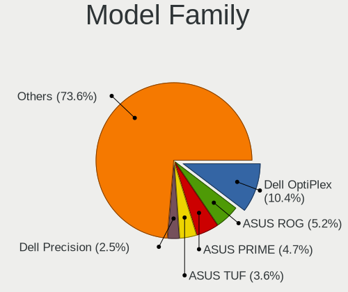
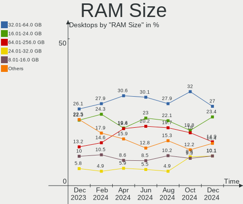
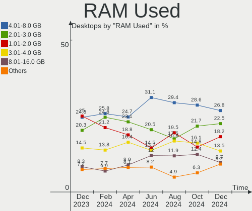
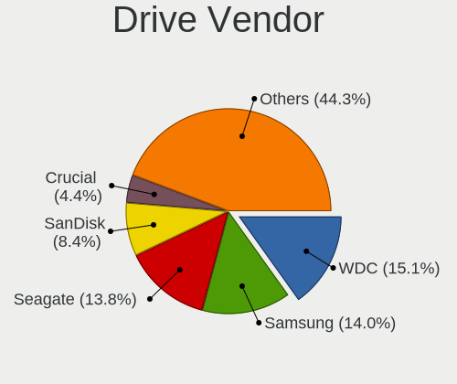
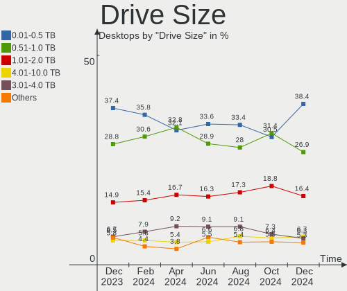
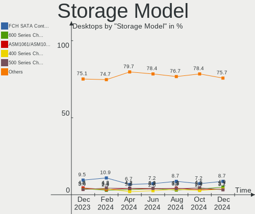
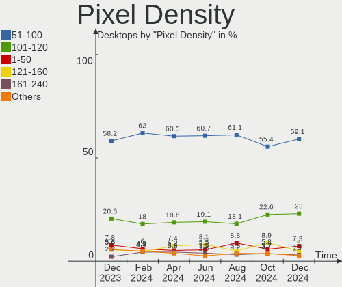
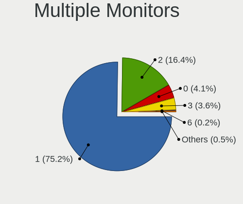
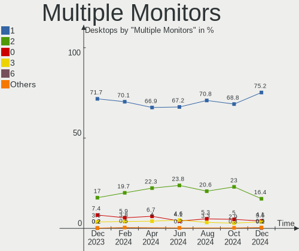
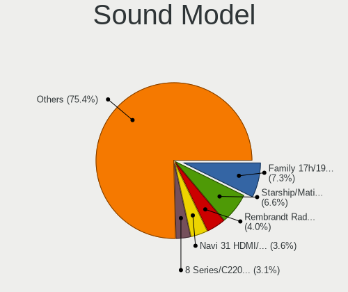

Linux in USA - Hardware Trends (Desktops)
-----------------------------------------

A project to identify most popular hardware characteristics and track their change
over time based on data collected by Linux users at https://Linux-Hardware.org.

Anyone can contribute to this report by the [hw-probe](https://github.com/linuxhw/hw-probe) tool:

    sudo -E hw-probe -all -upload

Period: Jun, 2023.

Contents
--------

* [ System ](#system)
  - [ OS                       ](#os)
  - [ OS Family                ](#os-family)
  - [ Kernel                   ](#kernel)
  - [ Kernel Family            ](#kernel-family)
  - [ Kernel Major Ver.        ](#kernel-major-ver)
  - [ Arch                     ](#arch)
  - [ DE                       ](#de)
  - [ Display Server           ](#display-server)
  - [ Display Manager          ](#display-manager)
  - [ OS Lang                  ](#os-lang)
  - [ Boot Mode                ](#boot-mode)
  - [ Filesystem               ](#filesystem)
  - [ Part. scheme             ](#part-scheme)
  - [ Dual Boot with Linux/BSD ](#dual-boot-with-linuxbsd)
  - [ Dual Boot (Win)          ](#dual-boot-win)

* [ Board ](#board)
  - [ Vendor                   ](#vendor)
  - [ Model                    ](#model)
  - [ Model Family             ](#model-family)
  - [ MFG Year                 ](#mfg-year)
  - [ Form Factor              ](#form-factor)
  - [ Secure Boot              ](#secure-boot)
  - [ Coreboot                 ](#coreboot)
  - [ RAM Size                 ](#ram-size)
  - [ RAM Used                 ](#ram-used)
  - [ Total Drives             ](#total-drives)
  - [ Has CD-ROM               ](#has-cd-rom)
  - [ Has Ethernet             ](#has-ethernet)
  - [ Has WiFi                 ](#has-wifi)
  - [ Has Bluetooth            ](#has-bluetooth)

* [ Location ](#location)
  - [ Country                  ](#country)
  - [ City                     ](#city)

* [ Drives ](#drives)
  - [ Drive Vendor             ](#drive-vendor)
  - [ Drive Model              ](#drive-model)
  - [ HDD Vendor               ](#hdd-vendor)
  - [ SSD Vendor               ](#ssd-vendor)
  - [ Drive Kind               ](#drive-kind)
  - [ Drive Connector          ](#drive-connector)
  - [ Drive Size               ](#drive-size)
  - [ Space Total              ](#space-total)
  - [ Space Used               ](#space-used)
  - [ Malfunc. Drives          ](#malfunc-drives)
  - [ Malfunc. Drive Vendor    ](#malfunc-drive-vendor)
  - [ Malfunc. HDD Vendor      ](#malfunc-hdd-vendor)
  - [ Malfunc. Drive Kind      ](#malfunc-drive-kind)
  - [ Failed Drives            ](#failed-drives)
  - [ Failed Drive Vendor      ](#failed-drive-vendor)
  - [ Drive Status             ](#drive-status)

* [ Storage controller ](#storage-controller)
  - [ Storage Vendor           ](#storage-vendor)
  - [ Storage Model            ](#storage-model)
  - [ Storage Kind             ](#storage-kind)

* [ Processor ](#processor)
  - [ CPU Vendor               ](#cpu-vendor)
  - [ CPU Model                ](#cpu-model)
  - [ CPU Model Family         ](#cpu-model-family)
  - [ CPU Cores                ](#cpu-cores)
  - [ CPU Sockets              ](#cpu-sockets)
  - [ CPU Threads              ](#cpu-threads)
  - [ CPU Op-Modes             ](#cpu-op-modes)
  - [ CPU Microcode            ](#cpu-microcode)
  - [ CPU Microarch            ](#cpu-microarch)

* [ Graphics ](#graphics)
  - [ GPU Vendor               ](#gpu-vendor)
  - [ GPU Model                ](#gpu-model)
  - [ GPU Combo                ](#gpu-combo)
  - [ GPU Driver               ](#gpu-driver)
  - [ GPU Memory               ](#gpu-memory)

* [ Monitor ](#monitor)
  - [ Monitor Vendor           ](#monitor-vendor)
  - [ Monitor Model            ](#monitor-model)
  - [ Monitor Resolution       ](#monitor-resolution)
  - [ Monitor Diagonal         ](#monitor-diagonal)
  - [ Monitor Width            ](#monitor-width)
  - [ Aspect Ratio             ](#aspect-ratio)
  - [ Monitor Area             ](#monitor-area)
  - [ Pixel Density            ](#pixel-density)
  - [ Multiple Monitors        ](#multiple-monitors)

* [ Network ](#network)
  - [ Net Controller Vendor    ](#net-controller-vendor)
  - [ Net Controller Model     ](#net-controller-model)
  - [ Wireless Vendor          ](#wireless-vendor)
  - [ Wireless Model           ](#wireless-model)
  - [ Ethernet Vendor          ](#ethernet-vendor)
  - [ Ethernet Model           ](#ethernet-model)
  - [ Net Controller Kind      ](#net-controller-kind)
  - [ Used Controller          ](#used-controller)
  - [ NICs                     ](#nics)
  - [ IPv6                     ](#ipv6)

* [ Bluetooth ](#bluetooth)
  - [ Bluetooth Vendor         ](#bluetooth-vendor)
  - [ Bluetooth Model          ](#bluetooth-model)

* [ Sound ](#sound)
  - [ Sound Vendor             ](#sound-vendor)
  - [ Sound Model              ](#sound-model)

* [ Memory ](#memory)
  - [ Memory Vendor            ](#memory-vendor)
  - [ Memory Model             ](#memory-model)
  - [ Memory Kind              ](#memory-kind)
  - [ Memory Form Factor       ](#memory-form-factor)
  - [ Memory Size              ](#memory-size)
  - [ Memory Speed             ](#memory-speed)

* [ Printers & scanners ](#printers--scanners)
  - [ Printer Vendor           ](#printer-vendor)
  - [ Printer Model            ](#printer-model)
  - [ Scanner Vendor           ](#scanner-vendor)
  - [ Scanner Model            ](#scanner-model)

* [ Camera ](#camera)
  - [ Camera Vendor            ](#camera-vendor)
  - [ Camera Model             ](#camera-model)

* [ Security ](#security)
  - [ Fingerprint Vendor       ](#fingerprint-vendor)
  - [ Fingerprint Model        ](#fingerprint-model)
  - [ Chipcard Vendor          ](#chipcard-vendor)
  - [ Chipcard Model           ](#chipcard-model)

* [ Unsupported ](#unsupported)
  - [ Unsupported Devices      ](#unsupported-devices)
  - [ Unsupported Device Types ](#unsupported-device-types)

System
------

OS
--

Installed operating systems

| Name                         | Desktops | Percent |
|------------------------------|----------|---------|
| Ubuntu 22.04                 | 54       | 13.6%   |
| Fedora 38                    | 31       | 7.81%   |
| Pop!_OS 22.04                | 28       | 7.05%   |
| Linux Mint 21.1              | 27       | 6.8%    |
| Debian 12                    | 26       | 6.55%   |
| Ubuntu 23.04                 | 22       | 5.54%   |
| ArcoLinux Rolling            | 20       | 5.04%   |
| Zorin 16                     | 16       | 4.03%   |
| Ubuntu 20.04                 | 10       | 2.52%   |
| OpenMandriva 23.03           | 10       | 2.52%   |
| KDE neon 22.04               | 10       | 2.52%   |
| Arch Rolling                 | 9        | 2.27%   |
| openSUSE Tumbleweed-XXXXXXXX | 8        | 2.02%   |
| Manjaro 23.0.0               | 7        | 1.76%   |
| Manjaro                      | 7        | 1.76%   |
| Debian 11                    | 7        | 1.76%   |
| SteamOS 3.4                  | 5        | 1.26%   |
| Nobara 37                    | 5        | 1.26%   |
| Linux Mint 20.3              | 5        | 1.26%   |
| Kubuntu 22.04                | 5        | 1.26%   |
| Kali 2023.2                  | 5        | 1.26%   |
| ChimeraOS 42                 | 5        | 1.26%   |
| Ubuntu 22.10                 | 4        | 1.01%   |
| OpenMandriva 23.06           | 4        | 1.01%   |
| Gentoo 2.13                  | 4        | 1.01%   |
| Xubuntu 22.04                | 3        | 0.76%   |
| Ubuntu 18.04                 | 3        | 0.76%   |
| Parrot 5.3                   | 3        | 0.76%   |
| OpenMandriva 23.01           | 3        | 0.76%   |
| LMDE 5                       | 3        | 0.76%   |
| Linux Mint 21                | 3        | 0.76%   |
| Fedora 37                    | 3        | 0.76%   |
| EndeavourOS Rolling          | 3        | 0.76%   |
| RHEL 9                       | 2        | 0.5%    |
| openSUSE Leap-15.5           | 2        | 0.5%    |
| OpenMandriva 4.90            | 2        | 0.5%    |
| Nobara 38                    | 2        | 0.5%    |
| Lubuntu 22.04                | 2        | 0.5%    |
| Xubuntu 23.04                | 1        | 0.25%   |
| Xubuntu 20.04                | 1        | 0.25%   |

OS Family
---------

OS without a version

| Name          | Desktops | Percent |
|---------------|----------|---------|
| Ubuntu        | 94       | 23.68%  |
| Linux Mint    | 36       | 9.07%   |
| Debian        | 36       | 9.07%   |
| Fedora        | 35       | 8.82%   |
| Pop!_OS       | 28       | 7.05%   |
| OpenMandriva  | 20       | 5.04%   |
| ArcoLinux     | 20       | 5.04%   |
| Zorin         | 16       | 4.03%   |
| Manjaro       | 14       | 3.53%   |
| openSUSE      | 11       | 2.77%   |
| KDE neon      | 10       | 2.52%   |
| Arch          | 9        | 2.27%   |
| Nobara        | 8        | 2.02%   |
| Kubuntu       | 6        | 1.51%   |
| Kali          | 6        | 1.51%   |
| Xubuntu       | 5        | 1.26%   |
| SteamOS       | 5        | 1.26%   |
| ChimeraOS     | 5        | 1.26%   |
| Gentoo        | 4        | 1.01%   |
| Parrot        | 3        | 0.76%   |
| Lubuntu       | 3        | 0.76%   |
| LMDE          | 3        | 0.76%   |
| EndeavourOS   | 3        | 0.76%   |
| Ubuntu Unity  | 2        | 0.5%    |
| RHEL          | 2        | 0.5%    |
| Xero          | 1        | 0.25%   |
| Void Linux    | 1        | 0.25%   |
| Ubuntu Budgie | 1        | 0.25%   |
| Sparky        | 1        | 0.25%   |
| Slackware     | 1        | 0.25%   |
| Peppermint    | 1        | 0.25%   |
| Oracle Linux  | 1        | 0.25%   |
| Garuda Linux  | 1        | 0.25%   |
| Endless       | 1        | 0.25%   |
| Elementary    | 1        | 0.25%   |
| Artix         | 1        | 0.25%   |
| Archcraft     | 1        | 0.25%   |
| Alpine        | 1        | 0.25%   |

Kernel
------

Version of the Linux kernel

| Version                     | Desktops | Percent |
|-----------------------------|----------|---------|
| 5.19.0-43-generic           | 35       | 8.82%   |
| 5.15.0-73-generic           | 29       | 7.3%    |
| 6.2.6-76060206-generic      | 26       | 6.55%   |
| 6.1.0-9-amd64               | 23       | 5.79%   |
| 5.19.0-45-generic           | 23       | 5.79%   |
| 5.15.0-75-generic           | 16       | 4.03%   |
| 6.2.0-20-generic            | 13       | 3.27%   |
| 6.2.6-desktop-1omv2390      | 10       | 2.52%   |
| 6.3.8-200.fc38.x86_64       | 9        | 2.27%   |
| 5.4.0-150-generic           | 9        | 2.27%   |
| 5.15.0-72-generic           | 9        | 2.27%   |
| 6.3.5-200.fc38.x86_64       | 8        | 2.02%   |
| 6.2.0-23-generic            | 8        | 2.02%   |
| 6.1.31-2-MANJARO            | 8        | 2.02%   |
| 5.10.0-23-amd64             | 7        | 1.76%   |
| 6.3.9-arch1-1               | 5        | 1.26%   |
| 6.1.27-1-lts                | 5        | 1.26%   |
| 6.1.0-kali9-amd64           | 5        | 1.26%   |
| 6.3.7-200.fc38.x86_64       | 4        | 1.01%   |
| 6.3.7-1-default             | 4        | 1.01%   |
| 6.3.5-desktop-3omv2390      | 4        | 1.01%   |
| 6.3.4-201.fc38.x86_64       | 4        | 1.01%   |
| 5.13.0-valve21.3-1-neptune  | 4        | 1.01%   |
| 6.3.8-arch1-1               | 3        | 0.76%   |
| 6.3.7-arch1-1               | 3        | 0.76%   |
| 6.3.7-200.fsync.fc37.x86_64 | 3        | 0.76%   |
| 6.3.6-arch1-1               | 3        | 0.76%   |
| 6.3.6-200.fc38.x86_64       | 3        | 0.76%   |
| 6.3.6-1-default             | 3        | 0.76%   |
| 6.2.15-300.fc38.x86_64      | 3        | 0.76%   |
| 6.2.15-200.fc37.x86_64      | 3        | 0.76%   |
| 6.1.1-desktop-1omv2290      | 3        | 0.76%   |
| 6.1.0-1parrot1-amd64        | 3        | 0.76%   |
| 5.19.0-46-generic           | 3        | 0.76%   |
| 5.15.0-71-generic           | 3        | 0.76%   |
| 6.3.9-zen1-1-zen            | 2        | 0.5%    |
| 6.3.7-zen1-1-zen            | 2        | 0.5%    |
| 6.3.6-zen1-1-zen            | 2        | 0.5%    |
| 6.3.5-zen2-1-zen            | 2        | 0.5%    |
| 6.3.5-zen1-1-zen            | 2        | 0.5%    |

Kernel Family
-------------

Linux kernel without a distro release

| Version | Desktops | Percent |
|---------|----------|---------|
| 5.15.0  | 67       | 16.88%  |
| 5.19.0  | 66       | 16.62%  |
| 6.2.6   | 36       | 9.07%   |
| 6.1.0   | 34       | 8.56%   |
| 6.2.0   | 24       | 6.05%   |
| 6.3.5   | 21       | 5.29%   |
| 6.3.7   | 16       | 4.03%   |
| 6.3.8   | 14       | 3.53%   |
| 5.4.0   | 14       | 3.53%   |
| 6.3.6   | 13       | 3.27%   |
| 6.1.31  | 10       | 2.52%   |
| 5.10.0  | 10       | 2.52%   |
| 6.3.4   | 8        | 2.02%   |
| 6.3.9   | 7        | 1.76%   |
| 6.2.15  | 6        | 1.51%   |
| 6.1.27  | 6        | 1.51%   |
| 6.3.3   | 5        | 1.26%   |
| 5.13.0  | 5        | 1.26%   |
| 6.1.1   | 3        | 0.76%   |
| 6.4.0   | 2        | 0.5%    |
| 6.3.10  | 2        | 0.5%    |
| 6.2.16  | 2        | 0.5%    |
| 6.1.34  | 2        | 0.5%    |
| 5.18.12 | 2        | 0.5%    |
| 5.14.21 | 2        | 0.5%    |
| 5.14.0  | 2        | 0.5%    |
| 4.19.0  | 2        | 0.5%    |
| 6.3.1   | 1        | 0.25%   |
| 6.2.14  | 1        | 0.25%   |
| 6.1.8   | 1        | 0.25%   |
| 6.1.36  | 1        | 0.25%   |
| 6.1.33  | 1        | 0.25%   |
| 6.1.24  | 1        | 0.25%   |
| 6.1.21  | 1        | 0.25%   |
| 6.0.2   | 1        | 0.25%   |
| 6.0.14  | 1        | 0.25%   |
| 6.0.0   | 1        | 0.25%   |
| 5.9.11  | 1        | 0.25%   |
| 5.19.17 | 1        | 0.25%   |
| 5.16.13 | 1        | 0.25%   |

Kernel Major Ver.
-----------------

Linux kernel major version

| Version | Desktops | Percent |
|---------|----------|---------|
| 6.3     | 87       | 21.91%  |
| 6.2     | 69       | 17.38%  |
| 5.15    | 68       | 17.13%  |
| 5.19    | 67       | 16.88%  |
| 6.1     | 60       | 15.11%  |
| 5.4     | 14       | 3.53%   |
| 5.10    | 10       | 2.52%   |
| 5.13    | 5        | 1.26%   |
| 5.14    | 4        | 1.01%   |
| 6.0     | 3        | 0.76%   |
| 6.4     | 2        | 0.5%    |
| 5.18    | 2        | 0.5%    |
| 4.19    | 2        | 0.5%    |
| 5.9     | 1        | 0.25%   |
| 5.16    | 1        | 0.25%   |
| 4.4     | 1        | 0.25%   |
| 4.15    | 1        | 0.25%   |

Arch
----

OS architecture (x86_64, i586, etc.)

| Name   | Desktops | Percent |
|--------|----------|---------|
| x86_64 | 395      | 99.5%   |
| i686   | 2        | 0.5%    |

DE
--

Desktop Environment

| Name            | Desktops | Percent |
|-----------------|----------|---------|
| GNOME           | 185      | 46.6%   |
| KDE5            | 89       | 22.42%  |
| X-Cinnamon      | 36       | 9.07%   |
| XFCE            | 31       | 7.81%   |
| Unknown         | 22       | 5.54%   |
| MATE            | 13       | 3.27%   |
| GNOME Classic   | 6        | 1.51%   |
| LXQt            | 4        | 1.01%   |
| Unity           | 2        | 0.5%    |
| i3              | 2        | 0.5%    |
| Budgie          | 2        | 0.5%    |
| sway            | 1        | 0.25%   |
| Pantheon        | 1        | 0.25%   |
| LXDE            | 1        | 0.25%   |
| GNOME Flashback | 1        | 0.25%   |
| bspwm           | 1        | 0.25%   |

Display Server
--------------

X11 or Wayland

| Name    | Desktops | Percent |
|---------|----------|---------|
| X11     | 250      | 62.97%  |
| Wayland | 119      | 29.97%  |
| Unknown | 22       | 5.54%   |
| Tty     | 6        | 1.51%   |

Display Manager
---------------

SDDM, LightDM, etc.

| Name    | Desktops | Percent |
|---------|----------|---------|
| Unknown | 170      | 42.82%  |
| GDM3    | 86       | 21.66%  |
| SDDM    | 60       | 15.11%  |
| LightDM | 46       | 11.59%  |
| GDM     | 33       | 8.31%   |
| SLiM    | 1        | 0.25%   |
| LXDM    | 1        | 0.25%   |

OS Lang
-------

Language

| Lang    | Desktops | Percent |
|---------|----------|---------|
| en_US   | 372      | 93.7%   |
| Unknown | 15       | 3.78%   |
| C       | 5        | 1.26%   |
| n_US    | 1        | 0.25%   |
| es_VE   | 1        | 0.25%   |
| en_CA   | 1        | 0.25%   |
| de_DE   | 1        | 0.25%   |
| C.UTF8  | 1        | 0.25%   |

Boot Mode
---------

EFI or BIOS

| Mode | Desktops | Percent |
|------|----------|---------|
| BIOS | 224      | 56.42%  |
| EFI  | 173      | 43.58%  |

Filesystem
----------

Type of filesystem

| Type    | Desktops | Percent |
|---------|----------|---------|
| Ext4    | 217      | 54.66%  |
| Btrfs   | 84       | 21.16%  |
| Tmpfs   | 59       | 14.86%  |
| Overlay | 27       | 6.8%    |
| Xfs     | 6        | 1.51%   |
| Zfs     | 2        | 0.5%    |
| Rootfs  | 1        | 0.25%   |
| Jfs     | 1        | 0.25%   |

Part. scheme
------------

Scheme of partitioning

| Type    | Desktops | Percent |
|---------|----------|---------|
| GPT     | 213      | 53.65%  |
| Unknown | 151      | 38.04%  |
| MBR     | 33       | 8.31%   |

Dual Boot with Linux/BSD
------------------------

Hosting more than one Linux/BSD

| Dual boot | Desktops | Percent |
|-----------|----------|---------|
| No        | 329      | 82.87%  |
| Yes       | 68       | 17.13%  |

Dual Boot (Win)
---------------

Hosting Linux and Windows

| Dual boot | Desktops | Percent |
|-----------|----------|---------|
| No        | 294      | 74.06%  |
| Yes       | 103      | 25.94%  |

Board
-----

Vendor
------

Motherboard manufacturer

| Name                                 | Desktops | Percent |
|--------------------------------------|----------|---------|
| ASUSTek Computer                     | 86       | 21.66%  |
| Dell                                 | 62       | 15.62%  |
| MSI                                  | 61       | 15.37%  |
| Hewlett-Packard                      | 42       | 10.58%  |
| Gigabyte Technology                  | 41       | 10.33%  |
| Lenovo                               | 27       | 6.8%    |
| ASRock                               | 23       | 5.79%   |
| Pegatron                             | 6        | 1.51%   |
| Intel                                | 6        | 1.51%   |
| Foxconn                              | 5        | 1.26%   |
| AZW                                  | 4        | 1.01%   |
| Biostar                              | 3        | 0.76%   |
| Acer                                 | 3        | 0.76%   |
| System76                             | 2        | 0.5%    |
| Supermicro                           | 2        | 0.5%    |
| Shuttle                              | 2        | 0.5%    |
| Shenzhen Meigao Electronic Equipment | 2        | 0.5%    |
| Gateway                              | 2        | 0.5%    |
| BESSTAR Tech                         | 2        | 0.5%    |
| Apple                                | 2        | 0.5%    |
| Unknown                              | 2        | 0.5%    |
| XFX                                  | 1        | 0.25%   |
| Seeed Studio                         | 1        | 0.25%   |
| Portwell                             | 1        | 0.25%   |
| OEM                                  | 1        | 0.25%   |
| MAXSUN                               | 1        | 0.25%   |
| JINGSHA                              | 1        | 0.25%   |
| HPE                                  | 1        | 0.25%   |
| Fujitsu                              | 1        | 0.25%   |
| ASRockRack                           | 1        | 0.25%   |
| AOpen                                | 1        | 0.25%   |
| AMI                                  | 1        | 0.25%   |
| Alienware                            | 1        | 0.25%   |

Model
-----

Motherboard model

| Name                                            | Desktops | Percent |
|-------------------------------------------------|----------|---------|
| Lenovo ThinkCentre M55p 8808D8U                 | 12       | 3.02%   |
| MSI MS-7C95                                     | 6        | 1.51%   |
| MSI MS-7C02                                     | 6        | 1.51%   |
| Dell OptiPlex 7010                              | 6        | 1.51%   |
| MSI MS-7C56                                     | 5        | 1.26%   |
| MSI MS-7C37                                     | 5        | 1.26%   |
| Dell OptiPlex 9020                              | 4        | 1.01%   |
| ASUS TUF Gaming X570-PLUS                       | 4        | 1.01%   |
| Unknown                                         | 4        | 1.01%   |
| MSI MS-7B17                                     | 3        | 0.76%   |
| MSI MS-7A71                                     | 3        | 0.76%   |
| Gigabyte Z390 AORUS PRO WIFI                    | 3        | 0.76%   |
| Gigabyte GA-78LMT-USB3 6.0                      | 3        | 0.76%   |
| Dell OptiPlex 790                               | 3        | 0.76%   |
| Dell OptiPlex 3020                              | 3        | 0.76%   |
| ASUS ROG STRIX B450-F GAMING                    | 3        | 0.76%   |
| Shenzhen Meigao Electronic Equipment UM773 Lite | 2        | 0.5%    |
| MSI MS-7721                                     | 2        | 0.5%    |
| Lenovo 70A4000HUX ThinkServer TS140             | 2        | 0.5%    |
| HP Z420 Workstation                             | 2        | 0.5%    |
| HP Victus by 15L Gaming Desktop TG02-0xxx       | 2        | 0.5%    |
| HP OMEN by 40L Gaming Desktop GT21-0xxx         | 2        | 0.5%    |
| HP EliteDesk 800 G1 SFF                         | 2        | 0.5%    |
| HP Desktop M01-F0xxx                            | 2        | 0.5%    |
| HP Compaq Pro 6300 SFF                          | 2        | 0.5%    |
| HP Compaq Pro 6300 MT                           | 2        | 0.5%    |
| Gigabyte B450M DS3H                             | 2        | 0.5%    |
| Dell XPS 8950                                   | 2        | 0.5%    |
| Dell XPS 8940                                   | 2        | 0.5%    |
| Dell XPS 8700                                   | 2        | 0.5%    |
| Dell OptiPlex 990                               | 2        | 0.5%    |
| Dell OptiPlex 7020                              | 2        | 0.5%    |
| Dell OptiPlex 5050                              | 2        | 0.5%    |
| Dell OptiPlex 390                               | 2        | 0.5%    |
| Dell OptiPlex 380                               | 2        | 0.5%    |
| Dell Inspiron One 2020                          | 2        | 0.5%    |
| Dell Inspiron 3847                              | 2        | 0.5%    |
| Dell Inspiron 3671                              | 2        | 0.5%    |
| Dell Inspiron 3650                              | 2        | 0.5%    |
| AZW GTR                                         | 2        | 0.5%    |

Model Family
------------

Motherboard model prefix

| Name                                       | Desktops | Percent |
|--------------------------------------------|----------|---------|
| Dell OptiPlex                              | 32       | 8.06%   |
| ASUS ROG                                   | 24       | 6.05%   |
| Lenovo ThinkCentre                         | 20       | 5.04%   |
| ASUS PRIME                                 | 18       | 4.53%   |
| HP Compaq                                  | 11       | 2.77%   |
| Dell Precision                             | 10       | 2.52%   |
| Dell Inspiron                              | 10       | 2.52%   |
| ASUS TUF                                   | 10       | 2.52%   |
| HP EliteDesk                               | 7        | 1.76%   |
| Dell XPS                                   | 7        | 1.76%   |
| MSI MS-7C95                                | 6        | 1.51%   |
| MSI MS-7C02                                | 6        | 1.51%   |
| MSI MS-7C56                                | 5        | 1.26%   |
| MSI MS-7C37                                | 5        | 1.26%   |
| Gigabyte B550                              | 4        | 1.01%   |
| Unknown                                    | 4        | 1.01%   |
| MSI MS-7B17                                | 3        | 0.76%   |
| MSI MS-7A71                                | 3        | 0.76%   |
| HP OMEN                                    | 3        | 0.76%   |
| Gigabyte Z390                              | 3        | 0.76%   |
| Gigabyte GA-78LMT-USB3                     | 3        | 0.76%   |
| Gigabyte B450M                             | 3        | 0.76%   |
| ASUS M5A78L-M                              | 3        | 0.76%   |
| Shenzhen Meigao Electronic Equipment UM773 | 2        | 0.5%    |
| MSI MS-7721                                | 2        | 0.5%    |
| Lenovo 70A4000HUX                          | 2        | 0.5%    |
| HP Z420                                    | 2        | 0.5%    |
| HP Victus                                  | 2        | 0.5%    |
| HP Desktop                                 | 2        | 0.5%    |
| Gigabyte B450                              | 2        | 0.5%    |
| AZW GTR                                    | 2        | 0.5%    |
| ASUS SABERTOOTH                            | 2        | 0.5%    |
| ASUS Pro                                   | 2        | 0.5%    |
| ASUS P9X79                                 | 2        | 0.5%    |
| ASUS P8Z77-V                               | 2        | 0.5%    |
| ASUS Maximus                               | 2        | 0.5%    |
| ASUS M2N68-AM                              | 2        | 0.5%    |
| ASUS K30BF                                 | 2        | 0.5%    |
| ASRock X670E                               | 2        | 0.5%    |
| ASRock X570                                | 2        | 0.5%    |

MFG Year
--------

Motherboard manufacture year

| Year | Desktops | Percent |
|------|----------|---------|
| 2022 | 45       | 11.34%  |
| 2020 | 39       | 9.82%   |
| 2013 | 38       | 9.57%   |
| 2018 | 36       | 9.07%   |
| 2019 | 26       | 6.55%   |
| 2012 | 26       | 6.55%   |
| 2021 | 23       | 5.79%   |
| 2011 | 23       | 5.79%   |
| 2014 | 20       | 5.04%   |
| 2017 | 19       | 4.79%   |
| 2015 | 19       | 4.79%   |
| 2016 | 17       | 4.28%   |
| 2010 | 14       | 3.53%   |
| 2007 | 14       | 3.53%   |
| 2023 | 13       | 3.27%   |
| 2009 | 13       | 3.27%   |
| 2008 | 11       | 2.77%   |
| 2005 | 1        | 0.25%   |

Form Factor
-----------

Physical design of the computer

| Name    | Desktops | Percent |
|---------|----------|---------|
| Desktop | 397      | 100%    |

Secure Boot
-----------

Enabled or disabled

| State    | Desktops | Percent |
|----------|----------|---------|
| Disabled | 385      | 96.98%  |
| Enabled  | 12       | 3.02%   |

Coreboot
--------

Have coreboot on board

| Used | Desktops | Percent |
|------|----------|---------|
| No   | 397      | 100%    |

RAM Size
--------

Total RAM memory

| Size in GB      | Desktops | Percent |
|-----------------|----------|---------|
| 32.01-64.0      | 106      | 26.7%   |
| 16.01-24.0      | 90       | 22.67%  |
| 4.01-8.0        | 48       | 12.09%  |
| 8.01-16.0       | 46       | 11.59%  |
| 64.01-256.0     | 38       | 9.57%   |
| 3.01-4.0        | 33       | 8.31%   |
| 24.01-32.0      | 22       | 5.54%   |
| 1.01-2.0        | 8        | 2.02%   |
| 2.01-3.0        | 3        | 0.76%   |
| More than 256.0 | 2        | 0.5%    |
| 0.51-1.0        | 1        | 0.25%   |

RAM Used
--------

Used RAM memory

| Used GB    | Desktops | Percent |
|------------|----------|---------|
| 1.01-2.0   | 113      | 28.46%  |
| 4.01-8.0   | 85       | 21.41%  |
| 2.01-3.0   | 78       | 19.65%  |
| 3.01-4.0   | 66       | 16.62%  |
| 8.01-16.0  | 35       | 8.82%   |
| 0.51-1.0   | 8        | 2.02%   |
| 16.01-24.0 | 6        | 1.51%   |
| 32.01-64.0 | 3        | 0.76%   |
| 0.01-0.5   | 2        | 0.5%    |
| 24.01-32.0 | 1        | 0.25%   |

Total Drives
------------

Number of drives on board

| Drives | Desktops | Percent |
|--------|----------|---------|
| 1      | 135      | 34.01%  |
| 2      | 124      | 31.23%  |
| 3      | 68       | 17.13%  |
| 4      | 34       | 8.56%   |
| 5      | 19       | 4.79%   |
| 6      | 5        | 1.26%   |
| 8      | 3        | 0.76%   |
| 7      | 3        | 0.76%   |
| 0      | 2        | 0.5%    |
| 21     | 1        | 0.25%   |
| 19     | 1        | 0.25%   |
| 14     | 1        | 0.25%   |
| 10     | 1        | 0.25%   |

Has CD-ROM
----------

Has CD-ROM on board

| Presented | Desktops | Percent |
|-----------|----------|---------|
| No        | 232      | 58.44%  |
| Yes       | 165      | 41.56%  |

Has Ethernet
------------

Has Ethernet on board

| Presented | Desktops | Percent |
|-----------|----------|---------|
| Yes       | 393      | 98.99%  |
| No        | 4        | 1.01%   |

Has WiFi
--------

Has WiFi module

| Presented | Desktops | Percent |
|-----------|----------|---------|
| Yes       | 249      | 62.72%  |
| No        | 148      | 37.28%  |

Has Bluetooth
-------------

Has Bluetooth module

| Presented | Desktops | Percent |
|-----------|----------|---------|
| Yes       | 202      | 50.88%  |
| No        | 195      | 49.12%  |

Location
--------

Country
-------

Geographic location (country)

| Country | Desktops | Percent |
|---------|----------|---------|
| USA     | 397      | 100%    |

City
----

Geographic location (city)

| City            | Desktops | Percent |
|-----------------|----------|---------|
| Bangor          | 15       | 3.78%   |
| Seattle         | 11       | 2.77%   |
| New York        | 8        | 2.02%   |
| Atlanta         | 6        | 1.51%   |
| San Francisco   | 5        | 1.26%   |
| Manchester      | 5        | 1.26%   |
| Las Vegas       | 5        | 1.26%   |
| Wichita         | 4        | 1.01%   |
| South Bend      | 4        | 1.01%   |
| Portland        | 4        | 1.01%   |
| Los Angeles     | 4        | 1.01%   |
| Jacksonville    | 4        | 1.01%   |
| Denver          | 4        | 1.01%   |
| Cleveland       | 4        | 1.01%   |
| Austin          | 4        | 1.01%   |
| Redmond         | 3        | 0.76%   |
| Phoenix         | 3        | 0.76%   |
| Philadelphia    | 3        | 0.76%   |
| Dallas          | 3        | 0.76%   |
| Chattanooga     | 3        | 0.76%   |
| Charlotte       | 3        | 0.76%   |
| Westchester     | 2        | 0.5%    |
| Washington      | 2        | 0.5%    |
| Virginia Beach  | 2        | 0.5%    |
| Vancouver       | 2        | 0.5%    |
| State College   | 2        | 0.5%    |
| Springfield     | 2        | 0.5%    |
| Savannah        | 2        | 0.5%    |
| San Jose        | 2        | 0.5%    |
| Saint Paul      | 2        | 0.5%    |
| Rockville       | 2        | 0.5%    |
| Novi            | 2        | 0.5%    |
| North Hollywood | 2        | 0.5%    |
| Lexington       | 2        | 0.5%    |
| Lansing         | 2        | 0.5%    |
| Hillsborough    | 2        | 0.5%    |
| Hemet           | 2        | 0.5%    |
| Hamilton        | 2        | 0.5%    |
| Greenville      | 2        | 0.5%    |
| Grand Rapids    | 2        | 0.5%    |

Drives
------

Drive Vendor
------------

Hard drive vendors

| Vendor                      | Desktops | Drives | Percent |
|-----------------------------|----------|--------|---------|
| Samsung Electronics         | 130      | 183    | 17.5%   |
| WDC                         | 123      | 172    | 16.55%  |
| Seagate                     | 115      | 150    | 15.48%  |
| Sandisk                     | 55       | 61     | 7.4%    |
| Toshiba                     | 39       | 45     | 5.25%   |
| Hitachi                     | 30       | 38     | 4.04%   |
| Crucial                     | 24       | 38     | 3.23%   |
| Kingston                    | 21       | 24     | 2.83%   |
| SK hynix                    | 15       | 20     | 2.02%   |
| Phison Electronics          | 15       | 15     | 2.02%   |
| PNY                         | 13       | 13     | 1.75%   |
| SPCC                        | 10       | 13     | 1.35%   |
| Micron/Crucial Technology   | 10       | 10     | 1.35%   |
| Intel                       | 10       | 10     | 1.35%   |
| China                       | 10       | 11     | 1.35%   |
| Unknown                     | 8        | 9      | 1.08%   |
| OCZ                         | 8        | 9      | 1.08%   |
| HGST                        | 8        | 8      | 1.08%   |
| SABRENT                     | 7        | 8      | 0.94%   |
| Micron Technology           | 7        | 12     | 0.94%   |
| Kingston Technology Company | 7        | 7      | 0.94%   |
| A-DATA Technology           | 7        | 8      | 0.94%   |
| Team                        | 6        | 8      | 0.81%   |
| T-FORCE                     | 5        | 5      | 0.67%   |
| ADATA Technology            | 5        | 6      | 0.67%   |
| Realtek Semiconductor       | 4        | 4      | 0.54%   |
| Mushkin                     | 3        | 5      | 0.4%    |
| Apple                       | 3        | 3      | 0.4%    |
| Transcend                   | 2        | 2      | 0.27%   |
| KIOXIA                      | 2        | 2      | 0.27%   |
| JMicron Technology          | 2        | 2      | 0.27%   |
| Inland                      | 2        | 2      | 0.27%   |
| Vecto                       | 1        | 1      | 0.13%   |
| USB3.0                      | 1        | 2      | 0.13%   |
| USB                         | 1        | 1      | 0.13%   |
| Timetec                     | 1        | 1      | 0.13%   |
| TECH                        | 1        | 1      | 0.13%   |
| TDAS                        | 1        | 3      | 0.13%   |
| SUNEAST                     | 1        | 1      | 0.13%   |
| Silicon Motion              | 1        | 1      | 0.13%   |

Drive Model
-----------

Hard drive models

| Model                                               | Desktops | Percent |
|-----------------------------------------------------|----------|---------|
| Samsung NVMe SSD Controller PM9A1/PM9A3/980PRO 2TB  | 22       | 2.55%   |
| Samsung NVMe SSD Controller SM981/PM981/PM983 250GB | 21       | 2.43%   |
| Seagate ST2000DM008-2FR102 2TB                      | 14       | 1.62%   |
| Samsung SSD 860 EVO 500GB                           | 10       | 1.16%   |
| Seagate ST1000DM010-2EP102 1TB                      | 8        | 0.93%   |
| Samsung SSD 980 1TB                                 | 8        | 0.93%   |
| Samsung SSD 860 EVO 1TB                             | 8        | 0.93%   |
| Toshiba DT01ACA100 1TB                              | 7        | 0.81%   |
| Seagate ST500DM002-1BD142 500GB                     | 7        | 0.81%   |
| Samsung SSD 870 EVO 1TB                             | 7        | 0.81%   |
| Samsung SSD 850 EVO 250GB                           | 7        | 0.81%   |
| Samsung NVMe SSD Controller SM961/PM961/SM963 256GB | 7        | 0.81%   |
| Micron/Crucial P2 NVMe PCIe SSD 4TB                 | 7        | 0.81%   |
| Hitachi HDS728080PLA380 40Y9028LEN 80GB             | 7        | 0.81%   |
| Seagate ST4000DM004-2CV104 4TB                      | 6        | 0.7%    |
| Sandisk WD Blue SN550 NVMe SSD 1TB                  | 6        | 0.7%    |
| Sandisk WD Black SN750 / PC SN730 NVMe SSD 500GB    | 6        | 0.7%    |
| Samsung SSD 870 EVO 500GB                           | 6        | 0.7%    |
| SABRENT Disk 1TB                                    | 6        | 0.7%    |
| Phison E12 NVMe Controller 1TB                      | 6        | 0.7%    |
| Kingston SA400S37120G 120GB SSD                     | 6        | 0.7%    |
| WDC WD10EZEX-08WN4A0 1TB                            | 5        | 0.58%   |
| Seagate ST2000DM006-2DM164 2TB                      | 5        | 0.58%   |
| Seagate ST2000DM001-1ER164 2TB                      | 5        | 0.58%   |
| Seagate ST1000DM003-1CH162 1TB                      | 5        | 0.58%   |
| Kingston SA400S37240G 240GB SSD                     | 5        | 0.58%   |
| WDC WDS500G2B0A-00SM50 500GB SSD                    | 4        | 0.46%   |
| WDC WD40EZRZ-22GXCB0 4TB                            | 4        | 0.46%   |
| WDC WD10EZEX-08M2NA0 1TB                            | 4        | 0.46%   |
| Toshiba DT01ACA200 2TB                              | 4        | 0.46%   |
| Seagate ST1000DM003-1SB102 1TB                      | 4        | 0.46%   |
| Samsung SSD 870 QVO 2TB                             | 4        | 0.46%   |
| PNY CS900 120GB SSD                                 | 4        | 0.46%   |
| Phison E16 PCIe4 NVMe Controller 1TB                | 4        | 0.46%   |
| Hitachi HUA723020ALA641 2TB                         | 4        | 0.46%   |
| Crucial CT1000MX500SSD1 1TB                         | 4        | 0.46%   |
| WDC WDBNCE0010PNC 1TB SSD                           | 3        | 0.35%   |
| WDC WD800JD-08MSA1 80GB                             | 3        | 0.35%   |
| WDC WD10EZEX-60WN4A0 1TB                            | 3        | 0.35%   |
| WDC WD10EZEX-00BN5A0 1TB                            | 3        | 0.35%   |

HDD Vendor
----------

Hard disk drive vendors

| Vendor              | Desktops | Drives | Percent |
|---------------------|----------|--------|---------|
| Seagate             | 114      | 148    | 36.54%  |
| WDC                 | 108      | 145    | 34.62%  |
| Toshiba             | 33       | 39     | 10.58%  |
| Hitachi             | 30       | 38     | 9.62%   |
| HGST                | 8        | 8      | 2.56%   |
| Samsung Electronics | 6        | 6      | 1.92%   |
| Unknown             | 3        | 3      | 0.96%   |
| Apple               | 2        | 2      | 0.64%   |
| USB3.0              | 1        | 2      | 0.32%   |
| USB                 | 1        | 1      | 0.32%   |
| SABRENT             | 1        | 2      | 0.32%   |
| Maxtor              | 1        | 1      | 0.32%   |
| LaCie               | 1        | 1      | 0.32%   |
| Fantom              | 1        | 1      | 0.32%   |
| ASMT                | 1        | 3      | 0.32%   |
| ASMedia             | 1        | 1      | 0.32%   |

SSD Vendor
----------

Solid state drive vendors

| Vendor              | Desktops | Drives | Percent |
|---------------------|----------|--------|---------|
| Samsung Electronics | 73       | 89     | 30.29%  |
| Crucial             | 22       | 34     | 9.13%   |
| WDC                 | 20       | 24     | 8.3%    |
| SanDisk             | 19       | 20     | 7.88%   |
| Kingston            | 18       | 21     | 7.47%   |
| PNY                 | 13       | 13     | 5.39%   |
| China               | 10       | 11     | 4.15%   |
| SPCC                | 8        | 9      | 3.32%   |
| OCZ                 | 8        | 9      | 3.32%   |
| Team                | 6        | 8      | 2.49%   |
| A-DATA Technology   | 6        | 7      | 2.49%   |
| T-FORCE             | 5        | 5      | 2.07%   |
| Intel               | 5        | 5      | 2.07%   |
| Toshiba             | 3        | 3      | 1.24%   |
| SK hynix            | 3        | 4      | 1.24%   |
| Micron Technology   | 3        | 6      | 1.24%   |
| Transcend           | 2        | 2      | 0.83%   |
| Inland              | 2        | 2      | 0.83%   |
| SUNEAST             | 1        | 1      | 0.41%   |
| SATAFIRM            | 1        | 1      | 0.41%   |
| Patriot             | 1        | 1      | 0.41%   |
| ORTIAL              | 1        | 1      | 0.41%   |
| NGFF                | 1        | 1      | 0.41%   |
| Mushkin             | 1        | 1      | 0.41%   |
| MicroFrom           | 1        | 1      | 0.41%   |
| LITEON              | 1        | 1      | 0.41%   |
| Leven               | 1        | 1      | 0.41%   |
| HPE                 | 1        | 4      | 0.41%   |
| Hewlett-Packard     | 1        | 4      | 0.41%   |
| Gigabyte Technology | 1        | 1      | 0.41%   |
| FORESEE             | 1        | 1      | 0.41%   |
| Acer                | 1        | 1      | 0.41%   |
| 2.5                 | 1        | 1      | 0.41%   |

Drive Kind
----------

HDD or SSD

| Kind    | Desktops | Drives | Percent |
|---------|----------|--------|---------|
| HDD     | 247      | 401    | 39.71%  |
| SSD     | 194      | 293    | 31.19%  |
| NVMe    | 168      | 241    | 27.01%  |
| Unknown | 10       | 13     | 1.61%   |
| MMC     | 3        | 4      | 0.48%   |

Drive Connector
---------------

SATA, SAS, NVMe, etc.

| Type | Desktops | Drives | Percent |
|------|----------|--------|---------|
| SATA | 338      | 651    | 61.68%  |
| NVMe | 164      | 231    | 29.93%  |
| SAS  | 43       | 66     | 7.85%   |
| MMC  | 3        | 4      | 0.55%   |

Drive Size
----------

Size of hard drive

| Size in TB | Desktops | Drives | Percent |
|------------|----------|--------|---------|
| 0.01-0.5   | 195      | 266    | 38.39%  |
| 0.51-1.0   | 153      | 218    | 30.12%  |
| 1.01-2.0   | 90       | 118    | 17.72%  |
| 3.01-4.0   | 25       | 31     | 4.92%   |
| 4.01-10.0  | 24       | 35     | 4.72%   |
| 2.01-3.0   | 18       | 19     | 3.54%   |
| 10.01-20.0 | 3        | 7      | 0.59%   |

Space Total
-----------

Amount of disk space available on the file system

| Size in GB     | Desktops | Percent |
|----------------|----------|---------|
| More than 3000 | 85       | 21.41%  |
| 501-1000       | 81       | 20.4%   |
| 251-500        | 62       | 15.62%  |
| 1001-2000      | 54       | 13.6%   |
| 101-250        | 47       | 11.84%  |
| 1-20           | 21       | 5.29%   |
| Unknown        | 20       | 5.04%   |
| 2001-3000      | 18       | 4.53%   |
| 51-100         | 7        | 1.76%   |
| 21-50          | 2        | 0.5%    |

Space Used
----------

Amount of used disk space

| Used GB        | Desktops | Percent |
|----------------|----------|---------|
| 1-20           | 98       | 24.69%  |
| 21-50          | 67       | 16.88%  |
| 101-250        | 44       | 11.08%  |
| 51-100         | 38       | 9.57%   |
| 501-1000       | 35       | 8.82%   |
| 251-500        | 28       | 7.05%   |
| 1001-2000      | 25       | 6.3%    |
| More than 3000 | 21       | 5.29%   |
| 2001-3000      | 21       | 5.29%   |
| Unknown        | 20       | 5.04%   |

Malfunc. Drives
---------------

Drive models with a malfunction

| Model                                                          | Desktops | Drives | Percent |
|----------------------------------------------------------------|----------|--------|---------|
| Samsung Electronics SSD 870 EVO 1TB                            | 3        | 10     | 4.84%   |
| WDC WD1600AAJS-00B4A0 160GB                                    | 2        | 2      | 3.23%   |
| Toshiba MQ04ABF100 1TB                                         | 2        | 2      | 3.23%   |
| Seagate ST500DM002-1BD142 500GB                                | 2        | 2      | 3.23%   |
| Seagate ST1000LX015-1U7172 1TB                                 | 2        | 2      | 3.23%   |
| Samsung Electronics NVMe SSD Controller PM9A1/PM9A3/980PRO 2TB | 2        | 3      | 3.23%   |
| Crucial CT512MX100SSD1 512GB                                   | 2        | 2      | 3.23%   |
| WDC WDS100T2G0A-00JH30 1TB SSD                                 | 1        | 2      | 1.61%   |
| WDC WD5000AAKX-60U6AA0 500GB                                   | 1        | 1      | 1.61%   |
| WDC WD5000AAKX-08ERMA0 500GB                                   | 1        | 1      | 1.61%   |
| WDC WD400BD-60LRA0 40GB                                        | 1        | 1      | 1.61%   |
| WDC WD3200AAJS-22B4A0 320GB                                    | 1        | 1      | 1.61%   |
| WDC WD2500KS-00MJB0 250GB                                      | 1        | 1      | 1.61%   |
| WDC WD20EARS-00J2GB0 2TB                                       | 1        | 1      | 1.61%   |
| WDC WD2002FAEX-007BA0 2TB                                      | 1        | 1      | 1.61%   |
| WDC WD15EARS-00MVWB0 1TB                                       | 1        | 1      | 1.61%   |
| WDC WD10SPCX-08S8TT0 1TB                                       | 1        | 1      | 1.61%   |
| WDC WD10EURX-63C57Y0 1TB                                       | 1        | 1      | 1.61%   |
| WDC WD10EADS-00L5B1 1TB                                        | 1        | 1      | 1.61%   |
| WDC WD1001FALS-00J7B0 1TB                                      | 1        | 1      | 1.61%   |
| WDC WD Blue SA510 2.5 1TB SSD                                  | 1        | 1      | 1.61%   |
| Toshiba MQ01ABF050 500GB                                       | 1        | 1      | 1.61%   |
| Toshiba MK8052GSX 80GB                                         | 1        | 1      | 1.61%   |
| Toshiba MK6475GSX 640GB                                        | 1        | 1      | 1.61%   |
| Toshiba DT01ACA200 2TB                                         | 1        | 1      | 1.61%   |
| Silicon Motion SM2263EN/SM2263XT SSD Controller 256GB          | 1        | 1      | 1.61%   |
| Seagate ST8000DM004-2CX188 8TB                                 | 1        | 2      | 1.61%   |
| Seagate ST4000LM016-1N2170 4TB                                 | 1        | 1      | 1.61%   |
| Seagate ST4000DM004-2CV104 4TB                                 | 1        | 1      | 1.61%   |
| Seagate ST3808110AS 41N3267 LEN 80GB                           | 1        | 1      | 1.61%   |
| Seagate ST3500630AS 500GB                                      | 1        | 1      | 1.61%   |
| Seagate ST3500320AS 500GB                                      | 1        | 1      | 1.61%   |
| Seagate ST2000DM006-2DM164 2TB                                 | 1        | 1      | 1.61%   |
| Seagate ST1000DX002-2DV162 1TB                                 | 1        | 1      | 1.61%   |
| Seagate ST1000DX001-1NS162 1TB                                 | 1        | 1      | 1.61%   |
| SanDisk SD8TB8U-256G-1006 256GB SSD                            | 1        | 1      | 1.61%   |
| SanDisk SD8SBAT256G1122 256GB SSD                              | 1        | 1      | 1.61%   |
| Samsung Electronics SSD 870 EVO 500GB                          | 1        | 1      | 1.61%   |
| Samsung Electronics SSD 850 EVO 1TB                            | 1        | 1      | 1.61%   |
| Samsung Electronics SSD 840 PRO Series 128GB                   | 1        | 2      | 1.61%   |

Malfunc. Drive Vendor
---------------------

Vendors of faulty drives

| Vendor              | Desktops | Drives | Percent |
|---------------------|----------|--------|---------|
| WDC                 | 15       | 17     | 25.86%  |
| Seagate             | 12       | 14     | 20.69%  |
| Samsung Electronics | 8        | 18     | 13.79%  |
| Toshiba             | 5        | 6      | 8.62%   |
| Hitachi             | 5        | 5      | 8.62%   |
| Crucial             | 3        | 3      | 5.17%   |
| SanDisk             | 2        | 2      | 3.45%   |
| Silicon Motion      | 1        | 1      | 1.72%   |
| ORTIAL              | 1        | 1      | 1.72%   |
| OCZ                 | 1        | 1      | 1.72%   |
| Micron Technology   | 1        | 4      | 1.72%   |
| Intel               | 1        | 1      | 1.72%   |
| HGST                | 1        | 1      | 1.72%   |
| ASMedia             | 1        | 1      | 1.72%   |
| A-DATA Technology   | 1        | 1      | 1.72%   |

Malfunc. HDD Vendor
-------------------

Vendors of faulty HDD drives

| Vendor  | Desktops | Drives | Percent |
|---------|----------|--------|---------|
| WDC     | 13       | 14     | 35.14%  |
| Seagate | 12       | 14     | 32.43%  |
| Toshiba | 5        | 6      | 13.51%  |
| Hitachi | 5        | 5      | 13.51%  |
| HGST    | 1        | 1      | 2.7%    |
| ASMedia | 1        | 1      | 2.7%    |

Malfunc. Drive Kind
-------------------

Kinds of faulty drives

| Kind | Desktops | Drives | Percent |
|------|----------|--------|---------|
| HDD  | 34       | 41     | 60.71%  |
| SSD  | 18       | 30     | 32.14%  |
| NVMe | 4        | 5      | 7.14%   |

Failed Drives
-------------

Failed drive models

Zero info for selected period =(

Failed Drive Vendor
-------------------

Failed drive vendors

Zero info for selected period =(

Drive Status
------------

Number of failed and malfunc. drives

| Status   | Desktops | Drives | Percent |
|----------|----------|--------|---------|
| Detected | 246      | 525    | 54.42%  |
| Works    | 154      | 351    | 34.07%  |
| Malfunc  | 52       | 76     | 11.5%   |

Storage controller
------------------

Storage Vendor
--------------

Storage controller vendors

| Vendor                       | Desktops | Percent |
|------------------------------|----------|---------|
| Intel                        | 227      | 35.92%  |
| AMD                          | 159      | 25.16%  |
| Samsung Electronics          | 65       | 10.28%  |
| Sandisk                      | 40       | 6.33%   |
| ASMedia Technology           | 28       | 4.43%   |
| Phison Electronics           | 16       | 2.53%   |
| SK hynix                     | 14       | 2.22%   |
| Micron/Crucial Technology    | 13       | 2.06%   |
| Kingston Technology Company  | 10       | 1.58%   |
| Nvidia                       | 9        | 1.42%   |
| Marvell Technology Group     | 8        | 1.27%   |
| JMicron Technology           | 7        | 1.11%   |
| ADATA Technology             | 6        | 0.95%   |
| Realtek Semiconductor        | 5        | 0.79%   |
| Micron Technology            | 5        | 0.79%   |
| Broadcom / LSI               | 4        | 0.63%   |
| KIOXIA                       | 3        | 0.47%   |
| Toshiba America Info Systems | 2        | 0.32%   |
| Silicon Motion               | 2        | 0.32%   |
| Solidigm                     | 1        | 0.16%   |
| Silicon Image                | 1        | 0.16%   |
| Seagate Technology           | 1        | 0.16%   |
| MAXIO Technology (Hangzhou)  | 1        | 0.16%   |
| INNOGRIT                     | 1        | 0.16%   |
| Hewlett-Packard              | 1        | 0.16%   |
| Biwin Storage Technology     | 1        | 0.16%   |
| Apple                        | 1        | 0.16%   |
| Adaptec                      | 1        | 0.16%   |

Storage Model
-------------

Storage controller models

| Model                                                                                   | Desktops | Percent |
|-----------------------------------------------------------------------------------------|----------|---------|
| AMD FCH SATA Controller [AHCI mode]                                                     | 82       | 10.59%  |
| AMD 500 Series Chipset SATA Controller                                                  | 34       | 4.39%   |
| AMD 400 Series Chipset SATA Controller                                                  | 34       | 4.39%   |
| Samsung NVMe SSD Controller PM9A1/PM9A3/980PRO                                          | 27       | 3.49%   |
| Samsung NVMe SSD Controller SM981/PM981/PM983                                           | 25       | 3.23%   |
| ASMedia ASM1062 Serial ATA Controller                                                   | 24       | 3.1%    |
| Intel 8 Series/C220 Series Chipset Family 6-port SATA Controller 1 [AHCI mode]          | 23       | 2.97%   |
| AMD SB7x0/SB8x0/SB9x0 IDE Controller                                                    | 22       | 2.84%   |
| Intel SATA Controller [RAID mode]                                                       | 20       | 2.58%   |
| Intel 7 Series/C210 Series Chipset Family 6-port SATA Controller [AHCI mode]            | 18       | 2.33%   |
| Intel 200 Series PCH SATA controller [AHCI mode]                                        | 18       | 2.33%   |
| Intel Cannon Lake PCH SATA AHCI Controller                                              | 16       | 2.07%   |
| AMD SB7x0/SB8x0/SB9x0 SATA Controller [IDE mode]                                        | 15       | 1.94%   |
| Intel Q170/Q150/B150/H170/H110/Z170/CM236 Chipset SATA Controller [AHCI Mode]           | 14       | 1.81%   |
| Intel 6 Series/C200 Series Chipset Family 6 port Desktop SATA AHCI Controller           | 13       | 1.68%   |
| AMD SB7x0/SB8x0/SB9x0 SATA Controller [AHCI mode]                                       | 12       | 1.55%   |
| Intel Alder Lake-S PCH SATA Controller [AHCI Mode]                                      | 11       | 1.42%   |
| Micron/Crucial P2 NVMe PCIe SSD                                                         | 10       | 1.29%   |
| SK hynix Gold P31/BC711/PC711 NVMe Solid State Drive                                    | 9        | 1.16%   |
| Samsung NVMe SSD Controller 980                                                         | 9        | 1.16%   |
| Intel 82Q963/Q965 PT IDER Controller                                                    | 9        | 1.16%   |
| Intel 6 Series/C200 Series Chipset Family Desktop SATA Controller (IDE mode, ports 4-5) | 9        | 1.16%   |
| Intel 6 Series/C200 Series Chipset Family Desktop SATA Controller (IDE mode, ports 0-3) | 9        | 1.16%   |
| SanDisk WD Black SN750 / PC SN730 NVMe SSD                                              | 8        | 1.03%   |
| Intel 82801HR/HO/HH (ICH8R/DO/DH) 6 port SATA Controller [AHCI mode]                    | 8        | 1.03%   |
| Intel 500 Series Chipset Family SATA AHCI Controller                                    | 8        | 1.03%   |
| Sandisk Western Digital WD Black SN850X NVMe SSD                                        | 7        | 0.9%    |
| Samsung NVMe SSD Controller SM961/PM961/SM963                                           | 7        | 0.9%    |
| Phison E12 NVMe Controller                                                              | 7        | 0.9%    |
| Intel Volume Management Device NVMe RAID Controller                                     | 7        | 0.9%    |
| SanDisk WD Blue SN550 NVMe SSD                                                          | 6        | 0.78%   |
| SanDisk WD Black SN770 NVMe SSD                                                         | 6        | 0.78%   |
| Nvidia MCP61 SATA Controller                                                            | 6        | 0.78%   |
| Kingston Company Company Non-Volatile memory controller                                 | 6        | 0.78%   |
| AMD 300 Series Chipset SATA Controller                                                  | 6        | 0.78%   |
| SanDisk Non-Volatile memory controller                                                  | 5        | 0.65%   |
| JMicron JMB363 SATA/IDE Controller                                                      | 5        | 0.65%   |
| Intel Comet Lake SATA AHCI Controller                                                   | 5        | 0.65%   |
| Intel 82801HR/HO/HH (ICH8R/DO/DH) 2 port SATA Controller [IDE mode]                     | 5        | 0.65%   |
| Intel 82801H (ICH8 Family) 4 port SATA Controller [IDE mode]                            | 5        | 0.65%   |

Storage Kind
------------

Kind of storage controller (IDE, SATA, NVMe, SAS, ...)

| Kind | Desktops | Percent |
|------|----------|---------|
| SATA | 324      | 52.77%  |
| NVMe | 164      | 26.71%  |
| IDE  | 79       | 12.87%  |
| RAID | 39       | 6.35%   |
| SAS  | 7        | 1.14%   |
| SCSI | 1        | 0.16%   |

Processor
---------

CPU Vendor
----------

Processor vendors

| Vendor | Desktops | Percent |
|--------|----------|---------|
| Intel  | 229      | 57.68%  |
| AMD    | 168      | 42.32%  |

CPU Model
---------

Processor models

| Model                                       | Desktops | Percent |
|---------------------------------------------|----------|---------|
| Intel Core 2 CPU 6400 @ 2.13GHz             | 12       | 3.02%   |
| AMD Ryzen 5 5600G with Radeon Graphics      | 10       | 2.52%   |
| Intel Core i7-3770 CPU @ 3.40GHz            | 8        | 2.02%   |
| AMD Ryzen 9 5950X 16-Core Processor         | 7        | 1.76%   |
| AMD Ryzen 7 3700X 8-Core Processor          | 7        | 1.76%   |
| Intel Core i7-6700K CPU @ 4.00GHz           | 6        | 1.51%   |
| Intel Core i5-3470 CPU @ 3.20GHz            | 6        | 1.51%   |
| AMD Ryzen 9 7950X 16-Core Processor         | 6        | 1.51%   |
| AMD Ryzen 7 5800X 8-Core Processor          | 6        | 1.51%   |
| Intel Core i5-6500 CPU @ 3.20GHz            | 5        | 1.26%   |
| Intel Core i3-2120 CPU @ 3.30GHz            | 5        | 1.26%   |
| AMD Ryzen 9 7900X 12-Core Processor         | 5        | 1.26%   |
| AMD Ryzen 9 5900X 12-Core Processor         | 5        | 1.26%   |
| AMD Ryzen 7 5700G with Radeon Graphics      | 5        | 1.26%   |
| AMD Ryzen 5 5600X 6-Core Processor          | 5        | 1.26%   |
| AMD Ryzen 5 5500                            | 5        | 1.26%   |
| AMD Ryzen 5 2600 Six-Core Processor         | 5        | 1.26%   |
| Intel Core i9-9900K CPU @ 3.60GHz           | 4        | 1.01%   |
| Intel Core i7-6700 CPU @ 3.40GHz            | 4        | 1.01%   |
| Intel Core i7-4790 CPU @ 3.60GHz            | 4        | 1.01%   |
| Intel Core i7-4770 CPU @ 3.40GHz            | 4        | 1.01%   |
| Intel Core i5-4590 CPU @ 3.30GHz            | 4        | 1.01%   |
| Intel 12th Gen Core i7-12700                | 4        | 1.01%   |
| AMD Ryzen 7 5800X3D 8-Core Processor        | 4        | 1.01%   |
| AMD Ryzen 5 5600 6-Core Processor           | 4        | 1.01%   |
| AMD FX-4300 Quad-Core Processor             | 4        | 1.01%   |
| Intel Core i7-3770K CPU @ 3.50GHz           | 3        | 0.76%   |
| Intel Core i7-2600 CPU @ 3.40GHz            | 3        | 0.76%   |
| Intel Core i5-2400 CPU @ 3.10GHz            | 3        | 0.76%   |
| Intel Core i5 CPU 650 @ 3.20GHz             | 3        | 0.76%   |
| Intel Core i3-9100 CPU @ 3.60GHz            | 3        | 0.76%   |
| Intel Core i3-4130 CPU @ 3.40GHz            | 3        | 0.76%   |
| Intel Core 2 Duo CPU E8400 @ 3.00GHz        | 3        | 0.76%   |
| Intel 11th Gen Core i7-11700K @ 3.60GHz     | 3        | 0.76%   |
| AMD Ryzen 7 7700X 8-Core Processor          | 3        | 0.76%   |
| AMD Ryzen 7 2700 Eight-Core Processor       | 3        | 0.76%   |
| AMD Ryzen 5 3600X 6-Core Processor          | 3        | 0.76%   |
| AMD Ryzen 5 3600 6-Core Processor           | 3        | 0.76%   |
| AMD Ryzen 3 2200G with Radeon Vega Graphics | 3        | 0.76%   |
| AMD FX-8350 Eight-Core Processor            | 3        | 0.76%   |

CPU Model Family
----------------

Processor model prefix

| Model                   | Desktops | Percent |
|-------------------------|----------|---------|
| Intel Core i7           | 59       | 14.86%  |
| Intel Core i5           | 52       | 13.1%   |
| AMD Ryzen 5             | 39       | 9.82%   |
| AMD Ryzen 7             | 36       | 9.07%   |
| AMD Ryzen 9             | 31       | 7.81%   |
| Other                   | 26       | 6.55%   |
| Intel Core i3           | 25       | 6.3%    |
| Intel Xeon              | 19       | 4.79%   |
| AMD FX                  | 16       | 4.03%   |
| Intel Core 2            | 13       | 3.27%   |
| Intel Core 2 Duo        | 8        | 2.02%   |
| Intel Pentium           | 7        | 1.76%   |
| Intel Celeron           | 7        | 1.76%   |
| AMD Ryzen 3             | 7        | 1.76%   |
| Intel Core i9           | 6        | 1.51%   |
| AMD Phenom II X4        | 5        | 1.26%   |
| AMD Athlon II X2        | 5        | 1.26%   |
| AMD A6                  | 4        | 1.01%   |
| AMD A10                 | 4        | 1.01%   |
| AMD Ryzen Threadripper  | 3        | 0.76%   |
| AMD Athlon              | 3        | 0.76%   |
| Intel Pentium Dual-Core | 2        | 0.5%    |
| AMD Ryzen 5 PRO         | 2        | 0.5%    |
| AMD Athlon II X3        | 2        | 0.5%    |
| AMD A8                  | 2        | 0.5%    |
| Intel Pentium Gold      | 1        | 0.25%   |
| Intel Pentium Dual      | 1        | 0.25%   |
| Intel Pentium 4         | 1        | 0.25%   |
| Intel Core 2 Quad       | 1        | 0.25%   |
| Intel Atom              | 1        | 0.25%   |
| AMD Phenom II X6        | 1        | 0.25%   |
| AMD Phenom II X2        | 1        | 0.25%   |
| AMD Phenom              | 1        | 0.25%   |
| AMD Opteron             | 1        | 0.25%   |
| AMD GX                  | 1        | 0.25%   |
| AMD E1                  | 1        | 0.25%   |
| AMD Athlon 64           | 1        | 0.25%   |
| AMD A4                  | 1        | 0.25%   |
| AMD A12                 | 1        | 0.25%   |

CPU Cores
---------

Number of processor cores

| Number | Desktops | Percent |
|--------|----------|---------|
| 4      | 127      | 31.99%  |
| 2      | 82       | 20.65%  |
| 6      | 66       | 16.62%  |
| 8      | 60       | 15.11%  |
| 16     | 21       | 5.29%   |
| 12     | 19       | 4.79%   |
| 24     | 5        | 1.26%   |
| 3      | 5        | 1.26%   |
| 1      | 5        | 1.26%   |
| 10     | 3        | 0.76%   |
| 14     | 2        | 0.5%    |
| 32     | 1        | 0.25%   |
| 7      | 1        | 0.25%   |

CPU Sockets
-----------

Number of sockets

| Number | Desktops | Percent |
|--------|----------|---------|
| 1      | 391      | 98.49%  |
| 2      | 6        | 1.51%   |

CPU Threads
-----------

Threads per core (Hyper-Threading)

| Number | Desktops | Percent |
|--------|----------|---------|
| 2      | 261      | 65.74%  |
| 1      | 136      | 34.26%  |

CPU Op-Modes
------------

CPU Operation Modes (32-bit, 64-bit)

| Op mode        | Desktops | Percent |
|----------------|----------|---------|
| 32-bit, 64-bit | 397      | 100%    |

CPU Microcode
-------------

Microcode number

| Number     | Desktops | Percent |
|------------|----------|---------|
| Unknown    | 201      | 50.63%  |
| 0x306c3    | 16       | 4.03%   |
| 0x0a601203 | 14       | 3.53%   |
| 0x6f2      | 11       | 2.77%   |
| 0x506e3    | 10       | 2.52%   |
| 0x0a50000d | 10       | 2.52%   |
| 0x0a20120a | 9        | 2.27%   |
| 0x306a9    | 7        | 1.76%   |
| 0x08701021 | 7        | 1.76%   |
| 0x06000852 | 7        | 1.76%   |
| 0x206a7    | 6        | 1.51%   |
| 0x0800820d | 6        | 1.51%   |
| 0x08701013 | 5        | 1.26%   |
| 0x1067a    | 4        | 1.01%   |
| 0x0a404102 | 4        | 1.01%   |
| 0x010000c8 | 4        | 1.01%   |
| 0x00000000 | 4        | 1.01%   |
| 0x906ed    | 3        | 0.76%   |
| 0x906ea    | 3        | 0.76%   |
| 0x0a201016 | 3        | 0.76%   |
| 0x08108109 | 3        | 0.76%   |
| 0xb0671    | 2        | 0.5%    |
| 0xa0655    | 2        | 0.5%    |
| 0x906e9    | 2        | 0.5%    |
| 0x6fb      | 2        | 0.5%    |
| 0x6f6      | 2        | 0.5%    |
| 0x406c4    | 2        | 0.5%    |
| 0x306e4    | 2        | 0.5%    |
| 0x20655    | 2        | 0.5%    |
| 0x20652    | 2        | 0.5%    |
| 0x06003106 | 2        | 0.5%    |
| 0x06000822 | 2        | 0.5%    |
| 0x010000db | 2        | 0.5%    |
| 0xa0671    | 1        | 0.25%   |
| 0x906ec    | 1        | 0.25%   |
| 0x906eb    | 1        | 0.25%   |
| 0x90672    | 1        | 0.25%   |
| 0x706a8    | 1        | 0.25%   |
| 0x706a1    | 1        | 0.25%   |
| 0x6fd      | 1        | 0.25%   |

CPU Microarch
-------------

Microarchitecture

| Name             | Desktops | Percent |
|------------------|----------|---------|
| Zen 3            | 53       | 13.35%  |
| Haswell          | 37       | 9.32%   |
| Unknown          | 33       | 8.31%   |
| KabyLake         | 31       | 7.81%   |
| IvyBridge        | 31       | 7.81%   |
| Skylake          | 26       | 6.55%   |
| SandyBridge      | 21       | 5.29%   |
| Zen 2            | 19       | 4.79%   |
| Piledriver       | 17       | 4.28%   |
| K10              | 17       | 4.28%   |
| Core             | 17       | 4.28%   |
| Zen+             | 16       | 4.03%   |
| Penryn           | 12       | 3.02%   |
| Zen              | 9        | 2.27%   |
| Alderlake Hybrid | 9        | 2.27%   |
| CometLake        | 8        | 2.02%   |
| Icelake          | 6        | 1.51%   |
| Westmere         | 5        | 1.26%   |
| Steamroller      | 5        | 1.26%   |
| Nehalem          | 5        | 1.26%   |
| Silvermont       | 3        | 0.76%   |
| Goldmont plus    | 3        | 0.76%   |
| Bulldozer        | 3        | 0.76%   |
| Jaguar           | 2        | 0.5%    |
| Excavator        | 2        | 0.5%    |
| Puma             | 1        | 0.25%   |
| NetBurst         | 1        | 0.25%   |
| K8 Hammer        | 1        | 0.25%   |
| K10 Llano        | 1        | 0.25%   |
| Goldmont         | 1        | 0.25%   |
| Broadwell        | 1        | 0.25%   |
| Bobcat           | 1        | 0.25%   |

Graphics
--------

GPU Vendor
----------

Vendors of graphics cards

| Vendor            | Desktops | Percent |
|-------------------|----------|---------|
| AMD               | 158      | 36.16%  |
| Nvidia            | 149      | 34.1%   |
| Intel             | 128      | 29.29%  |
| ASPEED Technology | 2        | 0.46%   |

GPU Model
---------

Graphics card models

| Model                                                                       | Desktops | Percent |
|-----------------------------------------------------------------------------|----------|---------|
| Intel Xeon E3-1200 v3/4th Gen Core Processor Integrated Graphics Controller | 18       | 3.95%   |
| AMD Ellesmere [Radeon RX 470/480/570/570X/580/580X/590]                     | 17       | 3.73%   |
| Intel 82Q963/Q965 Integrated Graphics Controller                            | 13       | 2.85%   |
| AMD Navi 23 [Radeon RX 6600/6600 XT/6600M]                                  | 13       | 2.85%   |
| Intel Xeon E3-1200 v2/3rd Gen Core processor Graphics Controller            | 12       | 2.63%   |
| AMD Cezanne [Radeon Vega Series / Radeon Vega Mobile Series]                | 12       | 2.63%   |
| Intel HD Graphics 530                                                       | 11       | 2.41%   |
| AMD Raphael                                                                 | 11       | 2.41%   |
| AMD Navi 22 [Radeon RX 6700/6700 XT/6750 XT / 6800M/6850M XT]               | 11       | 2.41%   |
| Nvidia GA106 [GeForce RTX 3060 Lite Hash Rate]                              | 10       | 2.19%   |
| Intel CoffeeLake-S GT2 [UHD Graphics 630]                                   | 9        | 1.97%   |
| Intel 2nd Generation Core Processor Family Integrated Graphics Controller   | 9        | 1.97%   |
| AMD Cedar [Radeon HD 5000/6000/7350/8350 Series]                            | 7        | 1.54%   |
| Intel 4th Generation Core Processor Family Integrated Graphics Controller   | 6        | 1.32%   |
| Intel 4 Series Chipset Integrated Graphics Controller                       | 6        | 1.32%   |
| Nvidia GP107 [GeForce GTX 1050 Ti]                                          | 5        | 1.1%    |
| Intel HD Graphics 630                                                       | 5        | 1.1%    |
| AMD Navi 31 [Radeon RX 7900 XT/7900 XTX]                                    | 5        | 1.1%    |
| AMD Navi 24 [Radeon RX 6400/6500 XT/6500M]                                  | 5        | 1.1%    |
| AMD Navi 10 [Radeon RX 5600 OEM/5600 XT / 5700/5700 XT]                     | 5        | 1.1%    |
| AMD Kaveri [Radeon R7 Graphics]                                             | 5        | 1.1%    |
| Nvidia TU117 [GeForce GTX 1650]                                             | 4        | 0.88%   |
| Nvidia GP106 [GeForce GTX 1060 6GB]                                         | 4        | 0.88%   |
| Nvidia GP104 [GeForce GTX 1080]                                             | 4        | 0.88%   |
| Nvidia GM204 [GeForce GTX 970]                                              | 4        | 0.88%   |
| Nvidia GK208B [GeForce GT 710]                                              | 4        | 0.88%   |
| Nvidia GA104 [GeForce RTX 3070]                                             | 4        | 0.88%   |
| Nvidia AD103 [GeForce RTX 4080]                                             | 4        | 0.88%   |
| Nvidia AD102 [GeForce RTX 4090]                                             | 4        | 0.88%   |
| Intel RocketLake-S GT1 [UHD Graphics 750]                                   | 4        | 0.88%   |
| Intel Raptor Lake-S GT1 [UHD Graphics 770]                                  | 4        | 0.88%   |
| Intel CometLake-S GT2 [UHD Graphics 630]                                    | 4        | 0.88%   |
| AMD Rembrandt [Radeon 680M]                                                 | 4        | 0.88%   |
| Nvidia TU116 [GeForce GTX 1660 SUPER]                                       | 3        | 0.66%   |
| Nvidia TU106 [GeForce RTX 2060 SUPER]                                       | 3        | 0.66%   |
| Nvidia GP102 [GeForce GTX 1080 Ti]                                          | 3        | 0.66%   |
| Nvidia GK208B [GeForce GT 730]                                              | 3        | 0.66%   |
| Nvidia GA106 [Geforce RTX 3050]                                             | 3        | 0.66%   |
| Nvidia GA102 [GeForce RTX 3080]                                             | 3        | 0.66%   |
| Nvidia GA102 [GeForce RTX 3080 Lite Hash Rate]                              | 3        | 0.66%   |

GPU Combo
---------

Combinations of graphics cards

| Name                | Desktops | Percent |
|---------------------|----------|---------|
| 1 x AMD             | 131      | 33%     |
| 1 x Nvidia          | 126      | 31.74%  |
| 1 x Intel           | 95       | 23.93%  |
| 2 x AMD             | 12       | 3.02%   |
| Intel + Nvidia      | 12       | 3.02%   |
| AMD + Nvidia        | 7        | 1.76%   |
| Intel + AMD         | 6        | 1.51%   |
| 2 x Nvidia          | 2        | 0.5%    |
| 2 x Intel           | 2        | 0.5%    |
| 1 x ASPEED          | 2        | 0.5%    |
| 2 x Intel + 1 x AMD | 1        | 0.25%   |
| AMD + 2 x Nvidia    | 1        | 0.25%   |

GPU Driver
----------

Free vs proprietary

| Driver      | Desktops | Percent |
|-------------|----------|---------|
| Free        | 294      | 74.06%  |
| Proprietary | 94       | 23.68%  |
| Unknown     | 9        | 2.27%   |

GPU Memory
----------

Total video memory

| Size in GB | Desktops | Percent |
|------------|----------|---------|
| Unknown    | 212      | 53.4%   |
| 7.01-8.0   | 42       | 10.58%  |
| 3.01-4.0   | 28       | 7.05%   |
| 1.01-2.0   | 27       | 6.8%    |
| 0.01-0.5   | 26       | 6.55%   |
| 8.01-16.0  | 24       | 6.05%   |
| 0.51-1.0   | 18       | 4.53%   |
| 5.01-6.0   | 10       | 2.52%   |
| 16.01-24.0 | 6        | 1.51%   |
| 2.01-3.0   | 4        | 1.01%   |

Monitor
-------

Monitor Vendor
--------------

Monitor vendors

| Vendor               | Desktops | Percent |
|----------------------|----------|---------|
| Dell                 | 65       | 14.84%  |
| Samsung Electronics  | 56       | 12.79%  |
| Hewlett-Packard      | 44       | 10.05%  |
| Goldstar             | 44       | 10.05%  |
| Ancor Communications | 41       | 9.36%   |
| Acer                 | 41       | 9.36%   |
| AOC                  | 17       | 3.88%   |
| ViewSonic            | 14       | 3.2%    |
| ASUSTek Computer     | 14       | 3.2%    |
| Sceptre Tech         | 12       | 2.74%   |
| Insignia             | 8        | 1.83%   |
| Vizio                | 7        | 1.6%    |
| Lenovo               | 5        | 1.14%   |
| Gigabyte Technology  | 5        | 1.14%   |
| BenQ                 | 5        | 1.14%   |
| Unknown              | 4        | 0.91%   |
| Sony                 | 4        | 0.91%   |
| ONN                  | 3        | 0.68%   |
| NEC Computers        | 3        | 0.68%   |
| ___                  | 2        | 0.46%   |
| Pixio                | 2        | 0.46%   |
| Panasonic            | 2        | 0.46%   |
| MSI                  | 2        | 0.46%   |
| ITE                  | 2        | 0.46%   |
| HKC                  | 2        | 0.46%   |
| Hitachi              | 2        | 0.46%   |
| eMachines            | 2        | 0.46%   |
| Element              | 2        | 0.46%   |
| ZMT                  | 1        | 0.23%   |
| Westinghouse         | 1        | 0.23%   |
| UpStar               | 1        | 0.23%   |
| Unknown (ADA)        | 1        | 0.23%   |
| Unknown (AAA)        | 1        | 0.23%   |
| UGD                  | 1        | 0.23%   |
| Toshiba              | 1        | 0.23%   |
| STD                  | 1        | 0.23%   |
| Skyworth             | 1        | 0.23%   |
| Sharp                | 1        | 0.23%   |
| SGT                  | 1        | 0.23%   |
| SANYO                | 1        | 0.23%   |

Monitor Model
-------------

Monitor models

| Model                                                                   | Desktops | Percent |
|-------------------------------------------------------------------------|----------|---------|
| Ancor Communications ASUS VS229 ACI22D3 1920x1080 475x267mm 21.5-inch   | 13       | 2.81%   |
| Samsung Electronics C27F390 SAM0D32 1920x1080 598x336mm 27.0-inch       | 5        | 1.08%   |
| Insignia NS32DD200NA14 BBY0032 1680x1050 700x390mm 31.5-inch            | 4        | 0.86%   |
| Hewlett-Packard 2009 HWP2827 1600x900 440x250mm 19.9-inch               | 3        | 0.65%   |
| Goldstar Ultra HD GSM5B09 3840x2160 600x340mm 27.2-inch                 | 3        | 0.65%   |
| Goldstar HDR 4K GSM7707 3840x2160 600x340mm 27.2-inch                   | 3        | 0.65%   |
| Goldstar FULL HD GSM5B55 1920x1080 480x270mm 21.7-inch                  | 3        | 0.65%   |
| Goldstar FULL HD GSM5ABB 1920x1080 480x270mm 21.7-inch                  | 3        | 0.65%   |
| Goldstar 27GL650F GSM5B71 1920x1080 531x298mm 24.0-inch                 | 3        | 0.65%   |
| Dell E228WFP DELD015 1680x1050 473x296mm 22.0-inch                      | 3        | 0.65%   |
| Ancor Communications ASUS PB278 ACI27A3 2560x1440 597x336mm 27.0-inch   | 3        | 0.65%   |
| ___ LCDTV16 ___0101 1920x1080                                           | 2        | 0.43%   |
| Unknown LCDTV16 0101 1920x1080 1600x900mm 72.3-inch                     | 2        | 0.43%   |
| Unknown LCD Monitor FFFF 2288x1287 2550x2550mm 142.0-inch               | 2        | 0.43%   |
| Sceptre Tech Sceptre J20 SPT080D 1600x900 435x237mm 19.5-inch           | 2        | 0.43%   |
| Samsung Electronics SMS23A550H SAM07CA 1920x1080 509x286mm 23.0-inch    | 2        | 0.43%   |
| Samsung Electronics S34J55x SAM0F70 3440x1440 800x330mm 34.1-inch       | 2        | 0.43%   |
| Samsung Electronics LCD Monitor SAM7017 3840x2160 1872x1053mm 84.6-inch | 2        | 0.43%   |
| Samsung Electronics LCD Monitor SAM7002 3840x2160 1872x1053mm 84.6-inch | 2        | 0.43%   |
| Samsung Electronics C49RG9x SAM0F9C 3840x1080 1193x336mm 48.8-inch      | 2        | 0.43%   |
| ONN ONA24HB19T01 ONN0101 1920x1080 517x323mm 24.0-inch                  | 2        | 0.43%   |
| Hitachi HISENSE HEC0030 3840x2160 1095x616mm 49.5-inch                  | 2        | 0.43%   |
| Hewlett-Packard W2371d HWP3028 1920x1080 510x290mm 23.1-inch            | 2        | 0.43%   |
| Hewlett-Packard w1907 HWP26A3 1440x900 408x255mm 18.9-inch              | 2        | 0.43%   |
| Hewlett-Packard 2311 HWP293A 1920x1080 509x286mm 23.0-inch              | 2        | 0.43%   |
| Goldstar ULTRAWIDE GSM59F1 2560x1080 673x284mm 28.8-inch                | 2        | 0.43%   |
| Goldstar ULTRAGEAR GSM7765 2560x1440 697x392mm 31.5-inch                | 2        | 0.43%   |
| Goldstar ULTRAGEAR GSM5B7F 2560x1440 597x336mm 27.0-inch                | 2        | 0.43%   |
| Goldstar E2742 GSM58C9 1920x1080 598x337mm 27.0-inch                    | 2        | 0.43%   |
| Gigabyte Technology M27Q GBT270D 2560x1440 596x335mm 26.9-inch          | 2        | 0.43%   |
| Dell SE198WFP DELF003 1440x900 408x255mm 18.9-inch                      | 2        | 0.43%   |
| Dell P2414H DELA09A 1920x1080 530x300mm 24.0-inch                       | 2        | 0.43%   |
| Dell E2414H DEL4091 1920x1080 531x299mm 24.0-inch                       | 2        | 0.43%   |
| Dell 20 DELF112 1600x900 443x249mm 20.0-inch                            | 2        | 0.43%   |
| ASUSTek Computer VG248 AUS24AC 1920x1080 531x299mm 24.0-inch            | 2        | 0.43%   |
| AOC 2752H AOC2752 1920x1080 598x336mm 27.0-inch                         | 2        | 0.43%   |
| AOC 2367 AOC2367 1920x1080 509x286mm 23.0-inch                          | 2        | 0.43%   |
| Ancor Communications VE247 ACI2493 1920x1080 531x299mm 24.0-inch        | 2        | 0.43%   |
| Ancor Communications VE228 ACI22FA 1920x1080 480x270mm 21.7-inch        | 2        | 0.43%   |
| Ancor Communications ROG PG348Q ACI3433 3440x1440 797x333mm 34.0-inch   | 2        | 0.43%   |

Monitor Resolution
------------------

Monitor screen resolution

| Resolution         | Desktops | Percent |
|--------------------|----------|---------|
| 1920x1080 (FHD)    | 202      | 48.44%  |
| 3840x2160 (4K)     | 47       | 11.27%  |
| 2560x1440 (QHD)    | 39       | 9.35%   |
| 1600x900 (HD+)     | 18       | 4.32%   |
| 3440x1440          | 15       | 3.6%    |
| 1920x1200 (WUXGA)  | 13       | 3.12%   |
| 1440x900 (WXGA+)   | 12       | 2.88%   |
| 2560x1080          | 11       | 2.64%   |
| 1680x1050 (WSXGA+) | 11       | 2.64%   |
| 1920x540           | 9        | 2.16%   |
| 1280x1024 (SXGA)   | 9        | 2.16%   |
| 1366x768 (WXGA)    | 6        | 1.44%   |
| 1360x768           | 6        | 1.44%   |
| 3840x1080          | 5        | 1.2%    |
| 1024x768 (XGA)     | 3        | 0.72%   |
| 2288x1287          | 2        | 0.48%   |
| 1280x720 (HD)      | 2        | 0.48%   |
| Unknown            | 2        | 0.48%   |
| 3840x1600          | 1        | 0.24%   |
| 2048x1152          | 1        | 0.24%   |
| 1600x1200          | 1        | 0.24%   |
| 1280x960           | 1        | 0.24%   |
| 1280x800 (WXGA)    | 1        | 0.24%   |

Monitor Diagonal
----------------

Diagonal size in inches

| Inches  | Desktops | Percent |
|---------|----------|---------|
| 27      | 87       | 19.59%  |
| 24      | 65       | 14.64%  |
| 21      | 50       | 11.26%  |
| 23      | 43       | 9.68%   |
| 31      | 26       | 5.86%   |
| 19      | 20       | 4.5%    |
| 34      | 18       | 4.05%   |
| 20      | 18       | 4.05%   |
| Unknown | 15       | 3.38%   |
| 84      | 13       | 2.93%   |
| 22      | 12       | 2.7%    |
| 72      | 7        | 1.58%   |
| 48      | 7        | 1.58%   |
| 18      | 7        | 1.58%   |
| 40      | 6        | 1.35%   |
| 42      | 4        | 0.9%    |
| 54      | 3        | 0.68%   |
| 32      | 3        | 0.68%   |
| 29      | 3        | 0.68%   |
| 25      | 3        | 0.68%   |
| 15      | 3        | 0.68%   |
| 142     | 2        | 0.45%   |
| 46      | 2        | 0.45%   |
| 38      | 2        | 0.45%   |
| 37      | 2        | 0.45%   |
| 36      | 2        | 0.45%   |
| 35      | 2        | 0.45%   |
| 28      | 2        | 0.45%   |
| 17      | 2        | 0.45%   |
| 16      | 2        | 0.45%   |
| 74      | 1        | 0.23%   |
| 69      | 1        | 0.23%   |
| 61      | 1        | 0.23%   |
| 57      | 1        | 0.23%   |
| 49      | 1        | 0.23%   |
| 47      | 1        | 0.23%   |
| 44      | 1        | 0.23%   |
| 43      | 1        | 0.23%   |
| 39      | 1        | 0.23%   |
| 33      | 1        | 0.23%   |

Monitor Width
-------------

Physical width

| Width in mm    | Desktops | Percent |
|----------------|----------|---------|
| 501-600        | 173      | 41.39%  |
| 401-500        | 95       | 22.73%  |
| 601-700        | 37       | 8.85%   |
| 701-800        | 24       | 5.74%   |
| 1501-2000      | 22       | 5.26%   |
| 1001-1500      | 16       | 3.83%   |
| Unknown        | 15       | 3.59%   |
| 801-900        | 12       | 2.87%   |
| 351-400        | 9        | 2.15%   |
| 901-1000       | 6        | 1.44%   |
| 301-350        | 5        | 1.2%    |
| More than 2000 | 2        | 0.48%   |
| 201-300        | 2        | 0.48%   |

Aspect Ratio
------------

Proportional relationship between the width and the height

| Ratio   | Desktops | Percent |
|---------|----------|---------|
| 16/9    | 293      | 73.99%  |
| 16/10   | 42       | 10.61%  |
| 21/9    | 25       | 6.31%   |
| Unknown | 12       | 3.03%   |
| 5/4     | 9        | 2.27%   |
| 32/9    | 6        | 1.52%   |
| 1.96    | 4        | 1.01%   |
| 4/3     | 3        | 0.76%   |
| 1.00    | 2        | 0.51%   |

Monitor Area
------------

Area in inch

| Area in inch | Desktops | Percent |
|----------------|----------|---------|
| 201-250        | 135      | 31.54%  |
| 301-350        | 89       | 20.79%  |
| 351-500        | 49       | 11.45%  |
| 151-200        | 42       | 9.81%   |
| More than 1000 | 29       | 6.78%   |
| 501-1000       | 28       | 6.54%   |
| 251-300        | 27       | 6.31%   |
| Unknown        | 15       | 3.5%    |
| 141-150        | 7        | 1.64%   |
| 101-110        | 2        | 0.47%   |
| 51-60          | 1        | 0.23%   |
| 41-50          | 1        | 0.23%   |
| 121-130        | 1        | 0.23%   |
| 111-120        | 1        | 0.23%   |
| 91-100         | 1        | 0.23%   |

Pixel Density
-------------

Pixels per inch

| Density | Desktops | Percent |
|---------|----------|---------|
| 51-100  | 236      | 58.71%  |
| 101-120 | 97       | 24.13%  |
| 1-50    | 30       | 7.46%   |
| Unknown | 15       | 3.73%   |
| 161-240 | 13       | 3.23%   |
| 121-160 | 11       | 2.74%   |

Multiple Monitors
-----------------

Total monitors connected

| Total | Desktops | Percent |
|-------|----------|---------|
| 1     | 301      | 75.82%  |
| 2     | 73       | 18.39%  |
| 3     | 13       | 3.27%   |
| 0     | 7        | 1.76%   |
| 4     | 3        | 0.76%   |

Network
-------

Net Controller Vendor
---------------------

Controller vendors

| Vendor                          | Desktops | Percent |
|---------------------------------|----------|---------|
| Realtek Semiconductor           | 243      | 38.15%  |
| Intel                           | 218      | 34.22%  |
| Qualcomm Atheros                | 33       | 5.18%   |
| MediaTek                        | 29       | 4.55%   |
| Broadcom                        | 26       | 4.08%   |
| Ralink Technology               | 10       | 1.57%   |
| Nvidia                          | 8        | 1.26%   |
| Ralink                          | 6        | 0.94%   |
| NetGear                         | 6        | 0.94%   |
| Aquantia                        | 6        | 0.94%   |
| Linksys                         | 4        | 0.63%   |
| Broadcom Limited                | 4        | 0.63%   |
| TP-Link                         | 3        | 0.47%   |
| Microsoft                       | 3        | 0.47%   |
| Marvell Technology Group        | 3        | 0.47%   |
| Belkin Components               | 3        | 0.47%   |
| ASIX Electronics                | 3        | 0.47%   |
| 3Com                            | 3        | 0.47%   |
| Wilocity                        | 2        | 0.31%   |
| Samsung Electronics             | 2        | 0.31%   |
| Qualcomm Atheros Communications | 2        | 0.31%   |
| Qualcomm                        | 2        | 0.31%   |
| Mellanox Technologies           | 2        | 0.31%   |
| D-Link System                   | 2        | 0.31%   |
| ASUSTek Computer                | 2        | 0.31%   |
| Apple                           | 2        | 0.31%   |
| Wacom                           | 1        | 0.16%   |
| Seeed Technology                | 1        | 0.16%   |
| Razer USA                       | 1        | 0.16%   |
| Motorola PCS                    | 1        | 0.16%   |
| InterBiometrics                 | 1        | 0.16%   |
| Google                          | 1        | 0.16%   |
| Edimax Technology               | 1        | 0.16%   |
| Dell                            | 1        | 0.16%   |
| American Megatrends             | 1        | 0.16%   |
| Accton Technology               | 1        | 0.16%   |

Net Controller Model
--------------------

Controller models

| Model                                                             | Desktops | Percent |
|-------------------------------------------------------------------|----------|---------|
| Realtek RTL8111/8168/8411 PCI Express Gigabit Ethernet Controller | 166      | 22.59%  |
| Intel Wi-Fi 6 AX200                                               | 27       | 3.67%   |
| Realtek RTL8125 2.5GbE Controller                                 | 26       | 3.54%   |
| Intel 82579LM Gigabit Network Connection (Lewisville)             | 26       | 3.54%   |
| Intel Ethernet Controller I225-V                                  | 24       | 3.27%   |
| Intel Wi-Fi 6 AX210/AX211/AX411 160MHz                            | 23       | 3.13%   |
| MediaTek MT7921K (RZ608) Wi-Fi 6E 80MHz                           | 18       | 2.45%   |
| Intel I211 Gigabit Network Connection                             | 18       | 2.45%   |
| Realtek RTL8152 Fast Ethernet Adapter                             | 14       | 1.9%    |
| Intel Ethernet Connection I217-LM                                 | 13       | 1.77%   |
| Intel Ethernet Connection (7) I219-V                              | 12       | 1.63%   |
| Intel 82566DM Gigabit Network Connection                          | 12       | 1.63%   |
| Intel Ethernet Connection (2) I219-V                              | 11       | 1.5%    |
| Intel Dual Band Wireless-AC 3168NGW [Stone Peak]                  | 9        | 1.22%   |
| Intel Ethernet Connection (2) I219-LM                             | 8        | 1.09%   |
| Realtek RTL8153 Gigabit Ethernet Adapter                          | 7        | 0.95%   |
| Realtek 802.11ac NIC                                              | 7        | 0.95%   |
| Intel Cannon Lake PCH CNVi WiFi                                   | 7        | 0.95%   |
| Intel 82579V Gigabit Network Connection                           | 7        | 0.95%   |
| Broadcom BCM4360 802.11ac Wireless Network Adapter                | 7        | 0.95%   |
| Qualcomm Atheros AR93xx Wireless Network Adapter                  | 6        | 0.82%   |
| Nvidia MCP61 Ethernet                                             | 6        | 0.82%   |
| MediaTek MT7922 802.11ax PCI Express Wireless Network Adapter     | 6        | 0.82%   |
| Intel Wireless-AC 9260                                            | 6        | 0.82%   |
| Realtek RTL88x2bu [AC1200 Techkey]                                | 5        | 0.68%   |
| Realtek RTL8821CE 802.11ac PCIe Wireless Network Adapter          | 5        | 0.68%   |
| Realtek RTL8192EU 802.11b/g/n WLAN Adapter                        | 5        | 0.68%   |
| Realtek RTL8188EUS 802.11n Wireless Network Adapter               | 5        | 0.68%   |
| Ralink MT7601U Wireless Adapter                                   | 5        | 0.68%   |
| Qualcomm Atheros QCA9565 / AR9565 Wireless Network Adapter        | 5        | 0.68%   |
| Intel 82574L Gigabit Network Connection                           | 5        | 0.68%   |
| Intel 700 Series Chipset Family Wi-Fi                             | 5        | 0.68%   |
| Qualcomm Atheros QCA9377 802.11ac Wireless Network Adapter        | 4        | 0.54%   |
| Qualcomm Atheros QCA6174 802.11ac Wireless Network Adapter        | 4        | 0.54%   |
| Qualcomm Atheros Killer E2400 Gigabit Ethernet Controller         | 4        | 0.54%   |
| NetGear A6210                                                     | 4        | 0.54%   |
| Intel Wireless 8265 / 8275                                        | 4        | 0.54%   |
| Intel Ethernet Controller I226-V                                  | 4        | 0.54%   |
| Realtek RTL8822BE 802.11a/b/g/n/ac WiFi adapter                   | 3        | 0.41%   |
| Realtek RTL8192CU 802.11n WLAN Adapter                            | 3        | 0.41%   |

Wireless Vendor
---------------

Wireless vendors

| Vendor                          | Desktops | Percent |
|---------------------------------|----------|---------|
| Intel                           | 99       | 36.53%  |
| Realtek Semiconductor           | 53       | 19.56%  |
| MediaTek                        | 29       | 10.7%   |
| Qualcomm Atheros                | 25       | 9.23%   |
| Broadcom                        | 16       | 5.9%    |
| Ralink Technology               | 10       | 3.69%   |
| Ralink                          | 6        | 2.21%   |
| NetGear                         | 6        | 2.21%   |
| Linksys                         | 4        | 1.48%   |
| Broadcom Limited                | 4        | 1.48%   |
| TP-Link                         | 3        | 1.11%   |
| Microsoft                       | 3        | 1.11%   |
| Belkin Components               | 3        | 1.11%   |
| Wilocity                        | 2        | 0.74%   |
| Qualcomm Atheros Communications | 2        | 0.74%   |
| ASUSTek Computer                | 2        | 0.74%   |
| Wacom                           | 1        | 0.37%   |
| Edimax Technology               | 1        | 0.37%   |
| Dell                            | 1        | 0.37%   |
| D-Link System                   | 1        | 0.37%   |

Wireless Model
--------------

Wireless models

| Model                                                         | Desktops | Percent |
|---------------------------------------------------------------|----------|---------|
| Intel Wi-Fi 6 AX200                                           | 27       | 9.82%   |
| Intel Wi-Fi 6 AX210/AX211/AX411 160MHz                        | 23       | 8.36%   |
| MediaTek MT7921K (RZ608) Wi-Fi 6E 80MHz                       | 18       | 6.55%   |
| Intel Dual Band Wireless-AC 3168NGW [Stone Peak]              | 9        | 3.27%   |
| Realtek 802.11ac NIC                                          | 7        | 2.55%   |
| Intel Cannon Lake PCH CNVi WiFi                               | 7        | 2.55%   |
| Broadcom BCM4360 802.11ac Wireless Network Adapter            | 7        | 2.55%   |
| Qualcomm Atheros AR93xx Wireless Network Adapter              | 6        | 2.18%   |
| MediaTek MT7922 802.11ax PCI Express Wireless Network Adapter | 6        | 2.18%   |
| Intel Wireless-AC 9260                                        | 6        | 2.18%   |
| Realtek RTL88x2bu [AC1200 Techkey]                            | 5        | 1.82%   |
| Realtek RTL8821CE 802.11ac PCIe Wireless Network Adapter      | 5        | 1.82%   |
| Realtek RTL8192EU 802.11b/g/n WLAN Adapter                    | 5        | 1.82%   |
| Realtek RTL8188EUS 802.11n Wireless Network Adapter           | 5        | 1.82%   |
| Ralink MT7601U Wireless Adapter                               | 5        | 1.82%   |
| Qualcomm Atheros QCA9565 / AR9565 Wireless Network Adapter    | 5        | 1.82%   |
| Intel 700 Series Chipset Family Wi-Fi                         | 5        | 1.82%   |
| Qualcomm Atheros QCA9377 802.11ac Wireless Network Adapter    | 4        | 1.45%   |
| Qualcomm Atheros QCA6174 802.11ac Wireless Network Adapter    | 4        | 1.45%   |
| NetGear A6210                                                 | 4        | 1.45%   |
| Intel Wireless 8265 / 8275                                    | 4        | 1.45%   |
| Realtek RTL8822BE 802.11a/b/g/n/ac WiFi adapter               | 3        | 1.09%   |
| Realtek RTL8192CU 802.11n WLAN Adapter                        | 3        | 1.09%   |
| Realtek RTL8192CE PCIe Wireless Network Adapter               | 3        | 1.09%   |
| Qualcomm Atheros AR9485 Wireless Network Adapter              | 3        | 1.09%   |
| MediaTek MT7921 802.11ax PCI Express Wireless Network Adapter | 3        | 1.09%   |
| Intel Wireless 3165                                           | 3        | 1.09%   |
| Intel Tiger Lake PCH CNVi WiFi                                | 3        | 1.09%   |
| Intel Comet Lake PCH CNVi WiFi                                | 3        | 1.09%   |
| Intel Alder Lake-S PCH CNVi WiFi                              | 3        | 1.09%   |
| Wilocity Wil6200 802.11ad Wireless Network Adapter            | 2        | 0.73%   |
| TP-Link Archer T4U ver.3                                      | 2        | 0.73%   |
| Realtek RTL8852BE PCIe 802.11ax Wireless Network Controller   | 2        | 0.73%   |
| Realtek RTL8852AE 802.11ax PCIe Wireless Network Adapter      | 2        | 0.73%   |
| Realtek RTL8821AE 802.11ac PCIe Wireless Network Adapter      | 2        | 0.73%   |
| Realtek RTL8814AU 802.11a/b/g/n/ac Wireless Adapter           | 2        | 0.73%   |
| Realtek RTL8812AU 802.11a/b/g/n/ac 2T2R DB WLAN Adapter       | 2        | 0.73%   |
| Realtek RTL8723BE PCIe Wireless Network Adapter               | 2        | 0.73%   |
| Realtek RTL8192EE PCIe Wireless Network Adapter               | 2        | 0.73%   |
| Realtek RTL8191SU 802.11n WLAN Adapter                        | 2        | 0.73%   |

Ethernet Vendor
---------------

Ethernet vendors

| Vendor                   | Desktops | Percent |
|--------------------------|----------|---------|
| Realtek Semiconductor    | 217      | 49.21%  |
| Intel                    | 170      | 38.55%  |
| Qualcomm Atheros         | 10       | 2.27%   |
| Broadcom                 | 10       | 2.27%   |
| Nvidia                   | 8        | 1.81%   |
| Aquantia                 | 6        | 1.36%   |
| Marvell Technology Group | 3        | 0.68%   |
| ASIX Electronics         | 3        | 0.68%   |
| 3Com                     | 3        | 0.68%   |
| Samsung Electronics      | 2        | 0.45%   |
| Qualcomm                 | 2        | 0.45%   |
| Mellanox Technologies    | 2        | 0.45%   |
| Motorola PCS             | 1        | 0.23%   |
| Google                   | 1        | 0.23%   |
| D-Link System            | 1        | 0.23%   |
| American Megatrends      | 1        | 0.23%   |
| Accton Technology        | 1        | 0.23%   |

Ethernet Model
--------------

Ethernet models

| Model                                                               | Desktops | Percent |
|---------------------------------------------------------------------|----------|---------|
| Realtek RTL8111/8168/8411 PCI Express Gigabit Ethernet Controller   | 166      | 36.48%  |
| Realtek RTL8125 2.5GbE Controller                                   | 26       | 5.71%   |
| Intel 82579LM Gigabit Network Connection (Lewisville)               | 26       | 5.71%   |
| Intel Ethernet Controller I225-V                                    | 24       | 5.27%   |
| Intel I211 Gigabit Network Connection                               | 18       | 3.96%   |
| Realtek RTL8152 Fast Ethernet Adapter                               | 14       | 3.08%   |
| Intel Ethernet Connection I217-LM                                   | 13       | 2.86%   |
| Intel Ethernet Connection (7) I219-V                                | 12       | 2.64%   |
| Intel 82566DM Gigabit Network Connection                            | 12       | 2.64%   |
| Intel Ethernet Connection (2) I219-V                                | 11       | 2.42%   |
| Intel Ethernet Connection (2) I219-LM                               | 8        | 1.76%   |
| Realtek RTL8153 Gigabit Ethernet Adapter                            | 7        | 1.54%   |
| Intel 82579V Gigabit Network Connection                             | 7        | 1.54%   |
| Nvidia MCP61 Ethernet                                               | 6        | 1.32%   |
| Intel 82574L Gigabit Network Connection                             | 5        | 1.1%    |
| Qualcomm Atheros Killer E2400 Gigabit Ethernet Controller           | 4        | 0.88%   |
| Intel Ethernet Controller I226-V                                    | 4        | 0.88%   |
| Realtek Killer E3000 2.5GbE Controller                              | 3        | 0.66%   |
| Realtek Killer E2600 Gigabit Ethernet Controller                    | 3        | 0.66%   |
| Intel I210 Gigabit Network Connection                               | 3        | 0.66%   |
| Intel Ethernet Connection (2) I218-LM                               | 3        | 0.66%   |
| Intel 82578DM Gigabit Network Connection                            | 3        | 0.66%   |
| Broadcom NetLink BCM57780 Gigabit Ethernet PCIe                     | 3        | 0.66%   |
| Aquantia AQC113CS NBase-T/IEEE 802.3bz Ethernet Controller [AQtion] | 3        | 0.66%   |
| Aquantia AQC107 NBase-T/IEEE 802.3bz Ethernet Controller [AQtion]   | 3        | 0.66%   |
| 3Com 3c905C-TX/TX-M [Tornado]                                       | 3        | 0.66%   |
| Samsung Galaxy series, misc. (tethering mode)                       | 2        | 0.44%   |
| Realtek RTL8169 PCI Gigabit Ethernet Controller                     | 2        | 0.44%   |
| Realtek RTL810xE PCI Express Fast Ethernet controller               | 2        | 0.44%   |
| Qualcomm Atheros Killer E2500 Gigabit Ethernet Controller           | 2        | 0.44%   |
| Qualcomm Atheros AR8161 Gigabit Ethernet                            | 2        | 0.44%   |
| Intel Ethernet Connection I217-V                                    | 2        | 0.44%   |
| Intel Ethernet Connection (7) I219-LM                               | 2        | 0.44%   |
| Intel Ethernet Connection (5) I219-V                                | 2        | 0.44%   |
| Intel Ethernet Connection (5) I219-LM                               | 2        | 0.44%   |
| Intel Ethernet Connection (2) I218-V                                | 2        | 0.44%   |
| Intel Ethernet Connection (14) I219-V                               | 2        | 0.44%   |
| Intel 82567LM-3 Gigabit Network Connection                          | 2        | 0.44%   |
| Intel 82566DM-2 Gigabit Network Connection                          | 2        | 0.44%   |
| Intel 82562V-2 10/100 Network Connection                            | 2        | 0.44%   |

Net Controller Kind
-------------------

Ethernet, WiFi or modem

| Kind     | Desktops | Percent |
|----------|----------|---------|
| Ethernet | 393      | 60.74%  |
| WiFi     | 249      | 38.49%  |
| Modem    | 4        | 0.62%   |
| Unknown  | 1        | 0.15%   |

Used Controller
---------------

Currently used network controller

| Kind     | Desktops | Percent |
|----------|----------|---------|
| Ethernet | 298      | 71.98%  |
| WiFi     | 116      | 28.02%  |

NICs
----

Total network controllers on board

| Total | Desktops | Percent |
|-------|----------|---------|
| 2     | 194      | 48.87%  |
| 1     | 174      | 43.83%  |
| 3     | 22       | 5.54%   |
| 4     | 3        | 0.76%   |
| 0     | 3        | 0.76%   |
| 10    | 1        | 0.25%   |

IPv6
----

IPv6 vs IPv4

| Used | Desktops | Percent |
|------|----------|---------|
| No   | 252      | 63.48%  |
| Yes  | 145      | 36.52%  |

Bluetooth
---------

Bluetooth Vendor
----------------

Controller vendors

| Vendor                          | Desktops | Percent |
|---------------------------------|----------|---------|
| Intel                           | 94       | 44.76%  |
| MediaTek                        | 22       | 10.48%  |
| Cambridge Silicon Radio         | 20       | 9.52%   |
| Realtek Semiconductor           | 19       | 9.05%   |
| ASUSTek Computer                | 16       | 7.62%   |
| Qualcomm Atheros Communications | 11       | 5.24%   |
| Broadcom                        | 9        | 4.29%   |
| IMC Networks                    | 3        | 1.43%   |
| Foxconn / Hon Hai               | 3        | 1.43%   |
| Ralink                          | 2        | 0.95%   |
| Logitech                        | 2        | 0.95%   |
| Dynex                           | 2        | 0.95%   |
| TP-Link                         | 1        | 0.48%   |
| Realtek                         | 1        | 0.48%   |
| Lite-On Technology              | 1        | 0.48%   |
| Integrated System Solution      | 1        | 0.48%   |
| Apple                           | 1        | 0.48%   |
| Actions                         | 1        | 0.48%   |
| Unknown                         | 1        | 0.48%   |

Bluetooth Model
---------------

Controller models

| Model                                                    | Desktops | Percent |
|----------------------------------------------------------|----------|---------|
| Intel AX200 Bluetooth                                    | 25       | 11.9%   |
| MediaTek Wireless_Device                                 | 22       | 10.48%  |
| Intel AX210 Bluetooth                                    | 22       | 10.48%  |
| Cambridge Silicon Radio Bluetooth Dongle (HCI mode)      | 20       | 9.52%   |
| Realtek Bluetooth Radio                                  | 15       | 7.14%   |
| Intel Wireless-AC 3168 Bluetooth                         | 9        | 4.29%   |
| Intel Bluetooth wireless interface                       | 9        | 4.29%   |
| Intel Bluetooth 9460/9560 Jefferson Peak (JfP)           | 9        | 4.29%   |
| Intel AX201 Bluetooth                                    | 7        | 3.33%   |
| Intel Wireless-AC 9260 Bluetooth Adapter                 | 6        | 2.86%   |
| Intel Bluetooth Device                                   | 6        | 2.86%   |
| Qualcomm Atheros  Bluetooth Device                       | 5        | 2.38%   |
| ASUS ASUS USB-BT500                                      | 5        | 2.38%   |
| Broadcom BCM20702A0 Bluetooth 4.0                        | 4        | 1.9%    |
| Realtek  Bluetooth 4.2 Adapter                           | 3        | 1.43%   |
| Qualcomm Atheros AR9462 Bluetooth                        | 3        | 1.43%   |
| ASUS Bluetooth Radio                                     | 3        | 1.43%   |
| Ralink RT3290 Bluetooth                                  | 2        | 0.95%   |
| Logitech BT Mini-Receiver (HCI mode)                     | 2        | 0.95%   |
| IMC Networks Bluetooth Radio                             | 2        | 0.95%   |
| Dynex Bluetooth 4.0 Adapter [Broadcom, 1.12, BCM20702A0] | 2        | 0.95%   |
| Broadcom BCM20702A0                                      | 2        | 0.95%   |
| ASUS Bluetooth Device                                    | 2        | 0.95%   |
| ASUS Bluetooth Adapter                                   | 2        | 0.95%   |
| TP-Link UB500 Adapter                                    | 1        | 0.48%   |
| Realtek RTL8821A Bluetooth                               | 1        | 0.48%   |
| Realtek Bluetooth Radio                                  | 1        | 0.48%   |
| Qualcomm Atheros QCA61x4 Bluetooth 4.0                   | 1        | 0.48%   |
| Qualcomm Atheros Bluetooth USB Host Controller           | 1        | 0.48%   |
| Qualcomm Atheros AR3011 Bluetooth                        | 1        | 0.48%   |
| Lite-On Qualcomm Atheros QCA9377 Bluetooth               | 1        | 0.48%   |
| Intel Centrino Advanced-N 6230 Bluetooth adapter         | 1        | 0.48%   |
| Integrated System Solution KY-BT100 Bluetooth Adapter    | 1        | 0.48%   |
| IMC Networks Wireless_Device                             | 1        | 0.48%   |
| Foxconn / Hon Hai Wireless_Device                        | 1        | 0.48%   |
| Foxconn / Hon Hai MediaTek MT7921 Bluetooth              | 1        | 0.48%   |
| Foxconn / Hon Hai Bluetooth Device                       | 1        | 0.48%   |
| Broadcom HP Portable Bumble Bee                          | 1        | 0.48%   |
| Broadcom BCM43142A0 Bluetooth 4.0                        | 1        | 0.48%   |
| Broadcom BCM43142 Bluetooth 4.0                          | 1        | 0.48%   |

Sound
-----

Sound Vendor
------------

Sound card vendors

| Vendor                   | Desktops | Percent |
|--------------------------|----------|---------|
| Intel                    | 223      | 31.59%  |
| AMD                      | 207      | 29.32%  |
| Nvidia                   | 143      | 20.25%  |
| C-Media Electronics      | 26       | 3.68%   |
| Logitech                 | 12       | 1.7%    |
| ASUSTek Computer         | 11       | 1.56%   |
| Razer USA                | 8        | 1.13%   |
| SteelSeries ApS          | 6        | 0.85%   |
| Kingston Technology      | 6        | 0.85%   |
| Creative Labs            | 6        | 0.85%   |
| Micro Star International | 4        | 0.57%   |
| Texas Instruments        | 3        | 0.42%   |
| Focusrite-Novation       | 3        | 0.42%   |
| Yamaha                   | 2        | 0.28%   |
| SAVITECH                 | 2        | 0.28%   |
| Medeli Electronics       | 2        | 0.28%   |
| KTMicro                  | 2        | 0.28%   |
| JMTek                    | 2        | 0.28%   |
| Generalplus Technology   | 2        | 0.28%   |
| Cambridge Silicon Radio  | 2        | 0.28%   |
| Blue Microphones         | 2        | 0.28%   |
| Audio-Technica           | 2        | 0.28%   |
| Apple                    | 2        | 0.28%   |
| Afatech                  | 2        | 0.28%   |
| Weltrend Semiconductor   | 1        | 0.14%   |
| Turtle Beach             | 1        | 0.14%   |
| Tenx Technology          | 1        | 0.14%   |
| Sony                     | 1        | 0.14%   |
| Solid State Logic        | 1        | 0.14%   |
| Silicon Labs             | 1        | 0.14%   |
| Scarlett                 | 1        | 0.14%   |
| Samson Technologies      | 1        | 0.14%   |
| RODE Microphones         | 1        | 0.14%   |
| Plantronics              | 1        | 0.14%   |
| Oculus VR                | 1        | 0.14%   |
| Micronas                 | 1        | 0.14%   |
| Mark of the Unicorn      | 1        | 0.14%   |
| Logic3                   | 1        | 0.14%   |
| Jieli Technology         | 1        | 0.14%   |
| GYROCOM C&C              | 1        | 0.14%   |

Sound Model
-----------

Sound card models

| Model                                                                             | Desktops | Percent |
|-----------------------------------------------------------------------------------|----------|---------|
| AMD Starship/Matisse HD Audio Controller                                          | 50       | 5.9%    |
| AMD Family 17h/19h HD Audio Controller                                            | 44       | 5.19%   |
| AMD Navi 21/23 HDMI/DP Audio Controller                                           | 34       | 4.01%   |
| Intel 8 Series/C220 Series Chipset High Definition Audio Controller               | 28       | 3.3%    |
| AMD SBx00 Azalia (Intel HDA)                                                      | 27       | 3.18%   |
| Intel 6 Series/C200 Series Chipset Family High Definition Audio Controller        | 26       | 3.07%   |
| Intel Xeon E3-1200 v3/4th Gen Core Processor HD Audio Controller                  | 24       | 2.83%   |
| AMD Renoir Radeon High Definition Audio Controller                                | 20       | 2.36%   |
| Intel 7 Series/C216 Chipset Family High Definition Audio Controller               | 19       | 2.24%   |
| Intel 200 Series PCH HD Audio                                                     | 19       | 2.24%   |
| Intel 100 Series/C230 Series Chipset Family HD Audio Controller                   | 19       | 2.24%   |
| AMD Ellesmere HDMI Audio [Radeon RX 470/480 / 570/580/590]                        | 19       | 2.24%   |
| Nvidia GA106 High Definition Audio Controller                                     | 15       | 1.77%   |
| Intel Cannon Lake PCH cAVS                                                        | 15       | 1.77%   |
| AMD Rembrandt Radeon High Definition Audio Controller                             | 15       | 1.77%   |
| Intel 82801H (ICH8 Family) HD Audio Controller                                    | 13       | 1.53%   |
| AMD FCH Azalia Controller                                                         | 13       | 1.53%   |
| AMD Family 17h (Models 00h-0fh) HD Audio Controller                               | 13       | 1.53%   |
| Intel Alder Lake-S HD Audio Controller                                            | 11       | 1.3%    |
| ASUSTek Computer USB Audio                                                        | 11       | 1.3%    |
| AMD Oland/Hainan/Cape Verde/Pitcairn HDMI Audio [Radeon HD 7000 Series]           | 11       | 1.3%    |
| Nvidia TU116 High Definition Audio Controller                                     | 10       | 1.18%   |
| Nvidia TU104 HD Audio Controller                                                  | 10       | 1.18%   |
| Nvidia GK208 HDMI/DP Audio Controller                                             | 9        | 1.06%   |
| Nvidia GA104 High Definition Audio Controller                                     | 9        | 1.06%   |
| Nvidia GA102 High Definition Audio Controller                                     | 9        | 1.06%   |
| Nvidia GP104 High Definition Audio Controller                                     | 8        | 0.94%   |
| AMD Caicos HDMI Audio [Radeon HD 6450 / 7450/8450/8490 OEM / R5 230/235/235X OEM] | 8        | 0.94%   |
| AMD Baffin HDMI/DP Audio [Radeon RX 550 640SP / RX 560/560X]                      | 8        | 0.94%   |
| Nvidia GP107GL High Definition Audio Controller                                   | 7        | 0.83%   |
| Intel Tiger Lake-H HD Audio Controller                                            | 7        | 0.83%   |
| Intel C600/X79 series chipset High Definition Audio Controller                    | 7        | 0.83%   |
| AMD Navi 10 HDMI Audio                                                            | 7        | 0.83%   |
| Nvidia TU106 High Definition Audio Controller                                     | 6        | 0.71%   |
| Nvidia MCP61 High Definition Audio                                                | 6        | 0.71%   |
| Nvidia GP106 High Definition Audio Controller                                     | 6        | 0.71%   |
| Nvidia GK107 HDMI Audio Controller                                                | 6        | 0.71%   |
| Intel C610/X99 series chipset HD Audio Controller                                 | 6        | 0.71%   |
| Intel 700 Series Chipset Family Precise Touch and Stylus Port #1                  | 6        | 0.71%   |
| Intel 5 Series/3400 Series Chipset High Definition Audio                          | 6        | 0.71%   |

Memory
------

Memory Vendor
-------------

Memory module vendors

| Vendor                               | Desktops | Percent |
|--------------------------------------|----------|---------|
| G.Skill                              | 37       | 16.59%  |
| Corsair                              | 34       | 15.25%  |
| Samsung Electronics                  | 21       | 9.42%   |
| Crucial                              | 21       | 9.42%   |
| SK hynix                             | 18       | 8.07%   |
| Kingston                             | 17       | 7.62%   |
| Micron Technology                    | 15       | 6.73%   |
| Unknown                              | 12       | 5.38%   |
| Micro Memory Bank                    | 8        | 3.59%   |
| Team                                 | 6        | 2.69%   |
| Nanya Technology                     | 4        | 1.79%   |
| Unknown                              | 4        | 1.79%   |
| V-Color                              | 3        | 1.35%   |
| Avant                                | 3        | 1.35%   |
| Unknown (ABCD)                       | 2        | 0.9%    |
| Patriot                              | 2        | 0.9%    |
| EVGA                                 | 2        | 0.9%    |
| Unifosa                              | 1        | 0.45%   |
| Timetec                              | 1        | 0.45%   |
| Ramaxel Technology                   | 1        | 0.45%   |
| Patriot Memory (PDP Systems)         | 1        | 0.45%   |
| OLOY                                 | 1        | 0.45%   |
| Neo Forza                            | 1        | 0.45%   |
| Golden Empire                        | 1        | 0.45%   |
| GLOWAY                               | 1        | 0.45%   |
| Elpida                               | 1        | 0.45%   |
| CSX                                  | 1        | 0.45%   |
| Chun Well Technology Holding Limited | 1        | 0.45%   |
| A-DATA Technology                    | 1        | 0.45%   |
| 89450000830B                         | 1        | 0.45%   |
| 04?@                                 | 1        | 0.45%   |

Memory Model
------------

Memory module models

| Model                                                                            | Desktops | Percent |
|----------------------------------------------------------------------------------|----------|---------|
| Micro Memory Bank RAM FFFFFFFFFFFFFFFFFFFFFFFFFFFFFFFFFFFF 2GB DIMM DDR2 667MT/s | 8        | 3.42%   |
| Corsair RAM CMK16GX4M2B3200C16 8192MB DIMM DDR4 3600MT/s                         | 5        | 2.14%   |
| Micron RAM 8JTF51264AZ-1G6E1 4GB DIMM DDR3 1600MT/s                              | 4        | 1.71%   |
| Crucial RAM CT16G48C40S5.M8A1 16GB SODIMM DDR5 4800MT/s                          | 4        | 1.71%   |
| Unknown                                                                          | 4        | 1.71%   |
| G.Skill RAM F4-3200C16-16GVK 16GB DIMM DDR4 3600MT/s                             | 3        | 1.28%   |
| G.Skill RAM F3-1600C9-8GXM 8GB DIMM DDR3 1867MT/s                                | 3        | 1.28%   |
| Crucial RAM 524D313238363441413636372E384648FFFF 1GB DIMM DDR2 667MT/s           | 3        | 1.28%   |
| Corsair RAM CMW32GX4M2E3200C16 16GB DIMM DDR4 3200MT/s                           | 3        | 1.28%   |
| Corsair RAM CMK32GX4M2E3200C16 16GB DIMM DDR4 3534MT/s                           | 3        | 1.28%   |
| Corsair RAM CMK16GX4M2B3000C15 8GB DIMM DDR4 3533MT/s                            | 3        | 1.28%   |
| V-Color RAM TD48G26S819-VC 8GB DIMM DDR4 2667MT/s                                | 2        | 0.85%   |
| Unknown RAM Module 8GB DIMM 1333MT/s                                             | 2        | 0.85%   |
| Unknown RAM Module 4GB DIMM 1333MT/s                                             | 2        | 0.85%   |
| Unknown RAM Module 2GB DIMM DDR2 800MT/s                                         | 2        | 0.85%   |
| Unknown (ABCD) RAM 123456789012345678 2GB DIMM LPDDR4 2400MT/s                   | 2        | 0.85%   |
| Team RAM TEAMGROUP-UD4-3200 8GB DIMM DDR4 3800MT/s                               | 2        | 0.85%   |
| SK hynix RAM HYMP112U64CP8-S6 1GB DIMM DDR2 800MT/s                              | 2        | 0.85%   |
| Samsung RAM M378B5773DH0-CH9 2GB DIMM DDR3 1333MT/s                              | 2        | 0.85%   |
| G.Skill RAM F5-6000J3636F16G 16GB DIMM DDR5 6400MT/s                             | 2        | 0.85%   |
| G.Skill RAM F4-3200C16-8GVKB 8GB DIMM DDR4 3866MT/s                              | 2        | 0.85%   |
| G.Skill RAM F4-3200C16-32GTZN 32GB DIMM DDR4 3200MT/s                            | 2        | 0.85%   |
| Crucial RAM CT102464BF160B.C16 8GB SODIMM DDR3 1600MT/s                          | 2        | 0.85%   |
| Corsair RAM CMW16GX4M2C3200C16 8GB DIMM DDR4 3733MT/s                            | 2        | 0.85%   |
| Corsair RAM CMK64GX5M2B5200C40 32GB DIMM DDR5 5200MT/s                           | 2        | 0.85%   |
| Corsair RAM CMK16GX4M2D3600C18 8GB DIMM DDR4 3600MT/s                            | 2        | 0.85%   |
| V-Color RAM TN4G8C11-H11 4GB DIMM DDR3 1600MT/s                                  | 1        | 0.43%   |
| Unknown RAM Module 8GB DIMM DDR3 1600MT/s                                        | 1        | 0.43%   |
| Unknown RAM Module 8GB DIMM 667MT/s                                              | 1        | 0.43%   |
| Unknown RAM Module 8GB DIMM 1600MT/s                                             | 1        | 0.43%   |
| Unknown RAM Module 4GB DIMM SDRAM                                                | 1        | 0.43%   |
| Unknown RAM Module 2GB DIMM SDRAM                                                | 1        | 0.43%   |
| Unknown RAM 1600 CL9 Series 8192MB DIMM DDR3 1066MT/s                            | 1        | 0.43%   |
| Unifosa RAM HU564404EP0200 4GB DIMM DDR3 1600MT/s                                | 1        | 0.43%   |
| Timetec RAM SD3-1600 8GB SODIMM DDR3 1600MT/s                                    | 1        | 0.43%   |
| Team RAM TEAMGROUP-UD4-3600 8GB DIMM DDR4 3600MT/s                               | 1        | 0.43%   |
| Team RAM TEAMGROUP-UD4-2666 16384MB DIMM DDR4 2933MT/s                           | 1        | 0.43%   |
| Team RAM TEAMGROUP-UD4-2400 4GB DIMM DDR4 2400MT/s                               | 1        | 0.43%   |
| Team RAM TEAMGROUP-ED4-2400 16GB DIMM DDR4 2400MT/s                              | 1        | 0.43%   |
| SK hynix RAM Module 8GB SODIMM DDR4 2133MT/s                                     | 1        | 0.43%   |

Memory Kind
-----------

Memory module kinds

| Kind    | Desktops | Percent |
|---------|----------|---------|
| DDR4    | 92       | 47.18%  |
| DDR3    | 46       | 23.59%  |
| DDR5    | 19       | 9.74%   |
| DDR2    | 18       | 9.23%   |
| SDRAM   | 11       | 5.64%   |
| Unknown | 7        | 3.59%   |
| LPDDR4  | 2        | 1.03%   |

Memory Form Factor
------------------

Physical design of the memory module

| Name    | Desktops | Percent |
|---------|----------|---------|
| DIMM    | 178      | 92.71%  |
| SODIMM  | 13       | 6.77%   |
| FB-DIMM | 1        | 0.52%   |

Memory Size
-----------

Memory module size

| Size  | Desktops | Percent |
|-------|----------|---------|
| 8192  | 76       | 36.89%  |
| 16384 | 45       | 21.84%  |
| 4096  | 32       | 15.53%  |
| 2048  | 25       | 12.14%  |
| 32768 | 19       | 9.22%   |
| 1024  | 7        | 3.4%    |
| 512   | 2        | 0.97%   |

Memory Speed
------------

Memory module speed

| Speed   | Desktops | Percent |
|---------|----------|---------|
| 3200    | 30       | 14.15%  |
| 1600    | 27       | 12.74%  |
| 1333    | 20       | 9.43%   |
| 3600    | 16       | 7.55%   |
| 667     | 16       | 7.55%   |
| 2400    | 12       | 5.66%   |
| 2667    | 10       | 4.72%   |
| 4800    | 7        | 3.3%    |
| 2133    | 7        | 3.3%    |
| 2933    | 5        | 2.36%   |
| 1867    | 5        | 2.36%   |
| 3733    | 4        | 1.89%   |
| 3533    | 4        | 1.89%   |
| 800     | 4        | 1.89%   |
| 6000    | 3        | 1.42%   |
| 5600    | 3        | 1.42%   |
| 5200    | 3        | 1.42%   |
| 3800    | 3        | 1.42%   |
| 3534    | 3        | 1.42%   |
| 1866    | 3        | 1.42%   |
| 1066    | 3        | 1.42%   |
| Unknown | 3        | 1.42%   |
| 6400    | 2        | 0.94%   |
| 3866    | 2        | 0.94%   |
| 3666    | 2        | 0.94%   |
| 8400    | 1        | 0.47%   |
| 5800    | 1        | 0.47%   |
| 3100    | 1        | 0.47%   |
| 3007    | 1        | 0.47%   |
| 3000    | 1        | 0.47%   |
| 2800    | 1        | 0.47%   |
| 2733    | 1        | 0.47%   |
| 2666    | 1        | 0.47%   |
| 2473    | 1        | 0.47%   |
| 2465    | 1        | 0.47%   |
| 2134    | 1        | 0.47%   |
| 2048    | 1        | 0.47%   |
| 1639    | 1        | 0.47%   |
| 1331    | 1        | 0.47%   |
| 1067    | 1        | 0.47%   |

Printers & scanners
-------------------

Printer Vendor
--------------

Printer device vendors

| Vendor             | Desktops | Percent |
|--------------------|----------|---------|
| Hewlett-Packard    | 10       | 41.67%  |
| Brother Industries | 8        | 33.33%  |
| Dymo-CoStar        | 3        | 12.5%   |
| Canon              | 2        | 8.33%   |
| Seiko Epson        | 1        | 4.17%   |

Printer Model
-------------

Printer device models

| Model                                  | Desktops | Percent |
|----------------------------------------|----------|---------|
| HP DeskJet 3700 series                 | 2        | 8.33%   |
| Dymo-CoStar DYMO LabelWriter 450 Turbo | 2        | 8.33%   |
| Seiko Epson XP-4200 Series             | 1        | 4.17%   |
| HP OfficeJet Pro 7740 series           | 1        | 4.17%   |
| HP Officejet 4500 G510n-z              | 1        | 4.17%   |
| HP LaserJet Pro M12w                   | 1        | 4.17%   |
| HP LaserJet 1320                       | 1        | 4.17%   |
| HP LaserJet 1200                       | 1        | 4.17%   |
| HP DeskJet 959c                        | 1        | 4.17%   |
| HP DeskJet 2620 All-in-One Printer     | 1        | 4.17%   |
| HP coredump                            | 1        | 4.17%   |
| Dymo-CoStar DYMO LabelWriter 4XL       | 1        | 4.17%   |
| Canon TR4500 series                    | 1        | 4.17%   |
| Canon G4010 series                     | 1        | 4.17%   |
| Brother MFC-L2690DW                    | 1        | 4.17%   |
| Brother MFC-9330CDW                    | 1        | 4.17%   |
| Brother MFC-7340                       | 1        | 4.17%   |
| Brother HL-L2390DW                     | 1        | 4.17%   |
| Brother HL-L2380DW                     | 1        | 4.17%   |
| Brother HL-L2320D series               | 1        | 4.17%   |
| Brother HL-3170CDW series              | 1        | 4.17%   |
| Brother HL-1440 Laser Printer          | 1        | 4.17%   |

Scanner Vendor
--------------

Scanner device vendors

| Vendor | Desktops | Percent |
|--------|----------|---------|
| Canon  | 1        | 100%    |

Scanner Model
-------------

Scanner device models

| Model                   | Desktops | Percent |
|-------------------------|----------|---------|
| Canon CanoScan LiDE 210 | 1        | 100%    |

Camera
------

Camera Vendor
-------------

Camera device vendors

| Vendor                        | Desktops | Percent |
|-------------------------------|----------|---------|
| Logitech                      | 34       | 38.2%   |
| Microdia                      | 13       | 14.61%  |
| Sunplus Innovation Technology | 5        | 5.62%   |
| Samsung Electronics           | 4        | 4.49%   |
| Microsoft                     | 3        | 3.37%   |
| MacroSilicon                  | 3        | 3.37%   |
| Chicony Electronics           | 3        | 3.37%   |
| Apple                         | 3        | 3.37%   |
| eMeet                         | 2        | 2.25%   |
| Z-Star Microelectronics       | 1        | 1.12%   |
| Suyin                         | 1        | 1.12%   |
| Ruision                       | 1        | 1.12%   |
| Quanta                        | 1        | 1.12%   |
| Polycom                       | 1        | 1.12%   |
| OmniVision Technologies       | 1        | 1.12%   |
| Oculus VR                     | 1        | 1.12%   |
| Magic Control Technology      | 1        | 1.12%   |
| Jieli Technology              | 1        | 1.12%   |
| IPEVO                         | 1        | 1.12%   |
| Intel                         | 1        | 1.12%   |
| Huawei Technologies           | 1        | 1.12%   |
| Generalplus Technology        | 1        | 1.12%   |
| Elgato Systems                | 1        | 1.12%   |
| Aveo Technology               | 1        | 1.12%   |
| ARC International             | 1        | 1.12%   |
| Allwinner Technology          | 1        | 1.12%   |
| 48M USB Camera                | 1        | 1.12%   |
| 2M UVC CAMERA                 | 1        | 1.12%   |

Camera Model
------------

Camera device models

| Model                                         | Desktops | Percent |
|-----------------------------------------------|----------|---------|
| Microdia Webcam Vitade AF                     | 6        | 6.74%   |
| Logitech Webcam C270                          | 6        | 6.74%   |
| Samsung Galaxy A5 (MTP)                       | 4        | 4.49%   |
| Logitech HD Pro Webcam C920                   | 4        | 4.49%   |
| Sunplus FHD Camera Microphone                 | 3        | 3.37%   |
| Microdia REDRAGON Live Camera Audio           | 3        | 3.37%   |
| Logitech C920 PRO HD Webcam                   | 3        | 3.37%   |
| Apple iPhone 5/5C/5S/6/SE/7/8/X               | 3        | 3.37%   |
| Microsoft Xbox NUI Camera                     | 2        | 2.25%   |
| Microdia Laptop_Integrated_Webcam_HD          | 2        | 2.25%   |
| MacroSilicon USB Video                        | 2        | 2.25%   |
| Logitech Webcam C250                          | 2        | 2.25%   |
| Logitech QuickCam Pro for Notebooks           | 2        | 2.25%   |
| Logitech HD Webcam C615                       | 2        | 2.25%   |
| Logitech CrystalCam                           | 2        | 2.25%   |
| Logitech C922 Pro Stream Webcam               | 2        | 2.25%   |
| eMeet HD Webcam C960                          | 2        | 2.25%   |
| Z-Star Vimicro USB2.0 Camera                  | 1        | 1.12%   |
| Suyin HP High Definition 1MP Webcam           | 1        | 1.12%   |
| Sunplus USB 2.0 Camera                        | 1        | 1.12%   |
| Sunplus Hy HD Camera                          | 1        | 1.12%   |
| Ruision UVC Camera                            | 1        | 1.12%   |
| Quanta RGB-IR Camera                          | 1        | 1.12%   |
| Polycom Poly Studio P5 webcam                 | 1        | 1.12%   |
| OmniVision USB Camera-OV580                   | 1        | 1.12%   |
| Oculus VR Quest 2                             | 1        | 1.12%   |
| Microsoft LifeCam VX-5000                     | 1        | 1.12%   |
| Microdia USB Live camera                      | 1        | 1.12%   |
| Microdia Sonix USB 2.0 Camera                 | 1        | 1.12%   |
| Magic Control j5 WebCame JVCU90               | 1        | 1.12%   |
| MacroSilicon MS210x Video Grabber [EasierCAP] | 1        | 1.12%   |
| Logitech Webcam Pro 9000                      | 1        | 1.12%   |
| Logitech Webcam C600                          | 1        | 1.12%   |
| Logitech Webcam C310                          | 1        | 1.12%   |
| Logitech Webcam C120                          | 1        | 1.12%   |
| Logitech Webcam B500                          | 1        | 1.12%   |
| Logitech StreamCam                            | 1        | 1.12%   |
| Logitech Portable Webcam C905                 | 1        | 1.12%   |
| Logitech Logi Webcam C920e                    | 1        | 1.12%   |
| Logitech HD Webcam C525                       | 1        | 1.12%   |

Security
--------

Fingerprint Vendor
------------------

Fingerprint sensor vendors

| Vendor                | Desktops | Percent |
|-----------------------|----------|---------|
| LighTuning Technology | 2        | 66.67%  |
| DigitalPersona        | 1        | 33.33%  |

Fingerprint Model
-----------------

Fingerprint sensor models

| Model                             | Desktops | Percent |
|-----------------------------------|----------|---------|
| LighTuning Fingerprint Sensor     | 2        | 66.67%  |
| DigitalPersona Fingerprint Reader | 1        | 33.33%  |

Chipcard Vendor
---------------

Chipcard module vendors

| Vendor          | Desktops | Percent |
|-----------------|----------|---------|
| Yubico.com      | 1        | 50%     |
| Hewlett-Packard | 1        | 50%     |

Chipcard Model
--------------

Chipcard module models

| Model                                         | Desktops | Percent |
|-----------------------------------------------|----------|---------|
| Yubico.com Yubikey 4/5 U2F+CCID               | 1        | 50%     |
| Hewlett-Packard SC Keyboard - Apollo (Liteon) | 1        | 50%     |

Unsupported
-----------

Unsupported Devices
-------------------

Total unsupported devices on board

| Total | Desktops | Percent |
|-------|----------|---------|
| 0     | 333      | 83.88%  |
| 1     | 52       | 13.1%   |
| 2     | 8        | 2.02%   |
| 5     | 2        | 0.5%    |
| 6     | 1        | 0.25%   |
| 3     | 1        | 0.25%   |

Unsupported Device Types
------------------------

Types of unsupported devices

| Type                     | Desktops | Percent |
|--------------------------|----------|---------|
| Net/wireless             | 26       | 32.5%   |
| Graphics card            | 19       | 23.75%  |
| Unassigned class         | 8        | 10%     |
| Communication controller | 8        | 10%     |
| Sound                    | 3        | 3.75%   |
| Multimedia controller    | 3        | 3.75%   |
| Fingerprint reader       | 3        | 3.75%   |
| Camera                   | 3        | 3.75%   |
| Bluetooth                | 3        | 3.75%   |
| Dvb card                 | 2        | 2.5%    |
| Storage/ide              | 1        | 1.25%   |
| Network                  | 1        | 1.25%   |

