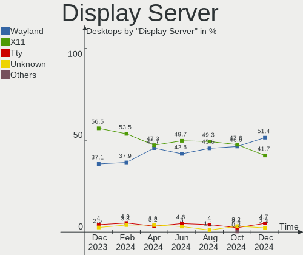
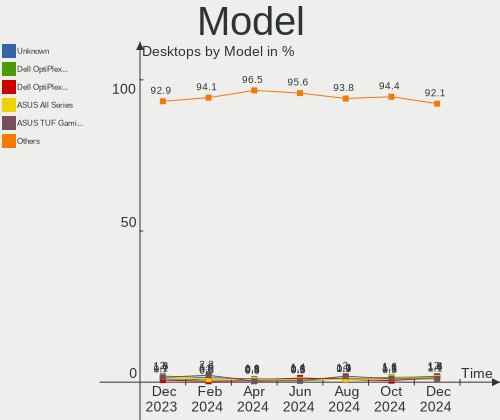
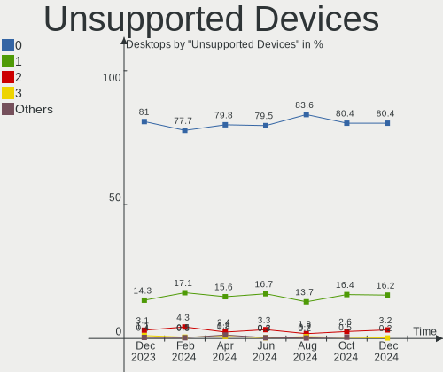

Linux in USA - Hardware Trends (Desktops)
-----------------------------------------

A project to identify most popular hardware characteristics and track their change
over time based on data collected by Linux users at https://Linux-Hardware.org.

Anyone can contribute to this report by the [hw-probe](https://github.com/linuxhw/hw-probe) tool:

    sudo -E hw-probe -all -upload

Period: Nov, 2023.

Contents
--------

* [ System ](#system)
  - [ OS                       ](#os)
  - [ OS Family                ](#os-family)
  - [ Kernel                   ](#kernel)
  - [ Kernel Family            ](#kernel-family)
  - [ Kernel Major Ver.        ](#kernel-major-ver)
  - [ Arch                     ](#arch)
  - [ DE                       ](#de)
  - [ Display Server           ](#display-server)
  - [ Display Manager          ](#display-manager)
  - [ OS Lang                  ](#os-lang)
  - [ Boot Mode                ](#boot-mode)
  - [ Filesystem               ](#filesystem)
  - [ Part. scheme             ](#part-scheme)
  - [ Dual Boot with Linux/BSD ](#dual-boot-with-linuxbsd)
  - [ Dual Boot (Win)          ](#dual-boot-win)

* [ Board ](#board)
  - [ Vendor                   ](#vendor)
  - [ Model                    ](#model)
  - [ Model Family             ](#model-family)
  - [ MFG Year                 ](#mfg-year)
  - [ Form Factor              ](#form-factor)
  - [ Secure Boot              ](#secure-boot)
  - [ Coreboot                 ](#coreboot)
  - [ RAM Size                 ](#ram-size)
  - [ RAM Used                 ](#ram-used)
  - [ Total Drives             ](#total-drives)
  - [ Has CD-ROM               ](#has-cd-rom)
  - [ Has Ethernet             ](#has-ethernet)
  - [ Has WiFi                 ](#has-wifi)
  - [ Has Bluetooth            ](#has-bluetooth)

* [ Location ](#location)
  - [ Country                  ](#country)
  - [ City                     ](#city)

* [ Drives ](#drives)
  - [ Drive Vendor             ](#drive-vendor)
  - [ Drive Model              ](#drive-model)
  - [ HDD Vendor               ](#hdd-vendor)
  - [ SSD Vendor               ](#ssd-vendor)
  - [ Drive Kind               ](#drive-kind)
  - [ Drive Connector          ](#drive-connector)
  - [ Drive Size               ](#drive-size)
  - [ Space Total              ](#space-total)
  - [ Space Used               ](#space-used)
  - [ Malfunc. Drives          ](#malfunc-drives)
  - [ Malfunc. Drive Vendor    ](#malfunc-drive-vendor)
  - [ Malfunc. HDD Vendor      ](#malfunc-hdd-vendor)
  - [ Malfunc. Drive Kind      ](#malfunc-drive-kind)
  - [ Failed Drives            ](#failed-drives)
  - [ Failed Drive Vendor      ](#failed-drive-vendor)
  - [ Drive Status             ](#drive-status)

* [ Storage controller ](#storage-controller)
  - [ Storage Vendor           ](#storage-vendor)
  - [ Storage Model            ](#storage-model)
  - [ Storage Kind             ](#storage-kind)

* [ Processor ](#processor)
  - [ CPU Vendor               ](#cpu-vendor)
  - [ CPU Model                ](#cpu-model)
  - [ CPU Model Family         ](#cpu-model-family)
  - [ CPU Cores                ](#cpu-cores)
  - [ CPU Sockets              ](#cpu-sockets)
  - [ CPU Threads              ](#cpu-threads)
  - [ CPU Op-Modes             ](#cpu-op-modes)
  - [ CPU Microcode            ](#cpu-microcode)
  - [ CPU Microarch            ](#cpu-microarch)

* [ Graphics ](#graphics)
  - [ GPU Vendor               ](#gpu-vendor)
  - [ GPU Model                ](#gpu-model)
  - [ GPU Combo                ](#gpu-combo)
  - [ GPU Driver               ](#gpu-driver)
  - [ GPU Memory               ](#gpu-memory)

* [ Monitor ](#monitor)
  - [ Monitor Vendor           ](#monitor-vendor)
  - [ Monitor Model            ](#monitor-model)
  - [ Monitor Resolution       ](#monitor-resolution)
  - [ Monitor Diagonal         ](#monitor-diagonal)
  - [ Monitor Width            ](#monitor-width)
  - [ Aspect Ratio             ](#aspect-ratio)
  - [ Monitor Area             ](#monitor-area)
  - [ Pixel Density            ](#pixel-density)
  - [ Multiple Monitors        ](#multiple-monitors)

* [ Network ](#network)
  - [ Net Controller Vendor    ](#net-controller-vendor)
  - [ Net Controller Model     ](#net-controller-model)
  - [ Wireless Vendor          ](#wireless-vendor)
  - [ Wireless Model           ](#wireless-model)
  - [ Ethernet Vendor          ](#ethernet-vendor)
  - [ Ethernet Model           ](#ethernet-model)
  - [ Net Controller Kind      ](#net-controller-kind)
  - [ Used Controller          ](#used-controller)
  - [ NICs                     ](#nics)
  - [ IPv6                     ](#ipv6)

* [ Bluetooth ](#bluetooth)
  - [ Bluetooth Vendor         ](#bluetooth-vendor)
  - [ Bluetooth Model          ](#bluetooth-model)

* [ Sound ](#sound)
  - [ Sound Vendor             ](#sound-vendor)
  - [ Sound Model              ](#sound-model)

* [ Memory ](#memory)
  - [ Memory Vendor            ](#memory-vendor)
  - [ Memory Model             ](#memory-model)
  - [ Memory Kind              ](#memory-kind)
  - [ Memory Form Factor       ](#memory-form-factor)
  - [ Memory Size              ](#memory-size)
  - [ Memory Speed             ](#memory-speed)

* [ Printers & scanners ](#printers--scanners)
  - [ Printer Vendor           ](#printer-vendor)
  - [ Printer Model            ](#printer-model)
  - [ Scanner Vendor           ](#scanner-vendor)
  - [ Scanner Model            ](#scanner-model)

* [ Camera ](#camera)
  - [ Camera Vendor            ](#camera-vendor)
  - [ Camera Model             ](#camera-model)

* [ Security ](#security)
  - [ Fingerprint Vendor       ](#fingerprint-vendor)
  - [ Fingerprint Model        ](#fingerprint-model)
  - [ Chipcard Vendor          ](#chipcard-vendor)
  - [ Chipcard Model           ](#chipcard-model)

* [ Unsupported ](#unsupported)
  - [ Unsupported Devices      ](#unsupported-devices)
  - [ Unsupported Device Types ](#unsupported-device-types)

System
------

OS
--

Installed operating systems

| Name                         | Desktops | Percent |
|------------------------------|----------|---------|
| Ubuntu 22.04                 | 60       | 13.16%  |
| Arch Rolling                 | 35       | 7.68%   |
| Linux Mint 21.2              | 33       | 7.24%   |
| Debian 12                    | 23       | 5.04%   |
| OpenMandriva 5.0             | 22       | 4.82%   |
| Fedora 39                    | 22       | 4.82%   |
| Pop!_OS 22.04                | 21       | 4.61%   |
| OpenMandriva 23.08           | 15       | 3.29%   |
| Ubuntu 23.10                 | 14       | 3.07%   |
| Ubuntu 20.04                 | 14       | 3.07%   |
| Fedora 38                    | 14       | 3.07%   |
| openSUSE Tumbleweed-XXXXXXXX | 12       | 2.63%   |
| Zorin 16                     | 11       | 2.41%   |
| OpenMandriva 23.11           | 9        | 1.97%   |
| Nobara 38                    | 9        | 1.97%   |
| ChimeraOS 44-1               | 9        | 1.97%   |
| Kubuntu 22.04                | 8        | 1.75%   |
| Kubuntu 23.10                | 7        | 1.54%   |
| ArcoLinux Rolling            | 7        | 1.54%   |
| Ubuntu 23.04                 | 6        | 1.32%   |
| KDE neon 22.04               | 6        | 1.32%   |
| Kali 2023.3                  | 4        | 0.88%   |
| Gentoo 2.14                  | 4        | 0.88%   |
| EndeavourOS Rolling          | 4        | 0.88%   |
| Elementary 7.1               | 4        | 0.88%   |
| Debian 11                    | 4        | 0.88%   |
| Xubuntu 22.04                | 3        | 0.66%   |
| Ubuntu 18.04                 | 3        | 0.66%   |
| openSUSE Leap-15.5           | 3        | 0.66%   |
| OpenMandriva 23.03           | 3        | 0.66%   |
| NixOS 23.05                  | 3        | 0.66%   |
| Manjaro                      | 3        | 0.66%   |
| Linux Mint 21.1              | 3        | 0.66%   |
| Linux Mint 20                | 3        | 0.66%   |
| Debian                       | 3        | 0.66%   |
| Xero Rolling                 | 2        | 0.44%   |
| Ubuntu MATE 22.04            | 2        | 0.44%   |
| SteamOS 4                    | 2        | 0.44%   |
| Rocky Linux 9.3              | 2        | 0.44%   |
| Rocky Linux 8.8              | 2        | 0.44%   |

OS Family
---------

OS without a version

| Name          | Desktops | Percent |
|---------------|----------|---------|
| Ubuntu        | 97       | 21.27%  |
| OpenMandriva  | 53       | 11.62%  |
| Linux Mint    | 43       | 9.43%   |
| Fedora        | 37       | 8.11%   |
| Arch          | 35       | 7.68%   |
| Debian        | 30       | 6.58%   |
| Pop!_OS       | 21       | 4.61%   |
| Kubuntu       | 17       | 3.73%   |
| openSUSE      | 15       | 3.29%   |
| Zorin         | 12       | 2.63%   |
| Nobara        | 10       | 2.19%   |
| ChimeraOS     | 9        | 1.97%   |
| ArcoLinux     | 7        | 1.54%   |
| Xubuntu       | 6        | 1.32%   |
| KDE neon      | 6        | 1.32%   |
| Kali          | 5        | 1.1%    |
| Rocky Linux   | 4        | 0.88%   |
| Manjaro       | 4        | 0.88%   |
| LMDE          | 4        | 0.88%   |
| Gentoo        | 4        | 0.88%   |
| EndeavourOS   | 4        | 0.88%   |
| Elementary    | 4        | 0.88%   |
| Parrot        | 3        | 0.66%   |
| NixOS         | 3        | 0.66%   |
| Garuda Linux  | 3        | 0.66%   |
| Xero          | 2        | 0.44%   |
| Ubuntu MATE   | 2        | 0.44%   |
| SteamOS       | 2        | 0.44%   |
| MX            | 2        | 0.44%   |
| Void Linux    | 1        | 0.22%   |
| Ubuntu Budgie | 1        | 0.22%   |
| RHEL          | 1        | 0.22%   |
| Redcore       | 1        | 0.22%   |
| Puppy         | 1        | 0.22%   |
| Poky          | 1        | 0.22%   |
| Pear OS       | 1        | 0.22%   |
| Devuan        | 1        | 0.22%   |
| Clear Linux   | 1        | 0.22%   |
| Archcraft     | 1        | 0.22%   |
| Alpine        | 1        | 0.22%   |

Kernel
------

Version of the Linux kernel

| Version                      | Desktops | Percent |
|------------------------------|----------|---------|
| 6.2.0-36-generic             | 44       | 9.65%   |
| 5.15.0-88-generic            | 37       | 8.11%   |
| 6.6.2-desktop-1omv2390       | 23       | 5.04%   |
| 5.15.0-89-generic            | 19       | 4.17%   |
| 6.2.0-37-generic             | 17       | 3.73%   |
| 6.1.0-13-amd64               | 17       | 3.73%   |
| 6.5.6-76060506-generic       | 16       | 3.51%   |
| 6.4.11-desktop-1omv2390      | 15       | 3.29%   |
| 6.6.1-arch1-1                | 12       | 2.63%   |
| 6.5.9-arch2-1                | 12       | 2.63%   |
| 6.5.0-10-generic             | 12       | 2.63%   |
| 6.5.6-chos1-chimeraos-1      | 9        | 1.97%   |
| 6.5.11-300.fc39.x86_64       | 8        | 1.75%   |
| 6.6.2-1-default              | 6        | 1.32%   |
| 6.6.1-zen1-1-zen             | 6        | 1.32%   |
| 6.5.0-13-generic             | 6        | 1.32%   |
| 5.4.0-166-generic            | 6        | 1.32%   |
| 6.5.10-300.fc39.x86_64       | 5        | 1.1%    |
| 5.10.0-26-amd64              | 5        | 1.1%    |
| 6.6.2-zen1-1-zen             | 4        | 0.88%   |
| 6.6.2-arch1-1                | 4        | 0.88%   |
| 6.6.1-desktop-1omv2390       | 4        | 0.88%   |
| 6.5.9-zen2-1-zen             | 4        | 0.88%   |
| 6.5.9-200.fc38.x86_64        | 4        | 0.88%   |
| 6.5.9-1-default              | 4        | 0.88%   |
| 6.5.6-300.fc39.x86_64        | 4        | 0.88%   |
| 6.5.10-200.fc38.x86_64       | 4        | 0.88%   |
| 6.5.0-kali3-amd64            | 4        | 0.88%   |
| 6.4.10-202.fsync.fc38.x86_64 | 4        | 0.88%   |
| 6.5.8-arch1-1                | 3        | 0.66%   |
| 6.5.12-300.fc39.x86_64       | 3        | 0.66%   |
| 6.5.0-4-amd64                | 3        | 0.66%   |
| 6.2.6-desktop-1omv2390       | 3        | 0.66%   |
| 6.2.0-35-generic             | 3        | 0.66%   |
| 6.2.0-33-generic             | 3        | 0.66%   |
| 5.15.0-87-generic            | 3        | 0.66%   |
| 5.15.0-86-generic            | 3        | 0.66%   |
| 5.15.0-83-generic            | 3        | 0.66%   |
| 5.15.0-76-generic            | 3        | 0.66%   |
| 6.6.1-1-default              | 2        | 0.44%   |

Kernel Family
-------------

Linux kernel without a distro release

| Version | Desktops | Percent |
|---------|----------|---------|
| 5.15.0  | 77       | 16.89%  |
| 6.2.0   | 71       | 15.57%  |
| 6.6.2   | 38       | 8.33%   |
| 6.5.9   | 33       | 7.24%   |
| 6.5.6   | 29       | 6.36%   |
| 6.5.0   | 27       | 5.92%   |
| 6.6.1   | 25       | 5.48%   |
| 6.1.0   | 24       | 5.26%   |
| 6.4.11  | 15       | 3.29%   |
| 5.4.0   | 13       | 2.85%   |
| 6.5.11  | 11       | 2.41%   |
| 6.5.10  | 11       | 2.41%   |
| 6.5.12  | 7        | 1.54%   |
| 5.10.0  | 6        | 1.32%   |
| 6.5.8   | 5        | 1.1%    |
| 6.5.5   | 4        | 0.88%   |
| 6.4.10  | 4        | 0.88%   |
| 6.2.6   | 4        | 0.88%   |
| 6.2.16  | 4        | 0.88%   |
| 5.19.0  | 4        | 0.88%   |
| 6.6.0   | 3        | 0.66%   |
| 6.5.7   | 3        | 0.66%   |
| 6.1.62  | 3        | 0.66%   |
| 6.1.57  | 3        | 0.66%   |
| 5.14.21 | 3        | 0.66%   |
| 5.14.0  | 3        | 0.66%   |
| 4.18.0  | 3        | 0.66%   |
| 6.1.61  | 2        | 0.44%   |
| 6.0.0   | 2        | 0.44%   |
| 5.16.7  | 2        | 0.44%   |
| 6.5.4   | 1        | 0.22%   |
| 6.5.3   | 1        | 0.22%   |
| 6.4.8   | 1        | 0.22%   |
| 6.4.6   | 1        | 0.22%   |
| 6.4.12  | 1        | 0.22%   |
| 6.4.1   | 1        | 0.22%   |
| 6.3.7   | 1        | 0.22%   |
| 6.3.2   | 1        | 0.22%   |
| 6.3.0   | 1        | 0.22%   |
| 6.1.55  | 1        | 0.22%   |

Kernel Major Ver.
-----------------

Linux kernel major version

| Version | Desktops | Percent |
|---------|----------|---------|
| 6.5     | 132      | 28.95%  |
| 6.2     | 79       | 17.32%  |
| 5.15    | 78       | 17.11%  |
| 6.6     | 66       | 14.47%  |
| 6.1     | 35       | 7.68%   |
| 6.4     | 23       | 5.04%   |
| 5.4     | 14       | 3.07%   |
| 5.14    | 6        | 1.32%   |
| 5.10    | 6        | 1.32%   |
| 5.19    | 4        | 0.88%   |
| 6.3     | 3        | 0.66%   |
| 4.18    | 3        | 0.66%   |
| 6.0     | 2        | 0.44%   |
| 5.16    | 2        | 0.44%   |
| 5.3     | 1        | 0.22%   |
| 5.11    | 1        | 0.22%   |
| 3.10    | 1        | 0.22%   |

Arch
----

OS architecture (x86_64, i586, etc.)

| Name   | Desktops | Percent |
|--------|----------|---------|
| x86_64 | 454      | 99.56%  |
| i686   | 2        | 0.44%   |

DE
--

Desktop Environment

| Name                    | Desktops | Percent |
|-------------------------|----------|---------|
| GNOME                   | 178      | 39.04%  |
| KDE5                    | 134      | 29.39%  |
| X-Cinnamon              | 40       | 8.77%   |
| XFCE                    | 31       | 6.8%    |
| Unknown                 | 24       | 5.26%   |
| MATE                    | 13       | 2.85%   |
| LXQt                    | 9        | 1.97%   |
| Pantheon                | 4        | 0.88%   |
| Cinnamon                | 4        | 0.88%   |
| Budgie                  | 4        | 0.88%   |
| Hyprland                | 3        | 0.66%   |
| i3                      | 2        | 0.44%   |
| X-Generic               | 1        | 0.22%   |
| Wayfire:wayfire:wlroots | 1        | 0.22%   |
| sway                    | 1        | 0.22%   |
| openbox                 | 1        | 0.22%   |
| LXDE                    | 1        | 0.22%   |
| KDE6                    | 1        | 0.22%   |
| KDE                     | 1        | 0.22%   |
| GNOME Flashback         | 1        | 0.22%   |
| e16-session             | 1        | 0.22%   |
| Deepin                  | 1        | 0.22%   |

Display Server
--------------

X11 or Wayland

| Name    | Desktops | Percent |
|---------|----------|---------|
| X11     | 262      | 57.46%  |
| Wayland | 163      | 35.75%  |
| Tty     | 17       | 3.73%   |
| Unknown | 14       | 3.07%   |

Display Manager
---------------

SDDM, LightDM, etc.

| Name    | Desktops | Percent |
|---------|----------|---------|
| Unknown | 188      | 41.23%  |
| SDDM    | 109      | 23.9%   |
| GDM3    | 86       | 18.86%  |
| LightDM | 43       | 9.43%   |
| GDM     | 27       | 5.92%   |
| LY-DM   | 2        | 0.44%   |
| LXDM    | 1        | 0.22%   |

OS Lang
-------

Language

| Lang    | Desktops | Percent |
|---------|----------|---------|
| en_US   | 426      | 93.42%  |
| C       | 12       | 2.63%   |
| Unknown | 6        | 1.32%   |
| en_CA   | 4        | 0.88%   |
| en_GB   | 3        | 0.66%   |
| POSIX   | 2        | 0.44%   |
| it_IT   | 1        | 0.22%   |
| en_AU   | 1        | 0.22%   |
| de_DE   | 1        | 0.22%   |

Boot Mode
---------

EFI or BIOS

| Mode | Desktops | Percent |
|------|----------|---------|
| BIOS | 234      | 51.32%  |
| EFI  | 222      | 48.68%  |

Filesystem
----------

Type of filesystem

| Type    | Desktops | Percent |
|---------|----------|---------|
| Ext4    | 237      | 51.97%  |
| Btrfs   | 92       | 20.18%  |
| Tmpfs   | 70       | 15.35%  |
| Overlay | 38       | 8.33%   |
| Xfs     | 11       | 2.41%   |
| Zfs     | 4        | 0.88%   |
| F2fs    | 2        | 0.44%   |
| Ext2    | 1        | 0.22%   |
| Aufs    | 1        | 0.22%   |

Part. scheme
------------

Scheme of partitioning

| Type    | Desktops | Percent |
|---------|----------|---------|
| GPT     | 244      | 53.51%  |
| Unknown | 166      | 36.4%   |
| MBR     | 46       | 10.09%  |

Dual Boot with Linux/BSD
------------------------

Hosting more than one Linux/BSD

| Dual boot | Desktops | Percent |
|-----------|----------|---------|
| No        | 350      | 76.75%  |
| Yes       | 106      | 23.25%  |

Dual Boot (Win)
---------------

Hosting Linux and Windows

| Dual boot | Desktops | Percent |
|-----------|----------|---------|
| No        | 368      | 80.7%   |
| Yes       | 88       | 19.3%   |

Board
-----

Vendor
------

Motherboard manufacturer

| Name                                 | Desktops | Percent |
|--------------------------------------|----------|---------|
| ASUSTek Computer                     | 112      | 24.56%  |
| Dell                                 | 61       | 13.38%  |
| Hewlett-Packard                      | 55       | 12.06%  |
| MSI                                  | 51       | 11.18%  |
| Gigabyte Technology                  | 50       | 10.96%  |
| ASRock                               | 43       | 9.43%   |
| Lenovo                               | 12       | 2.63%   |
| Pegatron                             | 8        | 1.75%   |
| Foxconn                              | 7        | 1.54%   |
| AZW                                  | 7        | 1.54%   |
| Unknown                              | 6        | 1.32%   |
| Intel                                | 5        | 1.1%    |
| Apple                                | 5        | 1.1%    |
| Gateway                              | 4        | 0.88%   |
| eMachines                            | 3        | 0.66%   |
| BESSTAR Tech                         | 3        | 0.66%   |
| Acer                                 | 3        | 0.66%   |
| Supermicro                           | 2        | 0.44%   |
| Shenzhen Meigao Electronic Equipment | 2        | 0.44%   |
| Google                               | 2        | 0.44%   |
| ECS                                  | 2        | 0.44%   |
| Alienware                            | 2        | 0.44%   |
| System76                             | 1        | 0.22%   |
| Shuttle                              | 1        | 0.22%   |
| Samsung Electronics                  | 1        | 0.22%   |
| Red Hat                              | 1        | 0.22%   |
| POSIFLEX                             | 1        | 0.22%   |
| NZXT                                 | 1        | 0.22%   |
| Nvidia                               | 1        | 0.22%   |
| IceWhale Technology                  | 1        | 0.22%   |
| HC Technology.                       | 1        | 0.22%   |
| EVGA                                 | 1        | 0.22%   |
| ASRockRack                           | 1        | 0.22%   |

Model
-----

Motherboard model

| Name                                      | Desktops | Percent |
|-------------------------------------------|----------|---------|
| ASUS TUF Gaming X570-PLUS                 | 7        | 1.54%   |
| Unknown                                   | 6        | 1.32%   |
| MSI MS-7C37                               | 5        | 1.1%    |
| MSI MS-7B86                               | 4        | 0.88%   |
| Dell OptiPlex 7040                        | 4        | 0.88%   |
| AZW MINI S                                | 4        | 0.88%   |
| ASUS ROG STRIX B650E-F GAMING WIFI        | 4        | 0.88%   |
| ASUS All Series                           | 4        | 0.88%   |
| MSI MS-7C56                               | 3        | 0.66%   |
| MSI MS-7C02                               | 3        | 0.66%   |
| HP EliteDesk 800 G2 DM 35W                | 3        | 0.66%   |
| Gigabyte B550I AORUS PRO AX               | 3        | 0.66%   |
| Dell OptiPlex 9020                        | 3        | 0.66%   |
| ASUS ROG STRIX B550-F GAMING              | 3        | 0.66%   |
| ASUS PRIME B550-PLUS AC-HES               | 3        | 0.66%   |
| ASUS PRIME B450M-A II                     | 3        | 0.66%   |
| MSI MS-7E12                               | 2        | 0.44%   |
| MSI MS-7D75                               | 2        | 0.44%   |
| MSI MS-7D25                               | 2        | 0.44%   |
| MSI MS-7C95                               | 2        | 0.44%   |
| MSI MS-7B79                               | 2        | 0.44%   |
| MSI MS-7900                               | 2        | 0.44%   |
| MSI MS-7721                               | 2        | 0.44%   |
| HP Victus by 15L Gaming Desktop TG02-0xxx | 2        | 0.44%   |
| HP ProDesk 600 G4 SFF                     | 2        | 0.44%   |
| HP Pavilion Desktop TP01-2xxx             | 2        | 0.44%   |
| HP EliteDesk 800 G3 SFF                   | 2        | 0.44%   |
| HP EliteDesk 800 G2 SFF                   | 2        | 0.44%   |
| HP Compaq Pro 6300 SFF                    | 2        | 0.44%   |
| HP Compaq 6200 Pro SFF PC                 | 2        | 0.44%   |
| Gigabyte GA-970A-UD3                      | 2        | 0.44%   |
| Gigabyte B550M DS3H                       | 2        | 0.44%   |
| Gigabyte B450M DS3H                       | 2        | 0.44%   |
| Gigabyte A520I AC                         | 2        | 0.44%   |
| Gigabyte 970A-DS3P                        | 2        | 0.44%   |
| eMachines EL1360G                         | 2        | 0.44%   |
| Dell XPS 8930                             | 2        | 0.44%   |
| Dell Precision T3600                      | 2        | 0.44%   |
| Dell Precision 5820 Tower                 | 2        | 0.44%   |
| Dell OptiPlex 990                         | 2        | 0.44%   |

Model Family
------------

Motherboard model prefix

| Name               | Desktops | Percent |
|--------------------|----------|---------|
| Dell OptiPlex      | 30       | 6.58%   |
| ASUS ROG           | 28       | 6.14%   |
| ASUS PRIME         | 28       | 6.14%   |
| ASUS TUF           | 21       | 4.61%   |
| HP EliteDesk       | 13       | 2.85%   |
| Dell Inspiron      | 12       | 2.63%   |
| Dell Precision     | 11       | 2.41%   |
| Lenovo ThinkCentre | 7        | 1.54%   |
| HP Compaq          | 7        | 1.54%   |
| Dell XPS           | 7        | 1.54%   |
| HP Pavilion        | 6        | 1.32%   |
| Unknown            | 6        | 1.32%   |
| MSI MS-7C37        | 5        | 1.1%    |
| ASRock X570        | 5        | 1.1%    |
| MSI MS-7B86        | 4        | 0.88%   |
| HP ProDesk         | 4        | 0.88%   |
| AZW MINI           | 4        | 0.88%   |
| ASUS All           | 4        | 0.88%   |
| MSI MS-7C56        | 3        | 0.66%   |
| MSI MS-7C02        | 3        | 0.66%   |
| HP Slim            | 3        | 0.66%   |
| Gigabyte X570      | 3        | 0.66%   |
| Gigabyte B550M     | 3        | 0.66%   |
| Gigabyte B550I     | 3        | 0.66%   |
| Gigabyte 970A-DS3P | 3        | 0.66%   |
| ASUS ProArt        | 3        | 0.66%   |
| ASUS M5A97         | 3        | 0.66%   |
| ASRock X670E       | 3        | 0.66%   |
| MSI MS-7E12        | 2        | 0.44%   |
| MSI MS-7D75        | 2        | 0.44%   |
| MSI MS-7D25        | 2        | 0.44%   |
| MSI MS-7C95        | 2        | 0.44%   |
| MSI MS-7B79        | 2        | 0.44%   |
| MSI MS-7900        | 2        | 0.44%   |
| MSI MS-7721        | 2        | 0.44%   |
| Lenovo IdeaCentre  | 2        | 0.44%   |
| HP Z2              | 2        | 0.44%   |
| HP Victus          | 2        | 0.44%   |
| HP OMEN            | 2        | 0.44%   |
| Gigabyte Z390      | 2        | 0.44%   |

MFG Year
--------

Motherboard manufacture year

| Year | Desktops | Percent |
|------|----------|---------|
| 2022 | 48       | 10.53%  |
| 2018 | 43       | 9.43%   |
| 2020 | 42       | 9.21%   |
| 2021 | 39       | 8.55%   |
| 2019 | 39       | 8.55%   |
| 2017 | 34       | 7.46%   |
| 2012 | 34       | 7.46%   |
| 2013 | 27       | 5.92%   |
| 2023 | 25       | 5.48%   |
| 2014 | 25       | 5.48%   |
| 2011 | 24       | 5.26%   |
| 2015 | 19       | 4.17%   |
| 2010 | 18       | 3.95%   |
| 2009 | 16       | 3.51%   |
| 2016 | 8        | 1.75%   |
| 2007 | 6        | 1.32%   |
| 2008 | 5        | 1.1%    |
| 2006 | 2        | 0.44%   |
| 2004 | 1        | 0.22%   |
| 2001 | 1        | 0.22%   |

Form Factor
-----------

Physical design of the computer

| Name    | Desktops | Percent |
|---------|----------|---------|
| Desktop | 456      | 100%    |

Secure Boot
-----------

Enabled or disabled

| State    | Desktops | Percent |
|----------|----------|---------|
| Disabled | 438      | 96.05%  |
| Enabled  | 18       | 3.95%   |

Coreboot
--------

Have coreboot on board

| Used | Desktops | Percent |
|------|----------|---------|
| No   | 454      | 99.56%  |
| Yes  | 2        | 0.44%   |

RAM Size
--------

Total RAM memory

| Size in GB  | Desktops | Percent |
|-------------|----------|---------|
| 32.01-64.0  | 123      | 26.97%  |
| 16.01-24.0  | 113      | 24.78%  |
| 64.01-256.0 | 61       | 13.38%  |
| 8.01-16.0   | 50       | 10.96%  |
| 4.01-8.0    | 49       | 10.75%  |
| 3.01-4.0    | 31       | 6.8%    |
| 24.01-32.0  | 24       | 5.26%   |
| 1.01-2.0    | 3        | 0.66%   |
| 2.01-3.0    | 1        | 0.22%   |
| 0.51-1.0    | 1        | 0.22%   |

RAM Used
--------

Used RAM memory

| Used GB    | Desktops | Percent |
|------------|----------|---------|
| 4.01-8.0   | 113      | 24.78%  |
| 1.01-2.0   | 108      | 23.68%  |
| 2.01-3.0   | 101      | 22.15%  |
| 3.01-4.0   | 64       | 14.04%  |
| 8.01-16.0  | 34       | 7.46%   |
| 0.51-1.0   | 12       | 2.63%   |
| 16.01-24.0 | 11       | 2.41%   |
| 24.01-32.0 | 5        | 1.1%    |
| 32.01-64.0 | 4        | 0.88%   |
| 0.01-0.5   | 4        | 0.88%   |

Total Drives
------------

Number of drives on board

| Drives | Desktops | Percent |
|--------|----------|---------|
| 1      | 166      | 36.4%   |
| 2      | 118      | 25.88%  |
| 3      | 78       | 17.11%  |
| 4      | 44       | 9.65%   |
| 5      | 20       | 4.39%   |
| 6      | 12       | 2.63%   |
| 0      | 5        | 1.1%    |
| 7      | 4        | 0.88%   |
| 9      | 3        | 0.66%   |
| 8      | 3        | 0.66%   |
| 27     | 1        | 0.22%   |
| 12     | 1        | 0.22%   |
| 10     | 1        | 0.22%   |

Has CD-ROM
----------

Has CD-ROM on board

| Presented | Desktops | Percent |
|-----------|----------|---------|
| No        | 266      | 58.33%  |
| Yes       | 190      | 41.67%  |

Has Ethernet
------------

Has Ethernet on board

| Presented | Desktops | Percent |
|-----------|----------|---------|
| Yes       | 450      | 98.68%  |
| No        | 6        | 1.32%   |

Has WiFi
--------

Has WiFi module

| Presented | Desktops | Percent |
|-----------|----------|---------|
| Yes       | 298      | 65.35%  |
| No        | 158      | 34.65%  |

Has Bluetooth
-------------

Has Bluetooth module

| Presented | Desktops | Percent |
|-----------|----------|---------|
| Yes       | 234      | 51.32%  |
| No        | 222      | 48.68%  |

Location
--------

Country
-------

Geographic location (country)

| Country | Desktops | Percent |
|---------|----------|---------|
| USA     | 456      | 100%    |

City
----

Geographic location (city)

| City          | Desktops | Percent |
|---------------|----------|---------|
| Portland      | 9        | 1.97%   |
| Seattle       | 6        | 1.32%   |
| Los Angeles   | 6        | 1.32%   |
| Springfield   | 4        | 0.88%   |
| New York      | 4        | 0.88%   |
| Minneapolis   | 4        | 0.88%   |
| Jacksonville  | 4        | 0.88%   |
| Harrisonburg  | 4        | 0.88%   |
| Charlotte     | 4        | 0.88%   |
| Atlanta       | 4        | 0.88%   |
| San Jose      | 3        | 0.66%   |
| Saint Paul    | 3        | 0.66%   |
| Richmond      | 3        | 0.66%   |
| Phoenix       | 3        | 0.66%   |
| Oakland       | 3        | 0.66%   |
| Lincoln       | 3        | 0.66%   |
| Las Vegas     | 3        | 0.66%   |
| Knoxville     | 3        | 0.66%   |
| Kansas City   | 3        | 0.66%   |
| Huntsville    | 3        | 0.66%   |
| Dallas        | 3        | 0.66%   |
| Chicago       | 3        | 0.66%   |
| Boston        | 3        | 0.66%   |
| Bellevue      | 3        | 0.66%   |
| Baltimore     | 3        | 0.66%   |
| Austin        | 3        | 0.66%   |
| Union City    | 2        | 0.44%   |
| Tucson        | 2        | 0.44%   |
| Tampa         | 2        | 0.44%   |
| Raleigh       | 2        | 0.44%   |
| Pittsburgh    | 2        | 0.44%   |
| Peoria        | 2        | 0.44%   |
| Parker        | 2        | 0.44%   |
| Olympia       | 2        | 0.44%   |
| Oklahoma City | 2        | 0.44%   |
| North Reading | 2        | 0.44%   |
| Missoula      | 2        | 0.44%   |
| Milwaukee     | 2        | 0.44%   |
| Miami         | 2        | 0.44%   |
| Indianapolis  | 2        | 0.44%   |

Drives
------

Drive Vendor
------------

Hard drive vendors

| Vendor                      | Desktops | Drives | Percent |
|-----------------------------|----------|--------|---------|
| WDC                         | 138      | 209    | 16.22%  |
| Samsung Electronics         | 138      | 216    | 16.22%  |
| Seagate                     | 125      | 173    | 14.69%  |
| Sandisk                     | 74       | 82     | 8.7%    |
| Toshiba                     | 31       | 34     | 3.64%   |
| Hitachi                     | 28       | 35     | 3.29%   |
| Crucial                     | 28       | 34     | 3.29%   |
| PNY                         | 22       | 26     | 2.59%   |
| Intel                       | 21       | 24     | 2.47%   |
| Kingston                    | 20       | 23     | 2.35%   |
| Micron/Crucial Technology   | 17       | 18     | 2%      |
| China                       | 15       | 21     | 1.76%   |
| Unknown                     | 14       | 16     | 1.65%   |
| SK hynix                    | 14       | 14     | 1.65%   |
| Phison Electronics          | 14       | 15     | 1.65%   |
| HGST                        | 11       | 14     | 1.29%   |
| SPCC                        | 10       | 10     | 1.18%   |
| Micron Technology           | 10       | 10     | 1.18%   |
| A-DATA Technology           | 8        | 8      | 0.94%   |
| Team                        | 6        | 7      | 0.71%   |
| Realtek Semiconductor       | 5        | 5      | 0.59%   |
| KIOXIA                      | 5        | 5      | 0.59%   |
| Hewlett-Packard             | 5        | 6      | 0.59%   |
| Fanxiang                    | 5        | 6      | 0.59%   |
| Apple                       | 5        | 5      | 0.59%   |
| Silicon Motion              | 4        | 4      | 0.47%   |
| SABRENT                     | 4        | 4      | 0.47%   |
| MAXIO Technology (Hangzhou) | 4        | 4      | 0.47%   |
| LITEON                      | 4        | 4      | 0.47%   |
| T-FORCE                     | 3        | 3      | 0.35%   |
| PNY USB                     | 3        | 3      | 0.35%   |
| Patriot                     | 3        | 3      | 0.35%   |
| OCZ                         | 3        | 3      | 0.35%   |
| Leven                       | 3        | 8      | 0.35%   |
| Corsair                     | 3        | 3      | 0.35%   |
| Acer                        | 3        | 3      | 0.35%   |
| Unknown                     | 3        | 4      | 0.35%   |
| Timetec                     | 2        | 3      | 0.24%   |
| Phison                      | 2        | 2      | 0.24%   |
| Mushkin                     | 2        | 2      | 0.24%   |

Drive Model
-----------

Hard drive models

| Model                                                  | Desktops | Percent |
|--------------------------------------------------------|----------|---------|
| Samsung NVMe SSD Controller SM981/PM981/PM983 250GB    | 30       | 3.01%   |
| Samsung NVMe SSD Controller PM9A1/PM9A3/980PRO 2TB     | 17       | 1.71%   |
| Seagate ST2000DM008-2FR102 2TB                         | 16       | 1.61%   |
| Samsung SSD 870 EVO 1TB                                | 12       | 1.2%    |
| Samsung SSD 860 EVO 1TB                                | 12       | 1.2%    |
| Micron/Crucial P2 NVMe PCIe SSD 1TB                    | 9        | 0.9%    |
| WDC WD10EZEX-08WN4A0 1TB                               | 7        | 0.7%    |
| Toshiba DT01ACA100 1TB                                 | 7        | 0.7%    |
| Samsung SSD 990 PRO 2TB                                | 7        | 0.7%    |
| Samsung SSD 860 EVO 500GB                              | 7        | 0.7%    |
| Samsung SSD 850 EVO 250GB                              | 7        | 0.7%    |
| Kingston SA400S37240G 240GB SSD                        | 7        | 0.7%    |
| WDC WDBNCE5000PNC 500GB SSD                            | 6        | 0.6%    |
| Seagate ST2000DM006-2DM164 2TB                         | 6        | 0.6%    |
| Sandisk WD Blue SN570 500GB                            | 6        | 0.6%    |
| Sandisk WD Blue SN550 NVMe SSD 512GB                   | 6        | 0.6%    |
| Samsung SSD 980 1TB                                    | 6        | 0.6%    |
| Samsung SSD 850 EVO 500GB                              | 6        | 0.6%    |
| PNY CS900 500GB SSD                                    | 6        | 0.6%    |
| Intel SSD 660P Series 512GB                            | 6        | 0.6%    |
| WDC WD10EZEX-00BN5A0 1TB                               | 5        | 0.5%    |
| Seagate ST500DM002-1BD142 500GB                        | 5        | 0.5%    |
| Seagate ST2000DM001-1ER164 2TB                         | 5        | 0.5%    |
| Seagate ST1000DM010-2EP102 1TB                         | 5        | 0.5%    |
| Seagate ST1000DM003-1ER162 1TB                         | 5        | 0.5%    |
| Sandisk WD_BLACK SN770 1TB                             | 5        | 0.5%    |
| Sandisk WD Blue SN570 1TB                              | 5        | 0.5%    |
| Sandisk WD Black SN750 / PC SN730 NVMe SSD 500GB       | 5        | 0.5%    |
| Sandisk WD Black 2018/SN750 / PC SN720 NVMe SSD 1024GB | 5        | 0.5%    |
| Samsung SSD 990 PRO 1TB                                | 5        | 0.5%    |
| Phison PCIe SSD 4TB                                    | 5        | 0.5%    |
| China SATA SSD 512GB                                   | 5        | 0.5%    |
| WDC WDS100T2B0A-00SM50 1TB SSD                         | 4        | 0.4%    |
| WDC WD20EZRZ-00Z5HB0 2TB                               | 4        | 0.4%    |
| WDC WD20EZRX-00D8PB0 2TB                               | 4        | 0.4%    |
| Unknown SD/MMC/MS PRO 128GB                            | 4        | 0.4%    |
| Unknown NVMe SSD Drive 2TB                             | 4        | 0.4%    |
| Silicon Motion SM2263EN/SM2263XT SSD Controller 256GB  | 4        | 0.4%    |
| Seagate ST4000DM004-2CV104 4TB                         | 4        | 0.4%    |
| Seagate ST3250310AS 250GB                              | 4        | 0.4%    |

HDD Vendor
----------

Hard disk drive vendors

| Vendor              | Desktops | Drives | Percent |
|---------------------|----------|--------|---------|
| WDC                 | 124      | 185    | 36.9%   |
| Seagate             | 122      | 169    | 36.31%  |
| Hitachi             | 28       | 35     | 8.33%   |
| Toshiba             | 25       | 27     | 7.44%   |
| HGST                | 11       | 14     | 3.27%   |
| Unknown             | 4        | 4      | 1.19%   |
| Samsung Electronics | 4        | 5      | 1.19%   |
| Apple               | 4        | 4      | 1.19%   |
| Hewlett-Packard     | 2        | 2      | 0.6%    |
| Fujitsu             | 2        | 2      | 0.6%    |
| Unknown             | 2        | 3      | 0.6%    |
| TO Exter            | 1        | 1      | 0.3%    |
| TDAS                | 1        | 3      | 0.3%    |
| Mobius              | 1        | 2      | 0.3%    |
| Maxtor              | 1        | 1      | 0.3%    |
| Inateck             | 1        | 1      | 0.3%    |
| HPQ                 | 1        | 1      | 0.3%    |
| ASMedia             | 1        | 1      | 0.3%    |
| ACASIS              | 1        | 2      | 0.3%    |

SSD Vendor
----------

Solid state drive vendors

| Vendor              | Desktops | Drives | Percent |
|---------------------|----------|--------|---------|
| Samsung Electronics | 68       | 99     | 25.56%  |
| PNY                 | 22       | 26     | 8.27%   |
| Crucial             | 21       | 24     | 7.89%   |
| WDC                 | 20       | 20     | 7.52%   |
| SanDisk             | 20       | 21     | 7.52%   |
| Kingston            | 15       | 18     | 5.64%   |
| China               | 15       | 21     | 5.64%   |
| SPCC                | 10       | 10     | 3.76%   |
| Intel               | 8        | 10     | 3.01%   |
| A-DATA Technology   | 7        | 7      | 2.63%   |
| Team                | 5        | 6      | 1.88%   |
| Micron Technology   | 5        | 5      | 1.88%   |
| LITEON              | 4        | 4      | 1.5%    |
| Fanxiang            | 4        | 5      | 1.5%    |
| SK hynix            | 3        | 3      | 1.13%   |
| PNY USB             | 3        | 3      | 1.13%   |
| Patriot             | 3        | 3      | 1.13%   |
| OCZ                 | 3        | 3      | 1.13%   |
| Leven               | 3        | 8      | 1.13%   |
| Hewlett-Packard     | 3        | 4      | 1.13%   |
| Corsair             | 3        | 3      | 1.13%   |
| Timetec             | 2        | 3      | 0.75%   |
| T-FORCE             | 2        | 2      | 0.75%   |
| Mushkin             | 2        | 2      | 0.75%   |
| Acer                | 2        | 2      | 0.75%   |
| Transcend           | 1        | 1      | 0.38%   |
| Toshiba             | 1        | 1      | 0.38%   |
| SUNEAST             | 1        | 1      | 0.38%   |
| SSSTC               | 1        | 1      | 0.38%   |
| OWC                 | 1        | 1      | 0.38%   |
| Netac               | 1        | 1      | 0.38%   |
| Londisk             | 1        | 1      | 0.38%   |
| KingFast            | 1        | 1      | 0.38%   |
| JMicron Technology  | 1        | 1      | 0.38%   |
| GLOWAY              | 1        | 1      | 0.38%   |
| BUFFALO             | 1        | 1      | 0.38%   |
| ASMT                | 1        | 1      | 0.38%   |
| Apple               | 1        | 1      | 0.38%   |

Drive Kind
----------

HDD or SSD

| Kind    | Desktops | Drives | Percent |
|---------|----------|--------|---------|
| HDD     | 252      | 462    | 35.64%  |
| SSD     | 220      | 325    | 31.12%  |
| NVMe    | 219      | 305    | 30.98%  |
| Unknown | 14       | 15     | 1.98%   |
| MMC     | 2        | 2      | 0.28%   |

Drive Connector
---------------

SATA, SAS, NVMe, etc.

| Type | Desktops | Drives | Percent |
|------|----------|--------|---------|
| SATA | 365      | 745    | 57.94%  |
| NVMe | 214      | 300    | 33.97%  |
| SAS  | 49       | 62     | 7.78%   |
| MMC  | 2        | 2      | 0.32%   |

Drive Size
----------

Size of hard drive

| Size in TB | Desktops | Drives | Percent |
|------------|----------|--------|---------|
| 0.01-0.5   | 205      | 284    | 36.67%  |
| 0.51-1.0   | 168      | 225    | 30.05%  |
| 1.01-2.0   | 83       | 113    | 14.85%  |
| 3.01-4.0   | 40       | 61     | 7.16%   |
| 4.01-10.0  | 32       | 61     | 5.72%   |
| 2.01-3.0   | 20       | 24     | 3.58%   |
| 10.01-20.0 | 10       | 17     | 1.79%   |
| 20.01-50.0 | 1        | 2      | 0.18%   |

Space Total
-----------

Amount of disk space available on the file system

| Size in GB     | Desktops | Percent |
|----------------|----------|---------|
| More than 3000 | 106      | 23.25%  |
| 501-1000       | 83       | 18.2%   |
| 251-500        | 73       | 16.01%  |
| 1001-2000      | 56       | 12.28%  |
| 101-250        | 39       | 8.55%   |
| 2001-3000      | 30       | 6.58%   |
| 1-20           | 30       | 6.58%   |
| 51-100         | 15       | 3.29%   |
| Unknown        | 15       | 3.29%   |
| 21-50          | 9        | 1.97%   |

Space Used
----------

Amount of used disk space

| Used GB        | Desktops | Percent |
|----------------|----------|---------|
| 1-20           | 110      | 24.12%  |
| 101-250        | 56       | 12.28%  |
| 501-1000       | 54       | 11.84%  |
| 21-50          | 49       | 10.75%  |
| 51-100         | 48       | 10.53%  |
| 251-500        | 45       | 9.87%   |
| More than 3000 | 37       | 8.11%   |
| 1001-2000      | 31       | 6.8%    |
| Unknown        | 15       | 3.29%   |
| 2001-3000      | 9        | 1.97%   |
| 0              | 2        | 0.44%   |

Malfunc. Drives
---------------

Drive models with a malfunction

| Model                                                          | Desktops | Drives | Percent |
|----------------------------------------------------------------|----------|--------|---------|
| Seagate ST4000DM004-2CV104 4TB                                 | 2        | 3      | 4%      |
| Seagate ST33000651NS 3TB                                       | 2        | 2      | 4%      |
| WDC WD80EMAZ-00WJTA0 8TB                                       | 1        | 11     | 2%      |
| WDC WD60EFRX-68MYMN1 6TB                                       | 1        | 1      | 2%      |
| WDC WD40EZRZ-00WN9B0 4TB                                       | 1        | 1      | 2%      |
| WDC WD3200AAKS-75B3A0 320GB                                    | 1        | 1      | 2%      |
| WDC WD20EZRZ-00Z5HB0 2TB                                       | 1        | 1      | 2%      |
| WDC WD20EARS-00MVWB0 2TB                                       | 1        | 1      | 2%      |
| WDC WD1600JS-00NCB1 160GB                                      | 1        | 1      | 2%      |
| WDC WD1600AAJS-00L7A0 160GB                                    | 1        | 1      | 2%      |
| WDC WD15EADS-22P8B0 1TB                                        | 1        | 1      | 2%      |
| WDC WD10EZEX-00BN5A0 1TB                                       | 1        | 1      | 2%      |
| WDC WD10EARS-22Y5B1 1TB                                        | 1        | 1      | 2%      |
| SSSTC CVB-8D128-HP 128GB SSD                                   | 1        | 1      | 2%      |
| SK hynix BC711 HFM512GD3JX013N 512GB                           | 1        | 1      | 2%      |
| Seagate ST9500325AS 500GB                                      | 1        | 1      | 2%      |
| Seagate ST940210AS 40GB                                        | 1        | 1      | 2%      |
| Seagate ST500DM002-1BD142 500GB                                | 1        | 1      | 2%      |
| Seagate ST3750528AS 752GB                                      | 1        | 1      | 2%      |
| Seagate ST3500631NS 500GB                                      | 1        | 1      | 2%      |
| Seagate ST340014AS 40GB                                        | 1        | 1      | 2%      |
| Seagate ST3250310AS 250GB                                      | 1        | 1      | 2%      |
| Seagate ST320LT007-9ZV142 320GB                                | 1        | 1      | 2%      |
| Seagate ST3000NM0033-9ZM178 3TB                                | 1        | 1      | 2%      |
| Seagate ST3000DM008-2DM166 3TB                                 | 1        | 1      | 2%      |
| Seagate ST2000LM007-1R8174 2TB                                 | 1        | 1      | 2%      |
| Seagate ST1000DX001-1NS162 1TB                                 | 1        | 1      | 2%      |
| SanDisk SSD PLUS 240GB                                         | 1        | 1      | 2%      |
| Samsung Electronics SSD 870 EVO 1TB                            | 1        | 1      | 2%      |
| Samsung Electronics SSD 860 EVO 500GB                          | 1        | 1      | 2%      |
| Samsung Electronics SSD 850 PRO 256GB                          | 1        | 1      | 2%      |
| Samsung Electronics SSD 850 EVO 1TB                            | 1        | 1      | 2%      |
| Samsung Electronics SSD 840 EVO 120GB                          | 1        | 1      | 2%      |
| Samsung Electronics NVMe SSD Controller PM9A1/PM9A3/980PRO 2TB | 1        | 1      | 2%      |
| Samsung Electronics MZ7TE256HMHP-000L7 256GB SSD               | 1        | 1      | 2%      |
| Intel SSDSC2BF120A5 120GB                                      | 1        | 3      | 2%      |
| Intel SSDSA2M080G2GN 80GB                                      | 1        | 1      | 2%      |
| Hitachi HDT725050VLA360 500GB                                  | 1        | 1      | 2%      |
| Hitachi HDS721016CLA382 160GB                                  | 1        | 1      | 2%      |
| Hitachi HDS721010DLE630 1TB                                    | 1        | 1      | 2%      |

Malfunc. Drive Vendor
---------------------

Vendors of faulty drives

| Vendor              | Desktops | Drives | Percent |
|---------------------|----------|--------|---------|
| Seagate             | 15       | 17     | 31.91%  |
| WDC                 | 10       | 21     | 21.28%  |
| Samsung Electronics | 6        | 7      | 12.77%  |
| Hitachi             | 4        | 4      | 8.51%   |
| Intel               | 2        | 4      | 4.26%   |
| Apple               | 2        | 2      | 4.26%   |
| SSSTC               | 1        | 1      | 2.13%   |
| SK hynix            | 1        | 1      | 2.13%   |
| SanDisk             | 1        | 1      | 2.13%   |
| HGST                | 1        | 1      | 2.13%   |
| GLOWAY              | 1        | 1      | 2.13%   |
| Crucial             | 1        | 2      | 2.13%   |
| ASMedia             | 1        | 1      | 2.13%   |
| A-DATA Technology   | 1        | 1      | 2.13%   |

Malfunc. HDD Vendor
-------------------

Vendors of faulty HDD drives

| Vendor  | Desktops | Drives | Percent |
|---------|----------|--------|---------|
| Seagate | 15       | 17     | 45.45%  |
| WDC     | 10       | 21     | 30.3%   |
| Hitachi | 4        | 4      | 12.12%  |
| Apple   | 2        | 2      | 6.06%   |
| HGST    | 1        | 1      | 3.03%   |
| ASMedia | 1        | 1      | 3.03%   |

Malfunc. Drive Kind
-------------------

Kinds of faulty drives

| Kind | Desktops | Drives | Percent |
|------|----------|--------|---------|
| HDD  | 31       | 46     | 68.89%  |
| SSD  | 12       | 16     | 26.67%  |
| NVMe | 2        | 2      | 4.44%   |

Failed Drives
-------------

Failed drive models

| Model                       | Desktops | Drives | Percent |
|-----------------------------|----------|--------|---------|
| Mushkin MKNSSDEC120GB       | 1        | 1      | 50%     |
| Hitachi HUS724040ALE640 4TB | 1        | 1      | 50%     |

Failed Drive Vendor
-------------------

Failed drive vendors

| Vendor  | Desktops | Drives | Percent |
|---------|----------|--------|---------|
| Mushkin | 1        | 1      | 50%     |
| Hitachi | 1        | 1      | 50%     |

Drive Status
------------

Number of failed and malfunc. drives

| Status   | Desktops | Drives | Percent |
|----------|----------|--------|---------|
| Detected | 271      | 586    | 52.62%  |
| Works    | 198      | 457    | 38.45%  |
| Malfunc  | 44       | 64     | 8.54%   |
| Failed   | 2        | 2      | 0.39%   |

Storage controller
------------------

Storage Vendor
--------------

Storage controller vendors

| Vendor                       | Desktops | Percent |
|------------------------------|----------|---------|
| Intel                        | 256      | 33.77%  |
| AMD                          | 192      | 25.33%  |
| Samsung Electronics          | 84       | 11.08%  |
| SanDisk                      | 60       | 7.92%   |
| ASMedia Technology           | 29       | 3.83%   |
| Micron/Crucial Technology    | 24       | 3.17%   |
| Phison Electronics           | 16       | 2.11%   |
| SK hynix                     | 11       | 1.45%   |
| Nvidia                       | 7        | 0.92%   |
| Toshiba America Info Systems | 6        | 0.79%   |
| Micron Technology            | 6        | 0.79%   |
| Kingston Technology Company  | 6        | 0.79%   |
| JMicron Technology           | 6        | 0.79%   |
| Broadcom / LSI               | 6        | 0.79%   |
| Realtek Semiconductor        | 5        | 0.66%   |
| MAXIO Technology (Hangzhou)  | 5        | 0.66%   |
| Marvell Technology Group     | 5        | 0.66%   |
| LSI Logic / Symbios Logic    | 5        | 0.66%   |
| KIOXIA                       | 5        | 0.66%   |
| Silicon Motion               | 4        | 0.53%   |
| Solidigm                     | 3        | 0.4%    |
| Nextorage                    | 3        | 0.4%    |
| ADATA Technology             | 3        | 0.4%    |
| Silicon Image                | 2        | 0.26%   |
| Lite-On Technology           | 2        | 0.26%   |
| VIA Technologies             | 1        | 0.13%   |
| Shenzhen Longsys Electronics | 1        | 0.13%   |
| Radian Memory Systems        | 1        | 0.13%   |
| OCZ Technology Group         | 1        | 0.13%   |
| INNOGRIT                     | 1        | 0.13%   |
| Hosin Global Electronics     | 1        | 0.13%   |
| Biwin Storage Technology     | 1        | 0.13%   |

Storage Model
-------------

Storage controller models

| Model                                                                          | Desktops | Percent |
|--------------------------------------------------------------------------------|----------|---------|
| AMD FCH SATA Controller [AHCI mode]                                            | 118      | 13.2%   |
| Samsung NVMe SSD Controller SM981/PM981/PM983                                  | 43       | 4.81%   |
| AMD 500 Series Chipset SATA Controller                                         | 42       | 4.7%    |
| AMD 400 Series Chipset SATA Controller                                         | 33       | 3.69%   |
| Intel SATA Controller [RAID mode]                                              | 28       | 3.13%   |
| ASMedia ASM1062 Serial ATA Controller                                          | 27       | 3.02%   |
| Intel 8 Series/C220 Series Chipset Family 6-port SATA Controller 1 [AHCI mode] | 22       | 2.46%   |
| Samsung NVMe SSD Controller PM9A1/PM9A3/980PRO                                 | 21       | 2.35%   |
| Intel 6 Series/C200 Series Chipset Family 6 port Desktop SATA AHCI Controller  | 20       | 2.24%   |
| Intel Q170/Q150/B150/H170/H110/Z170/CM236 Chipset SATA Controller [AHCI Mode]  | 19       | 2.13%   |
| Intel 200 Series PCH SATA controller [AHCI mode]                               | 19       | 2.13%   |
| AMD SB7x0/SB8x0/SB9x0 SATA Controller [AHCI mode]                              | 17       | 1.9%    |
| Micron/Crucial P2 [Nick P2] / P3 / P3 Plus NVMe PCIe SSD (DRAM-less)           | 14       | 1.57%   |
| AMD SB7x0/SB8x0/SB9x0 IDE Controller                                           | 14       | 1.57%   |
| SanDisk WD Black SN770 / PC SN740 256GB / PC SN560 (DRAM-less) NVMe SSD        | 13       | 1.45%   |
| Intel Cannon Lake PCH SATA AHCI Controller                                     | 13       | 1.45%   |
| SanDisk Ultra 3D / WD Blue SN570 NVMe SSD (DRAM-less)                          | 12       | 1.34%   |
| Samsung NVMe SSD Controller S4LV008[Pascal]                                    | 12       | 1.34%   |
| Intel Alder Lake-S PCH SATA Controller [AHCI Mode]                             | 12       | 1.34%   |
| Intel 7 Series/C210 Series Chipset Family 6-port SATA Controller [AHCI mode]   | 11       | 1.23%   |
| Intel 700 Series Chipset Family SATA AHCI Controller                           | 10       | 1.12%   |
| Intel 500 Series Chipset Family SATA AHCI Controller                           | 10       | 1.12%   |
| Intel 82801JI (ICH10 Family) SATA AHCI Controller                              | 9        | 1.01%   |
| Sandisk WD Black SN850X NVMe SSD                                               | 8        | 0.89%   |
| SanDisk Ultra 3D / WD Blue SN550 NVMe SSD                                      | 8        | 0.89%   |
| Samsung NVMe SSD Controller 980 (DRAM-less)                                    | 8        | 0.89%   |
| AMD 300 Series Chipset SATA Controller                                         | 8        | 0.89%   |
| SanDisk Extreme Pro / WD Black SN750 / PC SN730 / Red SN700 NVMe SSD           | 7        | 0.78%   |
| Phison E12 NVMe Controller                                                     | 7        | 0.78%   |
| Intel SATA controller                                                          | 7        | 0.78%   |
| Intel Volume Management Device NVMe RAID Controller                            | 6        | 0.67%   |
| Intel SSD 660P Series                                                          | 6        | 0.67%   |
| Intel C600/X79 series chipset SATA RAID Controller                             | 6        | 0.67%   |
| AMD SB7x0/SB8x0/SB9x0 SATA Controller [IDE mode]                               | 6        | 0.67%   |
| SK hynix Platinum P41/PC801 NVMe Solid State Drive                             | 5        | 0.56%   |
| SanDisk Extreme Pro / WD Black 2018/SN750/PC SN720 NVMe SSD                    | 5        | 0.56%   |
| MAXIO (Hangzhou) NVMe SSD Controller MAP1202                                   | 5        | 0.56%   |
| Intel NM10/ICH7 Family SATA Controller [IDE mode]                              | 5        | 0.56%   |
| Intel 9 Series Chipset Family SATA Controller [AHCI Mode]                      | 5        | 0.56%   |
| Intel 4 Series Chipset PT IDER Controller                                      | 5        | 0.56%   |

Storage Kind
------------

Kind of storage controller (IDE, SATA, NVMe, SAS, ...)

| Kind | Desktops | Percent |
|------|----------|---------|
| SATA | 382      | 52.98%  |
| NVMe | 214      | 29.68%  |
| IDE  | 59       | 8.18%   |
| RAID | 52       | 7.21%   |
| SAS  | 11       | 1.53%   |
| SCSI | 3        | 0.42%   |

Processor
---------

CPU Vendor
----------

Processor vendors

| Vendor       | Desktops | Percent |
|--------------|----------|---------|
| Intel        | 257      | 56.36%  |
| AMD          | 198      | 43.42%  |
| CentaurHauls | 1        | 0.22%   |

CPU Model
---------

Processor models

| Model                                       | Desktops | Percent |
|---------------------------------------------|----------|---------|
| AMD Ryzen 9 5900X 12-Core Processor         | 12       | 2.63%   |
| AMD Ryzen 5 5600X 6-Core Processor          | 11       | 2.41%   |
| AMD Ryzen 5 3600 6-Core Processor           | 10       | 2.19%   |
| AMD Ryzen 9 3900X 12-Core Processor         | 8        | 1.75%   |
| AMD Ryzen 5 5600G with Radeon Graphics      | 8        | 1.75%   |
| Intel Core i7-3770 CPU @ 3.40GHz            | 7        | 1.54%   |
| Intel Core i5-6500 CPU @ 3.20GHz            | 7        | 1.54%   |
| AMD Ryzen 7 5700G with Radeon Graphics      | 7        | 1.54%   |
| AMD Ryzen 7 3700X 8-Core Processor          | 7        | 1.54%   |
| AMD Ryzen 9 7900X 12-Core Processor         | 6        | 1.32%   |
| AMD Ryzen 7 7800X3D 8-Core Processor        | 6        | 1.32%   |
| AMD FX-6300 Six-Core Processor              | 6        | 1.32%   |
| Intel N100                                  | 5        | 1.1%    |
| Intel Core i7-4790K CPU @ 4.00GHz           | 5        | 1.1%    |
| Intel Core i7-4790 CPU @ 3.60GHz            | 5        | 1.1%    |
| Intel Core i7-2600 CPU @ 3.40GHz            | 5        | 1.1%    |
| Intel Core i5-7500 CPU @ 3.40GHz            | 5        | 1.1%    |
| Intel Core 2 Duo CPU E8400 @ 3.00GHz        | 5        | 1.1%    |
| AMD Ryzen 9 5950X 16-Core Processor         | 5        | 1.1%    |
| AMD Ryzen 7 2700X Eight-Core Processor      | 5        | 1.1%    |
| AMD Ryzen 3 3200G with Radeon Vega Graphics | 5        | 1.1%    |
| Intel Core i7-6700 CPU @ 3.40GHz            | 4        | 0.88%   |
| Intel Core i5-8500 CPU @ 3.00GHz            | 4        | 0.88%   |
| Intel Core i5-8400 CPU @ 2.80GHz            | 4        | 0.88%   |
| Intel Core i5-2400 CPU @ 3.10GHz            | 4        | 0.88%   |
| Intel 11th Gen Core i7-11700K @ 3.60GHz     | 4        | 0.88%   |
| AMD Ryzen 7 5800X3D 8-Core Processor        | 4        | 0.88%   |
| AMD Ryzen 7 5800X 8-Core Processor          | 4        | 0.88%   |
| AMD Ryzen 5 5500                            | 4        | 0.88%   |
| AMD Ryzen 5 1600 Six-Core Processor         | 4        | 0.88%   |
| AMD FX-8320 Eight-Core Processor            | 4        | 0.88%   |
| Intel Core i7-9700K CPU @ 3.60GHz           | 3        | 0.66%   |
| Intel Core i7-4770 CPU @ 3.40GHz            | 3        | 0.66%   |
| Intel Core i5-4570 CPU @ 3.20GHz            | 3        | 0.66%   |
| Intel Core i5-3570 CPU @ 3.40GHz            | 3        | 0.66%   |
| Intel Core i5-3470 CPU @ 3.20GHz            | 3        | 0.66%   |
| Intel Core i3-2120 CPU @ 3.30GHz            | 3        | 0.66%   |
| Intel Core 2 Duo CPU E7500 @ 2.93GHz        | 3        | 0.66%   |
| AMD Ryzen 7 5700X 8-Core Processor          | 3        | 0.66%   |
| AMD Ryzen 5 2600 Six-Core Processor         | 3        | 0.66%   |

CPU Model Family
----------------

Processor model prefix

| Model                   | Desktops | Percent |
|-------------------------|----------|---------|
| Intel Core i5           | 72       | 15.79%  |
| Intel Core i7           | 57       | 12.5%   |
| AMD Ryzen 5             | 52       | 11.4%   |
| AMD Ryzen 7             | 48       | 10.53%  |
| Other                   | 47       | 10.31%  |
| AMD Ryzen 9             | 36       | 7.89%   |
| Intel Xeon              | 28       | 6.14%   |
| AMD FX                  | 16       | 3.51%   |
| Intel Core i3           | 14       | 3.07%   |
| Intel Core 2 Duo        | 10       | 2.19%   |
| Intel Core i9           | 9        | 1.97%   |
| AMD Ryzen 3             | 9        | 1.97%   |
| AMD A6                  | 9        | 1.97%   |
| Intel Celeron           | 7        | 1.54%   |
| AMD A10                 | 5        | 1.1%    |
| Intel Pentium Dual-Core | 4        | 0.88%   |
| Intel Core 2 Quad       | 3        | 0.66%   |
| AMD Athlon 64 X2        | 3        | 0.66%   |
| Intel Pentium D         | 2        | 0.44%   |
| Intel Pentium           | 2        | 0.44%   |
| Intel Atom              | 2        | 0.44%   |
| AMD PRO A10             | 2        | 0.44%   |
| AMD E                   | 2        | 0.44%   |
| AMD Athlon II X4        | 2        | 0.44%   |
| AMD A4                  | 2        | 0.44%   |
| Intel Pentium Silver    | 1        | 0.22%   |
| Intel Pentium 4         | 1        | 0.22%   |
| AMD Turion 64 X2 Mobile | 1        | 0.22%   |
| AMD Ryzen Threadripper  | 1        | 0.22%   |
| AMD Ryzen 5 PRO         | 1        | 0.22%   |
| AMD Phenom II X4        | 1        | 0.22%   |
| AMD Phenom II X2        | 1        | 0.22%   |
| AMD Phenom              | 1        | 0.22%   |
| AMD GX                  | 1        | 0.22%   |
| AMD E1                  | 1        | 0.22%   |
| AMD Athlon II X2        | 1        | 0.22%   |
| AMD A8                  | 1        | 0.22%   |
| AMD A12                 | 1        | 0.22%   |

CPU Cores
---------

Number of processor cores

| Number | Desktops | Percent |
|--------|----------|---------|
| 4      | 147      | 32.24%  |
| 6      | 89       | 19.52%  |
| 8      | 74       | 16.23%  |
| 2      | 62       | 13.6%   |
| 12     | 37       | 8.11%   |
| 16     | 18       | 3.95%   |
| 1      | 8        | 1.75%   |
| 10     | 7        | 1.54%   |
| 3      | 7        | 1.54%   |
| 14     | 3        | 0.66%   |
| 24     | 2        | 0.44%   |
| 20     | 1        | 0.22%   |
| 18     | 1        | 0.22%   |

CPU Sockets
-----------

Number of sockets

| Number | Desktops | Percent |
|--------|----------|---------|
| 1      | 444      | 97.37%  |
| 2      | 11       | 2.41%   |
| 4      | 1        | 0.22%   |

CPU Threads
-----------

Threads per core (Hyper-Threading)

| Number | Desktops | Percent |
|--------|----------|---------|
| 2      | 314      | 68.86%  |
| 1      | 142      | 31.14%  |

CPU Op-Modes
------------

CPU Operation Modes (32-bit, 64-bit)

| Op mode        | Desktops | Percent |
|----------------|----------|---------|
| 32-bit, 64-bit | 454      | 99.56%  |
| 32-bit         | 1        | 0.22%   |
| Unknown        | 1        | 0.22%   |

CPU Microcode
-------------

Microcode number

| Number     | Desktops | Percent |
|------------|----------|---------|
| Unknown    | 246      | 53.95%  |
| 0x306c3    | 12       | 2.63%   |
| 0x0a601203 | 12       | 2.63%   |
| 0x0a20120a | 10       | 2.19%   |
| 0x08701021 | 10       | 2.19%   |
| 0x306a9    | 9        | 1.97%   |
| 0x08701030 | 9        | 1.97%   |
| 0x206a7    | 8        | 1.75%   |
| 0x0a50000d | 8        | 1.75%   |
| 0x0800820d | 6        | 1.32%   |
| 0x06003106 | 6        | 1.32%   |
| 0x06000852 | 6        | 1.32%   |
| 0x506e3    | 5        | 1.1%    |
| 0x06001119 | 5        | 1.1%    |
| 0x90672    | 4        | 0.88%   |
| 0x0a201016 | 4        | 0.88%   |
| 0x08701013 | 4        | 0.88%   |
| 0x08108109 | 4        | 0.88%   |
| 0xb06e0    | 3        | 0.66%   |
| 0xb0671    | 3        | 0.66%   |
| 0xa0671    | 3        | 0.66%   |
| 0x906ed    | 3        | 0.66%   |
| 0x906ea    | 3        | 0.66%   |
| 0x906e9    | 3        | 0.66%   |
| 0x1067a    | 3        | 0.66%   |
| 0x0a50000c | 3        | 0.66%   |
| 0x08001138 | 3        | 0.66%   |
| 0x06000822 | 3        | 0.66%   |
| 0xa0655    | 2        | 0.44%   |
| 0x306e4    | 2        | 0.44%   |
| 0x206d7    | 2        | 0.44%   |
| 0x10676    | 2        | 0.44%   |
| 0x0a50000f | 2        | 0.44%   |
| 0x0a20102b | 2        | 0.44%   |
| 0x0a201025 | 2        | 0.44%   |
| 0x08001137 | 2        | 0.44%   |
| 0x0600063e | 2        | 0.44%   |
| 0x03000027 | 2        | 0.44%   |
| 0x010000c8 | 2        | 0.44%   |
| 0x00000000 | 2        | 0.44%   |

CPU Microarch
-------------

Microarchitecture

| Name             | Desktops | Percent |
|------------------|----------|---------|
| Zen 3            | 58       | 12.72%  |
| KabyLake         | 38       | 8.33%   |
| Unknown          | 37       | 8.11%   |
| Haswell          | 34       | 7.46%   |
| Zen 2            | 33       | 7.24%   |
| Skylake          | 28       | 6.14%   |
| IvyBridge        | 27       | 5.92%   |
| SandyBridge      | 25       | 5.48%   |
| Zen+             | 22       | 4.82%   |
| Alderlake Hybrid | 20       | 4.39%   |
| Piledriver       | 18       | 3.95%   |
| Penryn           | 18       | 3.95%   |
| CometLake        | 15       | 3.29%   |
| Zen              | 12       | 2.63%   |
| Steamroller      | 8        | 1.75%   |
| Icelake          | 7        | 1.54%   |
| Westmere         | 6        | 1.32%   |
| Nehalem          | 6        | 1.32%   |
| K10              | 6        | 1.32%   |
| K8 Hammer        | 4        | 0.88%   |
| TigerLake        | 3        | 0.66%   |
| NetBurst         | 3        | 0.66%   |
| K10 Llano        | 3        | 0.66%   |
| Jaguar           | 3        | 0.66%   |
| Excavator        | 3        | 0.66%   |
| Core             | 3        | 0.66%   |
| Bulldozer        | 3        | 0.66%   |
| Broadwell        | 3        | 0.66%   |
| Bobcat           | 3        | 0.66%   |
| Gracemont        | 2        | 0.44%   |
| Bonnell          | 2        | 0.44%   |
| Tremont          | 1        | 0.22%   |
| Goldmont plus    | 1        | 0.22%   |
| Goldmont         | 1        | 0.22%   |

Graphics
--------

GPU Vendor
----------

Vendors of graphics cards

| Vendor                     | Desktops | Percent |
|----------------------------|----------|---------|
| AMD                        | 191      | 39.3%   |
| Nvidia                     | 159      | 32.72%  |
| Intel                      | 132      | 27.16%  |
| VIA Technologies           | 1        | 0.21%   |
| Red Hat                    | 1        | 0.21%   |
| Matrox Electronics Systems | 1        | 0.21%   |
| ASPEED Technology          | 1        | 0.21%   |

GPU Model
---------

Graphics card models

| Model                                                                       | Desktops | Percent |
|-----------------------------------------------------------------------------|----------|---------|
| AMD Ellesmere [Radeon RX 470/480/570/570X/580/580X/590]                     | 22       | 4.24%   |
| Intel Xeon E3-1200 v3/4th Gen Core Processor Integrated Graphics Controller | 19       | 3.66%   |
| Intel HD Graphics 530                                                       | 15       | 2.89%   |
| AMD Raphael                                                                 | 15       | 2.89%   |
| Intel 2nd Generation Core Processor Family Integrated Graphics Controller   | 13       | 2.5%    |
| AMD Navi 22 [Radeon RX 6700/6700 XT/6750 XT / 6800M/6850M XT]               | 13       | 2.5%    |
| AMD Cezanne [Radeon Vega Series / Radeon Vega Mobile Series]                | 12       | 2.31%   |
| Intel Xeon E3-1200 v2/3rd Gen Core processor Graphics Controller            | 11       | 2.12%   |
| Intel CoffeeLake-S GT2 [UHD Graphics 630]                                   | 11       | 2.12%   |
| AMD Navi 23 [Radeon RX 6600/6600 XT/6600M]                                  | 11       | 2.12%   |
| Intel 4 Series Chipset Integrated Graphics Controller                       | 10       | 1.93%   |
| AMD Navi 31 [Radeon RX 7900 XT/7900 XTX]                                    | 9        | 1.73%   |
| AMD Navi 10 [Radeon RX 5600 OEM/5600 XT / 5700/5700 XT]                     | 9        | 1.73%   |
| Nvidia GA102 [GeForce RTX 3080 Ti]                                          | 7        | 1.35%   |
| Intel Alder Lake-N [UHD Graphics]                                           | 7        | 1.35%   |
| Nvidia TU117 [GeForce GTX 1650]                                             | 6        | 1.16%   |
| Nvidia GP104 [GeForce GTX 1080]                                             | 6        | 1.16%   |
| Nvidia AD102 [GeForce RTX 4090]                                             | 6        | 1.16%   |
| Intel IvyBridge GT2 [HD Graphics 4000]                                      | 6        | 1.16%   |
| Intel HD Graphics 630                                                       | 6        | 1.16%   |
| Intel CometLake-S GT2 [UHD Graphics 630]                                    | 6        | 1.16%   |
| AMD Picasso/Raven 2 [Radeon Vega Series / Radeon Vega Mobile Series]        | 6        | 1.16%   |
| AMD Navi 21 [Radeon RX 6800/6800 XT / 6900 XT]                              | 6        | 1.16%   |
| AMD Kaveri [Radeon R7 Graphics]                                             | 6        | 1.16%   |
| Nvidia TU116 [GeForce GTX 1660 SUPER]                                       | 5        | 0.96%   |
| Nvidia GP107 [GeForce GTX 1050]                                             | 5        | 0.96%   |
| Nvidia GP107 [GeForce GTX 1050 Ti]                                          | 5        | 0.96%   |
| Nvidia GK208B [GeForce GT 710]                                              | 5        | 0.96%   |
| Nvidia GA106 [Geforce RTX 3050]                                             | 5        | 0.96%   |
| AMD Cedar [Radeon HD 5000/6000/7350/8350 Series]                            | 5        | 0.96%   |
| Nvidia GP104 [GeForce GTX 1070]                                             | 4        | 0.77%   |
| Nvidia GM204 [GeForce GTX 970]                                              | 4        | 0.77%   |
| Nvidia GA106 [GeForce RTX 3060 Lite Hash Rate]                              | 4        | 0.77%   |
| Nvidia GA104 [GeForce RTX 3070 Ti]                                          | 4        | 0.77%   |
| AMD Turks PRO [Radeon HD 7570]                                              | 4        | 0.77%   |
| AMD Polaris 20 XL [Radeon RX 580 2048SP]                                    | 4        | 0.77%   |
| AMD Oland XT [Radeon HD 8670 / R5 340X OEM / R7 250/350/350X OEM]           | 4        | 0.77%   |
| AMD Navi 24 [Radeon RX 6400/6500 XT/6500M]                                  | 4        | 0.77%   |
| Nvidia TU116 [GeForce GTX 1660 Ti]                                          | 3        | 0.58%   |
| Nvidia TU102 [GeForce RTX 2080 Ti Rev. A]                                   | 3        | 0.58%   |

GPU Combo
---------

Combinations of graphics cards

| Name             | Desktops | Percent |
|------------------|----------|---------|
| 1 x AMD          | 152      | 33.33%  |
| 1 x Nvidia       | 137      | 30.04%  |
| 1 x Intel        | 112      | 24.56%  |
| 2 x AMD          | 21       | 4.61%   |
| 2 x Nvidia       | 8        | 1.75%   |
| AMD + Nvidia     | 8        | 1.75%   |
| Intel + AMD      | 5        | 1.1%    |
| Intel + Nvidia   | 4        | 0.88%   |
| 2 x Intel        | 3        | 0.66%   |
| 3 x AMD          | 1        | 0.22%   |
| 1 x Red Hat      | 1        | 0.22%   |
| Nvidia + Matrox  | 1        | 0.22%   |
| 1 x ASPEED       | 1        | 0.22%   |
| AMD + 2 x Nvidia | 1        | 0.22%   |
| AMD + VIA        | 1        | 0.22%   |

GPU Driver
----------

Free vs proprietary

| Driver      | Desktops | Percent |
|-------------|----------|---------|
| Free        | 328      | 71.93%  |
| Proprietary | 104      | 22.81%  |
| Unknown     | 24       | 5.26%   |

GPU Memory
----------

Total video memory

| Size in GB | Desktops | Percent |
|------------|----------|---------|
| Unknown    | 242      | 53.07%  |
| 7.01-8.0   | 46       | 10.09%  |
| 8.01-16.0  | 34       | 7.46%   |
| 3.01-4.0   | 30       | 6.58%   |
| 1.01-2.0   | 30       | 6.58%   |
| 0.51-1.0   | 25       | 5.48%   |
| 0.01-0.5   | 22       | 4.82%   |
| 5.01-6.0   | 13       | 2.85%   |
| 16.01-24.0 | 12       | 2.63%   |
| 2.01-3.0   | 2        | 0.44%   |

Monitor
-------

Monitor Vendor
--------------

Monitor vendors

| Vendor               | Desktops | Percent |
|----------------------|----------|---------|
| Dell                 | 75       | 14.85%  |
| Samsung Electronics  | 71       | 14.06%  |
| Hewlett-Packard      | 56       | 11.09%  |
| Acer                 | 47       | 9.31%   |
| Goldstar             | 40       | 7.92%   |
| Ancor Communications | 26       | 5.15%   |
| ASUSTek Computer     | 19       | 3.76%   |
| Sceptre Tech         | 18       | 3.56%   |
| ViewSonic            | 16       | 3.17%   |
| Vizio                | 10       | 1.98%   |
| MSI                  | 10       | 1.98%   |
| Unknown              | 9        | 1.78%   |
| AOC                  | 9        | 1.78%   |
| Lenovo               | 8        | 1.58%   |
| Insignia             | 6        | 1.19%   |
| BenQ                 | 6        | 1.19%   |
| LG Electronics       | 5        | 0.99%   |
| Sony                 | 4        | 0.79%   |
| HannStar             | 4        | 0.79%   |
| Pixio                | 3        | 0.59%   |
| Philips              | 3        | 0.59%   |
| Hitachi              | 3        | 0.59%   |
| Gigabyte Technology  | 3        | 0.59%   |
| Gateway              | 3        | 0.59%   |
| Element              | 3        | 0.59%   |
| Apple                | 3        | 0.59%   |
| Unknown              | 3        | 0.59%   |
| Valve                | 2        | 0.4%    |
| Toshiba              | 2        | 0.4%    |
| Sharp                | 2        | 0.4%    |
| Sceptre              | 2        | 0.4%    |
| NEC Computers        | 2        | 0.4%    |
| eMachines            | 2        | 0.4%    |
| Chimei Innolux       | 2        | 0.4%    |
| Westinghouse         | 1        | 0.2%    |
| Wacom                | 1        | 0.2%    |
| VDO                  | 1        | 0.2%    |
| Unknown (ACA)        | 1        | 0.2%    |
| SANSUI               | 1        | 0.2%    |
| SAC                  | 1        | 0.2%    |

Monitor Model
-------------

Monitor models

| Model                                                                 | Desktops | Percent |
|-----------------------------------------------------------------------|----------|---------|
| Unknown LCD Monitor FFFF 2288x1287 2550x2550mm 142.0-inch             | 9        | 1.73%   |
| Sceptre Tech Sceptre F24 SPT09AB 1920x1080 520x320mm 24.0-inch        | 4        | 0.77%   |
| Samsung Electronics C24F390 SAM0D2C 1920x1080 521x293mm 23.5-inch     | 4        | 0.77%   |
| Goldstar LG Ultra HD GSM5B09 3840x2160 600x340mm 27.2-inch            | 4        | 0.77%   |
| Ancor Communications ASUS VS228 ACI22FD 1920x1080 480x270mm 21.7-inch | 4        | 0.77%   |
| Samsung Electronics U28E590 SAM0C4D 3840x2160 610x350mm 27.7-inch     | 3        | 0.58%   |
| Samsung Electronics C27F398 SAM0D44 1920x1080 598x336mm 27.0-inch     | 3        | 0.58%   |
| Hitachi HDMI HEC0030 1920x1080 580x330mm 26.3-inch                    | 3        | 0.58%   |
| Goldstar ULTRAWIDE GSM59F1 2560x1080 798x334mm 34.1-inch              | 3        | 0.58%   |
| Goldstar HDR 4K GSM7707 3840x2160 600x340mm 27.2-inch                 | 3        | 0.58%   |
| Goldstar FULL HD GSM5B55 1920x1080 480x270mm 21.7-inch                | 3        | 0.58%   |
| Dell P2419H DELD0DA 1920x1080 527x296mm 23.8-inch                     | 3        | 0.58%   |
| Ancor Communications ASUS VS247 ACI249A 1920x1080 521x293mm 23.5-inch | 3        | 0.58%   |
| Unknown                                                               | 3        | 0.58%   |
| ViewSonic VA2446 SERIES VSC732E 1920x1080 521x293mm 23.5-inch         | 2        | 0.38%   |
| Valve Index HMD VLV91A8                                               | 2        | 0.38%   |
| Sceptre Tech E24 SPT099D 1920x1080 521x293mm 23.5-inch                | 2        | 0.38%   |
| Sceptre Tech E225W-1920 SPT08D5 1920x1080 443x249mm 20.0-inch         | 2        | 0.38%   |
| Samsung Electronics SMBX2331 SAM076E 1920x1080 509x286mm 23.0-inch    | 2        | 0.38%   |
| Samsung Electronics LCD Monitor SAM0B54 1366x768 609x347mm 27.6-inch  | 2        | 0.38%   |
| Samsung Electronics LCD Monitor SAM094E 1920x1080 700x390mm 31.5-inch | 2        | 0.38%   |
| Samsung Electronics C27F390 SAM0D32 1920x1080 598x336mm 27.0-inch     | 2        | 0.38%   |
| Pixio PX248P PNS0279 1920x1080 698x393mm 31.5-inch                    | 2        | 0.38%   |
| MSI MAG342CQPV MSI4DB6 3440x1440 797x333mm 34.0-inch                  | 2        | 0.38%   |
| MSI G32C4 MSI3DA6 1920x1080 698x393mm 31.5-inch                       | 2        | 0.38%   |
| Hewlett-Packard vs17 HWP2647 1280x1024 337x270mm 17.0-inch            | 2        | 0.38%   |
| Hewlett-Packard S2331 HWP2908 1920x1080 509x286mm 23.0-inch           | 2        | 0.38%   |
| Hewlett-Packard 24mh HPN366C 1920x1080 530x300mm 24.0-inch            | 2        | 0.38%   |
| Goldstar LG TV SSCR2 GSMC0C8 3840x2160                                | 2        | 0.38%   |
| Goldstar 32inch FHD GSM76F5 1920x1080 698x392mm 31.5-inch             | 2        | 0.38%   |
| Goldstar 27GL650F GSM5B71 1920x1080 530x300mm 24.0-inch               | 2        | 0.38%   |
| Dell U2415 DELA0BC 1920x1200 518x324mm 24.1-inch                      | 2        | 0.38%   |
| Dell S2719DGF DELD0E6 2560x1440 597x336mm 27.0-inch                   | 2        | 0.38%   |
| Dell S2330MX DELD049 1920x1080 509x286mm 23.0-inch                    | 2        | 0.38%   |
| Dell P2419H DELD0D9 1920x1080 530x300mm 24.0-inch                     | 2        | 0.38%   |
| Dell P1913S DELA084 1280x1024 376x301mm 19.0-inch                     | 2        | 0.38%   |
| ASUSTek Computer VA27EHE AUS27D2 1920x1080 598x336mm 27.0-inch        | 2        | 0.38%   |
| Apple Cinema HD APP921C 1920x1200 495x310mm 23.0-inch                 | 2        | 0.38%   |
| AOC e2752Vq AOC2752 1920x1080 600x340mm 27.2-inch                     | 2        | 0.38%   |
| AOC 2752H AOC2752 1920x1080 598x336mm 27.0-inch                       | 2        | 0.38%   |

Monitor Resolution
------------------

Monitor screen resolution

| Resolution         | Desktops | Percent |
|--------------------|----------|---------|
| 1920x1080 (FHD)    | 217      | 45.97%  |
| 3840x2160 (4K)     | 64       | 13.56%  |
| 2560x1440 (QHD)    | 48       | 10.17%  |
| 1280x1024 (SXGA)   | 20       | 4.24%   |
| 3440x1440          | 19       | 4.03%   |
| 1680x1050 (WSXGA+) | 12       | 2.54%   |
| 1366x768 (WXGA)    | 12       | 2.54%   |
| 2560x1080          | 11       | 2.33%   |
| 1920x1200 (WUXGA)  | 11       | 2.33%   |
| 1600x900 (HD+)     | 11       | 2.33%   |
| 1440x900 (WXGA+)   | 10       | 2.12%   |
| 2288x1287          | 9        | 1.91%   |
| Unknown            | 7        | 1.48%   |
| 3840x1080          | 4        | 0.85%   |
| 2048x1152          | 3        | 0.64%   |
| 1360x768           | 3        | 0.64%   |
| 1600x1200          | 2        | 0.42%   |
| 1024x768 (XGA)     | 2        | 0.42%   |
| 8320x2160          | 1        | 0.21%   |
| 3840x1600          | 1        | 0.21%   |
| 3840x1200          | 1        | 0.21%   |
| 3360x1050          | 1        | 0.21%   |
| 1920x540           | 1        | 0.21%   |
| 1280x800 (WXGA)    | 1        | 0.21%   |
| 1280x720 (HD)      | 1        | 0.21%   |

Monitor Diagonal
----------------

Diagonal size in inches

| Inches  | Desktops | Percent |
|---------|----------|---------|
| 27      | 95       | 19.19%  |
| 24      | 63       | 12.73%  |
| 23      | 50       | 10.1%   |
| 21      | 41       | 8.28%   |
| 31      | 35       | 7.07%   |
| 34      | 25       | 5.05%   |
| 19      | 24       | 4.85%   |
| Unknown | 20       | 4.04%   |
| 20      | 14       | 2.83%   |
| 84      | 12       | 2.42%   |
| 32      | 12       | 2.42%   |
| 22      | 10       | 2.02%   |
| 17      | 10       | 2.02%   |
| 142     | 9        | 1.82%   |
| 72      | 8        | 1.62%   |
| 54      | 8        | 1.62%   |
| 26      | 8        | 1.62%   |
| 40      | 6        | 1.21%   |
| 38      | 4        | 0.81%   |
| 25      | 4        | 0.81%   |
| 49      | 3        | 0.61%   |
| 48      | 3        | 0.61%   |
| 42      | 3        | 0.61%   |
| 37      | 3        | 0.61%   |
| 18      | 3        | 0.61%   |
| 15      | 3        | 0.61%   |
| 74      | 2        | 0.4%    |
| 43      | 2        | 0.4%    |
| 28      | 2        | 0.4%    |
| 85      | 1        | 0.2%    |
| 69      | 1        | 0.2%    |
| 65      | 1        | 0.2%    |
| 60      | 1        | 0.2%    |
| 47      | 1        | 0.2%    |
| 46      | 1        | 0.2%    |
| 44      | 1        | 0.2%    |
| 36      | 1        | 0.2%    |
| 29      | 1        | 0.2%    |
| 16      | 1        | 0.2%    |
| 14      | 1        | 0.2%    |

Monitor Width
-------------

Physical width

| Width in mm    | Desktops | Percent |
|----------------|----------|---------|
| 501-600        | 186      | 39.16%  |
| 401-500        | 82       | 17.26%  |
| 601-700        | 53       | 11.16%  |
| 701-800        | 36       | 7.58%   |
| 1501-2000      | 24       | 5.05%   |
| 1001-1500      | 20       | 4.21%   |
| Unknown        | 20       | 4.21%   |
| 801-900        | 15       | 3.16%   |
| 301-350        | 13       | 2.74%   |
| 351-400        | 10       | 2.11%   |
| More than 2000 | 9        | 1.89%   |
| 901-1000       | 4        | 0.84%   |
| 201-300        | 2        | 0.42%   |
| 101-200        | 1        | 0.21%   |

Aspect Ratio
------------

Proportional relationship between the width and the height

| Ratio   | Desktops | Percent |
|---------|----------|---------|
| 16/9    | 310      | 70.94%  |
| 16/10   | 45       | 10.3%   |
| 21/9    | 28       | 6.41%   |
| 5/4     | 18       | 4.12%   |
| Unknown | 17       | 3.89%   |
| 1.00    | 9        | 2.06%   |
| 4/3     | 6        | 1.37%   |
| 32/9    | 2        | 0.46%   |
| 3.20    | 1        | 0.23%   |
| 1.96    | 1        | 0.23%   |

Monitor Area
------------

Area in inch

| Area in inch | Desktops | Percent |
|----------------|----------|---------|
| 201-250        | 126      | 26.14%  |
| 301-350        | 99       | 20.54%  |
| 351-500        | 70       | 14.52%  |
| 151-200        | 49       | 10.17%  |
| More than 1000 | 44       | 9.13%   |
| 251-300        | 28       | 5.81%   |
| 501-1000       | 26       | 5.39%   |
| Unknown        | 20       | 4.15%   |
| 141-150        | 13       | 2.7%    |
| 101-110        | 4        | 0.83%   |
| 51-60          | 1        | 0.21%   |
| 1-40           | 1        | 0.21%   |
| 121-130        | 1        | 0.21%   |

Pixel Density
-------------

Pixels per inch

| Density       | Desktops | Percent |
|---------------|----------|---------|
| 51-100        | 281      | 59.79%  |
| 101-120       | 95       | 20.21%  |
| 1-50          | 36       | 7.66%   |
| 121-160       | 25       | 5.32%   |
| Unknown       | 20       | 4.26%   |
| 161-240       | 12       | 2.55%   |
| More than 240 | 1        | 0.21%   |

Multiple Monitors
-----------------

Total monitors connected

| Total | Desktops | Percent |
|-------|----------|---------|
| 1     | 326      | 71.49%  |
| 2     | 87       | 19.08%  |
| 0     | 28       | 6.14%   |
| 3     | 11       | 2.41%   |
| 4     | 4        | 0.88%   |

Network
-------

Net Controller Vendor
---------------------

Controller vendors

| Vendor                    | Desktops | Percent |
|---------------------------|----------|---------|
| Realtek Semiconductor     | 264      | 36.41%  |
| Intel                     | 259      | 35.72%  |
| Qualcomm Atheros          | 50       | 6.9%    |
| MediaTek                  | 26       | 3.59%   |
| Broadcom                  | 25       | 3.45%   |
| NetGear                   | 11       | 1.52%   |
| Ralink Technology         | 9        | 1.24%   |
| Ralink                    | 9        | 1.24%   |
| Linksys                   | 7        | 0.97%   |
| TP-Link                   | 5        | 0.69%   |
| Nvidia                    | 5        | 0.69%   |
| Microsoft                 | 5        | 0.69%   |
| ASUSTek Computer          | 5        | 0.69%   |
| Aquantia                  | 5        | 0.69%   |
| Marvell Technology Group  | 4        | 0.55%   |
| Broadcom Limited          | 4        | 0.55%   |
| QinHeng Electronics       | 2        | 0.28%   |
| Google                    | 2        | 0.28%   |
| Edimax Technology         | 2        | 0.28%   |
| D-Link System             | 2        | 0.28%   |
| Conexant Systems          | 2        | 0.28%   |
| ASIX Electronics          | 2        | 0.28%   |
| ZyDAS                     | 1        | 0.14%   |
| Wilocity                  | 1        | 0.14%   |
| VIA Technologies          | 1        | 0.14%   |
| Texas Instruments         | 1        | 0.14%   |
| Solarflare Communications | 1        | 0.14%   |
| Samsung Electronics       | 1        | 0.14%   |
| Prusa                     | 1        | 0.14%   |
| Padix (Rockfire)          | 1        | 0.14%   |
| Oculus VR                 | 1        | 0.14%   |
| Microchip Technology      | 1        | 0.14%   |
| Mellanox Technologies     | 1        | 0.14%   |
| J. Westhues               | 1        | 0.14%   |
| InterBiometrics           | 1        | 0.14%   |
| Exar                      | 1        | 0.14%   |
| DisplayLink               | 1        | 0.14%   |
| D-Link                    | 1        | 0.14%   |
| BUFFALO                   | 1        | 0.14%   |
| Belkin Components         | 1        | 0.14%   |

Net Controller Model
--------------------

Controller models

| Model                                                             | Desktops | Percent |
|-------------------------------------------------------------------|----------|---------|
| Realtek RTL8111/8168/8411 PCI Express Gigabit Ethernet Controller | 177      | 20.39%  |
| Realtek RTL8125 2.5GbE Controller                                 | 43       | 4.95%   |
| Intel Ethernet Controller I225-V                                  | 34       | 3.92%   |
| Intel I211 Gigabit Network Connection                             | 29       | 3.34%   |
| Intel Wi-Fi 6 AX200                                               | 27       | 3.11%   |
| Intel Wi-Fi 6 AX210/AX211/AX411 160MHz                            | 25       | 2.88%   |
| Intel 82579LM Gigabit Network Connection (Lewisville)             | 23       | 2.65%   |
| Intel Dual Band Wireless-AC 3168NGW [Stone Peak]                  | 17       | 1.96%   |
| Realtek RTL88x2bu [AC1200 Techkey]                                | 15       | 1.73%   |
| Realtek RTL8821CE 802.11ac PCIe Wireless Network Adapter          | 15       | 1.73%   |
| Intel Ethernet Connection (2) I219-V                              | 15       | 1.73%   |
| MediaTek MT7921K (RZ608) Wi-Fi 6E 80MHz                           | 12       | 1.38%   |
| Intel Ethernet Connection I217-LM                                 | 10       | 1.15%   |
| Intel Ethernet Connection (2) I219-LM                             | 10       | 1.15%   |
| MediaTek MT7922 802.11ax PCI Express Wireless Network Adapter     | 9        | 1.04%   |
| Realtek 802.11ac NIC                                              | 8        | 0.92%   |
| Intel Ethernet Controller I226-V                                  | 8        | 0.92%   |
| Intel Ethernet Connection (7) I219-V                              | 8        | 0.92%   |
| Intel 82574L Gigabit Network Connection                           | 8        | 0.92%   |
| Realtek RTL810xE PCI Express Fast Ethernet controller             | 7        | 0.81%   |
| Intel Wireless-AC 9260                                            | 7        | 0.81%   |
| Intel Wireless 7265                                               | 7        | 0.81%   |
| Intel Comet Lake PCH CNVi WiFi                                    | 7        | 0.81%   |
| Intel 700 Series Chipset Family Wi-Fi                             | 7        | 0.81%   |
| Realtek Killer E3000 2.5GbE Controller                            | 6        | 0.69%   |
| Qualcomm Atheros QCA9565 / AR9565 Wireless Network Adapter        | 6        | 0.69%   |
| Qualcomm Atheros AR9485 Wireless Network Adapter                  | 6        | 0.69%   |
| Qualcomm Atheros AR93xx Wireless Network Adapter                  | 6        | 0.69%   |
| Intel I210 Gigabit Network Connection                             | 6        | 0.69%   |
| Intel Cannon Lake PCH CNVi WiFi                                   | 6        | 0.69%   |
| Qualcomm Atheros Killer E2400 Gigabit Ethernet Controller         | 5        | 0.58%   |
| NetGear A6210                                                     | 5        | 0.58%   |
| Intel Ethernet Connection I217-V                                  | 5        | 0.58%   |
| Intel Ethernet Connection (5) I219-LM                             | 5        | 0.58%   |
| Intel Ethernet Connection (2) I218-V                              | 5        | 0.58%   |
| Intel Ethernet Connection (17) I219-V                             | 5        | 0.58%   |
| Intel Alder Lake-S PCH CNVi WiFi                                  | 5        | 0.58%   |
| Intel 82567LM-3 Gigabit Network Connection                        | 5        | 0.58%   |
| Realtek RTL8822CE 802.11ac PCIe Wireless Network Adapter          | 4        | 0.46%   |
| Ralink MT7601U Wireless Adapter                                   | 4        | 0.46%   |

Wireless Vendor
---------------

Wireless vendors

| Vendor                   | Desktops | Percent |
|--------------------------|----------|---------|
| Intel                    | 127      | 38.84%  |
| Realtek Semiconductor    | 73       | 22.32%  |
| Qualcomm Atheros         | 32       | 9.79%   |
| MediaTek                 | 25       | 7.65%   |
| NetGear                  | 11       | 3.36%   |
| Broadcom                 | 11       | 3.36%   |
| Ralink Technology        | 9        | 2.75%   |
| Ralink                   | 9        | 2.75%   |
| Linksys                  | 7        | 2.14%   |
| TP-Link                  | 5        | 1.53%   |
| Microsoft                | 4        | 1.22%   |
| ASUSTek Computer         | 4        | 1.22%   |
| Edimax Technology        | 2        | 0.61%   |
| ZyDAS                    | 1        | 0.31%   |
| Wilocity                 | 1        | 0.31%   |
| Texas Instruments        | 1        | 0.31%   |
| Marvell Technology Group | 1        | 0.31%   |
| D-Link                   | 1        | 0.31%   |
| BUFFALO                  | 1        | 0.31%   |
| Broadcom Limited         | 1        | 0.31%   |
| Belkin Components        | 1        | 0.31%   |

Wireless Model
--------------

Wireless models

| Model                                                                                         | Desktops | Percent |
|-----------------------------------------------------------------------------------------------|----------|---------|
| Intel Wi-Fi 6 AX200                                                                           | 27       | 8.18%   |
| Intel Wi-Fi 6 AX210/AX211/AX411 160MHz                                                        | 25       | 7.58%   |
| Intel Dual Band Wireless-AC 3168NGW [Stone Peak]                                              | 17       | 5.15%   |
| Realtek RTL88x2bu [AC1200 Techkey]                                                            | 15       | 4.55%   |
| Realtek RTL8821CE 802.11ac PCIe Wireless Network Adapter                                      | 15       | 4.55%   |
| MediaTek MT7921K (RZ608) Wi-Fi 6E 80MHz                                                       | 12       | 3.64%   |
| MediaTek MT7922 802.11ax PCI Express Wireless Network Adapter                                 | 9        | 2.73%   |
| Realtek 802.11ac NIC                                                                          | 8        | 2.42%   |
| Intel Wireless-AC 9260                                                                        | 7        | 2.12%   |
| Intel Wireless 7265                                                                           | 7        | 2.12%   |
| Intel Comet Lake PCH CNVi WiFi                                                                | 7        | 2.12%   |
| Intel 700 Series Chipset Family Wi-Fi                                                         | 7        | 2.12%   |
| Qualcomm Atheros QCA9565 / AR9565 Wireless Network Adapter                                    | 6        | 1.82%   |
| Qualcomm Atheros AR9485 Wireless Network Adapter                                              | 6        | 1.82%   |
| Qualcomm Atheros AR93xx Wireless Network Adapter                                              | 6        | 1.82%   |
| Intel Cannon Lake PCH CNVi WiFi                                                               | 6        | 1.82%   |
| NetGear A6210                                                                                 | 5        | 1.52%   |
| Intel Alder Lake-S PCH CNVi WiFi                                                              | 5        | 1.52%   |
| Realtek RTL8822CE 802.11ac PCIe Wireless Network Adapter                                      | 4        | 1.21%   |
| Ralink MT7601U Wireless Adapter                                                               | 4        | 1.21%   |
| Qualcomm Atheros QCA6174 802.11ac Wireless Network Adapter                                    | 4        | 1.21%   |
| Intel Tiger Lake PCH CNVi WiFi                                                                | 4        | 1.21%   |
| Intel CNVi: Wi-Fi                                                                             | 4        | 1.21%   |
| Broadcom BCM4360 802.11ac Dual Band Wireless Network Adapter                                  | 4        | 1.21%   |
| Realtek RTL8821AE 802.11ac PCIe Wireless Network Adapter                                      | 3        | 0.91%   |
| Realtek RTL8723BU 802.11b/g/n WLAN Adapter                                                    | 3        | 0.91%   |
| Realtek RTL8192EU 802.11b/g/n WLAN Adapter                                                    | 3        | 0.91%   |
| Realtek RTL8188EUS 802.11n Wireless Network Adapter                                           | 3        | 0.91%   |
| Realtek Realtek 8812AU/8821AU 802.11ac WLAN Adapter [USB Wireless Dual-Band Adapter 2.4/5Ghz] | 3        | 0.91%   |
| Ralink RT3090 Wireless 802.11n 1T/1R PCIe                                                     | 3        | 0.91%   |
| Qualcomm Atheros QCA9377 802.11ac Wireless Network Adapter                                    | 3        | 0.91%   |
| Microsoft XBOX ACC                                                                            | 3        | 0.91%   |
| MediaTek MT7921 802.11ax PCI Express Wireless Network Adapter                                 | 3        | 0.91%   |
| Linksys AE3000 802.11abgn (3x3) Wireless Adapter [Ralink RT3573]                              | 3        | 0.91%   |
| Intel Wireless 8260                                                                           | 3        | 0.91%   |
| Intel Wireless 3165                                                                           | 3        | 0.91%   |
| TP-Link Archer T2U PLUS [RTL8821AU]                                                           | 2        | 0.61%   |
| Realtek RTL8812AE 802.11ac PCIe Wireless Network Adapter                                      | 2        | 0.61%   |
| Realtek RTL8811AU 802.11a/b/g/n/ac WLAN Adapter                                               | 2        | 0.61%   |
| Realtek RTL8188FTV 802.11b/g/n 1T1R 2.4G WLAN Adapter                                         | 2        | 0.61%   |

Ethernet Vendor
---------------

Ethernet vendors

| Vendor                    | Desktops | Percent |
|---------------------------|----------|---------|
| Realtek Semiconductor     | 235      | 46.63%  |
| Intel                     | 200      | 39.68%  |
| Qualcomm Atheros          | 22       | 4.37%   |
| Broadcom                  | 16       | 3.17%   |
| Nvidia                    | 5        | 0.99%   |
| Aquantia                  | 5        | 0.99%   |
| Marvell Technology Group  | 3        | 0.6%    |
| Broadcom Limited          | 3        | 0.6%    |
| Google                    | 2        | 0.4%    |
| D-Link System             | 2        | 0.4%    |
| ASIX Electronics          | 2        | 0.4%    |
| VIA Technologies          | 1        | 0.2%    |
| Solarflare Communications | 1        | 0.2%    |
| Microsoft                 | 1        | 0.2%    |
| Microchip Technology      | 1        | 0.2%    |
| Mellanox Technologies     | 1        | 0.2%    |
| MediaTek                  | 1        | 0.2%    |
| DisplayLink               | 1        | 0.2%    |
| ASUSTek Computer          | 1        | 0.2%    |
| American Megatrends       | 1        | 0.2%    |

Ethernet Model
--------------

Ethernet models

| Model                                                               | Desktops | Percent |
|---------------------------------------------------------------------|----------|---------|
| Realtek RTL8111/8168/8411 PCI Express Gigabit Ethernet Controller   | 177      | 33.65%  |
| Realtek RTL8125 2.5GbE Controller                                   | 43       | 8.17%   |
| Intel Ethernet Controller I225-V                                    | 34       | 6.46%   |
| Intel I211 Gigabit Network Connection                               | 29       | 5.51%   |
| Intel 82579LM Gigabit Network Connection (Lewisville)               | 23       | 4.37%   |
| Intel Ethernet Connection (2) I219-V                                | 15       | 2.85%   |
| Intel Ethernet Connection I217-LM                                   | 10       | 1.9%    |
| Intel Ethernet Connection (2) I219-LM                               | 10       | 1.9%    |
| Intel Ethernet Controller I226-V                                    | 8        | 1.52%   |
| Intel Ethernet Connection (7) I219-V                                | 8        | 1.52%   |
| Intel 82574L Gigabit Network Connection                             | 8        | 1.52%   |
| Realtek RTL810xE PCI Express Fast Ethernet controller               | 7        | 1.33%   |
| Realtek Killer E3000 2.5GbE Controller                              | 6        | 1.14%   |
| Intel I210 Gigabit Network Connection                               | 6        | 1.14%   |
| Qualcomm Atheros Killer E2400 Gigabit Ethernet Controller           | 5        | 0.95%   |
| Intel Ethernet Connection I217-V                                    | 5        | 0.95%   |
| Intel Ethernet Connection (5) I219-LM                               | 5        | 0.95%   |
| Intel Ethernet Connection (2) I218-V                                | 5        | 0.95%   |
| Intel Ethernet Connection (17) I219-V                               | 5        | 0.95%   |
| Intel 82567LM-3 Gigabit Network Connection                          | 5        | 0.95%   |
| Qualcomm Atheros Killer E2500 Gigabit Ethernet Controller           | 4        | 0.76%   |
| Intel 82579V Gigabit Network Connection                             | 4        | 0.76%   |
| Realtek RTL8169 PCI Gigabit Ethernet Controller                     | 3        | 0.57%   |
| Realtek RTL8153 Gigabit Ethernet Adapter                            | 3        | 0.57%   |
| Qualcomm Atheros AR8161 Gigabit Ethernet                            | 3        | 0.57%   |
| Qualcomm Atheros AR8151 v2.0 Gigabit Ethernet                       | 3        | 0.57%   |
| Intel Ethernet Controller I219-V                                    | 3        | 0.57%   |
| Intel Ethernet Connection (7) I219-LM                               | 3        | 0.57%   |
| Intel Ethernet Connection (14) I219-V                               | 3        | 0.57%   |
| Broadcom Limited NetXtreme BCM5722 Gigabit Ethernet PCI Express     | 3        | 0.57%   |
| Aquantia AQC113CS NBase-T/IEEE 802.3bz Ethernet Controller [AQtion] | 3        | 0.57%   |
| Qualcomm Atheros QCA8171 Gigabit Ethernet                           | 2        | 0.38%   |
| Qualcomm Atheros Killer E220x Gigabit Ethernet Controller           | 2        | 0.38%   |
| Nvidia MCP51 Ethernet Controller                                    | 2        | 0.38%   |
| Marvell Group 88E8057 PCI-E Gigabit Ethernet Controller             | 2        | 0.38%   |
| Intel Ethernet Connection (11) I219-LM                              | 2        | 0.38%   |
| Intel 82599ES 10-Gigabit SFI/SFP+ Network Connection                | 2        | 0.38%   |
| Intel 82571EB/82571GB Gigabit Ethernet Controller (Copper)          | 2        | 0.38%   |
| Intel 82562V-2 10/100 Network Connection                            | 2        | 0.38%   |
| Intel 82541PI Gigabit Ethernet Controller                           | 2        | 0.38%   |

Net Controller Kind
-------------------

Ethernet, WiFi or modem

| Kind     | Desktops | Percent |
|----------|----------|---------|
| Ethernet | 451      | 59.19%  |
| WiFi     | 299      | 39.24%  |
| Modem    | 11       | 1.44%   |
| Unknown  | 1        | 0.13%   |

Used Controller
---------------

Currently used network controller

| Kind     | Desktops | Percent |
|----------|----------|---------|
| Ethernet | 318      | 66.67%  |
| WiFi     | 159      | 33.33%  |

NICs
----

Total network controllers on board

| Total | Desktops | Percent |
|-------|----------|---------|
| 2     | 220      | 48.25%  |
| 1     | 188      | 41.23%  |
| 3     | 38       | 8.33%   |
| 5     | 4        | 0.88%   |
| 4     | 3        | 0.66%   |
| 0     | 2        | 0.44%   |
| 11    | 1        | 0.22%   |

IPv6
----

IPv6 vs IPv4

| Used | Desktops | Percent |
|------|----------|---------|
| No   | 280      | 61.4%   |
| Yes  | 176      | 38.6%   |

Bluetooth
---------

Bluetooth Vendor
----------------

Controller vendors

| Vendor                          | Desktops | Percent |
|---------------------------------|----------|---------|
| Intel                           | 120      | 49.18%  |
| Realtek Semiconductor           | 26       | 10.66%  |
| MediaTek                        | 17       | 6.97%   |
| Cambridge Silicon Radio         | 13       | 5.33%   |
| ASUSTek Computer                | 13       | 5.33%   |
| Qualcomm Atheros Communications | 11       | 4.51%   |
| Broadcom                        | 10       | 4.1%    |
| IMC Networks                    | 7        | 2.87%   |
| TP-Link                         | 5        | 2.05%   |
| Foxconn / Hon Hai               | 4        | 1.64%   |
| Apple                           | 4        | 1.64%   |
| Dynex                           | 3        | 1.23%   |
| Realtek                         | 2        | 0.82%   |
| Ralink                          | 2        | 0.82%   |
| Dell                            | 2        | 0.82%   |
| Lite-On Technology              | 1        | 0.41%   |
| Kensington                      | 1        | 0.41%   |
| Hewlett-Packard                 | 1        | 0.41%   |
| Edimax Technology               | 1        | 0.41%   |
| Actions                         | 1        | 0.41%   |

Bluetooth Model
---------------

Controller models

| Model                                                    | Desktops | Percent |
|----------------------------------------------------------|----------|---------|
| Intel AX210 Bluetooth                                    | 24       | 9.84%   |
| Intel AX200 Bluetooth                                    | 23       | 9.43%   |
| MediaTek Wireless_Device                                 | 17       | 6.97%   |
| Intel Wireless-AC 3168 Bluetooth                         | 17       | 6.97%   |
| Intel AX201 Bluetooth                                    | 17       | 6.97%   |
| Realtek Bluetooth Radio                                  | 16       | 6.56%   |
| Intel Bluetooth wireless interface                       | 16       | 6.56%   |
| Cambridge Silicon Radio Bluetooth Dongle (HCI mode)      | 13       | 5.33%   |
| Intel Bluetooth Device                                   | 8        | 3.28%   |
| Intel Bluetooth 9460/9560 Jefferson Peak (JfP)           | 8        | 3.28%   |
| Qualcomm Atheros  Bluetooth Device                       | 6        | 2.46%   |
| Intel Wireless-AC 9260 Bluetooth Adapter                 | 6        | 2.46%   |
| TP-Link TP-Cdj+ UB5A Adapter                             | 5        | 2.05%   |
| Broadcom BCM20702A0 Bluetooth 4.0                        | 5        | 2.05%   |
| Realtek  Bluetooth 4.2 Adapter                           | 4        | 1.64%   |
| Realtek 802.11ac WLAN Adapter                            | 4        | 1.64%   |
| IMC Networks Bluetooth Radio                             | 4        | 1.64%   |
| ASUS Bluetooth Radio                                     | 4        | 1.64%   |
| IMC Networks Wireless_Device                             | 3        | 1.23%   |
| Foxconn / Hon Hai Wireless_Device                        | 3        | 1.23%   |
| Dynex Bluetooth 4.0 Adapter [Broadcom, 1.12, BCM20702A0] | 3        | 1.23%   |
| ASUS Broadcom BCM20702A0 Bluetooth                       | 3        | 1.23%   |
| Apple Built-in Bluetooth 2.0+EDR HCI                     | 3        | 1.23%   |
| Realtek Bluetooth 5.1 Radio                              | 2        | 0.82%   |
| Realtek Bluetooth Radio                                  | 2        | 0.82%   |
| Ralink RT3290 Bluetooth                                  | 2        | 0.82%   |
| Qualcomm Atheros Bluetooth USB Host Controller           | 2        | 0.82%   |
| Qualcomm Atheros AR9462 Bluetooth                        | 2        | 0.82%   |
| ASUS Qualcomm Bluetooth 4.1                              | 2        | 0.82%   |
| ASUS ASUS USB-BT500                                      | 2        | 0.82%   |
| Qualcomm Atheros QCA61x4 Bluetooth 4.0                   | 1        | 0.41%   |
| Lite-On Bluetooth Device                                 | 1        | 0.41%   |
| Kensington Bluetooth EDR Dongle                          | 1        | 0.41%   |
| Intel Centrino Bluetooth Wireless Transceiver            | 1        | 0.41%   |
| HP Bluetooth 2.0 Interface [Broadcom BCM2045]            | 1        | 0.41%   |
| Foxconn / Hon Hai Bluetooth Device                       | 1        | 0.41%   |
| Edimax Bluetooth Adapter                                 | 1        | 0.41%   |
| Dell BT Mini-Receiver                                    | 1        | 0.41%   |
| Dell BCM20702A0 Bluetooth Module                         | 1        | 0.41%   |
| Broadcom HP Bluethunder                                  | 1        | 0.41%   |

Sound
-----

Sound Vendor
------------

Sound card vendors

| Vendor                                       | Desktops | Percent |
|----------------------------------------------|----------|---------|
| Intel                                        | 247      | 30.95%  |
| AMD                                          | 245      | 30.7%   |
| Nvidia                                       | 156      | 19.55%  |
| Logitech                                     | 17       | 2.13%   |
| C-Media Electronics                          | 12       | 1.5%    |
| ASUSTek Computer                             | 10       | 1.25%   |
| Micro Star International                     | 7        | 0.88%   |
| Focusrite-Novation                           | 7        | 0.88%   |
| Kingston Technology                          | 6        | 0.75%   |
| Creative Labs                                | 6        | 0.75%   |
| Texas Instruments                            | 5        | 0.63%   |
| Blue Microphones                             | 5        | 0.63%   |
| SteelSeries ApS                              | 4        | 0.5%    |
| Razer USA                                    | 4        | 0.5%    |
| Plantronics                                  | 4        | 0.5%    |
| JMTek                                        | 4        | 0.5%    |
| Generalplus Technology                       | 4        | 0.5%    |
| Corsair                                      | 3        | 0.38%   |
| Cambridge Silicon Radio                      | 3        | 0.38%   |
| ASRock                                       | 3        | 0.38%   |
| Zoran Co. Personal Media Division (Nogatech) | 2        | 0.25%   |
| Valve Software                               | 2        | 0.25%   |
| Thesycon Systemsoftware & Consulting         | 2        | 0.25%   |
| Sony                                         | 2        | 0.25%   |
| GN Netcom                                    | 2        | 0.25%   |
| FDUCE PRO AUDIO MADE                         | 2        | 0.25%   |
| Dell                                         | 2        | 0.25%   |
| DCMT Technology                              | 2        | 0.25%   |
| Creative Technology                          | 2        | 0.25%   |
| Yamaha                                       | 1        | 0.13%   |
| VIA Technologies                             | 1        | 0.13%   |
| Tenx Technology                              | 1        | 0.13%   |
| TC Electronic                                | 1        | 0.13%   |
| Soundprese                                   | 1        | 0.13%   |
| Solid State System                           | 1        | 0.13%   |
| Shure                                        | 1        | 0.13%   |
| RME                                          | 1        | 0.13%   |
| Realtek Semiconductor                        | 1        | 0.13%   |
| Polycom                                      | 1        | 0.13%   |
| Native Instruments                           | 1        | 0.13%   |

Sound Model
-----------

Sound card models

| Model                                                                      | Desktops | Percent |
|----------------------------------------------------------------------------|----------|---------|
| AMD Starship/Matisse HD Audio Controller                                   | 70       | 7.22%   |
| AMD Family 17h/19h HD Audio Controller                                     | 44       | 4.54%   |
| AMD Navi 21/23 HDMI/DP Audio Controller                                    | 37       | 3.81%   |
| Intel 8 Series/C220 Series Chipset High Definition Audio Controller        | 26       | 2.68%   |
| AMD Ellesmere HDMI Audio [Radeon RX 470/480 / 570/580/590]                 | 26       | 2.68%   |
| Intel 200 Series PCH HD Audio                                              | 24       | 2.47%   |
| AMD Family 17h (Models 00h-0fh) HD Audio Controller                        | 24       | 2.47%   |
| Intel 6 Series/C200 Series Chipset Family High Definition Audio Controller | 23       | 2.37%   |
| Intel 100 Series/C230 Series Chipset Family HD Audio Controller            | 22       | 2.27%   |
| AMD SBx00 Azalia (Intel HDA)                                               | 22       | 2.27%   |
| AMD Renoir Radeon High Definition Audio Controller                         | 22       | 2.27%   |
| Intel Xeon E3-1200 v3/4th Gen Core Processor HD Audio Controller           | 20       | 2.06%   |
| Intel 7 Series/C216 Chipset Family High Definition Audio Controller        | 20       | 2.06%   |
| AMD FCH Azalia Controller                                                  | 20       | 2.06%   |
| Intel Cannon Lake PCH cAVS                                                 | 17       | 1.75%   |
| AMD Rembrandt Radeon High Definition Audio Controller                      | 16       | 1.65%   |
| AMD Oland/Hainan/Cape Verde/Pitcairn HDMI Audio [Radeon HD 7000 Series]    | 16       | 1.65%   |
| AMD Navi 31 HDMI/DP Audio                                                  | 14       | 1.44%   |
| Intel Alder Lake-S HD Audio Controller                                     | 13       | 1.34%   |
| Nvidia GP104 High Definition Audio Controller                              | 12       | 1.24%   |
| Nvidia GA102 High Definition Audio Controller                              | 12       | 1.24%   |
| Intel 82801JI (ICH10 Family) HD Audio Controller                           | 12       | 1.24%   |
| Nvidia TU116 High Definition Audio Controller                              | 11       | 1.13%   |
| Nvidia GP107GL High Definition Audio Controller                            | 11       | 1.13%   |
| Nvidia GA106 High Definition Audio Controller                              | 11       | 1.13%   |
| Nvidia GA104 High Definition Audio Controller                              | 11       | 1.13%   |
| Intel 700 Series Chipset Family Precise Touch and Stylus Port #1           | 10       | 1.03%   |
| ASUSTek Computer USB Audio                                                 | 10       | 1.03%   |
| AMD Navi 10 HDMI Audio                                                     | 10       | 1.03%   |
| AMD Baffin HDMI/DP Audio [Radeon RX 550 640SP / RX 560/560X]               | 10       | 1.03%   |
| Nvidia GK208 HDMI/DP Audio Controller                                      | 8        | 0.82%   |
| Intel Tiger Lake-H HD Audio Controller                                     | 8        | 0.82%   |
| Intel Comet Lake PCH cAVS                                                  | 8        | 0.82%   |
| AMD Raven/Raven2/Fenghuang HDMI/DP Audio Controller                        | 8        | 0.82%   |
| AMD Kaveri HDMI/DP Audio Controller                                        | 8        | 0.82%   |
| Nvidia GM107 High Definition Audio Controller [GeForce 940MX]              | 7        | 0.72%   |
| Nvidia Audio device                                                        | 7        | 0.72%   |
| Micro Star International USB Audio                                         | 7        | 0.72%   |
| Intel C600/X79 series chipset High Definition Audio Controller             | 7        | 0.72%   |
| Intel Alder Lake-N HD Graphics SGPC                                        | 7        | 0.72%   |

Memory
------

Memory Vendor
-------------

Memory module vendors

| Vendor                                  | Desktops | Percent |
|-----------------------------------------|----------|---------|
| Corsair                                 | 48       | 19.51%  |
| G.Skill                                 | 37       | 15.04%  |
| Crucial                                 | 23       | 9.35%   |
| SK hynix                                | 21       | 8.54%   |
| Samsung Electronics                     | 21       | 8.54%   |
| Micron Technology                       | 20       | 8.13%   |
| Kingston                                | 19       | 7.72%   |
| Unknown                                 | 14       | 5.69%   |
| Team                                    | 11       | 4.47%   |
| Unknown                                 | 5        | 2.03%   |
| Ramaxel Technology                      | 3        | 1.22%   |
| Patriot                                 | 3        | 1.22%   |
| Transcend                               | 2        | 0.81%   |
| Silicon Power                           | 2        | 0.81%   |
| Unknown (ABCD)                          | 1        | 0.41%   |
| Unknown (AB)                            | 1        | 0.41%   |
| Unknown (0x0E9D)                        | 1        | 0.41%   |
| Unknown (0x0DD5)                        | 1        | 0.41%   |
| Silicon Power Computer & Communications | 1        | 0.41%   |
| Sesame                                  | 1        | 0.41%   |
| Red Hat                                 | 1        | 0.41%   |
| Ramos Technology                        | 1        | 0.41%   |
| Qimonda                                 | 1        | 0.41%   |
| Patriot Memory (PDP Systems)            | 1        | 0.41%   |
| Nanya Technology                        | 1        | 0.41%   |
| Mushkin                                 | 1        | 0.41%   |
| Juhor                                   | 1        | 0.41%   |
| Elpida                                  | 1        | 0.41%   |
| d386                                    | 1        | 0.41%   |
| Apacer                                  | 1        | 0.41%   |
| A-DATA Technology                       | 1        | 0.41%   |

Memory Model
------------

Memory module models

| Model                                                          | Desktops | Percent |
|----------------------------------------------------------------|----------|---------|
| Unknown                                                        | 5        | 1.78%   |
| G.Skill RAM F4-3200C16-16GVK 16GB DIMM DDR4 3600MT/s           | 4        | 1.42%   |
| Corsair RAM CMK32GX4M2E3200C16 16GB DIMM DDR4 3534MT/s         | 4        | 1.42%   |
| Corsair RAM CMK16GX4M2B3200C16 8GB DIMM DDR4 3600MT/s          | 4        | 1.42%   |
| Corsair RAM CMK16GX4M2B3000C15 8GB DIMM DDR4 3533MT/s          | 4        | 1.42%   |
| Team RAM TEAMGROUP-UD4-3200 8GB DIMM DDR4 3733MT/s             | 3        | 1.07%   |
| Micron RAM 16JTF1G64AZ-1G6E1 8GB DIMM DDR3 1600MT/s            | 3        | 1.07%   |
| G.Skill RAM F5-6000J3040G32G 32GB DIMM DDR5 6000MT/s           | 3        | 1.07%   |
| Crucial RAM BLS8G3D1609DS1S00. 8GB DIMM DDR3 1800MT/s          | 3        | 1.07%   |
| Corsair RAM CMW32GX4M2D3600C18 16GB DIMM DDR4 3600MT/s         | 3        | 1.07%   |
| Corsair RAM CMW32GX4M2C3200C16 16GB DIMM DDR4 3400MT/s         | 3        | 1.07%   |
| Unknown RAM Module 8GB DIMM 1600MT/s                           | 2        | 0.71%   |
| Unknown RAM Module 2GB DIMM SDRAM                              | 2        | 0.71%   |
| Transcend RAM JM800QLU-2G 2GB DIMM DDR2 2048MT/s               | 2        | 0.71%   |
| Team RAM TEAMGROUP-SD4-3200 16GB SODIMM DDR4 3200MT/s          | 2        | 0.71%   |
| SK hynix RAM HMA82GU6DJR8N-XN 16GB DIMM DDR4 3200MT/s          | 2        | 0.71%   |
| SK hynix RAM HMA81GU6AFR8N-UH 8192MB DIMM DDR4 2400MT/s        | 2        | 0.71%   |
| SK hynix RAM HKNNNFBMAVAR-NEH 2GB Row Of Chips LPDDR4 3200MT/s | 2        | 0.71%   |
| Samsung RAM M3 78T2953EZ3-CE6 1GB DIMM DDR2 1331MT/s           | 2        | 0.71%   |
| Micron RAM 16JTF51264AZ-1G6M1 4GB DIMM DDR3 1600MT/s           | 2        | 0.71%   |
| G.Skill RAM F5-6400J3239G32G 32GB DIMM 6400MT/s                | 2        | 0.71%   |
| G.Skill RAM F4-3600C18-32GVK 32GB DIMM DDR4 3600MT/s           | 2        | 0.71%   |
| G.Skill RAM F4-3200C16-8GVRB 8GB DIMM DDR4 3200MT/s            | 2        | 0.71%   |
| Crucial RAM CT16G4DFRA32A.C8FF 16GB DIMM DDR4 3200MT/s         | 2        | 0.71%   |
| Crucial RAM CT102464BD160B.M16 8192MB DIMM DDR3 1600MT/s       | 2        | 0.71%   |
| Crucial RAM BLS4G3D1609DS1S00. 4GB DIMM DDR3 1600MT/s          | 2        | 0.71%   |
| Crucial RAM BL32G32C16U4B.M16FB1 32GB DIMM DDR4 3200MT/s       | 2        | 0.71%   |
| Corsair RAM CMZ8GX3M2A1600C9 4GB DIMM DDR3 1800MT/s            | 2        | 0.71%   |
| Corsair RAM CMY8GX3M2A1600C9 4GB DIMM DDR3 1600MT/s            | 2        | 0.71%   |
| Corsair RAM CMK32GX4M2D3600C18 16GB DIMM DDR4 3800MT/s         | 2        | 0.71%   |
| Corsair RAM CMK16GX4M2D3600C18 8GB DIMM DDR4 3600MT/s          | 2        | 0.71%   |
| Corsair RAM CMK16GX4M2A2400C16 8GB DIMM DDR4 2933MT/s          | 2        | 0.71%   |
| Unknown RAM Module 8GB DIMM DDR4 2133MT/s                      | 1        | 0.36%   |
| Unknown RAM Module 8GB DIMM 667MT/s                            | 1        | 0.36%   |
| Unknown RAM Module 4GB DIMM 1600MT/s                           | 1        | 0.36%   |
| Unknown RAM Module 4GB DIMM 1333MT/s                           | 1        | 0.36%   |
| Unknown RAM Module 4GB DIMM 1066MT/s                           | 1        | 0.36%   |
| Unknown RAM Module 2GB DIMM DRAM 800MT/s                       | 1        | 0.36%   |
| Unknown RAM Module 2GB DIMM DDR2 800MT/s                       | 1        | 0.36%   |
| Unknown RAM Module 2GB DIMM 1333MT/s                           | 1        | 0.36%   |

Memory Kind
-----------

Memory module kinds

| Kind    | Desktops | Percent |
|---------|----------|---------|
| DDR4    | 114      | 51.12%  |
| DDR3    | 57       | 25.56%  |
| DDR5    | 21       | 9.42%   |
| SDRAM   | 9        | 4.04%   |
| Unknown | 9        | 4.04%   |
| DDR2    | 7        | 3.14%   |
| LPDDR4  | 3        | 1.35%   |
| RAM     | 1        | 0.45%   |
| LPDDR5  | 1        | 0.45%   |
| DRAM    | 1        | 0.45%   |

Memory Form Factor
------------------

Physical design of the memory module

| Name         | Desktops | Percent |
|--------------|----------|---------|
| DIMM         | 201      | 91.78%  |
| SODIMM       | 15       | 6.85%   |
| Row Of Chips | 2        | 0.91%   |
| FB-DIMM      | 1        | 0.46%   |

Memory Size
-----------

Memory module size

| Size  | Desktops | Percent |
|-------|----------|---------|
| 8192  | 74       | 30.96%  |
| 16384 | 63       | 26.36%  |
| 4096  | 47       | 19.67%  |
| 32768 | 29       | 12.13%  |
| 2048  | 18       | 7.53%   |
| 1024  | 7        | 2.93%   |
| 49152 | 1        | 0.42%   |

Memory Speed
------------

Memory module speed

| Speed   | Desktops | Percent |
|---------|----------|---------|
| 1600    | 41       | 16.4%   |
| 3200    | 27       | 10.8%   |
| 3600    | 21       | 8.4%    |
| 2667    | 14       | 5.6%    |
| 2400    | 12       | 4.8%    |
| 1333    | 12       | 4.8%    |
| 2133    | 10       | 4%      |
| 3733    | 8        | 3.2%    |
| 1800    | 8        | 3.2%    |
| 6000    | 6        | 2.4%    |
| 4800    | 6        | 2.4%    |
| 3533    | 5        | 2%      |
| 3000    | 5        | 2%      |
| 800     | 5        | 2%      |
| 6400    | 4        | 1.6%    |
| 3800    | 4        | 1.6%    |
| 3534    | 4        | 1.6%    |
| 2933    | 4        | 1.6%    |
| 2666    | 4        | 1.6%    |
| 1866    | 4        | 1.6%    |
| 667     | 4        | 1.6%    |
| Unknown | 4        | 1.6%    |
| 5600    | 3        | 1.2%    |
| 3666    | 3        | 1.2%    |
| 3400    | 3        | 1.2%    |
| 1066    | 3        | 1.2%    |
| 3866    | 2        | 0.8%    |
| 2800    | 2        | 0.8%    |
| 2733    | 2        | 0.8%    |
| 2048    | 2        | 0.8%    |
| 1867    | 2        | 0.8%    |
| 1331    | 2        | 0.8%    |
| 1067    | 2        | 0.8%    |
| 12800   | 1        | 0.4%    |
| 6600    | 1        | 0.4%    |
| 5800    | 1        | 0.4%    |
| 5200    | 1        | 0.4%    |
| 4400    | 1        | 0.4%    |
| 3933    | 1        | 0.4%    |
| 3100    | 1        | 0.4%    |

Printers & scanners
-------------------

Printer Vendor
--------------

Printer device vendors

| Vendor              | Desktops | Percent |
|---------------------|----------|---------|
| Brother Industries  | 7        | 33.33%  |
| Hewlett-Packard     | 6        | 28.57%  |
| Canon               | 3        | 14.29%  |
| Prolific Technology | 2        | 9.52%   |
| Seiko Epson         | 1        | 4.76%   |
| Samsung Electronics | 1        | 4.76%   |
| Dymo-CoStar         | 1        | 4.76%   |

Printer Model
-------------

Printer device models

| Model                                       | Desktops | Percent |
|---------------------------------------------|----------|---------|
| Prolific PL2305 Parallel Port               | 2        | 9.52%   |
| HP Color LaserJet CP1215                    | 2        | 9.52%   |
| Brother MFC-7360N                           | 2        | 9.52%   |
| Seiko Epson ET-3760 Series                  | 1        | 4.76%   |
| Samsung CLP-310 Color Laser Printer         | 1        | 4.76%   |
| HP LaserJet Pro M404-M405                   | 1        | 4.76%   |
| HP LaserJet Pro M201dw                      | 1        | 4.76%   |
| HP ENVY 4500 series                         | 1        | 4.76%   |
| HP DeskJet 2700 series                      | 1        | 4.76%   |
| Dymo-CoStar DYMO LabelWriter 450 Twin Turbo | 1        | 4.76%   |
| Canon PIXMA MG2500 Series                   | 1        | 4.76%   |
| Canon MF4700 Series                         | 1        | 4.76%   |
| Canon G2000 series                          | 1        | 4.76%   |
| Brother Printer                             | 1        | 4.76%   |
| Brother MFC-L2740DW                         | 1        | 4.76%   |
| Brother MFC-L2700DW                         | 1        | 4.76%   |
| Brother MFC-8440                            | 1        | 4.76%   |
| Brother HL-2270DW Laser Printer             | 1        | 4.76%   |

Scanner Vendor
--------------

Scanner device vendors

| Vendor          | Desktops | Percent |
|-----------------|----------|---------|
| Seiko Epson     | 2        | 66.67%  |
| Hewlett-Packard | 1        | 33.33%  |

Scanner Model
-------------

Scanner device models

| Model                                       | Desktops | Percent |
|---------------------------------------------|----------|---------|
| Seiko Epson GT-X820 [Perfection V600 Photo] | 2        | 66.67%  |
| HP ScanJet 82x0C                            | 1        | 33.33%  |

Camera
------

Camera Vendor
-------------

Camera device vendors

| Vendor                                 | Desktops | Percent |
|----------------------------------------|----------|---------|
| Logitech                               | 39       | 40.21%  |
| Microdia                               | 7        | 7.22%   |
| Sunplus Innovation Technology          | 5        | 5.15%   |
| Microsoft                              | 5        | 5.15%   |
| MacroSilicon                           | 5        | 5.15%   |
| Chicony Electronics                    | 3        | 3.09%   |
| ARC International                      | 3        | 3.09%   |
| Apple                                  | 3        | 3.09%   |
| Valve Software                         | 2        | 2.06%   |
| Samsung Electronics                    | 2        | 2.06%   |
| Razer USA                              | 2        | 2.06%   |
| Linux Foundation                       | 2        | 2.06%   |
| Hewlett-Packard                        | 2        | 2.06%   |
| GEMBIRD                                | 2        | 2.06%   |
| YT-221117-J                            | 1        | 1.03%   |
| YGTek                                  | 1        | 1.03%   |
| webcamvendor                           | 1        | 1.03%   |
| Sonix Technology                       | 1        | 1.03%   |
| Silicon Motion                         | 1        | 1.03%   |
| Shenzhen e-loam Technology             | 1        | 1.03%   |
| Realtek Semiconductor                  | 1        | 1.03%   |
| OmniVision Technologies                | 1        | 1.03%   |
| LG Electronics                         | 1        | 1.03%   |
| Jieli Technology                       | 1        | 1.03%   |
| HDR webcam                             | 1        | 1.03%   |
| eMeet                                  | 1        | 1.03%   |
| Cheng Uei Precision Industry (Foxlink) | 1        | 1.03%   |
| AVerMedia Technologies                 | 1        | 1.03%   |
| Arkmicro Technologies                  | 1        | 1.03%   |

Camera Model
------------

Camera device models

| Model                                    | Desktops | Percent |
|------------------------------------------|----------|---------|
| Logitech HD Pro Webcam C920              | 10       | 10.31%  |
| Logitech Webcam C270                     | 7        | 7.22%   |
| Logitech C920 PRO HD Webcam              | 5        | 5.15%   |
| MacroSilicon USB Video                   | 4        | 4.12%   |
| Logitech CrystalCam                      | 3        | 3.09%   |
| Chicony HP High Definition 1MP Webcam    | 3        | 3.09%   |
| ARC International Camera                 | 3        | 3.09%   |
| Apple iPhone 5/5C/5S/6/SE/7/8/X/XR       | 3        | 3.09%   |
| Valve Software 3D Camera                 | 2        | 2.06%   |
| Samsung Galaxy series, misc. (MTP mode)  | 2        | 2.06%   |
| Microsoft Modern Webcam                  | 2        | 2.06%   |
| Microdia Webcam Vitade AF                | 2        | 2.06%   |
| Microdia USB Camera                      | 2        | 2.06%   |
| Logitech Webcam C210                     | 2        | 2.06%   |
| Logitech HD Webcam C615                  | 2        | 2.06%   |
| Logitech C922 Pro Stream Webcam          | 2        | 2.06%   |
| Linux Foundation EEM Gadget              | 2        | 2.06%   |
| HP HD-4110 Webcam                        | 2        | 2.06%   |
| GEMBIRD USB2.0 PC CAMERA                 | 2        | 2.06%   |
| YT-221117-J USB2.0 Camera                | 1        | 1.03%   |
| YGTek Webcam                             | 1        | 1.03%   |
| webcamvendor NexiGo N60 FHD Webcam Audio | 1        | 1.03%   |
| Sunplus WEBCAM ESSENTIELB W1             | 1        | 1.03%   |
| Sunplus USB 2.0 Camera                   | 1        | 1.03%   |
| Sunplus FHD Capture                      | 1        | 1.03%   |
| Sunplus FHD Camera Microphone            | 1        | 1.03%   |
| Sunplus FHD Camera                       | 1        | 1.03%   |
| Sonix NexiGo HD Webcam                   | 1        | 1.03%   |
| Silicon Motion WebCam SCB-1100N          | 1        | 1.03%   |
| Shenzhen e-loam ICT Camera               | 1        | 1.03%   |
| Realtek USB Camera                       | 1        | 1.03%   |
| Razer USA Razer Kiyo Pro                 | 1        | 1.03%   |
| Razer USA Gaming Webcam [Kiyo]           | 1        | 1.03%   |
| OmniVision Monitor Webcam                | 1        | 1.03%   |
| Microsoft Xbox NUI Camera                | 1        | 1.03%   |
| Microsoft LifeCam HD-3000                | 1        | 1.03%   |
| Microsoft LifeCam Cinema                 | 1        | 1.03%   |
| Microdia Sonix USB 2.0 Camera            | 1        | 1.03%   |
| Microdia Lumina Camera - Raw             | 1        | 1.03%   |
| Microdia Integrated Camera               | 1        | 1.03%   |

Security
--------

Fingerprint Vendor
------------------

Fingerprint sensor vendors

| Vendor    | Desktops | Percent |
|-----------|----------|---------|
| Microsoft | 1        | 100%    |

Fingerprint Model
-----------------

Fingerprint sensor models

| Model                        | Desktops | Percent |
|------------------------------|----------|---------|
| Microsoft Fingerprint Reader | 1        | 100%    |

Chipcard Vendor
---------------

Chipcard module vendors

Zero info for selected period =(

Chipcard Model
--------------

Chipcard module models

Zero info for selected period =(

Unsupported
-----------

Unsupported Devices
-------------------

Total unsupported devices on board

| Total | Desktops | Percent |
|-------|----------|---------|
| 0     | 363      | 79.61%  |
| 1     | 82       | 17.98%  |
| 2     | 8        | 1.75%   |
| 3     | 2        | 0.44%   |
| 6     | 1        | 0.22%   |

Unsupported Device Types
------------------------

Types of unsupported devices

| Type                     | Desktops | Percent |
|--------------------------|----------|---------|
| Graphics card            | 38       | 36.89%  |
| Net/wireless             | 29       | 28.16%  |
| Communication controller | 7        | 6.8%    |
| Bluetooth                | 7        | 6.8%    |
| Unassigned class         | 5        | 4.85%   |
| Multimedia controller    | 5        | 4.85%   |
| Storage/raid             | 3        | 2.91%   |
| Network                  | 3        | 2.91%   |
| Sound                    | 2        | 1.94%   |
| Modem                    | 1        | 0.97%   |
| Firewire controller      | 1        | 0.97%   |
| Fingerprint reader       | 1        | 0.97%   |
| Camera                   | 1        | 0.97%   |

