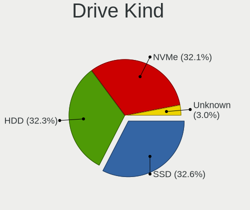
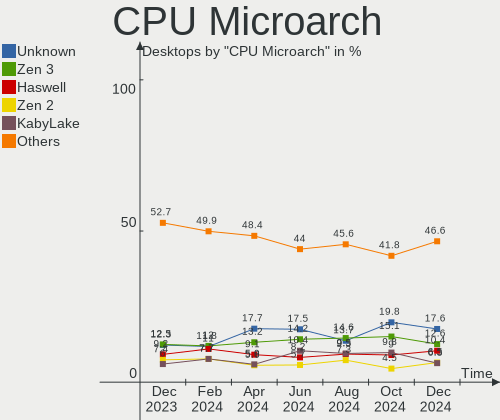
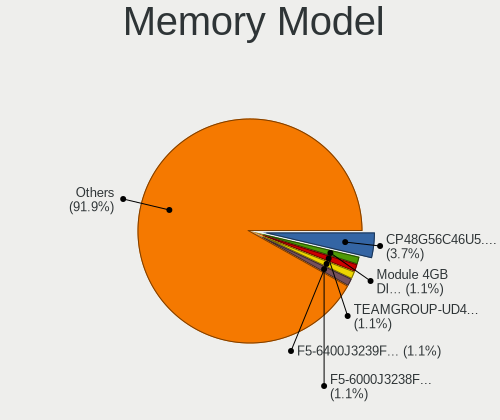

Linux in USA - Hardware Trends (Desktops)
-----------------------------------------

A project to identify most popular hardware characteristics and track their change
over time based on data collected by Linux users at https://Linux-Hardware.org.

Anyone can contribute to this report by the [hw-probe](https://github.com/linuxhw/hw-probe) tool:

    sudo -E hw-probe -all -upload

Period: Mar, 2023.

Contents
--------

* [ System ](#system)
  - [ OS                       ](#os)
  - [ OS Family                ](#os-family)
  - [ Kernel                   ](#kernel)
  - [ Kernel Family            ](#kernel-family)
  - [ Kernel Major Ver.        ](#kernel-major-ver)
  - [ Arch                     ](#arch)
  - [ DE                       ](#de)
  - [ Display Server           ](#display-server)
  - [ Display Manager          ](#display-manager)
  - [ OS Lang                  ](#os-lang)
  - [ Boot Mode                ](#boot-mode)
  - [ Filesystem               ](#filesystem)
  - [ Part. scheme             ](#part-scheme)
  - [ Dual Boot with Linux/BSD ](#dual-boot-with-linuxbsd)
  - [ Dual Boot (Win)          ](#dual-boot-win)

* [ Board ](#board)
  - [ Vendor                   ](#vendor)
  - [ Model                    ](#model)
  - [ Model Family             ](#model-family)
  - [ MFG Year                 ](#mfg-year)
  - [ Form Factor              ](#form-factor)
  - [ Secure Boot              ](#secure-boot)
  - [ Coreboot                 ](#coreboot)
  - [ RAM Size                 ](#ram-size)
  - [ RAM Used                 ](#ram-used)
  - [ Total Drives             ](#total-drives)
  - [ Has CD-ROM               ](#has-cd-rom)
  - [ Has Ethernet             ](#has-ethernet)
  - [ Has WiFi                 ](#has-wifi)
  - [ Has Bluetooth            ](#has-bluetooth)

* [ Location ](#location)
  - [ Country                  ](#country)
  - [ City                     ](#city)

* [ Drives ](#drives)
  - [ Drive Vendor             ](#drive-vendor)
  - [ Drive Model              ](#drive-model)
  - [ HDD Vendor               ](#hdd-vendor)
  - [ SSD Vendor               ](#ssd-vendor)
  - [ Drive Kind               ](#drive-kind)
  - [ Drive Connector          ](#drive-connector)
  - [ Drive Size               ](#drive-size)
  - [ Space Total              ](#space-total)
  - [ Space Used               ](#space-used)
  - [ Malfunc. Drives          ](#malfunc-drives)
  - [ Malfunc. Drive Vendor    ](#malfunc-drive-vendor)
  - [ Malfunc. HDD Vendor      ](#malfunc-hdd-vendor)
  - [ Malfunc. Drive Kind      ](#malfunc-drive-kind)
  - [ Failed Drives            ](#failed-drives)
  - [ Failed Drive Vendor      ](#failed-drive-vendor)
  - [ Drive Status             ](#drive-status)

* [ Storage controller ](#storage-controller)
  - [ Storage Vendor           ](#storage-vendor)
  - [ Storage Model            ](#storage-model)
  - [ Storage Kind             ](#storage-kind)

* [ Processor ](#processor)
  - [ CPU Vendor               ](#cpu-vendor)
  - [ CPU Model                ](#cpu-model)
  - [ CPU Model Family         ](#cpu-model-family)
  - [ CPU Cores                ](#cpu-cores)
  - [ CPU Sockets              ](#cpu-sockets)
  - [ CPU Threads              ](#cpu-threads)
  - [ CPU Op-Modes             ](#cpu-op-modes)
  - [ CPU Microcode            ](#cpu-microcode)
  - [ CPU Microarch            ](#cpu-microarch)

* [ Graphics ](#graphics)
  - [ GPU Vendor               ](#gpu-vendor)
  - [ GPU Model                ](#gpu-model)
  - [ GPU Combo                ](#gpu-combo)
  - [ GPU Driver               ](#gpu-driver)
  - [ GPU Memory               ](#gpu-memory)

* [ Monitor ](#monitor)
  - [ Monitor Vendor           ](#monitor-vendor)
  - [ Monitor Model            ](#monitor-model)
  - [ Monitor Resolution       ](#monitor-resolution)
  - [ Monitor Diagonal         ](#monitor-diagonal)
  - [ Monitor Width            ](#monitor-width)
  - [ Aspect Ratio             ](#aspect-ratio)
  - [ Monitor Area             ](#monitor-area)
  - [ Pixel Density            ](#pixel-density)
  - [ Multiple Monitors        ](#multiple-monitors)

* [ Network ](#network)
  - [ Net Controller Vendor    ](#net-controller-vendor)
  - [ Net Controller Model     ](#net-controller-model)
  - [ Wireless Vendor          ](#wireless-vendor)
  - [ Wireless Model           ](#wireless-model)
  - [ Ethernet Vendor          ](#ethernet-vendor)
  - [ Ethernet Model           ](#ethernet-model)
  - [ Net Controller Kind      ](#net-controller-kind)
  - [ Used Controller          ](#used-controller)
  - [ NICs                     ](#nics)
  - [ IPv6                     ](#ipv6)

* [ Bluetooth ](#bluetooth)
  - [ Bluetooth Vendor         ](#bluetooth-vendor)
  - [ Bluetooth Model          ](#bluetooth-model)

* [ Sound ](#sound)
  - [ Sound Vendor             ](#sound-vendor)
  - [ Sound Model              ](#sound-model)

* [ Memory ](#memory)
  - [ Memory Vendor            ](#memory-vendor)
  - [ Memory Model             ](#memory-model)
  - [ Memory Kind              ](#memory-kind)
  - [ Memory Form Factor       ](#memory-form-factor)
  - [ Memory Size              ](#memory-size)
  - [ Memory Speed             ](#memory-speed)

* [ Printers & scanners ](#printers--scanners)
  - [ Printer Vendor           ](#printer-vendor)
  - [ Printer Model            ](#printer-model)
  - [ Scanner Vendor           ](#scanner-vendor)
  - [ Scanner Model            ](#scanner-model)

* [ Camera ](#camera)
  - [ Camera Vendor            ](#camera-vendor)
  - [ Camera Model             ](#camera-model)

* [ Security ](#security)
  - [ Fingerprint Vendor       ](#fingerprint-vendor)
  - [ Fingerprint Model        ](#fingerprint-model)
  - [ Chipcard Vendor          ](#chipcard-vendor)
  - [ Chipcard Model           ](#chipcard-model)

* [ Unsupported ](#unsupported)
  - [ Unsupported Devices      ](#unsupported-devices)
  - [ Unsupported Device Types ](#unsupported-device-types)

System
------

OS
--

Installed operating systems

| Name                         | Desktops | Percent |
|------------------------------|----------|---------|
| Ubuntu 22.04                 | 66       | 14.04%  |
| Pop!_OS 22.04                | 40       | 8.51%   |
| Linux Mint 21.1              | 32       | 6.81%   |
| Debian 11                    | 32       | 6.81%   |
| Fedora 37                    | 28       | 5.96%   |
| OpenMandriva 23.03           | 18       | 3.83%   |
| OpenMandriva 23.01           | 18       | 3.83%   |
| Ubuntu 22.10                 | 17       | 3.62%   |
| Zorin 16                     | 16       | 3.4%    |
| Ubuntu 20.04                 | 15       | 3.19%   |
| Arch Rolling                 | 13       | 2.77%   |
| Manjaro                      | 12       | 2.55%   |
| Nobara 37                    | 11       | 2.34%   |
| Linux Mint 20.3              | 9        | 1.91%   |
| Kubuntu 22.04                | 8        | 1.7%    |
| KDE neon 22.04               | 8        | 1.7%    |
| OpenMandriva 4.3             | 7        | 1.49%   |
| Kubuntu 22.10                | 7        | 1.49%   |
| ArcoLinux Rolling            | 7        | 1.49%   |
| SteamOS 3.4                  | 6        | 1.28%   |
| Xubuntu 22.04                | 5        | 1.06%   |
| LMDE 5                       | 5        | 1.06%   |
| Gentoo 2.13                  | 5        | 1.06%   |
| Fedora 38                    | 5        | 1.06%   |
| EndeavourOS Rolling          | 5        | 1.06%   |
| Xubuntu 20.04                | 4        | 0.85%   |
| openSUSE Tumbleweed-XXXXXXXX | 4        | 0.85%   |
| Fedora 36                    | 4        | 0.85%   |
| ChimeraOS 39                 | 4        | 0.85%   |
| Manjaro 22.0.4               | 3        | 0.64%   |
| Garuda Linux Rolling         | 3        | 0.64%   |
| Debian 12                    | 3        | 0.64%   |
| Debian                       | 3        | 0.64%   |
| Ultramarine Linux 37         | 2        | 0.43%   |
| Ubuntu Studio 22.04          | 2        | 0.43%   |
| RHEL 9                       | 2        | 0.43%   |
| OpenMandriva 4.2             | 2        | 0.43%   |
| NixOS 22.11                  | 2        | 0.43%   |
| MX 21                        | 2        | 0.43%   |
| Linux Mint 20.1              | 2        | 0.43%   |

OS Family
---------

OS without a version

| Name              | Desktops | Percent |
|-------------------|----------|---------|
| Ubuntu            | 100      | 21.28%  |
| Linux Mint        | 47       | 10%     |
| OpenMandriva      | 45       | 9.57%   |
| Pop!_OS           | 41       | 8.72%   |
| Debian            | 38       | 8.09%   |
| Fedora            | 37       | 7.87%   |
| Zorin             | 17       | 3.62%   |
| Manjaro           | 15       | 3.19%   |
| Kubuntu           | 15       | 3.19%   |
| Arch              | 13       | 2.77%   |
| Nobara            | 11       | 2.34%   |
| Xubuntu           | 9        | 1.91%   |
| KDE neon          | 8        | 1.7%    |
| ArcoLinux         | 7        | 1.49%   |
| SteamOS           | 6        | 1.28%   |
| openSUSE          | 5        | 1.06%   |
| LMDE              | 5        | 1.06%   |
| Gentoo            | 5        | 1.06%   |
| Garuda Linux      | 5        | 1.06%   |
| EndeavourOS       | 5        | 1.06%   |
| ChimeraOS         | 4        | 0.85%   |
| Endless           | 3        | 0.64%   |
| Ultramarine Linux | 2        | 0.43%   |
| Ubuntu Studio     | 2        | 0.43%   |
| RHEL              | 2        | 0.43%   |
| NixOS             | 2        | 0.43%   |
| MX                | 2        | 0.43%   |
| Elementary        | 2        | 0.43%   |
| Clear Linux       | 2        | 0.43%   |
| Solus             | 1        | 0.21%   |
| SLED              | 1        | 0.21%   |
| Siduction         | 1        | 0.21%   |
| ROSA              | 1        | 0.21%   |
| Rocky Linux       | 1        | 0.21%   |
| Mageia            | 1        | 0.21%   |
| Lubuntu           | 1        | 0.21%   |
| LinuxFX           | 1        | 0.21%   |
| Linux Lite        | 1        | 0.21%   |
| Kali              | 1        | 0.21%   |
| Feren OS          | 1        | 0.21%   |

Kernel
------

Version of the Linux kernel

| Version                      | Desktops | Percent |
|------------------------------|----------|---------|
| 5.19.0-35-generic            | 68       | 14.47%  |
| 5.15.0-67-generic            | 48       | 10.21%  |
| 5.10.0-21-amd64              | 19       | 4.04%   |
| 6.2.0-76060200-generic       | 18       | 3.83%   |
| 6.1.1-desktop-1omv2290       | 17       | 3.62%   |
| 6.2.6-desktop-1omv2390       | 15       | 3.19%   |
| 5.4.0-144-generic            | 14       | 2.98%   |
| 5.19.0-38-generic            | 11       | 2.34%   |
| 6.1.18-200.fc37.x86_64       | 9        | 1.91%   |
| 5.15.0-60-generic            | 9        | 1.91%   |
| 6.2.6-76060206-generic       | 8        | 1.7%    |
| 6.1.12-1-MANJARO             | 7        | 1.49%   |
| 6.1.14-201.fsync.fc37.x86_64 | 6        | 1.28%   |
| 6.1.14-200.fc37.x86_64       | 6        | 1.28%   |
| 6.1.11-76060111-generic      | 6        | 1.28%   |
| 6.0.12-76060006-generic      | 6        | 1.28%   |
| 6.2.2-arch1-1                | 5        | 1.06%   |
| 5.19.0-32-generic            | 5        | 1.06%   |
| 5.15.0-69-generic            | 5        | 1.06%   |
| 5.13.0-valve21.3-1-neptune   | 5        | 1.06%   |
| 6.2.8-arch1-1                | 4        | 0.85%   |
| 6.2.7-200.fc37.x86_64        | 4        | 0.85%   |
| 6.2.6-300.fc38.x86_64        | 4        | 0.85%   |
| 6.2.6-201.fsync.fc37.x86_64  | 4        | 0.85%   |
| 6.1.15-200.fc37.x86_64       | 4        | 0.85%   |
| 6.1.11-arch1-1               | 4        | 0.85%   |
| 6.0.0-6mx-amd64              | 4        | 0.85%   |
| 5.15.0-56-generic            | 4        | 0.85%   |
| 6.2.8-200.fc37.x86_64        | 3        | 0.64%   |
| 6.2.7-060207-generic         | 3        | 0.64%   |
| 6.2.1-arch1-1                | 3        | 0.64%   |
| 6.2.1-1-default              | 3        | 0.64%   |
| 6.1.13-200.fc37.x86_64       | 3        | 0.64%   |
| 6.1.0-6-amd64                | 3        | 0.64%   |
| 5.4.0-139-generic            | 3        | 0.64%   |
| 5.19.0-31-generic            | 3        | 0.64%   |
| 5.16.7-desktop-1omv4003      | 3        | 0.64%   |
| 5.16.13-desktop-1omv4003     | 3        | 0.64%   |
| 5.15.94-1-MANJARO            | 3        | 0.64%   |
| 5.15.0-58-generic            | 3        | 0.64%   |

Kernel Family
-------------

Linux kernel without a distro release

| Version  | Desktops | Percent |
|----------|----------|---------|
| 5.19.0   | 94       | 20%     |
| 5.15.0   | 77       | 16.38%  |
| 6.2.6    | 39       | 8.3%    |
| 5.10.0   | 24       | 5.11%   |
| 5.4.0    | 21       | 4.47%   |
| 6.2.0    | 20       | 4.26%   |
| 6.2.2    | 17       | 3.62%   |
| 6.1.1    | 17       | 3.62%   |
| 6.1.14   | 14       | 2.98%   |
| 6.2.8    | 13       | 2.77%   |
| 6.1.11   | 13       | 2.77%   |
| 6.2.7    | 12       | 2.55%   |
| 6.1.12   | 11       | 2.34%   |
| 6.1.18   | 9        | 1.91%   |
| 5.13.0   | 9        | 1.91%   |
| 6.2.1    | 8        | 1.7%    |
| 6.1.0    | 7        | 1.49%   |
| 6.0.12   | 6        | 1.28%   |
| 6.0.0    | 6        | 1.28%   |
| 6.1.15   | 4        | 0.85%   |
| 5.16.13  | 4        | 0.85%   |
| 6.1.19   | 3        | 0.64%   |
| 6.1.13   | 3        | 0.64%   |
| 5.16.7   | 3        | 0.64%   |
| 5.15.94  | 3        | 0.64%   |
| 5.14.0   | 3        | 0.64%   |
| 5.16.0   | 2        | 0.43%   |
| 5.15.102 | 2        | 0.43%   |
| 5.11.0   | 2        | 0.43%   |
| 5.10.14  | 2        | 0.43%   |
| 6.2.3    | 1        | 0.21%   |
| 6.1.6    | 1        | 0.21%   |
| 6.1.5    | 1        | 0.21%   |
| 6.1.4    | 1        | 0.21%   |
| 6.1.10   | 1        | 0.21%   |
| 6.0.6    | 1        | 0.21%   |
| 6.0.19   | 1        | 0.21%   |
| 5.8.0    | 1        | 0.21%   |
| 5.4.83   | 1        | 0.21%   |
| 5.19.12  | 1        | 0.21%   |

Kernel Major Ver.
-----------------

Linux kernel major version

| Version | Desktops | Percent |
|---------|----------|---------|
| 6.2     | 110      | 23.4%   |
| 5.19    | 95       | 20.21%  |
| 5.15    | 88       | 18.72%  |
| 6.1     | 85       | 18.09%  |
| 5.10    | 26       | 5.53%   |
| 5.4     | 22       | 4.68%   |
| 6.0     | 14       | 2.98%   |
| 5.16    | 9        | 1.91%   |
| 5.13    | 9        | 1.91%   |
| 5.14    | 4        | 0.85%   |
| 5.18    | 2        | 0.43%   |
| 5.11    | 2        | 0.43%   |
| 5.8     | 1        | 0.21%   |
| 5.17    | 1        | 0.21%   |
| 4.15    | 1        | 0.21%   |
| 3.10    | 1        | 0.21%   |

Arch
----

OS architecture (x86_64, i586, etc.)

| Name   | Desktops | Percent |
|--------|----------|---------|
| x86_64 | 468      | 99.57%  |
| i686   | 2        | 0.43%   |

DE
--

Desktop Environment

| Name          | Desktops | Percent |
|---------------|----------|---------|
| GNOME         | 214      | 45.53%  |
| KDE5          | 133      | 28.3%   |
| X-Cinnamon    | 44       | 9.36%   |
| XFCE          | 25       | 5.32%   |
| Unknown       | 25       | 5.32%   |
| MATE          | 7        | 1.49%   |
| Pantheon      | 3        | 0.64%   |
| LXQt          | 3        | 0.64%   |
| LXDE          | 3        | 0.64%   |
| i3            | 3        | 0.64%   |
| Trinity       | 1        | 0.21%   |
| sway          | 1        | 0.21%   |
| qtile         | 1        | 0.21%   |
| openbox       | 1        | 0.21%   |
| LeftWM        | 1        | 0.21%   |
| KDE           | 1        | 0.21%   |
| GNUstep       | 1        | 0.21%   |
| GNOME Classic | 1        | 0.21%   |
| Cinnamon      | 1        | 0.21%   |
| Budgie        | 1        | 0.21%   |

Display Server
--------------

X11 or Wayland

| Name    | Desktops | Percent |
|---------|----------|---------|
| X11     | 325      | 69.15%  |
| Wayland | 118      | 25.11%  |
| Tty     | 19       | 4.04%   |
| Unknown | 8        | 1.7%    |

Display Manager
---------------

SDDM, LightDM, etc.

| Name    | Desktops | Percent |
|---------|----------|---------|
| Unknown | 210      | 44.68%  |
| GDM3    | 98       | 20.85%  |
| SDDM    | 87       | 18.51%  |
| LightDM | 46       | 9.79%   |
| GDM     | 25       | 5.32%   |
| XDM     | 1        | 0.21%   |
| TDM     | 1        | 0.21%   |
| NODM    | 1        | 0.21%   |
| GREETD  | 1        | 0.21%   |

OS Lang
-------

Language

| Lang        | Desktops | Percent |
|-------------|----------|---------|
| en_US       | 445      | 94.68%  |
| Unknown     | 9        | 1.91%   |
| C           | 6        | 1.28%   |
| en_CA       | 3        | 0.64%   |
| C.UTF8      | 2        | 0.43%   |
| zh_TW       | 1        | 0.21%   |
| ru_RU       | 1        | 0.21%   |
| en_US_UTF-8 | 1        | 0.21%   |
| en_GB       | 1        | 0.21%   |
| -enUS       | 1        | 0.21%   |

Boot Mode
---------

EFI or BIOS

| Mode | Desktops | Percent |
|------|----------|---------|
| BIOS | 251      | 53.4%   |
| EFI  | 219      | 46.6%   |

Filesystem
----------

Type of filesystem

| Type    | Desktops | Percent |
|---------|----------|---------|
| Ext4    | 344      | 73.19%  |
| Btrfs   | 76       | 16.17%  |
| Overlay | 27       | 5.74%   |
| Xfs     | 12       | 2.55%   |
| Zfs     | 10       | 2.13%   |
| XXXXXXX | 1        | 0.21%   |

Part. scheme
------------

Scheme of partitioning

| Type    | Desktops | Percent |
|---------|----------|---------|
| GPT     | 238      | 50.64%  |
| Unknown | 185      | 39.36%  |
| MBR     | 47       | 10%     |

Dual Boot with Linux/BSD
------------------------

Hosting more than one Linux/BSD

| Dual boot | Desktops | Percent |
|-----------|----------|---------|
| No        | 383      | 81.49%  |
| Yes       | 87       | 18.51%  |

Dual Boot (Win)
---------------

Hosting Linux and Windows

| Dual boot | Desktops | Percent |
|-----------|----------|---------|
| No        | 356      | 75.74%  |
| Yes       | 114      | 24.26%  |

Board
-----

Vendor
------

Motherboard manufacturer

| Name                | Desktops | Percent |
|---------------------|----------|---------|
| ASUSTek Computer    | 115      | 24.47%  |
| MSI                 | 68       | 14.47%  |
| Dell                | 67       | 14.26%  |
| Hewlett-Packard     | 49       | 10.43%  |
| Gigabyte Technology | 49       | 10.43%  |
| ASRock              | 36       | 7.66%   |
| Lenovo              | 17       | 3.62%   |
| Pegatron            | 8        | 1.7%    |
| AZW                 | 7        | 1.49%   |
| Intel               | 6        | 1.28%   |
| Supermicro          | 5        | 1.06%   |
| Unknown             | 5        | 1.06%   |
| Gateway             | 4        | 0.85%   |
| Foxconn             | 4        | 0.85%   |
| Acer                | 4        | 0.85%   |
| ECS                 | 3        | 0.64%   |
| ASRockRack          | 3        | 0.64%   |
| NEWSMAY             | 2        | 0.43%   |
| Biostar             | 2        | 0.43%   |
| BESSTAR Tech        | 2        | 0.43%   |
| ZOTAC               | 1        | 0.21%   |
| Win element         | 1        | 0.21%   |
| System76            | 1        | 0.21%   |
| OEM_MB              | 1        | 0.21%   |
| NZXT                | 1        | 0.21%   |
| HPE                 | 1        | 0.21%   |
| Google              | 1        | 0.21%   |
| EVGA                | 1        | 0.21%   |
| eMachines           | 1        | 0.21%   |
| CWWK                | 1        | 0.21%   |
| Apple               | 1        | 0.21%   |
| AMI                 | 1        | 0.21%   |
| Alienware           | 1        | 0.21%   |
| Acidanthera         | 1        | 0.21%   |

Model
-----

Motherboard model

| Name                                | Desktops | Percent |
|-------------------------------------|----------|---------|
| Unknown                             | 7        | 1.49%   |
| Dell OptiPlex 9020                  | 6        | 1.28%   |
| ASUS All Series                     | 6        | 1.28%   |
| MSI MS-7C91                         | 5        | 1.06%   |
| MSI MS-7C02                         | 5        | 1.06%   |
| Dell OptiPlex 780                   | 5        | 1.06%   |
| Dell OptiPlex 7010                  | 5        | 1.06%   |
| ASUS ROG STRIX B550-F GAMING        | 5        | 1.06%   |
| MSI MS-7C37                         | 4        | 0.85%   |
| MSI MS-7B79                         | 4        | 0.85%   |
| Dell OptiPlex 9010                  | 4        | 0.85%   |
| Dell OptiPlex 3020                  | 4        | 0.85%   |
| AZW U59                             | 4        | 0.85%   |
| ASUS TUF Gaming X570-PLUS           | 4        | 0.85%   |
| ASUS ROG STRIX B450-F GAMING        | 4        | 0.85%   |
| MSI MS-7C56                         | 3        | 0.64%   |
| MSI MS-7721                         | 3        | 0.64%   |
| Dell XPS 8700                       | 3        | 0.64%   |
| ASUS ROG STRIX Z390-E GAMING        | 3        | 0.64%   |
| ASUS ROG STRIX X570-E GAMING        | 3        | 0.64%   |
| ASUS ROG STRIX B650E-F GAMING WIFI  | 3        | 0.64%   |
| ASUS M5A78L-M LX PLUS               | 3        | 0.64%   |
| MSI MS-7D73                         | 2        | 0.43%   |
| MSI MS-7C95                         | 2        | 0.43%   |
| MSI MS-7B86                         | 2        | 0.43%   |
| MSI MS-7B51                         | 2        | 0.43%   |
| MSI MS-7A34                         | 2        | 0.43%   |
| MSI MS-7693                         | 2        | 0.43%   |
| HP Z640 Workstation                 | 2        | 0.43%   |
| HP Pavilion Gaming Desktop 690-00xx | 2        | 0.43%   |
| HP EliteDesk 800 G3 SFF             | 2        | 0.43%   |
| HP Compaq 8200 Elite SFF PC         | 2        | 0.43%   |
| HP Compaq 6200 Pro MT PC            | 2        | 0.43%   |
| Gigabyte Z77X-UD3H                  | 2        | 0.43%   |
| Gigabyte X670E AORUS MASTER         | 2        | 0.43%   |
| Gigabyte B550M DS3H                 | 2        | 0.43%   |
| Dell Precision Tower 5810           | 2        | 0.43%   |
| Dell OptiPlex 790                   | 2        | 0.43%   |
| Dell OptiPlex 745                   | 2        | 0.43%   |
| Dell OptiPlex 7050                  | 2        | 0.43%   |

Model Family
------------

Motherboard model prefix

| Name                | Desktops | Percent |
|---------------------|----------|---------|
| Dell OptiPlex       | 44       | 9.36%   |
| ASUS ROG            | 34       | 7.23%   |
| ASUS PRIME          | 18       | 3.83%   |
| ASUS TUF            | 15       | 3.19%   |
| HP Compaq           | 13       | 2.77%   |
| Lenovo ThinkCentre  | 9        | 1.91%   |
| Dell Inspiron       | 9        | 1.91%   |
| HP EliteDesk        | 8        | 1.7%    |
| Unknown             | 7        | 1.49%   |
| Dell Precision      | 6        | 1.28%   |
| ASUS All            | 6        | 1.28%   |
| MSI MS-7C91         | 5        | 1.06%   |
| MSI MS-7C02         | 5        | 1.06%   |
| HP Pavilion         | 5        | 1.06%   |
| Dell XPS            | 5        | 1.06%   |
| MSI MS-7C37         | 4        | 0.85%   |
| MSI MS-7B79         | 4        | 0.85%   |
| Lenovo ThinkStation | 4        | 0.85%   |
| HP ProDesk          | 4        | 0.85%   |
| Gigabyte B550M      | 4        | 0.85%   |
| AZW U59             | 4        | 0.85%   |
| ASUS Maximus        | 4        | 0.85%   |
| ASUS M5A78L-M       | 4        | 0.85%   |
| MSI MS-7C56         | 3        | 0.64%   |
| MSI MS-7721         | 3        | 0.64%   |
| Gigabyte X570       | 3        | 0.64%   |
| ASRock X570         | 3        | 0.64%   |
| MSI MS-7D73         | 2        | 0.43%   |
| MSI MS-7C95         | 2        | 0.43%   |
| MSI MS-7B86         | 2        | 0.43%   |
| MSI MS-7B51         | 2        | 0.43%   |
| MSI MS-7A34         | 2        | 0.43%   |
| MSI MS-7693         | 2        | 0.43%   |
| Lenovo IdeaCentre   | 2        | 0.43%   |
| HP Z640             | 2        | 0.43%   |
| Gigabyte Z77X-UD3H  | 2        | 0.43%   |
| Gigabyte X670E      | 2        | 0.43%   |
| Gigabyte B650       | 2        | 0.43%   |
| ASUS SABERTOOTH     | 2        | 0.43%   |
| ASUS ProArt         | 2        | 0.43%   |

MFG Year
--------

Motherboard manufacture year

| Year    | Desktops | Percent |
|---------|----------|---------|
| 2022    | 50       | 10.64%  |
| 2018    | 50       | 10.64%  |
| 2020    | 45       | 9.57%   |
| 2019    | 43       | 9.15%   |
| 2013    | 35       | 7.45%   |
| 2012    | 34       | 7.23%   |
| 2015    | 31       | 6.6%    |
| 2021    | 30       | 6.38%   |
| 2011    | 26       | 5.53%   |
| 2014    | 23       | 4.89%   |
| 2017    | 21       | 4.47%   |
| 2016    | 21       | 4.47%   |
| 2009    | 14       | 2.98%   |
| 2008    | 14       | 2.98%   |
| 2010    | 11       | 2.34%   |
| 2007    | 11       | 2.34%   |
| 2023    | 6        | 1.28%   |
| 2006    | 3        | 0.64%   |
| 2005    | 1        | 0.21%   |
| Unknown | 1        | 0.21%   |

Form Factor
-----------

Physical design of the computer

| Name    | Desktops | Percent |
|---------|----------|---------|
| Desktop | 470      | 100%    |

Secure Boot
-----------

Enabled or disabled

| State    | Desktops | Percent |
|----------|----------|---------|
| Disabled | 454      | 96.6%   |
| Enabled  | 16       | 3.4%    |

Coreboot
--------

Have coreboot on board

| Used | Desktops | Percent |
|------|----------|---------|
| No   | 469      | 99.79%  |
| Yes  | 1        | 0.21%   |

RAM Size
--------

Total RAM memory

| Size in GB      | Desktops | Percent |
|-----------------|----------|---------|
| 32.01-64.0      | 115      | 24.47%  |
| 16.01-24.0      | 105      | 22.34%  |
| 8.01-16.0       | 64       | 13.62%  |
| 4.01-8.0        | 60       | 12.77%  |
| 64.01-256.0     | 52       | 11.06%  |
| 3.01-4.0        | 36       | 7.66%   |
| 24.01-32.0      | 31       | 6.6%    |
| 2.01-3.0        | 3        | 0.64%   |
| More than 256.0 | 2        | 0.43%   |
| 1.01-2.0        | 1        | 0.21%   |
| 0.01-0.5        | 1        | 0.21%   |

RAM Used
--------

Used RAM memory

| Used GB         | Desktops | Percent |
|-----------------|----------|---------|
| 2.01-3.0        | 123      | 26.17%  |
| 1.01-2.0        | 120      | 25.53%  |
| 4.01-8.0        | 103      | 21.91%  |
| 3.01-4.0        | 57       | 12.13%  |
| 8.01-16.0       | 32       | 6.81%   |
| 0.51-1.0        | 11       | 2.34%   |
| 16.01-24.0      | 9        | 1.91%   |
| 24.01-32.0      | 6        | 1.28%   |
| 0.01-0.5        | 5        | 1.06%   |
| 32.01-64.0      | 2        | 0.43%   |
| More than 256.0 | 1        | 0.21%   |
| 64.01-256.0     | 1        | 0.21%   |

Total Drives
------------

Number of drives on board

| Drives | Desktops | Percent |
|--------|----------|---------|
| 1      | 179      | 38.09%  |
| 2      | 129      | 27.45%  |
| 3      | 72       | 15.32%  |
| 4      | 40       | 8.51%   |
| 5      | 22       | 4.68%   |
| 6      | 10       | 2.13%   |
| 8      | 4        | 0.85%   |
| 7      | 3        | 0.64%   |
| 0      | 3        | 0.64%   |
| 13     | 2        | 0.43%   |
| 9      | 2        | 0.43%   |
| 22     | 1        | 0.21%   |
| 14     | 1        | 0.21%   |
| 12     | 1        | 0.21%   |
| 10     | 1        | 0.21%   |

Has CD-ROM
----------

Has CD-ROM on board

| Presented | Desktops | Percent |
|-----------|----------|---------|
| No        | 257      | 54.68%  |
| Yes       | 213      | 45.32%  |

Has Ethernet
------------

Has Ethernet on board

| Presented | Desktops | Percent |
|-----------|----------|---------|
| Yes       | 466      | 99.15%  |
| No        | 4        | 0.85%   |

Has WiFi
--------

Has WiFi module

| Presented | Desktops | Percent |
|-----------|----------|---------|
| Yes       | 277      | 58.94%  |
| No        | 193      | 41.06%  |

Has Bluetooth
-------------

Has Bluetooth module

| Presented | Desktops | Percent |
|-----------|----------|---------|
| No        | 257      | 54.68%  |
| Yes       | 213      | 45.32%  |

Location
--------

Country
-------

Geographic location (country)

| Country | Desktops | Percent |
|---------|----------|---------|
| USA     | 470      | 100%    |

City
----

Geographic location (city)

| City          | Desktops | Percent |
|---------------|----------|---------|
| Oklahoma City | 6        | 1.28%   |
| Los Angeles   | 6        | 1.28%   |
| Houston       | 6        | 1.28%   |
| Springfield   | 5        | 1.06%   |
| Seattle       | 5        | 1.06%   |
| San Antonio   | 5        | 1.06%   |
| Miami         | 5        | 1.06%   |
| Kansas City   | 5        | 1.06%   |
| Indianapolis  | 5        | 1.06%   |
| Eugene        | 5        | 1.06%   |
| Dallas        | 5        | 1.06%   |
| Brooklyn      | 5        | 1.06%   |
| Portland      | 4        | 0.85%   |
| Minneapolis   | 4        | 0.85%   |
| Atlanta       | 4        | 0.85%   |
| St Louis      | 3        | 0.64%   |
| Quincy        | 3        | 0.64%   |
| Orlando       | 3        | 0.64%   |
| Fort Worth    | 3        | 0.64%   |
| Denver        | 3        | 0.64%   |
| Cherry Hill   | 3        | 0.64%   |
| Beaverton     | 3        | 0.64%   |
| Baltimore     | 3        | 0.64%   |
| Austin        | 3        | 0.64%   |
| Asheville     | 3        | 0.64%   |
| Youngstown    | 2        | 0.43%   |
| Washington    | 2        | 0.43%   |
| Spring Hill   | 2        | 0.43%   |
| Sioux Falls   | 2        | 0.43%   |
| San Marcos    | 2        | 0.43%   |
| San Jose      | 2        | 0.43%   |
| San Diego     | 2        | 0.43%   |
| Salem         | 2        | 0.43%   |
| Saint Johns   | 2        | 0.43%   |
| Riverside     | 2        | 0.43%   |
| Richmond      | 2        | 0.43%   |
| Puyallup      | 2        | 0.43%   |
| Phoenix       | 2        | 0.43%   |
| Milwaukee     | 2        | 0.43%   |
| Madison       | 2        | 0.43%   |

Drives
------

Drive Vendor
------------

Hard drive vendors

| Vendor                      | Desktops | Drives | Percent |
|-----------------------------|----------|--------|---------|
| Samsung Electronics         | 150      | 210    | 17.4%   |
| WDC                         | 145      | 222    | 16.82%  |
| Seagate                     | 142      | 216    | 16.47%  |
| SanDisk                     | 58       | 69     | 6.73%   |
| Toshiba                     | 32       | 40     | 3.71%   |
| Hitachi                     | 27       | 32     | 3.13%   |
| Crucial                     | 25       | 28     | 2.9%    |
| Kingston                    | 24       | 27     | 2.78%   |
| China                       | 23       | 27     | 2.67%   |
| SK hynix                    | 18       | 18     | 2.09%   |
| Intel                       | 17       | 18     | 1.97%   |
| SPCC                        | 16       | 17     | 1.86%   |
| PNY                         | 16       | 16     | 1.86%   |
| HGST                        | 14       | 17     | 1.62%   |
| A-DATA Technology           | 13       | 14     | 1.51%   |
| Unknown                     | 11       | 15     | 1.28%   |
| Team                        | 10       | 11     | 1.16%   |
| Micron/Crucial Technology   | 10       | 13     | 1.16%   |
| Phison Electronics          | 9        | 10     | 1.04%   |
| Hewlett-Packard             | 9        | 12     | 1.04%   |
| Silicon Motion              | 7        | 8      | 0.81%   |
| Micron Technology           | 4        | 4      | 0.46%   |
| Kingston Technology Company | 4        | 4      | 0.46%   |
| SABRENT                     | 3        | 3      | 0.35%   |
| Realtek Semiconductor       | 3        | 4      | 0.35%   |
| Phison                      | 3        | 3      | 0.35%   |
| Maxtor                      | 3        | 3      | 0.35%   |
| Corsair                     | 3        | 4      | 0.35%   |
| Unknown                     | 3        | 3      | 0.35%   |
| Transcend                   | 2        | 2      | 0.23%   |
| T-FORCE                     | 2        | 2      | 0.23%   |
| Realtek                     | 2        | 2      | 0.23%   |
| NGFF                        | 2        | 2      | 0.23%   |
| Mushkin                     | 2        | 2      | 0.23%   |
| MAXIO Technology (Hangzhou) | 2        | 2      | 0.23%   |
| LITEONIT                    | 2        | 2      | 0.23%   |
| Lexar                       | 2        | 2      | 0.23%   |
| LaCie                       | 2        | 2      | 0.23%   |
| KIOXIA                      | 2        | 2      | 0.23%   |
| JMicron Technology          | 2        | 2      | 0.23%   |

Drive Model
-----------

Hard drive models

| Model                                                  | Desktops | Percent |
|--------------------------------------------------------|----------|---------|
| Samsung NVMe SSD Controller SM981/PM981/PM983 250GB    | 25       | 2.48%   |
| Samsung NVMe SSD Controller PM9A1/PM9A3/980PRO 1TB     | 21       | 2.08%   |
| Samsung SSD 860 EVO 1TB                                | 12       | 1.19%   |
| Seagate ST2000DM008-2FR102 2TB                         | 11       | 1.09%   |
| Seagate ST500DM002-1BD142 500GB                        | 9        | 0.89%   |
| Seagate ST4000DM004-2CV104 4TB                         | 9        | 0.89%   |
| Micron/Crucial P2 NVMe PCIe SSD 1TB                    | 9        | 0.89%   |
| WDC WDBNCE5000PNC 500GB SSD                            | 8        | 0.79%   |
| Seagate ST1000DM010-2EP102 1TB                         | 8        | 0.79%   |
| Samsung SSD 870 EVO 1TB                                | 8        | 0.79%   |
| Samsung SSD 860 EVO 500GB                              | 8        | 0.79%   |
| Samsung SSD 850 EVO 250GB                              | 8        | 0.79%   |
| WDC WD10EZEX-08WN4A0 1TB                               | 7        | 0.69%   |
| Seagate ST1000DM003-1CH162 1TB                         | 7        | 0.69%   |
| Samsung SSD 980 PRO 2TB                                | 7        | 0.69%   |
| Kingston SA400S37240G 240GB SSD                        | 7        | 0.69%   |
| Samsung SSD 850 EVO 500GB                              | 6        | 0.59%   |
| Crucial CT1000MX500SSD1 1TB                            | 6        | 0.59%   |
| Toshiba DT01ACA100 1TB                                 | 5        | 0.5%    |
| Silicon Motion SM2263EN/SM2263XT SSD Controller 1024GB | 5        | 0.5%    |
| Seagate ST3500418AS 500GB                              | 5        | 0.5%    |
| Seagate ST2000LX001-1RG174 2TB                         | 5        | 0.5%    |
| Seagate ST2000DM001-1ER164 2TB                         | 5        | 0.5%    |
| Seagate ST1000DM003-1SB102 1TB                         | 5        | 0.5%    |
| Sandisk WD Black SN750 / PC SN730 NVMe SSD 1TB         | 5        | 0.5%    |
| Samsung SSD 980 1TB                                    | 5        | 0.5%    |
| Samsung SSD 970 EVO Plus 1TB                           | 5        | 0.5%    |
| China SATA SSD 256GB                                   | 5        | 0.5%    |
| WDC WDS500G2B0A-00SM50 500GB SSD                       | 4        | 0.4%    |
| SPCC Solid State Disk 512GB                            | 4        | 0.4%    |
| SK hynix SHGP31-1000GM 1TB                             | 4        | 0.4%    |
| Seagate ST8000DM004-2CX188 8TB                         | 4        | 0.4%    |
| Seagate ST1000DM003-1ER162 1TB                         | 4        | 0.4%    |
| Sandisk WD Blue SN550 NVMe SSD 256GB                   | 4        | 0.4%    |
| Samsung SSD 970 EVO Plus 2TB                           | 4        | 0.4%    |
| Samsung SSD 850 PRO 512GB                              | 4        | 0.4%    |
| Samsung NVMe SSD Controller SM961/PM961/SM963 256GB    | 4        | 0.4%    |
| China SATA SSD 120GB                                   | 4        | 0.4%    |
| China 512GB SSD                                        | 4        | 0.4%    |
| WDC WD40EZRZ-00GXCB0 4TB                               | 3        | 0.3%    |

HDD Vendor
----------

Hard disk drive vendors

| Vendor              | Desktops | Drives | Percent |
|---------------------|----------|--------|---------|
| Seagate             | 139      | 210    | 38.5%   |
| WDC                 | 124      | 191    | 34.35%  |
| Toshiba             | 29       | 37     | 8.03%   |
| Hitachi             | 27       | 32     | 7.48%   |
| HGST                | 14       | 17     | 3.88%   |
| Samsung Electronics | 6        | 6      | 1.66%   |
| Hewlett-Packard     | 4        | 4      | 1.11%   |
| Unknown             | 3        | 3      | 0.83%   |
| SABRENT             | 3        | 3      | 0.83%   |
| Maxtor              | 2        | 2      | 0.55%   |
| Fujitsu             | 2        | 2      | 0.55%   |
| T-CREATE            | 1        | 1      | 0.28%   |
| Super Talent        | 1        | 1      | 0.28%   |
| SD                  | 1        | 1      | 0.28%   |
| LaCie               | 1        | 1      | 0.28%   |
| IET                 | 1        | 1      | 0.28%   |
| IBM/Hitachi         | 1        | 1      | 0.28%   |
| ASMT                | 1        | 1      | 0.28%   |
| ASMedia             | 1        | 1      | 0.28%   |

SSD Vendor
----------

Solid state drive vendors

| Vendor              | Desktops | Drives | Percent |
|---------------------|----------|--------|---------|
| Samsung Electronics | 80       | 105    | 27.21%  |
| Crucial             | 24       | 26     | 8.16%   |
| China               | 23       | 27     | 7.82%   |
| WDC                 | 21       | 25     | 7.14%   |
| SanDisk             | 21       | 22     | 7.14%   |
| Kingston            | 21       | 22     | 7.14%   |
| PNY                 | 15       | 15     | 5.1%    |
| SPCC                | 13       | 14     | 4.42%   |
| A-DATA Technology   | 12       | 13     | 4.08%   |
| Team                | 8        | 9      | 2.72%   |
| Intel               | 5        | 5      | 1.7%    |
| Hewlett-Packard     | 4        | 7      | 1.36%   |
| Toshiba             | 3        | 3      | 1.02%   |
| Seagate             | 3        | 3      | 1.02%   |
| Micron Technology   | 3        | 3      | 1.02%   |
| Transcend           | 2        | 2      | 0.68%   |
| SK hynix            | 2        | 2      | 0.68%   |
| NGFF                | 2        | 2      | 0.68%   |
| Mushkin             | 2        | 2      | 0.68%   |
| LITEONIT            | 2        | 2      | 0.68%   |
| Lexar               | 2        | 2      | 0.68%   |
| Fanxiang            | 2        | 3      | 0.68%   |
| Corsair             | 2        | 3      | 0.68%   |
| Acer                | 2        | 2      | 0.68%   |
| Unknown             | 2        | 2      | 0.68%   |
| ZEPLIN              | 1        | 1      | 0.34%   |
| VICKTER             | 1        | 1      | 0.34%   |
| SPCC Sol            | 1        | 1      | 0.34%   |
| PNY CS90            | 1        | 1      | 0.34%   |
| Plextor             | 1        | 1      | 0.34%   |
| Patriot             | 1        | 1      | 0.34%   |
| OCZ                 | 1        | 1      | 0.34%   |
| Netac               | 1        | 1      | 0.34%   |
| Maxtor              | 1        | 1      | 0.34%   |
| LITEON              | 1        | 1      | 0.34%   |
| KingDian            | 1        | 1      | 0.34%   |
| Kimtigo             | 1        | 1      | 0.34%   |
| JMicron Technology  | 1        | 1      | 0.34%   |
| GRITRONIX           | 1        | 1      | 0.34%   |
| faspeed             | 1        | 1      | 0.34%   |

Drive Kind
----------

HDD or SSD

| Kind    | Desktops | Drives | Percent |
|---------|----------|--------|---------|
| HDD     | 276      | 515    | 38.66%  |
| SSD     | 241      | 339    | 33.75%  |
| NVMe    | 174      | 247    | 24.37%  |
| Unknown | 18       | 23     | 2.52%   |
| MMC     | 5        | 5      | 0.7%    |

Drive Connector
---------------

SATA, SAS, NVMe, etc.

| Type | Desktops | Drives | Percent |
|------|----------|--------|---------|
| SATA | 391      | 824    | 64.1%   |
| NVMe | 173      | 245    | 28.36%  |
| SAS  | 41       | 55     | 6.72%   |
| MMC  | 5        | 5      | 0.82%   |

Drive Size
----------

Size of hard drive

| Size in TB | Desktops | Drives | Percent |
|------------|----------|--------|---------|
| 0.01-0.5   | 239      | 344    | 40.65%  |
| 0.51-1.0   | 180      | 244    | 30.61%  |
| 1.01-2.0   | 76       | 96     | 12.93%  |
| 3.01-4.0   | 40       | 52     | 6.8%    |
| 4.01-10.0  | 31       | 56     | 5.27%   |
| 2.01-3.0   | 15       | 26     | 2.55%   |
| 10.01-20.0 | 7        | 36     | 1.19%   |

Space Total
-----------

Amount of disk space available on the file system

| Size in GB     | Desktops | Percent |
|----------------|----------|---------|
| 101-250        | 82       | 17.45%  |
| 501-1000       | 82       | 17.45%  |
| 251-500        | 76       | 16.17%  |
| More than 3000 | 68       | 14.47%  |
| 1001-2000      | 65       | 13.83%  |
| 2001-3000      | 30       | 6.38%   |
| 1-20           | 26       | 5.53%   |
| Unknown        | 25       | 5.32%   |
| 21-50          | 8        | 1.7%    |
| 51-100         | 8        | 1.7%    |

Space Used
----------

Amount of used disk space

| Used GB        | Desktops | Percent |
|----------------|----------|---------|
| 1-20           | 123      | 26.17%  |
| 21-50          | 73       | 15.53%  |
| 101-250        | 55       | 11.7%   |
| 51-100         | 55       | 11.7%   |
| 501-1000       | 36       | 7.66%   |
| 251-500        | 34       | 7.23%   |
| 1001-2000      | 29       | 6.17%   |
| More than 3000 | 27       | 5.74%   |
| Unknown        | 25       | 5.32%   |
| 2001-3000      | 13       | 2.77%   |

Malfunc. Drives
---------------

Drive models with a malfunction

| Model                             | Desktops | Drives | Percent |
|-----------------------------------|----------|--------|---------|
| WDC WD6400AAKS-00E4A0 640GB       | 2        | 2      | 2.9%    |
| WDC WD40EFRX-68WT0N0 4TB          | 2        | 3      | 2.9%    |
| WDC WD3200AAJS-22RYA0 320GB       | 2        | 2      | 2.9%    |
| Seagate ST2000DM008-2FR102 2TB    | 2        | 2      | 2.9%    |
| WDC WD6402AAEX-00Z3A0 640GB       | 1        | 1      | 1.45%   |
| WDC WD5000LPVT-22G33T0 500GB      | 1        | 1      | 1.45%   |
| WDC WD5000BPVT-22HXZT1 500GB      | 1        | 1      | 1.45%   |
| WDC WD5000AAKS-75V0A0 500GB       | 1        | 1      | 1.45%   |
| WDC WD40EZRZ-00GXCB0 4TB          | 1        | 1      | 1.45%   |
| WDC WD20EARS-55MVWB0 2TB          | 1        | 1      | 1.45%   |
| WDC WD10EZRX-00A8LB0 1TB          | 1        | 1      | 1.45%   |
| WDC WD10EZEX-60M2NA0 1TB          | 1        | 1      | 1.45%   |
| WDC WD10EZEX-22BN5A0 1TB          | 1        | 1      | 1.45%   |
| WDC WD10EZEX-00WN4A0 1TB          | 1        | 1      | 1.45%   |
| WDC WD10EURX-73C57Y0 1TB          | 1        | 1      | 1.45%   |
| Transcend TS32GMTS400 32GB SSD    | 1        | 1      | 1.45%   |
| Transcend TS256GSSD360S 256GB     | 1        | 1      | 1.45%   |
| Toshiba MQ01ABF050 500GB          | 1        | 1      | 1.45%   |
| Toshiba DT01ACA300 3TB            | 1        | 1      | 1.45%   |
| Team TM8FP4004T 4TB               | 1        | 1      | 1.45%   |
| Team TM8FP4001T 1TB               | 1        | 1      | 1.45%   |
| Seagate ST9320421AS 320GB         | 1        | 1      | 1.45%   |
| Seagate ST9250827AS 250GB         | 1        | 1      | 1.45%   |
| Seagate ST500LM021-1KJ152 500GB   | 1        | 1      | 1.45%   |
| Seagate ST500DM002-1BD142 500GB   | 1        | 1      | 1.45%   |
| Seagate ST4000VX000-1F4168 4TB    | 1        | 1      | 1.45%   |
| Seagate ST3500841A 500GB          | 1        | 1      | 1.45%   |
| Seagate ST3500418AS 500GB         | 1        | 1      | 1.45%   |
| Seagate ST3500413AS 500GB         | 1        | 1      | 1.45%   |
| Seagate ST3320820SCE 320GB        | 1        | 1      | 1.45%   |
| Seagate ST3320620AS 320GB         | 1        | 1      | 1.45%   |
| Seagate ST3000DM008-2DM166 3TB    | 1        | 1      | 1.45%   |
| Seagate ST3000DM001-1CH166 3TB    | 1        | 1      | 1.45%   |
| Seagate ST2000VM002-9UY166 2TB    | 1        | 1      | 1.45%   |
| Seagate ST2000DX002-2DV164 2TB    | 1        | 1      | 1.45%   |
| Seagate ST2000DM006-2DM164 2TB    | 1        | 1      | 1.45%   |
| Seagate ST14000NM001G-2KJ103 14TB | 1        | 5      | 1.45%   |
| Seagate ST1000LX015-1U7172 1TB    | 1        | 1      | 1.45%   |
| Seagate ST1000LM048-2E7172 1TB    | 1        | 1      | 1.45%   |
| Seagate ST1000DX002-2DV162 1TB    | 1        | 1      | 1.45%   |

Malfunc. Drive Vendor
---------------------

Vendors of faulty drives

| Vendor              | Desktops | Drives | Percent |
|---------------------|----------|--------|---------|
| Seagate             | 18       | 25     | 29.03%  |
| WDC                 | 14       | 18     | 22.58%  |
| Samsung Electronics | 8        | 9      | 12.9%   |
| Hitachi             | 4        | 5      | 6.45%   |
| Transcend           | 2        | 2      | 3.23%   |
| Toshiba             | 2        | 2      | 3.23%   |
| Team                | 2        | 2      | 3.23%   |
| Intel               | 2        | 2      | 3.23%   |
| Hewlett-Packard     | 2        | 2      | 3.23%   |
| SanDisk             | 1        | 1      | 1.61%   |
| Netac               | 1        | 1      | 1.61%   |
| Maxtor              | 1        | 1      | 1.61%   |
| LaCie               | 1        | 1      | 1.61%   |
| IBM/Hitachi         | 1        | 1      | 1.61%   |
| HGST                | 1        | 1      | 1.61%   |
| ASMedia             | 1        | 1      | 1.61%   |
| A-DATA Technology   | 1        | 1      | 1.61%   |

Malfunc. HDD Vendor
-------------------

Vendors of faulty HDD drives

| Vendor              | Desktops | Drives | Percent |
|---------------------|----------|--------|---------|
| Seagate             | 18       | 25     | 39.13%  |
| WDC                 | 14       | 18     | 30.43%  |
| Hitachi             | 4        | 5      | 8.7%    |
| Toshiba             | 2        | 2      | 4.35%   |
| Hewlett-Packard     | 2        | 2      | 4.35%   |
| Samsung Electronics | 1        | 1      | 2.17%   |
| Maxtor              | 1        | 1      | 2.17%   |
| LaCie               | 1        | 1      | 2.17%   |
| IBM/Hitachi         | 1        | 1      | 2.17%   |
| HGST                | 1        | 1      | 2.17%   |
| ASMedia             | 1        | 1      | 2.17%   |

Malfunc. Drive Kind
-------------------

Kinds of faulty drives

| Kind | Desktops | Drives | Percent |
|------|----------|--------|---------|
| HDD  | 39       | 58     | 70.91%  |
| SSD  | 9        | 10     | 16.36%  |
| NVMe | 7        | 7      | 12.73%  |

Failed Drives
-------------

Failed drive models

| Model                                 | Desktops | Drives | Percent |
|---------------------------------------|----------|--------|---------|
| Toshiba DT01ACA100 1TB                | 1        | 1      | 50%     |
| Samsung Electronics SSD 960 EVO 250GB | 1        | 1      | 50%     |

Failed Drive Vendor
-------------------

Failed drive vendors

| Vendor              | Desktops | Drives | Percent |
|---------------------|----------|--------|---------|
| Toshiba             | 1        | 1      | 50%     |
| Samsung Electronics | 1        | 1      | 50%     |

Drive Status
------------

Number of failed and malfunc. drives

| Status   | Desktops | Drives | Percent |
|----------|----------|--------|---------|
| Detected | 287      | 597    | 53.95%  |
| Works    | 191      | 455    | 35.9%   |
| Malfunc  | 52       | 75     | 9.77%   |
| Failed   | 2        | 2      | 0.38%   |

Storage controller
------------------

Storage Vendor
--------------

Storage controller vendors

| Vendor                        | Desktops | Percent |
|-------------------------------|----------|---------|
| Intel                         | 261      | 35.13%  |
| AMD                           | 197      | 26.51%  |
| Samsung Electronics           | 81       | 10.9%   |
| SanDisk                       | 42       | 5.65%   |
| ASMedia Technology            | 31       | 4.17%   |
| Phison Electronics            | 16       | 2.15%   |
| Marvell Technology Group      | 16       | 2.15%   |
| SK hynix                      | 15       | 2.02%   |
| Micron/Crucial Technology     | 12       | 1.62%   |
| Nvidia                        | 11       | 1.48%   |
| Broadcom / LSI                | 11       | 1.48%   |
| JMicron Technology            | 8        | 1.08%   |
| Silicon Motion                | 7        | 0.94%   |
| Kingston Technology Company   | 7        | 0.94%   |
| Realtek Semiconductor         | 6        | 0.81%   |
| LSI Logic / Symbios Logic     | 5        | 0.67%   |
| VIA Technologies              | 2        | 0.27%   |
| Silicon Image                 | 2        | 0.27%   |
| MAXIO Technology (Hangzhou)   | 2        | 0.27%   |
| KIOXIA                        | 2        | 0.27%   |
| ADATA Technology              | 2        | 0.27%   |
| Adaptec                       | 2        | 0.27%   |
| Union Memory (Shenzhen)       | 1        | 0.13%   |
| Seagate Technology            | 1        | 0.13%   |
| Micron Technology             | 1        | 0.13%   |
| Integrated Technology Express | 1        | 0.13%   |
| Biwin Storage Technology      | 1        | 0.13%   |

Storage Model
-------------

Storage controller models

| Model                                                                          | Desktops | Percent |
|--------------------------------------------------------------------------------|----------|---------|
| AMD FCH SATA Controller [AHCI mode]                                            | 120      | 13.51%  |
| Samsung NVMe SSD Controller SM981/PM981/PM983                                  | 37       | 4.17%   |
| Samsung NVMe SSD Controller PM9A1/PM9A3/980PRO                                 | 33       | 3.72%   |
| AMD 500 Series Chipset SATA Controller                                         | 32       | 3.6%    |
| AMD 400 Series Chipset SATA Controller                                         | 29       | 3.27%   |
| Intel SATA Controller [RAID mode]                                              | 26       | 2.93%   |
| ASMedia ASM1062 Serial ATA Controller                                          | 26       | 2.93%   |
| Intel 7 Series/C210 Series Chipset Family 6-port SATA Controller [AHCI mode]   | 25       | 2.82%   |
| Intel 8 Series/C220 Series Chipset Family 6-port SATA Controller 1 [AHCI mode] | 24       | 2.7%    |
| Intel Cannon Lake PCH SATA AHCI Controller                                     | 22       | 2.48%   |
| Intel Q170/Q150/B150/H170/H110/Z170/CM236 Chipset SATA Controller [AHCI Mode]  | 21       | 2.36%   |
| Intel 200 Series PCH SATA controller [AHCI mode]                               | 21       | 2.36%   |
| AMD SB7x0/SB8x0/SB9x0 IDE Controller                                           | 21       | 2.36%   |
| AMD SB7x0/SB8x0/SB9x0 SATA Controller [AHCI mode]                              | 19       | 2.14%   |
| Intel 6 Series/C200 Series Chipset Family 6 port Desktop SATA AHCI Controller  | 15       | 1.69%   |
| AMD SB7x0/SB8x0/SB9x0 SATA Controller [IDE mode]                               | 13       | 1.46%   |
| Intel Alder Lake-S PCH SATA Controller [AHCI Mode]                             | 12       | 1.35%   |
| Micron/Crucial P2 NVMe PCIe SSD                                                | 11       | 1.24%   |
| Intel Jasper Lake SATA AHCI Controller                                         | 10       | 1.13%   |
| SanDisk NVMe Controller                                                        | 9        | 1.01%   |
| Samsung NVMe SSD Controller 980                                                | 9        | 1.01%   |
| Intel C600/X79 series chipset 6-Port SATA AHCI Controller                      | 9        | 1.01%   |
| SanDisk WD Blue SN550 NVMe SSD                                                 | 8        | 0.9%    |
| AMD 300 Series Chipset SATA Controller                                         | 8        | 0.9%    |
| Intel 82801JI (ICH10 Family) SATA AHCI Controller                              | 7        | 0.79%   |
| Intel 4 Series Chipset PT IDER Controller                                      | 7        | 0.79%   |
| Sandisk Western Digital WD Black SN850X NVMe SSD                               | 6        | 0.68%   |
| SanDisk WD Black SN750 / PC SN730 NVMe SSD                                     | 6        | 0.68%   |
| SanDisk Non-Volatile memory controller                                         | 6        | 0.68%   |
| Samsung NVMe SSD Controller SM961/PM961/SM963                                  | 6        | 0.68%   |
| Nvidia MCP61 SATA Controller                                                   | 6        | 0.68%   |
| Marvell Group 88SE9172 SATA 6Gb/s Controller                                   | 6        | 0.68%   |
| Broadcom / LSI SAS3008 PCI-Express Fusion-MPT SAS-3                            | 6        | 0.68%   |
| SK hynix Gold P31/PC711 NVMe Solid State Drive                                 | 5        | 0.56%   |
| Silicon Motion SM2263EN/SM2263XT SSD Controller                                | 5        | 0.56%   |
| SanDisk WD Blue SN570 NVMe SSD 1TB                                             | 5        | 0.56%   |
| Phison E12 NVMe Controller                                                     | 5        | 0.56%   |
| JMicron JMB363 SATA/IDE Controller                                             | 5        | 0.56%   |
| Intel C610/X99 series chipset sSATA Controller [AHCI mode]                     | 5        | 0.56%   |
| Intel C610/X99 series chipset 6-Port SATA Controller [AHCI mode]               | 5        | 0.56%   |

Storage Kind
------------

Kind of storage controller (IDE, SATA, NVMe, SAS, ...)

| Kind | Desktops | Percent |
|------|----------|---------|
| SATA | 397      | 55.68%  |
| NVMe | 173      | 24.26%  |
| IDE  | 77       | 10.8%   |
| RAID | 48       | 6.73%   |
| SAS  | 18       | 2.52%   |

Processor
---------

CPU Vendor
----------

Processor vendors

| Vendor | Desktops | Percent |
|--------|----------|---------|
| Intel  | 261      | 55.53%  |
| AMD    | 209      | 44.47%  |

CPU Model
---------

Processor models

| Model                                  | Desktops | Percent |
|----------------------------------------|----------|---------|
| AMD Ryzen 5 3600 6-Core Processor      | 12       | 2.55%   |
| Intel Core i7-3770 CPU @ 3.40GHz       | 9        | 1.91%   |
| Intel Core i5-6500 CPU @ 3.20GHz       | 9        | 1.91%   |
| AMD Ryzen 9 7900X 12-Core Processor    | 9        | 1.91%   |
| AMD Ryzen 7 3700X 8-Core Processor     | 9        | 1.91%   |
| AMD Ryzen 7 2700X Eight-Core Processor | 9        | 1.91%   |
| AMD Ryzen 5 5600X 6-Core Processor     | 8        | 1.7%    |
| Intel Core i5-3470 CPU @ 3.20GHz       | 7        | 1.49%   |
| AMD Ryzen 9 5900X 12-Core Processor    | 7        | 1.49%   |
| Intel Celeron N5105 @ 2.00GHz          | 6        | 1.28%   |
| AMD Ryzen 9 7950X 16-Core Processor    | 6        | 1.28%   |
| AMD Ryzen 7 7700X 8-Core Processor     | 6        | 1.28%   |
| AMD Ryzen 7 5800X 8-Core Processor     | 6        | 1.28%   |
| AMD Ryzen 7 5700G with Radeon Graphics | 6        | 1.28%   |
| Intel Core i9-9900K CPU @ 3.60GHz      | 5        | 1.06%   |
| Intel Core i7-4790 CPU @ 3.60GHz       | 5        | 1.06%   |
| AMD Ryzen 9 5950X 16-Core Processor    | 5        | 1.06%   |
| AMD Ryzen 9 3950X 16-Core Processor    | 5        | 1.06%   |
| AMD Ryzen 9 3900X 12-Core Processor    | 5        | 1.06%   |
| AMD Ryzen 5 5600G with Radeon Graphics | 5        | 1.06%   |
| Intel Core i7-9700K CPU @ 3.60GHz      | 4        | 0.85%   |
| Intel Core i7-8700 CPU @ 3.20GHz       | 4        | 0.85%   |
| Intel Core i7-6700 CPU @ 3.40GHz       | 4        | 0.85%   |
| Intel Core i7-3770K CPU @ 3.50GHz      | 4        | 0.85%   |
| Intel Core i5-4590 CPU @ 3.30GHz       | 4        | 0.85%   |
| Intel Core i5-2500 CPU @ 3.30GHz       | 4        | 0.85%   |
| Intel Core 2 Duo CPU E7500 @ 2.93GHz   | 4        | 0.85%   |
| AMD Ryzen 7 5800X3D 8-Core Processor   | 4        | 0.85%   |
| AMD Ryzen 5 2600 Six-Core Processor    | 4        | 0.85%   |
| AMD FX-8350 Eight-Core Processor       | 4        | 0.85%   |
| AMD FX-4300 Quad-Core Processor        | 4        | 0.85%   |
| Intel Pentium CPU G3220 @ 3.00GHz      | 3        | 0.64%   |
| Intel Core i7-7700K CPU @ 4.20GHz      | 3        | 0.64%   |
| Intel Core i7-6700K CPU @ 4.00GHz      | 3        | 0.64%   |
| Intel Core i7-4770K CPU @ 3.50GHz      | 3        | 0.64%   |
| Intel Core i7-4770 CPU @ 3.40GHz       | 3        | 0.64%   |
| Intel Core i7-2600 CPU @ 3.40GHz       | 3        | 0.64%   |
| Intel Core i5-9600K CPU @ 3.70GHz      | 3        | 0.64%   |
| Intel Core i5-2400 CPU @ 3.10GHz       | 3        | 0.64%   |
| Intel Core i5-10400 CPU @ 2.90GHz      | 3        | 0.64%   |

CPU Model Family
----------------

Processor model prefix

| Model                   | Desktops | Percent |
|-------------------------|----------|---------|
| Intel Core i7           | 71       | 15.11%  |
| Intel Core i5           | 66       | 14.04%  |
| AMD Ryzen 7             | 47       | 10%     |
| AMD Ryzen 5             | 47       | 10%     |
| AMD Ryzen 9             | 43       | 9.15%   |
| Intel Xeon              | 27       | 5.74%   |
| Other                   | 21       | 4.47%   |
| AMD FX                  | 20       | 4.26%   |
| Intel Core i3           | 19       | 4.04%   |
| Intel Celeron           | 13       | 2.77%   |
| Intel Core 2 Duo        | 10       | 2.13%   |
| Intel Pentium           | 9        | 1.91%   |
| AMD A10                 | 9        | 1.91%   |
| Intel Core i9           | 6        | 1.28%   |
| Intel Core 2 Quad       | 6        | 1.28%   |
| AMD Phenom II X4        | 5        | 1.06%   |
| Intel Core 2            | 4        | 0.85%   |
| AMD Athlon 64 X2        | 4        | 0.85%   |
| AMD A8                  | 4        | 0.85%   |
| Intel Pentium Dual      | 3        | 0.64%   |
| AMD Ryzen Threadripper  | 3        | 0.64%   |
| AMD Phenom              | 3        | 0.64%   |
| AMD Athlon X4           | 3        | 0.64%   |
| AMD A6                  | 3        | 0.64%   |
| Intel Pentium Silver    | 2        | 0.43%   |
| Intel Pentium Dual-Core | 2        | 0.43%   |
| AMD Phenom II X2        | 2        | 0.43%   |
| AMD E1                  | 2        | 0.43%   |
| AMD Athlon II X4        | 2        | 0.43%   |
| Intel Pentium D         | 1        | 0.21%   |
| Intel Core m3           | 1        | 0.21%   |
| Intel Atom              | 1        | 0.21%   |
| AMD Turion II Neo       | 1        | 0.21%   |
| AMD Sempron             | 1        | 0.21%   |
| AMD Ryzen 5 PRO         | 1        | 0.21%   |
| AMD Ryzen 3             | 1        | 0.21%   |
| AMD Opteron             | 1        | 0.21%   |
| AMD GX                  | 1        | 0.21%   |
| AMD E                   | 1        | 0.21%   |
| AMD Athlon II X3        | 1        | 0.21%   |

CPU Cores
---------

Number of processor cores

| Number | Desktops | Percent |
|--------|----------|---------|
| 4      | 164      | 34.89%  |
| 2      | 84       | 17.87%  |
| 8      | 72       | 15.32%  |
| 6      | 72       | 15.32%  |
| 12     | 28       | 5.96%   |
| 16     | 25       | 5.32%   |
| 3      | 6        | 1.28%   |
| 10     | 5        | 1.06%   |
| 1      | 5        | 1.06%   |
| 20     | 3        | 0.64%   |
| 14     | 3        | 0.64%   |
| 24     | 2        | 0.43%   |
| 44     | 1        | 0.21%   |

CPU Sockets
-----------

Number of sockets

| Number | Desktops | Percent |
|--------|----------|---------|
| 1      | 461      | 98.09%  |
| 2      | 9        | 1.91%   |

CPU Threads
-----------

Threads per core (Hyper-Threading)

| Number | Desktops | Percent |
|--------|----------|---------|
| 2      | 311      | 66.17%  |
| 1      | 158      | 33.62%  |
| 12     | 1        | 0.21%   |

CPU Op-Modes
------------

CPU Operation Modes (32-bit, 64-bit)

| Op mode        | Desktops | Percent |
|----------------|----------|---------|
| 32-bit, 64-bit | 469      | 99.79%  |
| 32-bit         | 1        | 0.21%   |

CPU Microcode
-------------

Microcode number

| Number     | Desktops | Percent |
|------------|----------|---------|
| Unknown    | 206      | 43.83%  |
| 0x0a601203 | 19       | 4.04%   |
| 0x08701021 | 17       | 3.62%   |
| 0x206a7    | 14       | 2.98%   |
| 0x306c3    | 13       | 2.77%   |
| 0x306a9    | 13       | 2.77%   |
| 0x906c0    | 9        | 1.91%   |
| 0x506e3    | 9        | 1.91%   |
| 0x0800820d | 9        | 1.91%   |
| 0x08701013 | 7        | 1.49%   |
| 0x906ea    | 6        | 1.28%   |
| 0x906e9    | 6        | 1.28%   |
| 0x406f1    | 6        | 1.28%   |
| 0x1067a    | 6        | 1.28%   |
| 0x206d7    | 5        | 1.06%   |
| 0x0a50000d | 5        | 1.06%   |
| 0x0a201016 | 5        | 1.06%   |
| 0x06001119 | 5        | 1.06%   |
| 0x010000c8 | 5        | 1.06%   |
| 0xb0671    | 4        | 0.85%   |
| 0xa0653    | 4        | 0.85%   |
| 0x906ed    | 4        | 0.85%   |
| 0x90672    | 4        | 0.85%   |
| 0x306f2    | 4        | 0.85%   |
| 0x08001138 | 4        | 0.85%   |
| 0x06000852 | 4        | 0.85%   |
| 0x206c2    | 3        | 0.64%   |
| 0x0a50000c | 3        | 0.64%   |
| 0x0a20120a | 3        | 0.64%   |
| 0x08001137 | 3        | 0.64%   |
| 0x06000817 | 3        | 0.64%   |
| 0x010000db | 3        | 0.64%   |
| 0xa0671    | 2        | 0.43%   |
| 0x6fd      | 2        | 0.43%   |
| 0x6f6      | 2        | 0.43%   |
| 0x306e4    | 2        | 0.43%   |
| 0x20655    | 2        | 0.43%   |
| 0x0a201009 | 2        | 0.43%   |
| 0x08701030 | 2        | 0.43%   |
| 0x0800820b | 2        | 0.43%   |

CPU Microarch
-------------

Microarchitecture

| Name             | Desktops | Percent |
|------------------|----------|---------|
| KabyLake         | 47       | 10%     |
| Zen 3            | 45       | 9.57%   |
| Unknown          | 42       | 8.94%   |
| Haswell          | 39       | 8.3%    |
| Zen 2            | 37       | 7.87%   |
| IvyBridge        | 35       | 7.45%   |
| Skylake          | 26       | 5.53%   |
| Piledriver       | 25       | 5.32%   |
| SandyBridge      | 22       | 4.68%   |
| Zen+             | 18       | 3.83%   |
| Penryn           | 16       | 3.4%    |
| K10              | 16       | 3.4%    |
| Zen              | 12       | 2.55%   |
| Tremont          | 10       | 2.13%   |
| Core             | 10       | 2.13%   |
| CometLake        | 9        | 1.91%   |
| Westmere         | 8        | 1.7%    |
| Steamroller      | 8        | 1.7%    |
| Broadwell        | 7        | 1.49%   |
| Alderlake Hybrid | 7        | 1.49%   |
| Nehalem          | 5        | 1.06%   |
| K8 Hammer        | 5        | 1.06%   |
| Excavator        | 4        | 0.85%   |
| K10 Llano        | 3        | 0.64%   |
| Bobcat           | 3        | 0.64%   |
| Icelake          | 2        | 0.43%   |
| Goldmont         | 2        | 0.43%   |
| Bulldozer        | 2        | 0.43%   |
| Silvermont       | 1        | 0.21%   |
| P6               | 1        | 0.21%   |
| NetBurst         | 1        | 0.21%   |
| Jaguar           | 1        | 0.21%   |
| Bonnell          | 1        | 0.21%   |

Graphics
--------

GPU Vendor
----------

Vendors of graphics cards

| Vendor                     | Desktops | Percent |
|----------------------------|----------|---------|
| Nvidia                     | 185      | 36.56%  |
| AMD                        | 185      | 36.56%  |
| Intel                      | 132      | 26.09%  |
| ASPEED Technology          | 3        | 0.59%   |
| Matrox Electronics Systems | 1        | 0.2%    |

GPU Model
---------

Graphics card models

| Model                                                                       | Desktops | Percent |
|-----------------------------------------------------------------------------|----------|---------|
| AMD Ellesmere [Radeon RX 470/480/570/570X/580/580X/590]                     | 29       | 5.43%   |
| AMD Raphael                                                                 | 20       | 3.75%   |
| Intel Xeon E3-1200 v3/4th Gen Core Processor Integrated Graphics Controller | 19       | 3.56%   |
| Intel HD Graphics 530                                                       | 14       | 2.62%   |
| AMD Navi 10 [Radeon RX 5600 OEM/5600 XT / 5700/5700 XT]                     | 13       | 2.43%   |
| AMD Cezanne [Radeon Vega Series / Radeon Vega Mobile Series]                | 12       | 2.25%   |
| Intel Xeon E3-1200 v2/3rd Gen Core processor Graphics Controller            | 11       | 2.06%   |
| Intel JasperLake [UHD Graphics]                                             | 11       | 2.06%   |
| Intel 2nd Generation Core Processor Family Integrated Graphics Controller   | 11       | 2.06%   |
| AMD Navi 23 [Radeon RX 6600/6600 XT/6600M]                                  | 10       | 1.87%   |
| Nvidia TU117 [GeForce GTX 1650]                                             | 9        | 1.69%   |
| Nvidia GP107 [GeForce GTX 1050 Ti]                                          | 9        | 1.69%   |
| Intel CoffeeLake-S GT2 [UHD Graphics 630]                                   | 9        | 1.69%   |
| Intel 4 Series Chipset Integrated Graphics Controller                       | 9        | 1.69%   |
| AMD Navi 22 [Radeon RX 6700/6700 XT/6750 XT / 6800M/6850M XT]               | 8        | 1.5%    |
| AMD Navi 31 [Radeon RX 7900 XT/7900 XTX]                                    | 7        | 1.31%   |
| Nvidia GP106 [GeForce GTX 1060 6GB]                                         | 6        | 1.12%   |
| AMD Navi 24 [Radeon RX 6400/6500 XT/6500M]                                  | 6        | 1.12%   |
| AMD Navi 21 [Radeon RX 6800/6800 XT / 6900 XT]                              | 6        | 1.12%   |
| Nvidia TU104 [GeForce RTX 2070 SUPER]                                       | 5        | 0.94%   |
| Nvidia GP108 [GeForce GT 1030]                                              | 5        | 0.94%   |
| Nvidia GP104 [GeForce GTX 1080]                                             | 5        | 0.94%   |
| Nvidia GA104 [GeForce RTX 3070]                                             | 5        | 0.94%   |
| Intel Raptor Lake-S GT1 [UHD Graphics 770]                                  | 5        | 0.94%   |
| Intel HD Graphics 630                                                       | 5        | 0.94%   |
| Intel CometLake-S GT2 [UHD Graphics 630]                                    | 5        | 0.94%   |
| AMD Navi 21 [Radeon RX 6950 XT]                                             | 5        | 0.94%   |
| AMD Lexa PRO [Radeon 540/540X/550/550X / RX 540X/550/550X]                  | 5        | 0.94%   |
| Nvidia TU116 [GeForce GTX 1660 SUPER]                                       | 4        | 0.75%   |
| Nvidia GT218 [GeForce 210]                                                  | 4        | 0.75%   |
| Nvidia GM107 [GeForce GTX 750 Ti]                                           | 4        | 0.75%   |
| Nvidia GK208B [GeForce GT 710]                                              | 4        | 0.75%   |
| Intel IvyBridge GT2 [HD Graphics 4000]                                      | 4        | 0.75%   |
| AMD Raven Ridge [Radeon Vega Series / Radeon Vega Mobile Series]            | 4        | 0.75%   |
| AMD Kaveri [Radeon R7 Graphics]                                             | 4        | 0.75%   |
| Nvidia TU116 [GeForce GTX 1660]                                             | 3        | 0.56%   |
| Nvidia TU116 [GeForce GTX 1660 Ti]                                          | 3        | 0.56%   |
| Nvidia TU106 [GeForce RTX 2070]                                             | 3        | 0.56%   |
| Nvidia TU104 [GeForce RTX 2080 Rev. A]                                      | 3        | 0.56%   |
| Nvidia TU102 [GeForce RTX 2080 Ti Rev. A]                                   | 3        | 0.56%   |

GPU Combo
---------

Combinations of graphics cards

| Name               | Desktops | Percent |
|--------------------|----------|---------|
| 1 x Nvidia         | 160      | 34.04%  |
| 1 x AMD            | 149      | 31.7%   |
| 1 x Intel          | 107      | 22.77%  |
| 2 x AMD            | 21       | 4.47%   |
| AMD + Nvidia       | 10       | 2.13%   |
| Intel + Nvidia     | 8        | 1.7%    |
| 2 x Nvidia         | 4        | 0.85%   |
| Intel + AMD        | 4        | 0.85%   |
| 1 x ASPEED         | 2        | 0.43%   |
| Other              | 1        | 0.21%   |
| 2 x Intel          | 1        | 0.21%   |
| Nvidia + ASPEED    | 1        | 0.21%   |
| 1 x Matrox         | 1        | 0.21%   |
| Intel + 2 x Nvidia | 1        | 0.21%   |

GPU Driver
----------

Free vs proprietary

| Driver      | Desktops | Percent |
|-------------|----------|---------|
| Free        | 334      | 71.06%  |
| Proprietary | 116      | 24.68%  |
| Unknown     | 20       | 4.26%   |

GPU Memory
----------

Total video memory

| Size in GB | Desktops | Percent |
|------------|----------|---------|
| Unknown    | 242      | 51.49%  |
| 7.01-8.0   | 42       | 8.94%   |
| 3.01-4.0   | 37       | 7.87%   |
| 1.01-2.0   | 36       | 7.66%   |
| 8.01-16.0  | 30       | 6.38%   |
| 0.01-0.5   | 29       | 6.17%   |
| 0.51-1.0   | 27       | 5.74%   |
| 5.01-6.0   | 14       | 2.98%   |
| 16.01-24.0 | 8        | 1.7%    |
| 2.01-3.0   | 5        | 1.06%   |

Monitor
-------

Monitor Vendor
--------------

Monitor vendors

| Vendor               | Desktops | Percent |
|----------------------|----------|---------|
| Dell                 | 83       | 17.51%  |
| Samsung Electronics  | 51       | 10.76%  |
| Hewlett-Packard      | 39       | 8.23%   |
| Acer                 | 39       | 8.23%   |
| Goldstar             | 33       | 6.96%   |
| Ancor Communications | 20       | 4.22%   |
| ASUSTek Computer     | 19       | 4.01%   |
| ViewSonic            | 17       | 3.59%   |
| Vizio                | 15       | 3.16%   |
| AOC                  | 15       | 3.16%   |
| Sceptre Tech         | 11       | 2.32%   |
| Insignia             | 11       | 2.32%   |
| Unknown              | 10       | 2.11%   |
| Gigabyte Technology  | 9        | 1.9%    |
| Lenovo               | 8        | 1.69%   |
| MSI                  | 7        | 1.48%   |
| BenQ                 | 6        | 1.27%   |
| LG Electronics       | 5        | 1.05%   |
| Unknown              | 4        | 0.84%   |
| Sony                 | 4        | 0.84%   |
| Sharp                | 4        | 0.84%   |
| HannStar             | 4        | 0.84%   |
| Gateway              | 4        | 0.84%   |
| Toshiba              | 3        | 0.63%   |
| ONN                  | 3        | 0.63%   |
| NEC Computers        | 3        | 0.63%   |
| Westinghouse         | 2        | 0.42%   |
| Roku                 | 2        | 0.42%   |
| Pixio                | 2        | 0.42%   |
| Huion                | 2        | 0.42%   |
| Hitachi              | 2        | 0.42%   |
| eMachines            | 2        | 0.42%   |
| Element              | 2        | 0.42%   |
| AOpen                | 2        | 0.42%   |
| VIZ                  | 1        | 0.21%   |
| Unknown (ACA)        | 1        | 0.21%   |
| UGD                  | 1        | 0.21%   |
| TFC                  | 1        | 0.21%   |
| TCT                  | 1        | 0.21%   |
| STD                  | 1        | 0.21%   |

Monitor Model
-------------

Monitor models

| Model                                                                  | Desktops | Percent |
|------------------------------------------------------------------------|----------|---------|
| Unknown                                                                | 10       | 2.03%   |
| Goldstar FULL HD GSM5B55 1920x1080 480x270mm 21.7-inch                 | 4        | 0.81%   |
| AOC 27B2G5 AOC2702 1920x1080 598x336mm 27.0-inch                       | 4        | 0.81%   |
| Vizio M55Q6-J01 VIZ1039 3840x2160 1209x680mm 54.6-inch                 | 3        | 0.61%   |
| Vizio D32f-E1 VIZ1027 1920x1080 698x392mm 31.5-inch                    | 3        | 0.61%   |
| Sceptre Tech E24 SPT099D 1920x1080 409x230mm 18.5-inch                 | 3        | 0.61%   |
| ONN 100002487 ONN0101 1920x1080 517x323mm 24.0-inch                    | 3        | 0.61%   |
| Insignia DX-32L100A13 BBY0032 1360x768 544x326mm 25.0-inch             | 3        | 0.61%   |
| Gigabyte Technology M27Q GBT270D 2560x1440 596x335mm 26.9-inch         | 3        | 0.61%   |
| Dell S2721QS DELA198 3840x2160 597x336mm 27.0-inch                     | 3        | 0.61%   |
| Dell D3218HN DEL200B 1920x1080 698x393mm 31.5-inch                     | 3        | 0.61%   |
| ASUSTek Computer VA27EHE AUS27D2 1920x1080 598x336mm 27.0-inch         | 3        | 0.61%   |
| Ancor Communications VS248 ACI2498 1920x1080 531x299mm 24.0-inch       | 3        | 0.61%   |
| Toshiba TV TSB0206 1920x1080                                           | 2        | 0.41%   |
| Samsung Electronics U32J59x SAM0F35 3840x2160 697x392mm 31.5-inch      | 2        | 0.41%   |
| Samsung Electronics LCD Monitor SAM7016 3840x2160 1020x570mm 46.0-inch | 2        | 0.41%   |
| Samsung Electronics LCD Monitor SAM0DF6 3840x2160 950x540mm 43.0-inch  | 2        | 0.41%   |
| Roku TV RKU7824 3840x2160 800x450mm 36.1-inch                          | 2        | 0.41%   |
| Insignia NS-43D420NA20 BBY0050 1920x1080 708x398mm 32.0-inch           | 2        | 0.41%   |
| Hewlett-Packard X34 HPN3728 3440x1440 800x335mm 34.1-inch              | 2        | 0.41%   |
| Hewlett-Packard VH240a HPN3499 1920x1080 527x296mm 23.8-inch           | 2        | 0.41%   |
| Hewlett-Packard 22cwa HWP3183 1920x1080 476x268mm 21.5-inch            | 2        | 0.41%   |
| Hewlett-Packard 2009 HWP2828 1600x900 443x250mm 20.0-inch              | 2        | 0.41%   |
| Hewlett-Packard 2009 HWP2827 1600x900 443x250mm 20.0-inch              | 2        | 0.41%   |
| HannStar HF225 HSP18BB 1920x1080 477x268mm 21.5-inch                   | 2        | 0.41%   |
| Goldstar ULTRAGEAR GSM5B7F 2560x1440 597x336mm 27.0-inch               | 2        | 0.41%   |
| Goldstar TV SSCR2 GSM8080 3840x2160                                    | 2        | 0.41%   |
| Gigabyte Technology M32U GBT3204 3840x2160 697x392mm 31.5-inch         | 2        | 0.41%   |
| Gigabyte Technology G32QC GBT3200 2560x1440 697x392mm 31.5-inch        | 2        | 0.41%   |
| Dell U3417W DELA0E0 3440x1440 800x335mm 34.1-inch                      | 2        | 0.41%   |
| Dell U2913WM DEL4088 1920x1080 670x280mm 28.6-inch                     | 2        | 0.41%   |
| Dell U2723QE DEL4278 3840x2160 597x336mm 27.0-inch                     | 2        | 0.41%   |
| Dell SE198WFP DELF003 1440x900 408x255mm 18.9-inch                     | 2        | 0.41%   |
| Dell 1704FPV DEL3016 1280x1024 338x270mm 17.0-inch                     | 2        | 0.41%   |
| ASUSTek Computer VP278 AUS27AE 1920x1080 598x336mm 27.0-inch           | 2        | 0.41%   |
| ASUSTek Computer VP247 AUS24CA 1920x1080 521x293mm 23.5-inch           | 2        | 0.41%   |
| ASUSTek Computer VG289Q1A AUS28CA 3840x2160 621x341mm 27.9-inch        | 2        | 0.41%   |
| Ancor Communications VG248 ACI24A4 1920x1080 531x299mm 24.0-inch       | 2        | 0.41%   |
| Ancor Communications ASUS VN247 ACI24C3 1920x1080 521x293mm 23.5-inch  | 2        | 0.41%   |
| Acer H236HL ACR0318 1920x1080 509x286mm 23.0-inch                      | 2        | 0.41%   |

Monitor Resolution
------------------

Monitor screen resolution

| Resolution         | Desktops | Percent |
|--------------------|----------|---------|
| 1920x1080 (FHD)    | 195      | 42.39%  |
| 3840x2160 (4K)     | 60       | 13.04%  |
| 2560x1440 (QHD)    | 49       | 10.65%  |
| 3440x1440          | 19       | 4.13%   |
| 1280x1024 (SXGA)   | 16       | 3.48%   |
| Unknown            | 16       | 3.48%   |
| 1440x900 (WXGA+)   | 14       | 3.04%   |
| 1920x1200 (WUXGA)  | 13       | 2.83%   |
| 1680x1050 (WSXGA+) | 13       | 2.83%   |
| 2560x1080          | 9        | 1.96%   |
| 1366x768 (WXGA)    | 9        | 1.96%   |
| 3840x1080          | 8        | 1.74%   |
| 1600x900 (HD+)     | 7        | 1.52%   |
| 1360x768           | 7        | 1.52%   |
| 1920x540           | 5        | 1.09%   |
| 5120x1440          | 2        | 0.43%   |
| 1600x1200          | 2        | 0.43%   |
| 1280x960           | 2        | 0.43%   |
| 1024x768 (XGA)     | 2        | 0.43%   |
| 7680x1440          | 1        | 0.22%   |
| 7680x1080          | 1        | 0.22%   |
| 7280x2160          | 1        | 0.22%   |
| 6400x1652          | 1        | 0.22%   |
| 5760x1080          | 1        | 0.22%   |
| 4480x1080          | 1        | 0.22%   |
| 3840x1980          | 1        | 0.22%   |
| 3840x1600          | 1        | 0.22%   |
| 3840x1200          | 1        | 0.22%   |
| 2560x1600          | 1        | 0.22%   |
| 1280x800 (WXGA)    | 1        | 0.22%   |
| 1280x720 (HD)      | 1        | 0.22%   |

Monitor Diagonal
----------------

Diagonal size in inches

| Inches  | Desktops | Percent |
|---------|----------|---------|
| 27      | 78       | 17.07%  |
| Unknown | 54       | 11.82%  |
| 24      | 48       | 10.5%   |
| 23      | 48       | 10.5%   |
| 31      | 43       | 9.41%   |
| 21      | 34       | 7.44%   |
| 34      | 20       | 4.38%   |
| 19      | 17       | 3.72%   |
| 17      | 13       | 2.84%   |
| 20      | 12       | 2.63%   |
| 32      | 8        | 1.75%   |
| 84      | 7        | 1.53%   |
| 22      | 7        | 1.53%   |
| 49      | 5        | 1.09%   |
| 48      | 5        | 1.09%   |
| 18      | 5        | 1.09%   |
| 74      | 4        | 0.88%   |
| 72      | 4        | 0.88%   |
| 40      | 4        | 0.88%   |
| 29      | 4        | 0.88%   |
| 15      | 4        | 0.88%   |
| 69      | 3        | 0.66%   |
| 54      | 3        | 0.66%   |
| 28      | 3        | 0.66%   |
| 25      | 3        | 0.66%   |
| 52      | 2        | 0.44%   |
| 47      | 2        | 0.44%   |
| 46      | 2        | 0.44%   |
| 42      | 2        | 0.44%   |
| 37      | 2        | 0.44%   |
| 36      | 2        | 0.44%   |
| 35      | 2        | 0.44%   |
| 99      | 1        | 0.22%   |
| 64      | 1        | 0.22%   |
| 43      | 1        | 0.22%   |
| 38      | 1        | 0.22%   |
| 26      | 1        | 0.22%   |
| 16      | 1        | 0.22%   |
| 12      | 1        | 0.22%   |

Monitor Width
-------------

Physical width

| Width in mm    | Desktops | Percent |
|----------------|----------|---------|
| 501-600        | 160      | 36.04%  |
| 401-500        | 70       | 15.77%  |
| 601-700        | 56       | 12.61%  |
| Unknown        | 54       | 12.16%  |
| 701-800        | 30       | 6.76%   |
| 1001-1500      | 20       | 4.5%    |
| 301-350        | 18       | 4.05%   |
| 1501-2000      | 18       | 4.05%   |
| 801-900        | 9        | 2.03%   |
| 351-400        | 4        | 0.9%    |
| 901-1000       | 3        | 0.68%   |
| More than 2000 | 1        | 0.23%   |
| 201-300        | 1        | 0.23%   |

Aspect Ratio
------------

Proportional relationship between the width and the height

| Ratio   | Desktops | Percent |
|---------|----------|---------|
| 16/9    | 277      | 65.64%  |
| Unknown | 46       | 10.9%   |
| 16/10   | 44       | 10.43%  |
| 21/9    | 25       | 5.92%   |
| 5/4     | 17       | 4.03%   |
| 4/3     | 5        | 1.18%   |
| 32/9    | 4        | 0.95%   |
| 1.96    | 3        | 0.71%   |
| 6/5     | 1        | 0.24%   |

Monitor Area
------------

Area in inch

| Area in inch | Desktops | Percent |
|----------------|----------|---------|
| 201-250        | 107      | 23.57%  |
| 301-350        | 81       | 17.84%  |
| 351-500        | 71       | 15.64%  |
| Unknown        | 54       | 11.89%  |
| 151-200        | 44       | 9.69%   |
| More than 1000 | 29       | 6.39%   |
| 501-1000       | 24       | 5.29%   |
| 251-300        | 22       | 4.85%   |
| 141-150        | 16       | 3.52%   |
| 101-110        | 3        | 0.66%   |
| 71-80          | 1        | 0.22%   |
| 111-120        | 1        | 0.22%   |
| 91-100         | 1        | 0.22%   |

Pixel Density
-------------

Pixels per inch

| Density | Desktops | Percent |
|---------|----------|---------|
| 51-100  | 240      | 54.55%  |
| 101-120 | 77       | 17.5%   |
| Unknown | 54       | 12.27%  |
| 1-50    | 31       | 7.05%   |
| 121-160 | 23       | 5.23%   |
| 161-240 | 15       | 3.41%   |

Multiple Monitors
-----------------

Total monitors connected

| Total | Desktops | Percent |
|-------|----------|---------|
| 1     | 350      | 74.47%  |
| 2     | 79       | 16.81%  |
| 0     | 33       | 7.02%   |
| 3     | 7        | 1.49%   |
| 4     | 1        | 0.21%   |

Network
-------

Net Controller Vendor
---------------------

Controller vendors

| Vendor                                | Desktops | Percent |
|---------------------------------------|----------|---------|
| Intel                                 | 281      | 39.08%  |
| Realtek Semiconductor                 | 252      | 35.05%  |
| MediaTek                              | 29       | 4.03%   |
| Qualcomm Atheros                      | 28       | 3.89%   |
| Broadcom                              | 24       | 3.34%   |
| Ralink Technology                     | 15       | 2.09%   |
| Ralink                                | 13       | 1.81%   |
| TP-Link                               | 12       | 1.67%   |
| Nvidia                                | 8        | 1.11%   |
| NetGear                               | 8        | 1.11%   |
| Broadcom Limited                      | 6        | 0.83%   |
| Linksys                               | 5        | 0.7%    |
| Belkin Components                     | 4        | 0.56%   |
| Microsoft                             | 3        | 0.42%   |
| ASUSTek Computer                      | 3        | 0.42%   |
| Aquantia                              | 3        | 0.42%   |
| Samsung Electronics                   | 2        | 0.28%   |
| Motorola PCS                          | 2        | 0.28%   |
| Marvell Technology Group              | 2        | 0.28%   |
| Google                                | 2        | 0.28%   |
| D-Link System                         | 2        | 0.28%   |
| ASIX Electronics                      | 2        | 0.28%   |
| VIA Technologies                      | 1        | 0.14%   |
| Sigma Designs                         | 1        | 0.14%   |
| Qualcomm                              | 1        | 0.14%   |
| OPPO Electronics                      | 1        | 0.14%   |
| OpenMoko                              | 1        | 0.14%   |
| OnePlus Technology (Shenzhen)         | 1        | 0.14%   |
| Mellanox Technologies                 | 1        | 0.14%   |
| InterBiometrics                       | 1        | 0.14%   |
| Gemtek                                | 1        | 0.14%   |
| D-Link                                | 1        | 0.14%   |
| American Megatrends                   | 1        | 0.14%   |
| Accton Technology                     | 1        | 0.14%   |
| 802.11g Adapter [Linksys WUSB54GC v3] | 1        | 0.14%   |

Net Controller Model
--------------------

Controller models

| Model                                                                   | Desktops | Percent |
|-------------------------------------------------------------------------|----------|---------|
| Realtek RTL8111/8168/8411 PCI Express Gigabit Ethernet Controller       | 182      | 21.56%  |
| Realtek RTL8125 2.5GbE Controller                                       | 46       | 5.45%   |
| Intel Wi-Fi 6 AX200                                                     | 38       | 4.5%    |
| Intel Ethernet Controller I225-V                                        | 37       | 4.38%   |
| Intel 82579LM Gigabit Network Connection (Lewisville)                   | 30       | 3.55%   |
| Intel I211 Gigabit Network Connection                                   | 29       | 3.44%   |
| Intel Ethernet Connection (2) I219-V                                    | 22       | 2.61%   |
| Intel Wi-Fi 6 AX210/AX211/AX411 160MHz                                  | 19       | 2.25%   |
| Intel Dual Band Wireless-AC 3168NGW [Stone Peak]                        | 16       | 1.9%    |
| MediaTek MT7922 802.11ax PCI Express Wireless Network Adapter           | 14       | 1.66%   |
| Intel Ethernet Connection I217-LM                                       | 13       | 1.54%   |
| Intel Ethernet Connection (7) I219-V                                    | 13       | 1.54%   |
| Realtek RTL88x2bu [AC1200 Techkey]                                      | 11       | 1.3%    |
| MediaTek MT7921K (RZ608) Wi-Fi 6E 80MHz                                 | 11       | 1.3%    |
| Realtek RTL8821CE 802.11ac PCIe Wireless Network Adapter                | 10       | 1.18%   |
| Realtek 802.11ac NIC                                                    | 9        | 1.07%   |
| Intel 82567LM-3 Gigabit Network Connection                              | 9        | 1.07%   |
| Intel Wireless 7265                                                     | 8        | 0.95%   |
| Intel Wireless 3165                                                     | 8        | 0.95%   |
| Realtek RTL8153 Gigabit Ethernet Adapter                                | 7        | 0.83%   |
| Intel Cannon Lake PCH CNVi WiFi                                         | 7        | 0.83%   |
| Intel 82574L Gigabit Network Connection                                 | 7        | 0.83%   |
| Nvidia MCP61 Ethernet                                                   | 6        | 0.71%   |
| Realtek RTL8188EUS 802.11n Wireless Network Adapter                     | 5        | 0.59%   |
| Intel I210 Gigabit Network Connection                                   | 5        | 0.59%   |
| Intel Alder Lake-S PCH CNVi WiFi                                        | 5        | 0.59%   |
| Intel 82579V Gigabit Network Connection                                 | 5        | 0.59%   |
| Realtek RTL8812AE 802.11ac PCIe Wireless Network Adapter                | 4        | 0.47%   |
| Realtek RTL8188FTV 802.11b/g/n 1T1R 2.4G WLAN Adapter                   | 4        | 0.47%   |
| Realtek RTL810xE PCI Express Fast Ethernet controller                   | 4        | 0.47%   |
| Ralink MT7601U Wireless Adapter                                         | 4        | 0.47%   |
| Ralink RT3090 Wireless 802.11n 1T/1R PCIe                               | 4        | 0.47%   |
| Intel Wireless-AC 9260                                                  | 4        | 0.47%   |
| Intel Ethernet Connection (7) I219-LM                                   | 4        | 0.47%   |
| Intel Ethernet Connection (5) I219-LM                                   | 4        | 0.47%   |
| Intel Ethernet Connection (2) I219-LM                                   | 4        | 0.47%   |
| Intel Ethernet Connection (2) I218-V                                    | 4        | 0.47%   |
| Intel Comet Lake PCH CNVi WiFi                                          | 4        | 0.47%   |
| Belkin Components F7D1101 v1 Basic Wireless Adapter [Realtek RTL8188SU] | 4        | 0.47%   |
| TP-Link Archer T4U ver.3                                                | 3        | 0.36%   |

Wireless Vendor
---------------

Wireless vendors

| Vendor                                | Desktops | Percent |
|---------------------------------------|----------|---------|
| Intel                                 | 122      | 40.67%  |
| Realtek Semiconductor                 | 58       | 19.33%  |
| MediaTek                              | 28       | 9.33%   |
| Qualcomm Atheros                      | 16       | 5.33%   |
| Ralink Technology                     | 15       | 5%      |
| Ralink                                | 13       | 4.33%   |
| TP-Link                               | 11       | 3.67%   |
| Broadcom                              | 9        | 3%      |
| NetGear                               | 8        | 2.67%   |
| Linksys                               | 4        | 1.33%   |
| Belkin Components                     | 4        | 1.33%   |
| Broadcom Limited                      | 3        | 1%      |
| ASUSTek Computer                      | 3        | 1%      |
| Microsoft                             | 2        | 0.67%   |
| Gemtek                                | 1        | 0.33%   |
| D-Link System                         | 1        | 0.33%   |
| D-Link                                | 1        | 0.33%   |
| 802.11g Adapter [Linksys WUSB54GC v3] | 1        | 0.33%   |

Wireless Model
--------------

Wireless models

| Model                                                                   | Desktops | Percent |
|-------------------------------------------------------------------------|----------|---------|
| Intel Wi-Fi 6 AX200                                                     | 38       | 12.38%  |
| Intel Wi-Fi 6 AX210/AX211/AX411 160MHz                                  | 19       | 6.19%   |
| Intel Dual Band Wireless-AC 3168NGW [Stone Peak]                        | 16       | 5.21%   |
| MediaTek MT7922 802.11ax PCI Express Wireless Network Adapter           | 14       | 4.56%   |
| Realtek RTL88x2bu [AC1200 Techkey]                                      | 11       | 3.58%   |
| MediaTek MT7921K (RZ608) Wi-Fi 6E 80MHz                                 | 11       | 3.58%   |
| Realtek RTL8821CE 802.11ac PCIe Wireless Network Adapter                | 10       | 3.26%   |
| Realtek 802.11ac NIC                                                    | 9        | 2.93%   |
| Intel Wireless 7265                                                     | 8        | 2.61%   |
| Intel Wireless 3165                                                     | 8        | 2.61%   |
| Intel Cannon Lake PCH CNVi WiFi                                         | 7        | 2.28%   |
| Realtek RTL8188EUS 802.11n Wireless Network Adapter                     | 5        | 1.63%   |
| Intel Alder Lake-S PCH CNVi WiFi                                        | 5        | 1.63%   |
| Realtek RTL8812AE 802.11ac PCIe Wireless Network Adapter                | 4        | 1.3%    |
| Realtek RTL8188FTV 802.11b/g/n 1T1R 2.4G WLAN Adapter                   | 4        | 1.3%    |
| Ralink MT7601U Wireless Adapter                                         | 4        | 1.3%    |
| Ralink RT3090 Wireless 802.11n 1T/1R PCIe                               | 4        | 1.3%    |
| Intel Wireless-AC 9260                                                  | 4        | 1.3%    |
| Intel Comet Lake PCH CNVi WiFi                                          | 4        | 1.3%    |
| Belkin Components F7D1101 v1 Basic Wireless Adapter [Realtek RTL8188SU] | 4        | 1.3%    |
| TP-Link Archer T4U ver.3                                                | 3        | 0.98%   |
| Realtek RTL8852BE PCIe 802.11ax Wireless Network Controller             | 3        | 0.98%   |
| Ralink RT5372 Wireless Adapter                                          | 3        | 0.98%   |
| Qualcomm Atheros AR9485 Wireless Network Adapter                        | 3        | 0.98%   |
| Qualcomm Atheros AR9462 Wireless Network Adapter                        | 3        | 0.98%   |
| NetGear WN111(v2) RangeMax Next Wireless [Atheros AR9170+AR9101]        | 3        | 0.98%   |
| Intel Wireless 8260                                                     | 3        | 0.98%   |
| Intel Tiger Lake PCH CNVi WiFi                                          | 3        | 0.98%   |
| Intel 700 Series Chipset Family Wi-Fi                                   | 3        | 0.98%   |
| Broadcom BCM43142 802.11b/g/n                                           | 3        | 0.98%   |
| TP-Link 802.11ac NIC                                                    | 2        | 0.65%   |
| Realtek RTL8822CE 802.11ac PCIe Wireless Network Adapter                | 2        | 0.65%   |
| Realtek RTL8821AE 802.11ac PCIe Wireless Network Adapter                | 2        | 0.65%   |
| Realtek RTL8188ETV Wireless LAN 802.11n Network Adapter                 | 2        | 0.65%   |
| Ralink RT5370 Wireless Adapter                                          | 2        | 0.65%   |
| Ralink RT2870/RT3070 Wireless Adapter                                   | 2        | 0.65%   |
| Ralink RT5390 Wireless 802.11n 1T/1R PCIe                               | 2        | 0.65%   |
| Ralink RT3290 Wireless 802.11n 1T/1R PCIe                               | 2        | 0.65%   |
| Qualcomm Atheros QCA9377 802.11ac Wireless Network Adapter              | 2        | 0.65%   |
| Qualcomm Atheros AR93xx Wireless Network Adapter                        | 2        | 0.65%   |

Ethernet Vendor
---------------

Ethernet vendors

| Vendor                   | Desktops | Percent |
|--------------------------|----------|---------|
| Realtek Semiconductor    | 233      | 45.87%  |
| Intel                    | 214      | 42.13%  |
| Broadcom                 | 15       | 2.95%   |
| Qualcomm Atheros         | 13       | 2.56%   |
| Nvidia                   | 8        | 1.57%   |
| Broadcom Limited         | 3        | 0.59%   |
| Aquantia                 | 3        | 0.59%   |
| Samsung Electronics      | 2        | 0.39%   |
| Marvell Technology Group | 2        | 0.39%   |
| Google                   | 2        | 0.39%   |
| ASIX Electronics         | 2        | 0.39%   |
| VIA Technologies         | 1        | 0.2%    |
| TP-Link                  | 1        | 0.2%    |
| Qualcomm                 | 1        | 0.2%    |
| OPPO Electronics         | 1        | 0.2%    |
| Motorola PCS             | 1        | 0.2%    |
| Microsoft                | 1        | 0.2%    |
| MediaTek                 | 1        | 0.2%    |
| Linksys                  | 1        | 0.2%    |
| D-Link System            | 1        | 0.2%    |
| American Megatrends      | 1        | 0.2%    |
| Accton Technology        | 1        | 0.2%    |

Ethernet Model
--------------

Ethernet models

| Model                                                               | Desktops | Percent |
|---------------------------------------------------------------------|----------|---------|
| Realtek RTL8111/8168/8411 PCI Express Gigabit Ethernet Controller   | 182      | 34.27%  |
| Realtek RTL8125 2.5GbE Controller                                   | 46       | 8.66%   |
| Intel Ethernet Controller I225-V                                    | 37       | 6.97%   |
| Intel 82579LM Gigabit Network Connection (Lewisville)               | 30       | 5.65%   |
| Intel I211 Gigabit Network Connection                               | 29       | 5.46%   |
| Intel Ethernet Connection (2) I219-V                                | 22       | 4.14%   |
| Intel Ethernet Connection I217-LM                                   | 13       | 2.45%   |
| Intel Ethernet Connection (7) I219-V                                | 13       | 2.45%   |
| Intel 82567LM-3 Gigabit Network Connection                          | 9        | 1.69%   |
| Realtek RTL8153 Gigabit Ethernet Adapter                            | 7        | 1.32%   |
| Intel 82574L Gigabit Network Connection                             | 7        | 1.32%   |
| Nvidia MCP61 Ethernet                                               | 6        | 1.13%   |
| Intel I210 Gigabit Network Connection                               | 5        | 0.94%   |
| Intel 82579V Gigabit Network Connection                             | 5        | 0.94%   |
| Realtek RTL810xE PCI Express Fast Ethernet controller               | 4        | 0.75%   |
| Intel Ethernet Connection (7) I219-LM                               | 4        | 0.75%   |
| Intel Ethernet Connection (5) I219-LM                               | 4        | 0.75%   |
| Intel Ethernet Connection (2) I219-LM                               | 4        | 0.75%   |
| Intel Ethernet Connection (2) I218-V                                | 4        | 0.75%   |
| Realtek Killer E3000 2.5GbE Controller                              | 3        | 0.56%   |
| Qualcomm Atheros Killer E220x Gigabit Ethernet Controller           | 3        | 0.56%   |
| Qualcomm Atheros AR8152 v2.0 Fast Ethernet                          | 3        | 0.56%   |
| Intel Ethernet Connection (2) I218-LM                               | 3        | 0.56%   |
| Aquantia AQC113CS NBase-T/IEEE 802.3bz Ethernet Controller [AQtion] | 3        | 0.56%   |
| Samsung Galaxy series, misc. (tethering mode)                       | 2        | 0.38%   |
| Qualcomm Atheros AR8161 Gigabit Ethernet                            | 2        | 0.38%   |
| Qualcomm Atheros AR8151 v2.0 Gigabit Ethernet                       | 2        | 0.38%   |
| Intel Ethernet Controller X550                                      | 2        | 0.38%   |
| Intel Ethernet Controller I226-V                                    | 2        | 0.38%   |
| Intel Ethernet Controller 10-Gigabit X540-AT2                       | 2        | 0.38%   |
| Intel 82578DM Gigabit Network Connection                            | 2        | 0.38%   |
| Intel 82571EB/82571GB Gigabit Ethernet Controller (Copper)          | 2        | 0.38%   |
| Intel 82566DM-2 Gigabit Network Connection                          | 2        | 0.38%   |
| Broadcom NetXtreme BCM5762 Gigabit Ethernet PCIe                    | 2        | 0.38%   |
| Broadcom NetXtreme BCM5754 Gigabit Ethernet PCI Express             | 2        | 0.38%   |
| Broadcom NetLink BCM57781 Gigabit Ethernet PCIe                     | 2        | 0.38%   |
| ASIX AX88179 Gigabit Ethernet                                       | 2        | 0.38%   |
| VIA VT6102/VT6103 [Rhine-II]                                        | 1        | 0.19%   |
| TP-Link UE300 10/100/1000 LAN (ethernet mode) [Realtek RTL8153]     | 1        | 0.19%   |
| Realtek USB 10/100/1G/2.5G LAN                                      | 1        | 0.19%   |

Net Controller Kind
-------------------

Ethernet, WiFi or modem

| Kind     | Desktops | Percent |
|----------|----------|---------|
| Ethernet | 466      | 62.3%   |
| WiFi     | 276      | 36.9%   |
| Modem    | 3        | 0.4%    |
| Unknown  | 3        | 0.4%    |

Used Controller
---------------

Currently used network controller

| Kind     | Desktops | Percent |
|----------|----------|---------|
| Ethernet | 345      | 71.13%  |
| WiFi     | 140      | 28.87%  |

NICs
----

Total network controllers on board

| Total | Desktops | Percent |
|-------|----------|---------|
| 2     | 218      | 46.38%  |
| 1     | 215      | 45.74%  |
| 3     | 27       | 5.74%   |
| 6     | 2        | 0.43%   |
| 5     | 2        | 0.43%   |
| 4     | 2        | 0.43%   |
| 0     | 2        | 0.43%   |
| 8     | 1        | 0.21%   |
| 7     | 1        | 0.21%   |

IPv6
----

IPv6 vs IPv4

| Used | Desktops | Percent |
|------|----------|---------|
| No   | 311      | 66.17%  |
| Yes  | 159      | 33.83%  |

Bluetooth
---------

Bluetooth Vendor
----------------

Controller vendors

| Vendor                          | Desktops | Percent |
|---------------------------------|----------|---------|
| Intel                           | 118      | 53.15%  |
| Cambridge Silicon Radio         | 28       | 12.61%  |
| Realtek Semiconductor           | 18       | 8.11%   |
| MediaTek                        | 16       | 7.21%   |
| Broadcom                        | 10       | 4.5%    |
| ASUSTek Computer                | 6        | 2.7%    |
| Foxconn / Hon Hai               | 5        | 2.25%   |
| Qualcomm Atheros Communications | 4        | 1.8%    |
| IMC Networks                    | 4        | 1.8%    |
| Dynex                           | 3        | 1.35%   |
| TP-Link                         | 2        | 0.9%    |
| Ralink                          | 2        | 0.9%    |
| Apple                           | 2        | 0.9%    |
| Primax Electronics              | 1        | 0.45%   |
| Plugable                        | 1        | 0.45%   |
| Lite-On Technology              | 1        | 0.45%   |
| Edimax Technology               | 1        | 0.45%   |

Bluetooth Model
---------------

Controller models

| Model                                                    | Desktops | Percent |
|----------------------------------------------------------|----------|---------|
| Intel AX200 Bluetooth                                    | 37       | 16.67%  |
| Cambridge Silicon Radio Bluetooth Dongle (HCI mode)      | 28       | 12.61%  |
| Intel AX210 Bluetooth                                    | 20       | 9.01%   |
| Intel Bluetooth wireless interface                       | 19       | 8.56%   |
| MediaTek Wireless_Device                                 | 16       | 7.21%   |
| Intel Wireless-AC 3168 Bluetooth                         | 15       | 6.76%   |
| Intel AX201 Bluetooth                                    | 13       | 5.86%   |
| Realtek Bluetooth Radio                                  | 11       | 4.95%   |
| Intel Bluetooth 9460/9560 Jefferson Peak (JfP)           | 8        | 3.6%    |
| Realtek  Bluetooth 4.2 Adapter                           | 6        | 2.7%    |
| Broadcom BCM20702A0 Bluetooth 4.0                        | 5        | 2.25%   |
| Intel Wireless-AC 9260 Bluetooth Adapter                 | 4        | 1.8%    |
| Foxconn / Hon Hai Wireless_Device                        | 4        | 1.8%    |
| Qualcomm Atheros  Bluetooth Device                       | 3        | 1.35%   |
| Dynex Bluetooth 4.0 Adapter [Broadcom, 1.12, BCM20702A0] | 3        | 1.35%   |
| Broadcom BCM43142 Bluetooth 4.0                          | 3        | 1.35%   |
| TP-Link UB500 Adapter                                    | 2        | 0.9%    |
| Ralink RT3290 Bluetooth                                  | 2        | 0.9%    |
| Intel Bluetooth Device                                   | 2        | 0.9%    |
| IMC Networks Wireless_Device                             | 2        | 0.9%    |
| IMC Networks Bluetooth Radio                             | 2        | 0.9%    |
| ASUS BCM20702A0                                          | 2        | 0.9%    |
| Realtek RTL8821A Bluetooth                               | 1        | 0.45%   |
| Qualcomm Atheros Bluetooth USB Host Controller           | 1        | 0.45%   |
| Primax Rocketfish RF-FLBTAD Bluetooth Adapter            | 1        | 0.45%   |
| Plugable Bluetooth 5.0 Adapter                           | 1        | 0.45%   |
| Lite-On Bluetooth Device                                 | 1        | 0.45%   |
| Foxconn / Hon Hai Bluetooth Device                       | 1        | 0.45%   |
| Edimax Bluetooth Adapter                                 | 1        | 0.45%   |
| Broadcom BCM92046DG-CL1ROM Bluetooth 2.1 UHE Dongle      | 1        | 0.45%   |
| Broadcom BCM92046DG-CL1ROM Bluetooth 2.1 Adapter         | 1        | 0.45%   |
| ASUS Qualcomm Bluetooth 4.1                              | 1        | 0.45%   |
| ASUS Broadcom BCM20702A0 Bluetooth                       | 1        | 0.45%   |
| ASUS Bluetooth Radio                                     | 1        | 0.45%   |
| ASUS ASUS USB-BT500                                      | 1        | 0.45%   |
| Apple Bluetooth USB Host Controller                      | 1        | 0.45%   |
| Apple Bluetooth Host Controller                          | 1        | 0.45%   |

Sound
-----

Sound Vendor
------------

Sound card vendors

| Vendor                               | Desktops | Percent |
|--------------------------------------|----------|---------|
| Intel                                | 249      | 30.07%  |
| AMD                                  | 240      | 28.99%  |
| Nvidia                               | 177      | 21.38%  |
| C-Media Electronics                  | 18       | 2.17%   |
| ASUSTek Computer                     | 11       | 1.33%   |
| Creative Labs                        | 10       | 1.21%   |
| Razer USA                            | 9        | 1.09%   |
| Logitech                             | 9        | 1.09%   |
| Texas Instruments                    | 7        | 0.85%   |
| Micro Star International             | 7        | 0.85%   |
| KTMicro                              | 7        | 0.85%   |
| SteelSeries ApS                      | 6        | 0.72%   |
| JMTek                                | 6        | 0.72%   |
| Creative Technology                  | 5        | 0.6%    |
| Realtek Semiconductor                | 4        | 0.48%   |
| Focusrite-Novation                   | 4        | 0.48%   |
| Corsair                              | 4        | 0.48%   |
| Cambridge Silicon Radio              | 3        | 0.36%   |
| VIA Technologies                     | 2        | 0.24%   |
| Valve Software                       | 2        | 0.24%   |
| Sony                                 | 2        | 0.24%   |
| PreSonus Audio Electronics           | 2        | 0.24%   |
| Native Instruments                   | 2        | 0.24%   |
| Medeli Electronics                   | 2        | 0.24%   |
| Kingston Technology                  | 2        | 0.24%   |
| Generalplus Technology               | 2        | 0.24%   |
| Elgato Systems                       | 2        | 0.24%   |
| DSEA A/S                             | 2        | 0.24%   |
| Blue Microphones                     | 2        | 0.24%   |
| Astro Gaming                         | 2        | 0.24%   |
| Yamaha                               | 1        | 0.12%   |
| XMOS                                 | 1        | 0.12%   |
| Turtle Beach                         | 1        | 0.12%   |
| Thesycon Systemsoftware & Consulting | 1        | 0.12%   |
| Tenx Technology                      | 1        | 0.12%   |
| STMicroelectronics                   | 1        | 0.12%   |
| Sterling                             | 1        | 0.12%   |
| Shure                                | 1        | 0.12%   |
| Samsung Electronics                  | 1        | 0.12%   |
| Samson Technologies                  | 1        | 0.12%   |

Sound Model
-----------

Sound card models

| Model                                                                      | Desktops | Percent |
|----------------------------------------------------------------------------|----------|---------|
| AMD Starship/Matisse HD Audio Controller                                   | 66       | 6.67%   |
| AMD Family 17h/19h HD Audio Controller                                     | 40       | 4.04%   |
| AMD Navi 21/23 HDMI/DP Audio Controller                                    | 35       | 3.54%   |
| Intel 8 Series/C220 Series Chipset High Definition Audio Controller        | 31       | 3.13%   |
| AMD SBx00 Azalia (Intel HDA)                                               | 30       | 3.03%   |
| AMD Ellesmere HDMI Audio [Radeon RX 470/480 / 570/580/590]                 | 30       | 3.03%   |
| Intel 7 Series/C216 Chipset Family High Definition Audio Controller        | 28       | 2.83%   |
| AMD Family 17h (Models 00h-0fh) HD Audio Controller                        | 25       | 2.53%   |
| Intel 200 Series PCH HD Audio                                              | 24       | 2.43%   |
| Intel 100 Series/C230 Series Chipset Family HD Audio Controller            | 23       | 2.33%   |
| AMD Rembrandt Radeon High Definition Audio Controller                      | 22       | 2.22%   |
| Intel Cannon Lake PCH cAVS                                                 | 21       | 2.12%   |
| Intel Xeon E3-1200 v3/4th Gen Core Processor HD Audio Controller           | 20       | 2.02%   |
| AMD FCH Azalia Controller                                                  | 19       | 1.92%   |
| Intel 6 Series/C200 Series Chipset Family High Definition Audio Controller | 18       | 1.82%   |
| AMD Navi 10 HDMI Audio                                                     | 16       | 1.62%   |
| Nvidia GP107GL High Definition Audio Controller                            | 15       | 1.52%   |
| AMD Renoir Radeon High Definition Audio Controller                         | 14       | 1.42%   |
| Nvidia TU116 High Definition Audio Controller                              | 12       | 1.21%   |
| Nvidia GA104 High Definition Audio Controller                              | 12       | 1.21%   |
| Nvidia GA102 High Definition Audio Controller                              | 11       | 1.11%   |
| Intel Jasper Lake HD Audio                                                 | 11       | 1.11%   |
| Intel Alder Lake-S HD Audio Controller                                     | 11       | 1.11%   |
| AMD Baffin HDMI/DP Audio [Radeon RX 550 640SP / RX 560/560X]               | 11       | 1.11%   |
| Nvidia GP104 High Definition Audio Controller                              | 10       | 1.01%   |
| Intel C610/X99 series chipset HD Audio Controller                          | 10       | 1.01%   |
| ASUSTek Computer USB Audio                                                 | 10       | 1.01%   |
| Nvidia TU107 GeForce GTX 1650 High Definition Audio Controller             | 9        | 0.91%   |
| Nvidia TU104 HD Audio Controller                                           | 9        | 0.91%   |
| Nvidia GP106 High Definition Audio Controller                              | 9        | 0.91%   |
| Nvidia GK208 HDMI/DP Audio Controller                                      | 9        | 0.91%   |
| Intel 82801JI (ICH10 Family) HD Audio Controller                           | 9        | 0.91%   |
| AMD Oland/Hainan/Cape Verde/Pitcairn HDMI Audio [Radeon HD 7000 Series]    | 9        | 0.91%   |
| Nvidia TU106 High Definition Audio Controller                              | 8        | 0.81%   |
| Nvidia GA106 High Definition Audio Controller                              | 8        | 0.81%   |
| Intel C600/X79 series chipset High Definition Audio Controller             | 8        | 0.81%   |
| Intel 82801JD/DO (ICH10 Family) HD Audio Controller                        | 8        | 0.81%   |
| Nvidia GF119 HDMI Audio Controller                                         | 7        | 0.71%   |
| Micro Star International USB Audio                                         | 7        | 0.71%   |
| AMD Navi 31 [Radeon RX 7000 HDMI Audio]                                    | 7        | 0.71%   |

Memory
------

Memory Vendor
-------------

Memory module vendors

| Vendor                               | Desktops | Percent |
|--------------------------------------|----------|---------|
| G.Skill                              | 50       | 19.31%  |
| Corsair                              | 39       | 15.06%  |
| Samsung Electronics                  | 31       | 11.97%  |
| Kingston                             | 24       | 9.27%   |
| Crucial                              | 22       | 8.49%   |
| SK hynix                             | 20       | 7.72%   |
| Unknown                              | 18       | 6.95%   |
| Micron Technology                    | 13       | 5.02%   |
| A-DATA Technology                    | 6        | 2.32%   |
| Team                                 | 5        | 1.93%   |
| Unknown                              | 5        | 1.93%   |
| Ramaxel Technology                   | 4        | 1.54%   |
| Nanya Technology                     | 4        | 1.54%   |
| Patriot                              | 3        | 1.16%   |
| Unknown (ABCD)                       | 2        | 0.77%   |
| Unknown (0x5846)                     | 1        | 0.39%   |
| Timetec                              | 1        | 0.39%   |
| Silicon Power                        | 1        | 0.39%   |
| Ramsta                               | 1        | 0.39%   |
| Ramos Technology                     | 1        | 0.39%   |
| PNY                                  | 1        | 0.39%   |
| Neo Forza                            | 1        | 0.39%   |
| Golden Empire                        | 1        | 0.39%   |
| GeIL                                 | 1        | 0.39%   |
| EVGA                                 | 1        | 0.39%   |
| Elpida                               | 1        | 0.39%   |
| Chun Well Technology Holding Limited | 1        | 0.39%   |
| Apacer                               | 1        | 0.39%   |

Memory Model
------------

Memory module models

| Model                                                        | Desktops | Percent |
|--------------------------------------------------------------|----------|---------|
| G.Skill RAM F4-3200C16-16GVK 16GB DIMM DDR4 3600MT/s         | 6        | 2.13%   |
| G.Skill RAM F5-6000J3636F16G 16GB DIMM DDR5 6400MT/s         | 5        | 1.77%   |
| Corsair RAM CMK16GX4M2B3000C15 8GB DIMM DDR4 3200MT/s        | 5        | 1.77%   |
| Unknown                                                      | 5        | 1.77%   |
| G.Skill RAM F4-3600C16-16GVKC 16GB DIMM DDR4 3866MT/s        | 4        | 1.42%   |
| Unknown RAM DDR4 NB 8G 2666 8GB SODIMM DDR4 2667MT/s         | 3        | 1.06%   |
| SK hynix RAM HMT451U6AFR8C-PB 4GB DIMM DDR3 1600MT/s         | 3        | 1.06%   |
| G.Skill RAM F5-6000J3040G32G 32GB DIMM 4800MT/s              | 3        | 1.06%   |
| G.Skill RAM F4-3600C16-8GVKC 8GB DIMM DDR4 3600MT/s          | 3        | 1.06%   |
| Corsair RAM CMY32GX3M4A1600C9 8192MB DIMM DDR3 1600MT/s      | 3        | 1.06%   |
| Corsair RAM CMK16GX4M2B3200C16 8GB DIMM DDR4 3600MT/s        | 3        | 1.06%   |
| Unknown RAM Module 4GB DIMM DDR3 1333MT/s                    | 2        | 0.71%   |
| Unknown RAM 1866 CL10 Series 8192MB DIMM DDR3 933MT/s        | 2        | 0.71%   |
| Unknown (ABCD) RAM 123456789012345678 1GB DIMM DDR3 2400MT/s | 2        | 0.71%   |
| Team RAM TEAMGROUP-UD4-3200 8GB DIMM DDR4 3733MT/s           | 2        | 0.71%   |
| SK hynix RAM HMT41GU6BFR8C-PB 8GB DIMM DDR3 1600MT/s         | 2        | 0.71%   |
| SK hynix RAM HMT351U6CFR8C-PB 4GB DIMM DDR3 1800MT/s         | 2        | 0.71%   |
| SK hynix RAM HMA41GR7MFR8N-TF 8GB DIMM DDR4 2133MT/s         | 2        | 0.71%   |
| Samsung RAM Module 8GB DIMM DDR4 2667MT/s                    | 2        | 0.71%   |
| Samsung RAM M471B5173DB0-YK0 4GB SODIMM DDR3 1600MT/s        | 2        | 0.71%   |
| Samsung RAM M393A1G40DB0-CPB 8GB DIMM DDR4 2133MT/s          | 2        | 0.71%   |
| Samsung RAM M378B5773DH0-CH9 2GB DIMM DDR3 1333MT/s          | 2        | 0.71%   |
| Samsung RAM M378B5773CH0-CH9 2GB DIMM DDR3 1867MT/s          | 2        | 0.71%   |
| Samsung RAM M378B5173DB0-CK0 4GB DIMM DDR3 1600MT/s          | 2        | 0.71%   |
| Kingston RAM CL16-18-18 D4-3000 16GB DIMM DDR4 3000MT/s      | 2        | 0.71%   |
| G.Skill RAM F4-3600C16-8GTZNC 8GB DIMM DDR4 3800MT/s         | 2        | 0.71%   |
| Crucial RAM BL8G32C16U4B.8FE 8GB DIMM DDR4 3666MT/s          | 2        | 0.71%   |
| Corsair RAM CMZ8GX3M1A1600C10 8GB DIMM DDR3 1600MT/s         | 2        | 0.71%   |
| Corsair RAM CMW32GX4M2C3200C16 16GB DIMM DDR4 3200MT/s       | 2        | 0.71%   |
| Corsair RAM CMW16GX4M2C3200C16 8GB DIMM DDR4 3733MT/s        | 2        | 0.71%   |
| Corsair RAM CMK64GX5M2B5200C40 32GB DIMM DDR5 5200MT/s       | 2        | 0.71%   |
| Corsair RAM CMK16GX4M2D3600C18 8GB DIMM DDR4                 | 2        | 0.71%   |
| Unknown RAM Module 8GB DIMM DDR 1333MT/s                     | 1        | 0.35%   |
| Unknown RAM Module 8192MB DIMM DDR3 1067MT/s                 | 1        | 0.35%   |
| Unknown RAM Module 512MB DIMM SDRAM                          | 1        | 0.35%   |
| Unknown RAM Module 512MB DIMM                                | 1        | 0.35%   |
| Unknown RAM Module 4GB DIMM 1333MT/s                         | 1        | 0.35%   |
| Unknown RAM Module 4GB DIMM 1066MT/s                         | 1        | 0.35%   |
| Unknown RAM Module 32GB DIMM DDR4 3200MT/s                   | 1        | 0.35%   |
| Unknown RAM Module 2GB DIMM DDR2 800MT/s                     | 1        | 0.35%   |

Memory Kind
-----------

Memory module kinds

| Kind    | Desktops | Percent |
|---------|----------|---------|
| DDR4    | 113      | 49.13%  |
| DDR3    | 69       | 30%     |
| DDR5    | 21       | 9.13%   |
| Unknown | 8        | 3.48%   |
| SDRAM   | 7        | 3.04%   |
| DDR2    | 6        | 2.61%   |
| LPDDR4  | 3        | 1.3%    |
| DDR     | 2        | 0.87%   |
| LPDDR3  | 1        | 0.43%   |

Memory Form Factor
------------------

Physical design of the memory module

| Name         | Desktops | Percent |
|--------------|----------|---------|
| DIMM         | 201      | 89.73%  |
| SODIMM       | 21       | 9.38%   |
| Row Of Chips | 1        | 0.45%   |
| RIMM         | 1        | 0.45%   |

Memory Size
-----------

Memory module size

| Size  | Desktops | Percent |
|-------|----------|---------|
| 8192  | 87       | 35.22%  |
| 16384 | 60       | 24.29%  |
| 4096  | 44       | 17.81%  |
| 32768 | 26       | 10.53%  |
| 2048  | 22       | 8.91%   |
| 1024  | 6        | 2.43%   |
| 512   | 2        | 0.81%   |

Memory Speed
------------

Memory module speed

| Speed   | Desktops | Percent |
|---------|----------|---------|
| 1600    | 39       | 15.42%  |
| 1333    | 24       | 9.49%   |
| 3600    | 23       | 9.09%   |
| 2400    | 20       | 7.91%   |
| 3200    | 19       | 7.51%   |
| 2667    | 18       | 7.11%   |
| 4800    | 14       | 5.53%   |
| 2133    | 9        | 3.56%   |
| 1867    | 7        | 2.77%   |
| 3466    | 6        | 2.37%   |
| 3000    | 6        | 2.37%   |
| 6400    | 5        | 1.98%   |
| 3866    | 5        | 1.98%   |
| 3733    | 5        | 1.98%   |
| 2933    | 5        | 1.98%   |
| 800     | 5        | 1.98%   |
| 3800    | 4        | 1.58%   |
| 3666    | 4        | 1.58%   |
| 3400    | 3        | 1.19%   |
| 1866    | 3        | 1.19%   |
| 1067    | 3        | 1.19%   |
| 667     | 3        | 1.19%   |
| 5200    | 2        | 0.79%   |
| 1800    | 2        | 0.79%   |
| 1066    | 2        | 0.79%   |
| Unknown | 2        | 0.79%   |
| 5600    | 1        | 0.4%    |
| 3534    | 1        | 0.4%    |
| 3533    | 1        | 0.4%    |
| 3467    | 1        | 0.4%    |
| 3334    | 1        | 0.4%    |
| 3266    | 1        | 0.4%    |
| 3100    | 1        | 0.4%    |
| 3066    | 1        | 0.4%    |
| 2866    | 1        | 0.4%    |
| 2800    | 1        | 0.4%    |
| 2733    | 1        | 0.4%    |
| 2666    | 1        | 0.4%    |
| 2200    | 1        | 0.4%    |
| 1419    | 1        | 0.4%    |

Printers & scanners
-------------------

Printer Vendor
--------------

Printer device vendors

| Vendor                | Desktops | Percent |
|-----------------------|----------|---------|
| Hewlett-Packard       | 7        | 25.93%  |
| Brother Industries    | 5        | 18.52%  |
| Canon                 | 4        | 14.81%  |
| Seiko Epson           | 3        | 11.11%  |
| Samsung Electronics   | 3        | 11.11%  |
| QinHeng Electronics   | 1        | 3.7%    |
| Printer               | 1        | 3.7%    |
| Lexmark International | 1        | 3.7%    |
| Dymo-CoStar           | 1        | 3.7%    |
| Dell                  | 1        | 3.7%    |

Printer Model
-------------

Printer device models

| Model                           | Desktops | Percent |
|---------------------------------|----------|---------|
| HP LaserJet 1012                | 2        | 7.41%   |
| HP ENVY 4520 series             | 2        | 7.41%   |
| Brother HL-2270DW Laser Printer | 2        | 7.41%   |
| Seiko Epson XP-4100 Series      | 1        | 3.7%    |
| Seiko Epson WP-4020 Series      | 1        | 3.7%    |
| Seiko Epson WF-3520 Series      | 1        | 3.7%    |
| Samsung SCX-4x26 Series         | 1        | 3.7%    |
| Samsung ML-1710 Printer         | 1        | 3.7%    |
| Samsung M332x 382x 402x Series  | 1        | 3.7%    |
| QinHeng CH340S                  | 1        | 3.7%    |
| Printer Printer                 | 1        | 3.7%    |
| Lexmark International MS710     | 1        | 3.7%    |
| HP LaserJet 3015                | 1        | 3.7%    |
| HP DeskJet 2130 series          | 1        | 3.7%    |
| HP Deskjet 2050 J510            | 1        | 3.7%    |
| Dymo-CoStar LabelWriter 330     | 1        | 3.7%    |
| Dell Laser Printer 1720         | 1        | 3.7%    |
| Canon TS3500 series             | 1        | 3.7%    |
| Canon TR4500 series             | 1        | 3.7%    |
| Canon MF4800 Series             | 1        | 3.7%    |
| Canon CanoScan LiDE 300         | 1        | 3.7%    |
| Brother MFC-J435W               | 1        | 3.7%    |
| Brother HL-L2315D series        | 1        | 3.7%    |
| Brother HL-3140CW series        | 1        | 3.7%    |

Scanner Vendor
--------------

Scanner device vendors

| Vendor          | Desktops | Percent |
|-----------------|----------|---------|
| Seiko Epson     | 3        | 75%     |
| Hewlett-Packard | 1        | 25%     |

Scanner Model
-------------

Scanner device models

| Model                                   | Desktops | Percent |
|-----------------------------------------|----------|---------|
| Seiko Epson GT-X770 [Perfection V500]   | 1        | 25%     |
| Seiko Epson GT-7700U [Perfection 1240U] | 1        | 25%     |
| Seiko Epson ES-D200 [GT-S50]            | 1        | 25%     |
| HP ScanJet 3970c                        | 1        | 25%     |

Camera
------

Camera Vendor
-------------

Camera device vendors

| Vendor                        | Desktops | Percent |
|-------------------------------|----------|---------|
| Logitech                      | 39       | 43.33%  |
| Microdia                      | 7        | 7.78%   |
| Microsoft                     | 5        | 5.56%   |
| ARC International             | 4        | 4.44%   |
| Sunplus Innovation Technology | 3        | 3.33%   |
| Samsung Electronics           | 3        | 3.33%   |
| Realtek Semiconductor         | 3        | 3.33%   |
| Apple                         | 3        | 3.33%   |
| SunplusIT                     | 2        | 2.22%   |
| Hopewin Electronic Material   | 2        | 2.22%   |
| Generalplus Technology        | 2        | 2.22%   |
| YGTek                         | 1        | 1.11%   |
| webcam                        | 1        | 1.11%   |
| WCM_USB                       | 1        | 1.11%   |
| Valve Software                | 1        | 1.11%   |
| Sonix Technology              | 1        | 1.11%   |
| Ruision                       | 1        | 1.11%   |
| Razer USA                     | 1        | 1.11%   |
| Quanta                        | 1        | 1.11%   |
| Magic Control Technology      | 1        | 1.11%   |
| Jieli Technology              | 1        | 1.11%   |
| GEMBIRD                       | 1        | 1.11%   |
| EVGA                          | 1        | 1.11%   |
| Chicony Electronics           | 1        | 1.11%   |
| AVerMedia Technologies        | 1        | 1.11%   |
| Aveo Technology               | 1        | 1.11%   |
| Anker PowerConf C200          | 1        | 1.11%   |
| A4Tech                        | 1        | 1.11%   |

Camera Model
------------

Camera device models

| Model                                             | Desktops | Percent |
|---------------------------------------------------|----------|---------|
| Logitech Webcam C270                              | 8        | 8.89%   |
| Microdia USB 2.0 Camera                           | 4        | 4.44%   |
| Logitech HD Pro Webcam C920                       | 4        | 4.44%   |
| Logitech C922 Pro Stream Webcam                   | 4        | 4.44%   |
| Logitech BRIO Ultra HD Webcam                     | 4        | 4.44%   |
| ARC International Camera                          | 4        | 4.44%   |
| Samsung Galaxy A5 (MTP)                           | 3        | 3.33%   |
| Microsoft LifeCam Cinema                          | 3        | 3.33%   |
| Logitech HD Webcam C615                           | 3        | 3.33%   |
| Apple iPhone 5/5C/5S/6/SE/7/8/X                   | 3        | 3.33%   |
| Microdia Webcam Vitade AF                         | 2        | 2.22%   |
| Logitech Webcam C925e                             | 2        | 2.22%   |
| Logitech Webcam C310                              | 2        | 2.22%   |
| Logitech Logi Webcam C920e                        | 2        | 2.22%   |
| Logitech HD Webcam C525                           | 2        | 2.22%   |
| Hopewin Electronic Material Integrated RGB Camera | 2        | 2.22%   |
| YGTek Webcam                                      | 1        | 1.11%   |
| webcam webcam                                     | 1        | 1.11%   |
| WCM_USB WEB CAM                                   | 1        | 1.11%   |
| Valve Software 3D Camera                          | 1        | 1.11%   |
| SunplusIT USB camera                              | 1        | 1.11%   |
| SunplusIT USB 2.0 Camera                          | 1        | 1.11%   |
| Sunplus NexiGo N930AF FHD Webcam                  | 1        | 1.11%   |
| Sunplus MiraBox Video Capture                     | 1        | 1.11%   |
| Sunplus Full HD webcam                            | 1        | 1.11%   |
| Sonix USB 2.0 Camera                              | 1        | 1.11%   |
| Ruision UVC Camera                                | 1        | 1.11%   |
| Realtek Laptop_Integrated_Webcam_HD               | 1        | 1.11%   |
| Realtek Integrated_Webcam_FHD                     | 1        | 1.11%   |
| Realtek FULL HD 1080P Webcam                      | 1        | 1.11%   |
| Razer USA Gaming Webcam [Kiyo]                    | 1        | 1.11%   |
| Quanta HP HD Camera                               | 1        | 1.11%   |
| Microsoft Microsoft LifeCam Studio              | 1        | 1.11%   |
| Microsoft LifeCam VX-5000                         | 1        | 1.11%   |
| Microdia NexiGo HD Webcam                         | 1        | 1.11%   |
| Magic Control j5 WebCam JVCU435                   | 1        | 1.11%   |
| Logitech Webcam Pro 9000                          | 1        | 1.11%   |
| Logitech Webcam C930e                             | 1        | 1.11%   |
| Logitech Webcam C260                              | 1        | 1.11%   |
| Logitech Webcam C210                              | 1        | 1.11%   |

Security
--------

Fingerprint Vendor
------------------

Fingerprint sensor vendors

| Vendor                | Desktops | Percent |
|-----------------------|----------|---------|
| STMicroelectronics    | 1        | 33.33%  |
| LighTuning Technology | 1        | 33.33%  |
| DigitalPersona        | 1        | 33.33%  |

Fingerprint Model
-----------------

Fingerprint sensor models

| Model                                 | Desktops | Percent |
|---------------------------------------|----------|---------|
| STMicroelectronics Fingerprint Reader | 1        | 33.33%  |
| LighTuning Fingerprint Sensor         | 1        | 33.33%  |
| DigitalPersona Fingerprint Reader     | 1        | 33.33%  |

Chipcard Vendor
---------------

Chipcard module vendors

Zero info for selected period =(

Chipcard Model
--------------

Chipcard module models

Zero info for selected period =(

Unsupported
-----------

Unsupported Devices
-------------------

Total unsupported devices on board

| Total | Desktops | Percent |
|-------|----------|---------|
| 0     | 372      | 79.15%  |
| 1     | 81       | 17.23%  |
| 2     | 14       | 2.98%   |
| 3     | 2        | 0.43%   |
| 7     | 1        | 0.21%   |

Unsupported Device Types
------------------------

Types of unsupported devices

| Type                     | Desktops | Percent |
|--------------------------|----------|---------|
| Net/wireless             | 33       | 29.2%   |
| Graphics card            | 32       | 28.32%  |
| Unassigned class         | 13       | 11.5%   |
| Communication controller | 13       | 11.5%   |
| Bluetooth                | 6        | 5.31%   |
| Multimedia controller    | 5        | 4.42%   |
| Storage/raid             | 3        | 2.65%   |
| Net/ethernet             | 2        | 1.77%   |
| Fingerprint reader       | 2        | 1.77%   |
| Storage/ide              | 1        | 0.88%   |
| Sound                    | 1        | 0.88%   |
| Network                  | 1        | 0.88%   |
| Dvb card                 | 1        | 0.88%   |

