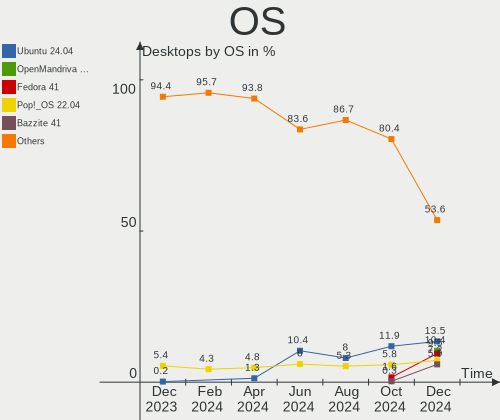
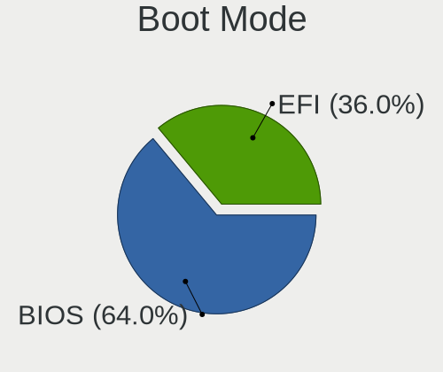
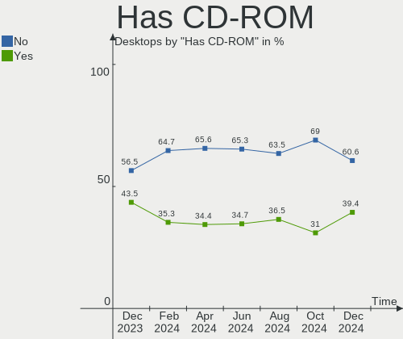
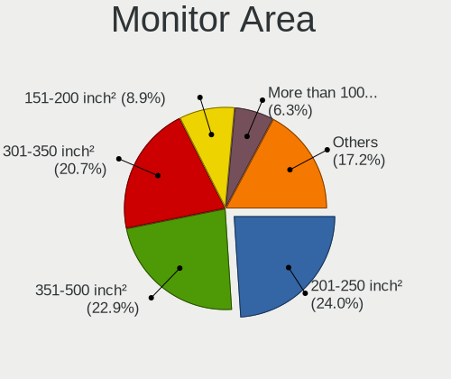
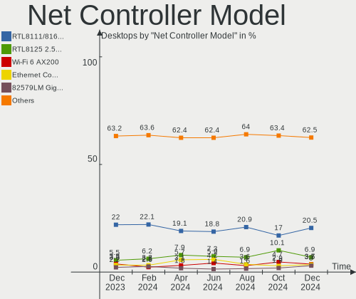
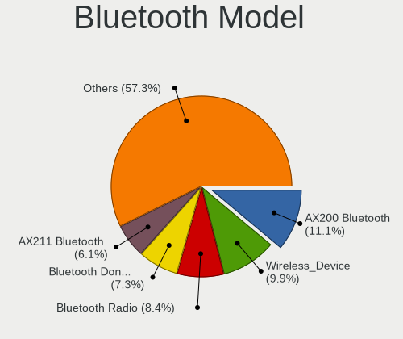
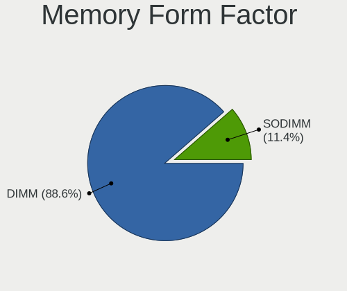
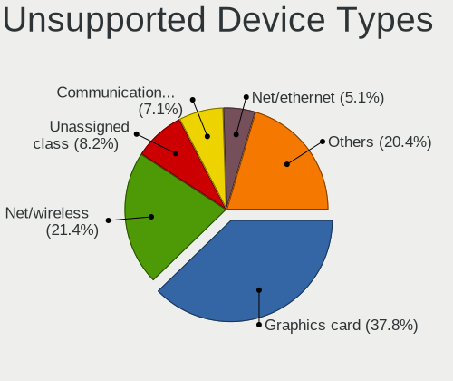

Linux in USA - Hardware Trends (Desktops)
-----------------------------------------

A project to identify most popular hardware characteristics and track their change
over time based on data collected by Linux users at https://Linux-Hardware.org.

Anyone can contribute to this report by the [hw-probe](https://github.com/linuxhw/hw-probe) tool:

    sudo -E hw-probe -all -upload

Period: Dec, 2022.

Contents
--------

* [ System ](#system)
  - [ OS                       ](#os)
  - [ OS Family                ](#os-family)
  - [ Kernel                   ](#kernel)
  - [ Kernel Family            ](#kernel-family)
  - [ Kernel Major Ver.        ](#kernel-major-ver)
  - [ Arch                     ](#arch)
  - [ DE                       ](#de)
  - [ Display Server           ](#display-server)
  - [ Display Manager          ](#display-manager)
  - [ OS Lang                  ](#os-lang)
  - [ Boot Mode                ](#boot-mode)
  - [ Filesystem               ](#filesystem)
  - [ Part. scheme             ](#part-scheme)
  - [ Dual Boot with Linux/BSD ](#dual-boot-with-linuxbsd)
  - [ Dual Boot (Win)          ](#dual-boot-win)

* [ Board ](#board)
  - [ Vendor                   ](#vendor)
  - [ Model                    ](#model)
  - [ Model Family             ](#model-family)
  - [ MFG Year                 ](#mfg-year)
  - [ Form Factor              ](#form-factor)
  - [ Secure Boot              ](#secure-boot)
  - [ Coreboot                 ](#coreboot)
  - [ RAM Size                 ](#ram-size)
  - [ RAM Used                 ](#ram-used)
  - [ Total Drives             ](#total-drives)
  - [ Has CD-ROM               ](#has-cd-rom)
  - [ Has Ethernet             ](#has-ethernet)
  - [ Has WiFi                 ](#has-wifi)
  - [ Has Bluetooth            ](#has-bluetooth)

* [ Location ](#location)
  - [ Country                  ](#country)
  - [ City                     ](#city)

* [ Drives ](#drives)
  - [ Drive Vendor             ](#drive-vendor)
  - [ Drive Model              ](#drive-model)
  - [ HDD Vendor               ](#hdd-vendor)
  - [ SSD Vendor               ](#ssd-vendor)
  - [ Drive Kind               ](#drive-kind)
  - [ Drive Connector          ](#drive-connector)
  - [ Drive Size               ](#drive-size)
  - [ Space Total              ](#space-total)
  - [ Space Used               ](#space-used)
  - [ Malfunc. Drives          ](#malfunc-drives)
  - [ Malfunc. Drive Vendor    ](#malfunc-drive-vendor)
  - [ Malfunc. HDD Vendor      ](#malfunc-hdd-vendor)
  - [ Malfunc. Drive Kind      ](#malfunc-drive-kind)
  - [ Failed Drives            ](#failed-drives)
  - [ Failed Drive Vendor      ](#failed-drive-vendor)
  - [ Drive Status             ](#drive-status)

* [ Storage controller ](#storage-controller)
  - [ Storage Vendor           ](#storage-vendor)
  - [ Storage Model            ](#storage-model)
  - [ Storage Kind             ](#storage-kind)

* [ Processor ](#processor)
  - [ CPU Vendor               ](#cpu-vendor)
  - [ CPU Model                ](#cpu-model)
  - [ CPU Model Family         ](#cpu-model-family)
  - [ CPU Cores                ](#cpu-cores)
  - [ CPU Sockets              ](#cpu-sockets)
  - [ CPU Threads              ](#cpu-threads)
  - [ CPU Op-Modes             ](#cpu-op-modes)
  - [ CPU Microcode            ](#cpu-microcode)
  - [ CPU Microarch            ](#cpu-microarch)

* [ Graphics ](#graphics)
  - [ GPU Vendor               ](#gpu-vendor)
  - [ GPU Model                ](#gpu-model)
  - [ GPU Combo                ](#gpu-combo)
  - [ GPU Driver               ](#gpu-driver)
  - [ GPU Memory               ](#gpu-memory)

* [ Monitor ](#monitor)
  - [ Monitor Vendor           ](#monitor-vendor)
  - [ Monitor Model            ](#monitor-model)
  - [ Monitor Resolution       ](#monitor-resolution)
  - [ Monitor Diagonal         ](#monitor-diagonal)
  - [ Monitor Width            ](#monitor-width)
  - [ Aspect Ratio             ](#aspect-ratio)
  - [ Monitor Area             ](#monitor-area)
  - [ Pixel Density            ](#pixel-density)
  - [ Multiple Monitors        ](#multiple-monitors)

* [ Network ](#network)
  - [ Net Controller Vendor    ](#net-controller-vendor)
  - [ Net Controller Model     ](#net-controller-model)
  - [ Wireless Vendor          ](#wireless-vendor)
  - [ Wireless Model           ](#wireless-model)
  - [ Ethernet Vendor          ](#ethernet-vendor)
  - [ Ethernet Model           ](#ethernet-model)
  - [ Net Controller Kind      ](#net-controller-kind)
  - [ Used Controller          ](#used-controller)
  - [ NICs                     ](#nics)
  - [ IPv6                     ](#ipv6)

* [ Bluetooth ](#bluetooth)
  - [ Bluetooth Vendor         ](#bluetooth-vendor)
  - [ Bluetooth Model          ](#bluetooth-model)

* [ Sound ](#sound)
  - [ Sound Vendor             ](#sound-vendor)
  - [ Sound Model              ](#sound-model)

* [ Memory ](#memory)
  - [ Memory Vendor            ](#memory-vendor)
  - [ Memory Model             ](#memory-model)
  - [ Memory Kind              ](#memory-kind)
  - [ Memory Form Factor       ](#memory-form-factor)
  - [ Memory Size              ](#memory-size)
  - [ Memory Speed             ](#memory-speed)

* [ Printers & scanners ](#printers--scanners)
  - [ Printer Vendor           ](#printer-vendor)
  - [ Printer Model            ](#printer-model)
  - [ Scanner Vendor           ](#scanner-vendor)
  - [ Scanner Model            ](#scanner-model)

* [ Camera ](#camera)
  - [ Camera Vendor            ](#camera-vendor)
  - [ Camera Model             ](#camera-model)

* [ Security ](#security)
  - [ Fingerprint Vendor       ](#fingerprint-vendor)
  - [ Fingerprint Model        ](#fingerprint-model)
  - [ Chipcard Vendor          ](#chipcard-vendor)
  - [ Chipcard Model           ](#chipcard-model)

* [ Unsupported ](#unsupported)
  - [ Unsupported Devices      ](#unsupported-devices)
  - [ Unsupported Device Types ](#unsupported-device-types)

System
------

OS
--

Installed operating systems

| Name                         | Desktops | Percent |
|------------------------------|----------|---------|
| Ubuntu 22.04                 | 80       | 20%     |
| Fedora 37                    | 40       | 10%     |
| Pop!_OS 22.04                | 28       | 7%      |
| Ubuntu 20.04                 | 20       | 5%      |
| Zorin 16                     | 19       | 4.75%   |
| Ubuntu 22.10                 | 18       | 4.5%    |
| Linux Mint 21                | 17       | 4.25%   |
| Debian 11                    | 13       | 3.25%   |
| Linux Mint 20.3              | 12       | 3%      |
| Gentoo 2.9                   | 11       | 2.75%   |
| Arch Rolling                 | 11       | 2.75%   |
| openSUSE Tumbleweed-XXXXXXXX | 9        | 2.25%   |
| KDE neon 22.04               | 9        | 2.25%   |
| OpenMandriva 4.50            | 8        | 2%      |
| OpenMandriva 22.12           | 7        | 1.75%   |
| OpenMandriva 4.3             | 6        | 1.5%    |
| Nobara 36                    | 6        | 1.5%    |
| Linux Mint 21.1              | 5        | 1.25%   |
| ArcoLinux Rolling            | 5        | 1.25%   |
| Manjaro 22.0.0               | 4        | 1%      |
| Manjaro                      | 4        | 1%      |
| Kubuntu 22.10                | 4        | 1%      |
| Kubuntu 22.04                | 4        | 1%      |
| Kali 2022.4                  | 4        | 1%      |
| Debian                       | 4        | 1%      |
| Ubuntu 18.04                 | 3        | 0.75%   |
| Linux Mint 20.1              | 3        | 0.75%   |
| Ubuntu Studio 22.04          | 2        | 0.5%    |
| Ubuntu MATE 22.04            | 2        | 0.5%    |
| Ubuntu Budgie 22.10          | 2        | 0.5%    |
| SteamOS 3.4                  | 2        | 0.5%    |
| MX 21                        | 2        | 0.5%    |
| LMDE 5                       | 2        | 0.5%    |
| ChimeraOS 37                 | 2        | 0.5%    |
| Xubuntu 20.04                | 1        | 0.25%   |
| Void Linux Rolling           | 1        | 0.25%   |
| Ubuntu Unity 22.04           | 1        | 0.25%   |
| Ubuntu Unity 18.04           | 1        | 0.25%   |
| Ubuntu Unity 16.04           | 1        | 0.25%   |
| Ubuntu MATE 22.10            | 1        | 0.25%   |

OS Family
---------

OS without a version

| Name          | Desktops | Percent |
|---------------|----------|---------|
| Ubuntu        | 121      | 30.25%  |
| Fedora        | 42       | 10.5%   |
| Linux Mint    | 38       | 9.5%    |
| Pop!_OS       | 28       | 7%      |
| OpenMandriva  | 22       | 5.5%    |
| Zorin         | 19       | 4.75%   |
| Debian        | 19       | 4.75%   |
| Gentoo        | 11       | 2.75%   |
| Arch          | 11       | 2.75%   |
| openSUSE      | 10       | 2.5%    |
| Kubuntu       | 9        | 2.25%   |
| KDE neon      | 9        | 2.25%   |
| Manjaro       | 8        | 2%      |
| Nobara        | 6        | 1.5%    |
| Kali          | 5        | 1.25%   |
| ArcoLinux     | 5        | 1.25%   |
| Ubuntu Unity  | 3        | 0.75%   |
| Ubuntu MATE   | 3        | 0.75%   |
| Ubuntu Studio | 2        | 0.5%    |
| Ubuntu Budgie | 2        | 0.5%    |
| SteamOS       | 2        | 0.5%    |
| MX            | 2        | 0.5%    |
| LMDE          | 2        | 0.5%    |
| ChimeraOS     | 2        | 0.5%    |
| Xubuntu       | 1        | 0.25%   |
| Void Linux    | 1        | 0.25%   |
| Trisquel      | 1        | 0.25%   |
| Solus         | 1        | 0.25%   |
| Slackware     | 1        | 0.25%   |
| ROSA          | 1        | 0.25%   |
| Rocky Linux   | 1        | 0.25%   |
| Parrot        | 1        | 0.25%   |
| Mabox         | 1        | 0.25%   |
| Lubuntu       | 1        | 0.25%   |
| Kaisen        | 1        | 0.25%   |
| Garuda Linux  | 1        | 0.25%   |
| Endless       | 1        | 0.25%   |
| EndeavourOS   | 1        | 0.25%   |
| Elementary    | 1        | 0.25%   |
| Clear Linux   | 1        | 0.25%   |

Kernel
------

Version of the Linux kernel

| Version                  | Desktops | Percent |
|--------------------------|----------|---------|
| 5.15.0-56-generic        | 124      | 31%     |
| 6.0.6-76060006-generic   | 16       | 4%      |
| 5.19.0-26-generic        | 15       | 3.75%   |
| 6.0.12-300.fc37.x86_64   | 13       | 3.25%   |
| 6.0.12-76060006-generic  | 11       | 2.75%   |
| 5.4.0-135-generic        | 11       | 2.75%   |
| 6.0.11-300.fc37.x86_64   | 8        | 2%      |
| 6.0.10-desktop-2omv22090 | 7        | 1.75%   |
| 5.15.0-53-generic        | 7        | 1.75%   |
| 5.10.0-19-amd64          | 7        | 1.75%   |
| 6.0.10-300.fc37.x86_64   | 6        | 1.5%    |
| 5.4.0-132-generic        | 6        | 1.5%    |
| 5.16.7-desktop-1omv4003  | 6        | 1.5%    |
| 5.15.0-43-generic        | 6        | 1.5%    |
| 6.0.15-300.fc37.x86_64   | 5        | 1.25%   |
| 6.0.12-arch1-1           | 5        | 1.25%   |
| 6.0.10-201.fc36.x86_64   | 5        | 1.25%   |
| 5.19.12-desktop-2omv4090 | 5        | 1.25%   |
| 6.0.12-1-default         | 4        | 1%      |
| 5.15.0-41-generic        | 4        | 1%      |
| 6.1.1-arch1-1            | 3        | 0.75%   |
| 6.0.9-arch1-1            | 3        | 0.75%   |
| 6.0.8-arch1-1            | 3        | 0.75%   |
| 6.0.14-300.fc37.x86_64   | 3        | 0.75%   |
| 6.0.0-kali6-amd64        | 3        | 0.75%   |
| 5.10.0-20-amd64          | 3        | 0.75%   |
| 6.0.9-060009-generic     | 2        | 0.5%    |
| 6.0.7-301.fc37.x86_64    | 2        | 0.5%    |
| 6.0.11-gentoo            | 2        | 0.5%    |
| 6.0.10-arch2-1           | 2        | 0.5%    |
| 6.0.10-1-default         | 2        | 0.5%    |
| 6.0.0-6-amd64            | 2        | 0.5%    |
| 6.0.0-5-amd64            | 2        | 0.5%    |
| 5.4.0-91-generic         | 2        | 0.5%    |
| 5.19.11-desktop-2omv4090 | 2        | 0.5%    |
| 5.19.0-28-generic        | 2        | 0.5%    |
| 5.19.0-27-generic        | 2        | 0.5%    |
| 5.19.0-23-generic        | 2        | 0.5%    |
| 5.19.0-21-generic        | 2        | 0.5%    |
| 5.17.0-1019-oem          | 2        | 0.5%    |

Kernel Family
-------------

Linux kernel without a distro release

| Version | Desktops | Percent |
|---------|----------|---------|
| 5.15.0  | 152      | 38%     |
| 6.0.12  | 35       | 8.75%   |
| 6.0.10  | 24       | 6%      |
| 5.4.0   | 23       | 5.75%   |
| 5.19.0  | 23       | 5.75%   |
| 6.0.6   | 16       | 4%      |
| 6.0.0   | 13       | 3.25%   |
| 5.10.0  | 12       | 3%      |
| 6.0.11  | 11       | 2.75%   |
| 6.1.1   | 6        | 1.5%    |
| 6.0.9   | 6        | 1.5%    |
| 5.16.7  | 6        | 1.5%    |
| 6.0.8   | 5        | 1.25%   |
| 6.0.15  | 5        | 1.25%   |
| 5.19.12 | 5        | 1.25%   |
| 6.0.14  | 4        | 1%      |
| 5.19.11 | 3        | 0.75%   |
| 5.15.85 | 3        | 0.75%   |
| 5.13.0  | 3        | 0.75%   |
| 4.15.0  | 3        | 0.75%   |
| 6.1.0   | 2        | 0.5%    |
| 6.0.7   | 2        | 0.5%    |
| 6.0.13  | 2        | 0.5%    |
| 5.19.17 | 2        | 0.5%    |
| 5.19.16 | 2        | 0.5%    |
| 5.17.0  | 2        | 0.5%    |
| 5.15.81 | 2        | 0.5%    |
| 5.15.80 | 2        | 0.5%    |
| 5.15.78 | 2        | 0.5%    |
| 5.15.77 | 2        | 0.5%    |
| 5.15.75 | 2        | 0.5%    |
| 5.15.74 | 2        | 0.5%    |
| 5.14.0  | 2        | 0.5%    |
| 5.4.225 | 1        | 0.25%   |
| 5.19.5  | 1        | 0.25%   |
| 5.19.13 | 1        | 0.25%   |
| 5.18.10 | 1        | 0.25%   |
| 5.18.0  | 1        | 0.25%   |
| 5.16.13 | 1        | 0.25%   |
| 5.15.83 | 1        | 0.25%   |

Kernel Major Ver.
-----------------

Linux kernel major version

| Version | Desktops | Percent |
|---------|----------|---------|
| 5.15    | 170      | 42.5%   |
| 6.0     | 123      | 30.75%  |
| 5.19    | 37       | 9.25%   |
| 5.4     | 24       | 6%      |
| 5.10    | 14       | 3.5%    |
| 6.1     | 8        | 2%      |
| 5.16    | 7        | 1.75%   |
| 5.14    | 3        | 0.75%   |
| 5.13    | 3        | 0.75%   |
| 4.15    | 3        | 0.75%   |
| 5.18    | 2        | 0.5%    |
| 5.17    | 2        | 0.5%    |
| 5.11    | 2        | 0.5%    |
| 4.4     | 1        | 0.25%   |
| 4.19    | 1        | 0.25%   |

Arch
----

OS architecture (x86_64, i586, etc.)

| Name   | Desktops | Percent |
|--------|----------|---------|
| x86_64 | 398      | 99.5%   |
| i686   | 2        | 0.5%    |

DE
--

Desktop Environment

| Name                   | Desktops | Percent |
|------------------------|----------|---------|
| GNOME                  | 216      | 54%     |
| KDE5                   | 82       | 20.5%   |
| X-Cinnamon             | 33       | 8.25%   |
| XFCE                   | 22       | 5.5%    |
| Unknown                | 14       | 3.5%    |
| MATE                   | 12       | 3%      |
| Cinnamon               | 4        | 1%      |
| Unity                  | 2        | 0.5%    |
| i3                     | 2        | 0.5%    |
| GNOME Classic          | 2        | 0.5%    |
| Budgie                 | 2        | 0.5%    |
| awesome                | 2        | 0.5%    |
| Trinity                | 1        | 0.25%   |
| sway                   | 1        | 0.25%   |
| Pantheon               | 1        | 0.25%   |
| openbox                | 1        | 0.25%   |
| LXQt                   | 1        | 0.25%   |
| LeftWM                 | 1        | 0.25%   |
| graphite:Wayfire:GNOME | 1        | 0.25%   |

Display Server
--------------

X11 or Wayland

| Name    | Desktops | Percent |
|---------|----------|---------|
| X11     | 262      | 65.5%   |
| Wayland | 112      | 28%     |
| Tty     | 16       | 4%      |
| Unknown | 10       | 2.5%    |

Display Manager
---------------

SDDM, LightDM, etc.

| Name    | Desktops | Percent |
|---------|----------|---------|
| Unknown | 156      | 39%     |
| GDM3    | 118      | 29.5%   |
| LightDM | 51       | 12.75%  |
| SDDM    | 48       | 12%     |
| GDM     | 25       | 6.25%   |
| XDM     | 2        | 0.5%    |

OS Lang
-------

Language

| Lang    | Desktops | Percent |
|---------|----------|---------|
| en_US   | 375      | 93.75%  |
| C       | 9        | 2.25%   |
| Unknown | 4        | 1%      |
| POSIX   | 3        | 0.75%   |
| en_CA   | 3        | 0.75%   |
| es_US   | 2        | 0.5%    |
| ru_RU   | 1        | 0.25%   |
| en_PH   | 1        | 0.25%   |
| en_AU   | 1        | 0.25%   |
| C.UTF8  | 1        | 0.25%   |

Boot Mode
---------

EFI or BIOS

| Mode | Desktops | Percent |
|------|----------|---------|
| BIOS | 212      | 53%     |
| EFI  | 188      | 47%     |

Filesystem
----------

Type of filesystem

| Type    | Desktops | Percent |
|---------|----------|---------|
| Ext4    | 294      | 73.5%   |
| Btrfs   | 69       | 17.25%  |
| Overlay | 27       | 6.75%   |
| Zfs     | 6        | 1.5%    |
| Xfs     | 2        | 0.5%    |
| F2fs    | 1        | 0.25%   |
| Ext3    | 1        | 0.25%   |

Part. scheme
------------

Scheme of partitioning

| Type    | Desktops | Percent |
|---------|----------|---------|
| GPT     | 222      | 55.5%   |
| Unknown | 137      | 34.25%  |
| MBR     | 41       | 10.25%  |

Dual Boot with Linux/BSD
------------------------

Hosting more than one Linux/BSD

| Dual boot | Desktops | Percent |
|-----------|----------|---------|
| No        | 335      | 83.75%  |
| Yes       | 65       | 16.25%  |

Dual Boot (Win)
---------------

Hosting Linux and Windows

| Dual boot | Desktops | Percent |
|-----------|----------|---------|
| No        | 290      | 72.5%   |
| Yes       | 110      | 27.5%   |

Board
-----

Vendor
------

Motherboard manufacturer

| Name                | Desktops | Percent |
|---------------------|----------|---------|
| ASUSTek Computer    | 88       | 22%     |
| Dell                | 69       | 17.25%  |
| MSI                 | 59       | 14.75%  |
| Hewlett-Packard     | 45       | 11.25%  |
| Gigabyte Technology | 39       | 9.75%   |
| ASRock              | 26       | 6.5%    |
| Lenovo              | 20       | 5%      |
| Pegatron            | 6        | 1.5%    |
| Intel               | 6        | 1.5%    |
| Acer                | 6        | 1.5%    |
| AZW                 | 4        | 1%      |
| Apple               | 4        | 1%      |
| System76            | 3        | 0.75%   |
| Biostar             | 3        | 0.75%   |
| Unknown             | 3        | 0.75%   |
| Supermicro          | 2        | 0.5%    |
| Gateway             | 2        | 0.5%    |
| ECS                 | 2        | 0.5%    |
| BESSTAR Tech        | 2        | 0.5%    |
| Alienware           | 2        | 0.5%    |
| Shuttle             | 1        | 0.25%   |
| NZXT                | 1        | 0.25%   |
| NetGear             | 1        | 0.25%   |
| NCR                 | 1        | 0.25%   |
| MAXSUN              | 1        | 0.25%   |
| IceWhale Technology | 1        | 0.25%   |
| Google              | 1        | 0.25%   |
| eMachines           | 1        | 0.25%   |
| Datto               | 1        | 0.25%   |

Model
-----

Motherboard model

| Name                                 | Desktops | Percent |
|--------------------------------------|----------|---------|
| ASUS All Series                      | 9        | 2.25%   |
| ASUS TUF Gaming X570-PLUS            | 7        | 1.75%   |
| ASUS ROG STRIX B450-F GAMING         | 5        | 1.25%   |
| MSI MS-7C91                          | 4        | 1%      |
| Dell OptiPlex 790                    | 4        | 1%      |
| Dell OptiPlex 7010                   | 4        | 1%      |
| Apple MacPro5,1                      | 4        | 1%      |
| System76 Thelio                      | 3        | 0.75%   |
| MSI MS-7C95                          | 3        | 0.75%   |
| MSI MS-7C56                          | 3        | 0.75%   |
| HP EliteDesk 800 G1 SFF              | 3        | 0.75%   |
| Dell OptiPlex 3050                   | 3        | 0.75%   |
| Dell OptiPlex 3020                   | 3        | 0.75%   |
| Dell Inspiron 530                    | 3        | 0.75%   |
| ASUS PRIME B550M-A                   | 3        | 0.75%   |
| Unknown                              | 3        | 0.75%   |
| MSI MS-7C75                          | 2        | 0.5%    |
| MSI MS-7C37                          | 2        | 0.5%    |
| MSI MS-7B86                          | 2        | 0.5%    |
| MSI MS-7B84                          | 2        | 0.5%    |
| MSI MS-7B79                          | 2        | 0.5%    |
| MSI MS-7B24                          | 2        | 0.5%    |
| MSI MS-7A34                          | 2        | 0.5%    |
| MSI MS-7850                          | 2        | 0.5%    |
| MSI MS-7721                          | 2        | 0.5%    |
| HP ProDesk 600 G1 SFF                | 2        | 0.5%    |
| HP Pavilion Gaming Desktop TG01-2xxx | 2        | 0.5%    |
| HP Pavilion Gaming Desktop TG01-0xxx | 2        | 0.5%    |
| HP Compaq Pro 6305 SFF               | 2        | 0.5%    |
| Gigabyte X570 AORUS ELITE WIFI       | 2        | 0.5%    |
| Dell XPS 8700                        | 2        | 0.5%    |
| Dell OptiPlex 990                    | 2        | 0.5%    |
| Dell OptiPlex 9020                   | 2        | 0.5%    |
| Dell OptiPlex 7050                   | 2        | 0.5%    |
| Dell OptiPlex 5070                   | 2        | 0.5%    |
| Dell OptiPlex 3040                   | 2        | 0.5%    |
| Dell OptiPlex 3010                   | 2        | 0.5%    |
| Dell Inspiron 3647                   | 2        | 0.5%    |
| AZW U59                              | 2        | 0.5%    |
| ASUS ROG STRIX X570-E GAMING         | 2        | 0.5%    |

Model Family
------------

Motherboard model prefix

| Name                  | Desktops | Percent |
|-----------------------|----------|---------|
| Dell OptiPlex         | 29       | 7.25%   |
| ASUS ROG              | 24       | 6%      |
| ASUS PRIME            | 22       | 5.5%    |
| Dell Inspiron         | 18       | 4.5%    |
| Lenovo ThinkCentre    | 11       | 2.75%   |
| ASUS TUF              | 10       | 2.5%    |
| HP Pavilion           | 9        | 2.25%   |
| HP EliteDesk          | 9        | 2.25%   |
| ASUS All              | 9        | 2.25%   |
| Dell XPS              | 8        | 2%      |
| HP Compaq             | 7        | 1.75%   |
| HP ProDesk            | 6        | 1.5%    |
| Dell Precision        | 6        | 1.5%    |
| Dell Vostro           | 5        | 1.25%   |
| Acer Aspire           | 5        | 1.25%   |
| MSI MS-7C91           | 4        | 1%      |
| Gigabyte X570         | 4        | 1%      |
| Apple MacPro5         | 4        | 1%      |
| System76 Thelio       | 3        | 0.75%   |
| MSI MS-7C95           | 3        | 0.75%   |
| MSI MS-7C56           | 3        | 0.75%   |
| ASUS ProArt           | 3        | 0.75%   |
| Unknown               | 3        | 0.75%   |
| MSI MS-7C75           | 2        | 0.5%    |
| MSI MS-7C37           | 2        | 0.5%    |
| MSI MS-7B86           | 2        | 0.5%    |
| MSI MS-7B84           | 2        | 0.5%    |
| MSI MS-7B79           | 2        | 0.5%    |
| MSI MS-7B24           | 2        | 0.5%    |
| MSI MS-7A34           | 2        | 0.5%    |
| MSI MS-7850           | 2        | 0.5%    |
| MSI MS-7721           | 2        | 0.5%    |
| MSI B250              | 2        | 0.5%    |
| Lenovo ThinkStation   | 2        | 0.5%    |
| Lenovo IdeaCentre     | 2        | 0.5%    |
| Gigabyte X470         | 2        | 0.5%    |
| Gigabyte AX370-Gaming | 2        | 0.5%    |
| Dell Studio           | 2        | 0.5%    |
| AZW U59               | 2        | 0.5%    |
| ASUS P8Z77-V          | 2        | 0.5%    |

MFG Year
--------

Motherboard manufacture year

| Year | Desktops | Percent |
|------|----------|---------|
| 2019 | 41       | 10.25%  |
| 2020 | 39       | 9.75%   |
| 2013 | 38       | 9.5%    |
| 2021 | 36       | 9%      |
| 2017 | 35       | 8.75%   |
| 2018 | 34       | 8.5%    |
| 2012 | 32       | 8%      |
| 2022 | 28       | 7%      |
| 2011 | 23       | 5.75%   |
| 2014 | 19       | 4.75%   |
| 2010 | 18       | 4.5%    |
| 2015 | 17       | 4.25%   |
| 2009 | 14       | 3.5%    |
| 2016 | 12       | 3%      |
| 2008 | 6        | 1.5%    |
| 2007 | 4        | 1%      |
| 2006 | 2        | 0.5%    |
| 2005 | 1        | 0.25%   |
| 2002 | 1        | 0.25%   |

Form Factor
-----------

Physical design of the computer

| Name    | Desktops | Percent |
|---------|----------|---------|
| Desktop | 400      | 100%    |

Secure Boot
-----------

Enabled or disabled

| State    | Desktops | Percent |
|----------|----------|---------|
| Disabled | 387      | 96.75%  |
| Enabled  | 13       | 3.25%   |

Coreboot
--------

Have coreboot on board

| Used | Desktops | Percent |
|------|----------|---------|
| No   | 399      | 99.75%  |
| Yes  | 1        | 0.25%   |

RAM Size
--------

Total RAM memory

| Size in GB      | Desktops | Percent |
|-----------------|----------|---------|
| 16.01-24.0      | 136      | 34%     |
| 32.01-64.0      | 79       | 19.75%  |
| 4.01-8.0        | 55       | 13.75%  |
| 8.01-16.0       | 47       | 11.75%  |
| 64.01-256.0     | 34       | 8.5%    |
| 3.01-4.0        | 23       | 5.75%   |
| 24.01-32.0      | 18       | 4.5%    |
| 1.01-2.0        | 5        | 1.25%   |
| More than 256.0 | 1        | 0.25%   |
| 2.01-3.0        | 1        | 0.25%   |
| 0.01-0.5        | 1        | 0.25%   |

RAM Used
--------

Used RAM memory

| Used GB    | Desktops | Percent |
|------------|----------|---------|
| 1.01-2.0   | 103      | 25.75%  |
| 2.01-3.0   | 98       | 24.5%   |
| 4.01-8.0   | 75       | 18.75%  |
| 3.01-4.0   | 66       | 16.5%   |
| 8.01-16.0  | 32       | 8%      |
| 0.51-1.0   | 11       | 2.75%   |
| 16.01-24.0 | 8        | 2%      |
| 0.01-0.5   | 4        | 1%      |
| 24.01-32.0 | 2        | 0.5%    |
| 32.01-64.0 | 1        | 0.25%   |

Total Drives
------------

Number of drives on board

| Drives | Desktops | Percent |
|--------|----------|---------|
| 1      | 145      | 36.25%  |
| 2      | 118      | 29.5%   |
| 3      | 63       | 15.75%  |
| 4      | 30       | 7.5%    |
| 5      | 21       | 5.25%   |
| 6      | 6        | 1.5%    |
| 7      | 5        | 1.25%   |
| 8      | 4        | 1%      |
| 9      | 3        | 0.75%   |
| 0      | 2        | 0.5%    |
| 21     | 1        | 0.25%   |
| 12     | 1        | 0.25%   |
| 11     | 1        | 0.25%   |

Has CD-ROM
----------

Has CD-ROM on board

| Presented | Desktops | Percent |
|-----------|----------|---------|
| No        | 221      | 55.25%  |
| Yes       | 179      | 44.75%  |

Has Ethernet
------------

Has Ethernet on board

| Presented | Desktops | Percent |
|-----------|----------|---------|
| Yes       | 396      | 99%     |
| No        | 4        | 1%      |

Has WiFi
--------

Has WiFi module

| Presented | Desktops | Percent |
|-----------|----------|---------|
| Yes       | 250      | 62.5%   |
| No        | 150      | 37.5%   |

Has Bluetooth
-------------

Has Bluetooth module

| Presented | Desktops | Percent |
|-----------|----------|---------|
| No        | 202      | 50.5%   |
| Yes       | 198      | 49.5%   |

Location
--------

Country
-------

Geographic location (country)

| Country | Desktops | Percent |
|---------|----------|---------|
| USA     | 400      | 100%    |

City
----

Geographic location (city)

| City            | Desktops | Percent |
|-----------------|----------|---------|
| Seattle         | 12       | 3%      |
| New York        | 6        | 1.5%    |
| Miami           | 5        | 1.25%   |
| Los Angeles     | 5        | 1.25%   |
| San Antonio     | 4        | 1%      |
| Portland        | 4        | 1%      |
| Phoenix         | 4        | 1%      |
| Philadelphia    | 4        | 1%      |
| Houston         | 4        | 1%      |
| Dublin          | 4        | 1%      |
| Denver          | 4        | 1%      |
| Chicago         | 4        | 1%      |
| Santa Clara     | 3        | 0.75%   |
| Milwaukee       | 3        | 0.75%   |
| Dallas          | 3        | 0.75%   |
| Boise           | 3        | 0.75%   |
| Ypsilanti       | 2        | 0.5%    |
| Tucson          | 2        | 0.5%    |
| Tampa           | 2        | 0.5%    |
| Syosset         | 2        | 0.5%    |
| Stockton        | 2        | 0.5%    |
| Springfield     | 2        | 0.5%    |
| Spokane         | 2        | 0.5%    |
| San Jose        | 2        | 0.5%    |
| Salem           | 2        | 0.5%    |
| Saint Augustine | 2        | 0.5%    |
| Rockford        | 2        | 0.5%    |
| Rochester       | 2        | 0.5%    |
| Reno            | 2        | 0.5%    |
| Raleigh         | 2        | 0.5%    |
| Olathe          | 2        | 0.5%    |
| Ocala           | 2        | 0.5%    |
| New Braunfels   | 2        | 0.5%    |
| Mililani Town   | 2        | 0.5%    |
| Lincoln         | 2        | 0.5%    |
| Kent            | 2        | 0.5%    |
| Kansas City     | 2        | 0.5%    |
| Jacksonville    | 2        | 0.5%    |
| Irvine          | 2        | 0.5%    |
| Indianapolis    | 2        | 0.5%    |

Drives
------

Drive Vendor
------------

Hard drive vendors

| Vendor                      | Desktops | Drives | Percent |
|-----------------------------|----------|--------|---------|
| Seagate                     | 132      | 198    | 17.53%  |
| WDC                         | 129      | 183    | 17.13%  |
| Samsung Electronics         | 116      | 152    | 15.41%  |
| SanDisk                     | 47       | 53     | 6.24%   |
| Toshiba                     | 34       | 38     | 4.52%   |
| Crucial                     | 34       | 40     | 4.52%   |
| Phison Electronics          | 22       | 24     | 2.92%   |
| Hitachi                     | 21       | 26     | 2.79%   |
| Kingston                    | 20       | 20     | 2.66%   |
| Intel                       | 16       | 20     | 2.12%   |
| Unknown                     | 15       | 20     | 1.99%   |
| SK hynix                    | 15       | 19     | 1.99%   |
| China                       | 13       | 14     | 1.73%   |
| PNY                         | 12       | 13     | 1.59%   |
| A-DATA Technology           | 12       | 13     | 1.59%   |
| SPCC                        | 10       | 10     | 1.33%   |
| Silicon Motion              | 8        | 9      | 1.06%   |
| HGST                        | 8        | 13     | 1.06%   |
| Team                        | 7        | 8      | 0.93%   |
| Phison                      | 6        | 7      | 0.8%    |
| KIOXIA                      | 6        | 6      | 0.8%    |
| Hewlett-Packard             | 6        | 6      | 0.8%    |
| Micron/Crucial Technology   | 5        | 6      | 0.66%   |
| Mushkin                     | 4        | 4      | 0.53%   |
| Micron Technology           | 4        | 4      | 0.53%   |
| Kingston Technology Company | 4        | 4      | 0.53%   |
| T-FORCE                     | 3        | 3      | 0.4%    |
| SABRENT                     | 3        | 3      | 0.4%    |
| Patriot                     | 3        | 3      | 0.4%    |
| NGFF                        | 3        | 3      | 0.4%    |
| Maxtor                      | 3        | 3      | 0.4%    |
| LITEON                      | 3        | 3      | 0.4%    |
| Corsair                     | 3        | 4      | 0.4%    |
| WD MediaMax                 | 2        | 2      | 0.27%   |
| USB3.0                      | 2        | 2      | 0.27%   |
| TO Exter                    | 2        | 2      | 0.27%   |
| Realtek Semiconductor       | 2        | 2      | 0.27%   |
| Mercury                     | 2        | 2      | 0.27%   |
| Inland                      | 2        | 2      | 0.27%   |
| Unknown                     | 2        | 3      | 0.27%   |

Drive Model
-----------

Hard drive models

| Model                                                  | Desktops | Percent |
|--------------------------------------------------------|----------|---------|
| Samsung NVMe SSD Controller SM981/PM981/PM983 500GB    | 20       | 2.3%    |
| Samsung NVMe SSD Controller PM9A1/PM9A3/980PRO 2TB     | 17       | 1.96%   |
| Seagate ST2000DM008-2FR102 2TB                         | 14       | 1.61%   |
| Seagate ST500DM002-1BD142 500GB                        | 11       | 1.27%   |
| Samsung SSD 860 EVO 1TB                                | 10       | 1.15%   |
| WDC WD10EZEX-08WN4A0 1TB                               | 9        | 1.04%   |
| Unknown SD/MMC/MS PRO 64GB                             | 8        | 0.92%   |
| Phison E16 PCIe4 NVMe Controller 512GB                 | 8        | 0.92%   |
| Phison E12 NVMe Controller 1TB                         | 8        | 0.92%   |
| Silicon Motion SM2263EN/SM2263XT SSD Controller 1024GB | 7        | 0.81%   |
| Samsung SSD 850 EVO 500GB                              | 7        | 0.81%   |
| Toshiba DT01ACA100 1TB                                 | 6        | 0.69%   |
| Seagate ST1000DM003-1SB102 1TB                         | 6        | 0.69%   |
| Samsung NVMe SSD Controller SM961/PM961/SM963 256GB    | 6        | 0.69%   |
| Crucial CT1000MX500SSD1 1TB                            | 6        | 0.69%   |
| Samsung SSD 870 QVO 2TB                                | 5        | 0.58%   |
| Samsung SSD 860 EVO 500GB                              | 5        | 0.58%   |
| Kingston SA400S37240G 240GB SSD                        | 5        | 0.58%   |
| Crucial CT500MX500SSD1 500GB                           | 5        | 0.58%   |
| WDC WD10EZEX-60M2NA0 1TB                               | 4        | 0.46%   |
| WDC WD10EZEX-22MFCA0 1TB                               | 4        | 0.46%   |
| WDC WD1003FZEX-00K3CA0 1TB                             | 4        | 0.46%   |
| Unknown SD/MMC 2GB                                     | 4        | 0.46%   |
| Unknown M.S./M.S.Pro/HG 16GB                           | 4        | 0.46%   |
| Seagate ST2000DM006-2DM164 2TB                         | 4        | 0.46%   |
| Seagate ST1000LM035-1RK172 1TB                         | 4        | 0.46%   |
| Seagate ST1000DM003-1ER162 1TB                         | 4        | 0.46%   |
| Seagate ST1000DM003-1CH162 1TB                         | 4        | 0.46%   |
| Seagate Expansion Desk 5TB                             | 4        | 0.46%   |
| SanDisk SDSSDA240G 240GB                               | 4        | 0.46%   |
| SanDisk Extreme SSD 500GB                              | 4        | 0.46%   |
| Samsung SSD 980 PRO 1TB                                | 4        | 0.46%   |
| Samsung SSD 870 EVO 500GB                              | 4        | 0.46%   |
| Samsung SSD 850 EVO 1TB                                | 4        | 0.46%   |
| PNY CS900 500GB SSD                                    | 4        | 0.46%   |
| Kingston SA400S37120G 120GB SSD                        | 4        | 0.46%   |
| Intel SSD 660P Series 1024GB                           | 4        | 0.46%   |
| WDC WDS100T2B0A-00SM50 1TB SSD                         | 3        | 0.35%   |
| WDC WD10EZEX-75WN4A1 1TB                               | 3        | 0.35%   |
| WDC WD10EZEX-75WN4A0 1TB                               | 3        | 0.35%   |

HDD Vendor
----------

Hard disk drive vendors

| Vendor              | Desktops | Drives | Percent |
|---------------------|----------|--------|---------|
| Seagate             | 127      | 185    | 40.71%  |
| WDC                 | 108      | 152    | 34.62%  |
| Toshiba             | 29       | 33     | 9.29%   |
| Hitachi             | 21       | 26     | 6.73%   |
| Unknown             | 9        | 10     | 2.88%   |
| HGST                | 7        | 11     | 2.24%   |
| Samsung Electronics | 4        | 4      | 1.28%   |
| Maxtor              | 3        | 3      | 0.96%   |
| USB3.0              | 2        | 2      | 0.64%   |
| WD MediaMax         | 1        | 1      | 0.32%   |
| Unknown             | 1        | 2      | 0.32%   |

SSD Vendor
----------

Solid state drive vendors

| Vendor              | Desktops | Drives | Percent |
|---------------------|----------|--------|---------|
| Samsung Electronics | 57       | 70     | 21.76%  |
| Crucial             | 32       | 37     | 12.21%  |
| SanDisk             | 29       | 32     | 11.07%  |
| WDC                 | 24       | 25     | 9.16%   |
| Kingston            | 18       | 18     | 6.87%   |
| China               | 13       | 14     | 4.96%   |
| PNY                 | 12       | 13     | 4.58%   |
| A-DATA Technology   | 11       | 12     | 4.2%    |
| SPCC                | 8        | 8      | 3.05%   |
| Team                | 7        | 8      | 2.67%   |
| SK hynix            | 6        | 6      | 2.29%   |
| Intel               | 6        | 6      | 2.29%   |
| Hewlett-Packard     | 5        | 5      | 1.91%   |
| Mushkin             | 4        | 4      | 1.53%   |
| Micron Technology   | 4        | 4      | 1.53%   |
| Patriot             | 3        | 3      | 1.15%   |
| NGFF                | 3        | 3      | 1.15%   |
| LITEON              | 3        | 3      | 1.15%   |
| TO Exter            | 2        | 2      | 0.76%   |
| Mercury             | 2        | 2      | 0.76%   |
| Inland              | 2        | 2      | 0.76%   |
| Toshiba             | 1        | 1      | 0.38%   |
| T-FORCE             | 1        | 1      | 0.38%   |
| Seagate             | 1        | 1      | 0.38%   |
| OWC                 | 1        | 1      | 0.38%   |
| Lexar               | 1        | 1      | 0.38%   |
| KingDian            | 1        | 1      | 0.38%   |
| Intenso             | 1        | 1      | 0.38%   |
| DIERYA              | 1        | 1      | 0.38%   |
| Corsair             | 1        | 1      | 0.38%   |
| ASMedia             | 1        | 1      | 0.38%   |
| Apple               | 1        | 1      | 0.38%   |

Drive Kind
----------

HDD or SSD

| Kind    | Desktops | Drives | Percent |
|---------|----------|--------|---------|
| HDD     | 239      | 429    | 37.34%  |
| SSD     | 217      | 288    | 33.91%  |
| NVMe    | 162      | 212    | 25.31%  |
| Unknown | 20       | 29     | 3.13%   |
| MMC     | 2        | 2      | 0.31%   |

Drive Connector
---------------

SATA, SAS, NVMe, etc.

| Type | Desktops | Drives | Percent |
|------|----------|--------|---------|
| SATA | 348      | 657    | 62.25%  |
| NVMe | 159      | 209    | 28.44%  |
| SAS  | 50       | 92     | 8.94%   |
| MMC  | 2        | 2      | 0.36%   |

Drive Size
----------

Size of hard drive

| Size in TB | Desktops | Drives | Percent |
|------------|----------|--------|---------|
| 0.01-0.5   | 203      | 269    | 39.04%  |
| 0.51-1.0   | 164      | 222    | 31.54%  |
| 1.01-2.0   | 72       | 86     | 13.85%  |
| 3.01-4.0   | 30       | 50     | 5.77%   |
| 4.01-10.0  | 26       | 42     | 5%      |
| 2.01-3.0   | 18       | 28     | 3.46%   |
| 10.01-20.0 | 7        | 20     | 1.35%   |

Space Total
-----------

Amount of disk space available on the file system

| Size in GB     | Desktops | Percent |
|----------------|----------|---------|
| 501-1000       | 76       | 19%     |
| More than 3000 | 69       | 17.25%  |
| 101-250        | 69       | 17.25%  |
| 251-500        | 65       | 16.25%  |
| 1001-2000      | 48       | 12%     |
| 1-20           | 25       | 6.25%   |
| 2001-3000      | 19       | 4.75%   |
| Unknown        | 13       | 3.25%   |
| 51-100         | 12       | 3%      |
| 21-50          | 4        | 1%      |

Space Used
----------

Amount of used disk space

| Used GB        | Desktops | Percent |
|----------------|----------|---------|
| 1-20           | 107      | 26.75%  |
| 21-50          | 68       | 17%     |
| 101-250        | 51       | 12.75%  |
| 51-100         | 44       | 11%     |
| 501-1000       | 30       | 7.5%    |
| 251-500        | 29       | 7.25%   |
| More than 3000 | 23       | 5.75%   |
| 1001-2000      | 23       | 5.75%   |
| Unknown        | 13       | 3.25%   |
| 2001-3000      | 12       | 3%      |

Malfunc. Drives
---------------

Drive models with a malfunction

| Model                                                           | Desktops | Drives | Percent |
|-----------------------------------------------------------------|----------|--------|---------|
| Seagate ST500DM002-1BD142 500GB                                 | 2        | 2      | 4.88%   |
| WDC WDS480G2G0A-00JH30 480GB SSD                                | 1        | 1      | 2.44%   |
| WDC WD800AAJS-00PSA0 80GB                                       | 1        | 1      | 2.44%   |
| WDC WD6400AAKS-65A7B0 640GB                                     | 1        | 1      | 2.44%   |
| WDC WD5000AAKX-08U6AA0 500GB                                    | 1        | 1      | 2.44%   |
| WDC WD5000AADS-00M2B0 500GB                                     | 1        | 1      | 2.44%   |
| WDC WD40EZRX-00SPEB0 4TB                                        | 1        | 1      | 2.44%   |
| WDC WD40EFRX-68N32N0 4TB                                        | 1        | 1      | 2.44%   |
| WDC WD30EFRX-68EUZN0 3TB                                        | 1        | 1      | 2.44%   |
| WDC WD30EFRX-68AX9N0 3TB                                        | 1        | 1      | 2.44%   |
| WDC WD2500BEVS-60UST0 250GB                                     | 1        | 1      | 2.44%   |
| WDC WD2000F9YZ-09N20L0 2TB                                      | 1        | 1      | 2.44%   |
| WDC WD140EDFZ-11A0VA0 14TB                                      | 1        | 2      | 2.44%   |
| WDC WD10EZEX-60M2NA0 1TB                                        | 1        | 1      | 2.44%   |
| WDC WD10EZEX-22RKKA0 1TB                                        | 1        | 1      | 2.44%   |
| Toshiba MK2561GSYN 250GB                                        | 1        | 1      | 2.44%   |
| Toshiba DT01ACA300 3TB                                          | 1        | 1      | 2.44%   |
| SPCC Solid State Disk 512GB                                     | 1        | 1      | 2.44%   |
| Seagate ST6000DM003-2CY186 6TB                                  | 1        | 1      | 2.44%   |
| Seagate ST500LM021-1KJ152 500GB                                 | 1        | 1      | 2.44%   |
| Seagate ST32000644NS 2TB                                        | 1        | 1      | 2.44%   |
| Seagate ST31000528AS 1TB                                        | 1        | 1      | 2.44%   |
| Seagate ST1000LM035-1RK172 1TB                                  | 1        | 1      | 2.44%   |
| Seagate ST1000LM014-1EJ164-SSHD 1TB                             | 1        | 1      | 2.44%   |
| Seagate ST1000DM010-2EP102 1TB                                  | 1        | 1      | 2.44%   |
| Seagate ST1000DM003-9YN162 1TB                                  | 1        | 1      | 2.44%   |
| SanDisk SSD PLUS 240GB                                          | 1        | 1      | 2.44%   |
| SanDisk SDSSDX240GG25 240GB                                     | 1        | 1      | 2.44%   |
| Samsung Electronics NVMe SSD Controller SM981/PM981/PM983 500GB | 1        | 2      | 2.44%   |
| Samsung Electronics MZVKW512HMJP-00000 512GB                    | 1        | 1      | 2.44%   |
| Maxtor 6Y160M0 160GB                                            | 1        | 1      | 2.44%   |
| Maxtor 6L160M0 160GB                                            | 1        | 1      | 2.44%   |
| Kingston SV300S37A120G 120GB SSD                                | 1        | 1      | 2.44%   |
| Intel SSDSC2BA400G3R 400GB                                      | 1        | 1      | 2.44%   |
| Hitachi HTS725032A9A364 320GB                                   | 1        | 1      | 2.44%   |
| Hitachi HTS725032A9A360 320GB                                   | 1        | 1      | 2.44%   |
| Hitachi HTS725025A9A364 250GB                                   | 1        | 1      | 2.44%   |
| Hitachi HDT721010SLA360 1TB                                     | 1        | 1      | 2.44%   |
| Hitachi HDS721010CLA632 1TB                                     | 1        | 1      | 2.44%   |
| Crucial CT500MX500SSD1 500GB                                    | 1        | 1      | 2.44%   |

Malfunc. Drive Vendor
---------------------

Vendors of faulty drives

| Vendor              | Desktops | Drives | Percent |
|---------------------|----------|--------|---------|
| WDC                 | 13       | 15     | 34.21%  |
| Seagate             | 9        | 10     | 23.68%  |
| Hitachi             | 4        | 5      | 10.53%  |
| Toshiba             | 2        | 2      | 5.26%   |
| SanDisk             | 2        | 2      | 5.26%   |
| Samsung Electronics | 2        | 3      | 5.26%   |
| Maxtor              | 2        | 2      | 5.26%   |
| SPCC                | 1        | 1      | 2.63%   |
| Kingston            | 1        | 1      | 2.63%   |
| Intel               | 1        | 1      | 2.63%   |
| Crucial             | 1        | 1      | 2.63%   |

Malfunc. HDD Vendor
-------------------

Vendors of faulty HDD drives

| Vendor  | Desktops | Drives | Percent |
|---------|----------|--------|---------|
| WDC     | 12       | 14     | 41.38%  |
| Seagate | 9        | 10     | 31.03%  |
| Hitachi | 4        | 5      | 13.79%  |
| Toshiba | 2        | 2      | 6.9%    |
| Maxtor  | 2        | 2      | 6.9%    |

Malfunc. Drive Kind
-------------------

Kinds of faulty drives

| Kind | Desktops | Drives | Percent |
|------|----------|--------|---------|
| HDD  | 25       | 33     | 73.53%  |
| SSD  | 7        | 7      | 20.59%  |
| NVMe | 2        | 3      | 5.88%   |

Failed Drives
-------------

Failed drive models

Zero info for selected period =(

Failed Drive Vendor
-------------------

Failed drive vendors

Zero info for selected period =(

Drive Status
------------

Number of failed and malfunc. drives

| Status   | Desktops | Drives | Percent |
|----------|----------|--------|---------|
| Detected | 254      | 587    | 58.12%  |
| Works    | 151      | 330    | 34.55%  |
| Malfunc  | 32       | 43     | 7.32%   |

Storage controller
------------------

Storage Vendor
--------------

Storage controller vendors

| Vendor                           | Desktops | Percent |
|----------------------------------|----------|---------|
| Intel                            | 231      | 36.96%  |
| AMD                              | 159      | 25.44%  |
| Samsung Electronics              | 65       | 10.4%   |
| Phison Electronics               | 30       | 4.8%    |
| SanDisk                          | 26       | 4.16%   |
| ASMedia Technology               | 26       | 4.16%   |
| Marvell Technology Group         | 14       | 2.24%   |
| JMicron Technology               | 10       | 1.6%    |
| SK hynix                         | 9        | 1.44%   |
| Silicon Motion                   | 9        | 1.44%   |
| Micron/Crucial Technology        | 8        | 1.28%   |
| Nvidia                           | 7        | 1.12%   |
| KIOXIA                           | 6        | 0.96%   |
| Kingston Technology Company      | 6        | 0.96%   |
| Broadcom / LSI                   | 5        | 0.8%    |
| Realtek Semiconductor            | 4        | 0.64%   |
| Toshiba America Info Systems     | 3        | 0.48%   |
| Biwin Storage Technology         | 2        | 0.32%   |
| VIA Technologies                 | 1        | 0.16%   |
| Silicon Integrated Systems [SiS] | 1        | 0.16%   |
| Silicon Image                    | 1        | 0.16%   |
| LSI Logic / Symbios Logic        | 1        | 0.16%   |
| ADATA Technology                 | 1        | 0.16%   |

Storage Model
-------------

Storage controller models

| Model                                                                          | Desktops | Percent |
|--------------------------------------------------------------------------------|----------|---------|
| AMD FCH SATA Controller [AHCI mode]                                            | 92       | 12.42%  |
| Intel 8 Series/C220 Series Chipset Family 6-port SATA Controller 1 [AHCI mode] | 33       | 4.45%   |
| AMD 400 Series Chipset SATA Controller                                         | 32       | 4.32%   |
| Samsung NVMe SSD Controller SM981/PM981/PM983                                  | 30       | 4.05%   |
| ASMedia ASM1062 Serial ATA Controller                                          | 24       | 3.24%   |
| AMD 500 Series Chipset SATA Controller                                         | 23       | 3.1%    |
| Samsung NVMe SSD Controller PM9A1/PM9A3/980PRO                                 | 22       | 2.97%   |
| Intel 200 Series PCH SATA controller [AHCI mode]                               | 22       | 2.97%   |
| Intel 6 Series/C200 Series Chipset Family 6 port Desktop SATA AHCI Controller  | 19       | 2.56%   |
| Intel SATA Controller [RAID mode]                                              | 18       | 2.43%   |
| AMD SB7x0/SB8x0/SB9x0 IDE Controller                                           | 16       | 2.16%   |
| Intel Q170/Q150/B150/H170/H110/Z170/CM236 Chipset SATA Controller [AHCI Mode]  | 15       | 2.02%   |
| Intel 7 Series/C210 Series Chipset Family 6-port SATA Controller [AHCI mode]   | 13       | 1.75%   |
| AMD SB7x0/SB8x0/SB9x0 SATA Controller [IDE mode]                               | 13       | 1.75%   |
| Phison E16 PCIe4 NVMe Controller                                               | 12       | 1.62%   |
| Phison E12 NVMe Controller                                                     | 12       | 1.62%   |
| Intel Alder Lake-S PCH SATA Controller [AHCI Mode]                             | 11       | 1.48%   |
| AMD 300 Series Chipset SATA Controller                                         | 10       | 1.35%   |
| Intel Cannon Lake PCH SATA AHCI Controller                                     | 9        | 1.21%   |
| AMD SB7x0/SB8x0/SB9x0 SATA Controller [AHCI mode]                              | 9        | 1.21%   |
| SanDisk Non-Volatile memory controller                                         | 8        | 1.08%   |
| Samsung NVMe SSD Controller SM961/PM961/SM963                                  | 8        | 1.08%   |
| Intel 82801JI (ICH10 Family) SATA AHCI Controller                              | 8        | 1.08%   |
| Intel 500 Series Chipset Family SATA AHCI Controller                           | 8        | 1.08%   |
| AMD SATA controller                                                            | 8        | 1.08%   |
| Silicon Motion SM2263EN/SM2263XT SSD Controller                                | 7        | 0.94%   |
| Intel Comet Lake SATA AHCI Controller                                          | 7        | 0.94%   |
| Intel C600/X79 series chipset 6-Port SATA AHCI Controller                      | 7        | 0.94%   |
| AMD X370 Series Chipset SATA Controller                                        | 7        | 0.94%   |
| Marvell Group 88SE9215 PCIe 2.0 x1 4-port SATA 6 Gb/s Controller               | 6        | 0.81%   |
| KIOXIA NVMe SSD Controller BG4                                                 | 6        | 0.81%   |
| Intel SSD 660P Series                                                          | 6        | 0.81%   |
| Intel 9 Series Chipset Family SATA Controller [AHCI Mode]                      | 6        | 0.81%   |
| SK hynix Gold P31/PC711 NVMe Solid State Drive                                 | 5        | 0.67%   |
| SanDisk WD Blue SN550 NVMe SSD                                                 | 5        | 0.67%   |
| SanDisk WD Black 2018/SN750 / PC SN720 NVMe SSD                                | 5        | 0.67%   |
| Samsung NVMe SSD Controller 980                                                | 5        | 0.67%   |
| Micron/Crucial P2 NVMe PCIe SSD                                                | 5        | 0.67%   |
| Intel Volume Management Device NVMe RAID Controller                            | 5        | 0.67%   |
| Intel C610/X99 series chipset sSATA Controller [AHCI mode]                     | 5        | 0.67%   |

Storage Kind
------------

Kind of storage controller (IDE, SATA, NVMe, SAS, ...)

| Kind | Desktops | Percent |
|------|----------|---------|
| SATA | 346      | 57.38%  |
| NVMe | 159      | 26.37%  |
| IDE  | 57       | 9.45%   |
| RAID | 32       | 5.31%   |
| SAS  | 9        | 1.49%   |

Processor
---------

CPU Vendor
----------

Processor vendors

| Vendor | Desktops | Percent |
|--------|----------|---------|
| Intel  | 233      | 58.25%  |
| AMD    | 167      | 41.75%  |

CPU Model
---------

Processor models

| Model                                   | Desktops | Percent |
|-----------------------------------------|----------|---------|
| AMD Ryzen 5 5600G with Radeon Graphics  | 8        | 2%      |
| AMD Ryzen 5 3600 6-Core Processor       | 8        | 2%      |
| Intel Core i5-2400 CPU @ 3.10GHz        | 7        | 1.75%   |
| AMD Ryzen 9 5950X 16-Core Processor     | 7        | 1.75%   |
| AMD Ryzen 9 5900X 12-Core Processor     | 7        | 1.75%   |
| AMD Ryzen 7 5800X 8-Core Processor      | 7        | 1.75%   |
| AMD Ryzen 7 3700X 8-Core Processor      | 7        | 1.75%   |
| AMD Ryzen 5 2600 Six-Core Processor     | 6        | 1.5%    |
| Intel Core i7-4790K CPU @ 4.00GHz       | 5        | 1.25%   |
| Intel Core i7-3770 CPU @ 3.40GHz        | 5        | 1.25%   |
| AMD Ryzen 9 3900X 12-Core Processor     | 5        | 1.25%   |
| Intel Core i7-8700K CPU @ 3.70GHz       | 4        | 1%      |
| Intel Core i7-7700 CPU @ 3.60GHz        | 4        | 1%      |
| Intel Core i7-4790 CPU @ 3.60GHz        | 4        | 1%      |
| Intel Core i7-2600 CPU @ 3.40GHz        | 4        | 1%      |
| Intel Core i5-6500T CPU @ 2.50GHz       | 4        | 1%      |
| Intel Core i5-4590 CPU @ 3.30GHz        | 4        | 1%      |
| Intel Core i5-4570 CPU @ 3.20GHz        | 4        | 1%      |
| Intel Core i5-3470 CPU @ 3.20GHz        | 4        | 1%      |
| Intel Core i5-10400 CPU @ 2.90GHz       | 4        | 1%      |
| AMD Ryzen 7 2700X Eight-Core Processor  | 4        | 1%      |
| AMD Ryzen 7 1700X Eight-Core Processor  | 4        | 1%      |
| AMD Ryzen 5 1600 Six-Core Processor     | 4        | 1%      |
| Intel Pentium CPU G3220 @ 3.00GHz       | 3        | 0.75%   |
| Intel Core i9-10850K CPU @ 3.60GHz      | 3        | 0.75%   |
| Intel Core i7-6700 CPU @ 3.40GHz        | 3        | 0.75%   |
| Intel Core i7-4770 CPU @ 3.40GHz        | 3        | 0.75%   |
| Intel Core i7-3820 CPU @ 3.60GHz        | 3        | 0.75%   |
| Intel Core i5-9400 CPU @ 2.90GHz        | 3        | 0.75%   |
| Intel Core i5-7400 CPU @ 3.00GHz        | 3        | 0.75%   |
| Intel Core i5-6500 CPU @ 3.20GHz        | 3        | 0.75%   |
| Intel Core i5-4690K CPU @ 3.50GHz       | 3        | 0.75%   |
| Intel Core i5-4670K CPU @ 3.40GHz       | 3        | 0.75%   |
| Intel Celeron N5095 @ 2.00GHz           | 3        | 0.75%   |
| Intel 11th Gen Core i9-11900K @ 3.50GHz | 3        | 0.75%   |
| AMD Ryzen 9 7950X 16-Core Processor     | 3        | 0.75%   |
| AMD Ryzen 7 7700X 8-Core Processor      | 3        | 0.75%   |
| AMD Ryzen 7 1700 Eight-Core Processor   | 3        | 0.75%   |
| AMD Ryzen 5 5600X 6-Core Processor      | 3        | 0.75%   |
| AMD Ryzen 5 2600X Six-Core Processor    | 3        | 0.75%   |

CPU Model Family
----------------

Processor model prefix

| Model                   | Desktops | Percent |
|-------------------------|----------|---------|
| Intel Core i5           | 69       | 17.25%  |
| Intel Core i7           | 57       | 14.25%  |
| AMD Ryzen 5             | 42       | 10.5%   |
| AMD Ryzen 7             | 38       | 9.5%    |
| AMD Ryzen 9             | 29       | 7.25%   |
| Other                   | 23       | 5.75%   |
| Intel Core i3           | 21       | 5.25%   |
| Intel Xeon              | 20       | 5%      |
| Intel Celeron           | 12       | 3%      |
| AMD FX                  | 11       | 2.75%   |
| Intel Pentium           | 7        | 1.75%   |
| Intel Core i9           | 6        | 1.5%    |
| AMD A10                 | 6        | 1.5%    |
| Intel Core 2 Quad       | 5        | 1.25%   |
| Intel Core 2 Duo        | 5        | 1.25%   |
| AMD Ryzen 3             | 5        | 1.25%   |
| AMD Phenom II X6        | 5        | 1.25%   |
| AMD Ryzen Threadripper  | 4        | 1%      |
| AMD Athlon II X2        | 4        | 1%      |
| AMD A6                  | 4        | 1%      |
| Intel Pentium Dual-Core | 3        | 0.75%   |
| AMD Athlon 64 X2        | 3        | 0.75%   |
| AMD A8                  | 3        | 0.75%   |
| AMD A4                  | 3        | 0.75%   |
| Intel Core 2            | 2        | 0.5%    |
| AMD Phenom II X4        | 2        | 0.5%    |
| Intel Pentium Gold      | 1        | 0.25%   |
| Intel Pentium 4         | 1        | 0.25%   |
| Intel Genuine           | 1        | 0.25%   |
| Intel Core 2 Extreme    | 1        | 0.25%   |
| AMD Ryzen Embedded      | 1        | 0.25%   |
| AMD Ryzen 5 PRO         | 1        | 0.25%   |
| AMD E                   | 1        | 0.25%   |
| AMD Athlon II X4        | 1        | 0.25%   |
| AMD Athlon II X3        | 1        | 0.25%   |
| AMD Athlon Dual Core    | 1        | 0.25%   |
| AMD Athlon              | 1        | 0.25%   |

CPU Cores
---------

Number of processor cores

| Number | Desktops | Percent |
|--------|----------|---------|
| 4      | 139      | 34.75%  |
| 6      | 70       | 17.5%   |
| 2      | 68       | 17%     |
| 8      | 59       | 14.75%  |
| 12     | 25       | 6.25%   |
| 16     | 16       | 4%      |
| 1      | 10       | 2.5%    |
| 10     | 6        | 1.5%    |
| 32     | 2        | 0.5%    |
| 14     | 2        | 0.5%    |
| 28     | 1        | 0.25%   |
| 24     | 1        | 0.25%   |
| 3      | 1        | 0.25%   |

CPU Sockets
-----------

Number of sockets

| Number | Desktops | Percent |
|--------|----------|---------|
| 1      | 391      | 97.75%  |
| 2      | 9        | 2.25%   |

CPU Threads
-----------

Threads per core (Hyper-Threading)

| Number | Desktops | Percent |
|--------|----------|---------|
| 2      | 259      | 64.75%  |
| 1      | 141      | 35.25%  |

CPU Op-Modes
------------

CPU Operation Modes (32-bit, 64-bit)

| Op mode        | Desktops | Percent |
|----------------|----------|---------|
| 32-bit, 64-bit | 399      | 99.75%  |
| 32-bit         | 1        | 0.25%   |

CPU Microcode
-------------

Microcode number

| Number     | Desktops | Percent |
|------------|----------|---------|
| Unknown    | 145      | 36.25%  |
| 0x306c3    | 32       | 8%      |
| 0x08701021 | 16       | 4%      |
| 0x506e3    | 12       | 3%      |
| 0x206a7    | 12       | 3%      |
| 0x0800820d | 11       | 2.75%   |
| 0x906e9    | 10       | 2.5%    |
| 0x306a9    | 8        | 2%      |
| 0xa0671    | 7        | 1.75%   |
| 0x906ea    | 7        | 1.75%   |
| 0x0a601203 | 7        | 1.75%   |
| 0x206d7    | 6        | 1.5%    |
| 0x1067a    | 6        | 1.5%    |
| 0x0a50000d | 6        | 1.5%    |
| 0x06001119 | 6        | 1.5%    |
| 0x90672    | 5        | 1.25%   |
| 0x0a201016 | 5        | 1.25%   |
| 0xa0655    | 4        | 1%      |
| 0x206c2    | 4        | 1%      |
| 0x106a5    | 4        | 1%      |
| 0x0a20120a | 4        | 1%      |
| 0x08701013 | 4        | 1%      |
| 0x08101016 | 4        | 1%      |
| 0xa0653    | 3        | 0.75%   |
| 0x906ed    | 3        | 0.75%   |
| 0x406f1    | 3        | 0.75%   |
| 0x306f2    | 3        | 0.75%   |
| 0x0a50000c | 3        | 0.75%   |
| 0x08001138 | 3        | 0.75%   |
| 0x06000822 | 3        | 0.75%   |
| 0x906eb    | 2        | 0.5%    |
| 0x906c0    | 2        | 0.5%    |
| 0x50654    | 2        | 0.5%    |
| 0x20652    | 2        | 0.5%    |
| 0x10676    | 2        | 0.5%    |
| 0x0a201205 | 2        | 0.5%    |
| 0x0a201009 | 2        | 0.5%    |
| 0x08301025 | 2        | 0.5%    |
| 0x08108109 | 2        | 0.5%    |
| 0x0800820b | 2        | 0.5%    |

CPU Microarch
-------------

Microarchitecture

| Name             | Desktops | Percent |
|------------------|----------|---------|
| Haswell          | 48       | 12%     |
| Zen 3            | 41       | 10.25%  |
| KabyLake         | 38       | 9.5%    |
| Zen 2            | 34       | 8.5%    |
| SandyBridge      | 31       | 7.75%   |
| Zen+             | 21       | 5.25%   |
| Skylake          | 20       | 5%      |
| Unknown          | 19       | 4.75%   |
| Piledriver       | 18       | 4.5%    |
| IvyBridge        | 17       | 4.25%   |
| Zen              | 16       | 4%      |
| K10              | 13       | 3.25%   |
| Penryn           | 11       | 2.75%   |
| CometLake        | 11       | 2.75%   |
| Westmere         | 9        | 2.25%   |
| Nehalem          | 7        | 1.75%   |
| Icelake          | 7        | 1.75%   |
| Core             | 6        | 1.5%    |
| Alderlake Hybrid | 5        | 1.25%   |
| K8 Hammer        | 4        | 1%      |
| Broadwell        | 4        | 1%      |
| Steamroller      | 3        | 0.75%   |
| Excavator        | 3        | 0.75%   |
| Tremont          | 2        | 0.5%    |
| NetBurst         | 2        | 0.5%    |
| Goldmont         | 2        | 0.5%    |
| Bulldozer        | 2        | 0.5%    |
| Silvermont       | 1        | 0.25%   |
| Puma             | 1        | 0.25%   |
| K10 Llano        | 1        | 0.25%   |
| Jaguar           | 1        | 0.25%   |
| Goldmont plus    | 1        | 0.25%   |
| Bobcat           | 1        | 0.25%   |

Graphics
--------

GPU Vendor
----------

Vendors of graphics cards

| Vendor                     | Desktops | Percent |
|----------------------------|----------|---------|
| AMD                        | 158      | 37.09%  |
| Nvidia                     | 138      | 32.39%  |
| Intel                      | 128      | 30.05%  |
| Matrox Electronics Systems | 1        | 0.23%   |
| ASPEED Technology          | 1        | 0.23%   |

GPU Model
---------

Graphics card models

| Model                                                                       | Desktops | Percent |
|-----------------------------------------------------------------------------|----------|---------|
| AMD Ellesmere [Radeon RX 470/480/570/570X/580/580X/590]                     | 26       | 5.9%    |
| Intel Xeon E3-1200 v3/4th Gen Core Processor Integrated Graphics Controller | 23       | 5.22%   |
| Intel CoffeeLake-S GT2 [UHD Graphics 630]                                   | 15       | 3.4%    |
| Intel HD Graphics 530                                                       | 14       | 3.17%   |
| Intel 2nd Generation Core Processor Family Integrated Graphics Controller   | 14       | 3.17%   |
| AMD Navi 10 [Radeon RX 5600 OEM/5600 XT / 5700/5700 XT]                     | 12       | 2.72%   |
| AMD Cezanne [Radeon Vega Series / Radeon Vega Mobile Series]                | 11       | 2.49%   |
| Intel Xeon E3-1200 v2/3rd Gen Core processor Graphics Controller            | 10       | 2.27%   |
| Nvidia GA106 [GeForce RTX 3060 Lite Hash Rate]                              | 9        | 2.04%   |
| Nvidia GP104 [GeForce GTX 1070]                                             | 8        | 1.81%   |
| Intel HD Graphics 630                                                       | 7        | 1.59%   |
| AMD Raphael                                                                 | 7        | 1.59%   |
| AMD Lexa PRO [Radeon 540/540X/550/550X / RX 540X/550/550X]                  | 7        | 1.59%   |
| AMD Navi 22 [Radeon RX 6700/6700 XT/6750 XT / 6800M]                        | 6        | 1.36%   |
| AMD Navi 21 [Radeon RX 6800/6800 XT / 6900 XT]                              | 6        | 1.36%   |
| Nvidia GP108 [GeForce GT 1030]                                              | 5        | 1.13%   |
| Nvidia GP104 [GeForce GTX 1080]                                             | 5        | 1.13%   |
| Nvidia GA104 [GeForce RTX 3060 Ti Lite Hash Rate]                           | 5        | 1.13%   |
| Intel CometLake-S GT2 [UHD Graphics 630]                                    | 5        | 1.13%   |
| Intel 4th Generation Core Processor Family Integrated Graphics Controller   | 5        | 1.13%   |
| Nvidia GM204 [GeForce GTX 970]                                              | 4        | 0.91%   |
| Intel RocketLake-S GT1 [UHD Graphics 750]                                   | 4        | 0.91%   |
| Intel 4 Series Chipset Integrated Graphics Controller                       | 4        | 0.91%   |
| AMD Raven Ridge [Radeon Vega Series / Radeon Vega Mobile Series]            | 4        | 0.91%   |
| AMD Navi 23 [Radeon RX 6650 XT]                                             | 4        | 0.91%   |
| AMD Navi 23 [Radeon RX 6600/6600 XT/6600M]                                  | 4        | 0.91%   |
| AMD Baffin [Radeon RX 550 640SP / RX 560/560X]                              | 4        | 0.91%   |
| AMD Baffin [Radeon RX 460/560D / Pro 450/455/460/555/555X/560/560X]         | 4        | 0.91%   |
| Nvidia TU104 [GeForce RTX 2080 SUPER]                                       | 3        | 0.68%   |
| Nvidia GT218 [GeForce 8400 GS Rev. 3]                                       | 3        | 0.68%   |
| Nvidia GP107 [GeForce GTX 1050]                                             | 3        | 0.68%   |
| Nvidia GP107 [GeForce GTX 1050 Ti]                                          | 3        | 0.68%   |
| Nvidia GP106 [GeForce GTX 1060 3GB]                                         | 3        | 0.68%   |
| Nvidia GP102 [GeForce GTX 1080 Ti]                                          | 3        | 0.68%   |
| Nvidia GM107 [GeForce GTX 750]                                              | 3        | 0.68%   |
| Nvidia GM107 [GeForce GTX 745]                                              | 3        | 0.68%   |
| Nvidia GK107 [GeForce GT 640]                                               | 3        | 0.68%   |
| Nvidia GA104 [GeForce RTX 3070 Lite Hash Rate]                              | 3        | 0.68%   |
| Nvidia GA102 [GeForce RTX 3080]                                             | 3        | 0.68%   |
| Nvidia GA102 [GeForce RTX 3080 Lite Hash Rate]                              | 3        | 0.68%   |

GPU Combo
---------

Combinations of graphics cards

| Name           | Desktops | Percent |
|----------------|----------|---------|
| 1 x AMD        | 133      | 33.25%  |
| 1 x Nvidia     | 124      | 31%     |
| 1 x Intel      | 107      | 26.75%  |
| 2 x AMD        | 12       | 3%      |
| Intel + Nvidia | 7        | 1.75%   |
| Intel + AMD    | 6        | 1.5%    |
| AMD + Nvidia   | 5        | 1.25%   |
| 2 x Intel      | 3        | 0.75%   |
| 2 x Nvidia     | 1        | 0.25%   |
| 1 x Matrox     | 1        | 0.25%   |
| 1 x ASPEED     | 1        | 0.25%   |

GPU Driver
----------

Free vs proprietary

| Driver      | Desktops | Percent |
|-------------|----------|---------|
| Free        | 301      | 75.25%  |
| Proprietary | 81       | 20.25%  |
| Unknown     | 18       | 4.5%    |

GPU Memory
----------

Total video memory

| Size in GB | Desktops | Percent |
|------------|----------|---------|
| Unknown    | 210      | 52.5%   |
| 7.01-8.0   | 54       | 13.5%   |
| 1.01-2.0   | 29       | 7.25%   |
| 3.01-4.0   | 28       | 7%      |
| 8.01-16.0  | 23       | 5.75%   |
| 0.51-1.0   | 21       | 5.25%   |
| 0.01-0.5   | 21       | 5.25%   |
| 5.01-6.0   | 9        | 2.25%   |
| 2.01-3.0   | 3        | 0.75%   |
| 24.01-32.0 | 1        | 0.25%   |
| 16.01-24.0 | 1        | 0.25%   |

Monitor
-------

Monitor Vendor
--------------

Monitor vendors

| Vendor               | Desktops | Percent |
|----------------------|----------|---------|
| Dell                 | 71       | 16.67%  |
| Samsung Electronics  | 50       | 11.74%  |
| Hewlett-Packard      | 41       | 9.62%   |
| Acer                 | 41       | 9.62%   |
| Goldstar             | 38       | 8.92%   |
| Ancor Communications | 20       | 4.69%   |
| Vizio                | 14       | 3.29%   |
| Sony                 | 10       | 2.35%   |
| Sceptre Tech         | 10       | 2.35%   |
| MSI                  | 10       | 2.35%   |
| ViewSonic            | 9        | 2.11%   |
| ASUSTek Computer     | 9        | 2.11%   |
| Philips              | 7        | 1.64%   |
| Lenovo               | 7        | 1.64%   |
| AOC                  | 5        | 1.17%   |
| NEC Computers        | 4        | 0.94%   |
| LG Electronics       | 4        | 0.94%   |
| Insignia             | 4        | 0.94%   |
| Gigabyte Technology  | 4        | 0.94%   |
| Unknown              | 3        | 0.7%    |
| Pixio                | 3        | 0.7%    |
| ONN                  | 3        | 0.7%    |
| Gateway              | 3        | 0.7%    |
| Element              | 3        | 0.7%    |
| BenQ                 | 3        | 0.7%    |
| Westinghouse         | 2        | 0.47%   |
| Viotek               | 2        | 0.47%   |
| RTK                  | 2        | 0.47%   |
| Pioneer              | 2        | 0.47%   |
| KTC                  | 2        | 0.47%   |
| Hitachi              | 2        | 0.47%   |
| HannStar             | 2        | 0.47%   |
| EMT                  | 2        | 0.47%   |
| DENON                | 2        | 0.47%   |
| ___                  | 1        | 0.23%   |
| WIT                  | 1        | 0.23%   |
| Valve                | 1        | 0.23%   |
| USR                  | 1        | 0.23%   |
| Toshiba              | 1        | 0.23%   |
| STD                  | 1        | 0.23%   |

Monitor Model
-------------

Monitor models

| Model                                                                 | Desktops | Percent |
|-----------------------------------------------------------------------|----------|---------|
| Vizio E241i-B1 VIZ1005 1920x1080 521x293mm 23.5-inch                  | 4        | 0.88%   |
| Goldstar HDR 4K GSM7707 3840x2160 600x340mm 27.2-inch                 | 4        | 0.88%   |
| Ancor Communications ASUS VN247 ACI24C3 1920x1080 521x293mm 23.5-inch | 3        | 0.66%   |
| Vizio D24h-G9 VIZ1028 1360x768 521x293mm 23.5-inch                    | 2        | 0.44%   |
| Sceptre Tech Sceptre C27 SPT0AD7 1920x1080 598x336mm 27.0-inch        | 2        | 0.44%   |
| Samsung Electronics LC27T55 SAM701E 1920x1080 609x349mm 27.6-inch     | 2        | 0.44%   |
| Samsung Electronics C32HG7x SAM0E13 2560x1440 697x392mm 31.5-inch     | 2        | 0.44%   |
| Philips PHL 272E1GJ PHLC245 1920x1080 598x336mm 27.0-inch             | 2        | 0.44%   |
| MSI G27C4 MSI3CA9 1920x1080 598x336mm 27.0-inch                       | 2        | 0.44%   |
| MSI G273 MSI3CA7 1920x1080 597x336mm 27.0-inch                        | 2        | 0.44%   |
| Hitachi HISENSE HEC002F 3840x2160 1872x1053mm 84.6-inch               | 2        | 0.44%   |
| Hewlett-Packard w2408 HWP26CF 1920x1200 518x324mm 24.1-inch           | 2        | 0.44%   |
| Goldstar ULTRAWIDE GSM76FA 2560x1080 798x334mm 34.1-inch              | 2        | 0.44%   |
| Goldstar ULTRAGEAR GSM7765 2560x1440 697x392mm 31.5-inch              | 2        | 0.44%   |
| Goldstar TV SSCR2 GSMC0C8 3840x2160                                   | 2        | 0.44%   |
| Goldstar IPS FULLHD GSM5AB8 1920x1080 480x270mm 21.7-inch             | 2        | 0.44%   |
| Goldstar E2242 GSM58BF 1920x1080 477x268mm 21.5-inch                  | 2        | 0.44%   |
| Goldstar 2D HD TV GSM59CA 1366x768 509x286mm 23.0-inch                | 2        | 0.44%   |
| Element ELEFW328C ELE3553 1680x1050 640x384mm 29.4-inch               | 2        | 0.44%   |
| DENON AVR DON0064 3840x2160 600x340mm 27.2-inch                       | 2        | 0.44%   |
| Dell U2412M DELA07A 1920x1200 518x324mm 24.1-inch                     | 2        | 0.44%   |
| Dell SE2717H/HX DELD0A1 1920x1080 600x340mm 27.2-inch                 | 2        | 0.44%   |
| Dell E207WFP DELD011 1680x1050 430x270mm 20.0-inch                    | 2        | 0.44%   |
| Dell 1908FP DEL4026 1280x1024 376x301mm 19.0-inch                     | 2        | 0.44%   |
| Dell 1908FP DEL4025 1280x1024 376x301mm 19.0-inch                     | 2        | 0.44%   |
| Ancor Communications VG248 ACI24A4 1920x1080 531x299mm 24.0-inch      | 2        | 0.44%   |
| Ancor Communications PA248 ACI24B1 1920x1200 546x352mm 25.6-inch      | 2        | 0.44%   |
| Ancor Communications MX279 ACI27C3 1920x1080 598x336mm 27.0-inch      | 2        | 0.44%   |
| Acer K272HL H ACR087E 1920x1080 600x330mm 27.0-inch                   | 2        | 0.44%   |
| ___ LCDTV16 ___0101 1920x1080                                         | 1        | 0.22%   |
| WIT RGB WIT1500 2560x1440                                             | 1        | 0.22%   |
| Westinghouse LCM-17v8 WDE1708 1280x1024 338x270mm 17.0-inch           | 1        | 0.22%   |
| Westinghouse L2210NW WDE5520 1680x1050 473x296mm 22.0-inch            | 1        | 0.22%   |
| Vizio VW37L HDTV40A VIZ0035 1366x768 780x520mm 36.9-inch              | 1        | 0.22%   |
| Vizio VM230XVT VIZ0065 1920x1080 509x286mm 23.0-inch                  | 1        | 0.22%   |
| Vizio V405-G9 VIZ1033 3840x2160 1096x616mm 49.5-inch                  | 1        | 0.22%   |
| Vizio M65Q6-J09 VIZ1039 3840x2160 1428x803mm 64.5-inch                | 1        | 0.22%   |
| Vizio E321VL VIZ0083 1366x768 700x390mm 31.5-inch                     | 1        | 0.22%   |
| Vizio E231-B1 VIZ0095 1360x768 534x311mm 24.3-inch                    | 1        | 0.22%   |
| Vizio E221-A1 VIZ0098 1920x1080 476x268mm 21.5-inch                   | 1        | 0.22%   |

Monitor Resolution
------------------

Monitor screen resolution

| Resolution         | Desktops | Percent |
|--------------------|----------|---------|
| 1920x1080 (FHD)    | 189      | 46.32%  |
| 3840x2160 (4K)     | 47       | 11.52%  |
| 2560x1440 (QHD)    | 35       | 8.58%   |
| 1920x1200 (WUXGA)  | 19       | 4.66%   |
| 1280x1024 (SXGA)   | 19       | 4.66%   |
| 1600x900 (HD+)     | 17       | 4.17%   |
| 1680x1050 (WSXGA+) | 13       | 3.19%   |
| 1366x768 (WXGA)    | 11       | 2.7%    |
| 3440x1440          | 10       | 2.45%   |
| 1440x900 (WXGA+)   | 8        | 1.96%   |
| 2560x1080          | 7        | 1.72%   |
| 1360x768           | 7        | 1.72%   |
| Unknown            | 6        | 1.47%   |
| 1920x540           | 4        | 0.98%   |
| 3840x1080          | 3        | 0.74%   |
| 3840x1600          | 2        | 0.49%   |
| 2048x1152          | 2        | 0.49%   |
| 1600x1200          | 2        | 0.49%   |
| 7680x4320          | 1        | 0.25%   |
| 480x1920           | 1        | 0.25%   |
| 3840x1200          | 1        | 0.25%   |
| 3600x1080          | 1        | 0.25%   |
| 2560x1600          | 1        | 0.25%   |
| 2288x1287          | 1        | 0.25%   |
| 1024x768 (XGA)     | 1        | 0.25%   |

Monitor Diagonal
----------------

Diagonal size in inches

| Inches  | Desktops | Percent |
|---------|----------|---------|
| 27      | 82       | 19.07%  |
| 23      | 55       | 12.79%  |
| 31      | 43       | 10%     |
| 24      | 42       | 9.77%   |
| 21      | 33       | 7.67%   |
| Unknown | 26       | 6.05%   |
| 20      | 18       | 4.19%   |
| 19      | 18       | 4.19%   |
| 34      | 15       | 3.49%   |
| 22      | 11       | 2.56%   |
| 17      | 11       | 2.56%   |
| 72      | 10       | 2.33%   |
| 25      | 8        | 1.86%   |
| 32      | 7        | 1.63%   |
| 26      | 6        | 1.4%    |
| 15      | 6        | 1.4%    |
| 18      | 5        | 1.16%   |
| 84      | 4        | 0.93%   |
| 28      | 4        | 0.93%   |
| 48      | 3        | 0.7%    |
| 37      | 3        | 0.7%    |
| 69      | 2        | 0.47%   |
| 54      | 2        | 0.47%   |
| 42      | 2        | 0.47%   |
| 39      | 2        | 0.47%   |
| 29      | 2        | 0.47%   |
| 142     | 1        | 0.23%   |
| 74      | 1        | 0.23%   |
| 65      | 1        | 0.23%   |
| 61      | 1        | 0.23%   |
| 57      | 1        | 0.23%   |
| 49      | 1        | 0.23%   |
| 46      | 1        | 0.23%   |
| 36      | 1        | 0.23%   |
| 35      | 1        | 0.23%   |
| 8       | 1        | 0.23%   |

Monitor Width
-------------

Physical width

| Width in mm    | Desktops | Percent |
|----------------|----------|---------|
| 501-600        | 172      | 41.95%  |
| 401-500        | 74       | 18.05%  |
| 601-700        | 54       | 13.17%  |
| Unknown        | 26       | 6.34%   |
| 701-800        | 24       | 5.85%   |
| 1501-2000      | 17       | 4.15%   |
| 301-350        | 15       | 3.66%   |
| 1001-1500      | 10       | 2.44%   |
| 351-400        | 9        | 2.2%    |
| 801-900        | 5        | 1.22%   |
| 901-1000       | 2        | 0.49%   |
| More than 2000 | 1        | 0.24%   |
| 101-200        | 1        | 0.24%   |

Aspect Ratio
------------

Proportional relationship between the width and the height

| Ratio   | Desktops | Percent |
|---------|----------|---------|
| 16/9    | 278      | 72.21%  |
| 16/10   | 44       | 11.43%  |
| 21/9    | 18       | 4.68%   |
| 5/4     | 17       | 4.42%   |
| Unknown | 15       | 3.9%    |
| 32/9    | 4        | 1.04%   |
| 4/3     | 3        | 0.78%   |
| 3/2     | 2        | 0.52%   |
| 6/5     | 1        | 0.26%   |
| 1.96    | 1        | 0.26%   |
| 1.00    | 1        | 0.26%   |
| 0.25    | 1        | 0.26%   |

Monitor Area
------------

Area in inch

| Area in inch | Desktops | Percent |
|----------------|----------|---------|
| 201-250        | 109      | 25.71%  |
| 301-350        | 86       | 20.28%  |
| 351-500        | 68       | 16.04%  |
| 151-200        | 47       | 11.08%  |
| 251-300        | 31       | 7.31%   |
| Unknown        | 26       | 6.13%   |
| More than 1000 | 24       | 5.66%   |
| 141-150        | 13       | 3.07%   |
| 501-1000       | 12       | 2.83%   |
| 101-110        | 5        | 1.18%   |
| 1-40           | 1        | 0.24%   |
| 121-130        | 1        | 0.24%   |
| 111-120        | 1        | 0.24%   |

Pixel Density
-------------

Pixels per inch

| Density       | Desktops | Percent |
|---------------|----------|---------|
| 51-100        | 248      | 61.85%  |
| 101-120       | 63       | 15.71%  |
| 1-50          | 26       | 6.48%   |
| Unknown       | 26       | 6.48%   |
| 121-160       | 20       | 4.99%   |
| 161-240       | 17       | 4.24%   |
| More than 240 | 1        | 0.25%   |

Multiple Monitors
-----------------

Total monitors connected

| Total | Desktops | Percent |
|-------|----------|---------|
| 1     | 301      | 75.25%  |
| 2     | 64       | 16%     |
| 0     | 19       | 4.75%   |
| 3     | 16       | 4%      |

Network
-------

Net Controller Vendor
---------------------

Controller vendors

| Vendor                          | Desktops | Percent |
|---------------------------------|----------|---------|
| Realtek Semiconductor           | 242      | 37.75%  |
| Intel                           | 240      | 37.44%  |
| Qualcomm Atheros                | 35       | 5.46%   |
| Broadcom                        | 25       | 3.9%    |
| MediaTek                        | 20       | 3.12%   |
| Ralink Technology               | 10       | 1.56%   |
| Ralink                          | 8        | 1.25%   |
| NetGear                         | 8        | 1.25%   |
| Nvidia                          | 5        | 0.78%   |
| Broadcom Limited                | 5        | 0.78%   |
| TP-Link                         | 4        | 0.62%   |
| Samsung Electronics             | 3        | 0.47%   |
| InterBiometrics                 | 3        | 0.47%   |
| Edimax Technology               | 3        | 0.47%   |
| Aquantia                        | 3        | 0.47%   |
| Microsoft                       | 2        | 0.31%   |
| Linksys                         | 2        | 0.31%   |
| Google                          | 2        | 0.31%   |
| DisplayLink                     | 2        | 0.31%   |
| D-Link                          | 2        | 0.31%   |
| T & A Mobile Phones             | 1        | 0.16%   |
| STMicroelectronics              | 1        | 0.16%   |
| Senao                           | 1        | 0.16%   |
| Qualcomm Atheros Communications | 1        | 0.16%   |
| OPPO Electronics                | 1        | 0.16%   |
| OpenMoko                        | 1        | 0.16%   |
| Oculus VR                       | 1        | 0.16%   |
| Motorola PCS                    | 1        | 0.16%   |
| Micro Star International        | 1        | 0.16%   |
| Mellanox Technologies           | 1        | 0.16%   |
| Marvell Technology Group        | 1        | 0.16%   |
| LG Electronics                  | 1        | 0.16%   |
| Lenovo                          | 1        | 0.16%   |
| Foxconn / Hon Hai               | 1        | 0.16%   |
| Dresden Elektronik              | 1        | 0.16%   |
| D-Link System                   | 1        | 0.16%   |
| Belkin Components               | 1        | 0.16%   |

Net Controller Model
--------------------

Controller models

| Model                                                             | Desktops | Percent |
|-------------------------------------------------------------------|----------|---------|
| Realtek RTL8111/8168/8411 PCI Express Gigabit Ethernet Controller | 184      | 24.57%  |
| Intel Wi-Fi 6 AX200                                               | 40       | 5.34%   |
| Intel I211 Gigabit Network Connection                             | 37       | 4.94%   |
| Realtek RTL8125 2.5GbE Controller                                 | 32       | 4.27%   |
| Intel Ethernet Controller I225-V                                  | 20       | 2.67%   |
| Intel 82579LM Gigabit Network Connection (Lewisville)             | 20       | 2.67%   |
| Intel Dual Band Wireless-AC 3168NGW [Stone Peak]                  | 17       | 2.27%   |
| Intel Ethernet Connection I217-LM                                 | 14       | 1.87%   |
| Intel Ethernet Connection (2) I219-V                              | 13       | 1.74%   |
| Intel Wi-Fi 6 AX210/AX211/AX411 160MHz                            | 12       | 1.6%    |
| Intel Wireless 3165                                               | 11       | 1.47%   |
| Intel Wireless-AC 9260                                            | 10       | 1.34%   |
| Intel 82574L Gigabit Network Connection                           | 10       | 1.34%   |
| Realtek RTL8821CE 802.11ac PCIe Wireless Network Adapter          | 9        | 1.2%    |
| Realtek RTL8153 Gigabit Ethernet Adapter                          | 9        | 1.2%    |
| Qualcomm Atheros AR9485 Wireless Network Adapter                  | 8        | 1.07%   |
| MediaTek MT7921K (RZ608) Wi-Fi 6E 80MHz                           | 8        | 1.07%   |
| MediaTek MT7922 802.11ax PCI Express Wireless Network Adapter     | 7        | 0.93%   |
| Realtek RTL88x2bu [AC1200 Techkey]                                | 6        | 0.8%    |
| Qualcomm Atheros QCA9565 / AR9565 Wireless Network Adapter        | 6        | 0.8%    |
| Intel Ethernet Connection I217-V                                  | 6        | 0.8%    |
| Intel Ethernet Connection (7) I219-V                              | 6        | 0.8%    |
| Intel Ethernet Connection (2) I219-LM                             | 6        | 0.8%    |
| Intel 82579V Gigabit Network Connection                           | 6        | 0.8%    |
| Qualcomm Atheros AR9462 Wireless Network Adapter                  | 5        | 0.67%   |
| Intel Wireless 7260                                               | 5        | 0.67%   |
| Intel Tiger Lake PCH CNVi WiFi                                    | 5        | 0.67%   |
| Broadcom BCM4360 802.11ac Wireless Network Adapter                | 5        | 0.67%   |
| Realtek RTL8812AE 802.11ac PCIe Wireless Network Adapter          | 4        | 0.53%   |
| Realtek RTL8188EUS 802.11n Wireless Network Adapter               | 4        | 0.53%   |
| Realtek 802.11ac NIC                                              | 4        | 0.53%   |
| Intel Wireless 7265                                               | 4        | 0.53%   |
| Intel Ethernet Connection (2) I218-V                              | 4        | 0.53%   |
| Intel Alder Lake-S PCH CNVi WiFi                                  | 4        | 0.53%   |
| Realtek RTL8192EE PCIe Wireless Network Adapter                   | 3        | 0.4%    |
| Realtek RTL810xE PCI Express Fast Ethernet controller             | 3        | 0.4%    |
| Realtek RTL-8100/8101L/8139 PCI Fast Ethernet Adapter             | 3        | 0.4%    |
| Realtek 802.11ac+Bluetooth 5.0 Adapter                            | 3        | 0.4%    |
| Ralink RT5372 Wireless Adapter                                    | 3        | 0.4%    |
| Qualcomm Atheros QCA6174 802.11ac Wireless Network Adapter        | 3        | 0.4%    |

Wireless Vendor
---------------

Wireless vendors

| Vendor                          | Desktops | Percent |
|---------------------------------|----------|---------|
| Intel                           | 115      | 42.75%  |
| Realtek Semiconductor           | 42       | 15.61%  |
| Qualcomm Atheros                | 30       | 11.15%  |
| MediaTek                        | 18       | 6.69%   |
| Broadcom                        | 16       | 5.95%   |
| Ralink Technology               | 10       | 3.72%   |
| Ralink                          | 8        | 2.97%   |
| NetGear                         | 8        | 2.97%   |
| TP-Link                         | 4        | 1.49%   |
| Edimax Technology               | 3        | 1.12%   |
| Broadcom Limited                | 3        | 1.12%   |
| Microsoft                       | 2        | 0.74%   |
| Linksys                         | 2        | 0.74%   |
| D-Link                          | 2        | 0.74%   |
| Senao                           | 1        | 0.37%   |
| Qualcomm Atheros Communications | 1        | 0.37%   |
| Micro Star International        | 1        | 0.37%   |
| LG Electronics                  | 1        | 0.37%   |
| D-Link System                   | 1        | 0.37%   |
| Belkin Components               | 1        | 0.37%   |

Wireless Model
--------------

Wireless models

| Model                                                                         | Desktops | Percent |
|-------------------------------------------------------------------------------|----------|---------|
| Intel Wi-Fi 6 AX200                                                           | 40       | 14.44%  |
| Intel Dual Band Wireless-AC 3168NGW [Stone Peak]                              | 17       | 6.14%   |
| Intel Wi-Fi 6 AX210/AX211/AX411 160MHz                                        | 12       | 4.33%   |
| Intel Wireless 3165                                                           | 11       | 3.97%   |
| Intel Wireless-AC 9260                                                        | 10       | 3.61%   |
| Realtek RTL8821CE 802.11ac PCIe Wireless Network Adapter                      | 9        | 3.25%   |
| Qualcomm Atheros AR9485 Wireless Network Adapter                              | 8        | 2.89%   |
| MediaTek MT7921K (RZ608) Wi-Fi 6E 80MHz                                       | 8        | 2.89%   |
| MediaTek MT7922 802.11ax PCI Express Wireless Network Adapter                 | 7        | 2.53%   |
| Realtek RTL88x2bu [AC1200 Techkey]                                            | 6        | 2.17%   |
| Qualcomm Atheros QCA9565 / AR9565 Wireless Network Adapter                    | 6        | 2.17%   |
| Qualcomm Atheros AR9462 Wireless Network Adapter                              | 5        | 1.81%   |
| Intel Wireless 7260                                                           | 5        | 1.81%   |
| Intel Tiger Lake PCH CNVi WiFi                                                | 5        | 1.81%   |
| Broadcom BCM4360 802.11ac Wireless Network Adapter                            | 5        | 1.81%   |
| Realtek RTL8812AE 802.11ac PCIe Wireless Network Adapter                      | 4        | 1.44%   |
| Realtek RTL8188EUS 802.11n Wireless Network Adapter                           | 4        | 1.44%   |
| Realtek 802.11ac NIC                                                          | 4        | 1.44%   |
| Intel Wireless 7265                                                           | 4        | 1.44%   |
| Intel Alder Lake-S PCH CNVi WiFi                                              | 4        | 1.44%   |
| Realtek RTL8192EE PCIe Wireless Network Adapter                               | 3        | 1.08%   |
| Realtek 802.11ac+Bluetooth 5.0 Adapter                                        | 3        | 1.08%   |
| Ralink RT5372 Wireless Adapter                                                | 3        | 1.08%   |
| Qualcomm Atheros QCA6174 802.11ac Wireless Network Adapter                    | 3        | 1.08%   |
| Intel Comet Lake PCH CNVi WiFi                                                | 3        | 1.08%   |
| Broadcom BCM43225 802.11b/g/n                                                 | 3        | 1.08%   |
| Realtek RTL8822CE 802.11ac PCIe Wireless Network Adapter                      | 2        | 0.72%   |
| Realtek RTL8812AU 802.11a/b/g/n/ac 2T2R DB WLAN Adapter                       | 2        | 0.72%   |
| Realtek RTL8811AU 802.11a/b/g/n/ac WLAN Adapter                               | 2        | 0.72%   |
| Ralink RT5370 Wireless Adapter                                                | 2        | 0.72%   |
| Ralink MT7601U Wireless Adapter                                               | 2        | 0.72%   |
| Ralink RT5390 Wireless 802.11n 1T/1R PCIe                                     | 2        | 0.72%   |
| Ralink RT2561/RT61 802.11g PCI                                                | 2        | 0.72%   |
| Qualcomm Atheros QCA9377 802.11ac Wireless Network Adapter                    | 2        | 0.72%   |
| Qualcomm Atheros AR2413/AR2414 Wireless Network Adapter [AR5005G(S) 802.11bg] | 2        | 0.72%   |
| NetGear WNDA3100v2 802.11abgn [Broadcom BCM4323]                              | 2        | 0.72%   |
| NetGear A6150                                                                 | 2        | 0.72%   |
| MediaTek MT7612U 802.11a/b/g/n/ac Wireless Adapter                            | 2        | 0.72%   |
| Intel Wireless 8260                                                           | 2        | 0.72%   |
| Intel Cannon Lake PCH CNVi WiFi                                               | 2        | 0.72%   |

Ethernet Vendor
---------------

Ethernet vendors

| Vendor                   | Desktops | Percent |
|--------------------------|----------|---------|
| Realtek Semiconductor    | 227      | 51.24%  |
| Intel                    | 172      | 38.83%  |
| Qualcomm Atheros         | 9        | 2.03%   |
| Broadcom                 | 9        | 2.03%   |
| Nvidia                   | 5        | 1.13%   |
| Samsung Electronics      | 3        | 0.68%   |
| Aquantia                 | 3        | 0.68%   |
| MediaTek                 | 2        | 0.45%   |
| Google                   | 2        | 0.45%   |
| DisplayLink              | 2        | 0.45%   |
| Broadcom Limited         | 2        | 0.45%   |
| T & A Mobile Phones      | 1        | 0.23%   |
| OPPO Electronics         | 1        | 0.23%   |
| Motorola PCS             | 1        | 0.23%   |
| Mellanox Technologies    | 1        | 0.23%   |
| Marvell Technology Group | 1        | 0.23%   |
| Lenovo                   | 1        | 0.23%   |
| Foxconn / Hon Hai        | 1        | 0.23%   |

Ethernet Model
--------------

Ethernet models

| Model                                                                         | Desktops | Percent |
|-------------------------------------------------------------------------------|----------|---------|
| Realtek RTL8111/8168/8411 PCI Express Gigabit Ethernet Controller             | 184      | 39.57%  |
| Intel I211 Gigabit Network Connection                                         | 37       | 7.96%   |
| Realtek RTL8125 2.5GbE Controller                                             | 32       | 6.88%   |
| Intel Ethernet Controller I225-V                                              | 20       | 4.3%    |
| Intel 82579LM Gigabit Network Connection (Lewisville)                         | 20       | 4.3%    |
| Intel Ethernet Connection I217-LM                                             | 14       | 3.01%   |
| Intel Ethernet Connection (2) I219-V                                          | 13       | 2.8%    |
| Intel 82574L Gigabit Network Connection                                       | 10       | 2.15%   |
| Realtek RTL8153 Gigabit Ethernet Adapter                                      | 9        | 1.94%   |
| Intel Ethernet Connection I217-V                                              | 6        | 1.29%   |
| Intel Ethernet Connection (7) I219-V                                          | 6        | 1.29%   |
| Intel Ethernet Connection (2) I219-LM                                         | 6        | 1.29%   |
| Intel 82579V Gigabit Network Connection                                       | 6        | 1.29%   |
| Intel Ethernet Connection (2) I218-V                                          | 4        | 0.86%   |
| Realtek RTL810xE PCI Express Fast Ethernet controller                         | 3        | 0.65%   |
| Realtek RTL-8100/8101L/8139 PCI Fast Ethernet Adapter                         | 3        | 0.65%   |
| Qualcomm Atheros Killer E2500 Gigabit Ethernet Controller                     | 3        | 0.65%   |
| Qualcomm Atheros Killer E2400 Gigabit Ethernet Controller                     | 3        | 0.65%   |
| Intel I210 Gigabit Network Connection                                         | 3        | 0.65%   |
| Intel Ethernet Connection (7) I219-LM                                         | 3        | 0.65%   |
| Intel Ethernet Connection (17) I219-V                                         | 3        | 0.65%   |
| Intel 82562V-2 10/100 Network Connection                                      | 3        | 0.65%   |
| Samsung Galaxy series, misc. (tethering mode)                                 | 2        | 0.43%   |
| Realtek RTL-8110SC/8169SC Gigabit Ethernet                                    | 2        | 0.43%   |
| Realtek Killer E2600 Gigabit Ethernet Controller                              | 2        | 0.43%   |
| Qualcomm Atheros QCA8171 Gigabit Ethernet                                     | 2        | 0.43%   |
| Nvidia MCP51 Ethernet Controller                                              | 2        | 0.43%   |
| MediaTek TECNO CAMON 18P                                                      | 2        | 0.43%   |
| Intel Ethernet Connection (5) I219-LM                                         | 2        | 0.43%   |
| Intel Ethernet Connection (2) I218-LM                                         | 2        | 0.43%   |
| Intel 82599ES 10-Gigabit SFI/SFP+ Network Connection                          | 2        | 0.43%   |
| Intel 82578DM Gigabit Network Connection                                      | 2        | 0.43%   |
| Intel 82571EB/82571GB Gigabit Ethernet Controller D0/D1 (copper applications) | 2        | 0.43%   |
| Intel 82567LM-3 Gigabit Network Connection                                    | 2        | 0.43%   |
| Intel 82566DC-2 Gigabit Network Connection                                    | 2        | 0.43%   |
| Intel 82541PI Gigabit Ethernet Controller                                     | 2        | 0.43%   |
| Broadcom NetXtreme II BCM5709 Gigabit Ethernet                                | 2        | 0.43%   |
| Broadcom NetXtreme BCM5761 Gigabit Ethernet PCIe                              | 2        | 0.43%   |
| Broadcom Limited NetXtreme BCM5761 Gigabit Ethernet PCIe                      | 2        | 0.43%   |
| Aquantia AQC113CS NBase-T/IEEE 802.3bz Ethernet Controller [AQtion]           | 2        | 0.43%   |

Net Controller Kind
-------------------

Ethernet, WiFi or modem

| Kind     | Desktops | Percent |
|----------|----------|---------|
| Ethernet | 396      | 60.64%  |
| WiFi     | 250      | 38.28%  |
| Modem    | 7        | 1.07%   |

Used Controller
---------------

Currently used network controller

| Kind     | Desktops | Percent |
|----------|----------|---------|
| Ethernet | 290      | 67.29%  |
| WiFi     | 141      | 32.71%  |

NICs
----

Total network controllers on board

| Total | Desktops | Percent |
|-------|----------|---------|
| 2     | 193      | 48.25%  |
| 1     | 162      | 40.5%   |
| 3     | 33       | 8.25%   |
| 4     | 6        | 1.5%    |
| 5     | 3        | 0.75%   |
| 0     | 3        | 0.75%   |

IPv6
----

IPv6 vs IPv4

| Used | Desktops | Percent |
|------|----------|---------|
| No   | 268      | 67%     |
| Yes  | 132      | 33%     |

Bluetooth
---------

Bluetooth Vendor
----------------

Controller vendors

| Vendor                          | Desktops | Percent |
|---------------------------------|----------|---------|
| Intel                           | 105      | 51.47%  |
| Cambridge Silicon Radio         | 20       | 9.8%    |
| Broadcom                        | 15       | 7.35%   |
| Realtek Semiconductor           | 13       | 6.37%   |
| Qualcomm Atheros Communications | 13       | 6.37%   |
| MediaTek                        | 10       | 4.9%    |
| ASUSTek Computer                | 6        | 2.94%   |
| Apple                           | 5        | 2.45%   |
| Lite-On Technology              | 4        | 1.96%   |
| Foxconn / Hon Hai               | 3        | 1.47%   |
| Realtek                         | 2        | 0.98%   |
| TP-Link                         | 1        | 0.49%   |
| SINO WEALTH                     | 1        | 0.49%   |
| Micro Star International        | 1        | 0.49%   |
| Hewlett-Packard                 | 1        | 0.49%   |
| Edimax Technology               | 1        | 0.49%   |
| Dynex                           | 1        | 0.49%   |
| Belkin Components               | 1        | 0.49%   |
| Actions                         | 1        | 0.49%   |

Bluetooth Model
---------------

Controller models

| Model                                                    | Desktops | Percent |
|----------------------------------------------------------|----------|---------|
| Intel AX200 Bluetooth                                    | 35       | 16.99%  |
| Cambridge Silicon Radio Bluetooth Dongle (HCI mode)      | 20       | 9.71%   |
| Intel Bluetooth wireless interface                       | 19       | 9.22%   |
| Intel Wireless-AC 3168 Bluetooth                         | 16       | 7.77%   |
| Intel AX210 Bluetooth                                    | 12       | 5.83%   |
| MediaTek Wireless_Device                                 | 10       | 4.85%   |
| Intel Wireless-AC 9260 Bluetooth Adapter                 | 10       | 4.85%   |
| Intel AX201 Bluetooth                                    | 9        | 4.37%   |
| Broadcom BCM20702A0 Bluetooth 4.0                        | 8        | 3.88%   |
| Realtek Bluetooth Radio                                  | 7        | 3.4%    |
| Realtek  Bluetooth 4.2 Adapter                           | 6        | 2.91%   |
| Qualcomm Atheros AR9462 Bluetooth                        | 5        | 2.43%   |
| Qualcomm Atheros  Bluetooth Device                       | 3        | 1.46%   |
| Qualcomm Atheros Bluetooth USB Host Controller           | 3        | 1.46%   |
| Intel Bluetooth 9460/9560 Jefferson Peak (JfP)           | 3        | 1.46%   |
| Apple Built-in Bluetooth 2.0+EDR HCI                     | 3        | 1.46%   |
| Realtek Bluetooth Radio                                  | 2        | 0.97%   |
| Qualcomm Atheros QCA61x4 Bluetooth 4.0                   | 2        | 0.97%   |
| Lite-On Bluetooth Device                                 | 2        | 0.97%   |
| Intel Bluetooth Device                                   | 2        | 0.97%   |
| Foxconn / Hon Hai Wireless_Device                        | 2        | 0.97%   |
| Broadcom HP Bluethunder                                  | 2        | 0.97%   |
| Broadcom BCM92046DG-CL1ROM Bluetooth 2.1 Adapter         | 2        | 0.97%   |
| ASUS Bluetooth Radio                                     | 2        | 0.97%   |
| ASUS Bluetooth Device                                    | 2        | 0.97%   |
| Apple Bluetooth USB Host Controller                      | 2        | 0.97%   |
| TP-Link UB500 Adapter                                    | 1        | 0.49%   |
| SINO WEALTH RK Bluetooth Keyboar                         | 1        | 0.49%   |
| Micro Star International Bluetooth Device                | 1        | 0.49%   |
| Lite-On Qualcomm Atheros QCA9377 Bluetooth               | 1        | 0.49%   |
| Lite-On Bluetooth Radio                                  | 1        | 0.49%   |
| Intel Centrino Bluetooth Wireless Transceiver            | 1        | 0.49%   |
| HP Bluetooth 2.0 Interface [Broadcom BCM2045]            | 1        | 0.49%   |
| Foxconn / Hon Hai Bluetooth Device                       | 1        | 0.49%   |
| Edimax Bluetooth Adapter                                 | 1        | 0.49%   |
| Dynex Bluetooth 4.0 Adapter [Broadcom, 1.12, BCM20702A0] | 1        | 0.49%   |
| Broadcom BCM43142A0 Bluetooth Device                     | 1        | 0.49%   |
| Broadcom BCM43142 Bluetooth 4.0                          | 1        | 0.49%   |
| Broadcom BCM2045 Bluetooth                               | 1        | 0.49%   |
| Belkin Components Bluetooth Mini Dongle                  | 1        | 0.49%   |

Sound
-----

Sound Vendor
------------

Sound card vendors

| Vendor                           | Desktops | Percent |
|----------------------------------|----------|---------|
| Intel                            | 219      | 32.11%  |
| AMD                              | 208      | 30.5%   |
| Nvidia                           | 134      | 19.65%  |
| C-Media Electronics              | 26       | 3.81%   |
| Creative Labs                    | 8        | 1.17%   |
| Kingston Technology              | 6        | 0.88%   |
| Texas Instruments                | 5        | 0.73%   |
| SteelSeries ApS                  | 5        | 0.73%   |
| Logitech                         | 5        | 0.73%   |
| KTMicro                          | 4        | 0.59%   |
| GN Netcom                        | 4        | 0.59%   |
| Giga-Byte Technology             | 4        | 0.59%   |
| Razer USA                        | 3        | 0.44%   |
| Plantronics                      | 3        | 0.44%   |
| Micro Star International         | 3        | 0.44%   |
| JMTek                            | 3        | 0.44%   |
| Generalplus Technology           | 3        | 0.44%   |
| Corsair                          | 3        | 0.44%   |
| ASUSTek Computer                 | 3        | 0.44%   |
| VIA Technologies                 | 2        | 0.29%   |
| Tenx Technology                  | 2        | 0.29%   |
| Samson Technologies              | 2        | 0.29%   |
| ONN                              | 2        | 0.29%   |
| Lenovo                           | 2        | 0.29%   |
| Focusrite-Novation               | 2        | 0.29%   |
| XMOS                             | 1        | 0.15%   |
| TEAC                             | 1        | 0.15%   |
| Studiologic                      | 1        | 0.15%   |
| Silicon Integrated Systems [SiS] | 1        | 0.15%   |
| Schiit Audio                     | 1        | 0.15%   |
| Samsung Electronics              | 1        | 0.15%   |
| No brand                         | 1        | 0.15%   |
| MVSI                             | 1        | 0.15%   |
| miniDSP                          | 1        | 0.15%   |
| Mackie Designs                   | 1        | 0.15%   |
| M-Audio                          | 1        | 0.15%   |
| iConnectivity                    | 1        | 0.15%   |
| Holtek Semiconductor             | 1        | 0.15%   |
| Fry's Electronics                | 1        | 0.15%   |
| DSEA A/S                         | 1        | 0.15%   |

Sound Model
-----------

Sound card models

| Model                                                                      | Desktops | Percent |
|----------------------------------------------------------------------------|----------|---------|
| AMD Starship/Matisse HD Audio Controller                                   | 56       | 6.8%    |
| Intel 8 Series/C220 Series Chipset High Definition Audio Controller        | 36       | 4.37%   |
| AMD Family 17h/19h HD Audio Controller                                     | 29       | 3.52%   |
| Intel 200 Series PCH HD Audio                                              | 28       | 3.4%    |
| AMD Family 17h (Models 00h-0fh) HD Audio Controller                        | 28       | 3.4%    |
| AMD Ellesmere HDMI Audio [Radeon RX 470/480 / 570/580/590]                 | 28       | 3.4%    |
| Intel Xeon E3-1200 v3/4th Gen Core Processor HD Audio Controller           | 26       | 3.16%   |
| Intel 6 Series/C200 Series Chipset Family High Definition Audio Controller | 26       | 3.16%   |
| AMD Navi 21/23 HDMI/DP Audio Controller                                    | 24       | 2.92%   |
| AMD SBx00 Azalia (Intel HDA)                                               | 22       | 2.67%   |
| AMD Baffin HDMI/DP Audio [Radeon RX 550 640SP / RX 560/560X]               | 17       | 2.07%   |
| AMD FCH Azalia Controller                                                  | 16       | 1.94%   |
| Nvidia GP104 High Definition Audio Controller                              | 15       | 1.82%   |
| Intel 100 Series/C230 Series Chipset Family HD Audio Controller            | 15       | 1.82%   |
| AMD Renoir Radeon High Definition Audio Controller                         | 15       | 1.82%   |
| AMD Navi 10 HDMI Audio                                                     | 15       | 1.82%   |
| Nvidia GA104 High Definition Audio Controller                              | 12       | 1.46%   |
| Intel 82801JI (ICH10 Family) HD Audio Controller                           | 12       | 1.46%   |
| Intel 7 Series/C216 Chipset Family High Definition Audio Controller        | 12       | 1.46%   |
| Nvidia GA102 High Definition Audio Controller                              | 11       | 1.34%   |
| Intel Cannon Lake PCH cAVS                                                 | 11       | 1.34%   |
| Intel Alder Lake-S HD Audio Controller                                     | 11       | 1.34%   |
| Nvidia GM107 High Definition Audio Controller [GeForce 940MX]              | 10       | 1.22%   |
| Nvidia GA106 High Definition Audio Controller                              | 10       | 1.22%   |
| Intel Tiger Lake-H HD Audio Controller                                     | 8        | 0.97%   |
| Intel C600/X79 series chipset High Definition Audio Controller             | 8        | 0.97%   |
| Nvidia GP107GL High Definition Audio Controller                            | 7        | 0.85%   |
| Nvidia GM204 High Definition Audio Controller                              | 7        | 0.85%   |
| C-Media Electronics Audio Adapter (Unitek Y-247A)                          | 7        | 0.85%   |
| AMD Trinity HDMI Audio Controller                                          | 7        | 0.85%   |
| AMD Rembrandt Radeon High Definition Audio Controller                      | 7        | 0.85%   |
| AMD Raven/Raven2/Fenghuang HDMI/DP Audio Controller                        | 7        | 0.85%   |
| Intel Audio device                                                         | 6        | 0.73%   |
| Intel 9 Series Chipset Family HD Audio Controller                          | 6        | 0.73%   |
| Intel 82801I (ICH9 Family) HD Audio Controller                             | 6        | 0.73%   |
| Nvidia TU116 High Definition Audio Controller                              | 5        | 0.61%   |
| Nvidia GP108 High Definition Audio Controller                              | 5        | 0.61%   |
| Nvidia GP106 High Definition Audio Controller                              | 5        | 0.61%   |
| Nvidia GK107 HDMI Audio Controller                                         | 5        | 0.61%   |
| Nvidia GF108 High Definition Audio Controller                              | 5        | 0.61%   |

Memory
------

Memory Vendor
-------------

Memory module vendors

| Vendor                       | Desktops | Percent |
|------------------------------|----------|---------|
| SK hynix                     | 29       | 12.66%  |
| Corsair                      | 29       | 12.66%  |
| Samsung Electronics          | 28       | 12.23%  |
| G.Skill                      | 27       | 11.79%  |
| Crucial                      | 26       | 11.35%  |
| Unknown                      | 18       | 7.86%   |
| Kingston                     | 18       | 7.86%   |
| Micron Technology            | 13       | 5.68%   |
| Unknown                      | 9        | 3.93%   |
| A-DATA Technology            | 5        | 2.18%   |
| Team                         | 4        | 1.75%   |
| Silicon Power                | 3        | 1.31%   |
| PNY                          | 3        | 1.31%   |
| Patriot                      | 3        | 1.31%   |
| Nanya Technology             | 3        | 1.31%   |
| Avant                        | 2        | 0.87%   |
| Unknown (ABCD)               | 1        | 0.44%   |
| Unknown (AB)                 | 1        | 0.44%   |
| Unifosa                      | 1        | 0.44%   |
| Super Talent                 | 1        | 0.44%   |
| Ramaxel Technology           | 1        | 0.44%   |
| Patriot Memory (PDP Systems) | 1        | 0.44%   |
| Patriot Memory               | 1        | 0.44%   |
| Neo Forza                    | 1        | 0.44%   |
| GOODRAM                      | 1        | 0.44%   |

Memory Model
------------

Memory module models

| Model                                                        | Desktops | Percent |
|--------------------------------------------------------------|----------|---------|
| Unknown                                                      | 9        | 3.59%   |
| Corsair RAM CMK16GX4M2B3200C16 8GB DIMM DDR4 3600MT/s        | 5        | 1.99%   |
| Corsair RAM CMK32GX4M2D3600C18 16GB DIMM DDR4 3600MT/s       | 4        | 1.59%   |
| Unknown RAM Module 2GB DIMM DDR2 800MT/s                     | 3        | 1.2%    |
| Unknown RAM 1866 CL10 Series 8192MB DIMM DDR3 933MT/s        | 3        | 1.2%    |
| Samsung RAM M378A1K43BB2-CRC 8GB DIMM DDR4 3400MT/s          | 3        | 1.2%    |
| G.Skill RAM F4-3200C16-16GVK 16GB DIMM DDR4 3600MT/s         | 3        | 1.2%    |
| Corsair RAM CMK16GX4M2B3000C15 8GB DIMM DDR4 3200MT/s        | 3        | 1.2%    |
| Unknown RAM 3000 C16 Series 8192MB DIMM DDR4 2133MT/s        | 2        | 0.8%    |
| Team RAM TEAMGROUP-UD4-3200 16GB DIMM DDR4 3733MT/s          | 2        | 0.8%    |
| SK hynix RAM HMT451U6BFR8C-PB 4GB DIMM DDR3 1600MT/s         | 2        | 0.8%    |
| SK hynix RAM HMT351U6CFR8C-H9 4GB DIMM DDR3 1600MT/s         | 2        | 0.8%    |
| SK hynix RAM HMT325U6CFR8C-PB 2GB DIMM DDR3 1600MT/s         | 2        | 0.8%    |
| SK hynix RAM HMA81GS6AFR8N-UH 8GB SODIMM DDR4 2667MT/s       | 2        | 0.8%    |
| Samsung RAM M378B5773DH0-CK0 2GB DIMM DDR3 1600MT/s          | 2        | 0.8%    |
| Samsung RAM M378B5273DH0-CH9 4096MB DIMM DDR3 2133MT/s       | 2        | 0.8%    |
| Samsung RAM M378B5273CH0-CH9 4GB DIMM DDR3 1867MT/s          | 2        | 0.8%    |
| Samsung RAM M378B1G73EB0-YK0 8GB DIMM DDR3 1600MT/s          | 2        | 0.8%    |
| Samsung RAM M378A1K43CB2-CRC 8GB DIMM DDR4 3500MT/s          | 2        | 0.8%    |
| Micron RAM 16KTF1G64AZ-1G6E1 8GB DIMM DDR3 1600MT/s          | 2        | 0.8%    |
| Corsair RAM CMY32GX3M4A1600C9 8192MB DIMM DDR3 1600MT/s      | 2        | 0.8%    |
| Unknown RAM Module 8GB DIMM DDR4 3200MT/s                    | 1        | 0.4%    |
| Unknown RAM Module 8GB DIMM DDR4 2667MT/s                    | 1        | 0.4%    |
| Unknown RAM Module 8GB DIMM DDR4 2133MT/s                    | 1        | 0.4%    |
| Unknown RAM Module 8GB DIMM DDR3 1600MT/s                    | 1        | 0.4%    |
| Unknown RAM Module 512MB DIMM DRAM                           | 1        | 0.4%    |
| Unknown RAM Module 4GB DIMM DDR4 2133MT/s                    | 1        | 0.4%    |
| Unknown RAM Module 4GB DIMM DDR3 1600MT/s                    | 1        | 0.4%    |
| Unknown RAM Module 4GB DIMM DDR2 667MT/s                     | 1        | 0.4%    |
| Unknown RAM Module 4096MB DIMM 1333MT/s                      | 1        | 0.4%    |
| Unknown RAM Module 2GB DIMM DDR2 667MT/s                     | 1        | 0.4%    |
| Unknown RAM Module 2GB DIMM DDR 1333MT/s                     | 1        | 0.4%    |
| Unknown RAM Module 2048MB DIMM 1333MT/s                      | 1        | 0.4%    |
| Unknown RAM Module 1GB DIMM DDR2 533MT/s                     | 1        | 0.4%    |
| Unknown RAM Module 16GB DIMM DDR4 2133MT/s                   | 1        | 0.4%    |
| Unknown (ABCD) RAM 123456789012345678 4GB DIMM DDR4 2400MT/s | 1        | 0.4%    |
| Unknown (AB) RAM Module 1GB DIMM LPDDR4 1600MT/s             | 1        | 0.4%    |
| Unifosa RAM GU341G0ALEPR6B2C6F 1024MB DIMM DDR2 667MT/s      | 1        | 0.4%    |
| Team RAM TEAMGROUP-UD4-3000 8GB DIMM DDR4 3200MT/s           | 1        | 0.4%    |
| Team RAM TEAMGROUP-UD4-2400 4GB DIMM DDR4 2400MT/s           | 1        | 0.4%    |

Memory Kind
-----------

Memory module kinds

| Kind    | Desktops | Percent |
|---------|----------|---------|
| DDR4    | 105      | 53.03%  |
| DDR3    | 62       | 31.31%  |
| DDR5    | 10       | 5.05%   |
| DDR2    | 10       | 5.05%   |
| SDRAM   | 5        | 2.53%   |
| DDR     | 2        | 1.01%   |
| Unknown | 2        | 1.01%   |
| LPDDR4  | 1        | 0.51%   |
| DRAM    | 1        | 0.51%   |

Memory Form Factor
------------------

Physical design of the memory module

| Name   | Desktops | Percent |
|--------|----------|---------|
| DIMM   | 178      | 92.23%  |
| SODIMM | 14       | 7.25%   |
| RIMM   | 1        | 0.52%   |

Memory Size
-----------

Memory module size

| Size  | Desktops | Percent |
|-------|----------|---------|
| 8192  | 85       | 41.06%  |
| 4096  | 40       | 19.32%  |
| 16384 | 39       | 18.84%  |
| 2048  | 21       | 10.14%  |
| 32768 | 16       | 7.73%   |
| 1024  | 5        | 2.42%   |
| 512   | 1        | 0.48%   |

Memory Speed
------------

Memory module speed

| Speed   | Desktops | Percent |
|---------|----------|---------|
| 1600    | 39       | 17.73%  |
| 3200    | 31       | 14.09%  |
| 3600    | 21       | 9.55%   |
| 2400    | 18       | 8.18%   |
| 1333    | 18       | 8.18%   |
| 2667    | 13       | 5.91%   |
| 2133    | 13       | 5.91%   |
| 4800    | 7        | 3.18%   |
| 800     | 7        | 3.18%   |
| 1866    | 5        | 2.27%   |
| 3466    | 4        | 1.82%   |
| 1867    | 4        | 1.82%   |
| 3733    | 3        | 1.36%   |
| 3400    | 3        | 1.36%   |
| 3000    | 3        | 1.36%   |
| 1066    | 3        | 1.36%   |
| 667     | 3        | 1.36%   |
| 6000    | 2        | 0.91%   |
| 3500    | 2        | 0.91%   |
| 2666    | 2        | 0.91%   |
| 1800    | 2        | 0.91%   |
| 1639    | 2        | 0.91%   |
| 49926   | 1        | 0.45%   |
| 5600    | 1        | 0.45%   |
| 4199    | 1        | 0.45%   |
| 3866    | 1        | 0.45%   |
| 3800    | 1        | 0.45%   |
| 3666    | 1        | 0.45%   |
| 3333    | 1        | 0.45%   |
| 3266    | 1        | 0.45%   |
| 3066    | 1        | 0.45%   |
| 2933    | 1        | 0.45%   |
| 2866    | 1        | 0.45%   |
| 1400    | 1        | 0.45%   |
| 533     | 1        | 0.45%   |
| 400     | 1        | 0.45%   |
| Unknown | 1        | 0.45%   |

Printers & scanners
-------------------

Printer Vendor
--------------

Printer device vendors

| Vendor              | Desktops | Percent |
|---------------------|----------|---------|
| Hewlett-Packard     | 8        | 33.33%  |
| Canon               | 5        | 20.83%  |
| Brother Industries  | 5        | 20.83%  |
| Samsung Electronics | 3        | 12.5%   |
| Seiko Epson         | 1        | 4.17%   |
| Prolific Technology | 1        | 4.17%   |
| Dymo-CoStar         | 1        | 4.17%   |

Printer Model
-------------

Printer device models

| Model                                 | Desktops | Percent |
|---------------------------------------|----------|---------|
| Seiko Epson WF-7310 Series            | 1        | 4.17%   |
| Samsung ML-2855 Series                | 1        | 4.17%   |
| Samsung ML-191x/ML-252x Laser Printer | 1        | 4.17%   |
| Samsung C460 Series                   | 1        | 4.17%   |
| Prolific PL2305 Parallel Port         | 1        | 4.17%   |
| HP OfficeJet Pro 8020 series          | 1        | 4.17%   |
| HP Officejet J4500 series             | 1        | 4.17%   |
| HP LaserJet Professional P1102w       | 1        | 4.17%   |
| HP LaserJet P2015 series              | 1        | 4.17%   |
| HP LaserJet 400 M401n                 | 1        | 4.17%   |
| HP LaserJet 1012                      | 1        | 4.17%   |
| HP DeskJet 3940                       | 1        | 4.17%   |
| HP Color LaserJet CP1215              | 1        | 4.17%   |
| Dymo-CoStar LabelWriter 330           | 1        | 4.17%   |
| Canon TS3500 series                   | 1        | 4.17%   |
| Canon PIXMA MX920 Series              | 1        | 4.17%   |
| Canon MF4800 Series                   | 1        | 4.17%   |
| Canon MF230 Series UFRII LT           | 1        | 4.17%   |
| Canon LiDE 400                        | 1        | 4.17%   |
| Brother MFC-J475DW                    | 1        | 4.17%   |
| Brother HL-L2390DW                    | 1        | 4.17%   |
| Brother HL-L2300D series              | 1        | 4.17%   |
| Brother HL-3180CDW                    | 1        | 4.17%   |
| Brother HL-2270DW Laser Printer       | 1        | 4.17%   |

Scanner Vendor
--------------

Scanner device vendors

| Vendor      | Desktops | Percent |
|-------------|----------|---------|
| Canon       | 3        | 60%     |
| Seiko Epson | 2        | 40%     |

Scanner Model
-------------

Scanner device models

| Model                                       | Desktops | Percent |
|---------------------------------------------|----------|---------|
| Canon CanoScan LiDE 210                     | 2        | 40%     |
| Seiko Epson GT-X820 [Perfection V600 Photo] | 1        | 20%     |
| Seiko Epson GT-7700U [Perfection 1240U]     | 1        | 20%     |
| Canon CanoScan LiDE 120                     | 1        | 20%     |

Camera
------

Camera Vendor
-------------

Camera device vendors

| Vendor                        | Desktops | Percent |
|-------------------------------|----------|---------|
| Logitech                      | 38       | 38.38%  |
| Microsoft                     | 8        | 8.08%   |
| Microdia                      | 8        | 8.08%   |
| Sunplus Innovation Technology | 6        | 6.06%   |
| Samsung Electronics           | 4        | 4.04%   |
| Generalplus Technology        | 4        | 4.04%   |
| Chicony Electronics           | 4        | 4.04%   |
| Apple                         | 4        | 4.04%   |
| Realtek Semiconductor         | 3        | 3.03%   |
| ARC International             | 3        | 3.03%   |
| Huawei Technologies           | 2        | 2.02%   |
| Hewlett-Packard               | 2        | 2.02%   |
| USB3.0 HD Audio Capture       | 1        | 1.01%   |
| Unknown                       | 1        | 1.01%   |
| Trust                         | 1        | 1.01%   |
| Sonix Technology              | 1        | 1.01%   |
| SJ-180517-N                   | 1        | 1.01%   |
| Razer USA                     | 1        | 1.01%   |
| HD 2MP WEBCAM                 | 1        | 1.01%   |
| Hangzhou Riyue Electronic     | 1        | 1.01%   |
| Google                        | 1        | 1.01%   |
| Cubeternet                    | 1        | 1.01%   |
| ASUSTek Computer              | 1        | 1.01%   |
| Anker PowerConf C200          | 1        | 1.01%   |
| Anchor Chips                  | 1        | 1.01%   |

Camera Model
------------

Camera device models

| Model                                           | Desktops | Percent |
|-------------------------------------------------|----------|---------|
| Logitech Webcam C270                            | 8        | 8.08%   |
| Logitech HD Webcam C615                         | 6        | 6.06%   |
| Logitech HD Pro Webcam C920                     | 5        | 5.05%   |
| Samsung Galaxy A5 (MTP)                         | 4        | 4.04%   |
| Microsoft LifeCam HD-3000                       | 4        | 4.04%   |
| Microdia Webcam Vitade AF                       | 4        | 4.04%   |
| Logitech C922 Pro Stream Webcam                 | 4        | 4.04%   |
| Apple iPhone5/5C/5S/6                           | 4        | 4.04%   |
| Logitech Webcam C310                            | 3        | 3.03%   |
| Logitech BRIO Ultra HD Webcam                   | 3        | 3.03%   |
| ARC International Camera                        | 3        | 3.03%   |
| Sunplus SPCA2650 AV Camera                      | 2        | 2.02%   |
| Sunplus NexiGo N930AF FHD Webcam                | 2        | 2.02%   |
| Logitech HD Webcam C510                         | 2        | 2.02%   |
| Huawei UVC Camera                               | 2        | 2.02%   |
| HP Webcam 3100                                  | 2        | 2.02%   |
| Generalplus GENERAL WEBCAM                      | 2        | 2.02%   |
| Generalplus 808 Camera #9 (web-cam mode)        | 2        | 2.02%   |
| Chicony HP High Definition 1MP Webcam           | 2        | 2.02%   |
| USB3.0 HD Audio Capture USB3.0 HD Video Capture | 1        | 1.01%   |
| Unknown HD camera                               | 1        | 1.01%   |
| Trust Full HD Webcam                            | 1        | 1.01%   |
| Sunplus UC40M Audio                             | 1        | 1.01%   |
| Sunplus SPCA2281 Web Camera                     | 1        | 1.01%   |
| Sonix USB 2.0 Camera                            | 1        | 1.01%   |
| SJ-180517-N 1080P Webcam                        | 1        | 1.01%   |
| Realtek NexiGo N660P FHD Webcam                 | 1        | 1.01%   |
| Realtek HP 1.0MP High Definition Webcam         | 1        | 1.01%   |
| Realtek Full HD webcam                          | 1        | 1.01%   |
| Razer USA Gaming Webcam [Kiyo]                  | 1        | 1.01%   |
| Microsoft Xbox NUI Camera                       | 1        | 1.01%   |
| Microsoft LifeCam VX-2000                       | 1        | 1.01%   |
| Microsoft LifeCam Studio                        | 1        | 1.01%   |
| Microsoft LifeCam HD-5000                       | 1        | 1.01%   |
| Microdia USB 2.0 Camera                         | 1        | 1.01%   |
| Microdia NexiGo HD Webcam                       | 1        | 1.01%   |
| Microdia Laptop_Integrated_Webcam_E4HD          | 1        | 1.01%   |
| Microdia Integrated Camera                      | 1        | 1.01%   |
| Logitech Webcam C930e                           | 1        | 1.01%   |
| Logitech Webcam C925e                           | 1        | 1.01%   |

Security
--------

Fingerprint Vendor
------------------

Fingerprint sensor vendors

Zero info for selected period =(

Fingerprint Model
-----------------

Fingerprint sensor models

Zero info for selected period =(

Chipcard Vendor
---------------

Chipcard module vendors

| Vendor           | Desktops | Percent |
|------------------|----------|---------|
| Yubico.com       | 2        | 66.67%  |
| SCM Microsystems | 1        | 33.33%  |

Chipcard Model
--------------

Chipcard module models

| Model                                                  | Desktops | Percent |
|--------------------------------------------------------|----------|---------|
| Yubico.com Yubikey 4/5 U2F+CCID                        | 1        | 33.33%  |
| Yubico.com Yubikey 4/5 CCID                            | 1        | 33.33%  |
| SCM Microsystems SCR331-LC1 / SCR3310 SmartCard Reader | 1        | 33.33%  |

Unsupported
-----------

Unsupported Devices
-------------------

Total unsupported devices on board

| Total | Desktops | Percent |
|-------|----------|---------|
| 0     | 313      | 78.25%  |
| 1     | 72       | 18%     |
| 2     | 8        | 2%      |
| 6     | 2        | 0.5%    |
| 5     | 2        | 0.5%    |
| 3     | 2        | 0.5%    |
| 4     | 1        | 0.25%   |

Unsupported Device Types
------------------------

Types of unsupported devices

| Type                     | Desktops | Percent |
|--------------------------|----------|---------|
| Graphics card            | 33       | 30.84%  |
| Net/wireless             | 29       | 27.1%   |
| Unassigned class         | 9        | 8.41%   |
| Communication controller | 8        | 7.48%   |
| Bluetooth                | 6        | 5.61%   |
| Camera                   | 5        | 4.67%   |
| Network                  | 4        | 3.74%   |
| Multimedia controller    | 4        | 3.74%   |
| Sound                    | 2        | 1.87%   |
| Net/ethernet             | 2        | 1.87%   |
| Tv card                  | 1        | 0.93%   |
| Storage/raid             | 1        | 0.93%   |
| Storage/ata              | 1        | 0.93%   |
| Modem                    | 1        | 0.93%   |
| Chipcard                 | 1        | 0.93%   |

