Linux in USA - Hardware Trends (Desktops)
-----------------------------------------

A project to identify most popular hardware characteristics and track their change
over time based on data collected by Linux users at https://Linux-Hardware.org.

Anyone can contribute to this report by the [hw-probe](https://github.com/linuxhw/hw-probe) tool:

    sudo -E hw-probe -all -upload

Period: Dec, 2023.

Contents
--------

* [ System ](#system)
  - [ OS                       ](#os)
  - [ OS Family                ](#os-family)
  - [ Kernel                   ](#kernel)
  - [ Kernel Family            ](#kernel-family)
  - [ Kernel Major Ver.        ](#kernel-major-ver)
  - [ Arch                     ](#arch)
  - [ DE                       ](#de)
  - [ Display Server           ](#display-server)
  - [ Display Manager          ](#display-manager)
  - [ OS Lang                  ](#os-lang)
  - [ Boot Mode                ](#boot-mode)
  - [ Filesystem               ](#filesystem)
  - [ Part. scheme             ](#part-scheme)
  - [ Dual Boot with Linux/BSD ](#dual-boot-with-linuxbsd)
  - [ Dual Boot (Win)          ](#dual-boot-win)

* [ Board ](#board)
  - [ Vendor                   ](#vendor)
  - [ Model                    ](#model)
  - [ Model Family             ](#model-family)
  - [ MFG Year                 ](#mfg-year)
  - [ Form Factor              ](#form-factor)
  - [ Secure Boot              ](#secure-boot)
  - [ Coreboot                 ](#coreboot)
  - [ RAM Size                 ](#ram-size)
  - [ RAM Used                 ](#ram-used)
  - [ Total Drives             ](#total-drives)
  - [ Has CD-ROM               ](#has-cd-rom)
  - [ Has Ethernet             ](#has-ethernet)
  - [ Has WiFi                 ](#has-wifi)
  - [ Has Bluetooth            ](#has-bluetooth)

* [ Location ](#location)
  - [ Country                  ](#country)
  - [ City                     ](#city)

* [ Drives ](#drives)
  - [ Drive Vendor             ](#drive-vendor)
  - [ Drive Model              ](#drive-model)
  - [ HDD Vendor               ](#hdd-vendor)
  - [ SSD Vendor               ](#ssd-vendor)
  - [ Drive Kind               ](#drive-kind)
  - [ Drive Connector          ](#drive-connector)
  - [ Drive Size               ](#drive-size)
  - [ Space Total              ](#space-total)
  - [ Space Used               ](#space-used)
  - [ Malfunc. Drives          ](#malfunc-drives)
  - [ Malfunc. Drive Vendor    ](#malfunc-drive-vendor)
  - [ Malfunc. HDD Vendor      ](#malfunc-hdd-vendor)
  - [ Malfunc. Drive Kind      ](#malfunc-drive-kind)
  - [ Failed Drives            ](#failed-drives)
  - [ Failed Drive Vendor      ](#failed-drive-vendor)
  - [ Drive Status             ](#drive-status)

* [ Storage controller ](#storage-controller)
  - [ Storage Vendor           ](#storage-vendor)
  - [ Storage Model            ](#storage-model)
  - [ Storage Kind             ](#storage-kind)

* [ Processor ](#processor)
  - [ CPU Vendor               ](#cpu-vendor)
  - [ CPU Model                ](#cpu-model)
  - [ CPU Model Family         ](#cpu-model-family)
  - [ CPU Cores                ](#cpu-cores)
  - [ CPU Sockets              ](#cpu-sockets)
  - [ CPU Threads              ](#cpu-threads)
  - [ CPU Op-Modes             ](#cpu-op-modes)
  - [ CPU Microcode            ](#cpu-microcode)
  - [ CPU Microarch            ](#cpu-microarch)

* [ Graphics ](#graphics)
  - [ GPU Vendor               ](#gpu-vendor)
  - [ GPU Model                ](#gpu-model)
  - [ GPU Combo                ](#gpu-combo)
  - [ GPU Driver               ](#gpu-driver)
  - [ GPU Memory               ](#gpu-memory)

* [ Monitor ](#monitor)
  - [ Monitor Vendor           ](#monitor-vendor)
  - [ Monitor Model            ](#monitor-model)
  - [ Monitor Resolution       ](#monitor-resolution)
  - [ Monitor Diagonal         ](#monitor-diagonal)
  - [ Monitor Width            ](#monitor-width)
  - [ Aspect Ratio             ](#aspect-ratio)
  - [ Monitor Area             ](#monitor-area)
  - [ Pixel Density            ](#pixel-density)
  - [ Multiple Monitors        ](#multiple-monitors)

* [ Network ](#network)
  - [ Net Controller Vendor    ](#net-controller-vendor)
  - [ Net Controller Model     ](#net-controller-model)
  - [ Wireless Vendor          ](#wireless-vendor)
  - [ Wireless Model           ](#wireless-model)
  - [ Ethernet Vendor          ](#ethernet-vendor)
  - [ Ethernet Model           ](#ethernet-model)
  - [ Net Controller Kind      ](#net-controller-kind)
  - [ Used Controller          ](#used-controller)
  - [ NICs                     ](#nics)
  - [ IPv6                     ](#ipv6)

* [ Bluetooth ](#bluetooth)
  - [ Bluetooth Vendor         ](#bluetooth-vendor)
  - [ Bluetooth Model          ](#bluetooth-model)

* [ Sound ](#sound)
  - [ Sound Vendor             ](#sound-vendor)
  - [ Sound Model              ](#sound-model)

* [ Memory ](#memory)
  - [ Memory Vendor            ](#memory-vendor)
  - [ Memory Model             ](#memory-model)
  - [ Memory Kind              ](#memory-kind)
  - [ Memory Form Factor       ](#memory-form-factor)
  - [ Memory Size              ](#memory-size)
  - [ Memory Speed             ](#memory-speed)

* [ Printers & scanners ](#printers--scanners)
  - [ Printer Vendor           ](#printer-vendor)
  - [ Printer Model            ](#printer-model)
  - [ Scanner Vendor           ](#scanner-vendor)
  - [ Scanner Model            ](#scanner-model)

* [ Camera ](#camera)
  - [ Camera Vendor            ](#camera-vendor)
  - [ Camera Model             ](#camera-model)

* [ Security ](#security)
  - [ Fingerprint Vendor       ](#fingerprint-vendor)
  - [ Fingerprint Model        ](#fingerprint-model)
  - [ Chipcard Vendor          ](#chipcard-vendor)
  - [ Chipcard Model           ](#chipcard-model)

* [ Unsupported ](#unsupported)
  - [ Unsupported Devices      ](#unsupported-devices)
  - [ Unsupported Device Types ](#unsupported-device-types)

System
------

OS
--

Installed operating systems

| Name                         | Desktops | Percent |
|------------------------------|----------|---------|
| Ubuntu 22.04                 | 63       | 14.03%  |
| Fedora 39                    | 36       | 8.02%   |
| Linux Mint 21.2              | 32       | 7.13%   |
| Debian 12                    | 25       | 5.57%   |
| Ubuntu 23.10                 | 24       | 5.35%   |
| Pop!_OS 22.04                | 24       | 5.35%   |
| OpenMandriva 5.0             | 21       | 4.68%   |
| Zorin 16                     | 18       | 4.01%   |
| ArcoLinux Rolling            | 16       | 3.56%   |
| Arch Rolling                 | 16       | 3.56%   |
| Zorin 17                     | 9        | 2%      |
| Nobara 38                    | 9        | 2%      |
| Ubuntu 20.04                 | 8        | 1.78%   |
| OpenMandriva 23.11           | 8        | 1.78%   |
| OpenMandriva 23.08           | 8        | 1.78%   |
| KDE neon 22.04               | 7        | 1.56%   |
| Gentoo 2.14                  | 7        | 1.56%   |
| Kubuntu 23.10                | 6        | 1.34%   |
| Debian 11                    | 6        | 1.34%   |
| Xubuntu 22.04                | 5        | 1.11%   |
| Ubuntu 23.04                 | 5        | 1.11%   |
| openSUSE Tumbleweed-XXXXXXXX | 5        | 1.11%   |
| Kubuntu 22.04                | 5        | 1.11%   |
| EndeavourOS Rolling          | 5        | 1.11%   |
| Ultramarine 39               | 4        | 0.89%   |
| Fedora 38                    | 4        | 0.89%   |
| Ubuntu 18.04                 | 3        | 0.67%   |
| OpenMandriva 23.03           | 3        | 0.67%   |
| MX 23                        | 3        | 0.67%   |
| Lubuntu 20.04                | 3        | 0.67%   |
| LMDE 6                       | 3        | 0.67%   |
| Xero Rolling                 | 2        | 0.45%   |
| openSUSE Leap-15.5           | 2        | 0.45%   |
| Manjaro                      | 2        | 0.45%   |
| Linux Mint 21.1              | 2        | 0.45%   |
| Linux Mint 20.3              | 2        | 0.45%   |
| Garuda Linux Rolling         | 2        | 0.45%   |
| Elementary 7.1               | 2        | 0.45%   |
| Debian                       | 2        | 0.45%   |
| Alpine 3.18.5                | 2        | 0.45%   |

OS Family
---------

OS without a version

| Name             | Desktops | Percent |
|------------------|----------|---------|
| Ubuntu           | 104      | 23.16%  |
| OpenMandriva     | 42       | 9.35%   |
| Fedora           | 41       | 9.13%   |
| Linux Mint       | 40       | 8.91%   |
| Debian           | 34       | 7.57%   |
| Zorin            | 27       | 6.01%   |
| Pop!_OS          | 25       | 5.57%   |
| ArcoLinux        | 16       | 3.56%   |
| Arch             | 16       | 3.56%   |
| Kubuntu          | 11       | 2.45%   |
| Nobara           | 10       | 2.23%   |
| openSUSE         | 8        | 1.78%   |
| Xubuntu          | 7        | 1.56%   |
| KDE neon         | 7        | 1.56%   |
| Gentoo           | 7        | 1.56%   |
| EndeavourOS      | 5        | 1.11%   |
| Ultramarine      | 4        | 0.89%   |
| Manjaro          | 4        | 0.89%   |
| NixOS            | 3        | 0.67%   |
| MX               | 3        | 0.67%   |
| Lubuntu          | 3        | 0.67%   |
| LMDE             | 3        | 0.67%   |
| Garuda Linux     | 3        | 0.67%   |
| Xero             | 2        | 0.45%   |
| SteamOS          | 2        | 0.45%   |
| Kali             | 2        | 0.45%   |
| Elementary       | 2        | 0.45%   |
| Alpine           | 2        | 0.45%   |
| Ubuntu MATE      | 1        | 0.22%   |
| TUXEDO OS        | 1        | 0.22%   |
| Rocky Linux      | 1        | 0.22%   |
| RHEL             | 1        | 0.22%   |
| Poky             | 1        | 0.22%   |
| PCLinuxOS        | 1        | 0.22%   |
| Parrot           | 1        | 0.22%   |
| org.kde.Platform | 1        | 0.22%   |
| Oracle Linux     | 1        | 0.22%   |
| Neptune OS       | 1        | 0.22%   |
| Makulu           | 1        | 0.22%   |
| Mageia           | 1        | 0.22%   |

Kernel
------

Version of the Linux kernel

| Version                     | Desktops | Percent |
|-----------------------------|----------|---------|
| 5.15.0-91-generic           | 42       | 9.35%   |
| 6.2.0-39-generic            | 37       | 8.24%   |
| 6.2.0-37-generic            | 33       | 7.35%   |
| 6.6.2-desktop-1omv2390      | 27       | 6.01%   |
| 6.5.0-14-generic            | 23       | 5.12%   |
| 6.6.6-76060606-generic      | 12       | 2.67%   |
| 6.5.6-76060506-generic      | 12       | 2.67%   |
| 5.15.0-89-generic           | 12       | 2.67%   |
| 6.1.0-16-amd64              | 10       | 2.23%   |
| 6.6.6-200.fc39.x86_64       | 9        | 2%      |
| 6.4.11-desktop-1omv2390     | 8        | 1.78%   |
| 6.6.8-200.fc39.x86_64       | 7        | 1.56%   |
| 6.6.2-201.fc39.x86_64       | 6        | 1.34%   |
| 6.6.7-arch1-1               | 5        | 1.11%   |
| 6.6.7-200.fc39.x86_64       | 5        | 1.11%   |
| 6.6.4-200.fc39.x86_64       | 5        | 1.11%   |
| 6.6.1-arch1-1               | 5        | 1.11%   |
| 6.5.6-300.fc39.x86_64       | 5        | 1.11%   |
| 6.5.0-9-generic             | 5        | 1.11%   |
| 6.1.0-15-amd64              | 5        | 1.11%   |
| 6.1.0-13-amd64              | 5        | 1.11%   |
| 5.4.0-169-generic           | 5        | 1.11%   |
| 6.6.6-arch1-1               | 4        | 0.89%   |
| 6.6.3-arch1-1               | 4        | 0.89%   |
| 6.6.3-1-default             | 4        | 0.89%   |
| 5.15.0-88-generic           | 4        | 0.89%   |
| 6.6.8-arch1-1               | 3        | 0.67%   |
| 6.6.7-zen1-1-zen            | 3        | 0.67%   |
| 6.6.4-arch1-1               | 3        | 0.67%   |
| 6.5.0-13-generic            | 3        | 0.67%   |
| 6.2.6-desktop-1omv2390      | 3        | 0.67%   |
| 6.2.0-36-generic            | 3        | 0.67%   |
| 6.2.0-26-generic            | 3        | 0.67%   |
| 6.1.0-1027-oem              | 3        | 0.67%   |
| 6.6.7-203.fsync.fc38.x86_64 | 2        | 0.45%   |
| 6.6.6-zen1-1-zen            | 2        | 0.45%   |
| 6.6.6-1-default             | 2        | 0.45%   |
| 6.6.4-zen1-1-zen            | 2        | 0.45%   |
| 6.6.3-200.fc39.x86_64       | 2        | 0.45%   |
| 6.6.2-arch1-1               | 2        | 0.45%   |

Kernel Family
-------------

Linux kernel without a distro release

| Version | Desktops | Percent |
|---------|----------|---------|
| 6.2.0   | 82       | 18.26%  |
| 5.15.0  | 66       | 14.7%   |
| 6.5.0   | 39       | 8.69%   |
| 6.6.2   | 35       | 7.8%    |
| 6.6.6   | 31       | 6.9%    |
| 6.1.0   | 31       | 6.9%    |
| 6.6.7   | 21       | 4.68%   |
| 6.5.6   | 18       | 4.01%   |
| 6.6.8   | 14       | 3.12%   |
| 6.6.4   | 13       | 2.9%    |
| 6.6.3   | 13       | 2.9%    |
| 5.4.0   | 12       | 2.67%   |
| 6.4.11  | 8        | 1.78%   |
| 6.6.1   | 6        | 1.34%   |
| 6.5.11  | 4        | 0.89%   |
| 6.5.9   | 3        | 0.67%   |
| 6.2.6   | 3        | 0.67%   |
| 6.1.67  | 3        | 0.67%   |
| 5.14.0  | 3        | 0.67%   |
| 5.10.0  | 3        | 0.67%   |
| 6.7.0   | 2        | 0.45%   |
| 6.6.5   | 2        | 0.45%   |
| 6.5.5   | 2        | 0.45%   |
| 6.5.13  | 2        | 0.45%   |
| 6.1.64  | 2        | 0.45%   |
| 6.1.63  | 2        | 0.45%   |
| 5.19.0  | 2        | 0.45%   |
| 4.15.0  | 2        | 0.45%   |
| 6.5.8   | 1        | 0.22%   |
| 6.4.8   | 1        | 0.22%   |
| 6.4.12  | 1        | 0.22%   |
| 6.4.10  | 1        | 0.22%   |
| 6.3.7   | 1        | 0.22%   |
| 6.3.0   | 1        | 0.22%   |
| 6.2.16  | 1        | 0.22%   |
| 6.2.1   | 1        | 0.22%   |
| 6.1.69  | 1        | 0.22%   |
| 6.1.68  | 1        | 0.22%   |
| 6.1.65  | 1        | 0.22%   |
| 6.1.62  | 1        | 0.22%   |

Kernel Major Ver.
-----------------

Linux kernel major version

| Version | Desktops | Percent |
|---------|----------|---------|
| 6.6     | 135      | 30.07%  |
| 6.2     | 87       | 19.38%  |
| 6.5     | 69       | 15.37%  |
| 5.15    | 68       | 15.14%  |
| 6.1     | 46       | 10.24%  |
| 5.4     | 13       | 2.9%    |
| 6.4     | 11       | 2.45%   |
| 5.14    | 4        | 0.89%   |
| 5.19    | 3        | 0.67%   |
| 5.10    | 3        | 0.67%   |
| 6.7     | 2        | 0.45%   |
| 6.3     | 2        | 0.45%   |
| 4.15    | 2        | 0.45%   |
| 6.0     | 1        | 0.22%   |
| 5.8     | 1        | 0.22%   |
| 5.17    | 1        | 0.22%   |
| 4.19    | 1        | 0.22%   |

Arch
----

OS architecture (x86_64, i586, etc.)

| Name   | Desktops | Percent |
|--------|----------|---------|
| x86_64 | 445      | 99.11%  |
| i686   | 4        | 0.89%   |

DE
--

Desktop Environment

| Name            | Desktops | Percent |
|-----------------|----------|---------|
| GNOME           | 195      | 43.43%  |
| KDE5            | 122      | 27.17%  |
| X-Cinnamon      | 42       | 9.35%   |
| XFCE            | 28       | 6.24%   |
| Unknown         | 21       | 4.68%   |
| Cinnamon        | 7        | 1.56%   |
| MATE            | 6        | 1.34%   |
| LXQt            | 5        | 1.11%   |
| i3              | 5        | 1.11%   |
| Pantheon        | 3        | 0.67%   |
| Budgie          | 3        | 0.67%   |
| Hyprland        | 2        | 0.45%   |
| GNOME Classic   | 2        | 0.45%   |
| xsession        | 1        | 0.22%   |
| X-Generic       | 1        | 0.22%   |
| Trinity         | 1        | 0.22%   |
| sway            | 1        | 0.22%   |
| qtile           | 1        | 0.22%   |
| Openbox         | 1        | 0.22%   |
| KDE             | 1        | 0.22%   |
| GNOME Flashback | 1        | 0.22%   |

Display Server
--------------

X11 or Wayland

| Name    | Desktops | Percent |
|---------|----------|---------|
| X11     | 252      | 56.12%  |
| Wayland | 167      | 37.19%  |
| Tty     | 18       | 4.01%   |
| Unknown | 12       | 2.67%   |

Display Manager
---------------

SDDM, LightDM, etc.

| Name    | Desktops | Percent |
|---------|----------|---------|
| Unknown | 189      | 42.09%  |
| GDM3    | 102      | 22.72%  |
| SDDM    | 86       | 19.15%  |
| LightDM | 50       | 11.14%  |
| GDM     | 20       | 4.45%   |
| LY-DM   | 2        | 0.45%   |

OS Lang
-------

Language

| Lang        | Desktops | Percent |
|-------------|----------|---------|
| en_US       | 415      | 92.43%  |
| C           | 12       | 2.67%   |
| Unknown     | 6        | 1.34%   |
| en_CA       | 5        | 1.11%   |
| es_US       | 2        | 0.45%   |
| es_ES       | 2        | 0.45%   |
| en_GB       | 2        | 0.45%   |
| zh_CN       | 1        | 0.22%   |
| POSIX       | 1        | 0.22%   |
| it_IT       | 1        | 0.22%   |
| en_US_UTF-8 | 1        | 0.22%   |
| C.UTF8      | 1        | 0.22%   |

Boot Mode
---------

EFI or BIOS

| Mode | Desktops | Percent |
|------|----------|---------|
| BIOS | 227      | 50.56%  |
| EFI  | 222      | 49.44%  |

Filesystem
----------

Type of filesystem

| Type    | Desktops | Percent |
|---------|----------|---------|
| Ext4    | 256      | 57.02%  |
| Btrfs   | 82       | 18.26%  |
| Tmpfs   | 80       | 17.82%  |
| Overlay | 14       | 3.12%   |
| Zfs     | 8        | 1.78%   |
| Xfs     | 5        | 1.11%   |
| F2fs    | 2        | 0.45%   |
| Jfs     | 1        | 0.22%   |
| Ext3    | 1        | 0.22%   |

Part. scheme
------------

Scheme of partitioning

| Type    | Desktops | Percent |
|---------|----------|---------|
| GPT     | 241      | 53.67%  |
| Unknown | 169      | 37.64%  |
| MBR     | 39       | 8.69%   |

Dual Boot with Linux/BSD
------------------------

Hosting more than one Linux/BSD

| Dual boot | Desktops | Percent |
|-----------|----------|---------|
| No        | 371      | 82.63%  |
| Yes       | 78       | 17.37%  |

Dual Boot (Win)
---------------

Hosting Linux and Windows

| Dual boot | Desktops | Percent |
|-----------|----------|---------|
| No        | 336      | 74.83%  |
| Yes       | 113      | 25.17%  |

Board
-----

Vendor
------

Motherboard manufacturer

| Name                | Desktops | Percent |
|---------------------|----------|---------|
| ASUSTek Computer    | 117      | 26.06%  |
| Gigabyte Technology | 64       | 14.25%  |
| Dell                | 59       | 13.14%  |
| Hewlett-Packard     | 53       | 11.8%   |
| MSI                 | 48       | 10.69%  |
| ASRock              | 37       | 8.24%   |
| Lenovo              | 11       | 2.45%   |
| Unknown             | 9        | 2%      |
| Pegatron            | 6        | 1.34%   |
| Intel               | 5        | 1.11%   |
| Foxconn             | 4        | 0.89%   |
| Supermicro          | 3        | 0.67%   |
| eMachines           | 3        | 0.67%   |
| ECS                 | 3        | 0.67%   |
| AZW                 | 3        | 0.67%   |
| Apple               | 3        | 0.67%   |
| EVGA                | 2        | 0.45%   |
| Alienware           | 2        | 0.45%   |
| XFX                 | 1        | 0.22%   |
| System76            | 1        | 0.22%   |
| SHANGZHAOYUAN       | 1        | 0.22%   |
| NCR                 | 1        | 0.22%   |
| MACHINIST           | 1        | 0.22%   |
| LattePanda          | 1        | 0.22%   |
| Inventec            | 1        | 0.22%   |
| HPE                 | 1        | 0.22%   |
| Google              | 1        | 0.22%   |
| Gateway             | 1        | 0.22%   |
| FIC                 | 1        | 0.22%   |
| EPoX Computer       | 1        | 0.22%   |
| Compaq              | 1        | 0.22%   |
| Biostar             | 1        | 0.22%   |
| BESSTAR Tech        | 1        | 0.22%   |
| Acer                | 1        | 0.22%   |
| AAEON               | 1        | 0.22%   |

Model
-----

Motherboard model

| Name                                 | Desktops | Percent |
|--------------------------------------|----------|---------|
| Unknown                              | 9        | 2%      |
| ASUS All Series                      | 8        | 1.78%   |
| ASUS TUF Gaming X570-PLUS            | 7        | 1.56%   |
| Dell OptiPlex 7040                   | 6        | 1.34%   |
| Dell OptiPlex 7010                   | 5        | 1.11%   |
| Dell OptiPlex 3010                   | 5        | 1.11%   |
| MSI MS-7C02                          | 4        | 0.89%   |
| Dell OptiPlex 5050                   | 4        | 0.89%   |
| MSI MS-7C56                          | 3        | 0.67%   |
| MSI MS-7C37                          | 3        | 0.67%   |
| MSI MS-7B79                          | 3        | 0.67%   |
| HP Z440 Workstation                  | 3        | 0.67%   |
| HP EliteDesk 800 G1 SFF              | 3        | 0.67%   |
| Gigabyte X570 AORUS PRO WIFI         | 3        | 0.67%   |
| Gigabyte B650 AORUS ELITE AX         | 3        | 0.67%   |
| Gigabyte B550M DS3H AC               | 3        | 0.67%   |
| Dell OptiPlex 9020                   | 3        | 0.67%   |
| ASUS ROG STRIX X670E-E GAMING WIFI   | 3        | 0.67%   |
| ASUS ROG STRIX X570-E GAMING         | 3        | 0.67%   |
| ASUS ROG STRIX B550-F GAMING         | 3        | 0.67%   |
| ASUS PRIME B550-PLUS                 | 3        | 0.67%   |
| ASUS M5A99FX PRO R2.0                | 3        | 0.67%   |
| ASRock B450M Pro4                    | 3        | 0.67%   |
| MSI MS-7E12                          | 2        | 0.45%   |
| MSI MS-7E07                          | 2        | 0.45%   |
| MSI MS-7D78                          | 2        | 0.45%   |
| MSI MS-7D75                          | 2        | 0.45%   |
| MSI MS-7C84                          | 2        | 0.45%   |
| MSI MS-7B86                          | 2        | 0.45%   |
| MSI MS-7817                          | 2        | 0.45%   |
| HP Pavilion Gaming Desktop TG01-0xxx | 2        | 0.45%   |
| HP OMEN by Desktop PC 870-2XX        | 2        | 0.45%   |
| HP EliteDesk 800 G3 SFF              | 2        | 0.45%   |
| HP Compaq 8200 Elite SFF PC          | 2        | 0.45%   |
| Gigabyte Z77X-UD3H                   | 2        | 0.45%   |
| Gigabyte X670 AORUS ELITE AX         | 2        | 0.45%   |
| Gigabyte GA-78LMT-USB3 6.0           | 2        | 0.45%   |
| Gigabyte B550M K                     | 2        | 0.45%   |
| Gigabyte A620I AX                    | 2        | 0.45%   |
| Gigabyte 970A-DS3P                   | 2        | 0.45%   |

Model Family
------------

Motherboard model prefix

| Name               | Desktops | Percent |
|--------------------|----------|---------|
| Dell OptiPlex      | 40       | 8.91%   |
| ASUS ROG           | 35       | 7.8%    |
| ASUS PRIME         | 20       | 4.45%   |
| ASUS TUF           | 15       | 3.34%   |
| HP Compaq          | 13       | 2.9%    |
| Unknown            | 9        | 2%      |
| HP EliteDesk       | 8        | 1.78%   |
| ASUS All           | 8        | 1.78%   |
| Lenovo ThinkCentre | 7        | 1.56%   |
| Gigabyte B550M     | 7        | 1.56%   |
| Dell Inspiron      | 7        | 1.56%   |
| HP OMEN            | 6        | 1.34%   |
| Gigabyte X570      | 5        | 1.11%   |
| Dell Precision     | 5        | 1.11%   |
| ASRock B450M       | 5        | 1.11%   |
| MSI MS-7C02        | 4        | 0.89%   |
| Gigabyte Z390      | 4        | 0.89%   |
| Gigabyte B650      | 4        | 0.89%   |
| ASRock X570        | 4        | 0.89%   |
| MSI MS-7C56        | 3        | 0.67%   |
| MSI MS-7C37        | 3        | 0.67%   |
| MSI MS-7B79        | 3        | 0.67%   |
| HP Z440            | 3        | 0.67%   |
| HP ProDesk         | 3        | 0.67%   |
| HP Pavilion        | 3        | 0.67%   |
| Gigabyte B550      | 3        | 0.67%   |
| Dell XPS           | 3        | 0.67%   |
| ASUS Pro           | 3        | 0.67%   |
| ASUS M5A99FX       | 3        | 0.67%   |
| ASUS M5A97         | 3        | 0.67%   |
| ASRock X670E       | 3        | 0.67%   |
| MSI MS-7E12        | 2        | 0.45%   |
| MSI MS-7E07        | 2        | 0.45%   |
| MSI MS-7D78        | 2        | 0.45%   |
| MSI MS-7D75        | 2        | 0.45%   |
| MSI MS-7C84        | 2        | 0.45%   |
| MSI MS-7B86        | 2        | 0.45%   |
| MSI MS-7817        | 2        | 0.45%   |
| Lenovo IdeaCentre  | 2        | 0.45%   |
| Gigabyte Z790      | 2        | 0.45%   |

MFG Year
--------

Motherboard manufacture year

| Year    | Desktops | Percent |
|---------|----------|---------|
| 2022    | 53       | 11.8%   |
| 2019    | 47       | 10.47%  |
| 2018    | 40       | 8.91%   |
| 2020    | 35       | 7.8%    |
| 2023    | 34       | 7.57%   |
| 2012    | 29       | 6.46%   |
| 2017    | 27       | 6.01%   |
| 2013    | 27       | 6.01%   |
| 2021    | 23       | 5.12%   |
| 2011    | 22       | 4.9%    |
| 2010    | 19       | 4.23%   |
| 2016    | 18       | 4.01%   |
| 2015    | 18       | 4.01%   |
| 2014    | 18       | 4.01%   |
| 2009    | 13       | 2.9%    |
| 2008    | 11       | 2.45%   |
| 2007    | 11       | 2.45%   |
| 2001    | 2        | 0.45%   |
| 2006    | 1        | 0.22%   |
| Unknown | 1        | 0.22%   |

Form Factor
-----------

Physical design of the computer

| Name    | Desktops | Percent |
|---------|----------|---------|
| Desktop | 449      | 100%    |

Secure Boot
-----------

Enabled or disabled

| State    | Desktops | Percent |
|----------|----------|---------|
| Disabled | 426      | 94.88%  |
| Enabled  | 23       | 5.12%   |

Coreboot
--------

Have coreboot on board

| Used | Desktops | Percent |
|------|----------|---------|
| No   | 448      | 99.78%  |
| Yes  | 1        | 0.22%   |

RAM Size
--------

Total RAM memory

| Size in GB      | Desktops | Percent |
|-----------------|----------|---------|
| 32.01-64.0      | 118      | 26.28%  |
| 16.01-24.0      | 100      | 22.27%  |
| 4.01-8.0        | 62       | 13.81%  |
| 64.01-256.0     | 59       | 13.14%  |
| 8.01-16.0       | 45       | 10.02%  |
| 24.01-32.0      | 26       | 5.79%   |
| 3.01-4.0        | 24       | 5.35%   |
| More than 256.0 | 5        | 1.11%   |
| 1.01-2.0        | 4        | 0.89%   |
| 2.01-3.0        | 3        | 0.67%   |
| 0.51-1.0        | 2        | 0.45%   |
| 0.01-0.5        | 1        | 0.22%   |

RAM Used
--------

Used RAM memory

| Used GB     | Desktops | Percent |
|-------------|----------|---------|
| 1.01-2.0    | 111      | 24.72%  |
| 4.01-8.0    | 107      | 23.83%  |
| 2.01-3.0    | 93       | 20.71%  |
| 3.01-4.0    | 69       | 15.37%  |
| 8.01-16.0   | 36       | 8.02%   |
| 0.51-1.0    | 9        | 2%      |
| 16.01-24.0  | 8        | 1.78%   |
| 0.01-0.5    | 8        | 1.78%   |
| 32.01-64.0  | 4        | 0.89%   |
| 64.01-256.0 | 2        | 0.45%   |
| 24.01-32.0  | 1        | 0.22%   |
| 0           | 1        | 0.22%   |

Total Drives
------------

Number of drives on board

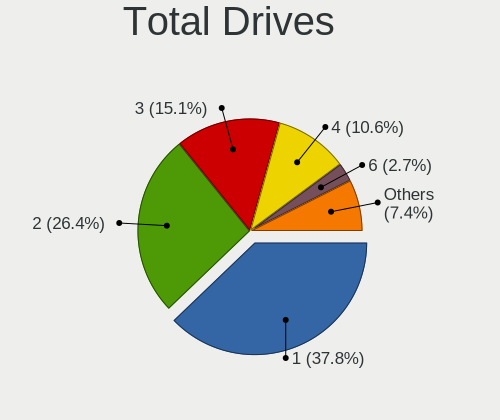

| Drives | Desktops | Percent |
|--------|----------|---------|
| 1      | 157      | 34.97%  |
| 2      | 120      | 26.73%  |
| 3      | 72       | 16.04%  |
| 4      | 46       | 10.24%  |
| 5      | 23       | 5.12%   |
| 6      | 15       | 3.34%   |
| 13     | 3        | 0.67%   |
| 0      | 3        | 0.67%   |
| 10     | 2        | 0.45%   |
| 7      | 2        | 0.45%   |
| 101    | 1        | 0.22%   |
| 15     | 1        | 0.22%   |
| 12     | 1        | 0.22%   |
| 11     | 1        | 0.22%   |
| 9      | 1        | 0.22%   |
| 8      | 1        | 0.22%   |

Has CD-ROM
----------

Has CD-ROM on board

| Presented | Desktops | Percent |
|-----------|----------|---------|
| No        | 259      | 57.68%  |
| Yes       | 190      | 42.32%  |

Has Ethernet
------------

Has Ethernet on board

| Presented | Desktops | Percent |
|-----------|----------|---------|
| Yes       | 443      | 98.66%  |
| No        | 6        | 1.34%   |

Has WiFi
--------

Has WiFi module

| Presented | Desktops | Percent |
|-----------|----------|---------|
| Yes       | 277      | 61.69%  |
| No        | 172      | 38.31%  |

Has Bluetooth
-------------

Has Bluetooth module

| Presented | Desktops | Percent |
|-----------|----------|---------|
| Yes       | 233      | 51.89%  |
| No        | 216      | 48.11%  |

Location
--------

Country
-------

Geographic location (country)

| Country | Desktops | Percent |
|---------|----------|---------|
| USA     | 449      | 100%    |

City
----

Geographic location (city)

| City           | Desktops | Percent |
|----------------|----------|---------|
| Chicago        | 7        | 1.56%   |
| Seattle        | 6        | 1.34%   |
| Los Angeles    | 6        | 1.34%   |
| Harrisonburg   | 6        | 1.34%   |
| Miami          | 5        | 1.11%   |
| Dallas         | 5        | 1.11%   |
| Citrus Heights | 5        | 1.11%   |
| New York       | 4        | 0.89%   |
| Las Vegas      | 4        | 0.89%   |
| Atlanta        | 4        | 0.89%   |
| Thornton       | 3        | 0.67%   |
| Santa Clara    | 3        | 0.67%   |
| Salt Lake City | 3        | 0.67%   |
| Portland       | 3        | 0.67%   |
| Phoenix        | 3        | 0.67%   |
| Oklahoma City  | 3        | 0.67%   |
| Milwaukee      | 3        | 0.67%   |
| Jacksonville   | 3        | 0.67%   |
| Iowa City      | 3        | 0.67%   |
| Hemet          | 3        | 0.67%   |
| Denver         | 3        | 0.67%   |
| Columbus       | 3        | 0.67%   |
| Cleveland      | 3        | 0.67%   |
| Avon           | 3        | 0.67%   |
| Anderson       | 3        | 0.67%   |
| Yucaipa        | 2        | 0.45%   |
| Wylie          | 2        | 0.45%   |
| Waterloo       | 2        | 0.45%   |
| Tucson         | 2        | 0.45%   |
| Temecula       | 2        | 0.45%   |
| Tampa          | 2        | 0.45%   |
| Tacoma         | 2        | 0.45%   |
| Staten Island  | 2        | 0.45%   |
| Shinnston      | 2        | 0.45%   |
| San Jose       | 2        | 0.45%   |
| San Francisco  | 2        | 0.45%   |
| San Antonio    | 2        | 0.45%   |
| Rochester      | 2        | 0.45%   |
| Pompano Beach  | 2        | 0.45%   |
| Panama City    | 2        | 0.45%   |

Drives
------

Drive Vendor
------------

Hard drive vendors

| Vendor                      | Desktops | Drives | Percent |
|-----------------------------|----------|--------|---------|
| WDC                         | 147      | 241    | 17.21%  |
| Samsung Electronics         | 146      | 216    | 17.1%   |
| Seagate                     | 121      | 199    | 14.17%  |
| SanDisk                     | 51       | 62     | 5.97%   |
| Crucial                     | 40       | 48     | 4.68%   |
| Toshiba                     | 32       | 38     | 3.75%   |
| Hitachi                     | 26       | 36     | 3.04%   |
| PNY                         | 21       | 22     | 2.46%   |
| Phison Electronics          | 19       | 26     | 2.22%   |
| China                       | 19       | 24     | 2.22%   |
| Unknown                     | 17       | 23     | 1.99%   |
| Micron/Crucial Technology   | 17       | 20     | 1.99%   |
| Kingston                    | 16       | 18     | 1.87%   |
| SK hynix                    | 13       | 15     | 1.52%   |
| Intel                       | 13       | 14     | 1.52%   |
| Team                        | 10       | 10     | 1.17%   |
| Micron Technology           | 7        | 8      | 0.82%   |
| Kingston Technology Company | 7        | 7      | 0.82%   |
| T-FORCE                     | 6        | 7      | 0.7%    |
| HGST                        | 6        | 42     | 0.7%    |
| A-DATA Technology           | 6        | 9      | 0.7%    |
| SPCC                        | 5        | 7      | 0.59%   |
| Silicon Motion              | 5        | 5      | 0.59%   |
| Realtek Semiconductor       | 5        | 5      | 0.59%   |
| Hewlett-Packard             | 5        | 6      | 0.59%   |
| WD MediaMax                 | 4        | 5      | 0.47%   |
| OCZ                         | 4        | 4      | 0.47%   |
| Netac                       | 4        | 5      | 0.47%   |
| HPQ                         | 4        | 4      | 0.47%   |
| Unknown                     | 4        | 6      | 0.47%   |
| SABRENT                     | 3        | 3      | 0.35%   |
| Fanxiang                    | 3        | 4      | 0.35%   |
| Corsair                     | 3        | 3      | 0.35%   |
| ASMT                        | 3        | 16     | 0.35%   |
| ADATA Technology            | 3        | 3      | 0.35%   |
| Acer                        | 3        | 3      | 0.35%   |
| SUNEAST                     | 2        | 2      | 0.23%   |
| Phison                      | 2        | 3      | 0.23%   |
| Mushkin                     | 2        | 2      | 0.23%   |
| MAXIO Technology (Hangzhou) | 2        | 2      | 0.23%   |

Drive Model
-----------

Hard drive models

| Model                                               | Desktops | Percent |
|-----------------------------------------------------|----------|---------|
| Samsung NVMe SSD Controller SM981/PM981/PM983 512GB | 25       | 2.39%   |
| Samsung NVMe SSD Controller PM9A1/PM9A3/980PRO 2TB  | 23       | 2.19%   |
| Seagate ST2000DM008-2FR102 2TB                      | 15       | 1.43%   |
| WDC WD10EZEX-08WN4A0 1TB                            | 14       | 1.34%   |
| Samsung SSD 860 EVO 1TB                             | 13       | 1.24%   |
| Samsung SSD 870 EVO 1TB                             | 12       | 1.15%   |
| Seagate ST4000DM004-2CV104 4TB                      | 10       | 0.95%   |
| Samsung SSD 850 EVO 500GB                           | 10       | 0.95%   |
| Micron/Crucial P2 NVMe PCIe SSD 4TB                 | 9        | 0.86%   |
| Crucial CT1000MX500SSD1 1TB                         | 9        | 0.86%   |
| Unknown SD/MMC/MS PRO 512GB                         | 8        | 0.76%   |
| Samsung SSD 860 EVO 500GB                           | 8        | 0.76%   |
| Phison E12 NVMe Controller 1TB                      | 8        | 0.76%   |
| Samsung SSD 990 PRO 2TB                             | 7        | 0.67%   |
| Samsung SSD 980 1TB                                 | 7        | 0.67%   |
| PNY CS900 500GB SSD                                 | 7        | 0.67%   |
| Samsung SSD 850 EVO 250GB                           | 6        | 0.57%   |
| Samsung NVMe SSD Controller SM961/PM961/SM963 250GB | 6        | 0.57%   |
| Crucial CT2000MX500SSD1 2TB                         | 6        | 0.57%   |
| WDC WD10EZEX-00BN5A0 1TB                            | 5        | 0.48%   |
| Toshiba DT01ACA100 1TB                              | 5        | 0.48%   |
| Seagate ST500DM002-1BD142 500GB                     | 5        | 0.48%   |
| Sandisk WD Black SN750 / PC SN730 NVMe SSD 2TB      | 5        | 0.48%   |
| Samsung SSD 990 PRO 1TB                             | 5        | 0.48%   |
| Kingston Company SNV2S1000G 1TB                     | 5        | 0.48%   |
| WDC WDS500G2B0A-00SM50 500GB SSD                    | 4        | 0.38%   |
| WDC WD5000AAKX-001CA0 500GB                         | 4        | 0.38%   |
| WDC WD20EZAZ-00GGJB0 2TB                            | 4        | 0.38%   |
| Seagate ST8000DM004-2U9188 8TB                      | 4        | 0.38%   |
| Seagate ST31000524AS 1TB                            | 4        | 0.38%   |
| Seagate ST1000DM003-1SB102 1TB                      | 4        | 0.38%   |
| Sandisk WD_BLACK SN850X 4000GB                      | 4        | 0.38%   |
| Sandisk WD_BLACK SN770 1TB                          | 4        | 0.38%   |
| Sandisk WD Blue SN550 NVMe SSD 1TB                  | 4        | 0.38%   |
| Samsung SSD 970 EVO Plus 1TB                        | 4        | 0.38%   |
| Phison PS5013 E13 NVMe Controller 512GB             | 4        | 0.38%   |
| Kingston SA400S37120G 120GB SSD                     | 4        | 0.38%   |
| HPQ BF450DASTK 450GB                                | 4        | 0.38%   |
| China SATA SSD 240GB                                | 4        | 0.38%   |
| China SATA SSD 1TB                                  | 4        | 0.38%   |

HDD Vendor
----------

Hard disk drive vendors

| Vendor              | Desktops | Drives | Percent |
|---------------------|----------|--------|---------|
| WDC                 | 128      | 207    | 36.99%  |
| Seagate             | 116      | 193    | 33.53%  |
| Toshiba             | 29       | 34     | 8.38%   |
| Hitachi             | 26       | 36     | 7.51%   |
| Unknown             | 9        | 9      | 2.6%    |
| Samsung Electronics | 8        | 8      | 2.31%   |
| HGST                | 5        | 19     | 1.45%   |
| HPQ                 | 4        | 4      | 1.16%   |
| WD MediaMax         | 3        | 4      | 0.87%   |
| SABRENT             | 3        | 3      | 0.87%   |
| ASMT                | 3        | 16     | 0.87%   |
| USB                 | 1        | 2      | 0.29%   |
| OOS16000            | 1        | 1      | 0.29%   |
| NETAPP              | 1        | 12     | 0.29%   |
| Maxtor              | 1        | 1      | 0.29%   |
| MaxDigital          | 1        | 1      | 0.29%   |
| MARVELL             | 1        | 1      | 0.29%   |
| KINGWIN             | 1        | 1      | 0.29%   |
| KESU                | 1        | 1      | 0.29%   |
| Hewlett-Packard     | 1        | 2      | 0.29%   |
| Fujitsu             | 1        | 1      | 0.29%   |
| Elite               | 1        | 1      | 0.29%   |
| Unknown             | 1        | 1      | 0.29%   |

SSD Vendor
----------

Solid state drive vendors

| Vendor              | Desktops | Drives | Percent |
|---------------------|----------|--------|---------|
| Samsung Electronics | 76       | 94     | 27.94%  |
| Crucial             | 30       | 37     | 11.03%  |
| PNY                 | 21       | 22     | 7.72%   |
| WDC                 | 19       | 21     | 6.99%   |
| China               | 19       | 24     | 6.99%   |
| SanDisk             | 16       | 17     | 5.88%   |
| Kingston            | 13       | 14     | 4.78%   |
| Team                | 9        | 9      | 3.31%   |
| SK hynix            | 7        | 7      | 2.57%   |
| Intel               | 6        | 6      | 2.21%   |
| A-DATA Technology   | 6        | 9      | 2.21%   |
| SPCC                | 4        | 5      | 1.47%   |
| OCZ                 | 4        | 4      | 1.47%   |
| Netac               | 3        | 4      | 1.1%    |
| Micron Technology   | 3        | 3      | 1.1%    |
| Corsair             | 3        | 3      | 1.1%    |
| Acer                | 3        | 3      | 1.1%    |
| Toshiba             | 2        | 2      | 0.74%   |
| SUNEAST             | 2        | 2      | 0.74%   |
| Seagate             | 2        | 2      | 0.74%   |
| Mushkin             | 2        | 2      | 0.74%   |
| Inland              | 2        | 2      | 0.74%   |
| Vaseky              | 1        | 1      | 0.37%   |
| Timetec             | 1        | 1      | 0.37%   |
| tecmiyo             | 1        | 1      | 0.37%   |
| T-FORCE             | 1        | 1      | 0.37%   |
| PNY USB             | 1        | 1      | 0.37%   |
| Plextor             | 1        | 1      | 0.37%   |
| ORTIAL              | 1        | 1      | 0.37%   |
| OCZ-VERTEX3         | 1        | 1      | 0.37%   |
| NGFF                | 1        | 1      | 0.37%   |
| LITEONIT            | 1        | 1      | 0.37%   |
| Lexar               | 1        | 1      | 0.37%   |
| Leven               | 1        | 1      | 0.37%   |
| KingSpec            | 1        | 1      | 0.37%   |
| KingFast            | 1        | 1      | 0.37%   |
| JMicron Technology  | 1        | 1      | 0.37%   |
| Hewlett-Packard     | 1        | 1      | 0.37%   |
| Fanxiang            | 1        | 1      | 0.37%   |
| Drevo               | 1        | 2      | 0.37%   |

Drive Kind
----------

HDD or SSD

| Kind    | Desktops | Drives | Percent |
|---------|----------|--------|---------|
| HDD     | 260      | 558    | 37.9%   |
| SSD     | 207      | 313    | 30.17%  |
| NVMe    | 196      | 308    | 28.57%  |
| Unknown | 21       | 60     | 3.06%   |
| MMC     | 2        | 3      | 0.29%   |

Drive Connector
---------------

SATA, SAS, NVMe, etc.

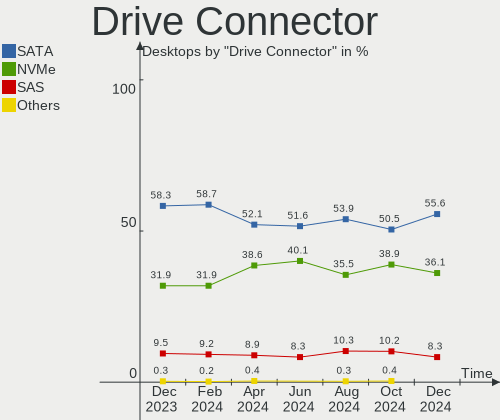

| Type | Desktops | Drives | Percent |
|------|----------|--------|---------|
| SATA | 357      | 769    | 58.33%  |
| NVMe | 196      | 306    | 32.03%  |
| SAS  | 57       | 164    | 9.31%   |
| MMC  | 2        | 3      | 0.33%   |

Drive Size
----------

Size of hard drive

| Size in TB | Desktops | Drives | Percent |
|------------|----------|--------|---------|
| 0.01-0.5   | 208      | 271    | 36.81%  |
| 0.51-1.0   | 169      | 247    | 29.91%  |
| 1.01-2.0   | 82       | 107    | 14.51%  |
| 3.01-4.0   | 37       | 64     | 6.55%   |
| 4.01-10.0  | 33       | 76     | 5.84%   |
| 2.01-3.0   | 20       | 42     | 3.54%   |
| 10.01-20.0 | 16       | 64     | 2.83%   |

Space Total
-----------

Amount of disk space available on the file system

| Size in GB     | Desktops | Percent |
|----------------|----------|---------|
| More than 3000 | 88       | 19.6%   |
| 1001-2000      | 71       | 15.81%  |
| 501-1000       | 66       | 14.7%   |
| 251-500        | 65       | 14.48%  |
| 101-250        | 53       | 11.8%   |
| 2001-3000      | 33       | 7.35%   |
| 1-20           | 27       | 6.01%   |
| Unknown        | 19       | 4.23%   |
| 51-100         | 15       | 3.34%   |
| 21-50          | 12       | 2.67%   |

Space Used
----------

Amount of used disk space

| Used GB        | Desktops | Percent |
|----------------|----------|---------|
| 1-20           | 112      | 24.94%  |
| 21-50          | 74       | 16.48%  |
| 101-250        | 57       | 12.69%  |
| 51-100         | 43       | 9.58%   |
| 501-1000       | 36       | 8.02%   |
| 251-500        | 35       | 7.8%    |
| More than 3000 | 32       | 7.13%   |
| 1001-2000      | 30       | 6.68%   |
| Unknown        | 19       | 4.23%   |
| 2001-3000      | 10       | 2.23%   |
| 0              | 1        | 0.22%   |

Malfunc. Drives
---------------

Drive models with a malfunction

| Model                                                 | Desktops | Drives | Percent |
|-------------------------------------------------------|----------|--------|---------|
| WDC WD5000AAKX-001CA0 500GB                           | 3        | 3      | 6%      |
| WDC WD40EZRZ-00WN9B0 4TB                              | 2        | 2      | 4%      |
| WDC WD30EZRZ-00Z5HB0 3TB                              | 2        | 3      | 4%      |
| Hitachi HUA722020ALA331 2TB                           | 2        | 5      | 4%      |
| WDC WD6401AALS-00L3B2 640GB                           | 1        | 1      | 2%      |
| WDC WD40EFRX-68WT0N0 4TB                              | 1        | 1      | 2%      |
| WDC WD3200AAKS-75B3A0 320GB                           | 1        | 1      | 2%      |
| WDC WD30EURS-63R8UY0 3TB                              | 1        | 1      | 2%      |
| WDC WD30 EZRX-00SPEB0 3TB                             | 1        | 1      | 2%      |
| WDC WD2500AAJS-00B4A0 250GB                           | 1        | 1      | 2%      |
| WDC WD20 EZRX-00D8PB0 2TB                             | 1        | 1      | 2%      |
| WDC WD1600AAJS-00B4A0 160GB                           | 1        | 1      | 2%      |
| WDC WD10SPZX-08Z10 1TB                                | 1        | 1      | 2%      |
| WDC WD10EZEX-00BN5A0 1TB                              | 1        | 1      | 2%      |
| WDC WD10EURS-630AB1 1TB                               | 1        | 1      | 2%      |
| WDC WD10EADS-00P8B0 1TB                               | 1        | 1      | 2%      |
| WDC WD1002FBYS-02A6B0 1TB                             | 1        | 1      | 2%      |
| Toshiba MQ01ABD050 500GB                              | 1        | 1      | 2%      |
| Toshiba HDWD130 3TB                                   | 1        | 1      | 2%      |
| Seagate ST8000DM004-2CX188 8TB                        | 1        | 1      | 2%      |
| Seagate ST8000DM0004-1ZC11G 8TB                       | 1        | 1      | 2%      |
| Seagate ST500DM002-1BD142 500GB                       | 1        | 1      | 2%      |
| Seagate ST4000VN008-2DR166 4TB                        | 1        | 1      | 2%      |
| Seagate ST3250312AS 250GB                             | 1        | 1      | 2%      |
| Seagate ST2000DM008-2FR102 2TB                        | 1        | 1      | 2%      |
| Seagate ST2000DM001-1ER164 2TB                        | 1        | 1      | 2%      |
| Seagate ST1000DX001-1NS162 1TB                        | 1        | 1      | 2%      |
| Seagate ST1000DM003-1ER162 1TB                        | 1        | 3      | 2%      |
| SanDisk SSD PLUS 240GB                                | 1        | 1      | 2%      |
| Samsung Electronics SSD 970 EVO 500GB S466NX0K863648L | 1        | 1      | 2%      |
| Samsung Electronics HD154UI 1TB                       | 1        | 1      | 2%      |
| PNY SSD2SC120G1LC763C121S459P 120GB                   | 1        | 1      | 2%      |
| PNY CS1311 240GB SSD                                  | 1        | 1      | 2%      |
| ORTIAL SSD 128GB                                      | 1        | 1      | 2%      |
| Maxtor 2B020H1 20GB                                   | 1        | 1      | 2%      |
| Hitachi HUS724030ALE641 3TB                           | 1        | 1      | 2%      |
| Hitachi HDS721016CLA382 160GB                         | 1        | 1      | 2%      |
| Hitachi HDS721010KLA330 1TB                           | 1        | 1      | 2%      |
| Hitachi HDS5C3030BLE630 3TB                           | 1        | 1      | 2%      |
| Hitachi HDP725032GLA380 320GB                         | 1        | 2      | 2%      |

Malfunc. Drive Vendor
---------------------

Vendors of faulty drives

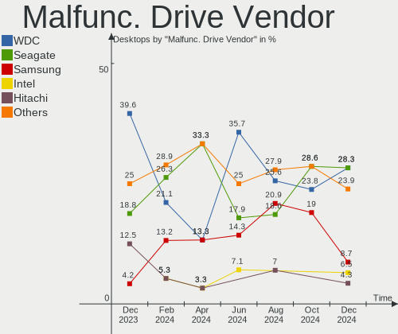

| Vendor              | Desktops | Drives | Percent |
|---------------------|----------|--------|---------|
| WDC                 | 19       | 21     | 39.58%  |
| Seagate             | 9        | 11     | 18.75%  |
| Hitachi             | 6        | 11     | 12.5%   |
| Toshiba             | 2        | 2      | 4.17%   |
| Samsung Electronics | 2        | 2      | 4.17%   |
| PNY                 | 2        | 2      | 4.17%   |
| Hewlett-Packard     | 2        | 3      | 4.17%   |
| SanDisk             | 1        | 1      | 2.08%   |
| ORTIAL              | 1        | 1      | 2.08%   |
| Maxtor              | 1        | 1      | 2.08%   |
| HGST                | 1        | 8      | 2.08%   |
| Crucial             | 1        | 1      | 2.08%   |
| Corsair             | 1        | 1      | 2.08%   |

Malfunc. HDD Vendor
-------------------

Vendors of faulty HDD drives

| Vendor              | Desktops | Drives | Percent |
|---------------------|----------|--------|---------|
| WDC                 | 19       | 21     | 47.5%   |
| Seagate             | 9        | 11     | 22.5%   |
| Hitachi             | 6        | 11     | 15%     |
| Toshiba             | 2        | 2      | 5%      |
| Samsung Electronics | 1        | 1      | 2.5%    |
| Maxtor              | 1        | 1      | 2.5%    |
| HGST                | 1        | 8      | 2.5%    |
| Hewlett-Packard     | 1        | 2      | 2.5%    |

Malfunc. Drive Kind
-------------------

Kinds of faulty drives

| Kind | Desktops | Drives | Percent |
|------|----------|--------|---------|
| HDD  | 36       | 57     | 81.82%  |
| SSD  | 7        | 7      | 15.91%  |
| NVMe | 1        | 1      | 2.27%   |

Failed Drives
-------------

Failed drive models

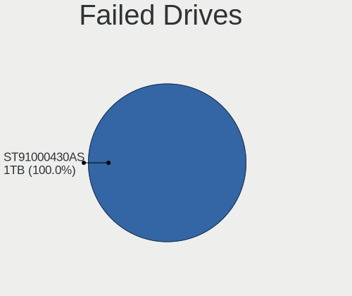

| Model                     | Desktops | Drives | Percent |
|---------------------------|----------|--------|---------|
| WDC WD30 EZRS-00J99B0 3TB | 1        | 1      | 50%     |
| Seagate ST2000NM0011 2TB  | 1        | 1      | 50%     |

Failed Drive Vendor
-------------------

Failed drive vendors

| Vendor  | Desktops | Drives | Percent |
|---------|----------|--------|---------|
| WDC     | 1        | 1      | 50%     |
| Seagate | 1        | 1      | 50%     |

Drive Status
------------

Number of failed and malfunc. drives

| Status   | Desktops | Drives | Percent |
|----------|----------|--------|---------|
| Detected | 279      | 670    | 54.6%   |
| Works    | 187      | 505    | 36.59%  |
| Malfunc  | 43       | 65     | 8.41%   |
| Failed   | 2        | 2      | 0.39%   |

Storage controller
------------------

Storage Vendor
--------------

Storage controller vendors

| Vendor                        | Desktops | Percent |
|-------------------------------|----------|---------|
| Intel                         | 244      | 31.69%  |
| AMD                           | 194      | 25.19%  |
| Samsung Electronics           | 87       | 11.3%   |
| ASMedia Technology            | 46       | 5.97%   |
| SanDisk                       | 43       | 5.58%   |
| Micron/Crucial Technology     | 27       | 3.51%   |
| Phison Electronics            | 26       | 3.38%   |
| Marvell Technology Group      | 14       | 1.82%   |
| Kingston Technology Company   | 11       | 1.43%   |
| Nvidia                        | 10       | 1.3%    |
| Silicon Motion                | 7        | 0.91%   |
| Realtek Semiconductor         | 7        | 0.91%   |
| Broadcom / LSI                | 7        | 0.91%   |
| SK hynix                      | 6        | 0.78%   |
| LSI Logic / Symbios Logic     | 6        | 0.78%   |
| Micron Technology             | 4        | 0.52%   |
| JMicron Technology            | 4        | 0.52%   |
| INNOGRIT                      | 4        | 0.52%   |
| Solidigm                      | 3        | 0.39%   |
| ADATA Technology              | 3        | 0.39%   |
| VIA Technologies              | 2        | 0.26%   |
| Toshiba America Info Systems  | 2        | 0.26%   |
| Seagate Technology            | 2        | 0.26%   |
| MAXIO Technology (Hangzhou)   | 2        | 0.26%   |
| Silicon Image                 | 1        | 0.13%   |
| O2 Micro                      | 1        | 0.13%   |
| Nextorage                     | 1        | 0.13%   |
| Netac Technology              | 1        | 0.13%   |
| KIOXIA                        | 1        | 0.13%   |
| Integrated Technology Express | 1        | 0.13%   |
| HighPoint Technologies        | 1        | 0.13%   |
| Enmotus                       | 1        | 0.13%   |
| ATTO Technology               | 1        | 0.13%   |

Storage Model
-------------

Storage controller models

| Model                                                                          | Desktops | Percent |
|--------------------------------------------------------------------------------|----------|---------|
| AMD FCH SATA Controller [AHCI mode]                                            | 121      | 13.3%   |
| ASMedia ASM1062 Serial ATA Controller                                          | 40       | 4.4%    |
| Samsung NVMe SSD Controller SM981/PM981/PM983                                  | 37       | 4.07%   |
| AMD 400 Series Chipset SATA Controller                                         | 33       | 3.63%   |
| AMD 500 Series Chipset SATA Controller                                         | 31       | 3.41%   |
| Samsung NVMe SSD Controller PM9A1/PM9A3/980PRO                                 | 30       | 3.3%    |
| Intel 8 Series/C220 Series Chipset Family 6-port SATA Controller 1 [AHCI mode] | 24       | 2.64%   |
| AMD SB7x0/SB8x0/SB9x0 SATA Controller [AHCI mode]                              | 23       | 2.53%   |
| Intel Q170/Q150/B150/H170/H110/Z170/CM236 Chipset SATA Controller [AHCI Mode]  | 20       | 2.2%    |
| Intel SATA Controller [RAID mode]                                              | 18       | 1.98%   |
| Intel 7 Series/C210 Series Chipset Family 6-port SATA Controller [AHCI mode]   | 18       | 1.98%   |
| Intel 200 Series PCH SATA controller [AHCI mode]                               | 17       | 1.87%   |
| Intel 6 Series/C200 Series Chipset Family 6 port Desktop SATA AHCI Controller  | 16       | 1.76%   |
| Micron/Crucial P2 [Nick P2] / P3 / P3 Plus NVMe PCIe SSD (DRAM-less)           | 15       | 1.65%   |
| Intel Alder Lake-S PCH SATA Controller [AHCI Mode]                             | 15       | 1.65%   |
| Intel 700 Series Chipset Family SATA AHCI Controller                           | 14       | 1.54%   |
| AMD SB7x0/SB8x0/SB9x0 IDE Controller                                           | 14       | 1.54%   |
| Samsung NVMe SSD Controller S4LV008[Pascal]                                    | 12       | 1.32%   |
| Sandisk WD Black SN850X NVMe SSD                                               | 10       | 1.1%    |
| AMD 300 Series Chipset SATA Controller                                         | 10       | 1.1%    |
| Intel C610/X99 series chipset 6-Port SATA Controller [AHCI mode]               | 9        | 0.99%   |
| SanDisk Ultra 3D / WD Blue SN550 NVMe SSD                                      | 8        | 0.88%   |
| SanDisk Extreme Pro / WD Black SN750 / PC SN730 / Red SN700 NVMe SSD           | 8        | 0.88%   |
| Phison E12 NVMe Controller                                                     | 8        | 0.88%   |
| Intel Volume Management Device NVMe RAID Controller Intel Corporation          | 8        | 0.88%   |
| Samsung NVMe SSD Controller SM961/PM961/SM963                                  | 7        | 0.77%   |
| Samsung NVMe SSD Controller 980 (DRAM-less)                                    | 7        | 0.77%   |
| Intel 9 Series Chipset Family SATA Controller [AHCI Mode]                      | 7        | 0.77%   |
| Silicon Motion SM2263EN/SM2263XT (DRAM-less) NVMe SSD Controllers              | 6        | 0.66%   |
| SanDisk WD Black SN770 / PC SN740 256GB / PC SN560 (DRAM-less) NVMe SSD        | 6        | 0.66%   |
| Phison E16 PCIe4 NVMe Controller                                               | 6        | 0.66%   |
| Intel SATA controller                                                          | 6        | 0.66%   |
| Intel NM10/ICH7 Family SATA Controller [IDE mode]                              | 6        | 0.66%   |
| Intel Cannon Lake PCH SATA AHCI Controller                                     | 6        | 0.66%   |
| Intel C610/X99 series chipset sSATA Controller [AHCI mode]                     | 6        | 0.66%   |
| AMD SB7x0/SB8x0/SB9x0 SATA Controller [IDE mode]                               | 6        | 0.66%   |
| Phison PS5013-E13 PCIe3 NVMe Controller (DRAM-less)                            | 5        | 0.55%   |
| Marvell Group 88SE9172 SATA 6Gb/s Controller                                   | 5        | 0.55%   |
| Kingston Company NV2 NVMe SSD SM2267XT                                         | 5        | 0.55%   |
| Intel Volume Management Device NVMe RAID Controller                            | 5        | 0.55%   |

Storage Kind
------------

Kind of storage controller (IDE, SATA, NVMe, SAS, ...)

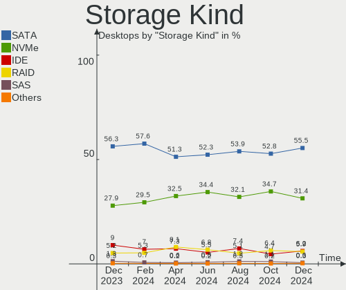

| Kind | Desktops | Percent |
|------|----------|---------|
| SATA | 393      | 56.06%  |
| NVMe | 196      | 27.96%  |
| IDE  | 63       | 8.99%   |
| RAID | 38       | 5.42%   |
| SAS  | 9        | 1.28%   |
| SCSI | 2        | 0.29%   |

Processor
---------

CPU Vendor
----------

Processor vendors

| Vendor       | Desktops | Percent |
|--------------|----------|---------|
| Intel        | 245      | 54.57%  |
| AMD          | 203      | 45.21%  |
| CentaurHauls | 1        | 0.22%   |

CPU Model
---------

Processor models

| Model                                  | Desktops | Percent |
|----------------------------------------|----------|---------|
| AMD Ryzen 5 5600X 6-Core Processor     | 12       | 2.67%   |
| AMD Ryzen 7 3700X 8-Core Processor     | 10       | 2.23%   |
| Intel Core i7-6700 CPU @ 3.40GHz       | 9        | 2%      |
| AMD Ryzen 9 7950X 16-Core Processor    | 9        | 2%      |
| AMD Ryzen 5 5600G with Radeon Graphics | 8        | 1.78%   |
| Intel Core i7-3770 CPU @ 3.40GHz       | 7        | 1.56%   |
| AMD Ryzen 9 5900X 12-Core Processor    | 7        | 1.56%   |
| AMD Ryzen 7 7800X3D 8-Core Processor   | 7        | 1.56%   |
| AMD Ryzen 7 7700X 8-Core Processor     | 7        | 1.56%   |
| AMD Ryzen 7 5800X 8-Core Processor     | 7        | 1.56%   |
| AMD Ryzen 7 5700G with Radeon Graphics | 7        | 1.56%   |
| AMD Ryzen 5 3600 6-Core Processor      | 7        | 1.56%   |
| Intel Core i5-4590 CPU @ 3.30GHz       | 6        | 1.34%   |
| Intel Core i5-3470 CPU @ 3.20GHz       | 6        | 1.34%   |
| Intel 13th Gen Core i9-13900K          | 6        | 1.34%   |
| Intel Core i7-8700K CPU @ 3.70GHz      | 5        | 1.11%   |
| Intel Core i7-4790K CPU @ 4.00GHz      | 5        | 1.11%   |
| Intel Core i5-2400 CPU @ 3.10GHz       | 5        | 1.11%   |
| Intel Core 2 Duo CPU E8400 @ 3.00GHz   | 5        | 1.11%   |
| AMD Ryzen 9 7950X3D 16-Core Processor  | 5        | 1.11%   |
| AMD Ryzen 7 5700X 8-Core Processor     | 5        | 1.11%   |
| AMD FX-8320 Eight-Core Processor       | 5        | 1.11%   |
| Intel N100                             | 4        | 0.89%   |
| Intel Core i7-4770 CPU @ 3.40GHz       | 4        | 0.89%   |
| Intel Core i5-6500 CPU @ 3.20GHz       | 4        | 0.89%   |
| Intel Core i5-4570 CPU @ 3.20GHz       | 4        | 0.89%   |
| Intel Core i5 CPU 650 @ 3.20GHz        | 4        | 0.89%   |
| Intel 12th Gen Core i7-12700K          | 4        | 0.89%   |
| AMD Ryzen 9 5950X 16-Core Processor    | 4        | 0.89%   |
| AMD Ryzen 7 5800X3D 8-Core Processor   | 4        | 0.89%   |
| AMD Ryzen 5 2600 Six-Core Processor    | 4        | 0.89%   |
| AMD FX-6300 Six-Core Processor         | 4        | 0.89%   |
| Intel Xeon CPU E5-1620 v3 @ 3.50GHz    | 3        | 0.67%   |
| Intel Core i9-14900K                   | 3        | 0.67%   |
| Intel Core i7-8700 CPU @ 3.20GHz       | 3        | 0.67%   |
| Intel Core i7-6700K CPU @ 4.00GHz      | 3        | 0.67%   |
| Intel Core i7-2600 CPU @ 3.40GHz       | 3        | 0.67%   |
| Intel Core i7 CPU 870 @ 2.93GHz        | 3        | 0.67%   |
| Intel Core i5-7400 CPU @ 3.00GHz       | 3        | 0.67%   |
| Intel Core i5-2500 CPU @ 3.30GHz       | 3        | 0.67%   |

CPU Model Family
----------------

Processor model prefix

| Model                   | Desktops | Percent |
|-------------------------|----------|---------|
| Intel Core i7           | 71       | 15.81%  |
| Intel Core i5           | 63       | 14.03%  |
| AMD Ryzen 7             | 60       | 13.36%  |
| AMD Ryzen 5             | 45       | 10.02%  |
| Other                   | 37       | 8.24%   |
| AMD Ryzen 9             | 34       | 7.57%   |
| Intel Xeon              | 24       | 5.35%   |
| AMD FX                  | 20       | 4.45%   |
| Intel Core i3           | 13       | 2.9%    |
| Intel Celeron           | 10       | 2.23%   |
| Intel Core 2 Duo        | 9        | 2%      |
| AMD Ryzen 3             | 8        | 1.78%   |
| Intel Core i9           | 7        | 1.56%   |
| AMD Ryzen Threadripper  | 6        | 1.34%   |
| AMD Athlon II X2        | 4        | 0.89%   |
| Intel Pentium Dual-Core | 3        | 0.67%   |
| AMD Phenom II X4        | 3        | 0.67%   |
| AMD Athlon 64 X2        | 3        | 0.67%   |
| AMD A6                  | 3        | 0.67%   |
| Intel Pentium           | 2        | 0.45%   |
| Intel Core 2            | 2        | 0.45%   |
| Intel Atom              | 2        | 0.45%   |
| AMD Ryzen 5 PRO         | 2        | 0.45%   |
| AMD A8                  | 2        | 0.45%   |
| AMD A10                 | 2        | 0.45%   |
| Intel Pentium III       | 1        | 0.22%   |
| Intel Pentium Dual      | 1        | 0.22%   |
| Intel Core 2 Quad       | 1        | 0.22%   |
| Intel Core 2 Extreme    | 1        | 0.22%   |
| AMD Phenom II X6        | 1        | 0.22%   |
| AMD Phenom II X3        | 1        | 0.22%   |
| AMD Phenom II X2        | 1        | 0.22%   |
| AMD Opteron             | 1        | 0.22%   |
| AMD GX                  | 1        | 0.22%   |
| AMD EPYC                | 1        | 0.22%   |
| AMD E                   | 1        | 0.22%   |
| AMD Athlon Dual Core    | 1        | 0.22%   |
| AMD Athlon 64           | 1        | 0.22%   |
| AMD A4                  | 1        | 0.22%   |

CPU Cores
---------

Number of processor cores

| Number | Desktops | Percent |
|--------|----------|---------|
| 4      | 157      | 34.97%  |
| 8      | 74       | 16.48%  |
| 6      | 70       | 15.59%  |
| 2      | 57       | 12.69%  |
| 16     | 30       | 6.68%   |
| 12     | 25       | 5.57%   |
| 24     | 11       | 2.45%   |
| 3      | 7        | 1.56%   |
| 10     | 5        | 1.11%   |
| 1      | 5        | 1.11%   |
| 64     | 2        | 0.45%   |
| 32     | 2        | 0.45%   |
| 14     | 2        | 0.45%   |
| 36     | 1        | 0.22%   |
| 20     | 1        | 0.22%   |

CPU Sockets
-----------

Number of sockets

| Number | Desktops | Percent |
|--------|----------|---------|
| 1      | 438      | 97.55%  |
| 2      | 11       | 2.45%   |

CPU Threads
-----------

Threads per core (Hyper-Threading)

| Number | Desktops | Percent |
|--------|----------|---------|
| 2      | 306      | 68.15%  |
| 1      | 143      | 31.85%  |

CPU Op-Modes
------------

CPU Operation Modes (32-bit, 64-bit)

| Op mode        | Desktops | Percent |
|----------------|----------|---------|
| 32-bit, 64-bit | 447      | 99.55%  |
| Unknown        | 2        | 0.45%   |

CPU Microcode
-------------

Microcode number

| Number     | Desktops | Percent |
|------------|----------|---------|
| Unknown    | 246      | 54.79%  |
| 0x0a601203 | 16       | 3.56%   |
| 0x08701021 | 12       | 2.67%   |
| 0x0a601206 | 10       | 2.23%   |
| 0x0a20120a | 10       | 2.23%   |
| 0x306c3    | 9        | 2%      |
| 0x08701030 | 9        | 2%      |
| 0x0800820d | 9        | 2%      |
| 0x306a9    | 8        | 1.78%   |
| 0x0a201016 | 6        | 1.34%   |
| 0x06000852 | 6        | 1.34%   |
| 0x906e9    | 5        | 1.11%   |
| 0x506e3    | 5        | 1.11%   |
| 0x0a50000d | 5        | 1.11%   |
| 0x0a20120e | 5        | 1.11%   |
| 0xb0671    | 4        | 0.89%   |
| 0x206a7    | 4        | 0.89%   |
| 0x906ed    | 3        | 0.67%   |
| 0x90672    | 3        | 0.67%   |
| 0x106e5    | 3        | 0.67%   |
| 0x0a201204 | 3        | 0.67%   |
| 0x08701013 | 3        | 0.67%   |
| 0x08001138 | 3        | 0.67%   |
| 0x06000822 | 3        | 0.67%   |
| 0xa0655    | 2        | 0.45%   |
| 0x6f6      | 2        | 0.45%   |
| 0x406c4    | 2        | 0.45%   |
| 0x306f2    | 2        | 0.45%   |
| 0x20655    | 2        | 0.45%   |
| 0x10676    | 2        | 0.45%   |
| 0x0a50000f | 2        | 0.45%   |
| 0x0a20102b | 2        | 0.45%   |
| 0x0a201025 | 2        | 0.45%   |
| 0x08600106 | 2        | 0.45%   |
| 0x08108102 | 2        | 0.45%   |
| 0x0600611a | 2        | 0.45%   |
| 0x06003106 | 2        | 0.45%   |
| 0xb06e0    | 1        | 0.22%   |
| 0xa0671    | 1        | 0.22%   |
| 0x906ec    | 1        | 0.22%   |

CPU Microarch
-------------

Microarchitecture

| Name             | Desktops | Percent |
|------------------|----------|---------|
| Zen 3            | 55       | 12.25%  |
| Unknown          | 55       | 12.25%  |
| Haswell          | 41       | 9.13%   |
| Zen 2            | 33       | 7.35%   |
| KabyLake         | 28       | 6.24%   |
| IvyBridge        | 27       | 6.01%   |
| Skylake          | 25       | 5.57%   |
| SandyBridge      | 21       | 4.68%   |
| Piledriver       | 18       | 4.01%   |
| Alderlake Hybrid | 18       | 4.01%   |
| Penryn           | 16       | 3.56%   |
| Zen+             | 15       | 3.34%   |
| Zen              | 15       | 3.34%   |
| Nehalem          | 12       | 2.67%   |
| K10              | 10       | 2.23%   |
| CometLake        | 8        | 1.78%   |
| Westmere         | 6        | 1.34%   |
| Core             | 6        | 1.34%   |
| Silvermont       | 5        | 1.11%   |
| K8 Hammer        | 5        | 1.11%   |
| Broadwell        | 5        | 1.11%   |
| Jaguar           | 3        | 0.67%   |
| Icelake          | 3        | 0.67%   |
| Bulldozer        | 3        | 0.67%   |
| Tremont          | 2        | 0.45%   |
| TigerLake        | 2        | 0.45%   |
| Steamroller      | 2        | 0.45%   |
| K10 Llano        | 2        | 0.45%   |
| Gracemont        | 2        | 0.45%   |
| Excavator        | 2        | 0.45%   |
| Puma             | 1        | 0.22%   |
| P6               | 1        | 0.22%   |
| Goldmont plus    | 1        | 0.22%   |
| Bobcat           | 1        | 0.22%   |

Graphics
--------

GPU Vendor
----------

Vendors of graphics cards

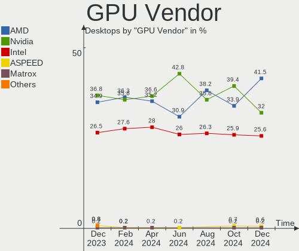

| Vendor                               | Desktops | Percent |
|--------------------------------------|----------|---------|
| Nvidia                               | 180      | 36.81%  |
| AMD                                  | 170      | 34.76%  |
| Intel                                | 130      | 26.58%  |
| ASPEED Technology                    | 4        | 0.82%   |
| NVidia / SGS Thomson (Joint Venture) | 2        | 0.41%   |
| VIA Technologies                     | 1        | 0.2%    |
| S3 Graphics                          | 1        | 0.2%    |
| Matrox Electronics Systems           | 1        | 0.2%    |

GPU Model
---------

Graphics card models

| Model                                                                                    | Desktops | Percent |
|------------------------------------------------------------------------------------------|----------|---------|
| AMD Raphael                                                                              | 30       | 5.83%   |
| Intel Xeon E3-1200 v3/4th Gen Core Processor Integrated Graphics Controller              | 23       | 4.47%   |
| AMD Navi 23 [Radeon RX 6600/6600 XT/6600M]                                               | 16       | 3.11%   |
| Nvidia GA106 [GeForce RTX 3060 Lite Hash Rate]                                           | 15       | 2.91%   |
| Intel HD Graphics 530                                                                    | 15       | 2.91%   |
| Intel 2nd Generation Core Processor Family Integrated Graphics Controller                | 14       | 2.72%   |
| AMD Ellesmere [Radeon RX 470/480/570/570X/580/580X/590]                                  | 12       | 2.33%   |
| Nvidia GK208B [GeForce GT 710]                                                           | 11       | 2.14%   |
| AMD Navi 22 [Radeon RX 6700/6700 XT/6750 XT / 6800M/6850M XT]                            | 11       | 2.14%   |
| AMD Cezanne [Radeon Vega Series / Radeon Vega Mobile Series]                             | 11       | 2.14%   |
| AMD Navi 10 [Radeon RX 5600 OEM/5600 XT / 5700/5700 XT]                                  | 10       | 1.94%   |
| Intel Raptor Lake-S GT1 [UHD Graphics 770]                                               | 9        | 1.75%   |
| AMD Navi 31 [Radeon RX 7900 XT/7900 XTX]                                                 | 8        | 1.55%   |
| AMD Navi 21 [Radeon RX 6800/6800 XT / 6900 XT]                                           | 8        | 1.55%   |
| AMD Cedar [Radeon HD 5000/6000/7350/8350 Series]                                         | 8        | 1.55%   |
| Nvidia GM206 [GeForce GTX 960]                                                           | 7        | 1.36%   |
| Nvidia AD102 [GeForce RTX 4090]                                                          | 7        | 1.36%   |
| Intel Xeon E3-1200 v2/3rd Gen Core processor Graphics Controller                         | 7        | 1.36%   |
| Intel CoffeeLake-S GT2 [UHD Graphics 630]                                                | 6        | 1.17%   |
| Intel Alder Lake-N [UHD Graphics]                                                        | 6        | 1.17%   |
| Nvidia GP107 [GeForce GTX 1050 Ti]                                                       | 5        | 0.97%   |
| Nvidia GM107 [GeForce GTX 750 Ti]                                                        | 5        | 0.97%   |
| Nvidia GA104 [GeForce RTX 3060 Ti Lite Hash Rate]                                        | 5        | 0.97%   |
| Intel HD Graphics 630                                                                    | 5        | 0.97%   |
| Intel AlderLake-S GT1                                                                    | 5        | 0.97%   |
| Intel 4 Series Chipset Integrated Graphics Controller                                    | 5        | 0.97%   |
| AMD Raven Ridge [Radeon Vega Series / Radeon Vega Mobile Series]                         | 5        | 0.97%   |
| AMD Navi 32 [Radeon RX 7700 XT / 7800 XT]                                                | 5        | 0.97%   |
| Nvidia GT218 [GeForce 8400 GS Rev. 3]                                                    | 4        | 0.78%   |
| Nvidia GP106 [GeForce GTX 1060 6GB]                                                      | 4        | 0.78%   |
| Nvidia GP102 [GeForce GTX 1080 Ti]                                                       | 4        | 0.78%   |
| Nvidia GA104 [GeForce RTX 3070 Ti]                                                       | 4        | 0.78%   |
| Nvidia AD104 [GeForce RTX 4070 Ti]                                                       | 4        | 0.78%   |
| Intel IvyBridge GT2 [HD Graphics 4000]                                                   | 4        | 0.78%   |
| Intel Atom/Celeron/Pentium Processor x5-E8000/J3xxx/N3xxx Integrated Graphics Controller | 4        | 0.78%   |
| ASPEED Technology ASPEED Graphics Family                                                 | 4        | 0.78%   |
| AMD Navi 24 [Radeon RX 6400/6500 XT/6500M]                                               | 4        | 0.78%   |
| Nvidia TU116 [GeForce GTX 1660]                                                          | 3        | 0.58%   |
| Nvidia TU102 [GeForce RTX 2080 Ti Rev. A]                                                | 3        | 0.58%   |
| Nvidia GT218 [GeForce 210]                                                               | 3        | 0.58%   |

GPU Combo
---------

Combinations of graphics cards

| Name                                          | Desktops | Percent |
|-----------------------------------------------|----------|---------|
| 1 x Nvidia                                    | 153      | 34.08%  |
| 1 x AMD                                       | 132      | 29.4%   |
| 1 x Intel                                     | 105      | 23.39%  |
| 2 x AMD                                       | 21       | 4.68%   |
| AMD + Nvidia                                  | 11       | 2.45%   |
| Intel + Nvidia                                | 7        | 1.56%   |
| 2 x Nvidia                                    | 5        | 1.11%   |
| AMD + ASPEED                                  | 3        | 0.67%   |
| 2 x Intel                                     | 2        | 0.45%   |
| Intel + 2 x Nvidia                            | 2        | 0.45%   |
| Intel + AMD                                   | 2        | 0.45%   |
| 1 x S3 Graphics                               | 1        | 0.22%   |
| 1 x NVidia / SGS Thomson (Joint Venture)      | 1        | 0.22%   |
| Nvidia + NVidia / SGS Thomson (Joint Venture) | 1        | 0.22%   |
| 1 x Matrox                                    | 1        | 0.22%   |
| 1 x ASPEED                                    | 1        | 0.22%   |
| AMD + VIA                                     | 1        | 0.22%   |

GPU Driver
----------

Free vs proprietary

| Driver      | Desktops | Percent |
|-------------|----------|---------|
| Free        | 315      | 70.16%  |
| Proprietary | 111      | 24.72%  |
| Unknown     | 23       | 5.12%   |

GPU Memory
----------

Total video memory

| Size in GB | Desktops | Percent |
|------------|----------|---------|
| Unknown    | 233      | 51.89%  |
| 7.01-8.0   | 40       | 8.91%   |
| 8.01-16.0  | 38       | 8.46%   |
| 1.01-2.0   | 36       | 8.02%   |
| 0.01-0.5   | 34       | 7.57%   |
| 0.51-1.0   | 19       | 4.23%   |
| 3.01-4.0   | 16       | 3.56%   |
| 5.01-6.0   | 15       | 3.34%   |
| 16.01-24.0 | 14       | 3.12%   |
| 2.01-3.0   | 4        | 0.89%   |

Monitor
-------

Monitor Vendor
--------------

Monitor vendors

| Vendor               | Desktops | Percent |
|----------------------|----------|---------|
| Dell                 | 74       | 15.51%  |
| Samsung Electronics  | 55       | 11.53%  |
| Goldstar             | 53       | 11.11%  |
| Acer                 | 49       | 10.27%  |
| Hewlett-Packard      | 35       | 7.34%   |
| Ancor Communications | 26       | 5.45%   |
| Vizio                | 17       | 3.56%   |
| ViewSonic            | 17       | 3.56%   |
| ASUSTek Computer     | 17       | 3.56%   |
| Sceptre Tech         | 14       | 2.94%   |
| AOC                  | 9        | 1.89%   |
| Lenovo               | 8        | 1.68%   |
| BenQ                 | 8        | 1.68%   |
| Sony                 | 6        | 1.26%   |
| Gigabyte Technology  | 6        | 1.26%   |
| Westinghouse         | 5        | 1.05%   |
| Unknown              | 5        | 1.05%   |
| MSI                  | 5        | 1.05%   |
| NEC Computers        | 4        | 0.84%   |
| Insignia             | 4        | 0.84%   |
| Toshiba              | 3        | 0.63%   |
| Sharp                | 3        | 0.63%   |
| Philips              | 3        | 0.63%   |
| HannStar             | 3        | 0.63%   |
| Viotek               | 2        | 0.42%   |
| Unknown (XXX)        | 2        | 0.42%   |
| Sceptre              | 2        | 0.42%   |
| SANSUI               | 2        | 0.42%   |
| ONN                  | 2        | 0.42%   |
| LG Electronics       | 2        | 0.42%   |
| HKC                  | 2        | 0.42%   |
| Yamaha               | 1        | 0.21%   |
| Valve                | 1        | 0.21%   |
| TCT                  | 1        | 0.21%   |
| STD                  | 1        | 0.21%   |
| SGT                  | 1        | 0.21%   |
| Seiki                | 1        | 0.21%   |
| Roku                 | 1        | 0.21%   |
| PRI                  | 1        | 0.21%   |
| Pixio                | 1        | 0.21%   |

Monitor Model
-------------

Monitor models

| Model                                                                 | Desktops | Percent |
|-----------------------------------------------------------------------|----------|---------|
| Goldstar ULTRAWIDE GSM59F1 2560x1080 673x284mm 28.8-inch              | 5        | 0.99%   |
| Unknown LCD Monitor FFFF 2288x1287 2550x2550mm 142.0-inch             | 4        | 0.79%   |
| Sceptre Tech Sceptre F27 SPT0AD7 1920x1080 600x330mm 27.0-inch        | 4        | 0.79%   |
| Hewlett-Packard 25x HPN357F 1920x1080 544x303mm 24.5-inch             | 4        | 0.79%   |
| Goldstar LG Ultra HD GSM5B09 3840x2160 600x340mm 27.2-inch            | 4        | 0.79%   |
| Vizio M220VA VIZ0070 1920x1080 476x268mm 21.5-inch                    | 3        | 0.6%    |
| Vizio E480i-C2 VIZ1004 1920x1080 477x268mm 21.5-inch                  | 3        | 0.6%    |
| Sceptre Tech Sceptre C24 SPT09AB 1920x1080 530x300mm 24.0-inch        | 3        | 0.6%    |
| Hewlett-Packard w1907 HWP26A3 1440x900 408x255mm 18.9-inch            | 3        | 0.6%    |
| Goldstar HDR 4K GSM7707 3840x2160 600x340mm 27.2-inch                 | 3        | 0.6%    |
| Ancor Communications VG248 ACI24A4 1920x1080 531x299mm 24.0-inch      | 3        | 0.6%    |
| Acer SB220Q ACR06AB 1920x1080 476x268mm 21.5-inch                     | 3        | 0.6%    |
| Acer K242HL ACR040E 1920x1080 531x299mm 24.0-inch                     | 3        | 0.6%    |
| Westinghouse L1916HW WDE5510 1680x1050 408x255mm 18.9-inch            | 2        | 0.4%    |
| Vizio D40f-J09 VIZ1044 1920x1080 890x490mm 40.0-inch                  | 2        | 0.4%    |
| Unknown (XXX) Beyond TV XXX2851 1920x1080 1209x680mm 54.6-inch        | 2        | 0.4%    |
| Toshiba TV TSB0206 1920x1080 890x500mm 40.2-inch                      | 2        | 0.4%    |
| Samsung Electronics U28E590 SAM0C4D 3840x2160 610x350mm 27.7-inch     | 2        | 0.4%    |
| Samsung Electronics LCD Monitor SAM7103 3840x2160 950x540mm 43.0-inch | 2        | 0.4%    |
| Samsung Electronics LCD Monitor SAM07C3 1920x1080 700x390mm 31.5-inch | 2        | 0.4%    |
| Samsung Electronics C49HG9x SAM0E5E 1280x1080 1196x336mm 48.9-inch    | 2        | 0.4%    |
| Samsung Electronics C32F391 SAM0D34 1920x1080 698x393mm 31.5-inch     | 2        | 0.4%    |
| Samsung Electronics C27F390 SAM0D32 1920x1080 598x336mm 27.0-inch     | 2        | 0.4%    |
| Hewlett-Packard VH240a HPN3499 1920x1080 527x296mm 23.8-inch          | 2        | 0.4%    |
| Hewlett-Packard 27es HWP3325 1920x1080 598x336mm 27.0-inch            | 2        | 0.4%    |
| Goldstar W2252 GSM567D 1920x1080 474x296mm 22.0-inch                  | 2        | 0.4%    |
| Goldstar ULTRAWIDE GSM7794 2560x1080 800x335mm 34.1-inch              | 2        | 0.4%    |
| Goldstar ULTRAGEAR GSM7766 2560x1440 697x392mm 31.5-inch              | 2        | 0.4%    |
| Goldstar ULTRAGEAR GSM5B7F 2560x1440 597x336mm 27.0-inch              | 2        | 0.4%    |
| Goldstar Ultra HD GSM5B08 3840x2160 600x340mm 27.2-inch               | 2        | 0.4%    |
| Goldstar LG ULTRAWIDE GSM76E4 3440x1440 800x340mm 34.2-inch           | 2        | 0.4%    |
| Goldstar HDR 4K GSM774F 3840x2160 697x392mm 31.5-inch                 | 2        | 0.4%    |
| Dell S2721DGF DEL41D9 2560x1440 597x336mm 27.0-inch                   | 2        | 0.4%    |
| Dell P2419HC DELA11D 1920x1080 527x296mm 23.8-inch                    | 2        | 0.4%    |
| Dell P2419H DELD0D9 1920x1080 527x296mm 23.8-inch                     | 2        | 0.4%    |
| Dell P2312H DEL4077 1920x1080 510x287mm 23.0-inch                     | 2        | 0.4%    |
| Dell P2214H DELA097 1920x1080 477x268mm 21.5-inch                     | 2        | 0.4%    |
| Dell E228WFP DELD015 1680x1050 473x296mm 22.0-inch                    | 2        | 0.4%    |
| Dell E177FP DELA023 1280x1024 338x270mm 17.0-inch                     | 2        | 0.4%    |
| ASUSTek Computer VG34V AUS3435 3440x1440 797x334mm 34.0-inch          | 2        | 0.4%    |

Monitor Resolution
------------------

Monitor screen resolution

| Resolution         | Desktops | Percent |
|--------------------|----------|---------|
| 1920x1080 (FHD)    | 222      | 48.79%  |
| 3840x2160 (4K)     | 49       | 10.77%  |
| 2560x1440 (QHD)    | 45       | 9.89%   |
| 3440x1440          | 23       | 5.05%   |
| 1680x1050 (WSXGA+) | 19       | 4.18%   |
| 1280x1024 (SXGA)   | 14       | 3.08%   |
| 1600x900 (HD+)     | 11       | 2.42%   |
| 1440x900 (WXGA+)   | 11       | 2.42%   |
| 1920x1200 (WUXGA)  | 10       | 2.2%    |
| 2560x1080          | 9        | 1.98%   |
| 1366x768 (WXGA)    | 9        | 1.98%   |
| Unknown            | 6        | 1.32%   |
| 3840x1080          | 5        | 1.1%    |
| 1360x768           | 5        | 1.1%    |
| 2288x1287          | 4        | 0.88%   |
| 3840x1600          | 3        | 0.66%   |
| 1920x540           | 2        | 0.44%   |
| 1280x720 (HD)      | 2        | 0.44%   |
| 7680x1080          | 1        | 0.22%   |
| 7280x1440          | 1        | 0.22%   |
| 5760x2160          | 1        | 0.22%   |
| 3040x900           | 1        | 0.22%   |
| 2560x1600          | 1        | 0.22%   |
| 1600x1200          | 1        | 0.22%   |

Monitor Diagonal
----------------

Diagonal size in inches

| Inches  | Desktops | Percent |
|---------|----------|---------|
| 27      | 87       | 18.01%  |
| 24      | 72       | 14.91%  |
| 23      | 50       | 10.35%  |
| 31      | 44       | 9.11%   |
| 21      | 36       | 7.45%   |
| 34      | 28       | 5.8%    |
| Unknown | 25       | 5.18%   |
| 19      | 20       | 4.14%   |
| 22      | 12       | 2.48%   |
| 20      | 12       | 2.48%   |
| 54      | 10       | 2.07%   |
| 32      | 9        | 1.86%   |
| 40      | 7        | 1.45%   |
| 84      | 5        | 1.04%   |
| 42      | 5        | 1.04%   |
| 17      | 5        | 1.04%   |
| 142     | 4        | 0.83%   |
| 72      | 4        | 0.83%   |
| 37      | 4        | 0.83%   |
| 25      | 4        | 0.83%   |
| 18      | 4        | 0.83%   |
| 49      | 3        | 0.62%   |
| 48      | 3        | 0.62%   |
| 26      | 3        | 0.62%   |
| 15      | 3        | 0.62%   |
| 74      | 2        | 0.41%   |
| 47      | 2        | 0.41%   |
| 44      | 2        | 0.41%   |
| 43      | 2        | 0.41%   |
| 16      | 2        | 0.41%   |
| 69      | 1        | 0.21%   |
| 65      | 1        | 0.21%   |
| 61      | 1        | 0.21%   |
| 60      | 1        | 0.21%   |
| 52      | 1        | 0.21%   |
| 46      | 1        | 0.21%   |
| 41      | 1        | 0.21%   |
| 39      | 1        | 0.21%   |
| 38      | 1        | 0.21%   |
| 36      | 1        | 0.21%   |

Monitor Width
-------------

Physical width

| Width in mm    | Desktops | Percent |
|----------------|----------|---------|
| 501-600        | 186      | 40.43%  |
| 401-500        | 75       | 16.3%   |
| 601-700        | 55       | 11.96%  |
| 701-800        | 37       | 8.04%   |
| Unknown        | 25       | 5.43%   |
| 1001-1500      | 23       | 5%      |
| 801-900        | 16       | 3.48%   |
| 1501-2000      | 12       | 2.61%   |
| 351-400        | 9        | 1.96%   |
| 301-350        | 9        | 1.96%   |
| 901-1000       | 9        | 1.96%   |
| More than 2000 | 4        | 0.87%   |

Aspect Ratio
------------

Proportional relationship between the width and the height

| Ratio   | Desktops | Percent |
|---------|----------|---------|
| 16/9    | 301      | 70.82%  |
| 16/10   | 44       | 10.35%  |
| 21/9    | 33       | 7.76%   |
| Unknown | 20       | 4.71%   |
| 5/4     | 12       | 2.82%   |
| 32/9    | 5        | 1.18%   |
| 1.00    | 4        | 0.94%   |
| 3/2     | 3        | 0.71%   |
| 4/3     | 2        | 0.47%   |
| 6/5     | 1        | 0.24%   |

Monitor Area
------------

Area in inch

| Area in inch | Desktops | Percent |
|----------------|----------|---------|
| 201-250        | 123      | 26.17%  |
| 301-350        | 88       | 18.72%  |
| 351-500        | 84       | 17.87%  |
| 151-200        | 47       | 10%     |
| More than 1000 | 31       | 6.6%    |
| 251-300        | 30       | 6.38%   |
| 501-1000       | 30       | 6.38%   |
| Unknown        | 25       | 5.32%   |
| 141-150        | 7        | 1.49%   |
| 91-100         | 2        | 0.43%   |
| 131-140        | 1        | 0.21%   |
| 121-130        | 1        | 0.21%   |
| 101-110        | 1        | 0.21%   |

Pixel Density
-------------

Pixels per inch

| Density | Desktops | Percent |
|---------|----------|---------|
| 51-100  | 262      | 58.48%  |
| 101-120 | 92       | 20.54%  |
| 1-50    | 34       | 7.59%   |
| 121-160 | 25       | 5.58%   |
| Unknown | 25       | 5.58%   |
| 161-240 | 10       | 2.23%   |

Multiple Monitors
-----------------

Total monitors connected

| Total | Desktops | Percent |
|-------|----------|---------|
| 1     | 321      | 71.49%  |
| 2     | 77       | 17.15%  |
| 0     | 33       | 7.35%   |
| 3     | 16       | 3.56%   |
| 6     | 1        | 0.22%   |
| 4     | 1        | 0.22%   |

Network
-------

Net Controller Vendor
---------------------

Controller vendors

| Vendor                   | Desktops | Percent |
|--------------------------|----------|---------|
| Intel                    | 256      | 38.32%  |
| Realtek Semiconductor    | 254      | 38.02%  |
| Qualcomm Atheros         | 28       | 4.19%   |
| MediaTek                 | 24       | 3.59%   |
| Broadcom                 | 20       | 2.99%   |
| TP-Link                  | 6        | 0.9%    |
| Ralink Technology        | 6        | 0.9%    |
| Ralink                   | 6        | 0.9%    |
| Nvidia                   | 6        | 0.9%    |
| NetGear                  | 6        | 0.9%    |
| Aquantia                 | 6        | 0.9%    |
| Marvell Technology Group | 4        | 0.6%    |
| Linksys                  | 4        | 0.6%    |
| ASIX Electronics         | 4        | 0.6%    |
| DisplayLink              | 3        | 0.45%   |
| ASUSTek Computer         | 3        | 0.45%   |
| Qualcomm Technologies    | 2        | 0.3%    |
| Oculus VR                | 2        | 0.3%    |
| Microsoft                | 2        | 0.3%    |
| Mellanox Technologies    | 2        | 0.3%    |
| Edimax Technology        | 2        | 0.3%    |
| D-Link System            | 2        | 0.3%    |
| D-Link                   | 2        | 0.3%    |
| Broadcom Limited         | 2        | 0.3%    |
| VIA Technologies         | 1        | 0.15%   |
| U-Blox                   | 1        | 0.15%   |
| STMicroelectronics       | 1        | 0.15%   |
| Sigma Designs            | 1        | 0.15%   |
| Samsung Electronics      | 1        | 0.15%   |
| QLogic                   | 1        | 0.15%   |
| PreAct Technologies      | 1        | 0.15%   |
| InterBiometrics          | 1        | 0.15%   |
| Emtec                    | 1        | 0.15%   |
| Dresden Elektronik       | 1        | 0.15%   |
| Compal Electronics       | 1        | 0.15%   |
| Belkin Components        | 1        | 0.15%   |
| Arduino SA               | 1        | 0.15%   |
| American Megatrends      | 1        | 0.15%   |
| Accton Technology        | 1        | 0.15%   |
| Unknown                  | 1        | 0.15%   |

Net Controller Model
--------------------

Controller models

| Model                                                             | Desktops | Percent |
|-------------------------------------------------------------------|----------|---------|
| Realtek RTL8111/8168/8411 PCI Express Gigabit Ethernet Controller | 178      | 22.08%  |
| Realtek RTL8125 2.5GbE Controller                                 | 44       | 5.46%   |
| Intel I211 Gigabit Network Connection                             | 35       | 4.34%   |
| Intel Wi-Fi 6 AX210/AX211/AX411 160MHz                            | 31       | 3.85%   |
| Intel Wi-Fi 6 AX200                                               | 30       | 3.72%   |
| Intel Ethernet Controller I225-V                                  | 27       | 3.35%   |
| Intel Dual Band Wireless-AC 3168NGW [Stone Peak]                  | 23       | 2.85%   |
| MediaTek MT7922 802.11ax PCI Express Wireless Network Adapter     | 18       | 2.23%   |
| Intel Ethernet Connection I217-LM                                 | 18       | 2.23%   |
| Intel 82579LM Gigabit Network Connection (Lewisville)             | 18       | 2.23%   |
| Realtek RTL88x2bu [AC1200 Techkey]                                | 12       | 1.49%   |
| Realtek RTL8821CE 802.11ac PCIe Wireless Network Adapter          | 12       | 1.49%   |
| Intel Ethernet Connection (2) I219-LM                             | 10       | 1.24%   |
| Intel Wireless-AC 9260                                            | 8        | 0.99%   |
| Intel 700 Series Chipset Family Wi-Fi                             | 8        | 0.99%   |
| Realtek RTL810xE PCI Express Fast Ethernet controller             | 7        | 0.87%   |
| Intel I210 Gigabit Network Connection                             | 7        | 0.87%   |
| Intel Ethernet Controller I226-V                                  | 7        | 0.87%   |
| Intel Ethernet Connection (2) I219-V                              | 7        | 0.87%   |
| Realtek 802.11ac NIC                                              | 6        | 0.74%   |
| Intel Wireless 7265                                               | 6        | 0.74%   |
| Intel Ethernet Connection (2) I218-V                              | 6        | 0.74%   |
| Intel Cannon Lake PCH CNVi WiFi                                   | 6        | 0.74%   |
| Realtek RTL8822CE 802.11ac PCIe Wireless Network Adapter          | 5        | 0.62%   |
| Realtek Realtek WLAN controller                                   | 5        | 0.62%   |
| Realtek Killer E3000 2.5GbE Controller                            | 5        | 0.62%   |
| Qualcomm Atheros AR9485 Wireless Network Adapter                  | 5        | 0.62%   |
| Intel Wireless 7260                                               | 5        | 0.62%   |
| Intel Wireless 3165                                               | 5        | 0.62%   |
| Intel Ethernet Connection I217-V                                  | 5        | 0.62%   |
| Intel Ethernet Connection (7) I219-V                              | 5        | 0.62%   |
| Intel 82579V Gigabit Network Connection                           | 5        | 0.62%   |
| Realtek RTL8153 Gigabit Ethernet Adapter                          | 4        | 0.5%    |
| MediaTek MT7921 802.11ax PCI Express Wireless Network Adapter     | 4        | 0.5%    |
| Intel Ethernet Connection (5) I219-V                              | 4        | 0.5%    |
| Intel Ethernet Connection (5) I219-LM                             | 4        | 0.5%    |
| Intel Alder Lake-S PCH CNVi WiFi                                  | 4        | 0.5%    |
| Intel 82574L Gigabit Network Connection                           | 4        | 0.5%    |
| Realtek RTL8852BE PCIe 802.11ax Wireless Network Controller       | 3        | 0.37%   |
| Realtek RTL8812AU 802.11a/b/g/n/ac 2T2R DB WLAN Adapter           | 3        | 0.37%   |

Wireless Vendor
---------------

Wireless vendors

| Vendor                | Desktops | Percent |
|-----------------------|----------|---------|
| Intel                 | 138      | 47.42%  |
| Realtek Semiconductor | 65       | 22.34%  |
| MediaTek              | 24       | 8.25%   |
| Qualcomm Atheros      | 20       | 6.87%   |
| Broadcom              | 7        | 2.41%   |
| TP-Link               | 6        | 2.06%   |
| Ralink Technology     | 6        | 2.06%   |
| Ralink                | 6        | 2.06%   |
| NetGear               | 6        | 2.06%   |
| Linksys               | 3        | 1.03%   |
| Microsoft             | 2        | 0.69%   |
| Edimax Technology     | 2        | 0.69%   |
| D-Link                | 2        | 0.69%   |
| ASUSTek Computer      | 2        | 0.69%   |
| D-Link System         | 1        | 0.34%   |
| Belkin Components     | 1        | 0.34%   |

Wireless Model
--------------

Wireless models

| Model                                                          | Desktops | Percent |
|----------------------------------------------------------------|----------|---------|
| Intel Wi-Fi 6 AX210/AX211/AX411 160MHz                         | 31       | 10.54%  |
| Intel Wi-Fi 6 AX200                                            | 30       | 10.2%   |
| Intel Dual Band Wireless-AC 3168NGW [Stone Peak]               | 23       | 7.82%   |
| MediaTek MT7922 802.11ax PCI Express Wireless Network Adapter  | 18       | 6.12%   |
| Realtek RTL88x2bu [AC1200 Techkey]                             | 12       | 4.08%   |
| Realtek RTL8821CE 802.11ac PCIe Wireless Network Adapter       | 12       | 4.08%   |
| Intel Wireless-AC 9260                                         | 8        | 2.72%   |
| Intel 700 Series Chipset Family Wi-Fi                          | 8        | 2.72%   |
| Realtek 802.11ac NIC                                           | 6        | 2.04%   |
| Intel Wireless 7265                                            | 6        | 2.04%   |
| Intel Cannon Lake PCH CNVi WiFi                                | 6        | 2.04%   |
| Realtek RTL8822CE 802.11ac PCIe Wireless Network Adapter       | 5        | 1.7%    |
| Realtek Realtek WLAN controller                                | 5        | 1.7%    |
| Qualcomm Atheros AR9485 Wireless Network Adapter               | 5        | 1.7%    |
| Intel Wireless 7260                                            | 5        | 1.7%    |
| Intel Wireless 3165                                            | 5        | 1.7%    |
| MediaTek MT7921 802.11ax PCI Express Wireless Network Adapter  | 4        | 1.36%   |
| Intel Alder Lake-S PCH CNVi WiFi                               | 4        | 1.36%   |
| Realtek RTL8852BE PCIe 802.11ax Wireless Network Controller    | 3        | 1.02%   |
| Realtek RTL8812AU 802.11a/b/g/n/ac 2T2R DB WLAN Adapter        | 3        | 1.02%   |
| Realtek RTL8812AE 802.11ac PCIe Wireless Network Adapter       | 3        | 1.02%   |
| Realtek RTL8188EUS 802.11n Wireless Network Adapter            | 3        | 1.02%   |
| Qualcomm Atheros QCA9565 / AR9565 Wireless Network Adapter     | 3        | 1.02%   |
| Qualcomm Atheros AR9285 Wireless Network Adapter (PCI-Express) | 3        | 1.02%   |
| Intel Wireless 8260                                            | 3        | 1.02%   |
| Intel Comet Lake PCH CNVi WiFi                                 | 3        | 1.02%   |
| Broadcom BCM4360 802.11ac Dual Band Wireless Network Adapter   | 3        | 1.02%   |
| TP-Link 802.11ac WLAN Adapter                                  | 2        | 0.68%   |
| TP-Link 802.11ac NIC                                           | 2        | 0.68%   |
| Realtek RTL8723BE PCIe Wireless Network Adapter                | 2        | 0.68%   |
| Ralink RT5572 Wireless Adapter                                 | 2        | 0.68%   |
| Ralink RT3090 Wireless 802.11n 1T/1R PCIe                      | 2        | 0.68%   |
| Qualcomm Atheros AR9462 Wireless Network Adapter               | 2        | 0.68%   |
| Qualcomm Atheros AR93xx Wireless Network Adapter               | 2        | 0.68%   |
| Microsoft Xbox Wireless Adapter for Windows                    | 2        | 0.68%   |
| MediaTek MT7921K (RZ608) Wi-Fi 6E 80MHz                        | 2        | 0.68%   |
| Intel Wireless Gigabit 17265                                   | 2        | 0.68%   |
| Broadcom BCM43142 802.11b/g/n                                  | 2        | 0.68%   |
| TP-Link Archer T4U ver.3                                       | 1        | 0.34%   |
| TP-Link Archer T3U [Realtek RTL8812BU]                         | 1        | 0.34%   |

Ethernet Vendor
---------------

Ethernet vendors

| Vendor                   | Desktops | Percent |
|--------------------------|----------|---------|
| Realtek Semiconductor    | 239      | 49.69%  |
| Intel                    | 186      | 38.67%  |
| Broadcom                 | 13       | 2.7%    |
| Qualcomm Atheros         | 9        | 1.87%   |
| Nvidia                   | 6        | 1.25%   |
| Aquantia                 | 6        | 1.25%   |
| Marvell Technology Group | 4        | 0.83%   |
| ASIX Electronics         | 4        | 0.83%   |
| DisplayLink              | 3        | 0.62%   |
| Broadcom Limited         | 2        | 0.42%   |
| VIA Technologies         | 1        | 0.21%   |
| Samsung Electronics      | 1        | 0.21%   |
| QLogic                   | 1        | 0.21%   |
| Mellanox Technologies    | 1        | 0.21%   |
| Linksys                  | 1        | 0.21%   |
| D-Link System            | 1        | 0.21%   |
| ASUSTek Computer         | 1        | 0.21%   |
| American Megatrends      | 1        | 0.21%   |
| Accton Technology        | 1        | 0.21%   |

Ethernet Model
--------------

Ethernet models

| Model                                                                         | Desktops | Percent |
|-------------------------------------------------------------------------------|----------|---------|
| Realtek RTL8111/8168/8411 PCI Express Gigabit Ethernet Controller             | 178      | 35.81%  |
| Realtek RTL8125 2.5GbE Controller                                             | 44       | 8.85%   |
| Intel I211 Gigabit Network Connection                                         | 35       | 7.04%   |
| Intel Ethernet Controller I225-V                                              | 27       | 5.43%   |
| Intel Ethernet Connection I217-LM                                             | 18       | 3.62%   |
| Intel 82579LM Gigabit Network Connection (Lewisville)                         | 18       | 3.62%   |
| Intel Ethernet Connection (2) I219-LM                                         | 10       | 2.01%   |
| Realtek RTL810xE PCI Express Fast Ethernet controller                         | 7        | 1.41%   |
| Intel I210 Gigabit Network Connection                                         | 7        | 1.41%   |
| Intel Ethernet Controller I226-V                                              | 7        | 1.41%   |
| Intel Ethernet Connection (2) I219-V                                          | 7        | 1.41%   |
| Intel Ethernet Connection (2) I218-V                                          | 6        | 1.21%   |
| Realtek Killer E3000 2.5GbE Controller                                        | 5        | 1.01%   |
| Intel Ethernet Connection I217-V                                              | 5        | 1.01%   |
| Intel Ethernet Connection (7) I219-V                                          | 5        | 1.01%   |
| Intel 82579V Gigabit Network Connection                                       | 5        | 1.01%   |
| Realtek RTL8153 Gigabit Ethernet Adapter                                      | 4        | 0.8%    |
| Intel Ethernet Connection (5) I219-V                                          | 4        | 0.8%    |
| Intel Ethernet Connection (5) I219-LM                                         | 4        | 0.8%    |
| Intel 82574L Gigabit Network Connection                                       | 4        | 0.8%    |
| Qualcomm Atheros Killer E220x Gigabit Ethernet Controller                     | 3        | 0.6%    |
| Nvidia MCP61 Ethernet                                                         | 3        | 0.6%    |
| Marvell Group 88E8056 PCI-E Gigabit Ethernet Controller                       | 3        | 0.6%    |
| Intel Ethernet Controller X550                                                | 3        | 0.6%    |
| Intel Ethernet Connection (2) I218-LM                                         | 3        | 0.6%    |
| Intel Ethernet Connection (17) I219-V                                         | 3        | 0.6%    |
| Intel 82578DM Gigabit Network Connection                                      | 3        | 0.6%    |
| Intel 82575EB Gigabit Network Connection                                      | 3        | 0.6%    |
| Intel 82567LM-3 Gigabit Network Connection                                    | 3        | 0.6%    |
| Realtek RTL8169 PCI Gigabit Ethernet Controller                               | 2        | 0.4%    |
| Qualcomm Atheros AR8151 v2.0 Gigabit Ethernet                                 | 2        | 0.4%    |
| Intel I350 Gigabit Network Connection                                         | 2        | 0.4%    |
| Intel Ethernet Connection (11) I219-V                                         | 2        | 0.4%    |
| Intel 82571EB/82571GB Gigabit Ethernet Controller D0/D1 (copper applications) | 2        | 0.4%    |
| Intel 82566DM-2 Gigabit Network Connection                                    | 2        | 0.4%    |
| Broadcom NetXtreme BCM5764M Gigabit Ethernet PCIe                             | 2        | 0.4%    |
| Broadcom NetXtreme BCM5762 Gigabit Ethernet PCIe                              | 2        | 0.4%    |
| Broadcom NetLink BCM57780 Gigabit Ethernet PCIe                               | 2        | 0.4%    |
| ASIX AX88179 Gigabit Ethernet                                                 | 2        | 0.4%    |
| Aquantia AQC113CS NBase-T/IEEE 802.3bz Ethernet Controller [AQtion]           | 2        | 0.4%    |

Net Controller Kind
-------------------

Ethernet, WiFi or modem

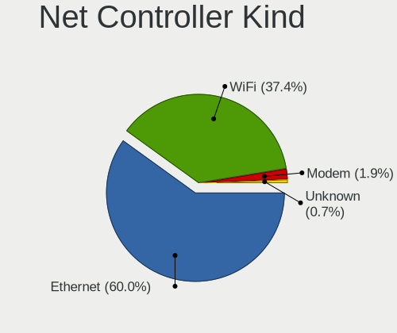

| Kind     | Desktops | Percent |
|----------|----------|---------|
| Ethernet | 443      | 60.35%  |
| WiFi     | 277      | 37.74%  |
| Modem    | 9        | 1.23%   |
| Unknown  | 5        | 0.68%   |

Used Controller
---------------

Currently used network controller

| Kind     | Desktops | Percent |
|----------|----------|---------|
| Ethernet | 329      | 69.41%  |
| WiFi     | 144      | 30.38%  |
| Unknown  | 1        | 0.21%   |

NICs
----

Total network controllers on board

| Total | Desktops | Percent |
|-------|----------|---------|
| 2     | 223      | 49.67%  |
| 1     | 183      | 40.76%  |
| 3     | 31       | 6.9%    |
| 4     | 4        | 0.89%   |
| 0     | 4        | 0.89%   |
| 6     | 2        | 0.45%   |
| 5     | 2        | 0.45%   |

IPv6
----

IPv6 vs IPv4

| Used | Desktops | Percent |
|------|----------|---------|
| No   | 308      | 68.6%   |
| Yes  | 141      | 31.4%   |

Bluetooth
---------

Bluetooth Vendor
----------------

Controller vendors

| Vendor                          | Desktops | Percent |
|---------------------------------|----------|---------|
| Intel                           | 128      | 53.33%  |
| Realtek Semiconductor           | 24       | 10%     |
| Cambridge Silicon Radio         | 20       | 8.33%   |
| MediaTek                        | 14       | 5.83%   |
| Broadcom                        | 12       | 5%      |
| ASUSTek Computer                | 10       | 4.17%   |
| IMC Networks                    | 8        | 3.33%   |
| Foxconn / Hon Hai               | 7        | 2.92%   |
| Qualcomm Atheros Communications | 4        | 1.67%   |
| TP-Link                         | 3        | 1.25%   |
| Realtek                         | 3        | 1.25%   |
| Lite-On Technology              | 2        | 0.83%   |
| Apple                           | 2        | 0.83%   |
| Actions                         | 2        | 0.83%   |
| Dynex                           | 1        | 0.42%   |

Bluetooth Model
---------------

Controller models

| Model                                                    | Desktops | Percent |
|----------------------------------------------------------|----------|---------|
| Intel AX210 Bluetooth                                    | 28       | 11.67%  |
| Intel AX200 Bluetooth                                    | 28       | 11.67%  |
| Intel Wireless-AC 3168 Bluetooth                         | 23       | 9.58%   |
| Cambridge Silicon Radio Bluetooth Dongle (HCI mode)      | 20       | 8.33%   |
| Realtek Bluetooth Radio                                  | 19       | 7.92%   |
| Intel Bluetooth wireless interface                       | 19       | 7.92%   |
| Intel Bluetooth Device                                   | 17       | 7.08%   |
| MediaTek Wireless_Device                                 | 14       | 5.83%   |
| Intel Wireless-AC 9260 Bluetooth Adapter                 | 8        | 3.33%   |
| Broadcom BCM20702A0 Bluetooth 4.0                        | 8        | 3.33%   |
| ASUS Bluetooth Device                                    | 6        | 2.5%    |
| Realtek  Bluetooth 4.2 Adapter                           | 5        | 2.08%   |
| Intel Bluetooth 9460/9560 Jefferson Peak (JfP)           | 5        | 2.08%   |
| IMC Networks Wireless_Device                             | 4        | 1.67%   |
| IMC Networks Bluetooth Radio                             | 4        | 1.67%   |
| Foxconn / Hon Hai Wireless_Device                        | 4        | 1.67%   |
| TP-Link UB500 Adapter                                    | 3        | 1.25%   |
| Realtek Bluetooth Radio                                  | 3        | 1.25%   |
| Qualcomm Atheros  Bluetooth Device                       | 3        | 1.25%   |
| Foxconn / Hon Hai Bluetooth Device                       | 2        | 0.83%   |
| ASUS Broadcom BCM20702A0 Bluetooth                       | 2        | 0.83%   |
| Actions general adapter                                  | 2        | 0.83%   |
| Qualcomm Atheros AR9462 Bluetooth                        | 1        | 0.42%   |
| Lite-On Bluetooth Radio                                  | 1        | 0.42%   |
| Lite-On Bluetooth Device                                 | 1        | 0.42%   |
| Foxconn / Hon Hai MediaTek MT7921 Bluetooth              | 1        | 0.42%   |
| Dynex Bluetooth 4.0 Adapter [Broadcom, 1.12, BCM20702A0] | 1        | 0.42%   |
| Broadcom HP Bluetooth Module                             | 1        | 0.42%   |
| Broadcom BCM92046DG-CL1ROM Bluetooth 2.1 Adapter         | 1        | 0.42%   |
| Broadcom BCM43142A0 Bluetooth Device                     | 1        | 0.42%   |
| Broadcom BCM43142 Bluetooth 4.0                          | 1        | 0.42%   |
| ASUS Broadcom BCM20702 Single-Chip Bluetooth 4.0 + LE    | 1        | 0.42%   |
| ASUS Bluetooth Radio                                     | 1        | 0.42%   |
| Apple Built-in Bluetooth 2.0+EDR HCI                     | 1        | 0.42%   |
| Apple Bluetooth USB Host Controller                      | 1        | 0.42%   |

Sound
-----

Sound Vendor
------------

Sound card vendors

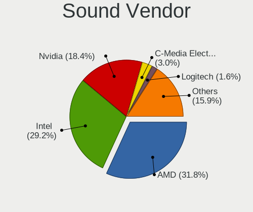

| Vendor                                       | Desktops | Percent |
|----------------------------------------------|----------|---------|
| Intel                                        | 235      | 29.34%  |
| AMD                                          | 234      | 29.21%  |
| Nvidia                                       | 174      | 21.72%  |
| ASUSTek Computer                             | 16       | 2%      |
| Creative Labs                                | 14       | 1.75%   |
| C-Media Electronics                          | 11       | 1.37%   |
| Logitech                                     | 10       | 1.25%   |
| Micro Star International                     | 9        | 1.12%   |
| Kingston Technology                          | 8        | 1%      |
| Focusrite-Novation                           | 6        | 0.75%   |
| Corsair                                      | 6        | 0.75%   |
| Zoran Co. Personal Media Division (Nogatech) | 5        | 0.62%   |
| Texas Instruments                            | 5        | 0.62%   |
| Razer USA                                    | 5        | 0.62%   |
| Blue Microphones                             | 5        | 0.62%   |
| SteelSeries ApS                              | 4        | 0.5%    |
| FIFINE Microphones                           | 4        | 0.5%    |
| ASRock                                       | 4        | 0.5%    |
| Samson Technologies                          | 3        | 0.37%   |
| Plantronics                                  | 3        | 0.37%   |
| JMTek                                        | 3        | 0.37%   |
| DCMT Technology                              | 3        | 0.37%   |
| Schiit Audio                                 | 2        | 0.25%   |
| KTMicro                                      | 2        | 0.25%   |
| GN Netcom                                    | 2        | 0.25%   |
| Generalplus Technology                       | 2        | 0.25%   |
| Dell                                         | 2        | 0.25%   |
| Creative Technology                          | 2        | 0.25%   |
| Astro Gaming                                 | 2        | 0.25%   |
| Unknown                                      | 2        | 0.25%   |
| XMOS                                         | 1        | 0.12%   |
| VIA Technologies                             | 1        | 0.12%   |
| Valve Software                               | 1        | 0.12%   |
| Thesycon Systemsoftware & Consulting         | 1        | 0.12%   |
| Sony                                         | 1        | 0.12%   |
| Realtek Semiconductor                        | 1        | 0.12%   |
| PreSonus Audio Electronics                   | 1        | 0.12%   |
| ONN                                          | 1        | 0.12%   |
| Klipsch Audio                                | 1        | 0.12%   |
| Jieli Technology                             | 1        | 0.12%   |

Sound Model
-----------

Sound card models

| Model                                                                      | Desktops | Percent |
|----------------------------------------------------------------------------|----------|---------|
| AMD Starship/Matisse HD Audio Controller                                   | 69       | 7.11%   |
| AMD Family 17h/19h HD Audio Controller                                     | 53       | 5.46%   |
| AMD Navi 21/23 HDMI/DP Audio Controller                                    | 44       | 4.54%   |
| AMD Rembrandt Radeon High Definition Audio Controller                      | 30       | 3.09%   |
| Intel 8 Series/C220 Series Chipset High Definition Audio Controller        | 28       | 2.89%   |
| AMD SBx00 Azalia (Intel HDA)                                               | 27       | 2.78%   |
| Intel Xeon E3-1200 v3/4th Gen Core Processor HD Audio Controller           | 24       | 2.47%   |
| Intel 6 Series/C200 Series Chipset Family High Definition Audio Controller | 22       | 2.27%   |
| Intel 100 Series/C230 Series Chipset Family HD Audio Controller            | 22       | 2.27%   |
| AMD Family 17h (Models 00h-0fh) HD Audio Controller                        | 22       | 2.27%   |
| Intel 7 Series/C216 Chipset Family High Definition Audio Controller        | 21       | 2.16%   |
| Intel 200 Series PCH HD Audio                                              | 20       | 2.06%   |
| Nvidia GA106 High Definition Audio Controller                              | 19       | 1.96%   |
| AMD Renoir Radeon High Definition Audio Controller                         | 17       | 1.75%   |
| ASUSTek Computer USB Audio                                                 | 16       | 1.65%   |
| Intel Alder Lake-S HD Audio Controller                                     | 15       | 1.55%   |
| AMD Ellesmere HDMI Audio [Radeon RX 470/480 / 570/580/590]                 | 15       | 1.55%   |
| Nvidia GA104 High Definition Audio Controller                              | 14       | 1.44%   |
| AMD Navi 31 HDMI/DP Audio                                                  | 14       | 1.44%   |
| Intel 700 Series Chipset Family Precise Touch and Stylus Port #1           | 13       | 1.34%   |
| AMD Navi 10 HDMI Audio                                                     | 13       | 1.34%   |
| Nvidia GA102 High Definition Audio Controller                              | 12       | 1.24%   |
| Nvidia High Definition Audio Controller                                    | 11       | 1.13%   |
| Nvidia GK208 HDMI/DP Audio Controller                                      | 11       | 1.13%   |
| Intel Cannon Lake PCH cAVS                                                 | 10       | 1.03%   |
| Intel 5 Series/3400 Series Chipset High Definition Audio                   | 10       | 1.03%   |
| Nvidia GM107 High Definition Audio Controller [GeForce 940MX]              | 9        | 0.93%   |
| Nvidia Audio device                                                        | 9        | 0.93%   |
| Micro Star International USB Audio                                         | 9        | 0.93%   |
| Intel C610/X99 series chipset HD Audio Controller                          | 9        | 0.93%   |
| AMD FCH Azalia Controller                                                  | 9        | 0.93%   |
| AMD Cedar HDMI Audio [Radeon HD 5400/6300/7300 Series]                     | 9        | 0.93%   |
| Intel 82801JI (ICH10 Family) HD Audio Controller                           | 8        | 0.82%   |
| Nvidia TU116 High Definition Audio Controller                              | 7        | 0.72%   |
| Nvidia TU106 High Definition Audio Controller                              | 7        | 0.72%   |
| Nvidia TU104 HD Audio Controller                                           | 7        | 0.72%   |
| Nvidia GP107GL High Definition Audio Controller                            | 7        | 0.72%   |
| Nvidia GP106 High Definition Audio Controller                              | 7        | 0.72%   |
| Nvidia GM206 High Definition Audio Controller                              | 7        | 0.72%   |
| Nvidia AD102 High Definition Audio Controller                              | 7        | 0.72%   |

Memory
------

Memory Vendor
-------------

Memory module vendors

| Vendor                                  | Desktops | Percent |
|-----------------------------------------|----------|---------|
| G.Skill                                 | 44       | 17.39%  |
| Corsair                                 | 35       | 13.83%  |
| SK hynix                                | 34       | 13.44%  |
| Kingston                                | 25       | 9.88%   |
| Samsung Electronics                     | 23       | 9.09%   |
| Unknown                                 | 20       | 7.91%   |
| Crucial                                 | 19       | 7.51%   |
| Micron Technology                       | 14       | 5.53%   |
| Unknown                                 | 8        | 3.16%   |
| Team                                    | 5        | 1.98%   |
| A-DATA Technology                       | 5        | 1.98%   |
| Silicon Power                           | 2        | 0.79%   |
| Ramaxel Technology                      | 2        | 0.79%   |
| Nanya Technology                        | 2        | 0.79%   |
| Unknown (458A)                          | 1        | 0.4%    |
| Unknown (0x5846)                        | 1        | 0.4%    |
| Unknown (0x0C26)                        | 1        | 0.4%    |
| Unknown (00007A100000)                  | 1        | 0.4%    |
| Silicon Power Computer & Communications | 1        | 0.4%    |
| Sesame                                  | 1        | 0.4%    |
| PNY                                     | 1        | 0.4%    |
| Patriot                                 | 1        | 0.4%    |
| Neo Forza                               | 1        | 0.4%    |
| Goldkey                                 | 1        | 0.4%    |
| Elpida                                  | 1        | 0.4%    |
| Chun Well                               | 1        | 0.4%    |
| Avant                                   | 1        | 0.4%    |
| ASint Technology                        | 1        | 0.4%    |
| Apacer                                  | 1        | 0.4%    |

Memory Model
------------

Memory module models

| Model                                                  | Desktops | Percent |
|--------------------------------------------------------|----------|---------|
| Unknown                                                | 8        | 2.92%   |
| G.Skill RAM F4-3200C16-16GVK 16GB DIMM DDR4 3600MT/s   | 5        | 1.82%   |
| G.Skill RAM F4-3200C16-8GVKB 8GB DIMM DDR4 3866MT/s    | 4        | 1.46%   |
| Crucial RAM BLS8G3D1609DS1S00. 8GB DIMM DDR3 1800MT/s  | 3        | 1.09%   |
| Corsair RAM CMK16GX4M2B3000C15 8GB DIMM DDR4 3533MT/s  | 3        | 1.09%   |
| Unknown RAM Module 8GB DIMM 1333MT/s                   | 2        | 0.73%   |
| Team RAM TEAMGROUP-UD4-3200 32GB DIMM DDR4 3800MT/s    | 2        | 0.73%   |
| SK hynix RAM HMT451U6AFR8C-PB 4GB DIMM DDR3 1600MT/s   | 2        | 0.73%   |
| SK hynix RAM HMT41GU6MFR8C-PB 8GB DIMM DDR3 1600MT/s   | 2        | 0.73%   |
| Samsung RAM M378B1G73EB0-YK0 8GB DIMM DDR3 1600MT/s    | 2        | 0.73%   |
| Samsung RAM M378A1K43CB2-CTD 8GB DIMM DDR4 3266MT/s    | 2        | 0.73%   |
| Nanya RAM NT4GC64B8HG0NF-DI 4GB DIMM DDR3 1600MT/s     | 2        | 0.73%   |
| Micron RAM 8JTF51264AZ-1G6E1 4GB DIMM DDR3 1600MT/s    | 2        | 0.73%   |
| Kingston RAM Module 2GB DIMM DDR2 667MT/s              | 2        | 0.73%   |
| Kingston RAM KF3200C16D4/16GX 16GB DIMM DDR4 3200MT/s  | 2        | 0.73%   |
| G.Skill RAM F5-6400J3239G32G 32GB DIMM 6400MT/s        | 2        | 0.73%   |
| G.Skill RAM F5-6000J3636F16G 16GB DIMM 6400MT/s        | 2        | 0.73%   |
| G.Skill RAM F5-6000J3238G32G 32GB DIMM DDR5 4800MT/s   | 2        | 0.73%   |
| G.Skill RAM F4-3200C16-8GVRB 8GB DIMM DDR4 3200MT/s    | 2        | 0.73%   |
| G.Skill RAM F3-12800CL9-4GBXL 4GB DIMM DDR3 1867MT/s   | 2        | 0.73%   |
| Crucial RAM CT32G48C40U5.M16A1 32GB DIMM DDR5 4800MT/s | 2        | 0.73%   |
| Crucial RAM CT102464BD160B.C16 8GB DIMM DDR3 1600MT/s  | 2        | 0.73%   |
| Corsair RAM CMW32GX4M2Z3600C18 16GB DIMM DDR4 3733MT/s | 2        | 0.73%   |
| Corsair RAM CMW32GX4M2D3600C18 16GB DIMM DDR4 3600MT/s | 2        | 0.73%   |
| Corsair RAM CMK64GX4M2D3600C18 32GB DIMM DDR4 3600MT/s | 2        | 0.73%   |
| Corsair RAM CMH64GX5M2B6400C32 32GB DIMM DDR5 6000MT/s | 2        | 0.73%   |
| Unknown RAM Module 8GB DIMM DDR3 1866MT/s              | 1        | 0.36%   |
| Unknown RAM Module 8GB DIMM DDR3 1600MT/s              | 1        | 0.36%   |
| Unknown RAM Module 8GB DIMM 1600MT/s                   | 1        | 0.36%   |
| Unknown RAM Module 4GB FB-DIMM DDR2 667MT/s            | 1        | 0.36%   |
| Unknown RAM Module 4GB DIMM DDR3 1600MT/s              | 1        | 0.36%   |
| Unknown RAM Module 4GB DIMM 667MT/s                    | 1        | 0.36%   |
| Unknown RAM Module 4GB DIMM 1600MT/s                   | 1        | 0.36%   |
| Unknown RAM Module 4GB DIMM 1333MT/s                   | 1        | 0.36%   |
| Unknown RAM Module 4GB DIMM 1066MT/s                   | 1        | 0.36%   |
| Unknown RAM Module 4096MB DIMM 1066MT/s                | 1        | 0.36%   |
| Unknown RAM Module 2GB DIMM DDR2 333MT/s               | 1        | 0.36%   |
| Unknown RAM Module 2GB DIMM 1333MT/s                   | 1        | 0.36%   |
| Unknown RAM Module 2048MB DIMM                         | 1        | 0.36%   |
| Unknown RAM Module 1GB DIMM DDR2 333MT/s               | 1        | 0.36%   |

Memory Kind
-----------

Memory module kinds

| Kind    | Desktops | Percent |
|---------|----------|---------|
| DDR4    | 105      | 47.95%  |
| DDR3    | 60       | 27.4%   |
| DDR5    | 28       | 12.79%  |
| Unknown | 11       | 5.02%   |
| DDR2    | 7        | 3.2%    |
| SDRAM   | 3        | 1.37%   |
| LPDDR5  | 2        | 0.91%   |
| DDR     | 2        | 0.91%   |
| LPDDR4  | 1        | 0.46%   |

Memory Form Factor
------------------

Physical design of the memory module

| Name         | Desktops | Percent |
|--------------|----------|---------|
| DIMM         | 201      | 92.2%   |
| SODIMM       | 12       | 5.5%    |
| Row Of Chips | 2        | 0.92%   |
| RIMM         | 2        | 0.92%   |
| FB-DIMM      | 1        | 0.46%   |

Memory Size
-----------

Memory module size

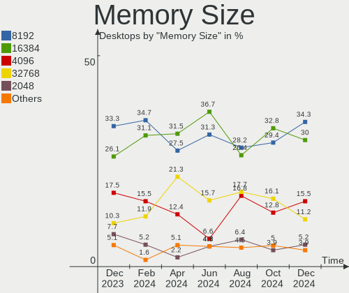

| Size  | Desktops | Percent |
|-------|----------|---------|
| 8192  | 81       | 34.62%  |
| 16384 | 58       | 24.79%  |
| 4096  | 41       | 17.52%  |
| 32768 | 24       | 10.26%  |
| 2048  | 18       | 7.69%   |
| 1024  | 8        | 3.42%   |
| 65536 | 1        | 0.43%   |
| 49152 | 1        | 0.43%   |
| 512   | 1        | 0.43%   |
| 128   | 1        | 0.43%   |

Memory Speed
------------

Memory module speed

| Speed   | Desktops | Percent |
|---------|----------|---------|
| 1600    | 37       | 15.48%  |
| 3200    | 31       | 12.97%  |
| 3600    | 19       | 7.95%   |
| 2400    | 17       | 7.11%   |
| 1333    | 15       | 6.28%   |
| 4800    | 11       | 4.6%    |
| 2667    | 10       | 4.18%   |
| 2133    | 7        | 2.93%   |
| 6400    | 6        | 2.51%   |
| 6000    | 6        | 2.51%   |
| 3800    | 5        | 2.09%   |
| 1800    | 5        | 2.09%   |
| 1066    | 5        | 2.09%   |
| 800     | 5        | 2.09%   |
| 667     | 5        | 2.09%   |
| 5600    | 4        | 1.67%   |
| 3866    | 4        | 1.67%   |
| 3733    | 4        | 1.67%   |
| 1867    | 4        | 1.67%   |
| 3666    | 3        | 1.26%   |
| 3533    | 3        | 1.26%   |
| 3266    | 3        | 1.26%   |
| Unknown | 3        | 1.26%   |
| 5200    | 2        | 0.84%   |
| 3000    | 2        | 0.84%   |
| 2733    | 2        | 0.84%   |
| 1866    | 2        | 0.84%   |
| 333     | 2        | 0.84%   |
| 7000    | 1        | 0.42%   |
| 4000    | 1        | 0.42%   |
| 3534    | 1        | 0.42%   |
| 3500    | 1        | 0.42%   |
| 3400    | 1        | 0.42%   |
| 3333    | 1        | 0.42%   |
| 3100    | 1        | 0.42%   |
| 2934    | 1        | 0.42%   |
| 2933    | 1        | 0.42%   |
| 2666    | 1        | 0.42%   |
| 2465    | 1        | 0.42%   |
| 2134    | 1        | 0.42%   |

Printers & scanners
-------------------

Printer Vendor
--------------

Printer device vendors

| Vendor             | Desktops | Percent |
|--------------------|----------|---------|
| Brother Industries | 13       | 38.24%  |
| Hewlett-Packard    | 12       | 35.29%  |
| Canon              | 5        | 14.71%  |
| Seiko Epson        | 2        | 5.88%   |
| Zebra              | 1        | 2.94%   |
| Dymo-CoStar        | 1        | 2.94%   |

Printer Model
-------------

Printer device models

| Model                           | Desktops | Percent |
|---------------------------------|----------|---------|
| HP DeskJet 3700 series          | 2        | 5.88%   |
| Canon MF230 Series UFRII LT     | 2        | 5.88%   |
| Zebra Thrmal 2844               | 1        | 2.94%   |
| Seiko Epson WF-2530 Series      | 1        | 2.94%   |
| Seiko Epson ET-4800 Series      | 1        | 2.94%   |
| HP Smart Tank 7300 series       | 1        | 2.94%   |
| HP LaserJet Pro M404-M405       | 1        | 2.94%   |
| HP LaserJet Pro M118-M119       | 1        | 2.94%   |
| HP LaserJet CP1525nw/x          | 1        | 2.94%   |
| HP LaserJet CM1415fnw           | 1        | 2.94%   |
| HP ENVY 5540 series             | 1        | 2.94%   |
| HP DeskJet 3940                 | 1        | 2.94%   |
| HP Deskjet 3520 series          | 1        | 2.94%   |
| HP DeskJet 2600 series          | 1        | 2.94%   |
| HP Deskjet 2540 series          | 1        | 2.94%   |
| Dymo-CoStar LabelWriter 400     | 1        | 2.94%   |
| Canon TR4700 series             | 1        | 2.94%   |
| Canon MG2200 series             | 1        | 2.94%   |
| Canon CanoScan LiDE 300         | 1        | 2.94%   |
| Brother QL-570 Label Printer    | 1        | 2.94%   |
| Brother MFC-L2740DW             | 1        | 2.94%   |
| Brother MFC-L2710DW series      | 1        | 2.94%   |
| Brother MFC-L2690DW             | 1        | 2.94%   |
| Brother MFC-J1010DW             | 1        | 2.94%   |
| Brother MFC-9325CW              | 1        | 2.94%   |
| Brother HL-L2370DW series       | 1        | 2.94%   |
| Brother HL-L2320D series        | 1        | 2.94%   |
| Brother HL-L2305 series         | 1        | 2.94%   |
| Brother HL-L2300D series        | 1        | 2.94%   |
| Brother HL-2270DW Laser Printer | 1        | 2.94%   |
| Brother HL-2240 series          | 1        | 2.94%   |
| Brother HL-2140 series          | 1        | 2.94%   |

Scanner Vendor
--------------

Scanner device vendors

| Vendor      | Desktops | Percent |
|-------------|----------|---------|
| Canon       | 2        | 66.67%  |
| Seiko Epson | 1        | 33.33%  |

Scanner Model
-------------

Scanner device models

| Model                                         | Desktops | Percent |
|-----------------------------------------------|----------|---------|
| Seiko Epson GT-8300UF [Perfection 1660 PHOTO] | 1        | 33.33%  |
| Canon CanoScan LiDE 210                       | 1        | 33.33%  |
| Canon CanoScan 1220U                          | 1        | 33.33%  |

Camera
------

Camera Vendor
-------------

Camera device vendors

| Vendor                                 | Desktops | Percent |
|----------------------------------------|----------|---------|
| Logitech                               | 36       | 36%     |
| Sunplus Innovation Technology          | 10       | 10%     |
| Microdia                               | 9        | 9%      |
| Samsung Electronics                    | 5        | 5%      |
| ARC International                      | 5        | 5%      |
| Microsoft                              | 4        | 4%      |
| Sonix Technology                       | 3        | 3%      |
| Chicony Electronics                    | 3        | 3%      |
| Razer USA                              | 2        | 2%      |
| MacroSilicon                           | 2        | 2%      |
| Linux Foundation                       | 2        | 2%      |
| GEMBIRD                                | 2        | 2%      |
| eMeet                                  | 2        | 2%      |
| YT-230810-H                            | 1        | 1%      |
| Valve Software                         | 1        | 1%      |
| Tobii Technology AB                    | 1        | 1%      |
| SunplusIT                              | 1        | 1%      |
| Sunplus Technology                     | 1        | 1%      |
| Realtek Semiconductor                  | 1        | 1%      |
| Magic Control Technology               | 1        | 1%      |
| KYE Systems (Mouse Systems)            | 1        | 1%      |
| Jieli Technology                       | 1        | 1%      |
| Hewlett-Packard                        | 1        | 1%      |
| FPL-2053-191010                        | 1        | 1%      |
| ezcap                                  | 1        | 1%      |
| Creative Technology                    | 1        | 1%      |
| Creality 3D Technology                 | 1        | 1%      |
| Cheng Uei Precision Industry (Foxlink) | 1        | 1%      |

Camera Model
------------

Camera device models

| Model                                             | Desktops | Percent |
|---------------------------------------------------|----------|---------|
| Logitech HD Pro Webcam C920                       | 7        | 6.93%   |
| Samsung Galaxy series, misc. (MTP mode)           | 5        | 4.95%   |
| Logitech Webcam C270                              | 5        | 4.95%   |
| ARC International Camera                          | 5        | 4.95%   |
| Microdia Webcam Vitade AF                         | 3        | 2.97%   |
| Microdia USB Camera                               | 3        | 2.97%   |
| Logitech C920 PRO HD Webcam                       | 3        | 2.97%   |
| Sunplus USB 2.0 Camera                            | 2        | 1.98%   |
| Sunplus Integrated_Webcam_HD                      | 2        | 1.98%   |
| Sunplus Depstech webcam                           | 2        | 1.98%   |
| Razer USA Razer Kiyo Pro                          | 2        | 1.98%   |
| Microsoft LifeCam Cinema                          | 2        | 1.98%   |
| Logitech Webcam C930e                             | 2        | 1.98%   |
| Logitech HD Webcam C615                           | 2        | 1.98%   |
| Logitech HD Webcam C525                           | 2        | 1.98%   |
| Logitech HD Webcam C510                           | 2        | 1.98%   |
| Logitech C922 Pro Stream Webcam                   | 2        | 1.98%   |
| Logitech C505e HD Webcam                          | 2        | 1.98%   |
| Linux Foundation EEM Gadget                       | 2        | 1.98%   |
| GEMBIRD Generic UVC 1.00 camera [AppoTech AX2311] | 2        | 1.98%   |
| eMeet HD Webcam C960                              | 2        | 1.98%   |
| Chicony CNF8050 Webcam                            | 2        | 1.98%   |
| YT-230810-H YT-720P Camera                        | 1        | 0.99%   |
| Valve Software 3D Camera                          | 1        | 0.99%   |
| Tobii AB EyeChip                                  | 1        | 0.99%   |
| SunplusIT Depstech webcam                         | 1        | 0.99%   |
| Sunplus USB2.0 2M WebCam                          | 1        | 0.99%   |
| Sunplus UC40M Audio                               | 1        | 0.99%   |
| Sunplus Full HD webcam                            | 1        | 0.99%   |
| Sunplus FHD Camera                                | 1        | 0.99%   |
| Sunplus Aluratek UHD 4K Camera                    | 1        | 0.99%   |
| Sonix USB Camera                                  | 1        | 0.99%   |
| Sonix NexiGo HD Webcam                            | 1        | 0.99%   |
| Sonix Foscam Webcam W41 Audio                     | 1        | 0.99%   |
| Realtek Full HD webcam                            | 1        | 0.99%   |
| Microsoft Modern Webcam                           | 1        | 0.99%   |
| Microsoft Microsoft LifeCam Studio              | 1        | 0.99%   |
| Microdia USB 2.0 Camera                           | 1        | 0.99%   |
| Microdia Sonix USB 2.0 Camera                     | 1        | 0.99%   |
| Microdia HP Integrated Webcam                     | 1        | 0.99%   |

Security
--------

Fingerprint Vendor
------------------

Fingerprint sensor vendors

| Vendor         | Desktops | Percent |
|----------------|----------|---------|
| DigitalPersona | 1        | 100%    |

Fingerprint Model
-----------------

Fingerprint sensor models

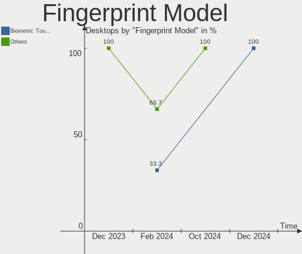

| Model                             | Desktops | Percent |
|-----------------------------------|----------|---------|
| DigitalPersona Fingerprint Reader | 1        | 100%    |

Chipcard Vendor
---------------

Chipcard module vendors

Zero info for selected period =(

Chipcard Model
--------------

Chipcard module models

Zero info for selected period =(

Unsupported
-----------

Unsupported Devices
-------------------

Total unsupported devices on board

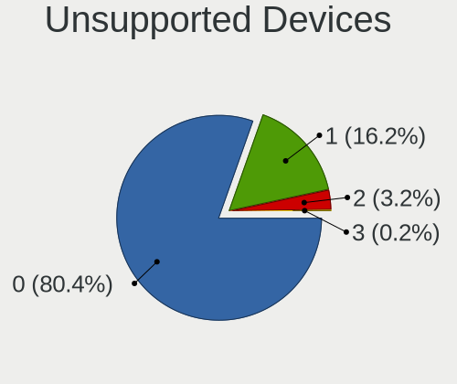

| Total | Desktops | Percent |
|-------|----------|---------|
| 0     | 365      | 81.29%  |
| 1     | 63       | 14.03%  |
| 2     | 14       | 3.12%   |
| 3     | 5        | 1.11%   |
| 5     | 1        | 0.22%   |
| 4     | 1        | 0.22%   |

Unsupported Device Types
------------------------

Types of unsupported devices

| Type                     | Desktops | Percent |
|--------------------------|----------|---------|
| Graphics card            | 41       | 37.96%  |
| Net/wireless             | 25       | 23.15%  |
| Unassigned class         | 11       | 10.19%  |
| Communication controller | 8        | 7.41%   |
| Bluetooth                | 6        | 5.56%   |
| Storage/raid             | 4        | 3.7%    |
| Camera                   | 4        | 3.7%    |
| Sound                    | 2        | 1.85%   |
| Net/ethernet             | 2        | 1.85%   |
| Multimedia controller    | 2        | 1.85%   |
| Storage/ide              | 1        | 0.93%   |
| Network                  | 1        | 0.93%   |
| Fingerprint reader       | 1        | 0.93%   |

