Linux in USA - Hardware Trends (Desktops)
-----------------------------------------

A project to identify most popular hardware characteristics and track their change
over time based on data collected by Linux users at https://Linux-Hardware.org.

Anyone can contribute to this report by the [hw-probe](https://github.com/linuxhw/hw-probe) tool:

    sudo -E hw-probe -all -upload

Period: Dec, 2024.

Contents
--------

* [ System ](#system)
  - [ OS                       ](#os)
  - [ OS Family                ](#os-family)
  - [ Kernel                   ](#kernel)
  - [ Kernel Family            ](#kernel-family)
  - [ Kernel Major Ver.        ](#kernel-major-ver)
  - [ Arch                     ](#arch)
  - [ DE                       ](#de)
  - [ Display Server           ](#display-server)
  - [ Display Manager          ](#display-manager)
  - [ OS Lang                  ](#os-lang)
  - [ Boot Mode                ](#boot-mode)
  - [ Filesystem               ](#filesystem)
  - [ Part. scheme             ](#part-scheme)
  - [ Dual Boot with Linux/BSD ](#dual-boot-with-linuxbsd)
  - [ Dual Boot (Win)          ](#dual-boot-win)

* [ Board ](#board)
  - [ Vendor                   ](#vendor)
  - [ Model                    ](#model)
  - [ Model Family             ](#model-family)
  - [ MFG Year                 ](#mfg-year)
  - [ Form Factor              ](#form-factor)
  - [ Secure Boot              ](#secure-boot)
  - [ Coreboot                 ](#coreboot)
  - [ RAM Size                 ](#ram-size)
  - [ RAM Used                 ](#ram-used)
  - [ Total Drives             ](#total-drives)
  - [ Has CD-ROM               ](#has-cd-rom)
  - [ Has Ethernet             ](#has-ethernet)
  - [ Has WiFi                 ](#has-wifi)
  - [ Has Bluetooth            ](#has-bluetooth)

* [ Location ](#location)
  - [ Country                  ](#country)
  - [ City                     ](#city)

* [ Drives ](#drives)
  - [ Drive Vendor             ](#drive-vendor)
  - [ Drive Model              ](#drive-model)
  - [ HDD Vendor               ](#hdd-vendor)
  - [ SSD Vendor               ](#ssd-vendor)
  - [ Drive Kind               ](#drive-kind)
  - [ Drive Connector          ](#drive-connector)
  - [ Drive Size               ](#drive-size)
  - [ Space Total              ](#space-total)
  - [ Space Used               ](#space-used)
  - [ Malfunc. Drives          ](#malfunc-drives)
  - [ Malfunc. Drive Vendor    ](#malfunc-drive-vendor)
  - [ Malfunc. HDD Vendor      ](#malfunc-hdd-vendor)
  - [ Malfunc. Drive Kind      ](#malfunc-drive-kind)
  - [ Failed Drives            ](#failed-drives)
  - [ Failed Drive Vendor      ](#failed-drive-vendor)
  - [ Drive Status             ](#drive-status)

* [ Storage controller ](#storage-controller)
  - [ Storage Vendor           ](#storage-vendor)
  - [ Storage Model            ](#storage-model)
  - [ Storage Kind             ](#storage-kind)

* [ Processor ](#processor)
  - [ CPU Vendor               ](#cpu-vendor)
  - [ CPU Model                ](#cpu-model)
  - [ CPU Model Family         ](#cpu-model-family)
  - [ CPU Cores                ](#cpu-cores)
  - [ CPU Sockets              ](#cpu-sockets)
  - [ CPU Threads              ](#cpu-threads)
  - [ CPU Op-Modes             ](#cpu-op-modes)
  - [ CPU Microcode            ](#cpu-microcode)
  - [ CPU Microarch            ](#cpu-microarch)

* [ Graphics ](#graphics)
  - [ GPU Vendor               ](#gpu-vendor)
  - [ GPU Model                ](#gpu-model)
  - [ GPU Combo                ](#gpu-combo)
  - [ GPU Driver               ](#gpu-driver)
  - [ GPU Memory               ](#gpu-memory)

* [ Monitor ](#monitor)
  - [ Monitor Vendor           ](#monitor-vendor)
  - [ Monitor Model            ](#monitor-model)
  - [ Monitor Resolution       ](#monitor-resolution)
  - [ Monitor Diagonal         ](#monitor-diagonal)
  - [ Monitor Width            ](#monitor-width)
  - [ Aspect Ratio             ](#aspect-ratio)
  - [ Monitor Area             ](#monitor-area)
  - [ Pixel Density            ](#pixel-density)
  - [ Multiple Monitors        ](#multiple-monitors)

* [ Network ](#network)
  - [ Net Controller Vendor    ](#net-controller-vendor)
  - [ Net Controller Model     ](#net-controller-model)
  - [ Wireless Vendor          ](#wireless-vendor)
  - [ Wireless Model           ](#wireless-model)
  - [ Ethernet Vendor          ](#ethernet-vendor)
  - [ Ethernet Model           ](#ethernet-model)
  - [ Net Controller Kind      ](#net-controller-kind)
  - [ Used Controller          ](#used-controller)
  - [ NICs                     ](#nics)
  - [ IPv6                     ](#ipv6)

* [ Bluetooth ](#bluetooth)
  - [ Bluetooth Vendor         ](#bluetooth-vendor)
  - [ Bluetooth Model          ](#bluetooth-model)

* [ Sound ](#sound)
  - [ Sound Vendor             ](#sound-vendor)
  - [ Sound Model              ](#sound-model)

* [ Memory ](#memory)
  - [ Memory Vendor            ](#memory-vendor)
  - [ Memory Model             ](#memory-model)
  - [ Memory Kind              ](#memory-kind)
  - [ Memory Form Factor       ](#memory-form-factor)
  - [ Memory Size              ](#memory-size)
  - [ Memory Speed             ](#memory-speed)

* [ Printers & scanners ](#printers--scanners)
  - [ Printer Vendor           ](#printer-vendor)
  - [ Printer Model            ](#printer-model)
  - [ Scanner Vendor           ](#scanner-vendor)
  - [ Scanner Model            ](#scanner-model)

* [ Camera ](#camera)
  - [ Camera Vendor            ](#camera-vendor)
  - [ Camera Model             ](#camera-model)

* [ Security ](#security)
  - [ Fingerprint Vendor       ](#fingerprint-vendor)
  - [ Fingerprint Model        ](#fingerprint-model)
  - [ Chipcard Vendor          ](#chipcard-vendor)
  - [ Chipcard Model           ](#chipcard-model)

* [ Unsupported ](#unsupported)
  - [ Unsupported Devices      ](#unsupported-devices)
  - [ Unsupported Device Types ](#unsupported-device-types)

System
------

OS
--

Installed operating systems

| Name                 | Desktops | Percent |
|----------------------|----------|---------|
| Ubuntu 24.04         | 60       | 13.51%  |
| OpenMandriva 24.12   | 46       | 10.36%  |
| Fedora 41            | 42       | 9.46%   |
| Pop!_OS 22.04        | 32       | 7.21%   |
| Bazzite 41           | 26       | 5.86%   |
| Debian 12            | 24       | 5.41%   |
| Arch Rolling         | 22       | 4.95%   |
| Zorin 17             | 17       | 3.83%   |
| Ubuntu 22.04         | 15       | 3.38%   |
| Linux Mint 22        | 15       | 3.38%   |
| Ubuntu 24.10         | 9        | 2.03%   |
| KDE neon 24.04       | 9        | 2.03%   |
| Nobara 40            | 8        | 1.8%    |
| Kubuntu 24.04        | 7        | 1.58%   |
| OpenMandriva 5.0     | 6        | 1.35%   |
| Slackware 15.0       | 5        | 1.13%   |
| Linux Mint 21.3      | 5        | 1.13%   |
| Fedora 40            | 5        | 1.13%   |
| EndeavourOS Rolling  | 5        | 1.13%   |
| OpenMandriva 24.07   | 4        | 0.9%    |
| OpenMandriva 23.08   | 4        | 0.9%    |
| Elementary 8         | 4        | 0.9%    |
| Xubuntu 24.04        | 3        | 0.68%   |
| Pop!_OS 24.04        | 3        | 0.68%   |
| openSUSE Leap-15.6   | 3        | 0.68%   |
| Kubuntu 24.10        | 3        | 0.68%   |
| Debian 9             | 3        | 0.68%   |
| Debian               | 3        | 0.68%   |
| ArcoLinux Rolling    | 3        | 0.68%   |
| Zorin 16             | 2        | 0.45%   |
| Ubuntu MATE 24.10    | 2        | 0.45%   |
| Ubuntu MATE 24.04    | 2        | 0.45%   |
| NixOS 25.05          | 2        | 0.45%   |
| Manjaro 24.2.1       | 2        | 0.45%   |
| Manjaro              | 2        | 0.45%   |
| Garuda Linux Soaring | 2        | 0.45%   |
| Elementary 7.1       | 2        | 0.45%   |
| Xubuntu 22.04        | 1        | 0.23%   |
| Xubuntu 18.04        | 1        | 0.23%   |
| Xero Rolling         | 1        | 0.23%   |

OS Family
---------

OS without a version

| Name          | Desktops | Percent |
|---------------|----------|---------|
| Ubuntu        | 85       | 19.14%  |
| OpenMandriva  | 61       | 13.74%  |
| Fedora        | 48       | 10.81%  |
| Pop!_OS       | 35       | 7.88%   |
| Debian        | 31       | 6.98%   |
| Bazzite       | 26       | 5.86%   |
| Linux Mint    | 23       | 5.18%   |
| Arch          | 22       | 4.95%   |
| Zorin         | 19       | 4.28%   |
| Kubuntu       | 12       | 2.7%    |
| KDE neon      | 9        | 2.03%   |
| Nobara        | 8        | 1.8%    |
| Manjaro       | 6        | 1.35%   |
| Elementary    | 6        | 1.35%   |
| Xubuntu       | 5        | 1.13%   |
| Ubuntu MATE   | 5        | 1.13%   |
| Slackware     | 5        | 1.13%   |
| EndeavourOS   | 5        | 1.13%   |
| openSUSE      | 4        | 0.9%    |
| ArcoLinux     | 4        | 0.9%    |
| Garuda Linux  | 3        | 0.68%   |
| SteamOS       | 2        | 0.45%   |
| NixOS         | 2        | 0.45%   |
| Kali          | 2        | 0.45%   |
| Dts-distro    | 2        | 0.45%   |
| Xero          | 1        | 0.23%   |
| Vanilla       | 1        | 0.23%   |
| Ubuntu Unity  | 1        | 0.23%   |
| Ubuntu Budgie | 1        | 0.23%   |
| TUXEDO OS     | 1        | 0.23%   |
| Rocky Linux   | 1        | 0.23%   |
| MX            | 1        | 0.23%   |
| Lubuntu       | 1        | 0.23%   |
| LMDE          | 1        | 0.23%   |
| Gentoo        | 1        | 0.23%   |
| Deepin        | 1        | 0.23%   |
| CachyOS       | 1        | 0.23%   |
| Bluefin       | 1        | 0.23%   |
| BigLinux      | 1        | 0.23%   |

Kernel
------

Version of the Linux kernel

| Version                         | Desktops | Percent |
|---------------------------------|----------|---------|
| 6.8.0-49-generic                | 51       | 11.49%  |
| 6.12.1-desktop-1omv2490         | 43       | 9.68%   |
| 6.9.3-76060903-generic          | 35       | 7.88%   |
| 6.8.0-51-generic                | 30       | 6.76%   |
| 6.8.0-50-generic                | 27       | 6.08%   |
| 6.11.10-304.bazzite.fc41.x86_64 | 18       | 4.05%   |
| 6.11.10-300.fc41.x86_64         | 16       | 3.6%    |
| 6.1.0-28-amd64                  | 11       | 2.48%   |
| 6.11.9-200.fsync.fc40.x86_64    | 8        | 1.8%    |
| 6.12.4-200.fc41.x86_64          | 7        | 1.58%   |
| 6.11.9-303.bazzite.fc41.x86_64  | 7        | 1.58%   |
| 6.11.11-300.fc41.x86_64         | 7        | 1.58%   |
| 6.11.0-13-generic               | 7        | 1.58%   |
| 6.8.0-48-generic                | 6        | 1.35%   |
| 6.6.2-desktop-1omv2390          | 6        | 1.35%   |
| 6.12.4-arch1-1                  | 6        | 1.35%   |
| 6.11.0-9-generic                | 6        | 1.35%   |
| 6.12.6-200.fc41.x86_64          | 5        | 1.13%   |
| 6.12.5-200.fc41.x86_64          | 5        | 1.13%   |
| 6.12.1-arch1-1                  | 5        | 1.13%   |
| 6.8.0-41-generic                | 4        | 0.9%    |
| 6.12.4-1-MANJARO                | 4        | 0.9%    |
| 5.15.0-126-generic              | 4        | 0.9%    |
| 6.8.0-45-generic                | 3        | 0.68%   |
| 6.12.6-desktop-1omv2490         | 3        | 0.68%   |
| 6.12.4-zen1-1-zen               | 3        | 0.68%   |
| 6.10.0-desktop-1omv2490         | 3        | 0.68%   |
| 6.1.0-27-amd64                  | 3        | 0.68%   |
| 6.1.0-18-amd64                  | 3        | 0.68%   |
| 4.19.0-6-amd64                  | 3        | 0.68%   |
| 6.8.0-50-lowlatency             | 2        | 0.45%   |
| 6.8.0-40-generic                | 2        | 0.45%   |
| 6.6.65-1-lts                    | 2        | 0.45%   |
| 6.6.63-1-MANJARO                | 2        | 0.45%   |
| 6.6.21-yocto-standard           | 2        | 0.45%   |
| 6.4.8-desktop-2omv2390          | 2        | 0.45%   |
| 6.4.11-desktop-1omv2390         | 2        | 0.45%   |
| 6.12.7                          | 2        | 0.45%   |
| 6.12.6-arch1-1                  | 2        | 0.45%   |
| 6.12.3-arch1-1                  | 2        | 0.45%   |

Kernel Family
-------------

Linux kernel without a distro release

| Version | Desktops | Percent |
|---------|----------|---------|
| 6.8.0   | 128      | 28.83%  |
| 6.12.1  | 54       | 12.16%  |
| 6.11.10 | 38       | 8.56%   |
| 6.9.3   | 35       | 7.88%   |
| 6.12.4  | 20       | 4.5%    |
| 6.1.0   | 20       | 4.5%    |
| 6.11.0  | 17       | 3.83%   |
| 6.11.9  | 15       | 3.38%   |
| 6.12.6  | 14       | 3.15%   |
| 5.15.0  | 11       | 2.48%   |
| 6.11.11 | 10       | 2.25%   |
| 6.6.2   | 6        | 1.35%   |
| 6.12.3  | 6        | 1.35%   |
| 6.12.5  | 5        | 1.13%   |
| 6.6.63  | 3        | 0.68%   |
| 6.4.0   | 3        | 0.68%   |
| 6.12.7  | 3        | 0.68%   |
| 6.11.6  | 3        | 0.68%   |
| 6.10.0  | 3        | 0.68%   |
| 4.19.0  | 3        | 0.68%   |
| 6.9.7   | 2        | 0.45%   |
| 6.8.5   | 2        | 0.45%   |
| 6.6.65  | 2        | 0.45%   |
| 6.6.21  | 2        | 0.45%   |
| 6.5.0   | 2        | 0.45%   |
| 6.4.8   | 2        | 0.45%   |
| 6.4.11  | 2        | 0.45%   |
| 6.12.2  | 2        | 0.45%   |
| 6.11.7  | 2        | 0.45%   |
| 5.4.0   | 2        | 0.45%   |
| 5.19.0  | 2        | 0.45%   |
| 6.8.12  | 1        | 0.23%   |
| 6.8.11  | 1        | 0.23%   |
| 6.6.64  | 1        | 0.23%   |
| 6.6.62  | 1        | 0.23%   |
| 6.6.59  | 1        | 0.23%   |
| 6.6.4   | 1        | 0.23%   |
| 6.6.22  | 1        | 0.23%   |
| 6.6.15  | 1        | 0.23%   |
| 6.5.11  | 1        | 0.23%   |

Kernel Major Ver.
-----------------

Linux kernel major version

| Version | Desktops | Percent |
|---------|----------|---------|
| 6.8     | 132      | 29.73%  |
| 6.12    | 104      | 23.42%  |
| 6.11    | 90       | 20.27%  |
| 6.9     | 37       | 8.33%   |
| 6.1     | 22       | 4.95%   |
| 6.6     | 19       | 4.28%   |
| 5.15    | 11       | 2.48%   |
| 6.4     | 7        | 1.58%   |
| 6.10    | 6        | 1.35%   |
| 6.5     | 3        | 0.68%   |
| 4.19    | 3        | 0.68%   |
| 5.4     | 2        | 0.45%   |
| 5.19    | 2        | 0.45%   |
| 5.14    | 2        | 0.45%   |
| 5.10    | 2        | 0.45%   |
| 6.13    | 1        | 0.23%   |
| 4.15    | 1        | 0.23%   |

Arch
----

OS architecture (x86_64, i586, etc.)

| Name    | Desktops | Percent |
|---------|----------|---------|
| x86_64  | 443      | 99.77%  |
| ppc64le | 1        | 0.23%   |

DE
--

Desktop Environment

| Name          | Desktops | Percent |
|---------------|----------|---------|
| GNOME         | 181      | 40.77%  |
| KDE6          | 76       | 17.12%  |
| Unknown       | 64       | 14.41%  |
| KDE5          | 32       | 7.21%   |
| XFCE          | 25       | 5.63%   |
| X-Cinnamon    | 22       | 4.95%   |
| MATE          | 10       | 2.25%   |
| LXQt          | 9        | 2.03%   |
| Pantheon      | 6        | 1.35%   |
| COSMIC        | 5        | 1.13%   |
| KDE           | 3        | 0.68%   |
| ICEWM         | 2        | 0.45%   |
| Cinnamon      | 2        | 0.45%   |
| Unity         | 1        | 0.23%   |
| Trinity       | 1        | 0.23%   |
| LXDE          | 1        | 0.23%   |
| Hyprland      | 1        | 0.23%   |
| GNOME Classic | 1        | 0.23%   |
| Deepin        | 1        | 0.23%   |
| Budgie        | 1        | 0.23%   |

Display Server
--------------

X11 or Wayland

| Name    | Desktops | Percent |
|---------|----------|---------|
| Wayland | 228      | 51.35%  |
| X11     | 185      | 41.67%  |
| Tty     | 21       | 4.73%   |
| Unknown | 10       | 2.25%   |

Display Manager
---------------

SDDM, LightDM, etc.

| Name           | Desktops | Percent |
|----------------|----------|---------|
| Unknown        | 180      | 40.54%  |
| SDDM           | 101      | 22.75%  |
| GDM3           | 88       | 19.82%  |
| LightDM        | 48       | 10.81%  |
| GDM            | 21       | 4.73%   |
| XDM            | 3        | 0.68%   |
| TDM            | 1        | 0.23%   |
| LXDM           | 1        | 0.23%   |
| COSMIC-GREETER | 1        | 0.23%   |

OS Lang
-------

Language

| Lang    | Desktops | Percent |
|---------|----------|---------|
| en_US   | 416      | 93.69%  |
| C       | 13       | 2.93%   |
| Unknown | 4        | 0.9%    |
| ru_RU   | 2        | 0.45%   |
| en_GB   | 2        | 0.45%   |
| tr_TR   | 1        | 0.23%   |
| pl_PL   | 1        | 0.23%   |
| fr_FR   | 1        | 0.23%   |
| es_US   | 1        | 0.23%   |
| es_ES   | 1        | 0.23%   |
| en_CA   | 1        | 0.23%   |
| de_DE   | 1        | 0.23%   |

Boot Mode
---------

EFI or BIOS

| Mode | Desktops | Percent |
|------|----------|---------|
| BIOS | 284      | 63.96%  |
| EFI  | 160      | 36.04%  |

Filesystem
----------

Type of filesystem

| Type    | Desktops | Percent |
|---------|----------|---------|
| Ext4    | 214      | 48.2%   |
| Btrfs   | 106      | 23.87%  |
| Tmpfs   | 73       | 16.44%  |
| Overlay | 42       | 9.46%   |
| Xfs     | 4        | 0.9%    |
| Zfs     | 2        | 0.45%   |
| Jfs     | 1        | 0.23%   |
| F2fs    | 1        | 0.23%   |
| Aufs    | 1        | 0.23%   |

Part. scheme
------------

Scheme of partitioning

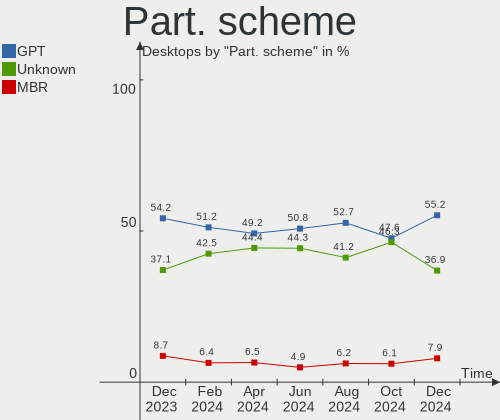

| Type    | Desktops | Percent |
|---------|----------|---------|
| GPT     | 245      | 55.18%  |
| Unknown | 164      | 36.94%  |
| MBR     | 35       | 7.88%   |

Dual Boot with Linux/BSD
------------------------

Hosting more than one Linux/BSD

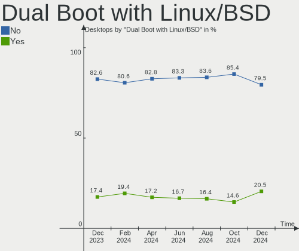

| Dual boot | Desktops | Percent |
|-----------|----------|---------|
| No        | 353      | 79.5%   |
| Yes       | 91       | 20.5%   |

Dual Boot (Win)
---------------

Hosting Linux and Windows

| Dual boot | Desktops | Percent |
|-----------|----------|---------|
| No        | 336      | 75.68%  |
| Yes       | 108      | 24.32%  |

Board
-----

Vendor
------

Motherboard manufacturer

| Name                                 | Desktops | Percent |
|--------------------------------------|----------|---------|
| ASUSTek Computer                     | 109      | 24.55%  |
| Dell                                 | 74       | 16.67%  |
| MSI                                  | 55       | 12.39%  |
| Gigabyte Technology                  | 52       | 11.71%  |
| ASRock                               | 46       | 10.36%  |
| Hewlett-Packard                      | 36       | 8.11%   |
| Lenovo                               | 14       | 3.15%   |
| Unknown                              | 8        | 1.8%    |
| AZW                                  | 6        | 1.35%   |
| Pegatron                             | 4        | 0.9%    |
| Intel                                | 4        | 0.9%    |
| Supermicro                           | 3        | 0.68%   |
| Shenzhen Meigao Electronic Equipment | 3        | 0.68%   |
| Apple                                | 3        | 0.68%   |
| TianBei                              | 2        | 0.45%   |
| System76                             | 2        | 0.45%   |
| GEEKOM                               | 2        | 0.45%   |
| ECS                                  | 2        | 0.45%   |
| BESSTAR Tech                         | 2        | 0.45%   |
| Alienware                            | 2        | 0.45%   |
| TB                                   | 1        | 0.23%   |
| SZMZ                                 | 1        | 0.23%   |
| STGAUBRON                            | 1        | 0.23%   |
| SHANGZHAOYUAN                        | 1        | 0.23%   |
| PN-3322                              | 1        | 0.23%   |
| NZXT                                 | 1        | 0.23%   |
| Micro Computer (HK) Tech Limited     | 1        | 0.23%   |
| MACHINIST                            | 1        | 0.23%   |
| Google                               | 1        | 0.23%   |
| Gateway                              | 1        | 0.23%   |
| Foxconn                              | 1        | 0.23%   |
| eMachines                            | 1        | 0.23%   |
| CWWK                                 | 1        | 0.23%   |
| Biostar                              | 1        | 0.23%   |
| Acer                                 | 1        | 0.23%   |

Model
-----

Motherboard model

| Name                             | Desktops | Percent |
|----------------------------------|----------|---------|
| Unknown                          | 9        | 2.03%   |
| Dell OptiPlex 7010               | 8        | 1.8%    |
| Dell OptiPlex 9020               | 7        | 1.58%   |
| ASUS All Series                  | 6        | 1.35%   |
| ASUS TUF Gaming X570-PLUS        | 5        | 1.13%   |
| MSI MS-7693                      | 4        | 0.9%    |
| Dell XPS 8700                    | 4        | 0.9%    |
| Dell Precision Tower 3620        | 4        | 0.9%    |
| AZW MINI S                       | 4        | 0.9%    |
| ASUS ProArt X670E-CREATOR WIFI   | 4        | 0.9%    |
| MSI MS-7E26                      | 3        | 0.68%   |
| MSI MS-7D75                      | 3        | 0.68%   |
| MSI MS-7D25                      | 3        | 0.68%   |
| MSI MS-7C37                      | 3        | 0.68%   |
| HP Pavilion Desktop TP01-2xxx    | 3        | 0.68%   |
| Gigabyte B450M DS3H WIFI         | 3        | 0.68%   |
| Dell OptiPlex 990                | 3        | 0.68%   |
| Dell OptiPlex 5040               | 3        | 0.68%   |
| ASUS PRIME B350-PLUS             | 3        | 0.68%   |
| ASUS GamingPC                    | 3        | 0.68%   |
| ASRock B450M Pro4                | 3        | 0.68%   |
| MSI MS-7E47                      | 2        | 0.45%   |
| MSI MS-7E12                      | 2        | 0.45%   |
| MSI MS-7D78                      | 2        | 0.45%   |
| MSI MS-7D37                      | 2        | 0.45%   |
| MSI MS-7C95                      | 2        | 0.45%   |
| MSI MS-7C56                      | 2        | 0.45%   |
| MSI MS-7B86                      | 2        | 0.45%   |
| MSI MS-7917                      | 2        | 0.45%   |
| HP t520 Flexible Series TC       | 2        | 0.45%   |
| HP ProDesk 600 G2 SFF            | 2        | 0.45%   |
| HP ProDesk 400 G1 MT             | 2        | 0.45%   |
| HP EliteDesk 705 G3 Desktop Mini | 2        | 0.45%   |
| HP Compaq 6200 Pro SFF PC        | 2        | 0.45%   |
| Gigabyte Z790 AORUS ELITE AX     | 2        | 0.45%   |
| Gigabyte Z390 AORUS PRO WIFI     | 2        | 0.45%   |
| Gigabyte X570 I AORUS PRO WIFI   | 2        | 0.45%   |
| Gigabyte X570 AORUS MASTER       | 2        | 0.45%   |
| Gigabyte GA-MA790XT-UD4P         | 2        | 0.45%   |
| Gigabyte GA-880GM-UD2H           | 2        | 0.45%   |

Model Family
------------

Motherboard model prefix

| Name               | Desktops | Percent |
|--------------------|----------|---------|
| Dell OptiPlex      | 46       | 10.36%  |
| ASUS ROG           | 23       | 5.18%   |
| ASUS PRIME         | 21       | 4.73%   |
| ASUS TUF           | 16       | 3.6%    |
| Dell Precision     | 11       | 2.48%   |
| Lenovo ThinkCentre | 9        | 2.03%   |
| Unknown            | 9        | 2.03%   |
| HP EliteDesk       | 8        | 1.8%    |
| HP Compaq          | 7        | 1.58%   |
| Dell Inspiron      | 7        | 1.58%   |
| HP Pavilion        | 6        | 1.35%   |
| Dell XPS           | 6        | 1.35%   |
| ASUS ProArt        | 6        | 1.35%   |
| ASUS All           | 6        | 1.35%   |
| HP ProDesk         | 5        | 1.13%   |
| Gigabyte X570      | 5        | 1.13%   |
| ASRock B450M       | 5        | 1.13%   |
| MSI MS-7693        | 4        | 0.9%    |
| Gigabyte Z790      | 4        | 0.9%    |
| Gigabyte Z390      | 4        | 0.9%    |
| Gigabyte B450M     | 4        | 0.9%    |
| AZW MINI           | 4        | 0.9%    |
| ASUS M5A97         | 4        | 0.9%    |
| MSI MS-7E26        | 3        | 0.68%   |
| MSI MS-7D75        | 3        | 0.68%   |
| MSI MS-7D25        | 3        | 0.68%   |
| MSI MS-7C37        | 3        | 0.68%   |
| Dell Studio        | 3        | 0.68%   |
| ASUS GamingPC      | 3        | 0.68%   |
| ASRock X570        | 3        | 0.68%   |
| ASRock B650M       | 3        | 0.68%   |
| System76 Thelio    | 2        | 0.45%   |
| MSI MS-7E47        | 2        | 0.45%   |
| MSI MS-7E12        | 2        | 0.45%   |
| MSI MS-7D78        | 2        | 0.45%   |
| MSI MS-7D37        | 2        | 0.45%   |
| MSI MS-7C95        | 2        | 0.45%   |
| MSI MS-7C56        | 2        | 0.45%   |
| MSI MS-7B86        | 2        | 0.45%   |
| MSI MS-7917        | 2        | 0.45%   |

MFG Year
--------

Motherboard manufacture year

| Year    | Desktops | Percent |
|---------|----------|---------|
| 2023    | 45       | 10.14%  |
| 2022    | 42       | 9.46%   |
| 2024    | 35       | 7.88%   |
| 2018    | 34       | 7.66%   |
| 2013    | 34       | 7.66%   |
| 2019    | 33       | 7.43%   |
| 2020    | 31       | 6.98%   |
| 2021    | 30       | 6.76%   |
| 2017    | 26       | 5.86%   |
| 2014    | 21       | 4.73%   |
| 2012    | 21       | 4.73%   |
| 2011    | 19       | 4.28%   |
| 2010    | 19       | 4.28%   |
| 2016    | 15       | 3.38%   |
| 2015    | 13       | 2.93%   |
| 2009    | 13       | 2.93%   |
| 2008    | 7        | 1.58%   |
| 2007    | 3        | 0.68%   |
| 2006    | 2        | 0.45%   |
| Unknown | 1        | 0.23%   |

Form Factor
-----------

Physical design of the computer

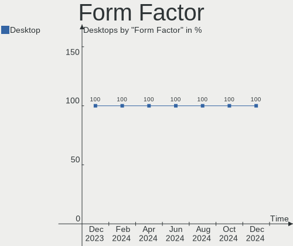

| Name    | Desktops | Percent |
|---------|----------|---------|
| Desktop | 444      | 100%    |

Secure Boot
-----------

Enabled or disabled

| State    | Desktops | Percent |
|----------|----------|---------|
| Disabled | 428      | 96.4%   |
| Enabled  | 16       | 3.6%    |

Coreboot
--------

Have coreboot on board

| Used | Desktops | Percent |
|------|----------|---------|
| No   | 443      | 99.77%  |
| Yes  | 1        | 0.23%   |

RAM Size
--------

Total RAM memory

| Size in GB      | Desktops | Percent |
|-----------------|----------|---------|
| 32.01-64.0      | 120      | 27.03%  |
| 16.01-24.0      | 104      | 23.42%  |
| 64.01-256.0     | 66       | 14.86%  |
| 24.01-32.0      | 45       | 10.14%  |
| 8.01-16.0       | 45       | 10.14%  |
| 4.01-8.0        | 42       | 9.46%   |
| 3.01-4.0        | 15       | 3.38%   |
| 1.01-2.0        | 3        | 0.68%   |
| 0.51-1.0        | 2        | 0.45%   |
| More than 256.0 | 1        | 0.23%   |
| 2.01-3.0        | 1        | 0.23%   |

RAM Used
--------

Used RAM memory

| Used GB     | Desktops | Percent |
|-------------|----------|---------|
| 4.01-8.0    | 119      | 26.8%   |
| 2.01-3.0    | 100      | 22.52%  |
| 1.01-2.0    | 81       | 18.24%  |
| 3.01-4.0    | 60       | 13.51%  |
| 8.01-16.0   | 43       | 9.68%   |
| 0.51-1.0    | 16       | 3.6%    |
| 16.01-24.0  | 10       | 2.25%   |
| 32.01-64.0  | 6        | 1.35%   |
| 24.01-32.0  | 6        | 1.35%   |
| 0.01-0.5    | 2        | 0.45%   |
| 64.01-256.0 | 1        | 0.23%   |

Total Drives
------------

Number of drives on board

| Drives | Desktops | Percent |
|--------|----------|---------|
| 1      | 168      | 37.84%  |
| 2      | 117      | 26.35%  |
| 3      | 67       | 15.09%  |
| 4      | 47       | 10.59%  |
| 6      | 12       | 2.7%    |
| 5      | 11       | 2.48%   |
| 0      | 8        | 1.8%    |
| 7      | 5        | 1.13%   |
| 8      | 4        | 0.9%    |
| 22     | 1        | 0.23%   |
| 14     | 1        | 0.23%   |
| 11     | 1        | 0.23%   |
| 10     | 1        | 0.23%   |
| 9      | 1        | 0.23%   |

Has CD-ROM
----------

Has CD-ROM on board

| Presented | Desktops | Percent |
|-----------|----------|---------|
| No        | 269      | 60.59%  |
| Yes       | 175      | 39.41%  |

Has Ethernet
------------

Has Ethernet on board

| Presented | Desktops | Percent |
|-----------|----------|---------|
| Yes       | 439      | 98.87%  |
| No        | 5        | 1.13%   |

Has WiFi
--------

Has WiFi module

| Presented | Desktops | Percent |
|-----------|----------|---------|
| Yes       | 274      | 61.71%  |
| No        | 170      | 38.29%  |

Has Bluetooth
-------------

Has Bluetooth module

| Presented | Desktops | Percent |
|-----------|----------|---------|
| Yes       | 246      | 55.41%  |
| No        | 198      | 44.59%  |

Location
--------

Country
-------

Geographic location (country)

| Country | Desktops | Percent |
|---------|----------|---------|
| USA     | 444      | 100%    |

City
----

Geographic location (city)

| City             | Desktops | Percent |
|------------------|----------|---------|
| Los Angeles      | 12       | 2.7%    |
| Atlanta          | 9        | 2.03%   |
| Dallas           | 8        | 1.8%    |
| Chicago          | 7        | 1.58%   |
| Minneapolis      | 6        | 1.35%   |
| Seattle          | 5        | 1.13%   |
| Denver           | 5        | 1.13%   |
| St Louis         | 4        | 0.9%    |
| San Jose         | 4        | 0.9%    |
| New York         | 4        | 0.9%    |
| Martinez         | 4        | 0.9%    |
| Houston          | 4        | 0.9%    |
| Columbus         | 4        | 0.9%    |
| Colorado Springs | 4        | 0.9%    |
| Charlotte        | 4        | 0.9%    |
| Brooklyn         | 4        | 0.9%    |
| Tucson           | 3        | 0.68%   |
| Thornton         | 3        | 0.68%   |
| Sacramento       | 3        | 0.68%   |
| Phoenix          | 3        | 0.68%   |
| Mount Prospect   | 3        | 0.68%   |
| Milwaukee        | 3        | 0.68%   |
| Lowell           | 3        | 0.68%   |
| Livonia          | 3        | 0.68%   |
| Kansas City      | 3        | 0.68%   |
| Gainesville      | 3        | 0.68%   |
| Flushing         | 3        | 0.68%   |
| Cincinnati       | 3        | 0.68%   |
| West Valley City | 2        | 0.45%   |
| Tacoma           | 2        | 0.45%   |
| Suffolk          | 2        | 0.45%   |
| Stanchfield      | 2        | 0.45%   |
| Spokane          | 2        | 0.45%   |
| Scotts Valley    | 2        | 0.45%   |
| San Elizario     | 2        | 0.45%   |
| Salt Lake City   | 2        | 0.45%   |
| Rochester        | 2        | 0.45%   |
| Pflugerville     | 2        | 0.45%   |
| Parker           | 2        | 0.45%   |
| New Albany       | 2        | 0.45%   |

Drives
------

Drive Vendor
------------

Hard drive vendors

| Vendor                       | Desktops | Drives | Percent |
|------------------------------|----------|--------|---------|
| WDC                          | 124      | 174    | 15.12%  |
| Samsung Electronics          | 115      | 161    | 14.02%  |
| Seagate                      | 113      | 167    | 13.78%  |
| SanDisk                      | 69       | 79     | 8.41%   |
| Crucial                      | 36       | 39     | 4.39%   |
| Phison Electronics           | 26       | 30     | 3.17%   |
| Unknown                      | 21       | 32     | 2.56%   |
| Micron/Crucial Technology    | 21       | 21     | 2.56%   |
| Toshiba                      | 18       | 19     | 2.2%    |
| Intel                        | 17       | 25     | 2.07%   |
| SK hynix                     | 16       | 21     | 1.95%   |
| China                        | 16       | 16     | 1.95%   |
| Hitachi                      | 15       | 21     | 1.83%   |
| Team                         | 14       | 17     | 1.71%   |
| PNY                          | 14       | 15     | 1.71%   |
| Kingston                     | 14       | 17     | 1.71%   |
| SPCC                         | 11       | 11     | 1.34%   |
| Silicon Motion               | 11       | 11     | 1.34%   |
| A-DATA Technology            | 11       | 13     | 1.34%   |
| Micron Technology            | 10       | 11     | 1.22%   |
| MAXIO Technology (Hangzhou)  | 9        | 12     | 1.1%    |
| HGST                         | 8        | 9      | 0.98%   |
| Realtek Semiconductor        | 7        | 9      | 0.85%   |
| Kingston Technology Company  | 7        | 8      | 0.85%   |
| T-FORCE                      | 5        | 5      | 0.61%   |
| JMicron Technology           | 5        | 6      | 0.61%   |
| SABRENT                      | 4        | 4      | 0.49%   |
| Fanxiang                     | 4        | 4      | 0.49%   |
| ADATA Technology             | 4        | 4      | 0.49%   |
| Unknown                      | 4        | 4      | 0.49%   |
| Shenzhen Longsys Electronics | 3        | 3      | 0.37%   |
| Phison                       | 3        | 3      | 0.37%   |
| Patriot                      | 3        | 3      | 0.37%   |
| Netac                        | 3        | 3      | 0.37%   |
| LITEON                       | 3        | 3      | 0.37%   |
| Lexar                        | 3        | 3      | 0.37%   |
| Inland                       | 3        | 3      | 0.37%   |
| Hewlett-Packard              | 3        | 7      | 0.37%   |
| USB                          | 2        | 2      | 0.24%   |
| Timetec                      | 2        | 2      | 0.24%   |

Drive Model
-----------

Hard drive models

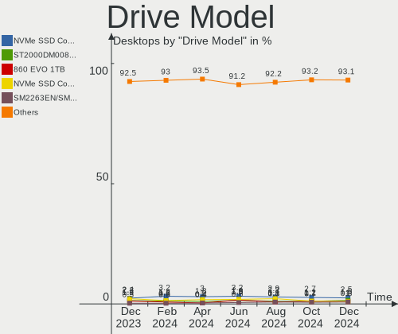

| Model                                                 | Desktops | Percent |
|-------------------------------------------------------|----------|---------|
| Samsung NVMe SSD Controller SM981/PM981/PM983 512GB   | 24       | 2.51%   |
| Seagate ST2000DM008-2FR102 2TB                        | 14       | 1.46%   |
| Samsung SSD 860 EVO 1TB                               | 10       | 1.05%   |
| Samsung NVMe SSD Controller PM9A1/PM9A3/980PRO 512GB  | 10       | 1.05%   |
| Silicon Motion SM2263EN/SM2263XT SSD Controller 256GB | 8        | 0.84%   |
| Micron/Crucial P2 NVMe PCIe SSD 500GB                 | 8        | 0.84%   |
| Unknown NVMe SSD Drive 2TB                            | 7        | 0.73%   |
| Seagate ST500DM002-1BD142 500GB                       | 7        | 0.73%   |
| Samsung SSD 980 1TB                                   | 7        | 0.73%   |
| Phison E16 PCIe4 NVMe Controller 1TB                  | 7        | 0.73%   |
| Sandisk WD_BLACK SN770 1TB                            | 6        | 0.63%   |
| Sandisk WD Blue SN580 1TB                             | 6        | 0.63%   |
| Samsung SSD 870 EVO 2TB                               | 6        | 0.63%   |
| Samsung SSD 850 EVO 500GB                             | 6        | 0.63%   |
| Phison E12 NVMe Controller 480GB                      | 6        | 0.63%   |
| Crucial CT1000BX500SSD1 1TB                           | 6        | 0.63%   |
| WDC WD5000AAKX-75U6AA0 500GB                          | 5        | 0.52%   |
| Unknown SD/MMC 1073GB                                 | 5        | 0.52%   |
| Unknown M.S./M.S.Pro/HG 16GB                          | 5        | 0.52%   |
| Unknown Compact Flash 977MB                           | 5        | 0.52%   |
| Seagate ST4000DM004-2CV104 4TB                        | 5        | 0.52%   |
| Seagate ST1000DM003-1CH162 1TB                        | 5        | 0.52%   |
| Samsung SSD 990 PRO 2TB                               | 5        | 0.52%   |
| Samsung SSD 860 EVO 500GB                             | 5        | 0.52%   |
| WDC WDS250G2B0A-00SM50 250GB SSD                      | 4        | 0.42%   |
| WDC WD30EFRX-68EUZN0 3TB                              | 4        | 0.42%   |
| WDC WD20EZRZ-00Z5HB0 2TB                              | 4        | 0.42%   |
| Unknown NVMe SSD Drive 1TB                            | 4        | 0.42%   |
| SK hynix SHPP41-2000GM 2TB                            | 4        | 0.42%   |
| Seagate ST8000DM004-2U9188 8TB                        | 4        | 0.42%   |
| Seagate ST31000524AS 1TB                              | 4        | 0.42%   |
| Seagate ST2000DM001-1ER164 2TB                        | 4        | 0.42%   |
| Sandisk WD_BLACK SN850X 2000GB                        | 4        | 0.42%   |
| Sandisk WD Blue SN550 NVMe SSD 256GB                  | 4        | 0.42%   |
| Sandisk WD Black SN750 / PC SN730 NVMe SSD 512GB      | 4        | 0.42%   |
| Sandisk WD Black 2018/SN750 / PC SN720 NVMe SSD 512GB | 4        | 0.42%   |
| Samsung SSD 870 EVO 500GB                             | 4        | 0.42%   |
| Samsung SSD 870 EVO 1TB                               | 4        | 0.42%   |
| Samsung SSD 850 EVO 250GB                             | 4        | 0.42%   |
| SABRENT Disk 2TB                                      | 4        | 0.42%   |

HDD Vendor
----------

Hard disk drive vendors

| Vendor              | Desktops | Drives | Percent |
|---------------------|----------|--------|---------|
| Seagate             | 111      | 164    | 40.07%  |
| WDC                 | 105      | 147    | 37.91%  |
| Toshiba             | 15       | 16     | 5.42%   |
| Hitachi             | 15       | 21     | 5.42%   |
| HGST                | 8        | 9      | 2.89%   |
| SABRENT             | 4        | 4      | 1.44%   |
| JMicron Technology  | 4        | 5      | 1.44%   |
| Samsung Electronics | 3        | 3      | 1.08%   |
| Unknown             | 2        | 2      | 0.72%   |
| WD MediaMax         | 1        | 1      | 0.36%   |
| TO Exter            | 1        | 1      | 0.36%   |
| QUANTUM             | 1        | 1      | 0.36%   |
| Maxtor              | 1        | 1      | 0.36%   |
| Inateck             | 1        | 2      | 0.36%   |
| Hewlett-Packard     | 1        | 4      | 0.36%   |
| Fujitsu             | 1        | 1      | 0.36%   |
| External            | 1        | 1      | 0.36%   |
| ASMT                | 1        | 3      | 0.36%   |
| Unknown             | 1        | 1      | 0.36%   |

SSD Vendor
----------

Solid state drive vendors

| Vendor              | Desktops | Drives | Percent |
|---------------------|----------|--------|---------|
| Samsung Electronics | 64       | 82     | 23.53%  |
| Crucial             | 32       | 34     | 11.76%  |
| SanDisk             | 22       | 25     | 8.09%   |
| WDC                 | 19       | 21     | 6.99%   |
| China               | 16       | 16     | 5.88%   |
| PNY                 | 14       | 15     | 5.15%   |
| Team                | 11       | 12     | 4.04%   |
| Intel               | 11       | 19     | 4.04%   |
| SPCC                | 10       | 10     | 3.68%   |
| Kingston            | 10       | 12     | 3.68%   |
| A-DATA Technology   | 9        | 10     | 3.31%   |
| SK hynix            | 5        | 5      | 1.84%   |
| T-FORCE             | 4        | 4      | 1.47%   |
| Micron Technology   | 4        | 5      | 1.47%   |
| Netac               | 3        | 3      | 1.1%    |
| LITEON              | 3        | 3      | 1.1%    |
| Toshiba             | 2        | 2      | 0.74%   |
| Timetec             | 2        | 2      | 0.74%   |
| Patriot             | 2        | 2      | 0.74%   |
| OCZ                 | 2        | 3      | 0.74%   |
| NGFF                | 2        | 2      | 0.74%   |
| Inland              | 2        | 2      | 0.74%   |
| Transcend           | 1        | 1      | 0.37%   |
| tecmiyo             | 1        | 1      | 0.37%   |
| TEAM T25            | 1        | 1      | 0.37%   |
| SSK SSD             | 1        | 1      | 0.37%   |
| Seagate             | 1        | 2      | 0.37%   |
| SATA SSD            | 1        | 1      | 0.37%   |
| Plextor             | 1        | 1      | 0.37%   |
| Pioneer             | 1        | 1      | 0.37%   |
| OCZ-VERTEX2         | 1        | 1      | 0.37%   |
| NT-128              | 1        | 1      | 0.37%   |
| Mushkin             | 1        | 1      | 0.37%   |
| KingSpec            | 1        | 1      | 0.37%   |
| HAJAAN              | 1        | 1      | 0.37%   |
| GOODRAM             | 1        | 2      | 0.37%   |
| Gigastone           | 1        | 1      | 0.37%   |
| Gigabyte Technology | 1        | 1      | 0.37%   |
| FORESEE             | 1        | 1      | 0.37%   |
| Fanxiang            | 1        | 1      | 0.37%   |

Drive Kind
----------

HDD or SSD

| Kind    | Desktops | Drives | Percent |
|---------|----------|--------|---------|
| SSD     | 225      | 317    | 32.56%  |
| HDD     | 223      | 387    | 32.27%  |
| NVMe    | 222      | 313    | 32.13%  |
| Unknown | 21       | 32     | 3.04%   |

Drive Connector
---------------

SATA, SAS, NVMe, etc.

| Type | Desktops | Drives | Percent |
|------|----------|--------|---------|
| SATA | 340      | 659    | 55.56%  |
| NVMe | 221      | 309    | 36.11%  |
| SAS  | 51       | 81     | 8.33%   |

Drive Size
----------

Size of hard drive

| Size in TB | Desktops | Drives | Percent |
|------------|----------|--------|---------|
| 0.01-0.5   | 201      | 271    | 38.36%  |
| 0.51-1.0   | 141      | 172    | 26.91%  |
| 1.01-2.0   | 86       | 118    | 16.41%  |
| 4.01-10.0  | 35       | 46     | 6.68%   |
| 3.01-4.0   | 33       | 40     | 6.3%    |
| 10.01-20.0 | 17       | 42     | 3.24%   |
| 2.01-3.0   | 11       | 15     | 2.1%    |

Space Total
-----------

Amount of disk space available on the file system

| Size in GB     | Desktops | Percent |
|----------------|----------|---------|
| More than 3000 | 111      | 25%     |
| 501-1000       | 78       | 17.57%  |
| 1001-2000      | 57       | 12.84%  |
| 101-250        | 55       | 12.39%  |
| 251-500        | 46       | 10.36%  |
| 2001-3000      | 34       | 7.66%   |
| 1-20           | 34       | 7.66%   |
| 51-100         | 12       | 2.7%    |
| Unknown        | 9        | 2.03%   |
| 21-50          | 8        | 1.8%    |

Space Used
----------

Amount of used disk space

| Used GB        | Desktops | Percent |
|----------------|----------|---------|
| 1-20           | 123      | 27.7%   |
| 21-50          | 59       | 13.29%  |
| 101-250        | 52       | 11.71%  |
| More than 3000 | 42       | 9.46%   |
| 251-500        | 41       | 9.23%   |
| 501-1000       | 37       | 8.33%   |
| 1001-2000      | 35       | 7.88%   |
| 51-100         | 29       | 6.53%   |
| 2001-3000      | 15       | 3.38%   |
| Unknown        | 9        | 2.03%   |
| 0              | 2        | 0.45%   |

Malfunc. Drives
---------------

Drive models with a malfunction

| Model                                                           | Desktops | Drives | Percent |
|-----------------------------------------------------------------|----------|--------|---------|
| Seagate ST500DM002-1BD142 500GB                                 | 3        | 4      | 6.38%   |
| Seagate ST31000524AS 1TB                                        | 2        | 2      | 4.26%   |
| Intel SSDSA2M160G2GC 160GB                                      | 2        | 2      | 4.26%   |
| WDC WDS240G2G0A-00JH30 240GB SSD                                | 1        | 1      | 2.13%   |
| WDC WD6400AAKS-22A7B2 640GB                                     | 1        | 1      | 2.13%   |
| WDC WD5002ABYS-18B1B0 500GB                                     | 1        | 1      | 2.13%   |
| WDC WD5000LPVX-28V0TT0 500GB                                    | 1        | 1      | 2.13%   |
| WDC WD5000AZLX-00ZR6A0 500GB                                    | 1        | 1      | 2.13%   |
| WDC WD5000AAKX-001CA0 500GB                                     | 1        | 1      | 2.13%   |
| WDC WD3200AAJS-22B4A0 320GB                                     | 1        | 1      | 2.13%   |
| WDC WD30EZRX-00D8PB0 3TB                                        | 1        | 1      | 2.13%   |
| WDC WD30EFRX-68EUZN0 3TB                                        | 1        | 1      | 2.13%   |
| WDC WD20EFRX-68EUZN0 2TB                                        | 1        | 1      | 2.13%   |
| WDC WD20EARX-00PASB0 2TB                                        | 1        | 1      | 2.13%   |
| WDC WD1600ADFS-75SLR2 160GB                                     | 1        | 1      | 2.13%   |
| WDC WD10EADS-22M2B0 1TB                                         | 1        | 1      | 2.13%   |
| Toshiba MK6465GSX 640GB                                         | 1        | 1      | 2.13%   |
| tecmiyo SATA SSD 120GB                                          | 1        | 1      | 2.13%   |
| Seagate ST9500325AS 500GB                                       | 1        | 1      | 2.13%   |
| Seagate ST9250315AS 250GB                                       | 1        | 1      | 2.13%   |
| Seagate ST500LT012-1DG142 500GB                                 | 1        | 1      | 2.13%   |
| Seagate ST2000LM003 HN-M201RAD 2TB                              | 1        | 1      | 2.13%   |
| Seagate ST2000DX001-1CM164 2TB                                  | 1        | 1      | 2.13%   |
| Seagate ST2000DM006-2DM164 2TB                                  | 1        | 1      | 2.13%   |
| Seagate ST2000DM001-1ER164 2TB                                  | 1        | 1      | 2.13%   |
| Seagate ST2000DL003-9VT166 2TB                                  | 1        | 1      | 2.13%   |
| Seagate ST1000DX002-2DV162 1TB                                  | 1        | 1      | 2.13%   |
| SanDisk SD8TB8U-512G-1006 512GB SSD                             | 1        | 1      | 2.13%   |
| Samsung Electronics SSD 870 EVO 500GB                           | 1        | 1      | 2.13%   |
| Samsung Electronics NVMe SSD Controller SM981/PM981/PM983 512GB | 1        | 1      | 2.13%   |
| Samsung Electronics MZ7PC256HAFU-000H1 256GB SSD                | 1        | 1      | 2.13%   |
| Samsung Electronics HD501LJ 500GB                               | 1        | 1      | 2.13%   |
| PNY SSD2SC120G3LC709B121-490P 120GB                             | 1        | 1      | 2.13%   |
| OCZ VERTEX4 256GB SSD                                           | 1        | 1      | 2.13%   |
| Micron Technology MTFDDAK256MAM-1K12 256GB SSD                  | 1        | 1      | 2.13%   |
| Intel SSDSA2CW160G3 160GB                                       | 1        | 1      | 2.13%   |
| Hitachi HDT725040VLA360 400GB                                   | 1        | 1      | 2.13%   |
| Hitachi HDS721050CLA362 500GB                                   | 1        | 1      | 2.13%   |
| HGST HTS541010A9E680 1TB                                        | 1        | 1      | 2.13%   |
| Crucial CT240M500SSD1 240GB                                     | 1        | 1      | 2.13%   |

Malfunc. Drive Vendor
---------------------

Vendors of faulty drives

| Vendor              | Desktops | Drives | Percent |
|---------------------|----------|--------|---------|
| WDC                 | 13       | 13     | 28.26%  |
| Seagate             | 13       | 15     | 28.26%  |
| Samsung Electronics | 4        | 4      | 8.7%    |
| Intel               | 3        | 3      | 6.52%   |
| Hitachi             | 2        | 2      | 4.35%   |
| Crucial             | 2        | 2      | 4.35%   |
| Toshiba             | 1        | 1      | 2.17%   |
| tecmiyo             | 1        | 1      | 2.17%   |
| SanDisk             | 1        | 1      | 2.17%   |
| PNY                 | 1        | 1      | 2.17%   |
| OCZ                 | 1        | 1      | 2.17%   |
| Micron Technology   | 1        | 1      | 2.17%   |
| HGST                | 1        | 1      | 2.17%   |
| A-DATA Technology   | 1        | 1      | 2.17%   |
| Unknown             | 1        | 1      | 2.17%   |

Malfunc. HDD Vendor
-------------------

Vendors of faulty HDD drives

| Vendor              | Desktops | Drives | Percent |
|---------------------|----------|--------|---------|
| Seagate             | 13       | 15     | 41.94%  |
| WDC                 | 12       | 12     | 38.71%  |
| Hitachi             | 2        | 2      | 6.45%   |
| Toshiba             | 1        | 1      | 3.23%   |
| Samsung Electronics | 1        | 1      | 3.23%   |
| HGST                | 1        | 1      | 3.23%   |
| Unknown             | 1        | 1      | 3.23%   |

Malfunc. Drive Kind
-------------------

Kinds of faulty drives

| Kind | Desktops | Drives | Percent |
|------|----------|--------|---------|
| HDD  | 28       | 33     | 65.12%  |
| SSD  | 14       | 14     | 32.56%  |
| NVMe | 1        | 1      | 2.33%   |

Failed Drives
-------------

Failed drive models

Zero info for selected period =(

Failed Drive Vendor
-------------------

Failed drive vendors

Zero info for selected period =(

Drive Status
------------

Number of failed and malfunc. drives

| Status   | Desktops | Drives | Percent |
|----------|----------|--------|---------|
| Detected | 261      | 642    | 54.15%  |
| Works    | 180      | 359    | 37.34%  |
| Malfunc  | 41       | 48     | 8.51%   |

Storage controller
------------------

Storage Vendor
--------------

Storage controller vendors

| Vendor                       | Desktops | Percent |
|------------------------------|----------|---------|
| Intel                        | 236      | 31.13%  |
| AMD                          | 194      | 25.59%  |
| Samsung Electronics          | 60       | 7.92%   |
| SanDisk                      | 56       | 7.39%   |
| ASMedia Technology           | 41       | 5.41%   |
| Phison Electronics           | 31       | 4.09%   |
| Micron/Crucial Technology    | 24       | 3.17%   |
| Silicon Motion               | 13       | 1.72%   |
| SK hynix                     | 12       | 1.58%   |
| MAXIO Technology (Hangzhou)  | 10       | 1.32%   |
| Kingston Technology Company  | 10       | 1.32%   |
| Realtek Semiconductor        | 8        | 1.06%   |
| JMicron Technology           | 8        | 1.06%   |
| Micron Technology            | 7        | 0.92%   |
| Solidigm                     | 6        | 0.79%   |
| Shenzhen Longsys Electronics | 6        | 0.79%   |
| Nvidia                       | 6        | 0.79%   |
| ADATA Technology             | 6        | 0.79%   |
| Marvell Technology Group     | 5        | 0.66%   |
| Broadcom / LSI               | 4        | 0.53%   |
| INNOGRIT                     | 3        | 0.4%    |
| Nextorage                    | 2        | 0.26%   |
| LSI Logic / Symbios Logic    | 2        | 0.26%   |
| KIOXIA                       | 2        | 0.26%   |
| Toshiba America Info Systems | 1        | 0.13%   |
| TenaFe                       | 1        | 0.13%   |
| Silicon Image                | 1        | 0.13%   |
| Lite-On Technology           | 1        | 0.13%   |
| Artop Electronic             | 1        | 0.13%   |
| Unknown                      | 1        | 0.13%   |

Storage Model
-------------

Storage controller models

| Model                                                                          | Desktops | Percent |
|--------------------------------------------------------------------------------|----------|---------|
| AMD FCH SATA Controller [AHCI mode]                                            | 76       | 8.75%   |
| AMD 600 Series Chipset SATA Controller                                         | 43       | 4.95%   |
| ASMedia ASM1061/ASM1062 Serial ATA Controller                                  | 32       | 3.68%   |
| AMD 400 Series Chipset SATA Controller                                         | 32       | 3.68%   |
| AMD 500 Series Chipset SATA Controller                                         | 28       | 3.22%   |
| Samsung NVMe SSD Controller SM981/PM981/PM983                                  | 26       | 2.99%   |
| Intel Raptor Lake SATA AHCI Controller                                         | 26       | 2.99%   |
| Intel 8 Series/C220 Series Chipset Family 6-port SATA Controller 1 [AHCI mode] | 25       | 2.88%   |
| Intel SATA Controller [RAID mode]                                              | 24       | 2.76%   |
| Intel 7 Series/C210 Series Chipset Family 6-port SATA Controller [AHCI mode]   | 23       | 2.65%   |
| AMD SB7x0/SB8x0/SB9x0 SATA Controller [AHCI mode]                              | 18       | 2.07%   |
| AMD SB7x0/SB8x0/SB9x0 IDE Controller                                           | 18       | 2.07%   |
| Intel 6 Series/C200 Series Chipset Family 6 port Desktop SATA AHCI Controller  | 15       | 1.73%   |
| Intel Alder Lake-S PCH SATA Controller [AHCI Mode]                             | 14       | 1.61%   |
| Intel 200 Series PCH SATA controller [AHCI mode]                               | 14       | 1.61%   |
| Sandisk WD Black SN850X NVMe SSD                                               | 13       | 1.5%    |
| Samsung NVMe SSD Controller PM9A1/PM9A3/980PRO                                 | 13       | 1.5%    |
| AMD SB7x0/SB8x0/SB9x0 SATA Controller [IDE mode]                               | 13       | 1.5%    |
| Samsung NVMe SSD Controller S4LV008[Pascal]                                    | 11       | 1.27%   |
| Intel Q170/Q150/B150/H170/H110/Z170/CM236 Chipset SATA Controller [AHCI Mode]  | 11       | 1.27%   |
| Silicon Motion SM2263EN/SM2263XT (DRAM-less) NVMe SSD Controllers              | 10       | 1.15%   |
| SanDisk WD Black SN770 / PC SN740 256GB / PC SN560 (DRAM-less) NVMe SSD        | 10       | 1.15%   |
| Intel Volume Management Device NVMe RAID Controller Intel Corporation          | 10       | 1.15%   |
| Intel Cannon Lake PCH SATA AHCI Controller                                     | 10       | 1.15%   |
| Micron/Crucial P2 [Nick P2] / P3 / P3 Plus NVMe PCIe SSD (DRAM-less)           | 9        | 1.04%   |
| Samsung NVMe SSD Controller 980 (DRAM-less)                                    | 8        | 0.92%   |
| Phison E16 PCIe4 NVMe Controller                                               | 8        | 0.92%   |
| MAXIO (Hangzhou) NVMe SSD Controller MAP1602 (DRAM-less)                       | 8        | 0.92%   |
| Intel 9 Series Chipset Family SATA Controller [AHCI Mode]                      | 8        | 0.92%   |
| Phison E12 NVMe Controller                                                     | 7        | 0.81%   |
| Intel Alder Lake-N SATA AHCI Controller                                        | 7        | 0.81%   |
| ASMedia ASM1064 Serial ATA Controller                                          | 7        | 0.81%   |
| AMD 300 Series Chipset SATA Controller                                         | 7        | 0.81%   |
| Sandisk WD Blue SN580 NVMe SSD (DRAM-less)                                     | 6        | 0.69%   |
| SanDisk Extreme Pro / WD Black SN750 / PC SN730 / Red SN700 NVMe SSD           | 6        | 0.69%   |
| Phison PS5013-E13 PCIe3 NVMe Controller (DRAM-less)                            | 6        | 0.69%   |
| Micron 2550 NVMe SSD (DRAM-less)                                               | 6        | 0.69%   |
| Intel C610/X99 series chipset sSATA Controller [AHCI mode]                     | 6        | 0.69%   |
| Intel 82801JI (ICH10 Family) SATA AHCI Controller                              | 6        | 0.69%   |
| SK hynix Platinum P41/PC801 NVMe Solid State Drive                             | 5        | 0.58%   |

Storage Kind
------------

Kind of storage controller (IDE, SATA, NVMe, SAS, ...)

| Kind | Desktops | Percent |
|------|----------|---------|
| SATA | 392      | 55.52%  |
| NVMe | 222      | 31.44%  |
| IDE  | 44       | 6.23%   |
| RAID | 42       | 5.95%   |
| SAS  | 4        | 0.57%   |
| SCSI | 2        | 0.28%   |

Processor
---------

CPU Vendor
----------

Processor vendors

| Vendor                   | Desktops | Percent |
|--------------------------|----------|---------|
| Intel                    | 238      | 53.6%   |
| AMD                      | 205      | 46.17%  |
| PowerNV C1P9S01 REV 1.02 | 1        | 0.23%   |

CPU Model
---------

Processor models

| Model                                  | Desktops | Percent |
|----------------------------------------|----------|---------|
| AMD Ryzen 7 5700G with Radeon Graphics | 9        | 2.03%   |
| Intel Core i7-4790 CPU @ 3.60GHz       | 8        | 1.8%    |
| Intel Core i7-3770 CPU @ 3.40GHz       | 8        | 1.8%    |
| Intel Core i5-6500 CPU @ 3.20GHz       | 8        | 1.8%    |
| AMD Ryzen 9 7950X3D 16-Core Processor  | 8        | 1.8%    |
| AMD Ryzen 9 5900X 12-Core Processor    | 8        | 1.8%    |
| AMD Ryzen 7 3700X 8-Core Processor     | 8        | 1.8%    |
| AMD Ryzen 5 3600 6-Core Processor      | 8        | 1.8%    |
| AMD Ryzen 7 5800X 8-Core Processor     | 7        | 1.58%   |
| AMD Ryzen 7 5700X 8-Core Processor     | 7        | 1.58%   |
| AMD Ryzen 5 7600X 6-Core Processor     | 7        | 1.58%   |
| AMD Ryzen 5 5600X 6-Core Processor     | 7        | 1.58%   |
| Intel Core i7-4770 CPU @ 3.40GHz       | 6        | 1.35%   |
| Intel Core i7-2600 CPU @ 3.40GHz       | 6        | 1.35%   |
| Intel Core i5-4570 CPU @ 3.20GHz       | 6        | 1.35%   |
| Intel 12th Gen Core i7-12700K          | 6        | 1.35%   |
| Intel N100                             | 5        | 1.13%   |
| AMD Ryzen 7 7700X 8-Core Processor     | 5        | 1.13%   |
| Intel Core i9-14900KF                  | 4        | 0.9%    |
| Intel Core i7-8700K CPU @ 3.70GHz      | 4        | 0.9%    |
| Intel Core i7-8700 CPU @ 3.20GHz       | 4        | 0.9%    |
| Intel Core i7-7700K CPU @ 4.20GHz      | 4        | 0.9%    |
| Intel Core i5-3570 CPU @ 3.40GHz       | 4        | 0.9%    |
| Intel Core i5-3470 CPU @ 3.20GHz       | 4        | 0.9%    |
| Intel Core i5-2400 CPU @ 3.10GHz       | 4        | 0.9%    |
| AMD Ryzen 7 5800X3D 8-Core Processor   | 4        | 0.9%    |
| AMD Ryzen 7 2700X Eight-Core Processor | 4        | 0.9%    |
| AMD FX-8350 Eight-Core Processor       | 4        | 0.9%    |
| Intel Core i9-14900K                   | 3        | 0.68%   |
| Intel Core i7-6700 CPU @ 3.40GHz       | 3        | 0.68%   |
| Intel Core i5-8500 CPU @ 3.00GHz       | 3        | 0.68%   |
| Intel Core i5-4570T CPU @ 2.90GHz      | 3        | 0.68%   |
| Intel 13th Gen Core i9-13900K          | 3        | 0.68%   |
| AMD Ryzen 9 9950X 16-Core Processor    | 3        | 0.68%   |
| AMD Ryzen 9 9900X 12-Core Processor    | 3        | 0.68%   |
| AMD Ryzen 9 5950X 16-Core Processor    | 3        | 0.68%   |
| AMD Ryzen 9 3900X 12-Core Processor    | 3        | 0.68%   |
| AMD Ryzen 7 9800X3D 8-Core Processor   | 3        | 0.68%   |
| AMD Ryzen 5 5600G with Radeon Graphics | 3        | 0.68%   |
| AMD Ryzen 5 1600 Six-Core Processor    | 3        | 0.68%   |

CPU Model Family
----------------

Processor model prefix

| Model                   | Desktops | Percent |
|-------------------------|----------|---------|
| Intel Core i7           | 64       | 14.41%  |
| AMD Ryzen 7             | 63       | 14.19%  |
| Intel Core i5           | 60       | 13.51%  |
| AMD Ryzen 5             | 48       | 10.81%  |
| Other                   | 44       | 9.91%   |
| AMD Ryzen 9             | 39       | 8.78%   |
| Intel Xeon              | 20       | 4.5%    |
| Intel Core i9           | 15       | 3.38%   |
| AMD FX                  | 15       | 3.38%   |
| Intel Core i3           | 12       | 2.7%    |
| Intel Celeron           | 8        | 1.8%    |
| AMD Phenom II X4        | 6        | 1.35%   |
| Intel Core 2 Quad       | 5        | 1.13%   |
| AMD Ryzen 3             | 5        | 1.13%   |
| Intel Core 2 Duo        | 4        | 0.9%    |
| AMD Athlon 64 X2        | 4        | 0.9%    |
| Intel Pentium           | 3        | 0.68%   |
| AMD Phenom II X6        | 3        | 0.68%   |
| AMD Athlon II X2        | 3        | 0.68%   |
| AMD A10                 | 3        | 0.68%   |
| Intel Pentium D         | 2        | 0.45%   |
| Intel Core 2            | 2        | 0.45%   |
| AMD Ryzen 5 PRO         | 2        | 0.45%   |
| AMD PRO A10             | 2        | 0.45%   |
| AMD Phenom II X2        | 2        | 0.45%   |
| AMD GX                  | 2        | 0.45%   |
| AMD Athlon II X4        | 2        | 0.45%   |
| Intel Pentium Gold      | 1        | 0.23%   |
| Intel Pentium Dual-Core | 1        | 0.23%   |
| AMD Phenom              | 1        | 0.23%   |
| AMD E1                  | 1        | 0.23%   |
| AMD Athlon              | 1        | 0.23%   |
| AMD A8                  | 1        | 0.23%   |

CPU Cores
---------

Number of processor cores

| Number | Desktops | Percent |
|--------|----------|---------|
| 4      | 149      | 33.56%  |
| 8      | 80       | 18.02%  |
| 6      | 72       | 16.22%  |
| 2      | 49       | 11.04%  |
| 12     | 27       | 6.08%   |
| 16     | 24       | 5.41%   |
| 24     | 15       | 3.38%   |
| 10     | 10       | 2.25%   |
| 20     | 5        | 1.13%   |
| 14     | 5        | 1.13%   |
| 18     | 2        | 0.45%   |
| 3      | 2        | 0.45%   |
| 1      | 2        | 0.45%   |
| 36     | 1        | 0.23%   |
| 5      | 1        | 0.23%   |

CPU Sockets
-----------

Number of sockets

| Number | Desktops | Percent |
|--------|----------|---------|
| 1      | 439      | 98.87%  |
| 2      | 5        | 1.13%   |

CPU Threads
-----------

Threads per core (Hyper-Threading)

| Number | Desktops | Percent |
|--------|----------|---------|
| 2      | 309      | 69.59%  |
| 1      | 134      | 30.18%  |
| 4      | 1        | 0.23%   |

CPU Op-Modes
------------

CPU Operation Modes (32-bit, 64-bit)

| Op mode        | Desktops | Percent |
|----------------|----------|---------|
| 32-bit, 64-bit | 443      | 99.77%  |
| Unknown        | 1        | 0.23%   |

CPU Microcode
-------------

Microcode number

| Number     | Desktops | Percent |
|------------|----------|---------|
| Unknown    | 412      | 92.79%  |
| 0x306c3    | 5        | 1.13%   |
| 0x0a601206 | 4        | 0.9%    |
| 0xa0653    | 2        | 0.45%   |
| 0x08701021 | 2        | 0.45%   |
| 0xb06e0    | 1        | 0.23%   |
| 0x906ea    | 1        | 0.23%   |
| 0x90672    | 1        | 0.23%   |
| 0x506e3    | 1        | 0.23%   |
| 0x406f1    | 1        | 0.23%   |
| 0x206a7    | 1        | 0.23%   |
| 0x106e5    | 1        | 0.23%   |
| 0x1067a    | 1        | 0.23%   |
| 0x0a20120e | 1        | 0.23%   |
| 0x0a201204 | 1        | 0.23%   |
| 0x08108109 | 1        | 0.23%   |
| 0x0800820d | 1        | 0.23%   |
| 0x06006704 | 1        | 0.23%   |
| 0x06006118 | 1        | 0.23%   |
| 0x06000852 | 1        | 0.23%   |
| 0x06000822 | 1        | 0.23%   |
| 0x06000629 | 1        | 0.23%   |
| 0x010000db | 1        | 0.23%   |
| 0x010000b6 | 1        | 0.23%   |

CPU Microarch
-------------

Microarchitecture

| Name             | Desktops | Percent |
|------------------|----------|---------|
| Unknown          | 78       | 17.57%  |
| Zen 3            | 56       | 12.61%  |
| Haswell          | 46       | 10.36%  |
| Zen 2            | 29       | 6.53%   |
| KabyLake         | 28       | 6.31%   |
| IvyBridge        | 24       | 5.41%   |
| SandyBridge      | 23       | 5.18%   |
| Alderlake Hybrid | 22       | 4.95%   |
| Skylake          | 18       | 4.05%   |
| K10              | 17       | 3.83%   |
| Piledriver       | 14       | 3.15%   |
| Zen+             | 12       | 2.7%    |
| Zen              | 12       | 2.7%    |
| CometLake        | 9        | 2.03%   |
| Penryn           | 8        | 1.8%    |
| Nehalem          | 6        | 1.35%   |
| Core             | 5        | 1.13%   |
| Westmere         | 4        | 0.9%    |
| K8 Hammer        | 4        | 0.9%    |
| Icelake          | 4        | 0.9%    |
| Tremont          | 3        | 0.68%   |
| Steamroller      | 3        | 0.68%   |
| Puma             | 3        | 0.68%   |
| Gracemont        | 3        | 0.68%   |
| Excavator        | 3        | 0.68%   |
| Broadwell        | 3        | 0.68%   |
| Silvermont       | 2        | 0.45%   |
| NetBurst         | 2        | 0.45%   |
| Bulldozer        | 2        | 0.45%   |
| Goldmont plus    | 1        | 0.23%   |

Graphics
--------

GPU Vendor
----------

Vendors of graphics cards

| Vendor                     | Desktops | Percent |
|----------------------------|----------|---------|
| AMD                        | 201      | 41.53%  |
| Nvidia                     | 155      | 32.02%  |
| Intel                      | 124      | 25.62%  |
| ASPEED Technology          | 3        | 0.62%   |
| Matrox Electronics Systems | 1        | 0.21%   |

GPU Model
---------

Graphics card models

| Model                                                                       | Desktops | Percent |
|-----------------------------------------------------------------------------|----------|---------|
| AMD Ellesmere [Radeon RX 470/480/570/570X/580/580X/590]                     | 24       | 4.63%   |
| AMD Raphael                                                                 | 23       | 4.44%   |
| AMD Navi 31 [Radeon RX 7900 XT/7900 XTX/7900 GRE/7900M]                     | 19       | 3.67%   |
| Intel Xeon E3-1200 v3/4th Gen Core Processor Integrated Graphics Controller | 17       | 3.28%   |
| Intel 2nd Generation Core Processor Family Integrated Graphics Controller   | 15       | 2.9%    |
| Intel HD Graphics 530                                                       | 12       | 2.32%   |
| AMD Navi 22 [Radeon RX 6700/6700 XT/6750 XT / 6800M/6850M XT]               | 12       | 2.32%   |
| Intel CoffeeLake-S GT2 [UHD Graphics 630]                                   | 11       | 2.12%   |
| AMD Cezanne [Radeon Vega Series / Radeon Vega Mobile Series]                | 11       | 2.12%   |
| AMD Navi 32 [Radeon RX 7700 XT / 7800 XT]                                   | 10       | 1.93%   |
| Nvidia GA106 [GeForce RTX 3060 Lite Hash Rate]                              | 9        | 1.74%   |
| AMD Granite Ridge [Radeon Graphics]                                         | 9        | 1.74%   |
| Intel Raptor Lake-S GT1 [UHD Graphics 770]                                  | 8        | 1.54%   |
| AMD Navi 10 [Radeon RX 5600 OEM/5600 XT / 5700/5700 XT]                     | 8        | 1.54%   |
| Nvidia AD102 [GeForce RTX 4090]                                             | 7        | 1.35%   |
| Intel Alder Lake-N [UHD Graphics]                                           | 7        | 1.35%   |
| AMD Navi 33 [Radeon RX 7600/7600 XT/7600M XT/7600S/7700S / PRO W7600]       | 7        | 1.35%   |
| AMD Cedar [Radeon HD 5000/6000/7350/8350 Series]                            | 7        | 1.35%   |
| Nvidia TU116 [GeForce GTX 1660 Ti]                                          | 6        | 1.16%   |
| Nvidia GK208B [GeForce GT 710]                                              | 6        | 1.16%   |
| Nvidia AD107 [GeForce RTX 4060]                                             | 6        | 1.16%   |
| Nvidia AD104 [GeForce RTX 4070 SUPER]                                       | 6        | 1.16%   |
| Intel AlderLake-S GT1                                                       | 6        | 1.16%   |
| AMD Navi 23 [Radeon RX 6600/6600 XT/6600M]                                  | 6        | 1.16%   |
| AMD Navi 21 [Radeon RX 6800/6800 XT / 6900 XT]                              | 6        | 1.16%   |
| AMD Lexa PRO [Radeon 540/540X/550/550X / RX 540X/550/550X]                  | 6        | 1.16%   |
| AMD Caicos XT [Radeon HD 7470/8470 / R5 235/310 OEM]                        | 6        | 1.16%   |
| Nvidia GA102 [GeForce RTX 3080 Ti]                                          | 5        | 0.97%   |
| Intel Xeon E3-1200 v2/3rd Gen Core processor Graphics Controller            | 5        | 0.97%   |
| Intel HD Graphics 630                                                       | 5        | 0.97%   |
| AMD Picasso/Raven 2 [Radeon Vega Series / Radeon Vega Mobile Series]        | 5        | 0.97%   |
| AMD Phoenix1                                                                | 5        | 0.97%   |
| Nvidia TU116 [GeForce GTX 1660 SUPER]                                       | 4        | 0.77%   |
| Nvidia GP106 [GeForce GTX 1060 6GB]                                         | 4        | 0.77%   |
| Nvidia GP104 [GeForce GTX 1080]                                             | 4        | 0.77%   |
| Nvidia GM204 [GeForce GTX 970]                                              | 4        | 0.77%   |
| Nvidia GA104 [GeForce RTX 3070 Ti]                                          | 4        | 0.77%   |
| Intel CometLake-S GT2 [UHD Graphics 630]                                    | 4        | 0.77%   |
| AMD Raven Ridge [Radeon Vega Series / Radeon Vega Mobile Series]            | 4        | 0.77%   |
| Nvidia GP107 [GeForce GTX 1050 Ti]                                          | 3        | 0.58%   |

GPU Combo
---------

Combinations of graphics cards

| Name            | Desktops | Percent |
|-----------------|----------|---------|
| 1 x AMD         | 158      | 35.59%  |
| 1 x Nvidia      | 126      | 28.38%  |
| 1 x Intel       | 96       | 21.62%  |
| 2 x AMD         | 29       | 6.53%   |
| Intel + Nvidia  | 14       | 3.15%   |
| AMD + Nvidia    | 8        | 1.8%    |
| 2 x Nvidia      | 5        | 1.13%   |
| Intel + AMD     | 4        | 0.9%    |
| 2 x Intel       | 1        | 0.23%   |
| Nvidia + ASPEED | 1        | 0.23%   |
| 1 x Matrox      | 1        | 0.23%   |
| 1 x ASPEED      | 1        | 0.23%   |

GPU Driver
----------

Free vs proprietary

| Driver      | Desktops | Percent |
|-------------|----------|---------|
| Free        | 329      | 74.1%   |
| Proprietary | 89       | 20.05%  |
| Unknown     | 26       | 5.86%   |

GPU Memory
----------

Total video memory

| Size in GB | Desktops | Percent |
|------------|----------|---------|
| Unknown    | 302      | 68.02%  |
| 7.01-8.0   | 27       | 6.08%   |
| 8.01-16.0  | 23       | 5.18%   |
| 1.01-2.0   | 20       | 4.5%    |
| 0.01-0.5   | 18       | 4.05%   |
| 3.01-4.0   | 17       | 3.83%   |
| 0.51-1.0   | 16       | 3.6%    |
| 16.01-24.0 | 13       | 2.93%   |
| 5.01-6.0   | 8        | 1.8%    |

Monitor
-------

Monitor Vendor
--------------

Monitor vendors

| Vendor               | Desktops | Percent |
|----------------------|----------|---------|
| Goldstar             | 59       | 12.63%  |
| Dell                 | 55       | 11.78%  |
| Samsung Electronics  | 53       | 11.35%  |
| Acer                 | 48       | 10.28%  |
| Hewlett-Packard      | 44       | 9.42%   |
| Ancor Communications | 20       | 4.28%   |
| ViewSonic            | 17       | 3.64%   |
| Sceptre Tech         | 16       | 3.43%   |
| MSI                  | 15       | 3.21%   |
| ASUSTek Computer     | 15       | 3.21%   |
| AOC                  | 14       | 3%      |
| Gigabyte Technology  | 8        | 1.71%   |
| Vizio                | 7        | 1.5%    |
| BenQ                 | 6        | 1.28%   |
| Unknown              | 5        | 1.07%   |
| Philips              | 5        | 1.07%   |
| NEC Computers        | 5        | 1.07%   |
| Insignia             | 5        | 1.07%   |
| Sony                 | 4        | 0.86%   |
| RTK                  | 4        | 0.86%   |
| Lenovo               | 4        | 0.86%   |
| Gateway              | 4        | 0.86%   |
| Viotek               | 3        | 0.64%   |
| Unknown (XXX)        | 2        | 0.43%   |
| Toshiba              | 2        | 0.43%   |
| SKG                  | 2        | 0.43%   |
| ONN                  | 2        | 0.43%   |
| Onkyo                | 2        | 0.43%   |
| LG Electronics       | 2        | 0.43%   |
| KTC                  | 2        | 0.43%   |
| HKC                  | 2        | 0.43%   |
| Element              | 2        | 0.43%   |
| Denver               | 2        | 0.43%   |
| Apple                | 2        | 0.43%   |
| Yamaha               | 1        | 0.21%   |
| XKX                  | 1        | 0.21%   |
| Westinghouse         | 1        | 0.21%   |
| Wacom                | 1        | 0.21%   |
| Valve                | 1        | 0.21%   |
| TVS                  | 1        | 0.21%   |

Monitor Model
-------------

Monitor models

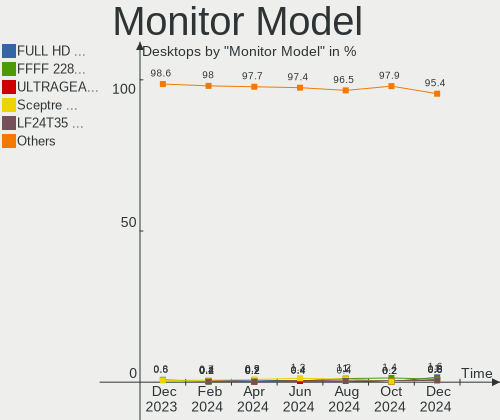

| Model                                                                 | Desktops | Percent |
|-----------------------------------------------------------------------|----------|---------|
| Goldstar FULL HD GSM5B55 1920x1080 480x270mm 21.7-inch                | 8        | 1.61%   |
| Unknown LCD Monitor FFFF 2288x1287 2550x2550mm 142.0-inch             | 5        | 1%      |
| Goldstar ULTRAGEAR GSM7765 2560x1440 697x392mm 31.5-inch              | 4        | 0.8%    |
| Sceptre Tech Sceptre F24 SPT09AB 1920x1080 526x296mm 23.8-inch        | 3        | 0.6%    |
| Samsung Electronics LF24T35 SAM707D 1920x1080 528x297mm 23.9-inch     | 3        | 0.6%    |
| MSI MAG342CQR MSI3DB6 3440x1440 797x333mm 34.0-inch                   | 3        | 0.6%    |
| Goldstar LG TV SSCR2 GSMC0C8 3840x2160                                | 3        | 0.6%    |
| Dell S2716DG DELA0D1 2560x1440 598x336mm 27.0-inch                    | 3        | 0.6%    |
| ASUSTek Computer VG32VQ1B AUS32E0 2560x1440 697x392mm 31.5-inch       | 3        | 0.6%    |
| Vizio VXW20LHDTV10A VIZ0035 1366x768 440x250mm 19.9-inch              | 2        | 0.4%    |
| Viotek GN24CB VTK0236 1920x1080 522x293mm 23.6-inch                   | 2        | 0.4%    |
| ViewSonic VX3276-FHD VSCE735 1920x1080 698x393mm 31.5-inch            | 2        | 0.4%    |
| Sceptre Tech Sceptre J20 SPT080D 1600x900 440x230mm 19.5-inch         | 2        | 0.4%    |
| Sceptre Tech F22 SPT08CB 1920x1080 480x270mm 21.7-inch                | 2        | 0.4%    |
| Samsung Electronics U28E590 SAM0C4D 3840x2160 607x345mm 27.5-inch     | 2        | 0.4%    |
| Samsung Electronics LS32A70 SAM7166 3840x2160 698x393mm 31.5-inch     | 2        | 0.4%    |
| Samsung Electronics LCD Monitor SAM0E4C 1366x768 522x293mm 23.6-inch  | 2        | 0.4%    |
| Samsung Electronics LCD Monitor SAM0A7C 1366x768 698x393mm 31.5-inch  | 2        | 0.4%    |
| Samsung Electronics C32R50x SAM7000 1920x1080 698x393mm 31.5-inch     | 2        | 0.4%    |
| Samsung Electronics C27F390 SAM0D32 1920x1080 600x340mm 27.2-inch     | 2        | 0.4%    |
| Philips PHL 221B8L PHL091D 1920x1080 477x268mm 21.5-inch              | 2        | 0.4%    |
| NEC Computers EA244WMi NEC68D6 1920x1200 519x324mm 24.1-inch          | 2        | 0.4%    |
| KTC Q3202S KTC3202 2560x1440 700x390mm 31.5-inch                      | 2        | 0.4%    |
| Insignia NS-19E310A13 BBY0032 1680x1050 640x384mm 29.4-inch           | 2        | 0.4%    |
| Hewlett-Packard 32 Display HPN351A 1920x1080 698x393mm 31.5-inch      | 2        | 0.4%    |
| Hewlett-Packard 27f HPN354A 1920x1080 598x336mm 27.0-inch             | 2        | 0.4%    |
| Hewlett-Packard 2009 HWP2828 1600x900 443x250mm 20.0-inch             | 2        | 0.4%    |
| Goldstar ULTRAGEAR GSM778B 2560x1440 697x392mm 31.5-inch              | 2        | 0.4%    |
| Goldstar ULTRAGEAR GSM7766 2560x1440 697x392mm 31.5-inch              | 2        | 0.4%    |
| Goldstar ULTRAGEAR GSM5BD3 2560x1440 697x392mm 31.5-inch              | 2        | 0.4%    |
| Goldstar ULTRAGEAR GSM5B7F 2560x1440 597x336mm 27.0-inch              | 2        | 0.4%    |
| Goldstar Ultra HD GSM5B08 3840x2160 600x340mm 27.2-inch               | 2        | 0.4%    |
| Goldstar HDR WFHD GSM5BA0 2560x1080 798x334mm 34.1-inch               | 2        | 0.4%    |
| Goldstar HDR 4K GSM7706 3840x2160 600x340mm 27.2-inch                 | 2        | 0.4%    |
| Goldstar FULL HD GSM5BDF 1920x1080 480x270mm 21.7-inch                | 2        | 0.4%    |
| Gigabyte Technology AORUS FO48U GBT4800 3840x2160 941x529mm 42.5-inch | 2        | 0.4%    |
| Denver PrimetekH3CQC LHCFFFF 3840x1080 1197x337mm 49.0-inch           | 2        | 0.4%    |
| Dell S2209W DELA043 1920x1080 477x268mm 21.5-inch                     | 2        | 0.4%    |
| ASUSTek Computer VG278 AUS27AD 1920x1080 598x336mm 27.0-inch          | 2        | 0.4%    |
| AOC Q27G2WG4 AOC2702 2560x1440 597x336mm 27.0-inch                    | 2        | 0.4%    |

Monitor Resolution
------------------

Monitor screen resolution

| Resolution         | Desktops | Percent |
|--------------------|----------|---------|
| 1920x1080 (FHD)    | 203      | 44.71%  |
| 3840x2160 (4K)     | 62       | 13.66%  |
| 2560x1440 (QHD)    | 62       | 13.66%  |
| 3440x1440          | 27       | 5.95%   |
| 1680x1050 (WSXGA+) | 15       | 3.3%    |
| 1920x1200 (WUXGA)  | 11       | 2.42%   |
| 1280x1024 (SXGA)   | 11       | 2.42%   |
| 1600x900 (HD+)     | 9        | 1.98%   |
| 1440x900 (WXGA+)   | 8        | 1.76%   |
| 1366x768 (WXGA)    | 7        | 1.54%   |
| 2288x1287          | 6        | 1.32%   |
| 1920x540           | 6        | 1.32%   |
| 2560x1080          | 5        | 1.1%    |
| 3840x1080          | 4        | 0.88%   |
| 1024x768 (XGA)     | 3        | 0.66%   |
| Unknown            | 3        | 0.66%   |
| 2560x1600          | 2        | 0.44%   |
| 1600x1200          | 2        | 0.44%   |
| 1360x768           | 2        | 0.44%   |
| 7680x1080          | 1        | 0.22%   |
| 4480x1440          | 1        | 0.22%   |
| 3840x1200          | 1        | 0.22%   |
| 2560x682           | 1        | 0.22%   |
| 2160x1200          | 1        | 0.22%   |
| 1152x864           | 1        | 0.22%   |

Monitor Diagonal
----------------

Diagonal size in inches

| Inches  | Desktops | Percent |
|---------|----------|---------|
| 27      | 95       | 20.21%  |
| 31      | 62       | 13.19%  |
| 24      | 56       | 11.91%  |
| 23      | 45       | 9.57%   |
| 21      | 38       | 8.09%   |
| 34      | 29       | 6.17%   |
| 19      | 14       | 2.98%   |
| 32      | 12       | 2.55%   |
| 20      | 12       | 2.55%   |
| 22      | 11       | 2.34%   |
| Unknown | 11       | 2.34%   |
| 15      | 10       | 2.13%   |
| 54      | 8        | 1.7%    |
| 49      | 7        | 1.49%   |
| 72      | 6        | 1.28%   |
| 42      | 6        | 1.28%   |
| 40      | 6        | 1.28%   |
| 142     | 5        | 1.06%   |
| 48      | 5        | 1.06%   |
| 17      | 4        | 0.85%   |
| 26      | 3        | 0.64%   |
| 84      | 2        | 0.43%   |
| 52      | 2        | 0.43%   |
| 46      | 2        | 0.43%   |
| 38      | 2        | 0.43%   |
| 36      | 2        | 0.43%   |
| 29      | 2        | 0.43%   |
| 25      | 2        | 0.43%   |
| 18      | 2        | 0.43%   |
| 85      | 1        | 0.21%   |
| 74      | 1        | 0.21%   |
| 55      | 1        | 0.21%   |
| 44      | 1        | 0.21%   |
| 43      | 1        | 0.21%   |
| 35      | 1        | 0.21%   |
| 33      | 1        | 0.21%   |
| 28      | 1        | 0.21%   |
| 13      | 1        | 0.21%   |

Monitor Width
-------------

Physical width

| Width in mm    | Desktops | Percent |
|----------------|----------|---------|
| 501-600        | 179      | 39.43%  |
| 601-700        | 71       | 15.64%  |
| 401-500        | 69       | 15.2%   |
| 701-800        | 44       | 9.69%   |
| 1001-1500      | 27       | 5.95%   |
| 301-350        | 13       | 2.86%   |
| Unknown        | 11       | 2.42%   |
| 1501-2000      | 10       | 2.2%    |
| 801-900        | 9        | 1.98%   |
| 351-400        | 9        | 1.98%   |
| 901-1000       | 6        | 1.32%   |
| More than 2000 | 5        | 1.1%    |
| 201-300        | 1        | 0.22%   |

Aspect Ratio
------------

Proportional relationship between the width and the height

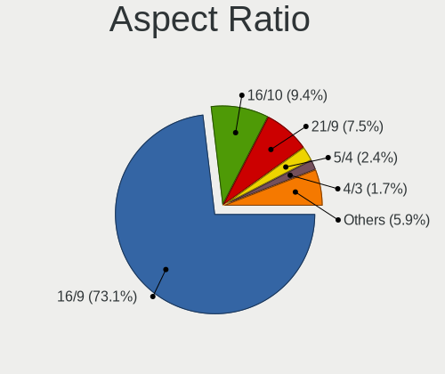

| Ratio   | Desktops | Percent |
|---------|----------|---------|
| 16/9    | 310      | 73.11%  |
| 16/10   | 40       | 9.43%   |
| 21/9    | 32       | 7.55%   |
| 5/4     | 10       | 2.36%   |
| 4/3     | 7        | 1.65%   |
| 32/9    | 7        | 1.65%   |
| 1.00    | 5        | 1.18%   |
| Unknown | 5        | 1.18%   |
| 3/2     | 2        | 0.47%   |
| 1.96    | 2        | 0.47%   |
| 6/5     | 1        | 0.24%   |
| 3.75    | 1        | 0.24%   |
| 3.20    | 1        | 0.24%   |
| 2.12    | 1        | 0.24%   |

Monitor Area
------------

Area in inch

| Area in inch | Desktops | Percent |
|----------------|----------|---------|
| 201-250        | 110      | 23.97%  |
| 351-500        | 105      | 22.88%  |
| 301-350        | 95       | 20.7%   |
| 151-200        | 41       | 8.93%   |
| More than 1000 | 29       | 6.32%   |
| 501-1000       | 28       | 6.1%    |
| 251-300        | 24       | 5.23%   |
| Unknown        | 11       | 2.4%    |
| 101-110        | 7        | 1.53%   |
| 141-150        | 4        | 0.87%   |
| 111-120        | 3        | 0.65%   |
| 71-80          | 1        | 0.22%   |
| 131-140        | 1        | 0.22%   |

Pixel Density
-------------

Pixels per inch

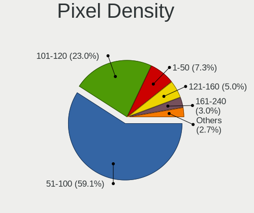

| Density | Desktops | Percent |
|---------|----------|---------|
| 51-100  | 260      | 59.09%  |
| 101-120 | 101      | 22.95%  |
| 1-50    | 32       | 7.27%   |
| 121-160 | 22       | 5%      |
| 161-240 | 13       | 2.95%   |
| Unknown | 12       | 2.73%   |

Multiple Monitors
-----------------

Total monitors connected

| Total | Desktops | Percent |
|-------|----------|---------|
| 1     | 334      | 75.23%  |
| 2     | 73       | 16.44%  |
| 0     | 18       | 4.05%   |
| 3     | 16       | 3.6%    |
| 6     | 1        | 0.23%   |
| 5     | 1        | 0.23%   |
| 4     | 1        | 0.23%   |

Network
-------

Net Controller Vendor
---------------------

Controller vendors

| Vendor                          | Desktops | Percent |
|---------------------------------|----------|---------|
| Realtek Semiconductor           | 264      | 38.43%  |
| Intel                           | 240      | 34.93%  |
| MediaTek                        | 39       | 5.68%   |
| Qualcomm Atheros                | 30       | 4.37%   |
| Broadcom                        | 20       | 2.91%   |
| TP-Link                         | 11       | 1.6%    |
| Aquantia                        | 10       | 1.46%   |
| Ralink Technology               | 7        | 1.02%   |
| Microsoft                       | 6        | 0.87%   |
| Ralink                          | 5        | 0.73%   |
| Nvidia                          | 5        | 0.73%   |
| NetGear                         | 5        | 0.73%   |
| Samsung Electronics             | 4        | 0.58%   |
| D-Link System                   | 4        | 0.58%   |
| D-Link                          | 4        | 0.58%   |
| American Future Technology      | 4        | 0.58%   |
| Qualcomm Technologies           | 3        | 0.44%   |
| ASIX Electronics                | 3        | 0.44%   |
| Linksys                         | 2        | 0.29%   |
| InterBiometrics                 | 2        | 0.29%   |
| Edimax Technology               | 2        | 0.29%   |
| Belkin Components               | 2        | 0.29%   |
| U-Blox                          | 1        | 0.15%   |
| Signia                          | 1        | 0.15%   |
| Qualcomm Atheros Communications | 1        | 0.15%   |
| QinHeng Electronics             | 1        | 0.15%   |
| OpenMoko                        | 1        | 0.15%   |
| Netchip Technology              | 1        | 0.15%   |
| Motorola PCS                    | 1        | 0.15%   |
| Microchip Technology            | 1        | 0.15%   |
| Marvell Technology Group        | 1        | 0.15%   |
| HYTE                            | 1        | 0.15%   |
| Google                          | 1        | 0.15%   |
| Cisco Systems                   | 1        | 0.15%   |
| Broadcom Limited                | 1        | 0.15%   |
| Atmel                           | 1        | 0.15%   |
| AMD                             | 1        | 0.15%   |

Net Controller Model
--------------------

Controller models

| Model                                                                           | Desktops | Percent |
|---------------------------------------------------------------------------------|----------|---------|
| Realtek RTL8111/8168/8211/8411 PCI Express Gigabit Ethernet Controller          | 170      | 20.46%  |
| Realtek RTL8125 2.5GbE Controller                                               | 57       | 6.86%   |
| Intel Wi-Fi 6 AX200                                                             | 31       | 3.73%   |
| Intel Ethernet Controller I225-V                                                | 29       | 3.49%   |
| Intel 82579LM Gigabit Network Connection (Lewisville)                           | 25       | 3.01%   |
| Intel I211 Gigabit Network Connection                                           | 24       | 2.89%   |
| MediaTek MT7922 802.11ax PCI Express Wireless Network Adapter                   | 19       | 2.29%   |
| Realtek RTL8821CE 802.11ac PCIe Wireless Network Adapter                        | 17       | 2.05%   |
| Intel Wi-Fi 6E(802.11ax) AX210/AX1675* 2x2 [Typhoon Peak]                       | 17       | 2.05%   |
| Intel Ethernet Controller I226-V                                                | 17       | 2.05%   |
| Intel Ethernet Connection I217-LM                                               | 17       | 2.05%   |
| Realtek RTL88x2bu [AC1200 Techkey]                                              | 13       | 1.56%   |
| Realtek 802.11ac NIC                                                            | 12       | 1.44%   |
| Intel Raptor Lake-S PCH CNVi WiFi                                               | 12       | 1.44%   |
| Intel Alder Lake-S PCH CNVi WiFi                                                | 12       | 1.44%   |
| Intel Ethernet Connection (2) I219-V                                            | 10       | 1.2%    |
| Intel Dual Band Wireless-AC 3168NGW [Stone Peak]                                | 10       | 1.2%    |
| Intel Wi-Fi 5(802.11ac) Wireless-AC 9x6x [Thunder Peak]                         | 9        | 1.08%   |
| Intel Ethernet Connection (2) I219-LM                                           | 9        | 1.08%   |
| MediaTek MT7921K (RZ608) Wi-Fi 6E 80MHz                                         | 8        | 0.96%   |
| Intel Wireless 3165                                                             | 8        | 0.96%   |
| TP-Link Archer T2U PLUS [RTL8821AU]                                             | 7        | 0.84%   |
| Intel Ethernet Connection (7) I219-V                                            | 7        | 0.84%   |
| Realtek RTL8852CE PCIe 802.11ax Wireless Network Controller                     | 6        | 0.72%   |
| Realtek RTL8153 Gigabit Ethernet Adapter                                        | 6        | 0.72%   |
| Qualcomm Atheros AR9485 Wireless Network Adapter                                | 6        | 0.72%   |
| Realtek RTL8852BE PCIe 802.11ax Wireless Network Controller                     | 5        | 0.6%    |
| Realtek RT8126 PCIe Ethernet Controller                                         | 5        | 0.6%    |
| Qualcomm Atheros Killer E220x Gigabit Ethernet Controller                       | 5        | 0.6%    |
| Microsoft Xbox Wireless Adapter for Windows                                     | 5        | 0.6%    |
| MediaTek WLAN controller                                                        | 5        | 0.6%    |
| Intel Ethernet Controller 10-Gigabit X540-AT2                                   | 5        | 0.6%    |
| Intel Ethernet Connection (7) I219-LM                                           | 5        | 0.6%    |
| Intel 82574L Gigabit Network Connection                                         | 5        | 0.6%    |
| Intel 82567LM-3 Gigabit Network Connection                                      | 5        | 0.6%    |
| Aquantia AQtion AQC113CS NBase-T/IEEE 802.3an Ethernet Controller [Antigua 10G] | 5        | 0.6%    |
| Realtek RTL810xE PCI Express Fast Ethernet controller                           | 4        | 0.48%   |
| Realtek Realtek Network controller                                              | 4        | 0.48%   |
| Nvidia MCP61 Ethernet                                                           | 4        | 0.48%   |
| NetGear A6100 AC600 DB Wireless Adapter [Realtek RTL8811AU]                     | 4        | 0.48%   |

Wireless Vendor
---------------

Wireless vendors

| Vendor                          | Desktops | Percent |
|---------------------------------|----------|---------|
| Intel                           | 113      | 38.44%  |
| Realtek Semiconductor           | 72       | 24.49%  |
| MediaTek                        | 29       | 9.86%   |
| Qualcomm Atheros                | 21       | 7.14%   |
| TP-Link                         | 11       | 3.74%   |
| Broadcom                        | 8        | 2.72%   |
| Ralink Technology               | 7        | 2.38%   |
| Microsoft                       | 6        | 2.04%   |
| Ralink                          | 5        | 1.7%    |
| NetGear                         | 5        | 1.7%    |
| D-Link                          | 4        | 1.36%   |
| Qualcomm Technologies           | 3        | 1.02%   |
| Linksys                         | 2        | 0.68%   |
| Edimax Technology               | 2        | 0.68%   |
| D-Link System                   | 2        | 0.68%   |
| Belkin Components               | 2        | 0.68%   |
| Qualcomm Atheros Communications | 1        | 0.34%   |
| Broadcom Limited                | 1        | 0.34%   |

Wireless Model
--------------

Wireless models

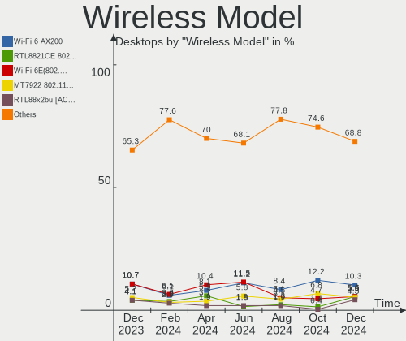

| Model                                                            | Desktops | Percent |
|------------------------------------------------------------------|----------|---------|
| Intel Wi-Fi 6 AX200                                              | 31       | 10.3%   |
| Realtek RTL8821CE 802.11ac PCIe Wireless Network Adapter         | 17       | 5.65%   |
| Intel Wi-Fi 6E(802.11ax) AX210/AX1675* 2x2 [Typhoon Peak]        | 17       | 5.65%   |
| MediaTek MT7922 802.11ax PCI Express Wireless Network Adapter    | 16       | 5.32%   |
| Realtek RTL88x2bu [AC1200 Techkey]                               | 13       | 4.32%   |
| Realtek 802.11ac NIC                                             | 12       | 3.99%   |
| Intel Raptor Lake-S PCH CNVi WiFi                                | 12       | 3.99%   |
| Intel Alder Lake-S PCH CNVi WiFi                                 | 12       | 3.99%   |
| Intel Dual Band Wireless-AC 3168NGW [Stone Peak]                 | 10       | 3.32%   |
| Intel Wi-Fi 5(802.11ac) Wireless-AC 9x6x [Thunder Peak]          | 9        | 2.99%   |
| MediaTek MT7921K (RZ608) Wi-Fi 6E 80MHz                          | 8        | 2.66%   |
| Intel Wireless 3165                                              | 8        | 2.66%   |
| TP-Link Archer T2U PLUS [RTL8821AU]                              | 7        | 2.33%   |
| Realtek RTL8852CE PCIe 802.11ax Wireless Network Controller      | 6        | 1.99%   |
| Qualcomm Atheros AR9485 Wireless Network Adapter                 | 6        | 1.99%   |
| Microsoft Xbox Wireless Adapter for Windows                      | 5        | 1.66%   |
| Realtek RTL8852BE PCIe 802.11ax Wireless Network Controller      | 4        | 1.33%   |
| NetGear A6100 AC600 DB Wireless Adapter [Realtek RTL8811AU]      | 4        | 1.33%   |
| Broadcom BCM4360 802.11ac Dual Band Wireless Network Adapter     | 4        | 1.33%   |
| Realtek RTL8814AU 802.11a/b/g/n/ac Wireless Adapter              | 3        | 1%      |
| Realtek RTL8812AE 802.11ac PCIe Wireless Network Adapter         | 3        | 1%      |
| Ralink MT7601U Wireless Adapter                                  | 3        | 1%      |
| Ralink RT3290 Wireless 802.11n 1T/1R PCIe                        | 3        | 1%      |
| Qualcomm WCN785x Wi-Fi 7(802.11be) 320MHz 2x2 [FastConnect 7800] | 3        | 1%      |
| Qualcomm Atheros QCA9377 802.11ac Wireless Network Adapter       | 3        | 1%      |
| Qualcomm Atheros QCA6174 802.11ac Wireless Network Adapter       | 3        | 1%      |
| Qualcomm Atheros AR93xx Wireless Network Adapter                 | 3        | 1%      |
| Intel Wireless 7265                                              | 3        | 1%      |
| Intel Wireless 7260                                              | 3        | 1%      |
| Intel Cannon Lake PCH CNVi WiFi                                  | 3        | 1%      |
| D-Link 802.11ac NIC                                              | 3        | 1%      |
| TP-Link 802.11ac WLAN Adapter                                    | 2        | 0.66%   |
| Realtek RTL8821AE 802.11ac PCIe Wireless Network Adapter         | 2        | 0.66%   |
| Realtek RTL8811AU 802.11a/b/g/n/ac WLAN Adapter                  | 2        | 0.66%   |
| Realtek RTL8188EUS 802.11n Wireless Network Adapter              | 2        | 0.66%   |
| Realtek RTL8188CUS 802.11n WLAN Adapter                          | 2        | 0.66%   |
| Realtek 802.11ax WLAN Adapter                                    | 2        | 0.66%   |
| Ralink RT2870/RT3070 Wireless Adapter                            | 2        | 0.66%   |
| Qualcomm Atheros AR9462 Wireless Network Adapter                 | 2        | 0.66%   |
| Qualcomm Atheros AR928X Wireless Network Adapter (PCI-Express)   | 2        | 0.66%   |

Ethernet Vendor
---------------

Ethernet vendors

| Vendor                   | Desktops | Percent |
|--------------------------|----------|---------|
| Realtek Semiconductor    | 239      | 49.59%  |
| Intel                    | 186      | 38.59%  |
| Broadcom                 | 13       | 2.7%    |
| Qualcomm Atheros         | 11       | 2.28%   |
| Aquantia                 | 10       | 2.07%   |
| MediaTek                 | 6        | 1.24%   |
| Nvidia                   | 5        | 1.04%   |
| Samsung Electronics      | 3        | 0.62%   |
| ASIX Electronics         | 3        | 0.62%   |
| D-Link System            | 2        | 0.41%   |
| Netchip Technology       | 1        | 0.21%   |
| Motorola PCS             | 1        | 0.21%   |
| Marvell Technology Group | 1        | 0.21%   |
| Google                   | 1        | 0.21%   |

Ethernet Model
--------------

Ethernet models

| Model                                                                           | Desktops | Percent |
|---------------------------------------------------------------------------------|----------|---------|
| Realtek RTL8111/8168/8211/8411 PCI Express Gigabit Ethernet Controller          | 170      | 33.4%   |
| Realtek RTL8125 2.5GbE Controller                                               | 57       | 11.2%   |
| Intel Ethernet Controller I225-V                                                | 29       | 5.7%    |
| Intel 82579LM Gigabit Network Connection (Lewisville)                           | 25       | 4.91%   |
| Intel I211 Gigabit Network Connection                                           | 24       | 4.72%   |
| Intel Ethernet Controller I226-V                                                | 17       | 3.34%   |
| Intel Ethernet Connection I217-LM                                               | 17       | 3.34%   |
| Intel Ethernet Connection (2) I219-V                                            | 10       | 1.96%   |
| Intel Ethernet Connection (2) I219-LM                                           | 9        | 1.77%   |
| Intel Ethernet Connection (7) I219-V                                            | 7        | 1.38%   |
| Realtek RTL8153 Gigabit Ethernet Adapter                                        | 6        | 1.18%   |
| Realtek RT8126 PCIe Ethernet Controller                                         | 5        | 0.98%   |
| Qualcomm Atheros Killer E220x Gigabit Ethernet Controller                       | 5        | 0.98%   |
| Intel Ethernet Controller 10-Gigabit X540-AT2                                   | 5        | 0.98%   |
| Intel Ethernet Connection (7) I219-LM                                           | 5        | 0.98%   |
| Intel 82574L Gigabit Network Connection                                         | 5        | 0.98%   |
| Intel 82567LM-3 Gigabit Network Connection                                      | 5        | 0.98%   |
| Aquantia AQtion AQC113CS NBase-T/IEEE 802.3an Ethernet Controller [Antigua 10G] | 5        | 0.98%   |
| Realtek RTL810xE PCI Express Fast Ethernet controller                           | 4        | 0.79%   |
| Realtek Realtek Network controller                                              | 4        | 0.79%   |
| Nvidia MCP61 Ethernet                                                           | 4        | 0.79%   |
| Samsung Galaxy series, misc. (tethering mode)                                   | 3        | 0.59%   |
| Qualcomm Atheros AR8161 Gigabit Ethernet                                        | 3        | 0.59%   |
| MediaTek WLAN controller                                                        | 3        | 0.59%   |
| MediaTek MT7922 802.11ax PCI Express Wireless Network Adapter                   | 3        | 0.59%   |
| Intel I210 Gigabit Network Connection                                           | 3        | 0.59%   |
| Intel Ethernet Connection (5) I219-LM                                           | 3        | 0.59%   |
| Intel Ethernet Connection (2) I218-V                                            | 3        | 0.59%   |
| Broadcom NetXtreme BCM5761 Gigabit Ethernet PCIe                                | 3        | 0.59%   |
| ASIX AX88179 Gigabit Ethernet                                                   | 3        | 0.59%   |
| Realtek RTL8152 Fast Ethernet Adapter                                           | 2        | 0.39%   |
| Realtek RTL8111/8168/8411 PCI Express Gigabit Ethernet Controller               | 2        | 0.39%   |
| Realtek Killer E3000 2.5GbE Controller                                          | 2        | 0.39%   |
| Intel I350 Gigabit Network Connection                                           | 2        | 0.39%   |
| Intel Ethernet Connection I217-V                                                | 2        | 0.39%   |
| Intel Ethernet Connection (17) I219-V                                           | 2        | 0.39%   |
| Intel Ethernet Connection (14) I219-V                                           | 2        | 0.39%   |
| Intel Ethernet Connection (11) I219-LM                                          | 2        | 0.39%   |
| Intel CNVi: Wi-Fi                                                               | 2        | 0.39%   |
| Intel 82579V Gigabit Network Connection                                         | 2        | 0.39%   |

Net Controller Kind
-------------------

Ethernet, WiFi or modem

| Kind     | Desktops | Percent |
|----------|----------|---------|
| Ethernet | 439      | 59.97%  |
| WiFi     | 274      | 37.43%  |
| Modem    | 14       | 1.91%   |
| Unknown  | 5        | 0.68%   |

Used Controller
---------------

Currently used network controller

| Kind     | Desktops | Percent |
|----------|----------|---------|
| Ethernet | 320      | 68.82%  |
| WiFi     | 144      | 30.97%  |
| Unknown  | 1        | 0.22%   |

NICs
----

Total network controllers on board

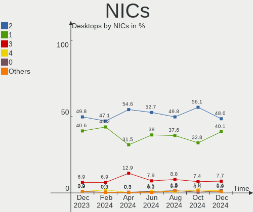

| Total | Desktops | Percent |
|-------|----------|---------|
| 2     | 216      | 48.65%  |
| 1     | 178      | 40.09%  |
| 3     | 34       | 7.66%   |
| 4     | 6        | 1.35%   |
| 0     | 6        | 1.35%   |
| 6     | 2        | 0.45%   |
| 5     | 2        | 0.45%   |

IPv6
----

IPv6 vs IPv4

| Used | Desktops | Percent |
|------|----------|---------|
| No   | 289      | 65.09%  |
| Yes  | 155      | 34.91%  |

Bluetooth
---------

Bluetooth Vendor
----------------

Controller vendors

| Vendor                          | Desktops | Percent |
|---------------------------------|----------|---------|
| Intel                           | 104      | 39.85%  |
| Realtek Semiconductor           | 30       | 11.49%  |
| MediaTek                        | 26       | 9.96%   |
| Cambridge Silicon Radio         | 19       | 7.28%   |
| IMC Networks                    | 18       | 6.9%    |
| Foxconn / Hon Hai               | 18       | 6.9%    |
| Qualcomm Atheros Communications | 9        | 3.45%   |
| ASUSTek Computer                | 9        | 3.45%   |
| Broadcom                        | 7        | 2.68%   |
| TP-Link                         | 6        | 2.3%    |
| Realtek                         | 4        | 1.53%   |
| Apple                           | 4        | 1.53%   |
| Ralink                          | 3        | 1.15%   |
| Dynex                           | 2        | 0.77%   |
| Kensington                      | 1        | 0.38%   |
| HTC (High Tech Computer)        | 1        | 0.38%   |

Bluetooth Model
---------------

Controller models

| Model                                                                | Desktops | Percent |
|----------------------------------------------------------------------|----------|---------|
| Intel AX200 Bluetooth                                                | 29       | 11.07%  |
| MediaTek Wireless_Device                                             | 26       | 9.92%   |
| Realtek Bluetooth Radio                                              | 22       | 8.4%    |
| Cambridge Silicon Radio Bluetooth Dongle (HCI mode)                  | 19       | 7.25%   |
| Intel AX211 Bluetooth                                                | 16       | 6.11%   |
| IMC Networks Bluetooth Radio                                         | 14       | 5.34%   |
| Intel Bluetooth wireless interface                                   | 13       | 4.96%   |
| Intel AX210 Bluetooth                                                | 12       | 4.58%   |
| Intel Wireless-AC 3168 Bluetooth                                     | 11       | 4.2%    |
| Intel AX201 Bluetooth                                                | 9        | 3.44%   |
| Intel Wireless-AC 9260 Bluetooth Adapter                             | 8        | 3.05%   |
| Foxconn / Hon Hai Wireless_Device                                    | 7        | 2.67%   |
| TP-Link TP-Link Bluetooth USB Adapter                                | 6        | 2.29%   |
| Foxconn / Hon Hai Bluetooth Device                                   | 6        | 2.29%   |
| Intel Bluetooth 9460/9560 Jefferson Peak (JfP)                       | 5        | 1.91%   |
| Realtek Bluetooth 5.3 Radio                                          | 4        | 1.53%   |
| Realtek Bluetooth Radio                                              | 4        | 1.53%   |
| Qualcomm Atheros  Bluetooth Device                                   | 4        | 1.53%   |
| Foxconn / Hon Hai Bluetooth Radio                                    | 4        | 1.53%   |
| Broadcom BCM20702A0 Bluetooth 4.0                                    | 4        | 1.53%   |
| ASUS ASUS USB-BT500                                                  | 4        | 1.53%   |
| Realtek  Bluetooth 4.2 Adapter                                       | 3        | 1.15%   |
| Ralink RT3290 Bluetooth                                              | 3        | 1.15%   |
| Qualcomm Atheros Bluetooth USB Host Controller                       | 3        | 1.15%   |
| IMC Networks Wireless_Device                                         | 3        | 1.15%   |
| Dynex Bluetooth 4.0 Adapter [Broadcom, 1.12, BCM20702A0]             | 2        | 0.76%   |
| Broadcom BCM92046DG-CL1ROM Bluetooth 2.1 Adapter                     | 2        | 0.76%   |
| Apple Built-in Bluetooth 2.0+EDR HCI                                 | 2        | 0.76%   |
| Realtek RTL8821A Bluetooth                                           | 1        | 0.38%   |
| Qualcomm Atheros AR9462 Bluetooth                                    | 1        | 0.38%   |
| Qualcomm Atheros AR3012 Bluetooth 4.0                                | 1        | 0.38%   |
| Kensington Bluetooth EDR Dongle                                      | 1        | 0.38%   |
| Intel Centrino Bluetooth Wireless Transceiver                        | 1        | 0.38%   |
| Intel Bluetooth Device                                               | 1        | 0.38%   |
| IMC Networks Bluetooth Device                                        | 1        | 0.38%   |
| HTC (High Tech Computer) Vive Hub Bluetooth 4.1 (Broadcom BCM920703) | 1        | 0.38%   |
| Foxconn / Hon Hai MediaTek MT7921 Bluetooth                          | 1        | 0.38%   |
| Broadcom HP Portable Bumble Bee                                      | 1        | 0.38%   |
| ASUS Qualcomm Bluetooth 4.1                                          | 1        | 0.38%   |
| ASUS Broadcom BCM20702A0 Bluetooth                                   | 1        | 0.38%   |

Sound
-----

Sound Vendor
------------

Sound card vendors

| Vendor                                       | Desktops | Percent |
|----------------------------------------------|----------|---------|
| AMD                                          | 256      | 31.84%  |
| Intel                                        | 235      | 29.23%  |
| Nvidia                                       | 148      | 18.41%  |
| C-Media Electronics                          | 24       | 2.99%   |
| Logitech                                     | 13       | 1.62%   |
| Micro Star International                     | 9        | 1.12%   |
| ASUSTek Computer                             | 9        | 1.12%   |
| Texas Instruments                            | 7        | 0.87%   |
| SteelSeries ApS                              | 7        | 0.87%   |
| Razer USA                                    | 7        | 0.87%   |
| Realtek Semiconductor                        | 6        | 0.75%   |
| Jieli Technology                             | 6        | 0.75%   |
| Tenx Technology                              | 4        | 0.5%    |
| KTMicro                                      | 4        | 0.5%    |
| GN Netcom                                    | 4        | 0.5%    |
| Focusrite-Novation                           | 4        | 0.5%    |
| Zoran Co. Personal Media Division (Nogatech) | 3        | 0.37%   |
| Sony                                         | 3        | 0.37%   |
| Kingston Technology                          | 3        | 0.37%   |
| Generalplus Technology                       | 3        | 0.37%   |
| Corsair                                      | 3        | 0.37%   |
| Valve Software                               | 2        | 0.25%   |
| Turtle Beach                                 | 2        | 0.25%   |
| Medeli Electronics                           | 2        | 0.25%   |
| JMTek                                        | 2        | 0.25%   |
| Hewlett-Packard                              | 2        | 0.25%   |
| Creative Technology                          | 2        | 0.25%   |
| Creative Labs                                | 2        | 0.25%   |
| Wyred 4 Sound                                | 1        | 0.12%   |
| Weltrend Semiconductor                       | 1        | 0.12%   |
| Walmart                                      | 1        | 0.12%   |
| TC Electronic                                | 1        | 0.12%   |
| Silicon Motion                               | 1        | 0.12%   |
| Schiit Audio                                 | 1        | 0.12%   |
| Samson Technologies                          | 1        | 0.12%   |
| RTHQ-01                                      | 1        | 0.12%   |
| Plantronics                                  | 1        | 0.12%   |
| Neat Microphones                             | 1        | 0.12%   |
| Native Instruments                           | 1        | 0.12%   |
| Mark of the Unicorn                          | 1        | 0.12%   |

Sound Model
-----------

Sound card models

| Model                                                                             | Desktops | Percent |
|-----------------------------------------------------------------------------------|----------|---------|
| AMD Family 17h/19h/1ah HD Audio Controller                                        | 73       | 7.31%   |
| AMD Starship/Matisse HD Audio Controller                                          | 66       | 6.61%   |
| AMD Rembrandt Radeon High Definition Audio Controller                             | 40       | 4.01%   |
| AMD Navi 31 HDMI/DP Audio                                                         | 36       | 3.61%   |
| Intel 8 Series/C220 Series Chipset High Definition Audio Controller               | 31       | 3.11%   |
| AMD SBx00 Azalia (Intel HDA)                                                      | 30       | 3.01%   |
| AMD Navi 21/23 HDMI/DP Audio Controller                                           | 30       | 3.01%   |
| Intel Raptor Lake High Definition Audio Controller                                | 25       | 2.51%   |
| AMD Ellesmere HDMI Audio [Radeon RX 470/480 / 570/580/590]                        | 24       | 2.4%    |
| Intel 7 Series/C216 Chipset Family High Definition Audio Controller               | 22       | 2.2%    |
| Intel 6 Series/C200 Series Chipset Family High Definition Audio Controller        | 18       | 1.8%    |
| AMD Renoir Radeon High Definition Audio Controller                                | 18       | 1.8%    |
| Intel Xeon E3-1200 v3/4th Gen Core Processor HD Audio Controller                  | 17       | 1.7%    |
| Intel 200 Series PCH HD Audio                                                     | 16       | 1.6%    |
| Intel Alder Lake-S HD Audio Controller                                            | 15       | 1.5%    |
| Intel 100 Series/C230 Series Chipset Family HD Audio Controller                   | 15       | 1.5%    |
| AMD Family 17h (Models 00h-0fh) HD Audio Controller                               | 14       | 1.4%    |
| Nvidia GA104 High Definition Audio Controller                                     | 13       | 1.3%    |
| Intel Cannon Lake PCH cAVS                                                        | 13       | 1.3%    |
| Nvidia TU116 High Definition Audio Controller                                     | 12       | 1.2%    |
| Nvidia GA106 High Definition Audio Controller                                     | 11       | 1.1%    |
| AMD Oland/Hainan/Cape Verde/Pitcairn HDMI Audio [Radeon HD 7000 Series]           | 10       | 1%      |
| AMD Navi 10 HDMI Audio                                                            | 10       | 1%      |
| AMD Caicos HDMI Audio [Radeon HD 6450 / 7450/8450/8490 OEM / R5 230/235/235X OEM] | 10       | 1%      |
| Nvidia GK208 HDMI/DP Audio Controller                                             | 9        | 0.9%    |
| Nvidia GA102 High Definition Audio Controller                                     | 9        | 0.9%    |
| Nvidia AD104 High Definition Audio Controller                                     | 9        | 0.9%    |
| Micro Star International USB Audio                                                | 9        | 0.9%    |
| Intel 82801JI (ICH10 Family) HD Audio Controller                                  | 9        | 0.9%    |
| ASUSTek Computer USB Audio                                                        | 9        | 0.9%    |
| AMD Raven/Raven2/Fenghuang HDMI/DP Audio Controller                               | 9        | 0.9%    |
| AMD Baffin HDMI/DP Audio [Radeon RX 550 640SP / RX 560/560X]                      | 9        | 0.9%    |
| Nvidia GP104 High Definition Audio Controller                                     | 8        | 0.8%    |
| Nvidia AD102 High Definition Audio Controller                                     | 8        | 0.8%    |
| Intel 9 Series Chipset Family HD Audio Controller                                 | 8        | 0.8%    |
| AMD FCH Azalia Controller                                                         | 8        | 0.8%    |
| Intel Alder Lake-N PCH High Definition Audio Controller                           | 7        | 0.7%    |
| AMD Cedar HDMI Audio [Radeon HD 5400/6300/7300 Series]                            | 7        | 0.7%    |
| Nvidia GM107 High Definition Audio Controller [GeForce 940MX]                     | 6        | 0.6%    |
| Nvidia AD107 High Definition Audio Controller                                     | 6        | 0.6%    |

Memory
------

Memory Vendor
-------------

Memory module vendors

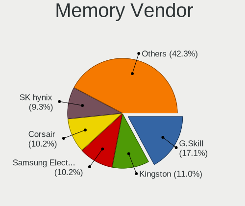

| Vendor                                  | Desktops | Percent |
|-----------------------------------------|----------|---------|
| G.Skill                                 | 42       | 17.07%  |
| Kingston                                | 27       | 10.98%  |
| Samsung Electronics                     | 25       | 10.16%  |
| Corsair                                 | 25       | 10.16%  |
| SK hynix                                | 23       | 9.35%   |
| Unknown                                 | 21       | 8.54%   |
| Team                                    | 14       | 5.69%   |
| Micron Technology                       | 13       | 5.28%   |
| Crucial                                 | 13       | 5.28%   |
| Unknown                                 | 10       | 4.07%   |
| Patriot                                 | 4        | 1.63%   |
| A-DATA Technology                       | 4        | 1.63%   |
| PNY                                     | 3        | 1.22%   |
| Nanya Technology                        | 3        | 1.22%   |
| Lexar Co Limited                        | 2        | 0.81%   |
| Elpida                                  | 2        | 0.81%   |
| Apacer                                  | 2        | 0.81%   |
| Wodposit                                | 1        | 0.41%   |
| Unknown (0x5846)                        | 1        | 0.41%   |
| Unknown (0x0DD5)                        | 1        | 0.41%   |
| Unifosa                                 | 1        | 0.41%   |
| Timetec                                 | 1        | 0.41%   |
| Silicon Power Computer & Communications | 1        | 0.41%   |
| Patriot Memory (PDP Systems)            | 1        | 0.41%   |
| OLOY                                    | 1        | 0.41%   |
| Juhor                                   | 1        | 0.41%   |
| Hewlett-Packard                         | 1        | 0.41%   |
| GeIL                                    | 1        | 0.41%   |
| Essencore Limited                       | 1        | 0.41%   |
| Avant                                   | 1        | 0.41%   |

Memory Model
------------

Memory module models

| Model                                                    | Desktops | Percent |
|----------------------------------------------------------|----------|---------|
| Unknown                                                  | 10       | 3.69%   |
| Unknown RAM Module 4GB DIMM 1333MT/s                     | 3        | 1.11%   |
| Team RAM TEAMGROUP-UD4-3200 8GB DIMM DDR4 3733MT/s       | 3        | 1.11%   |
| G.Skill RAM F5-6400J3239F48G 48GB DIMM DDR5 6400MT/s     | 3        | 1.11%   |
| G.Skill RAM F5-6000J3238F16G 16GB DIMM DDR5 6000MT/s     | 3        | 1.11%   |
| A-DATA RAM DDR4 3000 8GB DIMM DDR4 3600MT/s              | 3        | 1.11%   |
| Unknown RAM Module 8GB DIMM 1600MT/s                     | 2        | 0.74%   |
| Team RAM UD5-6000 32GB DIMM DDR5 6000MT/s                | 2        | 0.74%   |
| Team RAM UD5-5600 16GB DIMM DDR5 12800MT/s               | 2        | 0.74%   |
| Team RAM TEAMGROUP-UD4-3200 8GB DIMM DDR4 3800MT/s       | 2        | 0.74%   |
| SK hynix RAM HMT451U6BFR8C-PB 4GB DIMM DDR3 1600MT/s     | 2        | 0.74%   |
| SK hynix RAM HMT451U6BFR8A-PB 4GB DIMM DDR3 1600MT/s     | 2        | 0.74%   |
| SK hynix RAM HMT451U6AFR8C-PB 4GB DIMM DDR3 1600MT/s     | 2        | 0.74%   |
| SK hynix RAM HMT351U6EFR8C-PB 4GB DIMM DDR3 1600MT/s     | 2        | 0.74%   |
| SK hynix RAM HMT351U6CFR8C-PB 4GB DIMM DDR3 1800MT/s     | 2        | 0.74%   |
| SK hynix RAM HMT351U6CFR8C-H9 4GB DIMM DDR3 1600MT/s     | 2        | 0.74%   |
| SK hynix RAM HMA81GU6AFR8N-UH 8GB DIMM DDR4 2400MT/s     | 2        | 0.74%   |
| Samsung RAM M378B5273CH0-CH9 4GB DIMM DDR3 1867MT/s      | 2        | 0.74%   |
| Samsung RAM M378B5173DB0-CK0 4096MB DIMM DDR3 1600MT/s   | 2        | 0.74%   |
| Samsung RAM M378A1K43BB1-CPB 8GB DIMM DDR4 2733MT/s      | 2        | 0.74%   |
| Nanya RAM NT2GC64B88G0NF-CG 2GB DIMM DDR3 1333MT/s       | 2        | 0.74%   |
| Micron RAM 8ATF1G64AZ-3G2J1 8GB DIMM DDR4 3200MT/s       | 2        | 0.74%   |
| Kingston RAM KHX1600C9D3/8GX 8GB DIMM DDR3 2133MT/s      | 2        | 0.74%   |
| Kingston RAM KHX1600C9D3/4GX 4GB DIMM DDR3 1800MT/s      | 2        | 0.74%   |
| Kingston RAM 99U5471-054.A00LF 8GB DIMM DDR3 1600MT/s    | 2        | 0.74%   |
| Kingston RAM 9905471-064.A00LF 8GB DIMM DDR3 1600MT/s    | 2        | 0.74%   |
| G.Skill RAM F5-6400J3239G16G 16GB DIMM DDR5 7000MT/s     | 2        | 0.74%   |
| G.Skill RAM F5-6000J3636F16G 16GB DIMM DDR5 6400MT/s     | 2        | 0.74%   |
| G.Skill RAM F5-6000J3040G32G 32GB DIMM DDR5 6000MT/s     | 2        | 0.74%   |
| G.Skill RAM F4-3000C16-8GISB 8GB DIMM DDR4 3200MT/s      | 2        | 0.74%   |
| G.Skill RAM F3-2133C10-8GXM 8GB DIMM DDR3 2133MT/s       | 2        | 0.74%   |
| Corsair RAM CMW16GX4M2C3200C16 8GB DIMM DDR4 3733MT/s    | 2        | 0.74%   |
| Corsair RAM CMK32GX4M2E3200C16 16GB DIMM DDR4 3534MT/s   | 2        | 0.74%   |
| Corsair RAM CMK16GX4M2D3600C18 8GB DIMM DDR4 3600MT/s    | 2        | 0.74%   |
| Corsair RAM CMK16GX4M2B3200C16 8GB DIMM DDR4 3600MT/s    | 2        | 0.74%   |
| Wodposit RAM WPBH32D408SWM-16G 16GB SODIMM DDR4 3200MT/s | 1        | 0.37%   |
| Unknown RAM Module 8GB DIMM DDR3 1333MT/s                | 1        | 0.37%   |
| Unknown RAM Module 8GB DIMM 667MT/s                      | 1        | 0.37%   |
| Unknown RAM Module 8GB DIMM 1333MT/s                     | 1        | 0.37%   |
| Unknown RAM Module 512MB DIMM DDR2 533MT/s               | 1        | 0.37%   |

Memory Kind
-----------

Memory module kinds

| Kind    | Desktops | Percent |
|---------|----------|---------|
| DDR4    | 99       | 44.39%  |
| DDR3    | 54       | 24.22%  |
| DDR5    | 45       | 20.18%  |
| Unknown | 11       | 4.93%   |
| SDRAM   | 7        | 3.14%   |
| DDR2    | 4        | 1.79%   |
| DRAM    | 2        | 0.9%    |
| DDR     | 1        | 0.45%   |

Memory Form Factor
------------------

Physical design of the memory module

| Name   | Desktops | Percent |
|--------|----------|---------|
| DIMM   | 194      | 88.58%  |
| SODIMM | 25       | 11.42%  |

Memory Size
-----------

Memory module size

| Size  | Desktops | Percent |
|-------|----------|---------|
| 8192  | 80       | 34.33%  |
| 16384 | 70       | 30.04%  |
| 4096  | 36       | 15.45%  |
| 32768 | 26       | 11.16%  |
| 2048  | 12       | 5.15%   |
| 49152 | 6        | 2.58%   |
| 1024  | 2        | 0.86%   |
| 512   | 1        | 0.43%   |

Memory Speed
------------

Memory module speed

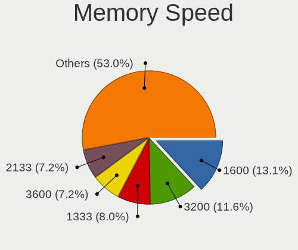

| Speed   | Desktops | Percent |
|---------|----------|---------|
| 1600    | 33       | 13.15%  |
| 3200    | 29       | 11.55%  |
| 1333    | 20       | 7.97%   |
| 3600    | 18       | 7.17%   |
| 2133    | 18       | 7.17%   |
| 6000    | 17       | 6.77%   |
| 2667    | 15       | 5.98%   |
| 2400    | 12       | 4.78%   |
| 5600    | 10       | 3.98%   |
| 3733    | 9        | 3.59%   |
| 4800    | 7        | 2.79%   |
| 1867    | 6        | 2.39%   |
| 6400    | 5        | 1.99%   |
| 3800    | 4        | 1.59%   |
| 800     | 4        | 1.59%   |
| 3666    | 3        | 1.2%    |
| 3000    | 3        | 1.2%    |
| 2666    | 3        | 1.2%    |
| 12800   | 2        | 0.8%    |
| 7000    | 2        | 0.8%    |
| 3866    | 2        | 0.8%    |
| 3534    | 2        | 0.8%    |
| 2733    | 2        | 0.8%    |
| 1866    | 2        | 0.8%    |
| 1800    | 2        | 0.8%    |
| 1648    | 2        | 0.8%    |
| 667     | 2        | 0.8%    |
| Unknown | 2        | 0.8%    |
| 6800    | 1        | 0.4%    |
| 6200    | 1        | 0.4%    |
| 5200    | 1        | 0.4%    |
| 4000    | 1        | 0.4%    |
| 3500    | 1        | 0.4%    |
| 3466    | 1        | 0.4%    |
| 3400    | 1        | 0.4%    |
| 3334    | 1        | 0.4%    |
| 3266    | 1        | 0.4%    |
| 3066    | 1        | 0.4%    |
| 2800    | 1        | 0.4%    |
| 2134    | 1        | 0.4%    |

Printers & scanners
-------------------

Printer Vendor
--------------

Printer device vendors

| Vendor                | Desktops | Percent |
|-----------------------|----------|---------|
| Canon                 | 4        | 25%     |
| Brother Industries    | 3        | 18.75%  |
| Samsung Electronics   | 2        | 12.5%   |
| Hewlett-Packard       | 2        | 12.5%   |
| Zebra Technologies    | 1        | 6.25%   |
| Seiko Epson           | 1        | 6.25%   |
| Oki Data              | 1        | 6.25%   |
| Lexmark International | 1        | 6.25%   |
| Dell                  | 1        | 6.25%   |

Printer Model
-------------

Printer device models

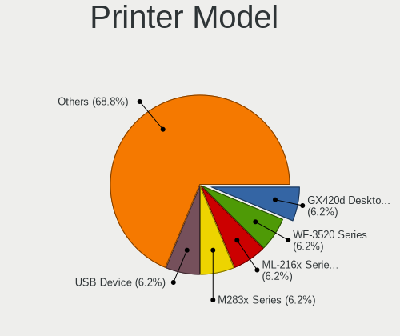

| Model                                | Desktops | Percent |
|--------------------------------------|----------|---------|
| Zebra GX420d Desktop Label Printer   | 1        | 6.25%   |
| Seiko Epson WF-3520 Series           | 1        | 6.25%   |
| Samsung ML-216x Series Laser Printer | 1        | 6.25%   |
| Samsung M283x Series                 | 1        | 6.25%   |
| Oki Data USB Device                  | 1        | 6.25%   |
| Lexmark International Z35 Printer    | 1        | 6.25%   |
| HP HP ColorLaserJet M255-M256        | 1        | 6.25%   |
| HP DeskJet 2800 series               | 1        | 6.25%   |
| Dell 1250c Color Printer             | 1        | 6.25%   |
| Canon TS6400 series                  | 1        | 6.25%   |
| Canon TR4700 series                  | 1        | 6.25%   |
| Canon PIXMA MG2500 Series            | 1        | 6.25%   |
| Canon MF240 Series UFRII LT          | 1        | 6.25%   |
| Brother Printer                      | 1        | 6.25%   |
| Brother MFC-J4335DW                  | 1        | 6.25%   |
| Brother HL-L2340D series             | 1        | 6.25%   |

Scanner Vendor
--------------

Scanner device vendors

| Vendor | Desktops | Percent |
|--------|----------|---------|
| Canon  | 3        | 100%    |

Scanner Model
-------------

Scanner device models

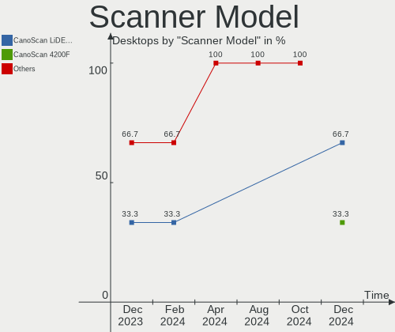

| Model                   | Desktops | Percent |
|-------------------------|----------|---------|
| Canon CanoScan LiDE 210 | 2        | 66.67%  |
| Canon CanoScan 4200F    | 1        | 33.33%  |

Camera
------

Camera Vendor
-------------

Camera device vendors

| Vendor                        | Desktops | Percent |
|-------------------------------|----------|---------|
| Logitech                      | 30       | 38.46%  |
| Sunplus Innovation Technology | 5        | 6.41%   |
| Razer USA                     | 5        | 6.41%   |
| Samsung Electronics           | 3        | 3.85%   |
| Microdia                      | 3        | 3.85%   |
| Apple                         | 3        | 3.85%   |
| Sonix Technology              | 2        | 2.56%   |
| Realtek Semiconductor         | 2        | 2.56%   |
| MacroSilicon                  | 2        | 2.56%   |
| Linux Foundation              | 2        | 2.56%   |
| Generalplus Technology        | 2        | 2.56%   |
| eMeet                         | 2        | 2.56%   |
| 2M UVC CAMERA                 | 2        | 2.56%   |
| Valve Software                | 1        | 1.28%   |
| USB 4K Camera                 | 1        | 1.28%   |
| SunplusIT                     | 1        | 1.28%   |
| Sunplus Technology            | 1        | 1.28%   |
| SHENZHEN EMEET TECHNOLOGY     | 1        | 1.28%   |
| Jieli Technology              | 1        | 1.28%   |
| Ingenic Semiconductor         | 1        | 1.28%   |
| Huawei Technologies           | 1        | 1.28%   |
| EVGA                          | 1        | 1.28%   |
| Chicony Electronics           | 1        | 1.28%   |
| Bison Electronics             | 1        | 1.28%   |
| AVerMedia Technologies        | 1        | 1.28%   |
| Arkmicro Technologies         | 1        | 1.28%   |
| ARC International             | 1        | 1.28%   |
| Anker PowerConf C200          | 1        | 1.28%   |

Camera Model
------------

Camera device models

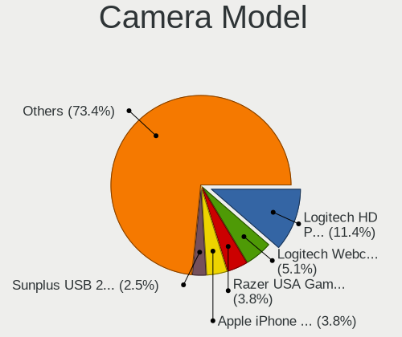

| Model                                          | Desktops | Percent |
|------------------------------------------------|----------|---------|
| Logitech HD Pro Webcam C920                    | 9        | 11.39%  |
| Logitech Webcam C270                           | 4        | 5.06%   |
| Razer USA Gaming Webcam [Kiyo]                 | 3        | 3.8%    |
| Apple iPhone 5/5C/5S/6/SE/7/8/X/XR             | 3        | 3.8%    |
| Sunplus USB 2.0 Camera                         | 2        | 2.53%   |
| Sunplus DICOTA 4K                              | 2        | 2.53%   |
| Samsung Galaxy series, misc. (MTP mode)        | 2        | 2.53%   |
| Razer USA Razer Kiyo Pro Ultra                 | 2        | 2.53%   |
| Logitech Webcam C310                           | 2        | 2.53%   |
| Logitech C922 Pro Stream Webcam                | 2        | 2.53%   |
| Logitech B525 HD Webcam                        | 2        | 2.53%   |
| 2M UVC CAMERA NexiGo N60 FHD Webcam            | 2        | 2.53%   |
| Valve Software 3D Camera                       | 1        | 1.27%   |
| USB 4K Camera                                  | 1        | 1.27%   |
| SunplusIT USB IR Camera                        | 1        | 1.27%   |
| Sunplus USB2.0 2M WebCam                       | 1        | 1.27%   |
| Sunplus FHD Capture                            | 1        | 1.27%   |
| Sonix ZZ3                                      | 1        | 1.27%   |
| Sonix NexiGo HD Webcam                         | 1        | 1.27%   |
| SHENZHEN EMEET TECHNOLOGY HD Webcam eMeet C960 | 1        | 1.27%   |
| Samsung SlimFit Cam                            | 1        | 1.27%   |
| Realtek Web Camera                             | 1        | 1.27%   |
| Realtek FULL HD 1080P Webcam                   | 1        | 1.27%   |
| Microdia Webcam Vitade AF                      | 1        | 1.27%   |
| Microdia USB 2.0 Camera                        | 1        | 1.27%   |
| Microdia NEXIGO HD Webcam                      | 1        | 1.27%   |
| MacroSilicon USB Video                         | 1        | 1.27%   |
| MacroSilicon MS210x Video Grabber [EasierCAP]  | 1        | 1.27%   |
| Logitech StreamCam                             | 1        | 1.27%   |
| Logitech QuickCam Pro 9000                     | 1        | 1.27%   |
| Logitech MX Brio                               | 1        | 1.27%   |
| Logitech Logitech Webcam C160                  | 1        | 1.27%   |
| Logitech HD Webcam C910                        | 1        | 1.27%   |
| Logitech HD Webcam C525                        | 1        | 1.27%   |
| Logitech HD Webcam B910                        | 1        | 1.27%   |
| Logitech CrystalCam                            | 1        | 1.27%   |
| Logitech ConferenceCam CC3000e Camera          | 1        | 1.27%   |
| Logitech BRIO Ultra HD Webcam                  | 1        | 1.27%   |
| Logitech Brio 101                              | 1        | 1.27%   |
| Logitech Brio 100                              | 1        | 1.27%   |

Security
--------

Fingerprint Vendor
------------------

Fingerprint sensor vendors

| Vendor | Desktops | Percent |
|--------|----------|---------|
| Upek   | 1        | 100%    |

Fingerprint Model
-----------------

Fingerprint sensor models

| Model                                                  | Desktops | Percent |
|--------------------------------------------------------|----------|---------|
| Upek Biometric Touchchip/Touchstrip Fingerprint Sensor | 1        | 100%    |

Chipcard Vendor
---------------

Chipcard module vendors

| Vendor                | Desktops | Percent |
|-----------------------|----------|---------|
| Realtek Semiconductor | 1        | 100%    |

Chipcard Model
--------------

Chipcard module models

| Model                                             | Desktops | Percent |
|---------------------------------------------------|----------|---------|
| Realtek Semiconductor Smart Card Reader Interface | 1        | 100%    |

Unsupported
-----------

Unsupported Devices
-------------------

Total unsupported devices on board

| Total | Desktops | Percent |
|-------|----------|---------|
| 0     | 357      | 80.41%  |
| 1     | 72       | 16.22%  |
| 2     | 14       | 3.15%   |
| 3     | 1        | 0.23%   |

Unsupported Device Types
------------------------

Types of unsupported devices

| Type                     | Desktops | Percent |
|--------------------------|----------|---------|
| Graphics card            | 37       | 37.76%  |
| Net/wireless             | 21       | 21.43%  |
| Unassigned class         | 8        | 8.16%   |
| Communication controller | 7        | 7.14%   |
| Net/ethernet             | 5        | 5.1%    |
| Bluetooth                | 5        | 5.1%    |
| Storage/raid             | 4        | 4.08%   |
| Network                  | 4        | 4.08%   |
| Sound                    | 3        | 3.06%   |
| Multimedia controller    | 1        | 1.02%   |
| Fingerprint reader       | 1        | 1.02%   |
| Chipcard                 | 1        | 1.02%   |
| Camera                   | 1        | 1.02%   |

