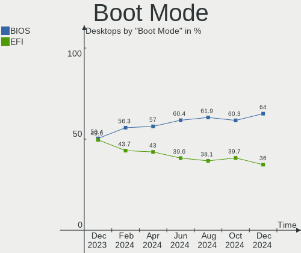
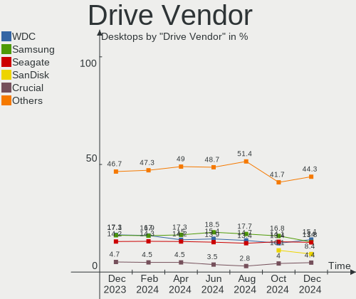
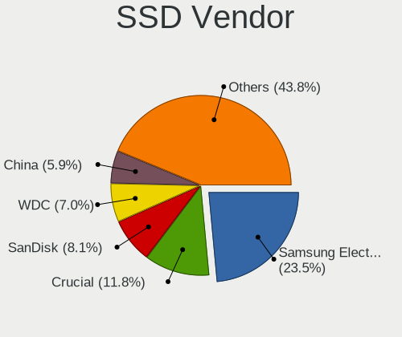
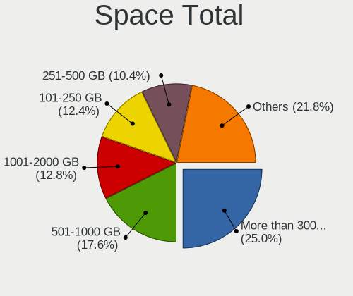
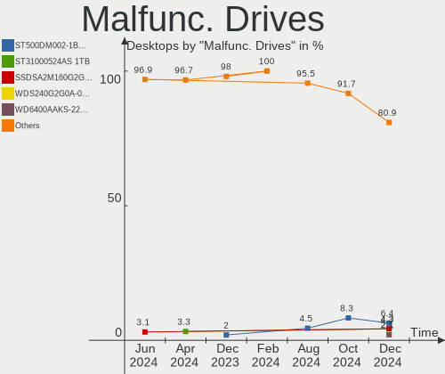
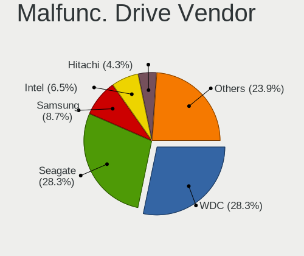
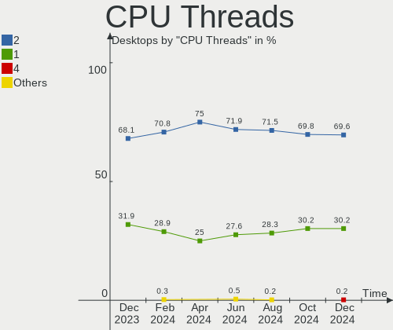
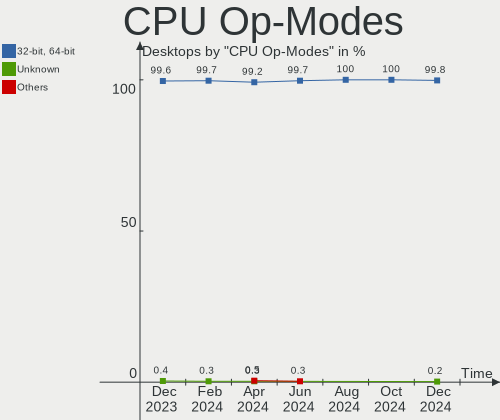

Linux in USA - Hardware Trends (Desktops)
-----------------------------------------

A project to identify most popular hardware characteristics and track their change
over time based on data collected by Linux users at https://Linux-Hardware.org.

Anyone can contribute to this report by the [hw-probe](https://github.com/linuxhw/hw-probe) tool:

    sudo -E hw-probe -all -upload

Period: Apr, 2024.

Contents
--------

* [ System ](#system)
  - [ OS                       ](#os)
  - [ OS Family                ](#os-family)
  - [ Kernel                   ](#kernel)
  - [ Kernel Family            ](#kernel-family)
  - [ Kernel Major Ver.        ](#kernel-major-ver)
  - [ Arch                     ](#arch)
  - [ DE                       ](#de)
  - [ Display Server           ](#display-server)
  - [ Display Manager          ](#display-manager)
  - [ OS Lang                  ](#os-lang)
  - [ Boot Mode                ](#boot-mode)
  - [ Filesystem               ](#filesystem)
  - [ Part. scheme             ](#part-scheme)
  - [ Dual Boot with Linux/BSD ](#dual-boot-with-linuxbsd)
  - [ Dual Boot (Win)          ](#dual-boot-win)

* [ Board ](#board)
  - [ Vendor                   ](#vendor)
  - [ Model                    ](#model)
  - [ Model Family             ](#model-family)
  - [ MFG Year                 ](#mfg-year)
  - [ Form Factor              ](#form-factor)
  - [ Secure Boot              ](#secure-boot)
  - [ Coreboot                 ](#coreboot)
  - [ RAM Size                 ](#ram-size)
  - [ RAM Used                 ](#ram-used)
  - [ Total Drives             ](#total-drives)
  - [ Has CD-ROM               ](#has-cd-rom)
  - [ Has Ethernet             ](#has-ethernet)
  - [ Has WiFi                 ](#has-wifi)
  - [ Has Bluetooth            ](#has-bluetooth)

* [ Location ](#location)
  - [ Country                  ](#country)
  - [ City                     ](#city)

* [ Drives ](#drives)
  - [ Drive Vendor             ](#drive-vendor)
  - [ Drive Model              ](#drive-model)
  - [ HDD Vendor               ](#hdd-vendor)
  - [ SSD Vendor               ](#ssd-vendor)
  - [ Drive Kind               ](#drive-kind)
  - [ Drive Connector          ](#drive-connector)
  - [ Drive Size               ](#drive-size)
  - [ Space Total              ](#space-total)
  - [ Space Used               ](#space-used)
  - [ Malfunc. Drives          ](#malfunc-drives)
  - [ Malfunc. Drive Vendor    ](#malfunc-drive-vendor)
  - [ Malfunc. HDD Vendor      ](#malfunc-hdd-vendor)
  - [ Malfunc. Drive Kind      ](#malfunc-drive-kind)
  - [ Failed Drives            ](#failed-drives)
  - [ Failed Drive Vendor      ](#failed-drive-vendor)
  - [ Drive Status             ](#drive-status)

* [ Storage controller ](#storage-controller)
  - [ Storage Vendor           ](#storage-vendor)
  - [ Storage Model            ](#storage-model)
  - [ Storage Kind             ](#storage-kind)

* [ Processor ](#processor)
  - [ CPU Vendor               ](#cpu-vendor)
  - [ CPU Model                ](#cpu-model)
  - [ CPU Model Family         ](#cpu-model-family)
  - [ CPU Cores                ](#cpu-cores)
  - [ CPU Sockets              ](#cpu-sockets)
  - [ CPU Threads              ](#cpu-threads)
  - [ CPU Op-Modes             ](#cpu-op-modes)
  - [ CPU Microcode            ](#cpu-microcode)
  - [ CPU Microarch            ](#cpu-microarch)

* [ Graphics ](#graphics)
  - [ GPU Vendor               ](#gpu-vendor)
  - [ GPU Model                ](#gpu-model)
  - [ GPU Combo                ](#gpu-combo)
  - [ GPU Driver               ](#gpu-driver)
  - [ GPU Memory               ](#gpu-memory)

* [ Monitor ](#monitor)
  - [ Monitor Vendor           ](#monitor-vendor)
  - [ Monitor Model            ](#monitor-model)
  - [ Monitor Resolution       ](#monitor-resolution)
  - [ Monitor Diagonal         ](#monitor-diagonal)
  - [ Monitor Width            ](#monitor-width)
  - [ Aspect Ratio             ](#aspect-ratio)
  - [ Monitor Area             ](#monitor-area)
  - [ Pixel Density            ](#pixel-density)
  - [ Multiple Monitors        ](#multiple-monitors)

* [ Network ](#network)
  - [ Net Controller Vendor    ](#net-controller-vendor)
  - [ Net Controller Model     ](#net-controller-model)
  - [ Wireless Vendor          ](#wireless-vendor)
  - [ Wireless Model           ](#wireless-model)
  - [ Ethernet Vendor          ](#ethernet-vendor)
  - [ Ethernet Model           ](#ethernet-model)
  - [ Net Controller Kind      ](#net-controller-kind)
  - [ Used Controller          ](#used-controller)
  - [ NICs                     ](#nics)
  - [ IPv6                     ](#ipv6)

* [ Bluetooth ](#bluetooth)
  - [ Bluetooth Vendor         ](#bluetooth-vendor)
  - [ Bluetooth Model          ](#bluetooth-model)

* [ Sound ](#sound)
  - [ Sound Vendor             ](#sound-vendor)
  - [ Sound Model              ](#sound-model)

* [ Memory ](#memory)
  - [ Memory Vendor            ](#memory-vendor)
  - [ Memory Model             ](#memory-model)
  - [ Memory Kind              ](#memory-kind)
  - [ Memory Form Factor       ](#memory-form-factor)
  - [ Memory Size              ](#memory-size)
  - [ Memory Speed             ](#memory-speed)

* [ Printers & scanners ](#printers--scanners)
  - [ Printer Vendor           ](#printer-vendor)
  - [ Printer Model            ](#printer-model)
  - [ Scanner Vendor           ](#scanner-vendor)
  - [ Scanner Model            ](#scanner-model)

* [ Camera ](#camera)
  - [ Camera Vendor            ](#camera-vendor)
  - [ Camera Model             ](#camera-model)

* [ Security ](#security)
  - [ Fingerprint Vendor       ](#fingerprint-vendor)
  - [ Fingerprint Model        ](#fingerprint-model)
  - [ Chipcard Vendor          ](#chipcard-vendor)
  - [ Chipcard Model           ](#chipcard-model)

* [ Unsupported ](#unsupported)
  - [ Unsupported Devices      ](#unsupported-devices)
  - [ Unsupported Device Types ](#unsupported-device-types)

System
------

OS
--

Installed operating systems

| Name                           | Desktops | Percent |
|--------------------------------|----------|---------|
| Ubuntu 22.04                   | 47       | 12.74%  |
| Fedora 39                      | 35       | 9.49%   |
| Debian 12                      | 22       | 5.96%   |
| Fedora 40                      | 20       | 5.42%   |
| Pop!_OS 22.04                  | 18       | 4.88%   |
| Arch Rolling                   | 18       | 4.88%   |
| Linux Mint 21.3                | 15       | 4.07%   |
| ArcoLinux Rolling              | 15       | 4.07%   |
| Zorin 17                       | 13       | 3.52%   |
| Ubuntu 23.10                   | 13       | 3.52%   |
| Nobara 39                      | 12       | 3.25%   |
| Ubuntu 20.04                   | 7        | 1.9%    |
| OpenMandriva 23.08             | 7        | 1.9%    |
| Manjaro                        | 7        | 1.9%    |
| openSUSE Tumbleweed-XXXXXXXX   | 6        | 1.63%   |
| KDE neon 22.04                 | 6        | 1.63%   |
| Ubuntu 24.04                   | 5        | 1.36%   |
| OpenMandriva 5.0               | 5        | 1.36%   |
| Dts-distro 1.2.21              | 5        | 1.36%   |
| Xubuntu 22.04                  | 4        | 1.08%   |
| RHEL 9                         | 4        | 1.08%   |
| Kubuntu 24.04                  | 4        | 1.08%   |
| ChimeraOS 45-1                 | 4        | 1.08%   |
| Zorin 16                       | 3        | 0.81%   |
| Redcore Rolling.boulder.uphill | 3        | 0.81%   |
| openSUSE Leap-15.5             | 3        | 0.81%   |
| Manjaro 23.1.4                 | 3        | 0.81%   |
| Linux Mint 21.2                | 3        | 0.81%   |
| Linux Mint 21.1                | 3        | 0.81%   |
| Linux Mint 20.3                | 3        | 0.81%   |
| Kubuntu 22.04                  | 3        | 0.81%   |
| Kali 2024.1                    | 3        | 0.81%   |
| Garuda Linux Soaring           | 3        | 0.81%   |
| Debian 11                      | 3        | 0.81%   |
| OpenMandriva 24.90             | 2        | 0.54%   |
| OpenMandriva 24.03             | 2        | 0.54%   |
| MX 23                          | 2        | 0.54%   |
| Lubuntu 22.04                  | 2        | 0.54%   |
| Gentoo 2.14                    | 2        | 0.54%   |
| Fedora 38                      | 2        | 0.54%   |

OS Family
---------

OS without a version

| Name          | Desktops | Percent |
|---------------|----------|---------|
| Ubuntu        | 74       | 20.05%  |
| Fedora        | 57       | 15.45%  |
| Linux Mint    | 26       | 7.05%   |
| Debian        | 25       | 6.78%   |
| OpenMandriva  | 20       | 5.42%   |
| Pop!_OS       | 19       | 5.15%   |
| Arch          | 18       | 4.88%   |
| Zorin         | 17       | 4.61%   |
| ArcoLinux     | 16       | 4.34%   |
| Nobara        | 12       | 3.25%   |
| Manjaro       | 10       | 2.71%   |
| openSUSE      | 9        | 2.44%   |
| Kubuntu       | 9        | 2.44%   |
| KDE neon      | 6        | 1.63%   |
| Xubuntu       | 5        | 1.36%   |
| Dts-distro    | 5        | 1.36%   |
| RHEL          | 4        | 1.08%   |
| ChimeraOS     | 4        | 1.08%   |
| Redcore       | 3        | 0.81%   |
| MX            | 3        | 0.81%   |
| Lubuntu       | 3        | 0.81%   |
| Kali          | 3        | 0.81%   |
| Garuda Linux  | 3        | 0.81%   |
| Ubuntu Studio | 2        | 0.54%   |
| Ubuntu MATE   | 2        | 0.54%   |
| NixOS         | 2        | 0.54%   |
| Gentoo        | 2        | 0.54%   |
| EndeavourOS   | 2        | 0.54%   |
| Elementary    | 2        | 0.54%   |
| Xero          | 1        | 0.27%   |
| SteamOS       | 1        | 0.27%   |
| Rocky Linux   | 1        | 0.27%   |
| Endless       | 1        | 0.27%   |
| BigLinux      | 1        | 0.27%   |
| Alpine        | 1        | 0.27%   |

Kernel
------

Version of the Linux kernel

| Version                             | Desktops | Percent |
|-------------------------------------|----------|---------|
| 6.5.0-26-generic                    | 32       | 8.67%   |
| 6.5.0-27-generic                    | 26       | 7.05%   |
| 6.5.0-28-generic                    | 20       | 5.42%   |
| 5.15.0-101-generic                  | 17       | 4.61%   |
| 6.8.0-76060800daily20240311-generic | 14       | 3.79%   |
| 5.15.0-102-generic                  | 13       | 3.52%   |
| 6.8.7-300.fc40.x86_64               | 10       | 2.71%   |
| 6.1.0-18-amd64                      | 10       | 2.71%   |
| 6.7.11-200.fc39.x86_64              | 9        | 2.44%   |
| 6.8.6-200.fc39.x86_64               | 8        | 2.17%   |
| 6.4.11-desktop-1omv2390             | 8        | 2.17%   |
| 6.8.0-31-generic                    | 7        | 1.9%    |
| 5.15.0-105-generic                  | 7        | 1.9%    |
| 6.8.7-arch1-1                       | 6        | 1.63%   |
| 6.8.2-300.fc40.x86_64               | 6        | 1.63%   |
| 6.6.2-desktop-1omv2390              | 6        | 1.63%   |
| 6.1.0-20-amd64                      | 6        | 1.63%   |
| 6.8.7-zen1-1-zen                    | 5        | 1.36%   |
| 6.8.5-arch1-1                       | 5        | 1.36%   |
| 6.8.5-201.fsync.fc39.x86_64         | 5        | 1.36%   |
| 6.8.5-1-MANJARO                     | 5        | 1.36%   |
| 6.8.4-200.fc39.x86_64               | 5        | 1.36%   |
| 5.15.36-yocto-standard              | 5        | 1.36%   |
| 5.14.0-362.24.1.el9_3.x86_64        | 5        | 1.36%   |
| 6.8.7-arch1-2                       | 4        | 1.08%   |
| 6.8.5-201.fc39.x86_64               | 4        | 1.08%   |
| 6.8.2-zen2-1-zen                    | 4        | 1.08%   |
| 6.8.2-arch2-1                       | 4        | 1.08%   |
| 6.6.10-chos1-chimeraos-2            | 4        | 1.08%   |
| 6.6.10-76060610-generic             | 4        | 1.08%   |
| 6.8.4-rc1-1-default                 | 3        | 0.81%   |
| 6.8.0-22-generic                    | 3        | 0.81%   |
| 6.7.6-201.fsync.fc39.x86_64         | 3        | 0.81%   |
| 6.6.26-1-MANJARO                    | 3        | 0.81%   |
| 6.5.6-300.fc39.x86_64               | 3        | 0.81%   |
| 6.1.0-17-amd64                      | 3        | 0.81%   |
| 5.14.21-150500.55.52-default        | 3        | 0.81%   |
| 6.8.7-desktop-1omv2490              | 2        | 0.54%   |
| 6.8.7-200.fc39.x86_64               | 2        | 0.54%   |
| 6.8.4-zen1-1-zen                    | 2        | 0.54%   |

Kernel Family
-------------

Linux kernel without a distro release

| Version  | Desktops | Percent |
|----------|----------|---------|
| 6.5.0    | 86       | 23.31%  |
| 5.15.0   | 43       | 11.65%  |
| 6.8.7    | 35       | 9.49%   |
| 6.8.0    | 24       | 6.5%    |
| 6.1.0    | 22       | 5.96%   |
| 6.8.5    | 21       | 5.69%   |
| 6.8.2    | 17       | 4.61%   |
| 6.8.4    | 14       | 3.79%   |
| 6.8.6    | 11       | 2.98%   |
| 6.7.11   | 10       | 2.71%   |
| 6.6.10   | 9        | 2.44%   |
| 6.4.11   | 8        | 2.17%   |
| 6.6.2    | 6        | 1.63%   |
| 5.4.0    | 5        | 1.36%   |
| 5.15.36  | 5        | 1.36%   |
| 5.14.0   | 5        | 1.36%   |
| 6.7.9    | 4        | 1.08%   |
| 6.7.6    | 4        | 1.08%   |
| 6.6.26   | 4        | 1.08%   |
| 6.7.12   | 3        | 0.81%   |
| 6.6.13   | 3        | 0.81%   |
| 6.5.6    | 3        | 0.81%   |
| 5.14.21  | 3        | 0.81%   |
| 6.8.1    | 2        | 0.54%   |
| 6.6.9    | 2        | 0.54%   |
| 6.6.25   | 2        | 0.54%   |
| 6.9.0    | 1        | 0.27%   |
| 6.7.7    | 1        | 0.27%   |
| 6.7.0    | 1        | 0.27%   |
| 6.6.4    | 1        | 0.27%   |
| 6.6.15   | 1        | 0.27%   |
| 6.5.13   | 1        | 0.27%   |
| 6.2.6    | 1        | 0.27%   |
| 6.2.0    | 1        | 0.27%   |
| 6.1.87   | 1        | 0.27%   |
| 6.1.64   | 1        | 0.27%   |
| 6.1.52   | 1        | 0.27%   |
| 5.18.10  | 1        | 0.27%   |
| 5.16.7   | 1        | 0.27%   |
| 5.15.149 | 1        | 0.27%   |

Kernel Major Ver.
-----------------

Linux kernel major version

| Version | Desktops | Percent |
|---------|----------|---------|
| 6.8     | 124      | 33.6%   |
| 6.5     | 90       | 24.39%  |
| 5.15    | 49       | 13.28%  |
| 6.6     | 28       | 7.59%   |
| 6.1     | 25       | 6.78%   |
| 6.7     | 23       | 6.23%   |
| 6.4     | 8        | 2.17%   |
| 5.14    | 8        | 2.17%   |
| 5.4     | 5        | 1.36%   |
| 6.2     | 2        | 0.54%   |
| 5.10    | 2        | 0.54%   |
| 6.9     | 1        | 0.27%   |
| 5.18    | 1        | 0.27%   |
| 5.16    | 1        | 0.27%   |
| 5.11    | 1        | 0.27%   |
| 4.15    | 1        | 0.27%   |

Arch
----

OS architecture (x86_64, i586, etc.)

| Name   | Desktops | Percent |
|--------|----------|---------|
| x86_64 | 367      | 99.46%  |
| i686   | 2        | 0.54%   |

DE
--

Desktop Environment

| Name          | Desktops | Percent |
|---------------|----------|---------|
| GNOME         | 154      | 41.73%  |
| KDE5          | 60       | 16.26%  |
| KDE6          | 49       | 13.28%  |
| Unknown       | 29       | 7.86%   |
| X-Cinnamon    | 26       | 7.05%   |
| XFCE          | 24       | 6.5%    |
| MATE          | 7        | 1.9%    |
| LXQt          | 7        | 1.9%    |
| Hyprland      | 5        | 1.36%   |
| Pantheon      | 2        | 0.54%   |
| GNOME Classic | 2        | 0.54%   |
| LXDE          | 1        | 0.27%   |
| icewm         | 1        | 0.27%   |
| i3            | 1        | 0.27%   |
| Endless:GNOME | 1        | 0.27%   |

Display Server
--------------

X11 or Wayland

| Name    | Desktops | Percent |
|---------|----------|---------|
| X11     | 176      | 47.7%   |
| Wayland | 167      | 45.26%  |
| Unknown | 14       | 3.79%   |
| Tty     | 12       | 3.25%   |

Display Manager
---------------

SDDM, LightDM, etc.

| Name    | Desktops | Percent |
|---------|----------|---------|
| Unknown | 183      | 49.59%  |
| GDM3    | 69       | 18.7%   |
| SDDM    | 63       | 17.07%  |
| LightDM | 40       | 10.84%  |
| GDM     | 13       | 3.52%   |
| GREETD  | 1        | 0.27%   |

OS Lang
-------

Language

| Lang    | Desktops | Percent |
|---------|----------|---------|
| en_US   | 337      | 91.33%  |
| Unknown | 11       | 2.98%   |
| C       | 8        | 2.17%   |
| en_GB   | 4        | 1.08%   |
| zh_CN   | 3        | 0.81%   |
| zh_TW   | 1        | 0.27%   |
| pt_BR   | 1        | 0.27%   |
| es_ES   | 1        | 0.27%   |
| en_ZW   | 1        | 0.27%   |
| en_CA   | 1        | 0.27%   |
| de_DE   | 1        | 0.27%   |

Boot Mode
---------

EFI or BIOS

| Mode | Desktops | Percent |
|------|----------|---------|
| BIOS | 210      | 56.91%  |
| EFI  | 159      | 43.09%  |

Filesystem
----------

Type of filesystem

| Type    | Desktops | Percent |
|---------|----------|---------|
| Ext4    | 208      | 56.37%  |
| Btrfs   | 96       | 26.02%  |
| Tmpfs   | 50       | 13.55%  |
| Overlay | 9        | 2.44%   |
| Xfs     | 5        | 1.36%   |
| F2fs    | 1        | 0.27%   |

Part. scheme
------------

Scheme of partitioning

| Type    | Desktops | Percent |
|---------|----------|---------|
| GPT     | 183      | 49.59%  |
| Unknown | 162      | 43.9%   |
| MBR     | 24       | 6.5%    |

Dual Boot with Linux/BSD
------------------------

Hosting more than one Linux/BSD

| Dual boot | Desktops | Percent |
|-----------|----------|---------|
| No        | 305      | 82.66%  |
| Yes       | 64       | 17.34%  |

Dual Boot (Win)
---------------

Hosting Linux and Windows

| Dual boot | Desktops | Percent |
|-----------|----------|---------|
| No        | 289      | 78.32%  |
| Yes       | 80       | 21.68%  |

Board
-----

Vendor
------

Motherboard manufacturer

| Name                                 | Desktops | Percent |
|--------------------------------------|----------|---------|
| ASUSTek Computer                     | 70       | 18.97%  |
| MSI                                  | 58       | 15.72%  |
| Gigabyte Technology                  | 54       | 14.63%  |
| Dell                                 | 50       | 13.55%  |
| Hewlett-Packard                      | 33       | 8.94%   |
| ASRock                               | 32       | 8.67%   |
| Lenovo                               | 11       | 2.98%   |
| Shenzhen Meigao Electronic Equipment | 5        | 1.36%   |
| Intel                                | 5        | 1.36%   |
| AZW                                  | 5        | 1.36%   |
| Biostar                              | 4        | 1.08%   |
| Apple                                | 4        | 1.08%   |
| Alienware                            | 4        | 1.08%   |
| Unknown                              | 4        | 1.08%   |
| Pegatron                             | 3        | 0.81%   |
| Acer                                 | 3        | 0.81%   |
| Supermicro                           | 2        | 0.54%   |
| eMachines                            | 2        | 0.54%   |
| BESSTAR Tech                         | 2        | 0.54%   |
| AMI                                  | 2        | 0.54%   |
| Win element                          | 1        | 0.27%   |
| System76                             | 1        | 0.27%   |
| STGAUBRON                            | 1        | 0.27%   |
| ParTech                              | 1        | 0.27%   |
| OEM                                  | 1        | 0.27%   |
| NZXT                                 | 1        | 0.27%   |
| HC Technology.                       | 1        | 0.27%   |
| Hardkernel                           | 1        | 0.27%   |
| GMKtec                               | 1        | 0.27%   |
| GEEKOM                               | 1        | 0.27%   |
| Gateway                              | 1        | 0.27%   |
| Fujitsu                              | 1        | 0.27%   |
| Foxconn                              | 1        | 0.27%   |
| EVGA                                 | 1        | 0.27%   |
| DFI                                  | 1        | 0.27%   |
| AWOW                                 | 1        | 0.27%   |

Model
-----

Motherboard model

| Name                                    | Desktops | Percent |
|-----------------------------------------|----------|---------|
| MSI MS-7C91                             | 5        | 1.36%   |
| MSI MS-7C56                             | 5        | 1.36%   |
| MSI MS-7D78                             | 4        | 1.08%   |
| MSI MS-7C95                             | 4        | 1.08%   |
| Unknown                                 | 4        | 1.08%   |
| MSI MS-7E06                             | 3        | 0.81%   |
| MSI MS-7D25                             | 3        | 0.81%   |
| Gigabyte Z790 UD AC                     | 3        | 0.81%   |
| Gigabyte X570 AORUS ELITE WIFI          | 3        | 0.81%   |
| Dell OptiPlex 7050                      | 3        | 0.81%   |
| Dell OptiPlex 7010                      | 3        | 0.81%   |
| Dell Inspiron 3847                      | 3        | 0.81%   |
| ASUS TUF Gaming X570-PRO                | 3        | 0.81%   |
| ASUS All Series                         | 3        | 0.81%   |
| ASRock X570 Taichi                      | 3        | 0.81%   |
| MSI MS-7D91                             | 2        | 0.54%   |
| MSI MS-7D85                             | 2        | 0.54%   |
| MSI MS-7C35                             | 2        | 0.54%   |
| HP Z820 Workstation                     | 2        | 0.54%   |
| HP OMEN by 40L Gaming Desktop GT21-0xxx | 2        | 0.54%   |
| HP OMEN 25L Desktop GT12-0xxx           | 2        | 0.54%   |
| Gigabyte Z790 AORUS ELITE AX            | 2        | 0.54%   |
| Gigabyte F2A55M-DS2                     | 2        | 0.54%   |
| Gigabyte B75M-D3H                       | 2        | 0.54%   |
| Gigabyte B550M DS3H AC                  | 2        | 0.54%   |
| Gigabyte B450M DS3H                     | 2        | 0.54%   |
| Gigabyte 970A-DS3P                      | 2        | 0.54%   |
| Dell XPS 8700                           | 2        | 0.54%   |
| Dell Precision Tower 5810               | 2        | 0.54%   |
| Dell OptiPlex 9020                      | 2        | 0.54%   |
| Dell OptiPlex 7060                      | 2        | 0.54%   |
| Dell OptiPlex 7020                      | 2        | 0.54%   |
| Dell OptiPlex 5040                      | 2        | 0.54%   |
| Dell OptiPlex 390                       | 2        | 0.54%   |
| AZW U59                                 | 2        | 0.54%   |
| ASUS TUF Gaming Z690-PLUS WIFI D4       | 2        | 0.54%   |
| ASUS TUF Gaming B550M-PLUS WIFI II      | 2        | 0.54%   |
| ASUS SABERTOOTH 990FX                   | 2        | 0.54%   |
| ASUS ROG STRIX X670E-E GAMING WIFI      | 2        | 0.54%   |
| ASUS ROG Maximus Z790 DARK HERO         | 2        | 0.54%   |

Model Family
------------

Motherboard model prefix

| Name                | Desktops | Percent |
|---------------------|----------|---------|
| Dell OptiPlex       | 25       | 6.78%   |
| ASUS ROG            | 24       | 6.5%    |
| ASUS PRIME          | 14       | 3.79%   |
| ASUS TUF            | 13       | 3.52%   |
| Gigabyte Z790       | 9        | 2.44%   |
| Dell Inspiron       | 9        | 2.44%   |
| HP EliteDesk        | 8        | 2.17%   |
| Dell Precision      | 7        | 1.9%    |
| HP OMEN             | 6        | 1.63%   |
| Dell XPS            | 6        | 1.63%   |
| MSI MS-7C91         | 5        | 1.36%   |
| MSI MS-7C56         | 5        | 1.36%   |
| Gigabyte X570       | 5        | 1.36%   |
| MSI MS-7D78         | 4        | 1.08%   |
| MSI MS-7C95         | 4        | 1.08%   |
| Lenovo ThinkCentre  | 4        | 1.08%   |
| Lenovo IdeaCentre   | 4        | 1.08%   |
| HP Compaq           | 4        | 1.08%   |
| Gigabyte B650       | 4        | 1.08%   |
| ASRock Z790         | 4        | 1.08%   |
| ASRock X570         | 4        | 1.08%   |
| Unknown             | 4        | 1.08%   |
| MSI MS-7E06         | 3        | 0.81%   |
| MSI MS-7D25         | 3        | 0.81%   |
| Lenovo ThinkStation | 3        | 0.81%   |
| Gigabyte Z390       | 3        | 0.81%   |
| ASUS All            | 3        | 0.81%   |
| Alienware Aurora    | 3        | 0.81%   |
| MSI MS-7D91         | 2        | 0.54%   |
| MSI MS-7D85         | 2        | 0.54%   |
| MSI MS-7C35         | 2        | 0.54%   |
| HP Z820             | 2        | 0.54%   |
| HP Slim             | 2        | 0.54%   |
| HP ProDesk          | 2        | 0.54%   |
| HP Pavilion         | 2        | 0.54%   |
| Gigabyte X570S      | 2        | 0.54%   |
| Gigabyte F2A55M-DS2 | 2        | 0.54%   |
| Gigabyte B75M-D3H   | 2        | 0.54%   |
| Gigabyte B650M      | 2        | 0.54%   |
| Gigabyte B550M      | 2        | 0.54%   |

MFG Year
--------

Motherboard manufacture year

| Year | Desktops | Percent |
|------|----------|---------|
| 2022 | 64       | 17.34%  |
| 2023 | 42       | 11.38%  |
| 2021 | 38       | 10.3%   |
| 2020 | 38       | 10.3%   |
| 2012 | 28       | 7.59%   |
| 2018 | 25       | 6.78%   |
| 2013 | 23       | 6.23%   |
| 2019 | 19       | 5.15%   |
| 2017 | 15       | 4.07%   |
| 2014 | 13       | 3.52%   |
| 2011 | 13       | 3.52%   |
| 2015 | 10       | 2.71%   |
| 2010 | 9        | 2.44%   |
| 2009 | 9        | 2.44%   |
| 2016 | 8        | 2.17%   |
| 2008 | 8        | 2.17%   |
| 2024 | 2        | 0.54%   |
| 2006 | 2        | 0.54%   |
| 2007 | 1        | 0.27%   |
| 2004 | 1        | 0.27%   |
| 2002 | 1        | 0.27%   |

Form Factor
-----------

Physical design of the computer

| Name    | Desktops | Percent |
|---------|----------|---------|
| Desktop | 369      | 100%    |

Secure Boot
-----------

Enabled or disabled

| State    | Desktops | Percent |
|----------|----------|---------|
| Disabled | 356      | 96.48%  |
| Enabled  | 13       | 3.52%   |

Coreboot
--------

Have coreboot on board

| Used | Desktops | Percent |
|------|----------|---------|
| No   | 368      | 99.73%  |
| Yes  | 1        | 0.27%   |

RAM Size
--------

Total RAM memory

| Size in GB  | Desktops | Percent |
|-------------|----------|---------|
| 32.01-64.0  | 112      | 30.35%  |
| 16.01-24.0  | 73       | 19.78%  |
| 64.01-256.0 | 71       | 19.24%  |
| 4.01-8.0    | 38       | 10.3%   |
| 8.01-16.0   | 32       | 8.67%   |
| 24.01-32.0  | 22       | 5.96%   |
| 3.01-4.0    | 15       | 4.07%   |
| 2.01-3.0    | 3        | 0.81%   |
| 1.01-2.0    | 3        | 0.81%   |

RAM Used
--------

Used RAM memory

| Used GB    | Desktops | Percent |
|------------|----------|---------|
| 4.01-8.0   | 91       | 24.66%  |
| 2.01-3.0   | 85       | 23.04%  |
| 1.01-2.0   | 70       | 18.97%  |
| 3.01-4.0   | 60       | 16.26%  |
| 8.01-16.0  | 33       | 8.94%   |
| 0.51-1.0   | 17       | 4.61%   |
| 16.01-24.0 | 5        | 1.36%   |
| 32.01-64.0 | 3        | 0.81%   |
| 0.01-0.5   | 3        | 0.81%   |
| 24.01-32.0 | 2        | 0.54%   |

Total Drives
------------

Number of drives on board

| Drives | Desktops | Percent |
|--------|----------|---------|
| 1      | 129      | 34.96%  |
| 2      | 96       | 26.02%  |
| 3      | 58       | 15.72%  |
| 4      | 41       | 11.11%  |
| 5      | 20       | 5.42%   |
| 6      | 9        | 2.44%   |
| 7      | 5        | 1.36%   |
| 0      | 5        | 1.36%   |
| 8      | 3        | 0.81%   |
| 13     | 1        | 0.27%   |
| 10     | 1        | 0.27%   |
| 9      | 1        | 0.27%   |

Has CD-ROM
----------

Has CD-ROM on board

| Presented | Desktops | Percent |
|-----------|----------|---------|
| No        | 242      | 65.58%  |
| Yes       | 127      | 34.42%  |

Has Ethernet
------------

Has Ethernet on board

| Presented | Desktops | Percent |
|-----------|----------|---------|
| Yes       | 368      | 99.73%  |
| No        | 1        | 0.27%   |

Has WiFi
--------

Has WiFi module

| Presented | Desktops | Percent |
|-----------|----------|---------|
| Yes       | 257      | 69.65%  |
| No        | 112      | 30.35%  |

Has Bluetooth
-------------

Has Bluetooth module

| Presented | Desktops | Percent |
|-----------|----------|---------|
| Yes       | 235      | 63.69%  |
| No        | 134      | 36.31%  |

Location
--------

Country
-------

Geographic location (country)

| Country | Desktops | Percent |
|---------|----------|---------|
| USA     | 369      | 100%    |

City
----

Geographic location (city)

| City           | Desktops | Percent |
|----------------|----------|---------|
| New York       | 10       | 2.71%   |
| Los Angeles    | 7        | 1.9%    |
| Denver         | 6        | 1.63%   |
| Chicago        | 6        | 1.63%   |
| Seattle        | 5        | 1.36%   |
| Portland       | 5        | 1.36%   |
| Austin         | 5        | 1.36%   |
| Salt Lake City | 4        | 1.08%   |
| Kansas City    | 4        | 1.08%   |
| Tucson         | 3        | 0.81%   |
| St Louis       | 3        | 0.81%   |
| Phoenix        | 3        | 0.81%   |
| Dallas         | 3        | 0.81%   |
| Berkeley       | 3        | 0.81%   |
| Atlanta        | 3        | 0.81%   |
| Albuquerque    | 3        | 0.81%   |
| Yuma           | 2        | 0.54%   |
| Wichita        | 2        | 0.54%   |
| Washington     | 2        | 0.54%   |
| Tulsa          | 2        | 0.54%   |
| Toms River     | 2        | 0.54%   |
| Springfield    | 2        | 0.54%   |
| Spokane        | 2        | 0.54%   |
| Secaucus       | 2        | 0.54%   |
| Santa Rosa     | 2        | 0.54%   |
| San Jacinto    | 2        | 0.54%   |
| San Antonio    | 2        | 0.54%   |
| Roswell        | 2        | 0.54%   |
| Richmond       | 2        | 0.54%   |
| Redmond        | 2        | 0.54%   |
| Pasadena       | 2        | 0.54%   |
| Orlando        | 2        | 0.54%   |
| Nashville      | 2        | 0.54%   |
| Mountain View  | 2        | 0.54%   |
| Morehead City  | 2        | 0.54%   |
| Minneapolis    | 2        | 0.54%   |
| Milton         | 2        | 0.54%   |
| Milpitas       | 2        | 0.54%   |
| Miami          | 2        | 0.54%   |
| Mesa           | 2        | 0.54%   |

Drives
------

Drive Vendor
------------

Hard drive vendors

| Vendor                      | Desktops | Drives | Percent |
|-----------------------------|----------|--------|---------|
| Samsung Electronics         | 126      | 180    | 17.36%  |
| WDC                         | 110      | 148    | 15.15%  |
| Seagate                     | 103      | 139    | 14.19%  |
| Sandisk                     | 60       | 71     | 8.26%   |
| Crucial                     | 32       | 34     | 4.41%   |
| Phison Electronics          | 20       | 21     | 2.75%   |
| Toshiba                     | 19       | 20     | 2.62%   |
| Hitachi                     | 17       | 19     | 2.34%   |
| China                       | 17       | 21     | 2.34%   |
| Micron/Crucial Technology   | 15       | 17     | 2.07%   |
| Unknown                     | 14       | 19     | 1.93%   |
| Intel                       | 14       | 17     | 1.93%   |
| Kingston                    | 13       | 14     | 1.79%   |
| HGST                        | 12       | 14     | 1.65%   |
| Team                        | 11       | 13     | 1.52%   |
| SK hynix                    | 10       | 11     | 1.38%   |
| PNY                         | 10       | 11     | 1.38%   |
| Realtek Semiconductor       | 8        | 9      | 1.1%    |
| SPCC                        | 7        | 7      | 0.96%   |
| Micron Technology           | 7        | 10     | 0.96%   |
| Lexar                       | 6        | 7      | 0.83%   |
| ADATA Technology            | 5        | 6      | 0.69%   |
| A-DATA Technology           | 5        | 7      | 0.69%   |
| Silicon Motion              | 4        | 6      | 0.55%   |
| Kingston Technology Company | 4        | 4      | 0.55%   |
| Hewlett-Packard             | 4        | 4      | 0.55%   |
| Unknown                     | 4        | 4      | 0.55%   |
| T-FORCE                     | 3        | 3      | 0.41%   |
| SABRENT                     | 3        | 3      | 0.41%   |
| MAXIO Technology (Hangzhou) | 3        | 3      | 0.41%   |
| KIOXIA                      | 3        | 3      | 0.41%   |
| Inland                      | 3        | 3      | 0.41%   |
| Apple                       | 3        | 3      | 0.41%   |
| Transcend                   | 2        | 2      | 0.28%   |
| Timetec                     | 2        | 3      | 0.28%   |
| Seagate Technology          | 2        | 2      | 0.28%   |
| Phison                      | 2        | 3      | 0.28%   |
| OWC                         | 2        | 2      | 0.28%   |
| OCZ                         | 2        | 2      | 0.28%   |
| LITEON                      | 2        | 2      | 0.28%   |

Drive Model
-----------

Hard drive models

| Model                                              | Desktops | Percent |
|----------------------------------------------------|----------|---------|
| Samsung NVMe SSD Controller SM981/PM981/PM983 1TB  | 25       | 3.02%   |
| Samsung NVMe SSD Controller PM9A1/PM9A3/980PRO 1TB | 15       | 1.81%   |
| Samsung SSD 990 PRO 2TB                            | 13       | 1.57%   |
| Seagate ST2000DM008-2FR102 2TB                     | 8        | 0.97%   |
| Samsung SSD 980 1TB                                | 8        | 0.97%   |
| Micron/Crucial P2 NVMe PCIe SSD 4TB                | 8        | 0.97%   |
| WDC WD10EZEX-08WN4A0 1TB                           | 6        | 0.72%   |
| WDC WD10EZEX-00BN5A0 1TB                           | 6        | 0.72%   |
| Seagate ST4000DM004-2CV104 4TB                     | 6        | 0.72%   |
| Sandisk WD Blue SN550 NVMe SSD 2TB                 | 6        | 0.72%   |
| Samsung SSD 850 EVO 500GB                          | 6        | 0.72%   |
| Phison E16 PCIe4 NVMe Controller 1TB               | 6        | 0.72%   |
| Phison E12 NVMe Controller 2TB                     | 6        | 0.72%   |
| Crucial CT2000MX500SSD1 2TB                        | 6        | 0.72%   |
| Crucial CT1000MX500SSD1 1TB                        | 6        | 0.72%   |
| Sandisk WD_BLACK SN770 1TB                         | 5        | 0.6%    |
| Samsung SSD 870 EVO 1TB                            | 5        | 0.6%    |
| Samsung NVMe SSD Controller SM961/PM961/SM963 1TB  | 5        | 0.6%    |
| Kingston SA400S37240G 240GB SSD                    | 5        | 0.6%    |
| HGST HTS721010A9E630 1TB                           | 5        | 0.6%    |
| WDC WDS500G2B0A-00SM50 500GB SSD                   | 4        | 0.48%   |
| WDC WDS100T2B0A-00SM50 1TB SSD                     | 4        | 0.48%   |
| Unknown SD/MMC/MS PRO 128GB                        | 4        | 0.48%   |
| Seagate ST3500418AS 500GB                          | 4        | 0.48%   |
| Seagate ST31000528AS 1TB                           | 4        | 0.48%   |
| Seagate ST2000DM001-1ER164 2TB                     | 4        | 0.48%   |
| Seagate ST1000DM010-2EP102 1TB                     | 4        | 0.48%   |
| Seagate Backup+ Hub BK 8TB                         | 4        | 0.48%   |
| Sandisk WD_BLACK SN770 2TB                         | 4        | 0.48%   |
| Sandisk WD Blue SN570 500GB                        | 4        | 0.48%   |
| Sandisk WD Black SN750 / PC SN730 NVMe SSD 512GB   | 4        | 0.48%   |
| SanDisk Extreme 55AE 1TB SSD                       | 4        | 0.48%   |
| Samsung SSD 990 PRO 4TB                            | 4        | 0.48%   |
| Samsung SSD 980 PRO 2TB                            | 4        | 0.48%   |
| Samsung SSD 980 PRO 1TB                            | 4        | 0.48%   |
| Samsung SSD 870 EVO 500GB                          | 4        | 0.48%   |
| Samsung SSD 870 EVO 2TB                            | 4        | 0.48%   |
| China SATA SSD 512GB                               | 4        | 0.48%   |
| Unknown                                            | 4        | 0.48%   |
| Unknown NVMe SSD Drive 1TB                         | 3        | 0.36%   |

HDD Vendor
----------

Hard disk drive vendors

| Vendor              | Desktops | Drives | Percent |
|---------------------|----------|--------|---------|
| Seagate             | 99       | 132    | 38.22%  |
| WDC                 | 92       | 120    | 35.52%  |
| Toshiba             | 17       | 18     | 6.56%   |
| Hitachi             | 17       | 19     | 6.56%   |
| HGST                | 11       | 13     | 4.25%   |
| Unknown             | 4        | 4      | 1.54%   |
| Samsung Electronics | 4        | 4      | 1.54%   |
| SABRENT             | 3        | 3      | 1.16%   |
| Hewlett-Packard     | 2        | 2      | 0.77%   |
| WD MediaMax         | 1        | 1      | 0.39%   |
| TO Exter            | 1        | 1      | 0.39%   |
| SSK                 | 1        | 1      | 0.39%   |
| QUANTUM             | 1        | 1      | 0.39%   |
| Maxtor              | 1        | 1      | 0.39%   |
| JMicron Technology  | 1        | 1      | 0.39%   |
| HPE                 | 1        | 1      | 0.39%   |
| Config              | 1        | 1      | 0.39%   |
| ASMT                | 1        | 2      | 0.39%   |
| ACASIS              | 1        | 1      | 0.39%   |

SSD Vendor
----------

Solid state drive vendors

| Vendor              | Desktops | Drives | Percent |
|---------------------|----------|--------|---------|
| Samsung Electronics | 50       | 61     | 24.15%  |
| Crucial             | 30       | 32     | 14.49%  |
| WDC                 | 19       | 23     | 9.18%   |
| China               | 17       | 21     | 8.21%   |
| SanDisk             | 13       | 15     | 6.28%   |
| Kingston            | 11       | 12     | 5.31%   |
| PNY                 | 9        | 10     | 4.35%   |
| SPCC                | 7        | 7      | 3.38%   |
| Team                | 6        | 7      | 2.9%    |
| Intel               | 5        | 5      | 2.42%   |
| A-DATA Technology   | 5        | 6      | 2.42%   |
| Lexar               | 4        | 4      | 1.93%   |
| Apple               | 3        | 3      | 1.45%   |
| Transcend           | 2        | 2      | 0.97%   |
| OCZ                 | 2        | 2      | 0.97%   |
| Micron Technology   | 2        | 5      | 0.97%   |
| LITEON              | 2        | 2      | 0.97%   |
| Toshiba             | 1        | 1      | 0.48%   |
| Timetec             | 1        | 2      | 0.48%   |
| SK hynix            | 1        | 1      | 0.48%   |
| OWC                 | 1        | 1      | 0.48%   |
| Neo                 | 1        | 1      | 0.48%   |
| MyDigitalSSD        | 1        | 1      | 0.48%   |
| Mercury             | 1        | 1      | 0.48%   |
| KOWIN               | 1        | 1      | 0.48%   |
| KingSpec            | 1        | 1      | 0.48%   |
| KingFast            | 1        | 1      | 0.48%   |
| Inland              | 1        | 1      | 0.48%   |
| Hewlett-Packard     | 1        | 1      | 0.48%   |
| Gigastone           | 1        | 1      | 0.48%   |
| Fanxiang            | 1        | 1      | 0.48%   |
| EDILOCA             | 1        | 1      | 0.48%   |
| Corsair             | 1        | 1      | 0.48%   |
| BIWIN               | 1        | 1      | 0.48%   |
| ASMT                | 1        | 1      | 0.48%   |
| Apacer              | 1        | 1      | 0.48%   |
| Unknown             | 1        | 1      | 0.48%   |

Drive Kind
----------

HDD or SSD

| Kind    | Desktops | Drives | Percent |
|---------|----------|--------|---------|
| NVMe    | 201      | 313    | 34.84%  |
| HDD     | 192      | 326    | 33.28%  |
| SSD     | 161      | 238    | 27.9%   |
| Unknown | 21       | 27     | 3.64%   |
| MMC     | 2        | 3      | 0.35%   |

Drive Connector
---------------

SATA, SAS, NVMe, etc.

| Type | Desktops | Drives | Percent |
|------|----------|--------|---------|
| SATA | 272      | 519    | 52.11%  |
| NVMe | 201      | 311    | 38.51%  |
| SAS  | 47       | 74     | 9%      |
| MMC  | 2        | 3      | 0.38%   |

Drive Size
----------

Size of hard drive

| Size in TB | Desktops | Drives | Percent |
|------------|----------|--------|---------|
| 0.51-1.0   | 136      | 188    | 33.01%  |
| 0.01-0.5   | 135      | 188    | 32.77%  |
| 1.01-2.0   | 68       | 86     | 16.5%   |
| 3.01-4.0   | 36       | 53     | 8.74%   |
| 4.01-10.0  | 22       | 27     | 5.34%   |
| 2.01-3.0   | 8        | 14     | 1.94%   |
| 10.01-20.0 | 7        | 8      | 1.7%    |

Space Total
-----------

Amount of disk space available on the file system

| Size in GB     | Desktops | Percent |
|----------------|----------|---------|
| More than 3000 | 94       | 25.47%  |
| 1001-2000      | 64       | 17.34%  |
| 501-1000       | 62       | 16.8%   |
| 251-500        | 46       | 12.47%  |
| 101-250        | 38       | 10.3%   |
| 2001-3000      | 21       | 5.69%   |
| 1-20           | 18       | 4.88%   |
| Unknown        | 13       | 3.52%   |
| 51-100         | 11       | 2.98%   |
| 21-50          | 2        | 0.54%   |

Space Used
----------

Amount of used disk space

| Used GB        | Desktops | Percent |
|----------------|----------|---------|
| 1-20           | 83       | 22.49%  |
| 21-50          | 56       | 15.18%  |
| 251-500        | 43       | 11.65%  |
| 101-250        | 41       | 11.11%  |
| 501-1000       | 36       | 9.76%   |
| 51-100         | 34       | 9.21%   |
| More than 3000 | 29       | 7.86%   |
| 1001-2000      | 21       | 5.69%   |
| 2001-3000      | 13       | 3.52%   |
| Unknown        | 13       | 3.52%   |

Malfunc. Drives
---------------

Drive models with a malfunction

| Model                                            | Desktops | Drives | Percent |
|--------------------------------------------------|----------|--------|---------|
| WDC WD6004FZWX-00BKVA0 6TB                       | 2        | 2      | 6.67%   |
| Toshiba MQ01ABD050 500GB                         | 2        | 2      | 6.67%   |
| WDC WD60EZRZ-00RWYB1 6TB                         | 1        | 1      | 3.33%   |
| WDC WD5000AADS-00S9B0 500GB                      | 1        | 1      | 3.33%   |
| Toshiba MQ01ACF050 500GB                         | 1        | 1      | 3.33%   |
| Toshiba MQ01ABD100 1TB                           | 1        | 1      | 3.33%   |
| Toshiba HDWE160 6TB                              | 1        | 1      | 3.33%   |
| Seagate ST9500325AS 500GB                        | 1        | 1      | 3.33%   |
| Seagate ST8000DM004-2CX188 8TB                   | 1        | 1      | 3.33%   |
| Seagate ST500LT012-1DG142 500GB                  | 1        | 1      | 3.33%   |
| Seagate ST3500418AS 500GB                        | 1        | 1      | 3.33%   |
| Seagate ST3500413AS 500GB                        | 1        | 1      | 3.33%   |
| Seagate ST31000524AS 1TB                         | 1        | 1      | 3.33%   |
| Seagate ST2000LM015-2E8174 2TB                   | 1        | 1      | 3.33%   |
| Seagate ST2000DX002-2DV164 2TB                   | 1        | 1      | 3.33%   |
| Seagate ST2000DM008-2FR102 2TB                   | 1        | 1      | 3.33%   |
| Seagate ST1000LM048-2E7172 1TB                   | 1        | 1      | 3.33%   |
| Samsung Electronics SSD 980 1TB                  | 1        | 1      | 3.33%   |
| Samsung Electronics SSD 870 EVO 2TB              | 1        | 1      | 3.33%   |
| Samsung Electronics PM9A1 NVMe 2048GB            | 1        | 1      | 3.33%   |
| Samsung Electronics HD103SI 1TB                  | 1        | 1      | 3.33%   |
| Phison Electronics E16 PCIe4 NVMe Controller 1TB | 1        | 1      | 3.33%   |
| Micron Technology 1100_MTFDDAK1T0TBN 1024GB SSD  | 1        | 1      | 3.33%   |
| Intel SSDSC2KW240H6 240GB                        | 1        | 1      | 3.33%   |
| Hitachi HDS721010CLA332 1TB                      | 1        | 1      | 3.33%   |
| HGST HTS541010A9E680 1TB                         | 1        | 1      | 3.33%   |
| Crucial CT2000MX500SSD1 2TB                      | 1        | 1      | 3.33%   |
| A-DATA Technology SU650 256GB SSD                | 1        | 1      | 3.33%   |

Malfunc. Drive Vendor
---------------------

Vendors of faulty drives

| Vendor              | Desktops | Drives | Percent |
|---------------------|----------|--------|---------|
| Seagate             | 10       | 10     | 33.33%  |
| Toshiba             | 5        | 5      | 16.67%  |
| WDC                 | 4        | 4      | 13.33%  |
| Samsung Electronics | 4        | 4      | 13.33%  |
| Phison Electronics  | 1        | 1      | 3.33%   |
| Micron Technology   | 1        | 1      | 3.33%   |
| Intel               | 1        | 1      | 3.33%   |
| Hitachi             | 1        | 1      | 3.33%   |
| HGST                | 1        | 1      | 3.33%   |
| Crucial             | 1        | 1      | 3.33%   |
| A-DATA Technology   | 1        | 1      | 3.33%   |

Malfunc. HDD Vendor
-------------------

Vendors of faulty HDD drives

| Vendor              | Desktops | Drives | Percent |
|---------------------|----------|--------|---------|
| Seagate             | 10       | 10     | 45.45%  |
| Toshiba             | 5        | 5      | 22.73%  |
| WDC                 | 4        | 4      | 18.18%  |
| Samsung Electronics | 1        | 1      | 4.55%   |
| Hitachi             | 1        | 1      | 4.55%   |
| HGST                | 1        | 1      | 4.55%   |

Malfunc. Drive Kind
-------------------

Kinds of faulty drives

| Kind | Desktops | Drives | Percent |
|------|----------|--------|---------|
| HDD  | 21       | 22     | 72.41%  |
| SSD  | 5        | 5      | 17.24%  |
| NVMe | 3        | 3      | 10.34%  |

Failed Drives
-------------

Failed drive models

Zero info for selected period =(

Failed Drive Vendor
-------------------

Failed drive vendors

Zero info for selected period =(

Drive Status
------------

Number of failed and malfunc. drives

| Status   | Desktops | Drives | Percent |
|----------|----------|--------|---------|
| Detected | 239      | 539    | 57.18%  |
| Works    | 151      | 338    | 36.12%  |
| Malfunc  | 28       | 30     | 6.7%    |

Storage controller
------------------

Storage Vendor
--------------

Storage controller vendors

| Vendor                       | Desktops | Percent |
|------------------------------|----------|---------|
| Intel                        | 220      | 32.79%  |
| AMD                          | 140      | 20.86%  |
| Samsung Electronics          | 86       | 12.82%  |
| SanDisk                      | 52       | 7.75%   |
| ASMedia Technology           | 37       | 5.51%   |
| Phison Electronics           | 25       | 3.73%   |
| Micron/Crucial Technology    | 16       | 2.38%   |
| SK hynix                     | 9        | 1.34%   |
| Realtek Semiconductor        | 9        | 1.34%   |
| Silicon Motion               | 8        | 1.19%   |
| MAXIO Technology (Hangzhou)  | 6        | 0.89%   |
| Marvell Technology Group     | 6        | 0.89%   |
| Kingston Technology Company  | 6        | 0.89%   |
| Micron Technology            | 5        | 0.75%   |
| JMicron Technology           | 5        | 0.75%   |
| ADATA Technology             | 5        | 0.75%   |
| Seagate Technology           | 4        | 0.6%    |
| Shenzhen Longsys Electronics | 3        | 0.45%   |
| Nvidia                       | 3        | 0.45%   |
| KIOXIA                       | 3        | 0.45%   |
| Hosin Global Electronics     | 3        | 0.45%   |
| Broadcom / LSI               | 3        | 0.45%   |
| Solidigm                     | 2        | 0.3%    |
| LSI Logic / Symbios Logic    | 2        | 0.3%    |
| INNOGRIT                     | 2        | 0.3%    |
| Biwin Storage Technology     | 2        | 0.3%    |
| Union Memory (Shenzhen)      | 1        | 0.15%   |
| Toshiba America Info Systems | 1        | 0.15%   |
| TenaFe                       | 1        | 0.15%   |
| Silicon Image                | 1        | 0.15%   |
| Promise Technology           | 1        | 0.15%   |
| Nextorage                    | 1        | 0.15%   |
| HighPoint Technologies       | 1        | 0.15%   |
| Hewlett-Packard              | 1        | 0.15%   |
| Artop Electronic             | 1        | 0.15%   |

Storage Model
-------------

Storage controller models

| Model                                                                          | Desktops | Percent |
|--------------------------------------------------------------------------------|----------|---------|
| AMD FCH SATA Controller [AHCI mode]                                            | 52       | 6.64%   |
| Intel Raptor Lake SATA AHCI Controller                                         | 34       | 4.34%   |
| ASMedia ASM1061/ASM1062 Serial ATA Controller                                  | 32       | 4.09%   |
| AMD 500 Series Chipset SATA Controller                                         | 32       | 4.09%   |
| Samsung NVMe SSD Controller SM981/PM981/PM983                                  | 28       | 3.58%   |
| AMD 600 Series Chipset SATA Controller                                         | 26       | 3.32%   |
| Samsung NVMe SSD Controller PM9A1/PM9A3/980PRO                                 | 25       | 3.19%   |
| Intel SATA Controller [RAID mode]                                              | 24       | 3.07%   |
| Samsung NVMe SSD Controller S4LV008[Pascal]                                    | 22       | 2.81%   |
| Intel Alder Lake-S PCH SATA Controller [AHCI Mode]                             | 18       | 2.3%    |
| Intel 8 Series/C220 Series Chipset Family 6-port SATA Controller 1 [AHCI mode] | 17       | 2.17%   |
| AMD 400 Series Chipset SATA Controller                                         | 16       | 2.04%   |
| AMD SB7x0/SB8x0/SB9x0 SATA Controller [AHCI mode]                              | 15       | 1.92%   |
| Intel 7 Series/C210 Series Chipset Family 6-port SATA Controller [AHCI mode]   | 14       | 1.79%   |
| SanDisk WD Black SN770 / PC SN740 256GB / PC SN560 (DRAM-less) NVMe SSD        | 13       | 1.66%   |
| Intel Cannon Lake PCH SATA AHCI Controller                                     | 13       | 1.66%   |
| Intel 200 Series PCH SATA controller [AHCI mode]                               | 12       | 1.53%   |
| Samsung NVMe SSD Controller 980 (DRAM-less)                                    | 11       | 1.4%    |
| SanDisk Ultra 3D / WD Blue SN570 NVMe SSD (DRAM-less)                          | 10       | 1.28%   |
| AMD SB7x0/SB8x0/SB9x0 IDE Controller                                           | 10       | 1.28%   |
| Micron/Crucial P2 [Nick P2] / P3 / P3 Plus NVMe PCIe SSD (DRAM-less)           | 9        | 1.15%   |
| Intel Volume Management Device NVMe RAID Controller Intel Corporation          | 9        | 1.15%   |
| Sandisk WD Black SN850X NVMe SSD                                               | 8        | 1.02%   |
| SanDisk Ultra 3D / WD Blue SN550 NVMe SSD                                      | 7        | 0.89%   |
| Samsung NVMe SSD Controller SM961/PM961/SM963                                  | 7        | 0.89%   |
| Phison E12 NVMe Controller                                                     | 7        | 0.89%   |
| Intel Volume Management Device NVMe RAID Controller                            | 7        | 0.89%   |
| Intel 6 Series/C200 Series Chipset Family 6 port Desktop SATA AHCI Controller  | 7        | 0.89%   |
| Intel 500 Series Chipset Family SATA AHCI Controller                           | 7        | 0.89%   |
| Silicon Motion SM2263EN/SM2263XT (DRAM-less) NVMe SSD Controllers              | 6        | 0.77%   |
| Realtek RTS5765DL NVMe SSD Controller (DRAM-less)                              | 6        | 0.77%   |
| Phison E18 PCIe4 NVMe Controller                                               | 6        | 0.77%   |
| Phison E16 PCIe4 NVMe Controller                                               | 6        | 0.77%   |
| Intel Celeron/Pentium Silver Processor SATA Controller                         | 6        | 0.77%   |
| SanDisk Extreme Pro / WD Black SN750 / PC SN730 / Red SN700 NVMe SSD           | 5        | 0.64%   |
| Intel Q170/Q150/B150/H170/H110/Z170/CM236 Chipset SATA Controller [AHCI Mode]  | 5        | 0.64%   |
| Intel Comet Lake SATA AHCI Controller                                          | 5        | 0.64%   |
| Intel C610/X99 series chipset sSATA Controller [AHCI mode]                     | 5        | 0.64%   |
| Intel C610/X99 series chipset 6-Port SATA Controller [AHCI mode]               | 5        | 0.64%   |
| Intel 9 Series Chipset Family SATA Controller [AHCI Mode]                      | 5        | 0.64%   |

Storage Kind
------------

Kind of storage controller (IDE, SATA, NVMe, SAS, ...)

| Kind | Desktops | Percent |
|------|----------|---------|
| SATA | 320      | 51.28%  |
| NVMe | 202      | 32.37%  |
| RAID | 51       | 8.17%   |
| IDE  | 46       | 7.37%   |
| SAS  | 4        | 0.64%   |
| SCSI | 1        | 0.16%   |

Processor
---------

CPU Vendor
----------

Processor vendors

| Vendor | Desktops | Percent |
|--------|----------|---------|
| Intel  | 223      | 60.43%  |
| AMD    | 146      | 39.57%  |

CPU Model
---------

Processor models

| Model                                       | Desktops | Percent |
|---------------------------------------------|----------|---------|
| AMD Ryzen 9 5950X 16-Core Processor         | 9        | 2.44%   |
| AMD Ryzen 5 5600X 6-Core Processor          | 9        | 2.44%   |
| Intel Core i7-3770 CPU @ 3.40GHz            | 7        | 1.9%    |
| AMD Ryzen 9 7950X 16-Core Processor         | 7        | 1.9%    |
| AMD Ryzen 7 5800X 8-Core Processor          | 7        | 1.9%    |
| Intel Core i7-6700 CPU @ 3.40GHz            | 6        | 1.63%   |
| Intel 12th Gen Core i5-12600K               | 6        | 1.63%   |
| Intel Core i9-14900K                        | 5        | 1.36%   |
| Intel Core i5-2400 CPU @ 3.10GHz            | 5        | 1.36%   |
| AMD Ryzen 9 5900X 12-Core Processor         | 5        | 1.36%   |
| AMD Ryzen 7 7800X3D 8-Core Processor        | 5        | 1.36%   |
| AMD Ryzen 7 5700G with Radeon Graphics      | 5        | 1.36%   |
| AMD Ryzen 7 3700X 8-Core Processor          | 5        | 1.36%   |
| Intel Core i7-9700K CPU @ 3.60GHz           | 4        | 1.08%   |
| Intel Core i7-10700 CPU @ 2.90GHz           | 4        | 1.08%   |
| Intel Core i5-4440 CPU @ 3.10GHz            | 4        | 1.08%   |
| Intel 13th Gen Core i9-13900K               | 4        | 1.08%   |
| Intel 12th Gen Core i7-12700K               | 4        | 1.08%   |
| AMD Ryzen 7 7700X 8-Core Processor          | 4        | 1.08%   |
| AMD Ryzen 5 5600G with Radeon Graphics      | 4        | 1.08%   |
| AMD Ryzen 5 3600 6-Core Processor           | 4        | 1.08%   |
| AMD Ryzen 5 2600 Six-Core Processor         | 4        | 1.08%   |
| Intel N100                                  | 3        | 0.81%   |
| Intel Core i9-9900K CPU @ 3.60GHz           | 3        | 0.81%   |
| Intel Core i7-4790 CPU @ 3.60GHz            | 3        | 0.81%   |
| Intel Core i7-14700K                        | 3        | 0.81%   |
| Intel Core i5-3470 CPU @ 3.20GHz            | 3        | 0.81%   |
| Intel Celeron N5105 @ 2.00GHz               | 3        | 0.81%   |
| Intel Celeron J4125 CPU @ 2.00GHz           | 3        | 0.81%   |
| Intel 13th Gen Core i7-13700K               | 3        | 0.81%   |
| Intel 12th Gen Core i5-12400                | 3        | 0.81%   |
| AMD Ryzen 9 7900X 12-Core Processor         | 3        | 0.81%   |
| AMD Ryzen 7 5800X3D 8-Core Processor        | 3        | 0.81%   |
| AMD Ryzen 7 5700X 8-Core Processor          | 3        | 0.81%   |
| AMD Ryzen 7 2700 Eight-Core Processor       | 3        | 0.81%   |
| AMD Ryzen 7 1700 Eight-Core Processor       | 3        | 0.81%   |
| Intel Xeon CPU E5-1620 v3 @ 3.50GHz         | 2        | 0.54%   |
| Intel Pentium Dual-Core CPU E5200 @ 2.50GHz | 2        | 0.54%   |
| Intel Pentium CPU G3258 @ 3.20GHz           | 2        | 0.54%   |
| Intel Core i9-14900KF                       | 2        | 0.54%   |

CPU Model Family
----------------

Processor model prefix

| Model                   | Desktops | Percent |
|-------------------------|----------|---------|
| Intel Core i7           | 58       | 15.72%  |
| Other                   | 50       | 13.55%  |
| AMD Ryzen 7             | 44       | 11.92%  |
| Intel Core i5           | 38       | 10.3%   |
| AMD Ryzen 9             | 35       | 9.49%   |
| AMD Ryzen 5             | 33       | 8.94%   |
| Intel Xeon              | 18       | 4.88%   |
| Intel Core i9           | 14       | 3.79%   |
| AMD FX                  | 13       | 3.52%   |
| Intel Celeron           | 12       | 3.25%   |
| Intel Core i3           | 11       | 2.98%   |
| Intel Pentium           | 5        | 1.36%   |
| Intel Core 2 Quad       | 4        | 1.08%   |
| Intel Core 2 Duo        | 4        | 1.08%   |
| Intel Pentium Dual-Core | 3        | 0.81%   |
| AMD A8                  | 3        | 0.81%   |
| AMD A10                 | 3        | 0.81%   |
| Intel Pentium 4         | 2        | 0.54%   |
| AMD Ryzen Threadripper  | 2        | 0.54%   |
| AMD A6                  | 2        | 0.54%   |
| Intel Pentium Silver    | 1        | 0.27%   |
| Intel Pentium Gold      | 1        | 0.27%   |
| Intel Pentium D         | 1        | 0.27%   |
| Intel Atom              | 1        | 0.27%   |
| AMD PRO A10             | 1        | 0.27%   |
| AMD Phenom II X6        | 1        | 0.27%   |
| AMD Phenom II X2        | 1        | 0.27%   |
| AMD Phenom              | 1        | 0.27%   |
| AMD Opteron             | 1        | 0.27%   |
| AMD GX                  | 1        | 0.27%   |
| AMD Athlon X4           | 1        | 0.27%   |
| AMD Athlon II X4        | 1        | 0.27%   |
| AMD Athlon II X3        | 1        | 0.27%   |
| AMD Athlon II X2        | 1        | 0.27%   |
| AMD Athlon 64 X2        | 1        | 0.27%   |

CPU Cores
---------

Number of processor cores

| Number | Desktops | Percent |
|--------|----------|---------|
| 4      | 96       | 26.02%  |
| 8      | 73       | 19.78%  |
| 6      | 56       | 15.18%  |
| 2      | 42       | 11.38%  |
| 16     | 32       | 8.67%   |
| 12     | 23       | 6.23%   |
| 10     | 14       | 3.79%   |
| 24     | 13       | 3.52%   |
| 20     | 5        | 1.36%   |
| 3      | 4        | 1.08%   |
| 1      | 4        | 1.08%   |
| 14     | 3        | 0.81%   |
| 28     | 2        | 0.54%   |
| 18     | 2        | 0.54%   |

CPU Sockets
-----------

Number of sockets

| Number | Desktops | Percent |
|--------|----------|---------|
| 1      | 361      | 97.83%  |
| 2      | 8        | 2.17%   |

CPU Threads
-----------

Threads per core (Hyper-Threading)

| Number | Desktops | Percent |
|--------|----------|---------|
| 2      | 276      | 74.8%   |
| 1      | 93       | 25.2%   |

CPU Op-Modes
------------

CPU Operation Modes (32-bit, 64-bit)

| Op mode        | Desktops | Percent |
|----------------|----------|---------|
| 32-bit, 64-bit | 366      | 99.19%  |
| 32-bit         | 2        | 0.54%   |
| Unknown        | 1        | 0.27%   |

CPU Microcode
-------------

Microcode number

| Number     | Desktops | Percent |
|------------|----------|---------|
| Unknown    | 283      | 76.69%  |
| 0xb0671    | 6        | 1.63%   |
| 0x0a601206 | 6        | 1.63%   |
| 0x90672    | 5        | 1.36%   |
| 0x306c3    | 5        | 1.36%   |
| 0x0800820d | 4        | 1.08%   |
| 0x906c0    | 3        | 0.81%   |
| 0x206a7    | 3        | 0.81%   |
| 0x1067a    | 3        | 0.81%   |
| 0x0a20120a | 3        | 0.81%   |
| 0x08701021 | 3        | 0.81%   |
| 0x08001138 | 3        | 0.81%   |
| 0x06000852 | 3        | 0.81%   |
| 0xa0653    | 2        | 0.54%   |
| 0x506e3    | 2        | 0.54%   |
| 0x06001119 | 2        | 0.54%   |
| 0x010000c8 | 2        | 0.54%   |
| 0xf44      | 1        | 0.27%   |
| 0xf34      | 1        | 0.27%   |
| 0xf24      | 1        | 0.27%   |
| 0xb06f5    | 1        | 0.27%   |
| 0xb06e0    | 1        | 0.27%   |
| 0xa0671    | 1        | 0.27%   |
| 0xa0655    | 1        | 0.27%   |
| 0x906a4    | 1        | 0.27%   |
| 0x706a8    | 1        | 0.27%   |
| 0x706a1    | 1        | 0.27%   |
| 0x50657    | 1        | 0.27%   |
| 0x406c4    | 1        | 0.27%   |
| 0x306f2    | 1        | 0.27%   |
| 0x306e4    | 1        | 0.27%   |
| 0x306a9    | 1        | 0.27%   |
| 0x106e5    | 1        | 0.27%   |
| 0x10676    | 1        | 0.27%   |
| 0x0a601203 | 1        | 0.27%   |
| 0x0a601201 | 1        | 0.27%   |
| 0x0a50000f | 1        | 0.27%   |
| 0x0a50000c | 1        | 0.27%   |
| 0x0a201205 | 1        | 0.27%   |
| 0x0a20102b | 1        | 0.27%   |

CPU Microarch
-------------

Microarchitecture

| Name             | Desktops | Percent |
|------------------|----------|---------|
| Unknown          | 65       | 17.62%  |
| Zen 3            | 48       | 13.01%  |
| Haswell          | 34       | 9.21%   |
| Alderlake Hybrid | 28       | 7.59%   |
| KabyLake         | 22       | 5.96%   |
| Zen 2            | 20       | 5.42%   |
| Skylake          | 18       | 4.88%   |
| IvyBridge        | 18       | 4.88%   |
| SandyBridge      | 16       | 4.34%   |
| Piledriver       | 15       | 4.07%   |
| CometLake        | 11       | 2.98%   |
| Zen+             | 9        | 2.44%   |
| Penryn           | 9        | 2.44%   |
| K10              | 6        | 1.63%   |
| Goldmont plus    | 6        | 1.63%   |
| Zen              | 5        | 1.36%   |
| Westmere         | 5        | 1.36%   |
| Bulldozer        | 5        | 1.36%   |
| Tremont          | 4        | 1.08%   |
| Nehalem          | 4        | 1.08%   |
| Silvermont       | 3        | 0.81%   |
| NetBurst         | 3        | 0.81%   |
| Core             | 3        | 0.81%   |
| Broadwell        | 3        | 0.81%   |
| Icelake          | 2        | 0.54%   |
| Excavator        | 2        | 0.54%   |
| Steamroller      | 1        | 0.27%   |
| K8 Hammer        | 1        | 0.27%   |
| K10 Llano        | 1        | 0.27%   |
| Jaguar           | 1        | 0.27%   |
| Gracemont        | 1        | 0.27%   |

Graphics
--------

GPU Vendor
----------

Vendors of graphics cards

| Vendor                     | Desktops | Percent |
|----------------------------|----------|---------|
| Nvidia                     | 154      | 36.84%  |
| AMD                        | 145      | 34.69%  |
| Intel                      | 118      | 28.23%  |
| Matrox Electronics Systems | 1        | 0.24%   |

GPU Model
---------

Graphics card models

| Model                                                                       | Desktops | Percent |
|-----------------------------------------------------------------------------|----------|---------|
| AMD Raphael                                                                 | 22       | 4.97%   |
| Nvidia GA106 [GeForce RTX 3060 Lite Hash Rate]                              | 15       | 3.39%   |
| Nvidia AD102 [GeForce RTX 4090]                                             | 13       | 2.93%   |
| Intel Raptor Lake-S GT1 [UHD Graphics 770]                                  | 13       | 2.93%   |
| Intel Xeon E3-1200 v3/4th Gen Core Processor Integrated Graphics Controller | 12       | 2.71%   |
| AMD Navi 31 [Radeon RX 7900 XT/7900 XTX/7900M]                              | 12       | 2.71%   |
| AMD Ellesmere [Radeon RX 470/480/570/570X/580/580X/590]                     | 12       | 2.71%   |
| Intel CoffeeLake-S GT2 [UHD Graphics 630]                                   | 10       | 2.26%   |
| Intel AlderLake-S GT1                                                       | 10       | 2.26%   |
| Intel HD Graphics 530                                                       | 9        | 2.03%   |
| Intel 2nd Generation Core Processor Family Integrated Graphics Controller   | 9        | 2.03%   |
| AMD Navi 23 [Radeon RX 6600/6600 XT/6600M]                                  | 7        | 1.58%   |
| AMD Navi 22 [Radeon RX 6700/6700 XT/6750 XT / 6800M/6850M XT]               | 6        | 1.35%   |
| AMD Navi 21 [Radeon RX 6800/6800 XT / 6900 XT]                              | 6        | 1.35%   |
| AMD Cezanne [Radeon Vega Series / Radeon Vega Mobile Series]                | 6        | 1.35%   |
| Nvidia GP108 [GeForce GT 1030]                                              | 5        | 1.13%   |
| Nvidia GP107 [GeForce GTX 1050 Ti]                                          | 5        | 1.13%   |
| Nvidia GM107 [GeForce GTX 750 Ti]                                           | 5        | 1.13%   |
| Nvidia GA102 [GeForce RTX 3090]                                             | 5        | 1.13%   |
| Nvidia GA102 [GeForce RTX 3080 Ti]                                          | 5        | 1.13%   |
| Intel GeminiLake [UHD Graphics 600]                                         | 5        | 1.13%   |
| AMD Navi 21 [Radeon RX 6950 XT]                                             | 5        | 1.13%   |
| AMD Navi 10 [Radeon RX 5600 OEM/5600 XT / 5700/5700 XT]                     | 5        | 1.13%   |
| AMD Cedar [Radeon HD 5000/6000/7350/8350 Series]                            | 5        | 1.13%   |
| Nvidia TU116 [GeForce GTX 1650 SUPER]                                       | 4        | 0.9%    |
| Nvidia GM206 [GeForce GTX 960]                                              | 4        | 0.9%    |
| Nvidia GA104 [GeForce RTX 3060]                                             | 4        | 0.9%    |
| Nvidia AD104 [GeForce RTX 4070]                                             | 4        | 0.9%    |
| Nvidia AD103 [GeForce RTX 4080]                                             | 4        | 0.9%    |
| Intel JasperLake [UHD Graphics]                                             | 4        | 0.9%    |
| Intel IvyBridge GT2 [HD Graphics 4000]                                      | 4        | 0.9%    |
| Intel Alder Lake-S GT1 [UHD Graphics 730]                                   | 4        | 0.9%    |
| Intel 4 Series Chipset Integrated Graphics Controller                       | 4        | 0.9%    |
| AMD Vega 10 XL/XT [Radeon RX Vega 56/64]                                    | 4        | 0.9%    |
| AMD Polaris 20 XL [Radeon RX 580 2048SP]                                    | 4        | 0.9%    |
| AMD Navi 24 [Radeon RX 6400/6500 XT/6500M]                                  | 4        | 0.9%    |
| Nvidia GP106 [GeForce GTX 1060 6GB]                                         | 3        | 0.68%   |
| Nvidia GP106 [GeForce GTX 1060 3GB]                                         | 3        | 0.68%   |
| Nvidia GP102 [GeForce GTX 1080 Ti]                                          | 3        | 0.68%   |
| Nvidia GF119 [GeForce GT 610]                                               | 3        | 0.68%   |

GPU Combo
---------

Combinations of graphics cards

| Name                 | Desktops | Percent |
|----------------------|----------|---------|
| 1 x Nvidia           | 122      | 33.06%  |
| 1 x AMD              | 107      | 29%     |
| 1 x Intel            | 83       | 22.49%  |
| 2 x AMD              | 19       | 5.15%   |
| Intel + Nvidia       | 15       | 4.07%   |
| AMD + Nvidia         | 12       | 3.25%   |
| Intel + AMD          | 4        | 1.08%   |
| 2 x Nvidia           | 2        | 0.54%   |
| 3 x AMD              | 1        | 0.27%   |
| 2 x AMD + 1 x Nvidia | 1        | 0.27%   |
| 1 x Matrox           | 1        | 0.27%   |
| Intel + 2 x Nvidia   | 1        | 0.27%   |
| AMD + 2 x Nvidia     | 1        | 0.27%   |

GPU Driver
----------

Free vs proprietary

| Driver      | Desktops | Percent |
|-------------|----------|---------|
| Free        | 247      | 66.94%  |
| Proprietary | 99       | 26.83%  |
| Unknown     | 23       | 6.23%   |

GPU Memory
----------

Total video memory

| Size in GB | Desktops | Percent |
|------------|----------|---------|
| Unknown    | 223      | 60.43%  |
| 7.01-8.0   | 31       | 8.4%    |
| 8.01-16.0  | 31       | 8.4%    |
| 3.01-4.0   | 21       | 5.69%   |
| 16.01-24.0 | 16       | 4.34%   |
| 0.51-1.0   | 15       | 4.07%   |
| 0.01-0.5   | 14       | 3.79%   |
| 1.01-2.0   | 10       | 2.71%   |
| 5.01-6.0   | 6        | 1.63%   |
| 2.01-3.0   | 2        | 0.54%   |

Monitor
-------

Monitor Vendor
--------------

Monitor vendors

| Vendor               | Desktops | Percent |
|----------------------|----------|---------|
| Dell                 | 68       | 17.26%  |
| Samsung Electronics  | 49       | 12.44%  |
| Goldstar             | 44       | 11.17%  |
| Acer                 | 41       | 10.41%  |
| Hewlett-Packard      | 31       | 7.87%   |
| Ancor Communications | 19       | 4.82%   |
| ASUSTek Computer     | 13       | 3.3%    |
| Sceptre Tech         | 12       | 3.05%   |
| ViewSonic            | 11       | 2.79%   |
| Insignia             | 9        | 2.28%   |
| BenQ                 | 9        | 2.28%   |
| AOC                  | 9        | 2.28%   |
| MSI                  | 6        | 1.52%   |
| Lenovo               | 4        | 1.02%   |
| Vizio                | 3        | 0.76%   |
| Unknown              | 3        | 0.76%   |
| Sony                 | 3        | 0.76%   |
| Huion                | 3        | 0.76%   |
| Unknown              | 3        | 0.76%   |
| Valve                | 2        | 0.51%   |
| Unknown (XXX)        | 2        | 0.51%   |
| Pixio                | 2        | 0.51%   |
| Philips              | 2        | 0.51%   |
| Hitachi              | 2        | 0.51%   |
| Gigabyte Technology  | 2        | 0.51%   |
| Envision             | 2        | 0.51%   |
| Apple                | 2        | 0.51%   |
| ZCX                  | 1        | 0.25%   |
| Westinghouse         | 1        | 0.25%   |
| Viotek               | 1        | 0.25%   |
| Toshiba              | 1        | 0.25%   |
| TCT                  | 1        | 0.25%   |
| STD                  | 1        | 0.25%   |
| SKG                  | 1        | 0.25%   |
| SGN                  | 1        | 0.25%   |
| SANYO                | 1        | 0.25%   |
| RTK                  | 1        | 0.25%   |
| Roku                 | 1        | 0.25%   |
| PXO                  | 1        | 0.25%   |
| PTA                  | 1        | 0.25%   |

Monitor Model
-------------

Monitor models

| Model                                                                 | Desktops | Percent |
|-----------------------------------------------------------------------|----------|---------|
| Goldstar TV SSCR2 GSMC0C8 3840x2160                                   | 5        | 1.19%   |
| Sceptre Tech Sceptre F24 SPT09AB 1920x1080 530x290mm 23.8-inch        | 4        | 0.95%   |
| Samsung Electronics C27F390 SAM0D32 1920x1080 598x336mm 27.0-inch     | 4        | 0.95%   |
| Samsung Electronics LF27T35 SAM707F 1920x1080 598x337mm 27.0-inch     | 3        | 0.71%   |
| Goldstar HDR 4K GSM7707 3840x2160 600x340mm 27.2-inch                 | 3        | 0.71%   |
| Goldstar FULL HD GSM5B55 1920x1080 480x270mm 21.7-inch                | 3        | 0.71%   |
| Dell U2518D DEL413A 2560x1440 553x311mm 25.0-inch                     | 3        | 0.71%   |
| AOC 27G2G3 AOC2702 1920x1080 598x336mm 27.0-inch                      | 3        | 0.71%   |
| Ancor Communications VE247 ACI2493 1920x1080 531x299mm 24.0-inch      | 3        | 0.71%   |
| Ancor Communications VE228 ACI22FA 1920x1080 477x268mm 21.5-inch      | 3        | 0.71%   |
| Ancor Communications ASUS VS247 ACI249A 1920x1080 521x293mm 23.5-inch | 3        | 0.71%   |
| Unknown                                                               | 3        | 0.71%   |
| Vizio E280i-A1 VIZ1002 1360x768 607x345mm 27.5-inch                   | 2        | 0.48%   |
| Valve Index HMD VLV91A8 2880x1600                                     | 2        | 0.48%   |
| Unknown LCD Monitor SAMSUNG                                           | 2        | 0.48%   |
| Samsung Electronics U32J59x SAM0F33 3840x2160 697x392mm 31.5-inch     | 2        | 0.48%   |
| Samsung Electronics U28E590 SAM0C4D 3840x2160 607x345mm 27.5-inch     | 2        | 0.48%   |
| Samsung Electronics LC27G5xT SAM707A 2560x1440 597x336mm 27.0-inch    | 2        | 0.48%   |
| Samsung Electronics C24F390 SAM0D2C 1920x1080 521x293mm 23.5-inch     | 2        | 0.48%   |
| MSI MAG342CQRV MSI3DB6 3440x1440 797x333mm 34.0-inch                  | 2        | 0.48%   |
| Insignia TV BBY3223 1920x1080 697x392mm 31.5-inch                     | 2        | 0.48%   |
| Hewlett-Packard X34 HPN3728 3440x1440 800x335mm 34.1-inch             | 2        | 0.48%   |
| Hewlett-Packard V222 HWP325F 1920x1080 520x290mm 23.4-inch            | 2        | 0.48%   |
| Goldstar ULTRAGEAR GSM5BD3 2560x1440 697x392mm 31.5-inch              | 2        | 0.48%   |
| Goldstar Ultra HD GSM5B09 3840x2160 600x340mm 27.2-inch               | 2        | 0.48%   |
| Goldstar IPS FULLHD GSM5AB8 1920x1080 480x270mm 21.7-inch             | 2        | 0.48%   |
| Goldstar HDR 4K GSM7706 3840x2160 600x340mm 27.2-inch                 | 2        | 0.48%   |
| Goldstar 27GN950 GSM5B9A 3840x2160 600x340mm 27.2-inch                | 2        | 0.48%   |
| Dell U2412M DELA07A 1920x1200 518x324mm 24.1-inch                     | 2        | 0.48%   |
| Dell SX2210 DELA048 1920x1080 477x268mm 21.5-inch                     | 2        | 0.48%   |
| Dell SE2719H DELF10D 1920x1080 598x336mm 27.0-inch                    | 2        | 0.48%   |
| Dell S3220DGF DELD0F4 2560x1440 697x392mm 31.5-inch                   | 2        | 0.48%   |
| Dell P2417H DELA0DC 1920x1080 527x296mm 23.8-inch                     | 2        | 0.48%   |
| Dell E2418HN DELA105 1920x1080 527x296mm 23.8-inch                    | 2        | 0.48%   |
| BenQ GW2480 BNQ78E7 1920x1080 527x296mm 23.8-inch                     | 2        | 0.48%   |
| BenQ GL2460 BNQ78CE 1920x1080 531x299mm 24.0-inch                     | 2        | 0.48%   |
| ASUSTek Computer VG34V AUS3435 3440x1440 797x334mm 34.0-inch          | 2        | 0.48%   |
| AOC F19 AOC1900 1366x768 410x230mm 18.5-inch                          | 2        | 0.48%   |
| Acer V246HL ACR0336 1920x1080 531x299mm 24.0-inch                     | 2        | 0.48%   |
| Acer SA241Y ACR0923 1920x1080 527x296mm 23.8-inch                     | 2        | 0.48%   |

Monitor Resolution
------------------

Monitor screen resolution

| Resolution         | Desktops | Percent |
|--------------------|----------|---------|
| 1920x1080 (FHD)    | 170      | 45.82%  |
| 3840x2160 (4K)     | 65       | 17.52%  |
| 2560x1440 (QHD)    | 39       | 10.51%  |
| 3440x1440          | 21       | 5.66%   |
| 1280x1024 (SXGA)   | 14       | 3.77%   |
| 1366x768 (WXGA)    | 9        | 2.43%   |
| 1600x900 (HD+)     | 8        | 2.16%   |
| 2560x1080          | 6        | 1.62%   |
| 1920x1200 (WUXGA)  | 6        | 1.62%   |
| 1680x1050 (WSXGA+) | 6        | 1.62%   |
| 1440x900 (WXGA+)   | 5        | 1.35%   |
| Unknown            | 5        | 1.35%   |
| 2560x1600          | 3        | 0.81%   |
| 1024x768 (XGA)     | 3        | 0.81%   |
| 3840x1080          | 2        | 0.54%   |
| 1360x768           | 2        | 0.54%   |
| 8960x2160          | 1        | 0.27%   |
| 800x1280           | 1        | 0.27%   |
| 5206x1080          | 1        | 0.27%   |
| 3840x1200          | 1        | 0.27%   |
| 2560x2880          | 1        | 0.27%   |
| 2288x1287          | 1        | 0.27%   |
| 1920x540           | 1        | 0.27%   |

Monitor Diagonal
----------------

Diagonal size in inches

| Inches  | Desktops | Percent |
|---------|----------|---------|
| 27      | 75       | 19.48%  |
| 24      | 60       | 15.58%  |
| 23      | 37       | 9.61%   |
| 31      | 34       | 8.83%   |
| 21      | 28       | 7.27%   |
| 34      | 23       | 5.97%   |
| 19      | 18       | 4.68%   |
| Unknown | 14       | 3.64%   |
| 32      | 9        | 2.34%   |
| 72      | 8        | 2.08%   |
| 29      | 7        | 1.82%   |
| 22      | 6        | 1.56%   |
| 20      | 6        | 1.56%   |
| 18      | 6        | 1.56%   |
| 84      | 5        | 1.3%    |
| 54      | 5        | 1.3%    |
| 40      | 5        | 1.3%    |
| 38      | 4        | 1.04%   |
| 17      | 4        | 1.04%   |
| 52      | 3        | 0.78%   |
| 48      | 3        | 0.78%   |
| 26      | 3        | 0.78%   |
| 25      | 3        | 0.78%   |
| 15      | 3        | 0.78%   |
| 49      | 2        | 0.52%   |
| 28      | 2        | 0.52%   |
| 16      | 2        | 0.52%   |
| 142     | 1        | 0.26%   |
| 59      | 1        | 0.26%   |
| 47      | 1        | 0.26%   |
| 46      | 1        | 0.26%   |
| 43      | 1        | 0.26%   |
| 42      | 1        | 0.26%   |
| 36      | 1        | 0.26%   |
| 35      | 1        | 0.26%   |
| 14      | 1        | 0.26%   |
| 7       | 1        | 0.26%   |

Monitor Width
-------------

Physical width

| Width in mm    | Desktops | Percent |
|----------------|----------|---------|
| 501-600        | 151      | 41.03%  |
| 401-500        | 54       | 14.67%  |
| 601-700        | 53       | 14.4%   |
| 701-800        | 33       | 8.97%   |
| 1001-1500      | 17       | 4.62%   |
| Unknown        | 14       | 3.8%    |
| 1501-2000      | 13       | 3.53%   |
| 351-400        | 11       | 2.99%   |
| 801-900        | 10       | 2.72%   |
| 301-350        | 8        | 2.17%   |
| More than 2000 | 1        | 0.27%   |
| 201-300        | 1        | 0.27%   |
| 101-200        | 1        | 0.27%   |
| 901-1000       | 1        | 0.27%   |

Aspect Ratio
------------

Proportional relationship between the width and the height

| Ratio   | Desktops | Percent |
|---------|----------|---------|
| 16/9    | 260      | 75.58%  |
| 21/9    | 27       | 7.85%   |
| 16/10   | 24       | 6.98%   |
| 5/4     | 14       | 4.07%   |
| Unknown | 9        | 2.62%   |
| 32/9    | 4        | 1.16%   |
| 4/3     | 3        | 0.87%   |
| 3.20    | 1        | 0.29%   |
| 1.00    | 1        | 0.29%   |
| 0.89    | 1        | 0.29%   |

Monitor Area
------------

Area in inch

| Area in inch | Desktops | Percent |
|----------------|----------|---------|
| 201-250        | 107      | 28.46%  |
| 301-350        | 80       | 21.28%  |
| 351-500        | 71       | 18.88%  |
| 151-200        | 30       | 7.98%   |
| More than 1000 | 25       | 6.65%   |
| 501-1000       | 17       | 4.52%   |
| 251-300        | 16       | 4.26%   |
| Unknown        | 14       | 3.72%   |
| 141-150        | 9        | 2.39%   |
| 101-110        | 3        | 0.8%    |
| 111-120        | 2        | 0.53%   |
| 1-40           | 1        | 0.27%   |
| 91-100         | 1        | 0.27%   |

Pixel Density
-------------

Pixels per inch

| Density | Desktops | Percent |
|---------|----------|---------|
| 51-100  | 216      | 59.34%  |
| 101-120 | 73       | 20.05%  |
| 121-160 | 29       | 7.97%   |
| 1-50    | 16       | 4.4%    |
| 161-240 | 16       | 4.4%    |
| Unknown | 14       | 3.85%   |

Multiple Monitors
-----------------

Total monitors connected

| Total | Desktops | Percent |
|-------|----------|---------|
| 1     | 247      | 66.94%  |
| 2     | 82       | 22.22%  |
| 0     | 25       | 6.78%   |
| 3     | 15       | 4.07%   |

Network
-------

Net Controller Vendor
---------------------

Controller vendors

| Vendor                          | Desktops | Percent |
|---------------------------------|----------|---------|
| Intel                           | 221      | 38.64%  |
| Realtek Semiconductor           | 220      | 38.46%  |
| MediaTek                        | 27       | 4.72%   |
| Qualcomm Atheros                | 25       | 4.37%   |
| Broadcom                        | 16       | 2.8%    |
| Aquantia                        | 11       | 1.92%   |
| TP-Link                         | 6        | 1.05%   |
| Ralink Technology               | 5        | 0.87%   |
| NetGear                         | 5        | 0.87%   |
| Microsoft                       | 5        | 0.87%   |
| Ralink                          | 4        | 0.7%    |
| Linksys                         | 4        | 0.7%    |
| Broadcom Limited                | 3        | 0.52%   |
| QinHeng Electronics             | 2        | 0.35%   |
| ASUSTek Computer                | 2        | 0.35%   |
| U-Blox                          | 1        | 0.17%   |
| Tehuti Networks                 | 1        | 0.17%   |
| Solarflare Communications       | 1        | 0.17%   |
| Qualcomm Technologies           | 1        | 0.17%   |
| Qualcomm Atheros Communications | 1        | 0.17%   |
| Panini                          | 1        | 0.17%   |
| Nvidia                          | 1        | 0.17%   |
| Motorola PCS                    | 1        | 0.17%   |
| Mellanox Technologies           | 1        | 0.17%   |
| Marvell Technology Group        | 1        | 0.17%   |
| InterBiometrics                 | 1        | 0.17%   |
| Google                          | 1        | 0.17%   |
| Edimax Technology               | 1        | 0.17%   |
| DisplayLink                     | 1        | 0.17%   |
| Davicom Semiconductor           | 1        | 0.17%   |
| Accton Technology               | 1        | 0.17%   |

Net Controller Model
--------------------

Controller models

| Model                                                                           | Desktops | Percent |
|---------------------------------------------------------------------------------|----------|---------|
| Realtek RTL8111/8168/8211/8411 PCI Express Gigabit Ethernet Controller          | 136      | 19.1%   |
| Realtek RTL8125 2.5GbE Controller                                               | 57       | 8.01%   |
| Intel Ethernet Controller I225-V                                                | 41       | 5.76%   |
| Intel Wi-Fi 6E(802.11ax) AX210/AX1675* 2x2 [Typhoon Peak]                       | 28       | 3.93%   |
| Intel Wi-Fi 6 AX200                                                             | 21       | 2.95%   |
| Intel Raptor Lake-S PCH CNVi WiFi                                               | 18       | 2.53%   |
| Intel I211 Gigabit Network Connection                                           | 18       | 2.53%   |
| Realtek RTL8821CE 802.11ac PCIe Wireless Network Adapter                        | 16       | 2.25%   |
| Intel Dual Band Wireless-AC 3168NGW [Stone Peak]                                | 15       | 2.11%   |
| Intel Ethernet Connection I217-LM                                               | 14       | 1.97%   |
| Intel 82579LM Gigabit Network Connection (Lewisville)                           | 13       | 1.83%   |
| MediaTek MT7922 802.11ax PCI Express Wireless Network Adapter                   | 12       | 1.69%   |
| Intel Ethernet Controller I226-V                                                | 12       | 1.69%   |
| Intel Alder Lake-S PCH CNVi WiFi                                                | 11       | 1.54%   |
| Intel 82574L Gigabit Network Connection                                         | 10       | 1.4%    |
| Intel Ethernet Connection (2) I219-V                                            | 9        | 1.26%   |
| Realtek Killer E3000 2.5GbE Controller                                          | 8        | 1.12%   |
| MediaTek MT7921K (RZ608) Wi-Fi 6E 80MHz                                         | 8        | 1.12%   |
| Aquantia AQtion AQC113CS NBase-T/IEEE 802.3an Ethernet Controller [Antigua 10G] | 8        | 1.12%   |
| Intel Cannon Lake PCH CNVi WiFi                                                 | 7        | 0.98%   |
| Intel Ethernet Connection (7) I219-V                                            | 6        | 0.84%   |
| Intel Ethernet Connection (2) I219-LM                                           | 6        | 0.84%   |
| Realtek RTL88x2bu [AC1200 Techkey]                                              | 5        | 0.7%    |
| Realtek 802.11ac NIC                                                            | 5        | 0.7%    |
| Intel Wireless 7260                                                             | 5        | 0.7%    |
| Intel I210 Gigabit Network Connection                                           | 5        | 0.7%    |
| Intel Ethernet Connection (7) I219-LM                                           | 5        | 0.7%    |
| Intel Ethernet Connection (5) I219-LM                                           | 5        | 0.7%    |
| Intel Ethernet Connection (2) I218-V                                            | 5        | 0.7%    |
| Realtek RTL8852CE PCIe 802.11ax Wireless Network Controller                     | 4        | 0.56%   |
| Realtek RTL8852BE PCIe 802.11ax Wireless Network Controller                     | 4        | 0.56%   |
| Realtek RTL8153 Gigabit Ethernet Adapter                                        | 4        | 0.56%   |
| Realtek RTL810xE PCI Express Fast Ethernet controller                           | 4        | 0.56%   |
| Qualcomm Atheros QCA6174 802.11ac Wireless Network Adapter                      | 4        | 0.56%   |
| MediaTek MT7921 802.11ax PCI Express Wireless Network Adapter                   | 4        | 0.56%   |
| Intel Wireless 3165                                                             | 4        | 0.56%   |
| Intel Wi-Fi 7(802.11be) AX1775*/AX1790*/BE20*/BE401/BE1750* 2x2                 | 4        | 0.56%   |
| Intel 82567LM-3 Gigabit Network Connection                                      | 4        | 0.56%   |
| Broadcom BCM4360 802.11ac Dual Band Wireless Network Adapter                    | 4        | 0.56%   |
| Realtek RTL8852AE 802.11ax PCIe Wireless Network Adapter                        | 3        | 0.42%   |

Wireless Vendor
---------------

Wireless vendors

| Vendor                          | Desktops | Percent |
|---------------------------------|----------|---------|
| Intel                           | 128      | 46.72%  |
| Realtek Semiconductor           | 60       | 21.9%   |
| MediaTek                        | 26       | 9.49%   |
| Qualcomm Atheros                | 16       | 5.84%   |
| Broadcom                        | 9        | 3.28%   |
| TP-Link                         | 6        | 2.19%   |
| Ralink Technology               | 5        | 1.82%   |
| NetGear                         | 5        | 1.82%   |
| Microsoft                       | 5        | 1.82%   |
| Ralink                          | 4        | 1.46%   |
| Linksys                         | 4        | 1.46%   |
| Broadcom Limited                | 2        | 0.73%   |
| Qualcomm Technologies           | 1        | 0.36%   |
| Qualcomm Atheros Communications | 1        | 0.36%   |
| Edimax Technology               | 1        | 0.36%   |
| ASUSTek Computer                | 1        | 0.36%   |

Wireless Model
--------------

Wireless models

| Model                                                                  | Desktops | Percent |
|------------------------------------------------------------------------|----------|---------|
| Intel Wi-Fi 6E(802.11ax) AX210/AX1675* 2x2 [Typhoon Peak]              | 28       | 10.14%  |
| Intel Wi-Fi 6 AX200                                                    | 21       | 7.61%   |
| Intel Raptor Lake-S PCH CNVi WiFi                                      | 18       | 6.52%   |
| Realtek RTL8821CE 802.11ac PCIe Wireless Network Adapter               | 16       | 5.8%    |
| Intel Dual Band Wireless-AC 3168NGW [Stone Peak]                       | 15       | 5.43%   |
| MediaTek MT7922 802.11ax PCI Express Wireless Network Adapter          | 12       | 4.35%   |
| Intel Alder Lake-S PCH CNVi WiFi                                       | 11       | 3.99%   |
| MediaTek MT7921K (RZ608) Wi-Fi 6E 80MHz                                | 8        | 2.9%    |
| Intel Cannon Lake PCH CNVi WiFi                                        | 7        | 2.54%   |
| Realtek RTL88x2bu [AC1200 Techkey]                                     | 5        | 1.81%   |
| Realtek 802.11ac NIC                                                   | 5        | 1.81%   |
| Intel Wireless 7260                                                    | 5        | 1.81%   |
| Realtek RTL8852CE PCIe 802.11ax Wireless Network Controller            | 4        | 1.45%   |
| Realtek RTL8852BE PCIe 802.11ax Wireless Network Controller            | 4        | 1.45%   |
| Qualcomm Atheros QCA6174 802.11ac Wireless Network Adapter             | 4        | 1.45%   |
| MediaTek MT7921 802.11ax PCI Express Wireless Network Adapter          | 4        | 1.45%   |
| Intel Wireless 3165                                                    | 4        | 1.45%   |
| Intel Wi-Fi 7(802.11be) AX1775*/AX1790*/BE20*/BE401/BE1750* 2x2        | 4        | 1.45%   |
| Broadcom BCM4360 802.11ac Dual Band Wireless Network Adapter           | 4        | 1.45%   |
| Realtek RTL8852AE 802.11ax PCIe Wireless Network Adapter               | 3        | 1.09%   |
| Realtek RTL8812AE 802.11ac PCIe Wireless Network Adapter               | 3        | 1.09%   |
| Qualcomm Atheros QCA9565 / AR9565 Wireless Network Adapter             | 3        | 1.09%   |
| Qualcomm Atheros AR9485 Wireless Network Adapter                       | 3        | 1.09%   |
| Broadcom BCM4352 802.11ac Dual Band Wireless Network Adapter           | 3        | 1.09%   |
| TP-Link Archer T3U [Realtek RTL8812BU]                                 | 2        | 0.72%   |
| Realtek RTL8822CE 802.11ac PCIe Wireless Network Adapter               | 2        | 0.72%   |
| Realtek RTL8821AE 802.11ac PCIe Wireless Network Adapter               | 2        | 0.72%   |
| Realtek RTL8192EE PCIe Wireless Network Adapter                        | 2        | 0.72%   |
| Realtek RTL-8185 IEEE 802.11a/b/g Wireless LAN Controller              | 2        | 0.72%   |
| Realtek 802.11ax WLAN Adapter                                          | 2        | 0.72%   |
| Ralink MT7601U Wireless Adapter                                        | 2        | 0.72%   |
| Qualcomm Atheros QCA9377 802.11ac Wireless Network Adapter             | 2        | 0.72%   |
| NetGear A6210                                                          | 2        | 0.72%   |
| NetGear A6100 AC600 DB Wireless Adapter [Realtek RTL8811AU]            | 2        | 0.72%   |
| Microsoft Xbox Wireless Adapter for Windows                            | 2        | 0.72%   |
| Microsoft XBOX ACC                                                     | 2        | 0.72%   |
| MediaTek WiFi                                                          | 2        | 0.72%   |
| Linksys WUSB6300 802.11a/b/g/n/ac Wireless Adapter [Realtek RTL8812AU] | 2        | 0.72%   |
| Intel Wireless 8265 / 8275                                             | 2        | 0.72%   |
| Intel Wi-Fi 5(802.11ac) Wireless-AC 9x6x [Thunder Peak]                | 2        | 0.72%   |

Ethernet Vendor
---------------

Ethernet vendors

| Vendor                    | Desktops | Percent |
|---------------------------|----------|---------|
| Realtek Semiconductor     | 202      | 49.88%  |
| Intel                     | 159      | 39.26%  |
| Qualcomm Atheros          | 11       | 2.72%   |
| Aquantia                  | 11       | 2.72%   |
| Broadcom                  | 9        | 2.22%   |
| Tehuti Networks           | 1        | 0.25%   |
| Solarflare Communications | 1        | 0.25%   |
| Panini                    | 1        | 0.25%   |
| Nvidia                    | 1        | 0.25%   |
| Motorola PCS              | 1        | 0.25%   |
| Mellanox Technologies     | 1        | 0.25%   |
| Marvell Technology Group  | 1        | 0.25%   |
| Google                    | 1        | 0.25%   |
| DisplayLink               | 1        | 0.25%   |
| Davicom Semiconductor     | 1        | 0.25%   |
| Broadcom Limited          | 1        | 0.25%   |
| ASUSTek Computer          | 1        | 0.25%   |
| Accton Technology         | 1        | 0.25%   |

Ethernet Model
--------------

Ethernet models

| Model                                                                           | Desktops | Percent |
|---------------------------------------------------------------------------------|----------|---------|
| Realtek RTL8111/8168/8211/8411 PCI Express Gigabit Ethernet Controller          | 136      | 31.55%  |
| Realtek RTL8125 2.5GbE Controller                                               | 57       | 13.23%  |
| Intel Ethernet Controller I225-V                                                | 41       | 9.51%   |
| Intel I211 Gigabit Network Connection                                           | 18       | 4.18%   |
| Intel Ethernet Connection I217-LM                                               | 14       | 3.25%   |
| Intel 82579LM Gigabit Network Connection (Lewisville)                           | 13       | 3.02%   |
| Intel Ethernet Controller I226-V                                                | 12       | 2.78%   |
| Intel 82574L Gigabit Network Connection                                         | 10       | 2.32%   |
| Intel Ethernet Connection (2) I219-V                                            | 9        | 2.09%   |
| Realtek Killer E3000 2.5GbE Controller                                          | 8        | 1.86%   |
| Aquantia AQtion AQC113CS NBase-T/IEEE 802.3an Ethernet Controller [Antigua 10G] | 8        | 1.86%   |
| Intel Ethernet Connection (7) I219-V                                            | 6        | 1.39%   |
| Intel Ethernet Connection (2) I219-LM                                           | 6        | 1.39%   |
| Intel I210 Gigabit Network Connection                                           | 5        | 1.16%   |
| Intel Ethernet Connection (7) I219-LM                                           | 5        | 1.16%   |
| Intel Ethernet Connection (5) I219-LM                                           | 5        | 1.16%   |
| Intel Ethernet Connection (2) I218-V                                            | 5        | 1.16%   |
| Realtek RTL8153 Gigabit Ethernet Adapter                                        | 4        | 0.93%   |
| Realtek RTL810xE PCI Express Fast Ethernet controller                           | 4        | 0.93%   |
| Intel 82567LM-3 Gigabit Network Connection                                      | 4        | 0.93%   |
| Realtek RTL8169 PCI Gigabit Ethernet Controller                                 | 3        | 0.7%    |
| Qualcomm Atheros QCA8171 Gigabit Ethernet                                       | 3        | 0.7%    |
| Intel Ethernet Connection (17) I219-V                                           | 3        | 0.7%    |
| Intel 82579V Gigabit Network Connection                                         | 3        | 0.7%    |
| Aquantia AQtion AQC107 NBase-T/IEEE 802.3an Ethernet Controller [Atlantic 10G]  | 3        | 0.7%    |
| Qualcomm Atheros Killer E2500 Gigabit Ethernet Controller                       | 2        | 0.46%   |
| Qualcomm Atheros Killer E2400 Gigabit Ethernet Controller                       | 2        | 0.46%   |
| Qualcomm Atheros Killer E220x Gigabit Ethernet Controller                       | 2        | 0.46%   |
| Broadcom NetXtreme BCM57762 Gigabit Ethernet PCIe                               | 2        | 0.46%   |
| Broadcom NetXtreme BCM5762 Gigabit Ethernet PCIe                                | 2        | 0.46%   |
| Tehuti Networks TN9710Q 5GBase-T/NBASE-T Ethernet Adapter                       | 1        | 0.23%   |
| Solarflare SFC9020 10G Ethernet Controller                                      | 1        | 0.23%   |
| Realtek USB 10/100/1G/2.5G LAN                                                  | 1        | 0.23%   |
| Realtek RTL-8100/8101L/8139 PCI Fast Ethernet Adapter                           | 1        | 0.23%   |
| Realtek Killer E2600 GbE Controller                                             | 1        | 0.23%   |
| Qualcomm Atheros AR8151 v2.0 Gigabit Ethernet                                   | 1        | 0.23%   |
| Qualcomm Atheros AR8121/AR8113/AR8114 Gigabit or Fast Ethernet                  | 1        | 0.23%   |
| Panini mI:Deal Check Scanner                                                    | 1        | 0.23%   |
| Nvidia MCP61 Ethernet                                                           | 1        | 0.23%   |
| Motorola PCS moto g(7) power                                                    | 1        | 0.23%   |

Net Controller Kind
-------------------

Ethernet, WiFi or modem

| Kind     | Desktops | Percent |
|----------|----------|---------|
| Ethernet | 368      | 58.6%   |
| WiFi     | 256      | 40.76%  |
| Modem    | 3        | 0.48%   |
| Unknown  | 1        | 0.16%   |

Used Controller
---------------

Currently used network controller

| Kind     | Desktops | Percent |
|----------|----------|---------|
| Ethernet | 276      | 70.41%  |
| WiFi     | 116      | 29.59%  |

NICs
----

Total network controllers on board

| Total | Desktops | Percent |
|-------|----------|---------|
| 2     | 201      | 54.47%  |
| 1     | 117      | 31.71%  |
| 3     | 47       | 12.74%  |
| 0     | 2        | 0.54%   |
| 5     | 1        | 0.27%   |
| 4     | 1        | 0.27%   |

IPv6
----

IPv6 vs IPv4

| Used | Desktops | Percent |
|------|----------|---------|
| No   | 226      | 61.25%  |
| Yes  | 143      | 38.75%  |

Bluetooth
---------

Bluetooth Vendor
----------------

Controller vendors

| Vendor                          | Desktops | Percent |
|---------------------------------|----------|---------|
| Intel                           | 126      | 51.85%  |
| Realtek Semiconductor           | 32       | 13.17%  |
| MediaTek                        | 20       | 8.23%   |
| Cambridge Silicon Radio         | 13       | 5.35%   |
| Qualcomm Atheros Communications | 10       | 4.12%   |
| Broadcom                        | 10       | 4.12%   |
| ASUSTek Computer                | 10       | 4.12%   |
| IMC Networks                    | 7        | 2.88%   |
| Foxconn / Hon Hai               | 5        | 2.06%   |
| Apple                           | 4        | 1.65%   |
| TP-Link                         | 3        | 1.23%   |
| Lite-On Technology              | 1        | 0.41%   |
| Dynex                           | 1        | 0.41%   |
| Actions                         | 1        | 0.41%   |

Bluetooth Model
---------------

Controller models

| Model                                                    | Desktops | Percent |
|----------------------------------------------------------|----------|---------|
| Intel AX210 Bluetooth                                    | 28       | 11.52%  |
| Realtek Bluetooth Radio                                  | 21       | 8.64%   |
| Intel AX200 Bluetooth                                    | 21       | 8.64%   |
| MediaTek Wireless_Device                                 | 20       | 8.23%   |
| Intel AX211 Bluetooth                                    | 17       | 7%      |
| Intel AX201 Bluetooth                                    | 16       | 6.58%   |
| Intel Wireless-AC 3168 Bluetooth                         | 15       | 6.17%   |
| Cambridge Silicon Radio Bluetooth Dongle (HCI mode)      | 13       | 5.35%   |
| Intel Bluetooth wireless interface                       | 10       | 4.12%   |
| Intel Bluetooth 9460/9560 Jefferson Peak (JfP)           | 10       | 4.12%   |
| Broadcom BCM20702A0 Bluetooth 4.0                        | 8        | 3.29%   |
| Intel Bluetooth Device                                   | 7        | 2.88%   |
| Realtek  Bluetooth 4.2 Adapter                           | 4        | 1.65%   |
| Realtek Bluetooth 5.3 Radio                              | 4        | 1.65%   |
| ASUS ASUS USB-BT500                                      | 4        | 1.65%   |
| TP-Link UB500 Adapter                                    | 3        | 1.23%   |
| Qualcomm Atheros AR9462 Bluetooth                        | 3        | 1.23%   |
| IMC Networks Wireless_Device                             | 3        | 1.23%   |
| IMC Networks Bluetooth Radio                             | 3        | 1.23%   |
| Foxconn / Hon Hai Wireless_Device                        | 3        | 1.23%   |
| Realtek 802.11ac WLAN Adapter                            | 2        | 0.82%   |
| Qualcomm Atheros  Bluetooth Device                       | 2        | 0.82%   |
| Qualcomm Atheros QCA61x4 Bluetooth 4.0                   | 2        | 0.82%   |
| Qualcomm Atheros Bluetooth USB Host Controller           | 2        | 0.82%   |
| Intel Wireless-AC 9260 Bluetooth Adapter                 | 2        | 0.82%   |
| Foxconn / Hon Hai Bluetooth Device                       | 2        | 0.82%   |
| ASUS Broadcom BCM20702A0 Bluetooth                       | 2        | 0.82%   |
| ASUS Bluetooth Radio                                     | 2        | 0.82%   |
| ASUS BCM20702A0                                          | 2        | 0.82%   |
| Apple Built-in Bluetooth 2.0+EDR HCI                     | 2        | 0.82%   |
| Apple Bluetooth Host Controller                          | 2        | 0.82%   |
| Realtek RTL8821A Bluetooth                               | 1        | 0.41%   |
| Qualcomm Atheros AR3011 Bluetooth                        | 1        | 0.41%   |
| Lite-On Wireless_Device                                  | 1        | 0.41%   |
| IMC Networks Bluetooth                                   | 1        | 0.41%   |
| Dynex Bluetooth 4.0 Adapter [Broadcom, 1.12, BCM20702A0] | 1        | 0.41%   |
| Broadcom BCM43142 Bluetooth 4.0                          | 1        | 0.41%   |
| Broadcom BCM20702A0                                      | 1        | 0.41%   |
| Actions general adapter                                  | 1        | 0.41%   |

Sound
-----

Sound Vendor
------------

Sound card vendors

| Vendor                                       | Desktops | Percent |
|----------------------------------------------|----------|---------|
| Intel                                        | 213      | 30.56%  |
| AMD                                          | 183      | 26.26%  |
| Nvidia                                       | 153      | 21.95%  |
| Creative Labs                                | 13       | 1.87%   |
| C-Media Electronics                          | 13       | 1.87%   |
| ASUSTek Computer                             | 12       | 1.72%   |
| Micro Star International                     | 10       | 1.43%   |
| Kingston Technology                          | 8        | 1.15%   |
| Focusrite-Novation                           | 7        | 1%      |
| Razer USA                                    | 6        | 0.86%   |
| Logitech                                     | 6        | 0.86%   |
| Texas Instruments                            | 5        | 0.72%   |
| Hewlett-Packard                              | 5        | 0.72%   |
| JMTek                                        | 4        | 0.57%   |
| Audio-Technica                               | 4        | 0.57%   |
| Plantronics                                  | 3        | 0.43%   |
| VIA Technologies                             | 2        | 0.29%   |
| Valve Software                               | 2        | 0.29%   |
| Tenx Technology                              | 2        | 0.29%   |
| SteelSeries ApS                              | 2        | 0.29%   |
| KTMicro                                      | 2        | 0.29%   |
| Elgato Systems                               | 2        | 0.29%   |
| Bose                                         | 2        | 0.29%   |
| AudioQuest                                   | 2        | 0.29%   |
| Unknown                                      | 2        | 0.29%   |
| Zoran Co. Personal Media Division (Nogatech) | 1        | 0.14%   |
| Yamaha                                       | 1        | 0.14%   |
| XMOS                                         | 1        | 0.14%   |
| USB-MIC                                      | 1        | 0.14%   |
| TX                                           | 1        | 0.14%   |
| Schiit Audio                                 | 1        | 0.14%   |
| Samson Technologies                          | 1        | 0.14%   |
| Roland                                       | 1        | 0.14%   |
| Realtek Semiconductor                        | 1        | 0.14%   |
| Quanta                                       | 1        | 0.14%   |
| ONN                                          | 1        | 0.14%   |
| NZXT                                         | 1        | 0.14%   |
| Microdia                                     | 1        | 0.14%   |
| M-Audio                                      | 1        | 0.14%   |
| Lenovo                                       | 1        | 0.14%   |

Sound Model
-----------

Sound card models

| Model                                                                                           | Desktops | Percent |
|-------------------------------------------------------------------------------------------------|----------|---------|
| AMD Starship/Matisse HD Audio Controller                                                        | 50       | 6.02%   |
| AMD Family 17h/19h HD Audio Controller                                                          | 41       | 4.93%   |
| Intel Raptor Lake High Definition Audio Controller                                              | 33       | 3.97%   |
| AMD Navi 21/23 HDMI/DP Audio Controller                                                         | 30       | 3.61%   |
| AMD Rembrandt Radeon High Definition Audio Controller                                           | 26       | 3.13%   |
| Intel 8 Series/C220 Series Chipset High Definition Audio Controller                             | 21       | 2.53%   |
| Nvidia Audio device                                                                             | 18       | 2.17%   |
| AMD Navi 31 HDMI/DP Audio                                                                       | 18       | 2.17%   |
| Nvidia GA106 High Definition Audio Controller                                                   | 17       | 2.05%   |
| Intel Alder Lake-S HD Audio Controller                                                          | 17       | 2.05%   |
| Intel 200 Series PCH HD Audio                                                                   | 17       | 2.05%   |
| AMD SBx00 Azalia (Intel HDA)                                                                    | 17       | 2.05%   |
| AMD Ellesmere HDMI Audio [Radeon RX 470/480 / 570/580/590]                                      | 16       | 1.93%   |
| Nvidia GA102 High Definition Audio Controller                                                   | 15       | 1.81%   |
| Intel Xeon E3-1200 v3/4th Gen Core Processor HD Audio Controller                                | 15       | 1.81%   |
| Intel 7 Series/C216 Chipset Family High Definition Audio Controller                             | 15       | 1.81%   |
| AMD Renoir Radeon High Definition Audio Controller                                              | 15       | 1.81%   |
| Nvidia AD102 High Definition Audio Controller                                                   | 14       | 1.68%   |
| Intel 6 Series/C200 Series Chipset Family High Definition Audio Controller                      | 13       | 1.56%   |
| AMD Family 17h (Models 00h-0fh) HD Audio Controller                                             | 13       | 1.56%   |
| Nvidia GA104 High Definition Audio Controller                                                   | 12       | 1.44%   |
| Intel Cannon Lake PCH cAVS                                                                      | 12       | 1.44%   |
| ASUSTek Computer USB Audio                                                                      | 12       | 1.44%   |
| Micro Star International USB Audio                                                              | 10       | 1.2%    |
| AMD Oland/Hainan/Cape Verde/Pitcairn HDMI Audio [Radeon HD 7000 Series]                         | 10       | 1.2%    |
| Intel C610/X99 series chipset HD Audio Controller                                               | 9        | 1.08%   |
| Intel 100 Series/C230 Series Chipset Family HD Audio Controller                                 | 9        | 1.08%   |
| Nvidia TU116 High Definition Audio Controller                                                   | 8        | 0.96%   |
| AMD Navi 10 HDMI Audio                                                                          | 8        | 0.96%   |
| AMD FCH Azalia Controller                                                                       | 8        | 0.96%   |
| Nvidia GP107GL High Definition Audio Controller                                                 | 7        | 0.84%   |
| Intel Comet Lake PCH cAVS                                                                       | 7        | 0.84%   |
| Creative Labs CA0132 Sound Core3D [Sound Blaster Recon3D / Z-Series / Sound BlasterX AE-5 Plus] | 7        | 0.84%   |
| AMD Baffin HDMI/DP Audio [Radeon RX 550 640SP / RX 560/560X]                                    | 7        | 0.84%   |
| Nvidia GP106 High Definition Audio Controller                                                   | 6        | 0.72%   |
| Intel Celeron/Pentium Silver Processor High Definition Audio                                    | 6        | 0.72%   |
| Intel 82801JI (ICH10 Family) HD Audio Controller                                                | 6        | 0.72%   |
| C-Media Electronics Audio Adapter (Unitek Y-247A)                                               | 6        | 0.72%   |
| Nvidia TU104 HD Audio Controller                                                                | 5        | 0.6%    |
| Nvidia GP108 High Definition Audio Controller                                                   | 5        | 0.6%    |

Memory
------

Memory Vendor
-------------

Memory module vendors

| Vendor              | Desktops | Percent |
|---------------------|----------|---------|
| Corsair             | 41       | 21.93%  |
| G.Skill             | 33       | 17.65%  |
| Samsung Electronics | 22       | 11.76%  |
| Unknown             | 14       | 7.49%   |
| Kingston            | 13       | 6.95%   |
| SK hynix            | 12       | 6.42%   |
| Crucial             | 11       | 5.88%   |
| Team                | 9        | 4.81%   |
| Micron Technology   | 5        | 2.67%   |
| Unknown             | 5        | 2.67%   |
| Unknown (ABCD)      | 4        | 2.14%   |
| Neo Forza           | 3        | 1.6%    |
| A-DATA Technology   | 3        | 1.6%    |
| Unknown (0x0DD5)    | 2        | 1.07%   |
| PNY                 | 2        | 1.07%   |
| Unknown (0x0B45)    | 1        | 0.53%   |
| Transcend           | 1        | 0.53%   |
| Sesame              | 1        | 0.53%   |
| Patriot             | 1        | 0.53%   |
| Nanya Technology    | 1        | 0.53%   |
| Mushkin             | 1        | 0.53%   |
| KLEVV               | 1        | 0.53%   |
| Avant               | 1        | 0.53%   |

Memory Model
------------

Memory module models

| Model                                                        | Desktops | Percent |
|--------------------------------------------------------------|----------|---------|
| Unknown                                                      | 5        | 2.46%   |
| Unknown (ABCD) RAM 123456789012345678 4GB DIMM DDR4 2400MT/s | 4        | 1.97%   |
| G.Skill RAM F4-3200C16-16GVK 16GB DIMM DDR4 3600MT/s         | 4        | 1.97%   |
| Corsair RAM CMK32GX4M2E3200C16 16GB DIMM DDR4 3534MT/s       | 4        | 1.97%   |
| Unknown RAM Module 8GB DIMM DDR3 1600MT/s                    | 3        | 1.48%   |
| Team RAM TEAMGROUP-UD4-3200 16GB DIMM DDR4 3733MT/s          | 3        | 1.48%   |
| G.Skill RAM F5-6400J3239G32G 32GB DIMM DDR5 6400MT/s         | 3        | 1.48%   |
| G.Skill RAM F5-6000J3040G32G 32GB DIMM DDR5 6000MT/s         | 3        | 1.48%   |
| Corsair RAM CMK32GX4M2D3600C18 16GB DIMM DDR4 3800MT/s       | 3        | 1.48%   |
| Corsair RAM CMK16GX4M2D3600C18 8GB DIMM DDR4 3600MT/s        | 3        | 1.48%   |
| Unknown RAM Module 2GB DIMM 1333MT/s                         | 2        | 0.99%   |
| Unknown (0x0DD5) RAM AZ8G4SW266-8G 8GB SODIMM DDR4 2667MT/s  | 2        | 0.99%   |
| Team RAM UD5-6000 16GB DIMM DDR5 6000MT/s                    | 2        | 0.99%   |
| Team RAM TEAMGROUP-UD4-3200 8GB DIMM DDR4 3800MT/s           | 2        | 0.99%   |
| SK hynix RAM HMT451U6BFR8A-PB 4GB DIMM DDR3 1600MT/s         | 2        | 0.99%   |
| SK hynix RAM HMT41GU6MFR8C-PB 8GB DIMM DDR3 1600MT/s         | 2        | 0.99%   |
| Samsung RAM M378B1G73QH0-CK0 8GB DIMM DDR3 1600MT/s          | 2        | 0.99%   |
| Neo Forza RAM NMUD480E82-3000D 8GB DIMM DDR4 2400MT/s        | 2        | 0.99%   |
| G.Skill RAM F5-6400J3239F48G 48GB DIMM DDR5 5600MT/s         | 2        | 0.99%   |
| G.Skill RAM F5-6000J3636F16G 16GB DIMM DDR5 6400MT/s         | 2        | 0.99%   |
| G.Skill RAM F5-6000J3238G32G 32GB DIMM DDR5 4800MT/s         | 2        | 0.99%   |
| G.Skill RAM F5-6000J3238F16G 16GB DIMM DDR5 6000MT/s         | 2        | 0.99%   |
| G.Skill RAM F4-3200C16-8GVKB 8GB DIMM DDR4 3866MT/s          | 2        | 0.99%   |
| Crucial RAM CT16G56C46S5.M8G1 16GB SODIMM DDR5 5600MT/s      | 2        | 0.99%   |
| Corsair RAM CMW32GX4M2C3200C16 16GB DIMM DDR4 3400MT/s       | 2        | 0.99%   |
| Corsair RAM CMK96GX5M2B5600C40 48GB DIMM DDR5 5600MT/s       | 2        | 0.99%   |
| Corsair RAM CMK64GX5M2B5200C40 32GB DIMM DDR5 5200MT/s       | 2        | 0.99%   |
| Corsair RAM CMK16GX4M2B3200C16 8GB DIMM DDR4 3600MT/s        | 2        | 0.99%   |
| Corsair RAM CMK16GX4M2B3000C15 8GB DIMM DDR4 3600MT/s        | 2        | 0.99%   |
| Unknown RAM Module 8GB DIMM SDRAM 1333MT/s                   | 1        | 0.49%   |
| Unknown RAM Module 512MB DIMM DDR 400MT/s                    | 1        | 0.49%   |
| Unknown RAM Module 4GB DIMM DDR3 800MT/s                     | 1        | 0.49%   |
| Unknown RAM Module 4GB DIMM DDR3 1333MT/s                    | 1        | 0.49%   |
| Unknown RAM Module 4GB DIMM DDR2 800MT/s                     | 1        | 0.49%   |
| Unknown RAM Module 4GB DIMM 1333MT/s                         | 1        | 0.49%   |
| Unknown RAM Module 2GB DIMM DDR2 667MT/s                     | 1        | 0.49%   |
| Unknown RAM Module 1GB DIMM DDR 400MT/s                      | 1        | 0.49%   |
| Unknown RAM Module 16GB DIMM DDR4 2400MT/s                   | 1        | 0.49%   |
| Unknown RAM DDR4 NB 8G 2666 8GB SODIMM DDR4 2667MT/s         | 1        | 0.49%   |
| Unknown RAM 1866 CL10 Series 8192MB DIMM DDR3 933MT/s        | 1        | 0.49%   |

Memory Kind
-----------

Memory module kinds

| Kind    | Desktops | Percent |
|---------|----------|---------|
| DDR4    | 80       | 46.51%  |
| DDR5    | 42       | 24.42%  |
| DDR3    | 36       | 20.93%  |
| LPDDR4  | 4        | 2.33%   |
| DDR     | 3        | 1.74%   |
| SDRAM   | 2        | 1.16%   |
| DDR2    | 2        | 1.16%   |
| Unknown | 2        | 1.16%   |
| DRAM    | 1        | 0.58%   |

Memory Form Factor
------------------

Physical design of the memory module

| Name   | Desktops | Percent |
|--------|----------|---------|
| DIMM   | 152      | 88.89%  |
| SODIMM | 19       | 11.11%  |

Memory Size
-----------

Memory module size

| Size  | Desktops | Percent |
|-------|----------|---------|
| 16384 | 56       | 31.46%  |
| 8192  | 49       | 27.53%  |
| 32768 | 38       | 21.35%  |
| 4096  | 22       | 12.36%  |
| 49152 | 5        | 2.81%   |
| 2048  | 4        | 2.25%   |
| 1024  | 2        | 1.12%   |
| 512   | 2        | 1.12%   |

Memory Speed
------------

Memory module speed

| Speed | Desktops | Percent |
|-------|----------|---------|
| 1600  | 22       | 11.7%   |
| 3600  | 19       | 10.11%  |
| 3200  | 18       | 9.57%   |
| 2400  | 11       | 5.85%   |
| 1333  | 11       | 5.85%   |
| 6000  | 10       | 5.32%   |
| 5600  | 10       | 5.32%   |
| 4800  | 10       | 5.32%   |
| 2667  | 9        | 4.79%   |
| 6400  | 7        | 3.72%   |
| 3800  | 7        | 3.72%   |
| 3000  | 5        | 2.66%   |
| 2133  | 5        | 2.66%   |
| 1867  | 5        | 2.66%   |
| 3733  | 4        | 2.13%   |
| 3666  | 4        | 2.13%   |
| 3534  | 4        | 2.13%   |
| 800   | 3        | 1.6%    |
| 5200  | 2        | 1.06%   |
| 3866  | 2        | 1.06%   |
| 3400  | 2        | 1.06%   |
| 1866  | 2        | 1.06%   |
| 1648  | 2        | 1.06%   |
| 8400  | 1        | 0.53%   |
| 7000  | 1        | 0.53%   |
| 5808  | 1        | 0.53%   |
| 5800  | 1        | 0.53%   |
| 3933  | 1        | 0.53%   |
| 3066  | 1        | 0.53%   |
| 2465  | 1        | 0.53%   |
| 2134  | 1        | 0.53%   |
| 2048  | 1        | 0.53%   |
| 2000  | 1        | 0.53%   |
| 667   | 1        | 0.53%   |
| 533   | 1        | 0.53%   |
| 400   | 1        | 0.53%   |
| 266   | 1        | 0.53%   |

Printers & scanners
-------------------

Printer Vendor
--------------

Printer device vendors

| Vendor                   | Desktops | Percent |
|--------------------------|----------|---------|
| Brother Industries       | 8        | 53.33%  |
| Hewlett-Packard          | 3        | 20%     |
| Zhuhai Poskey Technology | 1        | 6.67%   |
| Xerox                    | 1        | 6.67%   |
| Lexmark International    | 1        | 6.67%   |
| Canon                    | 1        | 6.67%   |

Printer Model
-------------

Printer device models

| Model                       | Desktops | Percent |
|-----------------------------|----------|---------|
| Brother HL-L2320D series    | 3        | 20%     |
| Zhuhai Poskey DT426B        | 1        | 6.67%   |
| Xerox Phaser 3260           | 1        | 6.67%   |
| Lexmark International MS710 | 1        | 6.67%   |
| HP PSC-1315/PSC-1317        | 1        | 6.67%   |
| HP LaserJet 1020            | 1        | 6.67%   |
| HP HP LaserJet M14-M17      | 1        | 6.67%   |
| Canon MF230 Series UFRII LT | 1        | 6.67%   |
| Brother MFC-7360N           | 1        | 6.67%   |
| Brother HL-L2380DW          | 1        | 6.67%   |
| Brother HL-L2315D series    | 1        | 6.67%   |
| Brother HL-L2300D series    | 1        | 6.67%   |
| Brother DCP-9020CDW         | 1        | 6.67%   |

Scanner Vendor
--------------

Scanner device vendors

| Vendor      | Desktops | Percent |
|-------------|----------|---------|
| Seiko Epson | 1        | 100%    |

Scanner Model
-------------

Scanner device models

| Model                                       | Desktops | Percent |
|---------------------------------------------|----------|---------|
| Seiko Epson GT-X820 [Perfection V600 Photo] | 1        | 100%    |

Camera
------

Camera Vendor
-------------

Camera device vendors

| Vendor                        | Desktops | Percent |
|-------------------------------|----------|---------|
| Logitech                      | 34       | 37.36%  |
| Microdia                      | 7        | 7.69%   |
| Sunplus Innovation Technology | 6        | 6.59%   |
| Samsung Electronics           | 4        | 4.4%    |
| Apple                         | 3        | 3.3%    |
| 2M UVC CAMERA                 | 3        | 3.3%    |
| Z-Star Microelectronics       | 2        | 2.2%    |
| WaveRider Communications      | 2        | 2.2%    |
| Valve Software                | 2        | 2.2%    |
| Microsoft                     | 2        | 2.2%    |
| GEMBIRD                       | 2        | 2.2%    |
| eMeet                         | 2        | 2.2%    |
| ARC International             | 2        | 2.2%    |
| Web Camera                    | 1        | 1.1%    |
| ValueHD                       | 1        | 1.1%    |
| USB3.0 HD Audio Capture       | 1        | 1.1%    |
| Sunplus Technology            | 1        | 1.1%    |
| Sunplus IT                    | 1        | 1.1%    |
| Razer USA                     | 1        | 1.1%    |
| Quanta                        | 1        | 1.1%    |
| OmniVision Technologies       | 1        | 1.1%    |
| MacroSilicon                  | 1        | 1.1%    |
| Lenovo                        | 1        | 1.1%    |
| Leap Motion                   | 1        | 1.1%    |
| Jieli Technology              | 1        | 1.1%    |
| IPEVO                         | 1        | 1.1%    |
| Intel                         | 1        | 1.1%    |
| Insta360                      | 1        | 1.1%    |
| Generalplus Technology        | 1        | 1.1%    |
| Elgato Systems                | 1        | 1.1%    |
| Chicony Electronics           | 1        | 1.1%    |
| Blackmagic Design             | 1        | 1.1%    |
| AVerMedia Technologies        | 1        | 1.1%    |

Camera Model
------------

Camera device models

| Model                                           | Desktops | Percent |
|-------------------------------------------------|----------|---------|
| Logitech C922 Pro Stream Webcam                 | 9        | 9.78%   |
| Logitech HD Pro Webcam C920                     | 7        | 7.61%   |
| Logitech Webcam C270                            | 5        | 5.43%   |
| Samsung Galaxy series, misc. (MTP mode)         | 4        | 4.35%   |
| Sunplus PC Camera                               | 3        | 3.26%   |
| Microdia Webcam Vitade AF                       | 3        | 3.26%   |
| Logitech C920 PRO HD Webcam                     | 3        | 3.26%   |
| Logitech BRIO Ultra HD Webcam                   | 3        | 3.26%   |
| 2M UVC CAMERA NexiGo N60 FHD Webcam             | 3        | 3.26%   |
| Valve Software 3D Camera                        | 2        | 2.17%   |
| Microsoft LifeCam Cinema                        | 2        | 2.17%   |
| Microdia USB 2.0 Camera                         | 2        | 2.17%   |
| eMeet HD Webcam C950                            | 2        | 2.17%   |
| ARC International Camera                        | 2        | 2.17%   |
| Apple iPhone 5/5C/5S/6/SE/7/8/X                 | 2        | 2.17%   |
| Z-Star Vimicro USB2.0 Camera                    | 1        | 1.09%   |
| Z-Star Venus USB2.0 Camera                      | 1        | 1.09%   |
| Web Camera Web Camera                           | 1        | 1.09%   |
| WaveRider USB Live camera                       | 1        | 1.09%   |
| WaveRider USB 2.0 Camera                        | 1        | 1.09%   |
| ValueHD HD Camera                               | 1        | 1.09%   |
| USB3.0 HD Audio Capture USB3.0 HD Video Capture | 1        | 1.09%   |
| Sunplus USB2.0 2M WebCam                        | 1        | 1.09%   |
| Sunplus IT 1080P Webcam                         | 1        | 1.09%   |
| Sunplus USB 2.0 Camera                          | 1        | 1.09%   |
| Sunplus MEE C11Z Camera                         | 1        | 1.09%   |
| Sunplus Full HD webcam                          | 1        | 1.09%   |
| Razer USA Razer Kiyo Pro                        | 1        | 1.09%   |
| Quanta HD Camera                                | 1        | 1.09%   |
| OmniVision Monitor Webcam                       | 1        | 1.09%   |
| Microdia USB Live camera                        | 1        | 1.09%   |
| Microdia Integrated Camera                      | 1        | 1.09%   |
| MacroSilicon MiraBox Capture                    | 1        | 1.09%   |
| Logitech Webcam C930e                           | 1        | 1.09%   |
| Logitech Webcam C600                            | 1        | 1.09%   |
| Logitech Webcam C260                            | 1        | 1.09%   |
| Logitech Webcam B500                            | 1        | 1.09%   |
| Logitech QuickCam E 3500                        | 1        | 1.09%   |
| Logitech PTZ Pro 2                              | 1        | 1.09%   |
| Logitech HD Webcam C615                         | 1        | 1.09%   |

Security
--------

Fingerprint Vendor
------------------

Fingerprint sensor vendors

Zero info for selected period =(

Fingerprint Model
-----------------

Fingerprint sensor models

Zero info for selected period =(

Chipcard Vendor
---------------

Chipcard module vendors

| Vendor                   | Desktops | Percent |
|--------------------------|----------|---------|
| Reiner SCT Kartensysteme | 1        | 50%     |
| Chicony Electronics      | 1        | 50%     |

Chipcard Model
--------------

Chipcard module models

| Model                                                                      | Desktops | Percent |
|----------------------------------------------------------------------------|----------|---------|
| Reiner SCT Kartensysteme cyberJack RFID basis contactless smartcard reader | 1        | 50%     |
| Chicony Electronics HP Skylab USB Smartcard Keyboard                       | 1        | 50%     |

Unsupported
-----------

Unsupported Devices
-------------------

Total unsupported devices on board

| Total | Desktops | Percent |
|-------|----------|---------|
| 0     | 296      | 80.22%  |
| 1     | 57       | 15.45%  |
| 2     | 8        | 2.17%   |
| 4     | 3        | 0.81%   |
| 3     | 3        | 0.81%   |
| 8     | 1        | 0.27%   |
| 5     | 1        | 0.27%   |

Unsupported Device Types
------------------------

Types of unsupported devices

| Type                     | Desktops | Percent |
|--------------------------|----------|---------|
| Graphics card            | 36       | 36.36%  |
| Net/wireless             | 23       | 23.23%  |
| Unassigned class         | 9        | 9.09%   |
| Communication controller | 7        | 7.07%   |
| Bluetooth                | 6        | 6.06%   |
| Storage/raid             | 5        | 5.05%   |
| Multimedia controller    | 5        | 5.05%   |
| Sound                    | 4        | 4.04%   |
| Net/ethernet             | 2        | 2.02%   |
| Storage/ide              | 1        | 1.01%   |
| Network                  | 1        | 1.01%   |

