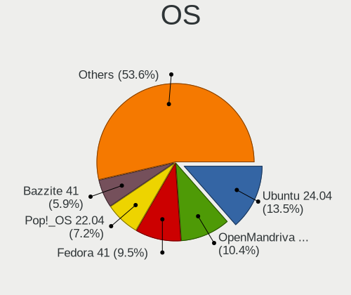
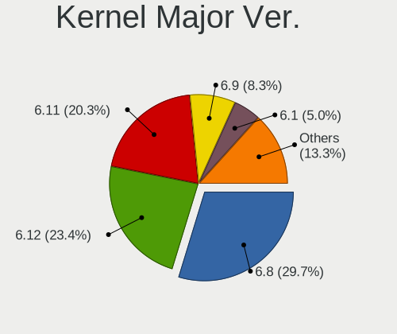
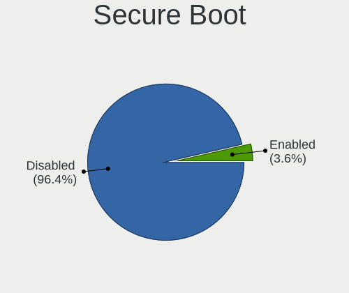
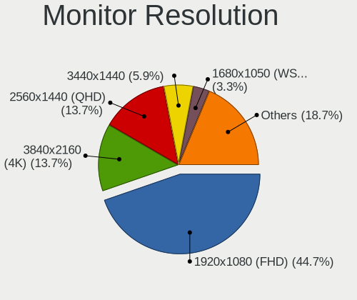
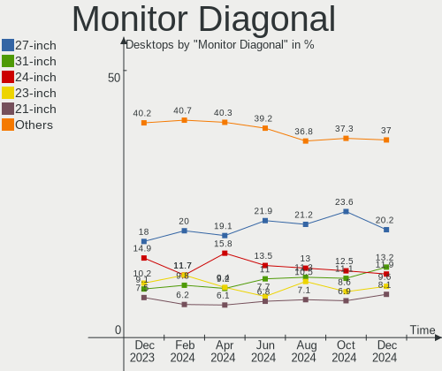
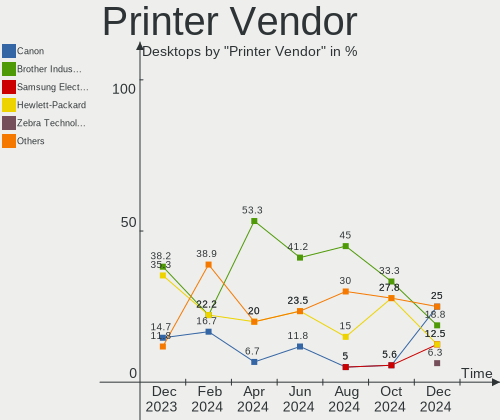
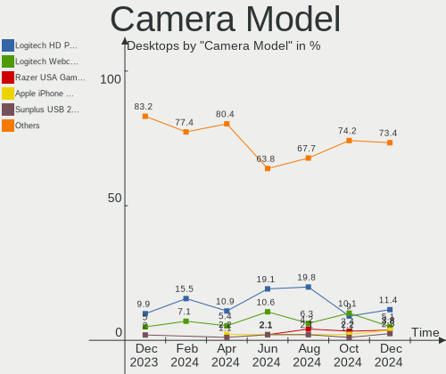

Linux in USA - Hardware Trends (Desktops)
-----------------------------------------

A project to identify most popular hardware characteristics and track their change
over time based on data collected by Linux users at https://Linux-Hardware.org.

Anyone can contribute to this report by the [hw-probe](https://github.com/linuxhw/hw-probe) tool:

    sudo -E hw-probe -all -upload

Period: Aug, 2023.

Contents
--------

* [ System ](#system)
  - [ OS                       ](#os)
  - [ OS Family                ](#os-family)
  - [ Kernel                   ](#kernel)
  - [ Kernel Family            ](#kernel-family)
  - [ Kernel Major Ver.        ](#kernel-major-ver)
  - [ Arch                     ](#arch)
  - [ DE                       ](#de)
  - [ Display Server           ](#display-server)
  - [ Display Manager          ](#display-manager)
  - [ OS Lang                  ](#os-lang)
  - [ Boot Mode                ](#boot-mode)
  - [ Filesystem               ](#filesystem)
  - [ Part. scheme             ](#part-scheme)
  - [ Dual Boot with Linux/BSD ](#dual-boot-with-linuxbsd)
  - [ Dual Boot (Win)          ](#dual-boot-win)

* [ Board ](#board)
  - [ Vendor                   ](#vendor)
  - [ Model                    ](#model)
  - [ Model Family             ](#model-family)
  - [ MFG Year                 ](#mfg-year)
  - [ Form Factor              ](#form-factor)
  - [ Secure Boot              ](#secure-boot)
  - [ Coreboot                 ](#coreboot)
  - [ RAM Size                 ](#ram-size)
  - [ RAM Used                 ](#ram-used)
  - [ Total Drives             ](#total-drives)
  - [ Has CD-ROM               ](#has-cd-rom)
  - [ Has Ethernet             ](#has-ethernet)
  - [ Has WiFi                 ](#has-wifi)
  - [ Has Bluetooth            ](#has-bluetooth)

* [ Location ](#location)
  - [ Country                  ](#country)
  - [ City                     ](#city)

* [ Drives ](#drives)
  - [ Drive Vendor             ](#drive-vendor)
  - [ Drive Model              ](#drive-model)
  - [ HDD Vendor               ](#hdd-vendor)
  - [ SSD Vendor               ](#ssd-vendor)
  - [ Drive Kind               ](#drive-kind)
  - [ Drive Connector          ](#drive-connector)
  - [ Drive Size               ](#drive-size)
  - [ Space Total              ](#space-total)
  - [ Space Used               ](#space-used)
  - [ Malfunc. Drives          ](#malfunc-drives)
  - [ Malfunc. Drive Vendor    ](#malfunc-drive-vendor)
  - [ Malfunc. HDD Vendor      ](#malfunc-hdd-vendor)
  - [ Malfunc. Drive Kind      ](#malfunc-drive-kind)
  - [ Failed Drives            ](#failed-drives)
  - [ Failed Drive Vendor      ](#failed-drive-vendor)
  - [ Drive Status             ](#drive-status)

* [ Storage controller ](#storage-controller)
  - [ Storage Vendor           ](#storage-vendor)
  - [ Storage Model            ](#storage-model)
  - [ Storage Kind             ](#storage-kind)

* [ Processor ](#processor)
  - [ CPU Vendor               ](#cpu-vendor)
  - [ CPU Model                ](#cpu-model)
  - [ CPU Model Family         ](#cpu-model-family)
  - [ CPU Cores                ](#cpu-cores)
  - [ CPU Sockets              ](#cpu-sockets)
  - [ CPU Threads              ](#cpu-threads)
  - [ CPU Op-Modes             ](#cpu-op-modes)
  - [ CPU Microcode            ](#cpu-microcode)
  - [ CPU Microarch            ](#cpu-microarch)

* [ Graphics ](#graphics)
  - [ GPU Vendor               ](#gpu-vendor)
  - [ GPU Model                ](#gpu-model)
  - [ GPU Combo                ](#gpu-combo)
  - [ GPU Driver               ](#gpu-driver)
  - [ GPU Memory               ](#gpu-memory)

* [ Monitor ](#monitor)
  - [ Monitor Vendor           ](#monitor-vendor)
  - [ Monitor Model            ](#monitor-model)
  - [ Monitor Resolution       ](#monitor-resolution)
  - [ Monitor Diagonal         ](#monitor-diagonal)
  - [ Monitor Width            ](#monitor-width)
  - [ Aspect Ratio             ](#aspect-ratio)
  - [ Monitor Area             ](#monitor-area)
  - [ Pixel Density            ](#pixel-density)
  - [ Multiple Monitors        ](#multiple-monitors)

* [ Network ](#network)
  - [ Net Controller Vendor    ](#net-controller-vendor)
  - [ Net Controller Model     ](#net-controller-model)
  - [ Wireless Vendor          ](#wireless-vendor)
  - [ Wireless Model           ](#wireless-model)
  - [ Ethernet Vendor          ](#ethernet-vendor)
  - [ Ethernet Model           ](#ethernet-model)
  - [ Net Controller Kind      ](#net-controller-kind)
  - [ Used Controller          ](#used-controller)
  - [ NICs                     ](#nics)
  - [ IPv6                     ](#ipv6)

* [ Bluetooth ](#bluetooth)
  - [ Bluetooth Vendor         ](#bluetooth-vendor)
  - [ Bluetooth Model          ](#bluetooth-model)

* [ Sound ](#sound)
  - [ Sound Vendor             ](#sound-vendor)
  - [ Sound Model              ](#sound-model)

* [ Memory ](#memory)
  - [ Memory Vendor            ](#memory-vendor)
  - [ Memory Model             ](#memory-model)
  - [ Memory Kind              ](#memory-kind)
  - [ Memory Form Factor       ](#memory-form-factor)
  - [ Memory Size              ](#memory-size)
  - [ Memory Speed             ](#memory-speed)

* [ Printers & scanners ](#printers--scanners)
  - [ Printer Vendor           ](#printer-vendor)
  - [ Printer Model            ](#printer-model)
  - [ Scanner Vendor           ](#scanner-vendor)
  - [ Scanner Model            ](#scanner-model)

* [ Camera ](#camera)
  - [ Camera Vendor            ](#camera-vendor)
  - [ Camera Model             ](#camera-model)

* [ Security ](#security)
  - [ Fingerprint Vendor       ](#fingerprint-vendor)
  - [ Fingerprint Model        ](#fingerprint-model)
  - [ Chipcard Vendor          ](#chipcard-vendor)
  - [ Chipcard Model           ](#chipcard-model)

* [ Unsupported ](#unsupported)
  - [ Unsupported Devices      ](#unsupported-devices)
  - [ Unsupported Device Types ](#unsupported-device-types)

System
------

OS
--

Installed operating systems

| Name                         | Desktops | Percent |
|------------------------------|----------|---------|
| Ubuntu 22.04                 | 53       | 13.38%  |
| Linux Mint 21.2              | 33       | 8.33%   |
| Fedora 38                    | 28       | 7.07%   |
| OpenMandriva 23.08           | 27       | 6.82%   |
| Arch Rolling                 | 23       | 5.81%   |
| Debian 12                    | 18       | 4.55%   |
| Pop!_OS 22.04                | 17       | 4.29%   |
| Zorin 16                     | 16       | 4.04%   |
| Linux Mint 21.1              | 14       | 3.54%   |
| Ubuntu 23.04                 | 10       | 2.53%   |
| ArcoLinux Rolling            | 10       | 2.53%   |
| Linux Mint 20.3              | 9        | 2.27%   |
| Xero Rolling                 | 8        | 2.02%   |
| Manjaro                      | 8        | 2.02%   |
| KDE neon 22.04               | 8        | 2.02%   |
| Ubuntu 20.04                 | 7        | 1.77%   |
| Kubuntu 22.04                | 7        | 1.77%   |
| openSUSE Tumbleweed-XXXXXXXX | 6        | 1.52%   |
| OpenMandriva 23.03           | 6        | 1.52%   |
| Kubuntu 23.04                | 6        | 1.52%   |
| Fedora 37                    | 6        | 1.52%   |
| openSUSE Leap-15.5           | 5        | 1.26%   |
| Debian 11                    | 5        | 1.26%   |
| Nobara 38                    | 4        | 1.01%   |
| Manjaro 23.0.0               | 4        | 1.01%   |
| LMDE 5                       | 4        | 1.01%   |
| Kali 2023.3                  | 4        | 1.01%   |
| OpenMandriva 23.07           | 3        | 0.76%   |
| Kali 2023.2                  | 3        | 0.76%   |
| Ubuntu MATE 22.04            | 2        | 0.51%   |
| SteamOS 3.4                  | 2        | 0.51%   |
| Rocky Linux 8.8              | 2        | 0.51%   |
| Parrot 5.3                   | 2        | 0.51%   |
| openSUSE Leap-15.4           | 2        | 0.51%   |
| OpenMandriva 4.3             | 2        | 0.51%   |
| OpenMandriva 23.01           | 2        | 0.51%   |
| Nobara 37                    | 2        | 0.51%   |
| Gentoo 2.13                  | 2        | 0.51%   |
| Garuda Linux Soaring         | 2        | 0.51%   |
| Garuda Linux Rolling         | 2        | 0.51%   |

OS Family
---------

OS without a version

| Name          | Desktops | Percent |
|---------------|----------|---------|
| Ubuntu        | 71       | 17.93%  |
| Linux Mint    | 59       | 14.9%   |
| OpenMandriva  | 40       | 10.1%   |
| Fedora        | 35       | 8.84%   |
| Debian        | 23       | 5.81%   |
| Arch          | 23       | 5.81%   |
| Pop!_OS       | 17       | 4.29%   |
| Zorin         | 16       | 4.04%   |
| Kubuntu       | 14       | 3.54%   |
| openSUSE      | 13       | 3.28%   |
| Manjaro       | 12       | 3.03%   |
| ArcoLinux     | 10       | 2.53%   |
| Xero          | 8        | 2.02%   |
| KDE neon      | 8        | 2.02%   |
| Kali          | 7        | 1.77%   |
| Nobara        | 6        | 1.52%   |
| LMDE          | 4        | 1.01%   |
| Garuda Linux  | 4        | 1.01%   |
| Gentoo        | 3        | 0.76%   |
| Ubuntu Unity  | 2        | 0.51%   |
| Ubuntu MATE   | 2        | 0.51%   |
| SteamOS       | 2        | 0.51%   |
| Rocky Linux   | 2        | 0.51%   |
| Parrot        | 2        | 0.51%   |
| EndeavourOS   | 2        | 0.51%   |
| Xubuntu       | 1        | 0.25%   |
| XeroG         | 1        | 0.25%   |
| Ultimate      | 1        | 0.25%   |
| Sdesk         | 1        | 0.25%   |
| ROSA          | 1        | 0.25%   |
| Reborn OS     | 1        | 0.25%   |
| Lilidog       | 1        | 0.25%   |
| Elementary    | 1        | 0.25%   |
| Crystal Linux | 1        | 0.25%   |
| Clear Linux   | 1        | 0.25%   |
| ChimeraOS     | 1        | 0.25%   |

Kernel
------

Version of the Linux kernel

| Version                 | Desktops | Percent |
|-------------------------|----------|---------|
| 6.2.0-26-generic        | 47       | 11.87%  |
| 5.15.0-79-generic       | 28       | 7.07%   |
| 5.15.0-78-generic       | 27       | 6.82%   |
| 6.4.11-desktop-1omv2390 | 16       | 4.04%   |
| 6.4.8-desktop-2omv2390  | 10       | 2.53%   |
| 6.4.6-76060406-generic  | 10       | 2.53%   |
| 5.19.0-50-generic       | 10       | 2.53%   |
| 6.4.11-200.fc38.x86_64  | 9        | 2.27%   |
| 5.15.0-76-generic       | 9        | 2.27%   |
| 6.2.6-desktop-1omv2390  | 8        | 2.02%   |
| 6.4.12-arch1-1          | 7        | 1.77%   |
| 6.2.0-27-generic        | 7        | 1.77%   |
| 6.1.0-11-amd64          | 7        | 1.77%   |
| 6.4.9-arch1-1           | 6        | 1.52%   |
| 6.2.6-76060206-generic  | 6        | 1.52%   |
| 6.2.0-31-generic        | 6        | 1.52%   |
| 6.1.0-10-amd64          | 6        | 1.52%   |
| 6.3.0-kali1-amd64       | 5        | 1.26%   |
| 5.4.0-156-generic       | 5        | 1.26%   |
| 5.4.0-155-generic       | 5        | 1.26%   |
| 5.15.0-82-generic       | 5        | 1.26%   |
| 6.4.8-arch1-1           | 4        | 1.01%   |
| 6.4.8-1-default         | 4        | 1.01%   |
| 6.4.7-200.fc38.x86_64   | 4        | 1.01%   |
| 6.4.6-200.fc38.x86_64   | 4        | 1.01%   |
| 6.4.11-arch2-1          | 4        | 1.01%   |
| 6.1.44-1-MANJARO        | 4        | 1.01%   |
| 5.19.0-46-generic       | 4        | 1.01%   |
| 6.4.9-200.fc38.x86_64   | 3        | 0.76%   |
| 6.4.7-arch1-2           | 3        | 0.76%   |
| 6.4.3-arch1-2           | 3        | 0.76%   |
| 6.4.11-zen2-1-zen       | 3        | 0.76%   |
| 6.4.11-arch1-1          | 3        | 0.76%   |
| 6.4.8-zen1-1-zen        | 2        | 0.51%   |
| 6.4.12-200.fc38.x86_64  | 2        | 0.51%   |
| 6.4.11-060411-generic   | 2        | 0.51%   |
| 6.4.10-zen2-1-zen       | 2        | 0.51%   |
| 6.4.10-arch1-1          | 2        | 0.51%   |
| 6.4.10-200.fc38.x86_64  | 2        | 0.51%   |
| 6.3.5-desktop-3omv2390  | 2        | 0.51%   |

Kernel Family
-------------

Linux kernel without a distro release

| Version  | Desktops | Percent |
|----------|----------|---------|
| 5.15.0   | 73       | 18.43%  |
| 6.2.0    | 62       | 15.66%  |
| 6.4.11   | 40       | 10.1%   |
| 6.4.8    | 23       | 5.81%   |
| 6.1.0    | 19       | 4.8%    |
| 5.19.0   | 18       | 4.55%   |
| 6.4.6    | 16       | 4.04%   |
| 6.4.9    | 15       | 3.79%   |
| 6.2.6    | 14       | 3.54%   |
| 5.4.0    | 12       | 3.03%   |
| 6.4.10   | 10       | 2.53%   |
| 6.4.7    | 9        | 2.27%   |
| 6.4.12   | 9        | 2.27%   |
| 6.3.12   | 7        | 1.77%   |
| 5.14.21  | 7        | 1.77%   |
| 6.3.0    | 6        | 1.52%   |
| 6.1.44   | 5        | 1.26%   |
| 5.10.0   | 5        | 1.26%   |
| 6.4.3    | 4        | 1.01%   |
| 6.2.16   | 4        | 1.01%   |
| 6.4.4    | 3        | 0.76%   |
| 6.4.0    | 3        | 0.76%   |
| 6.1.41   | 3        | 0.76%   |
| 6.5.0    | 2        | 0.51%   |
| 6.3.7    | 2        | 0.51%   |
| 6.3.5    | 2        | 0.51%   |
| 6.1.1    | 2        | 0.51%   |
| 5.16.13  | 2        | 0.51%   |
| 5.13.0   | 2        | 0.51%   |
| 4.18.0   | 2        | 0.51%   |
| 6.3.9    | 1        | 0.25%   |
| 6.3.4    | 1        | 0.25%   |
| 6.3.3.15 | 1        | 0.25%   |
| 6.3.3    | 1        | 0.25%   |
| 6.3.11   | 1        | 0.25%   |
| 6.2.10   | 1        | 0.25%   |
| 6.1.7    | 1        | 0.25%   |
| 6.1.30   | 1        | 0.25%   |
| 6.1.13   | 1        | 0.25%   |
| 6.0.19   | 1        | 0.25%   |

Kernel Major Ver.
-----------------

Linux kernel major version

| Version | Desktops | Percent |
|---------|----------|---------|
| 6.4     | 132      | 33.33%  |
| 6.2     | 81       | 20.45%  |
| 5.15    | 74       | 18.69%  |
| 6.1     | 32       | 8.08%   |
| 6.3     | 21       | 5.3%    |
| 5.19    | 18       | 4.55%   |
| 5.4     | 12       | 3.03%   |
| 5.14    | 7        | 1.77%   |
| 5.10    | 5        | 1.26%   |
| 5.16    | 3        | 0.76%   |
| 6.5     | 2        | 0.51%   |
| 5.13    | 2        | 0.51%   |
| 4.18    | 2        | 0.51%   |
| 6.3.3   | 1        | 0.25%   |
| 6.0     | 1        | 0.25%   |
| 5.8     | 1        | 0.25%   |
| 5.17    | 1        | 0.25%   |
| 4.15    | 1        | 0.25%   |

Arch
----

OS architecture (x86_64, i586, etc.)

| Name   | Desktops | Percent |
|--------|----------|---------|
| x86_64 | 396      | 100%    |

DE
--

Desktop Environment

| Name             | Desktops | Percent |
|------------------|----------|---------|
| GNOME            | 149      | 37.63%  |
| KDE5             | 117      | 29.55%  |
| X-Cinnamon       | 53       | 13.38%  |
| XFCE             | 17       | 4.29%   |
| Unknown          | 14       | 3.54%   |
| MATE             | 12       | 3.03%   |
| LXQt             | 6        | 1.52%   |
| i3               | 5        | 1.26%   |
| Xpra             | 3        | 0.76%   |
| Hyprland         | 3        | 0.76%   |
| Budgie           | 3        | 0.76%   |
| Unity            | 2        | 0.51%   |
| GNOME Classic    | 2        | 0.51%   |
| awesome          | 2        | 0.51%   |
| Pantheon         | 1        | 0.25%   |
| LXDE             | 1        | 0.25%   |
| lightdm-xsession | 1        | 0.25%   |
| KDE4             | 1        | 0.25%   |
| KDE              | 1        | 0.25%   |
| GNOME Flashback  | 1        | 0.25%   |
| dwm              | 1        | 0.25%   |
| Cinnamon         | 1        | 0.25%   |

Display Server
--------------

X11 or Wayland

| Name    | Desktops | Percent |
|---------|----------|---------|
| X11     | 258      | 65.15%  |
| Wayland | 117      | 29.55%  |
| Unknown | 12       | 3.03%   |
| Tty     | 9        | 2.27%   |

Display Manager
---------------

SDDM, LightDM, etc.

| Name    | Desktops | Percent |
|---------|----------|---------|
| Unknown | 179      | 45.2%   |
| SDDM    | 87       | 21.97%  |
| GDM3    | 59       | 14.9%   |
| LightDM | 50       | 12.63%  |
| GDM     | 19       | 4.8%    |
| KDM     | 1        | 0.25%   |
| EMPTTY  | 1        | 0.25%   |

OS Lang
-------

Language

| Lang    | Desktops | Percent |
|---------|----------|---------|
| en_US   | 367      | 92.68%  |
| C       | 12       | 3.03%   |
| Unknown | 8        | 2.02%   |
| en_CA   | 3        | 0.76%   |
| it_IT   | 2        | 0.51%   |
| en_GB   | 2        | 0.51%   |
| POSIX   | 1        | 0.25%   |
| fr_FR   | 1        | 0.25%   |

Boot Mode
---------

EFI or BIOS

| Mode | Desktops | Percent |
|------|----------|---------|
| BIOS | 206      | 52.02%  |
| EFI  | 190      | 47.98%  |

Filesystem
----------

Type of filesystem

| Type    | Desktops | Percent |
|---------|----------|---------|
| Ext4    | 222      | 56.06%  |
| Btrfs   | 77       | 19.44%  |
| Tmpfs   | 55       | 13.89%  |
| Overlay | 28       | 7.07%   |
| Xfs     | 7        | 1.77%   |
| Jfs     | 3        | 0.76%   |
| Ext3    | 2        | 0.51%   |
| Zfs     | 1        | 0.25%   |
| F2fs    | 1        | 0.25%   |

Part. scheme
------------

Scheme of partitioning

| Type    | Desktops | Percent |
|---------|----------|---------|
| GPT     | 210      | 53.03%  |
| Unknown | 163      | 41.16%  |
| MBR     | 23       | 5.81%   |

Dual Boot with Linux/BSD
------------------------

Hosting more than one Linux/BSD

| Dual boot | Desktops | Percent |
|-----------|----------|---------|
| No        | 320      | 80.81%  |
| Yes       | 76       | 19.19%  |

Dual Boot (Win)
---------------

Hosting Linux and Windows

| Dual boot | Desktops | Percent |
|-----------|----------|---------|
| No        | 307      | 77.53%  |
| Yes       | 89       | 22.47%  |

Board
-----

Vendor
------

Motherboard manufacturer

| Name                | Desktops | Percent |
|---------------------|----------|---------|
| ASUSTek Computer    | 98       | 24.75%  |
| Dell                | 53       | 13.38%  |
| Gigabyte Technology | 51       | 12.88%  |
| MSI                 | 50       | 12.63%  |
| Hewlett-Packard     | 45       | 11.36%  |
| ASRock              | 25       | 6.31%   |
| Lenovo              | 17       | 4.29%   |
| Intel               | 10       | 2.53%   |
| Unknown             | 6        | 1.52%   |
| Acer                | 5        | 1.26%   |
| Gateway             | 4        | 1.01%   |
| Alienware           | 4        | 1.01%   |
| Pegatron            | 3        | 0.76%   |
| AZW                 | 3        | 0.76%   |
| Apple               | 3        | 0.76%   |
| System76            | 2        | 0.51%   |
| Supermicro          | 2        | 0.51%   |
| NZXT                | 2        | 0.51%   |
| Foxconn             | 2        | 0.51%   |
| eMachines           | 2        | 0.51%   |
| Biostar             | 2        | 0.51%   |
| Red Hat             | 1        | 0.25%   |
| JHZD                | 1        | 0.25%   |
| Huanan              | 1        | 0.25%   |
| HPE                 | 1        | 0.25%   |
| AOpen               | 1        | 0.25%   |
| AMI                 | 1        | 0.25%   |
| Acidanthera         | 1        | 0.25%   |

Model
-----

Motherboard model

| Name                                      | Desktops | Percent |
|-------------------------------------------|----------|---------|
| Dell OptiPlex 7010                        | 6        | 1.52%   |
| ASUS TUF Gaming X570-PLUS                 | 6        | 1.52%   |
| ASUS All Series                           | 6        | 1.52%   |
| Unknown                                   | 6        | 1.52%   |
| MSI MS-7C91                               | 5        | 1.26%   |
| Dell OptiPlex 7050                        | 4        | 1.01%   |
| ASUS M5A97 R2.0                           | 4        | 1.01%   |
| HP Z620 Workstation                       | 3        | 0.76%   |
| HP Compaq 6005 Pro MT PC                  | 3        | 0.76%   |
| Dell OptiPlex 990                         | 3        | 0.76%   |
| Dell OptiPlex 3040                        | 3        | 0.76%   |
| Dell Inspiron 3847                        | 3        | 0.76%   |
| ASUS ROG STRIX X670E-E GAMING WIFI        | 3        | 0.76%   |
| ASUS ROG STRIX B550-F GAMING              | 3        | 0.76%   |
| System76 Thelio Major                     | 2        | 0.51%   |
| NZXT N7 B550                              | 2        | 0.51%   |
| MSI MS-7C95                               | 2        | 0.51%   |
| MSI MS-7C56                               | 2        | 0.51%   |
| MSI MS-7C37                               | 2        | 0.51%   |
| MSI MS-7C02                               | 2        | 0.51%   |
| MSI MS-7B79                               | 2        | 0.51%   |
| MSI MPG H410 Trident 3 (MS-B932)          | 2        | 0.51%   |
| Lenovo ThinkStation P520 30BFS44D00       | 2        | 0.51%   |
| Lenovo ThinkCentre E73 10AS00DDUS         | 2        | 0.51%   |
| HP Z420 Workstation                       | 2        | 0.51%   |
| HP Z220 SFF Workstation                   | 2        | 0.51%   |
| HP Victus by 15L Gaming Desktop TG02-0xxx | 2        | 0.51%   |
| Gigabyte Z390 AORUS PRO WIFI              | 2        | 0.51%   |
| Gigabyte X570 AORUS MASTER                | 2        | 0.51%   |
| Gigabyte X299 AORUS Gaming                | 2        | 0.51%   |
| Gigabyte B650 AORUS PRO AX                | 2        | 0.51%   |
| Gigabyte B560 DS3H AC-Y1                  | 2        | 0.51%   |
| Dell OptiPlex 9020                        | 2        | 0.51%   |
| Dell OptiPlex 7040                        | 2        | 0.51%   |
| Dell OptiPlex 3020                        | 2        | 0.51%   |
| ASUS TUF Gaming B550-PLUS                 | 2        | 0.51%   |
| ASUS ROG STRIX Z390-E GAMING              | 2        | 0.51%   |
| ASUS ROG STRIX X670E-A GAMING WIFI        | 2        | 0.51%   |
| ASUS ROG CROSSHAIR VIII DARK HERO         | 2        | 0.51%   |
| ASUS PRIME X570-P                         | 2        | 0.51%   |

Model Family
------------

Motherboard model prefix

| Name                | Desktops | Percent |
|---------------------|----------|---------|
| Dell OptiPlex       | 33       | 8.33%   |
| ASUS ROG            | 30       | 7.58%   |
| ASUS PRIME          | 18       | 4.55%   |
| ASUS TUF            | 16       | 4.04%   |
| Dell Inspiron       | 9        | 2.27%   |
| HP EliteDesk        | 8        | 2.02%   |
| HP Compaq           | 8        | 2.02%   |
| Lenovo ThinkStation | 6        | 1.52%   |
| ASUS All            | 6        | 1.52%   |
| Unknown             | 6        | 1.52%   |
| MSI MS-7C91         | 5        | 1.26%   |
| Lenovo ThinkCentre  | 5        | 1.26%   |
| Lenovo Legion       | 5        | 1.26%   |
| Gigabyte Z390       | 5        | 1.26%   |
| Gigabyte X570       | 5        | 1.26%   |
| HP Pavilion         | 4        | 1.01%   |
| ASUS M5A97          | 4        | 1.01%   |
| Acer Aspire         | 4        | 1.01%   |
| HP Z620             | 3        | 0.76%   |
| HP ProDesk          | 3        | 0.76%   |
| Gigabyte B650       | 3        | 0.76%   |
| Dell XPS            | 3        | 0.76%   |
| Dell Vostro         | 3        | 0.76%   |
| Dell Precision      | 3        | 0.76%   |
| ASRock X570         | 3        | 0.76%   |
| Alienware Aurora    | 3        | 0.76%   |
| System76 Thelio     | 2        | 0.51%   |
| NZXT N7             | 2        | 0.51%   |
| MSI MS-7C95         | 2        | 0.51%   |
| MSI MS-7C56         | 2        | 0.51%   |
| MSI MS-7C37         | 2        | 0.51%   |
| MSI MS-7C02         | 2        | 0.51%   |
| MSI MS-7B79         | 2        | 0.51%   |
| MSI MPG             | 2        | 0.51%   |
| HP Z420             | 2        | 0.51%   |
| HP Z220             | 2        | 0.51%   |
| HP Victus           | 2        | 0.51%   |
| HP OMEN             | 2        | 0.51%   |
| Gigabyte X299       | 2        | 0.51%   |
| Gigabyte B560       | 2        | 0.51%   |

MFG Year
--------

Motherboard manufacture year

| Year | Desktops | Percent |
|------|----------|---------|
| 2022 | 44       | 11.11%  |
| 2020 | 40       | 10.1%   |
| 2021 | 36       | 9.09%   |
| 2019 | 35       | 8.84%   |
| 2018 | 35       | 8.84%   |
| 2012 | 31       | 7.83%   |
| 2017 | 25       | 6.31%   |
| 2013 | 24       | 6.06%   |
| 2023 | 19       | 4.8%    |
| 2014 | 18       | 4.55%   |
| 2016 | 17       | 4.29%   |
| 2010 | 17       | 4.29%   |
| 2015 | 15       | 3.79%   |
| 2011 | 14       | 3.54%   |
| 2009 | 11       | 2.78%   |
| 2008 | 9        | 2.27%   |
| 2007 | 5        | 1.26%   |
| 2006 | 1        | 0.25%   |

Form Factor
-----------

Physical design of the computer

| Name    | Desktops | Percent |
|---------|----------|---------|
| Desktop | 396      | 100%    |

Secure Boot
-----------

Enabled or disabled

| State    | Desktops | Percent |
|----------|----------|---------|
| Disabled | 388      | 97.98%  |
| Enabled  | 8        | 2.02%   |

Coreboot
--------

Have coreboot on board

| Used | Desktops | Percent |
|------|----------|---------|
| No   | 396      | 100%    |

RAM Size
--------

Total RAM memory

| Size in GB      | Desktops | Percent |
|-----------------|----------|---------|
| 32.01-64.0      | 105      | 26.52%  |
| 16.01-24.0      | 101      | 25.51%  |
| 64.01-256.0     | 60       | 15.15%  |
| 4.01-8.0        | 41       | 10.35%  |
| 8.01-16.0       | 41       | 10.35%  |
| 3.01-4.0        | 19       | 4.8%    |
| 24.01-32.0      | 19       | 4.8%    |
| More than 256.0 | 4        | 1.01%   |
| 2.01-3.0        | 3        | 0.76%   |
| 1.01-2.0        | 2        | 0.51%   |
| 0.01-0.5        | 1        | 0.25%   |

RAM Used
--------

Used RAM memory

| Used GB    | Desktops | Percent |
|------------|----------|---------|
| 2.01-3.0   | 103      | 26.01%  |
| 1.01-2.0   | 92       | 23.23%  |
| 4.01-8.0   | 85       | 21.46%  |
| 3.01-4.0   | 57       | 14.39%  |
| 8.01-16.0  | 33       | 8.33%   |
| 0.51-1.0   | 12       | 3.03%   |
| 16.01-24.0 | 6        | 1.52%   |
| 32.01-64.0 | 3        | 0.76%   |
| 24.01-32.0 | 3        | 0.76%   |
| 0.01-0.5   | 2        | 0.51%   |

Total Drives
------------

Number of drives on board

| Drives | Desktops | Percent |
|--------|----------|---------|
| 1      | 134      | 33.84%  |
| 2      | 104      | 26.26%  |
| 3      | 61       | 15.4%   |
| 4      | 47       | 11.87%  |
| 5      | 24       | 6.06%   |
| 6      | 8        | 2.02%   |
| 0      | 7        | 1.77%   |
| 8      | 4        | 1.01%   |
| 7      | 3        | 0.76%   |
| 13     | 2        | 0.51%   |
| 11     | 1        | 0.25%   |
| 10     | 1        | 0.25%   |

Has CD-ROM
----------

Has CD-ROM on board

| Presented | Desktops | Percent |
|-----------|----------|---------|
| No        | 236      | 59.6%   |
| Yes       | 160      | 40.4%   |

Has Ethernet
------------

Has Ethernet on board

| Presented | Desktops | Percent |
|-----------|----------|---------|
| Yes       | 391      | 98.74%  |
| No        | 5        | 1.26%   |

Has WiFi
--------

Has WiFi module

| Presented | Desktops | Percent |
|-----------|----------|---------|
| Yes       | 237      | 59.85%  |
| No        | 159      | 40.15%  |

Has Bluetooth
-------------

Has Bluetooth module

| Presented | Desktops | Percent |
|-----------|----------|---------|
| Yes       | 211      | 53.28%  |
| No        | 185      | 46.72%  |

Location
--------

Country
-------

Geographic location (country)

| Country | Desktops | Percent |
|---------|----------|---------|
| USA     | 396      | 100%    |

City
----

Geographic location (city)

| City           | Desktops | Percent |
|----------------|----------|---------|
| Los Angeles    | 8        | 2.02%   |
| Denver         | 6        | 1.52%   |
| Spokane        | 5        | 1.26%   |
| Seattle        | 5        | 1.26%   |
| Houston        | 5        | 1.26%   |
| Dallas         | 5        | 1.26%   |
| Vero Beach     | 4        | 1.01%   |
| New York       | 4        | 1.01%   |
| Cleveland      | 4        | 1.01%   |
| Tucson         | 3        | 0.76%   |
| Tacoma         | 3        | 0.76%   |
| Sterling       | 3        | 0.76%   |
| St Louis       | 3        | 0.76%   |
| San Francisco  | 3        | 0.76%   |
| Pine Island    | 3        | 0.76%   |
| Oak Park       | 3        | 0.76%   |
| Minneapolis    | 3        | 0.76%   |
| Milford        | 3        | 0.76%   |
| Marysville     | 3        | 0.76%   |
| Cincinnati     | 3        | 0.76%   |
| Beverly Hills  | 3        | 0.76%   |
| Bangor         | 3        | 0.76%   |
| Atlanta        | 3        | 0.76%   |
| Ashburn        | 3        | 0.76%   |
| Youngstown     | 2        | 0.51%   |
| Tamarac        | 2        | 0.51%   |
| St. Petersburg | 2        | 0.51%   |
| Simpsonville   | 2        | 0.51%   |
| Shoreview      | 2        | 0.51%   |
| Santa Rosa     | 2        | 0.51%   |
| Richardson     | 2        | 0.51%   |
| Portland       | 2        | 0.51%   |
| Pensacola      | 2        | 0.51%   |
| Orlando        | 2        | 0.51%   |
| Omaha          | 2        | 0.51%   |
| O'Fallon       | 2        | 0.51%   |
| Niles          | 2        | 0.51%   |
| Nashville      | 2        | 0.51%   |
| Miami          | 2        | 0.51%   |
| Las Vegas      | 2        | 0.51%   |

Drives
------

Drive Vendor
------------

Hard drive vendors

| Vendor                      | Desktops | Drives | Percent |
|-----------------------------|----------|--------|---------|
| Samsung Electronics         | 118      | 197    | 15.75%  |
| Seagate                     | 117      | 155    | 15.62%  |
| WDC                         | 108      | 166    | 14.42%  |
| Sandisk                     | 68       | 75     | 9.08%   |
| Toshiba                     | 36       | 41     | 4.81%   |
| Crucial                     | 36       | 45     | 4.81%   |
| SK hynix                    | 24       | 30     | 3.2%    |
| Phison Electronics          | 23       | 28     | 3.07%   |
| Kingston                    | 17       | 18     | 2.27%   |
| Hitachi                     | 17       | 19     | 2.27%   |
| Intel                       | 14       | 15     | 1.87%   |
| Micron/Crucial Technology   | 13       | 17     | 1.74%   |
| PNY                         | 12       | 13     | 1.6%    |
| HGST                        | 12       | 21     | 1.6%    |
| Unknown                     | 11       | 13     | 1.47%   |
| China                       | 10       | 10     | 1.34%   |
| A-DATA Technology           | 10       | 11     | 1.34%   |
| SPCC                        | 9        | 10     | 1.2%    |
| Hewlett-Packard             | 6        | 6      | 0.8%    |
| Fanxiang                    | 6        | 6      | 0.8%    |
| Team                        | 5        | 5      | 0.67%   |
| Silicon Motion              | 5        | 5      | 0.67%   |
| OCZ                         | 5        | 5      | 0.67%   |
| T-FORCE                     | 3        | 4      | 0.4%    |
| Realtek Semiconductor       | 3        | 3      | 0.4%    |
| Phison                      | 3        | 4      | 0.4%    |
| Micron Technology           | 3        | 3      | 0.4%    |
| Maxtor                      | 3        | 3      | 0.4%    |
| Kingston Technology Company | 3        | 3      | 0.4%    |
| WD MediaMax                 | 2        | 2      | 0.27%   |
| Timetec                     | 2        | 3      | 0.27%   |
| Super Talent                | 2        | 2      | 0.27%   |
| Lexar                       | 2        | 2      | 0.27%   |
| Apple                       | 2        | 2      | 0.27%   |
| ADATA Technology            | 2        | 2      | 0.27%   |
| YHJC                        | 1        | 1      | 0.13%   |
| WDC WDS                     | 1        | 1      | 0.13%   |
| USB3.0                      | 1        | 1      | 0.13%   |
| SSK                         | 1        | 1      | 0.13%   |
| SHGP31-1                    | 1        | 1      | 0.13%   |

Drive Model
-----------

Hard drive models

| Model                                                 | Desktops | Percent |
|-------------------------------------------------------|----------|---------|
| Samsung NVMe SSD Controller SM981/PM981/PM983 500GB   | 27       | 3.03%   |
| Samsung NVMe SSD Controller PM9A1/PM9A3/980PRO 1024GB | 20       | 2.24%   |
| Seagate ST2000DM008-2FR102 2TB                        | 12       | 1.35%   |
| Sandisk WD Blue SN550 NVMe SSD 250GB                  | 11       | 1.23%   |
| Samsung SSD 850 EVO 500GB                             | 10       | 1.12%   |
| Phison E12 NVMe Controller 256GB                      | 10       | 1.12%   |
| Micron/Crucial P2 NVMe PCIe SSD 1TB                   | 10       | 1.12%   |
| Seagate ST1000DM010-2EP102 1TB                        | 9        | 1.01%   |
| Crucial CT1000MX500SSD1 1TB                           | 9        | 1.01%   |
| Samsung SSD 860 EVO 500GB                             | 8        | 0.9%    |
| Samsung NVMe SSD Controller SM961/PM961/SM963 1024GB  | 8        | 0.9%    |
| WDC WD10EZEX-08WN4A0 1TB                              | 7        | 0.78%   |
| SK hynix SHPP41-2000GM 2TB                            | 7        | 0.78%   |
| Samsung SSD 870 EVO 1TB                               | 7        | 0.78%   |
| Samsung SSD 850 EVO 250GB                             | 7        | 0.78%   |
| Crucial CT500MX500SSD1 500GB                          | 7        | 0.78%   |
| Unknown SD/MMC/MS PRO 1GB                             | 6        | 0.67%   |
| Toshiba DT01ACA200 2TB                                | 6        | 0.67%   |
| Seagate ST2000DM006-2DM164 2TB                        | 6        | 0.67%   |
| Samsung SSD 980 1TB                                   | 6        | 0.67%   |
| Samsung SSD 860 EVO 1TB                               | 6        | 0.67%   |
| Toshiba DT01ACA100 1TB                                | 5        | 0.56%   |
| Silicon Motion SM2263EN/SM2263XT SSD Controller 256GB | 5        | 0.56%   |
| Sandisk WD_BLACK SN770 1TB                            | 5        | 0.56%   |
| Sandisk WD Black SN750 / PC SN730 NVMe SSD 1024GB     | 5        | 0.56%   |
| PNY CS900 240GB SSD                                   | 5        | 0.56%   |
| Phison PS5013 E13 NVMe Controller 512GB               | 5        | 0.56%   |
| Seagate ST500DM002-1BD142 500GB                       | 4        | 0.45%   |
| Seagate ST4000DM004-2CV104 4TB                        | 4        | 0.45%   |
| Seagate ST3500630AS 500GB                             | 4        | 0.45%   |
| Seagate Expansion Desk 2TB                            | 4        | 0.45%   |
| Sandisk WD Blue SN570 1TB                             | 4        | 0.45%   |
| Sandisk WD Black SN850 256GB                          | 4        | 0.45%   |
| Sandisk WD Black 2018/SN750 / PC SN720 NVMe SSD 512GB | 4        | 0.45%   |
| SanDisk SSD PLUS 1000GB                               | 4        | 0.45%   |
| Samsung SSD 980 PRO 2TB                               | 4        | 0.45%   |
| Samsung SSD 870 EVO 4TB                               | 4        | 0.45%   |
| Samsung SSD 870 EVO 2TB                               | 4        | 0.45%   |
| Samsung SSD 860 EVO 2TB                               | 4        | 0.45%   |
| Crucial CT1000BX500SSD1 1TB                           | 4        | 0.45%   |

HDD Vendor
----------

Hard disk drive vendors

| Vendor              | Desktops | Drives | Percent |
|---------------------|----------|--------|---------|
| Seagate             | 109      | 141    | 37.98%  |
| WDC                 | 92       | 134    | 32.06%  |
| Toshiba             | 33       | 37     | 11.5%   |
| Hitachi             | 17       | 19     | 5.92%   |
| HGST                | 12       | 21     | 4.18%   |
| Unknown             | 7        | 7      | 2.44%   |
| Hewlett-Packard     | 4        | 4      | 1.39%   |
| Maxtor              | 3        | 3      | 1.05%   |
| WD MediaMax         | 2        | 2      | 0.7%    |
| Samsung Electronics | 2        | 2      | 0.7%    |
| USB3.0              | 1        | 1      | 0.35%   |
| SABRENT             | 1        | 1      | 0.35%   |
| Maxone              | 1        | 1      | 0.35%   |
| MaxDigital          | 1        | 1      | 0.35%   |
| LaCie               | 1        | 1      | 0.35%   |
| IBM/Hitachi         | 1        | 1      | 0.35%   |

SSD Vendor
----------

Solid state drive vendors

| Vendor              | Desktops | Drives | Percent |
|---------------------|----------|--------|---------|
| Samsung Electronics | 69       | 96     | 26.64%  |
| Crucial             | 34       | 41     | 13.13%  |
| WDC                 | 22       | 29     | 8.49%   |
| SanDisk             | 21       | 23     | 8.11%   |
| Kingston            | 15       | 16     | 5.79%   |
| PNY                 | 12       | 13     | 4.63%   |
| China               | 10       | 10     | 3.86%   |
| A-DATA Technology   | 10       | 10     | 3.86%   |
| SK hynix            | 8        | 8      | 3.09%   |
| SPCC                | 6        | 7      | 2.32%   |
| Intel               | 6        | 6      | 2.32%   |
| OCZ                 | 5        | 5      | 1.93%   |
| Team                | 4        | 4      | 1.54%   |
| Fanxiang            | 4        | 4      | 1.54%   |
| Toshiba             | 3        | 3      | 1.16%   |
| Timetec             | 2        | 3      | 0.77%   |
| T-FORCE             | 2        | 2      | 0.77%   |
| Super Talent        | 2        | 2      | 0.77%   |
| Seagate             | 2        | 2      | 0.77%   |
| Lexar               | 2        | 2      | 0.77%   |
| Hewlett-Packard     | 2        | 2      | 0.77%   |
| WDC WDS             | 1        | 1      | 0.39%   |
| SD                  | 1        | 1      | 0.39%   |
| PNY USB             | 1        | 1      | 0.39%   |
| Plextor             | 1        | 1      | 0.39%   |
| NGFF                | 1        | 1      | 0.39%   |
| Neo                 | 1        | 1      | 0.39%   |
| Mushkin             | 1        | 1      | 0.39%   |
| Micron Technology   | 1        | 1      | 0.39%   |
| LITEON              | 1        | 5      | 0.39%   |
| KingSpec            | 1        | 1      | 0.39%   |
| KingFast            | 1        | 1      | 0.39%   |
| KingDian            | 1        | 1      | 0.39%   |
| JMicron Technology  | 1        | 1      | 0.39%   |
| Intenso             | 1        | 1      | 0.39%   |
| Inland              | 1        | 1      | 0.39%   |
| Corsair             | 1        | 1      | 0.39%   |
| Apple               | 1        | 1      | 0.39%   |
| Acer                | 1        | 1      | 0.39%   |

Drive Kind
----------

HDD or SSD

| Kind    | Desktops | Drives | Percent |
|---------|----------|--------|---------|
| HDD     | 216      | 376    | 34.02%  |
| SSD     | 213      | 310    | 33.54%  |
| NVMe    | 189      | 278    | 29.76%  |
| Unknown | 16       | 19     | 2.52%   |
| MMC     | 1        | 2      | 0.16%   |

Drive Connector
---------------

SATA, SAS, NVMe, etc.

| Type | Desktops | Drives | Percent |
|------|----------|--------|---------|
| SATA | 322      | 649    | 57.91%  |
| NVMe | 189      | 275    | 33.99%  |
| SAS  | 44       | 59     | 7.91%   |
| MMC  | 1        | 2      | 0.18%   |

Drive Size
----------

Size of hard drive

| Size in TB | Desktops | Drives | Percent |
|------------|----------|--------|---------|
| 0.01-0.5   | 180      | 250    | 35.43%  |
| 0.51-1.0   | 168      | 215    | 33.07%  |
| 1.01-2.0   | 79       | 92     | 15.55%  |
| 3.01-4.0   | 32       | 46     | 6.3%    |
| 4.01-10.0  | 25       | 47     | 4.92%   |
| 2.01-3.0   | 17       | 23     | 3.35%   |
| 10.01-20.0 | 7        | 13     | 1.38%   |

Space Total
-----------

Amount of disk space available on the file system

| Size in GB     | Desktops | Percent |
|----------------|----------|---------|
| More than 3000 | 95       | 23.99%  |
| 501-1000       | 80       | 20.2%   |
| 1001-2000      | 52       | 13.13%  |
| 251-500        | 50       | 12.63%  |
| 101-250        | 48       | 12.12%  |
| 2001-3000      | 21       | 5.3%    |
| 1-20           | 16       | 4.04%   |
| 21-50          | 13       | 3.28%   |
| Unknown        | 13       | 3.28%   |
| 51-100         | 8        | 2.02%   |

Space Used
----------

Amount of used disk space

| Used GB        | Desktops | Percent |
|----------------|----------|---------|
| 1-20           | 106      | 26.77%  |
| 21-50          | 52       | 13.13%  |
| 101-250        | 39       | 9.85%   |
| 51-100         | 37       | 9.34%   |
| 251-500        | 34       | 8.59%   |
| 501-1000       | 34       | 8.59%   |
| More than 3000 | 30       | 7.58%   |
| 1001-2000      | 29       | 7.32%   |
| 2001-3000      | 22       | 5.56%   |
| Unknown        | 13       | 3.28%   |

Malfunc. Drives
---------------

Drive models with a malfunction

| Model                                                     | Desktops | Drives | Percent |
|-----------------------------------------------------------|----------|--------|---------|
| Toshiba DT01ACA100 1TB                                    | 2        | 2      | 4.55%   |
| A-DATA Technology SU635 240GB SSD                         | 2        | 2      | 4.55%   |
| WDC WD60EFRX-68MYMN1 6TB                                  | 1        | 1      | 2.27%   |
| WDC WD4000FYYZ-01UL1B2 4TB                                | 1        | 2      | 2.27%   |
| WDC WD4000FYYZ-01UL1B1 4TB                                | 1        | 1      | 2.27%   |
| WDC WD30EZRX-00MMMB0 3TB                                  | 1        | 1      | 2.27%   |
| WDC WD15EADS-00S2B0 1TB                                   | 1        | 1      | 2.27%   |
| WDC WD10EZEX-08WN4A0 1TB                                  | 1        | 1      | 2.27%   |
| WDC WD10EZEX-00RKKA0 1TB                                  | 1        | 1      | 2.27%   |
| WDC WD10EZEX-00BN5A0 1TB                                  | 1        | 1      | 2.27%   |
| WDC WD10EAVS-00D7B1 1TB                                   | 1        | 1      | 2.27%   |
| Toshiba DT01ACA300 3TB                                    | 1        | 1      | 2.27%   |
| SPCC M.2 PCIe SSD 256GB                                   | 1        | 1      | 2.27%   |
| Seagate ST9500325AS 500GB                                 | 1        | 1      | 2.27%   |
| Seagate ST500DM002-1BD142 500GB                           | 1        | 1      | 2.27%   |
| Seagate ST3500841A 500GB                                  | 1        | 1      | 2.27%   |
| Seagate ST33000651NS 3TB                                  | 1        | 1      | 2.27%   |
| Seagate ST320LT012-9WS14C 320GB                           | 1        | 1      | 2.27%   |
| Seagate ST31000333AS 1TB                                  | 1        | 2      | 2.27%   |
| Seagate ST3000DM008-2DM166 3TB                            | 1        | 2      | 2.27%   |
| Seagate ST2000DX001-1CM164 2TB                            | 1        | 1      | 2.27%   |
| Seagate ST2000DM006-2DM164 2TB                            | 1        | 1      | 2.27%   |
| Seagate ST2000DL003-9VT166 2TB                            | 1        | 1      | 2.27%   |
| Seagate ST1000DM010-2EP102 1TB                            | 1        | 1      | 2.27%   |
| Seagate ST1000DM003-1CH162 1TB                            | 1        | 1      | 2.27%   |
| SanDisk SSD PLUS 1000GB                                   | 1        | 1      | 2.27%   |
| SanDisk SDSSDX240GG25 240GB                               | 1        | 1      | 2.27%   |
| Samsung Electronics SSD 870 EVO 2TB                       | 1        | 1      | 2.27%   |
| Samsung Electronics SSD 860 EVO 500GB                     | 1        | 1      | 2.27%   |
| Samsung Electronics SSD 840 Series 500GB                  | 1        | 1      | 2.27%   |
| Samsung Electronics SP2004C 200GB                         | 1        | 1      | 2.27%   |
| Realtek Semiconductor RTS5763DL NVMe SSD Controller 512GB | 1        | 1      | 2.27%   |
| Kingston SV300S37A120G 120GB SSD                          | 1        | 1      | 2.27%   |
| Kingston SUV400S37120G 120GB SSD                          | 1        | 1      | 2.27%   |
| IBM/Hitachi IC35L060AVV207-0 64GB                         | 1        | 1      | 2.27%   |
| Hitachi HUA722020ALA331 2TB                               | 1        | 1      | 2.27%   |
| Hitachi HTS545050B9A300 500GB                             | 1        | 1      | 2.27%   |
| Hitachi HDS721680PLA380 80GB                              | 1        | 1      | 2.27%   |
| Hitachi HDS721050CLA362 500GB                             | 1        | 1      | 2.27%   |
| Hitachi HDE721010SLA330 1TB                               | 1        | 1      | 2.27%   |

Malfunc. Drive Vendor
---------------------

Vendors of faulty drives

| Vendor                | Desktops | Drives | Percent |
|-----------------------|----------|--------|---------|
| Seagate               | 12       | 14     | 27.91%  |
| WDC                   | 8        | 10     | 18.6%   |
| Hitachi               | 5        | 5      | 11.63%  |
| Samsung Electronics   | 4        | 4      | 9.3%    |
| Toshiba               | 3        | 3      | 6.98%   |
| SanDisk               | 2        | 2      | 4.65%   |
| Kingston              | 2        | 2      | 4.65%   |
| A-DATA Technology     | 2        | 2      | 4.65%   |
| SPCC                  | 1        | 1      | 2.33%   |
| Realtek Semiconductor | 1        | 1      | 2.33%   |
| IBM/Hitachi           | 1        | 1      | 2.33%   |
| HGST                  | 1        | 1      | 2.33%   |
| Crucial               | 1        | 1      | 2.33%   |

Malfunc. HDD Vendor
-------------------

Vendors of faulty HDD drives

| Vendor              | Desktops | Drives | Percent |
|---------------------|----------|--------|---------|
| Seagate             | 12       | 14     | 38.71%  |
| WDC                 | 8        | 10     | 25.81%  |
| Hitachi             | 5        | 5      | 16.13%  |
| Toshiba             | 3        | 3      | 9.68%   |
| Samsung Electronics | 1        | 1      | 3.23%   |
| IBM/Hitachi         | 1        | 1      | 3.23%   |
| HGST                | 1        | 1      | 3.23%   |

Malfunc. Drive Kind
-------------------

Kinds of faulty drives

| Kind | Desktops | Drives | Percent |
|------|----------|--------|---------|
| HDD  | 25       | 35     | 67.57%  |
| SSD  | 10       | 10     | 27.03%  |
| NVMe | 2        | 2      | 5.41%   |

Failed Drives
-------------

Failed drive models

Zero info for selected period =(

Failed Drive Vendor
-------------------

Failed drive vendors

Zero info for selected period =(

Drive Status
------------

Number of failed and malfunc. drives

| Status   | Desktops | Drives | Percent |
|----------|----------|--------|---------|
| Detected | 238      | 555    | 54.09%  |
| Works    | 165      | 383    | 37.5%   |
| Malfunc  | 37       | 47     | 8.41%   |

Storage controller
------------------

Storage Vendor
--------------

Storage controller vendors

| Vendor                       | Desktops | Percent |
|------------------------------|----------|---------|
| Intel                        | 226      | 34.09%  |
| AMD                          | 163      | 24.59%  |
| Samsung Electronics          | 72       | 10.86%  |
| SanDisk                      | 50       | 7.54%   |
| Phison Electronics           | 25       | 3.77%   |
| ASMedia Technology           | 24       | 3.62%   |
| SK hynix                     | 16       | 2.41%   |
| Micron/Crucial Technology    | 16       | 2.41%   |
| JMicron Technology           | 8        | 1.21%   |
| Realtek Semiconductor        | 7        | 1.06%   |
| Marvell Technology Group     | 7        | 1.06%   |
| Kingston Technology Company  | 6        | 0.9%    |
| Silicon Motion               | 5        | 0.75%   |
| Seagate Technology           | 5        | 0.75%   |
| Broadcom / LSI               | 5        | 0.75%   |
| Nvidia                       | 4        | 0.6%    |
| LSI Logic / Symbios Logic    | 4        | 0.6%    |
| MAXIO Technology (Hangzhou)  | 3        | 0.45%   |
| VIA Technologies             | 2        | 0.3%    |
| Silicon Image                | 2        | 0.3%    |
| Micron Technology            | 2        | 0.3%    |
| INNOGRIT                     | 2        | 0.3%    |
| ADATA Technology             | 2        | 0.3%    |
| Toshiba America Info Systems | 1        | 0.15%   |
| Solidigm                     | 1        | 0.15%   |
| OCZ Technology Group         | 1        | 0.15%   |
| KIOXIA                       | 1        | 0.15%   |
| Hewlett-Packard              | 1        | 0.15%   |
| Apple                        | 1        | 0.15%   |
| Adaptec                      | 1        | 0.15%   |

Storage Model
-------------

Storage controller models

| Model                                                                          | Desktops | Percent |
|--------------------------------------------------------------------------------|----------|---------|
| AMD FCH SATA Controller [AHCI mode]                                            | 98       | 12.42%  |
| AMD 500 Series Chipset SATA Controller                                         | 33       | 4.18%   |
| Samsung NVMe SSD Controller SM981/PM981/PM983                                  | 31       | 3.93%   |
| Intel 200 Series PCH SATA controller [AHCI mode]                               | 26       | 3.3%    |
| Samsung NVMe SSD Controller PM9A1/PM9A3/980PRO                                 | 24       | 3.04%   |
| AMD 400 Series Chipset SATA Controller                                         | 23       | 2.92%   |
| Intel SATA Controller [RAID mode]                                              | 22       | 2.79%   |
| ASMedia ASM1062 Serial ATA Controller                                          | 21       | 2.66%   |
| Intel 8 Series/C220 Series Chipset Family 6-port SATA Controller 1 [AHCI mode] | 18       | 2.28%   |
| AMD SB7x0/SB8x0/SB9x0 SATA Controller [AHCI mode]                              | 17       | 2.15%   |
| Intel Q170/Q150/B150/H170/H110/Z170/CM236 Chipset SATA Controller [AHCI Mode]  | 15       | 1.9%    |
| Intel 7 Series/C210 Series Chipset Family 6-port SATA Controller [AHCI mode]   | 15       | 1.9%    |
| Intel Cannon Lake PCH SATA AHCI Controller                                     | 14       | 1.77%   |
| SanDisk WD Blue SN550 NVMe SSD                                                 | 13       | 1.65%   |
| Micron/Crucial P2 [Nick P2] / P3 / P3 Plus NVMe PCIe SSD (DRAM-less)           | 13       | 1.65%   |
| AMD SB7x0/SB8x0/SB9x0 IDE Controller                                           | 13       | 1.65%   |
| Intel Alder Lake-S PCH SATA Controller [AHCI Mode]                             | 12       | 1.52%   |
| Phison E12 NVMe Controller                                                     | 11       | 1.39%   |
| Intel 6 Series/C200 Series Chipset Family 6 port Desktop SATA AHCI Controller  | 11       | 1.39%   |
| Samsung NVMe SSD Controller 980                                                | 10       | 1.27%   |
| AMD SB7x0/SB8x0/SB9x0 SATA Controller [IDE mode]                               | 10       | 1.27%   |
| Samsung NVMe SSD Controller SM961/PM961/SM963                                  | 9        | 1.14%   |
| Intel Volume Management Device NVMe RAID Controller                            | 9        | 1.14%   |
| Intel Comet Lake SATA AHCI Controller                                          | 9        | 1.14%   |
| Intel C610/X99 series chipset sSATA Controller [AHCI mode]                     | 9        | 1.14%   |
| Intel C610/X99 series chipset 6-Port SATA Controller [AHCI mode]               | 9        | 1.14%   |
| Intel 500 Series Chipset Family SATA AHCI Controller                           | 9        | 1.14%   |
| Sandisk Western Digital WD Black SN850X NVMe SSD                               | 8        | 1.01%   |
| SK hynix Platinum P41/PC801 NVMe Solid State Drive                             | 7        | 0.89%   |
| SK hynix Gold P31/BC711/PC711 NVMe Solid State Drive                           | 7        | 0.89%   |
| SanDisk WD Blue SN570 NVMe SSD 1TB                                             | 7        | 0.89%   |
| SanDisk WD Black SN770 / PC SN740 256GB / PC SN560 (DRAM-less) NVMe SSD        | 7        | 0.89%   |
| Intel C602 chipset 4-Port SATA Storage Control Unit                            | 7        | 0.89%   |
| SanDisk WD Black SN750 / PC SN730 NVMe SSD                                     | 6        | 0.76%   |
| Intel 700 Series Chipset Family SATA AHCI Controller                           | 6        | 0.76%   |
| AMD 300 Series Chipset SATA Controller                                         | 6        | 0.76%   |
| Silicon Motion SM2263EN/SM2263XT (DRAM-less) NVMe SSD Controllers              | 5        | 0.63%   |
| Phison PS5013 E13 NVMe Controller                                              | 5        | 0.63%   |
| Marvell Group 88SE9172 SATA 6Gb/s Controller                                   | 5        | 0.63%   |
| JMicron JMB363 SATA/IDE Controller                                             | 5        | 0.63%   |

Storage Kind
------------

Kind of storage controller (IDE, SATA, NVMe, SAS, ...)

| Kind | Desktops | Percent |
|------|----------|---------|
| SATA | 344      | 53.75%  |
| NVMe | 189      | 29.53%  |
| IDE  | 49       | 7.66%   |
| RAID | 43       | 6.72%   |
| SAS  | 13       | 2.03%   |
| SCSI | 2        | 0.31%   |

Processor
---------

CPU Vendor
----------

Processor vendors

| Vendor | Desktops | Percent |
|--------|----------|---------|
| Intel  | 228      | 57.58%  |
| AMD    | 168      | 42.42%  |

CPU Model
---------

Processor models

| Model                                  | Desktops | Percent |
|----------------------------------------|----------|---------|
| AMD Ryzen 7 3700X 8-Core Processor     | 10       | 2.53%   |
| AMD Ryzen 9 7950X 16-Core Processor    | 9        | 2.27%   |
| AMD Ryzen 7 5700G with Radeon Graphics | 9        | 2.27%   |
| AMD Ryzen 5 3600 6-Core Processor      | 9        | 2.27%   |
| Intel Core i7-4790 CPU @ 3.60GHz       | 7        | 1.77%   |
| Intel Core i7-3770 CPU @ 3.40GHz       | 7        | 1.77%   |
| Intel Core i5-6500 CPU @ 3.20GHz       | 7        | 1.77%   |
| AMD Ryzen 9 3900X 12-Core Processor    | 7        | 1.77%   |
| AMD Ryzen 7 5800X 8-Core Processor     | 7        | 1.77%   |
| AMD Ryzen 9 5900X 12-Core Processor    | 6        | 1.52%   |
| Intel Core i7-6700 CPU @ 3.40GHz       | 5        | 1.26%   |
| Intel Core i5-3470 CPU @ 3.20GHz       | 5        | 1.26%   |
| AMD Ryzen 9 5950X 16-Core Processor    | 5        | 1.26%   |
| AMD Ryzen 5 5600X 6-Core Processor     | 5        | 1.26%   |
| AMD Ryzen 5 5600G with Radeon Graphics | 5        | 1.26%   |
| AMD Ryzen 5 2600 Six-Core Processor    | 5        | 1.26%   |
| Intel Core i7-9700K CPU @ 3.60GHz      | 4        | 1.01%   |
| Intel Core i7-7700K CPU @ 4.20GHz      | 4        | 1.01%   |
| Intel Core i5-9400F CPU @ 2.90GHz      | 4        | 1.01%   |
| Intel Core i5-2400 CPU @ 3.10GHz       | 4        | 1.01%   |
| AMD Ryzen 9 7900X 12-Core Processor    | 4        | 1.01%   |
| AMD Ryzen 7 1700 Eight-Core Processor  | 4        | 1.01%   |
| AMD Ryzen 5 1600 Six-Core Processor    | 4        | 1.01%   |
| AMD FX-8350 Eight-Core Processor       | 4        | 1.01%   |
| AMD FX-6300 Six-Core Processor         | 4        | 1.01%   |
| Intel Core i9-10850K CPU @ 3.60GHz     | 3        | 0.76%   |
| Intel Core i7-8700 CPU @ 3.20GHz       | 3        | 0.76%   |
| Intel Core i7-3770K CPU @ 3.50GHz      | 3        | 0.76%   |
| Intel Core i7-10700K CPU @ 3.80GHz     | 3        | 0.76%   |
| Intel Core i5-9600K CPU @ 3.70GHz      | 3        | 0.76%   |
| Intel Core i5-7400 CPU @ 3.00GHz       | 3        | 0.76%   |
| Intel Core i3-4150 CPU @ 3.50GHz       | 3        | 0.76%   |
| AMD Ryzen 7 7700X 8-Core Processor     | 3        | 0.76%   |
| AMD Ryzen 7 2700X Eight-Core Processor | 3        | 0.76%   |
| AMD Ryzen 5 7600X 6-Core Processor     | 3        | 0.76%   |
| AMD FX-8320 Eight-Core Processor       | 3        | 0.76%   |
| Intel Xeon W-2135 CPU @ 3.70GHz        | 2        | 0.51%   |
| Intel Xeon CPU E5-2690 0 @ 2.90GHz     | 2        | 0.51%   |
| Intel Xeon CPU E5-1620 v2 @ 3.70GHz    | 2        | 0.51%   |
| Intel Core i7-8700K CPU @ 3.70GHz      | 2        | 0.51%   |

CPU Model Family
----------------

Processor model prefix

| Model                   | Desktops | Percent |
|-------------------------|----------|---------|
| Intel Core i7           | 63       | 15.91%  |
| Intel Core i5           | 62       | 15.66%  |
| AMD Ryzen 7             | 46       | 11.62%  |
| AMD Ryzen 5             | 38       | 9.6%    |
| AMD Ryzen 9             | 34       | 8.59%   |
| Other                   | 31       | 7.83%   |
| Intel Xeon              | 27       | 6.82%   |
| Intel Core i3           | 16       | 4.04%   |
| AMD FX                  | 14       | 3.54%   |
| Intel Core 2 Duo        | 8        | 2.02%   |
| Intel Celeron           | 7        | 1.77%   |
| Intel Core i9           | 6        | 1.52%   |
| Intel Core 2 Quad       | 5        | 1.26%   |
| AMD Ryzen 3             | 4        | 1.01%   |
| AMD Phenom II X4        | 4        | 1.01%   |
| AMD A6                  | 4        | 1.01%   |
| AMD Phenom II X3        | 3        | 0.76%   |
| AMD Phenom              | 3        | 0.76%   |
| AMD Athlon II X2        | 3        | 0.76%   |
| AMD A10                 | 3        | 0.76%   |
| AMD Ryzen Threadripper  | 2        | 0.51%   |
| AMD A8                  | 2        | 0.51%   |
| AMD A4                  | 2        | 0.51%   |
| Intel Pentium Dual-Core | 1        | 0.25%   |
| Intel Core 2            | 1        | 0.25%   |
| Intel Atom              | 1        | 0.25%   |
| AMD Turion 64 X2 Mobile | 1        | 0.25%   |
| AMD Ryzen 5 PRO         | 1        | 0.25%   |
| AMD PRO A10             | 1        | 0.25%   |
| AMD Athlon II X4        | 1        | 0.25%   |
| AMD Athlon II X3        | 1        | 0.25%   |
| AMD Athlon 64 X2        | 1        | 0.25%   |

CPU Cores
---------

Number of processor cores

| Number | Desktops | Percent |
|--------|----------|---------|
| 4      | 136      | 34.34%  |
| 8      | 71       | 17.93%  |
| 6      | 69       | 17.42%  |
| 2      | 41       | 10.35%  |
| 12     | 25       | 6.31%   |
| 16     | 21       | 5.3%    |
| 10     | 11       | 2.78%   |
| 3      | 8        | 2.02%   |
| 24     | 4        | 1.01%   |
| 14     | 4        | 1.01%   |
| 1      | 3        | 0.76%   |
| 44     | 1        | 0.25%   |
| 28     | 1        | 0.25%   |
| 5      | 1        | 0.25%   |

CPU Sockets
-----------

Number of sockets

| Number | Desktops | Percent |
|--------|----------|---------|
| 1      | 387      | 97.73%  |
| 2      | 8        | 2.02%   |
| 14     | 1        | 0.25%   |

CPU Threads
-----------

Threads per core (Hyper-Threading)

| Number | Desktops | Percent |
|--------|----------|---------|
| 2      | 280      | 70.71%  |
| 1      | 116      | 29.29%  |

CPU Op-Modes
------------

CPU Operation Modes (32-bit, 64-bit)

| Op mode        | Desktops | Percent |
|----------------|----------|---------|
| 32-bit, 64-bit | 396      | 100%    |

CPU Microcode
-------------

Microcode number

| Number     | Desktops | Percent |
|------------|----------|---------|
| Unknown    | 224      | 56.57%  |
| 0x0a601203 | 18       | 4.55%   |
| 0x08701021 | 12       | 3.03%   |
| 0x306c3    | 11       | 2.78%   |
| 0x506e3    | 9        | 2.27%   |
| 0x306a9    | 9        | 2.27%   |
| 0x0a50000d | 6        | 1.52%   |
| 0x08701030 | 6        | 1.52%   |
| 0x08001138 | 6        | 1.52%   |
| 0x06000852 | 6        | 1.52%   |
| 0x906ea    | 4        | 1.01%   |
| 0x1067a    | 4        | 1.01%   |
| 0x0a50000c | 4        | 1.01%   |
| 0x0a20120a | 4        | 1.01%   |
| 0x0a201025 | 4        | 1.01%   |
| 0x0a201016 | 4        | 1.01%   |
| 0x08701013 | 4        | 1.01%   |
| 0x0800820d | 4        | 1.01%   |
| 0x206a7    | 3        | 0.76%   |
| 0x08108109 | 3        | 0.76%   |
| 0x06001119 | 3        | 0.76%   |
| 0x010000c8 | 3        | 0.76%   |
| 0x010000b6 | 3        | 0.76%   |
| 0xa0655    | 2        | 0.51%   |
| 0x10677    | 2        | 0.51%   |
| 0x0a201205 | 2        | 0.51%   |
| 0x06000822 | 2        | 0.51%   |
| 0x010000db | 2        | 0.51%   |
| 0x00000000 | 2        | 0.51%   |
| 0xa0653    | 1        | 0.25%   |
| 0x906ec    | 1        | 0.25%   |
| 0x906e9    | 1        | 0.25%   |
| 0x906c0    | 1        | 0.25%   |
| 0x90675    | 1        | 0.25%   |
| 0x90672    | 1        | 0.25%   |
| 0x706a8    | 1        | 0.25%   |
| 0x6fb      | 1        | 0.25%   |
| 0x6f6      | 1        | 0.25%   |
| 0x50654    | 1        | 0.25%   |
| 0x406f1    | 1        | 0.25%   |

CPU Microarch
-------------

Microarchitecture

| Name             | Desktops | Percent |
|------------------|----------|---------|
| Zen 3            | 42       | 10.61%  |
| Unknown          | 41       | 10.35%  |
| KabyLake         | 35       | 8.84%   |
| Zen 2            | 29       | 7.32%   |
| Haswell          | 29       | 7.32%   |
| Skylake          | 28       | 7.07%   |
| IvyBridge        | 27       | 6.82%   |
| CometLake        | 21       | 5.3%    |
| Piledriver       | 18       | 4.55%   |
| SandyBridge      | 17       | 4.29%   |
| Zen+             | 15       | 3.79%   |
| K10              | 15       | 3.79%   |
| Zen              | 14       | 3.54%   |
| Alderlake Hybrid | 13       | 3.28%   |
| Penryn           | 10       | 2.53%   |
| Nehalem          | 7        | 1.77%   |
| Broadwell        | 7        | 1.77%   |
| Core             | 6        | 1.52%   |
| Westmere         | 3        | 0.76%   |
| Steamroller      | 3        | 0.76%   |
| Silvermont       | 3        | 0.76%   |
| Tremont          | 2        | 0.51%   |
| K8 Hammer        | 2        | 0.51%   |
| TigerLake        | 1        | 0.25%   |
| Puma             | 1        | 0.25%   |
| K10 Llano        | 1        | 0.25%   |
| Jaguar           | 1        | 0.25%   |
| Icelake          | 1        | 0.25%   |
| Gracemont        | 1        | 0.25%   |
| Goldmont plus    | 1        | 0.25%   |
| Excavator        | 1        | 0.25%   |
| Bulldozer        | 1        | 0.25%   |

Graphics
--------

GPU Vendor
----------

Vendors of graphics cards

| Vendor                     | Desktops | Percent |
|----------------------------|----------|---------|
| Nvidia                     | 169      | 39.39%  |
| AMD                        | 143      | 33.33%  |
| Intel                      | 113      | 26.34%  |
| ASPEED Technology          | 2        | 0.47%   |
| Red Hat                    | 1        | 0.23%   |
| Matrox Electronics Systems | 1        | 0.23%   |

GPU Model
---------

Graphics card models

| Model                                                                       | Desktops | Percent |
|-----------------------------------------------------------------------------|----------|---------|
| AMD Raphael                                                                 | 18       | 4.04%   |
| AMD Ellesmere [Radeon RX 470/480/570/570X/580/580X/590]                     | 17       | 3.81%   |
| Intel HD Graphics 530                                                       | 16       | 3.59%   |
| Nvidia GA106 [GeForce RTX 3060 Lite Hash Rate]                              | 11       | 2.47%   |
| Nvidia AD102 [GeForce RTX 4090]                                             | 10       | 2.24%   |
| Intel Xeon E3-1200 v3/4th Gen Core Processor Integrated Graphics Controller | 10       | 2.24%   |
| AMD Navi 23 [Radeon RX 6600/6600 XT/6600M]                                  | 10       | 2.24%   |
| AMD Navi 21 [Radeon RX 6800/6800 XT / 6900 XT]                              | 10       | 2.24%   |
| AMD Navi 10 [Radeon RX 5600 OEM/5600 XT / 5700/5700 XT]                     | 10       | 2.24%   |
| Nvidia TU116 [GeForce GTX 1660 SUPER]                                       | 9        | 2.02%   |
| Intel CoffeeLake-S GT2 [UHD Graphics 630]                                   | 9        | 2.02%   |
| AMD Cezanne [Radeon Vega Series / Radeon Vega Mobile Series]                | 9        | 2.02%   |
| Nvidia GP108 [GeForce GT 1030]                                              | 8        | 1.79%   |
| Intel CometLake-S GT2 [UHD Graphics 630]                                    | 8        | 1.79%   |
| AMD Navi 22 [Radeon RX 6700/6700 XT/6750 XT / 6800M/6850M XT]               | 8        | 1.79%   |
| Nvidia GP107 [GeForce GTX 1050 Ti]                                          | 7        | 1.57%   |
| Intel Xeon E3-1200 v2/3rd Gen Core processor Graphics Controller            | 7        | 1.57%   |
| Intel IvyBridge GT2 [HD Graphics 4000]                                      | 7        | 1.57%   |
| Intel HD Graphics 630                                                       | 7        | 1.57%   |
| Nvidia GP104 [GeForce GTX 1080]                                             | 6        | 1.35%   |
| Intel 4 Series Chipset Integrated Graphics Controller                       | 6        | 1.35%   |
| AMD Navi 31 [Radeon RX 7900 XT/7900 XTX]                                    | 6        | 1.35%   |
| Nvidia TU104 [GeForce RTX 2060]                                             | 5        | 1.12%   |
| Intel 4th Generation Core Processor Family Integrated Graphics Controller   | 5        | 1.12%   |
| Intel 2nd Generation Core Processor Family Integrated Graphics Controller   | 5        | 1.12%   |
| Nvidia TU106 [GeForce RTX 2060 Rev. A]                                      | 4        | 0.9%    |
| Nvidia TU104 [GeForce RTX 2080 SUPER]                                       | 4        | 0.9%    |
| Nvidia TU104 [GeForce RTX 2070 SUPER]                                       | 4        | 0.9%    |
| Nvidia GP107 [GeForce GTX 1050]                                             | 4        | 0.9%    |
| Nvidia GP106 [GeForce GTX 1060 3GB]                                         | 4        | 0.9%    |
| Nvidia GM206 [GeForce GTX 960]                                              | 4        | 0.9%    |
| Nvidia GA106 [Geforce RTX 3050]                                             | 4        | 0.9%    |
| Nvidia GA104 [GeForce RTX 3060 Ti Lite Hash Rate]                           | 4        | 0.9%    |
| Nvidia GA102 [GeForce RTX 3080]                                             | 4        | 0.9%    |
| Intel Raptor Lake-S GT1 [UHD Graphics 770]                                  | 4        | 0.9%    |
| Intel Alder Lake-S GT1 [UHD Graphics 730]                                   | 4        | 0.9%    |
| AMD Lexa PRO [Radeon 540/540X/550/550X / RX 540X/550/550X]                  | 4        | 0.9%    |
| Nvidia GP106 [GeForce GTX 1060 6GB]                                         | 3        | 0.67%   |
| Nvidia GP104 [GeForce GTX 1070]                                             | 3        | 0.67%   |
| Nvidia GM204 [GeForce GTX 970]                                              | 3        | 0.67%   |

GPU Combo
---------

Combinations of graphics cards

| Name            | Desktops | Percent |
|-----------------|----------|---------|
| 1 x Nvidia      | 145      | 36.62%  |
| 1 x AMD         | 116      | 29.29%  |
| 1 x Intel       | 91       | 22.98%  |
| 2 x AMD         | 14       | 3.54%   |
| Intel + Nvidia  | 11       | 2.78%   |
| AMD + Nvidia    | 9        | 2.27%   |
| Intel + AMD     | 3        | 0.76%   |
| 2 x Nvidia      | 2        | 0.51%   |
| 2 x Intel       | 1        | 0.25%   |
| 1 x Red Hat     | 1        | 0.25%   |
| Nvidia + ASPEED | 1        | 0.25%   |
| 1 x ASPEED      | 1        | 0.25%   |
| AMD + Matrox    | 1        | 0.25%   |

GPU Driver
----------

Free vs proprietary

| Driver      | Desktops | Percent |
|-------------|----------|---------|
| Free        | 265      | 66.92%  |
| Proprietary | 109      | 27.53%  |
| Unknown     | 22       | 5.56%   |

GPU Memory
----------

Total video memory

| Size in GB | Desktops | Percent |
|------------|----------|---------|
| Unknown    | 196      | 49.49%  |
| 7.01-8.0   | 48       | 12.12%  |
| 8.01-16.0  | 32       | 8.08%   |
| 0.51-1.0   | 26       | 6.57%   |
| 3.01-4.0   | 25       | 6.31%   |
| 1.01-2.0   | 23       | 5.81%   |
| 0.01-0.5   | 18       | 4.55%   |
| 5.01-6.0   | 15       | 3.79%   |
| 16.01-24.0 | 8        | 2.02%   |
| 2.01-3.0   | 4        | 1.01%   |
| 4.01-5.0   | 1        | 0.25%   |

Monitor
-------

Monitor Vendor
--------------

Monitor vendors

| Vendor               | Desktops | Percent |
|----------------------|----------|---------|
| Dell                 | 64       | 15.5%   |
| Samsung Electronics  | 50       | 12.11%  |
| Goldstar             | 48       | 11.62%  |
| Hewlett-Packard      | 40       | 9.69%   |
| Acer                 | 38       | 9.2%    |
| Ancor Communications | 23       | 5.57%   |
| ViewSonic            | 12       | 2.91%   |
| MSI                  | 12       | 2.91%   |
| AOC                  | 12       | 2.91%   |
| Sceptre Tech         | 11       | 2.66%   |
| ASUSTek Computer     | 11       | 2.66%   |
| Vizio                | 7        | 1.69%   |
| Unknown              | 6        | 1.45%   |
| Sony                 | 6        | 1.45%   |
| BenQ                 | 6        | 1.45%   |
| Gigabyte Technology  | 5        | 1.21%   |
| Unknown (XXX)        | 3        | 0.73%   |
| Toshiba              | 3        | 0.73%   |
| Philips              | 3        | 0.73%   |
| LG Electronics       | 3        | 0.73%   |
| Lenovo               | 3        | 0.73%   |
| HannStar             | 3        | 0.73%   |
| Apple                | 3        | 0.73%   |
| Unknown              | 3        | 0.73%   |
| Viotek               | 2        | 0.48%   |
| MStar                | 2        | 0.48%   |
| Microstep            | 2        | 0.48%   |
| Insignia             | 2        | 0.48%   |
| HKC                  | 2        | 0.48%   |
| Hitachi              | 2        | 0.48%   |
| eMachines            | 2        | 0.48%   |
| BBY                  | 2        | 0.48%   |
| AU Optronics         | 2        | 0.48%   |
| Zoran                | 1        | 0.24%   |
| Yeyian               | 1        | 0.24%   |
| Wacom                | 1        | 0.24%   |
| TCL                  | 1        | 0.24%   |
| Sharp                | 1        | 0.24%   |
| Sceptre              | 1        | 0.24%   |
| RTK                  | 1        | 0.24%   |

Monitor Model
-------------

Monitor models

| Model                                                                 | Desktops | Percent |
|-----------------------------------------------------------------------|----------|---------|
| Goldstar FULL HD GSM5B55 1920x1080 480x270mm 21.7-inch                | 4        | 0.92%   |
| Unknown (XXX) Beyond TV XXX2851 1920x1080 1209x680mm 54.6-inch        | 3        | 0.69%   |
| Sony TV SNY3102 1920x1080 708x398mm 32.0-inch                         | 3        | 0.69%   |
| Samsung Electronics LCD Monitor SAM0B7C 1920x1080 886x498mm 40.0-inch | 3        | 0.69%   |
| Goldstar ULTRAWIDE GSM59F1 2560x1080 673x284mm 28.8-inch              | 3        | 0.69%   |
| Goldstar 32inch LG FHD GSM76F5 1920x1080 700x390mm 31.5-inch          | 3        | 0.69%   |
| Dell P2311H DEL4066 1920x1080 509x286mm 23.0-inch                     | 3        | 0.69%   |
| ASUSTek Computer VG245 AUS24A1 1920x1080 531x299mm 24.0-inch          | 3        | 0.69%   |
| AOC 2752H AOC2752 1920x1080 598x336mm 27.0-inch                       | 3        | 0.69%   |
| Ancor Communications ASUS VS229 ACI22D3 1920x1080 475x267mm 21.5-inch | 3        | 0.69%   |
| Acer SB220Q ACR06AB 1920x1080 476x268mm 21.5-inch                     | 3        | 0.69%   |
| Unknown                                                               | 3        | 0.69%   |
| Unknown LCD Monitor FFFF 2288x1287 2550x2550mm 142.0-inch             | 2        | 0.46%   |
| Samsung Electronics S34J55x SAM0F70 3440x1440 797x333mm 34.0-inch     | 2        | 0.46%   |
| Samsung Electronics S27D360 SAM0B27 1920x1080 598x336mm 27.0-inch     | 2        | 0.46%   |
| Samsung Electronics LCD Monitor SAM71B4 3840x2160 950x540mm 43.0-inch | 2        | 0.46%   |
| Samsung Electronics C27F390 SAM0D32 1920x1080 598x336mm 27.0-inch     | 2        | 0.46%   |
| MStar ANALOG MST2150 1920x1080 340x255mm 16.7-inch                    | 2        | 0.46%   |
| MSI AG321CR MSI3DB4 1920x1080 700x390mm 31.5-inch                     | 2        | 0.46%   |
| Hewlett-Packard w2408 HWP26CE 1920x1200 518x324mm 24.1-inch           | 2        | 0.46%   |
| Goldstar ULTRAWIDE GSM76F9 2560x1080 798x334mm 34.1-inch              | 2        | 0.46%   |
| Goldstar ULTRAGEAR GSM775B 1920x1080 698x393mm 31.5-inch              | 2        | 0.46%   |
| Goldstar Ultra HD GSM5B09 3840x2160 600x340mm 27.2-inch               | 2        | 0.46%   |
| Goldstar HDR WQHD GSM772E 3440x1440 800x335mm 34.1-inch               | 2        | 0.46%   |
| Goldstar HDR 4K GSM7707 3840x2160 600x340mm 27.2-inch                 | 2        | 0.46%   |
| Goldstar HDR 4K GSM7706 3840x2160 600x340mm 27.2-inch                 | 2        | 0.46%   |
| Goldstar 2D HD LG TV GSM59CA 1366x768 510x290mm 23.1-inch             | 2        | 0.46%   |
| Goldstar 27GL850 GSM5B7F 2560x1440 597x336mm 27.0-inch                | 2        | 0.46%   |
| Gigabyte Technology M27Q GBT270D 2560x1440 596x335mm 26.9-inch        | 2        | 0.46%   |
| Dell U2415 DELA0BA 1920x1200 518x324mm 24.1-inch                      | 2        | 0.46%   |
| Dell U2412M DELA07B 1920x1200 518x324mm 24.1-inch                     | 2        | 0.46%   |
| Dell S2721DGF DEL41D9 2560x1440 597x336mm 27.0-inch                   | 2        | 0.46%   |
| Dell 2007WFP DELA019 1680x1050 430x270mm 20.0-inch                    | 2        | 0.46%   |
| BenQ EX3203R BNQ7F66 2560x1440 698x393mm 31.5-inch                    | 2        | 0.46%   |
| AU Optronics LCD Monitor 5760x1080                                    | 2        | 0.46%   |
| Ancor Communications ROG PG348Q ACI3433 3440x1440 798x335mm 34.1-inch | 2        | 0.46%   |
| Ancor Communications ASUS VS228 ACI22FD 1920x1080 476x268mm 21.5-inch | 2        | 0.46%   |
| Ancor Communications ASUS PB278 ACI27A3 2560x1440 597x336mm 27.0-inch | 2        | 0.46%   |
| Acer G246HL ACR02FF 1920x1080 531x299mm 24.0-inch                     | 2        | 0.46%   |
| Acer G206HQL ACR035A 1600x900 432x239mm 19.4-inch                     | 2        | 0.46%   |

Monitor Resolution
------------------

Monitor screen resolution

| Resolution         | Desktops | Percent |
|--------------------|----------|---------|
| 1920x1080 (FHD)    | 186      | 46.73%  |
| 3840x2160 (4K)     | 62       | 15.58%  |
| 2560x1440 (QHD)    | 48       | 12.06%  |
| 1680x1050 (WSXGA+) | 15       | 3.77%   |
| 1920x1200 (WUXGA)  | 11       | 2.76%   |
| 3440x1440          | 10       | 2.51%   |
| 1366x768 (WXGA)    | 9        | 2.26%   |
| 1280x1024 (SXGA)   | 9        | 2.26%   |
| 2560x1080          | 7        | 1.76%   |
| 1440x900 (WXGA+)   | 7        | 1.76%   |
| 1600x900 (HD+)     | 6        | 1.51%   |
| 1920x540           | 5        | 1.26%   |
| Unknown            | 5        | 1.26%   |
| 3840x1080          | 3        | 0.75%   |
| 1360x768           | 3        | 0.75%   |
| 1024x768 (XGA)     | 3        | 0.75%   |
| 5760x1080          | 2        | 0.5%    |
| 2560x1600          | 2        | 0.5%    |
| 2288x1287          | 2        | 0.5%    |
| 4480x1440          | 1        | 0.25%   |
| 3600x1080          | 1        | 0.25%   |
| 2048x1152          | 1        | 0.25%   |

Monitor Diagonal
----------------

Diagonal size in inches

| Inches  | Desktops | Percent |
|---------|----------|---------|
| 27      | 85       | 20.68%  |
| 24      | 51       | 12.41%  |
| 31      | 46       | 11.19%  |
| 23      | 46       | 11.19%  |
| 21      | 30       | 7.3%    |
| Unknown | 24       | 5.84%   |
| 34      | 20       | 4.87%   |
| 19      | 15       | 3.65%   |
| 20      | 13       | 3.16%   |
| 22      | 9        | 2.19%   |
| 84      | 8        | 1.95%   |
| 54      | 7        | 1.7%    |
| 32      | 5        | 1.22%   |
| 18      | 5        | 1.22%   |
| 46      | 4        | 0.97%   |
| 42      | 4        | 0.97%   |
| 40      | 4        | 0.97%   |
| 25      | 4        | 0.97%   |
| 15      | 4        | 0.97%   |
| 58      | 3        | 0.73%   |
| 26      | 3        | 0.73%   |
| 17      | 3        | 0.73%   |
| 142     | 2        | 0.49%   |
| 74      | 2        | 0.49%   |
| 48      | 2        | 0.49%   |
| 41      | 2        | 0.49%   |
| 38      | 2        | 0.49%   |
| 29      | 2        | 0.49%   |
| 28      | 2        | 0.49%   |
| 75      | 1        | 0.24%   |
| 72      | 1        | 0.24%   |
| 52      | 1        | 0.24%   |
| 35      | 1        | 0.24%   |

Monitor Width
-------------

Physical width

| Width in mm    | Desktops | Percent |
|----------------|----------|---------|
| 501-600        | 171      | 43.29%  |
| 401-500        | 63       | 15.95%  |
| 601-700        | 55       | 13.92%  |
| 701-800        | 26       | 6.58%   |
| Unknown        | 24       | 6.08%   |
| 1001-1500      | 17       | 4.3%    |
| 1501-2000      | 12       | 3.04%   |
| 301-350        | 7        | 1.77%   |
| 801-900        | 6        | 1.52%   |
| 351-400        | 6        | 1.52%   |
| 901-1000       | 6        | 1.52%   |
| More than 2000 | 2        | 0.51%   |

Aspect Ratio
------------

Proportional relationship between the width and the height

| Ratio   | Desktops | Percent |
|---------|----------|---------|
| 16/9    | 273      | 74.39%  |
| 16/10   | 36       | 9.81%   |
| Unknown | 22       | 5.99%   |
| 21/9    | 20       | 5.45%   |
| 5/4     | 8        | 2.18%   |
| 4/3     | 3        | 0.82%   |
| 1.00    | 2        | 0.54%   |
| 6/5     | 1        | 0.27%   |
| 32/9    | 1        | 0.27%   |
| 1.96    | 1        | 0.27%   |

Monitor Area
------------

Area in inch

| Area in inch | Desktops | Percent |
|----------------|----------|---------|
| 201-250        | 112      | 27.72%  |
| 301-350        | 86       | 21.29%  |
| 351-500        | 74       | 18.32%  |
| 151-200        | 32       | 7.92%   |
| More than 1000 | 25       | 6.19%   |
| Unknown        | 24       | 5.94%   |
| 251-300        | 22       | 5.45%   |
| 501-1000       | 19       | 4.7%    |
| 141-150        | 6        | 1.49%   |
| 111-120        | 2        | 0.5%    |
| 101-110        | 2        | 0.5%    |

Pixel Density
-------------

Pixels per inch

| Density | Desktops | Percent |
|---------|----------|---------|
| 51-100  | 239      | 61.76%  |
| 101-120 | 71       | 18.35%  |
| Unknown | 24       | 6.2%    |
| 1-50    | 21       | 5.43%   |
| 121-160 | 17       | 4.39%   |
| 161-240 | 15       | 3.88%   |

Multiple Monitors
-----------------

Total monitors connected

| Total | Desktops | Percent |
|-------|----------|---------|
| 1     | 290      | 73.23%  |
| 2     | 66       | 16.67%  |
| 0     | 25       | 6.31%   |
| 3     | 14       | 3.54%   |
| 6     | 1        | 0.25%   |

Network
-------

Net Controller Vendor
---------------------

Controller vendors

| Vendor                    | Desktops | Percent |
|---------------------------|----------|---------|
| Intel                     | 236      | 38.44%  |
| Realtek Semiconductor     | 224      | 36.48%  |
| Qualcomm Atheros          | 26       | 4.23%   |
| Broadcom                  | 23       | 3.75%   |
| MediaTek                  | 21       | 3.42%   |
| Aquantia                  | 10       | 1.63%   |
| Ralink Technology         | 6        | 0.98%   |
| NetGear                   | 6        | 0.98%   |
| TP-Link                   | 5        | 0.81%   |
| Broadcom Limited          | 5        | 0.81%   |
| ASIX Electronics          | 5        | 0.81%   |
| Samsung Electronics       | 4        | 0.65%   |
| Nvidia                    | 4        | 0.65%   |
| Microsoft                 | 4        | 0.65%   |
| Linksys                   | 4        | 0.65%   |
| Ralink                    | 3        | 0.49%   |
| Motorola PCS              | 3        | 0.49%   |
| ASUSTek Computer          | 3        | 0.49%   |
| QinHeng Electronics       | 2        | 0.33%   |
| OpenMoko                  | 2        | 0.33%   |
| InterBiometrics           | 2        | 0.33%   |
| Edimax Technology         | 2        | 0.33%   |
| DisplayLink               | 2        | 0.33%   |
| 3Com                      | 2        | 0.33%   |
| ZyDAS                     | 1        | 0.16%   |
| Wilocity                  | 1        | 0.16%   |
| T & A Mobile Phones       | 1        | 0.16%   |
| Solarflare Communications | 1        | 0.16%   |
| Qualcomm                  | 1        | 0.16%   |
| Marvell Technology Group  | 1        | 0.16%   |
| D-Link                    | 1        | 0.16%   |
| BUFFALO                   | 1        | 0.16%   |
| Belkin Components         | 1        | 0.16%   |
| Apple                     | 1        | 0.16%   |

Net Controller Model
--------------------

Controller models

| Model                                                             | Desktops | Percent |
|-------------------------------------------------------------------|----------|---------|
| Realtek RTL8111/8168/8411 PCI Express Gigabit Ethernet Controller | 157      | 21.57%  |
| Realtek RTL8125 2.5GbE Controller                                 | 45       | 6.18%   |
| Intel Wi-Fi 6 AX200                                               | 30       | 4.12%   |
| Intel Ethernet Controller I225-V                                  | 29       | 3.98%   |
| Intel I211 Gigabit Network Connection                             | 28       | 3.85%   |
| Intel 82579LM Gigabit Network Connection (Lewisville)             | 24       | 3.3%    |
| Intel Wi-Fi 6 AX210/AX211/AX411 160MHz                            | 23       | 3.16%   |
| Intel Dual Band Wireless-AC 3168NGW [Stone Peak]                  | 17       | 2.34%   |
| Intel Ethernet Connection (2) I219-V                              | 14       | 1.92%   |
| Intel Ethernet Connection (7) I219-V                              | 9        | 1.24%   |
| MediaTek MT7922 802.11ax PCI Express Wireless Network Adapter     | 8        | 1.1%    |
| MediaTek MT7921K (RZ608) Wi-Fi 6E 80MHz                           | 8        | 1.1%    |
| Intel 82579V Gigabit Network Connection                           | 8        | 1.1%    |
| Realtek RTL8153 Gigabit Ethernet Adapter                          | 7        | 0.96%   |
| Intel Wireless-AC 9260                                            | 7        | 0.96%   |
| Intel Ethernet Connection I217-LM                                 | 7        | 0.96%   |
| Intel Cannon Lake PCH CNVi WiFi                                   | 7        | 0.96%   |
| Broadcom BCM4360 802.11ac Wireless Network Adapter                | 7        | 0.96%   |
| Realtek RTL8852BE PCIe 802.11ax Wireless Network Controller       | 6        | 0.82%   |
| Realtek RTL8821CE 802.11ac PCIe Wireless Network Adapter          | 6        | 0.82%   |
| Intel Ethernet Connection (5) I219-LM                             | 6        | 0.82%   |
| Intel Ethernet Connection (2) I219-LM                             | 6        | 0.82%   |
| Intel 700 Series Chipset Family Wi-Fi                             | 6        | 0.82%   |
| Aquantia AQC107 NBase-T/IEEE 802.3bz Ethernet Controller [AQtion] | 6        | 0.82%   |
| Realtek 802.11ac NIC                                              | 5        | 0.69%   |
| Qualcomm Atheros QCA9565 / AR9565 Wireless Network Adapter        | 5        | 0.69%   |
| Qualcomm Atheros Killer E220x Gigabit Ethernet Controller         | 5        | 0.69%   |
| Intel Wireless 7265                                               | 5        | 0.69%   |
| Intel Wireless 7260                                               | 5        | 0.69%   |
| Intel Ethernet Connection (2) I218-V                              | 5        | 0.69%   |
| Intel Comet Lake PCH CNVi WiFi                                    | 5        | 0.69%   |
| Intel 82574L Gigabit Network Connection                           | 5        | 0.69%   |
| Broadcom NetXtreme BCM5761 Gigabit Ethernet PCIe                  | 5        | 0.69%   |
| TP-Link Archer T3U [Realtek RTL8812BU]                            | 4        | 0.55%   |
| Samsung Galaxy series, misc. (tethering mode)                     | 4        | 0.55%   |
| Realtek RTL88x2bu [AC1200 Techkey]                                | 4        | 0.55%   |
| MediaTek MT7921 802.11ax PCI Express Wireless Network Adapter     | 4        | 0.55%   |
| Intel Tiger Lake PCH CNVi WiFi                                    | 4        | 0.55%   |
| Realtek RTL8852AE 802.11ax PCIe Wireless Network Adapter          | 3        | 0.41%   |
| Realtek RTL8822BE 802.11a/b/g/n/ac WiFi adapter                   | 3        | 0.41%   |

Wireless Vendor
---------------

Wireless vendors

| Vendor                | Desktops | Percent |
|-----------------------|----------|---------|
| Intel                 | 122      | 47.66%  |
| Realtek Semiconductor | 45       | 17.58%  |
| MediaTek              | 21       | 8.2%    |
| Qualcomm Atheros      | 16       | 6.25%   |
| Broadcom              | 13       | 5.08%   |
| Ralink Technology     | 6        | 2.34%   |
| NetGear               | 6        | 2.34%   |
| TP-Link               | 5        | 1.95%   |
| Microsoft             | 4        | 1.56%   |
| Linksys               | 4        | 1.56%   |
| Ralink                | 3        | 1.17%   |
| Edimax Technology     | 2        | 0.78%   |
| Broadcom Limited      | 2        | 0.78%   |
| ASUSTek Computer      | 2        | 0.78%   |
| ZyDAS                 | 1        | 0.39%   |
| Wilocity              | 1        | 0.39%   |
| D-Link                | 1        | 0.39%   |
| BUFFALO               | 1        | 0.39%   |
| Belkin Components     | 1        | 0.39%   |

Wireless Model
--------------

Wireless models

| Model                                                                         | Desktops | Percent |
|-------------------------------------------------------------------------------|----------|---------|
| Intel Wi-Fi 6 AX200                                                           | 30       | 11.58%  |
| Intel Wi-Fi 6 AX210/AX211/AX411 160MHz                                        | 23       | 8.88%   |
| Intel Dual Band Wireless-AC 3168NGW [Stone Peak]                              | 17       | 6.56%   |
| MediaTek MT7922 802.11ax PCI Express Wireless Network Adapter                 | 8        | 3.09%   |
| MediaTek MT7921K (RZ608) Wi-Fi 6E 80MHz                                       | 8        | 3.09%   |
| Intel Wireless-AC 9260                                                        | 7        | 2.7%    |
| Intel Cannon Lake PCH CNVi WiFi                                               | 7        | 2.7%    |
| Broadcom BCM4360 802.11ac Wireless Network Adapter                            | 7        | 2.7%    |
| Realtek RTL8852BE PCIe 802.11ax Wireless Network Controller                   | 6        | 2.32%   |
| Realtek RTL8821CE 802.11ac PCIe Wireless Network Adapter                      | 6        | 2.32%   |
| Intel 700 Series Chipset Family Wi-Fi                                         | 6        | 2.32%   |
| Realtek 802.11ac NIC                                                          | 5        | 1.93%   |
| Qualcomm Atheros QCA9565 / AR9565 Wireless Network Adapter                    | 5        | 1.93%   |
| Intel Wireless 7265                                                           | 5        | 1.93%   |
| Intel Wireless 7260                                                           | 5        | 1.93%   |
| Intel Comet Lake PCH CNVi WiFi                                                | 5        | 1.93%   |
| TP-Link Archer T3U [Realtek RTL8812BU]                                        | 4        | 1.54%   |
| Realtek RTL88x2bu [AC1200 Techkey]                                            | 4        | 1.54%   |
| MediaTek MT7921 802.11ax PCI Express Wireless Network Adapter                 | 4        | 1.54%   |
| Intel Tiger Lake PCH CNVi WiFi                                                | 4        | 1.54%   |
| Realtek RTL8852AE 802.11ax PCIe Wireless Network Adapter                      | 3        | 1.16%   |
| Realtek RTL8822BE 802.11a/b/g/n/ac WiFi adapter                               | 3        | 1.16%   |
| Realtek RTL8814AU 802.11a/b/g/n/ac Wireless Adapter                           | 3        | 1.16%   |
| Realtek RTL8188EUS 802.11n Wireless Network Adapter                           | 3        | 1.16%   |
| Qualcomm Atheros QCA6174 802.11ac Wireless Network Adapter                    | 3        | 1.16%   |
| NetGear A6210                                                                 | 3        | 1.16%   |
| Microsoft Xbox Wireless Adapter for Windows                                   | 3        | 1.16%   |
| Intel Wireless 8265 / 8275                                                    | 3        | 1.16%   |
| Intel Wireless 8260                                                           | 3        | 1.16%   |
| Realtek RTL8822CE 802.11ac PCIe Wireless Network Adapter                      | 2        | 0.77%   |
| Realtek RTL8812AE 802.11ac PCIe Wireless Network Adapter                      | 2        | 0.77%   |
| Realtek RTL8187B Wireless 802.11g 54Mbps Network Adapter                      | 2        | 0.77%   |
| Realtek 802.11ax WLAN Adapter                                                 | 2        | 0.77%   |
| Qualcomm Atheros AR9485 Wireless Network Adapter                              | 2        | 0.77%   |
| Qualcomm Atheros AR93xx Wireless Network Adapter                              | 2        | 0.77%   |
| Qualcomm Atheros AR928X Wireless Network Adapter (PCI-Express)                | 2        | 0.77%   |
| Qualcomm Atheros AR2413/AR2414 Wireless Network Adapter [AR5005G(S) 802.11bg] | 2        | 0.77%   |
| Linksys AE3000 802.11abgn (3x3) Wireless Adapter [Ralink RT3573]              | 2        | 0.77%   |
| Intel Wireless 3165                                                           | 2        | 0.77%   |
| Intel Alder Lake-S PCH CNVi WiFi                                              | 2        | 0.77%   |

Ethernet Vendor
---------------

Ethernet vendors

| Vendor                    | Desktops | Percent |
|---------------------------|----------|---------|
| Realtek Semiconductor     | 209      | 47.29%  |
| Intel                     | 171      | 38.69%  |
| Broadcom                  | 13       | 2.94%   |
| Qualcomm Atheros          | 12       | 2.71%   |
| Aquantia                  | 10       | 2.26%   |
| ASIX Electronics          | 5        | 1.13%   |
| Samsung Electronics       | 4        | 0.9%    |
| Nvidia                    | 4        | 0.9%    |
| Motorola PCS              | 3        | 0.68%   |
| Broadcom Limited          | 3        | 0.68%   |
| DisplayLink               | 2        | 0.45%   |
| 3Com                      | 2        | 0.45%   |
| Solarflare Communications | 1        | 0.23%   |
| Qualcomm                  | 1        | 0.23%   |
| Marvell Technology Group  | 1        | 0.23%   |
| ASUSTek Computer          | 1        | 0.23%   |

Ethernet Model
--------------

Ethernet models

| Model                                                              | Desktops | Percent |
|--------------------------------------------------------------------|----------|---------|
| Realtek RTL8111/8168/8411 PCI Express Gigabit Ethernet Controller  | 157      | 34.06%  |
| Realtek RTL8125 2.5GbE Controller                                  | 45       | 9.76%   |
| Intel Ethernet Controller I225-V                                   | 29       | 6.29%   |
| Intel I211 Gigabit Network Connection                              | 28       | 6.07%   |
| Intel 82579LM Gigabit Network Connection (Lewisville)              | 24       | 5.21%   |
| Intel Ethernet Connection (2) I219-V                               | 14       | 3.04%   |
| Intel Ethernet Connection (7) I219-V                               | 9        | 1.95%   |
| Intel 82579V Gigabit Network Connection                            | 8        | 1.74%   |
| Realtek RTL8153 Gigabit Ethernet Adapter                           | 7        | 1.52%   |
| Intel Ethernet Connection I217-LM                                  | 7        | 1.52%   |
| Intel Ethernet Connection (5) I219-LM                              | 6        | 1.3%    |
| Intel Ethernet Connection (2) I219-LM                              | 6        | 1.3%    |
| Aquantia AQC107 NBase-T/IEEE 802.3bz Ethernet Controller [AQtion]  | 6        | 1.3%    |
| Qualcomm Atheros Killer E220x Gigabit Ethernet Controller          | 5        | 1.08%   |
| Intel Ethernet Connection (2) I218-V                               | 5        | 1.08%   |
| Intel 82574L Gigabit Network Connection                            | 5        | 1.08%   |
| Broadcom NetXtreme BCM5761 Gigabit Ethernet PCIe                   | 5        | 1.08%   |
| Samsung Galaxy series, misc. (tethering mode)                      | 4        | 0.87%   |
| Realtek RTL810xE PCI Express Fast Ethernet controller              | 3        | 0.65%   |
| Motorola PCS motorola edge 20 lite                                 | 3        | 0.65%   |
| Intel Ethernet Controller I226-V                                   | 3        | 0.65%   |
| Intel Ethernet Connection (7) I219-LM                              | 3        | 0.65%   |
| Intel Ethernet Connection (2) I218-LM                              | 3        | 0.65%   |
| ASIX AX88179 Gigabit Ethernet                                      | 3        | 0.65%   |
| Aquantia AQC113C NBase-T/IEEE 802.3bz Ethernet Controller [AQtion] | 3        | 0.65%   |
| Realtek RTL8169 PCI Gigabit Ethernet Controller                    | 2        | 0.43%   |
| Realtek Killer E3000 2.5GbE Controller                             | 2        | 0.43%   |
| Qualcomm Atheros Killer E2500 Gigabit Ethernet Controller          | 2        | 0.43%   |
| Qualcomm Atheros AR8161 Gigabit Ethernet                           | 2        | 0.43%   |
| Qualcomm Atheros AR8151 v2.0 Gigabit Ethernet                      | 2        | 0.43%   |
| Nvidia MCP61 Ethernet                                              | 2        | 0.43%   |
| Nvidia MCP51 Ethernet Controller                                   | 2        | 0.43%   |
| Intel I350 Gigabit Network Connection                              | 2        | 0.43%   |
| Intel Ethernet Controller 10-Gigabit X540-AT2                      | 2        | 0.43%   |
| Intel Ethernet Connection (5) I219-V                               | 2        | 0.43%   |
| Intel Ethernet Connection (12) I219-V                              | 2        | 0.43%   |
| Intel Ethernet Connection (11) I219-V                              | 2        | 0.43%   |
| Intel Ethernet Connection (11) I219-LM                             | 2        | 0.43%   |
| Intel 82567LF-2 Gigabit Network Connection                         | 2        | 0.43%   |
| Broadcom NetXtreme BCM5762 Gigabit Ethernet PCIe                   | 2        | 0.43%   |

Net Controller Kind
-------------------

Ethernet, WiFi or modem

| Kind     | Desktops | Percent |
|----------|----------|---------|
| Ethernet | 391      | 61.48%  |
| WiFi     | 237      | 37.26%  |
| Modem    | 8        | 1.26%   |

Used Controller
---------------

Currently used network controller

| Kind     | Desktops | Percent |
|----------|----------|---------|
| Ethernet | 300      | 70.92%  |
| WiFi     | 123      | 29.08%  |

NICs
----

Total network controllers on board

| Total | Desktops | Percent |
|-------|----------|---------|
| 2     | 188      | 47.47%  |
| 1     | 173      | 43.69%  |
| 3     | 28       | 7.07%   |
| 4     | 4        | 1.01%   |
| 0     | 2        | 0.51%   |
| 6     | 1        | 0.25%   |

IPv6
----

IPv6 vs IPv4

| Used | Desktops | Percent |
|------|----------|---------|
| No   | 271      | 68.43%  |
| Yes  | 125      | 31.57%  |

Bluetooth
---------

Bluetooth Vendor
----------------

Controller vendors

| Vendor                          | Desktops | Percent |
|---------------------------------|----------|---------|
| Intel                           | 114      | 51.58%  |
| Realtek Semiconductor           | 25       | 11.31%  |
| Cambridge Silicon Radio         | 15       | 6.79%   |
| MediaTek                        | 13       | 5.88%   |
| ASUSTek Computer                | 13       | 5.88%   |
| Broadcom                        | 8        | 3.62%   |
| Qualcomm Atheros Communications | 7        | 3.17%   |
| Foxconn / Hon Hai               | 6        | 2.71%   |
| TP-Link                         | 4        | 1.81%   |
| IMC Networks                    | 4        | 1.81%   |
| Realtek                         | 3        | 1.36%   |
| Apple                           | 3        | 1.36%   |
| Dynex                           | 2        | 0.9%    |
| Ralink                          | 1        | 0.45%   |
| HTC (High Tech Computer)        | 1        | 0.45%   |
| Hewlett-Packard                 | 1        | 0.45%   |
| Edimax Technology               | 1        | 0.45%   |

Bluetooth Model
---------------

Controller models

| Model                                                                | Desktops | Percent |
|----------------------------------------------------------------------|----------|---------|
| Intel AX200 Bluetooth                                                | 28       | 12.61%  |
| Realtek Bluetooth Radio                                              | 21       | 9.46%   |
| Intel Bluetooth Device                                               | 21       | 9.46%   |
| Intel AX210 Bluetooth                                                | 21       | 9.46%   |
| Intel Bluetooth wireless interface                                   | 15       | 6.76%   |
| Intel AX201 Bluetooth                                                | 15       | 6.76%   |
| Cambridge Silicon Radio Bluetooth Dongle (HCI mode)                  | 15       | 6.76%   |
| MediaTek Wireless_Device                                             | 13       | 5.86%   |
| Intel Wireless-AC 9260 Bluetooth Adapter                             | 7        | 3.15%   |
| Intel Bluetooth 9460/9560 Jefferson Peak (JfP)                       | 7        | 3.15%   |
| Broadcom BCM20702A0 Bluetooth 4.0                                    | 5        | 2.25%   |
| ASUS ASUS USB-BT500                                                  | 5        | 2.25%   |
| TP-Link UB5A Adapter                                                 | 4        | 1.8%    |
| Realtek  Bluetooth 4.2 Adapter                                       | 4        | 1.8%    |
| Qualcomm Atheros AR9462 Bluetooth                                    | 4        | 1.8%    |
| Realtek Bluetooth Radio                                              | 3        | 1.35%   |
| IMC Networks Bluetooth Radio                                         | 3        | 1.35%   |
| Foxconn / Hon Hai Wireless_Device                                    | 3        | 1.35%   |
| ASUS Broadcom BCM20702 Single-Chip Bluetooth 4.0 + LE                | 3        | 1.35%   |
| Foxconn / Hon Hai MediaTek MT7921 Bluetooth                          | 2        | 0.9%    |
| Dynex Bluetooth 4.0 Adapter [Broadcom, 1.12, BCM20702A0]             | 2        | 0.9%    |
| Apple Bluetooth Host Controller                                      | 2        | 0.9%    |
| Ralink RT3290 Bluetooth                                              | 1        | 0.45%   |
| Qualcomm Atheros  Bluetooth Device                                   | 1        | 0.45%   |
| Qualcomm Atheros QCA61x4 Bluetooth 4.0                               | 1        | 0.45%   |
| Qualcomm Atheros AR3011 Bluetooth                                    | 1        | 0.45%   |
| Intel Centrino Bluetooth Wireless Transceiver                        | 1        | 0.45%   |
| IMC Networks Wireless_Device                                         | 1        | 0.45%   |
| HTC (High Tech Computer) Vive Hub Bluetooth 4.1 (Broadcom BCM920703) | 1        | 0.45%   |
| HP Bluetooth 2.0 Interface [Broadcom BCM2045]                        | 1        | 0.45%   |
| Foxconn / Hon Hai MediaTek Bluetooth Adapter                         | 1        | 0.45%   |
| Edimax Bluetooth Adapter                                             | 1        | 0.45%   |
| Broadcom Bluetooth Controller                                        | 1        | 0.45%   |
| Broadcom BCM92046DG-CL1ROM Bluetooth 2.1 UHE Dongle                  | 1        | 0.45%   |
| Broadcom BCM2035 Bluetooth dongle                                    | 1        | 0.45%   |
| ASUS Qualcomm Bluetooth 4.1                                          | 1        | 0.45%   |
| ASUS Broadcom BCM20702A0 Bluetooth                                   | 1        | 0.45%   |
| ASUS Bluetooth Radio                                                 | 1        | 0.45%   |
| ASUS Bluetooth Device                                                | 1        | 0.45%   |
| ASUS BCM20702A0                                                      | 1        | 0.45%   |

Sound
-----

Sound Vendor
------------

Sound card vendors

| Vendor                                       | Desktops | Percent |
|----------------------------------------------|----------|---------|
| Intel                                        | 220      | 30.14%  |
| AMD                                          | 200      | 27.4%   |
| Nvidia                                       | 167      | 22.88%  |
| C-Media Electronics                          | 19       | 2.6%    |
| Logitech                                     | 15       | 2.05%   |
| ASUSTek Computer                             | 12       | 1.64%   |
| Texas Instruments                            | 9        | 1.23%   |
| Kingston Technology                          | 8        | 1.1%    |
| Razer USA                                    | 6        | 0.82%   |
| JMTek                                        | 6        | 0.82%   |
| SteelSeries ApS                              | 4        | 0.55%   |
| Generalplus Technology                       | 4        | 0.55%   |
| Focusrite-Novation                           | 4        | 0.55%   |
| BlackWeb                                     | 4        | 0.55%   |
| SAVITECH                                     | 3        | 0.41%   |
| Realtek Semiconductor                        | 3        | 0.41%   |
| GN Netcom                                    | 3        | 0.41%   |
| Creative Technology                          | 3        | 0.41%   |
| Creative Labs                                | 3        | 0.41%   |
| Corsair                                      | 3        | 0.41%   |
| Turtle Beach                                 | 2        | 0.27%   |
| Tenx Technology                              | 2        | 0.27%   |
| Micro Star International                     | 2        | 0.27%   |
| KTMicro                                      | 2        | 0.27%   |
| Hewlett-Packard                              | 2        | 0.27%   |
| Cambridge Silicon Radio                      | 2        | 0.27%   |
| Bose                                         | 2        | 0.27%   |
| Apple                                        | 2        | 0.27%   |
| Zoran Co. Personal Media Division (Nogatech) | 1        | 0.14%   |
| TEAC                                         | 1        | 0.14%   |
| Sony                                         | 1        | 0.14%   |
| Samson Technologies                          | 1        | 0.14%   |
| PreSonus Audio Electronics                   | 1        | 0.14%   |
| Positive Grid                                | 1        | 0.14%   |
| Medeli Electronics                           | 1        | 0.14%   |
| Mark of the Unicorn                          | 1        | 0.14%   |
| Jieli Technology                             | 1        | 0.14%   |
| FDUCE PRO AUDIO MADE                         | 1        | 0.14%   |
| Dlog                                         | 1        | 0.14%   |
| Cambridge Audio                              | 1        | 0.14%   |

Sound Model
-----------

Sound card models

| Model                                                                      | Desktops | Percent |
|----------------------------------------------------------------------------|----------|---------|
| AMD Starship/Matisse HD Audio Controller                                   | 53       | 6.2%    |
| AMD Family 17h/19h HD Audio Controller                                     | 37       | 4.33%   |
| AMD Navi 21/23 HDMI/DP Audio Controller                                    | 32       | 3.74%   |
| Intel 200 Series PCH HD Audio                                              | 30       | 3.51%   |
| AMD SBx00 Azalia (Intel HDA)                                               | 28       | 3.27%   |
| Intel 7 Series/C216 Chipset Family High Definition Audio Controller        | 22       | 2.57%   |
| AMD Family 17h (Models 00h-0fh) HD Audio Controller                        | 22       | 2.57%   |
| AMD Rembrandt Radeon High Definition Audio Controller                      | 19       | 2.22%   |
| AMD Ellesmere HDMI Audio [Radeon RX 470/480 / 570/580/590]                 | 19       | 2.22%   |
| Intel 8 Series/C220 Series Chipset High Definition Audio Controller        | 18       | 2.11%   |
| Intel Cannon Lake PCH cAVS                                                 | 16       | 1.87%   |
| Intel 100 Series/C230 Series Chipset Family HD Audio Controller            | 16       | 1.87%   |
| Nvidia GA106 High Definition Audio Controller                              | 15       | 1.75%   |
| AMD Renoir Radeon High Definition Audio Controller                         | 15       | 1.75%   |
| Nvidia TU104 HD Audio Controller                                           | 14       | 1.64%   |
| Intel Xeon E3-1200 v3/4th Gen Core Processor HD Audio Controller           | 14       | 1.64%   |
| Intel 6 Series/C200 Series Chipset Family High Definition Audio Controller | 14       | 1.64%   |
| Nvidia GP107GL High Definition Audio Controller                            | 12       | 1.4%    |
| Nvidia GA102 High Definition Audio Controller                              | 12       | 1.4%    |
| Nvidia TU116 High Definition Audio Controller                              | 11       | 1.29%   |
| Intel Comet Lake PCH cAVS                                                  | 11       | 1.29%   |
| Intel C610/X99 series chipset HD Audio Controller                          | 11       | 1.29%   |
| Intel Alder Lake-S HD Audio Controller                                     | 11       | 1.29%   |
| ASUSTek Computer USB Audio                                                 | 11       | 1.29%   |
| AMD Navi 10 HDMI Audio                                                     | 11       | 1.29%   |
| AMD FCH Azalia Controller                                                  | 11       | 1.29%   |
| Nvidia GP104 High Definition Audio Controller                              | 10       | 1.17%   |
| Nvidia AD102 High Definition Audio Controller                              | 10       | 1.17%   |
| Intel 82801JI (ICH10 Family) HD Audio Controller                           | 10       | 1.17%   |
| Nvidia GP108 High Definition Audio Controller                              | 8        | 0.94%   |
| Nvidia GP106 High Definition Audio Controller                              | 8        | 0.94%   |
| Nvidia GA104 High Definition Audio Controller                              | 8        | 0.94%   |
| Intel C600/X79 series chipset High Definition Audio Controller             | 8        | 0.94%   |
| AMD Navi 31 HDMI/DP Audio                                                  | 8        | 0.94%   |
| Nvidia GM204 High Definition Audio Controller                              | 7        | 0.82%   |
| Nvidia Audio device                                                        | 7        | 0.82%   |
| C-Media Electronics Blue Snowball                                          | 7        | 0.82%   |
| AMD Oland/Hainan/Cape Verde/Pitcairn HDMI Audio [Radeon HD 7000 Series]    | 7        | 0.82%   |
| Intel Tiger Lake-H HD Audio Controller                                     | 6        | 0.7%    |
| Intel Comet Lake PCH-V cAVS                                                | 6        | 0.7%    |

Memory
------

Memory Vendor
-------------

Memory module vendors

| Vendor              | Desktops | Percent |
|---------------------|----------|---------|
| Corsair             | 41       | 19.07%  |
| G.Skill             | 34       | 15.81%  |
| SK hynix            | 23       | 10.7%   |
| Samsung Electronics | 22       | 10.23%  |
| Kingston            | 18       | 8.37%   |
| Unknown             | 17       | 7.91%   |
| Crucial             | 15       | 6.98%   |
| Micron Technology   | 11       | 5.12%   |
| Team                | 8        | 3.72%   |
| Unknown             | 5        | 2.33%   |
| Nanya Technology    | 4        | 1.86%   |
| A-DATA Technology   | 4        | 1.86%   |
| Patriot             | 3        | 1.4%    |
| Silicon Power       | 2        | 0.93%   |
| Ramaxel Technology  | 2        | 0.93%   |
| V-Color             | 1        | 0.47%   |
| Unknown (0x5846)    | 1        | 0.47%   |
| Unifosa             | 1        | 0.47%   |
| Timetec             | 1        | 0.47%   |
| Red Hat             | 1        | 0.47%   |
| Mushkin             | 1        | 0.47%   |

Memory Model
------------

Memory module models

| Model                                                   | Desktops | Percent |
|---------------------------------------------------------|----------|---------|
| Unknown                                                 | 5        | 2.13%   |
| SK hynix RAM Module 8GB DIMM DDR4 2133MT/s              | 4        | 1.7%    |
| G.Skill RAM F5-6000J3636F16G 16GB DIMM DDR5 6400MT/s    | 4        | 1.7%    |
| Corsair RAM CMK16GX4M2B3200C16 8GB DIMM DDR4 3600MT/s   | 4        | 1.7%    |
| Team RAM TEAMGROUP-UD4-3200 8GB DIMM DDR4 3800MT/s      | 3        | 1.28%   |
| Corsair RAM CMK16GX4M2E3200C16 8GB DIMM DDR4 3200MT/s   | 3        | 1.28%   |
| Unknown RAM Module 8GB DIMM 1333MT/s                    | 2        | 0.85%   |
| SK hynix RAM HMA81GU6CJR8N-VK 8GB DIMM DDR4 2667MT/s    | 2        | 0.85%   |
| Samsung RAM M378B5773DH0-CH9 2GB DIMM DDR3 1333MT/s     | 2        | 0.85%   |
| Samsung RAM M378B5173DB0-CK0 4GB DIMM DDR3 1600MT/s     | 2        | 0.85%   |
| Samsung RAM M378A2K43EB1-CWE 16GB DIMM DDR4 3200MT/s    | 2        | 0.85%   |
| Ramaxel RAM RMR5030KQ68F9F1600 4GB DIMM DDR3 1600MT/s   | 2        | 0.85%   |
| G.Skill RAM F4-3600C16-8GVKC 8GB DIMM DDR4 3600MT/s     | 2        | 0.85%   |
| G.Skill RAM F4-3200C16-8GTZR 8GB DIMM DDR4 3200MT/s     | 2        | 0.85%   |
| G.Skill RAM F4-3200C16-16GVK 16384MB DIMM DDR4 3600MT/s | 2        | 0.85%   |
| G.Skill RAM F3-1600C9-8GXM 8GB DIMM DDR3 1867MT/s       | 2        | 0.85%   |
| G.Skill RAM F3-12800CL9-4GBXL 4GB DIMM DDR3 1867MT/s    | 2        | 0.85%   |
| G.Skill RAM F3-12800CL9-4GBRL 4GB DIMM DDR3 1866MT/s    | 2        | 0.85%   |
| Crucial RAM CT32G4DFD832A.C16FB 32GB DIMM DDR4 3200MT/s | 2        | 0.85%   |
| Corsair RAM CMW32GX4M2Z3600C18 16GB DIMM DDR4 3733MT/s  | 2        | 0.85%   |
| Corsair RAM CMW32GX4M2D3600C18 16GB DIMM DDR4 3600MT/s  | 2        | 0.85%   |
| Corsair RAM CMW16GX4M2C3200C16 8GB DIMM DDR4 3733MT/s   | 2        | 0.85%   |
| Corsair RAM CMK32GX4M2E3200C16 16GB DIMM DDR4 3534MT/s  | 2        | 0.85%   |
| Corsair RAM CMK32GX4M2D3600C18 16GB DIMM DDR4 3800MT/s  | 2        | 0.85%   |
| Corsair RAM CMK32GX4M2B3200C16 16GB DIMM DDR4 3400MT/s  | 2        | 0.85%   |
| Corsair RAM CMK16GX4M2B3000C15 8GB DIMM DDR4 3533MT/s   | 2        | 0.85%   |
| Corsair RAM CMH32GX4M2D3600C18 16GB DIMM DDR4 3600MT/s  | 2        | 0.85%   |
| V-Color RAM TL48G32S8KGRGB16 8192MB DIMM DDR4 3200MT/s  | 1        | 0.43%   |
| Unknown RAM Module 8GB DIMM DDR3 800MT/s                | 1        | 0.43%   |
| Unknown RAM Module 8GB DIMM 667MT/s                     | 1        | 0.43%   |
| Unknown RAM Module 4GB DIMM DDR3 1600MT/s               | 1        | 0.43%   |
| Unknown RAM Module 4GB DIMM DDR3 1333MT/s               | 1        | 0.43%   |
| Unknown RAM Module 4GB DIMM 1333MT/s                    | 1        | 0.43%   |
| Unknown RAM Module 4GB DIMM 1066MT/s                    | 1        | 0.43%   |
| Unknown RAM Module 32GB DIMM DDR4 3200MT/s              | 1        | 0.43%   |
| Unknown RAM Module 2GB DIMM SDRAM                       | 1        | 0.43%   |
| Unknown RAM Module 2GB DIMM DDR2 667MT/s                | 1        | 0.43%   |
| Unknown RAM Module 2GB DIMM 1333MT/s                    | 1        | 0.43%   |
| Unknown RAM Module 2GB DIMM 1066MT/s                    | 1        | 0.43%   |
| Unknown RAM Module 1GB FB-DIMM DDR2 667MT/s             | 1        | 0.43%   |

Memory Kind
-----------

Memory module kinds

| Kind    | Desktops | Percent |
|---------|----------|---------|
| DDR4    | 112      | 59.26%  |
| DDR3    | 48       | 25.4%   |
| DDR5    | 13       | 6.88%   |
| Unknown | 6        | 3.17%   |
| SDRAM   | 5        | 2.65%   |
| DDR2    | 3        | 1.59%   |
| RAM     | 1        | 0.53%   |
| DDR     | 1        | 0.53%   |

Memory Form Factor
------------------

Physical design of the memory module

| Name    | Desktops | Percent |
|---------|----------|---------|
| DIMM    | 174      | 92.06%  |
| SODIMM  | 13       | 6.88%   |
| RIMM    | 1        | 0.53%   |
| FB-DIMM | 1        | 0.53%   |

Memory Size
-----------

Memory module size

| Size  | Desktops | Percent |
|-------|----------|---------|
| 8192  | 85       | 41.87%  |
| 16384 | 43       | 21.18%  |
| 4096  | 35       | 17.24%  |
| 32768 | 25       | 12.32%  |
| 2048  | 12       | 5.91%   |
| 1024  | 2        | 0.99%   |
| 12333 | 1        | 0.49%   |

Memory Speed
------------

Memory module speed

| Speed   | Desktops | Percent |
|---------|----------|---------|
| 3200    | 30       | 14.08%  |
| 1600    | 26       | 12.21%  |
| 3600    | 20       | 9.39%   |
| 1333    | 18       | 8.45%   |
| 2667    | 12       | 5.63%   |
| 2133    | 12       | 5.63%   |
| 2400    | 11       | 5.16%   |
| 3733    | 7        | 3.29%   |
| 1867    | 6        | 2.82%   |
| 1866    | 6        | 2.82%   |
| 3800    | 5        | 2.35%   |
| 2933    | 5        | 2.35%   |
| 6400    | 4        | 1.88%   |
| 4800    | 4        | 1.88%   |
| 3000    | 4        | 1.88%   |
| 2800    | 3        | 1.41%   |
| 1800    | 3        | 1.41%   |
| 667     | 3        | 1.41%   |
| Unknown | 3        | 1.41%   |
| 5600    | 2        | 0.94%   |
| 3666    | 2        | 0.94%   |
| 3534    | 2        | 0.94%   |
| 3533    | 2        | 0.94%   |
| 3400    | 2        | 0.94%   |
| 2666    | 2        | 0.94%   |
| 2134    | 2        | 0.94%   |
| 1066    | 2        | 0.94%   |
| 800     | 2        | 0.94%   |
| 7000    | 1        | 0.47%   |
| 6000    | 1        | 0.47%   |
| 5200    | 1        | 0.47%   |
| 4333    | 1        | 0.47%   |
| 3866    | 1        | 0.47%   |
| 3500    | 1        | 0.47%   |
| 3466    | 1        | 0.47%   |
| 3266    | 1        | 0.47%   |
| 2473    | 1        | 0.47%   |
| 2197    | 1        | 0.47%   |
| 2048    | 1        | 0.47%   |
| 2000    | 1        | 0.47%   |

Printers & scanners
-------------------

Printer Vendor
--------------

Printer device vendors

| Vendor             | Desktops | Percent |
|--------------------|----------|---------|
| Hewlett-Packard    | 8        | 38.1%   |
| Brother Industries | 5        | 23.81%  |
| Canon              | 4        | 19.05%  |
| Seiko Epson        | 2        | 9.52%   |
| Xerox              | 1        | 4.76%   |
| Dymo-CoStar        | 1        | 4.76%   |

Printer Model
-------------

Printer device models

| Model                                  | Desktops | Percent |
|----------------------------------------|----------|---------|
| HP OfficeJet 6950                      | 2        | 9.52%   |
| HP ENVY 6000 series                    | 2        | 9.52%   |
| Xerox Phaser 6022                      | 1        | 4.76%   |
| Seiko Epson WF-7310 Series             | 1        | 4.76%   |
| Seiko Epson ET-4850 Series             | 1        | 4.76%   |
| HP OfficeJet Pro 9020 series           | 1        | 4.76%   |
| HP LaserJet Professional P1102w        | 1        | 4.76%   |
| HP ENVY Photo 7800 series              | 1        | 4.76%   |
| HP ENVY 6400 series                    | 1        | 4.76%   |
| Dymo-CoStar DYMO LabelWriter 450 Turbo | 1        | 4.76%   |
| Canon TR4500 series                    | 1        | 4.76%   |
| Canon PIXMA MG3600 Series              | 1        | 4.76%   |
| Canon MF4700 Series                    | 1        | 4.76%   |
| Canon MF260 II Series                  | 1        | 4.76%   |
| Brother QL-600 Label Printer           | 1        | 4.76%   |
| Brother MFC-L2700DW                    | 1        | 4.76%   |
| Brother MFC-9340CDW                    | 1        | 4.76%   |
| Brother HL-L2340D series               | 1        | 4.76%   |
| Brother HL-52x0 series                 | 1        | 4.76%   |

Scanner Vendor
--------------

Scanner device vendors

| Vendor      | Desktops | Percent |
|-------------|----------|---------|
| Seiko Epson | 2        | 50%     |
| Canon       | 2        | 50%     |

Scanner Model
-------------

Scanner device models

| Model                                       | Desktops | Percent |
|---------------------------------------------|----------|---------|
| Canon CanoScan LiDE 210                     | 2        | 50%     |
| Seiko Epson Scanner                         | 1        | 25%     |
| Seiko Epson GT-X750 [Perfection 4490 Photo] | 1        | 25%     |

Camera
------

Camera Vendor
-------------

Camera device vendors

| Vendor                        | Desktops | Percent |
|-------------------------------|----------|---------|
| Logitech                      | 35       | 40.23%  |
| Sunplus Innovation Technology | 8        | 9.2%    |
| Microsoft                     | 7        | 8.05%   |
| Microdia                      | 6        | 6.9%    |
| MacroSilicon                  | 3        | 3.45%   |
| AVerMedia Technologies        | 3        | 3.45%   |
| ARC International             | 3        | 3.45%   |
| Apple                         | 3        | 3.45%   |
| 2M UVC CAMERA                 | 3        | 3.45%   |
| Hewlett-Packard               | 2        | 2.3%    |
| Creative Technology           | 2        | 2.3%    |
| WaveRider Communications      | 1        | 1.15%   |
| Sonix Technology              | 1        | 1.15%   |
| Silicon Motion                | 1        | 1.15%   |
| Samsung Electronics           | 1        | 1.15%   |
| Ruision                       | 1        | 1.15%   |
| Realtek Semiconductor         | 1        | 1.15%   |
| lihappe8                      | 1        | 1.15%   |
| KYE Systems (Mouse Systems)   | 1        | 1.15%   |
| Huawei Technologies           | 1        | 1.15%   |
| Hauppauge                     | 1        | 1.15%   |
| GEMBIRD                       | 1        | 1.15%   |
| eMeet                         | 1        | 1.15%   |

Camera Model
------------

Camera device models

| Model                                   | Desktops | Percent |
|-----------------------------------------|----------|---------|
| Logitech HD Pro Webcam C920             | 9        | 10.34%  |
| Sunplus papalook AF 925                 | 3        | 3.45%   |
| Microdia Webcam Vitade AF               | 3        | 3.45%   |
| MacroSilicon USB Video                  | 3        | 3.45%   |
| Logitech Webcam C930e                   | 3        | 3.45%   |
| Logitech Webcam C310                    | 3        | 3.45%   |
| Logitech Webcam C270                    | 3        | 3.45%   |
| Logitech BRIO Ultra HD Webcam           | 3        | 3.45%   |
| ARC International Camera                | 3        | 3.45%   |
| 2M UVC CAMERA Web Camera                | 3        | 3.45%   |
| Sunplus USB 2.0 Camera                  | 2        | 2.3%    |
| Microsoft LifeCam Cinema                | 2        | 2.3%    |
| Logitech Logi Webcam C920e              | 2        | 2.3%    |
| Logitech HD Webcam C910                 | 2        | 2.3%    |
| Logitech HD Webcam C525                 | 2        | 2.3%    |
| Logitech C922 Pro Stream Webcam         | 2        | 2.3%    |
| Apple iPhone 5/5C/5S/6/SE/7/8/X         | 2        | 2.3%    |
| WaveRider USB 2.0 Camera                | 1        | 1.15%   |
| Sunplus video capture device            | 1        | 1.15%   |
| Sunplus NexiGo N950 4K Webcam           | 1        | 1.15%   |
| Sunplus FHD Camera Microphone           | 1        | 1.15%   |
| Sonix HDF Webcam USB                    | 1        | 1.15%   |
| Silicon Motion SM731 Camera             | 1        | 1.15%   |
| Samsung Galaxy series, misc. (MTP mode) | 1        | 1.15%   |
| Ruision UVC Camera                      | 1        | 1.15%   |
| Realtek FULL HD 1080P Webcam            | 1        | 1.15%   |
| Microsoft Xbox NUI Camera               | 1        | 1.15%   |
| Microsoft LifeCam VX-5000               | 1        | 1.15%   |
| Microsoft LifeCam VX-2000               | 1        | 1.15%   |
| Microsoft LifeCam Studio                | 1        | 1.15%   |
| Microsoft LifeCam HD-3000               | 1        | 1.15%   |
| Microdia Sonix USB 2.0 Camera           | 1        | 1.15%   |
| Microdia Lumina Camera - Raw            | 1        | 1.15%   |
| Microdia GC02M2                         | 1        | 1.15%   |
| Logitech Webcam C260                    | 1        | 1.15%   |
| Logitech Webcam C210                    | 1        | 1.15%   |
| Logitech Webcam C110                    | 1        | 1.15%   |
| Logitech QuickCam Pro 9000              | 1        | 1.15%   |
| Logitech QuickCam Communicate MP/S5500  | 1        | 1.15%   |
| Logitech HD Webcam B910                 | 1        | 1.15%   |

Security
--------

Fingerprint Vendor
------------------

Fingerprint sensor vendors

| Vendor                | Desktops | Percent |
|-----------------------|----------|---------|
| Synaptics             | 1        | 50%     |
| LighTuning Technology | 1        | 50%     |

Fingerprint Model
-----------------

Fingerprint sensor models

| Model                                        | Desktops | Percent |
|----------------------------------------------|----------|---------|
| Synaptics  WBDI Fingerprint Reader - USB 052 | 1        | 50%     |
| LighTuning Fingerprint Sensor                | 1        | 50%     |

Chipcard Vendor
---------------

Chipcard module vendors

| Vendor           | Desktops | Percent |
|------------------|----------|---------|
| SCM Microsystems | 1        | 100%    |

Chipcard Model
--------------

Chipcard module models

| Model                                                  | Desktops | Percent |
|--------------------------------------------------------|----------|---------|
| SCM Microsystems SCR331-LC1 / SCR3310 SmartCard Reader | 1        | 100%    |

Unsupported
-----------

Unsupported Devices
-------------------

Total unsupported devices on board

| Total | Desktops | Percent |
|-------|----------|---------|
| 0     | 315      | 79.55%  |
| 1     | 68       | 17.17%  |
| 2     | 8        | 2.02%   |
| 3     | 2        | 0.51%   |
| 6     | 1        | 0.25%   |
| 5     | 1        | 0.25%   |
| 4     | 1        | 0.25%   |

Unsupported Device Types
------------------------

Types of unsupported devices

| Type                     | Desktops | Percent |
|--------------------------|----------|---------|
| Graphics card            | 39       | 41.05%  |
| Net/wireless             | 19       | 20%     |
| Unassigned class         | 13       | 13.68%  |
| Sound                    | 6        | 6.32%   |
| Communication controller | 6        | 6.32%   |
| Bluetooth                | 4        | 4.21%   |
| Multimedia controller    | 3        | 3.16%   |
| Fingerprint reader       | 2        | 2.11%   |
| Storage/raid             | 1        | 1.05%   |
| Storage/ata              | 1        | 1.05%   |
| Camera                   | 1        | 1.05%   |

