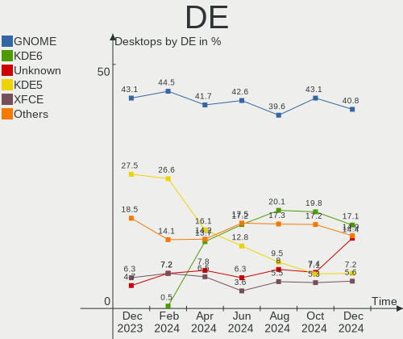
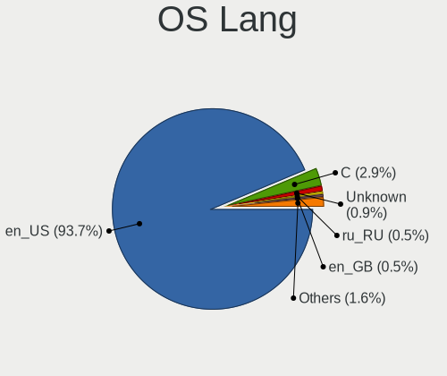
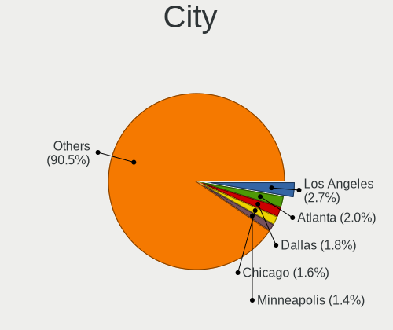
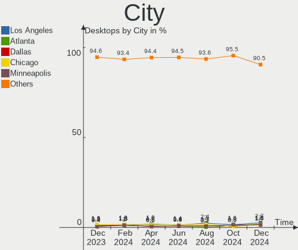
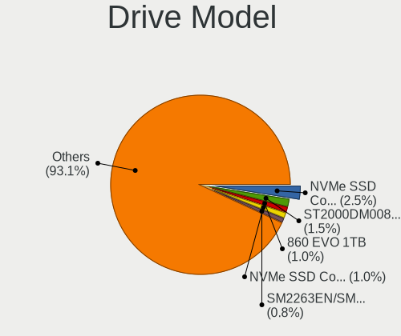
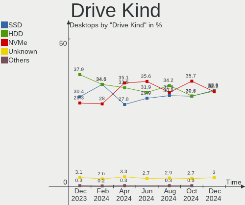
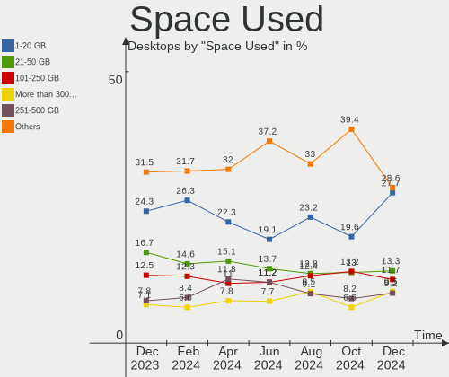
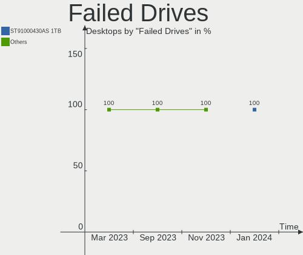
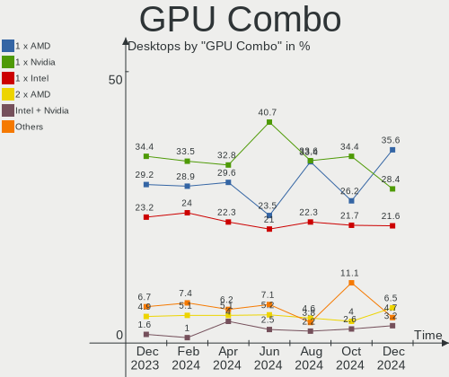
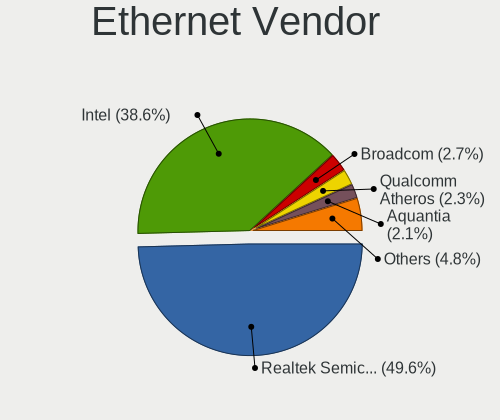

Linux in USA - Hardware Trends (Desktops)
-----------------------------------------

A project to identify most popular hardware characteristics and track their change
over time based on data collected by Linux users at https://Linux-Hardware.org.

Anyone can contribute to this report by the [hw-probe](https://github.com/linuxhw/hw-probe) tool:

    sudo -E hw-probe -all -upload

Contents
--------

* [ System ](#system)
  - [ OS                       ](#os)
  - [ OS Family                ](#os-family)
  - [ Kernel                   ](#kernel)
  - [ Kernel Family            ](#kernel-family)
  - [ Kernel Major Ver.        ](#kernel-major-ver)
  - [ Arch                     ](#arch)
  - [ DE                       ](#de)
  - [ Display Server           ](#display-server)
  - [ Display Manager          ](#display-manager)
  - [ OS Lang                  ](#os-lang)
  - [ Boot Mode                ](#boot-mode)
  - [ Filesystem               ](#filesystem)
  - [ Part. scheme             ](#part-scheme)
  - [ Dual Boot with Linux/BSD ](#dual-boot-with-linuxbsd)
  - [ Dual Boot (Win)          ](#dual-boot-win)

* [ Board ](#board)
  - [ Vendor                   ](#vendor)
  - [ Model                    ](#model)
  - [ Model Family             ](#model-family)
  - [ MFG Year                 ](#mfg-year)
  - [ Form Factor              ](#form-factor)
  - [ Secure Boot              ](#secure-boot)
  - [ Coreboot                 ](#coreboot)
  - [ RAM Size                 ](#ram-size)
  - [ RAM Used                 ](#ram-used)
  - [ Total Drives             ](#total-drives)
  - [ Has CD-ROM               ](#has-cd-rom)
  - [ Has Ethernet             ](#has-ethernet)
  - [ Has WiFi                 ](#has-wifi)
  - [ Has Bluetooth            ](#has-bluetooth)

* [ Location ](#location)
  - [ Country                  ](#country)
  - [ City                     ](#city)

* [ Drives ](#drives)
  - [ Drive Vendor             ](#drive-vendor)
  - [ Drive Model              ](#drive-model)
  - [ HDD Vendor               ](#hdd-vendor)
  - [ SSD Vendor               ](#ssd-vendor)
  - [ Drive Kind               ](#drive-kind)
  - [ Drive Connector          ](#drive-connector)
  - [ Drive Size               ](#drive-size)
  - [ Space Total              ](#space-total)
  - [ Space Used               ](#space-used)
  - [ Malfunc. Drives          ](#malfunc-drives)
  - [ Malfunc. Drive Vendor    ](#malfunc-drive-vendor)
  - [ Malfunc. HDD Vendor      ](#malfunc-hdd-vendor)
  - [ Malfunc. Drive Kind      ](#malfunc-drive-kind)
  - [ Failed Drives            ](#failed-drives)
  - [ Failed Drive Vendor      ](#failed-drive-vendor)
  - [ Drive Status             ](#drive-status)

* [ Storage controller ](#storage-controller)
  - [ Storage Vendor           ](#storage-vendor)
  - [ Storage Model            ](#storage-model)
  - [ Storage Kind             ](#storage-kind)

* [ Processor ](#processor)
  - [ CPU Vendor               ](#cpu-vendor)
  - [ CPU Model                ](#cpu-model)
  - [ CPU Model Family         ](#cpu-model-family)
  - [ CPU Cores                ](#cpu-cores)
  - [ CPU Sockets              ](#cpu-sockets)
  - [ CPU Threads              ](#cpu-threads)
  - [ CPU Op-Modes             ](#cpu-op-modes)
  - [ CPU Microcode            ](#cpu-microcode)
  - [ CPU Microarch            ](#cpu-microarch)

* [ Graphics ](#graphics)
  - [ GPU Vendor               ](#gpu-vendor)
  - [ GPU Model                ](#gpu-model)
  - [ GPU Combo                ](#gpu-combo)
  - [ GPU Driver               ](#gpu-driver)
  - [ GPU Memory               ](#gpu-memory)

* [ Monitor ](#monitor)
  - [ Monitor Vendor           ](#monitor-vendor)
  - [ Monitor Model            ](#monitor-model)
  - [ Monitor Resolution       ](#monitor-resolution)
  - [ Monitor Diagonal         ](#monitor-diagonal)
  - [ Monitor Width            ](#monitor-width)
  - [ Aspect Ratio             ](#aspect-ratio)
  - [ Monitor Area             ](#monitor-area)
  - [ Pixel Density            ](#pixel-density)
  - [ Multiple Monitors        ](#multiple-monitors)

* [ Network ](#network)
  - [ Net Controller Vendor    ](#net-controller-vendor)
  - [ Net Controller Model     ](#net-controller-model)
  - [ Wireless Vendor          ](#wireless-vendor)
  - [ Wireless Model           ](#wireless-model)
  - [ Ethernet Vendor          ](#ethernet-vendor)
  - [ Ethernet Model           ](#ethernet-model)
  - [ Net Controller Kind      ](#net-controller-kind)
  - [ Used Controller          ](#used-controller)
  - [ NICs                     ](#nics)
  - [ IPv6                     ](#ipv6)

* [ Bluetooth ](#bluetooth)
  - [ Bluetooth Vendor         ](#bluetooth-vendor)
  - [ Bluetooth Model          ](#bluetooth-model)

* [ Sound ](#sound)
  - [ Sound Vendor             ](#sound-vendor)
  - [ Sound Model              ](#sound-model)

* [ Memory ](#memory)
  - [ Memory Vendor            ](#memory-vendor)
  - [ Memory Model             ](#memory-model)
  - [ Memory Kind              ](#memory-kind)
  - [ Memory Form Factor       ](#memory-form-factor)
  - [ Memory Size              ](#memory-size)
  - [ Memory Speed             ](#memory-speed)

* [ Printers & scanners ](#printers--scanners)
  - [ Printer Vendor           ](#printer-vendor)
  - [ Printer Model            ](#printer-model)
  - [ Scanner Vendor           ](#scanner-vendor)
  - [ Scanner Model            ](#scanner-model)

* [ Camera ](#camera)
  - [ Camera Vendor            ](#camera-vendor)
  - [ Camera Model             ](#camera-model)

* [ Security ](#security)
  - [ Fingerprint Vendor       ](#fingerprint-vendor)
  - [ Fingerprint Model        ](#fingerprint-model)
  - [ Chipcard Vendor          ](#chipcard-vendor)
  - [ Chipcard Model           ](#chipcard-model)

* [ Unsupported ](#unsupported)
  - [ Unsupported Devices      ](#unsupported-devices)
  - [ Unsupported Device Types ](#unsupported-device-types)

System
------

OS
--

Installed operating systems

| Name                         | Desktops | Percent |
|------------------------------|----------|---------|
| Pop!_OS 22.04                | 44       | 12.15%  |
| Ubuntu 20.04                 | 31       | 8.56%   |
| Ubuntu 22.04                 | 28       | 7.73%   |
| Linux Mint 20.3              | 24       | 6.63%   |
| Debian 11                    | 22       | 6.08%   |
| Fedora 36                    | 17       | 4.7%    |
| Zorin 16                     | 16       | 4.42%   |
| Manjaro                      | 13       | 3.59%   |
| KDE neon 20.04               | 13       | 3.59%   |
| Fedora 35                    | 13       | 3.59%   |
| OpenMandriva 4.3             | 12       | 3.31%   |
| Arch                         | 12       | 3.31%   |
| Arch Rolling                 | 11       | 3.04%   |
| openSUSE Tumbleweed-XXXXXXXX | 9        | 2.49%   |
| Ubuntu 21.10                 | 7        | 1.93%   |
| Manjaro 21.2.6               | 7        | 1.93%   |
| ArcoLinux Rolling            | 6        | 1.66%   |
| Pop!_OS 21.10                | 5        | 1.38%   |
| Gentoo 2.8                   | 4        | 1.1%    |
| Endless 4.0.6                | 4        | 1.1%    |
| EndeavourOS Rolling          | 4        | 1.1%    |
| Xubuntu 20.04                | 3        | 0.83%   |
| Linux Mint 20.1              | 3        | 0.83%   |
| Kubuntu 22.04                | 3        | 0.83%   |
| Xubuntu 22.04                | 2        | 0.55%   |
| Ubuntu 18.04                 | 2        | 0.55%   |
| Parrot 5.0                   | 2        | 0.55%   |
| LMDE 5                       | 2        | 0.55%   |
| Kali 2022.2                  | 2        | 0.55%   |
| Gentoo 2.6                   | 2        | 0.55%   |
| Fedora 34                    | 2        | 0.55%   |
| EndeavourOS                  | 2        | 0.55%   |
| Drauger OS 7.5.1             | 2        | 0.55%   |
| Zorin 12                     | 1        | 0.28%   |
| Xero Rolling                 | 1        | 0.28%   |
| Ubuntu MATE 20.04            | 1        | 0.28%   |
| Ubuntu Budgie 22.04          | 1        | 0.28%   |
| Ubuntu 20.10                 | 1        | 0.28%   |
| Ubuntu 16.04                 | 1        | 0.28%   |
| Trisquel 10.0.1              | 1        | 0.28%   |
| SteamOS 3.2 (steamdeck-main) | 1        | 0.28%   |
| RHEL 8                       | 1        | 0.28%   |
| Pop!_OS 21.04                | 1        | 0.28%   |
| Pop!_OS 20.10                | 1        | 0.28%   |
| NixOS 22.05                  | 1        | 0.28%   |
| MX 21                        | 1        | 0.28%   |
| Manjaro 22.04-development    | 1        | 0.28%   |
| Lubuntu 22.04                | 1        | 0.28%   |
| Lubuntu 21.04                | 1        | 0.28%   |
| Lubuntu 18.04                | 1        | 0.28%   |
| LinuxFX 11                   | 1        | 0.28%   |
| Linux Mint 20.2              | 1        | 0.28%   |
| Linux Mint 20                | 1        | 0.28%   |
| Linux Lite 5.8               | 1        | 0.28%   |
| Linux Lite 5.4               | 1        | 0.28%   |
| Lilidog 22                   | 1        | 0.28%   |
| Liberty OS Rolling           | 1        | 0.28%   |
| Kubuntu 20.04                | 1        | 0.28%   |
| Gentoo 1                     | 1        | 0.28%   |
| Garuda Linux Soaring         | 1        | 0.28%   |

OS Family
---------

OS without a version

| Name          | Desktops | Percent |
|---------------|----------|---------|
| Ubuntu        | 70       | 19.34%  |
| Pop!_OS       | 51       | 14.09%  |
| Fedora        | 33       | 9.12%   |
| Linux Mint    | 29       | 8.01%   |
| Debian        | 23       | 6.35%   |
| Arch          | 23       | 6.35%   |
| Manjaro       | 21       | 5.8%    |
| Zorin         | 17       | 4.7%    |
| KDE neon      | 13       | 3.59%   |
| OpenMandriva  | 12       | 3.31%   |
| openSUSE      | 9        | 2.49%   |
| Gentoo        | 7        | 1.93%   |
| EndeavourOS   | 6        | 1.66%   |
| ArcoLinux     | 6        | 1.66%   |
| Xubuntu       | 5        | 1.38%   |
| Kubuntu       | 4        | 1.1%    |
| Endless       | 4        | 1.1%    |
| Lubuntu       | 3        | 0.83%   |
| Drauger OS    | 3        | 0.83%   |
| Parrot        | 2        | 0.55%   |
| LMDE          | 2        | 0.55%   |
| Linux Lite    | 2        | 0.55%   |
| Kali          | 2        | 0.55%   |
| Xero          | 1        | 0.28%   |
| Ubuntu MATE   | 1        | 0.28%   |
| Ubuntu Budgie | 1        | 0.28%   |
| Trisquel      | 1        | 0.28%   |
| SteamOS       | 1        | 0.28%   |
| RHEL          | 1        | 0.28%   |
| NixOS         | 1        | 0.28%   |
| MX            | 1        | 0.28%   |
| LinuxFX       | 1        | 0.28%   |
| Lilidog       | 1        | 0.28%   |
| Liberty OS    | 1        | 0.28%   |
| Garuda Linux  | 1        | 0.28%   |
| Elementary    | 1        | 0.28%   |
| Clear Linux   | 1        | 0.28%   |
| Calculate     | 1        | 0.28%   |

Kernel
------

Version of the Linux kernel

| Version                  | Desktops | Percent |
|--------------------------|----------|---------|
| 5.17.5-76051705-generic  | 42       | 11.6%   |
| 5.13.0-41-generic        | 25       | 6.91%   |
| 5.13.0-40-generic        | 18       | 4.97%   |
| 5.4.0-109-generic        | 13       | 3.59%   |
| 5.15.0-27-generic        | 13       | 3.59%   |
| 5.4.0-113-generic        | 11       | 3.04%   |
| 5.15.0-33-generic        | 11       | 3.04%   |
| 5.13.0-44-generic        | 11       | 3.04%   |
| 5.17.9-arch1-1           | 10       | 2.76%   |
| 5.16.7-desktop-1omv4003  | 10       | 2.76%   |
| 5.4.0-110-generic        | 8        | 2.21%   |
| 5.17.6-300.fc36.x86_64   | 8        | 2.21%   |
| 5.10.0-14-amd64          | 8        | 2.21%   |
| 5.16.19-76051619-generic | 7        | 1.93%   |
| 5.15.0-30-generic        | 7        | 1.93%   |
| 5.10.0-13-amd64          | 7        | 1.93%   |
| 5.17.5-200.fc35.x86_64   | 6        | 1.66%   |
| 5.17.4-1-default         | 6        | 1.66%   |
| 5.17.5-arch1-1           | 5        | 1.38%   |
| 5.15.32-1-MANJARO        | 4        | 1.1%    |
| 5.11.0-35-generic        | 4        | 1.1%    |
| 5.17.6-1-MANJARO         | 3        | 0.83%   |
| 5.17.4-200.fc35.x86_64   | 3        | 0.83%   |
| 5.17.1-3-MANJARO         | 3        | 0.83%   |
| 5.17.0-1-amd64           | 3        | 0.83%   |
| 5.15.41-1-MANJARO        | 3        | 0.83%   |
| 5.15.35-1-pve            | 3        | 0.83%   |
| 5.15.0-25-generic        | 3        | 0.83%   |
| 5.13.0-27-generic        | 3        | 0.83%   |
| 5.4.0-91-generic         | 2        | 0.55%   |
| 5.18.0-arch1-1           | 2        | 0.55%   |
| 5.17.9-1-MANJARO         | 2        | 0.55%   |
| 5.17.9-1-default         | 2        | 0.55%   |
| 5.17.8-300.fc36.x86_64   | 2        | 0.55%   |
| 5.17.7-zen1-1-zen        | 2        | 0.55%   |
| 5.17.7-300.fc36.x86_64   | 2        | 0.55%   |
| 5.17.5-300.fc36.x86_64   | 2        | 0.55%   |
| 5.17.4-arch1-1           | 2        | 0.55%   |
| 5.16.13-desktop-1omv4003 | 2        | 0.55%   |
| 5.16.11-arch1-1          | 2        | 0.55%   |
| 5.16.0-kali7-amd64       | 2        | 0.55%   |
| 5.16.0-12parrot1-amd64   | 2        | 0.55%   |
| 5.15.43-1-lts            | 2        | 0.55%   |
| 5.14.10-300.fc35.x86_64  | 2        | 0.55%   |
| 5.8.0-7630-generic       | 1        | 0.28%   |
| 5.8.0-43-generic         | 1        | 0.28%   |
| 5.8.0-33-generic         | 1        | 0.28%   |
| 5.4.0-97-generic         | 1        | 0.28%   |
| 5.4.0-94-generic         | 1        | 0.28%   |
| 5.4.0-91-lowlatency      | 1        | 0.28%   |
| 5.4.0-81-generic         | 1        | 0.28%   |
| 5.4.0-53-generic         | 1        | 0.28%   |
| 5.4.0-110-lowlatency     | 1        | 0.28%   |
| 5.4.0-107-generic        | 1        | 0.28%   |
| 5.4.0-105-generic        | 1        | 0.28%   |
| 5.2.14-arch2-1-ARCH      | 1        | 0.28%   |
| 5.17.9-zen1-1-zen        | 1        | 0.28%   |
| 5.17.9-gentoo-x86_64     | 1        | 0.28%   |
| 5.17.9-300.fc36.x86_64   | 1        | 0.28%   |
| 5.17.8-arch1-1           | 1        | 0.28%   |

Kernel Family
-------------

Linux kernel without a distro release

| Version  | Desktops | Percent |
|----------|----------|---------|
| 5.13.0   | 65       | 17.96%  |
| 5.17.5   | 61       | 16.85%  |
| 5.4.0    | 42       | 11.6%   |
| 5.15.0   | 35       | 9.67%   |
| 5.17.9   | 17       | 4.7%    |
| 5.10.0   | 16       | 4.42%   |
| 5.17.6   | 14       | 3.87%   |
| 5.17.4   | 11       | 3.04%   |
| 5.16.7   | 10       | 2.76%   |
| 5.16.19  | 8        | 2.21%   |
| 5.17.7   | 7        | 1.93%   |
| 5.17.0   | 5        | 1.38%   |
| 5.16.0   | 5        | 1.38%   |
| 5.15.32  | 5        | 1.38%   |
| 5.11.0   | 5        | 1.38%   |
| 5.17.8   | 4        | 1.1%    |
| 5.15.41  | 4        | 1.1%    |
| 5.15.35  | 4        | 1.1%    |
| 5.8.0    | 3        | 0.83%   |
| 5.17.11  | 3        | 0.83%   |
| 5.17.1   | 3        | 0.83%   |
| 4.15.0   | 3        | 0.83%   |
| 5.18.0   | 2        | 0.55%   |
| 5.16.13  | 2        | 0.55%   |
| 5.16.11  | 2        | 0.55%   |
| 5.15.43  | 2        | 0.55%   |
| 5.15.39  | 2        | 0.55%   |
| 5.15.38  | 2        | 0.55%   |
| 5.15.37  | 2        | 0.55%   |
| 5.15.11  | 2        | 0.55%   |
| 5.14.10  | 2        | 0.55%   |
| 5.2.14   | 1        | 0.28%   |
| 5.17.3   | 1        | 0.28%   |
| 5.16.20  | 1        | 0.28%   |
| 5.16.18  | 1        | 0.28%   |
| 5.15.29  | 1        | 0.28%   |
| 5.15.19  | 1        | 0.28%   |
| 5.15.14  | 1        | 0.28%   |
| 5.14.18  | 1        | 0.28%   |
| 5.14.0   | 1        | 0.28%   |
| 5.13.19  | 1        | 0.28%   |
| 5.10.111 | 1        | 0.28%   |
| 5.10.109 | 1        | 0.28%   |
| 5.10.105 | 1        | 0.28%   |
| 4.18.0   | 1        | 0.28%   |

Kernel Major Ver.
-----------------

Linux kernel major version

| Version | Desktops | Percent |
|---------|----------|---------|
| 5.17    | 126      | 34.81%  |
| 5.13    | 66       | 18.23%  |
| 5.15    | 61       | 16.85%  |
| 5.4     | 42       | 11.6%   |
| 5.16    | 29       | 8.01%   |
| 5.10    | 19       | 5.25%   |
| 5.11    | 5        | 1.38%   |
| 5.14    | 4        | 1.1%    |
| 5.8     | 3        | 0.83%   |
| 4.15    | 3        | 0.83%   |
| 5.18    | 2        | 0.55%   |
| 5.2     | 1        | 0.28%   |
| 4.18    | 1        | 0.28%   |

Arch
----

OS architecture (x86_64, i586, etc.)

| Name   | Desktops | Percent |
|--------|----------|---------|
| x86_64 | 361      | 99.72%  |
| i686   | 1        | 0.28%   |

DE
--

Desktop Environment

| Name             | Desktops | Percent |
|------------------|----------|---------|
| GNOME            | 180      | 49.72%  |
| KDE5             | 78       | 21.55%  |
| X-Cinnamon       | 31       | 8.56%   |
| XFCE             | 29       | 8.01%   |
| Unknown          | 16       | 4.42%   |
| MATE             | 11       | 3.04%   |
| LXQt             | 4        | 1.1%    |
| i3               | 3        | 0.83%   |
| Budgie           | 2        | 0.55%   |
| WindowMaker      | 1        | 0.28%   |
| Unity            | 1        | 0.28%   |
| qtile            | 1        | 0.28%   |
| Pantheon         | 1        | 0.28%   |
| LXDE             | 1        | 0.28%   |
| lightdm-xsession | 1        | 0.28%   |
| dwm              | 1        | 0.28%   |
| Cinnamon         | 1        | 0.28%   |

Display Server
--------------

X11 or Wayland

| Name    | Desktops | Percent |
|---------|----------|---------|
| X11     | 291      | 80.39%  |
| Wayland | 55       | 15.19%  |
| Tty     | 11       | 3.04%   |
| Unknown | 5        | 1.38%   |

Display Manager
---------------

SDDM, LightDM, etc.

| Name    | Desktops | Percent |
|---------|----------|---------|
| Unknown | 168      | 46.41%  |
| GDM3    | 69       | 19.06%  |
| LightDM | 57       | 15.75%  |
| SDDM    | 47       | 12.98%  |
| GDM     | 16       | 4.42%   |
| XDM     | 2        | 0.55%   |
| LXDM    | 2        | 0.55%   |
| GREETD  | 1        | 0.28%   |

OS Lang
-------

Language

| Lang       | Desktops | Percent |
|------------|----------|---------|
| en_US      | 344      | 95.03%  |
| C          | 7        | 1.93%   |
| en_IN      | 2        | 0.55%   |
| en_GB      | 2        | 0.55%   |
| en_CA      | 2        | 0.55%   |
| en_AU      | 2        | 0.55%   |
| en_US.UTF8 | 1        | 0.28%   |
| en_001     | 1        | 0.28%   |
| Unknown    | 1        | 0.28%   |

Boot Mode
---------

EFI or BIOS

| Mode | Desktops | Percent |
|------|----------|---------|
| BIOS | 203      | 56.08%  |
| EFI  | 159      | 43.92%  |

Filesystem
----------

Type of filesystem

| Type    | Desktops | Percent |
|---------|----------|---------|
| Ext4    | 283      | 78.18%  |
| Btrfs   | 55       | 15.19%  |
| Overlay | 11       | 3.04%   |
| Xfs     | 5        | 1.38%   |
| Zfs     | 4        | 1.1%    |
| F2fs    | 2        | 0.55%   |
| Ext2    | 2        | 0.55%   |

Part. scheme
------------

Scheme of partitioning

| Type    | Desktops | Percent |
|---------|----------|---------|
| Unknown | 230      | 63.54%  |
| GPT     | 113      | 31.22%  |
| MBR     | 19       | 5.25%   |

Dual Boot with Linux/BSD
------------------------

Hosting more than one Linux/BSD

| Dual boot | Desktops | Percent |
|-----------|----------|---------|
| No        | 302      | 83.43%  |
| Yes       | 60       | 16.57%  |

Dual Boot (Win)
---------------

Hosting Linux and Windows

| Dual boot | Desktops | Percent |
|-----------|----------|---------|
| No        | 282      | 77.9%   |
| Yes       | 80       | 22.1%   |

Board
-----

Vendor
------

Motherboard manufacturer

| Name                | Desktops | Percent |
|---------------------|----------|---------|
| ASUSTek Computer    | 108      | 29.83%  |
| MSI                 | 48       | 13.26%  |
| Dell                | 43       | 11.88%  |
| Gigabyte Technology | 35       | 9.67%   |
| ASRock              | 35       | 9.67%   |
| Hewlett-Packard     | 32       | 8.84%   |
| Lenovo              | 18       | 4.97%   |
| Pegatron            | 6        | 1.66%   |
| Supermicro          | 5        | 1.38%   |
| Intel               | 3        | 0.83%   |
| Google              | 3        | 0.83%   |
| Apple               | 3        | 0.83%   |
| Alienware           | 3        | 0.83%   |
| Unknown             | 3        | 0.83%   |
| Shuttle             | 2        | 0.55%   |
| BESSTAR Tech        | 2        | 0.55%   |
| System76            | 1        | 0.28%   |
| Purism              | 1        | 0.28%   |
| Protectli           | 1        | 0.28%   |
| Pepper Jobs         | 1        | 0.28%   |
| NZXT                | 1        | 0.28%   |
| iEi                 | 1        | 0.28%   |
| Gateway             | 1        | 0.28%   |
| EVGA                | 1        | 0.28%   |
| eMachines           | 1        | 0.28%   |
| ECS                 | 1        | 0.28%   |
| Biostar             | 1        | 0.28%   |
| Acer                | 1        | 0.28%   |
| AAEON               | 1        | 0.28%   |

Model
-----

Motherboard model

| Name                              | Desktops | Percent |
|-----------------------------------|----------|---------|
| ASUS All Series                   | 13       | 3.59%   |
| ASUS ROG STRIX B550-F GAMING      | 6        | 1.66%   |
| MSI MS-7B79                       | 4        | 1.1%    |
| Gigabyte B450M DS3H               | 4        | 1.1%    |
| Dell OptiPlex 790                 | 4        | 1.1%    |
| ASUS TUF Gaming X570-PRO          | 4        | 1.1%    |
| ASUS PRIME X570-P                 | 4        | 1.1%    |
| MSI MS-7C37                       | 3        | 0.83%   |
| ASUS TUF Gaming X570-PLUS         | 3        | 0.83%   |
| ASUS ROG STRIX X570-E GAMING      | 3        | 0.83%   |
| ASUS ROG CROSSHAIR VIII DARK HERO | 3        | 0.83%   |
| ASUS PRIME B550M-A                | 3        | 0.83%   |
| Unknown                           | 3        | 0.83%   |
| Supermicro SYS-110C-FHN4T         | 2        | 0.55%   |
| MSI MS-7D32                       | 2        | 0.55%   |
| MSI MS-7D19                       | 2        | 0.55%   |
| MSI MS-7D09                       | 2        | 0.55%   |
| MSI MS-7B86                       | 2        | 0.55%   |
| MSI MS-7A71                       | 2        | 0.55%   |
| MSI MS-7817                       | 2        | 0.55%   |
| MSI MS-7721                       | 2        | 0.55%   |
| MSI A320M-HDV R4.0                | 2        | 0.55%   |
| Lenovo ThinkCentre M82 2929AZ6    | 2        | 0.55%   |
| HP Z440 Workstation               | 2        | 0.55%   |
| HP Z230 Tower Workstation         | 2        | 0.55%   |
| HP EliteDesk 800 G1 SFF           | 2        | 0.55%   |
| HP Desktop M01-F0xxx              | 2        | 0.55%   |
| HP Compaq 6200 Pro SFF PC         | 2        | 0.55%   |
| HP Compaq 6005 Pro SFF PC         | 2        | 0.55%   |
| Google Guado                      | 2        | 0.55%   |
| Gigabyte X570 AORUS MASTER        | 2        | 0.55%   |
| Gigabyte B550I AORUS PRO AX       | 2        | 0.55%   |
| Dell XPS 8930                     | 2        | 0.55%   |
| Dell XPS 8300                     | 2        | 0.55%   |
| Dell OptiPlex 9020                | 2        | 0.55%   |
| Dell OptiPlex 5040                | 2        | 0.55%   |
| Dell OptiPlex 3020                | 2        | 0.55%   |
| Dell Inspiron 530                 | 2        | 0.55%   |
| ASUS TUF Gaming B550M-PLUS        | 2        | 0.55%   |
| ASUS TUF Gaming B450-PLUS II      | 2        | 0.55%   |
| ASUS ROG STRIX Z390-E GAMING      | 2        | 0.55%   |
| ASUS PRIME X570-PRO               | 2        | 0.55%   |
| ASUS PRIME B450M-A                | 2        | 0.55%   |
| ASUS CROSSHAIR VI HERO            | 2        | 0.55%   |
| ASRock Z390 Taichi Ultimate       | 2        | 0.55%   |
| ASRock X570 Phantom Gaming 4      | 2        | 0.55%   |
| ASRock X470 Taichi                | 2        | 0.55%   |
| ASRock B450 Pro4                  | 2        | 0.55%   |
| ASRock A88M-G                     | 2        | 0.55%   |
| ASRock 970M Pro3                  | 2        | 0.55%   |
| Apple MacPro5,1                   | 2        | 0.55%   |
| System76 Thelio Major             | 1        | 0.28%   |
| Supermicro X9DR3-F                | 1        | 0.28%   |
| Supermicro X8ST3                  | 1        | 0.28%   |
| Supermicro X8SIL                  | 1        | 0.28%   |
| Shuttle SZ87R                     | 1        | 0.28%   |
| Shuttle SH87R                     | 1        | 0.28%   |
| Purism Librem Mini v2             | 1        | 0.28%   |
| Protectli FW4A                    | 1        | 0.28%   |
| Pepper Jobs GLK-UC2X              | 1        | 0.28%   |

Model Family
------------

Motherboard model prefix

| Name                      | Desktops | Percent |
|---------------------------|----------|---------|
| ASUS ROG                  | 26       | 7.18%   |
| Dell OptiPlex             | 21       | 5.8%    |
| ASUS PRIME                | 19       | 5.25%   |
| ASUS TUF                  | 16       | 4.42%   |
| ASUS All                  | 13       | 3.59%   |
| Lenovo ThinkCentre        | 10       | 2.76%   |
| Dell Precision            | 7        | 1.93%   |
| HP Compaq                 | 6        | 1.66%   |
| Dell XPS                  | 6        | 1.66%   |
| Dell Inspiron             | 6        | 1.66%   |
| MSI MS-7B79               | 4        | 1.1%    |
| HP EliteDesk              | 4        | 1.1%    |
| Gigabyte X570             | 4        | 1.1%    |
| Gigabyte B450M            | 4        | 1.1%    |
| ASRock X470               | 4        | 1.1%    |
| MSI MS-7C37               | 3        | 0.83%   |
| ASUS CROSSHAIR            | 3        | 0.83%   |
| ASRock Z390               | 3        | 0.83%   |
| ASRock X570               | 3        | 0.83%   |
| Unknown                   | 3        | 0.83%   |
| Supermicro SYS-110C-FHN4T | 2        | 0.55%   |
| MSI MS-7D32               | 2        | 0.55%   |
| MSI MS-7D19               | 2        | 0.55%   |
| MSI MS-7D09               | 2        | 0.55%   |
| MSI MS-7B86               | 2        | 0.55%   |
| MSI MS-7A71               | 2        | 0.55%   |
| MSI MS-7817               | 2        | 0.55%   |
| MSI MS-7721               | 2        | 0.55%   |
| MSI A320M-HDV             | 2        | 0.55%   |
| HP Z440                   | 2        | 0.55%   |
| HP Z230                   | 2        | 0.55%   |
| HP ProDesk                | 2        | 0.55%   |
| HP Pavilion               | 2        | 0.55%   |
| HP Desktop                | 2        | 0.55%   |
| Google Guado              | 2        | 0.55%   |
| Gigabyte B550M            | 2        | 0.55%   |
| Gigabyte B550I            | 2        | 0.55%   |
| Gigabyte B550             | 2        | 0.55%   |
| Gigabyte B450             | 2        | 0.55%   |
| Dell Vostro               | 2        | 0.55%   |
| ASUS STRIX                | 2        | 0.55%   |
| ASUS P8Z68-V              | 2        | 0.55%   |
| ASRock X370               | 2        | 0.55%   |
| ASRock B550               | 2        | 0.55%   |
| ASRock B450               | 2        | 0.55%   |
| ASRock A88M-G             | 2        | 0.55%   |
| ASRock 970M               | 2        | 0.55%   |
| Apple MacPro5             | 2        | 0.55%   |
| Alienware Aurora          | 2        | 0.55%   |
| System76 Thelio           | 1        | 0.28%   |
| Supermicro X9DR3-F        | 1        | 0.28%   |
| Supermicro X8ST3          | 1        | 0.28%   |
| Supermicro X8SIL          | 1        | 0.28%   |
| Shuttle SZ87R             | 1        | 0.28%   |
| Shuttle SH87R             | 1        | 0.28%   |
| Purism Librem             | 1        | 0.28%   |
| Protectli FW4A            | 1        | 0.28%   |
| Pepper Jobs GLK-UC2X      | 1        | 0.28%   |
| Pegatron p7-1110          | 1        | 0.28%   |
| Pegatron p6-2133w         | 1        | 0.28%   |

MFG Year
--------

Motherboard manufacture year

| Year | Desktops | Percent |
|------|----------|---------|
| 2019 | 51       | 14.09%  |
| 2020 | 42       | 11.6%   |
| 2021 | 38       | 10.5%   |
| 2018 | 34       | 9.39%   |
| 2014 | 25       | 6.91%   |
| 2013 | 24       | 6.63%   |
| 2016 | 22       | 6.08%   |
| 2015 | 22       | 6.08%   |
| 2011 | 22       | 6.08%   |
| 2012 | 19       | 5.25%   |
| 2017 | 16       | 4.42%   |
| 2010 | 15       | 4.14%   |
| 2009 | 11       | 3.04%   |
| 2022 | 10       | 2.76%   |
| 2008 | 5        | 1.38%   |
| 2007 | 4        | 1.1%    |
| 2006 | 2        | 0.55%   |

Form Factor
-----------

Physical design of the computer

| Name    | Desktops | Percent |
|---------|----------|---------|
| Desktop | 362      | 100%    |

Secure Boot
-----------

Enabled or disabled

| State    | Desktops | Percent |
|----------|----------|---------|
| Disabled | 349      | 96.41%  |
| Enabled  | 13       | 3.59%   |

Coreboot
--------

Have coreboot on board

| Used | Desktops | Percent |
|------|----------|---------|
| No   | 358      | 98.9%   |
| Yes  | 4        | 1.1%    |

RAM Size
--------

Total RAM memory

| Size in GB      | Desktops | Percent |
|-----------------|----------|---------|
| 32.01-64.0      | 107      | 29.56%  |
| 16.01-24.0      | 93       | 25.69%  |
| 8.01-16.0       | 52       | 14.36%  |
| 4.01-8.0        | 44       | 12.15%  |
| 64.01-256.0     | 34       | 9.39%   |
| 3.01-4.0        | 20       | 5.52%   |
| 24.01-32.0      | 8        | 2.21%   |
| 2.01-3.0        | 2        | 0.55%   |
| More than 256.0 | 1        | 0.28%   |
| 1.01-2.0        | 1        | 0.28%   |

RAM Used
--------

Used RAM memory

| Used GB     | Desktops | Percent |
|-------------|----------|---------|
| 4.01-8.0    | 88       | 24.31%  |
| 1.01-2.0    | 88       | 24.31%  |
| 2.01-3.0    | 81       | 22.38%  |
| 3.01-4.0    | 58       | 16.02%  |
| 8.01-16.0   | 31       | 8.56%   |
| 0.51-1.0    | 8        | 2.21%   |
| 16.01-24.0  | 5        | 1.38%   |
| 32.01-64.0  | 1        | 0.28%   |
| 64.01-256.0 | 1        | 0.28%   |
| 0.01-0.5    | 1        | 0.28%   |

Total Drives
------------

Number of drives on board

| Drives | Desktops | Percent |
|--------|----------|---------|
| 1      | 119      | 32.87%  |
| 2      | 95       | 26.24%  |
| 3      | 62       | 17.13%  |
| 4      | 34       | 9.39%   |
| 5      | 21       | 5.8%    |
| 6      | 11       | 3.04%   |
| 7      | 6        | 1.66%   |
| 0      | 5        | 1.38%   |
| 10     | 3        | 0.83%   |
| 8      | 3        | 0.83%   |
| 15     | 1        | 0.28%   |
| 13     | 1        | 0.28%   |
| 9      | 1        | 0.28%   |

Has CD-ROM
----------

Has CD-ROM on board

| Presented | Desktops | Percent |
|-----------|----------|---------|
| No        | 211      | 58.29%  |
| Yes       | 151      | 41.71%  |

Has Ethernet
------------

Has Ethernet on board

| Presented | Desktops | Percent |
|-----------|----------|---------|
| Yes       | 356      | 98.34%  |
| No        | 6        | 1.66%   |

Has WiFi
--------

Has WiFi module

| Presented | Desktops | Percent |
|-----------|----------|---------|
| Yes       | 221      | 61.05%  |
| No        | 141      | 38.95%  |

Has Bluetooth
-------------

Has Bluetooth module

| Presented | Desktops | Percent |
|-----------|----------|---------|
| No        | 189      | 52.21%  |
| Yes       | 173      | 47.79%  |

Location
--------

Country
-------

Geographic location (country)

| Country | Desktops | Percent |
|---------|----------|---------|
| USA     | 362      | 100%    |

City
----

Geographic location (city)

| City           | Desktops | Percent |
|----------------|----------|---------|
| Dallas         | 11       | 3.04%   |
| Orlando        | 8        | 2.21%   |
| Atlanta        | 7        | 1.93%   |
| Chicago        | 6        | 1.66%   |
| New York       | 5        | 1.38%   |
| Los Angeles    | 5        | 1.38%   |
| Houston        | 5        | 1.38%   |
| San Jose       | 4        | 1.1%    |
| Richmond       | 4        | 1.1%    |
| Denver         | 4        | 1.1%    |
| San Francisco  | 3        | 0.83%   |
| Portland       | 3        | 0.83%   |
| Minneapolis    | 3        | 0.83%   |
| Cincinnati     | 3        | 0.83%   |
| Charlestown    | 3        | 0.83%   |
| Albuquerque    | 3        | 0.83%   |
| West Chester   | 2        | 0.55%   |
| Washington     | 2        | 0.55%   |
| Toledo         | 2        | 0.55%   |
| The Bronx      | 2        | 0.55%   |
| Tampa          | 2        | 0.55%   |
| Sterling       | 2        | 0.55%   |
| Springfield    | 2        | 0.55%   |
| Seattle        | 2        | 0.55%   |
| Salt Lake City | 2        | 0.55%   |
| Salem          | 2        | 0.55%   |
| Reno           | 2        | 0.55%   |
| Port Orchard   | 2        | 0.55%   |
| Plano          | 2        | 0.55%   |
| Omaha          | 2        | 0.55%   |
| Ocala          | 2        | 0.55%   |
| Norwalk        | 2        | 0.55%   |
| Norfolk        | 2        | 0.55%   |
| New Haven      | 2        | 0.55%   |
| Milwaukee      | 2        | 0.55%   |
| Merced         | 2        | 0.55%   |
| Lancaster      | 2        | 0.55%   |
| Jacksonville   | 2        | 0.55%   |
| Indianapolis   | 2        | 0.55%   |
| Fair Lawn      | 2        | 0.55%   |
| Durham         | 2        | 0.55%   |
| DuBois         | 2        | 0.55%   |
| Dublin         | 2        | 0.55%   |
| Dayton         | 2        | 0.55%   |
| Concord        | 2        | 0.55%   |
| Columbus       | 2        | 0.55%   |
| Cleveland      | 2        | 0.55%   |
| Charlotte      | 2        | 0.55%   |
| Cassville      | 2        | 0.55%   |
| Bucyrus        | 2        | 0.55%   |
| Boise          | 2        | 0.55%   |
| Belton         | 2        | 0.55%   |
| Austin         | 2        | 0.55%   |
| Atlantic Beach | 2        | 0.55%   |
| Alpharetta     | 2        | 0.55%   |
| Ypsilanti      | 1        | 0.28%   |
| Wylie          | 1        | 0.28%   |
| Woodstock      | 1        | 0.28%   |
| Woodbine       | 1        | 0.28%   |
| Winter Garden  | 1        | 0.28%   |

Drives
------

Drive Vendor
------------

Hard drive vendors

| Vendor                      | Desktops | Drives | Percent |
|-----------------------------|----------|--------|---------|
| Samsung Electronics         | 130      | 194    | 18.79%  |
| Seagate                     | 129      | 191    | 18.64%  |
| WDC                         | 128      | 190    | 18.5%   |
| Toshiba                     | 38       | 46     | 5.49%   |
| SanDisk                     | 35       | 37     | 5.06%   |
| Crucial                     | 32       | 37     | 4.62%   |
| Hitachi                     | 22       | 31     | 3.18%   |
| Kingston                    | 18       | 19     | 2.6%    |
| Phison                      | 16       | 18     | 2.31%   |
| Unknown                     | 13       | 22     | 1.88%   |
| Intel                       | 12       | 13     | 1.73%   |
| A-DATA Technology           | 12       | 13     | 1.73%   |
| PNY                         | 11       | 11     | 1.59%   |
| China                       | 9        | 15     | 1.3%    |
| SK Hynix                    | 6        | 6      | 0.87%   |
| SPCC                        | 5        | 5      | 0.72%   |
| Unknown                     | 5        | 5      | 0.72%   |
| Micron/Crucial Technology   | 4        | 4      | 0.58%   |
| HGST                        | 4        | 4      | 0.58%   |
| XPG                         | 3        | 4      | 0.43%   |
| SABRENT                     | 3        | 3      | 0.43%   |
| Patriot                     | 3        | 3      | 0.43%   |
| OCZ                         | 3        | 3      | 0.43%   |
| Micron Technology           | 3        | 3      | 0.43%   |
| Lexar                       | 3        | 3      | 0.43%   |
| Hewlett-Packard             | 3        | 3      | 0.43%   |
| DOGFISH                     | 3        | 3      | 0.43%   |
| Transcend                   | 2        | 3      | 0.29%   |
| Silicon Motion              | 2        | 3      | 0.29%   |
| Realtek Semiconductor       | 2        | 2      | 0.29%   |
| Phison Electronics          | 2        | 8      | 0.29%   |
| KIOXIA                      | 2        | 2      | 0.29%   |
| Verbatim                    | 1        | 1      | 0.14%   |
| USB3.0                      | 1        | 1      | 0.14%   |
| USB 3.0                     | 1        | 1      | 0.14%   |
| TurXun                      | 1        | 1      | 0.14%   |
| Team                        | 1        | 2      | 0.14%   |
| T-FORCE                     | 1        | 1      | 0.14%   |
| SuperMicro                  | 1        | 1      | 0.14%   |
| SSD2SC96                    | 1        | 1      | 0.14%   |
| PNY USB                     | 1        | 1      | 0.14%   |
| Novation                    | 1        | 1      | 0.14%   |
| N600                        | 1        | 1      | 0.14%   |
| MAXTOR                      | 1        | 1      | 0.14%   |
| MAXIO Technology (Hangzhou) | 1        | 1      | 0.14%   |
| LITEONIT                    | 1        | 1      | 0.14%   |
| LaCie                       | 1        | 1      | 0.14%   |
| KingSpec                    | 1        | 1      | 0.14%   |
| HP SSD S                    | 1        | 1      | 0.14%   |
| Hoodisk                     | 1        | 1      | 0.14%   |
| HGST HTS                    | 1        | 1      | 0.14%   |
| Gigaston                    | 1        | 1      | 0.14%   |
| FORESEE                     | 1        | 1      | 0.14%   |
| Drevo                       | 1        | 1      | 0.14%   |
| Corsair                     | 1        | 2      | 0.14%   |
| CFast                       | 1        | 1      | 0.14%   |
| Aura                        | 1        | 1      | 0.14%   |
| ASMT106x                    | 1        | 1      | 0.14%   |
| ASMT                        | 1        | 1      | 0.14%   |
| Apacer                      | 1        | 1      | 0.14%   |

Drive Model
-----------

Hard drive models

| Model                             | Desktops | Percent |
|-----------------------------------|----------|---------|
| Samsung NVMe SSD Drive 1TB        | 16       | 1.89%   |
| Seagate ST2000DM008-2FR102 2TB    | 15       | 1.77%   |
| Samsung NVMe SSD Drive 500GB      | 14       | 1.65%   |
| Samsung SSD 850 EVO 250GB         | 12       | 1.42%   |
| WDC WD10EZEX-08WN4A0 1TB          | 11       | 1.3%    |
| Sandisk NVMe SSD Drive 1TB        | 11       | 1.3%    |
| Samsung SSD 970 EVO Plus 1TB      | 11       | 1.3%    |
| Samsung SSD 860 EVO 1TB           | 11       | 1.3%    |
| Seagate ST1000DM010-2EP102 1TB    | 9        | 1.06%   |
| Samsung SSD 850 EVO 1TB           | 8        | 0.95%   |
| Samsung SSD 870 EVO 1TB           | 7        | 0.83%   |
| Crucial CT1000MX500SSD1 1TB       | 7        | 0.83%   |
| Toshiba DT01ACA100 1TB            | 6        | 0.71%   |
| Crucial CT500MX500SSD1 500GB      | 6        | 0.71%   |
| Seagate ST500DM002-1BD142 500GB   | 5        | 0.59%   |
| Seagate ST4000DM004-2CV104 4TB    | 5        | 0.59%   |
| Seagate ST3500413AS 500GB         | 5        | 0.59%   |
| Seagate ST1000DM003-1CH162 1TB    | 5        | 0.59%   |
| Samsung SSD 980 PRO 2TB           | 5        | 0.59%   |
| Samsung SSD 980 PRO 1TB           | 5        | 0.59%   |
| Samsung SSD 860 EVO 500GB         | 5        | 0.59%   |
| Samsung NVMe SSD Drive 250GB      | 5        | 0.59%   |
| Phison NVMe SSD Drive 1024GB      | 5        | 0.59%   |
| Kingston SV300S37A120G 120GB SSD  | 5        | 0.59%   |
| Unknown                           | 5        | 0.59%   |
| WDC WDS500G2B0B-00YS70 500GB SSD  | 4        | 0.47%   |
| WDC WDS500G2B0A-00SM50 500GB SSD  | 4        | 0.47%   |
| WDC WD10EZEX-08M2NA0 1TB          | 4        | 0.47%   |
| WDC WD10EZEX-00BN5A0 1TB          | 4        | 0.47%   |
| Unknown SD/MMC/MS PRO 999GB       | 4        | 0.47%   |
| Seagate ST2000DX002-2DV164 2TB    | 4        | 0.47%   |
| Seagate ST1000DM003-1ER162 1TB    | 4        | 0.47%   |
| SanDisk SDSSDA240G 240GB          | 4        | 0.47%   |
| Samsung SSD 980 1TB               | 4        | 0.47%   |
| Samsung SSD 850 EVO 500GB         | 4        | 0.47%   |
| Samsung NVMe SSD Drive 2TB        | 4        | 0.47%   |
| Phison NVMe SSD Drive 2TB         | 4        | 0.47%   |
| Micron/Crucial NVMe SSD Drive 1TB | 4        | 0.47%   |
| Kingston SA400S37240G 240GB SSD   | 4        | 0.47%   |
| Crucial CT250MX500SSD1 250GB      | 4        | 0.47%   |
| WDC WDS250G2B0A-00SM50 250GB SSD  | 3        | 0.35%   |
| WDC WDS100T2G0A-00JH30 1TB SSD    | 3        | 0.35%   |
| WDC WDS100T2B0A-00SM50 1TB SSD    | 3        | 0.35%   |
| Unknown SD/MMC 16GB               | 3        | 0.35%   |
| Unknown M.S./M.S.Pro/HG 16GB      | 3        | 0.35%   |
| Toshiba HDWD120 2TB               | 3        | 0.35%   |
| Toshiba HDWD110 1TB               | 3        | 0.35%   |
| Toshiba DT01ACA200 2TB            | 3        | 0.35%   |
| SPCC Solid State Disk 512GB       | 3        | 0.35%   |
| Seagate ST8000DM004-2CX188 8TB    | 3        | 0.35%   |
| Seagate ST500DM002-1SB10A 500GB   | 3        | 0.35%   |
| Seagate ST31000528AS 1TB          | 3        | 0.35%   |
| Seagate ST31000524AS 1TB          | 3        | 0.35%   |
| Seagate ST2000DM006-2DM164 2TB    | 3        | 0.35%   |
| Seagate ST2000DM001-1ER164 2TB    | 3        | 0.35%   |
| Seagate ST1000DM003-1SB102 1TB    | 3        | 0.35%   |
| Seagate Portable 1TB              | 3        | 0.35%   |
| Seagate Expansion Desk 10TB       | 3        | 0.35%   |
| Seagate Backup+ Hub BK 8TB        | 3        | 0.35%   |
| Sandisk NVMe SSD Drive 500GB      | 3        | 0.35%   |

HDD Vendor
----------

Hard disk drive vendors

| Vendor              | Desktops | Drives | Percent |
|---------------------|----------|--------|---------|
| Seagate             | 124      | 180    | 42.61%  |
| WDC                 | 97       | 145    | 33.33%  |
| Toshiba             | 30       | 38     | 10.31%  |
| Hitachi             | 22       | 31     | 7.56%   |
| Unknown             | 5        | 8      | 1.72%   |
| HGST                | 4        | 4      | 1.37%   |
| Samsung Electronics | 3        | 3      | 1.03%   |
| SABRENT             | 3        | 3      | 1.03%   |
| LaCie               | 1        | 1      | 0.34%   |
| HGST HTS            | 1        | 1      | 0.34%   |
| ASMT                | 1        | 1      | 0.34%   |

SSD Vendor
----------

Solid state drive vendors

| Vendor              | Desktops | Drives | Percent |
|---------------------|----------|--------|---------|
| Samsung Electronics | 71       | 94     | 28.98%  |
| WDC                 | 29       | 30     | 11.84%  |
| Crucial             | 28       | 33     | 11.43%  |
| SanDisk             | 17       | 17     | 6.94%   |
| Kingston            | 16       | 17     | 6.53%   |
| PNY                 | 11       | 11     | 4.49%   |
| A-DATA Technology   | 11       | 12     | 4.49%   |
| China               | 9        | 15     | 3.67%   |
| Toshiba             | 5        | 5      | 2.04%   |
| SPCC                | 4        | 4      | 1.63%   |
| Intel               | 4        | 4      | 1.63%   |
| OCZ                 | 3        | 3      | 1.22%   |
| Micron Technology   | 3        | 3      | 1.22%   |
| Lexar               | 3        | 3      | 1.22%   |
| Hewlett-Packard     | 3        | 3      | 1.22%   |
| DOGFISH             | 3        | 3      | 1.22%   |
| Unknown             | 3        | 3      | 1.22%   |
| Transcend           | 2        | 3      | 0.82%   |
| SK Hynix            | 2        | 2      | 0.82%   |
| Seagate             | 2        | 2      | 0.82%   |
| Patriot             | 2        | 2      | 0.82%   |
| Verbatim            | 1        | 1      | 0.41%   |
| USB3.0              | 1        | 1      | 0.41%   |
| Team                | 1        | 2      | 0.41%   |
| T-FORCE             | 1        | 1      | 0.41%   |
| SuperMicro          | 1        | 1      | 0.41%   |
| PNY USB             | 1        | 1      | 0.41%   |
| N600                | 1        | 1      | 0.41%   |
| MAXTOR              | 1        | 1      | 0.41%   |
| LITEONIT            | 1        | 1      | 0.41%   |
| KingSpec            | 1        | 1      | 0.41%   |
| Hoodisk             | 1        | 1      | 0.41%   |
| FORESEE             | 1        | 1      | 0.41%   |
| Drevo               | 1        | 1      | 0.41%   |
| Apacer              | 1        | 1      | 0.41%   |

Drive Kind
----------

HDD or SSD

| Kind    | Desktops | Drives | Percent |
|---------|----------|--------|---------|
| HDD     | 221      | 415    | 38.3%   |
| SSD     | 187      | 284    | 32.41%  |
| NVMe    | 148      | 208    | 25.65%  |
| Unknown | 19       | 26     | 3.29%   |
| MMC     | 2        | 2      | 0.35%   |

Drive Connector
---------------

SATA, SAS, NVMe, etc.

| Type | Desktops | Drives | Percent |
|------|----------|--------|---------|
| SATA | 318      | 668    | 62.72%  |
| NVMe | 148      | 208    | 29.19%  |
| SAS  | 39       | 57     | 7.69%   |
| MMC  | 2        | 2      | 0.39%   |

Drive Size
----------

Size of hard drive

| Size in TB | Desktops | Drives | Percent |
|------------|----------|--------|---------|
| 0.01-0.5   | 183      | 263    | 37.42%  |
| 0.51-1.0   | 156      | 218    | 31.9%   |
| 1.01-2.0   | 81       | 98     | 16.56%  |
| 3.01-4.0   | 27       | 38     | 5.52%   |
| 4.01-10.0  | 23       | 49     | 4.7%    |
| 2.01-3.0   | 11       | 20     | 2.25%   |
| 10.01-20.0 | 8        | 13     | 1.64%   |

Space Total
-----------

Amount of disk space available on the file system

| Size in GB     | Desktops | Percent |
|----------------|----------|---------|
| 501-1000       | 74       | 20.44%  |
| More than 3000 | 71       | 19.61%  |
| 101-250        | 68       | 18.78%  |
| 251-500        | 49       | 13.54%  |
| 1001-2000      | 45       | 12.43%  |
| 2001-3000      | 19       | 5.25%   |
| 1-20           | 14       | 3.87%   |
| 51-100         | 12       | 3.31%   |
| Unknown        | 9        | 2.49%   |
| 21-50          | 1        | 0.28%   |

Space Used
----------

Amount of used disk space

| Used GB        | Desktops | Percent |
|----------------|----------|---------|
| 1-20           | 88       | 24.31%  |
| 21-50          | 58       | 16.02%  |
| 51-100         | 47       | 12.98%  |
| 101-250        | 41       | 11.33%  |
| 251-500        | 29       | 8.01%   |
| 1001-2000      | 29       | 8.01%   |
| More than 3000 | 27       | 7.46%   |
| 501-1000       | 26       | 7.18%   |
| Unknown        | 9        | 2.49%   |
| 2001-3000      | 8        | 2.21%   |

Malfunc. Drives
---------------

Drive models with a malfunction

| Model                                    | Desktops | Drives | Percent |
|------------------------------------------|----------|--------|---------|
| Seagate ST31000528AS 1TB                 | 2        | 5      | 6.45%   |
| Samsung Electronics SSD 980 1TB          | 2        | 2      | 6.45%   |
| WDC WD7500AAVS-00D7B1 752GB              | 1        | 1      | 3.23%   |
| WDC WD5000AAKS-22A7B0 500GB              | 1        | 1      | 3.23%   |
| WDC WD2002FYPS-01U1B0 2TB                | 1        | 1      | 3.23%   |
| WDC WD10EZEX-60ZF5A0 1TB                 | 1        | 1      | 3.23%   |
| WDC WD10EZEX-00WN4A0 1TB                 | 1        | 1      | 3.23%   |
| WDC WD10EALX-009BA0 1TB                  | 1        | 1      | 3.23%   |
| WDC WD10EADS-65P6B0 1TB                  | 1        | 1      | 3.23%   |
| WDC WD10EADS-22M2B0 1TB                  | 1        | 1      | 3.23%   |
| Transcend TS512GSSD720 512GB             | 1        | 1      | 3.23%   |
| Toshiba MK3275GSX 320GB                  | 1        | 1      | 3.23%   |
| Team T2535T480G 480GB SSD                | 1        | 2      | 3.23%   |
| SPCC Solid State Disk 512GB              | 1        | 1      | 3.23%   |
| Seagate ST4000VN008-2DR166 4TB           | 1        | 1      | 3.23%   |
| Seagate ST2000LM003 HN-M201RAD 2TB       | 1        | 1      | 3.23%   |
| Seagate ST2000DX001-1CM164 2TB           | 1        | 1      | 3.23%   |
| Seagate ST2000DM001-1CH164 2TB           | 1        | 1      | 3.23%   |
| Seagate ST2000DL003-9VT166 2TB           | 1        | 1      | 3.23%   |
| SanDisk SSD PLUS 1000GB                  | 1        | 1      | 3.23%   |
| SanDisk SD6SF1M128G1022I 128GB SSD       | 1        | 1      | 3.23%   |
| Samsung Electronics SSD 850 EVO 250GB    | 1        | 1      | 3.23%   |
| Samsung Electronics SSD 850 EVO 1TB      | 1        | 1      | 3.23%   |
| Samsung Electronics HE253GJ 250GB        | 1        | 1      | 3.23%   |
| OCZ VERTEX3 120GB SSD                    | 1        | 1      | 3.23%   |
| Micron Technology M510_2.5 7MM 256GB SSD | 1        | 1      | 3.23%   |
| Hitachi HDS5C3020ALA632 2TB              | 1        | 1      | 3.23%   |
| Crucial CT256M550SSD1 256GB              | 1        | 1      | 3.23%   |
| Unknown                                  | 1        | 1      | 3.23%   |

Malfunc. Drive Vendor
---------------------

Vendors of faulty drives

| Vendor              | Desktops | Drives | Percent |
|---------------------|----------|--------|---------|
| WDC                 | 8        | 8      | 25.81%  |
| Seagate             | 7        | 10     | 22.58%  |
| Samsung Electronics | 5        | 5      | 16.13%  |
| SanDisk             | 2        | 2      | 6.45%   |
| Transcend           | 1        | 1      | 3.23%   |
| Toshiba             | 1        | 1      | 3.23%   |
| Team                | 1        | 2      | 3.23%   |
| SPCC                | 1        | 1      | 3.23%   |
| OCZ                 | 1        | 1      | 3.23%   |
| Micron Technology   | 1        | 1      | 3.23%   |
| Hitachi             | 1        | 1      | 3.23%   |
| Crucial             | 1        | 1      | 3.23%   |
| Unknown             | 1        | 1      | 3.23%   |

Malfunc. HDD Vendor
-------------------

Vendors of faulty HDD drives

| Vendor              | Desktops | Drives | Percent |
|---------------------|----------|--------|---------|
| WDC                 | 8        | 8      | 44.44%  |
| Seagate             | 7        | 10     | 38.89%  |
| Toshiba             | 1        | 1      | 5.56%   |
| Samsung Electronics | 1        | 1      | 5.56%   |
| Hitachi             | 1        | 1      | 5.56%   |

Malfunc. Drive Kind
-------------------

Kinds of faulty drives

| Kind | Desktops | Drives | Percent |
|------|----------|--------|---------|
| HDD  | 17       | 21     | 56.67%  |
| SSD  | 11       | 12     | 36.67%  |
| NVMe | 2        | 2      | 6.67%   |

Failed Drives
-------------

Failed drive models

| Model                       | Desktops | Drives | Percent |
|-----------------------------|----------|--------|---------|
| WDC WD5000AADS-00S9B0 500GB | 1        | 1      | 100%    |

Failed Drive Vendor
-------------------

Failed drive vendors

| Vendor | Desktops | Drives | Percent |
|--------|----------|--------|---------|
| WDC    | 1        | 1      | 100%    |

Drive Status
------------

Number of failed and malfunc. drives

| Status   | Desktops | Drives | Percent |
|----------|----------|--------|---------|
| Detected | 239      | 584    | 60.97%  |
| Works    | 126      | 315    | 32.14%  |
| Malfunc  | 26       | 35     | 6.63%   |
| Failed   | 1        | 1      | 0.26%   |

Storage controller
------------------

Storage Vendor
--------------

Storage controller vendors

| Vendor                        | Desktops | Percent |
|-------------------------------|----------|---------|
| Intel                         | 214      | 37.48%  |
| AMD                           | 146      | 25.57%  |
| Samsung Electronics           | 78       | 13.66%  |
| Sandisk                       | 29       | 5.08%   |
| ASMedia Technology            | 26       | 4.55%   |
| Phison Electronics            | 18       | 3.15%   |
| Marvell Technology Group      | 8        | 1.4%    |
| Nvidia                        | 7        | 1.23%   |
| Micron/Crucial Technology     | 6        | 1.05%   |
| JMicron Technology            | 6        | 1.05%   |
| Toshiba America Info Systems  | 4        | 0.7%    |
| SK Hynix                      | 4        | 0.7%    |
| ADATA Technology              | 4        | 0.7%    |
| Silicon Motion                | 3        | 0.53%   |
| Seagate Technology            | 3        | 0.53%   |
| Realtek Semiconductor         | 3        | 0.53%   |
| Kingston Technology Company   | 3        | 0.53%   |
| Broadcom / LSI                | 3        | 0.53%   |
| Unknown                       | 1        | 0.18%   |
| Silicon Image                 | 1        | 0.18%   |
| Micron Technology             | 1        | 0.18%   |
| MAXIO Technology (Hangzhou)   | 1        | 0.18%   |
| KIOXIA                        | 1        | 0.18%   |
| Integrated Technology Express | 1        | 0.18%   |

Storage Model
-------------

Storage controller models

| Model                                                                          | Desktops | Percent |
|--------------------------------------------------------------------------------|----------|---------|
| AMD FCH SATA Controller [AHCI mode]                                            | 95       | 13.85%  |
| Samsung NVMe SSD Controller SM981/PM981/PM983                                  | 48       | 7%      |
| AMD 400 Series Chipset SATA Controller                                         | 36       | 5.25%   |
| ASMedia ASM1062 Serial ATA Controller                                          | 25       | 3.64%   |
| AMD 500 Series Chipset SATA Controller                                         | 25       | 3.64%   |
| Samsung NVMe SSD Controller PM9A1/PM9A3/980PRO                                 | 22       | 3.21%   |
| Intel 8 Series/C220 Series Chipset Family 6-port SATA Controller 1 [AHCI mode] | 22       | 3.21%   |
| Intel SATA Controller [RAID mode]                                              | 21       | 3.06%   |
| Intel 6 Series/C200 Series Chipset Family 6 port Desktop SATA AHCI Controller  | 21       | 3.06%   |
| Intel Q170/Q150/B150/H170/H110/Z170/CM236 Chipset SATA Controller [AHCI Mode]  | 17       | 2.48%   |
| Intel 200 Series PCH SATA controller [AHCI mode]                               | 12       | 1.75%   |
| Phison E12 NVMe Controller                                                     | 11       | 1.6%    |
| Intel C610/X99 series chipset 6-Port SATA Controller [AHCI mode]               | 11       | 1.6%    |
| Intel Alder Lake-S PCH SATA Controller [AHCI Mode]                             | 11       | 1.6%    |
| Intel 500 Series Chipset Family SATA AHCI Controller                           | 11       | 1.6%    |
| AMD SB7x0/SB8x0/SB9x0 IDE Controller                                           | 11       | 1.6%    |
| Intel Cannon Lake PCH SATA AHCI Controller                                     | 10       | 1.46%   |
| Intel 9 Series Chipset Family SATA Controller [AHCI Mode]                      | 10       | 1.46%   |
| Intel 7 Series/C210 Series Chipset Family 6-port SATA Controller [AHCI mode]   | 9        | 1.31%   |
| AMD SB7x0/SB8x0/SB9x0 SATA Controller [AHCI mode]                              | 9        | 1.31%   |
| Intel 82801JI (ICH10 Family) SATA AHCI Controller                              | 8        | 1.17%   |
| Samsung NVMe SSD Controller SM961/PM961/SM963                                  | 7        | 1.02%   |
| AMD X370 Series Chipset SATA Controller                                        | 7        | 1.02%   |
| Sandisk WD Black SN750 / PC SN730 NVMe SSD                                     | 6        | 0.87%   |
| Sandisk Non-Volatile memory controller                                         | 6        | 0.87%   |
| Intel Volume Management Device NVMe RAID Controller                            | 6        | 0.87%   |
| Intel Comet Lake SATA AHCI Controller                                          | 6        | 0.87%   |
| Intel C610/X99 series chipset sSATA Controller [AHCI mode]                     | 6        | 0.87%   |
| AMD SB7x0/SB8x0/SB9x0 SATA Controller [IDE mode]                               | 6        | 0.87%   |
| Sandisk WD PC SN810 / Black SN850 NVMe SSD                                     | 5        | 0.73%   |
| Sandisk WD Blue SN550 NVMe SSD                                                 | 5        | 0.73%   |
| Samsung NVMe SSD Controller 980                                                | 5        | 0.73%   |
| Phison E16 PCIe4 NVMe Controller                                               | 5        | 0.73%   |
| Intel SSD 660P Series                                                          | 5        | 0.73%   |
| Intel NM10/ICH7 Family SATA Controller [IDE mode]                              | 5        | 0.73%   |
| Intel C600/X79 series chipset 6-Port SATA AHCI Controller                      | 5        | 0.73%   |
| Intel 82801G (ICH7 Family) IDE Controller                                      | 5        | 0.73%   |
| Sandisk WD Black 2018/SN750 / PC SN720 NVMe SSD                                | 4        | 0.58%   |
| Samsung NVMe SSD Controller SM951/PM951                                        | 4        | 0.58%   |
| AMD FCH IDE Controller                                                         | 4        | 0.58%   |
| ADATA XPG SX8200 Pro PCIe Gen3x4 M.2 2280 Solid State Drive                    | 4        | 0.58%   |
| Toshiba America Info Systems XG6 NVMe SSD Controller                           | 3        | 0.44%   |
| Sandisk WD Black NVMe SSD                                                      | 3        | 0.44%   |
| Nvidia MCP61 SATA Controller                                                   | 3        | 0.44%   |
| Micron/Crucial Non-Volatile memory controller                                  | 3        | 0.44%   |
| Intel 82801JD/DO (ICH10 Family) SATA AHCI Controller                           | 3        | 0.44%   |
| Intel 4 Series Chipset PT IDER Controller                                      | 3        | 0.44%   |
| AMD FCH SATA Controller D                                                      | 3        | 0.44%   |
| AMD 300 Series Chipset SATA Controller                                         | 3        | 0.44%   |
| SK Hynix Gold P31 SSD                                                          | 2        | 0.29%   |
| Silicon Motion SM2263EN/SM2263XT SSD Controller                                | 2        | 0.29%   |
| Seagate FireCuda 530 SSD                                                       | 2        | 0.29%   |
| Sandisk WD Blue SN570 NVMe SSD                                                 | 2        | 0.29%   |
| Realtek Realtek Non-Volatile memory controller                                 | 2        | 0.29%   |
| Phison E18 PCIe4 NVMe Controller                                               | 2        | 0.29%   |
| Nvidia MCP61 IDE                                                               | 2        | 0.29%   |
| Micron/Crucial P2 NVMe PCIe SSD                                                | 2        | 0.29%   |
| Marvell Group 88SE9182 PCIe 2.0 x2 2-port SATA 6 Gb/s Controller               | 2        | 0.29%   |
| JMicron JMB368 IDE controller                                                  | 2        | 0.29%   |
| JMicron JMB362 SATA Controller                                                 | 2        | 0.29%   |

Storage Kind
------------

Kind of storage controller (IDE, SATA, NVMe, SAS, ...)

| Kind | Desktops | Percent |
|------|----------|---------|
| SATA | 324      | 58.38%  |
| NVMe | 148      | 26.67%  |
| IDE  | 46       | 8.29%   |
| RAID | 33       | 5.95%   |
| SAS  | 3        | 0.54%   |
| SCSI | 1        | 0.18%   |

Processor
---------

CPU Vendor
----------

Processor vendors

| Vendor | Desktops | Percent |
|--------|----------|---------|
| Intel  | 210      | 58.01%  |
| AMD    | 152      | 41.99%  |

CPU Model
---------

Processor models

| Model                                          | Desktops | Percent |
|------------------------------------------------|----------|---------|
| AMD Ryzen 7 3700X 8-Core Processor             | 11       | 3.04%   |
| AMD Ryzen 9 3900X 12-Core Processor            | 10       | 2.76%   |
| AMD Ryzen 5 3600 6-Core Processor              | 10       | 2.76%   |
| AMD Ryzen 9 5950X 16-Core Processor            | 9        | 2.49%   |
| AMD Ryzen 7 5700G with Radeon Graphics         | 9        | 2.49%   |
| Intel Core i5-2400 CPU @ 3.10GHz               | 8        | 2.21%   |
| AMD Ryzen 9 5900X 12-Core Processor            | 7        | 1.93%   |
| Intel Core i7-4790 CPU @ 3.60GHz               | 6        | 1.66%   |
| Intel Core i7-7700K CPU @ 4.20GHz              | 5        | 1.38%   |
| Intel Core i7-4790K CPU @ 4.00GHz              | 5        | 1.38%   |
| Intel Core i5-6500 CPU @ 3.20GHz               | 5        | 1.38%   |
| Intel 11th Gen Core i7-11700K @ 3.60GHz        | 5        | 1.38%   |
| AMD Ryzen 7 5800X 8-Core Processor             | 5        | 1.38%   |
| AMD Ryzen 5 5600G with Radeon Graphics         | 5        | 1.38%   |
| AMD Ryzen 5 2600 Six-Core Processor            | 5        | 1.38%   |
| AMD Ryzen 5 1600 Six-Core Processor            | 5        | 1.38%   |
| Intel Core i7-8700K CPU @ 3.70GHz              | 4        | 1.1%    |
| Intel Core i7-2600 CPU @ 3.40GHz               | 4        | 1.1%    |
| Intel Core i5-4570 CPU @ 3.20GHz               | 4        | 1.1%    |
| Intel 12th Gen Core i5-12600K                  | 4        | 1.1%    |
| Intel Core i7-6700K CPU @ 4.00GHz              | 3        | 0.83%   |
| Intel Core i5-4690K CPU @ 3.50GHz              | 3        | 0.83%   |
| Intel Core i5-4590 CPU @ 3.30GHz               | 3        | 0.83%   |
| Intel Core i5-3470 CPU @ 3.20GHz               | 3        | 0.83%   |
| Intel Core i3-6100 CPU @ 3.70GHz               | 3        | 0.83%   |
| Intel Core i3-4130 CPU @ 3.40GHz               | 3        | 0.83%   |
| Intel Core 2 Duo CPU E8400 @ 3.00GHz           | 3        | 0.83%   |
| Intel 12th Gen Core i7-12700K                  | 3        | 0.83%   |
| AMD Ryzen 7 2700X Eight-Core Processor         | 3        | 0.83%   |
| AMD Ryzen 7 1700 Eight-Core Processor          | 3        | 0.83%   |
| AMD Ryzen 5 5600X 6-Core Processor             | 3        | 0.83%   |
| AMD Ryzen 5 3600X 6-Core Processor             | 3        | 0.83%   |
| AMD FX-8350 Eight-Core Processor               | 3        | 0.83%   |
| Intel Xeon W-1250 CPU @ 3.30GHz                | 2        | 0.55%   |
| Intel Core i9-10900X CPU @ 3.70GHz             | 2        | 0.55%   |
| Intel Core i7-8700 CPU @ 3.20GHz               | 2        | 0.55%   |
| Intel Core i7-6800K CPU @ 3.40GHz              | 2        | 0.55%   |
| Intel Core i7-6700 CPU @ 3.40GHz               | 2        | 0.55%   |
| Intel Core i7-5500U CPU @ 2.40GHz              | 2        | 0.55%   |
| Intel Core i7-4770K CPU @ 3.50GHz              | 2        | 0.55%   |
| Intel Core i5-8500 CPU @ 3.00GHz               | 2        | 0.55%   |
| Intel Core i5-6600K CPU @ 3.50GHz              | 2        | 0.55%   |
| Intel Core i5-6400 CPU @ 2.70GHz               | 2        | 0.55%   |
| Intel Core i5-4460 CPU @ 3.20GHz               | 2        | 0.55%   |
| Intel Core i5-10400F CPU @ 2.90GHz             | 2        | 0.55%   |
| Intel Core i5-10400 CPU @ 2.90GHz              | 2        | 0.55%   |
| Intel Core i3-3240 CPU @ 3.40GHz               | 2        | 0.55%   |
| Intel Core 2 Duo CPU E7500 @ 2.93GHz           | 2        | 0.55%   |
| Intel 12th Gen Core i9-12900K                  | 2        | 0.55%   |
| Intel 11th Gen Core i5-11400 @ 2.60GHz         | 2        | 0.55%   |
| AMD Ryzen Threadripper 3970X 32-Core Processor | 2        | 0.55%   |
| AMD Ryzen 5 3400G with Radeon Vega Graphics    | 2        | 0.55%   |
| AMD Ryzen 3 3200G with Radeon Vega Graphics    | 2        | 0.55%   |
| AMD Ryzen 3 2300X Quad-Core Processor          | 2        | 0.55%   |
| AMD Phenom II X4 830 Processor                 | 2        | 0.55%   |
| AMD A8-5600K APU with Radeon HD Graphics       | 2        | 0.55%   |
| Intel Xeon CPU X5690 @ 3.47GHz                 | 1        | 0.28%   |
| Intel Xeon CPU X5680 @ 3.33GHz                 | 1        | 0.28%   |
| Intel Xeon CPU X5650 @ 2.67GHz                 | 1        | 0.28%   |
| Intel Xeon CPU X5570 @ 2.93GHz                 | 1        | 0.28%   |

CPU Model Family
----------------

Processor model prefix

| Model                   | Desktops | Percent |
|-------------------------|----------|---------|
| Intel Core i7           | 60       | 16.57%  |
| Intel Core i5           | 59       | 16.3%   |
| AMD Ryzen 5             | 40       | 11.05%  |
| AMD Ryzen 7             | 38       | 10.5%   |
| AMD Ryzen 9             | 28       | 7.73%   |
| Intel Xeon              | 24       | 6.63%   |
| Other                   | 23       | 6.35%   |
| Intel Core i3           | 15       | 4.14%   |
| Intel Core 2 Duo        | 7        | 1.93%   |
| AMD A8                  | 7        | 1.93%   |
| AMD FX                  | 6        | 1.66%   |
| Intel Core i9           | 5        | 1.38%   |
| AMD Ryzen 3             | 5        | 1.38%   |
| Intel Pentium           | 4        | 1.1%    |
| Intel Celeron           | 4        | 1.1%    |
| AMD Ryzen Threadripper  | 4        | 1.1%    |
| Intel Core 2 Quad       | 3        | 0.83%   |
| AMD Phenom II X4        | 3        | 0.83%   |
| AMD Athlon 64 X2        | 3        | 0.83%   |
| Intel Pentium Dual-Core | 2        | 0.55%   |
| AMD Phenom II X2        | 2        | 0.55%   |
| AMD Phenom              | 2        | 0.55%   |
| AMD A6                  | 2        | 0.55%   |
| Intel Pentium Gold      | 1        | 0.28%   |
| Intel Pentium Dual      | 1        | 0.28%   |
| Intel Core 2            | 1        | 0.28%   |
| Intel Atom              | 1        | 0.28%   |
| AMD Phenom II X6        | 1        | 0.28%   |
| AMD Phenom II X3        | 1        | 0.28%   |
| AMD Opteron             | 1        | 0.28%   |
| AMD GX                  | 1        | 0.28%   |
| AMD E2                  | 1        | 0.28%   |
| AMD E1                  | 1        | 0.28%   |
| AMD E                   | 1        | 0.28%   |
| AMD Athlon II X4        | 1        | 0.28%   |
| AMD Athlon II X2        | 1        | 0.28%   |
| AMD Athlon II           | 1        | 0.28%   |
| AMD Athlon              | 1        | 0.28%   |
| AMD A10                 | 1        | 0.28%   |

CPU Cores
---------

Number of processor cores

| Number | Desktops | Percent |
|--------|----------|---------|
| 4      | 130      | 35.91%  |
| 6      | 64       | 17.68%  |
| 8      | 57       | 15.75%  |
| 2      | 56       | 15.47%  |
| 12     | 24       | 6.63%   |
| 16     | 12       | 3.31%   |
| 10     | 8        | 2.21%   |
| 24     | 3        | 0.83%   |
| 1      | 3        | 0.83%   |
| 32     | 2        | 0.55%   |
| 20     | 1        | 0.28%   |
| 18     | 1        | 0.28%   |
| 3      | 1        | 0.28%   |

CPU Sockets
-----------

Number of sockets

| Number | Desktops | Percent |
|--------|----------|---------|
| 1      | 355      | 98.07%  |
| 2      | 7        | 1.93%   |

CPU Threads
-----------

Threads per core (Hyper-Threading)

| Number | Desktops | Percent |
|--------|----------|---------|
| 2      | 245      | 67.68%  |
| 1      | 117      | 32.32%  |

CPU Op-Modes
------------

CPU Operation Modes (32-bit, 64-bit)

| Op mode        | Desktops | Percent |
|----------------|----------|---------|
| 32-bit, 64-bit | 362      | 100%    |

CPU Microcode
-------------

Microcode number

| Number     | Desktops | Percent |
|------------|----------|---------|
| Unknown    | 126      | 34.81%  |
| 0x306c3    | 25       | 6.91%   |
| 0x08701021 | 20       | 5.52%   |
| 0x506e3    | 14       | 3.87%   |
| 0x0800820d | 12       | 3.31%   |
| 0x306a9    | 11       | 3.04%   |
| 0x206a7    | 11       | 3.04%   |
| 0x0a50000c | 9        | 2.49%   |
| 0xa0671    | 8        | 2.21%   |
| 0x906ea    | 8        | 2.21%   |
| 0x1067a    | 8        | 2.21%   |
| 0xa0653    | 7        | 1.93%   |
| 0x90672    | 6        | 1.66%   |
| 0x0a201016 | 6        | 1.66%   |
| 0x06001119 | 6        | 1.66%   |
| 0x906e9    | 5        | 1.38%   |
| 0x08701013 | 5        | 1.38%   |
| 0x306e4    | 4        | 1.1%    |
| 0x08001138 | 4        | 1.1%    |
| 0x010000c8 | 4        | 1.1%    |
| 0x906ed    | 3        | 0.83%   |
| 0x406f1    | 3        | 0.83%   |
| 0x306f2    | 3        | 0.83%   |
| 0x206c2    | 3        | 0.83%   |
| 0x106a5    | 3        | 0.83%   |
| 0x0a201204 | 3        | 0.83%   |
| 0x0a201009 | 3        | 0.83%   |
| 0x08108109 | 3        | 0.83%   |
| 0x806ec    | 2        | 0.55%   |
| 0x50657    | 2        | 0.55%   |
| 0x0a20120a | 2        | 0.55%   |
| 0x08301039 | 2        | 0.55%   |
| 0x0700010f | 2        | 0.55%   |
| 0x06003106 | 2        | 0.55%   |
| 0x06000852 | 2        | 0.55%   |
| 0xa0655    | 1        | 0.28%   |
| 0x90675    | 1        | 0.28%   |
| 0x706a8    | 1        | 0.28%   |
| 0x706a1    | 1        | 0.28%   |
| 0x6fd      | 1        | 0.28%   |
| 0x6fb      | 1        | 0.28%   |
| 0x6f6      | 1        | 0.28%   |
| 0x40651    | 1        | 0.28%   |
| 0x30679    | 1        | 0.28%   |
| 0x30678    | 1        | 0.28%   |
| 0x206d7    | 1        | 0.28%   |
| 0x20655    | 1        | 0.28%   |
| 0x106a4    | 1        | 0.28%   |
| 0x10677    | 1        | 0.28%   |
| 0x0a50000d | 1        | 0.28%   |
| 0x08101016 | 1        | 0.28%   |
| 0x0800820b | 1        | 0.28%   |
| 0x08001137 | 1        | 0.28%   |
| 0x0800111c | 1        | 0.28%   |
| 0x08001105 | 1        | 0.28%   |
| 0x0700010b | 1        | 0.28%   |
| 0x0600063e | 1        | 0.28%   |
| 0x05000119 | 1        | 0.28%   |
| 0x03000027 | 1        | 0.28%   |
| 0x010000dc | 1        | 0.28%   |

CPU Microarch
-------------

Microarchitecture

| Name             | Desktops | Percent |
|------------------|----------|---------|
| Haswell          | 48       | 13.26%  |
| Zen 2            | 42       | 11.6%   |
| Zen 3            | 40       | 11.05%  |
| KabyLake         | 27       | 7.46%   |
| SandyBridge      | 24       | 6.63%   |
| Skylake          | 22       | 6.08%   |
| Zen+             | 21       | 5.8%    |
| IvyBridge        | 17       | 4.7%    |
| K10              | 13       | 3.59%   |
| Zen              | 12       | 3.31%   |
| Penryn           | 12       | 3.31%   |
| Piledriver       | 11       | 3.04%   |
| Unknown          | 10       | 2.76%   |
| CometLake        | 9        | 2.49%   |
| Broadwell        | 8        | 2.21%   |
| Icelake          | 7        | 1.93%   |
| Alderlake Hybrid | 7        | 1.93%   |
| Westmere         | 6        | 1.66%   |
| Nehalem          | 6        | 1.66%   |
| K8 Hammer        | 3        | 0.83%   |
| Jaguar           | 3        | 0.83%   |
| Core             | 3        | 0.83%   |
| Steamroller      | 2        | 0.55%   |
| Silvermont       | 2        | 0.55%   |
| Goldmont plus    | 2        | 0.55%   |
| Bobcat           | 2        | 0.55%   |
| Puma             | 1        | 0.28%   |
| K10 Llano        | 1        | 0.28%   |
| Bulldozer        | 1        | 0.28%   |

Graphics
--------

GPU Vendor
----------

Vendors of graphics cards

| Vendor                     | Desktops | Percent |
|----------------------------|----------|---------|
| Nvidia                     | 165      | 42.86%  |
| AMD                        | 127      | 32.99%  |
| Intel                      | 87       | 22.6%   |
| Matrox Electronics Systems | 3        | 0.78%   |
| ASPEED Technology          | 3        | 0.78%   |

GPU Model
---------

Graphics card models

| Model                                                                       | Desktops | Percent |
|-----------------------------------------------------------------------------|----------|---------|
| AMD Ellesmere [Radeon RX 470/480/570/570X/580/580X/590]                     | 19       | 4.85%   |
| Intel Xeon E3-1200 v3/4th Gen Core Processor Integrated Graphics Controller | 16       | 4.08%   |
| AMD Navi 10 [Radeon RX 5600 OEM/5600 XT / 5700/5700 XT]                     | 12       | 3.06%   |
| Intel HD Graphics 530                                                       | 10       | 2.55%   |
| Intel 2nd Generation Core Processor Family Integrated Graphics Controller   | 10       | 2.55%   |
| AMD Navi 23 [Radeon RX 6600/6600 XT/6600M]                                  | 9        | 2.3%    |
| Nvidia GP107 [GeForce GTX 1050 Ti]                                          | 8        | 2.04%   |
| Nvidia GP104 [GeForce GTX 1080]                                             | 8        | 2.04%   |
| Intel Xeon E3-1200 v2/3rd Gen Core processor Graphics Controller            | 8        | 2.04%   |
| Nvidia GP106 [GeForce GTX 1060 6GB]                                         | 7        | 1.79%   |
| Nvidia GP104 [GeForce GTX 1070]                                             | 7        | 1.79%   |
| Intel 4 Series Chipset Integrated Graphics Controller                       | 7        | 1.79%   |
| AMD Navi 22 [Radeon RX 6700/6700 XT/6750 XT / 6800M]                        | 7        | 1.79%   |
| AMD Navi 21 [Radeon RX 6800/6800 XT / 6900 XT]                              | 7        | 1.79%   |
| AMD Cezanne                                                                 | 7        | 1.79%   |
| Nvidia GM204 [GeForce GTX 970]                                              | 6        | 1.53%   |
| AMD Picasso/Raven 2 [Radeon Vega Series / Radeon Vega Mobile Series]        | 6        | 1.53%   |
| Nvidia TU116 [GeForce GTX 1660 SUPER]                                       | 5        | 1.28%   |
| Nvidia GP108 [GeForce GT 1030]                                              | 5        | 1.28%   |
| Nvidia GM206 [GeForce GTX 960]                                              | 5        | 1.28%   |
| Intel CoffeeLake-S GT2 [UHD Graphics 630]                                   | 5        | 1.28%   |
| Intel AlderLake-S GT1                                                       | 5        | 1.28%   |
| Nvidia TU106 [GeForce RTX 2060 Rev. A]                                      | 4        | 1.02%   |
| Nvidia TU102 [GeForce RTX 2080 Ti Rev. A]                                   | 4        | 1.02%   |
| Nvidia GP106 [GeForce GTX 1060 3GB]                                         | 4        | 1.02%   |
| Nvidia GK208B [GeForce GT 710]                                              | 4        | 1.02%   |
| Nvidia GA104 [GeForce RTX 3070 Ti]                                          | 4        | 1.02%   |
| Intel RocketLake-S GT1 [UHD Graphics 750]                                   | 4        | 1.02%   |
| AMD Trinity [Radeon HD 7560D]                                               | 4        | 1.02%   |
| AMD Cedar [Radeon HD 5000/6000/7350/8350 Series]                            | 4        | 1.02%   |
| AMD Baffin [Radeon RX 550 640SP / RX 560/560X]                              | 4        | 1.02%   |
| Nvidia GT218 [GeForce 210]                                                  | 3        | 0.77%   |
| Nvidia GP102 [GeForce GTX 1080 Ti]                                          | 3        | 0.77%   |
| Nvidia GF106GL [Quadro 2000]                                                | 3        | 0.77%   |
| Nvidia GA104 [GeForce RTX 3060 Ti Lite Hash Rate]                           | 3        | 0.77%   |
| Nvidia GA102 [GeForce RTX 3080 Ti]                                          | 3        | 0.77%   |
| Matrox Electronics Systems MGA G200eW WPCM450                               | 3        | 0.77%   |
| Intel 4th Generation Core Processor Family Integrated Graphics Controller   | 3        | 0.77%   |
| ASPEED Technology ASPEED Graphics Family                                    | 3        | 0.77%   |
| Nvidia TU117 [GeForce GTX 1650]                                             | 2        | 0.51%   |
| Nvidia TU116 [GeForce GTX 1660]                                             | 2        | 0.51%   |
| Nvidia TU116 [GeForce GTX 1660 Ti]                                          | 2        | 0.51%   |
| Nvidia TU116 [GeForce GTX 1650 SUPER]                                       | 2        | 0.51%   |
| Nvidia TU106 [GeForce RTX 2060 SUPER]                                       | 2        | 0.51%   |
| Nvidia TU104 [GeForce RTX 2080]                                             | 2        | 0.51%   |
| Nvidia TU104 [GeForce RTX 2080 SUPER]                                       | 2        | 0.51%   |
| Nvidia TU104 [GeForce RTX 2070 SUPER]                                       | 2        | 0.51%   |
| Nvidia TU104 [GeForce RTX 2060]                                             | 2        | 0.51%   |
| Nvidia TU102 [GeForce RTX 2080 Ti]                                          | 2        | 0.51%   |
| Nvidia GM206 [GeForce GTX 950]                                              | 2        | 0.51%   |
| Nvidia GM107 [GeForce GTX 750]                                              | 2        | 0.51%   |
| Nvidia GM107 [GeForce GTX 750 Ti]                                           | 2        | 0.51%   |
| Nvidia GK208B [GeForce GT 730]                                              | 2        | 0.51%   |
| Nvidia GK107 [GeForce GT 640]                                               | 2        | 0.51%   |
| Nvidia GF119 [GeForce GT 610]                                               | 2        | 0.51%   |
| Nvidia GF108 [GeForce GT 730]                                               | 2        | 0.51%   |
| Nvidia GA106 [GeForce RTX 3060 Lite Hash Rate]                              | 2        | 0.51%   |
| Nvidia GA104 [GeForce RTX 3070 Lite Hash Rate]                              | 2        | 0.51%   |
| Nvidia GA104 [GeForce RTX 3060 Ti]                                          | 2        | 0.51%   |
| Nvidia GA102 [GeForce RTX 3090]                                             | 2        | 0.51%   |

GPU Combo
---------

Combinations of graphics cards

| Name            | Desktops | Percent |
|-----------------|----------|---------|
| 1 x Nvidia      | 149      | 41.16%  |
| 1 x AMD         | 117      | 32.32%  |
| 1 x Intel       | 71       | 19.61%  |
| Intel + Nvidia  | 7        | 1.93%   |
| 2 x Nvidia      | 4        | 1.1%    |
| 2 x AMD         | 3        | 0.83%   |
| 1 x ASPEED      | 3        | 0.83%   |
| AMD + Nvidia    | 3        | 0.83%   |
| 1 x Matrox      | 2        | 0.55%   |
| Intel + AMD     | 2        | 0.55%   |
| Nvidia + Matrox | 1        | 0.28%   |

GPU Driver
----------

Free vs proprietary

| Driver      | Desktops | Percent |
|-------------|----------|---------|
| Free        | 233      | 64.36%  |
| Proprietary | 119      | 32.87%  |
| Unknown     | 10       | 2.76%   |

GPU Memory
----------

Total video memory

| Size in GB | Desktops | Percent |
|------------|----------|---------|
| Unknown    | 156      | 43.09%  |
| 7.01-8.0   | 57       | 15.75%  |
| 3.01-4.0   | 31       | 8.56%   |
| 1.01-2.0   | 31       | 8.56%   |
| 8.01-16.0  | 24       | 6.63%   |
| 0.51-1.0   | 19       | 5.25%   |
| 0.01-0.5   | 19       | 5.25%   |
| 5.01-6.0   | 16       | 4.42%   |
| 2.01-3.0   | 5        | 1.38%   |
| 16.01-24.0 | 2        | 0.55%   |
| 32.01-64.0 | 1        | 0.28%   |
| 4.01-5.0   | 1        | 0.28%   |

Monitor
-------

Monitor Vendor
--------------

Monitor vendors

| Vendor               | Desktops | Percent |
|----------------------|----------|---------|
| Dell                 | 80       | 19.51%  |
| Goldstar             | 38       | 9.27%   |
| Samsung Electronics  | 35       | 8.54%   |
| Hewlett-Packard      | 33       | 8.05%   |
| Ancor Communications | 29       | 7.07%   |
| Acer                 | 23       | 5.61%   |
| ASUSTek Computer     | 21       | 5.12%   |
| ViewSonic            | 12       | 2.93%   |
| Vizio                | 9        | 2.2%    |
| Sceptre Tech         | 9        | 2.2%    |
| BenQ                 | 8        | 1.95%   |
| AOC                  | 8        | 1.95%   |
| Sony                 | 7        | 1.71%   |
| NEC Computers        | 7        | 1.71%   |
| MSI                  | 7        | 1.71%   |
| Unknown              | 6        | 1.46%   |
| Lenovo               | 6        | 1.46%   |
| Gigabyte Technology  | 5        | 1.22%   |
| Unknown              | 5        | 1.22%   |
| Unknown (XXX)        | 3        | 0.73%   |
| Planar               | 3        | 0.73%   |
| Insignia             | 3        | 0.73%   |
| HannStar             | 3        | 0.73%   |
| AUS                  | 3        | 0.73%   |
| Viotek               | 2        | 0.49%   |
| UGD                  | 2        | 0.49%   |
| Toshiba              | 2        | 0.49%   |
| Sharp                | 2        | 0.49%   |
| Pixio                | 2        | 0.49%   |
| ONN                  | 2        | 0.49%   |
| Huion                | 2        | 0.49%   |
| Gateway              | 2        | 0.49%   |
| Element              | 2        | 0.49%   |
| ___                  | 1        | 0.24%   |
| Westinghouse         | 1        | 0.24%   |
| UpStar               | 1        | 0.24%   |
| Unknown (AAA)        | 1        | 0.24%   |
| Tech Concepts        | 1        | 0.24%   |
| TCT                  | 1        | 0.24%   |
| STD                  | 1        | 0.24%   |
| Skyworth             | 1        | 0.24%   |
| SAC                  | 1        | 0.24%   |
| RXT                  | 1        | 0.24%   |
| RTK                  | 1        | 0.24%   |
| Plain Tree Systems   | 1        | 0.24%   |
| Philips              | 1        | 0.24%   |
| Orion                | 1        | 0.24%   |
| ONKYO                | 1        | 0.24%   |
| MStar                | 1        | 0.24%   |
| Microstep            | 1        | 0.24%   |
| Medion               | 1        | 0.24%   |
| LPS                  | 1        | 0.24%   |
| LOS                  | 1        | 0.24%   |
| LG Electronics       | 1        | 0.24%   |
| Iiyama               | 1        | 0.24%   |
| Hisense              | 1        | 0.24%   |
| HannStar Display     | 1        | 0.24%   |
| FUN                  | 1        | 0.24%   |
| Eizo                 | 1        | 0.24%   |
| Denver               | 1        | 0.24%   |

Monitor Model
-------------

Monitor models

| Model                                                                 | Desktops | Percent |
|-----------------------------------------------------------------------|----------|---------|
| Dell S2716DG DELA0D1 2560x1440 598x336mm 27.0-inch                    | 5        | 1.15%   |
| Unknown                                                               | 5        | 1.15%   |
| Ancor Communications VS248 ACI2498 1920x1080 531x299mm 24.0-inch      | 4        | 0.92%   |
| ASUSTek Computer VG249 AUS2421 1920x1080 527x296mm 23.8-inch          | 3        | 0.69%   |
| Ancor Communications ASUS VS239 ACI23D2 1920x1080 509x286mm 23.0-inch | 3        | 0.69%   |
| Vizio V435-H1 VIZ1039 3840x2160 941x529mm 42.5-inch                   | 2        | 0.46%   |
| ViewSonic VA2359 Series VSC6332 1920x1080 509x286mm 23.0-inch         | 2        | 0.46%   |
| Unknown (XXX) SMART TV XXX2851 3840x2160                              | 2        | 0.46%   |
| Sceptre Tech Sceptre P30 SPT0BCC 2560x1080 690x291mm 29.5-inch        | 2        | 0.46%   |
| Samsung Electronics U28D590 SAM0B81 3840x2160 608x345mm 27.5-inch     | 2        | 0.46%   |
| Samsung Electronics C24F390 SAM0D2C 1920x1080 521x293mm 23.5-inch     | 2        | 0.46%   |
| Planar PLL2410W PLN2410 1920x1080 521x293mm 23.5-inch                 | 2        | 0.46%   |
| ONN ONA18HO015 ONN0101 1920x1080 698x393mm 31.5-inch                  | 2        | 0.46%   |
| NEC Computers EA243WM NEC6864 1920x1200 519x324mm 24.1-inch           | 2        | 0.46%   |
| MSI Optix MAG27CQ MSI1462 2560x1440 597x336mm 27.0-inch               | 2        | 0.46%   |
| MSI G241 MSI3BA4 1920x1080 527x296mm 23.8-inch                        | 2        | 0.46%   |
| Hewlett-Packard 24mh HPN366B 1920x1080 527x296mm 23.8-inch            | 2        | 0.46%   |
| Hewlett-Packard 24f HPN3545 1920x1080 527x296mm 23.8-inch             | 2        | 0.46%   |
| Hewlett-Packard 2009 HWP2827 1600x900 443x250mm 20.0-inch             | 2        | 0.46%   |
| Goldstar ULTRAWIDE GSM59F1 2560x1080 673x284mm 28.8-inch              | 2        | 0.46%   |
| Goldstar LG ULTRAGEAR GSM5B7F 2560x1440 600x340mm 27.2-inch           | 2        | 0.46%   |
| Goldstar LG HDR 4K GSM7707 3840x2160 600x340mm 27.2-inch              | 2        | 0.46%   |
| Goldstar LG 32 FHD GSM7701 1920x1080 600x340mm 27.2-inch              | 2        | 0.46%   |
| Goldstar FULL HD GSM5B55 1920x1080 480x270mm 21.7-inch                | 2        | 0.46%   |
| Dell U2720Q DEL41B3 3840x2160 597x336mm 27.0-inch                     | 2        | 0.46%   |
| Dell U2717D DEL40EB 2560x1440 597x336mm 27.0-inch                     | 2        | 0.46%   |
| Dell SE2416H DELD081 1920x1080 527x296mm 23.8-inch                    | 2        | 0.46%   |
| Dell SE198WFP DELF004 1440x900 408x255mm 18.9-inch                    | 2        | 0.46%   |
| Dell P2419H DELD0DA 1920x1080 527x296mm 23.8-inch                     | 2        | 0.46%   |
| Dell IN1910N DELA04C 1366x768 410x230mm 18.5-inch                     | 2        | 0.46%   |
| Dell AW3821DW DELA17F 3840x1600 880x367mm 37.5-inch                   | 2        | 0.46%   |
| ASUSTek Computer VG245 AUS24A1 1920x1080 531x299mm 24.0-inch          | 2        | 0.46%   |
| Ancor Communications VE247 ACI2493 1920x1080 530x300mm 24.0-inch      | 2        | 0.46%   |
| Ancor Communications ASUS VS228 ACI22FD 1920x1080 476x268mm 21.5-inch | 2        | 0.46%   |
| Acer G235H ACR0113 1920x1080 510x287mm 23.0-inch                      | 2        | 0.46%   |
| ___ LCDTV16 ___3393 1366x768                                          | 1        | 0.23%   |
| Westinghouse WD32HB1120-C WET0029 1366x768 700x390mm 31.5-inch        | 1        | 0.23%   |
| Vizio VO42LFHDTV10A VIZ0043 1920x1080 930x520mm 41.9-inch             | 1        | 0.23%   |
| Vizio VA19L HDTV10T VIZ0019 1360x768 410x230mm 18.5-inch              | 1        | 0.23%   |
| Vizio E390-A1 VIZ0098 1920x1080 853x480mm 38.5-inch                   | 1        | 0.23%   |
| Vizio E322AR VIZ0079 1360x768 700x400mm 31.7-inch                     | 1        | 0.23%   |
| Vizio E28h-C1 VIZ1002 1360x768 610x350mm 27.7-inch                    | 1        | 0.23%   |
| Vizio E220VA VIZ0070 1920x1080 476x268mm 21.5-inch                    | 1        | 0.23%   |
| Vizio D320-B1 VIZ0095 1360x768 697x392mm 31.5-inch                    | 1        | 0.23%   |
| Viotek VIOTEKGN27C2 VTK0027 1920x1080 598x336mm 27.0-inch             | 1        | 0.23%   |
| Viotek GNV30CBXA VTK3036 2560x1080 690x291mm 29.5-inch                | 1        | 0.23%   |
| ViewSonic VX2703 SERIES VSCF62B 1920x1080 597x336mm 27.0-inch         | 1        | 0.23%   |
| ViewSonic VX2245wm VSCBB1E 1680x1050 474x296mm 22.0-inch              | 1        | 0.23%   |
| ViewSonic VS2210-FHD VSC1939 1920x1080 476x268mm 21.5-inch            | 1        | 0.23%   |
| ViewSonic VA2855 SERIES VSCD62F 1920x1080 621x341mm 27.9-inch         | 1        | 0.23%   |
| ViewSonic VA2448 SERIES VSC3828 1920x1080 521x293mm 23.5-inch         | 1        | 0.23%   |
| ViewSonic VA2033 SERIES VSC2027 1600x900 443x249mm 20.0-inch          | 1        | 0.23%   |
| ViewSonic LCD Monitor VSCCB25 1920x1080 480x270mm 21.7-inch           | 1        | 0.23%   |
| ViewSonic LCD Monitor VG2228 SERIES                                   | 1        | 0.23%   |
| ViewSonic LCD Monitor VA2465 SERIES 3840x1080                         | 1        | 0.23%   |
| ViewSonic LCD Monitor VA2212 Series                                   | 1        | 0.23%   |
| UpStar M240A1 UPS2360 1920x1080 409x230mm 18.5-inch                   | 1        | 0.23%   |
| Unknown LCDTV16 3393 1920x1080 1600x900mm 72.3-inch                   | 1        | 0.23%   |
| Unknown LCD Monitor XXX WXGA TV 1360x768                              | 1        | 0.23%   |
| Unknown LCD Monitor VTK GN32DB 2560x1440                              | 1        | 0.23%   |

Monitor Resolution
------------------

Monitor screen resolution

| Resolution         | Desktops | Percent |
|--------------------|----------|---------|
| 1920x1080 (FHD)    | 176      | 44.78%  |
| 2560x1440 (QHD)    | 43       | 10.94%  |
| 3840x2160 (4K)     | 38       | 9.67%   |
| 3440x1440          | 15       | 3.82%   |
| 1680x1050 (WSXGA+) | 15       | 3.82%   |
| 1920x1200 (WUXGA)  | 14       | 3.56%   |
| 1280x1024 (SXGA)   | 13       | 3.31%   |
| Unknown            | 13       | 3.31%   |
| 2560x1080          | 9        | 2.29%   |
| 1440x900 (WXGA+)   | 8        | 2.04%   |
| 1366x768 (WXGA)    | 8        | 2.04%   |
| 3840x1080          | 7        | 1.78%   |
| 1600x900 (HD+)     | 7        | 1.78%   |
| 1360x768           | 5        | 1.27%   |
| 1920x540           | 4        | 1.02%   |
| 3840x1200          | 3        | 0.76%   |
| 5760x1080          | 2        | 0.51%   |
| 3840x1600          | 2        | 0.51%   |
| 1280x720 (HD)      | 2        | 0.51%   |
| 1024x768 (XGA)     | 2        | 0.51%   |
| 7680x3996          | 1        | 0.25%   |
| 7680x2160          | 1        | 0.25%   |
| 6400x1440          | 1        | 0.25%   |
| 5760x2160          | 1        | 0.25%   |
| 4480x1440          | 1        | 0.25%   |
| 3653x1080          | 1        | 0.25%   |
| 2560x1600          | 1        | 0.25%   |

Monitor Diagonal
----------------

Diagonal size in inches

| Inches  | Desktops | Percent |
|---------|----------|---------|
| 27      | 71       | 18.02%  |
| 24      | 61       | 15.48%  |
| 23      | 52       | 13.2%   |
| Unknown | 41       | 10.41%  |
| 21      | 26       | 6.6%    |
| 31      | 24       | 6.09%   |
| 34      | 16       | 4.06%   |
| 22      | 13       | 3.3%    |
| 19      | 11       | 2.79%   |
| 20      | 9        | 2.28%   |
| 18      | 9        | 2.28%   |
| 72      | 8        | 2.03%   |
| 17      | 8        | 2.03%   |
| 54      | 6        | 1.52%   |
| 32      | 4        | 1.02%   |
| 48      | 3        | 0.76%   |
| 42      | 3        | 0.76%   |
| 35      | 3        | 0.76%   |
| 29      | 3        | 0.76%   |
| 15      | 3        | 0.76%   |
| 37      | 2        | 0.51%   |
| 36      | 2        | 0.51%   |
| 26      | 2        | 0.51%   |
| 25      | 2        | 0.51%   |
| 75      | 1        | 0.25%   |
| 74      | 1        | 0.25%   |
| 69      | 1        | 0.25%   |
| 57      | 1        | 0.25%   |
| 49      | 1        | 0.25%   |
| 46      | 1        | 0.25%   |
| 43      | 1        | 0.25%   |
| 41      | 1        | 0.25%   |
| 40      | 1        | 0.25%   |
| 38      | 1        | 0.25%   |
| 28      | 1        | 0.25%   |
| 11      | 1        | 0.25%   |

Monitor Width
-------------

Physical width

| Width in mm | Desktops | Percent |
|-------------|----------|---------|
| 501-600     | 175      | 45.93%  |
| 401-500     | 58       | 15.22%  |
| Unknown     | 41       | 10.76%  |
| 601-700     | 35       | 9.19%   |
| 701-800     | 22       | 5.77%   |
| 1001-1500   | 12       | 3.15%   |
| 1501-2000   | 11       | 2.89%   |
| 301-350     | 9        | 2.36%   |
| 801-900     | 7        | 1.84%   |
| 351-400     | 5        | 1.31%   |
| 901-1000    | 5        | 1.31%   |
| 201-300     | 1        | 0.26%   |

Aspect Ratio
------------

Proportional relationship between the width and the height

| Ratio   | Desktops | Percent |
|---------|----------|---------|
| 16/9    | 243      | 67.69%  |
| 16/10   | 40       | 11.14%  |
| Unknown | 35       | 9.75%   |
| 21/9    | 22       | 6.13%   |
| 5/4     | 11       | 3.06%   |
| 4/3     | 4        | 1.11%   |
| 32/9    | 3        | 0.84%   |
| 1.96    | 1        | 0.28%   |

Monitor Area
------------

Area in inch

| Area in inch | Desktops | Percent |
|----------------|----------|---------|
| 201-250        | 113      | 29.58%  |
| 301-350        | 75       | 19.63%  |
| 351-500        | 47       | 12.3%   |
| Unknown        | 41       | 10.73%  |
| 151-200        | 31       | 8.12%   |
| 251-300        | 23       | 6.02%   |
| More than 1000 | 17       | 4.45%   |
| 501-1000       | 17       | 4.45%   |
| 141-150        | 13       | 3.4%    |
| 101-110        | 3        | 0.79%   |
| 51-60          | 1        | 0.26%   |
| 131-140        | 1        | 0.26%   |

Pixel Density
-------------

Pixels per inch

| Density | Desktops | Percent |
|---------|----------|---------|
| 51-100  | 208      | 56.99%  |
| 101-120 | 67       | 18.36%  |
| Unknown | 41       | 11.23%  |
| 1-50    | 21       | 5.75%   |
| 161-240 | 14       | 3.84%   |
| 121-160 | 14       | 3.84%   |

Multiple Monitors
-----------------

Total monitors connected

| Total | Desktops | Percent |
|-------|----------|---------|
| 1     | 265      | 73.2%   |
| 2     | 74       | 20.44%  |
| 3     | 12       | 3.31%   |
| 0     | 9        | 2.49%   |
| 4     | 2        | 0.55%   |

Network
-------

Net Controller Vendor
---------------------

Controller vendors

| Vendor                          | Desktops | Percent |
|---------------------------------|----------|---------|
| Intel                           | 222      | 39.71%  |
| Realtek Semiconductor           | 199      | 35.6%   |
| Qualcomm Atheros                | 29       | 5.19%   |
| Broadcom                        | 23       | 4.11%   |
| Ralink Technology               | 9        | 1.61%   |
| NetGear                         | 8        | 1.43%   |
| MediaTek                        | 8        | 1.43%   |
| Aquantia                        | 8        | 1.43%   |
| Nvidia                          | 7        | 1.25%   |
| Ralink                          | 5        | 0.89%   |
| ASUSTek Computer                | 5        | 0.89%   |
| Microsoft                       | 4        | 0.72%   |
| Linksys                         | 4        | 0.72%   |
| Broadcom Limited                | 3        | 0.54%   |
| Belkin Components               | 3        | 0.54%   |
| TP-Link                         | 2        | 0.36%   |
| Samsung Electronics             | 2        | 0.36%   |
| Motorola PCS                    | 2        | 0.36%   |
| Insyde Software                 | 2        | 0.36%   |
| Edimax Technology               | 2        | 0.36%   |
| VIA Technologies                | 1        | 0.18%   |
| T & A Mobile Phones             | 1        | 0.18%   |
| Solarflare Communications       | 1        | 0.18%   |
| Sigma Designs                   | 1        | 0.18%   |
| Qualcomm Atheros Communications | 1        | 0.18%   |
| Qualcomm                        | 1        | 0.18%   |
| OnePlus Technology (Shenzhen)   | 1        | 0.18%   |
| Micro Star International        | 1        | 0.18%   |
| Marvell Technology Group        | 1        | 0.18%   |
| Google                          | 1        | 0.18%   |
| Gemtek                          | 1        | 0.18%   |
| Apple                           | 1        | 0.18%   |

Net Controller Model
--------------------

Controller models

| Model                                                                                         | Desktops | Percent |
|-----------------------------------------------------------------------------------------------|----------|---------|
| Realtek RTL8111/8168/8411 PCI Express Gigabit Ethernet Controller                             | 129      | 19.2%   |
| Intel I211 Gigabit Network Connection                                                         | 46       | 6.85%   |
| Intel Wi-Fi 6 AX200                                                                           | 45       | 6.7%    |
| Realtek RTL8125 2.5GbE Controller                                                             | 33       | 4.91%   |
| Intel Ethernet Controller I225-V                                                              | 27       | 4.02%   |
| Intel Ethernet Connection (2) I219-V                                                          | 17       | 2.53%   |
| Intel Dual Band Wireless-AC 3168NGW [Stone Peak]                                              | 15       | 2.23%   |
| Intel 82579LM Gigabit Network Connection (Lewisville)                                         | 15       | 2.23%   |
| Intel Ethernet Connection (2) I218-V                                                          | 12       | 1.79%   |
| Intel Wi-Fi 6 AX210/AX211/AX411 160MHz                                                        | 11       | 1.64%   |
| Intel Ethernet Connection I217-LM                                                             | 11       | 1.64%   |
| Intel 82574L Gigabit Network Connection                                                       | 10       | 1.49%   |
| Broadcom BCM4360 802.11ac Wireless Network Adapter                                            | 8        | 1.19%   |
| Intel Wireless-AC 9260                                                                        | 7        | 1.04%   |
| Realtek 802.11ac NIC                                                                          | 6        | 0.89%   |
| Intel Wireless 3165                                                                           | 6        | 0.89%   |
| Intel Ethernet Connection (7) I219-V                                                          | 6        | 0.89%   |
| Aquantia AQC107 NBase-T/IEEE 802.3bz Ethernet Controller [AQtion]                             | 6        | 0.89%   |
| Realtek RTL8821CE 802.11ac PCIe Wireless Network Adapter                                      | 5        | 0.74%   |
| Realtek RTL8812AU 802.11a/b/g/n/ac 2T2R DB WLAN Adapter                                       | 5        | 0.74%   |
| Realtek RTL8153 Gigabit Ethernet Adapter                                                      | 5        | 0.74%   |
| Realtek RTL810xE PCI Express Fast Ethernet controller                                         | 5        | 0.74%   |
| Ralink MT7601U Wireless Adapter                                                               | 5        | 0.74%   |
| Intel Wireless 7265                                                                           | 5        | 0.74%   |
| Intel Wireless 7260                                                                           | 5        | 0.74%   |
| Intel Ethernet Connection I217-V                                                              | 5        | 0.74%   |
| Intel Cannon Lake PCH CNVi WiFi                                                               | 5        | 0.74%   |
| Realtek RTL88x2bu [AC1200 Techkey]                                                            | 4        | 0.6%    |
| Qualcomm Atheros QCA9565 / AR9565 Wireless Network Adapter                                    | 4        | 0.6%    |
| Qualcomm Atheros AR9462 Wireless Network Adapter                                              | 4        | 0.6%    |
| Intel Alder Lake-S PCH CNVi WiFi                                                              | 4        | 0.6%    |
| Intel 82579V Gigabit Network Connection                                                       | 4        | 0.6%    |
| Broadcom NetLink BCM57788 Gigabit Ethernet PCIe                                               | 4        | 0.6%    |
| Realtek RTL8822BE 802.11a/b/g/n/ac WiFi adapter                                               | 3        | 0.45%   |
| Realtek RTL8821AE 802.11ac PCIe Wireless Network Adapter                                      | 3        | 0.45%   |
| Realtek RTL8812AE 802.11ac PCIe Wireless Network Adapter                                      | 3        | 0.45%   |
| Realtek RTL8192EU 802.11b/g/n WLAN Adapter                                                    | 3        | 0.45%   |
| Realtek Killer E3000 2.5GbE Controller                                                        | 3        | 0.45%   |
| Qualcomm Atheros QCA6174 802.11ac Wireless Network Adapter                                    | 3        | 0.45%   |
| Qualcomm Atheros Killer E220x Gigabit Ethernet Controller                                     | 3        | 0.45%   |
| Qualcomm Atheros AR9485 Wireless Network Adapter                                              | 3        | 0.45%   |
| Qualcomm Atheros AR928X Wireless Network Adapter (PCI-Express)                                | 3        | 0.45%   |
| Nvidia MCP61 Ethernet                                                                         | 3        | 0.45%   |
| NetGear A6210                                                                                 | 3        | 0.45%   |
| NetGear A6100 AC600 DB Wireless Adapter [Realtek RTL8811AU]                                   | 3        | 0.45%   |
| MEDIATEK MT7921K (RZ608) Wi-Fi 6E 80MHz                                                       | 3        | 0.45%   |
| Intel Wireless 8260                                                                           | 3        | 0.45%   |
| Intel I210 Gigabit Network Connection                                                         | 3        | 0.45%   |
| Intel Ethernet Controller X550                                                                | 3        | 0.45%   |
| Intel Ethernet Connection (2) I219-LM                                                         | 3        | 0.45%   |
| Intel 82583V Gigabit Network Connection                                                       | 3        | 0.45%   |
| Intel 82567LM-3 Gigabit Network Connection                                                    | 3        | 0.45%   |
| Broadcom NetXtreme BCM5761 Gigabit Ethernet PCIe                                              | 3        | 0.45%   |
| ASUS 802.11ac NIC                                                                             | 3        | 0.45%   |
| Samsung Galaxy series, misc. (tethering mode)                                                 | 2        | 0.3%    |
| Realtek RTL8822CE 802.11ac PCIe Wireless Network Adapter                                      | 2        | 0.3%    |
| Realtek RTL8188EUS 802.11n Wireless Network Adapter                                           | 2        | 0.3%    |
| Realtek RTL8188EE Wireless Network Adapter                                                    | 2        | 0.3%    |
| Realtek Realtek 8812AU/8821AU 802.11ac WLAN Adapter [USB Wireless Dual-Band Adapter 2.4/5Ghz] | 2        | 0.3%    |
| Ralink RT5372 Wireless Adapter                                                                | 2        | 0.3%    |

Wireless Vendor
---------------

Wireless vendors

| Vendor                          | Desktops | Percent |
|---------------------------------|----------|---------|
| Intel                           | 111      | 46.44%  |
| Realtek Semiconductor           | 43       | 17.99%  |
| Qualcomm Atheros                | 21       | 8.79%   |
| Broadcom                        | 12       | 5.02%   |
| Ralink Technology               | 9        | 3.77%   |
| NetGear                         | 8        | 3.35%   |
| MEDIATEK                        | 7        | 2.93%   |
| Ralink                          | 5        | 2.09%   |
| Microsoft                       | 4        | 1.67%   |
| Linksys                         | 4        | 1.67%   |
| ASUSTek Computer                | 4        | 1.67%   |
| Belkin Components               | 3        | 1.26%   |
| TP-Link                         | 2        | 0.84%   |
| Edimax Technology               | 2        | 0.84%   |
| Qualcomm Atheros Communications | 1        | 0.42%   |
| Micro Star International        | 1        | 0.42%   |
| Gemtek                          | 1        | 0.42%   |
| Broadcom Limited                | 1        | 0.42%   |

Wireless Model
--------------

Wireless models

| Model                                                                                         | Desktops | Percent |
|-----------------------------------------------------------------------------------------------|----------|---------|
| Intel Wi-Fi 6 AX200                                                                           | 45       | 18.52%  |
| Intel Dual Band Wireless-AC 3168NGW [Stone Peak]                                              | 15       | 6.17%   |
| Intel Wi-Fi 6 AX210/AX211/AX411 160MHz                                                        | 11       | 4.53%   |
| Broadcom BCM4360 802.11ac Wireless Network Adapter                                            | 8        | 3.29%   |
| Intel Wireless-AC 9260                                                                        | 7        | 2.88%   |
| Realtek 802.11ac NIC                                                                          | 6        | 2.47%   |
| Intel Wireless 3165                                                                           | 6        | 2.47%   |
| Realtek RTL8821CE 802.11ac PCIe Wireless Network Adapter                                      | 5        | 2.06%   |
| Realtek RTL8812AU 802.11a/b/g/n/ac 2T2R DB WLAN Adapter                                       | 5        | 2.06%   |
| Ralink MT7601U Wireless Adapter                                                               | 5        | 2.06%   |
| Intel Wireless 7265                                                                           | 5        | 2.06%   |
| Intel Wireless 7260                                                                           | 5        | 2.06%   |
| Intel Cannon Lake PCH CNVi WiFi                                                               | 5        | 2.06%   |
| Realtek RTL88x2bu [AC1200 Techkey]                                                            | 4        | 1.65%   |
| Qualcomm Atheros QCA9565 / AR9565 Wireless Network Adapter                                    | 4        | 1.65%   |
| Qualcomm Atheros AR9462 Wireless Network Adapter                                              | 4        | 1.65%   |
| Intel Alder Lake-S PCH CNVi WiFi                                                              | 4        | 1.65%   |
| Realtek RTL8822BE 802.11a/b/g/n/ac WiFi adapter                                               | 3        | 1.23%   |
| Realtek RTL8821AE 802.11ac PCIe Wireless Network Adapter                                      | 3        | 1.23%   |
| Realtek RTL8812AE 802.11ac PCIe Wireless Network Adapter                                      | 3        | 1.23%   |
| Realtek RTL8192EU 802.11b/g/n WLAN Adapter                                                    | 3        | 1.23%   |
| Qualcomm Atheros QCA6174 802.11ac Wireless Network Adapter                                    | 3        | 1.23%   |
| Qualcomm Atheros AR9485 Wireless Network Adapter                                              | 3        | 1.23%   |
| Qualcomm Atheros AR928X Wireless Network Adapter (PCI-Express)                                | 3        | 1.23%   |
| NetGear A6210                                                                                 | 3        | 1.23%   |
| NetGear A6100 AC600 DB Wireless Adapter [Realtek RTL8811AU]                                   | 3        | 1.23%   |
| MEDIATEK MT7921K (RZ608) Wi-Fi 6E 80MHz                                                       | 3        | 1.23%   |
| Intel Wireless 8260                                                                           | 3        | 1.23%   |
| ASUS 802.11ac NIC                                                                             | 3        | 1.23%   |
| Realtek RTL8822CE 802.11ac PCIe Wireless Network Adapter                                      | 2        | 0.82%   |
| Realtek RTL8188EUS 802.11n Wireless Network Adapter                                           | 2        | 0.82%   |
| Realtek RTL8188EE Wireless Network Adapter                                                    | 2        | 0.82%   |
| Realtek Realtek 8812AU/8821AU 802.11ac WLAN Adapter [USB Wireless Dual-Band Adapter 2.4/5Ghz] | 2        | 0.82%   |
| Ralink RT5372 Wireless Adapter                                                                | 2        | 0.82%   |
| Qualcomm Atheros QCA9377 802.11ac Wireless Network Adapter                                    | 2        | 0.82%   |
| Qualcomm Atheros AR93xx Wireless Network Adapter                                              | 2        | 0.82%   |
| Microsoft Wireless XBox Controller Dongle                                                     | 2        | 0.82%   |
| MediaTek Wireless                                                                             | 2        | 0.82%   |
| Linksys WUSB6100M 802.11a/b/g/n/ac Wireless Adapter                                           | 2        | 0.82%   |
| Intel Tiger Lake PCH CNVi WiFi                                                                | 2        | 0.82%   |
| Edimax EW-7811Un 802.11n Wireless Adapter [Realtek RTL8188CUS]                                | 2        | 0.82%   |
| TP-Link Archer T2U PLUS [RTL8821AU]                                                           | 1        | 0.41%   |
| TP-Link 802.11ac NIC                                                                          | 1        | 0.41%   |
| Realtek RTL8723BU 802.11b/g/n WLAN Adapter                                                    | 1        | 0.41%   |
| Realtek RTL8723BE PCIe Wireless Network Adapter                                               | 1        | 0.41%   |
| Realtek RTL8192EE PCIe Wireless Network Adapter                                               | 1        | 0.41%   |
| Realtek RTL8188SU 802.11n WLAN Adapter                                                        | 1        | 0.41%   |
| Realtek RTL8188CUS 802.11n WLAN Adapter                                                       | 1        | 0.41%   |
| Ralink RT3072 Wireless Adapter                                                                | 1        | 0.41%   |
| Ralink RT2870/RT3070 Wireless Adapter                                                         | 1        | 0.41%   |
| Ralink RT5390R 802.11bgn PCIe Wireless Network Adapter                                        | 1        | 0.41%   |
| Ralink RT5390 Wireless 802.11n 1T/1R PCIe                                                     | 1        | 0.41%   |
| Ralink RT5362 PCI 802.11n Wireless Network Adapter                                            | 1        | 0.41%   |
| Ralink RT2800 802.11n PCI                                                                     | 1        | 0.41%   |
| Ralink RT2790 Wireless 802.11n 1T/2R PCIe                                                     | 1        | 0.41%   |
| Qualcomm Atheros AR9271 802.11n                                                               | 1        | 0.41%   |
| NetGear WNDA3100v2 802.11abgn [Broadcom BCM4323]                                              | 1        | 0.41%   |
| NetGear Nighthawk A7000 802.11ac Wireless Adapter AC1900 [Realtek 8814AU]                     | 1        | 0.41%   |
| Microsoft XBOX ACC                                                                            | 1        | 0.41%   |
| Microsoft Xbox 360 Wireless Adapter                                                           | 1        | 0.41%   |

Ethernet Vendor
---------------

Ethernet vendors

| Vendor                        | Desktops | Percent |
|-------------------------------|----------|---------|
| Intel                         | 174      | 43.18%  |
| Realtek Semiconductor         | 173      | 42.93%  |
| Broadcom                      | 14       | 3.47%   |
| Qualcomm Atheros              | 11       | 2.73%   |
| Aquantia                      | 8        | 1.99%   |
| Nvidia                        | 7        | 1.74%   |
| Samsung Electronics           | 2        | 0.5%    |
| Insyde Software               | 2        | 0.5%    |
| Broadcom Limited              | 2        | 0.5%    |
| VIA Technologies              | 1        | 0.25%   |
| T & A Mobile Phones           | 1        | 0.25%   |
| Solarflare Communications     | 1        | 0.25%   |
| Qualcomm                      | 1        | 0.25%   |
| OnePlus Technology (Shenzhen) | 1        | 0.25%   |
| Motorola PCS                  | 1        | 0.25%   |
| MediaTek                      | 1        | 0.25%   |
| Marvell Technology Group      | 1        | 0.25%   |
| ASUSTek Computer              | 1        | 0.25%   |
| Apple                         | 1        | 0.25%   |

Ethernet Model
--------------

Ethernet models

| Model                                                                          | Desktops | Percent |
|--------------------------------------------------------------------------------|----------|---------|
| Realtek RTL8111/8168/8411 PCI Express Gigabit Ethernet Controller              | 129      | 30.28%  |
| Intel I211 Gigabit Network Connection                                          | 46       | 10.8%   |
| Realtek RTL8125 2.5GbE Controller                                              | 33       | 7.75%   |
| Intel Ethernet Controller I225-V                                               | 27       | 6.34%   |
| Intel Ethernet Connection (2) I219-V                                           | 17       | 3.99%   |
| Intel 82579LM Gigabit Network Connection (Lewisville)                          | 15       | 3.52%   |
| Intel Ethernet Connection (2) I218-V                                           | 12       | 2.82%   |
| Intel Ethernet Connection I217-LM                                              | 11       | 2.58%   |
| Intel 82574L Gigabit Network Connection                                        | 10       | 2.35%   |
| Intel Ethernet Connection (7) I219-V                                           | 6        | 1.41%   |
| Aquantia AQC107 NBase-T/IEEE 802.3bz Ethernet Controller [AQtion]              | 6        | 1.41%   |
| Realtek RTL8153 Gigabit Ethernet Adapter                                       | 5        | 1.17%   |
| Realtek RTL810xE PCI Express Fast Ethernet controller                          | 5        | 1.17%   |
| Intel Ethernet Connection I217-V                                               | 5        | 1.17%   |
| Intel 82579V Gigabit Network Connection                                        | 4        | 0.94%   |
| Broadcom NetLink BCM57788 Gigabit Ethernet PCIe                                | 4        | 0.94%   |
| Realtek Killer E3000 2.5GbE Controller                                         | 3        | 0.7%    |
| Qualcomm Atheros Killer E220x Gigabit Ethernet Controller                      | 3        | 0.7%    |
| Nvidia MCP61 Ethernet                                                          | 3        | 0.7%    |
| Intel I210 Gigabit Network Connection                                          | 3        | 0.7%    |
| Intel Ethernet Controller X550                                                 | 3        | 0.7%    |
| Intel Ethernet Connection (2) I219-LM                                          | 3        | 0.7%    |
| Intel 82583V Gigabit Network Connection                                        | 3        | 0.7%    |
| Intel 82567LM-3 Gigabit Network Connection                                     | 3        | 0.7%    |
| Broadcom NetXtreme BCM5761 Gigabit Ethernet PCIe                               | 3        | 0.7%    |
| Samsung Galaxy series, misc. (tethering mode)                                  | 2        | 0.47%   |
| Qualcomm Atheros Killer E2500 Gigabit Ethernet Controller                      | 2        | 0.47%   |
| Qualcomm Atheros Killer E2400 Gigabit Ethernet Controller                      | 2        | 0.47%   |
| Intel I350 Gigabit Network Connection                                          | 2        | 0.47%   |
| Intel Ethernet Connection (2) I218-LM                                          | 2        | 0.47%   |
| Intel Ethernet Connection (14) I219-LM                                         | 2        | 0.47%   |
| Intel Ethernet Connection (11) I219-LM                                         | 2        | 0.47%   |
| Intel 82571EB/82571GB Gigabit Ethernet Controller D0/D1 (copper applications)  | 2        | 0.47%   |
| Intel 82562V-2 10/100 Network Connection                                       | 2        | 0.47%   |
| Insyde Software RNDIS/Ethernet Gadget                                          | 2        | 0.47%   |
| Broadcom NetXtreme BCM5755 Gigabit Ethernet PCI Express                        | 2        | 0.47%   |
| VIA VT6105/VT6106S [Rhine-III]                                                 | 1        | 0.23%   |
| T & A Mobile Phones A507DL                                                     | 1        | 0.23%   |
| Solarflare SFC9020 10G Ethernet Controller                                     | 1        | 0.23%   |
| Realtek RTL8169 PCI Gigabit Ethernet Controller                                | 1        | 0.23%   |
| Qualcomm Redmi Note 9S                                                         | 1        | 0.23%   |
| Qualcomm Atheros QCA8171 Gigabit Ethernet                                      | 1        | 0.23%   |
| Qualcomm Atheros AR8161 Gigabit Ethernet                                       | 1        | 0.23%   |
| Qualcomm Atheros AR8151 v2.0 Gigabit Ethernet                                  | 1        | 0.23%   |
| Qualcomm Atheros AR8121/AR8113/AR8114 Gigabit or Fast Ethernet                 | 1        | 0.23%   |
| OnePlus (Shenzhen) OnePlus                                                     | 1        | 0.23%   |
| Nvidia MCP79 Ethernet                                                          | 1        | 0.23%   |
| Nvidia MCP77 Ethernet                                                          | 1        | 0.23%   |
| Nvidia MCP67 Ethernet                                                          | 1        | 0.23%   |
| Nvidia MCP55 Ethernet                                                          | 1        | 0.23%   |
| Motorola PCS moto g(6) play                                                    | 1        | 0.23%   |
| MediaTek SP514                                                                 | 1        | 0.23%   |
| Marvell Group Yukon Optima 88E8059 [PCIe Gigabit Ethernet Controller with AVB] | 1        | 0.23%   |
| Intel Ethernet Converged Network Adapter X520-Q1                               | 1        | 0.23%   |
| Intel Ethernet Controller X710 for 10GbE SFP+                                  | 1        | 0.23%   |
| Intel Ethernet Connection (7) I219-LM                                          | 1        | 0.23%   |
| Intel Ethernet Connection (6) I219-LM                                          | 1        | 0.23%   |
| Intel Ethernet Connection (5) I219-LM                                          | 1        | 0.23%   |
| Intel Ethernet Connection (17) I219-V                                          | 1        | 0.23%   |
| Intel Ethernet Connection (14) I219-V                                          | 1        | 0.23%   |

Net Controller Kind
-------------------

Ethernet, WiFi or modem

| Kind     | Desktops | Percent |
|----------|----------|---------|
| Ethernet | 356      | 61.49%  |
| WiFi     | 220      | 38%     |
| Modem    | 2        | 0.35%   |
| Unknown  | 1        | 0.17%   |

Used Controller
---------------

Currently used network controller

| Kind     | Desktops | Percent |
|----------|----------|---------|
| Ethernet | 251      | 67.11%  |
| WiFi     | 123      | 32.89%  |

NICs
----

Total network controllers on board

| Total | Desktops | Percent |
|-------|----------|---------|
| 2     | 165      | 45.58%  |
| 1     | 155      | 42.82%  |
| 3     | 25       | 6.91%   |
| 4     | 9        | 2.49%   |
| 0     | 4        | 1.1%    |
| 5     | 3        | 0.83%   |
| 14    | 1        | 0.28%   |

IPv6
----

IPv6 vs IPv4

| Used | Desktops | Percent |
|------|----------|---------|
| No   | 253      | 69.89%  |
| Yes  | 109      | 30.11%  |

Bluetooth
---------

Bluetooth Vendor
----------------

Controller vendors

| Vendor                          | Desktops | Percent |
|---------------------------------|----------|---------|
| Intel                           | 101      | 57.39%  |
| ASUSTek Computer                | 14       | 7.95%   |
| Broadcom                        | 13       | 7.39%   |
| Cambridge Silicon Radio         | 11       | 6.25%   |
| Qualcomm Atheros Communications | 9        | 5.11%   |
| IMC Networks                    | 7        | 3.98%   |
| Realtek Semiconductor           | 6        | 3.41%   |
| MediaTek                        | 4        | 2.27%   |
| Apple                           | 4        | 2.27%   |
| Edimax Technology               | 3        | 1.7%    |
| Toshiba                         | 1        | 0.57%   |
| Micro Star International        | 1        | 0.57%   |
| Dynex                           | 1        | 0.57%   |
| Corsair                         | 1        | 0.57%   |

Bluetooth Model
---------------

Controller models

| Model                                                    | Desktops | Percent |
|----------------------------------------------------------|----------|---------|
| Intel AX200 Bluetooth                                    | 43       | 24.29%  |
| Intel Bluetooth wireless interface                       | 16       | 9.04%   |
| Intel Wireless-AC 3168 Bluetooth                         | 14       | 7.91%   |
| Intel AX210 Bluetooth                                    | 12       | 6.78%   |
| Cambridge Silicon Radio Bluetooth Dongle (HCI mode)      | 11       | 6.21%   |
| Broadcom BCM20702A0 Bluetooth 4.0                        | 9        | 5.08%   |
| Qualcomm Atheros  Bluetooth Device                       | 7        | 3.95%   |
| Intel Wireless-AC 9260 Bluetooth Adapter                 | 6        | 3.39%   |
| Intel AX201 Bluetooth                                    | 6        | 3.39%   |
| Intel Bluetooth 9460/9560 Jefferson Peak (JfP)           | 5        | 2.82%   |
| MediaTek Wireless_Device                                 | 4        | 2.26%   |
| ASUS Bluetooth Radio                                     | 4        | 2.26%   |
| Realtek  Bluetooth 4.2 Adapter                           | 3        | 1.69%   |
| IMC Networks Bluetooth Radio                             | 3        | 1.69%   |
| IMC Networks Bluetooth Device                            | 3        | 1.69%   |
| ASUS ASUS USB-BT500                                      | 3        | 1.69%   |
| Edimax Bluetooth Device                                  | 2        | 1.13%   |
| Broadcom Bluetooth Device                                | 2        | 1.13%   |
| ASUS Qualcomm Bluetooth 4.1                              | 2        | 1.13%   |
| ASUS Broadcom BCM20702A0 Bluetooth                       | 2        | 1.13%   |
| ASUS Broadcom BCM20702 Single-Chip Bluetooth 4.0 + LE    | 2        | 1.13%   |
| Apple Built-in Bluetooth 2.0+EDR HCI                     | 2        | 1.13%   |
| Apple Bluetooth USB Host Controller                      | 2        | 1.13%   |
| Toshiba Atheros AR3012 Bluetooth                         | 1        | 0.56%   |
| Realtek RTL8723B Bluetooth                               | 1        | 0.56%   |
| Realtek Bluetooth Radio                                  | 1        | 0.56%   |
| Realtek 802.11ac WLAN Adapter                            | 1        | 0.56%   |
| Qualcomm Atheros Bluetooth USB Host Controller           | 1        | 0.56%   |
| Qualcomm Atheros AR3011 Bluetooth                        | 1        | 0.56%   |
| Micro Star International Bluetooth Device                | 1        | 0.56%   |
| IMC Networks Atheros AR3012 Bluetooth 4.0 Adapter        | 1        | 0.56%   |
| Edimax Wi-Fi N150 Bluetooth4.0 USB Adapter               | 1        | 0.56%   |
| Dynex Bluetooth 4.0 Adapter [Broadcom, 1.12, BCM20702A0] | 1        | 0.56%   |
| Corsair HS70 BLUETOOTH Gaming Headset                    | 1        | 0.56%   |
| Broadcom BCM92046DG-CL1ROM Bluetooth 2.1 Adapter         | 1        | 0.56%   |
| Broadcom BCM43142A0 Bluetooth Device                     | 1        | 0.56%   |
| ASUS BCM20702A0                                          | 1        | 0.56%   |

Sound
-----

Sound Vendor
------------

Sound card vendors

| Vendor                      | Desktops | Percent |
|-----------------------------|----------|---------|
| Intel                       | 199      | 30.11%  |
| AMD                         | 175      | 26.48%  |
| Nvidia                      | 163      | 24.66%  |
| C-Media Electronics         | 21       | 3.18%   |
| Logitech                    | 9        | 1.36%   |
| SteelSeries ApS             | 8        | 1.21%   |
| Razer USA                   | 7        | 1.06%   |
| Texas Instruments           | 6        | 0.91%   |
| Kingston Technology         | 6        | 0.91%   |
| Creative Labs               | 6        | 0.91%   |
| Corsair                     | 6        | 0.91%   |
| Micro Star International    | 5        | 0.76%   |
| Blue Microphones            | 5        | 0.76%   |
| ASUSTek Computer            | 5        | 0.76%   |
| JMTek                       | 4        | 0.61%   |
| Focusrite-Novation          | 4        | 0.61%   |
| Generalplus Technology      | 2        | 0.3%    |
| FiiO Electronics Technology | 2        | 0.3%    |
| Yamaha                      | 1        | 0.15%   |
| VIA Technologies            | 1        | 0.15%   |
| USB PnP Sound Device        | 1        | 0.15%   |
| Unknown                     | 1        | 0.15%   |
| Turtle Beach                | 1        | 0.15%   |
| Sennheiser Communications   | 1        | 0.15%   |
| SAVITECH                    | 1        | 0.15%   |
| Realtek Semiconductor       | 1        | 0.15%   |
| PreSonus Audio Electronics  | 1        | 0.15%   |
| Plantronics                 | 1        | 0.15%   |
| Nordic Semiconductor ASA    | 1        | 0.15%   |
| No brand                    | 1        | 0.15%   |
| Microsoft                   | 1        | 0.15%   |
| Microchip Technology        | 1        | 0.15%   |
| Medeli Electronics          | 1        | 0.15%   |
| JOUNIVO JV601               | 1        | 0.15%   |
| JOUNIVO                     | 1        | 0.15%   |
| Giga-Byte Technology        | 1        | 0.15%   |
| Evolution Electronics       | 1        | 0.15%   |
| Elgato Systems              | 1        | 0.15%   |
| Drop                        | 1        | 0.15%   |
| DEXP BK-20                  | 1        | 0.15%   |
| Creative Technology         | 1        | 0.15%   |
| Bose                        | 1        | 0.15%   |
| BEHRINGER International     | 1        | 0.15%   |
| AudioQuest                  | 1        | 0.15%   |
| Asahi Kasei Microsystems    | 1        | 0.15%   |
| Antlion Audio               | 1        | 0.15%   |

Sound Model
-----------

Sound card models

| Model                                                                             | Desktops | Percent |
|-----------------------------------------------------------------------------------|----------|---------|
| AMD Starship/Matisse HD Audio Controller                                          | 65       | 8.35%   |
| Intel 8 Series/C220 Series Chipset High Definition Audio Controller               | 29       | 3.73%   |
| AMD Navi 21/23 HDMI/DP Audio Controller                                           | 25       | 3.21%   |
| AMD Family 17h (Models 00h-0fh) HD Audio Controller                               | 23       | 2.96%   |
| Intel 6 Series/C200 Series Chipset Family High Definition Audio Controller        | 21       | 2.7%    |
| AMD Family 17h/19h HD Audio Controller                                            | 20       | 2.57%   |
| AMD Ellesmere HDMI Audio [Radeon RX 470/480 / 570/580/590]                        | 20       | 2.57%   |
| Intel Xeon E3-1200 v3/4th Gen Core Processor HD Audio Controller                  | 19       | 2.44%   |
| Intel 100 Series/C230 Series Chipset Family HD Audio Controller                   | 18       | 2.31%   |
| Intel 200 Series PCH HD Audio                                                     | 17       | 2.19%   |
| Nvidia GP104 High Definition Audio Controller                                     | 16       | 2.06%   |
| AMD Renoir Radeon High Definition Audio Controller                                | 15       | 1.93%   |
| AMD SBx00 Azalia (Intel HDA)                                                      | 14       | 1.8%    |
| AMD Navi 10 HDMI Audio                                                            | 14       | 1.8%    |
| AMD FCH Azalia Controller                                                         | 14       | 1.8%    |
| Nvidia GP107GL High Definition Audio Controller                                   | 12       | 1.54%   |
| Nvidia GP106 High Definition Audio Controller                                     | 12       | 1.54%   |
| Nvidia GA104 High Definition Audio Controller                                     | 12       | 1.54%   |
| Intel Cannon Lake PCH cAVS                                                        | 12       | 1.54%   |
| Intel C610/X99 series chipset HD Audio Controller                                 | 12       | 1.54%   |
| Nvidia TU116 High Definition Audio Controller                                     | 11       | 1.41%   |
| Intel 9 Series Chipset Family HD Audio Controller                                 | 11       | 1.41%   |
| Intel 7 Series/C216 Chipset Family High Definition Audio Controller               | 11       | 1.41%   |
| Nvidia GA102 High Definition Audio Controller                                     | 10       | 1.29%   |
| Intel Alder Lake-S HD Audio Controller                                            | 10       | 1.29%   |
| Nvidia TU106 High Definition Audio Controller                                     | 8        | 1.03%   |
| Nvidia TU104 HD Audio Controller                                                  | 8        | 1.03%   |
| Nvidia GM204 High Definition Audio Controller                                     | 8        | 1.03%   |
| Intel Tiger Lake-H HD Audio Controller                                            | 8        | 1.03%   |
| AMD Raven/Raven2/Fenghuang HDMI/DP Audio Controller                               | 8        | 1.03%   |
| AMD Oland/Hainan/Cape Verde/Pitcairn HDMI Audio [Radeon HD 7000 Series]           | 8        | 1.03%   |
| AMD Baffin HDMI/DP Audio [Radeon RX 550 640SP / RX 560/560X]                      | 8        | 1.03%   |
| Nvidia GM206 High Definition Audio Controller                                     | 7        | 0.9%    |
| Intel 82801JI (ICH10 Family) HD Audio Controller                                  | 7        | 0.9%    |
| C-Media Electronics Audio Adapter (Unitek Y-247A)                                 | 7        | 0.9%    |
| Nvidia TU102 High Definition Audio Controller                                     | 6        | 0.77%   |
| Nvidia GK208 HDMI/DP Audio Controller                                             | 6        | 0.77%   |
| Intel NM10/ICH7 Family High Definition Audio Controller                           | 6        | 0.77%   |
| Intel C600/X79 series chipset High Definition Audio Controller                    | 6        | 0.77%   |
| Nvidia GP108 High Definition Audio Controller                                     | 5        | 0.64%   |
| Nvidia GM107 High Definition Audio Controller [GeForce 940MX]                     | 5        | 0.64%   |
| Nvidia GK107 HDMI Audio Controller                                                | 5        | 0.64%   |
| Micro Star International USB Audio                                                | 5        | 0.64%   |
| Intel Comet Lake PCH cAVS                                                         | 5        | 0.64%   |
| Nvidia GK104 HDMI Audio Controller                                                | 4        | 0.51%   |
| Nvidia GF119 HDMI Audio Controller                                                | 4        | 0.51%   |
| Intel Audio device                                                                | 4        | 0.51%   |
| Blue Microphones Yeti Stereo Microphone                                           | 4        | 0.51%   |
| AMD Trinity HDMI Audio Controller                                                 | 4        | 0.51%   |
| AMD Cedar HDMI Audio [Radeon HD 5400/6300/7300 Series]                            | 4        | 0.51%   |
| AMD Caicos HDMI Audio [Radeon HD 6450 / 7450/8450/8490 OEM / R5 230/235/235X OEM] | 4        | 0.51%   |
| Texas Instruments PCM2902 Audio Codec                                             | 3        | 0.39%   |
| SteelSeries ApS Arctis Pro Wireless                                               | 3        | 0.39%   |
| Nvidia MCP61 High Definition Audio                                                | 3        | 0.39%   |
| Nvidia High Definition Audio Controller                                           | 3        | 0.39%   |
| Nvidia GP102 HDMI Audio Controller                                                | 3        | 0.39%   |
| Nvidia GF108 High Definition Audio Controller                                     | 3        | 0.39%   |
| Nvidia GF106 High Definition Audio Controller                                     | 3        | 0.39%   |
| Logitech Blue Microphones                                                         | 3        | 0.39%   |
| JMTek USB PnP Audio Device                                                        | 3        | 0.39%   |

Memory
------

Memory Vendor
-------------

Memory module vendors

| Vendor              | Desktops | Percent |
|---------------------|----------|---------|
| G.Skill             | 26       | 15.12%  |
| SK Hynix            | 20       | 11.63%  |
| Corsair             | 20       | 11.63%  |
| Samsung Electronics | 19       | 11.05%  |
| Kingston            | 18       | 10.47%  |
| Crucial             | 17       | 9.88%   |
| Unknown             | 12       | 6.98%   |
| Team                | 10       | 5.81%   |
| Micron Technology   | 6        | 3.49%   |
| Ramaxel Technology  | 4        | 2.33%   |
| A-DATA Technology   | 4        | 2.33%   |
| Unknown             | 3        | 1.74%   |
| PNY                 | 2        | 1.16%   |
| Patriot             | 2        | 1.16%   |
| Neo Forza           | 2        | 1.16%   |
| Elpida              | 2        | 1.16%   |
| Patriot Memory      | 1        | 0.58%   |
| OCZ                 | 1        | 0.58%   |
| Nanya Technology    | 1        | 0.58%   |
| Kimtigo             | 1        | 0.58%   |
| Innodisk            | 1        | 0.58%   |

Memory Model
------------

Memory module models

| Model                                                     | Desktops | Percent |
|-----------------------------------------------------------|----------|---------|
| Unknown RAM Module 8192MB DIMM DDR3 1333MT/s              | 4        | 2.13%   |
| Team RAM TEAMGROUP-UD4-3200 16GB DIMM DDR4 3733MT/s       | 3        | 1.6%    |
| G.Skill RAM F4-3200C16-8GVKB 8GB DIMM DDR4 3200MT/s       | 3        | 1.6%    |
| Crucial RAM BLS8G3D1609DS1S00. 8192MB DIMM DDR3 1600MT/s  | 3        | 1.6%    |
| Corsair RAM CMK16GX4M2B3200C16 8GB DIMM DDR4 3600MT/s     | 3        | 1.6%    |
| Unknown                                                   | 3        | 1.6%    |
| Team RAM TEAMGROUP-UD4-3200 8GB DIMM DDR4 3200MT/s        | 2        | 1.06%   |
| Team RAM TEAMGROUP-UD4-2400 16GB DIMM DDR4 2400MT/s       | 2        | 1.06%   |
| SK Hynix RAM HMT451U6BFR8A-PB 4GB DIMM DDR3 1600MT/s      | 2        | 1.06%   |
| SK Hynix RAM HMAA4GU7CJR8N-XN 32GB DIMM DDR4 3200MT/s     | 2        | 1.06%   |
| Samsung RAM M471B5173QH0-YK0 4GB SODIMM DDR3 1600MT/s     | 2        | 1.06%   |
| Samsung RAM M378B5773DH0-CH9 2GB DIMM DDR3 1333MT/s       | 2        | 1.06%   |
| Micron RAM 16KTF51264AZ-1G6M1 4096MB DIMM DDR3 1600MT/s   | 2        | 1.06%   |
| Kingston RAM KHX1866C10D3/4G 4096MB DIMM DDR3 1867MT/s    | 2        | 1.06%   |
| Crucial RAM BL8G32C16U4B.8FE 8GB DIMM DDR4 3466MT/s       | 2        | 1.06%   |
| Corsair RAM CMK32GX4M2E3200C16 16384MB DIMM DDR4 3200MT/s | 2        | 1.06%   |
| Corsair RAM CMK16GX4M2B3000C15 8GB DIMM DDR4 3000MT/s     | 2        | 1.06%   |
| A-DATA RAM DDR4 3000 8GB DIMM DDR4 3600MT/s               | 2        | 1.06%   |
| Unknown RAM Module 8192MB DIMM DDR3 1600MT/s              | 1        | 0.53%   |
| Unknown RAM Module 4GB DIMM DDR3 1066MT/s                 | 1        | 0.53%   |
| Unknown RAM Module 2GB DIMM SDRAM                         | 1        | 0.53%   |
| Unknown RAM Module 2GB DIMM DDR3 1066MT/s                 | 1        | 0.53%   |
| Unknown RAM Module 2GB DIMM DDR2 800MT/s                  | 1        | 0.53%   |
| Unknown RAM Module 16GB DIMM DDR4 3600MT/s                | 1        | 0.53%   |
| Unknown RAM Module 16GB DIMM DDR4 2667MT/s                | 1        | 0.53%   |
| Unknown RAM 3000 C16 Series 8192MB DIMM DDR4 2133MT/s     | 1        | 0.53%   |
| Unknown RAM 2400 C16 Series 8192MB DIMM DDR4 1200MT/s     | 1        | 0.53%   |
| Team RAM TEAMGROUP-UD4-3600 16GB DIMM DDR4 3600MT/s       | 1        | 0.53%   |
| Team RAM TEAMGROUP-UD4-3000 8GB DIMM DDR4 3000MT/s        | 1        | 0.53%   |
| Team RAM TEAMGROUP-UD4-2133 8GB DIMM DDR4 2133MT/s        | 1        | 0.53%   |
| SK Hynix RAM Module 8GB DIMM DDR3 1866MT/s                | 1        | 0.53%   |
| SK Hynix RAM HMT451U6BFR8C-PB 4096MB DIMM DDR3 1600MT/s   | 1        | 0.53%   |
| SK Hynix RAM HMT451U6AFR8C-PB 4096MB DIMM DDR3 1600MT/s   | 1        | 0.53%   |
| SK Hynix RAM HMT451U6AFR8A-PB 4GB DIMM DDR3 1600MT/s      | 1        | 0.53%   |
| SK Hynix RAM HMT451S6BFR8A-PB 4GB SODIMM DDR3 1600MT/s    | 1        | 0.53%   |
| SK Hynix RAM HMT351U6EFR8C-PB 4GB DIMM DDR3 1800MT/s      | 1        | 0.53%   |
| SK Hynix RAM HMT351U6CFR8C-PB 4096MB DIMM DDR3 1800MT/s   | 1        | 0.53%   |
| SK Hynix RAM HMT351S6EFR8C-PB 4096MB SODIMM DDR3 1600MT/s | 1        | 0.53%   |
| SK Hynix RAM HMT325U6CFR8C-H9 2GB DIMM DDR3 1600MT/s      | 1        | 0.53%   |
| SK Hynix RAM HMT31GR7BFR4C-H9 8GB DIMM DDR3 1333MT/s      | 1        | 0.53%   |
| SK Hynix RAM HMT125U6BFR8C-G7 2GB SODIMM DDR3 1066MT/s    | 1        | 0.53%   |
| SK Hynix RAM HMT125R7TFR8C-H9 2GB DIMM DDR3 1333MT/s      | 1        | 0.53%   |
| SK Hynix RAM HMT112U6TFR8C-H9 1024MB DIMM DDR3 1333MT/s   | 1        | 0.53%   |
| SK Hynix RAM HMA81GU6AFR8N-UH 8192MB DIMM DDR4 2400MT/s   | 1        | 0.53%   |
| SK Hynix RAM HMA81GS6CJR8N-VK 8192MB SODIMM DDR4 2667MT/s | 1        | 0.53%   |
| SK Hynix RAM HMA451S6AFR8N-TF 4GB SODIMM DDR4 2133MT/s    | 1        | 0.53%   |
| SK Hynix RAM HMA451R7MFR8N-TF 4GB DIMM DDR4 2133MT/s      | 1        | 0.53%   |
| Samsung RAM Module 8GB DIMM DDR4 2133MT/s                 | 1        | 0.53%   |
| Samsung RAM Module 8GB DIMM DDR3 1333MT/s                 | 1        | 0.53%   |
| Samsung RAM Module 2GB DIMM DDR3 1333MT/s                 | 1        | 0.53%   |
| Samsung RAM M471B1G73DB0-YK0 8192MB SODIMM DDR3 1600MT/s  | 1        | 0.53%   |
| Samsung RAM M393B2G70BH0 16GB DIMM DDR3 1600MT/s          | 1        | 0.53%   |
| Samsung RAM M393B1K73CHD-CF8 8192MB DIMM DDR3 1066MT/s    | 1        | 0.53%   |
| Samsung RAM M393A1K43BB0-CRC 8GB DIMM DDR4 2400MT/s       | 1        | 0.53%   |
| Samsung RAM M378B5773DH0-CK0 2GB DIMM DDR3 1600MT/s       | 1        | 0.53%   |
| Samsung RAM M378B5673FH0-CH9 2GB DIMM DDR3 1600MT/s       | 1        | 0.53%   |
| Samsung RAM M378B5673EH1-CH9 2048MB DIMM DDR3 1333MT/s    | 1        | 0.53%   |
| Samsung RAM M378B5273DH0-CK0 4GB DIMM DDR3 2200MT/s       | 1        | 0.53%   |
| Samsung RAM M378B5273DH0-CH9 4GB DIMM DDR3 2133MT/s       | 1        | 0.53%   |
| Samsung RAM M378B5173EB0-YK0 4GB DIMM DDR3 1600MT/s       | 1        | 0.53%   |

Memory Kind
-----------

Memory module kinds

| Kind  | Desktops | Percent |
|-------|----------|---------|
| DDR4  | 96       | 60.76%  |
| DDR3  | 51       | 32.28%  |
| SDRAM | 7        | 4.43%   |
| DDR2  | 4        | 2.53%   |

Memory Form Factor
------------------

Physical design of the memory module

| Name   | Desktops | Percent |
|--------|----------|---------|
| DIMM   | 144      | 94.12%  |
| SODIMM | 9        | 5.88%   |

Memory Size
-----------

Memory module size

| Size  | Desktops | Percent |
|-------|----------|---------|
| 8192  | 67       | 39.41%  |
| 16384 | 40       | 23.53%  |
| 4096  | 29       | 17.06%  |
| 32768 | 15       | 8.82%   |
| 2048  | 15       | 8.82%   |
| 1024  | 4        | 2.35%   |

Memory Speed
------------

Memory module speed

| Speed   | Desktops | Percent |
|---------|----------|---------|
| 3200    | 29       | 17.16%  |
| 1600    | 28       | 16.57%  |
| 1333    | 15       | 8.88%   |
| 3600    | 14       | 8.28%   |
| 2400    | 12       | 7.1%    |
| 2133    | 12       | 7.1%    |
| 2667    | 11       | 6.51%   |
| 3466    | 7        | 4.14%   |
| 3000    | 6        | 3.55%   |
| 3733    | 4        | 2.37%   |
| 1066    | 4        | 2.37%   |
| 2666    | 3        | 1.78%   |
| 800     | 3        | 1.78%   |
| 2933    | 2        | 1.18%   |
| 1867    | 2        | 1.18%   |
| 1866    | 2        | 1.18%   |
| 1800    | 2        | 1.18%   |
| 4400    | 1        | 0.59%   |
| 4000    | 1        | 0.59%   |
| 3866    | 1        | 0.59%   |
| 3333    | 1        | 0.59%   |
| 2800    | 1        | 0.59%   |
| 2448    | 1        | 0.59%   |
| 2200    | 1        | 0.59%   |
| 2197    | 1        | 0.59%   |
| 2134    | 1        | 0.59%   |
| 2048    | 1        | 0.59%   |
| 1067    | 1        | 0.59%   |
| 667     | 1        | 0.59%   |
| Unknown | 1        | 0.59%   |

Printers & scanners
-------------------

Printer Vendor
--------------

Printer device vendors

| Vendor                | Desktops | Percent |
|-----------------------|----------|---------|
| Hewlett-Packard       | 9        | 39.13%  |
| Brother Industries    | 5        | 21.74%  |
| Canon                 | 3        | 13.04%  |
| Samsung Electronics   | 2        | 8.7%    |
| QinHeng Electronics   | 1        | 4.35%   |
| Pantum                | 1        | 4.35%   |
| Lexmark International | 1        | 4.35%   |
| Dymo-CoStar           | 1        | 4.35%   |

Printer Model
-------------

Printer device models

| Model                             | Desktops | Percent |
|-----------------------------------|----------|---------|
| Brother MFC-L8600CDW              | 2        | 8.7%    |
| Samsung SCX-3400 Series           | 1        | 4.35%   |
| Samsung M2070 Series              | 1        | 4.35%   |
| QinHeng CH340S                    | 1        | 4.35%   |
| Pantum P2500W series              | 1        | 4.35%   |
| Lexmark International B2442dw     | 1        | 4.35%   |
| HP OfficeJet Pro 8020 series      | 1        | 4.35%   |
| HP OfficeJet 6950                 | 1        | 4.35%   |
| HP OfficeJet 5500 series          | 1        | 4.35%   |
| HP LaserJet M14-M17               | 1        | 4.35%   |
| HP LaserJet 1200                  | 1        | 4.35%   |
| HP LaserJet 1020                  | 1        | 4.35%   |
| HP ENVY 4520 series               | 1        | 4.35%   |
| HP Deskjet D1500 series           | 1        | 4.35%   |
| HP Color LaserJet CP2025dn        | 1        | 4.35%   |
| Dymo-CoStar LabelWriter 400 Turbo | 1        | 4.35%   |
| Canon TS200 series                | 1        | 4.35%   |
| Canon MF4700 Series               | 1        | 4.35%   |
| Canon iP1700                      | 1        | 4.35%   |
| Brother MFC-L2690DW               | 1        | 4.35%   |
| Brother MFC-7360N                 | 1        | 4.35%   |
| Brother HL-3170CDW series         | 1        | 4.35%   |

Scanner Vendor
--------------

Scanner device vendors

Zero info for selected period =(

Scanner Model
-------------

Scanner device models

Zero info for selected period =(

Camera
------

Camera Vendor
-------------

Camera device vendors

| Vendor                        | Desktops | Percent |
|-------------------------------|----------|---------|
| Logitech                      | 51       | 53.68%  |
| Microdia                      | 9        | 9.47%   |
| Sunplus Innovation Technology | 4        | 4.21%   |
| Samsung Electronics           | 4        | 4.21%   |
| Microsoft                     | 4        | 4.21%   |
| MacroSilicon                  | 4        | 4.21%   |
| KYE Systems (Mouse Systems)   | 2        | 2.11%   |
| HD USB Camera                 | 2        | 2.11%   |
| Chicony Electronics           | 2        | 2.11%   |
| ARC International             | 2        | 2.11%   |
| Apple                         | 2        | 2.11%   |
| Sunplus IT                    | 1        | 1.05%   |
| Sonix Technology              | 1        | 1.05%   |
| Ruision                       | 1        | 1.05%   |
| Realtek Semiconductor         | 1        | 1.05%   |
| Razer USA                     | 1        | 1.05%   |
| GenesysLogic Technology       | 1        | 1.05%   |
| Creative Technology           | 1        | 1.05%   |
| Arkmicro Technologies         | 1        | 1.05%   |
| Anker                         | 1        | 1.05%   |

Camera Model
------------

Camera device models

| Model                                           | Desktops | Percent |
|-------------------------------------------------|----------|---------|
| Logitech HD Pro Webcam C920                     | 17       | 17.89%  |
| Logitech Webcam C270                            | 10       | 10.53%  |
| Microdia Webcam Vitade AF                       | 5        | 5.26%   |
| Logitech C922 Pro Stream Webcam                 | 5        | 5.26%   |
| Samsung Galaxy A5 (MTP)                         | 4        | 4.21%   |
| Sunplus HK 1080P K20Pro                         | 3        | 3.16%   |
| MacroSilicon USB Video                          | 3        | 3.16%   |
| Logitech HD Webcam C615                         | 3        | 3.16%   |
| Logitech C920 PRO HD Webcam                     | 3        | 3.16%   |
| Microsoft LifeCam VX-5000                       | 2        | 2.11%   |
| Microsoft LifeCam HD-3000                       | 2        | 2.11%   |
| Microdia USB 2.0 Camera                         | 2        | 2.11%   |
| Logitech Webcam C110                            | 2        | 2.11%   |
| Logitech HD Webcam C910                         | 2        | 2.11%   |
| Logitech BRIO Ultra HD Webcam                   | 2        | 2.11%   |
| HD USB Camera                                   | 2        | 2.11%   |
| Chicony HP High Definition 1MP Webcam           | 2        | 2.11%   |
| ARC International Camera                        | 2        | 2.11%   |
| Apple iPhone 5/5C/5S/6/SE                       | 2        | 2.11%   |
| Sunplus IT AUKEY PC-LM1 USB Camera              | 1        | 1.05%   |
| Sunplus Canyon CNS-CWC5 Webcam                  | 1        | 1.05%   |
| Sonix FHD Webcam                                | 1        | 1.05%   |
| Ruision UVC Camera                              | 1        | 1.05%   |
| Realtek Full HD webcam                          | 1        | 1.05%   |
| Razer USA Gaming Webcam [Kiyo]                  | 1        | 1.05%   |
| Microdia USB Camera                             | 1        | 1.05%   |
| Microdia Integrated Camera                      | 1        | 1.05%   |
| MacroSilicon MS210x Video Grabber [EasierCAP]   | 1        | 1.05%   |
| Logitech Webcam C310                            | 1        | 1.05%   |
| Logitech Webcam C260                            | 1        | 1.05%   |
| Logitech Logitech Webcam C160                   | 1        | 1.05%   |
| Logitech Logi Webcam C920e                      | 1        | 1.05%   |
| Logitech HD Webcam C525                         | 1        | 1.05%   |
| Logitech HD Webcam C510                         | 1        | 1.05%   |
| Logitech CrystalCam                             | 1        | 1.05%   |
| KYE Systems (Mouse Systems) PC-LM1E Camera      | 1        | 1.05%   |
| KYE Systems (Mouse Systems) Genius WideCam F100 | 1        | 1.05%   |
| GenesysLogic USB2.0 UVC PC Camera               | 1        | 1.05%   |
| Creative VF0380 Live! Cam Optia Pro             | 1        | 1.05%   |
| Arkmicro USB2.0 PC CAMERA                       | 1        | 1.05%   |
| Anker PowerConf C300                            | 1        | 1.05%   |

Security
--------

Fingerprint Vendor
------------------

Fingerprint sensor vendors

| Vendor                | Desktops | Percent |
|-----------------------|----------|---------|
| Elan Microelectronics | 1        | 50%     |
| DigitalPersona        | 1        | 50%     |

Fingerprint Model
-----------------

Fingerprint sensor models

| Model                                       | Desktops | Percent |
|---------------------------------------------|----------|---------|
| Elan fingerprint sensor [FeinTech FPS00200] | 1        | 50%     |
| DigitalPersona Fingerprint Reader           | 1        | 50%     |

Chipcard Vendor
---------------

Chipcard module vendors

| Vendor           | Desktops | Percent |
|------------------|----------|---------|
| SCM Microsystems | 4        | 57.14%  |
| OmniKey          | 1        | 14.29%  |
| Hewlett-Packard  | 1        | 14.29%  |
| Alcor Micro      | 1        | 14.29%  |

Chipcard Model
--------------

Chipcard module models

| Model                                                  | Desktops | Percent |
|--------------------------------------------------------|----------|---------|
| SCM Microsystems SCR331-LC1 / SCR3310 SmartCard Reader | 4        | 57.14%  |
| OmniKey 3x21 Smart Card Reader                         | 1        | 14.29%  |
| Hewlett-Packard SC Keyboard - Apollo (Liteon)          | 1        | 14.29%  |
| Alcor Micro AU9540 Smartcard Reader                    | 1        | 14.29%  |

Unsupported
-----------

Unsupported Devices
-------------------

Total unsupported devices on board

| Total | Desktops | Percent |
|-------|----------|---------|
| 0     | 304      | 83.98%  |
| 1     | 48       | 13.26%  |
| 2     | 7        | 1.93%   |
| 3     | 3        | 0.83%   |

Unsupported Device Types
------------------------

Types of unsupported devices

| Type                     | Desktops | Percent |
|--------------------------|----------|---------|
| Net/wireless             | 23       | 33.82%  |
| Graphics card            | 14       | 20.59%  |
| Unassigned class         | 13       | 19.12%  |
| Multimedia controller    | 5        | 7.35%   |
| Communication controller | 3        | 4.41%   |
| Chipcard                 | 3        | 4.41%   |
| Sound                    | 2        | 2.94%   |
| Fingerprint reader       | 2        | 2.94%   |
| Bluetooth                | 2        | 2.94%   |
| Net/ethernet             | 1        | 1.47%   |

