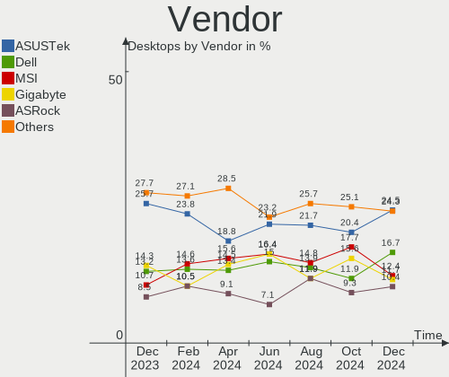
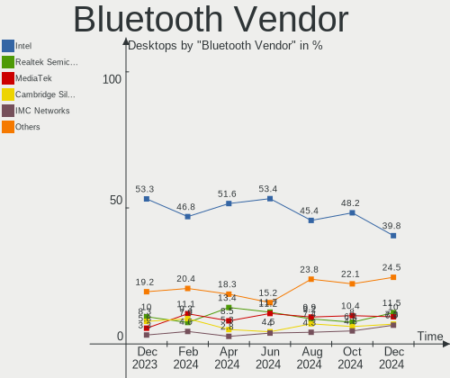
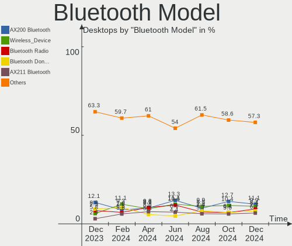
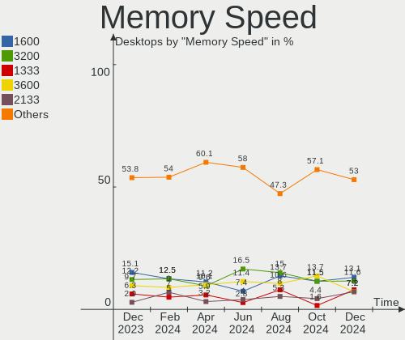

Linux in USA - Hardware Trends (Desktops)
-----------------------------------------

A project to identify most popular hardware characteristics and track their change
over time based on data collected by Linux users at https://Linux-Hardware.org.

Anyone can contribute to this report by the [hw-probe](https://github.com/linuxhw/hw-probe) tool:

    sudo -E hw-probe -all -upload

Period: Jan, 2023.

Contents
--------

* [ System ](#system)
  - [ OS                       ](#os)
  - [ OS Family                ](#os-family)
  - [ Kernel                   ](#kernel)
  - [ Kernel Family            ](#kernel-family)
  - [ Kernel Major Ver.        ](#kernel-major-ver)
  - [ Arch                     ](#arch)
  - [ DE                       ](#de)
  - [ Display Server           ](#display-server)
  - [ Display Manager          ](#display-manager)
  - [ OS Lang                  ](#os-lang)
  - [ Boot Mode                ](#boot-mode)
  - [ Filesystem               ](#filesystem)
  - [ Part. scheme             ](#part-scheme)
  - [ Dual Boot with Linux/BSD ](#dual-boot-with-linuxbsd)
  - [ Dual Boot (Win)          ](#dual-boot-win)

* [ Board ](#board)
  - [ Vendor                   ](#vendor)
  - [ Model                    ](#model)
  - [ Model Family             ](#model-family)
  - [ MFG Year                 ](#mfg-year)
  - [ Form Factor              ](#form-factor)
  - [ Secure Boot              ](#secure-boot)
  - [ Coreboot                 ](#coreboot)
  - [ RAM Size                 ](#ram-size)
  - [ RAM Used                 ](#ram-used)
  - [ Total Drives             ](#total-drives)
  - [ Has CD-ROM               ](#has-cd-rom)
  - [ Has Ethernet             ](#has-ethernet)
  - [ Has WiFi                 ](#has-wifi)
  - [ Has Bluetooth            ](#has-bluetooth)

* [ Location ](#location)
  - [ Country                  ](#country)
  - [ City                     ](#city)

* [ Drives ](#drives)
  - [ Drive Vendor             ](#drive-vendor)
  - [ Drive Model              ](#drive-model)
  - [ HDD Vendor               ](#hdd-vendor)
  - [ SSD Vendor               ](#ssd-vendor)
  - [ Drive Kind               ](#drive-kind)
  - [ Drive Connector          ](#drive-connector)
  - [ Drive Size               ](#drive-size)
  - [ Space Total              ](#space-total)
  - [ Space Used               ](#space-used)
  - [ Malfunc. Drives          ](#malfunc-drives)
  - [ Malfunc. Drive Vendor    ](#malfunc-drive-vendor)
  - [ Malfunc. HDD Vendor      ](#malfunc-hdd-vendor)
  - [ Malfunc. Drive Kind      ](#malfunc-drive-kind)
  - [ Failed Drives            ](#failed-drives)
  - [ Failed Drive Vendor      ](#failed-drive-vendor)
  - [ Drive Status             ](#drive-status)

* [ Storage controller ](#storage-controller)
  - [ Storage Vendor           ](#storage-vendor)
  - [ Storage Model            ](#storage-model)
  - [ Storage Kind             ](#storage-kind)

* [ Processor ](#processor)
  - [ CPU Vendor               ](#cpu-vendor)
  - [ CPU Model                ](#cpu-model)
  - [ CPU Model Family         ](#cpu-model-family)
  - [ CPU Cores                ](#cpu-cores)
  - [ CPU Sockets              ](#cpu-sockets)
  - [ CPU Threads              ](#cpu-threads)
  - [ CPU Op-Modes             ](#cpu-op-modes)
  - [ CPU Microcode            ](#cpu-microcode)
  - [ CPU Microarch            ](#cpu-microarch)

* [ Graphics ](#graphics)
  - [ GPU Vendor               ](#gpu-vendor)
  - [ GPU Model                ](#gpu-model)
  - [ GPU Combo                ](#gpu-combo)
  - [ GPU Driver               ](#gpu-driver)
  - [ GPU Memory               ](#gpu-memory)

* [ Monitor ](#monitor)
  - [ Monitor Vendor           ](#monitor-vendor)
  - [ Monitor Model            ](#monitor-model)
  - [ Monitor Resolution       ](#monitor-resolution)
  - [ Monitor Diagonal         ](#monitor-diagonal)
  - [ Monitor Width            ](#monitor-width)
  - [ Aspect Ratio             ](#aspect-ratio)
  - [ Monitor Area             ](#monitor-area)
  - [ Pixel Density            ](#pixel-density)
  - [ Multiple Monitors        ](#multiple-monitors)

* [ Network ](#network)
  - [ Net Controller Vendor    ](#net-controller-vendor)
  - [ Net Controller Model     ](#net-controller-model)
  - [ Wireless Vendor          ](#wireless-vendor)
  - [ Wireless Model           ](#wireless-model)
  - [ Ethernet Vendor          ](#ethernet-vendor)
  - [ Ethernet Model           ](#ethernet-model)
  - [ Net Controller Kind      ](#net-controller-kind)
  - [ Used Controller          ](#used-controller)
  - [ NICs                     ](#nics)
  - [ IPv6                     ](#ipv6)

* [ Bluetooth ](#bluetooth)
  - [ Bluetooth Vendor         ](#bluetooth-vendor)
  - [ Bluetooth Model          ](#bluetooth-model)

* [ Sound ](#sound)
  - [ Sound Vendor             ](#sound-vendor)
  - [ Sound Model              ](#sound-model)

* [ Memory ](#memory)
  - [ Memory Vendor            ](#memory-vendor)
  - [ Memory Model             ](#memory-model)
  - [ Memory Kind              ](#memory-kind)
  - [ Memory Form Factor       ](#memory-form-factor)
  - [ Memory Size              ](#memory-size)
  - [ Memory Speed             ](#memory-speed)

* [ Printers & scanners ](#printers--scanners)
  - [ Printer Vendor           ](#printer-vendor)
  - [ Printer Model            ](#printer-model)
  - [ Scanner Vendor           ](#scanner-vendor)
  - [ Scanner Model            ](#scanner-model)

* [ Camera ](#camera)
  - [ Camera Vendor            ](#camera-vendor)
  - [ Camera Model             ](#camera-model)

* [ Security ](#security)
  - [ Fingerprint Vendor       ](#fingerprint-vendor)
  - [ Fingerprint Model        ](#fingerprint-model)
  - [ Chipcard Vendor          ](#chipcard-vendor)
  - [ Chipcard Model           ](#chipcard-model)

* [ Unsupported ](#unsupported)
  - [ Unsupported Devices      ](#unsupported-devices)
  - [ Unsupported Device Types ](#unsupported-device-types)

System
------

OS
--

Installed operating systems

| Name                         | Desktops | Percent |
|------------------------------|----------|---------|
| OpenMandriva 23.01           | 107      | 21.57%  |
| Ubuntu 22.04                 | 70       | 14.11%  |
| Pop!_OS 22.04                | 36       | 7.26%   |
| Linux Mint 21.1              | 23       | 4.64%   |
| Fedora 37                    | 23       | 4.64%   |
| Ubuntu 22.10                 | 19       | 3.83%   |
| Zorin 16                     | 16       | 3.23%   |
| Arch Rolling                 | 16       | 3.23%   |
| Debian 11                    | 15       | 3.02%   |
| Linux Mint 20.3              | 9        | 1.81%   |
| ArcoLinux Rolling            | 9        | 1.81%   |
| Ubuntu 20.04                 | 8        | 1.61%   |
| Kubuntu 22.04                | 8        | 1.61%   |
| KDE neon 22.04               | 8        | 1.61%   |
| Ubuntu 18.04                 | 6        | 1.21%   |
| OpenMandriva 4.3             | 6        | 1.21%   |
| Manjaro                      | 6        | 1.21%   |
| Kubuntu 22.10                | 6        | 1.21%   |
| EndeavourOS Rolling          | 6        | 1.21%   |
| Xubuntu 22.04                | 5        | 1.01%   |
| openSUSE Tumbleweed-XXXXXXXX | 5        | 1.01%   |
| Manjaro 22.0.0               | 5        | 1.01%   |
| Nobara 36                    | 4        | 0.81%   |
| MX 21                        | 4        | 0.81%   |
| Manjaro 22.0                 | 4        | 0.81%   |
| Linux Mint 21                | 4        | 0.81%   |
| SteamOS 3.4                  | 3        | 0.6%    |
| Nobara 37                    | 3        | 0.6%    |
| Gentoo 2.9                   | 3        | 0.6%    |
| Fedora 36                    | 3        | 0.6%    |
| Zorin 15                     | 2        | 0.4%    |
| Xubuntu 20.04                | 2        | 0.4%    |
| Xero Rolling                 | 2        | 0.4%    |
| Ubuntu Unity 22.04           | 2        | 0.4%    |
| ROSA 12.3                    | 2        | 0.4%    |
| Pop!_OS 20.04                | 2        | 0.4%    |
| OpenMandriva 4.50            | 2        | 0.4%    |
| LMDE 5                       | 2        | 0.4%    |
| Elementary 6.1               | 2        | 0.4%    |
| Debian                       | 2        | 0.4%    |

OS Family
---------

OS without a version

| Name              | Desktops | Percent |
|-------------------|----------|---------|
| OpenMandriva      | 116      | 23.39%  |
| Ubuntu            | 104      | 20.97%  |
| Pop!_OS           | 38       | 7.66%   |
| Linux Mint        | 38       | 7.66%   |
| Fedora            | 26       | 5.24%   |
| Debian            | 19       | 3.83%   |
| Zorin             | 18       | 3.63%   |
| Manjaro           | 16       | 3.23%   |
| Arch              | 16       | 3.23%   |
| Kubuntu           | 15       | 3.02%   |
| ArcoLinux         | 10       | 2.02%   |
| Xubuntu           | 8        | 1.61%   |
| KDE neon          | 8        | 1.61%   |
| Nobara            | 7        | 1.41%   |
| openSUSE          | 6        | 1.21%   |
| EndeavourOS       | 6        | 1.21%   |
| MX                | 4        | 0.81%   |
| Ubuntu MATE       | 3        | 0.6%    |
| SteamOS           | 3        | 0.6%    |
| Gentoo            | 3        | 0.6%    |
| Xero              | 2        | 0.4%    |
| Ubuntu Unity      | 2        | 0.4%    |
| ROSA              | 2        | 0.4%    |
| LMDE              | 2        | 0.4%    |
| Garuda Linux      | 2        | 0.4%    |
| Elementary        | 2        | 0.4%    |
| Alpine            | 2        | 0.4%    |
| Ultramarine Linux | 1        | 0.2%    |
| Slackware         | 1        | 0.2%    |
| Rocky Linux       | 1        | 0.2%    |
| risiOS            | 1        | 0.2%    |
| RedStarOS         | 1        | 0.2%    |
| PureOS            | 1        | 0.2%    |
| Peppermint        | 1        | 0.2%    |
| Parrot            | 1        | 0.2%    |
| NixOS             | 1        | 0.2%    |
| Lubuntu           | 1        | 0.2%    |
| Linux Lite        | 1        | 0.2%    |
| Kali              | 1        | 0.2%    |
| Feren OS          | 1        | 0.2%    |

Kernel
------

Version of the Linux kernel

| Version                      | Desktops | Percent |
|------------------------------|----------|---------|
| 6.1.1-desktop-1omv2290       | 102      | 20.56%  |
| 5.15.0-58-generic            | 65       | 13.1%   |
| 5.15.0-56-generic            | 36       | 7.26%   |
| 6.0.12-76060006-generic      | 33       | 6.65%   |
| 5.15.0-57-generic            | 25       | 5.04%   |
| 5.10.0-20-amd64              | 14       | 2.82%   |
| 5.19.0-29-generic            | 10       | 2.02%   |
| 6.1.1-1-MANJARO              | 8        | 1.61%   |
| 5.4.0-137-generic            | 8        | 1.61%   |
| 5.19.0-26-generic            | 8        | 1.61%   |
| 6.0.15-300.fc37.x86_64       | 7        | 1.41%   |
| 5.4.0-135-generic            | 7        | 1.41%   |
| 6.1.4-arch1-1                | 6        | 1.21%   |
| 5.16.7-desktop-1omv4003      | 6        | 1.21%   |
| 5.15.0-43-generic            | 5        | 1.01%   |
| 6.1.8-arch1-1                | 4        | 0.81%   |
| 6.1.7-200.fc37.x86_64        | 4        | 0.81%   |
| 6.1.5-200.fc37.x86_64        | 4        | 0.81%   |
| 5.15.0-53-generic            | 4        | 0.81%   |
| 6.1.3-arch1-1                | 3        | 0.6%    |
| 6.1.1-arch1-1                | 3        | 0.6%    |
| 6.0.6-76060006-generic       | 3        | 0.6%    |
| 6.0.14-201.fsync.fc36.x86_64 | 3        | 0.6%    |
| 5.4.0-136-generic            | 3        | 0.6%    |
| 5.19.0-28-generic            | 3        | 0.6%    |
| 5.15.85-1-MANJARO            | 3        | 0.6%    |
| 6.1.8-zen1-1-zen             | 2        | 0.4%    |
| 6.1.7-zen1-1-zen             | 2        | 0.4%    |
| 6.1.7-1-MANJARO              | 2        | 0.4%    |
| 6.1.7-1-default              | 2        | 0.4%    |
| 6.1.6-200.fc37.x86_64        | 2        | 0.4%    |
| 6.1.5-arch2-1                | 2        | 0.4%    |
| 6.1.4-zen2-1-zen             | 2        | 0.4%    |
| 6.1.4-desktop-gcc-1omv2301   | 2        | 0.4%    |
| 6.1.4-desktop-1omv2301       | 2        | 0.4%    |
| 6.1.4-1-default              | 2        | 0.4%    |
| 6.1.1-zen1-1-zen             | 2        | 0.4%    |
| 6.1.1-x64v1-xanmod1-1        | 2        | 0.4%    |
| 6.0.7-301.fc37.x86_64        | 2        | 0.4%    |
| 6.0.16-300.fc37.x86_64       | 2        | 0.4%    |

Kernel Family
-------------

Linux kernel without a distro release

| Version | Desktops | Percent |
|---------|----------|---------|
| 5.15.0  | 144      | 29.03%  |
| 6.1.1   | 117      | 23.59%  |
| 6.0.12  | 34       | 6.85%   |
| 5.19.0  | 25       | 5.04%   |
| 5.4.0   | 23       | 4.64%   |
| 6.1.4   | 18       | 3.63%   |
| 5.10.0  | 16       | 3.23%   |
| 6.1.7   | 12       | 2.42%   |
| 6.1.6   | 9        | 1.81%   |
| 6.1.5   | 8        | 1.61%   |
| 6.0.15  | 8        | 1.61%   |
| 6.1.8   | 7        | 1.41%   |
| 5.16.7  | 6        | 1.21%   |
| 5.13.0  | 6        | 1.21%   |
| 6.0.0   | 4        | 0.81%   |
| 5.15.85 | 4        | 0.81%   |
| 6.1.3   | 3        | 0.6%    |
| 6.0.6   | 3        | 0.6%    |
| 6.0.14  | 3        | 0.6%    |
| 5.15.86 | 3        | 0.6%    |
| 4.15.0  | 3        | 0.6%    |
| 6.1.2   | 2        | 0.4%    |
| 6.1.0   | 2        | 0.4%    |
| 6.0.7   | 2        | 0.4%    |
| 6.0.18  | 2        | 0.4%    |
| 6.0.17  | 2        | 0.4%    |
| 6.0.16  | 2        | 0.4%    |
| 6.0.10  | 2        | 0.4%    |
| 5.15.87 | 2        | 0.4%    |
| 5.15.79 | 2        | 0.4%    |
| 5.14.0  | 2        | 0.4%    |
| 4.19.0  | 2        | 0.4%    |
| 6.0.2   | 1        | 0.2%    |
| 5.8.0   | 1        | 0.2%    |
| 5.19.9  | 1        | 0.2%    |
| 5.19.15 | 1        | 0.2%    |
| 5.19.12 | 1        | 0.2%    |
| 5.19.11 | 1        | 0.2%    |
| 5.18.19 | 1        | 0.2%    |
| 5.18.1  | 1        | 0.2%    |

Kernel Major Ver.
-----------------

Linux kernel major version

| Version | Desktops | Percent |
|---------|----------|---------|
| 6.1     | 178      | 35.89%  |
| 5.15    | 161      | 32.46%  |
| 6.0     | 63       | 12.7%   |
| 5.19    | 29       | 5.85%   |
| 5.4     | 23       | 4.64%   |
| 5.10    | 16       | 3.23%   |
| 5.16    | 6        | 1.21%   |
| 5.13    | 6        | 1.21%   |
| 4.15    | 3        | 0.6%    |
| 5.18    | 2        | 0.4%    |
| 5.17    | 2        | 0.4%    |
| 5.14    | 2        | 0.4%    |
| 4.19    | 2        | 0.4%    |
| 5.8     | 1        | 0.2%    |
| 4.4     | 1        | 0.2%    |
| 4.18    | 1        | 0.2%    |

Arch
----

OS architecture (x86_64, i586, etc.)

| Name   | Desktops | Percent |
|--------|----------|---------|
| x86_64 | 493      | 99.4%   |
| i686   | 3        | 0.6%    |

DE
--

Desktop Environment

| Name          | Desktops | Percent |
|---------------|----------|---------|
| GNOME         | 210      | 42.34%  |
| KDE5          | 183      | 36.9%   |
| X-Cinnamon    | 35       | 7.06%   |
| XFCE          | 24       | 4.84%   |
| Unknown       | 15       | 3.02%   |
| MATE          | 11       | 2.22%   |
| LXQt          | 3        | 0.6%    |
| Unity         | 2        | 0.4%    |
| Pantheon      | 2        | 0.4%    |
| i3            | 2        | 0.4%    |
| Hyprland      | 2        | 0.4%    |
| GNOME Classic | 2        | 0.4%    |
| Sway          | 1        | 0.2%    |
| openbox       | 1        | 0.2%    |
| LXDE          | 1        | 0.2%    |
| KDE           | 1        | 0.2%    |
| awesome       | 1        | 0.2%    |

Display Server
--------------

X11 or Wayland

| Name    | Desktops | Percent |
|---------|----------|---------|
| X11     | 358      | 72.18%  |
| Wayland | 118      | 23.79%  |
| Tty     | 17       | 3.43%   |
| Unknown | 3        | 0.6%    |

Display Manager
---------------

SDDM, LightDM, etc.

| Name    | Desktops | Percent |
|---------|----------|---------|
| Unknown | 162      | 32.66%  |
| SDDM    | 149      | 30.04%  |
| GDM3    | 99       | 19.96%  |
| LightDM | 54       | 10.89%  |
| GDM     | 31       | 6.25%   |
| LYNDE   | 1        | 0.2%    |

OS Lang
-------

Language

| Lang    | Desktops | Percent |
|---------|----------|---------|
| en_US   | 470      | 94.76%  |
| C       | 7        | 1.41%   |
| Unknown | 6        | 1.21%   |
| en_GB   | 3        | 0.6%    |
| en_CA   | 2        | 0.4%    |
| zh_CN   | 1        | 0.2%    |
| ru_RU   | 1        | 0.2%    |
| pl_PL   | 1        | 0.2%    |
| osa_US  | 1        | 0.2%    |
| es_VE   | 1        | 0.2%    |
| en_HK   | 1        | 0.2%    |
| en_DK   | 1        | 0.2%    |
| C.UTF8  | 1        | 0.2%    |

Boot Mode
---------

EFI or BIOS

| Mode | Desktops | Percent |
|------|----------|---------|
| BIOS | 272      | 54.84%  |
| EFI  | 224      | 45.16%  |

Filesystem
----------

Type of filesystem

| Type    | Desktops | Percent |
|---------|----------|---------|
| Ext4    | 304      | 61.29%  |
| Overlay | 105      | 21.17%  |
| Btrfs   | 71       | 14.31%  |
| Zfs     | 7        | 1.41%   |
| Xfs     | 4        | 0.81%   |
| Tmpfs   | 2        | 0.4%    |
| F2fs    | 1        | 0.2%    |
| Ext2    | 1        | 0.2%    |
| Unknown | 1        | 0.2%    |

Part. scheme
------------

Scheme of partitioning

| Type    | Desktops | Percent |
|---------|----------|---------|
| GPT     | 271      | 54.64%  |
| Unknown | 150      | 30.24%  |
| MBR     | 75       | 15.12%  |

Dual Boot with Linux/BSD
------------------------

Hosting more than one Linux/BSD

| Dual boot | Desktops | Percent |
|-----------|----------|---------|
| No        | 356      | 71.77%  |
| Yes       | 140      | 28.23%  |

Dual Boot (Win)
---------------

Hosting Linux and Windows

| Dual boot | Desktops | Percent |
|-----------|----------|---------|
| No        | 365      | 73.59%  |
| Yes       | 131      | 26.41%  |

Board
-----

Vendor
------

Motherboard manufacturer

| Name                | Desktops | Percent |
|---------------------|----------|---------|
| ASUSTek Computer    | 118      | 23.79%  |
| Gigabyte Technology | 72       | 14.52%  |
| Dell                | 64       | 12.9%   |
| MSI                 | 62       | 12.5%   |
| Hewlett-Packard     | 46       | 9.27%   |
| ASRock              | 39       | 7.86%   |
| Lenovo              | 28       | 5.65%   |
| Intel               | 10       | 2.02%   |
| Acer                | 8        | 1.61%   |
| Pegatron            | 7        | 1.41%   |
| Foxconn             | 7        | 1.41%   |
| Gateway             | 4        | 0.81%   |
| AZW                 | 4        | 0.81%   |
| Alienware           | 3        | 0.6%    |
| Unknown             | 3        | 0.6%    |
| ECS                 | 2        | 0.4%    |
| BESSTAR Tech        | 2        | 0.4%    |
| Win element         | 1        | 0.2%    |
| SYWZ                | 1        | 0.2%    |
| System76            | 1        | 0.2%    |
| SiS Technology      | 1        | 0.2%    |
| Shuttle             | 1        | 0.2%    |
| Quanta              | 1        | 0.2%    |
| Purism              | 1        | 0.2%    |
| Nvidia              | 1        | 0.2%    |
| NEWSMAY             | 1        | 0.2%    |
| NetGear             | 1        | 0.2%    |
| MAXSUN              | 1        | 0.2%    |
| MACHINIST           | 1        | 0.2%    |
| Hardkernel          | 1        | 0.2%    |
| EVGA                | 1        | 0.2%    |
| CncTion             | 1        | 0.2%    |
| Apple               | 1        | 0.2%    |
| AMD                 | 1        | 0.2%    |

Model
-----

Motherboard model

| Name                                 | Desktops | Percent |
|--------------------------------------|----------|---------|
| ASUS All Series                      | 9        | 1.81%   |
| Dell OptiPlex 7010                   | 6        | 1.21%   |
| ASUS TUF Gaming X570-PLUS            | 6        | 1.21%   |
| ASUS ROG CROSSHAIR VIII HERO         | 5        | 1.01%   |
| ASUS M5A97 R2.0                      | 5        | 1.01%   |
| Unknown                              | 5        | 1.01%   |
| MSI MS-7C56                          | 4        | 0.81%   |
| Dell XPS 8940                        | 4        | 0.81%   |
| ASUS ROG STRIX B450-F GAMING         | 4        | 0.81%   |
| ASRock B450M Pro4                    | 4        | 0.81%   |
| MSI MS-7C37                          | 3        | 0.6%    |
| MSI MS-7C02                          | 3        | 0.6%    |
| MSI MS-7B86                          | 3        | 0.6%    |
| MSI MS-7693                          | 3        | 0.6%    |
| Gigabyte Z390 DESIGNARE              | 3        | 0.6%    |
| Gigabyte B450M DS3H WIFI             | 3        | 0.6%    |
| Dell OptiPlex 9020                   | 3        | 0.6%    |
| Dell OptiPlex 9010                   | 3        | 0.6%    |
| Dell OptiPlex 3020                   | 3        | 0.6%    |
| AZW GTR                              | 3        | 0.6%    |
| ASUS ROG STRIX B550-F GAMING         | 3        | 0.6%    |
| MSI MS-7C95                          | 2        | 0.4%    |
| MSI MS-7C91                          | 2        | 0.4%    |
| MSI MS-7C75                          | 2        | 0.4%    |
| MSI MS-7B85                          | 2        | 0.4%    |
| MSI MS-7A33                          | 2        | 0.4%    |
| Intel DZ77GA-70K AAG39009-500        | 2        | 0.4%    |
| HP ProDesk 600 G1 SFF                | 2        | 0.4%    |
| HP Pavilion Gaming Desktop TG01-2xxx | 2        | 0.4%    |
| HP EliteDesk 800 G2 TWR              | 2        | 0.4%    |
| HP EliteDesk 800 G1 TWR              | 2        | 0.4%    |
| Gigabyte Z87N-WIFI                   | 2        | 0.4%    |
| Gigabyte X570S AERO G                | 2        | 0.4%    |
| Gigabyte X570 AORUS MASTER           | 2        | 0.4%    |
| Gigabyte GA-78LMT-USB3 6.0           | 2        | 0.4%    |
| Gigabyte F2A88XM-D3H                 | 2        | 0.4%    |
| Gigabyte B550M DS3H AC               | 2        | 0.4%    |
| Gigabyte B550M DS3H                  | 2        | 0.4%    |
| Gigabyte B550I AORUS PRO AX          | 2        | 0.4%    |
| Gigabyte B450 AORUS PRO WIFI         | 2        | 0.4%    |

Model Family
------------

Motherboard model prefix

| Name                   | Desktops | Percent |
|------------------------|----------|---------|
| ASUS ROG               | 32       | 6.45%   |
| Dell OptiPlex          | 31       | 6.25%   |
| ASUS PRIME             | 22       | 4.44%   |
| Lenovo ThinkCentre     | 13       | 2.62%   |
| Dell Inspiron          | 13       | 2.62%   |
| ASUS TUF               | 13       | 2.62%   |
| HP Pavilion            | 11       | 2.22%   |
| ASUS All               | 9        | 1.81%   |
| HP Compaq              | 8        | 1.61%   |
| Dell XPS               | 8        | 1.61%   |
| Dell Precision         | 8        | 1.61%   |
| HP EliteDesk           | 7        | 1.41%   |
| ASUS M5A97             | 7        | 1.41%   |
| Lenovo IdeaCentre      | 6        | 1.21%   |
| Gigabyte X570          | 5        | 1.01%   |
| Gigabyte B450M         | 5        | 1.01%   |
| Acer Aspire            | 5        | 1.01%   |
| Unknown                | 5        | 1.01%   |
| MSI MS-7C56            | 4        | 0.81%   |
| Lenovo ThinkStation    | 4        | 0.81%   |
| Gigabyte Z390          | 4        | 0.81%   |
| Gigabyte B550M         | 4        | 0.81%   |
| ASRock B450M           | 4        | 0.81%   |
| ASRock B450            | 4        | 0.81%   |
| MSI MS-7C37            | 3        | 0.6%    |
| MSI MS-7C02            | 3        | 0.6%    |
| MSI MS-7B86            | 3        | 0.6%    |
| MSI MS-7693            | 3        | 0.6%    |
| Gigabyte X570S         | 3        | 0.6%    |
| Gigabyte GA-78LMT-USB3 | 3        | 0.6%    |
| Gigabyte B450          | 3        | 0.6%    |
| AZW GTR                | 3        | 0.6%    |
| ASUS SABERTOOTH        | 3        | 0.6%    |
| ASRock Z77             | 3        | 0.6%    |
| MSI MS-7C95            | 2        | 0.4%    |
| MSI MS-7C91            | 2        | 0.4%    |
| MSI MS-7C75            | 2        | 0.4%    |
| MSI MS-7B85            | 2        | 0.4%    |
| MSI MS-7A33            | 2        | 0.4%    |
| Lenovo Legion          | 2        | 0.4%    |

MFG Year
--------

Motherboard manufacture year

| Year    | Desktops | Percent |
|---------|----------|---------|
| 2012    | 50       | 10.08%  |
| 2018    | 49       | 9.88%   |
| 2020    | 47       | 9.48%   |
| 2019    | 47       | 9.48%   |
| 2013    | 43       | 8.67%   |
| 2022    | 42       | 8.47%   |
| 2021    | 42       | 8.47%   |
| 2015    | 30       | 6.05%   |
| 2011    | 28       | 5.65%   |
| 2017    | 24       | 4.84%   |
| 2014    | 20       | 4.03%   |
| 2010    | 15       | 3.02%   |
| 2009    | 14       | 2.82%   |
| 2016    | 13       | 2.62%   |
| 2008    | 13       | 2.62%   |
| 2007    | 12       | 2.42%   |
| 2006    | 2        | 0.4%    |
| 2005    | 2        | 0.4%    |
| Unknown | 2        | 0.4%    |
| 2004    | 1        | 0.2%    |

Form Factor
-----------

Physical design of the computer

| Name    | Desktops | Percent |
|---------|----------|---------|
| Desktop | 496      | 100%    |

Secure Boot
-----------

Enabled or disabled

| State    | Desktops | Percent |
|----------|----------|---------|
| Disabled | 484      | 97.58%  |
| Enabled  | 12       | 2.42%   |

Coreboot
--------

Have coreboot on board

| Used | Desktops | Percent |
|------|----------|---------|
| No   | 495      | 99.8%   |
| Yes  | 1        | 0.2%    |

RAM Size
--------

Total RAM memory

| Size in GB  | Desktops | Percent |
|-------------|----------|---------|
| 16.01-24.0  | 150      | 30.24%  |
| 32.01-64.0  | 118      | 23.79%  |
| 4.01-8.0    | 59       | 11.9%   |
| 8.01-16.0   | 51       | 10.28%  |
| 3.01-4.0    | 38       | 7.66%   |
| 64.01-256.0 | 36       | 7.26%   |
| 24.01-32.0  | 31       | 6.25%   |
| 1.01-2.0    | 9        | 1.81%   |
| 2.01-3.0    | 4        | 0.81%   |

RAM Used
--------

Used RAM memory

| Used GB     | Desktops | Percent |
|-------------|----------|---------|
| 1.01-2.0    | 149      | 30.04%  |
| 2.01-3.0    | 115      | 23.19%  |
| 4.01-8.0    | 100      | 20.16%  |
| 3.01-4.0    | 63       | 12.7%   |
| 8.01-16.0   | 36       | 7.26%   |
| 0.51-1.0    | 17       | 3.43%   |
| 16.01-24.0  | 6        | 1.21%   |
| 0.01-0.5    | 6        | 1.21%   |
| 24.01-32.0  | 2        | 0.4%    |
| 32.01-64.0  | 1        | 0.2%    |
| 64.01-256.0 | 1        | 0.2%    |

Total Drives
------------

Number of drives on board

| Drives | Desktops | Percent |
|--------|----------|---------|
| 1      | 170      | 34.27%  |
| 2      | 145      | 29.23%  |
| 3      | 78       | 15.73%  |
| 4      | 45       | 9.07%   |
| 5      | 28       | 5.65%   |
| 6      | 9        | 1.81%   |
| 0      | 6        | 1.21%   |
| 8      | 5        | 1.01%   |
| 7      | 5        | 1.01%   |
| 18     | 2        | 0.4%    |
| 12     | 1        | 0.2%    |
| 10     | 1        | 0.2%    |
| 9      | 1        | 0.2%    |

Has CD-ROM
----------

Has CD-ROM on board

| Presented | Desktops | Percent |
|-----------|----------|---------|
| No        | 256      | 51.61%  |
| Yes       | 240      | 48.39%  |

Has Ethernet
------------

Has Ethernet on board

| Presented | Desktops | Percent |
|-----------|----------|---------|
| Yes       | 492      | 99.19%  |
| No        | 4        | 0.81%   |

Has WiFi
--------

Has WiFi module

| Presented | Desktops | Percent |
|-----------|----------|---------|
| Yes       | 301      | 60.69%  |
| No        | 195      | 39.31%  |

Has Bluetooth
-------------

Has Bluetooth module

| Presented | Desktops | Percent |
|-----------|----------|---------|
| No        | 256      | 51.61%  |
| Yes       | 240      | 48.39%  |

Location
--------

Country
-------

Geographic location (country)

| Country | Desktops | Percent |
|---------|----------|---------|
| USA     | 496      | 100%    |

City
----

Geographic location (city)

| City           | Desktops | Percent |
|----------------|----------|---------|
| New York       | 16       | 3.23%   |
| Los Angeles    | 8        | 1.61%   |
| Dallas         | 7        | 1.41%   |
| Seattle        | 6        | 1.21%   |
| Portland       | 6        | 1.21%   |
| San Jose       | 5        | 1.01%   |
| Phoenix        | 5        | 1.01%   |
| Springfield    | 4        | 0.81%   |
| Miami          | 4        | 0.81%   |
| Fort Worth     | 4        | 0.81%   |
| Dublin         | 4        | 0.81%   |
| Chicago        | 4        | 0.81%   |
| Atlanta        | 4        | 0.81%   |
| Youngstown     | 3        | 0.6%    |
| Milwaukee      | 3        | 0.6%    |
| Louisville     | 3        | 0.6%    |
| Laurel         | 3        | 0.6%    |
| Jacksonville   | 3        | 0.6%    |
| Indianapolis   | 3        | 0.6%    |
| Enfield        | 3        | 0.6%    |
| Columbus       | 3        | 0.6%    |
| Citrus Heights | 3        | 0.6%    |
| Cincinnati     | 3        | 0.6%    |
| Boise          | 3        | 0.6%    |
| Austin         | 3        | 0.6%    |
| Winston-Salem  | 2        | 0.4%    |
| White House    | 2        | 0.4%    |
| Washington     | 2        | 0.4%    |
| The Bronx      | 2        | 0.4%    |
| Temecula       | 2        | 0.4%    |
| St Louis       | 2        | 0.4%    |
| Spring Hill    | 2        | 0.4%    |
| Schenectady    | 2        | 0.4%    |
| Salt Lake City | 2        | 0.4%    |
| Salem          | 2        | 0.4%    |
| Saint Joseph   | 2        | 0.4%    |
| Riverside      | 2        | 0.4%    |
| Renton         | 2        | 0.4%    |
| Raleigh        | 2        | 0.4%    |
| Providence     | 2        | 0.4%    |

Drives
------

Drive Vendor
------------

Hard drive vendors

| Vendor                      | Desktops | Drives | Percent |
|-----------------------------|----------|--------|---------|
| WDC                         | 173      | 246    | 18.35%  |
| Seagate                     | 170      | 234    | 18.03%  |
| Samsung Electronics         | 136      | 185    | 14.42%  |
| Sandisk                     | 52       | 60     | 5.51%   |
| Crucial                     | 42       | 47     | 4.45%   |
| Toshiba                     | 31       | 37     | 3.29%   |
| Kingston                    | 31       | 32     | 3.29%   |
| Hitachi                     | 24       | 27     | 2.55%   |
| Unknown                     | 22       | 30     | 2.33%   |
| Intel                       | 22       | 23     | 2.33%   |
| China                       | 21       | 25     | 2.23%   |
| PNY                         | 19       | 20     | 2.01%   |
| SPCC                        | 16       | 20     | 1.7%    |
| Phison Electronics          | 15       | 17     | 1.59%   |
| SK hynix                    | 14       | 15     | 1.48%   |
| A-DATA Technology           | 14       | 14     | 1.48%   |
| HGST                        | 13       | 26     | 1.38%   |
| Silicon Motion              | 11       | 13     | 1.17%   |
| Micron/Crucial Technology   | 10       | 10     | 1.06%   |
| Micron Technology           | 9        | 15     | 0.95%   |
| Team                        | 7        | 7      | 0.74%   |
| Phison                      | 6        | 9      | 0.64%   |
| OCZ                         | 5        | 5      | 0.53%   |
| KIOXIA                      | 5        | 5      | 0.53%   |
| JMicron Technology          | 5        | 5      | 0.53%   |
| Realtek Semiconductor       | 4        | 4      | 0.42%   |
| Mushkin                     | 4        | 4      | 0.42%   |
| SABRENT                     | 3        | 4      | 0.32%   |
| Lexar                       | 3        | 3      | 0.32%   |
| Hewlett-Packard             | 3        | 3      | 0.32%   |
| Transcend                   | 2        | 2      | 0.21%   |
| PNY CS90                    | 2        | 2      | 0.21%   |
| Netac                       | 2        | 2      | 0.21%   |
| MAXIO Technology (Hangzhou) | 2        | 2      | 0.21%   |
| MaxDigital                  | 2        | 2      | 0.21%   |
| LITEON                      | 2        | 2      | 0.21%   |
| Kingston Technology Company | 2        | 2      | 0.21%   |
| Gigabyte Technology         | 2        | 3      | 0.21%   |
| Biwin Storage Technology    | 2        | 2      | 0.21%   |
| ASMT                        | 2        | 2      | 0.21%   |

Drive Model
-----------

Hard drive models

| Model                                                 | Desktops | Percent |
|-------------------------------------------------------|----------|---------|
| Samsung NVMe SSD Controller SM981/PM981/PM983 500GB   | 28       | 2.54%   |
| Seagate ST2000DM008-2FR102 2TB                        | 16       | 1.45%   |
| Seagate ST500DM002-1BD142 500GB                       | 13       | 1.18%   |
| Unknown SD/MMC/MS PRO 2GB                             | 12       | 1.09%   |
| Kingston SA400S37240G 240GB SSD                       | 12       | 1.09%   |
| Samsung NVMe SSD Controller PM9A1/PM9A3/980PRO 512GB  | 11       | 1%      |
| WDC WD10EZEX-08WN4A0 1TB                              | 10       | 0.91%   |
| Samsung SSD 860 EVO 500GB                             | 10       | 0.91%   |
| Crucial CT1000MX500SSD1 1TB                           | 10       | 0.91%   |
| Samsung SSD 860 EVO 1TB                               | 8        | 0.72%   |
| Samsung SSD 850 EVO 500GB                             | 8        | 0.72%   |
| Samsung SSD 850 EVO 250GB                             | 8        | 0.72%   |
| Intel SSD 660P Series 512GB                           | 8        | 0.72%   |
| WDC WD20EZAZ-00GGJB0 2TB                              | 7        | 0.63%   |
| Samsung NVMe SSD Controller SM961/PM961/SM963 256GB   | 7        | 0.63%   |
| China SATA SSD 240GB                                  | 7        | 0.63%   |
| Toshiba DT01ACA100 1TB                                | 6        | 0.54%   |
| Silicon Motion SM2263EN/SM2263XT SSD Controller 512GB | 6        | 0.54%   |
| Seagate ST3000DM008-2DM166 3TB                        | 6        | 0.54%   |
| Samsung SSD 980 1TB                                   | 6        | 0.54%   |
| WDC WDBNCE5000PNC 500GB SSD                           | 5        | 0.45%   |
| WDC WD10EZEX-60WN4A0 1TB                              | 5        | 0.45%   |
| Seagate ST8000DM004-2CX188 8TB                        | 5        | 0.45%   |
| Seagate ST1000DM010-2EP102 1TB                        | 5        | 0.45%   |
| Seagate ST1000DM003-1CH162 1TB                        | 5        | 0.45%   |
| Sandisk WD Black SN750 / PC SN730 NVMe SSD 1TB        | 5        | 0.45%   |
| SanDisk NVMe SSD Drive 500GB                          | 5        | 0.45%   |
| SanDisk NVMe SSD Drive 1TB                            | 5        | 0.45%   |
| PNY CS1311 240GB SSD                                  | 5        | 0.45%   |
| Phison E16 PCIe4 NVMe Controller 2TB                  | 5        | 0.45%   |
| Phison E12 NVMe Controller 1TB                        | 5        | 0.45%   |
| Crucial CT500MX500SSD1 500GB                          | 5        | 0.45%   |
| Crucial CT2000MX500SSD1 2TB                           | 5        | 0.45%   |
| WDC WDBNCE0010PNC 1TB SSD                             | 4        | 0.36%   |
| WDC WD10EZEX-00BN5A0 1TB                              | 4        | 0.36%   |
| WDC WD1002FAEX-00Z3A0 1TB                             | 4        | 0.36%   |
| Unknown SD/MMC 2GB                                    | 4        | 0.36%   |
| Unknown M.S./M.S.Pro/HG 16GB                          | 4        | 0.36%   |
| Toshiba DT01ACA200 2TB                                | 4        | 0.36%   |
| Silicon Motion SM2262/SM2262EN SSD Controller 1TB     | 4        | 0.36%   |

HDD Vendor
----------

Hard disk drive vendors

| Vendor              | Desktops | Drives | Percent |
|---------------------|----------|--------|---------|
| Seagate             | 164      | 224    | 41.52%  |
| WDC                 | 135      | 196    | 34.18%  |
| Toshiba             | 29       | 35     | 7.34%   |
| Hitachi             | 24       | 27     | 6.08%   |
| Unknown             | 13       | 14     | 3.29%   |
| HGST                | 13       | 26     | 3.29%   |
| Samsung Electronics | 6        | 8      | 1.52%   |
| SABRENT             | 3        | 4      | 0.76%   |
| ASMT                | 2        | 2      | 0.51%   |
| Apple               | 2        | 2      | 0.51%   |
| StoreJet            | 1        | 1      | 0.25%   |
| Maxtor              | 1        | 1      | 0.25%   |
| Fujitsu             | 1        | 1      | 0.25%   |
| ASMedia             | 1        | 1      | 0.25%   |

SSD Vendor
----------

Solid state drive vendors

| Vendor              | Desktops | Drives | Percent |
|---------------------|----------|--------|---------|
| Samsung Electronics | 76       | 88     | 22.75%  |
| Crucial             | 39       | 44     | 11.68%  |
| WDC                 | 36       | 40     | 10.78%  |
| Kingston            | 28       | 29     | 8.38%   |
| SanDisk             | 24       | 26     | 7.19%   |
| China               | 21       | 25     | 6.29%   |
| PNY                 | 19       | 20     | 5.69%   |
| SPCC                | 15       | 18     | 4.49%   |
| A-DATA Technology   | 13       | 13     | 3.89%   |
| SK hynix            | 7        | 7      | 2.1%    |
| Intel               | 7        | 7      | 2.1%    |
| Team                | 5        | 5      | 1.5%    |
| OCZ                 | 5        | 5      | 1.5%    |
| Micron Technology   | 4        | 10     | 1.2%    |
| Lexar               | 3        | 3      | 0.9%    |
| Transcend           | 2        | 2      | 0.6%    |
| PNY CS90            | 2        | 2      | 0.6%    |
| Netac               | 2        | 2      | 0.6%    |
| Mushkin             | 2        | 2      | 0.6%    |
| JMicron Technology  | 2        | 2      | 0.6%    |
| Hewlett-Packard     | 2        | 2      | 0.6%    |
| XrayDisk            | 1        | 1      | 0.3%    |
| WDC WDS2            | 1        | 1      | 0.3%    |
| USB3.0              | 1        | 1      | 0.3%    |
| Toshiba             | 1        | 1      | 0.3%    |
| SUNEAST             | 1        | 1      | 0.3%    |
| Seagate             | 1        | 1      | 0.3%    |
| Patriot             | 1        | 2      | 0.3%    |
| OWC                 | 1        | 1      | 0.3%    |
| NGFF                | 1        | 1      | 0.3%    |
| Nextorag            | 1        | 1      | 0.3%    |
| LITEONIT            | 1        | 1      | 0.3%    |
| LITEON              | 1        | 1      | 0.3%    |
| KLEVV               | 1        | 1      | 0.3%    |
| Kingrich            | 1        | 1      | 0.3%    |
| Inland              | 1        | 1      | 0.3%    |
| GLOWAY              | 1        | 1      | 0.3%    |
| Dogfish             | 1        | 1      | 0.3%    |
| Corsair             | 1        | 2      | 0.3%    |
| Apacer              | 1        | 1      | 0.3%    |

Drive Kind
----------

HDD or SSD

| Kind    | Desktops | Drives | Percent |
|---------|----------|--------|---------|
| HDD     | 305      | 542    | 38.95%  |
| SSD     | 264      | 374    | 33.72%  |
| NVMe    | 192      | 253    | 24.52%  |
| Unknown | 20       | 30     | 2.55%   |
| MMC     | 2        | 2      | 0.26%   |

Drive Connector
---------------

SATA, SAS, NVMe, etc.

| Type | Desktops | Drives | Percent |
|------|----------|--------|---------|
| SATA | 427      | 846    | 62.06%  |
| NVMe | 192      | 253    | 27.91%  |
| SAS  | 67       | 100    | 9.74%   |
| MMC  | 2        | 2      | 0.29%   |

Drive Size
----------

Size of hard drive

| Size in TB | Desktops | Drives | Percent |
|------------|----------|--------|---------|
| 0.01-0.5   | 258      | 357    | 39.21%  |
| 0.51-1.0   | 191      | 262    | 29.03%  |
| 1.01-2.0   | 91       | 115    | 13.83%  |
| 3.01-4.0   | 44       | 62     | 6.69%   |
| 4.01-10.0  | 37       | 52     | 5.62%   |
| 2.01-3.0   | 28       | 35     | 4.26%   |
| 10.01-20.0 | 9        | 33     | 1.37%   |

Space Total
-----------

Amount of disk space available on the file system

| Size in GB     | Desktops | Percent |
|----------------|----------|---------|
| 501-1000       | 85       | 17.14%  |
| More than 3000 | 82       | 16.53%  |
| 1-20           | 72       | 14.52%  |
| 251-500        | 69       | 13.91%  |
| 101-250        | 64       | 12.9%   |
| 1001-2000      | 47       | 9.48%   |
| Unknown        | 28       | 5.65%   |
| 2001-3000      | 26       | 5.24%   |
| 51-100         | 15       | 3.02%   |
| 21-50          | 8        | 1.61%   |

Space Used
----------

Amount of used disk space

| Used GB        | Desktops | Percent |
|----------------|----------|---------|
| 1-20           | 178      | 35.89%  |
| 21-50          | 59       | 11.9%   |
| 101-250        | 49       | 9.88%   |
| 51-100         | 39       | 7.86%   |
| 251-500        | 38       | 7.66%   |
| 501-1000       | 32       | 6.45%   |
| 1001-2000      | 31       | 6.25%   |
| Unknown        | 28       | 5.65%   |
| More than 3000 | 23       | 4.64%   |
| 2001-3000      | 19       | 3.83%   |

Malfunc. Drives
---------------

Drive models with a malfunction

| Model                                 | Desktops | Drives | Percent |
|---------------------------------------|----------|--------|---------|
| Seagate ST2000DM008-2FR102 2TB        | 3        | 3      | 4.76%   |
| WDC WD5000AAVS-00N7B0 500GB           | 2        | 2      | 3.17%   |
| WDC WD5000AAKX-001CA0 500GB           | 2        | 2      | 3.17%   |
| Seagate ST500DM002-1BD142 500GB       | 2        | 2      | 3.17%   |
| Seagate ST31500341AS 1TB              | 2        | 2      | 3.17%   |
| Seagate ST2000DL003-9VT166 2TB        | 2        | 2      | 3.17%   |
| Seagate ST1000LM024 HN-M101MBB 1TB    | 2        | 2      | 3.17%   |
| WDC WDS240G2G0B-00EPW0 240GB SSD      | 1        | 1      | 1.59%   |
| WDC WD800AAJS-00PSA0 80GB             | 1        | 1      | 1.59%   |
| WDC WD7500AAKS-00RBA0 752GB           | 1        | 1      | 1.59%   |
| WDC WD5000AACS-00G8B1 500GB           | 1        | 1      | 1.59%   |
| WDC WD30EFRX-68EUZN0 3TB              | 1        | 1      | 1.59%   |
| WDC WD20EZRX-22D8PB0 2TB              | 1        | 1      | 1.59%   |
| WDC WD10EZEX-75WN4A0 1TB              | 1        | 1      | 1.59%   |
| WDC WD10EZEX-21WN4A0 1TB              | 1        | 1      | 1.59%   |
| WDC WD10EZEX-08WN4A0 1TB              | 1        | 1      | 1.59%   |
| WDC WD10EACS-00D6B1 1TB               | 1        | 1      | 1.59%   |
| WDC WD Green 2.5 1000GB SSD           | 1        | 1      | 1.59%   |
| WDC WD Blue SA510 2.5 1TB SSD         | 1        | 1      | 1.59%   |
| Toshiba DT01ACA300 3TB                | 1        | 1      | 1.59%   |
| SUNEAST SSD SE800 1TB                 | 1        | 1      | 1.59%   |
| SK hynix HFS256G39TND-N210A 256GB SSD | 1        | 1      | 1.59%   |
| Seagate ST500LM021-1KJ152 500GB       | 1        | 1      | 1.59%   |
| Seagate ST4000DM000-1F2168 4TB        | 1        | 3      | 1.59%   |
| Seagate ST380811AS 80GB               | 1        | 1      | 1.59%   |
| Seagate ST3808110AS 80GB              | 1        | 1      | 1.59%   |
| Seagate ST3750640NS 752GB             | 1        | 1      | 1.59%   |
| Seagate ST320LT007-9ZV142 320GB       | 1        | 1      | 1.59%   |
| Seagate ST32000644NS 2TB              | 1        | 1      | 1.59%   |
| Seagate ST31000528AS 1TB              | 1        | 1      | 1.59%   |
| Seagate ST31000524AS 1TB              | 1        | 1      | 1.59%   |
| Seagate ST31000333AS 1TB              | 1        | 1      | 1.59%   |
| Seagate ST3000DM003-1F216N 3TB        | 1        | 1      | 1.59%   |
| Seagate ST3000DM 003-1F216N 3TB       | 1        | 1      | 1.59%   |
| Seagate ST2000DM006-2DM164 2TB        | 1        | 1      | 1.59%   |
| Seagate ST12000NM0007-2A1101 12TB     | 1        | 1      | 1.59%   |
| Seagate ST1000NM0033-9ZM173 1TB       | 1        | 1      | 1.59%   |
| Seagate ST1000DX001-SSHD-8GB          | 1        | 1      | 1.59%   |
| Seagate ST1000DM003-9YN162 1TB        | 1        | 1      | 1.59%   |
| SanDisk SSD PLUS 240 GB               | 1        | 1      | 1.59%   |

Malfunc. Drive Vendor
---------------------

Vendors of faulty drives

| Vendor              | Desktops | Drives | Percent |
|---------------------|----------|--------|---------|
| Seagate             | 26       | 30     | 42.62%  |
| WDC                 | 16       | 16     | 26.23%  |
| Samsung Electronics | 4        | 5      | 6.56%   |
| Hitachi             | 3        | 4      | 4.92%   |
| HGST                | 2        | 4      | 3.28%   |
| A-DATA Technology   | 2        | 2      | 3.28%   |
| Toshiba             | 1        | 1      | 1.64%   |
| SUNEAST             | 1        | 1      | 1.64%   |
| SK hynix            | 1        | 1      | 1.64%   |
| SanDisk             | 1        | 1      | 1.64%   |
| Micron Technology   | 1        | 7      | 1.64%   |
| Kingston            | 1        | 1      | 1.64%   |
| ASMedia             | 1        | 1      | 1.64%   |
| Apple               | 1        | 1      | 1.64%   |

Malfunc. HDD Vendor
-------------------

Vendors of faulty HDD drives

| Vendor              | Desktops | Drives | Percent |
|---------------------|----------|--------|---------|
| Seagate             | 26       | 30     | 53.06%  |
| WDC                 | 13       | 13     | 26.53%  |
| Hitachi             | 3        | 4      | 6.12%   |
| Samsung Electronics | 2        | 3      | 4.08%   |
| HGST                | 2        | 4      | 4.08%   |
| Toshiba             | 1        | 1      | 2.04%   |
| ASMedia             | 1        | 1      | 2.04%   |
| Apple               | 1        | 1      | 2.04%   |

Malfunc. Drive Kind
-------------------

Kinds of faulty drives

| Kind | Desktops | Drives | Percent |
|------|----------|--------|---------|
| HDD  | 44       | 57     | 78.57%  |
| SSD  | 11       | 17     | 19.64%  |
| NVMe | 1        | 1      | 1.79%   |

Failed Drives
-------------

Failed drive models

Zero info for selected period =(

Failed Drive Vendor
-------------------

Failed drive vendors

Zero info for selected period =(

Drive Status
------------

Number of failed and malfunc. drives

| Status   | Desktops | Drives | Percent |
|----------|----------|--------|---------|
| Detected | 275      | 613    | 48.42%  |
| Works    | 239      | 513    | 42.08%  |
| Malfunc  | 54       | 75     | 9.51%   |

Storage controller
------------------

Storage Vendor
--------------

Storage controller vendors

| Vendor                           | Desktops | Percent |
|----------------------------------|----------|---------|
| Intel                            | 282      | 36.72%  |
| AMD                              | 206      | 26.82%  |
| Samsung Electronics              | 71       | 9.24%   |
| SanDisk                          | 41       | 5.34%   |
| ASMedia Technology               | 31       | 4.04%   |
| Phison Electronics               | 26       | 3.39%   |
| Marvell Technology Group         | 16       | 2.08%   |
| Silicon Motion                   | 15       | 1.95%   |
| Micron/Crucial Technology        | 13       | 1.69%   |
| JMicron Technology               | 8        | 1.04%   |
| SK hynix                         | 7        | 0.91%   |
| Nvidia                           | 7        | 0.91%   |
| Realtek Semiconductor            | 5        | 0.65%   |
| KIOXIA                           | 5        | 0.65%   |
| Kingston Technology Company      | 5        | 0.65%   |
| Micron Technology                | 4        | 0.52%   |
| LSI Logic / Symbios Logic        | 4        | 0.52%   |
| Broadcom / LSI                   | 3        | 0.39%   |
| Silicon Image                    | 2        | 0.26%   |
| Seagate Technology               | 2        | 0.26%   |
| MAXIO Technology (Hangzhou)      | 2        | 0.26%   |
| Biwin Storage Technology         | 2        | 0.26%   |
| VIA Technologies                 | 1        | 0.13%   |
| Toshiba America Info Systems     | 1        | 0.13%   |
| Sony                             | 1        | 0.13%   |
| Solidigm                         | 1        | 0.13%   |
| Solid State Storage Technology   | 1        | 0.13%   |
| Silicon Integrated Systems [SiS] | 1        | 0.13%   |
| Lite-On Technology               | 1        | 0.13%   |
| INNOGRIT                         | 1        | 0.13%   |
| ATTO Technology                  | 1        | 0.13%   |
| ADATA Technology                 | 1        | 0.13%   |
| 3ware                            | 1        | 0.13%   |

Storage Model
-------------

Storage controller models

| Model                                                                          | Desktops | Percent |
|--------------------------------------------------------------------------------|----------|---------|
| AMD FCH SATA Controller [AHCI mode]                                            | 106      | 11.55%  |
| Samsung NVMe SSD Controller SM981/PM981/PM983                                  | 44       | 4.79%   |
| AMD 400 Series Chipset SATA Controller                                         | 41       | 4.47%   |
| AMD 500 Series Chipset SATA Controller                                         | 39       | 4.25%   |
| Intel 8 Series/C220 Series Chipset Family 6-port SATA Controller 1 [AHCI mode] | 32       | 3.49%   |
| ASMedia ASM1062 Serial ATA Controller                                          | 28       | 3.05%   |
| Intel 7 Series/C210 Series Chipset Family 6-port SATA Controller [AHCI mode]   | 27       | 2.94%   |
| AMD SB7x0/SB8x0/SB9x0 SATA Controller [AHCI mode]                              | 26       | 2.83%   |
| Intel SATA Controller [RAID mode]                                              | 25       | 2.72%   |
| AMD SB7x0/SB8x0/SB9x0 IDE Controller                                           | 23       | 2.51%   |
| Intel Q170/Q150/B150/H170/H110/Z170/CM236 Chipset SATA Controller [AHCI Mode]  | 22       | 2.4%    |
| Intel 6 Series/C200 Series Chipset Family 6 port Desktop SATA AHCI Controller  | 18       | 1.96%   |
| Intel Cannon Lake PCH SATA AHCI Controller                                     | 17       | 1.85%   |
| Intel Alder Lake-S PCH SATA Controller [AHCI Mode]                             | 17       | 1.85%   |
| Intel 200 Series PCH SATA controller [AHCI mode]                               | 15       | 1.63%   |
| AMD SB7x0/SB8x0/SB9x0 SATA Controller [IDE mode]                               | 15       | 1.63%   |
| Sandisk Non-Volatile memory controller                                         | 14       | 1.53%   |
| Samsung NVMe SSD Controller PM9A1/PM9A3/980PRO                                 | 13       | 1.42%   |
| Samsung NVMe SSD Controller 980                                                | 11       | 1.2%    |
| Intel SSD 660P Series                                                          | 11       | 1.2%    |
| Intel 82801JI (ICH10 Family) SATA AHCI Controller                              | 11       | 1.2%    |
| Samsung NVMe SSD Controller SM961/PM961/SM963                                  | 9        | 0.98%   |
| Phison E16 PCIe4 NVMe Controller                                               | 9        | 0.98%   |
| Intel Comet Lake SATA AHCI Controller                                          | 9        | 0.98%   |
| Intel 500 Series Chipset Family SATA AHCI Controller                           | 9        | 0.98%   |
| Silicon Motion SM2263EN/SM2263XT SSD Controller                                | 8        | 0.87%   |
| SanDisk WD Black SN750 / PC SN730 NVMe SSD                                     | 8        | 0.87%   |
| Phison PS5013 E13 NVMe Controller                                              | 8        | 0.87%   |
| Phison E12 NVMe Controller                                                     | 8        | 0.87%   |
| Intel NM10/ICH7 Family SATA Controller [IDE mode]                              | 8        | 0.87%   |
| SanDisk WD Blue SN570 NVMe SSD                                                 | 7        | 0.76%   |
| Marvell Group 88SE9172 SATA 6Gb/s Controller                                   | 7        | 0.76%   |
| Intel C600/X79 series chipset 6-Port SATA AHCI Controller                      | 7        | 0.76%   |
| Intel 9 Series Chipset Family SATA Controller [AHCI Mode]                      | 7        | 0.76%   |
| AMD SATA controller                                                            | 7        | 0.76%   |
| AMD FCH SATA Controller D                                                      | 7        | 0.76%   |
| AMD 300 Series Chipset SATA Controller                                         | 7        | 0.76%   |
| Silicon Motion SM2262/SM2262EN SSD Controller                                  | 6        | 0.65%   |
| Intel Volume Management Device NVMe RAID Controller                            | 6        | 0.65%   |
| Intel 82801G (ICH7 Family) IDE Controller                                      | 6        | 0.65%   |

Storage Kind
------------

Kind of storage controller (IDE, SATA, NVMe, SAS, ...)

| Kind | Desktops | Percent |
|------|----------|---------|
| SATA | 427      | 57.62%  |
| NVMe | 192      | 25.91%  |
| IDE  | 70       | 9.45%   |
| RAID | 40       | 5.4%    |
| SAS  | 9        | 1.21%   |
| SCSI | 3        | 0.4%    |

Processor
---------

CPU Vendor
----------

Processor vendors

| Vendor | Desktops | Percent |
|--------|----------|---------|
| Intel  | 277      | 55.85%  |
| AMD    | 219      | 44.15%  |

CPU Model
---------

Processor models

| Model                                       | Desktops | Percent |
|---------------------------------------------|----------|---------|
| AMD Ryzen 7 3700X 8-Core Processor          | 12       | 2.42%   |
| Intel Core i7-3770 CPU @ 3.40GHz            | 11       | 2.22%   |
| AMD Ryzen 9 3900X 12-Core Processor         | 11       | 2.22%   |
| AMD Ryzen 5 5600G with Radeon Graphics      | 11       | 2.22%   |
| AMD Ryzen 9 5900X 12-Core Processor         | 10       | 2.02%   |
| AMD Ryzen 5 5600X 6-Core Processor          | 9        | 1.81%   |
| AMD Ryzen 5 3600 6-Core Processor           | 9        | 1.81%   |
| AMD Ryzen 7 2700X Eight-Core Processor      | 8        | 1.61%   |
| Intel Core i5-3470 CPU @ 3.20GHz            | 7        | 1.41%   |
| AMD FX-8350 Eight-Core Processor            | 7        | 1.41%   |
| Intel Core i9-9900K CPU @ 3.60GHz           | 6        | 1.21%   |
| Intel Core i7-10700 CPU @ 2.90GHz           | 6        | 1.21%   |
| Intel 12th Gen Core i9-12900K               | 6        | 1.21%   |
| AMD Ryzen 7 5800X 8-Core Processor          | 6        | 1.21%   |
| AMD Ryzen 5 2600 Six-Core Processor         | 6        | 1.21%   |
| AMD FX-6300 Six-Core Processor              | 6        | 1.21%   |
| Intel Core i7-6700 CPU @ 3.40GHz            | 5        | 1.01%   |
| Intel Core i7-4790K CPU @ 4.00GHz           | 5        | 1.01%   |
| Intel Core i7-4790 CPU @ 3.60GHz            | 5        | 1.01%   |
| Intel Core i7-2600 CPU @ 3.40GHz            | 5        | 1.01%   |
| AMD Ryzen 7 5800X3D 8-Core Processor        | 5        | 1.01%   |
| AMD Ryzen 7 5700X 8-Core Processor          | 5        | 1.01%   |
| AMD Ryzen 7 5700G with Radeon Graphics      | 5        | 1.01%   |
| Intel Core i7-8700 CPU @ 3.20GHz            | 4        | 0.81%   |
| Intel Core i5-6500 CPU @ 3.20GHz            | 4        | 0.81%   |
| Intel Core i5-4590 CPU @ 3.30GHz            | 4        | 0.81%   |
| Intel Core i5-4570 CPU @ 3.20GHz            | 4        | 0.81%   |
| Intel 12th Gen Core i5-12400                | 4        | 0.81%   |
| Intel 11th Gen Core i7-11700 @ 2.50GHz      | 4        | 0.81%   |
| AMD Ryzen 9 6900HX with Radeon Graphics     | 4        | 0.81%   |
| AMD Ryzen 9 5950X 16-Core Processor         | 4        | 0.81%   |
| AMD Ryzen 3 3200G with Radeon Vega Graphics | 4        | 0.81%   |
| Intel Xeon CPU E5-1620 0 @ 3.60GHz          | 3        | 0.6%    |
| Intel Core i7-9700K CPU @ 3.60GHz           | 3        | 0.6%    |
| Intel Core i7-8700K CPU @ 3.70GHz           | 3        | 0.6%    |
| Intel Core i7-7700K CPU @ 4.20GHz           | 3        | 0.6%    |
| Intel Core i7-6700K CPU @ 4.00GHz           | 3        | 0.6%    |
| Intel Core i7-4770S CPU @ 3.10GHz           | 3        | 0.6%    |
| Intel Core i7-3770S CPU @ 3.10GHz           | 3        | 0.6%    |
| Intel Core i7-2600K CPU @ 3.40GHz           | 3        | 0.6%    |

CPU Model Family
----------------

Processor model prefix

| Model                   | Desktops | Percent |
|-------------------------|----------|---------|
| Intel Core i7           | 85       | 17.14%  |
| Intel Core i5           | 69       | 13.91%  |
| AMD Ryzen 7             | 52       | 10.48%  |
| AMD Ryzen 5             | 49       | 9.88%   |
| AMD Ryzen 9             | 34       | 6.85%   |
| Other                   | 33       | 6.65%   |
| Intel Xeon              | 28       | 5.65%   |
| AMD FX                  | 23       | 4.64%   |
| Intel Core i3           | 17       | 3.43%   |
| Intel Core 2 Duo        | 9        | 1.81%   |
| Intel Celeron           | 8        | 1.61%   |
| AMD Ryzen 3             | 8        | 1.61%   |
| Intel Core i9           | 7        | 1.41%   |
| Intel Core 2 Quad       | 7        | 1.41%   |
| Intel Pentium           | 6        | 1.21%   |
| AMD Phenom II X4        | 5        | 1.01%   |
| AMD Athlon 64 X2        | 5        | 1.01%   |
| AMD A8                  | 5        | 1.01%   |
| AMD A6                  | 4        | 0.81%   |
| AMD Phenom II X6        | 3        | 0.6%    |
| AMD E1                  | 3        | 0.6%    |
| AMD Athlon II X2        | 3        | 0.6%    |
| AMD Athlon              | 3        | 0.6%    |
| AMD A10                 | 3        | 0.6%    |
| Intel Pentium Silver    | 2        | 0.4%    |
| Intel Pentium Dual      | 2        | 0.4%    |
| Intel Pentium D         | 2        | 0.4%    |
| Intel Pentium 4         | 2        | 0.4%    |
| AMD Sempron             | 2        | 0.4%    |
| AMD Ryzen Threadripper  | 2        | 0.4%    |
| AMD Phenom II X2        | 2        | 0.4%    |
| AMD A4                  | 2        | 0.4%    |
| Intel Pentium Dual-Core | 1        | 0.2%    |
| Intel Atom              | 1        | 0.2%    |
| AMD PRO A10             | 1        | 0.2%    |
| AMD Phenom              | 1        | 0.2%    |
| AMD E2                  | 1        | 0.2%    |
| AMD E                   | 1        | 0.2%    |
| AMD Athlon XP           | 1        | 0.2%    |
| AMD Athlon X2           | 1        | 0.2%    |

CPU Cores
---------

Number of processor cores

| Number | Desktops | Percent |
|--------|----------|---------|
| 4      | 182      | 36.69%  |
| 8      | 94       | 18.95%  |
| 6      | 83       | 16.73%  |
| 2      | 78       | 15.73%  |
| 12     | 26       | 5.24%   |
| 16     | 14       | 2.82%   |
| 1      | 8        | 1.61%   |
| 3      | 7        | 1.41%   |
| 32     | 1        | 0.2%    |
| 28     | 1        | 0.2%    |
| 24     | 1        | 0.2%    |
| 14     | 1        | 0.2%    |

CPU Sockets
-----------

Number of sockets

| Number | Desktops | Percent |
|--------|----------|---------|
| 1      | 489      | 98.59%  |
| 2      | 7        | 1.41%   |

CPU Threads
-----------

Threads per core (Hyper-Threading)

| Number | Desktops | Percent |
|--------|----------|---------|
| 2      | 337      | 67.94%  |
| 1      | 159      | 32.06%  |

CPU Op-Modes
------------

CPU Operation Modes (32-bit, 64-bit)

| Op mode        | Desktops | Percent |
|----------------|----------|---------|
| 32-bit, 64-bit | 495      | 99.8%   |
| 32-bit         | 1        | 0.2%    |

CPU Microcode
-------------

Microcode number

| Number     | Desktops | Percent |
|------------|----------|---------|
| Unknown    | 169      | 34.07%  |
| 0x306c3    | 27       | 5.44%   |
| 0x306a9    | 26       | 5.24%   |
| 0x08701021 | 24       | 4.84%   |
| 0x506e3    | 16       | 3.23%   |
| 0x206a7    | 11       | 2.22%   |
| 0x0a20120a | 11       | 2.22%   |
| 0x906e9    | 10       | 2.02%   |
| 0x0800820d | 10       | 2.02%   |
| 0x06000852 | 10       | 2.02%   |
| 0x906ea    | 9        | 1.81%   |
| 0x0a201016 | 8        | 1.61%   |
| 0xa0655    | 7        | 1.41%   |
| 0x1067a    | 7        | 1.41%   |
| 0xa0671    | 6        | 1.21%   |
| 0x90672    | 6        | 1.21%   |
| 0x0a50000d | 6        | 1.21%   |
| 0x0a201205 | 6        | 1.21%   |
| 0x906ed    | 5        | 1.01%   |
| 0x90675    | 5        | 1.01%   |
| 0x0a50000c | 5        | 1.01%   |
| 0x06001119 | 5        | 1.01%   |
| 0x06000822 | 5        | 1.01%   |
| 0x906c0    | 4        | 0.81%   |
| 0x6fb      | 4        | 0.81%   |
| 0x406f1    | 4        | 0.81%   |
| 0x106a5    | 4        | 0.81%   |
| 0x10676    | 4        | 0.81%   |
| 0x0a601203 | 4        | 0.81%   |
| 0x08108109 | 4        | 0.81%   |
| 0x010000c8 | 4        | 0.81%   |
| 0x906ec    | 3        | 0.6%    |
| 0x6fd      | 3        | 0.6%    |
| 0x08701013 | 3        | 0.6%    |
| 0x08001138 | 3        | 0.6%    |
| 0x010000db | 3        | 0.6%    |
| 0xf64      | 2        | 0.4%    |
| 0xf43      | 2        | 0.4%    |
| 0x906eb    | 2        | 0.4%    |
| 0x306f2    | 2        | 0.4%    |

CPU Microarch
-------------

Microarchitecture

| Name             | Desktops | Percent |
|------------------|----------|---------|
| Zen 3            | 58       | 11.69%  |
| Haswell          | 48       | 9.68%   |
| KabyLake         | 42       | 8.47%   |
| Zen 2            | 40       | 8.06%   |
| IvyBridge        | 40       | 8.06%   |
| Piledriver       | 28       | 5.65%   |
| SandyBridge      | 27       | 5.44%   |
| Unknown          | 27       | 5.44%   |
| Zen+             | 26       | 5.24%   |
| Skylake          | 21       | 4.23%   |
| K10              | 15       | 3.02%   |
| CometLake        | 13       | 2.62%   |
| Penryn           | 12       | 2.42%   |
| Zen              | 11       | 2.22%   |
| Nehalem          | 11       | 2.22%   |
| K8 Hammer        | 10       | 2.02%   |
| Alderlake Hybrid | 10       | 2.02%   |
| Core             | 9        | 1.81%   |
| Icelake          | 5        | 1.01%   |
| Westmere         | 4        | 0.81%   |
| Tremont          | 4        | 0.81%   |
| Steamroller      | 4        | 0.81%   |
| Silvermont       | 4        | 0.81%   |
| NetBurst         | 4        | 0.81%   |
| Broadwell        | 4        | 0.81%   |
| Bobcat           | 4        | 0.81%   |
| K10 Llano        | 3        | 0.6%    |
| Excavator        | 3        | 0.6%    |
| Jaguar           | 2        | 0.4%    |
| Goldmont plus    | 2        | 0.4%    |
| Bulldozer        | 2        | 0.4%    |
| TigerLake        | 1        | 0.2%    |
| K6               | 1        | 0.2%    |
| Bonnell          | 1        | 0.2%    |

Graphics
--------

GPU Vendor
----------

Vendors of graphics cards

| Vendor                           | Desktops | Percent |
|----------------------------------|----------|---------|
| AMD                              | 195      | 35.85%  |
| Nvidia                           | 193      | 35.48%  |
| Intel                            | 152      | 27.94%  |
| VIA Technologies                 | 1        | 0.18%   |
| Silicon Integrated Systems [SiS] | 1        | 0.18%   |
| Matrox Electronics Systems       | 1        | 0.18%   |
| ASPEED Technology                | 1        | 0.18%   |

GPU Model
---------

Graphics card models

| Model                                                                       | Desktops | Percent |
|-----------------------------------------------------------------------------|----------|---------|
| AMD Ellesmere [Radeon RX 470/480/570/570X/580/580X/590]                     | 28       | 5.05%   |
| Intel Xeon E3-1200 v3/4th Gen Core Processor Integrated Graphics Controller | 27       | 4.87%   |
| Intel Xeon E3-1200 v2/3rd Gen Core processor Graphics Controller            | 17       | 3.07%   |
| AMD Navi 23 [Radeon RX 6600/6600 XT/6600M]                                  | 14       | 2.53%   |
| AMD Navi 10 [Radeon RX 5600 OEM/5600 XT / 5700/5700 XT]                     | 14       | 2.53%   |
| Nvidia GP107 [GeForce GTX 1050 Ti]                                          | 13       | 2.35%   |
| Intel HD Graphics 530                                                       | 12       | 2.17%   |
| AMD Cezanne [Radeon Vega Series / Radeon Vega Mobile Series]                | 12       | 2.17%   |
| AMD Navi 22 [Radeon RX 6700/6700 XT/6750 XT / 6800M]                        | 11       | 1.99%   |
| AMD Navi 21 [Radeon RX 6800/6800 XT / 6900 XT]                              | 11       | 1.99%   |
| Nvidia GK208B [GeForce GT 710]                                              | 9        | 1.62%   |
| Intel CoffeeLake-S GT2 [UHD Graphics 630]                                   | 9        | 1.62%   |
| Intel IvyBridge GT2 [HD Graphics 4000]                                      | 8        | 1.44%   |
| Intel 2nd Generation Core Processor Family Integrated Graphics Controller   | 8        | 1.44%   |
| Nvidia GP108 [GeForce GT 1030]                                              | 7        | 1.26%   |
| Intel RocketLake-S GT1 [UHD Graphics 750]                                   | 7        | 1.26%   |
| Intel HD Graphics 630                                                       | 7        | 1.26%   |
| Intel 4 Series Chipset Integrated Graphics Controller                       | 7        | 1.26%   |
| AMD Picasso/Raven 2 [Radeon Vega Series / Radeon Vega Mobile Series]        | 7        | 1.26%   |
| Nvidia GP106 [GeForce GTX 1060 3GB]                                         | 6        | 1.08%   |
| Nvidia GM107 [GeForce GTX 750 Ti]                                           | 6        | 1.08%   |
| Nvidia GA106 [GeForce RTX 3060 Lite Hash Rate]                              | 6        | 1.08%   |
| Nvidia GA104 [GeForce RTX 3060 Ti Lite Hash Rate]                           | 6        | 1.08%   |
| Intel CometLake-S GT2 [UHD Graphics 630]                                    | 6        | 1.08%   |
| Intel AlderLake-S GT1                                                       | 6        | 1.08%   |
| AMD Caicos [Radeon HD 6450/7450/8450 / R5 230 OEM]                          | 6        | 1.08%   |
| Nvidia TU116 [GeForce GTX 1660 Ti]                                          | 5        | 0.9%    |
| Nvidia TU106 [GeForce RTX 2060 Rev. A]                                      | 5        | 0.9%    |
| Nvidia GP106 [GeForce GTX 1060 6GB]                                         | 5        | 0.9%    |
| Nvidia GA104 [GeForce RTX 3060]                                             | 5        | 0.9%    |
| AMD Raphael                                                                 | 5        | 0.9%    |
| AMD Oland XT [Radeon HD 8670 / R5 340X OEM / R7 250/350/350X OEM]           | 5        | 0.9%    |
| AMD Lexa PRO [Radeon 540/540X/550/550X / RX 540X/550/550X]                  | 5        | 0.9%    |
| Nvidia TU117 [GeForce GTX 1650]                                             | 4        | 0.72%   |
| Nvidia TU116 [GeForce GTX 1660 SUPER]                                       | 4        | 0.72%   |
| Nvidia GP107 [GeForce GTX 1050]                                             | 4        | 0.72%   |
| Nvidia GP102 [GeForce GTX 1080 Ti]                                          | 4        | 0.72%   |
| Nvidia GM204 [GeForce GTX 970]                                              | 4        | 0.72%   |
| Nvidia GA102 [GeForce RTX 3090]                                             | 4        | 0.72%   |
| Nvidia GA102 [GeForce RTX 3080]                                             | 4        | 0.72%   |

GPU Combo
---------

Combinations of graphics cards

| Name            | Desktops | Percent |
|-----------------|----------|---------|
| 1 x AMD         | 170      | 34.27%  |
| 1 x Nvidia      | 163      | 32.86%  |
| 1 x Intel       | 110      | 22.18%  |
| Intel + Nvidia  | 17       | 3.43%   |
| AMD + Nvidia    | 9        | 1.81%   |
| 2 x AMD         | 8        | 1.61%   |
| Intel + AMD     | 8        | 1.61%   |
| 2 x Intel       | 4        | 0.81%   |
| 2 x Nvidia      | 2        | 0.4%    |
| Other           | 1        | 0.2%    |
| 1 x VIA         | 1        | 0.2%    |
| 1 x SiS         | 1        | 0.2%    |
| Nvidia + ASPEED | 1        | 0.2%    |
| 1 x Matrox      | 1        | 0.2%    |

GPU Driver
----------

Free vs proprietary

| Driver      | Desktops | Percent |
|-------------|----------|---------|
| Free        | 377      | 76.01%  |
| Proprietary | 103      | 20.77%  |
| Unknown     | 16       | 3.23%   |

GPU Memory
----------

Total video memory

| Size in GB | Desktops | Percent |
|------------|----------|---------|
| Unknown    | 233      | 46.98%  |
| 7.01-8.0   | 53       | 10.69%  |
| 1.01-2.0   | 51       | 10.28%  |
| 8.01-16.0  | 39       | 7.86%   |
| 3.01-4.0   | 33       | 6.65%   |
| 0.01-0.5   | 30       | 6.05%   |
| 0.51-1.0   | 22       | 4.44%   |
| 5.01-6.0   | 19       | 3.83%   |
| 2.01-3.0   | 9        | 1.81%   |
| 16.01-24.0 | 7        | 1.41%   |

Monitor
-------

Monitor Vendor
--------------

Monitor vendors

| Vendor               | Desktops | Percent |
|----------------------|----------|---------|
| Dell                 | 87       | 16.63%  |
| Goldstar             | 60       | 11.47%  |
| Samsung Electronics  | 57       | 10.9%   |
| Acer                 | 55       | 10.52%  |
| Hewlett-Packard      | 46       | 8.8%    |
| Ancor Communications | 28       | 5.35%   |
| ViewSonic            | 23       | 4.4%    |
| AOC                  | 17       | 3.25%   |
| ASUSTek Computer     | 15       | 2.87%   |
| Vizio                | 14       | 2.68%   |
| BenQ                 | 12       | 2.29%   |
| Sceptre Tech         | 10       | 1.91%   |
| Gigabyte Technology  | 8        | 1.53%   |
| Lenovo               | 7        | 1.34%   |
| Sony                 | 6        | 1.15%   |
| MSI                  | 6        | 1.15%   |
| HannStar             | 4        | 0.76%   |
| Unknown              | 3        | 0.57%   |
| Toshiba              | 3        | 0.57%   |
| Philips              | 3        | 0.57%   |
| Panasonic            | 3        | 0.57%   |
| ONN                  | 3        | 0.57%   |
| Insignia             | 3        | 0.57%   |
| Hitachi              | 3        | 0.57%   |
| eMachines            | 3        | 0.57%   |
| Element              | 3        | 0.57%   |
| Westinghouse         | 2        | 0.38%   |
| Viotek               | 2        | 0.38%   |
| Pixio                | 2        | 0.38%   |
| Lenovo Group Limited | 2        | 0.38%   |
| HKC                  | 2        | 0.38%   |
| Gateway              | 2        | 0.38%   |
| AOpen                | 2        | 0.38%   |
| Unknown              | 2        | 0.38%   |
| ZIS                  | 1        | 0.19%   |
| USR                  | 1        | 0.19%   |
| Unknown (XXX)        | 1        | 0.19%   |
| Skyworth             | 1        | 0.19%   |
| Sharp                | 1        | 0.19%   |
| PLN                  | 1        | 0.19%   |

Monitor Model
-------------

Monitor models

| Model                                                                   | Desktops | Percent |
|-------------------------------------------------------------------------|----------|---------|
| Goldstar FULL HD GSM5B55 1920x1080 480x270mm 21.7-inch                  | 7        | 1.27%   |
| Acer SB220Q ACR06AB 1920x1080 476x268mm 21.5-inch                       | 5        | 0.91%   |
| Samsung Electronics U28E590 SAM0C4D 3840x2160 607x345mm 27.5-inch       | 4        | 0.73%   |
| Goldstar Ultra HD GSM5B09 3840x2160 600x340mm 27.2-inch                 | 4        | 0.73%   |
| Gigabyte Technology M27Q GBT270D 2560x1440 596x335mm 26.9-inch          | 4        | 0.73%   |
| Dell U2412M DELA07A 1920x1200 518x324mm 24.1-inch                       | 4        | 0.73%   |
| ViewSonic VX2758-Series VSCA738 2560x1440 598x336mm 27.0-inch           | 3        | 0.54%   |
| Samsung Electronics LCD Monitor SAM7017 3840x2160 1872x1053mm 84.6-inch | 3        | 0.54%   |
| Samsung Electronics C24F390 SAM0D2C 1920x1080 521x293mm 23.5-inch       | 3        | 0.54%   |
| Goldstar Ultra HD GSM5B08 3840x2160 600x340mm 27.2-inch                 | 3        | 0.54%   |
| Goldstar FULL HD GSM5B54 1920x1080 480x270mm 21.7-inch                  | 3        | 0.54%   |
| Goldstar 32inch FHD GSM76F5 1920x1080 698x392mm 31.5-inch               | 3        | 0.54%   |
| Dell P190S DEL405A 1280x1024 376x301mm 19.0-inch                        | 3        | 0.54%   |
| Vizio VO420E VIZ0050 1920x1080 930x520mm 41.9-inch                      | 2        | 0.36%   |
| Vizio V435-J01 VIZ1039 3840x2160 941x529mm 42.5-inch                    | 2        | 0.36%   |
| Vizio D32hn-D0 VIZ1007 1366x768 697x392mm 31.5-inch                     | 2        | 0.36%   |
| ViewSonic VX2452 Series VSCDE2E 1920x1080 521x293mm 23.5-inch           | 2        | 0.36%   |
| ViewSonic VP2365 SERIES VSC7C28 1920x1080 509x286mm 23.0-inch           | 2        | 0.36%   |
| Sceptre Tech Sceptre N55 SPT15BC 3840x2160 575x323mm 26.0-inch          | 2        | 0.36%   |
| Sceptre Tech Sceptre F24 SPT09AB 1920x1080 530x290mm 23.8-inch          | 2        | 0.36%   |
| Samsung Electronics LCD Monitor SAM08FC 1366x768                        | 2        | 0.36%   |
| Samsung Electronics LC49G95T SAM7053 3840x1080 1193x336mm 48.8-inch     | 2        | 0.36%   |
| ONN 100002487 ONN0101 1920x1080 517x323mm 24.0-inch                     | 2        | 0.36%   |
| MSI G273 MSI3CA7 1920x1080 597x336mm 27.0-inch                          | 2        | 0.36%   |
| HKC 27E6QC HKC274F 2560x1440 597x336mm 27.0-inch                        | 2        | 0.36%   |
| Hewlett-Packard LA2205 HWP2847 1680x1050 473x296mm 22.0-inch            | 2        | 0.36%   |
| Hewlett-Packard L1740 HWP2648 1280x1024 338x270mm 17.0-inch             | 2        | 0.36%   |
| Hewlett-Packard All-in-One HWP4218 1600x900 443x249mm 20.0-inch         | 2        | 0.36%   |
| Goldstar ULTRAGEAR GSM5B80 2560x1440 597x336mm 27.0-inch                | 2        | 0.36%   |
| Goldstar TV SSCR2 GSMC0C8 3840x2160                                     | 2        | 0.36%   |
| Goldstar HDR 4K GSM774F 3840x2160 697x392mm 31.5-inch                   | 2        | 0.36%   |
| Goldstar HDR 4K GSM7707 3840x2160 600x340mm 27.2-inch                   | 2        | 0.36%   |
| Goldstar 32 FHD GSM7700 1920x1080 698x392mm 31.5-inch                   | 2        | 0.36%   |
| Goldstar 27GL850 GSM5B7F 2560x1440 597x336mm 27.0-inch                  | 2        | 0.36%   |
| Element ELEFW328 ELE3553 1366x768 700x390mm 31.5-inch                   | 2        | 0.36%   |
| Dell U3011 DEL4065 2560x1600 641x401mm 29.8-inch                        | 2        | 0.36%   |
| Dell U2415 DELA0BC 1920x1200 518x324mm 24.1-inch                        | 2        | 0.36%   |
| Dell S2721QS DELA196 3840x2160 597x336mm 27.0-inch                      | 2        | 0.36%   |
| Dell S2240M DELD056 1920x1080 476x267mm 21.5-inch                       | 2        | 0.36%   |
| Dell P2419H DELD0DA 1920x1080 527x296mm 23.8-inch                       | 2        | 0.36%   |

Monitor Resolution
------------------

Monitor screen resolution

| Resolution         | Desktops | Percent |
|--------------------|----------|---------|
| 1920x1080 (FHD)    | 245      | 48.51%  |
| 3840x2160 (4K)     | 69       | 13.66%  |
| 2560x1440 (QHD)    | 56       | 11.09%  |
| 1680x1050 (WSXGA+) | 22       | 4.36%   |
| 1280x1024 (SXGA)   | 18       | 3.56%   |
| 1600x900 (HD+)     | 15       | 2.97%   |
| 1920x1200 (WUXGA)  | 13       | 2.57%   |
| 1440x900 (WXGA+)   | 13       | 2.57%   |
| 3440x1440          | 11       | 2.18%   |
| 1366x768 (WXGA)    | 9        | 1.78%   |
| 3840x1080          | 6        | 1.19%   |
| 2560x1080          | 5        | 0.99%   |
| 2288x1287          | 4        | 0.79%   |
| 1024x768 (XGA)     | 4        | 0.79%   |
| Unknown            | 4        | 0.79%   |
| 1920x540           | 3        | 0.59%   |
| 3840x1600          | 2        | 0.4%    |
| 2560x1600          | 2        | 0.4%    |
| 1600x1200          | 2        | 0.4%    |
| 5760x1080          | 1        | 0.2%    |
| 3360x1080          | 1        | 0.2%    |

Monitor Diagonal
----------------

Diagonal size in inches

| Inches  | Desktops | Percent |
|---------|----------|---------|
| 27      | 93       | 17.92%  |
| 24      | 74       | 14.26%  |
| 23      | 63       | 12.14%  |
| 21      | 50       | 9.63%   |
| 31      | 49       | 9.44%   |
| 20      | 25       | 4.82%   |
| Unknown | 21       | 4.05%   |
| 19      | 20       | 3.85%   |
| 34      | 13       | 2.5%    |
| 22      | 13       | 2.5%    |
| 32      | 12       | 2.31%   |
| 17      | 9        | 1.73%   |
| 84      | 7        | 1.35%   |
| 18      | 6        | 1.16%   |
| 48      | 5        | 0.96%   |
| 15      | 5        | 0.96%   |
| 69      | 4        | 0.77%   |
| 54      | 4        | 0.77%   |
| 40      | 4        | 0.77%   |
| 74      | 3        | 0.58%   |
| 72      | 3        | 0.58%   |
| 47      | 3        | 0.58%   |
| 38      | 3        | 0.58%   |
| 29      | 3        | 0.58%   |
| 28      | 3        | 0.58%   |
| 52      | 2        | 0.39%   |
| 49      | 2        | 0.39%   |
| 37      | 2        | 0.39%   |
| 36      | 2        | 0.39%   |
| 35      | 2        | 0.39%   |
| 26      | 2        | 0.39%   |
| 25      | 2        | 0.39%   |
| 142     | 1        | 0.19%   |
| 60      | 1        | 0.19%   |
| 59      | 1        | 0.19%   |
| 58      | 1        | 0.19%   |
| 57      | 1        | 0.19%   |
| 55      | 1        | 0.19%   |
| 46      | 1        | 0.19%   |
| 42      | 1        | 0.19%   |

Monitor Width
-------------

Physical width

| Width in mm    | Desktops | Percent |
|----------------|----------|---------|
| 501-600        | 209      | 41.47%  |
| 401-500        | 100      | 19.84%  |
| 601-700        | 67       | 13.29%  |
| 701-800        | 26       | 5.16%   |
| 1001-1500      | 22       | 4.37%   |
| Unknown        | 21       | 4.17%   |
| 1501-2000      | 17       | 3.37%   |
| 301-350        | 14       | 2.78%   |
| 801-900        | 13       | 2.58%   |
| 351-400        | 12       | 2.38%   |
| 901-1000       | 2        | 0.4%    |
| More than 2000 | 1        | 0.2%    |

Aspect Ratio
------------

Proportional relationship between the width and the height

| Ratio   | Desktops | Percent |
|---------|----------|---------|
| 16/9    | 350      | 73.38%  |
| 16/10   | 56       | 11.74%  |
| 5/4     | 21       | 4.4%    |
| 21/9    | 19       | 3.98%   |
| Unknown | 16       | 3.35%   |
| 4/3     | 7        | 1.47%   |
| 32/9    | 6        | 1.26%   |
| 3/2     | 1        | 0.21%   |
| 1.00    | 1        | 0.21%   |

Monitor Area
------------

Area in inch

| Area in inch | Desktops | Percent |
|----------------|----------|---------|
| 201-250        | 146      | 28.97%  |
| 301-350        | 94       | 18.65%  |
| 351-500        | 76       | 15.08%  |
| 151-200        | 65       | 12.9%   |
| 251-300        | 32       | 6.35%   |
| More than 1000 | 31       | 6.15%   |
| 501-1000       | 22       | 4.37%   |
| Unknown        | 21       | 4.17%   |
| 141-150        | 12       | 2.38%   |
| 111-120        | 4        | 0.79%   |
| 101-110        | 1        | 0.2%    |

Pixel Density
-------------

Pixels per inch

| Density | Desktops | Percent |
|---------|----------|---------|
| 51-100  | 307      | 63.69%  |
| 101-120 | 94       | 19.5%   |
| 1-50    | 25       | 5.19%   |
| 121-160 | 23       | 4.77%   |
| Unknown | 21       | 4.36%   |
| 161-240 | 12       | 2.49%   |

Multiple Monitors
-----------------

Total monitors connected

| Total | Desktops | Percent |
|-------|----------|---------|
| 1     | 391      | 78.83%  |
| 2     | 72       | 14.52%  |
| 0     | 18       | 3.63%   |
| 3     | 13       | 2.62%   |
| 5     | 1        | 0.2%    |
| 4     | 1        | 0.2%    |

Network
-------

Net Controller Vendor
---------------------

Controller vendors

| Vendor                           | Desktops | Percent |
|----------------------------------|----------|---------|
| Realtek Semiconductor            | 307      | 41.43%  |
| Intel                            | 269      | 36.3%   |
| Qualcomm Atheros                 | 39       | 5.26%   |
| Broadcom                         | 26       | 3.51%   |
| Ralink Technology                | 12       | 1.62%   |
| MediaTek                         | 12       | 1.62%   |
| TP-Link                          | 7        | 0.94%   |
| Ralink                           | 7        | 0.94%   |
| NetGear                          | 7        | 0.94%   |
| Nvidia                           | 6        | 0.81%   |
| Linksys                          | 6        | 0.81%   |
| Edimax Technology                | 5        | 0.67%   |
| Aquantia                         | 5        | 0.67%   |
| Broadcom Limited                 | 4        | 0.54%   |
| Microsoft                        | 3        | 0.4%    |
| Belkin Components                | 3        | 0.4%    |
| Motorola PCS                     | 2        | 0.27%   |
| Google                           | 2        | 0.27%   |
| ZyDAS                            | 1        | 0.13%   |
| VIA Technologies                 | 1        | 0.13%   |
| U-Blox                           | 1        | 0.13%   |
| Silicon Integrated Systems [SiS] | 1        | 0.13%   |
| Samsung Electronics              | 1        | 0.13%   |
| Padix (Rockfire)                 | 1        | 0.13%   |
| Oculus VR                        | 1        | 0.13%   |
| Motorola                         | 1        | 0.13%   |
| Mellanox Technologies            | 1        | 0.13%   |
| Marvell Technology Group         | 1        | 0.13%   |
| InterBiometrics                  | 1        | 0.13%   |
| Input Club                       | 1        | 0.13%   |
| Gemtek                           | 1        | 0.13%   |
| D-Link System                    | 1        | 0.13%   |
| D-Link                           | 1        | 0.13%   |
| ASUSTek Computer                 | 1        | 0.13%   |
| ASIX Electronics                 | 1        | 0.13%   |
| Allwinner Technology             | 1        | 0.13%   |
| 3Com                             | 1        | 0.13%   |

Net Controller Model
--------------------

Controller models

| Model                                                             | Desktops | Percent |
|-------------------------------------------------------------------|----------|---------|
| Realtek RTL8111/8168/8411 PCI Express Gigabit Ethernet Controller | 225      | 25.45%  |
| Intel Wi-Fi 6 AX200                                               | 44       | 4.98%   |
| Intel I211 Gigabit Network Connection                             | 44       | 4.98%   |
| Realtek RTL8125 2.5GbE Controller                                 | 39       | 4.41%   |
| Intel Ethernet Controller I225-V                                  | 30       | 3.39%   |
| Intel Dual Band Wireless-AC 3168NGW [Stone Peak]                  | 26       | 2.94%   |
| Intel 82579LM Gigabit Network Connection (Lewisville)             | 23       | 2.6%    |
| Intel Wi-Fi 6 AX210/AX211/AX411 160MHz                            | 14       | 1.58%   |
| Intel Ethernet Connection (2) I219-V                              | 14       | 1.58%   |
| Realtek RTL8821CE 802.11ac PCIe Wireless Network Adapter          | 13       | 1.47%   |
| Intel Ethernet Connection (7) I219-V                              | 12       | 1.36%   |
| Intel Ethernet Connection I217-LM                                 | 11       | 1.24%   |
| Intel 82579V Gigabit Network Connection                           | 11       | 1.24%   |
| Intel Ethernet Connection (2) I219-LM                             | 10       | 1.13%   |
| Intel Cannon Lake PCH CNVi WiFi                                   | 10       | 1.13%   |
| Intel Wireless-AC 9260                                            | 9        | 1.02%   |
| Intel Ethernet Connection (2) I218-V                              | 9        | 1.02%   |
| Intel 82574L Gigabit Network Connection                           | 9        | 1.02%   |
| Realtek RTL8188EUS 802.11n Wireless Network Adapter               | 8        | 0.9%    |
| Realtek 802.11ac NIC                                              | 8        | 0.9%    |
| Intel Ethernet Connection I217-V                                  | 8        | 0.9%    |
| Realtek RTL8821AE 802.11ac PCIe Wireless Network Adapter          | 7        | 0.79%   |
| Realtek RTL810xE PCI Express Fast Ethernet controller             | 7        | 0.79%   |
| Qualcomm Atheros AR9462 Wireless Network Adapter                  | 7        | 0.79%   |
| Qualcomm Atheros AR93xx Wireless Network Adapter                  | 7        | 0.79%   |
| Intel Alder Lake-S PCH CNVi WiFi                                  | 7        | 0.79%   |
| MediaTek MT7921K (RZ608) Wi-Fi 6E 80MHz                           | 6        | 0.68%   |
| Intel Wireless 3165                                               | 6        | 0.68%   |
| Intel I210 Gigabit Network Connection                             | 6        | 0.68%   |
| Realtek RTL88x2bu [AC1200 Techkey]                                | 5        | 0.57%   |
| Ralink MT7601U Wireless Adapter                                   | 5        | 0.57%   |
| Intel Comet Lake PCH CNVi WiFi                                    | 5        | 0.57%   |
| Realtek RTL8822CE 802.11ac PCIe Wireless Network Adapter          | 4        | 0.45%   |
| Realtek Killer E2600 Gigabit Ethernet Controller                  | 4        | 0.45%   |
| Qualcomm Atheros QCA6174 802.11ac Wireless Network Adapter        | 4        | 0.45%   |
| Qualcomm Atheros AR8161 Gigabit Ethernet                          | 4        | 0.45%   |
| MediaTek MT7922 802.11ax PCI Express Wireless Network Adapter     | 4        | 0.45%   |
| Intel Wireless 8260                                               | 4        | 0.45%   |
| Intel Wireless 7260                                               | 4        | 0.45%   |
| Intel 82566DM-2 Gigabit Network Connection                        | 4        | 0.45%   |

Wireless Vendor
---------------

Wireless vendors

| Vendor                | Desktops | Percent |
|-----------------------|----------|---------|
| Intel                 | 142      | 44.38%  |
| Realtek Semiconductor | 68       | 21.25%  |
| Qualcomm Atheros      | 30       | 9.38%   |
| Ralink Technology     | 12       | 3.75%   |
| MediaTek              | 12       | 3.75%   |
| Broadcom              | 11       | 3.44%   |
| TP-Link               | 7        | 2.19%   |
| Ralink                | 7        | 2.19%   |
| NetGear               | 7        | 2.19%   |
| Linksys               | 6        | 1.88%   |
| Edimax Technology     | 5        | 1.56%   |
| Microsoft             | 3        | 0.94%   |
| Belkin Components     | 3        | 0.94%   |
| Broadcom Limited      | 2        | 0.63%   |
| ZyDAS                 | 1        | 0.31%   |
| Gemtek                | 1        | 0.31%   |
| D-Link System         | 1        | 0.31%   |
| D-Link                | 1        | 0.31%   |
| ASUSTek Computer      | 1        | 0.31%   |

Wireless Model
--------------

Wireless models

| Model                                                          | Desktops | Percent |
|----------------------------------------------------------------|----------|---------|
| Intel Wi-Fi 6 AX200                                            | 44       | 13.41%  |
| Intel Dual Band Wireless-AC 3168NGW [Stone Peak]               | 26       | 7.93%   |
| Intel Wi-Fi 6 AX210/AX211/AX411 160MHz                         | 14       | 4.27%   |
| Realtek RTL8821CE 802.11ac PCIe Wireless Network Adapter       | 13       | 3.96%   |
| Intel Cannon Lake PCH CNVi WiFi                                | 10       | 3.05%   |
| Intel Wireless-AC 9260                                         | 9        | 2.74%   |
| Realtek RTL8188EUS 802.11n Wireless Network Adapter            | 8        | 2.44%   |
| Realtek 802.11ac NIC                                           | 8        | 2.44%   |
| Realtek RTL8821AE 802.11ac PCIe Wireless Network Adapter       | 7        | 2.13%   |
| Qualcomm Atheros AR9462 Wireless Network Adapter               | 7        | 2.13%   |
| Qualcomm Atheros AR93xx Wireless Network Adapter               | 7        | 2.13%   |
| Intel Alder Lake-S PCH CNVi WiFi                               | 7        | 2.13%   |
| MediaTek MT7921K (RZ608) Wi-Fi 6E 80MHz                        | 6        | 1.83%   |
| Intel Wireless 3165                                            | 6        | 1.83%   |
| Realtek RTL88x2bu [AC1200 Techkey]                             | 5        | 1.52%   |
| Ralink MT7601U Wireless Adapter                                | 5        | 1.52%   |
| Intel Comet Lake PCH CNVi WiFi                                 | 5        | 1.52%   |
| Realtek RTL8822CE 802.11ac PCIe Wireless Network Adapter       | 4        | 1.22%   |
| Qualcomm Atheros QCA6174 802.11ac Wireless Network Adapter     | 4        | 1.22%   |
| MediaTek MT7922 802.11ax PCI Express Wireless Network Adapter  | 4        | 1.22%   |
| Intel Wireless 8260                                            | 4        | 1.22%   |
| Intel Wireless 7260                                            | 4        | 1.22%   |
| Edimax EW-7811Un 802.11n Wireless Adapter [Realtek RTL8188CUS] | 4        | 1.22%   |
| Broadcom BCM4360 802.11ac Wireless Network Adapter             | 4        | 1.22%   |
| TP-Link TL-WN722N v2/v3 [Realtek RTL8188EUS]                   | 3        | 0.91%   |
| Realtek RTL8814AU 802.11a/b/g/n/ac Wireless Adapter            | 3        | 0.91%   |
| Realtek RTL8723BU 802.11b/g/n WLAN Adapter                     | 3        | 0.91%   |
| Qualcomm Atheros AR9485 Wireless Network Adapter               | 3        | 0.91%   |
| Qualcomm Atheros AR928X Wireless Network Adapter (PCI-Express) | 3        | 0.91%   |
| NetGear A6210                                                  | 3        | 0.91%   |
| Intel Wireless 8265 / 8275                                     | 3        | 0.91%   |
| Intel Wireless 7265                                            | 3        | 0.91%   |
| Intel Tiger Lake PCH CNVi WiFi                                 | 3        | 0.91%   |
| Broadcom BCM43142 802.11b/g/n                                  | 3        | 0.91%   |
| TP-Link 802.11ac WLAN Adapter                                  | 2        | 0.61%   |
| Realtek RTL8822BE 802.11a/b/g/n/ac WiFi adapter                | 2        | 0.61%   |
| Realtek RTL8812AU 802.11a/b/g/n/ac 2T2R DB WLAN Adapter        | 2        | 0.61%   |
| Realtek RTL8723BE PCIe Wireless Network Adapter                | 2        | 0.61%   |
| Realtek RTL8192EU 802.11b/g/n WLAN Adapter                     | 2        | 0.61%   |
| Realtek RTL8188CUS 802.11n WLAN Adapter                        | 2        | 0.61%   |

Ethernet Vendor
---------------

Ethernet vendors

| Vendor                           | Desktops | Percent |
|----------------------------------|----------|---------|
| Realtek Semiconductor            | 281      | 53.12%  |
| Intel                            | 198      | 37.43%  |
| Broadcom                         | 17       | 3.21%   |
| Qualcomm Atheros                 | 10       | 1.89%   |
| Nvidia                           | 6        | 1.13%   |
| Aquantia                         | 5        | 0.95%   |
| Google                           | 2        | 0.38%   |
| Broadcom Limited                 | 2        | 0.38%   |
| VIA Technologies                 | 1        | 0.19%   |
| Silicon Integrated Systems [SiS] | 1        | 0.19%   |
| Samsung Electronics              | 1        | 0.19%   |
| Motorola PCS                     | 1        | 0.19%   |
| Mellanox Technologies            | 1        | 0.19%   |
| Marvell Technology Group         | 1        | 0.19%   |
| ASIX Electronics                 | 1        | 0.19%   |
| 3Com                             | 1        | 0.19%   |

Ethernet Model
--------------

Ethernet models

| Model                                                               | Desktops | Percent |
|---------------------------------------------------------------------|----------|---------|
| Realtek RTL8111/8168/8411 PCI Express Gigabit Ethernet Controller   | 225      | 41.06%  |
| Intel I211 Gigabit Network Connection                               | 44       | 8.03%   |
| Realtek RTL8125 2.5GbE Controller                                   | 39       | 7.12%   |
| Intel Ethernet Controller I225-V                                    | 30       | 5.47%   |
| Intel 82579LM Gigabit Network Connection (Lewisville)               | 23       | 4.2%    |
| Intel Ethernet Connection (2) I219-V                                | 14       | 2.55%   |
| Intel Ethernet Connection (7) I219-V                                | 12       | 2.19%   |
| Intel Ethernet Connection I217-LM                                   | 11       | 2.01%   |
| Intel 82579V Gigabit Network Connection                             | 11       | 2.01%   |
| Intel Ethernet Connection (2) I219-LM                               | 10       | 1.82%   |
| Intel Ethernet Connection (2) I218-V                                | 9        | 1.64%   |
| Intel 82574L Gigabit Network Connection                             | 9        | 1.64%   |
| Intel Ethernet Connection I217-V                                    | 8        | 1.46%   |
| Realtek RTL810xE PCI Express Fast Ethernet controller               | 7        | 1.28%   |
| Intel I210 Gigabit Network Connection                               | 6        | 1.09%   |
| Realtek Killer E2600 Gigabit Ethernet Controller                    | 4        | 0.73%   |
| Qualcomm Atheros AR8161 Gigabit Ethernet                            | 4        | 0.73%   |
| Intel 82566DM-2 Gigabit Network Connection                          | 4        | 0.73%   |
| Broadcom NetXtreme BCM5761 Gigabit Ethernet PCIe                    | 4        | 0.73%   |
| Realtek RTL8153 Gigabit Ethernet Adapter                            | 3        | 0.55%   |
| Nvidia MCP61 Ethernet                                               | 3        | 0.55%   |
| Intel Ethernet Connection (2) I218-LM                               | 3        | 0.55%   |
| Realtek RTL-8110SC/8169SC Gigabit Ethernet                          | 2        | 0.36%   |
| Realtek RTL-8100/8101L/8139 PCI Fast Ethernet Adapter               | 2        | 0.36%   |
| Realtek Killer E3000 2.5GbE Controller                              | 2        | 0.36%   |
| Qualcomm Atheros Killer E2400 Gigabit Ethernet Controller           | 2        | 0.36%   |
| Qualcomm Atheros Killer E220x Gigabit Ethernet Controller           | 2        | 0.36%   |
| Intel Ethernet Connection (17) I219-V                               | 2        | 0.36%   |
| Intel 82576 Gigabit Network Connection                              | 2        | 0.36%   |
| Intel 82567LM-3 Gigabit Network Connection                          | 2        | 0.36%   |
| Google Pixel 6                                                      | 2        | 0.36%   |
| Broadcom NetXtreme BCM5764M Gigabit Ethernet PCIe                   | 2        | 0.36%   |
| Broadcom NetXtreme BCM5754 Gigabit Ethernet PCI Express             | 2        | 0.36%   |
| Broadcom NetXtreme BCM5751 Gigabit Ethernet PCI Express             | 2        | 0.36%   |
| Broadcom NetLink BCM57788 Gigabit Ethernet PCIe                     | 2        | 0.36%   |
| Aquantia AQC113CS NBase-T/IEEE 802.3bz Ethernet Controller [AQtion] | 2        | 0.36%   |
| Aquantia AQC107 NBase-T/IEEE 802.3bz Ethernet Controller [AQtion]   | 2        | 0.36%   |
| VIA VT6102/VT6103 [Rhine-II]                                        | 1        | 0.18%   |
| Silicon Integrated Systems [SiS] SiS900 PCI Fast Ethernet           | 1        | 0.18%   |
| Samsung Galaxy series, misc. (tethering mode)                       | 1        | 0.18%   |

Net Controller Kind
-------------------

Ethernet, WiFi or modem

| Kind     | Desktops | Percent |
|----------|----------|---------|
| Ethernet | 492      | 61.42%  |
| WiFi     | 301      | 37.58%  |
| Modem    | 5        | 0.62%   |
| Unknown  | 3        | 0.37%   |

Used Controller
---------------

Currently used network controller

| Kind     | Desktops | Percent |
|----------|----------|---------|
| Ethernet | 360      | 70.87%  |
| WiFi     | 148      | 29.13%  |

NICs
----

Total network controllers on board

| Total | Desktops | Percent |
|-------|----------|---------|
| 1     | 230      | 46.37%  |
| 2     | 221      | 44.56%  |
| 3     | 32       | 6.45%   |
| 4     | 8        | 1.61%   |
| 0     | 2        | 0.4%    |
| 7     | 1        | 0.2%    |
| 6     | 1        | 0.2%    |
| 5     | 1        | 0.2%    |

IPv6
----

IPv6 vs IPv4

| Used | Desktops | Percent |
|------|----------|---------|
| No   | 325      | 65.52%  |
| Yes  | 171      | 34.48%  |

Bluetooth
---------

Bluetooth Vendor
----------------

Controller vendors

| Vendor                          | Desktops | Percent |
|---------------------------------|----------|---------|
| Intel                           | 132      | 53.01%  |
| Realtek Semiconductor           | 26       | 10.44%  |
| Cambridge Silicon Radio         | 24       | 9.64%   |
| Broadcom                        | 15       | 6.02%   |
| ASUSTek Computer                | 10       | 4.02%   |
| MediaTek                        | 9        | 3.61%   |
| Qualcomm Atheros Communications | 8        | 3.21%   |
| IMC Networks                    | 7        | 2.81%   |
| Lite-On Technology              | 4        | 1.61%   |
| Dynex                           | 3        | 1.2%    |
| Apple                           | 3        | 1.2%    |
| Foxconn / Hon Hai               | 2        | 0.8%    |
| TP-Link                         | 1        | 0.4%    |
| SINO WEALTH                     | 1        | 0.4%    |
| SIN                             | 1        | 0.4%    |
| Realtek                         | 1        | 0.4%    |
| Hewlett-Packard                 | 1        | 0.4%    |
| Edimax Technology               | 1        | 0.4%    |

Bluetooth Model
---------------

Controller models

| Model                                                    | Desktops | Percent |
|----------------------------------------------------------|----------|---------|
| Intel AX200 Bluetooth                                    | 40       | 15.94%  |
| Intel Wireless-AC 3168 Bluetooth                         | 26       | 10.36%  |
| Cambridge Silicon Radio Bluetooth Dongle (HCI mode)      | 24       | 9.56%   |
| Intel Bluetooth wireless interface                       | 20       | 7.97%   |
| Realtek Bluetooth Radio                                  | 15       | 5.98%   |
| Intel Bluetooth Device                                   | 14       | 5.58%   |
| Intel Bluetooth 9460/9560 Jefferson Peak (JfP)           | 12       | 4.78%   |
| Intel AX210 Bluetooth                                    | 12       | 4.78%   |
| MediaTek Wireless_Device                                 | 9        | 3.59%   |
| Broadcom BCM20702A0 Bluetooth 4.0                        | 9        | 3.59%   |
| Intel Wireless-AC 9260 Bluetooth Adapter                 | 8        | 3.19%   |
| Realtek  Bluetooth 4.2 Adapter                           | 6        | 2.39%   |
| IMC Networks Bluetooth Radio                             | 5        | 1.99%   |
| Realtek RTL8821A Bluetooth                               | 3        | 1.2%    |
| Qualcomm Atheros  Bluetooth Device                       | 3        | 1.2%    |
| Lite-On Bluetooth Device                                 | 3        | 1.2%    |
| Dynex Bluetooth 4.0 Adapter [Broadcom, 1.12, BCM20702A0] | 3        | 1.2%    |
| ASUS ASUS USB-BT500                                      | 3        | 1.2%    |
| Apple Bluetooth USB Host Controller                      | 3        | 1.2%    |
| Qualcomm Atheros QCA61x4 Bluetooth 4.0                   | 2        | 0.8%    |
| Qualcomm Atheros Bluetooth USB Host Controller           | 2        | 0.8%    |
| Intel Centrino Bluetooth Wireless Transceiver            | 2        | 0.8%    |
| IMC Networks Wireless_Device                             | 2        | 0.8%    |
| Foxconn / Hon Hai Bluetooth Device                       | 2        | 0.8%    |
| Broadcom BCM92046DG-CL1ROM Bluetooth 2.1 Adapter         | 2        | 0.8%    |
| Broadcom BCM43142A0 Bluetooth Device                     | 2        | 0.8%    |
| ASUS Bluetooth Radio                                     | 2        | 0.8%    |
| TP-Link TPuLink UB500 Adapter                            | 1        | 0.4%    |
| SINO WEALTH Bluetooth Keyboard                           | 1        | 0.4%    |
| SIN Bluetooth Keyboard                                   | 1        | 0.4%    |
| Realtek RTL8822BE Bluetooth 4.2 Adapter                  | 1        | 0.4%    |
| Realtek RTL8723B Bluetooth                               | 1        | 0.4%    |
| Realtek Bluetooth Radio                                  | 1        | 0.4%    |
| Qualcomm Atheros AR9462 Bluetooth                        | 1        | 0.4%    |
| Lite-On Bluetooth Radio                                  | 1        | 0.4%    |
| HP Bluetooth 2.0 Interface [Broadcom BCM2045]            | 1        | 0.4%    |
| Edimax Bluetooth Adapter                                 | 1        | 0.4%    |
| Broadcom BCM92046DG-CL1ROM Bluetooth 2.1 UHE Dongle      | 1        | 0.4%    |
| Broadcom BCM43142 Bluetooth 4.0                          | 1        | 0.4%    |
| ASUS Qualcomm Bluetooth 4.1                              | 1        | 0.4%    |

Sound
-----

Sound Vendor
------------

Sound card vendors

| Vendor                           | Desktops | Percent |
|----------------------------------|----------|---------|
| Intel                            | 266      | 31.29%  |
| AMD                              | 257      | 30.24%  |
| Nvidia                           | 183      | 21.53%  |
| C-Media Electronics              | 21       | 2.47%   |
| Creative Labs                    | 10       | 1.18%   |
| Logitech                         | 8        | 0.94%   |
| Corsair                          | 8        | 0.94%   |
| SteelSeries ApS                  | 7        | 0.82%   |
| Texas Instruments                | 6        | 0.71%   |
| ASUSTek Computer                 | 6        | 0.71%   |
| Focusrite-Novation               | 5        | 0.59%   |
| JMTek                            | 4        | 0.47%   |
| XMOS                             | 3        | 0.35%   |
| Realtek Semiconductor            | 3        | 0.35%   |
| Razer USA                        | 3        | 0.35%   |
| Micro Star International         | 3        | 0.35%   |
| Kingston Technology              | 3        | 0.35%   |
| Jieli Technology                 | 3        | 0.35%   |
| GN Netcom                        | 3        | 0.35%   |
| Giga-Byte Technology             | 3        | 0.35%   |
| FiiO Electronics Technology      | 3        | 0.35%   |
| Dell                             | 3        | 0.35%   |
| RODE Microphones                 | 2        | 0.24%   |
| Plantronics                      | 2        | 0.24%   |
| Hewlett-Packard                  | 2        | 0.24%   |
| Generalplus Technology           | 2        | 0.24%   |
| Creative Technology              | 2        | 0.24%   |
| Blue Microphones                 | 2        | 0.24%   |
| BEHRINGER International          | 2        | 0.24%   |
| Astro Gaming                     | 2        | 0.24%   |
| VIA Technologies                 | 1        | 0.12%   |
| Unknown (ABC)                    | 1        | 0.12%   |
| Tenx Technology                  | 1        | 0.12%   |
| Silicon Integrated Systems [SiS] | 1        | 0.12%   |
| Schiit Audio                     | 1        | 0.12%   |
| SAVITECH                         | 1        | 0.12%   |
| Samsung Electronics              | 1        | 0.12%   |
| Samson Technologies              | 1        | 0.12%   |
| Quanta                           | 1        | 0.12%   |
| Other World Computing            | 1        | 0.12%   |

Sound Model
-----------

Sound card models

| Model                                                                                           | Desktops | Percent |
|-------------------------------------------------------------------------------------------------|----------|---------|
| AMD Starship/Matisse HD Audio Controller                                                        | 76       | 7.49%   |
| AMD Navi 21/23 HDMI/DP Audio Controller                                                         | 43       | 4.24%   |
| AMD SBx00 Azalia (Intel HDA)                                                                    | 39       | 3.84%   |
| AMD Family 17h/19h HD Audio Controller                                                          | 39       | 3.84%   |
| Intel 8 Series/C220 Series Chipset High Definition Audio Controller                             | 33       | 3.25%   |
| Intel 7 Series/C216 Chipset Family High Definition Audio Controller                             | 31       | 3.05%   |
| Intel Xeon E3-1200 v3/4th Gen Core Processor HD Audio Controller                                | 30       | 2.96%   |
| AMD Ellesmere HDMI Audio [Radeon RX 470/480 / 570/580/590]                                      | 29       | 2.86%   |
| Intel 6 Series/C200 Series Chipset Family High Definition Audio Controller                      | 25       | 2.46%   |
| AMD Family 17h (Models 00h-0fh) HD Audio Controller                                             | 25       | 2.46%   |
| Intel 100 Series/C230 Series Chipset Family HD Audio Controller                                 | 22       | 2.17%   |
| Intel Cannon Lake PCH cAVS                                                                      | 20       | 1.97%   |
| Intel 200 Series PCH HD Audio                                                                   | 19       | 1.87%   |
| AMD Renoir Radeon High Definition Audio Controller                                              | 19       | 1.87%   |
| Nvidia GP107GL High Definition Audio Controller                                                 | 18       | 1.77%   |
| Intel Alder Lake-S HD Audio Controller                                                          | 17       | 1.67%   |
| AMD FCH Azalia Controller                                                                       | 17       | 1.67%   |
| Nvidia GA104 High Definition Audio Controller                                                   | 16       | 1.58%   |
| Intel 82801JI (ICH10 Family) HD Audio Controller                                                | 16       | 1.58%   |
| AMD Navi 10 HDMI Audio                                                                          | 16       | 1.58%   |
| AMD Oland/Hainan/Cape Verde/Pitcairn HDMI Audio [Radeon HD 7000 Series]                         | 14       | 1.38%   |
| Nvidia TU116 High Definition Audio Controller                                                   | 13       | 1.28%   |
| Nvidia GP106 High Definition Audio Controller                                                   | 12       | 1.18%   |
| Nvidia GA102 High Definition Audio Controller                                                   | 12       | 1.18%   |
| AMD Baffin HDMI/DP Audio [Radeon RX 550 640SP / RX 560/560X]                                    | 12       | 1.18%   |
| Nvidia GK208 HDMI/DP Audio Controller                                                           | 11       | 1.08%   |
| AMD Caicos HDMI Audio [Radeon HD 6450 / 7450/8450/8490 OEM / R5 230/235/235X OEM]               | 11       | 1.08%   |
| Nvidia GP104 High Definition Audio Controller                                                   | 10       | 0.99%   |
| Nvidia GA106 High Definition Audio Controller                                                   | 10       | 0.99%   |
| Intel 9 Series Chipset Family HD Audio Controller                                               | 10       | 0.99%   |
| AMD Raven/Raven2/Fenghuang HDMI/DP Audio Controller                                             | 10       | 0.99%   |
| Nvidia GM107 High Definition Audio Controller [GeForce 940MX]                                   | 9        | 0.89%   |
| Intel C600/X79 series chipset High Definition Audio Controller                                  | 9        | 0.89%   |
| AMD Rembrandt Radeon High Definition Audio Controller                                           | 9        | 0.89%   |
| Nvidia TU106 High Definition Audio Controller                                                   | 8        | 0.79%   |
| Nvidia TU104 HD Audio Controller                                                                | 8        | 0.79%   |
| Nvidia GP108 High Definition Audio Controller                                                   | 7        | 0.69%   |
| Nvidia GK104 HDMI Audio Controller                                                              | 7        | 0.69%   |
| Intel Tiger Lake-H HD Audio Controller                                                          | 7        | 0.69%   |
| Creative Labs CA0132 Sound Core3D [Sound Blaster Recon3D / Z-Series / Sound BlasterX AE-5 Plus] | 7        | 0.69%   |

Memory
------

Memory Vendor
-------------

Memory module vendors

| Vendor                       | Desktops | Percent |
|------------------------------|----------|---------|
| G.Skill                      | 51       | 16.56%  |
| Corsair                      | 43       | 13.96%  |
| Unknown                      | 38       | 12.34%  |
| SK hynix                     | 35       | 11.36%  |
| Samsung Electronics          | 29       | 9.42%   |
| Crucial                      | 23       | 7.47%   |
| Kingston                     | 19       | 6.17%   |
| Team                         | 13       | 4.22%   |
| Micron Technology            | 13       | 4.22%   |
| A-DATA Technology            | 10       | 3.25%   |
| Unknown                      | 6        | 1.95%   |
| Patriot                      | 4        | 1.3%    |
| Nanya Technology             | 4        | 1.3%    |
| Silicon Power                | 3        | 0.97%   |
| Ramaxel Technology           | 3        | 0.97%   |
| Timetec                      | 2        | 0.65%   |
| Sesame                       | 2        | 0.65%   |
| Unknown (ABCD)               | 1        | 0.32%   |
| Unifosa                      | 1        | 0.32%   |
| PNY                          | 1        | 0.32%   |
| Patriot Memory (PDP Systems) | 1        | 0.32%   |
| Mushkin                      | 1        | 0.32%   |
| Melco                        | 1        | 0.32%   |
| Innodisk                     | 1        | 0.32%   |
| Infineon                     | 1        | 0.32%   |
| Apacer                       | 1        | 0.32%   |
| >386                         | 1        | 0.32%   |

Memory Model
------------

Memory module models

| Model                                                   | Desktops | Percent |
|---------------------------------------------------------|----------|---------|
| Corsair RAM CMK16GX4M2B3200C16 8GB DIMM DDR4 3600MT/s   | 9        | 2.73%   |
| Unknown                                                 | 6        | 1.82%   |
| Team RAM TEAMGROUP-UD4-3200 16GB DIMM DDR4 3800MT/s     | 5        | 1.52%   |
| G.Skill RAM F4-3200C16-8GVKB 8GB DIMM DDR4 3866MT/s     | 5        | 1.52%   |
| Team RAM TEAMGROUP-UD4-3200 8GB DIMM DDR4 3733MT/s      | 4        | 1.21%   |
| G.Skill RAM F4-3200C16-16GVK 16GB DIMM DDR4 3600MT/s    | 4        | 1.21%   |
| Unknown RAM Module 8GB DIMM DDR3 1333MT/s               | 3        | 0.91%   |
| Unknown RAM Module 2GB DIMM 1333MT/s                    | 3        | 0.91%   |
| Micron RAM 8JTF51264AZ-1G6E1 4GB DIMM DDR3 1600MT/s     | 3        | 0.91%   |
| G.Skill RAM F4-3600C18-16GTZR 16GB DIMM DDR4 3600MT/s   | 3        | 0.91%   |
| Crucial RAM BLS8G3D1609DS1S00. 8GB DIMM DDR3 1600MT/s   | 3        | 0.91%   |
| A-DATA RAM DDR4 3200 8GB DIMM DDR4 3400MT/s             | 3        | 0.91%   |
| Unknown RAM Module 8GB DIMM DDR3 1600MT/s               | 2        | 0.61%   |
| Unknown RAM Module 4GB DIMM DDR3 1333MT/s               | 2        | 0.61%   |
| Unknown RAM Module 4GB DIMM 1333MT/s                    | 2        | 0.61%   |
| Unknown RAM Module 2GB DIMM SDRAM                       | 2        | 0.61%   |
| Unknown RAM Module 1GB DIMM 800MT/s                     | 2        | 0.61%   |
| Unknown RAM 1866 CL10 Series 8192MB DIMM DDR3 933MT/s   | 2        | 0.61%   |
| SK hynix RAM HYMP125U64CP8-S6 2GB DIMM DDR2 49926MT/s   | 2        | 0.61%   |
| SK hynix RAM HMT451U6BFR8C-PB 4GB DIMM DDR3 1600MT/s    | 2        | 0.61%   |
| SK hynix RAM HMT451U6AFR8C-PB 4GB DIMM DDR3 1600MT/s    | 2        | 0.61%   |
| SK hynix RAM HMT351U6EFR8C-PB 4GB DIMM DDR3 1800MT/s    | 2        | 0.61%   |
| SK hynix RAM HMT351U6CFR8C-H9 4GB DIMM DDR3 1600MT/s    | 2        | 0.61%   |
| SK hynix RAM HMT351U6BFR8C-H9 4GB DIMM DDR3 1333MT/s    | 2        | 0.61%   |
| SK hynix RAM HMT351S6CFR8C-PB 4GB SODIMM DDR3 1600MT/s  | 2        | 0.61%   |
| SK hynix RAM HMT31GR7CFR4A-H9 8GB DIMM DDR3 1333MT/s    | 2        | 0.61%   |
| Sesame RAM S939A2UGS-ITR 8GB DIMM DDR3 1600MT/s         | 2        | 0.61%   |
| Samsung RAM M378B5173DB0-CK0 4GB DIMM DDR3 1600MT/s     | 2        | 0.61%   |
| Patriot RAM PSD38G16002 8GB DIMM DDR3 1600MT/s          | 2        | 0.61%   |
| G.Skill RAM F4-3600C16-16GTZNC 16GB DIMM DDR4 3600MT/s  | 2        | 0.61%   |
| G.Skill RAM F3-1866C9-8GXM 8GB DIMM DDR3 1866MT/s       | 2        | 0.61%   |
| G.Skill RAM F3-12800CL7-2GBRM 2GB DIMM DDR3 1600MT/s    | 2        | 0.61%   |
| G.Skill RAM F3-10666CL9-4GBRL 4GB DIMM DDR3 1333MT/s    | 2        | 0.61%   |
| Crucial RAM CT16G48C40S5.M8A1 16GB SODIMM DDR5 4800MT/s | 2        | 0.61%   |
| Crucial RAM CT102464BF160B.M16 8GB SODIMM DDR3 1600MT/s | 2        | 0.61%   |
| Crucial RAM CT102464BD160B.M16 8GB DIMM DDR3 1600MT/s   | 2        | 0.61%   |
| Corsair RAM CMW32GX4M2E3200C16 16GB DIMM DDR4 3200MT/s  | 2        | 0.61%   |
| Corsair RAM CMK64GX4M2D3600C18 32GB DIMM DDR4 3600MT/s  | 2        | 0.61%   |
| Corsair RAM CMK32GX4M2E3200C16 16GB DIMM DDR4 3200MT/s  | 2        | 0.61%   |
| A-DATA RAM DDR4 3000 8GB DIMM DDR4 3600MT/s             | 2        | 0.61%   |

Memory Kind
-----------

Memory module kinds

| Kind    | Desktops | Percent |
|---------|----------|---------|
| DDR4    | 136      | 49.28%  |
| DDR3    | 88       | 31.88%  |
| Unknown | 16       | 5.8%    |
| DDR2    | 15       | 5.43%   |
| SDRAM   | 9        | 3.26%   |
| DDR5    | 9        | 3.26%   |
| LPDDR4  | 2        | 0.72%   |
| DDR     | 1        | 0.36%   |

Memory Form Factor
------------------

Physical design of the memory module

| Name         | Desktops | Percent |
|--------------|----------|---------|
| DIMM         | 254      | 92.7%   |
| SODIMM       | 18       | 6.57%   |
| Row Of Chips | 1        | 0.36%   |
| FB-DIMM      | 1        | 0.36%   |

Memory Size
-----------

Memory module size

| Size  | Desktops | Percent |
|-------|----------|---------|
| 8192  | 110      | 36.67%  |
| 16384 | 60       | 20%     |
| 4096  | 59       | 19.67%  |
| 2048  | 33       | 11%     |
| 32768 | 23       | 7.67%   |
| 1024  | 11       | 3.67%   |
| 512   | 4        | 1.33%   |

Memory Speed
------------

Memory module speed

| Speed   | Desktops | Percent |
|---------|----------|---------|
| 1600    | 55       | 18.33%  |
| 3200    | 34       | 11.33%  |
| 3600    | 33       | 11%     |
| 1333    | 33       | 11%     |
| 2400    | 18       | 6%      |
| 2133    | 15       | 5%      |
| 800     | 9        | 3%      |
| 667     | 8        | 2.67%   |
| 3733    | 7        | 2.33%   |
| 2667    | 7        | 2.33%   |
| 1866    | 7        | 2.33%   |
| 3866    | 6        | 2%      |
| 3800    | 5        | 1.67%   |
| Unknown | 5        | 1.67%   |
| 3400    | 4        | 1.33%   |
| 2933    | 4        | 1.33%   |
| 2666    | 4        | 1.33%   |
| 533     | 4        | 1.33%   |
| 6000    | 3        | 1%      |
| 4800    | 3        | 1%      |
| 3666    | 3        | 1%      |
| 1867    | 3        | 1%      |
| 49926   | 2        | 0.67%   |
| 5200    | 2        | 0.67%   |
| 3466    | 2        | 0.67%   |
| 3000    | 2        | 0.67%   |
| 1800    | 2        | 0.67%   |
| 1066    | 2        | 0.67%   |
| 5800    | 1        | 0.33%   |
| 4000    | 1        | 0.33%   |
| 3533    | 1        | 0.33%   |
| 3500    | 1        | 0.33%   |
| 3334    | 1        | 0.33%   |
| 3066    | 1        | 0.33%   |
| 2934    | 1        | 0.33%   |
| 2800    | 1        | 0.33%   |
| 2747    | 1        | 0.33%   |
| 2733    | 1        | 0.33%   |
| 2448    | 1        | 0.33%   |
| 2200    | 1        | 0.33%   |

Printers & scanners
-------------------

Printer Vendor
--------------

Printer device vendors

| Vendor              | Desktops | Percent |
|---------------------|----------|---------|
| Brother Industries  | 10       | 34.48%  |
| Hewlett-Packard     | 8        | 27.59%  |
| Canon               | 6        | 20.69%  |
| Seiko Epson         | 2        | 6.9%    |
| Zebra               | 1        | 3.45%   |
| Prolific Technology | 1        | 3.45%   |
| Dymo-CoStar         | 1        | 3.45%   |

Printer Model
-------------

Printer device models

| Model                                 | Desktops | Percent |
|---------------------------------------|----------|---------|
| Zebra ZP 450 Printer                  | 1        | 3.33%   |
| Seiko Epson ET-3840 Series            | 1        | 3.33%   |
| Seiko Epson ET-2800 Series            | 1        | 3.33%   |
| Prolific PL2305 Parallel Port         | 1        | 3.33%   |
| HP OfficeJet Pro 9010 series          | 1        | 3.33%   |
| HP Officejet 6600                     | 1        | 3.33%   |
| HP LaserJet 3050                      | 1        | 3.33%   |
| HP LaserJet 1320                      | 1        | 3.33%   |
| HP ENVY 4520 series                   | 1        | 3.33%   |
| HP DeskJet 4100 series                | 1        | 3.33%   |
| HP DeskJet 3700 series                | 1        | 3.33%   |
| HP DeskJet 2600 series                | 1        | 3.33%   |
| Dymo-CoStar DYMO LabelWriter 4XL      | 1        | 3.33%   |
| Canon TS3300 series                   | 1        | 3.33%   |
| Canon PIXMA MX920 Series              | 1        | 3.33%   |
| Canon PIXMA MX490 Series              | 1        | 3.33%   |
| Canon PIXMA MX410                     | 1        | 3.33%   |
| Canon PIXMA MG3200 Series             | 1        | 3.33%   |
| Canon MF641C                          | 1        | 3.33%   |
| Brother PT-P700 P-touch Label Printer | 1        | 3.33%   |
| Brother Printer                       | 1        | 3.33%   |
| Brother MFC-L2690DW                   | 1        | 3.33%   |
| Brother MFC-J491DW                    | 1        | 3.33%   |
| Brother HL-L8350CDW series            | 1        | 3.33%   |
| Brother HL-L2395DW series             | 1        | 3.33%   |
| Brother HL-L2360D series              | 1        | 3.33%   |
| Brother HL-L2340D series              | 1        | 3.33%   |
| Brother HL-L2305 series               | 1        | 3.33%   |
| Brother HL-L2300D series              | 1        | 3.33%   |
| Brother HL-1440 Laser Printer         | 1        | 3.33%   |

Scanner Vendor
--------------

Scanner device vendors

| Vendor          | Desktops | Percent |
|-----------------|----------|---------|
| Seiko Epson     | 4        | 50%     |
| Hewlett-Packard | 2        | 25%     |
| Canon           | 2        | 25%     |

Scanner Model
-------------

Scanner device models

| Model                                            | Desktops | Percent |
|--------------------------------------------------|----------|---------|
| Seiko Epson GT-X820 [Perfection V600 Photo]      | 2        | 25%     |
| Seiko Epson GT-X900 [Perfection V700/V750 Photo] | 1        | 12.5%   |
| Seiko Epson GT-X770 [Perfection V500]            | 1        | 12.5%   |
| HP Scanjet N6010                                 | 1        | 12.5%   |
| HP ScanJet G4010                                 | 1        | 12.5%   |
| Canon CanoScan LiDE 210                          | 1        | 12.5%   |
| Canon CanoScan LiDE 120                          | 1        | 12.5%   |

Camera
------

Camera Vendor
-------------

Camera device vendors

| Vendor                        | Desktops | Percent |
|-------------------------------|----------|---------|
| Logitech                      | 45       | 42.45%  |
| Microdia                      | 9        | 8.49%   |
| Microsoft                     | 6        | 5.66%   |
| Apple                         | 5        | 4.72%   |
| MacroSilicon                  | 4        | 3.77%   |
| Chicony Electronics           | 4        | 3.77%   |
| Samsung Electronics           | 3        | 2.83%   |
| Realtek Semiconductor         | 3        | 2.83%   |
| ARC International             | 3        | 2.83%   |
| Sonix Technology              | 2        | 1.89%   |
| Linux Foundation              | 2        | 1.89%   |
| Huawei Technologies           | 2        | 1.89%   |
| Generalplus Technology        | 2        | 1.89%   |
| Z-Star Microelectronics       | 1        | 0.94%   |
| Teslong Camera                | 1        | 0.94%   |
| SunplusIT                     | 1        | 0.94%   |
| Sunplus Innovation Technology | 1        | 0.94%   |
| SN0002                        | 1        | 0.94%   |
| Razer USA                     | 1        | 0.94%   |
| Quanta                        | 1        | 0.94%   |
| Pyle                          | 1        | 0.94%   |
| lihappe8                      | 1        | 0.94%   |
| LG Electronics                | 1        | 0.94%   |
| Hewlett-Packard               | 1        | 0.94%   |
| ASUSTek Computer              | 1        | 0.94%   |
| Asuscom Network               | 1        | 0.94%   |
| Arkmicro Technologies         | 1        | 0.94%   |
| Anker                         | 1        | 0.94%   |
| 2M UVC CAMERA                 | 1        | 0.94%   |

Camera Model
------------

Camera device models

| Model                                     | Desktops | Percent |
|-------------------------------------------|----------|---------|
| Logitech HD Pro Webcam C920               | 9        | 8.41%   |
| Logitech Webcam C270                      | 8        | 7.48%   |
| Logitech BRIO Ultra HD Webcam             | 5        | 4.67%   |
| Microdia Webcam Vitade AF                 | 4        | 3.74%   |
| Apple iPhone 5/5C/5S/6/SE                 | 4        | 3.74%   |
| Samsung Galaxy A5 (MTP)                   | 3        | 2.8%    |
| Microdia USB 2.0 Camera                   | 3        | 2.8%    |
| MacroSilicon USB Video                    | 3        | 2.8%    |
| Logitech HD Webcam C615                   | 3        | 2.8%    |
| Logitech HD Webcam C525                   | 3        | 2.8%    |
| Logitech C922 Pro Stream Webcam           | 3        | 2.8%    |
| Logitech C920 PRO HD Webcam               | 3        | 2.8%    |
| ARC International Camera                  | 3        | 2.8%    |
| Logitech Webcam C930e                     | 2        | 1.87%   |
| Logitech HD Webcam C910                   | 2        | 1.87%   |
| Linux Foundation EEM Gadget               | 2        | 1.87%   |
| Huawei UVC Camera                         | 2        | 1.87%   |
| Generalplus GENERAL WEBCAM                | 2        | 1.87%   |
| Chicony HP High Definition 1MP Webcam     | 2        | 1.87%   |
| Z-Star Integrated Camera                  | 1        | 0.93%   |
| Teslong Camera Teslong Camera             | 1        | 0.93%   |
| SunplusIT USB 2.0 Camera                  | 1        | 0.93%   |
| Sunplus FHD Camera Microphone             | 1        | 0.93%   |
| Sonix USB Camera                          | 1        | 0.93%   |
| Sonix USB 2.0 Camera                      | 1        | 0.93%   |
| SN0002 HIK 2K USB CAMERA                  | 1        | 0.93%   |
| Realtek USB Camera                        | 1        | 0.93%   |
| Realtek Realtek USB MIC                   | 1        | 0.93%   |
| Realtek HP 1.0MP High Definition Webcam   | 1        | 0.93%   |
| Realtek Full HD webcam                    | 1        | 0.93%   |
| Razer USA Razer Kiyo Pro                  | 1        | 0.93%   |
| Quanta HD Camera                          | 1        | 0.93%   |
| Pyle LiveGamer PLINK4                     | 1        | 0.93%   |
| Microsoft Xbox NUI Camera                 | 1        | 0.93%   |
| Microsoft LifeCam VX-7000 (UVC-compliant) | 1        | 0.93%   |
| Microsoft LifeCam VX-5000                 | 1        | 0.93%   |
| Microsoft LifeCam HD-5000                 | 1        | 0.93%   |
| Microsoft LifeCam HD-3000                 | 1        | 0.93%   |
| Microsoft LifeCam Cinema                  | 1        | 0.93%   |
| Microdia Lumina Camera - Raw              | 1        | 0.93%   |

Security
--------

Fingerprint Vendor
------------------

Fingerprint sensor vendors

| Vendor                | Desktops | Percent |
|-----------------------|----------|---------|
| LighTuning Technology | 3        | 60%     |
| Microsoft             | 1        | 20%     |
| DigitalPersona        | 1        | 20%     |

Fingerprint Model
-----------------

Fingerprint sensor models

| Model                             | Desktops | Percent |
|-----------------------------------|----------|---------|
| LighTuning Fingerprint Sensor     | 3        | 60%     |
| Microsoft Fingerprint Reader      | 1        | 20%     |
| DigitalPersona Fingerprint Reader | 1        | 20%     |

Chipcard Vendor
---------------

Chipcard module vendors

| Vendor      | Desktops | Percent |
|-------------|----------|---------|
| Purism, SPC | 1        | 50%     |
| OmniKey     | 1        | 50%     |

Chipcard Model
--------------

Chipcard module models

| Model                          | Desktops | Percent |
|--------------------------------|----------|---------|
| Purism, SPC Librem Key         | 1        | 50%     |
| OmniKey 5022 Smart Card Reader | 1        | 50%     |

Unsupported
-----------

Unsupported Devices
-------------------

Total unsupported devices on board

| Total | Desktops | Percent |
|-------|----------|---------|
| 0     | 408      | 82.26%  |
| 1     | 72       | 14.52%  |
| 2     | 14       | 2.82%   |
| 4     | 1        | 0.2%    |
| 3     | 1        | 0.2%    |

Unsupported Device Types
------------------------

Types of unsupported devices

| Type                     | Desktops | Percent |
|--------------------------|----------|---------|
| Graphics card            | 34       | 32.38%  |
| Net/wireless             | 31       | 29.52%  |
| Communication controller | 9        | 8.57%   |
| Unassigned class         | 7        | 6.67%   |
| Fingerprint reader       | 5        | 4.76%   |
| Sound                    | 3        | 2.86%   |
| Multimedia controller    | 3        | 2.86%   |
| Storage/raid             | 2        | 1.9%    |
| Network                  | 2        | 1.9%    |
| Net/ethernet             | 2        | 1.9%    |
| Storage/nvme             | 1        | 0.95%   |
| Storage/ide              | 1        | 0.95%   |
| Modem                    | 1        | 0.95%   |
| Dvb card                 | 1        | 0.95%   |
| Chipcard                 | 1        | 0.95%   |
| Card reader              | 1        | 0.95%   |
| Camera                   | 1        | 0.95%   |

