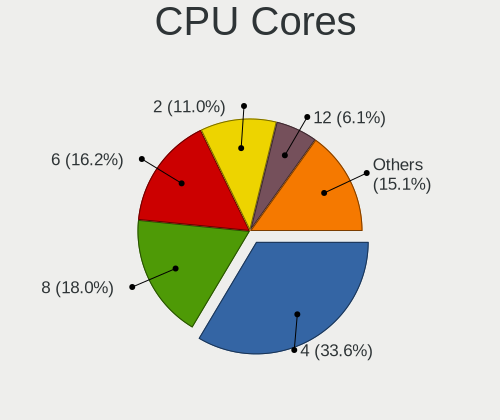
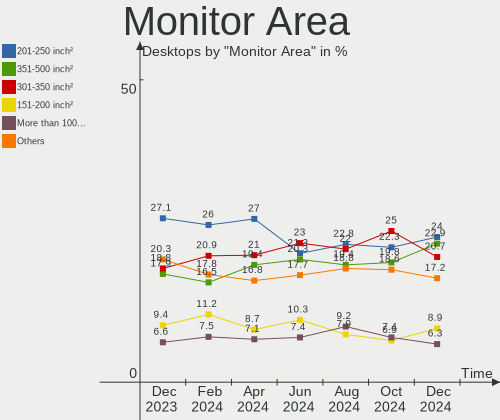
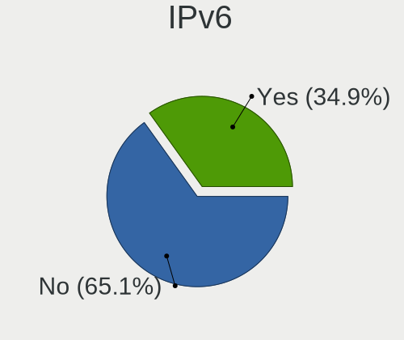

Linux in USA - Hardware Trends (Desktops)
-----------------------------------------

A project to identify most popular hardware characteristics and track their change
over time based on data collected by Linux users at https://Linux-Hardware.org.

Anyone can contribute to this report by the [hw-probe](https://github.com/linuxhw/hw-probe) tool:

    sudo -E hw-probe -all -upload

Contents
--------

* [ System ](#system)
  - [ OS                       ](#os)
  - [ OS Family                ](#os-family)
  - [ Kernel                   ](#kernel)
  - [ Kernel Family            ](#kernel-family)
  - [ Kernel Major Ver.        ](#kernel-major-ver)
  - [ Arch                     ](#arch)
  - [ DE                       ](#de)
  - [ Display Server           ](#display-server)
  - [ Display Manager          ](#display-manager)
  - [ OS Lang                  ](#os-lang)
  - [ Boot Mode                ](#boot-mode)
  - [ Filesystem               ](#filesystem)
  - [ Part. scheme             ](#part-scheme)
  - [ Dual Boot with Linux/BSD ](#dual-boot-with-linuxbsd)
  - [ Dual Boot (Win)          ](#dual-boot-win)

* [ Board ](#board)
  - [ Vendor                   ](#vendor)
  - [ Model                    ](#model)
  - [ Model Family             ](#model-family)
  - [ MFG Year                 ](#mfg-year)
  - [ Form Factor              ](#form-factor)
  - [ Secure Boot              ](#secure-boot)
  - [ Coreboot                 ](#coreboot)
  - [ RAM Size                 ](#ram-size)
  - [ RAM Used                 ](#ram-used)
  - [ Total Drives             ](#total-drives)
  - [ Has CD-ROM               ](#has-cd-rom)
  - [ Has Ethernet             ](#has-ethernet)
  - [ Has WiFi                 ](#has-wifi)
  - [ Has Bluetooth            ](#has-bluetooth)

* [ Location ](#location)
  - [ Country                  ](#country)
  - [ City                     ](#city)

* [ Drives ](#drives)
  - [ Drive Vendor             ](#drive-vendor)
  - [ Drive Model              ](#drive-model)
  - [ HDD Vendor               ](#hdd-vendor)
  - [ SSD Vendor               ](#ssd-vendor)
  - [ Drive Kind               ](#drive-kind)
  - [ Drive Connector          ](#drive-connector)
  - [ Drive Size               ](#drive-size)
  - [ Space Total              ](#space-total)
  - [ Space Used               ](#space-used)
  - [ Malfunc. Drives          ](#malfunc-drives)
  - [ Malfunc. Drive Vendor    ](#malfunc-drive-vendor)
  - [ Malfunc. HDD Vendor      ](#malfunc-hdd-vendor)
  - [ Malfunc. Drive Kind      ](#malfunc-drive-kind)
  - [ Failed Drives            ](#failed-drives)
  - [ Failed Drive Vendor      ](#failed-drive-vendor)
  - [ Drive Status             ](#drive-status)

* [ Storage controller ](#storage-controller)
  - [ Storage Vendor           ](#storage-vendor)
  - [ Storage Model            ](#storage-model)
  - [ Storage Kind             ](#storage-kind)

* [ Processor ](#processor)
  - [ CPU Vendor               ](#cpu-vendor)
  - [ CPU Model                ](#cpu-model)
  - [ CPU Model Family         ](#cpu-model-family)
  - [ CPU Cores                ](#cpu-cores)
  - [ CPU Sockets              ](#cpu-sockets)
  - [ CPU Threads              ](#cpu-threads)
  - [ CPU Op-Modes             ](#cpu-op-modes)
  - [ CPU Microcode            ](#cpu-microcode)
  - [ CPU Microarch            ](#cpu-microarch)

* [ Graphics ](#graphics)
  - [ GPU Vendor               ](#gpu-vendor)
  - [ GPU Model                ](#gpu-model)
  - [ GPU Combo                ](#gpu-combo)
  - [ GPU Driver               ](#gpu-driver)
  - [ GPU Memory               ](#gpu-memory)

* [ Monitor ](#monitor)
  - [ Monitor Vendor           ](#monitor-vendor)
  - [ Monitor Model            ](#monitor-model)
  - [ Monitor Resolution       ](#monitor-resolution)
  - [ Monitor Diagonal         ](#monitor-diagonal)
  - [ Monitor Width            ](#monitor-width)
  - [ Aspect Ratio             ](#aspect-ratio)
  - [ Monitor Area             ](#monitor-area)
  - [ Pixel Density            ](#pixel-density)
  - [ Multiple Monitors        ](#multiple-monitors)

* [ Network ](#network)
  - [ Net Controller Vendor    ](#net-controller-vendor)
  - [ Net Controller Model     ](#net-controller-model)
  - [ Wireless Vendor          ](#wireless-vendor)
  - [ Wireless Model           ](#wireless-model)
  - [ Ethernet Vendor          ](#ethernet-vendor)
  - [ Ethernet Model           ](#ethernet-model)
  - [ Net Controller Kind      ](#net-controller-kind)
  - [ Used Controller          ](#used-controller)
  - [ NICs                     ](#nics)
  - [ IPv6                     ](#ipv6)

* [ Bluetooth ](#bluetooth)
  - [ Bluetooth Vendor         ](#bluetooth-vendor)
  - [ Bluetooth Model          ](#bluetooth-model)

* [ Sound ](#sound)
  - [ Sound Vendor             ](#sound-vendor)
  - [ Sound Model              ](#sound-model)

* [ Memory ](#memory)
  - [ Memory Vendor            ](#memory-vendor)
  - [ Memory Model             ](#memory-model)
  - [ Memory Kind              ](#memory-kind)
  - [ Memory Form Factor       ](#memory-form-factor)
  - [ Memory Size              ](#memory-size)
  - [ Memory Speed             ](#memory-speed)

* [ Printers & scanners ](#printers--scanners)
  - [ Printer Vendor           ](#printer-vendor)
  - [ Printer Model            ](#printer-model)
  - [ Scanner Vendor           ](#scanner-vendor)
  - [ Scanner Model            ](#scanner-model)

* [ Camera ](#camera)
  - [ Camera Vendor            ](#camera-vendor)
  - [ Camera Model             ](#camera-model)

* [ Security ](#security)
  - [ Fingerprint Vendor       ](#fingerprint-vendor)
  - [ Fingerprint Model        ](#fingerprint-model)
  - [ Chipcard Vendor          ](#chipcard-vendor)
  - [ Chipcard Model           ](#chipcard-model)

* [ Unsupported ](#unsupported)
  - [ Unsupported Devices      ](#unsupported-devices)
  - [ Unsupported Device Types ](#unsupported-device-types)

System
------

OS
--

Installed operating systems

| Name                 | Desktops | Percent |
|----------------------|----------|---------|
| Ubuntu 20.04         | 55       | 12.3%   |
| Pop!_OS 21.10        | 35       | 7.83%   |
| Linux Mint 20.3      | 34       | 7.61%   |
| Ubuntu 21.10         | 32       | 7.16%   |
| Debian 11            | 27       | 6.04%   |
| Fedora 35            | 25       | 5.59%   |
| Manjaro              | 21       | 4.7%    |
| ArcoLinux Rolling    | 20       | 4.47%   |
| Ubuntu 22.04         | 16       | 3.58%   |
| OpenMandriva 4.3     | 16       | 3.58%   |
| Zorin 16             | 15       | 3.36%   |
| KDE neon 20.04       | 15       | 3.36%   |
| Pop!_OS 22.04        | 12       | 2.68%   |
| Fedora 36            | 9        | 2.01%   |
| Xubuntu 20.04        | 6        | 1.34%   |
| Ubuntu 18.04         | 6        | 1.34%   |
| Arch                 | 6        | 1.34%   |
| Gentoo 2.8           | 5        | 1.12%   |
| Gentoo 2.6           | 5        | 1.12%   |
| Arch Rolling         | 4        | 0.89%   |
| Xubuntu 21.10        | 3        | 0.67%   |
| Manjaro 21.2.6       | 3        | 0.67%   |
| Manjaro 21.2.5       | 3        | 0.67%   |
| LMDE 5               | 3        | 0.67%   |
| Linux Mint 20        | 3        | 0.67%   |
| Kubuntu 21.10        | 3        | 0.67%   |
| Kali 2022.1          | 3        | 0.67%   |
| Fedora 34            | 3        | 0.67%   |
| Debian 10            | 3        | 0.67%   |
| Ubuntu MATE 20.04    | 2        | 0.45%   |
| Trisquel 10.0.1      | 2        | 0.45%   |
| Pop!_OS 21.04        | 2        | 0.45%   |
| Pop!_OS 20.04        | 2        | 0.45%   |
| OpenMandriva 4.2     | 2        | 0.45%   |
| MX 21                | 2        | 0.45%   |
| Lubuntu 20.04        | 2        | 0.45%   |
| Linux Mint 20.1      | 2        | 0.45%   |
| Lilidog 22           | 2        | 0.45%   |
| Garuda Linux Soaring | 2        | 0.45%   |
| Garuda Linux         | 2        | 0.45%   |
| EndeavourOS Rolling  | 2        | 0.45%   |
| EndeavourOS          | 2        | 0.45%   |
| Debian Testing       | 2        | 0.45%   |
| Zorin 15             | 1        | 0.22%   |
| Xubuntu 18.04        | 1        | 0.22%   |
| Ubuntu MATE 22.04    | 1        | 0.22%   |
| Ubuntu Budgie 20.04  | 1        | 0.22%   |
| Ubuntu 20.10         | 1        | 0.22%   |
| Parrot 5.0           | 1        | 0.22%   |
| openSUSE 20220420    | 1        | 0.22%   |
| NixOS 22.05          | 1        | 0.22%   |
| MassOS 2022.04.2     | 1        | 0.22%   |
| LMDE 4               | 1        | 0.22%   |
| Linux Mint 19.3      | 1        | 0.22%   |
| Linux Mint 18.3      | 1        | 0.22%   |
| Linux Lite 5.8       | 1        | 0.22%   |
| Linux Lite 5.6       | 1        | 0.22%   |
| Kubuntu 11           | 1        | 0.22%   |
| Kali Rolling         | 1        | 0.22%   |
| Guix                 | 1        | 0.22%   |

OS Family
---------

OS without a version

| Name          | Desktops | Percent |
|---------------|----------|---------|
| Ubuntu        | 110      | 24.61%  |
| Pop!_OS       | 51       | 11.41%  |
| Linux Mint    | 41       | 9.17%   |
| Fedora        | 38       | 8.5%    |
| Debian        | 33       | 7.38%   |
| Manjaro       | 27       | 6.04%   |
| ArcoLinux     | 20       | 4.47%   |
| OpenMandriva  | 18       | 4.03%   |
| Zorin         | 16       | 3.58%   |
| KDE neon      | 15       | 3.36%   |
| Gentoo        | 11       | 2.46%   |
| Xubuntu       | 10       | 2.24%   |
| Arch          | 10       | 2.24%   |
| LMDE          | 4        | 0.89%   |
| Kubuntu       | 4        | 0.89%   |
| Kali          | 4        | 0.89%   |
| Garuda Linux  | 4        | 0.89%   |
| EndeavourOS   | 4        | 0.89%   |
| Ubuntu MATE   | 3        | 0.67%   |
| Trisquel      | 2        | 0.45%   |
| MX            | 2        | 0.45%   |
| Lubuntu       | 2        | 0.45%   |
| Linux Lite    | 2        | 0.45%   |
| Lilidog       | 2        | 0.45%   |
| Endless       | 2        | 0.45%   |
| Clear Linux   | 2        | 0.45%   |
| Ubuntu Budgie | 1        | 0.22%   |
| Parrot        | 1        | 0.22%   |
| openSUSE      | 1        | 0.22%   |
| NixOS         | 1        | 0.22%   |
| MassOS        | 1        | 0.22%   |
| Guix          | 1        | 0.22%   |
| Elementary    | 1        | 0.22%   |
| Devuan        | 1        | 0.22%   |
| CentOS        | 1        | 0.22%   |
| Calculate     | 1        | 0.22%   |

Kernel
------

Version of the Linux kernel

| Version                  | Desktops | Percent |
|--------------------------|----------|---------|
| 5.13.0-39-generic        | 62       | 13.87%  |
| 5.4.0-107-generic        | 34       | 7.61%   |
| 5.13.0-40-generic        | 29       | 6.49%   |
| 5.16.15-76051615-generic | 20       | 4.47%   |
| 5.16.19-76051619-generic | 19       | 4.25%   |
| 5.16.7-desktop-1omv4003  | 16       | 3.58%   |
| 5.10.0-13-amd64          | 15       | 3.36%   |
| 5.16.18-200.fc35.x86_64  | 14       | 3.13%   |
| 5.15.0-25-generic        | 12       | 2.68%   |
| 5.4.0-109-generic        | 10       | 2.24%   |
| 5.16.11-arch1-1          | 10       | 2.24%   |
| 5.17.1-arch1-1           | 9        | 2.01%   |
| 5.15.32-1-MANJARO        | 7        | 1.57%   |
| 5.16.11-76051611-generic | 6        | 1.34%   |
| 5.4.0-91-generic         | 5        | 1.12%   |
| 5.17.1-3-MANJARO         | 5        | 1.12%   |
| 5.16.14-1-MANJARO        | 5        | 1.12%   |
| 5.13.0-37-generic        | 5        | 1.12%   |
| 5.13.0-30-generic        | 5        | 1.12%   |
| 5.17.2-300.fc36.x86_64   | 4        | 0.89%   |
| 5.17.1-zen1-1-zen        | 4        | 0.89%   |
| 5.15.28-1-MANJARO        | 4        | 0.89%   |
| 5.13.0-35-generic        | 4        | 0.89%   |
| 5.4.0-107-lowlatency     | 3        | 0.67%   |
| 5.16.19-200.fc35.x86_64  | 3        | 0.67%   |
| 5.15.0-27-generic        | 3        | 0.67%   |
| 5.14.10-300.fc35.x86_64  | 3        | 0.67%   |
| 5.11.0-27-generic        | 3        | 0.67%   |
| 5.10.0-10-amd64          | 3        | 0.67%   |
| 5.4.184-1-MANJARO        | 2        | 0.45%   |
| 5.4.0-105-generic        | 2        | 0.45%   |
| 5.4.0-104-generic        | 2        | 0.45%   |
| 5.17.4-zen1-1-zen        | 2        | 0.45%   |
| 5.17.3-zen1-1-zen        | 2        | 0.45%   |
| 5.17.3-arch1-1           | 2        | 0.45%   |
| 5.17.3-302.fc36.x86_64   | 2        | 0.45%   |
| 5.17.2-arch3-1           | 2        | 0.45%   |
| 5.16.20-200.fc35.x86_64  | 2        | 0.45%   |
| 5.16.18-100.fc34.x86_64  | 2        | 0.45%   |
| 5.16.16-200.fc35.x86_64  | 2        | 0.45%   |
| 5.16.0-kali6-amd64       | 2        | 0.45%   |
| 5.16.0-6-amd64           | 2        | 0.45%   |
| 5.15.32-gentoo-dist      | 2        | 0.45%   |
| 5.15.23-76051523-generic | 2        | 0.45%   |
| 5.15.19-2-pve            | 2        | 0.45%   |
| 5.13.19-6-pve            | 2        | 0.45%   |
| 5.13.0-39-lowlatency     | 2        | 0.45%   |
| 5.13.0-27-generic        | 2        | 0.45%   |
| 5.11.0-35-generic        | 2        | 0.45%   |
| 5.10.14-desktop-1omv4002 | 2        | 0.45%   |
| 5.10.0-13-686-pae        | 2        | 0.45%   |
| 5.10.0-12-amd64          | 2        | 0.45%   |
| 4.15.0-175-generic       | 2        | 0.45%   |
| 5.8.0-48-generic         | 1        | 0.22%   |
| 5.8.0-45-generic         | 1        | 0.22%   |
| 5.8.0-41-generic         | 1        | 0.22%   |
| 5.4.174-2-pve            | 1        | 0.22%   |
| 5.4.0-99-generic         | 1        | 0.22%   |
| 5.4.0-94-generic         | 1        | 0.22%   |
| 5.4.0-58-generic         | 1        | 0.22%   |

Kernel Family
-------------

Linux kernel without a distro release

| Version  | Desktops | Percent |
|----------|----------|---------|
| 5.13.0   | 115      | 25.73%  |
| 5.4.0    | 60       | 13.42%  |
| 5.10.0   | 27       | 6.04%   |
| 5.16.19  | 22       | 4.92%   |
| 5.17.1   | 21       | 4.7%    |
| 5.16.18  | 20       | 4.47%   |
| 5.16.15  | 20       | 4.47%   |
| 5.15.0   | 18       | 4.03%   |
| 5.16.7   | 16       | 3.58%   |
| 5.16.11  | 16       | 3.58%   |
| 5.15.32  | 12       | 2.68%   |
| 5.17.2   | 10       | 2.24%   |
| 5.17.3   | 9        | 2.01%   |
| 5.16.0   | 8        | 1.79%   |
| 5.11.0   | 7        | 1.57%   |
| 5.17.4   | 5        | 1.12%   |
| 5.16.14  | 5        | 1.12%   |
| 4.15.0   | 5        | 1.12%   |
| 5.15.28  | 4        | 0.89%   |
| 5.8.0    | 3        | 0.67%   |
| 5.17.0   | 3        | 0.67%   |
| 5.16.20  | 3        | 0.67%   |
| 5.14.10  | 3        | 0.67%   |
| 5.13.19  | 3        | 0.67%   |
| 5.4.184  | 2        | 0.45%   |
| 5.18.0   | 2        | 0.45%   |
| 5.16.16  | 2        | 0.45%   |
| 5.15.33  | 2        | 0.45%   |
| 5.15.26  | 2        | 0.45%   |
| 5.15.23  | 2        | 0.45%   |
| 5.15.19  | 2        | 0.45%   |
| 5.10.14  | 2        | 0.45%   |
| 5.10.109 | 2        | 0.45%   |
| 4.19.0   | 2        | 0.45%   |
| 5.4.174  | 1        | 0.22%   |
| 5.17.5   | 1        | 0.22%   |
| 5.16.17  | 1        | 0.22%   |
| 5.15.35  | 1        | 0.22%   |
| 5.15.29  | 1        | 0.22%   |
| 5.15.16  | 1        | 0.22%   |
| 5.15.12  | 1        | 0.22%   |
| 5.15.11  | 1        | 0.22%   |
| 5.13.10  | 1        | 0.22%   |
| 5.10.111 | 1        | 0.22%   |
| 5.10.105 | 1        | 0.22%   |
| 3.10.0   | 1        | 0.22%   |

Kernel Major Ver.
-----------------

Linux kernel major version

| Version | Desktops | Percent |
|---------|----------|---------|
| 5.13    | 119      | 26.62%  |
| 5.16    | 113      | 25.28%  |
| 5.4     | 63       | 14.09%  |
| 5.17    | 49       | 10.96%  |
| 5.15    | 47       | 10.51%  |
| 5.10    | 33       | 7.38%   |
| 5.11    | 7        | 1.57%   |
| 4.15    | 5        | 1.12%   |
| 5.8     | 3        | 0.67%   |
| 5.14    | 3        | 0.67%   |
| 5.18    | 2        | 0.45%   |
| 4.19    | 2        | 0.45%   |
| 3.10    | 1        | 0.22%   |

Arch
----

OS architecture (x86_64, i586, etc.)

| Name   | Desktops | Percent |
|--------|----------|---------|
| x86_64 | 441      | 98.66%  |
| i686   | 6        | 1.34%   |

DE
--

Desktop Environment

| Name             | Desktops | Percent |
|------------------|----------|---------|
| GNOME            | 200      | 44.74%  |
| KDE5             | 86       | 19.24%  |
| XFCE             | 47       | 10.51%  |
| X-Cinnamon       | 40       | 8.95%   |
| Unknown          | 36       | 8.05%   |
| MATE             | 14       | 3.13%   |
| Cinnamon         | 6        | 1.34%   |
| LXQt             | 3        | 0.67%   |
| i3               | 3        | 0.67%   |
| Unity            | 2        | 0.45%   |
| lightdm-xsession | 2        | 0.45%   |
| GNOME Flashback  | 2        | 0.45%   |
| Pantheon         | 1        | 0.22%   |
| openbox          | 1        | 0.22%   |
| LXDE             | 1        | 0.22%   |
| GNOME Classic    | 1        | 0.22%   |
| Budgie           | 1        | 0.22%   |
| awesome          | 1        | 0.22%   |

Display Server
--------------

X11 or Wayland

| Name    | Desktops | Percent |
|---------|----------|---------|
| X11     | 344      | 76.96%  |
| Wayland | 62       | 13.87%  |
| Unknown | 21       | 4.7%    |
| Tty     | 20       | 4.47%   |

Display Manager
---------------

SDDM, LightDM, etc.

| Name    | Desktops | Percent |
|---------|----------|---------|
| Unknown | 192      | 42.95%  |
| GDM3    | 69       | 15.44%  |
| SDDM    | 63       | 14.09%  |
| LightDM | 62       | 13.87%  |
| GDM     | 60       | 13.42%  |
| MDM     | 1        | 0.22%   |

OS Lang
-------

Language

| Lang    | Desktops | Percent |
|---------|----------|---------|
| en_US   | 426      | 95.3%   |
| Unknown | 9        | 2.01%   |
| C       | 4        | 0.89%   |
| en_CA   | 3        | 0.67%   |
| zh_CN   | 1        | 0.22%   |
| es_US   | 1        | 0.22%   |
| en_IN   | 1        | 0.22%   |
| en_GB   | 1        | 0.22%   |
| de_DE   | 1        | 0.22%   |

Boot Mode
---------

EFI or BIOS

| Mode | Desktops | Percent |
|------|----------|---------|
| BIOS | 269      | 60.18%  |
| EFI  | 178      | 39.82%  |

Filesystem
----------

Type of filesystem

| Type    | Desktops | Percent |
|---------|----------|---------|
| Ext4    | 353      | 78.97%  |
| Btrfs   | 50       | 11.19%  |
| Overlay | 28       | 6.26%   |
| Xfs     | 8        | 1.79%   |
| Zfs     | 3        | 0.67%   |
| Unknown | 2        | 0.45%   |
| XXX     | 1        | 0.22%   |
| Ext3    | 1        | 0.22%   |
| Ext2    | 1        | 0.22%   |

Part. scheme
------------

Scheme of partitioning

| Type    | Desktops | Percent |
|---------|----------|---------|
| Unknown | 244      | 54.59%  |
| GPT     | 155      | 34.68%  |
| MBR     | 48       | 10.74%  |

Dual Boot with Linux/BSD
------------------------

Hosting more than one Linux/BSD

| Dual boot | Desktops | Percent |
|-----------|----------|---------|
| No        | 383      | 85.68%  |
| Yes       | 64       | 14.32%  |

Dual Boot (Win)
---------------

Hosting Linux and Windows

| Dual boot | Desktops | Percent |
|-----------|----------|---------|
| No        | 340      | 76.06%  |
| Yes       | 107      | 23.94%  |

Board
-----

Vendor
------

Motherboard manufacturer

| Name                | Desktops | Percent |
|---------------------|----------|---------|
| ASUSTek Computer    | 103      | 23.04%  |
| Dell                | 78       | 17.45%  |
| MSI                 | 56       | 12.53%  |
| Gigabyte Technology | 47       | 10.51%  |
| ASRock              | 36       | 8.05%   |
| Hewlett-Packard     | 34       | 7.61%   |
| Lenovo              | 18       | 4.03%   |
| Supermicro          | 16       | 3.58%   |
| Intel               | 7        | 1.57%   |
| Foxconn             | 7        | 1.57%   |
| Alienware           | 7        | 1.57%   |
| System76            | 5        | 1.12%   |
| Pegatron            | 5        | 1.12%   |
| Apple               | 4        | 0.89%   |
| Unknown             | 4        | 0.89%   |
| Biostar             | 3        | 0.67%   |
| Acer                | 3        | 0.67%   |
| EVGA                | 2        | 0.45%   |
| eMachines           | 2        | 0.45%   |
| ASRockRack          | 2        | 0.45%   |
| SiS Technology      | 1        | 0.22%   |
| Shuttle             | 1        | 0.22%   |
| Seco                | 1        | 0.22%   |
| Pepper Jobs         | 1        | 0.22%   |
| NZXT                | 1        | 0.22%   |
| LattePanda          | 1        | 0.22%   |
| ECS                 | 1        | 0.22%   |
| AZW                 | 1        | 0.22%   |

Model
-----

Motherboard model

| Name                             | Desktops | Percent |
|----------------------------------|----------|---------|
| ASUS All Series                  | 12       | 2.68%   |
| Supermicro SYS-5019A-FTN4        | 10       | 2.24%   |
| Dell OptiPlex 7010               | 8        | 1.79%   |
| Dell OptiPlex 9020               | 5        | 1.12%   |
| ASUS TUF Gaming X570-PLUS        | 5        | 1.12%   |
| ASUS ROG STRIX B450-F GAMING     | 5        | 1.12%   |
| MSI MS-7D09                      | 4        | 0.89%   |
| Gigabyte B450M DS3H              | 4        | 0.89%   |
| ASUS ROG CROSSHAIR VIII HERO     | 4        | 0.89%   |
| Unknown                          | 4        | 0.89%   |
| MSI MS-7B79                      | 3        | 0.67%   |
| MSI MS-7B48                      | 3        | 0.67%   |
| MSI MS-7977                      | 3        | 0.67%   |
| MSI MS-7917                      | 3        | 0.67%   |
| Gigabyte B450 AORUS M            | 3        | 0.67%   |
| Dell Precision WorkStation T3500 | 3        | 0.67%   |
| Dell OptiPlex 990                | 3        | 0.67%   |
| Dell OptiPlex 790                | 3        | 0.67%   |
| Dell OptiPlex 7040               | 3        | 0.67%   |
| Dell OptiPlex 390                | 3        | 0.67%   |
| Dell OptiPlex 3010               | 3        | 0.67%   |
| Dell Inspiron 3847               | 3        | 0.67%   |
| ASRock B550M Pro4                | 3        | 0.67%   |
| System76 Thelio Mira             | 2        | 0.45%   |
| System76 Thelio                  | 2        | 0.45%   |
| Supermicro X5DP8                 | 2        | 0.45%   |
| Pegatron p7-1110                 | 2        | 0.45%   |
| MSI MS-7C80                      | 2        | 0.45%   |
| MSI MS-7C56                      | 2        | 0.45%   |
| MSI MS-7C02                      | 2        | 0.45%   |
| MSI MS-7B98                      | 2        | 0.45%   |
| MSI MS-7A38                      | 2        | 0.45%   |
| MSI MS-7721                      | 2        | 0.45%   |
| MSI MS-7693                      | 2        | 0.45%   |
| MSI MS-7641                      | 2        | 0.45%   |
| Lenovo ThinkCentre M55p 8808D8U  | 2        | 0.45%   |
| HP Z840 Workstation              | 2        | 0.45%   |
| HP Z820 Workstation              | 2        | 0.45%   |
| HP Z440 Workstation              | 2        | 0.45%   |
| HP EliteDesk 800 G1 TWR          | 2        | 0.45%   |
| Gigabyte Z370P D3                | 2        | 0.45%   |
| Dell OptiPlex 755                | 2        | 0.45%   |
| Dell OptiPlex 380                | 2        | 0.45%   |
| Dell OptiPlex 3020               | 2        | 0.45%   |
| Dell Inspiron 560                | 2        | 0.45%   |
| ASUS TUF Gaming X570-PRO         | 2        | 0.45%   |
| ASUS TUF Gaming B550-PLUS        | 2        | 0.45%   |
| ASUS ROG STRIX B550-F GAMING     | 2        | 0.45%   |
| ASUS PRIME Z390-A                | 2        | 0.45%   |
| ASUS PRIME X570-P                | 2        | 0.45%   |
| ASUS PRIME H410M-E               | 2        | 0.45%   |
| ASUS P5G41T-M                    | 2        | 0.45%   |
| ASRock Z390 Extreme4             | 2        | 0.45%   |
| ASRock B450 Gaming-ITX/ac        | 2        | 0.45%   |
| ASRock AB350 Gaming-ITX/ac       | 2        | 0.45%   |
| Apple MacPro5,1                  | 2        | 0.45%   |
| Apple MacPro3,1                  | 2        | 0.45%   |
| Alienware Aurora                 | 2        | 0.45%   |
| System76 Thelio Major            | 1        | 0.22%   |
| Supermicro X9SRH-7F/7TF          | 1        | 0.22%   |

Model Family
------------

Motherboard model prefix

| Name                      | Desktops | Percent |
|---------------------------|----------|---------|
| Dell OptiPlex             | 41       | 9.17%   |
| ASUS ROG                  | 28       | 6.26%   |
| Dell Inspiron             | 16       | 3.58%   |
| Lenovo ThinkCentre        | 14       | 3.13%   |
| ASUS PRIME                | 14       | 3.13%   |
| ASUS All                  | 12       | 2.68%   |
| Dell Precision            | 11       | 2.46%   |
| ASUS TUF                  | 11       | 2.46%   |
| Supermicro SYS-5019A-FTN4 | 10       | 2.24%   |
| Alienware Aurora          | 6        | 1.34%   |
| System76 Thelio           | 5        | 1.12%   |
| HP EliteDesk              | 5        | 1.12%   |
| Gigabyte B450             | 5        | 1.12%   |
| MSI MS-7D09               | 4        | 0.89%   |
| HP Pavilion               | 4        | 0.89%   |
| HP Compaq                 | 4        | 0.89%   |
| Gigabyte X570             | 4        | 0.89%   |
| Gigabyte B450M            | 4        | 0.89%   |
| Dell XPS                  | 4        | 0.89%   |
| ASRock X570               | 4        | 0.89%   |
| Unknown                   | 4        | 0.89%   |
| MSI MS-7B79               | 3        | 0.67%   |
| MSI MS-7B48               | 3        | 0.67%   |
| MSI MS-7977               | 3        | 0.67%   |
| MSI MS-7917               | 3        | 0.67%   |
| ASUS M5A97                | 3        | 0.67%   |
| ASUS M5A78L-M             | 3        | 0.67%   |
| ASRock B550M              | 3        | 0.67%   |
| ASRock B550               | 3        | 0.67%   |
| Supermicro X5DP8          | 2        | 0.45%   |
| Pegatron p7-1110          | 2        | 0.45%   |
| MSI MS-7C80               | 2        | 0.45%   |
| MSI MS-7C56               | 2        | 0.45%   |
| MSI MS-7C02               | 2        | 0.45%   |
| MSI MS-7B98               | 2        | 0.45%   |
| MSI MS-7A38               | 2        | 0.45%   |
| MSI MS-7721               | 2        | 0.45%   |
| MSI MS-7693               | 2        | 0.45%   |
| MSI MS-7641               | 2        | 0.45%   |
| HP Z840                   | 2        | 0.45%   |
| HP Z820                   | 2        | 0.45%   |
| HP Z440                   | 2        | 0.45%   |
| Gigabyte Z390             | 2        | 0.45%   |
| Gigabyte Z370P            | 2        | 0.45%   |
| Gigabyte Z370             | 2        | 0.45%   |
| Gigabyte X570S            | 2        | 0.45%   |
| Gigabyte GA-78LMT-USB3    | 2        | 0.45%   |
| Gigabyte B550             | 2        | 0.45%   |
| Dell Vostro               | 2        | 0.45%   |
| Biostar TB250-BTC         | 2        | 0.45%   |
| ASUS Pro                  | 2        | 0.45%   |
| ASUS P8Z68-V              | 2        | 0.45%   |
| ASUS P5G41T-M             | 2        | 0.45%   |
| ASUS Maximus              | 2        | 0.45%   |
| ASRock Z390               | 2        | 0.45%   |
| ASRock Z370               | 2        | 0.45%   |
| ASRock B450               | 2        | 0.45%   |
| ASRock AB350              | 2        | 0.45%   |
| Apple MacPro5             | 2        | 0.45%   |
| Apple MacPro3             | 2        | 0.45%   |

MFG Year
--------

Motherboard manufacture year

| Year | Desktops | Percent |
|------|----------|---------|
| 2018 | 51       | 11.41%  |
| 2021 | 50       | 11.19%  |
| 2020 | 48       | 10.74%  |
| 2013 | 46       | 10.29%  |
| 2011 | 36       | 8.05%   |
| 2019 | 31       | 6.94%   |
| 2012 | 29       | 6.49%   |
| 2014 | 27       | 6.04%   |
| 2017 | 25       | 5.59%   |
| 2010 | 24       | 5.37%   |
| 2015 | 22       | 4.92%   |
| 2016 | 13       | 2.91%   |
| 2007 | 13       | 2.91%   |
| 2009 | 11       | 2.46%   |
| 2022 | 8        | 1.79%   |
| 2008 | 6        | 1.34%   |
| 2006 | 4        | 0.89%   |
| 2003 | 2        | 0.45%   |
| 2004 | 1        | 0.22%   |

Form Factor
-----------

Physical design of the computer

| Name    | Desktops | Percent |
|---------|----------|---------|
| Desktop | 447      | 100%    |

Secure Boot
-----------

Enabled or disabled

| State    | Desktops | Percent |
|----------|----------|---------|
| Disabled | 434      | 97.09%  |
| Enabled  | 13       | 2.91%   |

Coreboot
--------

Have coreboot on board

| Used | Desktops | Percent |
|------|----------|---------|
| No   | 447      | 100%    |

RAM Size
--------

Total RAM memory

| Size in GB      | Desktops | Percent |
|-----------------|----------|---------|
| 16.01-24.0      | 126      | 28.19%  |
| 32.01-64.0      | 98       | 21.92%  |
| 8.01-16.0       | 71       | 15.88%  |
| 64.01-256.0     | 53       | 11.86%  |
| 4.01-8.0        | 36       | 8.05%   |
| 3.01-4.0        | 31       | 6.94%   |
| 24.01-32.0      | 15       | 3.36%   |
| 1.01-2.0        | 8        | 1.79%   |
| 2.01-3.0        | 6        | 1.34%   |
| More than 256.0 | 3        | 0.67%   |

RAM Used
--------

Used RAM memory

| Used GB    | Desktops | Percent |
|------------|----------|---------|
| 1.01-2.0   | 130      | 29.08%  |
| 2.01-3.0   | 112      | 25.06%  |
| 4.01-8.0   | 87       | 19.46%  |
| 3.01-4.0   | 53       | 11.86%  |
| 8.01-16.0  | 31       | 6.94%   |
| 0.51-1.0   | 16       | 3.58%   |
| 16.01-24.0 | 7        | 1.57%   |
| 32.01-64.0 | 5        | 1.12%   |
| 0.01-0.5   | 4        | 0.89%   |
| 24.01-32.0 | 2        | 0.45%   |

Total Drives
------------

Number of drives on board

| Drives | Desktops | Percent |
|--------|----------|---------|
| 1      | 165      | 36.91%  |
| 2      | 112      | 25.06%  |
| 3      | 76       | 17%     |
| 4      | 39       | 8.72%   |
| 5      | 28       | 6.26%   |
| 6      | 10       | 2.24%   |
| 8      | 4        | 0.89%   |
| 11     | 3        | 0.67%   |
| 7      | 3        | 0.67%   |
| 0      | 3        | 0.67%   |
| 45     | 1        | 0.22%   |
| 15     | 1        | 0.22%   |
| 14     | 1        | 0.22%   |
| 13     | 1        | 0.22%   |

Has CD-ROM
----------

Has CD-ROM on board

| Presented | Desktops | Percent |
|-----------|----------|---------|
| No        | 238      | 53.24%  |
| Yes       | 209      | 46.76%  |

Has Ethernet
------------

Has Ethernet on board

| Presented | Desktops | Percent |
|-----------|----------|---------|
| Yes       | 443      | 99.11%  |
| No        | 4        | 0.89%   |

Has WiFi
--------

Has WiFi module

| Presented | Desktops | Percent |
|-----------|----------|---------|
| No        | 231      | 51.68%  |
| Yes       | 216      | 48.32%  |

Has Bluetooth
-------------

Has Bluetooth module

| Presented | Desktops | Percent |
|-----------|----------|---------|
| No        | 270      | 60.4%   |
| Yes       | 177      | 39.6%   |

Location
--------

Country
-------

Geographic location (country)

| Country | Desktops | Percent |
|---------|----------|---------|
| USA     | 447      | 100%    |

City
----

Geographic location (city)

| City              | Desktops | Percent |
|-------------------|----------|---------|
| Durham            | 11       | 2.46%   |
| San Jose          | 8        | 1.79%   |
| Seattle           | 7        | 1.57%   |
| Portland          | 7        | 1.57%   |
| Chicago           | 7        | 1.57%   |
| Bangor            | 7        | 1.57%   |
| Pittsburgh        | 5        | 1.12%   |
| Houston           | 5        | 1.12%   |
| Atlanta           | 5        | 1.12%   |
| Springfield       | 4        | 0.89%   |
| San Diego         | 4        | 0.89%   |
| New York          | 4        | 0.89%   |
| Denver            | 4        | 0.89%   |
| Chandler          | 4        | 0.89%   |
| Wasilla           | 3        | 0.67%   |
| Salt Lake City    | 3        | 0.67%   |
| Rochester         | 3        | 0.67%   |
| Richmond          | 3        | 0.67%   |
| Miami             | 3        | 0.67%   |
| Los Angeles       | 3        | 0.67%   |
| Dallas            | 3        | 0.67%   |
| Brooklyn          | 3        | 0.67%   |
| Ashburn           | 3        | 0.67%   |
| Yukon             | 2        | 0.45%   |
| West Monroe       | 2        | 0.45%   |
| West Chester      | 2        | 0.45%   |
| Washington        | 2        | 0.45%   |
| Walled Lake       | 2        | 0.45%   |
| Topeka            | 2        | 0.45%   |
| Tampa             | 2        | 0.45%   |
| St Louis          | 2        | 0.45%   |
| Springdale        | 2        | 0.45%   |
| Smyrna            | 2        | 0.45%   |
| San Francisco     | 2        | 0.45%   |
| Richardson        | 2        | 0.45%   |
| Pipe Creek        | 2        | 0.45%   |
| Perkasie          | 2        | 0.45%   |
| Pearland          | 2        | 0.45%   |
| Peachtree Corners | 2        | 0.45%   |
| Parker            | 2        | 0.45%   |
| Oxnard            | 2        | 0.45%   |
| Orange            | 2        | 0.45%   |
| Oklahoma City     | 2        | 0.45%   |
| Oakland           | 2        | 0.45%   |
| New Bedford       | 2        | 0.45%   |
| Mount Vernon      | 2        | 0.45%   |
| Minneapolis       | 2        | 0.45%   |
| Milwaukee         | 2        | 0.45%   |
| Medford           | 2        | 0.45%   |
| Loveland          | 2        | 0.45%   |
| La Mesa           | 2        | 0.45%   |
| Kansas City       | 2        | 0.45%   |
| Hockessin         | 2        | 0.45%   |
| Gainesville       | 2        | 0.45%   |
| Fort Lauderdale   | 2        | 0.45%   |
| Fayetteville      | 2        | 0.45%   |
| Eugene            | 2        | 0.45%   |
| Edmond            | 2        | 0.45%   |
| Denton            | 2        | 0.45%   |
| Danvers           | 2        | 0.45%   |

Drives
------

Drive Vendor
------------

Hard drive vendors

| Vendor                    | Desktops | Drives | Percent |
|---------------------------|----------|--------|---------|
| WDC                       | 172      | 258    | 20.33%  |
| Seagate                   | 150      | 202    | 17.73%  |
| Samsung Electronics       | 139      | 196    | 16.43%  |
| SanDisk                   | 54       | 56     | 6.38%   |
| Toshiba                   | 46       | 54     | 5.44%   |
| Crucial                   | 44       | 49     | 5.2%    |
| Hitachi                   | 31       | 36     | 3.66%   |
| PNY                       | 19       | 22     | 2.25%   |
| Kingston                  | 18       | 19     | 2.13%   |
| Intel                     | 18       | 20     | 2.13%   |
| Phison                    | 15       | 16     | 1.77%   |
| A-DATA Technology         | 12       | 13     | 1.42%   |
| Unknown                   | 11       | 12     | 1.3%    |
| SK Hynix                  | 10       | 15     | 1.18%   |
| Hewlett-Packard           | 10       | 13     | 1.18%   |
| HGST                      | 9        | 12     | 1.06%   |
| China                     | 7        | 10     | 0.83%   |
| Corsair                   | 5        | 7      | 0.59%   |
| Team                      | 4        | 5      | 0.47%   |
| Phison Electronics        | 4        | 5      | 0.47%   |
| Patriot                   | 4        | 4      | 0.47%   |
| Mushkin                   | 4        | 7      | 0.47%   |
| SPCC                      | 3        | 3      | 0.35%   |
| Silicon Motion            | 3        | 4      | 0.35%   |
| SABRENT                   | 3        | 3      | 0.35%   |
| OCZ                       | 3        | 3      | 0.35%   |
| Micron/Crucial Technology | 3        | 3      | 0.35%   |
| Micron Technology         | 3        | 3      | 0.35%   |
| XPG                       | 2        | 2      | 0.24%   |
| T-FORCE                   | 2        | 2      | 0.24%   |
| Mercury                   | 2        | 2      | 0.24%   |
| MAXTOR                    | 2        | 2      | 0.24%   |
| MARVELL                   | 2        | 3      | 0.24%   |
| JMicron                   | 2        | 2      | 0.24%   |
| Fujitsu                   | 2        | 2      | 0.24%   |
| ASMT                      | 2        | 2      | 0.24%   |
| ZHITAI                    | 1        | 1      | 0.12%   |
| Zheino                    | 1        | 1      | 0.12%   |
| TrueNAS                   | 1        | 1      | 0.12%   |
| StoreJet                  | 1        | 1      | 0.12%   |
| STEC                      | 1        | 1      | 0.12%   |
| SSK                       | 1        | 1      | 0.12%   |
| Realtek Semiconductor     | 1        | 1      | 0.12%   |
| Pioneer                   | 1        | 1      | 0.12%   |
| NV-2242A                  | 1        | 1      | 0.12%   |
| NGFF                      | 1        | 1      | 0.12%   |
| N600                      | 1        | 1      | 0.12%   |
| LITEON                    | 1        | 1      | 0.12%   |
| Lexar                     | 1        | 1      | 0.12%   |
| Leven                     | 1        | 1      | 0.12%   |
| LaCie                     | 1        | 1      | 0.12%   |
| KIOXIA                    | 1        | 1      | 0.12%   |
| KingFast                  | 1        | 1      | 0.12%   |
| KingDian                  | 1        | 1      | 0.12%   |
| IBM                       | 1        | 1      | 0.12%   |
| H/W                       | 1        | 2      | 0.12%   |
| External                  | 1        | 1      | 0.12%   |
| Dogfish                   | 1        | 1      | 0.12%   |
| AXIOM                     | 1        | 1      | 0.12%   |
| Avant                     | 1        | 1      | 0.12%   |

Drive Model
-----------

Hard drive models

| Model                            | Desktops | Percent |
|----------------------------------|----------|---------|
| Seagate ST2000DM008-2FR102 2TB   | 19       | 1.89%   |
| Samsung SSD 850 EVO 500GB        | 14       | 1.39%   |
| Samsung SSD 860 EVO 500GB        | 13       | 1.29%   |
| Samsung SSD 860 EVO 1TB          | 12       | 1.2%    |
| Samsung SSD 850 EVO 250GB        | 12       | 1.2%    |
| Crucial CT1000MX500SSD1 1TB      | 12       | 1.2%    |
| Sandisk NVMe SSD Drive 1TB       | 11       | 1.1%    |
| Toshiba KXG60ZNV1T02 1TB         | 10       | 1%      |
| Seagate ST500DM002-1BD142 500GB  | 10       | 1%      |
| Samsung SSD 970 EVO Plus 1TB     | 10       | 1%      |
| WDC WD10EZEX-08WN4A0 1TB         | 9        | 0.9%    |
| Samsung NVMe SSD Drive 1TB       | 9        | 0.9%    |
| WDC WDS500G2B0A-00SM50 500GB SSD | 8        | 0.8%    |
| Samsung NVMe SSD Drive 500GB     | 7        | 0.7%    |
| Samsung SSD 980 PRO 1TB          | 6        | 0.6%    |
| Samsung SSD 870 EVO 1TB          | 6        | 0.6%    |
| Samsung NVMe SSD Drive 2TB       | 6        | 0.6%    |
| Samsung NVMe SSD Drive 250GB     | 6        | 0.6%    |
| Hitachi HDS721010CLA332 1TB      | 6        | 0.6%    |
| Crucial CT500MX500SSD1 500GB     | 6        | 0.6%    |
| WDC WD20EZRZ-00Z5HB0 2TB         | 5        | 0.5%    |
| WDC WD10EZEX-60WN4A0 1TB         | 5        | 0.5%    |
| WDC WD10EZEX-08M2NA0 1TB         | 5        | 0.5%    |
| Unknown SD/MMC/MS PRO 128GB      | 5        | 0.5%    |
| Seagate ST8000DM004-2CX188 8TB   | 5        | 0.5%    |
| Seagate ST1000DM003-1ER162 1TB   | 5        | 0.5%    |
| Seagate ST1000DM003-1CH162 1TB   | 5        | 0.5%    |
| Sandisk NVMe SSD Drive 500GB     | 5        | 0.5%    |
| Samsung SSD 850 EVO 1TB          | 5        | 0.5%    |
| PNY CS900 500GB SSD              | 5        | 0.5%    |
| Kingston SA400S37240G 240GB SSD  | 5        | 0.5%    |
| WDC WD20EARS-00MVWB0 2TB         | 4        | 0.4%    |
| Toshiba DT01ACA100 1TB           | 4        | 0.4%    |
| Seagate ST31000528AS 1TB         | 4        | 0.4%    |
| Seagate ST2000DM001-1ER164 2TB   | 4        | 0.4%    |
| Seagate ST2000DM001-1CH164 2TB   | 4        | 0.4%    |
| Seagate ST1000DM010-2EP102 1TB   | 4        | 0.4%    |
| Seagate ST1000DM003-1SB102 1TB   | 4        | 0.4%    |
| SanDisk SDSSDA240G 240GB         | 4        | 0.4%    |
| Samsung SSD 970 EVO Plus 500GB   | 4        | 0.4%    |
| Samsung SSD 860 EVO 250GB        | 4        | 0.4%    |
| Phison PCIe SSD 1TB              | 4        | 0.4%    |
| WDC WDS100T2B0A-00SM50 1TB SSD   | 3        | 0.3%    |
| WDC WDBNCE5000PNC 500GB SSD      | 3        | 0.3%    |
| WDC WD5000AAKX-60U6AA0 500GB     | 3        | 0.3%    |
| WDC WD40EFRX-68WT0N0 4TB         | 3        | 0.3%    |
| WDC WD20EFRX-68EUZN0 2TB         | 3        | 0.3%    |
| WDC WD10EZEX-60M2NA0 1TB         | 3        | 0.3%    |
| WDC WD1003FZEX-00MK2A0 1TB       | 3        | 0.3%    |
| SK Hynix SHGS31-1000GS-2 1TB SSD | 3        | 0.3%    |
| Seagate ST4000DM004-2CV104 4TB   | 3        | 0.3%    |
| Seagate ST31000524AS 1TB         | 3        | 0.3%    |
| Seagate ST250DM000-1BD141 250GB  | 3        | 0.3%    |
| Seagate ST2000DM006-2DM164 2TB   | 3        | 0.3%    |
| SanDisk SSD PLUS 240GB           | 3        | 0.3%    |
| SanDisk SSD G5 BICS4 500GB       | 3        | 0.3%    |
| Sandisk NVMe SSD Drive 2TB       | 3        | 0.3%    |
| Samsung SSD 870 QVO 4TB          | 3        | 0.3%    |
| Samsung SSD 850 PRO 512GB        | 3        | 0.3%    |
| SABRENT Disk 250GB               | 3        | 0.3%    |

HDD Vendor
----------

Hard disk drive vendors

| Vendor              | Desktops | Drives | Percent |
|---------------------|----------|--------|---------|
| Seagate             | 146      | 194    | 38.42%  |
| WDC                 | 136      | 208    | 35.79%  |
| Toshiba             | 31       | 39     | 8.16%   |
| Hitachi             | 31       | 36     | 8.16%   |
| HGST                | 9        | 12     | 2.37%   |
| Unknown             | 6        | 6      | 1.58%   |
| Samsung Electronics | 4        | 4      | 1.05%   |
| SABRENT             | 3        | 3      | 0.79%   |
| Hewlett-Packard     | 3        | 4      | 0.79%   |
| MAXTOR              | 2        | 2      | 0.53%   |
| MARVELL             | 2        | 3      | 0.53%   |
| Fujitsu             | 2        | 2      | 0.53%   |
| TrueNAS             | 1        | 1      | 0.26%   |
| LaCie               | 1        | 1      | 0.26%   |
| IBM                 | 1        | 1      | 0.26%   |
| ASMT                | 1        | 1      | 0.26%   |
| 3ware               | 1        | 4      | 0.26%   |

SSD Vendor
----------

Solid state drive vendors

| Vendor              | Desktops | Drives | Percent |
|---------------------|----------|--------|---------|
| Samsung Electronics | 86       | 111    | 28.01%  |
| Crucial             | 42       | 47     | 13.68%  |
| SanDisk             | 35       | 35     | 11.4%   |
| WDC                 | 29       | 32     | 9.45%   |
| PNY                 | 19       | 22     | 6.19%   |
| Kingston            | 17       | 17     | 5.54%   |
| A-DATA Technology   | 10       | 11     | 3.26%   |
| SK Hynix            | 7        | 8      | 2.28%   |
| Intel               | 7        | 8      | 2.28%   |
| China               | 7        | 10     | 2.28%   |
| Hewlett-Packard     | 6        | 7      | 1.95%   |
| Toshiba             | 4        | 4      | 1.3%    |
| Team                | 4        | 5      | 1.3%    |
| Patriot             | 4        | 4      | 1.3%    |
| Seagate             | 3        | 3      | 0.98%   |
| OCZ                 | 3        | 3      | 0.98%   |
| Mushkin             | 3        | 6      | 0.98%   |
| Corsair             | 3        | 4      | 0.98%   |
| SPCC                | 2        | 2      | 0.65%   |
| Micron Technology   | 2        | 2      | 0.65%   |
| Mercury             | 2        | 2      | 0.65%   |
| T-FORCE             | 1        | 1      | 0.33%   |
| StoreJet            | 1        | 1      | 0.33%   |
| Pioneer             | 1        | 1      | 0.33%   |
| NGFF                | 1        | 1      | 0.33%   |
| N600                | 1        | 1      | 0.33%   |
| LITEON              | 1        | 1      | 0.33%   |
| KingDian            | 1        | 1      | 0.33%   |
| JMicron             | 1        | 1      | 0.33%   |
| External            | 1        | 1      | 0.33%   |
| Dogfish             | 1        | 1      | 0.33%   |
| Avant               | 1        | 1      | 0.33%   |
| Apacer              | 1        | 1      | 0.33%   |

Drive Kind
----------

HDD or SSD

| Kind    | Desktops | Drives | Percent |
|---------|----------|--------|---------|
| HDD     | 292      | 521    | 41.18%  |
| SSD     | 245      | 355    | 34.56%  |
| NVMe    | 154      | 201    | 21.72%  |
| Unknown | 14       | 16     | 1.97%   |
| MMC     | 4        | 4      | 0.56%   |

Drive Connector
---------------

SATA, SAS, NVMe, etc.

| Type | Desktops | Drives | Percent |
|------|----------|--------|---------|
| SATA | 393      | 842    | 66.95%  |
| NVMe | 154      | 200    | 26.24%  |
| SAS  | 36       | 51     | 6.13%   |
| MMC  | 4        | 4      | 0.68%   |

Drive Size
----------

Size of hard drive

| Size in TB | Desktops | Drives | Percent |
|------------|----------|--------|---------|
| 0.01-0.5   | 262      | 365    | 43.02%  |
| 0.51-1.0   | 179      | 249    | 29.39%  |
| 1.01-2.0   | 91       | 120    | 14.94%  |
| 3.01-4.0   | 32       | 52     | 5.25%   |
| 4.01-10.0  | 24       | 57     | 3.94%   |
| 2.01-3.0   | 14       | 21     | 2.3%    |
| 10.01-20.0 | 7        | 12     | 1.15%   |

Space Total
-----------

Amount of disk space available on the file system

| Size in GB     | Desktops | Percent |
|----------------|----------|---------|
| 501-1000       | 87       | 19.46%  |
| More than 3000 | 69       | 15.44%  |
| 101-250        | 66       | 14.77%  |
| 251-500        | 63       | 14.09%  |
| 1001-2000      | 50       | 11.19%  |
| 2001-3000      | 41       | 9.17%   |
| 1-20           | 34       | 7.61%   |
| Unknown        | 21       | 4.7%    |
| 51-100         | 12       | 2.68%   |
| 21-50          | 4        | 0.89%   |

Space Used
----------

Amount of used disk space

| Used GB        | Desktops | Percent |
|----------------|----------|---------|
| 1-20           | 109      | 24.38%  |
| 101-250        | 62       | 13.87%  |
| 21-50          | 58       | 12.98%  |
| 251-500        | 44       | 9.84%   |
| 51-100         | 44       | 9.84%   |
| 501-1000       | 40       | 8.95%   |
| 1001-2000      | 33       | 7.38%   |
| More than 3000 | 25       | 5.59%   |
| Unknown        | 21       | 4.7%    |
| 2001-3000      | 11       | 2.46%   |

Malfunc. Drives
---------------

Drive models with a malfunction

| Model                                 | Desktops | Drives | Percent |
|---------------------------------------|----------|--------|---------|
| Seagate ST2000DM008-2FR102 2TB        | 3        | 3      | 5.17%   |
| Toshiba MQ01ABD100 1TB                | 2        | 2      | 3.45%   |
| Seagate ST31500341AS 1TB              | 2        | 2      | 3.45%   |
| WDC WD800JD-60LSA0 80GB               | 1        | 1      | 1.72%   |
| WDC WD7500BPKT-22PK4T0 752GB          | 1        | 1      | 1.72%   |
| WDC WD5000AAKS-65V0A0 500GB           | 1        | 1      | 1.72%   |
| WDC WD30EZRX-00SPEB0 3TB              | 1        | 1      | 1.72%   |
| WDC WD2500JD-00HBC0 250GB             | 1        | 1      | 1.72%   |
| WDC WD2500AAJS-75M0A0 249GB           | 1        | 1      | 1.72%   |
| WDC WD20EZRZ-00Z5HB0 2TB              | 1        | 1      | 1.72%   |
| WDC WD20EFRX-68EUZN0 2TB              | 1        | 2      | 1.72%   |
| WDC WD2003FYYS-05T9B0 2TB             | 1        | 1      | 1.72%   |
| WDC WD2002FYPS-01U1B1 2TB             | 1        | 1      | 1.72%   |
| WDC WD15EVDS-73V9B0 1TB               | 1        | 1      | 1.72%   |
| WDC WD10JPVX-60JC3T0 1TB              | 1        | 1      | 1.72%   |
| WDC WD10EZEX-60WN4A0 1TB              | 1        | 1      | 1.72%   |
| WDC WD10EALX-009BA0 1TB               | 1        | 1      | 1.72%   |
| WDC WD10EADS-11M2B2 1TB               | 1        | 1      | 1.72%   |
| WDC WD1003FZEX-00MK2A0 1TB            | 1        | 1      | 1.72%   |
| WDC WD1002FBYS-02A6B0 1TB             | 1        | 1      | 1.72%   |
| Toshiba MQ01ABD050 500GB              | 1        | 1      | 1.72%   |
| Toshiba MK5055GSXF 500GB              | 1        | 1      | 1.72%   |
| Toshiba DT01ACA050 500GB              | 1        | 1      | 1.72%   |
| SPCC Solid State Disk 120GB           | 1        | 1      | 1.72%   |
| SK Hynix SH920 mSATA 128GB SSD        | 1        | 1      | 1.72%   |
| Silicon Motion Inland NVMe SSD 256GB  | 1        | 1      | 1.72%   |
| Seagate ST8000DM004-2CX188 8TB        | 1        | 1      | 1.72%   |
| Seagate ST6000VN0033-2EE110 6TB       | 1        | 2      | 1.72%   |
| Seagate ST3808110AS 41N3267 LEN 80GB  | 1        | 1      | 1.72%   |
| Seagate ST3500413AS 500GB             | 1        | 1      | 1.72%   |
| Seagate ST31000528AS 1TB              | 1        | 1      | 1.72%   |
| Seagate ST3000DM001-1ER166 3TB        | 1        | 1      | 1.72%   |
| Seagate ST2000DM001-9YN164 2TB        | 1        | 1      | 1.72%   |
| Seagate ST2000DM001-1ER164 2TB        | 1        | 1      | 1.72%   |
| Seagate ST2000DM001-1CH164 2TB        | 1        | 1      | 1.72%   |
| Seagate ST2000DL003-9VT166 2TB        | 1        | 1      | 1.72%   |
| Seagate ST1500DM003-9YN16G 1TB        | 1        | 1      | 1.72%   |
| Seagate ST1000DM003-1SB102 1TB        | 1        | 1      | 1.72%   |
| SanDisk SSD PLUS 240GB                | 1        | 1      | 1.72%   |
| SanDisk SDSA6MM-016G-1006 16GB SSD    | 1        | 1      | 1.72%   |
| Samsung Electronics SSD 980 PRO 2TB   | 1        | 1      | 1.72%   |
| Samsung Electronics SSD 980 1TB       | 1        | 1      | 1.72%   |
| Samsung Electronics SSD 970 EVO 500GB | 1        | 1      | 1.72%   |
| Samsung Electronics SSD 960 PRO 1TB   | 1        | 1      | 1.72%   |
| Samsung Electronics SSD 870 EVO 2TB   | 1        | 1      | 1.72%   |
| Samsung Electronics SSD 870 EVO 1TB   | 1        | 1      | 1.72%   |
| Samsung Electronics SSD 850 EVO 1TB   | 1        | 1      | 1.72%   |
| PNY CS1311 960GB SSD                  | 1        | 1      | 1.72%   |
| Kingston SUV400S37240G 240GB SSD      | 1        | 1      | 1.72%   |
| IBM DTLA-307045 48GB                  | 1        | 1      | 1.72%   |
| Hitachi HUA722020ALA330 2TB           | 1        | 1      | 1.72%   |
| Hitachi HDS721010CLA332 1TB           | 1        | 1      | 1.72%   |
| Hitachi HDP725016GLA380 160GB         | 1        | 1      | 1.72%   |
| Hewlett-Packard SSD S700 250GB        | 1        | 1      | 1.72%   |

Malfunc. Drive Vendor
---------------------

Vendors of faulty drives

| Vendor              | Desktops | Drives | Percent |
|---------------------|----------|--------|---------|
| WDC                 | 17       | 18     | 30.36%  |
| Seagate             | 16       | 18     | 28.57%  |
| Samsung Electronics | 7        | 7      | 12.5%   |
| Toshiba             | 5        | 5      | 8.93%   |
| SanDisk             | 2        | 2      | 3.57%   |
| Hitachi             | 2        | 3      | 3.57%   |
| SPCC                | 1        | 1      | 1.79%   |
| SK Hynix            | 1        | 1      | 1.79%   |
| Silicon Motion      | 1        | 1      | 1.79%   |
| PNY                 | 1        | 1      | 1.79%   |
| Kingston            | 1        | 1      | 1.79%   |
| IBM                 | 1        | 1      | 1.79%   |
| Hewlett-Packard     | 1        | 1      | 1.79%   |

Malfunc. HDD Vendor
-------------------

Vendors of faulty HDD drives

| Vendor  | Desktops | Drives | Percent |
|---------|----------|--------|---------|
| WDC     | 17       | 18     | 41.46%  |
| Seagate | 16       | 18     | 39.02%  |
| Toshiba | 5        | 5      | 12.2%   |
| Hitachi | 2        | 3      | 4.88%   |
| IBM     | 1        | 1      | 2.44%   |

Malfunc. Drive Kind
-------------------

Kinds of faulty drives

| Kind | Desktops | Drives | Percent |
|------|----------|--------|---------|
| HDD  | 37       | 45     | 72.55%  |
| SSD  | 9        | 10     | 17.65%  |
| NVMe | 5        | 5      | 9.8%    |

Failed Drives
-------------

Failed drive models

| Model                  | Desktops | Drives | Percent |
|------------------------|----------|--------|---------|
| Patriot Pyro SSD 120GB | 1        | 1      | 100%    |

Failed Drive Vendor
-------------------

Failed drive vendors

| Vendor  | Desktops | Drives | Percent |
|---------|----------|--------|---------|
| Patriot | 1        | 1      | 100%    |

Drive Status
------------

Number of failed and malfunc. drives

| Status   | Desktops | Drives | Percent |
|----------|----------|--------|---------|
| Detected | 258      | 598    | 51.5%   |
| Works    | 192      | 438    | 38.32%  |
| Malfunc  | 50       | 60     | 9.98%   |
| Failed   | 1        | 1      | 0.2%    |

Storage controller
------------------

Storage Vendor
--------------

Storage controller vendors

| Vendor                           | Desktops | Percent |
|----------------------------------|----------|---------|
| Intel                            | 289      | 42.81%  |
| AMD                              | 155      | 22.96%  |
| Samsung Electronics              | 66       | 9.78%   |
| Sandisk                          | 34       | 5.04%   |
| ASMedia Technology               | 24       | 3.56%   |
| Phison Electronics               | 22       | 3.26%   |
| Toshiba America Info Systems     | 12       | 1.78%   |
| Marvell Technology Group         | 12       | 1.78%   |
| JMicron Technology               | 9        | 1.33%   |
| Silicon Motion                   | 8        | 1.19%   |
| Broadcom / LSI                   | 6        | 0.89%   |
| SK Hynix                         | 5        | 0.74%   |
| Silicon Image                    | 5        | 0.74%   |
| Micron/Crucial Technology        | 5        | 0.74%   |
| Nvidia                           | 4        | 0.59%   |
| LSI Logic / Symbios Logic        | 4        | 0.59%   |
| ADATA Technology                 | 3        | 0.44%   |
| Realtek Semiconductor            | 2        | 0.3%    |
| Adaptec                          | 2        | 0.3%    |
| 3ware                            | 2        | 0.3%    |
| Yangtze Memory Technologies      | 1        | 0.15%   |
| Unknown                          | 1        | 0.15%   |
| Silicon Integrated Systems [SiS] | 1        | 0.15%   |
| Seagate Technology               | 1        | 0.15%   |
| Micron Technology                | 1        | 0.15%   |
| Kingston Technology Company      | 1        | 0.15%   |

Storage Model
-------------

Storage controller models

| Model                                                                                   | Desktops | Percent |
|-----------------------------------------------------------------------------------------|----------|---------|
| AMD FCH SATA Controller [AHCI mode]                                                     | 96       | 11.61%  |
| Samsung NVMe SSD Controller SM981/PM981/PM983                                           | 34       | 4.11%   |
| AMD 400 Series Chipset SATA Controller                                                  | 34       | 4.11%   |
| Intel 8 Series/C220 Series Chipset Family 6-port SATA Controller 1 [AHCI mode]          | 31       | 3.75%   |
| ASMedia ASM1062 Serial ATA Controller                                                   | 24       | 2.9%    |
| Intel 6 Series/C200 Series Chipset Family 6 port Desktop SATA AHCI Controller           | 23       | 2.78%   |
| Intel 200 Series PCH SATA controller [AHCI mode]                                        | 21       | 2.54%   |
| Intel SATA Controller [RAID mode]                                                       | 20       | 2.42%   |
| Samsung NVMe SSD Controller PM9A1/PM9A3/980PRO                                          | 18       | 2.18%   |
| AMD SB7x0/SB8x0/SB9x0 SATA Controller [AHCI mode]                                       | 18       | 2.18%   |
| AMD 500 Series Chipset SATA Controller                                                  | 18       | 2.18%   |
| Intel Q170/Q150/B150/H170/H110/Z170/CM236 Chipset SATA Controller [AHCI Mode]           | 16       | 1.93%   |
| AMD SB7x0/SB8x0/SB9x0 IDE Controller                                                    | 16       | 1.93%   |
| Intel 500 Series Chipset Family SATA AHCI Controller                                    | 15       | 1.81%   |
| Intel 7 Series/C210 Series Chipset Family 6-port SATA Controller [AHCI mode]            | 14       | 1.69%   |
| Intel NM10/ICH7 Family SATA Controller [IDE mode]                                       | 12       | 1.45%   |
| Intel Cannon Lake PCH SATA AHCI Controller                                              | 12       | 1.45%   |
| AMD 300 Series Chipset SATA Controller                                                  | 12       | 1.45%   |
| Toshiba America Info Systems XG6 NVMe SSD Controller                                    | 11       | 1.33%   |
| Phison E12 NVMe Controller                                                              | 11       | 1.33%   |
| Intel 82801JI (ICH10 Family) SATA AHCI Controller                                       | 11       | 1.33%   |
| AMD SB7x0/SB8x0/SB9x0 SATA Controller [IDE mode]                                        | 11       | 1.33%   |
| Sandisk WD Blue SN550 NVMe SSD                                                          | 10       | 1.21%   |
| Samsung NVMe SSD Controller SM961/PM961/SM963                                           | 10       | 1.21%   |
| Intel C610/X99 series chipset sSATA Controller [AHCI mode]                              | 10       | 1.21%   |
| Intel Atom Processor C3000 Series SATA Controller 1                                     | 10       | 1.21%   |
| Intel Atom Processor C3000 Series SATA Controller 0                                     | 10       | 1.21%   |
| Intel 82801G (ICH7 Family) IDE Controller                                               | 10       | 1.21%   |
| Intel Comet Lake SATA AHCI Controller                                                   | 9        | 1.09%   |
| Intel 6 Series/C200 Series Chipset Family Desktop SATA Controller (IDE mode, ports 4-5) | 9        | 1.09%   |
| Intel 6 Series/C200 Series Chipset Family Desktop SATA Controller (IDE mode, ports 0-3) | 9        | 1.09%   |
| Sandisk WD Black SN750 / PC SN730 NVMe SSD                                              | 8        | 0.97%   |
| Intel C610/X99 series chipset 6-Port SATA Controller [AHCI mode]                        | 8        | 0.97%   |
| Sandisk Non-Volatile memory controller                                                  | 7        | 0.85%   |
| Samsung NVMe SSD Controller 980                                                         | 7        | 0.85%   |
| Intel C600/X79 series chipset 6-Port SATA AHCI Controller                               | 7        | 0.85%   |
| Intel 400 Series Chipset Family SATA AHCI Controller                                    | 7        | 0.85%   |
| Phison E16 PCIe4 NVMe Controller                                                        | 6        | 0.73%   |
| JMicron JMB363 SATA/IDE Controller                                                      | 6        | 0.73%   |
| Intel SSD 660P Series                                                                   | 6        | 0.73%   |
| Intel Alder Lake-S PCH SATA Controller [AHCI Mode]                                      | 6        | 0.73%   |
| Intel 9 Series Chipset Family SATA Controller [AHCI Mode]                               | 6        | 0.73%   |
| Silicon Motion SM2263EN/SM2263XT SSD Controller                                         | 5        | 0.6%    |
| Broadcom / LSI SAS2308 PCI-Express Fusion-MPT SAS-2                                     | 5        | 0.6%    |
| Silicon Image SiI 3132 Serial ATA Raid II Controller                                    | 4        | 0.48%   |
| Sandisk WD PC SN810 / Black SN850 NVMe SSD                                              | 4        | 0.48%   |
| Marvell Group 88SE9230 PCIe 2.0 x2 4-port SATA 6 Gb/s RAID Controller                   | 4        | 0.48%   |
| Intel Volume Management Device NVMe RAID Controller                                     | 4        | 0.48%   |
| Intel 82801JI (ICH10 Family) 4 port SATA IDE Controller #1                              | 4        | 0.48%   |
| Intel 82801JI (ICH10 Family) 2 port SATA IDE Controller #2                              | 4        | 0.48%   |
| Intel 7 Series/C210 Series Chipset Family 4-port SATA Controller [IDE mode]             | 4        | 0.48%   |
| Intel 7 Series/C210 Series Chipset Family 2-port SATA Controller [IDE mode]             | 4        | 0.48%   |
| SK Hynix Gold P31 SSD                                                                   | 3        | 0.36%   |
| Silicon Motion SM2262/SM2262EN SSD Controller                                           | 3        | 0.36%   |
| Sandisk WD Black 2018/SN750 / PC SN720 NVMe SSD                                         | 3        | 0.36%   |
| Phison PS5013 E13 NVMe Controller                                                       | 3        | 0.36%   |
| Nvidia MCP61 SATA Controller                                                            | 3        | 0.36%   |
| Marvell Group 88SE9172 SATA 6Gb/s Controller                                            | 3        | 0.36%   |
| Intel Non-Volatile memory controller                                                    | 3        | 0.36%   |
| Intel C602 chipset 4-Port SATA Storage Control Unit                                     | 3        | 0.36%   |

Storage Kind
------------

Kind of storage controller (IDE, SATA, NVMe, SAS, ...)

| Kind | Desktops | Percent |
|------|----------|---------|
| SATA | 371      | 56.13%  |
| NVMe | 154      | 23.3%   |
| IDE  | 87       | 13.16%  |
| RAID | 38       | 5.75%   |
| SAS  | 9        | 1.36%   |
| SCSI | 2        | 0.3%    |

Processor
---------

CPU Vendor
----------

Processor vendors

| Vendor | Desktops | Percent |
|--------|----------|---------|
| Intel  | 287      | 64.21%  |
| AMD    | 160      | 35.79%  |

CPU Model
---------

Processor models

| Model                                       | Desktops | Percent |
|---------------------------------------------|----------|---------|
| Intel Atom CPU C3758 @ 2.20GHz              | 10       | 2.24%   |
| AMD Ryzen 7 5800X 8-Core Processor          | 10       | 2.24%   |
| Intel Core i5-2400 CPU @ 3.10GHz            | 9        | 2.01%   |
| AMD Ryzen 7 3700X 8-Core Processor          | 9        | 2.01%   |
| Intel Core i5-4590 CPU @ 3.30GHz            | 8        | 1.79%   |
| Intel Core i5-3470 CPU @ 3.20GHz            | 8        | 1.79%   |
| Intel Core i5-10400 CPU @ 2.90GHz           | 8        | 1.79%   |
| AMD Ryzen 5 3600 6-Core Processor           | 8        | 1.79%   |
| Intel Core i7-8700K CPU @ 3.70GHz           | 7        | 1.57%   |
| Intel Core i7-4790 CPU @ 3.60GHz            | 7        | 1.57%   |
| Intel Core i7-3770 CPU @ 3.40GHz            | 7        | 1.57%   |
| AMD Ryzen 9 3900X 12-Core Processor         | 7        | 1.57%   |
| Intel Core i7-2600 CPU @ 3.40GHz            | 6        | 1.34%   |
| Intel Core i9-9900K CPU @ 3.60GHz           | 5        | 1.12%   |
| Intel Core i7-6700K CPU @ 4.00GHz           | 5        | 1.12%   |
| Intel Core i7-6700 CPU @ 3.40GHz            | 5        | 1.12%   |
| Intel Core i7-4770 CPU @ 3.40GHz            | 5        | 1.12%   |
| Intel Core i3-2120 CPU @ 3.30GHz            | 5        | 1.12%   |
| AMD Ryzen 9 5950X 16-Core Processor         | 5        | 1.12%   |
| AMD Ryzen 9 5900X 12-Core Processor         | 5        | 1.12%   |
| AMD Ryzen 5 5600X 6-Core Processor          | 5        | 1.12%   |
| AMD Ryzen 5 2600 Six-Core Processor         | 5        | 1.12%   |
| AMD Ryzen 5 1600 Six-Core Processor         | 5        | 1.12%   |
| AMD Ryzen 3 3200G with Radeon Vega Graphics | 5        | 1.12%   |
| Intel Core i5-4690K CPU @ 3.50GHz           | 4        | 0.89%   |
| Intel Core i5-4670K CPU @ 3.40GHz           | 4        | 0.89%   |
| AMD Ryzen 9 3950X 16-Core Processor         | 4        | 0.89%   |
| AMD Ryzen 7 5700G with Radeon Graphics      | 4        | 0.89%   |
| AMD Athlon II X4 640 Processor              | 4        | 0.89%   |
| Intel Xeon CPU X5690 @ 3.47GHz              | 3        | 0.67%   |
| Intel Xeon CPU E5-2697 v2 @ 2.70GHz         | 3        | 0.67%   |
| Intel Core i9-10900K CPU @ 3.70GHz          | 3        | 0.67%   |
| Intel Core i7-10700 CPU @ 2.90GHz           | 3        | 0.67%   |
| Intel Core i5-9400F CPU @ 2.90GHz           | 3        | 0.67%   |
| Intel Core i5-6600K CPU @ 3.50GHz           | 3        | 0.67%   |
| Intel Core i5-3570 CPU @ 3.40GHz            | 3        | 0.67%   |
| Intel Core i5-10400F CPU @ 2.90GHz          | 3        | 0.67%   |
| Intel Core 2 Duo CPU E8400 @ 3.00GHz        | 3        | 0.67%   |
| Intel 11th Gen Core i7-11700K @ 3.60GHz     | 3        | 0.67%   |
| AMD Ryzen 7 2700X Eight-Core Processor      | 3        | 0.67%   |
| AMD Ryzen 7 2700 Eight-Core Processor       | 3        | 0.67%   |
| AMD Ryzen 5 5600G with Radeon Graphics      | 3        | 0.67%   |
| AMD Phenom II X4 830 Processor              | 3        | 0.67%   |
| AMD FX-8350 Eight-Core Processor            | 3        | 0.67%   |
| AMD FX-6300 Six-Core Processor              | 3        | 0.67%   |
| AMD A8-5600K APU with Radeon HD Graphics    | 3        | 0.67%   |
| Intel Xeon CPU W3530 @ 2.80GHz              | 2        | 0.45%   |
| Intel Xeon CPU E5-1650 v4 @ 3.60GHz         | 2        | 0.45%   |
| Intel Xeon CPU 3.20GHz                      | 2        | 0.45%   |
| Intel Pentium Dual-Core CPU E6700 @ 3.20GHz | 2        | 0.45%   |
| Intel Pentium Dual-Core CPU E5800 @ 3.20GHz | 2        | 0.45%   |
| Intel Pentium CPU N3700 @ 1.60GHz           | 2        | 0.45%   |
| Intel Core i9-10900X CPU @ 3.70GHz          | 2        | 0.45%   |
| Intel Core i7-9700K CPU @ 3.60GHz           | 2        | 0.45%   |
| Intel Core i7-8700 CPU @ 3.20GHz            | 2        | 0.45%   |
| Intel Core i7-7700K CPU @ 4.20GHz           | 2        | 0.45%   |
| Intel Core i7-5820K CPU @ 3.30GHz           | 2        | 0.45%   |
| Intel Core i7-10700F CPU @ 2.90GHz          | 2        | 0.45%   |
| Intel Core i7 CPU 930 @ 2.80GHz             | 2        | 0.45%   |
| Intel Core i7 CPU 920 @ 2.67GHz             | 2        | 0.45%   |

CPU Model Family
----------------

Processor model prefix

| Model                   | Desktops | Percent |
|-------------------------|----------|---------|
| Intel Core i5           | 81       | 18.12%  |
| Intel Core i7           | 75       | 16.78%  |
| AMD Ryzen 5             | 38       | 8.5%    |
| AMD Ryzen 7             | 34       | 7.61%   |
| Intel Xeon              | 31       | 6.94%   |
| AMD Ryzen 9             | 22       | 4.92%   |
| Intel Core i3           | 21       | 4.7%    |
| AMD FX                  | 16       | 3.58%   |
| Other                   | 13       | 2.91%   |
| Intel Core i9           | 11       | 2.46%   |
| Intel Atom              | 10       | 2.24%   |
| Intel Core 2 Duo        | 9        | 2.01%   |
| Intel Celeron           | 9        | 2.01%   |
| AMD Ryzen 3             | 9        | 2.01%   |
| Intel Core 2            | 7        | 1.57%   |
| Intel Pentium Dual-Core | 6        | 1.34%   |
| Intel Pentium           | 6        | 1.34%   |
| AMD Phenom II X4        | 5        | 1.12%   |
| AMD Athlon II X4        | 5        | 1.12%   |
| AMD A8                  | 5        | 1.12%   |
| Intel Core 2 Quad       | 4        | 0.89%   |
| AMD Ryzen Threadripper  | 4        | 0.89%   |
| AMD A4                  | 3        | 0.67%   |
| AMD Phenom II X6        | 2        | 0.45%   |
| AMD GX                  | 2        | 0.45%   |
| AMD Athlon X4           | 2        | 0.45%   |
| Intel Pentium D         | 1        | 0.22%   |
| Intel Pentium 4         | 1        | 0.22%   |
| Intel Genuine           | 1        | 0.22%   |
| Intel Core m3           | 1        | 0.22%   |
| AMD Ryzen Embedded      | 1        | 0.22%   |
| AMD Phenom II X2        | 1        | 0.22%   |
| AMD Phenom              | 1        | 0.22%   |
| AMD Opteron             | 1        | 0.22%   |
| AMD EPYC                | 1        | 0.22%   |
| AMD Athlon XP           | 1        | 0.22%   |
| AMD Athlon II X2        | 1        | 0.22%   |
| AMD Athlon II           | 1        | 0.22%   |
| AMD Athlon 64 X2        | 1        | 0.22%   |
| AMD Athlon 64           | 1        | 0.22%   |
| AMD A6                  | 1        | 0.22%   |
| AMD A12                 | 1        | 0.22%   |
| AMD A10                 | 1        | 0.22%   |

CPU Cores
---------

Number of processor cores

| Number | Desktops | Percent |
|--------|----------|---------|
| 4      | 165      | 36.91%  |
| 6      | 78       | 17.45%  |
| 8      | 72       | 16.11%  |
| 2      | 69       | 15.44%  |
| 12     | 18       | 4.03%   |
| 16     | 12       | 2.68%   |
| 10     | 11       | 2.46%   |
| 1      | 9        | 2.01%   |
| 3      | 5        | 1.12%   |
| 24     | 4        | 0.89%   |
| 44     | 1        | 0.22%   |
| 32     | 1        | 0.22%   |
| 20     | 1        | 0.22%   |
| 14     | 1        | 0.22%   |

CPU Sockets
-----------

Number of sockets

| Number | Desktops | Percent |
|--------|----------|---------|
| 1      | 432      | 96.64%  |
| 2      | 15       | 3.36%   |

CPU Threads
-----------

Threads per core (Hyper-Threading)

| Number | Desktops | Percent |
|--------|----------|---------|
| 2      | 286      | 63.98%  |
| 1      | 161      | 36.02%  |

CPU Op-Modes
------------

CPU Operation Modes (32-bit, 64-bit)

| Op mode        | Desktops | Percent |
|----------------|----------|---------|
| 32-bit, 64-bit | 444      | 99.33%  |
| 32-bit         | 3        | 0.67%   |

CPU Microcode
-------------

Microcode number

| Number     | Desktops | Percent |
|------------|----------|---------|
| Unknown    | 147      | 32.89%  |
| 0x306c3    | 29       | 6.49%   |
| 0x306a9    | 20       | 4.47%   |
| 0x206a7    | 20       | 4.47%   |
| 0x08701021 | 15       | 3.36%   |
| 0xa0653    | 11       | 2.46%   |
| 0x1067a    | 11       | 2.46%   |
| 0x506f1    | 10       | 2.24%   |
| 0x506e3    | 10       | 2.24%   |
| 0x0a201016 | 9        | 2.01%   |
| 0x0800820d | 9        | 2.01%   |
| 0x06000852 | 9        | 2.01%   |
| 0x906ea    | 8        | 1.79%   |
| 0x106a5    | 8        | 1.79%   |
| 0x06001119 | 8        | 1.79%   |
| 0xa0655    | 7        | 1.57%   |
| 0x0a50000c | 7        | 1.57%   |
| 0x906e9    | 5        | 1.12%   |
| 0x406f1    | 5        | 1.12%   |
| 0x0a201009 | 5        | 1.12%   |
| 0x010000c8 | 5        | 1.12%   |
| 0x6f6      | 4        | 0.89%   |
| 0x306f2    | 4        | 0.89%   |
| 0x10676    | 4        | 0.89%   |
| 0x08001138 | 4        | 0.89%   |
| 0xa0671    | 3        | 0.67%   |
| 0x906ed    | 3        | 0.67%   |
| 0x906ec    | 3        | 0.67%   |
| 0x90672    | 3        | 0.67%   |
| 0x6f2      | 3        | 0.67%   |
| 0x206d7    | 3        | 0.67%   |
| 0x08701013 | 3        | 0.67%   |
| 0xf25      | 2        | 0.45%   |
| 0x6fb      | 2        | 0.45%   |
| 0x406c3    | 2        | 0.45%   |
| 0x306e4    | 2        | 0.45%   |
| 0x0a201205 | 2        | 0.45%   |
| 0x0a201204 | 2        | 0.45%   |
| 0x0830104d | 2        | 0.45%   |
| 0x08108109 | 2        | 0.45%   |
| 0x08001137 | 2        | 0.45%   |
| 0x06000822 | 2        | 0.45%   |
| 0x010000dc | 2        | 0.45%   |
| 0xf44      | 1        | 0.22%   |
| 0xf43      | 1        | 0.22%   |
| 0x906eb    | 1        | 0.22%   |
| 0x906c0    | 1        | 0.22%   |
| 0x806e9    | 1        | 0.22%   |
| 0x706a8    | 1        | 0.22%   |
| 0x706a1    | 1        | 0.22%   |
| 0x6fd      | 1        | 0.22%   |
| 0x506c9    | 1        | 0.22%   |
| 0x50654    | 1        | 0.22%   |
| 0x30673    | 1        | 0.22%   |
| 0x206c2    | 1        | 0.22%   |
| 0x20655    | 1        | 0.22%   |
| 0x20652    | 1        | 0.22%   |
| 0x106a4    | 1        | 0.22%   |
| 0x10677    | 1        | 0.22%   |
| 0x10661    | 1        | 0.22%   |

CPU Microarch
-------------

Microarchitecture

| Name             | Desktops | Percent |
|------------------|----------|---------|
| Haswell          | 48       | 10.74%  |
| Zen 2            | 39       | 8.72%   |
| KabyLake         | 34       | 7.61%   |
| Zen 3            | 33       | 7.38%   |
| IvyBridge        | 33       | 7.38%   |
| SandyBridge      | 30       | 6.71%   |
| CometLake        | 29       | 6.49%   |
| Piledriver       | 25       | 5.59%   |
| Zen+             | 23       | 5.15%   |
| Skylake          | 21       | 4.7%    |
| Penryn           | 21       | 4.7%    |
| K10              | 16       | 3.58%   |
| Zen              | 14       | 3.13%   |
| Nehalem          | 12       | 2.68%   |
| Goldmont         | 11       | 2.46%   |
| Core             | 11       | 2.46%   |
| Unknown          | 8        | 1.79%   |
| Broadwell        | 7        | 1.57%   |
| Westmere         | 6        | 1.34%   |
| Silvermont       | 4        | 0.89%   |
| NetBurst         | 4        | 0.89%   |
| Bulldozer        | 4        | 0.89%   |
| Icelake          | 3        | 0.67%   |
| Alderlake Hybrid | 3        | 0.67%   |
| K8 Hammer        | 2        | 0.45%   |
| Goldmont plus    | 2        | 0.45%   |
| Puma             | 1        | 0.22%   |
| K6               | 1        | 0.22%   |
| Jaguar           | 1        | 0.22%   |
| Excavator        | 1        | 0.22%   |

Graphics
--------

GPU Vendor
----------

Vendors of graphics cards

| Vendor                           | Desktops | Percent |
|----------------------------------|----------|---------|
| Nvidia                           | 184      | 38.49%  |
| AMD                              | 152      | 31.8%   |
| Intel                            | 126      | 26.36%  |
| ASPEED Technology                | 12       | 2.51%   |
| Matrox Electronics Systems       | 3        | 0.63%   |
| Silicon Integrated Systems [SiS] | 1        | 0.21%   |

GPU Model
---------

Graphics card models

| Model                                                                                    | Desktops | Percent |
|------------------------------------------------------------------------------------------|----------|---------|
| Intel Xeon E3-1200 v3/4th Gen Core Processor Integrated Graphics Controller              | 23       | 4.72%   |
| AMD Ellesmere [Radeon RX 470/480/570/570X/580/580X/590]                                  | 23       | 4.72%   |
| Intel 2nd Generation Core Processor Family Integrated Graphics Controller                | 15       | 3.08%   |
| Intel CometLake-S GT2 [UHD Graphics 630]                                                 | 13       | 2.67%   |
| ASPEED Technology ASPEED Graphics Family                                                 | 12       | 2.46%   |
| Intel Xeon E3-1200 v2/3rd Gen Core processor Graphics Controller                         | 11       | 2.26%   |
| AMD Navi 10 [Radeon RX 5600 OEM/5600 XT / 5700/5700 XT]                                  | 11       | 2.26%   |
| Nvidia GP106 [GeForce GTX 1060 6GB]                                                      | 10       | 2.05%   |
| Intel HD Graphics 530                                                                    | 10       | 2.05%   |
| Intel 4 Series Chipset Integrated Graphics Controller                                    | 10       | 2.05%   |
| Nvidia GP104 [GeForce GTX 1080]                                                          | 8        | 1.64%   |
| Nvidia GP104 [GeForce GTX 1070]                                                          | 8        | 1.64%   |
| Nvidia GP102 [GeForce GTX 1080 Ti]                                                       | 8        | 1.64%   |
| Nvidia GP107 [GeForce GTX 1050 Ti]                                                       | 7        | 1.44%   |
| AMD Cezanne                                                                              | 7        | 1.44%   |
| Nvidia TU117 [GeForce GTX 1650]                                                          | 6        | 1.23%   |
| Nvidia GP108 [GeForce GT 1030]                                                           | 6        | 1.23%   |
| Nvidia GM204 [GeForce GTX 970]                                                           | 6        | 1.23%   |
| Nvidia GA104 [GeForce RTX 3060 Ti Lite Hash Rate]                                        | 6        | 1.23%   |
| Intel IvyBridge GT2 [HD Graphics 4000]                                                   | 6        | 1.23%   |
| AMD Navi 22 [Radeon RX 6700/6700 XT/6750 XT / 6800M]                                     | 6        | 1.23%   |
| Nvidia GK208B [GeForce GT 710]                                                           | 5        | 1.03%   |
| Intel CoffeeLake-S GT2 [UHD Graphics 630]                                                | 5        | 1.03%   |
| AMD Picasso/Raven 2 [Radeon Vega Series / Radeon Vega Mobile Series]                     | 5        | 1.03%   |
| AMD Navi 23 [Radeon RX 6600/6600 XT/6600M]                                               | 5        | 1.03%   |
| AMD Caicos [Radeon HD 6450/7450/8450 / R5 230 OEM]                                       | 5        | 1.03%   |
| AMD Baffin [Radeon RX 460/560D / Pro 450/455/460/555/555X/560/560X]                      | 5        | 1.03%   |
| Nvidia TU116 [GeForce GTX 1660 SUPER]                                                    | 4        | 0.82%   |
| Nvidia TU104 [GeForce RTX 2070 SUPER]                                                    | 4        | 0.82%   |
| Nvidia GP104 [GeForce GTX 1070 Ti]                                                       | 4        | 0.82%   |
| Nvidia GM206GL [Quadro M2000]                                                            | 4        | 0.82%   |
| Nvidia GM206 [GeForce GTX 960]                                                           | 4        | 0.82%   |
| Intel 82G33/G31 Express Integrated Graphics Controller                                   | 4        | 0.82%   |
| AMD Trinity [Radeon HD 7560D]                                                            | 4        | 0.82%   |
| AMD RS880 [Radeon HD 4200]                                                               | 4        | 0.82%   |
| Nvidia TU116 [GeForce GTX 1650 SUPER]                                                    | 3        | 0.62%   |
| Nvidia TU104 [GeForce RTX 2080 SUPER]                                                    | 3        | 0.62%   |
| Nvidia GM107 [GeForce GTX 750 Ti]                                                        | 3        | 0.62%   |
| Nvidia GK208B [GeForce GT 730]                                                           | 3        | 0.62%   |
| Nvidia GK104 [GeForce GTX 660 Ti]                                                        | 3        | 0.62%   |
| Nvidia GA102 [GeForce RTX 3080]                                                          | 3        | 0.62%   |
| Nvidia GA102 [GeForce RTX 3080 Ti]                                                       | 3        | 0.62%   |
| Intel RocketLake-S GT1 [UHD Graphics 750]                                                | 3        | 0.62%   |
| Intel HD Graphics 630                                                                    | 3        | 0.62%   |
| Intel Atom/Celeron/Pentium Processor x5-E8000/J3xxx/N3xxx Integrated Graphics Controller | 3        | 0.62%   |
| Intel AlderLake-S GT1                                                                    | 3        | 0.62%   |
| Intel 82945G/GZ Integrated Graphics Controller                                           | 3        | 0.62%   |
| AMD Navi 21 [Radeon RX 6800/6800 XT / 6900 XT]                                           | 3        | 0.62%   |
| AMD Cedar [Radeon HD 5000/6000/7350/8350 Series]                                         | 3        | 0.62%   |
| AMD Caicos XT [Radeon HD 7470/8470 / R5 235/310 OEM]                                     | 3        | 0.62%   |
| AMD Baffin [Radeon RX 550 640SP / RX 560/560X]                                           | 3        | 0.62%   |
| Nvidia TU116 [GeForce GTX 1660]                                                          | 2        | 0.41%   |
| Nvidia TU116 [GeForce GTX 1660 Ti]                                                       | 2        | 0.41%   |
| Nvidia TU102 [GeForce RTX 2080 Ti]                                                       | 2        | 0.41%   |
| Nvidia TU102 [GeForce RTX 2080 Ti Rev. A]                                                | 2        | 0.41%   |
| Nvidia GT218 [GeForce 210]                                                               | 2        | 0.41%   |
| Nvidia GP107 [GeForce GTX 1050]                                                          | 2        | 0.41%   |
| Nvidia GM200 [GeForce GTX 980 Ti]                                                        | 2        | 0.41%   |
| Nvidia GM107 [GeForce GTX 750]                                                           | 2        | 0.41%   |
| Nvidia GK107GL [Quadro K600]                                                             | 2        | 0.41%   |

GPU Combo
---------

Combinations of graphics cards

| Name                     | Desktops | Percent |
|--------------------------|----------|---------|
| 1 x Nvidia               | 166      | 37.14%  |
| 1 x AMD                  | 140      | 31.32%  |
| 1 x Intel                | 103      | 23.04%  |
| 1 x ASPEED               | 11       | 2.46%   |
| Intel + Nvidia           | 8        | 1.79%   |
| 2 x AMD                  | 7        | 1.57%   |
| 2 x Nvidia               | 3        | 0.67%   |
| 1 x Matrox               | 2        | 0.45%   |
| Intel + AMD + 1 x Nvidia | 2        | 0.45%   |
| AMD + Nvidia             | 2        | 0.45%   |
| 1 x SiS                  | 1        | 0.22%   |
| Nvidia + Matrox          | 1        | 0.22%   |
| AMD + ASPEED             | 1        | 0.22%   |

GPU Driver
----------

Free vs proprietary

| Driver      | Desktops | Percent |
|-------------|----------|---------|
| Free        | 303      | 67.79%  |
| Proprietary | 130      | 29.08%  |
| Unknown     | 14       | 3.13%   |

GPU Memory
----------

Total video memory

| Size in GB | Desktops | Percent |
|------------|----------|---------|
| Unknown    | 212      | 47.43%  |
| 7.01-8.0   | 54       | 12.08%  |
| 1.01-2.0   | 43       | 9.62%   |
| 3.01-4.0   | 40       | 8.95%   |
| 0.51-1.0   | 29       | 6.49%   |
| 0.01-0.5   | 28       | 6.26%   |
| 8.01-16.0  | 20       | 4.47%   |
| 5.01-6.0   | 18       | 4.03%   |
| 2.01-3.0   | 2        | 0.45%   |
| 32.01-64.0 | 1        | 0.22%   |

Monitor
-------

Monitor Vendor
--------------

Monitor vendors

| Vendor               | Desktops | Percent |
|----------------------|----------|---------|
| Dell                 | 89       | 18.98%  |
| Samsung Electronics  | 53       | 11.3%   |
| Hewlett-Packard      | 45       | 9.59%   |
| Acer                 | 43       | 9.17%   |
| Goldstar             | 38       | 8.1%    |
| Ancor Communications | 25       | 5.33%   |
| AOC                  | 19       | 4.05%   |
| ViewSonic            | 18       | 3.84%   |
| Vizio                | 14       | 2.99%   |
| LG Electronics       | 9        | 1.92%   |
| ASUSTek Computer     | 9        | 1.92%   |
| Sceptre Tech         | 8        | 1.71%   |
| BenQ                 | 8        | 1.71%   |
| Unknown              | 7        | 1.49%   |
| Sony                 | 4        | 0.85%   |
| Philips              | 4        | 0.85%   |
| Gigabyte Technology  | 4        | 0.85%   |
| VIZ                  | 3        | 0.64%   |
| Pixio                | 3        | 0.64%   |
| ONN                  | 3        | 0.64%   |
| NEC Computers        | 3        | 0.64%   |
| MSI                  | 3        | 0.64%   |
| Microstep            | 3        | 0.64%   |
| Insignia             | 3        | 0.64%   |
| Westinghouse         | 2        | 0.43%   |
| Viotek               | 2        | 0.43%   |
| STD                  | 2        | 0.43%   |
| Skyworth             | 2        | 0.43%   |
| Marantz              | 2        | 0.43%   |
| HPN                  | 2        | 0.43%   |
| HannStar             | 2        | 0.43%   |
| FNI                  | 2        | 0.43%   |
| WYT                  | 1        | 0.21%   |
| Videoseven           | 1        | 0.21%   |
| Valve                | 1        | 0.21%   |
| Toshiba              | 1        | 0.21%   |
| SLN                  | 1        | 0.21%   |
| Sharp                | 1        | 0.21%   |
| Seiki                | 1        | 0.21%   |
| SAC                  | 1        | 0.21%   |
| RTK                  | 1        | 0.21%   |
| RCA                  | 1        | 0.21%   |
| Princeton            | 1        | 0.21%   |
| PRI                  | 1        | 0.21%   |
| Positivo             | 1        | 0.21%   |
| Plain Tree Systems   | 1        | 0.21%   |
| Panasonic            | 1        | 0.21%   |
| Packard Bell         | 1        | 0.21%   |
| Olevia               | 1        | 0.21%   |
| Nixeus               | 1        | 0.21%   |
| MTK                  | 1        | 0.21%   |
| MStar                | 1        | 0.21%   |
| Monoprice            | 1        | 0.21%   |
| MMP                  | 1        | 0.21%   |
| Lenovo               | 1        | 0.21%   |
| JRY                  | 1        | 0.21%   |
| Huion                | 1        | 0.21%   |
| Hitachi              | 1        | 0.21%   |
| Gateway              | 1        | 0.21%   |
| Envision             | 1        | 0.21%   |

Monitor Model
-------------

Monitor models

| Model                                                                 | Desktops | Percent |
|-----------------------------------------------------------------------|----------|---------|
| Dell SE2416H DELD081 1920x1080 527x296mm 23.8-inch                    | 7        | 1.4%    |
| Vizio D32x-D1 VIZ1005 1920x1080 700x390mm 31.5-inch                   | 4        | 0.8%    |
| Goldstar FULL HD GSM5B55 1920x1080 480x270mm 21.7-inch                | 4        | 0.8%    |
| Goldstar Ultra HD GSM5B09 3840x2160 600x340mm 27.2-inch               | 3        | 0.6%    |
| Goldstar Ultra HD GSM5B08 3840x2160 600x340mm 27.2-inch               | 3        | 0.6%    |
| Gigabyte Technology M27Q GBT270D 2560x1440 596x335mm 26.9-inch        | 3        | 0.6%    |
| Dell P2219H DELA115 1920x1080 476x267mm 21.5-inch                     | 3        | 0.6%    |
| Dell IN1910N DELA04C 1366x768 410x230mm 18.5-inch                     | 3        | 0.6%    |
| Dell 1908FP DEL4026 1280x1024 376x301mm 19.0-inch                     | 3        | 0.6%    |
| Ancor Communications ASUS VS247 ACI249A 1920x1080 521x293mm 23.5-inch | 3        | 0.6%    |
| Acer V173 ACR0053 1280x1024 338x270mm 17.0-inch                       | 3        | 0.6%    |
| Vizio M260VA VIZ0067 1360x768 575x323mm 26.0-inch                     | 2        | 0.4%    |
| Vizio E420VO VIZ0070 1920x1080 930x523mm 42.0-inch                    | 2        | 0.4%    |
| Vizio E40-D0 VIZ2001 1920x1080 885x498mm 40.0-inch                    | 2        | 0.4%    |
| Vizio E320-B2 VIZ0095 1360x768 700x400mm 31.7-inch                    | 2        | 0.4%    |
| ViewSonic VX3276-FHD VSCE735 1920x1080 698x393mm 31.5-inch            | 2        | 0.4%    |
| ViewSonic VG730m VSC951E 1280x1024 338x270mm 17.0-inch                | 2        | 0.4%    |
| ViewSonic LCD Monitor VSCBB31 1920x1080 530x300mm 24.0-inch           | 2        | 0.4%    |
| Unknown LCD Monitor SAMSUNG 1920x1080                                 | 2        | 0.4%    |
| STD HDMI TV STD00C7 1920x1080 698x392mm 31.5-inch                     | 2        | 0.4%    |
| Skyworth SII SPRT RPT SII9575 1920x1080 698x392mm 31.5-inch           | 2        | 0.4%    |
| Samsung Electronics U32J59x SAM0F35 3840x2160 697x392mm 31.5-inch     | 2        | 0.4%    |
| Samsung Electronics S24D590 SAM0B47 1920x1080 521x293mm 23.5-inch     | 2        | 0.4%    |
| Samsung Electronics LCD Monitor SAM0C3C 1366x768 609x347mm 27.6-inch  | 2        | 0.4%    |
| Philips PHL 276E8V PHLC18F 3840x2160 597x336mm 27.0-inch              | 2        | 0.4%    |
| ONN 100002487 ONN0101 1920x1080 517x323mm 24.0-inch                   | 2        | 0.4%    |
| MSI G273Q MSI3CA8 2560x1440 597x336mm 27.0-inch                       | 2        | 0.4%    |
| Marantz AVR MJI0031 1920x1080 2210x1250mm 100.0-inch                  | 2        | 0.4%    |
| LG Electronics LCD Monitor LG ULTRAWIDE 2560x1080                     | 2        | 0.4%    |
| Hewlett-Packard VH240a HPN3499 1920x1080 527x296mm 23.8-inch          | 2        | 0.4%    |
| Hewlett-Packard 23vx HWP3297 1920x1080 509x286mm 23.0-inch            | 2        | 0.4%    |
| Goldstar ULTRAWIDE GSM76E4 3440x1440 800x335mm 34.1-inch              | 2        | 0.4%    |
| Goldstar QHD GSM778E 2560x1440 698x392mm 31.5-inch                    | 2        | 0.4%    |
| Goldstar HDR 4K GSM7707 3840x2160 600x340mm 27.2-inch                 | 2        | 0.4%    |
| Goldstar 32 FHD GSM7700 1920x1080 698x392mm 31.5-inch                 | 2        | 0.4%    |
| Dell U2412M DELA07A 1920x1200 518x324mm 24.1-inch                     | 2        | 0.4%    |
| Dell SE198WFP DELF004 1440x900 408x255mm 18.9-inch                    | 2        | 0.4%    |
| Dell S2740L DELA08E 1920x1080 598x336mm 27.0-inch                     | 2        | 0.4%    |
| Dell S2415H DELA0B5 1920x1080 527x296mm 23.8-inch                     | 2        | 0.4%    |
| Dell S2009W DELA045 1600x900 443x249mm 20.0-inch                      | 2        | 0.4%    |
| Dell P2415Q DELA0BE 3840x2160 527x296mm 23.8-inch                     | 2        | 0.4%    |
| Dell E207WFP DELD011 1680x1050 430x270mm 20.0-inch                    | 2        | 0.4%    |
| Dell E197FP DELA024 1280x1024 380x305mm 19.2-inch                     | 2        | 0.4%    |
| Dell D3218HN DEL200B 1920x1080 698x393mm 31.5-inch                    | 2        | 0.4%    |
| BenQ GL2780 BNQ78EC 1920x1080 600x340mm 27.2-inch                     | 2        | 0.4%    |
| ASUSTek Computer VP247 AUS24CA 1920x1080 521x293mm 23.5-inch          | 2        | 0.4%    |
| AOC 2267W AOC2267 1920x1080 476x268mm 21.5-inch                       | 2        | 0.4%    |
| Ancor Communications VE248 ACI2494 1920x1080 531x299mm 24.0-inch      | 2        | 0.4%    |
| Ancor Communications VE247 ACI2493 1920x1080 531x299mm 24.0-inch      | 2        | 0.4%    |
| Ancor Communications VE228 ACI22FA 1920x1080 477x268mm 21.5-inch      | 2        | 0.4%    |
| Ancor Communications ASUS VP228 ACI22C3 1920x1080 476x268mm 21.5-inch | 2        | 0.4%    |
| Acer XF270HU ACR0549 2560x1440 597x336mm 27.0-inch                    | 2        | 0.4%    |
| Acer S220HQL ACR0347 1920x1080 480x270mm 21.7-inch                    | 2        | 0.4%    |
| Acer P186H ACR019B 1366x768 410x230mm 18.5-inch                       | 2        | 0.4%    |
| WYT MNT-ANALOG19W WYT1113 1440x900 410x256mm 19.0-inch                | 1        | 0.2%    |
| Westinghouse L2046NV WDE5160 1400x1050 408x306mm 20.1-inch            | 1        | 0.2%    |
| Westinghouse EUM24F1G1 WDT1E64 1920x1080 530x300mm 24.0-inch          | 1        | 0.2%    |
| Vizio V505-G9 VIZ1033 3840x2160 1096x616mm 49.5-inch                  | 1        | 0.2%    |
| Vizio E320i-A0 VIZ0091 1366x768 698x392mm 31.5-inch                   | 1        | 0.2%    |
| VIZ LCD Monitor E241i-A1 3840x1080                                    | 1        | 0.2%    |

Monitor Resolution
------------------

Monitor screen resolution

| Resolution         | Desktops | Percent |
|--------------------|----------|---------|
| 1920x1080 (FHD)    | 199      | 43.26%  |
| 3840x2160 (4K)     | 52       | 11.3%   |
| 2560x1440 (QHD)    | 46       | 10%     |
| 1280x1024 (SXGA)   | 28       | 6.09%   |
| 1366x768 (WXGA)    | 19       | 4.13%   |
| 1600x900 (HD+)     | 15       | 3.26%   |
| 1440x900 (WXGA+)   | 14       | 3.04%   |
| Unknown            | 14       | 3.04%   |
| 1680x1050 (WSXGA+) | 12       | 2.61%   |
| 1920x1200 (WUXGA)  | 11       | 2.39%   |
| 2560x1080          | 8        | 1.74%   |
| 1360x768           | 8        | 1.74%   |
| 3840x1080          | 6        | 1.3%    |
| 3440x1440          | 6        | 1.3%    |
| 1920x540           | 3        | 0.65%   |
| 1024x768 (XGA)     | 3        | 0.65%   |
| 2560x1600          | 2        | 0.43%   |
| 1600x1200          | 2        | 0.43%   |
| 9600x2160          | 1        | 0.22%   |
| 7680x2160          | 1        | 0.22%   |
| 5760x2160          | 1        | 0.22%   |
| 5760x1080          | 1        | 0.22%   |
| 4480x1440          | 1        | 0.22%   |
| 4000x1440          | 1        | 0.22%   |
| 3840x1600          | 1        | 0.22%   |
| 3520x1080          | 1        | 0.22%   |
| 3280x1080          | 1        | 0.22%   |
| 1920x800           | 1        | 0.22%   |
| 1400x1050          | 1        | 0.22%   |
| 1280x960           | 1        | 0.22%   |

Monitor Diagonal
----------------

Diagonal size in inches

| Inches  | Desktops | Percent |
|---------|----------|---------|
| 27      | 73       | 15.87%  |
| 24      | 62       | 13.48%  |
| 23      | 54       | 11.74%  |
| 31      | 52       | 11.3%   |
| Unknown | 47       | 10.22%  |
| 21      | 32       | 6.96%   |
| 19      | 30       | 6.52%   |
| 20      | 19       | 4.13%   |
| 18      | 15       | 3.26%   |
| 17      | 15       | 3.26%   |
| 34      | 10       | 2.17%   |
| 22      | 7        | 1.52%   |
| 84      | 4        | 0.87%   |
| 32      | 4        | 0.87%   |
| 54      | 3        | 0.65%   |
| 15      | 3        | 0.65%   |
| 100     | 2        | 0.43%   |
| 57      | 2        | 0.43%   |
| 48      | 2        | 0.43%   |
| 46      | 2        | 0.43%   |
| 42      | 2        | 0.43%   |
| 40      | 2        | 0.43%   |
| 37      | 2        | 0.43%   |
| 35      | 2        | 0.43%   |
| 29      | 2        | 0.43%   |
| 26      | 2        | 0.43%   |
| 25      | 2        | 0.43%   |
| 75      | 1        | 0.22%   |
| 72      | 1        | 0.22%   |
| 69      | 1        | 0.22%   |
| 43      | 1        | 0.22%   |
| 36      | 1        | 0.22%   |
| 30      | 1        | 0.22%   |
| 28      | 1        | 0.22%   |
| 13      | 1        | 0.22%   |

Monitor Width
-------------

Physical width

| Width in mm    | Desktops | Percent |
|----------------|----------|---------|
| 501-600        | 175      | 38.8%   |
| 401-500        | 86       | 19.07%  |
| 601-700        | 65       | 14.41%  |
| Unknown        | 47       | 10.42%  |
| 351-400        | 18       | 3.99%   |
| 301-350        | 17       | 3.77%   |
| 701-800        | 16       | 3.55%   |
| 1001-1500      | 9        | 2%      |
| 1501-2000      | 7        | 1.55%   |
| 801-900        | 5        | 1.11%   |
| 901-1000       | 3        | 0.67%   |
| More than 2000 | 2        | 0.44%   |
| 201-300        | 1        | 0.22%   |

Aspect Ratio
------------

Proportional relationship between the width and the height

| Ratio   | Desktops | Percent |
|---------|----------|---------|
| 16/9    | 281      | 66.75%  |
| 16/10   | 45       | 10.69%  |
| Unknown | 41       | 9.74%   |
| 5/4     | 29       | 6.89%   |
| 21/9    | 13       | 3.09%   |
| 4/3     | 6        | 1.43%   |
| 32/9    | 3        | 0.71%   |
| 3/2     | 1        | 0.24%   |
| 2.01    | 1        | 0.24%   |
| 1.96    | 1        | 0.24%   |

Monitor Area
------------

Area in inch

| Area in inch | Desktops | Percent |
|----------------|----------|---------|
| 201-250        | 119      | 26.5%   |
| 301-350        | 75       | 16.7%   |
| 351-500        | 70       | 15.59%  |
| 151-200        | 62       | 13.81%  |
| Unknown        | 47       | 10.47%  |
| 141-150        | 25       | 5.57%   |
| 251-300        | 20       | 4.45%   |
| More than 1000 | 14       | 3.12%   |
| 501-1000       | 12       | 2.67%   |
| 101-110        | 3        | 0.67%   |
| 81-90          | 1        | 0.22%   |
| 131-140        | 1        | 0.22%   |

Pixel Density
-------------

Pixels per inch

| Density | Desktops | Percent |
|---------|----------|---------|
| 51-100  | 271      | 62.44%  |
| 101-120 | 65       | 14.98%  |
| Unknown | 47       | 10.83%  |
| 1-50    | 18       | 4.15%   |
| 121-160 | 18       | 4.15%   |
| 161-240 | 15       | 3.46%   |

Multiple Monitors
-----------------

Total monitors connected

| Total | Desktops | Percent |
|-------|----------|---------|
| 1     | 325      | 72.71%  |
| 2     | 87       | 19.46%  |
| 0     | 27       | 6.04%   |
| 3     | 8        | 1.79%   |

Network
-------

Net Controller Vendor
---------------------

Controller vendors

| Vendor                           | Desktops | Percent |
|----------------------------------|----------|---------|
| Intel                            | 274      | 41.83%  |
| Realtek Semiconductor            | 224      | 34.2%   |
| Qualcomm Atheros                 | 30       | 4.58%   |
| Broadcom                         | 22       | 3.36%   |
| Ralink Technology                | 9        | 1.37%   |
| NetGear                          | 8        | 1.22%   |
| Broadcom Limited                 | 8        | 1.22%   |
| Ralink                           | 7        | 1.07%   |
| MEDIATEK                         | 6        | 0.92%   |
| InterBiometrics                  | 5        | 0.76%   |
| TP-Link                          | 4        | 0.61%   |
| Nvidia                           | 4        | 0.61%   |
| Microsoft                        | 4        | 0.61%   |
| Marvell Technology Group         | 4        | 0.61%   |
| ASIX Electronics                 | 4        | 0.61%   |
| Samsung Electronics              | 3        | 0.46%   |
| ASUSTek Computer                 | 3        | 0.46%   |
| Aquantia                         | 3        | 0.46%   |
| Qualcomm Atheros Communications  | 2        | 0.31%   |
| Motorola PCS                     | 2        | 0.31%   |
| Microchip Technology             | 2        | 0.31%   |
| Mellanox Technologies            | 2        | 0.31%   |
| D-Link System                    | 2        | 0.31%   |
| Belkin Components                | 2        | 0.31%   |
| ADMtek                           | 2        | 0.31%   |
| Wilocity                         | 1        | 0.15%   |
| U-Blox                           | 1        | 0.15%   |
| Silicon Integrated Systems [SiS] | 1        | 0.15%   |
| Sigma Designs                    | 1        | 0.15%   |
| Qualcomm                         | 1        | 0.15%   |
| OpenMoko                         | 1        | 0.15%   |
| Oculus VR                        | 1        | 0.15%   |
| NetXen Incorporated              | 1        | 0.15%   |
| Motorola                         | 1        | 0.15%   |
| Micro Star International         | 1        | 0.15%   |
| Linksys                          | 1        | 0.15%   |
| Kyocera                          | 1        | 0.15%   |
| Gemtek                           | 1        | 0.15%   |
| Foxconn / Hon Hai                | 1        | 0.15%   |
| Exar                             | 1        | 0.15%   |
| Edimax Technology                | 1        | 0.15%   |
| DisplayLink                      | 1        | 0.15%   |
| D-Link                           | 1        | 0.15%   |
| Arduino SA                       | 1        | 0.15%   |

Net Controller Model
--------------------

Controller models

| Model                                                                                         | Desktops | Percent |
|-----------------------------------------------------------------------------------------------|----------|---------|
| Realtek RTL8111/8168/8411 PCI Express Gigabit Ethernet Controller                             | 164      | 21.44%  |
| Intel I211 Gigabit Network Connection                                                         | 40       | 5.23%   |
| Intel Wi-Fi 6 AX200                                                                           | 39       | 5.1%    |
| Intel 82579LM Gigabit Network Connection (Lewisville)                                         | 29       | 3.79%   |
| Realtek RTL8125 2.5GbE Controller                                                             | 27       | 3.53%   |
| Intel Ethernet Controller I225-V                                                              | 23       | 3.01%   |
| Intel Ethernet Connection I217-LM                                                             | 14       | 1.83%   |
| Intel Ethernet Connection (2) I219-V                                                          | 14       | 1.83%   |
| Intel Ethernet Connection (7) I219-V                                                          | 12       | 1.57%   |
| Intel Dual Band Wireless-AC 3168NGW [Stone Peak]                                              | 12       | 1.57%   |
| Intel Wi-Fi 6 AX210/AX211/AX411 160MHz                                                        | 11       | 1.44%   |
| Intel Wireless 7260                                                                           | 10       | 1.31%   |
| Intel Ethernet Connection X553 1GbE                                                           | 10       | 1.31%   |
| Intel Wireless 3165                                                                           | 9        | 1.18%   |
| Intel 82574L Gigabit Network Connection                                                       | 9        | 1.18%   |
| Realtek RTL8812AU 802.11a/b/g/n/ac 2T2R DB WLAN Adapter                                       | 8        | 1.05%   |
| Realtek RTL810xE PCI Express Fast Ethernet controller                                         | 8        | 1.05%   |
| Intel Wireless-AC 9260                                                                        | 8        | 1.05%   |
| Realtek 802.11ac NIC                                                                          | 7        | 0.92%   |
| Qualcomm Atheros Killer E220x Gigabit Ethernet Controller                                     | 7        | 0.92%   |
| Intel Ethernet Connection I217-V                                                              | 7        | 0.92%   |
| Intel Ethernet Connection (2) I218-V                                                          | 7        | 0.92%   |
| Intel Wireless 7265                                                                           | 6        | 0.78%   |
| Intel Alder Lake-S PCH CNVi WiFi                                                              | 6        | 0.78%   |
| Intel 82579V Gigabit Network Connection                                                       | 6        | 0.78%   |
| Realtek RTL8153 Gigabit Ethernet Adapter                                                      | 5        | 0.65%   |
| Qualcomm Atheros Killer E2400 Gigabit Ethernet Controller                                     | 5        | 0.65%   |
| InterBiometrics Io                                                                            | 5        | 0.65%   |
| Intel I210 Gigabit Network Connection                                                         | 5        | 0.65%   |
| Intel Ethernet Connection (2) I219-LM                                                         | 5        | 0.65%   |
| Intel Ethernet Connection (2) I218-LM                                                         | 5        | 0.65%   |
| Realtek RTL8821CE 802.11ac PCIe Wireless Network Adapter                                      | 4        | 0.52%   |
| Qualcomm Atheros QCA9377 802.11ac Wireless Network Adapter                                    | 4        | 0.52%   |
| Intel Wireless 8265 / 8275                                                                    | 4        | 0.52%   |
| Intel Ethernet Connection (11) I219-V                                                         | 4        | 0.52%   |
| Intel Comet Lake PCH CNVi WiFi                                                                | 4        | 0.52%   |
| Intel 82576 Gigabit Network Connection                                                        | 4        | 0.52%   |
| Broadcom BCM4360 802.11ac Wireless Network Adapter                                            | 4        | 0.52%   |
| Realtek RTL8169 PCI Gigabit Ethernet Controller                                               | 3        | 0.39%   |
| Realtek Killer E3000 2.5GbE Controller                                                        | 3        | 0.39%   |
| Ralink RT5372 Wireless Adapter                                                                | 3        | 0.39%   |
| Ralink RT3090 Wireless 802.11n 1T/1R PCIe                                                     | 3        | 0.39%   |
| Qualcomm Atheros QCA9565 / AR9565 Wireless Network Adapter                                    | 3        | 0.39%   |
| Nvidia MCP61 Ethernet                                                                         | 3        | 0.39%   |
| MEDIATEK MT7921K (RZ608) Wi-Fi 6E 80MHz                                                       | 3        | 0.39%   |
| Marvell Group 88E8056 PCI-E Gigabit Ethernet Controller                                       | 3        | 0.39%   |
| Intel Tiger Lake PCH CNVi WiFi                                                                | 3        | 0.39%   |
| Intel 80003ES2LAN Gigabit Ethernet Controller (Copper)                                        | 3        | 0.39%   |
| Broadcom NetXtreme BCM5761 Gigabit Ethernet PCIe                                              | 3        | 0.39%   |
| Broadcom NetLink BCM5784M Gigabit Ethernet PCIe                                               | 3        | 0.39%   |
| Broadcom BCM4352 802.11ac Wireless Network Adapter                                            | 3        | 0.39%   |
| ASIX AX88179 Gigabit Ethernet                                                                 | 3        | 0.39%   |
| TP-Link AC600 wireless Realtek RTL8811AU [Archer T2U Nano]                                    | 2        | 0.26%   |
| Samsung GT-I9070 (network tethering, USB debugging enabled)                                   | 2        | 0.26%   |
| Realtek RTL8822CE 802.11ac PCIe Wireless Network Adapter                                      | 2        | 0.26%   |
| Realtek RTL8812AE 802.11ac PCIe Wireless Network Adapter                                      | 2        | 0.26%   |
| Realtek RTL8192CU 802.11n WLAN Adapter                                                        | 2        | 0.26%   |
| Realtek RTL8192CE PCIe Wireless Network Adapter                                               | 2        | 0.26%   |
| Realtek RTL8188EE Wireless Network Adapter                                                    | 2        | 0.26%   |
| Realtek Realtek 8812AU/8821AU 802.11ac WLAN Adapter [USB Wireless Dual-Band Adapter 2.4/5Ghz] | 2        | 0.26%   |

Wireless Vendor
---------------

Wireless vendors

| Vendor                          | Desktops | Percent |
|---------------------------------|----------|---------|
| Intel                           | 115      | 48.94%  |
| Realtek Semiconductor           | 38       | 16.17%  |
| Qualcomm Atheros                | 14       | 5.96%   |
| Broadcom                        | 12       | 5.11%   |
| Ralink Technology               | 9        | 3.83%   |
| NetGear                         | 8        | 3.4%    |
| Ralink                          | 7        | 2.98%   |
| MediaTek                        | 6        | 2.55%   |
| Microsoft                       | 4        | 1.7%    |
| Broadcom Limited                | 4        | 1.7%    |
| TP-Link                         | 3        | 1.28%   |
| ASUSTek Computer                | 3        | 1.28%   |
| Qualcomm Atheros Communications | 2        | 0.85%   |
| Belkin Components               | 2        | 0.85%   |
| Wilocity                        | 1        | 0.43%   |
| Samsung Electronics             | 1        | 0.43%   |
| Micro Star International        | 1        | 0.43%   |
| Marvell Technology Group        | 1        | 0.43%   |
| Linksys                         | 1        | 0.43%   |
| Gemtek                          | 1        | 0.43%   |
| Edimax Technology               | 1        | 0.43%   |
| D-Link                          | 1        | 0.43%   |

Wireless Model
--------------

Wireless models

| Model                                                                                         | Desktops | Percent |
|-----------------------------------------------------------------------------------------------|----------|---------|
| Intel Wi-Fi 6 AX200                                                                           | 39       | 16.32%  |
| Intel Dual Band Wireless-AC 3168NGW [Stone Peak]                                              | 12       | 5.02%   |
| Intel Wi-Fi 6 AX210/AX211/AX411 160MHz                                                        | 11       | 4.6%    |
| Intel Wireless 7260                                                                           | 10       | 4.18%   |
| Intel Wireless 3165                                                                           | 9        | 3.77%   |
| Realtek RTL8812AU 802.11a/b/g/n/ac 2T2R DB WLAN Adapter                                       | 8        | 3.35%   |
| Intel Wireless-AC 9260                                                                        | 8        | 3.35%   |
| Realtek 802.11ac NIC                                                                          | 7        | 2.93%   |
| Intel Wireless 7265                                                                           | 6        | 2.51%   |
| Intel Alder Lake-S PCH CNVi WiFi                                                              | 6        | 2.51%   |
| Realtek RTL8821CE 802.11ac PCIe Wireless Network Adapter                                      | 4        | 1.67%   |
| Qualcomm Atheros QCA9377 802.11ac Wireless Network Adapter                                    | 4        | 1.67%   |
| Intel Wireless 8265 / 8275                                                                    | 4        | 1.67%   |
| Intel Comet Lake PCH CNVi WiFi                                                                | 4        | 1.67%   |
| Broadcom BCM4360 802.11ac Wireless Network Adapter                                            | 4        | 1.67%   |
| Ralink RT5372 Wireless Adapter                                                                | 3        | 1.26%   |
| Ralink RT3090 Wireless 802.11n 1T/1R PCIe                                                     | 3        | 1.26%   |
| Qualcomm Atheros QCA9565 / AR9565 Wireless Network Adapter                                    | 3        | 1.26%   |
| MEDIATEK MT7921K (RZ608) Wi-Fi 6E 80MHz                                                       | 3        | 1.26%   |
| Intel Tiger Lake PCH CNVi WiFi                                                                | 3        | 1.26%   |
| Broadcom BCM4352 802.11ac Wireless Network Adapter                                            | 3        | 1.26%   |
| TP-Link AC600 wireless Realtek RTL8811AU [Archer T2U Nano]                                    | 2        | 0.84%   |
| Realtek RTL8822CE 802.11ac PCIe Wireless Network Adapter                                      | 2        | 0.84%   |
| Realtek RTL8812AE 802.11ac PCIe Wireless Network Adapter                                      | 2        | 0.84%   |
| Realtek RTL8192CU 802.11n WLAN Adapter                                                        | 2        | 0.84%   |
| Realtek RTL8192CE PCIe Wireless Network Adapter                                               | 2        | 0.84%   |
| Realtek RTL8188EE Wireless Network Adapter                                                    | 2        | 0.84%   |
| Realtek Realtek 8812AU/8821AU 802.11ac WLAN Adapter [USB Wireless Dual-Band Adapter 2.4/5Ghz] | 2        | 0.84%   |
| Ralink RT5572 Wireless Adapter                                                                | 2        | 0.84%   |
| Ralink MT7601U Wireless Adapter                                                               | 2        | 0.84%   |
| Qualcomm Atheros QCA6174 802.11ac Wireless Network Adapter                                    | 2        | 0.84%   |
| Qualcomm Atheros AR9271 802.11n                                                               | 2        | 0.84%   |
| Qualcomm Atheros AR9485 Wireless Network Adapter                                              | 2        | 0.84%   |
| NetGear Nighthawk A7000 802.11ac Wireless Adapter AC1900 [Realtek 8814AU]                     | 2        | 0.84%   |
| NetGear A6100 AC600 DB Wireless Adapter [Realtek RTL8811AU]                                   | 2        | 0.84%   |
| Microsoft XBOX ACC                                                                            | 2        | 0.84%   |
| Intel Centrino Wireless-N 1030 [Rainbow Peak]                                                 | 2        | 0.84%   |
| Intel Cannon Lake PCH CNVi WiFi                                                               | 2        | 0.84%   |
| Broadcom BCM4321 802.11a/b/g/n                                                                | 2        | 0.84%   |
| Wilocity Wil6200 802.11ad Wireless Network Adapter                                            | 1        | 0.42%   |
| TP-Link Archer T3U [Realtek RTL8812BU]                                                        | 1        | 0.42%   |
| Samsung WIS09ABGN LinkStick Wireless LAN Adapter                                              | 1        | 0.42%   |
| Realtek RTL88x2bu [AC1200 Techkey]                                                            | 1        | 0.42%   |
| Realtek RTL8822BE 802.11a/b/g/n/ac WiFi adapter                                               | 1        | 0.42%   |
| Realtek RTL8821AE 802.11ac PCIe Wireless Network Adapter                                      | 1        | 0.42%   |
| Realtek RTL8814AU 802.11a/b/g/n/ac Wireless Adapter                                           | 1        | 0.42%   |
| Realtek RTL8811AU 802.11a/b/g/n/ac WLAN Adapter                                               | 1        | 0.42%   |
| Realtek RTL8723BU 802.11b/g/n WLAN Adapter                                                    | 1        | 0.42%   |
| Realtek RTL8192EU 802.11b/g/n WLAN Adapter                                                    | 1        | 0.42%   |
| Realtek RTL8192EE PCIe Wireless Network Adapter                                               | 1        | 0.42%   |
| Realtek RTL8188FTV 802.11b/g/n 1T1R 2.4G WLAN Adapter                                         | 1        | 0.42%   |
| Realtek RTL8188ETV Wireless LAN 802.11n Network Adapter                                       | 1        | 0.42%   |
| Ralink RT5370 Wireless Adapter                                                                | 1        | 0.42%   |
| Ralink RT3572 Wireless Adapter                                                                | 1        | 0.42%   |
| Ralink RT5592 PCIe Wireless Network Adapter                                                   | 1        | 0.42%   |
| Ralink RT5390 Wireless 802.11n 1T/1R PCIe                                                     | 1        | 0.42%   |
| Ralink RT2800 802.11n PCI                                                                     | 1        | 0.42%   |
| Ralink RT2790 Wireless 802.11n 1T/2R PCIe                                                     | 1        | 0.42%   |
| Qualcomm Atheros AR9462 Wireless Network Adapter                                              | 1        | 0.42%   |
| Qualcomm Atheros AR93xx Wireless Network Adapter                                              | 1        | 0.42%   |

Ethernet Vendor
---------------

Ethernet vendors

| Vendor                           | Desktops | Percent |
|----------------------------------|----------|---------|
| Intel                            | 219      | 45.06%  |
| Realtek Semiconductor            | 206      | 42.39%  |
| Qualcomm Atheros                 | 18       | 3.7%    |
| Broadcom                         | 11       | 2.26%   |
| Nvidia                           | 4        | 0.82%   |
| Broadcom Limited                 | 4        | 0.82%   |
| ASIX Electronics                 | 4        | 0.82%   |
| Marvell Technology Group         | 3        | 0.62%   |
| Aquantia                         | 3        | 0.62%   |
| Samsung Electronics              | 2        | 0.41%   |
| D-Link System                    | 2        | 0.41%   |
| ADMtek                           | 2        | 0.41%   |
| TP-Link                          | 1        | 0.21%   |
| Silicon Integrated Systems [SiS] | 1        | 0.21%   |
| Qualcomm                         | 1        | 0.21%   |
| NetXen Incorporated              | 1        | 0.21%   |
| Mellanox Technologies            | 1        | 0.21%   |
| Kyocera                          | 1        | 0.21%   |
| Foxconn / Hon Hai                | 1        | 0.21%   |
| DisplayLink                      | 1        | 0.21%   |

Ethernet Model
--------------

Ethernet models

| Model                                                                | Desktops | Percent |
|----------------------------------------------------------------------|----------|---------|
| Realtek RTL8111/8168/8411 PCI Express Gigabit Ethernet Controller    | 164      | 32.22%  |
| Intel I211 Gigabit Network Connection                                | 40       | 7.86%   |
| Intel 82579LM Gigabit Network Connection (Lewisville)                | 29       | 5.7%    |
| Realtek RTL8125 2.5GbE Controller                                    | 27       | 5.3%    |
| Intel Ethernet Controller I225-V                                     | 23       | 4.52%   |
| Intel Ethernet Connection I217-LM                                    | 14       | 2.75%   |
| Intel Ethernet Connection (2) I219-V                                 | 14       | 2.75%   |
| Intel Ethernet Connection (7) I219-V                                 | 12       | 2.36%   |
| Intel Ethernet Connection X553 1GbE                                  | 10       | 1.96%   |
| Intel 82574L Gigabit Network Connection                              | 9        | 1.77%   |
| Realtek RTL810xE PCI Express Fast Ethernet controller                | 8        | 1.57%   |
| Qualcomm Atheros Killer E220x Gigabit Ethernet Controller            | 7        | 1.38%   |
| Intel Ethernet Connection I217-V                                     | 7        | 1.38%   |
| Intel Ethernet Connection (2) I218-V                                 | 7        | 1.38%   |
| Intel 82579V Gigabit Network Connection                              | 6        | 1.18%   |
| Realtek RTL8153 Gigabit Ethernet Adapter                             | 5        | 0.98%   |
| Qualcomm Atheros Killer E2400 Gigabit Ethernet Controller            | 5        | 0.98%   |
| Intel I210 Gigabit Network Connection                                | 5        | 0.98%   |
| Intel Ethernet Connection (2) I219-LM                                | 5        | 0.98%   |
| Intel Ethernet Connection (2) I218-LM                                | 5        | 0.98%   |
| Intel Ethernet Connection (11) I219-V                                | 4        | 0.79%   |
| Intel 82576 Gigabit Network Connection                               | 4        | 0.79%   |
| Realtek RTL8169 PCI Gigabit Ethernet Controller                      | 3        | 0.59%   |
| Realtek Killer E3000 2.5GbE Controller                               | 3        | 0.59%   |
| Nvidia MCP61 Ethernet                                                | 3        | 0.59%   |
| Marvell Group 88E8056 PCI-E Gigabit Ethernet Controller              | 3        | 0.59%   |
| Intel 80003ES2LAN Gigabit Ethernet Controller (Copper)               | 3        | 0.59%   |
| Broadcom NetXtreme BCM5761 Gigabit Ethernet PCIe                     | 3        | 0.59%   |
| Broadcom NetLink BCM5784M Gigabit Ethernet PCIe                      | 3        | 0.59%   |
| ASIX AX88179 Gigabit Ethernet                                        | 3        | 0.59%   |
| Samsung GT-I9070 (network tethering, USB debugging enabled)          | 2        | 0.39%   |
| Realtek Killer E2600 Gigabit Ethernet Controller                     | 2        | 0.39%   |
| Qualcomm Atheros Killer E2500 Gigabit Ethernet Controller            | 2        | 0.39%   |
| Qualcomm Atheros AR8161 Gigabit Ethernet                             | 2        | 0.39%   |
| Qualcomm Atheros AR8121/AR8113/AR8114 Gigabit or Fast Ethernet       | 2        | 0.39%   |
| Intel NM10/ICH7 Family LAN Controller                                | 2        | 0.39%   |
| Intel I350 Gigabit Network Connection                                | 2        | 0.39%   |
| Intel Ethernet Controller X550                                       | 2        | 0.39%   |
| Intel Ethernet Connection (7) I219-LM                                | 2        | 0.39%   |
| Intel Ethernet Connection (14) I219-V                                | 2        | 0.39%   |
| Intel Ethernet Connection (11) I219-LM                               | 2        | 0.39%   |
| Intel 82578DM Gigabit Network Connection                             | 2        | 0.39%   |
| Intel 82571EB/82571GB Gigabit Ethernet Controller (Copper)           | 2        | 0.39%   |
| Intel 82567V-2 Gigabit Network Connection                            | 2        | 0.39%   |
| Intel 82567LM-3 Gigabit Network Connection                           | 2        | 0.39%   |
| Intel 82566DM-2 Gigabit Network Connection                           | 2        | 0.39%   |
| Intel 82566DM Gigabit Network Connection                             | 2        | 0.39%   |
| Intel 82562V-2 10/100 Network Connection                             | 2        | 0.39%   |
| Intel 82546EB Gigabit Ethernet Controller (Copper)                   | 2        | 0.39%   |
| Broadcom NetLink BCM57788 Gigabit Ethernet PCIe                      | 2        | 0.39%   |
| Broadcom NetLink BCM57780 Gigabit Ethernet PCIe                      | 2        | 0.39%   |
| Aquantia AQC107 NBase-T/IEEE 802.3bz Ethernet Controller [AQtion]    | 2        | 0.39%   |
| ADMtek NC100 Network Everywhere Fast Ethernet 10/100                 | 2        | 0.39%   |
| TP-Link UE300 10/100/1000 LAN (ethernet mode) [Realtek RTL8153]      | 1        | 0.2%    |
| Silicon Integrated Systems [SiS] SiS900 PCI Fast Ethernet            | 1        | 0.2%    |
| Realtek RTL-8100/8101L/8139 PCI Fast Ethernet Adapter                | 1        | 0.2%    |
| Qualcomm MDM9207-MTP _SN:916A75FF                                    | 1        | 0.2%    |
| Nvidia MCP79 Ethernet                                                | 1        | 0.2%    |
| NetXen Incorporated NX3031 Multifunction 1/10-Gigabit Server Adapter | 1        | 0.2%    |
| Mellanox MT26448 [ConnectX EN 10GigE, PCIe 2.0 5GT/s]                | 1        | 0.2%    |

Net Controller Kind
-------------------

Ethernet, WiFi or modem

| Kind     | Desktops | Percent |
|----------|----------|---------|
| Ethernet | 443      | 65.63%  |
| WiFi     | 216      | 32%     |
| Modem    | 13       | 1.93%   |
| Unknown  | 3        | 0.44%   |

Used Controller
---------------

Currently used network controller

| Kind     | Desktops | Percent |
|----------|----------|---------|
| Ethernet | 344      | 74.78%  |
| WiFi     | 115      | 25%     |
| Unknown  | 1        | 0.22%   |

NICs
----

Total network controllers on board

| Total | Desktops | Percent |
|-------|----------|---------|
| 1     | 222      | 49.66%  |
| 2     | 184      | 41.16%  |
| 3     | 24       | 5.37%   |
| 4     | 12       | 2.68%   |
| 0     | 2        | 0.45%   |
| 13    | 1        | 0.22%   |
| 6     | 1        | 0.22%   |
| 5     | 1        | 0.22%   |

IPv6
----

IPv6 vs IPv4

| Used | Desktops | Percent |
|------|----------|---------|
| No   | 298      | 66.67%  |
| Yes  | 149      | 33.33%  |

Bluetooth
---------

Bluetooth Vendor
----------------

Controller vendors

| Vendor                          | Desktops | Percent |
|---------------------------------|----------|---------|
| Intel                           | 104      | 56.22%  |
| Cambridge Silicon Radio         | 14       | 7.57%   |
| Broadcom                        | 13       | 7.03%   |
| Realtek Semiconductor           | 11       | 5.95%   |
| ASUSTek Computer                | 10       | 5.41%   |
| Qualcomm Atheros Communications | 9        | 4.86%   |
| MediaTek                        | 4        | 2.16%   |
| Dynex                           | 4        | 2.16%   |
| Apple                           | 4        | 2.16%   |
| Dell                            | 3        | 1.62%   |
| TP-Link                         | 2        | 1.08%   |
| HTC (High Tech Computer)        | 2        | 1.08%   |
| Mobile Action Technology        | 1        | 0.54%   |
| Micro Star International        | 1        | 0.54%   |
| Integrated System Solution      | 1        | 0.54%   |
| IMC Networks                    | 1        | 0.54%   |
| Edimax Technology               | 1        | 0.54%   |

Bluetooth Model
---------------

Controller models

| Model                                                                | Desktops | Percent |
|----------------------------------------------------------------------|----------|---------|
| Intel AX200 Bluetooth                                                | 36       | 19.46%  |
| Intel Bluetooth wireless interface                                   | 23       | 12.43%  |
| Cambridge Silicon Radio Bluetooth Dongle (HCI mode)                  | 14       | 7.57%   |
| Intel Wireless-AC 3168 Bluetooth                                     | 11       | 5.95%   |
| Intel AX210 Bluetooth                                                | 11       | 5.95%   |
| Intel AX201 Bluetooth                                                | 10       | 5.41%   |
| Intel Wireless-AC 9260 Bluetooth Adapter                             | 9        | 4.86%   |
| Realtek Bluetooth Radio                                              | 8        | 4.32%   |
| Broadcom BCM20702A0 Bluetooth 4.0                                    | 8        | 4.32%   |
| Qualcomm Atheros  Bluetooth Device                                   | 5        | 2.7%    |
| MediaTek Wireless_Device                                             | 4        | 2.16%   |
| Dynex Bluetooth 4.0 Adapter [Broadcom, 1.12, BCM20702A0]             | 4        | 2.16%   |
| Realtek  Bluetooth 4.2 Adapter                                       | 3        | 1.62%   |
| Qualcomm Atheros AR9462 Bluetooth                                    | 3        | 1.62%   |
| Intel Bluetooth 9460/9560 Jefferson Peak (JfP)                       | 3        | 1.62%   |
| ASUS ASUS USB-BT500                                                  | 3        | 1.62%   |
| TP-Link TP-TR- UB500 Adapter                                        | 2        | 1.08%   |
| HTC (High Tech Computer) Vive Hub Bluetooth 4.1 (Broadcom BCM920703) | 2        | 1.08%   |
| Dell BT Mini-Receiver                                                | 2        | 1.08%   |
| ASUS Broadcom BCM20702A0 Bluetooth                                   | 2        | 1.08%   |
| ASUS Bluetooth Device                                                | 2        | 1.08%   |
| Apple Built-in Bluetooth 2.0+EDR HCI                                 | 2        | 1.08%   |
| Qualcomm Atheros Bluetooth USB Host Controller                       | 1        | 0.54%   |
| Mobile Action MA-700 Bluetooth Adapter                               | 1        | 0.54%   |
| Micro Star International Bluetooth Device                            | 1        | 0.54%   |
| Intel Bluetooth Device                                               | 1        | 0.54%   |
| Integrated System Solution KY-BT100 Bluetooth Adapter                | 1        | 0.54%   |
| IMC Networks Bluetooth Radio                                         | 1        | 0.54%   |
| Edimax Bluetooth Adapter                                             | 1        | 0.54%   |
| Dell Wireless 365 Bluetooth                                          | 1        | 0.54%   |
| Broadcom Bluetooth Device                                            | 1        | 0.54%   |
| Broadcom BCM43142A0 Bluetooth Device                                 | 1        | 0.54%   |
| Broadcom BCM20702A0                                                  | 1        | 0.54%   |
| Broadcom BCM2070 Bluetooth 3.0 + HS                                  | 1        | 0.54%   |
| Broadcom 2045 Bluetooth 2.0 USB-UHE Device with trace filter         | 1        | 0.54%   |
| ASUS Broadcom BCM20702 Single-Chip Bluetooth 4.0 + LE                | 1        | 0.54%   |
| ASUS Bluetooth Radio                                                 | 1        | 0.54%   |
| ASUS BCM20702A0                                                      | 1        | 0.54%   |
| Apple Bluetooth USB Host Controller                                  | 1        | 0.54%   |
| Apple Bluetooth HCI                                                  | 1        | 0.54%   |

Sound
-----

Sound Vendor
------------

Sound card vendors

| Vendor                                          | Desktops | Percent |
|-------------------------------------------------|----------|---------|
| Intel                                           | 259      | 33.16%  |
| AMD                                             | 206      | 26.38%  |
| Nvidia                                          | 177      | 22.66%  |
| C-Media Electronics                             | 16       | 2.05%   |
| Logitech                                        | 13       | 1.66%   |
| Texas Instruments                               | 11       | 1.41%   |
| Creative Labs                                   | 10       | 1.28%   |
| Corsair                                         | 7        | 0.9%    |
| ASUSTek Computer                                | 7        | 0.9%    |
| SteelSeries ApS                                 | 5        | 0.64%   |
| Focusrite-Novation                              | 5        | 0.64%   |
| Blue Microphones                                | 5        | 0.64%   |
| Plantronics                                     | 4        | 0.51%   |
| Kingston Technology                             | 4        | 0.51%   |
| JMTek                                           | 4        | 0.51%   |
| Razer USA                                       | 3        | 0.38%   |
| Valve Software                                  | 2        | 0.26%   |
| Sennheiser Communications                       | 2        | 0.26%   |
| Schiit Audio                                    | 2        | 0.26%   |
| Samson Technologies                             | 2        | 0.26%   |
| Microsoft                                       | 2        | 0.26%   |
| Generalplus Technology                          | 2        | 0.26%   |
| Cambridge Silicon Radio                         | 2        | 0.26%   |
| Apple                                           | 2        | 0.26%   |
| Yamaha                                          | 1        | 0.13%   |
| VIA Technologies                                | 1        | 0.13%   |
| Tenx Technology                                 | 1        | 0.13%   |
| Sony                                            | 1        | 0.13%   |
| Silicon Integrated Systems [SiS]                | 1        | 0.13%   |
| SAVITECH                                        | 1        | 0.13%   |
| Qualcomm                                        | 1        | 0.13%   |
| Prototype product Vendor ID                     | 1        | 0.13%   |
| PreSonus Audio Electronics                      | 1        | 0.13%   |
| Orbbec 3D Technology International              | 1        | 0.13%   |
| ONN                                             | 1        | 0.13%   |
| OLKB                                            | 1        | 0.13%   |
| Native Instruments                              | 1        | 0.13%   |
| Micro Star International                        | 1        | 0.13%   |
| Medeli Electronics                              | 1        | 0.13%   |
| M-Audio                                         | 1        | 0.13%   |
| Licensed by Sony Computer Entertainment America | 1        | 0.13%   |
| KTMicro                                         | 1        | 0.13%   |
| GYROCOM C&C                                     | 1        | 0.13%   |
| GN Netcom                                       | 1        | 0.13%   |
| FIFINE Microphones                              | 1        | 0.13%   |
| Dell                                            | 1        | 0.13%   |
| Creative Technology                             | 1        | 0.13%   |
| Conexant                                        | 1        | 0.13%   |
| Comtrue                                         | 1        | 0.13%   |
| Casio Computer                                  | 1        | 0.13%   |
| BR25                                            | 1        | 0.13%   |
| Audient                                         | 1        | 0.13%   |
| Antlion Audio                                   | 1        | 0.13%   |

Sound Model
-----------

Sound card models

| Model                                                                             | Desktops | Percent |
|-----------------------------------------------------------------------------------|----------|---------|
| AMD Starship/Matisse HD Audio Controller                                          | 61       | 6.87%   |
| Intel 8 Series/C220 Series Chipset High Definition Audio Controller               | 35       | 3.94%   |
| Intel 6 Series/C200 Series Chipset Family High Definition Audio Controller        | 31       | 3.49%   |
| AMD SBx00 Azalia (Intel HDA)                                                      | 27       | 3.04%   |
| AMD Family 17h (Models 00h-0fh) HD Audio Controller                               | 26       | 2.93%   |
| AMD Ellesmere HDMI Audio [Radeon RX 470/480 / 570/580/590]                        | 26       | 2.93%   |
| Intel Xeon E3-1200 v3/4th Gen Core Processor HD Audio Controller                  | 24       | 2.7%    |
| Intel 200 Series PCH HD Audio                                                     | 21       | 2.36%   |
| Nvidia GP104 High Definition Audio Controller                                     | 20       | 2.25%   |
| Intel 7 Series/C216 Chipset Family High Definition Audio Controller               | 18       | 2.03%   |
| Intel 82801JI (ICH10 Family) HD Audio Controller                                  | 16       | 1.8%    |
| Intel 100 Series/C230 Series Chipset Family HD Audio Controller                   | 16       | 1.8%    |
| AMD Navi 21/23 HDMI/DP Audio Controller                                           | 16       | 1.8%    |
| AMD Family 17h/19h HD Audio Controller                                            | 16       | 1.8%    |
| Intel NM10/ICH7 Family High Definition Audio Controller                           | 14       | 1.58%   |
| AMD FCH Azalia Controller                                                         | 14       | 1.58%   |
| Intel Cannon Lake PCH cAVS                                                        | 13       | 1.46%   |
| AMD Navi 10 HDMI Audio                                                            | 13       | 1.46%   |
| Nvidia GP106 High Definition Audio Controller                                     | 12       | 1.35%   |
| Intel C610/X99 series chipset HD Audio Controller                                 | 12       | 1.35%   |
| AMD Oland/Hainan/Cape Verde/Pitcairn HDMI Audio [Radeon HD 7000 Series]           | 12       | 1.35%   |
| Nvidia TU116 High Definition Audio Controller                                     | 11       | 1.24%   |
| Nvidia GP107GL High Definition Audio Controller                                   | 11       | 1.24%   |
| Nvidia GA104 High Definition Audio Controller                                     | 11       | 1.24%   |
| Intel Comet Lake PCH-V cAVS                                                       | 10       | 1.13%   |
| Intel Comet Lake PCH cAVS                                                         | 10       | 1.13%   |
| Intel Audio device                                                                | 10       | 1.13%   |
| AMD Caicos HDMI Audio [Radeon HD 6450 / 7450/8450/8490 OEM / R5 230/235/235X OEM] | 10       | 1.13%   |
| AMD Baffin HDMI/DP Audio [Radeon RX 550 640SP / RX 560/560X]                      | 10       | 1.13%   |
| Nvidia TU104 HD Audio Controller                                                  | 9        | 1.01%   |
| Nvidia GM206 High Definition Audio Controller                                     | 9        | 1.01%   |
| Nvidia GK208 HDMI/DP Audio Controller                                             | 9        | 1.01%   |
| Intel C600/X79 series chipset High Definition Audio Controller                    | 9        | 1.01%   |
| Nvidia GP102 HDMI Audio Controller                                                | 8        | 0.9%    |
| Nvidia GM204 High Definition Audio Controller                                     | 8        | 0.9%    |
| Nvidia GM107 High Definition Audio Controller [GeForce 940MX]                     | 8        | 0.9%    |
| AMD Renoir Radeon High Definition Audio Controller                                | 8        | 0.9%    |
| Nvidia TU107 GeForce GTX 1650 High Definition Audio Controller                    | 7        | 0.79%   |
| Nvidia GA102 High Definition Audio Controller                                     | 7        | 0.79%   |
| Intel 9 Series Chipset Family HD Audio Controller                                 | 7        | 0.79%   |
| AMD Raven/Raven2/Fenghuang HDMI/DP Audio Controller                               | 7        | 0.79%   |
| Nvidia GP108 High Definition Audio Controller                                     | 6        | 0.68%   |
| Nvidia GK107 HDMI Audio Controller                                                | 6        | 0.68%   |
| Intel Alder Lake-S HD Audio Controller                                            | 6        | 0.68%   |
| Intel 82801I (ICH9 Family) HD Audio Controller                                    | 6        | 0.68%   |
| Creative Labs Sound Core3D [Sound Blaster Recon3D / Z-Series]                     | 6        | 0.68%   |
| C-Media Electronics Audio Adapter (Unitek Y-247A)                                 | 6        | 0.68%   |
| AMD Trinity HDMI Audio Controller                                                 | 6        | 0.68%   |
| Texas Instruments PCM2902 Audio Codec                                             | 5        | 0.56%   |
| Nvidia TU102 High Definition Audio Controller                                     | 5        | 0.56%   |
| Nvidia High Definition Audio Controller                                           | 5        | 0.56%   |
| Nvidia GK104 HDMI Audio Controller                                                | 5        | 0.56%   |
| Intel Tiger Lake-H HD Audio Controller                                            | 5        | 0.56%   |
| ASUSTek Computer USB Audio                                                        | 5        | 0.56%   |
| Intel 82801H (ICH8 Family) HD Audio Controller                                    | 4        | 0.45%   |
| Blue Microphones Yeti Stereo Microphone                                           | 4        | 0.45%   |
| AMD Cedar HDMI Audio [Radeon HD 5400/6300/7300 Series]                            | 4        | 0.45%   |
| Nvidia MCP61 High Definition Audio                                                | 3        | 0.34%   |
| Nvidia GF119 HDMI Audio Controller                                                | 3        | 0.34%   |
| Nvidia GF110 High Definition Audio Controller                                     | 3        | 0.34%   |

Memory
------

Memory Vendor
-------------

Memory module vendors

| Vendor                       | Desktops | Percent |
|------------------------------|----------|---------|
| SK Hynix                     | 38       | 14.45%  |
| Corsair                      | 37       | 14.07%  |
| G.Skill                      | 36       | 13.69%  |
| Samsung Electronics          | 31       | 11.79%  |
| Crucial                      | 24       | 9.13%   |
| Kingston                     | 22       | 8.37%   |
| Micron Technology            | 18       | 6.84%   |
| Unknown                      | 15       | 5.7%    |
| Team                         | 5        | 1.9%    |
| A-DATA Technology            | 4        | 1.52%   |
| Patriot                      | 3        | 1.14%   |
| Unknown (ABCD)               | 2        | 0.76%   |
| TIMETEC                      | 2        | 0.76%   |
| Silicon Power                | 2        | 0.76%   |
| Ramaxel Technology           | 2        | 0.76%   |
| Nanya Technology             | 2        | 0.76%   |
| Elpida                       | 2        | 0.76%   |
| Unknown                      | 2        | 0.76%   |
| Unknown (AB)                 | 1        | 0.38%   |
| Unknown (0xF7F7F7F7F7F7E300) | 1        | 0.38%   |
| Unknown (0x02BA)             | 1        | 0.38%   |
| Unknown (00009B050000)       | 1        | 0.38%   |
| Undefined-00FE               | 1        | 0.38%   |
| Sesame                       | 1        | 0.38%   |
| Samsung 1                    | 1        | 0.38%   |
| Ramos Technology             | 1        | 0.38%   |
| Patriot Memory               | 1        | 0.38%   |
| OLOY                         | 1        | 0.38%   |
| M                            | 1        | 0.38%   |
| Infineon                     | 1        | 0.38%   |
| Hyundai Elect                | 1        | 0.38%   |
| Golden Empire                | 1        | 0.38%   |
| GEIL                         | 1        | 0.38%   |
| A-TECH                       | 1        | 0.38%   |

Memory Model
------------

Memory module models

| Model                                                               | Desktops | Percent |
|---------------------------------------------------------------------|----------|---------|
| SK Hynix RAM HMA82GR7DJR8N-XN 16GB DIMM DDR4 3200MT/s               | 10       | 3.53%   |
| G.Skill RAM F4-3200C16-8GVKB 8192MB DIMM DDR4 3200MT/s              | 6        | 2.12%   |
| Micron RAM 8JTF51264AZ-1G6E1 4GB DIMM DDR3 1600MT/s                 | 5        | 1.77%   |
| G.Skill RAM F4-3200C16-16GVK 16GB DIMM DDR4 3600MT/s                | 5        | 1.77%   |
| Corsair RAM CMK32GX4M2D3600C18 16GB DIMM DDR4 3600MT/s              | 5        | 1.77%   |
| SK Hynix RAM HMT451U6AFR8C-PB 4096MB DIMM DDR3 1600MT/s             | 4        | 1.41%   |
| Corsair RAM CMK16GX4M2B3000C15 8GB DIMM DDR4 3000MT/s               | 4        | 1.41%   |
| Samsung RAM M378B5273DH0-CK0 4GB DIMM DDR3 2200MT/s                 | 3        | 1.06%   |
| Unknown RAM Module 8192MB DIMM DDR3 1600MT/s                        | 2        | 0.71%   |
| Unknown RAM Module 512MB DIMM DDR 266MT/s                           | 2        | 0.71%   |
| Unknown RAM Module 4GB DIMM DDR3 1333MT/s                           | 2        | 0.71%   |
| Unknown (ABCD) RAM 123456789012345678 8GB DIMM DDR4 2400MT/s        | 2        | 0.71%   |
| Team RAM TEAMGROUP-UD4-3200 8GB DIMM DDR4 3200MT/s                  | 2        | 0.71%   |
| SK Hynix RAM HMT451U6BFR8A-PB 4GB DIMM DDR3 1600MT/s                | 2        | 0.71%   |
| SK Hynix RAM HMT351U6CFR8C-H9 4GB DIMM DDR3 1600MT/s                | 2        | 0.71%   |
| SK Hynix RAM HMA41GU6AFR8N-TF 8GB DIMM DDR4 2465MT/s                | 2        | 0.71%   |
| Samsung RAM M378B5773CH0-CH9 2GB DIMM SDRAM 1867MT/s                | 2        | 0.71%   |
| Samsung RAM M378B5273DH0-CH9 4GB DIMM DDR3 2133MT/s                 | 2        | 0.71%   |
| Samsung RAM M378B5173DB0-CK0 4GB DIMM DDR3 1600MT/s                 | 2        | 0.71%   |
| Samsung RAM M378B1G73QH0-CK0 8GB DIMM DDR3 1600MT/s                 | 2        | 0.71%   |
| Micron RAM 8KTF51264AZ-1G6E1 4GB DIMM DDR3 1600MT/s                 | 2        | 0.71%   |
| Micron RAM 16JTF51264AZ-1G4M1 4GB DIMM DDR3 1333MT/s                | 2        | 0.71%   |
| Kingston RAM KTW149-ELD 1024MB DIMM DDR3 1333MT/s                   | 2        | 0.71%   |
| Kingston RAM K531R8-HYA 4096MB DIMM DDR3 1600MT/s                   | 2        | 0.71%   |
| G.Skill RAM F4-2400C15-16GVR 16GB DIMM DDR4 2400MT/s                | 2        | 0.71%   |
| G.Skill RAM F3-14900CL9-4GBSR 4GB DIMM DDR3 1867MT/s                | 2        | 0.71%   |
| Crucial RAM BLS4G3D1609DS1S00. 4GB DIMM DDR3 1600MT/s               | 2        | 0.71%   |
| Crucial RAM BL8G32C16U4B.M8FE1 8GB DIMM DDR4 3600MT/s               | 2        | 0.71%   |
| Corsair RAM CMK32GX4M2B3200C16 16GB DIMM DDR4 3400MT/s              | 2        | 0.71%   |
| Corsair RAM CMK16GX4M2B3200C16 8GB DIMM DDR4 3600MT/s               | 2        | 0.71%   |
| A-DATA RAM DDR4 3200 8GB DIMM DDR4 3200MT/s                         | 2        | 0.71%   |
| Unknown                                                             | 2        | 0.71%   |
| Unknown RAM V02D4LF8GB5285282400 8192MB DIMM DDR4 2400MT/s          | 1        | 0.35%   |
| Unknown RAM Module 8GB DIMM DDR3 1600MT/s                           | 1        | 0.35%   |
| Unknown RAM Module 8GB DIMM 1333MT/s                                | 1        | 0.35%   |
| Unknown RAM Module 8192MB DIMM DDR3 1333MT/s                        | 1        | 0.35%   |
| Unknown RAM Module 4GB DIMM DDR3 1600MT/s                           | 1        | 0.35%   |
| Unknown RAM Module 4GB DIMM 1333MT/s                                | 1        | 0.35%   |
| Unknown RAM Module 2048MB DIMM 1333MT/s                             | 1        | 0.35%   |
| Unknown RAM Module 1GB DIMM                                         | 1        | 0.35%   |
| Unknown RAM Module 16GB DIMM DDR4 3200MT/s                          | 1        | 0.35%   |
| Unknown RAM Module 16GB DIMM DDR4 2667MT/s                          | 1        | 0.35%   |
| Unknown (AB) RAM Module 2GB DIMM LPDDR3 1333MT/s                    | 1        | 0.35%   |
| Unknown (0xF7F7F7F7F7F7E300) RAM Module 2GB DIMM DDR2 667MT/s       | 1        | 0.35%   |
| Unknown (0x02BA) RAM Module 8GB FB-DIMM DDR2 800MT/s                | 1        | 0.35%   |
| Unknown (00009B050000) RAM CT8G4DFS8266.M8FE 8GB DIMM DDR4 2666MT/s | 1        | 0.35%   |
| Undefined-00FE RAM EBJ17RG4EBWD-DJ-F 16GB DIMM DDR3 1333MT/s        | 1        | 0.35%   |
| TIMETEC RAM SD4-2400 8GB SODIMM DDR4 2400MT/s                       | 1        | 0.35%   |
| TIMETEC RAM 32NU2R8-32G 32GB DIMM DDR4 3200MT/s                     | 1        | 0.35%   |
| Team RAM TEAMGROUP-UD4-3600 8GB DIMM DDR4 3600MT/s                  | 1        | 0.35%   |
| Team RAM TEAMGROUP-UD4-3600 8192MB DIMM DDR4 3600MT/s               | 1        | 0.35%   |
| Team RAM TEAMGROUP-UD4-2400 16384MB DIMM DDR4 2400MT/s              | 1        | 0.35%   |
| SK Hynix RAM Module 4GB FB-DIMM DDR2 667MT/s                        | 1        | 0.35%   |
| SK Hynix RAM HYMP125U64CP8-S6 2GB DIMM DDR2 49926MT/s               | 1        | 0.35%   |
| SK Hynix RAM HYMP112U64CP8-Y5 1GB DIMM DDR2 1639MT/s                | 1        | 0.35%   |
| SK Hynix RAM HMT84GL7AMR4C-RD 32GB DIMM DDR3 1866MT/s               | 1        | 0.35%   |
| SK Hynix RAM HMT41GU6BFR8C-PB 8192MB DIMM DDR3 1600MT/s             | 1        | 0.35%   |
| SK Hynix RAM HMT41GU6BFR8A-PB 8GB DIMM DDR3 2000MT/s                | 1        | 0.35%   |
| SK Hynix RAM HMT41GU6BFR8A-PB 8GB DIMM DDR3 1600MT/s                | 1        | 0.35%   |
| SK Hynix RAM HMT41GU6AFR8A-PB 8192MB DIMM DDR3 1600MT/s             | 1        | 0.35%   |

Memory Kind
-----------

Memory module kinds

| Kind    | Desktops | Percent |
|---------|----------|---------|
| DDR4    | 129      | 54.43%  |
| DDR3    | 76       | 32.07%  |
| DDR2    | 12       | 5.06%   |
| SDRAM   | 8        | 3.38%   |
| Unknown | 5        | 2.11%   |
| DDR     | 4        | 1.69%   |
| LPDDR4  | 2        | 0.84%   |
| LPDDR3  | 1        | 0.42%   |

Memory Form Factor
------------------

Physical design of the memory module

| Name    | Desktops | Percent |
|---------|----------|---------|
| DIMM    | 217      | 94.35%  |
| SODIMM  | 9        | 3.91%   |
| RIMM    | 2        | 0.87%   |
| FB-DIMM | 2        | 0.87%   |

Memory Size
-----------

Memory module size

| Size  | Desktops | Percent |
|-------|----------|---------|
| 8192  | 84       | 33.07%  |
| 16384 | 64       | 25.2%   |
| 4096  | 53       | 20.87%  |
| 32768 | 23       | 9.06%   |
| 2048  | 16       | 6.3%    |
| 1024  | 11       | 4.33%   |
| 512   | 3        | 1.18%   |

Memory Speed
------------

Memory module speed

| Speed   | Desktops | Percent |
|---------|----------|---------|
| 1600    | 46       | 18.04%  |
| 3200    | 45       | 17.65%  |
| 1333    | 24       | 9.41%   |
| 3600    | 22       | 8.63%   |
| 2400    | 16       | 6.27%   |
| 3466    | 12       | 4.71%   |
| 2133    | 10       | 3.92%   |
| 2667    | 9        | 3.53%   |
| 3000    | 8        | 3.14%   |
| 1867    | 7        | 2.75%   |
| 800     | 6        | 2.35%   |
| 667     | 5        | 1.96%   |
| 2933    | 4        | 1.57%   |
| 2666    | 4        | 1.57%   |
| 2800    | 3        | 1.18%   |
| 2200    | 3        | 1.18%   |
| 3400    | 2        | 0.78%   |
| 2465    | 2        | 0.78%   |
| 1866    | 2        | 0.78%   |
| 1800    | 2        | 0.78%   |
| 1334    | 2        | 0.78%   |
| 533     | 2        | 0.78%   |
| 266     | 2        | 0.78%   |
| 49926   | 1        | 0.39%   |
| 4333    | 1        | 0.39%   |
| 4199    | 1        | 0.39%   |
| 3866    | 1        | 0.39%   |
| 3800    | 1        | 0.39%   |
| 3733    | 1        | 0.39%   |
| 3467    | 1        | 0.39%   |
| 3333    | 1        | 0.39%   |
| 3134    | 1        | 0.39%   |
| 3100    | 1        | 0.39%   |
| 2600    | 1        | 0.39%   |
| 2132    | 1        | 0.39%   |
| 2000    | 1        | 0.39%   |
| 1639    | 1        | 0.39%   |
| 1067    | 1        | 0.39%   |
| 976     | 1        | 0.39%   |
| Unknown | 1        | 0.39%   |

Printers & scanners
-------------------

Printer Vendor
--------------

Printer device vendors

| Vendor              | Desktops | Percent |
|---------------------|----------|---------|
| Hewlett-Packard     | 10       | 31.25%  |
| Brother Industries  | 9        | 28.13%  |
| Canon               | 5        | 15.63%  |
| Dymo-CoStar         | 3        | 9.38%   |
| Samsung Electronics | 2        | 6.25%   |
| Prolific Technology | 1        | 3.13%   |
| Kyocera             | 1        | 3.13%   |
| ICS Advent          | 1        | 3.13%   |

Printer Model
-------------

Printer device models

| Model                                                 | Desktops | Percent |
|-------------------------------------------------------|----------|---------|
| Dymo-CoStar DYMO LabelWriter 450 Turbo                | 2        | 5.88%   |
| Canon MF632C/634C                                     | 2        | 5.88%   |
| Samsung M2070 Series                                  | 1        | 2.94%   |
| Samsung C48x Series Color Laser Multifunction Printer | 1        | 2.94%   |
| Prolific PL2305 Parallel Port                         | 1        | 2.94%   |
| Kyocera ECOSYS P2040dw                                | 1        | 2.94%   |
| ICS Advent Parallel Adapter                           | 1        | 2.94%   |
| HP PSC-1315/PSC-1317                                  | 1        | 2.94%   |
| HP Printing Support                                   | 1        | 2.94%   |
| HP OfficeJet Pro 7740 series                          | 1        | 2.94%   |
| HP OfficeJet 8700                                     | 1        | 2.94%   |
| HP OfficeJet 5200 series                              | 1        | 2.94%   |
| HP OfficeJet 3830 series                              | 1        | 2.94%   |
| HP LaserJet Pro M148f-M149f                           | 1        | 2.94%   |
| HP LaserJet M402dn                                    | 1        | 2.94%   |
| HP LaserJet M14-M17                                   | 1        | 2.94%   |
| HP LaserJet 1020                                      | 1        | 2.94%   |
| HP Deskjet 1050 J410                                  | 1        | 2.94%   |
| Dymo-CoStar LabelWriter 400 Turbo                     | 1        | 2.94%   |
| Canon TR4500 series                                   | 1        | 2.94%   |
| Canon PIXMA MX920 Series                              | 1        | 2.94%   |
| Canon MF4320-4350                                     | 1        | 2.94%   |
| Canon MF230 Series UFRII LT                           | 1        | 2.94%   |
| Brother MFC-L8600CDW                                  | 1        | 2.94%   |
| Brother MFC-L2685DW                                   | 1        | 2.94%   |
| Brother MFC-J485DW                                    | 1        | 2.94%   |
| Brother MFC-5440CN                                    | 1        | 2.94%   |
| Brother HL-3180CDW                                    | 1        | 2.94%   |
| Brother HL-3170CDW series                             | 1        | 2.94%   |
| Brother HL-2270DW Laser Printer                       | 1        | 2.94%   |
| Brother FAX-2940                                      | 1        | 2.94%   |
| Brother DCP-L2540DW                                   | 1        | 2.94%   |

Scanner Vendor
--------------

Scanner device vendors

| Vendor | Desktops | Percent |
|--------|----------|---------|
| Canon  | 2        | 100%    |

Scanner Model
-------------

Scanner device models

| Model                   | Desktops | Percent |
|-------------------------|----------|---------|
| Canon CanoScan LiDE 220 | 1        | 50%     |
| Canon CanoScan LiDE 110 | 1        | 50%     |

Camera
------

Camera Vendor
-------------

Camera device vendors

| Vendor                             | Desktops | Percent |
|------------------------------------|----------|---------|
| Logitech                           | 52       | 45.61%  |
| Microdia                           | 11       | 9.65%   |
| Sunplus Innovation Technology      | 5        | 4.39%   |
| Microsoft                          | 5        | 4.39%   |
| MacroSilicon                       | 5        | 4.39%   |
| ARC International                  | 5        | 4.39%   |
| Apple                              | 4        | 3.51%   |
| Valve Software                     | 2        | 1.75%   |
| Samsung Electronics                | 2        | 1.75%   |
| Realtek Semiconductor              | 2        | 1.75%   |
| Hewlett-Packard                    | 2        | 1.75%   |
| HD USB Camera                      | 2        | 1.75%   |
| Generalplus Technology             | 2        | 1.75%   |
| Cubeternet                         | 2        | 1.75%   |
| Z-Star Microelectronics            | 1        | 0.88%   |
| WaveRider Communications           | 1        | 0.88%   |
| Unknown                            | 1        | 0.88%   |
| Tobii Technology AB                | 1        | 0.88%   |
| SJ-180517-N                        | 1        | 0.88%   |
| Razer USA                          | 1        | 0.88%   |
| Orbbec 3D Technology International | 1        | 0.88%   |
| OmniVision Technologies            | 1        | 0.88%   |
| Oculus VR                          | 1        | 0.88%   |
| LG Electronics                     | 1        | 0.88%   |
| Creative Technology                | 1        | 0.88%   |
| Chicony Electronics                | 1        | 0.88%   |
| Alcor Micro                        | 1        | 0.88%   |

Camera Model
------------

Camera device models

| Model                                                               | Desktops | Percent |
|---------------------------------------------------------------------|----------|---------|
| Logitech HD Pro Webcam C920                                         | 10       | 8.55%   |
| Logitech Webcam C270                                                | 9        | 7.69%   |
| Microdia Webcam Vitade AF                                           | 8        | 6.84%   |
| Logitech HD Webcam C615                                             | 6        | 5.13%   |
| MacroSilicon USB Video                                              | 5        | 4.27%   |
| ARC International Camera                                            | 5        | 4.27%   |
| Microsoft LifeCam HD-3000                                           | 4        | 3.42%   |
| Logitech Webcam C310                                                | 4        | 3.42%   |
| Logitech C922 Pro Stream Webcam                                     | 4        | 3.42%   |
| Logitech CrystalCam                                                 | 3        | 2.56%   |
| Logitech C920 PRO HD Webcam                                         | 3        | 2.56%   |
| Logitech BRIO Ultra HD Webcam                                       | 3        | 2.56%   |
| Apple iPhone 5/5C/5S/6/SE                                           | 3        | 2.56%   |
| Valve Software 3D Camera                                            | 2        | 1.71%   |
| Sunplus Integrated_Webcam_HD                                        | 2        | 1.71%   |
| Samsung Galaxy A5 (MTP)                                             | 2        | 1.71%   |
| Realtek FULL HD 1080P Webcam                                        | 2        | 1.71%   |
| Microdia USB 2.0 Camera                                             | 2        | 1.71%   |
| Logitech Webcam Pro 9000                                            | 2        | 1.71%   |
| Logitech HD Webcam C910                                             | 2        | 1.71%   |
| Logitech HD Webcam C510                                             | 2        | 1.71%   |
| HD USB Camera                                                       | 2        | 1.71%   |
| Z-Star Vimicro USB Camera (Altair)                                  | 1        | 0.85%   |
| WaveRider USB Live camera                                           | 1        | 0.85%   |
| Unknown HD camera                                                   | 1        | 0.85%   |
| Tobii AB EyeChip                                                    | 1        | 0.85%   |
| Sunplus UHD Capture                                                 | 1        | 0.85%   |
| Sunplus Full HD webcam                                              | 1        | 0.85%   |
| Sunplus Canyon CNS CWC5 Webcam                                      | 1        | 0.85%   |
| SJ-180517-N 1080P Webcam                                            | 1        | 0.85%   |
| Razer USA Razer Kiyo Pro                                            | 1        | 0.85%   |
| Orbbec 3D International Astra Pro FHD Camera                        | 1        | 0.85%   |
| OmniVision Integrated Webcam for Dell XPS 2010                      | 1        | 0.85%   |
| Oculus VR Quest                                                     | 1        | 0.85%   |
| Microsoft LifeCam VX-5000                                           | 1        | 0.85%   |
| Microdia Laptop_Integrated_Webcam_FHD                               | 1        | 0.85%   |
| Logitech Webcam C930e                                               | 1        | 0.85%   |
| Logitech Webcam C925e                                               | 1        | 0.85%   |
| Logitech Webcam B500                                                | 1        | 0.85%   |
| Logitech StreamCam                                                  | 1        | 0.85%   |
| Logitech QuickCam Pro 9000                                          | 1        | 0.85%   |
| Logitech HD Webcam C525                                             | 1        | 0.85%   |
| LG LM-X420xxx/G2/G3 Android Phone (MTP/download mode)               | 1        | 0.85%   |
| HP Webcam HD-2200                                                   | 1        | 0.85%   |
| HP Webcam 3100                                                      | 1        | 0.85%   |
| HD USB Camera HD USB Camera                                         | 1        | 0.85%   |
| Generalplus USB WEBCAM                                              | 1        | 0.85%   |
| Generalplus GENERAL WEBCAM                                          | 1        | 0.85%   |
| Cubeternet HDMI to U3 capture                                       | 1        | 0.85%   |
| Cubeternet EtronTech CMOS based eSP570 WebCam [Onyx Titanium TC101] | 1        | 0.85%   |
| Creative Webcam Live! Ultra                                         | 1        | 0.85%   |
| Chicony Integrated_Webcam_1.3M                                      | 1        | 0.85%   |
| Apple iSight in LED Cinema Display                                  | 1        | 0.85%   |
| Alcor Micro USB 2.0 Camera                                          | 1        | 0.85%   |

Security
--------

Fingerprint Vendor
------------------

Fingerprint sensor vendors

| Vendor         | Desktops | Percent |
|----------------|----------|---------|
| DigitalPersona | 2        | 100%    |

Fingerprint Model
-----------------

Fingerprint sensor models

| Model                             | Desktops | Percent |
|-----------------------------------|----------|---------|
| DigitalPersona Fingerprint Reader | 2        | 100%    |

Chipcard Vendor
---------------

Chipcard module vendors

| Vendor              | Desktops | Percent |
|---------------------|----------|---------|
| OmniKey             | 1        | 25%     |
| Chicony Electronics | 1        | 25%     |
| BLUTRONICS          | 1        | 25%     |
| Alcor Micro         | 1        | 25%     |

Chipcard Model
--------------

Chipcard module models

| Model                                                | Desktops | Percent |
|------------------------------------------------------|----------|---------|
| OmniKey 3x21 Smart Card Reader                       | 1        | 25%     |
| Chicony Electronics HP Skylab USB Smartcard Keyboard | 1        | 25%     |
| BLUTRONICS BLUDRIVE II CCID                          | 1        | 25%     |
| Alcor Micro AU9540 Smartcard Reader                  | 1        | 25%     |

Unsupported
-----------

Unsupported Devices
-------------------

Total unsupported devices on board

| Total | Desktops | Percent |
|-------|----------|---------|
| 0     | 355      | 79.42%  |
| 1     | 82       | 18.34%  |
| 2     | 6        | 1.34%   |
| 3     | 2        | 0.45%   |
| 6     | 1        | 0.22%   |
| 4     | 1        | 0.22%   |

Unsupported Device Types
------------------------

Types of unsupported devices

| Type                     | Desktops | Percent |
|--------------------------|----------|---------|
| Graphics card            | 24       | 24.49%  |
| Net/wireless             | 23       | 23.47%  |
| Communication controller | 17       | 17.35%  |
| Unassigned class         | 13       | 13.27%  |
| Sound                    | 4        | 4.08%   |
| Modem                    | 4        | 4.08%   |
| Net/ethernet             | 2        | 2.04%   |
| Multimedia controller    | 2        | 2.04%   |
| Fingerprint reader       | 2        | 2.04%   |
| Camera                   | 2        | 2.04%   |
| Bluetooth                | 2        | 2.04%   |
| Storage/ata              | 1        | 1.02%   |
| Storage                  | 1        | 1.02%   |
| Chipcard                 | 1        | 1.02%   |

