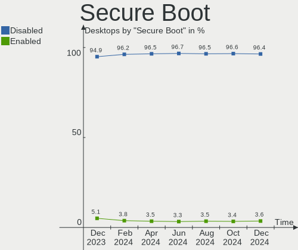
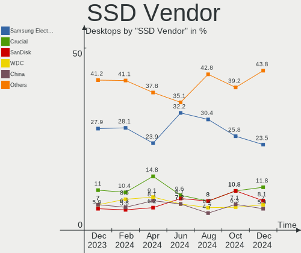
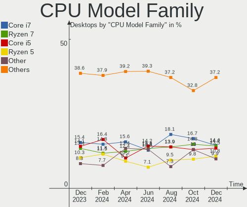
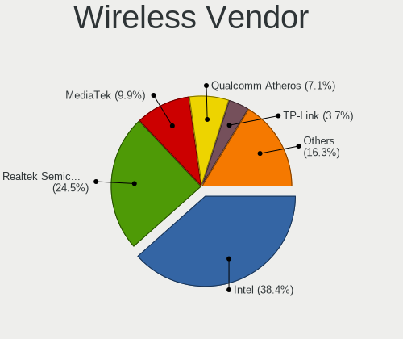

Linux in USA - Hardware Trends (Desktops)
-----------------------------------------

A project to identify most popular hardware characteristics and track their change
over time based on data collected by Linux users at https://Linux-Hardware.org.

Anyone can contribute to this report by the [hw-probe](https://github.com/linuxhw/hw-probe) tool:

    sudo -E hw-probe -all -upload

Period: Oct, 2023.

Contents
--------

* [ System ](#system)
  - [ OS                       ](#os)
  - [ OS Family                ](#os-family)
  - [ Kernel                   ](#kernel)
  - [ Kernel Family            ](#kernel-family)
  - [ Kernel Major Ver.        ](#kernel-major-ver)
  - [ Arch                     ](#arch)
  - [ DE                       ](#de)
  - [ Display Server           ](#display-server)
  - [ Display Manager          ](#display-manager)
  - [ OS Lang                  ](#os-lang)
  - [ Boot Mode                ](#boot-mode)
  - [ Filesystem               ](#filesystem)
  - [ Part. scheme             ](#part-scheme)
  - [ Dual Boot with Linux/BSD ](#dual-boot-with-linuxbsd)
  - [ Dual Boot (Win)          ](#dual-boot-win)

* [ Board ](#board)
  - [ Vendor                   ](#vendor)
  - [ Model                    ](#model)
  - [ Model Family             ](#model-family)
  - [ MFG Year                 ](#mfg-year)
  - [ Form Factor              ](#form-factor)
  - [ Secure Boot              ](#secure-boot)
  - [ Coreboot                 ](#coreboot)
  - [ RAM Size                 ](#ram-size)
  - [ RAM Used                 ](#ram-used)
  - [ Total Drives             ](#total-drives)
  - [ Has CD-ROM               ](#has-cd-rom)
  - [ Has Ethernet             ](#has-ethernet)
  - [ Has WiFi                 ](#has-wifi)
  - [ Has Bluetooth            ](#has-bluetooth)

* [ Location ](#location)
  - [ Country                  ](#country)
  - [ City                     ](#city)

* [ Drives ](#drives)
  - [ Drive Vendor             ](#drive-vendor)
  - [ Drive Model              ](#drive-model)
  - [ HDD Vendor               ](#hdd-vendor)
  - [ SSD Vendor               ](#ssd-vendor)
  - [ Drive Kind               ](#drive-kind)
  - [ Drive Connector          ](#drive-connector)
  - [ Drive Size               ](#drive-size)
  - [ Space Total              ](#space-total)
  - [ Space Used               ](#space-used)
  - [ Malfunc. Drives          ](#malfunc-drives)
  - [ Malfunc. Drive Vendor    ](#malfunc-drive-vendor)
  - [ Malfunc. HDD Vendor      ](#malfunc-hdd-vendor)
  - [ Malfunc. Drive Kind      ](#malfunc-drive-kind)
  - [ Failed Drives            ](#failed-drives)
  - [ Failed Drive Vendor      ](#failed-drive-vendor)
  - [ Drive Status             ](#drive-status)

* [ Storage controller ](#storage-controller)
  - [ Storage Vendor           ](#storage-vendor)
  - [ Storage Model            ](#storage-model)
  - [ Storage Kind             ](#storage-kind)

* [ Processor ](#processor)
  - [ CPU Vendor               ](#cpu-vendor)
  - [ CPU Model                ](#cpu-model)
  - [ CPU Model Family         ](#cpu-model-family)
  - [ CPU Cores                ](#cpu-cores)
  - [ CPU Sockets              ](#cpu-sockets)
  - [ CPU Threads              ](#cpu-threads)
  - [ CPU Op-Modes             ](#cpu-op-modes)
  - [ CPU Microcode            ](#cpu-microcode)
  - [ CPU Microarch            ](#cpu-microarch)

* [ Graphics ](#graphics)
  - [ GPU Vendor               ](#gpu-vendor)
  - [ GPU Model                ](#gpu-model)
  - [ GPU Combo                ](#gpu-combo)
  - [ GPU Driver               ](#gpu-driver)
  - [ GPU Memory               ](#gpu-memory)

* [ Monitor ](#monitor)
  - [ Monitor Vendor           ](#monitor-vendor)
  - [ Monitor Model            ](#monitor-model)
  - [ Monitor Resolution       ](#monitor-resolution)
  - [ Monitor Diagonal         ](#monitor-diagonal)
  - [ Monitor Width            ](#monitor-width)
  - [ Aspect Ratio             ](#aspect-ratio)
  - [ Monitor Area             ](#monitor-area)
  - [ Pixel Density            ](#pixel-density)
  - [ Multiple Monitors        ](#multiple-monitors)

* [ Network ](#network)
  - [ Net Controller Vendor    ](#net-controller-vendor)
  - [ Net Controller Model     ](#net-controller-model)
  - [ Wireless Vendor          ](#wireless-vendor)
  - [ Wireless Model           ](#wireless-model)
  - [ Ethernet Vendor          ](#ethernet-vendor)
  - [ Ethernet Model           ](#ethernet-model)
  - [ Net Controller Kind      ](#net-controller-kind)
  - [ Used Controller          ](#used-controller)
  - [ NICs                     ](#nics)
  - [ IPv6                     ](#ipv6)

* [ Bluetooth ](#bluetooth)
  - [ Bluetooth Vendor         ](#bluetooth-vendor)
  - [ Bluetooth Model          ](#bluetooth-model)

* [ Sound ](#sound)
  - [ Sound Vendor             ](#sound-vendor)
  - [ Sound Model              ](#sound-model)

* [ Memory ](#memory)
  - [ Memory Vendor            ](#memory-vendor)
  - [ Memory Model             ](#memory-model)
  - [ Memory Kind              ](#memory-kind)
  - [ Memory Form Factor       ](#memory-form-factor)
  - [ Memory Size              ](#memory-size)
  - [ Memory Speed             ](#memory-speed)

* [ Printers & scanners ](#printers--scanners)
  - [ Printer Vendor           ](#printer-vendor)
  - [ Printer Model            ](#printer-model)
  - [ Scanner Vendor           ](#scanner-vendor)
  - [ Scanner Model            ](#scanner-model)

* [ Camera ](#camera)
  - [ Camera Vendor            ](#camera-vendor)
  - [ Camera Model             ](#camera-model)

* [ Security ](#security)
  - [ Fingerprint Vendor       ](#fingerprint-vendor)
  - [ Fingerprint Model        ](#fingerprint-model)
  - [ Chipcard Vendor          ](#chipcard-vendor)
  - [ Chipcard Model           ](#chipcard-model)

* [ Unsupported ](#unsupported)
  - [ Unsupported Devices      ](#unsupported-devices)
  - [ Unsupported Device Types ](#unsupported-device-types)

System
------

OS
--

Installed operating systems

| Name                         | Desktops | Percent |
|------------------------------|----------|---------|
| Ubuntu 22.04                 | 73       | 17.85%  |
| Fedora 38                    | 37       | 9.05%   |
| Linux Mint 21.2              | 33       | 8.07%   |
| Ubuntu 23.04                 | 20       | 4.89%   |
| Pop!_OS 22.04                | 20       | 4.89%   |
| Debian 12                    | 18       | 4.4%    |
| Arch Rolling                 | 14       | 3.42%   |
| Zorin 16                     | 13       | 3.18%   |
| Manjaro                      | 13       | 3.18%   |
| Ubuntu 20.04                 | 12       | 2.93%   |
| KDE neon 22.04               | 11       | 2.69%   |
| Ubuntu 23.10                 | 8        | 1.96%   |
| ArcoLinux Rolling            | 8        | 1.96%   |
| Linux Mint 21.1              | 7        | 1.71%   |
| LMDE 6                       | 5        | 1.22%   |
| Kubuntu 22.04                | 5        | 1.22%   |
| OpenMandriva 23.10           | 4        | 0.98%   |
| OpenMandriva 23.08           | 4        | 0.98%   |
| Linux Mint 20.3              | 4        | 0.98%   |
| Kubuntu 23.04                | 4        | 0.98%   |
| Gentoo 2.14                  | 4        | 0.98%   |
| Void Linux Rolling           | 3        | 0.73%   |
| Ubuntu 18.04                 | 3        | 0.73%   |
| openSUSE Tumbleweed-XXXXXXXX | 3        | 0.73%   |
| openSUSE Leap-15.5           | 3        | 0.73%   |
| Linux Mint 21                | 3        | 0.73%   |
| Garuda Linux Soaring         | 3        | 0.73%   |
| Garuda Linux Rolling         | 3        | 0.73%   |
| EndeavourOS Rolling          | 3        | 0.73%   |
| Debian 11                    | 3        | 0.73%   |
| blendOS                      | 3        | 0.73%   |
| Xubuntu 22.04                | 2        | 0.49%   |
| Rocky Linux 9.2              | 2        | 0.49%   |
| Parrot 5.3                   | 2        | 0.49%   |
| OpenMandriva 4.3             | 2        | 0.49%   |
| OpenMandriva 23.01           | 2        | 0.49%   |
| Linux Mint 20.2              | 2        | 0.49%   |
| Kali 2023.3                  | 2        | 0.49%   |
| Fedora 39                    | 2        | 0.49%   |
| ChimeraOS 44-1               | 2        | 0.49%   |

OS Family
---------

OS without a version

| Name          | Desktops | Percent |
|---------------|----------|---------|
| Ubuntu        | 118      | 28.85%  |
| Linux Mint    | 49       | 11.98%  |
| Fedora        | 39       | 9.54%   |
| Debian        | 22       | 5.38%   |
| Pop!_OS       | 20       | 4.89%   |
| Manjaro       | 15       | 3.67%   |
| OpenMandriva  | 14       | 3.42%   |
| Arch          | 14       | 3.42%   |
| Zorin         | 13       | 3.18%   |
| Kubuntu       | 11       | 2.69%   |
| KDE neon      | 11       | 2.69%   |
| ArcoLinux     | 8        | 1.96%   |
| openSUSE      | 7        | 1.71%   |
| Garuda Linux  | 6        | 1.47%   |
| Xubuntu       | 5        | 1.22%   |
| LMDE          | 5        | 1.22%   |
| Gentoo        | 4        | 0.98%   |
| Void Linux    | 3        | 0.73%   |
| Rocky Linux   | 3        | 0.73%   |
| EndeavourOS   | 3        | 0.73%   |
| ChimeraOS     | 3        | 0.73%   |
| blendOS       | 3        | 0.73%   |
| Parrot        | 2        | 0.49%   |
| Nobara        | 2        | 0.49%   |
| Kali          | 2        | 0.49%   |
| BigLinux      | 2        | 0.49%   |
| Xero          | 1        | 0.24%   |
| Xenia         | 1        | 0.24%   |
| Ultimate      | 1        | 0.24%   |
| Ubuntu Unity  | 1        | 0.24%   |
| Ubuntu Studio | 1        | 0.24%   |
| Ubuntu Budgie | 1        | 0.24%   |
| SteamOS       | 1        | 0.24%   |
| RHEL          | 1        | 0.24%   |
| Puppy         | 1        | 0.24%   |
| Pear OS       | 1        | 0.24%   |
| NixOS         | 1        | 0.24%   |
| MX            | 1        | 0.24%   |
| Lubuntu       | 1        | 0.24%   |
| Elementary    | 1        | 0.24%   |

Kernel
------

Version of the Linux kernel

| Version                 | Desktops | Percent |
|-------------------------|----------|---------|
| 6.2.0-34-generic        | 48       | 11.74%  |
| 5.15.0-86-generic       | 25       | 6.11%   |
| 6.2.0-35-generic        | 23       | 5.62%   |
| 6.2.0-33-generic        | 23       | 5.62%   |
| 5.15.0-84-generic       | 17       | 4.16%   |
| 5.15.0-87-generic       | 14       | 3.42%   |
| 6.5.5-200.fc38.x86_64   | 13       | 3.18%   |
| 6.5.4-76060504-generic  | 13       | 3.18%   |
| 6.1.0-13-amd64          | 11       | 2.69%   |
| 6.1.0-12-amd64          | 10       | 2.44%   |
| 6.5.7-200.fc38.x86_64   | 7        | 1.71%   |
| 6.5.6-200.fc38.x86_64   | 7        | 1.71%   |
| 6.5.5-1-MANJARO         | 7        | 1.71%   |
| 6.5.7-arch1-1           | 6        | 1.47%   |
| 6.5.8-arch1-1           | 5        | 1.22%   |
| 6.5.6-76060506-generic  | 5        | 1.22%   |
| 6.5.0-9-generic         | 5        | 1.22%   |
| 6.4.11-desktop-1omv2390 | 5        | 1.22%   |
| 6.5.0-10-generic        | 4        | 0.98%   |
| 6.1.55-1-MANJARO        | 4        | 0.98%   |
| 5.4.0-163-generic       | 4        | 0.98%   |
| 6.5.9-zen2-1-zen        | 3        | 0.73%   |
| 6.5.8-200.fc38.x86_64   | 3        | 0.73%   |
| 6.5.5-desktop-1omv2390  | 3        | 0.73%   |
| 6.2.9-300.fc38.x86_64   | 3        | 0.73%   |
| 6.2.0-26-generic        | 3        | 0.73%   |
| 5.4.0-165-generic       | 3        | 0.73%   |
| 5.15.0-76-generic       | 3        | 0.73%   |
| 4.15.0-213-generic      | 3        | 0.73%   |
| 6.5.7-zen2-1-zen        | 2        | 0.49%   |
| 6.5.6-chos1-chimeraos-1 | 2        | 0.49%   |
| 6.5.6-arch2-1           | 2        | 0.49%   |
| 6.5.6-1-default         | 2        | 0.49%   |
| 6.5.5-zen1-1-zen        | 2        | 0.49%   |
| 6.4.6-76060406-generic  | 2        | 0.49%   |
| 6.3.9-zen1-1-zen        | 2        | 0.49%   |
| 6.2.0-36-generic        | 2        | 0.49%   |
| 6.2.0-1015-lowlatency   | 2        | 0.49%   |
| 6.1.55-gentoo-dist      | 2        | 0.49%   |
| 6.1.1-desktop-1omv2290  | 2        | 0.49%   |

Kernel Family
-------------

Linux kernel without a distro release

| Version | Desktops | Percent |
|---------|----------|---------|
| 6.2.0   | 105      | 25.67%  |
| 5.15.0  | 72       | 17.6%   |
| 6.5.5   | 30       | 7.33%   |
| 6.1.0   | 26       | 6.36%   |
| 6.5.6   | 23       | 5.62%   |
| 6.5.7   | 22       | 5.38%   |
| 6.5.0   | 15       | 3.67%   |
| 6.5.4   | 14       | 3.42%   |
| 5.4.0   | 11       | 2.69%   |
| 6.5.8   | 10       | 2.44%   |
| 6.1.55  | 7        | 1.71%   |
| 6.5.9   | 6        | 1.47%   |
| 6.4.11  | 5        | 1.22%   |
| 6.5.3   | 4        | 0.98%   |
| 6.2.16  | 4        | 0.98%   |
| 6.2.9   | 3        | 0.73%   |
| 5.19.0  | 3        | 0.73%   |
| 5.14.21 | 3        | 0.73%   |
| 5.14.0  | 3        | 0.73%   |
| 5.10.0  | 3        | 0.73%   |
| 4.18.0  | 3        | 0.73%   |
| 4.15.0  | 3        | 0.73%   |
| 6.4.6   | 2        | 0.49%   |
| 6.3.9   | 2        | 0.49%   |
| 6.3.5   | 2        | 0.49%   |
| 6.1.58  | 2        | 0.49%   |
| 6.1.1   | 2        | 0.49%   |
| 5.16.7  | 2        | 0.49%   |
| 6.6.0   | 1        | 0.24%   |
| 6.5.2   | 1        | 0.24%   |
| 6.5.1   | 1        | 0.24%   |
| 6.4.8   | 1        | 0.24%   |
| 6.4.16  | 1        | 0.24%   |
| 6.4.15  | 1        | 0.24%   |
| 6.4.13  | 1        | 0.24%   |
| 6.4.10  | 1        | 0.24%   |
| 6.3.0   | 1        | 0.24%   |
| 6.1.57  | 1        | 0.24%   |
| 6.1.56  | 1        | 0.24%   |
| 6.1.53  | 1        | 0.24%   |

Kernel Major Ver.
-----------------

Linux kernel major version

| Version | Desktops | Percent |
|---------|----------|---------|
| 6.5     | 126      | 30.81%  |
| 6.2     | 112      | 27.38%  |
| 5.15    | 72       | 17.6%   |
| 6.1     | 43       | 10.51%  |
| 5.4     | 13       | 3.18%   |
| 6.4     | 12       | 2.93%   |
| 5.14    | 6        | 1.47%   |
| 6.3     | 5        | 1.22%   |
| 4.18    | 4        | 0.98%   |
| 5.19    | 3        | 0.73%   |
| 5.10    | 3        | 0.73%   |
| 4.15    | 3        | 0.73%   |
| 5.16    | 2        | 0.49%   |
| 6.6     | 1        | 0.24%   |
| 6.0     | 1        | 0.24%   |
| 5.13    | 1        | 0.24%   |
| 5.11    | 1        | 0.24%   |
| 4.4     | 1        | 0.24%   |

Arch
----

OS architecture (x86_64, i586, etc.)

| Name   | Desktops | Percent |
|--------|----------|---------|
| x86_64 | 407      | 99.51%  |
| i686   | 2        | 0.49%   |

DE
--

Desktop Environment

| Name                    | Desktops | Percent |
|-------------------------|----------|---------|
| GNOME                   | 193      | 47.19%  |
| KDE5                    | 86       | 21.03%  |
| X-Cinnamon              | 42       | 10.27%  |
| Unknown                 | 26       | 6.36%   |
| XFCE                    | 21       | 5.13%   |
| MATE                    | 14       | 3.42%   |
| Cinnamon                | 5        | 1.22%   |
| Hyprland                | 3        | 0.73%   |
| LXQt                    | 2        | 0.49%   |
| LXDE                    | 2        | 0.49%   |
| KDE                     | 2        | 0.49%   |
| i3                      | 2        | 0.49%   |
| GNOME Classic           | 2        | 0.49%   |
| Budgie                  | 2        | 0.49%   |
| Wayfire:wayfire:wlroots | 1        | 0.24%   |
| Unity                   | 1        | 0.24%   |
| Unicorn:XFCE            | 1        | 0.24%   |
| Pantheon                | 1        | 0.24%   |
| onyx:GNOME              | 1        | 0.24%   |
| GNOME Flashback         | 1        | 0.24%   |
| DDE                     | 1        | 0.24%   |

Display Server
--------------

X11 or Wayland

| Name    | Desktops | Percent |
|---------|----------|---------|
| X11     | 254      | 62.1%   |
| Wayland | 127      | 31.05%  |
| Tty     | 15       | 3.67%   |
| Unknown | 13       | 3.18%   |

Display Manager
---------------

SDDM, LightDM, etc.

| Name    | Desktops | Percent |
|---------|----------|---------|
| Unknown | 181      | 44.25%  |
| GDM3    | 110      | 26.89%  |
| SDDM    | 54       | 13.2%   |
| LightDM | 39       | 9.54%   |
| GDM     | 23       | 5.62%   |
| SLiM    | 1        | 0.24%   |
| GREETD  | 1        | 0.24%   |

OS Lang
-------

Language

| Lang        | Desktops | Percent |
|-------------|----------|---------|
| en_US       | 376      | 91.93%  |
| C           | 15       | 3.67%   |
| Unknown     | 6        | 1.47%   |
| C.UTF8      | 3        | 0.73%   |
| de_DE       | 2        | 0.49%   |
| zh_TW       | 1        | 0.24%   |
| ru_UA       | 1        | 0.24%   |
| ru_RU       | 1        | 0.24%   |
| es_US       | 1        | 0.24%   |
| en_US.utf-8 | 1        | 0.24%   |
| en_GB       | 1        | 0.24%   |
| en_CA       | 1        | 0.24%   |

Boot Mode
---------

EFI or BIOS

| Mode | Desktops | Percent |
|------|----------|---------|
| BIOS | 233      | 56.97%  |
| EFI  | 176      | 43.03%  |

Filesystem
----------

Type of filesystem

| Type    | Desktops | Percent |
|---------|----------|---------|
| Ext4    | 219      | 53.55%  |
| Tmpfs   | 90       | 22%     |
| Btrfs   | 71       | 17.36%  |
| Overlay | 12       | 2.93%   |
| Xfs     | 9        | 2.2%    |
| Zfs     | 3        | 0.73%   |
| F2fs    | 2        | 0.49%   |
| Ext3    | 1        | 0.24%   |
| Ext2    | 1        | 0.24%   |
| Aufs    | 1        | 0.24%   |

Part. scheme
------------

Scheme of partitioning

| Type    | Desktops | Percent |
|---------|----------|---------|
| GPT     | 227      | 55.5%   |
| Unknown | 159      | 38.88%  |
| MBR     | 23       | 5.62%   |

Dual Boot with Linux/BSD
------------------------

Hosting more than one Linux/BSD

| Dual boot | Desktops | Percent |
|-----------|----------|---------|
| No        | 343      | 83.86%  |
| Yes       | 66       | 16.14%  |

Dual Boot (Win)
---------------

Hosting Linux and Windows

| Dual boot | Desktops | Percent |
|-----------|----------|---------|
| No        | 310      | 75.79%  |
| Yes       | 99       | 24.21%  |

Board
-----

Vendor
------

Motherboard manufacturer

| Name                                 | Desktops | Percent |
|--------------------------------------|----------|---------|
| ASUSTek Computer                     | 95       | 23.23%  |
| Dell                                 | 61       | 14.91%  |
| MSI                                  | 50       | 12.22%  |
| Hewlett-Packard                      | 50       | 12.22%  |
| Gigabyte Technology                  | 49       | 11.98%  |
| ASRock                               | 25       | 6.11%   |
| Lenovo                               | 10       | 2.44%   |
| Intel                                | 10       | 2.44%   |
| AZW                                  | 10       | 2.44%   |
| Unknown                              | 8        | 1.96%   |
| Acer                                 | 7        | 1.71%   |
| Gateway                              | 3        | 0.73%   |
| Foxconn                              | 3        | 0.73%   |
| System76                             | 2        | 0.49%   |
| Supermicro                           | 2        | 0.49%   |
| Shenzhen Meigao Electronic Equipment | 2        | 0.49%   |
| Pegatron                             | 2        | 0.49%   |
| eMachines                            | 2        | 0.49%   |
| Biostar                              | 2        | 0.49%   |
| XFX                                  | 1        | 0.24%   |
| Techvision                           | 1        | 0.24%   |
| SYWZ                                 | 1        | 0.24%   |
| Shuttle                              | 1        | 0.24%   |
| SHANGZHAOYUAN                        | 1        | 0.24%   |
| Quanta                               | 1        | 0.24%   |
| NF-M2S                               | 1        | 0.24%   |
| MACHINIST                            | 1        | 0.24%   |
| Google                               | 1        | 0.24%   |
| GMKtec                               | 1        | 0.24%   |
| GEEKOM                               | 1        | 0.24%   |
| EVGA                                 | 1        | 0.24%   |
| ECS                                  | 1        | 0.24%   |
| ASRockRack                           | 1        | 0.24%   |
| AOpen                                | 1        | 0.24%   |
| Alienware                            | 1        | 0.24%   |

Model
-----

Motherboard model

| Name                              | Desktops | Percent |
|-----------------------------------|----------|---------|
| Unknown                           | 8        | 1.96%   |
| Dell OptiPlex 9020                | 6        | 1.47%   |
| Dell OptiPlex 7010                | 6        | 1.47%   |
| ASUS TUF Gaming X570-PLUS         | 6        | 1.47%   |
| ASUS All Series                   | 6        | 1.47%   |
| Dell OptiPlex 7050                | 5        | 1.22%   |
| MSI MS-7D25                       | 4        | 0.98%   |
| MSI MS-7C56                       | 4        | 0.98%   |
| AZW SEi                           | 4        | 0.98%   |
| MSI MS-7C37                       | 3        | 0.73%   |
| MSI MS-7C02                       | 3        | 0.73%   |
| HP Pavilion Desktop 590-p0xxx     | 3        | 0.73%   |
| Gigabyte B450M DS3H               | 3        | 0.73%   |
| Dell XPS 8940                     | 3        | 0.73%   |
| Dell OptiPlex 780                 | 3        | 0.73%   |
| ASUS TUF Gaming B550-PLUS WIFI II | 3        | 0.73%   |
| ASUS ROG STRIX B550-F GAMING      | 3        | 0.73%   |
| ASUS PRIME B450M-A II             | 3        | 0.73%   |
| MSI MS-7D78                       | 2        | 0.49%   |
| MSI MS-7D30                       | 2        | 0.49%   |
| MSI MS-7C95                       | 2        | 0.49%   |
| HP Z620 Workstation               | 2        | 0.49%   |
| HP Z400 Workstation               | 2        | 0.49%   |
| HP ProDesk 600 G1 SFF             | 2        | 0.49%   |
| HP EliteDesk 705 G4 DM 65W (TAA)  | 2        | 0.49%   |
| HP Compaq Pro 6300 SFF            | 2        | 0.49%   |
| Gigabyte Z790 AORUS ELITE AX      | 2        | 0.49%   |
| Gigabyte Z68XP-UD3                | 2        | 0.49%   |
| Gigabyte GA-78LMT-USB3 6.0        | 2        | 0.49%   |
| Gigabyte 970A-DS3P                | 2        | 0.49%   |
| Dell Precision Tower 7810         | 2        | 0.49%   |
| Dell OptiPlex 9010                | 2        | 0.49%   |
| Dell OptiPlex 790                 | 2        | 0.49%   |
| Dell OptiPlex 3010                | 2        | 0.49%   |
| Dell Inspiron 660                 | 2        | 0.49%   |
| Dell Inspiron 560                 | 2        | 0.49%   |
| Dell Inspiron 530                 | 2        | 0.49%   |
| AZW SER                           | 2        | 0.49%   |
| AZW MINI S                        | 2        | 0.49%   |
| AZW GTR                           | 2        | 0.49%   |

Model Family
------------

Motherboard model prefix

| Name                   | Desktops | Percent |
|------------------------|----------|---------|
| Dell OptiPlex          | 35       | 8.56%   |
| ASUS ROG               | 27       | 6.6%    |
| ASUS PRIME             | 19       | 4.65%   |
| ASUS TUF               | 14       | 3.42%   |
| HP EliteDesk           | 10       | 2.44%   |
| Dell Precision         | 8        | 1.96%   |
| Dell Inspiron          | 8        | 1.96%   |
| Unknown                | 8        | 1.96%   |
| HP Compaq              | 7        | 1.71%   |
| Lenovo ThinkCentre     | 6        | 1.47%   |
| HP Pavilion            | 6        | 1.47%   |
| ASUS All               | 6        | 1.47%   |
| Acer Aspire            | 6        | 1.47%   |
| Dell XPS               | 5        | 1.22%   |
| MSI MS-7D25            | 4        | 0.98%   |
| MSI MS-7C56            | 4        | 0.98%   |
| HP ProDesk             | 4        | 0.98%   |
| Gigabyte Z390          | 4        | 0.98%   |
| Gigabyte X570          | 4        | 0.98%   |
| Gigabyte B450M         | 4        | 0.98%   |
| AZW SEi                | 4        | 0.98%   |
| MSI MS-7C37            | 3        | 0.73%   |
| MSI MS-7C02            | 3        | 0.73%   |
| Dell Vostro            | 3        | 0.73%   |
| System76 Thelio        | 2        | 0.49%   |
| MSI MS-7D78            | 2        | 0.49%   |
| MSI MS-7D30            | 2        | 0.49%   |
| MSI MS-7C95            | 2        | 0.49%   |
| HP Z620                | 2        | 0.49%   |
| HP Z400                | 2        | 0.49%   |
| HP Desktop             | 2        | 0.49%   |
| Gigabyte Z790          | 2        | 0.49%   |
| Gigabyte Z68XP-UD3     | 2        | 0.49%   |
| Gigabyte GA-78LMT-USB3 | 2        | 0.49%   |
| Gigabyte A520M         | 2        | 0.49%   |
| Gigabyte 970A-DS3P     | 2        | 0.49%   |
| AZW SER                | 2        | 0.49%   |
| AZW MINI               | 2        | 0.49%   |
| AZW GTR                | 2        | 0.49%   |
| ASUS SABERTOOTH        | 2        | 0.49%   |

MFG Year
--------

Motherboard manufacture year

| Year | Desktops | Percent |
|------|----------|---------|
| 2018 | 40       | 9.78%   |
| 2022 | 37       | 9.05%   |
| 2021 | 36       | 8.8%    |
| 2020 | 36       | 8.8%    |
| 2023 | 33       | 8.07%   |
| 2019 | 32       | 7.82%   |
| 2012 | 32       | 7.82%   |
| 2011 | 28       | 6.85%   |
| 2013 | 26       | 6.36%   |
| 2017 | 24       | 5.87%   |
| 2014 | 21       | 5.13%   |
| 2015 | 14       | 3.42%   |
| 2016 | 13       | 3.18%   |
| 2010 | 13       | 3.18%   |
| 2008 | 10       | 2.44%   |
| 2009 | 7        | 1.71%   |
| 2007 | 5        | 1.22%   |
| 2006 | 1        | 0.24%   |
| 2001 | 1        | 0.24%   |

Form Factor
-----------

Physical design of the computer

| Name    | Desktops | Percent |
|---------|----------|---------|
| Desktop | 409      | 100%    |

Secure Boot
-----------

Enabled or disabled

| State    | Desktops | Percent |
|----------|----------|---------|
| Disabled | 390      | 95.35%  |
| Enabled  | 19       | 4.65%   |

Coreboot
--------

Have coreboot on board

| Used | Desktops | Percent |
|------|----------|---------|
| No   | 407      | 99.51%  |
| Yes  | 2        | 0.49%   |

RAM Size
--------

Total RAM memory

| Size in GB      | Desktops | Percent |
|-----------------|----------|---------|
| 16.01-24.0      | 111      | 27.14%  |
| 32.01-64.0      | 108      | 26.41%  |
| 64.01-256.0     | 54       | 13.2%   |
| 8.01-16.0       | 46       | 11.25%  |
| 4.01-8.0        | 35       | 8.56%   |
| 3.01-4.0        | 28       | 6.85%   |
| 24.01-32.0      | 21       | 5.13%   |
| 2.01-3.0        | 3        | 0.73%   |
| More than 256.0 | 1        | 0.24%   |
| 1.01-2.0        | 1        | 0.24%   |
| 0.51-1.0        | 1        | 0.24%   |

RAM Used
--------

Used RAM memory

| Used GB    | Desktops | Percent |
|------------|----------|---------|
| 4.01-8.0   | 104      | 25.43%  |
| 2.01-3.0   | 101      | 24.69%  |
| 1.01-2.0   | 85       | 20.78%  |
| 3.01-4.0   | 57       | 13.94%  |
| 8.01-16.0  | 36       | 8.8%    |
| 16.01-24.0 | 10       | 2.44%   |
| 0.51-1.0   | 8        | 1.96%   |
| 32.01-64.0 | 3        | 0.73%   |
| 0.01-0.5   | 3        | 0.73%   |
| 24.01-32.0 | 2        | 0.49%   |

Total Drives
------------

Number of drives on board

| Drives | Desktops | Percent |
|--------|----------|---------|
| 1      | 152      | 37.16%  |
| 2      | 113      | 27.63%  |
| 3      | 64       | 15.65%  |
| 4      | 27       | 6.6%    |
| 5      | 21       | 5.13%   |
| 6      | 17       | 4.16%   |
| 9      | 5        | 1.22%   |
| 7      | 4        | 0.98%   |
| 8      | 2        | 0.49%   |
| 0      | 2        | 0.49%   |
| 19     | 1        | 0.24%   |
| 11     | 1        | 0.24%   |

Has CD-ROM
----------

Has CD-ROM on board

| Presented | Desktops | Percent |
|-----------|----------|---------|
| No        | 247      | 60.39%  |
| Yes       | 162      | 39.61%  |

Has Ethernet
------------

Has Ethernet on board

| Presented | Desktops | Percent |
|-----------|----------|---------|
| Yes       | 407      | 99.51%  |
| No        | 2        | 0.49%   |

Has WiFi
--------

Has WiFi module

| Presented | Desktops | Percent |
|-----------|----------|---------|
| Yes       | 262      | 64.06%  |
| No        | 147      | 35.94%  |

Has Bluetooth
-------------

Has Bluetooth module

| Presented | Desktops | Percent |
|-----------|----------|---------|
| Yes       | 214      | 52.32%  |
| No        | 195      | 47.68%  |

Location
--------

Country
-------

Geographic location (country)

| Country | Desktops | Percent |
|---------|----------|---------|
| USA     | 409      | 100%    |

City
----

Geographic location (city)

| City             | Desktops | Percent |
|------------------|----------|---------|
| Los Angeles      | 10       | 2.44%   |
| New York         | 8        | 1.96%   |
| Miami            | 6        | 1.47%   |
| Kansas City      | 6        | 1.47%   |
| Atlanta          | 6        | 1.47%   |
| Seattle          | 5        | 1.22%   |
| Las Vegas        | 5        | 1.22%   |
| Chicago          | 5        | 1.22%   |
| Houston          | 4        | 0.98%   |
| Columbus         | 4        | 0.98%   |
| Springfield      | 3        | 0.73%   |
| San Jose         | 3        | 0.73%   |
| Riverside        | 3        | 0.73%   |
| Portland         | 3        | 0.73%   |
| Harrisonburg     | 3        | 0.73%   |
| Flushing         | 3        | 0.73%   |
| Denver           | 3        | 0.73%   |
| Dallas           | 3        | 0.73%   |
| Clinton Township | 3        | 0.73%   |
| Albuquerque      | 3        | 0.73%   |
| Zanesville       | 2        | 0.49%   |
| Waynesboro       | 2        | 0.49%   |
| Van Nuys         | 2        | 0.49%   |
| Texarkana        | 2        | 0.49%   |
| Tampa            | 2        | 0.49%   |
| St. Petersburg   | 2        | 0.49%   |
| Santa Maria      | 2        | 0.49%   |
| San Diego        | 2        | 0.49%   |
| Sacramento       | 2        | 0.49%   |
| Phoenix          | 2        | 0.49%   |
| Philadelphia     | 2        | 0.49%   |
| Palm Bay         | 2        | 0.49%   |
| Oklahoma City    | 2        | 0.49%   |
| Minneapolis      | 2        | 0.49%   |
| Merced           | 2        | 0.49%   |
| McKinney         | 2        | 0.49%   |
| Madisonville     | 2        | 0.49%   |
| Lake Placid      | 2        | 0.49%   |
| Lafayette        | 2        | 0.49%   |
| Greenwich        | 2        | 0.49%   |

Drives
------

Drive Vendor
------------

Hard drive vendors

| Vendor                      | Desktops | Drives | Percent |
|-----------------------------|----------|--------|---------|
| WDC                         | 125      | 172    | 16.32%  |
| Samsung Electronics         | 123      | 176    | 16.06%  |
| Seagate                     | 122      | 178    | 15.93%  |
| Sandisk                     | 61       | 73     | 7.96%   |
| Crucial                     | 32       | 36     | 4.18%   |
| Toshiba                     | 29       | 30     | 3.79%   |
| Hitachi                     | 24       | 27     | 3.13%   |
| PNY                         | 19       | 24     | 2.48%   |
| Intel                       | 18       | 22     | 2.35%   |
| Phison Electronics          | 17       | 20     | 2.22%   |
| Micron/Crucial Technology   | 16       | 20     | 2.09%   |
| Unknown                     | 14       | 17     | 1.83%   |
| HGST                        | 14       | 30     | 1.83%   |
| SPCC                        | 13       | 14     | 1.7%    |
| Kingston                    | 12       | 15     | 1.57%   |
| SK hynix                    | 10       | 11     | 1.31%   |
| China                       | 10       | 12     | 1.31%   |
| Team                        | 8        | 9      | 1.04%   |
| Silicon Motion              | 6        | 6      | 0.78%   |
| Realtek Semiconductor       | 5        | 5      | 0.65%   |
| Micron Technology           | 5        | 5      | 0.65%   |
| Hewlett-Packard             | 5        | 5      | 0.65%   |
| T-FORCE                     | 4        | 4      | 0.52%   |
| SABRENT                     | 4        | 4      | 0.52%   |
| Kingston Technology Company | 4        | 4      | 0.52%   |
| KingFast                    | 4        | 5      | 0.52%   |
| A-DATA Technology           | 4        | 4      | 0.52%   |
| Unknown                     | 4        | 4      | 0.52%   |
| Patriot                     | 3        | 3      | 0.39%   |
| KIOXIA                      | 3        | 3      | 0.39%   |
| WD MediaMax                 | 2        | 2      | 0.26%   |
| Transcend                   | 2        | 2      | 0.26%   |
| TO Exter                    | 2        | 3      | 0.26%   |
| Timetec                     | 2        | 2      | 0.26%   |
| Mushkin                     | 2        | 2      | 0.26%   |
| Fanxiang                    | 2        | 2      | 0.26%   |
| Corsair                     | 2        | 10     | 0.26%   |
| ASMT                        | 2        | 2      | 0.26%   |
| ASMedia                     | 2        | 5      | 0.26%   |
| ADATA Technology            | 2        | 2      | 0.26%   |

Drive Model
-----------

Hard drive models

| Model                                                 | Desktops | Percent |
|-------------------------------------------------------|----------|---------|
| Samsung NVMe SSD Controller SM981/PM981/PM983 1TB     | 21       | 2.37%   |
| Seagate ST2000DM008-2FR102 2TB                        | 17       | 1.92%   |
| Samsung NVMe SSD Controller PM9A1/PM9A3/980PRO 1TB    | 13       | 1.47%   |
| Samsung SSD 980 1TB                                   | 12       | 1.35%   |
| Micron/Crucial P2 NVMe PCIe SSD 500GB                 | 12       | 1.35%   |
| Samsung SSD 850 EVO 250GB                             | 9        | 1.01%   |
| Samsung SSD 870 EVO 1TB                               | 8        | 0.9%    |
| Phison E16 PCIe4 NVMe Controller 500GB                | 8        | 0.9%    |
| Unknown SD/MMC/MS PRO 16GB                            | 7        | 0.79%   |
| Toshiba DT01ACA100 1TB                                | 7        | 0.79%   |
| Sandisk WD_BLACK SN770 1TB                            | 7        | 0.79%   |
| PNY CS900 500GB SSD                                   | 7        | 0.79%   |
| PNY CS900 1TB SSD                                     | 7        | 0.79%   |
| SPCC Solid State Disk 1TB                             | 6        | 0.68%   |
| Seagate ST2000DM006-2DM164 2TB                        | 6        | 0.68%   |
| Seagate ST1000DM003-1CH162 1TB                        | 6        | 0.68%   |
| Samsung SSD 860 EVO 1TB                               | 6        | 0.68%   |
| Crucial CT1000MX500SSD1 1TB                           | 6        | 0.68%   |
| WDC WD40EZRZ-22GXCB0 4TB                              | 5        | 0.56%   |
| WDC WD4005FZBX-00K5WB0 4TB                            | 5        | 0.56%   |
| Silicon Motion SM2263EN/SM2263XT SSD Controller 256GB | 5        | 0.56%   |
| Seagate ST500DM002-1BD142 500GB                       | 5        | 0.56%   |
| Seagate ST4000DM004-2CV104 4TB                        | 5        | 0.56%   |
| Seagate Backup+ Hub BK 8TB                            | 5        | 0.56%   |
| Sandisk WD Black 2018/SN750 / PC SN720 NVMe SSD 1TB   | 5        | 0.56%   |
| Samsung SSD 860 EVO 500GB                             | 5        | 0.56%   |
| WDC WDS100T2B0A-00SM50 1TB SSD                        | 4        | 0.45%   |
| WDC WD10EZEX-08WN4A0 1TB                              | 4        | 0.45%   |
| WDC WD10EADX-22TDHB0 1TB                              | 4        | 0.45%   |
| Team T253512GB SSD                                    | 4        | 0.45%   |
| Seagate ST3000DM008-2DM166 3TB                        | 4        | 0.45%   |
| Seagate ST2000DM008-2UB102 2TB                        | 4        | 0.45%   |
| Seagate ST2000DM001-1CH164 2TB                        | 4        | 0.45%   |
| Seagate ST1000DM010-2EP102 1TB                        | 4        | 0.45%   |
| Sandisk WD Blue SN550 NVMe SSD 1TB                    | 4        | 0.45%   |
| Samsung SSD 980 PRO 2TB                               | 4        | 0.45%   |
| Samsung SSD 970 EVO Plus 2TB                          | 4        | 0.45%   |
| Samsung SSD 850 PRO 256GB                             | 4        | 0.45%   |
| Kingston SA400S37240G 240GB SSD                       | 4        | 0.45%   |
| Unknown                                               | 4        | 0.45%   |

HDD Vendor
----------

Hard disk drive vendors

| Vendor              | Desktops | Drives | Percent |
|---------------------|----------|--------|---------|
| Seagate             | 114      | 168    | 37.25%  |
| WDC                 | 108      | 150    | 35.29%  |
| Hitachi             | 24       | 27     | 7.84%   |
| Toshiba             | 23       | 24     | 7.52%   |
| HGST                | 13       | 29     | 4.25%   |
| Unknown             | 8        | 8      | 2.61%   |
| Samsung Electronics | 8        | 8      | 2.61%   |
| Hewlett-Packard     | 2        | 2      | 0.65%   |
| SSK                 | 1        | 1      | 0.33%   |
| SABRENT             | 1        | 1      | 0.33%   |
| Maxtor              | 1        | 1      | 0.33%   |
| HPE                 | 1        | 1      | 0.33%   |
| Fujitsu             | 1        | 1      | 0.33%   |
| ASMedia             | 1        | 1      | 0.33%   |

SSD Vendor
----------

Solid state drive vendors

| Vendor              | Desktops | Drives | Percent |
|---------------------|----------|--------|---------|
| Samsung Electronics | 58       | 74     | 23.87%  |
| SanDisk             | 26       | 31     | 10.7%   |
| Crucial             | 26       | 26     | 10.7%   |
| PNY                 | 19       | 24     | 7.82%   |
| WDC                 | 16       | 16     | 6.58%   |
| SPCC                | 12       | 12     | 4.94%   |
| China               | 10       | 12     | 4.12%   |
| Team                | 8        | 9      | 3.29%   |
| Kingston            | 8        | 11     | 3.29%   |
| SK hynix            | 4        | 4      | 1.65%   |
| Seagate             | 4        | 4      | 1.65%   |
| A-DATA Technology   | 4        | 4      | 1.65%   |
| T-FORCE             | 3        | 3      | 1.23%   |
| SABRENT             | 3        | 3      | 1.23%   |
| Micron Technology   | 3        | 3      | 1.23%   |
| KingFast            | 3        | 3      | 1.23%   |
| Intel               | 3        | 5      | 1.23%   |
| Hewlett-Packard     | 3        | 3      | 1.23%   |
| Transcend           | 2        | 2      | 0.82%   |
| Toshiba             | 2        | 2      | 0.82%   |
| TO Exter            | 2        | 3      | 0.82%   |
| Timetec             | 2        | 2      | 0.82%   |
| Patriot             | 2        | 2      | 0.82%   |
| Mushkin             | 2        | 2      | 0.82%   |
| Corsair             | 2        | 10     | 0.82%   |
| Acer                | 2        | 2      | 0.82%   |
| SATAFIRM            | 1        | 1      | 0.41%   |
| ORTIAL              | 1        | 1      | 0.41%   |
| OCZ                 | 1        | 1      | 0.41%   |
| KODAK               | 1        | 2      | 0.41%   |
| GSemi               | 1        | 1      | 0.41%   |
| Gigastone           | 1        | 1      | 0.41%   |
| Dogfish             | 1        | 1      | 0.41%   |
| CT1000P1            | 1        | 1      | 0.41%   |
| CT1000MX            | 1        | 1      | 0.41%   |
| Bliksem             | 1        | 1      | 0.41%   |
| ASMT                | 1        | 1      | 0.41%   |
| ASMedia             | 1        | 4      | 0.41%   |
| Apacer              | 1        | 1      | 0.41%   |
| ADATA SU            | 1        | 1      | 0.41%   |

Drive Kind
----------

HDD or SSD

| Kind    | Desktops | Drives | Percent |
|---------|----------|--------|---------|
| HDD     | 239      | 422    | 37.88%  |
| SSD     | 190      | 290    | 30.11%  |
| NVMe    | 181      | 263    | 28.68%  |
| Unknown | 20       | 23     | 3.17%   |
| MMC     | 1        | 1      | 0.16%   |

Drive Connector
---------------

SATA, SAS, NVMe, etc.

| Type | Desktops | Drives | Percent |
|------|----------|--------|---------|
| SATA | 324      | 633    | 57.86%  |
| NVMe | 180      | 261    | 32.14%  |
| SAS  | 55       | 104    | 9.82%   |
| MMC  | 1        | 1      | 0.18%   |

Drive Size
----------

Size of hard drive

| Size in TB | Desktops | Drives | Percent |
|------------|----------|--------|---------|
| 0.01-0.5   | 180      | 244    | 35.79%  |
| 0.51-1.0   | 154      | 217    | 30.62%  |
| 1.01-2.0   | 79       | 98     | 15.71%  |
| 3.01-4.0   | 40       | 64     | 7.95%   |
| 2.01-3.0   | 22       | 39     | 4.37%   |
| 4.01-10.0  | 21       | 32     | 4.17%   |
| 10.01-20.0 | 7        | 18     | 1.39%   |

Space Total
-----------

Amount of disk space available on the file system

| Size in GB     | Desktops | Percent |
|----------------|----------|---------|
| More than 3000 | 85       | 20.78%  |
| 501-1000       | 81       | 19.8%   |
| 101-250        | 60       | 14.67%  |
| 1001-2000      | 60       | 14.67%  |
| 251-500        | 54       | 13.2%   |
| 2001-3000      | 30       | 7.33%   |
| Unknown        | 14       | 3.42%   |
| 1-20           | 12       | 2.93%   |
| 51-100         | 10       | 2.44%   |
| 21-50          | 3        | 0.73%   |

Space Used
----------

Amount of used disk space

| Used GB        | Desktops | Percent |
|----------------|----------|---------|
| 1-20           | 89       | 21.76%  |
| 21-50          | 61       | 14.91%  |
| 101-250        | 52       | 12.71%  |
| 51-100         | 48       | 11.74%  |
| 251-500        | 41       | 10.02%  |
| 501-1000       | 32       | 7.82%   |
| More than 3000 | 30       | 7.33%   |
| 1001-2000      | 29       | 7.09%   |
| Unknown        | 14       | 3.42%   |
| 2001-3000      | 13       | 3.18%   |

Malfunc. Drives
---------------

Drive models with a malfunction

| Model                                                          | Desktops | Drives | Percent |
|----------------------------------------------------------------|----------|--------|---------|
| WDC WD20EZRX-00D8PB0 2TB                                       | 2        | 2      | 4.44%   |
| WDC WD5000LPLX-75ZNTT0 500GB                                   | 1        | 1      | 2.22%   |
| WDC WD30EZRZ-00WN9B0 3TB                                       | 1        | 1      | 2.22%   |
| WDC WD30EZRX-00SPEB0 3TB                                       | 1        | 1      | 2.22%   |
| WDC WD2500AAJS-00B4A0 250GB                                    | 1        | 1      | 2.22%   |
| WDC WD2002FAEX-007BA0 2TB                                      | 1        | 1      | 2.22%   |
| WDC WD15EARS-00Z5B1 1TB                                        | 1        | 1      | 2.22%   |
| WDC WD15EADS-22P8B0 1TB                                        | 1        | 1      | 2.22%   |
| WDC WD1502FAEX-007BA0 1TB                                      | 1        | 1      | 2.22%   |
| WDC WD10EURX-63C57Y0 1TB                                       | 1        | 1      | 2.22%   |
| WDC WD10EADX-22TDHB0 1TB                                       | 1        | 1      | 2.22%   |
| Toshiba MK6465GSXN 640GB                                       | 1        | 1      | 2.22%   |
| Toshiba DT01ACA100 1TB                                         | 1        | 1      | 2.22%   |
| Seagate ST9500325AS 500GB                                      | 1        | 1      | 2.22%   |
| Seagate ST9250315AS 250GB                                      | 1        | 1      | 2.22%   |
| Seagate ST500DM002-1BD142 500GB                                | 1        | 1      | 2.22%   |
| Seagate ST4000DM000-1F2168 4TB                                 | 1        | 1      | 2.22%   |
| Seagate ST3320820AS 320GB                                      | 1        | 1      | 2.22%   |
| Seagate ST31000524AS 1TB                                       | 1        | 1      | 2.22%   |
| Seagate ST3000DM008-2DM166 3TB                                 | 1        | 1      | 2.22%   |
| Seagate ST2000DX001-1CM164 2TB                                 | 1        | 1      | 2.22%   |
| Seagate ST1500DL003-9VT16L 1TB                                 | 1        | 1      | 2.22%   |
| Seagate ST1000LX015-1U7172 1TB                                 | 1        | 1      | 2.22%   |
| Seagate ST1000DM003-1SB102 1TB                                 | 1        | 1      | 2.22%   |
| SanDisk SSD PLUS 1000GB                                        | 1        | 1      | 2.22%   |
| Samsung Electronics SSD 980 1TB                                | 1        | 1      | 2.22%   |
| Samsung Electronics SSD 970 EVO 500GB                          | 1        | 1      | 2.22%   |
| Samsung Electronics SSD 850 EVO 1TB                            | 1        | 1      | 2.22%   |
| Samsung Electronics SSD 840 Series 500GB                       | 1        | 1      | 2.22%   |
| Samsung Electronics NVMe SSD Controller PM9A1/PM9A3/980PRO 1TB | 1        | 1      | 2.22%   |
| PNY CS1311 240GB SSD                                           | 1        | 1      | 2.22%   |
| KingFast SSD 256GB                                             | 1        | 1      | 2.22%   |
| Intel SSDSC2KW010X6 1TB                                        | 1        | 2      | 2.22%   |
| Intel SSDSC2BX400G4R 400GB                                     | 1        | 1      | 2.22%   |
| Hitachi HUS724040ALE641 4TB                                    | 1        | 2      | 2.22%   |
| Hitachi HTS545025B9SA00 250GB                                  | 1        | 1      | 2.22%   |
| Hitachi HDS721050CLA662 500GB                                  | 1        | 1      | 2.22%   |
| Hitachi HDS721010CLA330 1TB                                    | 1        | 1      | 2.22%   |
| Hitachi HDP725050GLA360 500GB                                  | 1        | 1      | 2.22%   |
| HGST HTS541010A9E680 1TB                                       | 1        | 1      | 2.22%   |

Malfunc. Drive Vendor
---------------------

Vendors of faulty drives

| Vendor              | Desktops | Drives | Percent |
|---------------------|----------|--------|---------|
| WDC                 | 12       | 12     | 27.27%  |
| Seagate             | 11       | 11     | 25%     |
| Samsung Electronics | 5        | 5      | 11.36%  |
| Hitachi             | 5        | 6      | 11.36%  |
| Toshiba             | 2        | 2      | 4.55%   |
| Corsair             | 2        | 2      | 4.55%   |
| SanDisk             | 1        | 1      | 2.27%   |
| PNY                 | 1        | 1      | 2.27%   |
| KingFast            | 1        | 1      | 2.27%   |
| Intel               | 1        | 3      | 2.27%   |
| HGST                | 1        | 1      | 2.27%   |
| Gigastone           | 1        | 1      | 2.27%   |
| ASMedia             | 1        | 1      | 2.27%   |

Malfunc. HDD Vendor
-------------------

Vendors of faulty HDD drives

| Vendor  | Desktops | Drives | Percent |
|---------|----------|--------|---------|
| WDC     | 12       | 12     | 37.5%   |
| Seagate | 11       | 11     | 34.38%  |
| Hitachi | 5        | 6      | 15.63%  |
| Toshiba | 2        | 2      | 6.25%   |
| HGST    | 1        | 1      | 3.13%   |
| ASMedia | 1        | 1      | 3.13%   |

Malfunc. Drive Kind
-------------------

Kinds of faulty drives

| Kind | Desktops | Drives | Percent |
|------|----------|--------|---------|
| HDD  | 30       | 33     | 71.43%  |
| SSD  | 9        | 11     | 21.43%  |
| NVMe | 3        | 3      | 7.14%   |

Failed Drives
-------------

Failed drive models

Zero info for selected period =(

Failed Drive Vendor
-------------------

Failed drive vendors

Zero info for selected period =(

Drive Status
------------

Number of failed and malfunc. drives

| Status   | Desktops | Drives | Percent |
|----------|----------|--------|---------|
| Detected | 280      | 629    | 60.09%  |
| Works    | 145      | 323    | 31.12%  |
| Malfunc  | 41       | 47     | 8.8%    |

Storage controller
------------------

Storage Vendor
--------------

Storage controller vendors

| Vendor                       | Desktops | Percent |
|------------------------------|----------|---------|
| Intel                        | 252      | 37.61%  |
| AMD                          | 146      | 21.79%  |
| Samsung Electronics          | 73       | 10.9%   |
| SanDisk                      | 40       | 5.97%   |
| ASMedia Technology           | 27       | 4.03%   |
| Micron/Crucial Technology    | 23       | 3.43%   |
| Marvell Technology Group     | 20       | 2.99%   |
| Phison Electronics           | 19       | 2.84%   |
| Kingston Technology Company  | 8        | 1.19%   |
| Silicon Motion               | 7        | 1.04%   |
| Realtek Semiconductor        | 7        | 1.04%   |
| SK hynix                     | 6        | 0.9%    |
| Nvidia                       | 6        | 0.9%    |
| Broadcom / LSI               | 6        | 0.9%    |
| Toshiba America Info Systems | 4        | 0.6%    |
| LSI Logic / Symbios Logic    | 4        | 0.6%    |
| JMicron Technology           | 4        | 0.6%    |
| VIA Technologies             | 3        | 0.45%   |
| KIOXIA                       | 3        | 0.45%   |
| Solidigm                     | 2        | 0.3%    |
| Seagate Technology           | 2        | 0.3%    |
| Micron Technology            | 2        | 0.3%    |
| ADATA Technology             | 2        | 0.3%    |
| Shenzhen Longsys Electronics | 1        | 0.15%   |
| MAXIO Technology (Hangzhou)  | 1        | 0.15%   |
| INNOGRIT                     | 1        | 0.15%   |
| HGST                         | 1        | 0.15%   |

Storage Model
-------------

Storage controller models

| Model                                                                                   | Desktops | Percent |
|-----------------------------------------------------------------------------------------|----------|---------|
| AMD FCH SATA Controller [AHCI mode]                                                     | 86       | 10.93%  |
| Samsung NVMe SSD Controller SM981/PM981/PM983                                           | 33       | 4.19%   |
| AMD 500 Series Chipset SATA Controller                                                  | 30       | 3.81%   |
| AMD 400 Series Chipset SATA Controller                                                  | 29       | 3.68%   |
| ASMedia ASM1062 Serial ATA Controller                                                   | 24       | 3.05%   |
| Samsung NVMe SSD Controller PM9A1/PM9A3/980PRO                                          | 21       | 2.67%   |
| Intel SATA Controller [RAID mode]                                                       | 21       | 2.67%   |
| Intel Alder Lake-S PCH SATA Controller [AHCI Mode]                                      | 21       | 2.67%   |
| Intel 7 Series/C210 Series Chipset Family 6-port SATA Controller [AHCI mode]            | 21       | 2.67%   |
| Intel 200 Series PCH SATA controller [AHCI mode]                                        | 20       | 2.54%   |
| Samsung NVMe SSD Controller 980 (DRAM-less)                                             | 18       | 2.29%   |
| Intel 8 Series/C220 Series Chipset Family 6-port SATA Controller 1 [AHCI mode]          | 18       | 2.29%   |
| Micron/Crucial P2 [Nick P2] / P3 / P3 Plus NVMe PCIe SSD (DRAM-less)                    | 16       | 2.03%   |
| Intel Cannon Lake PCH SATA AHCI Controller                                              | 16       | 2.03%   |
| Intel 6 Series/C200 Series Chipset Family 6 port Desktop SATA AHCI Controller           | 15       | 1.91%   |
| Intel Q170/Q150/B150/H170/H110/Z170/CM236 Chipset SATA Controller [AHCI Mode]           | 14       | 1.78%   |
| AMD SB7x0/SB8x0/SB9x0 SATA Controller [AHCI mode]                                       | 12       | 1.52%   |
| SanDisk WD Black SN770 / PC SN740 256GB / PC SN560 (DRAM-less) NVMe SSD                 | 11       | 1.4%    |
| AMD SB7x0/SB8x0/SB9x0 IDE Controller                                                    | 11       | 1.4%    |
| Intel 700 Series Chipset Family SATA AHCI Controller                                    | 10       | 1.27%   |
| Phison E16 PCIe4 NVMe Controller                                                        | 9        | 1.14%   |
| Intel 9 Series Chipset Family SATA Controller [AHCI Mode]                               | 8        | 1.02%   |
| AMD 300 Series Chipset SATA Controller                                                  | 8        | 1.02%   |
| Sandisk WD Black SN850X NVMe SSD                                                        | 7        | 0.89%   |
| Intel Volume Management Device NVMe RAID Controller                                     | 7        | 0.89%   |
| Intel Comet Lake SATA AHCI Controller                                                   | 7        | 0.89%   |
| Silicon Motion SM2263EN/SM2263XT (DRAM-less) NVMe SSD Controllers                       | 6        | 0.76%   |
| SanDisk Ultra 3D / WD Blue SN550 NVMe SSD                                               | 6        | 0.76%   |
| Marvell Group 88SE9172 SATA 6Gb/s Controller                                            | 6        | 0.76%   |
| Intel 82801JI (ICH10 Family) SATA AHCI Controller                                       | 6        | 0.76%   |
| Intel 82801JI (ICH10 Family) 4 port SATA IDE Controller #1                              | 6        | 0.76%   |
| Intel 6 Series/C200 Series Chipset Family Desktop SATA Controller (IDE mode, ports 4-5) | 6        | 0.76%   |
| Intel 6 Series/C200 Series Chipset Family Desktop SATA Controller (IDE mode, ports 0-3) | 6        | 0.76%   |
| Intel 500 Series Chipset Family SATA AHCI Controller                                    | 6        | 0.76%   |
| AMD SB7x0/SB8x0/SB9x0 SATA Controller [IDE mode]                                        | 6        | 0.76%   |
| SanDisk Extreme Pro / WD Black 2018/SN750/PC SN720 NVMe SSD                             | 5        | 0.64%   |
| Realtek RTS5765DL NVMe SSD Controller (DRAM-less)                                       | 5        | 0.64%   |
| Intel SSD 660P Series                                                                   | 5        | 0.64%   |
| Intel 82801JI (ICH10 Family) 2 port SATA IDE Controller #2                              | 5        | 0.64%   |
| AMD X370 Series Chipset SATA Controller                                                 | 5        | 0.64%   |

Storage Kind
------------

Kind of storage controller (IDE, SATA, NVMe, SAS, ...)

| Kind | Desktops | Percent |
|------|----------|---------|
| SATA | 341      | 54.56%  |
| NVMe | 180      | 28.8%   |
| IDE  | 52       | 8.32%   |
| RAID | 42       | 6.72%   |
| SAS  | 8        | 1.28%   |
| SCSI | 2        | 0.32%   |

Processor
---------

CPU Vendor
----------

Processor vendors

| Vendor       | Desktops | Percent |
|--------------|----------|---------|
| Intel        | 248      | 60.64%  |
| AMD          | 160      | 39.12%  |
| CentaurHauls | 1        | 0.24%   |

CPU Model
---------

Processor models

| Model                                       | Desktops | Percent |
|---------------------------------------------|----------|---------|
| AMD Ryzen 5 3600 6-Core Processor           | 12       | 2.93%   |
| AMD Ryzen 7 5800X 8-Core Processor          | 11       | 2.69%   |
| Intel Core i5-4590 CPU @ 3.30GHz            | 8        | 1.96%   |
| Intel Core i5-6500 CPU @ 3.20GHz            | 7        | 1.71%   |
| Intel Core i5-3470 CPU @ 3.20GHz            | 7        | 1.71%   |
| AMD Ryzen 9 7950X 16-Core Processor         | 7        | 1.71%   |
| AMD Ryzen 7 3700X 8-Core Processor          | 7        | 1.71%   |
| AMD Ryzen 5 5600X 6-Core Processor          | 7        | 1.71%   |
| AMD Ryzen 5 5600G with Radeon Graphics      | 7        | 1.71%   |
| Intel 13th Gen Core i9-13900K               | 6        | 1.47%   |
| Intel Core i7-8700 CPU @ 3.20GHz            | 5        | 1.22%   |
| Intel Core i5-4570 CPU @ 3.20GHz            | 5        | 1.22%   |
| Intel 12th Gen Core i7-12700K               | 5        | 1.22%   |
| Intel 12th Gen Core i5-12600K               | 5        | 1.22%   |
| AMD Ryzen 9 5950X 16-Core Processor         | 5        | 1.22%   |
| AMD Ryzen 9 3900X 12-Core Processor         | 5        | 1.22%   |
| AMD Ryzen 3 3200G with Radeon Vega Graphics | 5        | 1.22%   |
| AMD FX-8350 Eight-Core Processor            | 5        | 1.22%   |
| Intel Core i7-7700 CPU @ 3.60GHz            | 4        | 0.98%   |
| Intel Core i7-4790K CPU @ 4.00GHz           | 4        | 0.98%   |
| Intel Core i7-3770 CPU @ 3.40GHz            | 4        | 0.98%   |
| Intel Core i5-9600K CPU @ 3.70GHz           | 4        | 0.98%   |
| Intel Core i5-8400 CPU @ 2.80GHz            | 4        | 0.98%   |
| Intel Core i5-3330 CPU @ 3.00GHz            | 4        | 0.98%   |
| Intel Core i5-2400 CPU @ 3.10GHz            | 4        | 0.98%   |
| Intel Core 2 Duo CPU E8400 @ 3.00GHz        | 4        | 0.98%   |
| Intel Core i7-7700K CPU @ 4.20GHz           | 3        | 0.73%   |
| Intel Core i7-2600 CPU @ 3.40GHz            | 3        | 0.73%   |
| Intel Core i5-7600K CPU @ 3.80GHz           | 3        | 0.73%   |
| Intel Core i5-4690K CPU @ 3.50GHz           | 3        | 0.73%   |
| Intel Core i5-4670K CPU @ 3.40GHz           | 3        | 0.73%   |
| Intel Core i5-2500 CPU @ 3.30GHz            | 3        | 0.73%   |
| Intel Core i5-1035G7 CPU @ 1.20GHz          | 3        | 0.73%   |
| Intel 11th Gen Core i7-11700K @ 3.60GHz     | 3        | 0.73%   |
| AMD Ryzen 9 7900X 12-Core Processor         | 3        | 0.73%   |
| AMD Ryzen 9 5900X 12-Core Processor         | 3        | 0.73%   |
| AMD Ryzen 7 5700G with Radeon Graphics      | 3        | 0.73%   |
| AMD Ryzen 5 2600 Six-Core Processor         | 3        | 0.73%   |
| AMD Ryzen 5 2400G with Radeon Vega Graphics | 3        | 0.73%   |
| AMD Ryzen 5 1600 Six-Core Processor         | 3        | 0.73%   |

CPU Model Family
----------------

Processor model prefix

| Model                   | Desktops | Percent |
|-------------------------|----------|---------|
| Intel Core i5           | 84       | 20.54%  |
| Intel Core i7           | 50       | 12.22%  |
| Other                   | 44       | 10.76%  |
| AMD Ryzen 5             | 43       | 10.51%  |
| AMD Ryzen 7             | 37       | 9.05%   |
| AMD Ryzen 9             | 29       | 7.09%   |
| Intel Xeon              | 19       | 4.65%   |
| AMD FX                  | 14       | 3.42%   |
| Intel Core i3           | 13       | 3.18%   |
| Intel Core 2 Duo        | 9        | 2.2%    |
| Intel Core i9           | 8        | 1.96%   |
| AMD Ryzen 3             | 8        | 1.96%   |
| Intel Celeron           | 7        | 1.71%   |
| Intel Core 2 Quad       | 5        | 1.22%   |
| AMD A8                  | 5        | 1.22%   |
| AMD A6                  | 4        | 0.98%   |
| Intel Pentium Dual-Core | 3        | 0.73%   |
| Intel Pentium           | 3        | 0.73%   |
| AMD Ryzen Threadripper  | 3        | 0.73%   |
| Intel Core 2            | 2        | 0.49%   |
| Intel Atom              | 2        | 0.49%   |
| AMD Ryzen 5 PRO         | 2        | 0.49%   |
| AMD Athlon II X4        | 2        | 0.49%   |
| AMD Athlon II X2        | 2        | 0.49%   |
| AMD Athlon 64 X2        | 2        | 0.49%   |
| AMD A10                 | 2        | 0.49%   |
| Intel Pentium Dual      | 1        | 0.24%   |
| AMD PRO A10             | 1        | 0.24%   |
| AMD Phenom II X4        | 1        | 0.24%   |
| AMD Phenom II X2        | 1        | 0.24%   |
| AMD E                   | 1        | 0.24%   |
| AMD Athlon II X3        | 1        | 0.24%   |
| AMD A4                  | 1        | 0.24%   |

CPU Cores
---------

Number of processor cores

| Number | Desktops | Percent |
|--------|----------|---------|
| 4      | 152      | 37.16%  |
| 6      | 69       | 16.87%  |
| 8      | 56       | 13.69%  |
| 2      | 50       | 12.22%  |
| 16     | 25       | 6.11%   |
| 12     | 22       | 5.38%   |
| 10     | 14       | 3.42%   |
| 24     | 11       | 2.69%   |
| 3      | 4        | 0.98%   |
| 1      | 3        | 0.73%   |
| 14     | 2        | 0.49%   |
| 36     | 1        | 0.24%   |

CPU Sockets
-----------

Number of sockets

| Number | Desktops | Percent |
|--------|----------|---------|
| 1      | 399      | 97.56%  |
| 2      | 10       | 2.44%   |

CPU Threads
-----------

Threads per core (Hyper-Threading)

| Number | Desktops | Percent |
|--------|----------|---------|
| 2      | 264      | 64.55%  |
| 1      | 145      | 35.45%  |

CPU Op-Modes
------------

CPU Operation Modes (32-bit, 64-bit)

| Op mode        | Desktops | Percent |
|----------------|----------|---------|
| 32-bit, 64-bit | 408      | 99.76%  |
| Unknown        | 1        | 0.24%   |

CPU Microcode
-------------

Microcode number

| Number     | Desktops | Percent |
|------------|----------|---------|
| Unknown    | 235      | 57.46%  |
| 0x306c3    | 10       | 2.44%   |
| 0x0a20120a | 10       | 2.44%   |
| 0x206a7    | 9        | 2.2%    |
| 0x906ea    | 7        | 1.71%   |
| 0x306a9    | 7        | 1.71%   |
| 0x0a601203 | 7        | 1.71%   |
| 0x906e9    | 6        | 1.47%   |
| 0x08701030 | 6        | 1.47%   |
| 0x08701013 | 5        | 1.22%   |
| 0xb0671    | 4        | 0.98%   |
| 0x90672    | 4        | 0.98%   |
| 0x506e3    | 4        | 0.98%   |
| 0x0a50000d | 4        | 0.98%   |
| 0x0a50000c | 4        | 0.98%   |
| 0x08701021 | 4        | 0.98%   |
| 0x0800820d | 4        | 0.98%   |
| 0x06000852 | 4        | 0.98%   |
| 0x010000c8 | 4        | 0.98%   |
| 0xa0655    | 3        | 0.73%   |
| 0x106a5    | 3        | 0.73%   |
| 0x1067a    | 3        | 0.73%   |
| 0x0a201016 | 3        | 0.73%   |
| 0x08108109 | 3        | 0.73%   |
| 0x08101016 | 3        | 0.73%   |
| 0x06001119 | 3        | 0.73%   |
| 0x0600063e | 3        | 0.73%   |
| 0x706e5    | 2        | 0.49%   |
| 0x6fb      | 2        | 0.49%   |
| 0x206d7    | 2        | 0.49%   |
| 0x0a404102 | 2        | 0.49%   |
| 0x0a201204 | 2        | 0.49%   |
| 0x08001137 | 2        | 0.49%   |
| 0x06000822 | 2        | 0.49%   |
| 0x03000027 | 2        | 0.49%   |
| 0xa0671    | 1        | 0.24%   |
| 0xa0653    | 1        | 0.24%   |
| 0x906ed    | 1        | 0.24%   |
| 0x906a3    | 1        | 0.24%   |
| 0x90675    | 1        | 0.24%   |

CPU Microarch
-------------

Microarchitecture

| Name             | Desktops | Percent |
|------------------|----------|---------|
| Unknown          | 47       | 11.49%  |
| Zen 3            | 46       | 11.25%  |
| KabyLake         | 40       | 9.78%   |
| Haswell          | 37       | 9.05%   |
| IvyBridge        | 30       | 7.33%   |
| Zen 2            | 29       | 7.09%   |
| Skylake          | 21       | 5.13%   |
| SandyBridge      | 21       | 5.13%   |
| Piledriver       | 17       | 4.16%   |
| Alderlake Hybrid | 17       | 4.16%   |
| Penryn           | 15       | 3.67%   |
| Zen+             | 13       | 3.18%   |
| Zen              | 11       | 2.69%   |
| CometLake        | 11       | 2.69%   |
| Nehalem          | 8        | 1.96%   |
| K10              | 7        | 1.71%   |
| Core             | 7        | 1.71%   |
| IceLake          | 6        | 1.47%   |
| Westmere         | 4        | 0.98%   |
| Bulldozer        | 4        | 0.98%   |
| Silvermont       | 2        | 0.49%   |
| K8 Hammer        | 2        | 0.49%   |
| K10 Llano        | 2        | 0.49%   |
| Goldmont plus    | 2        | 0.49%   |
| Broadwell        | 2        | 0.49%   |
| Tremont          | 1        | 0.24%   |
| Steamroller      | 1        | 0.24%   |
| Puma             | 1        | 0.24%   |
| Jaguar           | 1        | 0.24%   |
| Gracemont        | 1        | 0.24%   |
| Excavator        | 1        | 0.24%   |
| Bonnell          | 1        | 0.24%   |
| Bobcat           | 1        | 0.24%   |

Graphics
--------

GPU Vendor
----------

Vendors of graphics cards

| Vendor                     | Desktops | Percent |
|----------------------------|----------|---------|
| Nvidia                     | 167      | 36.7%   |
| AMD                        | 148      | 32.53%  |
| Intel                      | 138      | 30.33%  |
| VIA Technologies           | 1        | 0.22%   |
| Matrox Electronics Systems | 1        | 0.22%   |

GPU Model
---------

Graphics card models

| Model                                                                       | Desktops | Percent |
|-----------------------------------------------------------------------------|----------|---------|
| Intel Xeon E3-1200 v3/4th Gen Core Processor Integrated Graphics Controller | 21       | 4.49%   |
| Intel CoffeeLake-S GT2 [UHD Graphics 630]                                   | 16       | 3.42%   |
| AMD Ellesmere [Radeon RX 470/480/570/570X/580/580X/590]                     | 15       | 3.21%   |
| Intel Xeon E3-1200 v2/3rd Gen Core processor Graphics Controller            | 13       | 2.78%   |
| Intel HD Graphics 530                                                       | 11       | 2.35%   |
| Intel AlderLake-S GT1                                                       | 9        | 1.92%   |
| AMD Raphael                                                                 | 9        | 1.92%   |
| AMD Cezanne [Radeon Vega Series / Radeon Vega Mobile Series]                | 9        | 1.92%   |
| Intel HD Graphics 630                                                       | 8        | 1.71%   |
| AMD Navi 23 [Radeon RX 6600/6600 XT/6600M]                                  | 8        | 1.71%   |
| AMD Navi 22 [Radeon RX 6700/6700 XT/6750 XT / 6800M/6850M XT]               | 8        | 1.71%   |
| Nvidia GP107 [GeForce GTX 1050 Ti]                                          | 7        | 1.5%    |
| Intel 2nd Generation Core Processor Family Integrated Graphics Controller   | 7        | 1.5%    |
| Nvidia GA106 [Geforce RTX 3050]                                             | 6        | 1.28%   |
| Intel Raptor Lake-S GT1 [UHD Graphics 770]                                  | 6        | 1.28%   |
| AMD Navi 21 [Radeon RX 6800/6800 XT / 6900 XT]                              | 6        | 1.28%   |
| Nvidia TU106 [GeForce RTX 2060 SUPER]                                       | 5        | 1.07%   |
| Nvidia TU106 [GeForce RTX 2060 Rev. A]                                      | 5        | 1.07%   |
| Intel 4 Series Chipset Integrated Graphics Controller                       | 5        | 1.07%   |
| Nvidia TU116 [GeForce GTX 1660]                                             | 4        | 0.85%   |
| Nvidia TU116 [GeForce GTX 1660 SUPER]                                       | 4        | 0.85%   |
| Nvidia GP108 [GeForce GT 1030]                                              | 4        | 0.85%   |
| Nvidia GP106 [GeForce GTX 1060 3GB]                                         | 4        | 0.85%   |
| Nvidia GP104 [GeForce GTX 1070]                                             | 4        | 0.85%   |
| Nvidia GK208B [GeForce GT 710]                                              | 4        | 0.85%   |
| Nvidia GF119 [GeForce GT 610]                                               | 4        | 0.85%   |
| Nvidia GA104 [GeForce RTX 3060 Ti Lite Hash Rate]                           | 4        | 0.85%   |
| Intel IvyBridge GT2 [HD Graphics 4000]                                      | 4        | 0.85%   |
| Intel CometLake-S GT2 [UHD Graphics 630]                                    | 4        | 0.85%   |
| Intel Alder Lake-S GT1 [UHD Graphics 730]                                   | 4        | 0.85%   |
| AMD Raven Ridge [Radeon Vega Series / Radeon Vega Mobile Series]            | 4        | 0.85%   |
| AMD Navi 31 [Radeon RX 7900 XT/7900 XTX]                                    | 4        | 0.85%   |
| AMD Navi 10 [Radeon RX 5600 OEM/5600 XT / 5700/5700 XT]                     | 4        | 0.85%   |
| Nvidia TU117 [GeForce GTX 1650]                                             | 3        | 0.64%   |
| Nvidia TU116 [GeForce GTX 1650 SUPER]                                       | 3        | 0.64%   |
| Nvidia TU104 [GeForce RTX 2070 SUPER]                                       | 3        | 0.64%   |
| Nvidia GP107 [GeForce GTX 1050]                                             | 3        | 0.64%   |
| Nvidia GP106 [GeForce GTX 1060 6GB]                                         | 3        | 0.64%   |
| Nvidia GM206 [GeForce GTX 960]                                              | 3        | 0.64%   |
| Nvidia GM107 [GeForce GTX 750 Ti]                                           | 3        | 0.64%   |

GPU Combo
---------

Combinations of graphics cards

| Name           | Desktops | Percent |
|----------------|----------|---------|
| 1 x Nvidia     | 144      | 35.21%  |
| 1 x AMD        | 118      | 28.85%  |
| 1 x Intel      | 107      | 26.16%  |
| 2 x AMD        | 12       | 2.93%   |
| Intel + Nvidia | 9        | 2.2%    |
| AMD + Nvidia   | 9        | 2.2%    |
| Intel + AMD    | 6        | 1.47%   |
| 2 x Nvidia     | 2        | 0.49%   |
| 1 x Matrox     | 1        | 0.24%   |
| AMD + VIA      | 1        | 0.24%   |

GPU Driver
----------

Free vs proprietary

| Driver      | Desktops | Percent |
|-------------|----------|---------|
| Free        | 284      | 69.44%  |
| Proprietary | 111      | 27.14%  |
| Unknown     | 14       | 3.42%   |

GPU Memory
----------

Total video memory

| Size in GB | Desktops | Percent |
|------------|----------|---------|
| Unknown    | 211      | 51.59%  |
| 7.01-8.0   | 43       | 10.51%  |
| 1.01-2.0   | 34       | 8.31%   |
| 3.01-4.0   | 29       | 7.09%   |
| 0.51-1.0   | 24       | 5.87%   |
| 8.01-16.0  | 23       | 5.62%   |
| 0.01-0.5   | 21       | 5.13%   |
| 5.01-6.0   | 12       | 2.93%   |
| 2.01-3.0   | 6        | 1.47%   |
| 16.01-24.0 | 6        | 1.47%   |

Monitor
-------

Monitor Vendor
--------------

Monitor vendors

| Vendor               | Desktops | Percent |
|----------------------|----------|---------|
| Samsung Electronics  | 79       | 17.48%  |
| Dell                 | 67       | 14.82%  |
| Goldstar             | 47       | 10.4%   |
| Hewlett-Packard      | 46       | 10.18%  |
| Acer                 | 44       | 9.73%   |
| Ancor Communications | 19       | 4.2%    |
| ViewSonic            | 15       | 3.32%   |
| AOC                  | 13       | 2.88%   |
| ASUSTek Computer     | 12       | 2.65%   |
| Vizio                | 10       | 2.21%   |
| Sceptre Tech         | 9        | 1.99%   |
| Gigabyte Technology  | 8        | 1.77%   |
| MSI                  | 5        | 1.11%   |
| Lenovo               | 5        | 1.11%   |
| Unknown              | 5        | 1.11%   |
| Unknown              | 4        | 0.88%   |
| Sony                 | 4        | 0.88%   |
| LG Electronics       | 4        | 0.88%   |
| Insignia             | 4        | 0.88%   |
| HannStar             | 4        | 0.88%   |
| BenQ                 | 4        | 0.88%   |
| Sceptre              | 2        | 0.44%   |
| RTK                  | 2        | 0.44%   |
| Panasonic            | 2        | 0.44%   |
| MiTAC                | 2        | 0.44%   |
| Hitachi              | 2        | 0.44%   |
| Eizo                 | 2        | 0.44%   |
| Denver               | 2        | 0.44%   |
| Westinghouse         | 1        | 0.22%   |
| VIZ                  | 1        | 0.22%   |
| Viotek               | 1        | 0.22%   |
| Unknown (XXX)        | 1        | 0.22%   |
| STD                  | 1        | 0.22%   |
| SANSUI               | 1        | 0.22%   |
| Roku                 | 1        | 0.22%   |
| RGT                  | 1        | 0.22%   |
| PXO                  | 1        | 0.22%   |
| Positivo             | 1        | 0.22%   |
| Plain Tree Systems   | 1        | 0.22%   |
| Pixio                | 1        | 0.22%   |

Monitor Model
-------------

Monitor models

| Model                                                                 | Desktops | Percent |
|-----------------------------------------------------------------------|----------|---------|
| Samsung Electronics C27F390 SAM0D32 1920x1080 598x336mm 27.0-inch     | 9        | 1.85%   |
| Goldstar FULL HD GSM5B55 1920x1080 480x270mm 21.7-inch                | 5        | 1.03%   |
| Unknown                                                               | 5        | 1.03%   |
| Samsung Electronics LCD Monitor SAM7016 3840x2160 950x540mm 43.0-inch | 4        | 0.82%   |
| ASUSTek Computer VG245 AUS24A1 1920x1080 531x299mm 24.0-inch          | 4        | 0.82%   |
| Vizio D320-B1 VIZ0095 1360x768 697x392mm 31.5-inch                    | 3        | 0.62%   |
| Unknown LCD Monitor FFFF 2288x1287 2550x2550mm 142.0-inch             | 3        | 0.62%   |
| Sceptre Tech Sceptre F24 SPT09AB 1920x1080 530x290mm 23.8-inch        | 3        | 0.62%   |
| Samsung Electronics S34J55x SAM0F70 3440x1440 797x333mm 34.0-inch     | 3        | 0.62%   |
| Samsung Electronics LC49G95T SAM7053 3840x1080 1193x336mm 48.8-inch   | 3        | 0.62%   |
| Goldstar LG ULTRAWIDE GSM59F1 2560x1080 800x340mm 34.2-inch           | 3        | 0.62%   |
| Goldstar HDR 4K GSM7707 3840x2160 600x340mm 27.2-inch                 | 3        | 0.62%   |
| Vizio E550i-B2 VIZ1004 1920x1080 477x268mm 21.5-inch                  | 2        | 0.41%   |
| ViewSonic VX2250 SERIES VSCCB25 1920x1080 477x268mm 21.5-inch         | 2        | 0.41%   |
| ViewSonic VG2439 Series VSCD22B 1920x1080 521x293mm 23.5-inch         | 2        | 0.41%   |
| Sceptre Tech Sceptre F27 SPT0AD7 1920x1080 600x330mm 27.0-inch        | 2        | 0.41%   |
| Samsung Electronics U28E590 SAM0C4D 3840x2160 610x350mm 27.7-inch     | 2        | 0.41%   |
| Samsung Electronics C24F390 SAM0D2C 1920x1080 521x293mm 23.5-inch     | 2        | 0.41%   |
| Hitachi Hisense HEC0030 1920x1080 580x330mm 26.3-inch                 | 2        | 0.41%   |
| Hewlett-Packard 2509 HWP283B 1920x1080 553x311mm 25.0-inch            | 2        | 0.41%   |
| Goldstar ULTRAWIDE GSM59F2 2560x1080 677x290mm 29.0-inch              | 2        | 0.41%   |
| Goldstar ULTRAGEAR GSM5B7F 2560x1440 597x336mm 27.0-inch              | 2        | 0.41%   |
| Goldstar Ultra HD GSM5B09 3840x2160 600x340mm 27.2-inch               | 2        | 0.41%   |
| Goldstar TV SSCR2 GSM8080 3840x2160                                   | 2        | 0.41%   |
| Goldstar QHD GSM771D 2560x1440 698x392mm 31.5-inch                    | 2        | 0.41%   |
| Goldstar LG TV SSCR2 GSMC0C8 3840x2160                                | 2        | 0.41%   |
| Goldstar E2350 GSM5791 1920x1080 510x290mm 23.1-inch                  | 2        | 0.41%   |
| Dell U2415 DELA0BC 1920x1200 518x324mm 24.1-inch                      | 2        | 0.41%   |
| Dell U2412M DELA07A 1920x1200 518x324mm 24.1-inch                     | 2        | 0.41%   |
| Dell SE178WFP DELD017 1440x900 370x230mm 17.2-inch                    | 2        | 0.41%   |
| Dell S3222DGM DELD10F 2560x1440 697x392mm 31.5-inch                   | 2        | 0.41%   |
| Dell S3221QS DELD107 3840x2160 697x392mm 31.5-inch                    | 2        | 0.41%   |
| Dell S2421HN DEL41F1 1920x1080 527x296mm 23.8-inch                    | 2        | 0.41%   |
| Dell P2414H DELA09A 1920x1080 527x297mm 23.8-inch                     | 2        | 0.41%   |
| AOC 32G2WG8 AOC3202 1920x1080 698x393mm 31.5-inch                     | 2        | 0.41%   |
| AOC 2752H AOC2752 1920x1080 598x336mm 27.0-inch                       | 2        | 0.41%   |
| AOC 24B1W1 AOC2401 1920x1080 527x296mm 23.8-inch                      | 2        | 0.41%   |
| Ancor Communications VS24A ACI24D1 1920x1200 518x324mm 24.1-inch      | 2        | 0.41%   |
| Ancor Communications ASUS VS247 ACI249A 1920x1080 521x293mm 23.5-inch | 2        | 0.41%   |
| Acer SB220Q ACR06AB 1920x1080 476x268mm 21.5-inch                     | 2        | 0.41%   |

Monitor Resolution
------------------

Monitor screen resolution

| Resolution         | Desktops | Percent |
|--------------------|----------|---------|
| 1920x1080 (FHD)    | 204      | 47.22%  |
| 3840x2160 (4K)     | 68       | 15.74%  |
| 2560x1440 (QHD)    | 37       | 8.56%   |
| 3440x1440          | 15       | 3.47%   |
| 1280x1024 (SXGA)   | 15       | 3.47%   |
| 1920x1200 (WUXGA)  | 14       | 3.24%   |
| 1680x1050 (WSXGA+) | 10       | 2.31%   |
| 2560x1080          | 9        | 2.08%   |
| 1600x900 (HD+)     | 9        | 2.08%   |
| 1440x900 (WXGA+)   | 9        | 2.08%   |
| Unknown            | 8        | 1.85%   |
| 3840x1080          | 7        | 1.62%   |
| 1366x768 (WXGA)    | 7        | 1.62%   |
| 2560x1600          | 3        | 0.69%   |
| 2288x1287          | 3        | 0.69%   |
| 1920x540           | 2        | 0.46%   |
| 1600x1200          | 2        | 0.46%   |
| 1360x768           | 2        | 0.46%   |
| 9600x1440          | 1        | 0.23%   |
| 7040x1440          | 1        | 0.23%   |
| 5200x1080          | 1        | 0.23%   |
| 4480x1440          | 1        | 0.23%   |
| 3360x1080          | 1        | 0.23%   |
| 3360x1050          | 1        | 0.23%   |
| 1280x768           | 1        | 0.23%   |
| 1024x768 (XGA)     | 1        | 0.23%   |

Monitor Diagonal
----------------

Diagonal size in inches

| Inches  | Desktops | Percent |
|---------|----------|---------|
| 27      | 82       | 18.1%   |
| 24      | 53       | 11.7%   |
| 31      | 51       | 11.26%  |
| 23      | 51       | 11.26%  |
| 21      | 39       | 8.61%   |
| Unknown | 30       | 6.62%   |
| 34      | 21       | 4.64%   |
| 19      | 17       | 3.75%   |
| 40      | 13       | 2.87%   |
| 20      | 11       | 2.43%   |
| 84      | 9        | 1.99%   |
| 54      | 9        | 1.99%   |
| 32      | 7        | 1.55%   |
| 22      | 7        | 1.55%   |
| 17      | 7        | 1.55%   |
| 72      | 5        | 1.1%    |
| 25      | 5        | 1.1%    |
| 52      | 4        | 0.88%   |
| 48      | 4        | 0.88%   |
| 142     | 3        | 0.66%   |
| 49      | 3        | 0.66%   |
| 29      | 3        | 0.66%   |
| 26      | 2        | 0.44%   |
| 18      | 2        | 0.44%   |
| 69      | 1        | 0.22%   |
| 65      | 1        | 0.22%   |
| 64      | 1        | 0.22%   |
| 61      | 1        | 0.22%   |
| 55      | 1        | 0.22%   |
| 46      | 1        | 0.22%   |
| 44      | 1        | 0.22%   |
| 42      | 1        | 0.22%   |
| 39      | 1        | 0.22%   |
| 38      | 1        | 0.22%   |
| 36      | 1        | 0.22%   |
| 30      | 1        | 0.22%   |
| 28      | 1        | 0.22%   |
| 14      | 1        | 0.22%   |
| 12      | 1        | 0.22%   |

Monitor Width
-------------

Physical width

| Width in mm    | Desktops | Percent |
|----------------|----------|---------|
| 501-600        | 169      | 38.76%  |
| 401-500        | 65       | 14.91%  |
| 601-700        | 64       | 14.68%  |
| Unknown        | 30       | 6.88%   |
| 701-800        | 29       | 6.65%   |
| 1001-1500      | 26       | 5.96%   |
| 1501-2000      | 15       | 3.44%   |
| 801-900        | 14       | 3.21%   |
| 351-400        | 13       | 2.98%   |
| 301-350        | 4        | 0.92%   |
| More than 2000 | 3        | 0.69%   |
| 201-300        | 2        | 0.46%   |
| 901-1000       | 2        | 0.46%   |

Aspect Ratio
------------

Proportional relationship between the width and the height

| Ratio   | Desktops | Percent |
|---------|----------|---------|
| 16/9    | 286      | 70.97%  |
| 16/10   | 41       | 10.17%  |
| Unknown | 25       | 6.2%    |
| 21/9    | 24       | 5.96%   |
| 5/4     | 12       | 2.98%   |
| 4/3     | 5        | 1.24%   |
| 32/9    | 5        | 1.24%   |
| 1.00    | 3        | 0.74%   |
| 6/5     | 2        | 0.5%    |

Monitor Area
------------

Area in inch

| Area in inch | Desktops | Percent |
|----------------|----------|---------|
| 201-250        | 114      | 25.79%  |
| 301-350        | 85       | 19.23%  |
| 351-500        | 80       | 18.1%   |
| More than 1000 | 38       | 8.6%    |
| 151-200        | 38       | 8.6%    |
| Unknown        | 30       | 6.79%   |
| 251-300        | 25       | 5.66%   |
| 501-1000       | 23       | 5.2%    |
| 141-150        | 5        | 1.13%   |
| 131-140        | 2        | 0.45%   |
| 71-80          | 1        | 0.23%   |
| 101-110        | 1        | 0.23%   |

Pixel Density
-------------

Pixels per inch

| Density | Desktops | Percent |
|---------|----------|---------|
| 51-100  | 242      | 58.74%  |
| 101-120 | 74       | 17.96%  |
| Unknown | 30       | 7.28%   |
| 1-50    | 28       | 6.8%    |
| 121-160 | 24       | 5.83%   |
| 161-240 | 14       | 3.4%    |

Multiple Monitors
-----------------

Total monitors connected

| Total | Desktops | Percent |
|-------|----------|---------|
| 1     | 289      | 70.66%  |
| 2     | 81       | 19.8%   |
| 0     | 21       | 5.13%   |
| 3     | 14       | 3.42%   |
| 5     | 2        | 0.49%   |
| 4     | 2        | 0.49%   |

Network
-------

Net Controller Vendor
---------------------

Controller vendors

| Vendor                                | Desktops | Percent |
|---------------------------------------|----------|---------|
| Intel                                 | 239      | 37.88%  |
| Realtek Semiconductor                 | 237      | 37.56%  |
| MediaTek                              | 28       | 4.44%   |
| Qualcomm Atheros                      | 22       | 3.49%   |
| Broadcom                              | 17       | 2.69%   |
| Ralink Technology                     | 10       | 1.58%   |
| TP-Link                               | 9        | 1.43%   |
| Nvidia                                | 6        | 0.95%   |
| NetGear                               | 6        | 0.95%   |
| Aquantia                              | 5        | 0.79%   |
| Microsoft                             | 4        | 0.63%   |
| Broadcom Limited                      | 4        | 0.63%   |
| Ralink                                | 3        | 0.48%   |
| Qualcomm Atheros Communications       | 3        | 0.48%   |
| Linksys                               | 3        | 0.48%   |
| DisplayLink                           | 3        | 0.48%   |
| Samsung Electronics                   | 2        | 0.32%   |
| QinHeng Electronics                   | 2        | 0.32%   |
| InterBiometrics                       | 2        | 0.32%   |
| D-Link System                         | 2        | 0.32%   |
| BUFFALO                               | 2        | 0.32%   |
| Belkin Components                     | 2        | 0.32%   |
| ASUSTek Computer                      | 2        | 0.32%   |
| Arduino SA                            | 2        | 0.32%   |
| Wacom                                 | 1        | 0.16%   |
| VIA Technologies                      | 1        | 0.16%   |
| Van Ooijen Technische Informatica     | 1        | 0.16%   |
| Novatel Wireless                      | 1        | 0.16%   |
| Motorola PCS                          | 1        | 0.16%   |
| Microchip Technology                  | 1        | 0.16%   |
| Mellanox Technologies                 | 1        | 0.16%   |
| Marvell Technology Group              | 1        | 0.16%   |
| IMC Networks                          | 1        | 0.16%   |
| Google                                | 1        | 0.16%   |
| Edimax Technology                     | 1        | 0.16%   |
| D-Link                                | 1        | 0.16%   |
| ASIX Electronics                      | 1        | 0.16%   |
| Accton Technology                     | 1        | 0.16%   |
| 802.11g Adapter [Linksys WUSB54GC v3] | 1        | 0.16%   |
| 3Com                                  | 1        | 0.16%   |

Net Controller Model
--------------------

Controller models

| Model                                                             | Desktops | Percent |
|-------------------------------------------------------------------|----------|---------|
| Realtek RTL8111/8168/8411 PCI Express Gigabit Ethernet Controller | 158      | 20.68%  |
| Realtek RTL8125 2.5GbE Controller                                 | 40       | 5.24%   |
| Intel Ethernet Controller I225-V                                  | 29       | 3.8%    |
| Intel I211 Gigabit Network Connection                             | 28       | 3.66%   |
| Intel Wi-Fi 6 AX200                                               | 24       | 3.14%   |
| Intel 82579LM Gigabit Network Connection (Lewisville)             | 20       | 2.62%   |
| Intel Ethernet Connection I217-LM                                 | 17       | 2.23%   |
| Intel Wi-Fi 6 AX210/AX211/AX411 160MHz                            | 16       | 2.09%   |
| Intel Ethernet Connection (2) I219-V                              | 15       | 1.96%   |
| Realtek RTL8821CE 802.11ac PCIe Wireless Network Adapter          | 13       | 1.7%    |
| Intel Dual Band Wireless-AC 3168NGW [Stone Peak]                  | 12       | 1.57%   |
| MediaTek MT7922 802.11ax PCI Express Wireless Network Adapter     | 11       | 1.44%   |
| Intel Alder Lake-S PCH CNVi WiFi                                  | 11       | 1.44%   |
| Intel Ethernet Connection (7) I219-V                              | 10       | 1.31%   |
| Intel 700 Series Chipset Family Wi-Fi                             | 9        | 1.18%   |
| Realtek 802.11ac NIC                                              | 8        | 1.05%   |
| Intel Cannon Lake PCH CNVi WiFi                                   | 8        | 1.05%   |
| Intel 82579V Gigabit Network Connection                           | 8        | 1.05%   |
| MediaTek MT7921K (RZ608) Wi-Fi 6E 80MHz                           | 7        | 0.92%   |
| Intel Wireless-AC 9260                                            | 7        | 0.92%   |
| Intel Ethernet Controller I226-V                                  | 7        | 0.92%   |
| Realtek RTL88x2bu [AC1200 Techkey]                                | 6        | 0.79%   |
| Realtek RTL810xE PCI Express Fast Ethernet controller             | 6        | 0.79%   |
| MediaTek MT7921 802.11ax PCI Express Wireless Network Adapter     | 6        | 0.79%   |
| Intel Ethernet Connection (5) I219-LM                             | 6        | 0.79%   |
| Intel Ethernet Connection (2) I219-LM                             | 6        | 0.79%   |
| Realtek RTL8812AU 802.11a/b/g/n/ac 2T2R DB WLAN Adapter           | 5        | 0.65%   |
| Qualcomm Atheros AR9485 Wireless Network Adapter                  | 5        | 0.65%   |
| Intel Wireless 8260                                               | 5        | 0.65%   |
| Intel Wireless 7265                                               | 5        | 0.65%   |
| Intel Wireless 7260                                               | 5        | 0.65%   |
| Intel Ethernet Connection (7) I219-LM                             | 5        | 0.65%   |
| Intel Ethernet Connection (2) I218-V                              | 5        | 0.65%   |
| Intel Comet Lake PCH CNVi WiFi                                    | 5        | 0.65%   |
| Intel 82574L Gigabit Network Connection                           | 5        | 0.65%   |
| Realtek RTL8153 Gigabit Ethernet Adapter                          | 4        | 0.52%   |
| Realtek Killer E2600 Gigabit Ethernet Controller                  | 4        | 0.52%   |
| Qualcomm Atheros AR93xx Wireless Network Adapter                  | 4        | 0.52%   |
| Intel I210 Gigabit Network Connection                             | 4        | 0.52%   |
| Intel 82567LM-3 Gigabit Network Connection                        | 4        | 0.52%   |

Wireless Vendor
---------------

Wireless vendors

| Vendor                                | Desktops | Percent |
|---------------------------------------|----------|---------|
| Intel                                 | 121      | 42.16%  |
| Realtek Semiconductor                 | 65       | 22.65%  |
| MediaTek                              | 27       | 9.41%   |
| Qualcomm Atheros                      | 16       | 5.57%   |
| Ralink Technology                     | 10       | 3.48%   |
| TP-Link                               | 9        | 3.14%   |
| NetGear                               | 6        | 2.09%   |
| Broadcom                              | 6        | 2.09%   |
| Microsoft                             | 4        | 1.39%   |
| Ralink                                | 3        | 1.05%   |
| Qualcomm Atheros Communications       | 3        | 1.05%   |
| Linksys                               | 3        | 1.05%   |
| BUFFALO                               | 2        | 0.7%    |
| Broadcom Limited                      | 2        | 0.7%    |
| Belkin Components                     | 2        | 0.7%    |
| ASUSTek Computer                      | 2        | 0.7%    |
| Wacom                                 | 1        | 0.35%   |
| IMC Networks                          | 1        | 0.35%   |
| Edimax Technology                     | 1        | 0.35%   |
| D-Link System                         | 1        | 0.35%   |
| D-Link                                | 1        | 0.35%   |
| 802.11g Adapter [Linksys WUSB54GC v3] | 1        | 0.35%   |

Wireless Model
--------------

Wireless models

| Model                                                                                         | Desktops | Percent |
|-----------------------------------------------------------------------------------------------|----------|---------|
| Intel Wi-Fi 6 AX200                                                                           | 24       | 8.25%   |
| Intel Wi-Fi 6 AX210/AX211/AX411 160MHz                                                        | 16       | 5.5%    |
| Realtek RTL8821CE 802.11ac PCIe Wireless Network Adapter                                      | 13       | 4.47%   |
| Intel Dual Band Wireless-AC 3168NGW [Stone Peak]                                              | 12       | 4.12%   |
| MediaTek MT7922 802.11ax PCI Express Wireless Network Adapter                                 | 11       | 3.78%   |
| Intel Alder Lake-S PCH CNVi WiFi                                                              | 11       | 3.78%   |
| Intel 700 Series Chipset Family Wi-Fi                                                         | 9        | 3.09%   |
| Realtek 802.11ac NIC                                                                          | 8        | 2.75%   |
| Intel Cannon Lake PCH CNVi WiFi                                                               | 8        | 2.75%   |
| MediaTek MT7921K (RZ608) Wi-Fi 6E 80MHz                                                       | 7        | 2.41%   |
| Intel Wireless-AC 9260                                                                        | 7        | 2.41%   |
| Realtek RTL88x2bu [AC1200 Techkey]                                                            | 6        | 2.06%   |
| MediaTek MT7921 802.11ax PCI Express Wireless Network Adapter                                 | 6        | 2.06%   |
| Realtek RTL8812AU 802.11a/b/g/n/ac 2T2R DB WLAN Adapter                                       | 5        | 1.72%   |
| Qualcomm Atheros AR9485 Wireless Network Adapter                                              | 5        | 1.72%   |
| Intel Wireless 8260                                                                           | 5        | 1.72%   |
| Intel Wireless 7265                                                                           | 5        | 1.72%   |
| Intel Wireless 7260                                                                           | 5        | 1.72%   |
| Intel Comet Lake PCH CNVi WiFi                                                                | 5        | 1.72%   |
| Qualcomm Atheros AR93xx Wireless Network Adapter                                              | 4        | 1.37%   |
| TP-Link Archer T4U ver.3                                                                      | 3        | 1.03%   |
| Realtek RTL8822CE 802.11ac PCIe Wireless Network Adapter                                      | 3        | 1.03%   |
| Realtek RTL8814AU 802.11a/b/g/n/ac Wireless Adapter                                           | 3        | 1.03%   |
| Realtek RTL8192EU 802.11b/g/n WLAN Adapter                                                    | 3        | 1.03%   |
| Realtek RTL8188FTV 802.11b/g/n 1T1R 2.4G WLAN Adapter                                         | 3        | 1.03%   |
| Ralink RT5372 Wireless Adapter                                                                | 3        | 1.03%   |
| Ralink MT7610U ("Archer T2U" 2.4G+5G WLAN Adapter                                             | 3        | 1.03%   |
| Microsoft Xbox Wireless Adapter for Windows                                                   | 3        | 1.03%   |
| MediaTek WiFi                                                                                 | 3        | 1.03%   |
| Intel Wireless 3165                                                                           | 3        | 1.03%   |
| Realtek RTL8852BE PCIe 802.11ax Wireless Network Controller                                   | 2        | 0.69%   |
| Realtek RTL8822BE 802.11a/b/g/n/ac WiFi adapter                                               | 2        | 0.69%   |
| Realtek RTL8192EE PCIe Wireless Network Adapter                                               | 2        | 0.69%   |
| Realtek RTL8192CU 802.11n WLAN Adapter                                                        | 2        | 0.69%   |
| Realtek RTL8188EUS 802.11n Wireless Network Adapter                                           | 2        | 0.69%   |
| Realtek Realtek 8812AU/8821AU 802.11ac WLAN Adapter [USB Wireless Dual-Band Adapter 2.4/5Ghz] | 2        | 0.69%   |
| Ralink RT2870/RT3070 Wireless Adapter                                                         | 2        | 0.69%   |
| Ralink RT3090 Wireless 802.11n 1T/1R PCIe                                                     | 2        | 0.69%   |
| Qualcomm Atheros QCA6174 802.11ac Wireless Network Adapter                                    | 2        | 0.69%   |
| Qualcomm Atheros AR9271 802.11n                                                               | 2        | 0.69%   |

Ethernet Vendor
---------------

Ethernet vendors

| Vendor                   | Desktops | Percent |
|--------------------------|----------|---------|
| Realtek Semiconductor    | 214      | 47.87%  |
| Intel                    | 187      | 41.83%  |
| Broadcom                 | 11       | 2.46%   |
| Qualcomm Atheros         | 7        | 1.57%   |
| Nvidia                   | 6        | 1.34%   |
| Aquantia                 | 5        | 1.12%   |
| DisplayLink              | 3        | 0.67%   |
| Samsung Electronics      | 2        | 0.45%   |
| Broadcom Limited         | 2        | 0.45%   |
| VIA Technologies         | 1        | 0.22%   |
| Novatel Wireless         | 1        | 0.22%   |
| Mellanox Technologies    | 1        | 0.22%   |
| MediaTek                 | 1        | 0.22%   |
| Marvell Technology Group | 1        | 0.22%   |
| Google                   | 1        | 0.22%   |
| D-Link System            | 1        | 0.22%   |
| ASIX Electronics         | 1        | 0.22%   |
| Accton Technology        | 1        | 0.22%   |
| 3Com                     | 1        | 0.22%   |

Ethernet Model
--------------

Ethernet models

| Model                                                               | Desktops | Percent |
|---------------------------------------------------------------------|----------|---------|
| Realtek RTL8111/8168/8411 PCI Express Gigabit Ethernet Controller   | 158      | 34.05%  |
| Realtek RTL8125 2.5GbE Controller                                   | 40       | 8.62%   |
| Intel Ethernet Controller I225-V                                    | 29       | 6.25%   |
| Intel I211 Gigabit Network Connection                               | 28       | 6.03%   |
| Intel 82579LM Gigabit Network Connection (Lewisville)               | 20       | 4.31%   |
| Intel Ethernet Connection I217-LM                                   | 17       | 3.66%   |
| Intel Ethernet Connection (2) I219-V                                | 15       | 3.23%   |
| Intel Ethernet Connection (7) I219-V                                | 10       | 2.16%   |
| Intel 82579V Gigabit Network Connection                             | 8        | 1.72%   |
| Intel Ethernet Controller I226-V                                    | 7        | 1.51%   |
| Realtek RTL810xE PCI Express Fast Ethernet controller               | 6        | 1.29%   |
| Intel Ethernet Connection (5) I219-LM                               | 6        | 1.29%   |
| Intel Ethernet Connection (2) I219-LM                               | 6        | 1.29%   |
| Intel Ethernet Connection (7) I219-LM                               | 5        | 1.08%   |
| Intel Ethernet Connection (2) I218-V                                | 5        | 1.08%   |
| Intel 82574L Gigabit Network Connection                             | 5        | 1.08%   |
| Realtek RTL8153 Gigabit Ethernet Adapter                            | 4        | 0.86%   |
| Realtek Killer E2600 Gigabit Ethernet Controller                    | 4        | 0.86%   |
| Intel I210 Gigabit Network Connection                               | 4        | 0.86%   |
| Intel 82567LM-3 Gigabit Network Connection                          | 4        | 0.86%   |
| Qualcomm Atheros AR8161 Gigabit Ethernet                            | 3        | 0.65%   |
| Nvidia MCP61 Ethernet                                               | 3        | 0.65%   |
| Intel Ethernet Controller X550                                      | 3        | 0.65%   |
| Intel Ethernet Connection I217-V                                    | 3        | 0.65%   |
| Intel Ethernet Connection (17) I219-V                               | 3        | 0.65%   |
| Broadcom NetXtreme BCM5761 Gigabit Ethernet PCIe                    | 3        | 0.65%   |
| Realtek Killer E3000 2.5GbE Controller                              | 2        | 0.43%   |
| Intel Ethernet Connection (17) I219-LM                              | 2        | 0.43%   |
| Intel Ethernet Connection (14) I219-V                               | 2        | 0.43%   |
| Intel 82566DM-2 Gigabit Network Connection                          | 2        | 0.43%   |
| Intel 82562V-2 10/100 Network Connection                            | 2        | 0.43%   |
| Broadcom NetXtreme BCM5764M Gigabit Ethernet PCIe                   | 2        | 0.43%   |
| Broadcom NetXtreme BCM5762 Gigabit Ethernet PCIe                    | 2        | 0.43%   |
| Broadcom NetXtreme BCM5755 Gigabit Ethernet PCI Express             | 2        | 0.43%   |
| Aquantia AQC113CS NBase-T/IEEE 802.3bz Ethernet Controller [AQtion] | 2        | 0.43%   |
| VIA VT6102/VT6103 [Rhine-II]                                        | 1        | 0.22%   |
| Samsung GT-I9070 (network tethering, USB debugging enabled)         | 1        | 0.22%   |
| Samsung Galaxy series, misc. (tethering mode)                       | 1        | 0.22%   |
| Realtek USB 10/100/1G/2.5G LAN                                      | 1        | 0.22%   |
| Realtek RTL8169 PCI Gigabit Ethernet Controller                     | 1        | 0.22%   |

Net Controller Kind
-------------------

Ethernet, WiFi or modem

| Kind     | Desktops | Percent |
|----------|----------|---------|
| Ethernet | 408      | 60.09%  |
| WiFi     | 263      | 38.73%  |
| Modem    | 7        | 1.03%   |
| Unknown  | 1        | 0.15%   |

Used Controller
---------------

Currently used network controller

| Kind     | Desktops | Percent |
|----------|----------|---------|
| Ethernet | 290      | 68.08%  |
| WiFi     | 136      | 31.92%  |

NICs
----

Total network controllers on board

| Total | Desktops | Percent |
|-------|----------|---------|
| 2     | 187      | 45.72%  |
| 1     | 187      | 45.72%  |
| 3     | 26       | 6.36%   |
| 4     | 6        | 1.47%   |
| 5     | 2        | 0.49%   |
| 0     | 1        | 0.24%   |

IPv6
----

IPv6 vs IPv4

| Used | Desktops | Percent |
|------|----------|---------|
| No   | 242      | 59.17%  |
| Yes  | 167      | 40.83%  |

Bluetooth
---------

Bluetooth Vendor
----------------

Controller vendors

| Vendor                          | Desktops | Percent |
|---------------------------------|----------|---------|
| Intel                           | 112      | 49.56%  |
| Realtek Semiconductor           | 25       | 11.06%  |
| Broadcom                        | 17       | 7.52%   |
| MediaTek                        | 16       | 7.08%   |
| Cambridge Silicon Radio         | 16       | 7.08%   |
| ASUSTek Computer                | 11       | 4.87%   |
| Qualcomm Atheros Communications | 6        | 2.65%   |
| IMC Networks                    | 6        | 2.65%   |
| TP-Link                         | 5        | 2.21%   |
| Foxconn / Hon Hai               | 3        | 1.33%   |
| Realtek                         | 2        | 0.88%   |
| Dynex                           | 2        | 0.88%   |
| Actions                         | 2        | 0.88%   |
| Lite-On Technology              | 1        | 0.44%   |
| HTC (High Tech Computer)        | 1        | 0.44%   |
| Edimax Technology               | 1        | 0.44%   |

Bluetooth Model
---------------

Controller models

| Model                                                                | Desktops | Percent |
|----------------------------------------------------------------------|----------|---------|
| Intel AX200 Bluetooth                                                | 23       | 10.18%  |
| Realtek Bluetooth Radio                                              | 19       | 8.41%   |
| MediaTek Wireless_Device                                             | 16       | 7.08%   |
| Intel Bluetooth Device                                               | 16       | 7.08%   |
| Cambridge Silicon Radio Bluetooth Dongle (HCI mode)                  | 16       | 7.08%   |
| Intel AX210 Bluetooth                                                | 15       | 6.64%   |
| Intel AX201 Bluetooth                                                | 15       | 6.64%   |
| Intel Bluetooth wireless interface                                   | 14       | 6.19%   |
| Intel Wireless-AC 3168 Bluetooth                                     | 12       | 5.31%   |
| Broadcom BCM20702A0 Bluetooth 4.0                                    | 11       | 4.87%   |
| Intel Bluetooth 9460/9560 Jefferson Peak (JfP)                       | 9        | 3.98%   |
| Intel Wireless-AC 9260 Bluetooth Adapter                             | 7        | 3.1%    |
| Realtek  Bluetooth 4.2 Adapter                                       | 6        | 2.65%   |
| ASUS Bluetooth Radio                                                 | 6        | 2.65%   |
| TP-Link UB500 Adapter                                                | 5        | 2.21%   |
| IMC Networks Wireless_Device                                         | 4        | 1.77%   |
| Qualcomm Atheros  Bluetooth Device                                   | 3        | 1.33%   |
| ASUS ASUS USB-BT500                                                  | 3        | 1.33%   |
| Realtek Bluetooth Radio                                              | 2        | 0.88%   |
| Qualcomm Atheros AR3011 Bluetooth                                    | 2        | 0.88%   |
| Foxconn / Hon Hai Wireless_Device                                    | 2        | 0.88%   |
| Dynex Bluetooth 4.0 Adapter [Broadcom, 1.12, BCM20702A0]             | 2        | 0.88%   |
| ASUS Broadcom BCM20702A0 Bluetooth                                   | 2        | 0.88%   |
| Actions general adapter                                              | 2        | 0.88%   |
| Qualcomm Atheros Bluetooth USB Host Controller                       | 1        | 0.44%   |
| Lite-On Bluetooth Device                                             | 1        | 0.44%   |
| Intel Centrino Bluetooth Wireless Transceiver                        | 1        | 0.44%   |
| IMC Networks Bluetooth Radio                                         | 1        | 0.44%   |
| IMC Networks Bluetooth Device                                        | 1        | 0.44%   |
| HTC (High Tech Computer) Vive Hub Bluetooth 4.1 (Broadcom BCM920703) | 1        | 0.44%   |
| Foxconn / Hon Hai MediaTek MT7921 Bluetooth                          | 1        | 0.44%   |
| Edimax Bluetooth Adapter                                             | 1        | 0.44%   |
| Broadcom HP Bluethunder                                              | 1        | 0.44%   |
| Broadcom Bluetooth Device                                            | 1        | 0.44%   |
| Broadcom Bluetooth Controller                                        | 1        | 0.44%   |
| Broadcom BCM92046DG-CL1ROM Bluetooth 2.1 UHE Dongle                  | 1        | 0.44%   |
| Broadcom BCM43142A0 Bluetooth 4.0                                    | 1        | 0.44%   |
| Broadcom BCM2035 Bluetooth dongle                                    | 1        | 0.44%   |

Sound
-----

Sound Vendor
------------

Sound card vendors

| Vendor                               | Desktops | Percent |
|--------------------------------------|----------|---------|
| Intel                                | 240      | 33.01%  |
| AMD                                  | 192      | 26.41%  |
| Nvidia                               | 162      | 22.28%  |
| C-Media Electronics                  | 18       | 2.48%   |
| Logitech                             | 13       | 1.79%   |
| Micro Star International             | 10       | 1.38%   |
| ASUSTek Computer                     | 10       | 1.38%   |
| Creative Labs                        | 8        | 1.1%    |
| Texas Instruments                    | 6        | 0.83%   |
| Blue Microphones                     | 5        | 0.69%   |
| GN Netcom                            | 4        | 0.55%   |
| Focusrite-Novation                   | 4        | 0.55%   |
| Tenx Technology                      | 3        | 0.41%   |
| SteelSeries ApS                      | 3        | 0.41%   |
| Kingston Technology                  | 3        | 0.41%   |
| Corsair                              | 3        | 0.41%   |
| Sony                                 | 2        | 0.28%   |
| Schiit Audio                         | 2        | 0.28%   |
| Plantronics                          | 2        | 0.28%   |
| Native Instruments                   | 2        | 0.28%   |
| JMTek                                | 2        | 0.28%   |
| Jieli Technology                     | 2        | 0.28%   |
| Hewlett-Packard                      | 2        | 0.28%   |
| GYROCOM C&C                          | 2        | 0.28%   |
| Creative Technology                  | 2        | 0.28%   |
| Audient                              | 2        | 0.28%   |
| Astro Gaming                         | 2        | 0.28%   |
| Yamaha                               | 1        | 0.14%   |
| VIA Technologies                     | 1        | 0.14%   |
| Thesycon Systemsoftware & Consulting | 1        | 0.14%   |
| Realtek Semiconductor                | 1        | 0.14%   |
| Razer USA                            | 1        | 0.14%   |
| Ploopy                               | 1        | 0.14%   |
| ONN                                  | 1        | 0.14%   |
| NAE Technologies                     | 1        | 0.14%   |
| Medeli Electronics                   | 1        | 0.14%   |
| LG Electronics                       | 1        | 0.14%   |
| JOUNIVO                              | 1        | 0.14%   |
| Generalplus Technology               | 1        | 0.14%   |
| FDUCE PRO AUDIO MADE                 | 1        | 0.14%   |

Sound Model
-----------

Sound card models

| Model                                                                      | Desktops | Percent |
|----------------------------------------------------------------------------|----------|---------|
| AMD Starship/Matisse HD Audio Controller                                   | 59       | 6.86%   |
| AMD Family 17h/19h HD Audio Controller                                     | 42       | 4.88%   |
| AMD Navi 21/23 HDMI/DP Audio Controller                                    | 27       | 3.14%   |
| Intel 200 Series PCH HD Audio                                              | 24       | 2.79%   |
| Intel 8 Series/C220 Series Chipset High Definition Audio Controller        | 23       | 2.67%   |
| Intel 7 Series/C216 Chipset Family High Definition Audio Controller        | 23       | 2.67%   |
| Intel Cannon Lake PCH cAVS                                                 | 21       | 2.44%   |
| Intel 6 Series/C200 Series Chipset Family High Definition Audio Controller | 21       | 2.44%   |
| Intel Xeon E3-1200 v3/4th Gen Core Processor HD Audio Controller           | 20       | 2.33%   |
| Intel Alder Lake-S HD Audio Controller                                     | 20       | 2.33%   |
| AMD SBx00 Azalia (Intel HDA)                                               | 20       | 2.33%   |
| AMD Ellesmere HDMI Audio [Radeon RX 470/480 / 570/580/590]                 | 18       | 2.09%   |
| Intel 100 Series/C230 Series Chipset Family HD Audio Controller            | 15       | 1.74%   |
| AMD Rembrandt Radeon High Definition Audio Controller                      | 15       | 1.74%   |
| AMD Renoir Radeon High Definition Audio Controller                         | 14       | 1.63%   |
| Nvidia TU116 High Definition Audio Controller                              | 13       | 1.51%   |
| AMD Oland/Hainan/Cape Verde/Pitcairn HDMI Audio [Radeon HD 7000 Series]    | 13       | 1.51%   |
| AMD Family 17h (Models 00h-0fh) HD Audio Controller                        | 13       | 1.51%   |
| Nvidia GP107GL High Definition Audio Controller                            | 12       | 1.4%    |
| Nvidia GA102 High Definition Audio Controller                              | 12       | 1.4%    |
| Intel 82801JI (ICH10 Family) HD Audio Controller                           | 12       | 1.4%    |
| AMD FCH Azalia Controller                                                  | 12       | 1.4%    |
| Nvidia GA106 High Definition Audio Controller                              | 11       | 1.28%   |
| Nvidia GA104 High Definition Audio Controller                              | 11       | 1.28%   |
| Nvidia TU106 High Definition Audio Controller                              | 10       | 1.16%   |
| Intel 700 Series Chipset Family Precise Touch and Stylus Port #1           | 10       | 1.16%   |
| Nvidia Audio device                                                        | 9        | 1.05%   |
| Micro Star International USB Audio                                         | 9        | 1.05%   |
| Intel 9 Series Chipset Family HD Audio Controller                          | 9        | 1.05%   |
| AMD Baffin HDMI/DP Audio [Radeon RX 550 640SP / RX 560/560X]               | 9        | 1.05%   |
| Nvidia GP104 High Definition Audio Controller                              | 8        | 0.93%   |
| Nvidia GM107 High Definition Audio Controller [GeForce 940MX]              | 8        | 0.93%   |
| ASUSTek Computer USB Audio                                                 | 8        | 0.93%   |
| Nvidia GP106 High Definition Audio Controller                              | 7        | 0.81%   |
| C-Media Electronics Audio Adapter (Unitek Y-247A)                          | 7        | 0.81%   |
| AMD Navi 31 HDMI/DP Audio                                                  | 7        | 0.81%   |
| AMD Navi 10 HDMI Audio                                                     | 7        | 0.81%   |
| Nvidia TU104 HD Audio Controller                                           | 6        | 0.7%    |
| Nvidia GF119 HDMI Audio Controller                                         | 6        | 0.7%    |
| Intel Comet Lake PCH cAVS                                                  | 6        | 0.7%    |

Memory
------

Memory Vendor
-------------

Memory module vendors

| Vendor                                  | Desktops | Percent |
|-----------------------------------------|----------|---------|
| Corsair                                 | 41       | 20.3%   |
| G.Skill                                 | 27       | 13.37%  |
| Crucial                                 | 22       | 10.89%  |
| Samsung Electronics                     | 20       | 9.9%    |
| Kingston                                | 20       | 9.9%    |
| Unknown                                 | 15       | 7.43%   |
| SK hynix                                | 14       | 6.93%   |
| Micron Technology                       | 10       | 4.95%   |
| Team                                    | 8        | 3.96%   |
| Unknown                                 | 4        | 1.98%   |
| Transcend                               | 2        | 0.99%   |
| Silicon Power Computer & Communications | 2        | 0.99%   |
| Sesame                                  | 2        | 0.99%   |
| Patriot                                 | 2        | 0.99%   |
| Neo Forza                               | 2        | 0.99%   |
| Elpida                                  | 2        | 0.99%   |
| A-DATA Technology                       | 2        | 0.99%   |
| Unknown (ABCD)                          | 1        | 0.5%    |
| Timetec                                 | 1        | 0.5%    |
| Silicon Power                           | 1        | 0.5%    |
| PNY                                     | 1        | 0.5%    |
| OCZ                                     | 1        | 0.5%    |
| Nanya Technology                        | 1        | 0.5%    |
| Lexar Co Limited                        | 1        | 0.5%    |

Memory Model
------------

Memory module models

| Model                                                          | Desktops | Percent |
|----------------------------------------------------------------|----------|---------|
| Corsair RAM CMK32GX4M2D3600C18 16GB DIMM DDR4 3800MT/s         | 4        | 1.89%   |
| Corsair RAM CMK16GX4M2B3000C15 8GB DIMM DDR4 3533MT/s          | 4        | 1.89%   |
| Unknown                                                        | 4        | 1.89%   |
| Crucial RAM CT102464BD160B.M16 8GB DIMM DDR3 1600MT/s          | 3        | 1.42%   |
| Corsair RAM CMK16GX4M2B3200C16 8GB DIMM DDR4 3600MT/s          | 3        | 1.42%   |
| Team RAM TEAMGROUP-UD4-2400 16GB DIMM DDR4 2400MT/s            | 2        | 0.94%   |
| Silicon Power & RAM Module 16GB DIMM DDR4 3200MT/s             | 2        | 0.94%   |
| Samsung RAM M378B5773DH0-CH9 2GB DIMM DDR3 1333MT/s            | 2        | 0.94%   |
| Samsung RAM M378A5244CB0-CRC 4GB DIMM DDR4 3066MT/s            | 2        | 0.94%   |
| Micron RAM 8ATF1G64HZ-3G2R1 8GB SODIMM DDR4 3200MT/s           | 2        | 0.94%   |
| Kingston RAM KHX1600C10D3/8GX 8192MB DIMM DDR3 1600MT/s        | 2        | 0.94%   |
| G.Skill RAM F5-6000J3636F16G 16GB DIMM DDR5 6400MT/s           | 2        | 0.94%   |
| G.Skill RAM F4-3600C18-32GVK 32GB DIMM DDR4 3600MT/s           | 2        | 0.94%   |
| G.Skill RAM F4-3200C16-8GVKB 8GB DIMM DDR4 3866MT/s            | 2        | 0.94%   |
| G.Skill RAM F4-3200C16-16GVK 16GB DIMM DDR4 3600MT/s           | 2        | 0.94%   |
| Crucial RAM CT16G56C46S5.M8G1 16GB SODIMM DDR5 5600MT/s        | 2        | 0.94%   |
| Crucial RAM BLS8G3D1609DS1S00. 8GB DIMM DDR3 1800MT/s          | 2        | 0.94%   |
| Corsair RAM CMK64GX4M2E3200C16 32GB DIMM DDR4 3200MT/s         | 2        | 0.94%   |
| Corsair RAM CMK32GX4M2E3200C16 16GB DIMM DDR4 3534MT/s         | 2        | 0.94%   |
| Corsair RAM CMK32GX4M2B3000C15 16GB DIMM DDR4 3000MT/s         | 2        | 0.94%   |
| Corsair RAM CMK16GX4M2D3600C18 8GB DIMM DDR4 3600MT/s          | 2        | 0.94%   |
| Unknown RAM Module 8GB DIMM DDR4 3200MT/s                      | 1        | 0.47%   |
| Unknown RAM Module 8GB DIMM DDR4 2400MT/s                      | 1        | 0.47%   |
| Unknown RAM Module 8GB DIMM DDR3 800MT/s                       | 1        | 0.47%   |
| Unknown RAM Module 8GB DIMM 667MT/s                            | 1        | 0.47%   |
| Unknown RAM Module 4GB DIMM DDR3 1600MT/s                      | 1        | 0.47%   |
| Unknown RAM Module 4GB DIMM DDR3 1066MT/s                      | 1        | 0.47%   |
| Unknown RAM Module 4GB DIMM 1600MT/s                           | 1        | 0.47%   |
| Unknown RAM Module 4GB DIMM 1333MT/s                           | 1        | 0.47%   |
| Unknown RAM Module 4GB DIMM 1066MT/s                           | 1        | 0.47%   |
| Unknown RAM Module 2GB DIMM 533MT/s                            | 1        | 0.47%   |
| Unknown RAM Module 2048MB DIMM DDR2 667MT/s                    | 1        | 0.47%   |
| Unknown RAM Module 16GB DIMM DDR4 3200MT/s                     | 1        | 0.47%   |
| Unknown RAM 3600 C20 Series 32GB DIMM DDR4 3666MT/s            | 1        | 0.47%   |
| Unknown RAM 1600 CL9 Series 8192MB DIMM DDR3 1066MT/s          | 1        | 0.47%   |
| Unknown RAM 1600 CL10 Series 8192MB DIMM DDR3 1600MT/s         | 1        | 0.47%   |
| Unknown (ABCD) RAM 123456789012345678 2GB DIMM LPDDR4 2400MT/s | 1        | 0.47%   |
| Transcend RAM TS2GKR72V6Z 16GB DIMM DDR3 1600MT/s              | 1        | 0.47%   |
| Transcend RAM TS1GSH64V1H 8GB SODIMM DDR4 2133MT/s             | 1        | 0.47%   |
| Timetec RAM U8G-1 8GB DIMM DDR3 800MT/s                        | 1        | 0.47%   |

Memory Kind
-----------

Memory module kinds

| Kind    | Desktops | Percent |
|---------|----------|---------|
| DDR4    | 92       | 54.44%  |
| DDR3    | 46       | 27.22%  |
| DDR5    | 19       | 11.24%  |
| Unknown | 6        | 3.55%   |
| SDRAM   | 3        | 1.78%   |
| DDR2    | 2        | 1.18%   |
| LPDDR4  | 1        | 0.59%   |

Memory Form Factor
------------------

Physical design of the memory module

| Name    | Desktops | Percent |
|---------|----------|---------|
| DIMM    | 152      | 91.02%  |
| SODIMM  | 14       | 8.38%   |
| Unknown | 1        | 0.6%    |

Memory Size
-----------

Memory module size

| Size  | Desktops | Percent |
|-------|----------|---------|
| 8192  | 66       | 35.48%  |
| 16384 | 53       | 28.49%  |
| 4096  | 31       | 16.67%  |
| 32768 | 20       | 10.75%  |
| 2048  | 14       | 7.53%   |
| 1024  | 2        | 1.08%   |

Memory Speed
------------

Memory module speed

| Speed   | Desktops | Percent |
|---------|----------|---------|
| 3200    | 27       | 14.06%  |
| 1600    | 27       | 14.06%  |
| 2400    | 17       | 8.85%   |
| 1333    | 16       | 8.33%   |
| 3600    | 14       | 7.29%   |
| 4800    | 9        | 4.69%   |
| 2133    | 7        | 3.65%   |
| 3000    | 6        | 3.13%   |
| 3800    | 5        | 2.6%    |
| 2667    | 5        | 2.6%    |
| 5600    | 4        | 2.08%   |
| 3533    | 4        | 2.08%   |
| 3866    | 3        | 1.56%   |
| 3733    | 3        | 1.56%   |
| 3666    | 3        | 1.56%   |
| 1867    | 3        | 1.56%   |
| 1066    | 3        | 1.56%   |
| 6400    | 2        | 1.04%   |
| 6000    | 2        | 1.04%   |
| 3534    | 2        | 1.04%   |
| 3334    | 2        | 1.04%   |
| 3066    | 2        | 1.04%   |
| 2933    | 2        | 1.04%   |
| 2733    | 2        | 1.04%   |
| 2666    | 2        | 1.04%   |
| 2134    | 2        | 1.04%   |
| 1866    | 2        | 1.04%   |
| 1800    | 2        | 1.04%   |
| 800     | 2        | 1.04%   |
| 667     | 2        | 1.04%   |
| 49926   | 1        | 0.52%   |
| 7000    | 1        | 0.52%   |
| 5808    | 1        | 0.52%   |
| 3466    | 1        | 0.52%   |
| 3400    | 1        | 0.52%   |
| 2472    | 1        | 0.52%   |
| 2465    | 1        | 0.52%   |
| 1067    | 1        | 0.52%   |
| 533     | 1        | 0.52%   |
| Unknown | 1        | 0.52%   |

Printers & scanners
-------------------

Printer Vendor
--------------

Printer device vendors

| Vendor                | Desktops | Percent |
|-----------------------|----------|---------|
| Brother Industries    | 10       | 45.45%  |
| Hewlett-Packard       | 4        | 18.18%  |
| Dymo-CoStar           | 2        | 9.09%   |
| Canon                 | 2        | 9.09%   |
| Xerox                 | 1        | 4.55%   |
| Seiko Epson           | 1        | 4.55%   |
| Prolific Technology   | 1        | 4.55%   |
| Lexmark International | 1        | 4.55%   |

Printer Model
-------------

Printer device models

| Model                            | Desktops | Percent |
|----------------------------------|----------|---------|
| Brother Printer                  | 2        | 9.09%   |
| Xerox Phaser 6500N               | 1        | 4.55%   |
| Seiko Epson ET-3760 Series       | 1        | 4.55%   |
| Prolific PL2305 Parallel Port    | 1        | 4.55%   |
| Lexmark International MC2425adw  | 1        | 4.55%   |
| HP OfficeJet 8010 series         | 1        | 4.55%   |
| HP Officejet 4620 series         | 1        | 4.55%   |
| HP LaserJet Pro M404-M405        | 1        | 4.55%   |
| HP Color LaserJet CP1215         | 1        | 4.55%   |
| Dymo-CoStar LabelWriter 400      | 1        | 4.55%   |
| Dymo-CoStar DYMO LabelWriter 4XL | 1        | 4.55%   |
| Canon MF3010                     | 1        | 4.55%   |
| Canon MF230 Series UFRII LT      | 1        | 4.55%   |
| Brother MFC-J475DW               | 1        | 4.55%   |
| Brother MFC-J4335DW              | 1        | 4.55%   |
| Brother MFC-7360N                | 1        | 4.55%   |
| Brother MFC-7340                 | 1        | 4.55%   |
| Brother HL-L3290CDW              | 1        | 4.55%   |
| Brother HL-L2380DW               | 1        | 4.55%   |
| Brother HL-L2350DW series        | 1        | 4.55%   |
| Brother HL-2270DW Laser Printer  | 1        | 4.55%   |

Scanner Vendor
--------------

Scanner device vendors

| Vendor      | Desktops | Percent |
|-------------|----------|---------|
| Seiko Epson | 2        | 50%     |
| Canon       | 2        | 50%     |

Scanner Model
-------------

Scanner device models

| Model                                         | Desktops | Percent |
|-----------------------------------------------|----------|---------|
| Seiko Epson GT-X820 [Perfection V600 Photo]   | 1        | 25%     |
| Seiko Epson GT-8300UF [Perfection 1660 PHOTO] | 1        | 25%     |
| Canon CanoScan LiDE 70                        | 1        | 25%     |
| Canon CanoScan LiDE 220                       | 1        | 25%     |

Camera
------

Camera Vendor
-------------

Camera device vendors

| Vendor                        | Desktops | Percent |
|-------------------------------|----------|---------|
| Logitech                      | 39       | 46.43%  |
| Microdia                      | 6        | 7.14%   |
| Sunplus Innovation Technology | 5        | 5.95%   |
| Samsung Electronics           | 4        | 4.76%   |
| WaveRider Communications      | 3        | 3.57%   |
| Microsoft                     | 3        | 3.57%   |
| HD 2MP WEBCAM                 | 3        | 3.57%   |
| Generalplus Technology        | 3        | 3.57%   |
| Realtek Semiconductor         | 2        | 2.38%   |
| lihappe8                      | 2        | 2.38%   |
| Suyin                         | 1        | 1.19%   |
| SHENZHEN AONI ELECTRONIC      | 1        | 1.19%   |
| Razer USA                     | 1        | 1.19%   |
| LG Electronics                | 1        | 1.19%   |
| Jieli Technology              | 1        | 1.19%   |
| Hewlett-Packard               | 1        | 1.19%   |
| Hangzhou Riyue Electronic     | 1        | 1.19%   |
| GenesysLogic Technology       | 1        | 1.19%   |
| GEMBIRD                       | 1        | 1.19%   |
| Cubeternet                    | 1        | 1.19%   |
| Creative Technology           | 1        | 1.19%   |
| Chicony Electronics           | 1        | 1.19%   |
| Apple                         | 1        | 1.19%   |
| Anker Innovations Limited     | 1        | 1.19%   |

Camera Model
------------

Camera device models

| Model                                            | Desktops | Percent |
|--------------------------------------------------|----------|---------|
| Logitech C922 Pro Stream Webcam                  | 7        | 8.24%   |
| Logitech Webcam C270                             | 5        | 5.88%   |
| Logitech HD Pro Webcam C920                      | 5        | 5.88%   |
| Samsung Galaxy series, misc. (MTP mode)          | 4        | 4.71%   |
| Logitech HD Webcam C615                          | 4        | 4.71%   |
| WaveRider USB Live camera                        | 3        | 3.53%   |
| HD 2MP WEBCAM HD 2MP WEBCAM                      | 3        | 3.53%   |
| Generalplus WEB CAM                              | 3        | 3.53%   |
| Sunplus NexiGo N940P 2K Webcam                   | 2        | 2.35%   |
| Sunplus MTD Camera                               | 2        | 2.35%   |
| Microdia Webcam Vitade AF                        | 2        | 2.35%   |
| Microdia USB 2.0 Camera                          | 2        | 2.35%   |
| Logitech Webcam C110                             | 2        | 2.35%   |
| Logitech BRIO Ultra HD Webcam                    | 2        | 2.35%   |
| lihappe8 USB 2.0 Camera                          | 2        | 2.35%   |
| Suyin HD Camera                                  | 1        | 1.18%   |
| Sunplus Full HD webcam                           | 1        | 1.18%   |
| SHENZHEN AONI ELECTRONIC NexiGo N930E FHD Webcam | 1        | 1.18%   |
| Realtek NexiGo N660P FHD Webcam                  | 1        | 1.18%   |
| Realtek Full HD webcam                           | 1        | 1.18%   |
| Razer USA Razer Kiyo Pro Ultra                   | 1        | 1.18%   |
| Microsoft LifeCam VX-5000                        | 1        | 1.18%   |
| Microsoft LifeCam Studio                         | 1        | 1.18%   |
| Microsoft LifeCam HD-3000                        | 1        | 1.18%   |
| Microdia Integrated Camera                       | 1        | 1.18%   |
| Microdia HP Integrated Webcam                    | 1        | 1.18%   |
| Logitech Webcam C925e                            | 1        | 1.18%   |
| Logitech Webcam C310                             | 1        | 1.18%   |
| Logitech Webcam C250                             | 1        | 1.18%   |
| Logitech Webcam C210                             | 1        | 1.18%   |
| Logitech QuickCam Pro 9000                       | 1        | 1.18%   |
| Logitech QuickCam Pro 5000                       | 1        | 1.18%   |
| Logitech QuickCam Pro 4000                       | 1        | 1.18%   |
| Logitech QuickCam Orbit/Sphere AF                | 1        | 1.18%   |
| Logitech Logitech Webcam C160                    | 1        | 1.18%   |
| Logitech HD Webcam C910                          | 1        | 1.18%   |
| Logitech HD Webcam C525                          | 1        | 1.18%   |
| Logitech HD Webcam C510                          | 1        | 1.18%   |
| Logitech CrystalCam                              | 1        | 1.18%   |
| Logitech C920 PRO HD Webcam                      | 1        | 1.18%   |

Security
--------

Fingerprint Vendor
------------------

Fingerprint sensor vendors

| Vendor                | Desktops | Percent |
|-----------------------|----------|---------|
| LighTuning Technology | 2        | 66.67%  |
| DigitalPersona        | 1        | 33.33%  |

Fingerprint Model
-----------------

Fingerprint sensor models

| Model                             | Desktops | Percent |
|-----------------------------------|----------|---------|
| LighTuning Fingerprint Sensor     | 2        | 66.67%  |
| DigitalPersona Fingerprint Reader | 1        | 33.33%  |

Chipcard Vendor
---------------

Chipcard module vendors

| Vendor              | Desktops | Percent |
|---------------------|----------|---------|
| Chicony Electronics | 1        | 100%    |

Chipcard Model
--------------

Chipcard module models

| Model                                                | Desktops | Percent |
|------------------------------------------------------|----------|---------|
| Chicony Electronics HP Skylab USB Smartcard Keyboard | 1        | 100%    |

Unsupported
-----------

Unsupported Devices
-------------------

Total unsupported devices on board

| Total | Desktops | Percent |
|-------|----------|---------|
| 0     | 338      | 82.64%  |
| 1     | 59       | 14.43%  |
| 2     | 9        | 2.2%    |
| 3     | 3        | 0.73%   |

Unsupported Device Types
------------------------

Types of unsupported devices

| Type                     | Desktops | Percent |
|--------------------------|----------|---------|
| Graphics card            | 28       | 34.15%  |
| Net/wireless             | 26       | 31.71%  |
| Communication controller | 6        | 7.32%   |
| Unassigned class         | 5        | 6.1%    |
| Multimedia controller    | 4        | 4.88%   |
| Fingerprint reader       | 3        | 3.66%   |
| Camera                   | 3        | 3.66%   |
| Sound                    | 2        | 2.44%   |
| Net/ethernet             | 2        | 2.44%   |
| Bluetooth                | 2        | 2.44%   |
| Network                  | 1        | 1.22%   |

