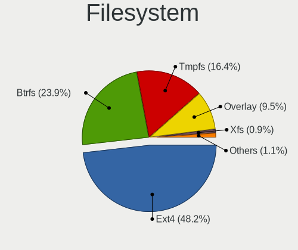
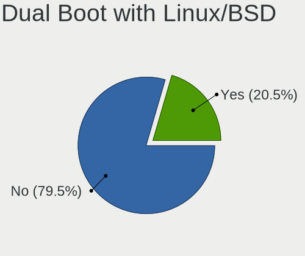
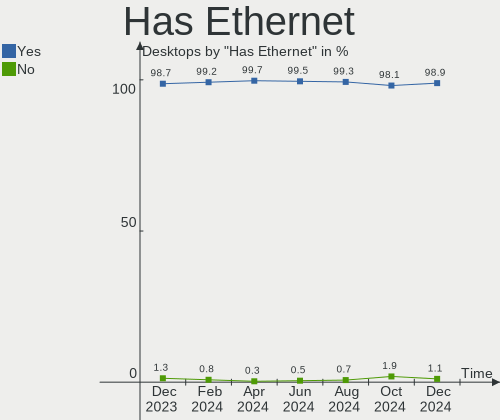
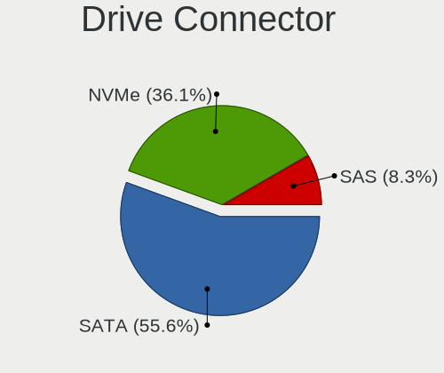
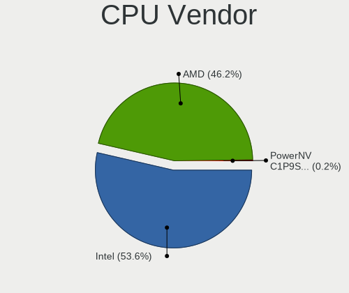
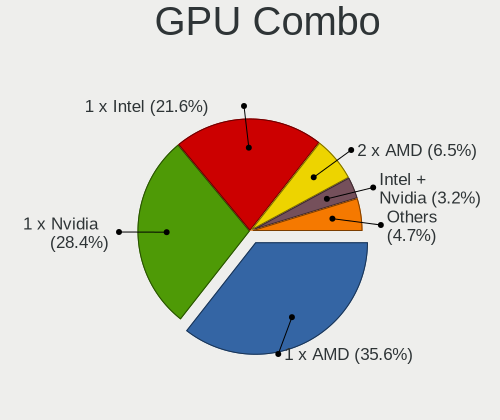
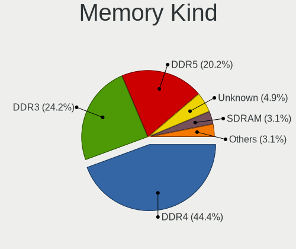
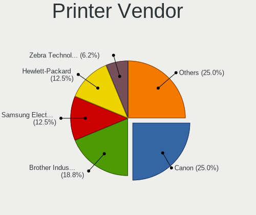

Linux in USA - Hardware Trends (Desktops)
-----------------------------------------

A project to identify most popular hardware characteristics and track their change
over time based on data collected by Linux users at https://Linux-Hardware.org.

Anyone can contribute to this report by the [hw-probe](https://github.com/linuxhw/hw-probe) tool:

    sudo -E hw-probe -all -upload

Period: Apr, 2023.

Contents
--------

* [ System ](#system)
  - [ OS                       ](#os)
  - [ OS Family                ](#os-family)
  - [ Kernel                   ](#kernel)
  - [ Kernel Family            ](#kernel-family)
  - [ Kernel Major Ver.        ](#kernel-major-ver)
  - [ Arch                     ](#arch)
  - [ DE                       ](#de)
  - [ Display Server           ](#display-server)
  - [ Display Manager          ](#display-manager)
  - [ OS Lang                  ](#os-lang)
  - [ Boot Mode                ](#boot-mode)
  - [ Filesystem               ](#filesystem)
  - [ Part. scheme             ](#part-scheme)
  - [ Dual Boot with Linux/BSD ](#dual-boot-with-linuxbsd)
  - [ Dual Boot (Win)          ](#dual-boot-win)

* [ Board ](#board)
  - [ Vendor                   ](#vendor)
  - [ Model                    ](#model)
  - [ Model Family             ](#model-family)
  - [ MFG Year                 ](#mfg-year)
  - [ Form Factor              ](#form-factor)
  - [ Secure Boot              ](#secure-boot)
  - [ Coreboot                 ](#coreboot)
  - [ RAM Size                 ](#ram-size)
  - [ RAM Used                 ](#ram-used)
  - [ Total Drives             ](#total-drives)
  - [ Has CD-ROM               ](#has-cd-rom)
  - [ Has Ethernet             ](#has-ethernet)
  - [ Has WiFi                 ](#has-wifi)
  - [ Has Bluetooth            ](#has-bluetooth)

* [ Location ](#location)
  - [ Country                  ](#country)
  - [ City                     ](#city)

* [ Drives ](#drives)
  - [ Drive Vendor             ](#drive-vendor)
  - [ Drive Model              ](#drive-model)
  - [ HDD Vendor               ](#hdd-vendor)
  - [ SSD Vendor               ](#ssd-vendor)
  - [ Drive Kind               ](#drive-kind)
  - [ Drive Connector          ](#drive-connector)
  - [ Drive Size               ](#drive-size)
  - [ Space Total              ](#space-total)
  - [ Space Used               ](#space-used)
  - [ Malfunc. Drives          ](#malfunc-drives)
  - [ Malfunc. Drive Vendor    ](#malfunc-drive-vendor)
  - [ Malfunc. HDD Vendor      ](#malfunc-hdd-vendor)
  - [ Malfunc. Drive Kind      ](#malfunc-drive-kind)
  - [ Failed Drives            ](#failed-drives)
  - [ Failed Drive Vendor      ](#failed-drive-vendor)
  - [ Drive Status             ](#drive-status)

* [ Storage controller ](#storage-controller)
  - [ Storage Vendor           ](#storage-vendor)
  - [ Storage Model            ](#storage-model)
  - [ Storage Kind             ](#storage-kind)

* [ Processor ](#processor)
  - [ CPU Vendor               ](#cpu-vendor)
  - [ CPU Model                ](#cpu-model)
  - [ CPU Model Family         ](#cpu-model-family)
  - [ CPU Cores                ](#cpu-cores)
  - [ CPU Sockets              ](#cpu-sockets)
  - [ CPU Threads              ](#cpu-threads)
  - [ CPU Op-Modes             ](#cpu-op-modes)
  - [ CPU Microcode            ](#cpu-microcode)
  - [ CPU Microarch            ](#cpu-microarch)

* [ Graphics ](#graphics)
  - [ GPU Vendor               ](#gpu-vendor)
  - [ GPU Model                ](#gpu-model)
  - [ GPU Combo                ](#gpu-combo)
  - [ GPU Driver               ](#gpu-driver)
  - [ GPU Memory               ](#gpu-memory)

* [ Monitor ](#monitor)
  - [ Monitor Vendor           ](#monitor-vendor)
  - [ Monitor Model            ](#monitor-model)
  - [ Monitor Resolution       ](#monitor-resolution)
  - [ Monitor Diagonal         ](#monitor-diagonal)
  - [ Monitor Width            ](#monitor-width)
  - [ Aspect Ratio             ](#aspect-ratio)
  - [ Monitor Area             ](#monitor-area)
  - [ Pixel Density            ](#pixel-density)
  - [ Multiple Monitors        ](#multiple-monitors)

* [ Network ](#network)
  - [ Net Controller Vendor    ](#net-controller-vendor)
  - [ Net Controller Model     ](#net-controller-model)
  - [ Wireless Vendor          ](#wireless-vendor)
  - [ Wireless Model           ](#wireless-model)
  - [ Ethernet Vendor          ](#ethernet-vendor)
  - [ Ethernet Model           ](#ethernet-model)
  - [ Net Controller Kind      ](#net-controller-kind)
  - [ Used Controller          ](#used-controller)
  - [ NICs                     ](#nics)
  - [ IPv6                     ](#ipv6)

* [ Bluetooth ](#bluetooth)
  - [ Bluetooth Vendor         ](#bluetooth-vendor)
  - [ Bluetooth Model          ](#bluetooth-model)

* [ Sound ](#sound)
  - [ Sound Vendor             ](#sound-vendor)
  - [ Sound Model              ](#sound-model)

* [ Memory ](#memory)
  - [ Memory Vendor            ](#memory-vendor)
  - [ Memory Model             ](#memory-model)
  - [ Memory Kind              ](#memory-kind)
  - [ Memory Form Factor       ](#memory-form-factor)
  - [ Memory Size              ](#memory-size)
  - [ Memory Speed             ](#memory-speed)

* [ Printers & scanners ](#printers--scanners)
  - [ Printer Vendor           ](#printer-vendor)
  - [ Printer Model            ](#printer-model)
  - [ Scanner Vendor           ](#scanner-vendor)
  - [ Scanner Model            ](#scanner-model)

* [ Camera ](#camera)
  - [ Camera Vendor            ](#camera-vendor)
  - [ Camera Model             ](#camera-model)

* [ Security ](#security)
  - [ Fingerprint Vendor       ](#fingerprint-vendor)
  - [ Fingerprint Model        ](#fingerprint-model)
  - [ Chipcard Vendor          ](#chipcard-vendor)
  - [ Chipcard Model           ](#chipcard-model)

* [ Unsupported ](#unsupported)
  - [ Unsupported Devices      ](#unsupported-devices)
  - [ Unsupported Device Types ](#unsupported-device-types)

System
------

OS
--

Installed operating systems

| Name                         | Desktops | Percent |
|------------------------------|----------|---------|
| Ubuntu 22.04                 | 51       | 13.86%  |
| OpenMandriva 23.03           | 40       | 10.87%  |
| Linux Mint 21.1              | 27       | 7.34%   |
| Pop!_OS 22.04                | 19       | 5.16%   |
| Fedora 38                    | 19       | 5.16%   |
| Debian 11                    | 19       | 5.16%   |
| Zorin 16                     | 14       | 3.8%    |
| Ubuntu 22.10                 | 13       | 3.53%   |
| Fedora 37                    | 13       | 3.53%   |
| Ubuntu 20.04                 | 12       | 3.26%   |
| Nobara 37                    | 11       | 2.99%   |
| Kubuntu 22.04                | 10       | 2.72%   |
| Arch Rolling                 | 10       | 2.72%   |
| Gentoo 2.13                  | 9        | 2.45%   |
| Ubuntu 23.04                 | 8        | 2.17%   |
| Manjaro                      | 8        | 2.17%   |
| KDE neon 22.04               | 7        | 1.9%    |
| Manjaro 22.1.0               | 5        | 1.36%   |
| Debian 12                    | 5        | 1.36%   |
| ArcoLinux Rolling            | 5        | 1.36%   |
| OpenMandriva 4.3             | 4        | 1.09%   |
| Linux Mint 20.3              | 4        | 1.09%   |
| Ubuntu 18.04                 | 3        | 0.82%   |
| OpenMandriva 23.01           | 3        | 0.82%   |
| Linux Mint 21                | 3        | 0.82%   |
| Xubuntu 22.04                | 2        | 0.54%   |
| Parrot 5.2                   | 2        | 0.54%   |
| openSUSE Tumbleweed-XXXXXXXX | 2        | 0.54%   |
| OpenMandriva 4.2             | 2        | 0.54%   |
| MX 21                        | 2        | 0.54%   |
| Linux Mint 20.2              | 2        | 0.54%   |
| Kali 2023.1                  | 2        | 0.54%   |
| Elementary 7                 | 2        | 0.54%   |
| Xubuntu 20.04                | 1        | 0.27%   |
| Ubuntu Budgie 23.04          | 1        | 0.27%   |
| Ubuntu Budgie 22.04          | 1        | 0.27%   |
| SteamOS 3.4                  | 1        | 0.27%   |
| SteamOS                      | 1        | 0.27%   |
| Source Mage                  | 1        | 0.27%   |
| ROSA R11.1                   | 1        | 0.27%   |

OS Family
---------

OS without a version

| Name          | Desktops | Percent |
|---------------|----------|---------|
| Ubuntu        | 87       | 23.64%  |
| OpenMandriva  | 52       | 14.13%  |
| Linux Mint    | 36       | 9.78%   |
| Fedora        | 34       | 9.24%   |
| Debian        | 25       | 6.79%   |
| Pop!_OS       | 19       | 5.16%   |
| Zorin         | 14       | 3.8%    |
| Manjaro       | 13       | 3.53%   |
| Nobara        | 11       | 2.99%   |
| Kubuntu       | 11       | 2.99%   |
| Arch          | 10       | 2.72%   |
| Gentoo        | 9        | 2.45%   |
| KDE neon      | 7        | 1.9%    |
| ArcoLinux     | 5        | 1.36%   |
| Xubuntu       | 3        | 0.82%   |
| openSUSE      | 3        | 0.82%   |
| Ubuntu Budgie | 2        | 0.54%   |
| SteamOS       | 2        | 0.54%   |
| Parrot        | 2        | 0.54%   |
| MX            | 2        | 0.54%   |
| Kali          | 2        | 0.54%   |
| Garuda Linux  | 2        | 0.54%   |
| Endless       | 2        | 0.54%   |
| Elementary    | 2        | 0.54%   |
| Source Mage   | 1        | 0.27%   |
| ROSA          | 1        | 0.27%   |
| Rocky Linux   | 1        | 0.27%   |
| RHEL          | 1        | 0.27%   |
| NixOS         | 1        | 0.27%   |
| LMDE          | 1        | 0.27%   |
| Lilidog       | 1        | 0.27%   |
| EndeavourOS   | 1        | 0.27%   |
| Devuan        | 1        | 0.27%   |
| CentOS        | 1        | 0.27%   |
| blendOS       | 1        | 0.27%   |
| Artix         | 1        | 0.27%   |
| antiX         | 1        | 0.27%   |

Kernel
------

Version of the Linux kernel

| Version                      | Desktops | Percent |
|------------------------------|----------|---------|
| 5.19.0-38-generic            | 43       | 11.68%  |
| 5.15.0-69-generic            | 43       | 11.68%  |
| 6.2.6-desktop-1omv2390       | 39       | 10.6%   |
| 6.2.6-76060206-generic       | 17       | 4.62%   |
| 5.19.0-40-generic            | 17       | 4.62%   |
| 5.10.0-21-amd64              | 14       | 3.8%    |
| 5.19.0-41-generic            | 11       | 2.99%   |
| 6.2.12-arch1-1               | 7        | 1.9%    |
| 6.2.11-300.fc38.x86_64       | 7        | 1.9%    |
| 6.2.0-20-generic             | 7        | 1.9%    |
| 5.15.0-70-generic            | 7        | 1.9%    |
| 5.15.0-67-generic            | 6        | 1.63%   |
| 6.2.12-300.fc38.x86_64       | 5        | 1.36%   |
| 6.2.10-200.fsync.fc37.x86_64 | 5        | 1.36%   |
| 5.4.0-146-generic            | 5        | 1.36%   |
| 6.2.9-300.fc38.x86_64        | 4        | 1.09%   |
| 6.2.9-200.fc37.x86_64        | 4        | 1.09%   |
| 6.1.19-gentoo-x86_64         | 4        | 1.09%   |
| 6.1.0-7-amd64                | 4        | 1.09%   |
| 5.19.0-32-generic            | 4        | 1.09%   |
| 6.2.11-202.fsync.fc37.x86_64 | 3        | 0.82%   |
| 5.16.7-desktop-1omv4003      | 3        | 0.82%   |
| 6.2.8-200.fc37.x86_64        | 2        | 0.54%   |
| 6.2.12-200.fsync.fc37.x86_64 | 2        | 0.54%   |
| 6.2.11-200.fc37.x86_64       | 2        | 0.54%   |
| 6.2.10-200.fc37.x86_64       | 2        | 0.54%   |
| 6.2.10-1-MANJARO             | 2        | 0.54%   |
| 6.1.4-desktop-1omv2301       | 2        | 0.54%   |
| 6.1.23-1-MANJARO             | 2        | 0.54%   |
| 6.1.1-desktop-1omv2290       | 2        | 0.54%   |
| 6.1.0-kali7-amd64            | 2        | 0.54%   |
| 6.0.0-12parrot1-amd64        | 2        | 0.54%   |
| 5.4.0-147-generic            | 2        | 0.54%   |
| 5.15.106-1-MANJARO           | 2        | 0.54%   |
| 5.15.104-2-MANJARO           | 2        | 0.54%   |
| 5.15.104-1-pve               | 2        | 0.54%   |
| 5.15.0-56-generic            | 2        | 0.54%   |
| 5.15.0-47-generic            | 2        | 0.54%   |
| 5.10.14-desktop-1omv4002     | 2        | 0.54%   |
| 6.3.0-gentoo-x86_64          | 1        | 0.27%   |

Kernel Family
-------------

Linux kernel without a distro release

| Version  | Desktops | Percent |
|----------|----------|---------|
| 5.19.0   | 77       | 20.92%  |
| 5.15.0   | 63       | 17.12%  |
| 6.2.6    | 59       | 16.03%  |
| 6.2.12   | 19       | 5.16%   |
| 6.2.11   | 19       | 5.16%   |
| 6.2.9    | 16       | 4.35%   |
| 5.10.0   | 16       | 4.35%   |
| 6.2.10   | 11       | 2.99%   |
| 5.4.0    | 10       | 2.72%   |
| 6.2.0    | 9        | 2.45%   |
| 6.1.0    | 8        | 2.17%   |
| 6.1.19   | 5        | 1.36%   |
| 6.2.8    | 4        | 1.09%   |
| 5.15.104 | 4        | 1.09%   |
| 5.16.7   | 3        | 0.82%   |
| 5.14.0   | 3        | 0.82%   |
| 6.3.0    | 2        | 0.54%   |
| 6.2.7    | 2        | 0.54%   |
| 6.1.4    | 2        | 0.54%   |
| 6.1.25   | 2        | 0.54%   |
| 6.1.23   | 2        | 0.54%   |
| 6.1.1    | 2        | 0.54%   |
| 6.0.12   | 2        | 0.54%   |
| 6.0.0    | 2        | 0.54%   |
| 5.15.106 | 2        | 0.54%   |
| 5.10.14  | 2        | 0.54%   |
| 6.2.13   | 1        | 0.27%   |
| 6.1.7    | 1        | 0.27%   |
| 6.1.6    | 1        | 0.27%   |
| 6.1.22   | 1        | 0.27%   |
| 6.1.20   | 1        | 0.27%   |
| 6.1.18   | 1        | 0.27%   |
| 6.1.12   | 1        | 0.27%   |
| 6.0.9    | 1        | 0.27%   |
| 6.0.2    | 1        | 0.27%   |
| 5.9.11   | 1        | 0.27%   |
| 5.4.83   | 1        | 0.27%   |
| 5.19.11  | 1        | 0.27%   |
| 5.18.12  | 1        | 0.27%   |
| 5.17.0   | 1        | 0.27%   |

Kernel Major Ver.
-----------------

Linux kernel major version

| Version | Desktops | Percent |
|---------|----------|---------|
| 6.2     | 140      | 38.04%  |
| 5.19    | 78       | 21.2%   |
| 5.15    | 73       | 19.84%  |
| 6.1     | 27       | 7.34%   |
| 5.10    | 18       | 4.89%   |
| 5.4     | 11       | 2.99%   |
| 6.0     | 6        | 1.63%   |
| 5.16    | 4        | 1.09%   |
| 5.14    | 4        | 1.09%   |
| 6.3     | 2        | 0.54%   |
| 5.9     | 1        | 0.27%   |
| 5.18    | 1        | 0.27%   |
| 5.17    | 1        | 0.27%   |
| 5.13    | 1        | 0.27%   |
| 4.18    | 1        | 0.27%   |

Arch
----

OS architecture (x86_64, i586, etc.)

| Name   | Desktops | Percent |
|--------|----------|---------|
| x86_64 | 367      | 99.73%  |
| i686   | 1        | 0.27%   |

DE
--

Desktop Environment

| Name          | Desktops | Percent |
|---------------|----------|---------|
| GNOME         | 161      | 43.75%  |
| KDE5          | 102      | 27.72%  |
| X-Cinnamon    | 34       | 9.24%   |
| XFCE          | 21       | 5.71%   |
| Unknown       | 20       | 5.43%   |
| MATE          | 7        | 1.9%    |
| Hyprland      | 5        | 1.36%   |
| LXQt          | 4        | 1.09%   |
| Budgie        | 4        | 1.09%   |
| Pantheon      | 2        | 0.54%   |
| Cinnamon      | 2        | 0.54%   |
| sway          | 1        | 0.27%   |
| openbox       | 1        | 0.27%   |
| LXDE          | 1        | 0.27%   |
| i3            | 1        | 0.27%   |
| GNOME Classic | 1        | 0.27%   |
| Deepin        | 1        | 0.27%   |

Display Server
--------------

X11 or Wayland

| Name        | Desktops | Percent |
|-------------|----------|---------|
| X11         | 256      | 69.57%  |
| Wayland     | 91       | 24.73%  |
| Tty         | 12       | 3.26%   |
| Unknown     | 8        | 2.17%   |
| Unspecified | 1        | 0.27%   |

Display Manager
---------------

SDDM, LightDM, etc.

| Name    | Desktops | Percent |
|---------|----------|---------|
| Unknown | 155      | 42.12%  |
| GDM3    | 77       | 20.92%  |
| SDDM    | 73       | 19.84%  |
| LightDM | 37       | 10.05%  |
| GDM     | 22       | 5.98%   |
| SLiM    | 2        | 0.54%   |
| SU      | 1        | 0.27%   |
| SLIMSKI | 1        | 0.27%   |

OS Lang
-------

Language

| Lang    | Desktops | Percent |
|---------|----------|---------|
| en_US   | 348      | 94.57%  |
| C       | 7        | 1.9%    |
| Unknown | 5        | 1.36%   |
| en_GB   | 2        | 0.54%   |
| zh_CN   | 1        | 0.27%   |
| ru_RU   | 1        | 0.27%   |
| es_VE   | 1        | 0.27%   |
| es_US   | 1        | 0.27%   |
| es_MX   | 1        | 0.27%   |
| en_CA   | 1        | 0.27%   |

Boot Mode
---------

EFI or BIOS

| Mode | Desktops | Percent |
|------|----------|---------|
| BIOS | 190      | 51.63%  |
| EFI  | 178      | 48.37%  |

Filesystem
----------

Type of filesystem

| Type    | Desktops | Percent |
|---------|----------|---------|
| Ext4    | 247      | 67.12%  |
| Btrfs   | 69       | 18.75%  |
| Tmpfs   | 25       | 6.79%   |
| Overlay | 18       | 4.89%   |
| Xfs     | 4        | 1.09%   |
| Zfs     | 3        | 0.82%   |
| F2fs    | 1        | 0.27%   |
| Aufs    | 1        | 0.27%   |

Part. scheme
------------

Scheme of partitioning

| Type    | Desktops | Percent |
|---------|----------|---------|
| GPT     | 198      | 53.8%   |
| Unknown | 133      | 36.14%  |
| MBR     | 37       | 10.05%  |

Dual Boot with Linux/BSD
------------------------

Hosting more than one Linux/BSD

| Dual boot | Desktops | Percent |
|-----------|----------|---------|
| No        | 292      | 79.35%  |
| Yes       | 76       | 20.65%  |

Dual Boot (Win)
---------------

Hosting Linux and Windows

| Dual boot | Desktops | Percent |
|-----------|----------|---------|
| No        | 273      | 74.18%  |
| Yes       | 95       | 25.82%  |

Board
-----

Vendor
------

Motherboard manufacturer

| Name                                 | Desktops | Percent |
|--------------------------------------|----------|---------|
| ASUSTek Computer                     | 100      | 27.17%  |
| Dell                                 | 61       | 16.58%  |
| Gigabyte Technology                  | 46       | 12.5%   |
| MSI                                  | 43       | 11.68%  |
| Hewlett-Packard                      | 40       | 10.87%  |
| ASRock                               | 22       | 5.98%   |
| Lenovo                               | 8        | 2.17%   |
| Intel                                | 5        | 1.36%   |
| Foxconn                              | 5        | 1.36%   |
| Pegatron                             | 4        | 1.09%   |
| Alienware                            | 4        | 1.09%   |
| Gateway                              | 3        | 0.82%   |
| eMachines                            | 3        | 0.82%   |
| Apple                                | 3        | 0.82%   |
| Unknown                              | 3        | 0.82%   |
| System76                             | 2        | 0.54%   |
| Biostar                              | 2        | 0.54%   |
| AZW                                  | 2        | 0.54%   |
| Wistron                              | 1        | 0.27%   |
| Supermicro                           | 1        | 0.27%   |
| Shenzhen Meigao Electronic Equipment | 1        | 0.27%   |
| PS                                   | 1        | 0.27%   |
| Protectli                            | 1        | 0.27%   |
| MW                                   | 1        | 0.27%   |
| HUAWEI                               | 1        | 0.27%   |
| Google                               | 1        | 0.27%   |
| Fujitsu                              | 1        | 0.27%   |
| ASRockRack                           | 1        | 0.27%   |
| Acidanthera                          | 1        | 0.27%   |
| AAEON                                | 1        | 0.27%   |

Model
-----

Motherboard model

| Name                               | Desktops | Percent |
|------------------------------------|----------|---------|
| Dell OptiPlex 7010                 | 9        | 2.45%   |
| ASUS TUF Gaming X570-PLUS          | 8        | 2.17%   |
| ASUS All Series                    | 8        | 2.17%   |
| ASUS ROG STRIX X670E-E GAMING WIFI | 4        | 1.09%   |
| MSI MS-7D25                        | 3        | 0.82%   |
| MSI MS-7C56                        | 3        | 0.82%   |
| MSI MS-7C02                        | 3        | 0.82%   |
| Dell XPS 8700                      | 3        | 0.82%   |
| Dell Precision Tower 5810          | 3        | 0.82%   |
| Dell OptiPlex 990                  | 3        | 0.82%   |
| Dell OptiPlex 7020                 | 3        | 0.82%   |
| ASUS TUF Gaming B550M-PLUS         | 3        | 0.82%   |
| ASUS PRIME Z490-A                  | 3        | 0.82%   |
| ASUS PRIME B450M-A II              | 3        | 0.82%   |
| Unknown                            | 3        | 0.82%   |
| System76 Thelio                    | 2        | 0.54%   |
| MSI MS-7D73                        | 2        | 0.54%   |
| MSI MS-7D52                        | 2        | 0.54%   |
| MSI MS-7D30                        | 2        | 0.54%   |
| MSI MS-7917                        | 2        | 0.54%   |
| MSI MS-7721                        | 2        | 0.54%   |
| HP Z800 Workstation                | 2        | 0.54%   |
| HP Slim Desktop 290-p0xxx          | 2        | 0.54%   |
| HP ProDesk 400 G3 SFF              | 2        | 0.54%   |
| HP EliteDesk 800 G1 TWR            | 2        | 0.54%   |
| HP EliteDesk 705 G1 SFF            | 2        | 0.54%   |
| HP Compaq Elite 8300 SFF           | 2        | 0.54%   |
| HP Compaq 8200 Elite SFF PC        | 2        | 0.54%   |
| Gigabyte X570S AORUS ELITE AX      | 2        | 0.54%   |
| Gigabyte X570 AORUS ELITE WIFI     | 2        | 0.54%   |
| Gigabyte B550M DS3H AC             | 2        | 0.54%   |
| Gigabyte B550M AORUS PRO-P         | 2        | 0.54%   |
| Gigabyte B550 AORUS ELITE AX V2    | 2        | 0.54%   |
| Gigabyte AB350-Gaming 3            | 2        | 0.54%   |
| eMachines ET1831                   | 2        | 0.54%   |
| Dell OptiPlex 9020                 | 2        | 0.54%   |
| Dell OptiPlex 755                  | 2        | 0.54%   |
| Dell OptiPlex 7050                 | 2        | 0.54%   |
| Dell OptiPlex 7040                 | 2        | 0.54%   |
| Dell OptiPlex 390                  | 2        | 0.54%   |

Model Family
------------

Motherboard model prefix

| Name                  | Desktops | Percent |
|-----------------------|----------|---------|
| Dell OptiPlex         | 38       | 10.33%  |
| ASUS ROG              | 24       | 6.52%   |
| ASUS PRIME            | 22       | 5.98%   |
| ASUS TUF              | 20       | 5.43%   |
| HP EliteDesk          | 9        | 2.45%   |
| Dell Inspiron         | 9        | 2.45%   |
| HP Compaq             | 8        | 2.17%   |
| Dell Precision        | 8        | 2.17%   |
| ASUS All              | 8        | 2.17%   |
| Gigabyte X570         | 6        | 1.63%   |
| Lenovo ThinkCentre    | 4        | 1.09%   |
| HP ProDesk            | 4        | 1.09%   |
| Gigabyte X570S        | 4        | 1.09%   |
| Gigabyte B550M        | 4        | 1.09%   |
| Gigabyte B550         | 4        | 1.09%   |
| Dell XPS              | 4        | 1.09%   |
| Alienware Aurora      | 4        | 1.09%   |
| MSI MS-7D25           | 3        | 0.82%   |
| MSI MS-7C56           | 3        | 0.82%   |
| MSI MS-7C02           | 3        | 0.82%   |
| HP Slim               | 3        | 0.82%   |
| ASUS M5A78L-M         | 3        | 0.82%   |
| Unknown               | 3        | 0.82%   |
| System76 Thelio       | 2        | 0.54%   |
| MSI MS-7D73           | 2        | 0.54%   |
| MSI MS-7D52           | 2        | 0.54%   |
| MSI MS-7D30           | 2        | 0.54%   |
| MSI MS-7917           | 2        | 0.54%   |
| MSI MS-7721           | 2        | 0.54%   |
| Lenovo ThinkStation   | 2        | 0.54%   |
| HP Z800               | 2        | 0.54%   |
| Gigabyte Z690         | 2        | 0.54%   |
| Gigabyte B650M        | 2        | 0.54%   |
| Gigabyte B450M        | 2        | 0.54%   |
| Gigabyte B450         | 2        | 0.54%   |
| Gigabyte AB350-Gaming | 2        | 0.54%   |
| eMachines ET1831      | 2        | 0.54%   |
| Dell Vostro           | 2        | 0.54%   |
| ASUS SABERTOOTH       | 2        | 0.54%   |
| ASUS Pro              | 2        | 0.54%   |

MFG Year
--------

Motherboard manufacture year

| Year | Desktops | Percent |
|------|----------|---------|
| 2020 | 42       | 11.41%  |
| 2022 | 35       | 9.51%   |
| 2021 | 33       | 8.97%   |
| 2019 | 33       | 8.97%   |
| 2018 | 33       | 8.97%   |
| 2013 | 31       | 8.42%   |
| 2012 | 25       | 6.79%   |
| 2011 | 23       | 6.25%   |
| 2017 | 20       | 5.43%   |
| 2016 | 18       | 4.89%   |
| 2014 | 16       | 4.35%   |
| 2009 | 15       | 4.08%   |
| 2015 | 14       | 3.8%    |
| 2010 | 10       | 2.72%   |
| 2007 | 7        | 1.9%    |
| 2008 | 6        | 1.63%   |
| 2023 | 5        | 1.36%   |
| 2006 | 1        | 0.27%   |
| 2005 | 1        | 0.27%   |

Form Factor
-----------

Physical design of the computer

| Name    | Desktops | Percent |
|---------|----------|---------|
| Desktop | 368      | 100%    |

Secure Boot
-----------

Enabled or disabled

| State    | Desktops | Percent |
|----------|----------|---------|
| Disabled | 353      | 95.92%  |
| Enabled  | 15       | 4.08%   |

Coreboot
--------

Have coreboot on board

| Used | Desktops | Percent |
|------|----------|---------|
| No   | 367      | 99.73%  |
| Yes  | 1        | 0.27%   |

RAM Size
--------

Total RAM memory

| Size in GB      | Desktops | Percent |
|-----------------|----------|---------|
| 32.01-64.0      | 93       | 25.27%  |
| 16.01-24.0      | 90       | 24.46%  |
| 64.01-256.0     | 53       | 14.4%   |
| 4.01-8.0        | 45       | 12.23%  |
| 8.01-16.0       | 39       | 10.6%   |
| 3.01-4.0        | 23       | 6.25%   |
| 24.01-32.0      | 18       | 4.89%   |
| 1.01-2.0        | 3        | 0.82%   |
| More than 256.0 | 2        | 0.54%   |
| 2.01-3.0        | 2        | 0.54%   |

RAM Used
--------

Used RAM memory

| Used GB     | Desktops | Percent |
|-------------|----------|---------|
| 2.01-3.0    | 99       | 26.9%   |
| 1.01-2.0    | 94       | 25.54%  |
| 4.01-8.0    | 72       | 19.57%  |
| 3.01-4.0    | 55       | 14.95%  |
| 8.01-16.0   | 31       | 8.42%   |
| 0.51-1.0    | 10       | 2.72%   |
| 16.01-24.0  | 4        | 1.09%   |
| 24.01-32.0  | 1        | 0.27%   |
| 64.01-256.0 | 1        | 0.27%   |
| 0.01-0.5    | 1        | 0.27%   |

Total Drives
------------

Number of drives on board

| Drives | Desktops | Percent |
|--------|----------|---------|
| 1      | 137      | 37.23%  |
| 2      | 102      | 27.72%  |
| 3      | 56       | 15.22%  |
| 4      | 31       | 8.42%   |
| 5      | 24       | 6.52%   |
| 6      | 7        | 1.9%    |
| 7      | 6        | 1.63%   |
| 11     | 2        | 0.54%   |
| 8      | 2        | 0.54%   |
| 0      | 1        | 0.27%   |

Has CD-ROM
----------

Has CD-ROM on board

| Presented | Desktops | Percent |
|-----------|----------|---------|
| No        | 211      | 57.34%  |
| Yes       | 157      | 42.66%  |

Has Ethernet
------------

Has Ethernet on board

| Presented | Desktops | Percent |
|-----------|----------|---------|
| Yes       | 365      | 99.18%  |
| No        | 3        | 0.82%   |

Has WiFi
--------

Has WiFi module

| Presented | Desktops | Percent |
|-----------|----------|---------|
| Yes       | 223      | 60.6%   |
| No        | 145      | 39.4%   |

Has Bluetooth
-------------

Has Bluetooth module

| Presented | Desktops | Percent |
|-----------|----------|---------|
| No        | 194      | 52.72%  |
| Yes       | 174      | 47.28%  |

Location
--------

Country
-------

Geographic location (country)

| Country | Desktops | Percent |
|---------|----------|---------|
| USA     | 368      | 100%    |

City
----

Geographic location (city)

| City             | Desktops | Percent |
|------------------|----------|---------|
| Seattle          | 7        | 1.9%    |
| Los Angeles      | 6        | 1.63%   |
| New York         | 5        | 1.36%   |
| Kansas City      | 5        | 1.36%   |
| Springfield      | 4        | 1.09%   |
| Las Vegas        | 4        | 1.09%   |
| Eugene           | 4        | 1.09%   |
| Denver           | 4        | 1.09%   |
| Sterling         | 3        | 0.82%   |
| Riverside        | 3        | 0.82%   |
| Philadelphia     | 3        | 0.82%   |
| Miami            | 3        | 0.82%   |
| Jamestown        | 3        | 0.82%   |
| Dallas           | 3        | 0.82%   |
| Colorado Springs | 3        | 0.82%   |
| Brooklyn         | 3        | 0.82%   |
| Yorba Linda      | 2        | 0.54%   |
| Woodstock        | 2        | 0.54%   |
| West Valley City | 2        | 0.54%   |
| Waterbury        | 2        | 0.54%   |
| Tucson           | 2        | 0.54%   |
| Tampa            | 2        | 0.54%   |
| Scranton         | 2        | 0.54%   |
| San Francisco    | 2        | 0.54%   |
| San Diego        | 2        | 0.54%   |
| San Antonio      | 2        | 0.54%   |
| Salt Lake City   | 2        | 0.54%   |
| Saint Paul       | 2        | 0.54%   |
| Roseville        | 2        | 0.54%   |
| Queens           | 2        | 0.54%   |
| Orlando          | 2        | 0.54%   |
| Oklahoma City    | 2        | 0.54%   |
| Newark           | 2        | 0.54%   |
| Minneapolis      | 2        | 0.54%   |
| Jacksonville     | 2        | 0.54%   |
| Houston          | 2        | 0.54%   |
| Hickory          | 2        | 0.54%   |
| Glendale         | 2        | 0.54%   |
| Fernandina Beach | 2        | 0.54%   |
| Columbus         | 2        | 0.54%   |

Drives
------

Drive Vendor
------------

Hard drive vendors

| Vendor                      | Desktops | Drives | Percent |
|-----------------------------|----------|--------|---------|
| WDC                         | 115      | 167    | 16.86%  |
| Samsung Electronics         | 115      | 176    | 16.86%  |
| Seagate                     | 99       | 125    | 14.52%  |
| Sandisk                     | 59       | 67     | 8.65%   |
| Crucial                     | 30       | 36     | 4.4%    |
| Toshiba                     | 28       | 33     | 4.11%   |
| Hitachi                     | 23       | 24     | 3.37%   |
| Intel                       | 19       | 20     | 2.79%   |
| Phison Electronics          | 17       | 24     | 2.49%   |
| Kingston                    | 17       | 23     | 2.49%   |
| China                       | 16       | 18     | 2.35%   |
| PNY                         | 13       | 14     | 1.91%   |
| Micron/Crucial Technology   | 10       | 11     | 1.47%   |
| A-DATA Technology           | 10       | 11     | 1.47%   |
| Unknown                     | 9        | 11     | 1.32%   |
| SK hynix                    | 9        | 9      | 1.32%   |
| SPCC                        | 7        | 8      | 1.03%   |
| HGST                        | 6        | 6      | 0.88%   |
| Team                        | 5        | 6      | 0.73%   |
| Phison                      | 5        | 5      | 0.73%   |
| Mushkin                     | 5        | 5      | 0.73%   |
| T-FORCE                     | 4        | 4      | 0.59%   |
| Micron Technology           | 4        | 6      | 0.59%   |
| SABRENT                     | 3        | 5      | 0.44%   |
| Patriot                     | 3        | 3      | 0.44%   |
| KingFast                    | 3        | 3      | 0.44%   |
| Corsair                     | 3        | 4      | 0.44%   |
| Silicon Motion              | 2        | 2      | 0.29%   |
| Realtek Semiconductor       | 2        | 3      | 0.29%   |
| MATSHITA                    | 2        | 2      | 0.29%   |
| Lexar                       | 2        | 2      | 0.29%   |
| KIOXIA                      | 2        | 2      | 0.29%   |
| Kingston Technology Company | 2        | 2      | 0.29%   |
| Inland                      | 2        | 2      | 0.29%   |
| Unknown                     | 2        | 2      | 0.29%   |
| Yangtze Memory Technologies | 1        | 1      | 0.15%   |
| XPG                         | 1        | 1      | 0.15%   |
| WD MediaMax                 | 1        | 1      | 0.15%   |
| Vaseky                      | 1        | 1      | 0.15%   |
| TO Exter                    | 1        | 1      | 0.15%   |

Drive Model
-----------

Hard drive models

| Model                                              | Desktops | Percent |
|----------------------------------------------------|----------|---------|
| Samsung NVMe SSD Controller SM981/PM981/PM983 1TB  | 25       | 3.13%   |
| Samsung NVMe SSD Controller PM9A1/PM9A3/980PRO 2TB | 17       | 2.13%   |
| Seagate ST2000DM008-2FR102 2TB                     | 12       | 1.5%    |
| Toshiba DT01ACA100 1TB                             | 9        | 1.13%   |
| Samsung SSD 850 EVO 500GB                          | 9        | 1.13%   |
| Samsung SSD 980 PRO 2TB                            | 8        | 1%      |
| Samsung SSD 860 EVO 1TB                            | 8        | 1%      |
| Crucial CT1000MX500SSD1 1TB                        | 8        | 1%      |
| Kingston SA400S37240G 240GB SSD                    | 7        | 0.88%   |
| Samsung SSD 980 1TB                                | 6        | 0.75%   |
| Samsung SSD 870 EVO 1TB                            | 6        | 0.75%   |
| Micron/Crucial P2 NVMe PCIe SSD 1TB                | 6        | 0.75%   |
| Crucial CT500MX500SSD1 500GB                       | 6        | 0.75%   |
| WDC WD10EZEX-08WN4A0 1TB                           | 5        | 0.63%   |
| WDC WD10EZEX-00BN5A0 1TB                           | 5        | 0.63%   |
| SanDisk NVMe SSD Drive 1TB                         | 5        | 0.63%   |
| Samsung SSD 860 EVO 250GB                          | 5        | 0.63%   |
| Phison E16 PCIe4 NVMe Controller 500GB             | 5        | 0.63%   |
| WDC WD10EZEX-00WN4A0 1TB                           | 4        | 0.5%    |
| WDC WD1003FZEX-00K3CA0 1TB                         | 4        | 0.5%    |
| Seagate ST31000528AS 1TB                           | 4        | 0.5%    |
| Seagate ST1000DM010-2EP102 1TB                     | 4        | 0.5%    |
| Seagate ST1000DM003-1SB102 1TB                     | 4        | 0.5%    |
| Seagate ST1000DM003-1CH162 1TB                     | 4        | 0.5%    |
| Sandisk WD_BLACK SN770 1TB                         | 4        | 0.5%    |
| Sandisk WD Blue SN550 NVMe SSD 1024GB              | 4        | 0.5%    |
| Sandisk WD Black SN850 1TB                         | 4        | 0.5%    |
| Samsung SSD 980 PRO 1TB                            | 4        | 0.5%    |
| Samsung SSD 860 EVO 500GB                          | 4        | 0.5%    |
| Samsung SSD 850 EVO 250GB                          | 4        | 0.5%    |
| Samsung SSD 840 Series 120GB                       | 4        | 0.5%    |
| Samsung SSD 840 EVO 250GB                          | 4        | 0.5%    |
| Phison E12 NVMe Controller 512GB                   | 4        | 0.5%    |
| WDC WDBNCE5000PNC 500GB SSD                        | 3        | 0.38%   |
| WDC WDBNCE0010PNC 1TB SSD                          | 3        | 0.38%   |
| WDC WD4005FZBX-00K5WB0 4TB                         | 3        | 0.38%   |
| WDC WD1600AAJS-75M0A0 160GB                        | 3        | 0.38%   |
| WDC WD10EZEX-60WN4A0 1TB                           | 3        | 0.38%   |
| WDC WD10EADX-22TDHB0 1TB                           | 3        | 0.38%   |
| Unknown SD/MMC/MS PRO 249GB                        | 3        | 0.38%   |

HDD Vendor
----------

Hard disk drive vendors

| Vendor              | Desktops | Drives | Percent |
|---------------------|----------|--------|---------|
| WDC                 | 99       | 142    | 38.82%  |
| Seagate             | 93       | 115    | 36.47%  |
| Toshiba             | 26       | 30     | 10.2%   |
| Hitachi             | 23       | 24     | 9.02%   |
| HGST                | 6        | 6      | 2.35%   |
| Unknown             | 3        | 3      | 1.18%   |
| WD MediaMax         | 1        | 1      | 0.39%   |
| Samsung Electronics | 1        | 1      | 0.39%   |
| RSH-319             | 1        | 1      | 0.39%   |
| KESU                | 1        | 1      | 0.39%   |
| ASMT                | 1        | 1      | 0.39%   |

SSD Vendor
----------

Solid state drive vendors

| Vendor              | Desktops | Drives | Percent |
|---------------------|----------|--------|---------|
| Samsung Electronics | 68       | 89     | 28.33%  |
| Crucial             | 25       | 29     | 10.42%  |
| SanDisk             | 24       | 25     | 10%     |
| WDC                 | 18       | 19     | 7.5%    |
| China               | 16       | 18     | 6.67%   |
| Kingston            | 15       | 19     | 6.25%   |
| PNY                 | 13       | 14     | 5.42%   |
| A-DATA Technology   | 8        | 9      | 3.33%   |
| SPCC                | 6        | 6      | 2.5%    |
| Intel               | 6        | 7      | 2.5%    |
| Mushkin             | 5        | 5      | 2.08%   |
| Team                | 4        | 4      | 1.67%   |
| SK hynix            | 3        | 3      | 1.25%   |
| Patriot             | 3        | 3      | 1.25%   |
| Seagate             | 2        | 2      | 0.83%   |
| Micron Technology   | 2        | 4      | 0.83%   |
| Lexar               | 2        | 2      | 0.83%   |
| KingFast            | 2        | 2      | 0.83%   |
| Toshiba             | 1        | 1      | 0.42%   |
| TO Exter            | 1        | 1      | 0.42%   |
| T-FORCE             | 1        | 1      | 0.42%   |
| ShiJi               | 1        | 1      | 0.42%   |
| OWC                 | 1        | 1      | 0.42%   |
| OCZ-VERTEX3         | 1        | 1      | 0.42%   |
| LITEON              | 1        | 1      | 0.42%   |
| Leven               | 1        | 1      | 0.42%   |
| KingSpec            | 1        | 1      | 0.42%   |
| Inland              | 1        | 1      | 0.42%   |
| Hewlett-Packard     | 1        | 1      | 0.42%   |
| G.Skill             | 1        | 1      | 0.42%   |
| FORESEE             | 1        | 1      | 0.42%   |
| External            | 1        | 1      | 0.42%   |
| DATARAM             | 1        | 1      | 0.42%   |
| Corsair             | 1        | 2      | 0.42%   |
| Apple               | 1        | 1      | 0.42%   |
| 2.5"                | 1        | 1      | 0.42%   |

Drive Kind
----------

HDD or SSD

| Kind    | Desktops | Drives | Percent |
|---------|----------|--------|---------|
| HDD     | 196      | 325    | 34.21%  |
| SSD     | 191      | 279    | 33.33%  |
| NVMe    | 168      | 246    | 29.32%  |
| Unknown | 16       | 20     | 2.79%   |
| MMC     | 2        | 3      | 0.35%   |

Drive Connector
---------------

SATA, SAS, NVMe, etc.

| Type | Desktops | Drives | Percent |
|------|----------|--------|---------|
| SATA | 305      | 585    | 59.92%  |
| NVMe | 166      | 241    | 32.61%  |
| SAS  | 36       | 44     | 7.07%   |
| MMC  | 2        | 3      | 0.39%   |

Drive Size
----------

Size of hard drive

| Size in TB | Desktops | Drives | Percent |
|------------|----------|--------|---------|
| 0.01-0.5   | 168      | 245    | 37.92%  |
| 0.51-1.0   | 146      | 201    | 32.96%  |
| 1.01-2.0   | 62       | 74     | 14%     |
| 3.01-4.0   | 38       | 43     | 8.58%   |
| 4.01-10.0  | 14       | 21     | 3.16%   |
| 2.01-3.0   | 13       | 16     | 2.93%   |
| 10.01-20.0 | 2        | 4      | 0.45%   |

Space Total
-----------

Amount of disk space available on the file system

| Size in GB     | Desktops | Percent |
|----------------|----------|---------|
| 501-1000       | 78       | 21.2%   |
| More than 3000 | 67       | 18.21%  |
| 1001-2000      | 61       | 16.58%  |
| 101-250        | 57       | 15.49%  |
| 251-500        | 50       | 13.59%  |
| 2001-3000      | 20       | 5.43%   |
| 1-20           | 12       | 3.26%   |
| 21-50          | 8        | 2.17%   |
| 51-100         | 8        | 2.17%   |
| Unknown        | 7        | 1.9%    |

Space Used
----------

Amount of used disk space

| Used GB        | Desktops | Percent |
|----------------|----------|---------|
| 1-20           | 99       | 26.9%   |
| 21-50          | 58       | 15.76%  |
| 101-250        | 44       | 11.96%  |
| 251-500        | 39       | 10.6%   |
| 51-100         | 35       | 9.51%   |
| 501-1000       | 34       | 9.24%   |
| 1001-2000      | 22       | 5.98%   |
| More than 3000 | 16       | 4.35%   |
| 2001-3000      | 14       | 3.8%    |
| Unknown        | 7        | 1.9%    |

Malfunc. Drives
---------------

Drive models with a malfunction

| Model                                                          | Desktops | Drives | Percent |
|----------------------------------------------------------------|----------|--------|---------|
| WDC WD40EFRX-68WT0N0 4TB                                       | 1        | 2      | 2.17%   |
| WDC WD3200BEKT-66PVMT0 320GB                                   | 1        | 1      | 2.17%   |
| WDC WD3200AAJS-56M0A0 320GB                                    | 1        | 1      | 2.17%   |
| WDC WD2500AAKX-001CA0 250GB                                    | 1        | 1      | 2.17%   |
| WDC WD20EFRX-68AX9N0 2TB                                       | 1        | 1      | 2.17%   |
| WDC WD15EZRX-00DC0B0 1TB                                       | 1        | 1      | 2.17%   |
| WDC WD10EZEX-08M2NA0 1TB                                       | 1        | 1      | 2.17%   |
| WDC WD10EZEX-00BN5A0 1TB                                       | 1        | 1      | 2.17%   |
| WDC WD10EARS-00MVWB0 1TB                                       | 1        | 1      | 2.17%   |
| WDC WD10EADX-22TDHB0 1TB                                       | 1        | 1      | 2.17%   |
| WDC WD1002FAEX-00Z3A0 1TB                                      | 1        | 1      | 2.17%   |
| ShiJi SSD 128GB                                                | 1        | 1      | 2.17%   |
| Seagate ST9320325AS 320GB                                      | 1        | 1      | 2.17%   |
| Seagate ST4000LM024-2AN17V 4TB                                 | 1        | 1      | 2.17%   |
| Seagate ST3750528AS 752GB                                      | 1        | 1      | 2.17%   |
| Seagate ST3500641AS 500GB                                      | 1        | 1      | 2.17%   |
| Seagate ST3500630NS 500GB                                      | 1        | 2      | 2.17%   |
| Seagate ST33000651AS 3TB                                       | 1        | 1      | 2.17%   |
| Seagate ST31000528AS 1TB                                       | 1        | 1      | 2.17%   |
| Seagate ST31000340NS 1TB                                       | 1        | 1      | 2.17%   |
| Seagate ST2000VM003-1CT164 2TB                                 | 1        | 1      | 2.17%   |
| Seagate ST2000NP0011 2TB                                       | 1        | 1      | 2.17%   |
| Seagate ST2000DM008-2FR102 2TB                                 | 1        | 1      | 2.17%   |
| Seagate ST1000VM002-1ET162 1TB                                 | 1        | 1      | 2.17%   |
| Seagate ST1000NM0011 1TB                                       | 1        | 1      | 2.17%   |
| SanDisk SDSSDH3512G 512GB                                      | 1        | 1      | 2.17%   |
| Samsung Electronics SSD 870 EVO 1TB                            | 1        | 1      | 2.17%   |
| Samsung Electronics SSD 840 Series 120GB                       | 1        | 1      | 2.17%   |
| Samsung Electronics NVMe SSD Controller PM9A1/PM9A3/980PRO 2TB | 1        | 1      | 2.17%   |
| RSH-319 ASM1153E 4TB                                           | 1        | 1      | 2.17%   |
| Phison Electronics PCIe SSD 8TB                                | 1        | 1      | 2.17%   |
| OWC Mercury EXTREME Pro 6G SSD                                 | 1        | 1      | 2.17%   |
| Micron/Crucial Technology CT2000P5PSSD8 2TB                    | 1        | 1      | 2.17%   |
| Intel SSDSC2BF240A5L 240GB                                     | 1        | 1      | 2.17%   |
| Intel SSD 600P Series 256GB                                    | 1        | 1      | 2.17%   |
| Hitachi HTS547575A9E384 752GB                                  | 1        | 1      | 2.17%   |
| Hitachi HDS722020ALA330 2TB                                    | 1        | 1      | 2.17%   |
| Hitachi HDS721050CLA660 500GB                                  | 1        | 1      | 2.17%   |
| Hitachi HDS721025CLA382 250GB                                  | 1        | 1      | 2.17%   |
| Hitachi HDS721010CLA630 1TB                                    | 1        | 1      | 2.17%   |

Malfunc. Drive Vendor
---------------------

Vendors of faulty drives

| Vendor                    | Desktops | Drives | Percent |
|---------------------------|----------|--------|---------|
| Seagate                   | 13       | 14     | 28.26%  |
| WDC                       | 11       | 12     | 23.91%  |
| Hitachi                   | 5        | 5      | 10.87%  |
| Samsung Electronics       | 3        | 3      | 6.52%   |
| Intel                     | 2        | 2      | 4.35%   |
| Crucial                   | 2        | 2      | 4.35%   |
| A-DATA Technology         | 2        | 2      | 4.35%   |
| ShiJi                     | 1        | 1      | 2.17%   |
| SanDisk                   | 1        | 1      | 2.17%   |
| RSH-319                   | 1        | 1      | 2.17%   |
| Phison Electronics        | 1        | 1      | 2.17%   |
| OWC                       | 1        | 1      | 2.17%   |
| Micron/Crucial Technology | 1        | 1      | 2.17%   |
| G.Skill                   | 1        | 1      | 2.17%   |
| China                     | 1        | 1      | 2.17%   |

Malfunc. HDD Vendor
-------------------

Vendors of faulty HDD drives

| Vendor  | Desktops | Drives | Percent |
|---------|----------|--------|---------|
| Seagate | 13       | 14     | 43.33%  |
| WDC     | 11       | 12     | 36.67%  |
| Hitachi | 5        | 5      | 16.67%  |
| RSH-319 | 1        | 1      | 3.33%   |

Malfunc. Drive Kind
-------------------

Kinds of faulty drives

| Kind | Desktops | Drives | Percent |
|------|----------|--------|---------|
| HDD  | 27       | 32     | 64.29%  |
| SSD  | 11       | 12     | 26.19%  |
| NVMe | 4        | 4      | 9.52%   |

Failed Drives
-------------

Failed drive models

| Model                 | Desktops | Drives | Percent |
|-----------------------|----------|--------|---------|
| Inland SATA SSD 128GB | 1        | 1      | 100%    |

Failed Drive Vendor
-------------------

Failed drive vendors

| Vendor | Desktops | Drives | Percent |
|--------|----------|--------|---------|
| Inland | 1        | 1      | 100%    |

Drive Status
------------

Number of failed and malfunc. drives

| Status   | Desktops | Drives | Percent |
|----------|----------|--------|---------|
| Detected | 213      | 464    | 51.57%  |
| Works    | 162      | 360    | 39.23%  |
| Malfunc  | 37       | 48     | 8.96%   |
| Failed   | 1        | 1      | 0.24%   |

Storage controller
------------------

Storage Vendor
--------------

Storage controller vendors

| Vendor                           | Desktops | Percent |
|----------------------------------|----------|---------|
| Intel                            | 207      | 34.56%  |
| AMD                              | 156      | 26.04%  |
| Samsung Electronics              | 66       | 11.02%  |
| SanDisk                          | 42       | 7.01%   |
| ASMedia Technology               | 29       | 4.84%   |
| Phison Electronics               | 25       | 4.17%   |
| Micron/Crucial Technology        | 14       | 2.34%   |
| SK hynix                         | 6        | 1%      |
| Realtek Semiconductor            | 6        | 1%      |
| JMicron Technology               | 6        | 1%      |
| Nvidia                           | 5        | 0.83%   |
| LSI Logic / Symbios Logic        | 5        | 0.83%   |
| Silicon Motion                   | 4        | 0.67%   |
| Kingston Technology Company      | 4        | 0.67%   |
| Marvell Technology Group         | 3        | 0.5%    |
| Toshiba America Info Systems     | 2        | 0.33%   |
| Solidigm                         | 2        | 0.33%   |
| Seagate Technology               | 2        | 0.33%   |
| Micron Technology                | 2        | 0.33%   |
| MAXIO Technology (Hangzhou)      | 2        | 0.33%   |
| KIOXIA                           | 2        | 0.33%   |
| Yangtze Memory Technologies      | 1        | 0.17%   |
| Solid State Storage Technology   | 1        | 0.17%   |
| Silicon Integrated Systems [SiS] | 1        | 0.17%   |
| Silicon Image                    | 1        | 0.17%   |
| PMC-Sierra                       | 1        | 0.17%   |
| INNOGRIT                         | 1        | 0.17%   |
| Hewlett-Packard                  | 1        | 0.17%   |
| Broadcom / LSI                   | 1        | 0.17%   |
| ADATA Technology                 | 1        | 0.17%   |

Storage Model
-------------

Storage controller models

| Model                                                                                   | Desktops | Percent |
|-----------------------------------------------------------------------------------------|----------|---------|
| AMD FCH SATA Controller [AHCI mode]                                                     | 98       | 14.14%  |
| Samsung NVMe SSD Controller SM981/PM981/PM983                                           | 30       | 4.33%   |
| Samsung NVMe SSD Controller PM9A1/PM9A3/980PRO                                          | 29       | 4.18%   |
| AMD 500 Series Chipset SATA Controller                                                  | 28       | 4.04%   |
| ASMedia ASM1062 Serial ATA Controller                                                   | 26       | 3.75%   |
| Intel SATA Controller [RAID mode]                                                       | 22       | 3.17%   |
| AMD 400 Series Chipset SATA Controller                                                  | 21       | 3.03%   |
| Intel 8 Series/C220 Series Chipset Family 6-port SATA Controller 1 [AHCI mode]          | 20       | 2.89%   |
| Intel 7 Series/C210 Series Chipset Family 6-port SATA Controller [AHCI mode]            | 18       | 2.6%    |
| Intel 6 Series/C200 Series Chipset Family 6 port Desktop SATA AHCI Controller           | 16       | 2.31%   |
| Intel Alder Lake-S PCH SATA Controller [AHCI Mode]                                      | 15       | 2.16%   |
| Intel Q170/Q150/B150/H170/H110/Z170/CM236 Chipset SATA Controller [AHCI Mode]           | 14       | 2.02%   |
| Intel 200 Series PCH SATA controller [AHCI mode]                                        | 14       | 2.02%   |
| Intel Cannon Lake PCH SATA AHCI Controller                                              | 11       | 1.59%   |
| AMD SB7x0/SB8x0/SB9x0 SATA Controller [AHCI mode]                                       | 10       | 1.44%   |
| SanDisk WD Black SN770 NVMe SSD                                                         | 9        | 1.3%    |
| Micron/Crucial P2 NVMe PCIe SSD                                                         | 9        | 1.3%    |
| Phison E16 PCIe4 NVMe Controller                                                        | 8        | 1.15%   |
| AMD SB7x0/SB8x0/SB9x0 IDE Controller                                                    | 8        | 1.15%   |
| SanDisk WD Blue SN550 NVMe SSD                                                          | 7        | 1.01%   |
| Samsung NVMe SSD Controller 980                                                         | 7        | 1.01%   |
| Intel C610/X99 series chipset 6-Port SATA Controller [AHCI mode]                        | 7        | 1.01%   |
| AMD SB7x0/SB8x0/SB9x0 SATA Controller [IDE mode]                                        | 7        | 1.01%   |
| Sandisk Western Digital WD Black SN850X NVMe SSD                                        | 6        | 0.87%   |
| SanDisk Non-Volatile memory controller                                                  | 6        | 0.87%   |
| Samsung NVMe SSD Controller SM961/PM961/SM963                                           | 6        | 0.87%   |
| Phison E12 NVMe Controller                                                              | 6        | 0.87%   |
| Intel 500 Series Chipset Family SATA AHCI Controller                                    | 6        | 0.87%   |
| AMD 300 Series Chipset SATA Controller                                                  | 6        | 0.87%   |
| SK hynix Gold P31/PC711 NVMe Solid State Drive                                          | 5        | 0.72%   |
| SanDisk WD Black SN750 / PC SN730 NVMe SSD                                              | 5        | 0.72%   |
| Phison E18 PCIe4 NVMe Controller                                                        | 5        | 0.72%   |
| Intel C610/X99 series chipset sSATA Controller [AHCI mode]                              | 5        | 0.72%   |
| Intel 9 Series Chipset Family SATA Controller [AHCI Mode]                               | 5        | 0.72%   |
| Intel 82801JI (ICH10 Family) SATA AHCI Controller                                       | 5        | 0.72%   |
| Intel 6 Series/C200 Series Chipset Family Desktop SATA Controller (IDE mode, ports 4-5) | 5        | 0.72%   |
| Intel 6 Series/C200 Series Chipset Family Desktop SATA Controller (IDE mode, ports 0-3) | 5        | 0.72%   |
| SanDisk WD PC SN810 / Black SN850 NVMe SSD                                              | 4        | 0.58%   |
| SanDisk WD Black 2018/SN750 / PC SN720 NVMe SSD                                         | 4        | 0.58%   |
| Micron/Crucial NVMe Storage Controller                                                  | 4        | 0.58%   |

Storage Kind
------------

Kind of storage controller (IDE, SATA, NVMe, SAS, ...)

| Kind | Desktops | Percent |
|------|----------|---------|
| SATA | 312      | 54.64%  |
| NVMe | 166      | 29.07%  |
| IDE  | 44       | 7.71%   |
| RAID | 40       | 7.01%   |
| SCSI | 5        | 0.88%   |
| SAS  | 4        | 0.7%    |

Processor
---------

CPU Vendor
----------

Processor vendors

| Vendor | Desktops | Percent |
|--------|----------|---------|
| Intel  | 207      | 56.25%  |
| AMD    | 161      | 43.75%  |

CPU Model
---------

Processor models

| Model                                       | Desktops | Percent |
|---------------------------------------------|----------|---------|
| Intel Core i5-3470 CPU @ 3.20GHz            | 13       | 3.53%   |
| AMD Ryzen 5 5600X 6-Core Processor          | 12       | 3.26%   |
| AMD Ryzen 7 3700X 8-Core Processor          | 10       | 2.72%   |
| AMD Ryzen 9 5900X 12-Core Processor         | 9        | 2.45%   |
| Intel Core i5-2400 CPU @ 3.10GHz            | 8        | 2.17%   |
| AMD Ryzen 5 3600 6-Core Processor           | 8        | 2.17%   |
| Intel Core i7-8700K CPU @ 3.70GHz           | 7        | 1.9%    |
| Intel Core i7-4790 CPU @ 3.60GHz            | 7        | 1.9%    |
| AMD Ryzen 9 7950X 16-Core Processor         | 7        | 1.9%    |
| AMD Ryzen 7 5800X 8-Core Processor          | 7        | 1.9%    |
| AMD Ryzen 7 5700G with Radeon Graphics      | 7        | 1.9%    |
| Intel Core i7-2600 CPU @ 3.40GHz            | 6        | 1.63%   |
| Intel Core i5-6500 CPU @ 3.20GHz            | 6        | 1.63%   |
| Intel Core i7-3770 CPU @ 3.40GHz            | 5        | 1.36%   |
| AMD Ryzen 9 5950X 16-Core Processor         | 5        | 1.36%   |
| AMD Ryzen 7 5700X 8-Core Processor          | 5        | 1.36%   |
| AMD Ryzen 9 7900X 12-Core Processor         | 4        | 1.09%   |
| AMD Ryzen 9 3900X 12-Core Processor         | 4        | 1.09%   |
| AMD Ryzen 5 7600X 6-Core Processor          | 4        | 1.09%   |
| Intel Core i9-9900K CPU @ 3.60GHz           | 3        | 0.82%   |
| Intel Core i7-8700 CPU @ 3.20GHz            | 3        | 0.82%   |
| Intel Core i7-6700K CPU @ 4.00GHz           | 3        | 0.82%   |
| Intel Core i7-6700 CPU @ 3.40GHz            | 3        | 0.82%   |
| Intel Core i5-4590 CPU @ 3.30GHz            | 3        | 0.82%   |
| Intel Core i5-4570 CPU @ 3.20GHz            | 3        | 0.82%   |
| Intel Core 2 Duo CPU E7500 @ 2.93GHz        | 3        | 0.82%   |
| Intel 13th Gen Core i9-13900K               | 3        | 0.82%   |
| Intel 12th Gen Core i7-12700K               | 3        | 0.82%   |
| Intel 11th Gen Core i7-11700F @ 2.50GHz     | 3        | 0.82%   |
| AMD Ryzen 7 7700X 8-Core Processor          | 3        | 0.82%   |
| AMD Ryzen 5 5600G with Radeon Graphics      | 3        | 0.82%   |
| AMD Ryzen 5 1600 Six-Core Processor         | 3        | 0.82%   |
| AMD Ryzen 5 1400 Quad-Core Processor        | 3        | 0.82%   |
| AMD Ryzen 3 3200G with Radeon Vega Graphics | 3        | 0.82%   |
| Intel Xeon CPU X5650 @ 2.67GHz              | 2        | 0.54%   |
| Intel Xeon CPU E5-1650 v3 @ 3.50GHz         | 2        | 0.54%   |
| Intel Core i7-9700K CPU @ 3.60GHz           | 2        | 0.54%   |
| Intel Core i7-5820K CPU @ 3.30GHz           | 2        | 0.54%   |
| Intel Core i7-4790K CPU @ 4.00GHz           | 2        | 0.54%   |
| Intel Core i7-4770 CPU @ 3.40GHz            | 2        | 0.54%   |

CPU Model Family
----------------

Processor model prefix

| Model                   | Desktops | Percent |
|-------------------------|----------|---------|
| Intel Core i7           | 57       | 15.49%  |
| Intel Core i5           | 56       | 15.22%  |
| AMD Ryzen 5             | 43       | 11.68%  |
| AMD Ryzen 7             | 40       | 10.87%  |
| AMD Ryzen 9             | 34       | 9.24%   |
| Other                   | 26       | 7.07%   |
| Intel Xeon              | 22       | 5.98%   |
| Intel Core i3           | 10       | 2.72%   |
| AMD FX                  | 10       | 2.72%   |
| Intel Celeron           | 8        | 2.17%   |
| Intel Core 2 Duo        | 6        | 1.63%   |
| Intel Pentium           | 5        | 1.36%   |
| Intel Core i9           | 5        | 1.36%   |
| AMD Ryzen Threadripper  | 5        | 1.36%   |
| AMD A10                 | 5        | 1.36%   |
| Intel Pentium Dual-Core | 4        | 1.09%   |
| Intel Core 2 Quad       | 4        | 1.09%   |
| AMD Ryzen 3             | 4        | 1.09%   |
| AMD Athlon II X2        | 4        | 1.09%   |
| AMD A8                  | 4        | 1.09%   |
| AMD Phenom II X4        | 2        | 0.54%   |
| AMD Athlon II X4        | 2        | 0.54%   |
| Intel Pentium D         | 1        | 0.27%   |
| Intel Pentium 4         | 1        | 0.27%   |
| Intel Core 2            | 1        | 0.27%   |
| Intel Atom              | 1        | 0.27%   |
| AMD Ryzen Embedded      | 1        | 0.27%   |
| AMD Ryzen 5 PRO         | 1        | 0.27%   |
| AMD PRO A10             | 1        | 0.27%   |
| AMD GX                  | 1        | 0.27%   |
| AMD Athlon Dual Core    | 1        | 0.27%   |
| AMD Athlon 64 X2        | 1        | 0.27%   |
| AMD A6                  | 1        | 0.27%   |
| AMD A4                  | 1        | 0.27%   |

CPU Cores
---------

Number of processor cores

| Number | Desktops | Percent |
|--------|----------|---------|
| 4      | 131      | 35.6%   |
| 8      | 62       | 16.85%  |
| 6      | 62       | 16.85%  |
| 2      | 47       | 12.77%  |
| 12     | 25       | 6.79%   |
| 16     | 22       | 5.98%   |
| 24     | 4        | 1.09%   |
| 32     | 3        | 0.82%   |
| 14     | 3        | 0.82%   |
| 10     | 3        | 0.82%   |
| 3      | 3        | 0.82%   |
| 1      | 2        | 0.54%   |
| 18     | 1        | 0.27%   |

CPU Sockets
-----------

Number of sockets

| Number | Desktops | Percent |
|--------|----------|---------|
| 1      | 361      | 98.1%   |
| 2      | 7        | 1.9%    |

CPU Threads
-----------

Threads per core (Hyper-Threading)

| Number | Desktops | Percent |
|--------|----------|---------|
| 2      | 246      | 66.85%  |
| 1      | 122      | 33.15%  |

CPU Op-Modes
------------

CPU Operation Modes (32-bit, 64-bit)

| Op mode        | Desktops | Percent |
|----------------|----------|---------|
| 32-bit, 64-bit | 367      | 99.73%  |
| 32-bit         | 1        | 0.27%   |

CPU Microcode
-------------

Microcode number

| Number     | Desktops | Percent |
|------------|----------|---------|
| Unknown    | 171      | 46.47%  |
| 0x306c3    | 13       | 3.53%   |
| 0x08701021 | 13       | 3.53%   |
| 0x206a7    | 11       | 2.99%   |
| 0x0a20120a | 11       | 2.99%   |
| 0x306a9    | 10       | 2.72%   |
| 0x0a601203 | 10       | 2.72%   |
| 0x90672    | 7        | 1.9%    |
| 0x1067a    | 6        | 1.63%   |
| 0x906e9    | 5        | 1.36%   |
| 0x0a201025 | 5        | 1.36%   |
| 0x0a201016 | 5        | 1.36%   |
| 0xb0671    | 4        | 1.09%   |
| 0x906ea    | 4        | 1.09%   |
| 0x506e3    | 4        | 1.09%   |
| 0x0a50000d | 4        | 1.09%   |
| 0x0a201204 | 4        | 1.09%   |
| 0x08108109 | 4        | 1.09%   |
| 0x0800820d | 4        | 1.09%   |
| 0xa0671    | 3        | 0.82%   |
| 0x906c0    | 3        | 0.82%   |
| 0x0a50000c | 3        | 0.82%   |
| 0x0a201205 | 3        | 0.82%   |
| 0x0a201009 | 3        | 0.82%   |
| 0x08701013 | 3        | 0.82%   |
| 0x06001119 | 3        | 0.82%   |
| 0x06000852 | 3        | 0.82%   |
| 0xa0655    | 2        | 0.54%   |
| 0x906ed    | 2        | 0.54%   |
| 0x306f2    | 2        | 0.54%   |
| 0x106a5    | 2        | 0.54%   |
| 0x0a601201 | 2        | 0.54%   |
| 0x0a008203 | 2        | 0.54%   |
| 0x08001138 | 2        | 0.54%   |
| 0x06003106 | 2        | 0.54%   |
| 0x010000c8 | 2        | 0.54%   |
| 0xf65      | 1        | 0.27%   |
| 0xf34      | 1        | 0.27%   |
| 0xb06e0    | 1        | 0.27%   |
| 0x906ec    | 1        | 0.27%   |

CPU Microarch
-------------

Microarchitecture

| Name             | Desktops | Percent |
|------------------|----------|---------|
| Zen 3            | 55       | 14.95%  |
| Haswell          | 36       | 9.78%   |
| Unknown          | 34       | 9.24%   |
| KabyLake         | 30       | 8.15%   |
| Zen 2            | 28       | 7.61%   |
| IvyBridge        | 28       | 7.61%   |
| SandyBridge      | 25       | 6.79%   |
| Skylake          | 17       | 4.62%   |
| Penryn           | 17       | 4.62%   |
| Piledriver       | 13       | 3.53%   |
| Alderlake Hybrid | 13       | 3.53%   |
| Zen+             | 12       | 3.26%   |
| Zen              | 9        | 2.45%   |
| K10              | 8        | 2.17%   |
| Nehalem          | 5        | 1.36%   |
| CometLake        | 5        | 1.36%   |
| Westmere         | 4        | 1.09%   |
| Steamroller      | 4        | 1.09%   |
| Icelake          | 4        | 1.09%   |
| Core             | 3        | 0.82%   |
| Broadwell        | 3        | 0.82%   |
| Tremont          | 2        | 0.54%   |
| Silvermont       | 2        | 0.54%   |
| NetBurst         | 2        | 0.54%   |
| K8 Hammer        | 2        | 0.54%   |
| Bulldozer        | 2        | 0.54%   |
| Puma             | 1        | 0.27%   |
| K10 Llano        | 1        | 0.27%   |
| Jaguar           | 1        | 0.27%   |
| Goldmont plus    | 1        | 0.27%   |
| Excavator        | 1        | 0.27%   |

Graphics
--------

GPU Vendor
----------

Vendors of graphics cards

| Vendor                     | Desktops | Percent |
|----------------------------|----------|---------|
| Nvidia                     | 146      | 36.05%  |
| AMD                        | 142      | 35.06%  |
| Intel                      | 114      | 28.15%  |
| Matrox Electronics Systems | 2        | 0.49%   |
| ASPEED Technology          | 1        | 0.25%   |

GPU Model
---------

Graphics card models

| Model                                                                       | Desktops | Percent |
|-----------------------------------------------------------------------------|----------|---------|
| AMD Ellesmere [Radeon RX 470/480/570/570X/580/580X/590]                     | 23       | 5.49%   |
| Intel Xeon E3-1200 v3/4th Gen Core Processor Integrated Graphics Controller | 16       | 3.82%   |
| AMD Raphael                                                                 | 16       | 3.82%   |
| Intel Xeon E3-1200 v2/3rd Gen Core processor Graphics Controller            | 14       | 3.34%   |
| Intel 2nd Generation Core Processor Family Integrated Graphics Controller   | 13       | 3.1%    |
| Intel HD Graphics 530                                                       | 11       | 2.63%   |
| AMD Navi 22 [Radeon RX 6700/6700 XT/6750 XT / 6800M/6850M XT]               | 10       | 2.39%   |
| Intel CoffeeLake-S GT2 [UHD Graphics 630]                                   | 8        | 1.91%   |
| AMD Navi 21 [Radeon RX 6800/6800 XT / 6900 XT]                              | 8        | 1.91%   |
| Nvidia TU117 [GeForce GTX 1650]                                             | 7        | 1.67%   |
| Intel AlderLake-S GT1                                                       | 7        | 1.67%   |
| AMD Navi 23 [Radeon RX 6600/6600 XT/6600M]                                  | 7        | 1.67%   |
| Nvidia GP107 [GeForce GTX 1050 Ti]                                          | 6        | 1.43%   |
| Nvidia AD102 [GeForce RTX 4090]                                             | 6        | 1.43%   |
| Nvidia TU104 [GeForce RTX 2070 SUPER]                                       | 5        | 1.19%   |
| Nvidia GP104 [GeForce GTX 1070]                                             | 5        | 1.19%   |
| Nvidia GA106 [GeForce RTX 3060 Lite Hash Rate]                              | 5        | 1.19%   |
| Nvidia GA104 [GeForce RTX 3070 Ti]                                          | 5        | 1.19%   |
| Intel IvyBridge GT2 [HD Graphics 4000]                                      | 5        | 1.19%   |
| AMD Navi 10 [Radeon RX 5600 OEM/5600 XT / 5700/5700 XT]                     | 5        | 1.19%   |
| AMD Cezanne [Radeon Vega Series / Radeon Vega Mobile Series]                | 5        | 1.19%   |
| Nvidia GP108 [GeForce GT 1030]                                              | 4        | 0.95%   |
| Nvidia GP104 [GeForce GTX 1080]                                             | 4        | 0.95%   |
| Intel Raptor Lake-S GT1 [UHD Graphics 770]                                  | 4        | 0.95%   |
| Intel HD Graphics 630                                                       | 4        | 0.95%   |
| Intel 4 Series Chipset Integrated Graphics Controller                       | 4        | 0.95%   |
| AMD Picasso/Raven 2 [Radeon Vega Series / Radeon Vega Mobile Series]        | 4        | 0.95%   |
| AMD Kaveri [Radeon R7 Graphics]                                             | 4        | 0.95%   |
| AMD Cedar [Radeon HD 5000/6000/7350/8350 Series]                            | 4        | 0.95%   |
| AMD Caicos [Radeon HD 6450/7450/8450 / R5 230 OEM]                          | 4        | 0.95%   |
| Nvidia TU116 [GeForce GTX 1660]                                             | 3        | 0.72%   |
| Nvidia GP106 [GeForce GTX 1060 6GB]                                         | 3        | 0.72%   |
| Nvidia GK208B [GeForce GT 730]                                              | 3        | 0.72%   |
| Nvidia GA104 [GeForce RTX 3060 Ti Lite Hash Rate]                           | 3        | 0.72%   |
| Nvidia GA102 [GeForce RTX 3090]                                             | 3        | 0.72%   |
| Nvidia AD103 [GeForce RTX 4080]                                             | 3        | 0.72%   |
| Intel JasperLake [UHD Graphics]                                             | 3        | 0.72%   |
| Intel CometLake-S GT2 [UHD Graphics 630]                                    | 3        | 0.72%   |
| AMD RS880 [Radeon HD 4200]                                                  | 3        | 0.72%   |
| AMD RS780L [Radeon 3000]                                                    | 3        | 0.72%   |

GPU Combo
---------

Combinations of graphics cards

| Name           | Desktops | Percent |
|----------------|----------|---------|
| 1 x Nvidia     | 126      | 34.24%  |
| 1 x AMD        | 118      | 32.07%  |
| 1 x Intel      | 87       | 23.64%  |
| AMD + Nvidia   | 11       | 2.99%   |
| 2 x AMD        | 8        | 2.17%   |
| Intel + Nvidia | 8        | 2.17%   |
| Intel + AMD    | 4        | 1.09%   |
| 1 x Matrox     | 2        | 0.54%   |
| 3 x AMD        | 1        | 0.27%   |
| 2 x Nvidia     | 1        | 0.27%   |
| 2 x Intel      | 1        | 0.27%   |
| 1 x ASPEED     | 1        | 0.27%   |

GPU Driver
----------

Free vs proprietary

| Driver      | Desktops | Percent |
|-------------|----------|---------|
| Free        | 262      | 71.2%   |
| Proprietary | 91       | 24.73%  |
| Unknown     | 15       | 4.08%   |

GPU Memory
----------

Total video memory

| Size in GB | Desktops | Percent |
|------------|----------|---------|
| Unknown    | 190      | 51.63%  |
| 7.01-8.0   | 52       | 14.13%  |
| 8.01-16.0  | 24       | 6.52%   |
| 1.01-2.0   | 23       | 6.25%   |
| 3.01-4.0   | 22       | 5.98%   |
| 0.51-1.0   | 21       | 5.71%   |
| 0.01-0.5   | 19       | 5.16%   |
| 5.01-6.0   | 8        | 2.17%   |
| 16.01-24.0 | 5        | 1.36%   |
| 2.01-3.0   | 4        | 1.09%   |

Monitor
-------

Monitor Vendor
--------------

Monitor vendors

| Vendor               | Desktops | Percent |
|----------------------|----------|---------|
| Dell                 | 54       | 14.03%  |
| Samsung Electronics  | 40       | 10.39%  |
| Acer                 | 39       | 10.13%  |
| Goldstar             | 36       | 9.35%   |
| Hewlett-Packard      | 26       | 6.75%   |
| Sceptre Tech         | 23       | 5.97%   |
| Ancor Communications | 15       | 3.9%    |
| Vizio                | 13       | 3.38%   |
| AOC                  | 12       | 3.12%   |
| BenQ                 | 9        | 2.34%   |
| Unknown              | 9        | 2.34%   |
| ViewSonic            | 8        | 2.08%   |
| LG Electronics       | 8        | 2.08%   |
| ASUSTek Computer     | 8        | 2.08%   |
| MSI                  | 7        | 1.82%   |
| Lenovo               | 6        | 1.56%   |
| Unknown              | 5        | 1.3%    |
| Sony                 | 5        | 1.3%    |
| Viotek               | 4        | 1.04%   |
| Insignia             | 4        | 1.04%   |
| Gigabyte Technology  | 4        | 1.04%   |
| Element              | 3        | 0.78%   |
| Westinghouse         | 2        | 0.52%   |
| Unknown (XXX)        | 2        | 0.52%   |
| Toshiba              | 2        | 0.52%   |
| Sceptre              | 2        | 0.52%   |
| Planar               | 2        | 0.52%   |
| Pixio                | 2        | 0.52%   |
| Philips              | 2        | 0.52%   |
| ONN                  | 2        | 0.52%   |
| Onkyo                | 2        | 0.52%   |
| NEC Computers        | 2        | 0.52%   |
| Huion                | 2        | 0.52%   |
| HannStar             | 2        | 0.52%   |
| Wacom                | 1        | 0.26%   |
| VIZ                  | 1        | 0.26%   |
| Valve                | 1        | 0.26%   |
| UpStar               | 1        | 0.26%   |
| THT                  | 1        | 0.26%   |
| Seiki                | 1        | 0.26%   |

Monitor Model
-------------

Monitor models

| Model                                                                  | Desktops | Percent |
|------------------------------------------------------------------------|----------|---------|
| Unknown                                                                | 9        | 2.2%    |
| Sceptre Tech E248W-19203S SPT099D 1920x1080 443x249mm 20.0-inch        | 5        | 1.22%   |
| Goldstar Ultra HD GSM5B09 3840x2160 600x340mm 27.2-inch                | 4        | 0.98%   |
| Viotek GN34CW VTK3400 3440x1440 795x334mm 33.9-inch                    | 3        | 0.73%   |
| Sceptre Tech Sceptre F27 SPT0AD7 1920x1080 600x330mm 27.0-inch         | 3        | 0.73%   |
| Ancor Communications ASUS VS247 ACI249A 1920x1080 521x293mm 23.5-inch  | 3        | 0.73%   |
| Vizio VA26LHDTV10T VIZ0035 1360x768 576x324mm 26.0-inch                | 2        | 0.49%   |
| Vizio V405-H9 VIZ1039 3840x2160 878x485mm 39.5-inch                    | 2        | 0.49%   |
| Vizio D24f4-J01 VIZ1044 1920x1080 527x296mm 23.8-inch                  | 2        | 0.49%   |
| Unknown (XXX) Beyond TV XXX2851 3840x2160 1209x680mm 54.6-inch         | 2        | 0.49%   |
| Sony TV SNY3102 1920x1080 708x398mm 32.0-inch                          | 2        | 0.49%   |
| Sceptre Tech Sceptre Z27 SPT6B0B 3840x2160 597x336mm 27.0-inch         | 2        | 0.49%   |
| Sceptre Tech Sceptre T24 SPT09AB 1920x1080 520x320mm 24.0-inch         | 2        | 0.49%   |
| Sceptre Tech Sceptre J20 SPT080D 1600x900 435x237mm 19.5-inch          | 2        | 0.49%   |
| Sceptre Tech E32 SPT0CB8 1366x768 575x323mm 26.0-inch                  | 2        | 0.49%   |
| Samsung Electronics LCD Monitor SAM7016 3840x2160 1020x570mm 46.0-inch | 2        | 0.49%   |
| ONN ONA18HO015 ONN0101 1920x1080 698x393mm 31.5-inch                   | 2        | 0.49%   |
| MSI MAG341CQ MSI1462 3440x1440 797x333mm 34.0-inch                     | 2        | 0.49%   |
| MSI G32C4 MSI3DA6 1920x1080 698x393mm 31.5-inch                        | 2        | 0.49%   |
| Hewlett-Packard vs17 HWP2647 1280x1024 337x270mm 17.0-inch             | 2        | 0.49%   |
| Goldstar ULTRAWIDE GSM59F1 2560x1080 673x284mm 28.8-inch               | 2        | 0.49%   |
| Goldstar TV SSCR2 GSMC0C8 3840x2160                                    | 2        | 0.49%   |
| Goldstar HDR 4K GSM7750 3840x2160 697x392mm 31.5-inch                  | 2        | 0.49%   |
| Goldstar 32inch FHD GSM76F5 1920x1080 698x392mm 31.5-inch              | 2        | 0.49%   |
| Element ELEFW408 ELE1911 1920x1080 1150x650mm 52.0-inch                | 2        | 0.49%   |
| Dell S2522HG DELA1C2 1920x1080 544x303mm 24.5-inch                     | 2        | 0.49%   |
| Dell P2314H DEL4099 1920x1080 509x286mm 23.0-inch                      | 2        | 0.49%   |
| Dell DELL3007WFPHC DEL4016 2560x1600 646x406mm 30.0-inch               | 2        | 0.49%   |
| AOC U34G2G4R3 AOC3402 3440x1440 797x334mm 34.0-inch                    | 2        | 0.49%   |
| AOC LCD Monitor U2879G6 3840x2160                                      | 2        | 0.49%   |
| AOC 27G2G4 AOC2702 1920x1080 598x336mm 27.0-inch                       | 2        | 0.49%   |
| Ancor Communications VE228 ACI22FA 1920x1080 477x268mm 21.5-inch       | 2        | 0.49%   |
| Acer GN246HL ACR02FA 1920x1080 531x299mm 24.0-inch                     | 2        | 0.49%   |
| Acer G246HL ACR02FF 1920x1080 531x299mm 24.0-inch                      | 2        | 0.49%   |
| Acer EB321HQU ACR0507 2560x1440 699x393mm 31.6-inch                    | 2        | 0.49%   |
| Westinghouse TX-42F810G WDE5960 1920x1080 710x400mm 32.1-inch          | 1        | 0.24%   |
| Westinghouse EWM24F1Y1 WDT1E6E 1920x1080 530x300mm 24.0-inch           | 1        | 0.24%   |
| Wacom Cintiq 22HD WAC1031 1920x1080 476x268mm 21.5-inch                | 1        | 0.24%   |
| Vizio VX32L HDTV10A VIZ0021 1366x768 700x390mm 31.5-inch               | 1        | 0.24%   |
| Vizio E65u-D3 VIZ1018 3840x2160 1428x803mm 64.5-inch                   | 1        | 0.24%   |

Monitor Resolution
------------------

Monitor screen resolution

| Resolution         | Desktops | Percent |
|--------------------|----------|---------|
| 1920x1080 (FHD)    | 164      | 43.85%  |
| 3840x2160 (4K)     | 54       | 14.44%  |
| 2560x1440 (QHD)    | 40       | 10.7%   |
| Unknown            | 13       | 3.48%   |
| 3440x1440          | 12       | 3.21%   |
| 1680x1050 (WSXGA+) | 11       | 2.94%   |
| 1600x900 (HD+)     | 11       | 2.94%   |
| 1280x1024 (SXGA)   | 9        | 2.41%   |
| 2560x1080          | 8        | 2.14%   |
| 3840x1080          | 7        | 1.87%   |
| 1440x900 (WXGA+)   | 7        | 1.87%   |
| 1366x768 (WXGA)    | 5        | 1.34%   |
| 1024x768 (XGA)     | 5        | 1.34%   |
| 1920x1200 (WUXGA)  | 4        | 1.07%   |
| 2560x1600          | 3        | 0.8%    |
| 1920x540           | 3        | 0.8%    |
| 1600x1200          | 3        | 0.8%    |
| 1360x768           | 3        | 0.8%    |
| 7680x1080          | 1        | 0.27%   |
| 6000x1440          | 1        | 0.27%   |
| 5760x1080          | 1        | 0.27%   |
| 5120x1080          | 1        | 0.27%   |
| 4480x3600          | 1        | 0.27%   |
| 4480x1080          | 1        | 0.27%   |
| 3840x1600          | 1        | 0.27%   |
| 3840x1200          | 1        | 0.27%   |
| 2560x2880          | 1        | 0.27%   |
| 2288x1287          | 1        | 0.27%   |
| 2048x1152          | 1        | 0.27%   |
| 1280x960           | 1        | 0.27%   |

Monitor Diagonal
----------------

Diagonal size in inches

| Inches  | Desktops | Percent |
|---------|----------|---------|
| 27      | 62       | 16.58%  |
| 24      | 45       | 12.03%  |
| 31      | 40       | 10.7%   |
| Unknown | 37       | 9.89%   |
| 23      | 29       | 7.75%   |
| 21      | 28       | 7.49%   |
| 34      | 15       | 4.01%   |
| 20      | 12       | 3.21%   |
| 84      | 10       | 2.67%   |
| 32      | 9        | 2.41%   |
| 19      | 9        | 2.41%   |
| 22      | 8        | 2.14%   |
| 72      | 7        | 1.87%   |
| 18      | 6        | 1.6%    |
| 17      | 5        | 1.34%   |
| 15      | 5        | 1.34%   |
| 54      | 4        | 1.07%   |
| 48      | 4        | 1.07%   |
| 49      | 3        | 0.8%    |
| 26      | 3        | 0.8%    |
| 16      | 3        | 0.8%    |
| 74      | 2        | 0.53%   |
| 69      | 2        | 0.53%   |
| 52      | 2        | 0.53%   |
| 46      | 2        | 0.53%   |
| 42      | 2        | 0.53%   |
| 40      | 2        | 0.53%   |
| 37      | 2        | 0.53%   |
| 36      | 2        | 0.53%   |
| 35      | 2        | 0.53%   |
| 30      | 2        | 0.53%   |
| 142     | 1        | 0.27%   |
| 65      | 1        | 0.27%   |
| 58      | 1        | 0.27%   |
| 47      | 1        | 0.27%   |
| 41      | 1        | 0.27%   |
| 39      | 1        | 0.27%   |
| 38      | 1        | 0.27%   |
| 29      | 1        | 0.27%   |
| 28      | 1        | 0.27%   |

Monitor Width
-------------

Physical width

| Width in mm    | Desktops | Percent |
|----------------|----------|---------|
| 501-600        | 116      | 32.31%  |
| 401-500        | 61       | 16.99%  |
| 601-700        | 51       | 14.21%  |
| Unknown        | 37       | 10.31%  |
| 701-800        | 26       | 7.24%   |
| 1501-2000      | 21       | 5.85%   |
| 1001-1500      | 17       | 4.74%   |
| 301-350        | 13       | 3.62%   |
| 801-900        | 8        | 2.23%   |
| 351-400        | 4        | 1.11%   |
| 901-1000       | 3        | 0.84%   |
| More than 2000 | 1        | 0.28%   |
| 201-300        | 1        | 0.28%   |

Aspect Ratio
------------

Proportional relationship between the width and the height

| Ratio   | Desktops | Percent |
|---------|----------|---------|
| 16/9    | 227      | 66.37%  |
| 16/10   | 34       | 9.94%   |
| Unknown | 34       | 9.94%   |
| 21/9    | 18       | 5.26%   |
| 5/4     | 9        | 2.63%   |
| 4/3     | 8        | 2.34%   |
| 32/9    | 4        | 1.17%   |
| 3/2     | 2        | 0.58%   |
| 2.12    | 2        | 0.58%   |
| 6/5     | 1        | 0.29%   |
| 1.96    | 1        | 0.29%   |
| 1.00    | 1        | 0.29%   |
| 0.89    | 1        | 0.29%   |

Monitor Area
------------

Area in inch

| Area in inch | Desktops | Percent |
|----------------|----------|---------|
| 201-250        | 81       | 21.89%  |
| 351-500        | 67       | 18.11%  |
| 301-350        | 61       | 16.49%  |
| 151-200        | 39       | 10.54%  |
| Unknown        | 37       | 10%     |
| More than 1000 | 32       | 8.65%   |
| 501-1000       | 20       | 5.41%   |
| 251-300        | 16       | 4.32%   |
| 141-150        | 8        | 2.16%   |
| 101-110        | 5        | 1.35%   |
| 131-140        | 2        | 0.54%   |
| 111-120        | 1        | 0.27%   |
| 91-100         | 1        | 0.27%   |

Pixel Density
-------------

Pixels per inch

| Density | Desktops | Percent |
|---------|----------|---------|
| 51-100  | 209      | 58.87%  |
| 101-120 | 61       | 17.18%  |
| Unknown | 37       | 10.42%  |
| 1-50    | 23       | 6.48%   |
| 121-160 | 17       | 4.79%   |
| 161-240 | 8        | 2.25%   |

Multiple Monitors
-----------------

Total monitors connected

| Total | Desktops | Percent |
|-------|----------|---------|
| 1     | 273      | 74.18%  |
| 2     | 65       | 17.66%  |
| 0     | 19       | 5.16%   |
| 3     | 10       | 2.72%   |
| 4     | 1        | 0.27%   |

Network
-------

Net Controller Vendor
---------------------

Controller vendors

| Vendor                           | Desktops | Percent |
|----------------------------------|----------|---------|
| Intel                            | 212      | 37.19%  |
| Realtek Semiconductor            | 202      | 35.44%  |
| Qualcomm Atheros                 | 22       | 3.86%   |
| Broadcom                         | 22       | 3.86%   |
| MediaTek                         | 20       | 3.51%   |
| Ralink Technology                | 13       | 2.28%   |
| TP-Link                          | 9        | 1.58%   |
| NetGear                          | 9        | 1.58%   |
| Ralink                           | 5        | 0.88%   |
| D-Link System                    | 5        | 0.88%   |
| ASIX Electronics                 | 5        | 0.88%   |
| Microsoft                        | 4        | 0.7%    |
| Aquantia                         | 4        | 0.7%    |
| Samsung Electronics              | 3        | 0.53%   |
| Qualcomm Atheros Communications  | 3        | 0.53%   |
| Broadcom Limited                 | 3        | 0.53%   |
| Belkin Components                | 3        | 0.53%   |
| ASUSTek Computer                 | 3        | 0.53%   |
| Nvidia                           | 2        | 0.35%   |
| LSI                              | 2        | 0.35%   |
| InterBiometrics                  | 2        | 0.35%   |
| Dell                             | 2        | 0.35%   |
| Arduino SA                       | 2        | 0.35%   |
| Wilocity                         | 1        | 0.18%   |
| Silicon Integrated Systems [SiS] | 1        | 0.18%   |
| Qualcomm                         | 1        | 0.18%   |
| Padix (Rockfire)                 | 1        | 0.18%   |
| Mellanox Technologies            | 1        | 0.18%   |
| Marvell Technology Group         | 1        | 0.18%   |
| Linksys                          | 1        | 0.18%   |
| Intersil                         | 1        | 0.18%   |
| Edimax Technology                | 1        | 0.18%   |
| Dresden Elektronik               | 1        | 0.18%   |
| D-Link                           | 1        | 0.18%   |
| Chelsio Communications           | 1        | 0.18%   |
| American Megatrends              | 1        | 0.18%   |

Net Controller Model
--------------------

Controller models

| Model                                                             | Desktops | Percent |
|-------------------------------------------------------------------|----------|---------|
| Realtek RTL8111/8168/8411 PCI Express Gigabit Ethernet Controller | 133      | 20.06%  |
| Realtek RTL8125 2.5GbE Controller                                 | 38       | 5.73%   |
| Intel Ethernet Controller I225-V                                  | 38       | 5.73%   |
| Intel Wi-Fi 6 AX200                                               | 29       | 4.37%   |
| Intel 82579LM Gigabit Network Connection (Lewisville)             | 24       | 3.62%   |
| Intel I211 Gigabit Network Connection                             | 21       | 3.17%   |
| Intel Wi-Fi 6 AX210/AX211/AX411 160MHz                            | 17       | 2.56%   |
| Intel Ethernet Connection I217-LM                                 | 14       | 2.11%   |
| Intel Dual Band Wireless-AC 3168NGW [Stone Peak]                  | 14       | 2.11%   |
| Intel Ethernet Connection (2) I219-V                              | 12       | 1.81%   |
| Intel Wireless-AC 9260                                            | 10       | 1.51%   |
| Realtek RTL8153 Gigabit Ethernet Adapter                          | 9        | 1.36%   |
| Realtek 802.11ac NIC                                              | 9        | 1.36%   |
| Intel Alder Lake-S PCH CNVi WiFi                                  | 9        | 1.36%   |
| MediaTek MT7921K (RZ608) Wi-Fi 6E 80MHz                           | 8        | 1.21%   |
| MediaTek MT7922 802.11ax PCI Express Wireless Network Adapter     | 7        | 1.06%   |
| Intel Ethernet Connection (7) I219-V                              | 7        | 1.06%   |
| Realtek RTL88x2bu [AC1200 Techkey]                                | 6        | 0.9%    |
| Intel Ethernet Connection (2) I219-LM                             | 6        | 0.9%    |
| Realtek RTL8821CE 802.11ac PCIe Wireless Network Adapter          | 5        | 0.75%   |
| Realtek RTL810xE PCI Express Fast Ethernet controller             | 5        | 0.75%   |
| Qualcomm Atheros AR9485 Wireless Network Adapter                  | 5        | 0.75%   |
| NetGear A6100 AC600 DB Wireless Adapter [Realtek RTL8811AU]       | 5        | 0.75%   |
| Intel Ethernet Connection I217-V                                  | 5        | 0.75%   |
| Intel Ethernet Connection (2) I218-V                              | 5        | 0.75%   |
| Realtek RTL8812AE 802.11ac PCIe Wireless Network Adapter          | 4        | 0.6%    |
| Ralink RT5372 Wireless Adapter                                    | 4        | 0.6%    |
| Intel 82579V Gigabit Network Connection                           | 4        | 0.6%    |
| Broadcom NetXtreme BCM5762 Gigabit Ethernet PCIe                  | 4        | 0.6%    |
| Broadcom NetLink BCM57788 Gigabit Ethernet PCIe                   | 4        | 0.6%    |
| ASIX AX88179 Gigabit Ethernet                                     | 4        | 0.6%    |
| Realtek RTL8852BE PCIe 802.11ax Wireless Network Controller       | 3        | 0.45%   |
| Realtek RTL8812AU 802.11a/b/g/n/ac 2T2R DB WLAN Adapter           | 3        | 0.45%   |
| Realtek RTL8192CU 802.11n WLAN Adapter                            | 3        | 0.45%   |
| Ralink RT5572 Wireless Adapter                                    | 3        | 0.45%   |
| Ralink RT5370 Wireless Adapter                                    | 3        | 0.45%   |
| Qualcomm Atheros QCA6174 802.11ac Wireless Network Adapter        | 3        | 0.45%   |
| Qualcomm Atheros Killer E220x Gigabit Ethernet Controller         | 3        | 0.45%   |
| MediaTek MT7921 802.11ax PCI Express Wireless Network Adapter     | 3        | 0.45%   |
| Intel Wireless 3165                                               | 3        | 0.45%   |

Wireless Vendor
---------------

Wireless vendors

| Vendor                          | Desktops | Percent |
|---------------------------------|----------|---------|
| Intel                           | 97       | 40.25%  |
| Realtek Semiconductor           | 43       | 17.84%  |
| MediaTek                        | 20       | 8.3%    |
| Qualcomm Atheros                | 16       | 6.64%   |
| Ralink Technology               | 13       | 5.39%   |
| NetGear                         | 9        | 3.73%   |
| TP-Link                         | 8        | 3.32%   |
| Broadcom                        | 6        | 2.49%   |
| Ralink                          | 5        | 2.07%   |
| Microsoft                       | 4        | 1.66%   |
| Qualcomm Atheros Communications | 3        | 1.24%   |
| D-Link System                   | 3        | 1.24%   |
| Belkin Components               | 3        | 1.24%   |
| Dell                            | 2        | 0.83%   |
| Broadcom Limited                | 2        | 0.83%   |
| ASUSTek Computer                | 2        | 0.83%   |
| Wilocity                        | 1        | 0.41%   |
| Linksys                         | 1        | 0.41%   |
| Intersil                        | 1        | 0.41%   |
| Edimax Technology               | 1        | 0.41%   |
| D-Link                          | 1        | 0.41%   |

Wireless Model
--------------

Wireless models

| Model                                                                                     | Desktops | Percent |
|-------------------------------------------------------------------------------------------|----------|---------|
| Intel Wi-Fi 6 AX200                                                                       | 29       | 11.79%  |
| Intel Wi-Fi 6 AX210/AX211/AX411 160MHz                                                    | 17       | 6.91%   |
| Intel Dual Band Wireless-AC 3168NGW [Stone Peak]                                          | 14       | 5.69%   |
| Intel Wireless-AC 9260                                                                    | 10       | 4.07%   |
| Realtek 802.11ac NIC                                                                      | 9        | 3.66%   |
| Intel Alder Lake-S PCH CNVi WiFi                                                          | 9        | 3.66%   |
| MediaTek MT7921K (RZ608) Wi-Fi 6E 80MHz                                                   | 8        | 3.25%   |
| MediaTek MT7922 802.11ax PCI Express Wireless Network Adapter                             | 7        | 2.85%   |
| Realtek RTL88x2bu [AC1200 Techkey]                                                        | 6        | 2.44%   |
| Realtek RTL8821CE 802.11ac PCIe Wireless Network Adapter                                  | 5        | 2.03%   |
| Qualcomm Atheros AR9485 Wireless Network Adapter                                          | 5        | 2.03%   |
| NetGear A6100 AC600 DB Wireless Adapter [Realtek RTL8811AU]                               | 5        | 2.03%   |
| Realtek RTL8812AE 802.11ac PCIe Wireless Network Adapter                                  | 4        | 1.63%   |
| Ralink RT5372 Wireless Adapter                                                            | 4        | 1.63%   |
| Realtek RTL8852BE PCIe 802.11ax Wireless Network Controller                               | 3        | 1.22%   |
| Realtek RTL8812AU 802.11a/b/g/n/ac 2T2R DB WLAN Adapter                                   | 3        | 1.22%   |
| Realtek RTL8192CU 802.11n WLAN Adapter                                                    | 3        | 1.22%   |
| Ralink RT5572 Wireless Adapter                                                            | 3        | 1.22%   |
| Ralink RT5370 Wireless Adapter                                                            | 3        | 1.22%   |
| Qualcomm Atheros QCA6174 802.11ac Wireless Network Adapter                                | 3        | 1.22%   |
| MediaTek MT7921 802.11ax PCI Express Wireless Network Adapter                             | 3        | 1.22%   |
| Intel Wireless 3165                                                                       | 3        | 1.22%   |
| TP-Link 802.11ac WLAN Adapter                                                             | 2        | 0.81%   |
| TP-Link 802.11ac NIC                                                                      | 2        | 0.81%   |
| Realtek RTL8822CE 802.11ac PCIe Wireless Network Adapter                                  | 2        | 0.81%   |
| Realtek RTL8188FTV 802.11b/g/n 1T1R 2.4G WLAN Adapter                                     | 2        | 0.81%   |
| Realtek RTL8188CUS 802.11n WLAN Adapter                                                   | 2        | 0.81%   |
| Ralink MT7601U Wireless Adapter                                                           | 2        | 0.81%   |
| Ralink RT5390 Wireless 802.11n 1T/1R PCIe                                                 | 2        | 0.81%   |
| Qualcomm Atheros AR9271 802.11n                                                           | 2        | 0.81%   |
| Qualcomm Atheros AR928X Wireless Network Adapter (PCI-Express)                            | 2        | 0.81%   |
| Qualcomm Atheros AR2413/AR2414 Wireless Network Adapter [AR5005G(S) 802.11bg]             | 2        | 0.81%   |
| Microsoft Xbox Wireless Adapter for Windows                                               | 2        | 0.81%   |
| Intel Wireless 8265 / 8275                                                                | 2        | 0.81%   |
| Intel Wireless 8260                                                                       | 2        | 0.81%   |
| Intel Cannon Lake PCH CNVi WiFi                                                           | 2        | 0.81%   |
| Intel 700 Series Chipset Family Wi-Fi                                                     | 2        | 0.81%   |
| Dell Wireless 1450 Dual-band (802.11a/b/g) Adapter [Intersil ISL3887]                     | 2        | 0.81%   |
| D-Link System WUA-1340                                                                    | 2        | 0.81%   |
| Belkin Components F7D2101 802.11n Surf & Share Wireless Adapter v1000 [Realtek RTL8192SU] | 2        | 0.81%   |

Ethernet Vendor
---------------

Ethernet vendors

| Vendor                           | Desktops | Percent |
|----------------------------------|----------|---------|
| Realtek Semiconductor            | 183      | 46.21%  |
| Intel                            | 166      | 41.92%  |
| Broadcom                         | 19       | 4.8%    |
| Qualcomm Atheros                 | 6        | 1.52%   |
| ASIX Electronics                 | 5        | 1.26%   |
| Aquantia                         | 4        | 1.01%   |
| Nvidia                           | 2        | 0.51%   |
| D-Link System                    | 2        | 0.51%   |
| TP-Link                          | 1        | 0.25%   |
| Silicon Integrated Systems [SiS] | 1        | 0.25%   |
| Samsung Electronics              | 1        | 0.25%   |
| Mellanox Technologies            | 1        | 0.25%   |
| Marvell Technology Group         | 1        | 0.25%   |
| Chelsio Communications           | 1        | 0.25%   |
| Broadcom Limited                 | 1        | 0.25%   |
| ASUSTek Computer                 | 1        | 0.25%   |
| American Megatrends              | 1        | 0.25%   |

Ethernet Model
--------------

Ethernet models

| Model                                                               | Desktops | Percent |
|---------------------------------------------------------------------|----------|---------|
| Realtek RTL8111/8168/8411 PCI Express Gigabit Ethernet Controller   | 133      | 32.76%  |
| Realtek RTL8125 2.5GbE Controller                                   | 38       | 9.36%   |
| Intel Ethernet Controller I225-V                                    | 38       | 9.36%   |
| Intel 82579LM Gigabit Network Connection (Lewisville)               | 24       | 5.91%   |
| Intel I211 Gigabit Network Connection                               | 21       | 5.17%   |
| Intel Ethernet Connection I217-LM                                   | 14       | 3.45%   |
| Intel Ethernet Connection (2) I219-V                                | 12       | 2.96%   |
| Realtek RTL8153 Gigabit Ethernet Adapter                            | 9        | 2.22%   |
| Intel Ethernet Connection (7) I219-V                                | 7        | 1.72%   |
| Intel Ethernet Connection (2) I219-LM                               | 6        | 1.48%   |
| Realtek RTL810xE PCI Express Fast Ethernet controller               | 5        | 1.23%   |
| Intel Ethernet Connection I217-V                                    | 5        | 1.23%   |
| Intel Ethernet Connection (2) I218-V                                | 5        | 1.23%   |
| Intel 82579V Gigabit Network Connection                             | 4        | 0.99%   |
| Broadcom NetXtreme BCM5762 Gigabit Ethernet PCIe                    | 4        | 0.99%   |
| Broadcom NetLink BCM57788 Gigabit Ethernet PCIe                     | 4        | 0.99%   |
| ASIX AX88179 Gigabit Ethernet                                       | 4        | 0.99%   |
| Qualcomm Atheros Killer E220x Gigabit Ethernet Controller           | 3        | 0.74%   |
| Intel Ethernet Controller X550                                      | 3        | 0.74%   |
| Intel Ethernet Controller I226-V                                    | 3        | 0.74%   |
| Intel 82574L Gigabit Network Connection                             | 3        | 0.74%   |
| Broadcom NetXtreme BCM5754 Gigabit Ethernet PCI Express             | 3        | 0.74%   |
| Qualcomm Atheros Killer E2500 Gigabit Ethernet Controller           | 2        | 0.49%   |
| Intel I210 Gigabit Network Connection                               | 2        | 0.49%   |
| Intel Ethernet Connection (5) I219-LM                               | 2        | 0.49%   |
| Intel Ethernet Connection (17) I219-LM                              | 2        | 0.49%   |
| Intel Ethernet Connection (11) I219-LM                              | 2        | 0.49%   |
| Intel 82567LM-3 Gigabit Network Connection                          | 2        | 0.49%   |
| Intel 82566DM-2 Gigabit Network Connection                          | 2        | 0.49%   |
| Broadcom NetXtreme BCM5764M Gigabit Ethernet PCIe                   | 2        | 0.49%   |
| Broadcom NetXtreme BCM5761 Gigabit Ethernet PCIe                    | 2        | 0.49%   |
| Aquantia AQC113CS NBase-T/IEEE 802.3bz Ethernet Controller [AQtion] | 2        | 0.49%   |
| Aquantia AQC107 NBase-T/IEEE 802.3bz Ethernet Controller [AQtion]   | 2        | 0.49%   |
| TP-Link UE300 10/100/1000 LAN (ethernet mode) [Realtek RTL8153]     | 1        | 0.25%   |
| Silicon Integrated Systems [SiS] SiS900 PCI Fast Ethernet           | 1        | 0.25%   |
| Samsung Galaxy series, misc. (tethering mode)                       | 1        | 0.25%   |
| Realtek USB 10/100/1G/2.5G LAN                                      | 1        | 0.25%   |
| Realtek Killer E2600 Gigabit Ethernet Controller                    | 1        | 0.25%   |
| Qualcomm Atheros AR8151 v2.0 Gigabit Ethernet                       | 1        | 0.25%   |
| Nvidia MCP61 Ethernet                                               | 1        | 0.25%   |

Net Controller Kind
-------------------

Ethernet, WiFi or modem

| Kind     | Desktops | Percent |
|----------|----------|---------|
| Ethernet | 365      | 61.04%  |
| WiFi     | 223      | 37.29%  |
| Modem    | 8        | 1.34%   |
| Unknown  | 2        | 0.33%   |

Used Controller
---------------

Currently used network controller

| Kind     | Desktops | Percent |
|----------|----------|---------|
| Ethernet | 272      | 70.28%  |
| WiFi     | 114      | 29.46%  |
| Unknown  | 1        | 0.26%   |

NICs
----

Total network controllers on board

| Total | Desktops | Percent |
|-------|----------|---------|
| 1     | 186      | 50.54%  |
| 2     | 157      | 42.66%  |
| 3     | 16       | 4.35%   |
| 4     | 6        | 1.63%   |
| 6     | 2        | 0.54%   |
| 7     | 1        | 0.27%   |

IPv6
----

IPv6 vs IPv4

| Used | Desktops | Percent |
|------|----------|---------|
| No   | 234      | 63.59%  |
| Yes  | 134      | 36.41%  |

Bluetooth
---------

Bluetooth Vendor
----------------

Controller vendors

| Vendor                          | Desktops | Percent |
|---------------------------------|----------|---------|
| Intel                           | 91       | 49.46%  |
| Cambridge Silicon Radio         | 21       | 11.41%  |
| Realtek Semiconductor           | 13       | 7.07%   |
| MediaTek                        | 11       | 5.98%   |
| ASUSTek Computer                | 11       | 5.98%   |
| Broadcom                        | 10       | 5.43%   |
| IMC Networks                    | 5        | 2.72%   |
| TP-Link                         | 4        | 2.17%   |
| Qualcomm Atheros Communications | 4        | 2.17%   |
| Apple                           | 4        | 2.17%   |
| Foxconn / Hon Hai               | 3        | 1.63%   |
| Realtek                         | 1        | 0.54%   |
| Primax Electronics              | 1        | 0.54%   |
| Lite-On Technology              | 1        | 0.54%   |
| Edimax Technology               | 1        | 0.54%   |
| Dynex                           | 1        | 0.54%   |
| Belkin Components               | 1        | 0.54%   |
| Actions                         | 1        | 0.54%   |

Bluetooth Model
---------------

Controller models

| Model                                                    | Desktops | Percent |
|----------------------------------------------------------|----------|---------|
| Intel AX200 Bluetooth                                    | 29       | 15.76%  |
| Cambridge Silicon Radio Bluetooth Dongle (HCI mode)      | 21       | 11.41%  |
| Intel AX210 Bluetooth                                    | 17       | 9.24%   |
| Intel Wireless-AC 3168 Bluetooth                         | 12       | 6.52%   |
| MediaTek Wireless_Device                                 | 11       | 5.98%   |
| Intel Wireless-AC 9260 Bluetooth Adapter                 | 9        | 4.89%   |
| Intel Bluetooth wireless interface                       | 9        | 4.89%   |
| Intel Bluetooth Device                                   | 8        | 4.35%   |
| Realtek Bluetooth Radio                                  | 7        | 3.8%    |
| Broadcom BCM20702A0 Bluetooth 4.0                        | 7        | 3.8%    |
| ASUS ASUS USB-BT500                                      | 6        | 3.26%   |
| TP-Link UB500 Adapter                                    | 4        | 2.17%   |
| Intel AX201 Bluetooth                                    | 4        | 2.17%   |
| Realtek  Bluetooth 4.2 Adapter                           | 3        | 1.63%   |
| Realtek Bluetooth 5.1 Radio                              | 3        | 1.63%   |
| Intel Bluetooth 9460/9560 Jefferson Peak (JfP)           | 3        | 1.63%   |
| IMC Networks Bluetooth Radio                             | 3        | 1.63%   |
| Qualcomm Atheros  Bluetooth Device                       | 2        | 1.09%   |
| Qualcomm Atheros Bluetooth USB Host Controller           | 2        | 1.09%   |
| IMC Networks Wireless_Device                             | 2        | 1.09%   |
| Foxconn / Hon Hai Wireless_Device                        | 2        | 1.09%   |
| Broadcom BCM2045 Bluetooth                               | 2        | 1.09%   |
| Apple Bluetooth Host Controller                          | 2        | 1.09%   |
| Realtek 802.11ac WLAN Adapter                            | 1        | 0.54%   |
| Primax Rocketfish RF-FLBTAD Bluetooth Adapter            | 1        | 0.54%   |
| Lite-On Bluetooth Device                                 | 1        | 0.54%   |
| Foxconn / Hon Hai MediaTek MT7921 Bluetooth              | 1        | 0.54%   |
| Edimax Bluetooth Adapter                                 | 1        | 0.54%   |
| Dynex Bluetooth 4.0 Adapter [Broadcom, 1.12, BCM20702A0] | 1        | 0.54%   |
| Broadcom BCM43142 Bluetooth 4.0                          | 1        | 0.54%   |
| Belkin Components F8T003v2 Bluetooth                     | 1        | 0.54%   |
| ASUS Qualcomm Bluetooth 4.1                              | 1        | 0.54%   |
| ASUS Broadcom BCM20702A0 Bluetooth                       | 1        | 0.54%   |
| ASUS Bluetooth Radio                                     | 1        | 0.54%   |
| ASUS Bluetooth Device                                    | 1        | 0.54%   |
| ASUS BCM20702A0                                          | 1        | 0.54%   |
| Apple Built-in Bluetooth 2.0+EDR HCI                     | 1        | 0.54%   |
| Apple Bluetooth HCI                                      | 1        | 0.54%   |
| Actions general adapter                                  | 1        | 0.54%   |

Sound
-----

Sound Vendor
------------

Sound card vendors

| Vendor                           | Desktops | Percent |
|----------------------------------|----------|---------|
| Intel                            | 197      | 30.12%  |
| AMD                              | 190      | 29.05%  |
| Nvidia                           | 143      | 21.87%  |
| C-Media Electronics              | 17       | 2.6%    |
| Creative Labs                    | 14       | 2.14%   |
| Logitech                         | 13       | 1.99%   |
| ASUSTek Computer                 | 13       | 1.99%   |
| Micro Star International         | 8        | 1.22%   |
| Focusrite-Novation               | 5        | 0.76%   |
| Texas Instruments                | 4        | 0.61%   |
| SteelSeries ApS                  | 4        | 0.61%   |
| JMTek                            | 4        | 0.61%   |
| Samson Technologies              | 3        | 0.46%   |
| Hewlett-Packard                  | 3        | 0.46%   |
| Astro Gaming                     | 3        | 0.46%   |
| Yamaha                           | 2        | 0.31%   |
| Kingston Technology              | 2        | 0.31%   |
| GN Netcom                        | 2        | 0.31%   |
| Giga-Byte Technology             | 2        | 0.31%   |
| Cambridge Silicon Radio          | 2        | 0.31%   |
| Blue Microphones                 | 2        | 0.31%   |
| Valve Software                   | 1        | 0.15%   |
| Turtle Beach                     | 1        | 0.15%   |
| Syntek                           | 1        | 0.15%   |
| Solid State Logic                | 1        | 0.15%   |
| Silicon Integrated Systems [SiS] | 1        | 0.15%   |
| Shure                            | 1        | 0.15%   |
| Schiit Audio                     | 1        | 0.15%   |
| Realtek Semiconductor            | 1        | 0.15%   |
| KTMicro                          | 1        | 0.15%   |
| Generalplus Technology           | 1        | 0.15%   |
| G-Tek Electronics Group          | 1        | 0.15%   |
| FDUCE PRO AUDIO MADE             | 1        | 0.15%   |
| Digidesign                       | 1        | 0.15%   |
| Dell                             | 1        | 0.15%   |
| Corsair                          | 1        | 0.15%   |
| CMTECK                           | 1        | 0.15%   |
| Best Buy                         | 1        | 0.15%   |
| Avance Logic                     | 1        | 0.15%   |
| AudioQuest                       | 1        | 0.15%   |

Sound Model
-----------

Sound card models

| Model                                                                                           | Desktops | Percent |
|-------------------------------------------------------------------------------------------------|----------|---------|
| AMD Starship/Matisse HD Audio Controller                                                        | 68       | 8.71%   |
| AMD Family 17h/19h HD Audio Controller                                                          | 35       | 4.48%   |
| AMD Navi 21/23 HDMI/DP Audio Controller                                                         | 32       | 4.1%    |
| Intel 6 Series/C200 Series Chipset Family High Definition Audio Controller                      | 26       | 3.33%   |
| Intel 8 Series/C220 Series Chipset High Definition Audio Controller                             | 23       | 2.94%   |
| Intel 7 Series/C216 Chipset Family High Definition Audio Controller                             | 23       | 2.94%   |
| AMD Ellesmere HDMI Audio [Radeon RX 470/480 / 570/580/590]                                      | 23       | 2.94%   |
| Intel Xeon E3-1200 v3/4th Gen Core Processor HD Audio Controller                                | 18       | 2.3%    |
| Intel 200 Series PCH HD Audio                                                                   | 17       | 2.18%   |
| AMD SBx00 Azalia (Intel HDA)                                                                    | 17       | 2.18%   |
| AMD Rembrandt Radeon High Definition Audio Controller                                           | 17       | 2.18%   |
| Intel Alder Lake-S HD Audio Controller                                                          | 15       | 1.92%   |
| Intel 100 Series/C230 Series Chipset Family HD Audio Controller                                 | 15       | 1.92%   |
| AMD Renoir Radeon High Definition Audio Controller                                              | 14       | 1.79%   |
| AMD Family 17h (Models 00h-0fh) HD Audio Controller                                             | 14       | 1.79%   |
| Nvidia GA104 High Definition Audio Controller                                                   | 12       | 1.54%   |
| ASUSTek Computer USB Audio                                                                      | 12       | 1.54%   |
| AMD Oland/Hainan/Cape Verde/Pitcairn HDMI Audio [Radeon HD 7000 Series]                         | 12       | 1.54%   |
| AMD FCH Azalia Controller                                                                       | 12       | 1.54%   |
| Nvidia TU104 HD Audio Controller                                                                | 11       | 1.41%   |
| Nvidia GP104 High Definition Audio Controller                                                   | 11       | 1.41%   |
| Intel Cannon Lake PCH cAVS                                                                      | 11       | 1.41%   |
| Nvidia GA102 High Definition Audio Controller                                                   | 10       | 1.28%   |
| Intel C610/X99 series chipset HD Audio Controller                                               | 9        | 1.15%   |
| Intel 82801JI (ICH10 Family) HD Audio Controller                                                | 9        | 1.15%   |
| Nvidia TU107 GeForce GTX 1650 High Definition Audio Controller                                  | 8        | 1.02%   |
| Nvidia GA106 High Definition Audio Controller                                                   | 8        | 1.02%   |
| Micro Star International USB Audio                                                              | 8        | 1.02%   |
| Nvidia GP107GL High Definition Audio Controller                                                 | 7        | 0.9%    |
| Creative Labs CA0132 Sound Core3D [Sound Blaster Recon3D / Z-Series / Sound BlasterX AE-5 Plus] | 7        | 0.9%    |
| AMD Caicos HDMI Audio [Radeon HD 6450 / 7450/8450/8490 OEM / R5 230/235/235X OEM]               | 7        | 0.9%    |
| Nvidia TU116 High Definition Audio Controller                                                   | 6        | 0.77%   |
| Nvidia GK208 HDMI/DP Audio Controller                                                           | 6        | 0.77%   |
| Nvidia AD102 High Definition Audio Controller                                                   | 6        | 0.77%   |
| Intel Tiger Lake-H HD Audio Controller                                                          | 6        | 0.77%   |
| Intel 82801I (ICH9 Family) HD Audio Controller                                                  | 6        | 0.77%   |
| AMD Raven/Raven2/Fenghuang HDMI/DP Audio Controller                                             | 6        | 0.77%   |
| AMD Navi 10 HDMI Audio                                                                          | 6        | 0.77%   |
| Nvidia TU106 High Definition Audio Controller                                                   | 5        | 0.64%   |
| Nvidia GP106 High Definition Audio Controller                                                   | 5        | 0.64%   |

Memory
------

Memory Vendor
-------------

Memory module vendors

| Vendor              | Desktops | Percent |
|---------------------|----------|---------|
| G.Skill             | 41       | 18.64%  |
| Samsung Electronics | 30       | 13.64%  |
| Corsair             | 28       | 12.73%  |
| SK hynix            | 26       | 11.82%  |
| Kingston            | 17       | 7.73%   |
| Crucial             | 17       | 7.73%   |
| Unknown             | 11       | 5%      |
| Micron Technology   | 11       | 5%      |
| Team                | 10       | 4.55%   |
| Unifosa             | 4        | 1.82%   |
| Ramaxel Technology  | 3        | 1.36%   |
| A-DATA Technology   | 3        | 1.36%   |
| Unknown             | 3        | 1.36%   |
| Silicon Power       | 2        | 0.91%   |
| PNY                 | 2        | 0.91%   |
| Nanya Technology    | 2        | 0.91%   |
| V-Color             | 1        | 0.45%   |
| Unknown (0x0DA2)    | 1        | 0.45%   |
| Qumo                | 1        | 0.45%   |
| PUSKILL             | 1        | 0.45%   |
| Patriot             | 1        | 0.45%   |
| Neo Forza           | 1        | 0.45%   |
| Hewlett-Packard     | 1        | 0.45%   |
| Golden Empire       | 1        | 0.45%   |
| Elpida              | 1        | 0.45%   |
| Avant               | 1        | 0.45%   |

Memory Model
------------

Memory module models

| Model                                                    | Desktops | Percent |
|----------------------------------------------------------|----------|---------|
| G.Skill RAM F4-3200C16-16GVK 16GB DIMM DDR4 3600MT/s     | 6        | 2.48%   |
| Team RAM TEAMGROUP-UD4-3200 8GB DIMM DDR4 3800MT/s       | 4        | 1.65%   |
| Micron RAM 8JTF51264AZ-1G6E1 4GB DIMM DDR3 1600MT/s      | 4        | 1.65%   |
| G.Skill RAM F5-6000J3040G32G 32GB DIMM DDR5 6000MT/s     | 4        | 1.65%   |
| SK hynix RAM HMT451U6AFR8C-PB 4096MB DIMM DDR3 1600MT/s  | 3        | 1.24%   |
| G.Skill RAM F4-3600C18-32GVK 32GB DIMM DDR4 3600MT/s     | 3        | 1.24%   |
| Corsair RAM CMK64GX5M2B5600C40 32GB DIMM 4800MT/s        | 3        | 1.24%   |
| Unknown                                                  | 3        | 1.24%   |
| Unknown RAM Module 8GB DIMM DDR3 1333MT/s                | 2        | 0.83%   |
| Team RAM TEAMGROUP-UD4-3200 8GB DIMM DDR4 3733MT/s       | 2        | 0.83%   |
| SK hynix RAM HMT351U6CFR8C-PB 4GB DIMM DDR3 1800MT/s     | 2        | 0.83%   |
| SK hynix RAM HMT351U6CFR8C-H9 4GB DIMM DDR3 1600MT/s     | 2        | 0.83%   |
| Samsung RAM M378B5273DH0-CK0 4GB DIMM DDR3 2200MT/s      | 2        | 0.83%   |
| Samsung RAM M378B5273DH0-CH9 4GB DIMM DDR3 2133MT/s      | 2        | 0.83%   |
| Samsung RAM M378A1K43BB1-CPB 8GB DIMM DDR4 2733MT/s      | 2        | 0.83%   |
| Samsung RAM M378A1G44AB0-CWE 8192MB DIMM DDR4 3200MT/s   | 2        | 0.83%   |
| G.Skill RAM F4-3600C16-16GTZNC 16GB DIMM DDR4 3600MT/s   | 2        | 0.83%   |
| G.Skill RAM F3-1600C9-8GXM 8GB DIMM DDR3 1867MT/s        | 2        | 0.83%   |
| G.Skill RAM F3-10666CL9-8GBXL 8GB DIMM DDR3 2133MT/s     | 2        | 0.83%   |
| Corsair RAM CMZ16GX3M2A1600C10 8GB DIMM DDR3 1600MT/s    | 2        | 0.83%   |
| Corsair RAM CMW32GX4M2E3200C16 16GB DIMM DDR4 3200MT/s   | 2        | 0.83%   |
| Corsair RAM CMK16GX4M2D3600C18 8GB DIMM DDR4 3600MT/s    | 2        | 0.83%   |
| Corsair RAM CMK16GX4M2B3200C16 8GB DIMM DDR4 3600MT/s    | 2        | 0.83%   |
| V-Color RAM TA48G36S818BNK 8GB DIMM DDR4 3600MT/s        | 1        | 0.41%   |
| V-Color RAM TA48G36S818BN 8GB DIMM DDR4 3600MT/s         | 1        | 0.41%   |
| Unknown RAM Module 8GB DIMM DDR3 1600MT/s                | 1        | 0.41%   |
| Unknown RAM Module 8GB DIMM DDR3 1066MT/s                | 1        | 0.41%   |
| Unknown RAM Module 8GB DIMM 1333MT/s                     | 1        | 0.41%   |
| Unknown RAM Module 2GB SODIMM DDR3 1600MT/s              | 1        | 0.41%   |
| Unknown RAM Module 2GB DIMM DDR3 1067MT/s                | 1        | 0.41%   |
| Unknown RAM Module 2GB DIMM 1066MT/s                     | 1        | 0.41%   |
| Unknown RAM Module 1GB DIMM SDRAM                        | 1        | 0.41%   |
| Unknown RAM 3000 C16 Series 8192MB DIMM DDR4 2133MT/s    | 1        | 0.41%   |
| Unknown RAM 1866 CL10 Series 8192MB DIMM DDR3 933MT/s    | 1        | 0.41%   |
| Unknown (0x0DA2) RAM SB-DR5U-32G 32GB DIMM DDR5 4800MT/s | 1        | 0.41%   |
| Unifosa RAM Module 2GB DIMM DDR3 1333MT/s                | 1        | 0.41%   |
| Unifosa RAM HU524303EP0200 2GB SODIMM DDR3 1333MT/s      | 1        | 0.41%   |
| Unifosa RAM GU512303EP0202 2GB DIMM DDR3 1333MT/s        | 1        | 0.41%   |
| Unifosa RAM GU342G0ALEPR692C6F 2GB DIMM DDR2 800MT/s     | 1        | 0.41%   |
| Team RAM TEAMGROUP-UD4-3000 8GB DIMM DDR4 3000MT/s       | 1        | 0.41%   |

Memory Kind
-----------

Memory module kinds

| Kind    | Desktops | Percent |
|---------|----------|---------|
| DDR4    | 101      | 53.44%  |
| DDR3    | 59       | 31.22%  |
| DDR5    | 16       | 8.47%   |
| SDRAM   | 5        | 2.65%   |
| DDR2    | 4        | 2.12%   |
| Unknown | 4        | 2.12%   |

Memory Form Factor
------------------

Physical design of the memory module

| Name   | Desktops | Percent |
|--------|----------|---------|
| DIMM   | 167      | 89.3%   |
| SODIMM | 16       | 8.56%   |
| RIMM   | 4        | 2.14%   |

Memory Size
-----------

Memory module size

| Size  | Desktops | Percent |
|-------|----------|---------|
| 8192  | 69       | 35.03%  |
| 16384 | 44       | 22.34%  |
| 32768 | 31       | 15.74%  |
| 4096  | 31       | 15.74%  |
| 2048  | 18       | 9.14%   |
| 1024  | 3        | 1.52%   |
| 64    | 1        | 0.51%   |

Memory Speed
------------

Memory module speed

| Speed   | Desktops | Percent |
|---------|----------|---------|
| 1600    | 31       | 14.55%  |
| 3200    | 25       | 11.74%  |
| 3600    | 21       | 9.86%   |
| 1333    | 19       | 8.92%   |
| 2133    | 16       | 7.51%   |
| 2667    | 11       | 5.16%   |
| 4800    | 9        | 4.23%   |
| 3800    | 7        | 3.29%   |
| 1867    | 7        | 3.29%   |
| 6000    | 5        | 2.35%   |
| 2400    | 5        | 2.35%   |
| 3733    | 4        | 1.88%   |
| 3000    | 4        | 1.88%   |
| 2666    | 4        | 1.88%   |
| 1800    | 4        | 1.88%   |
| 800     | 4        | 1.88%   |
| 2933    | 3        | 1.41%   |
| 1066    | 3        | 1.41%   |
| 6400    | 2        | 0.94%   |
| 3866    | 2        | 0.94%   |
| 3666    | 2        | 0.94%   |
| 3534    | 2        | 0.94%   |
| 3466    | 2        | 0.94%   |
| 2733    | 2        | 0.94%   |
| 2200    | 2        | 0.94%   |
| 1639    | 2        | 0.94%   |
| 1067    | 2        | 0.94%   |
| 5800    | 1        | 0.47%   |
| 5600    | 1        | 0.47%   |
| 5200    | 1        | 0.47%   |
| 3400    | 1        | 0.47%   |
| 3266    | 1        | 0.47%   |
| 3066    | 1        | 0.47%   |
| 3007    | 1        | 0.47%   |
| 2800    | 1        | 0.47%   |
| 2465    | 1        | 0.47%   |
| 2448    | 1        | 0.47%   |
| 2000    | 1        | 0.47%   |
| 1866    | 1        | 0.47%   |
| Unknown | 1        | 0.47%   |

Printers & scanners
-------------------

Printer Vendor
--------------

Printer device vendors

| Vendor              | Desktops | Percent |
|---------------------|----------|---------|
| Brother Industries  | 10       | 38.46%  |
| Hewlett-Packard     | 8        | 30.77%  |
| Canon               | 3        | 11.54%  |
| Seiko Epson         | 2        | 7.69%   |
| Samsung Electronics | 2        | 7.69%   |
| Dell                | 1        | 3.85%   |

Printer Model
-------------

Printer device models

| Model                            | Desktops | Percent |
|----------------------------------|----------|---------|
| Brother HL-L2390DW               | 2        | 7.69%   |
| Seiko Epson XP-4100 Series       | 1        | 3.85%   |
| Seiko Epson WF-2860 Series       | 1        | 3.85%   |
| Samsung ML-371x Series           | 1        | 3.85%   |
| Samsung CLP-680 Series           | 1        | 3.85%   |
| HP OfficeJet 5600 (USBHUB)       | 1        | 3.85%   |
| HP LaserJet Professional P 1102w | 1        | 3.85%   |
| HP LaserJet Pro M118-M119        | 1        | 3.85%   |
| HP LaserJet 1012                 | 1        | 3.85%   |
| HP ENVY 5000 series              | 1        | 3.85%   |
| HP ENVY 4520 series              | 1        | 3.85%   |
| HP ColorLaserJet M253-M254       | 1        | 3.85%   |
| HP Color LaserJet CP2025dn       | 1        | 3.85%   |
| Dell 1110 Laser Printer          | 1        | 3.85%   |
| Canon TS9100 series              | 1        | 3.85%   |
| Canon TR4700 series              | 1        | 3.85%   |
| Canon MF230 Series UFRII LT      | 1        | 3.85%   |
| Brother Printer                  | 1        | 3.85%   |
| Brother MFC-J460DW               | 1        | 3.85%   |
| Brother MFC-7360N                | 1        | 3.85%   |
| Brother MFC-7340                 | 1        | 3.85%   |
| Brother HL-3140CW series         | 1        | 3.85%   |
| Brother HL-2270DW Laser Printer  | 1        | 3.85%   |
| Brother HL-2240 series           | 1        | 3.85%   |
| Brother HL-2140 series           | 1        | 3.85%   |

Scanner Vendor
--------------

Scanner device vendors

| Vendor      | Desktops | Percent |
|-------------|----------|---------|
| Seiko Epson | 1        | 100%    |

Scanner Model
-------------

Scanner device models

| Model                        | Desktops | Percent |
|------------------------------|----------|---------|
| Seiko Epson ES-D200 [GT-S50] | 1        | 100%    |

Camera
------

Camera Vendor
-------------

Camera device vendors

| Vendor                        | Desktops | Percent |
|-------------------------------|----------|---------|
| Logitech                      | 35       | 41.67%  |
| Microsoft                     | 6        | 7.14%   |
| Sunplus Innovation Technology | 5        | 5.95%   |
| Microdia                      | 3        | 3.57%   |
| AVerMedia Technologies        | 3        | 3.57%   |
| Samsung Electronics           | 2        | 2.38%   |
| Realtek Semiconductor         | 2        | 2.38%   |
| Google                        | 2        | 2.38%   |
| Generalplus Technology        | 2        | 2.38%   |
| eMeet                         | 2        | 2.38%   |
| Chicony Electronics           | 2        | 2.38%   |
| ARC International             | 2        | 2.38%   |
| Z-Star Microelectronics       | 1        | 1.19%   |
| vivo                          | 1        | 1.19%   |
| Valve Software                | 1        | 1.19%   |
| Sonix Technology              | 1        | 1.19%   |
| Razer USA                     | 1        | 1.19%   |
| MacroSilicon                  | 1        | 1.19%   |
| LG Electronics                | 1        | 1.19%   |
| KYE Systems (Mouse Systems)   | 1        | 1.19%   |
| Jieli Technology              | 1        | 1.19%   |
| Huawei Technologies           | 1        | 1.19%   |
| Hopewin Electronic Material   | 1        | 1.19%   |
| Hauppauge                     | 1        | 1.19%   |
| GEMBIRD                       | 1        | 1.19%   |
| Elgato Systems                | 1        | 1.19%   |
| Dynex                         | 1        | 1.19%   |
| Aveo Technology               | 1        | 1.19%   |
| Apple                         | 1        | 1.19%   |
| 2M UVC CAMERA                 | 1        | 1.19%   |

Camera Model
------------

Camera device models

| Model                                         | Desktops | Percent |
|-----------------------------------------------|----------|---------|
| Logitech Webcam C270                          | 6        | 7.06%   |
| Logitech C922 Pro Stream Webcam               | 4        | 4.71%   |
| Logitech BRIO Ultra HD Webcam                 | 4        | 4.71%   |
| Sunplus FHD Camera Microphone                 | 3        | 3.53%   |
| Logitech HD Webcam C615                       | 3        | 3.53%   |
| Logitech C920 PRO HD Webcam                   | 3        | 3.53%   |
| Samsung Galaxy series, misc. (MTP mode)       | 2        | 2.35%   |
| Microsoft LifeCam HD-3000                     | 2        | 2.35%   |
| Microsoft LifeCam Cinema                      | 2        | 2.35%   |
| Logitech Webcam C110                          | 2        | 2.35%   |
| Logitech HD Webcam C510                       | 2        | 2.35%   |
| eMeet HD Webcam C960                          | 2        | 2.35%   |
| AVerMedia Live Streamer CAM 313               | 2        | 2.35%   |
| ARC International Camera                      | 2        | 2.35%   |
| Z-Star Vimicro USB2.0 Camera                  | 1        | 1.18%   |
| vivo V2023                                    | 1        | 1.18%   |
| Valve Software 3D Camera                      | 1        | 1.18%   |
| Sunplus USB camera                            | 1        | 1.18%   |
| Sunplus USB 2.0 Camera                        | 1        | 1.18%   |
| Sonix USB 2.0 Camera                          | 1        | 1.18%   |
| Realtek Full HD webcam                        | 1        | 1.18%   |
| Realtek FULL HD WEB CAM                       | 1        | 1.18%   |
| Razer USA Gaming Webcam [Kiyo]                | 1        | 1.18%   |
| Microsoft Xbox NUI Camera                     | 1        | 1.18%   |
| Microsoft Microsoft LifeCam Cinema          | 1        | 1.18%   |
| Microdia Webcam Vitade AF                     | 1        | 1.18%   |
| Microdia USB 2.0 Camera                       | 1        | 1.18%   |
| Microdia Integrated Camera                    | 1        | 1.18%   |
| MacroSilicon MS210x Video Grabber [EasierCAP] | 1        | 1.18%   |
| Logitech Webcam C930e                         | 1        | 1.18%   |
| Logitech Webcam C310                          | 1        | 1.18%   |
| Logitech Webcam C260                          | 1        | 1.18%   |
| Logitech Webcam C250                          | 1        | 1.18%   |
| Logitech QuickCam Pro 9000                    | 1        | 1.18%   |
| Logitech QuickCam Orbit/Sphere AF             | 1        | 1.18%   |
| Logitech Logi Webcam C920e                    | 1        | 1.18%   |
| Logitech HD Webcam C525                       | 1        | 1.18%   |
| Logitech HD Pro Webcam C920                   | 1        | 1.18%   |
| Logitech CrystalCam                           | 1        | 1.18%   |
| Logitech 1080p Pro Stream Webcam              | 1        | 1.18%   |

Security
--------

Fingerprint Vendor
------------------

Fingerprint sensor vendors

| Vendor         | Desktops | Percent |
|----------------|----------|---------|
| DigitalPersona | 1        | 33.33%  |
| Dell           | 1        | 33.33%  |
| AuthenTec      | 1        | 33.33%  |

Fingerprint Model
-----------------

Fingerprint sensor models

| Model                                          | Desktops | Percent |
|------------------------------------------------|----------|---------|
| DigitalPersona Fingerprint Reader              | 1        | 33.33%  |
| Dell MS819 Wired Mouse With Fingerprint Reader | 1        | 33.33%  |
| AuthenTec Fingerprint Sensor                   | 1        | 33.33%  |

Chipcard Vendor
---------------

Chipcard module vendors

| Vendor                | Desktops | Percent |
|-----------------------|----------|---------|
| Realtek Semiconductor | 1        | 50%     |
| Alcor Micro           | 1        | 50%     |

Chipcard Model
--------------

Chipcard module models

| Model                                             | Desktops | Percent |
|---------------------------------------------------|----------|---------|
| Realtek Semiconductor Smart Card Reader Interface | 1        | 50%     |
| Alcor Micro Watchdata W 1981                      | 1        | 50%     |

Unsupported
-----------

Unsupported Devices
-------------------

Total unsupported devices on board

| Total | Desktops | Percent |
|-------|----------|---------|
| 0     | 287      | 77.99%  |
| 1     | 69       | 18.75%  |
| 2     | 9        | 2.45%   |
| 3     | 3        | 0.82%   |

Unsupported Device Types
------------------------

Types of unsupported devices

| Type                     | Desktops | Percent |
|--------------------------|----------|---------|
| Graphics card            | 29       | 31.52%  |
| Net/wireless             | 27       | 29.35%  |
| Unassigned class         | 9        | 9.78%   |
| Communication controller | 8        | 8.7%    |
| Modem                    | 3        | 3.26%   |
| Dvb card                 | 3        | 3.26%   |
| Storage/raid             | 2        | 2.17%   |
| Fingerprint reader       | 2        | 2.17%   |
| Bluetooth                | 2        | 2.17%   |
| Storage/ide              | 1        | 1.09%   |
| Sound                    | 1        | 1.09%   |
| Network                  | 1        | 1.09%   |
| Net/ethernet             | 1        | 1.09%   |
| Multimedia controller    | 1        | 1.09%   |
| Firewire controller      | 1        | 1.09%   |
| Chipcard                 | 1        | 1.09%   |

